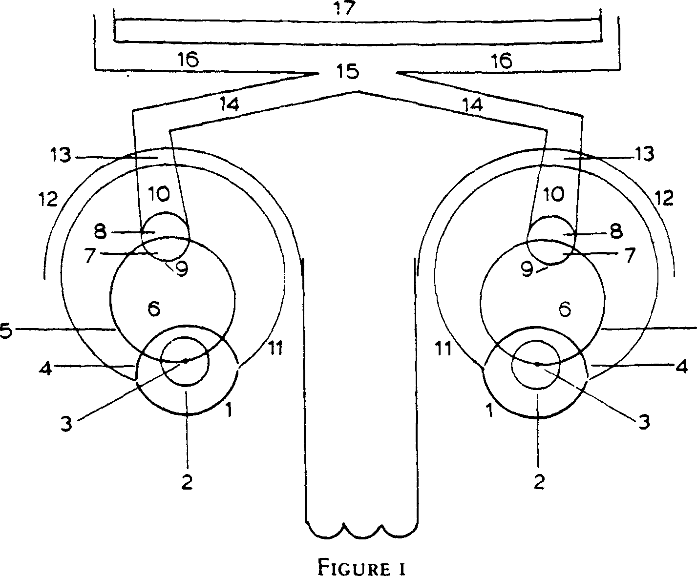
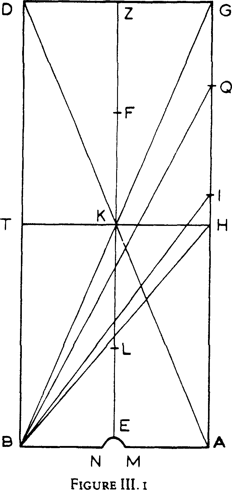

# THE OPTICS OF IBN AL-HAYTHAM

# BOOK I

ON THE MANNER OF VISION IN GENERAL THE FIRST BOOK
OF THE OPTICS

OF ABŪ ʿALĪ AL-ḤASAN IBN AL-ḤASAN IBN AL-HAYTHAM

THE CHAPTERS OF THIS BOOK
WHICH ARE EIGHT

Chapter 1: Preface to the [whole] book
Chapter 2: Inquiry into the properties of sight
Chapter 3: Inquiry into the properties of lights and into the manner of
radiation of lights
Chapter 4: On the effect of light upon sight
Chapter 5: On the structure of the eye
Chapter 6: On the manner of vision
Chapter 7: On the utilities of the instruments of sight
Chapter 8: On the reasons for the conditions without the combination of
which vision is not effected

## CHAPTER 1: PREFACE TO THE [WHOLE] BOOK

[1] Early investigators diligently pursued the inquiry into the manner of
visual sensation and applied their thoughts and effort to it, eventually reaching
the limit to which their investigation had led, and gaining as much knowledge
of this matter as their inquiry and judgement had yielded. Nevertheless, their
views on the nature of vision are divergent and their doctrines regarding the
manner of sensation not concordant. Thus, perplexity prevails, certainty is
hard to come by, and there is no assurance of attaining the object of inquiry.
How strong, in addition to all this, is the excuse for the truth to be confused,
and how manifest is the proof that certainty is difficult to achieve! For the
truths are obscure, the ends hidden, the doubts manifold, the minds turbid,
the reasonings various; the premisses are gleaned from the senses, and the
senses (which are our tools) are not immune from error. The path of
investigation is therefore obliterated and the inquirer, however diligent, is not
infallible. Consequently, when inquiry concerns subtle matters, perplexity grows, views diverge, opinions vary, conclusions differ and certainty becomes difficult to obtain.

[2] Our subject is obscure and the way leading to knowledge of its nature difficult; moreover, our inquiry requires a combination of the natural and the mathematical sciences. It is dependent on the natural sciences because vision is one of the senses and these belong to natural things. It is dependent on the mathematical sciences because sight perceives shape, position, magnitude, movement and rest, in addition to its being characterized by straight lines; and since it is the mathematical sciences that investigate these things, the inquiry into our subject truly combines the natural and the mathematical sciences.

[3] Natural scientists have inquired into the nature of this subject according to their art and exerted themselves in it as much as they could. The learned among them settled upon the opinion that vision is effected by a form which comes from the visible object to the eye and through which sight perceives the form of the object. Mathematicians, for their part, have paid more attention to this science than others. They have pursued its investigation, paying attention to its details and divisions. They have distinguished objects of vision, assigning causes to their particular properties and stating reasons for each of them. All the same, they have continued throughout the ages to disagree about the principles of this subject, with the result that the opinions of the various groups among the practitioners of this art have gone different ways. But for all the disparity in their ranks, their different epochs and the divergence of their views, in general they agree that vision is effected by a ray which issues from the eye to the visible object and by means of which sight perceives the object; that this ray extends in straight lines whose extremities meet at the centre of the eye; and that each ray through which a visible object is perceived has as a whole the shape of a cone the vertex of which is the centre of the eye and the base is the surface of the visible object. These two notions, I mean the opinion of the physicists and that of the mathematicians, appear to diverge and contradict one another if taken at their face value.

[4] Mathematicians, moreover, differ about the structure of this ray and about the manner of its production. Some take the view that the radial cone is a solid body, continuous and compact. Others think that the ray consists of straight lines which are fine bodies the extremities of which meet at the centre of the eye and divergently extend until they reach the visible object; and that sight perceives those parts of the surface of the object which the extremities of these lines encounter, whereas the parts of the object's surface that fall between those extremities are not perceived. Thus it comes about that the extremely small parts and minute pores in the surfaces of visible objects are invisible. Again, a group among those who believe the radial cone to be solid and compact thinks that the ray issues from the eye in one straight line until it reaches the object, after which it moves extremely quickly over the length and breadth of the surface of the object — so quickly in fact that the movement is imperceptible — and through this movement the solid cone is produced. Another group believes the matter to be different and that when the eyelids open in front of an object, the cone is immediately produced, all at once, in no sensible time. A group from among all of these thinks the vision-producing ray to be a luminous power which issues forth from the eye to the visible object, and that sensation is brought about by that power. Another group is of the opinion that when the air comes into contact with the eye it receives from the eye only a certain quality which immediately turns the air into a ray through which sight perceives the visible objects.

[5] Each of those groups was led to its belief by reasonings, arguments, methods and evidence of its own. But the settled view of all those who have inquired into the manner of visual sensation divides on the whole into the two contrary doctrines which we mentioned earlier. Now, for any two different doctrines, it is either the case that one of them is true and the other false; or they are both false, the truth being other than either of them; or they both lead to one thing which is the truth. [In the latter case] each of the groups holding those two doctrines would have failed to complete its inquiry and, unable to reach the end, has stopped short of it. Alternatively, one of them may have reached the end but the other has stopped short of it, thus giving rise to the apparent difference between the two doctrines, although the end would have been the same had the investigation been pushed further. Disagreement may also arise in regard to the subject of an inquiry as a result of a difference in methods of research, but when the inquiry is rightly conducted and the investigation intensified, agreement will emerge and the difference will be settled.

[6] That being the case, and the nature of our subject being confused, in addition to the continued disagreement through the ages among investigators who have undertaken to examine it, and because the manner of vision has not been ascertained, we have thought it appropriate that we direct our attention to this subject as much as we can, and seriously apply ourselves to it, and examine it, and diligently inquire into its nature. We should, that is, recommence the inquiry into its principles and premises, beginning our investigation with an inspection of the things that exist and a survey of the conditions of visible objects. We should distinguish the properties of particulars, and gather by induction what pertains to the eye when vision takes place and what is found in the manner of sensation to be uniform, unchanging, manifest and not subject to doubt. After which we should ascend in our inquiry and reasonings, gradually and orderly, criticizing premises and exercising caution in regard to conclusions — our aim in all that we make subject to inspection and review being to employ justice, not to follow prejudice, and to take care in all that we judge and criticize that we seek the truth and not to be swayed by opinion. We may in this way eventually come to the truth that gratifies the heart and gradually and carefully reach the end at which certainty appears; while through criticism and caution we may seize the truth that dispels disagreement and resolves doubtful matters. For all that, we are not free from that human turbidity which is in the nature of man; but we must do our best with what we possess of human power. From God we derive support in all things.

[7] We divide this work into seven Books. In Book I we show the manner of vision generally. In Book II we detail the visible properties, their causes and the manner of their perception. In Book III we show the errors of sight in what it perceives directly, and their causes. In Book IV we show the manner of visual perception by reflection from smooth bodies. In Book V we show the positions of images, namely the forms seen inside smooth bodies. In Book VI we show the errors of sight in what it perceives by reflection, and their causes. In Book VII we show the manner of visual perception by refraction through transparent bodies whose transparency differs from that of air. And with the end of this Book we conclude this work.

[8] We formerly composed a treatise on the science of optics in which we often followed persuasive methods of reasoning; but when true demonstrations relating to all objects of vision occurred to us, we started afresh the composition of this book. Whoever, therefore, comes upon the said treatise must know that it should be discarded, for the notions expressed in it are included in the content of the present work.

## CHAPTER 2: INQUIRY INTO THE PROPERTIES OF SIGHT

[1] We find that sight does not perceive any visible object unless there is some distance between them. For when the object is in contact with the surface of the eye it is not perceived by sight, even though it is a proper object of visual perception.

[2] And we find that sight does not perceive any of the visible objects that are situated with it in the same atmosphere, and are not perceived by reflection, unless the object is placed opposite the eye; and provided that between each point on the perceived surface of the object and the surface of the eye a straight line (or lines) can be imagined; and provided that there does not intervene between the surface of the eye and the object any opaque body that interrupts all the straight lines imagined to lie between the surface of the eye and the perceived surface of the object.

[3] Further, for any seen object that is situated with the eye in the same air and is not perceived by reflection, we find that if all the straight lines imagined between the surface of the eye and the perceived surface of the object are interrupted by an opaque body, then the object will be concealed from the eye and cease to be perceptible, even though a continuum of air free from opaque objects may still exist between the eye and the object, provided that this continuity is not rectilinear. Then, if the opaque screen is removed, the sight will perceive the object.

[4] Suppose now that the screen intersects all straight lines between any part of the surface of the object and the surface of the eye, so that every straight line between that part of the object and the point on the surface of the eye through which vision occurs is interrupted by the screen. Then only that part of the object will disappear which is such that the straight lines between it and the point of vision on the surface of the eye have all been interrupted by the screen.

[5] If a survey is made of all visible objects at all times, and if they are experimentally and accurately examined, they will be found to be uniformly as we have described them, with no variation or change. This therefore proves that for every seen object that exists with the eye in the same atmosphere, and is not perceived by reflection, there exists between each point on the seen surface of the object and a certain point or multiplicity of points on the surface of the eye a straight line or lines which are not interrupted by any opaque body.

[6] An accurate experimental examination of this fact may be easily made with the help of rulers and tubes. Let the experimenter who wishes to make such an examination [proceed as follows]. Take a very sound and straight ruler and draw along the middle of its surface a straight line parallel to its sides. Take a hollow cylindrical tube, very straight in length, perfectly round and ending in parallel circles; let its thickness be the same throughout and let it be fairly wide but not wider than the eye socket; draw on its outer surface a straight line extending from a point on the circumference of one base to the opposite point on the other side; and let this tube be a little shorter in length than the ruler. Divide the line along the middle of the ruler into three parts, and let the intermediate part be of the same length as the line on the surface of the tube; the remaining parts on either side may be of any length. Attach the tube to the surface of the ruler, placing the line on its exterior upon the intermediate segment of the line in the middle of the ruler's surface; and make sure that the ends of the tube coincide with the points marking off the middle segment. The tube should be so closely and firmly fastened that it cannot be loosened or displaced.

[7] When the instrument has been perfectly prepared and the experimenter wishes to examine the perception of visible objects by sight, he should aim at one of these objects, put one end of this ruler close to the lower eyelid of one eye and the other end close to the surface of the object, cover the other eye, and, while in this condition, look through the opening in the tube: he will see that part of the object which is opposite the opening of the tube at the end of the ruler. If he covers the opening of the tube with an opaque body, that part of the object will be screened off which he has seen through the opening. Upon removing the cover, he will perceive the same part as he did at first. If, by means of the opaque body, he covers any part of the opening, then there will be screened off only that portion of the visible part situated opposite the covered part of the opening, namely the portion that lies on a straight line with the eye and the screening body — this straightness being secured by the ruler and the straightness of the tube. For the portion of the visible part which is screened off when a part of the opening is covered always lies together with the eye and the covered part of the opening in a line parallel to the straight line extending along the middle of the ruler's surface parallel to its length. When the cover is removed, the eye will again perceive that same portion of the visible object. That is always found to be so, with no variation or change.

[8] Now when the observer looks at the visible object through the opening in the tube while the ruler lies between the eye and the object, and the opening is obstructed so as to hide that part of the object's surface which the eye formerly perceived, there will exist in this situation between that part of the visible object and the surface of the eye a continuum of air that is free from opaque bodies and an infinity of non-rectilinear distances. For open air exists between one end of the tube and the eye, and likewise between the object and the other end of the tube. But the continuum of air that exists between the eye and the object is not in this case rectilinear. And of all the lines that can be imagined between the eye and that part of the visible object, only the straight lines have in this case been interrupted. Thus, if it were possible for sight to perceive an object existing with it in the same atmosphere through non-rectilinear lines, then it would perceive that part of the object opposite the tube's opening after the opening has been obstructed. But we find, when such an object is experimentally examined and observed in the manner we have described, that it ceases to be visible upon closing the opening.

[9] It follows from this experiment, with a necessity that dispels doubt, that sight does not perceive any visible object existing with it in the same atmosphere, this perception being not by reflection, except through the straight lines alone that can be imagined to extend between the surface of the object and the surface of the eye.

[10] Again, we find that sight does not perceive any visible object unless there exists in the object some light which the object either possesses of itself or which radiates upon it from another object. If the object is dark and has no light whatever in it, it will not be perceived or sensed by sight. We also find that when the eye is in a dark place it perceives the objects facing it if they are illuminated by some light and if the intermediate atmosphere is continuous and uninterrupted by any opaque body. If the object is in a dark place that has no light, and the eye is situated in an illuminated place, then that object will not be perceived or sensed by sight. And we find this state of affairs to be uniform and without variation or change. This therefore proves that if the object has some light in it, and it is one of the possible objects of visual perception, and if the light in it is up to the limit that may be perceived by sight, then sight will perceive that object whether or not the air surrounding the eye is illuminated by a different light from that which is in the object.

[11] Further, we find that sight does not perceive any visible object unless the object is of a certain size (by 'size' I mean the measure of the object, be it a body, a surface or a line), and it does not perceive extremely small objects. It is discovered by reasoning that there exist small bodies which cannot in any way be perceived by sight. For the pupil of a mosquito's eye and similarly small things are not in any way perceptible by sight, even though they are existing bodies. The smallest magnitudes that can be perceived by sight are also related to the strength or weakness of sight. For some small bodies are perceived and sensed by some people but cannot in any way be seen by many others whose sight is not very strong. When all visible objects, including the smallest, are experimentally examined, they are found to be not extremely small. Rather, for any visible object, even a very small one, it is possible to find among existing bodies one which is smaller than that object and which is not sensible to sight. This proves that no visible object is perceptible by sight unless it has a certain size or [it is something] belonging to an object of a certain size, such as colour, shape and the like. And, therefore, the smallest magnitudes that can be perceived by sight are related to the power of sight.

[12] We also find that sight does not perceive any visible object unless the object is opaque or has some opacity in it. For when the body is extremely transparent (such as rarefied air) sight does not perceive it but perceives what is behind it. Sight does not sense a transparent body unless it is denser than the intermediate air between itself and the eye. But every opaque body has a colour or something like colour, such as the light of the stars and the forms of [self-]luminous bodies. Similarly, no transparent body with any opacity in it can be devoid of colour.

[13] Moreover, we find that when sight perceives some visible object, then moves a considerable distance away from it, the object ceases to be perceived. And we find that when sight moves so far from the object that the object ceases to be visible, it is still able to perceive from the same distance (unless it is too far) another object of a greater size than that of the invisible object. This therefore shows that the distances from which a visible object can be perceived and the distances at which it disappears depend on the size of the object.

[14] Furthermore, we find that the distances from which sight can perceive visible objects vary with the lights existing in these objects: a more intensely illuminated object may be perceived by sight from a distance at which objects of equal size are invisible — given that the lights in these objects are fainter than the light of that object. For let a fire at some place be surrounded by objects or bodies each of which is equal in size to the bulk of the fire (or not greatly different from it) and illuminated by the light of that fire. A man approaching the fire from a considerable distance in a dark night will see the fire before he sees any of the objects or bodies surrounding it, although they are equal to or greater than the fire and are illuminated by its light. When that man approaches the fire there will appear to him the objects round the fire and close to it. Those objects nearer the fire and of strong light will appear before those which are farther from it and of faint light. Then, when he reaches the fire, there will appear to him all the visible objects round and near it. Similarly, when we experimentally examine distant visible objects in daylight we find that those illuminated by sunlight or by strong lights appear from distances at which there disappear the objects of equal size and colour when they are in the shadow or illuminated by faint light.

[15] It follows from this that the distances from which sight can perceive visible objects and the distances at which they become invisible vary with the lights existing in those objects.

[16] We also find that brilliant-white and bright-coloured bodies are visible from distances at which dull, earthy and dark bodies disappear from view, even when the bodies are identical in size and light and all other conditions except colour. Thus when ships are sailing at a great distance in the sea, their sails, if white, look like stars from the distance; sight perceives their whiteness but not the ships themselves nor anything in them that is not brilliant white as long as they are far distant. Then, when the ships approach the eye they and their contents become visible, even though sight was not previously able to perceive them when it perceived only their sails.

[17] It is similarly the case with objects on the surface of the ground when they are of equal (or not very different) size and of different colours (some being brilliant white, others of bright colours and yet others of earthy or dull colours) and all are illuminated by the same light: if someone approaches them from a considerable distance he will see the brilliant white objects before any of the others; when he comes nearer, the bright-coloured objects will appear before those of the earthy or dull colours; then as he comes nearer still, the others will become visible, until they are all apparent.

[18] It follows from this that the distances from which objects can be seen and the distances at which they cease to be visible are according to the objects' colour.

[19] We also find that the distances from which an object can be seen, and the distances at which it ceases to be visible, are according to the power of sight. For a man of keen sight may perceive an object from a distance at which that same object would not be visible under the same conditions to a man of weak sight.

[20] It follows from what we have stated and gathered by induction regarding distances that the distances from which an object can be perceived and those at which an object becomes invisible are according to the conditions and properties of the object itself, and also according to the strength or weakness of the sight itself that perceives it.

[21] Therefore, from all that we have stated and found by induction and experiment to be uniform and subject to no variation or contradiction, it is evident that sight does not perceive any object that exists with it in the same air and is not perceived by reflection, unless that object combines the conditions we have stated — namely: that there exists between it and the eye a certain distance proportionate to that object; that it lies opposite the eye — I mean that an imaginary line exists between each point on its visible surface and a certain point on the surface of the eye; that light exists in it, whether from itself or from another object; that it is of a certain size in relation to the sensitive power of the eye; that the air or body between it and the surface of the eye is of a continuous transparency uninterrupted by any opaque body; that it is opaque, or of some opacity — I mean that it is either non-transparent or its transparency is denser than that of the air or of the transparent body extending between it and the surface of the eye — [it being understood that] an opaque body must possess colour or something like colour, and the same is true of a transparent body with some density in it. These, then, are the conditions which must combine in a visible object for vision to be effected. When these conditions combine in an object, and sight is free from defects, it will perceive that object. When sight lacks one of these conditions, it will not perceive the object in respect of which that condition is lacking. That being so, these conditions are therefore the characteristic properties of sight without the concurrence of which vision cannot be accomplished.

[22] It is also manifest by induction that if any seen object is moved away from the eye to the limit where it becomes invisible, then between the point at which that object disappears and the surface of the eye there exist many different distances which cannot be enumerated or determined and from each of which the eye truly perceives that object and all of its parts and visible properties. If the eye acquires a true perception of the object at one of these distances, then moves away from it gradually and in orderly manner, those small parts and fine features (if such exist in the object), like designs, incisions, creases or dots, will disappear before the object disappears as a
 whole, and the smaller and finer among these features will disappear before those that are larger and more gross. The distances at which the small parts become invisible and the fine features confused and indistinct are found to be many, indeterminate and unlimited.

[23] Also, if the object moves farther and farther away, gradually in an orderly manner, it is found that it is perceived as progressively smaller in its entirety until it disappears altogether. And if it continues to move away, it will eventually reach the limit at which it completely disappears so that neither it nor any part of it will be sensed by sight. If it moves farther still, sight will not perceive it.
[24] Again, if the visible object closely approaches the eye, without actually coming into contact with the surface of the eye, it is found to grow in size. Its form becomes indistinct and the minute details of it are so combined that sight fails to discriminate between or identify them. As it approaches the surface of the eye after this condition is reached, it becomes more and more confused, until it comes into contact with the surface of the eye and sight ceases to sense it and perceives its covering effect only.
[25] All that being the case, the distance from which sight properly perceives a visible object is therefore not a single, determinate distance; and the distance at which the form of the object becomes indistinct and its small parts and subtle features become inapparent, indistinct and confused, is not a single, determinate distance. Let us call 'moderate distances' all those distances (which are many and [variable] within a certain range) from which sight perceives the visible object and all those of its parts and properties that can be perceived by sight — this perception of the object and of its properties being such that between it and the real nature of the object and of its properties there exists no appreciable discrepancy, and such that the object's form produced in the sense[-faculty] is not so different from its real form as to show an appreciable discrepancy when contemplated and scrutinized by that sight itself. And let us call 'immoderate distances' those distances at which the visible object disappears, and those at which there disappear those parts of the object that bear an appreciable ratio to the whole object, and the distances at which there disappear those subtle features of the object that may be visible from the moderate distances, and also the distances at which these features become confused and indistinct — regardless of whether these distances are exceedingly far from the eye or exceedingly near to it.
[26] It is thus evident that sight does not perceive any visible object unless the object has some light in it either from itself or from another object; and that the light of many visible bodies appears on the bodies situated opposite them and that their light appears on the eye that perceives them. We must now inquire into the properties of lights and into the manner of their radiation, and further inquire into the effect of light upon sight; we must subsequently add to this what pertains to the eye, and by careful reasoning work our way to the conclusion.

## CHAPTER 3: INQUIRY INTO THE PROPERTIES OF LIGHTS AND INTO THE MANNER OF RADIATION OF LIGHTS

*INQUIRY INTO THE PROPERTIES OF LIGHTS*

*AND INTO THE MANNER OF RADIATION OF LIGHTS*

1:44

[1] We find that the light of every self-luminous body radiates on every body opposite to it when there is not between them an opaque or non-transparent body that screens one from the other. For when the sun faces a body on the ground that is not screened from it, its light shines upon that body and is visible, and it simultaneously irradiates every place in all parts of the earth that face it at that time. It is similarly the case with the moon, and also with fire: when [the latter] lies opposite an opaque body and there is no opaque screen between them and the intervening distance is not excessively large, the light of the fire will radiate on that body and its form will be visible. Again, the light of a fire-brand is found to radiate simultaneously on all bodies surrounding that fire on all sides, and on all opaque bodies above or below it, provided that they are not hidden from it by a screen and their distances are not too large — whether the fire-brand is small or large, so long as its light is visible on the opaque bodies that face it.

1:46

[2] We also find that the radiation of all lights takes place only in straight lines and that no light radiates from a luminous object except in straight lines provided that the air or transparent body between the luminous object and the body on which the light appears is continuous and of similar transparency.
[3] When this state of affairs is examined at all times it is found to be uniform, suffering no variation or change. This becomes clearly apparent to sense if one examines the lights that enter through holes, slits and doors into dusty chambers. As for the light of the sun, when it enters through a hole into a dark chamber the air of which is cloudy with dust or smoke, the light will appear to extend rectilinearly from the hole through which the light enters to the place on the chamber's floor or walls which that light reaches. If the air in the chamber is clear and pure and the extension of the light through it is not visible, and if an experimenter wishes to examine the interval through which the light extends, then let him take an opaque body and, approaching the rectilinear interval between the hole and the place on the chamber's floor or walls where the light is, let him intercept it by the opaque body: he will find that the light will appear on that opaque body and vanish from the place where it showed on the chamber's floor or walls. If he approaches any position he

1:54 chooses on the straight line between the hole and the place where the light appears, and intercepts the interval with the opaque body, the light will appear on that opaque body and vanish from the place in which it [formerly] appeared. (The straightness of this interval can be tested with a straight rod.) This state of affairs thus shows that the light that entered through the hole extends in a straight line between the hole and the place reached by the light. If the experimenter examines any interval he chooses among the crooked, bent or curved intervals between the hole and the place where the light appears, intercepting it by the [opaque] body, no light will appear [at any point] in that interval. It is so with minute holes in opaque bodies. When sunlight irradiates such bodies, it passes through their tiny holes, extending in straight lines. If one tests the straight distance between the tiny hole and the place where the light from the hole appears, the light will be found to extend the whole length of that straight interval, even if the hole is very small. Let an experimenter take an opaque body and, having made a minute hole in it, let him hold it opposite the body of the sun: he will find that the light goes through the hole, extending on a straight line. If he tests the interval on which the light just described has extended by applying a ruler to it, he will find it to be perfectly straight. It is therefore clear from all this that the light of the sun only extends along straight lines.

[4] Similarly, if the light of the moon is tested, it will be found to be of this description. And similarly with the light of the stars: for, in a moonless night, let any of the large stars (such as Venus, or Jupiter at its nearest position [to the earth], or also Mars at its nearest position, or Sirius) be opposite a hole giving into a dark chamber: its light will appear in the chamber and will be found opposite the hole. If the observer places his eye in that light and looks towards the hole, he will then see the star facing him. If he observes the star for some time until it has moved through an appreciable distance, its light in the chamber will be found to have moved from its [former] place so as to be rectilinearly opposite the star. And as the star moves, that light will move, and the light and the hole and the star will always be found to lie on a straight line.

[5] Then if, with the aid of an opaque body, the experimenter tests the light from the star that appears at the place opposite the hole in the manner we have shown before, by intercepting the straight distance between the place in which the light appears and the hole through which the light enters at any point he chooses on that distance, the light will appear on the opaque body and will vanish from the place in which it [previously] appeared.

[6] Similarly, if there is a fire facing a hole that leads into a dark chamber, the light of that fire will appear in the chamber opposite the hole. And if one tests the straight interval between the light and the hole in the way we have mentioned, the light of the fire will be found to pass through every point on it.

The light of the fire may also be tested with a straight rod, provided that the interval between the fire and the hole is short and the interval between the hole and the place where the light appears is also short. For if a straight rod is inserted in the hole through which the light has entered and one end is placed at the point of visible light, its other end will be found at the fire or in a straight line with it, so that the fire, the hole and the light that appears in the chamber after it has entered through the hole will always be found on a straight line.

[7] This property also becomes manifest from the shadows of all kinds of light. For when erect opaque objects are irradiated with light (and) their shadows appear on the ground or on the opaque bodies opposite them, these shadows are always found to extend rectilinearly, and the shadowed regions are found to be those whose straight distances from the luminous body (the light of which has been cut off from those places) have been intercepted by the objects casting the shadows.

[8] It thus appears from all that we have said that the lights from self-luminous bodies can radiate only in straight lines.

[9] We also find that light radiates from every part of every self-luminous body. And we find that the light that radiates from the whole luminous body is stronger than that which radiates from a part of it. And we find that the light that radiates from a larger part is stronger and more manifest than that which radiates from a smaller part. With regard to the sun, when it begins to rise above the horizon, only a small part of its circumference appears at first, and yet the light of that part radiates upon all facing walls and objects and parts of the earth's surface, while at this moment the centre of the sun is hidden below the horizon and concealed from anything on the earth's surface. Then, as the visible part becomes larger, the light grows and becomes stronger, until the centre of the sun comes up. The light continues to grow until the whole body of the sun becomes visible. And similarly when the sun sets: for as long as a part of it is visible above the horizon, the light of that part will radiate upon the surface of the earth, even though the centre of the sun and the larger part of its body are hidden from those places which are irradiated by the light of that visible part of the sun.

[10] Now this fact, I mean that the light radiates from the circumference of the sun's body, holds for all horizons. But that part of the sun which is the first to appear at one horizon is not the same as the part which is the first to appear at another horizon — this being due to the motion proper to the sun. Thus the parts of the sun that appear at the beginning of its rising at different horizons are different, especially on different days. And the same holds for the parts of the sun that are the last to set. And, in general, for each place on the earth from which a part of the sun is visible (whether it is a part of the sun's circumference or not), the light will radiate from that part on that place. It is thus manifest from this consideration that [light] radiates from every part of the body of the sun upon every body facing that part, even though the centre of the sun and the remainder of its bulk may be hidden from that body.

[11] Further, when the sun is partially and not completely eclipsed and a part of it remains visible, light radiates from that visible part upon every place on the earth facing it at the time of the eclipse. When the sun is observed at the time of an eclipse that covers most of it and includes its centre, the eclipsed part will be found to grow larger while the remaining part becomes smaller. And yet, from whatever part of the sun that remains, the light will radiate upon the surface of the earth, and that part will be visible in every opposite place and also in every place opposite any portion of that part. And if the light of the sun is examined at the time of eclipse, it will invariably be found to radiate in straight lines, just as it did before the eclipse; further, the light of the sun that appears on the earth at the time of the eclipse will be found to be weaker than its light before the eclipse. And as the eclipsed part becomes larger and the remaining part smaller, the light visible on the earth becomes weaker. But the remaining part of the sun at the time of an eclipse covering most of the sun is but a part of the sun's circumference. And the condition of the whole circumference of the sun is one and the same. Therefore this consideration makes it manifest that the light of the sun issues from the whole body of the sun and from every place on the sun and not only from a particular place on it.

[12] It is also manifest from this consideration that the straight lines along which the light of the sun extends do not all proceed from the centre of the sun. Rather, the light issues from every part of the body of the sun on every straight line that can be imagined to extend from that part. For when the eclipse covers most of the sun with respect to a particular place on the earth, the centre of the sun is at that time hidden from that place. The straight lines between the centre of the sun and that place are thus interrupted. But the light still radiates upon that place from the rest of the sun. Thus if the light did not proceed on lines other than the straight lines extending from the sun's centre, it would not be visible at the time of eclipse in those places of the earth from which the centre is hidden. Further, [consider] those places on the earth with respect to which the sun has descended from the zenith at the time of eclipse in the direction of the exposed, visible part. At this time the light radiates on those places from the exposed part of the sun [in a direction inclined] towards the side on which the centre of the sun is, and in straight lines that cannot pass through that centre. And the light radiates at this time on every place from which a part of the body of the sun can be seen and with respect to which the eclipse does not cover the whole body of the sun. Therefore, the light of the sun does not only radiate in straight lines extending from the centre of the sun, but in all the lines that may rectilinearly extend from every part of it.

[13] Further, when the sunlight passes through apertures it is always found to diverge, and as the light recedes from the aperture it becomes wider. This is evident in the case of minute apertures. When sunlight has passed through a minute aperture and appears on a place far removed from the aperture, such light is found to diverge — the area on which the light appears being many times wider than the aperture. As the distance between the aperture and the area where the light appears increases, the light becomes wider. And if the straight interval between the aperture and the visible light is interrupted by an opaque body, the light will be found on that opaque body. But the light on that body will be narrower than that which was visible at the former place. And as this body approaches the aperture, the [patch of] light appearing on it will become narrower. And as it is moved farther from the aperture the patch of light appearing on it will grow wider. Thus it is evident from the widening of the light issuing from minute apertures that the light of the sun extends from every part of it, and not just from a particular part.

[14] From this it is also evident that light extends only along straight lines. For if the light extended [only] from the centre of the sun or from a particular point on it, then the light extending from that point on the lines drawn from it to the narrow aperture would insensibly diverge after passing through the aperture. For the divergence would be determined by the diameter of the aperture, the distance of the sun from the aperture and from the place where the light appears. But as far as sense is concerned there is no appreciable difference between these two distances by comparison with the distance of the sun. Thus the light issuing from the minute aperture and appearing on the ground (or on some other place) would be equal in magnitude to the aperture, especially if the aperture is cylindrical. It would also come about that if sunlight passed through a narrow cylindrical hole, and the position [of the hole] were slightly altered so that the straight line extending through its length to the body of the sun would not meet that point on the sun, no light would come out of or go through the hole. Further, if light extended on other than straight lines, then, having come out of a minute aperture, it would extend on non-rectilinear lines. Therefore, the expansion of the light passing through minute apertures is clear proof that the light issues from the whole body of the sun to the aperture, and that it issues in straight lines. That is why when it comes out of the aperture it diverges and widens, this divergence taking place in straight lines. For light diverges as it proceeds from the whole body of the sun to the narrow aperture, and as it comes out of the aperture and goes forward, another cone opposite the first one is produced, since light proceeds in straight lines. It thus appears from all that we have explained that the light of the sun radiates from every part of the body of the sun to every side directly opposite that part.

[15] The case of the moon is more manifest. For the light of the crescent moon is visible on the earth's surface on the second night of the month and on following nights. And, especially when the moon faces a dark place, its light appears in that place though it is still incomplete and faint. Its light then grows every night with the increase of its magnitude until it is full. When this happens its light is found to be stronger than on previous nights. Again, the case of the full moon at rising and setting is similar to that of the sun, and the same is true of the moon at eclipses when these extend beyond its centre but do not cover the whole moon. Also, if the moonlight that has passed through tiny holes is tested when the moon is full, it is found to expand, and as it recedes from the hole it grows wider. It therefore appears from this expansion that moonlight radiates from every part of the moon and not from a particular part of it, and that the extension of the light of the moon can take place only in straight lines.

[16] This same property also holds for fire. For when a fire is divided into parts by dividing the subject sustaining it, some light will radiate from each of these parts, and the light of each part will be found weaker than that of the whole fire, and the light of a smaller part will be found weaker than that of a larger part. The parts of the fire may also be tested without being divided. To make such a test take a fairly wide copper sheet and make a fairly large circular hole in it; slide through this hole a well-straightened cylindrical tube of regular circularity and convenient length; let the width of the hole and that of the tube be of the same magnitude and let the tube's aperture not exceed the thickness of a needle; insert the tube into the hole in the sheet so that its end may be level with the sheet's surface; attach this sheet to some object at a point above the ground, and let it stand vertically on its edge. Now, in the darkness of night, bring a flame to the vicinity of this sheet and let it be that of a lamp with a broad, bright wick. Hold the flame opposite the hole, then move it closer to the hole until it is so near that no measurable distance exists between them. The area on the side of the tube will then be shaded by the sheet. Let no light be present save the flame being tested, and let this [experiment be carried out] in a place unswept by winds. Hold an opaque body opposite the end of the tube. The light of the flame will appear on that body. But no light is available except that which has passed through the tube; and no light has passed through the tube except the light of that part of the flame opposite the tube's aperture; its area is equal to that of the tube's aperture. For light proceeds only in straight lines, and no uninterrupted straight lines exist between the light appearing on the body at the end of the tube and any part of the flame other than that opposite the [other] end of the tube. For the straight lines between [this part] and the visible light extend inside the tube without the interruption of any opaque body. As for the remaining parts of the body of the flame, light will proceed from them only to the adjacent end of the tube's aperture; so that if any of this light enters the end of the tube it will be interrupted by the tube's wall and abolished and will not pass through the length of the tube. In this case, then, only the light of the part opposite the tube's end will pass through the length of the tube's aperture.

[17] The experimenter should then gently move the flame so that another part of it may face the hole, and then inspect the body opposite the end of the tube on which the light was visible. He will find that the light is still visible on that body. If he then moves the body of the flame in all directions, raising and lowering it so that the hole may face one part of the flame after another, he will find that the light appears in all cases on the body opposite the tube. He will also find this light to be weaker than the light of the whole flame when it shows on bodies exposed to the whole bulk of the flame at a distance equal to that between the flame and the place where the light that has passed through that body appears. Let the experimenter narrow the hole by sliding a thin straight body into the tube, thus partly obstructing it, and let him fix this body to the tube's interior surface. If he tests the light coming through the rest of the tube, he will find it still visible on the body opposite the tube, unless the remaining part of the tube is too narrow. He will also find that the light that appears when the tube is made narrower is smaller and also less visible and weaker than the former light. Therefore, it appears from this experiment that light radiates from each part of the fire; that the light from a whole fire-brand is stronger than that from a part of it; and that the light from a greater part is stronger than that from a smaller part.

[18] Again, let the experimenter fix the flame close to the hole in the sheet so that it will not move and so that the same part of it will remain opposite the hole; let him then incline the tube so that it will be in an oblique position to the surface of the sheet while its end remains attached to the hole; he should plug any gap (if such appears) at the end of the tube or at the hole in the sheet at its rear; and let him hold the opaque body opposite the tube. He will find that light appears on the opaque body. If he alters the position of the tube by inclining it to another side, and in front of it holds the opaque body on which the light may appear, he will find that the light is still visible on it. By inclining the tube in all directions he will find that the light proceeds from that part of the flame to all sides directly opposed to it. If he then moves the flame so that another part of it will be opposite the hole, and tests that part too at those inclined positions in which the first part was tested, he will find that the light also proceeds from this part to all opposite sides. If he similarly tests every part of the flame he will find it to be of this description. It appears from this experiment that the light radiates from each part of the flame to every side directly opposed to that part.
 [19] It is therefore evident from all that we have said that from every part of every self-luminous body, light radiates in every straight line extending from that part.

[20] This property being manifest in the case of the larger parts of self-luminous bodies, their smaller parts — even when extremely small and as long as they preserve their form — must also be luminous; light will radiate from these parts in the same manner as it does from the larger ones, even though the conditions of smaller parts may be imperceptible. For this property is natural to self-luminous bodies and inseparable from their essence. Now small and large parts have the same nature as long as they preserve their form. Therefore, the property that belongs to their nature must exist in each part (whether small or large) provided that that part maintains its nature and form. Now the sun and the moon and the [other] heavenly bodies are not made up of congregated parts; rather, each is a single continuous body whose nature is one and undifferentiated. Nor does one place in them differ in nature from another. Similarly, fire is not an aggregate of parts, but a continuous body; each place in it is similar in nature to the others, and the nature of its smaller parts is similar to that of its large parts, as long as the small parts preserve the form of fire.

[21] The following is therefore clear from all that we have made subject to inspection and explanation, and from the things which we have shown how to test: that the radiation of light from every self-luminous body takes place only in straight lines; that light radiates from every self-luminous body to all locations between which and the luminous body there exist straight lines which are not interrupted by an opaque body; that light radiates in this manner from every part of the self-luminous body; that the light radiating on one place from the whole of the luminous body is stronger than that radiating from a part of that body upon that place and from that distance; that the light radiating from a larger part is stronger than that radiating from a smaller part; and that this also applies to the small parts of the luminous body even when they cannot be individually examined and their lights are not visible, for this would be due to the inability of sense to perceive what is extremely weak. All this being so, the light shining from a self-luminous body into the transparent air therefore radiates from every part of the luminous body facing that air, and the light in the illuminated air is continuous and coherent, and it issues from every point on the luminous body in every straight line that can be imagined to extend in the air from that point. It is in this manner that lights radiate from self-luminous bodies into the homogeneously transparent air. Let us call 'primary lights' those lights that radiate from self-luminous bodies.

[22] We find, moreover, that the earth is illuminated at the beginning and the end of day, before sunrise and after sunset, when none of the illuminated parts at these times is facing the body of the sun or any part of it. But the cause of daylight is none other than the sun, for no light is introduced in day-time that did not exist at night other than sunlight. Again, when the sun has risen above the earth, we find that dwellings and courtyards shaded from the sun by walls or roofs are illuminated although they do not face the sun or any part of it. Likewise, the shadows of mountains and of opaque bodies, indeed all shadows, are found to be lit in day-time although they are screened from the sun by the opaque bodies of which they are shadows. We also find that many dwellings shaded from the sky are lit before sunrise and after sunset although the sun is not [yet] visible and these places are screened from the sky. Let us, therefore, now inquire into the quality of these lights by subjecting their conditions and properties to inspection and experimentation.

[23] We say, then, that we find that morning light begins when the night is not yet over, extending from the eastern horizon towards the middle of the sky like a straight column. It is found to be weak and barely visible, and the surface of the earth is found to be still in the darkness of night. Then this light becomes stronger, increasing in breadth and length and growing in brightness, while the earth is yet dark. It continues to increase in magnitude and brightness, and the surface of the earth facing that light and exposed to it becomes illuminated with a faint light that is less than the light visible in the atmosphere at that time. The light in the atmosphere then gains in strength and expands until it fills the eastern horizon and reaches the middle of the sky; the atmosphere is then filled with light. Then the light on the ground grows stronger, shining and becoming broad daylight, while the sun is still below the horizon and invisible. After this stage the sun rises and daylight becomes increasingly manifest. And we find that the light at the end of the day behaves in a similar way, after the setting sun disappears below the horizon. The surface of the earth is lit with a manifest light while the atmosphere is illuminated with a strong light, after which the light of the atmosphere continues to weaken and the light on the earth's surface lessens until night falls.

[24] Furthermore, we find that when sunlight irradiates a wall facing a dark place nearby, the latter is turned from darkness to brightness. And if leading to that dark place there is a door facing another wall, then this wall [will be illuminated by] the sunlight radiating on the outside wall. Those parts of the chamber's floor facing the door and the sunlight will be more strongly illuminated than the rest of the chamber. When the sun goes down, its light no longer radiating on that wall, the place returns to darkness. Similarly, we find that when daylight or moonlight or the light of fire irradiates the wall, a dark place in front of it will be illuminated by that light; when that light ceases the place returns to darkness. Also if, opposite any place illuminated by a strong

 light of any kind, there is an adjacent dark place with an opening between them, we find the dark place illuminated by the light opposite to it.

[25] This state of affairs can be tested at all times. If an experimenter wishes to do so let him employ a dark chamber with a door facing an adjacent wall on which sunlight may shine. The chamber door should not be exposed to the sky. Thus the light should reach the facing wall through an opening or door at the top of the wall of the dark chamber, assuming this wall to be higher than the chamber's roof. The space between the two walls, namely the wall with the chamber door and the wall facing it should be roofed above the opening or shaded by an opaque body. And let [the back of] the chamber face east. The experimenter should observe the place when morning light shines on that wall through the opening opposite, which should be fairly wide. He will find the chamber illuminated by that light, and the light in the chamber weaker than the light on that wall. Then, as the light on the wall grows stronger, so will the light in the chamber. And when the sun's light radiates on the wall the light in the chamber will gain in intensity and strength. Further, that place inside the chamber facing both the door and the irradiated wall will be found more intensely illuminated than the rest of the chamber. Then when the sun moves away from that wall the light in the chamber will weaken.

[26] Suppose now that inside the chamber there is another dark chamber whose door is exposed to the wall facing the first door. When the light shines upon the outside wall, and consequently appears on the wall inside the [first] chamber opposite the door, then, assuming this light to be strong and the door of the second chamber open and exposed to this wall, this second chamber will also be illuminated by the light of this wall, especially if the irradiated outside wall is pure white. And those parts of the second chamber that face this wall and are close to it will be found to be more intensely lit than the rest of the chamber. And if the illuminated wall inside the first chamber is white, the light appearing in the second chamber will be more manifest. Similarly, if moonlight and daylight are tested in this manner, the dark place will be found to be illuminated by them if it faces them.

[27] It is therefore shown by this experiment that from the light that shines on any body, light radiates in every opposite direction. This being the case, the light that appears on the surface of the earth at the beginning of day before sunrise and at the end of day after sunset is but a light that comes to it from the light that is manifest in the opposite atmosphere. The atmosphere is lit before sunrise by sunlight because it is facing the sun and the sun is not at this time hidden from it but only from the surface of the earth. And this light extends in straight lines from the body of the sun into the illuminated atmosphere. Then from the atmosphere illuminated by sunlight there also radiates, again in straight lines, some light on those places facing it on the earth's surface. And as

long as [the light] is scanty and weak, what radiates of it on the earth is not apparent, but as it gains in strength and intensity, the light radiating upon the earth becomes stronger and visible.

[28] And so it is with evening light. After sunset, the part [of the atmosphere] facing the sun is illuminated with its light — this light extending in straight lines. From the illuminated atmosphere light radiates on those places facing it on the earth's surface. And as long as the light in the atmosphere is strong the earth will be lit with a visible light, but when it weakens the light on the earth's surface weakens and the earth's surface becomes dark. It is similarly the case with the lights [found] in dwellings and walled courtyards shaded from the sun and with all shadows illuminated in day-time before and after sunrise and after sunset and during the rest of the day: these lights reach them only from the luminous atmosphere facing them and also from the illuminated walls and nearby surface of the earth illuminated by daylight. Such, then, is the case with day[light] and the lights in places that are lit at night by moonlight when they are concealed from the moon, and also the case with the light of fire.

[29] This property, I mean the radiation of lights from accidental lights in straight lines, can be examined by an accurate experiment that leads to certainty. Morning light can be examined as I shall describe. The experimenter should make use of a chamber inside which there is another chamber; let them be situated between east and west, and let no light enter them except through the door. Let the eastern wall in the eastern chamber be exposed, and a hole be pierced at the top of this wall similar to those made in the walls of chambers to let in the light. Let the hole be circular with a diameter not less than a foot. Let it take the shape of a cone, wider inside than outside. This hole then faces the eastern side of the sky. In the opposite wall common to both chambers let the experimenter pierce two holes facing the first hole. These two holes then lead to the western chamber. Let them be nearer to the ground than the first hole so that an observer looking into either of them will see the sky through the first, higher hole. Let each of the two holes be equal and similar to the first. It should be ensured that the extension of each of these two holes through the thickness of the wall should be along the straight lines imagined to proceed from the outer end of the first hole to the facing end of the second hole. This can be assured by making the wall so thick as to allow the holes a fairly deep extension in its body, so that the light coming out of these holes will not diverge too much. The extension of each of these holes in the body of the wall should be of equal width and not conical [in shape].

[30] Now stretch a thread from the first, higher hole to one of the two holes, and make sure that the thread passes through a point on the outer end of the OPTICS
higher hole and the corresponding point on the outer end of the facing hole. Pass the thread through the [first] hole and nail down its end outside [this] higher hole. The experimenter should now enter the western chamber and extend the thread to a point on the ground or on a wall of the chamber. He should subsequently stretch the thread so tightly as to make it exactly straight and in place. This done, he should mark the position of its extremity in the chamber. This place, then, will be in a straight line with the straight interval extending from the first, higher hole to the lower hole facing it. The thread should now be taken out of this hole and put through the other hole, and the same things should be done with it as before. Stretch it to another place in the chamber and mark the position of its extremity. This second position is therefore in a straight line with the straight interval also extending from the higher hole to the second hole.
[31] When these two positions in the chamber have been determined, let the experimenter choose a pitch dark but clear night. After nightfall let him enter the chamber and close the door, thus excluding all light from the chambers. Both chambers will then be dark. Let him then enter the western chamber and look into one of the two holes so as to see the sky through the higher hole. He should make sure that none of the large stars whose light may be seen on the earth's surface is facing the hole. If such a star is there he should wait until it no longer faces the hole. He should also look into the other hole so as to see the sky through the higher hole when there is no large star facing it. He will see the atmosphere from these positions to be dark. Let him then inspect the places he has determined in the chamber opposite the holes. He will find them dark. No light will be visible in them, and the whole chamber will be dark, except for some extremely weak and negligible light from the sky.
[32] He should then wait until morning. When dawn breaks he should look through the opposing holes until he sees the atmosphere illuminated and, moving from his position so as not to be in front of the hole, look at each one of the places he has determined opposite the holes. He will find them illuminated with a faint light proportionate to the strength of the light in the atmosphere. If no light is visible in the chamber he should wait a while until morning light grows stronger and then look at those places: he will find them illuminated, and the light in each of them will be circular and wider than the hole to the extent required by the expansion of the light. But he will find no light in the rest of the chamber at this time. Whatever light he may find will be weak and perceptible only in proportion to what may be emanating from the light visible in the two spots opposite the holes. Then when he screens one of the two holes, the light will depart from the place facing it, though the light from the other will remain. When he removes the screen the light will return to that place.
[33] Let the experimenter then turn to the straight interval between one of the two holes and the place to which the light proceeds from that hole, and interrupt it with an opaque body. He will find that the light will appear on the opaque body and disappear from the place opposite that hole. If he then moves this body along the straight interval, he will find the light to be always on it. (This interval can be determined with the help of a straight rod or a long ruler by attaching the ruler to the circumference of the hole and thus determine the straightness of the interval with it.) If he then removes the opaque screening body, the light will return to its former place. Similarly, if, in the first chamber, he interrupts the straight interval between the first, higher hole and one of the two holes, he will find that the light will appear on the body interrupting that interval and disappear from the second chamber; and upon removing the screen the light will return to its place. Again, if he examines in both chambers the light [passing] through the other hole he will find it to be of this description. Now if he makes several holes in the second wall, making sure that each of them directly faces the first hole (as described in the case of the two former holes) he will find in the second chamber separate lights equal in number to those holes, each of them being directly opposite the first, higher hole.
[34] Thus it is clearly proved by this experiment that some light proceeds from the atmosphere illuminated by the morning light to opposite places; that it so proceeds in straight lines; and that the daylight radiating upon the earth before sunrise and after sunset is but a light radiating upon it from the atmosphere illuminated by the sunlight opposite the earth's surface. If the experimenter also examines in the same manner the luminous atmosphere during the rest of the day, he will find that the light radiates from it in straight lines.
[35] But if some light emanates from the illuminated air to the opposite places, then from every part of the air that is illuminated by any light whatever some light emanates in all directions; and the light emanating from the air will be weaker than that existing in the air; and the strength of the light emanating from the air will be proportionate to the light existing in it and to the magnitude of that illuminated part of the air. Furthermore, the air inside the second and first chambers is continuous through the first hole with the outer illuminated air from which the light has entered into the second chamber. Now between the illuminated air and the air in the second chamber there exist many curved and sinuous intervals passing through the holes and uninterrupted by any opaque bodies. Thus if one of the two holes is stopped so that the light opposite this stopped hole disappears, then between, on the one hand, the place where the light has vanished and, on the other, the first hole and the outside air, air will continuously extend in many non-rectilinear lines through the other hole which has not been stopped. If, therefore, light proceeded on other than straight lines, and if it expanded from the illuminated air into the whole of the air that is continuous with it in other than straight lines, then the whole of the farther chamber would be uniformly lit when the atmosphere is shining with morning light. For the air in [this chamber] is continuous with the illuminated atmosphere at the time when the light enters the chamber through the holes and also when one of the two holes is stopped. But during the experiment there is no light in the farther chamber other than the lights facing the holes each of which lies in a straight line with the illuminated outside air through the two opposing holes facing it in the two walls of the two chambers, or [the light] in the interval rectilinearly extending between the hole and the illuminated place through the two opposing holes, or whatever radiates from this light into the rest of the chamber.

[36] [The following] shows that the little light that shines in the rest of the chamber is emanating only from the light opposite the hole inside the chamber, and from nothing else. If one of the two holes is stopped, and the rectilinear interval between the remaining hole and the light passing through it is interrupted with an opaque body, and this body is then brought near the hole so as to make the light vanish at the place where it showed, the little light that radiated from this light and showed in the rest of the chamber will disappear. This operation, however, does not interrupt the continuity of the air inside the whole of the chamber with the luminous air outside, provided that that opaque body interrupting the rectilinear interval has not touched the hole.

[37] It is evident from this experiment that the light does not proceed from the illuminated air on other than straight lines; and that light rectilinearly radiates from every part of the illuminated air in all opposite directions—because all the separate lights that appear inside the farther chamber face different parts of the illuminated air outside, and also because the similarly illuminated parts of the air are of the same condition.

[38] It is in this manner, therefore, that daylight can be examined and shown to arise from the light of the illuminated atmosphere and to proceed from the atmosphere in straight lines.

[39] One might object to this assertion, saying: the whole atmosphere faces the body of the sun at all times and throughout the night; only the earth's shadow, a narrow cone which constitutes only a small portion of the whole atmosphere is hidden from the body of the sun. Now what appears of the atmosphere facing the earth's surface at all times is half the whole atmosphere, while the part concealed from the sun at night is a small portion of this half, and most of the air that appears throughout the night facing the earth's surface is illuminated by sunlight. Therefore, if the light that shows in the atmosphere in the morning and evening and that radiates upon the earth's surface were [the light of] the air that faces the sun and is illuminated by sunlight, then the light would appear in the atmosphere and radiate on the earth's surface throughout the night, since the larger part of the air facing the earth's surface is illuminated throughout the night. But no light appears throughout the night in the atmosphere or on the earth's surface. Therefore, the light that appears in the atmosphere and on the earth's surface in the morning and evening is not the light of the air that faces the sun and is illuminated by sunlight.

[40] In reply to this objection we say: the whole atmosphere is illuminated by sunlight at all times; no part of it is dark or concealed from the sun except the conic umbra which is the earth's shadow. However, the light emanating from the illuminated atmosphere is weak, and the farther it extends the weaker it becomes, this being a characteristic property of light. Thus some light always radiates in all directions from the sunlit atmosphere and penetrates into the atmosphere that is shaded by the earth's shadow. But this light weakens as it recedes from the sunlit atmosphere from which it proceeds. That being so, the part of the earth's shadow that is contiguous to the illuminated atmosphere and the part near that, viz. the borders of the shadow, are such that the light radiating on them from the adjacent illuminated atmosphere is fairly strong. But when this light recedes from the borders of the shadow and reaches the middle, or near the middle, of the shadow, it becomes very weak.

[41] Now throughout the night the sun is at a distance from the horizon's circumference, and during most of the night the place on the face of the earth where night falls is situated at or near the middle of the earth's shadow. Then, when the sun approaches the horizon, the conical shadow will be oblique, and the circumference of the shadow's base surrounding the earth will approach the place whose horizon-circumference the sun has approached. Thus the place whose horizon-circumference the sun has approached will not be at the limit of the shadow or near the shadow's border, and the light that issues from the sun and extends alongside the edge of the shadow and close to it will be near the face of the earth. And when the border and limit of the shadow and the light that extends alongside the edge of the shadow and close to the shadow's border approach [that place on] the face of the earth, the illuminated atmosphere will be near [that place on] the face of the earth, and the light reaching [that place on] the earth's surface from this atmosphere will be fairly strong. It is for this reason that the eye will perceive the light in the atmosphere at the approach of morning, and this light will reach the earth in the morning. Then, as the sun approaches the horizon, the shadow's border will approach the face of the earth, the illuminated atmosphere will approach the eye, and the light reaching the face of the earth will grow stronger. Consequently, as

 the sun approaches the horizon, the light showing on the face of the earth will gain in strength and clarity until the circumference of the sun's body reaches the circumference of the horizon, so that the border and limit of the shadow and the air illuminated at this time by daylight become close to [that place on] the earth's surface. Now the air that is adjacent and near to [that place on] the earth's surface and that is illuminated by daylight when the sun is close to the horizon before it rises is part of the cone of the earth's shadow; and this air is illuminated only because it is near the illuminated atmosphere facing the sun, since every place whose horizon lies above the sun and which does not face the sun must be inside the cone constituted by the shadow. But this illuminated air is the shadow's border adjoining the illuminated atmosphere that faces the sun.

[42] Thus the reason why the light does not appear in the atmosphere throughout the night is the remoteness of the illuminated air facing the sun from the face of the earth, and the weakness of the light emanating from the light in this illuminated air, and the failure of its strength to reach the middle of the earth's shadow. And the reason why the light appears in the atmosphere at dawn and at the beginning of night, and why it irradiates the surface of the earth in the morning and evening, is the nearness to the eye of the illuminated atmosphere facing the sun and the nearness of the shadow's border to the surface of the earth at these times. And for this reason, I mean this nearness, that which first appears of dawn looks narrow and elongated, for the nearest of the shadow's borders to the eye at this time is one straight line, namely the straight line extending on the surface of the shadow's cone passing through the nearest point to the eye at this time on the circumference of the shadow's base. For the eye is not at this moment at the middle of the shadow's cone but displaced from it to that side of the circumference of the shadow's base towards the sun. For the point, towards the sun, which is the extremity of the diameter of the shadow's base passing at this moment through the eye, is nearer to the eye than all the points on the circumference of the shadow's base. (By the shadow's base I mean here the plane that passes through the position of the eye and intersects the shadow's cone, the line proceeding from this point and extending on the surface of the shadow's cone being in this case the nearest line on this surface to the eye.) The reason is thus evident why light appears in the atmosphere and on the earth's surface in the morning and in the evening but not throughout the night.

[43] Finally, the following might be said: If the light seen in the atmosphere in the morning and in the evening were inherent in the atmosphere but perceived at those times merely on account of its nearness to the eye, then sight would perceive the light in the atmosphere between walls and inside chambers throughout the day, since that atmosphere is illuminated throughout the day

and is near the eye. But sight does not perceive the light in such atmosphere; rather, it perceives the light on chamber walls without perceiving any light in the atmosphere between these walls. Therefore, the light seen in the atmosphere in the morning and in the evening is not a light that is inherent in the air.

[44] In reply to this statement we say: Air is a very transparent body. It is, however, not only extremely transparent but has a little density in it. Therefore, when sunlight irradiates the air, it traverses the air in accordance with the air's transparency, and a small amount of the light is fixed in it in accordance with its slight density. Thus the light that is fixed in a small volume of air is very little because the volume of air is small and because air is very transparent and [only] a little dense and because the quality of the light that is fixed in it is weak. Plenty of light exists, however, in an atmosphere of great depth because of the large volume of air, even though the quality of the light in every small part of it may be weak. But the air existing between walls and inside chambers is small in volume. Therefore, the light in it is scanty on two accounts: the smallness of its volume and the weakness of its quality.

[45] Now the extent of the illuminated atmosphere perceived, and through which the sight extends at the time of its perceiving the morning or evening light, is of a great depth in the direction opposite the eye. And at this time the whole atmosphere extending through this depth is illuminated. And every little part of the atmosphere in this depth has a little weak light. And the sizable illuminated portion of this atmosphere opposite the eye at the time of the sight's perception of the light in it, i.e. those parts of which each is equal to the magnitude of the inter-mural air where the light does not show and which extend in depth along the straight line opposite the eye, are, if estimated by our imagination, excessively numerous, on account of the great volume and depth of this air.

[46] But if these parts are excessively numerous, and if a little light exists in each of them, and if these many parts rectilinearly extend opposite the eye, then the individually small lights will be multiplied and their strength will be multiplied very many times, for the eye will perceive them all through one line. But when a small light multiplies many times, it grows in strength and becomes manifest to the sense. That is why light is visible in the illuminated atmosphere, but not in the small [volume] of air inside chambers and between walls or in valleys between mountains or in the air intervening between the eye and the earth's surface, or in any small volume of air.

[47] The difficulty has therefore been clarified, and it has been shown to be true that the light perceived by sight in the atmosphere in the morning and in the evening is the light of the sunlit air facing the sun, and that the light irradiating the surface of the earth before sunrise and after sunset proceeds from the light that exists in the sunlit air facing the sun.

[48] As for the accidental lights that appear on opaque bodies, the lights radiating from them on the bodies that confront them may also be subjected to an accurate experiment in the following way. Let the experimenter employ a pure white wall which can be exposed to daylight and to sunlight and moonlight; and opposite, near and parallel to this wall let another wall stand. And behind each of the walls let there be a chamber into which the light may enter only through a door. Let the experimenter then take a block of wood not less than one cubit in length, breadth and depth. Let him smooth its surfaces, making them as plane and parallel as possible, and let its edges be straight and parallel. He should then draw, in the middle of two facing surfaces, two straight and parallel lines, each parallel to two edges of the surface in which it is drawn. Then, from the ends of each one of these lines, let him cut off two equal segments, neither of them more than the breadth of two digits. Two points are thus marked on each of the two lines.

[49] About the two points on one of the lines let him draw two equal circles, each with a diameter equal to the breadth of one digit of a fair size. Then, about one of the two points on the other line, he should draw a circle equal to each of the two former circles, then divide the line between the centre of the circle and the other point assumed on this line into two parts — such that the ratio of the smaller part to the greater is as the ratio of the thickness of the wooden block to the interval between the two walls. (He may determine this interval with the help of a straight rod, making sure that it lies perpendicularly to both walls.) The line having been divided in that ratio, let the greater part corresponding to the interval between the walls lie next to the circle drawn on this line. When this division has been properly made, there should be drawn about the dividing point a circle equal to each of the previous circles. Then, componendo, the ratio of the line between the centres of the two far circles on the first, undivided line, to the line between the centres of the near circles on the divided line, will be as the ratio of the thickness of the wooden block plus the interval between the walls, to this interval itself.

[50] The experimenter should bore two holes in the wooden block. One of these should be from the outermost of the two near circles to the outermost and opposite circle of the two circles on the other surface. Let the hole be circular and cylindrical, and let its circumference coincide with that of the two facing circles. This hole, then, will be at right angles to the two parallel surfaces. Let the other hole extend from the circle at the dividing point on the line to the other, similarly outermost circle of the two far circles in the other surface. And let the circumference of the hole coincide with that of the two circles. This hole will then be inclined to the two parallel surfaces.

[51] When these holes have been properly made, let him make in the wall opposite the white wall a square hole as wide as the wooden block. Let him mount the block in this hole with the surface having the two near circles facing outwards. He should make sure, while mounting the wooden block, that its surface parallels that of the white wall. Further, the distance of its surface from the white wall should be exactly equal to the inter-mural interval according to which the line has been divided. When the wooden block has been precisely positioned, he should plug any gaps that may be left round it, and firmly fix it in place. If the thickness of the wall exceeds that of the block he should obliquely remove the excess from within the chamber so as to give the remainder of the hole a conical shape. But it would be better to make the thickness of the block equal to that of the wall from the outset.

[52] When the wooden block has been perfectly mounted, let the experimenter take a perfectly straight rod equal in thickness to [the width of] the hole in the block. Better still, he should obtain a straight rod thicker than the width of the hole, and then turn it in a lathe to make it exactly and uniformly equal in thickness to the hole's width. Having properly prepared this rod, let him sharpen one end of it into the shape of a cone with the point of its vertex appearing as the extremity of the axis of the rod. He should then insert the rod into the perpendicular hole and move it along the hole until the sharpened end meets the surface of the white wall. When this happens let him mark the point of contact. This point will then be on a straight line with the axis of the perpendicular hole. This done, let him take the rod out of the hole.

[53] The experimenter should now enter the chamber into which this hole gives, place one eye at the circumference of the perpendicular hole, and look at the white wall, searching for the limit of what he can perceive of that wall, and for the farthest perceptible place from the point assumed on the wall to be in a straight line with the axis of the perpendicular hole. He should instruct someone to mark this place with a point. The experimenter should then turn his eye round the circumference of the hole, looking from every side of it at the wall, and searching for the farthest perceptible place on the wall from the assumed point. He will find that the farthest perceptible distances from the assumed point opposite the centre of the hole are always equal — for this is a [characteristic] property of round holes.

[54] With the first point on the white wall as centre and with a radius equal to the farthest distance that his eye has perceived on the wall, let the experimenter draw a circle.

[55] Then, again placing his eye at the hole's circumference and looking towards the drawn circle, he will perceive the circle's circumference and nothing beyond it. Let him move his eye round the hole's circumference; if he sees nothing outside it, then the circle will have been properly placed. If, however, his eye perceives something outside the circumference, or if he fails to perceive the circumference from some or all positions, then the circle will not have been properly placed. If the latter is the case, he should alter the circle and examine it with his eye until it is precisely placed — that is, until he finds that by moving his eye round the hole's circumference he will see the circumference of the circle and nothing beyond it.

[56] When this circle has been precisely placed, let him turn to the inclined hole and, placing his eye at its circumference, look at the white wall. He will perceive the circle drawn on this wall and its circumference and nothing more. Further, if he moves his eye round the circumference of the inclined hole, while looking at the farthest perceptible point on the wall, he will perceive the circle and its circumference and nothing more, or less.

[57] For the ratio of the line between the centres of the two far circles on the interior surface of the wooden block to the line between the centres of the two opposite circles on the exterior surface, is as the ratio of the line extending along the axis of the perpendicular hole between the centre of the interior circle and the surface of the white wall to the part of this line between the two walls.

[58] Then, the axis of the inclined hole, if produced, will meet the axis of the perpendicular hole at the same point in which the latter axis meets the surface of the white wall.

[59] But the centre of the circle drawn on the white wall is the point at which the axis of the perpendicular hole meets the surface of the white wall.

[60] Therefore, the axis of the inclined hole, if produced, will meet the surface of that wall at the centre of the circle drawn on it.

[61] This being so, the ratio of the line between the centre of the circle drawn on the surface of the wall and the middle of the axis of the inclined hole to the remaining half of this axis, is as the ratio of the line between the centre of the said circle and the middle of the axis of the perpendicular hole to the remaining half of this axis — for the line joining the mid-points of the two axes is parallel to the line joining the centres of the two circles.

[62] And this ratio is the ratio of the radius of the circle drawn on the wall to the radius of the circle of the perpendicular hole inside the chamber — for the circumference of the circle drawn on the wall is visible from the circumference of this hole;

and nothing can be perceived by the eye except along straight lines;

and, therefore, the eye will perceive the circumference of the circle on the wall along the straight lines passing through the diagonally opposed points on the circumferences of the two circles of the hole and ending at the circumference of the circle on the wall;

again, the eye perceives the circumference of the circle on the wall from all points on the circumference of the circle of the perpendicular hole;

therefore, all the straight lines passing through the circumferences of the two circles belonging to the perpendicular hole and through the circumference of the circle on the wall will intersect at the middle of the axis of this hole — since the two circles belonging to the hole are equal and since the diagonal lines intersect at the middle of the hole's axis.

[63] Consequently, the ratio of the line between the centre of this drawn circle on the wall and the middle of the axis of the perpendicular hole to half this axis, is as the ratio of the radius of the circle on the wall to the radius of the interior circle of the hole.

[64] But the ratio of the line between the centre of the circle drawn on the wall and the middle of the axis of the perpendicular hole to half this axis, is as the ratio of the line between the centre of the circle on the wall and the middle of the axis of the inclined hole to half this axis.

[65] Therefore, the ratio of the line between the centre of the circle on the wall and the middle of the axis of the inclined hole to half this axis, is as the ratio of the radius of the circle drawn on the wall to the radius of the interior circle of the inclined hole — since the circle belonging to the inclined hole is equal to that which belongs to the perpendicular hole.

[66] This being the case, the most that can appear to the eye on the surface of the wall, while the eye is at the circumference of the inclined hole, is the circumference of the circle drawn on that wall opposite the perpendicular hole.

[67] If the experimenter, when his eye is at the circumference of the inclined hole, perceives something of the wall outside the circle, this will be either because the surface of the wooden block is not parallel to the wall's surface, or because the distance between the block and the wall is not the same as that according to which the line on the surface of the block has been divided. If that is the case he should adjust the position of the wooden block and look through the perpendicular and the inclined hole, until the block is properly placed and all he sees through both holes is nothing more or less than the circle drawn on the wall's surface. For if the wooden block has been precisely placed, the eye will not be able to perceive through the holes anything more or less than the same circle on the wall.

[68] When the wooden block has been precisely placed and perfectly and securely mounted in its hole, the experimenter should bore a round hole in the white wall through the same circle drawn on it so as to lead into the chamber behind this wall. Let the circumference of the hole be the same as that of the circle drawn on the wall's surface, and let the hole extend in the shape of a cone into the body of the wall, becoming wider as it goes deeper inside. Having made this hole, the experimenter should cover it with an opaque, pure white body, such as a white cloth or stone or sheet of paper. Let this body be not smooth; let it cover the entire hole and let its surface be level with the wall's surface.

[69] The experimenter should then watch for the morning light. When daylight shines and the light on the exposed white wall becomes strong, but before the wall is irradiated by sunlight, let him enter the chamber having the two holes, close the door and draw over it a thick curtain so that no light will enter through the door or through gaps in it. He should then cover the inclined hole so that no light will remain in the chamber other than that which enters through the perpendicular hole. Then, opposite this hole, let him hold an opaque, pure white object. He will find some light on it according to the strength of the light that is on the white wall and on the white body covering the hole. He will also find that the visible light on the opaque object is circular and that it diverges in the same way as the essential light issuing from self-luminous bodies and passing through cylindrical holes.

[70] If, from a point in this light that appears inside the chamber on the opaque object, the experimenter looks towards the white wall, he will see only the white body covering the hole in that wall. When this light has become manifest to the experimenter, let him remove the white body covering the hole and close the door of the chamber into which this hole leads. Then the light which appeared inside the chamber on the opaque object, and which entered through the perpendicular hole, will vanish and nothing of it will be visible. If any light should appear on this object, this will be according to what may be emanating from the light that reaches the interior of the perpendicular hole.

[71] If any light appears in this case on the opaque object inside the chamber with the two holes, the experimenter should paint black the interior surface of the perpendicular hole (by means of which he is examining the light) so that no visible light will emanate from it to the interior of the chamber next to it. This having been done, no light will appear on the opaque object confronting the perpendicular hole if the white body that covered the opposite hole is removed.

[72] When the light that appeared on the opaque object facing the perpendicular hole disappears upon the removal of the illuminated body covering the opposite hole, the experimenter should replace this white body, thus covering again the hole in the wall. Then the light will again appear on the opaque object inside the chamber, as it did in the former case.

[73] It is therefore clear from this experiment that the light that passes through the perpendicular hole and appears on the opaque object reaches the latter only from the accidental light on the opposite white body that covered the opposite hole.

[74] Now at the time when this body is removed, and the opposite hole open, and no light appears on the opaque object inside the chamber, there exist through the continuous air many curved and sinuous intervals uninterrupted by any opaque bodies, [all of which lie] between, on the one hand, the opaque body inside the chamber — from which the light has disappeared — and, on the other, the rest of the white wall which is wholly exposed to the light and many [other] illuminated walls and the whole illuminated atmosphere. Only the place directly opposite the perpendicular hole has changed. Nevertheless, the light will fail to appear inside the chamber while the hole in the wall remains open and there is no illuminated opaque body directly facing the perpendicular hole. If the white body is replaced so as to cover the outside hole, the light will appear on the object inside the chamber.

[75] Now let the experimenter turn to the straight interval between the perpendicular hole and the hole in the wall, and interrupt it with an opaque, pure white body at any point he chooses outside the hole: if light radiates on this body, then it will appear on the object inside the chamber. Then let the experimenter turn to the straight interval between the extremity of the perpendicular hole inside the chamber and the object on which the light appears, and interrupt this interval with an opaque object at any point he chooses: the light will vanish from the first object and appear on the second.

[76] Therefore, from considering the appearance of the light on the opaque object inside the chamber while the body that shines with the accidental light is fixed at the wall-opening, and the disappearance of the light from this opaque object upon removing the illuminated body at the opening, it is manifest that the light that appears inside the chamber on the opaque object facing the perpendicular hole while the illuminated body is fixed at the opposite opening, reaches the opaque object only from the accidental light in the illuminated body that is fixed at the opening, and that in this case no other light reaches it.

[77] That light emanates from the accidental light only in straight lines is again manifest from considering the following: that the light appears on the opaque object inside the chamber when the illuminated body is directly facing it, being either at the opening in the wall or at any point on the straight interval between the two holes outside the chamber; that the light on the opaque object inside the chamber disappears upon the opposite illuminated body being removed, though the light remains on the rest of the wall and in the whole air which is illuminated by daylight and which is continuous with the air in the hole, and on many [other] illuminated walls between which and the perpendicular hole there exists a continuum of air.

[78] For, between, on the one hand, the opaque object on which the light shows inside the chamber, and, on the other, the rest of the white wall illuminated by daylight and many [other] illuminated walls and the air illuminated by daylight, there exist infinitely many distances, curved and sinuous and arc-shaped, which are continuous between these places and the opaque object inside the chamber, and extend through the intervening continuous air. And, upon removing the illuminated white body opposite the hole, there disappears only the light at the extremities of the straight intervals between the object inside the chamber and the light.

[79] Furthermore, if the experimenter observes the light that appears on the opaque object inside the chamber while the object faces the illuminated white body, he will find it weaker than the accidental light on the opposing body outside. Then if he moves this opaque object away from the hole along the line of opposition he will find that the light visible on it weakens, and as the object recedes from the hole this light weakens progressively.

[80] Having tried all these things, the experimenter should now plug the perpendicular hole, open the inclined hole, blacken its interior surface, and confront it with the opaque object. He should also cover the opening in the white wall with the white body. He will find that the light appears on the opaque object inside the chamber.

[81] Again, if he interrupts the straight interval between the opening in the wall and the inclined hole with the white body at any point he chooses on this distance, while this white body is irradiated by light, he will find the light visible on the opaque object inside the chamber. Then if he removes the illuminated white body facing the inclined hole outside, the light will vanish from the opaque object; no light will be visible on it. Upon the white body being returned to the opposite opening or to the straight interval between it and the inclined hole, the light will again be visible on the opaque object inside the chamber — as was the case with the perpendicular hole. It is therefore evident from this experiment that the light which appears inside the chamber on the opaque object facing the inclined hole reaches that object only in a straight line and only from the opposing [white] body.

[82] If the experimenter, while still examining the inclined hole, moves the opaque object inside the chamber away from the hole, he will find that the light appearing on that object weakens. And as the object is moved farther from the hole the light appearing on it becomes weaker.

[83] The experimenter should then open both the perpendicular and the inclined holes at the same time and confront each of them with a white, opaque object — having covered the opening in the wall with the [other] white body. He will find that the light is visible at the same time on each of the two objects facing the perpendicular and the inclined hole. But it has been shown that, when the illuminated body is fixed at the opening, the light comes to these two places only from that body, when the intervening air between it and each of the perpendicular and inclined holes is continuous and uninterrupted by any opaque bodies. Therefore it is clear from this experiment that the light which simultaneously appears in both places inside the chamber reaches them only from that opposing illuminated body which is in the opening.

[84] Similarly, if the experimenter bores a number of holes in the inserted wooden block — each facing the opening in the white wall and in the ratio mentioned earlier — and confronts all these holes, while open, with a large opaque object, he will at the same time see as many lights on this object as there are holes, and each light will be directly opposite the illuminated body in the outside opening. From this experiment it is therefore clear that from that body illuminated by daylight, light rectilinearly radiates in all directions, and that this radiation always takes place as long as that body is illuminated.

[85] Having established this property of daylight the experimenter should now observe the [same] place when sunlight shines on that wall and examine it in the foregoing manner. He will find the case of sunlight to be the same as that of daylight, except that the light coming from the sun's light will be stronger and clearer.

[86] Similarly, if he examines moonlight he will find it to be of this description; and, again, if he examines the light of fire he will also find it to be of the same description. To examine the light of fire let him obtain a strong fire and place it opposite the white wall so as to illuminate this wall. Let him cover the opening in the wall with the white body as before, and close the door to the chamber that has the two holes. Let no light remain in the chamber. If he examines the light of the fire in the foregoing manner, he will find that the radiation from the light of the fire which appears on the body covering the opening behaves in the same way as the radiation of the [other] lights — differing only in respect of strength and weakness.

[87] From all these experiments it is therefore clearly evident that from the accidental lights in opaque bodies light radiates in all facing directions; that the radiation of light from them takes place only in straight lines; that the light emanating from the accidental light is weaker than that accidental light; and that the emanating light becomes weaker as it goes farther.

[88] Let us call 'secondary lights' those lights that emanate from accidental lights. I say, then, that these secondary lights do not emanate from accidental lights by way of reflection, i.e. in the manner of reflection of light from polished bodies. Rather, they emanate from them in the way that the primary or essential lights emanate from self-luminous bodies. Further, if light radiates on any polished bodies, or on bodies some parts of which are polished, it will be reflected from them. And yet a secondary light will emanate from them in the way that light emanates from self-luminous bodies. Let us now explain this state of affairs, again by inspection and experiment — as follows.

[89] Let the experimenter use a chamber into which sunlight may enter so as to reach the floor of the chamber through a hole that is fairly wide but not excessively so. Let him wait until sunlight enters this chamber, and when it enters and appears on the floor, let him close the door, allowing no light to come into the chamber except through the hole. He will then find the chamber illuminated by that light, and will find the light in all parts of the chamber. Further, those parts of the chamber's wall nearer that light will be found more strongly illuminated than the farther parts. Let the experimenter then hold a cup or some other hollow object in that light so that the whole light will enter that object. He will then find that the chamber will turn dark, and that the light that showed on the wall will disappear — except perhaps from an area in the upper parts of the chamber that may be facing the light in the hollow object. Then if he removes the object the chamber will again be illuminated and the light will appear in all parts of it. From this experiment it is evident that the light that appears in all parts of the chamber is but a secondary light that radiates on them from the light appearing on the chamber's floor.

[90] Let the experimenter then take a sheet of silver and by polishing it make it into a mirror. Experiments made with silver will be clearer than those made with iron mirrors, for the latter dim the lights because of their dark colours, so that of the lights radiating from them only those that are reflected are apparent on account of their strength. (The reason for this will become clear when we speak about reflection.) The experimenter should then place the silver sheet where the sunlight appears, having made sure that the sheet is equal to or larger than the magnitude of the light. If the light exceeds the sheet, he should narrow the aperture so that the entire light may fall on the sheet. When this happens he will find that the light will be reflected from it to one particular place, because reflection can take place only at equal angles (as we shall show when we speak about reflection). He will also find that this light lies on the side opposite to that of the sun; the light due to reflection will appear on the wall opposite the hole or on the ceiling of the chamber if the latter is large. And he will find this light to be strong, similar in strength to the light of the sun and stronger than any light in the remaining parts of the chamber. And this light will be found to be limited and bounded. When this light appears, let the experimenter observe all parts of the chamber: he will find the chamber to be illuminated, and will find the light that is in it to be stronger and clearer than it was on account of the whiteness of the sheet.

[91] Now this light has no cause other than the light of the sun which at this moment is on the sheet. For if he lets this light enter into the hollow object in the way mentioned earlier, the light in all parts of the chamber will cease to be visible. But the light cannot be reflected from the sheet except to one particular place which is that where the light appears owing to reflection at this moment, namely the light that is distinct and separate and stronger than all the light in all parts of the chamber. Therefore the light that appears in all parts of the chamber is not due to reflection.

[92] If the experimenter then takes an opaque white object, brings it near to the sheet, and holds it in an oblique direction against the sheet on [any] side other than that of reflection, he will find that some light clearly appears on the opaque body. Upon this body being moved away from the sheet, the light that is on it will weaken. When he brings it closer still, the light that is on it will become stronger. And when he turns this body round the sheet on all sides except that of reflection, confronting the sheet with it, he will find that the light appears on it in all these positions. In addition, he will find that the reflected light remains the same.

[93] Then upon removing the sheet he will also find that of the light in all parts of the chamber, only that which has been reflected will vanish. And if he replaces the sheet with an unpolished body of a pure white colour, he will find that the light in all parts of the chamber gains in strength and increases, without finding in the chamber any reflected light similar to that which was reflected from the polished sheet. If in place of that body he puts a black or dark body, he will find that the light in all parts of the chamber will become dim and weak.

[94] It is therefore evident from this experiment that the light that appears in all parts of the chamber is a secondary light emanating from the accidental light which has reached the floor of the chamber from the light of the sun, and that the radiation of that light on all parts of the chamber is not due to reflection.

[95] Again, if he similarly examines the light of the moon, he will find that it suffers reflection and also radiates in all directions just as light does from the essential light of the sun.

[96] Similarly, if an examination is made of the light of fire that radiates on floors and walls and on opaque bodies, light will be found to radiate from it in all opposite directions, as well as being reflected from polished bodies just as happens to all lights.

 [97] It is evident from this experiment that light radiates from accidental lights in straight lines to all opposite sides in the same way as from essential lights; that this radiation is not due to reflection; that from whatever light that may be on polished bodies light radiates in all directions in the way it does from other bodies and is also reflected from them in the direction proper to reflection; and that the light reflected from polished bodies is stronger than that which radiates from them in all directions.

[98] It also follows that from every part, however small, of the accidental lights that appear in opaque bodies light radiates in every direction, however difficult it may be to examine the small parts individually and although their lights may be imperceptible. For every one of these lights is of the same nature, the difference between large and small parts being only a difference in quantity and not in quality; and therefore that which arises from the large parts in respect of their quality is inseparable from the quality of the small parts as long as these preserve the form of their species. If, therefore, the light of the individual small parts is not perceptible and the sense is unable to distinguish that light individually, that is because the sense fails to perceive what is extremely weak and small. By 'the parts of accidental light' I mean those lights that exist in the parts of a body that shines with accidental light, whatever the light.

[99] We say also that reflected lights extend from the place of reflection only in straight lines.

[100] It is easy to examine this experimentally in the following way. At the time when the reflected light appears in a certain place let the experimenter take an opaque body and with it interrupt the straight interval between the polished surface from which the light has been reflected and the place where the reflected light shows. He will find that the light appears on the opaque body with which he interrupted that interval and disappears from the first place. If he moves the opaque body along the straight interval extending between the polished surface and the place of the reflected light, he will find the reflected light to be always on the body that has been moved along this interval. If he removes this body from the straight interval, the light will reappear on the first place. If he interrupts part of the straight interval with a small body, a part of the reflected light will disappear while reflected light will also appear on this small body.

[101] If the place of the reflected light is near the polished surface and if across the straight interval between them the experimenter puts a fine needle, the shadow of this needle will appear in the reflected light, and there will appear on the needle some reflected light. Upon moving the needle along the straight interval between it and its shadow, he will find the shadow always in its own place and the reflected light always on the needle. If he takes the needle out of that interval, the light will return to the shadowed place. He may ensure the straightness of the interval between the needle and the shadow by inserting a ruler to extend between them, then moving the needle along its length. If the experimenter alters the position of the needle with respect to the circumference of the reflected light and places it inside the reflected light, he will find that it will cast a shadow on the reflected light. By moving it along the straight interval between it and its shadow, he will find that the shadow remains in the [same] place.

[102] Now between the polished surface and the place of the reflected light there exist many intervals which are curved, sinuous or arc-shaped, and which are not interrupted by any opaque body. Thus if light were reflected in other than straight lines, the reflected light would be visible in its place when the straight interval between it and the polished surface is interrupted by the opaque body. But if the light does not appear in the place of reflection when only the straight distance between it and the polished surface from which it has been reflected is interrupted by the opaque body (but appears instead on the opaque body), and if the light reappears in its place when the opaque body is taken out of that interval, it becomes evident from this state of affairs that light is reflected from polished surfaces only in straight lines. And if the experimenter examines the lights reflected from polished bodies of various shapes and figures, he will find the light reflected from them only in straight lines.

[103] It is therefore clearly evident from this experiment that lights reflected from polished bodies are reflected only in straight lines, and it is evident from the reflection of light from the polished body to a particular place that light is reflected only in particular straight lines, and not in all the straight lines that may extend from the place of reflection in all directions.

[104] We also say concerning the lights that enter into the bodies the transparency of which differs from that of air (such as glass, water, transparent stones and the like), that they also extend after entering these bodies in straight lines only.

[105] This, too, may easily be examined experimentally in the following way. Let the experimenter take a bowl of pure and transparent glass and of even surface, or some transparent stone, and hold it opposite the sun at a point where sunlight appears on the ground or on a wall. He will find that it casts a shadow on the ground or wall, and also that sunlight passes through the transparent body and that a certain light which is less than the pure light of the sun appears in the shadow of this body. Then if the experimenter interrupts the interval between this shadow and the transparent body with an opaque body, the emergent light that showed in the shadow will vanish and appear on the opaque body. If the experimenter moves that opaque body along the straight interval between the place of the emergent light and the transparent body, he will find that the emergent light always lies on the opaque body. If he takes the opaque body out of this straight interval, the emergent light will appear in the shadow. If he brings the transparent body near the shadowed place and interposes in the straight interval between this emergent light and the transparent body a fine opaque body, such as a needle or the like, the shadow of this fine body will appear in the emergent light. If he moves the fine body on the straight interval between it and its shadow, he will find that the shadow always remains in its own place. If he takes this fine body out of the straight distance between it and its shadow, the light will appear in the place of the body's shadow. If he puts this body at a place on the straight interval between it and its shadow, the light will appear in the place of the body's shadow. If he puts this body at a place on the straight interval between the emergent light and the transparent body other than the first place, and examines it in the same way as he did the first, he will find the situation to be the same as before.

[106] Now between, on the one hand, the position of the light that has come out of the transparent body and appeared in its shadow at the time of experiment and, on the other, the transparent body which the light has passed through, there exist many different intervals, curved and arc-shaped and sinuous, which are not interrupted by any opaque body. If, therefore, the light passing through the transparent body extended after leaving it along an interval other than the straight interval, the outgoing light would appear in the shadow while the straight interval was interrupted by the opaque body. But since the light vanishes when the straight interval is interrupted with the opaque body, and since the light reappears in its place when the opaque body is removed from the straight interval, this demonstrates that the light that enters into the transparent body extends, after emerging from it, only in straight lines. And it is evident from the extension of light to a particular point, and not to all points, that the light that passes through the transparent body extends, after emerging, only along particular straight lines and not along all straight lines that may extend from the point of emergence in all directions.

[107] Further, the extension of the light in the transparent body itself, the transparency of which differs from that of air, cannot also take place except in straight lines. But the straight lines in which the light extends in the transparent body, the transparency of which differs from that of air, are not along the lines in which the light extends in the air towards the transparent body, nor along the lines in which the light extends after emerging from the transparent body — unless these lines are perpendicular to the surface of the transparent body the transparency of which differs from that of the body in which it exists, and if it is not perpendicular to the surface of the transparent body reached, then it is refracted and does not pass through in a straight line. Similarly, when it emerges from the transparent body which it has reached, and it is not perpendicular to the body's second surface, it is again refracted a second time and does not pass through in a straight line. (We shall thoroughly explain this later on when we speak about refraction.)

[108] Furthermore, when an experimental examination is made of the light at the point of the transparent body where the light passing through it has come out, we shall find that from this light there also radiates a secondary light — just as secondary light radiates from all bodies that shine with accidental light.

[109] This may be examined by means of light entering through a hole into a chamber. If the door to the chamber is closed so that no light is left inside other than that which has passed through the hole, and supposing the hole to have been made narrower than the transparent body, and if the transparent body is placed before the hole so that the sunlight entering through the hole falls on it, and having made sure that the entire light falls on the transparent body, we shall find that the light passes through the transparent body and appears at a particular place in the chamber. Then if a white body is brought near the transparent body from behind, but not on the straight interval along which the emergent light extends, some light will appear on the white body. And if the latter is made to recede from the transparent body, this light will become weaker — as in the case of secondary lights. If the white body is moved round the transparent body on all sides, but without entering the interval on which the emergent light extends, this secondary light will be found to lie on it, while the emergent light extends to the place appropriate to it.

[110] It is therefore clear from all that we have explained and shown by induction and experiment that the radiation of all lights takes place only in straight lines, and that from every point on every shining body — whether the light in it be essential or accidental — light radiates in every straight line that can be imagined to extend from that point into the transparent body that is contiguous to it. From which it follows that from every point on every shining body light radiates into the transparent body that is contiguous to that point in the form of a sphere, I mean, in every straight line that may extend from that point through the transparent body. It follows, too, that if a transparent body (be it air or something else) shines with any light whatever, then from every point of the shining light that is in it, light radiates in every straight line extending from that point through this transparent body. It is in this manner that all lights radiate from all shining bodies.

[111] It has also been shown that secondary lights are weaker than the lights from which they emanate, and the farther these lights are from their origins the weaker they become.

[112] And it has been shown that reflected lights extend in particular straight lines and not in all the straight lines that extend from the point of reflection; and that the lights passing through transparent bodies whose transparency differs from that of the air also extend after coming out of the transparent bodies through which they have passed, in particular straight lines and not in all the straight lines extending from the point of emergence.

[113] Furthermore, we find that many of the colours in opaque bodies that shine with accidental light accompany the lights that radiate from those bodies — the form of the colour being always found together with the form of the light. And similarly with bodies that shine with their own light: their lights are found to be similar to their forms, which are of the same sort as colours. For the form of the sun's light that is of the same sort as colour is similar to the form of the sun. Similarly, the form of the light of fire is similar to the form of the fire.

[114] As for the forms of colours that accompany accidental lights, they appear clearly when the colours themselves are strong and the lights irradiating them are strong, and when they are confronted with pale-coloured bodies that are moderately illuminated. For when bodies of bright colours such as purple, purpure, *sa'wi*-red, basil-green, and the like, are irradiated with sunlight, and there is near them a white wall or a pure white body the light of which is moderate as a result of being in the shadow, then forms of these bright colours will appear on the wall or the white bodies near them along with the secondary light emanating from the sunlight which irradiates them.

[115] Similarly, too, when sunlight radiates on a densely planted green garden, and there is in the open space near it a pure white wall which is shaded from the sun, the green of the plants will show on that wall.

[116] Again, when sunlight shines on trees opposite and near which there is a white wall in the shade, or if the ground below them is light-coloured, the green of the trees will show on that wall or ground. And if someone dressed in a pure white garment passes in the shade through the garden or in the space between the trees that are irradiated by sunlight, the green of the garden or trees will appear on his robe.

[117] Now this may be experimentally examined at any time in the manner we now describe.

[118] Let the experimenter use a chamber into which sunlight enters through a wide hole of a magnitude not less than one cubit by the same, and let the light reach the chamber's floor; let the chamber be narrow, its walls being close together, and let the walls be pure white. He should wait until the light enters through the hole. When this happens, and the light appears on the floor, he should close the door and draw a thick curtain over it so that no light may enter the chamber except through the hole. Then, in the place where the light appears, he should put a purple body, and let it occupy the same area as the light so that nothing of the light falls outside it. Let the surface of the purple body be plane so that the light may cover the whole surface and the form of the light may evenly spread over it. He will find the form of the purple colour on every wall of the chamber together with the secondary light emanating from the sun's light.

[119] If the chamber is large and the colour does not clearly appear on its walls because of their remoteness from the position of the light, let the experimenter bring a white cloth close to this position; let him not put it in the light itself but simply bring it near and hold it opposite the light. He will find the form of the purple colour on the white cloth together with the light. But he will find this form weaker than the light itself and will find it mixed with the light. If he moves the cloth farther from the position of the light, the colour that appears on the cloth becomes weaker still as does the light that is mixed with it. If he turns the cloth all round the position of the light where the purple body is placed, he will find the form of the colour on it at every position. If on all sides around the light he puts a number of pure white bodies, making each of them face the light, he will find the form of the colour on all of these bodies and will find it mixed with the light.

[120] Let him then replace the purple body with a purpure one and examine its colour in the foregoing manner. He will find that its colour radiates in all directions. The result will be the same if in place of the purpure body he examines the colour of a basil-green one. And if in the place of that light he puts a body of any colour whatever, provided that it is a bright colour, he will find that its colour radiates together with the light in all directions. Then if in the place of the light he puts a pure white body, he will find that all parts of the chamber increase in illumination (as we said earlier) on account of the whiteness of the body placed in the light. Then if in place of the white body he puts a black one, he will find that the chamber becomes dark, and that the light that was in it becomes dim on account of the blackness of the body placed in the light.

[121] It is therefore evident from this experiment that colour radiates from an illuminated coloured body and extends in all directions just as the light in this body does, both being always together; that the form of colour is mingled with the form of light; and that the form of the colour extending along with the form of the light is weaker than the colour itself, and the farther it is from the coloured body the weaker it becomes — as is the case with light.

[122] I say, therefore, that the eye does not perceive these forms that appear on the bodies facing the coloured body by reflection; rather it perceives them in the way it perceives colours in the surfaces of coloured bodies; and I say that these forms exist in those places where the eye perceives them. For when these forms appear on the body opposite the transparent body, and if the surface of the body on which the form appears is plane, and the eye then moves through all positions opposite that surface, it will perceive the form from these positions in that surface and with the same appearance. Now if the coloured body is stationary and the opposite body on which the form appears is stationary, and the surface on which the form appears is plane, then reflection of the form of the coloured body from that plane surface can take place only in one particular direction and not in all directions opposite that surface, whether reflection occurs through a form extending from the coloured body to that surface from which it is reflected, or through a ray issuing from the eye to that surface from which it is reflected to the coloured body — for reflection can take place only at equal angles and in a particular direction. (This we shall show when we speak about reflection.)

[123] Since, therefore, the eye perceives this form from all positions opposite the surface on which the colour [appears], while this surface and the coloured body are stationary, then the eye's perception of the form of the colour in the surface on which it appears is not due to reflection. Rather, the eye perceives this form in the way in which it perceives colours in the surfaces of coloured bodies.

[124] Furthermore, let the experimenter take a vessel made of thin, transparent and pure white glass, fill it with a beverage having a clear red colour, and hold it in the sunlight inside the chamber we have described. Experimenting with these colours in places of little light is more effective; and it is also better, when experimenting with transparent bodies, that the hole through which the light enters into the chamber should be narrow, or made narrow, but not too narrow. Then let him place a white cloth in the vessel's shadow. He will find the colour of that beverage on the cloth, together with the light that has passed through the transparency of the glass and the beverage, and mixed with it. And he will find that the colour which appears on the cloth is lighter and clearer than the colour of the beverage. And as the cloth is moved farther from the vessel, the colour appearing on it becomes lighter and weaker.

[125] Similarly, if he replaces the beverage in the vessel with water coloured with blue or green or some other bright and clear colour which does not completely destroy the transparency of the water and through which the light may pass and then, if he performs the experiment in the foregoing manner, he will find that the colour of that water always extends along with the light passing through its transparency, and mixed with that light.

[126] Similarly, if this vessel containing the beverage or coloured water is brought near the light of fire at night, and a white cloth is put close behind the vessel, the colour of that beverage will appear on the cloth together with the light that has passed through it. The experimenter should ensure while making this examination that the cloth should be in a faintly illuminated shadow, and not irradiated by a strong light from another direction.

[127] It is therefore clear from this experiment that the colour existing in transparent bodies also extends with the lights passing through it into the adjoining air.

[128] Therefore, the colours of all opaque and transparent coloured bodies (provided these colours are strong) are found, when experimentally examined in the manner we have shown, always to extend with the lights emanating from them, and mixed with these lights. And this being always found by experiment to be uniformly the case in all colours, it is a natural property belonging to colours. And if that [property] is natural to colours, then it is inseparable from all colours, whether these are strong or weak. And if colours accompany the lights and extend along with them, then they accompany all lights whether these are strong or weak and whether they are in small or large quantities. And if the weak [colours] are not visible or discernible by the eye, this is because the power of sense fails to perceive things that are subtle.

[129] Now it may be the case that the air and the transparent bodies receive the forms of colours just as they receive the forms of lights, whether the light be present with them or not; and that colours radiate from all coloured bodies and extend in the air and in other transparent bodies in all directions just as lights do — this being a property of colours as well as of lights, and that their extension and expansion through the air and the transparent bodies always takes place whether the light be present with them or not; while only those colours are visible that accompany the light, the eye not being able to perceive anything unless it is illuminated.

[130] It may also be the case that these forms do not emanate from the colours, nor do they extend in the air, nor does the air receive them, unless these colours have been irradiated by light.

[131] But the thing that cannot be subject to doubt or uncertainty is that the form of colour and the form of light together emanate from shining coloured bodies and extend through the air and through the transparent bodies that may adjoin or face those coloured bodies; and that the air and the transparent bodies receive these forms that pass through them along all straight lines extending from those coloured bodies into that air or into those transparent bodies.

 [132] Some people believed that colour has no reality and that it is something that comes about between the eye and the light just as irises come about, and that colour is not a form in the coloured body. But the matter is not as the holders of this opinion believe it to be. For irises are due only to reflection, and reflection can take place only from a particular position and not from all positions. Irises that appear in the feathers of some animals are due only to reflection of lights from the surfaces of the feathers of these animals, and for this reason the forms of these irises vary with the lights. Thus when these animals, in whose feathers irises appear, change their position with respect to the eye, or when the eye changes position with respect to them, the forms of their irises undergo visible changes; the places in their feathers, where the colours of irises appear, change. If the experimenter closely and accurately observes the irises that appear in the feathers of animals, exercising care in his observation, he will find that each of the colours of these irises changes its place on the body on which it appears when the position of that body changes in relation to the eye — I mean the part of the feather in which that colour in the irises appears. The quality of the colour, too, may change when the place changes. When, however, these animals are in obscure or faintly illuminated places, these irises cease to be visible in them, and their original colours become apparent.

[133] But this is not so with colours that exist in coloured bodies. For a coloured body is simultaneously seen from all positions to be of the same form, although the light visible on the coloured body may vary with the eye's position with respect to it on account of the reflection of lights. The colour of that body will be seen to vary only in regard to strength and weakness; but the quality of the colour will not be seen to change as a result of changing the position. Therefore the perception of the colours which the eye perceives in coloured opaque bodies is not due to reflection. That being so, these colours are not like irises.

[134] One thing that clearly shows that colours are real and that they are forms in the coloured body and not something that comes about between the eye and the light, is the red that appears in a man's face owing to shame, or the yellow owing to fear. For the colour of a man may be normal, with no excessive redness in his face, but when overcome by shame, a previously non-existent redness appears in his face, indicating his shame. Someone who sees him in both conditions thus perceives in the second moment a redness that was not in the man's face in the first. Now the light falling on that face is the same before and after shame comes about; and the position and distance of the eye in relation to that face are the same at both moments; and the face, too, keeps the same position with respect to the side from which the light proceeds to it, and with respect to the luminous object and the illuminated places from which light comes to that face. And the redness that appears in the face while experiencing shame has no cause other than that shame. And shame is not something that comes from outside, nor is it related to the light or the eye that looks at the face. Therefore, the redness appearing in the man's face is a form existing in his body and not something arising between the viewing eye and the light.

[135] Similarly, a man may have a normal colour before experiencing fear, then when he hears of something frightening and becomes extremely afraid, a manifest yellowness appears in his face that was not there before.

[136] Thus the reddening due to shame and the yellowing due to fear — when the conditions of the eye and of the visible object remain the same in respect of position, distance and illumination before and after the experience of shame or fear — is clear proof that colour is a form in the coloured body and not something that arises between the eye and the light. Therefore colour is not what it is believed to be by those who think that colour has no reality. It is but a form in the coloured body. Opinions may vary and uncertainty may arise with regard to the nature of the form of colour in the coloured body, but that it exists and that it is a form in the body and not a form arising from external [factors] cannot be subject to uncertainty.

[137] Again, it may be that sight cannot perceive colour as it really is, on account of the fact that sight cannot perceive colour in the absence of light and because its perception of colour varies with the lights that radiate on the coloured body. But that colour has a reality in its own right cannot be denied on the basis of the variation in its perception by sight.

[138] Having shown this, we say then that the form which appears on a body confronting a coloured body is not something arising between the eye and the light, nor between the eye and the colour, but rather is the form of the colour existing in the coloured body, and extending from that coloured body to the opposite body. The extension of this form to that body and to sides opposite the coloured body is not due to the mediation of the eye or to its presence. Nor is the occurrence of the form on that body due to the presence of the eye or to its mediation. For it has been shown that this form can be found only with the light emanating from the coloured body, and mixed with that light, and that this form is found in all regions irradiated by the light of that body. And the radiation of light from a shining body is not due to the eye or to its mediation or presence. Rather, light radiates from it naturally. If, therefore, the extension of light in all opposite directions is not due to the presence or mediation of the eye, and if the form of the colour in the coloured body is always found mixed with the light radiating from that body and is always found wherever that light extends, then the extension of the form of the colour to all sides opposite the coloured body is not due to the presence or mediation of the eye.

[139] Further, it has been shown that the eye does not perceive this form on the body that confronts the coloured body by means of reflection. And it has been shown that the colour existing in the coloured body is a form in this body and not something that comes about because of sight.

[140] If, therefore, colour is a form in the coloured body, and if the colour of the coloured body is not due to the eye or to its mediation; if, further, the extension of the form of this colour to all sides opposite the coloured body is not due to the presence or mediation of the eye, and the eye does not perceive this form on the body opposite the coloured body by reflection, but perceives it in the way it perceives colours in coloured bodies; then the form of the colour perceived by the eye in the body facing the coloured body is a form on the surface of that body, and not something arising between the eye and the light or between the eye and the colour, and the occurrence of the form in that body is not due to the presence or mediation of the eye.

[141] All this being so, if any coloured body is illuminated by any light whatever, then the form of the light and colour that exist in it always extends in all directions opposite that body through the air or transparent bodies adjoining it, and it radiates on all bodies facing that body, whether the eye be present or not.

[142] It has also been shown that the form of light extends from every point on the surface of the illuminated body on every straight line that may extend from that point. And if the light so extends, and if the colours always accompany the lights, and if colour and light together emanate and pass through the air and transparent bodies in all the straight lines that extend from those bodies, then the form of the colour also extends from every point on the surface of the illuminated coloured body in every straight line that may extend from that point.

[143] Therefore, for every coloured body illuminated by any light whatever, there extend from every point on its surface the form of the light and the form of the colour that are in it in every straight line that may extend from that point through the air or transparent bodies adjoining that point or facing it, and [these forms] radiate on all bodies facing that point, and extend in all directions and radiate on all opposite bodies, as long as [that point] is illuminated and if the bodies adjacent to it are transparent and of continuous transparency, whether the eye be present or not.

[144] But why does this form not appear on all bodies facing coloured bodies, while it appears on white or pale-coloured bodies? Why is it that only a bright and strong colour will appear on a white body facing it, but not the colour of every coloured body? And why is it that the bright and strong colour does not appear on the white body when the light in the coloured body is weak, but appears when that light is strong? Why, again, does this colour not appear on the white body when the latter lies in sunlight or in a strong light, but appears when the white body is in the shadow or in weak lights? All this is due to causes peculiar to sight, and not because the forms of colours do not radiate on all bodies facing them. Later on we shall thoroughly explain this and provide clear reasons for it when we speak about the manner in which vision occurs. But what we have shown of the properties of lights and of the forms of colours that accompany or join them is enough for beginning our inquiry into the manner of vision.

## CHAPTER 4: ON THE EFFECT OF LIGHT UPON SIGHT

*ON THE EFFECT OF LIGHT UPON SIGHT*

[1] We find that when the eye looks at extremely strong lights it is pained and distressed by them. Thus when an observer looks at the body of the sun he cannot bear to gaze at it, and when he glances at it his eyes are pained and distressed by its light. Similarly, when he looks at a polished mirror irradiated by sunlight, with his eyes at the point to which the light is reflected from the mirror, his eyes are distressed by the light reaching them from the mirror, and he is unable to open them to meet it.

[2] We also find that when an observer looks for some length of time at a pure white body irradiated by sunlight, then turns his eyes from it to an obscure or dimly lit place, he can hardly gain a true perception of the visible objects in that place, as if experiencing a screen between himself and them. As the [effect] gradually fades away sight will return to its own condition. Similarly, when a beholder looks at a strong fire, gazing at it for some length of time, then turns his eyes to an obscure or dimly lit place, he will also experience the same thing in his sight.

[3] Further, we find that if an observer looks at a pure white body irradiated by daylight, so that the light on this body is strong although it is not sunlight, and he continues to look at the body for some time, then turns his eyes to a dark place, he will find the form of that light in the dark place, and with the same shape. When, subsequently, he closes his eyes and stares for a while, he will experience in his sight the form and shape of that light; then all that fades away and sight returns to its own condition. The case is similar with sight when it looks at length at a body irradiated by sunlight.

[4] Again, when an observer looks for some length of time at a pure white body irradiated by the strong light of fire, then turns to a dark place, he will also experience the same thing in his sight. Similarly, if the observer is in a chamber with a wide aperture exposed to the sky, and he looks for a long while at the sky through the aperture in daylight, then turns his eye to a dark Optics
place, he will find in that place, in the shape of the aperture, the form of the light he perceived through the aperture. If he now closes his eyes, he will also find that form in it.
[5] All these cases therefore show that light produces a certain effect on sight.
[6] Furthermore, we find that when an observer looks for a long while at a verdant and luxuriant meadow irradiated by sunlight, then turns his eyes to a dark place, he finds in that place the form of that light coloured with the green of the vegetation. Then if he views at this moment some white objects in a shaded or dimly lit place, he will find their colours covered with green. If, again at this moment, he looks fixedly with his eyes closed, he will find in his sight the form of the light and the form of the green. Then these dissolve and disappear. Similarly, if he looks for some length of time at a body coloured with purple or lazuline or any one of the bright and strong colours, while sunlight shines upon it, then turns to some white objects in a dimly lit place, he will find them covered with that colour.
[7] It is therefore evident from these experiments that illuminated colours also have an effect on sight.
[8] Furthermore, we see the stars at night but not in daytime. Now the only difference between these times is that the intervening air between our eyes and the heavens is illuminated in daytime and dark at night. Thus, as long as the air is dark we see the stars; when the intervening air between our eyes and the stars is illuminated by daylight, they are no longer visible to us.
[9] Again, let the observer be at night in a place illuminated by fire, so that the light of the fire is spread over the ground; and let there be in this place certain minute objects or objects with certain fine features, and let these objects be shaded and dimly illuminated; and suppose that the fire does not lie between the eye and these visible things; let the observer who perceives those objects and their fine features then move from this position so that the fire now lies between his eyes and the objects. Then, either these latter will disappear (if they are minute), or their fine features will disappear; the observer will hardly be able to perceive them as long as the fire lies between them and his eyes. If he screens the fire from his eyes, he will immediately perceive those minute visible objects which were not apparent to him; if the screen between the fire and his eyes is removed, those objects will cease to be visible to him.
[10] These states of affairs therefore show that when strong lights shine on the eyes or into the air between the eyes and the visible object, it hinders sight from perceiving some faintly illuminated objects.
[11] Further, let the observer look at a smooth body with fine designs in the same colour as that of the body; suppose him to be in a moderately illuminated place facing the sky or some strongly illuminated wall; let him
then hold that body against the sky or the illuminated wall: some light will be reflected from it to the eye, and he will find the light that appears on the surface of that body and in the place from which it is reflected to have increased in strength and brightness. And if in these circumstances the observer contemplates the smooth body, none of the designs will appear to him at the place where the strong and bright light is on that body. If now he inclines the body from that position so that the reflection turns to a place other than that of his eyes, while some moderate light still remains on the body, he will then perceive those features of the body which were not apparent to him when the light was reflected to his eyes.
[12] It is similarly the case with a minute script on a smooth paper: as long as the light is reflected from the paper to the eye, sight will not identify the script or comprehend it; but if the surface of the paper is inclined, thereby changing its position so that the light may not be reflected from it to the eye, sight will perceive the script and comprehend it.
[13] Also, a low fire is visible in a dim light and is perceptible by sight; if, however, it is placed in the sun's light, the body that is on fire will cease to be visible, but not the fire. If the fire is smoky, the smoke will be visible, but not the fire.
[14] Again, if an opaque body of a bright, strong colour is placed in sunlight, and a pure white body is placed near it in a faintly illuminated shadow, then, as we described earlier, there will appear on the latter body the colour of the former. Then if the white body is brought nearer until it is in the sunlight, or until the light on it becomes stronger, the colour that was on it will disappear. And if it is returned to the faintly illuminated shadow, the colour will appear. Again, let the [white] body be placed in a strong light so that the colour does not appear on it; if while yet in the same place it is shaded by an opaque body so as to reduce the light that is on it, the colour will appear; if the shading body is removed, thus increasing the light on the white body, the colour that is on it will disappear.
[15] Similarly, if we approach a bright-coloured transparent body to a strong fire, and we bring a white cloth into the shadow of that body, then, as we described earlier, the colour of the transparent body will appear on the cloth. If, subsequently, we approach another fire so close to the cloth that its light may shine on the cloth, the colour that showed on it will disappear; only the whiteness of the cloth will be seen. If the second fire is taken away the colour will appear on the cloth.
[16] Further, some marine animals have shells and coats which, when put in a dark place with no light in it, appear as if they were fire. But when someone views them in daylight or in the light of fire, he perceives the shells but fails to see any fire. Similarly, the animal called 'firefly' appears as a flashing fire when flying at night; when a beholder looks at it in daylight or in the light of fire, he perceives the animal but fails to see fire in it.

[17] All these cases that we have explained therefore show that the strong lights of visible objects cause the disappearance of certain features of some visible objects; while the feeble lights of visible objects cause the appearance of those features.
[18] Furthermore, many features of visible objects, such as minute designs, incisions or [other] fine features, disappear when they are in dim light or obscure places. When they are brought out into illuminated places and the light on them becomes stronger, or if they are exposed to sunlight, the features that disappeared in the dark places and in the dim lights become visible. Similarly, sight is unable to perceive a minute script in obscure places or in feeble lights, but when exposed to strong lights, sight perceives it.
[19] This state of affairs therefore shows that strong lights cause the appearance of many features of visible objects, while feeble lights cause their disappearance.
[20] Furthermore, we find that opaque bodies of bright colour, such as purple, lazuline, wine colour, and purpure, when in obscure places or in feeble lights, look dull in colour. But when they are in a strong light, their colours look bright and clear. As the light on them grows stronger, their colours increase in brightness and clarity. And if one of those bodies is in a dark place in which only very little light exists, it will look dark and, failing to identify its colour, sight will take it to be black. But if it is taken into an illuminated place, so that the light falling upon it is strengthened, its colour will become apparent and distinct to the sight.
[21] We also find that when a strong light illuminates white opaque bodies their whiteness and brightness increase sensibly, and when bodies of dull colours are illuminated by a strong light their colours become clear and manifest.
[22] Further, we find that when transparent bodies with strong colours, such as deep-red beverages in transparent vessels, are in obscure places or in feeble lights, they look black and dark as if they were not transparent even if one attempted to look through them. But when they are in strong lights or irradiated by sunlight their colours become clear and bright, and their transparency becomes apparent.
[23] Similarly, when transparent stones of saturated colours are in obscure places, their colours look dark and dull; but when a strong light shines on them or they are held against the light so that it may pass through them, their colours become clear and bright, and their transparency becomes apparent.
[24] Further, if coloured transparent bodies are held against light and a white body is held against them on the side opposite the light, as we said earlier, then, supposing the light to be strong, the form of that colour will appear in the shadow it casts upon the opposing white body; if the light shining on [the transparent body] is weak then its shadow, but not its colour, will appear on the opposing white body.

[25] Furthermore, we find that peacocks' feathers and the cloth called abū qalamūn appear to change their colours at different times of the day according to the different lights shining upon them.
[26] These conditions which are observed in colours therefore show that sight perceives the colours of bodies according to the lights irradiating them.
[27] Since strong lights on visible objects cause the disappearance of certain features in certain visible objects, while they cause the appearance of certain features in certain visible objects; and since the feeble lights of visible objects cause the appearance of certain features in certain visible objects, while they cause the disappearance of certain features in certain visible objects; further, since coloured bodies change their colours according to the different light irradiating them, while strong lights shining on the eye prevent sight from perceiving certain visible objects; and, in addition to all this, since sight does not perceive any visible object unless it shines — therefore, the form which sight perceives of an object must be according to the light in the object, and according to the lights shining on the eye at the time of perception and on the intervening air between the eye and the visible object.
[28] As to the reason why strong lights hinder sight from perceiving certain visible objects — that will be explained when we speak about the manner of vision.

## CHAPTER 5: ON THE STRUCTURE OF THE EYE

*ON THE STRUCTURE OF THE EYE*

[1] The eye consists of various coats, membranes and bodies, and it originates from the front of the brain.
[2] Two similar hollow nerves split off from the front of the brain, beginning at two points on either side of it. It is said that each of these nerves consists of two layers and that, originating from the two membranes of the brain, they extend to the surface of the brain's front at its middle; then they unite, forming one hollow nerve. This nerve then divides again into two equal hollow nerves which subsequently continue to the vaulting of the concave bones surrounding the eyeballs.
[3] In the middle of the concavities of these bones there are two equal apertures which are similarly situated with respect to the common nerve. The two nerves enter through these apertures into the concavities of the bones.

Once there, they spread out and expand, the extremity of each of them becoming like a funnel. Each of the two eyes is mounted on this funnel-like end of the nerve and fastened to it; and both eyes have the same position with respect to the common nerve.

[4] Each of the eyeballs consists of a number of coats.
[5] The first is a white grease which fills the concavity of the bone; it is the larger part of the eye and it is called 'conjunctiva'.
[6] Within this grease there is a round and hollow sphere which is black in most cases or blue or grey in some eyes. The body of this sphere is thin but of close texture and not frail; its exterior surface is fastened to the conjunctiva; the inside of it is hollow and lined with something like velvet. The conjunctiva encloses this sphere except at its front, for instead of covering the front of this sphere the conjunctiva circles round it. This coat is called 'uvea' [grape-like] because it is like a grape.
[7] In the middle of the front of the uvea a circular hole leads into its cavity; it lies opposite the end of the cavity of the nerve on which the eye is mounted.
[8] This hole and the entire front of the uvea (which is encircled by the conjunctiva) are covered on the outside with a firm, white coat called 'cornea' because of its likeness to white horn [in colour and] also in transparency.
[9] There exists in the forepart of the uvea's concavity a small, delicate, white and humid sphere, of cohesive humidity. Though transparent, it is not perfectly so, but somewhat opaque. Being similar in transparency to ice, it is called 'crystalline'. It is mounted on the extremity of the nerve's cavity. There is in the front of this sphere a slight flattening similar to that of a lentil's exterior. Thus the surface of its front is a portion of a spherical surface which is larger than the spherical surface surrounding the rest of it. The flattened part lies opposite the aperture in the front of the uvea and is symmetrically situated with respect to it.
[10] This humour divides into two parts of different transparencies, one towards the front, the other towards the back. The posterior part resembles crushed glass in transparency and is therefore called 'vitreous humour'. The shape of these two parts together is the round shape we mentioned. Enclosing them together is an extremely thin and frail tissue called 'aranea', because it resembles a spider's web.
[11] There exists in the anterior part of the uvea's concavity a circular opening which is at the extremity of the nerve's cavity; the crystalline is set in this opening. The circular periphery of this opening, namely the extremity of the nerve, surrounds the middle of the crystalline sphere; the uvea attaches itself to the crystalline at the circle surrounding this opening. It is said that the uvea originates from the inner of the two layers of the hollow nerve, and that the cornea originates from the outer layer.

[12] The cavity of the uvea is filled with a white, thin, fluid, clear and transparent humour, called 'albugineous humour' because it resembles the white of an egg in thinness, whiteness, and transparency. Filling the uvea's cavity, it touches the front of the crystalline, and filling the hole in the front of the uvea, it touches the concave surface of the cornea.
[13] The crystalline sphere is mounted on the cavity of the nerve; and [behind it] towards the nerve's cavity is the vitreous humour. Thus the cornea, the albugineous humour, the crystalline and vitreous humours are successive and contiguous, and all these coats are transparent. And the aperture in the front of the uvea lies opposite the front of the nerve's cavity; therefore, between the cornea's surface and the front of the nerve's cavity, there exist straight lines occupied by contiguous and transparent bodies.
[14] It is said that the visual spirit issues forth from the front of the brain and fills the cavities of the first two nerves joined to the brain; and upon reaching the common nerve, the visual spirit fills it; then, extending through the other two nerves, it fills them; and, arriving at the crystalline, it confers the visual power upon it.
[15] Between, on the one hand, the circumference of the crystalline that is joined to the uvea, and, on the other, the aperture in the concavity of the bone from which the nerve emerges, there is a distance of some magnitude. The nerve divergently extends through this distance from the extremity of the aperture to the circumference of the crystalline, increasing in width as it recedes from the aperture until it reaches the circumference of the crystalline sphere and fastens upon it.
[16] The body of the conjunctiva encloses this divergent part of the nerve as well as the uveal sphere; and the uveal sphere lies before the centre of the conjunctiva, towards the eye's surface; and the body of the conjunctiva is joined to the uveal sphere and to the divergent and widened end of the nerve, keeping [the latter] in position. Therefore, when the eye moves, it moves as a whole, and the nerve on which the eye is mounted bends with the movement of the eye at the aperture in the concavity of the bone; for the eyeball is enclosed in this concavity, and it moves as a whole inside it.
[17] Now the conjunctiva is fastened to the nerve and to the other coats within itself, and thus keeps them in position and is not separable from them. Therefore, when the eye moves, the nerve must bend at the point behind the eyeball, namely, at the aperture in the concavity of the bone. Similarly, when the eye is at rest and the nerve is bent, it must be bent at the aperture in the concavity of the bone; thus the parts of the eyeball do not change their positions with respect to one another — neither when it moves nor when it is at rest. The bending of the nerve on which the eye is mounted must, therefore, take place at the aperture in the concave surface of the bone, whether the eye is moving or at rest.

 [18] Now the exterior surface of the cornea is a spherical surface which is also continuous with the surface surrounding the conjunctiva and the whole eye. And the whole eye is greater than the uveal sphere which is a part of it. Therefore, the exterior surface of the cornea is part of a spherical surface that is greater than the uveal sphere, and its radius is greater than that of the uvea.

[19] But the interior surface of the cornea covering the aperture in the uvea is a concave spherical surface parallel to its exterior surface — for this part [of the cornea] is of equal thickness. Therefore, the centre of this concave surface is also the same as that of the exterior, convex surface. Further, this concave surface cuts the surface of the uveal sphere at the circumference of the aperture. Therefore, its centre is farther in than that of the uvea — for this follows from the properties of spheres.

[20] Moreover, since the uveal sphere is not in the middle of the conjunctiva but lies nearer to the exterior surface of the eye, and because that surface is part of a sphere greater than the uveal sphere, the centre of that exterior surface is farther in than the centre of the uvea, and so is the centre of the cornea's surface.

[21] Further, the straight line joining the two centres, I mean the centre of the cornea's surface and that of the uvea, if produced rectilinearly, will reach the centre of the aperture in the front of the uvea and the centres of the two parallel surfaces of the cornea. For the concave surface of the cornea and the convex surface of the uvea are two intersecting spherical surfaces; and the line joining the centres of any two intersecting spherical surfaces passes through the centre of the circle of intersection and is perpendicular to its surface, for the line drawn from the centre of this circle perpendicularly to its surface will go through the centres of both spheres.

[22] But the concave surface of the cornea is contiguous to the surface of the albugineous humour inside the aperture of the uvea and is in contact with it. Therefore, the surface of the albugineous humour is also spherical and its centre is the same as that of the surface with which it is in contact. Therefore, the exterior and interior surfaces of the cornea and the surface of the albugineous humour that is contiguous to the cornea's concave surface are parallel spherical surfaces, all of which have as their common centre a single point that lies deeper than the centre of the uvea.

[23] And the line passing through the centres of the uvea, the cornea and the aperture in the front of the uvea, if rectilinearly produced, would pass through the middle of the nerve's cavity on which the eye is mounted, since the aperture in the uvea's front lies opposite the opening in the forepart of the nerve which is the extremity of the nerve's cavity.

[24] Now the front surface of the crystalline is also a spherical surface, and it cuts the uveal sphere; therefore, its centre is deeper than the uvea's centre. But the straight line joining their centres passes through the centre of the circle of intersection and is perpendicular to it; and the circle at the intersection between the front surface of the crystalline and the surface of the uveal sphere is either the circle that marks the boundary of the junction between the crystalline and the uvea or is parallel to it — for the flattening in the front of the crystalline lies opposite the aperture in the front of the uvea and is symmetrically situated with respect to it. Therefore, the limit of this surface, namely the circle of intersection between the two surfaces of the crystalline, is either the joining circle itself or parallel to it.

[25] And if this circle, I mean the circle at the intersection between the two surfaces of the crystalline, is the joining circle, then it is the circle of intersection between the crystalline's front surface and the surface of the uvea. But if the circle at the intersection of the crystalline's two surfaces is parallel to the joining circle, then the front surface of the crystalline, if imagined to expand with its sphericity remaining the same, will cut the uveal sphere in a circle parallel to this circle of intersection between the crystalline's surfaces — the reason being the symmetrical position of this circle relative to the boundary of the uveal sphere. But this circle is parallel to the joining circle; therefore, the circle at the intersection between the surface of the crystalline's front and the uveal sphere is either the joining circle itself or parallel to it. If it is the joining circle itself, then the straight line passing through the centre of the front of the crystalline and the centre of the uvea will pass through the centre of this circle and will, therefore, be perpendicular to it, this circle being the circle at the intersection between the two spherical surfaces. And if it is parallel to the joining circle, then, being parallel to the circle of intersection between the crystalline's surfaces, it will be situated parallel to the joining circle and will be with it in the same spherical surface, namely the surface of the uveal sphere. And it lies parallel to the circle of intersection between the crystalline's surfaces in a single spherical surface, namely that of the front of the crystalline; therefore, the straight line passing through the centres of the uvea and of the surface of the front of the crystalline and the centre of the circle of intersection, to which [circle] it is parallel, also passes through the centre of the circle of intersection between the crystalline's surfaces and is perpendicular to it — because this circle lies parallel to the circle of intersection between the uveal sphere and the surface of the front of the crystalline in the same spherical surface, namely the surface of the front of the crystalline. But for any two parallel circles in a spherical surface, the line passing perpendicularly through the centre of one of them will pass perpendicularly through the centre of the other. Now this line also passes perpendicularly through the centre of the joining circle; for the joining circle lies parallel to the circle of intersection between the uveal sphere and the surface of the front of the crystalline in one spherical surface, namely that of the uveal sphere; therefore, the line passing through the centre of the uveal sphere and the centre of the front surface of the crystalline will in all cases pass perpendicularly through the centre of the joining circle — whether the joining circle is identical with or parallel to the circle of intersection between the front surface of the crystalline and the uveal sphere.

[26] Further, since the front surface of the crystalline and the surface of its remainder are two intersecting spherical surfaces, the centre of the anterior surface is farther in than that of the posterior surface. But the straight line joining those two centres passes perpendicularly through the centre of the circle of intersection. And the line passing perpendicularly through the centre of this circle has been shown to pass perpendicularly through the centre of the joining circle, for this circle [of intersection] is either the same as or parallel to the joining circle. Therefore, the line passing through the centre of the uvea and the centres of the front of the crystalline and of the joining circle, being perpendicular to this circle, will pass through the centre of the remaining part of the crystalline.

[27] But if this line passes through the centre of the remaining part of the crystalline, and it stands at right angles to the surface of the joining circle, then it extends through the cavity of the nerve on which the eye is mounted, since the joining circle is the extremity of the nerve's cavity.

[28] But it has been shown that the line passing through the centre of the uvea and the centres of the cornea and of the aperture in the front of the uvea extends through the hollow of the nerve; therefore, this line that passes through the centres of the crystalline's two surfaces and through the uvea's centre is the line that passes through the centres of the cornea and of the uvea, and through those of the crystalline's surfaces and of the aperture in the front of the uvea and of the joining circle; it also passes through the centres of all the coats opposite the uvea's aperture and is perpendicular to the surfaces of all these coats. And it is perpendicular to the surface of the uvea's aperture and to that of the joining circle, and it extends into the cavity of the nerve in which the eye is set.

[29] And since it has been shown that the centres of the cornea and of the crystalline's anterior surface are both on this line, and that both centres are farther in than that of the uvea, it is more likely than not that the centre of the crystalline's anterior surface should be the cornea's centre, so that the centres of all surfaces opposite the uvea's aperture may be a single common point, and all lines going from the centre to the surface of the eye may be perpendicular to all surfaces opposite that aperture. Moreover, it will be later shown by proof, when we speak about the manner [of vision], that the centres of the cornea's surface and of the crystalline's anterior surface are one common point.

Therefore, the surfaces of the eye's coats opposite the hole of the uvea are spherical surfaces the centre of which is a single common point.

[30] Furthermore, this centre being the centre of the exterior surface of the eye which is joined to the surface enclosing the eyeball, and the eyeball being round, this centre is the centre of the eyeball and it lies within the eyeball. Thus the surfaces of the coats of the eye facing the uvea's aperture have their centre inside the eyeball.

[31] Therefore, when the eye moves, the point within it at the centre of the surfaces of the eye's coats does not change, nor does it change its position relative to these coats; rather, it retains this position because the eye only moves as a whole, the mutual positions of its parts not being altered by this motion. The position of this centre being within the eye, it does not change with respect to the eye as a whole; nor do the positions of the eye's coats change relative to the eyeball when it moves. Therefore, the position of this centre with respect to the surfaces of the eye's coats does not change, neither when the eye moves nor when it is at rest.

[32] It has, moreover, been shown that the bending of the nerve when the eye moves or when it is stationary can occur only at the hole in the bone's concavity, for it must take place at a point behind the eyeball. Therefore, the bending of the nerve, whether the eye is moving or stationary, must take place at a point behind the centre of the eye.

[33] Furthermore, the mutual positions of the parts of the eyeball do not change whether it is moving or at rest; therefore, the centres of the eye's coats do not change their positions relative to the eye as a whole whether it is moving or at rest. Therefore, the position of the straight line passing through these centres does not change in relation to the whole eye or to its parts whether the eye moves or is stationary. But if the position of this line thus remains unchanged, then it does not change relative to the surface of the joining circle or its circumference; and this circle is the nerve's extremity, and its surface is thus symmetrically situated with respect to the surface of the nerve's cavity; and the cone-shaped part of the nerve is symmetrically inclined to this circle, on account of the symmetrical position of the crystalline relative to this nerve.

[34] But if the parts of the eyeball do not change their mutual positions, then the surface of the nerve's cavity from the circumference of the joining circle to the place where the nerve bends (that is, the cone-shaped section of the nerve) does not vary its position, either in relation to the eyeball or to the joining circle.

[35] But it has been shown that the line passing through the centres does not change its position relative to the joining circle, and that it extends through the hollow of the nerve. But if the position of this line does not change in relation to the joining circles, and if the surface of the nerve's cavity, from the joining circle to the point where the nerve bends, does not change position with respect to the joining circle, then this line does not change position with respect to the surface of the nerve's cavity until it reaches that bend. Therefore the line passing through the centres of the eye's coats passes through the centre of the joining circle and is perpendicular to it. It therefore extends through the middle of the cavity of the cone-shaped nerve until it reaches the bend in the nerve, while its position, relative to the surface of the nerve's cavity within the eyeball and relative to all parts of the eye and all surfaces of the eye's coats, remains always the same and unchanged whether the eye moves or is at rest.

[36] These, then, are the positions of the coats of the eye and of their centres and the position of the straight line passing through these centres.

[37] Now the two eyes are similar in all respects—in regard to their coats and in the shape of these coats and their respective positions in the eye as a whole. That being so, the position relative to the eyeball and to its parts of each one of the centres we have detailed earlier is the same as the position of the corresponding centre in the other eye relative to this other eye as a whole and to its parts. And if the positions of the centres in each of the eyes are similar to the corresponding centres in the other, then the line passing through the centres in one eye has the same position relative to the eyeball and to its parts and coats as the position of the corresponding line in the other eye. Therefore, the positions of the two lines passing through the centres of the coats of both eyes are similar in all respects.

[38] Each conjunctiva is fastened on the outside by two small muscles, one towards the inner corner of the eye, the other towards its posterior; and each eye is covered by the eyelids and the eyelashes.

[39] What we have expounded are the characteristics of the composition and structure of the eye and of the structure of its coats; all that we have mentioned of the eye's coats and of its composition has been shown and expounded by anatomists in the books on anatomy.

Here is a picture of the two eyes

FIGURE 1

1. Lower eyelid.
2. Cornea.
3. Uveal aperture (pupil).
4. Upper eyelid.
5. Uveal sphere.
6. Albugineous humour.
7. Crystalline humour.
8. Vitreous humour.
9. Web-like membrane (arachnoid), encircling the crystalline-vitreous body.
10. Conically shaped nerve.
11. Conjunctival sphere, containing the eyeball.
12. Concave bone in which the eye is set (orbit).
13. Aperture in the concave bone.
14. Nerve attached to one of the eyes.
15. Common nerve (optic chiasma).
16. Optic nerve originating from the brain.
17. Front of the brain.

## CHAPTER 6: ON THE MANNER OF VISION

[1] It has been shown previously that light emanates to every opposing side from the light existing in any body that shines with any light whatever. Thus when the eye faces a visible object that shines with any light whatever, light comes from the light in the object to the surface of the eye. It has also been shown that it is a property of light that it affects the sight, and that it is in the nature of sight to be affected by light. It is therefore most appropriate that the eye's sensation of the light that is in the visible object should occur only through the light passing from the object to the eye.

[2] It has been shown, too, that for every coloured body that is illuminated by any light whatever, the form of the colour of that body always accompanies the light emanating from it to every opposite side. Thus the light and the form of the colour being always together, the light reaching the eye from the light in visible objects is always accompanied by the form of the colour of that object. But if the light and the colour jointly reach the surface of the eye, and if the eye senses the light that is in the visible object through the light reaching it from the object, then it is most appropriate that the eye's sensation of the colour existing in the object should occur only through the form of the colour reaching the eye along with that light.

[3] Moreover, the form of colour is always mixed with the form of light and not separate from it, and thus the sight cannot perceive light except as mingled with colour. It is therefore most appropriate that the eye's sensation of the colour of the visible object and of the light that is in it should occur only through the form that is mixed of that light and colour, and that arrives at the eye from the surface of the object.

[4] Furthermore, those coats of the eye in line with the front of the eye are transparent and contiguous. The first of them, namely the cornea, is adjacent to the air through which the form arrives; and it is a property of light that it passes through every transparent body. Similarly, it is a property of colour that the form of it that accompanies the light passes through the transparent body, and because of this it extends through the transparent air just as light does. And it is in the nature of transparent bodies to receive the forms of lights and colours and to convey them to opposite sides. Therefore, the form coming from the visible object to the surface of the eye traverses the transparency of the eye's coats through the aperture in the uvea and, arriving at the crystalline humour, passes through that too in accordance with its transparency. It is therefore most appropriate that the coats of the eye should be transparent in order that they may be penetrated by the forms of lights and colours that reach them.

[5] Let us now establish the sum of all this accurately.

[6] We say that the eye senses the light and the colour that are in the surface of a visible object through the form that reaches it from that light and colour and that passes through the transparency of the coats of the eye. This notion is the settled view of physicists regarding the manner of vision.

[7] We now say that the manner of vision cannot be characterized in this way alone, for such characterization will collapse and prove untenable unless something more is added to it. For the form of the light and colour of every illuminated coloured body extends in the adjacent transparent air to all opposite sides. But the eye may at one time face many visible objects of different colours between each of which and the eye there exist straight lines in the intervening continuous air. Now if the form of the light and colour in the visible object facing the eye comes to the surface of the eye, the form of the

light and colour of each of the visible objects facing the eye at the same time will come to the surface of the eye at that time. And if the form extends from the visible object to all opposite sides, and it reaches the eye only because it is facing it, then the form arriving at the eye from the object will reach the whole surface of the eye. That being so, if the eye faces an object, of which the form of colour and light arrives at the surface of the eye, and there are present at the same time opposite the eye other visible objects of different colours, then the form of the light and colour of each of these objects will reach the surface of the eye, and the form of each of those objects will occur on the whole surface of the eye. There will thus occur at the same time on the whole surface of the eye many different colours and many different lights each of which will fill the surface of the eye, and there will occur in the surface of the eye a form mixed of different colours and different lights.

[8] Now if the eye sensed that mixed form, then it would sense a colour that differs from that of each of those visible objects. And if it sensed one of those forms without sensing the others, then it would perceive one of those objects without perceiving the others. But it perceives all of those objects, and it perceives them as distinct from one another.

[9] And if it sensed none of those forms, then it would not sense any of the opposing objects. But it senses them all.

[10] Further, there may exist in a single visible object different colours, a pattern of lines, or an arrangement [of parts]; and the light and colour in the object emanate from each of its parts in all the straight lines that may extend into the adjacent air. Thus if the parts of the object are of different colours, then from each of these parts there will come to the whole surface of the eye the form of the colour and light of that part. Therefore, the colours of these parts will be mixed at the surface of the eye, and the eye will either perceive them as mixed or not perceive any of them. If it perceives them as mixed, the colours of those parts will cease to be discriminated and their order will be destroyed. And if it perceives none of those forms, no part will be perceived either; and if none of these is perceived, then sight will not perceive the visible object. But sight perceives the illuminated object confronting it, and it perceives the differently coloured parts of the object, and it perceives them as distinct and as having a certain order. [11] This being so, the manner of vision is either altogether different from this [preceding] characterization, or this characterization is [only] part of its [real] character. Let us now inquire whether it is possible to add to this characterization one or more conditions whereby the colours of visible objects would be seen as distinct and ordered and the parts of each of these objects would appear ordered and in agreement with what exists.

[12] We say, then, that when the eye faces a visible object, there comes from each point on the surface of the object to the whole surface of the eye the form of the colour and the light that exist in that point. And from each point on every visible object facing the eye there also comes in that moment to the whole surface of the eye the form of the colour and the light that are in that point. Thus if the eye senses through the whole of its surface the form of the colour and light coming to it from [any] one point on the subject's surface, then it will sense through its whole surface the form of every point on that object's surface and [also] the form of every point on the surfaces of all visible objects facing it at that moment. Accordingly, neither will the parts of any single object appear ordered to the eye, nor will those visible objects appear distinct.

[13] But if the eye senses through one point only (and not through the whole of its surface) the form coming from a single point on the object's surface to the whole surface of the eye, the parts of the visible object will be seen as ordered and all visible objects facing the eye will be distinct. For if the eye perceives the colour of a single point through one point only of its surface, then it will perceive the colour of one part of the visible object through one part of its own surface, and it will perceive the colour of another part through another part of its own surface. It will also perceive each of the visible objects through a place on its own surface other than that through which it perceives another object. Thus the visible objects will appear to the eye as ordered and distinct and the parts of each of the visible objects will be ordered.

[14] Let us now inquire whether this notion is possible and whether it agrees with what exists. We say first that vision must occur through the crystalline [humour], whether or not it is brought about by a form coming to the eye from the visible object. For vision cannot occur through any of the coats that are anterior to the crystalline (and that are only instruments of the crystalline) for the reason that if some damage befalls the crystalline humour, while the other coats remain intact, vision will be destroyed, but if the other coats are damaged while retaining their transparency (or some of it) and the crystalline remains intact, vision will not be destroyed. Further, if the aperture in the uvea is obstructed, thus destroying the transparency of the humour inside the uvea, vision will cease even if the cornea may be sound. If the obstruction is removed, vision will return. Similarly, if a gross and untransparent body is interposed in the albugineous humour facing the crystalline humour, between this humour and the aperture in the uvea, vision will cease. But if this grossness is removed, or if the gross part falls below the straight line between the crystalline and the aperture in the uvea or shifts from it to one side, vision will return. All this is attested by the art of medicine.

[15] Thus the cessation of sensation when the crystalline is corrupted while the other coats anterior to it remain sound is a proof that sensation must come about through this humour and not through those anterior coats. And the cessation of sensation when the transparency between the crystalline and the surface of the eye is interrupted by the opaque body also proves that sensation must take place at the crystalline and not at the surface of the eye. It proves also that the transparency of these coats only serves to make the transparency of the eye continuous with that of the air, so that the bodies between the crystalline and the visible object may be of continuous transparency. And the cessation of sensation upon the interruption of the straight line between the crystalline and the surface of the eye proves that the crystalline's sensation can occur only through the straight lines between it and the surface of the eye.

[16] We now say that if the eye senses the colour of the visible object and the light that is in it through the form that comes from the object to the surface of the eye, and if sensation must take place through the crystalline and not through the surface of the eye, then the eye cannot perceive this form until the latter has passed through the surface of the eye and reached the crystalline. But the form that comes from the visible object to the surface of the eye passes through the transparency of the eye's coats, since it is a property of transparency that the forms of lights and colours traverse it and extend through it in straight lines (this we have shown with respect to air). And if all transparent bodies are tested, light will be found to extend through them only in straight lines. We shall show later on when we speak about refraction how this may be tested [and established]. And if the eye perceives the colour and light of the visible object through the form that comes to it from the object, then sensation takes place when this form reaches the crystalline. And it has been shown that the eye cannot perceive the visible object as it is unless it perceives the form of each point of the object through one point only on the surface of the crystalline. Therefore, the crystalline cannot perceive the visible object as it is unless it perceives the colour and light of each point of the object by means of the form reaching it through one point only on the surface of the eye. But the form comes from each point on the surface of the visible object to the whole surface of the eye and passes through the whole of that surface into the cavity of the eye. Assume, then, that of what comes from a single point on the visible object to the whole surface of the eye and passes through the eye's coats and reaches the crystalline, the latter perceives only that which comes to it through a single point on the eye's surface; and assume that the crystalline perceives the colour and light of that point on the object by means of the form which, coming to it only through that point on the eye's surface, reaches only one point on the crystalline's surface; assume, further, that the crystalline does not perceive that same point of the object through the remainder of the form that has reached its surface from the remainder of the eye's surface; then vision will

 be accomplished and the parts of the visible object will appear to the eye as ordered and the visible objects as distinct.

[17] Now vision can be achieved only in this way, if it takes place by means of a form that reaches the eye. But for this to be so, one of the points on the eye's surface, through which the form of a single point on the object's surface has entered, must be distinguished from the other points on the eye's surface, and the line on which the form has reached that point on the eye's surface must be distinguished from the other lines along which the form has passed, by a property on account of which the crystalline may perceive the form passing along that line, and through the point of that line on the eye's surface, without perceiving it through another point.

[18] Now if lights are inspected, and if the manner of their penetration and extension through transparent bodies is experimentally examined, light will be found to extend rectilinearly in a transparent body so long as that body is of uniform transparency. If, however, light meets another body the transparency of which is different from that of the first body through which it extended, it will not pass into it along the straight lines in which it formerly extended unless those straight lines are perpendicular to the surface of the second transparent body. But if those straight lines are inclined to the surface of the second body and not perpendicular, the light will be refracted at the surface of the second body and not extend rectilinearly. If it is refracted then it will extend through the second body along the straight lines into which it has been refracted, and these will also be inclined and will not be perpendicular to the surface of that body. Further, if some of the lines along which the light advances in the first body are perpendicular to the surface of the second body while others are inclined to it, the light on the perpendicular lines will rectilinearly extend into the second body, but the light on the inclined lines will be refracted at the surface of the second body and will extend through it along those inclined lines into which it has been refracted. (We have stated this earlier and promised to explain it, which we will do later on in the appropriate place — namely when we speak about refraction — and show the way in which this state of affairs may be experimentally examined and made manifest to sense and certain.)

[19] That being so, when the forms of the light and colour come from every point on the visible object to the surface of the eye, only those along the straight line perpendicular to the eye's surface will, upon reaching that surface, rectilinearly pass through the transparency of the eye's coats. But those along other lines will be refracted instead of passing through rectilinearly, for the transparency of the eye's coats is not the same as that of the air which is adjacent to the eye's surface. The refracted forms will also be

refracted into inclined straight lines and not into perpendiculars extending from the points of refraction. Now for each point on the surface of the eye, only one straight line can be drawn to it which is perpendicular to that surface, while there is an infinite number of lines that can be drawn to it which are inclined to the eye's surface. And the form that passes along the perpendicular will pass through the coats of the eye along the perpendicular; and all the forms that pass along the inclined lines to that point will be refracted at that point and pass through the coats of the eye along lines that are also inclined; not one among these forms will pass through in the same line in which it arrived or along the perpendicular at that point.

[20] Further, there will come at the same time to every point on the surface of the eye the forms of all points on the surfaces of all luminous visible objects that confront it at that time. This is because a straight line exists between the eye and every point in front of it, and because the forms of every point on the surfaces of luminous objects extend along every straight line stretching from that point. But only one among the forms of all points confronting the eye, which have simultaneously arrived at that point on the surface of the eye, will have travelled along the perpendicular to that point on the eye's surface, while the forms of all other points reach that point on the eye's surface along inclined lines. Therefore, each point on the eye's surface is traversed at the same time by the forms of all points on the surfaces of all visible objects facing it at that time. But only the form of a single point among all of them will rectilinearly pass through the transparency of the eye's coats, namely the point at the extremity of the perpendicular drawn to that point on the eye's surface. The forms of all remaining points will be refracted at that point on the surface of the eye, and will pass through the transparency of the eye's coats along lines inclined to the surface of the eye.

[21] Again, there will issue from each point on the crystalline's surface only one line that is perpendicular to the surface of the eye, while an infinity of lines exist that issue from those points to the eye's surface and that are inclined to it. Therefore, from that point on the crystalline's surface from which a perpendicular to the eye's surface is drawn passing through the aperture in the uvea, there will issue an infinite number of lines — excluding that perpendicular alone — that pass through that aperture and having reached the eye's surface, will all be inclined to it.

[22] Now [consider] all the lines that issue from a point on the crystalline's surface and pass through the uveal aperture and, reaching the surface of the eye, are inclined to it. If these are imagined to be refracted in the manner required by the difference in transparency between the body of the cornea and the air, then their extremities will reach different places and different points on the surfaces of the visible objects simultaneously facing the eye. Not one of these lines will meet the point at the extremity of the perpendicular. But the forms of the points at the extremities of all these lines on the surfaces of the visible objects will extend on these lines and, having reached the surface of the eye, will all be refracted to that same point on the crystalline's surface. As distinguished from these, the form of the point at the extremity of the perpendicular will extend along the perpendicular and rectilinearly pass through to that point on the crystalline's surface. Thus, if the crystalline perceives through a single point in it all forms that reach it along all lines, then it will perceive through every point on it a form mixed of many forms and colours mixed of many colours belonging to those visible objects that simultaneously face the eye, so that no points of those objects will appear to it as distinct, nor will the points whose forms reach that point [on the crystalline] appear to it as ordered. But if the crystalline perceives through a single point on it that which reaches [that point] along one line only, then the points on the surfaces of visible objects will appear to it as distinct and the points on the surface of each one of the objects will appear to it as distinct, and the points on the surface of each one of the objects will appear to it as ordered.

[23] But none of the points the forms of which reach the crystalline through refracted lines is more privileged than other, refracted forms; nor is any of the refracted lines more privileged than other lines. And the forms that are simultaneously refracted to a single point on the crystalline are many and innumerable. And there is only one point the form of which travels along the perpendicular to a given point on the crystalline, there being no other form travelling with it along the perpendicular, since all refracted forms are refracted into inclined lines. Further, the centre of the surface of the eye being one with the centre of the crystalline's surface, the perpendicular to the surface of the eye will be perpendicular to the crystalline's surface. Therefore, the form that travels along the perpendicular is distinguished from all other forms in two respects: one is that it extends from the surface of the visible object to the point on the crystalline in a straight line, while the others travel on refracted lines. And the second is that this perpendicular to the surface of the eye is also perpendicular to the crystalline's surface, while the other lines on which the refracted forms travel are inclined to the surface of the crystalline since they are inclined to the surface of the eye.

[24] But the effect of the lights that arrive along the perpendicular is stronger than the effect of those that arrive along the inclined lines. Therefore, it is appropriate that the crystalline should perceive through each point on it the form that arrives at this point along the perpendicular alone, without perceiving through the same point that which reaches it along the refracted lines.

[25] Further, the centre of the surface of the eye and the centre of the crystalline's surface being one point, all perpendiculars to the crystalline's surface and the surface of the eye will meet at the common centre as diameters of the surfaces of the eye's coats; and each of the perpendiculars will meet the surface of the cornea at one point; and only one perpendicular can be drawn to that point on the cornea; and no perpendicular can be drawn to that point on the crystalline save that same perpendicular. Therefore, the form that issues from each point on the surface of the visible object along the perpendicular extending from that point to the surface of the eye will meet this surface at a point which none of the other forms travelling along the perpendiculars will meet; and it will meet the crystalline's surface at a point which none of the other forms arriving along the perpendiculars will meet. Moreover, it has been shown that, for every coloured body that is illuminated by any light, there issues from every point on it the form of the light and colour in every straight line that may extend from that point.

[26] Now between any point opposite a surface and each point on that surface there exists an imaginary straight line. And there exists between that point and the whole of that surface an imaginary cone which has that point as vertex and the surface as base, and which comprises all the straight lines imagined between that point and all points on that surface.

[27] Therefore, if the form of the light and colour issues from each point on the surface of the illuminated coloured body in every straight line that may extend from that point, then the form of the light and colour in the surface of that body will extend from each point on that surface to every opposite point along the straight line extending between them, and the cone formed between that point and the surface will enclose all the straight lines on which the forms extend from the whole of the surface to that point. Therefore, the form of the light and colour of every coloured body that is illuminated by any light will extend from the surface of that body to every opposite point through the cone formed between that point and the surface; and, by means of the lines meeting at that point, i.e. the cone's vertex, the form will have the same order in that cone as the coloured parts in the surface of the body.

[28] When, therefore, the eye faces one of the visible objects, there is formed between that point which is the centre of the eye and the surface of the opposite object an imaginary cone having the eye's centre as vertex and the object's surface as base. And if the intermediate air between that object and the eye is continuous, there being no opaque body between them, and if the visible object is illuminated with any light whatever, then the form of the light and colour that are in the surface of that object will extend to the eye through that cone, and the form of each point on the surface of the object will extend along the line between that point and the cone's vertex which is the centre of the eye.

[29] But the centre of the eye being one with the centre of the crystalline's surface, all these lines will be perpendicular to the exterior surface of the eye and to the crystalline's surface and to all parallel surfaces of the eye's coats. The cone will comprise all these perpendiculars as well as the portion of the air through which the form rectilinearly extends from the whole surface of that visible object facing the eye. And since the crystalline's surface cuts this cone, the form of the light and the colour that are in the visible object will occur in that part of the crystalline's surface which is encompassed by the cone; and there will have come to each point on that part of the crystalline's surface the form of the opposite point on the object's surface along the perpendicular drawn from that point to the surfaces of the eye's coats and to the crystalline's surface; and this form will have passed through the transparency of the eye's coats along that perpendicular, while no other form will have passed through with it along that perpendicular. Also, this form which occurs in this part of the crystalline's surface will, by means of the lines drawn perpendicularly to this surface and meeting at the eye's centre, have the same order as the parts of the opposite object. In addition to all that, there will have arrived in this case at each point of that part of the crystalline's surface many forms from many points on the surfaces of the visible objects facing the eye at that time. There will thus occur in that part of the crystalline's surface which is cut off by the cone many forms of many different colours.

[30] Therefore if, from that part that is cut off by the cone, the crystalline perceives only the form that has arrived at that part along lines of the cone, without perceiving from that part of its surface any form that reaches it along other lines, it will perceive the form of that object as it is, with its own order. It will also be possible for it to perceive in that case the forms of other visible objects through cones that cut off other parts of its surface, and it will be possible for it to perceive the form of each of those objects as they are and to perceive their positions relative to one another as they are.

[31] But if the crystalline perceives the forms reaching it along the refracted lines, then it will perceive through that same part of its surface that is cut off by that cone a form mixed of the forms of the parts of that object's surface and the forms of many different objects, and also mixed of many different colours. It will also perceive through every other part of its surface a form mixed of the forms of many different objects. Thus it will not perceive the form reaching it along that cone as it is, nor will it perceive any of the forms that arrive along the perpendiculars as it is nor any of the forms that arrive along the refracted lines as it is. It will not, therefore, perceive the form of any one object as it is, nor will the objects which face it at the same time, and the forms of which reach it at the same time, appear to it as distinct from one another.

[32] But the eye perceives visible objects distinctly, and it perceives the parts of a single object as they are ordered in the surface of the object, and simultaneously perceives a multitude of objects. Therefore, if vision occurs by means of the forms that reach the eye from the visible objects, then the crystalline cannot perceive any of the forms of these objects by means of the refracted lines.

[33] Moreover, none of the forms of visible objects that reach the crystalline's surface will be ordered on this surface as it is in itself, and none of the forms of parts of a single object [will be so ordered except those] that reach [the crystalline] along perpendiculars to the surface of the eye. As for the forms that are refracted at the surface of the eye, their positions will be reversed as they occur on the crystalline's surface and, besides, the form of a single point will cover a portion, not a point, of the crystalline's surface. For the form of a point to the right of the eye, if it extends to a point of the eye's surface in a line inclined to that surface, will be refracted to the left of the perpendicular extending from the centre of the eye to that point on the surface. And the form thus refracted from the extremity of the perpendicular will reach a point on the crystalline's surface to the left of the point where the perpendicular intersects that surface. And the form of a point to the left of the eye that extends to that same point on the eye's surface, and is inclined to it, will be refracted to a point on the right of the perpendicular and of the point on the crystalline's surface on that perpendicular. For refracted forms approach, after refraction, the perpendicular drawn from the point of refraction but without reaching the perpendicular or going beyond it — this being a property of refracted forms.

[34] Similarly, the forms of two points to one side of the eye that arrive at one point on the eye's surface while being inclined to that surface on the same side, will be reversed on the surface of the crystalline. For the lines on which the forms of these two points extend will intersect at the point of the eye's surface where the two forms meet, and will there meet the perpendicular drawn to that point on the surface of the eye. Therefore if these two lines, as they meet the surface of the eye, are both on one side of the perpendicular drawn from the centre of the eye to that point, the forms of the two points will be refracted to the opposite side. Furthermore, since the two lines on which the two forms have extended to a single point on the eye's surface intersect at that point, their position, if rectilinearly produced beyond the point of intersection, will be reversed in relation to the eye and to the perpendicular. Thus the line which was to the left before reaching the surface of the eye will be to the right after passing through that surface; while the one to the left will now be to the right.

[35] The same will be the case with the position of the lines on which the two forms are refracted from the same point on the eye's surface. For the two forms which are refracted from one point together approach the perpendicular: the form that was on a line farther from the perpendicular now extends after intersection on a line also farther from the perpendicular but not as far as the line on which it [formerly] was, and the form that was on a line nearer the perpendicular now extends after intersection on a line also nearer the perpendicular but nearer still than the line on which it [formerly] was. And similarly with all forms that are refracted from a single point.

[36] If an accurate experimental examination is made of this matter, it will be found to be as we have described it. We shall show the way to its experimental ascertainment when we speak about refraction; all matters relating to refraction will then become manifest. But we shall not there employ for the explanation of the matters used in this Book anything that we have explained by those matters in this Book.

[37] And so when the forms of two points inclined to one side of the eye extend to a single point on the eye's surface, they will be refracted in two lines, the position of which relative to the eye is the reverse of that of the first two lines on which the forms extended to the eye's surface. Thus the position of the two points which the two forms reach on the crystalline's surface will be the reverse of that of the points from which the forms departed. Therefore, the position of all forms that are refracted from one point on the surface of the eye will be reversed on the crystalline's surface.

[38] Moreover, the form coming from any point opposite the eye to the whole surface of the eye will be refracted from the whole of that surface. But the form that is refracted from the whole surface of the eye will be refracted to a part of the crystalline that has magnitude and not to a single point. For if the refracted forms were to meet after refraction at one point, they would either cut the perpendiculars, at the extremities of which they were refracted and cross those perpendiculars, or the form would leave the plane in which it has been refracted. But no refracted form can meet the perpendicular at the extremity of which it has been refracted, nor can it cross that perpendicular or leave the plane in which it is refracted (all these matters being manifest when made subject to experiment). Therefore, the form of a single point on the visible object will not as a result of refraction occur on the surface of the crystalline in one point, but in a part of that surface that has magnitude. And the forms of the different points on the surfaces of visible objects will not by refraction occur on the crystalline's surface with their relative positions on the surfaces of those objects, but will be reversed. Therefore, not one of the forms of the visible objects reaching the crystalline's surface along refracted lines will be arranged on this surface in the same manner as they are on the surfaces of those objects. And it has been shown that the forms passing along the perpendiculars retain their own arrangements on the surface of the crystalline, because they rectilinearly extend from the surfaces of the objects to the crystalline's surface. Therefore, of all the forms of objects that reach the crystalline's surface only those extending along the perpendiculars will be arranged on that surface in the same way as they are on the surfaces of those objects.

[39] Therefore, if the eye senses the visible objects through forms that come to it from the surfaces of those objects, then the eye will perceive only those forms of the objects that reach it along the straight lines whose extremities meet at the centre of the eye. For the eye [as a matter of fact] perceives the forms only in the arrangement they have on the surfaces of visible objects.

[40] Furthermore, if the centre of the eye's surface is not the same as the centre of the crystalline's surface, then the straight lines drawn from the centre of the eye through the aperture in the uvea to the visible objects will not be perpendicular to the crystalline's surface but inclined to it, and their positions relative to the crystalline's surface will not be the same, save one line only among them, namely that passing through the two centres. But the forms coming from the surfaces of visible objects to the crystalline's surface cannot be sensed by the crystalline except through those lines alone, namely those that are perpendicular to the surface of the eye, i.e. the surface of the cornea. For only the forms arriving along these perpendiculars will have the same order on the surface of the crystalline surface as they have on the surfaces of visible objects.

[41] Thus if the crystalline perceives visible objects through the forms that reach it, and if it perceives the forms through these lines alone, then assuming these lines not to be perpendicular to its surface, it would perceive the forms through lines variously positioned in relation to its surface and inclined to that surface. And if it perceives the forms through variously situated and inclined lines, then it perceives all refracted forms and perceives them through lines variously situated with respect to its surface. And if it perceives the refracted forms through variously situated lines, then, as was previously shown, none of the visible objects will appear to it distinct. And if the crystalline cannot perceive the refracted forms through variously situated lines, then it cannot perceive the forms of visible objects through lines perpendicular to the surface of the eye unless these lines are perpendicular to its own surface and similarly situated with respect to this surface. But these lines cannot be perpendicular to the crystalline's surface unless the centre of this surface and the centre of the eye's surface are one common point. Thus if sight senses the visible objects through the forms that reach it from the colours and lights of those objects, and [it senses them] distinctly, then the centre of the eye's surface and the

 centre of the surface of the crystalline must be one common point; and the eye should not perceive any of the forms of visible objects except through the straight lines whose extremities meet at this centre alone.

[42] But it is not impossible that the two centres should be one and the same, for it has been shown that they both lie behind the centre of the uvea and on the straight line passing through all the centres. And if it is not impossible that the centres should be one, and that the straight lines drawn from the centres should be perpendicular to both surfaces, i.e. the crystalline's surface and the surface of the eye, then it is not impossible that the eye's perception of visible objects should be due to the forms coming to it from the forms of the colours and lights that are in the surfaces of those objects, given that its perception of these forms occurs through the perpendiculars alone. This is so by virtue of the fact that the nature of sight is to receive what comes to it of the forms of visible objects and that its nature is further characterized by receiving only the forms coming to it through certain lines, and not all lines, i.e. the straight lines whose extremities meet at the centre of the eye alone, these lines being alone characterized as diameters of the eye and perpendicular to the surface of the sentient body. Thus sensation occurs by means of the forms that reach [the eye] from the visible objects, and these lines are like instruments of the eye by means of which visible objects appear to it distinct and the parts of each visible object ordered.

[43] That sight should be especially related to certain lines rather than others has parallels in natural things. For lights radiate from luminous bodies and extend only in straight lines, not in arched or curved lines. And heavy bodies move naturally downwards in straight lines, not in curved, arched or sinuous lines. Nor do they move along all the straight lines between them and the surface of the earth, but on particular straight lines, namely those that are perpendicular to the surface of the earth and are diameters of the earth. And heavenly bodies move in circular lines, not in straight or variously ordered lines. And if natural movements are examined they will each be found to be especially related to certain lines rather than others. It is, therefore, not impossible that the eye, in its reception of the effects of lights and colours, should be especially related only to the straight lines that meet at its centre and are perpendicular to its surface. That sight perceives visible objects through the straight lines whose extremities meet at the centre of the eye is accepted by all mathematicians, there being no disagreement among them about it. And these lines are what mathematicians call 'lines of the ray'.

[44] Now if this notion is possible and not absurd, and if the forms of light and colours reach the eye and pass through the transparency of the eye's coats because it is a property of these forms to pass through transparent bodies and it

is a property of transparent bodies that they receive these forms and convey them to the opposite sides; further, if vision is not effected by the reception of these forms unless the eye receives them along the perpendiculars alone; then sight perceives the lights and colours that are in the surfaces of visible objects only through the forms that come to it from the surfaces of those objects, and it does not perceive these forms except through the straight lines whose extremities meet at the centre of the eye.

[45] Let us now accurately establish what has been settled in all that we have mentioned.

[46] We say that sight perceives the light and colour that are in the surface of a visible object through the form that extends from that light and colour through the intervening transparent body between the eye and the object; and sight does not perceive any of the forms of visible objects except through the straight lines that are imagined to extend between the object and the centre of the eye. Having established that, and, moreover, having shown that this notion is possible and not absurd, we shall now establish our thesis.

[47] We say that vision can only occur in this manner for [the following reasons]. When the eye senses a visible object after it had no sensation of it, then something has happened to it that did not exist [earlier]; but nothing happens after it was not unless it is brought about by a cause. Further, we find that when the visible object faces the eye it is sensed by the eye; when it ceases to be opposite the eye, the eye has no sensation of it; when the object again faces the eye, the sensation returns. Similarly, when the eye has a sensation of a visible object and the eyelids are then closed, the sensation ceases; when the eyelids are opened while the object [still] faces the eye, the sensation returns. Now a cause is such that if it ceases, the effect ceases, and if it returns, the effect returns. Therefore the cause that produces that condition in the eye is the visible object, and it produces that condition when it faces the eye. For when the object is present and opposite the eye, sensation occurs, and when absent or not opposite the eye, sensation ceases. Therefore the eye senses the visible object through something produced by the object in the eye when facing it.

[48] Moreover, the eye does not perceive the visible object unless the intervening body between them is transparent. And the eye does not perceive the object across the air between them on account of the air's moistness or rarity but because of its transparency. For also when there is between the eye and the object a transparent stone, or any transparent body whatever, the eye perceives the object behind it. And the eye's perception of the visible object is according to the transparency of the intermediate body: the greater the transparency, the better and clearer is the eye's sensation. Similarly, when there is some clear and transparent water between the eye and the visible object, the eye perceives the object behind the water. And when the eye

 perceives a visible object in clear and transparent water, and the water is then coloured with a strong dye so as to destroy its transparency while its moistness is retained, then the eye will not perceive that object in the water.

[49] It is therefore manifest from these states of affairs that vision is only effected through the transparency of the intermediate body, not through its moistness or rarity. Thus the thing that the visible object produces in the eye when facing it and that brings about the sensation is effected only through the transparency of the intermediate body between the eye and the object, and it is not effected when an opaque body lies between them. Therefore, the eye perceives the light and colour that are in the visible object only through something that this light and colour produce in the eye. And that thing is not produced by the light and colour in the eye unless the intermediate body between the eye and the object is transparent; and it is not produced if the intermediate body is opaque.

[50] Now, as far as light and colour are concerned, nothing characterizes transparency and differentiates it from opacity other than that the form of light and colour passes through transparency but not through opacity, and that a transparent body receives the form of light and colour and conveys it to opposite sides, whereas an opaque body lacks this property. But if the eye does not sense the light and colour that are in the visible object except through the occurrence of something produced by them in the eye; and if that thing is only produced in the eye when the intermediate body between the eye and the object is transparent, and is not produced when an opaque body lies between them; and if (with regard to light and colour) a transparent body is not characterized by anything that distinguishes it from an opaque body other than the fact that it receives the forms of lights and colours and conveys them to opposite sides; and since it has been shown that when the eye faces a visible object, the form of the light and colour in the object comes to the eye and occurs on the surface of the sentient organ; it follows that the eye senses the light and colour that are in the visible object only through the form that extends in the transparent body from the object to the eye; it also follows that this form is that thing that is produced by the object in the eye facing it through the mediation of the transparent body and through which the eye senses the light and colour of that object.

[51] It may be said that the transparent body receives something from the eye which it conveys to the visible object, and that sensation occurs through the continuity of this thing between the eye and the object. That is the view of those who hold the doctrine of the ray.
[52] Let us assume the matter to be so and that a ray issues from the eye and, having traversed the transparency of the transparent body, reaches the visible object, and that sensation is brought about by means of this ray. If that is the case and sensation only occurs through this ray, then such a sensation either comes to the eye or it does not. If sensation is to occur through the ray but does not come to the eye, then the eye will sense nothing. The eye does, however, sense the visible object. And if it senses the visible object and gains this sensation of the object only through the mediation of the ray between them, then, as it has been shown that the eye can sense the object only through something produced in it by the object, it follows that this ray which senses the object conveys something of the object to the eye through which the eye senses the object. But if the ray conveys to the eye something of the object through which the eye senses the object, it follows that the eye can sense the light and colour that are in the visible object only through something that comes to it from that light and colour, and the ray is that which conveys that thing. Thus, in any event, vision will occur only as a result of the passage of something from the visible object to the eye, whether a ray issues from the eye or not.

[53] It has, moreover, been shown that vision is only effected through the transparency of the intermediate body between the eye and the visible object, but not when there is an intervening opaque body; and it is manifest that a transparent body is not characterized by anything relating to light and colour that differentiates it from an opaque body except that it receives the forms of the lights and colours and conveys them to opposite sides. Furthermore, it has been shown that these forms always extend in the air and in transparent bodies and that the latter receive and convey them to all sides opposite those lights and colours and to the eye assumed to be situated opposite them. But, if vision occurs only through the passage of something from the visible object to the eye, and it is only effected through the transparency of the intermediate body between the eye and the object but not when an opaque body intervenes; further if the transparent body is not characterized by anything relating to light and colour that differentiates it from an opaque body except that it receives the forms of lights and colours and conveys them to opposite sides; and it has been shown that the forms of the light and colour that are in the visible object reach the eye when it is situated opposite the object; it follows that, in any event, what passes from the object to the eye, through which the eye perceives the light and colour in the object, is nothing but this form, whether a ray issues from the eye or not.

[54] It has also been shown that the forms of lights and colours always radiate into the air and into transparent bodies and extend through them to opposite sides, whether the eye is present or not. If, therefore, the eye senses the light and colour that are in the visible object only through this form, and if this form always extends through the air and through transparent bodies to opposite sides, whether the eye is present or not, then the issuing forth of a ray is futile and superfluous. Therefore the eye senses the light and colour that are in the visible object only through the form that comes to it from the light and colour that are in the object [and] that always radiate into the air and into the transparent bodies and extend to opposite sides.

[55] It has also been shown that the form of each point on the visible object reaches the opposite eye on many different lines, and that the eye cannot perceive the form of the object in the order it has in the surface of the object (assuming this perception to be brought about by the form that comes from the object) unless the eye receives the forms through the straight lines that are perpendicular to the surface of the eye and to the sentient organ. And [it has been shown] that the straight lines cannot be perpendicular to these two surfaces unless their centres are one common point — this [latter condition] being a possibility and no absurdity. But it has now been shown that vision can be effected only through the forms reaching the eye from the visible object; and the eye cannot perceive the visible objects through the forms coming to it from those objects unless it receives them through lines perpendicular to the surface of the eye and to the surface of the sentient organ; and straight lines cannot be perpendicular to both of these surfaces unless their centre is a single point; therefore the centre of the crystalline's surface and of the eye's surface must be one and the same point; and the eye can perceive any of the forms of the visible objects only through the straight lines whose extremities meet at this centre. This is the notion which we previously promised in our discourse [i.e. chapter] on The Structure of the Eye we would explain in the present chapter, and we have now explained it — namely that the centre of the crystalline and the centre of the surface of the eye are one common point.

[56] Now that we have shown this, it remains for us to expose the opinion of those who hold the doctrine of the ray and show what is unsound and what is sound in it. We say: If vision occurs only through something that issues forth from the eye to the visible object, then that thing is either a body or not. If it is, then, when we look at the sky and see it and the stars in it and discern and contemplate them, there will issue at that moment from our eyes a body which will fill [the space] between the sky and the earth without the eye losing anything of itself. But this is quite impossible and quite absurd. Vision does not, therefore, occur by means of a body that goes out of the eye. If, on the other hand, the thing that issues forth from the eye is not a body, then it will not sense the visible object, for sensation belongs only to animate bodies. Therefore, nothing issues from the eye that senses the visible object.

[57] Now it is evident that vision occurs through the eye. If that is so, and if the eye perceives the visible object only through something that issues from it to the object, and if that issuing entity cannot sense the object, then what issues from the eye does not [itself] sense the object but rather conveys to the eye something of the object through which the latter is perceived by the eye. However, what is said to issue from the eye is not something perceptible by the senses but conjectured. But it is not permissible to conjecture anything unless there is a reason that calls for this conjecture. Now the reason that led those who hold the doctrine of the ray to maintain their doctrine is that they found that the eye perceives the visible object when an interval exists between them; and it was generally recognized that sensation occurred only through touch; so they also thought that vision occurred through something issuing from the eye to the visible object so that this entity may either sense the object in its own place or take something of the object back to the eye where it is sensed.

[58] But if it is not possible that a body should issue from the eye and sense the visible object; and if nothing can sense the visible object other than an animate body, it only remains to conjecture that what issues from the eye to the object receives from the latter something which it conveys to the eye. And since it has been shown that the air and the transparent bodies receive the form of the visible object and convey it to the eye and to every body opposite the object, then that which is thought to convey to the eye something of the visible object is the air and the transparent bodies placed between the eye and the object. But if the air and the transparent bodies convey to the eye something of the visible object at all times and in any event (provided that the eye faces the object) without the need for something that issues forth from the eye, then the reason that led those who hold the doctrine of the ray to maintain their doctrine ceases to exist. For they were led to assert that doctrine by their belief that vision is effected only through something that extends between the eye and the object for the purpose of conveying something of the object to the eye. But if the air and the transparent bodies placed between the eye and the object convey to the eye something of the object without the need for anything to issue from the eye; and, moreover, if these bodies extend between the eye and the object; then the need to affirm the existence of anything else through which something is conveyed to the eye no longer exists, and there no longer exists a reason for their saying that a conjectural entity conveys to the eye something of the object. And if no reason remains for maintaining the doctrine of the ray, then this doctrine is invalidated.

[59] Moreover, all that mathematicians who hold the doctrine of the ray have used in their reasonings and demonstrations are imaginary lines which they call 'lines of the ray'. And we have shown that the eye cannot perceive any visible object except through these lines alone. Thus the view of those who take the radial lines to be imaginary lines is correct, and we have shown that vision is not effected without them. But the view of those who think that something issues from the eye other than the imaginary lines is impossible and we have shown its impossibility by the fact that it is not warranted by anything that exists, nor is there a reason for it or an argument that supports it.

[60] It is therefore evident from all that we have shown that the eye senses the light and colour that are in the surface of a visible object only through the form of that light and colour, which [form] extends from the object to the eye in the intermediate transparent body; and that the eye does not perceive any of the forms reaching it except through the straight lines which are imagined to extend between the visible object and the centre of the eye and which are perpendicular to all surfaces of the coats of the eye. And that is what we wished to prove.
[61] That, then, is the manner of vision in general. For that which sight perceives of a visible object by pure sensation is only the light and colour in that object. As for the other properties that sight perceives of a visible object, such as shape, position, size, movement, and the like, these sight cannot perceive by pure sensation, but only by inference and signs. We shall afterwards explain this thoroughly in the second Book when we enumerate the properties perceptible by sight. But that which we have shown, I mean the manner of vision, accords with the view of the learned among physicists and with the generally accepted view of mathematicians. It is now clear from [what we have shown] that the two groups are right and the two doctrines correct, mutually compatible and not contradictory. But neither [doctrine] is complete without the other, for sensation cannot be effected by virtue of one [of these two doctrines] without the other, nor can vision take place without their combination.
[62] The lines that we have described are what mathematicians call 'lines of the ray'. These are imaginary lines only and through them alone the eye perceives the forms of visible objects. For sensation occurs only through the form and through the action of the form on the eye and through the eye's being affected as a result of that action. The eye is disposed to be affected by these forms, but in a certain perceptible direction which is that of the perpendiculars to its surface. For it can only perceive the forms of visible objects through the perpendiculars; and the nature of the eye is characterized by this property only because visible objects cannot appear to it distinct and the parts of each object ordered unless it senses them through these lines alone. Thus the radial lines are imaginary lines that determine the direction in which the eye is affected by the form.
[63] It has also been shown that when the eye faces a visible object there is formed between the object and the centre of the eye a cone with that centre as

vertex and the surface of the object as base. There is thus between every point on the object's surface and the centre of the eye an imaginary straight line perpendicular to the surfaces of the eye's coats; the cone comprising these lines will be cut by the surface of the crystalline's surface since the centre of the eye, i.e. the cone's vertex, lies behind the crystalline's surface. Now the air between the eye and the object being continuous, the form will extend from the object along this cone through the air contained in it and through the transparent coats of the eye to that part of the crystalline's surface that is cut off by the cone. The cone will comprise all those straight lines between the eye and the object through which the form of the object is perceived by the eye. And the form will have in this cone the same order which it has in the surface of the object, and the part of the crystalline's surface that is cut off by the cone will comprise the whole form of the object situated at the base of the cone; and the order of the parts of the object's surface will be maintained in the form occurring at this part of the crystalline's surface by means of these straight lines that extend from the object to the eye's centre, through which the eye perceives that form — for each of these lines cuts this part of the crystalline's surface at a single point only.

[64] It has also been shown that sensation occurs only through the crystalline. Therefore, the eye's sensation of the light and colour that are in the surface of the visible object occurs only through that part of the crystalline's surface which is determined by the cone formed between that object and the centre of the eye. And we saw that this humour has some transparency and some density, and for this reason it is likened to ice. Thus because it is somewhat transparent it receives the forms and these pass through it on account of the transparency that is in it; and because it is somewhat dense it resists the forms and hinders them from passing through it on account of the density that is in it, and the forms are fixed in its surface and its body on account of that density. Similarly with every transparent body that is somewhat dense: when it is illuminated, the light passes through it according to the transparency that is in it, and the light is fixed in its surface according to its density — just as light is fixed in the surfaces of opaque bodies. Light is also fixed in the whole of the body which it penetrates on account of the density of that body; thus light appears on the surface and in the whole of the body in as much as it is fixed in it.
[65] Further, the crystalline is disposed to receive and sense these forms. The forms thus traverse it on account of the receptive and also sensitive power which is in it and through which it is disposed to have sensation. And since it is disposed to receive these forms through the radial lines, the forms traverse its body along those lines.
[66] Thus when the form reaches the surface of the crystalline it acts on the crystalline and the crystalline is affected by it, for it is a property of light that it OPTICS
acts on the eye, and it is a property of the eye to be affected by light. This action performed by the light on the crystalline passes through its body along the radial lines alone. But when light penetrates the crystalline's body, colour will pass along with it, for the colour is mixed with light. And the crystalline receives this action and penetration of the forms of lights and colours because it is disposed to be affected by these forms. [Thus] through this action and affection the crystalline will sense the effect of the forms of visible objects. And from the form that occurs in its surface and penetrates its entire body, the crystalline will sense the agent, and from the order of the parts of the form on its surface and in the whole of its body it will sense the order of the agent's parts.
[67] This effect produced by the light in the crystalline is of the nature of pain. But while some pains are such that they disturb the organ suffering the pain and perturb the soul, others, being mild, are bearable and neither disturb the organ suffering the pain nor perturb the soul. Pains of this description are not felt and their subject does not judge them as pains on account of their mildness. The proof that the effect of lights in the eye is of the nature of pain is that strong lights disturb the eye and hurt it. Thus the eye feels the pain caused by a strong light, such as sunlight, when the beholder gazes at the body of the sun itself, or such as the reflection of sunlight from smooth bodies to the eye. These lights cause the eye to suffer pain and very much disturb it and the pain due to them in the eye is felt. Now the effects of lights in the eye are all of the same kind and they vary only by more or less. That being so and the effect of strong lights being of the nature of pain, then all effects of lights on the eye are of the nature of pain and vary only by more or less. But owing to the mild effect on the eye of weak and moderate lights they are not felt as pain. The crystalline's sensation of the effects of lights is therefore of the same nature as the sensation of pain. But the crystalline is perfectly disposed to be affected by lights and colours and to sense them. Consequently, it senses all lights and all colours and, because of its delicate sensitivity and perfect disposition, it can sense such weak and faint lights as would be hard to imagine that they can hurt the eye or produce in it an effect of the nature of pain.
[68] Now this sensation which takes place at the crystalline extends into the hollow nerve and reaches the front of the brain, where the ultimate sensation takes place. The last sentient, i.e. the soul's sensitive faculty, resides in the front of the brain. It is this faculty that perceives the sensible objects — the eye being only one of the instruments of this faculty. The most that the eye does is to receive the forms of visible objects that occur in it and convey them to the last sentient; and it is the latter that perceives those forms and, through them, perceives the visible properties that are in the visible objects. The form that occurs in the surface of the crystalline extends into the crystalline's body,
then through the subtle body in the hollow of the nerve until it reaches the common nerve; when it occurs there vision will be effected, and from the form occurring in the common nerve the last sentient will perceive the form of the object.
[69] A beholder, however, perceives visible objects with two eyes. But if vision is brought about through the form that occurs in the eye, and the beholder perceives the objects with two eyes, then the forms of visible objects occur in both eyes, and thus for every object there occur two forms in the eyes. Nevertheless, the beholder perceives each object in most cases as one. The reason for this is that the single object's two forms that occur in the eyes when the object is perceived as one come together when they reach the common nerve and coincide with one another and become one form. And from the form thus united from these two forms the last sentient perceives the form of the object.
[70] The [following] is a proof that the two forms produced in the eyes by a single object (when it is perceived as one) unite and become one form before it is perceived by the last sentient, and that the latter perceives the form of the object (when perceived as one) only after the two forms have been united. If the beholder puts his hand on one eye and gently but continually presses on one side so as to change its position by moving it downwards, upwards or to some [other] side, while the other eye remains stationary; and if at the same time he looks with both eyes at a visible object on the side opposite that on which he pressed, he will see the single object double. That is to say, if he puts [his hand] on the upper part of one eye and pressing it down he looks downwards, he will see the single object as two. And, similarly, if he puts [his hand] on the lower part of one eye and pressing it upwards he looks up, he will see the single object as two. If he removes his hand from his eye, and the eye returns to its natural position, and he then views that object with both eyes directed to it, he will see it single. And this is found to be so when he looks with both eyes. But if he presses one eye while covering the other he will only see the single object single.
[71] Now if the sentient perceived the single object as one simply because it is one, then the sentient would always perceive it as one regardless of the varying conditions of the two eyes. And if nothing came to [the sentient] from the object, it would not perceive the object. And if two forms always came to it from a single object, it would always perceive the single object as two. But if the last sentient only perceives visible objects from the forms reaching it, and if it perceives a single object in some cases as two and in others as one, then this proves that what reaches it when it perceives a single object as two are two forms, and that what reaches it when it perceives that object as one is one form. And if in both cases two forms are produced in the eyes, while that which reaches the last sentient is sometimes two forms and sometimes one; further, if the forms that reach the last sentient must go to it from the eyes; then that which reaches the last sentient from the two forms produced in the eyes by the single object (when perceived as one) is a single form.

[72] But the forms do not reach the last sentient from one eye to the exclusion of the other when both eyes are sound and the object is perceived by both. If, therefore, that which comes to the last sentient from each of the two forms produced in the eyes by the single object (when perceived as one) is one form, and if the forms reach the last sentient from both eyes, then the two forms produced in the eyes by the single object (when it is perceived as one) extend from the two eyes and meet before the last sentient perceives them, and after their meeting and union the last sentient perceives the form united from them. Thus the two forms produced in the eyes by a single object when it is perceived as two extend from the eyes without meeting and reach the last sentient as two. And the two forms produced in the eyes by a single object when it is perceived as two extend from the eyes without meeting and reach the last sentient as two. And the two forms produced in the eyes by a single object when it is perceived as one meet before they reach the last sentient, and after their meeting the last sentient perceives, through the form united from them, the form of that object.

[73] Furthermore, the fact that a single visible object is in some cases perceived as one, in others as two, is a proof that vision is not effected by the eye alone. For if it were, the eyes, when perceiving the single object as one, would perceive a single form from the two forms produced in them by a single object, and they would always perceive a single form from the two forms produced in them by the single object.

[74] But if the visible object is in some cases perceived as one and in others as two, while in both cases it has two forms in the eyes, then this proves that there exists besides the eye a sentient in which a single form is produced for a single object when the latter is perceived as one (in addition to the two forms of that object produced in the two eyes) and in which two forms are produced for the single object when perceived as two. Thus sensation is effected only by that sentient and not by the eye alone. Therefore, the fact that a single object is in some cases perceived as one, and in others as two, proves that the forms produced in the eye reach the last sentient and that sensation is completed by the last sentient and not by the eye alone. It also proves that the two forms of a single object perceived as one come together before the last sentient perceives them.

[75] Furthermore, sensation extends from the organs [of sense] to the last sentient only through the nerves joining these organs to the brain. And it has been shown that the forms extend from the eye to the last sentient residing in the anterior part of the brain; therefore, the forms extend from the eye through the nerve that stretches between the eye and the brain until it reaches the last sentient. And since it has been shown that the two forms produced in the eyes by a single visible object, when it is perceived as one, extend to the last sentient and meet before the last sentient perceives them, and since the extension of forms to the last sentient takes place only in the nerves, these two forms therefore extend from the eyes through the two nerves stretching from the eyes and come together where the two nerves meet. And we have seen in [the chapter on] The Structure of the Eye that the two nerves extending from the brain to the eyes meet at the front of the brain and become one nerve, after which they diverge and eventually reach the eyes. But if the two forms extending from the eyes through the two nerves come together where the two nerves meet, then the two forms produced in the eyes by a single object (when the latter is perceived as one) extend from the eyes and reach the common nerve where they meet and become one form. But if these two forms reach the common nerve, then all forms produced in the eyes by the forms of visible objects reach the common nerve.

[76] The clear proof that the forms of visible objects extending in the cavity of the nerve reach the last sentient, and that vision is effected after their extension through the nerve, is that when this nerve is obstructed vision ceases, and upon removing the obstruction vision returns. That is attested by the art of medicine.

[77] The reason why the two forms meet when a single object is perceived as one but not when perceived as two is [the following]. When a single object is perceived by the two eyes in their natural position, the eyes will be similarly situated with respect to one object whose form thus occurs in two places similarly situated with respect to both eyes. When the position of one of the eyes is altered then their positions relative to that object will not be the same and the two forms of that object will thus occur in two positions that differ in the two eyes. And we have seen in [the chapter on] The Structure of the Eye that the common nerve is similarly situated with respect to the two eyes. That being the case, two similarly situated points in the two eyes will have the same position with respect to a given point in the common nerve. Thus when the two forms extend from the two similarly situated points they come to that given point in the common nerve which is similarly situated relative to those two points. The two forms will therefore coincide with one another and become one form.

[78] But two points which are differently situated with respect to the eyes will not be similarly situated relative to a given point in the common nerve. Thus when the two forms extending from the two differently situated points reach the common nerve they will come to two different points in this nerve and not to a single place. They will therefore occur in this nerve as two forms, and a single visible object will in this case be perceived as two.

[79] Thus the two nerves that develop out of the anterior part of the brain and are the origin of the eyes meet at a place similarly situated relative to both eyes, and their cavities become one, only in order that the two forms produced in the eyes by a single visible object may be united and become one and the last sentient may perceive the single object as one. And thus all forms produced in the eyes by the forms of visible objects extend from the eyes through the two hollow nerves and arrive at the cavity of the common nerve. The two forms produced in the eyes by the single object (when perceived as one) meet in the cavity of this nerve and become one form, and from the forms produced in this nerve the last sentient perceives the forms of visible objects.

[80] It might be said that the forms occurring in the eyes do not reach the common nerve, but rather the sensation taking place in the eyes extends to the common nerve in the same way as the sensation of pain and of tangible objects extend, and when the sensation reaches the common nerve the last sentient perceives that sensible object. [It might be said] further that the sensation produced in the eyes by a single object when it is perceived as one reaches a given place in the common nerve and thus the two sensations arrive at one place in the common nerve, and consequently the last sentient perceives the single object as one. Thus what reaches the common nerve is the sensation, not the forms.

[81] We reply that the sensation produced in the eyes no doubt reaches the common nerve. But the sensation produced in the eyes is not only a sensation of pain, but a sensation of an effect of the nature of pain, and a sensation of luminosity, and of colour, and of the order of parts of the object. Now a sensation of the difference between colours and of the order of the object's parts is not of the same nature as pain. We shall show later on how the eye's sensation of each of these things occurs. But the sensation of the form of a visible object that corresponds with that form can only be produced by the sensation of all properties in the form. Further, if the sensation that takes place in the eye reaches the common nerve, and it is from the sensation produced in the common nerve that the sensitive faculty perceives the form of the visible object, then the sensation occurring in the common nerve is a sensation of the light and the colour and the order. Thus, in any event, what passes from the eye to the common nerve and from which the last sentient perceives the form of the object is something from which the last sentient perceives the light and colour of the visible object and the order of the object's parts. But that from which the last sentient may perceive light and colour and order is a certain form. Thus from the form produced in the eye there comes, in any event, to the common nerve a certain ordered form. And from the ordered form occurring in this nerve the last sentient perceives the form of the object as it is. Therefore, the sensation of the effect produced on the surface of the crystalline extends to the common nerve, and the form of the light and colour that occurs in the surface of the crystalline also extends to the common nerve and it arrives there with the disposition it has on the surface of the crystalline unchanged.

[82] It is therefore clear from all that we have said that vision occurs only through the forms that extend from the visible objects to the eye; that these forms occurring on the surface of the crystalline humour pass through the body of the crystalline; that the crystalline senses the form when it passes through it, and the crystalline senses this form along the radial lines alone; that the form sensed by the crystalline extends in the sentient body stretching in the cavity of the nerve and arrives at the hollow of the common nerve; that all forms of visible objects perceived by the eye arrive at the common nerve; that vision is effected only by the last sentient's perception of the forms of visible objects; that the last sentient perceives the forms of visible objects only through the form that occurs in the common nerve; and that the two forms produced by a single object in two similar areas in the eyes come together in the common nerve and become one form, and from the single form produced in this nerve the last sentient perceives the form of the visible object. This is the explanation of the manner and order of vision.

[83] Finally it might be said that if the forms of colours and lights extend in air and in transparent bodies to reach the eye, and if the air and the transparent bodies receive all colours and lights; further, if the forms of all colours that are simultaneously present extend at the same time in one and the same atmosphere and upon reaching one and the same eye they all pass through the transparency of its coats; then it follows that these colours and lights will be mixed in the atmosphere and in the transparent bodies and will have reached the eye mixed; and they will affect the body of the eye while they are mixed, and thus neither the colours of visible objects nor the objects [themselves] will be distinguished by the eye.

[84] We reply that the air and the transparent bodies are not tinged by the colours and the lights nor are they permanently altered by them; rather, the property of lights and colours is that their forms extend in straight lines, and it is a property of the transparent body that it does not prevent the penetration of the forms of lights and colours through its transparency. For it receives these forms merely as a conveyor and is not altered by them. Now it has been shown that the forms of lights and colours extend in the air and in transparent bodies only in straight lines. That being the case, the form of the light and colour in each of the illuminated coloured bodies that are simultaneously present in the same atmosphere will extend along the straight lines reaching from it into that atmosphere; and the lines along which the different forms extend will either be intersecting, parallel or differently situated — each of these lines being distinguished by the body from which the form has extended along that line. And if it is the case that the atmosphere and the transparent bodies are neither tinged by the colours and lights nor permanently affected by them, but that the forms merely pass through them, then each of the forms extending from different bodies into the same atmosphere will extend on its own lines and pass through to the opposite sides without being mixed with others.

[85] The proof that lights and colours do not blend in the air or in transparent bodies is [the following]. Let several lamps be positioned at various points in the same area, all being opposite a single aperture leading to a dark place; opposite the aperture let there be a wall in that dark place or let an opaque body be held facing the aperture: the lights of those lamps will appear separately on that wall or body and in the same number as the lamps, each light being opposite one of the lamps on the straight line passing through the aperture. If one of the lamps is screened, only the light opposite that lamp in the dark place will vanish. When the screen is moved away from the lamp, that light will return to its place. Whichever lamp is screened, only the light facing it in the [dark] place will disappear. When the screen is removed, the light will return to its place.

[86] Now this fact may be easily examined experimentally at any time [in the following way]. Let the experimenter employ a chamber with a two-panel door in a dark night, and let him bring several lamps which he should set up at different points in front of the door. The experimenter should enter the chamber, close the door but leave a small gap between the panels, and observe the wall opposite the door. On it he will find separate lights, in the same number as the lamps, which have entered through the opening at the door, each facing one of those lamps. If the experimenter then screens one of the lamps, the light facing it will vanish; and upon his lifting the screen, that light will return. If he covers the opening at the door, leaving only a small aperture facing the lamps, he will again find on the chamber's wall separate lights in the number of those lamps, all according to the magnitude of the aperture.

[87] Now all the lights that appear in the dark place have reached it through the aperture alone, and therefore the lights of all those lamps have come together at the aperture, then separated after passing through it. Thus if lights blended in the atmosphere, the lights of the lamps meeting at the aperture would have mixed in the air at the aperture and in the air preceding it before they reached the aperture, and they would have come out so mingled together that they would not be subsequently distinguishable. We do not, however,

find the matter to be so; rather the lights are found to come out separately, each being opposite the lamp from which it has arrived. That being the case, the lights do not therefore mix in the air, but individually extend on the straight lines by which they are distinguished — the separate lights thus extending on intersecting, parallel or variously situated lines. And although the form of each light extends in all the lines that may go from it into that air, these forms do not mix in the air nor is the air tinged by them; rather, they simply penetrate the transparency of the air while the air retains its form.

[88] Now it has been shown that the forms of colours always accompany the lights and that the two always exist together. Therefore, the forms of colours also extend in the air along the straight lines on which the lights extend; and the forms of separate colours extend on lines that are intersecting or parallel or variously situated (just as in the case of separate lights) and accompany the lights; and the forms of colours neither mix nor is the air tinged by them, but rather each of the forms of separate and different colours is distinguishable by its own lines.

[89] Again, in the case of all transparent bodies, the forms of lights and colours extend through them without being mixed and without these bodies being tinged by them. Similarly, the forms of lights and colours that face the eye at the same time pass through the transparent coats of the eye without being mixed and without the coats being tinged by them.

[90] As for the sentient organ, i.e. the crystalline humour, it does not receive the forms of colours and lights in the way they are received by air or [other] non-sensitive transparent bodies, but in a manner different from that in which transparent bodies receive them. For this organ being disposed to sense these forms, it receives them qua sensitive in addition to receiving them qua transparent. And it has been shown that the affection produced in it by these forms is of the nature of pain, and that the manner in which it receives them differs from that in which they are received by non-sensitive transparent bodies. But although this organ receives these forms qua sensitive and although they affect and hurt it, it is not permanently tinged by them, nor do the forms of colours and lights remain in it after it no longer faces those lights or they are no longer facing it.

[91] As an objection to this statement too, I mean that the eye is not tinged by the colours and lights, [the following] may be said: we have seen that strong lights and bright colours irradiated by strong lights affect the eye; that their effects linger in the eye after it no longer faces them; and that the forms of those colours remain in the eye for an appreciable length of time; we further find that whatever the eye perceives under this effect is confused with the colours that have affected it. This is a manifest fact which is not subject to doubt; but if that is so, then the eye is tinged by the colours and lights; and it also follows that moist transparent bodies are tinged by them.

[92] We reply that this fact itself provides the proof that the eye is not tinged by colours and lights and that their effects do not last in the eye. For these effects which we have mentioned are produced only through excessiveness, i.e. by means of excessive lights or by colours irradiated with extremely strong lights. And it is manifest that these effects do not remain in the eye after it turns away from their stimuli except for a short time after which they vanish. It is also manifest that moderate and faint lights and the effects of colours whose lights are moderate or faint do not remain in the eye after it turns away from them, not even for a short time. Therefore, the sentient organ, i.e. the crystalline, is affected by the lights and colours to the extent of being aware of the stimulus through the effect, after which this effect fades away from it when it no longer faces the stimulus. Thus the affection produced in the eye by colours and lights is a certain tingeing but it is not permanent tingeing.
[93] Further, the eye is disposed to be affected by the lights and colours and to sense them. Thus it is affected by them but their effects do not remain in it. Now the air and the transparent bodies outside the eye and the transparent coats of the eye preceding the crystalline are not disposed to be affected by lights and colours or to sense them; rather they are disposed merely to convey the lights and colours. Therefore, the air and the transparent bodies convey the forms of lights and colours without being tinged or affected by them, but rather always retain their form while they convey the forms that irradiate them. And this is true of all transparent bodies and all transparent coats of the eye preceding the crystalline.
[94] It is therefore clear from what we have said that the eye is not permanently tinged by the colours or by the forms of lights, and that the effects produced by them in the eye do not last in it, and that the air and the transparent bodies and the coats of the eye situated before the crystalline are not tinged by the colours or the forms of lights nor are they affected by them, but rather they merely convey these forms. It has also been shown that the forms of lights and colours are not blended or confused in the atmosphere or in the transparent bodies, but rather each of these forms is distinguished by its own lines. Thus the forms of all simultaneously present lights and colours extend in the atmosphere that is adjacent to them and into all transparent bodies facing them along all the straight lines that can be imagined to issue from those lights and colours into that atmosphere or into those transparent bodies — each of these forms being distinguished by the lines along which it extends, and being neither mixed nor confused. These forms will always be in the atmosphere and in all transparent bodies adjacent to, or facing them. And

because they are in the whole atmosphere, one and the same visible object may be simultaneously perceived by several eyes at various points in the atmosphere, each eye perceiving the object through that part of the atmosphere which is contained by the cone formed between that object and the centre of the eye. And because this form is always in the atmosphere, whenever the eye opens its lids it perceives all visible objects simultaneously facing it. And whenever it moves into some place it perceives the visible objects facing it in that place.

[95] But why do the forms of all colours not appear on all facing bodies, while some of them do so only when the colour and the light in that colour are strong, and the light in the body on which the form of the colour appears is faint, and the colour of that body is pale — this despite the fact that all these forms are always extending in the air and radiating on to opposite sides? The reason is something that pertains to the eye, and not that these forms fail to radiate upon opposite bodies. Rather, each coloured body that shines with any light whatever is such that the form of its light and colour always radiates upon all opposite bodies that are not excessively distant. In the case of lights this is evident. For if an experiment is made with any body that shines with any light whatever (provided that the light in it is not very feeble) and if the experiment is carried out in the ways we have shown before (by holding the body opposite a dark place in which there is a white body, and the entrance between the dark place and the shining body being an aperture or a narrow area) then the light will appear on that [pale] body. As for the colours, only those of a particular description will appear, but not those of a different description. For it has been shown by induction that the forms of colours are always weaker than the colours themselves, and as the forms recede from their origin their weakness increases. Similarly, the forms of lights are weaker than the lights themselves and they become weaker as they travel farther.

[96] It has also been shown by induction that strong colours situated in dark places, when the lights that are on them are feeble, will look dark and indistinct to the eye. But when they are in bright places and illuminated by strong lights, they become manifest and distinguishable. Similarly, if coloured transparent bodies are irradiated by a strong light, their colours will appear on bodies opposite them on the other side. If the light is weak, only shadows will appear behind them; the colours will be imperceptible and as indistinguishable as colours in obscure or dimly lit places.

[97] It has also been shown by induction that if the forms of colours that appear on the bodies opposite them are irradiated by a strong light, they will become invisible, and only appear when the light shining upon them is faint.

[98] It has also been shown that if strong lights reach the eye they hinder it from perceiving faintly illuminated objects that face it at that time.

[99] And it has been shown that the eye perceives a colour only from the form coming to it from that colour, and that this perception takes place through certain lines. Thus when the beholder looks at an opaque body on which the form of a certain colour has shone, he will perceive that form only from a secondary form reaching him from it, and this secondary form will be weaker than the primary form that is on the body, and the primary form will be weaker than the light itself. Therefore, the secondary form reaching the eye from the primary form will be much weaker than the light itself. Further, the eye will not perceive the opaque body on which the form appears unless there is some light in it — either the light that accompanies the form of the colour radiating upon it, or that light together with other lights. Thus the secondary form that comes to the eye from the primary form of the colour is accompanied by the form of the light that is in that opaque body. But the opaque body on which the form appears also shines and the eye also perceives the colour of that object at the same time. Therefore, the form of that object's colour also reaches the eye together with the secondary form reaching it from the form of the colour [that radiates] on the object. Now the form of this body's colour that arrives at this time at the eye is a primary form; and the eye can have perception only through specific lines; and the specific line between it and the opaque body through which it perceives the form of that body's colour is the same as that through which it perceives the secondary form coming from the form of the colour radiating upon the opaque body — for that form being in the surface of the body, the eye perceives it through the lines between it and the surface, and it perceives the colour of the body through those same lines; also, these are the lines through which the eye perceives the light that is in the body; therefore, the three forms that come to the eye from that body are perceived by the eye through one and the same line.

[100] But if the eye perceives the three forms through one and the same line, then it perceives them mixed together: the secondary form reaching the eye from the form of the colour [projected] upon the body facing it will be perceived mixed with the form of the colour of that body together with the form of the light [in the same body]. The eye will therefore perceive from the combination of the two colours a form different from that of each. Now if the opaque body on which the form [is projected] has a strong colour, then the form of it reaching the eye will be strong. And this is a primary form, and it is mixed with the secondary, weak form reaching the eye from the form of the colour radiating upon that body. Therefore this [secondary] form will not appear to the eye, because when a weak light is mixed with a strong light the strong dominates over the weak and the latter fails to be perceived, as is

1:21b always found with colours and dyes when mixed together. Therefore, bodies with strong colours are such that the forms of the colours radiating upon them will not be apparent because these forms will be mixed in the eye with the colours of those bodies and because the latter colours will dominate over the colours of the forms radiating [or projected] upon those bodies. And if the body on which the form [is projected] is white or pale-coloured, and the light that is on it is strong, then, as was shown by inspection, the form radiating on it will not appear on account of the strength of the light that covers it, even though this form [too] is on the body. And the form of a colour will not appear when the light [shining] upon it is strong only because its secondary form will come to the eye [mixed] with the form of the strong light and with the whiteness of the body on which it is.

1:22a

[101] It has also been shown that when a strong light reaches the eye it hinders the eye from perceiving the weak forms. Thus when a strong light reaches the eye together with the whiteness of the body on which this light is, it hinders the eye from perceiving the weak secondary form coming along with them. And if the body on which the form of the colour [is projected] is white, and the light upon it is weak, and the form of the [projected] colour is also weak, or extremely weak, then the form of the light in that body, though weak, may together with the body's whiteness dominate over the extremely weak form of the [projected] colour. Thus when they both reach the eye, this [latter] form will not be discerned by the eye. But if the body is white and the colour whose form radiates upon it is black or dark, then the form only eclipses the whiteness of that body and reduces it, thus [acting] like a shadow; the eye will perceive in that body a non-pure whiteness in the same way as it perceives a white body in shade, and will not discern the form.

1:22b

[102] All this is so when the light in the coloured body is strong and the form radiating from it upon the opposite body is bright. But if the light in the coloured body is weak, then the form which it casts on the opposite body will be dark and will thus appear to the eye like the colours perceived in dark places whose light is very weak, and like the colours of transparent bodies whose shadows appear behind them when irradiated by weak lights but without their colours appearing in those shadows. Therefore, when the forms of colours in coloured bodies illuminated by weak lights radiate upon opposite bodies, they are perceived by the eye only as shadows, and their colours cannot be discerned by the eye. If the body facing such a colour is in a dark place, then nothing will appear on it on account of its darkness and the darkness of the form cast upon it. But if the body facing this colour is in an illuminated place and there is light on it from something other than that form, and if this body is coloured, then its colour will dominate over that form and will appear to the eye rather than the form. The form, acting like a shadow, will only reduce its colour and the eye will not discern this reduction. And if the body on which the form [radiates] is white and also illuminated by a light other than that of the form, then the form, because of its darkness, will only eclipse the whiteness of this body and its light, just as shadows do white bodies, and the eye will not discern the form.

[103] If, however, the light in the coloured body is strong and the body on which the form radiates is white and the light on this body is weak, and if the radiating form of the colour is strong as compared with the light and whiteness of the body on which it radiates, and if the form is of a strong, bright colour and the secondary form coming from it to the eye is strong and dominant over the form of the body on which it is [cast] and over the light in that body, then this form will be perceived by the eye and will be apparent. Only forms of this description will be perceived by the eye on bodies facing the colours.

[104] Therefore, the eye will perceive the form of the colour on the body facing that colour only if the secondary form reaching the eye from the form of the colour is stronger and more dominant than the primary form reaching the eye along with it from the light and colour in the body on which the form is [cast]. But this situation rarely holds, and that is why the number of these forms that appear is small; and only those appear that are due to strong and bright colours illuminated by strong lights, and only those forms appear that are on pure white or pale-coloured bodies illuminated by lights which are weak by comparison with those forms. What is not of this description does not appear, and most forms of visible objects are not of this description.

[105] Similarly, feeble lights do not appear on the bodies facing them because if the opposite body is illuminated by some other light the two lights will mix and the eye will fail to discern the feeble light. If the body opposite the feeble light is dark, the form of that light will not appear on it, because the form of the feeble light will be weak and weaker than the light itself, and the secondary form reaching the eye from this form and through which the eye must perceive the form on the body facing the light will be weaker still than this form. Thus if the light is feeble and the body facing it is dark, the form [cast] on the body will be very weak and the secondary form reaching the eye from it will be extremely weak. But the eye does not perceive extremely weak lights, nor is it in the power of sense to perceive what is extremely subtle and weak. Therefore, the eye does not perceive the feeble lights [cast] on bodies facing them, although it perceives the feeble lights themselves if they are not extremely weak. For it perceives the lights themselves through the primary form reaching it, and this [form] is stronger than the secondary form coming to it from the form that is [cast] on the opposite body, in addition to being unmixed with another form.

[106] Therefore the forms of all shining colours and the forms of all lights radiate upon the bodies facing them, and they do so always. Most of them do not, however, appear to the eye for the reasons that we have mentioned, while some of them appear if they are of the descriptions we have given. Thus is shown the reason why the eye does not perceive the forms of all the colours of coloured bodies [that are projected] on all the bodies facing them, but perceives [only] some of them, although it perceives all the colours that are in the coloured bodies. The reason is that it perceives the colours in coloured bodies from the primary forms that reach it from them, and these are stronger than the secondary forms that reach it from the forms of their colours as they appear on the opposite bodies. The eye may also perceive the forms of colours singly and unmixed, and may perceive the secondary form that comes to it from the forms of the colours of bodies mixed with other forms.

[107] That is the matter which we promised at the end of the third chapter to explain in the present chapter. From which it is manifest that the eye perceives the colours of visible objects mixed with the forms of the lights in those objects and with all the forms radiating upon them from the colours of opposite bodies. And if the transparent body between the objects and the eye is somewhat dense, its colour too will be mixed with the colours of those objects. The eye does not perceive any colour singly and in isolation from some form mixed with it. But the forms that radiate upon bodies opposite the coloured bodies are in most cases extremely weak and delicate and the secondary form reaching the eye from each of these is in most cases extremely weak. Therefore, in the majority of cases, the colours of the bodies themselves dominate over the form radiating upon them and so the eye will not discern the radiating form. Similarly, if the intervening transparent body between the eye and the visible object is a little dense, the eye will not distinguish its colour from the accompanying colour of the object — given that the accompanying colour of the object is stronger and predominant.

[108] But the reason why strong lights hinder the eye from perceiving some visible objects, and why some of the properties of visible objects may not appear, is that the forms reaching the eye along one and the same line are perceived only as mixed. Thus if some of the mixed forms are excessively strong while others are weak, the strong forms will dominate over the weak and the latter will not be discerned or perceived by the eye. But if the mixed forms are similar in strength, the eye will perceive each of them, and this perception of each of the mixed forms will be according to the forms that are mixed with it. For each of the mixed forms is not singly but mixedly perceived by the eye.

[109] Now the stars are not perceptible in daylight only because the light of the sun that exists in the air is stronger than the light of the stars. Thus when one looks into the sky in daylight, the atmosphere that is between him and the sky will be radiant with the sun's light and will be in contact with the eye, and the stars will be behind that light. Therefore, the form of the star and the form of the light in the intermediate atmosphere between the eye and that star will reach the eye along one and the same line, and will consequently be perceived as mixed. But the form of the light coming from the intermediate air between the eye and the star — which is a secondary light — will be much stronger than the form of the light of the star. Therefore, the form of the light of the air will dominate over the form of the star's light and consequently the form of the star will not be discerned by the eye. Again, there will be no perceptible difference between the form of the light occurring in the part of the eye on the line drawn from the star and the form of the light occurring in the other, surrounding parts of the eye, because the form of daylight dominates over the form of the star's light and because the latter form is at the moment of perception flooded by the former. Therefore the eye does not perceive the stars in daylight.

[110] So it is also with feeble lights in the midst of strong lights, as in the case of a weak fire in sunlight or the animal called 'firefly' when perceived in daylight, and other things of this sort. For when these visible objects are in the sun's light or in daylight these lights will irradiate them and the intervening air between them and the eye. Their forms will therefore reach the eye mixed with the form of the strong light that irradiates them together with the form of the strong light irradiating the intermediate air. Consequently the eye will perceive the form of visible things in this case as mixed with the form of a strong light. But their forms being weak, and the form of the strong light being dominant over their weak forms, the latter will not be discerned or perceived by the eye.

[111] Faint lights and the forms of faintly illuminated objects may cease to be apparent when the eye receives a strong light, even if the two forms [of the faint and strong lights] do not reach the eye along one and the same line. This happens when the two forms pass along two neighbouring lines and occur in the two eyes at two neighbouring parts. It can be seen at night in the light of fire. For if the eye perceives a nearby fire whose light is strong, while facing the eye at that time there exist visible objects that faintly shine with accidental light, then, assuming these objects to be farther from the eye than the fire and on lines close to the line of the fire, the eye will not clearly perceive those objects. If these objects have minute features or parts, the eye will not perceive them while in this situation. But if the observer screens the fire from his eyes or moves away from the line of the fire so that the line through which those objects are perceived, recedes from that on which the fire is perceived, then he will perceive those objects more clearly than he did in the former case.

[112] The reason is that the forms of visible objects that shine with a faint accidental light are dark. Thus if the eye perceives them without perceiving at the same time a strong light, it will perceive the faint light within itself because of the darkness inside the eye or the absence of a strong light in that part of the eye where the form of the faint light occurs and in the surrounding parts, and because of the contrast between the darkness and the light adjacent to it. If the eye senses the light in the form, it will discern that form and will have a certain perception of it according to the light that is in it. And if it perceives the dark form while perceiving with it at the same time a strong light in the part of the eye adjacent to that in which it perceives the dark form, then the eye will not perceive the faint light in the dark form on account of two conditions. Firstly, when the strong light occurs in the eye it illuminates the whole interior of the eye. But if the interior of the eye is illuminated, then that faint light, which (despite its faintness) may be perceived because of the darkness in the eye and the contrast between that darkness and the light, will not appear in the eye, especially if the faint light is very weak in comparison with the strong light illuminating the eye. The second condition is the conjunction of the faint and strong lights in two neighbouring parts of the eye. For faint light is darkness in comparison with strong light. Thus when the dark or faintly lit form is placed in the eye next to the form of the strong light, the eye will not perceive the light in the dark form because of the two conditions mentioned. But if the eye does not perceive the light in the dark form, then it will not perceive anything of this form save its darkness. That being so, the eye will not discern the form or truly perceive it.

[113] The inapparentness of the forms of faint lights on account of their closeness to strong lights has parallels in colours. Thus if a pure white body is dotted with a dark-coloured paint, by allowing small drops of the paint to fall on it, or if minute designs are made on it with this paint, the paint will look black or very dark; its distinctive quality will cease to be apparent and the eye will not be able to perceive its true colour. If marks are made with the same paint on a pitch-black body, the paint will look white or pale-coloured; its darkness will not be apparent and the eye will fail to perceive its true colour. If, however, this paint is placed in the midst of bodies that are not extremely white or extremely black, its colour will appear as it is and the eye will perceive its true colour in so far as it can be perceived by sight.

[114] Similarly, if designs are made with fresh-green paint on a dark-blue body, the paint will look *ja'wi*[-red] and of a clear colour; but if designs are made with the same paint on a clear-yellow body, the paint will look *misanni*[-green] and of a dark colour. And similarly with all paints that are intermediate between two extremes.

[115] Therefore, when the colours and lights of neighbouring objects are excessively in contrast with one another in respect of strength and weakness, the true nature of the weak among them will not be apparent or perceived by the eye next to those that are strong and contrasting. For the qualities of lights and colours are perceived by the eye only by comparing them with one another. Strong lights hinder the eye from perceiving objects whose lights are weak because the forms of the weak lights mix with those of the strong lights and in these mixtures the forms of the strong become dominant over those of the weak; or because the weak lights are close to the strong, and [because] the eye perceives contiguous and homogeneous forms by comparing them with one another and [because] the sense[-faculty] is unable to perceive what is very weak in comparison with a strongly sensible object.

[116] We have now explained all matters relating to this chapter.

## CHAPTER 7: ON THE UTILITIES OF THE INSTRUMENTS OF SIGHT

*ON THE UTILITIES OF THE INSTRUMENTS OF SIGHT*

[1] The coats of the eye which we mentioned and described in [the chapter on] The Structure of the Eye are the instruments of sight by means of which it achieves vision. It is through the structure and relative positions of these coats that the forms of visible objects complete their journey into the eye.
[2] The first coat, namely the surface of the eye called cornea, is a firm and transparent coat fitted over the aperture in the front of the uvea. The first of its utilities is that it covers the hole in the uvea, thus controlling the albugineous humour so as to contain it and prevent it from spreading out. It is transparent in order that the forms of lights and colours may pass through it to the interior of the eye; for the forms of lights and colours only pass through transparent bodies and only these receive and convey them. It is firm so that it may not be quickly corrupted; for it is exposed to the air and its firmness provides protection for it from such minute harmful bodies as motes, dust, smoke, specks, and the like. These, then, are the utilities of this coat.
[3] The albugineous humour is transparent and also moist and fluid. It is transparent in order that the forms may pass through it and reach the crystalline humour through which sensation occurs. It is moist so that it may always keep the crystalline humour moist and help it to preserve its form. For this humour, i.e. the crystalline, is so delicate and the membrane covering it is so thin that a little dryness would corrupt it and change its form. [Therefore] the albugineous humour is moist and fluid so that it may always keep the crystalline moist and help it to preserve its moisture.
[4] As for the black coat surrounding the albugineous humour, called uvea, it is black and thick and somewhat firm; it is spherical and has in its front a circular aperture (as we described in [the chapter on] The Structure of the Eye). It is black in order to darken the albugineous and crystalline humours so that, because of this darkness, the forms of weak and inapparent lights may appear in them. For the forms of very weak lights appear to the eye when they are in dark places, but not when they are in illuminated places. Thus the blackness of the uvea is for darkening the interior of the eye so that the crystalline may sense the forms of lights reaching the cavity of the eye, even when they are weak and scanty. This coat is also thick and somewhat firm in order to control and preserve the albugineous humour, not allowing anything of it to seep outside it and thus keeping it undiminished. The thickness [of this coat] further darkens its interior. If it were thin the white of the conjunctiva would show through from behind it, but its thickness intensifies the darkness inside it. It is spherical because the sphere is the most balanced of solid figures and also the most secure from change; for change soon affects the corners of an angular figure, in contrast to a sphere. As for the aperture in the front of the uvea, it is for allowing the forms to enter into the cavity of the eye; it is circular because circularity is equable and because the circular is the widest of the figures of equal periphery.

[5] The crystalline humour combines qualities in virtue of which sensation is effected. For it is moist and also delicate and it has some transparency and some density in it; upon it there is an extremely light membrane. The figure of its surface consists of two different spherical surfaces, the anterior surface being of larger curvature than the other. It is moist so that it may be easily affected by lights because of this humidity, and the forms reaching it may quickly influence it. It is delicate so that it may be of subtle sensitivity and may thus be able to sense subtle and weak forms — for delicate bodies are of subtle sensitivity. It is transparent in order to receive the forms of lights and colours and be penetrated by them. It is [somewhat] dense and not extremely transparent in order to resist the forms of lights and colours reaching it and by virtue of its density impede their penetration. Thus the forms produce their effect in it as a result of being resisted by it and as a result of the light being fixed in it, and the form of the light and colour that is fixed in it becomes apparent to the sensitive faculty. If it were extremely transparent, the forms would pass through it without being fixed in it. But if the forms were not fixed in this humour, it would not sense any of them either in its surface or in its body, nor would the forms produce in it an effect of the nature of pain, nor would the forms appear to it or be perceived by it.

[6] The membrane covering this humour is for controlling it so that its humidity will not spread out. This membrane is also for giving it shape and for preserving its shape; for humours, unless they are contained, would spread out and lose their shape. Besides, humours do not assume a spherical shape unless they are contained in a spherical container. Therefore, the membrane encloses this humour only to control it and give it its spherical shape. And this membrane is light, indeed extremely light, so that it may not screen [the crystalline] from the forms reaching it. [The crystalline] is spherical because the spherical shape is equable and resistant to change. Its anterior surface is part of a greater sphere so that this surface may be parallel to the anterior surface of the eye and so that the centres of these two surfaces may be a single point.

[7] As for the hollow nerve in which the eyeball is set, it is hollow in order that the visual spirit may flow into it from the brain and reach the crystalline so that the latter may be continually supplied with the sensitive power; also in order that the forms may pass through the nerve's cavity and through the subtle body that exists in it until they reach the last sentient at the anterior part of the brain.

[8] The two hollow nerves at the end of which the eyes are set take their origin on either side of the brain's front so that the position of the eyes relative to their origins may be similar and symmetrical. They do not originate from the middle of the brain's front because this place is reserved for the sense of smell. For these two reasons, therefore, the two nerves have their origin on either side of the brain's front.

[9] The eyes are two and not one because of the mercy of the Artificer, be He exalted, and the foresight of nature — so that when one eye is harmed the other remains [intact] — and also because they beautify the appearance of the face.

[10] Further, the two hollow nerves meet at the middle of the brain's front and become one hollow nerve, the two cavities becoming one cavity. That is so because of what we said in [the chapter on] The Manner of Vision: namely, that the same person sees with two eyes. Thus when a beholder looks at a single visible object, he senses the form of that object with each of his eyes, and thus two forms are produced in the eyes by this object. But if two forms were to reach the last sentient, it would perceive the single object double. Therefore the two nerves meet and become one, and their cavities become one, so that the two forms may pass from the eyes to this nerve. The two forms thus meet in this nerve and, when they coincide with one another and become one form, the last sentient will perceive the form of a single object single. For this reason, therefore, the two nerves meet and become one, and the two cavities become one.

[11] As regards the surfaces of the transparent coats of the eye, these are spherical and parallel surfaces, their centre being a single point. They are spherical so that perpendiculars to their surfaces may proceed from a single point which is their centre, and then diverge, the distance between their extremities becoming larger as they recede from the centre. Thus the cone extending from the centre to a visible object and containing all perpendiculars

drawn from that object to the surface of the eye, will cut off a small part of the surface of the eye and of the surface of the sentient organ; and this part, despite its smallness, will contain the whole form passing from that object to the eye. If the surfaces of the coats of the eye were plane, the form of a visible object would not reach the eye along perpendiculars [to these surfaces] unless the eye was equal to the object. But other than the sphere, there exists no figure such that all perpendiculars drawn to its surface will meet in a single point so as to form cones the extremities [of whose lines] diverge, while the surface on which [the perpendiculars] stand is uniformly ordered.

[12] The surfaces of the eye's coats are spherical in order that the perpendiculars drawn to them from the visible object may take up a small part of the surface of the sentient organ despite the object's largeness, while this part (despite its smallness) contains the whole form of the object (despite its largeness), and in order thereby to allow that from the centre of the eye there proceed at the same time to many visible objects many cones, each of them cutting off a small part of the sentient organ containing the form of the object. All these [surfaces] surround a single centre for [the reason] we mentioned earlier: namely, in order that perpendiculars drawn from the visible object to one of them may be perpendicular to all, and in order that the forms may pass through all of them along one and the same line.

[13] The reason why the eye does not perceive any of the visible objects save through these perpendiculars alone is that only by means of these perpendiculars are the parts of the objects ordered in the surface of the sentient organ and all visible objects distinguished. And it has been shown earlier that the form of the object cannot be ordered on the surface of the sentient organ unless the latter receives the forms through these lines alone. For this [reason] the nature of the eye has been characterized by this property and naturally disposed not to receive any of the forms save through the positions of these lines alone. The characterization of the eye by this property is one of the things that show the wisdom of the Artificer, great be His glory, the skilfulness of His work, and the successful and skilful manner in which nature has arranged the instruments of sight in the disposition through which sensation can be achieved and the visible objects distinguished.

[14] The conjunctiva embraces all these coats. It is somewhat humid but also cohesive and of some firmness. It encloses these coats in order to contain, preserve and protect them. It is somewhat humid in order that the coats inside it may have their positions prepared for them in it, and also in order that the coats may not quickly become dry through contact or contiguity. It is cohesive and of some firmness in order to help the coats inside it to preserve their shapes and positions, so that these shapes and positions may not change. It is white in order to brighten the form of the face and beautify its appearance.

[15] The eyeball is rounded because roundness is the most balanced of shapes and also the easiest to move. But the eye needs to move, and to move quickly,
 in order to face — through movement — many visible objects at the same time and from one position of the person to whom it belongs, and in order to confront — through movement — all parts of the object with the middle of the seeing [organ] and thereby perceive it clearly and uniformly. For sensation through the middle of the sentient organ is clearer than sensation through its remaining [parts]. (We shall explain this matter later on in a more appropriate place.) But the quick movement of the eye and the need of the eye to move quickly is in order that it may — through quick movement — contemplate all parts of the visible object and all visible objects facing it in the least time.

[16] The eyelids are made to protect the eye and guard it against damage, shelter it in sleep, protect it from harmful objects, and give it a rest (when they are closed on it) from the pains caused by lights and from contact with the air. For lights strike and injure it, and if they continue to strike it and do not give it rest, it will be corrupted — this is evident when one looks persistently at [strong] lights. From this it is manifest that the eye is harmed by continual contact with lights. The eye may sometimes also be harmed by the air when the latter is dusty or smoky or very cold. The eyelids are therefore made to shelter the eye from the lights when it needs shelter, and to protect it against the air and keep away from it many harmful things. Then when it needs rest the eyelids close upon it, and this may continue for some time, as happens in sleep. The eyelids are mobile so that they may open when there is need for seeing and close when the need is for closing them. They have a rapid movement so that they may quickly close at the approach of objects harmful to the eye.

[17] The eyelashes are for keeping away from the eye whatever impurities or inapparent harmful objects may approach it, and also for cutting off from the eye some of the lights if their intensity distresses it. Thus when the beholder is distressed by intense light, he compresses and squeezes his eyes, narrowing [the opening] through which he looks.

[18] The matters we have mentioned are the utilities of the instruments of sight. They are subtle matters that show the wisdom and mercy of the exalted Artificer and the consummate perfection of His work, the skilful ways of nature and the subtlety of her productions.

## CHAPTER 8: ON THE REASONS FOR THE CONDITIONS WITHOUT THE COMBINATION OF WHICH VISION IS NOT EFFECTED

*ON THE REASONS FOR THE CONDITIONS WITHOUT THE COMBINATION OF WHICH VISION IS NOT EFFECTED*

[1] It has been shown in the foregoing that the eye does not perceive any of the visible objects that exist with it in the same atmosphere, and whose perception does not involve reflection, unless [the object] combines certain conditions. These are: that there is some distance between the object and the eye; that the object faces the eye, i.e. that an imaginary straight line exists between every point on the perceived surface of the object and a certain point on the surface of the eye; that some light exists in the object, either from the object itself or from something else; that the object is of a large enough size in relation to the eye's power of sensation; that the intervening air between the object and the surface of the eye is transparent, and that this transparency is continuous and uninterrupted by any opaque body; that the visible object is opaque or has some opacity in it, i.e. either there is no transparency in it or it is transparent but of a denser transparency than that of the intermediate air — it being the case that any opaque [body], and similarly any transparent body with some density in it, must possess colour or something like colour. The eye will not perceive a visible object unless the latter combines these six conditions; if the object lacks one or more of them, the eye will not perceive it.

[2] Now the eye requires every one of these conditions for a certain reason on account of which it cannot achieve vision in the absence of that condition.

[3] There are two reasons why the eye cannot perceive a visible object unless there is some distance between them, and cannot perceive it when in contact with it. The first is that the eye cannot perceive a visible object unless the latter has some light in it. Now if the object is in contact with the eye, and it is not self-luminous, then there will be no light in the surface of the object that faces the eye; for the body of the object will screen the lights from the eye. As for self-luminous objects, they cannot be brought into contact with the eye, for these are the stars and fire, none of which can be brought into contact with the eye. The second reason is that vision occurs only through that part in the middle of the surface of the eye opposite the usual aperture, there being no sensation through the remaining part of the eye's surface. Now if the visible object is brought into contact with the eye, there will coincide with this part of the eye only an equal part of the object. Thus if the eye were to perceive the object when in contact with it, it would perceive only that part of it that touches the part [of its own surface] opposite the aperture, but not the remainder of the object. If the object were moved over the surface of the eye, or if the eye were moved so as to touch the whole surface of the object with its own middle part, the eye would perceive one part of the object after another; it would not perceive the first part while perceiving the second, nor would it perceive the whole object at once. But if it did not perceive the whole object at once, then the form of the object would not be produced in it. Likewise, if behind an opaque body with an aperture in it there exists a visible object in contact with the aperture, the object being larger than the aperture, then the eye will perceive of it only that part that coincides with the aperture. If the object is moved over the aperture so that the eye may perceive its parts one after another, then there will not be produced in the eye the whole form of the object, and the eye will fail to identify the shape of the object.

[4] Thus if vision occurred by contact, the eye would neither perceive the whole of the visible object nor identify its shape and form unless the eye were equal to the object or the object were equal to the middle part of the eye's surface from which vision takes place. Nor would the eye be able to perceive a multitude of visible objects together at the same time. But if the eye undergoes no change, and there is a certain distance between it and the object, it can perceive (by means of its small middle part through which sensation occurs) the whole object at the same time, large though the object may be, and it can perceive a plurality of visible objects together at the same time. Also, if the object is at a distance from the eye, it will be possible for light to irradiate the surface of the object that faces the eye. For these two reasons, therefore, the eye cannot perceive any visible object unless there is a certain distance between it and the object.

[5] The [following] is the [reason] why the eye cannot perceive an object situated before it in the same atmosphere, unless there is [an uninterrupted] straight line between each point on the object and a certain point on the surface of that part of the eye through which vision occurs. It has been shown that vision takes place only through the form that comes from the object to the eye, and that light proceeds from visible objects only on straight lines. For this reason, then, the eye cannot perceive the object unless there are [uninterrupted] straight lines between them. The object ceases to be visible when an opaque body cuts all straight lines between them. If the opaque body cuts [only] some of the straight lines between the object and the surface of the eye, there will disappear that part of the object at the extremities of the lines that have been cut by the opaque body.

[6] The eye cannot perceive an object unless there is some light in the object. This is so for one of two reasons. Either it is the case that the forms of the colours in the visible objects do not extend in the air unless some light joins the colour, so that when there is no light in the object the form of its colour will not extend in the air, and so nothing of the object's colour will reach the eye, and the eye will not therefore perceive the unilluminated object because the form of its colour will not have reached the eye. Or it is the case that the form of the colour extends through the air, even when no light is present, though it cannot produce in the eye a sensible effect; but when accompanied by the light, the combination of the two will produce [such] an effect in the eye. For it is evident that the form of light strikes the eye, producing in it a manifest effect, while the form of colour is weak and therefore lacks the strength to produce an effect on the eye similar to that of light. Further, the form of the colour in the illuminated body is always mingled with the form of light. Thus when the form of light arrives from the object at the eye, it affects the latter by virtue of its strength and because of the eye's readiness to be affected by it. The eye will thus sense it because of its action. And because it is mingled with the form of colour and not separate from it, the eye will not sense the form of light except as mixed with the form of colour. And when it senses the mixed form, then it will sense the colour through the colour of this form, and therefore the eye will sense the colour of the object only through the colour mingled with the form of the light that comes to it from [blank page in MS Fatih 3212] the object. That is why the eye perceives the colour of an object according to the light in the object, and why the colours of many visible objects change according to variation in the lights shining upon them. And since the form of colour cannot produce an effect on the eye unless it is mixed with light, or since no form [proceeds] from a colour unless the colour has light in it, the eye cannot perceive any visible object unless there is some light in the object.

[7] The [reason] why the eye cannot perceive a visible object unless the object is of a fairly large size is [the following]. It has been shown that the form of the object reaches the eye only through the cone whose vertex is the centre of the eye and whose base is the surface of the object, and that this cone cuts off from the surface of the sentient organ a small part in which the form of the object is ordered and from which the sentient [organ] senses the object. Thus if the object is extremely small, the cone that is between it and the eye's centre will be extremely narrow and therefore the part which it cuts off from the surface of the sentient [organ] will be extremely small, being like a point of no magnitude. Now the sentient [organ] senses the form in its surface only if the part of its surface in which the form occurs has an appreciable magnitude in relation to the whole [of this surface]. Furthermore, the powers of the senses are limited. Therefore, if the part of the sentient organ in which the form occurs has no appreciable magnitude in relation to the whole sentient organ, the latter will not sense the effect produced in that part on account of its smallness. But if it does not sense the effect, then it will not perceive the form. Therefore, the object that can be perceived by the eye is that which is such that the cone formed between it and the centre of the eye cuts off from the surface of the crystalline a part having an appreciable magnitude in relation to the whole surface of the crystalline. This sensation is not without limit, but [extends only] to the limit that the power of sense may reach; and it also varies in [different] eyes according to their different powers, for some eyes are more powerful than others. But if the cone formed between the object and the centre of the eye cuts off from the crystalline's surface a part that has no appreciable magnitude in relation to the whole of that surface, then the eye cannot perceive that object. For this [reason], therefore, the eye cannot perceive an extremely small object, and only perceives that which has a measurable magnitude.

[8] The [following] is the [reason] why the eye does not perceive an object unless the intermediate body between the object and the eye is transparent. Vision takes place only by means of the form that comes from the object to the eye. Now the form extends in transparent bodies only, and only these receive and convey it. Furthermore, when the object and the eye are in the same atmosphere, vision is not effected (when perception is not by way of reflection) unless the air is continuous between the eye and the object and the straight lines between them are not interrupted by an opaque body — since the form does not extend in a uniformly transparent air except on straight lines. For this [reason], therefore, the eye cannot perceive an object that exists with it in the same air and on the side facing the eye unless the intervening air is of uniform and continuous transparency, the straight lines between the object and the eye not being interrupted by an opaque body.

[9] There are two reasons why the eye cannot perceive the object unless it is opaque or has some opacity in it. The first is that an opaque body is coloured, and colour gives rise to the form that reaches the eye and from which the eye perceives the colour of the object. But an extremely transparent body has no colour and, therefore, cannot give rise to a form that goes to the eye, and consequently the eye can have no perception of it. The second reason is that the eye cannot perceive an object unless the object is illuminated and a secondary form reaches the eye from the light in the object along with the form of the colour. Now the light that irradiates a body does not give rise to a secondary form unless the light is fixed in that body and is prevented by it from passing through, thereby giving rise to the secondary form. But the light irradiating an extremely transparent body is not fixed in that body or in any part of it but only extends through its transparency. Thus if a transparent body faces the eye and it is irradiated by light from the side of the eye, the light will extend through it and will not be fixed in it or in any part of it. Consequently, there will be no light in the surface of the body facing the eye from which a form would return to the eye. Similarly, if the light irradiates an extremely transparent body from any side whatever, it will pass through it and there will not be in its surface or in any part of it a fixed light giving rise to a secondary form that goes to the eye. If the luminous body whose light irradiates the transparent body is facing the eye, its light will pass through the transparent body and reach the eye without carrying with it anything of the colour of the latter; for an extremely transparent body has no colour, and the eye will from this position perceive the luminous body whose light has radiated upon the transparent body. Thus if a body is extremely transparent, the form will not be fixed upon it nor will there arise from it a form that extends through the air and reaches the eye — neither a form of light nor of colour. For this [reason], therefore, the eye cannot perceive an object that is extremely transparent. If the transparency of the body is similar to that of the atmosphere, then, its condition being the same as that of the air, the eye will have no perception of it, just as it has no perception of the air. Therefore, transparent bodies of a transparency not more dense than that of the air cannot be perceived by the eye, because no form that may affect the eye emanates from them. The case is similar when that which intervenes between the eye and the transparent object is a transparent object other than air, provided that the transparency of the object is not more dense than that of the intervening body.

[10] If, however, the object is opaque, then it is coloured. And if it is irradiated by any light whatever, the light will be fixed in its surface and there will arise from its colour and from the irradiating light a form which extends through the air and through the transparent bodies and this form will be received by the air and by the transparent bodies and conveyed to opposite sides. When this form reaches the eye it will have an effect on the eye and the latter will thereby sense the object. And if the visible object is of a transparency that is more dense than that of air, then it will have a certain colour according to its density. And if it is irradiated by light, the latter will be fixed somewhat in its surface according to the density that is in the object, but will also pass through it according to its transparency, and there will take shape from it in the atmosphere a form according to its colour and according to the light that is fixed in its surface. And when this form reaches the eye, it will produce an effect in the eye, and the eye will sense that object. For this [reason], then, the eye cannot perceive any visible object unless the object is opaque or has some opacity in it.

[11] We have now shown the reasons on account of which the eye cannot perceive any visible object unless the object combines the conditions stated. The preceding chapters and the explanations we have given in them are what we intended to make manifest in this Book.

The end of Book I of the *Optics* of al-Hasan ibn al-Hasan.

[Thus] wrote Ahmad ibn Muhammad ibn Ja'far on Sunday, the middle of Jumāḏā the First, the year six and seventy and four hundred, on which [day] the copying was finished.

Praise be to God alone, and His blessings and peace be upon the best of His creations,
Muhammad the prophet,
and upon his family.

All of it by the hand of the author's [son]-in-law.

# BOOK II

ON THE VISIBLE PROPERTIES, THEIR CAUSES AND THE MANNER OF THEIR PERCEPTION THE SECOND BOOK
OF THE OPTICS

OF ABŪ 'ALĪ AL-ḤASAN IBN AL-ḤASAN IBN AL-HAYTHAM

THE CHAPTERS OF THIS BOOK
WHICH ARE FOUR

Chapter 1: Preface

Chapter 2: On distinguishing the lines of the ray

Chapter 3: On the manner of perceiving each of the particular visible properties

Chapter 4: On distinguishing [the ways in which] sight perceives visible objects

## CHAPTER 1: PREFACE

[1] It was shown in the First Book how vision in general is effected, that is by sight's sensing of the form of the object's light and colour in the arrangement they have in the surface of the object. Sight, however, perceives many properties of visible objects apart from light and colour.

[2] It was also shown in the First Book that vision only occurs along the lines of the ray. But the conditions of these rays vary, and so do the conditions of the forms that pass along them to the eye.

[3] Moreover, sight's perception of visible objects does not take place in the same way at all times and for all objects and in all circumstances; rather, the manner in which sight senses the same object from the same distance and the same position varies according to the intent of the beholder, his deliberate effort to perceive the object and his determination to distinguish its properties.

[4] We shall now show in this Book the different conditions of the radial lines and distinguish their characteristics; we shall also give a detailed account of all properties perceptible to sight, and show the manner in which sight perceives each of them, and distinguish the ways in which sight perceives visible objects and show how they differ from one another.

## CHAPTER 2: ON DISTINGUISHING THE LINES OF THE RAY

[1] It was shown in the First Book that the radial lines through which sight perceives visible objects are the straight lines that meet at the centre of the eye. And it was shown in [the chapter on] The Structure of the Eye that the sentient organ, i.e. the crystalline humour, is set at the extremity of the nerve's cavity where the whole eye is mounted, and that the bending of this nerve, when it bends, takes place behind the eye's centre and behind the whole eye at the aperture in the bone's concavity.

[2] It was also shown that the straight line passing through all centres of the eye's coats extends through the cavity of the nerve, rectilinearly reaching the middle of the bend in the nerve's cavity where the eye is set, and passes through the aperture in the uvea's front. It was shown, too, that the position of this line does not vary in relation to the eye as a whole or to the surface of the eye's coats or to the eye's parts. Thus the straight line that passes through all centres of the eye's coats always extends rectilinearly to the bend in the nerve's cavity, where the eye is set, regardless of whether the eye is in motion or at rest. And since this line passes through the centre of the eye and that of the aperture in the uvea's front, it extends through the middle of the cone, the vertex of which is the eye's centre and which is surrounded by the circumference of the aperture in the uvea's front where the forms come to the eye. Let us call this line 'the axis of the cone'.

[3] It was also shown in the First Book that the cone formed between the visible object and the eye's centre cuts off from the crystalline's surface a part which contains the whole form of the object at the base of that cone; and that the form is ordered in this part of the crystalline's surface by means of the radial lines extending between the object and the eye's centre, so as to have the same arrangement of parts of the object's surface; and that the crystalline only senses the object and the form that is ordered in this part of its surface. Thus, when sight perceives a visible object whose form occurs in that part of the crystalline's surface which is contained by the cone produced between the eye and that object, then every point of the form produced in this part of the crystalline's surface will be on the radial line that extends from that point to the corresponding point on the object's surface and on which the form has rectilinearly arrived at that point in the crystalline's surface. If the form of the object is at the middle of the crystalline's surface, then the axis we mentioned will be one of the lines along which the forms of points on the object's surface have rectilinearly arrived, and the point on the object's surface at the extremity of this axis will be that whose form has passed along the axis.

[4] And it was shown in the First Book that the forms which sight perceives of visible objects extend through the body of the crystalline and through the cavity of the nerve on which the eye is set, reaching the common nerve at the middle of the brain's front where the last sentient perceives the forms of visible objects; and that vision is accomplished only when the form reaches the common nerve; and that the forms' extension from the crystalline's surface through the crystalline's body takes place along the radial lines alone, since the crystalline receives these forms only along the directions of the radial lines.

[5] Now the last sentient perceives the positions of the object's parts in accordance with their order in the object's surface. And if the relative positions of the parts of the form which occurs in the crystalline's surface are the same as those of the parts of the object's surface; and if the form extends through the body of the crystalline and through the cavity of the nerve until it reaches the common nerve; and vision is not accomplished until this form has reached the common nerve; and the last sentient perceives the object's form only from this form upon its arrival at the common nerve; and, further, if the last sentient perceives the positions of the object's parts unchanged; then vision is not accomplished until after the form which occurs in the middle of the crystalline has reached the common nerve with the positions of its parts as they are on the crystalline's surface without any change having occurred in any of them.

[6] Now the form cannot reach the common nerve from the crystalline's surface unless it extends through the cavity of the nerve on which the crystalline is mounted. If the form does not occur in the cavity of this nerve with its own structure, and with the positions of its parts unchanged, then it will not be possible for it to extend from the crystalline's surface to the nerve's cavity along the radial lines with the positions of its parts unchanged. For these lines meet at the eye's centre, and if they rectilinearly extend beyond the centre their positions will be reversed, so that those on the right will be on the left and vice versa, and the higher ones will be lower and vice versa, as is the case with all lines that intersect in a point. If, therefore, the form extends from the crystalline's surface along the lines of the ray, it will come together at the centre of sight and the form will thus become one point. Now the centre of sight lies in the middle of the whole eye and before the bend in the nerve's cavity. If, therefore, the form extends from the centre as one point along one line, it will reach the bend in the nerve's cavity as one point and there will be no form in the nerve's cavity. And if it extends along the radial lines beyond the centre, it will be reversed according to the reversal of the intersecting lines on which it extended. Thus when it reaches the nerve's cavity after going beyond the centre it will arrive in a reversed position. The form cannot, then, reach the nerve's cavity from the crystalline's surface with the positions of its parts as they are if it extends along the lines of the ray. And, therefore, the form can only reach the nerve's cavity from the crystalline's surface, with the

I ab
I ja
I jb

II a

II ab

II ja positions of its parts unchanged, along refracted lines which intersect the lines of the ray.

[7] But if vision is accomplished only when the form which occurs in the crystalline's surface reaches the common nerve with the positions of its parts unchanged; and if this form cannot reach the cavity of the nerve with the positions of its parts unchanged except by being refracted, then vision is not accomplished until after the form which occurs in the crystalline's surface has undergone refraction and extended along lines that intersect the radial lines, this refraction having taken place before the form reaches the centre, because if it were refracted after passing the centre it would be reversed.
[8] Now it has been shown that these forms pass through the body of the crystalline along the lines of the ray. And if so, and if it cannot reach the nerve's cavity until after it has been refracted along lines that intersect the radial lines, then the form will be refracted only after it has passed through the crystalline's body. But the form cannot be refracted in the body of the crystalline when all conditions of the latter are as they are. [For] it has been shown in [the chapter on] The Structure of the Eye that the crystalline's body is of varying transparency, its posterior part, called vitreous, being of different transparency from the anterior part. No part of the crystalline's body is of a different form from that of its anterior part other than the vitreous body. And it is a property of the forms of lights and colours that they are refracted when they meet a body, the transparency of which differs from that of the first body in which they are. The forms, therefore, will only be refracted upon reaching the vitreous humour. This body is in fact of a different transparency from the anterior part of the crystalline so that the forms may be refracted upon reaching it.
[9] It follows that the surface of this body must be placed before the centre of the eye, so that the forms may be refracted at it before going beyond the centre and thus preserve the same structure which they have in the object's surface. And it follows that this surface [of the vitreous] must be similarly ordered, because if it were not, the form would be disfigured after being refracted at it. Now a similarly ordered surface is either plane or spherical. But that surface cannot be part of a sphere whose centre is the eye's centre, because if it were, the lines of the ray would be perpendicular to it and the forms would rectilinearly extend upon reaching it and would not be refracted. Nor can it be part of a small sphere, otherwise the form would be disfigured once it extended a little behind it after being refracted at it. This surface must, therefore, be part of a plane surface or part of a fairly large sphere whose sphericity does not affect the form's order, and its centre must not be the centre of the eye.
[10] Thus the surface of the vitreous humour, namely the common section between this body and the anterior part of the crystalline's body, is a similarly ordered surface which is placed before the eye's centre. And all forms which occur in the crystalline's surface extend in the crystalline's body until they reach this surface. When they do, they are refracted at it along similarly ordered lines that intersect the lines of the ray. For the forms of visible objects are ordered by means of the lines of the ray at the crystalline only, since it is at this organ that sensation begins. And it was shown in the First Book that, given the largeness of the object and the smallness of the sentient organ, the forms of the object cannot be ordered in the surface of the eye except by means of these lines. Thus these lines are an instrument of sight through which sight achieves perception of the visible objects as they are, though the forms need not extend along these lines to reach the last sentient, and it has now been shown that the forms cannot extend to the last sentient along these lines.

[11] Moreover, the reception of forms by the sentient organ is not like their reception by transparent bodies; for the sentient organ receives these forms and senses them, and the forms penetrate it on account of its transparency and the sensitive power which is in it, and therefore it receives these forms in the manner proper to sensation, whereas transparent bodies receive them only in the manner proper to transmission without sensing them. And if the sentient body does not receive these forms in the same way as they are received by non-sensitive transparent bodies, then the extension of forms through the sentient body does not take place along the lines required by transparent bodies; rather, the forms extend in accordance with the extension of the parts of the sentient body. Thus the eye is characterized by receiving the forms through the lines of the ray alone because it is a property of the forms that they extend in transparent bodies along all straight lines and, consequently, they arrive at the eye along all straight lines; if, therefore, the eye received the forms along all the lines on which they arrive, the forms would not be [correctly] arranged in the eye. The eye is thus characterized by receiving the forms along these [radial] lines alone in order to sense the forms in the arrangement they have in the surfaces of visible objects. Then, when the forms occur in the sentient organ in their [correct] arrangement, and the sentient organ perceives them as [correctly] arranged, nothing remains afterwards that cannot be accomplished except by means of these lines. Thus the occurrence of the forms in the sentient body is not like their occurrence in transparent bodies, for the lines of the ray are merely an instrument by means of which the crystalline's sensation is achieved.

[12] It was shown, moreover, that the forms cannot extend beyond the crystalline along the lines of the ray, but are rather refracted upon leaving the crystalline, this refraction taking place upon their arrival at the vitreous humour, and that the extension of the forms in this latter body takes place along refracted lines and not rectilinearly along the lines of the ray. It follows that the vitreous body is not especially concerned with the directions of the lines of the ray. Thus it is only the anterior part of the crystalline that especially receives the forms along the lines of the ray. But the posterior part, namely the vitreous, and the receptive power in this [latter] body, in addition to sensing these forms, are especially concerned only to preserve their arrangement. That being the case, the manner in which the vitreous receives the forms is not like the manner in which the anterior part of the crystalline receives them, nor is the receptive power in the vitreous the same as that in the anterior part.

[13] But if the way in which the vitreous receives the light is not the same as that in which the anterior part receives it, and if what is required by the vitreous is not the same as the crystalline's requirement, then the refraction of the forms at the surface of the vitreous must be also related to the difference in the manner of sensitive reception between these two bodies. The forms are therefore refracted at the vitreous on two accounts: one is the difference in transparency between these two bodies, and the other is the difference in their manner of sensitive reception.

[14] Now transparency only differs in these two bodies so that the property required by transparency may agree with the property required by the difference in the manner of sensation, so that the form may retain its structure. If, however, the transparency of the two bodies were the same, then the form would extend into the body of the vitreous along the lines of the ray on account of the similarity in transparency, and the form would be refracted on account of the difference in the manner of sensation, and after refraction it would either be confused because of this, or become double. But if the difference in transparency requires that the form should be refracted, and the difference in the manner of sensation requires that it suffers that [same] refraction, then the form will remain after refraction as one form having the same structure. It is for this reason, therefore, that the transparency of the vitreous body differs from that of the anterior part of the crystalline. The forms thus arrive at the vitreous in the arrangement they have in the surface of the visible object. The vitreous receives them and senses what is in them on account of its sensitive power. Then the form suffers refraction in this body on account of the difference in transparency and on account of the difference in its manner of sensing the form. Thus the form occurs in this body with the structure it already possessed, and then this sensation and this form extend into this body and into the body connected with it until sensation and form reach the last sentient with the structure of the form unchanged. Thus the extension of sensation and form in the vitreous' body and in the sentient body that fills the cavity of the nerve to the last sentient resembles the extension of the sensation of touch and of pain to the last sentient.

[15] Now the sensation of touch and of pain extends from the organs only through the filaments of the nerve and through the spirit extending within those filaments. So when the forms of visible objects occur in the body of the vitreous humour and are sensed by this organ, the sensation extends from it into the sentient body that fills the cavity of the nerve that joins the eye and the front of the brain. The form extends, along with the extension of the sensation, while preserving the arrangement of its structure and the [relative] positions of its parts. For it is in the nature of the sentient body to preserve the arrangement of these forms. And this arrangement is preserved in the sentient body because the parts of this body that receive the parts of the forms, and the distribution of the receptive power that exists in the parts of the sentient body, are similarly arranged in the vitreous body and throughout the subtle body that fills the nerve's cavity. That being so, when a form arrives at any point on the surface of the vitreous, it runs along a continuous line the position of which remains unchanged in the nerve's cavity through which the sentient body extends. Thus all the lines on which all points in the form run, will be similarly arranged relative to one another; and while these lines bend along with the nerve, they keep the same arrangement after as before they bend on account of the manner of sensation in this body. The form therefore arrives at the common nerve with its own structure and with no change in its arrangement. There is no other way in which the forms of visible objects can extend to the last sentient, for the forms cannot reach the common nerve with their own structure [unchanged] unless their extension takes place in this manner.

[16] Since the forms extend according to this arrangement, the form that occurs at any point on the surface of the crystalline will always extend on one and the same line to one and the same point in that place in the common nerve where the form occurs — because the form that occurs at any point on the surface of the crystalline always ends up at one and the same point on the surface of the vitreous. From which it follows that from any two points that are similarly situated in the eyes, two forms will extend to one and the same point in the common nerve.

[17] It also follows that some transparency exists in the sentient body that fills the nerve's cavity so that the forms of lights and colours would appear in it, and also that its transparency must be similar to that of the vitreous humour so that the forms may not be refracted at their arrival at the posterior surface of the vitreous close to the nerve's cavity. For if the transparency of these two bodies is the same, the forms will not be refracted; and they cannot be refracted at this surface, since it is a spherical surface that belongs to a small sphere; for if the forms were refracted at this surface, they would be disfigured once they went a little behind it; and, therefore, the forms cannot be refracted at this surface.

[18] Now if the transparency of the sentient body that exists in the nerve's cavity differed from that of the vitreous, this difference would inevitably cause the form to be confused. And if the form extends where the sensation extends, then the transparency of the sentient body that exists in the nerve's cavity cannot differ from that of the vitreous body. This body does not possess transparency in order that the forms may extend through it in the directions required by transparency; rather, it has transparency in order that it may receive the forms of lights and colours and in order that the forms may appear in it. For a body does not receive light and colour nor is it penetrated by their forms unless it is transparent or has some transparency in it. And light and colour cannot appear in a transparent body unless it has some density in it, in addition to its transparency. The same is true of all bodies that are capable of receiving lights and colours and in which these may appear; and for this reason the crystalline is neither extremely transparent nor extremely opaque. Therefore, the sentient body that exists in the nerve's cavity is transparent and also has some density in it; the forms go through this body by virtue of what it has of transparency, and they appear in it to the sensitive faculty by virtue of what it has of density. The last sentient perceives the forms of light and colours only through the forms that occur in this body upon their arrival at the common nerve, and it perceives light through the illumination that occurs in this body. It is in this manner, then, that the forms reach the last sentient and are perceived by it.

[19] Now that it has been shown that forms are refracted at the surface of the vitreous, we say that the axis of the radial cone cannot be inclined to this surface, but must be perpendicular to it. For if it were inclined, the forms that occur at the crystalline's surface would, upon reaching this surface [of the vitreous], have a different order and an altered structure. The forms cannot occur in the surface of .the vitreous with their own structure unless the axis of the cone is at right angles to this surface. For if the eye so faces a visible object that the axis of the cone falls upon the object's surface, the form of that object will occur in the crystalline's surface with the same order as that of the parts of the object's surface. Thus the form ofthe point on the object's surface at the extremity of the axis will occur in the point where the axis meets the crystalline's surface; and the forms of all points on the object's surface that are equidistant from the point at the extremity of the axis will occur in those points of the crystalline's surface that are equidistant from the point on the axis. For all points that occur in the crystalline's surface are on the radial lines that extend from the centre of the eye to the object's surface. But the axis of the cone is perpendicular to the crystalline's surface. Therefore, all plane surfaces that, being drawn from the axis, cut the crystalline's surface, will be at right angles to it.

[20] Thus it has been shown that the surface of the vitreous humour is either a plane or a spherical surface the centre of which is not the same as that of the eye. If, therefore, the radial axis inclines to this surface, and is not perpendicular to it, then only one plane surface can be drawn from the axis perpendicularly to this surface; all other planes that can be drawn from the axis will be inclined to it, since this is a property of lines inclined to plane or spherical surfaces. Let us then imagine the plane that can be drawn from the axis at right angles to the surface of the vitreous so as to extend itself from the axis; it will cut the surface of the vitreous and that of the crystalline producing in them two common sections. Let us imagine on the section common to this plane and the surface of the vitreous two points equidistant from the point in the vitreous' surface that lies on the axis. And let us imagine two lines drawn from the centre [of the eye] to these two points; they will lie, together with the axis, in the common plane that is perpendicular to the surface of the vitreous, since the two points on the common section of the vitreous' surface and the centre-point are all three in this plane; the angles produced between these two lines and the axis will be equal; these two lines will cut the common section produced in the surface of the vitreous in two points; and the axis will also cut this section in a middle point between the two points on those two lines. If the surface of the vitreous humour is plane, then the common section will be a straight line. And if the axis inclines to the surface of the vitreous humour, and the plane that has produced the common section is perpendicular to this line, then the angles on either side of it will be equal. For if the axis were perpendicular to this common section it would be perpendicular to the surface. Thus if the axis inclines to this line, thus making the angles on either side of it unequal, and if the two angles at the centre of the crystalline, i.e. the extremity of the axis, are equal, then the two parts of the line which is the common section will be unequal, and the two points at their extremes will be of unequal distances from the point on this line that lies on the axis. Now these two points are those reached by the forms emanating from the two points on the crystalline's surface that are equidistant from the axis, since they lie at the ends of the radial lines passing through these two points. And the point in the surface of the vitreous that lies on the axis is that reached by the form of the point in the crystalline's surface that lies on the axis, since the forms extend from the crystalline's surface to the surface of the vitreous along the lines of the ray. If, therefore, the axis inclines to the surface of the vitreous, and if this surface is plane, then the two points of the form produced in the crystalline's surface, namely those that are equidistant from the point that lies on the axis, and that are in the plane perpendicular to the surface of the vitreous, will upon arrival at this surface be unequally distant from the point that arrives along the axis.

[21] If the axis inclines to the surface of the vitreous, and this surface is plane, then any plane drawn from the axis and cutting the surface of the crystalline will produce a common section that contains with the axis two unequal angles — with the exception of one plane only, namely that which intersects the plane perpendicular to the surface of the vitreous, for its common section will contain with the axis two right angles. The axis will be inclined to the common sections of all other planes, for this is a property of inclined lines. But if the angles produced between the axis and the common section are unequal, and if the angles subtended by the two parts of the common section, namely those at the centre of the crystalline's surface, are equal, then the two parts of the common section produced in the surface of the vitreous will be unequal, and the points at the extremities of this common section will be unequally distant from the point on the axis, and the parts of the common section that lie in the surface of the crystalline will be equal, and the points at the extremities of this common section will be equidistant from the point that lies on the axis in the crystalline's surface. That being the case, when the form that has occurred in the crystalline's surface arrives at the surface of the vitreous, it will be differently ordered from how it was in the crystalline's surface and in the surface of the object.

[22] It is also clear that, if the surface of the vitreous is spherical and the axis inclines to it, when points in the crystalline's surface at equal distances from the axis arrive at the surface of the vitreous, their distances from the point on the axis will be unequal; for if the axis is not perpendicular to the surface of the vitreous, and this surface is spherical, then this axis will not pass through the centre of the vitreous. But it passes through the centre of the crystalline's surface. Therefore the lines drawn from the crystalline's centre to the points equidistant from the point on the axis in the crystalline's surface will contain with the axis equal angles at the crystalline's centre. And if these lines contain equal angles at the crystalline's centre, and the crystalline's centre is not the same as that of the vitreous, then these lines will cut off unequal arcs from the surface of the vitreous. But of the lines that contain equal angles with the axis, and that exist with the axis in the same plane, only two will cut off two equal arcs from the surface of the vitreous, namely those that exist in the plane that cuts the plane perpendicular to the surface of the vitreous. Thus if the axis inclines to the surface of the vitreous, the order of the forms that occur in this surface will be altered, whether this surface is plane or spherical.

[23] If, however, the axis is perpendicular to the surface of the vitreous, then it will be perpendicular to all common sections; and every two lines drawn from the crystalline's centre (which is a point on the axis) so as to contain with the axis two equal angles, will cut off equal segments from the common section in the surface of the vitreous; the two points at the extremes of the equal segments of the common section will be equidistant from the point on the axis in the surface of the vitreous, whether this surface is plane or spherical. In either case, therefore, the form will not arrive at the surface of the vitreous with the positions of its parts as they are in the surface of the object unless the axis is at right angles to the surface of the vitreous. But the sentient senses the form with its proper structure upon reaching it, and it perceives the order of the object's parts as they are in the surface of the object. Therefore the form cannot occur in the surface of the vitreous with an altered arrangement of its parts; consequently, the axis of the ray cannot be inclined to the surface of the vitreous and therefore the radial axis must be perpendicular to that surface. And if the axis is at right angles to the surface of the vitreous, then all other radial lines will be inclined to this surface, whether it is plane or spherical, for they all intersect the axis at the crystalline's centre. None of these lines will pass through the centre of the surface of the vitreous, if it is spherical, except the axis alone, because it is perpendicular to this surface and because the centre of the crystalline's surface is not the same as that of the surface of the vitreous. And since it has been shown that the form that occurs in the crystalline's surface does not reach the nerve's cavity until after it has been refracted; and that this refraction takes place at the surface of the vitreous; and that the plane is at right angles to this surface; then when the form arrives at the surface of the vitreous, all of its points will be refracted, with the exception of the point on the axis, which will extend along the axis until it reaches the bend in the nerve's cavity. Thus no part of the form that occurs in the crystalline's surface will rectilinearly extend to the nerve's cavity except the point on the axis; all other points will reach the nerve's cavity on refracted lines.

[24] If sight perceives an object that faces the middle of the eye, then, the axis being inside the radial cone surrounding that object, the form of the object will pass from the object's surface to the surface of the crystalline along the radial lines and the crystalline will sense the form when it occurs on its surface; then the form will extend from this surface along the radial lines until it reaches the surface of the vitreous. Whereupon, the point on the axis will extend from this surface along the axis until it reaches the bend in the nerve's cavity, and all points on the remaining lines will be refracted into lines that intersect the radial lines in a symmetrical arrangement until they reach the bend in the nerve's cavity; the form will thus occur in this place in the same arrangement as on the crystalline's surface and on the object's surface; the point in that form that has passed along the axis will have rectilinearly extended to this place, all other points in the form having arrived at this place along refracted lines. Now refracted forms are not in the same condition as those that have extended on straight lines, for they must have been changed somewhat by refraction. It follows from this that the point in the form that occurs in the bend of the nerve's cavity after it has extended along the axis will be clearer than all other points in the form.

[25] Moreover, of the points that occur in the surface of refraction, those nearer the axis will be refracted less, and those farther from it will be refracted more; for refraction takes place according to the angles made between the lines along which the forms travel and the perpendicular to the surface of refraction, so that lines containing smaller angles with the perpendiculars will be refracted through smaller angles, whereas lines that contain larger angles with the perpendiculars will be refracted through larger angles. Now of the radial lines, those close to the axis are less inclined to the surface of refraction, and therefore they contain smaller angles with the perpendiculars to that surface; whereas those farther from the axis are more inclined to the surface of refraction, and therefore contain larger angles with the perpendiculars to the surface of refraction. In consequence, points closer to the axis will be refracted less than those more remote from it, and the farther the points are from the axis the greater their refraction will be. And the forms that are refracted less will be clearer and less confused than the forms that are refracted more. Thus of the points in the form that occurs in the bend of the nerve's cavity, that which lies on the axis will be clearer and more distinct than all other points, and those that are closer will be clearer than the farther ones.
[26] Now it is this form that extends to the common nerve and from which the last sentient perceives the form of the object. And if this form that occurs in the bend of the nerve's cavity is not uniform in condition, the point in it that has passed along the axis being more clear than all the other points, and the closer among these points being clearer than the more remote ones, then the form that occurs in the common nerve, from which the sensitive faculty perceives the object's form, will not be uniform in condition, the point that corresponds in it to the point on the axis in the object's surface being clearer than all other points in the form, and the closer among these points being clearer than the more remote ones. Thus, of the forms of objects perceived by sight, those on the axis will be clearer to the sense and more distinct than those at the extremities of other lines of the ray; and those at the extremities of lines close to the axis will be clearer than those at the extremities of the more remote lines.
[27] If a survey is made of the conditions of visible objects, and if the manner in which sight simultaneously perceives its objects and that in which it perceives the parts of one object are discerned, these conditions will be found to agree, uniformly and with no variation or contradiction, with the state of affairs we have defined. For if the observer keeps his eyes stationary while facing a multitude of objects at the same time, he will find those objects opposite the middle of his eye clearer than those lying aside from that middle object, and those closer to the middle object will be clearer than those more remote from it. Similarly, if the observer looks at an object of large dimensions, facing that object with the middle of his eye and keeping his eye stationary, he will perceive the middle of that object more clearly than he does its edges and borders. This state of affairs becomes clearly manifest if many individual objects are present which are successively arranged in a line across the eye, and if the observer, facing the middle object, looks at it while keeping his eyes stationary; for he will have a clear and distinct perception of that object, while also perceiving the objects on either side of it, but not with perfect clarity; he will sense the objects that are closer to the middle object more clearly than he does those farther from it. This state of affairs will become even clearer if the line on which these objects lie is long, there being a fairly large interval between the extreme objects and the middle one; for in the case of objects perceived in this manner, the observer, having kept his eye stationary, will find an obvious difference between his perception of the middle object and that of the extreme ones.

[28] Then, if the observer moves his eye so that its middle faces an object other than that which was facing it, he will have a clear perception of this second object, and his perception of the first object will become weaker. If, further, he faces one of the extreme objects, fixing his gaze on it, he will perceive it more clearly than he did in the first case, the clarity of this perception being according to what is allowed by the distance of the object; he will also in this case have a weak perception of the middle object despite its closeness to him, there being a clearly appreciable difference between his perception of the middle object when facing the extreme object and his perception of that middle object when facing it.
[29] Again, if the observer looks at a body of large dimensions, there being fairly large distances between its edges and its middle, and, facing the middle of that object with the middle of his eye while keeping his eye stationary, he examines his perception of that object, he will find his perception of the object's middle to be clearer than his perception of its edges, and will find a manifest difference between the two perceptions, and will also find those parts of the object closer to the middle to be more clearly visible than those farther from it. If he moves his eye so as to face another part of the object, his perception of the second part will be clearer than it was in the first case, and his perception of the first part will become weaker than it was in the first case.
[30] It is therefore clear from this experiment that vision through the middle of the eye and through the axis we have defined is clearer and more distinct than vision through the extremities of the eye and through lines surrounding the axis; and that vision through what is closer to the middle and to the axis is clearer than vision through what is farther from the middle and from the axis. It has therefore been shown by induction and reasoning that vision through the axis of the radial cone is clearer than vision through any of the other lines of the ray, and that vision through what is closer to the axis is clearer than vision through what is farther from it.

## CHAPTER 3: ON THE MANNER OF PERCEIVING EACH OF THE PARTICULAR VISIBLE PROPERTIES

[1] The sense of sight perceives no visible properties that are not in a body. Bodies combine many properties, and there occur in them many properties. The sense of sight perceives in bodies many of the properties that inhere or occur in them. Now colour is one of the properties that inhere in bodies, and light is one of the properties that [either] inhere in bodies or occur in them. The sense of sight perceives these two properties in bodies and also perceives in bodies other properties, such as shape, position, size, motion and others which will be detailed later. Sight also perceives the similarity and dissimilarity of colours and of lights. It perceives, too, the similarity of shapes, positions, motions and of all particular properties. And it perceives the similarity and dissimilarity of individuals and of species.

[2] But the sense of sight does not perceive all properties in the same manner, nor does it perceive every property by pure sensation. For when the sense of sight perceives at the same time two individual objects of similar form, its perception is of the two objects and of their similarity. But the similarity of the two forms is not the same as the forms themselves or either of them.

[3] If the sense of sight perceives the two objects through the forms produced by them in the eye, then it perceives the similarity between the two objects through the similarity of the forms produced by them in the eye. Now the similarity of the two forms which are produced in the eye is not these forms themselves or either of them. Nor is there produced in the eye a third form from which the sense perceives the similarity. And since nothing is produced in the eye by the two objects other than their forms, then the sense of sight's perception of the similarity is not due to a third form proper to that similarity.

[4] Moreover, the similarity of the two forms is their agreement in respect of a certain property and the existence of that property in each of them. Consequently, the similarity of the two forms can only be perceived by comparing one of them with the other and perceiving in each of them that property in respect of which they are similar. And since the sense of sight perceives similarity, and there does not exist in the eye a third form from which similarity can be perceived, and similarity is perceptible only by comparing the two forms one with the other, then the sense of sight perceives the similarity of two forms only by comparing the two forms produced in the eye with one another.

[5] Similarly, the sense of sight also perceives the difference between the two forms by comparing them with one another.

[6] Therefore, the sense of sight perceives the similarity and difference of forms only by comparing the forms produced in the eye with one another.

[7] That being the case, the sense of sight's perception of the similarity and dissimilarity of forms is not by pure sensation, but rather by comparing the forms it perceives by pure sensation.

[8] Again, when sight perceives two colours of the same kind, of which one is stronger than the other, as when one of them is rust-green and the other pistachio-green, then the sense will perceive that they are green, and that one is greener than the other, thus differentiating between the two greens. That is, it will perceive their similarity in respect of greenness and their dissimilarity in respect of strength and weakness. It similarly distinguishes between two reds or two blues, and between any two colours of the same kind when one of them is stronger than the other.

[9] Now to distinguish between two greens is not the same as the sensation of green, for the latter is due to the eye's becoming green by [the action of] the green; and the eye has become green by [the action of] the two greens; and as a result of becoming green by [the action of] both greens the sense perceives them to be of the same kind. Thus its perception that one of the greens is stronger than the other, and that they are of the same kind, is a discernment of the coloration that has taken place in the eye, and not a sensation of the coloration itself.

[10] Similarly, when the two colours are of similar strength and of the same kind, the sense will perceive them and perceive that they are of the same kind and of similar strength.

[11] And it is similarly the case with lights in regard to the sense of sight. For the sense of sight perceives the lights and differentiates between strong and weak lights and perceives their similarity in strength or weakness.

[12] Therefore, the sense of sight's perception of the similarity and dissimilarity of colours and lights, and its perception of the similarity and dissimilarity of the outlines and structures of the forms of visible objects, is not due to mere sensation but to their being discerned and compared with one another.

[13] Again, the sense of sight perceives the transparency of transparent objects only by judgement and inference. For the transparency of barely transparent stones is perceived by sight only after they have been placed opposite the light and looked through: if sight perceives the light behind them, then it will perceive that they are transparent. In the same way, sight will perceive the transparency of any transparent body only after it has perceived a body or light behind it, and after the faculty of judgement has further perceived that what appears behind the transparent body is other than that body. Sight does not perceive transparency unless it perceives what lies behind the transparent body, or perceives the penetration of light through it, and unless the faculty of judgement perceives that what appears behind the transparent body is other than that body.

[14] Now perception that what lies behind the transparent body is other than that body is not a perception by pure sensation, but rather a perception by inference; therefore, transparency is perceived only by inference. That being so, perception of transparency is due to judgement and inference.

[15] Again, written words are perceived only by discerning the forms of letters and their composition and by comparing them with those which the reader has known beforehand and become familiar with. Similarly, when one examines the manner in which many of the visible properties are perceived, they will be found to be perceived, not by pure sensation, but only by judgement and inference.

[16] That being so, not everything perceived by the sense of sight is perceived by pure sensation; rather, many visible properties are perceived by judgement and inference in addition to sensing the visible object's form, and not by pure sensation alone.

[17] Now sight does not possess the capacity to judge; rather it is the faculty of judgement that discriminates those properties. But the discrimination performed by the faculty of judgement cannot take place without the mediation of the sense of sight.

[18] Furthermore, sight recognizes visible objects and it perceives many of them and of the visible properties by recognition. Thus it recognizes a man to be a man, and a horse to be a horse and Zayd himself to be Zayd, if it has seen them previously and remembers having seen them. Sight also recognizes familiar animals, plants, fruits, stones and inert objects which it has previously seen, or it has seen their likes. And it recognizes the utensils and things that are frequently used and seen, and recognizes all familiar properties existing in the visible objects which it frequently sees.

[19] It is only by recognition that sight perceives what a visible object is. And recognition is not perception by pure sensation, since sight does not recognize all that it has seen earlier. For when sight perceives an individual object which is then taken away for a while, then sees it again without remembering having seen it before, sight does not recognize it, but only recognizes that which it remembers having seen before. Therefore, if recognition were perception by sensation, sight would in all cases recognize the object it sees a second time. But it does not recognize the object it formerly saw unless it remembers seeing it a first time and remembers the form it perceived in the first instance or instances in which that form was earlier repeatedly [presented to it]. Recognition cannot, therefore, take place without remembering.

[20] If recognition without remembering is not possible, then recognition is not perception by pure sensation, but rather it is perception through a kind of inference. For recognition is perception of the similarity of the two forms, namely the form which the sight perceives of the visible object at the time of recognition, and the form it perceived of that object or of a similar one in a first instance, or in earlier instances if the sight has perceived that object or others like it many times. It is for this reason that recognition cannot take place without remembering, because if the first form were not present to the memory, sight would not perceive the similarity of the two forms, nor would it recognize the object.

[21] Now recognition may be of an individual object or of a species. Recognition of an individual object occurs as a result of likening the form of the visible object which the sight perceives at the time of recognition to the form it has formerly perceived of it. Recognition of a species occurs as a result of likening the form of the visible object to that of similar individuals of the same species which the sight has formerly perceived.

[22] Now perception of likeness is perception by inference, because it occurs by comparing one of the forms with the other. Recognition is, therefore, due to a kind of inference. But this inference is distinct from all [other] inferences. For recognition does not occur as a result of inspecting all properties in the form, but rather through [perception of] signs. For when sight perceives one of the properties in the form, while remembering the first form, it recognizes the form. But that is not so with all that is perceived by inference, for many such things are perceived only after inspecting all or many of the properties of the individual object perceived by inference.

[23] Similarly, a large number of visible things that are perceptible by means of inference are perceived only after inspection of all their features. For when a literate person glances at the form *abjad* written on a piece of paper, he will immediately perceive it to be *abjad* [a word denoting the Arabic alphabet] because of his recognition of the form. Thus from his perception that the 'a' comes first and the 'd' last, or from his perception of the configuration of the total form, he perceives that it is *abjad*. Similarly, when he sees the written name of Allāh, he He exalted, he perceives by recognition, at the moment of glancing at it, that it is Allāh's name. And it is so with all well-known written words which have appeared many times before the eye: a literate person immediately perceives what the word is by recognition, without the need to inspect the letters in it one by one. The case is different when a literate person notices a strange word which he has not come upon beforehand or the like of which he has not already read. For he will perceive such a word only after inspecting its letters one by one and discerning their meanings; then he will perceive the meaning of the word. And similarly with everything perceptible by the sense of sight if the latter has not already come upon it. For when sight perceives a form which, or the like of which, has not already been presented to it, sight will perceive what this form or thing is, and also perceive the identity of this form or thing, only after inspecting all or many of the features of that form or thing and discerning them.

[24] When sight perceives a form of which it has previously had perception, or of forms like it, it will immediately perceive what the form is in consequence of its perception of some of the features in that form, if it remembers its former perception of that form or of those like it. So, that which is perceived by recognition is perceived by signs, but not everything perceived by inference is perceived by signs. Perception by recognition is distinct from all that is perceived by inference if it is not perceived by recognition, and it is characterized by quickness because it is perception by signs. Most objects of vision are perceived only by recognition, and none of the visible or sensible objects, whatever the sense faculty, is perceived to be what it is except by recognition.

[25] Now recognition is not pure sensation. For the sense of sight perceives the forms of visible objects from the forms that come to it from the colours and lights of those objects. And its perception of lights qua lights and of colours qua colours is by pure sensation. But those properties in the form which, or the like of which, it has previously perceived, and which, or the like of which, it remembers having perceived, are at once perceived by recognition from the signs in the form. The faculty of judgement then discerns this form, thus perceiving from it all properties in it, such as order, outline, similarity, dissimilarity, and all properties in the form the perception of which is not effected by mere sensation or by recognition. Therefore, among the properties that are perceptible by the sense of sight, some are perceived by pure sensation, others by recognition, and others still by a judgement and inference that exceeds the inferences of recognition.

[26] Moreover, perception of many of the objects of vision that are perceived by judgement and inference occurs in an extremely short interval of time, and in many cases it is not manifest that perception of them occurs by means of judgement and inference because of the speed of the inference through which those objects are perceived and the speed of their perception by inference. For the shape or size of a body, or the transparency of a transparent body, and such like properties of visible objects, are in most cases perceived extremely quickly, and because of this speed one is not aware of having perceived them by inference and judgement. Now the speed with which these properties are perceived by inference is due only to the manifestness of their premisses and to the fact that the faculty of judgement has been much accustomed to discern those properties. Thus it happens that the faculty of judgement may perceive all properties in a form as soon as that form presents itself to it. And when it perceives all of them, they become distinct to it at the moment they are perceived. And when all properties in the form become distinct to the faculty of judgement, the faculty perceives their conclusions at the moment they are discerned.

[27] Similarly, the faculty of judgement does not need an appreciable interval of time to perceive the conclusions of any syllogisms whose universal premisses are manifest and established in the soul, but rather understands the conclusion at the moment it understands the premiss. For example, if a person of sound judgement hears someone say 'This thing can write', he will perceive at the moment he understands these words that the thing he has heard so described is a man, even if he has not seen that thing, and without hesitation or the passage of an appreciable interval of time. Now his perception that the thing that can write is a man must be due to the universal premiss 'Every thing that can write is a man'. And because this premiss is established in the soul and manifest to the faculty of judgement, when someone hears the particular premiss 'This thing can write', he understands at once that that thing is a man. Similarly, if someone says 'How effective this sword is!', a listener in possession of judgement will immediately understand that the sword referred to is sharp. And his perception that the sword is sharp must be due to the universal premiss 'Every effective sword is sharp'.

[28] Similarly, the faculty of judgement perceives the conclusions of all syllogisms whose premisses are manifest and established in the soul and present to the memory, at the moment it hears the particular premiss and in an extremely short interval of time, without there being an appreciable time between the moment of understanding the particular premiss and that in which the faculty of judgement perceives the conclusion. The reason for this is that the faculty of judgement does not syllogize by ordering and composing and repeating the premisses as in the verbal ordering of a syllogism. For a productive syllogism is not verbally a syllogism without the ordering of premisses: for example, this thing can write, and every thing that can write is a man, therefore this thing is a man. Thus by means of this ordering, the words are turned into a syllogism and the conclusion is made to follow. Had the words not been ordered in this way, the conclusion would not have been produced. But such is not the syllogism performed by the faculty of judgement, for that faculty perceives the conclusion without the need for words or for repeating and ordering the premisses, or the need for repeating and ordering the words.

[29] The order of the words that make up the syllogism is but a description of the manner in which the faculty of judgement perceives the conclusion, but the faculty of judgement's perception of the conclusion needs neither a description of that manner nor an ordering of the manner of perception. For when the faculty of judgement perceives the particular premiss, while remembering the universal premiss, it understands the conclusion at the moment of understanding the particular premiss, not in an appreciable interval of time, but in the least amount of time, provided that the universal premiss is manifest to the faculty of judgement.

[30] Most of the objects of vision that are perceptible by inference are, therefore, perceived extremely quickly. And because of the speed of this perception it does not become apparent in most cases that they are perceived by inference and discernment; and they are perceived quickly because their premisses are manifest and the faculty of judgement has become well accustomed to discerning them. Again, when the objects of vision that are perceptible by inference have been repeatedly perceived by inference and the faculty of judgement has understood their meanings, then that faculty's perception of them, when they appear before it after their understanding has been established, occurs by recognition without the need to inspect all of their properties; rather, the faculty of judgement perceives them through signs. This resulting perception will, therefore, be among those things that are perceived by recognition without resuming the discernment, comparison and inspection of all properties of those objects. For example, when a strange word appears before a literate person who has not seen it or a word like it before, he does not perceive it until after he has inspected its letters one by one. Then, if the word, after he has perceived and understood it, is taken away from him, and he [later] perceives it again, meanwhile remembering it, he will perceive it more quickly the second time than he did at first. Then, if his perception of that word is repeated many times, its form will be established in his soul, and his later perception of it will be achieved, at first glance, by recognition; he will not need to resume discerning it and inspecting all of its letters individually, but will perceive it at first glance in the same way as he perceives the form of 'abjad' or [other] words recognized by him.

[31] The case is similar with all objects of vision that are perceptible by inference: when sight has repeatedly perceived them, its perception of them turns into a perception by recognition that has no need to resume the inference through which it has perceived their truth. And so it is with all things perceived by inference if their premisses are manifest and their conclusions true. For when the soul has understood the conclusion by means of inference, and the truth of this conclusion has settled in the imagination, and this state of affairs is then repeated many times in the soul, the conclusion will become like a manifest premiss, so that when the proposition occurs to the soul, the faculty of judgement will assert the conclusion without needing to resume the inference.

[32] Now many of the things the truth of which is understood by the faculty of judgement only through inference are thought to be primary notions the perception of which is native to the mind, and not [achieved] by means of inference. For example, 'the whole is greater than the part' is called a primary notion. It is thought that the assertion of its truth is due to the intellect of its own nature, and not to inference, because it is quickly accepted by the understanding and because the faculty of judgement does not doubt it at any time. But 'the whole is greater than the part' is perceived only by means of a syllogism, and there is no way to perceive its truth except through a syllogism. For the faculty of judgement has no way of perceiving that 'the whole is greater than the part' except after it has understood the meaning of 'whole' and of 'part' and 'greater.' For unless the faculty of judgement understands the meanings of the parts of an expression, it will not understand the meaning of the total expression. Now the meaning of 'whole' is totality, and 'part' means some, and that which is 'greater' is so in relation to something else, and 'greater' denotes that which equals another thing in respect of a certain part of itself and exceeds the other by the remainder. From the coincidence of the meaning of 'greater' with that of 'whole' in respect of excess, it becomes manifest that the whole is greater than the part. Thus from the faculty of judgement's understanding of the meaning of 'whole' and of 'part' and of 'greater,' and from its perception of the identity between the meaning of 'whole' and of 'greater' in respect of excess, it perceives that the whole is greater than the part. And if its perception of 'the whole is greater than the part' occurs only in this way, then that perception occurs only by means of inference and is not native to the mind. What is native to the mind is only its perception of the identity between the meaning of 'whole' and of 'greater' in respect of excess. And that notion is the universal premiss which produced the conclusion. And when the mind takes notice of this notion it at once grasps the conclusion. 'The whole is greater than the part' is, therefore, a conclusion of a syllogism in which this notion constitutes the universal premiss.

[33] The verbal arrangement of this syllogism is: the whole exceeds the part; and everything which exceeds something else is greater than it; therefore, the whole is greater than the part. That is how the syllogism is arranged in words. The faculty of judgement's perception of this notion by means of syllogism is a result of its perception that the meaning of 'whole' and the meaning of 'greater' agree in respect of excess. And it quickly perceives the conclusion because the universal premiss is manifest. Thus the faculty of judgement's perception that the whole is greater than the part is the result of a syllogism of which the universal premiss is manifest to it, and it therefore perceives the conclusion as soon as the minor premiss occurs to it and as soon as it understands it — the minor premiss being the notion of whole as that which exceeds the part. And because the truth of the conclusion of this syllogism is established in the mind and [accepted] as correct in the understanding, and because of its presence to the memory, it comes about that when the proposition occurs the mind accepts it as a result of merely recognizing it without resuming the syllogism.

[34] Every notion of this kind is called a primary notion. It is thought to be perceived by pure intellection without the need for an inference to perceive its truth, the reason being that it is perceived immediately at the moment of its appearance before the mind. It is immediately perceived by recognition because its truth has been established in the soul and because the soul remembers it and its truth and because the soul recognizes the proposition at the moment of its appearance. The mind therefore immediately accepts such notions by recognition; it perceives their truth because their truth has been established in the soul; and their truth has been established in the soul by means of a syllogism and as a result of discerning their premisses and their meanings.

[35] Thus the faculty of judgement perceives the conclusions of syllogisms whose universal premisses are manifest and established in the soul as soon as it understands the particular premiss and in an imperceptible time. Then when such a syllogism has been repeated and the truth of the conclusion established in the soul, that conclusion becomes like a manifest premiss, and the particular premiss becomes as evident as the universal premiss, and it thus comes about that when the particular premiss appears before the faculty of judgement, the latter perceives the conclusion by recognition without recommending the first syllogism through which it [formerly] perceived the conclusion and without discerning the manner in which this perception has taken place. It is also in this manner that the faculty of judgement perceives the majority of notions perceptible by inference from visible properties, at the moment of perceiving the form and in an imperceptible time. Then, when those properties have been repeatedly presented to the sight, and the perception has frequently recurred, and understanding of that conclusion has been established in the faculty of judgement, then that conclusion will become like a manifest premiss, and the faculty of judgement's perception of that property will be achieved by recognition at the moment of presenting that property, and by means of signs, without resuming the first inference in which an inspection of all properties in the form was made.

[36] Again, in most cases, one does not at the moment of perception perceive the manner of perceiving visible properties that are perceived by inference or by recognition, because their perception takes place extremely quickly and because perceiving the manner of perception can only be achieved by a second inference other than that by which vision was achieved. But the faculty of judgement does not employ this second inference at the moment of perceiving an object of vision, nor does it discern the manner in which it perceives that object; nor is this discernment in its power, because of the quickness of its perception of those objects which it perceives by recognition or by an inference whose premisses are evident and settled in the soul. It is similarly the case with all things perceived by recognition and all things perceived by an inference whose premisses are manifest and settled in the soul, namely things the perception of which takes place extremely quickly: the manner of their perception does not appear at the moment of perceiving them, because the manner of perception can only be perceived by a second inference, and the faculty of judgement does not employ this second inference at the moment of perceiving those things which are perceived extremely quickly and by recognition. It is for this reason that in the case of many true propositions which are perceived by recognition and whose truth has been originally established by inference that one is not aware of the manner of perceiving their truth at the moment of their occurrence, because upon their being presented to the faculty of judgement the judgement affirms their truth by recognition and because their truth has been established in it, so that the faculty of judgement does not at the moment of recognizing them investigate the manner in which their truth has been established in the first place, nor the manner of perceiving their truth at the moment of their presentation and recognition, nor the time at which their truth was established in it.

[37] Moreover, the second inference through which the faculty of judgement perceives the manner of perceiving what it perceives is not an inference that can be performed extremely quickly; rather it is one that requires further contemplation. For perceptions differ, some being achieved by the mind's own nature, others by recognition, and others still by additional discernment and contemplation. Therefore, to perceive the manner in which perception occurs and to realize what kind of perception it is, is possible only by means of an inference, and, moreover, an inference that requires additional contemplation and discernment, not one which can take place extremely quickly. And thus when the faculty of judgement perceives something by recognition or by an extremely quick inference, it does not perceive the manner of that perception at the moment of perception. And for this reason the manner of perceiving objects of vision whose perception is achieved by inference does not in most cases appear at the moment of perceiving them.

[38] Moreover, it is in the nature of man to judge and to make inferences, and thus he always discerns and compares things with one another naturally, without effort or the exercise of [deliberate] thought. He is aware of making an inference only when he endeavours to infer or is engaged in thought or in seeking out premisses. If he does not undertake to infer or engage in thought or seek out premisses, he will not be aware of inferring. Thus familiar inferences of which the premisses are evident, and which do not require undertaking [the process of] inferring are natural to man; for at the moment of perceiving their conclusions one is not aware of having perceived them through inference. Clear evidence that man naturally makes inferences without at the same time being aware of making them, and that he perceives many things by inference without at the same time being aware that his perception of them is due to inference, is furnished by what can be observed in children in their early development: for a child in early development and at the beginning of awareness perceives many of those things which a man of perfectly [developed] judgement perceives, and many of his acts are due to discerning and comparing things with one another. For example, if a child who is not extremely young nor of perfectly [developed] judgement is shown two things of the same kind, say two rare fruits or garments or such things as children like, and is made to choose between them, then, assuming that one of them is beautiful in appearance and the other ugly, he will choose the beautiful and refuse the ugly one, provided that he has [reached] awareness and is not extremely young. Again, if he is made to choose between two things of the same kind which are both beautiful but of which one is more beautiful than the other, he will often choose the more beautiful object, even though the other is [also] beautiful, provided that he has [reached] awareness. Now the child's preference for the beautiful over the ugly thing can only be made by comparing one with the other. His perception of the beauty of that which is beautiful and the ugliness of the ugly, and his preference for the beautiful over the ugly, and, again, his choice of the more beautiful rather than that which is less so (if he makes such a choice) can only take place after he has compared the two with one another and after having perceived the form of each and the excess in beauty of the more beautiful over the less beautiful. But preferring the more beautiful can only be due to the universal premiss 'What is more beautiful is better and what is better is more worthy of choice'. He therefore employs this premiss without being aware of doing so.

[39] Thus if the actions of children are examined many things will be found in them that cannot be accomplished without judgement and a certain inference. And if so, children must perform inferences and discernment. Now there is no disagreement or doubt regarding the fact that a child does not know the meaning of inference or what an inference is, nor is he aware of making an inference when he makes one, nor would he understand the meaning of inference if it were explained to him. If, therefore, a child makes inferences without knowing what an inference is, then the human soul must make inferences by nature; and it always makes inferences and in most cases perceives all sensible and evident things that are perceptible by inference without effort or deliberation, nor is one aware at the time of perceiving such things that one's perception is the result of an inference. But the things which are in this manner perceived by means of inference are only those evident things the premisses of which are extremely manifest and can be perceived by a short inference and in the least amount of time. As for those things whose premisses are not completely evident and whose inferences require more effort, one is often aware at the time of perceiving them that their perception is the result of a syllogism, provided that one is of unimpaired judgement and knows the meaning of inference.

[40] Thus it is clear from what we have explained that of the things that are perceptible to the sense of sight, some are perceived by pure sensation, others by recognition, and others still by a judgement and an inference that goes beyond recognition; and that what is perceived by a judgement and inference that exceeds recognition will be subject to perception by recognition after it has been repeatedly perceived by sight and the understanding of which has been established in the soul; and that the manner of perceiving the visible particular properties does not in most cases become apparent because of the speed with which they are perceived and the speed of the inference by means of which visible things are in most cases perceived, and because the faculty of judgement performs these inferences naturally, employing them not by thinking and exertion but by nature and habit.

[41] Moreover, as time passes, man repeatedly perceives visible objects from childhood and early development, until there is no particular visible property which sight has not repeatedly perceived. Consequently, all particular properties that are perceptible by inference will have become understood to the faculty of judgement and established in the soul; and it thus comes about that this faculty perceives all particular properties (that are repeatedly presented in visible objects) by recognition and habit without needing to resume inference for the sake of perceiving any of those repeated properties.

[42] Again, the notions of properties repeatedly presented in visible objects and perceived by discernment and inference become established in the soul without one's being aware of their establishment or of when they are first established; for one will have experienced perception and exercised some judgement from childhood, especially the judgement through which sensible things are perceived; and one therefore will have perceived sensible things by judgement and inference, thereby acquiring knowledge of those sensible things which, as time passes, are repeatedly presented to us so that their notions become established in our soul without our awareness of their being established. When, therefore, a particular property which has been perceived by judgement and inference and established in our soul as a result of its recurrence in visible objects is presented to us, we at once perceive it by recognition and without being aware of the manner of perceiving or recognizing it or of how knowledge of that property has been established in our soul. Man has thus perceived all particular properties that are perceptible by inference and judgement and are repeated in visible objects in the course of time, and they have been established in the soul, so that each of the particular properties has come to have a universal form established in the soul. Consequently, one perceives these properties in visible objects by recognition and habit, without resuming the judgement and inference by which one [formerly] perceived what that property really is, and without perceiving it at the moment of perception or perceiving the manner of recognizing it at the moment of recognition. The only other things that require a resumption of the inference and judgement that goes beyond recognition are those particular properties that exist in particular individuals, such as the shape or position or magnitude of a given object, or comparing the colour of a given object with that of another given object, or comparing a given form with another given form, or such-like properties of particular individuals. It is in these ways, therefore, that perception of all particular properties of visible objects take place.

### [Modes of Perceiving Each of the Particular Visible Properties]

[43] Now that all this has been made clear we begin to show the modes in which each of the particular visible properties is perceived and the modes of inferences through which the faculty of judgement apprehends properties perceptible to the sense of sight.
[44] Now the particular properties that can be perceived by the sense of sight are many, but they fall in general into twenty-two divisions, namely: light, colour, distance, position, solidity, shape, size, separation, continuity, number, motion, rest, roughness, smoothness, transparency, opacity, shadow, darkness, beauty, ugliness, and the similarity and dissimilarity between all the particular properties taken by themselves or between all forms composed of the particular properties. These, then, are all the particular

properties that can be perceived by the sense of sight. All other visible properties fall under some of these: such as order, which falls under position; or writing and drawing which fall under shape and order; or straightness, curvature, convexity or concavity, which are modes of configuration, and therefore fall under shape; or being many or few, which fall under number; or equality or inequality, which fall under similarity and dissimilarity; or laughing, being joyful or cheerful, or dejectedness or frowning, which sight perceives from the configuration of the form of the face and therefore fall under shape; or weeping, which is perceived from the configuration of the face together with the movement of tears, and therefore falls under shape and motion; or wet and dry, which fall under motion and rest, since wetness is only perceived by the sense of sight from the fluidity of the wet body and the motion of its parts with respect to one another, and dryness is only visible from the coherence of the dry body and the absence of fluidity from it. Similarly, when all the particular visible properties are discerned with respect to the manner of their perception by sight, they will be seen to fall under some of the divisions we have mentioned or the properties we have detailed.

[45] Now all visible properties can be perceived only from the forms produced in the eye by the forms of colours and lights of the visible objects. But it has been shown that the form of the light and colour that exist in the surface of a visible object occurs in the surface of the crystalline humour where it has the same order which it has in the object's surface; and that the forms extend from that surface and pass through the body of the crystalline and through the sentient body that exists in the cavity of the common nerve, while preserving throughout their extension the order they have on the crystalline's surface, and thus reach the cavity of the common nerve with their structure and order as they are in the surface of the crystalline and in the surface of the object; and that the last sentient perceives the forms of visible objects only from the forms that occur in the cavity of the common nerve. It has also been shown that sensation is accomplished only when the last sentient perceives the forms of visible objects. All that being so, it follows that the discernment and inference which the faculty of judgement applies to the properties existing in the forms of visible objects, and also the recognition of forms and of signs in the forms, and all that is perceived by discernment, inference and recognition, are due only to the faculty of judgement's discernment of the forms that occur in the cavity of the common nerve when the last sentient perceives them, and to recognizing the signs which are in the forms and which are perceived in this manner.

[46] Furthermore, the sentient body that extends from the surface of the sentient organ to the cavity of the common nerve, i.e. the visual spirit, is sensitive throughout, for the sensitive power exists in the whole of this body.

When, therefore, the form extends from the surface of the sentient organ to the cavity of the common nerve, every part of the sentient body will sense the form. When the form occurs in the cavity of the common nerve, the last sentient will perceive it; then discernment and inference will take place. Thus the sensitive faculty senses the form of the object through the whole of the sentient body that extends from the surface of the sentient organ to the cavity of the common nerve, and the faculty of judgement will discern the properties in the form when the last sentient perceives the form. In this manner, therefore, are the forms of visible objects perceived by the sensitive faculty, by the last sentient, and by the faculty of judgement. From this it is clear that the sensitive faculty senses that place in the sentient organ where the form occurs, because it senses the form at the place in which the form occurs.

[47] It was also shown in the preceding chapter that the form extends from every point on the crystalline's surface in one and the same continuous line, though refracted and bent, until it reaches a definite point in that place in the common nerve where the form occurs. But since the form extends from every point on the crystalline's surface to a definite point in the common nerve, the form which occurs in a part of the crystalline's surface will extend from that part to a definite part in the common nerve; further, in the case of different objects simultaneously perceived by sight, the form of each of them will extend to a definite place in the common nerve, and the forms of all these objects will occur simultaneously in the common nerve, and the relative order of these forms in the common nerve will be the same as that which the simultaneously perceived objects themselves have. Thus when sight faces one of the visible objects, the forms of the light and colour in that object will occur in the surface of the eye and in the surface of the crystalline and extend along those special lines which have been defined earlier, while preserving their structure and order, until they reach the cavity of the common nerve; the sensitive faculty will perceive these forms when they occur in the body of the crystalline and in the whole sentient body; then, when they reach the cavity of the common nerve the last sentient will perceive them and the faculty of judgement will discern all properties that may be in them. Now the form of the coloured object that occurs in the cavity of the common nerve is the form of the colour and light in the object with their arrangement in the object's surface. And the forms of colour and light reach the cavity of the nerve only because the sentient body that extends in that cavity becomes coloured by the form of the colour and illuminated by the form of the light. The form then reaches the cavity of the common nerve, whereupon that part of the sentient body in that cavity where the form of the object has arrived becomes coloured by the colour of that object and illuminated by its light. If the object is of one colour, then that part of the sentient body will be of one colour; if the parts of the object have different colours, then the colours of the parts of that portion of the sentient body that is in the cavity of the common nerve will be different. The last sentient will thus perceive the object's colour from the coloration which it finds in that part, and will perceive the light in the object from the illumination which it finds in that part. Further, the faculty of judgement will perceive most of the particular properties in the object by discerning the properties in that part, such as the order of parts of the form, the configuration of its periphery and of its parts, the difference in the colours, positions and arrangements of those parts, their similarity and dissimilarity, and the like properties that exist in visible objects.

[48] Again, the light does not travel from the coloured object to the eye unaccompanied by the colour, nor does the form of the colour pass from the coloured object to the eye unaccompanied by the light. Neither the form of the light nor that of the colour existing in the coloured object can pass except as mingled together, and the last sentient can only perceive them as mingled together. Nevertheless, the sentient perceives that the visible object is luminous and that the light seen in the object is other than the colour and that these are two properties. Now this perception is discernment, and discernment belongs to the faculty of judgement, not to the sensitive faculty; but this notion, though perceived by the faculty of judgement, has settled in the soul and thus does not require resumption of discernment and inference at the arrival of every form; rather, it has been established in the soul that, for every form that is mixed of light and colour, the light in that form is other than its colour. Now the faculty of judgement's perception that the accidental light in a coloured object is other than its colour, is due to the fact that the light on one and the same object may vary by increase or decrease while the object's colour remains the same; and though the radiation of colour varies with the lights falling upon it, the colour does not change in kind. Again, the accidental light that occurs in the seen object may reach that object from a window or door, so that when these are closed the object becomes dark and no light lingers in it. Thus from perceiving the variation of lights falling upon visible objects, and from perceiving that objects are sometimes luminous and sometimes not, the faculty of judgement perceives that the colours in these objects are not the same as the lights that supervene upon them. Then, as this notion is repeated, it is established in the soul, as a universal, that colours in coloured objects are not the same as their lights. Therefore the form which the sentient perceives of a coloured object is one which is mixed of the forms of the light and colour that are in the object, and therefore it is a coloured light; but the faculty of judgement perceives that the colour and the light in that form are not the same. This perception is due to recognition at the moment

 when the form reaches the sentient, since it has been established in the soul that light and colour are not the same in any form which is mixed of them.

### [Perception of Light and Colour]

[49] Now, among the properties that belong to the coloured form, the first to be perceived by the faculty of judgement is what the colour is. And the faculty of judgement can only perceive that by recognition, provided that the colour existing in the object is a familiar one. Thus the faculty of judgement's perception of the quiddity of the colour by recognition is due to the comparison it makes between the form of the colour and the forms it previously perceived of the forms of similar colours and to its remembering of those forms. For when sight perceives a red colour, it will perceive that it is red only because it recognizes it, and this recognition must be due to assimilating the colour's form to those it previously perceived of similar colours. If sight had not perceived a red colour before finally perceiving a red colour, it would not know the final red colour to be red upon perceiving it. If the colour is a familiar one, sight will perceive what it is by recognition; but its quiddity will not be perceived if it is a rare colour the like of which sight has not previously perceived. But if sight does not perceive the quiddity of the colour or recognize it, it will assimilate it to the nearest colour it knows. Therefore, colour is originally perceived by pure sensation; when it has been repeatedly seen, sight will then perceive what colour it is by recognition.

[50] Sight also perceives the quiddity of light by recognition. Thus it recognizes the light of the sun and differentiates between it and the light of the moon or of fire. It also recognizes the light of the moon and of fire. Sight's perception of the quiddity of each one of these lights must therefore be achieved by recognition.

[51] As to how strong or weak the light is, sight perceives that by discernment and inference, i.e. by comparing the form of the light at present perceived with what it previously perceived of the forms of lights.

[52] Therefore, that which light perceives by pure sensation is light *qua* light and colour *qua* colour. But nothing of what is visible, apart from light and colour, can be perceived by pure sensation, but only by discernment, inference and recognition, in addition to sensation; for all visible properties that are perceptible by discernment and inference can be perceived only by discerning the properties in the sensed form. Similarly, all perceptions by recognition can be achieved only by perceiving the signs in the form that is sensed. Therefore, perception of the visible properties that are perceived by discernment, inference and recognition comes about together with sensing the form. Thus sight perceives the light that exists in the self-luminous body as it is and by itself through the sensation itself; it simultaneously perceives, as mixed together,

the light and colour which are in the coloured body that shines with an accidental light; and it perceives them by pure sensation. The sentient perceives essential light through the illumination of the sentient body; and it perceives colour through the alteration and coloration which the sentient body undergoes, in addition to perceiving the luminosity of the sentient body owing to the accidental light which is mixed with that colour. When, therefore, the form of colour occurs in the sentient body, the sentient will perceive of that body a coloured light; but when the form of essential light occurs in that body the sentient will perceive it as pure light. These are the only two properties which sight can perceive by pure sensation.

[53] We say, moreover, that perception of colour as colour takes place before perceiving the quiddity of the colour; I mean that sight perceives colour and senses that it is colour, and the beholder who looks at it knows that it is colour, before realizing what colour it is. For the eye is coloured at the moment when the form occurs in it, and when it is coloured it senses that it is coloured, and when it senses that it is coloured it senses the colour. Then, by discerning the colour and comparing it with colours known to it, sight perceives the quiddity of the colour. Thus perception of colour *qua* colour precedes perception of the quiddity of the colour, the latter perception being achieved by recognition. A proof that sight perceives colour *qua* colour before perceiving what colour it is, is furnished by visible objects of strong colours, such as dark blue, wine, *misanni*-green, and the like, when they exist in a somewhat obscure place. For when sight perceives one of these colours in a dim place, it perceives it only as a dark colour, realizing that it is colour, without at first discerning what colour it is. If the place is not very dim, sight will perceive what the colour is after contemplating it further. And it will discern what the colour is if the light in that place becomes stronger. It is therefore clear from this experiment that sight perceives colour *qua* colour before perceiving what colour it is.

[54] Now that which sight perceives of the colour at the beginning of its occurrence in the eye is the coloration. But coloration is a sort of darkness, or, if the colour is faint, it is like shadow. If the object has different colours, then the first thing which sight will perceive of its form is a darkness the parts of which vary in respect of strength and weakness, like shadows that vary in respect of strength and weakness. The first thing that sight perceives of the form of colour is, therefore, the alteration or coloration that take place in the sentient organ, which is darkness or something like darkness. Then the sentient will judge that coloration; and if the object is illuminated, sight will discern that colour, thus perceiving its quiddity and ascertaining what colour it is, provided it is one of the colours previously perceived. If the colour is one OPTICS
the like of which has been frequently perceived, sight will perceive its quiddity in the smallest amount of time, i.e. in the second instant between which and the first instant in which it perceived colour qua colour there exists no sensible time. If the colour is an uncertain one the like of which sight previously perceived a few times only, or if it exists in a dim or faintly illuminated place, sight will perceive its quiddity only after a sensible interval of time. If the visible object is dark, with only a little light in it, such as objects seen at night or before dawn, or objects in very dim places, the sentient will fail to discern the colour and only perceive its darkness. It is therefore clear from the perception of colours in dimly lit places that perceiving colour qua colour occurs before perceiving its quiddity; but in the case of bright and familiar colours in illuminated places, it does not become clear that perception of the quiddity of colour occurs after discernment, subsequent to perceiving colour qua colour.
[55] Unusual colours also furnish proof that sight perceives colour qua colour prior to perceiving what colour it is. For when sight perceives an unusual colour the like of which it has not previously seen, it perceives it to be colour but without knowing what colour it is, but, upon contemplating it further, sight will assimilate it to the closest colours known to it.
[56] Thus, from experimenting with visible objects such as those we have described, it becomes clearly manifest that perception of colour qua colour occurs before perceiving what colour it is. It is also manifest from these experiments that perception of the quiddity of colour must be achieved by discernment and by comparing the colour with colours known to the sight. That being the case, the quiddity of colour can be perceived only by discernment, inference and recognition. Similarly, the quiddity of light, and how strong or weak it is, can only be perceived by discernment, inference and recognition. Therefore, that which sight perceives by pure sensation is colour qua colour and light qua light. Nothing else is perceived by pure sensation, and all properties other than these two can only be perceived by discernment, inference and recognition. The first things that sight perceives of the form are light and illuminated colour; anything else is perceived after the perception of illuminated colour or of pure light.
[57] Moreover, we say that perception of the quiddity of colour must take place in time. For perception of the quiddity of colour can only be achieved by discernment and comparison; but discernment must take time; and, therefore, perception of the quiddity of colour must take time. A clear and visible proof that perception of the quiddity of colour must take place in time is furnished by what can be observed in a revolving top. If the top is painted in different colours forming lines that extend from the middle of its visible surface, close
to its neck, to the limit of its circumference, then forcefully made to revolve, it will turn round with great speed. Looking at it the observer will now see one colour that differs from all the colours in it, as if this colour were composed of all the colours of those lines; he will neither perceive the lines nor their different colours; if the top moves with great speed, he will also perceive it as if it were stationary. Now if the top is moving fast, then no point in it will remain fixed in any one place for a sensible interval of time but rather traverse, in the smallest amount of time, the whole circle on which it moves; the form of any point will therefore trace out in the eye the circumference of a circle in the smallest amount of time. Sight must therefore perceive the colour of that point in the smallest amount of time through the circle produced in the eye, and consequently perceive the colour of that point as a circle in the smallest amount of time. Likewise, sight will perceive the colour of each one of the points in the surface of the top on the whole circumference of the circle on which the point moves in the smallest amount of time. But all points at equal distances from the centre will move with the top's rotation on the circumference of a single circle. In consequence of this, the colour of every one of the points at equal distances from the centre will appear on the circumference of one and the same circle in the smallest amount of time, which is the same as the duration of one revolution; therefore, the colours of all those points will appear in the whole circumference of that circle as mixed and undiscerned by sight; and thus sight will perceive the colour of the top's surface as one colour that is mixed of all the colours in its surface.
[58] Now if sight perceived the quiddity of the colour instantaneously, i.e. at every instant of the time during which the top revolves, it would perceive the quiddities of all colours in the moving top distinctly. Because if sight needed no time to perceive their quiddities, it would be able to perceive them in a part of the time of revolution, just as it perceives their quiddities when the top is stationary. For the quiddities of all the colours of familiar objects are the same whether the top is moving or at rest. Thus the colour of a visible object remains the same and unchanged at every one of the instants through which the object moves, and the quiddities of the colours of visible objects remain the same and unchanged at any one instant as well as through an extent of time, provided that the time is not too long. If, therefore, sight does not perceive the quiddities of the colours in the top's surface when the top moves quickly, but perceives them when the top is at rest or moving slowly, then sight does not perceive the quiddity of colour unless the colour is fixed in one place for a sensible interval of time, or moves in a sensible interval of time through a distance whose magnitude does not greatly affect the position of that colour in regard to the eye.
[59] It is seen from this state of affairs that perception of the quiddity of colour must require time; it is also seen from the same state of affairs that perception of the quiddities of all visible objects must take time; for if sight's perception of the quiddity of colour must occur in time, though colour is perceptible by pure sensation, then the remaining forms of visible objects and of the visible properties that are perceptible by discernment and inference need time even more; therefore, perception of what visible objects are and perception by recognition or discernment or inference must occur in time, though in most cases the time is so short as not to be clearly apparent to the beholder.

[60] We say, moreover, that sight must take time to perceive colour as such and light as such; I mean that the instant at which perception of colour as such or of light as such occurs is apart from the instant at which the surface of the eye first comes into contact with the air that bears the form [of the colour or light]. For colour as such and light as such are perceived only by the sentient after the form has occurred in the sentient body; and the last sentient perceives them only after the form has reached the cavity of the common nerve. Now the form's arrival in the common nerve is like the light's arrival from windows or apertures, through which light enters, at the bodies facing those windows or apertures, as happens when a cover is removed from the aperture. But the light's arrival from the aperture at the body facing the aperture must take place in time, though this time is imperceptible. For, in order that the light may reach the opposite body from the aperture, one of two cases must hold: either the light occurs in the part of the air that lies next to the aperture before it occurs in the part next to it, then in the part next to that part of the air, until the light reaches the body facing the aperture; or the light occurs at once in the whole air between the aperture and the facing body and on the facing body itself, so that the whole air, not one part of it after another, receives the light at once. If the air receives the light one part after another, then the light can reach the opposite body only through motion, and motion must take place in time. But if the air at once receives the light, then the occurrence of the light in the air after the air had no light in it must also take place in time, though this time is imperceptible. For assume that the aperture through which the light enters is covered, and that the screen covering its surface is then raised: then, in any case, the instant at which the screen uncovers a first part of the aperture, and at which the air in the aperture will be exposed to a part of the light, is not the same as the instant at which the light will occur in the air inside the aperture which is in contact with that part and in the air inside the aperture which adjoins that air. For light will not occur anywhere in the air inside the covered aperture unless something of the aperture is exposed to the light; but nothing of the aperture can be exposed in less than one instant; and an instant is not divisible; therefore, no light will occur inside the aperture at the instant of exposing that which was exposed of the aperture. For what is exposed of the aperture in a single instant is not exposed one part after another; nor is what is exposed of the aperture in an instant a part that has magnitude; rather, what is exposed of it in one instant must be a point that has no magnitude, or a line that has no breadth; for that which has breadth and length can only be exposed one part after another. Further, a portion of the aperture which has breadth can be exposed only through motion; and motion must take place in time; therefore, that which is exposed of the aperture in a single indivisible instant is something that has no breadth, and, consequently, something that cannot be exposed one part after another.

[61] That being so, what is exposed of the aperture in one indivisible instant is a point that has no magnitude. Now a line that has no breadth is not a part of the air, since the smallest part of air must be a body. Therefore, the point without magnitude or the line without breadth, namely the first thing in the aperture to be exposed in an indivisible instant, is the limit of a part of the air inside the aperture, and not a part of the air. But a point that has no magnitude cannot receive light; and the same is true of a line that has no breadth; bodies only can receive light. If such a point and such a line cannot receive light, then nothing of the light will occur in the air inside the aperture at the instant of exposing the first thing to be exposed in the aperture. Therefore, the first instant at which the form occurs in the air inside the aperture, or in a part of it, is not the same as the instant of exposing the first thing to be exposed in the aperture. And between any two instants time exists; therefore light must take time to pass from the air outside the aperture to the air inside it; but this time is quite imperceptible because of the speed with which air receives the forms of lights.

[62] Similarly, if the eye turns towards a visible object which it has not been facing, the air bearing the form of the object thus coming into contact with the surface of the eye after no portion of that air has been in touch with it, then the form must take time to go from the air that bears it into the cavity of the common nerve; the sense faculty has no way of perceiving or estimating this time because it is short, and because the sense[-faculty] lacks the delicacy and the power to perceive what is extremely small. To the sense[-faculty] this time is, therefore, as an instant to the faculty of judgement.

[63] Again, the sentient organ does not sense the forms that reach it from the visible objects until after it has been affected by these forms; thus it does not sense colour as colour or light as light until after it has been affected by the form of colour or of light. Now the affection received by the sentient organ from the form of colour or of light is a certain change; and change must take place in time; therefore, sight can only perceive colour as such and light as such in time, and it is in the time during which the form extends from the sentient organ's surface to the cavity of the common nerve, and in [the time] following that, that the sensitive faculty, which exists in the whole of the sentient body, will perceive the colour as colour and the light as light, because the visual faculty exists in the whole of this interval. When the form occurs in the cavity of the common nerve, the last sentient will perceive the colour as colour and the light as light. Thus the last sentient's perception of colour as such and of light as such takes place at a time following that in which the form arrives from the surface of the sentient organ to the cavity of the common nerve.

[64] Again, the first instant of the form's occurrence in the surface of the eye is not the same as that in which the air bearing the form first touches the first point to come into contact with it in that surface, assuming the eye has turned towards an object it has not been facing or that the eyelids, closed at first, have opened while facing the object. For if the eye turns towards an object it was not facing at first, or when the closed eyelids are opened, the first thing in the form-bearing air to touch the eye's surface is a point or a line that has no breadth; then one part [of the air] after another [is exposed] until the form-bearing air comes into contact with that part of the eye's surface in which the form occurs. But nothing of the form of the light or colour will occur in the surface of the eye when a point without magnitude or a line without breadth in the form-bearing air comes into contact with a point without magnitude or a line without breadth in the eye's surface. For the smallest surface in which light or the form of colour may occur must be a [finite] surface. Thus nothing of the form will occur in the surface of the eye at the instant in which a point of that surface touches the first point to come into contact with it in the form-bearing air. Therefore, the instant at which the form first occurs on the eye's surface is not the same as that in which the form-bearing air first touches the eye's surface, assuming the eye has turned towards an object it has not been facing earlier or that the eyelids, closed at first, have been opened.

[65] That being the case, the form of colour or light cannot occur anywhere in the sentient organ or in the eye's surface except in time; but the sentient cannot perceive anything of the colour or light unless their forms occur somewhere in the sentient organ: therefore, the sentient can only perceive colour as colour or light as light in time. I mean that the instant in which the sensation of colour as such or of light as such takes place is not the same as that in which the form-bearing air first comes into contact with the eye's surface.

[66] It is therefore clear from what we have said how sight perceives light qua light and colour qua colour, and how it perceives the quiddity of colour and light, and how it perceives the quality of colour [in respect of strength and weakness].

### [Perception of Distance]

[67] Sight does not perceive distance — namely the distance [or remoteness] of a visible object from the eye — by pure sensation. Nor is perception of the distance of an object the same as perception of the place where the object is, nor is perception of an object in its own place the result of perceiving the object's distance alone, nor does perception of where an object is result from perceiving its distance alone; for the place where a visible object is consists of three things: distance [as such], direction and the magnitude [or measure] of the distance.

[68] Now the magnitude of distance is not the same as distance as such. For distance between two bodies is non-contiguity, and non-contiguity is the existence of a certain interval between the two separate bodies; and the magnitude of the distance is the magnitude of that interval. Distance as such is, then, something like position, and thus not the same as the magnitude of distance. Therefore perception of distance, i.e. non-contiguity, is different from perception of the measure of [spatial] interval, namely the magnitude of distance; nor are these two properties perceived in the same manner.

[69] Moreover, perception of the magnitude of distance is due to perception of size; while perception of both the visible object's distance and direction depends on perception of position; and the manner of perceiving each of these two is not the same as that of perceiving the other; for non-contiguity is other than direction, and therefore to perceive where a visible object is, is different from perceiving the object's distance.

[70] Perception of a visible object in its own place consists in perceiving five things: perception of the light that is in the object, perception of the object's colour, perception of its distance, perception of its direction and perception of the magnitude of its distance. But none of these properties is perceived separately, or one after another, but all are perceived at once, because they are perceived by recognition without the discernment and inference being resumed. Therefore there exists no perception of distance by itself at the time of sensation.

[71] Because a visible object is perceived [to be] in its own place, those who held the doctrine of [visual] ray believed that vision takes place by means of a ray which goes out of the eye and reaches the object, and that vision occurs through the ray's extremities. They argued against the proponents of physical science, saying: if vision takes place by means of a form which passes from the visible object to the eye, and if the form occurs within the eye, then why does sight perceive the object in its own place outside the eye while its form exists inside the eye? These people have ignored the fact that vision is not achieved by pure sensation alone, and that it is accomplished only by means of

 discernment and prior knowledge, and that without discernment and prior knowledge sight would achieve no vision whatever, nor would there be perception of what the visible object is at the moment of seeing it. For what the object is is not perceived by pure sensation, but [either] by recognition or by resuming the discernment and inference at the moment of vision. Thus if vision were effected by pure sensation alone, and if all perceptible properties in the visible objects were perceived only by pure sensation, then the object would not be perceived where it is unless it was reached by something which touched and sensed it. But if vision is not effected by pure sensation; and if all perceptible properties of visible objects are not perceived by pure sensation; and if vision is not accomplished without discernment, inference, and recognition; and if many of the visible properties are perceived only by discernment; then to perceive a visible object in its own place there is no need for a sentient [thing] to extend to it and touch it.

[72] Let us now return to the description of the manner of perceiving distance. We say: Distance of a visible object can be perceived separately only by discernment; and yet distance is one of the notions that have settled in the soul in the course of time, in as much as the soul has not been aware of its settlement on account of the continual existence of this notion and its repeated presence before the faculty of discernment. To perceive it, therefore, there is no need to resume the discernment and inference at the time of perceiving each visible object. Nor does the faculty of discernment, upon perceiving each visible object, search for the manner in which the notion of distance has settled in itself, because it does not discern the manner of perception at the time of perceiving each visible object. Rather, it perceives distance along with the other properties [contained] in a visible object; and at the time of perceiving the object, it perceives that [distance] by prior knowledge.

[73] The manner in which the faculty of judgement perceives distance by means of discernment is as follows. When the eye turns towards a visible object which it has not been facing, it perceives the object; and when it turns away from it, the perception ceases. Similarly, when the eyelids are opened, while the eye faces one of the visible objects, sight will perceive that object. When the eyelids are closed after perceiving the object, that perception comes to an end. Now it is natural to the mind [to judge] that that which is produced in the eye while in a certain position but ceases when the eye turns away is not something fixed inside the eye nor does its agent reside within the eye. When the discerning faculty perceives that that thing which is produced in the eye and through which sight perceives the object does not exist within the eye nor does its agent reside within the eye, it perceives that what is produced in the eye is something that comes from outside and that its agent is outside the eye.

And since vision ceases upon the eyelids being closed or the eye turned away, and since it occurs upon opening the eyelids or turning the eye towards the object, the discerning faculty perceives that the seen object cannot be in contact with the eye. And when the discerning faculty perceives that the seen object is neither in the eye nor in contact with it, it perceives that a distance exists between the object and the eye. For it is natural for the mind to realize, or it is extremely manifest to the faculty of judgement, that that which is not inside a body or in contact with it must be at a distance from it. This, then, is the manner in which perception of the reality of distance of a visible object, qua distance, takes place.

[74] In order to perceive distance, however, the discerning faculty does not require the detailed account which we have given for clarification only. That faculty perceives the conclusion of this detailed account at the moment of vision without the need to go into details. Thus from the sight's perception of the visible object upon facing it, and from the cessation of perception upon the eye being turned away from it, or upon closing the eyelids, the discerning faculty perceives at once that the object lies outside the eye and is not in contact with it. In this manner the discerning faculty perceives that a distance exists between the visible object and the eye. Then, because of the continuity and repetition of this state of affairs there is established in the soul the realization that all visible objects lie outside the eye, or that every visible object is at a distance from the eye, without the awareness of this being established or of the manner in which it has been established. The distance of a visible object from the eye must therefore be perceived [at first] by discernment or by a little discernment, [this perception] being the result of the discerning faculty's perception that the vision occurring in the eye is due to something outside the eye. Then this notion is established in the soul, so that whenever a visible object is seen, the discerning faculty understands that the object lies outside the eye or at a distance from it.

[75] Nevertheless, distance is not perceived separately, as we said earlier, since it is perceived only in conjunction with other properties. We shall show how distance is perceived along with position, and how the seen object is perceived in its own place, when we speak of the manner of perceiving position.

[76] The magnitudes of distances, however, are perceived differently by sight. Some [distances] are perceived and their magnitudes ascertained by the sense of sight, others are such that their true magnitudes are not perceived by the sense of sight. That a visible object is at a distance from the eye is perceived and realized in the case of every object, but sight does not ascertain the magnitude of the distance in the case of every object. Some visible objects

 are such that ordered and connected bodies exist between them and the eye, while others are not of this description, there being no connected bodies ordered along their distances. As for those whose distances extend along a series of continuous bodies, when sight perceives the ordered bodies along their distances it will perceive the magnitudes of those bodies. And having perceived their magnitudes, it will perceive the magnitudes of the intervals between their extremities. And the interval between the two extremities of the seen body that extends [all] along the distance between the visible object and the eye, of which extremities one lies next to the object and the other next to the viewer, is the distance of the object from the eye, because it lies [all] along the interval between the eye and the object. Thus when sight perceives the magnitude of this interval, it will perceive the magnitude of the object's distance. Sight therefore perceives the magnitude of distances of visible objects, whose distances stretch along a series of continuous bodies, from perceiving the magnitudes of the ordered and continuous bodies lying along their distances.

[77] Now some of these visible objects are at moderate distances, while others are not. As for those at moderate distances, sight perceives, correctly and with certainty, the magnitudes of their distances. For sight correctly and certainly perceives moderately distant objects between which and the eye there exist ordered and continuous bodies. And if it perceives these objects with certainty, then it perceives the ordered intervening bodies with certainty. And if it perceives these bodies with certainty, then it perceives the intervals between their extremities with certainty. And if it perceives the intervals with certainty, then it perceives the magnitudes of the distances of visible objects that lie along these intervals with certainty. Thus if the distances of visible objects extend along ordered and continuous bodies, and they are moderate distances, then sight will perceive their magnitudes correctly and with certainty. By 'certainty' I mean the utmost of what the sense can perceive.

[78] But sight does not perceive correctly and with certainty the magnitudes of distances of those immoderately distant objects whose distances extend along a continuous series of bodies which are themselves perceived. For sight does not distinctly perceive visible objects whose distances are immoderate. And if ordered and continuous bodies exist between the eye and these objects, sight will not distinctly perceive all of these bodies, and consequently will not distinctly perceive the intervals between their extremities, and therefore will not distinctly perceive the distances that separate [the eye] from the visible objects at the extremities of those bodies. Therefore, sight does not distinctly perceive the magnitude of distances of immoderately distant objects between which and the eye there exists a continuous series of bodies.

[79] Sight does not, however, perceive the magnitude of distances of objects when these distances do not extend along ordered and continuous bodies. And for this reason when sight perceives clouds in the plains or in mountainless regions, it will take them to be excessively far — by analogy with celestial bodies. If, however, a cloud forms between mountains and is continuous, the mountain tops will be hidden by it. And if the cloud is discontinuous, the mountain tops will appear above it, and sight will perceive pieces of the cloud attached to the mountain's side; this will often occur in the case of not very high mountains. It will therefore appear from this consideration that the distances of clouds are not excessively great, and that many of the clouds are closer to the earth than the mountain tops, and that what is thought regarding their excessive distance is erroneous and untrue. From this it is shown that sight does not perceive the magnitude of a cloud's distance when perception takes place in the plains, and that such magnitude is perceived when the cloud lies between mountains, so that the mountain tops appear above it and the parts of the mountain close to the cloud are perceived.

[80] This state of affairs holds also for many of the visible objects that stand on the surface of the ground, namely that sight will not perceive the magnitude of their distances if these distances do not extend along ordered and continuous bodies. The following will clearly show that sight does not perceive the magnitude of an object's distance unless the latter lies along a series of continuous bodies, and unless sight perceives those bodies and ascertains their magnitudes. Let the experimenter go to a chamber or place which he has not entered before, and let there be a narrow hole in one of the walls of this chamber or place, and behind that hole let there be an open space which the experimenter has not previously observed. Let two walls stand in that space so that one of them will be closer to the hole than the other. Let there be a sizable distance between the two walls and let the nearer wall hide part of the farther and let the other part of the farther wall be visible. Let the hole be above the ground so that upon looking through it the observer will not see the ground-surface behind the wall that has the aperture. Having come to this place and looked through the aperture, the experimenter will see the two walls together without perceiving the distance between them. If the distance of the first wall from the aperture is excessively large, he will perceive the two walls as contiguous and may take them to be a single, continuous wall if their colour is the same. If the first wall is moderately distant from the aperture and the observer senses the two walls as two, he will take them to be close together or contiguous and fail to ascertain the distance between them. He will also perceive the first wall, if moderately distant, as if it were close to the aperture, without ascertaining its distance either. Thus the distance between two such bodies cannot be ascertained by the sense of sight; nor would sight be able to ascertain such a distance if [it] had not previously observed that place and those two walls, or if it had had no previous knowledge of the distance between them. Sight may perceive two such bodies as being contiguous, even if it had previous knowledge of the distance between them.

[81] Now if sight cannot perceive the distance between two such bodies, then it cannot perceive the magnitude of the distance of the far body, even though it perceives [the body's] form. And if it cannot perceive the magnitude of this body's distance while perceiving the body itself (provided there is no perception of the bodies lying along that distance), then sight cannot distinctly perceive a visible object's distance from perception of the object's form, and therefore cannot perceive the magnitude of an object's distance except by inference. But no inference of a given magnitude is possible through the sense of sight except by comparing that magnitude with another which sight has previously perceived or with one which it simultaneously perceives. And there is nothing by means of which sight may estimate the object's distance and with which it may compare the distance (so that the distance is distinctly perceived by reference to that thing) other than the ordered bodies extending along the object's distance. For an estimation by anything other than those bodies would be conjectural and not certain. Thus the magnitude of an object's distance will not be perceived by the sense of sight unless that distance stretched along ordered and continuous bodies and unless sight perceived those bodies and their magnitudes.

[82] Parallel phenomena to the experiment we have described can be observed in many objects. When an observer looks at two persons (or poles or palm trees) standing on the ground, with a sizable distance between them, and one of them appears to hide part of the other, but the observer does not perceive the ground between them; and, assuming that he has not previously seen those two poles or persons, and that the far person is not excessively distant, then upon looking at them together he will take them to be contiguous, or with a small distance between them, and will not sense the magnitude of their distance from each other. When he then changes position so as to see the continuous ground between them, he will perceive the distance of the far person [from himself] and the distance between the two persons, and become aware of the sight's error in the first perception. If, therefore, the observer were able to perceive the distance of each of these two persons from the eye upon looking at them without being aware of the continuous ground between them, he would have perceived their distance from each other at the moment of perceiving them together when one of them hides [part of] the other and before perceiving the continuous ground between them.

[83] Similarly, when the observer looks through a hole leading to an open space in which a rope has been placed across the hole and at a sizable distance from it; and assuming that a sizable distance separates the observer from the hole and that he does not see the continuous ground along the distance between the hole and the rope or rod; then he will take that transverse rope or rod to be contiguous to the hole or very close to it, and will not perceive the magnitude of the distance between them — unless he perceives the continuous body along that distance or unless he had previous knowledge of it.

[84] From consideration of these states of affairs it is evident that sight does not perceive the magnitudes of distances of visible objects from itself unless these distances extend along a series of continuous bodies, and unless sight perceives those bodies and their magnitudes.

[85] As for the distances of separate visible objects [from one another] sight will perceive them from its perception of their separation. But as for the magnitude of distances between [such] objects, their case with respect to sight will be the same as that of distances of objects from the eye. For if between two separate objects there exist ordered and continuous bodies, and sight perceives those bodies and their magnitudes, then it will perceive the magnitude of the distance between those two objects. When, however, no ordered and continuous bodies exist between the two objects, sight will not ascertain the distance separating them. And, similarly, if ordered and continuous bodies exist between the two objects, but they are excessively distant, so that sight cannot ascertain the magnitudes of these bodies, then it will not ascertain the magnitude of the distance between those two objects.

[86] Thus the distances of visible objects from the eye are judged by a perception of the faculty of judgement, for vision is produced in the eye by something external and by the occurrence of this thing in the soul and its becoming unconsciously established [there] over the course of time. Further, only the magnitudes of those distances of visible objects are ascertained by the sense of sight which lie along continuous bodies, provided also that these are moderate distances and that sight perceives the bodies ordered along them and ascertains the magnitudes of those bodies. Sight cannot ascertain the magnitude of distances of any other visible objects. Objects of which the distances [from the eye] cannot be ascertained in magnitude [fall into three groups]: some are objects whose distances extend along ordered and continuous bodies which are also visible, but these objects are excessively distant; others are objects whose distances, whether moderate or immoderate, extend along ordered and continuous bodies which, however, are not visible to the eye; and others still are objects whose distances do not extend along ordered and continuous bodies, and these are objects suspended above the ground, in the absence of a mountain or wall in line with which the distances of such objects extend. All visible objects fall into these divisions.

[87] When sight perceives objects the magnitudes of whose distances it cannot ascertain, the faculty of judgement immediately conjectures their magnitudes by comparing their distances with those of objects which sight has previously perceived and whose magnitudes it has ascertained; for [the purpose of] this comparison it will rely on the form of the object and the similar forms which it has previously perceived and the magnitudes of those distances the faculty of judgement has ascertained; thus it will compare the distance of the visible object whose distance is not ascertained in magnitude to the distances of similar objects which sight has previously perceived and the magnitudes of whose distances have been ascertained by the faculty of judgement. If the discerning faculty cannot ascertain the outline of the object's form, it will compare the magnitude of the form as a whole with the magnitudes of equal forms whose magnitudes have been ascertained, thus likening the object's distance whose magnitude it cannot ascertain to the already ascertained magnitudes of objects equal in size to the present object.

[88] That is the limit of what the discerning faculty is capable of in the process of attaining perception of the magnitudes of the distances of visible objects [from the eye]. Sometimes it happens that it correctly perceives by means of this comparison the distances of such objects, and sometimes it errs. Also, when it achieves correct perception, it cannot be sure that it has done so. This conjecture is made extremely quickly on account of the many times in which the discerning faculty has been accustomed to perceiving the distances of visible objects by conjecture or with certainty.

[89] The faculty of judgement may conjecture the magnitude of an object's distance if the distance extends along a series of bodies and if it is a moderate distance and sight is able to ascertain the magnitudes of those bodies—because the faculty of judgement has been accustomed to conjecture the distances of objects and because of the speed of its conjecture. If the object's distance is a moderate one, no great discrepancy will exist between the conjectural distance and the true.

[90] Thus when sight perceives any visible object, the faculty of judgement at once perceives its distance and also perceives the magnitude of this distance either with certainty or by conjecture, and there arises at once for this distance an imagined magnitude in the soul. If the object's distance extends along a continuous series of bodies, and it is a moderate distance, and the sight perceives those ordered bodies along the object's distance and takes notice of them; and, further, if the faculty of judgement had previous knowledge of those bodies and ascertains their magnitude; then the magnitude perceived by the sense of sight as appertaining to the distance of that object (whose form is imagined in the soul) is an ascertained and assured magnitude.

[91] If, however, the object's distance does not extend along ordered and continuous bodies; or, if the distance extends along such bodies, and sight is capable of perceiving them, but the distance is excessively large and sight fails to ascertain the magnitudes of those bodies; or, if the distance extends along ordered and continuous bodies, but sight neither perceives those bodies nor their magnitudes; or, if it is possible for sight to perceive those bodies but has not immediately noticed them or estimated their magnitude, whether the distances of those visible objects are excessive or moderate; then the magnitude perceived by the sense of sight as appertaining to the object's distance that has these properties, and which is imagined in the soul, is a non-ascertained and non-assured magnitude.

[92] Further, the distances existing between separate visible objects are perceived only through perception of the objects' separation. And perception of the magnitudes of distances between separate objects is like perception of the magnitudes of distances of visible objects from the eye: some are perceived with certainty, others are perceived by conjecture. Thus when sight perceives two separated objects, it perceives the distance between them and imagines that distance to be of a certain magnitude. If between the two objects there exist ordered and continuous bodies, and sight perceives those bodies and ascertains their magnitudes, then the magnitude imagined by the sight as belonging to the distance between those two objects will be an ascertained one. But if no ordered and continuous bodies exist between the two objects, or if such bodies exist but sight does not ascertain their magnitudes, or if it has no perception of these bodies, then the magnitude imagined by the sight as belonging to the distance between the objects will not be ascertained or assured. It is in these manners, then, that perception of the distances of visible objects is achieved.

[93] As for familiar objects at familiar distances which have been repeatedly and frequently perceived, sight will perceive the bodies along their distances and ascertain the magnitudes of those distances because of their having been repeatedly and frequently presented to the eye; and because their distances have appeared many times before that organ, sight will perceive the magnitudes of those distances by recognition. For when sight perceives a familiar object and from a familiar distance, it recognizes both the object and its distance and conjectures the magnitude of that distance. And when it conjectures the magnitude of distances of such objects, there will be no great discrepancy between its conjecture and the true magnitude of the distance. Thus sight perceives the magnitude of distances of familiar objects [located] at familiar distances by a recognition based on its conjecture of the distances' magnitudes, there being no great discrepancy between such conjecture and their true magnitudes. It is in this manner that most of the distances of visible objects are perceived.

### [Perception of Position]

[94] As for the position which sight perceives of visible objects, this falls into three species. One is the position of the object as a whole, or of one part of it, relative to the eye; this species is opposition. The second species consists of [the following]: the position, relative to the eye, of the object's surface opposite the eye; the positions, relative to the eye, of the object's surfaces opposite the eye — if the object has a number of surfaces some of which are visible; and the positions, relative to the eye, of the lines or intervals between any two points or any two objects which sight simultaneously perceives and the images of which it acquires. The third species consists of: the positions of the object's parts in relation to one another; the positions of the parts of the object's surface in relation to one another; the positions of the extremities of the object's surface in relation to one another; and the position of parts of those extremities in relation to one another. This species is order. The positions of dispersed objects with respect to one another also belong to this species. All positions perceived of visible objects fall into these three species.

[95] Now the position of any object with respect to another consists only in its distance from and orientation with regard to the other. Thus the opposition between a visible object and the eye consists in the object's distance from the eye and its direction [or location] relative to the eye. As for perception of the object's distance, this has been shown to be something which has been established in the soul. But the direction of the object is perceived by the sentient on account of the eye's position at the moment of vision. For sight can perceive an object only as being placed opposite it and only when the eye faces in the object's direction. Now directions [or locations of objects relative to the eye] are perceived by the sense and by judgement, and sense and judgement can differentiate between directions [or locations] even if no visible objects exist in [those locations]. The faculty of judgement also differentiates between a location facing the eye and others close to that location, and it perceives all directions by imagination and discernment. Thus when sight perceives a visible object upon facing in a certain direction, then turns away from that direction to face another, the perception of that [first] object ceases. And upon the sight's facing again in the [former] direction, vision of that object will return.

[96] Now if sight perceives a visible object upon facing in the direction of that object; and if the faculty of discernment perceives the direction in which the sight faces at the moment of perceiving the object; and if vision of the object ceases when the eye turns away from that direction; then the faculty of discernment will perceive that the object is indeed in the direction in which the sight faces at the moment of seeing that object. Thus from the eye's facing in

the direction of the visible object at the moment of vision, the direction of the object becomes determined for the sentient and for the faculty of judgement.

[97] It has also been shown that sight is characterized by receiving the forms along the lines of the ray, and that it is affected by the forms through those lines alone. And, moreover, it has been shown that the forms extend in the body of the eye along the lines of the ray. Thus when the form of the visible object occurs in the eye, the sentient senses the form and senses the part of the eye in which the form occurs, and senses the direction in which the form extends in the body of the sentient organ and through which that form is perceived, i.e. the direction of the radial lines which extend between the eye and the object. And when sight perceives the location of the form in the eye and the line of direction in which the form has extended, the faculty of judgement will perceive the direction in which that line extends. And the direction of that line's extension is the direction of the object. Thus the faculty of judgement will gain a precise perception of the direction in which the form has extended from the sentient's perception of that part of the eye in which the object's form has occurred, and from its perception of the line in which the form has extended and along which the sight has been affected by the form. In this manner the visible objects are distinguished with regard to their directions, as sight distinguishes dispersed visible objects by distinguishing the separate locations on the surface of the sentient organ in which the forms of the dispersed objects occur.

[98] Perception of the direction [or location] of a visible object in this manner has a parallel in the objects of hearing. For the sentient perceives sounds by the sense of hearing, and it perceives the direction from which the sound has come, and differentiates between a sound coming from the right and another from the left, and between a sound coming from in front and another from behind. It also differentiates between the directions of sounds in a more subtle way, thus distinguishing between close locations from which the sounds have come, as well as between the sound coming from a directly opposite direction and one from a direction inclined to it. Now the sentient cannot distinguish the directions of sound in relation to the [organ of] hearing except through the lines on which the sounds come to that [organ], for directions in relation to the hearing can be distinguished only by means of those lines. For the sense of hearing perceives sounds and perceives the lines along which they come; and from perception of the lines on which the sounds come to the hearing and along which the sound strikes that [organ], the faculty of judgement perceives the direction from which the sound has come. Thus, just as the directions of sounds are perceived by the sense of hearing, and the faculty of discernment perceives them by means of that sense, so the directions of visible objects are perceived by the faculty of discernment by means of the sense of sight.

[99] That the sentient perceives the line along which the sight is affected by the form of the visible object is clearly shown by what is perceived in mirrors by reflection. For the visible object seen in a mirror by reflection is perceived as being opposite the eye. But the object [itself] is not placed opposite the eye; rather, it is the form [of the object] that reaches the eye along the straight lines (which are lines of the ray) extending from the eye in the opposite direction. When sight therefore senses the form through the lines of the ray, it assumes the object to be at the extremities of those lines, and that the form must have passed along those lines because it lies at their extremities. For sight does not perceive any of the familiar and frequently perceived objects except at the extremities of the lines imagined between the eye and the object, i.e. the lines of the ray. Thus from the sight's perception of the object by reflection as [lying] opposite the eye and along the straight lines on which the reflected form reaches the eye, it appears that the sentient acquires the sensation through the line on which the form arrives and through which sight is affected by the form. And when the sentient receives sensation through the line on which it is affected by the form, the faculty of judgement perceives the direction in which that line extends, and thus perceives the direction [or location] of the object. The sentient thus acquires a general perception of the direction of the visible object from its perception of the orientation of the eye at the moment of vision. And the faculty of judgement perceives the direction in a general way from its perception of the orientation of the eye at the moment of vision, and it acquires an ascertained and precise perception of it by perceiving the line on which the eye is affected by the object's form. Now the distance of the object is something which has been established in the soul. Therefore at the moment when the form occurs in the eye, the faculty of judgement perceives the direction of the object in addition to the notion of distance which has been established in itself. And the conjunction of distance and direction is opposition. Therefore when the faculty of discernment perceives the direction and distance of the object together, it perceives the object's opposition. Thus perception of opposition results from perception of both the object's direction and its distance, and perception of direction takes place in the way we have described. When, therefore, the object's form occurs in the eye, the sentient senses the place in the sentient organ where the form has occurred, and the faculty of judgement perceives the direction of the object through the line on which the form has extended. And since the notion of distance has been established in that faculty, it will perceive the direction and distance simultaneously at the moment when the sentient senses the form. At the moment the sentient perceives the form, the faculty of judgement will perceive the opposition. It is in this manner that perception of opposition takes place.

[100] Now it has been shown how sight perceives the form of a visible object by pure sensation. Thus at the moment when the object's form occurs in the eye, the sentient perceives the object's colour and light and the place in the eye that has been coloured and illuminated by that form; and the faculty of discernment perceives the object's direction and distance at the moment when the sentient perceives its light and colour. It therefore comes about that perception of light and colour and direction and distance takes place at once, i.e. in the smallest amount of time. But direction and distance constitute opposition, and light and colour constitute the object's form, and perception of the object [as lying] opposite the eye consists of perception of the form and of opposition. Therefore perception of the object as lying opposite the eye is due to the fact that the light and the opposition are perceived simultaneously. Then, because of the continuity and frequent repetition of this state of affairs, the form becomes a sign for the sentient and for the faculty of discernment. And at the moment of the form's occurrence in the eye, the sentient perceives the form and the faculty of discernment perceives the opposition, and thus perception of the object in its own place is constituted. It is in this manner, therefore, that perception occurs of the object, and of any part of it, in its own place.

[101] If the distance of the object is a moderate one whose magnitude is certain, then the place in which the object is perceived by sight is its true place. But perception of the object as opposed to the eye is always certain, even if the distance of the object is not one of which the magnitude is ascertained. For opposition consists of direction and of distance qua distance. The place where the object is [in this case] perceived by sight will be conjectural and uncertain, because ascertained position can be perceived only by ascertaining the magnitude of the distance.

[102] Positions of the surfaces of visible objects fall into two classes: frontality and inclination. A surface is frontally [oriented] with regard to the eye when, being perceived in this position by the eye, the axis of the ray perpendicularly meets a point in it. A surface is inclined when, being perceived in this position by the eye, the ray's axis, meeting a point in it, will be inclined in various ways to the surface and not be perpendicular to it.

[103] The extremities [or edges] of the surfaces of objects, and the lines in objects and the intervals between objects or between their parts, divide into two classes: one contains the lines and intervals that intersect the radial lines; the other contains the lines and intervals parallel to [or] collinear with the radial lines. The positions of lines and intervals that intersect the radial lines, like the positions of surfaces, divide into frontal and inclined [positions]. A frontal line is that which the ray's axis perpendicularly meets at a point in it. An inclined line is that which will be inclined to the ray's axis when the latter meets it in a point.

[104] Now sight perceives the inclination or frontality of surfaces and lines from its perception of the inequality or equality between the distances of the extremities of those surfaces and lines [from the eye]. Thus when sight perceives the surface of an object, and, perceiving the distances of its extremities [from the eye] it becomes aware of the equality of those distances, or of the equality of the distances [from the eye] of two opposite points that are equidistant from the point in the surface at which it is gazing, then it will perceive the surface as frontal to [the eye], and the faculty of discernment will judge the surface to be frontally [oriented]. But if, having perceived the object's surface, sight perceives the distances of its extremities to be different, and does not find in the surface two equally distant points from the eye that are equidistant from the point at which it is gazing, then it will perceive the surface to be inclined with respect to itself, and the faculty of discernment will judge the surface to be oblique.

[105] And similarly with the positions of frontal and inclined lines and intervals: sight will perceive the frontality or inclination of the line or interval when it perceives the distances of their extremities from it to be equal, or when it perceives the equality of the distances from it of [any] two points [on the line or interval] that are equidistant from the point at which it is gazing. It will perceive the inclination of the line or interval when it perceives the inequality of the distances from it to the extremities of that line or interval, or [the inequality of the distances from it of] two points equidistant from the point on the line or interval at which it is gazing. Such equality and inequality are perceived by the sentient by means of conjecture and signs. It is in this way that sight perceives inclination and frontality.

[106] When the surface or line is, as a whole, frontal to the eye, then not every single part of it will be frontal, but only that part on which the axis falls when frontality obtains. If the ray's axis moves over the frontal surface or line, then every part on which it moves will be inclined to it save the first part containing the point at which the axis was perpendicular. Thus any part of a [generally] frontal surface or line, taken by itself, will be inclined, save that first aforementioned part. But the surface or line, taken as a whole, will be frontal. However, when the point at which the axis is perpendicular to the surface or line lies at the middle of that surface or line, then the latter will be perfectly frontal to the eye. If that point does not lie in the middle of the surface or line, then the latter will be frontal, but not perfectly. The more the point at which the axis perpendicularly meets the surface or line approaches the middle, the more the surface or line will be frontal.

[107] As for the positions of lines and intervals that are parallel to the line of the ray, these sight perceives from its perception of opposition. Thus when sight perceives the extremities of lines and intervals lying next to the visible objects that face it and their proximate extremities lying next to the eye, or close to it, then it will perceive their position and their extension in the direction of opposition.

[108] It is in these way, therefore, that sight perceives the positions of surfaces, lines and intervals in relation to the eye.

[109] Now of the surfaces, lines and intervals that intersect the lines of the ray, some are excessively inclined to the latter lines, others are only slightly inclined to them, and others still are perpendicular to one of the radial lines, these [last] being the surfaces, lines and intervals that lie frontally to the eye. Now the farther extremity of the surfaces, lines and intervals that are greatly inclined to the radial lines lie at a place far from the eye, next to the ends of the radial lines, while the nearer extremity lies at a place close to it. And when sight perceives a line or interval, it perceives the locations of their extremities; and likewise when sight perceives a certain surface, then, from its perception of the surface's extension in length and breadth it perceives the locations of that surface's extremities. When, therefore, sight perceives a surface that is inclined to the radial lines, it at once perceives the location of its far limit and perceives it to be close to the ends of the radial lines; and perceives the location of its near limit and that it is close to the eye; and the same holds when sight perceives a greatly inclined line or interval. And when sight feels that one end of a surface or line or interval is close to a place far from the eye, and that the other end lies at a closer location, then it becomes aware that one end of that surface or line or interval is far and the other near. And when it perceives the remoteness of one end and the nearness of the other, it perceives the inclined position of that surface, line or interval. Sight therefore perceives the inclination of surfaces, lines and intervals that are greatly inclined to the lines of the ray, as a result of perceiving the locations of their extremities.

[110] As for surfaces, lines and intervals that are slightly inclined or frontally situated in relation to the eye, these sight does not perceive as inclined or frontal with certainty unless their distances [from the eye] are moderate and extend along a succession of bodies, and unless sight perceives those bodies and their magnitudes, and from these magnitudes it perceives the magnitudes of the distances of the extremities of those surfaces, lines and intervals, and also perceives the equality or inequality between the distances of their extremities. For none of the locations at the extremities of surfaces, lines and intervals that are frontal or slightly inclined lies close to the eye; rather, the opposed extremities are situated to the right and left or upwards and downwards, or in directions between these. And if sight fails to perceive the magnitudes of distances from the eye of such surfaces, lines and intervals, it will not perceive the inequality or equality of the distances of their extremities.
 And if so, it will not perceive their inclination or frontality. Thus if surfaces, lines and intervals are at very great distances, and their inclination is slight, sight will not perceive their inclination, nor will it be able to distinguish the frontal from the slightly inclined. Sight will not ascertain but only conjecture the magnitudes of distances of such surfaces, lines and intervals. Further, the difference between the distances [from the eye] of their opposed extremities will have no appreciable amount in relation to their magnitudes. And if sight fails to ascertain the magnitudes of the distances of those extremities, it will not perceive the difference between them. And if so, it will take the distances to be equal and fail to perceive the inclination of those surfaces, lines and intervals. And if it does, it will take them to be frontal. Sight does not therefore perceive the inclination of surfaces, lines and intervals if their inclination is slight. And it perceives slightly inclined surfaces, lines and intervals at great distances from it as if they were frontal; and it cannot ascertain their position or distinguish between the inclined and the frontal among them from that great distance, but will rather perceive both kinds to be of the same character, whether it perceives them singly or both the inclined and frontal ones together, because it perceives their opposed extremities to be of equal distances, provided it has not become aware of their difference.

[111] It is similarly the case with surfaces, lines and intervals if their distances [from the eye] do not lie along ordered bodies, or if sight does not perceive the bodies ranged along their distances or does not ascertain the magnitudes of their distances: sight will not ascertain their positions or distinguish the frontal ones among them; rather, it will merely guess their positions, often taking such surfaces and lines to be frontal when they are in fact oblique. If, however, these surfaces, lines and intervals are moderately far off, and their distances stretch along a series of bodies; if, moreover, sight perceives those bodies and their magnitudes; then sight will perceive the magnitudes of the distances of the extremities of these surfaces, lines and intervals; it will also perceive the inequality of the distances of their opposed extremities. When sight perceives the equality or inequality of the distances of the extremities of a surface, line or interval [from the eye], it will have a true perception of whether that surface, line or interval is frontal or oblique.

[112] Again, sight will not perceive the inclination of excessively inclined surfaces, lines or intervals unless they are at moderate distances [from it] in relation to their magnitudes; for sight cannot perceive the direction in which the extremities of a surface, line or interval lie unless it perceives how this surface, line or interval extends. But it will not perceive how they extend unless it is at a moderate distance in comparison with the magnitude of that surface, line or interval. Now, from perception of the location of their extremities, sight will perceive the inclination of excessively inclined surfaces,

lines and intervals that intersect the radial lines. As for those that are slightly inclined, or frontally face the eye, sight will perceive their inclination or frontality from its perception of the magnitudes of the distances of their opposed extremities [from the eye]. But sight will not ascertain the positions of excessively inclined surfaces, lines or intervals unless it ascertains the manner of their extension. Nor will it ascertain the positions of slightly inclined or of frontal surfaces, lines or intervals unless it ascertains the magnitudes of the distances of their extremities [from the eye] and perceives whether the distances of their opposed extremities are equal or unequal. It is rare, however, that sight can be certain of the positions of visible objects. Most of what it perceives of these positions is perceived by conjecture, i.e. by conjecturing the magnitudes of the distances [from the eye] of the edges of objects and perceiving the equality or inequality of these distances by conjecture. Thus, in its perception of the positions of visible objects, sight relies on conjecture. When an observer wants to ascertain the positions of a surface or line in a visible object, or the position of an interval in the surface of a visible object, he contemplates the form of that object and the manner in which that surface, line or interval extends. If the form of the object is clear and distinct, and the inclination of the surface or line or interval is excessive, then sight will perceive their true inclination from its perception of the manner in which they extend and of the locations of their opposed extremities. If, however, the form of that object is clear, and the inclination of the object not excessive, and its distance extends along ordered bodies, then he will notice bodies along the distances of its extremities [from the eye] and estimate their magnitudes; he will thus perceive the inclination of that surface or line or interval and the magnitude of its inclination, or frontality if it is frontal, from his perception of the magnitudes of the distances of its extremities.

[113] If the form is indistinct, or it is clear and the inclination not excessive, but the distance does not lie along ordered bodies, sight will not perceive the true position of such a surface or line or interval. Nevertheless, when sight finds that the form is indistinct and unclear, and the distances [connected with it] do not lie along ordered bodies, it will at once become aware that the position of that surface or line or interval is uncertain, if it is aiming to estimate their position.

[114] It is in these ways, therefore, that sight perceives the positions of the surfaces of visible objects, and the positions of lines and intervals in the surfaces of objects, when they all intersect the radial lines.

[115] As for the intervals that exist between separate visible objects, if they are excessively far, I mean if the distance of each of the two objects at the extremities of the interval is excessively far [from the eye] then sight will perceive such intervals as frontal, even when they are oblique, because it will not perceive the difference between the distances of their extremities [from the eye]. If one of the two objects at the extremities of the interval is closer [to the eye] than the other, and sight is aware of this closeness, then it will perceive the interval between them to be oblique in a way that accords with which of the two objects it perceives to be closer and which farther. If one of the objects is closer than the other, but sight does not perceive its closeness, then it will not sense the inclination of the interval between them. Therefore, all surfaces, lines and intervals that intersect the radial lines, and the positions of which relative to the eye are ascertainable by sight, are those whose distances are moderate and also such that sight can ascertain the equality or inequality of the distances of their extremities [from the eye]. If sight fails to ascertain the equality or inequality of those distances, then it will not be able to ascertain their positions relative to the eye.

[116] Most of what sight perceives of the positions of visible objects is perceived by conjecture. If the objects are moderately far, there will be no great difference between their conjectural and their true positions. If they are excessively far, and sight does not perceive a difference between the distances of their extremities [from the eye], then sight will perceive them as frontally oriented in relation to it, even if they are oblique; sight will not differentiate between oblique and frontal objects at excessively great distances, because if it fails to perceive the difference between the distances of two ends of the object then it will perceive these two distances as equal and, in consequence, it will judge the object to be frontally oriented.

[117] It is in these ways, therefore, that the sense of sight perceives the positions of surfaces, lines and intervals.

[118] As for the positions of the parts of an object relative to one another, and the positions of the limits of an object's surface or surfaces relative to one another, and the mutual positions of separate objects (all of which fall under order), sight will perceive them from perception of those places in the eye where the forms of the parts occur and from the faculty of judgement's perception of the order of the parts of the form produced in the eye for the whole object. For the forms of objects occur in the surface of the sentient organ, and the form of every part of the object's surface occurs in a part of that portion of the sentient organ's surface where the form of the whole object is produced. If the object's surface has different colours, or if gaps exist between its parts, thus separating them from one another, the form produced in the eye will be of different colours, or its parts will be as separate as those of the object's surface. The sentient will sense the form and every one of its parts by sensing the colours of these parts and their lights; it will sense those places in the eye where the forms of the parts occur by sensing the colours and lights of the parts. The faculty of judgement will perceive the order of those parts from the total form and from perceiving the different colours of the form's parts and the separation of those parts; thus it will perceive some of them as situated to the right or left, or above or below, by comparing them with one another; it will also perceive whether they are contiguous or separate.

[119] As to the mutual positions of the object's parts in the forward-backward direction, these sight perceives only by perceiving how far the [various] parts are from it, and by perceiving the differences in the parts' distances [from the eye] in respect of more and less. When the objects are moderately far, and sight perceives the magnitudes of their distances, and also the magnitudes of the distances of their parts, and the equality or inequality between the distances of those parts, then it will perceive the relative positions of the parts of that object in the forward-backward direction, I mean whether they are prominent or depressed. If sight does not ascertain the magnitude of the distances of objects or of the distances of their parts, then it will not perceive the order of parts in the forward-backward direction at the moment of seeing them. If such objects are familiar to it and it is able to recognize them and the order of their forms, then it will perceive the order of their parts in the forward-backward direction and the figure of their surfaces by recognition, not by simple vision, if it cannot ascertain the magnitudes of their distances. In the case of unfamiliar and unrecognized objects, sight will perceive their surfaces as plane and even, if it does not ascertain the magnitudes of the distances of their parts, even though these parts may be variously ordered in the forward-backward direction. This fact becomes manifest when the eye looks at a very remote body in which there is a certain convexity or concavity; for sight will not perceive its convexity or concavity, but rather perceive it as plane and even.

[120] Sight therefore perceives the mutual positions of the parts of an object's surface with respect to [their] different directions and their separation or contiguity, and perceives their order, by perceiving the parts of the form produced in the eye for the whole object, and by perceiving the different colours or outlines that distinguish those parts, and as a result of the faculty of judgement's perception of the order of the form's parts. The relative positions of the parts of an object and of those of its surface, in the forward-backward direction relative to the eye, are perceived by sight only through its perception of the magnitudes of the distances of those parts and of whether the magnitudes of the distances are unequal or equal. Sight will perceive the order of parts in respect of forward and backward in the case of [surfaces] the distances of whose parts it ascertains in regard to magnitude, but not when it fails to ascertain the magnitudes of such distances. For the sense of sight, while failing to ascertain the magnitudes of the distances of parts of a familiar and

II-1b

II-2a recognizable object, will perceive the order of those parts by recognition; in the case of unfamiliar objects, however, it will fail to perceive the order of their parts in respect of forward and backward if it does not perceive the magnitudes of the distances of the parts. As for the distinct and separate parts of an object, sight will perceive their order by perceiving the locations in the eye where the forms of these parts occur, and by the faculty of judgement's perception of the separation of those places in the eye. Similarly, in the case of different and separate objects, sight will perceive their order by perceiving the separation of those parts of the eye in which the forms of those objects occur. As for the limits of the surface or surfaces of an object, sight will perceive them and their order by perceiving the part in the surface of the eye where the colour and light of that surface occur, and by the faculty of judgement's perception of the limits of that part and of the order of its periphery. It is in these ways, therefore, that sight perceives the mutual positions of the parts of objects, of their surfaces, and of the limits of surfaces, and also the mutual positions of the distinct parts of visible objects and those of separate objects.

### [Perception of Solidity]

[121] Solidity, or the extension of a body in the three dimensions, is perceived by sight in some bodies, but not in others. For a person endowed with judgement, however, it has been established by knowledge and experiment that through the sense of sight he perceives only bodies; thus upon looking at a visible object he will know it to be a body, and on the basis of immediate vision will judge it to be a body, even without perceiving its extension in the three dimensions. As for the extension of bodies in the three dimensions [sight's perception of it is achieved as follows]. Sight perceives the extension of all bodies in length and breadth from its perception of the surfaces of bodies in front of it. Having perceived a body's surface, it will perceive the extension of that surface in length and breadth, i.e. the length and breadth of the surface. If, further, it perceives the extension of the surface in length and breadth along with the established knowledge that the visible object is a body, then it will perceive that body's extension in length and breadth, namely two of the body's dimensions, and only the third will remain. Now some bodies are surrounded by plane and intersecting surfaces that fold into one another, others are surrounded by convex or concave surfaces, others still by surfaces of different shapes that intersect and fold into one another, and others again are contained by a single round surface. When sight perceives a body surrounded by intersecting surfaces of which one is plane, then, assuming the plane surface to be frontally facing the eye, and the remaining surfaces that intersect the frontal surface to be either perpendicular or inclined to it in such a way as to converge behind it, so that only the frontal

II-4a surface is visible, then sight will sense of this and similar bodies their extension in length and breadth alone; it will not sense the solidity of bodies of this description. Assume, however, that sight perceives a body that is surrounded by intersecting surfaces of which the one facing the eye is inclined to the frontal direction, whatever the figure of that surface; assume, further, that that surface intersects another of the body's surfaces in such a way that the eye perceives the intersection of the two surfaces along with perceiving them together; then, because of that intersection, sight will perceive the bending of the body's surface in the direction of depth. And if it perceives the bending of the body's surface, then it will perceive the body's extension in that depth. But it perceives of the inclined surface the extension of that body in length and breadth. And by perceiving the body's extension in length, breadth and depth, it will perceive the body's solidity. Therefore sight will perceive the solidity of bodies situated in this manner with respect to the eye.

II-4b

[122] Similarly, if one surface of the body frontally faces the eye, whatever the figure of that surface, and if the surfaces, or one of the surfaces, that intersect that surface incline to it in such a way as to diverge behind it, then sight will perceive the frontally facing surface of that body and also the inclined surface or surfaces that intersect it, and will perceive the intersection of these surfaces. But if it perceives the intersection, the frontal surface, and the inclined surface or surfaces, then it will perceive the bending of the body's surface in the direction of depth. And if it perceives the bending of the body's surface in the direction of depth, while perceiving of the frontal surface the body's extension in length and breadth, then it will perceive the body's solidity. Therefore the solidity of bodies of this description will also be perceived by sight. In general, sight will perceive the solidity of every body of which it perceives two intersecting surfaces.

II-4c

[123] If the body has a convex surface which bulges towards the eye, whether the body is contained by one surface or many, and whether these surfaces differ or resemble one another, then, if sight perceives the convexity of the surface, it will perceive the body's solidity by perceiving the convexity of its surface. For when a convex surface faces the eye, the distances of its parts from the eye will differ, the middle of the surface being closer to the eye than its borders. If sight perceives the surface's convexity, then it will perceive the surface's middle to be closer to it than the borders. If it senses that the borders are farther from it than the middle, then it will sense that the surface bends into the farther side. And, sensing that, it will sense the body's extension in depth, relative to the facing surface. And it has perceived the body's extension in length and breadth through perceiving the extension of the convex surface in length and breadth. Similarly, if a surface other than the one facing the eye is convex, and sight perceives its convexity, then it will perceive the body's extension in the three dimensions. Therefore sight will perceive the solidity of bodies in which one or more surfaces are convex, provided that sight perceives the convexity of their surfaces.

[124] As for the body in which a concave surface exists, if sight perceives its concave surface, while sensing another of the body's surfaces and its intersection with the concave surface, it will sense the bending of the surface of that body. In consequence of this it will sense the body's solidity. If the concave surface faces the eye, and no other surface of the body is visible, then sight will not perceive the solidity of that body, but perceive its extension in two dimensions only, as a result of the sight's perception of the concave surface's extension in length and breadth. Sight senses the solidity of such bodies by means of prior knowledge alone, not through sensing the body's extension in the three dimensions. A concave surface also extends in depth, since its borders are closer to the eye than its middle, in addition to its extension in length and breadth. But if the concavity is on the side facing the eye, then from the extension of the concave surface in depth there will be perceived only the extension of the space, namely the concavity, in depth, but not the extension [in this dimension] of the seen body to which that concave surface belongs.

[125] Sight therefore perceives the solidity of bodies by perceiving the bending of their surfaces. But sight perceives the bending of surfaces of bodies (from which it infers the solidity of these bodies) only in the case of bodies which are moderately distant from the eye and at distances which are ascertained by sight. Of excessively distant bodies, or those at a distance whose magnitude is not ascertained, sight will not perceive the bending of the surfaces. If the bending of the surfaces of bodies is not perceptible, the solidity of those bodies will not be perceived by the sense of sight; for in the case of excessively distant objects whose distances are not ascertained, sight will not perceive the positions of the parts of their surfaces relative to one another, but will perceive them only as flat. And if sight does not perceive the relative positions of the parts of surfaces of bodies, then it will fail to perceive the bending of those surfaces. And if it does not perceive that, and only perceives them as flat, then it will not perceive their solidity. Therefore sight will not perceive the solidity of excessively distant bodies whose distances it has not ascertained and the bending of whose surfaces it has not perceived.

[126] Sight therefore perceives the solidity of bodies by perceiving the bending of their surfaces. The bending of the surfaces of bodies is perceived by sight only in the case of moderately distant objects, when the relative positions of the parts of the surfaces can be perceived. The solidity of other visible objects cannot be perceived by the sense of sight, but can be perceived only by prior knowledge.

### [Perception of Shape]

[127] Shape, i.e. the shape of a visible object, is of two kinds: one is the shape of the object's periphery or of the periphery of a part of the object's surface; the second kind is the bodily shape of the object or the bodily shape of a part of it, this being the figure of the surface of the object whose solidity sight perceives, or the figure of the part of the surface of the object whose solidity is perceived. All that can be perceived with regard to the shapes of objects divides into these two kinds.

[128] As for the shape of an object's periphery, the sentient perceives it by perceiving the periphery of the form which occurs in the cavity of the common nerve and by perceiving the periphery of that part of the surface of the sentient organ in which the object's form occurs; for the shape of the periphery of the object's surface is produced in each of these two locations; and, therefore, the sentient will perceive the shape of the object's periphery by examining either one of them. Similarly the sentient perceives the shape of the periphery of every part of the object's surface by sensing the order of segments of the boundaries of every part in the form. If the sentient wants to ascertain the shape of the periphery of an object's surface, or of a part of the surface, it moves the radial axis on the object's periphery, thus determining by means of this motion the positions of parts of the limits of the form of the surface (or of a part of the surface) which occurs in the surface of the sentient organ or in the cavity of the common nerve; and by ascertaining the position of the limits of the forms it will perceive the shape of the object's periphery. In this way, then, the sense of sight will perceive the shape of the periphery of an object's surface or of any part of it.

[129] As for the figure of the object's surface, sight can perceive it only by perceiving the positions of the parts of the surface and the similarity or dissimilarity of these positions; it ascertains the figure of the surface by perceiving the inequality or equality of the distances [from the eye] of the parts of the object's surface, and the inequality or equality of the parts' protrusions. For sight can perceive the gibbosity of a surface [only] by perceiving that the middle parts of the surface are nearer [to it] than those at the periphery, or by perceiving the different heights of the parts if the object's upper surface is convex. Similarly sight can perceive the convexity of the edge of a surface only by perceiving the middle of [the edge] to be nearer [to it] than the ends, when the convexity faces towards the eye; or by perceiving the various heights of its parts when the convexity faces upwards or downwards; or by perceiving the various right and left bendings of the parts when the convexity is to the right or left.

[130] As for the concavity of a surface, assuming it to be towards the eye, sight will perceive it by perceiving its middle parts to be farther [from it] than sub
soa those at the periphery. The case is the same with the concavity of the limit of a surface when the concavity faces towards the eye. Sight will not perceive the concavity of a surface if the concavity faces up or down or sideways, unless the concave surface is cut off so that its arching limit [edge] facing the eye becomes visible.

[131] As for the flatness of a surface, sight can perceive it only by perceiving the equality of the distances [from the eye] of its neighbouring parts and the similarity of their order; and the case is the same with the straightness of the limit [edge] of the surface when that limit faces the eye. But as for the straightness, arching or curving of the surface's limit, when the surface faces the eye and is surrounded by those limits, sight will perceive them through the order of the parts relative to one another.

[132] Sight will therefore perceive whether the surface of a visible object is convex, concave or flat by perceiving the inequality or equality of the distances, heights or breadths of the parts and the amount of difference between these distances, heights or breadths. Similarly sight will perceive the convexity, concavity or flatness of any part of the surface of a visible object only by perceiving the equality or difference of these parts in respect of their distances, heights or breadths. It is for this reason that sight perceives convexity and concavity only in the case of moderately distant objects when it can ascertain the magnitudes of their distances, the amount of difference between their distances [from the eye] or between their heights or breadths. Sight will infer the nearness of some parts of a surface by reference to bodies adjacent to that surface or to bodies lying along the distances of those parts, or by reference to bodies close to them and the nearness or farness of which it can ascertain. If some of the parts of a surface are prominent or depressed, sight will infer their prominence or depression from the bending, intersection or curving of those parts at the [prominent or] depressed places, and from the relative positions of the surfaces of those parts — that is, if sight has not previously perceived that surface or anything like it. But if the object is a familiar one, sight will perceive its figure and the figure of its surface by prior knowledge. If, however, the object is surrounded by intersecting and variously positioned surfaces, sight will perceive its figure by perceiving the intersection of its surfaces and the position and figure of each one of them.

[133] Thus sight's perception of the figures of objects whose solidity it can perceive, is due to its perception of the figures and relative positions of their surfaces. For sight will perceive the figure of the surfaces of objects whose parts have different positions by perceiving the convexity, concavity or flatness of those parts, and by perceiving their protuberance or depression. It is in these ways, then, that sight perceives the figures and shapes of the surfaces of objects. If the sentient wants to ascertain the figure of an object's surface or sub of a part of it, it will direct the eye towards it, and make the radial axis pass over all of its parts, so that it may sense the distances [from it] of those parts and the position of each of them in relation to the eye and their positions relative to one another. If the sentient perceives the distances of the parts of the object's surface and the positions of these parts, and it perceives the protuberance, depression or flatness of the parts, then it will perceive the figure of the object's surface and ascertain its shape. If it achieves true perception of the magnitudes of the distances of the object's parts, then it will gain a true perception of the object's figure. But if it has no correct perception of those distances, then its perception of the object's figure will be untrue. Sight frequently errs in its perception of the figures of objects and their surfaces without being aware of its error. For in cases of slight convexity, concavity, corrugation or protrusion, when the differences between the distances of the [surface's] parts [from the eye] are small, sight often fails to perceive these differences, even though the distances may be moderate, provided that these things are not very close to the eye.

[134] Sight therefore perceives the figures of objects and of surfaces when it can perceive the magnitudes of the parts of their surfaces and the inequality or equality of the distances of those parts [from it]. And it ascertains the figures of objects and surfaces when it can ascertain the magnitudes of the distances of the parts of those surfaces and the amount of difference between the distances of those parts. It is similarly the case with the peripheral shapes of the surfaces of visible objects and of the parts of such surfaces: sight can ascertain these shapes only when they are at moderate distances [from it] and it can identify the order of their limits and the mutual positions of the parts of these limits and [also] clearly perceives their corners. Sight cannot ascertain the shapes of objects when it fails to ascertain the positions of their limits or fails to observe their corners, if such exist. It is in the manners we have shown that sight perceives all shapes of visible objects.

### [Perception of Size]

[135] The manner of perceiving the size, or magnitude, of a visible object is an uncertain subject, and mathematicians have disagreed as to how size is perceived. The majority of them have believed that sight perceives the magnitude of a visible object only through the size of the angle produced at the centre of the eye and contained by the surface of the cone whose base comprehends the object, and that sight estimates the magnitudes of objects by the sizes of the angles produced at the eye's centre by the rays surrounding the visible objects; thus they base perception of size on the angles alone and give no consideration to anything else in this [mode of] perception. Some of them, however, believe that perception of size cannot be effected by an estimation based on the angles alone but is rather accomplished by the sight's taking into account the distance and position of the object in addition to the estimation by angles.

[136] The truth of the matter is that sight cannot perceive the magnitudes of visible objects by an estimation based only on the angles which the objects subtend at the centre of the eye. For the same object does not look different in magnitude when its distance is moderately varied. Thus when a near object, whose magnitude is perceived by sight, moves through a moderately large distance away from the eye, it does not look smaller but is rather perceived to be of the same magnitude as it looked from the first distance, provided the second distance is a moderate one. All familiar objects appear to be of constant magnitudes when their distances vary within moderate limits.

[137] Similarly, equal objects at different distances are always seen to be equal, provided that the farthest among them is moderately distant. Now the angles subtended by the same object from different, but moderate, distances vary appreciably in size. For if an object at a cubit's distance from the eye moves farther away to a distance of two cubits, the difference between the two angles produced in the eye by that object will be of an [appreciable] amount. But sight will not perceive the object to be smaller at two cubits than it was at one cubit. Likewise when the object moves farther still to a distance of three or four cubits, it will not look smaller than it did from the first distance. And if the object moves away through a distance many times the first, the angles produced by it in the eye will considerably vary. The angles subtended at the centre of the eye by equal objects from such distances will also vary considerably. Nevertheless, the magnitudes [of these objects] will not be seen as different but as equal.

[138] Again, if a four-sided figure with equal sides and right angles is drawn on the surface of a body which is then raised close to eye-level so that the figure on its surface can still be seen, sight will perceive the square figure to be of equal sides; and though the angles subtended by the sides at the centre of the eye will differ greatly if the eye lies close to the plane of the square, sight will not perceive the sides of the square as unequal.

[139] Similarly, if diameters of different positions are drawn in a circle and the circle's plane is so raised as to be nearly level with the eye, then the angles subtended by the variously positioned diameters of the circle will greatly differ in accordance with their various positions. Yet sight will perceive the circle's diameters as equal, despite their different positions, provided that their distances from the eye are moderate.

[140] If, therefore, sight perceived the magnitudes of visible objects only through their estimation by means of the angles produced by the objects at the centre of the eye, it would not perceive the equal sides of the square as equal, or the diameters of the circle as equal, or the circle as round; nor would it ever perceive the same object from unequal distances to be of the same magnitude (provided that those unequal distances are moderate), nor ever perceive equal objects from unequal but moderate distances to be equal. From consideration of these states of affairs, it is therefore clear that perception of the magnitudes of visible objects cannot be due only to their estimation by means of angles.

[141] That having been made clear, let us now show exactly how perception of size takes place. We say: It has been shown that perception of most sensible properties depends on inference and judgement, and that without these no perception of the majority of sensible properties would be possible, nor would the sense be able to determine them. But size is one of the properties perceived by inference and judgement. And the criterion on which the faculty of judgement depends in discerning the size of a visible object is the magnitude of the portion of the eye's surface in which the form of the object occurs. But that portion is limited and measured by the angle which exists at the centre of the eye and which is contained by the radial cone surrounding both the object and the portion of the eye containing the object's form. Thus, that portion and the angle contained by the cone surrounding it are the criterion without consideration of which, along with consideration of their magnitudes, the faculty of judgement and the sense-faculty cannot perceive the size of the object.

[142] But in order to perceive size the faculty of judgement cannot be satisfied merely with considering the angle or the [magnitude of the] portion of the eye that subtends it. For when sight perceives a single object which is close to it, the sentient will perceive the place on the eye in which the object's form occurs together with the magnitude of that place. Then, if the object moves farther from the eye, sight will also perceive it, and the sentient will perceive the portion of the eye in which the form occurs in the second case along with its magnitude. Now when the object moves away from the eye, the area in which its form occurs in the eye will be smaller than the former area. For [the magnitude of] the area in which the form occurs varies with the angle subtended by that object at the centre of the eye, since the radial cone surrounds all of these; so that, as the object recedes from the eye, the cone surrounding it will become smaller, the angle of the cone narrower, and the portion of the eye containing the form smaller. If, therefore, the sentient perceives the place in which the object's form occurs together with its magnitude, then it will perceive the decrease [in magnitude] of that place as the object recedes from the eye.

[143] Now this state of affairs is repeatedly experienced by sight at all times, I mean the object's moving farther off and closer. For it often happens that the eye and the visible objects move farther away from or closer to one another, and sight perceives them at their farther distances along with the decrease in magnitude of the areas where the forms occur in the eye, and it perceives the increase in magnitude of those areas as the objects draw nearer to it. From the sight's repeated experience of this state of affairs, it becomes confirmed in the soul and in the faculty of judgement that as the object recedes from the eye, the place occupied by its form in the eye gets smaller along with the angle subtended by the object at the centre of the eye. And when that is confirmed, then it is established in the faculty of judgement that the [magnitude of the] area where the object's form occurs and the angle subtended by the object at the eye's centre are in accordance with the object's distance from the eye. And when that is established in the soul, then the faculty of judgement, when discerning the object's magnitude, will not take into account the angle alone, but will consider both the angle and the distance because it has been established in it that the angle varies with the distance. The magnitude of objects is therefore perceived only by judgement and inference. And the inference through which the object's magnitude is perceived consists in estimating the base of the radial cone, i.e. the object's surface, by the angle of the cone and by its length, namely the distance of the object from the eye. And that which the faculty of judgement takes into consideration is the portion on the surface of the sentient organ which the object's form occupies, together with the object's distance from the eye. But the magnitude of that part always varies with the size of the angle subtended by it at the centre of the eye, and in most cases there is no effective difference between the object's distance from the surface of the eye and its distance from the eye's centre.

[144] It has been shown, moreover, that the sentient perceives the directions between the eye's centre and the object, namely those of the radial lines, and perceives their order and the order of the visible objects and of their parts. But if the sentient perceives the lines of direction that extend to the visible object, then the faculty of judgement must perceive that as these lines recede from the eye the distances between their extremities will increase. And as this notion becomes repeatedly apparent to the faculty of judgement, its form becomes established in the soul. And when the soul realizes that as the lines of the ray extend and recede from the eye, the distances between their extremities widen, it will realize that as the radial lines proceed farther, the object surrounded by them at their extremities will be larger. When, therefore, sight perceives a visible object and perceives its limits, it will perceive the directions through which it perceives the limits of that object. Now these directions are the lines that surround the angle at the eye's centre, which that object subtends, namely the lines surrounding that area in the eye where the object's form occurs. When sight perceives those lines, the faculty of judgement will form an image of their extension from the eye's centre to the object's limits. And since it has also perceived the magnitude of the object's distance, it will imagine the magnitude of the lengths of those lines and also the magnitude of the interval between their extremities. But the intervals between the extremities of those lines are diameters of the object. Thus when the faculty of judgement imagines the size of the angle and the extension of the radial lines surrounding that angle and their lengths, and also imagines the magnitude of the intervals between the extremities of those lines, i.e. the object's diameters, it will perceive the true magnitude of the object.

[145] When sight perceives a visible object and its boundary, then the sentient and the faculty of judgement will perceive the direction-lines that extend between the eye's centre and the object's limits and will perceive the magnitude of that part of the eye where the object's form occurs and which, being contained by those lines, subtends the angle they contain. When the faculty of judgement perceives the directions of the radial lines and the magnitude of the part of the eye surrounded by them, it will perceive their positions relative to one another and their divergence and the manner of their extension, so that nothing will remain for completing the perception of the size of the object at the extremities of those lines but the magnitude of the object's distance.

[146] Now it has been shown in [our discussion of] the manner of perceiving distance that sight perceives any visible object before it to be at some distance the magnitude of which is either ascertained or conjectured. Thus at the moment of perceiving any visible object, the faculty of judgement imagines the magnitude of its distance either with certainty or by conjecture. And if it perceives the positions of the radial lines surrounding the object's limits and the magnitude of the part of the eye's surface contained by them, i.e. the size of the angle, while imagining the magnitude of the object's distance, then it will imagine both the magnitude of the angle and of the distance at the moment of perceiving the object, and hence, it will imagine the object's magnitude in accordance with the magnitude of both the angle and the distance. Thus the faculty of judgement imagines the magnitude of the distance of every visible object and imagines the lines surrounding the object's limits, and by means of this imagining it realizes the figure of the cone containing the object and the magnitude of its base, i.e. the object, and consequently realizes the magnitude of the object.

[147] There is clear evidence to show that perception of the size of a visible object is the result of comparing the size with the object's distance. For when sight perceives two objects one of which is closer to it than the other, and both subtend the same angle at the centre of the eye, I mean that the rays passing through the extremities of the first reach those of the second; and if the first

 does not hide the whole of the second, but, rather, part of the second is visible behind the first; and if sight perceives the distance of each of the two objects with certainty, then it will always perceive the more remote object to be greater than the nearer. And the larger the distance of the farther object the greater its size will appear, provided that the sight ascertains the magnitude of the distance of that object. For example, let someone face a wide wall at such a moderate distance from his eyes that [his] sight will ascertain the magnitude of the distance and the width of that wall; then, having raised one hand before one eye so as to lie between that eye and the wall, let him look at the wall with the other eye closed; he will find that his hand has screened a large portion of the wall, and will perceive the magnitude of his hand in this situation and also perceive that the part of the wall screened by his hand is much larger than his hand. Now the radial lines that reach the boundary of his hand and of the screened part of the wall are the same; likewise, the angle contained by those lines and their width are the same. And sight perceives the direction of the radial lines and the angle contained by them. Therefore, it will perceive in this situation that the angle subtended by the hand and by the screened part of the wall is one and the same, and also perceive that the screened part of the wall is much greater than the hand. That being so, the faculty of judgement will in this situation perceive that of two unequally distant visible objects that subtend the same angle, the farther will be larger in size.

[148] Then, when the observer turns his eye to look at another wall farther off, placing his hand in front of his eye, he will find the magnitude of the screened part of the farther wall to be greater than that of the screened part of the first. And if, while in the same situation, he looks at the sky, he will find that his hand has screened half the visible sky or a large portion of it. Now the observer does not doubt that his hand has no appreciable size in relation to what has been screened of the sky. It is, therefore, clear from this experiment that sight perceives the size of an object by means of the magnitude of its distance as well as by estimation by means of the angle, and not by estimation by the angle alone. If perception of size were dependent on the angle alone, two unequally distant objects subtending the same angle at the eye's centre would be seen as equal. But sight never perceives two such objects as equal, provided that it perceives their distances and makes certain of the magnitudes of these distances. Therefore, the faculty of judgement can only perceive the size of a visible object as a result of imagining the cone surrounding the object and imagining the magnitude of the cone's angle and length and estimating the cone's base by the magnitude of both the angle and the length. That, then, is the manner of perceiving size.

[149] Being much accustomed to judging distances of visible objects, sight, upon sensing the [object's] form and distance, will imagine the magnitude of the area occupied by the form and the magnitude of the distance, and from both these notions will perceive the object's size. But the magnitudes of the distances of objects are among perceptible magnitudes. And it has been shown that some magnitudes of objects' distances are perceived with certainty, and others conjecturally. And those which are conjectured are perceived only by likening the object's distance to ascertained distances of similar objects; and distances whose magnitudes are certain are those that extend along a series of continuous bodies. And as a result of perceiving the ordered and continuous bodies and ascertaining the magnitudes of these bodies, sight ascertains the magnitudes of distances of the objects that lie at their extremities. It therefore remains for us to show how sight perceives the magnitudes of objects' distances that extend along ordered and continuous bodies, and how it becomes aware of the magnitudes of the ordered and continuous bodies that lie along the distances of visible objects.

[150] Now the ordered and continuous bodies that lie along the distances of visible objects are in most cases those parts of the ground close to our feet. And familiar objects which are seen continually and at all times are those standing on the surface of the ground with the body of the ground lying between them and the body of the beholder. Now sight always perceives and measures the magnitudes of those parts of the ground that mediate between the beholder and the visible objects that stand on the surface of the ground and that lie along the distances of those objects. And sight perceives the magnitudes of those intermediate parts of the ground as a result of measuring them by one another, measuring the farther parts by those closer to it whose magnitudes it has ascertained. Then, as a result of continually perceiving these parts of the ground and continually measuring them and repeatedly and frequently experiencing this state of affairs, sight comes to perceive the magnitudes of parts of the ground close to the feet by recognition and by likening them to similar magnitudes it has already perceived. Thus when sight glances at a part of the ground between it and a visible object, it will recognize the magnitude of that part as a result of having repeatedly perceived similar intermediate parts. That is one of the notions which the sentient has acquired from the beginning of growth and childhood and in the course of time, as a result of which the magnitudes of distances of familiar objects are formed in the imagination and established in the soul without our being aware of how they have become established.

[151] As to how the sentient begins to perceive the magnitudes of the parts of the ground that lie between it and the visible object, [let it be remarked that] the first part whose magnitude it ascertains is that lying close to the feet. For sight will perceive the magnitude of that part, and the faculty of judgement will perceive that part and its magnitude, and it will ascertain its extent as a  faculty of judgement, so that perception of the distances of these familiar objects comes to be performed by recognition and by assimilating their distances to one another, at the moment of glancing at the intermediate bodies between those objects and the eye and without recommencing the [process of] judgement and inference, but rather through recognition and assimilation alone.

[155] By saying that the sentient and the faculty of judgement perceive the magnitudes of distances of visible objects on the surface of the ground by acquisition, we do not mean that they perceive how many arm-lengths each one of these distances is; rather, there occurs for each distance and part of the ground a determinate, imagined magnitude to which they compare and liken the magnitudes of distances of the objects they subsequently perceive. Again, each one of the magnitudes used for measurement, such as the span of the arm or hand, has a determinate magnitude in the sentient; and thus when the beholder perceives a certain distance or interval and wishes to know how many arm-lengths it is, it compares the form produced in the imagination for that distance or interval with the form it has in the imagination for the arm, thereby perceiving the extent of the distance relative to the arm or the like — to the extent that this can be approximated by the imagination. Thus people say 'there was between me and such and such a person ten or five steps, or so many cubits, or the range of a spear, or course of a horse, or flight of an arrow', thus comparing the distance between themselves and that person by reference to the step or the arm's length or its reach or some other magnitude whose form exists in their soul.

[156] Again, it is the habit of human beings when they wish to identify a thing to look at it repeatedly and contemplate it, discerning its features, and examining them, thus perceiving by means of contemplation and discernment and repeated looking the true identity of that thing. Thus when an observer wishes to ascertain the distance of a visible object on the surface of the ground, he contemplates the continuous intermediate part of the ground and moves his sight over its length. As he does this the ray's axis will move over that part, thereby surveying it and perceiving it one part after another and sensing its smaller parts, provided that the end-point of the distance is moderately far. When sight perceives the parts of the ground, including the smaller parts, the faculty of judgement will perceive the magnitude of the whole distance. For by moving the radial axis over the distance, the faculty of judgement will make sure of the magnitude of that part of the eye where the form of the distance occurs, and also make sure of the size of the imagined angle subtended by that distance in addition to the length of the ray extending to the end of the distance by ascertaining the ray's extension through successive parts of the distance. When these two notions are determined for the faculty of judgement, the magnitude of that visible part of the ground will also be determined. The case is similar with bodies standing on the ground and extending in a direction away [from the eye], such as walls, buildings and mountains: sight perceives the magnitude of their extension on the ground in the same way as it perceives the magnitudes of the ground's parts, and it perceives the distances of the visible objects aligned with them from perceiving the magnitudes of their lengths. It is in this manner, therefore, that sight ascertains the magnitudes of distances of visible objects if their distances are moderate and extend along a sequence of connected bodies.

[157] Now some of the visible objects on the earth's surface are at moderate distances and the parts of the ground between them and the eye are of moderate magnitudes. Others, however, are such that their distances are so long as to exceed the limit of moderateness, and the magnitudes of [the parts of] the ground between them and the eye are excessively large. But the magnitudes of the ground's parts are perceived in the manner we have shown. Thus sight can perceive and ascertain the magnitudes of those proximate and moderately sized parts, as we have shown, whereas the magnitude of excessively distant parts is neither ascertained by sight nor is sight capable of such ascertainment. For if sight examines and contemplates intervals, it will perceive their magnitudes as long as it senses the increase in the ray's length and as long as it senses the angles subtended by the smaller parts of the interval as the axis moves over it, and will thus ascertain the interval's magnitude as long as it senses the small increase in the ray's length and in the angle subtended by the interval. But when the distance is very large the sight will not sense the small increase in the ray's length or the ray's motion over the small part of the interval at that distance or the angle subtended by that small part; and, therefore, it will not ascertain the length of the ray that reaches the interval's extremity or the magnitude of the angle subtended by the interval. Consequently, sight will fail to ascertain the interval's magnitude.

[158] Moreover, sight cannot perceive or judge the small parts at the end of a very distant interval because a small magnitude is invisible from such a distance. For when the ray's axis moves over a very remote interval, it will upon approaching its far end sweep the small part[s] of the interval, but the sentient will not sense its motion, because a small part will not produce from that distance an appreciable angle at the eye's centre. Thus when the ray's axis moves over a distant interval and sight senses that it has swept a part of the interval, the [true] magnitude of that swept part will not be the same as that perceived by the sentient, but will be larger; and as the interval's distance increases, the inapparent parts at the interval's end over which the ray's motion is inapparent, will be greater. Sight will not therefore ascertain the magnitude of excessively large distances on the surface of the ground because it cannot ascertain the length of the ray that reaches their extremities or the magnitude of the angle subtended by that interval.

[159] The sentient will also be aware of the certainty or uncertainty regarding the true magnitude of the interval. For close or moderately distant objects are seen more correctly, that is, their forms are clearer and sight perceives them more clearly, their colours and lights are more manifest, and the positions relative to the eye of their surfaces and parts, and the form of their parts and the parts of their surfaces are manifestly visible, and any lines, creases, incisions or smaller and distinguishable parts that may be in them will be clearly visible and distinctly perceived. Not so, however, are the excessively remote objects; for sight cannot ascertain the form of a visible object at a very great distance from it. Such an object will not be clearly visible, its colour, light, and the figure of its surfaces will be indistinct, and its minute features and small parts will not be apparent in it. This state of affairs is clear to the sense, for sight, upon glancing at an object, will sense whether its form is distinct or confused. Thus when sight perceives a particular interval on the surface of the ground, then, upon glancing at its end or at some visible objects located at its end, it will sense whether this is a moderately or immoderately large interval as a result of ascertaining or failing to ascertain the form of the interval's end or the form of some object at that end. When it ascertains the form of the interval's end, or of an object placed there, and finds it to be clear; and, further, when it contemplates the interval and discerns its magnitude in the aforementioned manner, it will ascertain the interval's magnitude. And when it ascertains the magnitude of an interval of this description, the faculty of judgement will perceive this to be an ascertained magnitude from its perception of the manifestness of the form of its end or of the object at that end. If sight fails to ascertain such a form it will not ascertain the magnitude of that distance and, moreover, the faculty of judgement will upon contemplating that interval perceive it to be of unascertained magnitude on account of the uncertainty of the form of its end or the object at that end.

[160] Sight therefore judges the magnitudes of distances of visible objects and ascertains the manner in which it perceives them upon contemplating those distances. And when the beholder wants to ascertain and discern the magnitude and distance of an object, he contemplates and discerns the distance, thereby distinguishing the certain from the uncertain distance in the way we have shown. There are no distances whose magnitudes can be ascertained other than those moderate distances that extend along ordered and continuous bodies. Sight perceives the magnitudes of such distances in the way we have determined, and it ascertains their magnitudes and senses its ascertainment of them. Sight cannot ascertain the magnitude of any other

distances; rather, the sentient conjectures their magnitude by likening it to the magnitude of similar and familiar objects the distances of which it has ascertained. When sight senses the uncertainty of the object's form on account of its distance, it becomes doubtful as to the magnitude of the distance even though it has conjectured it. A moderate distance the magnitude of which is ascertainable by sight is, therefore, that from which a part near the [far] end and having an appreciable ratio to the whole distance would be apparent. A moderate distance for an object whose true magnitude is perceptible from that distance is that moderate distance at the end of which a portion of the object having an appreciable ratio to the object's magnitude would be apparent if sight were to inspect that part separately. An interval will be counted among moderate distances if every part of it near its end having an appreciable ratio to the interval's length is perceptible to the eye, and only parts of it near the end that do not have an appreciable ratio to the interval's length are not apparent. A distance exceeding the limit of moderateness in size is that near the end of which a magnitude bearing an appreciable ratio to the total distance becomes imperceptible to sight. An immoderate distance with respect to a visible object is that at which there disappears a portion of the object having an appreciable ratio to the whole object, or [at which there disappears] some other feature, thereby concealing the object's identity.

[161] Again, the sentient perceives the magnitude of the object's distance from the size of the angle subtended by the object. For when sight perceives familiar objects from familiar distances it immediately recognizes them. And if it does, then it recognizes their magnitudes, since by repeatedly perceiving familiar objects it ascertains their sizes, and these then become established in the imagination. And when a familiar object is perceived, sight perceives that part of the eye in which the form of the object occurs together with the angle subtended by that part. And when the sentient perceives the size of the object by recognition together with the angle subtended at that time by the object, it immediately perceives the magnitude of the object's distance since the angle subtended by the object must depend on the distance's magnitude. Thus, just as the sentient infers the size [of an object] from the [object's] distance and the angle taken together, so does it infer the magnitude of the distance from the size [of the object], as recognized by it, together with the angle; for the size [of the object] subtends that angle only from that same distance or from another equal to it, and not from all distances. And if the sentient has consistently and frequently perceived the magnitude of the distance of that familiar object at times when it subtended that angle at the eye's centre, and if it has frequently inferred the size of the object from the magnitude of its distance together with the size of an angle equal to that angle, then the faculty of judgement will have
 comprehended the magnitude of the distance from which it perceived the size of the object by reference to that angle. And if the faculty of judgement has comprehended the magnitude of the object's distance by reference to that angle, and perceived from this distance the size of the object by reference to that same angle, then, provided that the faculty of judgement has recognized the object and the size thereof which it previously perceived, and provided also that it has at the same time perceived the size of the angle subtended by the object at that time, then it will have recognized the magnitude of the distance in accordance with which the object's size subtended that angle. The sentient therefore perceives the magnitudes of the distances of familiar visible objects by comparing the angles subtended by the object with the size of that object. Then, as the sentient repeatedly achieves in this manner its perception of the familiar object's distance, it will perceive that distance by recognition, and thus the size of the angle subtended by the familiar object at the moment of seeing and recognizing the object will be a sign which indicates the magnitude of that object's distance. It is in this manner that most of the distances of familiar visible objects are perceived. This perception is not perfectly accurate, but it does not differ greatly from accurate [perception of] distance. And it was from this kind of perception that mathematicians derived [the doctrine] that an object's size is perceived by means of the angle; but this perception occurs only in the case of familiar objects, and it is based on conjecture, not ascertainment.

[162] Sight also likens the sizes of unfamiliar objects to those of familiar ones and in this way infers the magnitudes of their distances [from them]. When sight perceives and recognizes familiar objects from familiar distances and infers the magnitudes of their distances in this way it correctly estimates their distances in most cases or makes an estimate not far removed from their true distances. Sight will mostly err in its perception of the magnitudes of distances of unfamiliar objects, or objects which are not frequently perceived or whose forms are confused, or those which sight fails to recognize correctly or the identity of which it has failed to ascertain. It happens, however, that sometimes it succeeds in estimating the magnitudes it perceives in this way. It is, therefore, in these manners which we have explained that magnitudes of the distances of visible objects are perceived by the sense of sight.

[163] Now that we have shown the manner in which sight perceives the magnitudes of distances of visible objects and have explained [the matter of] distance of objects, we must distinguish [what relates] to sizes of objects and the way in which they are perceived by sight. We say: the sizes perceived by sight when facing visible objects are the magnitudes of their surfaces and of parts of their surfaces and of the boundaries of the objects and of the intervals

between the boundaries of parts of the objects' surfaces and of intervals between separate objects. These are all the kinds of magnitude that are perceptible to sight upon facing a visible object. Sight does not, however, perceive the magnitude of the object's body upon facing it, because it cannot in this situation perceive the whole surface of the object, but only that surface or surfaces facing it, even though the object may be small. Thus when sight perceives the solidity of a body, it does not perceive the magnitude of the body but only that it is solid. Only when the body moves, or when the eye moves round the object so as to perceive its whole surface by sensation or inference, will the faculty of judgement perceive the magnitude of the body's solidity by a second inference other than that used at the moment of vision. Similarly, the faculty of judgement can perceive the magnitude of every solid part of the body only by a second inference other than that used at the moment of vision. The magnitudes perceived by sight when it faces them are therefore only those of the surfaces and lines we have specified.

[164] Now it has been shown that perception of magnitude is achieved by estimating the base of the radial cone surrounding that magnitude by the angle of the cone at the eye's centre and by the length of the cone or distance of the visible magnitude. And it has been shown that some distances of visible objects are perceived with certainty while others are conjectural or uncertain. As for objects whose distances are established, sight perceives their sizes by estimating them by the angles they subtend at the centre of the eye and by their established distances. Thus perception of the sizes of such objects will be ascertained. But as for objects whose distances are conjectural or uncertain, sight perceives their sizes by estimating them by the angles they subtend at the eye's centre and by their conjectural or uncertain distances. Thus perception of the sizes of such objects will be uncertain. When the percipient wants to ascertain the size of an object he moves the eye over its diameters thus causing the ray's axis to move over all parts of the object. If the object is very distant a confused form of it will appear to the sense upon contemplating it and the percipient will realize the uncertainty of its magnitude. If, however, the object lies at a moderate distance, the sense-faculty will realize upon contemplating it that it is correctly seen. When the ray's axis moves over such an object, it will survey it, perceiving its parts one by one and ascertaining their magnitudes, and by means of this motion it will ascertain the magnitude of the part of the sentient organ in which the object's form occurs and the size of the angle of the surrounding cone which this part subtends. When [the percipient] wants to ascertain the object's distance he moves the sight over the body extending along this distance, and by means of this motion he will grasp the magnitude of this body which is sensibly equal to the radial lines which are equal to the object's distance. When the percipient ascertains the magnitude of
 the object's distance and of the angle contained by the cone surrounding the object, he will grasp the object's magnitude.

[165] But the axis, as it moves over the object's parts, does not leave its central position and move separately over those parts, for it has been shown that this line always rectilinearly extends to the bend in the nerve where the eye is set and that it maintains its position relative to the eye. Rather, the eye moves as a whole before the object so that the middle of the sensitive area in it may face each one of the object's parts. The axis will then pass over every part of the object, allowing the form of each part it reaches to extend on it to the eye while maintaining its position relative to the whole eye, and will bend only when the eye as a whole turns at the point in the nerve placed in the concavity of the bone.

[166] When the eye turns to contemplate the object, beginning at one end of it, the extremity of the axis will be at that extreme part, so that the greater part of the object's form will lie to one side of the axis on a portion of the eye's surface, and only the form of the part encountered by the axis will occur in the middle of the eye where the axis is; the rest of the [total] form will lie to one side of the axis. Then, when the sight subsequently moves over a diameter of the object, the axis will move from that part to the next one on the diameter, and now the form of the first part will be displaced in the opposite direction to that in which the axis moved. The form will continue to recede from the axis as the latter moves over the diameter until it reaches the extreme part of the object opposite the first, so that the form of the whole object will now lie on the opposite side of its first position, except for the last extreme part which will be on the axis and in the middle of the eye. The axis will, throughout this motion, maintain its position relative to the eye; its motion will be extremely quick and, on account of this, mostly insensible; it will not, during this motion, coincide with the limits of the angle subtended by the object at the eye's centre, nor will it sweep the width of the angle subtended by a diameter of the object, for this would happen only if the axis moved separately while the eye as a whole remained stationary — which is not possible since the axis moves only by the motion of the whole eye when it contemplates the object. The sentient therefore perceives the size of the angle subtended by the object at the eye's centre only from perceiving the magnitude of the part of the eye's surface in which the object's form occurs and from the image formed of the angle subtended by that part at the eye's centre.

[167] Now it is in the nature of the sense of sight to perceive the magnitudes of the parts of the eye where the form occurs and to imagine the angles subtended by those parts. And it is through the eye's movement while contemplating the object that the sentient ascertains the object's form and size; for through this motion it perceives every part of the object by the middle of

the eye where the axis is, and through this motion the object's form moves on the eye's surface, thus bringing about the alteration of the parts on the eye's surface occupied by the form as it moves from one part to another. Whenever the sentient perceives the part of the object at the extremity of the axis, it also perceives the whole object together with the whole part on the eye's surface where the form of the whole object occurs, and also perceives the magnitude of that part and of the angle subtended by it at the eye's centre. Perception of the size of the angle subtended by the object will then be repeated as a result of the scanning motion, and by means of this repetition the sentient will identify the size of the angle, the form of the object and the form of its distance; the faculty of judgement will comprehend the size of the angle and of the distance, and from both of these it will perceive the size of the object with certainty. It is in this manner, therefore, that sight contemplates visible objects and the percipient ascertains their sizes by contemplation.

[168] Moreover, when sight perceives the magnitudes of the radial lines extending between the eye and the limits of the object or those of the parts of the object's surface, it will sense their equality or inequality. If the perceived surface or interval is inclined, sight will sense their inclination by sensing the inequality of the distances of their extremities [from the eye]. But if the surface or interval is frontal, sight will sense their frontality by sensing the equality of the distances of their extremities. And when sight senses the inclination or frontality of an interval, the faculty of judgement will not mistake its size; because it will perceive the inclination of the cone containing the interval by perceiving the unequal distances of the interval's extremities, and consequently will sense the difference in the size of the cone's base owing to its inclination. The size of an inclined magnitude will be confused with that of a frontal one only if estimation is made by means of the angle alone. No confusion in regard to size will occur if estimation is based on both the angle and the lengths of the radial lines between the eye and the object's extremities.

[169] Sight therefore perceives the magnitudes of inclined lines, surfaces and intervals from its perception of the magnitudes of the unequal distances [from it] of their extremities. But the maximum moderate distance with regard to an inclined visible object will be smaller than it is with regard to the same object when frontally oriented. For the moderate distance with regard to a [given] object is that from which there does not disappear a part of the object bearing an appreciable ratio to the whole. But when the object is inclined, the angle contained by the two rays issuing from the eye to a part of the object may be smaller than the angle contained by the rays going to that same part and at the same distance when the object is placed frontally to the eye. Thus a part bearing an appreciable ratio to the whole object may, when the latter is inclined, become invisible at a smaller distance than that at which the same part will disappear when the object is frontally placed. If that is so, then at that moderate distance from which a part bearing an appreciable ratio to the whole object will not disappear when the object is frontally oriented, an equal part of the object may disappear when the object is inclined. The maximum moderate distance with regard to an inclined object is therefore smaller than it is with respect to the same object when frontally placed. An inclined object will disappear as a whole at a smaller distance than that at which it will disappear in the frontal position, and its magnitude will [appear to be] smaller at a smaller distance than that at which it will look [equally] small when frontally placed.

[170] Magnitudes which are ascertainable by sight are, therefore, those whose moderate distances extend along ordered and continuous bodies; sight perceives them by estimating them by the angles of the radial cones that surround them and by the lengths of the radial lines which are the distances of their extremities [from the eye]. Moderate distances with regard to a given visible object vary according to the object's position in respect of inclination and frontality. Angles are accurately ascertained by means of the sight's motion over the diameters of the object's surface and over the interval whose magnitude it desires to know. Distance is accurately ascertained by means of the sight's motion over the bodies that lie along the distances of the extremities of that surface or interval. In general, if the object is at a moderate distance that extends along a series of continuous bodies, its form together with the form of its distance will figure in the imagination at the moment of seeing the object, provided that the eye perceives the body that extends along the distance as it perceives the object. When the form of the object together with the form of its ascertained distance figure in the imagination, the faculty of judgement will perceive the object's size according to the magnitude of the form of its ascertained distance which accompanies the object's form. Only the magnitudes of such objects can be perceived with certainty by the sense of sight. Sight perceives the sizes of familiar visible objects at familiar distances by recognition, and it perceives the magnitudes of their distances by comparing the sizes of the objects as perceived by recognition with the angles subtended by them at the eye's centre at the moment of perceiving them. These are the ways in which the sense of sight perceives the sizes of visible objects.

[171] As for the reason why a very remote object appears to be smaller than its real size, or why the magnitude of a very close object appears larger than it really is — these are matters that belong with the errors of vision and we shall therefore clarify and explain them when we discuss visual errors.

### [Perception of Separation]

[172] As for the separation of visible objects, sight perceives it from the separation of the two forms produced in the eye for the two separate bodies that are seen. But for any two separate bodies, there either appears in the gap between them a light or a shining coloured body, or the gap is dark and does not show what lies behind it. When sight perceives two separate bodies, and their forms occur in it, the form of the light which appears in the gap between them, or the form of the coloured body which is visible there, or the form of the darkness which exists in that gap, will occur in that part of the eye which lies between the two forms produced in the eye for the two separate bodies. But light, colour or darkness may exist in a body that may lie between the two bodies so as to be continuous with them. Thus if sight does not sense that the light, colour or darkness in the place of separation does not exist in a body that is continuous with the two bodies on either side of it, then sight will not sense the separation of the two bodies. Also, the surface of each of the two separate bodies will bend back at the place of separation, and this bending of the surfaces of the bodies, or of the surface of one of them, may or may not be visible to the eye. If the bending of the surfaces of the two bodies, or of the surface of one of them, is visible, then sight will, in consequence, sense the separation of the two bodies. Sight therefore perceives the separation of bodies by perceiving one of the things we have mentioned: i.e. either by perceiving the light at the place of separation while sensing that that light comes from behind the surfaces of the two separate bodies; or by perceiving a coloured body at the place of separation while sensing that that body is other than either of the two separate bodies; or by perceiving at the place of separation a darkness which the faculty of judgement perceives to be darkness, not a body that is continuous with the two bodies; or by perceiving the bending in each of the surfaces of the two bodies at the place of separation or the bending in the surface of one of them. Thus all that sight perceives of the separation of bodies is perceived by inference from one or more of these things.

[173] Now separation may exist between two disjunct bodies or between two bodies that join in some of their parts but not in others, such as fingers, the limbs of animals, many walls, and the branches of trees. In either case, sight will perceive separation only in the ways we have shown, whether the separate bodies are entirely disjunct or joined in some parts and disjunct in others. Sight may perceive the separation of bodies by recognition and by prior knowledge, but this perception is not due to the sensation in the eye.

[174] The separation of bodies may be wide and large or it may be narrow and small. Wide separation is not in most cases inapparent to the eye or mistaken by it because of the visibility of the body that is in line with the gap and because of sight's sensing of that body and of the fact that it is not the same as either of the two separate bodies, or because of perceiving a light or a luminous space aligned with the gap. Sight, however, can perceive only a small [degree of] separation, such as narrow creases, from a distance at which a body equal in magnitude to the degree of separation does not disappear. But if the separation of two bodies is narrow and inapparent, and the distance of the bodies from the eye is one at which bodies equal in magnitude to the width of separation become invisible, then sight will not perceive their separation even if the two bodies are moderately far from the eye and sight has a true perception of them. For a moderate distance is that from which there does not disappear a magnitude bearing a sensible ratio to the magnitude of the whole distance; and true perception is that between which and the real object there does not exist a sensible difference with regard to the eye as a whole. The width of separation may not be of a magnitude that bears a sensible ratio to the object's distance nor of a sensible magnitude in relation to each of the two separate bodies, for separation may be of such a magnitude that a hair or something similar can hide it; but this condition does not obliterate the existence of separation, since the distances from which sight perceives separation vary with the magnitude of the separation. Sight therefore perceives separation in the ways we have shown.

### [Perception of Continuity]

[175] As for continuity, sight perceives it from the absence of separation. So that sight will perceive the continuity of a body if it does not sense any separation in it. If a hidden separation exists in the body, and sight does not perceive it, then sight will perceive that body to be continuous, despite the separation which exists in it. Sight therefore perceives continuity from the absence of separation.

[176] Sight also perceives contiguity, and differentiates between contiguity and continuity, by perceiving the juxtaposition of the edges of two bodies while knowing that each of the bodies is disjunct from the other. Sight cannot pass a judgement as to contiguity except with the knowledge that the two contiguous bodies are not one, but are disjunct from one another, for something that looks like disjunction of contiguous bodies may exist in continuous ones. The sentient will thus not sense contiguity and will assert continuity if it does not sense that each of the contiguous bodies is apart from the other and disjunct from it.

### [Perception of Number]

[177] Sight perceives number by inference from the things numbered. For sight may perceive several separate objects all together at the same time. And when sight perceives the separate objects and perceives their separation, then it will perceive that each of them is not the same as the other. And having perceived that, it will perceive multiplicity. And when it perceives multiplicity, the faculty of judgement will perceive number from the multiplicity. Number is therefore perceived by the sense of sight when sight perceives several separate objects, provided that it perceives them simultaneously and perceives their separation and that each is different from the other. It is in these ways, then, that sight perceives number.

### [Perception of Motion]

[178] As for motion, sight perceives it by inference from comparing the moving object with other visible objects. For when sight perceives a moving object together with [other] visible objects, it perceives the position of the object in relation to the others and its alignment with them. If the object is moving, but those objects do not share in the same motion, then the position of that object will vary in relation to those objects while in motion. And if sight perceives it together with those objects and perceives its position with respect to them, then it will perceive the object's motion. Sight therefore perceives motion by perceiving the varying position of the [moving] object in relation to other objects.

[179] Sight perceives motion in one of three ways: by comparing the moving object with other objects, or with a single object, or with the eye itself. As for comparing the moving object with several objects, when sight perceives the moving object and perceives it [first] in line with some object, then perceives it in line with another object, while the eye maintains the same position, it will sense the motion of that object. As for comparing the moving object with a single object, let sight perceive the moving object and its position relative to another object, then let it perceive the change in the object's position relative to that other object itself, either by receding farther from or drawing closer to it, or by changing sides in relation to that object, while the eye maintains the same position, or by a change in the position of some parts or parts of the moving object relative to that object (and it is in this last manner that sight perceives the motion of a rotating object when compared with another object) — if sight perceives the change in position of the moving object, or of its parts, or of one part of it, in relation to another object, then it will perceive the motion of the moving object.

[180] As for comparing the moving object with the eye itself, when sight perceives the moving object, then it perceives its direction and distance. If the eye is stationary while the object moves, then the object's position will move relative to the eye. If the motion of the object takes place on a frontally oriented interval, then the object's direction will change and sight will sense the change in its direction. If sight senses the change in the object's direction while the eye is stationary, it will sense the object's motion. If the motion of the object takes place on the line extending between it and the eye, the motion being away from or towards the eye, then the object will recede from or approach the eye. As the fixed eye senses the object's moving away from or towards it, sight will sense the object's motion. If the object's motion is rotatory, then that part of it facing the eye will not remain the same. And if the parts of the object facing the eye change, and sight senses their change while the eye maintains its position, then it will sense the object's motion. It is in these ways, then, that sight perceives motion when it maintains the same position.

[181] Sight may perceive motion in any one of these ways even if the eye moves. This happens when sight senses the varying position of the moving object while sensing that that variation is not due to the eye's motion. There is a difference in condition between the variation in position that happens to that object on account of its own motion and the variation in position that happens to it on account of the eye's motion. Thus, when sight senses the varying position of the moving object, and senses that the variation in the object's position is not due to the eye's motion, it will sense the object's motion. The form of the object may move in the eye as a result of the object's motion, but sight will not perceive the object's motion merely through the motion of its form in the eye. Rather, sight perceives motion only by comparing the moving object to other objects in the way we have shown. For the form of a stationary object may move in the eye while the object is at rest, but sight will not in consequence of this perceive the object to be in motion. For if the eye moves in front of visible objects while they are being contemplated, the form of every one of the objects facing the eye, whether they are stationary or in motion, will move on the surface of the eye as the latter moves. But sight has become accustomed to the motion of the objects' forms on its surface when the objects are stationary, and therefore does not judge the object to be in motion on account of the motion of its form, unless the form of another object occurs in the eye and sight perceives the varying position of the moving object's form relative to the form of the other object, or unless a succession of forms takes place in the eye as a result of the rotary motion. Sight does not therefore perceive motion except in the ways we have detailed.

[182] Sight perceives the motion of an object and the mode of that motion. Its perception of motion takes place in the ways we have mentioned. As to its perception of the mode of motion, this results from perceiving the interval on which the object moves, provided the object moves as a whole. Sight ascertains the mode of motion if it ascertains the shape of the distance on which the object moves. If the object moves about itself in a circle, sight will perceive the circularity of its motion from perceiving the succession of those of its parts that face the eye or the succession of parts facing some visible object, or from the fact that one of its parts comes into line with different objects one after another, or with parts of a single object one part after another, while the eye as a whole retains the same position.

[183] If the motion of the object is compounded of rotation and displacement over some interval, sight will perceive that motion to be composite from perceiving the succession of parts of the moving object in consequence of that motion in relation to the eye or to some other object together with perceiving the whole object's displacement or change of place. It is in these ways, then, that sight perceives the modes of motion of visible objects.

[184] Sight can perceive motion only in time, for motion, and every part of motion, must take place in time. Now sight perceives the motion of an object only by perceiving the object in two different places or positions. And an object's position can vary only in time, and an object can be in two different places and in two different positions only at two different moments. And if sight perceives the object in two different places or positions, then its perception of the object in the two places or positions must take place at two different moments. But a certain duration must exist between any two different moments, and therefore sight can perceive motion only in time.

[185] We say, then, that the time in which sight perceives the motion must be sensible. For sight perceives motion only by perceiving the object in two different places one after the other, or in two different positions one after the other. When, therefore, sight perceives the moving object in the second place without perceiving it at that moment in the first place where it was formerly perceived, the sentient will sense that the moment at which it perceived the object in the second place is not the same as that at which it perceived it in the first place. Having perceived that, it will perceive the difference of the two moments. The case is similar when sight perceives the motion by perceiving the difference in position of the moving object. For if sight perceives the moving object in the second position without at that moment perceiving it in the first position where it was formerly perceived, then it will sense the difference between the two moments. And if it senses that difference, then it will sense the time between them. That being the case, the time in which sight perceives the motion must be sensible.

[186] Having explained all these things in detail let us sum up what has been shown regarding them, and say that sight perceives motion by perceiving the moving visible object in two different positions at two different moments separated by a sensible time. That is the way in which sight perceives motion.

[187] Sight perceives the inequality or equality of motions in quickness or slowness by perceiving the intervals on which the moving objects move. If

 sight perceives two moving objects together with the intervals on which they move, and if it senses that one of the intervals covered by the two moving objects in the same time is larger than the other, then it will sense the quickness of the object that has covered the larger interval. If the intervals covered by the two objects in the same time, or in two equal times, are equal, and sight senses their equality, then it will sense the equality of the two motions. Again, if it senses the equality of the intervals together with the inequality of the times of the two motions, then it will sense the quickness of the moving object that has covered the interval in a shorter time. And again, if the two moving objects cover two equal intervals in equal times, and sight perceives the equality of times and of intervals, then it will sense the equality of the two motions. We have now shown how sight perceives motions and how it discerns motions and how it perceives their modes, their equality and inequality.

### [Perception of Rest]

[188] As for rest, sight perceives it by perceiving the visible object in the same place and position for a sensible time. If sight perceives the object in the same place and position at two different moments separated by a sensible time, then it will perceive the object as stationary during that amount of time. Sight perceives the position of a stationary object in relation to other objects and in relation to the eye itself. In this manner, then, sight perceives the being at rest of visible objects.

### [Perception of Roughness]

[189] As for roughness, sight perceives it in most cases from the light that appears on the surface of the rough body. For roughness is a difference in position of the parts of the object's surface, so that some parts of the surface are protruding and others depressed. And if the parts of an object's surface differ in position, then when light shines upon that surface the protruding parts will in most cases cast shadows on the depressed ones. When light reaches the sunken parts, it will be accompanied by shadows cast by some of the lights. Whereas the protruding parts, being exposed to the light, are not hidden from the light that occurs in that surface. But if shadows occur in the depressed parts, while the protruding parts are now shadowed, then the form of the light will vary over the surface of that body. On the other hand, the parts of a smooth surface are similarly situated, so that when light shines upon it the form of the light will be similar over the whole surface. Now sight recognizes the form of the light on rough surfaces and the form of the light upon smooth ones as a result of having frequently looked at rough and smooth surfaces. If, therefore, sight senses the light in the surface of a body to be of the quality it has been accustomed to [see] in rough bodies, it will judge the surface of that body to be rough. If, however, it senses the light in the body's surface to be of the quality it has been accustomed to [see] in smooth surfaces, it will judge the surface of that body to be smooth. Sight, therefore, perceives roughness in most cases from the form of the light which it perceives in the surface of the rough body.

[190] If roughness is excessive, the protruding parts will be fairly large. In the case of such surfaces sight will perceive the protruding parts together with their protrusion, and the difference in position of the parts of that body's surface, by perceiving the separation between the parts. Having perceived the difference in position of the parts of the body's surface, sight will perceive its roughness without the need to examine the light.

[191] Again, if light shines upon a body which is excessively rough, the form of the light in its surface will vary a great deal, and, if it does, the separation of parts and the difference in their positions will be visible, and the body's roughness will be apparent. If the light radiates on the rough body from the side opposite the rough surface, and the light is strong, and no variation in the form of the light appears on the body's surface, sight will not perceive the roughness of such a body unless it perceives its parts distinctly and perceives the protrusion of some of them and the depression of others. If such a body is excessively rough, sight will in most cases perceive its distinct parts, the difference in their positions, and the roughness of the body. If the body is slightly rough, the depressed parts and pores in it being extremely small, then its roughness will not in most cases be visible to the eye if the light radiating upon the body is strong and no variation of its form appears in the surface of the body. Sight will not perceive the roughness of such a body except when it is very close and the parts of the body's surface are contemplated. When the parts of such a body are distinctly visible to the eye as protruding or depressed, then sight will perceive its roughness, but not when the body's parts or their depression are not distinctly visible. Sight, therefore, perceives roughness by perceiving the difference in position of the parts of the body's surface, or from the form of the light which sight has been accustomed to [see] in the surfaces of rough bodies. Sight may infer roughness from the lack of polish, and so will judge a body to be rough when it senses no polish in it. But sight frequently errs when it infers roughness from this condition, for a surface may be polished without appearing to be so except from a special position.

### [Perception of Smoothness]

[192] As for smoothness, which is evenness of the surface of a body, sight perceives it in most cases from the form of the light which appears in the surface of the smooth body, and which sight has been accustomed to [see] in smooth surfaces. If the light in the surface of the body is of similar form, sight will infer smoothness of the surface from it. Sight may also perceive smoothness by contemplation, for when it contemplates the surface of a smooth body it will perceive the flatness and evenness of its parts and, consequently, perceive the smoothness of the surface.

[193] As for polish, which is being very smooth, sight perceives it from the glitter and shine of the light in the body's surface. Sight perceives the state of being polished and very smooth in no other way than from the glitter and shine of the light in the body's surface. For it perceives smoothness by perceiving the evenness of the surface. And in most cases it perceives evenness of surface from the similarity of the form of the light in the body's surface, and it may perceive it by contemplation. Polish is perceived by sight from the shine of the light in the body's surface and from the position according to which the light is reflected.

[194] Roughness and smoothness may exist together in the same surface. This is the case when there exist in the surface of the body variously situated parts some of which are protruding and others depressed, and the parts of the surface of each or some of the variously situated protruding or depressed parts are flat and similarly situated, so that the surface as a whole is rough, while its parts or some of them are smooth and polished. Sight perceives the roughness of such a surface by perceiving the difference in position of the protruding and depressed parts; and the smoothness and polish of parts will be visible from the forms of the light which sight perceives in the parts' surfaces. Sight may also perceive the smoothness of such parts by contemplation, i.e. by perceiving the flatness of the surface of each of them. It is in these ways that sight perceives smoothness, polish and roughness.

### [Perception of Transparency]

[195] As for transparency, sight perceives it by perceiving what lies behind the transparent body. But sight does not perceive the transparency of a transparent body unless the body has some opacity in it, and unless its opacity is denser than the transparency of the air mediating between it and the eye. But if the body is perfectly transparent, sight will neither perceive nor sense its transparency, but will only perceive what lies behind it. If the body has some opacity in it, sight will perceive it on account of its opacity, and will perceive its transparency by perceiving what lies behind it, for a light or a shining coloured body will appear behind a transparent body and sight will sense it. Sight does not sense the transparency of a body, when it senses what lies behind it, unless it senses that the light and colour it perceives through the transparent body is a light and colour that exist behind that body and not the colour and light of the body itself. If it does not perceive the light and colour as lying behind the transparent body, then it will not perceive the transparency of the transparent body. If no light or shining body exists behind the transparent body or on any side of it, and no light or colour appears behind it or on any side of it, then sight will not sense the transparency of that body. This happens when the transparent body adjoins an opaque body of a dark colour which surrounds it or is in line with it on every side — sight [in this case] will not sense the transparency of such a body.

[196] Again, if a dark place exists behind the transparent body, so that no light appears behind it, and the opaque body lying behind the transparent body is of a bright colour, and if the light in the transparent body reaches the opaque body and the colour of that opaque body becomes visible, then sight will perceive the transparency of such a transparent body if it senses that the colour it perceives behind it is the colour of another body and not of the transparent body. And if it senses that, then it will sense the transparency of the transparent body. Again, if the transparent body is of limited transparency, and the bodies behind and around it are dimly lit, then sight will not perceive its transparency unless it looks through it, with a strong light having been placed on the opposite side, and, sensing the light behind it, will perceive its transparency. In these manners, then, sight perceives the transparency of transparent bodies.

### [Perception of Opacity]

[197] As for opacity, sight perceives it from the absence of transparency. So that, when sight perceives a body without sensing any transparency in it, it will judge it to be opaque. Opacity, indeed, is the absence of transparency.

### [Perception of Shadow]

[198] As for shadow, light perceives it by comparison with neighbouring lights or with lights of which it previously had knowledge. For shadow is the absence of some lights while the shadowed place is being illuminated with a light other than that absent light. If sight senses the shadowed place together with neighbouring bodies, and if these bodies are illuminated with a stronger light than the light in the place of the shadow, then it will sense that place as shadowed in relation to the strong light on the neighbouring bodies. Similarly, if it senses a certain light in one place from which sunlight or some other strong light that exists at that time is absent, then it will sense that place to be shadowed in relation to the sunlight or the strong light. Sight may sense the shadowing body, or it may not immediately discern it. But if sight perceives a dimly lit place, and perceives the light on neighbouring bodies to be stronger than that dim light, it will perceive shadow in that place. It is in these ways that sight perceives shadow.

### [Perception of Darkness]

[199] As for darkness, sight perceives it by inference from the absence of light. For darkness is the total absence of light. Where, therefore, sight perceives a certain place without perceiving any light in it, it will sense darkness. Darkness is perceived by the sentient from lack of sensation of light.

### [Perception of Beauty]

[200] Now for the beauty that is perceptible to the sense of sight: sight perceives it by perceiving each one of the particular properties of which the manner of perception by sight has been shown. For each of these properties separately produces one of the kinds of beauty, and they produce [other] kinds of beauty in conjunction with one another. For sight perceives beauty only from the forms of visible objects which are perceptible to it; and these forms are composed of the particular properties that have been shown in detail; and sight perceives the forms from its perception of these properties; and, therefore, it perceives beauty from its perception of these properties.

[201] Now the kinds of beauty that sight perceives from the forms of visible objects are many: some have as cause one of the particular properties in the form; others are caused by a number of the particular properties in the form; others still are caused by a conjunction of the properties one with another, and not by the properties themselves; and the cause of others again is composed of the properties and their harmony. Sight perceives each one of the properties in each one of the forms singly, and it perceives them in composition, and perceives their conjunction and harmony. It therefore perceives beauty in various ways, all of which reduce to perception of the particular properties.

[202] That it is these particular properties that separately produce beauty — and by 'producing beauty' I mean that they produce in the soul an effect such that the form appears beautiful — will be evident from a brief consideration. For light produces beauty, and thus the sun, the moon, and the stars look beautiful, without there being in them a cause on account of which their form looks beautiful and appealing other than their radiant light. Therefore, light by itself produces beauty.

[203] Colour also produces beauty. For every bright colour, such as purple, purpure, vegetable-green, rose, sa'wi-red, and the like, appeal to the beholder and please the eye. Similarly, dyed clothes and covers and utensils, also flowers, blossoms and meadows, are felt to be beautiful. Therefore colour by itself produces beauty.

[204] Distance, too, may produce beauty by accident. For some apparently beautiful forms may have marks, wrinkles, or pores that mar them and

perturb their beauty. But when moved farther from the eye, these minute marring features disappear, and the beauty of the form stands out. Similarly, many beautiful-looking forms possess certain refinements, such as minute designs or outlines or ordering [of parts] which account for the beauty of the form. Many of these features may not appear to the eye from moderate distances, but when brought closer to it they become visible and the beauty of the form becomes manifest. Thus increasing or diminishing the distance [from the eye] may cause beauty to appear, and, therefore, distance by itself produces beauty.

[205] Position produces beauty, and many things that look beautiful do so only because of order and position. Beautiful writing also is regarded as such because of order alone. For the beauty of writing is due only to the soundness of the shapes of letters and their composition among themselves, so that when the composition and order of the letters is not regular and proportionate the writing will not be beautiful, even though the shapes of individual letters may be correct and sound. Indeed, writing is considered beautiful when of regular composition, even though the letters in it are not quite sound. Similarly, many forms of visible objects are felt to be beautiful and appealing only because of the composition and order of their parts among themselves.

[206] Solidity produces beauty, and thus the full-grown bodies of individual human beings and of many animals are considered beautiful.

[207] Shape produces beauty, and thus a crescent moon looks beautiful. The beautiful forms of individual human beings and of many individual animals, trees and plants look beautiful only on account of their shapes and the shapes of the parts of [their] form.

[208] Size produces beauty, and that is why the moon is more beautiful than any one of the stars, and the larger stars are more beautiful than the smaller.

[209] Separateness produces beauty. Thus dispersed stars are more beautiful than nebulae and the Milky Way. And that is also why separated lamps or candles are more beautiful than a continuously collected fire. For this reason, too, blossoms and flowers dispersed in meadows look more beautiful than when they are gathered and crowded together.

[210] Continuity produces beauty. Thus meadows with continuous and dense vegetation are more beautiful than those in which the vegetation is interrupted and discontinuous. And of the meadows that look beautiful because of their colours, those which are continuous are more beautiful than the others. The additional beauty in these is produced by continuity alone.

[211] Number produces beauty, and so portions of the sky with many stars are more beautiful than those with few stars. And for this reason, too, lamps and candles look beautiful when many of them are gathered in one place.

 [212] Motion produces beauty; hence the beauty of dancing, and of the movements of the dancer, and of many of the gestures and movements of man in speech and in action.

[213] Rest produces beauty, and therefore gravity and staidness appear beautiful.

[214] Roughness produces beauty. Thus many rough clothes and covers look beautiful; and for this reason many of the goldsmith's artifacts become beautiful by having their surfaces roughened and textured.

[215] Smoothness produces beauty, and therefore it is beautiful in cloth and utensils.

[216] Transparency produces beauty, and therefore transparent precious stones and transparent utensils are felt to be beautiful.

[217] Opacity produces beauty, for colours, lights, shapes, outlines, and all beautiful-looking features that are seen in the forms of visible objects are perceptible to sight only on account of opacity.

[218] Shadow causes beauty to appear, for many of the forms of visible objects have in them minute marks, wrinkles or pores which mar them and eclipse their beauty. So that when these objects are placed in the sun's light or in some other strong lights, their marks and pores will be visible, thus causing their beautiful features to disappear. But when placed in the shadow or in faint lights their beautiful features become manifest as a result of the disappearance of those marring marks, wrinkles or pores. Again, the rainbow colours that appear in birds' feathers and in the species called *abūqalamūn* only become visible in shadow or in subdued lights. But when placed in sunlight or in other strong lights those rainbow colours and beautiful features which were visible in shadow and in subdued light become invisible.

[219] Darkness causes beauty to appear. For the stars are visible only in darkness. And, similarly, the beauty of lamps, candles and fires only appears in the darkness of night or in darkened places, but not in daylight or in strong lights. And the stars are more beautiful in dark nights than in moonlit nights.

[220] Similarity produces beauty. For paired organs of an animal are beautiful only when they are similar. Thus if the eyes are of different shapes, as when one is round and the other elongated, they will be extremely ugly. They will also be found ugly if one is black and the other blue, and likewise if one is larger than the other. And, again, if one cheek is sunken and the other bulging, both will look extremely ugly. In the same way, eyebrows are extremely ugly if one is thick and the other narrow; they will also look ugly if one is long and the other short. Thus all paired organs of animals are beautiful only when they are similar. Again, designs and the letters of a script are beautiful only when identical letters or parts are similar.

[221] Dissimilarity produces beauty. For the shapes of animals' organs are of dissimilar parts, and without this dissimilarity they would cease to be beautiful. A nose [e.g.] would look very ugly if it were of equal thickness from beginning to end; its beauty is only due to the difference between its ends and to its conical shape. Likewise, eyebrows are beautiful only when they are narrower at the ends than elsewhere. When all the organs of animals are examined, their beauty will be found to be due to the difference in the shapes of their parts. And, similarly, designs and the letters of a script will not look beautiful if their parts are of equal thickness. For the extremities of letters and the ends of their deep curves are beautiful only when they are narrow, that is, narrower than the remaining parts of the letters. A script would be very ugly if its letters were of equal thickness and of the same shape at their ends, middles, beginnings, junctions and joints. Dissimilarity therefore produces beauty in many of the forms of visible objects.

[222] It is therefore clear from what we have said that each of the particular visible properties we have shown in detail produces beauty by itself. If an inspection is made of them, every one of these properties will be found to produce beauty in many situations. We have mentioned only some of these as examples, so that inferences can be made from each of these examples to similar ones, and in order that they may be used as a guide towards a survey of similar cases by whoever wishes to investigate the manner in which these properties affect beautiful-looking forms. These properties, however, do not produce beauty in all situations, nor does any of them produce it in every form in which they occur, but in some forms rather than others. Magnitude, for example, does not produce beauty in every body of a sizable magnitude. Nor does the same colour produce beauty in every body in which this colour exists. Similarly, not every shape produces beauty. Thus each one of the particular properties we have mentioned can singly produce beauty, but in some situations rather than others and under certain conditions to the exclusion of others.

[223] Now these properties also produce beauty by being joined with one another. For a beautiful script is one whose letters have beautiful-looking shapes and are in beautiful composition with one another — which is perfect beauty in a script. Thus a script which combines these two properties is more beautiful than one which has one of them without the other. Perfect beauty in a script comes only from the conjunction of shape and position.

[224] Similarly, bright and pure colours and designs are more beautiful when regularly and uniformly ordered than when they have no regular order. Again, beauty may appear in forms of individual men and animals on account of the combination of particular properties in them. For eyes of moderate size and almond shape are more beautiful than eyes having only one or the other of these properties. Similarly, cheeks which are both flat and of delicate colour are more beautiful than cheeks that are flat but of pale colour or those that are bulging and of delicate colour. Again, roundness of face and delicate colour are together more beautiful than when one of them is without the other. Similarly, a small mouth with thin and moderately sized lips is more beautiful than one that is small with thick lips or one that is wide with thin lips. This state of affairs is, therefore, most certain.

[225] Thus if a survey is made of beautiful-looking forms in all visible objects, the conjunction of particular properties will be found to produce in them kinds of beauty not brought about by any single one of these properties. And most of the beauty perceived by the sense of sight consists in the combination of these properties with one another. Therefore the particular properties we have mentioned produce beauty individually and in combination with one another.

[226] Now beauty may consist in something other than either of the two things we have mentioned, and that is proportionality and harmony. For the various organs and parts of which forms are composed may differ in respect of shape, size or position, or in respect of their contiguity and separateness, and thus a number of particular properties may occur in each of the forms without these properties being all proportionate and harmonious. For not every shape is beautiful with every shape, nor is every size beautiful with every size, nor every position with every position. Again, not every shape is beautiful in every size nor every size in every position, but rather each one of these particular properties is proportionate to some properties and disproportionate to others, and every magnitude is proportionate to some magnitudes and disproportionate to others. For example, an aquiline nose does not look beautiful together with sunken eyes, nor do large eyes look beautiful with an excessively large nose; likewise, a protruding forehead with sunken eyes or a low forehead with prominent eyes do not appear beautiful. Thus every organ has a shape or shapes that make its form beautiful, and yet every shape of any one of the organs only agrees with some shapes of the other organs to the exclusion of others, and the beauty of the form results from the combination of shapes that are proportionate to the organs in it.

[227] The same thing applies to the size, position and order of organs. For large eyes look beautiful when their beautiful shape combines with an aquiline nose whose moderate size is proportionate to that of the eyes. Also, the almond shape of eyes and the sweetness of that shape, even when the eyes are small, looks beautiful when combined in a face with a narrow nose of the right shape and size. Similarly, thin lips are beautiful in a small mouth, provided that the smallness of the mouth is proportionate to the thinness of the lips — I

mean that they should not be extremely thin when the mouth is not very small, but rather the mouth should be moderately small and the lips thin in addition to being proportionate to the size of the mouth. Similarly, a face looks beautiful when it is proportionate in width to the size of its organs — I mean that the face should not be very wide while its organs are small, i.e. disproportionate to the size of the face as a whole. For when the face is excessively large while its organs are small and disproportionate to its size, it does not look beautiful even if the organs are proportionate in magnitude to one another and their shapes are beautiful. Also, a face will be ugly-looking when it is small and narrow while its organs are large and disproportionate to its size. But the face will look beautiful when the organs are proportionate to each other and to the width of the face, even though each of the organs may not by itself be beautiful in shape or size.

[228] Proportionality alone may produce beauty, provided that the organs are not in themselves ugly though not perfect in their beauty. Thus when a form combines the beauty of the shapes of all of its parts and the beauty of their magnitudes and their composition and the proportionality of parts in regard to shape, size, position and all the other properties required by proportionality, and, moreover, when the organs are proportionate to the shape and size of the face as a whole — that is perfect beauty. A form that has some of these properties to the exclusion of others will be considered beautiful in accordance with what it has of the beautiful properties.

[229] Writing also is not beautiful unless its letters are proportionate in respect of their shapes, magnitudes, positions and order. And the same is true of all visible objects which are combinations of various parts.

[230] When, therefore, a survey is made of beautiful forms in all kinds of visible objects, proportionality will be found to produce in them a beauty other than that produced by any one of the particular properties by itself and other than that produced by the conjunction of the particular properties existing together in the form. When the beautiful effects produced by the conjunction of particular properties are examined, the beauty due to that conjunction will be found to be only the result of the proportionality and harmony obtaining between those conjoined properties. For beauty does not come about whenever these two or more particular properties come together, but only in some forms rather than others, owing to the proportion which brings harmony to the two or more properties combined in the form. Beauty is, therefore produced by the particular properties, but its completion and perfection is due only to the proportionality and harmony that may obtain between the particular properties.

[231] It is clear from all that we have said that the beauty of forms perceived by the sense of sight is due only to the visible particular properties or to their conjunction or to their proportionality. For sight perceives the aforementioned properties either singly or in conjunction, and it perceives the forms composed of them. So that when sight perceives a visible object in which there exists one of the aforementioned particular properties that singly produce beauty, and sight contemplates that property by itself, the form of that property will, after the contemplation, present itself to the sentient, and the faculty of judgement will perceive the beauty of the object in possession of this property. For the form of every visible object is composed of a number of the properties that we have shown in detail. When sight perceives the object without distinguishing the properties existing in it, and if one of these properties is such that it can produce [a sense of] beauty in the soul, then sight upon contemplating that property will perceive it by itself. And that perception of the single property will occur in the sentient. And when perception of the form of the property that produces beauty occurs in the sentient, the faculty of judgement will perceive its beauty, thereby perceiving the beauty of the object. Further, when sight perceives an object whose beauty consists in the conjunction of properties and in their proportionality, and it contemplates the object thus distinguishing and perceiving the properties that produce beauty by being conjoined or by being proportionate to one another, and this perception occurs in the sentient, and the faculty of judgement compares those properties with one another, then that faculty will perceive the beauty of the object that consists in the conjunction of the harmoniously combined properties in it. Sight therefore perceives the beauty of visible objects by relating those properties to one another in the manner we have shown in detail.

### [Perception of Ugliness]

[232] As for ugliness, it is a [property of the] form from which all beautiful properties are absent. For it has been shown that the particular properties produce beauty but not in every situation nor in every form, but in some forms rather than others. Proportionality also exists not in all forms but in some rather than others. Therefore, beauty will be lacking from forms in which no particular properties produce beauty either singly or in conjunction, and in which no proportionality exists among the parts. Thus ugliness of form is the absence of beauty from it. There may exist in one and the same form both beautiful and ugly properties, and in this case sight will perceive their respective beauty and ugliness once it has distinguished and contemplated the properties in the form. But sight will perceive ugliness from the privation of beauty when perceiving forms from which all beautiful features are absent. And likewise for all ugly things.

### [Perception of Similarity]

[233] The similarity perceived by sight is the identity of two forms or properties with respect to the thing in which they resemble one another. Now sight perceives forms and their properties as they are. Thus when sight perceives at the same time two similar forms or properties, it will perceive their similarity from its perception of each one of the forms or properties, and from comparing each of the forms or properties with the other, and from its perception of their identity with regard to the thing in which they resemble one another. Sight therefore perceives similarity in similar forms or properties from its perception of each of the forms or properties and from comparing them with one another.

### [Perception of Dissimilarity]

[234] As for dissimilarity, sight perceives it in the dissimilar forms from its perception of each one of the forms and from comparing one with the other and from its perception of the lack of identity in their appearance and in all the properties with respect to which they differ — I mean the sentient's sensing of the lack of similarity between them. The sense of sight therefore perceives dissimilarity from its perception of each one of the forms or properties alone and from comparing them with one another and from the sentient's sensing of the lack of identity between them.

[235] We have now shown the ways in which sight perceives each of the particular visible properties. And it appears from all that has preceded that, of the particular properties perceptible by the sense of sight, some are perceived by pure sensation, others are perceived by recognition, and others still by analogy and inferences. These are the matters we intended to show in this chapter.

## CHAPTER 4: ON DISTINGUISHING [THE WAYS IN WHICH] SIGHT PERCEIVES VISIBLE OBJECTS

*ON DISTINGUISHING [THE WAYS IN WHICH] SIGHT PERCEIVES VISIBLE OBJECTS*

[1] It has been shown how sight perceives each of the particular properties that are perceptible to the sense of sight. Now sight perceives only the forms of visible objects, and these [latter] are bodies. And the forms of visible objects are composed of the particular properties previously explained, such as shape, size, colour, position, order, and the like particular properties previously described. Thus sight perceives each of the particular properties from its perception of the forms of visible objects, which consist of the particular properties. And from each of the forms of visible objects, sight perceives the particular properties in that form all at once. Thus sight does not perceive any of the particular properties by itself, because none of the previously described particular properties exists by itself, apart from the others. These properties exist only in bodies none of which possesses only one of the properties to the exclusion of the others, but rather every body combines a number of particular properties which are perceptible to the sense of sight. Sight, therefore, perceives only the forms of visible objects, and each of these forms is composed of a number of particular properties and, consequently, sight perceives in each of the forms of visible objects a multitude of particular properties [which are then distinguished] in the imagination and the faculty of judgement. For, upon glancing at a visible object, sight perceives every one of the particular properties in conjunction with the others; then, by distinguishing the properties in the form, it perceives each of them separately.

[2] It has also been shown in detail and with precision how sight perceives the forms of visible objects which are composed of the particular properties, this being a simultaneous perception of the particular properties collected in the form. Now some of the particular properties of which the forms of visible objects are composed appear at the moment when sight glances at the object, while others appear only after scrutiny and contemplation. Examples of the latter are minute designs, letters of a script, tattoo marks, wrinkles and the difference between closely similar colours. Indeed all fine features appear only after they have been scrutinized and contemplated, and not at the moment of noticing the visible object. Now the true form of a visible object which is perceived by the sense of sight is that constituted of all the particular properties that sight can perceive in the form. And the true form of the visible object which can be perceived by sight is perceived by perception of all particular properties in the form of the object. That being so, sight will perceive the true form of a visible object in which fine detail exists, only after scrutiny and contemplation.

[3] Further, if sight perceives subtle properties only after scrutiny and contemplation, and if these properties do not appear to the sight at the moment of noticing [the object], then when sight perceives a visible object and its form, and no subtle features exist in that object, and sight fails to perceive any such features in the object's form, the sentient will still not discover the absence of those features from the object, since they appear only through contemplation and not merely by glancing [at the object]. If sight, therefore, perceives a visible object in which no subtle features exist, it will perceive the object's true form, but without realizing it to be so. Sight will ascertain the object's true form only after scrutinizing every part of the object and ascertaining that no fine detail exists in it. [Only] after such a scrutiny will it realize that what it perceived is the object's true form.

[4] Thus, in any event, sight will ascertain the form of a visible object only by scrutinizing all parts of the object and contemplating every feature that may appear in it. This being the case, sight perceives the true forms of visible objects only by contemplation.

[5] Having shown this, we [now] say that sight perceives visible objects in two ways: by glancing and by contemplation. For as soon as sight takes notice of the object, it perceives its manifest features. Then it may or may not subsequently contemplate the object. If it contemplates it and inspects all its parts, then it will ascertain its form. If it does not contemplate the object and scrutinize all its parts, then it will perceive a non-ascertained form of it. This form will either be the true form of the object, though sight will not have ascertained it to be so, or it will not be the object's true form. Often sight perceives a visible object, then moves away from it without contemplating it. In such a case, sight perceives of the object a non-ascertained form; it perceives it by glancing. When, however, sight perceives an object and contemplates it, it perceives a verified form of it; and it perceives this form by contemplation. That being so, sight's perception of visible objects occurs in two ways: through glancing, and through contemplation. Glancing perception is non-ascertained perception, but contemplative perception is the means by which the forms of visible objects are ascertained.

[6] Now that we have shown this, we say that the contemplation by which the true forms of visible objects are perceived is performed by the eye itself and by judgement. For it was shown in [our discussion] On distinguishing the Lines of the Ray, that the forms which sight perceives along the axis of the ray or along lines close to this axis are clearer and more ascertainable than those it perceives along other lines. Thus when the eye faces a visible object which is not extremely small, but rather of an appreciable size, and the eye is fixed opposite the object and does not move over it while looking at it, then that part of the object opposite the eye and lying on the axis or close to it will be clearer than the other parts. And sight will sense this because when it perceives the whole object, it will find the part opposite the middle of the eye, whose form occurs at that middle point, to be clearer than the other parts.

[7] And it was shown earlier that this state of affairs appears to the sense when the visible object is of large dimensions. For when sight perceives the whole of such an object, it finds the form of the part opposite the middle of the eye clearer than all the other parts. And in order clearly to ascertain the form of the object, the eye will move in such a way as to face by its middle every part of the visible object, thereby perceiving the form of each part in the way it perceived the part opposite the eye's middle at the moment of glancing at the object. Thus in order that the sentient may ascertain the form of an object, the eye will move so as to face by its middle every part of the object one after the other, so that it may perceive every part of the object as clearly as possible.

[8] Now the faculty of judgement discerns all that it receives of the forms. Thus it discerns the colours of parts and their differences if they are different. And it discerns the order of parts in relation to one another, their distributions, the disposition of each of them, and all features that may become apparent in the object through contemplation, and the disposition of the whole object which is composed of those parts and features. It is in this manner, therefore, that all parts of the visible object, and all its features, are ascertained to be what they are. The form of each part will not be ascertained, nor will all features in the object be manifest until after the eye has moved over all parts, and after the axis (or [a line] close to it) has passed over each of them. Moreover, it is in the nature of sight to engage in this action of contemplation, thus passing the ray's axis over all parts of the object, so that when the faculty of judgement decides to contemplate an object, the ray's axis will move over all parts of it. If, therefore, fine detail in an object will only appear through the motion of sight and the passing of the ray's axis (or [a line] close to it) over every part of the object, then the sentient will ascertain the form of an object of a sizable magnitude only by moving the eye so as to face by its middle every part of the object.

[9] Also, when the object is very small and not directly opposite the eye's middle, contemplation of it will not be complete until the eye has moved so that the axis may pass across the object whose form will then occur in the middle of the eye and become clearly manifest. Further, the sentient will perceive all features of the object only by discerning all the features of all its parts. That being so, the contemplation by which the true forms of visible objects are perceived is achieved both by the eye itself and by the faculty of judgement. Perception of the true forms of visible objects can therefore take place only by means of contemplation. And the contemplation by means of which the object's form is ascertained can be effected only by the eye's movement. If the object is of a sizable magnitude, then its contemplation will be accomplished only by moving the ray's axis (or a radial line close to the axis) over all diameters of the object. That was the notion of those who thought that vision cannot take place without motion and that objects cannot be seen at once as a whole; their meaning was that verified vision can only take place by means of contemplation through movement of the eye and of the ray's axis over all diameters of the object.

[10] This is how the sentient ascertains the object's form by contemplation and motion. When sight faces an object whose form then occurs in the eye, the sentient will have a general perception of the form as a whole and the clearest

possible perception of that part of the form at the extremity of the axis; and, at the same time, it will also have some perception of every one of the other parts. Then, when the eye moves and the axis passes from one part to another, the sentient will have a second perception of the object as a whole and of the part at the extremity of the axis, and, moreover, its perception of that part will be clearer at the second moment than at the first; it will also gain at the same time some perception of the remaining parts. Again, when the axis moves to a third part, the sentient will at this third moment have a third perception of the whole object and of the part at the extreme end of the axis, and its perception of this part will now be clearer than at the first two moments, while also having some perception of every one of the remaining parts. Two things therefore occur in the sentient as a result of the eye's movement over the parts of the object: one is its repeated perception of the whole object and of each one of its parts, and the second is that by means of the ray's axis (or lines near it) it perceives every part of the object as clearly as possible; thus all that can be seen of these parts will become manifest to the sense [-faculty]. When the sense [-faculty] repeatedly perceives the object as a whole and each of its parts, and there appears [to it] all that can be seen in the object, it will thereby perceive all that is perceptible in that object, and, moreover, will perceive it repeatedly.

[11] While all this happens and is repeated, the faculty of judgement will discern all visible colours, magnitudes, distances, shapes and positions of parts, and the identity or lack of identity between all or some of these properties and their relative order. Also, by discerning these properties, and comparing them with similar, known properties, it will perceive the structure of the whole object made up of them and, therefore, as a result of this repetition, clarification and discernment, a precise [notion] of all properties in the object will be [gained] and the structure of the whole object that is made up of them will be formed in the imagination. When this happens, the faculty of judgement will ascertain the form which corresponds to the object in the sentient. It is in this way, then, that the sentient ascertains the forms of visible objects by means of contemplation.

[12] We say also that when sight perceives an object whose form is then ascertained by the sentient, the form of that object will remain in the soul and take shape in the imagination. And the form of a repeatedly perceived object will be more firmly fixed in the soul than the form of one perceived only once or a few times. And when sight perceives an individual, then repeatedly and continually perceives other individuals of the same species, the form of that species will be confirmed in the soul, and a universal form of that species will thus take shape in the imagination. The proof that the forms of visible objects remain in the soul and in the imagination is [as follows]: when we remember a person whom we knew or saw or met before and whose form has been ascertained, and if we correctly remember that person and the place in which we met him, we will immediately imagine the individual features of that person, the outline of his face, his gait or posture at that time, and imagine the place in which we met him, and may also imagine at the same time other visible objects that were present in that place. But to imagine the form of that person and the form of the place in which we met him and the state he was in, without the presence of the person and the place, is clear evidence that the form of that person and place still exists in our soul and remains in our imagination. Similarly, when we remember a city which we have previously seen and from which we have been absent, we will imagine the form of the city and of the places and individuals we have come to know in it, if we remember all this in the absence of the city and of what we have seen in it. Again, when we remember objects previously seen, and correctly remember having seen them, we will imagine their forms as they were then seen. But to imagine the forms of objects previously seen, in the absence of these objects at the time of remembering them, is clear proof that the forms perceived by sight exist in the soul and are imprinted in the imagination.

[13] The reason why the form of a repeatedly perceived object is firmer in the soul and in the imagination than one whose object was perceived only once is [the following.] When something is presented to the soul the form of that thing is produced in it. If a long time passes without a second occurrence of that thing, the soul may forget it or forget some of its details. If it comes back to the soul before the latter forgets it or its details or most of them, the form will be renewed in the soul and the soul will then remember the first form by means of the second and by virtue of its more recent experience of the thing. When the thing is repeatedly presented, the soul will [be able to] remember it more easily and will become more accustomed to it, and the thing will be more firmly fixed in the soul.

[14] Also, when, for the first time, the form of a visible object presents itself to the soul, the latter may not perceive or ascertain all properties in it, and perceive [only] some of them. Then when the form is present a second time, the soul will perceive [properties] other than those it perceived at first. And as the form is repeatedly presented to the soul, more [properties] will appear than at first, assuming that not all properties were at first visible. And when the soul perceives and ascertains all that is in a form, including its fine detail, a form will be more firmly fixed in the soul and in the imagination than one which has not been ascertained or one of which the properties have not all been perceived. And when the soul perceives all properties in a form at the first time, and in later, repeated perceptions fails to perceive additional properties, it will become certain that what it perceived the first time was the true form. Now an ascertained and assured form will be more fixed in the soul and in the imagination than a non-ascertained form. Thus a repeatedly perceived form of a visible object will be ascertained in the soul and in the imagination, and as a result of this repetition the soul will remember this form more easily and become more familiar with it, and, owing to this ascertainment and remembering, the form will be fixed in the soul and in the imagination. For this reason, then, a repeatedly seen form will be more fixed in the soul and in the imagination than one which sight has not perceived many times.

[15] There is clear evidence that properties and forms repeatedly presented to the soul will be more firmly [fixed in the soul] than others not so presented. When someone wants to memorize a scientific, literary or historical work, or the like, he will read it many times over. As he does this, the work will be fixed in his soul, and as he multiplies the repetition, the work will become more firmly fixed and more difficult to forget, whereas if he had read it once or a few times it would not have been fixed or, if fixed, quickly forgotten. Also, when someone forgets something he once memorized, he will by repeatedly studying it again memorize that thing, and its form will be fixed in his soul. Thus from consideration of this state of affairs, it is clearly manifest that as forms are repeatedly presented to the soul they become more firmly fixed in it than those that are not.

[16] Now for the universal forms which are produced in the soul for the species of visible objects and which take shape in the imagination. To every species of visible objects belong an appearance and a shape which are the same for all individuals of that species, while the individuals differ in respect of particular properties which are also visible. Colour [for example] may be the same in all individuals of one species. Now appearance, shape, colour and all properties which constitute the appearance of every individual of a certain species is a universal form of that species. And sight perceives that appearance and shape, and every property which is the same for the species' individuals, from all the individuals of that species which it has perceived; and it also perceives the particular properties in which those individuals differ while agreeing in the universal properties. And as the sight repeatedly perceives the individuals of one species, the universal form in that species will be repeatedly presented to it together with the difference between the particular forms of those individuals. And when the universal form has been repeatedly presented to the soul, it will be fixed and established in it. And from the difference between the particular forms that accompany the universal forms as they are repeatedly presented, the soul will perceive that the form that is identical for all individuals of the species is a universal form of that species. In this way, then, the universal forms which sight perceives of the species of visible objects are produced in the soul and in the imagination.

[17] The perceived forms of individual visible objects and the forms of their species therefore remain in the soul and are fixed in the imagination, and as they are repeatedly perceived by sight they become more firmly fixed in the soul and in the imagination; and visible objects are recognized by the sentient by means of the forms produced in the soul for the species of these objects and their individuals. It is on these forms that the sentient relies in perceiving what the visible objects are, because perception of what they are is due only to recognition, and recognition results from comparing the form presently perceived by sight with the form that has been fixed in the soul by the forms of objects already seen, and from likening the presently perceived form to one of the forms in the imagination. Perception of what the object is, therefore, is perception of the similarity between the object's form and one of the forms established in the soul and in the imagination for the species of visible objects. And it is on the universal forms produced in the soul for the species of visible objects that the sentient relies in perceiving what the visible objects are, whereas it is on the individuals' forms produced in the soul for each of the objects previously seen and imagined that it relies in recognizing individual objects. The faculty of judgement tends by nature to liken the forms of objects presently perceived to the form fixed in the imagination and acquired by the soul from the forms of visible objects. When, therefore, sight perceives an object, the faculty of judgement will look for a similar form in the imagination. If it finds such a form, it will recognize the object and perceive what it is; if not, then it will neither recognize the object nor perceive its quiddity. However, because of the speed with which the faculty of judgement assimilates the form of the object at the moment of vision, it may err by likening the object to another, different from it, if the object has a property which exists in the other. Then, when it later contemplates the object and ascertains its form, it will liken it to the form truly similar to it, thus realizing at the second time the error it made in the first assimilation. It is in these ways, then, that the sense of sight perceives what the visible objects are.

[18] Now that all this has become manifest we say that contemplative perception of visible objects takes place in two ways: perception by mere contemplation and perception by contemplation accompanied by prior knowledge. As for perception by mere contemplation, it is the perception of unfamiliar objects which sight has not previously discerned. For when sight perceives an object which it has not previously seen, or the like of which it has not seen, and the beholder wants to ascertain the form of that object, he will contemplate it and inspect all its properties, and by means of contemplation perceive its true visible form. If it has not previously seen the object, or another of the same species, then it will not recognize its form upon perceiving it, and will thus acquire by contemplation the form peculiar to that object, and from this form perceive the true nature of the object without, however, recognizing it; its ascertainment of the form of such objects will therefore have taken place through simple contemplation. Similarly, if sight perceives an object which it has seen earlier but does not remember having seen, then upon contemplating it without remembering its first form, it will not recognize its form at the second occurrence, and therefore sight's perception of such an object will have taken place through simple contemplation.

[19] But as for perception by contemplation accompanied by prior knowledge, this is perception of all species of visible objects which the sight has previously seen, or previously seen objects that belong to those species, and the forms of whose species and individuals have been presented to the soul, and which are remembered by the soul together with their form when the soul resumes contemplating them while recognizing them. When sight perceives an object which it has perceived earlier in addition to having perceived objects of the same species, then upon noticing that object it will perceive its form as a whole by a glance, and then with a little contemplation will perceive its total appearance, which is the universal form proper to its species. If it has already perceived an object of the same species, and the form of that species has been presented to the soul, and it remembers the universal form of that species, then it will recognize the universal form it perceives of that object at the moment of perception, and upon recognizing it will recognize the object's species. When, further, it contemplates the remaining properties in the object it will recognize its particular form. If it has not seen that same object before, or has seen it but does not remember having seen it or the form it perceived upon seeing it the first time, it will not recognize the particular form. And if not, it will fail to recognize the object itself, and will therefore recognize only the object's species; and [only] by contemplating the object and ascertaining its form will it gain possession of the object's particular form that corresponds to its individual character. But if it has seen that object earlier, in addition to having seen individuals of the same species, and if it remembers having seen it together with the form it has already perceived of that object, then it will recognize the particular form upon perceiving it, and at the same moment recognize the object; thus it will ascertain the object's form by perceiving its particular form, and, moreover, will recognize the object itself both as a member of a species and as an individual. If it has seen that object before, but has not seen any other individuals of the same species, and therefore has not discerned the universal form of that species, then, when it perceives the object together with its universal properties which are common to its species, it will fail to recognize the object or perceive its quiddity from perceiving its universal form. If it perceives the remaining properties in that object, thus perceiving the particular form it has perceived [earlier] of that object, then it will recognize the particular form upon perceiving it; and when it does, it will recognize the object itself as a particular individual. No visible object is perceived by contemplation in any other way. Perception of visible objects by contemplation therefore takes place in two ways: perception by mere contemplation or perception by contemplation accompanied by prior knowledge; and recognition may be of the species alone, or of both the species and the individual.

[20] Moreover, perception by contemplation can take place only in time, for contemplation is achieved only by discernment and the motion of the eye, and these can take place only in time; therefore, contemplation can take place only in time. It has also been shown in the foregoing that perception by recognition and perception by discernment can take place only in time; and it has just been shown that contemplative perception of visible objects is accomplished by means either of simple contemplation or contemplation along with prior knowledge, and that what is perceived by contemplation or recognition can only be perceived in time. We say, therefore, that in most cases perception by contemplation accompanied by prior knowledge occupies a shorter time than that achieved by simple contemplation. For things which exist in the soul and are memorized have no need, to be recognized, of an inspection of all properties that constitute their nature; rather, to perceive them it is sufficient to perceive one of the properties peculiar to them. So that when the faculty of judgement perceives one of the peculiar properties of the form presented to it, while remembering the first form, it will recognize the total form by means of that property; for every peculiar property of the form is a sign that indicates that form.

[21] For example, when, upon seeing an individual man, sight perceives only the outline of his hand, it will perceive him to be a man before seeing that outline of his face or of the rest of his parts. The case is similar when sight perceives the outline of a man's leg or face without perceiving the other parts. Thus by perceiving some of the properties peculiar to the figure of man, sight will perceive the visible object to be a man without needing to perceive the other parts, because it will perceive them by prior knowledge from the forms produced in the soul for the figure of man. It is similarly the case with a given individual previously seen: when sight perceives some of the properties peculiar to the individual's particular form, such as snubness of the nose (assuming the individual to be a man), or a blueness in the eyes, or the joining of his eyebrows or the wrinkles in his forehead, it will, by perceiving these distinctive features together with his total form, perceive him to be that person and recognize him. Similarly, sight may recognize a horse through some blemish, such as a hairless spot, or through a white spot on its forehead. And likewise with writing: when someone skilled in it sees the form of *abjad*, he will perceive it to be *abjad* from its total form before inspecting the letters in this word one by one. And so it is with all words repeatedly presented to scribes: they are recognized by them at the moment of their being perceived before every one of their letters has been inspected.

[22] Objects which sight has previously perceived, and whose forms it recognizes and remembers, may be perceived by means of signs, but not so unfamiliar objects not previously seen or those which were once seen but are now forgotten. For when sight perceives an object which it has not seen earlier, and perceives the outline of one of its parts, it will not thereby perceive what the object is, because it does not possess an established form for the remainder of the object's parts. Sight will not therefore perceive the quiddity of an object it has not seen earlier unless it inspects all its parts and properties. And it is similarly the case with an object which sight has previously seen but does not remember having seen: sight does not ascertain its form until after it has contemplated all its properties. Now to perceive some of the form's properties will take a shorter time than that in which all properties in it are perceived. Further, vision by means of contemplation with prior knowledge will in most cases take a shorter time than vision by simple contemplation, and for this reason sight perceives familiar objects extremely quickly and in an insensible time, there being in most cases no appreciable time between confronting the object and sight's perception of its quiddity. For a man will have perceived visible objects from his childhood and the beginning of his development, and individual objects and the universal forms of their species will have been repeatedly presented to him. And it has been shown that the forms of seen objects occur in the soul and take shape in the imagination, and that repeatedly seen forms are fixed in the soul and their shape established in the imagination. Thus the forms of all familiar objects and species, and of all common properties, have been established in the soul and shaped in the imagination and are present to the memory. When, therefore, sight perceives a familiar object, first perceiving its form as a whole, then a distinctive feature of that object, it will perceive the quiddity of the object upon perceiving that significant feature; its perception of the object will be achieved by means of prior knowledge and a little contemplation, and not by resuming the contemplation of all properties in the object at the moment of perceiving the object and recognizing it. And since sight perceives familiar objects and recognizes their quiddity by means of signs and prior knowledge, its perception of their quiddity will in most cases take place in an insensible time because it is achieved by brief contemplation and as a result of perceiving [only] some of their properties by contemplation.

[23] Again, sight's perception of the object as a species will take place in a shorter time than that in which it perceives it as an individual. For when sight perceives an individual man, it will perceive a man before perceiving the particular form which belongs to him as an individual. It may perceive him to be a man without perceiving the outline of his face, but may so perceive him from his upright frame or the arrangement of his members without discerning his face. It is similarly the case with the species of familiar visible objects: sight perceives the species to which the individual object belongs by the signs that characterize that species. But not so the perception of the object's individuality, for sight perceives this only by perceiving the particular properties belonging to the individual object or by perceiving some of them. Now perception of the particular properties that belong to an individual object can be achieved only after having perceived the universal properties in that individual or some of them. But, in general, the properties in the universal form corresponding to the species of an individual are some of the properties contained in its particular form. And since the perception of some [properties] will take place in a shorter time than that in which all of them are perceived, sight will perceive the object's species in a shorter time than that in which it will perceive the object's individuality.

[24] Again, the times required for perceiving the species of familiar objects will vary; for some species of such objects might be confused with one another, whereas others might not be so confused. Take, for example, the species of man and of horse: the form of man's species cannot be confused with the form of other animal species; but this is not so with a horse, for a horse resembles many other beasts in general appearance. Now the time in which sight perceives enough of man's individuality and specific nature to be able to perceive him as a man is not the same as that in which it perceives enough of a horse's individuality and specific nature to be able to perceive it as a horse, especially if each of these is seen from a sizable distance. For when sight perceives an individual man in motion, it will immediately perceive him to be a man from his erect frame together with his movement; it will perceive him to be an animal from his movement, and from his erect frame will perceive him to be a man. Not so, however, when it perceives an individual horse; for when sight perceives an individual horse in motion, and, in addition, perceives its figure and the number of its legs, it will not by virtue of all this perceive it to be a horse, because these properties exist in many quadrupeds, which are identical with the horse in respect of these and other properties, especially the mule, which resembles the horse in many respects. Rather, a horse is distinguished from the mule by properties which are not very obvious, such as the outline of the face, the elongation of the neck, the quickness of movement and the length of its stride. If, therefore, sight does not perceive one of these properties that distinguish the horse, in addition to perceiving the horse's general appearance, it will not perceive it to be a horse. Now the time in which sight perceives the uprightness of a man's stature is not the same as that in which it perceives the figure of a horse together with the particular properties that distinguish the horse from other [animals]. And the time in which sight perceives the species man is shorter than that in which it perceives the species horse; both times are short, but one of them always exceeds the other.

[25] Similarly, when sight perceives roses in bloom in some garden it will immediately perceive that these visible objects are roses on account of the particular colour of roses in addition to their being in a garden, before perceiving the round shape of their petals or their arrangement, and before perceiving all the properties that constitute the form of roses. And if the roses resemble some other flowers, sight will perceive them in any case to be flowers and not leaves of trees or [other] plants. But this is not the case when sight perceives the greenness of sweet basil in a garden, for by merely perceiving its green colour in addition to its being in the garden, sight will not perceive it to be sweet basil, because the majority of plants are green, and, moreover, many plants resemble basil in green colour and shape, such as mint and similar plants. Thus if sight does not perceive the shape of the basil's leaves, their dense arrangement and the characteristic property of basil, it will not perceive it to be basil. But the time in which sight perceives in the basil the shape of its leaves and its characteristic property, in addition to perceiving its green colour, is not the same as that in which it perceives of the roses their being roses alone. And so it is with all similar species: sight cannot perceive what they are without further contemplation, and if the seen objects resemble each other only a little, sight will perceive their quiddity by means of brief contemplation. The same is true of individual objects: for if sight recognizes the object but does not assimilate it to other individual objects known to it, it will perceive it by means of brief contemplation or by means of signs; but sight will require further contemplation to perceive an individual object which it recognizes and which it assimilates to other individual objects known to it.

[26] Sight therefore perceives the specific nature and the individuality of all familiar visible objects by means of brief contemplation in addition to prior knowledge; and perception of such objects will in most cases take place in an insensible time; and the time required for their perception will vary according to the difference between their species or between their individuals; and perception of the specific nature of an individual will be quicker than

 perception of its individuality; and perception of species that resemble each other less will be quicker than perception of species that resemble each other more; and perception of an individual that resembles [other individuals] less will be quicker than perception of an individual that resembles [other individuals] more.

[27] Again, the time of contemplation will vary with the properties which are being contemplated in the visible objects. For example, if sight perceives a many-legged creature whose legs are small and which is moving, it will upon perceiving and contemplating it perceive its movement by brief contemplation; then by perceiving its movement will perceive it to be an animal; then after contemplating its legs will perceive it to be many-legged on account of the separateness of the legs, but will not immediately realize their number, and in order to know that it will require more contemplation and more time. Thus the sight's perception of the [object's] animality will take place in a short time, then its perception of the [animal's] many legs will also take place in a short time, but sight will perceive their number only after it fixes on the legs one by one and counts them, and this can only take place in a sizable interval of time, the amount of this time, too, being in accordance with how many the legs are. Similarly, when sight perceives a circular figure in which is inscribed a polygonal figure the sides of which are small and also of inexpressively different magnitudes, it will immediately upon perceiving the general figure perceive it to be circular, but will not at once perceive the inscribed polygon if its sides are extremely small. But when it further contemplates the circular figure, the polygon inscribed in it will become visible. Thus its perception of the circularity of the circular figure will be quicker than its perception of the polygon inside it. But when the polygonal figure is perceived the inequality of its sides will not be immediately apparent and sight will not be able to judge their equality or inequality; the inequality of the polygon's sides will only become apparent (if they are small and the difference between them is small) after further contemplation and after [the passage of] a sizable interval of time.

[28] Again, when the perceiver wants to contemplate the shape of an object as a whole it will be enough for him to let the eye pass over the object's periphery only. Similarly, when he wants to contemplate the object's colour, he will find it sufficient merely to let his sight pass over the object. And, again, when he wants to contemplate the roughness or smoothness of the object's surface, or its transparency or opacity, it will be sufficient for him merely to let his sight pass quickly over the surface. But the situation is different with inapparent features and fine detail that may exist in visible objects, such as the shapes of all their parts and their similarity, the magnitudes of parts and their difference, the similarity and difference of their colours, and the arrangement of small parts relative to one another if small and distinct parts exist in the object. For these properties are perceived by contemplation only after sight has fixed on every one of the parts, and has moved round every one of them and compared them with each other. This, however, cannot be precisely accomplished in a short time or by quick movement, but requires a measurable interval of time. And the same is true of all subtle features. Therefore the time required for sight's contemplation of visible properties varies according to the properties being contemplated.

[29] Now that all this has been made clear we say that vision through prior knowledge, if accomplished by means of signs and brief contemplation without resuming contemplation of all properties in the object, is not verified perception. For perception through prior knowledge and signs grasps only what the object is as a whole; the faculty of judgement then perceives the particular properties in the object in accordance with what it has recognized of the object from the first form produced in the soul by that object. Now particular properties in a visible object may change with the passage of time; moreover, sight cannot perceive changed properties in an object by means of prior knowledge. And if the change is imperceptible or not completely manifest sight will not perceive it at a glance, nor will it perceive change by means of contemplation unless the change is extremely manifest. For example, if sight recognizes a certain person for whom it possesses a sound and verified form; if, further, during an absence of that person for a period of time certain freckles or marks or spots develop in his face which are imperceptible or not completely manifest; then, when sight later perceives the person and at once recognizes him, it will not at the same time perceive the freckles or marks on his face if they are not completely manifest, but will recognize the form apart from the marks; therefore, when it sees the person and recognizes him without resuming its contemplation of him, it will believe him to be of unimpaired form on account of what it already knows from his [previous] form. If it does not resume contemplating him its perception of that object will not be in accordance with what it is; only after further contemplation will the marks in the person's face become visible and its form be perceived in accordance with what it is.

[30] Similarly, if sight perceives a fruit which it contemplates and recognizes; if, further, during an absence of some days, the fruit has grown, thus increasing in magnitude and changing in shape, or a red part of it increases in size or becomes redder, provided the increase or change in the fruit is not too great but only slight; then, when sight looks again at this fruit and recognizes it, it will not at once perceive the slight change it has undergone. If, however, it resumes contemplating it at a subsequent moment, while remembering the true form it first [acquired], it will perceive the change which has occurred and will ascertain the form of the fruit in the second instance. If, however, sight does not resume contemplation of the fruit, it will not perceive of it by prior knowledge the true form which the fruit will have at the moment of being perceived the second time.

[31] Again, if sight perceives somewhere a smooth wall [covered] with designs and decorations and, contemplating the wall, it ascertains its form; if, further, during an absence [of the beholder] from that place for a period of time the wall undergoes some change, such as roughening of its surface or a disturbance in some of its designs which is not completely manifest; then upon returning to that place and looking at that wall while remembering its first form and remembering having seen it, sight will not at the moment of seeing and recognizing it perceive the inapparent disturbance which has occurred in it, and will recognize its form as one free from that disturbance. Thus if the surface has become rough sight will take it to be as smooth as it was when it was formerly acquainted with it; and if the designs have become indistinct, sight will take them to be as distinct as they were at first. Therefore, at the moment of perceiving and recognizing that wall sight will perceive its form by recognition; and, if it does not resume contemplation of the wall, it will perceive its form differently from what this form is, so that the changed features of that wall will become visible and its form be perceived in accordance with what it is only if sight resumes contemplation of it.

[32] Now all visible objects in the world of generation and decay are subject to change in their colour, shape, magnitude, figure, smoothness, roughness, the arrangement of their parts and in many of their [other] particular properties, because their nature is changeable and also because they are disposed to be affected by what supervenes upon them from outside. Change is therefore natural to them, and the change that can be perceived by sight is possible for all of them; and although invisible change owing to alteration may take place in some of them, no invisible change can supervene upon any of them from outside. All visible objects in the world of generation and decay are subject to change, which is perceptible to sight. And if all visible objects are susceptible to change and may undergo change which is apparent to sight, then sight perceives no visible object which it has previously perceived, and whose form it has ascertained and now remembers, with the confidence at this second perception that the object possesses the form it had at first and that no change has occurred in it, since change is possible for all visible objects. When sight therefore perceives a visible object which it has previously perceived and contemplated, and whose form it had ascertained and now remembers, it will recognize the object at the moment of seeing it. If the object has undergone some manifest change, sight will perceive that change at the moment of seeing it. If the change which has occurred is not manifest, sight will recognize the object and take it to be as it knew it; if, however, it does not resume contemplation of the object it will not be certain that the form it recognizes has remained as it was without undergoing any change; for it is possible that some inapparent change has occurred which will become visible only through contemplation. If, then, it contemplates the object, its form will be ascertained, but if not, sight will not, through perceiving the object and recognizing it, be certain of the object's form. The perception of visible objects which sight achieves through prior knowledge or signs or brief contemplation is not, therefore, ascertained perception, nor does sight achieve ascertained perception of an object unless it contemplates the object at the time of perceiving it and unless it scrutinizes and discerns all properties in the object at the time of perceiving it.

[33] Vision, therefore, takes place in two ways: by glancing and by contemplation. In vision by glancing sight perceives manifest properties alone without thereby ascertaining the form of the seen object. Glancing vision may consist in glancing alone or in glancing accompanied by prior knowledge. Vision by mere glancing is vision of objects which sight neither recognizes nor contemplates at the moment of noticing them. Vision by glancing together with prior knowledge is vision of objects which sight has previously recognized, if sight recognizes them at the moment of noticing them without resuming their contemplation. In either case, sight does not by glancing perceive what the object really is, whether or not it previously recognized the object.

[34] Vision by contemplation is of two kinds: vision by simple contemplation, and vision by contemplation together with prior knowledge. Vision by mere contemplation is vision of objects which sight has not previously perceived, or does not remember having perceived, if it contemplates them at the time of perception. Vision by contemplation with prior knowledge is vision of all objects which sight has previously perceived and now remembers having seen, if in addition to recognizing them it resumes their contemplation and surveys their properties. This vision divides into two: one is the familiar vision of familiar objects, and this is achieved by means of the distinctive features which are perceived by brief contemplation, and through surveying some of the properties of the object in the presence of prior knowledge. In most cases this vision takes place in an insensible interval of time; and nothing perceived in this manner is fully ascertained. The second is that which is achieved by complete contemplation and by surveying all properties of the object at the moment of perceiving it in the presence of prior knowledge of that object. In most cases it takes place in a sensible interval of time, and this time varies according to the properties in the object. Vision of this description is that through which familiar objects are perceived with full certainty.

[35] In general, sight cannot achieve fully verified perception of a visible object unless it contemplates all properties of the object and scrutinizes all its parts and discerns all properties of the object at the time of perceiving it, whether or not it had prior knowledge of the object. This verification, however, is relative to the sense [-faculty], the [words] 'verified/ascertained' and 'fully verified/ascertained' referring here to the limit of what the sense [-faculty] can perceive. Moreover, sight's perception of visible objects will depend on the power of sight, for sights differ in regard to the strength and weakness of their sensitivity.

[36] It is in these ways, then, that sight perceives visible objects, and these are all the modes of vision; and that is what we intended to make clear in this chapter. We have now completed our detailed account of all objects of vision and all visible properties; we have shown all things by means of which sight achieves perception of visible objects and visible properties, and distinguished all parts into which all modes of vision are divided. And these are the matters which we aimed to make clear in this Book.

[37] The end of Book II of the *Optics* of al-Hasan ibn al-Hasan.

The copying ended in the night of Sunday the twenty-eighth of Jumādā the Second, the year six and seventy and four hundred, at Bāṣra.

[Thus] wrote Aḥmad ibn Muḥammad ibn Ja'far, offering praise to God, and prayer for the best of His creations, Muḥammad the prophet, and for his family and companions.

# BOOK III

ON ERRORS OF DIRECT VISION AND THEIR CAUSES *In the Name of God the Compassionate and Merciful*

THE THIRD BOOK
OF THE OPTICS

OF ABŪ 'ALĪ AL-ḤASAN IBN AL-ḤASAN IBN AL-HAYTHAM

THE CHAPTERS OF THIS BOOK
WHICH ARE SEVEN

Chapter 1: Preface

Chapter 2: On what needs to be advanced for clarifying the discussion on errors of sight

Chapter 3: On the causes of errors of sight

Chapter 4: On distinguishing errors of sight

Chapter 5: On the ways in which sight errs in pure sensation

Chapter 6: On the ways in which sight errs in recognition

Chapter 7: On the ways in which sight errs in inference

## CHAPTER 1: PREFACE

[1] It was shown in the First and Second Books how sight directly perceives visible objects as they are, and how it ascertains the form of an object, and how it perceives and ascertains each of the particular [visible] properties as it is. But not every object is perceived as it is by sight, nor is the beholder right in imagining that every property perceived by sight has been perceived as it really is. Rather, sight may err in much of what it perceives of visible objects, thus perceiving them to be other than they are, sometimes sensing its error at the time of erring, but sometimes not, believing itself to be right when in fact it is in error. For when sight perceives an exceedingly distant object, it perceives its magnitude as smaller than the real magnitude; and if the object is very near, sight will perceive its magnitude as greater than its real magnitude; and if it perceives a square or a many-sided figure from an exceedingly great distance, it will perceive it as round if the figure is of equal diameters, and as oblong if the diameters are unequal; and it will perceive a sphere from an exceedingly great distance as a plane. Such states of affairs are many and of many kinds, sight being in error in all that it perceives in this way.

[2] Again, when looking at a star, sight will perceive it as momentarily stationary, though the star moves. Upon reviewing his knowledge the beholder will know that the star moves while being viewed, and upon discerning this state of affairs the beholder will at once sense that he has erred in perceiving the star as stationary. And if the beholder looks at an object on the surface of the ground from an exceedingly great distance, while the object is moving very slowly, but does not view the object at length, he will perceive it as stationary. If the beholder has no prior knowledge of the object's motion, and he does not stay long before the object, he will not immediately recognize that he errs in perceiving that object as stationary; thus the beholder errs in his perception of such things without sensing his error. Sight may therefore err in much of what it perceives of visible objects, sometimes sensing its error and sometimes not.

[3] Since it was shown in the two preceding Books how sight perceives visible objects as they are, and it has been shown by what we have stated in this Chapter that sight may err in much of what it perceives of visible objects, it now remains for us to show why and when and how error occurs in sight. We shall confine this Book to discussion of the errors of sight in what it perceives directly; we shall show the reasons on account of which errors are made by sight, and of how many kinds these errors are, and show how error occurs in each of their kinds, and propose what needs to be advanced for the clarification of the discussion on errors.

## CHAPTER 2: ON WHAT NEEDS TO BE ADVANCED FOR CLARIFYING THE DISCUSSION ON ERRORS OF SIGHT

[1] It was shown in the First Book that sight perceives no visible object except through the lines of the ray, and that it perceives the order of visible objects and of their parts by the arrangement of the radial lines. It was also shown that a single object perceived simultaneously by the two eyes is perceived as one if it is similarly situated in relation to both eyes, but when the single object is differently situated with respect to the eyes the beholder perceives it double, and that familiar objects which are always perceived simultaneously by both eyes are each perceived as one. That being so, we must determine how a single object is simultaneously perceived by both eyes as one at most times and in most cases, and how it comes about that a single object's surface on which the axes of both eyes meet will be displaced from the axes to one and the same side, while the meeting point will lie on each of the two axes. As for the distances of these lines from the axes, every pair of lines drawn from the centres of both eyes to any point that is very close to the meeting point will be sensed as equidistant from the axes. For the axes drawn to the meeting point are equal and have no sensible difference if the object is not very close to the eye but at a moderate distance from it. And the same will hold for all points that are very close to the meeting point: no two lines drawn from the centres of the eyes to any one of these points will be perceived to differ greatly in length, and such lines may even be [perceived as] equal. If, however, the two displaced lines are in the plane of the two axes, then they will be unequal. For the line drawn from the point where the axes meet to a point beside it contains with the axes two unequal angles; but the axes are equal; and the line joining the two points is common; therefore the two displaced lines are unequal. But this inequality will have no effect on the sense if the displaced point is close to the meeting point. If the displaced lines lie below or above the axes, then they may be equal, for the angles contained by the axes and the line joining the two points may be equal when the point lies below or above the axes. In the positions between these two the difference between the two lines that are displaced from the axes will be less than that between the first two displaced lines, and, therefore, the discrepancy between their lengths will have no sensible effect.

[5] Thus the difference between two lines drawn from the eyes' centres to a point near that where the axes meet will not be such as to have a sensible effect; but the axes are equal; and the line joining the meeting point with the displaced point to which the lines are drawn from the centres is common to the two triangles produced by these lines; therefore the two angles produced at the eyes' centres and subtended at the object's surface by the common line will be equal or have no sensible difference. These two angles will invariably be very small if the point is very close to that where the axes meet.

[6] Now, if the two lines drawn to every point close to the meeting point contain with the axes two equal angles, then the distance from the visual axes of every pair of lines drawn to one and the same point among those close to the meeting point will be the same.

[7] That being so, every point in the object's surface on which the visual axes meet, provided it is close to the meeting point, will be similarly situated in both eyes in respect to distance from the axes. As for points which are far from the meeting point, and which are displaced to the same side of both axes, the two angles produced by the two lines drawn to one of them and the two axes may differ appreciably. Any such point among those that are far from the meeting point will be similarly situated in both eyes in respect to direction only, but not in respect to distance from the axes. Therefore, in the case of a binocularly perceived object, if it is moderately large and of approximately equal and not large dimensions, the position of every point in it relative to the eyes will be the same in respect to both direction and distance; and its form will occur in the eyes in two similarly situated places with respect to the eyes. If the binocularly perceived object is of wide dimensions, the point on it in which the axes meet will be similarly situated relative to both eyes; and all points close to that point on the surface of that object will also be similarly situated relative to the eyes in respect to both direction and distance; and all points on that object's surface that are far from the meeting point and displaced from both axes on the same side will be similarly situated relative to the eyes in respect to direction and sometimes also in respect to distance but sometimes not. Thus the form of the part at the meeting point (i.e. where the axes meet) in such an object, and of parts surrounding that point or close to it, will in all cases occur in two similarly situated places in the eyes; the form of the remaining parts that are far from the meeting point and that surround the similarly situated part will be continuous with the form of the similarly situated part; and thus the whole of the two forms will occur in two places in the eyes that do not greatly differ in position; rather, the difference, if such exists, will only be between their edges and will be slight because of the continuity of the edges with the similarly situated middles, provided that the eyes remain fixed before the object and the axes are fixed on one point in it. When the eyes move over the object and the axes pass from that point, moving together over the object's dimensions, then the position relative to the eyes of every point on the object and the position of every neighbouring point at which the axes meet will be extremely similar; and, as the axes move over the object, the form of every part of the object will occupy two similarly situated places in the eyes; and, while motion and contemplation take place, the form[s] of all parts of the object will have a similar condition in both eyes.

[8] Similarly also, when sight perceives separate objects at the same time, while the axes meet and are fixed on one of them, and the object on which the axes meet is of approximately equal dimensions, the form of that object will occur in two similarly situated places in the eyes. And the form of every object close to that object, provided the object is small and not of large dimensions, will occur in two places in the eyes that do not sensibly differ in position. If an object distant from that on which the axes fall is present, and both eyes perceive it, then, as long as the axes remain fixed on that [first] object, the form of the distant object will occur in two similarly situated places in the eyes in respect to direction only but not in respect to distance. And since not all of the [distant object's] parts are similarly situated in respect to distance from the axes, the form of such an object will be confused and indistinct. Then when the eyes move and the axes move and meet on each of the objects which were perceived simultaneously, the form of each of them will occur in two similarly situated places in the eyes in respect to both direction and distance, whereupon the form of each of these objects will be ascertained.

[9] The axes of the eyes may meet on an object while the eyes perceive another object differently situated in direction with respect to the eyes. This happens when the other object lies closer to the eyes than that on which the axes meet while being situated between the axes, or when it is farther off from the object on which the axes meet while also being situated between the axes if imagined to be extended beyond their meeting point, provided that the object on which the axes meet does not obscure the farther object or obscures [only] part of it.

[10] It is in these ways, then, that binocular perception of visible objects occurs.

[11] It was also shown in the Second Book that the axis of the ray is one and the same unvarying line, that it passes through the centres of all layers of the eye, that it extends rectilinearly to the middle of the bend in the cavity of the nerve on which the eye is set and which is situated at the aperture in the concavity of the bone, that it remains attached to all centres and inseparable from them, that its position relative to all parts of the eye always remains identical and unchanged whether the eye moves or is at rest, and that the two axes are similarly situated in relation to the eyes. It was also shown that the position of any two similarly situated parts of the eyes will be the same in the hollow of the common nerve from which the last sentient perceives the forms of visible objects. Let us imagine a straight line that joins the centres of the two apertures in the concavities of the bones surrounding the eyes, and imagine two lines drawn from the centres of the apertures along the middles of the cavities of the nerves — they will meet in the middle of the cavity of the common nerve and their position with respect to the line that joins the centres of the apertures will be the same; for the positions of the nerves relative to the apertures are the same, and therefore the angles made by these two lines and the line joining the centres of the apertures are equal.

[12] Let us imagine the line that joins the centres of the apertures to be bisected, and imagine a line drawn to the bisecting point from the middle point in the cavity of the common nerve at which the lines extending through the nerves' cavities meet — this line will be perpendicular to the line that joins the centres of the apertures. Imagine this line to extend in the outward direction facing the eyes — it will be fixed in one unvarying position because the point at the middle of the cavity of the common nerve, in which the lines extending through the middles of the cavities of the nerves meet, is one and unchanging. But the point that bisects the line joining the centres of the apertures is one and unchanging. Therefore, the position of the straight line that passes through these two points is one and unchanging. Let us call this line 'the common axis'.

[13] Let us now imagine a visible object at a point in this line on the side opposite the eyes, and imagine both eyes looking at that object; imagine, further, that the axes of the eyes meet in the point on the surface of the object at which the common axis meets that surface, for this is possible with regard to any object similarly situated with reference to the eyes. And if the axes meet in a point on the common axis, then the axes together with the common axis and the line joining the centres of the apertures and the lines extending through the hollows of the nerves will all be in the same plane. For the axes pass through the centres of the apertures, since they pass through the middles of the cavities of the two nerves at the place where they narrow. Therefore, if the axes meet on the common axis they will be in the plane of the common axis and of the line intersecting it that joins the apertures' centres. Further, the axes from the centres of the apertures to the meeting point on the common axis will be equal and similarly situated with respect to the common axis. Also, the segments of the axes from the centres of the eyes to the meeting point will be equal, since the centres of the eyes are equally distant from the centres of the apertures in the bones. And the segments of the axes from the surfaces of the eyes to the meeting point will also be equal, because the radii of the ocular spheres are equal. All this being so, the point on the object's surface at which the axes meet will be similarly situated in relation to the two points on the surfaces of the eyes through which the two axes pass, and it will be equidistant from them. Those two points on the eyes' surfaces are the points in which there will occur the two forms of the point at which the two axes meet.

[14] Again, the two points in the eyes' surfaces that lie on the axes are similarly situated with respect to the cavity of the common nerve, and the same points are similarly situated with reference to every point on the common nerve; therefore, the two points in the surfaces of the eyes that lie on the two axes will be perfectly similarly and equally situated relative to the point on the common axis at the middle of the common nerve where the lines drawn from the centres of the apertures meet. Thus when the two forms that occur in the two points where the surfaces of the eyes intersect the axes reach the common nerve, they will both occur in the point on the common axis that lies in the middle of the cavity of the common nerve where the lines meet, thus becoming a single form.

[15] When the forms at the points where the surfaces of the eyes intersect the two axes occur in the point on the common axis at the middle of the common nerve, then the forms at the points surrounding each of the two points on the axes in the eyes' surfaces will occur inside the common nerve at the points that surround the point on the common axis. But for any two points on the surfaces of the eyes, if they are similarly situated from the two middle points on the axes in respect of direction and distance, then their position will be the same in relation to one and the same point in the cavity of the common nerve. And the points which are similarly situated in relation to [that point] will be displaced from the point on the common axis where the lines meet in the common nerve's cavity in the direction in which both points on the eyes' surfaces are displaced, and the distance of [those points] from the point [on the common axis] will be in accordance with the distance of the two points [on the eyes' surfaces] from the axes. And the two forms that occur in the two similarly situated points on the eyes' surfaces will come to that one and the same point in the cavity of the common nerve, where they will coincide with one another and become one form. And the points on the object's surface that surround the point on the common axis will each be similarly situated in relation to the axes of the eyes, and therefore the form of every one of these points will occur in the eyes in two places similarly situated with respect to the two points in the eyes which are similarly situated in relation to the two points that lie on the axes in the surfaces of the eyes. Thus two forms of the object on which the three axes meet will occur in the middle of the eyes' surfaces; and two forms of the point at which the three axes meet will occur in the points that lie on the axes in the eyes' surfaces; and every point in the two forms will occupy two similarly situated places in the eyes; then both forms will proceed from the eyes' surfaces to the cavity of the common nerve; the two forms at the points on the two axes will proceed to the point on the common axis and become one; and every pair of forms at two similarly situated points in the eyes will proceed to a single point among those surrounding the point on the common axis; and thus the two forms of the whole object will coincide with one another and become one, and the object will be perceived single.

[16] This, then, is the manner in which the two forms produced in the sight for a single object similarly situated in relation to the eyes become one, and the manner in which the sentient perceives a single object as one though two forms of it are produced in the eyes.

[17] Now if the two forms that lie in the points at the middles of the eyes' surfaces and on the two axes proceed to the point on the common axis, then every two forms that occur in the eyes' surfaces at the points on the two axes will invariably proceed to that same point on the common axis inside the common nerve. For the points through which the two visual axes pass do not vary but remain the same, since the position of the two axes relative to the eyes remains the same and unchanged and their location in the eyes never varies.

Thus the point in the cavity of the common nerve which is reached by the forms produced in the eye's surfaces at the points on the two axes, will always be one and the same point, i.e. the point on the common axis where the two lines drawn from the apertures' centres through the middles of the cavities of the nerves meet. Let us call this point on the common axis within the cavity of the common nerve 'the Centre'.

[18] This having been demonstrated it now becomes clear that when any object is perceived with both eyes, while the axes of the eyes meet at a point in its surface, then its form will occur in the middles of the surfaces of both eyes; so that these forms will then proceed from the eyes to one and the same place in the common nerve where the two forms will coincide with one another and become one. The two forms of the point in the object where the two axes meet will occur in two points of the axes on the eyes' surfaces, then they will proceed from these two points to the central point in the cavity of the common nerve, whether the point on the object where the axes meet lies on the common axis or outside it. But if the object is on the common axis, and the two axes meet at that point in it that lies on the common axis, then the two forms of that point will be more similar to each other, because that point will be equidistant from the two points of the axes that lie in the eyes' surfaces where the forms of that point occur, since the axes in this case will be equal in length. Similarly, every point near that point will appear to the sense to be equally distant from the two points on the eyes' surfaces where its two forms will occur; the two forms of that point will thus be more similar to one another; therefore, the two forms produced in the surfaces of the eyes by the object that lies on the common axis will be more closely similar than the two forms of an object outside the common axis; and, therefore, when the form of an object that lies on the common axis occurs in the cavity of the common nerve, it will be sharper. If, however, the object lies outside the common axis, but is not excessively far from it, then the two forms produced by it in the eyes will not greatly differ, and therefore the form of it produced in the common nerve will not be double.

[19] If the object lies outside the common axis and is excessively far from it, while the axes of the eyes meet at a point in it, the form produced by it in the common nerve will be one, and the form of that point in it where the axes meet will occur in the central point, but the object's form will not be distinct but confused. Thus, in any event, the form of that point in the object where the axes meet will occur in the central point inside the cavity of the common nerve, whether the meeting point lies on the common axis or outside it, and the remainder of the object's form will surround the central point. If the object is of a small size and approximately equal dimensions, and it lies on the common axis or close to it, the form produced by it in the common nerve will

 be one and also distinct, because every point in it will be similarly situated with respect to the eyes, as was already shown. If the object is of a large size and broad dimensions, and it lies on the common axis, then the form of that part of it which surrounds the point where the axes meet will occur in the common nerve as one distinct form, and the form of the remaining parts will be continuous with the form of that part, and thus the form of the object as a whole will in any case be one, though the form of the object's extremities and borders, and of all that is far from the meeting point, will be undefined and indistinct. Because it is not the case that the two forms of every point that is far from the meeting point will be produced in two points whose positions relative to the eyes are extremely similar; rather the form of such a point will occupy two points in the eyes which are similarly situated in respect of direction, but may or may not be similarly situated in respect of distance from the axes. The form of a point that is not at equal distances from the axes will occur in the cavity of the common nerve at two points displaced from the Centre in the same direction, but they will be double. The effect of that on an object of the same colour will not be great, because of the similarity of the colour and the continuity of the form; but an effect will be produced if the object is of various colours or if lines, designs or fine detail exist in it, so that the form of its edges will be undefined and indistinct.

[20] If the object is large and of broad dimensions, and the eyes' axes remain fixed at a point in it, its form will appear single, the meeting point in it and those around it will be distinct and well defined, but the points near its edges and borders will be indefinite and indistinct — on two counts: one is that the object's edges are perceived through rays that are far from the [common] axis and, therefore, will not be perfectly clear; the second is that not every point in the object will produce its form in the same point inside the common nerve. The form of such an object will become distinct only when the two axes move over all of its parts. If the object lies outside the common axis and far from it, its form will not be distinct, because no point in it will be similarly situated relative to the two eyes, since no point in such an object will be equally distant either from the points in the surfaces of the eyes where its two forms will occur or from the axes. If, however, both eyes turn towards such an object so that the common axis may fall upon the object or close to it, then its form will become distinct.

[21] Again, if sight perceives several objects at once, while the two axes meet and remain fixed on it, then, assuming the remaining objects to lie outside the [common] axis, and the object on which the two axes meet to be small, the form of the object on which the two axes meet will occur in the cavity of the common nerve as a single, distinct form. If the object lies on the common axis, its form will be more distinct than that of an object lying

outside that axis, even though the two axes may meet on it. Of the remaining objects which are perceived at that moment, those that are close to the object on which the two axes meet, provided they are small, will produce in the cavity of the common nerve single forms the definition of which has not been impaired, since these forms will be close to the Centre. And of the same remaining objects, the form of one that is far from the object on which the two axes meet, will occur in the cavity of the common nerve as an indefinite form. For this form will either become two forms that intermingle because they are on the same side and no great difference exists between their positions in respect of distance, given that the two forms will overlap if the difference between their distances is slight, or the form of some parts of that object will be double but the form of other parts will be single, and thus the form of such objects will in any case be undefined, the reason being the difference in position between the rays drawn to the object and the fact that those rays are far from the two axes. Thus the form of an object that lies aside from the two axes and far from the meeting point of these axes will be undefined and indistinct as long as the object remains distant from that meeting point, but the form of the object will become distinct when the axes move and meet on it.

[22] If, however, the two axes meet on a visible object, while the eyes perceive another object closer to or farther from them than that on which the two axes meet, while at the same time being located between those axes, then that object will be differently situated with reference to the eyes in respect of direction. Because if it lies between the two axes, then: it will be to the right of one of them and to the left of the other; the rays drawn to it from one eye will be to the right of the axis and those drawn to it from the other eye to the left of the axis; therefore, its position relative to the eyes will differ in respect to direction. The forms of such an object will occur in differently situated places in the eyes; the two forms produced by it in the eyes will proceed to two different places in the cavity of the common nerve that lie aside from the Centre, and thus will be two non-coincident forms.

[23] Again, if the object lies on one of the axes and outside the other, it will produce in the cavity of the common nerve two non-coincident forms, one in the Centre, and the other displaced from the Centre.

[24] These, then, are the ways in which the forms of visible objects are produced in the eyes and in the cavity of the common nerve.

[25] We shall now describe how all these states of affairs can be experimentally examined so that certainty will be achieved.

[26] Take a light-weight wooden board of a pale colour, one cubit in length and four fairly large digits wide. Its surface should be even and smooth and its longitudinal and latitudinal edges should be parallel. Draw two intersecting diameters on it, and from the point of intersection draw a straight line parallel to its length and another straight line perpendicular to the first, middle line. Paint these lines in different bright colours to make them visible, and paint the diameters in one colour. In the middle of the board's shorter edge and at the end of the middle straight line between the diameters, make a round but narrowing opening whose wider part at the beginning is large enough for inserting the bridge of the nose so that the board may rest upon it in such a way that the board's corners will be extremely close to the middles of the eyes' surfaces, so close in fact that they almost touch them without actually doing so.

FIGURE III.1

[27] Let the board be like the figure ABGD [Fig. III.1]: the diameters are AD, BG; the intersection point is K; the longitudinal line extending in its middle is EKZ; the line intersecting this line at right angles is HKT; and the opening in the middle of the board's latitudinal side is contained by the line MEN.

[28] Once the board has been prepared and the lines have been drawn in it in this manner, take a small piece of white wax and make three small cylindrical objects out of it and paint them in three different colours; place one of the objects in the middle of the board at point K; fasten it there so that it cannot be removed from this position and let it stand upright on the board; place the other two objects at the ends of the transverse line, at points H, T; the three objects will lie on one line. The experimenter should then raise the board and, placing the opening in the middle of its side on his nose, insert the bridge of his nose in it so that the corners of the board will be close to touching the middles of the surfaces of the eyes. The experimenter should then endeavour to look at the object in the middle of the board, fixing his gaze intensely on it. When the experimenter does this, the axes of the two eyes will meet on that object and either coincide with or be parallel to the diameters; the common axis we have already defined will coincide with the line extending through the length of the board.

[29] While in this situation, the experimenter should contemplate everything on the surface of the board. He will see each of the three objects at points H, K and T single, and will also find line HKT to be one. But line EZ, which extends through the length of the board, will appear as two lines intersecting at the middle object. Similarly, when contemplating the diameters while in this situation, he will find them to be four, each of them appearing double.

[30] The experimenter should then gaze at one of the objects at points H, T, so that the two axes will meet at one of the extreme objects. Let him at the same time contemplate [the board]; he will find each of those objects to be one, and the transverse line also will be one; but the middle line extending through the board's length will appear double, and so will each of the diameters.

[31] Having perceived these lines and objects on the board, the experimenter should now put down the board, remove the objects at point H, T and fix them on the longitudinal line EZ, one at point L towards the eyes, and the other at F behind the middle object. He should now place the board in its former position close to the eyes, and again fix the eyes on the middle object. He will find the two objects to be four and will find them displaced from the middle, two to the right and two to the left; he will find them on two lines which are in fact the single middle line appearing double, and will find two of the four objects on one line, the other two on the other.

[32] Similarly, if, having removed the two objects, he now fixes them on one of the diameters, one [object] towards the eye and the other behind the middle object, <he will find them to be four. For each of the diameters will appear double, and thus there will appear on each of the [two] lines, which are in reality one diameter, two objects, one towards the eye and the other beyond the middle object.> Similarly, if he fixes one of the objects on one of the diameters and the other on the other, so that both objects are towards the eyes, he will find them to be four, two of them nearer together and two farther apart. And, similarly, if he fixes the two objects on the diameters behind the middle object: he will find them to be four, two of them closer together and two farther apart.

[33] The experimenter should then remove the two objects, fix one of them on the edge of the board behind point $ H $ but very close to it, e.g. at point $ I $, then return the board to its former position and fix his gaze on the middle object; the object at point $ I $ will appear to him single. Then, in that situation, let him remove the object from point $ I $ and fix it again on the edge of the board behind $ I $ at a point distant from $ H $, such as $ Q $, then gaze at the middle object: the object at point $ Q $ will appear to him double.
[34] The experimenter will find all these things as we have described them as long as he fixes his gaze on the middle object, or an object fixed on the transverse line, or any point on the transverse line, and as long as the two axes meet on the middle object or at a point on the transverse line. If, while in this situation, the experimenter fixes his gaze on an object or point outside the transverse line, then the middle object too will be seen double; if the other objects occupy points $ H $, $ T $, then each of them will be seen double. Then, if the experimenter again gazes at the middle object or at a point in the transverse line, the former state of affairs will be repeated.
[35] To demonstrate: in the figure $ABGD$, draw lines $BH, BI, BQ$; line $HB$ will be greater than line $BT$; but line $HK$ is equal to line $KT$; therefore, angle $TBK$ is greater than angle $KBH$.
[36] But angle $TBK$ is equal to angle $HAK$; therefore, angle $HAK$ is greater than angle $HBK$.
[37] Therefore, the distance of line $AH$ from axis $AK$ is greater than that of line $BH$ from axis $BK$, but the difference between the two distances is small because the difference between angles $HAK$, $HBK$ is small.
[38] Now the object at point $ H $ is always seen with both eyes as one if the two axes meet on the object at point $ K $; and lines $ AH, BH $, are in the same direction as the two rays proceeding to the object at point $ H $, if the axes meet on the object at point $ K $.
[39] and similarly with the object at point $I$: the rays proceeding to it will have the same direction as lines $AI, BI$, and it will be seen single;
[40] and angles $IAK, IBK$, too, will not differ greatly, because angle $HBI$ will have no sensible magnitude if point $I$ lies very close to point $H$.
[41] From this it is clear that an object on the same side of both axes will be seen single with both eyes, provided that no great discrepancy exists between the distances of the rays' drawn to it from the two eyes.
[42] But angles $QAK$, $QBK$, are appreciably different; and the object at point $Q$ is seen double when the two axes meet on the object at point $K$.

[43] It is therefore clear from this that when the positions of the rays drawn to an object from the two eyes differ greatly with respect to their distance from the axes, then that object will be seen double, even if it is situated on the same side of both axes.
[44] But line $EKZ$ does not lie on the same side with respect to both of the visual axes. For the rays drawn to section $EK$ from the right eye will be on the left of axis $AK$, and the rays drawn to that section from the left eye will be on the right of axis $BK$; again, the rays drawn to section $KZ$ from the right eye will be on the right of axis $AK$, and the rays drawn to it from the left eye will be on the left of axis $BK$; and, therefore, the rays drawn to it will lie on different sides. But rays drawn from the eyes to any point on this line will be equally distant from the axes. And this line, and everything on it other than the middle object, is invariably seen double, provided that the axes meet at the middle object.
[45] Therefore, it is clear from this that an object that lies on different sides of the axes will always be seen double, even if the rays drawn to it from both eyes are equally distant from the axes. The reason is that any two rays drawn from the eyes to a point in the object will lie on different sides, and therefore the two forms of every point on the object will occur in two points in the cavity of the common nerve on either side of the Centre.
[46] The case is similar with the diameters: the rays drawn to one of them from the eye next to it will [proceed] from the middle of the eye, or close to the axis, above and below the axis, whereas rays drawn to it from the other eye will be inclined to the other axis. But those drawn from the right eye to the left diameter will be on the left of the axis, whereas those drawn from the left eye to the right diameter will be on the right of the axis. And each of these diameters, and all objects on them, will be seen double, with the exception of the middle object if the axes meet on it.
[47] It is clear from this case that an object opposite the middle of one eye and displaced from the middle of the other eye will be seen double. For the form of the point that occurs in the middle of one eye will proceed to the Centre, whereas the form of the point that is displaced from the middle of the other eye will occur in a point other than the Centre and its displacement from the Centre will be according to the point's displacement on the surface of the eye.
[48] It is clearly evident from all the experimentation we have described, and from our explanation, that the object on which the two axes meet is invariably seen single; that an object will also be seen single if the rays that meet on it lie in the same direction and there is no great discrepancy between their distances from the axis; that an object will be seen double if the rays that meet on it have the same direction but differ greatly with respect to their distance from the two axes; that an object will be seen double if it is perceived through rays of different directions though their distances from the two axes may be equal; and that all this will be so as long as the two axes meet on a single object.

[49] Now all familiar objects face both eyes when they are regarded by both eyes; thus the two visual axes always meet upon them; the remaining rays that meet on every point in them lie on the same side; and no great difference exists between their distances from the two axes; therefore, every familiar object is seen single by both eyes. It is only rarely that objects are seen double, for an object is seen double only if it differs greatly relative to the two eyes with regard to direction or with regard to distance or both, and this happens only rarely.

[50] We have now shown, both by reasoning and experiment, the reason why each of the familiar objects is seen single by both eyes.

[51] If the experimenter removes the object in the middle of the board, and, looking at the intersection point in the middle of the board, he contemplates the lines on the board, he will find the two diameters to be four, of which two will be closer together than the others, and all of which intersect at the middle point on the common axis where the two diameters intersect; he will also find each member of the more divergent pair to be farther off from the middle than its true divergence. Then, covering one eye, the experimenter will see the two diameters as two, and will see the distance between them larger than their true distance which reaches its maximum width at the latitudinal edge of the board, while the diameter farther off from the middle will appear to be the one next to the covered eye.

[52] From this it is manifest that the diameters that appear to be closer together are those each of which is seen by the eye next to it, and that the farther diameters are those each of which is seen by the eye that lies over to one side of it. The reason why two of the four appear closer together is this: when the two axes meet at the middle object, then each of the two diameters will be perceived by the eye next to it through rays that are very close to the axis; thus their two forms will be very close to the Centre within the common nerve, and their point of intersection will be at the Centre itself, and thus the diameters will appear to be closer together and close to the middle. On the other hand, two of the four diameters will be farther from one another because each of them is also seen by the other eye that lies aside from it and is therefore seen through rays farther away from the axis; moreover, one of the diameters will be perceived by rays to the right of the axis while the other will be perceived by rays to the left of the other axis; thus their two forms will occur in the cavity of the common nerve apart from one another, because they will occur on two opposite sides of the Centre and far from it. Therefore there will exist for the two diameters two forms which are closer together and two farther apart. The reason why each of the farther diameters is perceived farther from the middle than its true distance, is that the distance between the two diameters is perceived by each of the eyes to be greater than its true magnitude. This appears if the experimenter covers one eye and looks with the other. The reason why the distance between the two diameters appears to the experimenter wider than its true magnitude if, with one eye being covered, he looks with the other, is that that distance is very close to the eye, and every thing close to the eye appears greater than its true magnitude. The reason for this will become clear in its [appropriate] place when we discuss the errors of sight.

[53] From the experimental examination of the conditions of the diameters on the board and of the objects fixed on them at points other than the middle, it is manifest that every object lying on the common axis and perceived by means of the radial axis will appear in its own place, whether perception of it is acquired with one eye and one visual axis or with both eyes and both axes. It is manifest, moreover, that every object perceived by one eye and by means of the radial axis, but which does not lie on the common axis, will appear at a place closer to the common axis than its true place. The same also holds for what is perceived through rays other than the axis; for if sight perceives an object as it is, and the form of that object occurs at a single place in the cavity of the common nerve, so that the parts of it are joined together in the way they are in the object; and if the point of the object that lies on the radial axis, but not on the common axis, appears at a place closer to the common axis than its true place; then the remaining points, too, will appear at a place closer to the common axis than their true place, since they are continuous with the part at the extremity of the axis.

[54] If the two visual axes meet on an object outside the common axis, then the same state of affairs will hold for it, i.e. it will appear at a position closer to the common axis than its true position. But this case is rarely met with. For when the two visual axes meet at an object, then in most cases the common axis will pass through that object; the two axes do not meet at an object outside the common axis unless one has exerted oneself or unless some obstruction has forced the sight to exert itself. This condition is not therefore observable in familiar objects because when it occurs for one of them it must exist for all contiguous objects, and, in consequence, the mutual positions of the objects will not vary. But if no change occurs in the position of that object relative to neighbouring objects, then no change in its position will be visible. For this reason, then, that state of affairs will not be apparent when it occurs in familiar objects. But when it is experimentally examined in the preceding manner, it will be evident that it holds for all objects on which the two visual axes meet if these objects lie outside the common axis.

[55] Again, let the experimenter take a sheet of paper from which he must cut three small and equal strips; on one of them let him write some arbitrary word in a clear hand, then write the same word with the same size and shape on the other two strips. Let him fix the object at the middle of the board as before, and also fix one of the two objects at point $ H $. He must then attach one of the three strips to the object in the middle of the board and one of the others to the object at point $ H $, making sure that [the second strip] has the same position as the first. Let him bring the board close to his eyes, as before, and gaze at the strip on the middle object and contemplate it. He will have a distinct perception of the word written on it, and at the same time perceive the other strip and the word written on it but not as clearly as the corresponding word on the middle strip; the latter will be clearer and more distinct though it has the same shape, configuration and size as the other.
[56] Then the experimenter should pick up the third strip with the hand that is close to point $ H $ and place it in the direction of the two strips on the board so that it appears on the rectilinear extension of the transverse line in the surface of the board, and let its position be at a distance from the board. Such a direction we call 'the frontal direction'. The experimenter must make sure that the third strip and the word written on it should have the same orientation as the other two strips on the board. Let him now gaze at the middle strip with both eyes. He will in this situation perceive the third strip provided it is not too far from the board. But he will find the form of the word in it confused and incomprehensible, unlike the form of the corresponding word in the middle of the board, and unlike that of the word at point $ H $, as long as he continues to gaze with both eyes at the strip in the middle of the board.
[57] Let the experimenter then remove the object and the strip at point $ H $, and attach the strip in his hand close to that which is attached to the middle object, making sure that the strip stands upright on the transverse line, then gaze again at the middle strip. He will have a clear and distinct perception of the words in both strips, there being no sensible difference in clarity and distinctness between the forms of the two words.
[58] The experimenter should then gently move the strip along the transverse line in the board, making sure that its orientation remains the same, and, as he does this, direct his gaze at the middle strip while closely contemplating the two strips. He will find that as the moving strip gets farther from the middle, the word that is on it becomes less and less clear. When it reaches point $ H $, the form of the word on it will be comprehensible, but not as clear as it was when it touched the middle strip.

[59] Let the experimenter move the strip again off the board, gradually pushing it away along the transverse line and closely contemplating [it] while fixing his gaze on the middle strip. He will find that as the moving strip gets farther from the middle, the word that is on it decreases in clarity until he ceases to comprehend or ascertain its form. Then if he moves it further, he will find that the form of that word becomes more confused and obscure.
[60] Again, let the experimenter cover the eye that is closer to point $ T $, and, having placed the board in its proper position, gaze at the middle strip with the eye that is closer to point $ H $. Let him also fix the other strip beside the middle strip as he did at first. He will find the word in the middle strip to be clear and distinct, and also find the word in the other strip to be clear, there being no sensible difference between them in clarity. He should then move the second strip as he did before while directing his gaze to the middle strip and closely contemplating [the second strip]. He will find that the word in the second strip decreases in clarity as it moves. When it reaches point $ H $ the difference in its clarity at this position and when it touched the middle strip will be appreciable. Then, moving this [second] strip out of the board, as he did earlier, and closely contemplating it while gazing at the middle strip, he will find that the moved strip becomes more obscure as it gets farther from the middle.
[61] It is evident from this experiment that of the visible objects facing the eyes and binocularly perceived, the clearest is that which lies where the two axes meet, and the closer the object is from this point the clearer it will be; and thus the form of an object far from the meeting point of the axes will be confused and indistinct, though perceived with both eyes. It is also manifest from this experiment that of the objects facing us, and perceived with one eye, the clearest is that which is seen by means of the radial axis, and the closer an object is to the axis the clearer it will be; and thus the form of an object far from the radial axis will be confused and indistinct. It appears from this experiment also that sight does not gain a distinct perception of a large object unless it moves the radial axis over the object's dimensions and over all of its parts, whether vision is achieved with two eyes or with one eye; when the eyes are kept motionless in front of the large object, sight will fail to have a distinct perception of it, and only perceive distinctly those parts of it that lie on or near the axis, while indistinctly perceiving the remaining parts, even when the object faces the eyes and regardless of whether vision is achieved with two eyes or with one eye.
[62] Further, let the experimenter take a piece of paper four digits by four in size, and set down in it some minute words in lines; the script must be clear and comprehensible. The experimenter should then bring the board close to his eyes as before, then set up the paper on the transverse line in the middle of the board and gaze with both eyes at the middle of the paper and contemplate it. He will find the script on the paper to be clear, comprehensible and legible. But he will find the words in the middle of the paper to be clearer than those at its borders, provided the gaze is directed at the middle of the paper and the eyes do not move over all of its dimensions.

[63] He should then incline the paper so that it intersects the transverse line at the point in the middle of the board, i.e. the intersection point, and let the paper's inclination to the transverse line be slight; then let him gaze with both eyes at the middle of the paper. He will find the words comprehensible, but not as clear as they were when the paper was in the frontal position.

[64] The experimenter should then increase the paper's inclination, keeping the middle of its edge at the point of intersection, then gaze again at its middle with both eyes. He will find the words less clear than before. Let him gradually increase the inclination while the middle of the paper's edge remains at the intersection point, and repeatedly contemplate the paper at every inclination. He will find that the words become confused as the paper is inclined. And the more the paper is inclined the more confused the words will become, until the paper approaches the line extending along the middle of the board's length. He will then find the words so confused that he will not be able to read them or comprehend them or ascertain their form.

[65] The experimenter should then put the paper back in the first position, setting it up on the transverse line, and, with one eye covered, look at the paper with the other. He will find the words clear, comprehensible and legible. Let him then incline the paper as in the first case and look at it with one eye; the words will be less clear than in the frontal position. Then he should gradually increase the paper's inclination and repeatedly contemplate it; he will find that as the inclination increases, the words will become less clear until the paper approaches the diameter that is close to the viewing eye. Contemplating [the paper] in this situation with one eye he will find the writing so confused that he will not be able to read it or comprehend it.

[66] It is manifest from this experiment that the clearest object on the common axis is that frontally oriented before the eyes, and the closer the object is to the frontal direction the clearer it will be, and that the form of an object that is excessively inclined to the radial axis will be confused and incomprehensible, whether vision is acquired with both eyes or with one eye.

[67] The experimenter should then put the object back on the board, attaching it to the intersection point in the middle, as in the first experiment. Then let him set up the paper on one of the sections of the transverse line in the frontal direction and gaze with both eyes at the middle object. Under these conditions he will perceive the paper and the writing in it, but he will find that whereas words close to the middle object are clear, those farther from it are indeterminate and obscure; that again words close to the object are comprehensible and legible when gazing at the middle object; that words farther off from the middle object are indistinct, illegible and incomprehensible; and that the farther the words are from that object the more confused they become.

[68] Under the same conditions let the experimenter slightly incline the paper so that it intersects the transverse line at a point on one of its sections, then gaze at the middle object. He will find that the writing on the paper is in this case less clear than it was when frontally directed. Then, as he increases the paper's inclination while gazing at the middle object, the writing will become confused, incomprehensible and unclear.

[69] The experimenter should then cover one eye, put the paper in its first position, setting it up on that section of the transverse line which is close to the viewing eye, and with this eye gaze at the middle object. He will again perceive the writing on the paper, and find that words close to that object are clearer than those farther off, and that words far off from that object are indistinct and incomprehensible.

[70] Then let the experimenter incline the paper so that it intersects the transverse line at a point on the section on which it was set up, and look at the middle object with the same eye as before. He will find the writing on the paper indistinct, incomprehensible and more confused than it was when the paper was in the frontal direction. Then, as he gradually increases the inclination, the writing will become more and more confused.

[71] It is manifest from this experimental examination that a frontally directed object will be more clearly perceived than an inclined one, even when it lies outside the radial axis; and that the form of an excessively inclined object will be indeterminate, even when the object lies on the radial axis, whether vision is acquired with both eyes or with one.

[72] Again, let the experimenter remove the object from the board and set up the paper on the board's [far] end, so that the edge of the paper coincides with that edge of the board represented by line $GD$; then let him gaze with both eyes at the middle of the paper. He will find the writing clear and comprehensible.

[73] Then let him incline the paper so that it intersects the board's breadth at point $Z$ in the middle of it, then gaze with both eyes at the middle of the paper. He will find the writing less clear than before. Then, as he gradually increases the paper's inclination, he will find that the writing decreases in clarity. When the inclination becomes excessive, he will find the writing very confused, just as he found it when he tested it at the middle of the board. The result is the same when the writing is tested at this position using one eye.

[74] The experimenter should then place the object at point $Z$, and set up the paper on one of the sections of the board's breadth at its edge, just as he did at the middle of the board, then gaze at the middle object while contemplating and testing the paper. Let him next position the paper so that it intersects again the line along the board's breadth and test it. He will find it in the same condition as he did when it occupied the middle of the board, whether he tests it with both eyes or with one eye.

[75] The experimenter should further examine the small strips, already described, at the edge of the board as he examined them at the middle. He will find the situation to be the same as he found it when [he examined them] at the middle. That is, he will find the word in the middle strip clearer than that in the extreme strip. And the farther the extreme strip is removed from the middle, the more confused the word that is in it will become. But he will find that the distance from the middle, at which the extreme word becomes confused when examining the board's edge, will depend on the distance from the middle, at which the extreme word becomes confused when examining the board's middle, because it will depend on the distance of the extreme ray from the axis. Thus the ratio of the distance from the middle form, at which the extreme form becomes confused, to the distance of the middle form from the eye will be the same whether the experiment concerns the middle of the board or the board's edge.

[76] Again, let the experimenter raise the board, place the paper in the frontal position at a point beyond the board's length, but not so far as to make the writing in it illegible, then contemplate the paper and read the writing in it. Then let him slightly incline the paper at that point. He will find it less clear. Then, as he gradually increases the inclination, he will find that the paper decreases in clarity. Then, when the paper is so inclined as to approach the position of the ray extending to its middle, the experimenter will find the writing so confused as to be illegible and incomprehensible. This he will find to be the case whether he performs the experiment using both eyes or one eye.

[77] And, similarly, if he fixes one of the small strips in the frontal position at a point facing the eyes at a distance larger than the board's length, and gazes at it with both eyes, while the other strip has been placed in the frontal direction at a point over to the right or left of that strip, he will find it [the displaced strip] less clear.

[78] Then, availing himself of a means for moving the second strip so that it gradually recedes from the strip at which he gazes, he will find that the form of the word in the extreme strip becomes more confused as it recedes from the second strip, until it becomes obscure and incomprehensible. He will also find this to be the case if he tests these two strips with one eye.

[79] It is manifest from all these experiments that the clearest visible object at all distances is that which lies on the radial axis; that an object closer to the axis will be clearer than one farther from it; that the form of an object excessively far from the axis will be confused and unidentifiable by sight whether vision is acquired with one eye or with both eyes; that a frontally oriented object will be clearer at all distances from an inclined one, and the closer an object is to the frontal position the clearer it will be; and that the form of an object excessively inclined to the radial lines will be very confused and unidentifiable by sight — whether vision is acquired with one eye or with both eyes, and whether the object lies on the axis or outside it.

[80] [The following is] the reason why the form of an excessively inclined object is confused though the object is at a moderate distance and though its size is perceived as it is, and why a frontally oriented object is more clearly perceived than an oblique one. The form of an excessively inclined object will be compressed on the surface of the eye on account of this inclination. For the angle subtended at the centre of the eye by an excessively inclined object will be small; and the part of the eye in which the form of that object occurs will be much smaller than that in which it occurs when the object is frontally oriented; further, the angles subtended at the eye by the small parts of the object will be insensible on account of the excessive inclination, since the two lines drawn from the centre of the eye to the extremities of a small and excessively inclined part will almost coincide and become one line, and, therefore, the sentient will neither perceive the angle between them nor the part which they cut off from the surface of the eye.

[81] Thus the form of an excessively inclined object will be too compressed in the eye, so that the small parts of that object will not be sensed, and for this reason the object's form will be indeterminate. Sight will not perceive the subtle features that may exist in such an object on account of the smallness of their parts and the compression of the form. The case with a frontal object is different, for the form of such an object occurs in the eye with the same order it has on the surface of the object, and its perceptible small parts will be clear. If the small parts of an object are clear, and they are ordered on the eye in the same way as they are on the object's surface, then the form of the object will be clear and definite.

[82] In general, sight will have no ascertained perception of fine detail, or of the minute parts or [proper] order of an object's parts unless the form of that object is traced out on the surface of the sentient organ, and unless every part of it occurs in a sensible part of that organ. When the object is excessively inclined its form will not be traced out in the eye, nor will the form of every one of its small parts occupy a sensible part of the eye. Thus the form of an object will not be traced out on the surface of the eye, nor will the form of every part of it occupy a sensible part of the eye unless the object lies in the frontal position or is only slightly inclined, provided also that it lies at a moderate distance [from the eyes] relative to its [visible] properties.

[83] The reason why the size of an excessively inclined but moderately distant object is perceived as it is in spite of the object's excessive inclination is that such a perception is due not simply to the form itself which occurs in the eye but to an inference that surpasses the form. That is, it is due to sight's perception of the discrepancy between the distances [from the eye] of the object's two extremities in addition to perceiving the magnitude of the form. For when sight perceives the discrepancy between the distances of the two extremities of an excessively inclined object, and perceives the excessiveness of this discrepancy, the faculty of judgement will imagine the position of that object and perceive its magnitude in accordance with the difference between those two distances, and in accordance with the magnitude of the part [of the eye] in which the form occurs and the size of the angle subtended by that part at the centre of the eye. That perception, therefore, is not simply due to the form itself. Rather, when the faculty of judgement perceives the difference between the distances of the two extremities of an excessively inclined object, thus perceiving the object's inclination, it will sense the compression suffered by the object; therefore, it will perceive the object's magnitude when it perceives the degree of the object's inclination, not according to the magnitude of the form, but according to the object's orientation. But the small parts of an object and the fine detail that may exist in it cannot be perceived by means of inference unless those parts and detail are sensed by sight.

[84] The indeterminateness of the [perceived] form of an excessively oblique object is therefore due to the compression of the form in the eye and to inapparentness of the object's small parts. On the other hand, clarity of the form of a moderately distant single object is due to the form's being traced out in the eye as it is [in the object's surface] and to the eye's sensing of the object's small parts.

[85] We have shown the reason why the form of an excessively oblique object is obscure whereas the form of a frontal object is clear.

[86] Having made clear all these things let us now begin our discussion of the errors of sight and show their causes and their kinds.

## CHAPTER 3: ON THE CAUSES OF ERRORS OF SIGHT

[1] It was shown in the First Book that sight does not directly perceive an object that exists with it in the same atmosphere unless the object fulfils a number of conditions in combination, namely distance, opposition, luminosity, a sizable magnitude, opacity or a certain degree thereof, and uninterrupted transparency of the intermediate air between it and the eye or absence of opaque bodies from that air. If the object fulfils all these conditions and the viewing eye is sound and free from defects or impediments, sight will perceive the object. If one of these conditions is lacking in the eye or in the object, no perception of the object will take place.

[2] And it was shown in the Second Book that sight can perceive visible objects only in time, and so, time, too, is one of the conditions of vision. Thus vision is not achieved without the combined presence of these conditions.

[3] Moreover, if the eye is defective or there exists in it some impediment which, nevertheless, does not totally prevent it from perceiving the object, sight will not achieve true perception as long as the impediment or defect remains; such perception can only take place if the eye is free from defects and and impediments or if it is not greatly affected by them. That being so, soundness and unimpairedness of the eye is one condition for perceiving an object as it is.

[4] And it was shown in the preceding chapter that sight will not achieve a distinct perception of an object that lies far outside the radial axis, even when the object is frontally oriented. It was also shown that sight will not have a distinct perception of an object that is excessively oblique to the radial lines, even when it lies on the radial axis opposite the middle of the eye. That being so, an object will not be perceived as it is, even when it is opposite the eye, unless it lies in a certain position, that is, it must be frontally oriented, or close to frontality, relative to the eye, as well as being situated on the radial axis or close to it.

[5] Therefore, the conditions for perceiving an object as it is are eight: distance, being in a certain position, luminosity, being of a sizable magnitude, opacity, transparency of the air, time and soundness of the eye. An object will be distinctly perceived if it combines all of these conditions, but not when it lacks some of them, even when the object is visible to the eye.

[6] We say, then, that for any visible object there exists for each one of these conditions a certain range within which sight may perceive the object as it is. An object will be perceived as it is as long as it combines these conditions and provided each of them lies within the moderate range within which the object may be perceived as it is. If one or more of these conditions falls far outside that range, sight will not perceive the object as it is. Thus, an exceedingly remote object will not be truly perceived by sight, and, similarly, sight cannot achieve true perception of an object that is very close to the eye. But between these two limits there exist many distances at which sight can achieve a true and unambiguous perception of that object. Therefore, the distances at which true perception of an object may be achieved are limited, none of them being too far or too near. Moreover, those distances vary with every object. Thus the form of a fairly large object may be truly perceived at a distance from which the form of a small one will be invisible or indistinct. Similarly, the form of a strongly luminous object may be perceived at a distance from which the form of a dim object will be inapparent.

[7] Again, sight will not have a true perception of an object that does not lie [directly] opposite the middle of the eye but is located away and far from it in such a way that the radial axis neither meets nor approaches any of the object's parts. Nor will sight have a true perception of an object seen with both eyes, when the two visual axes, or the similarly situated rays, do not meet on it, or when the object does not occupy the same position relative to both eyes. Again, no true perception will be had of an object to which the radial lines are excessively inclined. But an object will be truly perceived if it lies opposite the middle of the eye and the radial axis falls on a point in it or on one close to such a point, provided the object is not of wide dimensions. An object seen with both eyes will be truly perceived if the two visual axes or the similarly situated rays meet on it, and if it occupies the same position relative to both eyes. The form of an object frontally facing the eye, or close to the frontal position and only slightly oblique, will be truly perceived. But the small obliquity at which sight may perceive the true form of an object will depend on the [visible] properties of the object. Similarly, the short distance from the visual axis, at which the object may be truly perceived, will depend on the properties of the object. Sight may thus perceive the true form of an object that lies outside, but at a short distance from, the radial axis, if no fine detail exists in it. Similarly, sight will perceive the true identity of the object if the latter is only slightly inclined to the radial lines. If an object with fine detail lies outside the radial axis, its true form may become obscure at a distance from the axis, at which [distance] the true form of an object with no such detail will be perceptible. Similarly, the true form of that object may become obscure at an inclination to the radial lines, at which one can perceive the true form of an object without fine detail.

[8] Again, sight will not perceive the true form of an object in which there is little or imperfectly visible light, especially if subtle features exist in it. Similarly, if the object shines with a strong light, or if it is smooth and irradiated with strong light, sight will not have a true perception of it. Now between the faint and the radiant light there are many lights in the presence of which sight may acquire a true perception of the object. And these lights, in which objects may be truly perceived, always have a limit, none of them being too strong or too faint. Moreover, the light in which the form of an object may be truly perceived will vary with the properties in the object and with the size of the object. For sight may perceive the identity of an object that is devoid of fine detail in a little light in the presence of which the form of an object with minute features will be indistinct. Similarly, a fairly large object may be perceived in the presence of a little light in which an extremely small object will be invisible.

[9] Again, sight cannot truly perceive an extremely small object in which minute features and distinct parts exist, such as the extremely small animals in which the individual organs and the outlines of the face and limbs are so small as to fall outside the sight's power of perception. Such animals are not truly perceptible, nor are their forms ascertainable, because sight can perceive their true forms only if their individual bodily organs are visible to it. If the animal is fairly large, its organs will be of proportionate size, and sight will be able to perceive each of them. When sight perceives each of the individual external organs, it will have perceived the animal's form as it is. Thus sight cannot perceive the true forms of any objects in which extremely fine details exist. These objects will be truly perceived if their features are fairly large and of a proportionate [size].

[10] Again, if the object is transparent, with only a very slight opacity in it, sight will not achieve a true perception of it. If it is not transparent, or has a little transparency and manifest opacity, sight will truly perceive it. The lighter the colour of the transparent body, the more opacity it will require to be perceptible; with stronger colours, true perception will be possible in the presence of a little opacity which would not be sufficient for identifying an object with a light colour. If minute objects or objects with minute features exist in an atmosphere which is extremely dense and dark with mist, fog, smoke or the like, sight will not truly perceive those objects. Similarly, if a transparent but somewhat opaque body interrupts the air between a visible object and the eye, sight will not have a true perception of that object. Sight will, however, truly perceive objects placed in a pure, thin and homogeneously transparent air which is not interrupted by bodies with opacity in them. Similarly, if the objects existing in air of slight density are not extremely small, or their features are not extremely fine, sight will have a true perception of them, unhindered by that air despite its density. Moreover, the density of the air in which the object can be truly perceived will vary with the properties of the object; for while in air of slight density sight may perceive the true identity of an object lacking in fine features, it may not be able to identify in the same air an object possessing such features.

[11] Again, if an object moves with very great speed so that it covers the distance on which it is seen in the least amount of time, sight will not have a true perception of what that object is. For example, if the beholder is looking through an opening or door at a distance from him, while an object passes with great speed behind the opening or door, he will not be able to identify the perceived object, being unable to ascertain or truly perceive its form. Sight will, however, perceive what that object is and identify it if the object is kept

 motionless in front of the eye or if it covers a not immoderate distance in a sensible interval of time.

[12] Again, if the motion is circular and extremely rapid, like the [rotary] motion of a top, sight will not perceive it, but will perceive the moving top, if the motion is very rapid, as if it were motionless. Similarly, an extremely slow motion is not perceptible to sight in a short interval of time; sight perceives a very slowly moving object as if it were stationary.

[13] Again, if sight is impaired by some defect, or adversely affected by some accident, it will not be able to perceive the object truly. True perception will, however, be possible for it when it is sound and free from defects or accidental impediments. It will also be capable of true perception when the impediment is slight and the objects seen are not extremely small and do not possess fine features.

[14] It is manifest from what we have set out and explained in detail that, for any visible object, there exists, for each one of the conditions under which the object may be perceived as it is, a certain range within which such a perception can be achieved, so that sight will fail to perceive the object if this range is considerably transcended. Now, in the case of distance, the range will be transcended to the extent that no true perception of the object will be accomplished, either by excessive increase or excessive decrease. In the case of position, the range is transcended when the object is far from the radial axis, or when it is not similarly situated with respect to the two eyes when vision is acquired by both eyes (for when position differs in relation to the two eyes, the rays drawn from both eyes and meeting on the object will not be similarly situated), or when the object's surface is excessively oblique to the radial lines, or when that surface, or the interval between two objects, extends along the radial lines. In general, any position in which the object cannot be perceived as it is will be one that transcends moderateness. In the case of light, [the range will be transcended] by excessive increase or decrease. In the case of magnitude, by its being excessively small. In the case of opacity, by excessive transparency, and in [transparent] air, by excessive density in all or part of it. In the case of time, by its being excessively short. And in the case of sight, by its excessive weakness or impairment.

[15] Now that this has been made clear let us call the range within which an object can be perceived as it is, for each of the conditions for true perception, 'the range of moderateness'. Since, for each one of the conditions for veridical perception, there exists a range within which the object can be perceived as it is, so that sight will not perceive the object as it is when that condition transcends this range, we must now provide a definition of this range that separates it from what falls outside it by way of excess [or falling short]. We say: the range of moderateness for each of the conditions for veridical perception is that within which there exists no sensible discrepancy between the form that sight perceives of an object and the true form of the object. This definition holds for each of the conditions for perceiving the object as it is. The extreme limit of the range in the case of each of these conditions will vary with the object; and for a given object, the range for every condition will vary with each of the remaining conditions of vision, and also with the colour and subtle features that may exist in that object, such as outlines, designs, script or individually distinguishable parts. Thus, for any visible object, the range of moderateness for distance will depend on: the colour of the object, the fine detail that may exist in it, the object's light, position, magnitude, opacity, the air that lies between it and the eye, time, and the soundness and strength of the eye.

[16] Thus the identity of a pure white or bright-coloured object may be apparent from a greater distance than the maximum distance for identifying a dull or earth-coloured object which is the same as the first in regard to all of its remaining properties. Therefore the range of distance within which a dull or earth-coloured object may be identified will be narrower than that within which a pure white or bright-coloured object is identifiable.

[17] Again, the identity of an object in which no fine detail or delineated parts exist, will be visible at a larger distance than the maximum distance for identifying an object possessing fine detail or delineated parts. Therefore, the range of distance within which sight is able to identify an object with minute features will be narrower than that for an object in which such features do not exist.

[18] Again, an object lying in front of the eye on the radial axis, or at the concourse of the two axes when viewed with both eyes, will be clearer than when it lies at a far distance from the axis or from where the two axes meet. The object will also be more clear when it is frontally oriented in relation to the eye than when it is obliquely situated, whether vision is achieved with both eyes or with one eye. And the clearer object will be identifiable from a larger distance than the maximum distance for identifying one that is not so clear. Therefore the range of the distance at which sight may identify an object that is far from the axis or oblique to both axis and radial lines will be narrower than the range of distance for an object that lies opposite the eyes at the concourse of the two axes, and narrower than the range for a frontally oriented object.

[19] Again, a strongly luminous object may be identified at a distance greater than the maximum distance at which sight will identify an object in which the light is faint. Therefore, the range in which sight may identify a dim object is narrower than that in which it will identify a strongly luminous object.

[20] Similarly, sight may identify a large object at a distance greater than the maximum distance for identifying a small object. Therefore the range in which sight may identify an object of a small size is narrower than that in which an object of a large size is identifiable.

[21] The same holds for an opaque object that has some transparency in it and also for one that has little transparency: sight may identify it at a distance greater than the maximum distance for identifying a very transparent object having little opacity in it. Therefore the range of distance in which sight can identify a transparent object with little opacity in it is narrower than that in which an opaque or slightly transparent object may be identified.

[22] Again, if the object lies in pure air of extreme and continuous transparency, sight may identify it at a distance greater than the maximum distance at which the same object may be identified in a dense air or in air in which some turbidity or other impediments exist. Therefore the range of distance in which an object can be identified in dense or impeded air is narrower than the range of distance in the case of pure and transparent air.

[23] Again, if an object is close to the eyes, sight will identify it in a shorter time than that required for identifying it from a distance. Experimentation will show this to be invariably the case with visible objects, especially when they possess minute detail. That being always the case, especially in the presence of fine detail, and assuming the time for perceiving the object to be limited, the range of distance in which sight can identify the object will be dependent on that time. For if sight glances at an object and then immediately turns away from it, or if an eye in motion perceives an object which then immediately disappears from view as a result of this motion, or if an object in motion is perceived immediately before it disappears from view as a result of this motion, so that the object does not remain before the eyes, then, assuming the time in which it is perceived to be short, sight may identify such an object if it is close to the eyes, though the duration of perception may be short. If, however, the object is far from the eyes, sight will not identify it in the very short interval of time in which it was identified when it was near the eyes. Thus if the time in which sight may identify an object is limited and short, then the range of distance in which the identification may be achieved in that amount of time will be narrower than the range of distance in which sight will identify the same object in a longer interval of time. Therefore the range of distance in which sight may identify an object in a limited and short interval of time during which it is able to perceive and contemplate the object is narrower than the range of distance related to an extended interval of time during which the object may be perceived and truly contemplated.

[24] And again, if sight is sound and strong and does not suffer from defects or impediments, it will identify an object at a distance greater than the maximum distance at which a weak, defective or impeded sight can identify that object. Therefore the range of distance in which a defective or impeded sight may identify an object is narrower than that in which a sound sight can identify that object.

[25] It is therefore clear from what we have explained that the range of moderateness for distance varies with the conditions we have detailed.

[26] Moreover, the range of moderateness for position varies with the object's colour, the fine detail that may exist in it, its distance, light, magnitude, opacity, the [intermediate] air, time (if it is limited) and the soundness and strength of sight.

[27] The moderate range for the light that exists in the object varies with the object's colour, its minute detail, distance, position, magnitude, opacity, the [intermediate] air, the time in which the object is contemplated if this time is limited, and the soundness and strength of sight.

[28] The moderate range for magnitude varies with the object's colour, fine detail, distance, position, light, opacity, the [intermediate] air, the duration [of perception], and the soundness and strength of sight.

[29] The moderate range for opacity applies, however, to transparent bodies that have some opacity in them. In the case of such bodies, the range of moderateness for opacity will vary with the colour of the object, the colour or light that is visible behind it, the fine detail that may exist in it, the distance of the object, its position, light, magnitude, the [intermediate] air, the time in which sight is able to contemplate it, and the soundness and strength of sight.

[30] The moderate range for the transparency of the air varies with the object's colour, the fineness of its detail, distance, position, light, magnitude, opacity, time, and the soundness and strength of sight.

[31] The moderate range for the time in which sight may identify an object will also vary with the object's colour, the fineness of its detail, distance, position, light, magnitude, opacity, the [intermediate] air, and the soundness and strength of sight.

[32] The moderate range for the soundness of sight and its freedom from defects or impediments will vary with the object's colour, the fineness of its detail, distance, position, light, magnitude, opacity, the [intermediate] air and time.

[33] If all conditions [of vision] are individually [examined], as was done for distance, it will become clear that the range of moderateness for any one of them varies with each of the properties or conditions mentioned in connection with [distance]. It is, therefore, evident from what we have explained and set forth in detail that, for each of the properties necessary for perceiving an object as it is, there exists, for every object, a certain range within which sight may have true perception of that object, i.e. may perceive its form as it is; that when that range is considerably transcended, sight will either not perceive the object or perceive it to be other than it is; and that, for a given object, the range of each of these conditions will vary with the other properties of the object which we have detailed. Sight will perceive an object as it is if each one of the conditions for perceiving an object as it is lies within the range of moderateness for that object.

[34] That being so, if sight perceives an object to be other than it is, then it will not be the case that every one of the conditions for perceiving that object as it is lies within the moderate range; one or more of them will have transcended that range. From this it follows that sight does not perceive any object to be other than it is unless one or more of these conditions transcend the moderate range; for if all these conditions remain in that range with respect to a certain object, that object will be perceived as it is. Again, if perception of the object as it is cannot be achieved unless all conditions for perceiving it as it is fall within the moderate range for that object, then if one or more of these conditions transcend the range of moderateness, sight will not perceive the object as it is, but will perceive it to be other than it is. If, when one of these conditions transcends the range of moderateness, sight perceives the object to be other than it is, and if, when all these conditions are in that range, sight perceives the object as it is, then the reason why sight perceives the object to be other than it is, is that one or more of these conditions have transcended that range. Now for sight to err is to perceive the object to be other than it is. If that is so, and if the failure of sight to perceive the object as it is can only be due to the fact that one or more of the conditions for true perception have transcended the range of moderateness, then the reason for sight's error must be that one or more of these conditions have transcended that range. The causes of all visual errors must therefore be that the previously detailed conditions for perceiving objects as they are have transcended the moderate range. That is what we wished to make clear in this chapter.

## CHAPTER 4: ON DISTINGUISHING ERRORS OF SIGHT

*ON DISTINGUISHING ERRORS OF SIGHT*

[1] It was shown in the Second Book that there exist three modes of visual perception: pure sensation, recognition, and inference and discernment at the time of perceiving the object. Therefore, an error that occurs in what sight perceives by pure sensation will be an error in the sensation itself. And an error in what sight perceives by recognition will be an error of recognition. And an error in what sight perceives by inference and discernment at the moment of vision will be an error in inference and discernment or in the premisses on which the inference and discernment are based. It was also shown in the Second Book that that which sight perceives by pure sensation are light qua light and colour qua colour.

[2] As for the properties and forms that are perceived by recognition, they comprise all those visible objects, or kinds of objects, which sight has become familiar with as a result of their frequent presence before it. Some of these are originally perceived by pure sensation; then, as they are repeatedly and frequently presented to the eye, sight becomes capable of recognizing them at the moment of perceiving them, such as the kinds of lights and colours. Thus sight recognizes the light of the sun as a result of having repeatedly experienced it; and it is capable of differentiating sunlight from moonlight or the light of a flame; originally, however, it could have perceived the light of the sun, or any light, only by pure sensation. Sight also recognizes familiar colours and discriminates them by recognition as a result of having repeatedly and frequently perceived them; but, as was shown in the Second Book, perception of every colour must have been originally acquired by pure sensation, because originally it must have been perception of colour qua colour. Other things are originally perceived by inference and discernment, then, by repeated and frequent perception, sight comes to recognize them at the moment of perception without resuming the inference or discernment, but merely by means of their distinctive marks. These are all the composite forms which sight has become familiar with and has frequently perceived, such as the forms of familiar animals, fruits, plants, utensils, inanimate bodies and other familiar objects; also, all particular properties that are perceived by inference, discernment and repetition in visible objects, such as familiar shapes (rotundity, straightness, triangularity, squareness), or smoothness, or roughness, or a certain shadow or darkness or beauty or ugliness, and similar particular properties that are perceptible to sight; and all universal properties that exist in the individuals of every species of visible objects, such as the shape of man or horse, or the figure of tree or palm, and similar universal properties found in every species of visible objects. For it has been shown that sight originally perceives these properties by inference and discernment; then when their forms are established in the soul sight comes to perceive them by recognition without resuming the inference or discernment at the time of sensation. Similarly, sight first perceives composite forms by discernment and inference, then, as the perception is repeated and they become familiar, it comes to perceive them by recognition without resuming the inference at the time of sensation, but merely by means of their distinctive marks.

[3] As for the things that sight perceives by inference and discernment at the time of sensation, these comprise all composite forms which sight has not repeatedly and frequently perceived, and all those particular properties in particular individuals which we have shown to be perceptible by discernment and inference.

[4] Since all that sight can perceive of visible objects falls into these three divisions, then all errors of sight fall into these three divisions, and therefore the errors of sight are of three kinds: errors of pure sensation, errors of recognition and errors of discernment and inference.

[5] An example of the errors of pure sensation is provided by sight's perception of an object of various strong colours, such as dark blue, wine, purpure and the like, when the object exists in a very obscure place. For sight will perceive such a body, when faintly illuminated, to be of a single dark colour, and will not ascertain its colours. If the beholder has had no prior knowledge of that object, he will take it to be of a single black or dark colour, even though the conditions for perceiving the object as it is, other than the light, may be within the range of moderateness. Sight will therefore have erred in its perception of the colour of that object. If it perceives the object to be of one colour, when the colours are many, and colour qua colour is perceptible only by mere sensation, then this will be an error in pure sensation, the cause of which is that the light in the object has fallen excessively short of the range of moderateness. For when such an object has been taken out of the obscure place to another of moderate light, while the other conditions for perceiving the object as it is remain within the moderate range, sight will perceive the various colours of the object and perceive each of them as it is.

[6] An example of the errors that occur in recognition is when sight perceives from a large distance a person who resembles someone known and familiar to the beholder, say Zayd: the beholder may, from a distance, mistake the seen person for Zayd, even though other conditions for perceiving the object as it is fall within the moderate range, except for distance. Sight will then have erred in its perception of that individual, and this will be an error of recognition, the cause of which is that the distance of the individual has exceeded the range of moderateness. For when the person comes near the eye, the beholder does not mistake his form for that of someone else who is known and familiar to him, provided the other conditions for perceiving the object as it is fall within the range of moderateness.

[7] An example of the errors that may occur in inference and discernment at the time of perception is provided by sight's perception of the movement of the moon when a thin, discontinuous cloud of variable form moves fast before the moon's surface. Sight will erroneously see the moon as moving rapidly, and therefore commit an error in inference because movement can be perceived

only by inference at the time of sensation; and the cause of this error will be that the moon's distance has very much exceeded the range of moderateness. For when a transparent body moves in front of objects placed on the ground near the eye they are not perceived to be in motion, provided the remaining conditions of veridical perception for these objects are within the range of moderateness. This may be experienced in bodies on the surface of the earth, namely those immersed in clear running water. For, observing an object immersed in clear running water, sight will not perceive that object to be in motion, though it perceives the moon as moving behind a cloud.

[8] The inference on account of which this error occurs involves correlating the moon with parts of the cloud. As the cloud moves, different parts of it will be successively in line with the moon, the edges of some of the cloud's discontinuous parts moving away from the moon while others draw near to it. As the eye looks at the moon behind the cloud, while the cloud swiftly moves, the moon will be seen in line with the variously formed parts of the cloud one by one. If the parts of the cloud are similar, then by correlating the moon with the edges of these patches one after another, sight will perceive the moon as it approaches the extremity of one part and recedes from that of the other, or as it passes into one part and out of another; and from the varying position of the moon relative to sections of the cloud will take the moon to be in motion. That is the way in which sight normally perceives moving bodies on the surface of the earth. For it perceives the moving body in line with successive parts of the ground-surface on which it moves, getting farther from one part and nearer to another. Sight therefore perceives the moon as moving behind the swiftly moving cloud because it correlates a part of the moon with successive parts of the cloud. The reason why sight takes this succession to be due to the moon's motion, not the cloud's, is the following: when the cloud covers the sky or a section of it, its motion will not be immediately perceptible; rather, as sight glances at the cloud in this case it will immediately take it to be stationary. It will only perceive the motion of the cloud if, observing the extremity or part of the cloud, it correlates it with a fixed object on the surface of the ground, or with the eye itself, and contemplates it for a while. If, after a sensible interval of time, the cloud is found to have changed position, sight will perceive its motion, but such motion will not appear by glancing at the cloud. If the cloud appears motionless and the moon is found to come in line with one part of it after another, then sight will judge the moon to be in motion. This error is due solely to excessive distance, for no such error occurs with objects of this description when they are near the eye.

[9] These, then, are examples of how errors occur in these three ways; all errors of sight fall into these three categories.

## CHAPTER 5: ON THE WAYS IN WHICH SIGHT ERRS IN PURE SENSATION

[1] It has been shown that what sight perceives by pure sensation are light qua light and colour qua colour. Since these are the only properties that sight perceives by pure sensation, errors in pure sensation can occur only in regard to them. Now errors in [perceiving] light qua light can occur only in regard to the light's strength and weakness, for that which sight perceives of light qua light is nothing but luminosity. As for colour qua colour, it was shown in the Second Book that sight perceives of it a coloration which resembles darkness or shadow. Now in the case of darkness or shadow and their likes error can occur only in regard to their degree of strength or weakness. That being so, error in colour qua colour, in the case of an object of a single colour, can occur only in regard to strength and weakness [of that colour]. In the case of an object of various colours which are all strong and closely similar, or all delicate and closely similar, sight will perceive them all as a single colour. Because if they are strong, sight will perceive of all of them a certain darkness, and, if they are closely similar in strength, it will perceive of all of them a similar darkness, and, therefore take them all to be a single colour. If, however, they are all delicate, sight will perceive of all of them a certain shadow only, and since, moreover, they are closely similar in delicateness, sight will perceive of all of them a similar shadow, and, therefore, take them to be a single colour.

[2] If, however, the object has various colours, of which some are strong and some delicate, sight will perceive them as contiguous darkness and shadow, and, therefore, perceive the object as being of two, not many, colours. Error in pure sensation may thus occur also in regard to difference or similarity of colours in a multi-coloured object. It may also happen that the colours of a multi-coloured object are perceived as a single colour when the variously coloured parts are too small to be individually perceptible to the eye. In this case sight will be unable to discern their colours and thus perceive the object as being all of one colour, if the parts of the object whose colours differ from the colour of the object as a whole are extremely small. If some of these parts are small and some large, sight will perceive the whole object as variously coloured by virtue of the difference between the large parts. Error in pure sensation may thus occur also in regard to difference of colours on account of the smallness of parts. These are the only properties in regard to which error in pure sensation may occur.

[3] Therefore, error in pure sensation occurs only in [the perception of] light qua light and of colour qua colour. In the case of light qua light error occurs only in regard to difference in the degree of the light's strength and weakness, and in the case of colour qua colour only in regard to difference in the degree of the colour's strength and weakness. In the case of a variously coloured object, sight may err in regard to the difference between the object's colours or their number. But error in regard to what the colour is is an error in recognition, as was shown in the Second Book, and the same is true of [error in regard to] what the light is. Sight may therefore err in pure sensation only in the ways we have described.

[4] We now describe how visual errors in pure sensation depend on each of the causes we have set forth in detail. Sight may err in pure sensation because the object's distance [from the eye] falls outside the moderate range. For example, when the object is fairly large and multi-coloured, and every one of the object's parts possessing these colours is small, and the object is at a very large distance, sight will perceive it as being of a single indeterminate colour. By testing a variously coloured object from a very large distance the experimenter will find it to be as we have described it.

[5] The reason is [as follows]: The small parts of an object will not be individually visible at a very long distance that exceeds the moderate range with respect to the object as a whole. For let the variously coloured object be placed at a disproportionately large distance with respect to the object as a whole; let the magnitude of each of the variously coloured parts, or that of any equal object, be invisible from that distance on account of their smallness in relation to that distance, while the object as a whole remains visible because it is large enough as a whole in relation to that distance; then sight will perceive the object as a whole at that very large distance from which the object's small parts become individually invisible, though sight will neither perceive the true form of the object in detail, nor any of the individual parts, provided that the distance is not so excessively large as to make the object as a whole invisible. Now sight invariably perceives an object as a whole, if at all, as being coloured; but it will not discern the different colours of the object's parts if these parts are not individually perceptible to it; therefore sight will perceive the object as being of a single indeterminate colour if it perceives the object as a whole as coloured without discerning the variety of colours in it.

[6] Therefore, if a variously coloured object whose variously coloured parts are small is placed at a very large distance from which the individual parts and the true form of the object, but not the object as a whole, are invisible, sight will perceive that object as being of one colour, not many, and thus will err in what it perceives of the object's colour. Since colour is perceived by pure sensation, this will be an error in pure sensation. The cause of this error will

 be that the object is at a distance exceeding the moderate range. For the variously coloured parts of such an object will be individually perceptible from a moderate distance, the viewing eye being able to perceive each of these parts and their colours as they are, assuming that the remaining conditions for perceiving the object as it is are within the moderate range. It is in some such way that the error of sight in pure sensation may depend on the object's being at a distance in excess of the moderate range.

[7] Sight may err in pure sensation because the position of the object falls outside the moderate range. This happens, for example, in the case of an object of various colours, such as dark blue, wine, misanni-green, and the like, among which no light colours exist but all are strong and saturated and closely similar. For assume that the object is displaced too far from the position directly opposite the middle of the eye and far from the radial axis, and that the eye is looking at another object on which it fixes its gaze; assume, further, that the visual axis (or both visual axes, if vision is achieved by both eyes) meets the object gazed at while the eye (or eyes) perceives the variously coloured object located to one side from the middle of the eye and away from the visual axis; then sight will perceive the object that has such a position as being of one colour. The reason for this was shown in the first chapter of this Book: namely that if the object is displaced too far from the visual axis, its form will be uncertain and indistinct, and the parts of it will be indiscernible. If a test is made of a variously coloured object in which the colours are as we described in the first chapter, the object being placed outside the radial axis and very far from it, the experimenter will find the object to be such as we described it, namely that it is of a single uncertain colour. Sight will therefore err in what it perceives of the colour of this object. And since colour is perceived by pure sensation, this will be an error in pure sensation; and the cause of this error will be that the position of the object falls outside the moderate range. For, in the case of such a variously coloured object as we have defined, if the eye moves in such a way that the radial axis passes over every point of the object, sight will perceive each of the various colours as it is, provided that the other conditions required for perceiving the object as it is are within the range of moderateness. It is in some such way that the error of sight in pure sensation may be due to the object's position being outside the range of moderateness.

[8] Sight errs in pure sensation when the light in the seen object falls outside the moderate range: this happens, for example, when, again, a variously coloured object in which the colours are strong and closely similar is viewed in the light of a small flame. Sight will perceive such an object as being of a single dark colour. For strong colours appear dark in a faint light, and every colour in the variously coloured object we have described will look dark; the beholder

will take it to be of a single dark colour if he has no prior knowledge of its colours. Sight will therefore err in what it perceives of the colour of the object; and this will be an error in pure sensation of which the cause is that the light in the object falls outside the moderate range. For sight can perceive the colours of such an object as they are in the presence of a strong light, provided other conditions for perceiving the object as it is fall within the range of moderateness. It is in some such way that sight errs in pure sensation when light falls outside the range of moderateness.

[9] Sight also errs in pure sensation when the object's magnitude falls outside the moderate range; this happens, for example, in the case of an object that has variously coloured pores, incisions or points whose colours differ from that of the whole object, assuming that all these are too small to be perceptible and that a single colour spreads over the object as a whole. Sight will perceive of such an object only the dominant colour, but not the pores or incisions in it or their colours if they are too small to be seen. It will perceive such an object as being of a single colour, namely that covering the whole object, though various colours exist in the object. Sight will therefore err in its perception of the colour of that object, and this will be an error in pure sensation. The cause of this error will be that the magnitude of the variously coloured parts falls outside the moderate range. For when those points and pores are larger sight will perceive them together with their colours and identify all colours in the object of which these are parts, provided other conditions for perceiving the object as it is lie within the moderate range. It is in some such way that sight errs in pure sensation when the magnitude falls outside the moderate range.

[10] Sight errs in pure sensation when the opacity of the object falls outside the moderate range: this happens, for example, in the case of an extremely transparent object in which only a little opacity exists, such as clear and pure crystal or glass that is pure white and thin, if behind these bodies and adhering to them there exists another body with various strong colours, assuming that sight perceives that object and the colours behind it without the knowledge that they lie behind the object and in the absence of a sign that draws the eye's attention to their belonging to another body lying behind that body. Sight will perceive such a transparent and pure white body as coloured by those colours that appear behind it, and will neither sense its whiteness and the purity of its colour nor acquire the knowledge that it has a single colour. If, on the other hand, sight perceives a transparent or white object as being of various colours, then it will have erred in regard to the object's colour. This will be an error in pure sensation, the cause of it being that the object's opacity has fallen outside the moderate range. For sight is able to perceive an object of much opacity or little transparency together with its colour, even if there exists behind it another body with stronger colours. The [inherent] colour of that object will not be inapparent despite the object's slight transparency, and, therefore, sight will not perceive the object as variously coloured if other conditions for perceiving the object as it is fall within the moderate range. It is in some such way that sight errs when the object's opacity falls outside the moderate range.

[11] Sight errs in pure sensation when the transparency of the air falls outside the moderate range: this happens, for example, when the sight perceives the object in thick smoke. For when sight perceives an object in smoke, it perceives the object's colour mixed with that of the smoke; if the object is of a light colour, sight will perceive its colour to be dark, especially when the eye is outside the smoke. But if sight perceives the object's colour as dark when it is light, then it will have erred in regard to colour, and this will be an error in pure sensation, the cause of which is that the transparency of the air has fallen outside the moderate range. For when the air is pure and of clear transparency, sight will truly perceive the colours of objects existing in it, if other conditions for perceiving these objects as they are fall within the moderate range.

[12] Sight errs in pure sensation when the duration [of perception] falls outside the range of moderateness. This happens, for example, when a variously coloured object exists in an obscure but not very dark place and the colours are strong and closely similar. Glancing briefly at such an object and then immediately turning away from it, sight will take it to be of a single colour and will not sense its various colours at the moment of glancing at it, provided the light in that place is faint. If, however, the eye remains fixed before such an object for an extended interval of time, sight will perceive the various colours provided the place is not too dark. Now if sight perceives a variously coloured object as being of one colour it will have erred in regard to the object's colour, and this will be an error in pure sensation of which the cause will be that the time during which the object is perceived has fallen outside the range of moderateness. For when the eye remains fixed before an object having such various colours for a while, sight will perceive the various colours if other conditions for perceiving the object as it is fall within the moderate range. It is in some such manner, then, that sight errs in pure sensation when the time for perceiving the object falls outside the range of moderateness.

[13] The reason why sight does not discriminate between the various colours of an object lying in an obscure place when the object is regarded for a very short time, is that a very faint light does not have an effect on the eye when the form [of that light] occurs in it. Faint light can produce a sensible effect in the eye only after a fairly long interval of time, for faint light has little strength and is of little effect. If sight can sense faint light only after an extended interval of time, then it can sense the colour mixed with that light only after an extended interval of time.

[14] Sight errs in pure sensation when [the condition of] sight itself falls outside the moderate range. This happens, for example, when the eye looks at a strong light for some length of time, then turns to look at a white or light-coloured object lying in the shadow or in a moderate light: sight will perceive the colour of that object to be dark. For if the eye looks at length at a strong light, the light will dim its sight, thus producing a certain darkness that lingers in the eye for a while before it clears up. Looking under the influence of the light at a white or light-coloured object, sight will find it dark. Now if sight perceives a white or light-coloured object as dark, then it will have erred regarding its colour, and this will be an error in pure sensation of which the cause will be that sight itself has fallen outside the range of moderateness. For when sight is free from defects and no impediment has occurred that corrupts its form, it will perceive the visible objects as they are, provided other conditions for perceiving the objects as they are fall within the moderate range. Again, if the eye suffers from an illness that dims its sight, it will perceive the colours of objects as dark and turbid, i.e. as other than they are, and, therefore, will mistake the colours of these objects. The cause of this error will be that the [condition of] the sight itself has fallen outside the range of moderateness. It is in some such manner, then, that sight errs in pure sensation when the eye itself has fallen outside the moderate range because of illness.

[15] It is now clear from all the examples we have explained how the errors of sight in pure sensation depend on each of the causes of visual error.

## CHAPTER 6: ON THE WAYS IN WHICH SIGHT ERRS IN RECOGNITION

*ON THE WAYS IN WHICH SIGHT ERRS IN RECOGNITION*

[1] It was shown in the Second Book that perception of what the visible objects are can be achieved only by recognition, since perceiving what an object is can only result from likening the form of the object to that of similar objects known to the sight. And to liken a form to similar ones known to the sight is to recognize the [object's] species. It was also shown that recognition of an individual results only from likening the form perceived by sight at the moment of recognizing that individual to a previously perceived and remembered form of the individual. That being so, sight's error in regard to what an object is is an error in recognizing the object's species. Again, when sight assimilates an individual to one previously known, and takes it to be that same individual, without this being the case, then it will have made an error in recognition. And to err in assimilating the form of an individual to that of another particular individual is an error in regard to individuality. All recognition is recognition of an individual or of a species or of the two combined.

[2] Sight is accustomed to liken the forms of perceived objects, upon glancing at them, to similar forms of objects it has known and frequently beheld; it is also accustomed to liken the properties in an object to similar properties; by this means it recognizes the object's individuality, or species, or both, and the properties in the object. It is in this manner that sight recognizes all visible objects and all properties perceptible to the sense of sight.

[3] When sight doubts what a perceived object or property is, thus failing to recognize them at the moment of glancing at them, it likens them to those things most similar to them among what it has known and is familiar with. And it is natural to the sense-faculty to assimilate what it presently perceives to what it has previously perceived, this being found to be so with all the senses. Thus from likening perceived objects to similar known ones, and owing to its natural disposition [to perform comparisons], sight may err in recognizing a visible object when its perception of the object is not perfectly correct. No error of recognition occurs when sight has a correct perception of the object. And sight only fails to achieve a true perception of an object if one or more of the conditions for perceiving the object as it is fall outside the range of moderateness.

[4] As for how sight errs in recognition when the distance of the object [from the eye] falls outside the moderate range, this happens, for example, when sight, upon perceiving an individual object from an exceedingly large distance, takes it to be the same as another known individual to which it assimilates that object, thus committing an error in perception which is an error of recognition. For if it assimilates the [perceived] individual to another it has known and takes the two to be the same, then it will believe it has recognized the [perceived] individual. Since they are not the same, this will be an error in recognition, the cause of it being that the distance of the object has exceeded the moderate range. For when that same individual is close to and at a moderate distance from the eye, sight will have a true perception of it and will not mistake its form for that of another object, provided the other conditions for perceiving the object as it is fall within the moderate range.

[5] This kind of error frequently occurs in sight. Thus upon seeing a man from a distance sight may assimilate him to another man known to it. Similarly, upon perceiving a horse, or mule, or ass, or ox, or a tree, or fruit or plant, or stone, or cloth, or one of the vessels used by men, or a certain utensil, provided they are seen from a large distance, sight may liken them to other similar things which it previously perceived and which it knows and remembers.

[6] Again, sight may err in perceiving the species of an object from a large distance. Thus when a horse is seen from afar sight may take it to be an ass, because it sees it from the large distance as smaller than its true size; or it may take it to be a particular ass which it has been accustomed to see at that place; and thus it may err both in regard to the horse's specific nature and individuality. Or it may see an ass from a distance and take it to be a horse, believing it to be small because it is distant. Or it may see a mule and take it to be a horse. Or it may see an ox and take it to be an ass. Or it may see a goat and take it to be a dog. Similarly, sight may see a tree from a distance and take it to be a shrub because it looks small from a distance. Or it may see a shrub and take it to be a tree, believing it to be small because it is distant. Or it may see a fruit and assimilate it to other fruits. Or it may see a plant and assimilate it to other plants. Errors of this kind are many, and all are errors of recognition because sight assimilates such things to what it knows, taking them to be the known things themselves or to be things of the same species as these, though this is not the case. The cause of all errors of this kind is that the distance has exceeded the moderate range; for when sight perceives any object from a moderate distance, it does not fail to identify the object's form, if other conditions for perceiving the object as it is fall within the moderate range. These are the recognized errors into which sight usually falls.

[7] Sight may also err in recognizing unfamiliar objects because their distance falls outside the moderate range. For example, seeing a fire on top of a mountain or high ground from an exceedingly far distance in the darkness of night, and assuming that the beholder has no prior knowledge of the existence of the fire in that place, and that the flame appears small from that distance, he may take such a fire to be a star in the sky, not a flame on the earth, and thus err with regard to what it is. But to err with regard to what an object is in an error of recognition, since the quiddity of an object can be perceived only by recognition. The cause of this error must be that the distance of the fire exceeds the moderate range; for the same fire will undoubtedly appear as fire when it is near the sight, and will never be taken for a star in the sky. It is in some such manner that sight errs in recognition when distance falls outside the moderate range.

[8] Sight may err in recognition when the position of the object falls outside the range of moderateness. This happens, for example, when sight perceives an object that lies far outside the radial axis while gazing at another object placed on the axis opposite the middle of the eye: sight will not have a true perception of such an object, and so may err with regard to what the object is. Thus if that object is a man sight may immediately assimilate him to another man known to it and believe them to be the same. Similarly, if it sees a horse, it may assimilate it to another particular horse known to it. Again, in a similar manner, sight may see a horse which it believes to be an ass, or an ass which it believes to be a horse, if they are exceedingly far from the radial axis. Similarly, sight may see a tree, or fruit, or plant, or cloth, or vessel which it likens to other things that share some of their properties with them, sometimes being right, sometimes wrong. For the object will not be clear when it lies excessively far from the visual axis, and in this case sight will not ascertain the object's form; and if sight fails to ascertain the form of an object while likening it to something which resembles it in respect of some of its perceived properties, then sight may err in this assimilation.

[9] The error sight makes in this way is an error in recognition, the cause of which is that the position of the object has fallen outside the moderate range. For when the object which sight fails to recognize in this manner lies on the visual axis [directly] opposite the middle of the eye, and other conditions for perceiving the object as it is fall within the moderate range, sight will truly perceive it and will not mistake its form.

[10] Again, if sight perceives an object that lies on or outside the radial axis, so that the axis or the radial lines reaching the object are excessively inclined to its surface, and assuming that minute designs or fine detail exist in the object, sight will not perceive those fine designs or detail but rather perceive the object plain. For when the object is excessively inclined to the radial lines, its form will be indistinct and unclear, as was shown in a preceding chapter of this Book. And if the form is unclear then the fine details that exist in it will not be visible — this was shown by experiment. But if sight perceives the object plain, it will liken it to similar plain objects in which no designs or fine detail exist but which resemble that object in colour, shape, figure or size, or in all of these, and will therefore err in its perception. This will be an error of recognition because sight will have likened the object to objects known to it, believing [wrongly] that it has recognized the object. And this will be an error in regard to the object's species. The cause of this error is that the object's position has fallen outside the moderate range. For when an object of this description frontally faces the eye, and other conditions for perceiving the object as it is all fall within the moderate range, sight perceives the object's fine detail and thus acquires a true perception of the object and does not err in recognizing it. It is in some such manner, then, that sight may err in recognition when the position of the object falls outside the moderate range.

[11] Sight errs in recognition when the *light* in the seen object falls outside the moderate range. This happens, for example, when sight perceives an individual in the faint light of dawn or in an obscure place so that it fails to ascertain the individual's form. If the individual is a man and the beholder is accustomed to see a particular person in that place, he may take the seen individual to be that particular person, without this being so. Or, if he does not immediately ascertain the form of this individual on account of the faint light, he may assimilate the form itself to another man whom he knows. Similarly, if he sees in the dark place an animal other than man, such as a horse or ass or another familiar animal, he may assimilate it to a similar but not identical animal which he has been accustomed to see in that place. Or he may assimilate the form itself to another animal which is not identical with the seen animal. Or he may assimilate the animal he perceives in the dark place to other animals of a different but closely similar species. This kind of visual error frequently occurs when the object is seen in the faint light of dawn or in the darkness of night, i.e. where no strong light exists. This is an error in recognition, because if sight perceives an object of this description and, likening it to similar individuals which it has known either individually or as a species, it believes it has recognized the object, then it will have erred in regard to the object's individuality or species, and this will be an error in recognition. The cause of this error will be that the light in the object has fallen outside the range of moderateness. For no error occurs when the object whose form is not ascertained in the obscure place is perceived in a strong light, provided other conditions for perceiving the object as it is fall within the moderate range.

[12] Again, when the creature called firefly, namely that which flies at night and appears in the darkness of night as a flashing light, is perceived in daylight, sight does not see in it anything of the fire which appears at night. Similarly, the shells and scales possessed by some marine animals, and which appear like fire in the dark, show nothing of this fieriness when they are seen in daylight. Now that creature resembles the moth that flies round lamps at night. Sight may therefore assimilate that creature to the moth which is not identical to it. And, similarly, it may liken the shells it perceives in daylight to similar but non-luminous ones.

[13] But for sight to perceive a luminous body as non-luminous, or to assimilate it to other, non-luminous objects, is an error in regard to what the object is. Such an error is an error of recognition. The cause of this error is that the light in these objects, when perceived in daylight, falls outside the moderate range as a result of the presence of excessive light with regard to these objects. For these objects appear luminous, like fire, when seen in the darkness of night or in places where there exists only the little light that appears on the surface of the ground at night. The moderate light by means of which these objects are perceived is that only which exists in them. An additional small amount of light which does not affect their own light will be like the light seen at night on the surface of the ground; but if the additional light appreciably increases, the light in these objects will go beyond the moderate range within which their fieriness can be perceived as it is; their own light will not be visible because of the excessiveness of the light that radiates upon them. It is in these ways which we have explained, and in similar ones, that sight errs in recognition when the light in the object falls outside the range of moderateness.

[14] Sight errs in recognition when the size of the object falls outside the moderate range. This happens, for example, in the case of extremely small objects in which fine detail, distinct parts and very fine lines exist, and when sight fails to perceive the fine detail or distinct parts or fine lines because of their smallness or fineness, or can perceive only some of them, or cannot perceive their figures, while perceiving the whole object despite its smallness because it is broader than any of its parts. Upon perceiving such objects sight may fail to ascertain their forms and therefore may err with regard to their identity. Thus when sight perceives an extremely small animal it may take it to be another, similar animal. For example, seeing an ant on a wall or fruit or grain it may take it to be a woodworm, or it may take the woodworm it sees on a wall to be an ant, or may take a seen flea to be a woodworm or ant if the flea does not immediately jump and remains motionless, or it may take a black gnat for an ant if it sees the gnat falling rather than flying. Again, perceiving a small grain such as a mustard or grass seed or the like, sight may believe it to be of another similar species. Such objects are many and sight frequently errs in perceiving them.

[15] Now if sight takes the animal or seed it perceives for another [kind of] animal or seed, then it will have erred in perceiving it; and this will be an error in recognition because error in regard to what the species of an object is is an error of recognition. The cause of this kind of error is that the size of the object has fallen outside the moderate range. For sight does not err in regard to an object's quiddity if other conditions for perceiving that object as it is fall within the moderate range. It is in these and similar manners that sight errs in recognition when the size of the object falls outside the range of moderateness.

[16] Sight errs in recognition when the opacity of the seen object falls outside the moderate range. This happens, for example, in the case of a very transparent object whose colour is also delicate and clear, when there exists behind it and adjacent to it a body with a strong and bright colour which is different in kind from that of the transparent body. For upon perceiving such a transparent body sight will perceive the colour that appears behind it and believe that colour to belong to the transparent body, provided that sight has no prior knowledge of the colour of that body.

[17] But if sight perceives an object as having a colour other than its own, then it will have erred in regard to the quiddity of the object's colour; and since the quiddity of a colour can be perceived only by recognition, the error of sight in this case will be an error of recognition, the cause of it being that the object's opacity has fallen outside the moderate range. For when the object is opaque, or if much opacity exists in it together with a little transparency, sight will not make an error in regard to what its colour is, provided all other conditions for perceiving the object as it is fall within the moderate range. It is in some such way that sight errs in recognition when the object's opacity falls outside the moderate range.

[18] Sight may err in recognition for the reason that the transparency of the air between the eye and the object falls outside the moderate range. This happens, for example, in the case of an object perceived from behind a transparent body which interrupts the intermediate air, when the colour of that object is delicate and the intervening transparent body has a strong colour, such as a strong-coloured cloth which is thin and transparent. For sight will perceive the colour of such an object from behind the transparent body mixed with that of the transparent body, and, therefore, will perceive that object's colour to be other than it is. Thus, if the object is yellow and the intervening body is dark blue, sight will perceive the colour of that object to be green; if the object is white, and the colour of the intervening body is dark blue, the object's colour will appear to be blue. In general, the colour of such an object will appear to resemble a mixture of itself with the colour of the intervening [transparent] body.

[19] Now if sight perceives the colour of an object to be other than it is, then it will have erred in regard to the quiddity of the object's colour; and error in regard to what the colour is is an error in recognition, the cause of which being that the air between the eye and the object has fallen outside the moderate range. For upon perceiving that object when the continuity of the intervening transparent air is uninterrupted by any transparent and coloured body that has some opacity in it, sight will perceive the colour of that object as it is if all other conditions for perceiving the object as it is lie within the moderate range.

[20] [The following doubt may arise:] why should the colour of the body that is placed behind the transparent cloth appear mixed with the colour of the cloth, given that the cloth consists of opaque threads which are packed together, and that whatever appears behind the cloth does so only because the spaces between those threads are penetrable and because the threads are thin? Therefore, the colour of that body which is perceptible behind the cloth should have appeared as small and separate parts corresponding to those spaces, with the colour of the threads interspersed between them. But if sight were to perceive the coloured body and the transparent cloth in this manner, it would have perceived each of the two colours as it is, distinctly and unmixed. This, however, is not found to be so.

[21] In answer to this doubt we say: the threads of a transparent cloth that shows what lies behind it must be thin, and the gaps within it must be penetrable. If sight looks at a cloth whose threads are thin, then the form of that part of a thread next to one of the gaps will occur in an extremely small part of the eye, and the form that passes through that gap will also occur in an extremely small part of the eye that joins the part in which the form of that part of the thread occurs. Therefore the colour of that part of the thread and the colour of that coloured body that went through the gap will occur in two parts of the eye whose total [magnitude] will be like a point to the sense. But if the sum of two contiguous parts is like a point, then they will not be discernible to the sense; the sentient will perceive two such colours through an extremely small part of the eye which is indivisible to the sense. That being so, the sentient will perceive those two colours through a single and indivisible part of the eye. But if the sentient perceives two colours through a single and indivisible part of the eye, then it will perceive the two colours as mixed; for two colours can be perceived by the sentient as mixed only if it perceives them together through a single part of the eye. For this reason, then, sight will perceive the colour of the body that lies behind the transparent cloth as mixed with the colour of the cloth. That is the reason why sight perceives a variously coloured object in an uninterrupted air as being of one colour when the object is excessively distant in relation to each of the variously coloured parts, as we stated in the preceding chapter.

[22] The transparent cloth may be such that the threads of it are somewhat dense and the gaps in it somewhat wide, so that sight will perceive threads and gaps in that cloth as separate while also perceiving the colour of the body that is visible behind it as mixed with its colour. But the colour of a body perceived in this manner will not be thoroughly mixed with the colour of the cloth; it will be less mixed with the colour of the cloth than in the case of the colour mixed with a transparent cloth whose threads and gaps are extremely minute. However, the colour of the body which is seen behind a cloth of fairly large threads and gaps will [also] be mingled with the colour of the cloth, because these threads have a fine nap which spreads across the gaps in the cloth, so that the [penetrable] spaces between parts of the nap are extremely small. Therefore, when the form of the colour of that body passes through those gaps it will contain within it the colour of that nap. Thus the parts of the eye in which the colour of that nap occurs will be extremely small; and the colour of the form that passes through that nap will be contained within those small parts of the eye; and for this reason the colour of the body that lies behind such a cloth will appear somewhat mixed with the colour of the cloth. A similar nap also exists in a cloth made up of fine threads. In the case of such a cloth, therefore, [two things] are combined: smallness of the parts [of the eye] in which the colour of the threads occurs, and smallness of the parts in which the colour of that nap occurs. Consequently, sight will fail to discern those parts. Sight will therefore perceive the colour of the body that lies behind this cloth as mixed with the colour of the cloth, but without discerning the threads in the cloth on account of their smallness. Consequently, the colour of this cloth will be more thoroughly mixed with the colour of the body that appears behind it than in the case of a cloth with sizable threads and gaps.

[23] Again, with regard to the images that appear behind the curtain, these images being figures moved by the illusionist in such a way that their shadows appear on the wall behind the curtain and on the curtain itself, sight will perceive those shadows behind the curtain and take them to be moving bodies or animals, provided that the viewer had no prior knowledge of their being shadows or does not at the same time perceive the figures moved by the illusionist, whose shadows they are.

[24] Now for sight to take the shadows it perceives for animals or objects is an error in regard to what these animals and objects are; and error in regard to the quiddity of an object is an error of recognition, the cause of which is that the transparency of the air between the eye and those objects has fallen outside the moderate range. For if the curtain that interrupts the air between the eye and those figures were removed, sight would perceive those shadows as shadows; it would not believe them to be [real] figures or animals, and therefore would not err in regard to their quiddity, provided other conditions for achieving perception of the objects as they are fall within the moderate range. It is therefore in these and similar manners that sight errs in recognition when the transparency of the air falls outside the moderate range.

[25] Sight may err in recognition for the reason that the time in which it perceives the object falls outside the moderate range. This happens, for example, in the case of an object perceived through a door, opening or hole behind which the object passes, so that the object is perceived only as it passes across that door or opening before it disappears from view, in which case the time for perceiving the object will be limited. For, if the object is moving quickly, then the time it takes to cover that interval through which it can be seen is limited and short, and the sight may not be able during that time to contemplate the object thoroughly. And if it cannot contemplate the object thoroughly, then it may fail to acquire a clear and true perception of the object's form. Thus if the moving object is a man, sight may liken him to another man whom it knows, and believe it to be that same man. Or if the object is an animal sight may liken it to a similar but not identical animal. Or if the passing object is neither man nor animal, such as a cloth or vessel or a plant or fruit, sight may liken it to something else which is not identical with it. Again if the eye is moving and, while in motion, glances at an object which it passes without being able to contemplate it because of the rapidity of its own motion, then it may liken that object to another and believe it to be the same as that other without this being the case.

[26] But for sight to liken a seen object to a similar object and believe it to be that similar object itself, without this being the case, will be an error in perceiving that object, and this will be an error in recognition. For if it likens the object to another object not identical with it, then it will have erred either in regard to the object's individuality or species; and the cause of this error will be that the time of perceiving that object has fallen outside the moderate range by being too short. For when that object is perceived for a time long enough to allow the sight to contemplate it, no error with regard to what that object is occurs, provided all other conditions for perceiving that object as it is fall within the moderate range. It is in these and similar ways that sight errs in recognition when the time of perceiving the object falls outside the moderate range.

[27] Sight may err in recognition for the reason that the [condition] of the eye itself has fallen outside the moderate range. This happens, for example, when the eye looks for some length of time at a green meadow which is irradiated with sunlight, or at a bright-coloured body such as purple, purpure, sa'wi-red, or the like, on which the sun shines, and then turns to some white objects placed in the shadow or in moderate light. It will perceive these objects to be green if it has looked at the meadow for a long time. And if it has looked for a long time at a body with a bright non-white colour, then it will perceive those objects to which it later turns as if they were covered with the colour of that object. For when sight looks for some length of time at a meadow or at a bright colour irradiated by sunlight, the form of that green or bright colour will occur in the eye, wherein it will be fixed for some time. If the eye then turns to the white object while that form remains in it, it will perceive the whiteness of those objects as covered with the colour that has occurred in it. If sight has not previously perceived those white objects it will not know that they are white.

[28] Now if sight perceives the white objects to be green or of some other non-white colour, then it will have erred in regard to their colour; but what a colour is can be perceived only by recognition; and, therefore, the error of sight in such a case will be an error in recognition, the cause of which is that [the condition of] sight itself has fallen outside the moderate range as a result of the change that has occurred in it. For a sound eye in which no accident has occurred that corrupts its form will perceive the colours of objects as they are, provided that all other conditions for perceiving those objects as they are fall within the range of moderateness.

[29] Again, when the eye suffers from a dimness of sight or some other disease that brings about a change in its form without preventing it completely from perceiving visible objects, it will not in that condition truly perceive the form of the object, but may nevertheless liken the perceived object to similar objects known to it. But sight may err in likening an object to others that resemble it in the properties perceived of it, without ascertaining that object's form.

[30] Now if sight assimilates an object to another and believes it to be that other without this being the case, then it will have erred either in regard to the object's individuality, or species, or both; and this will be an error of recognition, the cause of which is that the [condition of the] eye is not within the moderate range.

[31] It is now clear from what we have explained how the errors of sight in recognition depend on each of the causes of visual error.

## CHAPTER 7: ON THE WAYS IN WHICH SIGHT ERRS IN INFERENCE

*ON THE WAYS IN WHICH SIGHT ERRS IN INFERENCE*

[1] It was shown in the Second Book that most of the properties perceived by the sense of sight are perceived by inference only, and it was shown what these properties are. It was also shown that the forms of all visible objects are composed of the particular properties. Now most visual errors in regard to particular properties and forms of visible objects are errors in inference. And errors in inference are of two kinds: errors in the premisses and errors in the composition of the inference. And errors in the premisses occur in three ways: one is that the judging faculty takes a false premiss and believes it to be true; the second is that it takes a particular premiss and believes it to be universal. The third is when error occurs in the acquisition of premisses: in regard to vision this happens when, looking at an object that has some conspicuous properties and some inconspicuous ones that become evident [only] through further contemplation, sight relies on the conspicuous properties and fails to inspect and thoroughly contemplate all the object's properties, either because of lack of attention and insufficient discernment or because sight is not for the moment able to contemplate the object. But if sight does not inspect all properties in the object that are perceptible to it, and relying on the conspicuous properties, it asserts the conclusions [to be drawn] from them, then it will have erred in the conclusions it perceives [to flow] from those properties. For when sight thoroughly contemplates the object, thus gaining a perception of the existing properties it [previously] failed to perceive, then the conclusion drawn from the properties made manifest by this contemplation in conjunction with the conspicuous properties will not be the same as that drawn from the conspicuous properties alone. But sight will not assert the conclusion of the conspicuous properties when it is unable to contemplate the object thoroughly in awareness of this inability; such a conclusion will appear doubtful and uncertain to it. Therefore when sight fails to inspect all properties of the object, or finds itself unable to inspect them, and, relying on the conspicuous properties, it accepts their conclusions and, moreover, regards them as indubitable, then it will have erred in the inference in as much as it will have made an error in acquiring the premises of this inference and in drawing a conclusion from some of the premises when all of them should have been taken into account. Thus we have set out the ways in which errors of sight occur in inference.

### A. Errors of sight in inference
when the distance of the visible object
falls outside the moderate range

### A(1)

[2] Objects standing on the surface of the ground, such as palms, trees and columns, provide an example of how sight may err in inference regarding distance when the distance [itself] has fallen outside the moderate range: when these objects are at excessively great and unequal distances [from the eye], and assuming that they lie on separate lines so that they do not conceal one another, and further that their forms are similar in colour and in the light that illuminates them, then sight will not perceive the inequality of the distances of such objects, nor will it differentiate between the far and the near among them if the nearest one is excessively far. It might consequently take these objects, or some of them, to be equally distant. But if sight believes unequally distant objects to be equally distant, then it will have made an error in regard to their distances; and error in regard to distances and their inequality or equality is an error in inference, since these properties are perceived only by inference. The cause of this error will be that the distances of such objects have fallen outside the moderate range. For when these objects are at moderate distances sight will perceive the existing inequality of their distances, provided that other properties of these objects are within the range of moderateness.

[3] Sight fails to perceive the inequality of these objects from excessively great distances only because it cannot ascertain the magnitude of such distances and, in consequence, cannot perceive the amount by which some of them exceed others; and if sight fails to perceive that, and these objects do not conceal one another, then sight will not differentiate the far from the near among them. This same error occurs whenever one looks at [a group] of stars which happen to include one of the planets, for by looking at a fixed star and a planet at the same time sight will not perceive the difference between their distances, but rather perceive them both in the same plane despite the great difference between their distances. This error of sight can only be due to the great distances of the stars, because sight cannot perceive the magnitude of great distances nor the amount by which some of them exceed others, and because it is able to perceive only the magnitude of moderate distances that extend along a succession of bodies. If the seen objects are exceedingly far and do not conceal one another, sight will not perceive the magnitude of their distances whether or not these distances extend along ordered bodies.

### A(2)

[4] Sight may err in regard to the positions of visible objects when their distance falls outside the moderate range. Thus, when looking at an exceedingly distant object which is oblique to the radial lines and not frontally oriented, sight will perceive the object as if it were in the frontal position and not sense its obliquity. It is for this reason that sight perceives the square or circular surface of a body from an exceedingly great distance to be oblong when these bodies are oblique to the radial lines. If sight sensed the obliquity of the square or circular body to the radial lines from an exceedingly large distance, then it would sense the equality of the sides of the square and the circularity of the circular body from that distance. This error, then, is an error in inference since the position of a body is perceptible [only] by inference, and the cause of this error is that the object's distance has exceeded the moderate range. For sight will perceive the square as square and the circular as circular when they are perceived from a moderate distance, even when they incline to the radial lines, provided that the remaining properties of those objects fall within the moderate range.

[5] The reason why sight perceives an oblique object from an excessively great distance to be frontally oriented, and why it perceives the square and the circle to be rectangular is that it perceives obliquity from its awareness of the difference between the distances [from the eye] of the two edges of the oblique object. If sight senses the difference between the distances of these extremities, then it will sense the object's obliquity; if it does not sense that difference, then it will not sense the obliquity. Now if the distance of the object is too great in relation to the size of the oblique object, then the difference between the distances of its two edges will be small in relation to the whole distance, and, in consequence, sight will not perceive that difference. But if it does not, then it will believe the object's two edges to be equally distant [from it] and therefore believe the object to be frontally oriented and fail to sense its obliquity.

[6] In the case of a square at an exceedingly large distance and inclined to the radial lines, the angle subtended by its breadth, namely its inclined breadth, will be smaller than that subtended by its length, or frontal length. Again, in the case of an oblique circular object which is exceedingly distant, the angle subtended in the eye by its oblique diameter will be smaller than that subtended by the frontal diameter. When the distance is excessively great sight does not sense the difference between the distances of the two extremities of the oblique dimension; consequently it will believe these two distances to be equal. That being so, it will perceive the size of the square's oblique breadth and the circle's oblique diameter by reference to an angle smaller than that subtended by the frontal length, and consequently perceive the breadth to be shorter than the length. It will therefore perceive the square or the circular object to be oblong and thus, as a result of erring in regard to the position of such objects, sight will have erred in regard to their shape and the size of their breadth as well as their position. When these objects are at a moderate distance sight will perceive the difference between the distances of their edges and consequently perceive their true obliquity and their true shapes, provided that the remaining properties in these objects are in the moderate range.

[7] Sight may also perceive such objects from distances that are not excessively great to be oblong and sense their obliquity, provided that the square or circular body is very oblique. But this happens when sight does not perceive the true obliquity of the object, taking it to be less than it is, and senses the magnitude of the oblique side in accordance with its perceived inclination. Now if what sight perceives of the side's obliquity is less than its true obliquity, then it will perceive the side's magnitude to be less than its true magnitude; and if, in addition, it perceives the object's frontal length as it is, then it will perceive the square and the circular object as oblong while sensing their obliquity. But the error that occurs in regard to these shapes when sight senses their obliquity will be small in comparison with what occurs in the case of excessively great distances: if sight senses the obliquity of these shapes it will perceive in them a certain elongation which is less than that perceived from an excessively large distance and which depends on the difference between the true obliquity and the visible obliquity sensed by the eye.

### A(3)

[8] As was shown earlier, sight senses solidity as a result of sensing the bending of surfaces. Now to sense the bending in the surfaces of bodies is to

sense what kind of surface the body has and, therefore, error in regard to solidity, when such occurs, must be due to error in regard to the figure of the surface of the body. For error occurs when [for example] sight perceives a plane object to be convex; and if sight perceives a plane object as convex, or vice versa, then it will have erred in regard to the figure of that object's surface. Now the figure of a surface is nothing but the shape of the surface as a whole, the shape of a surface being of two kinds — namely the shape of the surface's periphery and the shape of the whole surface which is called its figure. That being so, error in regard to solidity comes under error in regard to shape together with error in regard to position when the distance is excessively great. The shape of an object may also be mistaken when the distance is too great even when the object's position is not mistaken. For a many-sided body of equal diameters will be perceived as circular when it lies at a very great distance in a frontal position with respect to the eye. But to perceive a polygonal body as circular is to mistake its shape, and to mistake a shape or figure when they are very far is an error in inference. For though sight may perceive a familiar shape or figure from a moderate distance by recognition, the original perception must have been the result of inference. In the case of excessively great distances the perception must involve inference at the time of sensation whether the shape is familiar or unfamiliar. For the shape of an object seen from a very large distance can be perceived only by contemplation, not at a glance nor by means of distinctive marks; and, therefore, to mistake the shape from a very great distance must be an error in inference, the cause of which is that the object's distance falls outside the range of moderateness. For sight perceives the shape of a polygonal object from a moderate distance as it is, provided that other properties in the object fall within the moderate range.

[9] The reason why a polygonal object is perceived to be circular from an excessively great distance is that a visible object becomes invisible at a very great distance; and the distance at which an object becomes invisible depends on the object's magnitude, so that a small object will disappear at a shorter distance than that from which a large object may be visible. Now any part of an object is smaller than the whole. Therefore, when the object is placed at an excessively great distance [from the eye], a [certain] magnitude having a sensible ratio to the whole will cease to be visible, and thus no [equally] small part of the object will be visible by itself. That being so, sight will perceive an excessively far object as a whole without perceiving every one of its parts by itself. And since every corner of a polygonal object is smaller than the whole, and its angles are separate, none of them will appear to the eye from a distance at which the object as a whole may be visible. If the object is excessively distant to the extent at which none of its angles is individually apparent, while
 the object remains visible as a whole from that distance; and, further, assuming that the object's diameters are equal or nearly so; then it will be visible as a whole from that distance, but not its angles. And if sight perceives the object as a whole without perceiving its angles, and the object is of equal diameters and frontally faces the eye, then sight will perceive it as circular whether it is plane or solid. It is for this reason, therefore, that a polygonal object of equal diameters appears circular from an excessively great distance when it frontally faces the eye.

[10] Error may also occur in regard to the curvature of a body at a very great distance. Thus if the convexity or concavity of such a body faces the eye, sight will perceive such a curved body to be plane, since curvature is perceptible only by perceiving the difference between the distances of the parts of the body whose convexity or concavity faces the eyes. For, sensing that the middle of the object, or points close to it, is nearer to the eye than the object's edges, sight will sense that the object is curved and that it is convex towards the eye. And sensing that the middle, or points close to it, is farther from the eye than the edges, sight will sense that the object is curved and concave with regard to the eye. But when the object is exceedingly remote, and its convex or concave surface faces the eye, sight will not perceive the difference between the distance of its middle and that of its edges [from the eye], and failing to perceive this difference it will not perceive the object's curvature. If sight does not at the moment [of looking] perceive the object's curvature, then, assuming it has no prior knowledge of this curvature, it will fail to distinguish between it and other, plane, familiar objects. And since the majority of familiar oblong bodies are straight or almost so in length, sight will at once perceive that object to be plane if it fails to sense its curvature. Now if sight perceives a curved object as plane, then it will have mistaken the object's shape, and to err in regard to shape at an excessively great distance is an error in inference, since shape can be perceived from such a distance only by inference. The cause of this error is that the distance of the object has exceeded the moderate range, for sight perceives a curved object at a moderate distance as curved and makes no mistake in regard to it, whether the object's convexity or concavity faces the eye or not, provided that other properties in the object are within the moderate range.

### A(4)

[11] Sight may also mistake the shape of an object's surface for the reason that that object's distance has exceeded the moderate range. A spherical body thus appears plane and circular from an excessively great distance, and all convex bodies or those with convex parts appear plane from such distances; and the same holds for concave bodies or those with concave parts in them.

Examining a convex or concave body from an excessively great distance the experimenter will find that it appears plane. This is an error in inference because convexity, concavity and planeness are perceptible by inference. The cause of this error is that the object's distance has fallen outside the moderate range, because convex or concave bodies, or those that have convex or concave parts in them, are perceived from moderate distances as they are, provided that the other properties in them are within the moderate range.

[12] The reason why a sphere or convex body appears plane from a very great distance is that convexity is perceptible only when the eye senses the nearness of the object's middle parts and the remoteness of its extreme parts; convexity of an object will not be sensed if sight fails to perceive that some parts of the object are nearer than others. Now when a sphere or a convex body is excessively remote in comparison with its size, the difference between the distance of its edges and that of its middle will be small in comparison with the whole distance, and therefore, sight will fail to perceive this difference and consequently fail to perceive the object's convexity. It will therefore perceive the sphere or convex body from an excessively great distance to be plane. It is for this reason too that the sun and the moon appear plane, though they are spherical, because of their excessively great distance from the eye. When spherical or convex bodies are at a moderate distance sight will perceive the difference between the distances of their parts and sense the bending of their surfaces; and in consequence of this it will perceive their convexity or sphericity (if they are spherical) and their solidity. The same thing holds for concave bodies when they are at excessively great distances, for sight will not perceive their concavity as a result of not perceiving the difference between the distances of their edges and those of their middles. When these bodies are at moderate distances, then this difference and the bodies' concavity become perceptible.

### A(5)

[13] Sight may also mistake the size of an object for the reason that the object's distance has exceeded the moderate range. Thus an object perceived from an excessively great distance will appear smaller than its real size. And since size can be perceived only by inference, this will be an error in inference. The cause of this error will be that the object's distance has fallen outside the moderate range, for the size of an object at a moderate distance will be perceived as it is; sight will not mistake the size of such an object if other conditions for perceiving that object as it is fall within the moderate range.

[14] The reason why sight perceives an object at an excessively great distance to be smaller than its real magnitude is that the size of an object is perceptible only by estimating the object's size by the angle of the cone that surrounds it together with the magnitude of the object's distance. This we have shown to be so in our discussion of the manner of perceiving size. Now when the object is exceedingly far the angle of the cone encompassing it will be extremely small. Further, the excessively great distance at which the magnitude of an object appears smaller than its real magnitude is that at which a magnitude having a measurable ratio to the whole object ceases to be visible. For the distance at which a magnitude having a measurable ratio to the seen object does not cease to be visible is one of the moderate distances at which the object is perceptible as it is. That being so, sight will not in this case sense the part of the angle subtended by that portion of the object which has a measurable ratio to the whole object and which is equal to [a magnitude] that is not visible at that distance; nor will it sense that part of the sentient organ's surface in which the form of that portion [of the object] occurs and which subtends that part of the angle. Moreover, that angle will have a measurable ratio to the whole angle subtended by the whole object. And, similarly, that part of the eye's surface which subtends this angle will have a measurable ratio to the whole part of the eye's surface in which the form of the whole object occurs, because this ratio is equal to the measurable ratio between the portion which is equal to a magnitude that is not visible at that distance and the whole of that object. But for every exceedingly distant object, neither that part of the sentient organ's surface, nor the part of the angle subtended by that portion of the object which has a measurable ratio to the whole object and which is equal to [a magnitude] that is not visible at that distance, will be perceptible. Thus when sight contemplates that object by moving the axis over its dimensions, the sentient will not sense the motion of the axis until after it has covered a part of the area occupied by the form of the whole object, which is greater than the part occupied by the form of that portion of the object which is equal to a magnitude that cannot be seen from that distance. The sentient will not therefore sense the motion of the axis over that part of the area occupied by the object's form, which is equal to a magnitude that cannot be seen from that distance, nor will it acquire through the motion of the axis over that part a sensation of a form or angle.

[15] Again, when the axis moves over the whole object, the sentient will not sense its motion as it covers a portion of the object equal to a magnitude that is invisible from that distance. The sentient will, however, sense the motion of the axis when it covers a part greater than that portion. So that, when the axis reaches the portions of the object and covers the whole part of the sentient organ in which the object's form occurs, [the sentient] will perceive that part to be smaller than its real size, for the reasons we have set out in detail.

[16] Moreover, when the eye is fixed before that object and the sentient perceives the portion of the eye's surface in which the form of the object occurs, it will perceive the size of that portion and the size of the angle subtended by it by perceiving the interval between the two limits of the extent of that portion of the eye's surface. Now that interval is extremely small, and the perceived limits of that portion are not imaginary points (for an imaginary point is not perceptible, the sense[-faculty] being able to perceive only that which has magnitude). Therefore the limit by means of which the sense [-faculty] defines the extent of that portion is a part of the extent of that portion. That part or limit is, to the sense, a point that has no magnitude which the sense[-faculty] can take into consideration, though it has a magnitude that bears a measurable ratio to the interval or width of the portion occupied by the object's form. Thus the limit by means of which the sentient defines the portion occupied by the form of the excessively distant object has a measurable ratio to the extent of that portion, although its magnitude is ignored by the sentient. For that portion is extremely small, its width being only a little larger than that sensible point or limit. Therefore that sensible point or limit of the width of the portion occupied by the form of the excessively distant object bears a measurable ratio to the width of that portion and thus contributes to the magnitude of that portion; none the less, this point is the limit whose magnitude the sentient ignores. When, therefore, sight perceives the magnitude of the width of the portion occupied by the form of the excessively remote object, it perceives it to be smaller than its real magnitude by the amount of the two points or limits of that width, these two points being two parts that have a measurable ratio to the whole of that width. Similarly, the sentient will perceive the angle subtended by the portion of the eye's surface in which the form occurs to be smaller than its real magnitude by the amount subtended by those two points or limits of that portion's width, whose magnitudes are ignored by the sentient. Because of this the sentient perceives all portions of the eye in which the forms of visible objects occur to be smaller [than their real magnitude] by an amount equal to the two points or limits of the extent of each portion. It is also in the same way that the sentient perceives all angles which all visible objects subtend at the centre of the eye. But, with regard to a moderately distant object, the two parts of the object whose forms occupy the two points or limits of the width of the portion occupied by the object's form will have no magnitude that contributes to the total magnitude of the object; for these two points have no [appreciable] magnitude in relation to the whole portion of the eye's surface where the form of the moderately distant object occurs; and, similarly, the two angles subtended by those two points will have no [appreciable] magnitude in relation to the whole angle. But when the object is at a disproportionately great distance, then the two points or limits of the extent of the portion of the surface of the eye that is occupied by the object's form will be of a magnitude 11 1/2
11 1/2 that contributes to [the magnitude of] that whole portion. For the whole portion in which the form of an excessively remote object occurs will have decreased so much that it has become extremely small, whereas the point or limit (which is the smallest perceptible part of the eye's surface) is of one and the same, constant magnitude, whether the portion occupied by the form is large or small, since nothing smaller than that point can be perceived by the sense. But the part of the object whose form occurs at that point when the object is excessively remote will bear a greater [ratio to the whole object] than the part of the object whose form occurs at that point when the object is moderately distant. And so the magnitude of the two parts of the object whose forms occur at those two points will have an [appreciably large ratio to the whole object if the latter is excessively remote; and, therefore, the two angles subtended at the eye's centre by those two parts, though imperceptible, will be of a magnitude that contributes to the whole angle subtended by the whole object at the excessively great distance. And, for every object that is perceptible from a very great distance, the portion of the eye in which the form of that object occurs and the angle subtended at the centre of the eye by that object will be perceived by the sentient to be smaller than their real magnitudes by an amount that affects their total magnitudes as determined by that excessive distance.

[17] It was shown, moreover, that when the distance of the object is ascertained and it is one of the moderate distances for that object, then the perceived size of that object will be certain; and if the object's distance is not ascertained, then neither will be its perceived size. It was also shown that sight does not clearly perceive the magnitude of the distance of an excessively remote object whether that distance extends along ordered bodies or not. It was also shown that when sight cannot ascertain the magnitude of an object's distance, then it makes a conjecture in regard to that magnitude, likening the distance of the object to that of familiar objects which resemble that object in size and in the general appearance of the form that sight perceives of it from familiar distances. That being so, sight will conjecturally imagine the distance of an excessively remote object to be smaller than its real magnitude, because it assimilates that distance to the distances of familiar objects which it perceives in the case of familiar objects that subtend angles equal to that subtended by that excessively remote object. But none of the familiar distances from which familiar objects are perceived are excessively great, and therefore sight cannot but conjecture the magnitude of the distance of an excessively remote object to be smaller than its real magnitude. And sight will perceive the angle subtended by the excessively distant object to be smaller than its real magnitude and the excessively remote object to be smaller than its

1/2 real size. But the size of an object's magnitude can be perceived only by reference to the angle subtended by it at the centre of the eye and by reference to the size of the distance of that magnitude. Therefore sight will perceive the size of an excessively remote object by estimating its magnitude by means of an angle smaller than the real angle subtended by that object at that distance and by means of a distance smaller than its real distance. It is for this reason that sight perceives the distance of an excessively remote object to be smaller than its real magnitude; and the farther the object is the smaller its size will appear, because the error in regard to the angle subtended by that object will increase as the distance increases, and because the amount of difference between the real distance of the object and the imagined magnitude of the object's apparent distance will also increase with the object's remoteness; for this reason the farther the object gets the smaller its size will appear, until it reaches the limit of remoteness at which it ceases to be visible.

11 1/2

[18] The limit at which the object as a whole ceases to be visible is that at which the portion of the eye where the object's form occurs is a point whose size is too imperceptible to be appreciated by the sentient, so that the form of the object in this case becomes like the form of an extremely small object which it is not in the power of the sense to perceive on account of its smallness even when it is close to the eye.

[19] Again, when the visible object moves away too far the form of its colour fades and weakens. For it was shown that the form of colour weakens as it recedes from the colour from which it emanates, and that the same holds for the form of light. Thus if the object has a delicate or cloudy colour and is excessively far from the eye, it may become invisible at a distance from which an object of equal size but with a bright and strong colour will be perceptible. For the form of a delicate colour is weaker than that of a strong colour and therefore ceases to be visible at a shorter distance that that from which the form of a strong colour becomes invisible.

[20] An object may also cease to be visible because its colour becomes confused with the colours of objects around it or in line with it. Some other bodies always exist behind, below or round visible objects on the surface of the ground, and sight perceives the bodies that surround a visible object or lie behind, below or in line with it upon perceiving that object. If the object is excessively far and its colour resembles the colours of those objects, then it may become so obscure that sight fails to distinguish it from the other perceived bodies surrounding it or in line with it because of its being confused with them. Examples are provided by earth-coloured bodies on the surface of the ground, bright-green bodies in the middle of fields or among the leaves of trees, homogeneously white bodies in the midst of snow, and by a body behind or below or round which there exists a larger one with a similar colour.

111 1/2 Many such bodies, when they are at an excessively great distance, cease to be visible and sight fails to distinguish them from others it perceives at the same time because of confusing their colours with the colours of these other bodies. When there exist in those same places and at the same distances other objects of equal size but with different colours from the colours of those bodies, sight will perceive those objects from those same distances, and therefore the inapparentness of the object [in this case] must be due to its colour being confused with those of neighbouring bodies.

[21] An object may cease to be visible because its colour is delicate and its form is weak. Such a body does not become invisible because the form of it that occurs in the eye has become small, but because the form becomes confused with that of other objects perceived together with it or because of its weakness. For the distance at which an object ceases to be visible on account of smallness is that for which the cone imagined to be produced between it and the centre of the eye cuts off from the surface of the sentient organ a part equal in magnitude to an imperceptible point; that distance is the shortest distance at which the object ceases to be visible because the object's form has become small. At any distance greater than that distance the object will cease to be visible, and the cone drawn to the object from the eye's centre will cut off from the surface of the sentient organ a smaller part than the first part which was cut off at the shortest distance and which is imperceptible because of its smallness.

[22] Error also occurs in regard to the size of some visible objects the magnitude of whose distances is certain. This happens in the case of excessively small objects. Such an object ceases to be visible at a distance that is not excessively great when this distance falls outside the moderate range for the size of that object. For the distance at which an extremely small object disappears may extend along a succession of continuous bodies, in which case the magnitude of the distance will be ascertainable if the distance is not excessively large. If an object disappears on account of the magnitude of its distance, then before it reaches that distance sight may perceive it to be smaller than its real size. For as the object gets farther and farther from the eye, it will first appear to become smaller, and then disappear from view (if such disappearance is related to the object's size). Thus sight may perceive an extremely small object to be smaller than its real size from a distance of ascertained magnitude. But the ascertained distance at which the object ceases to be visible and that at which the object appears smaller than its real size is one that falls outside the moderate range for that object. If the distance exceeds moderateness for a given object, and the object as a whole is visible from that distance, then a magnitude having a measurable ratio to the whole object will be invisible from that distance.

[23] Again, the distance from which a small object appears smaller than its [real] size may be one at which there disappears a magnitude which is smaller than that object and which would be perceptible from a shorter distance; for an object whose size appears smaller to the eye is not the smallest magnitude that can be perceived by the eye. But an object which ceases to be visible from that distance, while being perceptible from a shorter distance, bears a measurable ratio to the size of the small object whose magnitude appears smaller from that distance; for an object perceived from a certain distance must in any event bear a measurable ratio to any excessively small object. Therefore the distance from which sight perceives an excessively small object to be smaller than its real size is one from which a magnitude having a measurable ratio to the whole of that object will disappear. That being so, the sentient will perceive the angle subtended by a small object from an immoderate distance for that object to be smaller than its real size, as was shown earlier. And if the magnitude of that distance is ascertained, sight will perceive an excessively small object that disappears as a whole from a distance whose magnitude is ascertained, to be smaller than its real size, because of sight's error in regard to the size of the angle subtended by that small object from that distance. For it will perceive the object's size by estimating it by an angle smaller than the real angle subtended by that object from that distance and by the ascertained distance of the object. Therefore the error of sight in perceiving the size of an object from an excessively great distance whose magnitude it has not ascertained is due both to error in regard to the size of the angle subtended by that object and error in regard to the magnitude of the distance of that object. For sight likens the object's size to that of a moderately distant object that subtends an angle smaller than that subtended in this case by that object. That is why sight perceives an excessively remote object to be smaller than its real magnitude. As for the error that occurs in perceiving the size of an object at a distance whose magnitude is ascertained, this is due solely to sight's error in regard to the angle subtended by the object in this case. Thus we have shown the reason why an object at an immoderately great distance for the size of that object appears smaller than its real magnitude.

[24] Again, if an object comes immoderately close to the eye, sight will perceive it to be greater than its real size and, therefore, err in regard to its size. This will be an error in inference because size can be perceived only by inference, and the cause of this error will be that the object's distance has fallen outside the moderate range. For the object that appears from a very short distance to be greater than its real size is perceived from moderate distances as it is, provided that all other properties in that object are within the moderate range.
 [25] The reason why sight perceives a very near object to be larger than its real size is that sight perceives the size of an object by estimating its magnitude by the size of the angle of the cone that surrounds that object together with the distance between the eye and the object. When the object is very close to the eye the angle encompassing it will be large and the distance with which the faculty of judgement compares the object's magnitude, thereby perceiving the object's size, is the distance of the object from the surface of the eye. For sight perceives the magnitude of a distance by perceiving the bodies ordered along this distance; and the distance along which bodies are ordered and which is always perceived and measured by sight is the object's distance from the surface of the eye. Now the distance with reference to which sight perceives the true size of the object is that between the object and the centre of the eye. Therefore, between the distance with which the faculty of judgement compares the object's size and the distance with which comparison ought to be made, there is a difference equal to half the diameter of the eyeball. But the magnitudes of moderate distances at which sight perceives familiar objects and with which the faculty of judgement always compares the sizes of objects are not affected by the magnitude of the eyeball's radius; that is why sight can perceive the true sizes of objects at moderate distances, there being no sensible difference between the perceived sizes and the true ones. When the object is very close to the eye, however, the distance between it and the surface of the eye will be very small (this being the distance with which the judging faculty compares the object's size), and therefore the difference between this distance and that with which comparison ought to be made (which difference is half the diameter of the eyeball) will be significant. For when the object is very close to the eye and sight perceives it to be greater than its real magnitude, its distance from the surface of the eye might be equal to or less than half the diameter of the eyeball. If the distance from which the object appears larger than it is slightly greater than half the diameter of the eyeball, then the amount of difference between the distance with which the faculty of judgement compares the object's magnitude and that with which comparison ought to be made will either be equal to the distance with which the comparison is made or greater than this distance or will bear a large ratio to it. Thus the size of a very close object will be [obtained] by estimating the object's magnitude by the angle of the cone surrounding the object, which is a large angle, and by comparison with a distance which is smaller than the distance with which comparison ought to be made by an amount equal to, greater than, or having a large ratio to, the distance with which comparison is made. That is why sight perceives a very close object to be greater than its true size. As the object gets closer to the eye the difference between the distance with which comparison is made and that with which comparison ought to be made becomes larger. And that is why the object appears larger as it gets closer to the eye. We have thus shown the reason why sight perceives a very near object to be greater than its real size, and why it appears to grow in size as it gets nearer to the eye.

### A(6)

[26] Sight may err in regard to separation on account of excessively great distance. For let the surface of a large and multi-coloured body be divided by one of these colours in one place or in a number of separate places, and let the dividing colour be dark and the place in which this colour exists on the surface of the body be fairly wide. Such a body, when perceived from an excessively great distance, will appear as consisting of neighbouring but separate bodies, provided that the beholder had no previous knowledge of it; sight will believe the dark colour that interrupts that body to be a gap between those bodies, and thus perceive the continuous body as being discontinuous. Among such bodies in regard to which this kind of error occurs when perceived from an excessively great distance are walls with embedded or facing wooden uprights.

[27] Again, suppose that the sun shines on a broad or light-coloured body across which one or more separate shadows have fallen; looking at such a body from an excessively great distance a beholder who had no previous knowledge of that body and who is unaware of the shadow-casting objects or of the fact that the dark-coloured places are shadows, will perceive it as consisting of neighbouring but separate bodies.

[28] This also is an error in inference because separation is perceptible only by inference. The cause of this error is that the distance of the object has exceeded the moderate range, since sight perceives a continuous object from a moderate distance as being continuous, even when the object is variously coloured or interrupted by shadows or wooden strips, provided that the other properties of that object are within the moderate range.

### A(7)

[29] Error may also occur in regard to continuity when distance is excessively great. Thus, looking from such a distance at similarly coloured bodies, whether contiguous or separated by small spaces, sight will perceive them, in the absence of prior knowledge of them, as a single, continuous body. For a small gap between objects, or their contiguity, may not be visible from a great distance at which they are all perceptible, if they are larger than the width of the gap; by failing to perceive the separation between such bodies sight will perceive them as one continuous body. Among objects of this description are those screens made up of joined planks of wood which are sometimes set up on top of walls. Looking at such planks from a very great distance, and assuming that the light does not show through their joints, sight will perceive them as one continuous body and will not be aware of those joints. This is so also with bedsteads that are made up of wooden planks which are closely joined together: sight will perceive a bedstead of this description from a great distance as one continuous body without being aware of the joints between those planks. And the same holds for similarly joined and similarly coloured bodies when the spaces between them are narrow and they are seen from a great distance.

[30] But if sight perceives separate bodies as one continuous body then it will have erred in regard to their perceived continuity, and this will be an error in inference since continuity is perceptible by inference. The cause of this error will be that the object has exceeded the range of moderateness, because sight is able to perceive the separation and contiguity of such objects from moderate distances, and thus perceive each of those objects as it is, provided that their other properties are within the moderate range.

### A(8)

[31] It may happen as a result of erring in regard to separation that sight may also err in regard to number. For if it perceives a plurality of separate objects as one, or a single continuous object as many separate objects, then it will have made an error in regard to number.

### A(9)

[32] Error may also occur in regard to motion when the object's distance exceeds the moderate range. Thus when the eye looks at the moon or one of the stars while the observer moves on the ground, he will see the moon or star moving with him. If he then stops where he is and looks at the moon or star he will perceive it to be stationary during a sensible interval of time. Thus the observer in motion will err in regard to the perceived motion of the moon or star if he takes them to share in his motion; and this will be an error in inference since motion is perceptible by inference. The cause of this error will be that the distance of the object has exceeded the moderate range; for when looking at a stationary or slowly moving object from a moderate distance, an observer in motion will not perceive it as sharing in his own motion, but rather perceive it to be stationary or slowly moving, as the case may be, provided that other properties of that object are within the moderate range.

[33] The reason why sight perceives the moon and the stars as moving with its own motion is that the distance covered on the ground during a short interval of time by the observer in motion has no appreciable magnitude relative to the distance of the moon or stars. In this case the position of the moon or stars will not vary in relation to the eye or the observer's body while he covers the interval during which he perceives the moon or stars as moving. But if the object's position undergoes no change relative to the eye or the body of the beholder in motion, then, if he finds the object's position in the second situation to be the same as in the first, himself and the object being in the same line as before, despite his awareness that he has moved from the first position, he will perceive that object to have moved with his own motion. For sight does not perceive an object as maintaining the same position in relation to itself when the beholder is in motion, unless the object has a motion equal to that of the beholder and in the same direction. That is why when the observer in motion looks at the moon or a star he will perceive them as if they moved with him at the same rate. The same is true of error in regard to motion of the moon when the beholder looks at it through a thin cloud: he will believe the moon to be moving fast, the cause of this error being the excessively great distance of the moon which the beholder erroneously relates to parts of the cloud — as we have shown before.

### A(10)

[34] Sight may err also in regard to rest when the object's distance exceeds the moderate range. For suppose that the object has a slow motion and sight perceives it from a very great distance but without looking at it for a long time; and let the object on account of its slow motion cover an insensible interval in that short and sensible time: sight will not in this case perceive the motion of that object and will therefore believe it to be stationary. In the same way, sight fails to perceive the motion of the stars when looking at them, despite their rapid motion. And this is an error in inference because sight can perceive rest only by inference. The cause of this error is that the distance of the object has exceeded the moderate range; because when the object is at a moderate distance and has a motion equal to that of the star, sight will perceive its motion in a time equal to that during which the object would appear stationary from an excessively great distance.

[35] The following is the reason why sight perceives a moving object from an excessively great distance to be stationary if it does not look long at the object. An object at such a distance will in a sensible period of time cover an insensible interval by comparison with that distance, regardless of whether its motion is straight or circular; I mean that it will cover in a sensible period of time an interval that is not perceptible from that distance. Sight will, however, perceive an object as stationary if, in the course of a sensible period of time, the object is perceived to be in the same position relative to the eye or to some other body. But if the object in motion covers in a sensible time an interval which is not sensible from the excessively great distance, then, while looking at such an object from such a distance, and from a fixed position, for only a short time, the object will cover during that time an imperceptible interval by comparison with that distance. That being so, sight will perceive the object during that time to be in the same position relative to the eye and will thus believe the object to have maintained its position; sight will therefore perceive the object to be stationary as a result of having perceived it in the same position during a sensible interval of time. It is for this reason, then, that sight perceives an object from a very great distance to be at rest if it does not look long at the object.

[36] Error may also occur in regard to rest in another way. For suppose that sight perceives from an excessively great distance an object moving rectilinearly, but not very fast, along the interval between the eye and the object and which runs parallel to the radial lines that extend to the object; sight will perceive such an object under these conditions as stationary and will not be aware of the object's motion, whether the object moves away from or towards the eye. For sight perceives rectilinear motion when the moving object is seen in line with one part after another of a given body, or in line with one body after another, or when sight perceives the interval covered by the moving object while being aware of the motion. For if it perceives the interval covered, then it will perceive the moving object in line with that part of the body that is in line with the beginning of the interval, then perceive it in line with the part of that body that is in line with the end of that interval. It is in these ways that motion is perceived.

[37] When sight perceives the object for a short time from an excessively great distance while the object moves along the ray extending to it from the eye, it will not perceive the interval covered by the object during that time, because in this case sight will perceive the object as being on one and the same line and in one and the same position. If such an object is moving on the surface of the ground, sight will not perceive the interval on which it moves because of the object's excessively great distance. Sight will perceive the motion of such a moving object only when it is aware that the object is getting nearer to or farther from it, and it can have no such awareness from an excessively great distance unless the object covers a fairly large interval. For if the object moved farther from the eye, sight would not sense its motion unless its magnitude became smaller or the distance covered by it was perceived. And if the object approached the eye, sight would not sense this motion unless the object's magnitude became larger or the interval covered by it was perceived. But an object does not appear to become smaller or larger unless it covers a fairly large interval; nor does sight perceive from an excessively great distance the interval covered by an object unless that interval is fairly large. When sight perceives such an object from a fixed position for only a short time, then, assuming the motion of the object to be not very rapid, sight will not perceive that motion, because the object neither covers in that short time a fairly large interval that is visible from an excessively great distance, nor does it appear to get smaller or larger.

[38] But if sight does not sense the motion of a moving object it will believe the object to be at rest, and therefore err in regard to rest; and this will be an error in inference since rest can be perceived only by inference. The cause of this error will be that the object's distance has exceeded the moderate range, for when an object of this description is at a moderate distance, either lying on the ground or in line with a series of bodies, sight perceives the ground-surface or the bodies ranged along the object's distance, and further perceives the interval covered by that moving object in the short time that would be sufficient for perceiving motions (if the object is not moving very slowly), and thus perceives the true motion of the object, provided that other conditions for perceiving that object as it is fall within the range of moderateness.

### A(11)

[39] Error may also occur in regard to roughness when the object's distance falls outside the range of moderateness. This frequently happens with paintings. For painters make their pictures and paintings look like the visible bodies to which they correspond, and by means of flat pictures they represent particular animals, individuals, plants, utensils or other solid objects, and their features. For this purpose they make skilful use of colours and drawings, paying particular attention to points of resemblance. For example, when they make pictures of hairy animals, fuzzy plants, rough-surfaced leaves or visibly coarse bodies, they make them look like the visible roughness of the surfaces of those animals or plants or inanimate bodies by means of drawings, outlines and different colours, though the pictures they make are flat and smooth or even polished. They also make pictures of individual people, imitating what is visible in their forms of the outlines of their faces and bodies, their hair, the pores and wrinkles in their skin, and the creases in their clothes; thus they represent the roughness visible in their skin on account of the hair and the pores, and the roughness in their clothes due to their creases. Painted pictures will be perceived to be like the forms they represent if those who made them were skilled in the art of painting. Therefore looking [for example] at a picture of a hairy animal painted on a wall or on a piece of wood or paper, sight will perceive the [painted] hair as if it were real. And, similarly, it will perceive the pictures of rough leaves as if they were [really] rough; and the same will be true of pictures of visibly rough bodies. Again it will perceive the painted pictures of individual men as if they were solid forms, their painted hairs and wrinkles and creases in their clothes appearing as [real] hairs, wrinkles and creases, although the surfaces of those pictures are smooth or polished.

[40] But if sight perceives a smooth picture as being rough then it will have erred in regard to its roughness. This will be an error in inference because roughness can be perceived only by inference, and it will be due to one of the causes on which the errors of sight depend. Some such errors will have as cause the distance of the picture from the eye, for sight can ascertain that such a painted picture is smooth only by contemplation, and it can contemplate it only when it is very near the eye, since contemplation reveals the flatness and smoothness of an object's surface only when applied to the very small parts of the surface, and such parts are visible only when they are very close. Sight will not perceive the smoothness of the picture's surface if it is so distant that sight cannot perceive the position of the extremely small parts which it believes from that distance to be protuberant or variously situated, thus failing to perceive the evenness of all those parts.

[41] Again, the surfaces of painted pictures will appear to be rough from a point that is not very close to them; and sight will not perceive the smoothness of the surfaces of painted pictures that imitate rough objects from the form of the visible light in their surfaces, which [form] sight has recognized in the surfaces of smooth objects, provided that no prior knowledge exists that the surfaces of those pictures are [really] smooth; for the forms of the surfaces of these apparently rough pictures are more similar to the forms of [really] rough surfaces than the form of their light is to the forms of the lights existing in smooth surfaces, because of the skill with which the painters have made those pictures look like rough surfaces. Therefore the smoothness of such painted pictures can be perceived only by thorough contemplation. But sight cannot contemplate the surfaces of these pictures and ascertain their smoothness except when they are very near. When, therefore, sight perceives one of these pictures from a fairly large distance, they will appear to be rough and their smoothness will not be perceptible in this case. The moderate distance from which sight can perceive the smoothness of such pictures is the short distance at which their true smoothness can be contemplated.

[42] The smoothness of these pictures (if they are smooth) may be visible from a fairly large distance at which they [normally] appear to be fairly rough; this happens when the surface of the picture is so situated as to cause reflection of the light to the eye, which constitutes the glitter of polished bodies. But the surfaces of bodies may be polished and rough at the same time, as when their polished parts are variously situated and densely packed (as in the case of hair and shells and the like) so that the surface as a whole will be rough though each of the variously situated parts is polished. For when light is

reflected from such surfaces sight will perceive that they are polished despite the various situations of their parts. Polishedness often appears in the surfaces of hairy bodies and in those with variously situated parts so that sight fails in this case to make sure of their properties.

[43] That being so, sight cannot ascertain that a surface is smooth, if it perceives it to be polished, from a fairly large distance, given that it has been established in the soul that polishedness may co-exist with roughness; the smoothness of such bodies can be ascertained only when they are very near. Sight cannot perceive the smoothness or polishedness of painted pictures that imitate rough bodies whose roughness is visible from a fairly large distance unless they are very near — that is, at the moderate distance from which their smoothness is perceptible. The fairly large distance from which they appear to be rough is one that exceeds the moderate range for those pictures. Therefore, the error which occurs in what sight perceives of the roughness of painted pictures that imitate rough bodies (though the surfaces [of those pictures] are smooth), when they are moderately remote and not very close to the eye, must be due to the fact that the distance of those pictures has exceeded the range within which their smoothness would be perceptible — that range being an interval close to the eye. For when these pictures are near to the eye, that is at the moderate distance from which their smoothness is perceptible, sight will perceive them as being smooth, not rough, and will make no error in regard to their roughness, provided that their other properties are in the range of moderateness.

### A(12)

[44] Error may also occur in regard to smoothness when the object's distance exceeds the moderate range. For the roughness of a slightly rough object will not be visible from a great distance even if it is not excessively great. For sight perceives roughness only by perceiving the various positions of the parts of the object's surface or by perceiving the difference in the form of the light that exists in the object's surface. When the roughness is slight the variously situated parts of the object's surface will be small and, therefore, sight will not be able to discern them or their various positions from the great distance even if it is not excessively great. Again, if the roughness is slight then the difference in the form of the light that is in the object's surface will also be slight and, therefore, will not be visible from the great distance; sight will not be able to distinguish from this great distance between the light that is in that surface and the form of the light that is in a smooth surface. And by failing to perceive the various positions of the object's parts and the difference in the form of the light that is in the object's surface, sight will not perceive the object's roughness. Rather it will perceive that object in the way it perceives objects whose surfaces are similarly situated, and will thus fail to discriminate between rough and smooth surfaces. Therefore when sight perceives a rough-surfaced object from a great distance it will fail to perceive its roughness. In this case, and assuming that the distance is not excessively great, it will liken the object's form to the form of similar, smooth objects and thus take the object to be smooth, if the beholder had no prior knowledge of its roughness.

[45] Now if sight takes a rough object to be smooth it will have erred in regard to its [perceived] smoothness; and error in regard to smoothness is error in inference since smoothness is perceptible only by inference. The cause of this error will be that the object's distance has exceeded the moderate range, for when rough bodies are at the moderate distances appropriate to them sight will perceive them to be rough, not smooth, if the remaining properties of these objects are within the range of moderateness.

### A(13)

[46] Sight may also err in some way in regard to transparency when the object's distance falls outside the moderate range. For let the observer bring near to one eye a slender object such as a toothpick or needle or the like, having covered the other eye; let there be in front of him a light-coloured wall or some other white body whose distance from the eye is fairly large but not excessively so; that tiny body will be seen to be larger than its real size and, further, it will screen a part of the opposite light-coloured body equal in width to the apparent width of the tiny opaque object. And yet sight will be able to perceive the screened part of the opposite light-coloured body just as it perceives objects behind a transparent body; it will further perceive that tiny object (if it is very close to the eye) as if it were transparent, since it is as able to perceive what lies behind the object as it perceives what lies behind a transparent body. But when sight perceives an object together with what lies behind it, while being aware that what lies behind the object is something other than the object, then it perceives that object as being transparent. And if sight perceives an opaque object as transparent then it will have erred in what it perceives of the object's transparency; and this will be an error in inference since transparency can be perceived only by inference. The cause of this error is that the object's distance has fallen outside the moderate range by being too near to the eye; for sight perceives a tiny object at a moderate distance as an opaque object that does not allow perception of what lies behind it, provided that the other properties of the object are within the moderate range.

[47] As for the reason why a small opaque body appears to be transparent when it is very close to the eye, we will show later on and clearly explain it in the appropriate place. But as for the cause of the apparent width of the object when it is close to the eye, we have mentioned this in our discussion of magnitude where we explained why an object that is very close to the eye appears larger than it is.

### A(14)

[48] Error may also occur in regard to opacity when the object's distance falls outside the moderate range. For a slightly transparent but strong-coloured body, behind which there exists a coloured object or a dark place, will be seen from a very large distance as being opaque, if the beholder has no prior knowledge of the transparency of that body. For sight will perceive the colour of a transparent object from a very large distance if that colour is strong. If behind the object there exists a coloured body or a dark place, then that colour or darkness (if visible behind the transparent object) will appear to be mixed with the colour of the transparent object; sight will not be able, from that distance, to distinguish the colour of the transparent object from that which appears behind it. If, therefore, the transparent and strong-coloured object lies at a great distance in front of a coloured body or a dark place, sight will not discern its transparency and, therefore, will perceive it to be opaque.

[49] But if sight perceives a transparent object to be opaque then it will have erred in regard to [the perceived] opacity, and this will be an error in inference since opacity can be perceived only by inference. The cause of this error will be that the object's distance has exceeded the moderate range, for a transparent object at a moderate distance from the eye will be perceived as being transparent, provided that the other properties of the object are within the moderate range.

### A(15)

[50] Error may also occur in regard to shadow when the [object's] distance is too great. For let the light of the sun or moon or a flame shine upon a broad pure white object, such as a white wall or a pure white area of the ground, which is interrupted in one or more places with earth-like or dark colours; and let that object be viewed from a great distance by someone who has had no prior knowledge of it. The viewer will clearly perceive the light in the white parts of that object to be radiant, but the light in those parts with earth-like or dark colours will appear subdued.

[51] But if sight perceives the light as subdued in some parts of a wall or of the ground, then it might on this account take it to be a shadow and thus believe that the light is not the same throughout the surface of that wall or ground-area, especially if such an object lies among walls or objects for which it is possible to cast shadows on those dark and earth-like places. But if sight perceives illuminated and unshaded places to be shadowed, then it will have erred in regard to the shadow it perceives of them. And this will be an error in inference because shadow can be perceived only by inference. The cause of this error will be that the object has exceeded the moderate range; for sight will be able to perceive the true colours and the light of such an object from a moderate distance, provided that the other properties of the object are within the moderate range.

### A(16)

[52] Error may also occur in regard to darkness when the [object's] distance is too great. For when the eye looks from a very great distance at a pure white wall in which a black object such as a wall-mirror or a door made up of black wood has been set, then, assuming that the beholder had no prior knowledge of that wall or those black objects, sight might believe those objects to be windows or apertures that lead to dark places and thus take that black colour for darkness.

[53] But if sight perceives a black object as darkness then it will have erred in regard to the perceived darkness, and this will be an error in inference since darkness is perceptible only by inference. The reason for this error will be that the object has fallen outside the moderate range; for an object of this description is perceived from a moderate distance to be as it is, sight being able to perceive black bodies as bodies without mistaking their identity if the other properties in those objects are within the moderate range.

### A(17)

[54] Error may also occur in regard to beauty when the object's distance falls outside the moderate range. For assume that an object whose form is beautiful has certain marks, wrinkles, pores, flecks, roughness or other minute features that reduce its beauty and mar its form; the form of such an object will appear beautiful from a distance at which these marks or minute features disappear, provided that this distance is not excessively great. Now the distance at which the minute features of an object cease to be visible is one that falls outside the moderate range for that object, since the moderate distance for a given object is that at which all properties of the object are visible so that the object is perceived to be as it is.

[55] But if sight perceives as being beautiful an object which is not so, by failing to perceive the features that mar and reduce the beauty of its form, and by being sure of the object's beauty while its minute features are invisible, then it will have erred in what it perceives of the object's beauty; this will be an error in inference because beauty is perceptible only by inference and because this error is a result of sight's reliance on the object's apparent properties alone and its acceptance of their conclusions. The cause of this error will be that the distance of the object has exceeded the moderate range; for when such an object is at a moderate distance relative to it, sight will not perceive its form as being beautiful, provided that the other properties of that object are in the moderate range.

### A(18)

[56] Error may also occur in regard to ugliness when the object's distance exceeds the moderate range. For suppose that the colour or shape or figure of an object is not beautiful, or that none of them is; suppose further that there exist in the object certain beautiful designs, lines, small parts and other minute features on account of which the object can look beautiful; sight will perceive such an object to be undoubtedly ugly when looking at it from an excessively great distance from which those minute and beautifying features will cease to be visible, provided that [the beholder has] no prior knowledge of the beautiful features in that object.

[57] But if sight perceives a beautiful object to be ugly without inspecting all the object's properties or doubting its ugliness then it will have erred in what it perceives of the object's ugliness. This will be an error in inference since ugliness can be perceived only by inference and since it results from sight's reliance on the apparent properties alone and its acceptance of their conclusions while the object's minute features are not visible. The cause of this error is that the object's distance has exceeded the moderate range; for sight will perceive the minute features of such an object when looking at it from a moderate distance for that object, provided that its other properties are in the moderate range. When sight perceives the minute features responsible for the beauty of the object's form then it will perceive the object to be beautiful.

### A(19)

[58] Error may also occur in regard to similarity when the object's distance exceeds the moderate range in the manner shown earlier. For suppose that two objects differ in their minute features; or let their small parts differ in shape or position or magnitude or in all these; let the two objects be similar in colour or total shape or magnitude or in all these; looking at these two objects from a distance at which their differing minute features cease to be visible sight will perceive them to be similar and, not being aware of those features in respect of which they differ, sight will not doubt their similarity and, therefore, will not judge them to be in any way different. The distance at which the minute features of an object cease to be visible is one that falls outside the range of moderateness for that object.

[59] But if sight perceives as similar in all respects two objects that differ in some respect, and has no doubt about their similarity, then it will have erred in

 regard to [the perceived] similarity. This will be an error in inference since similarity can be perceived only by inference and since it results from sight's reliance on the apparent properties alone and its acceptance of their conclusions. The cause of this error will be that the object's distance has exceeded the moderate range; for when these objects are at the moderate distances appropriate to them, sight will perceive them, their forms and their differences in accordance with what they are, and will therefore make no error in regard to their similarity or difference if the other properties in those objects are within the moderate range.

### A(20)

[60] Error may also occur in regard to dissimilarity when the object's distance falls outside the moderate range. For suppose that two objects which are similar in respect to their minute features differ in their colour or shape or magnitude or some other manifest properties; sight will perceive these two objects as different and judge them to be lacking in any similarity when looking at them from a distance at which their common minute features disappear while their manifest properties are visible. Sight may assert the dissimilarity of the two objects with confidence if it fails to perceive their common features while perceiving at the same time the properties in which they differ. The distance at which there disappear the minute features through which the true form of the object may be perceived is one that falls outside the moderate range for that object.

[61] But if sight perceives as dissimilar in all respects two objects which are similar in one respect, and if it has no awareness of any similarity between them and no doubt about their difference, then it will have erred in what it perceives of their dissimilarity. And error in regard to dissimilarity is error in inference, since dissimilarity can be perceived only by inference and since this error arises from sight's relying on the manifest properties alone and its acceptance of their conclusions. The cause of this error will be that the object's distance has exceeded the moderate range; for when looking at such objects from moderate distances sight will perceive their similarity and their forms according to what they are and not mistake their [degree of] similarity or difference, provided that their other properties are in the moderate range.

[62] It is in these and similar ways that the errors of sight in inference may occur when the distances of objects fall outside the moderate range.

### B. Errors of sight in inference when the position of the visible object falls outside the moderate range

### B(1)

[63] [The following is] how sight may err in inference relating to distance when the position of the object falls outside the moderate range. Suppose that two objects stand on the ground and in the same line with the eye; let one of them conceal part of the other and let the eye see them both but not the surface of the ground between them, because it is screened by the front object; sight will perceive these two objects as contiguous or close to one another and will not sense the distance between them if the beholder had no prior knowledge of them and if he did not previously see the distance between them, though the farther object may be moderately far from and not very close to the eye.

[64] But if sight perceives two objects at a distance from one another to be contiguous or close to one another then it will have erred in what it perceives of the distance of the farther object. This will be an error in inference since distance is perceptible by inference; and the cause of this error will be that the position of the distance between those two objects has fallen outside the moderate range by being extended along the lines of the ray that extends to those objects. For if the interval between two such objects cuts across the lines of the ray, sight will be able to perceive that interval and the magnitude of the distance of each of the two objects [from the eye], provided that the other properties in the objects are in the moderate range.

### B(2)

[65] Error may also occur in regard to the position of an object when that position falls outside the moderate range. For suppose that the object is small and at a distance from the radial axis; let the eye gaze at another object on which the radial axis falls; let the object that is distant from the axis be slightly inclined to the frontal direction, i.e. let the object's surface be inclined to the line imagined to be drawn from that surface to the common axis and perpendicular to it, this inclination being not excessive. Sight will neither be able to perceive the obliquity of such an object, nor tell whether the position of an object is oblique or frontal, if the object is small and lies at a distance from the radial axis. For sight cannot achieve ascertained perception of the form of an object at a distance from the radial axis, not being able to contemplate such an object or discern the position of its surfaces. Further, the transverse line that defines the frontal direction is not normally visible and in this case not available to sight for the purpose of determining the position of the object's surface by reference to it. And if sight cannot ascertain the form of an object or find a manifest sign by means of which it can determine the position of the object's surface at the time [of perception], and if the object's inclination to the frontal direction at that time is not excessive, then sight will perceive the object to be in the frontal direction and fail to distinguish between its position and the position of objects it perceives to be in the frontal direction. The reason is that sight can perceive the position of slightly inclined objects only by ascertaining their forms and by thoroughly contemplating them; but sight cannot achieve ascertained perception of an object outside the radial axis while it fixates on and contemplates another object.

[66] But if, perceiving an object that is inclined to the frontal direction, sight fails to distinguish that direction from frontality, then it will have erred in regard to position. This will be an error in inference since position is perceptible by inference. The cause of this error will be that the object's position has fallen outside the moderate range; for the position of an object lying opposite the middle of the eye, and on the radial axis or close to it, will be perceived to be as it is, provided that the other properties in that object are in the moderate range.

### B(3)

[67] Error may also occur in regard to the *shape* of an object when the object's position falls outside the moderate range. For consider a round and concave object, such as a bowl or cup or kettle or the like, the plane of whose round edge is excessively inclined to the radial lines; let the larger part of that object be concealed from view; let the object lie outside the radial axis and let the latter fall on another object at which the beholder gazes; and assume that the beholder had no prior knowledge of what the object is and no previous perception of its round shape; upon noticing such a concave round shape sight will perceive it as being oblong if it is not very close to the eye. And in the absence of prior knowledge of the object's rotundity sight will have no doubt about this elongation.

[68] Again, when the top surfaces of four-edged objects, such as square basins or chests, are excessively inclined to the radial lines, while not being directly opposite the middle of the eye, sight will perceive them as oblong, even when they are moderately far from, though not close to the eye.

[69] The reason for this has already been stated, namely: that sight cannot ascertain the degree of inclination of an excessively oblique object even from a moderate distance at which it is capable of identifying the object when in a different position, and that sight cannot ascertain the form of an object that lies outside the radial axis. And if sight cannot ascertain the degree of the object's inclination then it will not truly perceive the size of the object's inclined breadth and, consequently, will perceive that breadth to be shorter than it is.

Sight will, however, perceive the true size of the object's frontal length; therefore, as a result of this difference in size between the object's length and breadth sight will perceive a round or square object as being oblong; if the object is rectangular sight will perceive it to be more or less elongated than it is according as the object's breadth or length is inclined; or it will perceive the object to be of equal sides if the difference between its breadth and length is small.

[70] But if sight perceives the shape of an object to be other than it is then it will have erred in regard to the object's shape, and this will be an error in inference since shape is perceptible by inference. The cause of this error will be that the object's position has fallen outside the moderate range; for when the round or square aspect of such objects frontally faces the eye, or is close to frontality, sight will perceive their true shapes provided the remaining properties of those objects are within the moderate range. As well as being an error in regard to shape this is an error in regard to size, for sight perceives a round or square object to be oblong, in the manner we have described, only because it perceives the object's breadth to be smaller than its real size; and this is an error in regard to the object's size.

### B(4)

[71] Error may also occur in regard to *size* when the object's position falls outside the moderate range in another way. For let the eye perceive a succession of objects of equal [height] that stand in the same line on the ground; let the eye be in line with these objects but at a higher point; assume that the observer has no prior knowledge of the equality of these objects, not having previously perceived them or ascertained their magnitude; sight will immediately perceive them to be of unequal magnitudes; each of them will appear larger than the one before it, and the farthest will appear larger than the rest. For, under these conditions, each of the objects will conceal part of the one behind it, and the radial line that extends to the top of the second object will be higher than the line extending to the top of the first. Similarly, the radial line that extends to the top of the third object will be higher than that which extends to the top of the second. Now it was shown earlier that sight perceives the directions of radial lines; therefore, when sight perceives these objects it will take the farther ones among them to be higher than those before them. But it is usually the case with unequal objects standing on the ground that the larger ones among them are higher than the smaller ones. When, therefore, sight perceives such objects in the manner we described, and some of them appear higher than the others, it will in the absence of prior knowledge of their equality take the higher ones to be larger, even though they may be at moderate distances from it.

[72] But if sight perceives equal objects to be of unequal magnitudes then it will have erred in regard to their size, and this will be an error in inference. The reason why this error in inference occurred is that the radial lines drawn to the tops of those objects have different positions, and that the faculty of judgement immediately relied on the premiss that what is higher is larger, which is false if taken universally. The reason why this occurred is that the position of those objects was outside the moderate range.

[73] The moderate position at which sight can perceive the equality or inequality of objects standing on the ground, if they are in the same line with the eye, is that in which the eye lies on the straight line drawn from the top of the first object parallel to the ground-surface on which these objects stand. Assuming that the surface is plane and that the eye lies on the line passing through the top of the first object and parallel to that surface, sight will truthfully perceive that object to be equal to the other objects behind it, and, if they are not equal to it, sight will perceive the amount by which one of them exceeds the other and thus truly perceive the difference between their magnitudes. For let the eye be situated on the line parallel to the ground-surface and passing through the top of the first object; this will be the radial line drawn from the eye to the top of the first object; it will also be the line that extends to the tops of the other objects lying behind the first object if these objects are equal to one another. But if a single radial line extends to the tops of all objects that succeed one another in the same line on the ground-surface, sight will perceive those objects as being of equal height; consequently it will perceive them as being of equal magnitude, and this perception of their equality will be true. If these objects are not equal in magnitude, the radial lines drawn to their tops will be of various positions, some being higher than others, and the first object will screen from each of them a magnitude equal to itself. And if the radial lines drawn to the tops of those objects have different positions, sight will perceive the heights and magnitudes of those objects to be unequal. And if the first object screens part of every one of the objects behind it, sight will perceive the amount by which each of these objects exceeds the first according to the visible excess in magnitude; this will be a true perception of the difference in magnitude between these objects and of the amount of that difference.

[74] Therefore, assuming that [a number of] equal objects successively stand one after another in the same line on the surface of the ground, and assuming the eye to be situated at a point higher than those objects, sight will erroneously regard them as unequal in size because their position falls outside the moderate range. For the moderate position of such objects in relation to the eye that views them, namely the position in which their equality can be truly perceived by comparing them to one another, is that in which the eye is situated on the line that passes through the top of the first object parallel to the ground-surface.

### B(5)

[75] Error may also occur in regard to separation when the position of the object exceeds the moderate range. For let the eye view some wooden boards or doors whose surfaces are excessively inclined to the radial lines, and let these surfaces have black or dark-coloured lines; if sight has no prior knowledge of these lines it might take them to be ruptures in those bodies, even if they are at a moderate distance from which they can be truly perceived when they are in a different position and not very close to the eye. For when the surface of an object is excessively inclined to the radial lines, the lines and other features in it will not appear as they are. And, therefore, when the surfaces of wooden boards and doors are excessively inclined to the radial lines, sight will not be able to achieve true perception of their features and lines. And if sight cannot truly perceive the features that may exist in the surfaces of those bodies, then it will not be able to discriminate between the lines that exist in them and the ruptures or separations, provided that these lines are black or of a dark colour and that the beholder had no prior knowledge of them.

[76] The cause of this error is that the position of these objects falls outside the moderate range; for when their surfaces frontally face the eye or are close to frontality, sight will achieve ascertained perception of their features from that same distance, provided that the distance is moderate and that the other properties in those bodies are within the moderate range, and will therefore perceive their features and lines and make no mistake in regard to any of them.

### B(6)

[77] Error may also occur in regard to continuity when the position of the object falls outside the moderate range. For suppose that the eye looks at [two] walls whose surfaces stand on the ground in one line; let these surfaces extend along the lines of the ray; let them be separated from one another and let their separation be narrow; sight will perceive these walls to be continuous with one another and will not sense their separation. For since the width of separation is situated along the radial lines sight will not perceive the space between the walls as a result of this width being concealed by the first wall that lies close to the eye, whose surface is in line with the radial line and the width of the separation. Again, if the second wall sticks out of the line on which the first wall stands sight will perceive a corner at the second wall where it is separated from the first; sight will not therefore sense the separation between the walls if the surface of the first wall and the width of the separation lie along the lines of the ray.

[78] But if sight perceives separate objects as being continuous with one another then it will have erred in regard to their continuity; and this will be an error in inference since continuity is perceptible by inference. The cause of this error is that the position of the object falls outside the range of moderateness; for when such walls are so situated that the gaps between them frontally face the eye, or when they are close to frontality, sight will perceive their separation, provided that the other properties in those objects are in the moderate range.

### B(7)

[79] Error may also occur in regard to number when the position of the object falls outside the moderate range. This is evident in the case of objects perceived with both eyes when the rays going out to each of them from the two eyes are differently situated in respect to direction, as was shown with reference to the objects attached to the previously described board when the eye fixates on the object in the middle of the board. It was shown that when any of these objects lies outside and at a distance from the transverse line at the middle of the board, it will be seen double. Therefore if a number of objects are fixed on the board outside the transverse line, each of them will be seen double. Similarly: let the eye gaze at an object on the surface of the ground; let there be other objects between the eye and that object and let them be close to the eye, or let the fixated object be raised above the ground-surface; and suppose that other objects exist behind and at a distance from that [fixated] object; sight will perceive each of the closer and farther objects double.

[80] But if, in the absence of prior knowledge of these objects, sight perceives them to be twice as many as they are, then it will have erred in regard to their number. And error in regard to number is error in inference since number is perceptible by inference. The cause of this error is that the positions of these objects fall outside the moderate range by not being similarly situated in relation to both eyes and because the rays drawn to them from the two eyes are not similarly situated. For when similarly situated rays meet on such objects sight perceives their true number, provided that the other properties in those objects are in the moderate range.

### B(8)

[81] Error may also occur in regard to motion when the position of the object falls outside the moderate range. Let the observer be in a ship which is being driven fast by the current of a river; let the river banks or one of them be so close that the [observer's] eyes can see what is on them; let the observer look at the ship, gazing at some object in it, while also looking at the trees or palms or walls which he can see on the river bank; he will see all objects on the bank

(palms and trees and walls and the rest) as if they had a continuous motion in the direction opposite to that of the ship's motion.

[82] But if sight perceives a stationary object to be in motion then it will have erred in regard to the perceived motion of the object. And this will be an error in inference since motion is perceived by inference. The cause of this error is that the position of those objects was outside the moderate range by being far from the radial axis when the observer gazed at something inside the ship; for when the observer turns to face those apparently moving objects, and the radial axis moves over them, he will perceive the objects in front of him as stationary, provided that the other properties in these objects are in the moderate range.

### B(9)

[83] Error may also occur in regard to rest when the object's position falls outside the moderate range. Let the observer gaze at an object on which the radial axis falls; let him at the same time see a turning millstone which lies outside the radial axis and at some distance from it; sight will not perceive this millstone as in motion but rather perceive it to be stationary. For if the millstone is moving fast and its form is regular, sight will be unable to detect its motion and the succession of its parts except by contemplation and inspection. But if the stone lies outside the radial axis sight will not be able to contemplate its motion while gazing at and contemplating another object; neither the form of the stone nor its motion will in this case be manifest to the eye, nor will the succession of its parts be visible. And if the true form and features of the millstone are not manifest to the eye, then sight will not immediately perceive its motion; sight will therefore believe the turning millstone to be stationary.

[84] But if sight perceives a moving body as being stationary then it will have erred in what it perceives as the object's rest. This will be an error in inference because rest is perceived by inference. The cause of this error is that the position of the object falls outside the moderate range; for if the millstone lies [directly] opposite the middle of the eye, and the radial axis moves over it, sight will be able to perceive its motion, provided that the other properties of it are in the moderate range.

### B(10)

[85] Error may also occur in regard to roughness of an object's surface when the position of the object falls outside the moderate range. For when painted pictures (such as those described in the preceding chapter) are pictures of rough-surfaced objects although they themselves are polished, sight will perceive them to be rough in spite of their smoothness or polishedness, unless 1:22a

1:22b

1:23a their position is such that the light is reflected to the eye, thereby revealing their polished surface — even though these pictures may be close to the eye and at a distance from which their polishedness or smoothness would be perceptible when they are in a moderate position. If the picture is in the position in which the light is reflected to the eye, and it is near the eye, its polishedness will be visible and no error in regard to its roughness will occur. But the position in which the light will be reflected to the eye is the moderate position for perceiving the polishedness of the object's surface. And the position in which the light fails to be reflected to the eye is one that falls outside the range of moderateness for perceiving polishedness. So if the picture's position is that in which the light is not reflected to the eye and in which the picture's polishedness does not appear, and assuming the picture to be of a rough-surfaced object, sight will perceive it to be rough (in spite of its polishedness or smoothness) at a distance from which sight is able to perceive its polishedness or smoothness when it is in a moderate position. Sight will not perceive the polishedness or smoothness of such a picture unless it is close to the eye and, moreover, in a position in which the light is reflected to the eye. If the viewer is not acquainted with the art of painting and had no prior knowledge of the picture's smoothness he will have no doubt regarding its roughness.

[86] But if sight perceives a smooth object to be rough then it will have erred in the roughness perceived. And error in regard to roughness is error in inference because roughness is perceived by inference. The cause of this error is that the position of the object has fallen outside the moderate range; for if the viewer changes the position of the surface of such a picture so that the form [of it] is reflected to the eye, and if the picture is also close to the eye, and the other properties in it that are necessary for perceiving visible objects as they are fall within the moderate range, sight will perceive its smoothness or polishedness as it is and will not erroneously regard it as rough.

### B(11)

[87] Error may also occur in regard to smoothness when the position of the object falls outside the moderate range. For let an object whose surface is slightly rough be situated outside the radial axis and at some distance from it; let the eye look at another object on which the radial axis falls while yet perceiving the rough object; sight will perceive such an object to be smooth provided that the observer had no prior knowledge of the object's roughness. For sight cannot have a true perception of an object when the latter is far from the radial axis, nor is sight able to contemplate an object while gazing at another. But slight roughness can be perceived only by contemplating and ascertaining the form of the object's surface. So if the form of the surface is unclear sight will not perceive the slight roughness of that surface, nor will it perceive the true form of the light that exists in the surface nor discern the difference between this form and the light that is perceptible in smooth surfaces (because of their close similarity), provided that the roughness of the surface is slight and that the form is unclear as a result of being outside the radial axis and at a distance from it.

[88] Now if sight fails to perceive the roughness in the surface of an object then it will believe it to be smooth; and if it perceives the rough surface to be smooth then it will have erred in regard to the smoothness perceived; and this will be an error in inference because smoothness is perceptible [only] by inference. The cause of this inference is that the position of the object has fallen outside the moderate range; for if such an object lies [directly] opposite the middle of the eye, and the radial axis moves over its surface, sight will truly perceive it to be smooth, provided that the other properties in it are in the moderate range.

### B(12-13)

[89] Error may also occur in regard to transparency and opacity when the position of the object lies outside the moderate range. For transparent vessels containing a beverage with a strong colour will appear to be opaque if no strong light exists behind them. When the observer looks through one of these vessels at a strong light that reaches the vessel in lines perpendicular to its surface, the transparency of the vessel will be clearly visible as a result of being penetrated by the light. If the light is situated in such a way that it shines on the vessels in lines oblique to its surface then that light will either not be visible or have a faint appearance behind the vessel. If such an object is viewed in this way when the light behind it is inclined to it, sight will perceive it to be less transparent than it is. But if sight perceives an object's transparency to be less than its real transparency then it will have erred in regard to the object's transparency.

[90] Again, if the observer looks through one of the vessels when the light behind it is not very strong and also is excessively inclined to the vessel, that light will not in most cases be visible and, therefore, sight will not perceive the transparency of such an object. Assuming that the observer had no prior knowledge of the transparency of the beverage in that vessel he will not doubt its opacity, believing the beverage of which he had no prior knowledge to be a non-transparent liquid body.

[91] But if sight perceives the transparent beverage to be opaque then it will have erred in regarding it as opaque. These two errors in regard to both transparency and opacity will be errors in inference because transparency and opacity are perceptible by inference. The cause of these two errors is that the object's position has fallen outside the moderate range; for when there lies behind such objects a strong light that shines upon them in lines perpendicular to their surfaces, or in lines close to the perpendiculars and not excessively oblique, sight will perceive their transparency as it is. Now the moderate position in which the transparency of these objects is perceptible as it is that in which one of these bodies intervenes between the eye and the light in such a way that the light penetrating it and appearing behind it reaches its surface along perpendicular lines, while lines surrounding these are only slightly inclined. Any other position is one that falls outside the range of moderateness for perceiving the transparency of these objects.

### B(14)

[92] Error may also occur in regard to shadow when the object's position falls outside the moderate range. For consider a pure white object, such as a whitewashed wall, in which there are some earth-coloured areas, and suppose that the sun shines on the whole of this wall; let the eye look at an object outside this wall and at some distance from it; the radial axis will fall on this object as the eye gazes at it and contemplates it; and let the wall and the earth-coloured areas on it, though perceptible, be at some distance from the axis; sight will perceive those earth-coloured places to be shadows. Assuming that the beholder had no prior knowledge of that wall or those places and that he had not previously perceived that wall, he may believe those earth- or dark-coloured areas to be shadows. For an object outside the radial axis cannot be truly perceived. And when light shines upon multi-coloured objects its form will not be the same [in all of them]; and so when the sun shines upon that wall, the light that occurs in the pure white areas will be strongly radiant whereas that which occurs in the earth[-coloured] areas will be dark and similar to shadow. Looking at such an object when it is outside the radial axis and distant from it, sight will perceive the form of the light that is in it to be varied; it will perceive the pure white areas to be strongly radiant and the earthy ones to be darker. Now sight is accustomed to [perceiving] shadows interspersed with light; and so when it perceives the dark and earthy areas without ascertaining their form because of their being outside the radial axis and without prior knowledge of what they are, it may believe them to be shadows.

[93] But if sight perceives an illuminated and unshaded area to be shaded then it will have erred in regard to the perceived shadow. And error in regard to shadow is an error in inference because shadow is perceived by inference. The cause of this error is that the object's position has fallen outside the moderate range; for, when that same object lies opposite the eye, and the radial axis moves over it, sight will perceive it to be as it is and perceive its light to be as it is and will not perceive the object to be shadowed, provided that the other properties in it are in the moderate range.

### B(15)

[94] Again, let the wall be in the same position and let it be pure white; let there be some black areas or bodies (such as wall mirrors) in it and let the light on this wall be moderate and not the direct light of the sun; sight may take these black areas or bodies to be openings or windows leading to dark places, if the beholder had no prior knowledge of those black bodies.

[95] But if the perceiver believes these black and solid bodies to be unlit openings or windows then it will have erred in believing them to be darkness, and this will be an error in inference because darkness is perceived by inference. The cause of this error is that the object's position has fallen outside the moderate range; for when such an object lies opposite the eye, and the radial axis moves over its surface, sight will perceive those black bodies in it to be what they are and will not believe them to be unlighted places, provided that the other properties in that object are in the moderate range.

### B(16)

[96] Error may also occur in regard to beauty when the object's position falls outside the moderate range. For suppose that in an object whose manifest features are beautiful there exist some minute features that mar them and detract from their beauty and thus make them ugly (examples of these features are the spots or freckles in human beings or the nap and roughness in smooth cloth, and the like); let this object lie outside the radial axis and at some distance from it; let the axis fall on another object at which the eye gazes while also looking at the beautiful object with its minute ugly features; sight will perceive this object to be beautiful and free from any marring features. For sight will not be able to achieve true perception of the object in the position we have described and, therefore, will not perceive its minute marring and uglyifying features. And if it fails to perceive the features that make the object ugly while perceiving those manifest features that make it beautiful then it will take the object to be beautiful and have no doubt about its beauty and no awareness of its ugliness.

[97] But if sight perceives as being beautiful an object whose form is ugly then it will have erred in regard to the object's beauty. This will be an error in inference because beauty is perceptible by inference and because this error arises from sight's being satisfied with the manifest premises and its acceptance of their conclusions. The cause of this error is that the object's position has has fallen outside the moderate range; for when such an object is [directly] opposite the middle of the eye and the radial axis moves over its surface, sight

 will have true perception of it and truly perceive all the features that detract from the beauty of its form, provided that the other properties in the object are within the moderate range.

### B(17)

[98] Error may also occur in regard to *ugliness* when the object's position falls outside the moderate range. For let the engraved designs in some stones or walls or doors be beautiful but let the colours and shapes of these bodies be not beautiful; if sight looks at some such objects when their surfaces are excessively inclined to the radial lines it will perceive their shapes and colours but not their designs. And [even] if it perceives something of the outline of their designs it will not perceive them to be as they are or ascertain their details, assuming that the designs are engraved and that the object's surface is very oblique. But if sight does not perceive the beautiful designs in virtue of which it judges such objects to be beautiful, or if it does not acquire of the beautiful designs a distinct perception through which it comprehends their details, then it will not perceive the beauty of these objects although it is able to perceive their ugly colours and shapes. And if sight perceives the ugly features of the object while failing to perceive its beautiful features then it will perceive it to be ugly.

[99] But if sight perceives a beautiful object to be ugly then it will have erred in regard to its ugliness; and this will be an error in inference because ugliness is perceived by inference and because this error arises from sight's being satisfied with the manifest premisses and its acceptance of their conclusions. The cause of this error is that the object's position has fallen outside the moderate range; for when such an object faces the eye sight will perceive the designs on it to be as they are and thus perceive the object's beautiful features and, therefore, will not doubt the beauty of the object, provided that the other properties in that object are in the moderate range.

### B(18)

[100] Error may also occur in regard to *similarity* when the object's position falls outside the moderate range. For visible objects may be similar in certain manifest properties such as colour or shape or figure or type, while differing in some of their subtle features — as, for example, in the case of varieties of cloths, draperies, vessels or utensils. For cloths may differ in their weaves or in the designs and decorative features skilfully worked into them by their makers, while being similar in type or colour. Similarly, draperies, vessels and utensils may be similar in type or colour or shape or figure while differing in their designs and embellishments. Let the eye look at two such objects; let them be of the same type and similar in colour, shape and figure, while differing in the subtle features we have described; let both objects lie outside the radial axis and at some distance from it while being close to one another; and let the eye gaze at another object in the manner repeatedly described. The sight will perceive of these two objects those manifest properties in which they resemble one another, but will not perceive or sense the subtle ones in which they differ, because it cannot acquire a distinct perception of the form of the object while the latter is in the position we have described. And if sight perceives the similarity of two objects in respect of their manifest properties, without perceiving any of their differentiating features, then it will perceive the objects to be similar and, therefore, judge them to be similar in all respects and attribute no difference to them, if the beholder had no prior knowledge of their differentiating features.

[101] But if sight perceives two different objects as being similar and fails to sense any difference between them or doubt their similarity, then it will have erred in regard to their similarity. And this will be an error in inference because similarity is perceived by inference and because of sight's being satisfied with the manifest premisses and its acceptance of their conclusions. The cause of this error is that the object's position has fallen outside the moderate range; for when two such objects are [directly] opposite the middle of the eye and the radial axis moves over them, sight will perceive them to be different as a result of perceiving their subtle features, and will not therefore err in regard to the difference between these two objects, provided that the other properties in them are in the moderate range.

### B(19)

[102] And it is in this same manner that error may occur in regard to *dissimilarity* when the two objects differ in their manifest properties while being similar in their subtle features and sight perceives them while they are in the position we have described.

[103] It is in these and similar ways that sight errs in inference when the positions of the visible objects fall outside the moderate range.

### C. Errors of sight in inference
when the illumination in the visible object
falls outside the moderate range

### C(1)

[104] The following is an example of how sight may err in inference when the light in the object falls outside the moderate range. In the darkness of night, let two men (on horseback or on foot), or two beasts, pass on two transverse lines in front of the eye; let one of them be behind the other with a fair and moderate distance between them; let one of them be closer to the eye than the other but with no great difference between their distances [from the eye]; looking at two such individuals in the darkness of night sight will perceive the separation between them according to how far one of them lies behind the other; it will perceive them as if they moved on one and the same transverse line and, therefore, fail to perceive the difference between their distances [from the eye], provided that the nearer of the two objects is not very close to the eye. The reason is that sight can perceive the difference between the distances of visible objects only if it perceives the magnitudes of those distances and the amount by which they exceed one another and if the distances are not dissimilar. But sight can perceive the magnitudes of the distances of objects only if these distances extend along a succession of continuous bodies and if sight perceives these bodies and their magnitudes. When sight perceives those bodies in the darkness of night it will not be able to perceive truly the surface of the ground between them, nor will it be able to ascertain its magnitude in the dark. That being so, sight, being unable to ascertain the magnitude of the interval between the eye and those two objects, will not perceive the amount by which the distance of one of them exceeds that of the other and will therefore fail to perceive the difference between their distances. Sight will therefore believe that those two objects move on the same transverse interval, that they are equidistant from itself, or that there is no appreciable difference between their distances, thus failing to differentiate between the distances of the farther and the nearer object.

[105] But if sight perceives two unequally distant objects to be equidistant, then it errs in regard to the distance of both or of one of them and in regard to the equality of their distances. This is an error in inference because distance and equidistance are perceptible by inference. The cause of this error is that the light in the object has fallen outside the moderate range by falling far short of it. For, although dark at night, the surface of the ground when exposed to the sky is not completely dark but has a little light in it; only places screened from the sky, such as the interiors of buildings or caves, are completely dark; whereas places exposed to the sky get a little light from it and from the stars. Thus when, in the darkness of night, sight looks at the two objects we described, it will perceive them without perceiving the difference between their distances because it does not perceive or ascertain the size of the ground surface between them and the eye on account of the excessively small amount of light on the ground. It will perceive those two individuals only on account of their separation and because the sky will be visible behind them. Looking, however, at these two objects in daylight, the farther of them being at a moderate distance, sight will perceive the distance of each of them from the eye and the difference between their distances, and thus will make no error regarding their distances, provided that the remaining conditions for perceiving visible objects as they are fall within the moderate range.

### C(2)

[106] Error may also occur in regard to an object's position when the light in the object falls outside the moderate range. For assuming the visible object to be in a very obscure place in which only a little light exists, and assuming that the object is small and that its surface is not excessively inclined to the radial lines, sight will perceive the object to be frontally facing the eye and not obliquely. For when the eye looks at an object in a very obscure place sight will not correctly perceive its form. If in addition, the object is small and only a little light exists in its dark surface, the sight will only perceive of it a certain darkness, neither discerning the object's position nor sensing its inclination, but only perceiving it to be opposite the eye. The sight will therefore perceive the object just as it would a frontally oriented object and fail to discriminate between the two. And if it fails to distinguish between the position of an oblique object and that of a frontal object then it errs in regard to position.

### C(3)

[107] Similarly: let the eye view a many-sided object in an obscure place or in the darkness of night, and let the object be small but of equal dimensions: sight will perceive it to be round without sensing its angles and sides. For the angles of a small object with many sides are small, and if the light in such an object is not strong, sight will not be able to detect the angles although the object as a whole will not cease to be visible on this account. And since extremely small objects are not detectable in obscure places in which fairly large objects are visible, an object with small angles and equal dimensions will appear in very obscure places to be round, and sight will fail to sense its sides and angles.

[108] Again, if the surface of the object is spherical, or if it is slightly convex (whatever the shape of its convexity) or slightly concave, and it is viewed in a very dark place or in the darkness of night, the eye will perceive it to be flat and fail to sense its convexity or concavity, provided that these are slight and that the place is very dark.

[109] But if sight perceives a polygonal object to be round or a convex or concave object to be flat then it will have erred in regard to the object's shape. Errors in regard to the position or shape or figure of surfaces are errors in inference because these properties are perceived by inference. The cause of these errors is that the light in the object has fallen outside the moderate range; for if the light in oblique or polygonal or convex or concave objects is strong, sight will perceive their position and shape and figure as they are, provided that the other properties in them are in the moderate range.

### C(4)

[110] Error may also occur in regard to size when the light in the object falls outside the moderate range. In the darkness of night, let the eye view an erect object, such as a palm or tree or wall, behind which a mountain or wall stands; let the object be closer to the eye than to the mountain or wall, and let a fairly large distance exist between the object and the mountain or wall; sight will perceive that object in the dark as if it were within or contiguous to that mountain or wall. For sight will not be able in the dark to perceive the distance between the object and the mountain or wall standing behind it. And since the object is closer to the eye than to the mountain or wall, sight will perceive the tip of that object to be in line with a point near the top of the mountain or wall — either its summit or a point close to it; the point perceived on the mountain or wall together with the tip of that object will [appear to] be higher than the object and may [appear to] be many times higher than the object's length, in proportion to the distance between them. If sight perceives the tip of the object together with the top of the mountain or wall (or together with any point on these two), while believing the object to be close or adjacent to the mountain or wall, then it will take the object to be equal in length to the height of the point on the mountain or wall with which the object's tip is aligned. Sight may even perceive the object's top as being higher than the summit of the mountain or wall and consequently believe the object to be taller [than it is].

[111] But if sight believes this object to be equal in length to the visible mountain or wall that stands behind the object and at a fairly large distance from it, then sight will have erred in regard to the magnitude of the object's length or the mountain's (or wall's) height. This will be an error in inference because magnitude is perceived by inference. The cause of this error is that the light on that object and on that mountain or wall has fallen outside the moderate range by being too little; for in daylight the height of a similar object, or of a mountain or wall, and the interval between them will all be correctly perceived as they are, provided that the other properties of these objects are in the moderate range.

### C(5-7)

[112] Error may also occur in regard to separation when the light in the object falls outside the moderate range. When a carpenter wants to cut a piece of timber into planks he draws on it straight lines in black where he wants to cut; once cut, the timber will be split through where the lines are. If such an

object is viewed in the dark before it is split but with those lines drawn on it, and the beholder has no prior knowledge of it, sight will believe that the black lines are separations or cleavages, and that the timber is a collection of planks that have been split and stacked together, for carpenters are in the habit of not removing or separating the planks which they have cut until they need them. And if sight believes a single and continuous body to be several bodies that have been stacked together, thus taking the black lines in such a body to be separations, then it will have erred in regard to the separation perceived and also in regard to the perceived number of those bodies since it believes them to be a collection of bodies when they are in fact one.

[113] Similarly, viewing a number of objects in a dark place or in the darkness of night, these objects being dark and similar to each other in colour and narrowly and inconspicuously separated from one another, sight will perceive them as a single and continuous body and therefore fail to perceive their separation. The reason is that small features and inconspicuous and narrow separations are not visible in very dark places or at night. And since these objects are of dark colours they will appear to be dark as a whole and their darkness will not be distinguishable from that of the separation between them, which is not manifest. And if sight perceives separate objects as being one continuous object then it will have erred in regard to their perceived continuity, and also in regard to their number, by taking them to be one when they are in fact many.

[114] Again, let a number of very polished and similarly coloured bodies be so closely stacked together that they are narrowly and not manifestly separated; let their surfaces be similarly situated and let the light of the sun be reflected from their smooth surfaces to the eye viewing them. Sight will not in this situation perceive their separation but rather believe them to be a single and continuous body. For when the object's surface is polished and the light is reflected from it to the eye, sight does not achieve a correct perception of the form of that surface nor perceive its minute features. If the separation between these objects is narrow and not manifest, sight will not be able to perceive it on account of the reflection of light from the surfaces of these objects to the eye. And if sight does not perceive the separation between them then it will believe them to be a single continuous body.

[115] But if sight believes separate but contiguous bodies to constitute a single continuous body then it will have erred in regard to the continuity and number it perceives in them. And to err in regard to separation or continuity or number is to err in inference, because separation and continuity and number are perceived by inference. The cause of these errors is that the light in these objects has fallen outside the moderate range by being too little or too much; for when the light in the objects we have described is moderate, sight will correctly perceive their separation, continuity, number, and all their [other] properties, no error will occur in regard to any of these properties, provided that the remaining conditions which are necessary for perceiving objects as they are fall within the moderate range.

### C(8)

[116] [Error may also occur in regard to motion on account of deficient light.] For, on a dark night, let the eye look at an object standing vertically on the surface of the ground; let the object be fixed in front of and not too far from a mountain or wall; let the object be seen in line with the top of the mountain or wall; then let the observer move towards the mountain or wall on a line inclined away from the object, while still looking at the object and the top of the mountain or wall that is aligned with it. As the observer continues to move in this manner the object will appear to him to shift position until the imagined radial line between the object and the eye ceases to extend rectilinearly to the top of the mountain or wall, and moves away from it. With the eye in this position, and still looking at the object and at the top of the mountain or wall, a certain gap will be perceived through which the sky will appear between the object and the top of the mountain or wall. But, in this situation, sight will neither perceive the true distance between the object and the wall or mountain nor the true position of the object in relation to the mountain or wall (even if the object is not excessively far from the eye) because of the dimness of the light on the ground on a dark night. Then, as the observer continues to move further the visible gap between the object and the mountain or wall will widen and appear to increase in width as the observer persists in this motion, though he is sure in [his] mind that the mountain or wall is motionless. If the observer had no prior knowledge of that object and of its being fixed in its own place he may believe it to be in motion and attribute the continual widening of the gap between it and the mountain or wall to this motion. And if sight perceives a stationary object to be in motion then it errs in its perception of the object's motion.

### C(9)

[117] Error may occur in regard to rest because of the paucity of light. For when sight perceives a rotating millstone in the darkness of night, it may fail to sense its motion and perceive it to be at rest. Similarly if, at night or before dawn, it perceives from a distance a regular body that undergoes a circular, irregular or vibratory motion, it may fail to sense the motion and perceive the body to be at rest. And if sight perceives a body in motion to be at rest then it errs in regard to rest. But error in regard to both motion and rest is error in inference, because motion and rest are perceived by inference. The cause of

these two errors is that the light in the visible object has fallen outside the moderate range by being too little; for when such objects as these are seen in moderate light their motion or rest will be perceived as it is, provided that the remaining properties in these objects are in the moderate range.

### C(10-13)

[118] Error may also occur in regard to roughness and smoothness when the light in the object falls outside the moderate range. For sight does not perceive the roughness of objects in obscure places or in the darkness of night if their surfaces are only slightly rough. Similarly, sight cannot perceive the smoothness of smooth or polished objects in obscure places, nor can it discriminate between smooth and rough surfaces in obscure places or in the darkness of night. And if sight fails to sense the smoothness or roughness of an object it may mistake one for the other as a result of likening the object to another similar to it in the manifest properties but not in respect of smoothness or roughness. But if sight believes a smooth object to be rough then it errs in regard to the object's roughness, and if it believes a rough object to be smooth then it errs in regard to the object's smoothness.

[119] Similarly also, when sight perceives a transparent body along with the light that lies behind it (this light being little), the object's transparency will appear to be less than its true transparency. And if sight perceives the transparency of an object to be less than its true transparency then it errs in regard to the object's transparency. Further, looking at a transparent object in a very obscure place, sight will not perceive its transparency, and therefore will believe the object to be opaque in the absence of prior knowledge of its being transparent. And if sight believes a transparent object to be opaque then it errs in regard to the object's opacity.

[120] But errors in regard to roughness, smoothness, transparency and opacity are errors in inference because these [properties] are perceived only by inference. The reason why these errors occur in the ways we have described is that the light in those objects has fallen excessively short of the moderate range; for, looking at these objects in a moderate light, sight can perceive their roughness or smoothness or their transparency or opacity as they are and, therefore, does not err in regard to any of these properties, provided that the remaining properties in these objects are within the moderate range.

### C(14-15)

[121] Error may also occur in regard to shadow when the light in the object falls outside the moderate range. For let the wall in some chamber be partly white or of a pale colour and partly black or of a dark colour, and let the separation between these two parts run along the height of the wall (a situation
 which exists in the case of walls partly blackened by fires kindled in a court which they surround); let this wall face the door of the chamber and let a lamp be placed at night behind the door and at some distance from it; so that the light of the lamp, having entered through the door and shone from a distance upon that wall, will cover a portion of both the pale and the black parts; and let the light be faint on account of the lamp's distance: looking at such a wall sight may believe the illuminated black part to be shadowed, provided that it had no prior knowledge of the blackness of that place. For that wall would be usually shaded by the opposite wall in which the chamber's door exists; and because the light falling upon it is faint, sight will not discriminate blackness from shadow, especially if the part of the wall adjacent to this part is of a white or pale colour. And since sight is accustomed to liken what it perceives at the moment to similar things perceived earlier, it may believe the black or dark-coloured wall next to the white or pale-coloured part to be shaded, despite the light that shines upon it from the lamp, provided that this light is faint. But if sight perceives an illuminated and unshaded body to be shadowed then it errs in regard to the shadow perceived.

[122] Similarly, looking in the darkness of night at a white wall with black areas on it, and assuming the wall to be dimly lighted by a lamp, sight may believe the black spots to be windows or apertures in the wall and the blackness visible in them to be the darkness inside those apertures.

[123] But if sight believes a black solid body to be an empty dark place then it errs in its perception of the body's darkness. And error in regard to shadow and darkness is error in inference because shadow and darkness are perceived through inference. The cause of this error is that the light in the object has fallen outside the moderate range; for when these objects are seen in moderate light and from that same distance, sight will perceive them as they are and will therefore make no error in regard to their being shaded or dark, provided that the remaining properties in those objects are in the moderate range.

### C(16-17)

[124] Error may also occur in regard to beauty when the light in the object falls outside the moderate range. For let an object of a beautiful form have some features which mar it but which are not completely visible as a result of being somewhat subtle or faint, and let the object be looked at at night while being dimly lighted by a lamp. Sight will perceive such an object to be of a beautiful form and fail to perceive any of the features that mar it. An example of this is a person who has a beautifully formed face but who has all or some of a number of features that mar his appearance and detract from his beauty — blue eyes, blond hair, freckles in his face, or some other defect of complexion. Looking at such a person at night in the light of a dim lamp sight will

perceive the shape of his, generally, beautiful organs and limbs but fail to perceive those features that mar his form because the light is faint and because subtle features can be perceived only in a strong light. Indeed it frequently happens that a person appears beautiful in the dim light of a lamp without in fact being so. Similarly, sight perceives as beautiful all objects in which beautiful features are manifest and features that mar it and make it ugly are not completely evident. When the beautiful elements of a form are apparent but not its disfiguring features, sight will perceive that form as being beautiful and will not attribute ugliness to it. But if sight perceives disfigured forms as being beautiful then it errs in regard to their beauty.

[125] Similarly, if sight perceives at night or in faint light or in obscure places objects in which manifest properties are ugly but the subtle and imperfectly visible features are beautiful and confer beauty on the form as a whole, it will perceive those objects as being ugly and will not attribute any beauty to them as long as it fails to perceive the subtle features in them.

[126] But if sight perceives a beautiful form to be ugly then it errs in regard to the form's ugliness. And error in regard to beauty and ugliness is error in inference because beauty and ugliness are perceptible through inference, and because such error arises from sight's reliance on the manifest properties alone and its acquiescence in their conclusions without consideration of the properties that may for the moment be hidden from sight. The cause of this error is that the light in the object has fallen outside the moderate range; for when such objects are seen in moderate light sight perceives the beautiful or ugly features in the beautiful or ugly objects and does not mistake one kind for the other, provided that the other properties of these objects are in the moderate range.

### C(18-19)

[127] It is in this same manner that error may also occur in regard to similarity and dissimilarity. For let the eye look at two objects in an obscure place or in the faint light of a lamp; let these two objects be similar in their manifest properties (such as colour, shape, figure and the shapes of the object's parts); let them also differ in respect of their subtle features (such as a blue or grey colour of the eyes, a blond [streak in his hair], freckles or other blemishes and marks in the case of human beings, or small designs and line patterns in the case of cloth, draperies, utensils and other inanimate objects): sight will perceive two such objects to be similar, and will not attribute any dissimilarity to them, for the reason that it does not perceive their subtle and differentiating features in that dark place or dim light. But if sight perceives two dissimilar objects as being similar in every respect and attributes no dissimilarity to them, then it errs in regard to their similarity.

[128] Similarly, if the two objects differ in their manifest properties (namely colour, shape, size, figure and the shapes and figures of parts) while being similar in respect of their subtle features, sight will perceive two such objects in an obscure place or in dim light as being dissimilar in every respect. It will not attribute any similarity to them as long as it fails to perceive the subtle details in respect of which they are similar. If sight perceives two similar objects as being dissimilar and attributes no similarity to them then it errs in regard to their dissimilarity.

[129] Now error in regard to similarity and dissimilarity is error in inference because similarity and dissimilarity are perceived by inference, and because this error only arises from sight's reliance on the manifest properties alone and its acquiescence in the conclusions [to be drawn from them]. The cause of this error is that the light in these objects has fallen outside the moderate range by being too little; for when such objects are seen in moderate light sight perceives their similarity or difference according as they are similar or different, and does not mistake one for the other, if the remaining properties in these objects are in the moderate range.

[130] It is, therefore, in these and similar manners that sight errs in inference when the light in the visible objects exceeds the range of moderateness.

### D. Errors of sight in inference when the size of the visible object falls outside the moderate range

### D(1)

[131] Sight errs in inference when the size of the object falls outside the moderate range. This is, for example, the case when two objects lie close to one another on the surface of the ground at a fairly large distance from the eye. Let one of them be farther off than the other by a small amount that has no sensible magnitude in relation to the total distance; and let the interval on the ground along their distance be among the greatest intervals that sight can perceive and whose magnitudes it can ascertain, and not among the smallest of such intervals. Sight will perceive these two objects to be equidistant [from itself] and will not sense the difference between their distances (provided the difference is small and of no sensible magnitude in relation to the total distance), even though their distances are moderate and of ascertainable size.

[132] The reason is that a moderate distance of ascertainable size is that at which a magnitude bearing a sensible ratio to the total distance does not become invisible. That being so, a magnitude may not be visible from a moderate distance if it does not bear a sensible ratio to the total distance. If the moderate distance is among the largest of such distances, then that part of it (near the far end) that bears no sensible ratio to the whole will not be visible, even though this part may be among the magnitudes that can be seen from a shorter distance. Therefore, looking at two objects whose distances are among the largest of the moderate distances, and assuming the distance of the farther object to exceed that of the nearer by an amount whose magnitude bears no sensible ratio to the whole distance, sight will perceive those two objects to be equidistant [from itself] and fail to sense the difference between their distances.

[133] But if sight perceives two unequal distances to be equal then it errs in regard to their equality, and this will be an error in inference because distances and their equality are perceived through inference. The cause of this error is that the amount of difference between the two distances has fallen outside the moderate range; for when the magnitude of the difference is fairly large sight will perceive it and therefore perceive the inequality of the two distances, provided that the remaining conditions that relate to those two objects and their distances are in the moderate range.

### D(2)

[134] Error may also occur in regard to the position of an object when the object's size falls outside the moderate range. For suppose that the object is extremely small, say about the size of a mustard seed, and suppose that the eye looks at it while the object's plane surface is slightly inclined to the radial lines. Sight will not perceive the object's inclination nor discriminate between the object's oblique and frontal positions but rather perceive it in both cases as being in the frontal direction. For imagine the transverse line through the middle of the [horizontal] edge of the extremely small and oblique surface; this line, being perpendicular to the common axis, will define the frontal direction; further, each of the distances of the two ends of the edge of the inclined surface from that line will be extremely small. If the inclination of the surface is slight and the object is extremely small, then the sum of these two distances will be too small to be perceived by the sense-faculty, even if the object lies on the ground at a moderate distance that extends along a succession of bodies. Now the sum of these two distances is approximately equal to the difference between the distances of those two ends of the object from the eye. But sight can detect the object's obliquity only by perceiving the difference between the distances of its ends, and, therefore, if that difference is not sensible, sight will not be able to perceive the object's inclination. Therefore, looking at a small object such as we have described, sight will not perceive its inclination or discriminate between its oblique and frontal positions.

[135] Now let us imagine this object to stretch in the far-near direction and thus grow in width; its [vertical] edges will recede farther from the transverse line and their distances [from that line] will increase as the object becomes wider. Eventually the receding edges of this object will reach a limit at which the sum of the two distances (or even one of them) will have an appreciable magnitude in relation to that same distance of the object's middle [from the eye], namely the distance at which the sum of the distances of the two [vertical] edges of the extremely small object was not perceptible. Now the sum of the distances of the two [vertical] edges of the inclined surface is approximately the same as the difference between the distances of the object's edges [from the eye]. Therefore, if the surface of a fairly large object is inclined to the frontal direction, sight will perceive its inclination, even though this inclination may be equal to the imperceptible inclination of a very small object. But if the plane surface of an extremely small object is slightly inclined to the frontal direction, sight will not in most cases perceive its inclination but rather perceive it as if it were frontally facing the eye.

[136] But if sight perceives an inclined object as frontally oriented and fails to discriminate between the object's obliquity and frontality then it errs in regard to the object's position. And error in regard to position is error in inference because position is perceived through inference. The cause of this error is that the object's position has fallen outside the moderate range; for looking at a fairly large object from a moderate distance at which the obliquity of a small and equally inclined object is not perceptible, sight will perceive the inclination of that object as it is and will not err in regard to its position, provided that the other properties in that object are in the moderate range, as is clear from the explanation we have just given.

### D(3)

[137] Error may also occur in regard to shape when the object's size falls outside the moderate range. For suppose that certain corrugations or angles exist in a very small object, such as a tiny particle or mustard seed or, in general, one of the smallest magnitudes that can be seen; sight will not be able to perceive these corrugations or angles though it can perceive the object as a whole. For since the object is one of the smallest that can be seen, its small parts will be imperceptible. And if sight fails to perceive the angles and corrugations in an object then it fails to perceive the true shape of the object but rather perceives the object to be round or oblong or of a shape free from corners and ridges, whether this object is a body or the surface of a body.

[138] Similarly, if a slight convexity or concavity exists in the surface of such an object, sight will perceive it to be plane and thus fail to ascertain the figure of its surface or to discriminate between a convex (or concave) surface and one that is plane, provided that the object is extremely small.

[139] But if sight perceives the shape of an object to be other than it is then it errs in regard to the object's shape, and an error that arises in this manner in

regard to shape is an error in inference. The cause of this error is that the object's size has fallen outside the moderate range; for sight can perceive the shape of a fairly large object as it is, and can perceive its angles and ridges, and make no error regarding its shape provided that the other properties in the object are in the moderate range.

### D(4)

[140] Error may also occur in regard to an object's size when this size falls outside the moderate range. For let two objects be perceived at once, and let them differ slightly in length or breadth or both: sight may believe these two objects to be of equal size for the reason that the difference between their magnitudes is extremely small. Sight cannot perceive the difference between the magnitudes of objects unless that difference is fairly large and, moreover, bears a measurable ratio to each of the two magnitudes. Furthermore, the sizes of bodies can be ascertained only after they have been estimated by means of some measure: thus, if sight were able to achieve an invariably faultless and ascertained perception of the equality, inequality and the amount of difference between magnitudes, there would be no need for estimating the size of bodies by means of measures.

[141] But if sight perceives two unequal objects to be equal then it errs in regard to the size of one or both of these objects. And error in regard to size is error in inference. The cause of this error is that the amount of difference between the two objects has fallen outside the moderate range by being too small; for when the difference between two unequal objects is fairly large, sight will be able to perceive it, provided that their other properties are in the moderate range.

### D(5-7)

[142] Error may also occur in regard to separation because of the excessive smallness [of the visible object]. For, looking at an empty glass vessel on the interior side of which a black hair is stuck, sight might believe the hair to be a crack in the glass provided it had no prior knowledge of that hair. This error can occur only because the hair is extremely fine; for if a dense and fairly large body were attached to the interior side of the vessel, sight would not believe it to be a crack in the glass. And if sight believes a sound vessel to be cracked then it errs in this belief.

[143] Error may also occur in regard to continuity because of the small size [of the visible object]. For often bodies are neatly packed together so that the separations between them become too small to be visible. For example, when sheets of writing paper are bound together and their edges trimmed, the separations between them are frequently too thin and narrow to be seen; the OFTICS thickness of a collection of such neatly stacked sheets might appear as a single continuous body. Looking, therefore, at the thickness of these papers without being able to see the whole book into which they are bound, and without the beholder's prior knowledge that a book exists in that place, sight will believe those papers to constitute a single continuous body — the reason being the excessive narrowness of the separations between the sheets as a result of their being closely packed together. And if sight perceives a multiplicity of stacked papers as being a single continuous body without sensing their separations then it errs in what it perceives of their continuity and also their number.

[144] But to err in regard to separation, continuity and number is to err in inference, because separation, continuity and number are perceived by inference. The cause of these errors is that the separations have fallen outside the moderate range by being too narrow; for when the separations between these objects (or the bodies that resemble separations) are fairly large, sight is able to perceive them as they are, provided that the other properties in the objects are in the moderate range.

### D(8)

[145] Error may also occur in regard to motion because of the excessive smallness [of the visible object]. For let the eye view two objects that move on two similar intervals; let the objects cover two parts of the similar intervals in the same time, and let one of the parts covered by the moving objects exceed the other by an amount which is extremely small by comparison with the whole of either of these two parts: sight will perceive such two motions as equal and will have no doubt regarding their equality (despite their inequality) because of the small difference between the intervals covered by those two objects.

[146] But if sight perceives two unequal motions as being equal then it errs in regard to their equality; and error in regard to motions, their equality and inequality is error in inference because these things are perceived by inference. The cause of this error is that the difference between the intervals covered by the moving object in the same time has fallen outside the moderate range. For when two mobile objects cover in the same time two similar distances, and the difference between these distances is fairly large, then sight will clearly perceive the inequality of the two motions, provided that the other conditions relating to those two distances are in the moderate range.

### D(9)

[147] Error may also occur in regard to rest on account of the excessive smallness [of the visible object]. For, looking at an extremely small object, such as a small particle or mosquito, which is fixed in one place but whose organs or parts are in motion, sight will not be able in most cases to perceive the motion of those parts, and, therefore, will believe the object to be stationary.

[148] But if sight perceives a moving animal to be stationary then it errs in what it perceives of the animal's rest, and this will be an error in inference because rest is perceived by inference. The cause of this error is that the parts of the mosquito (or particle) have fallen outside the range of moderateness by being too small. For, looking at an animal whose organs are fairly large, sight will be able to perceive clearly the movement of its members provided that the other properties in that animal are within the moderate range.

### D(10-11)

[149] Error may also occur in regard to roughness and smoothness on account of the excessive smallness [of the visible object]. For, looking at an extremely small object, such as a mosquito or a tiny particle (or their parts), sight will not sense the configuration of their surfaces nor whether they are rough or smooth. For roughness and smoothness are perceptible only by perceiving the parts of the surface and the similarity or dissimilarity of their positions, or by perceiving the variation or uniformity of the form of the light that appears in that surface. But if the object is very small sight will not be able to perceive the parts of its surface and therefore will fail to perceive the roughness or smoothness of the surface. Sight might thus believe such objects to be rough when they are smooth or the other way round.

[150] That being the case sight may err in regard to the roughness or smoothness of such objects when it conjectures these properties and thus makes an error in inference, for a conjecture regarding the roughness or smoothness of an object must be based on a sign that indicates the believed roughness or smoothness of the object, or on likening the object to other rough or smooth objects. The cause of this error, when it occurs, is the excessive smallness of the object, for sight is capable of truly perceiving the roughness or smoothness of an object when the other properties in the object are within the moderate range.

### D(12-13)

[151] With regard to transparency, let the visible object be a very small stone the colour of which resembles that of transparent stones: sight might believe that object to be transparent (although it is not so) because it is similar in colour and form to coloured transparent stones or gems. This error arises when sight is not able to see through the object because of its excessive smallness, and, relying on the manifest properties (namely colour and polish) that resemble those of transparent gems, [sight will believe the object to be a transparent stone].

[152] Error may also occur in regard to opacity when the visible object is excessively small. Let the extremely small object have the size of a part of a mustard seed; let it be slightly transparent, of a strong but dark colour, and let it be placed on the surface of the ground or another opaque body: sight will not be able to perceive the transparency of such an object when viewing it because, since it is placed upon an opaque body, no light will appear behind it. And since the object is extremely small and, moreover, has a strong colour, sight will not be able to distinguish its colour from that of the body that lies behind it or below it, assuming that the colour of that body shows through the small object. In most cases, therefore, sight will not perceive the transparency of an excessively small object if it has a strong and dark colour and, consequently, will perceive such an object as being opaque.

[153] But if sight perceives a transparent object as being opaque then it errs in believing the object to be opaque. And errors in regard to transparency and opacity are errors in inference because transparency and opacity are perceptible through inference. The cause of the occurrence of these two errors in the ways we have described is that, the object being excessively small, sight is hindered from contemplating the conditions of the object. For when the object is fairly large sight is able to perceive its transparency or opacity, provided that the object's other properties are in the moderate range.

### D(14-15)

[154] Error may also occur in some way in regard to shadow and darkness on account of the excessive smallness of the object. For when black or dark-coloured spots exist on white walls or doors or wooden boards, sight may believe these spots to be small or tiny holes, taking their blackness to be darkness inside the holes, or taking their dark colours (when the surface is illuminated with a strong light) to be shadows within the holes, it being often the case that light fails to enter holes.

[155] But if sight believes these spots to be apertures and their blackness to be darkness, or if it believes their colours to be darkened by the shadow inside the apertures, then it errs in regard to the shadow or darkness it believes itself to see. And this is an error in inference because shadow and darkness are perceived by inference. The cause of this error is the small size of these spots, for sight is able to perceive fairly large spots in the surfaces of bodies as they are and makes no mistake regarding them, provided that their other properties are within the moderate range.

### D(16-17)

[156] Error may also occur in regard to beauty and ugliness because of the excessive smallness [of the visible object]. For let the shape of an extremely small object be ugly, and let the form of the object be marred further by extremely small angles and ridges or by certain minute blemishes, such as tattoo marks or freckles; and let these angles, ridges or minute disfiguring features be too small to be visible: sight will perceive the shape and form of the object to be other than it is by failing to perceive the minute features that disfigure the object. And if it fails to perceive those disfiguring features then it will not perceive the object's ugliness. And since what appears of the shape and colour and general appearance of the object's form is beautiful, sight will perceive the object as being beautiful and therefore err in what it perceives of the object's beauty.

[157] Similarly, if the manifest form of an extremely small object is ugly, and the object has certain minute but unperceived features that beautify its form, sight will perceive that object to be ugly. But since the object's form is beautiful by virtue of its minute features, and ugly by virtue of its manifest form, and sight perceives the latter but not the former, and consequently believes the object to be ugly, it then errs in this regard.

[158] Now error in regard to beauty and ugliness is error in inference because beauty and ugliness are perceived by inference, and because this error arises from sight's reliance on the manifest properties and acquiescence in their conclusions. The cause of this error is the excessive smallness of the object; for when the visible object is fairly large, both its beautifying and disfiguring features will be visible, provided that the other properties are in the moderate range.

### D(18-19)

[159] Error may also occur in the same way in regard to similarity and dissimilarity because of the excessive smallness [of the visible objects]. For let two very small objects be the same in regard to what appears of their forms but differ with respect to certain minute features; and let the eye perceive the apparent forms of the two objects but not their minute features (on account of their excessive smallness and subtlety). Sight will believe these objects to be similar and attribute no dissimilarity to them. If sight perceives two dissimilar objects as being similar then it errs in regard to their similarity.

[160] Similarly, if the apparent forms of two objects are different and the objects share certain subtle features which, unlike the manifest forms, are not perceived because of their subtlety, then sight will believe those objects to be dissimilar and attribute no similarity to them. And if sight perceives two similar objects to be dissimilar in every respect then it errs in believing them to be dissimilar.

[161] But error in regard to similarity and dissimilarity is error in inference because it arises from sight's reliance on the apparent properties and acquiescence in their conclusions. The cause of this error is excessive smallness; for if the two objects are fairly large and they are similar or dissimilar with respect to certain subtle features which correspond to the features of the excessively small object but which are proportionate to the fairly large object, then sight will perceive the objects' similarity and dissimilarity, provided that the remaining properties of the objects are in the moderate range.

[162] It is in these and similar ways, therefore, that sight errs in inference when the size of the object or of its properties falls outside the moderate range.

### E. Errors of sight in inference when the opacity of the visible object falls outside the moderate range

### E(1-2)

[163] Error may occur in inference when the object's opacity falls outside the moderate range. This happens, for example, in the case of a very transparent and pure white object (such as glass or crystal or the like) when a strong light shines behind such an object and the object is fairly thick and has a plane surface that is oblique to the radial lines; for the eye will perceive such an object to be strongly luminous. If the object is raised above the ground and is not in touch with any opaque object, sight will neither ascertain the obliquity of the surface (thus perceiving it as if it were frontal) nor determine its figure. For if the object is extremely transparent and the light behind it is strong, sight will perceive that light but not the extremely transparent object itself. And if the object is slightly opaque, sight will perceive its opacity, but this perception will not be clear. In this case, therefore, sight will not be able to ascertain the figure or position of the object's surface nor discriminate between the obliquity of such a surface and frontality. And if sight perceives an oblique surface as being frontal then it will have erred in regard to the position of the object and also the distance of its extremities [from the eye], since the distances of the extremities of an oblique object are unequal whereas those of the extremities of a frontal surface are equal, and if sight perceives an oblique surface to be frontal then it will perceive the unequal distances to be equal.

### E(3)

[164] Again, if the surface of such an object is slightly convex or slightly concave, sight will not be able to perceive its convexity or concavity nor discriminate between convex and concave surfaces, provided that the body is very transparent with only a little opacity in it, and that its convexity or concavity is slight and the light appearing behind it is strong, because in these circumstances sight will fail to ascertain the form of the object's surface. And if sight fails to perceive the convexity or concavity in the object's surface, then it will err in regard to the shape of the surface.

### E(4)

[165] And if such a transparent object whose plane surface is inclined to the radial lines is seen as being in the frontal position then sight will have also err in regard to the size of that surface. For sight perceives size only by estimating it by the angle subtended by that magnitude, and by its distance. If sight senses the inclination of the oblique object, it will perceive its size to be greater than that of a frontal object subtending an equal angle. If sight perceives the oblique object to be frontally placed then it will estimate the object's size by the angle subtended and by the distances of the object's extremities regarded as being equal; sight will then perceive the object to be smaller than its real magnitude.

### E(5-7)

[166] Let a line be drawn on the surface of this transparent body, using an opaque coloured material; or let a part of the body be opaque and let it extend along the length or breadth of the transparent body; or let an opaque object (such as a rod) be stuck to the back side of the transparent body; and let that line, part or rod be fairly wide: sight may believe the transparent body to be two separate bodies, thus taking the opaque line or part which it sees in the body's surface to be a third body intervening between two transparent bodies. The reason is that the intensity of the light that appears behind the transparent body will prevent the eye from contemplating the properties of that body. Thus if an opaque and fairly broad part of it appears in the surface of such an object, sight will not be able to ascertain the continuity of the transparent body. And if sight believes a continuous body to be two separate bodies, then it errs in regard to the separation it perceives and also in regard to number.

[167] Similarly, if two or more transparent bodies are placed one upon another, and their coincident surfaces are very much alike, sight will fail to perceive their separateness.

[168] Again, if a small separation exists between two such bodies, and the line of separation between them exists in the surface that is inclined to the radial lines, then sight will not perceive their separation — the reason being that the light behind the separation will not be visible. Perceiving only the light behind the transparent body, sight will fail to sense the separation.

[169] But if sight fails to perceive the separation, it will believe the two objects to be a single continuous object, and if it believes two or more separate objects to be a single continuous object then it errs in regard to the separation perceived and also in regard to the object's number. And errors in regard to distance or position or shape or magnitude or separation or continuity or number are errors in inference, because these properties are perceptible only by inference. The cause of these errors is that the opacity of the object has fallen outside the moderate range; for if the object is opaque, or if it has little transparency and much opacity, the light that shines behind it will not be excessively strong, and in this case sight will be able to perceive the inclination of the object's surface (if it is inclined), the difference between the distances of the object's edges, the size of the object, the continuity of the object or the separation that may exist in it, and all other properties in the object without erring in regard to any of them, provided that the remaining properties in that object are in the moderate range.

### E(8-9)

[170] Error may also occur in regard to motion when the object's opacity falls outside the moderate range. For let the eye view a very transparent and pure white body whose edges are hidden from view as a result of being looked at through an aperture or narrow door; let a multi-coloured object exist behind this body — either close to it or in touch with it; let the multi-coloured object have a rotary or irregular or vibratory motion, so that it moves along the direction of the transparent body's breadth and returns swiftly to the side from which it started: sight will believe this transparent body to be in motion provided that the beholder had no prior knowledge of it as a transparent body. For, in the absence of previous knowledge of the transparency of that body, the beholder will believe the colour that appears behind it to belong to the body itself and thus believe the body to be opaque, and upon perceiving the succession or varying positions of colours of the object in motion behind the transparent body, he will believe that motion or succession to belong to the body which it perceives and believes to be opaque and coloured. And if sight perceives a stationary object to be in motion then it errs in regard to the perceived motion of that object.

[171] Error may also occur in regard to rest because of excessive transparency [of the visible object]. Let the eye view a spherical and very transparent body (such as a crystal sphere) which is being rotated in someone's hand without the beholder's awareness of its being moved: sight will perceive this sphere to be stationary and fail to sense its motion. For if the sphere is very transparent and there is no opacity in it, the parts of it will be similar. And if it rotates while being in the same place, sight will perceive only the single body that lies behind it. But rotary motion can be visible only through the succession of the visible object's parts. Therefore, if the parts of the sphere are similar, and there is only one body that appears behind it at one place, sight will fail to perceive the succession of the parts of the sphere, and, failing to perceive its motion, will believe it to be stationary. But if sight perceives as stationary an object in motion then it errs in regard to the object's motion.

[172] Now errors in regard to motion and rest are errors in inference because motion and rest are perceptible through inference. The cause of errors in regard to motion and rest, such as we have described, is the body's extreme transparency; for when the body is opaque or when it has little opacity, sight can perceive it as it is and can perceive its transparency and distinguish its colour from that of the body that lies behind it. And if sight can make this distinction while the transparent body is motionless, then it can sense the motion or rest of the farther body, provided that the remaining properties in that transparent body are within the moderate range.

### E(10-11)

[173] Error may also occur in regard to roughness and smoothness because of extreme transparency. For if the eye looks at a rough-surfaced and extremely transparent object behind which a very strong light is visible, it will not perceive the roughness in the object's surface. Similarly, if the surface is smooth, sight will not perceive its smoothness. And if the surface of that object is smooth and the light appearing behind it is not uniform (which happens [for example] when a body stands on another whose small parts are variously coloured and the body on which the light shines is manifestly rough), then sight may believe the surface of such an object to be rough although this is not the case. And if the surface of the object is rough, but sight fails to sense its roughness because of the strong light that appears behind it, then it will be believed to be smooth. And if sight believes a rough body to be smooth then it errs in regard to the object's smoothness.

[174] Error in regard to roughness and smoothness is error in inference because roughness and smoothness are perceived through inference. The cause of this error is that the object's opacity has fallen outside the moderate range; for sight can perceive the roughness or smoothness of an opaque object (or one that is strongly so) provided that the remaining properties in that object are in the moderate range.

### E(12-13)

[175] Error may also occur in regard to transparency on account of its excessiveness. For suppose that behind a transparent and pure white body a second body is stuck to it which is of weak transparency but has a strong and bright colour: sight will perceive two such bodies as if they were one. It will also perceive the first body to be coloured with the colour of the second and perceive the first body's transparency to be similar to that of the second. This state of affairs is frequently found in the case of sheets of glass that have been stacked together or glass gems that have been mounted on top of one another, when one is coloured and the other pure white. For when the first body is very transparent and the second has weak transparency and a strong colour, sight will perceive the second and fail to sense the first because of its excessive transparency, and the two bodies will together appear as if they were one. Again, if the two bodies are both pure white and of equal transparency, and a coloured liquid is interposed between them, they will both appear to have the colour of that liquid, and their transparency will appear to be less than it is. And if sight perceives the transparency of a transparent body to be less than its real transparency then it errs in regard to the body's transparency.

[176] In the same manner, error may also occur in regard to opacity. For if the first body is pure white and extremely transparent, while the second that is stuck behind it is opaque and coloured, sight will perceive the first to be opaque if the beholder had no prior knowledge of its transparency. [Similarly] sight does not sense the transparency of transparent vessels if they contain a coloured opaque body or a strong-coloured beverage, and if the light behind them is not visible and the transparency of the beverage that is in them not apparent. Thus if the beholder had no prior knowledge of the transparency of these vessels, and he fails to perceive the separation between them and the beverage that is in them, he may believe them to be opaque — this belief being due to the excessive transparency of the vessels and the strength of the colour that appears behind them. If, therefore, the beholder had no previous knowledge of the transparency of these vessels he may believe that that colour belongs to them and that they are opaque. And if sight believes a transparent body to be opaque then it errs in regard to the object's opacity.

[177] Errors in regard to transparency and opacity are errors in inference because these properties are perceived by inference. The cause of these two errors is the extreme transparency of the first body; for if this body is strongly opaque with only a little transparency in it, and there exists behind it another transparent body, sight will not err in regard to its transparency or the degree of this transparency, provided that the posterior body has a strong and bright colour and that the first body is pure white and that all other properties in it are in the moderate range.

### E(14)

[178] Error may also occur in regard to shadow on account of extreme transparency. Let an opening in the wall of a chamber lead to another chamber or to open space; let the front of that opening be covered by a transparent body, such as one of those glass panes which are set in walls to let in the light; let the pane be flat, extremely transparent and pure white; in the opposite wall let there be another aperture which is exposed to the sky and which allows the light of the sun to enter and reach the opposite transparent body; and let the area of illumination not exceed that transparent body. Looking at this transparent body from a point not situated on the line of the reflected light, sight will perceive it to be shaded and fail to perceive the sunlight shining upon it. For when a body is extremely transparent, the light shining upon it passes through it (on account of its transparency) and is not fixed in its surface. And if that transparent body is polished the light will be reflected from it (as well as passing through it). And if the light is not fixed in that body's surface and the eye is not situated on the line of reflection, then sight will not perceive the light that shines upon that body. If the opaque bodies and walls surrounding that transparent body are shaded, sight will not doubt that that body is equally in the shadow, provided that the observer had no prior knowledge that light had entered through the opposite hole.

[179] But if sight perceives as being shaded a body that is irradiated with sunlight then it errs in regard to the shadow perceived. And error in regard to shadow is error in inference because shadow is perceived by inference. The cause of this error is the excessive transparency of the transparent body that is perceived in the manner we have described; for when such a body is opaque, or has much opacity in it, the light radiating upon it will be fixed in its surface, and sight will not perceive the object's surface as being shaded, provided that the remaining properties in that object are in the moderate range.

### E(15)

[180] Error may also occur in regard to darkness because of excessive transparency. For vapour and still water, if pure and very transparent and also very deep, are perceived to be dark even when they are irradiated and penetrated by light, and even if their background is not black, especially when viewed before sunrise or after sunset, or when an [overhanging] cloud prevents direct sunlight from reaching the water. At these times sight perceives still waters (if pure, very transparent and very deep) to be dark although they are not in fact so.

[181] But if sight perceives darkness in a place where it does not exist as perceived, then it errs in regard to the perceived darkness. And error in regard to darkness is error in inference because darkness is perceptible through inference. The cause of this error is the extreme transparency of these waters, for impure water or water that has a little impurity in it and is not extremely transparent is not perceived to be dark even when it is very deep.

[182] The reason why sight perceives sea water to be dark when it is very transparent is that water, even when very transparent, is not as transparent as air. When, therefore, light shines upon [the water] a shadow will be cast on its

 background, and parts of [the water] will cast shadows on other parts; water will not, therefore, receive the form of light in the same way as air receives it; consequently, the light in the transparent body, namely the water, will be less than that in the air, and will not pass through it in the same way as it does through the air. But if light does not penetrate [the water] as it penetrates the air, and sight perceives the water on account of its density and perceives what is inside the water when the latter is pure and transparent, then sight will perceive the interior shadow which is cast by parts of the water on other parts. And if the water is pure and transparent and also deep, sight will perceive a fairly great depth of it. And if sight perceives of it such a depth, while perceiving every part of the water in that depth to be shaded, then sight will perceive in the water a fairly deep shadow, or multiplied shadow. But if shadow is multiplied it turns into deep darkness, for perceptible shadow is like a light colour, and when this is multiplied it turns into a strong colour.

[183] This state of affairs has a parallel in coloured transparent bodies, such as a delicate-coloured transparent beverage. When such a beverage is being poured into a vessel it appears to be white or of a faint colour, the flowing part clearly appearing to be transparent; but when the beverage is collected in a large transparent vessel its colour appears to be strong and of a darker tint. If no strong light lies behind it the beverage will look opaque. Now the strong colour which the delicate-coloured beverage acquires when collected in the vessel must be due to the fact that the colour has been multiplied as a result of the multiplication of its parts. Similarly, the shadow that is perceptible inside the water is a light shadow which is multiplied with the multiplication of the parts of the water when the latter is very deep. It is by multiplication, then, that shadow turns into deep darkness; and for this reason sight perceives deep sea water to be dark.

[184] Sight does not perceive impure and not very transparent water to be dark because such water has a manifest colour and is of strong opacity; sight therefore perceives of the whole of it only a small interval because of its strong colour and weak transparency, and therefore fails to perceive the interior shadow because of the slender depth of the shadow perceived and the predominance of the colour of the water in that interval over the form of the shadow that is in it.

### E(16-19)

[185] Error may also occur in regard to beauty and ugliness on account of excessive transparency. [An example is provided by] transparent vessels, such as those made of crystal or glass, if they are of beautiful shapes and pure transparency, but with certain non-beautiful colours appearing in other parts (such as those produced by defects in crystal or glass) that mar those vessels and detract from their beauty. Looking at such vessels when empty, sight will perceive their transparency and also their marring defects and, therefore, perceive their form as lacking in beauty. If, however, a strong beverage of a beautiful colour is poured into the vessels, their form will appear beautiful on account of their beautiful shape and the beautiful [colour] of the beverage; the features in them that detract from this beauty will become invisible as a result of being concealed by the beverage. Sight will therefore perceive such vessels (if it had not previously been acquainted with them) to be of a beautiful form and will not be aware of their ugliness. And if sight perceives an ugly object as beautiful then it errs in regard to the beauty [so perceived] in it.

[186] In this same manner error may occur in regard to the ugliness [perceived] in an object on account of transparency.

[187] [For consider] perfectly crafted transparent objects which, in spite of their ugly shapes, have been provided with beautiful designs and sculpted figures, and let them be filled with a strong- or dark-coloured beverage or with some other fluid body the colour of which is not beautiful. Sight will perceive [these vessels] to be ugly and will not be aware of their beautiful features, provided that they are extremely transparent. For, being extremely transparent, their designs will not be visible, or will not appear as they really are.

[188] And if the shapes of these vessels and the colour of the beverage that fills them are not beautiful, sight will perceive their ugly features but not their beautiful ones. And if sight perceives an object of this description to be ugly then it errs in regard to the perceived ugliness.

[189] It is in this same manner that error may occur in regard to similarity and dissimilarity because of excessive transparency. For let two transparent objects be similar in shape and transparency; let them have certain designs, engravings or mouldings, and let the designs be different in the two objects. Further, let the two objects be extremely transparent, and let them be filled with a beverage of the same colour. Sight will perceive two such objects as similar and will neither sense them nor judge them to be different in any way. And if sight perceives as totally similar two objects that differ in certain respects, thus failing to perceive their dissimilarity, then it errs in regard to the similarity [perceived] in them.

[190] Similarly, if two such objects differ in their apparent properties but are similar in their designs or other minute features, then sight will perceive them as different and will not be aware of their similarity, and therefore will be in error in regard to the dissimilarity perceived in them.

[191] Now error in regard to beauty, ugliness, similarity and dissimilarity are errors in inference, because these properties are perceived through inference, and because they are due to sight's reliance on apparent features and its acceptance of their conclusions. The cause of this error is excessive transparency; because if objects are slightly transparent and endowed with some opacity, sight will [equally] perceive their properties as they are, whether beautiful or ugly, similar or dissimilar, and thus will not fall into error in regard to what it perceives of these [properties], provided that the remaining properties through which true perception of these objects can be achieved are within the moderate range.

[192] It is, therefore, in these and in similar ways that sight may err in inference when the object's opacity falls outside the range of moderateness.

### F. Errors of sight in inference when the transparency of the air falls outside the moderate range

### F(1)

[193] As to how sight errs in inference when the transparency of the air falls outside the moderate range, this happens in the case of objects seen in the fog or in a dusty atmosphere. It arises when fog spreads through a certain region without reaching the eye, or when dust hangs over a certain region of the ground outside which the eye is located. Perception of objects through fog is something frequently experienced by the inhabitants of mountainous and very cold regions (for fog frequently envelops them in winter), and it may also take place at certain times in valleys where the air is temperate.

[194] Sight cannot make sure of the magnitude of the distance of an object seen through fog or dust, even if that distance extends along a succession of continuous bodies. For sight may fail to perceive the surface of the ground through fog or dust, or it may not perceive it well enough to be able to ascertain the form of an object on the ground at a distance from one's feet; or it may also fail to ascertain the position of the object if the object is inclined to the radial lines, thus failing to distinguish between an oblique and a frontal surface of a visible object, especially if the object lies in fog or dust while the eye is located in thin air. But if sight perceives an object without ascertaining the magnitude of the object's distance, it may believe the object to be far [when it is in fact near; and this happens [even] in the case of familiar objects, because the form of an object perceived in fog or dust is confused and unclear. Or sight may believe the visible object to be near when it is in fact far, as in the case of mountains and hills. For when sight perceives mountains behind fog or thick air it believes them to be near although they are far. That is because of their large form; for when sight perceives [their] large size it fails to perceive correctly the intervening surface of the earth that is close to the eye, since their large size is due only to their closeness. And if sight believes a near object to be far, or a far object to be near, then it errs in regard to the object's distance.

### F(2)

[195] Similarly, sight will perceive an object in fog or dust to be in a frontal position even though the object is inclined to the radial lines, because in this situation sight will not perceive the object's form correctly, and will fail to perceive the difference between the distances of its extremities [from the eye] because it cannot ascertain the magnitude of the object's distance. But if sight fails to perceive this difference, then it will not perceive the obliquity of the object's surface, and in consequence will perceive the surface as if it were frontal. And if sight perceives an oblique object to be frontal then it errs in regard to the object's position.

### F(3)

[196] Similarly, if the object's surface has a slight convexity or concavity, or if parts of it are not similarly situated, sight will not perceive that slight convexity or concavity if perception takes place in fog or dust; nor will sight ascertain the form of that surface or distinguish between a slightly convex and a plane surface. And, similarly, it will fail to distinguish between slight concavity and planeness. But if sight believes a convex or concave surface to be plane, then it errs in regard to the shape of the surface. Again, if the object has small angles or ridges, sight will not perceive them in thick fog or in dust, nor will it make sure of the shape of such an object.

### F(4)

[197] Now if the visible object is in fog or dust, and the eye is located in thin air, sight will perceive the object's size to be larger than it really is, in the same way as it perceives objects in water. And when sight perceives an object to be larger than it really is, then it errs in regard to the object's size.

### F(5-7)

[198] Let an object be perceived in fog or dust, and let it be a [rough body with black or dark-coloured lines drawn on it; sight may take these lines to be cracks or interstices, if the beholder had no previous knowledge of such a body. Similarly, looking in the fog at walls with black or dark-coloured lines on them, sight may believe these lines to be cracks. Again, if bodies are stacked together so that the gaps between them are extremely narrow, sight will not perceive such gaps if the visible bodies are in fog or dust.

[199] Now if sight believes the lines to be cracks, then it errs in regard to the perceived separation. And if it does not sense the separations between bodies stacked upon one another, then it will perceive those bodies as a single continuous body. And if sight perceives several stacked bodies as a single continuous body, then it errs in regard to the continuity [perceived], and also in regard to number.

### F(1-7)

[200] Error may occur in regard to all these properties when strong smoke gathers in the air but the eye is outside the smoke. For sight cannot ascertain the extent of the distance of objects perceived through smoke, nor can it ascertain the position, (or [any of] the properties) of such objects, and will thus perceive these objects to be larger than they really are (if the eye is located outside the smoke and away from it) because smoke is denser and less transparent than air.

[201] Now error in regard to all these properties is error in inference, because all these properties are perceived through inference. The cause of this error is the fact that the transparency of the air that intervenes between the eye and the object exceeds the moderate range. For each of the properties in the same objects in regard to which error occurs when seen in dense air is perceived as it is when seen in thin air, and no error arises regarding any of these properties, provided that the remaining properties in the objects are within the moderate range.

### F(8)

[202] Error may also arise in regard to motion when the transparency of the air falls outside the moderate range. For let sight perceive two objects that move in a straight path along the line that joins them to the eye; let the two moving objects be close to one another along [their] distance [from the eye], such as two horsemen in a fight; let their motions be unequal, but let the difference between the motions be small. Looking at two such objects in the fog or dust, sight will not sense the difference between their motions and will take them to be equal, unless the difference is very large. For upon looking at two such objects in fog or dust, sight will not in this situation clearly perceive the surface of the ground, owing to the density of the dust or fog. And if it does not perceive the surface of the ground, then it will not perceive the magnitude of the distances [from the eye] of the two objects in motion. And if it does not perceive that, then it will fail to perceive the difference between the magnitudes of the intervals covered by these two moving objects, if that difference is small. Sight will only perceive the receding of two such objects as they move away from the eye by relating their confused forms to the various

parts of the ground which they [successively] occupy; but these are very large parts, not small ones, because small parts of the ground are not visible in excessively dense air. If the difference between the two motions is very large, sight will sense their inequality if it looks at the moving objects for a long while. But if the difference is small sight will judge the two motions to be equal though they are not in fact so.

[203] Now if sight believes two objects to have equal motions when their motions are unequal, then it errs in its belief regarding the manner of their motions and the speed or slowness [it ascribes to them]. This is an error in inference because motions and the inequality of motions can be perceived only through inference. The cause of this error is that the transparency of the air has fallen outside the range of moderateness. For, looking at two such objects in pure and clear air, sight will perceive the magnitude of the intervals covered by the moving objects, and will thus perceive the inequality of their motions and distinguish between them in terms of quickness and slowness, provided that the other properties in those two objects are within the moderate range.

### F(9)

[204] Error may arise in regard to rest also when the transparency of the air falls outside the moderate range. For let the eye look at a flowing stream of water; let the air be pure and clear, and let sight perceive the flowing movement of the water; then let a thick fog envelop the place so that it covers the water surface: sight will in these circumstances perceive the water but not its flowing (unless it is running fast), and will thus perceive the water as if it were stationary. For sight perceives the flowing of water from its disturbed surface at the time of flowing, and disturbance in a water surface is among the subtle features that are perceptible to sight, because sight perceives them only from its perception of the different positions of the parts of the water surface and the difference in position of these parts is not perfectly apparent when the water surface is uniform in colour. But sight cannot obtain ascertained perception of the form of visible objects or of their subtle features when these objects are in fog. Therefore, when sight looks at a flowing stream of water, the surface of which is covered by fog, it will perceive that water as stationary and fail to sense its flowing.

[205] But if sight perceives running water as stationary, then it errs in regard to the rest it perceives. And this will be an error in inference because rest is perceptible through inference. The cause of this error is the density of the air; for when sight looks at that water when the air is pure and clear it perceives the water's motion, provided that the remaining properties of that water, through which objects can be correctly perceived, are in the moderate range.

### F(10-15)

[206] Error may arise in regard to roughness, smoothness, transparency, opacity, shadow and darkness on account of the density of the air. For, looking at a slightly rough-surfaced object in the fog or in smoke or thick dust, sight will fail to perceive that roughness because it cannot ascertain the form of a surface perceived in fog or in smoke or thick dust. And, similarly, sight will not [in these circumstances] perceive the smoothness of [the surface] if it is smooth. And failing to ascertain the roughness, smoothness or extreme polishedness in the surface of a visible object, sight may liken a rough-surfaced object to a smooth-surfaced one, or the contrary, if the two objects resemble one another in the apparent properties perceived in that visible object. When that happens sight will be in error in regard to the apparent roughness or smoothness of the object.

[207] Similarly, if the object is slightly transparent, and it is perceived through fog or smoke or thick dust, sight will not perceive its transparency or will perceive its transparency to be less than it is. And if sight perceives the transparency of an object to be less than it is, then it errs in regard to the object's transparency. And if sight fails to perceive the object's transparency, then it may believe the object to be opaque and thus be in error regarding the object's [perceived] opacity.

[208] Again, let sight perceive a wall one part of which is pure white and another of an earthy colour; let the light of fire fall on that wall in the darkness of night; and let some smoke or thick dust face that wall; sight may believe the earth-coloured portion to be a shadow that has been illuminated together with the pure white part. And if sight believes an unshaded region to be shaded, then it errs in regard to the shadow perceived.

[209] Similarly, if sight perceives through smoke or dust a wall with some black spots in it, it may take those spots to be holes and take their apparent blackness to be the darkness of those holes, and thus err in regard to the darkness perceived.

[210] Now errors in regard to roughness or smoothness, transparency or opacity, and shadow or darkness are errors in inference, because these properties are perceived through inference. The cause of errors [that occur] in the manner we have described is that the transparency of the air has fallen outside the moderate range; for when the objects which we have described are located in an air of pure and clear transparency, sight perceives all of their properties correctly, provided that the other properties of these objects are within the moderate range.

### F(16-19)

[211] Error may occur also in regard to beauty and ugliness when the transparency of the air falls outside the moderate range. For let sight perceive through fog or dust a visible object that has a beautiful shape, or whose colour, the shape of its parts or one or all of its manifest properties are beautiful, except that there exist in it certain minute features, such as the remaining parts of the form (if it is the form of an animal), or the presence of spots or maladjustment of parts and also their disproportion (if the form is that of an inanimate object): sight will perceive the manifest and beautiful properties of such an object, but not its minute features that render that form ugly, and thus will not obtain a true perception of that form. And if sight perceives an ugly object as beautiful, then it errs in regard to the object's [perceived] beauty.

[212] Similarly, if the manifest properties of an object are ugly, but the minute ones are beautiful (such as the proportionateness of an animal's members and their minute features, or the minute designs or different and proportionate colours that may exist in inanimate objects), sight will perceive the form of such an object as ugly if the object is seen in air whose density exceeds the moderate range; for it will perceive the manifest and ugly features in that form but not the minute and beautifying ones. And if sight perceives a beautiful form as ugly, then it errs in regard to the [perceived] ugliness of the form.

[213] Again, if sight perceives two objects that resemble one another in their manifest properties but differ in their subtle features, and if this perception occurs through dense air such as fog or dust or smoke, then it will perceive their manifest properties but not their obscure features. And if the two objects resemble one another in their manifest properties, but differ in respect of the obscure ones, then sight will perceive the two objects to be similar and will not attribute any difference to them. And if sight perceives two different objects as similar in every respect, then it errs in regard to the similarity [perceived] in them.

[214] Similarly, if the two objects differ in respect of the manifest properties but agree in respect of the latent ones, sight will perceive them in dense air to be different and fail to sense their similarity. And if sight perceives two similar objects as dissimilar in every respect, then it errs in regard to the dissimilarity [perceived] in them.

[215] Now errors in regard to beauty and ugliness and similarity and dissimilarity are errors in inference because these properties are perceived through inference, and because these errors are due only to sight's reliance on the manifest properties and its acceptance of their conclusions. The cause of these errors is that the transparency of the air has exceeded the moderate range; for if such objects are viewed in a rarefied air of uniform transparency, sight will perceive each of them as it is, thus perceiving a beautiful or ugly object as beautiful or ugly, and similar or dissimilar objects as similar or dissimilar, without committing an error in regard to any of the object's
 properties, provided that the remaining properties in those objects are in the moderate range.

[216] It is in these and similar ways, therefore, that sight may err in inference when the transparency of the air exceeds the moderate range.

### G. Errors of sight in inference
when the duration of perception
falls outside the moderate range

### G(1)

[217] As to how sight errs in inference when the time during which it perceives the object falls outside the moderate range, [this can be shown as follows]. Let the sight glance from a distance at an object which stands upright on the surface of the ground, then immediately turn away from it; let that object be a palm or tree or column or wall; and let there be a mountain behind that object with a fairly large interval between them: upon glancing at such an object sight may take it to be adjacent to or near the mountain, thus failing to be aware of the interval between them, even if the distance of the object is a moderately large one. For if sight casts a quick glance at the object and then immediately turns away from it, it may not notice the surface of the ground at the time of glancing at the two objects but merely look at the object along the line that joins them. But if it does not notice the surface of the ground, then it will not perceive the interval between the object and the mountain. And even if the beholder glances at the ground as a whole but does not move his sight over the whole extent of the interval, he will not discern the location of the base of the object within that interval. If, therefore, the beholder glances at the upright object, looking at it along the direct line [between them], and a mountain exists behind the object, sight will perceive that object to be adjacent to the mountain and will not be aware of the interval between them. But if sight perceives the object to be adjacent to that mountain while there is a fairly large interval between the object and the mountain, then it errs in regard to the distance of that object from it, and this will be an error in inference. The cause of this error is the shortness of the time during which sight perceives that object; for if sight confronts a ground surface of this description for an extended [interval of] time, and scans the interval between the eye and the mountain, it will perceive the location of the object in that interval and thus perceive the distance between the object and the mountain, and will not err in regard to the object's distance from the mountain or from the eye, provided that the remaining properties in that object and that mountain and in the interval between the eye and the mountain are within the moderate range.

### G(2)

[218] Error may arise also in regard to the position of a visible object because the time [of perception] has fallen outside the moderate range. For let a fast-moving observer look right or left, thereby glancing at an upright wall or a mountain transversely placed at a fairly large distance; let sight perceive that wall or mountain through an opening or door, then let that wall or mountain disappear from view after the eye has passed through the width of that opening or door, and, further, let the surface [i.e. width] of that wall or the length [i.e. width] of that mountain be inclined to the radial lines: sight will not be aware of the position of that wall or mountain when perceived in this manner. If the surface of the wall or the length of the mountain is inclined to the radial lines, then sight will perceive them to be in a frontal position, because obliquity can be perceived only from perception of the inequality between the distances of the object's extremities, and sight can perceive such inequality only from its perception of the magnitude of each of the distances of the two opposite extremities and from its perception of the excess of one of them over the other.

[219] Now perception of the magnitude of each one of the distances and perception of the difference between them can only take place in a measurable interval of time during which the sight is able to contemplate both distances and compare them with each other and with objects lying along that distance on the ground. But the time during which the eye covers the width of the opening or door (assuming the opening or door to be narrow and the movement of the eye to be quick) must be short. And if that time is short, and the eye glances at that wall or mountain during that time or during part of it, then sight will not be able to contemplate the magnitudes of the distances of the two extremities and compare them with each other, even though it perceives the extremities of that body while glimpsing it. But if sight does not perceive the magnitude of each one of the distances of the wall's or mountain's extremities, and if it cannot compare one of them with the other, then it will not perceive the obliqueness of that wall or mountain, especially if their obliqueness is slight. And if sight does not perceive their obliqueness, then it must perceive the wall or mountain as frontal, and by failing to sense the inequality of the distances of their extremities will take those distances to be equal.

[220] But if sight perceives an oblique object to be frontal then it errs in regard to the object's position, and this will be an error in inference because position is perceptible through inference. The cause of this error is that the time during which sight perceives the object falls outside the moderate range; for when sight contemplates such an object for a long time, and contemplates the distances of the object's extremities, it perceives the inequality of these distances and thus perceives the position of the object as it is, provided that the other properties in the object are in the moderate range.

### G(3)

[221] Error may also occur in regard to shape when the time [of perception] falls outside the moderate range. For if the eye glances at an object and then turns away from it, and there exists a slight convexity or concavity in the surface of that object, sight will in that instant perceive the surface to be plane, because slight convexity or concavity can be perceived only through thorough contemplation, and thorough contemplation must occupy an extended [interval of] time. But if sight perceives a convex or concave surface to be plane, then it errs in regard to the shape of that surface; and this will be an error in inference because shape is perceptible through inference. The cause of the error in the perception of such an object is the shortness of the time during which sight perceives the object; for when the time in which sight perceives an object is ample, it can perceive the convexity or concavity of the object's surface and thus perceive the surface's shape as it is, provided that the other properties in the object are in the moderate range.

### G(4)

[222] Error may also occur in regard to size when the time [of perception] exceeds the moderate range. For let someone take a stick aflame at one of its ends, and let him quickly move it right and left in a dark night; looking at such a flame sight will find it extended through the interval along which it moves, which interval will be many times larger than the flame's magnitude. For sight can perceive an object's size or position or motion only after a measurable interval of time. When the flame moves extremely quickly, the time taken by the flame to cover that interval will be extremely short for the sense [-faculty] and, therefore, the sense [-faculty] will not be able to perceive the division of time during which the flame covers a part of that interval. And if the sentient fails to perceive the divisions of that time one after another, [namely those parts] during which the flame covers the parts of that interval one after another, then it will sense the whole of that time as an indivisible part of time, or as an instant. Sight will therefore perceive the flame throughout that [spatial] interval in a time which will be as an instant to the sense [-faculty].

[223] But if sight perceives the flame throughout the [spatial] interval in a single instant, then it will perceive it as extended through that interval. Then, as the motion of that flame is continued, always in the right-left direction, for a sensible period of time, sight will perceive the flame as extended through that interval for an appreciable time that has a certain magnitude, namely the time during which the motion of the flame is continued. And if sight perceives the flame as extended through a certain interval for a sensible period of time, then it will have no doubt that the flame has the same size as that interval's length. If sight therefore perceives such a flame from a distance in the darkness of night, it will have no doubt that the size of the body of the flame is the same as the length of that interval (although the flame's body is only a small part of that interval), and will thus err in regard to the size of that flame without being aware of its error.

[224] Again, let sight perceive such a flame from close by while perceiving the flame's mover and knowing that the flame is being moved by him and that the flame is small: sight will in this case also perceive the flame as extended through that interval, and perceive the magnitude of that interval's length, but will also know that it is in error regarding what it perceives of the flame's magnitude in this manner.

[225] Therefore when sight perceives such a flame in this manner it errs in regard to its size, shape and rest; for if sight has no previous knowledge of the flame's being moved, it will take it to be at rest, and it will fail to sense that the flame is being moved if perception takes place in the darkness of night from a fairly large distance. Sight's error in regard to all these [properties] will be an error in inference because these properties are perceptible through inference. The cause of this error is that the time during which the flame is perceived to cover the length of this interval falls outside the moderate range; for if this same flame were to be gently moved, sight would correctly perceive its magnitude and would perceive it in one part after another of that interval, and also [correctly] perceive its movement and shape. Sight would thus make no error in regard to any of the flame's properties, provided that the remaining properties, through which objects are correctly perceived by sight, are in the moderate range.

### G(5-7)

[226] Error may also arise in regard to separation when the time [of perception] falls outside the moderate range. For let sight glance at a white garment or curtain or wall; let a black or dark-coloured line or thread run upon that wall or through the weave of that garment or curtain; and let not the eye gaze upon that object but rather glance at it and immediately look away from it: the observer might take that line or thread to be a tear in that garment or curtain or wall if the time of glancing at it is too short to let the sight contemplate the object. And if the observer believes a line or thread to be a tear then it errs in this belief.

[227] Error may also occur in regard to continuity owing to the shortness of the time [of perception]. For let sight glance at a wall which has been blackened by smoke and in which one or more narrow cracks exist; and let the eye immediately turn away from such a wall after glancing at it without being able to contemplate it: sight will not in a glance discern the cracks in the wall nor distinguish between the blackness of the wall and the darkness of the cracks within it. And if sight fails to discern the cracks and the separation in such a body, then it will believe the body to be continuous. And if sight believes a discontinuous body to be continuous, then it errs in regard to the body's [believed] continuity.

[228] Again, let the eye glance at a couch made of black wood, such as ebony or the like, and let the gaps between the boards that join up to make the couch's surface be narrow; further, let the eye not gaze upon this object but only glance at it and immediately look away from it: sight will not upon glancing at such a body perceive the gaps between its boards but perceive it as a single continuous body. For sight cannot in a brief glance discern the disjunctions and gaps between these boards because of the blackness of the boards and the darkness of the gaps between them and because of confusing darkness with blackness.

[229] Now if sight perceives conjoined bodies to be a single continuous body, then it errs in regard to their perceived continuity; it also errs in regard to number when it believes a multitude of bodies to be a single body. And errors in regard to separation or continuity or number are errors in inference because these properties are perceived through inference. The cause of these errors is that the time during which these objects are perceived falls outside the moderate range; for when the objects described are perceived in such a way that the eye confronts them for some time and contemplates them well, sight correctly perceives their continuity or discontinuity and their number, provided that the remaining properties in those objects are within the moderate range.

### G(8)

[230] Error may occur also in regard to motion owing to the shortness of the time [of perception]. For let the eye glance at two objects in motion at the same time, such as two horsemen in a fight or two persons advancing towards each other; let their motions be slightly unequal, and let the eye not gaze upon them but immediately turn away from them: sight will perceive two such objects to have equal motions and will not sense the inequality of their motions if the difference between them is small. The reason is that sight can perceive the small difference between two motions only by a thorough contemplation that must occupy a time of some length, and not in the least amount of time, i.e. at a glance.

[231] But if sight perceives two unequal motions to be equal, then it errs in regard to the equality [perceived] in them. And error in regard to motions and their equality is error in inference, because motions and their equality are perceived through inference. The cause of this error is that the time during which sight perceives two such motions falls outside the moderate range; for when sight perceives two unequally moving objects for an ample period of time and thoroughly contemplates them during that time, it is able to perceive the inequality of their motions and suffers no error regarding the manner of those motions, provided that the remaining properties in those two objects are within the moderate range.

### G(9)

[232] Error may arise also in regard to rest when the time [of perception] falls outside the moderate range. For let the eye look at a visible object that has an extremely slow motion, and let the eye gaze upon that object for a short time only: sight will perceive that object at rest, whether the object's motion is straight or circular, and even if the object is moderately distant. For if an object moves with an extremely slow motion, then it covers in a sensible time an insensible interval. If the eye looks at that object and remains fixed in front of the object for only that amount of time during which the object covers an insensible interval, or for part of that time, then it will not sense the interval covered by the object in that amount of time; and if it does not sense that interval, then it perceives the object to be at rest.

[233] If, therefore, sight looks at an object in motion and only gazes upon it for a short time, then, assuming that the object's motion is slow, and the interval covered by the object during the time in which it is perceived is small, sight will perceive that object to be at rest. For when sight perceives an object at the same place and in the same position for a sensible interval of time, it will perceive the object to be at rest during that time and fail to perceive the object's motion during that interval of time; it is for this reason that sight perceives the stars to be stationary when it does not look at them for long. But error in regard to rest is error in inference, because rest is perceptible through inference. The cause of this error is that the time during which sight perceives such an object falls outside the moderate range; for when sight perceives an object and remains fixed upon that object for a measurable interval of time during which the object covers a sensible distance, it is able to perceive the object's motion, provided that the remaining properties in that object are within the moderate range.

[234] Sight may perceive an object in motion to be at rest also when the motion is extremely rapid. An example is a top which sight perceives to be at rest when it is moving extremely fast. For sight will perceive every part of the top throughout the circle on which that part moves in an extremely small interval of time whose parts are not discernible by the sense. The reason is that when the top moves extremely fast, every part of it covers the circle on which it moves in an extremely short interval of time; and it has been shown earlier that sight can perceive motion only in a sensible interval of time.

[235] But if the sight perceives every part of the top throughout the circle on which this part moves in the least amount of time (i.e. in a time that is as an instant to the sense), and the motion of the top continues, then it will perceive the colour of every point on the top throughout the circumference of the circle on which that point moves during the time occupied by the top's fast motion. Thus if the top is all of one colour, its parts will not be distinguished by the sight. But if it has different colours (in the manner described in the Second Book), then it will appear to have a single colour mixed of all those colours (as was shown in the Second Book). And if it appears to be of one colour, then its parts will not be distinguished during the rapid motion. If, however, it has a number of separate spots, or spots of a different colour from that of the top as a whole, then the colour of every spot will be visible throughout the circumference of the circle on which that spot moves, and that colour will endure as a uniform circle as long as the top continues to move quickly. The sight will perceive the top if circles of different colours from that of the rest of the top were drawn on its surface, because the sight will perceive the colour of the spot throughout the time occupied by the top's rapid motion upon the whole circumference of the circle. No matter how the top is coloured, therefore, provided that it moves rapidly, the sight will perceive its colour or colours to be uniform and unchanged for a sensible interval of time, namely the time occupied by the rapid motion of the top. Now sight perceives circular motion from the succession of the parts of the moving object relative to the eye itself or to another body, and perceives rest from perceiving the object in the same condition and in the same position for a sensible interval of time. And if the sight perceives the top to be in the same condition for a sensible time, and perceives its parts to be in the same condition without sensing their succession, then it will perceive the top to be stationary and fail to sense its movement.

[236] But if sight perceives a moving top to be at rest, then it errs in regard to the rest [perceived], and this will be an error in inference. The cause of this error is that the time in which the eye perceives every part of the top throughout the circumference of the circle on which that part moves has fallen outside the moderate range by being exceedingly short. For when this time is extremely short, the sense will not perceive its parts, nor, therefore, the parts of the motion. And if it fails to perceive the parts of the motion, then it will not perceive the succession of the parts of the top, nor, therefore, the top's motion. The cause of this error is, therefore, the shortness of the time in which the sight perceives the moving object throughout the interval on which it moves.

### G(10-11)

[237] Error may also arise in regard to roughness and smoothness because of the shortness of duration [of perception]. For if the eye glances briefly at a slightly rough object then immediately looks away from it, sight will not perceive the slight roughness in the surface of that object because slight roughness can be perceived only by a thorough contemplation that must occupy a measurable interval of time. But when sight regards an object for a short interval of time it will not perceive the object's roughness. And if it does not, then it will perceive the object's surface to be smooth and consequently fail to distinguish between the object's [rough] surface and smooth surfaces. Similarly, upon glancing briefly at a smooth object, sight will not ascertain its smoothness. If the object is one of those objects that might be rough and most of which are in fact so, then the sight may believe it to be rough when it does not ascertain that it is smooth.

[238] Now if sight believes a rough object to be smooth, or a smooth one to be rough, then it errs in regard to the [believed] roughness or smoothness; and this will be an error in inference because roughness and smoothness are perceptible through inference. The cause of this error is that the time in which the sight perceives the object falls outside the moderate range; for when sight perceives such an object and contemplates it well for a measurable interval of time, it perceives the object's roughness if it is rough or smoothness if it is smooth, provided that the other properties in that object are within the moderate range.

### G(12-13)

[239] Error may also arise in regard to transparency and opacity when the duration of vision falls outside the moderate range. For let the eye glance briefly at a transparent body then turn away from it; let the light appear behind the object at the time of glancing at it so that the sight perceives its transparency; and let that visible light reach the object on lines inclined and not perpendicular to its surface: the sight will perceive the transparency of that object to be less than it is. For the real transparency of a transparent object can be perceived only if the light that appears behind the object is perpendicular to it. But if sight perceives the light behind the transparent object when that visible light reaches the object on oblique lines, then the apparent transparency of that object will not be its true transparency. Again, if the sight glimpses the transparent body in the position we have described, thus perceiving its transparency according to its position, then immediately turns away from it, the sight will fail to perceive the true position of the object in relation to the light that appears behind it and thus fail to distinguish in the short moment of glimpsing it between directly opposite and inclined light.

 And if the sight fails to sense the true position of such an object relative to the light that appears behind it, then sight may believe the perceived transparency of that body to be its maximum transparency. But if sight takes for the maximum transparency of a body one that is less than the body's true transparency, then it errs in regard to the transparency of that body.

[240] Now let the sight glance at a transparent body so placed on the ground that the light does not appear behind it, and let that body have a strong colour: the sight will perceive that body to be opaque and will neither sense its transparency nor distinguish at the moment of glimpsing it between its colour and that of the body lying behind it. And if the beholder had no previous knowledge of that object's transparency, he will have no doubt regarding its opacity. But if sight perceives a transparent body to be opaque then it errs in regard to the object's [perceived] opacity. And error in regard to transparency and opacity is error in inference, because transparency and opacity are perceived through inference. The cause of this error is that the duration [of perception] has fallen outside the moderate range; for when sight perceives a transparent object in such a way as to be able to contemplate it and look through it, no error arises in regard to the object's transparency or opacity, provided that the other properties of the object are within the moderate range.

### G(14-15)

[241] Error may also occur in regard to shadow and darkness owing to shortness of time. For let the eye glance at the wall of a chamber in a pitch-dark night; let one part of that wall be of a light colour and another of a dark colour, and let the light of a small fire fall upon that wall; further, assume that the observer had no previous knowledge of that wall, and let him briefly cast a look on the wall then immediately turn away from it: if at the time of glimpsing the wall he does not contemplate it well, then he may take the dark portion of the wall to be shaded.

[242] Similarly, if the wall is partly black and partly white, and it is viewed in daylight but the beholder had no previous knowledge of the wall's blackness, and the light falling on the wall is not very bright, the sight may take the blackness to be a door or opening that is dark within, provided that it has not well contemplated that place but merely glanced at it.

[243] Now if sight perceives as shaded or dark a place which is illuminated by the light of fire and in which no shadow exists, then it errs regarding the [perceived] shadedness or darkness of that place. And this will be an error in inference because shadow and darkness are perceptible through inference. The cause of this error is that the time during which the sight has glimpsed such an object falls outside the moderate range; for when sight further contemplates such an object, it will perceive the light that is in the object and the difference

between its colours and suffer no error regarding any aspect of the object, provided that the remaining properties in it are within the moderate range.

### G(16-19)

[244] Error may also arise in regard to beauty and ugliness when the duration [of perception] falls outside the moderate range. For let the eye cast a glance at a visible object, e.g. a person who has a beautiful appearance owing to his delicate colour or the beautiful shape of his face as a whole or the shapes of his prominent members or of some of them; but let there be in that person some minute features that mar and disfigure his form, such as his other members or marks that disfigure the form of his face: upon glancing briefly at such a form and immediately turning away from it, the sight will grasp its beautiful traits at the time of glimpsing it but not its minute and detracting features, because such features cannot be perceived at a glance. By glancing at such an object, sight will therefore perceive it to be beautiful, although it is ugly. And the same is true of all visible objects (whether they are inanimate objects or animals or plants) when there exist in them manifest beautiful traits and minute ugly ones: if the eye glances at them without being able to contemplate them well, then it will perceive them to be beautiful although they are ugly.

[245] Similarly, if there exist in the object some manifest ugly features and some minute beautiful ones, sight will upon glancing briefly at such objects perceive them to be ugly without perceiving their beautiful traits. And if sight perceives an ugly object to be beautiful, then it errs in regard to the object's [perceived] beauty; and if it perceives a beautiful object to be ugly, then it errs in regard to the object's [perceived] ugliness.

[246] This same error arises when the eye looks through a door or opening across which the object moves, so that the object is seen during the time it takes to cover the width of that door or opening without being contemplated: the sight will [in these circumstances] perceive an ugly object (in the manner we have described) to be beautiful and a beautiful one to be ugly. And the case will be the same when the eye moves while the object remains at rest or moves in a direction opposite to that of the eye and the object is glimpsed during its motion across the door or opening.

[247] Similarly, if the eye glances at two objects that resemble one another in their manifest features but differ in their subtle ones, and if sight does not contemplate them well but briefly glances at them then turns away from them, it will perceive those two objects as similar and will not sense their dissimilarity. And if they differ in their manifest traits but resemble one another in their obscure features, then sight will perceive them to be dissimilar and will not sense their similarity. But if sight perceives as totally similar two objects that differ in some respect then it errs in regard to their [perceived] similarity; and if it perceives as totally different two objects that resemble one another in some respect then it errs in regard to the dissimilarity [perceived] in them.

[248] Now errors in regard to beauty, ugliness, similarity and dissimilarity are errors in inference, because these properties are perceptible through inference. The cause of these errors is that the time in which each of these properties was perceived fell outside the moderate range; for when sight perceives these objects in such a way as to be able to contemplate them and inspect their properties, it correctly perceives every one of them, thus perceiving a beautiful object to be beautiful and an ugly one to be ugly, and perceiving as similar or dissimilar objects that are similar or dissimilar, and will not therefore err in regard to any aspect of the visible objects, provided that their remaining properties are within the moderate range.

[249] It is in these and similar ways, therefore, that sight errs in inference when the time in which it perceives the object falls outside the moderate range.

### H. Errors of sight in inference when the condition of the eye falls outside the moderate range

### H(1)

[250] As to how sight errs in inference when the [condition of] sight falls outside the moderate range, [this can be shown as follows]. Let the viewing eye be afflicted by some illness or dim-sightedness, or let it be originally weak-sighted; let it look at two somewhat distant and separate objects at equal distances [from it]; let one of the objects be pure white and the other dark-coloured, and let the light falling upon them be the same [in amount]: in these circumstances the sight may take the white object to be nearer to it than the dark-coloured one and take the latter to be farther. [This will happen] even if the objects' distances are moderate, though they are among the largest moderate distances, and especially if the objects are raised above the ground and their distances are parallel to the ground-surface. For a weak sight is not capable of correctly perceiving what it sees, and the faculty of judgement is aware of this [defect] in a weak or diseased sight. Now sight can perceive the equality of two distances only from its perception of their magnitudes and from comparing one distance with the other, and thus it perceives the equality of distances as a result of an extended inference. But a pure white object is more manifest than a dark-coloured one; and an object close to the eye is more manifest than one that is far from it; and the manifestness of the white object and inapparentness of the dark one are perceived by pure sensation; and what is perceived by pure sensation is clearer to the sense than what is perceived by inference.

[251] Therefore, when sight perceives two such objects, their distances and the difference between their manifestness, it will be more impressed by the difference in manifestness which it perceives by pure sensation than by that which it perceives by inference, because the former is clearer and more assured with respect to the sense. And since the faculty of judgement is aware that what a weak sight perceives is incorrect, it will have more confidence in what is clearer to the sight and closer and prior to the sense, than in what is more remote from the sense and perceptible only after contemplation and inference. A weak sight will therefore perceive a pure white object to be nearer to it than a dark-coloured one (if the two objects are equally distant but the sight fails to ascertain the magnitude of their distances) because it perceives the former object to be more manifest and because it is more impressed by what is clearer to the sense. And if sight perceives two equally distant objects to be at unequal distances, then it errs in regard to both or one of their distances.

[252] This same error may occur to a sound sight also when the two objects described are very far and the sight is unable to make sure of the magnitude of their distances. For if sight fails to ascertain the magnitude of the distances of two such objects, it will take the white object to be nearer because it is clearer.

[253] And the same error may also arise in a sound sight at a moderate distance [from the two visible objects] if it does not notice the distance or does not ascertain its magnitude but briefly glances at the objects described and immediately turns away from them, assuming that they are perceived at night or in an obscure place. Error in regard to the distances of two such objects will be an error in inference, because distance and the inequality of distances can be perceived only by inference. The cause of this error, when it occurs in a sound sight, is the excessive distance or the weakness of the light or the shortness of the time. But if this error occurs in a weak eye, when the distance of the two objects is not excessively large and the remaining properties (through which the objects may be correctly perceived) are within the moderate range, then the cause will be the weakness of the sight.

### H(2)

[254] Error may also arise in regard to position when [the condition of] sight falls outside the moderate range. For let a weak or defective eye look at a visible object whose surface is inclined to the radial lines; let the object be raised above the surface of the ground and let its inclination be small: the sight will not sense the object's inclination, even if its distance [from the eye] is parallel to the ground-surface, but rather perceive it as frontal. For sight perceives obliquity only from its perception of the difference between the distances of the object's extremities; but if the object is raised above the ground and its obliquity is small, then the sight will perceive that difference only as a result of extended inference and subtle and thorough contemplation, because the said difference will not be apparent to the sense when the obliquity is small. A weak sight does not, however, perceive the subtle features in an object, being capable of perceiving only what is manifest. Only rarely will it perceive that difference in the case of a slightly oblique object, even if it perceives the surface of the ground parallel to the object's distance. A sound eye is capable of perceiving this state of affairs only after a thorough contemplation but may still err in regard to the object's obliquity. A weak sight will not therefore perceive the object's obliquity if the obliquity is small and the object is raised above the ground, and it will therefore perceive such objects as frontally placed.

[255] Now if sight perceives an oblique object to be frontally placed then it errs in regard to the object's position. As a result of this error the sight may take the magnitude of the object perceived in this manner to be other than it is. For when sight [correctly] perceives the object's obliquity, it perceives the object's magnitude to be greater than that of a frontally-placed object subtending an angle equal to that subtended by the oblique object. Thus if sight fails to sense the obliquity of an object and takes the object to be frontally placed, it will perceive the object's size to be equal to that of a frontal object subtending an angle equal to that angle, and will therefore perceive the object's magnitude to be less than its true magnitude.

### H(3)

[256] Error may also occur in regard to the object's shape when the [condition of] sight falls outside the moderate range. For a weak sight is not able to perceive the small corners and ridges that may exist in a visible object. And if it fails to perceive them then it will perceive the object's shape to be other than it is and thus err in regard to the object's shape. Again, a weak sight cannot perceive the slight convexity or concavity that may exist in a visible object. And if it fails to perceive such convexity or concavity then it errs in regard to the shape of that surface.

### H(4-5)

[257] Error may also arise in regard to separation and continuity because of the weak [condition] or deterioration of the sight. For a weak or defective sight is not able to perceive the form of an object correctly. Thus it may take the black or dark-coloured lines that exist in the surface of an object to be cracks in that surface. If these lines run across the whole width of that body, the sight may believe the object to be plural in accordance with the number of those lines, believing the black lines to be separations between those bodies. Similarly, a weak or defective sight will fail to perceive the inapparent separation that exists between bodies that have been joined together. And if it fails to perceive such a separation, then it will perceive those bodies as a single continuous body and thus err in regard to both the [perceived] continuity and number.

### H(6)

[258] Error may also occur in regard to number in another way when the eye suffers from a squint that causes it to be outside the moderate range. For when a viewer having a squint in one or both eyes looks at visible objects, he will in most cases perceive a single object to be two, especially if the squint exists in one eye. For a squint is a change of the position of the eye; and if one eye deviates from the natural position and the viewer looks at a single object with both eyes, there will meet at that object rays of differing positions, and not those that generally are similarly situated. And it was shown in Chapter 1 of this Book that when differently situated rays fall on an object, the latter will be seen as double, because the object's form will occur in two positions that are differently situated with respect to the two eyes and will reach two different positions at the place of last sensation, and therefore the form of the object will be doubled at the place of last sensation, and in consequence of this the single object will be seen as two.

[259] Thus if the viewer has a squint in one eye and the other is sound he will in most cases perceive a single object as two. If the squint exists in both eyes and their positions differ, their condition will be the same as when the squint is in one eye. If the squint is in both eyes and they are similarly positioned, but their position suffers a change when moved, then they will in most cases perceive a single object as double. For if the position of the eyes is not the natural one, then it will not always be the same [in both of them] during their motion, but will sometimes be similar and sometimes differ because their orientation (when their position is not the natural one) will lack stability and therefore the eyes will not always maintain similar positions.

[260] When looking at a number of visible objects at the same time, a person with a squint will therefore perceive every one of them, or one or more of them, as two, and this will in most cases be the condition of such a person. But if sight perceives the visible objects in this manner, taking each or some or a single one of them to be double, then it errs in regard to their number. For, when a squint exists, and vision is effected with both eyes, the sight will always err in regard to the number of the visible objects. Now errors in regard to position, shape, magnitude, separation, continuity and number are errors in inference, because these properties are perceived through inference. The cause of these errors (when they occur in the manner we have described) is the impairment of sight; for a sound sight does not err in regard to any of these properties if the remaining properties in such objects are within the moderate range.

### H(7)

[261] Error may also occur in regard to motion when [the condition of] the sight falls outside the moderate range. For if someone turns himself quickly round many times, then stops, he sees all perceptible objects about him turning, though they are stationary. This occurs to him because the spirit that happens to be in the eye moves in its own place and turns and undulates when the person turns round; then, when that person stops after this rapid turning, the motion will persist for a while in the visual spirit, just as motion persists in a body which has been moved round and then released. For when someone turns a body round then lets go of it, the motion will remain in it for a while, so that the body will move not by a mover but by virtue of what has come to exist in it as a result of being [initially] moved by the mover, as in the case of the [spinning] top and the like. Similarly, the motion will remain in the visual spirit for a while after the person has stopped turning round. And as long as the motion remains, the beholder will see the visible objects as if they were in motion and revolving; then when the motion in the visual spirit ceases, the revolution seen in those objects will come to a stop. This is what happens to vision when a man suffers the illness called 'vertigo'.

[262] When, therefore, a man turns round very fast, or when he suffers the illness called 'vertigo', the visual spirit comes to have a circular motion. And when the visual spirit acquires such a motion after being at rest, then it exceeds its limit of temperateness. And when the spirit acquires a circular motion and is not in its natural state of rest it perceives the visible objects as if they moved with a rapid circular motion, because the forms of the visible object will in this case successively exist in the parts of the moving spirit, and this succession will be circular owing to the circular motion of the visual spirit. And when the form moves through the parts of the visual spirit in a circle, its motion will be like that of an object having a circular motion through the parts of the visual spirit (assuming the latter to be at rest) — for the form of a circularly moving object will have a circular movement through the parts of the visual spirit. Therefore, the perception of stationary objects as having a circular movement when [the viewer] turns fast or when [he is] under the influence of the illness called 'vertigo', is due only to the movement of the visual spirit and the movement of the forms of objects through the parts of the visual spirit as a result of the latter's motion.

[263] Now if sight (after turning round or under the influence of vertigo) perceives stationary objects as moving, then it errs in regard to the movement perceived in those objects. And this will be an error in inference because movement is perceived by inference. The cause of this error is that [the condition of] the sight falls outside the moderate range; for a sound eye does not perceive any object to be moving in this manner if the other properties in those objects are in the moderate range.

### H(8)

[264] Error may also occur in regard to rest because of sight's weakness or deterioration. For if the object has a circular motion, and it is of one colour and a circular shape, and the parts of its surface are uniform, then an impaired sight will not perceive its circular movement even if that movement is slow. For sight perceives circular movement only through succession of the parts of the moving object in relation to the eye or to another body, or through relating one part of the moving object to other bodies. But if the moving object has a circular shape and its surface is of the same colour and form, then a sound sight will perceive the parts of the object and their succession only after intense and thorough contemplation, assuming that the motion is slow.

[265] But if the motion of such an object is rapid or very rapid, then even a sound sight will not be able to perceive it. For if the object is of the same form, then neither its parts nor their succession will be apparent to a sound sight except after intense and thorough contemplation through which the minute parts of that object can be perceived. But sight will not perceive the circular motion if it cannot discern the parts of the object. Thus if the sight is impaired and the parts of the object are uniform, then it will not discern the object's parts. And if the sight fails to discern them, and the parts of the object are similar, then it will not perceive the succession of the object's parts or their coming into line with other objects. And if sight fails to perceive the parts of the moving object or their succession, then it will not perceive the object's movement if the latter is circular and the object remains in one place.

[266] This error will always occur to a weak sight that looks at a rotating millstone, for all these conditions are present in the millstone. For a sound eye perceives the movement of a millstone from perception of the succession of the parts of the millstone, and this perception is only due to perception of its small parts. A weak sight cannot, however, perceive the movement of the millstone, if the latter's parts are uniform, because it will fail to perceive those small parts and their succession. If, therefore, a weak or defective sight looks at a moving or revolving millstone it will perceive it to be at rest, and will thus err in regard to the millstone's [perceived] rest. And this will be an error in inference because rest is perceived through inference. The cause of this error will be impairment of sight; for a sound sight will perceive the movement of the millstone as it is, provided that the other properties in the stone are within the moderate range.

### H(9-12)

[267] Error may also occur in regard to roughness, smoothness, transparency and opacity when [the condition of] the sight falls outside the moderate range. For a weak or defective sight cannot perceive the minute features that may exist in the object. Thus if a slight roughness exists in the object, a weak sight will fail to perceive it. And if sight fails to perceive the roughness existing in the surface of the visible object, then it will believe that surface to be smooth; and if it perceives a rough object to be smooth, then it errs in regard to the smoothness [perceived].

[268] Similarly, if a weak sight looks at a smooth object, and the object resembles one of the rough objects known (together with their roughness) to the beholder, then it may believe that smooth object to be rough. And if sight believes a smooth object to be rough then it errs in regard to the object's [perceived] roughness.

[269] Similarly, if a weak or defective sight looks at a very transparent object in which some opacity none the less exists, then it will not correctly perceive the object's transparency. For the sight, owing to its weakness, will perceive the slight opacity in that object to be denser than it is. And if sight perceives the opacity of that object to be denser than it is, then it will perceive the object's transparency to be less than it is. And if sight perceives the object's transparency to be less than it is, then it errs in regard to the object's [perceived] transparency.

[270] And if the transparency of the object is slight, and the object has a strong colour, then a weak or defective sight will not perceive the transparency of that object, for only a sound sight can perceive slight transparency. But if a weak sight fails to perceive the slight transparency existing in an object, then it will liken the object to similar opaque objects that have that colour. And if sight perceives a transparent object as opaque then it errs in regard to the object's [perceived] opacity.

[271] Now errors in regard to roughness, smoothness, transparency or opacity in the manners we have described are errors in inference because these properties are perceived through inference. The cause of these errors in these manners is the weakness of sight and its distempered condition; for a sound sight perceives all these properties as they are, provided that the other properties in the visible objects are within the moderate range.

### H(13-14)

[272] Error may also arise in regard to shadow when [the condition of] the sight falls outside the moderate range. For when light shines upon an object which is partly of a light colour and partly of a dark or dull colour, the form of the light on the surface of that object will vary owing to the difference of the colours in the object. If a weak sight looks at such an object it may take the dull or dark portions to be shadows on account of the subdued light that is in them. But when sight imagines an illuminated and unshaded object to be shaded then it errs in regard to the imagined shadow.

[273] Similarly, if a weak sight looks at walls some parts of which are black and some white, and all are illuminated with a moderate light, it may take the black portions to be unlighted. And if it believes a black wall to be in the dark then it errs in regard to the darkness believed.

[274] Now errors in regard to shadow and darkness are errors in inference because shadow and darkness are perceived through inference. The cause of these two errors in the manner we have described is the impairment of the sight; for a sound sight is able to perceive such objects as they are and makes no error regarding them provided that the other properties in these objects are in the moderate range.

### H(15-18)

[275] Error may also arise in regard to beauty and ugliness and in regard to similarity and dissimilarity when [the condition of] the sight falls outside the moderate range. For if the manifest properties of an object are beautiful but there exist in it some minute ugly features, a weak sight will perceive that object to be beautiful, because a weak sight is able to perceive the manifest properties but not the minute ones. Similarly, if the manifest properties of the object are ugly and there exist in it minute beautiful features that beautify its form, a weak or defective sight will perceive such an object to be ugly and fail to sense its beauty, because it will perceive the manifest properties that make the object look ugly but not the minute features that make it look beautiful.

[276] Again, let a weak or defective sight look at two objects that resemble one another in their manifest properties but differ in their subtle features: sight will perceive two such objects to be similar and fail to sense their dissimilarity. Similarly, if the two objects differ in their manifest properties and resemble one another in their subtle features, a weak or defective sight will perceive two such objects to be different and fail to sense their similarity.

[277] Now if sight perceives as beautiful in all respects an object that is ugly in some respect then it errs in regard to the object's [perceived] beauty. And if it perceives as ugly in all respects an object that is beautiful in some respect then it errs in regard to the object's [perceived] ugliness. Again, if it perceives as similar in all respects two objects that differ from one another in some respect then it errs in regard to the similarity [perceived] in them. And if it perceives as different in all respects two objects that resemble one another in
 some respect then it errs in regard to the difference [perceived] in them. But errors in regard to beauty, ugliness, similarity and dissimilarity are errors in inference, because these properties are perceived by inference, and because they are due to the sight's reliance on the manifest properties alone and its acceptance of their conclusion. The cause of these errors in the manners we have described is that [the condition of] the sight has fallen outside the moderate range; for a sound sight is able to perceive all these properties as they are, provided that the other properties in the visible objects (through which the objects can be correctly perceived) are within the moderate range.

[278] It is, therefore, in these and similar manners that sight may err in inference when [the condition of] the sight falls outside the moderate range. It is clear from all that we have shown in detail in all of the foregoing chapters how the error of sight in inference depends on each of the causes on account of which visual error may arise in regard to all properties perceived by inference.

### [Conclusion on the errors of sight in inference]

[279] We have now completed our classification of all kinds of visual error and enumerated all causes on account of which sight may err. We have also provided each of the kinds of error with an example taken from existing situations to show how the error comes about. All the errors that we have mentioned are examples only of the ways in which visual error occurs; they do not make up the sum of visual errors, but rather each of the examples we have supplied is like a species of errors. The errors of vision are many, but they are all subsumed under the species we have set out in detail, and they all divide into the examples we have produced. The causes of all visual errors in general, and of all their species and divisions, are those which we have enumerated, there being no errors beyond [those induced by] the eight causes which have been detailed.

[280] All the errors we have mentioned are but examples of the errors that have individual causes and for each of which there exists a single cause among those enumerated as being responsible for visual error. But sight may err as a result of the combination of two, three or more of the causes we have mentioned. When this happens the error will be compounded. For example, let the eye glance from a great distance at an object moving along a straight and transverse interval, but let the motion not be extremely rapid. Upon glancing briefly at such an object and turning away from it, the sight will not perceive the object as moving during that brief interval of time although it may be able to perceive the [same] motion in an equal time from a closer position. For if the interval covered by the moving object in the short period of time lies at a short distance from the eye, and the object's motion is not extremely slow, then the sight will be able to perceive it from that distance and during that interval of time, provided that that interval is not extremely short. And if sight perceives the interval covered by a moving object in a brief interval of time then it will perceive the motion of that object in the short period of time. But if the interval covered by the moving object in the short period of time is very distant [from the eye], then the sight may not truly perceive that interval from that great distance.

[281] And if the sight does not perceive from a great distance the interval covered by the moving object in the short period of time, then it will not perceive the movement of that object during that time and from that great distance. And if so, then it will believe that moving object to be stationary and, therefore, will be in error regarding the object's [believed] rest. The cause of this error is both the excessively great distance and the short time; for if the sight is fixed upon that object from a very great distance and for an ample period of time during which the object covers a measurable interval, it will perceive the object's motion from that great distance. If the object is close to the eye, the sight will be able to perceive the object's motion in the short period of time, provided that the object covers in that short period a certain interval which is visible from that short distance. That being so, the cause of the sight's perception of the moving object from the great distance and in the short time as being at rest cannot be the excessively great distance alone or the short time alone but these two in combination.

[282] Again, let a variously coloured object move in a circle; let the motion be rapid but not extremely rapid, and let this object be in an obscure but not extremely dark place: glancing at this object from a short distance sight will at once perceive its motion on account of its various colours and its nearness, because sight is able to perceive the rapid succession of the parts of such an object provided that it is close to the eye. Then, as the eye recedes from the object until they are at a fairly large distance from each other, sight will upon glancing briefly at that same object from the long distance fail to perceive the object's motion on account of the excessively great distance between them and because of the darkness or obscurity of the place and the shortness of the time occupied by the glance. For the arc covered by every part of the circularly moving object in a short period of time will be small, and if that arc is small and if the light on the object is scanty and the distance between it and the eye is great, then the sight will not in the span of a brief glance perceive that small arc.

[283] If, however, the sight is fixed upon such an object for an extended period of time and thoroughly contemplates the object, then it will perceive the object's movement from a great distance, because the arc covered by the moving object in an extended period of time will be fairly large and the sight will therefore be able to perceive it from a large distance even in an obscure but not very dark place. If the light in that place becomes stronger and the eye glances at the object from that distance at which its motion was not perceived at first, sight will be able to perceive the strongly illuminated object; because the small arc covered by the moving object in the duration of the glance (which arc was not perceptible owing to the dimness of the light, the excessive distance and the short time) will be perceived in the presence of the strong light, when its distance from the eye is [still] large and the time [of perception] is short; for small objects that cannot be seen in obscure places will be visible in the presence of strong light from the same distances and in the same intervals of time during which they were not perceptible in the obscure places.

[284] Therefore, when the sight glances at a rotating object from a great distance and in dim light without perceiving the object's movement, then it will believe the object to be at rest. But if sight believes the object to be at rest while the object is in motion, then it errs in regard to the movement [believed]. The cause of this error is the excessively large distance together with the shortness of time and the dimness of light, because sight will perceive the motion of that object in the presence of [only] two of these causes. Thus it will perceive the motion at the moment of glancing at the object, and in dim light, provided that the object is glimpsed from a short distance; and it will perceive the motion from a great distance if it gazes upon the object for a short interval of time; and it will perceive the motion from a great distance, and at the moment of glimpsing the object, if the light in the object is strong.

[285] That being so, the cause on account of which the sight perceives such an object in motion to be at rest, in the manner we have described, is the combination of the three causes we have described, and not the presence of a single one or the combination of [only] two of them. It is therefore clear from what we have said that visual error may be due to the combination of two or more of the causes on account of which sight may err; and thus sight may err because of one cause or more; but all causes (whether one or many) on account of which visual error may occur, must be among the eight causes we have set out in detail.

[286] The errors of sight in regard to the particular properties are, therefore, in accordance with what we have illustrated with respect to all kinds of error. Now the forms of all visible objects are composed of the particular properties. Therefore, if sight makes an error in regard to one or more of the particular properties in a visible object, then it errs in regard to the form of that object. And if sight errs in regard to the form of an object, then it will have erred in regard to one or more of the particular properties in the form of that object. Sight makes no error in regard to what it perceives of the form of a visible object except the error it may make in regard to one or several of the particular properties in that object, for sight perceives of visible objects only their particular properties. Similarly, if sight errs in recognizing an object, this will be due only to an error in likening the properties in that object (or some of them) to what it knows of the properties it formerly perceived in that same object or in other objects of the same kind.

[287] All errors in regard to the particular properties must be errors in pure sensation, or in recognition, or in inference, or else errors in all of these three together or in two kinds of them in combination. There are no visual errors in regard to the particular properties that fall outside these divisions. Therefore the errors of sight in regard to all that is subject to error in the forms of visible objects may be errors in pure sensation, or errors in recognition, or errors in inference; or else they may be errors in all three kinds combined, or in two kinds of them combined. Sight is not subject to any error in regard to the form of an object that falls outside these divisions. And all errors of the three kinds we have mentioned are due only to visual error in regard to the particular properties in the forms of objects.

[288] It has, therefore, been shown that all errors of sight in regard to all the particular properties are due only to one or more of the causes which we have enumerated. All errors in regard to all that sight perceives of the forms of visible objects, or in regard to any single particular property in these forms, fall into the divisions which we have detailed. These errors arise in the sight in the ways we have illustrated, and their causes all come under those we have enumerated. It is time we brought this Book to an end.

[289] End of the Third Book
of Abū 'Alī al-Ḥasan ibn al-Ḥasan ibn al-Ḥaytham
on Optics.
Transcription of this Book was completed on the eve of
Sunday the eleventh of Sha'ban
of the year six and seventy and four hundred.
Praise be to God alone,
and His blessings and peace upon our master Muḥammad
and upon his family.
