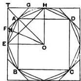
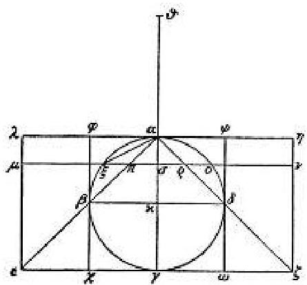

# The Method of Mechanical Theorems

> "I have thought it well to analyze and lay down for you in this same book a peculiar method by means of which it will be possible for you to derive instruction as to how certain mathematical questions may be investigated by means of mechanics. And I am convinced that this is equally profitable in demonstrating a proposition itself; for much that was made evident to me through the medium of mechanics was later proved by means of geometry because the treatment by the former method had not yet been established by way of a demonstration. For of course it is easier to establish a proof if one has in this way previously obtained a conception of the questions, than for him to seek it without such a preliminary notion."
>
> — Archimedes to Eratosthenes, prefatory letter to *The Method*

## The Letter

The treatise known as *The Method of Mechanical Theorems* is unlike most other texts in the surviving Greek mathematical corpus. It is not a sequence of polished propositions, each with its setting-out, construction, and rigorous proof. It is a letter to a fellow scholar in which Archimedes deliberately exposes his working, describing the heuristic by which he discovered some of his most important results, and acknowledging openly that this heuristic does not meet the Greek standard of demonstration.

The letter is addressed to Eratosthenes of Cyrene, the head of the Library of Alexandria and the same man known to us for his measurement of the Earth's circumference. Archimedes writes to him as one mathematician to another, with the candor of a working scientist sharing what he has learned in his investigations. The opening of the letter explains why Archimedes has chosen to write it down at all:

> "I have decided to write down and make known the method partly because we have already talked about it heretofore and so no one would think that we were spreading abroad idle talk, and partly in the conviction that by this means we are obtaining no slight advantage for mathematics, for indeed I assume that some one among the investigators of to-day or in the future will discover by the method here set forth still other propositions which have not yet occurred to us."

Archimedes is writing in the explicit hope that others will use his method to find results that he himself never reached. He is, in effect, willing his technique forward.

A few lines later, he credits Democritus for having first stated, without proof, that a cone is one-third of the cylinder with the same base and height:

> "No little credit is due to Democritos who was the first to make that statement about these bodies without any demonstration."

Archimedes is acknowledging that the interplay of discovery and demonstration was already operative in the Greek mathematical tradition before him. There is honor in finding a true statement, even before it can be proved, and that the prover stands on the shoulders of the discoverer. Archimedes is locating his work in a tradition that existed before him, and which will continue long after him as well.

## The Mechanical Heuristic

The technique Archimedes describes is straightforward in concept, however intricate in execution. Three ingredients:

1. **Imagine a lever** — a horizontal beam with a chosen fulcrum and a known geometry of arms.
2. **Decompose the figures** — slice each of the figures whose areas or volumes you want to compare into thin parallel strips or cross-sections.
3. **Balance the slices** — show that each individual cross-section of one figure, in its present position, balances the corresponding cross-section of the other figure when that cross-section is transferred to a chosen point on the lever. Sum over all the slices, and the figures themselves are in balance.

Once the figures balance, the law of the lever (which you have seen in the [Levers Lab](../archimedes-levers-lab/content.md)) gives you a ratio between them in terms of the lengths of the arms and the known center of gravity of one of the figures. The unknown area or volume can then be read off.

The technique requires several preliminary results that Archimedes lists at the beginning of the treatise: the location of the center of gravity of various figures (the triangle, the parallelogram, the cone, the cylinder), and elementary properties of the curves involved (the parabola, the circle, the conic sections more broadly). With these in hand, the procedure becomes mechanical.

### Worked Example: The Parabolic Segment

The cleanest place to see the heuristic at work is the result Archimedes establishes by rigorous geometric demonstration in the *Quadrature of the Parabola*: the area of a parabolic segment is four-thirds the area of the inscribed triangle. In *The Method*, this is the first proposition Archimedes demonstrates mechanically. (For the formal exhaustion proof, see the [Quadrature of the Parabola exercises](../archimedes-quadrature-exercises/content.md) in this section.)

The setup is as follows. Let the parabolic segment be bounded by a chord, with vertex $\beta$ at the point where the tangent is parallel to the chord. Inscribe the triangle $\alpha\beta\gamma$ whose base is the chord and whose third vertex is $\beta$. Around the segment, construct the larger triangle $\zeta\alpha\gamma$ formed by extending the tangent at $\gamma$ and the line through $\alpha$ parallel to the axis of the parabola — so that the segment sits inside this larger triangle, and the inscribed triangle $\alpha\beta\gamma$ sits inside the segment.

Extend the line $\gamma\beta$ to a point $\kappa$ (the midpoint of the larger triangle's relevant side), and set $\theta$ on the far side so that $\theta\kappa = \kappa\gamma$. The line $\gamma\theta$ becomes a lever with fulcrum at $\kappa$.

Now draw any line through the figures parallel to the axis of the parabola; it cuts the larger triangle in a segment $\mu\xi$ and cuts the parabolic segment in a smaller segment $\xi o$ (the part inside the parabola). Archimedes shows — using a property of the parabola from Apollonius — that:

> The segment $\mu\xi$, in its present position, balances the segment $\xi o$ when $\xi o$ is transferred to the point $\theta$ at the end of the lever.

This is the crucial step. Each cross-section of the larger triangle, in its present position, balances the corresponding cross-section of the parabolic segment when that cross-section is moved to the far end of the lever. Summing over all the cross-sections (Archimedes says this directly, without scruple), the entire larger triangle in its present position balances the entire parabolic segment when the segment is hung at the point $\theta$.

The center of gravity of the larger triangle $\zeta\alpha\gamma$ is known: it lies one-third of the way along its median from the base. The lever law then gives the ratio of the larger triangle to the parabolic segment. After arithmetic involving the known relationships between the larger triangle, the segment's inscribed triangle, and the geometry of the construction, the result emerges:

$$\text{(parabolic segment)} = \frac{4}{3} \cdot (\text{inscribed triangle } \alpha\beta\gamma)$$

Archimedes himself adds, immediately after the derivation:

> "It is true that this is not proved by what we have said here; but it indicates that the result is correct. And so, as we have just seen that it has not been proved but rather conjectured that the result is correct we have devised a geometrical demonstration which we made known some time ago and will again bring forward farther on."

Archimedes has shown us how he *found* the answer. He does not pretend to have proved it. And now the work of demonstration can begin: the rigorous, exhaustion-based argument set out in full in the *Quadrature of the Parabola* itself.

## Two More Derivations

The Method contains mechanical derivations of many results. We highlight two that have particular weight: one because of its cultural familiarity, one because Archimedes himself considered it his greatest achievement.

### The Area of a Circle

In the small treatise *Measurement of a Circle*, Archimedes states and proves rigorously that the area of any circle equals the area of a right triangle whose legs are the radius and the circumference. The mechanical reasoning that led him to this result is implicit throughout *The Method*: imagine the circle as built up from infinitely many radii, each contributing a triangular sliver whose base is an arc and whose height is the radius. Sum the slivers, and you get a triangle whose base is the sum of all the arcs (the full circumference) and whose height is the radius. Hence:

$$\text{(area of circle)} = \frac{1}{2} \cdot r \cdot C$$

The mechanical move is the same as before: decompose the curved figure into slices and recompose them into a known rectilineal figure. The heuristic locates the result. Now the work of demonstration begins.

#### Proposition 1: The Area Theorem

The rigorous proof of the area result occupies a single proposition in *Measurement of a Circle*, and its structure should by now feel familiar. Let $K$ be the right triangle whose legs are the radius and circumference of a circle; we want to show that the area of the circle equals $K$. The argument proceeds, as in the *Quadrature*, by a double reductio.

Suppose first that the circle is *greater* than $K$. Inscribe a square in the circle; bisect each of the four arcs to obtain an inscribed octagon; bisect again to obtain a 16-gon; and so on. By the Archimedean lemma — the same lemma that did the work in the *Quadrature* — we may continue this bisection until the area between the inscribed polygon and the circle is less than the supposed excess of the circle over $K$. The inscribed polygon then has area greater than $K$. But the perpendicular from the center to any side of the inscribed polygon is shorter than the radius, and the perimeter of the polygon is less than the circumference. So the inscribed polygon's area is less than the right triangle with sides equal to *those* two lengths — which is less than $K$. Reductio number one.

Suppose instead that the circle is *less* than $K$. Circumscribe a square around the circle; at each point where a side touches the circle, bisect the arc between consecutive points of tangency and draw the tangent there. This produces a circumscribed octagon, then a 16-gon, and so on. Again by the Archimedean lemma, we may continue until the area between the circumscribed polygon and the circle is less than the supposed deficiency of the circle below $K$. The circumscribed polygon then has area less than $K$. But its perpendicular from the center to any side is exactly the radius, and its perimeter is greater than the circumference, so its area is *greater* than $K$. Reductio number two.

The area of the circle is therefore neither greater nor less than $K$, and so it must equal $K$. The machinery is exactly what you saw in the *Quadrature*: inscribed polygons from below, circumscribed polygons from above, the Archimedean lemma to make the gap arbitrarily small, double reductio to close the argument.

#### Proposition 3: The Numerical Bounds on $\pi$

Proposition 1 establishes the *form* of the area: a right triangle with legs $r$ and $C$. It does not give a numerical relationship between $r$ and $C$. That is the work of Proposition 3, where Archimedes produces what is one of the most famous calculations in ancient mathematics:

> The ratio of the circumference of any circle to its diameter is less than $3\frac{1}{7}$ but greater than $3\frac{10}{71}$.

In modern notation, $3\frac{10}{71} < \pi < 3\frac{1}{7}$, or roughly $3.1408 < \pi < 3.1429$. The true value is $3.14159\ldots$, comfortably inside the bracket.

The method is the same machine run twice. To establish the upper bound, Archimedes circumscribes a regular polygon around the circle and computes its perimeter. The perimeter must exceed the circumference, so the ratio of perimeter to diameter is an upper bound on $\pi$. To establish the lower bound, he inscribes a regular polygon and computes its perimeter. The perimeter is less than the circumference, so the ratio of perimeter to diameter is a lower bound. The bounds tighten as the polygons gain sides.

Archimedes begins with a regular hexagon, whose geometry is exact, and bisects four times — hexagon, dodecagon, 24-gon, 48-gon, 96-gon. Each bisection produces a new polygon with twice as many sides, and the geometry of bisection allows the ratio of *side to radius* at each stage to be computed from the previous one using only Pythagoras and the ratios of similar triangles. The intermediate quantities involve irrational square roots — $\sqrt{3}$ at the start, and various square roots of large integers as the bisections proceed — which Archimedes approximates by rational fractions, stated in the text without explanation of how he obtained them. (The bounds he reports for $\sqrt{3}$, namely $\frac{265}{153} < \sqrt{3} < \frac{1351}{780}$, are remarkably tight: the true value is $1.7320508\ldots$, and these bounds give $1.7320261\ldots$ and $1.7320512\ldots$.)

After four bisections, the inscribed and circumscribed 96-gons yield the bounds quoted above. Archimedes stops there without indicating if the bisection ever terminates.

This is not a proof of a theorem in the Euclid sense, but the work is done entirely in the Greek tradition. It is a calculation that produces an actual numerical bracket on the ratio of circumference to diameter.

#### Reflection

The two propositions together display the demonstrative method doing two distinct kinds of work. Proposition 1 produces a relationship between a curved figure and a rectilineal one: the area of a circle equals the area of a particular triangle. Proposition 3 produces numerical bounds on a constant of nature. Both rest on the same apparatus — polygons closing in on the circle from inside and outside, the Archimedean lemma, double reductio — and neither requires us to take limits or sum infinite series. The two directions are not redundant: the magnitude is being trapped between approaching bounds rather than constructed from them, and without that double squeeze nothing forces it to equal the value sought rather than merely approach it.

### The Sphere and the Cylinder

The result Archimedes regarded as his greatest achievement, the one tradition reports he asked to be carved on his tomb, is the relationship between a sphere and its circumscribed cylinder. The sphere has volume equal to two-thirds the volume of the smallest cylinder that contains it. The story goes that Cicero, serving as quaestor in Sicily roughly a century and a half after Archimedes's death, found and restored the neglected tomb, identifying it by the figure of the sphere within the cylinder still visible on the stone.

*Sphere, cone, and cylinder sharing an axis, with the axis extended past the pole (to $\theta$, top) to form the lever about which the slices are balanced.*

The mechanical derivation in *The Method* is one of the most beautiful pieces of reasoning in ancient mathematics. Here is the structure, in prose:

Take a sphere with center at one point of an axis. On the same axis, inscribe the sphere's largest circle; this is the equator. Construct on the same axis, with the sphere's diameter as its altitude, the cylinder that just contains the sphere — call this the *circumscribed cylinder*. Construct also, on the same axis, a cone whose vertex is at one pole of the sphere and whose base is a circle whose radius equals the sphere's diameter (twice the sphere's radius); call this the *associated cone*. Notice: the cone, the sphere, and the cylinder all share an axis, and the cylinder contains all three.

Now extend the axis past one pole of the sphere to a point $\theta$ on the far side, such that the distance from $\theta$ to the pole equals the diameter of the sphere. Treat the axis from $\theta$ to the opposite pole as a lever, with fulcrum at the original pole.

Cut all three figures — sphere, cone, cylinder — with a plane perpendicular to the axis at some position. Each figure is cut in a circle: a circle from the cylinder (large, with radius equal to the sphere's radius), a circle from the sphere (smaller, varying with position), and a circle from the cone (smaller still, also varying).

Archimedes shows, using nothing more than the geometry of similar triangles and the equation of the sphere:

> The circle cut from the cylinder, in its present position, balances about the fulcrum the sum of the circle cut from the sphere and the circle cut from the cone, when both of those circles are transferred together to the point $\theta$ at the end of the lever.

This balance holds for every slice. Summing over all slices, summing physical disks as one would sum weights, the entire cylinder in its present position balances the sphere and cone together when both are transferred to $\theta$.

The center of gravity of the cylinder is its midpoint, which lies at a known distance from the fulcrum. The lever law then gives a relation between the cylinder, the sphere, and the cone. Archimedes already knows (from Euclid, *Elements* XII.10) that the cylinder is three times the volume of the corresponding cone. Substituting and rearranging the lever equation:

$$\text{(sphere)} = \frac{2}{3} \cdot \text{(circumscribed cylinder)}$$

The result: the sphere is exactly two-thirds the cylinder that contains it. From this, by an additional step Archimedes lays out at the end of his derivation, the surface area of the sphere can also be determined to be four times the area of its great circle.

Archimedes himself reflects, after the derivation:

> "After I had thus perceived that a sphere is four times as large as the cone whose base is the largest circle of the sphere and whose altitude is equal to its radius, it occurred to me that the surface of a sphere is four times as great as its largest circle, in which I proceeded from the idea that just as a circle is equal to a triangle whose base is the periphery of the circle and whose altitude is equal to its radius, so a sphere is equal to a cone whose base is the same as the surface of the sphere and whose altitude is equal to the radius of the sphere."

The triangle-from-circle relation suggests the cone-from-sphere relation. Archimedes is reasoning by analogy across dimensions, letting the two-dimensional case suggest the three-dimensional one.

The rigorous demonstrations of these results — the sphere being four-thirds the inscribed cone, the cylinder being three-halves the sphere — appear in Archimedes's formal treatise *On the Sphere and Cylinder*, where they are proved using the same method of inscribed and circumscribed figures we have now seen twice over. The mechanical derivation in *The Method* shows you how he found them. The treatise shows how he proved them.

## Closing

The *Method of Mechanical Theorems* survived the ancient world only barely. It was lost for centuries, surviving in a single palimpsest — a manuscript whose original text had been scraped away to make room for a Christian prayer book — and recovered only in 1906 in Constantinople. Were it not for that single manuscript, we would know of the treatise only by reference, and the explicit articulation of the discovery–demonstration distinction in Archimedes's own voice would have been lost.

What it gives us is a rare glimpse of a great mathematician with his working mind laid bare. Most of what survives from the ancient world is finished work — polished propositions, completed proofs, results stated as if they had always been known. *The Method* comes to us as a working letter to a colleague, candid about its limits, and generous in its hopes for what others might do with the techniques it describes. Archimedes then is a working scientist of the first rank, applying his abilities to an open problem.
