# THE CONICS OF APOLLONIUS.

# THE CONE.

If a straight line indefinite in length, and passing always through a fixed point, be made to move round the circumference of a circle which is not in the same plane with the point, so as to pass successively through every point of that circumference, the moving straight line will trace out the surface of a **double cone**, or two similar cones lying in opposite directions and meeting in the fixed point, which is the **apex** of each cone.

The circle about which the straight line moves is called the **base** of the cone lying between the said circle and the fixed point, and the **axis** is defined as the straight line drawn from the fixed point or the apex to the centre of the circle forming the base.

The cone so described is a **scalene** or **oblique** cone except in the particular case where the axis is perpendicular to the base. In this latter case the cone is a **right** cone.

If a cone be cut by a plane passing through the apex, the resulting section is a triangle, two sides being straight lines lying on the surface of the cone and the third side being the straight line which is the intersection of the cutting plane and the plane of the base.

Let there be a cone whose apex is $A$ and whose base is the circle $BC$, and let $O$ be the centre of the circle, so that $AO$ is the axis of the cone. Suppose now that the cone is cut by any plane parallel to the plane of the base $BC$, as $DE$, and let

---

the axis $AO$ meet the plane $DE$ in $o$. Let $p$ be any point on the intersection of the plane $DE$ and the surface of the cone. Join $Ap$ and produce it to meet the circumference of the circle $BC$ in $P$. Join $OP$, $op$.

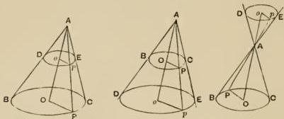

Then, since the plane passing through the straight lines $AO$, $AP$ cuts the two parallel planes $BC$, $DE$ in the straight lines $OP$, $op$ respectively, $OP$, $op$ are parallel.

$$
\therefore op: OP = Ao: AO.
$$

And, $BPC$ being a circle, $OP$ remains constant for all positions of $p$ on the curve $DpE$, and the ratio $Ao: AO$ is also constant.

Therefore $op$ is constant for all points on the section of the surface by the plane $DE$. In other words, that section is a circle.

Hence *all sections of the cone which are parallel to the circular base are circles.* [I. 4.]*

Next, let the cone be cut by a plane passing through the axis and perpendicular to the plane of the base $BC$, and let the section be the triangle $ABC$. Conceive another plane $HK$ drawn at right angles to the plane of the triangle $ABC$ and cutting off from it the triangle $AHK$ such that $AHK$ is similar to the triangle $ABC$ but lies in the contrary sense, i.e. such that the angle $AKH$ is equal to the angle $ABC$. Then the section of the cone by the plane $HK$ is called a **subcontrary** section (ὑπεναντία τομή).

---

Let $P$ be any point on the intersection of the plane $HK$ with the surface, and $F$ any point on the circumference of the circle $BC$. Draw $PM$, $FL$ each perpendicular to the plane of the triangle $ABC$, meeting the straight lines $HK$, $BC$ respectively in $M$, $L$. Then $PM$, $FL$ are parallel.

Draw through $M$ the straight line $DE$ parallel to $BC$, and it follows that the plane through $DME$, $PM$ is parallel to the base $BC$ of the cone.

Thus the section $DPE$ is a circle, and $DM \cdot ME = PM^2$.

But, since $DE$ is parallel to $BC$, the angle $ADE$ is equal to the angle $ABC$ which is by hypothesis equal to the angle $AKH$.

Therefore in the triangles $HDM$, $EKM$ the angles $HDM$, $EKM$ are equal, as also are the vertical angles at $M$.

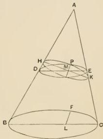

Therefore the triangles $HDM$, $EKM$ are similar.

Hence

$$
HM : MD = EM : MK.
$$

$$
\therefore HM \cdot MK = DM \cdot ME = PM^2.
$$

And $P$ is any point on the intersection of the plane $HK$ with the surface. Therefore the section made by the plane $HK$ is a circle.

Thus there are two series of circular sections of an oblique cone, one series being parallel to the base, and the other consisting of the sections subcontrary to the first series. [I. 5.]

Suppose a cone to be cut by any plane through the axis making the triangular section $ABC$, so that $BC$ is a diameter of the circular base. Let $H$ be any point on the circumference of the base, let $HK$ be perpendicular to the diameter $BC$, and let a parallel to $HK$ be drawn from any point $Q$ on the surface of the cone but not lying in the plane of the axial triangle. Further, let $AQ$ be joined and produced, if necessary, to meet

---

the circumference of the base in $F$, and let $FLF'$ be the chord perpendicular to $BC$. Join $AL$, $AF'$. Then the straight line through $Q$ parallel to $HK$ is also parallel to $FLF'$; it follows therefore that the parallel through $Q$ will meet both $AL$ and $AF'$. And $AL$ is in the plane of the axial triangle $ABC$. Therefore the parallel through $Q$ will meet both the plane of the axial triangle and the other side of the surface of the cone, since $AF''$ lies on the cone.

Let the points of intersection be $V$, $Q'$ respectively.

Then $QV: VQ' = FL: LF'$, and $FL = LF'$.

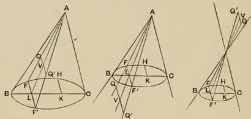

or $QQ'$ is bisected by the plane of the axial triangle. [I. 6.]

Again, let the cone be cut by another plane not passing through the apex but intersecting the plane of the base in a straight line $DME$ perpendicular to $BC$, the base of any axial triangle, and let the resulting section of the surface of the cone be $DPE$, the point $P$ lying on either of the sides $AB$, $AC$ of the axial triangle. The plane of the section will then cut the plane of the axial triangle in the straight line $PM$ joining $P$ to the middle point of $DE$.

Now let $Q$ be any point on the curve of section, and through $Q$ draw a straight line parallel to $DE$.

Then this parallel will, if produced to meet the other side of the surface in $Q'$, meet, and be bisected by, the axial

---

triangle. But it lies also in the plane of the section $DPE$; it will therefore meet, and be bisected by, $PM$.

Therefore $PM$ bisects any chord of the section which is parallel to $DE$.

Now a straight line bisecting each of a series of parallel chords of a section of a cone is called a diameter.

Hence, if a cone be cut by a plane which intersects the circular base in a straight line perpendicular to the base of any axial triangle, the intersection of the cutting plane and the plane of the axial triangle will be a diameter of the resulting section of the cone. [I. 7.]

If the cone be a right cone it is clear that the diameter so found will, for all sections, be at right angles to the chords which it bisects.

If the cone be oblique, the angle between the diameter so found and the parallel chords which it bisects will in general not be a right angle, but will be a right angle in the particular case only where the plane of the axial triangle $ABC$ is at right angles to the plane of the base.

Again, if $PM$ be the diameter of a section made by a plane cutting the circular base in the straight line $DME$ perpendicular to $BC$, and if $PM$ be in such a direction that it does not meet $AC$ though produced to infinity, i.e. if $PM$ be either parallel to $AC$, or makes with $PB$ an angle less than the angle $BAC$ and therefore meets $CA$ produced beyond the apex of the cone, the section made by the said plane extends to infinity.

---

For, if we take any point $V$ on $PM$ produced and draw through it $HK$ parallel to $BC$, and $QQ'$ parallel to $DE$, the plane through $HK$, $QQ'$ is parallel to that through $DE$, $BC$, i.e. to the base. Therefore the section $HQKQ'$ is a circle. And $D, E, Q, Q'$ are all on the surface of the cone and are also on the cutting plane. Therefore the section $DPE$ extends to the circle $HQK$, and in like manner to the circular section through any point on $PM$ produced, and therefore to any distance from $P$. [I. 8.]

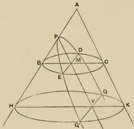

[It is also clear that $DM^2 = BM \cdot MC$, and $QV^2 = HV \cdot VK$; and $HV \cdot VK$ becomes greater as $V$ is taken more distant from $P$. For, in the case where $PM$ is parallel to $AC$, $VK$ remains constant while $HV$ increases; and in the case where the diameter $PM$ meets $CA$ produced beyond the apex of the cone, both $HV$, $VK$ increase together as $V$ moves away from $P$. Thus $QV$ increases indefinitely as the section extends to infinity.]

If on the other hand $PM$ meets $AC$, the section does not extend to infinity. In that case the section will be a circle if its plane is parallel to the base or subcontrary. But, if the section is neither parallel to the base nor subcontrary, it will not be a circle. [I. 9.]

For let the plane of the section meet the plane of the base in $DME$, a straight line perpendicular to $BC$, a diameter of the

---

circular base. Take the axial triangle through $BC$ meeting the plane of section in the straight line $PP'$. Then $P, P', M$ are all points in the plane of the axial triangle and in the plane of section. Therefore $PP'M$ is a straight line.

If possible, let the section $PP'$ be a circle. Take any point $Q$ on it and draw $QQ'$ parallel to $DME$. Then if $QQ'$ meets the axial triangle in $V$, $QV = VQ'$. Therefore $PP'$ is the diameter of the supposed circle.

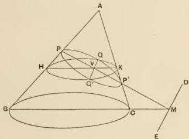

Let $HQKQ'$ be the circular section through $QQ'$ parallel to the base.

Then, from the circles, $QV^2 = HV. VK$,

$$
QV^2 = PV. VP'.
$$

$$
\therefore HV. VK = PV. VP',
$$

so that

$$
HV: VP = P'V: VK.
$$

$\therefore$ the triangles $VPH$, $VKP'$ are similar, and

$$
\angle PHV = \angle KP'V;
$$

$\therefore \angle KP'V = \angle ABC$, and the section $PP'$ is subcontrary: which contradicts the hypothesis.

$\therefore PQP'$ is not a circle.

It remains to investigate the character of the sections mentioned on the preceding page, viz. (a) those which extend to infinity, (b) those which are finite but are not circles.

Suppose, as usual, that the plane of section cuts the circular base in a straight line $DME$ and that $ABC$ is the axial triangle

---

whose base $BC$ is that diameter of the base of the cone which bisects $DME$ at right angles at the point $M$. Then, if the plane of the section and the plane of the axial triangle intersect in the straight line $PM$, $PM$ is a diameter of the section bisecting all chords of the section, as $QQ'$, which are drawn parallel to $DE$.

If $QQ'$ is so bisected in $V$, $QV$ is said to be an **ordinate**, or a straight line **drawn ordinate-wise** (τεταγμένως κατηγμένη), to the diameter $PM$; and the length $PV$ cut off from the diameter by any ordinate $QV$ will be called the **abscissa** of $QV$.

## Proposition 1.

[I. 11.]

First let the diameter $PM$ of the section be parallel to one of the sides of the axial triangle as $AC$, and let $QV$ be any ordinate to the diameter $PM$. Then, if a straight line $PL$ (supposed to be drawn perpendicular to $PM$ in the plane of the section) be taken of such a length that $PL: PA = BC^z: BA. AC$, it is to be proved that

$$
QV^z = PL.PV.
$$

Let $HK$ be drawn through $V$ parallel to $BC$. Then, since $QV$ is also parallel to $DE$, it follows that the plane through $H$, $Q$, $K$ is parallel to the base of the cone and therefore

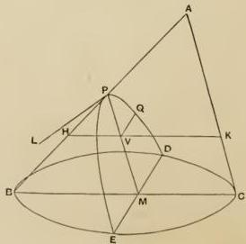

---

produces a circular section whose diameter is $HK$. Also $QV$ is at right angles to $HK$.

$$
\therefore HV.VK = QV^2.
$$

Now, by similar triangles and by parallels,

$$
HV:PV = BC:AC
$$

and

$$
VK:PA = BC:BA.
$$

$$
\therefore HV.VK:PV.PA = BC^2:BA.AC.
$$

Hence

$$
QV^2:PV.PA = PL:PA
$$

$$
= PL.PV:PV.PA.
$$

$$
\therefore QV^2 = PL.PV.
$$

It follows that the square on any ordinate to the fixed diameter $PM$ is equal to a rectangle applied ($\pi a\rho a\beta \acute{\alpha}\lambda \lambda \varepsilon \iota \nu$) to the fixed straight line $PL$ drawn at right angles to $PM$ with altitude equal to the corresponding abscissa $PV$. Hence the section is called a PARABOLA.

The fixed straight line $PL$ is called the **latus rectum** ($\acute{\circ}\rho \theta \acute{\iota} a$) or the **parameter of the ordinates** ($\pi a\rho$’ $\acute{\eta}\nu$ $\delta \acute{\upsilon}$- $\upsilon \alpha \upsilon$ $\tau a$i $\kappa \alpha \tau \alpha \upsilon \dot{\eta} \mu \varepsilon \upsilon$ $\tau \varepsilon \tau \alpha \upsilon \mu \varepsilon \upsilon \omega$).

This parameter, corresponding to the diameter $PM$, will for the future be denoted by the symbol $p$.

Thus

$$
QV^2 = p.PV,
$$

or

$$
QV^2 \propto PV.
$$

## Proposition 2.

[I. 12.]

Next let $PM$ not be parallel to $AC$ but let it meet $CA$ produced beyond the apex of the cone in $P'$. Draw $PL$ at right angles to $PM$ in the plane of the section and of such a length that $PL:PP' = BF.FC:AF^2$, where $AF$ is a straight line through $A$ parallel to $PM$ and meeting $BC$ in $F$. Then, if $VR$ be drawn parallel to $PL$ and $P'L$ be joined and produced to meet $VR$ in $R$, it is to be proved that

$$
QV^2 = PV.VR.
$$

As before, let $HK$ be drawn through $V$ parallel to $BC$, so that

$$
QV^2 = HV.VK.
$$

---

Then, by similar triangles,

$$
HV:PV = BF:AF,
$$

$$
VK:P'V = FC:AF.
$$

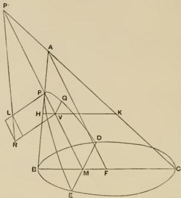

$$
\begin{array}{l}
\therefore HV.VK:PV.P'V = BF.FC:AF^2. \\
QV^2:PV.P'V = PL:PP' \\
= VR:P'V \\
= PV.VR:PV.P'V. \\
\therefore QV^2 = PV.VR.
\end{array}
$$

Hence it follows that the square on the ordinate is equal to a rectangle whose height is equal to the abscissa and whose base lies along the fixed straight line $PL$ but overlaps ($\dot{v}πe\rho\beta\dot{a}\lambda\lambda\epsilon\iota$) it by a length equal to the difference between $VR$ and $PL$. Hence the section is called a HYPERBOLA.

$$
y^2 = px + \frac{p}{d} \cdot x^2,
$$

which is simply the Cartesian equation of the hyperbola referred to oblique axes consisting of a diameter and the tangent at its extremity.

---

$PL$ is called the *latus rectum* or the *parameter of the ordinates* as before, and $PP'$ is called the *transverse* ($\dot{\eta}\pi\lambda\alpha\gamma\alpha$). The fuller expression *transverse diameter* ($\dot{\eta}\pi\lambda\alpha\gamma\alpha\delta\alpha\mu\epsilon\tau\rho\sigma$) is also used; and, even more commonly, Apollonius speaks of the diameter and the corresponding parameter together, calling the latter the *latus rectum* (i.e. the *erect side*, $\dot{\eta}\partial\rho\theta\alpha\pi\lambda\epsilon\nu\rho\dot{\alpha}$), and the former the *transverse side* ($\dot{\eta}\pi\lambda\alpha\gamma\alpha\pi\lambda\epsilon\nu\rho\dot{\alpha}$), of the *figure* ($\epsilon\dot{\iota}\delta\sigma\gamma$) on, or applied to, the diameter ($\pi\rho\dot{\sigma}\tau\dot{\eta}\delta\alpha\mu\epsilon\tau\rho\varphi$), i.e. of the rectangle contained by $PL$, $PP'$ as drawn.

The parameter $PL$ will in future be denoted by $p$.

[COR. It follows from the proportion

$$
QV^2: PV. P'V = PL: PP'
$$

that, for any fixed diameter $PP'$,

$QV^2: PV. P'V$ is a constant ratio,

or $QV^2$ varies as $PV. P'V$.]

## Proposition 3.

[I. 13.]

If $PM$ meets $AC$ in $P'$ and $BC$ in $M$, draw $AF$ parallel to $PM$ meeting $BC$ produced in $F$, and draw $PL$ at right angles to $PM$ in the plane of the section and of such a length that $PL: PP' = BF. FC: AF^2$. Join $P'L$ and draw $VR$ parallel to $PL$ meeting $P'L$ in $R$. It will be proved that

$$
QV^2 = PV. VR.
$$

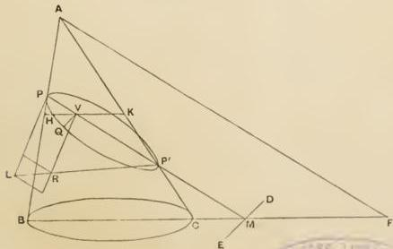

---

Draw $HK$ through $V$ parallel to $BC$. Then, as before,

$$QV^2 = HV. VK.$$

Now, by similar triangles,

$$HV:PV = BF:AF,$$
$$VK:P'V = FC:AF.$$
$\therefore HV.VK:PV.P'V = BF.FC:AF^2.$

Hence

$$QV^2:PV.P'V = PL:PP'$$
$$= VR:P'V$$
$$= PV.VR:PV.P'V.$$
$\therefore QV^2 = PV.VR.$

Thus the square on the ordinate is equal to a rectangle whose height is equal to the abscissa and whose base lies along the fixed straight line $PL$ but falls short of it ($\acute{e}\lambda\lambda\epsilon\dot{i}\pi\epsilon i$) by a length equal to the difference between $VR$ and $PL$. The section is therefore called an ELLIPSE.

As before, $PL$ is called the *latus rectum*, or the *parameter* of the ordinates to the diameter $PP'$, and $PP'$ itself is called the *transverse* (with or without the addition of *diameter* or *side* of the *figure*, as explained in the last proposition).

$PL$ will henceforth be denoted by $p$.

[Cor. It follows from the proportion

$$QV^2:PV.PV' = PL:PP'$$

that, for any fixed diameter $PP'$,

$QV^2:PV.P'V$ is a constant ratio, or $QV^2$ varies as $PV.P'V$.]

If $QV=y$, $PV=x$, $PL=p$, and $PP'=d$,

$$y^2 = px - \frac{p}{d}, \ x^2.$$

Thus Apollonius' enunciation simply expresses the Cartesian equation referred to a diameter and the tangent at its extremity as (oblique) axes.

---

## Proposition 4.

[I. 14.]

If a plane cuts both parts of a double cone and does not pass through the apex, the sections of the two parts of the cone will both be hyperbolas which will have the same diameter and equal latera recta corresponding thereto. And such sections are called OPPOSITE BRANCHES.

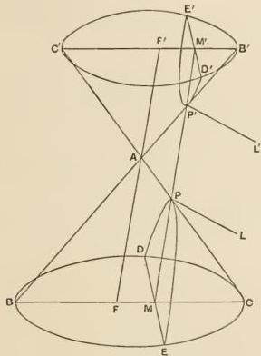

Let $BC$ be the circle about which the straight line generating the cone revolves, and let $B'C'$ be any parallel section cutting the opposite half of the cone. Let a plane cut both halves of the cone, intersecting the base $BC$ in the straight line $DE$ and the plane $B'C'$ in $D'E'$. Then $D'E'$ must be parallel to $DE$.

Let $BC$ be that diameter of the base which bisects $DE$ at right angles, and let a plane pass through $BC$ and the apex $A$ cutting the circle $B'C'$ in $B'C'$, which will therefore be a diameter of that circle and will cut $D'E'$ at right angles, since $B'C'$ is parallel to $BC$, and $D'E'$ to $DE$.

---

Let $FAF'$ be drawn through $A$ parallel to $MM'$, the straight line joining the middle points of $DE$, $D'E'$ and meeting $CA$, $B'A$ respectively in $P$, $P'$.

Draw perpendiculars $PL$, $P'L'$ to $MM'$ in the plane of the section and of such length that

$$ PL : PP' = BF \cdot FC : AF' $$

$$ P'L' : P'P = B'F' \cdot F'C' : AF' $$

Since now $MP$, the diameter of the section $DPE$, when produced, meets $BA$ produced beyond the apex, the section $DPE$ is a hyperbola.

Also, since $D'E'$ is bisected at right angles by the base of the axial triangle $AB'C'$, and $M'P$ in the plane of the axial triangle meets $C'A$ produced beyond the apex $A$, the section $D'P'E'$ is also a hyperbola.

And the two hyperbolas have the same diameter $MPP'M'$.

It remains to prove that $PL = P'L'$.

We have, by similar triangles,

$$ BF : AF' = B'F' : AF' $$

$$ FC : AF' = F'C' : AF' $$

$$ \therefore BF \cdot FC : AF' = B'F' \cdot F'C' : AF' $$

Hence

$$ PL : PP' = P'L' : P'P' $$

$$ \therefore PL = P'L' $$

---

# THE DIAMETER AND ITS CONJUGATE.

## Proposition 5.

[I. 15.]

If through $C$, the middle point of the diameter $PP'$ of an ellipse, a double ordinate $DCD'$ be drawn to $PP'$, $DCD'$ will bisect all chords parallel to $PP'$, and will therefore be a diameter the ordinates to which are parallel to $PP'$.

In other words, if the diameter bisect all chords parallel to a second diameter, the second diameter will bisect all chords parallel to the first.

Also the parameter of the ordinates to $DCD'$ will be a third proportional to $DD'$, $PP'$.

(1) Let $QV$ be any ordinate to $PP'$, and through $Q$ draw $QQ'$ parallel to $PP'$ meeting $DD'$ in $v$ and the ellipse in $Q'$; and let $Q'V'$ be the ordinate drawn from $Q'$ to $PP'$.

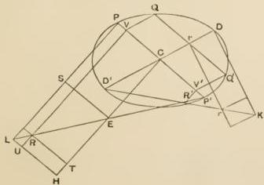

---

Then, if $PL$ is the parameter of the ordinates, and if $P'L$ is joined and $VR, CE, V'R'$ drawn parallel to $PL$ to meet $P'L$, we have [Prop. 3]

$$
QV^2 = PV \cdot VR,
$$

$$
Q'V'' = PV' \cdot V'R';
$$

and $QV = Q'V'$, because $QV$ is parallel to $Q'V'$ and $QQ'$ to $PP'$.

$$
\therefore PV \cdot VR = PV' \cdot V'R'.
$$

Hence

$$
PV: PV' = V'R': VR = P'V': P'V.
$$

$$
\therefore PV: PV' \sim PV = P'V': P'V \sim P'V',
$$

or

$$
PV: VV' = P'V': VV'.
$$

$$
\therefore PV = P'V'.
$$

Also

$$
CP = CP'.
$$

By subtraction,

$$
CV = CV',
$$

and $\therefore Qv = vQ'$, so that $QQ'$ is bisected by $DD'$.

(2) Draw $DK$ at right angles to $DD'$ and of such a length that $DD': PP' = PP': DK$. Join $D'K$ and draw $vr$ parallel to $DK$ to meet $D'K$ in $r$.

Also draw $TR, LUH$ and $ES$ parallel to $PP'$.

Then, since $PC = CP'$, $PS = SL$ and $CE = EH$;

$\therefore$ the parallelogram $(PE) = (SH)$.

Also

$$
(PR) = (VS) + (SR) = (SU) + (RH).
$$

By subtraction,

$$
(PE) - (PR) = (RE);
$$

$$
\therefore CD^2 - QV^2 = RT \cdot TE.
$$

But

$$
CD^2 - QV^2 = CD^2 - Cv^2 = D'v \cdot vD.
$$

$$
\therefore D'v \cdot vD = RT \cdot TE \quad \text{(A)}.
$$

Now

$$
DD': PP' = PP': DK, \text{ by hypothesis}.
$$

$$
\begin{aligned}
\therefore DD': DK &= DD'^2: PP'^2 \\
&= CD^2: CP^2 \\
&= PC \cdot CE: CP^2 \\
&= RT \cdot TE: RT^2,
\end{aligned}
$$

and

$$
DD': DK = D'v: vr
$$

$$
= D'v \cdot vD: vD \cdot vr;
$$

$$
\therefore D'v \cdot vD: Dv \cdot vr = RT \cdot TE: RT^2.
$$

But

$$
D'v \cdot vD = RT \cdot TE, \text{ from (A) above};
$$

$$
\therefore Dv \cdot vr = RT^2 = CV^2 = Qv^2.
$$

---

Thus $DK$ is the parameter of the ordinates to $DD'$, such as $Qv$.

Therefore the parameter of the ordinates to $DD'$ is a third proportional to $DD'$, $PP'$.

Cor. We have
$$
CD' = PC \cdot CE
$$
$$
= \frac{1}{2} PP' \cdot \frac{1}{2} PL;
$$
$$
\therefore DD'^2 = PP' \cdot PL,
$$

or
$$
PP' : DD' = DD' : PL,
$$
and $PL$ is a third proportional to $PP'$, $DD'$.

Thus the relations of $PP'$, $DD'$ and the corresponding parameters are reciprocal.

Def. Diameters such as $PP'$, $DD'$, each of which bisects all chords parallel to the other, are called conjugate diameters.

## Proposition 6.

[I. 16.]

If from the middle point of the diameter of a hyperbola with two branches a line be drawn parallel to the ordinates to that diameter, the line so drawn will be a diameter conjugate to the former one.

If any straight line be drawn parallel to $PP'$, the given diameter, and meeting the two branches of the hyperbola in $Q, Q'$ respectively, and if from $C$, the middle point of $PP'$, a straight line be drawn parallel to the ordinates to $PP'$ meeting $QQ'$ in $v$, we have to prove that $QQ'$ is bisected in $v$.

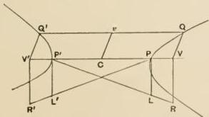

Let $QV, Q'V'$ be ordinates to $PP'$, and let $PL, P'L'$ be the parameters of the ordinates in each branch so that [Prop. 4]

---

$PL = P'L'$. Draw $VR$, $V'R'$ parallel to $PL$, $P'L'$, and let $PL'$, $P'L'$ be joined and produced to meet $V'R'$, $VR$ respectively in $R'$, $R$.

Then we have
$$QV^2 = PV \cdot VR,$$
$$Q'V'^2 = P'V' \cdot V'R'.$$

$\therefore PV \cdot VR = P'V' \cdot V'R'$, and $V'R' : VR = PV : P'V'$.

Also
$$PV' : V'R' = PP' : P'L' = P'P : PL = P'V : VR.$$

$$
\therefore PV' : P'V = V'R' : VR
$$

$= PV : P'V'$, from above;

$$
\therefore PV' : PV = P'V : P'V'
$$

and
$$PV' + PV : PV = P'V + P'V' : P'V',$$

or
$$VV' : PV = VV' : P'V';$$

$$
\therefore PV = P'V'
$$

But
$$CP = CP';$$

$\therefore$ by addition, $CV = CV'$,

or
$$Qv = Q'v.$$

Hence $Cv$ is a diameter conjugate to $PP'$.

[More shortly, we have, from the proof of Prop. 2,

$$QV^2 : PV \cdot P'V = PL : PP',$$

$$Q'V'^2 : P'V' \cdot PV' = P'L' : PP',$$

and
$$QV = Q'V', \quad PL = P'L';$$

$\therefore PV \cdot P'V = PV' \cdot P'V'$, or
$$PV : PV' = P'V' : P'V'$$

whence, as above,
$$PV = P'V'$$

DEF. The middle point of the diameter of an ellipse or hyperbola is called the **centre**; and the straight line drawn parallel to the ordinates of the diameter, of a length equal to the mean proportional between the diameter and the parameter, and bisected at the centre, is called the **secondary diameter** (δεύτερα διάμετρος).

## Proposition 7.

[I. 20.]

In a parabola the square on an ordinate to the diameter varies as the abscissa.

This is at once evident from Prop. 1.

---

## Proposition 8.

[I. 21.]

*In a hyperbola, an ellipse, or a circle, if $QV$ be any ordinate to the diameter $PP'$*,

$$
QV^2 \propto PV \cdot P'V.
$$

[This property is at once evident from the proportion

$$
QV^2 : PV \cdot P'V = PL : PP'
$$

obtained in the course of Props. 2 and 3; but Apollonius gives a separate proof, starting from the property $QV^2 = PV \cdot VR$ which forms the basis of the definition of the conic, as follows.]

Let $QV, Q'V'$ be two ordinates to the diameter $PP'$.

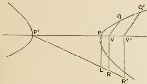

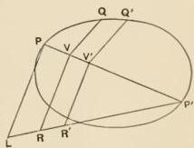

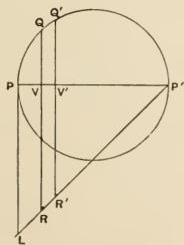

Then

$$
QV^2 = PV \cdot VR,
$$

$$
Q'V'^2 = PV' \cdot V'R';
$$

$$
\begin{array}{l}
\therefore QV^2 : PV \cdot P'V = PV \cdot VR : PV \cdot P'V \\
= VR : P'V = PL : PP'.
\end{array}
$$

---

Similarly

$$
Q'V'^{2}: PV'.P'V' = PL:PP'.
$$

$$
\therefore QV^{2}: Q'V'^{2} = PV. P'V: PV'. P'V';
$$

and $QV^{2}: PV. P'V$ is a constant ratio,

or

$$
QV^{2} \propto PV. P'V.
$$

## Proposition 9.

[I. 29.]

If a straight line through the centre of a hyperbola with two branches meet one branch, it will, if produced, meet the other also.

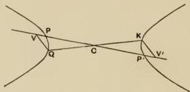

Let $PP'$ be the given diameter and $C$ the centre. Let $CQ$ meet one branch in $Q$. Draw the ordinate $QV$ to $PP'$, and set off $CV'$ along $PP'$ on the other side of the centre equal to $CV$. Let $V'K$ be the ordinate to $PP'$ through $V'$. We shall prove that $QCK$ is a straight line.

Since $CV = CV'$, and $CP = CP'$, it follows that $PV = P'V'$;

$$
\therefore PV. P'V = P'V'. PV'.
$$

But $QV^{2}: KV'^{2} = PV. P'V: P'V'. PV'$. [Prop. 8]

$\therefore QV = KV'$; and $QV, KV'$ are parallel, while $CV = CV'$.

Therefore $QCK$ is a straight line.

Hence $QC$, if produced, will cut the opposite branch.

---

## Proposition 10.

[I. 30.]

In a hyperbola or an ellipse any chord through the centre is bisected at the centre.

Let $PP'$ be the diameter and $C$ the centre; and let $QQ'$ be any chord through the centre. Draw the ordinates $QV, Q'V'$ to the diameter $PP'$.

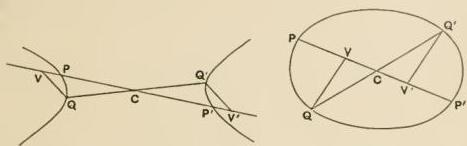

Then

$$
\begin{array}{l}
PV. P'V: P'V'. PV' = QV^2: Q'V'^2 \\
= CV^2: CV'^2, \text{ by similar triangles.}
\end{array}
$$

$$
\therefore CV^2 \pm PV. P'V: CV^2 = CV'^2 \pm P'V'. PV': CV'^2
$$

(where the upper sign applies to the ellipse and the lower to the hyperbola).

$$
\therefore CP^2: CV^2 = CP'^2: CV'^2.
$$

But

$$
CP^2 = CP'^2;
$$

$$
\therefore CV^2 = CV'^2, \text{ and } CV = CV'.
$$

And $QV, Q'V'$ are parallel;

$$
\therefore CQ = CQ'.
$$

---

# TANGENTS.

## Proposition 11.

[I. 17, 32.]

If a straight line be drawn through the extremity of the diameter of any conic parallel to the ordinates to that diameter, the straight line will touch the conic, and no other straight line can fall between it and the conic.

It is first proved that the straight line drawn in the manner described will fall without the conic.

For, if not, let it fall within it, as $PK$, where $PM$ is the given diameter. Then $KP$, being drawn from a point $K$ on the conic parallel to the ordinates to $PM$, will meet $PM$ and will be bisected by it. But $KP$ produced falls without the conic; therefore it will not be bisected at $P$.

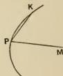

Therefore the straight line $PK$ must fall without the conic and will therefore touch it.

It remains to be proved that no straight line can fall between the straight line drawn as described and the conic.

(1) Let the conic be a parabola, and let $PF$ be parallel to the ordinates to the diameter $PV$. If possible, let $PK$ fall between $PF$ and the parabola, and draw $KV$ parallel to the ordinates, meeting the curve in $Q$.

Then
$$
\begin{aligned}
KV^2 : PV^2 &> QV^2 : PV^2 \\
&> PL : PV : PV^2 \\
&> PL : PV.
\end{aligned}
$$

Let $V'$ be taken on $PV$ such that
$$
KV^2 : PV^2 = PL : PV',
$$
and let $V'QM$ be drawn parallel to $QV$, meeting the curve in $Q'$ and $PK$ in $M$.

---

Then

$$
KV^2 : PV^2 = PL : PV'
$$

$$
\begin{array}{l}
= PL \cdot PV' : PV'^2 \\
= Q'V'^2 : PV'^2,
\end{array}
$$

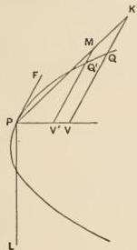

and $ KV^2 : PV^2 = MV'^2 : PV'^2 $, by parallels.

Therefore $ MV'^2 = Q'V'^2 $, and $ MV' = Q'V' $.

Thus $ PK $ cuts the curve in $ Q $, and therefore does not fall outside it: which is contrary to the hypothesis.

Therefore no straight line can fall between $ PF $ and the curve.

(2) Let the curve be a *hyperbola* or an *ellipse* or a *circle*.

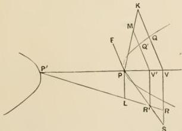

Let $ PF $ be parallel to the ordinates to $ PP $, and, if possible, let $ PK $ fall between $ PF $ and the curve. Draw $ KV $ parallel to the ordinates, meeting the curve in $ Q $, and draw $ VR $ per-

---

pendicular to $PV$. Join $P'L$ and let it (produced if necessary) meet $VR$ in $R$.

Then $QV^2 = PV \cdot VR$, so that $KV^2 > PV \cdot VR$.

Take a point $S$ on $VR$ produced such that $KV^2 = PV \cdot VS$. Join $PS$ and let it meet $P'R$ in $R'$. Draw $R'V'$ parallel to $PL$ meeting $PV$ in $V'$, and through $V'$ draw $V'QM$ parallel to $QV$, meeting the curve in $Q'$ and $PK$ in $M$.

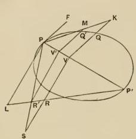

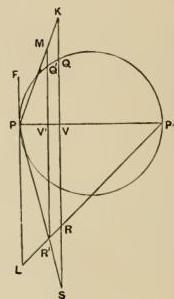

Now

$$
KV^2 = PV \cdot VS,
$$

$$
\therefore VS : KV = KV : PV,
$$

so that

$$
VS : PV = KV^2 : PV^2.
$$

Hence, by parallels,

$$
V'R' : PV' = MV'^2 : PV'^2,
$$

or $MV'$ is a mean proportional between $PV'$, $V'R'$,

i.e.

$$
MV'^2 = PV' \cdot V'R'
$$

$$
= Q'V'^2, \text{ by the property of the conic}.
$$

$$
\therefore MV' = Q'V'.
$$

Thus $PK$ cuts the curve in $Q'$, and therefore does not fall outside it: which is contrary to the hypothesis.

Hence no straight line can fall between $PF$ and the curve.

---

## Proposition 12.

[I. 33, 35.]

If a point $T$ be taken on the diameter of a parabola outside the curve and such that $TP = PV$, where $V$ is the foot of the ordinate from $Q$ to the diameter $PV$, the line $TQ$ will touch the parabola.

We have to prove that the straight line $TQ$ or $TQ$ produced does not fall within the curve on either side of $Q$.

For, if possible, let $K$, a point on $TQ$ or $TQ$ produced, fall within the curve*, and through $K$ draw $Q'KV'$ parallel to an ordinate and meeting the diameter in $V'$ and the curve in $Q'$.

Then

$$
Q'V'^2:QV^2
$$

$$
\begin{array}{l}
> KV'^2:QV^2, \text{ by hypothesis,} \\
> TV'^2:TV^2. \\
\therefore PV':PV > TV'^2:TV^2.
\end{array}
$$

Hence

$$
4TP.PV': 4TP.PV > TV'^2: TV^2,
$$

and, since $TP = PV$,

$$
\begin{array}{l}
4TP.PV = TV^2, \\
\therefore 4TP.PV' > TV'^2.
\end{array}
$$

But, since by hypothesis $TV'$ is not bisected in $P$,

$$
4TP.PV' < TV'^2,
$$

which is absurd.

Therefore $TQ$ does not at any point fall within the curve, and is therefore a tangent.

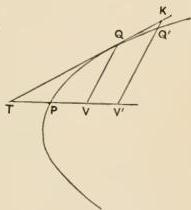

---

Conversely, if the tangent at $Q$ meet the diameter produced outside the curve in the point $T$, $TP = PV$. Also no straight line can fall between $TQ$ and the curve.

[Apollonius gives a separate proof of this, using the method of reductio ad absurdum.]

## Proposition 13.

[I. 34, 36.]

In a hyperbola, an ellipse, or a circle, if $PP'$ be the diameter and $QV$ an ordinate to it from a point $Q$, and if a point $T$ be taken on the diameter but outside the curve such that $TP: TP' = PV: VP'$, then the straight line $TQ$ will touch the curve.

We have to prove that no point on $TQ$ or $TQ$ produced falls within the curve.

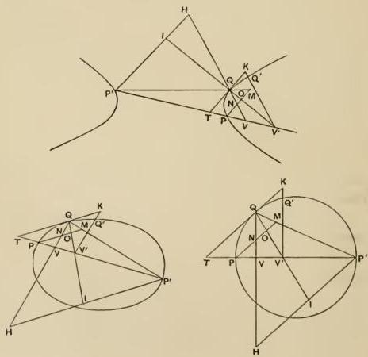

---

If possible, let a point $K$ on $TQ$ or $TQ$ produced fall within the curve*; draw $Q'KV'$ parallel to an ordinate meeting the curve in $Q'$. Join $P'Q$, $V'Q$, producing them if necessary, and draw through $P'$, $P$ parallels to $TQ$ meeting $V'Q$, $VQ$ in $I$, $O$ and $H$, $N$ respectively. Also let the parallel through $P$ meet $P'Q$ in $M$.

Now, by hypothesis, $P'V:PV = TP':TP$;
$$
\therefore \text{ by parallels, } P'H:PN = P'Q:QM
$$
$$
= P'H:NM.
$$

Therefore
$$
PN = NM.
$$

Hence
$$
PN.NM > PO.OM,
$$
or
$$
NM:MO > OP:PN;
$$
$$
\therefore P'H:P'I > OP:PN,
$$
or
$$
P'H.PN > P'I.OP.
$$

It follows that $P'H.PN:TQ^2 > P'I.OP:TQ^2$;
$$
\therefore \text{ by similar triangles } \\
P'V.PV:TV^2 > P'V'.PV':TV'^2,
$$
or
$$
P'V.PV:P'V'.PV' > TV^2:TV'^2;
$$
$$
\therefore QV^2:Q'V'^2 > TV^2:TV'^2
$$
$$
> QV^2:KV'^2.
$$

$\therefore Q'V' < KV'$, which is contrary to the hypothesis.

Thus $TQ$ does not cut the curve, and therefore it touches it.

Conversely, if the tangent at a point $Q$ meet the diameter $PP'$ outside the section in the point $T$, and $QV$ is the ordinate from $Q$,
$$
TP:TP' = PV:VP'.
$$
Also no other straight line can fall between $TQ$ and the curve.

[This again is separately proved by Apollonius by a simple reductio ad absurdum.]

---

## Proposition 14.

[I. 37, 39.]

In a hyperbola, an ellipse, or a circle, if $QV$ be an ordinate to the diameter $PP'$, and the tangent at $Q$ meet $PP'$ in $T$, then

(1) $CV.CT = CP^2$,

(2) $QV^2: CV. VT = p: PP'$ [or $CD^2: CP^2$].

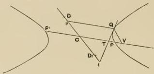

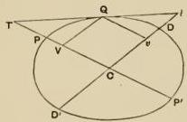

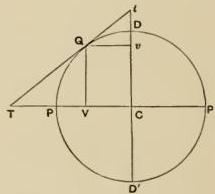

(1) Since $QT$ is the tangent at $Q$,

$$
TP: TP' = PV: P'V, \quad [\text{Prop. 13}]
$$

$$
\therefore TP + TP': TP \sim TP' = PV + P'V: PV \sim P'V;
$$

thus, for the hyperbola,

$$
2CP: 2CT = 2CV: 2CP;
$$

and for the ellipse or circle,

$$
2CT: 2CP = 2CP: 2CV;
$$

therefore for all three curves

$$
CV.CT = CP^2.
$$

---

(2) Since $CV: CP = CP: CT$,
$$
CV \sim CP: CV = CP \sim CT: CP,
$$
whence
$$
PV: CV = PT: CP,
$$
or
$$
PV: PT = CV: CP.
$$
$$
\therefore PV: PV + PT = CV: CV + CP,
$$
or
$$
PV: VT = CV: P'V,
$$
and
$$
CV \cdot VT = PV \cdot P'V.
$$

But
$QV^2: PV \cdot P'V = p: PP'$ (or $CD^2: CP^2$). [Prop. 8]
$\therefore QV^2: CV \cdot VT = p: PP'$ (or $CD^2: CP^2$).

Cor. It follows at once that $QV: VT$ is equal to the ratio compounded of the ratios $p: PP'$ (or $CD^2: CP^2$) and $CV: QV$.

## Proposition 15.

[I. 38, 40.]

If $Qv$ be the ordinate to the diameter conjugate to $PP'$, and $QT$, the tangent at $Q$, meet that conjugate diameter in $t$, then

(1) $Cv \cdot Ct = CD^2$,

(2) $Qv^2: Cv \cdot vt = PP': p$ [or $CP^2: CD^2$],

(3) $tD: tD' = vD': vD$ for the hyperbola,
and
$tD: tD' = vD: vD'$ for the ellipse and circle.

Using the figures drawn for the preceding proposition, we have (1)

$$
QV^2: CV \cdot VT = CD^2: CP^2. \quad [\text{Prop. 14}]
$$

But
$$
QV: CV = Cv: CV,
$$
and
$$
QV: VT = Ct: CT;
$$
$$
\therefore QV^2: CV \cdot VT = Cv \cdot Ct: CV \cdot CT.
$$

Hence
$$
Cv \cdot Ct: CV \cdot CT = CD^2: CP^2.
$$

And
$$
CV \cdot CT = CP^2; \quad [\text{Prop. 14}]
$$
$$
\therefore Cv \cdot Ct = CD^2.
$$

(2) As before,
$QV^2: CV \cdot VT = CD^2: CP^2$ (or $p: PP'$).

But
$$
QV: CV = Cv: Qv,
$$

---

and
$$
QV: VT = vt : Qv;
$$
$$
\therefore QV^2: CV. VT = Cv. vt : Qv^2.
$$
Hence
$$
Qv^2: Cv. vt = CP^2: CD^2
$$
$$
= PP': p.
$$

(3) Again,
$$
Ct. Cv = CD^2 = CD. CD';
$$
$$
\therefore Ct: CD = CD': Cv,
$$
and
$$
\therefore Ct + CD: Ct \sim CD = CD' + Cv: CD' \sim Cv.
$$
Thus
$$
tD: tD' = vD': vD \text{ for the hyperbola},
$$
and
$$
tD': tD = vD': vD \text{ for the ellipse and circle.}
$$

**Cor.** It follows from (2) that $Qv: Cv$ is equal to the ratio compounded of the ratios $PP': p$ (or $CP^2: CD^2$) and $vt: Qv$.

---

# PROPOSITIONS LEADING TO THE REFERENCE OF A CONIC TO ANY NEW DIAMETER AND THE TANGENT AT ITS EXTREMITY.

## Proposition 16.

[I. 41.]

In a hyperbola, an ellipse, or a circle, if equiangular parallelograms $(VK)$, $(PM)$ be described on $QV$, $CP$ respectively, and their sides are such that $\frac{QV}{QK} = \frac{p}{PP'}\cdot \frac{CP}{CM}\left[i.e.\frac{CD^2\cdot CP}{CP'^2\cdot CM}\right]$, and if $(VN)$ be the parallelogram on $CV$ similar and similarly situated to $(PM)$, then

$$
(VN) \pm (VK) = (PM),
$$

the lower sign applying to the hyperbola.

Suppose $O$ to be so taken on $KQ$ produced that

$$
QV: QO = p: PP',
$$

so that

$$
QV^2: QV \cdot QO = QV^2: PV \cdot PV'.
$$

Thus

$$
QV \cdot QO = PV \cdot PV' \tag{1}
$$

Also

$$
QV:QK = (CP:CM)\cdot (p:PP') = (CP:CM)\cdot (QV:QO),
$$

or

$$
(QV:QO)\cdot (QO:QK) = (CP:CM)\cdot (QV:QO);
$$

$$
\therefore QO:QK = CP:CM \tag{2}
$$

But

$$
QO:QK = QV \cdot QO:QV \cdot QK
$$

and

$$
CP:CM = CP^2 \cdot CP \cdot CM;
$$

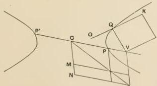

---

$$
\begin{array}{l}
\therefore CP^2 : CP \cdot CM = QV \cdot QO : QV \cdot QK \\
\quad = PV \cdot P'V : QV \cdot QK, \text{ from } (1).
\end{array}
$$

Therefore, since $PM$, $VK$ are equiangular,

$$
CP^2 : PV \cdot P'V = (PM) : (VK) \quad \text{(3)}.
$$

Hence $CP^2 \mp PV \cdot P'V : CP^2 = (PM) \mp (VK) : (PM)$, where the upper sign applies to the *ellipse* and *circle* and the lower to the *hyperbola*.

$$
\therefore CV^2 : CP^2 = (PM) \mp (VK) : (PM),
$$

and hence $(VN) : (PM) = (PM) \mp (VK) : (PM)$,

so that

$$
(VN) = (PM) \mp (VK),
$$

or

$$
(VN) \pm (VK) = (PM).
$$

[The above proof is reproduced as given by Apollonius in order to show his method of dealing with a somewhat complicated problem by purely geometrical means. The proposition is more shortly proved by a method more akin to algebra as follows.

We have

$$
QV^2 : CV^2 \sim CP^2 = CD^2 : CP^2,
$$

and $\frac{QV}{QK} = \frac{CD^2}{CP^2} \cdot \frac{CP}{CM}$, or $QV = QK \cdot \frac{CD^2}{CP \cdot CM}$;

$$
\therefore QV \cdot QK \cdot \frac{CD^2}{CP \cdot CM} : CV^2 \sim CP^2 = CD^2 : CP^2,
$$

or

$$
QV \cdot QK = CP \cdot CM \left( \frac{CV^2}{CP^2} \sim 1 \right).
$$

$$
\therefore (VK) = (VN) \sim (PM),
$$

or

$$
(VN) \pm (VK) = (PM).
$$

---

## Proposition 17.

[I. 42.]

In a parabola, if $QV$, $RW$ be ordinates to the diameter through $P$, and $QT$, the tangent at $Q$, and $RU$ parallel to it meet the diameter in $T$, $U$ respectively; and if through $Q$ a parallel to the diameter be drawn meeting $RW$ produced in $F$ and the tangent at $P$ in $E$, then

$$
\triangle RUW = \text{the parallelogram } (EW).
$$

Since $QT$ is a tangent,

$$
TV = 2PV; \text{ [Prop. 12]}
$$

$$
\therefore \triangle QTV = (EV) \tag{1}
$$

Also

$$
QV^2: RW^2 = PV: PW;
$$

$$
\therefore \triangle QTV: \triangle RUW = (EV): (EW),
$$

and $\triangle QTV = (EV)$, from (1);

$$
\therefore \triangle RUW = (EW).
$$

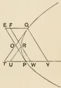

## Proposition 18.

[I. 43, 44.]

In a hyperbola, an ellipse, or a circle, if the tangent at $Q$ and the ordinate from $Q$ meet the diameter in $T$, $V$, and if $RW$ be the ordinate from any point $R$ and $RU$ be parallel to $QT$; if also $RW$ and the parallel to it through $P$ meet $CQ$ in $F$, $E$ respectively, then

$$
\triangle CFW \sim \triangle CPE = \triangle RUW.
$$

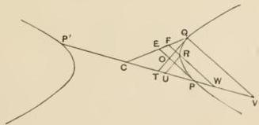

---

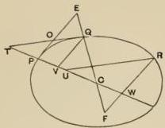

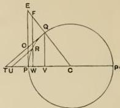

We have $QV^2: CV. VT = p: PP'$ [or $CD^2: CP^v$], whence $QV: VT = (p: PP'). (CV: QV)$; [Prop. 14 and Cor.] therefore, by parallels,

$$ RW: WU = (p: PP'). (CP: PE). $$

Thus, by Prop. 16, the parallelograms which are the doubles of the triangles $RUW$, $CPE$, $CWF$ have the property proved in that proposition. It follows that the same is true of the triangles themselves.

$$\therefore \triangle CFW \sim \triangle CPE = \triangle RUW.$$

[It is interesting to observe the exact significance of this proposition, which is the foundation of Apollonius’ method of transformation of coordinates. The proposition amounts to this: If $CP$, $CQ$ are fixed semidiameters and $R$ a variable point, the area of the quadrilateral $CFRU$ is constant for all positions of $R$ on the conic. Suppose now that $CP$, $CQ$ are taken as axes of coordinates ($CP$ being the axis of $x$). If we draw $RX$ parallel to $CQ$ to meet $CP$ and $RY$ parallel to $CP$ to meet $CQ$, the proposition asserts that (subject to the proper convention as to sign)

$$\triangle RYF + \square CXRY + \triangle RXU = \text{(const.)}.$$

But, since $RX$, $RY$, $RF$, $RU$ are in fixed directions,

$$\triangle RYF \propto RY^2,$$

or

$$\triangle RYF = ax^2;$$

$$\square CXRY \propto RX. RY,$$

or

$$\square CXRY = \beta xy;$$

$$\triangle RXU \propto RX^2,$$

or

$$\triangle RXU = \gamma y^2.$$

---

Hence, if $x, y$ are the coordinates of $R$,

$$
a x ^ {2} + \beta x y + \gamma y ^ {2} = A,
$$

which is the Cartesian equation referred to the centre as origin and any two diameters as axes.]

## Proposition 19.

[I. 45.]

If the tangent at $Q$ and the straight line through $R$ parallel to it meet the secondary diameter in $t, u$ respectively, and $Qv, Rw$ be parallel to the diameter $PP'$, meeting the secondary diameter in $v, w$; if also $Rw$ meet $CQ$ in $f$, then

$$
\Delta C f w = \Delta R u w - \Delta C Q t.
$$

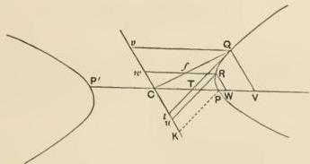

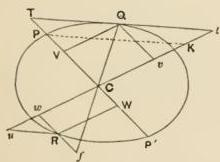

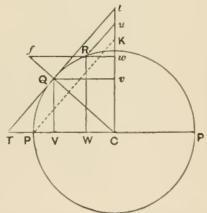

[Let $PK$ be drawn parallel to $Qt$ meeting the secondary diameter in $K$, so that the triangle $CPK$ is similar to the triangle $vQt$.]

We have [Prop. 14, Cor.]

$$
\begin{array}{l}
Q V: C V = (p: P P ^ {\prime}). (V T: Q V) \\
= (p: P P ^ {\prime}). (Q v: v t),
\end{array}
$$

---

and the triangles $QvC$, $Qvt$ are the halves of equiangular parallelograms on $Cv$ (or $QV$) and $Qv$ (or $CV$) respectively: also $CPK$ is the triangle on $CP$ similar to $Qvt$.

Therefore [by Prop. 16], $\triangle CQv = \triangle Qvt \sim \triangle CPK$,
and clearly
$$
\triangle CQv = \triangle Qvt \sim \triangle CQt;
$$
$$
\therefore \triangle CPK = \triangle CQt.
$$

Again, the triangle $Cfw$ is similar to the triangle $CQv$, and the triangle $Rwu$ to the triangle $Qvt$. Therefore, for the ordinate $RW$,
$$
\triangle Cfw = \triangle Ruw \sim \triangle CPK = \triangle Ruw \sim \triangle CQt.
$$

## Proposition 20.

[I. 46.]

In a parabola the straight line drawn through any point parallel to the diameter bisects all chords parallel to the tangent at the point.

Let $RR'$ be any chord parallel to the tangent at $Q$ and let it meet the diameter $PV$ in $U$. Let $QM$ drawn parallel to $PV$ meet $RR'$ in $M$, and the straight lines drawn ordinate-wise through $R, R', P$ in $F, F', E$ respectively.

We have then [Prop. 17]
$$
\triangle RUW = \square EW,
$$
and
$$
\triangle R'UW' = \square EW'.
$$

Therefore, by subtraction, the figure $RWW'R' = \square F'W$. Take away the common part $R'W'WFM$, and we have
$$
\triangle RMF = \triangle R'MF'.
$$

And $R'F'$ is parallel to $RF$;
$$
\therefore RM = MR'.
$$

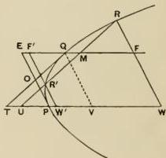

---

## Proposition 21.

[I. 47, 48.]

In a hyperbola, an ellipse, or a circle, the line joining any point to the centre bisects the chords parallel to the tangent at the point.

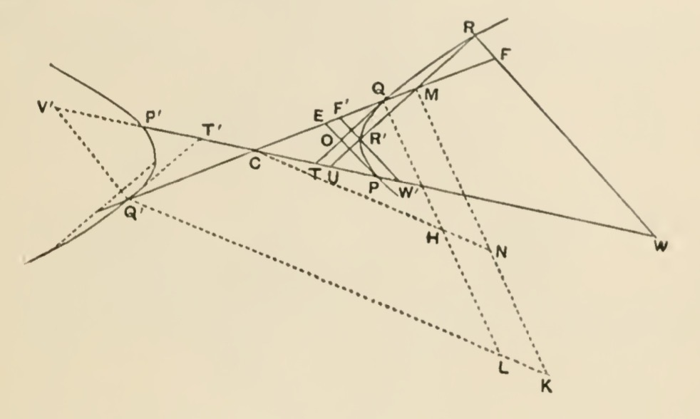
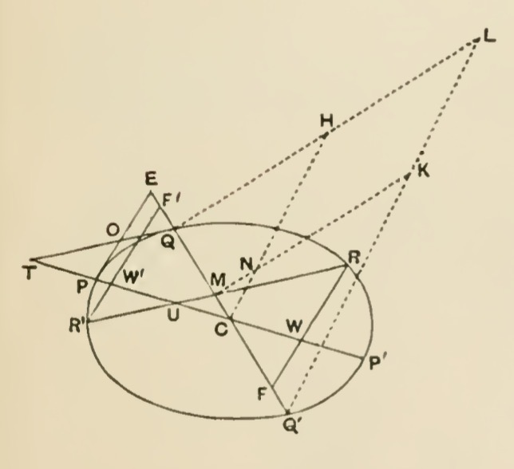
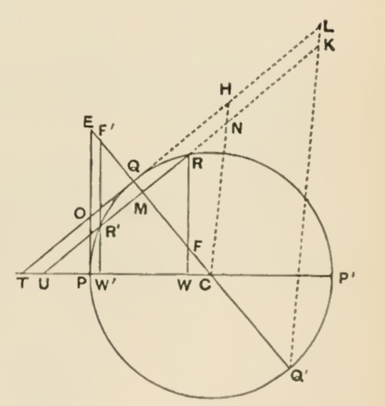

If $QT$ be the given tangent and $RR'$ any parallel chord, let $RW$, $R'W'$, $PE$ be drawn ordinate-wise to $PP'$, and let $CQ$ meet them in $F$, $F'$, $E$ respectively. Further let $CQ$ meet $RR'$ in $M$.

Then we have [by Prop. 18]

$$
\Delta CFW \sim \Delta CPE = \Delta RUW,
$$

and

$$
\Delta CF'W' \sim \Delta CPE = \Delta R'UW'.
$$

---

Thus (1), as the figure is drawn for the *hyperbola*,

$$
\begin{aligned}
& \Delta RUW = \text{quadrilateral } EPWF, \\
& \Delta R'UW' = \text{quadrilateral } EPW'F';
\end{aligned}
$$

$\therefore$, by subtraction, the figure $F'W'WF =$ the figure $R'W'WR$.

Taking away the common part $R'W'WFM$, we obtain

$$
\Delta FRM = \Delta F'R'M.
$$

And, $\because FR, F'R'$ are parallel,

$$
RM = MR'.
$$

(2) as the figure is drawn for the *ellipse*,

$$
\begin{aligned}
& \Delta CPE - \Delta CFW = \Delta RUW, \\
& \Delta CPE - \Delta CF'W' = \Delta R'UW',
\end{aligned}
$$

$\therefore$, by subtraction,

$$
\begin{aligned}
& \Delta CF'W' - \Delta CFW = \Delta RUW - \Delta R'UW', \\
& \Delta RUW + \Delta CFW = \Delta R'UW' + \Delta CF'W'.
\end{aligned}
$$

Therefore the quadrilaterals $CFRU$, $CF'R'U$ are equal, and, taking away the common part, the triangle $CUM$, we have

$$
\Delta FRM = \Delta F'R'M,
$$

and, as before,

$$
RM = MR'.
$$

(3) if $RR'$ is a chord in the opposite branch of a *hyperbola*, and $Q'$ the point where $QC$ produced meets the said opposite branch, $CQ$ will bisect $RR'$ provided $RR'$ is parallel to the tangent at $Q'$.

We have therefore to prove that the tangent at $Q'$ is parallel to the tangent at $Q$, and the proposition follows immediately*.

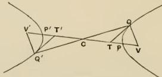

We have

$$
CV.CT = CP^2 [\text{Prop. 14}),
$$

and

$$
CV'.CT' = CP'^2;
$$

$$
\therefore CV.CT = CV'.CT',
$$

and

$$
CV = CV', \quad CQ = CQ' [\text{Prop. 10}];
$$

$$
\therefore CT = CT'.
$$

Hence, from the $\Delta$ and $CQT$, $CQ'T'$, it follows that $QT$, $Q'T'$ are parallel.

---

## Proposition 22.

[I. 49.]

Let the tangent to a parabola at $P$, the extremity of the original diameter, meet the tangent at any point $Q$ in $O$, and the parallel through $Q$ to the diameter in $E$; and let $RR'$ be any chord parallel to the tangent at $Q$ meeting $PT$ in $U$ and $EQ$ produced in $M$; then, if $p'$ be taken such that

$$
OQ: QE = p': 2QT,
$$

it is to be proved that

$$
RM^2 = p'. QM.
$$

In the figure of Prop. 20 draw the ordinate $QV$.

Then we have, by hypothesis,

$$
OQ: QE = p': 2TQ.
$$

Also

$$
QE = PV = TP.
$$

Therefore the triangles $EOQ$, $POT$ are equal.

Add to each the figure $QOPWF$;

∴ the quadrilateral $QTWF = \square(EW) = \triangle RUW$. [Prop. 17]

Subtract the quadrilateral $MUWF$;

$$
\therefore \quad \square QU = \triangle RMF,
$$

and hence

$$
RM.MF = 2QM.QT. \tag{1}.
$$

But

$$
RM: MF = OQ: QE = p': 2QT,
$$

or

$$
RM^2: RM.MF = p'. QM: 2QM.QT.
$$

Therefore, from (1),

$$
RM^2 = p'. QM.
$$

## Proposition 23.

[I. 50.]

If in a hyperbola, an ellipse, or a circle, the tangents at $P$, $Q$ meet in $O$, and the tangent at $P$ meet the line joining $Q$ to the centre in $E$; if also a length $QL (= p')$ be taken such that

$$
OQ: QE = QL: 2TQ
$$

---

and erected perpendicular to $QC$; if further $Q'L$ be joined (where $Q'$ is on $QC$ produced and $CQ = CQ'$), and $MK$ be drawn parallel to $QL$ to meet $Q'L$ in $K$ (where $M$ is the point of concourse of $CQ$ and $RR'$, a chord parallel to the tangent at $Q$): then it is to be proved that

$$
RM^2 = QM \cdot MK.
$$

In the figures of Prop. 21 draw CHN parallel to $Q'L$, meeting $QL$ in $H$ and $MK$ in $N$, and let $RW$ be an ordinate to $PP'$, meeting $CQ$ in $F$.

Then, since $CQ = CQ'$, $QH = HL$.

Also
$$
OQ : QE = QL : 2QT
$$
$$
= QH : QT;
$$
$$
\therefore RM : MF = QH : QT \quad \text{(A).}
$$

Now

$$
\Delta RUW = \Delta CFW \sim \Delta CPE = \Delta CFW \sim \Delta CQT;
$$

$\therefore$ in the figures as drawn

(1) for the *hyperbola*,
$$
\Delta RUW = QTWF,
$$
$$
\therefore, \text{ subtracting } MUWF,
$$
we have
$$
\Delta RMF = QTUM.
$$

(2) for the *ellipse* and *circle*,
$$
\Delta RUW = \Delta CQT - \Delta CFW;
$$
$$
\therefore \Delta CQT = \text{quadrilateral} RUCF;
$$
and, subtracting $\Delta MUC$, we have
$$
\Delta RMF = QTUM.
$$
$$
\therefore RM \cdot MF = QM (QT + MU) \quad \text{(B).}
$$

---

Now
$$ QT: MU = CQ: CM = QH: MN $$
$$ \therefore QH + MN: QT + MU = QH: QT = RM: MF \text{ [from (A)]}; $$
$$ QM(QH + MN): QM(QT + MU) = RM^2: RM.MF; $$
$$ \therefore [\text{by (B)}] \quad RM^2 = QM(QH + MN) = QM.MK. $$

The same is true for the opposite branch of the hyperbola. The tangent at $Q'$ is parallel to $QT$, and $P'E'$ to $PE$. [Prop. 21, Note.]

$$ \therefore O'Q': Q'E' = OQ: QE = p': 2QT = p': 2Q'T', $$

whence the proposition follows.

It results from the propositions just proved that in a *parabola* all straight lines drawn parallel to the original diameter are diameters, and in the *hyperbola* and *ellipse* all straight lines drawn through the centre are diameters; also that the conics can each be referred indifferently to any diameter and the tangent at its extremity as axes.

---

# CONSTRUCTION OF CONICS FROM CERTAIN DATA.

## Proposition 24. (Problem.)

[I. 52, 53.]

Given a straight line in a fixed plane and terminating in a fixed point, and another straight line of a certain length, to find a parabola in the plane such that the first straight line is a diameter, the second straight line is the corresponding parameter, and the ordinates are inclined to the diameter at a given angle.

First, let the given angle be a right angle, so that the given straight line is to be the axis.

Let $AB$ be the given straight line terminating at $A$, $p_a$ the given length.

Produce $BA$ to $C$ so that $AC > \frac{p_a}{4}$, and let $S$ be a mean proportional between $AC$ and $p_a$. (Thus $p_a : AC = S^2 : AC^2$, and $AC > \frac{1}{4} p_a$, whence $AC^2 > \frac{S^2}{4}$, or $2AC > S$, so that it is possible to describe an isosceles triangle having two sides equal to $AC$ and the third equal to $S$.)

Let $AOC$ be an isosceles triangle in a plane perpendicular to the given plane and such that $AO = AC$, $OC = S$.

Complete the parallelogram $ACOE$, and about $AE$ as diameter, in a plane perpendicular to that of the triangle $AOC$, describe a circle, and let a cone be drawn with $O$ as

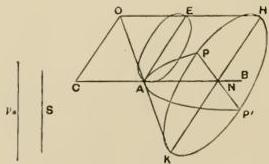

---

apex and the said circle as base. Then the cone is a right cone because $OE = AC = OA$.

Produce $OE$, $OA$ to $H$, $K$, and draw $HK$ parallel to $AE$, and let the cone be cut by a plane through $HK$ parallel to the base of the cone. This plane will produce a circular section, and will intersect the original plane in a line $PP'$, cutting $AB$ at right angles in $N$.

Now $p_a : AE = AE : AO$, since $AE = OC = S$, $AO = AC$;

$$
\begin{array}{l}
\therefore p_a : AO = AE^2 : AO^2 \\
= AE^2 : AO \cdot OE.
\end{array}
$$

Hence $PAP'$ is a parabola in which $p_a$ is the parameter of the ordinates to $AB$. [Prop. 1]

Secondly, let the given angle not be right. Let the line which is to be the diameter be $PM$, let $p$ be the length of the parameter, and let $MP$ be produced to $F$ so that $PF = \frac{1}{2}p$. Make the angle $FPT$ equal to the given angle and draw $FT$ perpendicular to $TP$. Draw $TN$ parallel to $PM$, and $PN$ perpendicular to $TN$; bisect $TN$ in $A$ and draw $LAE$ through $A$ perpendicular to $FP$ meeting $PT$ in $O$; and let

$$
NA \cdot AL = PN^2.
$$

Now with axis $AN$ and parameter $AL$ describe a parabola, as in the first case.

This will pass through $P$ since $PN^2 = LA \cdot AN$. Also $PT$ will be a tangent to it since $AT = AN$. And $PM$ is parallel to $AN$. Therefore $PM$ is a diameter of the parabola bisecting chords parallel to the tangent $PT$, which are therefore inclined to the diameter at the given angle.

Again the triangles $FTP$, $OEP$ are similar;

$$
\begin{array}{l}
\therefore OP : PE = FP : PT, \\
= p : 2PT,
\end{array}
$$

by hypothesis.

Therefore $p$ is the parameter of the parabola corresponding to the diameter $PM$. [Prop. 22]

---

## Proposition 25. (Problem.)

[I. 54, 55, 59.]

Given a straight line $AA'$ in a plane, and also another straight line of a certain length; to find a hyperbola in the plane such that the first straight line is a diameter of it and the second equal to the corresponding parameter, while the ordinates to the diameter make with it a given angle.

First, let the given angle be a right angle.

Let $AA'$, $p_a$ be the given straight lines, and let a circle be drawn through $A$, $A'$ in a plane perpendicular to the given plane and such that, if $C$ be the middle point of $AA'$ and $DF$ the diameter perpendicular to $AA'$,

$$
DC:CF \ngtr AA':p_a.
$$

Then, if $DC:CF = AA':p_a$, we should use the point $F$ for our construction, but, if not, suppose

$$
DC:CG = AA':p_a \text{ (}CG \text{ being less than } CF\text{).}
$$

Draw $GO$ parallel to $AA'$, meeting the circle in $O$. Join $AO$,

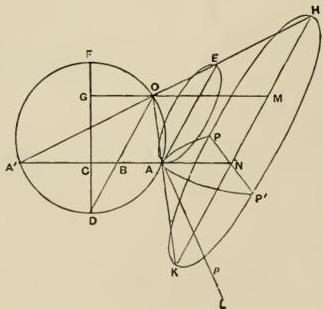

$A'O$, $DO$. Draw $AE$ parallel to $DO$ meeting $A'O$ produced in $E$. Let $DO$ meet $AA'$ in $B$.

---

Then
$$
\angle OEA = \angle A'OD = \angle AOD = \angle OAE;
$$
$$
\therefore OA = OE.
$$

Let a cone be described with $O$ for apex and for base the circle whose diameter is $AE$ and whose plane is perpendicular to that of the circle $AOD$. The cone will therefore be right, since $OA = OE$.

Produce $OE$, $OA$ to $H$, $K$ and draw $HK$ parallel to $AE$. Draw a plane through $HK$ perpendicular to the plane of the circle $AOD$. This plane will be parallel to the base of the cone, and the resulting section will be a circle cutting the original plane in $PP'$ at right angles to $A'A$ produced. Let $GO$ meet $HK$ in $M$.

Then, because $NA$ meets $HO$ produced beyond $O$, the curve $PAP'$ is a hyperbola.

And
$$
\begin{aligned}
AA': p_a &= DC:CG \\
&= DB:BO \\
&= DB.BO:BO^2 \\
&= A'B.BA:BO^2.
\end{aligned}
$$

But
$$
\left.\begin{array}{l}
A'B:BO = OM:MH \\
BA:BO = OM:MK
\end{array}\right\} \text{by similar triangles,}
$$

$$
\therefore A'B.BA:BO^2 = OM^2:HM.MK.
$$

Hence
$$
AA': p_a = OM^2:HM.MK.
$$

Therefore $p_a$ is the parameter of the hyperbola $PAP'$ corresponding to the diameter $AA'$. [Prop. 2]

Secondly, let the given angle not be a right angle. Let $PP'$, $p$ be the given straight lines, $CPT$ the given angle, and $C$ the middle point of $PP'$. On $CP$ describe a semicircle, and let $N$ be such a point on it that, if $NH$ is drawn parallel to $PT$ to meet $CP$ produced in $H$,

$$
NH^2:CH.HP = p:PP'.
$$

---

Join $NC$ meeting $PT$ in $T$, and take $A$ on $CN$ such that $CA^2 = CT.CN$. Join $PN$ and produce it to $K$ so that

$$
PN^2 = AN.NK.
$$

Produce $AC$ to $A'$ so that $AC = CA'$, join $A'K$, and draw $EOAM$ through $A$ parallel to $PN$ meeting $CP, PT, A'K$ in $E, O, M$ respectively.

With $AA'$ as axis, and $AM$ as the corresponding parameter, describe a hyperbola as in the first part of the proposition. This will pass through $P$ because $PN^2 = AN.NK$.

a similar case in Prop. 52. In fact the solution given by Eutocius represents sufficiently closely Apollonius' probable procedure.

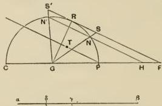

If $HN$ produced be supposed to meet the curve again in $N'$, then

$$
N'H.HN = CH.HP;
$$

$$
\therefore NH^2 : CH.HP = NH : N'H.
$$

Thus we have to draw $HNN'$ at a given inclination to $PC$ and so that

$$
N'H : NH = PP' : p.
$$

Take any straight line $a\beta$ and divide it at $\gamma$ so that

$$
a\beta : \beta\gamma = PP' : p.
$$

Bisect $a\gamma$ in $\delta$. Then draw from $G$, the centre of the semicircle, $GR$ at right angles to $PT$ which is in the given direction, and let $GR$ meet the circumference in $R$. Then $RF$ drawn parallel to $PT$ will be the tangent at $R$. Suppose $RF$ meets $CP$ produced in $F$. Divide $FR$ at $S$ so that $FS : SR = \beta\gamma : \gamma\delta$, and produce $FR$ to $S'$ so that $RS' = RS$.

Join $GS, GS'$, meeting the semicircle in $N, N'$, and join $N'N$ and produce it to meet $CF$ in $H$. Then $NH$ is the straight line which it was required to find.

The proof is obvious.

---

Also $PT$ will be the tangent at $P$ because $CT \cdot CN = CA^2$. Therefore $CP$ will be a diameter of the hyperbola bisecting

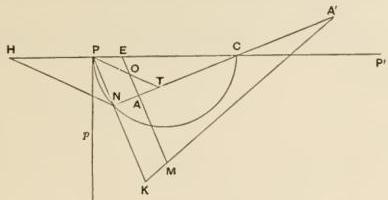

chords parallel to $PT$ and therefore inclined to the diameter at the given angle.

Again we have

$$
p: 2CP = NH^2: CH \cdot HP, \text{ by construction,}
$$

and

$$
\begin{aligned}
2CP: 2PT &= CH: NH \\
&= CH \cdot HP: NH \cdot HP; \\
\therefore p: 2PT &= NH^2: NH \cdot HP \\
&= NH: HP \\
&= OP: PE, \text{ by similar triangles;}
\end{aligned}
$$

therefore $p$ is the parameter corresponding to the diameter $PP'$. [Prop. 23]

The opposite branch of the hyperbola with vertex $A'$ can be described in the same way.

## Proposition 26. (Problem.)

[I. 60.]

Given two straight lines bisecting one another at any angle, to describe two hyperbolas each with two branches such that the straight lines are conjugate diameters of both hyperbolas.

Let $PP', DD'$ be the two straight lines bisecting each other at $C$.

---

From $P$ draw $PL$ perpendicular to $PP'$ and of such a length that $PP'.PL = DD'^2$; then, as in Prop. 25, describe a double hyperbola with diameter $PP'$ and parameter $PL$ and such that the ordinates in it to $PP'$ are parallel to $DD'$.

Then $PP'$, $DD'$ are conjugate diameters of the hyperbola so constructed.

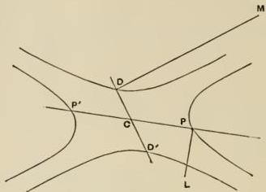

Again, draw $DM$ perpendicular to $DD'$ of such a length that $DM \cdot DD' = PP'^2$; and, with $DD'$ as diameter, and $DM$ as the corresponding parameter, describe a double hyperbola such that the ordinates in it to $DD'$ are parallel to $PP'$.

Then $DD'$, $PP'$ are conjugate diameters to this hyperbola, and $DD'$ is the transverse, while $PP'$ is the secondary diameter.

The two hyperbolas so constructed are called **conjugate** hyperbolas, and that last drawn is the hyperbola **conjugate** to the first.

## Proposition 27. (Problem.)
[I. 56, 57, 58.]

Given a diameter of an ellipse, the corresponding parameter, and the angle of inclination between the diameter and its ordinates: to find the ellipse.

First, let the angle of inclination be a right angle, and let the diameter be greater than its parameter.

---

Let $AA'$ be the diameter and $AL$, a straight line of length $p_a$ perpendicular to it, the parameter.

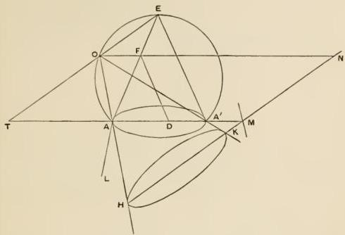

In a plane at right angles to the plane containing the diameter and parameter describe a segment of a circle on $AA'$ as base.

Take $AD$ on $AA'$ equal to $AL$. Draw $AE$, $A'E$ to meet at $E$, the middle point of the segment. Draw $DF$ parallel to $A'E$ meeting $AE$ in $F$, and $OFN$ parallel to $AA'$ meeting the circumference in $O$. Join $EO$ and produce it to meet $A'A$ produced in $T$. Through any point $H$ on $OA$ produced draw $HKMN$ parallel to $OE$ meeting $OA'$, $AA'$, $OF$ in $K$, $M$, $N$ respectively.

Now

$$
\begin{array}{l}
\angle TOA = \angle OEA + \angle OAE = \angle AA'O + \angle OA'E = \angle AA'E \\
= \angle EAA' = \angle EOA',
\end{array}
$$

and $HK$ is parallel to $OE$,

whence

$$
\angle OHK = \angle OKH
$$

and

$$
OH = OK.
$$

---

With $O$ as vertex, and as base the circle drawn with diameter $HK$ and in a plane perpendicular to that of the triangle $OHK$, let a cone be described. This cone will be a right cone because $OH = OK$.

Consider the section of this cone by the plane containing $AA'$, $AL$. This will be an ellipse.

And
$$ p_a : AA' = AD : AA' $$
$$ = AF : AE $$
$$ = TO : TE $$
$$ = TO^2 : TO.TE $$
$$ = TO^2 : TA.TA'. $$

Now
$$ TO : TA = HN : NO, $$

and
$$ TO : TA' = NK : NO, \text{ by similar triangles}, $$
$$ \therefore TO^2 : TA.TA' = HN.NK : NO^2, $$

so that
$$ p_a : AA' = HN.NK : NO^2, $$

or
$$ p_a \text{ is the parameter of the ordinates to } AA'. \quad \text{[Prop. 3]} $$

Secondly, if the angle of inclination of the ordinates be still a right angle, but the given diameter less than the parameter, let them be $BB'$, $BM$ respectively.

Let $C$ be the middle point of $BB'$, and through it draw $AA'$, perpendicular to $BB'$ and bisected at $C$, such that

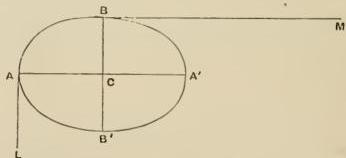

$$ AA'^2 = BB'.BM; $$

and draw $AL$, parallel to $BB'$, such that
$$ BM : BB' = AA' : AL; $$

thus

$$
AA' > AL.
$$

---

Now with $AA'$ as diameter and $AL$ as the corresponding parameter describe an ellipse in which the ordinates to $AA'$ are perpendicular to it, as above.

This will be the ellipse required, for

(1) it passes through $B, B'$ because

$$
\begin{array}{l}
AL: AA' = BB': BM \\
= BB'^2: AA'^2 \\
= BC^2: AC.CA',
\end{array}
$$

$$
\begin{array}{l}
BM: BB' = AC^2: BC^2 \tag{2} \\
= AC^2: BC.CB',
\end{array}
$$

so that $BM$ is the parameter corresponding to $BB'$.

Thirdly, let the given angle not be a right angle but

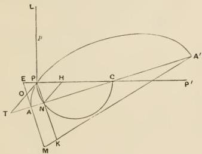

equal to the angle $CPT$, where $C$ is the middle point of the given diameter $PP'$; and let $PL$ be the parameter corresponding to $PP'$.

Take a point $N$, on the semicircle which has $CP$ for its diameter, such that $NH$ drawn parallel to $PT$ satisfies the relation

$$
NH^2: CH.HP = PL: PP'.
$$

---

Join $CN$ and produce it to meet $PT$ in $T$. Take $A$, on $CT$, such that $CT.CN = CA^2$, and produce $AC$ to $A'$ so that $AC = CA'$. Join $PN$ and produce it to $K$ so that $AN.NK = PN^2$. Join $A'K$. Draw $EAM$ through $A$ perpendicular to $CA$ (and therefore parallel to $NK$) meeting $CP$ produced in $E$, $PT$ in $O$, and $A'K$ produced in $M$.

Then with axis $AA'$ and parameter $AM$ describe an ellipse as in the first part of this proposition. This will be the ellipse required.

For (1) it will pass through $P \cdot PN^2 = AN.NK$. For a similar reason, it will pass through $P' \cdot CP' = CP$ and $CA' = CA$.

(2) $PT$ will be the tangent at $P \cdot CT.CN = CA^2$.

(3) We have $p: 2CP = NH^2: CH.HP$,

and

$$
\begin{array}{l}
2CP: 2PT = CH: HN \\
= CH.HP: NH.HP;
\end{array}
$$

$\therefore$ ex aequali

$$
\begin{array}{l}
p: 2PT = NH^2: NH.HP \\
= NH: HP \\
= OP: PE.
\end{array}
$$

Therefore $p$ is the parameter corresponding to $PP'$. [Prop. 23]

problem here reduces to drawing $NHN'$ in a given direction (parallel to $PT$) so that

$$
N'H: NH = PP': p,
$$

and the construction can be effected by the method shown in the note to Prop. 25 mutatis mutandis.

---

# ASYMPTOTES.

## Proposition 28.

[II. 1, 15, 17, 21.]

(1) If $PP'$ be a diameter of a hyperbola and $p$ the corresponding parameter, and if on the tangent at $P$ there be set off on each side equal lengths $PL, PL'$, such that

$$
PL^2 = PL'^2 = \frac{1}{4} p \cdot PP' [= CD^2],
$$

then $CL, CL'$ produced will not meet the curve in any finite point and are accordingly defined as *asymptotes*.

(2) The opposite branches have the same asymptotes.

(3) Conjugate hyperbolas have their asymptotes common.

(1) If possible, let $CL$ meet the hyperbola in $Q$. Draw the

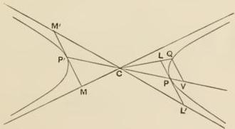

ordinate $QV$, which will accordingly be parallel to $LL'$.

Now

$$
p: PP' = p \cdot PP': PP'^2
$$

$$
\begin{array}{l}
= PL^2: CP^2 \\
= QV^2: CV^2.
\end{array}
$$

---

But

$$p: PP' = QV^2: PV. P'V.$$

$$\therefore PV. P'V = CV^2,$$

i.e. $CV^2 - CP^2 = CV^2$, which is absurd.

Therefore $CL$ does not meet the hyperbola in any finite point, and the same is true for $CL'$.

In other words, $CL$, $CL'$ are **asymptotes**.

(2) If the tangent at $P'$ (on the opposite branch) be taken, and $P'M$, $P'M'$ measured on it such that $P'M^2 = P'M'^2 = CD^2$, it follows in like manner that $CM$, $CM'$ are asymptotes.

Now $MM'$, $LL'$ are parallel, $PL = P'M$, and $PCP'$ is a straight line. Therefore $LCM$ is a straight line.

So also is $L'CM'$, and therefore the opposite branches have the same asymptotes.

(3) Let $PP'$, $DD'$ be conjugate diameters of two conjugate

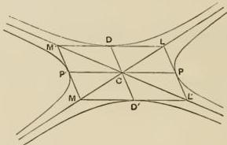

hyperbolas. Draw the tangents at $P$, $P'$, $D$, $D'$. Then [Prop. 11 and Prop. 26] the tangents form a parallelogram, and the diagonals of it, $LM$, $L'M'$, pass through the centre.

Also

$$PL = PL' = P'M = P'M' = CD.$$

Therefore $LM$, $L'M'$ are the asymptotes of the hyperbola in which $PP'$ is a transverse diameter and $DD'$ its conjugate.

Similarly $DL = DM' = D'L' = D'M = CP$, and $LM$, $L'M'$ are the asymptotes of the hyperbola in which $DD'$ is a transverse diameter and $PP'$ its conjugate, i.e. the conjugate hyperbola.

Therefore conjugate hyperbolas have their asymptotes common.

---

## Proposition 29.

[II. 2.]

No straight line through $C$ within the angle between the asymptotes can itself be an asymptote.

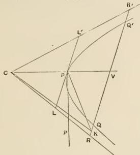

If possible, let $CK$ be an asymptote. Draw from $P$ the straight line $PK$ parallel to $CL$ and meeting $CK$ in $K$, and through $K$ draw $RKQR'$ parallel to $LL'$, the tangent at $P$.

Then, since $PL = PL'$, and $RR'$, $LL'$ are parallel, $RV = R'V$, where $V$ is the point of intersection of $RR'$ and $CP$.

And, since $PKRL$ is a parallelogram, $PK = LR$, $PL = KR$.

Therefore $QR > PL$. Also $R'Q > PL'$;

$$
\therefore RQ \cdot QR' > PL \cdot PL', \text{ or } PL' \tag{1}
$$

Again $RV^2: CV^2 = PL^2: CP^2 = p: PP'$, [Prop. 28]

and $p: PP' = QV^2: PV \cdot P'V$ [Prop. 8]

$$
= QV^2: CV^2 - CP^2;
$$

thus

$$
RV^2: CV^2 = QV^2: CV^2 - CP^2
$$

$$
= RV^2 - QV^2: CP^2;
$$

$$
\therefore PL^2: CP^2 = RV^2 - QV^2: CP^2,
$$

whence

$$
PL^2 = RV^2 - QV^2 = RQ \cdot QR',
$$

which is impossible, by (1) above.

Therefore $CK$ cannot be an asymptote.

---

## Proposition 30.

[II. 3.]

If a straight line touch a hyperbola at $P$, it will meet the asymptotes in two points $L, L' \colon LL'$ will be bisected at $P$, and $PL^2 = \frac{1}{4} p \cdot PP' [= CD^2]$.

[This proposition is the converse of Prop. 28 (1) above.]

For, if the tangent at $P$ does not meet the asymptotes in the points $L, L'$ described, take on the tangent lengths $PK, PK'$ each equal to $CD$.

Then $CK, CK'$ are asymptotes; which is impossible.

Therefore the points $K, K'$ must be identical with the points $L, L'$ on the asymptotes.

## Proposition 31. (Problem.)

[II. 4.]

Given the asymptotes and a point $P$ on a hyperbola, to find the curve.

Let $CL, CL'$ be the asymptotes, and $P$ the point. Produce $PC$ to $P'$ so that $CP = CP'$. Draw $PK$ parallel to $CL'$ meeting $CL$ in $K$, and let $CL$ be made equal to twice $CK$. Join $LP$ and produce it to $L'$.

Take a length $p$ such that $LL'^2 = p \cdot PP'$, and with diameter $PP'$ and parameter $p$ describe a hyperbola such that the ordinates to $PP'$ are parallel to $LL'$. [Prop. 25]

---

## Proposition 32.

[II. 8, 10.]

If $Qq$ be any chord, it will, if produced both ways, meet the asymptotes in two points as $R, r,$ and

(1) $QR, qr$ will be equal,

(2) $RQ \cdot Qr = \frac{1}{4} p \cdot PP' [= CD^2]$.

Take $V$ the middle point of $Qq$, and join $CV$ meeting the curve in $P$. Then $CV$ is a diameter and the tangent at $P$ is parallel to $Qq$. [Prop. 11]

Also the tangent at $P$ meets the asymptotes (in $L, L'$). Therefore $Qq$ parallel to it also meets the asymptotes.

Then (1), since $Qq$ is parallel to $LL'$, and $LP = PL'$, it follows that $RV = Vr$.

But

$$
QV = Vq;
$$

therefore, subtracting, $QR = qr$.

(2) We have

$$
\begin{aligned}
p : PP' &= PL^2 : CP^2 \\
&= RV^2 : CV^2,
\end{aligned}
$$

and

$$
p : PP' = QV^2 : CV^2 - CP^2; \quad [\text{Prop. 8}]
$$

$$
\begin{aligned}
\therefore PL^2 : CP^2 &= p : PP' = RV^2 - QV^2 : CP^2 \\
&= RQ \cdot Qr : CP^2;
\end{aligned}
$$

thus

$$
\begin{aligned}
RQ \cdot Qr &= PL^2 \\
&= \frac{1}{4} p \cdot PP' = CD^2.
\end{aligned}
$$

Similarly

$$
rq \cdot qR = CD^2.
$$

---

## Proposition 33.

[II. 11, 16.]

If $Q, Q'$ are on opposite branches, and $QQ'$ meet the asymptotes in $K, K'$, and if $CP$ be the semidiameter parallel to $QQ'$, then

(1) $KQ \cdot QK' = CP^2$,

(2) $QK = Q'K'$.

Draw the tangent at $P$ meeting the asymptotes in $L, L'$, and

let the chord $Qq$ parallel to $LL'$ meet the asymptotes in $R, r$. $Qq$ is therefore a double ordinate to $CP$.

Then we have

$$
\begin{aligned}
PL^2 : CP^2 &= (PL : CP) \cdot (PL' : CP) \\
&= (RQ : KQ) \cdot (Qr : QK') \\
&= RQ \cdot Qr : KQ \cdot QK'.
\end{aligned}
$$

But

$$
PL^2 = RQ \cdot Qr;
\quad \text{[Prop. 32]}
$$

$$
\therefore KQ \cdot QK' = CP^2.
$$

Similarly

$$
K'Q' \cdot Q'K = CP^2.
$$

(2) $KQ \cdot QK' = CP^2 = K'Q' \cdot Q'K$;

$$
\therefore KQ \cdot (KQ + KK') = K'Q'(K'Q' + KK'),
$$

whence it follows that

$$
KQ = K'Q'.
$$

---

## Proposition 34.

[II. 12.]

If $Q, q$ be any two points on a hyperbola, and parallel straight lines $QH, qh$ be drawn to meet one asymptote at any angle, and $QK, qk$ (also parallel to one another) meet the other asymptote at any angle, then

$$
HQ \cdot QK = hq \cdot qk.
$$

Let $Qq$ meet the asymptotes in $R, r$.

We have $RQ \cdot Qr = Rq \cdot qr$; [Prop. 32]

$$
\therefore RQ : Rq = qr : Qr.
$$

But

$$
RQ : Rq = HQ : hq,
$$

and

$$
qr : Qr = qk : QK;
$$

$$
\therefore HQ : hq = qk : QK,
$$

or

$$
HQ \cdot QK = hq \cdot qk.
$$

---

## Proposition 35.

[II. 13.]

If in the space between the asymptotes and the hyperbola a straight line be drawn parallel to one of the asymptotes, it will meet the hyperbola in one point only.

Let $E$ be a point on one asymptote, and let $EF$ be drawn parallel to the other.

Then $EF$ produced shall meet the curve in one point only.

For, if possible, let it not meet the curve.

Take $Q$, any point on the curve, and draw $QH$, $QK$ each parallel to one asymptote and meeting the other; let a point $F$ be taken on $EF$ such that

$$
HQ.QK = CE.EF.
$$

Join $CF$ and produce it to meet the curve in $q$; and draw $qh$, $qk$ respectively parallel to $QH$, $QK$.

Then $hq.qk = HQ.QK$, [Prop. 34]

and $HQ.QK = CE.EF$, by hypothesis,

$$
\therefore hq.qk = CE.EF:
$$

which is impossible, $\because hq > EF$, and $qk > CE$.

Therefore $EF$ will meet the hyperbola in one point, as $R$.

Again, $EF$ will not meet the hyperbola in any other point.

For, if possible, let $EF$ meet it in $R'$ as well as $R$, and let $RM$, $R'M'$ be drawn parallel to $QK$.

Then $ER.RM = ER'.R'M'$ : [Prop. 34]

which is impossible, $\because ER' > ER$.

Therefore $EF$ does not meet the hyperbola in a second point $R'$.

---

## Proposition 36.

[II. 14.]

The asymptotes and the hyperbola, as they pass on to infinity, approach continually nearer, and will come within a distance less than any assignable length.

Let $S$ be the given length.

Draw two parallel chords $Qq, Q'q'$ meeting the asymptotes in $R, r$ and $R', r'$. Join $Cq$ and produce it to meet $Q'q'$ in $F$.

Then
$$
r'q'.q'R' = rq.qR,
$$
and
$$
q'R' > qR;
$$
$$
\therefore q'r' < qr,
$$

and hence, as successive chords are taken more and more distant from the centre, $qr$ becomes smaller and smaller.

Take now on $rq$ a length $rH$ less than $S$, and draw $HM$ parallel to the asymptote $Cr$.

$HM$ will then meet the curve [Prop. 35] in a point $M$. And, if $MK$ be drawn parallel to $Qq$ to meet $Cr$ in $K$,

$$
MK = rH,
$$

whence
$$
MK < S.
$$

---

## Proposition 37.

[II. 19.]

Any tangent to the conjugate hyperbola will meet both branches of the original hyperbola and be bisected at the point of contact.

(1) Let a tangent be drawn to either branch of the conjugate hyperbola at a point $D$.

This tangent will then meet the asymptotes [Prop. 30], and will therefore meet both branches of the original hyperbola.

(2) Let the tangent meet the asymptotes in $L$, $M$ and the original hyperbola in $Q$, $Q'$.

Then [Prop. 30]  $DL = DM.$

Also [Prop. 33]  $LQ = MQ';$

whence, by addition,  $DQ = DQ'$.

---

## Proposition 38.

[II. 23.]

If a chord $Qq$ in one branch of a hyperbola meet the asymptotes in $R, r$ and the conjugate hyperbola in $Q', q'$, then

$$
Q'Q \cdot Qq' = 2CD^2.
$$

Let $CD$ be the parallel semi-diameter. Then we have [Props. 32, 33]

$$
RQ \cdot Qr = CD^2,
$$

$$
RQ' \cdot Q'r = CD^2;
$$

$$
\begin{array}{l}
\therefore 2CD^2 = RQ \cdot Qr + RQ' \cdot Q'r \\
= (RQ + RQ') Qr + RQ' \cdot QQ' \\
= QQ' \cdot (Qr + RQ') \\
= QQ' \cdot (Qr + rq') \\
= QQ' \cdot Qq'.
\end{array}
$$

---

# TANGENTS, CONJUGATE DIAMETERS AND AXES.

## Proposition 39.

[II. 20.]

If $Q$ be any point on a hyperbola, and $CE$ be drawn from the centre parallel to the tangent at $Q$ to meet the conjugate hyperbola in $E$, then

(1) the tangent at $E$ will be parallel to $CQ$, and

(2) $CQ, CE$ will be conjugate diameters.

Let $PP', DD'$ be the conjugate diameters of reference, and let $QV$ be the ordinate from $Q$ to $PP'$, and $EW$ the ordinate

from $E$ to $DD'$. Let the tangent at $Q$ meet $PP', DD'$ in $T$, $t$ respectively, let the tangent at $E$ meet $DD'$ in $U$, and let the tangent at $D$ meet $EU$, $CE$ in $O$, $H$ respectively.

Let $p, p'$ be the parameters corresponding to $PP', DD'$ in the two hyperbolas, and we have

(1) $PP': p = p': DD',$

$$
[\because p. PP' = DD'', \quad p'. DD' = PP'']
$$

---

and

$$ PP': p = CV.\, VT: QV^2, $$

$$ p': DD' = EW^2: CW.\, WU. \quad \text{[Prop. 14]} $$

$$ \therefore CV.\, VT: QV^2 = EW^2: CW.\, WU. $$

But, by similar triangles,

$$ VT: QV = EW: CW. $$

Therefore, by division,

$$ CV: QV = EW: WU. $$

And in the triangles $CVQ$, $EWU$ the angles at $V$, $W$ are equal.

Therefore the triangles are similar, and

$$ \angle QCV = \angle UEW. $$

But $ \angle VCE = \angle CEW $, since $EW$, $CV$ are parallel.

Therefore, by subtraction, $ \angle QCE = \angle CEU. $

Hence $EU$ is parallel to $CQ$.

(2) Take a straight line $S$ of such length that

$$ HE: EO = EU: S, $$

so that $S$ is equal to half the parameter of the ordinates to the diameter $EE'$ of the conjugate hyperbola. [Prop. 23]

Also

$$
Ct.\, QV = CD^2, \text{ (since } QV = Cv),
$$

or

$$ Ct: QV = Ct^2: CD^2. $$

Now

$$
Ct: QV = tT: TQ = \triangle tCT: \triangle CQT,
$$

and

$$ Ct^2: CD^2 = \triangle tCT: \triangle CDH = \triangle tCT: \triangle CEU $$

[as in Prop. 23].

It follows that

$$
\triangle CQT = \triangle CEU.
$$

And

$$
\angle CQT = \angle CEU.
$$

$$ \therefore CQ.\, QT = CE.\, EU \quad \text{[Prop. 23]}. $$

But

$$ S: EU = OE: EH $$

$$ = CQ: QT. $$

$$ \therefore S.\, CE: CE.\, EU = CQ^2: CQ.\, QT. $$

Hence, by (A),

$$ S.\, CE = CQ^2. $$

$$ \therefore 2S.\, EE' = QQ'^2, $$

where $2S$ is the parameter corresponding to $EE'$.

And similarly it may be proved that $EE'^2$ is equal to the rectangle contained by $QQ'$ and the corresponding parameter.

Therefore $QQ'$, $EE'$ are conjugate diameters. [Prop. 26]

---

## Proposition 40.

[II. 37.]

If $Q, Q'$ are any points on opposite branches, and $v$ the middle point of the chord $QQ'$, then $Cv$ is the “secondary” diameter corresponding to the transverse diameter drawn parallel to $QQ'$.

Join $Q'C$ and produce it to meet the hyperbola in $q$. Join $Qq$, and draw the diameter $PP'$ parallel to $QQ'$.

Then we have

$$
CQ' = Cq, \text{ and } Q'v = Qv.
$$

Therefore $Qq$ is parallel to $Cv$.

Let the diameter $PP'$ produced meet $Qq$ in $V$.

Now $QV = Cv = Vq$, because $CQ' = Cq$.

Therefore the ordinates to $PP'$ are parallel to $Qq$, and therefore to $Cv$.

Hence $PP', Cv$ are conjugate diameters. [Prop. 6]

## Proposition 41.

[II. 29, 30, 38.]

If two tangents $TQ, TQ'$ be drawn to a conic, and $V$ be the middle point of the chord of contact $QQ'$, then $TV$ is a diameter.

For, if not, let $VE$ be a diameter, meeting $TQ'$ in $E$. Join $EQ$ meeting the curve in $R$, and draw the chord $RR'$ parallel to $QQ'$ meeting $EV$, $EQ'$ respectively in $K, H$.

Then, since $RH$ is parallel to $QQ'$, and $QV = Q'V$, $RK = KH$.

---

Also, since $RR'$ is a chord parallel to $QQ'$ bisected by the diameter $EV$, $RK = KR'$.

Therefore $KR' = KH$: which is impossible.

Therefore $EV$ is not a diameter, and it may be proved in like manner that no other straight line through $V$ is a diameter except $TV$.

Conversely, the diameter of the conic drawn through $T$, the point of intersection of the tangents, will bisect the chord of contact $QQ'$.

[This is separately proved by Apollonius by means of an easy reductio ad absurdum.]

## Proposition 42.

[II. 40.]

If $tQ$, $tQ'$ be tangents to opposite branches of a hyperbola, and a chord $RR'$ be drawn through $t$ parallel to $QQ'$, then the lines joining $R, R'$ to $v$, the middle point of $QQ'$, will be tangents at $R, R'$.

---

Join *vt*. *vt* is then the diameter conjugate to the transverse diameter drawn parallel to $QQ'$, i.e. to $PP'$.

But, since the tangent $Qt$ meets the secondary diameter in $t$,

$$
Cv. Ct = \frac{1}{4}p. PP' [= CD^2]. \tag{Prop. 15}
$$

Therefore the relation between $v$ and $t$ is reciprocal, and the tangents at $R$, $R'$ intersect in $v$.

## Proposition 43.

[II. 26, 41, 42.]

In a conic, or a circle, or in conjugate hyperbolas, if two chords not passing through the centre intersect, they do not bisect each other.

Let $Qq$, $Rr$, two chords not passing through the centre, meet in $O$. Join $CO$, and draw the diameters $Pp$, $P'p'$ respectively parallel to $Qq$, $Rr$.

Then $Qq$, $Rr$ shall not bisect one another. For, if possible, let each be bisected in $O$.

---

Then, since $Qq$ is bisected in $O$ and $Pp$ is a diameter parallel to it, $CO$, $Pp$ are conjugate diameters.

Therefore the tangent at $P$ is parallel to $CO$.

Similarly it can be proved that the tangent at $P'$ is parallel to $CO$.

Therefore the tangents at $P$, $P'$ are parallel: which is impossible, since $PP'$ is not a diameter.

Therefore $Qq$, $Rr$ do not bisect one another.

## Proposition 44. (Problem.)

[II. 44, 45.]

To find a diameter of a conic, and the centre of a central conic.

(1) Draw two parallel chords and join their middle points. The joining line will then be a diameter.

(2) Draw any two diameters; and these will meet in, and so determine, the centre.

## Proposition 45. (Problem.)

[II. 46, 47.]

To find the axis of a parabola, and the axes of a central conic.

(1) In the case of the parabola, let $PD$ be any diameter. Draw any chord $QQ'$ perpendicular to $PD$, and let $N$ be its middle point. Then $AN$ drawn through $N$ parallel to $PD$ will be the axis.

For, being parallel to $PD$, $AN$ is a diameter, and, inasmuch as it bisects $QQ'$ at right angles, it is the axis.

And there is only one axis because there is only one diameter which bisects $QQ'$.

---

(2) In the case of a *central conic*, take any point $P$ on the conic, and with centre $C$ and radius $CP$ describe a circle cutting the conic in $P, P', Q', Q$.

Let $PP', PQ$ be two common chords not passing through the centre, and let $N, M$ be their middle points respectively. Join $CN, CM$.

Then $CN$, $CM$ will both be axes because they are both diameters bisecting chords at right angles. They are also conjugate because each bisects chords parallel to the other.

## Proposition 46.

[II. 48.]

*No central conic has more than two axes.*

If possible, let there be another axis $CL$. Through $P'$ draw $P'L$ perpendicular to $CL$, and produce $P'L$ to meet the

curve again in $R$. Join $CP$, $CR$.

---

Then, since $CL$ is an axis, $P'L = LR$; therefore also

$$
CP = CP' = CR.
$$

Now in the case of the *hyperbola* it is clear that the circle $PP'$ cannot meet the same branch of the hyperbola in any other points than $P, P'$. Therefore the assumption is absurd.

In the *ellipse* draw $RK$, $PH$ perpendicular to the (minor) axis which is parallel to $PP'$.

Then, since it was proved that $CP = CR$,

$$
CP^2 = CR^2,
$$

or

$$
CH^2 + HP^2 = CK^2 + KR^2.
$$

$$
\therefore CK^2 - CH^2 = HP^2 - KR^2 \quad \text{(1)}.
$$

Now

$$
BK \cdot KB' + CK^2 = CB^2,
$$

and

$$
BH \cdot HB' + CH^2 = CB^2.
$$

$$
\therefore CK^2 - CH^2 = BH \cdot HB' - BK \cdot KB'.
$$

Hence $HP^2 - KR^2 = BH \cdot HB' - BK \cdot KB'$, from (1).

But, since $PH$, $RK$ are ordinates to $BB'$,

$$
PH^2 : BH \cdot HB' = RK^2 : BK \cdot KB',
$$

and the difference between the antecedents has been proved equal to the difference between the consequents.

$$
\therefore PH^2 = BH \cdot HB',
$$

and

$$
RK^2 = BK \cdot KB'.
$$

$\therefore P, R$ are points on a circle with diameter $BB'$: which is absurd.

Hence $CL$ is not an axis.

---

## Proposition 47. (Problem.)

[II. 49.]

To draw a tangent to a parabola through any point on or outside the curve.

(1) Let the point be $P$ on the curve. Draw $PN$ perpendicular to the axis, and produce $NA$ to $T$ so that $AT = AN$. Join $PT$.

Then, since $AT = AN$, $PT$ is the tangent at $P$. [Prop. 12]

In the particular case where $P$ coincides with $A$, the vertex, the perpendicular to the axis through $A$ is the tangent.

(2) Let the given point be any external point $O$. Draw the diameter $OBV$ meeting the curve at $B$, and make $BV$ equal to $OB$. Then draw through $V$ the straight line $VP$ parallel to the tangent at $B$ [drawn as in (1)] meeting the curve in $P$. Join $OP$.

$OP$ is the tangent required, because $PV$, being parallel to the tangent at $B$, is an ordinate to $BV$, and $OB = BV$. [Prop. 12]

[This construction obviously gives the two tangents through $O$.]

---

## Proposition 48. (Problem.)

[II. 49.]

To draw a tangent to a hyperbola through any point on or outside the curve.

There are here four cases.

**Case I.** Let the point be $Q$ on the curve.

Draw $QN$ perpendicular to the axis $AA'$ produced, and take on $AA'$ a point $T$ such that $A'T:AT = A'N:AN$. Join $TQ$.

Then $TQ$ is the tangent at $Q$. [Prop. 13]

In the particular case where $Q$ coincides with $A$ or $A'$ the perpendicular to the axis at that point is the tangent.

**Case II.** Let the point be any point $O$ within the angle contained by the asymptotes.

Join $CO$ and produce it both ways to meet the hyperbola in $P, P'$. Take a point $V$ on $CP$ produced such that

$$
P'V: PV = OP': OP,
$$

and through $V$ draw $VQ$ parallel to the tangent at $P$ [drawn as in Case I.] meeting the curve in $Q$. Join $OQ$.

Then, since $QV$ is parallel to the tangent at $P$, $QV$ is an ordinate to the diameter $P'P$, and moreover

$$
P'V: PV = OP': OP.
$$

Therefore $OQ$ is the tangent at $Q$. [Prop. 13]

[This construction obviously gives the two tangents through $O$.]

---

**Case III.** Let the point $O$ be on one of the asymptotes. Bisect $CO$ at $H$, and through $H$ draw $HP$ parallel to the other

asymptote meeting the curve in $P$. Join $OP$ and produce it to meet the other asymptote in $L$.

Then, by parallels,

$$OP: PL = OH: HC,$$

whence

$$
OP = PL.
$$

Therefore $OL$ touches the hyperbola at $P$. [Props. 28, 30]

**Case IV.** Let the point $O$ lie within one of the *exterior* angles made by the asymptotes.

Join $CO$. Take any chord $Qq$ parallel to $CO$, and let $V$ be its middle point. Draw through $V$ the diameter $PP'$. Then $PP'$ is the diameter conjugate to $CO$. Now take on $OC$ produced a point $w$ such that $CO \cdot Cw = \frac{1}{4}p \cdot PP' [= CD^2]$, and draw through $w$ the straight line $wR$ parallel to $PP'$ meeting the curve in $R$. Join $OR$. Then, since $Rw$ is parallel to $CP$ and $Cw$ conjugate to it, while $CO \cdot Cw = CD^{\sharp}$, $OR$ is the tangent at $R$. [Prop. 15]

---

## Proposition 49. (Problem.)

[II. 49.]

To draw a tangent to an ellipse through any point on or outside the curve.

There are here two cases, (1) where the point is on the curve, and (2) where it is outside the curve; and the construction correspond, *mutatis mutandis*, with Cases I. and II. of the hyperbola just given, depending as before on Prop. 13.

When the point is external to the ellipse, the construction gives, as before, the *two* tangents through the point.

## Proposition 50. (Problem.)

[II. 50.]

To draw a tangent to a given conic making with the axis an angle equal to a given acute angle.

I. Let the conic be a *parabola*, and let $DEF$ be the given acute angle. Draw $DF$ perpendicular to $EF$, bisect $EF$ at $H$, and join $DH$.

Now let $AN$ be the axis of the parabola, and make the angle $NAP$ equal to the angle $DHF$. Let $AP$ meet the curve in $P$. Draw $PN$ perpendicular to $AN$. Produce $NA$ to $T$ so that $AN = AT$, and join $PT$.

Then $PT$ is a tangent, and we have to prove that

$$
\angle PTN = \angle DEF.
$$

---

Since

$$
\angle DHF = \angle PAN,
$$

$$
HF:FD = AN:NP.
$$

$$
\therefore 2HF:FD = 2AN:NP,
$$

or

$$
EF:FD = TN:NP.
$$

$$
\therefore \angle PTN = \angle DEF.
$$

II. Let the conic be a central conic.

Then, for the *hyperbola*, it is a necessary condition of the possibility of the solution that the given angle $DEF$ must be

greater than the angle between the axis and an asymptote, or half that between the asymptotes. If $DEF$ be the given angle and $DF$ be at right angles to $EF$, let $H$ be so taken on $DF$ that $\angle HEF = \angle ACZ$, or half the angle between the asymptotes. Let $AZ$ be the tangent at $A$ meeting an asymptote in $Z$.

---

We have then $CA^2: AZ^2$ (or $CA^2: CB^2$) = $EF^2: FH^2$.

$$
\therefore CA^2: CB^2 > EF^2: FD^2.
$$

Take a point $K$ on $FE$ produced such that

$$
CA^2: CB^2 = KF \cdot FE: FD^2.
$$

Thus

$$
KF^2: FD^2 > CA^2: AZ^2.
$$

Therefore, if $DK$ be joined, the angle $DKF$ is less than the angle $ACZ$. Hence, if the angle $ACP$ be made equal to the angle $DKF$, $CP$ must meet the hyperbola in some point $P$.

In the case of the ellipse $K$ has to be taken on $EF$ produced so that $CA^2: CB^2 = KF \cdot FE: FD^2$, and from this point the constructions are similar for both the central conics, the angle $ACP$ being made equal to the angle $DKF$ in each case.

Draw now $PN$ perpendicular to the axis, and draw the tangent $PT$. [Props. 48, 49]

Then
$$
PN^2: CN \cdot NT = CB^2: CA^2
$$
$$
= FD^2: KF \cdot FE,
$$
from above;

and, by similar triangles,

$$
CN^2: PN^2 = KF^2: FD^2.
$$
$$
\therefore CN^2: CN \cdot NT = KF^2: KF \cdot FE,
$$

or

$$
CN: NT = KF: FE.
$$

And

$$
PN: CN = DF: KF.
$$
$$
\therefore PN: NT = DF: FE.
$$

Hence

$$
\angle PTN = \angle DEF.
$$

## Proposition 51.

[II. 52.]

In an ellipse, if the tangent at any point $P$ meet the major axis in $T$, the angle $CPT$ is not greater than the angle $ABA'$ (where $B$ is one extremity of the minor axis).

Taking $P$ in the quadrant $AB$, join $PC$.

Then $PC$ is either parallel to $BA'$ or not parallel to it.

---

First, let $PC$ be parallel to $BA'$. Then, by parallels, $CP$ bisects $AB$. Therefore the tangent at $P$ is parallel to $AB$, and $\angle CPT = \angle A'BA$.

Secondly, suppose that $PC$ is not parallel to $BA'$, and we have in that case, drawing $PN$ perpendicular to the axis,

$$
\angle PCN \neq \angle BA'C, \text{ or } \angle BAC.
$$

$$
\therefore PN^2 : CN^2 \neq BC^2 : AC^2,
$$

whence $PN^2 : CN^2 \neq PN^2 : CN.NT.$ [Prop. 14]

$$
\therefore CN \neq NT.
$$

Let $FDE$ be a segment in a circle containing an angle $FDE$ equal to the angle $ABA'$, and let $DG$ be the diameter of the circle bisecting $FE$ at right angles in $I$. Divide $FE$ in $M$ so that

$$
EM : MF = CN : NT,
$$

and draw through $M$ the chord $HK$ at right angles to $EF$. From $O$, the centre of the circle, draw $OL$ perpendicular to $HK$, and join $EH$, $HF$.

The triangles $DFI$, $BAC$ are then similar, and

$$
FI^2 : ID^2 = CA^2 : CB^2.
$$

Now $OD : OI > LH : LM$, since $OI = LM$.

$$
\therefore OD : DI < LH : HM
$$

---

and, doubling the antecedents,

$$ DG: DI < HK: HM; $$

whence

$$ GI: ID < KM: MH. $$

But

$$ GI: ID = FI^2: ID^2 = CA^2: CB^2 $$

$$ = CN. NT: PN^2. $$

$$ \therefore CN. NT: PN^2 < KM: MH $$

$$ < KM. MH: MH^2 $$

$$ < EM. MF: MH^2. $$

Let

$$ CN. NT: PN^2 = EM. MF: MR^2, $$

where $ R $ is some point on $ HK $ or $ HK $ produced.

It follows that $ MR > MH $, and $ R $ lies on $ KH $ produced.

Join $ ER $, $ RF $.

Now

$$ CN. NT: EM. MF = PN^2: RM^2, $$

and

$$ CN^2: EM^2 = CN. NT: EM. MF $$

(since $ CN: NT = EM: MF $).

$$ \therefore CN: EM = PN: RM. $$

Therefore the triangles $ CPN $, $ ERM $ are similar.

In like manner the triangles $ PTN $, $ RFM $ are similar.

Therefore the triangles $ CPT $, $ ERF $ are similar,

and

$$ \angle CPT = \angle ERF; $$

whence it follows that

$\angle CPT$ is less than $\angle EHF$, or

$$ \angle ABA'. $$

Therefore, whether $ CP $ is parallel to $ BA' $ or not, the $ \angle CPT $ is not greater than the $ \angle ABA' $.

Proposition 52. (Problem.)

[II. 51, 53.]

To draw a tangent to any given conic making a given angle with the diameter through the point of contact.

I. In the case of the parabola the given angle must be an acute angle, and, since any diameter is parallel to the axis, the problem reduces itself to Prop. 50 (1) above.

---

II. In the case of a central conic, the angle $CPT$ must be acute for the *hyperbola*, and for the *ellipse* it must not be less than a right angle, nor greater than the angle $ABA'$, as proved in Prop. 51.

Suppose $\theta$ to be the given angle, and take first the particular case for the *ellipse* in which the angle $\theta$ is equal to the angle $ABA'$. In this case we have simply, as in Prop. 51, to draw $CP$ parallel to $BA'$ (or $AB$) and to draw through $P$ a parallel to the chord $AB$ (or $A'B$).

Next suppose $\theta$ to be any acute angle for the *hyperbola*, and for the *ellipse* any obtuse angle less than $ABA'$; and suppose the problem solved, the angle $CPT$ being equal to $\theta$.

---

Imagine a segment of a circle taken containing an angle $(EDF)$ equal to the angle $\theta$. Then, if a point $D$ on the circumference of the segment could be found such that, if $DM$ be the perpendicular on the base $EF$, the ratio $EM \cdot MF : DM^2$ is equal to the ratio $CA^2 : CB^2$, i.e. to the ratio $CN \cdot NT : PN^2$, we should have

$$
\angle CPT = \angle \theta = \angle EDF,
$$

and

$$
CN \cdot NT : PN^2 = EM \cdot MF : DM^2,
$$

and it would follow that triangles $PCN$, $PTN$ are respectively similar to $DEM$, $DFM$. Thus the angle $DEM$ would be equal to the angle $PCN$.

The construction would then be as follows:

Draw $CP$ so that the angle $PCN$ is equal to the angle $DEM$, and draw the tangent at $P$ meeting the axis $AA'$ in $T$. Also let $PN$ be perpendicular to the axis $AA'$.

Then

$$
CN \cdot NT : PN^2 = CA^2 : CB^2 = EM \cdot MF : DM^2,
$$

and the triangles $PCN$, $DEM$ are similar, whence it follows that the triangles $PTN$, $DFM$ are similar, and therefore also the triangles $CPT$, $EDF$.

$$
\therefore \angle CPT = \angle EDF = \angle \theta.
$$

It only remains to be proved for the *hyperbola* that, if the angle $PCN$ be made equal to the angle $DEM$, $CP$ must necessarily meet the curve, i.e. that the angle $DEM$ is less than half the angle between the asymptotes. If $AZ$ is perpendicular to the axis and meets an asymptote in $Z$, we have

$$
EM \cdot MF : DM^2 = CA^2 : CB^2 = CA^2 : AZ^2,
$$

$$
\therefore EM^2 : DM^2 > CA^2 : AZ^2,
$$

and the angle $DEM$ is less than the angle $ZCA$.

We have now shown that the construction reduces itself to finding the point $D$ on the segment of the circle, such that

$$
EM \cdot MF : DM^2 = CA^2 : CB^2.
$$

---

This is effected as follows:

Take lengths $\alpha\beta, \beta\gamma$ in one straight line such that

$$
\alpha\beta : \beta\gamma = CA^2 : CB^2,
$$

$\beta\gamma$ being measured towards $\alpha$ for the *hyperbola* and away from $\alpha$ for the *ellipse*; and let $\alpha\gamma$ be bisected in $\delta$.

Draw $OI$ from $O$, the centre of the circle, perpendicular to $EF$; and on $OI$ or $OI$ produced take a point $H$ such that

$$
OH : HI = \delta\gamma : \gamma\beta,
$$

(the points $O, H, I$ occupying positions relative to one another corresponding to the relative positions of $\delta, \gamma, \beta$).

Draw $HD$ parallel to $EF$ to meet the segment in $D$. Let $DK$ be the chord through $D$ at right angles to $EF$ and meeting it in $M$.

Draw $OR$ bisecting $DK$ at right angles.

Then

$$
RD : DM = OH : HI = \delta\gamma : \gamma\beta.
$$

Therefore, doubling the two antecedents,

$$
KD : DM = \alpha\gamma : \gamma\beta;
$$

so that

$$
KM : DM = \alpha\beta : \beta\gamma.
$$

Thus

$$
KM \cdot MD : DM^2 = EM \cdot MF : DM^2 = \alpha\beta : \beta\gamma = CA^2 : CB^2.
$$

Therefore the required point $D$ is found.

In the particular case of the hyperbola where $CA^2 = CB^2$, i.e. for the *rectangular* hyperbola, we have $EM \cdot MF = DM^2$, or $DM$ is the tangent to the circle at $D$.

---

**Note.** Apollonius proves incidentally that, in the second figure applying to the case of the ellipse, $H$ falls between $I$ and the middle point $(L)$ of the segment as follows:

$$
\angle FLI = \frac{1}{2} \angle CPT, \text{ which is less than } \frac{1}{2} \angle ABA';
$$

$$
\therefore \angle FLI \text{ is less than } \angle ABC,
$$

---

whence
$$
CA^2:CB^2>FI^2:IL^2
$$
$$
>L'I:IL.
$$

It follows that
$$
\alpha\beta:\beta\gamma>L'I:IL,
$$
so that
$$
\alpha\gamma:\gamma\beta>L'L:IL,
$$
and, halving the antecedents,
$$
\delta\gamma:\gamma\beta>OL:LI,
$$
so that
$$
\delta\beta:\beta\gamma>OI:IL.
$$

Hence, if $H$ be such a point that
$$
\delta\beta:\beta\gamma=OI:IH,
$$
$IH$ is less than $IL.$

---

# EXTENSIONS OF PROPOSITIONS 17—19.

## Proposition 53.

[III. 1, 4, 13.]

(1) $P, Q$ being any two points on a conic, if the tangent at $P$ and the diameter through $Q$ meet in $E$, and the tangent at $Q$ and the diameter through $P$ in $T$, and if the tangents intersect at $O$, then $\triangle OPT = \triangle OQE$.

(2) If $P$ be any point on a hyperbola and $Q$ any point on the conjugate hyperbola, and if $T, E$ have the same significance as before, then $\triangle CPE = \triangle CQT$.

(1) Let $QV$ be the ordinate from $Q$ to the diameter through $P$.

Then for the parabola we have

$$
TP = PV, \quad [Prop. 12]
$$

so that

$$
TV = 2PV,
$$

and

$$
\square EV = \triangle QTV.
$$

---

Subtracting the common area $OPVQ$,

$$
\Delta OQE = \Delta OPT.
$$

For the *central conic* we have

$$
CV \cdot CT = CP^2,
$$

or

$$
CV : CT = CV^2 : CP^2;
$$

$$
\therefore \Delta CQV : \Delta CQT = \Delta CQV : \Delta CPE;
$$

$$
\therefore \Delta CQT = \Delta CPE.
$$

Hence the sums or differences of the area $OTCE$ and each triangle are equal, or

$$
\Delta OPT = \Delta OQE.
$$

(2) In the *conjugate hyperbolas* draw $CD$ parallel to the

---

tangent at $P$ to meet the conjugate hyperbola in $D$, and draw $QV$ also parallel to $PE$ meeting $CP$ in $V$. Then $CP$, $CD$ are conjugate diameters of both hyperbolas, and $QV$ is drawn ordinate-wise to $CP$.

Therefore [Prop. 15]

$$
\begin{array}{l}
CV \cdot CT = CP^2, \\
CP : CT = CV : CP \\
= CQ : CE; \\
\therefore CP \cdot CE = CQ \cdot CT.
\end{array}
$$

And the angles $PCE$, $QCT$ are supplementary;

$$
\therefore \Delta CQT = \Delta CPE.
$$

## Proposition 54.

[III. 2, 6.]

If we keep the notation of the last proposition, and if $R$ be

---

any other point on the conic, let $RU$ be drawn parallel to $QT$ to meet the diameter through $P$ in $U$, and let a parallel through $R$ to the tangent at $P$ meet $QT$ and the diameters through $Q, P$ in $H, F, W$ respectively. Then

$$
\triangle HQF = \text{quadrilateral HTUR}.
$$

Let $RU$ meet the diameter through $Q$ in $M$. Then, as in Props. 22, 23, we have

$$
\triangle RMF = \text{quadrilateral QTUM};
$$

$\therefore$, adding (or subtracting) the area $HM$,

$$
\triangle HQF = \text{quadrilateral HTUR}.
$$

## Proposition 55.

[III. 3, 7, 9, 10.]

If we keep the same notation as in the last proposition and take two points $R', R$ on the curve with points $H', F'$, etc. corresponding to $H, F$, etc. and if, further, $RU, R'W'$ intersect in $I$ and $R'U', RW$ in $J$, then the quadrilaterals $F'IRF, IUU'R'$ are equal, as also the quadrilaterals $FJR'F', JU'UR$.

[N.B. It will be seen that in some cases (according to the positions of $R, R'$) the quadrilaterals take a form like that in the margin, in which case $F'IRF$ must be taken as meaning the difference between the triangles $F'MI, RMF$.]

I. We have in figs. 1, 2, 3

$$
\triangle HFQ = \text{quadrilateral HTUR}, \quad [\text{Prop. 54}]
$$

$$
\triangle H'F'Q = \text{quadrilateral } H'TU'R',
$$

$$
\begin{array}{l}
\therefore F'H'HF = H'TU'R' \sim HTUR \\
= IUU'R' \div (IH);
\end{array}
$$

whence, adding or subtracting $IH$,

$$
F'IRF = IUU'R' \quad \text{(1)}.
$$

---

and, adding $(IJ)$ to both,

$$FJR'F' = JU'UR \tag{2}$$

Fig. 1.

Fig. 2.

Fig. 3.
Fig. 4.

II. In figs. 4, 5, 6 we have [Props. 18, 53]

$$\triangle R'U'W' = \triangle CF'W' - \triangle CQT,$$

so that

$$
\triangle CQT = \text{quadrilateral } CU'R'F',
$$

---

and, adding the quadrilateral $CF'H'T$, we have

$$
\Delta H'F'Q = \text{quadrilateral } H'TU'R'.
$$

Fig. 5.

Similarly

$$
\Delta HFQ = HTUR;
$$

and we deduce, as before,

$$
F'IRF = IUU'R' \tag{1}.
$$

Thus e.g. in fig. 4,

$$
\Delta H'F'Q' - \Delta HFQ = H'TU'R' - HTUR;
$$

$$
\therefore F'H'HF = (R'H) - (RU'),
$$

and, subtracting each from $(IH)$,

$$
F'IRF = IUU'R'.
$$

In fig. 6,

$$
F'H'HF = H'TU'R' - \Delta HTW + \Delta RUW,
$$

Fig. 6.

---

and, adding (III) to each side,

$$ F'IRF = H'TU'R' + H'TUI $$

$$ = IUU'R' \tag{1} $$

Then, subtracting (IJ) from each side in fig. 4, and subtracting each side from (IJ) in figs. 5, 6, we obtain

$$ FJR'F' = JU'UR \tag{2} $$

(the quadrilaterals in fig. 6 being the differences between the triangles $ FJM', F'R'M' $ and between the triangles $ JU'W, RUW $ respectively).

III. The same properties are proved in exactly the same manner in the case where $ P, Q $ are on opposite branches, and the quadrilaterals take the same form as in fig. 6 above.

COR. In the particular case of this proposition where $ R' $ coincides with $ P $ the results reduce to

$$ EIRF = \triangle PUI, $$

$$ PJRU = PJFE. $$

## Proposition 56.

[III. 8.]

If $ PP', QQ' $ be two diameters and the tangents at $ P, P', Q, Q' $ be drawn, the former two meeting $ QQ' $ in $ E, E' $ and the latter two meeting $ PP' $ in $ T, T' $, and if the parallel through $ P' $ to the tangent at $ Q $ meets the tangent at $ P $ in $ K $ while the parallel through $ Q' $ to the tangent at $ P $ meets the tangent at $ Q $ in $ K' $, then the quadrilaterals ($ EP' $), ($ TQ' $) are equal, as also the quadrilaterals ($ E'K $), ($ T'K' $).

Since the triangles $ CQT, CPE $ are equal [Prop. 53] and have a common vertical angle,

$$ CQ. CT = CP. CE; $$

$$ \therefore CQ:CE = CP:CT, $$

---

whence

$$
QQ': EQ = PP': TP,
$$

and the same proportion is true for the squares;

$$
\therefore \Delta QQ'K': \Delta QEO = \Delta PP'K: \Delta PTO.
$$

And the consequents are equal;

$$
\therefore \Delta QQ'K' = \Delta PP'K,
$$

and, subtracting the equal triangles $CQT$, $CPE$, we obtain

$$
(EP') = (TQ'). \tag{1}.
$$

Adding the equal triangles $CP'E'$, $CQ'T'$ respectively, we have

$$
(E'K) = (T'K') \tag{2}.
$$

## Proposition 57.

[III. 5, 11, 12, 14.]

(Application to the case where the ordinates through $R, R'$, the points used in the last two propositions, are drawn to a secondary diameter.)

(1) Let $Cv$ be the secondary diameter to which the ordinates are to be drawn. Let the tangent at $Q$ meet it in $t$, and let the ordinate $Rw$ meet $Qt$ in $h$ and $CQ$ in $f$. Also let $Ru$, parallel to $Qt$, meet $Cv$ in $u$.

Then [Prop. 19]

$$
\Delta Ruw \sim \Delta Cfw = \Delta CQt. \tag{A}
$$

---

and, subtracting the quadrilateral $CwhQ$,

$$
\Delta Ruw \sim \Delta hQf = \Delta htw;
$$

$$
\therefore \Delta hQf = \text{quadrilateral } htuR.
$$

(2) Let $R'w'$ be another ordinate, and $h', w' \&c.$ points corresponding to $h, w, \&c.$ Also let $Ru, R'w'$ meet in $i$ and $Rw, R'u'$ in $j$.

Then, from above,

$$
\Delta h'Qf' = h'tu'R',
$$

and

$$
\Delta hQf = htuR.
$$

Therefore, subtracting,

$$
f'h'hf = iuu'R - (hi)
$$

and, adding $(hi)$,

$$
f'iRf = iuu'R' \tag{1}.
$$

If we add $(ij)$ to each, we have

$$
fjR'f' = ju'uR \tag{2}.
$$

[This is obviously the case where $P$ is on the conjugate hyperbola, and we deduce from (A) above, by adding the area $CwRM$ to each of the triangles $Ruw, Cfw$,

$$
\Delta CuM \sim \Delta RfM = \Delta CQt,
$$

a property of which Apollonius gives a separate proof.]

---

## Proposition 58.

[III. 15.]

In the case where $P, Q$ are on the original hyperbola and $R$ on the conjugate hyperbola, the same properties as those formulated in Propositions 55, 57 still hold, viz.

$$
\begin{array}{l}
\triangle RMF \sim \triangle CMU = \triangle CQT, \\
\text{and} \quad F'IRF = IUU'R'.
\end{array}
$$

Let $D'D''$ be the diameter of the conjugate hyperbola parallel to $RU$, and let $QT$ be drawn; and from $D'$ draw $DG$ parallel to $PE$ to meet $CQ$ in $G$. Then $D'D''$ is the diameter conjugate to $CQ$.

Let $p'$ be the parameter in the conjugate hyperbola corresponding to the transverse diameter $D'D''$, and let $p$ be the parameter corresponding to the transverse diameter $QQ'$ in the original hyperbola, so that

$$
\frac{p}{2} \cdot CQ = CD'^2, \text{ and } \frac{p'}{2} \cdot CD' = CQ^2.
$$

Now we have [Prop. 23]

$$
OQ : QE = p : 2QT = \frac{p}{2} : QT;
$$

---

$$
\begin{array}{l}
\therefore D'C : CG = \frac{p}{2} : QT \\
= \frac{p}{2} \cdot CQ : CQ \cdot QT \\
= CD'^2 : CQ \cdot QT.
\end{array}
$$

Hence

$$
D'C \cdot CG = CQ \cdot QT,
$$

or $\triangle D'CG = \triangle CQT$ (1).

Again,

$$
CM : MU = CQ : QT
$$

$$
\begin{array}{l}
= (CQ : \frac{p}{2}) \cdot (p : 2QT) \\
= (p' : D'D'') \cdot (OQ : QE) \\
= (p' : D'D'') \cdot (RM : MF) \tag{2}
\end{array}
$$

Therefore the triangles $CMU$, $RMF$, $D'CG$, being respectively half of equiangular parallelograms on $CM$ (or $Rv$), $RM$ (or $Cv$), $CD'$, the last two of which are similar while the sides of the first two are connected by the relation (2), have the property of Prop. 16.

$$
\therefore \triangle RMF \sim \triangle CMU = \triangle D'CG = \triangle CQT \tag{3}
$$

If $R'$ be another point on the conjugate hyperbola, we have, by subtraction,

$$
R'JFF' - RMM'J = MUU'M', \text{ or } RJFF' = RUU'J.
$$

And, adding $(IJ)$,

$$
F'IRF = IUU'R' \tag{4}
$$

---

# RECTANGLES UNDER SEGMENTS OF INTERSECTING CHORDS.

## Proposition 59.

[III. 16, 17, 18, 19, 20, 21, 22, 23.]

**Case I.** If $OP, OQ$ be two tangents to any conic and $Rr, R'r'$ two chords parallel to them respectively and intersecting in $J$, an internal or external point, then

$$
OP^2: OQ^2 = RJ. Jr: R'J. Jr'.
$$

(a) Let the construction and figures be the same as in Prop. 55.

We have then

$$
RJ. Jr = RW^2 \sim JW^2,
$$

and

$$
RW^2: JW^2 = \triangle RUW: \triangle JU'W;
$$

$$
\therefore RW^2 \sim JW^2: RW^2 = JU'UR: \triangle RUW.
$$

But

$$
RW^2: OP^2 = \triangle RUW: \triangle OPT;
$$

$$
\therefore RJ. Jr: OP^2 = JU'UR: \triangle OPT \tag{1}
$$

Again

$$
R'J. Jr' = R'M'^2 \sim JM'^2
$$

and

$$
R'M'^2: JM'^2 = \triangle R'F'M': \triangle JFM',
$$

or

$$
R'M'^2 \sim JM'^2: R'M'^2 = FJR'F': \triangle R'F'M'.
$$

But

$$
R'M'^2: OQ^2 = \triangle R'F'M': \triangle OQE;
$$

$$
\therefore R'J. Jr': OQ^2 = FJR'F': \triangle OQE \tag{2}
$$

---

Comparing (1) and (2), we have

$$ JU'UR = FJR'F', \text{ by Prop. 55.} $$

and

$$ \triangle OPT = \triangle OQE, \text{ by Prop. 53.} $$

Thus

$$ RJ.Jr:OP^2 = R'J.Jr':OQ^2, $$

or

$$ OP^2:OQ^2 = RJ.Jr:R'J.Jr'. $$

(b) If we had taken the chords $R'r_1', Rr_1$ parallel respectively to $OP$, $OQ$ and intersecting in $I$, an internal or external point, we should have established in the same manner that

$$ OP^2:OQ^2 = R'I.Ir_1':RI.Ir_1. $$

Hence the proposition is completely demonstrated.

[Cor. If $I$, or $J$, which may be any internal or external point be assumed (as a particular case) to be the centre, we have the proposition that the rectangles under the segments of intersecting chords in fixed directions are as the squares of the parallel semi-diameters.]

**Case II.** If $P$ be a point on the conjugate hyperbola and the tangent at $Q$ meet $CP$ in $t$; if further $qq'$ be drawn through $t$ parallel to the tangent at $P$, and $Rr, R'r'$ be two chords parallel respectively to the tangents at $Q, P$, and intersecting at $i$, then

$$ tQ^2:tq^2 = Ri.ir:Ri.ir'. $$

Using the figure of Prop. 57, we have

$$ Ri.ir = Mi^2 \sim MR^2, $$

and

$$ Mi^2:MR^2 = \triangle Mf'i:\triangle MfR. $$

Hence

$$ Ri.ir:MR^2 = f'iRf:\triangle MfR. $$

Therefore, if $QC$, $qq'$ (both produced) meet in $L$,

$$ Ri.ir:tQ^2 = f'iRf:\triangle QtL \quad \text{(1).} $$

Similarly,

$$ R'i.ir':R'w'^2 = iuu'R':\triangle R'u'w': $$

$$ \therefore R'i.ir':tq^2 = iuu'R':\triangle tqK \quad \text{(2)}, $$

where $qK$ is parallel to $Qt$ and meets $Ct$ produced in $K$.

---

But, comparing (1) and (2), we have

$$
f' i R f = i n u' R', \quad [\text{Prop. 57}]
$$

and

$$
\Delta t q K = \Delta C L t + \Delta C Q t = \Delta Q t L. \quad [\text{Prop. 19}]
$$

$$
\therefore R i. i r: t Q^{2} = R' i. i r': t q^{2},
$$

or

$$
t Q^{2}: t q^{2} = R i. i r: R' i. i r'.
$$

**Case III.** If $PP'$ be a diameter and $Rr$, $R'r'$ be chords parallel respectively to the tangent at $P$ and the diameter $PP'$ and intersecting in $I$, then

$$
R I. I r: R' I. I r' = p: P P'.
$$

If $RW$, $R'W'$ are ordinates to $PP'$,

$$
\begin{aligned}
p: P P' &= R W^{2}: C W^{2} \sim C P^{2} \quad [\text{Prop. 8}] \\
&= R' W'^{2}: C W'^{2} \sim C P^{2} \\
&= R W^{2} \sim R' W'^{2}: C W^{2} \sim C W'^{2} \\
&= R I. I r: R' I. I r'.
\end{aligned}
$$

**Case IV.** If $OP$, $OQ$ be tangents to a hyperbola and $Rr$, $R'r'$ be two chords of the conjugate hyperbola parallel respectively to $OQ$, $OP$, and meeting in $I$, then

$$
O Q^{2}: O P^{2} = R I. I r: R' I. I r'.
$$

Using the figure of Prop. 58, we have

$$
\begin{aligned}
O Q^{2}: \Delta O Q E &= R M^{2}: \Delta R M F \\
&= M I^{2}: \Delta M I F' \\
&= R I. I r: \Delta R M F \sim \Delta M I F' \\
&= R I. I r: F' I R F,
\end{aligned}
$$

---

and, in the same way,

$$ OP^2 : \triangle OPT = R'I. Ir': \triangle R'U'W' \sim \triangle IUW' $$

$$ = R'I. Ir': IUU'R' ; $$

whence, by Props. 53 and 58, as before,

$$ OQ^2 : RI. Ir = OP^2 : R'I. Ir', $$

or

$$ OQ^2 : OP^2 = RI. Ir : R'I. Ir'. $$

## Proposition 60.

[III. 24, 25, 26.]

If $Rr$, $R'r'$ be chords of conjugate hyperbolas meeting in $O$ and parallel respectively to conjugate diameters $PP'$, $DD'$, then

$$ RO. Or + \frac{CP^2}{CD^2} \cdot R'O. Or' = 2CP^2 $$

$$ \left[ or \frac{RO. Or}{CP^2} \div \frac{R'O. Or'}{CD^2} = 2 \right]. $$

![Hand-drawn sketch of a vypal with a line through it, with a bar chart labeled "RP", "DD", "PP", and an arrow pointing up.]

Let $Rr$, $R'r'$ meet the asymptotes in $K$, $k$; $K'$, $k'$, and $CD$, $CP$ in $w$, $W'$ respectively. Draw $LPL'$, the tangent at $P$, meeting the asymptotes in $L$, $L'$, so that $PL = PL'$.

Then

$$ LP. PL' = CD^2, $$

and

$$ LP. PL': CP^2 = CD^2 : CP^2. $$

Now

$$ LP : CP = K'O : OK, $$

$$ PL': CP = Ok': Ok; $$

$$ \therefore CD^2 : CP^2 = K'O. Ok': KO. Ok. $$

---

[From this point Apollonius distinguishes five cases: (1) where $O$ is in the angle $LCL'$, (2) where $O$ is on one of the asymptotes, (3) where $O$ is in the angle $LCk$ or its opposite, (4) where $O$ is within one of the branches of the original hyperbola, (5) where $O$ lies within one of the branches of the conjugate hyperbola. The proof is similar in all these cases, and it will be sufficient to take case (1), that represented in the accompanying figure.]

We have therefore

$$
\begin{aligned}
CD^2: CP^2 &= K'O. Ok' + CD^2: KO. Ok + CP^2 \\
&= K'O. Ok' + K'R'. R'k': KO. Ok + CP^2 \\
&= K'W'^2 - OW'^2 + R'W'^2 - K'W'^2: Ow^2 - Kw^2 + CP^2 \\
&= R'W'^2 - OW'^2: Rw^2 - Kw^2 - Rw^2 + Ow^2 + CP^2 \\
&= R'O. Or': RK. Kr + CP^2 - RO. Or \\
&= R'O. Or': 2CP^2 - RO. Or \text{ (since } Kr = Rk\text{),}
\end{aligned}
$$

whence

$$
RO. Or + \frac{CP^2}{CD^2} \cdot R'O. Or' = 2CP^2,
$$

or

$$
\frac{RO. Or}{CP^2} + \frac{R'O. Or'}{CD^2} = 2.
$$

[The following proof serves for all the cases: we have

$$
R'W'^2 - CD^2: CW'^2 = CD^2: CP^2
$$

and

$$
Cw^2: Rw^2 - CP^2 = CD^2: CP^2;
$$

$$
\therefore R'W'^2 - Cw^2 - CD^2: CP^2 - (Rw^2 - CW'^2) = CD^2: CP^2,
$$

so that

$$
\pm R'O. Or' - CD^2: CP^2 \pm RO. Or = CD^2: CP^2,
$$

whence

$$
\pm R'O. Or': 2CP^2 \pm RO. Or = CD^2: CP^2
$$

or

$$
\frac{R'O. Or'}{CD^2} \pm \frac{RO. Or}{CP^2} = 2.
$$

---

## Proposition 61.

[III. 27, 28, 29.]

If in an ellipse or in conjugate hyperbolas two chords $Rr$, $R'r'$ be drawn meeting in $O$ and parallel respectively to two conjugate diameters $PP'$, $DD'$, then

(1) for the ellipse

$$
RO^2 + Or^2 + \frac{CP^2}{CD^2} (R'O^2 + Or'^2) = 4CP^2,
$$

or

$$
\frac{RO^2 + Or^2}{CP^2} + \frac{R'O^2 + Or'^2}{CD^2} = 4,
$$

and for the hyperbolas

$$
RO^2 + Or^2 : R'O^2 + Or'^2 = CP^2 : CD^2.
$$

Also, (2) if $R'r'$ in the hyperbolas meet the asymptotes in $K'$, $k'$, then

$$
K'O^2 + Ok'^2 + 2CD^2 : RO^2 + Or^2 = CD^2 : CP^2.
$$

(1) We have for both curves

$$
\begin{aligned}
CP^2 : CD^2 &= PW \cdot WP' : RW^2 \\
&= R'w'^2 : Dw' \cdot w'D' \\
&= CP^2 + PW \cdot WP' \pm R'w'^2 : CD^2 + RW^2 \pm Dw' \cdot w'D',
\end{aligned}
$$

---

(taking the upper sign for the hyperbolas and the lower for the ellipse);

$$
\therefore CP^2 : CD^2 = CP^2 \pm CW'^2 + PW.WP' : CD^2 + Cw^2 \pm Dw'.w'D',
$$

whence, for the hyperbolas,

$$
\begin{aligned}
CP^2 : CD^2 &= CW'^2 + CW^2 : Cw^2 + Cw'^2 \\
&= \frac{1}{2}(RO^2 + Or^2) : \frac{1}{2}(R'O^2 + Or'^2),
\end{aligned}
$$

or

$$
RO^2 + Or^2 : R'O^2 + Or'^2 = CP^2 : CD^2 \tag{A}
$$

while, for the ellipse,

$$
\begin{aligned}
CP^2 : CD^2 &= 2CP^2 - (CW'^2 + CW^2) : Cw'^2 + Cw^2 \\
&= 4CP^2 - (RO^2 + Or^2) : (R'O^2 + Or'^2),
\end{aligned}
$$

whence

$$
\frac{RO^2 + Or^2}{CP^2} + \frac{R'O^2 + Or'^2}{CD^2} = 4 \tag{B}
$$

(2) We have to prove that, in the hyperbolas,

$$
R'O^2 + Or'^2 = K'O^2 + Ok'^2 + 2CD^2.
$$

Now

$$
R'O^2 - K'O^2 = R'K'^2 + 2R'K'.K'O,
$$

and

$$
Or'^2 - Ok'^2 = r'k'^2 + 2r'k'.k'O
$$

$$
= R'K'^2 + 2R'K'.k'O.
$$

Therefore, by addition,

$$
\begin{aligned}
R'O^2 + Or'^2 - K'O^2 - Ok'^2 &= 2R'K'(R'K' + K'O + Ok') \\
&= 2R'K'.R'k' \\
&= 2CD^2.
\end{aligned}
$$

$$
\therefore R'O^2 + Or'^2 = K'O^2 + Ok'^2 + 2CD^2,
$$

whence

$$
K'O^2 + Ok'^2 + 2CD^2 : RO^2 + Or^2 = CD^2 : CP^2,
$$

by means of (A) above.

---

# HARMONIC PROPERTIES OF POLES AND POLARS.

## Proposition 62.

[III. 30, 31, 32, 33, 34.]

$TQ$, $Tq$ being tangents to a hyperbola, if $V$ be the middle point of $Qq$, and if $TM$ be drawn parallel to an asymptote meeting the curve in $R$ and $Qq$ in $M$, while $VN$ parallel to an asymptote meets the curve in $R'$ and the parallel through $T$ to the chord of contact in $N$, then

$$
TR = RM,
$$

$$
VR' = R'N.
$$

I. Let $CV$ meet the curve in $P$, and draw the tangent $PL$, which is therefore parallel to $Qq$. Also draw the ordinates $RW$, $R'W'$ to $CP$.

Then, since the triangles $CPL$, $TWR$ are similar,

$$
\begin{array}{l}
RW^2: TW^2 = PL^2: CP^2 = CD^2: CP^2 \\
= RW^2: PW \cdot WP'; \\
\therefore TW^2 = PW \cdot WP'.
\end{array}
$$

---

Also
$$ CV. CT = CP^2; $$
$$ \therefore PW. WP' + CP^2 = CV. CT + TW^2, $$
or
$$ CW^2 = CV. CT + TW^2, $$
whence
$$ CT(CW + TW) = CV. CT, $$
and
$$ TW = WV. $$

It follows by parallels that $ TR = RM. $
Again $ CP^2: PL^2 = W'V^2: W'R'^2; $
$$ \therefore W'V^2: W'R'^2 = PW'. W'P': W'R'^2, $$
so that $ PW'. W'P' = W'V^2. $
And $ CV. CT = CP^2; $
$$ \therefore CW'^2 = CV. CT + W'V^2, $$
whence, as before, $ TW' = W'V, $
and $ NR' = R'V. $
(2).

II. Next let $ Q, q $ be on opposite branches, and let $ P'P $ be the diameter parallel to $ Qq $. Draw the tangent $ PL $, and the ordinates from $ R, R' $, as before.

Let $ TM, CP $ intersect in $ K $.

Then, since the triangles $ CPL, KWR $ are similar,
$$ CP^2: PL^2 = KW^2: WR^2, $$
and
$$ CP^2: CD^2 = PW. WP': WR^2; $$
$$ \therefore KW^2 = PW. WP'. $$

Hence, adding $ CP^2, $
$$ CW^2 [= Rw^2] = KW^2 + CP^2. $$
But $ Rw^2: KW^2 + CP^2 = Tw^2: RW^2 + PL^2, $
by similar triangles.

Therefore
$$ Tw^2 = RW^2 + CD^2 $$
$$ = Cw^2 + CV. CT, $$

---

whence $Tw - Cw = CV$, or $Tw = wV$;

$$
\therefore TR = RM \quad \text{(1)}.
$$

Again

$$
CP^2:PL^2 = PW'.W'P':R'W'^2
$$

$$
\begin{aligned}
&= PW'.W'P' + CP'^2:R'W'^2 + CD^2 \\
&= CW'^2:Cw'^2 + CV.CT.
\end{aligned}
$$

Also

$$
CP^2:PL^2 = R'w'^2:w'V^2;
$$

$$
\therefore w'V^2 = Cw'^2 + CV.CT,
$$

whence, as before, $Tw' = w'V$,

and, by parallels, $NR' = R'V$ (2).

III. The particular case in which one of the tangents is a tangent at infinity, or an asymptote, is separately proved as follows.

Let $LPL'$ be the tangent at $P$. Draw $PD$, $LM$ parallel to $CL'$, and let $LM$ meet the curve in $R$ and the straight line $PF$ drawn through $P$ parallel to $CL$ in $M$. Also draw $RE$ parallel to $CL$.

Now

$$
LP = PL';
$$

$$
\therefore PD = CF = FL', \quad FP = CD = DL.
$$

And $FP.PD = ER.RL$ [Prop. 34]

But

$$
ER = LC = 2CD = 2FP;
$$

$$
\therefore PD = 2LR,
$$

or

$$
LR = RM.
$$

## Proposition 63.

[III. 35, 36.]

If $PL$, the tangent to a hyperbola at $P$, meet the asymptote in $L$, and if $PO$ be parallel to that asymptote, and any straight line $LQOQ'$ be drawn meeting the hyperbola in $Q$, $Q'$ and $PO$ in $O$, then

$$
LQ':LQ = Q'O:OQ.
$$

---

We have, drawing parallels through $L$, $Q$, $P$, $Q'$ to both asymptotes as in the figures,

$ LQ = Q'L'; $ whence, by similar triangles, $ DL = IQ' = CF $

$$ \therefore CD = FL, $$

and

$$ CD : DL = FL : LD $$

$$ = Q'L : LQ $$

$$ = MD : DQ. $$

Hence

$$ (HD) : (DW) = (MC) : (CQ) $$

$$ = (MC) : (EW) $$

since

$ (CQ) = (CP) = (EW). $ [Prop. 34]

Therefore

$$ (MC) : (EW) = (MC) \pm (HD) : (EW) \pm (DW) $$

$$ = (MH) : (EU) \tag{1} $$

Now

$ (DG) = (HE). $ [Prop. 34]

Therefore, subtracting $CX$ from both,

$$ (DX) = (XH) $$

and, adding $(XU)$ to each, $(EU) = (HQ)$.

Hence, from (1), since $(EW) = (CQ)$,

$$ (MC) : (CQ) = (MH) : (HQ) $$

or

$$ LQ' : LQ = Q'O : OQ. $$

[Apollonius gives separate proofs of the above for the two cases in which $Q, Q'$ are (1) on the same branch, and (2) on opposite branches, but the second proof is omitted for the sake of brevity.

Eutocius gives two simpler proofs, of which the following is one.

Join $PQ$ and produce it both ways to meet the asymptotes in $R, R'$. Draw $PV$ parallel to $CR'$ meeting $QQ'$ in $V$.

---

Then
$$ LV = VL' $$
But
$$ QL = Q'L' ; \quad \therefore QV = VQ' $$
Now
$$ QV: VL' = QP: PR' $$
$$ = PQ: QR $$
$$ = OQ: QL. $$
$$ \therefore 2QV: 2VL' = OQ: QL, $$
or
$$ QQ': OQ = LL': QL; $$
$$ \therefore Q'O: OQ = LQ': LQ. $$

## Proposition 64.
[III. 37, 38, 39, 40.]

(1) If $TQ$, $Tq$ be tangents to a conic and any straight line be drawn through $T$ meeting the conic and the chord of contact, the straight line is divided harmonically;

(2) If any straight line be drawn through $V$, the middle point of $Qq$, to meet the conic and the parallel through $T$ to $Qq$ [or the polar of the point $V$], this straight line is also divided harmonically;

i.e. in the figures drawn below

(1) $RT: TR' = RI: IR'$,

(2) $RO: OR' = RV: VR'$.

---

Let $TP$ be the diameter bisecting $Qq$ in $V$. Draw as usual $HRFW, H'R'F'W', EP$ ordinate-wise to the diameter $TP$; and draw $RU, R'U'$ parallel to $QT$ meeting $TP$ in $U, U'$.

(1) We have then

$$
\begin{array}{l}
R' I^2: I R^2 = H' Q^2: H Q^2 \\
= \triangle H' F' Q: \triangle H F Q \\
= H' T U' R': H T U R. \text{ [Props. 54, 55]}
\end{array}
$$

Also

$$
\begin{array}{l}
R' T^2: T R^2 = R' U'^2: R U^2 \\
= \triangle R' U' W': \triangle R U W;
\end{array}
$$

and at the same time

$$
\begin{array}{l}
R' T^2: T R^2 = T W'^2: T W^2 \\
= \triangle T H' W': \triangle T H W;
\end{array}
$$

$$
\begin{array}{l}
\therefore R' T^2: T R^2 = \triangle R' U' W' \sim \triangle T H' W': \triangle R U W \sim \triangle T H W \\
= H' T U' R': H T U R \\
= R' I^2: I R^2, \text{ from above.}
\end{array}
$$

$$
\therefore R T: T R' = R I: I R'.
$$

(2) We have in this case (it is unnecessary to give more than two figures)

$$
\begin{array}{l}
R V^2: V R'^2 = R U^2: R' U'^2 \\
= \triangle R U W: \triangle R' U' W'.
\end{array}
$$

---

Also

$$
RV^2 : VR'^2 = HQ^2 : QH'^2
$$

$$
= \Delta HFQ : \Delta H'F'Q = HTUR : H'TU'R'.
$$

$$
\therefore RV^2 : VR'^2 = HTUR \pm \Delta RUW : H'TU'R' \pm \Delta R'U'W'
$$

$$
\begin{array}{l}
= \Delta THW : \Delta TH'W' \\
= TW^2 : TW'^2 \\
= RO^2 : OR'^2;
\end{array}
$$

that is,

$$
RO : OR' = RV : VR'.
$$

---

# INTERCEPTS MADE ON TWO TANGENTS BY A THIRD.

## Proposition 65.

[III. 41.]

If the tangents to a parabola at three points $P, Q, R$ form a triangle $pqr$, all three tangents are divided in the same proportion, or

$$
Pr: rq = rQ: Qp = qp: pR.
$$

Let $V$ be the middle point of $PR$, and join $qV$, which is therefore a diameter. Draw $T'TQW$ parallel to it through $Q$, meeting $Pq$ in $T$ and $qR$ in $T'$. Then $QW$ is also a diameter. Draw the ordinates to it from $P, R$, viz. $PU, RW$, which are therefore parallel to $pQr$.

---

Now, if $qV$ passes through $Q$, the proposition is obvious, and the ratios will all be ratios of equality.

If not, we have, by the properties of tangents, drawing $EBF$ the tangent at the point $B$ where $qV$ meets the curve,

$$ TQ = QU, \quad T'Q = QW, \quad qB = BV, $$

whence, by parallels,

$$ Pr = rT, \quad T'p = pR, \quad qF = FR. $$

Then (1) $ rP : PT = EP : Pq = 1 : 2, $

and, alternately,

$$ rP : PE = TP : Pq $$

$$ = OP : PV, $$

whence, doubling the consequents,

$$ rP : Pq = OP : PR, $$

and

$$ Pr : rq = PO : OR \tag{1} $$

(2) $ rQ : Qp = PU : RW, $

since $PU = 2rQ$, and $RW = 2pQ$;

$$ \therefore rQ : Qp = PO : OR \tag{2} $$

(3) $ FR : Rq = pR : RT', $

and, alternately,

$$ FR : Rp = qR : RT' $$

$$ = VR : RO. $$

Therefore, doubling the antecedents,

$$ qR : Rp = PR : RO, $$

whence $qp : pR = PO : OR$ (3)

It follows from (1), (2) and (3) that

$$ Pr : rq = rQ : Qp = qp : pR. $$

---

## Proposition 66.

[III. 42.]

If the tangents at the extremities of a diameter $PP'$ of a central conic be drawn, and any other tangent meet them in $r$, $r'$ respectively, then

$$
Pr \cdot P' r' = CD^2.
$$

Draw the ordinates $QV$, $Qv$ to the conjugate diameters $PP'$ and $DD'$; and let the tangent at $Q$ meet the diameters in $T$, $t$ respectively.

If now, in the case of an ellipse or circle, $CD$ pass through $Q$, the proposition is evident, since in that case $rP, CD, r'P'$ will all be equal.

If not, we have for all three curves

$$
CT \cdot CV = CP^2,
$$

so that

$$
\begin{array}{l}
CT : CP = CP : CV \\
= CT - CP : CP - CV \\
= PT : PV; \\
\end{array}
$$

$$
\therefore CT : CP' = PT : PV,
$$

whence

$$
CT : P'T = PT : VT.
$$

Hence, by parallels, $Ct: P'r' = Pr: QV$

$$
= Pr : Cv;
$$

$$
\therefore Pr \cdot P'r' = Cv \cdot Ct = CD^2.
$$

---

## Proposition 67.

[III. 43.]

If a tangent to a hyperbola, $LPL'$, meet the asymptotes in $L$, $L'$, the triangle $LCL'$ has a constant area, or the rectangle $LC$. $CL'$ is constant.

Draw $PD$, $PF$ parallel to the asymptotes (as in the third figure of Prop. 62).

Now

$$
LP = PL';
$$

$$
\therefore CL = 2CD = 2PF,
$$

$$
CL' = 2CF = 2PD.
$$

$$
\therefore LC \cdot CL' = 4DP \cdot PF,
$$

which is constant for all positions of $P$. [Prop. 34]

## Proposition 68.

[III. 44.]

If the tangents at $P$, $Q$ to a hyperbola meet the asymptotes respectively in $L$, $L'$; $M$, $M'$, then $LM'$, $L'M$ are each parallel to $PQ$, the chord of contact.

Let the tangents meet at $O$.

We have then [Prop. 67]

$$
LC \cdot CL' = MC \cdot CM',
$$

so that

$$
LC : CM' = MC : CL';
$$

$\therefore LM', L'M$ are parallel.

It follows that

$$
OL : LL' = OM' : M'M,
$$

or, halving the consequents,

$$
OL : LP = OM' : M'Q;
$$

$\therefore LM', PQ$ are parallel.

---

# FOCAL PROPERTIES OF CENTRAL CONICS.

The foci are not spoken of by Apollonius under any equivalent of that name, but they are determined as the two points on the axis of a central conic (lying in the case of the ellipse between the vertices, and in the case of the hyperbola within each branch, or on the axis produced) such that the rectangles $AS.SA'$, $AS'.S'A'$ are each equal to "one-fourth part of the figure of the conic," i.e. $\frac{1}{4}p_a.AA'$ or $CB^2$. The shortened expression by which $S$, $S'$ are denoted is τὰ ἐκ τῆς παραβολῆς γινόμενα σημεῖα, "the points arising out of the application." The meaning of this will appear from the full description of the method by which they are arrived at, which is as follows: ἐὰν τῷ τετάρτῳ μέρει τοῦ εἴδους ἴσον παρὰ τὸν ἄξονα παραβληθῇ ἐφ' ἐκάτερα ἐπὶ μὲν τῆς ὑπερβολῆς καὶ τῶν ἀντικειμένων ὑπερβάλλον εἴδει τετραγώνῳ, ἐπὶ δὲ τῆς ἐλλείψεως ἐλλείπον, "if there be applied along the axis in each direction [a rectangle] equal to one-fourth part of the figure, in the case of the hyperbola and opposite branches exceeding, and in the case of

the ellipse falling short, by a square figure." This determines two points, which are accordingly τὰ ἐκ τῆς παραβολῆς γενηθέντα

---

σημεία. That is, we are to suppose a rectangle applied to the axis as base which is equal to $CB^2$ but which exceeds or falls short of the rectangle of equal altitude described on the whole axis by a square. Thus in the figures drawn the rectangles $AF$, $A'F$ are respectively to be equal to $CB^2$, the base $AS'$ falling short of $AA'$ in the ellipse, and the base $A'S$ exceeding $A'A$ in the hyperbola, while $S'F$ or $SF$ is equal to $S'A'$ or $SA$ respectively.

The focus of a parabola is not used or mentioned by Apollonius.

## Proposition 69.

[III. 45, 46.]

If $Ar, A'r'$, the tangents at the extremities of the axis of a central conic, meet the tangent at any point $P$ in $r, r'$ respectively, then

(1) $rr'$ subtends a right angle at each focus, $S, S'$;

(2) the angles $rr'S, A'r'S'$ are equal, as also are the angles $r'r'S', ArS$.

(1) Since [Prop. 66]

$$
\begin{array}{l}
r A \cdot A ^ {\prime} r ^ {\prime} = C B ^ {2} \\
= A S \cdot S A ^ {\prime}, \text{ by definition,} \\
\end{array}
$$

$$
r A : A S = S A ^ {\prime} : A ^ {\prime} r ^ {\prime}.
$$

---

Hence the triangles $rAS$, $SA'r'$ are similar, and

$$
\angle ArS = \angle A'Sr';
$$

$\therefore$ the angles $rSA$, $A'Sr'$ are together equal to a right angle, so that the angle $rSr'$ is a right angle.

And similarly the angle $rS'r'$ is a right angle.

(2) Since $rSr'$, $rS'r'$ are right angles, the circle on $rr'$ as diameter passes through $S$, $S'$;

$$
\begin{array}{l}
\therefore \angle rr'S = \angle rS'S, \text{ in the same segment,} \\
= \angle S'r'A', \text{ by similar triangles.} \\
\end{array}
$$

In like manner $\angle r'rS' = \angle ArS.$

## Proposition 70.

[III. 47.]

If, in the same figures, $O$ be the intersection of $rS'$, $r'S$, then $OP$ will be perpendicular to the tangent at $P$.

Suppose that $OR$ is the perpendicular from $O$ to the tangent at $P$. We shall show that $R$ must coincide with $P$.

For $\angle Or'R = \angle S'r'A'$, and the angles at $R$, $A'$ are right; $\therefore$ the triangles $Or'R$, $S'r'A'$ are similar.

---

Therefore
$$ A' r': r' R = S' r': r' O $$
$$ = S r: r O, \text{ by similar triangles}, $$
$$ = A r: r R, $$
because the triangles $ArS$, $RrO$ are similar;
$$\therefore r' R: R r = A' r': A r $$
$$ = A' T: T A \tag{1} $$
Again, if $PN$ be drawn perpendicular to the axis, we have [Prop. 13]
$$ A' T: T A = A' N: N A $$
$$ = r' P: P r, \text{ by parallels}. $$
Hence, from (1), $r' R: R r = r' P: P r$,
and therefore $R$ coincides with $P$.

It follows that $OP$ is perpendicular to the tangent at $P$.

## Proposition 71.

[III. 48.]

The focal distances of $P$ make equal angles with the tangent at that point.

In the above figures, since the angles $rSO$, $OPr$ are right [Props. 69, 70] the points $O$, $P$, $r$, $S$ are concyclic;
$$\therefore \angle S P r = \angle S O r, \text{ in the same segment}. $$
In like manner
$$\angle S' P r' = \angle S' O r', $$
and the angles $S O r$, $S' O r'$ are equal, being the same or opposite angles.

Therefore
$$\angle S P r = \angle S' P r'.$$

## Proposition 72.

[III. 49, 50.]

(1) If, from either focus, as $S$, $SY$ be drawn perpendicular to the tangent at any point $P$, the angle $AYA'$ will be a right angle, or the locus of $Y$ is a circle on the axis $AA'$ as diameter.

(2) The line drawn through $C$ parallel to either of the focal distances of $P$ to meet the tangent will be equal in length to $CA$, or $CA'$.

---

Draw $SY$ perpendicular to the tangent, and join $AY$, $YA'$. Let the rest of the construction be as in the foregoing propositions.

We have then

(1) the angles $rAS$, $rYS$ are right;

$\therefore A, r, Y, S$ are concyclic, and

$$
\begin{aligned}
\angle AYS &= \angle ArS \\
&= \angle r'S A', \text{ since } \angle rSr' \text{ is right} \\
&= \angle r' Y A', \text{ in the same segment},
\end{aligned}
$$

$S$, $Y$, $r'$, $A'$ being concyclic;

$\therefore$, adding the angle $SYA'$, or subtracting each angle from it,

$$
\angle A Y A' = \angle S Y r' = \text{a right angle}.
$$

Therefore $Y$ lies on the circle having $AA'$ for diameter.

Similarly for $Y'$.

(2) Draw $CZ$ parallel to $SP$ meeting the tangent in $Z$, and draw $S'K$ also parallel to $SP$, meeting the tangent in $K$.

Now

$$
AS. SA' = AS'. S'A',
$$

whence $AS = S'A'$, and therefore $CS = CS'$.

Therefore, by parallels, $PZ = ZK$.

Again $\angle S'KP = \angle SPY$, since $SP$, $S'K$ are parallel,

$$
= \angle S' PK; \quad [\text{Prop. 71}]
$$

$$
\therefore S'P = S'K.
$$

And

$$
PZ = ZK;
$$

$\therefore S'Z$ is at right angles to the tangent, or $Z$ coincides with $Y'$.

But $Y'$ is on the circle having $AA'$ for diameter;

$$
\therefore CY' = CA, \text{ or } CA'.
$$

And similarly for $CY$.

---

## Proposition 73.

[III. 51, 52.]

In an ellipse the sum, and in a hyperbola the difference, of the focal distances of any point is equal to the axis $AA'$.

We have, as in the last proposition, if $SP$, $CY'$, $S'K$ are parallel, $S'K = S'P$. Let $S'P$, $CY'$ meet in $M$.

Then, since
$$
\begin{aligned}
SC &= CS', \\
SP &= 2CM, \\
S'P &= S'K = 2MY'; \\
\therefore SP \pm S'P &= 2(CM \pm MY') \\
&= 2CY' \\
&= AA'. \quad [\text{Prop. 72}]
\end{aligned}
$$

---

# THE LOCUS WITH RESPECT TO THREE LINES ETC.

## Proposition 74.

[III. 53.]

If $PP'$ be a diameter of a central conic, and $Q$ any other point on it, and if $PQ, P'Q$ respectively meet the tangents at $P', P$ in $R', R$, then

$$
PR \cdot P'R' = DD'^2.
$$

---

Draw the ordinate $QV$ to $PP'$.

Now $p: PP' = QV^2: PV \cdot P'V$ [Prop. 8]

$$
\begin{aligned}
&= (QV: PV) \cdot (QV: P'V) \\
&= (P'R': PP') \cdot (PR: PP'), \text{ by similar triangles}; \\
\end{aligned}
$$

Hence

$$
p: PP' = PR \cdot P'R': PP'^2.
$$

Therefore

$$
PR \cdot P'R' = p \cdot PP'
$$

$$
= DD'^2.
$$

## Proposition 75.

[III. 54, 56.]

$TQ$, $TQ'$ being two tangents to a conic, and $R$ any other point on it, if $Qr$, $Q'r'$ be drawn parallel respectively to $TQ'$, $TQ$, and if $Qr$, $Q'R$ meet in $r$ and $Q'r'$, $QR$ in $r'$, then

$$
Qr \cdot Q'r': QQ'^2 = (PV^2: PT^2) \times (TQ \cdot TQ': QV^2),
$$

where $P$ is the point of contact of a tangent parallel to $QQ'$.

---

Draw through $R$ the ordinate $RW$ (parallel to $QQ'$) meeting the curve again in $R'$ and meeting $TQ$, $TQ'$ in $K$, $K'$ respectively; also let the tangent at $P$ meet $TQ$, $TQ'$ in $L$, $L'$. Then, since $PV$ bisects $QQ'$, it bisects $LL'$, $KK'$, $RR'$ also.

Now

$$
QL^2: LP.PL' = QL^2: LP^2
$$

$$
\begin{array}{l}
= QK^2: RK.KR' \quad [Prop. 59] \\
= QK^2: RK.RK'.
\end{array}
$$

But

$$
QL.Q'L': QL^2 = QK.Q'K': QK^2.
$$

Therefore, *ex aequali*,

$$
\begin{array}{l}
QL.Q'L': LP.PL' = QK.Q'K': RK.RK' \\
= (Q'K': K'R).(QK:KR) \\
= (Qr:QQ').(Q'r':QQ') \\
= Qr.Q'r':QQ'^2;
\end{array}
$$

$$
\begin{array}{l}
\therefore Qr.Q'r':QQ'^2 = QL.Q'L': LP.PL' \\
= (QL.Q'L': LT.TL').(LT.TL': LP.PL') \\
= (PV^2:PT^2).(TQ.TQ':QV^2).
\end{array}
$$

---

## Proposition 76.

[III. 55.]

If the tangents are tangents to opposite branches and meet in $t$, and if $tq$ is half the chord through $t$ parallel to $QQ'$, while $R, r, r'$ have the same meaning as before, then

$$
Qr \cdot Q'r' : QQ'^2 = tQ \cdot tQ' : tq^2.
$$

Let $RR'$ be the chord parallel to $QQ'$ drawn through $R$, and let it meet $tQ, tQ'$ in $L, L'$. Then $QQ', RR', LL'$ are all bisected by $tv$.

Now $tq^2 : tQ^2 = R'L \cdot LR : LQ^2$ [Prop. 59]

$$
= L'R \cdot RL : LQ^2.
$$

But

$$
tQ^2 : tQ \cdot tQ' = LQ^2 : LQ \cdot L'Q'.
$$

Therefore, ex aequali,

$$
\begin{aligned}
tq^2 : tQ \cdot tQ' &= L'R \cdot RL : LQ \cdot L'Q' \\
&= (L'R : L'Q') \cdot (RL : LQ) \\
&= (QQ' : Qr) \cdot (QQ' : Q'r') = QQ'^2 : Qr \cdot Q'r'.
\end{aligned}
$$

Thus

$$
Qr \cdot Q'r' : QQ'^2 = tQ \cdot tQ' : tq^2.
$$

[It is easy to see that the last two propositions give the property of the three-line locus. For, since the two tangents and the chord of contact are fixed while the position of $R$ alone varies, the result may be expressed thus,

$$
Qr \cdot Q'r' = (\text{const.})
$$

---

Now suppose $Q_1, Q_2, T_1$ in the accompanying figure substituted for $Q, Q', T$ respectively in the first figure of Prop. 75, and we have

$$Q_1 r \cdot Q_2 r' = \text{(const.)}$$

Draw $Rq_1$, $Rq_2'$ parallel respectively to $T_1Q_1$, $T_1Q_2$ and meeting $Q_1Q_2$ in $q_1, q_2'$. Also let $Rv_1$ be drawn parallel to the diameter $CT_1$ and meeting $Q_1Q_2$ in $v_1$.

Then, by similar triangles,

$$Q_1 r: Rq_2' = Q_1 Q_2: Q_2 q_2',$$

$$Q_2 r': Rq_1 = Q_1 Q_2: Q_1 q_1.$$

Hence

$$
Q_1 r \cdot Q_2 r': Rq_1 \cdot Rq_2' = Q_1 Q_2^2: Q_1 q_1 \cdot Q_2 q_2'.
$$

But $Rq_1 \cdot Rq_2': Rv_1^2 = T_1Q_1 \cdot T_1Q_2: T_1V^2$, by similar triangles

$$
\therefore Rq_1 \cdot Rq_2': Rv_1^2 = \text{(const.)}.
$$

Also $Q_1 Q_2^2$ is constant, and $Q_1 r \cdot Q_2 r'$ is constant, as proved.

It follows that

$$Rv_1^2: Q_1 q_1 \cdot Q_2 q_2' = \text{(const.)}.$$

But $Rv_1$ is the distance of $R$ from $Q_1Q_2$, the chord of contact measured in a fixed direction (parallel to $CT_1$); and $Q_1q_1, Q_2q_2'$ are equal to the distances of $R$ from the tangents $T_1Q_1, T_1Q_2$ respectively, measured in a fixed direction (parallel to the chord of contact). If the distances are measured in any

---

other fixed directions, they will be similarly related, and the constant value of the ratio will alone be changed.

Hence $R$ is such a point that, if three straight lines be drawn from it to meet three fixed straight lines at given angles, the rectangle contained by two of the straight lines so drawn bears a constant ratio to the square on the third. In other words, a conic is a “three-line locus” where the three lines are any two tangents and the chord of contact.

The *four-line locus* can be easily deduced from the three-line locus, as presented by Apollonius, in the following manner.

If $Q_{1}Q_{2}Q_{3}Q_{4}$ be an inscribed quadrilateral, and the tangents at $Q_{1}, Q_{2}$ meet at $T_{1}$, the tangents at $Q_{2}, Q_{3}$ at $T_{2}$ and so on, suppose $Rq_{2}, Rq_{3}'$ drawn parallel to the tangents at $Q_{2}, Q_{3}$ respectively and meeting $Q_{3}Q_{5}$ in $q_{2}, q_{3}'$ (in the same way as $Rq_{1}, Rq_{2}'$ were drawn parallel to the tangents at $Q_{1}, Q_{2}$ to meet $Q_{1}Q_{3}$), and let similar pairs of lines $Rq_{3}, Rq_{4}'$ and $Rq_{4}, Rq_{1}'$ be drawn to meet $Q_{3}Q_{4}$ and $Q_{4}Q_{1}$ respectively.

Also suppose $Rv_{2}$ drawn parallel to the diameter $CT_{2}$, meeting $Q_{3}Q_{5}$ in $v_{2}$, and so on.

Then we have

$$
\left.
\begin{array}{l}
Q_{1}q_{1} \cdot Q_{2}q_{2}' = k_{1} \cdot Rv_{1}^{2} \\
Q_{2}q_{2} \cdot Q_{3}q_{3}' = k_{2} \cdot Rv_{2}^{2} \\
Q_{3}q_{3} \cdot Q_{4}q_{4}' = k_{3} \cdot Rv_{3}^{2} \\
Q_{4}q_{4} \cdot Q_{1}q_{1}' = k_{4} \cdot Rv_{4}^{2}
\end{array}
\right\}
\quad \text{where } k_{1}, k_{2}, k_{3}, k_{4} \text{ are constants.}
$$

Hence we derive

$$
\frac{Rv_{1}^{2} \cdot Rv_{3}^{2}}{Rv_{2}^{2} \cdot Rv_{4}^{2}} = k \cdot \frac{Q_{1}q_{1}}{Q_{1}q_{1}} \cdot \frac{Q_{2}q_{2}}{Q_{3}q_{3}} \cdot \frac{Q_{4}q_{4}}{Q_{4}q_{4}} \cdot \frac{Q_{1}q_{1}}{Q_{1}q_{1}}
$$

where $k$ is some constant.

But the triangles $Q_{1}q_{1}q_{1}', Q_{2}q_{2}q_{2}'$ etc. are given in species, as all their sides are in fixed directions. Hence all the ratios $Q_{1}q_{1}$ etc. are constant;

$$
\therefore \frac{Rv_{1} \cdot Rv_{2}}{Rv_{2} \cdot Rv_{4}} = (\text{const.})
$$

---

But $Rv_1$, $Rv_2$, $Rv_3$, $Rv_4$ are straight lines drawn in fixed directions (parallel to $CT_1$, etc.) to meet the sides of the inscribed quadrilateral $Q_1Q_2Q_3Q_4$.

Hence the conic has the property of the four-line locus with respect to the sides of any inscribed quadrilateral.]

The beginning of Book IV. of Apollonius' work contains a series of propositions, 23 in number, in which he proves the converse of Propositions 62, 63, and 64 above for a great variety of different cases. The method of proof adopted is the *reductio ad absurdum*, and it has therefore been thought unnecessary to reproduce the propositions.

It may, however, be observed that one of them [IV. 9] gives a method of drawing two tangents to a conic from an external point.

Draw any two straight lines through $T$ each cutting the conic in two points as $Q$, $Q'$ and $R$, $R'$. Divide $QQ'$ in $O$ and $RR'$ in $O'$ so that

$$
\begin{array}{l}
TQ: TQ' = QO: OQ', \\
TR: TR' = RO': O'R'.
\end{array}
$$

Join $OO'$, and produce it both ways to meet the conic in $P$, $P'$. Then $P$, $P'$ are the points of contact of the two tangents from $T$.

---

# INTERSECTING CONICS.

## Proposition 77.

[IV. 24.]

No two conics can intersect in such a way that part of one of them is common to both, while the rest is not.

If possible, let a portion $q'Q'PQ$ of a conic be common to two, and let them diverge at $Q$. Take $Q'$ any other point on the common portion and join $QQ'$. Bisect $QQ'$ in $V$ and draw the diameter $PV$. Draw $rqvq'$ parallel to $QQ'$.

Then the line through $P$ parallel to $QQ'$ will touch both curves and we shall have in one of them $qv = vq'$, and in the other $rv = vq'$;

$\therefore rv = qv$, which is impossible.

There follow a large number of propositions with regard to the number of points in which two conics can meet or touch each other, but to give all these propositions in detail would require too much space. They have accordingly been divided into five groups, three of which can be combined in a general enunciation and are accordingly given as Props. 78, 79 and 80, while indications are given of the proofs by which each particular case under all the five groups is established. The terms “conic” and “hyperbola” in the various enunciations do not (except when otherwise stated) include the double-branch hyperbola but only the single branch. The term “conic” must be understood as including a circle.

---

Group I. Propositions depending on the more elementary considerations affecting conics.

1. Two conics having their concavities in opposite directions will not meet in more than two points. [IV. 35.]

If possible, let $ABC$, $ADBEC$ be two such conics meeting in three points, and draw the chords of contact $AB$, $BC$. Then $AB$, $BC$ contain an angle towards the same parts as the concavity of $ABC$. And for the same reason they contain an angle towards the same parts as the concavity of $ADBEC$.

Therefore the concavity of the two curves is in the same direction: which is contrary to the hypothesis.

2. If a conic meet one branch of a hyperbola in two points, and the concavities of the conic and the branch are in the same direction, the part of the conic produced beyond the chord of contact will not meet the opposite branch of the hyperbola. [IV. 36.]

The chord joining the two points of intersection will cut both the lines forming one of the angles made by the asymptotes of the double hyperbola. It will not therefore fall within the opposite angle between the asymptotes and so cannot meet the opposite branch. Therefore neither can the part of the conic more remote than the said chord.

3. If a conic meet one branch of a hyperbola, it will not meet the other branch in more points than two. [IV. 37.]

The conic, being a one-branch curve, must have its concavity in the opposite direction to that of the branch which it meets in two points, for otherwise it could not meet the opposite branch in a third point [by the last proposition]. The proposition therefore follows from (1) above. The same is true if the conic touches the first branch.

4. A conic touching one branch of a hyperbola with its concave side will not meet the opposite branch. [IV. 39.]

---

Both the conic and the branch which it touches must be on the same side of the common tangent and therefore will be

separated by the tangent from the opposite branch. Whence the proposition follows.

5. If one branch of a hyperbola meet one branch of another hyperbola with concavity in the opposite direction in two points, the opposite branch of the first hyperbola will not meet the opposite branch of the second. [IV. 41.]

The chord joining the two points of concourse will fall across one asymptotal angle in each hyperbola. It will not therefore fall across the opposite asymptotal angle and therefore will not meet either of the opposite branches. Therefore neither will the opposite branches themselves meet, being separated by the chord referred to.

6. If one branch of a hyperbola meet both branches of another hyperbola, the opposite branch of the former will not meet either branch of the second in two points. [IV. 42.]

For, if possible, let the second branch of the former meet one branch of the latter in $D, E$. Then, joining $DE$, we use

---

the same argument as in the last proposition. For *DE* crosses one asymptotal angle of each hyperbola, and it will therefore not meet either of the branches opposite to the branches *DE*. Hence those branches are separated by *DE* and therefore cannot meet one another: which contradicts the hypothesis.

Similarly, if the two branches *DE* touch, the result will be the same, an impossibility.

7. If one branch of a hyperbola meet one branch of another hyperbola with concavity in the same direction, and if it also meet the other branch of the second hyperbola in one point, then the opposite branch of the first hyperbola will not meet either branch of the second. [IV. 45.]

*A, B* being the points of meeting with the first branch and

---

$C$ that with the opposite branch, by the same principle as before, neither $AC$ nor $BC$ will meet the branch opposite to $ACB$. Also they will not meet the branch $C$ opposite to $AB$ in any other point than $C$, for, if either met it in two points, it would not meet the branch $AB$, which, however, it does, by hypothesis.

Hence $D$ will be within the angle formed by $AC$, $BC$ produced and will not meet $C$ or $AB$.

8. If a hyperbola touch one of the branches of a second hyperbola with its concavity in the opposite direction, the opposite branch of the first will not meet the opposite branch of the second. [IV. 54.]

The figure is like that in (6) above except that in this case $D$ and $E$ are two consecutive points; and it is seen in a similar manner that the second branches of the two hyperbolas are separated by the common tangent to the first branches, and therefore the second branches cannot meet.

---

**Group II.** containing propositions capable of being expressed in one general enunciation as follows:

## Proposition 78.

No two conics (including under the term a hyperbola with two branches) can intersect in more than four points.

1. Suppose the double-branch hyperbola to be alone excluded. [IV. 25.]

---

If possible, let there be five points of intersection $A, B, C, D, E$, being *successive* intersections, so that there are no others between. Join $AB$, $DC$ and produce them. Then

(a) if they meet, let them meet at $T$. Let $O, O'$ be taken on $AB, DC$ such that $TA, TD$ are harmonically divided. If $OO'$ be joined and produced it will meet each conic, and the lines joining the intersections to $T$ will be tangents to the conics. Then $TE$ cuts the two conics in different points $P, P'$, since it does not pass through any common point except $E$.

Therefore
$$
\begin{aligned}
&\text{ET: } TP = \text{EI: } IP \\
&\text{ET: } TP' = \text{EI: } IP'
\end{aligned}
$$
and

where $OO'$, $TE$ intersect at $I$.

But these ratios cannot hold simultaneously; therefore the conics do not intersect in a fifth point $E$.

(b) If $AB$, $DC$ are parallel, the conics will be either ellipses or circles. Bisect $AB$, $DC$ at $M, M'$; $MM'$ is then

a diameter. Draw $ENPP'$ through $E$ parallel to $AB$ or $DC$, meeting $MM'$ in $N$ and the conics in $P, P'$. Then, since $MM'$ is a diameter of both,

$$
NP = NE = NP',
$$

which is impossible.

Thus the conics do not intersect in more than four points.

2. A conic section not having two branches will not meet a double-branch hyperbola in more than four points. [IV. 38.]

This is clear from the fact that [Group I. 3] the conic meeting one branch will not meet the opposite branch in more points than two.

---

3. If one branch of a hyperbola cut each branch of a second hyperbola in two points, the opposite branch of the first hyperbola will not meet either branch of the second. [IV. 43.]

The text of the proof in Apollonius is corrupt, but Eutocius gives a proof similar to that in Group I. 5 above. Let $HOH'$ be the asymptotal angle containing the one branch of the first hyperbola, and $KOK'$ that containing the other branch. Now $AB$, meeting one branch of the second hyperbola, will not meet the other, and therefore $AB$ separates the latter from the asymptote $OK'$. Similarly $DC$ separates the former branch from $OK$. Therefore the proposition follows.

4. If one branch of a hyperbola cut one branch of a second in four points, the opposite branch of the first will not meet the opposite branch of the second. [IV. 44.]

The proof is like that of 1 (a) above. If $E$ is the supposed fifth point and $T$ is determined as before, $ET$ meets the intersecting branches in separate points, whence the harmonic property produces an absurdity.

5. If one branch of a hyperbola meet one branch of a second in three points, the other branch of the first will not meet the other branch of the second in more than one point. [IV. 46.]

---

Let the first two branches intersect in $A$, $B$, $C$, and (if possible) the other two in $D$, $E$. Then

(a) if $AB$, $DE$ be parallel, the line joining their middle points will be a diameter of both conics, and the parallel chord through $C$ in both conics will be bisected by the diameter; which is impossible.

(b) If $AB$, $DE$ be not parallel, let them meet in $O$.

Bisect $AB$, $DE$ in $M$, $M'$, and draw the diameters $MP$, $MP'$ and $M'Q$, $M'Q'$ in the respective hyperbolas. Then the tangents at $P'$, $P$ will be parallel to $AO$, and the tangents at $Q'$, $Q$ parallel to $BO$.

Let the tangents at $P$, $Q$ and $P'$, $Q'$ meet in $T$, $T'$.

Let $CRR'$ be parallel to $AO$ and meet the hyperbolas in $R$, $R'$, and $DO$ in $O'$.

Then
$$ TP^2 : TQ^2 = AO \cdot OB : DO \cdot OE $$
$$ = T'P'^2 : T'Q'^2. \quad [Prop. 59] $$

It follows that
$$ RO' \cdot O'C : DO' \cdot O'E = R'O' \cdot O'C : DO' \cdot O'E, $$
whence
$$ RO' \cdot O'C = R'O' \cdot O'C; $$
which is impossible.

Therefore, etc.

6. The two branches of a hyperbola do not meet the two branches of another hyperbola in more points than four. [IV. 55.]

---

Let $A$, $A'$ be the two branches of the first hyperbola and $B, B'$ the two branches of the second.

Then $(a)$ if $A$ meet $B, B'$ each in two points, the proposition follows from (3) above;

$(b)$ if $A$ meet $B$ in two points and $B'$ in one point, $A'$ cannot meet $B'$ at all [Group I. 5], and it can only meet $B$ in one point, for if $A'$ met $B$ in two points $A$ could not have met $B'$ (which it does);

$(c)$ if $A$ meet $B$ in two points and $A'$ meet $B$, $A'$ will not meet $B'$ [Group I. 5], and $A'$ cannot meet $B$ in more points than two [Group I. 3];

$(d)$ if $A$ meet $B$ in one point and $B'$ in one point, $A'$ will not meet either $B$ or $B'$ in two points [Group I. 6];

$(e)$ if the branches $A, B$ have their concavities in the same direction, and $A$ cut $B$ in four points, $A'$ will not cut $B'$ [case (4) above] nor $B$ [case (2) above];

$(f)$ if $A$ meet $B$ in three points, $A'$ will not meet $B'$ in more than one point [case (5) above].

And similarly for all possible cases.

Group III. being particular cases of

## Proposition 79.

Two conics (including double hyperbolas) which touch at one point cannot intersect in more than two other points.

1. The proposition is true of all conics excluding hyperbolas with two branches. [IV. 26.]

The proof follows the method of Prop. 78 (1) above.

---

2. If one branch of a hyperbola touch one branch of another in one point and meet the other branch of the second hyperbola in two points, the opposite branch of the first will not meet either branch of the second. [IV. 47.]

The text of Apollonius' proof is corrupt, but the proof of Prop. 78 (3) can be applied.

3. If one branch of a hyperbola touch one branch of a second in one point and cut the same branch in two other points, the opposite branch of the first does not meet either branch of the second. [IV. 48.]

Proved by the harmonic property like Prop. 78 (4).

4. If one branch of a hyperbola touch one branch of a second hyperbola in one point and meet it in one other point, the opposite branch of the first will not meet the opposite branch of the second in more than one point. [IV. 49.]

The proof follows the method of Prop. 78 (5).

5. If one branch of a hyperbola touch one branch of another hyperbola (having its concavity in the same direction), the opposite branch of the first will not meet the opposite branch of the second in more than two points. [IV. 50.]

The proof follows the method of Prop. 78 (5), like the last case (4).

6. If a hyperbola with two branches touch another hyperbola with two branches in one point, the hyperbolas will not meet in more than two other points. [IV. 56.]

The proofs of the separate cases follow the methods employed in Group I. 3, 5, and 8.

Group IV. merging in

## Proposition 80.

No two conics touching each other at two points can intersect at any other point.

1. The proposition is true of all conics excluding hyperbolas with two branches. [IV. 27, 28, 29.]

---

Suppose the conics touch at $A$, $B$. Then, if possible, let them also cut at $C$.

(a) If the tangents are not parallel and $C$ does not lie between $A$ and $B$, the proposition is proved from the harmonic property;

(b) if the tangents are parallel, the absurdity is proved by the bisection of the chord of each conic through $C$ by the chord of contact which is a diameter;

(c) if the tangents are not parallel, and $C$ is between $A$ and $B$, draw $TV$ from the point of intersection of the tangents to the middle point of $AB$. Then $TV$ cannot pass through $C$, for then the parallel through $C$ to $AB$ would touch both conics, which is absurd. And the bisection of the chords parallel to $AB$ through $C$ in each conic results in an absurdity.

2. If a single-branch conic touch each branch of a hyperbola, it will not intersect either branch in any other point. [IV. 40.]

This follows by the method employed in Group I. 4.

3. If one branch of a hyperbola touch each branch of a second hyperbola, the opposite branch of the first will not meet either branch of the second. [IV. 51.]

Let the branch $AB$ touch the branches $AC$, $BE$ in $A$, $B$. Draw the tangents at $A$, $B$ meeting in $T$. If possible, let $CD$, the opposite branch to $AB$, meet $AC$ in $C$. Join $CT$.

Then $T$ is within the asymptotes to $AB$, and therefore $CT$ falls within the angle $ATB$. But $BT$, touching $BE$, cannot meet the opposite branch $AC$. Therefore $BT$ falls on the side of $CT$ remote from the branch $AC$, or $CT$ passes through the angle adjacent to $ATB$; which is impossible, since it falls within the angle $ATB$.

---

4. If one branch of one hyperbola touch one branch of another in one point, and if also the other branches touch in one point, the concavities of each pair being in the same direction, there are no other points of intersection. [IV. 52.]

This is proved at once by means of the bisection of chords parallel to the chord of contact.

5. If one branch of a hyperbola touch one branch of another in two points, the opposite branches do not intersect. [IV. 53.]

This is proved by the harmonic property.

6. If a hyperbola with two branches touch another hyperbola with two branches in two points, the hyperbolas will not meet in any other point. [IV. 57.]

The proofs of the separate cases follow those of (3), (4), (5) above and Group I. 8.

Group V. Propositions respecting double contact between conics.

1. A parabola cannot touch another parabola in more points than one. [IV. 30.]

This follows at once from the property that $TP = PV$.

2. A parabola, if it fall outside a hyperbola, cannot have double contact with the hyperbola. [IV. 31.]

For the hyperbola

$$
\begin{aligned}
CV: CP &= CP: CT \\
&= CV - CP: CP - CT \\
&= PV: PT.
\end{aligned}
$$

Therefore

$$
PV > PT.
$$

And for the parabola $P'V = P'T$: therefore the hyperbola falls outside the parabola, which is impossible.

3. A parabola cannot have internal double contact with an ellipse or circle. [IV. 32.]

The proof is similar to the preceding.

---

4. A hyperbola cannot have double contact with another hyperbola having the same centre. [IV. 33.]

Proved by means of $CV$. $CT = CP^2$.

5. If an ellipse have double contact with an ellipse or a circle having the same centre, the chord of contact will pass through the centre. [IV. 34.]

Let (if possible) the tangents at $A, B$ meet in $T$, and let $V$ be the middle point of $AB$. Then $TV$ is a diameter. If possible, let $C$ be the centre.

Then $CP^2 = CV. CT = CP'^2$, which is absurd. Therefore the tangents at $A, B$ do not meet, i.e. they are parallel. Therefore $AB$ is a diameter and accordingly passes through the centre.

---

# NORMALS AS MAXIMA AND MINIMA.

## Proposition 81. (Preliminary.)

[V. 1, 2, 3.]

If in an ellipse or a hyperbola $AM$ be drawn perpendicular to the axis $AA'$ and equal to one-half its parameter, and if $CM$ meet the ordinate $PN$ of any point $P$ on the curve in $H$, then

$$
PN^2 = 2 \text{ (quadrilateral } MANH\text{).}
$$

Let $AL$ be twice $AM$, i.e. let $AL$ be the latus rectum or parameter. Join $A'L$ meeting $PN$ in $R$. Then $A'L$ is parallel to $CM$. Therefore $HR = LM = AM$.

Now

$$
PN^2 = AN.NR; \quad [\text{Props. 2, 3}]
$$

$$
\begin{array}{l}
\therefore PN^2 = AN(AM + HN) \\
= 2 \text{ (quadrilateral } MANH\text{).}
\end{array}
$$

In the particular case where $P$ is between $C$ and $A'$ in the

---

ellipse, the quadrilateral becomes the difference between two triangles, and

$$ P'N'^2 = 2 \left( \triangle CAM - \triangle CN'H' \right). $$

Also, if $P$ be the end of the minor axis of the ellipse, the quadrilateral becomes the triangle $CAM$, and

$$ BC^2 = 2 \triangle CAM. $$

[The two last cases are proved by Apollonius in separate propositions. Cf. the note on Prop. 23 above, p. 40.]

## Proposition 82.

[V. 4.]

In a parabola, if $E$ be a point on the axis such that $AE$ is equal to half the latus rectum, then the **minimum** straight line from $E$ to the curve is $AE$; and, if $P$ be any other point on the curve, $PE$ increases as $P$ moves further from $A$ on either side. Also for any point

$$ PE^2 = AE^2 + AN^2. $$

Let $AL$ be the parameter or latus rectum.

Then

$$ PN^2 = AL. AN $$

$$ = 2AE. AN. $$

Adding $EN^2$, we have

$$ PE^2 = 2AE. AN + EN^2 $$

$$ = 2AE. AN + (AE - AN)^2 $$

$$ = AE^2 + AN^2. $$

---

Thus $PE^2 > AE^2$ and increases with $AN$, i.e. as $P$ moves further and further from $A$.

Also the *minimum* value of $PE$ is $AE$, or $AE$ is the shortest straight line from $E$ to the curve.

[In this proposition, as in the succeeding propositions, Apollonius takes three cases, (1) where $N$ is between $A$ and $E$, (2) where $N$ coincides with $E$ and $PE$ is therefore perpendicular to the axis, (3) where $AN$ is greater than $AE$, and he proves the result separately for each. The three cases will for the sake of brevity be compressed, where possible, into one.]

## Proposition 83.

[V. 5, 6.]

If $E$ be a point on the axis of a hyperbola or an ellipse such that $AE$ is equal to half the latus rectum, then $AE$ is the least of all the straight lines which can be drawn from $E$ to the curve; and, if $P$ be any other point on it, $PE$ increases as $P$ moves further from $A$ on either side, and

$$
PE^2 = AE^2 + AN^2 \cdot \frac{AA' \pm p_a}{AA'} \left[ = AE^2 + e^2 \cdot AN^2 \right]
$$

(where the upper sign refers to the hyperbola)*.

Also in the ellipse $EA'$ is the **maximum** straight line from $E$ to the curve.

Let $AL$ be drawn perpendicular to the axis and equal to the parameter; and let $AL$ be bisected at $M$, so that $AM = AE$.

Let $P$ be any point on the curve, and let $PN$ (produced if necessary) meet $CM$ in $H$ and $EM$ in $K$. Join $EP$, and draw $MI$ perpendicular to $HK$. Then, by similar triangles,

$$
MI = IK, \text{ and } EN = NK.
$$

---

Now $PN^2 = 2$ (quadrilateral $MANH$), [Prop. 81] and $EN^2 = 2 \triangle ENK$;

$$
\begin{aligned}
\therefore PE^2 &= 2 \ (\triangle EAM + \triangle MHK) \\
&= AE^2 + MI.HK \\
&= AE^2 + MI.(IK \pm IH) \\
&= AE^2 + MI.(MI \pm IH). \quad \text{(1)}.
\end{aligned}
$$

Now

$$
MI:IH = CA:AM = AA':p_a.
$$

Therefore $MI.(MI \pm IH):AA'.(AA' \pm p_a) = MI^2:AA'^2$, or

$$
MI.(MI \pm IH) = \frac{MI^2}{AA'^2}. AA'. (AA' \pm p_a)
$$

$$
\begin{aligned}
&= MI^2 \cdot \frac{AA' \pm p_a}{AA'} \\
&= AN^2 \cdot \frac{AA' \pm p_a}{AA'}.
\end{aligned}
$$

whence, by means of (1),

$$
PE^2 = AE^2 + AN^2 \cdot \frac{AA' \pm p_a}{AA'}.
$$

It follows that $AE$ is the *minimum* value of $PE$, and that $PE$ increases with $AN$, i.e. as the point $P$ moves further from $A$.

Also in the ellipse the *maximum* value of $PE^2$ is

$$
\begin{aligned}
AE^2 + AA'(AA' - p_a) &= AE^2 + AA'^2 - 2AE.AA' \\
&= EA'^2.
\end{aligned}
$$

---

## Proposition 84.

[V. 7.]

If any point $O$ be taken on the axis of any conic such that $AO < \frac{1}{2} p_a$, then $OA$ is the **minimum** straight line from $O$ to the curve, and $OP$ (if $P$ is any other point on it) increases as $P$ moves further and further from $A$.

Let $AE$ be set off along the axis equal to half the parameter, and join $PE, PO, PA$.

Then [Props. 82, 83] $PE > AE$,

so that

$$
\angle PAE > \angle APE;
$$

and a fortiori

$$
\angle PAO > \angle APO,
$$

so that

$$
PO > AO.
$$

And, if $P'$ be another point more remote from $A$,

$$
P'E > PE.
$$

$$
\therefore \angle EPP' > \angle EP'P;
$$

and a fortiori

$$
\angle OPP' > \angle OP'P.
$$

$$
\therefore OP' > OP,
$$

and so on.

## Proposition 85.

[V. 8.]

In a parabola, if $G$ be a point on the axis such that $AG > \frac{1}{2} p_a$, and if $N$ be taken between $A$ and $G$ such that

$$
NG = \frac{p_a}{2},
$$

then, if $NP$ is drawn perpendicular to the axis meeting the curve in $P$, $PG$ is the **minimum** straight line from $G$ to the curve [or the normal at $P$].

---

If $P'$ be any other point on the curve, $P'G$ increases as $P'$ moves further from $P$ in either direction.

Also

$$
P'G^2 = PG^2 + NN'^2.
$$

We have

$$
\begin{array}{l}
P'N'^2 = p_a \cdot AN' \\
= 2NG \cdot AN'.
\end{array}
$$

Also

$$
N'G^2 = NN'^2 + NG^2 \pm 2NG \cdot NN'
$$

(according to the position of $N'$).

Therefore, adding,

$$
\begin{array}{l}
P'G^2 = 2NG \cdot AN + NN'^2 + NG^2 \\
= PN^2 + NG^2 + NN'^2 \\
= PG^2 + NN'^2.
\end{array}
$$

Thus it is clear that $PG$ is the minimum straight line from $G$ to the curve [or the normal at $P$].

And $P'G$ increases with $NN'$, i.e. as $P'$ moves further from $P$ in either direction.

## Proposition 86.

[V. 9, 10, 11.]

In a hyperbola or an ellipse, if $G$ be any point on $AA'$ (within the curve) such that $AG > \frac{p_a}{2}$, and if $GN$ be measured towards the nearer vertex $A$ so that

$$
NG : CN = p_a : AA' \quad [= CB^2 : CA^2],
$$

---

then, if the ordinate through $N$ meet the curve in $P$, $PG$ is the **minimum** straight line from $G$ to the curve [or $PG$ is the normal at $P$]; and, if $P'$ be any other point on the curve, $P'G$ increases as $P'$ moves further from $P$ on either side.

Also
$$P'G^2 - PG^2 = NN'^2 \cdot \frac{AA' \pm p_a}{AA'}$$

$$[= e^2 \cdot NN'^2],$$

where $P'N'$ is the ordinate from $P'$.

Draw $AM$ perpendicular to the axis and equal to half the parameter. Join $CM$ meeting $PN$ in $H$ and $P'N'$ in $K$. Join $GH$ meeting $P'N'$ in $H'$.

Then since, by hypothesis,

$$NG : CN = p_a : AA',$$

and, by similar triangles,

$$NH : CN = AM : AC$$

$$= p_a : AA',$$

it follows that

$$NH = NG,$$

whence also

$$N'H' = N'G.$$

Now
$$PN^2 = 2 \text{ (quadrilateral } MANH\text{)}, \quad [\text{Prop. 81}]$$

$$NG^2 = 2 \triangle HNG.$$

Therefore, by addition, $PG^2 = 2 \text{ (quadrilateral } AMHG\text{)}$.

---

Also $P'G^2 = P'N'^2 + N'G^2 = 2$ (quadr. $AMKN') + 2\Delta H'N'G = 2$ (quadr. $AMHG) + 2\Delta HH'K$.

$$
\begin{array}{l}
\therefore P'G^2 - PG^2 = 2\Delta HH'K \\
= HI.(H'I \pm IK) \\
= HI.(HI \pm IK) \\
= HI^2. \frac{CA \pm AM}{CA} = NN'^2. \frac{AA' \pm p_0}{AA'}.
\end{array}
$$

Thus it follows that $PG$ is the *minimum* straight line from $G$ to the curve, and $P'G$ increases with $NN'$ as $P'$ moves further from $P$ in either direction.

In the ellipse $GA'$ will be the *maximum* straight line from $G$ to the curve, as is easily proved in a similar manner.

**Cor.** In the particular case where $G$ coincides with $C$, the centre, the two minimum straight lines are proved in a similar manner to be $CB$, $CB'$, and the two maxima $CA$, $CA'$, and $CP$ increases continually as $P$ moves from $B$ to $A$.

## Proposition 87.

[V. 12.]

If $G$ be a point on the axis of a conic and $GP$ be the minimum straight line from $G$ to the curve [or the normal at $P$], and if $O$ be any point on $PG$, then $OP$ is the minimum straight line from $O$ to the curve, and $OP'$ continually increases as $P'$ moves from $P$ to $A$ [or to $A'$].

Since

$$
\begin{array}{l}
P'G > PG, \\
\angle GPP' > \angle GP'P.
\end{array}
$$

---

Therefore, *a fortiori*,

$$
\angle OPP' > \angle OP'P,
$$

or

$$
OP' > OP.
$$

Similarly

$$
OP'' > OP' \ [\&c. \text{ as in Prop. 84}].
$$

[There follow three propositions establishing for the three curves, by *reductio ad absurdum*, the converse of the propositions 85 and 86 just given. It is also proved that the normal makes with the axis towards the nearer vertex an acute angle.]

## Proposition 88.

[V. 16, 17, 18.]

If $E'$ be a point on the minor axis of an ellipse at a distance from $B$ equal to half the parameter of $BB'$ [or $\frac{CA^2}{CB}$], then $E'B$ is the **maximum** straight line from $E$ to the curve; and, if $P$ be any other point on it, $E'P$ diminishes as $P$ moves further from $B$ on either side.

Also

$$
E'B' - E'P' = Bn^2 \cdot \frac{p_b - BB'}{BB'} \left[= Bn^2 \cdot \frac{CA^2 - CB^2}{CB^2} \right].
$$

Apollonius proves this separately for the cases (1) where $\frac{p_b}{2} < BB'$, (2) where $\frac{p_b}{2} = BB'$, and (3) where $\frac{p_b}{2} > BB'$.

The method of proof is the same for all three cases, and only the first case of the three is given here.

---

By Prop. 81 (which is applicable to either axis) we have, if $Bm = \frac{Pb}{2} = BE'$, and $Pn$ meets $Cm$, $E'm$ in $h$, $k$ respectively,

$$ Pn^2 = 2 \text{ (quadrilateral } mBnh). $$

Also

$$
nE'^2 = 2 \triangle mkE'.
$$

$$
\therefore PE'^2 = 2 \triangle mBE' - 2 \triangle mhk.
$$

But

$$
BE'^2 = 2 \triangle mBE'.
$$

$$
\begin{aligned}
\therefore BE'^2 - PE'^2 &= 2 \triangle mhk \\
&= mi \cdot (hi - ki) = mi \cdot (hi - mi) \\
&= mi^2 \cdot \frac{mB - CB}{CB} \\
&= Bn^2 \cdot \frac{Pb - BB'}{BB'} \,,
\end{aligned}
$$

whence the proposition follows.

## Proposition 89.

[V. 19.]

If $BE'$ be measured along the minor axis of an ellipse equal to half the parameter $\left[\text{or } \frac{CA^2}{CB}\right]$ and any point $O$ be taken on the minor axis such that $BO > BE'$, then $OB$ is the **maximum** straight line from $O$ to the curve; and, if $P$ be any other point on it, $OP$ diminishes continually as $P$ moves in either direction from $B$ to $B'$.

The proof follows the method of Props. 84, 87.

---

## Proposition 90.

[V. 20, 21, 22.]

If $g$ be a point on the minor axis of an ellipse such that $Bg > BC$ and $Bg < \frac{1}{2} p_b$ [or $\frac{CA^2}{CB}$], and if $C_n$ be measured towards $B$ so that

$$
C_n: ng = BB': p_b [= CB^2:CA^2],
$$

then the perpendicular through $n$ to $BB'$ will meet the curve in two points $P$ such that $Pg$ is the **maximum** straight line from $g$ to the curve.

Also, if $P'$ be any other point on the curve, $P'g$ diminishes as $P'$ moves further from $P$ on either side to $B$ or $B'$, and

$$
Pg^2 - P'g^2 = nn'^2 \cdot \frac{p_b - BB'}{BB'} \left[= nn'^2 \cdot \frac{CA^2 - CB^2}{CB^2} \right].
$$

Draw $Bm$ perpendicular to $BB'$ and equal to half its parameter $p_b$. Join $Cm$ meeting $Pn$ in $h$ and $P'n'$ in $h'$, and join $gh$ meeting $P'n'$ in $k$.

Then since, by hypothesis,

$$
C_n: ng = BB': p_b = BC:Bm,
$$

and $C_n: nh = BC:Bm$, by similar triangles, it follows that $ng = nh$. Also $gn' = n'k$, and $hi = ik$, where $hi$ is perpendicular to $P'n'$.

---

Now
$$ Pn^2 = 2 \text{ (quadrilateral } mBnh), $$
$$ ng^2 = 2 \triangle hng; $$
$$ \therefore Pg^2 = 2 \text{ ( } mBnh + \triangle hng). $$
Similarly
$$ P'g^2 = 2 \text{ ( } mBn'h' + \triangle kn'g). $$
By subtraction,
$$ Pg^2 - P'g^2 = 2 \triangle hh'k $$
$$ = hi. (h'i - ki) $$
$$ = hi. (h'i - hi) $$
$$ = hi^2. \left( \frac{Bm - BC}{BC} \right) $$
$$ = nn'^2. \frac{Pb - BB'}{BB'}; $$
whence it follows that $Pg$ is the *maximum* straight line from $g$ to the curve, and the difference between $Pg^2$ and $P'g^2$ is the area described.

**Cor. 1.** It follows from the same method of proof as that used in Props. 84, 87, 89 that, if $O$ be any point on $Pg$ produced beyond the minor axis, $PO$ is the *maximum* straight line that can be drawn from $O$ to the same part of the ellipse in which $Pg$ is a maximum, i.e. to the semi-ellipse $BPB'$, and if $OP'$ be drawn to any other point on the semi-ellipse, $OP'$ diminishes as $P'$ moves from $P$ to $B$ or $B'$.

**Cor. 2.** In the particular case where $g$ coincides with the centre $C$, the maximum straight line from $C$ to the ellipse is perpendicular to $BB'$, viz. $CA$ or $CA'$. Also, if $g$ be not the centre, the angle $PgB$ must be acute if $Pg$ is a *maximum*; and, if $Pg$ is a maximum [or a normal],
$$ Cn : ng = CB^2 : CA^2. $$
[This corollary is proved separately by *reductio ad absurdum*.]

---

## Proposition 91.

[V. 23.]

If $g$ be on the minor axis of an ellipse, and $gP$ is a maximum straight line from $g$ to the curve, and if $gP$ meet the major axis in $G$, $GP$ is a **minimum** straight line from $G$ to the curve.

[In other words, the minimum from $G$ and the maximum from $g$ determine one and the same normal.]

We have
$ Cn : ng = BB' : p_b $ [Prop. 90]
$$ [ = CB^2 : CA^2 ] $$
$$ = p_a : AA'. $$

Also
$$ Cn : ng = PN : ng $$
$$ = NG : Pn, \text{ by similar triangles} $$
$$ = NG : CN. $$
$$ \therefore NG : CN = p_a : AA', $$

or $PG$ is the normal determined as the *minimum* straight line from $G$. [Prop. 86]

## Proposition 92.

[V. 24, 25, 26.]

Only one normal can be drawn from any one point of a conic, whether such normal be regarded as the minimum straight line from the point in which it meets $AA'$, or as the maximum straight line from the point in which (in the case of an ellipse) it meets the minor axis.

---

This is at once proved by *reductio ad absurdum* on assuming that $PG, PH$ (meeting the axis $AA'$ in $G, H$) are minimum straight lines from $G$ and $H$ to the curve, and on a similar assumption for the minor axis of an ellipse.

## Proposition 93.

[V. 27, 28, 29, 30.]

The normal at any point $P$ on a conic, whether regarded as a minimum straight line from its intersection with the axis $AA'$ or as a maximum from its intersection with $BB'$ (in the case of an ellipse), is perpendicular to the tangent at $P$.

Let the tangent at $P$ meet the axis of the parabola, or the axis $AA'$ of a hyperbola or an ellipse, in $T$. Then we have to prove that $TPG$ is a right angle.

(1) For the parabola we have

$$
AT = AN, \text{ and } NG = \frac{p_a}{2};
$$

$$
\therefore NG : p_a = AN : NT,
$$

so that

$$
TN.NG = p_a.AN
$$

$$
= PN^2.
$$

And the angle at $N$ is a right angle;

$$
\therefore \angle TPG \text{ is a right angle}.
$$

---

(2) For the *hyperbola* or *ellipse*

$$
\begin{aligned}
PN^2 : CN. NT &= p_a : AA' \quad \text{[Prop. 14]} \\
&= NG : CN, \text{ by the property of the minimum,} \\
&= TN. NG : CN. NT. \quad \text{[Prop. 86]}
\end{aligned}
$$

$$
\therefore PN^2 = TN. NG, \text{ while the angle at } N \text{ is right;} \\
\therefore \angle TPG \text{ is a right angle.}
$$

(3) If $Pg$ be the maximum straight line from $g$ on the minor axis of an ellipse, and if $Pg$ meet $AA'$ in $G$, $PG$ is a minimum from $G$, and the result follows as in (2).

[Apollonius gives an alternative proof applicable to all three conics. If $GP$ is not perpendicular to the tangent, let $GK$ be perpendicular to it.

Then $\angle GKP > \angle GPK$, and therefore $GP > GK$.

Hence a fortiori $GP > GQ$, where $Q$ is the point in which $GK$ cuts the conic; and this is impossible because $GP$ is a *minimum*. Therefore &c.]

## Proposition 94.

[V. 31, 33, 34.]

(1) In general, if $O$ be any point within a conic and $OP$ be a maximum or a minimum straight line from $O$ to the conic, a straight line $PT$ drawn at right angles to $PO$ will touch the conic at $P$.

---

(2) If $O'$ be any point on $OP$ produced outside the conic, then, of all straight lines drawn from $O'$ to meet the conic in one point but not produced so as to meet it in a second point, $O'P$ will be the minimum; and of the rest that which is nearer to it will be less than that which is more remote.

(1) First, let $OP$ be a maximum. Then, if $TP$ does not touch the conic, let it cut it again at $Q$, and draw $OK$ to meet $PQ$ in $K$ and the curve in $R$.

Then, since the angle $OPK$ is right, $\angle OPK > \angle OKP$.

Therefore $OK > OP$, and a fortiori $OR > OP$: which is impossible, since $OP$ is a maximum.

Therefore $TP$ must touch the conic at $P$.

Secondly, let $OP$ be a minimum. If possible, let $TP$ cut the curve again in $Q$. From any point between $TP$ and the curve draw a straight line to $P$ and draw $ORK$ perpendicular to this line meeting it at $K$ and the curve in $R$. Then the angle $OKP$ is a right angle. Therefore $OP > OK$, and a fortiori $OP > OR$: which is impossible, since $OP$ is a minimum. Therefore $TP$ must touch the curve.

---

(2) Let $O'$ be any point on $OP$ produced. Draw the tangent at $P$, as $PK$, which is therefore at right angles to $OP$. Then draw $O'Q$, $O'R$ to meet the curve in one point only, and let $O'Q$ meet $PK$ in $K$.

Then $O'K > O'P$. Therefore a fortiori $O'Q > O'P$, and $O'P$ is a minimum.

Join $RP, RQ$. Then the angle $O'QR$ is obtuse, and therefore the angle $O'RQ$ is acute. Therefore $O'R > O'Q$, and so on.

## Proposition 95.

[V. 35, 36, 37, 38, 39, 40.]

(1) If the normal at $P$ meet the axis of a parabola or the axis $AA'$ of a hyperbola or ellipse in $G$, the angle $PGA$ increases as $P$ or $G$ moves further and further from $A$, but in the hyperbola the angle $PGA$ will always be less than the complement of half the angle between the asymptotes.

(2) Two normals at points on the same side of the axis $AA'$ will meet on the opposite side of that axis.

(3) Two normals at points on the same quadrant of an ellipse, as $AB$, will meet at a point within the angle $ACB'$.

(1) Suppose $P'$ is further from the vertex than $P$. Then, since $PG, P'G'$ are minimum straight lines from $G, G'$ to the curve, we have

---

(a) For the parabola

$$ NG = \frac{p_a}{2} = N' G',$$

and

$$ P'N' > PN; $$

$$ \therefore \angle P'G'A > \angle PGA. $$

(b) For the hyperbola and ellipse, joining $CP$ and producing it if necessary to meet $P'N'$ in $K$, and joining $KG'$, we have

$$ N'G': CN' = p_a: AA' \quad \text{[Prop. 86]} $$

$$ = NG: CN; $$

$$ \therefore N'G': NG = CN': CN $$

$$ = KN': PN, \text{ by similar triangles.} $$

Therefore the triangles $PNG$, $KN'G'$ are similar, and

$$ \angle KG'N' = \angle PGN. $$

Therefore

$$ \angle P'G'N' > \angle PGN. $$

(c) In the hyperbola, let $AL$ be drawn perpendicular to $AA'$ to meet the asymptote in $L$ and $CP$ in $O$. Also let $AM$ be equal to $\frac{p_a}{2}$.

Now

$$
AA': p_a = CA: AM = CN: NG,
$$

and

$$
OA: CA = PN: CN, \text{ by similar triangles};
$$

therefore, ex aequali, $OA: AM = PN: NG$.

Hence

$$ AL: AM > PN: NG. $$

---

But
$$ AL : AM = CA : AL, \quad \text{[Prop. 28]} $$
$$ \therefore CA : AL > PN : NG; $$
$$ \therefore \angle PGN \text{ is less than } \angle CLA. $$

(2) It follows at once from (1) that two normals at points on one side of $AA'$ will meet on the other side of $AA'$.

(3) Regard the two normals as the *maximum* straight lines from $g, g'$, the points where they meet the minor axis of the ellipse.

Then
$$ Cn' : n'g' = BB' : p_b \quad \text{[Prop. 90]} $$
$$ = Cn : ng; $$
$$ \therefore Cn' : Cg' = Cn : Cg. $$

But
$$ Cn' > Cn; \quad \therefore Cg' > Cg, $$

whence it follows that $Pg, P'g'$ must cross at a point $O$ before cutting the minor axis. Therefore $O$ lies on the side of $BB'$ towards $A$.

And, by (2) above, $O$ lies below $AC$; therefore $O$ lies within the $\angle ACB'$.

## Proposition 96.

[V. 41, 42, 43.]

(1) In a parabola or an ellipse any normal $PG$ will meet the curve again.

(2) In the hyperbola (a), if $AA'$ be not greater than $p_a$, no normal can meet the curve in a second point on the same branch; but (b), if $AA' > p_a$, some normals will meet the same branch again and others not.

(1) For the ellipse the proposition is sufficiently obvious, and in the parabola, since $PG$ meets a diameter (the axis), it will meet another diameter, viz. that through the point of contact of the tangent parallel to $PG$, i.e. the diameter bisecting it. Therefore it will meet the curve again.

---

(2) (a) Let $CL, CL'$ be the asymptotes, and let the tangent at $A$ meet them in $L, L'$. Take $AM$ equal to $\frac{p_a}{2}$. Let $PG$ be any normal and $PN$ the ordinate.

Then, by hypothesis, $CA \ngtr AM$,

and $CA : AM = CA^2 : AL^2$; [Prop. 28]

$$
\therefore CA \ngtr AL;
$$

hence the angle $CLA$ is not greater than $ACL$ or $ACL'$.

But $\angle CLA > \angle PGN$; [Prop. 95]

$$
\therefore \angle ACL' > \angle PGN.
$$

It follows that the angle $ACL'$ together with the angle adjacent to $PGN$ will be greater than two right angles.

Therefore $PG$ will not meet $CL'$ towards $L'$ and therefore will not meet the branch of the hyperbola again.

(b) Suppose $CA > AM$ or $\frac{p_a}{2}$. Then

$$
LA : AM > LA : AC.
$$

Take a point $K$ on $AL$ such that

$$
KA : AM = LA : AC.
$$

---

Join $CK$, and produce it to meet the hyperbola in $P$, and let $PN$ be the ordinate, and $PG$ the normal, at $P$.

$PG$ is then the *minimum* from $G$ to the curve, and

$$
\begin{array}{l}
NG : CN = p_a : AA' \\
= AM : AC.
\end{array}
$$

Also

$$
CN : PN = AC : AK, \text{ by similar triangles.}
$$

Therefore, *ex aequali*, $NG : PN = AM : AK$

$$
= CA : AL, \text{ from above.}
$$

Hence

$$
\angle ACL' = \angle ACL = \angle PGN;
$$

$\therefore PG, CL'$ are parallel and do not meet.

But the normals at points between $A$ and $P$ make with the axis angles less than the angle $PGN$, and normals at points beyond $P$ make with the axis angles greater than $PGN$.

Therefore normals at points between $A$ and $P$ will not meet the asymptote $CL'$, or the branch of the hyperbola, again; but normals beyond $P$ will meet the branch again.

---

## Proposition 97.

[V. 44, 45, 46, 47, 48.]

If $P_1G_1$, $P_2G_2$ be normals at points on one side of the axis of a conic meeting in $O$, and if $O$ be joined to any other point $P$ on the conic (it being further supposed in the case of the ellipse that all three lines $OP_1$, $OP_2$, $OP$ cut the same half of the axis), then

(1) $OP$ cannot be a normal to the curve;

(2) if $OP$ meet the axis in $K$, and $PG$ be the normal at $P$,

$AG < AK$ when $P$ is intermediate between $P_1$ and $P_2$,

and $AG > AK$ when $P$ does not lie between $P_1$ and $P_2$.

### I. First let the conic be a PARABOLA.

Let $P_1P_2$ meet the axis in $T$, and draw the ordinates $P_1N_1$, $P_2N_2$.

---

Draw $OM$ perpendicular to the axis, and measure $MH$ towards the vertex equal to $\frac{p_a}{2}$.

Then
$$
MH = N_2G_2,
$$

and
$$
N_2H = G_2M.
$$

Therefore
$$
MH: HN_2 = N_2G_2: G_2M
$$
$= P_2N_2: MO,$ by similar triangles.

Therefore
$HM. MO = P_2N_2. N_2H$ } (A).

Similarly
$HM. MO = P_1N_1. N_1H$ }

Therefore
$$
HN_1: HN_2 = P_2N_2: P_1N_1
$$
$$
= TN_2: TN_1,
$$

whence
$$
N_1N_2: HN_1 = N_1N_2: TN_2;
$$
$\therefore TN_2 = HN_1$ } (B).
and
$TN_1 = HN_2$ }

If $P$ be a variable point and $PN$ the ordinate*, we have now three cases:

$TN < TN_1$ or $HN_2$ (1),
$TN > TN_1$ or $HN_2$, but $< TN_2$ or $HN_1$ (2),
$TN > TN_2$ or $HN_1$ (3).

Thus, denoting the several cases by the numbers (1), (2), (3), we have

$$
\begin{aligned}
N_2N: TN &> N_2N: HN_2 \quad (1), \\
&< N_2N: HN_2 \quad (2), \\
&< N_2N: HN_2 \quad (3),
\end{aligned}
$$

and we derive respectively

$$
\begin{aligned}
TN_2: TN &> HN: HN_2 \quad (1), \\
&< HN: HN_2 \quad (2), \\
&> HN: HN_2 \quad (3).
\end{aligned}
$$

---

If $NP$ meet $P_1P_2$ in $F$, we have, by similar triangles,

$$
\begin{array}{l}
P_2N_2 : FN > HN : HN_2 \quad \text{(1) and (3),} \\
< HN : HN_2 \quad \text{(2)}.
\end{array}
$$

But in (1) and (3) $FN > PN$, and in (2) $FN < PN$.

Therefore, *a fortiori* in all the cases,

$$
\begin{array}{l}
P_2N_2 : PN > HN : HN_2 \quad \text{(1) and (3),} \\
< HN : HN_2 \quad \text{(2)}.
\end{array}
$$

Thus

$$
P_2N_2 \cdot N_2H > PN \cdot NH \quad \text{(1) and (3)}
$$

$$
< PN \cdot NH \quad \text{(2)}.
$$

Hence

$$
HM \cdot MO > PN \cdot NH \quad \text{(1) and (3)} \quad \text{by (A) above.}
$$

$$
< PN \cdot NH \quad \text{(2)}
$$

Therefore

$$
MO : PN > NH : HM \quad \text{(1) and (3)}
$$

$$
< NH : HM \quad \text{(2)}
$$

and

$$
MO : PN = MK : NK.
$$

Therefore

$$
MK : NK > NH : HM \quad \text{(1) and (3)}
$$

$$
< NH : HM \quad \text{(2)},
$$

whence we obtain $MN : NK > MN : HM \quad \text{(1) and (3)}$

$$
< MN : HM \quad \text{(2)},
$$

so that $HM$ or $NG > NK$ in (1) and (3),

$$
\text{and} \quad < NK \text{ in (2)}.
$$

Thus the proposition is proved.

---

II. Let the conic be a *HYPERBOLA* or an *ELLIPSE*.

Let the normals at $P_1, P_2$ meet at $O$, and draw $OM$ perpendicular to the axis. Divide $CM$ in $H$ (internally for the hyperbola and externally for the ellipse) so that

$$
CH : HM = AA' : p_a \text{ [or } CA^2 : CB^2\text{],}
$$

and let $OM$ be similarly divided at $L$. Draw $HVR$ parallel to $OM$ and $LVE$, $ORF$ parallel to $CM$.

---

Suppose $P_2P_1$ produced to meet $EL$ in $T$, and let $P_1N_1, P_2N_2$ meet it in $U_1, U_2$.

Take any other point $P$ on the curve. Join $OP$ meeting the axes in $K, k$, and let $PN$ meet $P_1P_2$ in $Q$ and $EL$ in $U$.

---

Now

$$
CN_2: N_2G_2 = AA': p_a = CH : HM.
$$

Therefore, *componendo* for the hyperbola and *dividendo* for the ellipse,

$$
\begin{aligned}
CM : CH = CG_2 : CN_2 &= CG_2 \sim CM : CN_2 \sim CH \\
&= MG_2 : HN_2 \\
&= MG_2 : VU_2 \quad \text{(A)}.
\end{aligned}
$$

Next

$$
FE : EC = AA': p_a = CN_2 : N_2G_2,
$$

so that

$$
FC : CE = CG_2 : N_2G_2.
$$

Thus

$$
\begin{aligned}
FC : N_2U_2 = CG_2 : N_2G_2 &= Cg_2 : P_2N_2, \text{ by similar triangles}, \\
&= FC \pm Cg_2 : N_2U_2 \pm P_2N_2 \\
&= Fg_2 : P_2U_2 \quad \text{(B)}.
\end{aligned}
$$

Again

$$
\begin{aligned}
FC \cdot CM : EC \cdot CH = (FC : CE) \cdot (CM : CH) &= (Fg_2 : P_2U_2) \cdot (MG_2 : VU_2), \\
&\text{ from (A) and (B),}
\end{aligned}
$$

and

$$
FC \cdot CM = Fg_2 \cdot MG_2, \quad \because Fg_2 : CM = FC : MG_2.
$$

$$
\begin{aligned}
\therefore EC \cdot CH = P_2U_2 \cdot U_2V, & \\
or & \\
CE \cdot EV = P_2U_2 \cdot U_2V & \\
&= P_1U_1 \cdot U_1V, \text{ in like manner}; \\
\therefore U_1V : U_2V = P_2U_2 : P_1U_1 & \\
&= TU_2 : TU_1, \text{ by similar triangles}, \\
\end{aligned}
$$

whence

$$
U_1U_2 : U_1V = U_1U_2 : TU_2;
$$

and

$$
\begin{aligned}
\therefore TU_2 = VU_1 & \\
TU_1 = VU_2 & \quad \text{(C)}.
\end{aligned}
$$

Now suppose (1) that $AN < AN_1$;

then

$$
U_2V > TU, \text{ from (C) above};
$$

$$
\therefore UU_2 : TU > UU_2 : U_2V;
$$

hence

$$
TU_2 : TU > UV : U_2V;
$$

$$
\therefore P_2U_2 : QU > UV : U_2V,
$$

by similar triangles.

Therefore

$$
P_2U_2 \cdot U_2V > QU \cdot UV,
$$

and a fortiori

$$
> PU \cdot UV.
$$

---

But $P_{2}U_{2} \cdot U_{2}V = CE \cdot EV$, from above,

$$= LO \cdot OR, \because CE : LO = OR : EV;$$

$$
\therefore LO \cdot OR > PU \cdot UV.
$$

Suppose (2) that $AN > AN_{1}$ but $< AN_{2}$.

Then

$$
TU_{1} < UV;
$$

$$
\therefore U_{1}U : TU_{1} > U_{1}U : UV,
$$

whence

$$
TU : TU_{1} > U_{1}V : UV;
$$

$$
\therefore QU : P_{1}U_{1} > U_{1}V : UV,
$$

by similar triangles.

Therefore

$$
(a \text{ fortiori}) PU \cdot UV > P_{1}U_{1} \cdot U_{1}V
$$

$$> LO \cdot OR.$$

Lastly (3) let $AN$ be $> AN_{2}$.

Then

$$
TU_{1} > UV;
$$

$$
\therefore U_{1}U : TU_{1} < U_{1}U : UV,
$$

whence

$$
TU : TU_{1} < U_{1}V : UV,
$$

or

$$
QU : P_{1}U_{1} < U_{1}V : UV;
$$

$$
\therefore P_{1}U_{1} \cdot U_{1}V > QU \cdot UV,
$$

and $a \text{ fortiori}$ $> PU \cdot UV;$

$$
\therefore LO \cdot OR > PU \cdot UV,
$$

as in (1) above.

Thus we have for cases (1) and (3)

$$LO \cdot OR > PU \cdot UV,$$

and for (2) $LO \cdot OR < PU \cdot UV.$

That is, we shall have, supposing the upper symbol to refer to (1) and (3) and the lower to (2),

$$LO : PU \stackrel{>}{_<} UV : OR,$$

i.e.

$$LS : SU \stackrel{>}{_<} UV : LV;$$

$$
\therefore LU : US \stackrel{>}{_<} LU : LV,
$$

and

$$LV \stackrel{>}{_<} US.$$

---

It follows that

$$
FO:LV \leq FO:SU, \text{ or } Fk:PU,
$$

or

$$
CM:MH \leq Fk:PU;
$$

$$
\therefore FC:CE \leq Fk:PU
$$

$$
\leq Fk \mp FC:PU \mp CE
$$

$$
\leq Ck:PN
$$

$$
\leq CK:NK.
$$

Therefore, componendo or dividendo,

$$
FE:EC \leq CN:NK,
$$

or

$$
CN:NK \geq FE:EC,
$$

i.e.

$$
\geq AA':p_a.
$$

But

$$
CN:NG = AA':p_a;
$$

$$
\therefore NK \leq NG;
$$

i.e. when $P$ is not between $P_1$ and $P_2$ $NK < NG$, and when $P$ lies between $P_1$ and $P_2$, $NK > NG$, whence the proposition follows.

**Cor. 1.** In the particular case of a quadrant of an ellipse where $P_2$ coincides with $B$, i.e. where $O$ coincides with $g_1$, it follows that no other normal besides $P_1g_1$, $Bg_1$ can be drawn through $g_1$ to the quadrant, and, if $P$ be a point between $A$ and $P_1$, while $Pg_1$ meets the axis in $K$, $NG > NK$.

But if $P$ lie between $P_1$ and $B$, $NG < NK$.

[This is separately proved by Apollonius from the property in Prop. 95 (3).]

**Cor. 2.** Three normals at points on one quadrant of an ellipse cannot meet at one point.

This follows at once from the preceding propositions.

---

Cor. 3. Four normals at points on one semi-ellipse bounded by the major axis cannot meet at one point.

For, if four such normals cut the major axis and meet in one point, the centre must (1) separate one normal from the three others, or (2) must separate two from the other two, or (3) must lie on one of them.

In cases (1) and (3) a contradiction of the preceding proposition is involved, and in case (2) a contradiction of Prop. 95 (3) which requires two points of intersection, one on each side of the minor axis.

## Proposition 98.

[V. 49, 50.]

In any conic, if $M$ be any point on the axis such that $AM$ is not greater than half the latus rectum, and if $O$ be any point on the perpendicular to the axis through $M$, then no straight line drawn to any point on the curve on the side of the axis opposite to $O$ and meeting the axis between $A$ and $M$ can be a normal.

Let $OP$ be drawn to the curve meeting the axis in $K$, and let $PN$ be the ordinate at $P$.

We have in the parabola, since $AM \geqslant \frac{p_a}{2}$,

$$
NM < \frac{p_a}{2}, \quad \text{i.e.} < NG.
$$

Therefore, a fortiori, $NK < NG$.

For the hyperbola and ellipse $AA':p_a$ is not greater than $CA:AM$,

and

$$
CN:NM > CA:AM;
$$

$$
\therefore CN:NM > AA':p_a
$$

$$
> CN:NG;
$$

$$
\therefore NM < NG,
$$

and a fortiori $NK < NG$.

Therefore $OP$ is not a normal.

---

# PROPOSITIONS LEADING IMMEDIATELY TO THE DETERMINATION OF THE EVOLUTE.

## Proposition 99.

[V. 51, 52.]

If $AM$ measured along the axis be greater than $\frac{p_a}{2}$ (but in the case of the ellipse less than $AC$), and if $MO$ be drawn perpendicular to the axis, then a certain length $[y]$ can be assigned such that

(a) if $OM > y$, no normal can be drawn through $O$ which cuts the axis; but, if $OP$ be any straight line drawn to the curve cutting the axis in $K$, $NK < NG$, where $PN$ is the ordinate and $PG$ the normal at $P$;

(b) if $OM = y$, only one normal can be so drawn through $O$, and, if $OP$ be any other straight line drawn to the curve and meeting the axis in $K$, $NK < NG$, as before;

(c) if $OM < y$, two normals can be so drawn through $O$, and, if $OP$ be any other straight line drawn to the curve, $NK$ is less or greater than $NG$ according as $OP$ is not, or is, intermediate between the two normals.

### I. Suppose the conic is a PARABOLA.

Measure $MH$ towards the vertex equal to $\frac{p_a}{2}$, and divide $AH$ at $N_1$ so that $HN_1 = 2N_1A$.

---

Take a length $y$ such that

$$
y: P_1N_1 = N_1H: HM,
$$

where $P_1N_1$ is the ordinate passing through $N_1$.

(a) Suppose $OM > y$.

Join $OP_1$ meeting the axis in $K_1$.

Then

$$
y: P_1N_1 = N_1H: HM;
$$

$$
\therefore OM: P_1N_1 > N_1H: HM,
$$

or

$$
MK_1: K_1N_1 > N_1H: HM;
$$

hence

$$
MN_1: N_1K_1 > MN_1: HM,
$$

so that

$$
N_1K_1 < HM,
$$

i.e.

$$
N_1K_1 < \frac{Pa}{2}.
$$

Therefore $OP_1$ is not a normal, and $N_1K_1 < N_1G_1$.

Next let $P$ be any other point. Join $OP$ meeting the axis in $K$, and let the ordinate $PN$ meet the tangent at $P_1$ in $Q$.

---

|  Then, if $AN < AN_1$, we have, | If $AN > AN_1$,  |
| --- | --- |
|  since $N_1T = 2AN_1 = N_1H$, | $N_1T > NH$;  |
|  $N_1H > NT$; | $\therefore N_1N : NH > N_1N : N_1T$,  |
|  $\therefore N_1N : NT > N_1N : HN_1$; | whence  |
|  thus $TN_1 : TN > HN : HN_1$, | $HN_1 : HN > TN : TN_1$  |
|  or $P_1N_1 : QN > HN : HN_1$, | $> QN : P_1N_1$  |
|  and a fortiori | $> PN : P_1N_1$,  |
|  $P_1N_1 : PN > HN : HN_1$, | a fortiori  |
|  or $P_1N_1.N_1H > PN.NH$; | $\therefore P_1N_1.N_1H > PN.NH$.  |
|  But $OM.MH > P_1N_1.N_1H$, by hypothesis; |   |
|  $\therefore OM.MH > PN.NH$, |   |
|  or $OM : PN > NH : HM$, |   |
|  i.e. $MK : KN > NH : HM$, |   |
|  by similar triangles. |   |
|  Therefore, componendo, $MN : NK > MN : HM$, |   |
|  whence $NK < HM$ or $\frac{p_a}{2}$. |   |
|  Therefore $OP$ is not a normal, and $NK < NG$. |   |
|  (b) Suppose $OM = y$, and we have in this case | $MN_1 : N_1K_1 = MN_1 : HM$,  |
|  or | $N_1K_1 = HM = \frac{p_a}{2} = N_1G_1$,  |
|  and $P_1O$ is a normal. |   |
|  If $P$ is any other point, we have, as before, | $P_1N_1.N_1H > PN.NH$,  |
|  and $P_1N_1.N_1H$ is in this case equal to $OM.MH$. |   |
|  Therefore $OM.MH > PN.NH$, |   |
|  and it follows as before that $OP$ is not normal, and $NK < NG$. |   |
|  (c) Lastly, if $OM < y$, | $OM : P_1N_1 < N_1H : HM$,  |
|  or | $OM.MH < P_1N_1.N_1H$.  |
|  Let $N_1R$ be measured along $N_1P_1$ so that | $OM.MH = RN_1.N_1H$.  |

---

Thus $R$ lies within the curve.

Let $HL$ be drawn perpendicular to the axis, and with $AH$, $HL$ as asymptotes draw a hyperbola passing through $R$. This hyperbola will therefore cut the parabola in two points, say $P$, $P'$.

Now, by the property of the hyperbola,

$$
PN \cdot NH = RN_1 \cdot N_1H
$$

$$
= OM \cdot MH, \text{ from above};
$$

$$
\therefore OM : PN = NH : HM,
$$

or

$$
MK : KN = NH : HM,
$$

and, componendo, $MN : NK = MN : HM$;

$$
\therefore NK = HM = \frac{p_a}{2} = NG,
$$

and $PO$ is normal.

Similarly $P'O$ is normal.

Thus we have two normals meeting in $O$, and the rest of the proposition follows from Prop. 97.

[It is clear that in the second case where $OM = y$, $O$ is the intersection of two consecutive normals, i.e. is the centre of curvature at the point $P_1$.

If then $x, y$ be the coordinates of $O$, so that $AM = x$, and if $4a = p_a$,

$$
HM = 2a,
$$

$$
N_1H = \frac{2}{3}(x - 2a),
$$

$$
AN_1 = \frac{1}{3}(x - 2a).
$$

Also

$$
y^2 : P_1N_1^2 = N_1H^2 : HM^2,
$$

or

$$
y^2 : 4a \cdot AN_1 = N_1H^2 : 4a^2;
$$

$$
\begin{aligned}
\therefore ay^2 &= AN_1 \cdot N_1H^2 \\
&= \frac{4}{27}(x - 2a)^2,
\end{aligned}
$$

or

$$
27ay^2 = 4(x - 2a)^2,
$$

which is the Cartesian equation of the **evolute** of a parabola.]

---

### II. Let the curve be a HYPERBOLA or an ELLIPSE.

We have $AM > \frac{p_a}{2}$, so that $CA : AM < AA' : p_a$.

Therefore, if $H$ be taken on $AM$ such that $CH : HM = AA' : p_a$, $H$ will fall between $A$ and $M$.

---

Take two mean proportionals $CN_1$, $CI$ between $CA$ and $CH$, and let $P_1N_1$ be the ordinate through $N_1$.

Take a point $L$ on $OM$ (in the hyperbola) or on $OM$ produced (in the ellipse) such that $OL:LM = AA':p_{\alpha}$. Draw $LVE$, $OR$ both parallel to the axis, and $CE$, $HVR$ both perpendicular to the axis. Let the tangent at $P_1$ meet the axis in $T$ and $EL$ in $W$, and let $P_1N_1$ meet $EL$ in $U_1$. Join $OP_1$, meeting the axis in $K_1$.

Let now $y$ be such a length that

$$
y: P_1N_1 = (CM:MH). (HN_1: N_1C).
$$

(a) Suppose first that $OM > y$;

$$
\therefore OM: P_1N_1 > y: P_1N_1.
$$

But

$$
\begin{aligned}
OM: P_1N_1 &= (OM:ML). (ML: P_1N_1) \\
&= (OM:ML). (N_1U_1: P_1N_1),
\end{aligned}
$$

and

$$
\begin{aligned}
y: P_1N_1 &= (CM:MH). (HN_1: N_1C) \\
&= (OM:ML). (HN_1: N_1C); \\
\therefore N_1U_1: P_1N_1 > HN_1: N_1C \tag{1}
\end{aligned}
$$

or

$$
P_1N_1.N_1H < CN_1.N_1U_1.
$$

Adding or subtracting the rectangle $U_1N_1.N_1H$, we have

$$
\begin{aligned}
P_1U_1.U_1V &< CH.HV \\
&< LO.OR, \quad \therefore CH:HM = OL:LM.
\end{aligned}
$$

But, for a normal at $P_1$, we must have [from the proof of Prop. 97]

$$
P_1U_1.U_1V = LO.OR.
$$

Therefore $P_1O$ is not a normal, and [as in the proof of Prop. 97]

$$
N_1K_1 < N_1G_1.
$$

---

Next let $P$ be any other point than $P_1$, and let $U, N, K$ have the same relation to $P$ that $U_1, N_1, K_1$ have to $P_1$.

Also, since $U_1N_1: N_1P_1 > HN_1: N_1C$ by (1) above, let $u_1$ be taken on $U_1N_1$ such that

$$
u_1N_1: N_1P_1 = HN_1: N_1C \tag{2}
$$

and draw $wuu_1v$ parallel to $WUU_1V$.

Now $CN_1 \cdot CT = CA^2$, so that $CN_1: CA = CA: CT$;

$\therefore$ $CT$ is a third proportional to $CN_1$, $CA$.

But $CN_1$ is a third proportional to $CH$, $CI$, and

$$
CN_1: CA = CI: CN_1 = CH: CI;
$$

$$
\therefore CH: CN_1 = CN_1: CT
$$

$$
= CH \sim CN_1: CN_1 \sim CT
$$

$$
= HN_1: N_1T.
$$

And

$$
CH: CN_1 = P_1u_1: P_1N_1,
$$

since $u_1N_1: N_1P_1 = HN_1: N_1C$, from (2) above;

$$
\therefore HN_1: N_1T = P_1u_1: P_1N_1
$$

$$
= u_1w: N_1T;
$$

thus

$$
u_1w = HN_1 = u_1v.
$$

If $AN < AN_1$,

$$
wu < u_1v,
$$

and

$$
u_1u: uw > u_1u: u_1v,
$$

whence

$$
u_1w: uw > uv: u_1v,
$$

$$
\therefore P_1u_1: Qu > uv: u_1v
$$

(where $PN$ meets $P_1T$ in $Q$);

thus

$$
P_1u_1 \cdot u_1v > Qu \cdot uv
$$

$$
> Pu \cdot uv,
$$

a fortiori.

But, since

$$
HN_1: N_1C = u_1N_1: P_1N_1,
$$

$$
P_1N_1 \cdot N_1H = CN_1 \cdot N_1u_1,
$$

and, adding or subtracting the rectangle $u_1N_1 \cdot N_1H$,

If

$$
AN > AN_1,
$$

$$
wu_1 > uv;
$$

$$
\therefore uu_1: uv > uu_1: wu_1,
$$

whence

$$
vu_1: vu > wu: wu_1
$$

$$
> Qu: P_1u_1;
$$

thus

$$
P_1u_1 \cdot u_1v > Qu \cdot uv
$$

$$
> Pu \cdot uv,
$$

a fortiori,

and the proof proceeds as in the first column, leading to the same result,

$$
PU \cdot UV < LO \cdot OR.
$$

---

$$ P_1u_1 \cdot u_1v = CH \cdot Hv; $$
$$ \therefore CH \cdot Hv > Pu \cdot uv, $$
and, adding or subtracting the rectangle $uU \cdot UV$,
$$ PU \cdot UV < CH \cdot Hv + uU \cdot UV $$
for the hyperbola,
or
$$ PU \cdot UV < CH \cdot Hv - uU \cdot UV $$
for the ellipse,
$$ \therefore \text{ in either case, } a \text{ fortiori,} $$
$$ PU \cdot UV < CH \cdot HV, $$
or
$$ PU \cdot UV < LO \cdot OR. $$

Therefore, as in the proof of Prop. 97, $PO$ is not a normal, but $NK < NG$.

(b) Next suppose $OM = y$, so that $OM: P_1N_1 = y: P_1N_1$, and we obtain in this case
$$ U_1N_1: N_1P_1 = HN_1: N_1C; $$
$$ \therefore CN_1 \cdot N_1U_1 = P_1N_1 \cdot N_1H. $$
Adding or subtracting $U_1N_1 \cdot N_1H$, we have
$$ P_1U_1 \cdot U_1V = CH \cdot HV = LO \cdot OR, $$
and this [Prop. 97] is the property of the normal at $P_1$.

Therefore one normal can be drawn from $O$.

If $P$ be any other point on the curve, it will be shown as before that $U_1W = U_1V$, because in this case the lines $WV$, $wv$ coincide; also
$$ UU_1: UW > UU_1: U_1V \quad \text{in the case where } UW < U_1V, $$
and
$$ UU_1: UV > UU_1: U_1W \quad \text{in the case where } U_1W > UV, $$
whence, exactly as before, we derive that
$$ P_1U_1 \cdot U_1V > QU \cdot UV $$
$$ > PU \cdot UV, \quad a \text{ fortiori,} $$
and thence that $PU \cdot UV < LO \cdot OR$.

Therefore $PO$ is not a normal, and $NK < NG$.

---

(c) Lastly, if $OM < y$, we shall have in this case

$$N_1U_1: P_1N_1 < HN_1: N_1C,$$

---

and we shall derive

$$
LO.OR < P_{1}U_{1}.U_{1}V.
$$

Let $S$ be taken on $P_{1}N_{1}$ such that $LO.OR = SU_{1}.U_{1}V$, and through $S$ describe a hyperbola whose asymptotes are $VW$ and $VH$ produced. This hyperbola will therefore meet the conic in two points $P, P'$, and by the property of the hyperbola

$$
PU.UV = P'U'.U'V = SU_{1}.U_{1}V = LO.OR,
$$

so that $PO, P'O$ are both normals.

The rest of the proposition follows at once from Prop. 97.

[It is clear that in case (b) $O$ is the point of intersection of two consecutive normals, or the centre of the circle of curvature at $P$.]

To find the Cartesian equation of the **evolute** we have

$$
\left.
\begin{array}{c}
x = CM, \\
CH \overline{HM} = \frac{a^{2}}{b^{2}}, \text{ or } \frac{CH}{x - CH} = \frac{a^{2}}{b^{2}}
\end{array}
\right\} \tag{1}
$$

Also

$$
\frac{y}{P_{1}N_{1}} = \frac{CM}{MH} \cdot \frac{HN_{1}}{N_{1}C} \tag{2}
$$

and

$$
\frac{CN_{1}^{2}}{a^{2}} \mp \frac{P_{1}N_{1}^{2}}{b^{2}} = 1 \tag{3}
$$

where the upper sign refers to the hyperbola.

And, lastly,

$$a: CN_{1} = CN_{1}: CI = CI: CH \tag{4}$$

From (4) $CN_{1}^{2} = a.CI,$

and

$$
CN_{1} = \frac{a.CH}{CI};
$$

$$
\therefore CN_{1}^{3} = a^{2}.CH \tag{5}
$$

Now, from (2),

$$
\begin{aligned}
\frac{y}{P_{1}N_{1}} &= \frac{CM}{MH} \cdot \frac{HN_{1}}{N_{1}C} \\
&= \frac{a^{2} \pm b^{2}}{b^{2}} \cdot \frac{CH - CN_{1}}{CN_{1}}, \text{ by aid of (1)}, \\
&= \frac{a^{2} \pm b^{2}}{b^{2}} \cdot \frac{CN_{1}^{2} - a^{2}}{a^{2}}, \text{ by (5)}, \\
&= \frac{a^{2} \pm b^{2}}{b^{2}} \cdot \frac{P_{1}N_{1}^{2}}{b^{2}}, \text{ by (3)}.
\end{aligned}
$$

---

Thus
$$ P_1 N_1^2 = \frac{b^2 y}{a^2 \pm b^2} $$

whence
$$ P_1 N_1^2 = b^2 \cdot \left( \frac{by}{a^2 \pm b^2} \right)^{\frac{3}{2}} $$
(6).

But, from (1),
$$ CH = \frac{a^2 x}{a^2 \pm b^2} $$

Therefore, by (5),
$$ CN_1^2 = \frac{a^2 x}{a^2 \pm b^2} $$

whence
$$ CN_1^2 = a^2 \cdot \left( \frac{ax}{a^2 \pm b^2} \right)^{\frac{3}{2}} $$
(7).

Thus, from (6) and (7), by the aid of (3),
$$ \left( \frac{ax}{a^2 \pm b^2} \right)^{\frac{3}{2}} \mp \left( \frac{by}{a^2 \pm b^2} \right)^{\frac{3}{2}} = 1, $$

or
$$ (ax)^{\frac{3}{2}} \mp (by)^{\frac{3}{2}} = (a^2 \pm b^2)^{\frac{3}{2}} $$

## Proposition 100.

[V. 53, 54.]

If $O$ be a point on the minor axis of an ellipse, then

(a) if $OB : BC \nless AA' : p_a$, and $P$ be any point on either of the quadrants $BA$, $BA'$ except the point $B$, and if $OP$ meet the major axis in $K$,
$$ PO \text{ cannot be a normal, but } NK < NG; $$

(b) if $OB : BC < AA' : p_a$, one normal only besides $OB$ can be drawn to either of the two quadrants as $OP$, and, if $P'$ be any other point, $N'K'$ is less or greater than $N'G'$ according as $P'$ is further from, or nearer to, the minor axis than $P$.

[This proposition follows at once as a particular case of the preceding, but Apollonius proves it separately thus.]

(a) We have
$$ OB : BC < On : nC; $$
$$ \therefore \text{On} : nC, \text{ or } CN : NK > AA' : p_a, $$

whence
$$ CN : NK > CN : NG, $$

and
$$ NK < NG. $$

---

(b) Suppose now that

$$ O'B : BC < AA' : p_a. $$

Take a point $n$ on $O'B$ such that

$$ O'n : nC = AA' : p_a. $$

Therefore

$$
CN : NK_1 = AA' : p_a,
$$

where $N$ is the foot of the ordinate of $P$, the point in which $nP$ drawn parallel to the major axis meets the ellipse, and $K_1$ is the point in which $O'P$ meets the major axis;

$$
\therefore NK_1 = NG, \text{ and } PO' \text{ is a normal.}
$$

$PO'$, $BO'$ are then two normals through $O'$, and the rest of the proposition follows from Prop. 97.

---

# CONSTRUCTION OF NORMALS.

## Proposition 101.

[V. 55, 56, 57.]

If $O$ is any point below the axis $AA'$ of an ellipse, and $AM > AC$ (where $M$ is the foot of the perpendicular from $O$ on the axis), then one normal to the ellipse can always be drawn through $O$ cutting the axis between $A$ and $C$, but never more than one such normal.

Produce $OM$ to $L$ and $CM$ to $H$ so that

$$
OL : LM = CH : HM = AA' : p_a,
$$

and draw $LI$, $IH$ parallel and perpendicular to the axis respectively. Then with $IL$, $IH$ as asymptotes describe a [rectangular] hyperbola passing through $O$.

---

This will meet the ellipse in some point $P_1$. For, drawing $AD$, the tangent at $A$, to meet $IL$ produced in $D$, we have

$$
AH: HM > CH: HM
$$
$$
> AA': p_a
$$
$$
> OL: LM;
$$
$$
\therefore AH.LM > OL.HM,
$$

or

$$
AD.DI > OL.LI.
$$

Thus, from the property of the hyperbola, it must meet $AD$ between $A$ and $D$, and therefore must meet the ellipse in some point $P_1$.

Produce $OP_1$ both ways to meet the asymptotes in $R, R'$, and draw $R'E$ perpendicular to the axis.

Therefore $OR = P_1R'$, and consequently $EN_1 = MH$.

Now

$$
AA': p_a = OL: LM
$$

$$
= ME: EK_1, \text{ by similar triangles.}
$$

Also

$$
AA': p_a = CH: HM;
$$
$$
\therefore AA': p_a = ME - CH: EK_1 - MH
$$
$$
= CN_1: N_1K_1,
$$

since

$$
EN_1 = MH.
$$

Therefore $N_1K_1 = N_1G_1$, and $P_1O$ is a normal.

Let $P$ be any other point such that $OP$ meets $AC$ in $K$.

Produce $BC$ to meet $OP_1$ in $F$, and join $FP$, meeting the axis in $K'$.

Then, since two normals [at $P_1, B$] meet in $F$, $FP$ is not a normal, but $NK' > NG$. Therefore, a fortiori, $NK > NG$. And, if $P$ is between $A$ and $P_1$, $NK < NG$. [Prop. 97, Cor. 1.]

---

## Proposition 102.

[V. 58, 59, 60, 61.]

If $O$ be any point outside a conic, but not on the axis whose extremity is $A$, we can draw a normal to the curve through $O$.

For the parabola we have only to measure $MH$ in the direction of the axis produced outside the curve, and of length equal to $\frac{p_a}{2}$, to draw $HR$ perpendicular to the axis on the same side as $O$, and, with $HR$, $HA$ as asymptotes, to describe a [rectangular] hyperbola through $O$. This will meet the curve in a point $P$, and, if $OP$ be joined and produced to meet the axis in $K$ and $HR$ in $R$, we have at once $HM = NK$.

Therefore

$$
NK = \frac{p_a}{2},
$$

and $PK$ is a normal.

In the hyperbola or ellipse take $H$ on $CM$ or on $CM$ produced, and $L$ on $OM$ or $OM$ produced, so that

$$
CH : HM = OL : LM = AA' : p_a.
$$

---

Then draw $HIR$ perpendicular to the axis, and $ILR'$ through $L$ parallel to the axis.

(1) If $M$ falls on the side of $C$ towards $A$, draw with asymptotes $IR, IL$, and through $O$, a [rectangular] hyperbola cutting the curve in $P$.

(2) If $M$ falls on the side of $C$ further from $A$ in the hyperbola, draw a [rectangular] hyperbola with $IH, IR'$ as asymptotes and through $C$, the centre, cutting the curve in $P$.

---

Then $OP$ will be a normal.

For we have (1) $MK: HN = MK: LR'$, since $OR = PR'$, and therefore $IL = UR'$.

Therefore $MK: HN = MO: OL$, by similar triangles,

$$
= MC: CH,
$$

$$
\therefore CH: HM = OL: LM.
$$

Therefore, alternately,

$MK: MC = NH: HC$ (A).

In case (2) $OL: LM = CH: HM,$

or

$$
OL. LI = CH. HI,
$$

[so that $O, C$ are on opposite branches of the same rectangular hyperbola].

Therefore

$$
PU: OL = LI: IU,
$$

or, by similar triangles,

$$
UR': R'L = LI: IU,
$$

whence

$$
R'L = IU = HN;
$$

$$
\therefore MK: HN = MK: R'L
$$

$$
= MO: OL
$$

$$
= MC: CH,
$$

and $MK: MC = NH: HC$, as before (A).

Thus, in either case, we derive

$$
CK: CM = CN: CH,
$$

and hence, alternately,

$$
CN: CK = CH: CM,
$$

so that

$$
CN: NK = CH: HM
$$

$$
= AA': p_a;
$$

$$
\therefore NK = NG,
$$

and $OP$ is the normal at $P$.

---

(3) For the *hyperbola*, in the particular case where $M$ coincides with $C$, or $O$ is on the conjugate axis, we need only divide $OC$ in $L$, so that

$$
OL: LC = AA': p_a,
$$

and then draw $LP$ parallel to $AA'$ to meet the hyperbola in $P$. $P$ is then the foot of the normal through $O$, for

$$
\begin{aligned}
AA': p_a &= OL: LC \\
&= OP: PK \\
&= CN: NK,
\end{aligned}
$$

and

$$
NK = NG.
$$

[The particular case is that in which the hyperbola used in the construction reduces to two straight lines.]

## Proposition 103.

[V. 62, 63.]

If $O$ be an internal point, we can draw through $O$ a normal to the conic.

---

The construction and proof proceed as in the preceding proposition, *mutatis mutandis*.

The case of the *parabola* is obvious; and for the *hyperbola* or *ellipse*

$$
\begin{aligned}
MK: HN &= OM: OL \\
&= CM: CH.
\end{aligned}
$$

$$
\begin{aligned}
\therefore CM: CH &= CM \pm MK: CH \pm HN \\
&= CK: CN;
\end{aligned}
$$

$$
\begin{aligned}
\therefore NK: CN &= HM: CH \\
&= p_a: AA';
\end{aligned}
$$

$$
\therefore NK = NG,
$$

and $PO$ is a normal.

---

# OTHER PROPOSITIONS RESPECTING MAXIMA AND MINIMA.

## Proposition 104.

[V. 64, 65, 66, 67.]

If $O$ be a point below the axis of any conic such that either no normal, or only one normal, can be drawn to the curve through $O$ which cuts the axis (between $A$ and $C$ in the case of the ellipse), then $OA$ is the **least** of the lines $OP$ cutting the axis, and that which is nearer to $OA$ is less than that which is more remote.

If $OM$ be perpendicular to the axis, we must have

$$
AM > \frac{p_a}{2},
$$

and also $OM$ must be either greater than or equal to $y$, where

(a) in the case of the parabola

$$
y: P_1N_1 = N_1H: HM;
$$

(b) in the case of the hyperbola or ellipse

$$
y: P_1N_1 = (CM: MH). (HN_1: N_1C),
$$

with the notation of Prop. 99.

In the case where $OM > y$, we have proved in Prop. 99 for all three curves that, for any straight line $OP$ drawn from $O$ to the curve and cutting the axis in $K$, $NK < NG$;

but, in the case where $OM = y$, $NK < NG$ for any point $P$ between $A$ and $P_1$ except $P_1$ itself, for which $N_1K_1 = N_1G_1$.

---

Also for any point $P$ more remote from $A$ than $P$, it is still true that $NK < NG$.

I. Consider now the case of any of the three conics where, for all points $P, NK < NG$.

Let $P$ be any point other than $A$. Draw the tangents $AY, PT$. Then the angle $OAY$ is obtuse. Therefore the perpendicular at $A$ to $AO$, as $AL$, falls within the curve. Also, since $NK < NG$, and $PG$ is perpendicular to $PT$, the angle $OPT$ is acute.

(1) Suppose, if possible, $OP = OA$.

With $OP$ as radius and $O$ as centre describe a circle. Since the angle $OPT$ is acute, this circle will cut the tangent $PT$,

but $AL$ will lie wholly without it. It follows that the circle must cut the conic in some intermediate point as $R$. If $RU$ be the tangent to the conic at $R$, the angle $ORU$ is acute. Therefore $RU$ must meet the circle. But it falls wholly outside it: which is absurd.

Therefore $OP$ is not equal to $OA$.

(2) Suppose, if possible, $OP < OA$.

---

In this case the circle drawn with $O$ as centre and $OP$ as radius must cut $AM$ in some point, $D$. And an absurdity is proved in the same manner as before.

Therefore $OP$ is neither equal to $OA$ nor less than $OA$, i.e. $OA < OP$.

It remains to be proved that, if $P'$ be a point beyond $P$, $OP < OP'$.

If the tangent $TP$ be produced to $T'$, the angle $OPT'$ is obtuse because the angle $OPT$ is acute. Therefore the perpendicular from $P$ to $OP$, viz. $PE$, falls within the curve, and the same proof as was used for $A, P$ will apply to $P, P'$.

Therefore $OA < OP$, $OP < OP'$, &c.

II. Where only one normal, $OP_{1}$, cutting the axis can be drawn from $O$, the above proof applies to all points $P$ between $A$ and $P_{1}$ (excluding $P_{1}$ itself) and also applies to the comparison between two points $P$ each of which is more remote from $A$ than $P_{1}$.

---

It only remains therefore to prove that

(a) $OP_{1} >$ any straight line $OP$ between $OA$ and $OP_{1}$,

(b) $OP_{1} <$ any straight line $OP'$ beyond $OP_{1}$,

(a) Suppose first, if possible, that $OP = OP_{1}$, and let $Q$ be any point between them, so that, by the preceding proof, $OQ > OP$. Measure along $OQ$ a length $Oq$ such that $Oq$ is greater than $OP_{1}$ and less than $OQ$. With $O$ as centre and $Oq$ as radius describe a circle meeting $OP_{1}$ produced in $p_{1}$. This circle must then meet the conic in an intermediate point $R$.

Thus, by the preceding proof, $OQ$ is less than $OR$, and therefore is less than $Oq$: which is absurd.

Therefore $OP$ is not equal to $OP_{1}$.

Again suppose, if possible, that $OP > OP_{1}$. Then, by taking on $OP_{1}$ a length $Op_{1}$ greater than $OP_{1}$ and less than $OP$, an absurdity is proved in the same manner.

Therefore, since $OP$ is neither equal to nor greater than $OP_{1}$,

$$
OP < OP_{1}.
$$

(b) If $OP'$ lies more remote from $OA$ than $OP_{1}$, an exactly similar proof will show that $OP_{1} < OP'$.

Thus the proposition is completely established.

## Proposition 105. (Lemma.)

[V. 68, 69, 70, 71.]

If two tangents at points $Q, Q'$ on one side of the axis of a conic meet in $T$, and if $Q$ be nearer to the axis than $Q'$, then $TQ < TQ'$.

The proposition is proved at once for the parabola and hyperbola and for the case where $Q, Q'$ are on one quadrant of an ellipse: for the angle $TVQ'$ is greater than the angle $TVQ$, and $QV = VQ'$.

---

Therefore the base $TQ$ is less than the base $TQ'$.

In the case where $Q, Q'$ are on different quadrants of an ellipse, produce the ordinate $Q'N'$ to meet the ellipse again in $q'$. Join $q'C$ and produce it to meet the ellipse in $R$. Then $Q'N' = N'q'$, and $q'C = CR$, so that $Q'R$ is parallel to the axis. Let $RM$ be the ordinate of $R$.

Now

$$
\begin{array}{l}
RM > QN; \\
\therefore [\text{Prop. 86, Cor.}] \quad CQ > CR, \\
\text{i.e.} \quad > CQ'; \\
\therefore \angle CVQ > \angle CVQ', \\
\text{and, as before,} \quad TQ < TQ'.
\end{array}
$$

## Proposition 106.

[V. 72.]

If from a point $O$ below the axis of a parabola or hyperbola it is possible to draw two normals $OP_1$, $OP_2$ cutting the axis ($P_1$ being nearer to the vertex $A$ than $P_2$), and if further $P$ be any other point on the curve and $OP$ be joined, then

---

(1) if $P$ lies between $A$ and $P_2$, $OP_1$ is the **greatest** of all the lines $OP$, and that which is nearer to $OP_1$ on each side is greater than that which is more remote;

(2) if $P$ lies between $P_1$ and $P_2$, or beyond $P_2$, $OP_2$ is the **least** of all the lines $OP$, and the nearer to $OP_2$ is less than the more remote.

By Prop. 99, if $P$ is between $A$ and $P_1$, $OP$ is not a normal, but $NK < NG$. Therefore, by the same proof as that employed in Prop. 104, we find that $OP$ increases continually as $P$ moves from $A$ towards $P_1$.

We have therefore to prove that $OP$ diminishes continually as $P$ moves from $P_1$ to $P_2$. Let $P$ be any point between $P_1$ and $P_2$, and let the tangents at $P_1$, $P$ meet in $T$. Join $OT$.

Then, by Prop. 105, $TP_1 < TP$.

Also

$$
TP_1^2 + OP_1^2 > TP^2 + OP^2,
$$

since $AK > AG$, and consequently the angle $OPT$ is obtuse.

Therefore

$$
OP < OP_1.
$$

Similarly it can be proved that, if $P'$ is a point between $P$ and $P_2$, $OP' < OP$.

That $OP$ increases continually as $P$ moves from $P_2$ further away from $A$ and $P_1$ is proved by the method of Prop. 104.

Thus the proposition is established.

---

## Proposition 107.

[V. 73.]

If $O$ be a point below the major axis of an ellipse such that it is possible to draw through $O$ one normal only to the whole of the semi-ellipse $ABA'$, then, if $OP_1$ be that normal and $P_1$ is on the quadrant $AB$, $OP_1$ will be the **greatest** of all the straight lines drawn from $O$ to the semi-ellipse, and that which is nearer to $OP_1$ will be greater than that which is more remote. Also $OA'$ will be the **least** of all the straight lines drawn from $O$ to the semi-ellipse.

It follows from Props. 99 and 101 that, if $OM$ be perpendicular to the axis, $M$ must lie between $C$ and $A'$, and that $OM$ must be greater than the length $y$ determined as in Prop. 99.

Thus for all points $P$ between $A'$ and $B$, since $K$ is nearer to $A'$ than $G$ is, it is proved by the method of Prop. 104 that $OA'$ is the *least* of all such lines $OP$, and $OP$ increases continually as $P$ passes from $A'$ to $B$.

For any point $P'$ between $B$ and $P_1$ we use the method of Prop. 106, drawing the tangents at $P'$ and $B$, meeting in $T$.

---

Thus we derive at once that $OB < OP'$, and similarly that $OP'$ increases continually as $P'$ passes from $B$ to $P_1$.

For the part of the curve between $P_1$ and $A$ we employ the method of reductio ad absurdum used in the second part of Prop. 104.

## Proposition 108.

[V. 74.]

If $O$ be a point below the major axis of an ellipse such that two normals only can be drawn through it to the whole semi-ellipse $ABA'$, then that normal, $OP_2$, which cuts the minor axis is the greatest of all straight lines from $O$ to the semi-ellipse, and that which is nearer to it is greater than that which is more remote. Also $OA$, joining $O$ to the nearer vertex $A$, is the least of all such straight lines.

It follows from Prop. 99 that, if $O$ be nearer to $A$ than to $A'$, then $P_1$, the point at which $O$ is the centre of curvature, is on the quadrant $AB$, and that $OP_1$ is one of the only two possible normals, while $P_2$, the extremity of the other, is on the quadrant $BA'$; also $OM = y$ determined as in Prop. 99.

In this case, since only one normal can be drawn to the quadrant $AB$, we prove that $OP$ increases as $P$ moves from $A$ to $P_1$ by the method of Prop. 104, as also that $OP$ increases as $P$ moves from $P_1$ to $B$.

That $OP$ increases as $P$ moves from $B$ to $P_2$, and diminishes as it passes from $P_2$ to $A'$, is established by the method employed in the last proposition.

---

## Proposition 109.

[V. 75, 76, 77.]

If $O$ be a point below the major axis of an ellipse such that three normals can be drawn to the semi-ellipse $ABA'$ at points $P_1, P_2, P_3$, where $P_1, P_2$ are on the quadrant $AB$ and $P_3$ on the quadrant $BA'$, then (if $P_1$ be nearest to the vertex $A$),

(1) $OP_3$ is the **greatest** of all lines drawn from $O$ to points on the semi-ellipse between $A'$ and $P_2$, and the nearer to $OP_3$ on either side is greater than the more remote;

(2) $OP_1$ is the **greatest** of all lines from $O$ to points on the semi-ellipse from $A$ to $P_2$, and the nearer to $OP_1$ on either side is greater than the more remote.

(3) of the two **maxima**, $OP_3 > OP_1$.

Part (2) of this proposition is established by the method of Prop. 106.

Part (1) is proved by the method of Prop. 107.

It remains to prove (3).

We have

$$
CN_1: N_1G_1 = AA': p_a = CN_3: N_3G_3;
$$

$$
\therefore MN_1: N_1G_1 < CN_3: N_3G_3
$$
$$
< MN_3: N_3G_3, \text{ a fortiori},
$$

whence

$$
MG_1: N_1G_1 < MG_3: N_3G_3;
$$

and, by similar triangles,

$$
OM: P_1N_1 < OM: P_3N_3,
$$

or

$$
P_1N_1 > P_3N_3.
$$

If then $P_1p_1$ be parallel to the axis, meeting the curve in $p_1$, we have at once, on producing $OM$ to $R$,

$$
p_1R > P_1R,
$$

so that

$$
Op_1 > OP_1;
$$

$$
\therefore \text{ a fortiori } OP_3 > OP_1.
$$

$$
P_1P_3 = \frac{1}{2} \left( \frac{R}{2} \right) \cdot 1000 = 10000
$$

---

As particular cases of the foregoing propositions we have

1. If $O$ be on the minor axis, and no normal except $OB$ can be drawn to the ellipse, $OB$ is greater than any other straight line from $O$ to the curve, and the nearer to it is greater than the more remote.

2. If $O$ be on the minor axis, and one normal (besides $OB$) can be drawn to either quadrant as $OP_{1}$, then $OP_{1}$ is the greatest of all straight lines from $O$ to the curve, and the nearer to it is greater than the more remote.

---

# EQUAL AND SIMILAR CONICS.

## DEFINITIONS.

1. Conic sections are said to be *equal* when one can be applied to the other in such a way that they everywhere coincide and nowhere cut one another. When this is not the case they are *unequal*.

2. Conics are said to be *similar* if, the same number of ordinates being drawn to the axis at proportional distances from the vertex, all the ordinates are respectively proportional to the corresponding abscissae. Otherwise they are *dissimilar*.

3. The straight line subtending a segment of a circle or a conic is called the *base* of the segment.

4. The *diameter* of the segment is the straight line which bisects all chords in it parallel to the base, and the point where the diameter meets the segment is the *vertex* of the segment.

5. *Equal* segments are such that one can be applied to the other in such a way that they everywhere coincide and nowhere cut one another. Otherwise they are *unequal*.

6. Segments are *similar* in which the angles between the respective bases and diameters are equal, and in which, parallels to the base being drawn from points on each segment to meet the diameter at points proportionally distant from the vertex, each parallel is respectively proportional to the corresponding abscissa in each.

---

## Proposition 110.

[VI. 1, 2.]

(1) In two parabolas, if the ordinates to a diameter in each are inclined to the respective diameters at equal angles, and if the corresponding parameters are equal, the two parabolas are equal.

(2) If the ordinates to a diameter in each of two hyperbolas or two ellipses are equally inclined to the respective diameters, and if the diameters as well as the corresponding parameters are equal respectively, the two conics are equal, and conversely.

This proposition is at once established by means of the fundamental properties

(1) $QV^2 = PL.PV$ for the parabola, and

(2) $QV^2 = PV.VR$ for the hyperbola or ellipse proved in Props. 1—3.

## Proposition 111.

[VI. 3.]

Since an ellipse is limited, while a parabola and a hyperbola proceed to infinity, an ellipse cannot be equal to either of the other curves. Also a parabola cannot be equal to a hyperbola.

For, if a parabola be equal to a hyperbola, they can be applied to one another so as to coincide throughout. If then equal abscissae $AN, AN'$ be taken along the axes in each we have for the parabola

$$
AN: AN' = PN^2: P'N'^2.
$$

Therefore the same holds for the hyperbola: which is impossible, because

$$
PN^2: P'N'^2 = AN.A'N: AN'.A'N'.
$$

Therefore a parabola and hyperbola cannot be equal.

[Here follow six easy propositions, chiefly depending upon the symmetrical form of a conic, which need not be reproduced.]

---

## Proposition 112.

[VI. 11, 12, 13.]

(1) All parabolas are similar.

(2) Hyperbolas, or ellipses, are similar to one another when the “figure” on a diameter of one is similar to the “figure” on a diameter of the other and the ordinates to the diameters in each make equal angles with the diameters respectively.

(1) The result is derived at once from the property

$$
PN^2 = p_a \cdot AN.
$$

(2) Suppose the diameters to be axes in the first place (conjugate axes for hyperbolas, and both major or both minor axes for ellipses) so that the ordinates are at right angles to the diameters in both.

Then the ratio $p_a : AA'$ is the same in both curves. Therefore, using capital letters for one conic and small letters for the other, and making $AN : an$ equal to $AA' : aa'$, we have at the same time

$$
PN^2 : AN \cdot NA' = pn^2 : an \cdot na'.
$$

But

$$
AN \cdot NA' : AN^2 = an \cdot na' : an^2,
$$

because $A'N : AN = a'n : an$;

$$
\therefore PN^2 : AN^2 = pn^2 : an^2,
$$

or $PN : AN = pn : an$, and the condition of similarity is satisfied (Def. 2).

Again, let $PP', pp'$ be diameters in two hyperbolas or two ellipses, such that the corresponding ordinates make equal angles with the diameters, and the ratios of each diameter to its parameter are equal.

Draw tangents at $P$, $p$ meeting the axes in $T$, $t$ respectively. Then the angles $CPT$, $cpt$ are equal. Draw $AH$, $ah$ perpendicular to the axes and meeting $CP$, $cp$ in $H$, $h$; and on $CH$, $ch$ as diameters describe circles, which therefore pass respectively through $A$, $a$. Draw $QAR$, $qar$ through $A$, $a$ parallel respectively to the tangents at $P$, $p$ and meeting the circles just described in $R$, $r$.

---

Let $V, v$ be the middle points of $AQ, aq$, so that $V, v$ lie on $CP, cp$ respectively.

Then, since the “figures” on $PP'$, $pp'$ are similar,

$$
AV^2: CV.VH = av^2: cv.vh, \quad [\text{Prop. 14}]
$$

or

$$
AV^2: AV.VR = av^2: av.vr,
$$

whence

$$
AV: VR = av: vr \quad \text{(a)},
$$

and, since the angle $AVC$ is equal to the angle $avc$, it follows that the angles at $C, c$ are equal.

---

[For, if $K, k$ be the centres of the circles, and $I, i$ the middle points of $AR, ar$, we derive from $(\alpha)$

$$
VA : AI = va : ai;
$$

and, since

$$
\angle KVI = \angle kvi,
$$

the triangles $KVI, kvi$ are similar.

$$
\angle A K V = \angle akv;
$$

Therefore, since $VI, vi$ are divided at $A, a$ in the same ratio the triangles $KVA, kva$ are similar;

$$
\therefore \angle AKV = \angle akv;
$$

---

hence the halves of these angles, or of their supplements, are equal, or

$$
\angle KCA = \angle kca.
$$

Therefore, since the angles at $P$, $p$ are also equal, the triangles $CPT$, $cpt$ are similar.

Draw $PN$, $pn$ perpendicular to the axes, and it will follow that

$$
PN^z: CN. NT = pn^z: cn. nt,
$$

whence the ratio of $AA'$ to its parameter and that of $aa'$ to its parameter are equal. [Prop. 14]

Therefore (by the previous case) the conics are similar.

## Proposition 113.

[VI. 14, 15.]

A parabola is neither similar to a hyperbola nor to an ellipse; and a hyperbola is not similar to an ellipse.

[Proved by reductio ad absurdum from the ordinate properties.]

## Proposition 114.

[VI. 17, 18.]

(1) If $PT$, $pt$ be tangents to two similar conics meeting the axes in $T$, $t$ respectively and making equal angles with them; if, further, $PV$, $pv$ be measured along the diameters through $P$, $p$ so that

$$
PV: PT = pv: pt,
$$

and if $QQ'$, $qq'$ be the chords through $V$, $v$ parallel to $PT$, $pt$ respectively: then the segments $QPQ'$, $qpq'$ are similar and similarly situated.

(2) And, conversely, if the segments are similar and similarly situated, $PV: PT = pv: pt$, and the tangents are equally inclined to the axes.

---

I. Let the conics be *parabolas*.

Draw the tangents at $A$, $a$ meeting the diameters through $P$, $p$ in $H$, $h$, and let $PL$, $pl$ be such lengths that

$$PL: 2PT = OP: PH$$

and

$$pl: 2pt = op: ph,$$

where $O$, $o$ are the points of intersection of $AH$, $PT$ and $ah$, $pt$.

Therefore $PL$, $pl$ are the parameters of the ordinates to the diameters $PV$, $pv$. [Prop. 22]

Hence

$$QV^2 = PL.PV,$$

$$qv^2 = pl.pv.$$

(1) Now, since $\angle PTA = \angle pta$,

$$
\angle OPH = \angle oph,
$$

and the triangles $OPH$, $oph$ are similar.

Therefore

$$
OP: PH = op: ph,
$$

so that

$$
PL: PT = pl: pt.
$$

But, by hypothesis,

$$PV: PT = pv: pt;$$

$$
\therefore PL: PV = pl: pv,
$$

and, since $QV$ is a mean proportional between $PV$, $PL$, and $qv$ between $pv$, $pl$,

$$QV: PV = qv: pv.$$

---

Similarly, if $V', v'$ be points on $PV$, $pv$ such that

$$
PV: PV' = pv: pv',
$$

and therefore $PL: PV' = pl: pv'$

it follows that the ordinates passing through $V', v'$ are in the same ratio to their respective abscissae.

Therefore the segments are similar. (Def. 6.)

(2) If the segments are similar and similarly situated, we have to prove that

$$
\angle PTA = \angle pta,
$$

and

$$
PV: PT = pv: pt.
$$

Now the tangents at $P$, $p$ are parallel to $QQ'$, $qq'$ respectively, and the angles at $V$, $v$ are equal.

Therefore the angles $PTA$, $pta$ are equal.

Also, by similar segments,

$$
QV: PV = qv: pv,
$$

while

$$
PL: QV = QV: PV, \text{ and } pl: qv = qv: pv;
$$

$$
\therefore PL: PV = pl: pv.
$$

But

$$
\left\{
\begin{array}{c}
PL: 2PT = OP: PH \\
pl: 2pt = op: ph
\end{array}
\right\},
$$

and

$$
OP: PH = op: ph,
$$

by similar triangles.

Therefore

$$
PV: PT = pv: pt.
$$

II. If the curves be hyperbolas or ellipses, suppose a similar construction made, and let the ordinates $PN$, $pn$ be drawn to the major or conjugate axes. We can use the figures of Prop. 112, only remembering that the chords are here $QQ'$, $qq'$, and do not pass through $A$, $a$.

(1) Since the conics are similar, the ratio of the axis to its parameter is the same for both.

---

Therefore $PN^2:CN.NT = pn^2:cn.nt.$ [Prop. 14]

Also the angles $PTN$, $ptn$ are equal,

therefore

$$
PN:NT = pn:nt.
$$

Hence

$$
PN:CN = pn:cn,
$$

and

$$
\angle PCN = \angle pcn.
$$

Therefore also $\angle CPT = \angle cpt.$

It follows that the triangles $OPH$, $oph$ are similar.

Therefore

$$
OP:PH = op:ph.
$$

But
$$
\left.\begin{array}{l}
OP:PH = PL:2PT \\
op:ph = pl:2pt
\end{array}\right\},
$$

whence

$$
PL:PT = pl:pt.
$$

Also, by similar triangles,

$$
PT:CP = pt:cp;
$$

$$
\therefore PL:CP = pl:cp,
$$

or

$$
PL:PP' = pl:pp'
$$

(A).

Therefore the “figures” on the diameters $PP'$, $pp'$ are similar.

Again, we made $PV:PT = pv:pt,$

so that

$$
PL:PV = pl:pv
$$

(B).

We derive, by the method employed in Prop. 112, that

$$
QV:PV = qv:pv,
$$

and that, if $PV$, $pv$ be proportionally divided in the points $V'$, $v'$, the ordinates through these points are in the same ratios.

Also the angles at $V$, $v$ are equal.

Therefore the segments are similar.

(2) If the segments are similar, the ordinates are in the ratio of their abscissae, and we have

$$
\left\{
\begin{array}{l}
QV:PV = qv:pv \\
PV:PV' = pv:pv' \\
PV':Q'V' = pv':q'v'
\end{array}
\right.
$$

---

Then
$$ QV^2 : Q'V'^2 = qv^2 : q'v'^2; $$
∴ $ PV \cdot VP' : PV' \cdot V'P' = pv \cdot vp' : pv' \cdot v'p' $,
and
$$ PV : PV' = pv : pv', $$
so that
$$ P'V : P'V' = p'v : p'v'. $$

From these equations it follows that
$$ PV' : VV' = pv' : vv' \}, $$
and
$$ P'V' : VV' = p'v' : vv' \}, $$
whence
$$ P'V' : PV' = p'v' : pv'; $$
∴ $ P'V' \cdot V'P : PV'^2 = p'v' \cdot v'p : pv'^2. $
But
$$ PV'^2 : Q'V'^2 = pv'^2 : q'v'^2; $$
∴ $ P'V' \cdot V'P : Q'V'^2 = p'v' \cdot v'p : q'v'^2. $

But these ratios are those of $ PP' $, $ pp' $ to their respective parameters.

Therefore the “figures” on $ PP' $, $ pp' $ are similar; and, since the angles at $ V $, $ v $ are equal, the conics are similar.

Again, since the conics are similar, the “figures” on the axes are similar.

Therefore
$$ PN^2 : CN \cdot NT = pn^2 : cn \cdot nt, $$
and the angles at $ N $, $ n $ are right, while the angle $ CPT $ is equal to the angle $ cpt. $

Therefore the triangles $ CPT $, $ cpt $ are similar, and the angle $ CTP $ is equal to the angle $ ctp. $

Now, since
$$ PV \cdot VP' : QV^2 = pv \cdot vp' : qv^2, $$
and
$$ QV^2 : PV^2 = qv^2 : pv^2; $$
it follows that
$$ PV : P'V = pv : p'v, $$
whence
$$ PP' : PV = pp' : pv. $$

But, by the similar triangles $ CPT $, $ cpt, $
$$ CP : PT = cp : pt, $$
or
$$ PP' : PT = pp' : pt; $$
∴ $ PV : PT = pv : pt, $

and the proposition is proved.

---

## Proposition 115.

[VI. 21, 22.]

If two ordinates be drawn to the axes of two parabolas, or the major or conjugate axes of two similar ellipses or two similar hyperbolas, as $PN$, $P'N'$ and $pn$, $p'n'$, such that the ratios $AN:an$ and $AN':an'$ are each equal to the ratio of the respective latera recta, then the segments $PP'$, $pp'$ will be similar; also $PP'$ will not be similar to any segment in the other conic which is cut off by two ordinates other than $pn$, $p'n'$, and vice versa.

[The method of proof adopted follows the lines of the previous propositions, and accordingly it is unnecessary to reproduce it.]

## Proposition 116.

[VI. 26, 27.]

If any cone be cut by two parallel planes making hyperbolic or elliptic sections, the sections will be similar but not equal.

On referring to the figures of Props. 2 and 3, it will be seen at once that, if another plane parallel to the plane of section be drawn, it will cut the plane of the axial triangle in a straight line $p'pm$ parallel to $P'PM$ and the base in a line $dme$ parallel to $DME$; also $p'pm$ will be the diameter of the resulting hyperbola or ellipse, and the ordinates to it will be parallel to $dme$, i.e. to $DME$.

Therefore the ordinates to the diameters are equally inclined to those diameters in both curves.

Also, if $PL$, $pl$ are the corresponding parameters,

$$PL:PP' = BF.FC:AF^2 = pl:pp'.$$

REESE LIBRARY OF THE UNIVERSITY OF CALIFORNIA

---

Hence the rectangles $PL$, $PP'$ and $pl$, $pp'$ are similar.

It follows that the conics are similar. [Prop. 112]

And they cannot be equal, since $PL$, $PP'$ cannot be equal to $pl$, $pp'$. [Cf. Prop. 110(2)]

[A similar proposition holds for the parabola, since, by Prop. 1, $PL:PA$ is a constant ratio. Therefore two parallel parabolic sections have different parameters.]

---

# PROBLEMS.

## Proposition 117.

[VI. 28.]

In a given right cone to find a parabolic section equal to a given parabola.

Let the given parabola be that of which $am$ is the axis and $al$ the latus rectum. Let the given right cone be $OBC$, where $O$ is the apex and $BC$ the circular base, and let $OBC$ be a triangle through the axis meeting the base in $BC$.

Measure $OA$ along $OB$ such that

$$
al: OA = BC^z: BO, OC.
$$

---

Draw $AM$ parallel to $OC$ meeting $BC$ in $M$, and through $AM$ draw a plane at right angles to the plane $OBC$ and cutting the circular base in $DME$.

Then $DE$ is perpendicular to $AM$, and the section $DAE$ is a parabola whose axis is $AM$.

Also [Prop. 1], if $AL$ is the latus rectum,

$$
AL : AO = BC^2 : BO \cdot OC,
$$

whence $AL = al$, and the parabola is equal to the given one [Prop. 110].

No other parabola with vertex on $OB$ can be found which is equal to the given parabola except $DAE$. For, if another such parabola were possible, its plane must be perpendicular to the plane $OBC$ and its axis must be parallel to $OC$. If $A'$ were the supposed vertex and $A'L'$ the latus rectum, we should have $A'L' : A'O = BC^2 : BO \cdot OC = AL : AO$. Thus, if $A'$ does not coincide with $A$, $A'L'$ cannot be equal to $AL$ or $al$, and the parabola cannot be equal to the given one.

## Proposition 118.

[VI. 29.]

In a given right cone to find a section equal to a given hyperbola. (A necessary condition of possibility is that the ratio of the square on the axis of the cone to the square on the radius of the base must not be greater than the ratio of the transverse axis of the given hyperbola to its parameter.)

Let the given hyperbola be that of which $aa', al$ are the transverse axis and parameter respectively.

I. Suppose $OI^2 : BI^2 < aa' : al$, where $I$ is the centre of the base of the given cone.

Let a circle be circumscribed about the axial triangle $OBC$, and produce $OI$ to meet the circle again in $D$.

---

Then
$$
OI : ID = OI^2 : BI^2,
$$
so that
$$
OI : ID < aa' : al.
$$

Take $E$ on $ID$ such that $OI : IE = aa' : al$, and through $E$ draw the chord $QQ'$ parallel to $BC$.

Suppose now that $AA', A, A_1'$ are placed in the angle formed by $OC$ and $BO$ produced, such that $AA' = A, A_1' = aa'$, and $AA', A, A_1'$ are respectively parallel to $OQ$, $OQ'$, meeting $BC$ in $M, M'$.

Through $A'AM$, $A_1'A_1M'$ draw planes perpendicular to the plane of the triangle $OBC$ making hyperbolic sections, of which $A'AM$, $A_1'A_1M'$ will therefore be the transverse axes.

Suppose $OQ$, $OQ'$ to meet $BC$ in $F, F'$.

Then
$$
aa' : al = OI : IE
$$
$$
= OF : FQ \text{ or } OF' : F'Q'
$$
$$
= OF^2 : OF.FQ \text{ or } OF'^2 : OF'.F'Q'
$$
$$
= OF^2 : BF.FC \text{ or } OF'^2 : BF'.F'C
$$
$$
= AA' : AL \text{ or } A_1A_1' : A_1L_1.
$$

---

where $AL, A_{1}L_{1}$ are the parameters of $AA', A_{1}A_{1}'$ in the sections respectively.

It follows, since $AA' = A_{1}A' = aa'$,

that $AL = A_{1}L_{1} = al$.

Hence the two hyperbolic sections are each equal to the given hyperbola.

There are no other equal sections having their vertices on $OC$.

For (1), if such a section were possible and $OH$ were parallel to the axis of such a section, $OH$ could not be coincident either with $OQ$ or $OQ'$. This is proved after the manner of the preceding proposition for the parabola.

If then (2) $OH$ meet $BC$ in $H$, $QQ'$ in $R$, and the circle again in $K$, we should have, if the section were possible,

$$
\begin{aligned}
aa': al &= OH^2 : BH \cdot HC \\
&= OH^2 : OH \cdot HK \\
&= OH : HK;
\end{aligned}
$$

which is impossible, since

$$
aa': al = OI : IE = OH : HR.
$$

II. If $OI^2 : BI^2 = aa' : al$, we shall have $OI : ID = aa' : al$, and $OQ, OQ'$ will both coincide with $OD$.

In this case there will be only one section equal to the given hyperbola whose vertex is on $OC$, and the axis of this section will be perpendicular to $BC$.

III. If $OI^2 : BI^2 > aa' : al$, no section can be found in the right cone which is equal to the given hyperbola.

For, if possible, let there be such a section, and let $ON$ be drawn parallel to its axis meeting $BC$ in $N$.

Then we must have $aa' : al = ON^2 : BN \cdot NC$,

so that

$$
OI^2 : BI \cdot IC > ON^2 : BN \cdot NC.
$$

But $ON^2 > OI^2$, while $BI \cdot IC > BN \cdot NC$: which is absurd.

---

## Proposition 119.

[VI. 30.]

In a given right cone to find a section equal to a given ellipse.

In this case we describe the circle about $OBC$ and suppose $F, F'$ taken on $BC$ produced in both directions such that, if $OF, OF'$ meet the circle in $Q, Q'$,

$$
OF: FQ = OF': F'Q' = aa': al.
$$

Then we place straight lines $AA', A, A'$ in the angle $BOC$ so that they are each equal to $aa'$, while $AA'$ is parallel to $OQ$ and $A, A'$ to $OQ'$.

Next suppose planes drawn through $AA', A, A'$ each perpendicular to the plane of $OBC$, and these planes determine two sections each of which is equal to the given ellipse.

The proof follows the method of the preceding proposition.

---

## Proposition 120.

[VI. 31.]

To find a right cone similar to a given one and containing a given parabola as a section of it.

Let $OBC$ be an axial section of the given right cone, and let the given parabola be that of which $AN$ is the axis and $AL$ the latus rectum. Erect a plane passing through $AN$ and perpendicular to the plane of the parabola, and in this plane make the angle $NAM$ equal to the angle $OBC$.

Let $AM$ be taken of such a length that $AL:AM=BC:BO$, and on $AM$ as base, in the plane $MAN$, describe the triangle $EAM$ similar to the triangle $OBC$. Then suppose a cone described with vertex $E$ and base the circle on $AM$ as diameter in a plane perpendicular to the plane $EAM$.

The cone $EAM$ will be the cone required.

For

$$
\angle MAN = \angle OBC = \angle EAM = \angle EMA;
$$

therefore $EM$ is parallel to $AN$, the axis of the parabola.

Thus the plane of the given parabola cuts the cone in a section which is also a parabola.

Now

$$
AL:AM=BC:BO
$$

$$
= AM:AE,
$$

or

$$
AM^2 = EA.AL;
$$

$$
\therefore AM^2:AE.EM = AL:EM
$$

$$
= AL:EA.
$$

---

Hence $AL$ is the latus rectum of the parabolic section of the cone made by the plane of the given parabola. It is also the latus rectum of the given parabola.

Therefore the given parabola is itself the parabolic section, and $EAM$ is the cone required.

There can be no other right cone similar to the given one, having its vertex on the same side of the given parabola, and containing that parabola as a section.

For, if another such cone be possible, with vertex $F$, draw through the axis of this cone a plane cutting the plane of the given parabola at right angles. The planes must then intersect in $AN$, the axis of the parabola, and therefore $F$ must lie in the plane of $EAN$.

Again, if $AF$, $FR$ are the sides of the axial triangle of the cone, $FR$ must be parallel to $AN$, or to $EM$, and

$$
\angle AFR = \angle BOC = \angle AEM,
$$

so that $F$ must lie on $AE$ or $AE$ produced. Let $AM$ meet $FR$ in $R$.

Then, if $AL'$ be the latus rectum of the parabolic section of the cone $FAR$ made by the plane of the given parabola,

$$
\begin{aligned}
AL': AF &= AR^2: AF \cdot FR \\
&= AM^2: AE \cdot EM \\
&= AL: AE.
\end{aligned}
$$

Therefore $AL'$, $AL$ cannot be equal; or the given parabola is not a section of the cone $FAR$.

## Proposition 121.

[VI. 32.]

To find a right cone similar to a given one and containing a given hyperbola as a section of it. (If $OBC$ be the given cone and $D$ the centre of its base $BC$, and if $AA'$, $AL$ be the axis and parameter of the given hyperbola, a necessary condition of possibility is that the ratio $OD^2: DB^2$ must not be greater than the ratio $AA': AL$.)

---

Let a plane be drawn through the axis of the given hyperbola and perpendicular to its plane; and on $A'A$, in the plane so described, describe a segment of a circle containing an angle equal to the exterior angle $B'OC$ at the vertex of the given cone. Complete the circle, and let $EF$ be the diameter of it bisecting $AA'$ at right angles in $I$. Join $A'E$, $AE$, and draw $AG$ parallel to $EF$ meeting $A'E$ produced in $G$.

Then, since $EF$ bisects the angle $A'EA$, the angle $EGA$ is equal to the angle $EAG$. And the angle $AEG$ is equal to the angle $BOC$, so that the triangles $EAG$, $OBC$ are similar.

Draw $EM$ perpendicular to $AG$.

Then
$$
OD^2: DB^2 = EM^2: MA^2
$$
$$
= IA^2: EI^2
$$
$$
= FI: IE.
$$

I. Suppose that
$$
OD^2: DB^2 < AA': AL,
$$
so that
$$
FI: IE < AA': AL.
$$

---

Take a point $H$ on $EI$ such that $FI: IH = AA': AL$, and through $H$ draw the chord $QQ'$ of the circle parallel to $AA'$. Join $A'Q$, $AQ$, and in the plane of the circle draw $AR$ making with $AQ$ an angle equal to the angle $OBC$. Let $AR$ meet $A'Q$ produced in $R$, and $QQ'$ produced in $N$.

Join $FQ$ meeting $AA'$ in $K$.

Then, since the angle $QAR$ is equal to the angle $OBC$, and

$$
\angle FQA = \frac{1}{2} \angle A'QA = \frac{1}{2} \angle B'OC,
$$

$AR$ is parallel to $FQ$.

Also the triangle $QAR$ is similar to the triangle $OBC$.

Suppose a cone formed with vertex $Q$ and base the circle described on $AR$ as diameter in a plane perpendicular to that of the circle $FQA$.

This cone will be such that the given hyperbola is a section of it.

We have, by construction,

$$
\begin{aligned}
AA': AL &= FI: IH \\
&= FK: KQ, \text{ by parallels}, \\
&= FK.KQ: KQ^2 \\
&= A'K.KA: KQ^2.
\end{aligned}
$$

But, by the parallelogram $QKAN$,

$$
A'K: KQ = QN: NR,
$$

and

$$
KA: KQ = QN: NA,
$$

whence

$$
A'K.KA: KQ^2 = QN^2: AN.NR.
$$

It follows that

$$
AA': AL = QN^2: AN.NR.
$$

Therefore [Prop. 2] $AL$ is the parameter of the hyperbolic section of the cone $QAR$ made by the plane of the given hyperbola. The two hyperbolas accordingly have the same axis and parameter, whence they coincide [Prop. 110 (2)]; and the cone $QAR$ has the required property.

---

Another such cone is found by taking the point $Q'$ instead of $Q$ and proceeding as before.

No other right cone except these two can be found which is similar to the given one, has its apex on the same side of the plane of the given hyperbola, and contains that hyperbola as a section.

For, if such a cone be possible with apex $P$, draw through its axis a plane cutting the plane of the given hyperbola at right angles. The plane thus described must then pass through the axis of the given hyperbola, whence $P$ must lie in the plane of the circle $FQA$. And, since the cone is similar to the given cone, $P$ must lie on the arc $A'QA$.

Then, by the converse of the preceding proof, we must have (if $FP$ meet $A'A$ in $T$)

$$
AA': AL = FT: TP;
$$

$$
\therefore FT: TP = FI: IH,
$$

which is impossible.

II. Suppose that

$$
OD^2: DB^2 = AA': AL,
$$

so that

$$
FI: IE = AA': AL.
$$

In this case $Q$, $Q'$ coalesce with $E$, and the cone with apex $E$ and base the circle on $AG$ as diameter perpendicular to the plane of $FQA$ is the cone required.

III. If $OD^2: DB^2 > AA': AL$, no right cone having the desired properties can be drawn.

For, if possible, let $P$ be the apex of such a cone, and we shall have, as before,

$$
FT: TP = AA': AL.
$$

But

$$
AA': AL < OD^2: DB^2, \text{ or } FI: IE.
$$

Hence

$$
FT: TP < FI: IE, \text{ which is absurd}.
$$

Therefore, etc.

---

## Proposition 122.

[VI. 33.]

To find a right cone similar to a given one and containing a given ellipse as a section of it.

As before, take a plane through $AA'$ perpendicular to the plane of the given ellipse; and in the plane so drawn describe on $AA'$ as base a segment of a circle containing an angle equal to the angle $BOC$, the vertical angle of the given cone. Bisect the arc of the segment in $F$.

Draw two lines $FK$, $FK'$ to meet $AA'$ produced both ways and such that, if they respectively meet the segment in $Q$, $Q'$,

$$
FK : KQ = FK' : K'Q' = AA' : AL.
$$

Draw $QN$ parallel to $AA'$, and $AN$ parallel to $QF$, meeting in $N$. Join $AQ$, $A'Q$, and let $A'Q$ meet $AN$ in $R$.

Conceive a cone drawn with $Q$ as apex and as base the circle on $AR$ as diameter and in a plane at right angles to that of $AFA'$.

This cone will be such that the given ellipse is one of its sections.

---

For, since $FQ$, $AR$ are parallel,

$$
\begin{array}{l}
\angle FQR = \angle ARQ, \\
\therefore \angle ARQ = \angle FAA' \\
= \angle OBC.
\end{array}
$$

And

$$
\begin{array}{l}
\angle AQR = \angle AFA' \\
= \angle BOC.
\end{array}
$$

Therefore the triangles $QAR$, $OBC$ are similar, and likewise the cones $QAR$, $OBC$.

Now $AA': AL = FK: KQ$, by construction,

$$
\begin{array}{l}
= FK \cdot KQ: KQ^2 \\
= A'K \cdot KA: KQ^2 \\
= (A'K: KQ) \cdot (KA: KQ) \\
= (QN: NR) \cdot (QN: NA), \text{ by parallels}, \\
= QN^2: AN \cdot NR.
\end{array}
$$

Therefore [Prop. 3] $AL$ is the latus rectum of the elliptic section of the cone $QAR$ made by the plane of the given ellipse. And $AL$ is the latus rectum of the given ellipse. Therefore that ellipse is itself the elliptic section.

In like manner another similar right cone can be found with apex $Q'$ such that the given ellipse is a section.

No other right cone besides these two can be found satisfying the given conditions and having its apex on the same side of the plane of the given ellipse. For, as in the preceding proposition, its apex $P$, if any, must lie on the arc $AFA'$. Draw $PM$ parallel to $A'A$, and $A'M$ parallel to $FP$, meeting in $M$. Join $AP$, $A'P$, and let $AP$ meet $A'M$ in $S$.

The triangle $PA'S$ will then be similar to $OBC$, and we shall have $PM^2: A'M \cdot MS = AT \cdot TA': TP^2 = FT \cdot TP: TP^2$, in the same way as before.

We must therefore have

$$
AA': AL = FT: TP;
$$

and this is impossible, because

$$
AA': AL = FK: KQ.
$$

---

# VALUES OF CERTAIN FUNCTIONS OF THE LENGTHS OF CONJUGATE DIAMETERS.

## Proposition 123 (Lemma).

[VII. 1.]

In a parabola*, if $PN$ be an ordinate and $AH$ be measured along the axis away from $N$ and equal to the latus rectum,

$$
AP^2 = AN.NH. \quad [= AN(AN + p_a)]
$$

This is proved at once from the property $PN^2 = p_a.AN$, by adding $AN^2$ to each side.

## Proposition 124 (Lemma).

[VII. 2, 3.]

If $AA'$ be divided at $H$, internally for the hyperbola, and externally for the ellipse, so that $AH:HA' = p_a:AA'$, then, if $PN$ be any ordinate,

$$
AP^2:AN.NH = AA':A'H.
$$

---

Produce $AN$ to $K$, so that

$$AN.NK = PN^2;$$

thus

$$AN.NK:AN.A'N$$

$$= PN^2:AN.A'N$$

$$= p_a:AA'$$

$$= AH:A'H\text{, by construction,}$$

or

$$NK:AN = AH:AN \quad [\text{Prop. 8}]$$

It follows that

$$A'N \pm NK: A'N = A'H \pm AH: A'H$$

(where the upper sign applies to the hyperbola).

Hence

$$A'K: A'N = AA': A'H;$$

$$\therefore A'K \pm AA': A'N \pm A'H = AA': A'H,$$

or

$$AK: NH = AA': A'H.$$

Thus

$$
AN.AK:AN.NH = AA':A'H.
$$

But $AN.AK = AP^2$, since $AN.NK = PN^2$.

Therefore

$$
AP^2:AN.NH = AA':A'H.
$$

The same proposition is true if $AA'$ is the *minor* axis of an ellipse and $p_a$ the corresponding parameter.

---

## Proposition 125 (Lemma).

[VII. 4.]

If in a hyperbola or an ellipse the tangent at $P$ meet the axis $AA'$ in $T$, and if $CD$ be the semi-diameter parallel to $PT$, then

$$
PT^2 : CD^2 = NT : CN.
$$

Draw $AE$, $TF$ at right angles to $CA$ to meet $CP$, and let $AE$ meet $PT$ in $O$.

Then, if $p$ be the parameter of the ordinates to $PP'$, we have

$$
\frac{p}{2} : PT = OP : PE. \quad [Prop. 23]
$$

Also, since $CD$ is parallel to $PT$, it is conjugate to $CP$.

Therefore $\frac{p}{2} \cdot CP = CD^2$ (1).

Now

$$
OP : PE = TP : PF;
$$

$$
\therefore \frac{p}{2} : PT = PT : PF,
$$

or $\frac{p}{2} \cdot PF = PT^2$ (2).

From (1) and (2) we have

$$
\begin{aligned}
PT^2 : CD^2 &= PF : CP \\
&= NT : CN.
\end{aligned}
$$

---

## Proposition 126 (Lemma).

[VII. 5.]

In a parabola, if $p$ be the parameter of the ordinates to the diameter through $P$, and $PN$ the principal ordinate, and if $AL$ be the latus rectum,

$$
p = AL + 4AN.
$$

Let the tangent at $A$ meet $PT$ in $O$ and the diameter through $P$ in $E$, and let $PG$, at right angles to $PT$, meet the axis in $G$.

Then, since the triangles $PTG$, $EPO$ are similar,

$$
GT: TP = OP: PE,
$$

$$
\therefore GT = \frac{p}{2} \quad \text{(1).} \quad \text{[Prop. 22]}
$$

Again, since $TPG$ is a right angle,

$$
\begin{array}{l}
TN \cdot NG = PN^2 \\
= LA \cdot AN,
\end{array}
$$

by the property of the parabola.

But $TN = 2AN.$ [Prop. 12]

Therefore $AL = 2NG$ (2);

thus

$$
AL + 4AN = 2(TN + NG)
$$

$$
\begin{array}{l}
= 2TG \\
= p, \text{ from (1) above.}
\end{array}
$$

---

[Note. The property of the normal ($NG$ = half the latus rectum) is incidentally proved here by regarding it as the perpendicular through $P$ to the tangent at that point. Cf. Prop. 85 where the normal is regarded as the minimum straight line from $G$ to the curve.]

Def. If $AA'$ be divided, internally for the hyperbola, and externally for the ellipse, in each of two points $H, H'$ such that

$$
A'H : AH = AH' : A'H' = AA' : p_a,
$$

where $p_a$ is the parameter of the ordinates to $AA'$, then $AH$, $A'H'$ (corresponding to $p_a$ in the proportion) are called **homologues**.

In this definition $AA'$ may be either the *major* or the *minor* axis of an ellipse.

## Proposition 127.

[VII. 6, 7.]

If $AH$, $A'H'$ be the “homologues” in a hyperbola or an ellipse, and $PP'$, $DD'$ any two conjugate diameters, and if $AQ$ be drawn parallel to $DD'$ meeting the curve in $Q$, and $QM$ be perpendicular to $AA'$, then

$$
PP'^2 : DD'^2 = MH' : MH.
$$

Join $A'Q$, and let the tangent at $P$ meet $AA'$ in $T$.

Then, since $A'C = CA$, and $QV = VA$ (where $CP$ meets $QA$ in $V$), $A'Q$ is parallel to $CV$.

Now

$$
\begin{aligned}
PT^2 : CD^2 &= NT : CN \quad \text{[Prop. 125]} \\
&= AM : A'M, \text{ by similar triangles.}
\end{aligned}
$$

And, also by similar triangles,

$$
CP^2 : PT^2 = A'Q^2 : AQ^2,
$$

whence, *ex aequali*,

$$
\begin{aligned}
CP^2 : CD^2 &= (AM : A'M) \cdot (A'Q^2 : AQ^2) \\
&= (AM : A'M) \times (A'Q^2 : A'M \cdot MH') \\
&\quad \times (A'M \cdot MH' : AM \cdot MH) \times (AM \cdot MH : AQ^2).
\end{aligned}
$$

---

---

But, by Prop. 124,

$$ A'Q^2 : A'M. MH' = AA' : AH' $$

and

$$ AM.MH : AQ^2 = A'H : AA' = AH' : AA' $$

Also

$$ A'M.MH' : AM.MH = (A'M : AM). (MH' : MH) $$

It follows that

$$ CP^2 : CD^2 = MH' : MH, $$

or

$$ PP'^2 : DD'^2 = MH' : MH. $$

This result may of course be written in the form

$$ PP' : p = MH' : MH, $$

where $ p $ is the parameter of the ordinates to $ PP' $.

## Proposition 128.

[VII. 8, 9, 10, 11.]

In the figures of the last proposition the following relations hold for both the hyperbola and the ellipse:

(1) $ AA'^2 : (PP' \pm DD')^2 = A'H. MH' : (MH' \pm \sqrt{MH. MH'})^2,$

(2) $ AA'^2 : PP'. DD' = A'H : \sqrt{MH. MH'},$

(3) $ AA'^2 : (PP'^2 \pm DD'^2) = A'H : MH \pm MH'.$

(1) We have

$$ AA'^2 : PP'^2 = CA^2 : CP^2; $$

$$
\therefore AA'^2 : PP'^2 = CN. CT : CP^2
$$
$$
= A'M. A'A : A'Q^2,
$$

by similar triangles.

Now

$$ A'Q^2 : A'M.MH' = AA' : AH' $$
$$
= AA' : A'H
$$
$$
= A'M. A'A : A'M. A'H,
$$

whence, alternately,

$$ A'M. A'A : A'Q^2 = A'M. A'H : A'M.MH'. $$

Therefore, from above,

$$ AA'^2 : PP'^2 = A'H : MH' $$
$$
= A'H. MH' : MH'^2.
$$

---

Again, $PP'^2: DD'^2 = MH': MH \ldots (\beta)$, [Prop. 127]

$$
= MH'^2: MH \cdot MH';
$$

$$
\therefore PP': DD' = MH': \sqrt{MH \cdot MH'} \tag{$\gamma$}
$$

Hence

$$
PP': PP' \pm DD' = MH': MH' \pm \sqrt{MH \cdot MH'},
$$

and

$$
PP'^2: (PP' \pm DD')^2 = MH'^2: (MH' \pm \sqrt{MH \cdot MH'})^2.
$$

Therefore by $(\alpha)$ above, ex aequali,

$$
AA'^2: (PP' \pm DD')^2 = A'H \cdot MH': (MH' \pm \sqrt{MH \cdot MH'})^2.
$$

(2) We derive from $(\gamma)$ above

$$
PP'^2: PP'. DD' = MH': \sqrt{MH \cdot MH'}.
$$

Therefore by $(\alpha)$, ex aequali,

$$
AA'^2: PP'. DD' = A'H: \sqrt{MH \cdot MH'}.
$$

(3) From $(\beta)$,

$$
PP'^2: (PP'^2 \pm DD'^2) = MH': MH \pm MH'.
$$

Therefore by $(\alpha)$, ex aequali,

$$
AA'^2: (PP'^2 \pm DD'^2) = A'H: MH \pm MH'.
$$

## Proposition 129.

[VII. 12, 13, 29, 30.]

In every ellipse the sum, and in every hyperbola the difference, of the squares on any two conjugate diameters is equal to the sum or difference respectively of the squares on the axes.

Using the figures and construction of the preceding two propositions, we have

$$
\begin{aligned}
AA'^2: BB'^2 &= AA': p_a \\
&= A'H: AH, \text{ by construction,} \\
&= A'H: A'H'.
\end{aligned}
$$

Therefore

$$
AA'^2: AA'^2 \pm BB'^2 = A'H: A'H \pm A'H'
$$

(where the upper sign belongs to the ellipse),

or

$$
AA'^2: AA'^2 \pm BB'^2 = A'H: HH' \tag{$\alpha$}
$$

---

Again, by $(\alpha)$ in Prop. 128 (1),

$$AA^{\prime 2}:PP^{\prime 2} = A^{\prime}H:MH^{\prime},$$

and, by means of $(\beta)$ in the same proposition,

$$PP^{\prime 2}:(PP^{\prime 2}\pm DD^{\prime 2}) = MH^{\prime}:MH\pm MH^{\prime}$$
$$= MH^{\prime}:HH^{\prime}.$$

From the last two relations we obtain

$$AA^{\prime 2}:(PP^{\prime 2}\pm DD^{\prime 2}) = A^{\prime}H:HH^{\prime}.$$

Comparing this with $(\alpha)$ above, we have at once

$$(PP^{\prime 2}\pm DD^{\prime 2}) = (AA^{\prime 2}\pm BB^{\prime 2}).$$

## Proposition 130.

[VII. 14, 15, 16, 17, 18, 19, 20.]

The following results can be derived from the preceding propositions, viz.

(1) For the ellipse,

$$AA^{\prime 2}:PP^{\prime 2}\sim DD^{\prime 2} = A^{\prime}H:2CM;$$

and for both the ellipse and hyperbola, if $p$ denote the parameter of the ordinates to $PP'$,

(2) $AA^{\prime 2}:p^{2} = A^{\prime}H.MH^{\prime}:MH^{2},$

(3) $$AA^{\prime 2}:(PP^{\prime}\pm p)^{2} = A^{\prime}H.MH^{\prime}:(MH\pm MH^{\prime})^{2},$$

(4) $AA^{\prime 2}:PP^{\prime}.p = A^{\prime}H:MH,$

(5) $$AA^{\prime 2}:PP^{\prime 2}\pm p^{2} = A^{\prime}H.MH^{\prime}:MH^{\prime 2}\pm MH^{2}.$$

(1) We have

$$AA^{\prime 2}:PP^{\prime 2} = A^{\prime}H:MH^{\prime}, \quad [\text{Prop. 128 (1)}, (\alpha)]$$

and $$PP^{\prime 2}:PP^{\prime 2}\sim DD^{\prime 2} = MH^{\prime}:MH^{\prime}\sim MH \quad [\text{ibid.}, (\beta)]$$

$$= MH^{\prime}:2CM \text{ in the ellipse.}$$

Therefore for the ellipse

$$AA^{\prime 2}:PP^{\prime 2}\sim DD^{\prime 2} = A^{\prime}H:2CM.$$

---

(2) For either curve

$$
\begin{array}{l}
AA'^2: PP'^2 = A'H: MH', \text{ as before,} \\
= A'H \cdot MH': MH'^2,
\end{array}
$$

and, by Prop. 127,

$$
PP'^2: p^2 = MH'^2: MH^2;
$$

$$
\therefore AA'^2: p^2 = A'H \cdot MH': MH^2.
$$

(3) By Prop. 127,

$$
PP': p = MH': MH;
$$

$$
\therefore PP'^2: (PP' \pm p)^2 = MH'^2: (MH \pm MH')^2.
$$

And

$$
AA'^2: PP'^2 = A'H \cdot MH': MH'^2, \text{ as before};
$$

$$
\therefore AA'^2: (PP' \pm p)^2 = A'H \cdot MH': (MH \pm MH')^2.
$$

(4) $AA'^2: PP'^2 = A'H: MH', \text{ as before,}$

and

$$
PP'^2: PP' \cdot p = PP': p
$$

$$
= MH': MH; \quad [\text{Prop. 127}]
$$

$$
\therefore AA'^2: PP' \cdot p = A'H: MH.
$$

(5) $AA'^2: PP'^2 = A'H \cdot MH': MH'^2, \text{ as before,}$

and

$$
PP'^2: PP'^2 \pm p^2 = MH'^2: MH'^2 \pm MH^2,
$$

by means of Prop. 127:

$$
\therefore AA'^2: PP'^2 \pm p^2 = A'H \cdot MH': MH'^2 \pm MH^2.
$$

## Proposition 131.

[VII. 21, 22, 23.]

In a hyperbola, if $AA' \underset{\text{or} \prec}{=} BB'$, then, if $PP', DD'$ be any other two conjugate diameters, $PP' \underset{\text{or} \prec}{=} DD'$ respectively; and the ratio $PP': DD'$ continually $\left\{ \begin{array}{l} \text{decreases} \\ \text{or increases} \end{array} \right\}$ as $P$ moves further from $A$ on either side.

Also, if $AA' = BB'$, $PP' = DD'$.

---

(1) Of the figures of Prop. 127, the first corresponds to the case where $AA' > BB'$, and the second to the case where $AA' < BB'$.

Taking then the $\left\{ \begin{array}{l} \text{first} \\ \text{second} \end{array} \right\}$ figure respectively, it follows from

$$
PP'^2 : DD'^2 = MH' : MH \quad [\text{Prop. 127}]
$$

that

$$
PP'_{\text{or}<} \geq DD'.
$$

Also $AA'^2 : BB'^2 = AA' : p_a = A'H : AH$, by construction,

$$
= AH' : AH,
$$

and

$$
AH' : AH_{\text{or}<} \geq MH' : MH,
$$

while $MH' : MH \left\{ \begin{array}{l} \text{diminishes} \\ \text{or increases} \end{array} \right\}$ continually as $M$ moves further from $A$, i.e. as $Q$, or $P$, moves further from $A$ along the curve.

Therefore

$$
AA'^2 : BB'^2_{\text{or}<} PP'^2 : DD'^2,
$$

and the latter ratio $\left\{ \begin{array}{l} \text{diminishes} \\ \text{or increases} \end{array} \right\}$ as $P$ moves further from $A$.

And the same is true of the ratios

$$
AA' : BB' \text{ and } PP' : DD'.
$$

(2) If $AA' = BB'$, then $AA' = p_a$, and both $H$ and $H'$ coincide with $C$.

In this case therefore

$$
AH = AH' = AC,
$$

$$
MH = MH' = CM,
$$

and $PP' = DD'$ always.

## Proposition 132.

[VII. 24.]

In an ellipse, if $AA'$ be the major, and $BB'$ the minor, axis, and if $PP'$, $DD'$ be any other two conjugate diameters, then

$$
AA' : BB' > PP' : DD',
$$

and the latter ratio diminishes continually as $P$ moves from $A$ to $B$.

---

We have

$$
CA^2:CB^2 = AN.NA':PN^2;
$$

$$\therefore AN.NA' > PN^2,$$

and, adding $CN^2$ to each,

$$CA^2 > CP^2,$$

or

$$AA' > PP' \tag{1}$$

Also

$$
CB^2:CA^2 = BM.MB':DM^2,
$$

where $DM$ is the ordinate to $BB'$.

Therefore

$$
BM.MB' < DM^2,
$$

and, adding $CM^2$, $CB^2 < CD^2;$

$$\therefore BB' < DD' \tag{2}$$

Again, if $P_1P_1', D_1D_1'$ be another pair of conjugates, $P_1$ being further from $A$ than $P$, $D_1$ will be further from $B$ than $D$.

And

$$
AN.NA':AN_1.N_1A' = PN^2:P_1N_1^2.
$$

But

$$
AN_1.N_1A' > AN.NA';
$$

$$\therefore P_1N_1^2 > PN^2,$$

and

$$
AN_1.N_1A' - AN.NA' > P_1N_1^2 - PN^2.
$$

But, as above, $AN_1.N_1A' > P_1N_1^2,$

and

$$
AN_1.N_1A' - AN.NA' = CN^2 - CN_1^2;
$$

$$\therefore CN^2 - CN_1^2 > P_1N_1^2 - PN^2;$$

thus

$$
CP^2 > CP_1^2,
$$

or

$$PP' > P_1P_1' \tag{3}$$

In an exactly similar manner we prove that

$$DD' < D_1D_1' \tag{4}$$

---

We have therefore, by (1) and (2),

$$AA': BB' > PP': DD',$$

and, by (3) and (4), $PP': DD' > P_1P_1': D_1D_1'$.

**Cor.** It is at once clear, if $p_a, p, p_1$ are the parameters corresponding to $AA', PP', P_1P_1'$, that

$$p_a < p, \quad p < p_1, \text{ etc.}$$

## Proposition 133.

[VII. 25, 26.]

(1) In a hyperbola or an ellipse

$$AA' + BB' < PP' + DD',$$

where $PP', DD'$ are any conjugate diameters other than the axes.

(2) In the hyperbola $PP' + DD'$ increases continually as $P$ moves further from $A$, while in the ellipse it increases as $P$ moves from $A$ until $PP', DD'$ take the position of the equal conjugate diameters, when it is a **maximum**.

(1) For the hyperbola

$AA'^2 \sim BB'^2 = PP'^2 \sim DD'^2$ [Prop. 129]

or

$$
(AA' + BB').(AA' \sim BB') = (PP' + DD').(PP' \sim DD'),
$$

and, by the aid of Prop. 131,

$$AA' \sim BB' > PP' \sim DD';$$

$$
\therefore AA' + BB' < PP' + DD'.
$$

Similarly it is proved that $PP' + DD'$ increases as $P$ moves further from $A$.

In the case where $AA' = BB', PP' = DD',$ and $PP' > AA'$; and the proposition still holds.

(2) For the ellipse

$$AA': BB' > PP': DD';$$

$$
\therefore (AA'^2 + BB'^2) : (AA' + BB')^2 > (PP'^2 + DD'^2) : (PP' + DD')^2.
$$

But

$AA'^2 + BB'^2 = PP'^2 + DD'^2;$ [Prop. 129]

$$
\therefore AA' + BB' < PP' + DD'.
$$

---

Similarly it may be proved that $PP' + DD'$ increases as $P$ moves from $A$ until $PP'$, $DD'$ take the position of the equal conjugate diameters, when it begins to diminish again.

## Proposition 134.

[VII. 27.]

In every ellipse or hyperbola having unequal axes

$$AA' \sim BB' > PP' \sim DD',$$

where $PP'$, $DD'$ are any other conjugate diameters. Also, as $P$ moves from $A$, $PP' \sim DD'$ diminishes, in the hyperbola continually, and in the ellipse until $PP'$, $DD'$ take up the position of the equal conjugate diameters.

For the ellipse the proposition is clear from what was proved in Prop. 132.

For the hyperbola

$$AA'^2 \sim BB'^2 = PP'^2 \sim DD'^2,$$

and

$$PP' > AA'.$$

It follows that

$$AA' \sim BB' > PP' \sim DD',$$

and the latter diminishes continually as $P$ moves further from $A$.

[This proposition should more properly have come before Prop. 133, because it is really used (so far as regards the hyperbola) in the proof of that proposition.]

## Proposition 135.

[VII. 28.]

In every hyperbola or ellipse

$$AA'. BB' < PP'. DD',$$

and $PP'$, $DD'$ increases as $P$ moves away from $A$, in the hyperbola continually, and in the ellipse until $PP'$, $DD'$ coincide with the equal conjugate diameters.

We have

$$AA' + BB' < PP' + DD',$$

so that

$$(AA' + BB')^2 < (PP' + DD')^2. \quad [\text{Prop. 133}]$$

---

And, for the ellipse,

$$
AA'^2 + BB'^2 = PP'^2 + DD'^2. \quad [Prop. 129]
$$

Therefore, by subtraction,

$$
AA'.BB' < PP'.DD',
$$

and in like manner it will be shown that $PP DD'$ increases until $PP', DD'$ coincides with the equal conjugate diameters.

For the hyperbola [proof omitted in Apollonius] $PP' > AA'$, $DD' > BB'$, and $PP', DD'$ both increase continually as $P$ moves away from $A$. Hence the proposition is obvious.

## Proposition 136.

[VII. 31.]

If $PP', DD'$ be two conjugate diameters in an ellipse or in conjugate hyperbolas, and if tangents be drawn at the four extremities forming a parallelogram $LL'MM'$, then the parallelogram $LL'MM' = \text{rect.} AA'.BB'$.

Let the tangents at $P$, $D$ meet the axis $AA'$ in $T$, $T'$ respectively. Let $PN$ be an ordinate to $AA'$, and take a length $PO$ such that

$$
PO^2 = CN.NT.
$$

Now

$$
CA^2:CB^2 = CN.NT:PN^2 \quad [Prop. 14]
$$

$$
= PO^2:PN^2,
$$

or

$$
CA:CB = PO:PN;
$$

$$
\therefore CA^2:CA.CB = PO.CT:CT.PN.
$$

Hence, alternately,

$$
CA^2:PO.CT = CA.CB:CT.PN,
$$

or

$$
CT.CN:PO.CT = CA.CB:CT.PN \tag{1}
$$

---

Again, $PT^2: CD^2 = NT: CN$, [Prop. 125]

so that

$$
2\Delta CPT: 2\Delta T'DC = NT: CN.
$$

But the parallelogram $(CL)$ is a mean proportional between $2\Delta CPT$ and $2\Delta T'DC$,

for $2\Delta CPT: (CL) = PT: CD$

$$
\begin{array}{l}
= CP: DT' \\
= (CL): 2\Delta T'DC.
\end{array}
$$

Also $PO$ is a mean proportional between $CN$ and $NT$.

Therefore

$$
\begin{array}{l}
2\Delta CPT: (CL) = PO: CN = PO \cdot CT: CT \cdot CN \\
= CT \cdot PN: CA \cdot CB, \text{ from (1) above}.
\end{array}
$$

And

$$
2\Delta CPT = CT \cdot PN;
$$

$$
\therefore (CL) = CA \cdot CB,
$$

or, quadrupling each side,

$$
\square LL'MM' = AA' \cdot BB'.
$$

## Proposition 137.

[VII. 33, 34, 35.]

Supposing $p_a$ to be the parameter corresponding to the axis $AA'$ in a hyperbola, and $p$ to be the parameter corresponding to a diameter $PP'$,

(1) if $AA'$ be not less than $p_a$, then $p_a < p$, and $p$ increases continually as $P$ moves further from $A$;

---

(2) if $AA'$ be less than $p_a$ but not less than $\frac{p_a}{2}$, then $p_a < p$, and $p$ increases as $P$ moves away from $A$;

(3) if $AA' < \frac{p_a}{2}$, there can be found a diameter $P_o P_o'$ on either side of the axis such that $p_o = 2P_o P_o'$. Also $p_o$ is less than any other parameter $p$, and $p$ increases as $P$ moves further from $P_o$ in either direction.

(1) (a) If $AA' = p_a$, we have [Prop. 131 (2)]

$$
PP' = p = DD',
$$

and $PP'$, and therefore $p$, increases continually as $P$ moves away from $A$.

(b) If $AA' > p_a$, $AA' > BB'$, and, as in Prop. 131 (1), $PP' : DD'$, and therefore $PP' : p$, diminishes continually as $P$ moves away from $A$. But $PP'$ increases. Therefore $p$ increases all the more.

(2) Suppose $AA' < p_a$ but $\angle \frac{p_a}{2}$.

Let $P$ be any point on the branch with vertex $A$; draw $A'Q$ parallel to $CP$ meeting the same branch in $Q$, and draw the ordinate $QM$.

Divide $A'A$ at $H$, $H'$ so that

$$
A'H : HA = AH' : H'A' = AA' : p_a,
$$

as in the preceding propositions.

---

Therefore $AA'^2: p_a^2 = A'H \cdot AH': AH^2$ (α).

We have now $AH > AH'$ but $\ngtr 2AH'$.

And

$$
MH + HA > 2AH;
$$

$$
\therefore MH + HA: AH > AH: AH',
$$

or $(MH + HA)AH' > AH^2$ (β).

It follows that

$$
\begin{array}{l}
(MH + HA)AM: (MH + HA)AH', \text{ or } AM: AH', \\
< (MH + HA)AM: AH^2.
\end{array}
$$

Therefore, componendo,

$$
\begin{array}{l}
MH': AH' < (MH + HA)AM + AH^2: AH^2 \\
< MH^2: AH^2 \quad (\gamma),
\end{array}
$$

whence

$$
A'H \cdot MH': A'H \cdot AH' < MH^2: AH^2,
$$

or, alternately,

$$
A'H \cdot MH': MH^2 < A'H \cdot AH': AH^2.
$$

But, by Prop. 130 (2), and by the result (α) above, these ratios are respectively equal to $AA'^2: p^2$, and $AA'^2: p_a^2$.

Therefore

$$
AA'^2: p^2 < AA'^2: p_a^2,
$$

or

$$
p_a < p.
$$

Again, if $P_1$ be a point further from $A$ than $P$ is, and if $A'Q_1$ is parallel to $CP_1$, and $M_1$ is the foot of the ordinate $QM_1$, then, since $AH \ngtr 2AH'$,

$$
MH < 2MH';
$$

also $M_1H + HM > 2MH$.

Thus

$$
(M_1H + HM)MH' > MH^2.
$$

This is a similar relation to that in (β) above except that $M$ is substituted for $A$, and $M_1$ for $M$.

We thus derive, by the same proof, the corresponding result to (γ) above, or

$$
M_1H': MH' < M_1H^2: MH^2,
$$

whence

$$
A'H \cdot M_1H': M_1H^2 < A'H \cdot MH': MH^2,
$$

or

$$
AA'^2: p_1^2 < AA'^2: p^2,
$$

so that $p < p_1$, and the proposition is proved.

---

(3) Now let $AA'$ be less than $\frac{p_d}{2}$.

Take a point $M_0$ such that $HH' = H'M_0$, and let $Q_0, P_0$ be related to $M_0$ in the same way that $Q, P$ are to $M$.

Then $P_0P_0': p_0 = M_0H': M_0H$. [Prop. 127]

It follows, since $HH' = H'M_0$, that

$$
p_0 = 2P_0P_0'.
$$

Next, let $P$ be a point on the curve between $P_0$ and $A$, and $Q, M$ corresponding points.

Then

$$
M_0H'.H'M < HH'^2,
$$

since $MH' < M_0H'$.

Add to each side the rectangle $(MH + HH')MH'$, and we have

$$
(M_0H + HM)MH' < MH^2.
$$

This again corresponds to the relation $(\beta)$ above, with $M$ substituted for $A, M_0$ for $M$, and $<$ instead of $>$.

The result corresponding to $(\gamma)$ above is

$$
M_0H': MH' > M_0H^2: MH^2;
$$

$$
\therefore A'H \cdot M_0H': M_0H^2 > A'H \cdot MH': MH^2,
$$

or

$$
AA'^2: p_0^2 > AA'^2: p^2.
$$

Therefore

$$
p > p_0.
$$

And in like manner we prove that $p$ increases as $P$ moves from $P_0$ to $A$.

Lastly, let $P$ be more remote from $A$ than $P_0$ is.

In this case $H'M > H'M_0$,

and we have $MH'.H'M_0 > HH'^2$,

and, by the last preceding proof, interchanging $M$ and $M_0$ and substituting the opposite sign of relation,

$$
AA'^2: p^2 < AA'^2: p_0^2,
$$

and

$$
p > p_0.
$$

In the same way we prove that $p$ increases as $P$ moves further away from $P$ and $A$.

Hence the proposition is established.

---

## Proposition 138.

[VII. 36.]

In a hyperbola with unequal axes, if $p_a$ be the parameter corresponding to $AA'$ and $p$ that corresponding to $PP'$,

$$
AA' \sim p_a > PP' \sim p,
$$

and $PP' \sim p$ diminishes continually as $P$ moves away from $A$.

With the same notation as in the preceding propositions,

$$
A'H: HA = AH': H'A' = AA': p_a,
$$

whence

$$
AA'^2: (AA' \sim p_a)^2 = A'H \cdot AH': HH'^2.
$$

Also [Prop. 130 (3)]

$$
AA'^2: (PP' \sim p)^2 = A'H \cdot MH': HH'^2.
$$

But

$$
A'H \cdot MH' > A'H \cdot AH';
$$

$$
\therefore AA'^2: (PP' \sim p)^2 > AA'^2: (AA' \sim p_a)^2.
$$

Hence

$$
AA' \sim p_a > PP' \sim p.
$$

Similarly, if $P_1$, $M_1$ be further from $A$ than $P$, $M$ are, we have

$$
A'H \cdot M_1 H' > A'H \cdot MH',
$$

and it follows that

$$
PP' \sim p > P_1 P_1' \sim p_1,
$$

and so on.

## Proposition 139.

[VII. 37.]

In an ellipse, if $P_0 P_0'$, $D_0 D_0'$ be the equal conjugate diameters and $PP'$, $DD'$ any other conjugate diameters, and if $p_0, p, p_a, p_b$ be the parameters corresponding to $P_0 P_0'$, $PP'$, $AA'$, $BB'$ respectively, then

(1) $AA' \sim p_a$ is the **maximum** value of $PP' \sim p$ for all points $P$ between $A$ and $P_0$, and $PP' \sim p$ diminishes continually as $P$ moves from $A$ to $P_0$,

---

(2) $BB' \sim p_b$ is the **maximum** value of $PP' \sim p$ for all points $P$ between $B$ and $P_0$, and $PP' \sim p$ diminishes continually as $P$ passes from $B$ to $P_0$,

(3) $BB' \sim p_b > AA' \sim p_a$.

The results (1) and (2) follow at once from Prop. 132.

(3) Since $p_b : BB' = AA' : p_a$, and $p_b > AA'$, it follows at once that $BB' \sim p_b > AA' \sim p_a$.

## Proposition 140.

[VII. 38, 39, 40.]

(1) In a hyperbola, if $AA'$ be not less than $\frac{1}{3}p_a$,

$$
PP' + p > AA' + p_a,
$$

where $PP'$ is any other diameter and $p$ the corresponding parameter; and $PP' + p$ will be the smaller the nearer $P$ approaches to $A$.

(2) If $AA' < \frac{1}{3}p_a$, there is on each side of the axis a diameter, as $P_0P_0'$, such that $P_0P_0' = \frac{1}{3}p_0$; and $P_0P_0' + p_0$ is less than $PP' + p$, where $PP'$ is any other diameter on the same side of the axis. Also $PP' + p$ increases as $P$ moves away from $P_0$.

(1) The construction being the same as before, we suppose

(a) $AA' \nless p_a$.

In this case [Prop. 137 (1)] $PP'$ increases as $P$ moves from $A$, and $p$ along with it.

Therefore $PP' + p$ also increases continually.

(b) Suppose $AA' < p_a$ but $\nless \frac{1}{3}p_a$;

$$
\therefore AH' \nless \frac{1}{3}AH;
$$

thus

$$
AH' \nless \frac{1}{4}(AH + AH'),
$$

and

$$
(AH + AH'). 4AH' \nless (AH + AH')^2.
$$

Hence $4(AH + AH')AM : 4(AH + AH')AH'$, or $AM : AH'$,

$$
\ngtr 4(AH + AH')AM : (AH + AH')^2;
$$

---

and, componendo,

$$MH': AH' \ngtr 4(AH + AH')AM + (AH + AH')^2 : (AH + AH')^2.$$

Now

$$(MH + MH')^2 - (AH + AH')^2 = 2AM \quad (MH + MH' + AH + AH')$$
$$> 4AM \quad (AH + AH')$$

$$\therefore 4AM(AH + AH') + (AH + AH')^2 < (MH + MH')^2.$$

It follows that

$$MH': AH' < (MH + MH')^2 : (AH + AH')^2,$$

or

$$A'H \cdot MH' : (MH + MH')^2 < A'H \cdot AH' : (AH + AH')^2;$$

$$\therefore AA'^2 : (PP' + p)^2 < AA'^2 : (AA' + p_a)^2 \quad \text{[by Prop. 130 (3)]}$$

Hence

$$AA' + p_a < PP' + p.$$

Again, since

$$AH' \nless \frac{1}{4}(AH + AH'),$$
$$MH' > \frac{1}{4}(MH + MH')$$

$$\therefore 4(MH + MH') \cdot MH' > (MH + MH')^2.$$

And, if $P_1$ be another point further from $A$ than $P$ is, and $Q_1, M_1$ points corresponding to $Q, M$, we have, by the same proof as before (substituting $M$ for $A$, and $M_1$ for $M$),

$$A'H \cdot M_1H' : (M_1H + M_1H')^2 < A'H \cdot MH' : (MH + MH')^2.$$

We derive

$$PP' + p < P_1P_1' + p_1;$$

and the proposition is established.

(2) We have $AH' < \frac{1}{3}AH$, so that $AH' < \frac{1}{2}HH'$.

Make $H'M_0$ equal to $\frac{1}{2}HH'$, so that $M_0H' = \frac{1}{3}M_0H$.

Then

$$P_0P_0' : p_0 = M_0H' : M_0H = 1 : 3,$$

and

$$P_0P_0' = \frac{p_0}{3}.$$

Next, since

$$M_0H' = \frac{1}{3}M_0H,$$
$$M_0H' = \frac{1}{4}(M_0H + M_0H').$$

Now suppose $P$ to be a point between $A$ and $P_0$, so that

$$M_0H' > MH';$$
$$\therefore (M_0H + M_0H')^2 > (M_0H + MH') \cdot 4M_0H'.$$

---

Subtracting from each side the rectangle $(M_0H + MH') \cdot 4MM_0$,

$$
(MH + MH')^2 > (M_0H + MH') \cdot 4MH';
$$

$$
\therefore (M_0H + MH') \cdot 4MM_0 : (M_0H + MH') \cdot 4MH', \text{ or } MM_0 : MH',
$$

$$
> (M_0H + MH') \cdot 4MM_0 : (MH + MH')^2.
$$

Therefore, componendo,

$$
M_0H' : MH' > (M_0H + MH') \cdot 4MM_0 + (MH + MH')^2 : (MH + MH')^2
$$

$$
> (M_0H + M_0H')^2 : (MH + MH')^2.
$$

Hence

$$
A'H \cdot M_0H' : (M_0H + M_0H')^2 > A'H \cdot MH' : (MH + MH')^2.
$$

Therefore [Prop. 130 (3)]

$$
AA'^2 : (P_0P_0' + p_0)^2 > AA'^2 : (PP' + p)^2,
$$

and

$$
PP' + p > P_0P_0' + p_0.
$$

Again, if $P_1$ be a point between $P$ and $A$, we have

$$
(MH + MH')^2 > (MH + M_1H') \cdot 4MH',
$$

and we prove exactly as before that

$$
P_1P_1' + p_1 > PP' + p,
$$

and so on.

Lastly, if $MH > M_0H$, we shall have

$$
(MH + M_0H') \cdot 4M_0H' > (M_0H + M_0H')^2.
$$

If to both sides of this inequality there be added the rectangle $(MH + M_0H') \cdot 4MM_0$, they become respectively

$$
(MH + M_0H') \cdot 4MH' \text{ and } (MH + MH')^2,
$$

and the method of proof used above gives

$$
P_0P_0' + p_0 < PP' + p,
$$

and so on.

Hence the proposition is established.

---

## Proposition 141.

[VII. 41.]

In any ellipse, if $PP'$ be any diameter and $p$ its parameter, $PP' + p > AA' + p_a$, and $PP' + p$ is the less the nearer $P$ is to $A$. Also $BB' + p_b > PP' + p$.

With the same construction as before,

$$
\begin{array}{l}
A'H: HA = AH': H'A' \\
= AA': p_a \\
= p_b: BB'.
\end{array}
$$

Then

$$
AA'^2: (AA' + p_a)^2 = A'H^2: HH'^2
$$

$$
= A'H \cdot AH': HH'^2 \quad \text{(a)}.
$$

Also

$$
AA'^2: BB'^2 = AA': p_a = A'H: A'H'
$$

$$
= A'H \cdot A'H': A'H'^2
$$

and

$$
BB'^2: (BB' + p_b)^2 = A'H'^2: HH'^2
$$

Therefore, *ex aequali*,

$$
AA'^2: (BB' + p_b)^2 = A'H \cdot A'H': HH'^2 \quad \text{(β)}.
$$

From $(\alpha)$ and $(\beta)$, since $AH' > A'H'$,

$$
AA' + p_a < BB' + p_b.
$$

Again $AA'^2: (PP' + p)^2 = A'H \cdot MH': HH'^2$, [Prop. 130 (3)]

and $AA'^2: (P_1P_1' + p_1)^2 = A'H \cdot M_1H': HH'^2$, where $P_1$ is between $P$ and $B$, from which it follows, since

$$
AH' > MH' > M_1H' > A'H',
$$

that

$$
AA' + p_a < PP' + p,
$$

$$
PP' + p < P_1P_1' + p_1,
$$

$$
P_1P_1' + p_1 < BB' + p_b,
$$

and the proposition follows.

---

## Proposition 142.

[VII. 42.]

In a hyperbola, if $PP'$ be any diameter with parameter $p$,

$$
AA'.p_a < PP'.p,
$$

and $PP'.p$ increases as $P$ moves away from $A$.

We have

$$
A'H:HA = AA'^2:AA'.p_a,
$$

and $A'H:MH = AA'^2:PP'.p$, [Prop. 130 (4)]

while $AH < MH$;

$$
\therefore AA'.p_a < PP'.p,
$$

and, since $MH$ increases as $P$ moves from $A$, so does $PP'.p$.

## Proposition 143.

[VII. 43.]

In an ellipse $AA'.p_a < PP'.p$, where $PP'$ is any diameter, and $PP'.p$ increases as $P$ moves away from $A$, reaching a **maximum** when $P$ coincides with $B$ or $B'$.

The result is derived at once, like the last proposition, from Prop. 130 (4).

[Both propositions are also at once obvious since

$$
PP'.p = DD'^2.
$$

## Proposition 144.

[VII. 44, 45, 46.]

In a hyperbola,

(1) if $AA' \nless p_a$, or

(2) if $AA' < p_a$, but $AA'^2 \nless \frac{1}{2}(AA' - p_a)^2$, then

$$
AA'^2 + p_a^2 < PP'^2 + p^2,
$$

where $PP'$ is any diameter, and $PP'^2 + p^2$ increases as $P$ moves away from $A$;

---

(3) if $AA'^2 < \frac{1}{2}(AA' \sim p_a)^2$, then there will be found on either side of the axis a diameter $P_0P_0'$ such that $P_0P_0'^2 = \frac{1}{2}(P_0P_0' \sim p_a)^2$, and $P_0P_0'^2 + p_a^2$ will be less than $PP'^2 + p^2$, where $PP'$ is any other diameter. Also $PP'^2 + p^2$ will be the smaller the nearer $PP'$ is to $P_0P_0'$.

(1) Let $AA'$ be not less than $p_a$.

Then, if $PP'$ be any other diameter, $p > p_a$, and $p$ increases as $P$ moves further from $A$ [Prop. 137 (1)]; also $AA' < PP'$, which increases as $P$ moves further from $A$;

$$
\therefore AA'^2 + p_a^2 < PP'^2 + p^2,
$$

and $PP'^2 + p^2$ increases continually as $P$ moves further from $A$.

(2) Let $AA'$ be less than $p_a$, but $AA'^2 \nless \frac{1}{2}(AA' \sim p_a)^2$.

Then, since $AA': p_a = A'H: AH = AH': A'H'$,

$$
2AH'^2 \nless HH'^2,
$$

and

$$
2MH'.AH' > HH'^2.
$$

Adding $2AH.AH'$ to each side of the last inequality,

$$
\begin{aligned}
2(MH + AH')AH' &> 2AH.AH' + HH'^2 \\
&> AH^2 + AH'^2;
\end{aligned}
$$

$$
\begin{aligned}
\therefore 2(MH + AH')AM: &= 2(MH + AH')AH', \text{ or } AM: AH', \\
&= 2(MH + AH')AM: AH^2 + AH'^2.
\end{aligned}
$$

Therefore, componendo,

$$
MH': AH' < 2(MH + AH')AM + AH^2 + AH'^2: AH^2 + AH'^2,
$$

and

$$
MH^2 + MH'^2 = AH^2 + AH'^2 + 2AM(MH + AH'),
$$

so that

$$
MH': AH' < MH^2 + MH'^2: AH^2 + AH'^2,
$$

or

$$
A'H.MH': MH^2 + MH'^2 < A'H.AH': AH^2 + AH'^2;
$$

$$
\therefore AA'^2: PP'^2 + p^2 < AA'^2: AA'^2 + p_a^2. \quad [\text{Prop. 130 (5)}]
$$

Thus

$$
AA'^2 + p_a^2 < PP'^2 + p^2.
$$

Again, since

$$
2MH'^2 > HH'^2,
$$

and (if $AM_1 > AM$) $2M_1H'.MH' > HH'^2,$

we prove in a similar manner, by substituting $M$ for $A$ and $M_1$ for $M$, that

$$
PP'^2 + p^2 < P_1P_1'^2 + p_1^2.
$$

---

(3) Let $AA'$ be less than $\frac{1}{2}(AA' - p_0)^2$,
so that
$$
2AH'^2 < HH'^2.
$$
Make $2M_0H'^2$ equal to $HH'^2$.
Now
$$
M_0H': M_0H = P_0P_0': p_0, \quad \text{[Prop. 127]}
$$
so that
$$
P_0P_0'^2 = \frac{1}{2}(P_0P_0' - p_0)^2.
$$
Next, if $P$ be between $A$ and $P_0$,
$$
2M_0H'^2 = HH'^2,
$$
and
$$
2M_0H'.MH' < HH'^2.
$$
Adding $2MH$. $MH'$ to each side,
$$
2(M_0H + MH')MH' < MH^2 + MH'^2,
$$
and, exactly in the same way as before, we prove that
$$
P_0P_0'^2 + p_0^2 < PP'^2 + p^2.
$$
Again, if $P_1$ be between $A$ and $P$,
$$
2MH'.M_1H' < HH'^2,
$$
whence (adding $2M_1H$. $M_1H'$)
$$
2(MH + M_1H')M_1H' < M_1H^2 + M_1H'^2,
$$
and, in the same way,
$$
PP'^2 + p^2 < P_1P_1'^2 + p_1^2.
$$
Similarly
$$
P_1P_1'^2 + p_1^2 < AA'^2 + p_0^2.
$$
Lastly, if
$$
AM > AM_0,
$$
$$
2MH'.M_0H' > HH'^2,
$$
and, if
$$
AM_1 > AM,
$$
$$
2M_1H'.MH' > HH'^2;
$$
whence we derive in like manner that
$$
PP'^2 + p^2 > P_0P_0'^2 + p_0^2,
$$
$$
P_1P_1'^2 + p_1^2 > PP'^2 + p^2,
$$
and so on.

---

## Proposition 145.

[VII. 47, 48.]

In an ellipse,

(1) if $AA'^2 \ngtr \frac{1}{2}(AA' + p_a)^2$, then $AA'^2 + p_a^2 < PP'^2 + p^2$, and the latter increases as $P$ moves away from $A$, reaching a **maximum** when $P$ coincides with $B$;

(2) if $AA'^2 > \frac{1}{2}(AA' + p_a)^2$, then there will be on each side of the axis a diameter $P_0P_0'$ such that $P_0P_0'^2 = \frac{1}{2}(P_0P_0' + p_0)^2$, and $P_0P_0'^2 + p_0^2$ will then be less than $PP'^2 + p^2$ in the same quadrant, while this latter increases as $P$ moves from $P_0$ on either side.

(1) Suppose $AA'^2 \ngtr \frac{1}{2}(AA' + p_a)^2$.

Now

$$
A'H \cdot AH' : A'H^2 + A'H'^2 = AA'^2 : AA'^2 + p_a^2.
$$

Also

$$
AA'^2 : BB'^2 = p_b : BB' = AA' : p_a = A'H : A'H'
$$

$$
= A'H \cdot A'H' : A'H'^2,
$$

and

$$
BB'^2 : (BB'^2 + p_b^2) = A'H'^2 : A'H^2 + A'H'^2;
$$

hence, *ex aequali*,

$$
AA'^2 : (BB'^2 + p_b^2) = A'H \cdot A'H' : A'H^2 + A'H'^2,
$$

and, as above,

$$
AA'^2 : (AA'^2 + p_a^2) = A'H \cdot AH' : A'H^2 + A'H'^2.
$$

Again,

$$
AA'^2 \ngtr \frac{1}{2}(AA' + p_a)^2,
$$

$$
\therefore 2A'H \cdot AH' \ngtr HH'^2,
$$

whence

$$
2A'H \cdot MH' < HH'^2.
$$

Subtracting $2MH \cdot MH'$, we have

$$
2A'M \cdot MH' < MH^2 + MH'^2 \quad \text{(1)},
$$

$$
\therefore 2A'M \cdot AM : 2A'M \cdot MH', \text{ or } AM : MH',
$$

$$
> 2A'M \cdot AM : MH^2 + MH'^2,
$$

and, since $2A'M \cdot AM + MH^2 + MH'^2 = A'H^2 + A'H'^2$,

---

we have, *componendo*,

$$AH': MH' > A'H^2 + A'H'^2 : MH^2 + MH'^2,$$

$$
\therefore A'H. AH': A'H^2 + A'H'^2 > A'H. MH': MH^2 + MH'^2,
$$

whence

$$
AA'^2 : (AA'^2 + p_a^2) > AA'^2 : (PP'^2 + p^2), \quad [\text{Prop. 130 (5)}]
$$

or

$$
AA'^2 + p_a^2 < PP'^2 + p^2.
$$

Again, either $MH < M_1H'$, or $MH \nless M_1H'$.

(a) Let

$$MH < M_1H'$$

Then

$$
MH^2 + MH'^2 > M_1H^2 + M_1H'^2,
$$

and

$$
M_1H^2 + M_1H'^2 > M_1H'.2(M_1H' - MH)
$$

$$
\therefore MM_1.2(M_1H' - MH): M_1H'.2(M_1H' - MH), \text{ or } MM_1: M_1H', > MM_1.2(M_1H' - MH): M_1H^2 + M_1H'^2.
$$

But

$$
MH^2 + MH'^2 - (M_1H^2 + M_1H'^2) = 2(CM^2 - CM_1^2);
$$

$$
\therefore MM_1.2(M_1H' - MH) + M_1H^2 + M_1H'^2 = MH^2 + MH'^2;
$$

thus, *componendo*, we have

$$MH': M_1H' > MH^2 + MH'^2 : M_1H^2 + M_1H'^2;$$

therefore, alternately,

$$A'H. MH': MH^2 + MH'^2 > A'H. M_1H': M_1H^2 + M_1H'^2,$$

and $$AA'^2 : PP'^2 + p^2 > AA'^2 : P_1P_1'^2 + p_1^2, \text{ [Prop. 130 (5)]}$$

so that

$$
PP'^2 + p^2 < P_1P_1'^2 + p_1^2.
$$

(b) If

$$MH \nless M_1H',$$

$$MH^2 + MH'^2 \ngtr M_1H^2 + M_1H'^2,$$

and it results, in the same way as before, that

$$A'H. MH': MH^2 + MH'^2 > A'H. M_1H': M_1H^2 + M_1H'^2,$$

and

$$
PP'^2 + p^2 < P_1P_1'^2 + p_1^2.
$$

Lastly, since

$$A'H. A'H': A'H^2 + A'H'^2 = AA'^2 : BB'^2 + p_b^2,$$

and

$$
A'H. M_1H': M_1H^2 + M_1H'^2 = AA'^2 : P_1P_1'^2 + p_1^2,
$$

$$M_1H^2 + M_1H'^2 > 2A'M_1. M_1H' > M_1H'.2(M_1H' - A'H') > M_1H'.2(M_1H' - MH), \text{ a fortiori.}$$

---

it is shown in the same manner that

$$P_1P_1'^2 + p_1^2 < BB'^2 + p_0^2.$$

(2) Suppose

$$AA'^2 > \frac{1}{2}(AA' + p_0)^2,$$

so that

$$2AH'^2 > HH'^2.$$

Make $2M_0H'^2$ equal to $HH'^2$, so that

$$M_0H'^2 = \frac{1}{2}HH'^2 = HH'.CH';$$

$$
\therefore HH': M_0H' = M_0H': CH'
$$

$$
= HH' \sim M_0H': M_0H' \sim CH',
$$

whence

$$M_0H:CM_0 = HH':M_0H',$$

and

$$HH'.CM_0 = M_0H.M_0H'.$$

If then (a)

$$AM < AM_0$$

$$4CM_0.CH' > 2MH.M_0H'.$$

Adding $2MM_0.M_0H'$ to each side,

$$4CM_0.CH' + 2MM_0.M_0H' > 2M_0H.M_0H',$$

and again, adding $4CM_0^2$,

$$2(CM + CM_0)M_0H' > (M_0H^2 + M_0H'^2).$$

It follows that

$$2(CM + CM_0)MM_0: 2(CM + CM_0)M_0H', \text{ or } MM_0:M_0H',$$

$$< 2(CM + CM_0)MM_0: (M_0H^2 + M_0H'^2).$$

Now

$$2(CM + CM_0)MM_0 + M_0H^2 + M_0H'^2$$

$$= MH^2 + MH'^2,$$

so that, *componendo*,

$$MH':M_0H' < MH^2 + MH'^2: M_0H^2 + M_0H'^2,$$

and

$$A'H.MH': MH^2 + MH'^2 < A'H.M_0H': M_0H^2 + M_0H'^2,$$

whence

$$P_0P_0'^2 + p_0^2 < PP'^2 + p^2.$$

Similarly, if

$$AM_1 < AM,$$

$$2HH'.CM > 2M_1H.MH',$$

and we prove, in the same manner as above,

$$PP'^2 + p^2 < P_1P_1'^2 + p_1^2.$$

---

And, since $2HH'.CM_1 > 2AH.M_1H'$

in like manner

$$
P_1P_1'^2 + p_1^2 < AA'^2 + p_a^2.
$$

Lastly $(b)$, if $AM > AM_0$, the same method of proof gives

$$
P_0P_0'^2 + p_0^2 < PP'^2 + p^2,
$$

etc.

## Proposition 146.

[VII. 49, 50.]

In a hyperbola,

(1) if $AA' > p_a$, then

$AA'^2 \sim p_a^2 < PP'^2 \sim p^2$, where $PP'$ is any diameter, and $PP'^2 \sim p^2$ increases as $P$ moves further from $A$;

also $PP'^2 \sim p^2 > AA'^2 \sim p_a.AA'$ but $< 2(AA'^2 \sim p_a.AA')$:

(2) if $AA' < p_a$, then

$AA'^2 \sim p_a^2 > PP'^2 \sim p^2$, which diminishes as $P$ moves away from $A$;

also $PP'^2 \sim p^2 > 2(AA'^2 \sim p_a.AA')$.

(1) As usual, $A'H: AH = AH': A'H' = AA': p_a$;

$$
\therefore A'H.AH': AH'^2 \sim AH^2 = AA'^2: AA'^2 \sim p_a^2.
$$

Now

$$
MH': AH' < MH: AH;
$$

$$
\therefore MH': AH' < MH' + MH: AH' + AH
$$

$$
\begin{array}{l}
< (MH' + MH) HH': (AH' + AH) HH', \\
\end{array}
$$

i.e.

$$
< MH'^2 \sim MH^2: AH'^2 \sim AH^2.
$$

Hence

$$
A'H.MH': MH'^2 \sim MH^2 < A'H.AH': AH'^2 \sim AH^2;
$$

$$
\therefore AA'^2: PP'^2 \sim p^2 < AA'^2: AA'^2 \sim p_a^2, \text{ [Prop. 130 (5)]}
$$

or

$$
AA'^2 \sim p_a^2 < PP'^2 \sim p^2.
$$

Again, if

$$
AM_1 > AM,
$$

$$
M_1H': MH' < M_1H: MH;
$$

$$
\therefore M_1H': MH' < M_1H' + M_1H: MH' + MH,
$$

---

and, proceeding as before, we find

$$PP'^2 \sim p^2 < P_1 P_1'^2 \sim p_1^2,$$

and so on.

Now, if $PO$ be measured along $PP'$ equal to $p$,

$$PP'^2 \sim p^2 = 2PO \cdot OP' + OP'^2;$$

$\therefore PP'^2 \sim p^2 > PP' \cdot OP'$ but $< 2PP' \cdot OP'$.

But

$$PP' \cdot OP' = PP'^2 - PP' \cdot PO$$

$$
\begin{aligned}
&= PP'^2 - p \cdot PP' \\
&= AA'^2 - p_a \cdot AA'; \quad \text{[Prop. 129]} \\
\end{aligned}
$$

$\therefore PP'^2 \sim p^2 > AA'^2 \sim p_a \cdot AA'$ but $< 2(AA'^2 \sim p_a \cdot AA')$.

(2) If $AA' < p_a$,

$$MH': AH' > MH: AH;$$

$$
\therefore MH': AH' > MH' + MH: AH' + AH,
$$

and

$$A'H \cdot MH': A'H \cdot AH' > (MH' + MH)HH': (AH' + AH)HH',$$

i.e.

$$> MH'^2 \sim MH^2: AH'^2 \sim AH^2.$$

Therefore, proceeding as above, we find in this case

$$PP'^2 \sim p^2 < AA'^2 \sim p_a^2.$$

Similarly

$$P_1 P_1'^2 \sim p_1^2 < PP'^2 \sim p^2,$$

and so on.

Lastly, if $PP'$ be produced to $O$ so that $PO = p$,

$$AA'^2 \sim p_a \cdot AA' = PP'^2 \sim p \cdot PP' \quad \text{[Prop. 129]}$$

$$
= PP' \cdot OP'.
$$

And

$$PP'^2 \sim p^2 = PP'^2 \sim PO^2$$

$$
\begin{aligned}
&= 2PP' \cdot P'O + P'O^2 \\
&> 2PP' \cdot OP' \\
\end{aligned}
$$

or

$$> 2(AA'^2 \sim p_a \cdot AA').$$

---

## Proposition 147.

[VII. 51.]

In an ellipse,

(1) if $PP'$ be any diameter such that $PP' > p$,

$$
AA'^2 \sim p_a^2 > PP'^2 \sim p^2,
$$

and $PP'^2 \sim p^2$ diminishes as $P$ moves further from $A$;

(2) if $PP'$ be any diameter such that $PP' < p$,

$$
BB'^2 \sim p_b^2 > PP'^2 \sim p^2,
$$

and $PP'^2 \sim p^2$ diminishes as $P$ moves further from $B$.

(1) In this case (using the figure of Prop. 141)

$$
AH': MH' < AC : CM
$$

$$
\therefore A'H. AH': A'H. MH' < 2HH'. AC : 2HH'. CM
$$

i.e.

$$
< AH'^2 \sim AH^2 : MH'^2 \sim MH^2.
$$

Therefore, alternately,

$$
A'H. AH': AH'^2 \sim AH^2 < A'H. MH': MH'^2 \sim MH^2.
$$

Hence

$$
AA'^2 : AA'^2 \sim p_a^2 < AA'^2 : PP'^2 \sim p^2, \text{ [Prop. 130 (5)]}
$$

and

$$
AA'^2 \sim p_a^2 > PP'^2 \sim p^2.
$$

Also, if $AM_1 > AM$, we shall have in the same way

$$
A'H. MH': A'H. M_1H' < MH'^2 \sim MH^2 : M_1H'^2 \sim M_1H^2,
$$

and therefore

$$
PP'^2 \sim p^2 > P_1P_1'^2 \sim p_1^2, \text{ and so on.}
$$

(2) $P$ must in this case lie between $B$ and the extremity of either of the equal conjugate diameters, and $M$ will lie between $C$ and $A'$ if $P$ is on the quadrant $AB$.

---

Then, if $M_1$ corresponds to another point $P_1$, and $AM_1 > AM$, we have

$$
MH' > M_1H', \text{ and } CM < CM_1;
$$

$$
\therefore A'H \cdot MH' : A'H \cdot M_1H' > CM : CM_1
$$

$$
> 2CM \cdot HH' : 2CM_1 \cdot HH',
$$

i.e.

$$
> MH^2 \sim MH'^2 : M_1H^2 \sim M_1H'^2,
$$

whence, in the same manner, we prove

$$
PP'^2 \sim p^2 < P_1P_1'^2 \sim p_1^2;
$$

and $PP'^2 \sim p^2$ increases as $P$ moves nearer to $B$, being a *maximum* when $P$ coincides with $B$.

CAMBRIDGE : PRINTED BY J. AND C. F. CLAY, AT THE UNIVERSITY PRESS.

