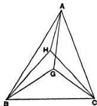
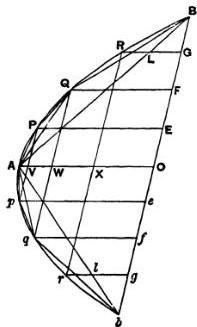
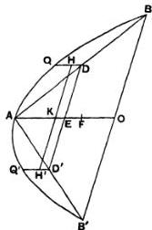
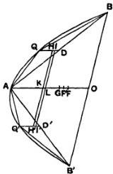
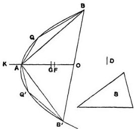
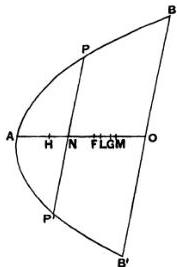

# ON THE EQUILIBRIUM OF PLANES

## OR

### THE CENTRES OF GRAVITY OF PLANES.

# BOOK I.

---

“I POSTULATE the following:

1. Equal weights at equal distances are in equilibrium, and equal weights at unequal distances are not in equilibrium but incline towards the weight which is at the greater distance.

2. If, when weights at certain distances are in equilibrium, something be added to one of the weights, they are not in equilibrium but incline towards that weight to which the addition was made.

3. Similarly, if anything be taken away from one of the weights, they are not in equilibrium but incline towards the weight from which nothing was taken.

4. When equal and similar plane figures coincide if applied to one another, their centres of gravity similarly coincide.

5. In figures which are unequal but similar the centres of gravity will be similarly situated. By points similarly situated in relation to similar figures I mean points such that, if straight lines be drawn from them to the equal angles, they make equal angles with the corresponding sides.

6. If magnitudes at certain distances be in equilibrium, (other) magnitudes equal to them will also be in equilibrium at the same distances.

7. In any figure whose perimeter is concave in (one and) the same direction the centre of gravity must be within the figure."

## Proposition 1.

Weights which balance at equal distances are equal.

For, if they are unequal, take away from the greater the difference between the two. The remainders will then not balance [Post. 3]; which is absurd.

Therefore the weights cannot be unequal.

## Proposition 2.

Unequal weights at equal distances will not balance but will incline towards the greater weight.

For take away from the greater the difference between the two. The equal remainders will therefore balance [Post. 1]. Hence, if we add the difference again, the weights will not balance but incline towards the greater [Post. 2].

## Proposition 3.

Unequal weights will balance at unequal distances, the greater weight being at the lesser distance.

Let $A, B$ be two unequal weights (of which $A$ is the greater) balancing about $C$ at distances $AC, BC$ respectively.


Then shall $AC$ be less than $BC$. For, if not, take away from $A$ the weight $(A - B)$. The remainders will then incline

---

towards $B$ [Post. 3]. But this is impossible, for (1) if $AC = CB$, the equal remainders will balance, or (2) if $AC &gt; CB$, they will incline towards $A$ at the greater distance [Post. 1].

Hence $AC &lt; CB$.

Conversely, if the weights balance, and $AC &lt; CB$, then $A &gt; B$.

## Proposition 4.

If two equal weights have not the same centre of gravity, the centre of gravity of both taken together is at the middle point of the line joining their centres of gravity.

[Proved from Prop. 3 by reductio ad absurdum. Archimedes assumes that the centre of gravity of both together is on the straight line joining the centres of gravity of each, saying that this had been proved before (προδεδεικται). The allusion is no doubt to the lost treatise On levers (περὶ ζυγῶν).]

## Proposition 5.

If three equal magnitudes have their centres of gravity on a straight line at equal distances, the centre of gravity of the system will coincide with that of the middle magnitude.

[This follows immediately from Prop. 4.]

Cor 1. The same is true of any odd number of magnitudes if those which are at equal distances from the middle one are equal, while the distances between their centres of gravity are equal.

Cor. 2. If there be an even number of magnitudes with their centres of gravity situated at equal distances on one straight line, and if the two middle ones be equal, while those which are equidistant from them (on each side) are equal respectively, the centre of gravity of the system is the middle point of the line joining the centres of gravity of the two middle ones.

---

## Propositions 6, 7.

Two magnitudes, whether commensurable [Prop. 6] or incommensurable [Prop. 7], balance at distances reciprocally proportional to the magnitudes.

### I. Suppose the magnitudes $A$, $B$ to be commensurable, and the points $A$, $B$ to be their centres of gravity. Let $DE$ be a straight line so divided at $C$ that

$$
A : B = DC : CE.
$$

We have then to prove that, if $A$ be placed at $E$ and $B$ at $D$, $C$ is the centre of gravity of the two taken together.


Since $A$, $B$ are commensurable, so are $DC$, $CE$. Let $N$ be a common measure of $DC$, $CE$. Make $DH$, $DK$ each equal to $CE$, and $EL$ (on $CE$ produced) equal to $CD$. Then $EH = CD$, since $DH = CE$. Therefore $LH$ is bisected at $E$, as $HK$ is bisected at $D$.

Thus $LH$, $HK$ must each contain $N$ an even number of times.

Take a magnitude $O$ such that $O$ is contained as many times in $A$ as $N$ is contained in $LH$, whence

$$
A : O = LH : N.
$$

But

$$
B : A = CE : DC
$$

$$
= HK : LH.
$$

Hence, *ex aequali*, $B : O = HK : N$, or $O$ is contained in $B$ as many times as $N$ is contained in $HK$.

Thus $O$ is a common measure of $A$, $B$.

---

Divide $LH$, $HK$ into parts each equal to $N$, and $A$, $B$ into parts each equal to $O$. The parts of $A$ will therefore be equal in number to those of $LH$, and the parts of $B$ equal in number to those of $HK$. Place one of the parts of $A$ at the middle point of each of the parts $N$ of $LH$, and one of the parts of $B$ at the middle point of each of the parts $N$ of $HK$.

Then the centre of gravity of the parts of $A$ placed at equal distances on $LH$ will be at $E$, the middle point of $LH$ [Prop. 5, Cor. 2], and the centre of gravity of the parts of $B$ placed at equal distances along $HK$ will be at $D$, the middle point of $HK$.

Thus we may suppose $A$ itself applied at $E$, and $B$ itself applied at $D$.

But the system formed by the parts $O$ of $A$ and $B$ together is a system of equal magnitudes even in number and placed at equal distances along $LK$. And, since $LE = CD$, and $EC = DK$, $LC = CK$, so that $C$ is the middle point of $LK$. Therefore $C$ is the centre of gravity of the system ranged along $LK$.

Therefore $A$ acting at $E$ and $B$ acting at $D$ balance about the point $C$.

II. Suppose the magnitudes to be incommensurable, and let them be $(A + a)$ and $B$ respectively. Let $DE$ be a line divided at $C$ so that

$$
(A + a): B = DC : CE.
$$


Then, if $(A + a)$ placed at $E$ and $B$ placed at $D$ do not balance about $C$, $(A + a)$ is either too great to balance $B$, or not great enough.

Suppose, if possible, that $(A + a)$ is too great to balance $B$. Take from $(A + a)$ a magnitude $a$ smaller than the deduction which would make the remainder balance $B$, but such that the remainder $A$ and the magnitude $B$ are commensurable.


---

Then, since $A$, $B$ are commensurable, and

$$A:B &lt; DC:CE,$$

$A$ and $B$ will not balance [Prop. 6], but $D$ will be depressed.

But this is impossible, since the deduction $a$ was an insufficient deduction from $(A + a)$ to produce equilibrium, so that $E$ was still depressed.

Therefore $(A + a)$ is not too great to balance $B$; and similarly it may be proved that $B$ is not too great to balance $(A + a)$.

Hence $(A + a)$, $B$ taken together have their centre of gravity at $C$.

## Proposition 8.

If $AB$ be a magnitude whose centre of gravity is $C$, and $AD$ a part of it whose centre of gravity is $F$, then the centre of gravity of the remaining part will be a point $G$ on $FC$ produced such that

$$GC:CF = (AD):(DE).$$


For, if the centre of gravity of the remainder $(DE)$ be not $G$, let it be a point $H$. Then an absurdity follows at once from Props. 6, 7.

## Proposition 9.

The centre of gravity of any parallelogram lies on the straight line joining the middle points of opposite sides.

Let $ABCD$ be a parallelogram, and let $EF$ join the middle points of the opposite sides $AD$, $BC$.

If the centre of gravity does not lie on $EF$, suppose it to be $H$, and draw $HK$ parallel to $AD$ or $BC$ meeting $EF$ in $K$.

---

Then it is possible, by bisecting $ED$, then bisecting the halves, and so on continually, to arrive at a length $EL$ less than $KH$. Divide both $AE$ and $ED$ into parts each equal to $EL$, and through the points of division draw parallels to $AB$ or $CD$.

We have then a number of equal and similar parallelograms, and, if any one be applied to any other, their centres of gravity coincide [Post. 4]. Thus we have an even number of equal magnitudes whose centres of gravity lie at equal distances along a straight line. Hence the centre of gravity of the whole parallelogram will lie on the line joining the centres of gravity of the two middle parallelograms [Prop. 5, Cor. 2].

But this is impossible, for $H$ is outside the middle parallelograms.

Therefore the centre of gravity cannot but lie on $EF$.

## Proposition 10.

The centre of gravity of a parallelogram is the point of intersection of its diagonals.

For, by the last proposition, the centre of gravity lies on each of the lines which bisect opposite sides. Therefore it is at the point of their intersection; and this is also the point of intersection of the diagonals.

### Alternative proof.

Let $ABCD$ be the given parallelogram, and $BD$ a diagonal. Then the triangles $ABD$, $CDB$ are equal and similar, so that [Post. 4], if one be applied to the other, their centres of gravity will fall one upon the other.

13—2

---

Suppose $F$ to be the centre of gravity of the triangle $ABD$. Let $G$ be the middle point of $BD$. Join $FG$ and produce it to $H$, so that $FG = GH$.

If we then apply the triangle $ABD$ to the triangle $CDB$ so that $AD$ falls on $CB$ and $AB$ on $CD$, the point $F$ will fall on $H$.


But [by Post. 4] $F$ will fall on the centre of gravity of $CDB$. Therefore $H$ is the centre of gravity of $CDB$.

Hence, since $F$, $H$ are the centres of gravity of the two equal triangles, the centre of gravity of the whole parallelogram is at the middle point of $FH$, i.e. at the middle point of $BD$, which is the intersection of the two diagonals.

## Proposition 11.

If $abc$, $ABC$ be two similar triangles, and $g, G$ two points in them similarly situated with respect to them respectively, then, if $g$ be the centre of gravity of the triangle $abc$, $G$ must be the centre of gravity of the triangle $ABC$.

Suppose $ab:bc:ca = AB:BC:CA$.




The proposition is proved by an obvious reductio ad absurdum. For, if $G$ be not the centre of gravity of the triangle $ABC$, suppose $H$ to be its centre of gravity.

Post. 5 requires that $g, H$ shall be similarly situated with respect to the triangles respectively; and this leads at once to the absurdity that the angles $HAB$, $GAB$ are equal.

---

## Proposition 12.

Given two similar triangles abc, ABC, and d, D the middle points of bc, BC respectively, then, if the centre of gravity of abc lie on ad, that of ABC will lie on AD.

Let $g$ be the point on $ad$ which is the centre of gravity of $abc$.

Take $G$ on $AD$ such that

$$
ad : ag = AD : AG,
$$

and join $gb$, $gc$, $GB$, $GC$.

Then, since the triangles are similar, and $bd$, $BD$ are the halves of $bc$, $BC$ respectively,

$$
ab : bd = AB : BD,
$$

and the angles $abd$, $ABD$ are equal.

Therefore the triangles $abd$, $ABD$ are similar, and

$$
\angle bad = \angle BAD.
$$

Also

$$
ba : ad = BA : AD,
$$

while, from above,

$$
ad : ag = AD : AG.
$$

Therefore $ba : ag = BA : AG$, while the angles $bag$, $BAG$ are equal.

Hence the triangles $bag$, $BAG$ are similar, and

$$
\angle abg = \angle ABG.
$$

And, since the angles $abd$, $ABD$ are equal, it follows that

$$
\angle gbd = \angle GBD.
$$

In exactly the same manner we prove that

$$
\begin{array}{l}
\angle gac = \angle GAC, \\
\angle acg = \angle ACG, \\
\angle gcd = \angle GCD.
\end{array}
$$

---

Therefore $g, G$ are similarly situated with respect to the triangles respectively; whence [Prop. 11] $G$ is the centre of gravity of $ABC$.

## Proposition 13.

In any triangle the centre of gravity lies on the straight line joining any angle to the middle point of the opposite side.

Let $ABC$ be a triangle and $D$ the middle point of $BC$. Join $AD$. Then shall the centre of gravity lie on $AD$.

For, if possible, let this not be the case, and let $H$ be the centre of gravity. Draw $HI$ parallel to $CB$ meeting $AD$ in $I$.

Then, if we bisect $DC$, then bisect the halves, and so on, we shall at length arrive at a length, as $DE$, less than $HI$.

Divide both $BD$ and $DC$ into lengths each equal to $DE$, and through the points of division draw lines each parallel to $DA$ meeting $BA$ and $AC$ in points as $K, L, M$ and $N, P, Q$ respectively.

Join $MN, LP, KQ$, which lines will then be each parallel to $BC$.

We have now a series of parallelograms as $FQ, TP, SN,$ and $AD$ bisects opposite sides in each. Thus the centre of gravity of each parallelogram lies on $AD$ [Prop. 9], and therefore the centre of gravity of the figure made up of them all lies on $AD$.

---

Let the centre of gravity of all the parallelograms taken together be $O$. Join $OH$ and produce it; also draw $CV$ parallel to $DA$ meeting $OH$ produced in $V$.

Now, if $n$ be the number of parts into which $AC$ is divided,

$$
\begin{aligned}
\Delta ADC : &amp; \text{(sum of triangles on } AN, NP, \ldots) \\
&amp;= AC^2 : (AN^2 + NP^2 + \ldots) \\
&amp;= n^2 : n \\
&amp;= n : 1 \\
&amp;= AC : AN.
\end{aligned}
$$

Similarly

$$
\Delta ABD : \text{(sum of triangles on } AM, ML, \ldots) = AB : AM.
$$

And

$$
AC : AN = AB : AM.
$$

It follows that

$$
\begin{aligned}
\Delta ABC : &amp; \text{(sum of all the small } \Delta s) = CA : AN \\
&amp;&gt; VO : OH, \text{ by parallels}.
\end{aligned}
$$

Suppose $OV$ produced to $X$ so that

$$
\Delta ABC : \text{(sum of small } \Delta s) = XO : OH,
$$

whence, *dividendo*,

$$
\text{(sum of parallelograms)} : \text{(sum of small } \Delta s) = XH : HO.
$$

Since then the centre of gravity of the triangle $ABC$ is at $H$, and the centre of gravity of the part of it made up of the parallelograms is at $O$, it follows from Prop. 8 that the centre of gravity of the remaining portion consisting of all the small triangles taken together is at $X$.

But this is impossible, since all the triangles are on one side of the line through $X$ parallel to $AD$.

Therefore the centre of gravity of the triangle cannot but lie on $AD$.

*Alternative proof.*

Suppose, if possible, that $H$, not lying on $AD$, is the centre of gravity of the triangle $ABC$. Join $AH$, $BH$, $CH$. Let $E$, $F$ be the middle points of $CA$, $AB$ respectively, and join $DE$, $EF$, $FD$. Let $EF$ meet $AD$ in $M$.

---

Draw *FK, EL* parallel to *AH* meeting *BH, CH* in *K, L* respectively. Join *KD, HD, LD, KL*. Let *KL* meet *DH* in *N*, and join *MN*.

Since *DE* is parallel to *AB*, the triangles *ABC, EDC* are similar.

And, since *CE = EA*, and *EL* is parallel to *AH*, it follows that *CL = LH*. And *CD = DB*. Therefore *BH* is parallel to *DL*.

Thus in the similar and similarly situated triangles *ABC, EDC* the straight lines *AH, BH* are respectively parallel to *EL, DL*; and it follows that *H, L* are similarly situated with respect to the triangles respectively.

But *H* is, by hypothesis, the centre of gravity of *ABC*. Therefore *L* is the centre of gravity of *EDC*. [Prop. 11]

Similarly the point *K* is the centre of gravity of the triangle *FBD*.

And the triangles *FBD, EDC* are equal, so that the centre of gravity of both together is at the middle point of *KL*, i.e. at the point *N*.

The remainder of the triangle *ABC*, after the triangles *FBD, EDC* are deducted, is the parallelogram *AFDE*, and the centre of gravity of this parallelogram is at *M*, the intersection of its diagonals.

It follows that the centre of gravity of the whole triangle *ABC* must lie on *MN*; that is, *MN* must pass through *H*, which is impossible (since *MN* is parallel to *AH*).

Therefore the centre of gravity of the triangle *ABC* cannot but lie on *AD*.

---

## Proposition 14.

It follows at once from the last proposition that the centre of gravity of any triangle is at the intersection of the lines drawn from any two angles to the middle points of the opposite sides respectively.

## Proposition 15.

If $AD, BC$ be the two parallel sides of a trapezium $ABCD$, $AD$ being the smaller, and if $AD, BC$ be bisected at $E, F$ respectively, then the centre of gravity of the trapezium is at a point $G$ on $EF$ such that

$$
GE: GF = (2BC + AD): (2AD + BC).
$$

Produce $BA$, $CD$ to meet at $O$. Then $FE$ produced will also pass through $O$, since $AE = ED$, and $BF = FC$.

```
O
|
A
|
B
```

Now the centre of gravity of the triangle $OAD$ will lie on $OE$, and that of the triangle $OBC$ will lie on $OF$. [Prop. 13]

It follows that the centre of gravity of the remainder, the trapezium $ABCD$, will also lie on $OF$. [Prop. 8]

Join $BD$, and divide it at $L, M$ into three equal parts. Through $L, M$ draw $PQ$, $RS$ parallel to $BC$ meeting $BA$ in $P, R, FE$ in $W, V$, and $CD$ in $Q, S$ respectively.

Join $DF$, $BE$ meeting $PQ$ in $H$ and $RS$ in $K$ respectively.

Now, since

$$
BL = \frac{1}{3} BD,
$$

$$
FH = \frac{1}{3} FD.
$$

---

Therefore $H$ is the centre of gravity of the triangle $DBC^*$.

Similarly, since $EK = \frac{1}{2} BE$, it follows that $K$ is the centre of gravity of the triangle $ADB$.

Therefore the centre of gravity of the triangles $DBC$, $ADB$ together, i.e. of the trapezium, lies on the line $HK$.

But it also lies on $OF$.

Therefore, if $OF$, $HK$ meet in $G$, $G$ is the centre of gravity of the trapezium.

Hence [Props. 6, 7]

$$
\begin{array}{l}
\triangle DBC : \triangle ABD = KG : GH \\
= VG : GW.
\end{array}
$$

But $\triangle DBC : \triangle ABD = BC : AD$.

Therefore $BC : AD = VG : GW$.

It follows that

$$
\begin{array}{l}
(2BC + AD) : (2AD + BC) = (2VG + GW) : (2GW + VG) \\
= EG : GF.
\end{array}
$$

* This easy deduction from Prop. 14 is assumed by Archimedes without proof.

---

# ON THE EQUILIBRIUM OF PLANES

# BOOK II.

## Proposition 1.

If $P, P'$ be two parabolic segments and $D, E$ their centres of gravity respectively, the centre of gravity of the two segments taken together will be at a point $C$ on $DE$ determined by the relation

$$
P : P' = CE : CD^*.
$$

In the same straight line with $DE$ measure $EH$, $EL$ each equal to $DC$, and $DK$ equal to $DH$; whence it follows at once that $DK = CE$, and also that $KC = CL$.


* This proposition is really a particular case of Props. 6, 7 of Book I. and is therefore hardly necessary. As, however, Book II. relates exclusively to parabolic segments, Archimedes' object was perhaps to emphasize the fact that the magnitudes in I. 6, 7 might be parabolic segments as well as rectilinear figures. His procedure is to substitute for the segments rectangles of equal area, a substitution which is rendered possible by the results obtained in his separate treatise on the Quadrature of the Parabola.

---

Apply a rectangle $MN$ equal in area to the parabolic segment $P$ to a base equal to $KH$, and place the rectangle so that $KH$ bisects it, and is parallel to its base.

Then $D$ is the centre of gravity of $MN$, since $KD = DH$.

Produce the sides of the rectangle which are parallel to $KH$, and complete the rectangle $NO$ whose base is equal to $HL$. Then $E$ is the centre of gravity of the rectangle $NO$.

Now
$$
\begin{array}{l}
(MN): (NO) = KH: HL \\
= DH: EH \\
= CE: CD \\
= P: P'.
\end{array}
$$

But
$$
\begin{array}{l}
(MN) = P. \\
\text{Therefore} \quad (NO) = P'.
\end{array}
$$

Also, since $C$ is the middle point of $KL$, $C$ is the centre of gravity of the whole parallelogram made up of the two parallelograms $(MN)$, $(NO)$, which are equal to, and have the same centres of gravity as, $P$, $P'$ respectively.

Hence $C$ is the centre of gravity of $P$, $P'$ taken together.

---

## Definition and lemmas preliminary to Proposition 2.

“If in a segment bounded by a straight line and a section of a right-angled cone [a parabola] a triangle be inscribed having the same base as the segment and equal height, if again triangles be inscribed in the remaining segments having the same bases as the segments and equal height, and if in the remaining segments triangles be inscribed in the same manner, let the resulting figure be said to be **inscribed in the recognised manner** (γνωρίμως ἐγγράφεσθαι) in the segment.

And it is plain

(1) that the lines joining the two angles of the figure so inscribed which are nearest to the vertex of the segment, and the next

---

pairs of angles in order, will be parallel to the base of the segment,

(2) that the said lines will be bisected by the diameter of the segment, and

(3) that they will cut the diameter in the proportions of the successive odd numbers, the number one having reference to [the length adjacent to] the vertex of the segment.

And these properties will have to be proved in their proper places (ἐν ταῖς τάξεσιν)."

[The last words indicate an intention to give these propositions in their proper connexion with systematic proofs; but the intention does not appear to have been carried out, or at least we know of no lost work of Archimedes in which they could have appeared. The results can however be easily derived from propositions given in the Quadrature of the Parabola as follows.

(1) Let $BRQPApqr$ be a figure inscribed ‘in the recognised manner’ in the parabolic segment $BAb$ of which $Bb$ is the base, $A$ the vertex and $AO$ the diameter.



Bisect each of the lines $BQ$, $BA$, $QA$, $Aq$, $Ab$, $qb$, and through the middle points draw lines parallel to $AO$ meeting $Bb$ in $G$, $F$, $E$, $e$, $f$, $g$ respectively.

---

These lines will then pass through the vertices $R, Q, P, p, q, r$ of the respective parabolic segments [Quadrature of the Parabola, Prop. 18], i.e. through the angular points of the inscribed figure (since the triangles and segments are of equal height).

Also $BG = GF = FE = EO$, and $Oe = ef = fg = gb$. But $BO = Ob$, and therefore all the parts into which $Bb$ is divided are equal.

If now $AB, RG$ meet in $L$, and $Ab, rg$ in $l$, we have

$$
\begin{array}{l}
BG: GL = BO: OA, \text{ by parallels}, \\
= bO: OA \\
= bg: gl,
\end{array}
$$

whence $GL = gl$.

Again [ibid., Prop. 4]

$$
\begin{array}{l}
GL: LR = BO: OG \\
= bO: Og \\
= gl: lr;
\end{array}
$$

and, since $GL = gl$, $LR = lr$.

Therefore $GR, gr$ are equal as well as parallel.

Hence $GRrg$ is a parallelogram, and $Rr$ is parallel to $Bb$.

Similarly it may be shown that $Pp, Qq$ are each parallel to $Bb$.

(2) Since $RGgr$ is a parallelogram, and $RG, rg$ are parallel to $AO$, while $GO = Og$, it follows that $Rr$ is bisected by $AO$.

And similarly for $Pp, Qq$.

(3) Lastly, if $V, W, X$ be the points of bisection of $Pp, Qq, Rr$,

$$
\begin{array}{l}
AV: AW: AX: AO = PV^2: QW^2: RX^2: BO^2 \\
= 1:4:9:16,
\end{array}
$$

whence $AV: VW: WX: XO = 1:3:5:7.$]

---

## Proposition 2.

If a figure be ‘inscribed in the recognised manner’ in a parabolic segment, the centre of gravity of the figure so inscribed will lie on the diameter of the segment.

For, in the figure of the foregoing lemmas, the centre of gravity of the trapezium $BRrb$ must lie on $XO$, that of the trapezium $RQqr$ on $WX$, and so on, while the centre of gravity of the triangle $PAp$ lies on $AV$.

Hence the centre of gravity of the whole figure lies on $AO$.

## Proposition 3.

If $BAB'$, $bab'$ be two similar parabolic segments whose diameters are $AO$, so respectively, and if a figure be inscribed in each segment ‘in the recognised manner,’ the number of sides in each figure being equal, the centres of gravity of the inscribed figures will divide $AO$, so in the same ratio.

[Archimedes enunciates this proposition as true of similar segments, but it is equally true of segments which are not similar, as the course of the proof will show.]

Suppose $BRQPAP'Q'R'B'$, $brqpap'q'r'b'$ to be the two figures inscribed ‘in the recognised manner.’ Join $PP'$, $QQ'$, $RR'$ meeting $AO$ in $L$, $M$, $N$, and $pp'$, $qq'$, $rr'$ meeting $ao$ in $l$, $m$, $n$.

Then [Lemma (3)]

$$
\begin{array}{l}
AL: LM: MN: NO \\
= 1: 3: 5: 7 \\
= al: lm: mn: no,
\end{array}
$$

so that $AO$, $ao$ are divided in the same proportion.

Also, by reversing the proof of Lemma (3), we see that

$$
PP': pp' = QQ': qq' = RR': rr' = BB': bb'.
$$

Since then $RR': BB' = rr': bb'$, and these ratios respectively determine the proportion in which $NO$, $no$ are divided

---

by the centres of gravity of the trapezia $BRR'B'$, $brr'b'$ [I. 15], it follows that the centres of gravity of the trapezia divide $NO$, $no$ in the same ratio.


Similarly the centres of gravity of the trapezia $RQQ'R'$, $rqq'r'$ divide $MN$, $mn$ in the same ratio respectively, and so on.

Lastly, the centres of gravity of the triangles $PAP'$, $pap'$ divide $AL$, $al$ respectively in the same ratio.

Moreover the corresponding trapezia and triangles are, each to each, in the same proportion (since their sides and heights are respectively proportional), while $AO$, $ao$ are divided in the same proportion.

Therefore the centres of gravity of the complete inscribed figures divide $AO$, $ao$ in the same proportion.

## Proposition 4.

The centre of gravity of any parabolic segment cut off by a straight line lies on the diameter of the segment.

Let $BAB'$ be a parabolic segment, $A$ its vertex and $AO$ its diameter.

Then, if the centre of gravity of the segment does not lie on $AO$, suppose it to be, if possible, the point $F$. Draw $FE$ parallel to $AO$ meeting $BB'$ in $E$.

---

Inscribe in the segment the triangle $ABB'$ having the same vertex and height as the segment, and take an area $S$ such that

$$
\Delta ABB': S = BE : EO.
$$


We can then inscribe in the segment ‘in the recognised manner’ a figure such that the segments of the parabola left over are together less than $S$. [For Prop. 20 of the Quadrature of the Parabola proves that, if in any segment the triangle with the same base and height be inscribed, the triangle is greater than half the segment; whence it appears that, each time that we increase the number of the sides of the figure inscribed ‘in the recognised manner,’ we take away more than half of the remaining segments.]

Let the inscribed figure be drawn accordingly; its centre of gravity then lies on $AO$ [Prop. 2]. Let it be the point $H$.

Join $HF$ and produce it to meet in $K$ the line through $B$ parallel to $AO$.

Then we have

(inscribed figure) : (remainder of segmt.) $&gt; \Delta ABB' : S$

$$
\begin{array}{l}
&gt; BE : EO \\
&gt; KF : FH.
\end{array}
$$

Suppose $L$ taken on $HK$ produced so that the former ratio is equal to the ratio $LF : FH$.


---

Then, since $H$ is the centre of gravity of the inscribed figure, and $F$ that of the segment, $L$ must be the centre of gravity of all the segments taken together which form the remainder of the original segment. [I. 8]

But this is impossible, since all these segments lie on one side of the line drawn through $L$ parallel to $AO$ [Cf. Post. 7].

Hence the centre of gravity of the segment cannot but lie on $AO$.

## Proposition 5.

If in a parabolic segment a figure be inscribed ‘in the recognised manner,’ the centre of gravity of the segment is nearer to the vertex of the segment than the centre of gravity of the inscribed figure is.

Let $BAB'$ be the given segment, and $AO$ its diameter. First, let $ABB'$ be the triangle inscribed ‘in the recognised manner.’

Divide $AO$ in $F$ so that $AF = 2FO$; $F$ is then the centre of gravity of the triangle $ABB'$.

Bisect $AB$, $AB'$ in $D$, $D'$ respectively, and join $DD'$ meeting $AO$ in $E$. Draw $DQ$, $D'Q'$ parallel to $OA$ to meet the curve. $QD$, $Q'D'$ will then be the diameters of the segments whose bases are $AB$, $AB'$, and the centres of gravity of those segments will lie respectively on $QD$, $Q'D'$ [Prop. 4]. Let them be $H$, $H'$, and join $HH'$ meeting $AO$ in $K$.

Now $QD$, $Q'D'$ are equal*, and therefore the segments of which they are the diameters are equal [On Conoids and Spheroids, Prop. 3].

* This may either be inferred from Lemma (1) above (since $QQ'$, $DD'$ are both parallel to $BB'$), or from Prop. 19 of the Quadrature of the Parabola, which applies equally to $Q$ or $Q'$.



---

Also, since $QD, Q'D'$ are parallel*, and $DE = ED'$, $K$ is the middle point of $HH'$.

Hence the centre of gravity of the equal segments $AQB$, $AQ'B'$ taken together is $K$, where $K$ lies between $E$ and $A$. And the centre of gravity of the triangle $ABB'$ is $F$.

It follows that the centre of gravity of the whole segment $BAB'$ lies between $K$ and $F$, and is therefore nearer to the vertex $A$ than $F$ is.

Secondly, take the five-sided figure $BQAQ'B'$ inscribed ‘in the recognised manner,’ $QD, Q'D'$ being, as before, the diameters of the segments $AQB, AQ'B'$.

Then, by the first part of this proposition, the centre of gravity of the segment $AQB$ (lying of course on $QD$) is nearer to $Q$ than the centre of gravity of the triangle $AQB$ is. Let the centre of gravity of the segment be $H$, and that of the triangle $I$.

Similarly let $H'$ be the centre of gravity of the segment $AQ'B'$, and $I'$ that of the triangle $AQ'B'$.

It follows that the centre of gravity of the two segments $AQB, AQ'B'$ taken together is $K$, the middle point of $HH'$, and that of the two triangles $AQB, AQ'B'$ is $L$, the middle point of $II'$.

If now the centre of gravity of the triangle $ABB'$ be $F$, the centre of gravity of the whole segment $BAB'$ (i.e. that of the triangle $ABB'$ and the two segments $AQB, AQ'B'$ taken together) is a point $G$ on $KF$ determined by the proportion



(sum of segments $AQB, AQ'B') : $\triangle ABB' = FG : GK$. [I. 6, 7]

* There is clearly some interpolation in the text here, which has the words καὶ ἐπεὶ παραλληλόγραμμόν ἐστι τὸ ΘΖΗΙ. It is not yet proved that $H'D'DH$ is a parallelogram; this can only be inferred from the fact that $H, H'$ divide $QD, Q'D'$ respectively in the same ratio. But this latter property does not appear till Prop. 7, and is then only enunciated of similar segments. The interpolation must have been made before Eutocius' time, because he has a note on the phrase, and explains it by gravely assuming that $H, H'$ divide $QD, Q'D'$ respectively in the same ratio.


---

And the centre of gravity of the inscribed figure $BQAQ'B'$ is a point $F'$ on $LF$ determined by the proportion

$$
\left(\triangle AQB + \triangle AQ'B'\right) : \triangle ABB' = FF' : F'L. \quad [I. 6, 7]
$$

[Hence $FG : GK &gt; FF' : F'L$,

or $GK : FG &lt; F'L : FF'$,

and, componendo, $FK : FG &lt; FL : FF'$, while $FK &gt; FL$.]

Therefore $FG &gt; FF'$, or $G$ lies nearer than $F'$ to the vertex $A$.

Using this last result, and proceeding in the same way, we can prove the proposition for any figure inscribed ‘in the recognised manner.’

## Proposition 6.

Given a segment of a parabola cut off by a straight line, it is possible to inscribe in it ‘in the recognised manner’ a figure such that the distance between the centres of gravity of the segment and of the inscribed figure is less than any assigned length.

Let $BAB'$ be the segment, $AO$ its diameter, $G$ its centre of gravity, and $ABB'$ the triangle inscribed ‘in the recognised manner.’

Let $D$ be the assigned length and $S$ an area such that

$$
AG : D = \triangle ABB' : S.
$$

In the segment inscribe ‘in the recognised manner’ a figure such that the sum of the segments left over is less than $S$. Let $F$ be the centre of gravity of the inscribed figure.

We shall prove that $FG &lt; D$.

For, if not, $FG$ must be either equal to, or greater than, $D$.

And clearly

(inscribed fig.) : (sum of remaining segmts.)

$$
\begin{array}{l}
&gt; \triangle ABB' : S \\
&gt; AG : D \\
&gt; AG : FG, \text{ by hypothesis (since } FG \notin D).
\end{array}
$$

---

Let the first ratio be equal to the ratio $KG : FG$ (where $K$ lies on $GA$ produced); and it follows that $K$ is the centre of gravity of the small segments taken together. [I. 8]



But this is impossible, since the segments are all on the same side of a line drawn through $K$ parallel to $BB'$.

Hence $FG$ cannot but be less than $D$.

## Proposition 7.

If there be two similar parabolic segments, their centres of gravity divide their diameters in the same ratio.

[This proposition, though enunciated of similar segments only, like Prop. 3 on which it depends, is equally true of any segments. This fact did not escape Archimedes, who uses the proposition in its more general form for the proof of Prop. 8 immediately following.]

Let $BAB', bab'$ be the two similar segments, $AO$, $ao$ their diameters, and $G$, $g$ their centres of gravity respectively.

Then, if $G, g$ do not divide $AO$, $ao$ respectively in the same ratio, suppose $H$ to be such a point on $AO$ that

$$
AH : HO = ag : go;
$$

---

and inscribe in the segment $BAB'$ ‘in the recognised manner’ a figure such that, if $F$ be its centre of gravity,

$$
GF &lt; GH.
$$

[Prop. 6]

Inscribe in the segment $bab'$ ‘in the recognised manner’ a similar figure; then, if $f$ be the centre of gravity of this figure,

$$
ag &lt; af.
$$

[Prop. 5]

And, by Prop. 3, $af:fo = AF:FO$.

But

$$
AF:FO &lt; AH:HO
$$

$$
&lt; ag:go, \text{ by hypothesis}.
$$

Therefore

$$
af:fo &lt; ag:go; \text{ which is impossible}.
$$

It follows that $G, g$ cannot but divide $AO, ao$ in the same ratio.

## Proposition 8.

If $AO$ be the diameter of a parabolic segment, and $G$ its centre of gravity, then

$$
AG = \frac{3}{2} GO.
$$

Let the segment be $BAB'$. Inscribe the triangle $ABB'$ ‘in the recognised manner,’ and let $F$ be its centre of gravity.

Bisect $AB, AB'$ in $D, D'$, and draw $DQ, D'Q'$ parallel to $OA$ to meet the curve, so that $QD, Q'D'$ are the diameters of the segments $AQB, AQ'B'$ respectively.

Let $H, H'$ be the centres of gravity of the segments $AQB, AQ'B'$ respectively. Join $QQ', HH'$ meeting $AO$ in $V, K$ respectively.

---

$K$ is then the centre of gravity of the two segments $AQB$, $AQ'B'$ taken together.

Now $AG:GO=QH:HD$,
[Prop. 7]
whence $AO:OG=QD:HD$.

But $AO=4QD$ [as is easily proved by means of Lemma (3), p. 206].

Therefore $OG=4HD$;
and, by subtraction, $AG=4QH$.

Also, by Lemma (2), $QQ'$ is parallel to $BB'$ and therefore to $DD'$. It follows from Prop. 7 that $HH'$ is also parallel to $QQ'$ or $DD'$,
and hence $QH=VK$.

Therefore $AG=4VK$,
and $AV+KG=3VK$.

Measuring $VL$ along $VK$ so that $VL=\frac{1}{3}AV$, we have
$KG=3LK$...(1).

Again
$AO=4AV$ [Lemma (3)]
$=3AL$, since $AV=3VL$,
whence
$AL=\frac{1}{3}AO=OF$...(2).

Now, by I. 6, 7,
$\triangle ABB':$ (sum of segmts. $AQB$, $AQ'B')=KG:GF$,
and
$\triangle ABB'=3$ (sum of segments $AQB$, $AQ'B')$

[since the segment $ABB'$ is equal to $\frac{4}{3}\triangle ABB'$ (Quadrature of the Parabola, Props. 17, 24)].

Hence $KG=3GF$.
But $KG=3LK$, from (1) above.

Therefore
$LF=LK+KG+GF$
$=5GF$.

---

And, from (2),

$$
LF = (AO - AL - OF) = \frac{1}{3} AO = OF.
$$

Therefore

$$
OF = 5GF,
$$

and

$$
OG = 6GF.
$$

But

$$
AO = 3OF = 15GF.
$$

Therefore, by subtraction,

$$
AG = 9GF
$$

$$
= \frac{3}{5} GO.
$$

## Proposition 9 (Lemma).

If $a, b, c, d$ be four lines in continued proportion and in descending order of magnitude, and if

$$
d : (a - d) = x : \frac{3}{5} (a - c),
$$

and

$$
(2a + 4b + 6c + 3d) : (5a + 10b + 10c + 5d) = y : (a - c),
$$

it is required to prove that

$$
x + y = \frac{2}{5} a.
$$

[The following is the proof given by Archimedes, with the only difference that it is set out in algebraical instead of geometrical notation. This is done in the particular case simply in order to make the proof easier to follow. Archimedes exhibits his lines in the figure reproduced in the margin, but, now that it is possible to use algebraical notation, there is no advantage in using the figure and the more cumbersome notation which only obscures the course of the proof. The relation between Archimedes’ figure and the letters used below is as follows;

$$
AB = a, \quad \Gamma B = b, \quad \Delta B = c, \quad EB = d, \quad ZH = x, \quad H\Theta = y, \quad \Delta O = z.
$$

We have

$$
\frac{a}{b} = \frac{b}{c} = \frac{c}{d} \quad \text{(1)},
$$

whence

$$
\frac{a - b}{b} = \frac{b - c}{c} = \frac{c - d}{d},
$$

and therefore

$$
\frac{a - b}{b - c} = \frac{b - c}{c - d} = \frac{a}{b} = \frac{b}{c} = \frac{c}{d} \quad \text{(2)}.
$$

Now

$$
\frac{2(a + b)}{2c} = \frac{a + b}{c} = \frac{a + b}{b} \cdot \frac{b}{c} = \frac{a - c}{b - c} \cdot \frac{b - c}{c - d} = \frac{a - c}{c - d}.
$$

---

And, in like manner,

$$
\frac{b + c}{d} = \frac{b + c}{c} \cdot \frac{c}{d} = \frac{a - c}{c - d}.
$$

It follows from the last two relations that

$$
\frac{a - c}{c - d} = \frac{2a + 3b + c}{2c + d} \quad \text{(3)}.
$$

Suppose $z$ to be so taken that

$$
\frac{2a + 4b + 4c + 2d}{2c + d} = \frac{a - c}{z} \quad \text{(4)},
$$

so that $z &lt; (c - d)$.

Therefore

$$
\frac{a - c + z}{a - c} = \frac{2a + 4b + 6c + 3d}{2(a + d) + 4(b + c)}.
$$

And, by hypothesis,

$$
\frac{a - c}{y} = \frac{5(a + d) + 10(b + c)}{2a + 4b + 6c + 3d},
$$

so that

$$
\frac{a - c + z}{y} = \frac{5(a + d) + 10(b + c)}{2(a + d) + 4(b + c)} = \frac{5}{2} \quad \text{(5)}.
$$

Again, dividing (3) by (4) crosswise, we obtain

$$
\frac{z}{c - d} = \frac{2a + 3b + c}{2(a + d) + 4(b + c)},
$$

whence

$$
\frac{c - d - z}{c - d} = \frac{b + 3c + 2d}{2(a + d) + 4(b + c)} \quad \text{(6)}.
$$

But, by (2),

$$
\frac{c - d}{d} = \frac{a - b}{b} = \frac{3(b - c)}{3c} = \frac{2(c - d)}{2d},
$$

so that

$$
\frac{c - d}{d} = \frac{(a - b) + 3(b - c) + 2(c - d)}{b + 3c + 2d} \quad \text{(7)}.
$$

Combining (6) and (7), we have

$$
\frac{c - d - z}{d} = \frac{(a - b) + 3(b - c) + 2(c - d)}{2(a + d) + 4(b + c)},
$$

whence

$$
\frac{c - z}{d} = \frac{3a + 6b + 3c}{2(a + d) + 4(b + c)} \quad \text{(8)}.
$$

And, since [by (1)]

$$
\frac{c - d}{c + d} = \frac{b - c}{b + c} = \frac{a - b}{a + b},
$$

---

we have

$$
\frac{c - d}{a - c} = \frac{c + d}{b + c + a + b},
$$

whence

$$
\frac{a - d}{a - c} = \frac{a + 2b + 2c + d}{a + 2b + c} = \frac{2(a + d) + 4(b + c)}{2(a + c) + 4b}. \quad \dots \dots . \tag{9}.
$$

Thus

$$
\frac{a - d}{\frac{3}{8}(a - c)} = \frac{2(a + d) + 4(b + c)}{\frac{3}{8}[2(a + c) + 4b]},
$$

and therefore, by hypothesis,

$$
\frac{d}{x} = \frac{2(a + d) + 4(b + c)}{\frac{3}{8}[2(a + c) + 4b]}.
$$

But, by (8),

$$
\frac{c - z}{d} = \frac{3a + 6b + 3c}{2(a + d) + 4(b + c)};
$$

and it follows, ex aequali, that

$$
\frac{c - z}{x} = \frac{3(a + c) + 6b}{\frac{3}{8}[2(a + c) + 4b]} = \frac{5}{3} \cdot \frac{3}{2} = \frac{5}{2}.
$$

And, by (5),

$$
\frac{a - c + z}{y} = \frac{5}{2}.
$$

Therefore

$$
\frac{5}{2} = \frac{a}{x + y},
$$

or

$$
x + y = \frac{a}{2} a.
$$

**Proposition 10.**

If $PP'B'B$ be the portion of a parabola intercepted between two parallel chords $PP'$, $BB'$ bisected respectively in $N$, $O$ by the diameter $ANO$ ($N$ being nearer than $O$ to $A$, the vertex of the segments), and if $NO$ be divided into five equal parts of which $LM$ is the middle one ($L$ being nearer than $M$ to $N$), then, if $G$ be a point on $LM$ such that

$$
LG : GM = BO^2 \cdot (2PN + BO) : PN^2 \cdot (2BO + PN),
$$

$G$ will be the centre of gravity of the area $PP'B'B$.

Take a line $ao$ equal to $AO$, and $an$ on it equal to $AN$. Let $p, q$ be points on the line $ao$ such that

$$
ao : aq = aq : an \quad \dots \dots \dots \dots \dots \dots \dots \tag{1},
$$

$$
ao : an = aq : ap \quad \dots \dots \dots \dots \dots \dots \dots \tag{2},
$$

[whence $ao : aq = aq : an = an : ap$, or $ao, aq, an, ap$ are lines in continued proportion and in descending order of magnitude].

Measure along $GA$ a length $GF$ such that

$$
op : ap = OL : GF \quad \dots \dots \dots \dots \dots \dots \dots \tag{3}.
$$

---

Then, since $PN$, $BO$ are ordinates to $ANO$,

$$
\begin{array}{l}
BO^2 : PN^2 = AO : AN \\
= ao : an \\
= ao^2 : aq^2, \text{ by (1)},
\end{array}
$$

so that $BO : PN = ao : aq$ ... (4),

and

$$
\begin{array}{l}
BO^3 : PN^3 = ao^3 : aq^3 \\
= (ao : aq) \cdot (aq : an) \cdot (an : ap) \\
= ao : ap \quad \text{... (5).}
\end{array}
$$



Thus (segment $BAB'$): (segment $PAP'$)

$$
\begin{array}{l}
= \triangle BAB' : \triangle PAP' \\
= BO^3 : PN^3 \\
= ao : ap,
\end{array}
$$

whence

$$
\begin{array}{l}
\text{(area } PP'B'B): \text{(segment } PAP') = op : ap \\
= OL : GF, \text{ by (3)}, \\
= \frac{3}{2} ON : GF \quad \text{... (6).}
\end{array}
$$

Now $BO^2 \cdot (2PN + BO) : BO^3 = (2PN + BO) : BO$

$$
= (2aq + ao) : ao, \text{ by (4)},
$$

$$
BO^3 : PN^3 = ao : ap, \text{ by (5)},
$$

and

$$
PN^3 : PN^2 \cdot (2BO + PN) = PN : (2BO + PN)
$$

$$
= aq : (2ao + aq), \text{ by (4)},
$$

$$
= ap : (2an + ap), \text{ by (2)}.
$$

---

Hence, *ex aequali*,

$$BO^{x}.\ (2PN+BO):PN^{2}.\ (2BO+PN) = (2aq+ao):(2an+ap),$$

so that, by hypothesis,

$$LG:GM = (2aq+ao):(2an+ap).$$

*Componendo*, and multiplying the antecedents by 5,

$$ON:GM = [5(ao+ap)+10(aq+an)]:(2an+ap).$$

But
$$ON:OM = 5:2$$
$$= [5(ao+ap)+10(aq+an)]:[2(ao+ap)+4(aq+an)].$$

It follows that

$$ON:OG = [5(ao+ap)+10(aq+an)]:(2ao+4aq+6an+3ap).$$

Therefore

$$(2ao+4aq+6an+3ap):[5(ao+ap)+10(aq+an)] = OG:ON$$
$$= OG:on.$$

And
$$ap:(ao-ap) = ap:op$$
$$= GF:OL, \text{ by hypothesis,}$
$$= GF:\frac{3}{8}on,$$

while $ao, aq, an, ap$ are in continued proportion.

Therefore, by Prop. 9,

$$GF+OG = OF = \frac{3}{8}ao = \frac{3}{8}OA.$$

Thus $F$ is the centre of gravity of the segment $BAB'$. [Prop. 8]

Let $H$ be the centre of gravity of the segment $PAP'$, so that $AH = \frac{3}{8}AN$.

And, since
$$AF = \frac{3}{8}AO,$$

we have, by subtraction,
$$HF = \frac{3}{8}ON.$$

But, by (6) above,

$$(\text{area } PP'B'B):\ (\text{segment } PAP') = \frac{3}{8}ON:GF$$
$$= HF:FG.$$

Thus, since $F, H$ are the centres of gravity of the segments $BAB', PAP'$ respectively, it follows [by I. 6, 7] that $G$ is the centre of gravity of the area $PP'B'B$.

---
