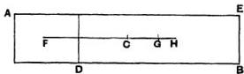

# ON THE EQUILIBRIUM OF PLANES, BOOK I.

“I POSTULATE the following:

1. Equal weights at equal distances are in equilibrium, and equal weights at unequal distances are not in equilibrium but incline towards the weight which is at the greater distance.

2. If, when weights at certain distances are in equilibrium, something be added to one of the weights, they are not in equilibrium but incline towards that weight to which the addition was made.

3. Similarly, if anything be taken away from one of the weights, they are not in equilibrium but incline towards the weight from which nothing was taken.

4. When equal and similar plane figures coincide if applied to one another, their centres of gravity similarly coincide.

5. In figures which are unequal but similar the centres of gravity will be similarly situated. By points similarly situated in relation to similar figures I mean points such that, if straight lines be drawn from them to the equal angles, they make equal angles with the corresponding sides.

6. If magnitudes at certain distances be in equilibrium, (other) magnitudes equal to them will also be in equilibrium at the same distances.

7. In any figure whose perimeter is concave in (one and) the same direction the centre of gravity must be within the figure."

## Proposition 1.

Weights which balance at equal distances are equal.

For, if they are unequal, take away from the greater the difference between the two. The remainders will then not balance [Post. 3]; which is absurd.

Therefore the weights cannot be unequal.

## Proposition 2.

Unequal weights at equal distances will not balance but will incline towards the greater weight.

For take away from the greater the difference between the two. The equal remainders will therefore balance [Post. 1]. Hence, if we add the difference again, the weights will not balance but incline towards the greater [Post. 2].

## Proposition 3.

Unequal weights will balance at unequal distances, the greater weight being at the lesser distance.

Let $A, B$ be two unequal weights (of which $A$ is the greater) balancing about $C$ at distances $AC, BC$ respectively.


Then shall $AC$ be less than $BC$. For, if not, take away from $A$ the weight $(A - B)$. The remainders will then incline towards $B$ [Post. 3]. But this is impossible, for (1) if $AC = CB$, the equal remainders will balance, or (2) if $AC &gt; CB$, they will incline towards $A$ at the greater distance [Post. 1].

Hence

$$
AC &lt; CB.
$$

Conversely, if the weights balance, and $AC &lt; CB$, then $A &gt; B$.

## Proposition 4.

If two equal weights have not the same centre of gravity, the centre of gravity of both taken together is at the middle point of the line joining their centres of gravity.

[Proved from Prop. 3 by reductio ad absurdum. Archimedes assumes that the centre of gravity of both together is on the straight line joining the centres of gravity of each, saying that this had been proved before (προδεδεικται). The allusion is no doubt to the lost treatise On levers (περὶ ζυγῶν).]

## Proposition 5.

If three equal magnitudes have their centres of gravity on a straight line at equal distances, the centre of gravity of the system will coincide with that of the middle magnitude.

[This follows immediately from Prop. 4.]

Cor 1. The same is true of any odd number of magnitudes if those which are at equal distances from the middle one are equal, while the distances between their centres of gravity are equal.

Cor. 2. If there be an even number of magnitudes with their centres of gravity situated at equal distances on one straight line, and if the two middle ones be equal, while those which are equidistant from them (on each side) are equal respectively, the centre of gravity of the system is the middle point of the line joining the centres of gravity of the two middle ones.

## Propositions 6, 7.

Two magnitudes, whether commensurable [Prop. 6] or incommensurable [Prop. 7], balance at distances reciprocally proportional to the magnitudes.

I. Suppose the magnitudes $A$, $B$ to be commensurable, and the points $A$, $B$ to be their centres of gravity. Let $DE$ be a straight line so divided at $C$ that

$$
A : B = DC : CE.
$$

We have then to prove that, if $A$ be placed at $E$ and $B$ at $D$, $C$ is the centre of gravity of the two taken together.


Since $A$, $B$ are commensurable, so are $DC$, $CE$. Let $N$ be a common measure of $DC$, $CE$. Make $DH$, $DK$ each equal to $CE$, and $EL$ (on $CE$ produced) equal to $CD$. Then $EH = CD$, since $DH = CE$. Therefore $LH$ is bisected at $E$, as $HK$ is bisected at $D$.

Thus $LH$, $HK$ must each contain $N$ an even number of times.

Take a magnitude $O$ such that $O$ is contained as many times in $A$ as $N$ is contained in $LH$, whence

$$
A : O = LH : N.
$$

But

$$
B : A = CE : DC
$$

$$
= HK : LH.
$$

Hence, *ex aequali*, $B : O = HK : N$, or $O$ is contained in $B$ as many times as $N$ is contained in $HK$.

Thus $O$ is a common measure of $A$, $B$.

Divide $LH$, $HK$ into parts each equal to $N$, and $A$, $B$ into parts each equal to $O$. The parts of $A$ will therefore be equal in number to those of $LH$, and the parts of $B$ equal in number to those of $HK$. Place one of the parts of $A$ at the middle point of each of the parts $N$ of $LH$, and one of the parts of $B$ at the middle point of each of the parts $N$ of $HK$.

Then the centre of gravity of the parts of $A$ placed at equal distances on $LH$ will be at $E$, the middle point of $LH$ [Prop. 5, Cor. 2], and the centre of gravity of the parts of $B$ placed at equal distances along $HK$ will be at $D$, the middle point of $HK$.

Thus we may suppose $A$ itself applied at $E$, and $B$ itself applied at $D$.

But the system formed by the parts $O$ of $A$ and $B$ together is a system of equal magnitudes even in number and placed at equal distances along $LK$. And, since $LE = CD$, and $EC = DK$, $LC = CK$, so that $C$ is the middle point of $LK$. Therefore $C$ is the centre of gravity of the system ranged along $LK$.

Therefore $A$ acting at $E$ and $B$ acting at $D$ balance about the point $C$.

II. Suppose the magnitudes to be incommensurable, and let them be $(A + a)$ and $B$ respectively. Let $DE$ be a line divided at $C$ so that

$$
(A + a): B = DC : CE.
$$


Then, if $(A + a)$ placed at $E$ and $B$ placed at $D$ do not balance about $C$, $(A + a)$ is either too great to balance $B$, or not great enough.

Suppose, if possible, that $(A + a)$ is too great to balance $B$. Take from $(A + a)$ a magnitude $a$ smaller than the deduction which would make the remainder balance $B$, but such that the remainder $A$ and the magnitude $B$ are commensurable.

Then, since $A$, $B$ are commensurable, and

$$A:B &lt; DC:CE,$$

$A$ and $B$ will not balance [Prop. 6], but $D$ will be depressed.

But this is impossible, since the deduction $a$ was an insufficient deduction from $(A + a)$ to produce equilibrium, so that $E$ was still depressed.

Therefore $(A + a)$ is not too great to balance $B$; and similarly it may be proved that $B$ is not too great to balance $(A + a)$.

Hence $(A + a)$, $B$ taken together have their centre of gravity at $C$.

## Proposition 8.

If $AB$ be a magnitude whose centre of gravity is $C$, and $AD$ a part of it whose centre of gravity is $F$, then the centre of gravity of the remaining part will be a point $G$ on $FC$ produced such that

$$GC:CF = (AD):(DE).$$


For, if the centre of gravity of the remainder $(DE)$ be not $G$, let it be a point $H$. Then an absurdity follows at once from Props. 6, 7.

## Proposition 9.

The centre of gravity of any parallelogram lies on the straight line joining the middle points of opposite sides.

Let $ABCD$ be a parallelogram, and let $EF$ join the middle points of the opposite sides $AD$, $BC$.

If the centre of gravity does not lie on $EF$, suppose it to be $H$, and draw $HK$ parallel to $AD$ or $BC$ meeting $EF$ in $K$.

Then it is possible, by bisecting $ED$, then bisecting the halves, and so on continually, to arrive at a length $EL$ less than $KH$. Divide both $AE$ and $ED$ into parts each equal to $EL$, and through the points of division draw parallels to $AB$ or $CD$.

We have then a number of equal and similar parallelograms, and, if any one be applied to any other, their centres of gravity coincide [Post. 4]. Thus we have an even number of equal magnitudes whose centres of gravity lie at equal distances along a straight line. Hence the centre of gravity of the whole parallelogram will lie on the line joining the centres of gravity of the two middle parallelograms [Prop. 5, Cor. 2].

But this is impossible, for $H$ is outside the middle parallelograms.

Therefore the centre of gravity cannot but lie on $EF$.

## Proposition 10.

The centre of gravity of a parallelogram is the point of intersection of its diagonals.

For, by the last proposition, the centre of gravity lies on each of the lines which bisect opposite sides. Therefore it is at the point of their intersection; and this is also the point of intersection of the diagonals.

### Alternative proof.

Let $ABCD$ be the given parallelogram, and $BD$ a diagonal. Then the triangles $ABD$, $CDB$ are equal and similar, so that [Post. 4], if one be applied to the other, their centres of gravity will fall one upon the other.

Suppose $F$ to be the centre of gravity of the triangle $ABD$. Let $G$ be the middle point of $BD$. Join $FG$ and produce it to $H$, so that $FG = GH$.

If we then apply the triangle $ABD$ to the triangle $CDB$ so that $AD$ falls on $CB$ and $AB$ on $CD$, the point $F$ will fall on $H$.



But [by Post. 4] $F$ will fall on the centre of gravity of $CDB$. Therefore $H$ is the centre of gravity of $CDB$.

Hence, since $F$, $H$ are the centres of gravity of the two equal triangles, the centre of gravity of the whole parallelogram is at the middle point of $FH$, i.e. at the middle point of $BD$, which is the intersection of the two diagonals.

## Proposition 11.

If $abc$, $ABC$ be two similar triangles, and $g, G$ two points in them similarly situated with respect to them respectively, then, if $g$ be the centre of gravity of the triangle $abc$, $G$ must be the centre of gravity of the triangle $ABC$.

Suppose $ab:bc:ca = AB:BC:CA$.


The proposition is proved by an obvious reductio ad absurdum. For, if $G$ be not the centre of gravity of the triangle $ABC$, suppose $H$ to be its centre of gravity.

Post. 5 requires that $g, H$ shall be similarly situated with respect to the triangles respectively; and this leads at once to the absurdity that the angles $HAB$, $GAB$ are equal.

## Proposition 12.

Given two similar triangles abc, ABC, and d, D the middle points of bc, BC respectively, then, if the centre of gravity of abc lie on ad, that of ABC will lie on AD.

Let $g$ be the point on $ad$ which is the centre of gravity of $abc$.

Take $G$ on $AD$ such that

$$
ad : ag = AD : AG,
$$

and join $gb$, $gc$, $GB$, $GC$.

Then, since the triangles are similar, and $bd$, $BD$ are the halves of $bc$, $BC$ respectively,

$$
ab : bd = AB : BD,
$$

and the angles $abd$, $ABD$ are equal.

Therefore the triangles $abd$, $ABD$ are similar, and

$$
\angle bad = \angle BAD.
$$

Also

$$
ba : ad = BA : AD,
$$

while, from above,

$$
ad : ag = AD : AG.
$$

Therefore $ba : ag = BA : AG$, while the angles $bag$, $BAG$ are equal.

Hence the triangles $bag$, $BAG$ are similar, and

$$
\angle abg = \angle ABG.
$$

And, since the angles $abd$, $ABD$ are equal, it follows that

$$
\angle gbd = \angle GBD.
$$

In exactly the same manner we prove that

$$
\begin{array}{l}
\angle gac = \angle GAC, \\
\angle acg = \angle ACG, \\
\angle gcd = \angle GCD.
\end{array}
$$

Therefore $g, G$ are similarly situated with respect to the triangles respectively; whence [Prop. 11] $G$ is the centre of gravity of $ABC$.

## Proposition 13.

In any triangle the centre of gravity lies on the straight line joining any angle to the middle point of the opposite side.

Let $ABC$ be a triangle and $D$ the middle point of $BC$. Join $AD$. Then shall the centre of gravity lie on $AD$.

For, if possible, let this not be the case, and let $H$ be the centre of gravity. Draw $HI$ parallel to $CB$ meeting $AD$ in $I$.

Then, if we bisect $DC$, then bisect the halves, and so on, we shall at length arrive at a length, as $DE$, less than $HI$.

Divide both $BD$ and $DC$ into lengths each equal to $DE$, and through the points of division draw lines each parallel to $DA$ meeting $BA$ and $AC$ in points as $K, L, M$ and $N, P, Q$ respectively.

Join $MN, LP, KQ$, which lines will then be each parallel to $BC$.

We have now a series of parallelograms as $FQ, TP, SN,$ and $AD$ bisects opposite sides in each. Thus the centre of gravity of each parallelogram lies on $AD$ [Prop. 9], and therefore the centre of gravity of the figure made up of them all lies on $AD$.

Let the centre of gravity of all the parallelograms taken together be $O$. Join $OH$ and produce it; also draw $CV$ parallel to $DA$ meeting $OH$ produced in $V$.

Now, if $n$ be the number of parts into which $AC$ is divided,

$$
\begin{aligned}
\Delta ADC : &amp; \text{(sum of triangles on } AN, NP, \ldots) \\
&amp;= AC^2 : (AN^2 + NP^2 + \ldots) \\
&amp;= n^2 : n \\
&amp;= n : 1 \\
&amp;= AC : AN.
\end{aligned}
$$

Similarly

$$
\Delta ABD : \text{(sum of triangles on } AM, ML, \ldots) = AB : AM.
$$

And

$$
AC : AN = AB : AM.
$$

It follows that

$$
\begin{aligned}
\Delta ABC : &amp; \text{(sum of all the small } \Delta s) = CA : AN \\
&amp;&gt; VO : OH, \text{ by parallels}.
\end{aligned}
$$

Suppose $OV$ produced to $X$ so that

$$
\Delta ABC : \text{(sum of small } \Delta s) = XO : OH,
$$

whence, *dividendo*,

$$
\text{(sum of parallelograms)} : \text{(sum of small } \Delta s) = XH : HO.
$$

Since then the centre of gravity of the triangle $ABC$ is at $H$, and the centre of gravity of the part of it made up of the parallelograms is at $O$, it follows from Prop. 8 that the centre of gravity of the remaining portion consisting of all the small triangles taken together is at $X$.

But this is impossible, since all the triangles are on one side of the line through $X$ parallel to $AD$.

Therefore the centre of gravity of the triangle cannot but lie on $AD$.

*Alternative proof.*

Suppose, if possible, that $H$, not lying on $AD$, is the centre of gravity of the triangle $ABC$. Join $AH$, $BH$, $CH$. Let $E$, $F$ be the middle points of $CA$, $AB$ respectively, and join $DE$, $EF$, $FD$. Let $EF$ meet $AD$ in $M$.

Draw *FK, EL* parallel to *AH* meeting *BH, CH* in *K, L* respectively. Join *KD, HD, LD, KL*. Let *KL* meet *DH* in *N*, and join *MN*.

Since *DE* is parallel to *AB*, the triangles *ABC, EDC* are similar.

And, since *CE = EA*, and *EL* is parallel to *AH*, it follows that *CL = LH*. And *CD = DB*. Therefore *BH* is parallel to *DL*.

Thus in the similar and similarly situated triangles *ABC, EDC* the straight lines *AH, BH* are respectively parallel to *EL, DL*; and it follows that *H, L* are similarly situated with respect to the triangles respectively.

But *H* is, by hypothesis, the centre of gravity of *ABC*. Therefore *L* is the centre of gravity of *EDC*. [Prop. 11]

Similarly the point *K* is the centre of gravity of the triangle *FBD*.

And the triangles *FBD, EDC* are equal, so that the centre of gravity of both together is at the middle point of *KL*, i.e. at the point *N*.

The remainder of the triangle *ABC*, after the triangles *FBD, EDC* are deducted, is the parallelogram *AFDE*, and the centre of gravity of this parallelogram is at *M*, the intersection of its diagonals.

It follows that the centre of gravity of the whole triangle *ABC* must lie on *MN*; that is, *MN* must pass through *H*, which is impossible (since *MN* is parallel to *AH*).

Therefore the centre of gravity of the triangle *ABC* cannot but lie on *AD*.

## Proposition 14.

It follows at once from the last proposition that the centre of gravity of any triangle is at the intersection of the lines drawn from any two angles to the middle points of the opposite sides respectively.

## Proposition 15.

If $AD, BC$ be the two parallel sides of a trapezium $ABCD$, $AD$ being the smaller, and if $AD, BC$ be bisected at $E, F$ respectively, then the centre of gravity of the trapezium is at a point $G$ on $EF$ such that

$$
GE: GF = (2BC + AD): (2AD + BC).
$$

Produce $BA$, $CD$ to meet at $O$. Then $FE$ produced will also pass through $O$, since $AE = ED$, and $BF = FC$.

```
O
|
A
|
B
```

Now the centre of gravity of the triangle $OAD$ will lie on $OE$, and that of the triangle $OBC$ will lie on $OF$. [Prop. 13]

It follows that the centre of gravity of the remainder, the trapezium $ABCD$, will also lie on $OF$. [Prop. 8]

Join $BD$, and divide it at $L, M$ into three equal parts. Through $L, M$ draw $PQ$, $RS$ parallel to $BC$ meeting $BA$ in $P, R, FE$ in $W, V$, and $CD$ in $Q, S$ respectively.

Join $DF$, $BE$ meeting $PQ$ in $H$ and $RS$ in $K$ respectively.

Now, since

$$
BL = \frac{1}{3} BD,
$$

$$
FH = \frac{1}{3} FD.
$$

Therefore $H$ is the centre of gravity of the triangle $DBC^*$.

Similarly, since $EK = \frac{1}{2} BE$, it follows that $K$ is the centre of gravity of the triangle $ADB$.

Therefore the centre of gravity of the triangles $DBC$, $ADB$ together, i.e. of the trapezium, lies on the line $HK$.

But it also lies on $OF$.

Therefore, if $OF$, $HK$ meet in $G$, $G$ is the centre of gravity of the trapezium.

Hence [Props. 6, 7]

$$
\begin{array}{l}
\triangle DBC : \triangle ABD = KG : GH \\
= VG : GW.
\end{array}
$$

But

$$
\triangle DBC : \triangle ABD = BC : AD.
$$

Therefore

$$
BC : AD = VG : GW.
$$

It follows that

$$
\begin{array}{l}
(2BC + AD) : (2AD + BC) = (2VG + GW) : (2GW + VG) \\
= EG : GF.
\end{array}
$$
