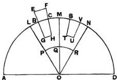
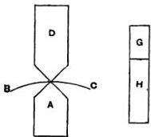

# ON FLOATING BODIES, BOOK I.

## Postulate 1.

“Let it be supposed that a fluid is of such a character that, its parts lying evenly and being continuous, that part which is thrust the less is driven along by that which is thrust the more; and that each of its parts is thrust by the fluid which is above it in a perpendicular direction if the fluid be sunk in anything and compressed by anything else.”

## Proposition 1.

If a surface be cut by a plane always passing through a certain point, and if the section be always a circumference [of a circle] whose centre is the aforesaid point, the surface is that of a sphere.

For, if not, there will be some two lines drawn from the point to the surface which are not equal.

Suppose $O$ to be the fixed point, and $A, B$ to be two points on the surface such that $OA, OB$ are unequal. Let the surface be cut by a plane passing through $OA, OB$. Then the section is, by hypothesis, a circle whose centre is $O$.

Thus $OA = OB$; which is contrary to the assumption. Therefore the surface cannot but be a sphere.

## Proposition 2.

The surface of any fluid at rest is the surface of a sphere whose centre is the same as that of the earth.

Suppose the surface of the fluid cut by a plane through $O$, the centre of the earth, in the curve $ABCD$.

$ABCD$ shall be the circumference of a circle.

For, if not, some of the lines drawn from $O$ to the curve will be unequal. Take one of them, $OB$, such that $OB$ is greater than some of the lines from $O$ to the curve and less than others. Draw a circle with $OB$ as radius. Let it be $EBF$, which will therefore fall partly within and partly without the surface of the fluid.

Draw $OGH$ making with $OB$ an angle equal to the angle $EOB$, and meeting the surface in $H$ and the circle in $G$. Draw also in the plane an arc of a circle $PQR$ with centre $O$ and within the fluid.

Then the parts of the fluid along $PQR$ are uniform and continuous, and the part $PQ$ is compressed by the part between it and $AB$, while the part $QR$ is compressed by the part between $QR$ and $BH$. Therefore the parts along $PQ$, $QR$ will be unequally compressed, and the part which is compressed the less will be set in motion by that which is compressed the more.

Therefore there will not be rest; which is contrary to the hypothesis.

Hence the section of the surface will be the circumference of a circle whose centre is $O$; and so will all other sections by planes through $O$.

Therefore the surface is that of a sphere with centre $O$.

## Proposition 3.

Of solids those which, size for size, are of equal weight with a fluid will, if let down into the fluid, be immersed so that they do not project above the surface but do not sink lower.

If possible, let a certain solid $EFHG$ of equal weight, volume for volume, with the fluid remain immersed in it so that part of it, $EBCF$, projects above the surface.

Draw through $O$, the centre of the earth, and through the solid a plane cutting the surface of the fluid in the circle $ABCD$.

Conceive a pyramid with vertex $O$ and base a parallelogram at the surface of the fluid, such that it includes the immersed portion of the solid. Let this pyramid be cut by the plane of $ABCD$ in $OL$, $OM$. Also let a sphere within the fluid and below $GH$ be described with centre $O$, and let the plane of $ABCD$ cut this sphere in $PQR$.

Conceive also another pyramid in the fluid with vertex $O$, continuous with the former pyramid and equal and similar to it. Let the pyramid so described be cut in $OM$, $ON$ by the plane of $ABCD$.

Lastly, let $STUV$ be a part of the fluid within the second pyramid equal and similar to the part $BGHC$ of the solid, and let $SV$ be at the surface of the fluid.

Then the pressures on $PQ$, $QR$ are unequal, that on $PQ$ being the greater. Hence the part at $QR$ will be set in motion by that at $PQ$, and the fluid will not be at rest; which is contrary to the hypothesis.

Therefore the solid will not stand out above the surface.

Nor will it sink further, because all the parts of the fluid will be under the same pressure.

## Proposition 4.

*A solid lighter than a fluid will, if immersed in it, not be completely submerged, but part of it will project above the surface.*

In this case, after the manner of the previous proposition, we assume the solid, if possible, to be completely submerged and the fluid to be at rest in that position, and we conceive (1) a pyramid with its vertex at $O$, the centre of the earth, including the solid, (2) another pyramid continuous with the former and equal and similar to it, with the same vertex $O$, (3) a portion of the fluid within this latter pyramid equal to the immersed solid in the other pyramid, (4) a sphere with centre $O$ whose surface is below the immersed solid and the part of the fluid in the second pyramid corresponding thereto. We suppose a plane to be drawn through the centre $O$ cutting the surface of the fluid in the circle $ABC$, the solid in $S$, the first pyramid in $OA$, $OB$, the second pyramid in $OB$, $OC$, the portion of the fluid in the second pyramid in $K$, and the inner sphere in $PQR$.

Then the pressures on the parts of the fluid at $PQ$, $QR$ are unequal, since $S$ is lighter than $K$. Hence there will not be rest; which is contrary to the hypothesis.

Therefore the solid $S$ cannot, in a condition of rest, be completely submerged.

## Proposition 5.

Any solid lighter than a fluid will, if placed in the fluid, be so far immersed that the weight of the solid will be equal to the weight of the fluid displaced.

For let the solid be $EGHF$, and let $BGHC$ be the portion of it immersed when the fluid is at rest. As in Prop. 3, conceive a pyramid with vertex $O$ including the solid, and another pyramid with the same vertex continuous with the former and equal and similar to it. Suppose a portion of the fluid $STUV$ at the base of the second pyramid to be equal and similar to the immersed portion of the solid; and let the construction be the same as in Prop. 3.

Then, since the pressure on the parts of the fluid at $PQ$, $QR$ must be equal in order that the fluid may be at rest, it follows that the weight of the portion $STUV$ of the fluid must be equal to the weight of the solid $EGHF$. And the former is equal to the weight of the fluid displaced by the immersed portion of the solid $BGHC$.

## Proposition 6.

If a solid lighter than a fluid be forcibly immersed in it, the solid will be driven upwards by a force equal to the difference between its weight and the weight of the fluid displaced.

For let $A$ be completely immersed in the fluid, and let $G$ represent the weight of $A$, and $(G + H)$ the weight of an equal volume of the fluid. Take a solid $D$, whose weight is $H$ and add it to $A$. Then the weight of $(A + D)$ is less than that of an equal volume of the fluid; and, if $(A + D)$ is immersed in the fluid, it will project so that its weight will be equal to the weight of the fluid displaced. But its weight is $(G + H)$.

Therefore the weight of the fluid displaced is $(G + H)$, and hence the volume of the fluid displaced is the volume of the solid $A$. There will accordingly be rest with $A$ immersed and $D$ projecting.

Thus the weight of $D$ balances the upward force exerted by the fluid on $A$, and therefore the latter force is equal to $H$, which is the difference between the weight of $A$ and the weight of the fluid which $A$ displaces.

## Proposition 7.

*A solid heavier than a fluid will, if placed in it, descend to the bottom of the fluid, and the solid will, when weighed in the fluid, be lighter than its true weight by the weight of the fluid displaced.*

(1) The first part of the proposition is obvious, since the part of the fluid under the solid will be under greater pressure, and therefore the other parts will give way until the solid reaches the bottom.

(2) Let $A$ be a solid heavier than the same volume of the fluid, and let $(G + H)$ represent its weight, while $G$ represents the weight of the same volume of the fluid.

Take a solid $B$ lighter than the same volume of the fluid, and such that the weight of $B$ is $G$, while the weight of the same volume of the fluid is $(G + H)$.

Let $A$ and $B$ be now combined into one solid and immersed. Then, since $(A + B)$ will be of the same weight as the same volume of fluid, both weights being equal to $(G + H) + G$, it follows that $(A + B)$ will remain stationary in the fluid.

Therefore the force which causes $A$ by itself to sink must be equal to the upward force exerted by the fluid on $B$ by itself. This latter is equal to the difference between $(G + H)$ and $G$ [Prop. 6]. Hence $A$ is depressed by a force equal to $H$, i.e. its weight in the fluid is $H$, or the difference between $(G + H)$ and $G$.

[This proposition may, I think, safely be regarded as decisive of the question how Archimedes determined the proportions of gold and silver contained in the famous crown (cf. Introduction, Chapter I.). The proposition suggests in fact the following method.

Let $W$ represent the weight of the crown, $w_{1}$ and $w_{2}$ the weights of the gold and silver in it respectively, so that $W = w_{1} + w_{2}$.

(1) Take a weight $W$ of pure gold and weigh it in a fluid. The apparent loss of weight is then equal to the weight of the fluid displaced. If $F_{1}$ denote this weight, $F_{1}$ is thus known as the result of the operation of weighing.

It follows that the weight of fluid displaced by a weight $w_{1}$ of gold is $\frac{w_{1}}{W} \cdot F_{1}$.

(2) Take a weight $W$ of pure silver and perform the same operation. If $F_2$ be the loss of weight when the silver is weighed in the fluid, we find in like manner that the weight of fluid displaced by $w_2$ is $\frac{w_2}{W} \cdot F_2$.

(3) Lastly, weigh the crown itself in the fluid, and let $F$ be the loss of weight. Therefore the weight of fluid displaced by the crown is $F$.

It follows that $\frac{w_1}{W} \cdot F_1 + \frac{w_2}{W} \cdot F_2 = F$,

or $w_1F_1 + w_2F_2 = (w_1 + w_2)F$,

whence $\frac{w_1}{w_2} = \frac{F_2 - F}{F - F_1}$.

This procedure corresponds pretty closely to that described in the poem *de ponderibus et mensuris* (written probably about 500 A.D.)* purporting to explain Archimedes’ method. According to the author of this poem, we first take two equal weights of pure gold and pure silver respectively and weigh them against each other when both immersed in water; this gives the relation between their weights in water and therefore between their loss of weight in water. Next we take the mixture of gold and silver and an equal weight of pure silver and weigh them against each other in water in the same manner.

The other version of the method used by Archimedes is that given by Vitruvius†, according to which he measured successively the volumes of fluid displaced by three equal weights, (1) the crown, (2) the same weight of gold, (3) the same weight of silver, respectively. Thus, if as before the weight of the crown is $W$, and it contains weights $w_1$ and $w_2$ of gold and silver respectively,

(1) the crown displaces a certain quantity of fluid, $V$ say.

(2) the weight $W$ of gold displaces a certain volume of

* Torelli’s Archimedes, p. 364; Hultsch, *Metrol. Script.* II. 95 sq., and Prolegomena § 118.
† *De architect.* IX. 3.

fluid, $V_{1}$ say; therefore a weight $w_{1}$ of gold displaces a volume $\frac{w_{1}}{W} \cdot V_{1}$ of fluid.

(3) the weight $W$ of silver displaces a certain volume of fluid, say $V_{2}$; therefore a weight $w_{2}$ of silver displaces a volume $\frac{w_{2}}{W} \cdot V_{2}$ of fluid.

It follows that $V = \frac{w_{1}}{W} \cdot V_{1} + \frac{w_{2}}{W} \cdot V_{2},$

whence, since $W = w_{1} + w_{2},$

$$
\frac{w_{1}}{w_{2}} = \frac{V_{2} - V}{V - V_{1}};
$$

and this ratio is obviously equal to that before obtained, viz. $\frac{F_{2} - F}{F - F_{1}}$.]

## Postulate 2.

"Let it be granted that bodies which are forced upwards in a fluid are forced upwards along the perpendicular [to the surface] which passes through their centre of gravity."

## Proposition 8.

If a solid in the form of a segment of a sphere, and of a substance lighter than a fluid, be immersed in it so that its base does not touch the surface, the solid will rest in such a position that its axis is perpendicular to the surface; and, if the solid be forced into such a position that its base touches the fluid on one side and be then set free, it will not remain in that position but will return to the symmetrical position.

[The proof of this proposition is wanting in the Latin version of Tartaglia. Commandinus supplied a proof of his own in his edition.]

## Proposition 9.

If a solid in the form of a segment of a sphere, and of a substance lighter than a fluid, be immersed in it so that its base is completely below the surface, the solid will rest in such a position that its axis is perpendicular to the surface.

[The proof of this proposition has only survived in a mutilated form. It deals moreover with only one case out of three which are distinguished at the beginning, viz. that in which the segment is greater than a hemisphere, while figures only are given for the cases where the segment is equal to, or less than, a hemisphere.]

Suppose, first, that the segment is greater than a hemisphere. Let it be cut by a plane through its axis and the centre of the earth; and, if possible, let it be at rest in the position shown in the figure, where $AB$ is the intersection of the plane with the base of the segment, $DE$ its axis, $C$ the centre of the sphere of which the segment is a part, $O$ the centre of the earth.

The centre of gravity of the portion of the segment outside the fluid, as $F$, lies on $OC$ produced, its axis passing through $C$.

Let $G$ be the centre of gravity of the segment. Join $FG$, and produce it to $H$ so that

$$FG:GH = \text{(volume of immersed portion)} : \text{(rest of solid)}.$$

Join $OH$.

Then the weight of the portion of the solid outside the fluid acts along $FO$, and the pressure of the fluid on the immersed portion along $OH$, while the weight of the immersed portion acts along $HO$ and is by hypothesis less than the pressure of the fluid acting along $OH$.

Hence there will not be equilibrium, but the part of the segment towards $A$ will ascend and the part towards $B$ descend, until $DE$ assumes a position perpendicular to the surface of the fluid.
