# ON FLOATING BODIES.

# BOOK I.

## Postulate 1.

“Let it be supposed that a fluid is of such a character that, its parts lying evenly and being continuous, that part which is thrust the less is driven along by that which is thrust the more; and that each of its parts is thrust by the fluid which is above it in a perpendicular direction if the fluid be sunk in anything and compressed by anything else.”

## Proposition 1.

If a surface be cut by a plane always passing through a certain point, and if the section be always a circumference [of a circle] whose centre is the aforesaid point, the surface is that of a sphere.

For, if not, there will be some two lines drawn from the point to the surface which are not equal.

Suppose $O$ to be the fixed point, and $A, B$ to be two points on the surface such that $OA, OB$ are unequal. Let the surface be cut by a plane passing through $OA, OB$. Then the section is, by hypothesis, a circle whose centre is $O$.

Thus $OA = OB$; which is contrary to the assumption. Therefore the surface cannot but be a sphere.

---

### Proposition 2.

The surface of any fluid at rest is the surface of a sphere whose centre is the same as that of the earth.

Suppose the surface of the fluid cut by a plane through $O$, the centre of the earth, in the curve $ABCD$.

$ABCD$ shall be the circumference of a circle.

For, if not, some of the lines drawn from $O$ to the curve will be unequal. Take one of them, $OB$, such that $OB$ is greater than some of the lines from $O$ to the curve and less than others. Draw a circle with $OB$ as radius. Let it be $EBF$, which will therefore fall partly within and partly without the surface of the fluid.

Draw $OGH$ making with $OB$ an angle equal to the angle $EOB$, and meeting the surface in $H$ and the circle in $G$. Draw also in the plane an arc of a circle $PQR$ with centre $O$ and within the fluid.

Then the parts of the fluid along $PQR$ are uniform and continuous, and the part $PQ$ is compressed by the part between it and $AB$, while the part $QR$ is compressed by the part between $QR$ and $BH$. Therefore the parts along $PQ$, $QR$ will be unequally compressed, and the part which is compressed the less will be set in motion by that which is compressed the more.

Therefore there will not be rest; which is contrary to the hypothesis.

Hence the section of the surface will be the circumference of a circle whose centre is $O$; and so will all other sections by planes through $O$.

Therefore the surface is that of a sphere with centre $O$.

---

## Proposition 3.

Of solids those which, size for size, are of equal weight with a fluid will, if let down into the fluid, be immersed so that they do not project above the surface but do not sink lower.

If possible, let a certain solid $EFHG$ of equal weight, volume for volume, with the fluid remain immersed in it so that part of it, $EBCF$, projects above the surface.

Draw through $O$, the centre of the earth, and through the solid a plane cutting the surface of the fluid in the circle $ABCD$.

Conceive a pyramid with vertex $O$ and base a parallelogram at the surface of the fluid, such that it includes the immersed portion of the solid. Let this pyramid be cut by the plane of $ABCD$ in $OL$, $OM$. Also let a sphere within the fluid and below $GH$ be described with centre $O$, and let the plane of $ABCD$ cut this sphere in $PQR$.

Conceive also another pyramid in the fluid with vertex $O$, continuous with the former pyramid and equal and similar to it. Let the pyramid so described be cut in $OM$, $ON$ by the plane of $ABCD$.

Lastly, let $STUV$ be a part of the fluid within the second pyramid equal and similar to the part $BGHC$ of the solid, and let $SV$ be at the surface of the fluid.

Then the pressures on $PQ$, $QR$ are unequal, that on $PQ$ being the greater. Hence the part at $QR$ will be set in motion

---

by that at $PQ$, and the fluid will not be at rest; which is contrary to the hypothesis.

Therefore the solid will not stand out above the surface.

Nor will it sink further, because all the parts of the fluid will be under the same pressure.

## Proposition 4.

*A solid lighter than a fluid will, if immersed in it, not be completely submerged, but part of it will project above the surface.*

In this case, after the manner of the previous proposition, we assume the solid, if possible, to be completely submerged and the fluid to be at rest in that position, and we conceive (1) a pyramid with its vertex at $O$, the centre of the earth, including the solid, (2) another pyramid continuous with the former and equal and similar to it, with the same vertex $O$, (3) a portion of the fluid within this latter pyramid equal to the immersed solid in the other pyramid, (4) a sphere with centre $O$ whose surface is below the immersed solid and the part of the fluid in the second pyramid corresponding thereto. We suppose a plane to be drawn through the centre $O$ cutting the surface of the fluid in the circle $ABC$, the solid in $S$, the first pyramid in $OA$, $OB$, the second pyramid in $OB$, $OC$, the portion of the fluid in the second pyramid in $K$, and the inner sphere in $PQR$.

Then the pressures on the parts of the fluid at $PQ$, $QR$ are unequal, since $S$ is lighter than $K$. Hence there will not be rest; which is contrary to the hypothesis.

Therefore the solid $S$ cannot, in a condition of rest, be completely submerged.

---

## Proposition 5.

Any solid lighter than a fluid will, if placed in the fluid, be so far immersed that the weight of the solid will be equal to the weight of the fluid displaced.

For let the solid be $EGHF$, and let $BGHC$ be the portion of it immersed when the fluid is at rest. As in Prop. 3, conceive a pyramid with vertex $O$ including the solid, and another pyramid with the same vertex continuous with the former and equal and similar to it. Suppose a portion of the fluid $STUV$ at the base of the second pyramid to be equal and similar to the immersed portion of the solid; and let the construction be the same as in Prop. 3.

Then, since the pressure on the parts of the fluid at $PQ$, $QR$ must be equal in order that the fluid may be at rest, it follows that the weight of the portion $STUV$ of the fluid must be equal to the weight of the solid $EGHF$. And the former is equal to the weight of the fluid displaced by the immersed portion of the solid $BGHC$.

## Proposition 6.

If a solid lighter than a fluid be forcibly immersed in it, the solid will be driven upwards by a force equal to the difference between its weight and the weight of the fluid displaced.

For let $A$ be completely immersed in the fluid, and let $G$ represent the weight of $A$, and $(G + H)$ the weight of an equal volume of the fluid. Take a solid $D$, whose weight is $H$

H, A.                                                                 17

---

and add it to $A$. Then the weight of $(A + D)$ is less than that of an equal volume of the fluid; and, if $(A + D)$ is immersed in the fluid, it will project so that its weight will be equal to the weight of the fluid displaced. But its weight is $(G + H)$.

Therefore the weight of the fluid displaced is $(G + H)$, and hence the volume of the fluid displaced is the volume of the solid $A$. There will accordingly be rest with $A$ immersed and $D$ projecting.

Thus the weight of $D$ balances the upward force exerted by the fluid on $A$, and therefore the latter force is equal to $H$, which is the difference between the weight of $A$ and the weight of the fluid which $A$ displaces.

## Proposition 7.

*A solid heavier than a fluid will, if placed in it, descend to the bottom of the fluid, and the solid will, when weighed in the fluid, be lighter than its true weight by the weight of the fluid displaced.*

(1) The first part of the proposition is obvious, since the part of the fluid under the solid will be under greater pressure, and therefore the other parts will give way until the solid reaches the bottom.

(2) Let $A$ be a solid heavier than the same volume of the fluid, and let $(G + H)$ represent its weight, while $G$ represents the weight of the same volume of the fluid.

---

Take a solid $B$ lighter than the same volume of the fluid, and such that the weight of $B$ is $G$, while the weight of the same volume of the fluid is $(G + H)$.

Let $A$ and $B$ be now combined into one solid and immersed. Then, since $(A + B)$ will be of the same weight as the same volume of fluid, both weights being equal to $(G + H) + G$, it follows that $(A + B)$ will remain stationary in the fluid.

Therefore the force which causes $A$ by itself to sink must be equal to the upward force exerted by the fluid on $B$ by itself. This latter is equal to the difference between $(G + H)$ and $G$ [Prop. 6]. Hence $A$ is depressed by a force equal to $H$, i.e. its weight in the fluid is $H$, or the difference between $(G + H)$ and $G$.

[This proposition may, I think, safely be regarded as decisive of the question how Archimedes determined the proportions of gold and silver contained in the famous crown (cf. Introduction, Chapter I.). The proposition suggests in fact the following method.

Let $W$ represent the weight of the crown, $w_{1}$ and $w_{2}$ the weights of the gold and silver in it respectively, so that $W = w_{1} + w_{2}$.

(1) Take a weight $W$ of pure gold and weigh it in a fluid. The apparent loss of weight is then equal to the weight of the fluid displaced. If $F_{1}$ denote this weight, $F_{1}$ is thus known as the result of the operation of weighing.

It follows that the weight of fluid displaced by a weight $w_{1}$ of gold is $\frac{w_{1}}{W} \cdot F_{1}$.

---

(2) Take a weight $W$ of pure silver and perform the same operation. If $F_2$ be the loss of weight when the silver is weighed in the fluid, we find in like manner that the weight of fluid displaced by $w_2$ is $\frac{w_2}{W} \cdot F_2$.

(3) Lastly, weigh the crown itself in the fluid, and let $F$ be the loss of weight. Therefore the weight of fluid displaced by the crown is $F$.

It follows that $\frac{w_1}{W} \cdot F_1 + \frac{w_2}{W} \cdot F_2 = F$,

or $w_1F_1 + w_2F_2 = (w_1 + w_2)F$,

whence $\frac{w_1}{w_2} = \frac{F_2 - F}{F - F_1}$.

This procedure corresponds pretty closely to that described in the poem *de ponderibus et mensuris* (written probably about 500 A.D.)* purporting to explain Archimedes’ method. According to the author of this poem, we first take two equal weights of pure gold and pure silver respectively and weigh them against each other when both immersed in water; this gives the relation between their weights in water and therefore between their loss of weight in water. Next we take the mixture of gold and silver and an equal weight of pure silver and weigh them against each other in water in the same manner.

The other version of the method used by Archimedes is that given by Vitruvius†, according to which he measured successively the volumes of fluid displaced by three equal weights, (1) the crown, (2) the same weight of gold, (3) the same weight of silver, respectively. Thus, if as before the weight of the crown is $W$, and it contains weights $w_1$ and $w_2$ of gold and silver respectively,

(1) the crown displaces a certain quantity of fluid, $V$ say.

(2) the weight $W$ of gold displaces a certain volume of

* Torelli’s Archimedes, p. 364; Hultsch, *Metrol. Script.* II. 95 sq., and Prolegomena § 118.
† *De architect.* IX. 3.

---

fluid, $V_{1}$ say; therefore a weight $w_{1}$ of gold displaces a volume $\frac{w_{1}}{W} \cdot V_{1}$ of fluid.

(3) the weight $W$ of silver displaces a certain volume of fluid, say $V_{2}$; therefore a weight $w_{2}$ of silver displaces a volume $\frac{w_{2}}{W} \cdot V_{2}$ of fluid.

It follows that $V = \frac{w_{1}}{W} \cdot V_{1} + \frac{w_{2}}{W} \cdot V_{2},$

whence, since $W = w_{1} + w_{2},$

$$
\frac{w_{1}}{w_{2}} = \frac{V_{2} - V}{V - V_{1}};
$$

and this ratio is obviously equal to that before obtained, viz. $\frac{F_{2} - F}{F - F_{1}}$.]

---

## Postulate 2.

“Let it be granted that bodies which are forced upwards in a fluid are forced upwards along the perpendicular [to the surface] which passes through their centre of gravity.”

---

## Proposition 8.

If a solid in the form of a segment of a sphere, and of a substance lighter than a fluid, be immersed in it so that its base does not touch the surface, the solid will rest in such a position that its axis is perpendicular to the surface; and, if the solid be forced into such a position that its base touches the fluid on one side and be then set free, it will not remain in that position but will return to the symmetrical position.

[The proof of this proposition is wanting in the Latin version of Tartaglia. Commandinus supplied a proof of his own in his edition.]

---

## Proposition 9.

If a solid in the form of a segment of a sphere, and of a substance lighter than a fluid, be immersed in it so that its base is completely below the surface, the solid will rest in such a position that its axis is perpendicular to the surface.

---

[The proof of this proposition has only survived in a mutilated form. It deals moreover with only one case out of three which are distinguished at the beginning, viz. that in which the segment is greater than a hemisphere, while figures only are given for the cases where the segment is equal to, or less than, a hemisphere.]

Suppose, first, that the segment is greater than a hemisphere. Let it be cut by a plane through its axis and the centre of the earth; and, if possible, let it be at rest in the position shown in the figure, where $AB$ is the intersection of the plane with the base of the segment, $DE$ its axis, $C$ the centre of the sphere of which the segment is a part, $O$ the centre of the earth.

The centre of gravity of the portion of the segment outside the fluid, as $F$, lies on $OC$ produced, its axis passing through $C$.

Let $G$ be the centre of gravity of the segment. Join $FG$, and produce it to $H$ so that

$$FG:GH = \text{(volume of immersed portion)} : \text{(rest of solid)}.$$

Join $OH$.

Then the weight of the portion of the solid outside the fluid acts along $FO$, and the pressure of the fluid on the immersed portion along $OH$, while the weight of the immersed portion acts along $HO$ and is by hypothesis less than the pressure of the fluid acting along $OH$.

Hence there will not be equilibrium, but the part of the segment towards $A$ will ascend and the part towards $B$ descend, until $DE$ assumes a position perpendicular to the surface of the fluid.

---

# ON FLOATING BODIES.

# BOOK II.

## Proposition 1.

If a solid lighter than a fluid be at rest in it, the weight of the solid will be to that of the same volume of the fluid as the immersed portion of the solid is to the whole.

Let $(A + B)$ be the solid, $B$ the portion immersed in the fluid.

Let $(C + D)$ be an equal volume of the fluid, $C$ being equal in volume to $A$ and $B$ to $D$.

Further suppose the line $E$ to represent the weight of the solid $(A + B)$, $(F + G)$ to represent the weight of $(C + D)$, and $G$ that of $D$.

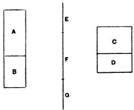

Then

weight of $(A + B)$ : weight of $(C + D) = E$ : $(F + G)\ldots(1)$.

---

And the weight of $(A + B)$ is equal to the weight of a volume $B$ of the fluid [I. 5], i.e. to the weight of $D$.

That is to say, $E = G$.

Hence, by (1),

$$
\begin{aligned}
\text{weight of } (A + B) : \text{weight of } (C + D) &amp;= G : F + G \\
&amp;= D : C + D \\
&amp;= B : A + B.
\end{aligned}
$$

## Proposition 2.

If a right segment of a paraboloid of revolution whose axis is not greater than $\frac{3}{4} p$ (where $p$ is the principal parameter of the generating parabola), and whose specific gravity is less than that of a fluid, be placed in the fluid with its axis inclined to the vertical at any angle, but so that the base of the segment does not touch the surface of the fluid, the segment of the paraboloid will not remain in that position but will return to the position in which its axis is vertical.

Let the axis of the segment of the paraboloid be $AN$, and through $AN$ draw a plane perpendicular to the surface of the fluid. Let the plane intersect the paraboloid in the parabola $BAB'$, the base of the segment of the paraboloid in $BB'$, and the plane of the surface of the fluid in the chord $QQ'$ of the parabola.

Then, since the axis $AN$ is placed in a position not perpendicular to $QQ'$, $BB'$ will not be parallel to $QQ'$.

Draw the tangent $PT$ to the parabola which is parallel to $QQ'$, and let $P$ be the point of contact*.

[From $P$ draw $PV$ parallel to $AN$ meeting $QQ'$ in $V$. Then $PV$ will be a diameter of the parabola, and also the axis of the portion of the paraboloid immersed in the fluid.

* The rest of the proof is wanting in the version of Tartaglia, but is given in brackets as supplied by Commandinus.

---

Let $C$ be the centre of gravity of the paraboloid $BAB'$, and $F$ that of the portion immersed in the fluid. Join $FC$ and produce it to $H$ so that $H$ is the centre of gravity of the remaining portion of the paraboloid above the surface.

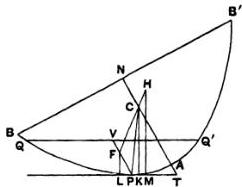

Then, since

$$
AN = \frac{a}{2} AC^*,
$$

and

$$
AN \neq \frac{a}{4} p,
$$

it follows that

$$
AC \neq \frac{p}{2}.
$$

Therefore, if $CP$ be joined, the angle $CPT$ is acute†. Hence, if $CK$ be drawn perpendicular to $PT$, $K$ will fall between $P$ and $T$. And, if $FL$, $HM$ be drawn parallel to $CK$ to meet $PT$, they will each be perpendicular to the surface of the fluid.

Now the force acting on the immersed portion of the segment of the paraboloid will act upwards along $LF$, while the weight of the portion outside the fluid will act downwards along $HM$.

Therefore there will not be equilibrium, but the segment

* As the determination of the centre of gravity of a segment of a paraboloid which is here assumed does not appear in any extant work of Archimedes, or in any known work by any other Greek mathematician, it appears probable that it was investigated by Archimedes himself in some treatise now lost.

† The truth of this statement is easily proved from the property of the sub-normal. For, if the normal at $P$ meet the axis in $G$, $AG$ is greater than $\frac{p}{2}$ except in the case where the normal is the normal at the vertex $A$ itself. But the latter case is excluded here because, by hypothesis, $AN$ is not placed vertically. Hence, $P$ being a different point from $A$, $AG$ is always greater than $AC$; and, since the angle $TPG$ is right, the angle $TPC$ must be acute.

---

will turn so that $B$ will rise and $B'$ will fall, until $AN$ takes the vertical position.]

[For purposes of comparison the trigonometrical equivalent of this and other propositions will be appended.

Suppose that the angle $NTP$, at which in the above figure the axis $AN$ is inclined to the surface of the fluid, is denoted by $\theta$.

Then the coordinates of $P$ referred to $AN$ and the tangent at $A$ as axes are

$$
\frac{p}{4} \cot^2 \theta, \quad \frac{p}{2} \cot \theta,
$$

where $p$ is the principal parameter.

Suppose that $AN = h$, $PV = k$.

If now $x'$ be the distance from $T$ of the orthogonal projection of $F$ on $TP$, and $x$ the corresponding distance for the point $C$, we have

$$
x' = \frac{p}{2} \cot^2 \theta \cdot \cos \theta + \frac{p}{2} \cot \theta \cdot \sin \theta + \frac{2}{3} k \cos \theta,
$$

$$
x = \frac{p}{4} \cot^2 \theta \cdot \cos \theta + \frac{2}{3} h \cos \theta,
$$

whence $x' - x = \cos \theta \left\{ \frac{p}{4} (\cot^2 \theta + 2) - \frac{2}{3} (h - k) \right\}.$

In order that the segment of the paraboloid may turn in the direction of increasing the angle $PTN$, $x'$ must be greater than $x$, or the expression just found must be positive.

This will always be the case, whatever be the value of $\theta$, if

$$
\frac{p}{2} \div \frac{2h}{3},
$$

or

$$
h \neq \frac{3}{4} p.
$$

## Proposition 3.

If a right segment of a paraboloid of revolution whose axis is not greater than $\frac{3}{4}p$ (where $p$ is the parameter), and whose specific gravity is less than that of a fluid, be placed in the fluid with its axis inclined at any angle to the vertical, but so that its

---

base is entirely submerged, the solid will not remain in that position but will return to the position in which the axis is vertical.

Let the axis of the paraboloid be $AN$, and through $AN$ draw a plane perpendicular to the surface of the fluid intersecting the paraboloid in the parabola $BAB'$, the base of the segment in $BNB'$, and the plane of the surface of the fluid in the chord $QQ'$ of the parabola.

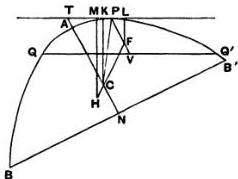

Then, since $AN$, as placed, is not perpendicular to the surface of the fluid, $QQ'$ and $BB'$ will not be parallel.

Draw $PT$ parallel to $QQ'$ and touching the parabola at $P$. Let $PT$ meet $NA$ produced in $T$. Draw the diameter $PV$ bisecting $QQ'$ in $V$. $PV$ is then the axis of the portion of the paraboloid above the surface of the fluid.

Let $C$ be the centre of gravity of the whole segment of the paraboloid, $F$ that of the portion above the surface. Join $FC$ and produce it to $H$ so that $H$ is the centre of gravity of the immersed portion.

Then, since $AC \neq \frac{p}{2}$, the angle $CPT$ is an acute angle, as in the last proposition.

Hence, if $CK$ be drawn perpendicular to $PT$, $K$ will fall between $P$ and $T$. Also, if $HM$, $FL$ be drawn parallel to $CK$, they will be perpendicular to the surface of the fluid.

And the force acting on the submerged portion will act upwards along $HM$, while the weight of the rest will act downwards along $LF$ produced.

Thus the paraboloid will turn until it takes the position in which $AN$ is vertical.

---

## Proposition 4.

Given a right segment of a paraboloid of revolution whose axis $AN$ is greater than $\frac{3}{4}p$ (where $p$ is the parameter), and whose specific gravity is less than that of a fluid but bears to it a ratio not less than $(AN - \frac{3}{4}p)^2 : AN^2$, if the segment of the paraboloid be placed in the fluid with its axis at any inclination to the vertical, but so that its base does not touch the surface of the fluid, it will not remain in that position but will return to the position in which its axis is vertical.

Let the axis of the segment of the paraboloid be $AN$, and let a plane be drawn through $AN$ perpendicular to the surface of the fluid and intersecting the segment in the parabola $BAB'$, the base of the segment in $BB'$, and the surface of the fluid in the chord $QQ'$ of the parabola.

Then $AN$, as placed, will not be perpendicular to $QQ'$.

Draw $PT$ parallel to $QQ'$ and touching the parabola at $P$. Draw the diameter $PV$ bisecting $QQ'$ in $V$. Thus $PV$ will be the axis of the submerged portion of the solid.

Let $C$ be the centre of gravity of the whole solid, $F$ that of the immersed portion. Join $FC$ and produce it to $H$ so that $H$ is the centre of gravity of the remaining portion.

Now, since $AN = \frac{3}{2}AC,$

and $AN &gt; \frac{3}{4}p,$

it follows that $AC &gt; \frac{p}{2}$.

---

Measure $CO$ along $CA$ equal to $\frac{p}{2}$, and $OR$ along $OC$ equal to $\frac{1}{2} AO$.

Then, since
$AN = \frac{3}{2}AC$,
and
$AR = \frac{3}{2}AO$,

we have, by subtraction,
$NR = \frac{3}{2}OC$.

That is,
$AN - AR = \frac{3}{2}OC$
$= \frac{3}{4}p$,
or
$AR = (AN - \frac{3}{4}p)$.

Thus
$(AN - \frac{3}{4}p)^2 : AN^2 = AR^2 : AN^2$,

and therefore the ratio of the specific gravity of the solid to that of the fluid is, by the enunciation, not less than the ratio $AR^2 : AN^2$.

But, by Prop. 1, the former ratio is equal to the ratio of the immersed portion to the whole solid, i.e. to the ratio $PV^2 : AN^2$ [On Conoids and Spheroids, Prop. 24].

Hence
$PV^2 : AN^2 \div AR^2 : AN^2$,
or
$PV \div AR$.

It follows that
$PF = \frac{2}{3}PV \div \frac{2}{3}AR$
$\div AO$.

If, therefore, $OK$ be drawn from $O$ perpendicular to $OA$, it will meet $PF$ between $P$ and $F$.

Also, if $CK$ be joined, the triangle $KCO$ is equal and similar to the triangle formed by the normal, the subnormal and the ordinate at $P$ (since $CO = \frac{1}{2}p$ or the subnormal, and $KO$ is equal to the ordinate).

Therefore $CK$ is parallel to the normal at $P$, and therefore perpendicular to the tangent at $P$ and to the surface of the fluid.

Hence, if parallels to $CK$ be drawn through $F$, $H$, they will be perpendicular to the surface of the fluid, and the force acting on the submerged portion of the solid will act upwards along the former, while the weight of the other portion will act downwards along the latter.

---

Therefore the solid will not remain in its position but will turn until $AN$ assumes a vertical position.

[Using the same notation as before (note following Prop. 2), we have

$$
x' - x = \cos \theta \left\{ \frac{p}{4} (\cot^2 \theta + 2) - \frac{2}{3} (h - k) \right\},
$$

and the *minimum* value of the expression within the bracket, for different values of $\theta$, is

$$
\frac{p}{2} - \frac{2}{3} (h - k),
$$

corresponding to the position in which $AM$ is vertical, or $\theta = \frac{\pi}{2}$.

Therefore there will be stable equilibrium in that position only, provided that

$$
k \not\ll (h - \frac{3}{4} p),
$$

or, if $s$ be the ratio of the specific gravity of the solid to that of the fluid ($= k^2 / h^2$ in this case),

$$
s \not\ll (h - \frac{3}{4} p)^2 / h^2.
$$

## Proposition 5.

Given a right segment of a paraboloid of revolution such that its axis $AN$ is greater than $\frac{3}{4}p$ (where $p$ is the parameter), and its specific gravity is less than that of a fluid but in a ratio to it not greater than the ratio $|AN^s - (AN - \frac{3}{4}p)^2| : AN^2$, if the segment be placed in the fluid with its axis inclined at any angle to the vertical, but so that its base is completely submerged, it will not remain in that position but will return to the position in which $AN$ is vertical.

Let a plane be drawn through $AN$, as placed, perpendicular to the surface of the fluid and cutting the segment of the paraboloid in the parabola $BAB'$, the base of the segment in $BB'$, and the plane of the surface of the fluid in the chord $QQ'$ of the parabola.

Draw the tangent $PT$ parallel to $QQ'$, and the diameter $PV$, bisecting $QQ'$, will accordingly be the axis of the portion of the paraboloid above the surface of the fluid.

---

Let $F$ be the centre of gravity of the portion above the surface, $C$ that of the whole solid, and produce $FC$ to $H$, the centre of gravity of the immersed portion.

As in the last proposition, $AC &gt; \frac{p}{2}$, and we measure $CO$ along $CA$ equal to $\frac{p}{2}$, and $OR$ along $OC$ equal to $\frac{1}{2} AO$.

Then $AN = \frac{3}{2} AC$, and $AR = \frac{3}{2} AO$; and we derive, as before,

$$
AR = (AN - \frac{3}{4} p).
$$

Now, by hypothesis,

(spec. gravity of solid): (spec. gravity of fluid)

$$
\begin{array}{l}
\gg [AN^2 - (AN - \frac{3}{4} p)^2] : AN^2 \\
\gg (AN^2 - AR^2) : AN^2.
\end{array}
$$

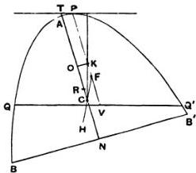

Therefore

(portion submerged): (whole solid)

$$
\gg (AN^2 - AR^2) : AN^2,
$$

and (whole solid): (portion above surface)

$$
\gg AN^2 : AR^2.
$$

Thus

$$
AN^2 : PV^2 \gg AN^2 : AR^2,
$$

whence

$$
PV \div AR,
$$

and

$$
PF \div \frac{3}{2} AR
$$

$$
\div AO.
$$

---

Therefore, if a perpendicular to $AC$ be drawn from $O$, it will meet $PF$ in some point $K$ between $P$ and $F$.

And, since $CO = \frac{1}{2}p$, $CK$ will be perpendicular to $PT$, as in the last proposition.

Now the force acting on the submerged portion of the solid will act upwards through $H$, and the weight of the other portion downwards through $F$, in directions parallel in both cases to $CK$; whence the proposition follows.

## Proposition 6.

If a right segment of a paraboloid lighter than a fluid be such that its axis $AM$ is greater than $\frac{3}{4}p$, but $AM : \frac{1}{2}p &lt; 15 : 4$, and if the segment be placed in the fluid with its axis so inclined to the vertical that its base touches the fluid, it will never remain in such a position that the base touches the surface in one point only.

Suppose the segment of the paraboloid to be placed in the position described, and let the plane through the axis $AM$ perpendicular to the surface of the fluid intersect the segment of the paraboloid in the parabolic segment $BAB'$ and the plane of the surface of the fluid in $BQ$.

Take $C$ on $AM$ such that $AC = 2CM$ (or so that $C$ is the centre of gravity of the segment of the paraboloid), and measure $CK$ along $CA$ such that

$$
AM : CK = 15 : 4.
$$

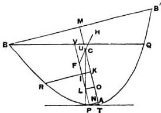

Thus $AM : CK &gt; AM : \frac{1}{2}p$, by hypothesis; therefore $CK &lt; \frac{1}{2}p$.

---

Measure $CO$ along $CA$ equal to $\frac{1}{2}p$. Also draw $KR$ perpendicular to $AC$ meeting the parabola in $R$.

Draw the tangent $PT$ parallel to $BQ$, and through $P$ draw the diameter $PV$ bisecting $BQ$ in $V$ and meeting $KR$ in $I$.

Then
$$ PV: PI_{\text{or}} = KM: AK $$

“for this is proved.”*

And
$$ CK = \frac{4}{15} AM = \frac{3}{5} AC; $$

whence
$$ AK = AC - CK = \frac{3}{5} AC = \frac{3}{5} AM. $$

Thus
$$ KM = \frac{3}{5} AM. $$

Therefore
$$ KM = \frac{3}{2} AK. $$

It follows that
$$ PV_{\text{or}} = \frac{3}{2} PI, $$

so that
$$ PI_{\text{or}} &lt; 2IV. $$

Let $F$ be the centre of gravity of the immersed portion of the paraboloid, so that $PF = 2FV$. Produce $FC$ to $H$, the centre of gravity of the portion above the surface.

Draw $OL$ perpendicular to $PV$.

* We have no hint as to the work in which the proof of this proposition was contained. The following proof is shorter than Robertson’s (in the Appendix to Torelli’s edition).

Let $BQ$ meet $AM$ in $U$, and let $PN$ be the ordinate from $P$ to $AM$.

We have to prove that
$$ PV. AK_{\text{or}} = PI. KM, \text{ or in other words that } (PV. AK - PI. KM) \text{ is positive or zero.} $$

Now
$$ PV. AK - PI. KM = AK. PV - (AK - AN)(AM - AK) = AK^2 - AK(AM + AN - PV) + AM. AN = AK^2 - AK. UM + AM. AN, $$

(since $AN = AT$).

Now
$$ UM: BM = NT: PN. $$

Therefore
$$ UM^2: p. AM = 4AN^2: p. AN, $$

whence
$$ UM^2 = 4AM. AN, $$

or
$$ AM. AN = \frac{UM^2}{4}. $$

Therefore
$$ PV. AK - PI. KM = AK^2 - AK. UM + \frac{UM^2}{4} = (AK - \frac{UM}{2})^2, $$

and accordingly
$$ (PV. AK - PI. KM) \text{ cannot be negative.} $$

H. A. 18

---

Then, since $CO = \frac{1}{2}p$, $CL$ must be perpendicular to $PT$ and therefore to the surface of the fluid.

And the forces acting on the immersed portion of the paraboloid and the portion above the surface act respectively upwards and downwards along lines through $F$ and $H$ parallel to $CL$.

Hence the paraboloid cannot remain in the position in which $B$ just touches the surface, but must turn in the direction of increasing the angle $PTM$.

The proof is the same in the case where the point $I$ is not on $VP$ but on $VP$ produced, as in the second figure*.

[With the notation used on p. 266, if the base $BB'$ touch the surface of the fluid at $B$, we have

$$
BM = BV \sin \theta + PN,
$$

and, by the property of the parabola,

$$
\begin{array}{l}
BV^* = (p + 4AN) PV \\
= pk (1 + \cot^2 \theta).
\end{array}
$$

Therefore $\sqrt{pk} = \sqrt{pk} + \frac{p}{2} \cot \theta$.

To obtain the result of the proposition, we have to eliminate $k$ between this equation and

$$
x' - x = \cos \theta \left\{ \frac{p}{4} (\cot^2 \theta + 2) - \frac{2}{3} (h - k) \right\}.
$$

* It is curious that the figures given by Torelli, Nizze and Heiberg are all incorrect, as they all make the point which I have called $I$ lie on $BQ$ instead of $VP$ produced.

---

We have, from the first equation,

$$
k = h - \sqrt{ph} \cot \theta + \frac{p}{4} \cot^2 \theta,
$$

or

$$
h - k = \sqrt{ph} \cot \theta - \frac{p}{4} \cot^2 \theta.
$$

Therefore

$$
\begin{aligned}
x' - x &amp;= \cos \theta \left\{ \frac{p}{4} (\cot^2 \theta + 2) - \frac{2}{3} (\sqrt{ph} \cot \theta - \frac{p}{4} \cot^2 \theta) \right\} \\
&amp;= \cos \theta \left\{ \frac{p}{4} (\frac{5}{3} \cot^2 \theta + 2) - \frac{2}{3} \sqrt{ph} \cot \theta \right\}.
\end{aligned}
$$

If then the solid can never rest in the position described, but must turn in the direction of increasing the angle $PTM$, the expression within the bracket must be positive whatever be the value of $\theta$.

Therefore

$$
\left( \frac{2}{3} \right)^2 ph &lt; \frac{5}{8} p^2,
$$

or

$$
h &lt; \frac{1.5}{8} p.
$$

## Proposition 7.

Given a right segment of a paraboloid of revolution lighter than a fluid and such that its axis $AM$ is greater than $\frac{3}{4}p$, but $AM : \frac{1}{2}p &lt; 15 : 4$, if the segment be placed in the fluid so that its base is entirely submerged, it will never rest in such a position that the base touches the surface of the fluid at one point only.

Suppose the solid so placed that one point of the base only $(B)$ touches the surface of the fluid. Let the plane through $B$ and the axis $AM$ cut the solid in the parabolic segment $BAB'$ and the plane of the surface of the fluid in the chord $BQ$ of the parabola.

Let $C$ be the centre of gravity of the segment, so that $AC = 2CM$; and measure $CK$ along $CA$ such that

$$
AM : CK = 15 : 4.
$$

It follows that

$$
CK &lt; \frac{1}{2} p.
$$

Measure $CO$ along $CA$ equal to $\frac{1}{2}p$. Draw $KR$ perpendicular to $AM$ meeting the parabola in $R$.

---

Let $PT$, touching at $P$, be the tangent to the parabola which is parallel to $BQ$, and $PV$ the diameter bisecting $BQ$, i.e. the axis of the portion of the paraboloid above the surface.

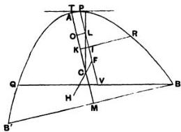

Then, as in the last proposition, we prove that

$$
PV_{\text{or} &gt;}^{\equiv} \frac{3}{2} PI,
$$

and

$$
PI_{\text{or} &lt; } = 2IV.
$$

Let $F$ be the centre of gravity of the portion of the solid above the surface; join $FC$ and produce it to $H$, the centre of gravity of the portion submerged.

Draw $OL$ perpendicular to $PV$; and, as before, since $CO = \frac{1}{2}p$, $CL$ is perpendicular to the tangent $PT$. And the lines through $H$, $F$ parallel to $CL$ are perpendicular to the surface of the fluid; thus the proposition is established as before.

The proof is the same if the point $I$ is not on $VP$ but on $VP$ produced.

## Proposition 8.

Given a solid in the form of a right segment of a paraboloid of revolution whose axis $AM$ is greater than $\frac{3}{4}p$, but such that $AM : \frac{1}{2}p &lt; 15 : 4$, and whose specific gravity bears to that of a fluid a ratio less than $(AM - \frac{3}{4}p)^3 : AM^3$, then, if the solid be placed in the fluid so that its base does not touch the fluid and its axis is inclined at an angle to the vertical, the solid will not return to the position in which its axis is vertical and will not

---

remain in any position except that in which its axis makes with the surface of the fluid a certain angle to be described.

Let $am$ be taken equal to the axis $AM$, and let $c$ be a point on $am$ such that $ac = 2cm$. Measure $co$ along $ca$ equal to $\frac{1}{2}p$, and $or$ along $oc$ equal to $\frac{1}{2}ao$.

Let $X + Y$ be a straight line such that

(spec. gr. of solid): (spec. gr. of fluid) = $(X + Y)^2 : am^2 \dots \dots (\alpha)$,

and suppose $X = 2Y$.

Now
$$
\begin{aligned}
ar &amp;= \frac{3}{2}ao = \frac{3}{2}\left(\frac{2}{3}am - \frac{1}{2}p\right) \\
&amp;= am - \frac{3}{4}p \\
&amp;= AM - \frac{3}{4}p.
\end{aligned}
$$

Therefore, by hypothesis,

$$
(X + Y)^2 : am^2 &lt; ar^2 : am^2,
$$

whence $(X + Y) &lt; ar$, and therefore $X &lt; ao$.

Measure $ob$ along $oa$ equal to $X$, and draw $bd$ perpendicular to $ab$ and of such length that

$$
bd^* = \frac{1}{2}co \cdot ab \quad \dots \dots \dots \dots \dots \dots \dots \dots \dots \dots \dots \dots \dots \dots \dots \dots \dots \dots \dots \dots \dots \dots \dots \dots \dots \dots \dots \dots \dots \dots \dots \dots \dots \dots \tag{\beta}.
$$

Join $ad$.

Now let the solid be placed in the fluid with its axis $AM$ inclined at an angle to the vertical. Through $AM$ draw a plane perpendicular to the surface of the fluid, and let this

---

plane cut the paraboloid in the parabola $BAB'$ and the plane of the surface of the fluid in the chord $QQ'$ of the parabola.

Draw the tangent $PT$ parallel to $QQ'$, touching at $P$, and let $PV$ be the diameter bisecting $QQ'$ in $V$ (or the axis of the immersed portion of the solid), and $PN$ the ordinate from $P$.

Measure $AO$ along $AM$ equal to $ao$, and $OC$ along $OM$ equal to $oc$, and draw $OL$ perpendicular to $PV$.

I. Suppose the angle $OTP$ greater than the angle $dab$.

Thus
$$
PN^2 : NT^4 &gt; db^2 : ba^2.
$$
But
$$
PN^2 : NT^2 = p : 4AN
$$
$$
= co : NT,
$$
and
$$
db^2 : ba^2 = \frac{1}{2} co : ab, \text{ by } (\beta).
$$
Therefore
$$
NT &lt; 2ab,
$$
or
$$
AN &lt; ab,
$$
whence
$$
NO &gt; bo \quad (\text{since } ao = AO)
$$
$$
&gt; X.
$$

Now $(X + Y)^2 : am^2 = (\text{spec. gr. of solid}) : (\text{spec. gr. of fluid})$
$$
= (\text{portion immersed}) : (\text{rest of solid})
$$
$$
= PV^2 : AM^2,
$$
so that
$$
X + Y = PV.
$$
But
$$
PL (= NO) &gt; X
$$
$$
&gt; \frac{2}{3}(X + Y), \quad \text{since } X = 2Y,
$$
$$
&gt; \frac{2}{3}PV,
$$
or
$$
PV &lt; \frac{3}{2}PL,
$$
and therefore
$$
PL &gt; 2LV.
$$

Take a point $F$ on $PV$ so that $PF = 2FV$, i.e., so that $F$ is the centre of gravity of the immersed portion of the solid.

Also $AC = ac = \frac{2}{3}am = \frac{2}{3}AM$, and therefore $C$ is the centre of gravity of the whole solid.

Join $FC$ and produce it to $H$, the centre of gravity of the portion of the solid above the surface.

---

Now, since $CO = \frac{1}{2}p$, $CL$ is perpendicular to the surface of the fluid; therefore so are the parallels to $CL$ through $F$ and $H$. But the force on the immersed portion acts upwards through $F$ and that on the rest of the solid downwards through $H$.

Therefore the solid will not rest but turn in the direction of diminishing the angle $MTP$.

II. Suppose the angle $OTP$ less than the angle $dab$. In this case, we shall have, instead of the above results, the following,

$$
\begin{array}{l}
AN &gt; ab, \\
NO &lt; X.
\end{array}
$$

Also

$$
PV &gt; \frac{3}{2}PL,
$$

and therefore

$$
PL &lt; 2LV.
$$

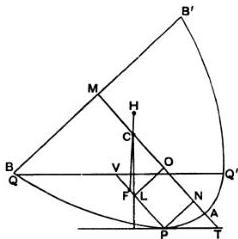

Make $PF$ equal to $2FV$, so that $F$ is the centre of gravity of the immersed portion.

And, proceeding as before, we prove in this case that the solid will turn in the direction of increasing the angle $MTP$.

III. When the angle $MTP$ is equal to the angle $dab$, equalities replace inequalities in the results obtained, and $L$ is itself the centre of gravity of the immersed portion. Thus all the forces act in one straight line, the perpendicular $CL$; therefore there is equilibrium, and the solid will rest in the position described.

---

[With the notation before used

$$ x' - x = \cos \theta \left\{ \frac{p}{4} (\cot^2 \theta + 2) - \frac{2}{3} (h - k) \right\} $$

and a position of equilibrium is obtained by equating to zero the expression within the bracket. We have then

$$ \frac{p}{4} \cot^2 \theta = \frac{2}{3} (h - k) - \frac{p}{2} $$

It is easy to verify that the angle $ \theta $ satisfying this equation is the identical angle determined by Archimedes. For, in the above proposition,

$$ \frac{3X}{2}^- = PV = k, $$

whence $$ ab = \frac{2}{3} h - \frac{p}{2} - \frac{2}{3} k = \frac{2}{3} (h - k) - \frac{p}{2} $$

Also $$ bd^2 = \frac{p}{4} \cdot ab. $$

It follows that

$$ \cot^2 dab = ab^2 / bd^2 = \frac{4}{p} \left\{ \frac{2}{3} (h - k) - \frac{p}{2} \right\} . $$

## Proposition 9.

Given a solid in the form of a right segment of a paraboloid of revolution whose axis $ AM $ is greater than $ \frac{3}{4} p $, but such that $ AM : \frac{1}{2} p &lt; 15 : 4 $, and whose specific gravity bears to that of a fluid a ratio greater than $ [AM^2 - (AM - \frac{3}{4} p)^2] : AM^2 $, then, if the solid be placed in the fluid with its axis inclined at an angle to the vertical but so that its base is entirely below the surface, the solid will not return to the position in which its axis is vertical and will not remain in any position except that in which its axis makes with the surface of the fluid an angle equal to that described in the last proposition.

Take $ am $ equal to $ AM $, and take $ c $ on $ am $ such that $ ac = 2cm $. Measure $ co $ along $ ca $ equal to $ \frac{1}{2} p $, and $ ar $ along $ ac $ such that $ ar = \frac{3}{2} ao $.

---

Let $X + Y$ be such a line that
(spec. gr. of solid): (spec. gr. of fluid) = $\{am^2 - (X + Y)^2\} : am^2$,
and suppose $X = 2Y$.

Now
$$
\begin{array}{l}
ar = \frac{3}{2}ao \\
= \frac{3}{2} \left( \frac{2}{3}am - \frac{1}{2}p \right) \\
= AM - \frac{3}{4}p.
\end{array}
$$

Therefore, by hypothesis,
$$
am^2 - ar^2 : am^2 &lt; \{ am^2 - (X + Y)^2 \} : am^2,
$$
whence
$$
X + Y &lt; ar,
$$
and therefore
$$
X &lt; ao.
$$

Make $ob$ (measured along $oa$) equal to $X$, and draw $bd$ perpendicular to $ba$ and of such length that
$$
bd^2 = \frac{1}{2}co \cdot ab.
$$

Join $ad$.

Now suppose the solid placed as in the figure with its axis $AM$ inclined to the vertical. Let the plane through $AM$ perpendicular to the surface of the fluid cut the solid in the parabola $BAB'$ and the surface of the fluid in $QQ'$.

Let $PT$ be the tangent parallel to $QQ'$, $PV$ the diameter bisecting $QQ'$ (or the axis of the portion of the paraboloid above the surface), $PN$ the ordinate from $P$.

---

I. Suppose the angle $MTP$ greater than the angle $dab$. Let $AM$ be cut as before in $C$ and $O$ so that $AC=2CM$, $OC=\frac{1}{2}p$, and accordingly $AM$, $am$ are equally divided. Draw $OL$ perpendicular to $PV$.

Then, we have, as in the last proposition,

$$
PN^2: NT^2 &gt; db^2: ba^2,
$$

whence

$$
co: NT &gt; \frac{1}{2}co: ab,
$$

and therefore

$$
AN &lt; ab.
$$

It follows that

$$
NO &gt; bo
$$

$$
&gt; X.
$$

Again, since the specific gravity of the solid is to that of the fluid as the immersed portion of the solid to the whole,

$$
AM^2 - (X + Y)^2: AM^2 = AM^2 - PV^2: AM^2,
$$

or

$$
(X + Y)^2: AM^2 = PV^2: AM^2.
$$

That is,

$$
X + Y = PV.
$$

And

$$
PL \text{ (or } NO) &gt; X
$$

$$
&gt; \frac{2}{3}PV,
$$

so that

$$
PL &gt; 2LV.
$$

Take $F$ on $PV$ so that $PF=2FV$. Then $F$ is the centre of gravity of the portion of the solid above the surface.

Also $C$ is the centre of gravity of the whole solid. Join $FC$ and produce it to $H$, the centre of gravity of the immersed portion.

Then, since $CO = \frac{1}{2}p$, $CL$ is perpendicular to $PT$ and to the surface of the fluid; and the force acting on the immersed portion of the solid acts upwards along the parallel to $CL$ through $H$, while the weight of the rest of the solid acts downwards along the parallel to $CL$ through $F$.

Hence the solid will not rest but turn in the direction of diminishing the angle $MTP$.

II. Exactly as in the last proposition, we prove that, if the angle $MTP$ be less than the angle $dab$, the solid will not remain

---

in its position but will turn in the direction of increasing the angle $MTP$.

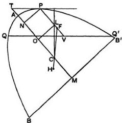

III. If the angle $MTP$ is equal to the angle $dab$, the solid will rest in that position, because $L$ and $F$ will coincide, and all the forces will act along the one line $CL$.

## Proposition 10.

Given a solid in the form of a right segment of a paraboloid of revolution in which the axis $AM$ is of a length such that $AM: \frac{1}{2}p &gt; 15:4$, and supposing the solid placed in a fluid of greater specific gravity so that its base is entirely above the surface of the fluid, to investigate the positions of rest.

### (Preliminary.)

Suppose the segment of the paraboloid to be cut by a plane through its axis $AM$ in the parabolic segment $BAB_1$ of which $BB_1$ is the base.

Divide $AM$ at $C$ so that $AC = 2CM$, and measure $CK$ along $CA$ so that

$$
AM: CK = 15:4 \quad \dots \dots \dots \dots \dots \dots \dots \dots \dots \dots \dots \dots \dots \dots \dots \dots \dots \dots \dots \dots \dots \dots \dots \dots \dots \dots \dots \dots \dots \dots \dots \dots \dots \dots (a),
$$

whence, by the hypothesis, $CK &gt; \frac{1}{2}p$.

Suppose $CO$ measured along $CA$ equal to $\frac{1}{2}p$, and take a point $R$ on $AM$ such that $MR = \frac{3}{2}CO$.

Thus

$$
\begin{array}{l}
AR = AM - MR \\
= \frac{3}{2} (AC - CO) \\
= \frac{3}{2} AO.
\end{array}
$$

---

Join $BA$, draw $KA_{2}$ perpendicular to $AM$ meeting $BA$ in $A_{2}$ bisect $BA$ in $A_{3}$, and draw $A_{2}M_{2}$, $A_{3}M_{3}$ parallel to $AM$ meeting $BM$ in $M_{2}$, $M_{3}$ respectively.

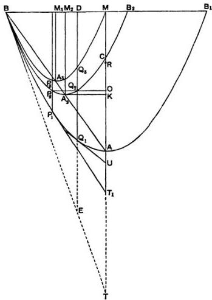

On $A_{2}M_{2}$, $A_{3}M_{3}$ as axes describe parabolic segments similar to the segment $BAB_{1}$. (It follows, by similar triangles, that $BM$ will be the base of the segment whose axis is $A_{3}M_{3}$ and $BB_{2}$ the base of that whose axis is $A_{2}M_{2}$, where $BB_{2} = 2BM_{2}$.)

The parabola $BA_{2}B_{2}$ will then pass through $C$.

[For
$$
BM_{2}: M_{2}M = BM_{2}: A_{2}K
$$
$$
= KM: AK
$$
$$
= CM + CK: AC - CK
$$
$$
= \left( \frac{1}{3} + \frac{A}{16} \right) AM: \left( \frac{2}{3} - \frac{A}{16} \right) AM
$$
$$
= 9:6 \quad \text{...(B)}
$$
$$
= MA: AC.
$$

---

Thus $C$ is seen to be on the parabola $BA_{2}B_{2}$ by the converse of Prop. 4 of the *Quadrature of the Parabola.*]

Also, if a perpendicular to $AM$ be drawn from $O$, it will meet the parabola $BA_{2}B_{2}$ in two points, as $Q_{2}, P_{2}$. Let $Q_{1}Q_{3}Q_{5}D$ be drawn through $Q_{2}$ parallel to $AM$ meeting the parabolas $BAB_{1}, BA_{3}M$ respectively in $Q_{1}, Q_{3}$ and $BM$ in $D$; and let $P_{1}P_{2}P_{3}$ be the corresponding parallel to $AM$ through $P_{2}$. Let the tangents to the outer parabola at $P_{1}, Q_{1}$ meet $MA$ produced in $T_{1}, U$ respectively.

Then, since the three parabolic segments are similar and similarly situated, with their bases in the same straight line and having one common extremity, and since $Q_{1}Q_{2}Q_{5}D$ is a diameter common to all three segments, it follows that

$$
Q_{1}Q_{2}: Q_{2}Q_{3} = (B_{2}B_{1}:B_{1}B). (BM: MB_{2})^{*}.
$$

Now

$$
B_{2}B_{1}:B_{1}B = MM_{2}:BM \quad \text{(dividing by 2)}
$$

$$
= 2:5, \quad \text{by means of } (\beta) \text{ above.}
$$

And

$$
BM: MB_{2} = BM: (2BM_{2} - BM)
$$

$$
= 5: (6 - 5), \quad \text{by means of } (\beta),
$$

$$
= 5:1.
$$

* This result is assumed without proof, no doubt as being an easy deduction from Prop. 5 of the *Quadrature of the Parabola*. It may be established as follows.

First, since $AA_{2}A_{2}B$ is a straight line, and $AN = AT$ with the ordinary notation (where $PT$ is the tangent at $P$ and $PN$ the ordinate), it follows, by similar triangles, that the tangent at $B$ to the outer parabola is a tangent to each of the other two parabolas at the same point $B$.

Now, by the proposition quoted, if $DQ_{2}Q_{3}Q_{1}$ produced meet the tangent $BT$ in $E$,

$$
EQ_{3}: Q_{3}D = BD: DM,
$$

whence

$$
EQ_{3}: ED = BD: BM.
$$

Similarly

$$
EQ_{2}: ED = BD: BB_{2},
$$

and

$$
EQ_{1}: ED = BD: BB_{1}.
$$

The first two proportions are equivalent to

$$
EQ_{3}: ED = BD \cdot BB_{2}: BM \cdot BB_{2},
$$

and

$$
EQ_{2}: ED = BD \cdot BM: BM \cdot BB_{2}.
$$

By subtraction,

$$
Q_{3}Q_{3}: ED = BD \cdot MB_{2}: BM \cdot BB_{2}.
$$

Similarly

$$
Q_{1}Q_{3}: ED = BD \cdot B_{2}B_{1}: BB_{2} \cdot BB_{1}.
$$

It follows that

$$
Q_{1}Q_{3}: Q_{3}Q_{3} = (B_{2}B_{1}:B_{1}B). (BM: MB_{2}).
$$

---

It follows that

$$
\begin{align*}
Q_1 Q_2 : Q_3 Q_3 &amp;= 2 : 1, \\
Q_1 Q_2 &amp;= 2 Q_2 Q_3. \\
\text{Similarly} &amp; P_1 P_2 = 2 P_2 P_3.
\end{align*}
$$

Also, since

$$
MR = \frac{3}{2} CO = \frac{3}{4} p,
$$

$$
AR = AM - MR
$$

$$
= AM - \frac{3}{4} p.
$$

*(Enunciation.)*

*If the segment of the paraboloid be placed in the fluid with its base entirely above the surface, then*

**(I.)** *if*

*(spec. gr. of solid): (spec. gr. of fluid) ∉ AR² : AM²*

$$
[\angle (AM - \frac{3}{4} p)^2 : AM^2],
$$

*the solid will rest in the position in which its axis AM is vertical;*

**(II.)** *if*

*(spec. gr. of solid): (spec. gr. of fluid) &lt; AR² : AM²*

$$
\text{but} &gt; Q_1 Q_2^2 : AM^2,
$$

*the solid will not rest with its base touching the surface of the fluid in one point only, but in such a position that its base does not touch the surface at any point and its axis makes with the surface an angle greater than U;*

**(III. a)** *if*

*(spec. gr. of solid): (spec. gr. of fluid) = Q_1 Q_2² : AM²,*

*the solid will rest and remain in the position in which the base touches the surface of the fluid at one point only and the axis makes with the surface an angle equal to U;*

**(III. b)** *if*

*(spec. gr. of solid): (spec. gr. of fluid) = P_1 P_2² : AM²,*

*the solid will rest with its base touching the surface of the fluid at one point only and with its axis inclined to the surface at an angle equal to T₁;*

**(IV.)** *if*

*(spec. gr. of solid): (spec. gr. of fluid) &gt; P_1 P_2² : AM²*

$$
\text{but} &lt; Q_1 Q_2^2 : AM^2,
$$

---

the solid will rest and remain in a position with its base more submerged;

(V.) if

(spec. gr. of solid): (spec. gr. of fluid) $&lt; P_{1}P_{2}^{2}: AM^{2}$,

the solid will rest in a position in which its axis is inclined to the surface of the fluid at an angle less than $T_{1}$, but so that the base does not even touch the surface at one point.

(Proof.)

(I.) Since $AM &gt; \frac{3}{4}p$, and

(spec. gr. of solid): (spec. gr. of fluid) $\div (AM - \frac{3}{4}p)^{2}: AM^{2}$,

it follows, by Prop. 4, that the solid will be in stable equilibrium with its axis vertical.

(II.) In this case

(spec. gr. of solid): (spec. gr. of fluid) $&lt; AR^{2}: AM^{2}$

but $&gt; Q_{1}Q_{2}^{2}: AM^{2}$.

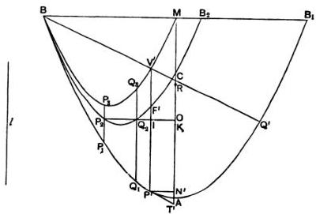

Suppose the ratio of the specific gravities to be equal to

$l^{2}: AM^{2}$,

so that $l &lt; AR$ but $&gt; Q_{1}Q_{2}$.

Place $P'V'$ between the two parabolas $BAB_{1}, BP_{2}Q_{3}M$ equal

---

to $l$ and parallel to $AM^*$; and let $P'V'$ meet the intermediate parabola in $F'$.

Then, by the same proof as before, we obtain

$$
P'F' = 2F'V'.
$$

Let $P'T'$, the tangent at $P'$ to the outer parabola, meet $MA$ in $T'$, and let $P'N'$ be the ordinate at $P'$.

Join $BV'$ and produce it to meet the outer parabola in $Q'$. Let $OQ_2P_2$ meet $P'V'$ in $I$.

Now, since, in two similar and similarly situated parabolic

* Archimedes does not give the solution of this problem, but it can be supplied as follows.

Let $BR_1Q_1$, $BRQ_2$ be two similar and similarly situated parabolic segments with their bases in the same straight line, and let $BE$ be the common tangent at $B$.

Suppose the problem solved, and let $ERR_1O$, parallel to the axes, meet the parabolas in $R$, $R_1$ and $BQ_2$ in $O$, making the intercept $RR_1$ equal to $l$.

Then, we have, as usual,

$$
\begin{array}{l}
ER_1: EO = BO: BQ_1 \\
= BO \cdot BQ_2: BQ_1 \cdot BQ_2,
\end{array}
$$

and

$$
\begin{array}{l}
ER: EO = BO: BQ_2 \\
= BO \cdot BQ_1: BQ_1 \cdot BQ_2.
\end{array}
$$

By subtraction,

$$
RR_1: EO = BO \cdot Q_1Q_2: BQ_1 \cdot BQ_2,
$$

or

$$
BO \cdot OE = l \cdot \frac{BQ_1 \cdot BQ_2}{Q_1Q_2}, \text{ which is known}.
$$

And the ratio $BO: OE$ is known. Therefore $BO^2$, or $OE^2$, can be found, and therefore $O$.

---

segments with bases $BM$, $BB_1$ in the same straight line, $BV'$, $BQ'$ are drawn making the same angle with the bases,

$$
BV': BQ' = BM:BB_1^*
$$

$$
= 1:2,
$$

so that

$$
BV' = V'Q'.
$$

Suppose the segment of the paraboloid placed in the fluid, as described, with its axis inclined at an angle to the vertical, and with its base touching the surface at one point $B$ only. Let the solid be cut by a plane through the axis and per-

pendicular to the surface of the fluid, and let the plane intersect the solid in the parabolic segment $BAB'$ and the plane of the surface of the fluid in $BQ$.

Take the points $C, O$ on $AM$ as before described. Draw

* To prove this, suppose that, in the figure on the opposite page, $BR_1$ is produced to meet the outer parabola in $R_2$.

We have, as before,

$$
ER_1:EO = BO:BQ_1,
$$

$$
ER:EO = BO:BQ_2,
$$

whence

$$
ER_1:ER = BQ_2:BQ_1.
$$

And, since $R_1$ is a point within the outer parabola,

$$
ER:ER_1 = BR_1:BR_2, \text{ in like manner.}
$$

Hence

$$
BQ_1:BQ_2 = BR_1:BR_2.
$$

---

the tangent parallel to $BQ$ touching the parabola in $P$ and meeting $AM$ in $T$; and let $PV$ be the diameter bisecting $BQ$ (i.e. the axis of the immersed portion of the solid).

Then

$$
\begin{aligned}
l^2 : AM^2 &amp;= (\text{spec. gr. of solid}) : (\text{spec. gr. of fluid}) \\
&amp;= (\text{portion immersed}) : (\text{whole solid}) \\
&amp;= PV^2 : AM^2,
\end{aligned}
$$

whence

$$
P'V' = l = PV.
$$

Thus the segments in the two figures, namely $BP'Q'$, $BPQ$, are equal and similar.

Therefore $\angle PTN = \angle P'T'N'$.

Also $AT = AT'$, $AN = AN'$, $PN = P'N'$.

Now, in the first figure, $P'I &lt; 2IV'$.

Therefore, if $OL$ be perpendicular to $PV$ in the second figure,

$$
PL &lt; 2LV.
$$

Take $F$ on $LV$ so that $PF = 2FV$, i.e. so that $F$ is the centre of gravity of the immersed portion of the solid. And $C$ is the centre of gravity of the whole solid. Join $FC$ and produce it to $H$, the centre of gravity of the portion above the surface.

Now, since $CO = \frac{1}{2}p$, $CL$ is perpendicular to the tangent at $P$ and to the surface of the fluid. Thus, as before, we prove that the solid will not rest with $B$ touching the surface, but will turn in the direction of increasing the angle $PTN$.

Hence, in the position of rest, the axis $AM$ must make with the surface of the fluid an angle greater than the angle $U$ which the tangent at $Q_1$ makes with $AM$.

(III. a) In this case

(spec. gr. of solid) : (spec. gr. of fluid) = $Q_1Q_2^2 : AM^2$.

Let the segment of the paraboloid be placed in the fluid so that its base nowhere touches the surface of the fluid, and its axis is inclined at an angle to the vertical.

---

Let the plane through $AM$ perpendicular to the surface of the fluid cut the paraboloid in the parabola $BAB'$ and the

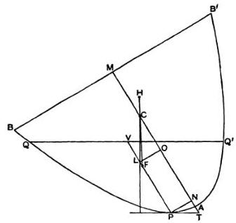

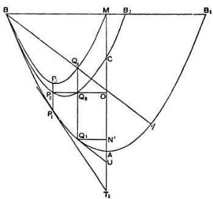

plane of the surface of the fluid in $QQ'$. Let $PT$ be the tangent parallel to $QQ'$, $PV$ the diameter bisecting $QQ'$, $PN$ the ordinate at $P$.

Divide $AM$ as before at $C, O$.

---

In the other figure let $Q_{1}N'$ be the ordinate at $Q_{1}$. Join $BQ_{2}$ and produce it to meet the outer parabola in $q$. Then $BQ_{2} = Q_{2}q$, and the tangent $Q_{1}U$ is parallel to $Bq$. Now

$$
\begin{array}{l}
Q_{1}Q_{2}^{2}: AM^{2} = (\text{spec. gr. of solid}): (\text{spec. gr. of fluid}) \\
= (\text{portion immersed}): (\text{whole solid}) \\
= PV^{2}: AM^{2}.
\end{array}
$$

Therefore $Q_{1}Q_{2} = PV$; and the segments $QPQ', BQ_{1}q$ of the paraboloid are equal in volume. And the base of one passes through $B$, while the base of the other passes through $Q$, a point nearer to $A$ than $B$ is.

It follows that the angle between $QQ'$ and $BB'$ is less than the angle $B_{1}Bq$.

Therefore $\angle U &lt; \angle PTN,$

whence $AN' &gt; AN,$

and therefore $N'O$ (or $Q_{1}Q_{2}) &lt; PL,$

where $OL$ is perpendicular to $PV$.

It follows, since $Q_{1}Q_{2} = 2Q_{2}Q_{3}$, that

$$
PL &gt; 2LV.
$$

Therefore $F$, the centre of gravity of the immersed portion of the solid, is between $P$ and $L$, while, as before, $CL$ is perpendicular to the surface of the fluid.

Producing $FC$ to $H$, the centre of gravity of the portion of the solid above the surface, we see that the solid must turn in the direction of diminishing the angle $PTN$ until one point $B$ of the base just touches the surface of the fluid.

When this is the case, we shall have a segment $BPQ$ equal and similar to the segment $BQ_{1}q$, the angle $PTN$ will be equal to the angle $U$, and $AN$ will be equal to $AN'$.

Hence in this case $PL = 2LV$, and $F, L$ coincide, so that $F, C, H$ are all in one vertical straight line.

Thus the paraboloid will remain in the position in which one point $B$ of the base touches the surface of the fluid, and the axis makes with the surface an angle equal to $U$.

---

(III. b) In the case where

(spec. gr. of solid): (spec. gr. of fluid) = $P_1P_2^2 : AM^2$,

we can prove in the same way that, if the solid be placed in the fluid so that its axis is inclined to the vertical and its base does not anywhere touch the surface of the fluid, the solid will take up and rest in the position in which one point only of the base touches the surface, and the axis is inclined to it at an angle equal to $T_1$ (in the figure on p. 284).

(IV.) In this case

(spec. gr. of solid): (spec. gr. of fluid) &gt; $P_1P_2^2 : AM^2$

$$
\text{but} &lt; Q_1Q_2^2 : AM^2.
$$

Suppose the ratio to be equal to $l^2 : AM^2$, so that $l$ is greater than $P_1P_2$ but less than $Q_1Q_2$.

Place $P'V'$ between the parabolas $BP_1Q_1$, $BP_2Q_2$ so that $P'V'$ is equal to $l$ and parallel to $AM$, and let $P'V'$ meet the intermediate parabola in $F'$ and $OQ_2P_2$ in $I$.

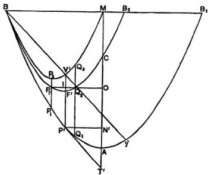

Join $BV'$ and produce it to meet the outer parabola in $q$.

Then, as before, $BV' = V'q$, and accordingly the tangent $P'T'$ at $P'$ is parallel to $Bq$. Let $P'N'$ be the ordinate of $P'$.

---

1. Now let the segment be placed in the fluid, *first*, with its axis so inclined to the vertical that its base does not anywhere touch the surface of the fluid.

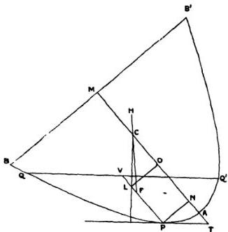

Let the plane through $AM$ perpendicular to the surface of the fluid cut the paraboloid in the parabola $BAB'$ and the plane of the surface of the fluid in $QQ'$. Let $PT$ be the tangent parallel to $QQ'$, $PV$ the diameter bisecting $QQ'$. Divide $AM$ at $C, O$ as before, and draw $OL$ perpendicular to $PV$.

Then, as before, we have $PV = l = P'V'$.

Thus the segments $BP'q$, $QPQ'$ of the paraboloid are equal in volume; and it follows that the angle between $QQ'$ and $BB'$ is less than the angle $B_1Bq$.

Therefore $\angle P'T'N' &lt; \angle PTN$,

and hence $AN' &gt; AN$,

so that $NO &gt; N'O$,

i.e. $PL &gt; P'I$

$&gt; P'F'$, a fortiori.

Thus $PL &gt; 2LV$, so that $F$, the centre of gravity of the immersed portion of the solid, is between $L$ and $P$, while $CL$ is perpendicular to the surface of the fluid.

---

If then we produce $FC$ to $H$, the centre of gravity of the portion of the solid above the surface, we prove that the solid will not rest but turn in the direction of diminishing the angle $PTN$.

2. Next let the paraboloid be so placed in the fluid that its base touches the surface of the fluid at one point $B$ only, and let the construction proceed as before.

Then $PV = P'V'$, and the segments $BPQ$, $BP'q$ are equal and similar, so that

$$
\angle PTN = \angle P'T'N'.
$$

It follows that $AN = AN'$, $NO = N'O$,

and therefore $P'I = PL$,

whence $PL &gt; 2LV$.

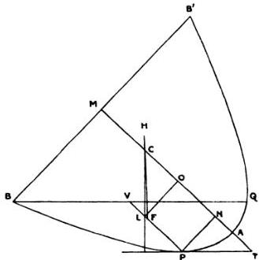

Thus $F$ again lies between $P$ and $L$, and, as before, the paraboloid will turn in the direction of diminishing the angle $PTN$, i.e. so that the base will be more submerged.

### (V.) In this case

(spec. gr. of solid): (spec. gr. of fluid) $&lt; P_{1}P_{2} : AM^{2}$.

If then the ratio is equal to $l^{2} : AM^{2}$, $l &lt; P_{1}P_{2}$. Place $P'V'$ between the parabolas $BP_{1}Q_{1}$ and $BP_{2}Q_{2}$ equal in length to $l$

---

and parallel to $AM$. Let $P'V'$ meet the intermediate parabola in $F'$ and $OP_3$ in $I$.

Join $BV'$ and produce it to meet the outer parabola in $q$. Then, as before, $BV' = V'q$, and the tangent $P'T'$ is parallel to $Bq$.

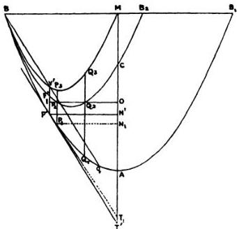

1. Let the paraboloid be so placed in the fluid that its base touches the surface at one point only.

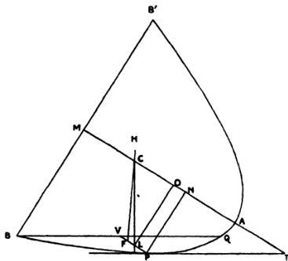

---

Let the plane through $AM$ perpendicular to the surface of the fluid cut the paraboloid in the parabolic section $BAB'$ and the plane of the surface of the fluid in $BQ$.

Making the usual construction, we find

$$
PV = l = P'V',
$$

and the segments $BPQ$, $BP_1q$ are equal and similar.

Therefore $\angle PTN = \angle P'T'N'$

and $AN = AN'$, $N'O = NO$.

Therefore $PL = P'I$,

whence it follows that $PL &lt; 2LV$.

Thus $F$, the centre of gravity of the immersed portion of the solid, lies between $L$ and $V$, while $CL$ is perpendicular to the surface of the fluid.

Producing $FC$ to $H$, the centre of gravity of the portion above the surface, we prove, as usual, that there will not be rest, but the solid will turn in the direction of increasing the angle $PTN$, so that the base will not anywhere touch the surface.

2. The solid will however rest in a position where its axis makes with the surface of the fluid an angle less than $T_1$.

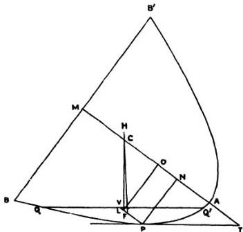

---

For let it be placed so that the angle $PTN$ is not less than $T_1$.

Then, with the same construction as before, $PV = l = P'V'$.

And, since $\angle T \not\prec \angle T_1$,

$$
AN \not\succ AN_1,
$$

and therefore $NO \not\prec N_1O$, where $P_1N_1$ is the ordinate of $P_1$.

Hence $PL \not\prec P_1P_2$.

But $P_1P_2 &gt; P'F'$.

Therefore $PL &gt; \frac{2}{3}PV$,

so that $F$, the centre of gravity of the immersed portion of the solid, lies between $P$ and $L$.

Thus the solid will turn in the direction of diminishing the angle $PTN$ until that angle becomes less than $T_1$.

[As before, if $x, x'$ be the distances from $T$ of the orthogonal projections of $C, F$ respectively on $TP$, we have

$$
x' - x = \cos \theta \left\{ \frac{p}{4} (\cot^2 \theta + 2) - \frac{2}{3} (h - k) \right\} \quad \dots \dots . \quad (1),
$$

where $h = AM$, $k = PV$.

Also, if the base $BB'$ touch the surface of the fluid at one point $B$, we have further, as in the note following Prop. 6,

$$
\sqrt{ph} = \sqrt{pk} + \frac{p}{2} \cot \theta \quad \dots \dots \dots \dots \dots \dots \dots \tag{2},
$$

and

$$
h - k = \sqrt{ph} \cot \theta - \frac{p}{4} \cot^2 \theta \quad \dots \dots \dots \dots \tag{3}.
$$

Therefore, to find the relation between $h$ and the angle $\theta$ at which the axis of the paraboloid is inclined to the surface of the fluid in a position of equilibrium with $B$ just touching the surface, we eliminate $k$ and equate the expression in (1) to zero; thus

$$
\frac{p}{4} (\cot^2 \theta + 2) - \frac{2}{3} \left( \sqrt{ph} \cot \theta - \frac{p}{4} \cot^2 \theta \right) = 0,
$$

or

$$
5p \cot^2 \theta - 8\sqrt{ph} \cot \theta + 6p = 0 \quad \dots \dots \dots \dots \tag{4}.
$$

---

The two values of $\theta$ are given by the equations

$$5\sqrt{p}\cot\theta = 4\sqrt{h} \pm \sqrt{16h - 30p} \quad \dots \dots \dots \dots \tag{5}.$$

The lower sign corresponds to the angle $U$, and the upper sign to the angle $T_1$, in the proposition of Archimedes, as can be verified thus.

In the first figure of Archimedes (p. 284 above) we have

$$
\begin{aligned}
&amp; AK = \frac{2}{5}h, \\
&amp; M_2D^2 = \frac{3}{5}p \cdot OK = \frac{3}{5}p \left( \frac{2}{5}h - \frac{2}{5}h - \frac{1}{2}p \right) \\
&amp; = \frac{3p}{5} \left( \frac{4h}{15} - \frac{p}{2} \right).
\end{aligned}
$$

If $P_1P_2P_3$ meet $BM$ in $D'$, it follows that

$$
\begin{aligned}
&amp; \left.\frac{M_2D}{M_2D'}\right\} = M_2D \pm M_2M_2 \\
&amp; = \sqrt{\frac{3p}{5} \left( \frac{4h}{15} - \frac{p}{2} \right)} \pm \frac{1}{10} \sqrt{ph}, \\
\end{aligned}
$$

and

$$
\begin{aligned}
&amp; \left.\frac{MD}{MD'}\right\} = MM_2 \mp M_2D \\
&amp; = \frac{2}{5} \sqrt{ph} \mp \sqrt{\frac{3p}{5} \left( \frac{4h}{15} - \frac{p}{2} \right)}.
\end{aligned}
$$

Now, from the property of the parabola,

$$
\begin{aligned}
\cot U &amp;= 2MD/p, \\
\cot T_1 &amp;= 2MD'/p,
\end{aligned}
$$

so that

$$
\frac{p}{2} \cot \left\{ \frac{U}{T_1} \right\} = \frac{2}{5} \sqrt{ph} \mp \sqrt{\frac{3p}{5} \left( \frac{4h}{15} - \frac{p}{2} \right)},
$$

or

$$
5\sqrt{p} \cot \left\{ \frac{U}{T_1} \right\} = 4\sqrt{h} \mp \sqrt{16h - 30p},
$$

which agrees with the result (5) above.

To find the corresponding ratio of the specific gravities, or $k^2/h^2$, we have to use equations (2) and (5) and to express $k$ in terms of $h$ and $p$.

---

Equation (2) gives, on the substitution in it of the value of $\cot \theta$ contained in (5),

$$
\begin{aligned}
\sqrt{k} &amp;= \sqrt{h} - \frac{1}{10} \left(4 \sqrt{h} \pm \sqrt{16 h - 30 p}\right) \\
&amp;= \frac{3}{5} \sqrt{h} \mp \frac{1}{10} \sqrt{16 h - 30 p},
\end{aligned}
$$

whence we obtain, by squaring,

$$
k = \frac{13}{25} h - \frac{3}{10} p \mp \frac{3}{25} \sqrt{h (16 h - 30 p)} \quad \text{(6)}.
$$

The lower sign corresponds to the angle $U$ and the upper to the angle $T_1$, and, in order to verify the results of Archimedes, we have simply to show that the two values of $k$ are equal to $Q_1 Q_2$, $P_1 P_2$ respectively.

Now it is easily seen that

$$
\begin{aligned}
Q_1 Q_2 &amp;= h / 2 - M D' / p + 2 M_2 D' / p, \\
P_1 P_2 &amp;= h / 2 - M D'^2 / p + 2 M_2 D'^2 / p.
\end{aligned}
$$

Therefore, using the values of $MD$, $MD'$, $M_2 D$, $M_2 D'$ above found, we have

$$
\begin{aligned}
Q_1 Q_2 &amp;= \frac{h}{2} + \frac{3}{5} \left( \frac{4 h}{15} - \frac{p}{2} \right) - \frac{7 h}{50} \pm \frac{6}{5} \sqrt{ \frac{3 h}{5} \left( \frac{4 h}{15} - \frac{p}{2} \right) } \\
&amp;= \frac{13}{25} h - \frac{3}{10} p \pm \frac{3}{25} \sqrt{h (16 h - 30 p)},
\end{aligned}
$$

which are the values of $k$ given in (6) above.]

---
