# THE WORKS OF ARCHIMEDES

# ON THE SPHERE AND CYLINDER, BOOK I.

"Archimedes to Dositheus greeting.

On a former occasion I sent you the investigations which I had up to that time completed, including the proofs, showing that any segment bounded by a straight line and a section of a right-angled cone [a parabola] is four-thirds of the triangle which has the same base with the segment and equal height. Since then certain theorems not hitherto demonstrated (ἀνελέγκτων) have occurred to me, and I have worked out the proofs of them. They are these: first, that the surface of any sphere is four times its greatest circle (τοῦ μεγίστου κύκλου); next, that the surface of any segment of a sphere is equal to a circle whose radius (ἡ ἐκ τοῦ κέντρου) is equal to the straight line drawn from the vertex (κορυφή) of the segment to the circumference of the circle which is the base of the segment; and, further, that any cylinder having its base equal to the greatest circle of those in the sphere, and height equal to the diameter of the sphere, is itself [i.e. in content] half as large again as the sphere, and its surface also [including its bases] is half as large again as the surface of the sphere. Now these properties were all along naturally inherent in the figures referred to (αὐτῇ τῇ φύσει προυπῆρχεν περὶ τὰ εἰρημένα σχήματα), but remained unknown to those who were before my time engaged in the study of geometry. Having, however, now discovered that the properties are true of these figures, I cannot feel any hesitation in setting them side by side both with my former investigations and with those of the theorems of Eudoxus on solids which are held to be most irrefragably established, namely, that any pyramid is one third part of the prism which has the same base with the pyramid and equal height, and that any cone is one third part of the cylinder which has the same base with the cone and equal height. For, though these properties also were naturally inherent in the figures all along, yet they were in fact unknown to all the many able geometers who lived before Eudoxus, and had not been observed by any one. Now, however, it will be open to those who possess the requisite ability to examine these discoveries of mine. They ought to have been published while Conon was still alive, for I should conceive that he would best have been able to grasp them and to pronounce upon them the appropriate verdict; but, as I judge it well to communicate them to those who are conversant with mathematics, I send them to you with the proofs written out, which it will be open to mathematicians to examine. Farewell.

I first set out the axioms* and the assumptions which I have used for the proofs of my propositions.

## DEFINITIONS.

1. There are in a plane certain terminated bent lines (*καμπύλαι γραμμάι πεπερασμέναι*)†, which either lie wholly on the same side of the straight lines joining their extremities, or have no part of them on the other side.

2. I apply the term *concave in the same direction* to a line such that, if any two points on it are taken, either all the straight lines connecting the points fall on the same side of the line, or some fall on one and the same side while others fall on the line itself, but none on the other side.

3. Similarly also there are certain terminated surfaces, not themselves being in a plane but having their extremities in a plane, and such that they will either be wholly on the same side of the plane containing their extremities, or have no part of them on the other side.

4. I apply the term **concave in the same direction** to surfaces such that, if any two points on them are taken, the straight lines connecting the points either all fall on the same side of the surface, or some fall on one and the same side of it while some fall upon it, but none on the other side.

5. I use the term **solid sector**, when a cone cuts a sphere, and has its apex at the centre of the sphere, to denote the figure comprehended by the surface of the cone and the surface of the sphere included within the cone.

6. I apply the term **solid rhombus**, when two cones with the same base have their apices on opposite sides of the plane of the base in such a position that their axes lie in a straight line, to denote the solid figure made up of both the cones.

## ASSUMPTIONS.

1. Of all lines which have the same extremities the straight line is the least*.

2. Of other lines in a plane and having the same extremities, [any two] such are unequal whenever both are concave in the same direction and one of them is either wholly included between the other and the straight line which has the same extremities with it, or is partly included by, and is partly common with, the other; and that [line] which is included is the lesser [of the two].

3. Similarly, of surfaces which have the same extremities, if those extremities are in a plane, the plane is the least [in area].

4. Of other surfaces with the same extremities, the extremities being in a plane, [any two] such are unequal whenever both are concave in the same direction and one surface is either wholly included between the other and the plane which has the same extremities with it, or is partly included by, and partly common with, the other; and that [surface] which is included is the lesser [of the two in area].

5. Further, of unequal lines, unequal surfaces, and unequal solids, the greater exceeds the less by such a magnitude as, when added to itself, can be made to exceed any assigned magnitude among those which are comparable with [it and with] one another*.

These things being premised, if a polygon be inscribed in a circle, it is plain that the perimeter of the inscribed polygon is less than the circumference of the circle; for each of the sides of the polygon is less than that part of the circumference of the circle which is cut off by it.”

Archimedes’ assumption, and we might perhaps translate as follows, “A straight line is that which extends equally (ἐξ ἴσου κεῖται) with the points on it.” or, to follow Proclus’ interpretation more closely, “A straight line is that which represents equal extension with [the distances separating] the points on it.”

## Proposition 1.

If a polygon be circumscribed about a circle, the perimeter of the circumscribed polygon is greater than the perimeter of the circle.

Let any two adjacent sides, meeting in $A$, touch the circle at $P, Q$ respectively.

Then [Assumptions, 2]

$$
PA + AQ > (\operatorname{arc} PQ).
$$

A similar inequality holds for each angle of the polygon; and, by addition, the required result follows.

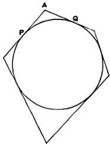

## Proposition 2.

Given two unequal magnitudes, it is possible to find two unequal straight lines such that the greater straight line has to the less a ratio less than the greater magnitude has to the less.

Let $AB, D$ represent the two unequal magnitudes, $AB$ being the greater.

Suppose $BC$ measured along $BA$ equal to $D$, and let $GH$ be any straight line.

Then, if $CA$ be added to itself a sufficient number of times, the sum will exceed $D$. Let $AF$ be this sum, and take $E$ on $GH$ produced such that $GH$ is the same multiple of $HE$ that $AF$ is of $AC$.

Thus

$$
EH: HG = AC: AF.
$$

But, since $AF > D$ (or $CB$),

$$
AC: AF < AC: CB.
$$

Therefore, componendo,

$$
EG: GH < AB: D.
$$

Hence $EG$, $GH$ are two lines satisfying the given condition.

## Proposition 3.

Given two unequal magnitudes and a circle, it is possible to inscribe a polygon in the circle and to describe another about it so that the side of the circumscribed polygon may have to the side of the inscribed polygon a ratio less than that of the greater magnitude to the less.

Let $A, B$ represent the given magnitudes, $A$ being the greater.

Find [Prop. 2] two straight lines $F, KL$, of which $F$ is the greater, such that

$$
F: KL < A: B \quad \text{(1)}.
$$

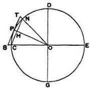

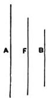

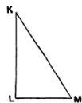

Draw $LM$ perpendicular to $LK$ and of such length that $KM = F$.

In the given circle let $CE, DG$ be two diameters at right angles. Then, bisecting the angle $DOC$, bisecting the half again, and so on, we shall arrive ultimately at an angle (as $NOC$) less than twice the angle $LKM$.

Join $NC$, which (by the construction) will be the side of a regular polygon inscribed in the circle. Let $OP$ be the radius of the circle bisecting the angle $NOC$ (and therefore bisecting $NC$ at right angles, in $H$, say), and let the tangent at $P$ meet $OC$, $ON$ produced in $S$, $T$ respectively.

Now, since

$$
\angle CON < 2 \angle LKM,
$$

$$
\angle HOC < \angle LKM,
$$

and the angles at $H, L$ are right;

therefore

$$
MK:LK > OC:OH
$$

$$
\begin{array}{l}
> OP:OH. \\
\text{Hence} \quad ST:CN < MK:LK \\
&< F:LK;
\end{array}
$$

therefore, *a fortiori*, by (1),

$$
ST:CN < A:B.
$$

Thus two polygons are found satisfying the given condition.

## Proposition 4.

Again, given two unequal magnitudes and a sector, it is possible to describe a polygon about the sector and to inscribe another in it so that the side of the circumscribed polygon may have to the side of the inscribed polygon a ratio less than the greater magnitude has to the less.

[The “inscribed polygon” found in this proposition is one which has for two sides the two radii bounding the sector, while the remaining sides (the number of which is, by construction, some power of 2) subtend equal parts of the arc of the sector; the “circumscribed polygon” is formed by the tangents parallel to the sides of the inscribed polygon and by the two bounding radii produced.]

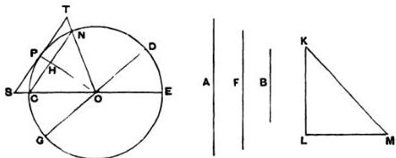

In this case we make the same construction as in the last proposition except that we bisect the angle $COD$ of the sector, instead of the right angle between two diameters, then bisect the half again, and so on. The proof is exactly similar to the preceding one.

## Proposition 5.

Given a circle and two unequal magnitudes, to describe a polygon about the circle and inscribe another in it, so that the circumscribed polygon may have to the inscribed a ratio less than the greater magnitude has to the less.

Let $A$ be the given circle and $B, C$ the given magnitudes, $B$ being the greater.

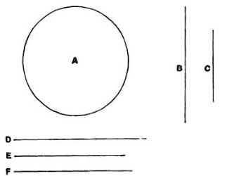

Take two unequal straight lines $D$, $E$, of which $D$ is the greater, such that $D:E < B:C$ [Prop. 2], and let $F$ be a mean proportional between $D$, $E$, so that $D$ is also greater than $F$.

Describe (in the manner of Prop. 3) one polygon about the circle, and inscribe another in it, so that the side of the former has to the side of the latter a ratio less than the ratio $D:F$.

Thus the duplicate ratio of the side of the former polygon to the side of the latter is less than the ratio $D^{\mathfrak{s}}:F^{\mathfrak{s}}$.

But the said duplicate ratio of the sides is equal to the ratio of the areas of the polygons, since they are similar;

therefore the area of the circumscribed polygon has to the area of the inscribed polygon a ratio less than the ratio $D^{\mathfrak{s}}:F^{\mathfrak{s}}$, or $D:E$, and a fortiori less than the ratio $B:C$.

## Proposition 6.

"Similarly we can show that, given two unequal magnitudes and a sector, it is possible to circumscribe a polygon about the sector and inscribe in it another similar one so that the circumscribed may have to the inscribed a ratio less than the greater magnitude has to the less.

And it is likewise clear that, if a circle or a sector, as well as a certain area, be given, it is possible, by inscribing regular polygons in the circle or sector, and by continually inscribing such in the remaining segments, to leave segments of the circle or sector which are [together] less than the given area. For this is proved in the Elements [Eucl. xii. 2].

But it is yet to be proved that, given a circle or sector and an area, it is possible to describe a polygon about the circle or sector, such that the area remaining between the circumference and the circumscribed figure is less than the given area."

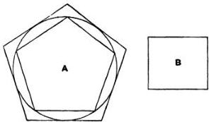

The proof for the circle (which, as Archimedes says, can be equally applied to a sector) is as follows.

Let $A$ be the given circle and $B$ the given area.

Now, there being two unequal magnitudes $A + B$ and $A$, let a polygon $(C)$ be circumscribed about the circle and a polygon $(I)$ inscribed in it [as in Prop. 5], so that

$$ C : I < A + B : A \quad \dots \dots \dots \dots \dots \dots \dots \dots \dots (1). $$

The circumscribed polygon $(C)$ shall be that required.

For the circle $(A)$ is greater than the inscribed polygon $(I)$.

Therefore, from (1), a fortiori,

$$ C: A < A + B: A, $$

whence

$$ C < A + B, $$

or

$$ C - A < B. $$

## Proposition 7.

If in an isosceles cone [i.e. a right circular cone] a pyramid be inscribed having an equilateral base, the surface of the pyramid excluding the base is equal to a triangle having its base equal to the perimeter of the base of the pyramid and its height equal to the perpendicular drawn from the apex on one side of the base.

Since the sides of the base of the pyramid are equal, it follows that the perpendiculars from the apex to all the sides of the base are equal; and the proof of the proposition is obvious.

## Proposition 8.

If a pyramid be circumscribed about an isosceles cone, the surface of the pyramid excluding its base is equal to a triangle having its base equal to the perimeter of the base of the pyramid and its height equal to the side [i.e. a generator] of the cone.

The base of the pyramid is a polygon circumscribed about the circular base of the cone, and the line joining the apex of the cone or pyramid to the point of contact of any side of the polygon is perpendicular to that side. Also all these perpendiculars, being generators of the cone, are equal; whence the proposition follows immediately.

## Proposition 9.

If in the circular base of an isosceles cone a chord be placed, and from its extremities straight lines be drawn to the apex of the cone, the triangle so formed will be less than the portion of the surface of the cone intercepted between the lines drawn to the apex.

Let $ABC$ be the circular base of the cone, and $O$ its apex.

Draw a chord $AB$ in the circle, and join $OA$, $OB$. Bisect the arc $ACB$ in $C$, and join $AC$, $BC$, $OC$.

Then

$$
\triangle OAC + \triangle OBC > \triangle OAB.
$$

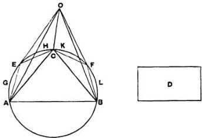

Let the excess of the sum of the first two triangles over the third be equal to the area $D$.

Then $D$ is either less than the sum of the segments $AEC$, $CFB$, or not less.

I. Let $D$ be not less than the sum of the segments referred to.

We have now two surfaces

(1) that consisting of the portion $OAEC$ of the surface of the cone together with the segment $AEC$, and

(2) the triangle $OAC$;

and, since the two surfaces have the same extremities (the perimeter of the triangle $OAC$), the former surface is greater than the latter, which is included by it [Assumptions, 3 or 4].

Hence (surface $O A E C$) + (segment $A E C$) > △ $O A C$.

Similarly (surface $O C F B$) + (segment $C F B$) > △ $O B C$.

Therefore, since $D$ is not less than the sum of the segments, we have, by addition,

$$
\begin{array}{l}
\text{(surface } O A E C F B \text{)} + D > △ O A C + △ O B C \\
> △ O A B + D, \text{ by hypothesis}.
\end{array}
$$

Taking away the common part $D$, we have the required result.

II. Let $D$ be less than the sum of the segments $A E C$, $C F B$.

If now we bisect the arcs $A C$, $C B$, then bisect the halves, and so on, we shall ultimately leave segments which are together less than $D$. [Prop. 6]

Let $A G E$, $E H C$, $C K F$, $F L B$ be those segments, and join $O E$, $O F$.

Then, as before,

$$
\text{(surface } O A G E \text{)} + \text{(segment } A G E \text{)} > △ O A E
$$

and (surface $O E H C$) + (segment $E H C$) > △ $O E C$.

Therefore (surface $O A G H C$) + (segments $A G E$, $E H C$)

$$
\begin{array}{l}
> △ O A E + △ O E C \\
> △ O A C, \text{ a fortiori}.
\end{array}
$$

Similarly for the part of the surface of the cone bounded by $O C$, $O B$ and the arc $C F B$.

Hence, by addition,

$$
\begin{array}{l}
\text{(surface } O A G E H C K F L B \text{)} + \text{(segments } A G E, E H C, C K F, F L B) \\
> △ O A C + △ O B C \\
> △ O A B + D, \text{ by hypothesis}.
\end{array}
$$

But the sum of the segments is less than $D$, and the required result follows.

## Proposition 10.

If in the plane of the circular base of an isosceles cone two tangents be drawn to the circle meeting in a point, and the points of contact and the point of concourse of the tangents be respectively joined to the apex of the cone, the sum of the two triangles formed by the joining lines and the two tangents are together greater than the included portion of the surface of the cone.

Let $ABC$ be the circular base of the cone, $O$ its apex, $AD$, $BD$ the two tangents to the circle meeting in $D$. Join $OA$, $OB$, $OD$.

Let $ECF$ be drawn touching the circle at $C$, the middle point of the arc $ACB$, and therefore parallel to $AB$. Join $OE$, $OF$.

Then

$$
ED + DF > EF,
$$

and, adding $AE + FB$ to each side,

$$
AD + DB > AE + EF + FB.
$$

Now $OA$, $OC$, $OB$, being generators of the cone, are equal, and they are respectively perpendicular to the tangents at $A$, $C$, $B$.

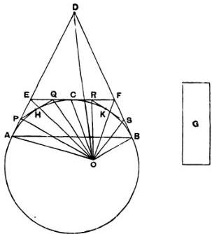

It follows that

$$
\Delta OAD + \Delta ODB > \Delta OAE + \Delta OEF + \Delta OFB.
$$

Let the area $G$ be equal to the excess of the first sum over the second.

$G$ is then either less, or not less, than the sum of the spaces $EAHC$, $FCKB$ remaining between the circle and the tangents, which sum we will call $L$.

I. Let $G$ be not less than $L$.

We have now two surfaces

(1) that of the pyramid with apex $O$ and base $AEFB$, excluding the face $OAB$,

(2) that consisting of the part $OACB$ of the surface of the cone together with the segment $ACB$.

These two surfaces have the same extremities, viz. the perimeter of the triangle $OAB$, and, since the former includes the latter, the former is the greater [Assumptions, 4].

That is, the surface of the pyramid exclusive of the face $OAB$ is greater than the sum of the surface $OACB$ and the segment $ACB$.

Taking away the segment from each sum, we have

$$
\Delta OAE + \Delta OEF + \Delta OFB + L > \text{the surface } OAHCKB.
$$

And $G$ is not less than $L$.

It follows that

$$
\Delta OAE + \Delta OEF + \Delta OFB + G,
$$

which is by hypothesis equal to $\Delta OAD + \Delta ODB$, is greater than the same surface.

II. Let $G$ be less than $L$.

If we bisect the arcs $AC$, $CB$ and draw tangents at their middle points, then bisect the halves and draw tangents, and so on, we shall lastly arrive at a polygon such that the sum of the parts remaining between the sides of the polygon and the circumference of the segment is less than $G$.

Let the remainders be those between the segment and the polygon $APQRSB$, and let their sum be $M$. Join $OP$, $OQ$, etc.

Then, as before,

$$
\triangle OAE + \triangle OEF + \triangle OFB > \triangle OAP + \triangle OPQ + \ldots + \triangle OSB.
$$

Also, as before,

(surface of pyramid $OAPQRSB$ excluding the face $OAB$)

> the part $OACB$ of the surface of the cone together with the segment $ACB$.

Taking away the segment from each sum,

$$
\triangle OAP + \triangle OPQ + \ldots + M > \text{the part } OACB \text{ of the surface of the cone.}
$$

Hence, a fortiori,

$$
\triangle OAE + \triangle OEF + \triangle OFB + G,
$$

which is by hypothesis equal to

$$
\triangle OAD + \triangle ODB,
$$

is greater than the part $OACB$ of the surface of the cone.

## Proposition 11.

If a plane parallel to the axis of a right cylinder cut the cylinder, the part of the surface of the cylinder cut off by the plane is greater than the area of the parallelogram in which the plane cuts it.

## Proposition 12.

If at the extremities of two generators of any right cylinder tangents be drawn to the circular bases in the planes of those bases respectively, and if the pairs of tangents meet, the parallelograms formed by each generator and the two corresponding tangents respectively are together greater than the included portion of the surface of the cylinder between the two generators.

[The proofs of these two propositions follow exactly the methods of Props. 9, 10 respectively, and it is therefore unnecessary to reproduce them.]

"From the properties thus proved it is clear (1) that, if a pyramid be inscribed in an isosceles cone, the surface of the pyramid excluding the base is less than the surface of the cone [excluding the base], and (2) that, if a pyramid be circumscribed about an isosceles cone, the surface of the pyramid excluding the base is greater than the surface of the cone excluding the base.

"It is also clear from what has been proved both (1) that, if a prism be inscribed in a right cylinder, the surface of the prism made up of its parallelograms [i.e. excluding its bases] is less than the surface of the cylinder excluding its bases, and (2) that, if a prism be circumscribed about a right cylinder, the surface of the prism made up of its parallelograms is greater than the surface of the cylinder excluding its bases."

## Proposition 13.

The surface of any right cylinder excluding the bases is equal to a circle whose radius is a mean proportional between the side [i.e. a generator] of the cylinder and the diameter of its base.

Let the base of the cylinder be the circle $A$, and make $CD$ equal to the diameter of this circle, and $EF$ equal to the height of the cylinder.

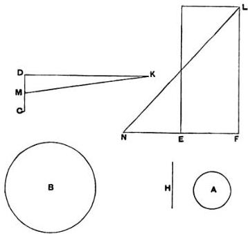

Let $H$ be a mean proportional between $CD$, $EF$, and $B$ a circle with radius equal to $H$.

Then the circle $B$ shall be equal to the surface of the cylinder (excluding the bases), which we will call $S$.

For, if not, $B$ must be either greater or less than $S$.

## I. Suppose $B < S$.

Then it is possible to circumscribe a regular polygon about $B$, and to inscribe another in it, such that the ratio of the former to the latter is less than the ratio $S : B$.

Suppose this done, and circumscribe about $A$ a polygon similar to that described about $B$; then erect on the polygon about $A$ a prism of the same height as the cylinder. The prism will therefore be circumscribed to the cylinder.

Let $KD$, perpendicular to $CD$, and $FL$, perpendicular to $EF$, be each equal to the perimeter of the polygon about $A$. Bisect $CD$ in $M$, and join $MK$.

Then $\triangle KDM =$ the polygon about $A$.

Also $\square EL =$ surface of prism (excluding bases).

Produce $FE$ to $N$ so that $FE = EN$, and join $NL$.

Now the polygons about $A$, $B$, being similar, are in the duplicate ratio of the radii of $A$, $B$.

Thus

$$
\begin{aligned}
\triangle KDM : \text{(polygon about } B \text{)} &= MD^2 : H^2 \\
&= MD^2 : CD \cdot EF \\
&= MD : NF \\
&= \triangle KDM : \triangle LFN \\
\text{(since } DK = FL\text{)}.
\end{aligned}
$$

Therefore (polygon about $B$) = $\triangle LFN$

$$
\begin{aligned}
&= \square EL \\
&= \text{(surface of prism about } A \text{),}
\end{aligned}
$$

from above.

But (polygon about $B$) : (polygon in $B$) $< S : B$.

Therefore

$$
(\text{surface of prism about } A): (\text{polygon in } B) < S : B,
$$

and, alternately,

$$
(\text{surface of prism about } A) : S < (\text{polygon in } B) : B;
$$

which is impossible, since the surface of the prism is greater than $S$, while the polygon inscribed in $B$ is less than $B$.

Therefore

$$
B \nless S.
$$

II. Suppose $B > S$.

Let a regular polygon be circumscribed about $B$ and another inscribed in it so that

$$
(\text{polygon about } B) : (\text{polygon in } B) < B : S.
$$

Inscribe in $A$ a polygon similar to that inscribed in $B$, and erect a prism on the polygon inscribed in $A$ of the same height as the cylinder.

Again, let $DK$, $FL$, drawn as before, be each equal to the perimeter of the polygon inscribed in $A$.

Then, in this case,

$$
\triangle KDM > (\text{polygon inscribed in } A)
$$

(since the perpendicular from the centre on a side of the polygon is less than the radius of $A$).

Also $\triangle LFN = \square EL =$ surface of prism (excluding bases).

Now

$$
\begin{aligned}
(\text{polygon in } A) : (\text{polygon in } B) &= MD^2 : H^2, \\
&= \triangle KDM : \triangle LFN, \text{ as before.}
\end{aligned}
$$

And

$$
\triangle KDM > (\text{polygon in } A).
$$

Therefore

$$
\triangle LFN, \text{ or (surface of prism)} > (\text{polygon in } B).
$$

But this is impossible, because

$$
\begin{aligned}
(\text{polygon about } B) : (\text{polygon in } B) &< B : S, \\
&< (\text{polygon about } B) : S, \text{ a fortiori}, \\
\end{aligned}
$$

so that

$$
(\text{polygon in } B) > S,
$$

$$
> (\text{surface of prism}), \text{ a fortiori}.
$$

Hence $B$ is neither greater nor less than $S$, and therefore

$$
B = S.
$$

## Proposition 14.

The surface of any isosceles cone excluding the base is equal to a circle whose radius is a mean proportional between the side of the cone [a generator] and the radius of the circle which is the base of the cone.

Let the circle $A$ be the base of the cone; draw $C$ equal to the radius of the circle, and $D$ equal to the side of the cone, and let $E$ be a mean proportional between $C, D$.

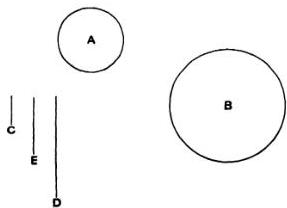

Draw a circle $B$ with radius equal to $E$.

Then shall $B$ be equal to the surface of the cone (excluding the base), which we will call $S$.

If not, $B$ must be either greater or less than $S$.

## I. Suppose $B < S$.

Let a regular polygon be described about $B$ and a similar one inscribed in it such that the former has to the latter a ratio less than the ratio $S : B$.

Describe about $A$ another similar polygon, and on it set up a pyramid with apex the same as that of the cone.

Then (polygon about $A$) : (polygon about $B$)

$$
\begin{array}{l}
= C^2 : E^2 \\
= C : D \\
= (\text{polygon about } A) : (\text{surface of pyramid excluding base}).
\end{array}
$$

Therefore

$$(\text{surface of pyramid}) = (\text{polygon about } B).$$

Now

$$
(\text{polygon about } B): (\text{polygon in } B) < S : B.
$$

Therefore

$$(\text{surface of pyramid}): (\text{polygon in } B) < S : B,$$

which is impossible, (because the surface of the pyramid is greater than $S$, while the polygon in $B$ is less than $B$).

Hence

$$B \nless S.$$

II. Suppose $B > S$.

Take regular polygons circumscribed and inscribed to $B$ such that the ratio of the former to the latter is less than the ratio $B : S$.

Inscribe in $A$ a similar polygon to that inscribed in $B$, and erect a pyramid on the polygon inscribed in $A$ with apex the same as that of the cone.

In this case

$$(\text{polygon in } A): (\text{polygon in } B) = C^2 : E^2$$

$$= C : D$$

$$
> (\text{polygon in } A): (\text{surface of pyramid excluding base}).
$$

This is clear because the ratio of $C$ to $D$ is greater than the ratio of the perpendicular from the centre of $A$ on a side of the polygon to the perpendicular from the apex of the cone on the same side*.

Therefore

$$(\text{surface of pyramid}) > (\text{polygon in } B).$$

But

$$
(\text{polygon about } B): (\text{polygon in } B) < B : S.
$$

Therefore,

$$
a \text{ fortiori},
$$

$$(\text{polygon about } B): (\text{surface of pyramid}) < B : S;$$

which is impossible.

Since therefore $B$ is neither greater nor less than $S$,

$$B = S.$$

## Proposition 15.

The surface of any isosceles cone has the same ratio to its base as the side of the cone has to the radius of the base.

By Prop. 14, the surface of the cone is equal to a circle whose radius is a mean proportional between the side of the cone and the radius of the base.

Hence, since circles are to one another as the squares of their radii, the proposition follows.

## Proposition 16.

If an isosceles cone be cut by a plane parallel to the base, the portion of the surface of the cone between the parallel planes is equal to a circle whose radius is a mean proportional between (1) the portion of the side of the cone intercepted by the parallel planes and (2) the line which is equal to the sum of the radii of the circles in the parallel planes.

Let $OAB$ be a triangle through the axis of a cone, $DE$ its intersection with the plane cutting off the frustum, and $OFC$ the axis of the cone.

Then the surface of the cone $OAB$ is equal to a circle whose radius is equal to $\sqrt{OA \cdot AC}$. [Prop. 14.]

Similarly the surface of the cone $ODE$ is equal to a circle whose radius is equal to $\sqrt{OD \cdot DF}$.

And the surface of the frustum is equal to the difference between the two circles.

Now

$$
OA \cdot AC - OD \cdot DF = DA \cdot AC + OD \cdot AC - OD \cdot DF.
$$

But

$$
OD \cdot AC = OA \cdot DF,
$$

since

$$
OA : AC = OD : DF.
$$

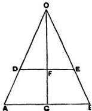

Hence

$$
OA \cdot AC - OD \cdot DF = DA \cdot AC + DA \cdot DF
$$

$$
= DA \cdot (AC + DF).
$$

And, since circles are to one another as the squares of their radii, it follows that the difference between the circles whose radii are $\sqrt{OA \cdot AC}$, $\sqrt{OD \cdot DF}$ respectively is equal to a circle whose radius is $\sqrt{DA \cdot (AC + DF)}$.

Therefore the surface of the frustum is equal to this circle.

## Lemmas.

1.  Cones having equal height have the same ratio as their bases; and those having equal bases have the same ratio as their heights*.

2.  If a cylinder be cut by a plane parallel to the base, then, as the cylinder is to the cylinder, so is the axis to the axis †.

3.  The cones which have the same bases as the cylinders [and equal height] are in the same ratio as the cylinders.

4.  Also the bases of equal cones are reciprocally proportional to their heights; and those cones whose bases are reciprocally proportional to their heights are equal ‡.

5.  Also the cones, the diameters of whose bases have the same ratio as their axes, are to one another in the triplicate ratio of the diameters of the bases §.

And all these propositions have been proved by earlier geometers.”

* Euclid xii. 11. “Cones and cylinders of equal height are to one another as their bases.”

Euclid xii. 14. “Cones and cylinders on equal bases are to one another as their heights.”

† Euclid xii. 13. “If a cylinder be cut by a plane parallel to the opposite planes [the bases], then, as the cylinder is to the cylinder, so will the axis be to the axis.”

‡ Euclid xii. 15. “The bases of equal cones and cylinders are reciprocally proportional to their heights; and those cones and cylinders whose bases are reciprocally proportional to their heights are equal.”

§ Euclid xii. 12. “Similar cones and cylinders are to one another in the triplicate ratio of the diameters of their bases.”

## Proposition 17.

If there be two isosceles cones, and the surface of one cone be equal to the base of the other, while the perpendicular from the centre of the base [of the first cone] on the side of that cone is equal to the height [of the second], the cones will be equal.

Let $OAB$, $DEF$ be triangles through the axes of two cones respectively, $C$, $G$ the centres of the respective bases, $GH$ the

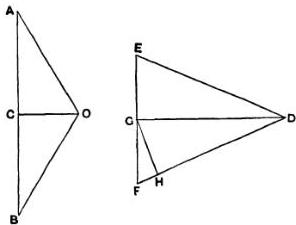

perpendicular from $G$ on $FD$; and suppose that the base of the cone $OAB$ is equal to the surface of the cone $DEF$, and that $OC = GH$.

Then, since the base of $OAB$ is equal to the surface of $DEF$,

(base of cone $OAB$): (base of cone $DEF$)

$$
\begin{aligned}
&= (\text{surface of } DEF): \text{ (base of } DEF) \\
&= DF: FG \quad \text{[Prop. 15]} \\
&= DG: GH, \text{ by similar triangles}, \\
&= DG: OC.
\end{aligned}
$$

Therefore the bases of the cones are reciprocally proportional to their heights; whence the cones are equal. [Lemma 4.]

## Proposition 18.

Any solid rhombus consisting of isosceles cones is equal to the cone which has its base equal to the surface of one of the cones composing the rhombus and its height equal to the perpendicular drawn from the apex of the second cone to one side of the first cone.

Let the rhombus be $OABD$ consisting of two cones with apices $O, D$ and with a common base (the circle about $AB$ as diameter).

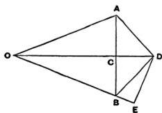

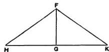

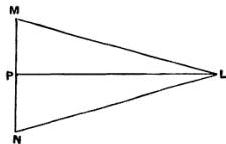

Let $FHK$ be another cone with base equal to the surface of the cone $OAB$ and height $FG$ equal to $DE$, the perpendicular from $D$ on $OB$.

Then shall the cone $FHK$ be equal to the rhombus.

Construct a third cone $LMN$ with base (the circle about $MN$) equal to the base of $OAB$ and height $LP$ equal to $OD$.

Then, since $LP = OD$,

$$
LP : CD = OD : CD.
$$

But [Lemma 1] $OD : CD = (\text{rhombus } OABB) : (\text{cone } DAB)$,

and

$$
LP : CD = (\text{cone } LMN) : (\text{cone } DAB).
$$

It follows that

$$
(\text{rhombus } OABB) = (\text{cone } LMN) \quad \text{(1)}.
$$

Again, since $AB = MN$, and

$$
(\text{surface of } OAB) = (\text{base of } FHK),
$$

(base of $FHK$): (base of $LMN$)

$$
\begin{aligned}
&= (\text{surface of } OAB): (\text{base of } OAB) \\
&= OB : BC \quad \text{[Prop. 15]} \\
&= OD : DE, \text{ by similar triangles}, \\
&= LP : FG, \text{ by hypothesis}.
\end{aligned}
$$

Thus, in the cones $FHK$, $LMN$, the bases are reciprocally proportional to the heights.

Therefore the cones $FHK$, $LMN$ are equal,

and hence, by (1), the cone $FHK$ is equal to the given solid rhombus.

## Proposition 19.

If an isosceles cone be cut by a plane parallel to the base, and on the resulting circular section a cone be described having as its apex the centre of the base [of the first cone], and if the rhombus so formed be taken away from the whole cone, the part remaining will be equal to the cone with base equal to the surface of the portion of the first cone between the parallel planes and with height equal to the perpendicular drawn from the centre of the base of the first cone on one side of that cone.

Let the cone $OAB$ be cut by a plane parallel to the base in the circle on $DE$ as diameter. Let $C$ be the centre of the base of the cone, and with $C$ as apex and the circle about $DE$ as base describe a cone, making with the cone ODE the rhombus ODCE.

Take a cone $FGH$ with base equal to the surface of the frustum $DABE$ and height equal to the perpendicular $(CK)$ from $C$ on $AO$.

Then shall the cone $FGH$ be equal to the difference between the cone $OAB$ and the rhombus ODCE.

Take (1) a cone $LMN$ with base equal to the surface of the cone $OAB$, and height equal to $CK$,

(2) a cone $PQR$ with base equal to the surface of the cone $ODE$ and height equal to $CK$.

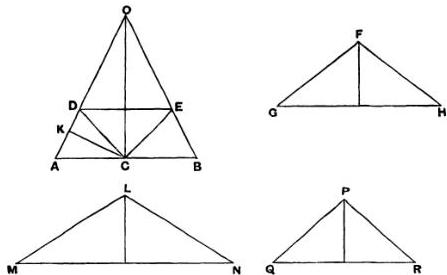

Now, since the surface of the cone $OAB$ is equal to the surface of the cone $ODE$ together with that of the frustum $DABE$, we have, by the construction,

$$
(\text{base of } LMN) = (\text{base of } FGH) + (\text{base of } PQR)
$$

and, since the heights of the three cones are equal,

$$
(\text{cone } LMN) = (\text{cone } FGH) + (\text{cone } PQR).
$$

But the cone $LMN$ is equal to the cone $OAB$ [Prop. 17], and the cone $PQR$ is equal to the rhombus $ODCE$ [Prop. 18].

Therefore $(\text{cone } OAB) = (\text{cone } FGH) + (\text{rhombus } ODCE)$, and the proposition is proved.

## Proposition 20.

If one of the two isosceles cones forming a rhombus be cut by a plane parallel to the base and on the resulting circular section a cone be described having the same apex as the second cone, and if the resulting rhombus be taken from the whole rhombus, the remainder will be equal to the cone with base equal to the surface of the portion of the cone between the parallel planes and with height equal to the perpendicular drawn from the apex of the second * cone to the side of the first cone.

Let the rhombus be $OACB$, and let the cone $OAB$ be cut by a plane parallel to its base in the circle about $DE$ as diameter. With this circle as base and $C$ as apex describe a cone, which therefore with $ODE$ forms the rhombus $ODCE$.

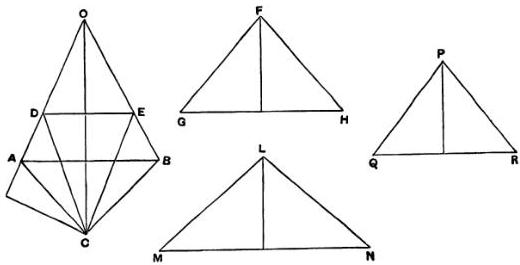

Take a cone $FGH$ with base equal to the surface of the frustum $DABE$ and height equal to the perpendicular $(CK)$ from $C$ on $OA$.

The cone $FGH$ shall be equal to the difference between the rhombi $OACB$, $ODCE$.

For take (1) a cone $LMN$ with base equal to the surface of $OAB$ and height equal to $CK$,

(2) a cone $PQR$, with base equal to the surface of $ODE$, and height equal to $CK$.

Then, since the surface of $OAB$ is equal to the surface of $ODE$ together with that of the frustum $DABE$, we have, by construction,

$$
(\text{base of } LMN) = (\text{base of } PQR) + (\text{base of } FGH),
$$

and the three cones are of equal height;

$$
\text{therefore } (\text{cone } LMN) = (\text{cone } PQR) + (\text{cone } FGH).
$$

But the cone $LMN$ is equal to the rhombus $OACB$, and the cone $PQR$ is equal to the rhombus $ODCE$ [Prop. 18].

Hence the cone $FGH$ is equal to the difference between the two rhombi $OACB$, $ODCE$.

## Proposition 21.

A regular polygon of an even number of sides being inscribed in a circle, as $ABC...A'...C'B'A$, so that $AA'$ is a diameter, if two angular points next but one to each other, as $B, B'$, be joined, and the other lines parallel to $BB'$ and joining pairs of angular points be drawn, as $CC', DD'...$, then

$$
(BB' + CC' + \ldots) : AA' = A'B : BA.
$$

Let $BB', CC', DD',...$ meet $AA'$ in $F, G, H,...$; and let $CB', DC',...$ be joined meeting $AA'$ in $K, L,...$ respectively.

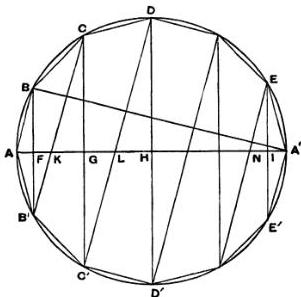

Then clearly $CB', DC',...$ are parallel to one another and to $AB$.

Hence, by similar triangles,

$$
\begin{array}{l}
BF : FA = B'F : FK \\
= CG : GK \\
= C'G : GL \\
\vdots \\
= E'I : IA';
\end{array}
$$

and, summing the antecedents and consequents respectively, we have

$$
\begin{array}{l}
\left(BB' + CC' + \dots\right): AA' = BF: FA \\
= A'B: BA.
\end{array}
$$

## Proposition 22.

If a polygon be inscribed in a segment of a circle $LAL'$ so that all its sides excluding the base are equal and their number even, as $LK\ldots A\ldots K'L'$, $A$ being the middle point of the segment, and if the lines $BB', CC', \ldots$ parallel to the base $LL'$ and joining pairs of angular points be drawn, then

$$
(BB' + CC' + \dots + LM): AM = A'B: BA,
$$

where $M$ is the middle point of $LL'$ and $AA'$ is the diameter through $M$.

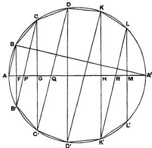

Joining $CB'$, $DC', \ldots, LK'$, as in the last proposition, and supposing that they meet $AM$ in $P$, $Q, \ldots, R$, while $BB'$, $CC', \ldots$, $KK'$ meet $AM$ in $F$, $G, \ldots, H$, we have, by similar triangles,

$$
\begin{array}{l}
BF: FA = B'F: FP \\
= CG: PG \\
= C'G: GQ \\
\vdots \\
= LM: RM;
\end{array}
$$

and, summing the antecedents and consequents, we obtain

$$
\begin{array}{l}
(BB' + CC' + \dots + LM) : AM = BF : FA \\
= A'B : BA.
\end{array}
$$

## Proposition 23.

Take a great circle $ABC$... of a sphere, and inscribe in it a regular polygon whose sides are a multiple of four in number. Let $AA'$, $MM'$ be diameters at right angles and joining opposite angular points of the polygon.

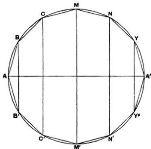

Then, if the polygon and great circle revolve together about the diameter $AA'$, the angular points of the polygon, except $A$, $A'$, will describe circles on the surface of the sphere at right angles to the diameter $AA'$. Also the sides of the polygon will describe portions of conical surfaces, e.g. $BC$ will describe a surface forming part of a cone whose base is a circle about $CC'$ as diameter and whose apex is the point in which $CB$, $C'B'$ produced meet each other and the diameter $AA'$.

Comparing the hemisphere $MAM'$ and that half of the figure described by the revolution of the polygon which is included in the hemisphere, we see that the surface of the hemisphere and the surface of the inscribed figure have the same boundaries in one plane (viz. the circle on $MM'$ as diameter), the former surface entirely includes the latter, and they are both concave in the same direction.

Therefore [Assumptions, 4] the surface of the hemisphere is greater than that of the inscribed figure; and the same is true of the other halves of the figures.

Hence the surface of the sphere is greater than the surface described by the revolution of the polygon inscribed in the great circle about the diameter of the great circle.

## Proposition 24.

If a regular polygon $AB \ldots A' \ldots B'A$, the number of whose sides is a multiple of four, be inscribed in a great circle of a sphere, and if $BB'$ subtending two sides be joined, and all the other lines parallel to $BB'$ and joining pairs of angular points be drawn, then the surface of the figure inscribed in the sphere by the revolution of the polygon about the diameter $AA'$ is equal to a circle the square of whose radius is equal to the rectangle

$$
BA \left(BB' + CC' + \ldots\right).
$$

The surface of the figure is made up of the surfaces of parts of different cones.

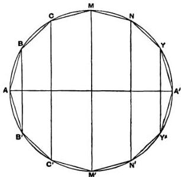

Now the surface of the cone $ABB'$ is equal to a circle whose radius is $\sqrt{BA \cdot \frac{1}{2} BB'}$. [Prop. 14]

The surface of the frustum $BB'C'C$ is equal to a circle of radius $\sqrt{BC \cdot \frac{1}{2}(BB' + CC')}$, [Prop. 16] and so on.

It follows, since $BA = BC = \ldots$, that the whole surface is equal to a circle whose radius is equal to

$$
\sqrt{BA \cdot (BB' + CC' + \ldots + MM' + \ldots + YY')}.
$$

## Proposition 25.

The surface of the figure inscribed in a sphere as in the last propositions, consisting of portions of conical surfaces, is less than four times the greatest circle in the sphere.

Let $AB \ldots A' \ldots B'A$ be a regular polygon inscribed in a great circle, the number of its sides being a multiple of four.

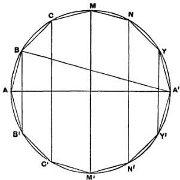

As before, let $BB'$ be drawn subtending two sides, and $CC', \ldots, YY'$ parallel to $BB'$.

Let $R$ be a circle such that the square of its radius is equal to

$$
AB \cdot (BB' + CC' + \ldots + YY'),
$$

so that the surface of the figure inscribed in the sphere is equal to $R$. [Prop. 24]

Now

$$
(BB' + CC' + \dots + YY'): AA' = A'B: AB, \quad [\text{Prop. 21}]
$$

whence

$$
AB(BB' + CC' + \dots + YY') = AA'.A'B.
$$

Hence

$$
(\text{radius of } R)^2 = AA'.A'B
$$

$$
< AA'^2.
$$

Therefore the surface of the inscribed figure, or the circle $R$, is less than four times the circle $AMA'M'$.

## Proposition 26.

The figure inscribed as above in a sphere is equal [in volume] to a cone whose base is a circle equal to the surface of the figure inscribed in the sphere and whose height is equal to the perpendicular drawn from the centre of the sphere to one side of the polygon.

Suppose, as before, that $AB \dots A' \dots B'A$ is the regular polygon inscribed in a great circle, and let $BB', CC', \ldots$ be joined.

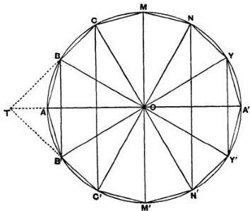

With apex $O$ construct cones whose bases are the circles on $BB', CC', \ldots$ as diameters in planes perpendicular to $AA'$.

Then $OBAB'$ is a solid rhombus, and its volume is equal to a cone whose base is equal to the surface of the cone $ABB'$ and whose height is equal to the perpendicular from $O$ on $AB$ [Prop. 18]. Let the length of the perpendicular be $p$.

Again, if $CB$, $C'B'$ produced meet in $T$, the portion of the solid figure which is described by the revolution of the triangle $BOC$ about $AA'$ is equal to the difference between the rhombi $OCTC'$ and $OBTB'$, i.e. to a cone whose base is equal to the surface of the frustum $BB'C'C$ and whose height is $p$ [Prop. 20].

Proceeding in this manner, and adding, we prove that, since cones of equal height are to one another as their bases, the volume of the solid of revolution is equal to a cone with height $p$ and base equal to the sum of the surfaces of the cone $BAB'$, the frustum $BB'C'C$, etc., i.e. a cone with height $p$ and base equal to the surface of the solid.

## Proposition 27.

The figure inscribed in the sphere as before is less than four times the cone whose base is equal to a great circle of the sphere and whose height is equal to the radius of the sphere.

By Prop. 26 the volume of the solid figure is equal to a cone whose base is equal to the surface of the solid and whose height is $p$, the perpendicular from $O$ on any side of the polygon. Let $R$ be such a cone.

Take also a cone $S$ with base equal to the great circle, and height equal to the radius, of the sphere.

Now, since the surface of the inscribed solid is less than four times the great circle [Prop. 25], the base of the cone $R$ is less than four times the base of the cone $S$.

Also the height $(p)$ of $R$ is less than the height of $S$.

Therefore the volume of $R$ is less than four times that of $S$; and the proposition is proved.

## Proposition 28.

Let a regular polygon, whose sides are a multiple of four in number, be circumscribed about a great circle of a given sphere, as $AB...A'...B'A$; and about the polygon describe another circle, which will therefore have the same centre as the great circle of the sphere. Let $AA'$ bisect the polygon and cut the sphere in $a$, $a'$.

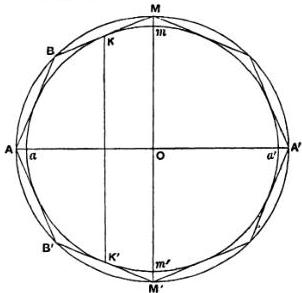

If the great circle and the circumscribed polygon revolve together about $AA'$, the great circle will describe the surface of a sphere, the angular points of the polygon except $A$, $A'$ will move round the surface of a larger sphere, the points of contact of the sides of the polygon with the great circle of the inner sphere will describe circles on that sphere in planes perpendicular to $AA'$, and the sides of the polygon themselves will describe portions of conical surfaces. *The circumscribed figure will thus be greater than the sphere itself.*

Let any side, as $BM$, touch the inner circle in $K$, and let $K'$ be the point of contact of the circle with $B'M'$.

Then the circle described by the revolution of $KK'$ about $AA'$ is the boundary in one plane of two surfaces

(1) the surface formed by the revolution of the circular segment $KaK'$, and

(2) the surface formed by the revolution of the part $KB...A...B'K'$ of the polygon.

Now the second surface entirely includes the first, and they are both concave in the same direction;

therefore [Assumptions, 4] the second surface is greater than the first.

The same is true of the portion of the surface on the opposite side of the circle on $KK'$ as diameter.

Hence, adding, we see that the surface of the figure circumscribed to the given sphere is greater than that of the sphere itself.

## Proposition 29.

In a figure circumscribed to a sphere in the manner shown in the previous proposition the surface is equal to a circle the square on whose radius is equal to $AB(BB' + CC' + \ldots)$.

For the figure circumscribed to the sphere is inscribed in a larger sphere, and the proof of Prop. 24 applies.

## Proposition 30.

The surface of a figure circumscribed as before about a sphere is greater than four times the great circle of the sphere.

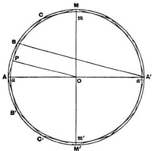

Let $AB \ldots A' \ldots B'A$ be the regular polygon of $4n$ sides which by its revolution about $AA'$ describes the figure circumscribing the sphere of which $ama'm'$ is a great circle. Suppose $aa', AA'$ to be in one straight line.

Let $R$ be a circle equal to the surface of the circumscribed solid.

Now $(BB' + CC' + \ldots): AA' = A'B: BA$, [as in Prop. 21] so that $AB(BB' + CC' + \ldots) = AA'. A'B$.

Hence $(\text{radius of } R) = \sqrt{AA'.A'B}$ [Prop. 29] $> A'B$.

But $A'B = 20P$, where $P$ is the point in which $AB$ touches the circle $ama'm'$.

Therefore $(\text{radius of } R) > (\text{diameter of circle } ama'm')$; whence $R$, and therefore the surface of the circumscribed solid, is greater than four times the great circle of the given sphere.

## Proposition 31.

The solid of revolution circumscribed as before about a sphere is equal to a cone whose base is equal to the surface of the solid and whose height is equal to the radius of the sphere.

The solid is, as before, a solid inscribed in a larger sphere; and, since the perpendicular on any side of the revolving polygon is equal to the radius of the inner sphere, the proposition is identical with Prop. 26.

**Cor.** The solid circumscribed about the smaller sphere is greater than four times the cone whose base is a great circle of the sphere and whose height is equal to the radius of the sphere.

For, since the surface of the solid is greater than four times the great circle of the inner sphere [Prop. 30], the cone whose base is equal to the surface of the solid and whose height is the radius of the sphere is greater than four times the cone of the same height which has the great circle for base. [Lemma 1.]

Hence, by the proposition, the volume of the solid is greater than four times the latter cone.

## Proposition 32.

If a regular polygon with 4n sides be inscribed in a great circle of a sphere, as ab...a'...b'a, and a similar polygon AB...A'...B'A be described about the great circle, and if the polygons revolve with the great circle about the diameters aa', AA' respectively, so that they describe the surfaces of solid figures inscribed in and circumscribed to the sphere respectively, then

(1) the surfaces of the circumscribed and inscribed figures are to one another in the duplicate ratio of their sides, and
(2) the figures themselves [i.e. their volumes] are in the triplicate ratio of their sides.
(1) Let $AA'$, $aa'$ be in the same straight line, and let $MmOm'M'$ be a diameter at right angles to them.

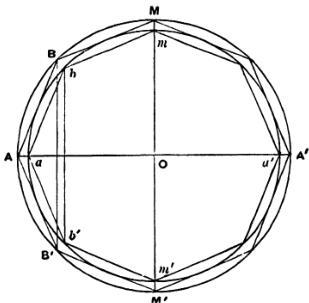

Join $BB'$, $CC'$, ... and $bb'$, $cc'$, ... which will all be parallel to one another and $MM'$.

Suppose $R, S$ to be circles such that

$$
\begin{array}{l}
R = (\text{surface of circumscribed solid}), \\
S = (\text{surface of inscribed solid}).
\end{array}
$$

Then
(radius of $R$)$^\circ = AB \left( BB' + CC' + \ldots \right)$ [Prop. 29]
(radius of $S$)$^\circ = ab \left( bb' + cc' + \ldots \right)$. [Prop. 24]

And, since the polygons are similar, the rectangles in these two equations are similar, and are therefore in the ratio of

$$ AB^2 : ab^2. $$

Hence
(surface of circumscribed solid) : (surface of inscribed solid)
$$ = AB^2 : ab^2. $$

(2) Take a cone $V$ whose base is the circle $R$ and whose height is equal to $Oa$, and a cone $W$ whose base is the circle $S$ and whose height is equal to the perpendicular from $O$ on $ab$, which we will call $p$.

Then $V$, $W$ are respectively equal to the volumes of the circumscribed and inscribed figures. [Props. 31, 26]

Now, since the polygons are similar,

$$ AB : ab = Oa : p $$
$$ = \left( \text{height of cone } V \right) : \left( \text{height of cone } W \right); $$

and, as shown above, the bases of the cones (the circles $R$, $S$) are in the ratio of $AB^2$ to $ab^2$.

Therefore
$$ V : W = AB^2 : ab^2. $$

## Proposition 33.

The surface of any sphere is equal to four times the greatest circle in it.

Let $C$ be a circle equal to four times the great circle.

Then, if $C$ is not equal to the surface of the sphere, it must either be less or greater.

I. Suppose $C$ less than the surface of the sphere.

It is then possible to find two lines $ \beta, \gamma $, of which $ \beta$ is the greater, such that
$$ \beta : \gamma < \left( \text{surface of sphere} \right) : C. \quad \text{[Prop. 2]} $$

Take such lines, and let $ \delta $ be a mean proportional between them.

Suppose similar regular polygons with $4n$ sides circumscribed about and inscribed in a great circle such that the ratio of their sides is less than the ratio $\beta : \delta$. [Prop. 3]

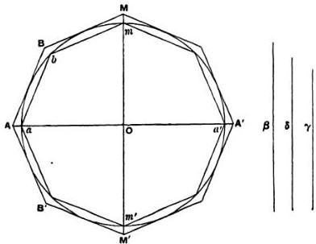

Let the polygons with the circle revolve together about a diameter common to all, describing solids of revolution as before.

Then (surface of outer solid): (surface of inner solid)
$$
\begin{aligned}
&= (\text{side of outer})^2 : (\text{side of inner})^2 \quad \text{[Prop. 32]} \\
&< \beta^2 : \delta^2, \text{ or } \beta : \gamma \\
&< (\text{surface of sphere}) : C, \text{ a fortiori}.
\end{aligned}
$$

But this is impossible, since the surface of the circumscribed solid is greater than that of the sphere [Prop. 28], while the surface of the inscribed solid is less than $C$ [Prop. 25].

Therefore $C$ is not less than the surface of the sphere.

II. Suppose $C$ greater than the surface of the sphere.

Take lines $\beta, \gamma$, of which $\beta$ is the greater, such that
$$
\beta : \gamma < C : (\text{surface of sphere}).
$$

Circumscribe and inscribe to the great circle similar regular polygons, as before, such that their sides are in a ratio less than that of $\beta$ to $\delta$, and suppose solids of revolution generated in the usual manner.

Then, in this case,

$$
\begin{array}{l}
\text{(surface of circumscribed solid)} : \text{(surface of inscribed solid)} \\
\quad < C : \text{(surface of sphere)}.
\end{array}
$$

But this is impossible, because the surface of the circumscribed solid is greater than $C$ [Prop. 30], while the surface of the inscribed solid is less than that of the sphere [Prop. 23].

Thus $C$ is not greater than the surface of the sphere.

Therefore, since it is neither greater nor less, $C$ is equal to the surface of the sphere.

## Proposition 34.

Any sphere is equal to four times the cone which has its base equal to the greatest circle in the sphere and its height equal to the radius of the sphere.

Let the sphere be that of which $ama'm'$ is a great circle.

If now the sphere is not equal to four times the cone described, it is either greater or less.

I. If possible, let the sphere be greater than four times the cone.

Suppose $V$ to be a cone whose base is equal to four times the great circle and whose height is equal to the radius of the sphere.

Then, by hypothesis, the sphere is greater than $V$; and two lines $\beta, \gamma$ can be found (of which $\beta$ is the greater) such that

$$
\beta : \gamma < \text{(volume of sphere)} : V.
$$

Between $\beta$ and $\gamma$ place two arithmetic means $\delta, \epsilon$.

As before, let similar regular polygons with sides $4n$ in number be circumscribed, about and inscribed in the great circle, such that their sides are in a ratio less than $\beta : \delta$.

Imagine the diameter $aa'$ of the circle to be in the same straight line with a diameter of both polygons, and imagine the latter to revolve with the circle about $aa'$, describing the surfaces of two solids of revolution. The volumes of these solids are therefore in the triplicate ratio of their sides. [Prop. 32]

Thus (vol. of outer solid): (vol. of inscribed solid)

$$
\begin{array}{l}
< \beta^{3}: \delta^{3}, \text{ by hypothesis}, \\
< \beta: \gamma, \text{ a fortiori (since } \beta: \gamma > \beta^{3}: \delta^{3}), \\
< \text{ (volume of sphere) }: V, \text{ a fortiori}.
\end{array}
$$

But this is impossible, since the volume of the circumscribed

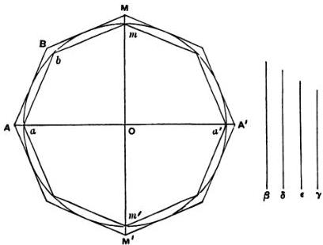

Take $x$ such that $\beta: \delta = \delta : x$.

Thus

$$
\beta - \delta : \beta = \delta - x : \delta
$$

and, since $\beta > \delta$, $\beta - \delta > \delta - x$.

But, by hypothesis, $\beta - \delta = \delta - \epsilon$.

Therefore

$$
\delta - \epsilon > \delta - x,
$$

or

$$
x > \epsilon.
$$

Again, suppose $\delta : x = x : y$,

and, as before, we have $\delta - x > x - y$,

so that, a fortiori, $\delta - \epsilon > x - y$.

Therefore

$$
\epsilon - \gamma > x - y;
$$

and, since $x > \epsilon$, $y > \gamma$.

Now, by hypothesis, $\beta, \delta, x, y$ are in continued proportion;

therefore

$$
\beta^{3}: \delta^{3} = \beta : y
$$

$$
< \beta : \gamma.
$$

solid is greater than that of the sphere [Prop. 28], while the volume of the inscribed solid is less than $V$ [Prop. 27].

Hence the sphere is not greater than $V$, or four times the cone described in the enunciation.

II. If possible, let the sphere be less than $V$.

In this case we take $\beta, \gamma$ ($\beta$ being the greater) such that

$$
\beta : \gamma < V : \text{(volume of sphere)}.
$$

The rest of the construction and proof proceeding as before, we have finally

(volume of outer solid) : (volume of inscribed solid)

$$
< V : \text{(volume of sphere)}.
$$

But this is impossible, because the volume of the outer solid is greater than $V$ [Prop. 31, Cor.], and the volume of the inscribed solid is less than the volume of the sphere.

Hence the sphere is not less than $V$.

Since then the sphere is neither less nor greater than $V$, it is equal to $V$, or to four times the cone described in the enunciation.

COR. From what has been proved it follows that every cylinder whose base is the greatest circle in a sphere and whose height is equal to the diameter of the sphere is $\frac{3}{2}$ of the sphere, and its surface together with its bases is $\frac{3}{2}$ of the surface of the sphere.

For the cylinder is three times the cone with the same base and height [Eucl. XII. 10], i.e. six times the cone with the same base and with height equal to the radius of the sphere.

But the sphere is four times the latter cone [Prop. 34]. Therefore the cylinder is $\frac{3}{2}$ of the sphere.

Again, the surface of a cylinder (excluding the bases) is equal to a circle whose radius is a mean proportional between the height of the cylinder and the diameter of its base [Prop. 13].

In this case the height is equal to the diameter of the base and therefore the circle is that whose radius is the diameter of the sphere, or a circle equal to four times the great circle of the sphere.

Therefore the surface of the cylinder with the bases is equal to six times the great circle.

And the surface of the sphere is four times the great circle [Prop. 33]; whence

$$
(\text{surface of cylinder with bases}) = \frac{3}{2} \cdot (\text{surface of sphere}).
$$

## Proposition 35.

If in a segment of a circle $LAL'$ (where $A$ is the middle point of the arc) a polygon $LK...A...K'L'$ be inscribed of which $LL'$ is one side, while the other sides are $2n$ in number and all equal, and if the polygon revolve with the segment about the diameter $AM$, generating a solid figure inscribed in a segment of a sphere, then the surface of the inscribed solid is equal to a circle the square on whose radius is equal to the rectangle

$$
AB \left( BB' + CC' + \ldots + KK' + \frac{LL'}{2} \right).
$$

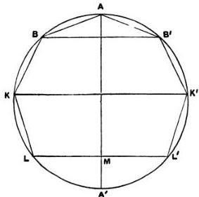

The surface of the inscribed figure is made up of portions of surfaces of cones.

If we take these successively, the surface of the cone $BAB'$ is equal to a circle whose radius is

$$
\sqrt{AB \cdot \frac{1}{2} BB'}.
\quad \text{[Prop. 14]}
$$

The surface of the frustum of a cone $BCC'B'$ is equal to a circle whose radius is

$$
\sqrt{AB \cdot \frac{BB' + CC'}{2}};
\quad \text{[Prop. 16]}
$$

and so on.

Proceeding in this way and adding, we find, since circles are to one another as the squares of their radii, that the surface of the inscribed figure is equal to a circle whose radius is

$$
\sqrt{AB \left(BB' + CC' + \dots + KK' + \frac{LL'}{2} \right)}.
$$

## Proposition 36.

The surface of the figure inscribed as before in the segment of a sphere is less than that of the segment of the sphere.

This is clear, because the circular base of the segment is a common boundary of each of two surfaces, of which one, the segment, includes the other, the solid, while both are concave in the same direction [Assumptions, 4].

## Proposition 37.

The surface of the solid figure inscribed in the segment of the sphere by the revolution of $LK \dots A \dots K'L'$ about $AM$ is less than a circle with radius equal to $AL$.

Let the diameter $AM$ meet the circle of which $LAL'$ is a segment again in $A'$. Join $A'B$.

As in Prop. 35, the surface of the inscribed solid is equal to a circle the square on whose radius is

$$
AB \left(BB' + CC' + \dots + KK' + LM\right).
$$

But this rectangle $\begin{array}{l} = A'B. \text{AM} \\ < A'A. \text{AM} \\ < AL' \end{array}$ [Prop. 22]

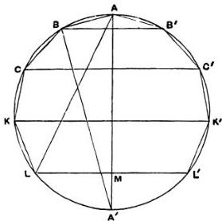

Hence the surface of the inscribed solid is less than the circle whose radius is $AL$.

## Proposition 38.

The solid figure described as before in a segment of a sphere less than a hemisphere, together with the cone whose base is the base of the segment and whose apex is the centre of the sphere, is equal to a cone whose base is equal to the surface of the inscribed solid and whose height is equal to the perpendicular from the centre of the sphere on any side of the polygon.

Let $O$ be the centre of the sphere, and $p$ the length of the perpendicular from $O$ on $AB$.

Suppose cones described with $O$ as apex, and with the circles on $BB'$, $CC'$, ... as diameters as bases.

Then the rhombus $OBAB'$ is equal to a cone whose base is equal to the surface of the cone $BAB'$, and whose height is $p$.

[Prop. 18]

Again, if $CB$, $C'B'$ meet in $T$, the solid described by the triangle $BOC$ as the polygon revolves about $AO$ is the difference between the rhombi $OCTC'$ and $OBTB'$, and is therefore equal to a cone whose base is equal to the surface of the frustum $BCC'B'$ and whose height is $p$. [Prop. 20]

Similarly for the part of the solid described by the triangle $COD$ as the polygon revolves; and so on.

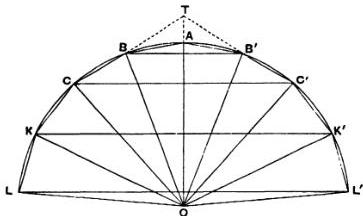

Hence, by addition, the solid figure inscribed in the segment together with the cone $OLL'$ is equal to a cone whose base is the surface of the inscribed solid and whose height is $p$.

**Cor.** The cone whose base is a circle with radius equal to $AL$ and whose height is equal to the radius of the sphere is greater than the sum of the inscribed solid and the cone $OLL'$.

For, by the proposition, the inscribed solid together with the cone $OLL'$ is equal to a cone with base equal to the surface of the solid and with height $p$.

This latter cone is less than a cone with height equal to $OA$ and with base equal to the circle whose radius is $AL$, because the height $p$ is less than $OA$, while the surface of the solid is less than a circle with radius $AL$. [Prop. 37]

## Proposition 39.

Let $lal'$ be a segment of a great circle of a sphere, being less than a semicircle. Let $O$ be the centre of the sphere, and join $Ol, Ol'$. Suppose a polygon circumscribed about the sector $Olal'$ such that its sides, excluding the two radii, are $2n$ in number and all equal, as $LK, \ldots BA, AB', \ldots K'L'$; and let $OA$ be that radius of the great circle which bisects the segment $lal'$.

The circle circumscribing the polygon will then have the same centre $O$ as the given great circle.

Now suppose the polygon and the two circles to revolve together about $OA$. The two circles will describe spheres, the

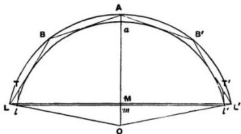

angular points except $A$ will describe circles on the outer sphere, with diameters $BB'$ etc., the points of contact of the sides with the inner segment will describe circles on the inner sphere, the sides themselves will describe the surfaces of cones or frusta of cones, and the whole figure circumscribed to the segment of the inner sphere by the revolution of the equal sides of the polygon will have for its base the circle on $LL'$ as diameter.

The surface of the solid figure so circumscribed about the sector of the sphere [excluding its base] will be greater than that of the segment of the sphere whose base is the circle on $ll'$ as diameter.

For draw the tangents $lT$, $l'T'$ to the inner segment at $l$, $l'$. These with the sides of the polygon will describe by their revolution a solid whose surface is greater than that of the segment [Assumptions, 4].

But the surface described by the revolution of $lT$ is less than that described by the revolution of $LT$, since the angle $TlL$ is a right angle, and therefore $LT > lT$.

Hence, a fortiori, the surface described by $LK \ldots A \ldots K'L'$ is greater than that of the segment.

Cor. *The surface of the figure so described about the sector of the sphere is equal to a circle the square on whose radius is equal to the rectangle*

$$
AB \left(BB' + CC' + \dots + KK' + \frac{1}{2}LL'\right).
$$

For the circumscribed figure is inscribed in the outer sphere, and the proof of Prop. 35 therefore applies.

## Proposition 40.

*The surface of the figure circumscribed to the sector as before is greater than a circle whose radius is equal to $al$.*

Let the diameter $AaO$ meet the great circle and the circle circumscribing the revolving polygon again in $a', A'$. Join $A'B$, and let $ON$ be drawn to $N$, the point of contact of $AB$ with the inner circle.

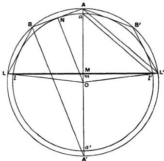

Now, by Prop. 39, Cor., the surface of the solid figure circumscribed to the sector $OlAl'$ is equal to a circle the square on whose radius is equal to the rectangle

$$
AB \left(BB' + CC' + \dots + KK' + \frac{LL'}{2}\right).
$$

But this rectangle is equal to $A'B$. $AM$ [as in Prop. 22].

Next, since $AL'$, $al'$ are parallel, the triangles $AML'$, $aml'$ are similar. And $AL' > al'$; therefore $AM > am$.

Also
$$
A'B = 2ON = aa'.
$$
Therefore
$$
A'B \cdot AM > am \cdot aa' > al''.
$$

Hence the surface of the solid figure circumscribed to the sector is greater than a circle whose radius is equal to $al'$, or $al$.

**Cor. 1.** The volume of the figure circumscribed about the sector together with the cone whose apex is $O$ and base the circle on $LL'$ as diameter, is equal to the volume of a cone whose base is equal to the surface of the circumscribed figure and whose height is $ON$.

For the figure is inscribed in the outer sphere which has the same centre as the inner. Hence the proof of Prop. 38 applies.

**Cor. 2.** The volume of the circumscribed figure with the cone $OLL'$ is greater than the cone whose base is a circle with radius equal to $al$ and whose height is equal to the radius $(Oa)$ of the inner sphere.

For the volume of the figure with the cone $OLL'$ is equal to a cone whose base is equal to the surface of the figure and whose height is equal to $ON$.

And the surface of the figure is greater than a circle with radius equal to $al$ [Prop. 40], while the heights $Oa$, $ON$ are equal.

## Proposition 41.

Let $lal'$ be a segment of a great circle of a sphere which is less than a semicircle.

Suppose a polygon inscribed in the sector $Olal'$ such that the sides $lk, \ldots, ba$, $ab', \ldots, k'l'$ are $2n$ in number and all equal. Let a similar polygon be circumscribed about the sector so that its sides are parallel to those of the first polygon; and draw the circle circumscribing the outer polygon.

Now let the polygons and circles revolve together about $OaA$, the radius bisecting the segment $lal'$.

Then (1) the surfaces of the outer and inner solids of revolution so described are in the ratio of $AB^2$ to $ab^2$, and (2) their volumes together with the corresponding cones with the same base and with apex $O$ in each case are as $AB^3$ to $ab^3$.

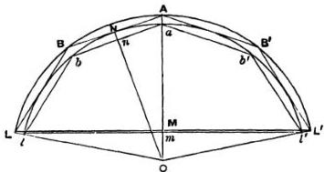

(1) For the surfaces are equal to circles the squares on whose radii are equal respectively to

$$
AB \left( BB' + CC' + \dots + KK' + \frac{LL'}{2} \right),
$$

[Prop. 39, Cor.]

and

$$
ab \left( bb' + cc' + \dots + kk' + \frac{ll'}{2} \right). \tag{Prop. 35}
$$

But these rectangles are in the ratio of $AB^2$ to $ab^2$. Therefore so are the surfaces.

(2) Let $OnN$ be drawn perpendicular to $ab$ and $AB$; and suppose the circles which are equal to the surfaces of the outer and inner solids of revolution to be denoted by $S, s$ respectively.

Now the volume of the circumscribed solid together with the cone $OLL'$ is equal to a cone whose base is $S$ and whose height is $ON$ [Prop. 40, Cor. 1].

And the volume of the inscribed figure with the cone $Oll'$ is equal to a cone with base $s$ and height $On$ [Prop. 38].

But

$$
S : s = AB^2 : ab^2,
$$

and

$$
ON : On = AB : ab.
$$

Therefore the volume of the circumscribed solid together with the cone $OLL'$ is to the volume of the inscribed solid together with the cone $Oll'$ as $AB^3$ is to $ab^3$ [Lemma 5].

## Proposition 42.

If *lal'* be a segment of a sphere less than a hemisphere and *Oa* the radius perpendicular to the base of the segment, the surface of the segment is equal to a circle whose radius is equal to *al*.

Let $R$ be a circle whose radius is equal to *al*. Then the surface of the segment, which we will call $S$, must, if it be not equal to $R$, be either greater or less than $R$.

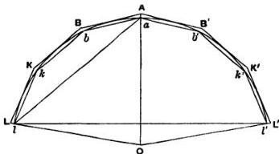

I. Suppose, if possible, $S > R$.

Let *lal'* be a segment of a great circle which is less than a semicircle. Join *Ol*, *Ol'*, and let similar polygons with $2n$ equal sides be circumscribed and inscribed to the sector, as in the previous propositions, but such that

$$
(\text{circumscribed polygon}): (\text{inscribed polygon}) < S : R.
$$

[Prop. 6]

Let the polygons now revolve with the segment about *OaA*, generating solids of revolution circumscribed and inscribed to the segment of the sphere.

Then

$$
\begin{aligned}
& (\text{surface of outer solid}): (\text{surface of inner solid}) \\
& = AB^{\#} : ab^{\#} \quad \text{[Prop. 41]} \\
& = (\text{circumscribed polygon}): (\text{inscribed polygon}) \\
& < S : R, \text{ by hypothesis}.
\end{aligned}
$$

But the surface of the outer solid is greater than $S$ [Prop. 39].

Therefore the surface of the inner solid is greater than $R$; which is impossible, by Prop. 37.

II. Suppose, if possible, $S < R$.

In this case we circumscribe and inscribe polygons such that their ratio is less than $R : S$; and we arrive at the result that

$$
\begin{array}{l}
\text{(surface of outer solid)} : \text{(surface of inner solid)} \\
< R : S.
\end{array}
$$

But the surface of the outer solid is greater than $R$ [Prop. 40]. Therefore the surface of the inner solid is greater than $S$: which is impossible [Prop. 36].

Hence, since $S$ is neither greater nor less than $R$,

$$
S = R.
$$

## Proposition 43.

Even if the segment of the sphere is greater than a hemisphere, its surface is still equal to a circle whose radius is equal to $al$.

For let $lal'a'$ be a great circle of the sphere, $aa'$ being the diameter perpendicular to $ll'$; and let $la'l'$ be a segment less than a semicircle.

Then, by Prop. 42, the surface of the segment $la'l'$ of the sphere is equal to a circle with radius equal to $a'l$.

Also the surface of the whole sphere is equal to a circle with radius equal to $aa'$ [Prop. 33].

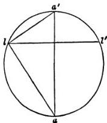

But $aa'^2 - a'l^2 = al^2$, and circles are to one another as the squares on their radii.

Therefore the surface of the segment $lal'$, being the difference between the surfaces of the sphere and of $la'l'$, is equal to a circle with radius equal to $al$.

## Proposition 44.

The volume of any sector of a sphere is equal to a cone whose base is equal to the surface of the segment of the sphere included in the sector, and whose height is equal to the radius of the sphere.

Let $R$ be a cone whose base is equal to the surface of the segment $lal'$ of a sphere and whose height is equal to the radius of the sphere; and let $S$ be the volume of the sector $Olal'$.

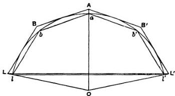

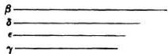

Then, if $S$ is not equal to $R$, it must be either greater or less.

I. Suppose, if possible, that $S > R$.

Find two straight lines $\beta, \gamma$, of which $\beta$ is the greater, such that

$$
\beta : \gamma < S : R;
$$

and let $\delta, \epsilon$ be two arithmetic means between $\beta, \gamma$.

Let $lal'$ be a segment of a great circle of the sphere. Join $Ol, Ol'$, and let similar polygons with $2n$ equal sides be circumscribed and inscribed to the sector of the circle as before, but such that their sides are in a ratio less than $\beta : \delta$. [Prop. 4].

Then let the two polygons revolve with the segment about $OaA$, generating two solids of revolution.

Denoting the volumes of these solids by $V, v$ respectively, we have

$$
(V + \text{cone } OLL'): (v + \text{cone } Oll') = AB^2: ab^3 \quad [\text{Prop. 41}]
$$
$$
< \beta^3: \delta^3
$$
$$
< \beta: \gamma, \text{ a fortiori},
$$
$$
< S: R, \text{ by hypothesis.}
$$

Now

$$
(V + \text{cone } OLL') > S.
$$

Therefore also $(v + \text{cone } Oll') > R$.

But this is impossible, by Prop. 38, Cor. combined with Props. 42, 43.

Hence

$$
S \ngtr R.
$$

II. Suppose, if possible, that $S < R$.

In this case we take $\beta, \gamma$ such that

$$
\beta: \gamma < R: S,
$$

and the rest of the construction proceeds as before.

We thus obtain the relation

$$
(V + \text{cone } OLL'): (v + \text{cone } Oll') < R: S.
$$

Now

$$
(v + \text{cone } Oll') < S.
$$

Therefore

$$
(V + \text{cone } OLL') < R;
$$

which is impossible, by Prop. 40, Cor. 2 combined with Props. 42, 43.

Since then $S$ is neither greater nor less than $R$,

$$
S = R.
$$

# ON THE SPHERE AND CYLINDER, BOOK II.

"Archimedes to Dositheus greeting.

On a former occasion you asked me to write out the proofs of the problems the enunciations of which I had myself sent to Conon. In point of fact they depend for the most part on the theorems of which I have already sent you the demonstrations, namely (1) that the surface of any sphere is four times the greatest circle in the sphere, (2) that the surface of any segment of a sphere is equal to a circle whose radius is equal to the straight line drawn from the vertex of the segment to the circumference of its base, (3) that the cylinder whose base is the greatest circle in any sphere and whose height is equal to the diameter of the sphere is itself in magnitude half as large again as the sphere, while its surface [including the two bases] is half as large again as the surface of the sphere, and (4) that any solid sector is equal to a cone whose base is the circle which is equal to the surface of the segment of the sphere included in the sector, and whose height is equal to the radius of the sphere. Such then of the theorems and problems as depend on these theorems I have written out in the book which I send herewith; those which are discovered by means of a different sort of investigation, those namely which relate to spirals and the conoids, I will endeavour to send you soon.

The first of the problems was as follows: *Given a sphere, to find a plane area equal to the surface of the sphere.*

The solution of this is obvious from the theorems aforesaid. For four times the greatest circle in the sphere is both a plane area and equal to the surface of the sphere.

The second problem was the following."

## Proposition 1. (Problem.)

*Given a cone or a cylinder, to find a sphere equal to the cone or to the cylinder.*

If $V$ be the given cone or cylinder, we can make a cylinder equal to $\frac{3}{2}V$. Let this cylinder be the cylinder whose base is the circle on $AB$ as diameter and whose height is $OD$.

Now, if we could make another cylinder, equal to the cylinder $(OD)$ but such that its height is equal to the diameter of its base, the problem would be solved, because this latter cylinder would be equal to $\frac{3}{2}V$, and the sphere whose diameter is equal to the height (or to the diameter of the base) of the same cylinder would then be the sphere required [I. 34, Cor.].

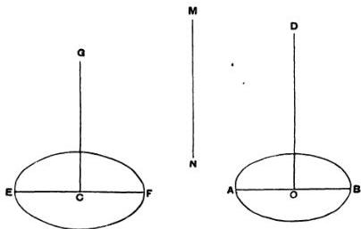

Suppose the problem solved, and let the cylinder $(CG)$ be equal to the cylinder $(OD)$, while $EF$, the diameter of the base, is equal to the height $CG$.

Then, since in equal cylinders the heights and bases are reciprocally proportional,

$$
\begin{aligned}
AB^2 : EF^2 &= CG : OD \\
&= EF : OD
\end{aligned}
\tag{1}
$$

Suppose $MN$ to be such a line that

$$
EF^2 = AB \cdot MN
\tag{2}
$$

Hence

$$
AB : EF = EF : MN
$$

and, combining (1) and (2), we have

$$
AB : MN = EF : OD,
$$

or

$$
AB : EF = MN : OD.
$$

Therefore

$$
AB : EF = EF : MN = MN : OD
$$

and $EF, MN$ are two mean proportionals between $AB, OD$.

The synthesis of the problem is therefore as follows. Take two mean proportionals $EF, MN$ between $AB$ and $OD$, and describe a cylinder whose base is a circle on $EF$ as diameter and whose height $CG$ is equal to $EF$.

Then, since

$$
\begin{aligned}
AB : EF &= EF : MN = MN : OD, \\
EF^2 &= AB \cdot MN,
\end{aligned}
$$

and therefore

$$
\begin{aligned}
AB^2 : EF^2 &= AB : MN \\
&= EF : OD \\
&= CG : OD;
\end{aligned}
$$

whence the bases of the two cylinders $(OD), (CG)$ are reciprocally proportional to their heights.

Therefore the cylinders are equal, and it follows that

$$
\text{cylinder } (CG) = \frac{3}{2} V.
$$

The sphere on $EF$ as diameter is therefore the sphere required, being equal to $V$.

## Proposition 2.

If $BAB'$ be a segment of a sphere, $BB'$ a diameter of the base of the segment, and $O$ the centre of the sphere, and if $AA'$ be the diameter of the sphere bisecting $BB'$ in $M$, then the volume of the segment is equal to that of a cone whose base is the same as that of the segment and whose height is $h$, where

$$
h: \mathbf{A M} = O A' + A' M: \mathbf{A' M}.
$$

Measure $MH$ along $MA$ equal to $h$, and $MH'$ along $MA'$ equal to $h'$, where

$$
h': A' M = O A + A M: A M.
$$

Suppose the three cones constructed which have $O$, $H$, $H'$ for their apices and the base ($BB'$) of the segment for their common base. Join $AB$, $A'B$.

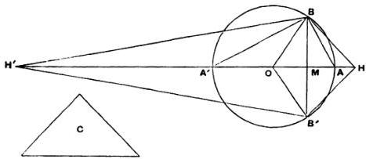

Let $C$ be a cone whose base is equal to the surface of the segment $BAB'$ of the sphere, i.e. to a circle with radius equal to $AB$ [I. 42], and whose height is equal to $OA$.

Then the cone $C$ is equal to the solid sector $OBAB'$ [I. 44].

Now, since $HM: MA = OA' + A'M: A'M$,

dividendo, $HA: AM = OA: A'M$,

and, alternately, $HA: AO = AM: MA'$,

so that

$$
\begin{array}{l}
HO: OA = AA': A' M \\
= AB': B M' \\
= (\text{base of cone } C): (\text{circle on } BB' \text{ as diameter}).
\end{array}
$$

But $OA$ is equal to the height of the cone $C$; therefore, since cones are equal if their bases and heights are reciprocally proportional, it follows that the cone $C$ (or the solid sector $OBAB'$) is equal to a cone whose base is the circle on $BB'$ as diameter and whose height is equal to $OH$.

And this latter cone is equal to the sum of two others having the same base and with heights $OM$, $MH$, i.e. to the solid rhombus $OBHB'$.

Hence the sector $OBAB'$ is equal to the rhombus $OBHB'$.

Taking away the common part, the cone $OBB'$,

$$
\text{the segment } BAB' = \text{the cone } HBB'.
$$

Similarly, by the same method, we can prove that

$$
\text{the segment } BA'B' = \text{the cone } H'BB'.
$$

*Alternative proof of the latter property.*

Suppose $D$ to be a cone whose base is equal to the surface of the whole sphere and whose height is equal to $OA$.

Thus $D$ is equal to the volume of the sphere. [I. 33, 34]

Now, since $OA' + A'M : A'M = HM : MA$,

dividendo and alternando, as before,

$$
OA : AH = A'M : MA.
$$

Again, since $H'M : MA' = OA + AM : AM$,

$$
\begin{aligned}
H'A' : OA &= A'M : MA \\
&= OA : AH, \text{ from above.}
\end{aligned}
$$

Componendo, $H'O : OA = OH : HA$ ... (1).

Alternately, $H'O : OH = OA : AH$ ... (2),

and, componendo, $HH' : HO = OH : HA$,

$$
= H'O : OA, \text{ from (1)},
$$

whence $HH' : OA = H'O : OH$ ... (3).

Next, since $H'O : OH = OA : AH$, by (2),

$$
= A'M : MA,
$$

$$
(H'O + OH)^2 : H'O : OH = (A'M + MA)^2 : A'M : MA,
$$

whence, by means of (3),

$$
H H ^ {\prime 2}: H H ^ {\prime}. O A = A A ^ {\prime 2}: A ^ {\prime} M. M A,
$$

or

$$
H H ^ {\prime}: O A = A A ^ {\prime 2}: B M ^ {2}.
$$

Now the cone $D$, which is equal to the sphere, has for its base a circle whose radius is equal to $AA'$, and for its height a line equal to $OA$.

Hence this cone $D$ is equal to a cone whose base is the circle on $BB'$ as diameter and whose height is equal to $HH'$;

therefore the cone $D =$ the rhombus $HBH'B'$

or the rhombus $HBH'B' =$ the sphere.

But the segment $BAB' =$ the cone $HBB'$;

therefore the remaining segment $BA'B' =$ the cone $H'BB'$.

COR. The segment $BAB'$ is to a cone with the same base and equal height in the ratio of $OA' + A'M$ to $A'M$.

## Proposition 3. (Problem.)

To cut a given sphere by a plane so that the surfaces of the segments may have to one another a given ratio.

Suppose the problem solved. Let $AA'$ be a diameter of a great circle of the sphere, and suppose that a plane perpendicular to $AA'$ cuts the plane of the great circle in the straight

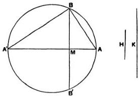

line $BB'$, and $AA'$ in $M$, and that it divides the sphere so that the surface of the segment $BAB'$ has to the surface of the segment $BA'B'$ the given ratio.

Now these surfaces are respectively equal to circles with radii equal to $AB$, $A'B$ [I. 42, 43].

Hence the ratio $AB^2: A'B^2$ is equal to the given ratio, i.e. $AM$ is to $MA'$ in the given ratio.

Accordingly the synthesis proceeds as follows.

If $H:K$ be the given ratio, divide $AA'$ in $M$ so that

$$
AM: MA' = H:K.
$$

Then

$$
AM: MA' = AB^2: A'B^2
$$

$$
\begin{aligned}
&= (\text{circle with radius } AB): (\text{circle with radius } A'B) \\
&= (\text{surface of segment } BAB'): (\text{surface of segment } BA'B').
\end{aligned}
$$

Thus the ratio of the surfaces of the segments is equal to the ratio $H:K$.

## Proposition 4. (Problem.)

To cut a given sphere by a plane so that the volumes of the segments are to one another in a given ratio.

Suppose the problem solved, and let the required plane cut the great circle $ABA'$ at right angles in the line $BB'$. Let $AA'$ be that diameter of the great circle which bisects $BB'$ at right angles (in $M$), and let $O$ be the centre of the sphere.

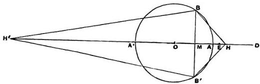

Take $H$ on $OA$ produced, and $H'$ on $OA'$ produced, such that

$$
OA' + A'M: A'M = HM: MA, \quad
$$

and

$$
OA + AM: AM = H'M: MA' \quad
$$

Join $BH$, $B'H$, $BH'$, $B'H'$.

Then the cones $HBB'$, $H'BB'$ are respectively equal to the segments $BAB'$, $BA'B'$ of the sphere [Prop. 2].

Hence the ratio of the cones, and therefore of their altitudes, is given, i.e.

$$ HM: H'M = \text{the given ratio} \quad \text{(3)}. $$

We have now three equations (1), (2), (3), in which there appear three as yet undetermined points $M, H, H'$; and it is first necessary to find, by means of them, another equation in which only one of these points ($M$) appears, i.e. we have, so to speak, to eliminate $H, H'$.

Now, from (3), it is clear that $HH': H'M$ is also a given ratio; and Archimedes' method of elimination is, *first*, to find values for each of the ratios $A'H': H'M$ and $HH': H'A'$ which are alike independent of $H, H'$, and then, *secondly*, to equate the ratio compounded of these two ratios to the known value of the ratio $HH': H'M$.

(a) To find such a value for $A'H': H'M$.

It is at once clear from equation (2) above that

$$ A'H': H'M = OA: OA + AM \quad \text{(4)}. $$

(b) To find such a value for $HH': A'H'$.

From (1) we derive

$$ A'M: MA = OA' + A'M: HM $$

$$ = OA': AH \quad \text{(5)}; $$

and, from (2), $A'M: MA = H'M: OA + AM$

$$ = A'H': OA \quad \text{(6)}. $$

Thus

$$
HA: AO = OA': A'H'
$$

whence

$$
OH: OA' = OH': A'H'
$$

or

$$
OH: OH' = OA': A'H'
$$

It follows that

$$ HH': OH' = OH': A'H' $$

or

$$ HH'. H'A' = OH'^2. $$

Therefore

$$
HH': H'A' = OH'^2: H'A'^2
$$

$$ = AA'^2: A'M^2, \text{ by means of (6)} $$

(c) To express the ratios $A'H': H'M$ and $HH': H'M$ more simply we make the following construction. Produce $OA$ to $D$ so that $OA = AD$. ($D$ will lie beyond $H$, for $A'M > MA$, and therefore, by (5), $OA > AH$.)

Then
$$
\begin{aligned}
A'H': H'M &= OA : OA + AM \\
&= AD : DM \quad \dots \dots \dots \dots \dots \dots \dots \tag{7}.
\end{aligned}
$$

Now divide $AD$ at $E$ so that
$$
HH': H'M = AD : DE \quad \dots \dots \dots \dots \dots \dots \dots \tag{8}.
$$

Thus, using equations (8), (7) and the value of $HH': H'A'$ above found, we have
$$
\begin{aligned}
AD : DE &= HH': H'M \\
&= (HH': H'A').(A'H': H'M) \\
&= (AA'^2 : A'M^2).(AD : DM).
\end{aligned}
$$

But
$$
AD : DE = (DM : DE).(AD : DM).
$$

Therefore
$$
MD : DE = AA'^2 : A'M^2 \quad \dots \dots \dots \dots \dots \dots \dots \tag{9}.
$$

And $D$ is given, since $AD = OA$. Also $AD : DE$ (being equal to $HH': H'M$) is a given ratio. Therefore $DE$ is given.

Hence the problem reduces itself to the problem of dividing $A'D$ into two parts at $M$ so that
$$
MD : \text{(a given length)} = \text{(a given area)} : A'M^2.
$$

Archimedes adds: “If the problem is propounded in this general form, it requires a διορισμός [i.e. it is necessary to investigate the limits of possibility], but, if there be added the conditions subsisting in the present case, it does not require a διορισμός.”

In the present case the problem is:

Given a straight line $A'A$ produced to $D$ so that $A'A = 2AD$, and given a point $E$ on $AD$, to cut $AA'$ in a point $M$ so that
$$
AA'^2 : A'M^2 = MD : DE.
$$

“And the analysis and synthesis of both problems will be given at the end*.”

The synthesis of the main problem will be as follows. Let $R : S$ be the given ratio, $R$ being less than $S$. $AA'$ being a

diameter of a great circle, and $O$ the centre, produce $OA$ to $D$ so that $OA = AD$, and divide $AD$ in $E$ so that

$$
AE : ED = R : S.
$$

Then cut $AA'$ in $M$ so that

$$
MD : DE = AA'^2 : A'M^2.
$$

Through $M$ erect a plane perpendicular to $AA'$; this plane will then divide the sphere into segments which will be to one another as $R$ to $S$.

Take $H$ on $A'A$ produced, and $H'$ on $AA'$ produced, so that

$$
OA' + A'M : A'M = HM : MA, \dots \dots \dots \dots \dots \dots \dots \tag{1},
$$

$$
OA + AM : AM = H'M : MA'. \dots \dots \dots \dots \dots \dots \tag{2}.
$$

We have then to show that

$$
HM : MH' = R : S, \text{ or } AE : ED.
$$

$(\alpha)$ We first find the value of $HH' : H'A'$ as follows.

As was shown in the analysis $(b)$,

$$
HH' : H'A' = OH'^2,
$$

or

$$
HH' : H'A' = OH'^2 : H'A'^2
$$

$$
= AA'^2 : A'M^2
$$

$$
= MD : DE, \text{ by construction.}
$$

$(\beta)$ Next we have

$$
\begin{aligned}
H'A' : H'M &= OA : OA + AM \\
&= AD : DM.
\end{aligned}
$$

Therefore

$$
HH' : H'M = (HH' : H'A'). (H'A' : H'M)
$$

$$
= (MD : DE) \cdot (AD : DM)
$$

$$
= AD : DE,
$$

whence

$$
HM : MH' = AE : ED
$$

$$
= R : S.
$$

Q. E. D.

**Note.** The solution of the subsidiary problem to which the original problem of Prop. 4 is reduced, and of which Archimedes promises a discussion, is given in a highly interesting and important note by Eutocius, who introduces the subject with the following explanation.

"He [Archimedes] promised to give a solution of this problem at the end, but we do not find the promise kept in any of the copies. Hence we find that Dionysodorus too failed to light upon the promised discussion and, being unable to grapple with the omitted lemma, approached the original problem in a different way, which I shall describe later. Diocles also expressed in his work *περὶ πυρίων* the opinion that Archimedes made the promise but did not perform it, and tried to supply the omission himself. His attempt I shall also give in its order. It will however be seen to have no relation to the omitted discussion but to give, like Dionysodorus, a construction arrived at by a different method of proof. On the other hand, as the result of unremitting and extensive research, I found in a certain old book some theorems discussed which, although the reverse of clear owing to errors and in many ways faulty as regards the figures, nevertheless gave the substance of what I sought, and moreover to some extent kept to the Doric dialect affected by Archimedes, while they retained the names familiar in old usage, the parabola being called a section of a right-angled cone, and the hyperbola a section of an obtuse-angled cone; whence I was led to consider whether these theorems might not in fact be what he promised he would give at the end. For this reason I paid them the closer attention, and, after finding great difficulty with the actual text owing to the multitude of the mistakes above referred to, I made out the sense gradually and now proceed to set it out, as well as I can, in more familiar and clearer language. And first the theorem will be treated generally, in order that what Archimedes says about the limits of possibility may be made clear; after which there will follow the special application to the conditions stated in his analysis of the problem."

The investigation which follows may be thus reproduced. The general problem is:

*Given two straight lines $AB$, $AC$ and an area $D$, to divide $AB$ at $M$ so that*

$$AM : AC = D : MB^2.$$

## Analysis.

Suppose $M$ found, and suppose $AC$ placed at right angles to $AB$. Join $CM$ and produce it. Draw $EBN$ through $B$ parallel to $AC$ meeting $CM$ in $N$, and through $C$ draw $CHE$ parallel to $AB$ meeting $EBN$ in $E$. Complete the parallelogram $CENF$, and through $M$ draw $PMH$ parallel to $AC$ meeting $FN$ in $P$.

Measure $EL$ along $EN$ so that

$$
CE.EL \text{ (or } AB.EL) = D.
$$

Then, by hypothesis,

$$
AM : AC = CE.EL : MB^2.
$$

And

$$
AM : AC = CE : EN,
$$

by similar triangles,

$$
= CE.EL : EL.EN.
$$

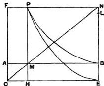

It follows that

$$
PN^2 = MB^2 = EL.EN.
$$

Hence, if a parabola be described with vertex $E$, axis $EN$, and parameter equal to $EL$, it will pass through $P$; and it will be given in position, since $EL$ is given.

Therefore $P$ lies on a given parabola.

Next, since the rectangles $FH$, $AE$ are equal,

$$
FP.PH = AB.BE.
$$

Hence, if a rectangular hyperbola be described with $CE$, $CF$ as asymptotes and passing through $B$, it will pass through $P$. And the hyperbola is given in position.

Therefore $P$ lies on a given hyperbola.

Thus $P$ is determined as the intersection of the parabola and hyperbola. And since $P$ is thus given, $M$ is also given.

$$
\delta \iota \circ \rho \iota \sigma \mu \acute{\circ} \varsigma.
$$

Now, since

$$
AM : AC = D : MB^2,
$$

$$
AM.MB^2 = AC.D.
$$

But $AC.D$ is given, and it will be proved later that the maximum value of $AM.MB^2$ is that which it assumes when $BM = 2AM$.

Hence it is a necessary condition of the possibility of a solution that $AC.D$ must not be greater than $\frac{1}{2}AB.(\frac{3}{8}AB)^2$, or $\frac{4}{27}AB^2$.

## Synthesis.

If $O$ be such a point on $AB$ that $BO = 2AO$, we have seen that, in order that the solution may be possible,

$$
AC.D \ngtr AO.OB^2.
$$

Thus $AC.D$ is either equal to, or less than, $AO.OB^2$.

1. If $AC.D = AO.OB^2$, then the point $O$ itself solves the problem.

2. Let $AC.D$ be less than $AO.OB^2$.

Place $AC$ at right angles to $AB$. Join $CO$, and produce it to $R$. Draw $EBR$ through $B$ parallel to $AC$ meeting $CO$ in $R$, and through $C$ draw $CE$ parallel to $AB$ meeting $EBR$ in $E$. Complete the parallelogram $CERF$, and through $O$ draw $QOK$ parallel to $AC$ meeting $FR$ in $Q$ and $CE$ in $K$.

Then, since

$$
AC.D < AO.OB^2,
$$

measure $RQ'$ along $RQ$ so that

$$
AC.D = AO.Q'R^2,
$$

or

$$
AO:AC = D:Q'R^2.
$$

Measure $EL$ along $ER$ so that

$$
D = CE.EL \text{ (or } AB.EL\text{)}.
$$

Now, since

$$
AO:AC = D:Q'R^2, \text{ by hypothesis,}
$$

$$
= CE.EL:Q'R^2,
$$

and

$$
AO:AC = CE:ER, \text{ by similar triangles,}
$$

$$
= CE.EL:EL.ER,
$$

it follows that

$$
Q'R^2 = EL.ER.
$$

Describe a parabola with vertex $E$, axis $ER$, and parameter equal to $EL$. This parabola will then pass through $Q'$.

Again,
rect. $FK = \text{rect.} AE$,
or
$FQ.QK = AB.BE$;

and, if we describe a rectangular hyperbola with asymptotes $CE$, $CF$ and passing through $B$, it will also pass through $Q$.

Let the parabola and hyperbola intersect at $P$, and through $P$ draw $PMH$ parallel to $AC$ meeting $AB$ in $M$ and $CE$ in $H$, and $GPN$ parallel to $AB$ meeting $CF$ in $G$ and $ER$ in $N$.

Then shall $M$ be the required point of division.

Since
$PG.PH = AB.BE$,
rect. $GM = \text{rect.} ME$,
and therefore $CMN$ is a straight line.

Thus
$AB.BE = PG.PH = AM.EN$...(1).

Again, by the property of the parabola,
$PN^2 = EL.EN$,
or
$MB^2 = EL.EN$...(2).

From (1) and (2)
$AM:EL = AB.BE:MB^2$,
or
$AM.AB:AB.EL = AB.AC:MB^2$.

Alternately,
$AM.AB:AB.AC = AB.EL:MB^2$,
or
$AM:AC = D:MB^2$.

**Proof of** $\delta \iota \circ \rho \iota \sigma \mu \acute{o} \varsigma$.

It remains to be proved that, if $AB$ be divided at $O$ so that $BO = 2AO$, then $AO.OB^2$ is the maximum value of $AM.MB^2$,
or
$AO.OB^2 > AM.MB^2$,
where $M$ is any point on $AB$ other than $O$.

Suppose that $AO : AC = CE \cdot EL' : OB^2$,
so that $AO \cdot OB^2 = CE \cdot EL' \cdot AC$.

Join $CO$, and produce it to $N$; draw $EBN$ through $B$ parallel to $AC$, and complete the parallelogram $CENF$.

Through $O$ draw $POH$ parallel to $AC$ meeting $FN$ in $P$ and $CE$ in $H$.

With vertex $E$, axis $EN$, and parameter $EL'$, describe a parabola. This will pass through $P$, as shown in the analysis above, and beyond $P$ will meet the diameter $CF$ of the parabola in some point.

Next draw a rectangular hyperbola with asymptotes $CE$, $CF$ and passing through $B$. This hyperbola will also pass through $P$, as shown in the analysis.

Produce $NE$ to $T$ so that $TE = EN$. Join $TP$ meeting $CE$ in $Y$, and produce it to meet $CF$ in $W$. Thus $TP$ will touch the parabola at $P$.

Then, since
$$
BO = 2AO,
$$
$$
TP = 2PW.
$$

And
$$
TP = 2PY.
$$

Therefore
$$
PW = PY.
$$

Since, then, $WY$ between the asymptotes is bisected at $P$, the point where it meets the hyperbola,

$WY$ is a tangent to the hyperbola.

Hence the hyperbola and parabola, having a common tangent at $P$, touch one another at $P$.

Now take any point $M$ on $AB$, and through $M$ draw $QMK$ parallel to $AC$ meeting the hyperbola in $Q$ and $CE$ in $K$. Lastly, draw $GqQR$ through $Q$ parallel to $AB$ meeting $CF$ in $G$, the parabola in $q$, and $EN$ in $R$.

Then, since, by the property of the hyperbola, the rectangles $GK$, $AE$ are equal, $CMR$ is a straight line.

By the property of the parabola,

$$ qR^2 = EL'.ER, $$

so that

$$
QR^2 < EL'.ER.
$$

Suppose $QR^2 = EL.ER$,

and we have $AM : AC = CE : ER$

$$ = CE.EL : EL.ER $$

$$ = CE.EL : QR^2 $$

$$ = CE.EL : MB^2, $$

or

$$ AM.MB^2 = CE.EL.AC. $$

Therefore

$$
AM.MB^2 < CE.EL'.AC
$$

$$ < AO.OB^2. $$

If $AC.D < AO.OB^2$, there are two solutions because there will be two points of intersection between the parabola and the hyperbola.

For, if we draw with vertex $E$ and axis $EN$ a parabola whose parameter is equal to $EL$, the parabola will pass through the point $Q$ (see the last figure); and, since the parabola meets the diameter $CF$ beyond $Q$, it must meet the hyperbola again (which has $CF$ for its asymptote).

[If we put $AB = a$, $BM = x$, $AC = c$, and $D = b^2$, the proportion

$$ AM : AC = D : MB^2 $$

is seen to be equivalent to the equation

$$ x^2(a - x) = b^2c, $$

being a cubic equation with the term containing $x$ omitted.

Now suppose $EN$, $EC$ to be axes of coordinates, $EN$ being the axis of $y$.

Then the parabola used in the above solution is the parabola

$$
x^{2} = \frac{b^{2}}{a} \cdot y,
$$

and the rectangular hyperbola is

$$
y (a - x) = a c.
$$

Thus the solution of the cubic equation and the conditions under which there are no positive solutions, or one, or two positive solutions are obtained by the use of the two conics.]

[For the sake of completeness, and for their intrinsic interest, the solutions of the original problem in Prop. 4 given by Dionysodorus and Diocles are here appended.

## Dionysodorus’ solution.

Let $AA'$ be a diameter of the given sphere. It is required to find a plane cutting $AA'$ at right angles (in a point $M$, suppose) so that the segments into which the sphere is divided are in a given ratio, as $CD:DE$.

Produce $A'A$ to $F$ so that $AF = OA$, where $O$ is the centre of the sphere.

Draw $AH$ perpendicular to $AA'$ and of such length that

$$
FA: AH = CE: ED,
$$

and produce $AH$ to $K$ so that

$$ AK' = FA \cdot AH \quad \text{...} \quad (\alpha). $$

With vertex $F$, axis $FA$, and parameter equal to $AH$ describe a parabola. This will pass through $K$, by the equation $(\alpha)$.

Draw $A'K'$ parallel to $AK$ and meeting the parabola in $K'$; and with $A'F$, $A'K'$ as asymptotes describe a rectangular hyperbola passing through $H$. This hyperbola will meet the parabola at some point, as $P$, between $K$ and $K'$.

Draw $PM$ perpendicular to $AA'$ meeting the great circle in $B, B'$, and from $H, P$ draw $HL, PR$ both parallel to $AA'$ and meeting $A'K'$ in $L, R$ respectively.

Then, by the property of the hyperbola,

$$ PR \cdot PM = AH \cdot HL, $$

i.e.

$$ PM \cdot MA' = HA \cdot AA', $$

or

$$ PM : AH = AA' : A'M, $$

and

$$ PM' : AH' = AA'' : A'M'. $$

Also, by the property of the parabola,

$$ PM' = FM \cdot AH, $$

i.e.

$$ FM : PM = PM : AH, $$

or

$$ FM : AH = PM' : AH' = AA' : A'M', \text{ from above.} $$

Thus, since circles are to one another as the squares of their radii, the cone whose base is the circle with $A'M$ as radius and whose height is equal to $FM$, and the cone whose base is the circle with $AA'$ as radius and whose height is equal to $AH$, have their bases and heights reciprocally proportional.

Hence the cones are equal; i.e., if we denote the first cone by the symbol $c(A'M)$, $FM$, and so on,

$$ c(A'M), FM = c(AA'), AH. $$

Now $c(AA'), FA : c(AA'), AH = FA : AH = CE : ED$, by construction.

Therefore

$$ c(AA'), FA : c(A'M), FM = CE : ED \quad \dots \dots \dots (\beta). $$

But (1) $$ c(AA'), FA = \text{the sphere.} \quad \text{[I. 34]} $$

(2) $$ c(A'M), FM \text{ can be proved equal to the segment of the sphere whose vertex is } A' \text{ and height } A'M. $$

For take $G$ on $AA'$ produced such that

$$ GM : MA' = FM : MA $$

$$ = OA + AM : AM. $$

Then the cone $GBB'$ is equal to the segment $A'BB'$ [Prop. 2].

And $$ FM : MG = AM : MA', \text{ by hypothesis,} $$

$$ = BM^2 : A'M^2. $$

Therefore

$$ \text{(circle with rad. } BM) : \text{(circle with rad. } A'M) $$

$$ = FM : MG, $$

so that $$ c(A'M), FM = c(BM), MG $$

$$ = \text{the segment } A'BB'. $$

We have therefore, from the equation $(\beta)$ above,

$$ \text{(the sphere)} : \text{(segmt. } A'BB') = CE : ED, $$

whence $$ \text{(segmt. } ABB') : \text{(segmt. } A'BB') = CD : DE. $$

## Diocles’ solution.

Diocles starts, like Archimedes, from the property, proved in Prop. 2, that, if the plane of section cut a diameter $AA'$ of the sphere at right angles in $M$, and if $H$, $H'$ be taken on $OA$, $OA'$ produced respectively so that

$$ OA' + A'M : A'M = HM : MA, $$

$$ OA + AM : AM = H'M : MA', $$

then the cones $HBB'$, $H'BB'$ are respectively equal to the segments $ABB'$, $A'BB'$.

Then, drawing the inference that

$$
HA : AM = OA' : A'M,
$$

$$
H'A' : A'M = OA : AM,
$$

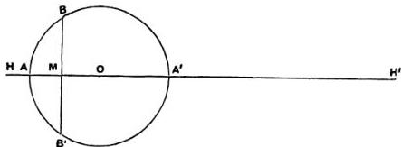

he proceeds to state the problem in the following form, slightly generalising it by the substitution of any given straight line for $OA$ or $OA'$:

Given a straight line $AA'$, its extremities $A$, $A'$, a ratio $C: D$, and another straight line as $AK$, to divide $AA'$ at $M$ and to find two points $H, H'$ on $A'A$ and $AA'$ produced respectively so that the following relations may hold simultaneously,

$$
C : D = HM : MH'
$$

$$
HA : AM = AK : A'M
$$

$$
H'A' : A'M = AK : AM
$$

$$
\dots (\alpha),
$$

$$
\dots (\beta),
$$

$$
\dots (\gamma).
$$

## Analysis.

Suppose the problem solved and the points $M, H, H'$ all found.

Place $AK$ at right angles to $AA'$, and draw $A'K'$ parallel and equal to $AK$. Join $KM, K'M$, and produce them to meet $K'A', KA$ respectively in $E, F$. Join $KK'$, draw $EG$ through $E$ parallel to $A'A$ meeting $KF$ in $G$, and through $M$ draw $QMN$ parallel to $AK$ meeting $EG$ in $Q$ and $KK'$ in $N$.

Now $HA : AM = A'K' : A'M$, by $(\beta)$,

$$
= FA : AM, \text{ by similar triangles},
$$

whence

$$
HA = FA.
$$

Similarly

$$
H'A' = A'E.
$$

Next,

$$
FA + AM : A'K' + A'M = AM : A'M
$$

$$
= AK + AM : EA' + A'M, \text{ by similar triangles}.
$$

Therefore

$$
(FA + AM). (EA' + A'M) = (KA + AM). (K'A' + A'M).
$$

Take $AR$ along $AH$ and $A'R'$ along $A'H'$ such that

$$
AR = A'R' = AK.
$$

Then, since $FA + AM = HM$, $EA' + A'M = MH'$, we have

$$
HM.MH' = RM.MR' \quad \text{(δ)}.
$$

(Thus, if $R$ falls between $A$ and $H$, $R'$ falls on the side of $H'$ remote from $A'$, and vice versa.)

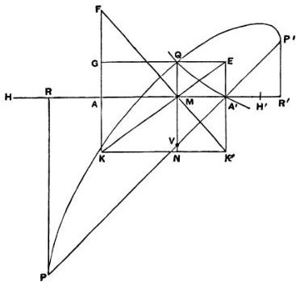

Now
$C: D = HM: MH'$, by hypothesis,
$$
\begin{aligned}
&= HM.MH': MH' \\
&= RM.MR': MH'^2, \text{ by (δ)}.
\end{aligned}
$$

Measure $MV$ along $MN$ so that $MV = A'M$. Join $A'V$ and produce it both ways. Draw $RP$, $R'P'$ perpendicular to $RR'$ meeting $A'V$ produced in $P$, $P'$ respectively. Then, the angle $MA'V$ being half a right angle, $PP'$ is given in position, and, since $R$, $R'$ are given, so are $P$, $P'$.

And, by parallels,

$$
P'V: PV = R'M: MR.
$$

Therefore

$$
PV.P'V:PV^2 = RM.MR':RM^2.
$$

But

$$
PV^2 = 2RM^2.
$$

Therefore

$$
PV.P'V = 2RM.MR'.
$$

And it was shown that

$$
RM.MR':MH'^2 = C : D.
$$

Hence

$$
PV.P'V:MH'^2 = 2C : D.
$$

But

$$
MH' = A'M + A'E = VM + MQ = QV.
$$

Therefore $QV^2:PV.P'V = D:2C$, a given ratio.

Thus, if we take a line $p$ such that

$$
D:2C = p:PP'.
$$

and if we describe an ellipse with $PP'$ as a diameter and $p$ as the corresponding parameter $[=DD'^2/PP'$ in the ordinary notation of geometrical conics], and such that the ordinates to $PP'$ are inclined to it at an angle equal to half a right angle, i.e. are parallel to $QV$ or $AK$, then the ellipse will pass through $Q$.

Hence $Q$ lies on an ellipse given in position.

Again, since $EK$ is a diagonal of the parallelogram $GK'$

$$
GQ.QN = AA'.A'K'.
$$

If therefore a rectangular hyperbola be described with $KG$, $KK'$ as asymptotes and passing through $A'$, it will also pass through $Q$.

Hence $Q$ lies on a given rectangular hyperbola.

Thus $Q$ is determined as the intersection of a given ellipse

$$
QV^2:PV.P'V = PP':p,
$$

whereas the two latter terms should be reversed, the correct property of the ellipse being

$$
QV^2:PV.P'V = p:PP'. \quad [\text{Apollonius I. 21}]
$$

The mistake would appear to have originated as far back as Eutocius, but I think that Eutocius is more likely to have made the slip than Diocles himself, because any intelligent mathematician would be more likely to make such a slip in writing out another man’s work than to overlook it if made by another.

and a given hyperbola, and is therefore given. Thus $M$ is given, and $H, H'$ can at once be found.

## Synthesis.

Place $AA'$, $AK$ at right angles, draw $A'K'$ parallel and equal to $AK$, and join $KK'$.

Make $AR$ (measured along $A'A$ produced) and $A'R'$ (measured along $AA'$ produced) each equal to $AK$, and through $R$, $R'$ draw perpendiculars to $RR'$.

Then through $A'$ draw $PP'$ making an angle ($AA'P$) with $AA'$ equal to half a right angle and meeting the perpendiculars just drawn in $P$, $P'$ respectively.

Take a length $p$ such that

$$
D: 2C = p: PP',
$$

and with $PP'$ as diameter and $p$ as the corresponding parameter describe an ellipse such that the ordinates to $PP'$ are inclined to it at an angle equal to $AA'P$, i.e. are parallel to $AK$.

With asymptotes $KA$, $KK'$ draw a rectangular hyperbola passing through $A'$.

Let the hyperbola and ellipse meet in $Q$, and from $Q$ draw $QMVN$ perpendicular to $AA'$ meeting $AA'$ in $M$, $PP'$ in $V$ and $KK'$ in $N$. Also draw $GQE$ parallel to $AA'$ meeting $AK$, $A'K'$ respectively in $G$, $E$.

Produce $KA$, $K'M$ to meet in $F$.

Then, from the property of the hyperbola,

$$
GQ.QN = AA'.A'K',
$$

and, since these rectangles are equal, $KME$ is a straight line.

Measure $AH$ along $AR$ equal to $AF$, and $A'H'$ along $A'R'$ equal to $A'E$.

From the property of the ellipse,

$$
\begin{aligned}
QV^2: PV.P'V &= p: PP' \\
&= D: 2C.
\end{aligned}
$$

And, by parallels,

$$ PV: P'V = RM: R'M, $$

or

$$ PV \cdot P'V: P'V^2 = RM \cdot MR': R'M^2, $$

while $$ P'V^2 = 2R'M^2 $$, since the angle $$ RA'P $$ is half a right angle.

Therefore $$ PV \cdot P'V = 2RM \cdot MR', $$

whence $$ QV^2: 2RM \cdot MR' = D: 2C. $$

But $$ QV = EA' + A'M = MH'. $$

Therefore $$ RM \cdot MR': MH'^2 = C: D. $$

Again, by similar triangles,

$$ FA + AM: K'A' + A'M = AM: A'M $$

$$ = KA + AM: EA' + A'M. $$

Therefore

$$ (FA + AM) \cdot (EA' + A'M) = (KA + AM) \cdot (K'A' + A'M) $$

or $$ HM \cdot MH' = RM \cdot MR'. $$

It follows that

$$ HM \cdot MH': MH'^2 = C: D, $$

or

$$ HM: MH' = C: D \quad \text{(α)}. $$

Also $$ HA: AM = FA: AM, $$

$$ = A'K': A'M, \text{ by similar triangles} \quad \text{(β)}, $$

and $$ H'A': A'M = EA': A'M $$

$$ = AK: AM \quad \text{(γ)}. $$

Hence the points $$ M, H, H' $$ satisfy the three given relations.]

## Proposition 5. (Problem.)

To construct a segment of a sphere similar to one segment and equal in volume to another.

Let $$ ABB' $$ be one segment whose vertex is $$ A $$ and whose base is the circle on $$ BB' $$ as diameter; and let $$ DEF $$ be another segment whose vertex is $$ D $$ and whose base is the circle on $$ EF $$.

as diameter. Let $AA'$, $DD'$ be diameters of the great circles passing through $BB'$, $EF$ respectively, and let $O$, $C$ be the respective centres of the spheres.

Suppose it required to draw a segment similar to $DEF$ and equal in volume to $ABB'$.

**Analysis.** Suppose the problem solved, and let $def$ be the required segment, $d$ being the vertex and $ef$ the diameter of the base. Let $dd'$ be the diameter of the sphere which bisects $ef$ at right angles, $c$ the centre of the sphere.

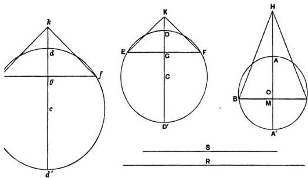

Let $M, G, g$ be the points where $BB', EF, ef$ are bisected at right angles by $AA', DD', dd'$ respectively, and produce $OA, CD, cd$ respectively to $H, K, k$, so that

$$
\left\{
\begin{array}{l}
OA' + A'M : A'M = HM : MA \\
CD' + D'G : D'G = KG : GD \\
cd' + d'g : d'g = kg : gd
\end{array}
\right.
$$

and suppose cones formed with vertices $H, K, k$ and with the same bases as the respective segments. The cones will then be equal to the segments respectively [Prop. 2].

Therefore, by hypothesis,

the cone $HBB' =$ the cone $kef$.

Hence

(circle on diameter $BB'$): (circle on diameter $ef$) = $kg$: $HM$, so that $BB'^2$: $ef^2 = kg$: $HM$ ... (1).

But, since the segments $DEF$, $def$ are similar, so are the cones $KEF$, $kef$.

Therefore

$$
KG: EF = kg: ef.
$$

And the ratio $KG: EF$ is given. Therefore the ratio $kg: ef$ is given.

Suppose a length $R$ taken such that

$$ kg: ef = HM: R \quad \text{(2)} $$

Thus $R$ is given.

Again, since $kg: HM = BB'^2: ef^2 = ef: R$, by (1) and (2), suppose a length $S$ taken such that

$$ ef^2 = BB'.S, $$

or

$$ BB'^2: ef^2 = BB':S. $$

Thus $BB': ef = ef: S = S: R$, and $ef, S$ are two mean proportionals in continued proportion between $BB', R$.

**Synthesis.** Let $ABB'$, $DEF$ be great circles, $AA'$, $DD'$ the diameters bisecting $BB'$, $EF$ at right angles in $M, G$ respectively, and $O, C$ the centres.

Take $H, K$ in the same way as before, and construct the cones $HBB'$, $KEF$, which are therefore equal to the respective segments $ABB'$, $DEF$.

Let $R$ be a straight line such that

$$ KG: EF = HM: R, $$

and between $BB', R$ take two mean proportionals $ef, S$.

On $ef$ as base describe a segment of a circle with vertex $d$ and similar to the segment of a circle $DEF$. Complete the circle, and let $dd'$ be the diameter through $d$, and $c$ the centre. Conceive a sphere constructed of which $def$ is a great circle, and through $ef$ draw a plane at right angles to $dd'$.

Then shall *def* be the required segment of a sphere.

For the segments *DEF*, *def* of the spheres are similar, like the circular segments *DEF*, *def*.

Produce *cd* to *k* so that

$$cd' + d'g : d'g = kg : gd.$$

The cones *KEF*, *kef* are then similar.

Therefore

$$
kg : ef = KG : EF = HM : R,
$$

whence

$$
kg : HM = ef : R.
$$

But, since *BB'*, *ef*, *S*, *R* are in continued proportion,

$$BB' : ef' = BB' : S$$

$$= ef : R$$

$$= kg : HM.$$

Thus the bases of the cones *HBB'*, *kef* are reciprocally proportional to their heights. The cones are therefore equal, and *def* is the segment required, being equal in volume to the cone *kef*. [Prop. 2]

## Proposition 6. (Problem.)

Given two segments of spheres, to find a third segment of a sphere similar to one of the given segments and having its surface equal to that of the other.

Let *ABB'* be the segment to whose surface the surface of the required segment is to be equal, *ABA'B'* the great circle whose plane cuts the plane of the base of the segment *ABB'* at right angles in *BB'*. Let *AA'* be the diameter which bisects *BB'* at right angles.

Let *DEF* be the segment to which the required segment is to be similar, *DED'F* the great circle cutting the base of the segment at right angles in *EF*. Let *DD'* be the diameter bisecting *EF* at right angles in *G*.

Suppose the problem solved, *def* being a segment similar to *DEF* and having its surface equal to that of *ABB'*; and complete the figure for *def* as for *DEF*, corresponding points being denoted by small and capital letters respectively.

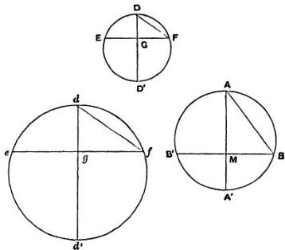

Join $AB, DF, df$.

Now, since the surfaces of the segments *def*, $ABB'$ are equal, so are the circles on $df$, $AB$ as diameters; [I. 42, 43]

that is, $df = AB$.

From the similarity of the segments $DEF$, $def$ we obtain

$$
d'd: dg = D'D: DG,
$$

and

$$
dg: df = DG: DF;
$$

whence

$$
d'd: df = D'D: DF,
$$

or

$$
d'd: AB = D'D: DF.
$$

But $AB$, $D'D$, $DF$ are all given;

therefore $d'd$ is given.

Accordingly the synthesis is as follows.

Take $d'd$ such that

$$
d'd: AB = D'D: DF \quad \text{(1)}.
$$

Describe a circle on $d'd$ as diameter, and conceive a sphere constructed of which this circle is a great circle.

Divide $d'd$ at $g$ so that

$$
d'g: gd = D'G: GD,
$$

and draw through $g$ a plane perpendicular to $d'd$ cutting off the segment $def$ of the sphere and intersecting the plane of the great circle in $ef$. The segments $def$, $DEF$ are thus similar, and

$$
dg: df = DG: DF.
$$

But from above, *componendo*,

$$
d'd: dg = D'D: DG.
$$

Therefore, *ex aequali*, $d'd: df = D'D: DF$, whence, by (1), $df = AB$.

Therefore the segment $def$ has its surface equal to the surface of the segment $ABB'$ [I. 42, 43], while it is also similar to the segment $DEF$.

## Proposition 7. (Problem.)

From a given sphere to cut off a segment by a plane so that the segment may have a given ratio to the cone which has the same base as the segment and equal height.

Let $AA'$ be the diameter of a great circle of the sphere. It is required to draw a plane at right angles to $AA'$ cutting off a segment, as $ABB'$, such that the segment $ABB'$ has to the cone $ABB'$ a given ratio.

### Analysis.

Suppose the problem solved, and let the plane of section cut the plane of the great circle in $BB'$, and the diameter $AA'$ in $M$. Let $O$ be the centre of the sphere.

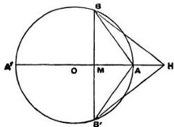

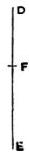

Produce $OA$ to $H$ so that

$$
OA' + A'M: A'M = HM: MA \quad \dots \dots \dots \dots \dots \tag{1}.
$$

Thus the cone $HBB'$ is equal to the segment $ABB'$. [Prop. 2]

Therefore the given ratio must be equal to the ratio of the cone $HBB'$ to the cone $ABB'$, i.e. to the ratio $HM:MA$.

Hence the ratio $OA' + A'M : A'M$ is given; and therefore $A'M$ is given.

διορισμός.

Now
$OA' : A'M > OA' : A'A$,
so that
$OA' + A'M : A'M > OA' + A'A : A'A$
> 3 : 2.

Thus, in order that a solution may be possible, it is a necessary condition that the given ratio must be greater than 3 : 2.

The **synthesis** proceeds thus.

Let $AA'$ be a diameter of a great circle of the sphere, $O$ the centre.

Take a line $DE$, and a point $F$ on it, such that $DE:EF$ is equal to the given ratio, being greater than 3 : 2.

Now, since
$OA' + A'A : A'A = 3 : 2$,
$DE : EF > OA' + A'A : A'A$,
so that
$DF : FE > OA' : A'A$.

Hence a point $M$ can be found on $AA'$ such that
$DF : FE = OA' : A'M$ ... (2).

Through $M$ draw a plane at right angles to $AA'$ intersecting the plane of the great circle in $BB'$, and cutting off from the sphere the segment $ABB'$.

As before, take $H$ on $OA$ produced such that
$OA' + A'M : A'M = HM : MA$.

Therefore $HM:MA = DE:EF$, by means of (2).

It follows that the cone $HBB'$, or the segment $ABB'$, is to the cone $ABB'$ in the given ratio $DE:EF$.

## Proposition 8.

If a sphere be cut by a plane not passing through the centre into two segments $A'B'B', ABB'$, of which $A'B'B'$ is the greater, then the ratio

$$
\begin{array}{l}
\text{(segmt. } A'B'B') : \text{(segmt. } ABB') \\
\quad < \text{(surface of } A'B'B')^2 : \text{(surface of } ABB')^2 \\
\text{but } > \text{(surface of } A'B'B')^{3/2} : \text{(surface of } ABB')^{3/2}.
\end{array}
$$

Let the plane of section cut a great circle $A'BAB'$ at right angles in $BB'$, and let $AA'$ be the diameter bisecting $BB'$ at right angles in $M$.

Let $O$ be the centre of the sphere.

Join $A'B$, $AB$.


As usual, take $H$ on $OA$ produced, and $H'$ on $OA'$ produced, so that

$$
OA' + A'M : A'M = HM : MA \quad \text{(1)},
$$

$$
OA + AM : AM = H'M : MA' \quad \text{(2)},
$$

and conceive cones drawn each with the same base as the two segments and with apices $H$, $H'$ respectively. The cones are then respectively equal to the segments [Prop. 2], and they are in the ratio of their heights $HM$, $H'M$.

Also

$$
\begin{array}{l}
\text{(surface of } A'B'B') : \text{(surface of } ABB') = A'B^2 : AB^2 \quad \text{[I. 42, 43]} \\
\quad = A'M : AM.
\end{array}
$$

We have therefore to prove

(a) that $H'M: MH < A'M^2: MA^2,$

(b) that $H'M: MH > A'M^3: MA^3.$

(a) From (2) above,

$$
\begin{aligned}
A'M: AM &= H'M: OA + AM \\
&= H'A': OA', \text{ since } OA = OA'.
\end{aligned}
$$

Since $A'M > AM$, $H'A' > OA'$; therefore, if we take $K$ on $H'A'$ so that $OA' = A'K$, $K$ will fall between $H'$ and $A'$.

And, by (1), $A'M: AM = KM: MH.$

Thus

$$
\begin{aligned}
KM: MH &= H'A': A'K, \text{ since } A'K = OA', \\
&> H'M: MK.
\end{aligned}
$$

Therefore

$$
H'M. MH < KM^3.
$$

It follows that

$$
H'M. MH: MH^2 < KM^3: MH^2,
$$

or

$$
\begin{aligned}
H'M: MH &< KM^2: MH^2 \\
&< A'M^2: AM^2, \text{ by (1)}.
\end{aligned}
$$

(b) Since $OA' = OA,$

$$
A'M. MA < A'O. OA,
$$

or

$$
\begin{aligned}
A'M: OA' &< OA: AM \\
&< H'A': A'M, \text{ by means of (2)}.
\end{aligned}
$$

Therefore

$$
\begin{aligned}
A'M^2 &< H'A'. OA' \\
&< H'A'. A'K.
\end{aligned}
$$

Take a point $N$ on $A'A$ such that

$$
A'N^2 = H'A'. A'K.
$$

Thus $H'A': A'K = A'N^2: A'K^2$ ...(3).

Also

$$
H'A': A'N = A'N: A'K,
$$

and, *componendo*,

$$
H'N: A'N = NK: A'K,
$$

whence

$$
A'N^2: A'K^2 = H'N^2: NK^2.
$$

Therefore, by (3),

$$ H' A': A' K = H' N': N K' $$

Now

$$ H' M: M K > H' N: N K. $$

Therefore

$$ H' M': M K' > H' A': A' K $$

$$ > H' A': O A' $$

$$ > A' M: M A, \text{ by (2), as above,} $$

$$ > O A' + A' M: M H, \text{ by (1)}, $$

$$ > K M: M H. $$

Hence

$$ H' M': M H' = (H' M': M K'). (K M': M H') $$

$$ > (K M: M H). (K M': M H'). $$

It follows that

$$ H' M: M H > K M'^{\frac{3}{2}}: M H'^{\frac{3}{2}} $$

$$ > A' M'^{\frac{5}{2}}: A M'^{\frac{3}{2}}, \text{ by (1).} $$

[The text of Archimedes adds an alternative proof of this proposition, which is here omitted because it is in fact neither clearer nor shorter than the above.]

## Proposition 9.

Of all segments of spheres which have equal surfaces the hemisphere is the greatest in volume.

Let $ABA'B'$ be a great circle of a sphere, $AA'$ being a diameter, and $O$ the centre. Let the sphere be cut by a plane, not passing through $O$, perpendicular to $AA'$ (at $M$), and intersecting the plane of the great circle in $BB'$. The segment $ABB'$ may then be either less than a hemisphere as in Fig. 1, or greater than a hemisphere as in Fig. 2.

Let $DED'E'$ be a great circle of another sphere, $DD'$ being a diameter and $C$ the centre. Let the sphere be cut by a plane through $C$ perpendicular to $DD'$ and intersecting the plane of the great circle in the diameter $EE'$.

Suppose the surfaces of the segment $ABB'$ and of the hemisphere $DEE'$ to be equal.


Since the surfaces are equal, $AB = DE$. [I. 42, 43]

Now, in Fig. 1, $AB^2 > 2AM^2$ and $< 2AO^2$,
and, in Fig. 2, $AB^2 < 2AM^2$ and $> 2AO^2$.

Hence, if $R$ be taken on $AA'$ such that
$$
AR^2 = \frac{1}{2}AB^2,
$$
$R$ will fall between $O$ and $M$.

Also, since $AB^2 = DE^2$, $AR = CD$.

Produce $OA'$ to $K$ so that $OA' = A'K$, and produce $A'A$ to $H$ so that
$$
A'K : A'M = HA : AM,
$$
or, componendo, $A'K + A'M : A'M = HM : MA \dots \dots \dots \dots (1)$.

Thus the cone $HBB'$ is equal to the segment $ABB'$.

[Prop. 2]

Again, produce $CD$ to $F$ so that $CD = DF$, and the cone $FEE'$ will be equal to the hemisphere $DEE'$. [Prop. 2]

Now
$$
AR \cdot RA' > AM \cdot MA',
$$
and
$$
AR^2 = \frac{1}{2}AB^2 = \frac{1}{2}AM \cdot AA' = AM \cdot A'K.
$$

Hence

$$AR.RA' + RA^2 > AM.MA' + AM.A'K,$$

or

$$AA'.AR > AM.MK$$

$$> HM.A'M, \text{ by (1).}$$

Therefore

$$AA': A'M > HM: AR,$$

or

$$AB^2: BM^2 > HM: AR,$$

i.e.

$$AR^2: BM^2 > HM: 2AR, \text{ since } AB^2 = 2AR^2,$$

$$> HM: CF.$$

Thus, since $AR = CD$, or $CE$,

(circle on diam. $EE'$): (circle on diam. $BB'$) $> HM: CF$.

It follows that

$$(\text{the cone } FEE') > (\text{the cone } HBB'),$$

and therefore the hemisphere $DEE'$ is greater in volume than the segment $ABB'$.

# MEASUREMENT OF A CIRCLE.

## Proposition 1.

The area of any circle is equal to a right-angled triangle in which one of the sides about the right angle is equal to the radius, and the other to the circumference, of the circle.

Let $ABCD$ be the given circle, $K$ the triangle described.


Then, if the circle is not equal to $K$, it must be either greater or less.

I. If possible, let the circle be greater than $K$.

Inscribe a square $ABCD$, bisect the arcs $AB, BC, CD, DA$, then bisect (if necessary) the halves, and so on, until the sides of the inscribed polygon whose angular points are the points of division subtend segments whose sum is less than the excess of the area of the circle over $K$.

Thus the area of the polygon is greater than $K$.

Let $AE$ be any side of it, and $ON$ the perpendicular on $AE$ from the centre $O$.

Then $ON$ is less than the radius of the circle and therefore less than one of the sides about the right angle in $K$. Also the perimeter of the polygon is less than the circumference of the circle, i.e. less than the other side about the right angle in $K$.

Therefore the area of the polygon is less than $K$; which is inconsistent with the hypothesis.

Thus the area of the circle is not greater than $K$.

II. If possible, let the circle be less than $K$.

Circumscribe a square, and let two adjacent sides, touching the circle in $E$, $H$, meet in $T$. Bisect the arcs between adjacent points of contact and draw the tangents at the points of bisection. Let $A$ be the middle point of the arc $EH$, and $FAG$ the tangent at $A$.

Then the angle $TAG$ is a right angle.

Therefore

$$
\begin{array}{l}
TG > GA \\
> GH.
\end{array}
$$

It follows that the triangle $FTG$ is greater than half the area $TEAH$.

Similarly, if the arc $AH$ be bisected and the tangent at the point of bisection be drawn, it will cut off from the area $GAH$ more than one-half.

Thus, by continuing the process, we shall ultimately arrive at a circumscribed polygon such that the spaces intercepted between it and the circle are together less than the excess of $K$ over the area of the circle.

Thus the area of the polygon will be less than $K$.

Now, since the perpendicular from $O$ on any side of the polygon is equal to the radius of the circle, while the perimeter of the polygon is greater than the circumference of the circle, it follows that the area of the polygon is greater than the triangle $K$; which is impossible.

Therefore the area of the circle is not less than $K$.

Since then the area of the circle is neither greater nor less than $K$, it is equal to it.

## Proposition 2.

The area of a circle is to the square on its diameter as 11 to 14.

[The text of this proposition is not satisfactory, and Archimedes cannot have placed it before Proposition 3, as the approximation depends upon the result of that proposition.]

## Proposition 3.

The ratio of the circumference of any circle to its diameter is less than $3\frac{1}{2}$ but greater than $3\frac{1}{2}$?

[In view of the interesting questions arising out of the arithmetical content of this proposition of Archimedes, it is necessary, in reproducing it, to distinguish carefully the actual steps set out in the text as we have it from the intermediate steps (mostly supplied by Eutocius) which it is convenient to put in for the purpose of making the proof easier to follow. Accordingly all the steps not actually appearing in the text have been enclosed in square brackets, in order that it may be clearly seen how far Archimedes omits actual calculations and only gives results. It will be observed that he gives two fractional approximations to $\sqrt{3}$ (one being less and the other greater than the real value) without any explanation as to how he arrived at them; and in like manner approximations to the square roots of several large numbers which are not complete squares are merely stated. These various approximations and the machinery of Greek arithmetic in general will be found discussed in the Introduction, Chapter IV.]

I. Let $AB$ be the diameter of any circle, $O$ its centre, $AC$ the tangent at $A$; and let the angle $AOC$ be one-third of a right angle.

Then
$$ OA : AC [= \sqrt{3} : 1] > 265 : 153 \quad \text{(1)}, $$

and
$$ OC : CA [= 2 : 1] = 306 : 153 \quad \text{(2)}. $$

First, draw $OD$ bisecting the angle $AOC$ and meeting $AC$ in $D$.

Now
$$ CO : OA = CD : DA, \quad \text{[Eucl. VI. 3]} $$

so that
$$ [CO + OA : OA = CA : DA, \text{ or}] $$
$$ CO + OA : CA = OA : AD. $$

Therefore [by (1) and (2)]
$$ OA : AD > 571 : 153 \quad \text{(3)}. $$

Hence
$$ OD^2 : AD^2 [= (OA^2 + AD^2) : AD^2 $$
$$ > (571^2 + 153^2) : 153^2 ] $$
$$ > 349450 : 23409, $$

so that
$$ OD : DA > 591 \frac{1}{5} : 153 \quad \text{(4)}. $$


Secondly, let $OE$ bisect the angle $AOD$, meeting $AD$ in $E$.

[Then
$$ DO : OA = DE : EA, $$

so that
$$ DO + OA : DA = OA : AE. ] $$

Therefore
$$ OA : AE [> (591 \frac{1}{5} + 571) : 153, \text{ by (3) and (4)} ] $$
$$ > 1162 \frac{1}{5} : 153 \quad \text{(5)}. $$

[It follows that

$$
\begin{aligned}
OE^2 : EA^2 &> \left\{(1162\frac{1}{8})^2 + 153^2\right\} : 153^2 \\
&> (1350534\frac{3}{8}4 + 23409) : 23409 \\
&> 1373943\frac{3}{8}4 : 23409.
\end{aligned}
$$

Thus
$OE : EA > 1172\frac{1}{8} : 153 \quad \text{(6).}$

Thirdly, let $OF$ bisect the angle $AOE$ and meet $AE$ in $F$.

We thus obtain the result [corresponding to (3) and (5) above] that

$$
\begin{aligned}
OA : AF &\left[ \left(1162\frac{1}{8} + 1172\frac{1}{8}\right) : 153 \right] \\
&> 2334\frac{1}{4} : 153 \quad \text{(7).}
\end{aligned}
$$

[Therefore
$OF^2 : FA^2 > \left\{ (2334\frac{1}{4})^2 + 153^2 \right\} : 153^2 $
$$
> 5472132\frac{1}{16} : 23409.
$$

Thus
$OF : FA > 2339\frac{1}{4} : 153 \quad \text{(8).}$

Fourthly, let $OG$ bisect the angle $AOF$, meeting $AF$ in $G$.

We have then

$$
OA : AG \left[ \left(2334\frac{1}{4} + 2339\frac{1}{4}\right) : 153, \text{ by means of (7) and (8)} \right]
$$
$$
> 4673\frac{1}{2} : 153.
$$

Now the angle $AOC$, which is one-third of a right angle, has been bisected four times, and it follows that

$$
\angle AOG = \frac{1}{48} \text{ (a right angle)}.
$$

Make the angle $AOH$ on the other side of $OA$ equal to the angle $AOG$, and let $GA$ produced meet $OH$ in $H$.

Then
$$
\angle GOH = \frac{1}{24} \text{ (a right angle)}.
$$

Thus $GH$ is one side of a regular polygon of 96 sides circumscribed to the given circle.

And, since
$$
OA : AG > 4673\frac{1}{2} : 153,
$$
while
$$
AB = 2OA, \quad GH = 2AG,
$$

it follows that

$$
AB : \text{(perimeter of polygon of 96 sides)} \left[ 4673\frac{1}{2} : 153 \times 96 \right]
$$
$$
\gtrsim 4673\frac{1}{2} : 14688.
$$

But

$$
\frac{14688}{4673\frac{1}{2}} = 3 + \frac{667\frac{1}{2}}{4673\frac{1}{2}}
$$

$$
\left[ < 3 + \frac{667\frac{1}{2}}{4672\frac{1}{2}} \right] < 3.
$$

Therefore the circumference of the circle (being less than the perimeter of the polygon) is *a fortiori* less than $3\frac{1}{2}$ times the diameter $AB$.

II. Next let $AB$ be the diameter of a circle, and let $AC$, meeting the circle in $C$, make the angle $CAB$ equal to one-third of a right angle. Join $BC$.

Then

$$
AC : CB \ [= \sqrt{3} : 1] < 1351 : 780.
$$

*First*, let $AD$ bisect the angle $BAC$ and meet $BC$ in $d$ and the circle in $D$. Join $BD$.

Then

$$
\begin{aligned}
& \angle BAD = \angle dAC \\
& = \angle dBD,
\end{aligned}
$$

and the angles at $D$, $C$ are both right angles.

It follows that the triangles $ADB$, $[ACd]$, $BDd$ are similar.


Therefore

$$
AD : DB = BD : Dd
$$

$$
\begin{aligned}
& [= AC : Cd] \\
& = AB : Bd \quad \text{[Eucl. VI. 3]} \\
& = AB + AC : Bd + Cd \\
& = AB + AC : BC
\end{aligned}
$$

or

$$
BA + AC : BC = AD : DB.
$$

[But $AC:CB < 1351:780$, from above,

while $BA:BC = 2:1$
$= 1560:780$.]

Therefore $AD:DB < 2911:780$...(1).

[Hence $AB^2:BD^2 < (2911^2 + 780^2):780^2$
$< 9082321:608400$.]

Thus $AB:BD < 3013\frac{3}{4}:780$ ...(2).

Secondly, let $AE$ bisect the angle $BAD$, meeting the circle in $E$; and let $BE$ be joined.

Then we prove, in the same way as before, that

$$
\begin{aligned}
AE:EB &= BA + AD:BD \\
&< (3013\frac{3}{4} + 2911):780, \text{ by (1) and (2)} \\
&< 5924\frac{3}{4}:780 \\
&< 5924\frac{3}{4} \times \frac{4}{13}:780 \times \frac{4}{13} \\
&< 1823:240
\end{aligned}
$$

[Hence $AB^2:BE^2 < (1823^2 + 240^2):240^2$
$< 3380929:57600$.]

Therefore $AB:BE < 1838\frac{9}{11}:240$...(4).

Thirdly, let $AF$ bisect the angle $BAE$, meeting the circle in $F$.

Thus $AF:FB = BA + AE:BE$
$< 3661\frac{9}{11}:240$, by (3) and (4)]
$< 3661\frac{9}{11} \times \frac{1}{40}:240 \times \frac{11}{40}$
$< 1007:66$...(5).

[It follows that

$$
\begin{aligned}
AB^2:BF^2 &< (1007^2 + 66^2):66^2 \\
&< 1018405:4356.
\end{aligned}
$$

Therefore $AB:BF < 1009\frac{1}{6}:66$...(6).

Fourthly, let the angle $BAF$ be bisected by $AG$ meeting the circle in $G$.

Then $AG:GB = BA + AF:BF$
$< 2016\frac{1}{6}:66$, by (5) and (6).

[And
$$
\begin{aligned}
AB^2:BG^2 &< [(2016\frac{1}{6})^2 + 66^2] : 66^2 \\
&< 4069284_{\frac{3}{56}} : 4356.]
\end{aligned}
$$

Therefore
$$
AB:BG < 2017\frac{1}{4} : 66,
$$

whence
$$
BG:AB > 66 : 2017\frac{1}{4} \quad \text{(7)}.
$$

[Now the angle $BAG$ which is the result of the fourth bisection of the angle $BAC$, or of one-third of a right angle, is equal to one-fortyeighth of a right angle.

Thus the angle subtended by $BG$ at the centre is
$$
\frac{3}{24} \text{ (a right angle).]}
$$

Therefore $BG$ is a side of a regular inscribed polygon of 96 sides.

It follows from (7) that
$$
\begin{aligned}
\text{(perimeter of polygon)} : AB &[> 96 \times 66 : 2017\frac{1}{4}] \\
&> 6336 : 2017\frac{1}{4}.
\end{aligned}
$$

And
$$
\frac{6336}{2017\frac{1}{4}} > 3\frac{1}{10}.
$$

Much more then is the circumference of the circle greater than $3\frac{1}{10}$ times the diameter.

Thus the ratio of the circumference to the diameter
$$
< 3\frac{1}{7} \text{ but } > 3\frac{1}{10}.
$$

# ON CONOIDS AND SPHEROIDS.

## Introduction*.

“Archimedes to Dositheus greeting.

In this book I have set forth and send you the proofs of the remaining theorems not included in what I sent you before, and also of some others discovered later which, though I had often tried to investigate them previously, I had failed to arrive at because I found their discovery attended with some difficulty. And this is why even the propositions themselves were not published with the rest. But afterwards, when I had studied them with greater care, I discovered what I had failed in before.

Now the remainder of the earlier theorems were propositions concerning the right-angled conoid [paraboloid of revolution]; but the discoveries which I have now added relate to an obtuse-angled conoid [hyperboloid of revolution] and to spheroidal figures, some of which I call oblong (παραμάκεα) and others flat (ἐπιπλατέα).

I. Concerning the right-angled conoid it was laid down that, if a section of a right-angled cone [a parabola] be made to revolve about the diameter [axis] which remains fixed and

return to the position from which it started, the figure comprehended by the section of the right-angled cone is called a **right-angled conoid**, and the diameter which has remained fixed is called its **axis**, while its **vertex** is the point in which the axis meets ($\bar{a}\pi\tau\epsilon\tau a\iota$) the surface of the conoid. And if a plane touch the right-angled conoid, and another plane drawn parallel to the tangent plane cut off a segment of the conoid, the **base** of the segment cut off is defined as the portion intercepted by the section of the conoid on the cutting plane, the **vertex** [of the segment] as the point in which the first plane touches the conoid, and the **axis** [of the segment] as the portion cut off within the segment from the line drawn through the vertex of the segment parallel to the axis of the conoid.

The questions propounded for consideration were

1. why, if a segment of the right-angled conoid be cut off by a plane at right angles to the axis, will the segment so cut off be half as large again as the cone which has the same base as the segment and the same axis, and

2. why, if two segments be cut off from the right-angled conoid by planes drawn in any manner, will the segments so cut off have to one another the duplicate ratio of their axes.

II. Respecting the *obtuse-angled conoid* we lay down the following premisses. If there be in a plane a section of an obtuse-angled cone [a hyperbola], its diameter [axis], and the nearest lines to the section of the obtuse-angled cone [i.e. the asymptotes of the hyperbola], and if, the diameter [axis] remaining fixed, the plane containing the aforesaid lines be made to revolve about it and return to the position from which it started, the nearest lines to the section of the obtuse-angled cone [the asymptotes] will clearly comprehend an isosceles cone whose vertex will be the point of concourse of the nearest lines and whose axis will be the diameter [axis] which has remained fixed. The figure comprehended by the section of the obtuse-angled cone is called an **obtuse-angled conoid** [hyperboloid of revolution], its **axis** is the diameter which has remained fixed, and its **vertex** the point in which the axis meets the surface.

of the conoid. The cone comprehended by the nearest lines to the section of the obtuse-angled cone is called [the cone] **enveloping the conoid** (περιέχων τὸ κωνοειδές), and the straight line between the vertex of the conoid and the vertex of the cone enveloping the conoid is called [the line] **adjacent to the axis** (ποτεοῦσα τῷ δξονί). And if a plane touch the obtuse-angled conoid, and another plane drawn parallel to the tangent plane cut off a segment of the conoid, the **base** of the segment so cut off is defined as the portion intercepted by the section of the conoid on the cutting plane, the **vertex** [of the segment] as the point of contact of the plane which touches the conoid, the **axis** [of the segment] as the portion cut off within the segment from the line drawn through the vertex of the segment and the vertex of the cone enveloping the conoid; and the straight line between the said vertices is called **adjacent to the axis**.

Right-angled conoids are all similar; but of obtuse-angled conoids let those be called similar in which the cones enveloping the conoids are similar.

The following questions are propounded for consideration,

(1) why, if a segment be cut off from the obtuse-angled conoid by a plane at right angles to the axis, the segment so cut off has to the cone which has the same base as the segment and the same axis the ratio which the line equal to the sum of the axis of the segment and three times the line adjacent to the axis bears to the line equal to the sum of the axis of the segment and twice the line adjacent to the axis, and

(2) why, if a segment of the obtuse-angled conoid be cut off by a plane not at right angles to the axis, the segment so cut off will bear to the figure which has the same base as the segment and the same axis, being a segment of a cone* (ἀπότμαμα κώνου), the ratio which the line equal to the sum of the axis of the segment and three times the line adjacent to the axis bears to the line equal to the sum of the axis of the segment and twice the line adjacent to the axis.

III. Concerning spheroidal figures we lay down the following premisses. If a section of an acute-angled cone [ellipse] be made to revolve about the greater diameter [major axis] which remains fixed and return to the position from which it started, the figure comprehended by the section of the acute-angled cone is called an **oblong spheroid** (παραμᾶκες σφαιροειδές). But if the section of the acute-angled cone revolve about the lesser diameter [minor axis] which remains fixed and return to the position from which it started, the figure comprehended by the section of the acute-angled cone is called a **flat spheroid** (ἐπιπλατὺ σφαιροειδές). In either of the spheroids the **axis** is defined as the diameter [axis] which has remained fixed, the **vertex** as the point in which the axis meets the surface of the spheroid, the **centre** as the middle point of the axis, and the **diameter** as the line drawn through the centre at right angles to the axis. And, if parallel planes touch, without cutting, either of the spheroidal figures, and if another plane be drawn parallel to the tangent planes and cutting the spheroid, the **base** of the resulting segments is defined as the portion intercepted by the section of the spheroid on the cutting plane, their **vertices** as the points in which the parallel planes touch the spheroid, and their **axes** as the portions cut off within the segments from the straight line joining their vertices. And that the planes touching the spheroid meet its surface at one point only, and that the straight line joining the points of contact passes through the centre of the spheroid, we shall prove. Those spheroidal figures are called **similar** in which the axes have the same ratio to the ‘diameters.’ And let segments of spheroidal figures and conoids be called **similar** if they are cut off from similar figures and have their bases similar, while their axes, being either at right angles to the planes of the bases or making equal angles with the corresponding diameters [axes] of the bases, have the same ratio to one another as the corresponding diameters [axes] of the bases.

The following questions about spheroids are propounded for consideration,

(1) why, if one of the spheroidal figures be cut by a plane through the centre at right angles to the axis, each of the resulting segments will be double of the cone having the same base as the segment and the same axis; while, if the plane of section be at right angles to the axis without passing through the centre, (a) the greater of the resulting segments will bear to the cone which has the same base as the segment and the same axis the ratio which the line equal to the sum of half the straight line which is the axis of the spheroid and the axis of the lesser segment bears to the axis of the lesser segment, and (b) the lesser segment bears to the cone which has the same base as the segment and the same axis the ratio which the line equal to the sum of half the straight line which is the axis of the spheroid and the axis of the greater segment bears to the axis of the greater segment;

(2) why, if one of the spheroids be cut by a plane passing through the centre but not at right angles to the axis, each of the resulting segments will be double of the figure having the same base as the segment and the same axis and consisting of a segment of a cone*.

(3) But, if the plane cutting the spheroid be neither through the centre nor at right angles to the axis, (a) the greater of the resulting segments will have to the figure which has the same base as the segment and the same axis the ratio which the line equal to the sum of half the line joining the vertices of the segments and the axis of the lesser segment bears to the axis of the lesser segment, and (b) the lesser segment will have to the figure with the same base as the segment and the same axis the ratio which the line equal to the sum of half the line joining the vertices of the segments and the axis of the greater segment bears to the axis of the greater segment. And the figure referred to is in these cases also a segment of a cone*.

When the aforesaid theorems are proved, there are discovered by means of them many theorems and problems.

Such, for example, are the theorems

(1) that similar spheroids and similar segments both of

spheroidal figures and conoids have to one another the triplicate ratio of their axes, and

(2) that in equal spheroidal figures the squares on the ‘diameters’ are reciprocally proportional to the axes, and, if in spheroidal figures the squares on the ‘diameters’ are reciprocally proportional to the axes, the spheroids are equal.

Such also is the problem, From a given spheroidal figure or conoid to cut off a segment by a plane drawn parallel to a given plane so that the segment cut off is equal to a given cone or cylinder or to a given sphere.

After prefixing therefore the theorems and directions ($\dot{\epsilon}\pi\iota$-$\tau\acute{\alpha}\gamma\mu\alpha\tau\alpha$) which are necessary for the proof of them, I will then proceed to expound the propositions themselves to you. Farewell.

## DEFINITIONS.

If a cone be cut by a plane meeting all the sides [generators] of the cone, the section will be either a circle or a section of an acute-angled cone [an ellipse]. If then the section be a circle, it is clear that the segment cut off from the cone towards the same parts as the vertex of the cone will be a cone. But, if the section be a section of an acute-angled cone [an ellipse], let the figure cut off from the cone towards the same parts as the vertex of the cone be called a segment of a cone. Let the base of the segment be defined as the plane comprehended by the section of the acute-angled cone, its vertex as the point which is also the vertex of the cone, and its axis as the straight line joining the vertex of the cone to the centre of the section of the acute-angled cone.

And if a cylinder be cut by two parallel planes meeting all the sides [generators] of the cylinder, the sections will be either circles or sections of acute-angled cones [ellipses] equal and similar to one another. If then the sections be circles, it is clear that the figure cut off from the cylinder between the parallel planes will be a cylinder. But, if the sections be sections of acute-angled cones [ellipses], let the figure cut off from the cylinder between the parallel planes be called a frustum ($\tau\acute{\circ}\mu\sigma\varsigma$) of a cylinder. And let the bases of the frustum be defined as the planes comprehended by the sections of the acute-angled cones [ellipses], and the **axis** as the straight line joining the centres of the sections of the acute-angled cones, so that the axis will be in the same straight line with the axis of the cylinder.”

## Lemma.

*If in an ascending arithmetical progression consisting of the magnitudes $A_1, A_2, \ldots, A_n$ the common difference be equal to the least term $A_1$, then*

$$ \begin{array}{l} n \cdot A_n < 2(A_1 + A_2 + \ldots + A_n), \\ \text{and} \quad > 2(A_1 + A_2 + \ldots + A_{n-1}). \end{array} $$

[The proof of this is given incidentally in the treatise *On Spirals*, Prop. 11. By placing lines side by side to represent the terms of the progression and then producing each so as to make it equal to the greatest term, Archimedes gives the equivalent of the following proof.

If $S_n = A_1 + A_2 + \ldots + A_{n-1} + A_n,$

we have also $S_n = A_n + A_{n-1} + A_{n-2} + \ldots + A_1.$

And

$$
A_1 + A_{n-1} = A_2 + A_{n-2} = \ldots = A_n.
$$

Therefore

$$
2S_n = (n + 1)A_n,
$$

whence

$$
n \cdot A_n < 2S_n,
$$

and

$$
n \cdot A_n > 2S_{n-1}.
$$

Thus, if the progression is $a, 2a, \ldots, na,$

$$ S_n = \frac{n(n + 1)}{2}a, $$

and

$$
n^a a < 2S_n,
$$

but

$$
> 2S_{n-1}.]
$$

## Proposition 1.

*If $A_1, B_1, C_1, \ldots, K_1$ and $A_2, B_2, C_2, \ldots, K_2$ be two series of magnitudes such that*

$$ \begin{array}{l} A_1: B_1 = A_2: B_2, \\ B_1: C_1 = B_2: C_2, \text{ and so on } \end{array} \quad \text{(a)}, $$

and if $A_3, B_3, C_3, \ldots, K_3$ and $A_4, B_4, C_4, \ldots, K_4$ be two other series such that

$$
\left\{
\begin{array}{l}
A_1: A_3 = A_2: A_4, \\
B_1: B_3 = B_2: B_4, \text{ and so on } \left\{
\begin{array}{l}
A_1: A_2 = A_3, \\
B_1: B_2 = B_2: B_3, \\
\end{array}
\right.
\end{array}
\right.
\quad \text{(A)},
$$

then $(A_1 + B_1 + C_1 + \ldots + K_1): (A_3 + B_3 + C_3 + \ldots + K_3)$

$$
= (A_2 + B_2 + C_2 + \ldots + K_2): (A_4 + B_4 + \ldots + K_4).
$$

The proof is as follows.

Since $A_3: A_1 = A_4: A_2,$

and

$$
A_1: B_1 = A_2: B_2,
$$

while $B_1: B_3 = B_2: B_4,$

we have, *ex aequali*,

$$
\left.\begin{array}{l}
A_3: B_3 = A_4: B_4. \\
\text{Similarly} \quad B_3: C_3 = B_4: C_4, \text{ and so on}
\end{array}\right\} \tag{$\gamma$}
$$

Again, it follows from equations (α) that

$$
A_1: A_2 = B_1: B_2 = C_1: C_2 = \ldots
$$

Therefore

$$
A_1: A_2 = (A_1 + B_1 + C_1 + \ldots + K_1): (A_2 + B_2 + \ldots + K_2).
$$

or

$$
(A_1 + B_1 + C_1 + \ldots + K_1): A_1 = (A_2 + B_2 + C_2 + \ldots + K_2): A_2;
$$

and

$$
A_1: A_3 = A_2: A_4,
$$

while from equations (γ) it follows in like manner that

$$
A_3: (A_3 + B_3 + C_3 + \ldots + K_3) = A_4: (A_4 + B_4 + C_4 + \ldots + K_4).
$$

By the last three equations, *ex aequali*,

$$
\begin{aligned}
(A_1 + B_1 + C_1 + \ldots + K_1): (A_3 + B_3 + C_3 + \ldots + K_3) \\
= (A_2 + B_2 + C_2 + \ldots + K_2): (A_4 + B_4 + C_4 + \ldots + K_4).
\end{aligned}
$$

**Cor.** If any terms in the third and fourth series corresponding to terms in the first and second be left out, the result is the same. For example, if the last terms $K_3, K_4$ are absent,

$$
\begin{aligned}
(A_1 + B_1 + C_1 + \ldots + K_1): (A_3 + B_3 + C_3 + \ldots + I_3) \\
= (A_2 + B_2 + C_2 + \ldots + K_2): (A_4 + B_4 + C_4 + \ldots + I_4),
\end{aligned}
$$

where $I$ immediately precedes $K$ in each series.

## Lemma to Proposition 2.

[On Spirals, Prop. 10.]

If $A_1, A_2, A_3, \ldots, A_n$ be $n$ lines forming an ascending arithmetical progression in which the common difference is equal to the least term $A_1$, then

$$
\begin{array}{l}
(n + 1) A_n^2 + A_1 (A_1 + A_2 + A_3 + \ldots + A_n) \\
= 3 (A_1^2 + A_2^2 + A_3^2 + \ldots + A_n^2).
\end{array}
$$


Let the lines $A_n, A_{n-1}, A_{n-2}, \ldots, A_1$ be placed in a row from left to right. Produce $A_{n-1}, A_{n-2}, \ldots, A_1$ until they are each equal to $A_n$, so that the parts produced are respectively equal to $A_1, A_2, \ldots, A_{n-1}$.

Taking each line successively, we have

$$
2 A_n^2 = 2 A_n^2,
$$

$$
(A_1 + A_{n-1})^2 = A_1^2 + A_{n-1}^2 + 2 A_1 \cdot A_{n-1},
$$

$$
(A_2 + A_{n-2})^2 = A_2^2 + A_{n-2}^2 + 2 A_2 \cdot A_{n-2},
$$

$$
(A_{n-1} + A_1)^2 = A_{n-1}^2 + A_1^2 + 2 A_{n-1} \cdot A_1.
$$

And, by addition,

$$
(n + 1) A_n^2 = 2 (A_1^2 + A_2^2 + \dots + A_n^2) + 2A_1 \cdot A_{n-1} + 2A_2 \cdot A_{n-2} + \dots + 2A_{n-1} \cdot A_1.
$$

Therefore, in order to obtain the required result, we have to prove that

$$
2 (A_1 \cdot A_{n-1} + A_2 \cdot A_{n-2} + \dots + A_{n-1} \cdot A_1) + A_1 (A_1 + A_2 + A_3 + \dots + A_n) = A_1^2 + A_2^2 + \dots + A_n^2 \dots \dots \dots (\alpha).
$$

Now $2A_3 \cdot A_{n-2} = A_1 \cdot 4A_{n-3}$, because $A_3 = 2A_1$,

$2A_3 \cdot A_{n-3} = A_1 \cdot 6A_{n-3}$, because $A_3 = 3A_1$,

$$
\dots \dots \dots \dots \dots \dots \dots \dots
$$

$$
2A_{n-1} \cdot A_1 = A_1 \cdot 2(n-1)A_1.
$$

It follows that

$$
2 (A_1 \cdot A_{n-1} + A_2 \cdot A_{n-2} + \dots + A_{n-1} \cdot A_1) + A_1 (A_1 + A_2 + \dots + A_n) = A_1 [A_n + 3A_{n-1} + 5A_{n-2} + \dots + (2n-1)A_1].
$$

And this last expression can be proved to be equal to

$$
A_1^2 + A_2^2 + \dots + A_n^2.
$$

For

$$
A_n^2 = A_1(n \cdot A_n)
$$

$$
= A_1 [A_n + (n-1)A_n] = A_1 [A_n + 2(A_{n-1} + A_{n-2} + \dots + A_1)],
$$

$$
\text{because } (n-1)A_n = A_{n-1} + A_1 + A_{n-2} + A_2 + \dots \dots \dots + A_1 + A_{n-1}.
$$

Similarly

$$
A_{n-1}^2 = A_1 [A_{n-1} + 2(A_{n-2} + A_{n-3} + \dots + A_1)],
$$

$$
\dots \dots \dots \dots \dots \dots \dots \dots
$$

$$
A_2^2 = A_1 (A_2 + 2A_1),
$$

$$
A_1^2 = A_1 \cdot A_1;
$$

whence, by addition,

$$
A_1^2 + A_2^2 + A_3^2 + \dots + A_n^2 = A_1 [A_n + 3A_{n-1} + 5A_{n-2} + \dots + (2n-1)A_1].
$$

Thus the equation marked $(\alpha)$ above is true; and it follows that

$$(n + 1)A_n^2 + A_1(A_1 + A_2 + A_3 + \ldots + A_n) = 3(A_1^2 + A_2^2 + \ldots + A_n^2).$$

**Cor. 1.** *From this it is evident that*

$$n \cdot A_n^2 < 3(A_1^2 + A_2^2 + \ldots + A_n^2) \quad \text{(1).}$$

Also $A_n^2 = A_1\{A_n + 2(A_{n-1} + A_{n-2} + \ldots + A_1)\}$, as above,

so that

$$
A_n^2 > A_1(A_n + A_{n-1} + \ldots + A_1),
$$

and therefore

$$A_n^2 + A_1(A_1 + A_2 + \ldots + A_n) < 2A_n^2.$$

*It follows from the proposition that*

$$n \cdot A_n^2 > 3(A_1^2 + A_2^2 + \ldots + A_{n-1}^2) \quad \text{(2).}$$

**Cor. 2.** All these results will hold if we substitute *similar figures* for squares on all the lines; for similar figures are in the duplicate ratio of their sides.

[In the above proposition the symbols $A_1$, $A_2$, $\ldots$ and $A_n$ have been used instead of $a$, $2a$, $3a$, $\ldots$ in order to exhibit the geometrical character of the proof; but, if we now substitute the latter terms in the various results, we have (1)

$$(n + 1) n^2 a^2 + a (a + 2a + \ldots + na)$$
$$= 3 \left\{ a^2 + (2a)^2 + (3a)^2 + \ldots + (na)^2 \right\}.$$

Therefore

$$
a^2 + (2a)^2 + (3a)^2 + \ldots + (na)^2
$$

$$= \frac{a^2}{3} \left\{ (n + 1) n^2 + \frac{n(n + 1)}{2} \right\}$$

$$= a^2 \cdot \frac{n(n + 1)(2n + 1)}{6}.$$

Also (2) $n^2 < 3(1^2 + 2^2 + 3^2 + \ldots + n^2)$,

and (3) $n^2 > 3(1^2 + 2^2 + 3^2 + \ldots + \overline{n - 1}^2).$]

## Proposition 2.

If $A_1, A_2 \ldots A_n$ be any number of areas such that*

$$
\begin{array}{l}
A_1 = ax + x^2, \\
A_2 = a \cdot 2x + (2x)^2, \\
A_3 = a \cdot 3x + (3x)^3, \\
\vdots \\
A_n = a \cdot nx + (nx)^2,
\end{array}
$$

then $n \cdot A_n : (A_1 + A_2 + \ldots + A_n) < (a + nx) : \left( \frac{a}{2} + \frac{nx}{3} \right),$

and

$$
n \cdot A_n : (A_1 + A_2 + \ldots + A_{n-1}) > (a + nx) : \left( \frac{a}{2} + \frac{nx}{3} \right).
$$

For, by the Lemma immediately preceding Prop. 1,

$$
n \cdot anx < 2 (ax + a \cdot 2x + \ldots + a \cdot nx),
$$

and

$$
> 2 (ax + a \cdot 2x + \ldots + a \cdot n - 1 \cdot x).
$$

Also, by the Lemma preceding this proposition,

$$
n \cdot (nx)^2 < 3 \left[ x^2 + (2x)^2 + (3x)^2 + \ldots + (nx)^2 \right]
$$

and

$$
> 3 \left[ x^2 + (2x)^2 + \ldots + (n - 1 \cdot x)^2 \right].
$$

Hence

$$
\frac{an^2x}{2} + \frac{n(nx)^2}{3} < \left[ (ax + x^2) + [a \cdot 2x + (2x)^2] + \ldots + [a \cdot nx + (nx)^2] \right],
$$

and

$$
> \left[ (ax + x^2) + [a \cdot 2x + (2x)^2] + \ldots + [a \cdot n - 1 \cdot x + (n - 1 \cdot x)^2] \right],
$$

or

$$
\frac{an^2x}{2} + \frac{n(nx)^2}{3} < A_1 + A_2 + \ldots + A_n,
$$

and

$$
> A_1 + A_2 + \ldots + A_{n-1}.
$$

It follows that

$$
n \cdot A_n : (A_1 + A_2 + \ldots + A_n) < n \left[ a \cdot nx + (nx)^2 \right] : \left\{ \frac{an^2x}{2} + \frac{n(nx)^2}{3} \right\},
$$

or

$$
n \cdot A_n : (A_1 + A_2 + \ldots + A_n) < (a + nx) : \left( \frac{a}{2} + \frac{nx}{3} \right);
$$

also

$$
n \cdot A_n : (A_1 + A_2 + \ldots + A_{n-1}) > (a + nx) : \left( \frac{a}{2} + \frac{nx}{3} \right).
$$

## Proposition 3.

(1) If $TP, TP'$ be two tangents to any conic meeting in $T$, and if $Qq, Q'q'$ be any two chords parallel respectively to $TP, TP'$ and meeting in $O$, then

$$
QO \cdot Oq: Q'O \cdot Oq' = TP^2: TP'^2.
$$

"And this is proved in the elements of conics*."

(2) If $QQ'$ be a chord of a parabola bisected in $V$ by the diameter $PV$, and if $PV$ be of constant length, then the areas of the triangle $PQQ'$ and of the segment $PQQ'$ are both constant whatever be the direction of $QQ'$.

Let $ABB'$ be the particular segment of the parabola whose vertex is $A$, so that $BB'$ is bisected perpendicularly by the axis at the point $H$, where $AH = PV$.

Draw $QD$ perpendicular to $PV$.


Let $p_a$ be the parameter of the principal ordinates, and let $p$ be another line of such length that

$$
QV^2: QD^2 = p: p_a;
$$

it will then follow that $p$ is equal to the parameter of the ordinates to the diameter $PV$, i.e. those which are parallel to $QV$.

"For this is proved in the conics*."

Thus $$QV^2 = p \cdot PV$$

And $$BH^2 = p_a \cdot AH$$, while $$AH = PV$$

Therefore $$QV^2 : BH^2 = p : p_a$$

But $$QV^2 : QD^2 = p : p_a;$$

hence $$BH = QD.$$

Thus $$BH \cdot AH = QD \cdot PV,$$

and therefore $$\triangle ABB' = \triangle PQQ';$$

that is, the area of the triangle $PQQ'$ is constant so long as $PV$ is of constant length.

Hence also the area of the segment $$PQQ'$$ is constant under the same conditions; for the segment is equal to $$\frac{4}{3}\triangle PQQ'$$.

[Quadrature of the Parabola, Prop. 17 or 24.]

(1) It is easily deduced from Apollonius I. 49 (cf. Apollonius of Perga, pp. liii, 39). If in the figure the tangents at $A$ and $P$ be drawn, the former meeting $PV$ in $E$, and the latter meeting the axis in $T$, and if $AE$, $PT$ meet at $C$, the proposition of Apollonius is to the effect that

$$CP : PE = p : 2PT,$$

where $p$ is the parameter of the ordinates to $PV$.

(2) It may be proved independently as follows.

Let $$QQ'$$ meet the axis in $O$, and let $$QM, Q'M', PN$$ be ordinates to the axis.

Then $$AM : AM' = QM^2 : Q'M'^2 = OM^2 : OM'^2,$$

whence $$AM : MM' = OM^2 : OM^2 - OM'^2$$

$$= OM^2 : (OM - OM'). MM',$$

so that $$OM^2 = AM \cdot (OM - OM').$$

That is to say, $$(AM - AO)^2 = AM \cdot (AM + AM' - 2AO),$$

or $$AO^2 = AM \cdot AM'.$$

And, since $$QM^2 = p_a \cdot AM$$, and $$Q'M'^2 = p_a \cdot AM'$$, it follows that $$QM \cdot Q'M' = p_a \cdot AO \quad$$

Now $$QV^2 : QD^2 = QV^2 : \left( \frac{QM + Q'M'}{2} \right)^2$$

$$= QV^2 : \left( \frac{QM - Q'M'}{2} \right)^2 + QM \cdot Q'M'$$

$$= QV^2 : (PN^2 + QM \cdot Q'M')$$

$$= p \cdot PV : p_a \cdot (AN + AO), \text{ by (a).}$$

But $$PV = TO = AN + AO.$$

Therefore $$QV^2 : QD^2 = p : p_a$$.

## Proposition 4.

The area of any ellipse is to that of the auxiliary circle as the minor axis to the major.

Let $AA'$ be the major and $BB'$ the minor axis of the ellipse, and let $BB'$ meet the auxiliary circle in $b, b'$.

Suppose $O$ to be such a circle that

$$
(\text{circle } AbA'b'): O = CA : CB.
$$

Then shall $O$ be equal to the area of the ellipse.

For, if not, $O$ must be either greater or less than the ellipse.

1. If possible, let $O$ be greater than the ellipse.

We can then inscribe in the circle $O$ an equilateral polygon of $4n$ sides such that its area is greater than that of the ellipse. [cf. *On the Sphere and Cylinder*, I. 6.]


Let this be done, and inscribe in the auxiliary circle of the ellipse the polygon $AefbghA'...$ similar to that inscribed in $O$. Let the perpendiculars $eM, fN,...$ on $AA'$ meet the ellipse in $E, F,...$ respectively. Join $AE, EF, FB,...$

Suppose that $P'$ denotes the area of the polygon inscribed in the auxiliary circle, and $P$ that of the polygon inscribed in the ellipse.

Then, since all the lines $eM, fN, \ldots$ are cut in the same proportions at $E, F, \ldots$, i.e. $eM : EM = fN : FN = \ldots = bC : BC,$

the pairs of triangles, as $eAM, EAM$, and the pairs of trapeziums, as $eMNf, EMNF$, are all in the same ratio to one another as $bC$ to $BC$, or as $CA$ to $CB$.

Therefore, by addition,

$$
P' : P = CA : CB.
$$

Now $P'$: (polygon inscribed in $O$)

$$
\begin{aligned}
&= (\text{circle } AbA'b'): O \\
&= CA : CB, \text{ by hypothesis.}
\end{aligned}
$$

Therefore $P$ is equal to the polygon inscribed in $O$.

But this is impossible, because the latter polygon is by hypothesis greater than the ellipse, and a fortiori greater than $P$.

Hence $O$ is not greater than the ellipse.

II. If possible, let $O$ be less than the ellipse.

In this case we inscribe in the ellipse a polygon $P$ with $4n$ equal sides such that $P > O$.

Let the perpendiculars from the angular points on the axis $AA'$ be produced to meet the auxiliary circle, and let the corresponding polygon $(P')$ in the circle be formed.

Inscribe in $O$ a polygon similar to $P'$.

Then
$$
\begin{aligned}
P' : P &= CA : CB \\
&= (\text{circle } AbA'b'): O, \text{ by hypothesis,} \\
&= P': (\text{polygon inscribed in } O).
\end{aligned}
$$

Therefore the polygon inscribed in $O$ is equal to the polygon $P$; which is impossible, because $P > O$.

Hence $O$, being neither greater nor less than the ellipse, is equal to it; and the required result follows.

## Proposition 5.

If $AA'$, $BB'$ be the major and minor axis of an ellipse respectively, and if $d$ be the diameter of any circle, then

$$
(\text{area of ellipse}): (\text{area of circle}) = AA'.\, BB': d^2.
$$

For

$$
\begin{aligned}
(\text{area of ellipse}): (\text{area of auxiliary circle}) &= BB': AA' \quad \text{[Prop. 4]} \\
&= AA'.\, BB': AA'^2.
\end{aligned}
$$

And

$$
(\text{area of aux. circle}): (\text{area of circle with diam. } d) = AA'^2: d^2.
$$

Therefore the required result follows ex aequali.

## Proposition 6.

The areas of ellipses are as the rectangles under their axes.

This follows at once from Props. 4, 5.

**Cor.** The areas of similar ellipses are as the squares of corresponding axes.

## Proposition 7.

Given an ellipse with centre $C$, and a line $CO$ drawn perpendicular to its plane, it is possible to find a circular cone with vertex $O$ and such that the given ellipse is a section of it [or, in other words, to find the circular sections of the cone with vertex $O$ passing through the circumference of the ellipse].

Conceive an ellipse with $BB'$ as its minor axis and lying in a plane perpendicular to that of the paper. Let $CO$ be drawn perpendicular to the plane of the ellipse, and let $O$ be the vertex of the required cone. Produce $OB$, $OC$, $OB'$, and in the same plane with them draw $BED$ meeting $OC$, $OB'$ produced in $E$, $D$ respectively and in such a direction that

$$
BE.\, ED: EO^2 = CA^2: CO^2,
$$

where $CA$ is half the major axis of the ellipse.

"And this is possible, since

$$ BE. ED : EO^2 > BC. CB' : CO^2. $$

[Both the construction and this proposition are assumed as known.]


Now conceive a circle with $BD$ as diameter lying in a plane at right angles to that of the paper, and describe a cone with this circle for its base and with vertex $O$.

We have therefore to prove that the given ellipse is a section of the cone, or, if $P$ be any point on the ellipse, that $P$ lies on the surface of the cone.

Draw $PN$ perpendicular to $BB'$. Join $ON$ and produce it to meet $BD$ in $M$, and let $MQ$ be drawn in the plane of the circle on $BD$ as diameter perpendicular to $BD$ and meeting the circle in $Q$. Also let $FG$, $HK$ be drawn through $E$, $M$ respectively parallel to $BB'$.

We have then

$$
\begin{array}{l}
Q M^2 : H M. M K = B M. M D : H M. M K \\
= B E. E D : F E. E G \\
= (B E. E D : E O^2). (E O^2 : F E. E G) \\
= (C A^2 : C O^2). (C O^2 : B C. C B') \\
= C A^2 : C B^2 \\
= P N^2 : B N. N B'.
\end{array}
$$

Therefore

$$
QM^2:PN^2 = HM.MK:BN.NB'
$$

$$
= OM^2:ON^2;
$$

whence, since $PN$, $QM$ are parallel, $OPQ$ is a straight line.

But $Q$ is on the circumference of the circle on $BD$ as diameter; therefore $OQ$ is a generator of the cone, and hence $P$ lies on the cone.

Thus the cone passes through all points on the ellipse.

## Proposition 8.

Given an ellipse, a plane through one of its axes $AA'$ and perpendicular to the plane of the ellipse, and a line $CO$ drawn from $C$, the centre, in the given plane through $AA'$ but not perpendicular to $AA'$, it is possible to find a cone with vertex $O$ such that the given ellipse is a section of it [or, in other words, to find the circular sections of the cone with vertex $O$ whose surface passes through the circumference of the ellipse].

By hypothesis, $OA$, $OA'$ are unequal. Produce $OA'$ to $D$ so that $OA = OD$. Join $AD$, and draw $FG$ through $C$ parallel to it.

The given ellipse is to be supposed to lie in a plane perpendicular to the plane of the paper. Let $BB'$ be the other axis of the ellipse.

Conceive a plane through $AD$ perpendicular to the plane of the paper, and in it describe either $(a)$, if $CB^2 = FC.CG$, a circle with diameter $AD$, or $(b)$, if not, an ellipse on $AD$ as axis such that, if $d$ be the other axis,

$$
d^2:AD^2 = CB^2:FC.CG.
$$

Take a cone with vertex $O$ whose surface passes through the circle or ellipse just drawn. This is possible even when the curve is an ellipse, because the line from $O$ to the middle point of $AD$ is perpendicular to the plane of the ellipse, and the construction is effected by means of Prop. 7.

Let $P$ be any point on the given ellipse, and we have only to prove that $P$ lies on the surface of the cone so described.

Draw $PN$ perpendicular to $AA'$. Join $ON$, and produce it to meet $AD$ in $M$. Through $M$ draw $HK$ parallel to $A'A$.


Lastly, draw $MQ$ perpendicular to the plane of the paper (and therefore perpendicular to both $HK$ and $AD$) meeting the ellipse or circle about $AD$ (and therefore the surface of the cone) in $Q$.

Then

$$
\begin{array}{l}
Q M^2 : H M . M K = (Q M^2 : D M . M A) . (D M . M A : H M . M K) \\
= (d^2 : A D^2) . (F C . C G : A' C . C A) \\
= (C B^2 : F C . C G) . (F C . C G : A' C . C A) \\
= C B^2 : C A^2 \\
= P N^2 : A' N . N A.
\end{array}
$$

Therefore, alternately,

$$
\begin{array}{l}
Q M^2 : P N^2 = H M . M K : A' N . N A \\
= O M^2 : O N^2.
\end{array}
$$

Thus, since $PN$, $QM$ are parallel, $OPQ$ is a straight line; and, $Q$ being on the surface of the cone, it follows that $P$ is also on the surface of the cone.

Similarly all points on the ellipse are also on the cone, and the ellipse is therefore a section of the cone.

## Proposition 9.

Given an ellipse, a plane through one of its axes and perpendicular to that of the ellipse, and a straight line $CO$ drawn from the centre $C$ of the ellipse in the given plane through the axis but not perpendicular to that axis, it is possible to find a cylinder with axis $OC$ such that the ellipse is a section of it [or, in other words, to find the circular sections of the cylinder with axis $OC$ whose surface passes through the circumference of the given ellipse].

Let $AA'$ be an axis of the ellipse, and suppose the plane of the ellipse to be perpendicular to that of the paper, so that $OC$ lies in the plane of the paper.


Draw $AD$, $A'E$ parallel to $CO$, and let $DE$ be the line through $O$ perpendicular to both $AD$ and $A'E$.

We have now three different cases according as the other axis $BB'$ of the ellipse is (1) equal to, (2) greater than, or (3) less than, $DE$.

(1) Suppose $BB' = DE$.

Draw a plane through $DE$ at right angles to $OC$, and in this plane describe a circle on $DE$ as diameter. Through this circle describe a cylinder with axis $OC$.

This cylinder shall be the cylinder required, or its surface shall pass through every point $P$ of the ellipse.

For, if $P$ be any point on the ellipse, draw $PN$ perpendicular to $AA'$; through $N$ draw $NM$ parallel to $CO$ meeting $DE$ in $M$, and through $M$, in the plane of the circle on $DE$ as diameter, draw $MQ$ perpendicular to $DE$, meeting the circle in $Q$.

Then, since

$$
DE = BB',
$$

$$
PN^2: AN.NA' = DO^2: AC. CA'.
$$

And

$$
DM. ME: AN.NA' = DO^2: AC^2,
$$

since $AD$, $NM$, $CO$, $A'E$ are parallel.

Therefore

$$
PN^2 = DM. ME
$$

$$
= QM^2,
$$

by the property of the circle.

Hence, since $PN$, $QM$ are equal as well as parallel, $PQ$ is parallel to $MN$ and therefore to $CO$. It follows that $PQ$ is a generator of the cylinder, whose surface accordingly passes through $P$.

(2) If $BB' > DE$, we take $E'$ on $A'E$ such that $DE' = BB'$ and describe a circle on $DE'$ as diameter in a plane perpendicular to that of the paper; and the rest of the construction and proof is exactly similar to those given for case (1).

(3) Suppose $BB' < DE$.

Take a point $K$ on $CO$ produced such that

$$
DO^2 - CB^2 = OK^2.
$$

From $K$ draw $KR$ perpendicular to the plane of the paper and equal to $CB$.

Thus

$$
OR^2 = OK^2 + CB^2 = OD^2.
$$


In the plane containing $DE$, $OR$ describe a circle on $DE$ as diameter. Through this circle (which must pass through $R$) draw a cylinder with axis $OC$.

We have then to prove that, if $P$ be any point on the given ellipse, $P$ lies on the cylinder so described.

Draw $PN$ perpendicular to $AA'$, and through $N$ draw $NM$ parallel to $CO$ meeting $DE$ in $M$. In the plane of the circle on $DE$ as diameter draw $MQ$ perpendicular to $DE$ and meeting the circle in $Q$.

Lastly, draw $QH$ perpendicular to $NM$ produced. $QH$ will then be perpendicular to the plane containing $AC$, $DE$, i.e. the plane of the paper.

Now $QH^2: QM^2 = KR^2: OR^2$, by similar triangles.

And

$$
QM^2: AN.NA' = DM. ME: AN.NA'
$$

$$
= OD^2: CA^2.
$$

Hence, ex aequali, since $OR = OD$,

$$
\begin{aligned}
QH^2: AN.NA' &= KR^2: CA^2 \\
&= CB^2: CA^2 \\
&= PN^2: AN.NA'.
\end{aligned}
$$

Thus $QH = PN$. And $QH, PN$ are also parallel. Accordingly $PQ$ is parallel to $MN$, and therefore to $CO$, so that $PQ$ is a generator, and the cylinder passes through $P$.

## Proposition 10.

It was proved by the earlier geometers that any two cones have to one another the ratio compounded of the ratios of their bases and of their heights*. The same method of proof will show that any segments of cones have to one another the ratio compounded of the ratios of their bases and of their heights.

The proposition that any ‘frustum’ of a cylinder is triple of the conical segment which has the same base as the frustum and equal height is also proved in the same manner as the proposition that the cylinder is triple of the cone which has the same base as the cylinder and equal height†.

* This follows from Eucl. xii. 11 and 14 taken together. Cf. On the Sphere and Cylinder i, Lemma 1.

† This proposition was proved by Eudoxus, as stated in the preface to On the Sphere and Cylinder i. Cf. Eucl. xii. 10.

## Proposition 11.

(1) If a paraboloid of revolution be cut by a plane through, or parallel to, the axis, the section will be a parabola equal to the original parabola which by its revolution generates the paraboloid. And the axis of the section will be the intersection between the cutting plane and the plane through the axis of the paraboloid at right angles to the cutting plane.

If the paraboloid be cut by a plane at right angles to its axis, the section will be a circle whose centre is on the axis.

(2) If a hyperboloid of revolution be cut by a plane through the axis, parallel to the axis, or through the centre, the section will be a hyperbola, (a) if the section be through the axis, equal, (b) if parallel to the axis, similar, (c) if through the centre, not similar, to the original hyperbola which by its revolution generates the hyperboloid. And the axis of the section will be the intersection of the cutting plane and the plane through the axis of the hyperboloid at right angles to the cutting plane.

Any section of the hyperboloid by a plane at right angles to the axis will be a circle whose centre is on the axis.

(3) If any of the spheroidal figures be cut by a plane through the axis or parallel to the axis, the section will be an ellipse, (a) if the section be through the axis, equal, (b) if parallel to the axis, similar, to the ellipse which by its revolution generates the figure. And the axis of the section will be the intersection of the cutting plane and the plane through the axis of the spheroid at right angles to the cutting plane.

If the section be by a plane at right angles to the axis of the spheroid, it will be a circle whose centre is on the axis.

(4) If any of the said figures be cut by a plane through the axis, and if a perpendicular be drawn to the plane of section from any point on the surface of the figure but not on the section, that perpendicular will fall within the section.

"And the proofs of all these propositions are evident."*

## Proposition 12.

If a paraboloid of revolution be cut by a plane neither parallel nor perpendicular to the axis, and if the plane through the axis perpendicular to the cutting plane intersect it in a straight line of which the portion intercepted within the paraboloid is $RR'$, the section of the paraboloid will be an ellipse whose major axis is $RR'$ and whose minor axis is equal to the perpendicular distance between the lines through $R$, $R'$ parallel to the axis of the paraboloid.

Suppose the cutting plane to be perpendicular to the plane of the paper, and let the latter be the plane through the axis $ANF$ of the paraboloid which intersects the cutting plane at right angles in $RR'$. Let $RH$ be parallel to the axis of the paraboloid, and $R'H$ perpendicular to $RH$.

Let $Q$ be any point on the section made by the cutting plane, and from $Q$ draw $QM$ perpendicular to $RR'$. $QM$ will therefore be perpendicular to the plane of the paper.

Through $M$ draw $DMFE$ perpendicular to the axis $ANF$ meeting the parabolic section made by the plane of the paper in $D, E$. Then $QM$ is perpendicular to $DE$, and, if a plane be drawn through $DE$, $QM$, it will be perpendicular to the axis and will cut the paraboloid in a circular section.


Since $Q$ is on this circle,

$$
QM^2 = DM \cdot ME.
$$

Again, if $PT$ be that tangent to the parabolic section in the plane of the paper which is parallel to $RR'$, and if the tangent at $A$ meet $PT$ in $O$, then, from the property of the parabola,

$$
\begin{array}{l}
DM. ME: RM. MR' = AO^2: OP^2 \quad [\text{Prop. 3 (1)}] \\
= AO^2: OT^2, \text{ since } AN = AT.
\end{array}
$$

Therefore

$$
QM^2: RM. MR' = AO^2: OT^2
$$

$$
= R'H^4: RR'^2,
$$

by similar triangles.

Hence $Q$ lies on an ellipse whose major axis is $RR'$ and whose minor axis is equal to $R'H$.

## Propositions 13, 14.

If a hyperboloid of revolution be cut by a plane meeting all the generators of the enveloping cone, or if an ‘oblong’ spheroid be cut by a plane not perpendicular to the axis*, and if a plane through the axis intersect the cutting plane at right angles in a straight line on which the hyperboloid or spheroid intercepts a length $RR'$, then the section by the cutting plane will be an ellipse whose major axis is $RR'$.

Suppose the cutting plane to be at right angles to the plane of the paper, and suppose the latter plane to be that


through the axis $ANF$ which intersects the cutting plane at right angles in $RR'$. The section of the hyperboloid or spheroid by the plane of the paper is thus a hyperbola or ellipse having $ANF$ for its transverse or major axis.

Take any point on the section made by the cutting plane, as $Q$, and draw $QM$ perpendicular to $RR'$. $QM$ will then be perpendicular to the plane of the paper.

Through $M$ draw $DFE$ at right angles to the axis $ANF$ meeting the hyperbola or ellipse in $D, E$; and through $QM, DE$ let a plane be described. This plane will accordingly be perpendicular to the axis and will cut the hyperboloid or spheroid in a circular section.

Thus
$$QM^2 = DM \cdot ME.$$

Let $PT$ be that tangent to the hyperbola or ellipse which is parallel to $RR'$, and let the tangent at $A$ meet $PT$ in $O$.

Then, by the property of the hyperbola or ellipse,

$$DM \cdot ME : RM \cdot MR' = OA^2 : OP^2,$$

or
$$QM^2 : RM \cdot MR' = OA^2 : OP^2.$$

Now (1) in the hyperbola $OA < OP$, because $AT < AN$, and accordingly $OT < OP$, while $OA < OT$,

(2) in the ellipse, if $KK'$ be the diameter parallel to $RR'$, and $BB'$ the minor axis,

$$BC \cdot CB' : KC \cdot CK' = OA^2 : OP^2;$$

and
$$BC \cdot CB' < KC \cdot CK'$$, so that $OA < OP$.

Hence in both cases the locus of $Q$ is an ellipse whose major axis is $RR'$.

**Cor. 1.** If the spheroid be a ‘flat’ spheroid, the section will be an ellipse, and everything will proceed as before except that $RR'$ will in this case be the *minor* axis.

**Cor. 2.** In all conoids or spheroids parallel sections will be similar, since the ratio $OA^2 : OP^2$ is the same for all the parallel sections.

## Proposition 15.

(1) If from any point on the surface of a conoid a line be drawn, in the case of the paraboloid, parallel to the axis, and, in the case of the hyperboloid, parallel to any line passing through the vertex of the enveloping cone, the part of the straight line which is in the same direction as the convexity of the surface will fall without it, and the part which is in the other direction within it.

For, if a plane be drawn, in the case of the paraboloid, through the axis and the point, and, in the case of the hyperboloid, through the given point and through the given straight line drawn through the vertex of the enveloping cone, the section by the plane will be (a) in the paraboloid a parabola whose axis is the axis of the paraboloid, (b) in the hyperboloid a hyperbola in which the given line through the vertex of the enveloping cone is a diameter*. [Prop. 11]

Hence the property follows from the plane properties of the conics.

(2) If a plane touch a conoid without cutting it, it will touch it at one point only, and the plane drawn through the point of contact and the axis of the conoid will be at right angles to the plane which touches it.

For, if possible, let the plane touch at two points. Draw through each point a parallel to the axis. The plane passing through both parallels will therefore either pass through, or be parallel to, the axis. Hence the section of the conoid made by this plane will be a conic [Prop. 11 (1), (2)], the two points will lie on this conic, and the line joining them will lie within the conic and therefore within the conoid. But this line will be in the tangent plane, since the two points are in it. Therefore some portion of the tangent plane will be within the conoid; which is impossible, since the plane does not cut it.

Therefore the tangent plane touches in one point only.

That the plane through the point of contact and the axis is perpendicular to the tangent plane is evident in the particular case where the point of contact is the vertex of the conoid. For, if two planes through the axis cut it in two conics, the tangents at the vertex in both conics will be perpendicular to the axis of the conoid. And all such tangents will be in the tangent plane, which must therefore be perpendicular to the axis and to any plane through the axis.

If the point of contact $P$ is not the vertex, draw the plane passing through the axis $AN$ and the point $P$. It will cut the conoid in a conic whose axis is $AN$ and the tangent plane in a line $DPE$ touching the conic at $P$. Draw $PNP'$ perpendicular to the axis, and draw a plane through it also perpendicular to the axis. This plane will make a circular section and meet the tangent plane in a tangent to the circle, which will therefore be at right angles to $PN$. Hence the tangent to the circle will be at right angles to the plane containing $PN$, $AN$; and it follows that this last plane is perpendicular to the tangent plane.


## Proposition 16.

(1) If a plane touch any of the spheroidal figures without cutting it, it will touch at one point only, and the plane through the point of contact and the axis will be at right angles to the tangent plane.

This is proved by the same method as the last proposition.

(2) If any conoid or spheroid be cut by a plane through the axis, and if through any tangent to the resulting conic a plane be erected at right angles to the plane of section, the plane so erected will touch the conoid or spheroid in the same point as that in which the line touches the conic.

For it cannot meet the surface at any other point. If it did, the perpendicular from the second point on the cutting plane would be perpendicular also to the tangent to the conic and would therefore fall outside the surface. But it must fall within it.
[Prop. 11 (4)]

(3) *If two parallel planes touch any of the spheroidal figures, the line joining the points of contact will pass through the centre of the spheroid.*

If the planes are at right angles to the axis, the proposition is obvious. If not, the plane through the axis and one point of contact is at right angles to the tangent plane at that point. It is therefore at right angles to the parallel tangent plane, and therefore passes through the second point of contact. Hence both points of contact lie on one plane through the axis, and the proposition is reduced to a plane one.

## Proposition 17.

*If two parallel planes touch any of the spheroidal figures, and another plane be drawn parallel to the tangent planes and passing through the centre, the line drawn through any point of the circumference of the resulting section parallel to the chord of contact of the tangent planes will fall outside the spheroid.*

This is proved at once by reduction to a plane proposition.

Archimedes adds that it is evident that, if the plane parallel to the tangent planes does not pass through the centre, a straight line drawn in the manner described will fall without the spheroid in the direction of the smaller segment but within it in the other direction.

## Proposition 18.

*Any spheroidal figure which is cut by a plane through the centre is divided, both as regards its surface and its volume, into two equal parts by that plane.*

To prove this, Archimedes takes another equal and similar spheroid, divides it similarly by a plane through the centre, and then uses the method of application.

## Propositions 19, 20.

Given a segment cut off by a plane from a paraboloid or hyperboloid of revolution, or a segment of a spheroid less than half the spheroid also cut off by a plane, it is possible to inscribe in the segment one solid figure and to circumscribe about it another solid figure, each made up of cylinders or ‘frusta’ of cylinders of equal height, and such that the circumscribed figure exceeds the inscribed figure by a volume less than that of any given solid.

Let the plane base of the segment be perpendicular to the plane of the paper, and let the plane of the paper be the plane through the axis of the conoid or spheroid which cuts the base of the segment at right angles in BC. The section in the plane of the paper is then a conic BAC. [Prop. 11]

Let EAF be that tangent to the conic which is parallel to BC, and let A be the point of contact. Through EAF draw a plane parallel to the plane through BC bounding the segment. The plane so drawn will then touch the conoid or spheroid at A. [Prop. 16]

1. If the base of the segment is at right angles to the axis of the conoid or spheroid, A will be the vertex of the conoid or spheroid, and its axis AD will bisect BC at right angles.

2. If the base of the segment is not at right angles to the axis of the conoid or spheroid, we draw AD
a. in the paraboloid, parallel to the axis,
b. in the hyperboloid, through the centre (or the vertex of the enveloping cone),
c. in the spheroid, through the centre,

and in all the cases it will follow that AD bisects BC in D.

Then A will be the vertex of the segment, and AD will be its axis.

Further, the base of the segment will be a circle or an ellipse with BC as diameter or as an axis respectively, and with centre D. We can therefore describe through this circle or ellipse a cylinder or a ‘frustum’ of a cylinder whose axis is $AD$. [Prop. 9]


Dividing this cylinder or frustum continually into equal parts by planes parallel to the base, we shall at length arrive at a cylinder or frustum less in volume than any given solid.

Let this cylinder or frustum be that whose axis is $OD$, and let $AD$ be divided into parts equal to $OD$, at $L, M, \ldots$. Through $L, M, \ldots$ draw lines parallel to $BC$ meeting the conic in $P, Q, \ldots$, and through these lines draw planes parallel to the base of the segment. These will cut the conoid or spheroid in circles or similar ellipses. On each of these circles or ellipses describe two cylinders or frusta of cylinders each with axis equal to $OD$, one of them lying in the direction of $A$ and the other in the direction of $D$, as shown in the figure.

Then the cylinders or frusta of cylinders drawn in the direction of $A$ make up a circumscribed figure, and those in the direction of $D$ an inscribed figure, in relation to the segment.

Also the cylinder or frustum $PG$ in the circumscribed figure is equal to the cylinder or frustum $PH$ in the inscribed figure, $QI$ in the circumscribed figure is equal to $QK$ in the inscribed figure, and so on.

Therefore, by addition,

$$
\begin{array}{l}
\text{(circumscribed fig.)} = \text{(inscr. fig.)} \\
+ \text{(cylinder or frustum whose axis is } OD).
\end{array}
$$

But the cylinder or frustum whose axis is $OD$ is less than the given solid figure; whence the proposition follows.

“Having set out these preliminary propositions, let us proceed to demonstrate the theorems propounded with reference to the figures.”

## Propositions 21, 22.

Any segment of a paraboloid of revolution is half as large again as the cone or segment of a cone which has the same base and the same axis.

Let the base of the segment be perpendicular to the plane of the paper, and let the plane of the paper be the plane through the axis of the paraboloid which cuts the base of the segment at right angles in $BC$ and makes the parabolic section $BAC$.

Let $EF$ be that tangent to the parabola which is parallel to $BC$, and let $A$ be the point of contact.

Then (1), if the plane of the base of the segment is perpendicular to the axis of the paraboloid, that axis is the line $AD$ bisecting $BC$ at right angles in $D$.

(2) If the plane of the base is not perpendicular to the axis of the paraboloid, draw $AD$ parallel to the axis of the paraboloid. $AD$ will then bisect $BC$, but not at right angles.

Draw through $EF$ a plane parallel to the base of the segment. This will touch the paraboloid at $A$, and $A$ will be the vertex of the segment, $AD$ its axis.

The base of the segment will be a circle with diameter $BC$ or an ellipse with $BC$ as major axis.

Accordingly a cylinder or a frustum of a cylinder can be found passing through the circle or ellipse and having $AD$ for its axis [Prop. 9]; and likewise a cone or a segment of a cone can be drawn passing through the circle or ellipse and having $A$ for vertex and $AD$ for axis. [Prop. 8]

Suppose $X$ to be a cone equal to $\frac{3}{2}$ (cone or segment of cone $ABC$). The cone $X$ is therefore equal to half the cylinder or frustum of a cylinder $EC$. [Cf. Prop. 10]

We shall prove that the volume of the segment of the paraboloid is equal to $X$.

If not, the segment must be either greater or less than $X$.

I. If possible, let the segment be greater than $X$.

We can then inscribe and circumscribe, as in the last proposition, figures made up of cylinders or frusta of cylinders with equal height and such that

$$
(\text{circumscribed fig.}) - (\text{inscribed fig.}) < (\text{segment}) - X.
$$

Let the greatest of the cylinders or frusta forming the circumscribed figure be that whose base is the circle or ellipse about $BC$ and whose axis is $OD$, and let the smallest of them be that whose base is the circle or ellipse about $PP'$ and whose axis is $AL$.

Let the greatest of the cylinders forming the inscribed figure be that whose base is the circle or ellipse about $RR'$ and whose axis is $OD$, and let the smallest be that whose base is the circle or ellipse about $PP'$ and whose axis is $LM$.


Produce all the plane bases of the cylinders or frusta to meet the surface of the complete cylinder or frustum $EC$.

Now, since

$$
(\text{circumscribed fig.}) - (\text{inscr. fig.}) < (\text{segment}) - X,
$$

it follows that

$$
(\text{inscribed figure}) > X \quad
$$

Next, comparing successively the cylinders or frusta with heights equal to $OD$ and respectively forming parts of the complete cylinder or frustum $EC$ and of the inscribed figure, we have

(first cylinder or frustum in $EC$) : (first in inscr. fig.)

$$
\begin{aligned}
&= BD^2 : RO^2 \\
&= AD : AO \\
&= BD : TO, \text{ where } AB \text{ meets } OR \text{ in } T.
\end{aligned}
$$

And (second cylinder or frustum in $EC$) : (second in inscr. fig.)

$$
= HO : SN, \text{ in like manner},
$$

and so on.

Hence [Prop. 1] (cylinder or frustum $EC$) : (inscribed figure)

$$= (BD + HO + \ldots) : (TO + SN + \ldots),$$

where $BD, HO, \ldots$ are all equal, and $BD, TO, SN, \ldots$ diminish in arithmetical progression.

But [Lemma preceding Prop. 1]

$$BD + HO + \ldots > 2(TO + SN + \ldots).$$

Therefore (cylinder or frustum $EC$) > 2 (inscribed fig.),

or

$$
X > (\text{inscribed fig.})
$$

which is impossible, by $(\alpha)$ above.

II. If possible, let the segment be less than $X$.

In this case we inscribe and circumscribe figures as before, but such that

$$(\text{circumscr. fig.}) - (\text{inscr. fig.}) < X - (\text{segment}),$$

whence it follows that

$$(\text{circumscribed figure}) < X \quad \ldots \ldots \ldots \ldots (\beta).$$

And, comparing the cylinders or frusta making up the complete cylinder or frustum $CE$ and the circumscribed figure respectively, we have

(first cylinder or frustum in $CE$) : (first in circumscr. fig.)

$$= BD^{2} : BD^{2}$$

$$= BD : BD.$$

(second in $CE$) : (second in circumscr. fig.)

$$= HO^{2} : RO^{2}$$

$$= AD : AO$$

$$= HO : TO,$$

and so on.

Hence [Prop. 1]

(cylinder or frustum $CE$) : (circumscribed fig.)

$$= (BD + HO + \ldots) : (BD + TO + \ldots),$$

$$< 2 : 1, \quad \text{[Lemma preceding Prop. 1]}$$

and it follows that

$$X < (\text{circumscribed fig.}) \text{;}$$

which is impossible, by $(\beta)$.

Thus the segment, being neither greater nor less than $X$, is equal to it, and therefore to $\frac{3}{2}$ (cone or segment of cone $ABC$).

## Proposition 23.

If from a paraboloid of revolution two segments be cut off, one by a plane perpendicular to the axis, the other by a plane not perpendicular to the axis, and if the axes of the segments are equal, the segments will be equal in volume.

Let the two planes be supposed perpendicular to the plane of the paper, and let the latter plane be the plane through the axis of the paraboloid cutting the other two planes at right angles in $BB'$, $QQ'$ respectively and the paraboloid itself in the parabola $QPQ'B'$.

Let $AN$, $PV$ be the equal axes of the segments, and $A$, $P$ their respective vertices.

Draw $QL$ parallel to $AN$ or $PV$ and $Q'L$ perpendicular to $QL$.

Now, since the segments of the parabolic section cut off by $BB'$, $QQ'$ have equal axes, the triangles $ABB'$, $PQQ'$ are equal [Prop. 3]. Also, if $QD$ be perpendicular to $PV$, $QD = BN$ (as in the same Prop. 3).

Conceive two cones drawn with the same bases as the segments and with $A$, $P$ as vertices respectively. The height of the cone $PQQ'$ is then $PK$, where $PK$ is perpendicular to $QQ'$.

Now the cones are in the ratio compounded of the ratios of their bases and of their heights, i.e. the ratio compounded of (1) the ratio of the circle about $BB'$ to the ellipse about $QQ'$, and (2) the ratio of $AN$ to $PK$.

That is to say, we have, by means of Props. 5, 12,

$$
(\text{cone } ABB') : (\text{cone } PQQ') = (BB'^2 : QQ' \cdot Q'L) \cdot (AN : PK).
$$

$$
\text{And } BB' = 2BN = 2QD = Q'L, \text{ while } QQ' = 2QV.
$$

Therefore

$$
\begin{aligned}
(\text{cone } ABB') : (\text{cone } PQQ') &= (QD : QV) \cdot (AN : PK) \\
&= (PK : PV) \cdot (AN : PK) \\
&= AN : PV.
\end{aligned}
$$

Since $AN = PV$, the ratio of the cones is a ratio of equality: and it follows that the segments, being each half as large again as the respective cones [Prop. 22], are equal.

## Proposition 24.

*If from a paraboloid of revolution two segments be cut off by planes drawn in any manner, the segments will be to one another as the squares on their axes.*

For let the paraboloid be cut by a plane through the axis in the parabolic section $P'PApp'$, and let the axis of the parabola and paraboloid be $ANN'$.

Measure along $ANN'$ the lengths $AN$, $AN'$ equal to the respective axes of the given segments, and through $N$, $N'$ draw planes perpendicular to the axis, making circular sections on $Pp$, $P'p'$ as diameters respectively. With these circles as bases and with the common vertex $A$ let two cones be described.

Now the segments of the paraboloid whose bases are the circles about $Pp$, $P'p'$ are equal to the given segments respectively, since their respective axes are equal [Prop. 23]; and, since the segments $APp$, $AP'p'$ are half as large


again as the cones $APp$, $AP'p'$ respectively, we have only to show that the cones are in the ratio of $AN^2$ to $AN'^2$.

But

$$
\begin{aligned}
& \text{(cone } APp \text{)} : \text{(cone } AP'p') = (PN^2 : P'N'^2) \cdot (AN : AN') \\
& = (AN : AN') \cdot (AN : AN') \\
& = AN^2 : AN'^2;
\end{aligned}
$$

thus the proposition is proved.

## Propositions 25, 26.

*In any hyperboloid of revolution, if $A$ be the vertex and $AD$ the axis of any segment cut off by a plane, and if $CA$ be the semidiameter of the hyperboloid through $A$ ($CA$ being of course in the same straight line with $AD$), then*

*(segment) : (cone with same base and axis)*

$$= (AD + 3CA) : (AD + 2CA).$$

Let the plane cutting off the segment be perpendicular to the plane of the paper, and let the latter plane be the plane through the axis of the hyperboloid which intersects the cutting plane at right angles in $BB'$, and makes the hyperbolic segment $BAB'$. Let $C$ be the centre of the hyperboloid (or the vertex of the enveloping cone).

Let $EF$ be that tangent to the hyperbolic section which is parallel to $BB'$. Let $EF$ touch at $A$, and join $CA$. Then $CA$ produced will bisect $BB'$ at $D$, $CA$ will be a semi-diameter of the hyperboloid, $A$ will be the vertex of the segment, and $AD$ its axis. Produce $AC$ to $A'$ and $H$, so that $AC = CA' = A'H$.

Through $EF$ draw a plane parallel to the base of the segment. This plane will touch the hyperboloid at $A$.

Then (1), if the base of the segment is at right angles to the axis of the hyperboloid, $A$ will be the vertex, and $AD$ the axis, of the hyperboloid as well as of the segment, and the base of the segment will be a circle on $BB'$ as diameter.

(2) If the base of the segment is not perpendicular to the axis of the hyperboloid, the base will be an ellipse on $BB'$ as major axis. [Prop. 13]


Then we can draw a cylinder or a frustum of a cylinder $EBB'F$ passing through the circle or ellipse about $BB'$ and having $AD$ for its axis; also we can describe a cone or a segment of a cone through the circle or ellipse and having $A$ for its vertex.

We have to prove that

$$
(\text{segment } ABB') : (\text{cone or segment of cone } ABB') = HD : A'D.
$$

Let $V$ be a cone such that

$$ V: \text{(cone or segment of cone } ABB') = HD : A'D, \dots, (\alpha) $$

and we have to prove that $V$ is equal to the segment.

Now

$$
\text{(cylinder or frustum } EB'): \text{(cone or segmt. of cone } ABB') = 3 : 1.
$$

Therefore, by means of $(\alpha)$,

$$ \text{(cylinder or frustum } EB'): V = A'D : \frac{HD}{3} \dots \dots (\beta). $$

If the segment is not equal to $V$, it must either be greater or less.

I. If possible, let the segment be greater than $V$.

Inscribe and circumscribe to the segment figures made up of cylinders or frusta of cylinders, with axes along $AD$ and all equal to one another, such that

$$ \text{(circumscribed fig.)} - \text{(inscr. fig.)} < \text{(segmt.)} - V, $$

whence

$$ \text{(inscribed figure)} > V \dots \dots \dots \dots \dots (\gamma). $$

Produce all the planes forming the bases of the cylinders or frusta of cylinders to meet the surface of the complete cylinder or frustum $EB'$.

Then, if $ND$ be the axis of the greatest cylinder or frustum in the circumscribed figure, the complete cylinder will be divided into cylinders or frusta each equal to this greatest cylinder or frustum.

Let there be a number of straight lines $a$ equal to $AA'$ and as many in number as the parts into which $AD$ is divided by the bases of the cylinders or frusta. To each line $a$ apply a rectangle which shall overlap it by a square, and let the greatest of the rectangles be equal to the rectangle $AD \cdot A'D$ and the least equal to the rectangle $AL \cdot A'L$; also let the sides of the overlapping squares $b, p, q, \dots, l$ be in descending arithmetical progression. Thus $b, p, q, \dots, l$ will be respectively equal to $AD, AN, AM, \dots, AL$, and the rectangles $(ab + b^s), (ap + p^s), \dots, (al + l^s)$ will be respectively equal to $AD \cdot A'D, AN \cdot A'N, \dots, AL \cdot A'L$.

Suppose, further, that we have a series of spaces $S$ each equal to the largest rectangle $AD$. $A'D$ and as many in number as the diminishing rectangles.

Comparing now the successive cylinders or frusta (1) in the complete cylinder or frustum $EB'$ and (2) in the inscribed figure, beginning from the base of the segment, we have

(first cylinder or frustum in $EB'$): (first in inscr. figure)

$$
\begin{aligned}
&= BD^2 : PN^2 \\
&= AD \cdot A'D : AN \cdot A'N, \text{ from the hyperbola}, \\
&= S : (ap + p^2).
\end{aligned}
$$

Again

(second cylinder or frustum in $EB'$): (second in inscr. fig.)

$$
\begin{aligned}
&= BD^2 : QM^2 \\
&= AD \cdot A'D : AM \cdot A'M \\
&= S : (aq + q^2),
\end{aligned}
$$

and so on.

The last cylinder or frustum in the complete cylinder or frustum $EB'$ has no cylinder or frustum corresponding to it in the inscribed figure.

Combining the proportions, we have [Prop. 1]

(cylinder or frustum $EB'$): (inscribed figure)

$$
\begin{aligned}
&= (\text{sum of all the spaces } S) : (ap + p^2) + (aq + q^2) + \dots \\
&> (a + b) : \left(\frac{a}{2} + \frac{b}{3}\right) \quad \text{[Prop. 2]} \\
&> A'D : \frac{HD}{3}, \quad \text{since } a = AA', \quad b = AD, \\
&> (EB') : V, \quad \text{by } (S) \text{ above}.
\end{aligned}
$$

Hence (inscribed figure) $< V$.

But this is impossible, because, by $(\gamma)$ above, the inscribed figure is greater than $V$.

## II. Next suppose, if possible, that the segment is less than $V$.

In this case we circumscribe and inscribe figures such that

$$
(\text{circumscribed fig.}) - (\text{inscribed fig.}) < V - (\text{segment}),
$$

whence we derive

$$
V > (\text{circumscribed figure}) \dots \dots \dots \dots \dots (\delta).
$$

We now compare successive cylinders or frusta in the complete cylinder or frustum and in the *circumscribed* figure; and we have

$$
\begin{aligned}
&(\text{first cylinder or frustum in } EB') : (\text{first in circumscribed fig.}) \\
&= S : S \\
&= S : (ab + b^2),
\end{aligned}
$$

$$
\begin{aligned}
&(\text{second in } EB') : (\text{second in circumscribed fig.}) \\
&= S : (ap + p^2),
\end{aligned}
$$

and so on.

Hence [Prop. 1]

$$
\begin{aligned}
&(\text{cylinder or frustum } EB') : (\text{circumscribed fig.}) \\
&= (\text{sum of all spaces } S) : (ab + b^2) + (ap + p^2) + \dots \\
&< (a + b) : \left(\frac{a}{2} + \frac{b}{3}\right) \quad \text{[Prop. 2]} \\
&< A'D : \frac{HD}{3} \\
&< (EB') : V, \text{ by } (\beta) \text{ above}.
\end{aligned}
$$

Hence the circumscribed figure is greater than $V$; which is impossible, by $(\delta)$ above.

Thus the segment is neither greater nor less than $V$, and is therefore equal to it.

Therefore, by $(\alpha)$,

$$
\begin{aligned}
&(\text{segment } ABB') : (\text{cone or segment of cone } ABB') \\
&= (AD + 3CA) : (AD + 2CA).
\end{aligned}
$$

## Propositions 27, 28, 29, 30.

(1) In any spheroid whose centre is $C$, if a plane meeting the axis cut off a segment not greater than half the spheroid and having $A$ for its vertex and $AD$ for its axis, and if $A'D$ be the axis of the remaining segment of the spheroid, then

(first segment.) : (cone or segmt. of cone with same base and axis)

$$
\begin{aligned}
&= CA + A'D : A'D \\
&\quad [= 3CA - AD : 2CA - AD].
\end{aligned}
$$

(2) As a particular case, if the plane passes through the centre, so that the segment is half the spheroid, half the spheroid is double of the cone or segment of a cone which has the same vertex and axis.

Let the plane cutting off the segment be at right angles to the plane of the paper, and let the latter plane be the plane through the axis of the spheroid which intersects the cutting plane in $BB'$, and makes the elliptic section $ABA'B'$.

Let $EF$, $E'F'$ be the two tangents to the ellipse which are parallel to $BB'$, let them touch it in $A$, $A'$, and through the tangents draw planes parallel to the base of the segment. These planes will touch the spheroid at $A$, $A'$, which will be the vertices of the two segments into which it is divided. Also $AA'$ will pass through the centre $C$ and bisect $BB'$ in $D$.

Then (1) if the base of the segments be perpendicular to the axis of the spheroid, $A$, $A'$ will be the vertices of the spheroid as well as of the segments, $AA'$ will be the axis of the spheroid, and the base of the segments will be a circle on $BB'$ as diameter;

(2) if the base of the segments be not perpendicular to the axis of the spheroid, the base of the segments will be an ellipse of which $BB'$ is one axis, and $AD$, $A'D$ will be the axes of the segments respectively.

We can now draw a cylinder or a frustum of a cylinder $EBB'F$ through the circle or ellipse about $BB'$ and having $AD$ for its axis; and we can also draw a cone or a segment of a cone passing through the circle or ellipse about $BB'$ and having $A$ for its vertex.


We have then to show that, if $CA'$ be produced to $H$ so that $CA' = A'H$,

(segment $ABB'$): (cone or segment of cone $ABB'$) = $HD : A'D$.

Let $V$ be such a cone that

$V$ : (cone or segment of cone $ABB'$) = $HD : A'D \ldots (\alpha)$; and we have to show that the segment $ABB'$ is equal to $V$.

But, since

(cylinder or frustum $EB'$): (cone or segment of cone $ABB'$) = 3 : 1,

we have, by the aid of $(\alpha)$,

$$
(\text{cylinder or frustum } EB'): V = A'D : \frac{HD}{3} \dots \dots (\beta).
$$

Now, if the segment $ABB'$ is not equal to $V$, it must be either greater or less.

I. Suppose, if possible, that the segment is greater than $V$.

Let figures be inscribed and circumscribed to the segment consisting of cylinders or frusta of cylinders, with axes along $AD$ and all equal to one another, such that

$$
(\text{circumscribed fig.}) - (\text{inscribed fig.}) < (\text{segment}) - V,
$$

whence it follows that

$$
(\text{inscribed fig.}) > V \quad \dots \dots \dots \dots \dots \dots (\gamma).
$$

Produce all the planes forming the bases of the cylinders or frusta to meet the surface of the complete cylinder or frustum $EB'$. Thus, if $ND$ be the axis of the greatest cylinder or frustum of a cylinder in the circumscribed figure, the complete cylinder or frustum $EB'$ will be divided into cylinders or frusta of cylinders each equal to the greatest of those in the circumscribed figure.

Take straight lines $da'$ each equal to $A'D$ and as many in number as the parts into which $AD$ is divided by the bases of the cylinders or frusta, and measure $da$ along $da'$ equal to $AD$. It follows that $aa' = 2CD$.

Apply to each of the lines $a'd$ rectangles with height equal to $ad$, and draw the squares on each of the lines $ad$ as in the figure. Let $S$ denote the area of each complete rectangle.

From the first rectangle take away a gnomon with breadth equal to $AN$ (i.e. with each end of a length equal to $AN$); take away from the second rectangle a gnomon with breadth equal to $AM$, and so on, the last rectangle having no gnomon taken from it.

Then

$$
\begin{aligned}
& \text{the first gnomon} = A'D \cdot AD - ND \cdot (A'D - AN) \\
& = A'D \cdot AN + ND \cdot AN \\
& = AN \cdot A'N.
\end{aligned}
$$

Similarly,

$$
\text{the second gnomon} = AM \cdot A'M,
$$

and so on.

And the last gnomon (that in the last rectangle but one) is equal to $AL \cdot A'L$.

Also, after the gnomons are taken away from the successive rectangles, the remainders (which we will call $R_1, R_2, \ldots, R_n$, where $n$ is the number of rectangles and accordingly $R_n = S$) are rectangles applied to straight lines each of length $aa'$ and “exceeding by squares” whose sides are respectively equal to $DN$, $DM, \ldots, DA$.

For brevity, let $DN$ be denoted by $x$, and $aa'$ or $2CD$ by $c$, so that $R_1 = cx + x^2$, $R_2 = c \cdot 2x + (2x)^2, \ldots$

Then, comparing successively the cylinders or frusta of cylinders (1) in the complete cylinder or frustum $EB'$ and (2) in the inscribed figure, we have

(first cylinder or frustum in $EB'$): (first in inscribed fig.)

$$
\begin{aligned}
&= BD^2 : PN^2 \\
&= AD \cdot A'D : AN \cdot A'N \\
&= S : \text{(first gnomon)};
\end{aligned}
$$

(second cylinder or frustum in $EB'$): (second in inscribed fig.)

$$
= S : \text{(second gnomon)},
$$

and so on.

The last of the cylinders or frusta in the cylinder or frustum $EB'$ has none corresponding to it in the inscribed figure, and there is no corresponding gnomon.

Combining the proportions, we have [by Prop. 1]

(cylinder or frustum $EB'$): (inscribed fig.)

$$
= \text{(sum of all spaces } S \text{)} : \text{(sum of gnomons)}.
$$

Now the differences between $S$ and the successive gnomons are $R_1, R_2, \ldots, R_n$, while

$$
\begin{aligned}
R_1 &= cx + x^2, \\
R_2 &= c \cdot 2x + (2x)^2, \\
&\text{...} \\
R_n &= cb + b^2 = S,
\end{aligned}
$$

where $b = nx = AD$.

Hence [Prop. 2]

$$
(\text{sum of all spaces } S): (R_1 + R_2 + \ldots + R_n) < (c + b): \left(\frac{c}{2} + \frac{b}{3}\right).
$$

It follows that

$$
\begin{aligned}
(\text{sum of all spaces } S): (\text{sum of gnomons}) &> (c + b): \left(\frac{c}{2} + \frac{2b}{3}\right) \\
&> A'D: \frac{HD}{3}.
\end{aligned}
$$

Thus (cylinder or frustum $EB'$): (inscribed fig.)

$$
\begin{aligned}
&> A'D: \frac{HD}{3} \\
&> (\text{cylinder or frustum } EB'): V,
\end{aligned}
$$

from $(\beta)$ above.

Therefore (inscribed fig.) $< V$;

which is impossible, by $(\gamma)$ above.

Hence the segment $ABB'$ is not greater than $V$.

II. If possible, let the segment $ABB'$ be less than $V$.

We then inscribe and circumscribe figures such that

$$
(\text{circumscribed fig.}) - (\text{inscribed fig.}) < V - (\text{segment}),
$$

whence $V > (\text{circumscribed fig.})$. $(\delta)$.

In this case we compare the cylinders or frusta in $(EB')$ with those in the *circumscribed* figure.

Thus

$$
\begin{aligned}
&\text{(first cylinder or frustum in } EB') : \text{(first in circumscribed fig.)} \\
&= S : S; \\
&\text{(second in } EB') : \text{(second in circumscribed fig.)} \\
&= S : \text{(first gnomon)},
\end{aligned}
$$

and so on.

Lastly (last in $EB'$): (last in circumscribed fig.)

$$= S : \text{(last gnomon).}$$

Now

$$[S + \text{(all the gnomons)}] = nS - (R_1 + R_2 + \ldots + R_{n-1}).$$

And $nS: R_1 + R_2 + \ldots + R_{n-1} > (c + b): \left(\frac{c}{2} + \frac{b}{3}\right)$, [Prop. 2] so that

$$nS: [S + \text{(all the gnomons)}] < (c + b): \left(\frac{c}{2} + \frac{2b}{3}\right).$$

It follows that, if we combine the above proportions as in Prop. 1, we obtain

(cylinder or frustum $EB'$): (circumscribed fig.)

$$< (c + b): \left(\frac{c}{2} + \frac{2b}{3}\right)$$

$$< A'D: \frac{HD}{3}$$

$$< (EB'): V, \text{ by } (\beta) \text{ above.}$$

Hence the circumscribed figure is greater than $V$; which is impossible, by $(\delta)$ above.

Thus, since the segment $ABB'$ is neither greater nor less than $V$, it is equal to it; and the proposition is proved.

(2) The particular case [Props. 27, 28] where the segment is half the spheroid differs from the above in that the distance $CD$ or $c/2$ vanishes, and the rectangles $cb + b^2$ are simply squares ($b^2$), so that the gnomons are simply the differences between $b^2$ and $a^2$, $b^2$ and $(2x)^2$, and so on.

Instead therefore of Prop. 2 we use the Lemma to Prop. 2, Cor. 1, given above [On Spirals, Prop. 10], and instead of the ratio $(c + b): \left(\frac{c}{2} + \frac{2b}{3}\right)$ we obtain the ratio $3:2$, whence

(segment $ABB'$): (cone or segment of cone $ABB'$) = $2:1$.

[This result can also be obtained by simply substituting $CA$ for $AD$ in the ratio $(3CA - AD): (2CA - AD)$.]

## Propositions 31, 32.

If a plane divide a spheroid into two unequal segments, and if $AN$, $A'N$ be the axes of the lesser and greater segments respectively, while $C$ is the centre of the spheroid, then (greater segmt.): (cone or segmt. of cone with same base and axis)

$$= CA + AN : AN.$$

Let the plane dividing the spheroid be that through $PP'$ perpendicular to the plane of the paper, and let the latter plane be that through the axis of the spheroid which intersects the cutting plane in $PP'$ and makes the elliptic section $PAP'A'$.


Draw the tangents to the ellipse which are parallel to $PP'$; let them touch the ellipse at $A$, $A'$, and through the tangents draw planes parallel to the base of the segments. These planes will touch the spheroid at $A$, $A'$, the line $AA'$ will pass through the centre $C$ and bisect $PP'$ in $N$, while $AN$, $A'N$ will be the axes of the segments.

Then (1) if the cutting plane be perpendicular to the axis of the spheroid, $AA'$ will be that axis, and $A$, $A'$ will be the vertices of the spheroid as well as of the segments. Also the sections of the spheroid by the cutting plane and all planes parallel to it will be circles.

(2) If the cutting plane be not perpendicular to the axis, the base of the segments will be an ellipse of which $PP'$ is an axis, and the sections of the spheroid by all planes parallel to the cutting plane will be similar ellipses.

Draw a plane through $C$ parallel to the base of the segments and meeting the plane of the paper in $BB'$.

Construct three cones or segments of cones, two having $A$ for their common vertex and the plane sections through $PP'$, $BB'$ for their respective bases, and a third having the plane section through $PP'$ for its base and $A'$ for its vertex.

Produce $CA$ to $H$ and $CA'$ to $H'$ so that

$$
AH = A'H' = CA.
$$

We have then to prove that

$$
\begin{array}{l}
(\text{segment } A'PP') : (\text{cone or segment of cone } A'PP') \\
= CA + AN : AN \\
= NH : AN.
\end{array}
$$

Now half the spheroid is double of the cone or segment of a cone $ABB'$ [Props. 27, 28]. Therefore

(the spheroid) $= 4$ (cone or segment of cone $ABB'$).

But

$$
\begin{array}{l}
(\text{cone or segmt. of cone } ABB') : (\text{cone or segmt. of cone } APP') \\
= (CA : AN) \cdot (BC' : PN') \\
= (CA : AN) \cdot (CA \cdot CA' : AN \cdot A'N) \cdots (a).
\end{array}
$$

If we measure $AK$ along $AA'$ so that

$$
AK : AC = AC : AN,
$$

we have

$$
AK \cdot A'N : AC \cdot A'N = CA : AN,
$$

and the compound ratio in $(a)$ becomes

$$
(AK \cdot A'N : CA \cdot A'N) \cdot (CA \cdot CA' : AN \cdot A'N),
$$

i.e.

$$
AK \cdot CA' : AN \cdot A'N.
$$

Thus

$$
\begin{array}{l}
(\text{cone or segmt. of cone } ABB') : (\text{cone or segmt. of cone } APP') \\
= AK \cdot CA' : AN \cdot A'N.
\end{array}
$$

But (cone or segment of cone $APP'$): (segment $APP'$)

$$
\begin{aligned}
&= A'N : NH' \quad \text{[Props. 29, 30]} \\
&= AN . A'N : AN . NH'.
\end{aligned}
$$

Therefore, *ex aequali*,

(cone or segment of cone $ABB'$): (segment $APP'$)

$$
= AK . CA' : AN . NH',
$$

so that (spheroid): (segment $APP'$)

$$
= HH' . AK : AN . NH',
$$

since $HH' = 4CA'$.

Hence (segment $A'PP'$): (segment $APP'$)

$$
\begin{aligned}
&= (HH' . AK - AN . NH') : AN . NH' \\
&= (AK . NH + NH' . NK) : AN . NH'.
\end{aligned}
$$

Further,

(segment $APP'$): (cone or segment of cone $APP'$)

$$
\begin{aligned}
&= NH' : A'N \\
&= AN . NH' : AN . A'N,
\end{aligned}
$$

and

(cone or segmt. of cone $APP'$): (cone or segmt. of cone $A'PP'$)

$$
\begin{aligned}
&= AN : A'N \\
&= AN . A'N : A'N^2.
\end{aligned}
$$

From the last three proportions we obtain, *ex aequali*,

(segment $A'PP'$): (cone or segment of cone $A'PP'$)

$$
\begin{aligned}
&= (AK . NH + NH' . NK) : A'N^s \\
&= (AK . NH + NH' . NK) : (CA^2 + NH' . CN) \\
&= (AK . NH + NH' . NK) : (AK . AN + NH' . CN) \dots (\beta).
\end{aligned}
$$

But

$$
\begin{aligned}
AK . NH : AK . AN = NH : AN \\
&= CA + AN : AN \\
&= AK + CA : CA \\
&\text{(since } AK : AC = AC : AN\text{)} \\
&= HK : CA \\
&= HK - NH : CA - AN \\
&= NK : CN \\
&= NH' . NK : NH' . CN.
\end{aligned}
$$

Hence the ratio in $(\beta)$ is equal to the ratio

$$
AK.NH:AK.AN, \text{ or } NH:AN.
$$

Therefore

$$
\begin{aligned}
(\text{segment } A'PP') : \text{(cone or segment of cone } A'PP') \\
= NH : AN \\
= CA + AN : AN.
\end{aligned}
$$

[If $(x, y)$ be the coordinates of $P$ referred to the conjugate diameters $AA'$, $BB'$ as axes of $x, y$, and if $2a, 2b$ be the lengths of the diameters respectively, we have, since

$$
\begin{aligned}
(\text{spheroid}) - (\text{lesser segment}) &= (\text{greater segment}), \\
4 \cdot ab^2 - \frac{2a + x}{a + x} \cdot y^2(a - x) &= \frac{2a - x}{a - x} \cdot y^2(a + x);
\end{aligned}
$$

and the above proposition is the geometrical proof of the truth of this equation where $x, y$ are connected by the equation

$$
\frac{x^2}{a^2} + \frac{y^2}{b^2} = 1.
$$

# ON SPIRALS.

“ARCHIMEDES to Dositheus greeting.

Of most of the theorems which I sent to Conon, and of which you ask me from time to time to send you the proofs, the demonstrations are already before you in the books brought to you by Heracleides; and some more are also contained in that which I now send you. Do not be surprised at my taking a considerable time before publishing these proofs. This has been owing to my desire to communicate them first to persons engaged in mathematical studies and anxious to investigate them. In fact, how many theorems in geometry which have seemed at first impracticable are in time successfully worked out! Now Conon died before he had sufficient time to investigate the theorems referred to; otherwise he would have discovered and made manifest all these things, and would have enriched geometry by many other discoveries besides. For I know well that it was no common ability that he brought to bear on mathematics, and that his industry was extraordinary. But, though many years have elapsed since Conon’s death, I do not find that any one of the problems has been stirred by a single person. I wish now to put them in review one by one, particularly as it happens that there are two included among them which are impossible of realisation* [and which may serve as a warning] how those who claim to discover everything but produce no proofs of the same may be confuted as having actually pretended to discover the impossible.

What are the problems I mean, and what are those of which you have already received the proofs, and those of which the proofs are contained in this book respectively, I think it proper to specify. The first of the problems was, Given a sphere, to find a plane area equal to the surface of the sphere; and this was first made manifest on the publication of the book concerning the sphere, for, when it is once proved that the surface of any sphere is four times the greatest circle in the sphere, it is clear that it is possible to find a plane area equal to the surface of the sphere. The second was, Given a cone or a cylinder, to find a sphere equal to the cone or cylinder; the third, To cut a given sphere by a plane so that the segments of it have to one another an assigned ratio; the fourth, To cut a given sphere by a plane so that the segments of the surface have to one another an assigned ratio; the fifth, To make a given segment of a sphere similar to a given segment of a sphere*; the sixth, Given two segments of either the same or different spheres, to find a segment of a sphere which shall be similar to one of the segments and have its surface equal to the surface of the other segment. The seventh was, From a given sphere to cut off a segment by a plane so that the segment bears to the cone which has the same base as the segment and equal height an assigned ratio greater than that of three to two. Of all the propositions just enumerated Heracleides brought you the proofs. The proposition stated next after these was wrong, viz. that, if a sphere be cut by a plane into unequal parts, the greater segment will have to the less the duplicate ratio of that which the greater surface has to the less. That this is wrong is obvious by what I sent you before; for it included this proposition: If a sphere be cut into unequal parts by a plane at right angles to any diameter in the sphere, the greater segment of the surface will have to the less the same ratio as the greater segment of the diameter has to the less, while the greater segment of the sphere has to the less a ratio less than the duplicate ratio of that which the

greater surface has to the less, but greater than the sesquialterate* of that ratio. The last of the problems was also wrong, viz. that, if the diameter of any sphere be cut so that the square on the greater segment is triple of the square on the lesser segment, and if through the point thus arrived at a plane be drawn at right angles to the diameter and cutting the sphere, the figure in such a form as is the greater segment of the sphere is the greatest of all the segments which have an equal surface. That this is wrong is also clear from the theorems which I before sent you. For it was there proved that the hemisphere is the greatest of all the segments of a sphere bounded by an equal surface.

After these theorems the following were propounded concerning the cone†. If a section of a right-angled cone [a parabola], in which the diameter [axis] remains fixed, be made to revolve so that the diameter [axis] is the axis [of revolution], let the figure described by the section of the right-angled cone be called a conoid. And if a plane touch the conoidal figure and another plane drawn parallel to the tangent plane cut off a segment of the conoid, let the base of the segment cut off be defined as the cutting plane, and the vertex as the point in which the other plane touches the conoid. Now, if the said figure be cut by a plane at right angles to the axis, it is clear that the section will be a circle; but it needs to be proved that the segment cut off will be half as large again as the cone which has the same base as the segment and equal height. And if two segments be cut off from the conoid by planes drawn in any manner, it is clear that the sections will be sections of acute-angled cones [ellipses] if the cutting planes be not at right angles to the axis; but it needs to be proved that the segments will bear to one another the ratio of the squares on the lines drawn from their vertices parallel to the axis to meet the cutting planes. The proofs of these propositions are not yet sent to you.

After these came the following propositions about the spiral,

which are as it were another sort of problem having nothing in common with the foregoing; and I have written out the proofs of them for you in this book. They are as follows. If a straight line of which one extremity remains fixed be made to revolve at a uniform rate in a plane until it returns to the position from which it started, and if, at the same time as the straight line revolves, a point move at a uniform rate along the straight line, starting from the fixed extremity, the point will describe a spiral in the plane. I say then that the area bounded by the spiral and the straight line which has returned to the position from which it started is a third part of the circle described with the fixed point as centre and with radius the length traversed by the point along the straight line during the one revolution. And, if a straight line touch the spiral at the extreme end of the spiral, and another straight line be drawn at right angles to the line which has revolved and resumed its position from the fixed extremity of it, so as to meet the tangent, I say that the straight line so drawn to meet it is equal to the circumference of the circle. Again, if the revolving line and the point moving along it make several revolutions and return to the position from which the straight line started, I say that the area added by the spiral in the third revolution will be double of that added in the second, that in the fourth three times, that in the fifth four times, and generally the areas added in the later revolutions will be multiples of that added in the second revolution according to the successive numbers, while the area bounded by the spiral in the first revolution is a sixth part of that added in the second revolution. Also, if on the spiral described in one revolution two points be taken and straight lines be drawn joining them to the fixed extremity of the revolving line, and if two circles be drawn with the fixed point as centre and radii the lines drawn to the fixed extremity of the straight line, and the shorter of the two lines be produced, I say that (1) the area bounded by the circumference of the greater circle in the direction of (the part of) the spiral included between the straight lines, the spiral (itself) and the produced straight line will bear to (2) the area bounded by the circumference of the lesser circle, the same (part of the) spiral and the straight line joining their extremities the ratio which (3) the radius of the lesser circle together with two thirds of the excess of the radius of the greater circle over the radius of the lesser bears to (4) the radius of the lesser circle together with one third of the said excess.

The proofs then of these theorems and others relating to the spiral are given in the present book. Prefixed to them, after the manner usual in other geometrical works, are the propositions necessary to the proofs of them. And here too, as in the books previously published, I assume the following lemma, that, if there be (two) unequal lines or (two) unequal areas, the excess by which the greater exceeds the less can, by being [continually] added to itself, be made to exceed any given magnitude among those which are comparable with [it and with] one another."

## Proposition 1.

If a point move at a uniform rate along any line, and two lengths be taken on it, they will be proportional to the times of describing them.

Two unequal lengths are taken on a straight line, and two lengths on another straight line representing the times; and they are proved to be proportional by taking equimultiples of each length and the corresponding time after the manner of Eucl. V. Def. 5.

## Proposition 2.

If each of two points on different lines respectively move along them each at a uniform rate, and if lengths be taken, one on each line, forming pairs, such that each pair are described in equal times, the lengths will be proportionals.

This is proved at once by equating the ratio of the lengths taken on one line to that of the times of description, which must also be equal to the ratio of the lengths taken on the other line.

## Proposition 3.

Given any number of circles, it is possible to find a straight line greater than the sum of all their circumferences.

For we have only to describe polygons about each and then take a straight line equal to the sum of the perimeters of the polygons.

## Proposition 4.

Given two unequal lines, viz. a straight line and the circumference of a circle, it is possible to find a straight line less than the greater of the two lines and greater than the less.

For, by the Lemma, the excess can, by being added a sufficient number of times to itself, be made to exceed the lesser line.

Thus e.g., if $c > l$ (where $c$ is the circumference of the circle and $l$ the length of the straight line), we can find a number $n$ such that

$$
n \ (c - l) > l.
$$

Therefore

$$
c - l > \frac{l}{n},
$$

and

$$
c > l + \frac{l}{n} > l.
$$

Hence we have only to divide $l$ into $n$ equal parts and add one of them to $l$. The resulting line will satisfy the condition.

## Proposition 5.

Given a circle with centre $O$, and the tangent to it at a point $A$, it is possible to draw from $O$ a straight line $OPF$, meeting the circle in $P$ and the tangent in $F$, such that, if $c$ be the circumference of any given circle whatever,

$$
FP : OP < (\operatorname{arc} AP) : c.
$$

Take a straight line, as $D$, greater than the circumference $c$. [Prop. 3]

Through $O$ draw $OH$ parallel to the given tangent, and draw through $A$ a line $APH$, meeting the circle in $P$ and $OH$


in $H$, such that the portion $PH$ intercepted between the circle and the line $OH$ may be equal to $D$. Join $OP$ and produce it to meet the tangent in $F$.

Then
$$
\begin{array}{l}
FP : OP = AP : PH, \text{ by parallels}, \\
= AP : D \\
< (\operatorname{arc} AP) : c.
\end{array}
$$

## Proposition 6.

Given a circle with centre $O$, a chord $AB$ less than the diameter, and $OM$ the perpendicular on $AB$ from $O$, it is possible to draw a straight line $OFP$, meeting the chord $AB$ in $F$ and the circle in $P$, such that

$$
FP : PB = D : E,
$$

where $D : E$ is any given ratio less than $BM : MO$.

Draw $OH$ parallel to $AB$, and $BT$ perpendicular to $BO$ meeting $OH$ in $T$.

Then the triangles $BMO$, $OBT$ are similar, and therefore

$$
BM : MO = OB : BT,
$$

whence
$$
D : E < OB : BT.
$$

Suppose that a line $PH$ (greater than $BT$) is taken such that

$$
D: E = OB: PH,
$$


and let $PH$ be so placed that it passes through $B$ and $P$ lies on the circumference of the circle, while $H$ is on the line $OH$. ($PH$ will fall outside $BT$, because $PH > BT$.) Join $OP$ meeting $AB$ in $F$.

We now have

$$
\begin{array}{l}
FP: PB = OP: PH \\
= OB: PH \\
= D: E.
\end{array}
$$

## Proposition 7.

Given a circle with centre $O$, a chord $AB$ less than the diameter, and $OM$ the perpendicular on it from $O$, it is possible to draw from $O$ a straight line $OPF$, meeting the circle in $P$ and $AB$ produced in $F$, such that

$$
FP: PB = D: E,
$$

where $D: E$ is any given ratio greater than $BM: MO$.

Draw $OT$ parallel to $AB$, and $BT$ perpendicular to $BO$ meeting $OT$ in $T$.

In this case,
$$ D : E > BM : MO $$
> OB : BT, by similar triangles.


Take a line $PH$ (less than $BT$) such that
$$ D : E = OB : PH, $$
and place $PH$ so that $P, H$ are on the circle and on $OT$ respectively, while $HP$ produced passes through $B$.

Then
$$ FP : PB = OP : PH $$
$$ = D : E. $$

## Proposition 8.

Given a circle with centre $O$, a chord $AB$ less than the diameter, the tangent at $B$, and the perpendicular $OM$ from $O$ on $AB$, it is possible to draw from $O$ a straight line $OFP$, meeting the chord $AB$ in $F$, the circle in $P$ and the tangent in $G$, such that
$$ FP : BG = D : E, $$
where $D : E$ is any given ratio less than $BM : MO$.

If $OT$ be drawn parallel to $AB$ meeting the tangent at $B$ in $T$,
$$ BM : MO = OB : BT, $$
so that
$$ D : E < OB : BT. $$
Take a point $C$ on $TB$ produced such that
$$ D : E = OB : BC, $$
whence
$$ BC > BT. $$

Through the points $O, T, C$ describe a circle, and let $OB$ be produced to meet this circle in $K$.


Then, since $BC > BT$, and $OB$ is perpendicular to $CT$, it is possible to draw from $O$ a straight line $OGQ$, meeting $CT$ in $G$ and the circle about $OTC$ in $Q$, such that $GQ = BK$.

Let $OGQ$ meet $AB$ in $F$ and the original circle in $P$.

Now

$$
CG.GT = OG.GQ;
$$

and

$$
OF:OG = BT:GT,
$$

so that

$$
OF.GT = OG.BT.
$$

It follows that

$$
CG.GT: OF.GT = OG.GQ: OG.BT,
$$

or

$$
\begin{array}{l}
CG: OF = GQ: BT \\
= BK: BT, \text{ by construction,} \\
= BC: OB \\
= BC: OP.
\end{array}
$$

Hence

$$
OP: OF = BC: CG,
$$

and therefore $PF: OP = BG: BC,$

or

$$
\begin{array}{l}
PF: BG = OP: BC \\
= OB: BC \\
= D: E.
\end{array}
$$

## Proposition 9.

Given a circle with centre $O$, a chord $AB$ less than the diameter, the tangent at $B$, and the perpendicular $OM$ from $O$ on $AB$, it is possible to draw from $O$ a straight line $OPGF$, meeting the circle in $P$, the tangent in $G$, and $AB$ produced in $F$, such that

$$
FP: BG = D: E,
$$

where $D:E$ is any given ratio greater than $BM:MO$.

Let $OT$ be drawn parallel to $AB$ meeting the tangent at $B$ in $T$.

Then

$$
\begin{array}{l}
D: E > BM: MO \\
> OB: BT, \text{ by similar triangles.}
\end{array}
$$

Produce $TB$ to $C$ so that

$$
\begin{array}{l}
D: E = OB: BC, \\
\text{where} \quad BC < BT.
\end{array}
$$


Describe a circle through the points $O, T, C$, and produce $OB$ to meet this circle in $K$.

Then, since $TB > BC$, and $OB$ is perpendicular to $CT$, it is possible to draw from $O$ a line $OGQ$, meeting $CT$ in $G$, and the circle about $OTC$ in $Q$, such that $GQ = BK$. Let $OQ$ meet the original circle in $P$ and $AB$ produced in $F$.

We now prove, exactly as in the last proposition, that

$$
\begin{array}{l}
CG: OF = BK: BT \\
= BC: OP.
\end{array}
$$

Thus, as before,

$$
OP: OF = BC: CG,
$$

and

$$
OP: PF = BC: BG,
$$

whence

$$
\begin{array}{l}
PF: BG = OP: BC \\
= OB: BC \\
= D: E.
\end{array}
$$

## Proposition 10.

If $A_1, A_2, A_3, \ldots, A_n$ be $n$ lines forming an ascending arithmetical progression in which the common difference is equal to $A_1$, the least term, then

$$
(n + 1) A_n^2 + A_1 (A_1 + A_2 + \ldots + A_n) = 3 (A_1^2 + A_2^2 + \ldots + A_n^2).
$$

[Archimedes’ proof of this proposition is given above, p. 107–9, and it is there pointed out that the result is equivalent to

$$
1^2 + 2^2 + 3^2 + \ldots + n^2 = \frac{n(n + 1)(2n + 1)}{6}.
$$

**Cor. 1.** It follows from this proposition that

$$
n \cdot A_n^2 < 3 (A_1^2 + A_2^2 + \ldots + A_n^2),
$$

and also that

$$
n \cdot A_n^2 > 3 (A_1^2 + A_2^2 + \ldots + A_{n-1}^2).
$$

[For the proof of the latter inequality see p. 109 above.]

**Cor. 2.** All the results will equally hold if similar figures are substituted for squares.

## Proposition 11.

If $A_1, A_2, \ldots, A_n$ be $n$ lines forming an ascending arithmetical progression [in which the common difference is equal to the least term $A_1$]*, then

$$
(n - 1) A_n^2 : (A_n^2 + A_{n-1}^2 + \ldots + A_2^2) < A_n^2 : \{A_n \cdot A_1 + \frac{1}{3}(A_n - A_1)^2\};
$$

but

$$
(n - 1) A_n^2 : (A_{n-1}^2 + A_{n-2}^2 + \ldots + A_1^2) > A_n^2 : \{A_n \cdot A_1 + \frac{1}{3}(A_n - A_1)^2\}.
$$

[Archimedes sets out the terms side by side in the manner shown in the figure, where $BC = A_n$, $DE = A_{n-1}, \ldots, RS = A_1$, and produces $DE, FG, \ldots, RS$ until they are respectively equal to $BC$ or $A_n$, so that $EH, GI, \ldots, SU$ in the figure are respectively equal to $A_1, A_2, \ldots, A_{n-1}$. He further measures lengths $BK, DL, FM, \ldots, PV$ along $BC, DE, FG, \ldots, PQ$ respectively each equal to $RS$.]

The figure makes the relations between the terms easier to see with the eye, but the use of so large a number of letters makes the proof somewhat difficult to follow, and it may be more clearly represented as follows.]


It is evident that $(A_n - A_1) = A_{n-1}$.

The following proportion is therefore obviously true, viz.

$$
(n - 1) A_n^2 : (n - 1) (A_n \cdot A_1 + \frac{1}{3} A_{n-1}^2) = A_n^2 : \{A_n \cdot A_1 + \frac{1}{3}(A_n - A_1)^2\}.
$$

In order therefore to prove the desired result, we have only to show that

$$ (n - 1) A_n \cdot A_1 + \frac{1}{3}(n - 1) A_{n-1}^2 < (A_n^2 + A_{n-1}^2 + \ldots + A_2^2) $$

but $$ > (A_{n-1}^2 + A_{n-2}^2 + \ldots + A_1^2). $$

I. To prove the first inequality, we have

$$ (n - 1) A_n \cdot A_1 + \frac{1}{3}(n - 1) A_{n-1}^2 $$

$$ = (n - 1) A_1^2 + (n - 1) A_1 \cdot A_{n-1} + \frac{1}{3}(n - 1) A_{n-1}^2 \ldots (1). $$

And

$$ A_n^2 + A_{n-1}^2 + \ldots + A_2^2 $$

$$ = (A_{n-1} + A_1)^2 + (A_{n-2} + A_1)^2 + \ldots + (A_1 + A_1)^2 $$

$$ = (A_{n-1}^2 + A_{n-2}^2 + \ldots + A_1^2) $$

$$ + (n - 1) A_1^2 $$

$$ + 2A_1(A_{n-1} + A_{n-2} + \ldots + A_1) $$

$$ = (A_{n-1}^2 + A_{n-2}^2 + \ldots + A_1^2) $$

$$ + (n - 1) A_1^2 $$

$$ + A_1\{A_{n-1} + A_{n-2} + A_{n-3} + \ldots + A_1 + A_1 + A_2 + \ldots + A_{n-2} + A_{n-1}\} $$

$$ = (A_{n-1}^2 + A_{n-2}^2 + \ldots + A_1^2) $$

$$ + (n - 1) A_1^2 $$

$$ + nA_1 \cdot A_{n-1} \ldots (2). $$

Comparing the right-hand sides of (1) and (2), we see that $$ (n - 1) A_1^2 $$ is common to both sides, and

$$ (n - 1) A_1 \cdot A_{n-1} < n A_1 \cdot A_{n-1}, $$

while, by Prop. 10, Cor. 1,

$$ \frac{1}{3}(n - 1) A_{n-1}^2 < A_{n-1}^2 + A_{n-2}^2 + \ldots + A_1^2. $$

It follows therefore that

$$ (n - 1) A_n \cdot A_1 + \frac{1}{3}(n - 1) A_{n-1}^2 < (A_n^2 + A_{n-1}^2 + \ldots + A_2^2); $$

and hence the first part of the proposition is proved.

II. We have now, in order to prove the second result, to show that

$$ (n - 1) A_n \cdot A_1 + \frac{1}{3}(n - 1) A_{n-1}^2 > (A_{n-1}^2 + A_{n-2}^2 + \ldots + A_1^2). $$

The right-hand side is equal to

$$
\begin{aligned}
&(A_{n-2} + A_1)^2 + (A_{n-3} + A_1)^3 + \ldots + (A_1 + A_1)^3 + A_1^2 \\
&= A_{n-2}^2 + A_{n-3}^2 + \ldots + A_1^2 \\
&\quad + (n-1) A_1^2 \\
&\quad + 2A_1(A_{n-2} + A_{n-3} + \ldots + A_1) \\
&= (A_{n-2}^2 + A_{n-3}^2 + \ldots + A_1^2) \\
&\quad + (n-1) A_1^2 \\
&\quad + A_1 \begin{cases}
A_{n-2} + A_{n-3} + \ldots + A_1 \\
+ A_1 + A_2 + \ldots + A_{n-2}
\end{cases} \\
&= (A_{n-2}^2 + A_{n-3}^2 + \ldots + A_1^2) \\
&\quad + (n-1) A_1^2 \\
&\quad + (n-2) A_1 \cdot A_{n-1} \quad \text{(3)}.
\end{aligned}
$$

Comparing this expression with the right-hand side of (1) above, we see that $(n-1) A_1^2$ is common to both sides, and

$$
(n-1) A_1 \cdot A_{n-1} > (n-2) A_1 \cdot A_{n-1},
$$

while, by Prop. 10, Cor. 1,

$$
\frac{1}{3}(n-1) A_{n-1}^2 > (A_{n-2}^2 + A_{n-3}^2 + \ldots + A_1^2).
$$

Hence

$$
(n-1) A_n \cdot A_1 + \frac{1}{3}(n-1) A_{n-1}^2 > (A_{n-1}^2 + A_{n-2}^2 + \ldots + A_1^2);
$$

and the second required result follows.

**Cor.** The results in the above proposition are equally true if similar figures be substituted for squares on the several lines.

## DEFINITIONS.

1. If a straight line drawn in a plane revolve at a uniform rate about one extremity which remains fixed and return to the position from which it started, and if, at the same time as the line revolves, a point move at a uniform rate along the straight line beginning from the extremity which remains fixed, the point will describe a **spiral** $(\ell \lambda \iota \xi)$ in the plane.

2. Let the extremity of the straight line which remains

fixed while the straight line revolves be called the **origin*** $(\dot{a}\rho \chi \dot{a})$ of the spiral.

3. And let the position of the line from which the straight line began to revolve be called the **initial line*** in the revolution $(\dot{a}\rho \chi \dot{a} \tau \dot{a}\varsigma \pi \epsilon \rho \iota \phi \upsilon \rho \dot{a}\varsigma)$.

4. Let the length which the point that moves along the straight line describes in one revolution be called the **first distance**, that which the same point describes in the second revolution the **second distance**, and similarly let the distances described in further revolutions be called after the number of the particular revolution.

5. Let the area bounded by the spiral described in the first revolution and the **first distance** be called the **first area**, that bounded by the spiral described in the second revolution and the **second distance** the **second area**, and similarly for the rest in order.

6. If from the origin of the spiral any straight line be drawn, let that side of it which is in the same direction as that of the revolution be called **forward** $(\pi \rho \omega \upsilon \upsilon \mu \epsilon \upsilon \alpha)$, and that which is in the other direction **backward** $(\dot{\epsilon}\pi \acute{\upsilon}\mu \epsilon \upsilon \alpha)$.

7. Let the circle drawn with the **origin** as centre and the **first distance** as radius be called the **first circle**, that drawn with the same centre and twice the radius the **second circle**, and similarly for the succeeding circles.

## Proposition 12.

If any number of straight lines drawn from the origin to meet the spiral make equal angles with one another, the lines will be in arithmetical progression.

[The proof is obvious.]

## Proposition 13.

If a straight line touch the spiral, it will touch it in one point only.

Let $O$ be the origin of the spiral, and $BC$ a tangent to it.

If possible, let $BC$ touch the spiral in two points $P, Q$. Join $OP, OQ$, and bisect the angle $POQ$ by the straight line $OR$ meeting the spiral in $R$.


Then [Prop. 12] $OR$ is an arithmetic mean between $OP$ and $OQ$, or

$$
OP + OQ = 2OR.
$$

But in any triangle $POQ$, if the bisector of the angle $POQ$ meets $PQ$ in $K$,

$$
OP + OQ > 2OK.
$$

Therefore $OK < OR$, and it follows that some point on $BC$ between $P$ and $Q$ lies within the spiral. Hence $BC$ cuts the spiral; which is contrary to the hypothesis.

## Proposition 14.

If $O$ be the origin, and $P, Q$ two points on the first turn of the spiral, and if $OP, OQ$ produced meet the ‘first circle’ $AKP'Q'$ in $P', Q'$ respectively, $OA$ being the initial line, then

$$
OP : OQ = (arc AKP') : (arc AKQ').
$$

For, while the revolving line $OA$ moves about $O$, the point $A$ on it moves uniformly along the circumference of the circle

$AKP'Q'$, and at the same time the point describing the spiral moves uniformly along $OA$.


Thus, while $A$ describes the arc $AKP'$, the moving point on $OA$ describes the length $OP$, and, while $A$ describes the arc $AKQ'$, the moving point on $OA$ describes the distance $OQ$.

Hence $OP:OQ = (\operatorname{arc} AKP') : (\operatorname{arc} AKQ')$. [Prop. 2]

## Proposition 15.

If $P, Q$ be points on the second turn of the spiral, and $OP, OQ$ meet the ‘first circle’ $AKP'Q'$ in $P', Q'$, as in the last proposition, and if $c$ be the circumference of the first circle, then

$$
OP:OQ = c + (\operatorname{arc} AKP') : c + (\operatorname{arc} AKQ').
$$

For, while the moving point on $OA$ describes the distance $OP$, the point $A$ describes the whole of the circumference of the ‘first circle’ together with the arc $AKP'$; and, while the moving point on $OA$ describes the distance $OQ$, the point $A$ describes the whole circumference of the ‘first circle’ together with the arc $AKQ'$.

**Cor.** Similarly, if $P, Q$ are on the $n$th turn of the spiral,

$$
OP:OQ = (n - 1) c + (\operatorname{arc} AKP') : (n - 1) c + (\operatorname{arc} AKQ').
$$

## Propositions 16, 17.

If $BC$ be the tangent at $P$, any point on the spiral, $PC$ being the ‘forward’ part of $BC$, and if $OP$ be joined, the angle $OPC$ is obtuse while the angle $OPB$ is acute.

## I. Suppose $P$ to be on the first turn of the spiral.

Let $OA$ be the initial line, $AKP'$ the ‘first circle.’ Draw the circle $DLP$ with centre $O$ and radius $OP$, meeting $OA$ in $D$. This circle must then, in the ‘forward’ direction from $P$,


fall within the spiral, and in the ‘backward’ direction outside it, since the radii vectores of the spiral are on the ‘forward’ side greater, and on the ‘backward’ side less, than $OP$. Hence the angle $OPC$ cannot be acute, since it cannot be less than the angle between $OP$ and the tangent to the circle at $P$, which is a right angle.

It only remains therefore to prove that $OPC$ is not a right angle.

If possible, let it be a right angle. $BC$ will then touch the circle at $P$.

Therefore [Prop. 5] it is possible to draw a line $OQC$ meeting the circle through $P$ in $Q$ and $BC$ in $C$, such that

$$CQ:OQ < (\operatorname{arc} PQ):(\operatorname{arc} DLP) \quad \dots \dots \dots \dots (1).$$

Suppose that $OC$ meets the spiral in $R$ and the ‘first circle’ in $R'$; and produce $OP$ to meet the ‘first circle’ in $P'$.

From (1) it follows, componendo, that

$$
\begin{aligned}
CO : OQ &< (\operatorname{arc} DLQ) : (\operatorname{arc} DLP) \\
&< (\operatorname{arc} AKR') : (\operatorname{arc} AKP') \\
&< OR : OP.
\end{aligned}
\tag{Prop. 14}
$$

But this is impossible, because $OQ = OP$, and $OR < OC$.

Hence the angle $OPC$ is not a right angle. It was also proved not to be acute.

Therefore the angle $OPC$ is obtuse, and the angle $OPB$ consequently acute.

II. If $P$ is on the second, or the $n$th turn, the proof is the same, except that in the proportion (1) above we have to substitute for the arc $DLP$ an arc equal to $(p + \operatorname{arc} DLP)$ or $(\overline{n-1}. p + \operatorname{arc} DLP)$, where $p$ is the perimeter of the circle


$DLP$ through $P$. Similarly, in the later steps, $p$ or $(n-1) p$ will be added to each of the arcs $DLQ$ and $DLP$, and $c$ or $(n-1)c$ to each of the arcs $AKR'$, $AKP'$, where $c$ is the circumference of the ‘first circle’ $AKP'$.

## Propositions 18, 19.

I. If $OA$ be the initial line, $A$ the end of the first turn of the spiral, and if the tangent to the spiral at $A$ be drawn, the straight line $OB$ drawn from $O$ perpendicular to $OA$ will meet the said tangent in some point $B$, and $OB$ will be equal to the circumference of the 'first circle.'

II. If $A'$ be the end of the second turn, the perpendicular $OB$ will meet the tangent at $A'$ in some point $B'$, and $OB'$ will be equal to 2 (circumference of 'second circle').

III. Generally, if $A_n$ be the end of the $n$th turn, and $OB$ meet the tangent at $A_n$ in $B_n$, then

$$
OB_n = nc_n,
$$

where $c_n$ is the circumference of the 'nth circle.'

I. Let $AKC$ be the 'first circle.' Then, since the 'backward' angle between $OA$ and the tangent at $A$ is acute [Prop. 16], the tangent will meet the 'first circle' in a second point $C$. And the angles $CAO$, $BOA$ are together less than two right angles; therefore $OB$ will meet $AC$ produced in some point $B$.


Then, if $c$ be the circumference of the first circle, we have to prove that

$$
OB = c.
$$

If not, $OB$ must be either greater or less than $c$.

(1) If possible, suppose $OB > c$.

Measure along $OB$ a length $OD$ less than $OB$ but greater than $c$.

We have then a circle $AKC$, a chord $AC$ in it less than the diameter, and a ratio $AO:OD$ which is greater than the ratio $AO:OB$ or (what is, by similar triangles, equal to it) the ratio of $\frac{1}{2}AC$ to the perpendicular from $O$ on $AC$. Therefore [Prop. 7] we can draw a straight line $OPF$, meeting the circle in $P$ and $CA$ produced in $F$, such that

$$
FP: PA = AO:OD.
$$

Thus, alternately, since $AO = PO$,

$$
\begin{array}{l}
FP: PO = PA:OD \\
< (\operatorname{arc} PA):c,
\end{array}
$$

since $(\operatorname{arc} PA) > PA$, and $OD > c$.

Componendo,

$$
\begin{array}{l}
FO:PO < (c + \operatorname{arc} PA):c \\
< OQ:OA,
\end{array}
$$

where $OF$ meets the spiral in $Q$. [Prop. 15]

Therefore, since $OA = OP$, $FO < OQ$; which is impossible.

Hence

$$
OB \ngtr c.
$$

(2) If possible, suppose $OB < c$.

Measure $OE$ along $OB$ so that $OE$ is greater than $OB$ but less than $c$.

In this case, since the ratio $AO:OE$ is less than the ratio $AO:OB$ (or the ratio of $\frac{1}{2}AC$ to the perpendicular from $O$ on $AC$), we can [Prop. 8] draw a line $OF'P'G$, meeting $AC$ in $F'$, the circle in $P'$, and the tangent at $A$ to the circle in $G$, such that

$$
F'P':AG = AO:OE.
$$

Let $OP'G$ cut the spiral in $Q'$.

Then we have, alternately,

$$
\begin{array}{l}
F'P':P'O = AG:OE \\
> (\operatorname{arc} AP'):c,
\end{array}
$$

because $AG > (\operatorname{arc} AP')$, and $OE < c$.

Therefore

$$
\begin{array}{l}
F'O : P'O < (\operatorname{arc} AKP') : c \\
< OQ' : OA. \quad [Prop. 14]
\end{array}
$$

But this is impossible, since $OA = OP'$, and $OQ' < OF'$.

Hence

$$
OB \nless c.
$$

Since therefore $OB$ is neither greater nor less than $c$,

$$
OB = c.
$$

II. Let $A'K'C'$ be the ‘second circle,’ $A'C'$ being the tangent to the spiral at $A'$ (which will cut the second circle, since the ‘backward’ angle $OA'C'$ is acute). Thus, as before, the perpendicular $OB'$ to $OA'$ will meet $A'C'$ produced in some point $B'$.

If then $c'$ is the circumference of the ‘second circle,’ we have to prove that $OB' = 2c'$.


For, if not, $OB'$ must be either greater or less than $2c'$.

(1) If possible, suppose $OB' > 2c'$.

Measure $OD'$ along $OB'$ so that $OD'$ is less than $OB'$ but greater than $2c'$.

Then, as in the case of the ‘first circle’ above, we can draw a straight line $OPF$ meeting the ‘second circle’ in $P$ and $C'A'$ produced in $F$, such that

$$
FP : PA' = A'O : OD'.
$$

Let $OF$ meet the spiral in $Q$.

We now have, since $A'O = PO$,

$$
\begin{array}{l}
FP : PO = PA' : OD' \\
< (\operatorname{arc} A'P) : 2c',
\end{array}
$$

because $(\operatorname{arc} A'P) > A'P$ and $OD' > 2c'$.

Therefore

$$
FO : PO < (2c' + \operatorname{arc} A'P) : 2c'
$$

$$
< OQ : OA'. \quad [Prop. 15, Cor.]
$$

Hence $FO < OQ$; which is impossible.

Thus

$$
OB' \gg 2c'.
$$

Similarly, as in the case of the ‘first circle’, we can prove that

$$
OB' \nless 2c'.
$$

Therefore

$$
OB' = 2c'.
$$

III. Proceeding, in like manner, to the ‘third’ and succeeding circles, we shall prove that

$$
OB_n = nc_n.
$$

## Proposition 20.

I. If $P$ be any point on the first turn of the spiral and $OT$ be drawn perpendicular to $OP$, $OT$ will meet the tangent at $P$ to the spiral in some point $T$; and, if the circle drawn with centre $O$ and radius $OP$ meet the initial line in $K$, then $OT$ is equal to the arc of this circle between $K$ and $P$ measured in the ‘forward’ direction of the spiral.

II. Generally, if $P$ be a point on the $n$th turn, and the notation be as before, while $p$ represents the circumference of the circle with radius $OP$,

$$
OT = (n - 1)p + \operatorname{arc} KP \text{ (measured 'forward')}.
$$

I. Let $P$ be a point on the first turn of the spiral, $OA$ the initial line, $PR$ the tangent at $P$ taken in the ‘backward’ direction.

Then [Prop. 16] the angle $OPR$ is acute. Therefore $PR$

meets the circle through $P$ in some point $R$; and also $OT$ will meet $PR$ produced in some point $T$.

If now $OT$ is not equal to the arc $KRP$, it must be either greater or less.


(1) If possible, let $OT$ be greater than the arc $KRP$.

Measure $OU$ along $OT$ less than $OT$ but greater than the arc $KRP$.

Then, since the ratio $PO:OU$ is greater than the ratio $PO:OT$, or (what is, by similar triangles, equal to it) the ratio of $\frac{1}{2}PR$ to the perpendicular from $O$ on $PR$, we can draw a line $OQF$, meeting the circle in $Q$ and $RP$ produced in $F$, such that

$$
FQ: PQ = PO: OU. \quad [Prop. 7]
$$

Let $OF$ meet the spiral in $Q'$.

We have then

$$
\begin{aligned}
FQ:QO &= PQ:OU \\
&< (\operatorname{arc} PQ): (\operatorname{arc} KRP), \text{ by hypothesis}.
\end{aligned}
$$

Componendo,

$$
\begin{aligned}
FO:QO &< (\operatorname{arc} KRQ): (\operatorname{arc} KRP) \\
&< OQ': OP. \quad [Prop. 14]
\end{aligned}
$$

But

$$
QO = OP.
$$

Therefore $FO < OQ'$; which is impossible.

Hence

$$
OT \nmid (\arc KRP).
$$

(2) The proof that $OT \nmid (\arc KRP)$ follows the method of Prop. 18, I. (2), exactly as the above follows that of Prop. 18, I. (1).

Since then $OT$ is neither greater nor less than the arc $KRP$, it is equal to it.

II. If $P$ be on the second turn, the same method shows that

$$
OT = p + (\arc KRP);
$$

and, similarly, we have, for a point $P$ on the $n$th turn,

$$
OT = (n - 1)p + (\arc KRP).
$$

## Propositions 21, 22, 23.

Given an area bounded by any arc of a spiral and the lines joining the extremities of the arc to the origin, it is possible to circumscribe about the area one figure, and to inscribe in it another figure, each consisting of similar sectors of circles, and such that the circumscribed figure exceeds the inscribed by less than any assigned area.

For let $BC$ be any arc of the spiral, $O$ the origin. Draw the circle with centre $O$ and radius $OC$, where $C$ is the ‘forward’ end of the arc.

Then, by bisecting the angle $BOC$, bisecting the resulting angles, and so on continually, we shall ultimately arrive at an angle $COr$ cutting off a sector of the circle less than any assigned area. Let $COr$ be this sector.

Let the other lines dividing the angle $BOC$ into equal parts meet the spiral in $P$, $Q$, and let $Or$ meet it in $R$. With $O$ as centre and radii $OB$, $OP$, $OQ$, $OR$ respectively describe arcs of circles $Bp'$, $bBq'$, $pQr'$, $qRc'$, each meeting the adjacent radii as shown in the figure. In each case the arc in the ‘forward’ direction from each point will fall within, and the arc in the ‘backward’ direction outside, the spiral.

```markdown
We have now a circumscribed figure and an inscribed figure each consisting of similar sectors of circles. To compare their areas, we take the successive sectors of each, beginning from $OC$, and compare them.


The sector $OCr$ in the circumscribed figure stands alone.

And
$$
\begin{array}{l}
\text{(sector } ORq \text{)} = \text{(sector } ORc'), \\
\text{(sector } OQp \text{)} = \text{(sector } OQr'), \\
\text{(sector } OPb \text{)} = \text{(sector } OPq'),
\end{array}
$$

while the sector $OBp'$ in the inscribed figure stands alone.

Hence, if the equal sectors be taken away, the difference between the circumscribed and inscribed figures is equal to the difference between the sectors $OCr$ and $OBp'$; and this difference is less than the sector $OCr$, which is itself less than any assigned area.

The proof is exactly the same whatever be the number of angles into which the angle $BOC$ is divided, the only difference being that, when the arc begins from the origin, the smallest sectors $OPb$, $OPq'$ in each figure are equal, and there is therefore no inscribed sector standing by itself, so that the difference between the circumscribed and inscribed figures is equal to the sector $OCr$ itself.


```

Thus the proposition is universally true.

**Cor.** Since the area bounded by the spiral is intermediate in magnitude between the circumscribed and inscribed figures, it follows that

(1) a figure can be circumscribed to the area such that it exceeds the area by less than any assigned space,

(2) a figure can be inscribed such that the area exceeds it by less than any assigned space.

## Proposition 24.

The area bounded by the first turn of the spiral and the initial line is equal to one-third of the ‘first circle’ [$= \frac{1}{3}\pi(2\pi a)^2$, where the spiral is $r = a\theta$].

[The same proof shows equally that, if $OP$ be any radius vector in the first turn of the spiral, the area of the portion of the spiral bounded thereby is equal to one-third of that sector of the circle drawn with radius $OP$ which is bounded by the initial line and $OP$, measured in the ‘forward’ direction from the initial line.]

Let $O$ be the origin, $OA$ the initial line, $A$ the extremity of the first turn.

Draw the ‘first circle,’ i.e. the circle with $O$ as centre and $OA$ as radius.

Then, if $C_1$ be the area of the first circle, $R_1$ that of the first turn of the spiral bounded by $OA$, we have to prove that

$$
R_1 = \frac{1}{3}C_1.
$$

For, if not, $R_1$ must be either greater or less than $C_1$.

**I.** If possible, suppose $R_1 < \frac{1}{3}C_1$.

We can then circumscribe a figure about $R_1$ made up of similar sectors of circles such that, if $F$ be the area of this figure,

$$
F - R_1 < \frac{1}{3}C_1 - R_1,
$$

whence

$$
F < \frac{1}{3}C_1.
$$

Let $OP, OQ, \ldots$ be the radii of the circular sectors, beginning from the smallest. The radius of the largest is of course $OA$.

The radii then form an ascending arithmetical progression in which the common difference is equal to the least term $OP$. If $n$ be the number of the sectors, we have [by Prop. 10, Cor. 1]

$$n \cdot OA^2 < 3 \cdot (OP^2 + OQ^2 + \ldots + OA^2);$$


and, since the similar sectors are proportional to the squares on their radii, it follows that

$$C_1 < 3F,$$

or

$$F > \frac{1}{3}C_1.$$

But this is impossible, since $F$ was less than $\frac{1}{3}C_1$.

Therefore

$$R_1 \nless \frac{1}{3}C_1.$$

II. If possible, suppose $R_1 > \frac{1}{3}C_1$.

We can then *inscribe* a figure made up of similar sectors of circles such that, if $f$ be its area,

$$R_1 - f < R_1 - \frac{1}{3}C_1,$$

whence

$$
f > \frac{1}{3}C_1.
$$

If there are $(n - 1)$ sectors, their radii, as $OP, OQ, \ldots$, form an ascending arithmetical progression in which the least term is equal to the common difference, and the greatest term, as $OY$, is equal to $(n - 1)OP$.

Thus [Prop. 10, Cor. 1].

$$ n. OA^2 > 3 (OP^2 + OQ^2 + \ldots + OY^2), $$

whence
$$ C_1 > 3f, $$

or
$$ f < \frac{1}{3}C_1; $$

which is impossible, since $$ f > \frac{1}{3}C_1. $$

Therefore
$$ R_1 \ne \frac{1}{3}C_1. $$

Since then $$ R_1 $$ is neither greater nor less than $$ \frac{1}{3}C_1. $$
$$ R_1 = \frac{1}{3}C_1. $$

[Archimedes does not actually find the area of the spiral cut off by the radius vector $$ OP $$, where $$ P $$ is any point on the first turn; but, in order to do this, we have only to substitute


in the above proof the area of the sector $$ KLP $$ of the circle drawn with $$ O $$ as centre and $$ OP $$ as radius for the area $$ C_1 $$ of the ‘first circle’, while the two figures made up of similar sectors have to be circumscribed about and inscribed in the portion $$ OEP $$ of the spiral. The same method of proof then applies exactly, and the area of $$ OEP $$ is seen to be $$ \frac{1}{3} $$ (sector $$ KLP $$).

We can prove also, by the same method, that, if $$ P $$ be a point on the second, or any later turn, as the nth, the complete area described by the radius vector from the beginning up to the time when it reaches the position $$ OP $$ is, if $$ C $$ denote the area of the complete circle with $$ O $$ as centre and $$ OP $$ as radius, $$ \frac{1}{3} (C + \text{sector } KLP) $$ or $$ \frac{1}{3} (n - 1. C + \text{sector } KLP) $$ respectively.

The area so described by the radius vector is of course not the same thing as the area bounded by the last complete turn of the spiral ending at $P$ and the intercepted portion of the radius vector $OP$. Thus, suppose $R_1$ to be the area bounded by the first turn of the spiral and $OA_1$ (the first turn ending at $A_1$ on the initial line), $R_2$ the area added to this by the second complete turn ending at $A_2$ on the initial line, and so on. $R_1$ has then been described twice by the radius vector when it arrives at the position $OA_2$; when the radius vector arrives at the position $OA_3$, it has described $R_1$ three times, the ring $R_2$ twice, and the ring $R_3$ once; and so on.

Thus, generally, if $C_n$ denote the area of the ‘nth circle,’ we shall have

$$
\frac{1}{3}nC_n = R_n + 2R_{n-1} + 3R_{n-2} + \ldots + nR_1,
$$

while the actual area bounded by the outside, or the complete $n$th, turn and the intercepted portion of $OA_n$ will be equal to

$$
R_n + R_{n-1} + R_{n-2} + \ldots + R_1.
$$

It can now be seen that the results of the later Props. 25 and 26 may be obtained from the extension of Prop. 24 just given.

To obtain the general result of Prop. 26, suppose $BC$ to be an arc on any turn whatever of the spiral, being itself less than a complete turn, and suppose $B$ to be beyond $A_n$ the extremity of the $n$th complete turn, while $C$ is ‘forward’ from $B$.

Let $\frac{P}{q}$ be the fraction of a turn between the end of the $n$th turn and the point $B$.

Then the area described by the radius vector up to the position $OB$ (starting from the beginning of the spiral) is equal to

$$
\frac{1}{3}\left(n + \frac{P}{q}\right) \text{(circle with rad. } OB\text{)}.
$$

Also the area described by the radius vector from the beginning up to the position $OC$ is

$$
\frac{1}{3}\left\{\left(n + \frac{P}{q}\right) \text{(circle with rad. } OC\text{)} + \text{(sector } B'MC)\right\}.
$$

The area bounded by $OB$, $OC$ and the portion $BEC$ of the spiral is equal to the difference between these two expressions; and, since the circles are to one another as $OB^2$ to $OC^2$, the difference may be expressed as

$$
\tfrac{1}{3} \left\{ \left( n + \frac{p}{q} \right) \left( 1 - \frac{O B^2}{O C^2} \right) \text{ (circle with rad. } OC \text{)} + \text{ (sector } B'MC \text{)} \right\}.
$$

But, by Prop. 15, Cor.,

$$
\begin{aligned}
\left( n + \frac{p}{q} \right) \text{ (circle } B'MC) : & \left\{ \left( n + \frac{p}{q} \right) \text{ (circle } B'MC) + \text{ (sector } B'MC) \right\} \\
& = OB : OC,
\end{aligned}
$$


so that

$$
\left( n + \frac{p}{q} \right) \text{ (circle } B'MC) : \text{ (sector } B'MC) = OB : (OC - OB).
$$

Thus

$$
\begin{aligned}
\frac{\text{area } BEC}{\text{sector } B'MC} &= \frac{1}{3} \left\{ \left( \frac{O B}{O C - O B} \right) \left( 1 - \frac{O B^2}{O C^2} \right) + 1 \right\} \\
&= \frac{1}{3} \cdot \frac{O B (O C + O B) + O C^2}{O C^2} \\
&= \frac{O C \cdot O B + \frac{1}{3} (O C - O B)^2}{O C^2}.
\end{aligned}
$$

The result of Prop. 25 is a particular case of this, and the result of Prop. 27 follows immediately, as shown under that proposition.]

## Propositions 25, 26, 27.

[Prop. 25.] If $A_2$ be the end of the second turn of the spiral, the area bounded by the second turn and $OA_2$ is to the area of the ‘second circle’ in the ratio of 7 to 12, being the ratio of $\{r_2r_1 + \frac{1}{3}(r_2 - r_1)^2\}$ to $r_2^2$, where $r_1, r_2$ are the radii of the ‘first’ and ‘second’ circles respectively.

[Prop. 26.] If $BC$ be any arc measured in the ‘forward’ direction on any turn of a spiral, not being greater than the complete turn, and if a circle be drawn with $O$ as centre and $OC$ as radius meeting $OB$ in $B'$, then

$$
\begin{aligned}
\text{(area of spiral between } OB, OC; \text{ (sector } OB'C) \\
= \{OC \cdot OB + \frac{1}{3}(OC - OB)^2\} : OC^2.
\end{aligned}
$$

[Prop. 27.] If $R_1$ be the area of the first turn of the spiral bounded by the initial line, $R_2$ the area of the ring added by the second complete turn, $R_3$ that of the ring added by the third turn, and so on, then

$$
R_3 = 2R_2, \quad R_4 = 3R_2, \quad R_5 = 4R_2, \quad \dots, \quad R_n = (n-1)R_2.
$$

Also

$$
R_2 = 6R_1.
$$

[Archimedes’ proof of Prop. 25 is, mutatis mutandis, the same as his proof of the more general Prop. 26. The latter will accordingly be given here, and applied to Prop. 25 as a particular case.]

Let $BC$ be an arc measured in the ‘forward’ direction on any turn of the spiral, $CKB'$ the circle drawn with $O$ as centre and $OC$ as radius.

Take a circle such that the square of its radius is equal to $OC \cdot OB + \frac{1}{3}(OC - OB)^2$, and let $\sigma$ be a sector in it whose central angle is equal to the angle $BOC$.

Thus

$$
\sigma : (\text{sector } OB'C) = \{OC \cdot OB + \frac{1}{3}(OC - OB)^2\} : OC^2,
$$

and we have therefore to prove that

$$
(\text{area of spiral } OBC) = \sigma.
$$

For, if not, the area of the spiral $OBC$ (which we will call $S$) must be either greater or less than $\sigma$.

I. Suppose, if possible, $S < \sigma$.

Circumscribe to the area $S$ a figure made up of similar sectors of circles, such that, if $F$ be the area of the figure,

$$
F - S < \sigma - S,
$$

whence

$$
F < \sigma.
$$

Let the radii of the successive sectors, starting from $OB$, be $OP$, $OQ$, ... $OC$. Produce $OP$, $OQ$, ... to meet the circle $CKB'$, ...


If then the lines $OB$, $OP$, $OQ$, ... $OC$ be $n$ in number, the number of sectors in the circumscribed figure will be $(n - 1)$, and the sector $OB'C$ will also be divided into $(n - 1)$ equal sectors. Also $OB$, $OP$, $OQ$, ... $OC$ will form an ascending arithmetical progression of $n$ terms.

Therefore [see Prop. 11 and Cor.]

$$
\begin{array}{l}
(n - 1) O C ^ {2}: \left(O P ^ {2} + O Q ^ {2} + \dots + O C ^ {2}\right) \\
< O C ^ {2}: \left\{O C. O B + \frac {1}{3} (O C - O B) ^ {2} \right\} \\
< (\text{sector } O B ^ {\prime} C): \sigma , \text{ by hypothesis}.
\end{array}
$$

Hence, since similar sectors are as the squares of their radii,

$$
(\text{sector } O B ^ {\prime} C): F < (\text{sector } O B ^ {\prime} C): \sigma,
$$

so that

$$
F > \sigma.
$$

But this is impossible, because $F < \sigma$.

Therefore

$$
S \nless \sigma.
$$

## II. Suppose, if possible, $S > \sigma$.

Inscribe in the area $S$ a figure made up of similar sectors of circles such that, if $f$ be its area,

$$
S - f < S - \sigma,
$$

whence

$$
f > \sigma.
$$

Suppose $OB, OP, \ldots, OY$ to be the radii of the successive sectors making up the figure $f$, being $(n - 1)$ in number.

We shall have in this case [see Prop. 11 and Cor.]

$$
\begin{array}{l}
(n - 1) O C ^ {2}: (O B ^ {2} + O P ^ {2} + \dots + O Y ^ {2}) \\
> O C ^ {2}: \left[ O C. O B + \frac {1}{3} (O C - O B) ^ {2} \right],
\end{array}
$$

whence (sector $OB'C$): $f >$ (sector $OB'C$): $\sigma$,

so that

$$
f < \sigma.
$$

But this is impossible, because $f > \sigma$.

Therefore

$$
S \nless \sigma.
$$

Since then $S$ is neither greater nor less than $\sigma$, it follows that

$$
S = \sigma .
$$

In the particular case where $B$ coincides with $A_{1}$, the end of the first turn of the spiral, and $C$ with $A_{2}$, the end of the second turn, the sector $OB'C$ becomes the complete ‘second circle,’ that, namely, with $OA_{2}$ (or $r_{2}$) as radius.

Thus

(area of spiral bounded by $OA_{2}$): (‘second circle’)

$$
\begin{array}{l}
= \left[ r _ {2} r _ {1} + \frac {1}{3} \left(r _ {2} - r _ {1}\right) ^ {2} \right]: r _ {2} ^ {2} \\
= \left(2 + \frac {1}{3}\right): 4 \quad (\text{since } r _ {2} = 2 r _ {1}) \\
= 7: 12.
\end{array}
$$

Again, the area of the spiral bounded by $OA_{2}$ is equal to $R_{1} + R_{2}$ (i.e. the area bounded by the first turn and $OA_{1}$, together with the ring added by the second turn). Also the ‘second circle’ is four times the ‘first circle,’ and therefore equal to $12R_{1}$.

Hence

$$
(R_{1} + R_{2}):12R_{1} = 7:12,
$$

or

$$
R _ {1} + R _ {2} = 7 R _ {1}.
$$

Thus $R_{2} = 6R_{1}.$ (1).

Next, for the third turn, we have

$$
\begin{aligned}
(R_1 + R_2 + R_3) : \text{('third circle')} &= \left\{ r_3 r_3 + \frac{1}{3} (r_3 - r_2)^2 \right\} : r_3^2 \\
&= (3 \cdot 2 + \frac{1}{3}) : 3^2 \\
&= 19 : 27,
\end{aligned}
$$

and
$$
\begin{aligned}
\text{('third circle')} &= 9 \text{ ('first circle')} \\
&= 27 R_1;
\end{aligned}
$$

therefore
$$
R_1 + R_2 + R_3 = 19 R_1,
$$

and, by (1) above, it follows that

$$
\begin{aligned}
R_3 &= 12 R_1 \\
&= 2 R_2 \dots \dots \dots \dots \dots \dots \dots \dots \dots (2),
\end{aligned}
$$

and so on.

Generally, we have

$$
(R_1 + R_2 + \dots + R_n) : \text{(nth circle)} = \left\{ r_n r_{n-1} + \frac{1}{3} (r_n - r_{n-1})^2 \right\} : r_n^2,
$$

$$
\begin{aligned}
(R_1 + R_2 + \dots + R_{n-1}) : &\text{(n-1th circle)} \\
&= \left\{ r_{n-1} r_{n-2} + \frac{1}{3} (r_{n-1} - r_{n-2})^2 \right\} : r_{n-1}^2,
\end{aligned}
$$

and
$$
\text{(nth circle)} : \text{(n-1th circle)} = r_n^2 : r_{n-1}^2.
$$

Therefore

$$
\begin{aligned}
(R_1 + R_2 + \dots + R_n) : &\text{(} R_1 + R_2 + \dots + R_{n-1} \text{)} \\
&= \left\{ n (n-1) + \frac{1}{3} \right\} : \left\{ (n-1) (n-2) + \frac{1}{3} \right\} \\
&= \left\{ 3n (n-1) + 1 \right\} : \left\{ 3 (n-1) (n-2) + 1 \right\}.
\end{aligned}
$$

Dirimendo,

$$
\begin{aligned}
R_n : (R_1 + R_2 + \dots + R_{n-1}) \\
&= 6 (n-1) : \left\{ 3 (n-1) (n-2) + 1 \right\} \dots \dots \dots (a).
\end{aligned}
$$

Similarly

$$
R_{n-1} : (R_1 + R_2 + \dots + R_{n-2}) = 6 (n-2) : \left\{ 3 (n-2) (n-3) + 1 \right\},
$$

from which we derive

$$
\begin{aligned}
R_{n-1} : (R_1 + R_2 + \dots + R_{n-1}) \\
&= 6 (n-2) : \left\{ 6 (n-2) + 3 (n-2) (n-3) + 1 \right\} \\
&= 6 (n-2) : \left\{ 3 (n-1) (n-2) + 1 \right\} \dots \dots \dots (b).
\end{aligned}
$$

Combining $(\alpha)$ and $(\beta)$, we obtain

$$
R_n: R_{n-1} = (n - 1): (n - 2).
$$

Thus

$R_2, R_3, R_4, \ldots, R_n$ are in the ratio of the successive numbers $1, 2, 3 \ldots (n - 1)$.

## Proposition 28.

If $O$ be the origin and $BC$ any arc measured in the ‘forward’ direction on any turn of the spiral, let two circles be drawn (1) with centre $O$, and radius $OB$, meeting $OC$ in $C'$, and (2) with centre $O$ and radius $OC$, meeting $OB$ produced in $B'$. Then, if $E$ denote the area bounded by the larger circular arc $B'C$, the line $B'B$, and the spiral $BC$, while $F$ denotes the area bounded by the smaller arc $BC'$, the line $CC'$ and the spiral $BC$,

$$
E: F = \{OB + \frac{2}{3}(OC - OB)\} : \{OB + \frac{1}{3}(OC - OB)\}.
$$

Let $\sigma$ denote the area of the lesser sector $OBC'$; then the larger sector $OB'C$ is equal to $\sigma + F + E$.


Thus [Prop. 26]

$$
(\sigma + F): (\sigma + F + E) = \{OC \cdot OB + \frac{1}{3}(OC - OB)^2\} : OC^2 \ldots (1),
$$

whence

$$
\begin{aligned}
E: (\sigma + F) &= \{OC \cdot (OC - OB) - \frac{1}{3}(OC - OB)^2\} \\
&\quad : \{OC \cdot OB + \frac{1}{3}(OC - OB)^2\} \\
&= \{OB \cdot (OC - OB) + \frac{2}{3}(OC - OB)^2\} \\
&\quad : \{OC \cdot OB + \frac{1}{3}(OC - OB)^2\} \ldots \ldots \ldots (2).
\end{aligned}
$$

Again

$$
(\sigma + F + E): \sigma = O C ^ {2}: O B ^ {2}.
$$

Therefore, by the first proportion above, *ex aequali*,

$$
(\sigma + F): \sigma = \left\{O C. O B + \frac {1}{5} (O C - O B) ^ {2} \right\}: O B ^ {2},
$$

whence

$$
\begin{aligned}
(\sigma + F): F &= \left\{O C. O B + \frac {1}{5} (O C - O B) ^ {2} \right\} \\
&\quad : \left\{O B (O C - O B) + \frac {1}{5} (O C - O B) ^ {2} \right\}.
\end{aligned}
$$

Combining this with (2) above, we obtain

$$
\begin{aligned}
E: F &= \left\{O B (O C - O B) + \frac {2}{5} (O C - O B) ^ {2} \right\} \\
&\quad : \left\{O B (O C - O B) + \frac {1}{5} (O C - O B) ^ {2} \right\} \\
&= \left\{O B + \frac {2}{5} (O C - O B) \right\}: \left\{O B + \frac {1}{5} (O C - O B) \right\}.
\end{aligned}
$$

# ON THE EQUILIBRIUM OF PLANES, BOOK I.

“I POSTULATE the following:

1. Equal weights at equal distances are in equilibrium, and equal weights at unequal distances are not in equilibrium but incline towards the weight which is at the greater distance.

2. If, when weights at certain distances are in equilibrium, something be added to one of the weights, they are not in equilibrium but incline towards that weight to which the addition was made.

3. Similarly, if anything be taken away from one of the weights, they are not in equilibrium but incline towards the weight from which nothing was taken.

4. When equal and similar plane figures coincide if applied to one another, their centres of gravity similarly coincide.

5. In figures which are unequal but similar the centres of gravity will be similarly situated. By points similarly situated in relation to similar figures I mean points such that, if straight lines be drawn from them to the equal angles, they make equal angles with the corresponding sides.

6. If magnitudes at certain distances be in equilibrium, (other) magnitudes equal to them will also be in equilibrium at the same distances.

7. In any figure whose perimeter is concave in (one and) the same direction the centre of gravity must be within the figure."

## Proposition 1.

Weights which balance at equal distances are equal.

For, if they are unequal, take away from the greater the difference between the two. The remainders will then not balance [Post. 3]; which is absurd.

Therefore the weights cannot be unequal.

## Proposition 2.

Unequal weights at equal distances will not balance but will incline towards the greater weight.

For take away from the greater the difference between the two. The equal remainders will therefore balance [Post. 1]. Hence, if we add the difference again, the weights will not balance but incline towards the greater [Post. 2].

## Proposition 3.

Unequal weights will balance at unequal distances, the greater weight being at the lesser distance.

Let $A, B$ be two unequal weights (of which $A$ is the greater) balancing about $C$ at distances $AC, BC$ respectively.


Then shall $AC$ be less than $BC$. For, if not, take away from $A$ the weight $(A - B)$. The remainders will then incline towards $B$ [Post. 3]. But this is impossible, for (1) if $AC = CB$, the equal remainders will balance, or (2) if $AC > CB$, they will incline towards $A$ at the greater distance [Post. 1].

Hence

$$
AC < CB.
$$

Conversely, if the weights balance, and $AC < CB$, then $A > B$.

## Proposition 4.

If two equal weights have not the same centre of gravity, the centre of gravity of both taken together is at the middle point of the line joining their centres of gravity.

[Proved from Prop. 3 by reductio ad absurdum. Archimedes assumes that the centre of gravity of both together is on the straight line joining the centres of gravity of each, saying that this had been proved before (προδεδεικται). The allusion is no doubt to the lost treatise On levers (περὶ ζυγῶν).]

## Proposition 5.

If three equal magnitudes have their centres of gravity on a straight line at equal distances, the centre of gravity of the system will coincide with that of the middle magnitude.

[This follows immediately from Prop. 4.]

Cor 1. The same is true of any odd number of magnitudes if those which are at equal distances from the middle one are equal, while the distances between their centres of gravity are equal.

Cor. 2. If there be an even number of magnitudes with their centres of gravity situated at equal distances on one straight line, and if the two middle ones be equal, while those which are equidistant from them (on each side) are equal respectively, the centre of gravity of the system is the middle point of the line joining the centres of gravity of the two middle ones.

## Propositions 6, 7.

Two magnitudes, whether commensurable [Prop. 6] or incommensurable [Prop. 7], balance at distances reciprocally proportional to the magnitudes.

I. Suppose the magnitudes $A$, $B$ to be commensurable, and the points $A$, $B$ to be their centres of gravity. Let $DE$ be a straight line so divided at $C$ that

$$
A : B = DC : CE.
$$

We have then to prove that, if $A$ be placed at $E$ and $B$ at $D$, $C$ is the centre of gravity of the two taken together.


Since $A$, $B$ are commensurable, so are $DC$, $CE$. Let $N$ be a common measure of $DC$, $CE$. Make $DH$, $DK$ each equal to $CE$, and $EL$ (on $CE$ produced) equal to $CD$. Then $EH = CD$, since $DH = CE$. Therefore $LH$ is bisected at $E$, as $HK$ is bisected at $D$.

Thus $LH$, $HK$ must each contain $N$ an even number of times.

Take a magnitude $O$ such that $O$ is contained as many times in $A$ as $N$ is contained in $LH$, whence

$$
A : O = LH : N.
$$

But

$$
B : A = CE : DC
$$

$$
= HK : LH.
$$

Hence, *ex aequali*, $B : O = HK : N$, or $O$ is contained in $B$ as many times as $N$ is contained in $HK$.

Thus $O$ is a common measure of $A$, $B$.

Divide $LH$, $HK$ into parts each equal to $N$, and $A$, $B$ into parts each equal to $O$. The parts of $A$ will therefore be equal in number to those of $LH$, and the parts of $B$ equal in number to those of $HK$. Place one of the parts of $A$ at the middle point of each of the parts $N$ of $LH$, and one of the parts of $B$ at the middle point of each of the parts $N$ of $HK$.

Then the centre of gravity of the parts of $A$ placed at equal distances on $LH$ will be at $E$, the middle point of $LH$ [Prop. 5, Cor. 2], and the centre of gravity of the parts of $B$ placed at equal distances along $HK$ will be at $D$, the middle point of $HK$.

Thus we may suppose $A$ itself applied at $E$, and $B$ itself applied at $D$.

But the system formed by the parts $O$ of $A$ and $B$ together is a system of equal magnitudes even in number and placed at equal distances along $LK$. And, since $LE = CD$, and $EC = DK$, $LC = CK$, so that $C$ is the middle point of $LK$. Therefore $C$ is the centre of gravity of the system ranged along $LK$.

Therefore $A$ acting at $E$ and $B$ acting at $D$ balance about the point $C$.

II. Suppose the magnitudes to be incommensurable, and let them be $(A + a)$ and $B$ respectively. Let $DE$ be a line divided at $C$ so that

$$
(A + a): B = DC : CE.
$$


Then, if $(A + a)$ placed at $E$ and $B$ placed at $D$ do not balance about $C$, $(A + a)$ is either too great to balance $B$, or not great enough.

Suppose, if possible, that $(A + a)$ is too great to balance $B$. Take from $(A + a)$ a magnitude $a$ smaller than the deduction which would make the remainder balance $B$, but such that the remainder $A$ and the magnitude $B$ are commensurable.

Then, since $A$, $B$ are commensurable, and

$$A:B < DC:CE,$$

$A$ and $B$ will not balance [Prop. 6], but $D$ will be depressed.

But this is impossible, since the deduction $a$ was an insufficient deduction from $(A + a)$ to produce equilibrium, so that $E$ was still depressed.

Therefore $(A + a)$ is not too great to balance $B$; and similarly it may be proved that $B$ is not too great to balance $(A + a)$.

Hence $(A + a)$, $B$ taken together have their centre of gravity at $C$.

## Proposition 8.

If $AB$ be a magnitude whose centre of gravity is $C$, and $AD$ a part of it whose centre of gravity is $F$, then the centre of gravity of the remaining part will be a point $G$ on $FC$ produced such that

$$GC:CF = (AD):(DE).$$


For, if the centre of gravity of the remainder $(DE)$ be not $G$, let it be a point $H$. Then an absurdity follows at once from Props. 6, 7.

## Proposition 9.

The centre of gravity of any parallelogram lies on the straight line joining the middle points of opposite sides.

Let $ABCD$ be a parallelogram, and let $EF$ join the middle points of the opposite sides $AD$, $BC$.

If the centre of gravity does not lie on $EF$, suppose it to be $H$, and draw $HK$ parallel to $AD$ or $BC$ meeting $EF$ in $K$.

Then it is possible, by bisecting $ED$, then bisecting the halves, and so on continually, to arrive at a length $EL$ less than $KH$. Divide both $AE$ and $ED$ into parts each equal to $EL$, and through the points of division draw parallels to $AB$ or $CD$.

We have then a number of equal and similar parallelograms, and, if any one be applied to any other, their centres of gravity coincide [Post. 4]. Thus we have an even number of equal magnitudes whose centres of gravity lie at equal distances along a straight line. Hence the centre of gravity of the whole parallelogram will lie on the line joining the centres of gravity of the two middle parallelograms [Prop. 5, Cor. 2].

But this is impossible, for $H$ is outside the middle parallelograms.

Therefore the centre of gravity cannot but lie on $EF$.

## Proposition 10.

The centre of gravity of a parallelogram is the point of intersection of its diagonals.

For, by the last proposition, the centre of gravity lies on each of the lines which bisect opposite sides. Therefore it is at the point of their intersection; and this is also the point of intersection of the diagonals.

### Alternative proof.

Let $ABCD$ be the given parallelogram, and $BD$ a diagonal. Then the triangles $ABD$, $CDB$ are equal and similar, so that [Post. 4], if one be applied to the other, their centres of gravity will fall one upon the other.

Suppose $F$ to be the centre of gravity of the triangle $ABD$. Let $G$ be the middle point of $BD$. Join $FG$ and produce it to $H$, so that $FG = GH$.

If we then apply the triangle $ABD$ to the triangle $CDB$ so that $AD$ falls on $CB$ and $AB$ on $CD$, the point $F$ will fall on $H$.


But [by Post. 4] $F$ will fall on the centre of gravity of $CDB$. Therefore $H$ is the centre of gravity of $CDB$.

Hence, since $F$, $H$ are the centres of gravity of the two equal triangles, the centre of gravity of the whole parallelogram is at the middle point of $FH$, i.e. at the middle point of $BD$, which is the intersection of the two diagonals.

## Proposition 11.

If $abc$, $ABC$ be two similar triangles, and $g, G$ two points in them similarly situated with respect to them respectively, then, if $g$ be the centre of gravity of the triangle $abc$, $G$ must be the centre of gravity of the triangle $ABC$.

Suppose $ab:bc:ca = AB:BC:CA$.


The proposition is proved by an obvious reductio ad absurdum. For, if $G$ be not the centre of gravity of the triangle $ABC$, suppose $H$ to be its centre of gravity.

Post. 5 requires that $g, H$ shall be similarly situated with respect to the triangles respectively; and this leads at once to the absurdity that the angles $HAB$, $GAB$ are equal.

## Proposition 12.

Given two similar triangles abc, ABC, and d, D the middle points of bc, BC respectively, then, if the centre of gravity of abc lie on ad, that of ABC will lie on AD.

Let $g$ be the point on $ad$ which is the centre of gravity of $abc$.

Take $G$ on $AD$ such that

$$
ad : ag = AD : AG,
$$

and join $gb$, $gc$, $GB$, $GC$.

Then, since the triangles are similar, and $bd$, $BD$ are the halves of $bc$, $BC$ respectively,

$$
ab : bd = AB : BD,
$$

and the angles $abd$, $ABD$ are equal.

Therefore the triangles $abd$, $ABD$ are similar, and

$$
\angle bad = \angle BAD.
$$

Also

$$
ba : ad = BA : AD,
$$

while, from above,

$$
ad : ag = AD : AG.
$$

Therefore $ba : ag = BA : AG$, while the angles $bag$, $BAG$ are equal.

Hence the triangles $bag$, $BAG$ are similar, and

$$
\angle abg = \angle ABG.
$$

And, since the angles $abd$, $ABD$ are equal, it follows that

$$
\angle gbd = \angle GBD.
$$

In exactly the same manner we prove that

$$
\begin{array}{l}
\angle gac = \angle GAC, \\
\angle acg = \angle ACG, \\
\angle gcd = \angle GCD.
\end{array}
$$

Therefore $g, G$ are similarly situated with respect to the triangles respectively; whence [Prop. 11] $G$ is the centre of gravity of $ABC$.

## Proposition 13.

In any triangle the centre of gravity lies on the straight line joining any angle to the middle point of the opposite side.

Let $ABC$ be a triangle and $D$ the middle point of $BC$. Join $AD$. Then shall the centre of gravity lie on $AD$.

For, if possible, let this not be the case, and let $H$ be the centre of gravity. Draw $HI$ parallel to $CB$ meeting $AD$ in $I$.

Then, if we bisect $DC$, then bisect the halves, and so on, we shall at length arrive at a length, as $DE$, less than $HI$.

Divide both $BD$ and $DC$ into lengths each equal to $DE$, and through the points of division draw lines each parallel to $DA$ meeting $BA$ and $AC$ in points as $K, L, M$ and $N, P, Q$ respectively.

Join $MN, LP, KQ$, which lines will then be each parallel to $BC$.

We have now a series of parallelograms as $FQ, TP, SN,$ and $AD$ bisects opposite sides in each. Thus the centre of gravity of each parallelogram lies on $AD$ [Prop. 9], and therefore the centre of gravity of the figure made up of them all lies on $AD$.

Let the centre of gravity of all the parallelograms taken together be $O$. Join $OH$ and produce it; also draw $CV$ parallel to $DA$ meeting $OH$ produced in $V$.

Now, if $n$ be the number of parts into which $AC$ is divided,

$$
\begin{aligned}
\Delta ADC : & \text{(sum of triangles on } AN, NP, \ldots) \\
&= AC^2 : (AN^2 + NP^2 + \ldots) \\
&= n^2 : n \\
&= n : 1 \\
&= AC : AN.
\end{aligned}
$$

Similarly

$$
\Delta ABD : \text{(sum of triangles on } AM, ML, \ldots) = AB : AM.
$$

And

$$
AC : AN = AB : AM.
$$

It follows that

$$
\begin{aligned}
\Delta ABC : & \text{(sum of all the small } \Delta s) = CA : AN \\
&> VO : OH, \text{ by parallels}.
\end{aligned}
$$

Suppose $OV$ produced to $X$ so that

$$
\Delta ABC : \text{(sum of small } \Delta s) = XO : OH,
$$

whence, *dividendo*,

$$
\text{(sum of parallelograms)} : \text{(sum of small } \Delta s) = XH : HO.
$$

Since then the centre of gravity of the triangle $ABC$ is at $H$, and the centre of gravity of the part of it made up of the parallelograms is at $O$, it follows from Prop. 8 that the centre of gravity of the remaining portion consisting of all the small triangles taken together is at $X$.

But this is impossible, since all the triangles are on one side of the line through $X$ parallel to $AD$.

Therefore the centre of gravity of the triangle cannot but lie on $AD$.

*Alternative proof.*

Suppose, if possible, that $H$, not lying on $AD$, is the centre of gravity of the triangle $ABC$. Join $AH$, $BH$, $CH$. Let $E$, $F$ be the middle points of $CA$, $AB$ respectively, and join $DE$, $EF$, $FD$. Let $EF$ meet $AD$ in $M$.

Draw *FK, EL* parallel to *AH* meeting *BH, CH* in *K, L* respectively. Join *KD, HD, LD, KL*. Let *KL* meet *DH* in *N*, and join *MN*.

Since *DE* is parallel to *AB*, the triangles *ABC, EDC* are similar.

And, since *CE = EA*, and *EL* is parallel to *AH*, it follows that *CL = LH*. And *CD = DB*. Therefore *BH* is parallel to *DL*.

Thus in the similar and similarly situated triangles *ABC, EDC* the straight lines *AH, BH* are respectively parallel to *EL, DL*; and it follows that *H, L* are similarly situated with respect to the triangles respectively.

But *H* is, by hypothesis, the centre of gravity of *ABC*. Therefore *L* is the centre of gravity of *EDC*. [Prop. 11]

Similarly the point *K* is the centre of gravity of the triangle *FBD*.

And the triangles *FBD, EDC* are equal, so that the centre of gravity of both together is at the middle point of *KL*, i.e. at the point *N*.

The remainder of the triangle *ABC*, after the triangles *FBD, EDC* are deducted, is the parallelogram *AFDE*, and the centre of gravity of this parallelogram is at *M*, the intersection of its diagonals.

It follows that the centre of gravity of the whole triangle *ABC* must lie on *MN*; that is, *MN* must pass through *H*, which is impossible (since *MN* is parallel to *AH*).

Therefore the centre of gravity of the triangle *ABC* cannot but lie on *AD*.

## Proposition 14.

It follows at once from the last proposition that the centre of gravity of any triangle is at the intersection of the lines drawn from any two angles to the middle points of the opposite sides respectively.

## Proposition 15.

If $AD, BC$ be the two parallel sides of a trapezium $ABCD$, $AD$ being the smaller, and if $AD, BC$ be bisected at $E, F$ respectively, then the centre of gravity of the trapezium is at a point $G$ on $EF$ such that

$$
GE: GF = (2BC + AD): (2AD + BC).
$$

Produce $BA$, $CD$ to meet at $O$. Then $FE$ produced will also pass through $O$, since $AE = ED$, and $BF = FC$.

```
O
|
A
|
B
```

Now the centre of gravity of the triangle $OAD$ will lie on $OE$, and that of the triangle $OBC$ will lie on $OF$. [Prop. 13]

It follows that the centre of gravity of the remainder, the trapezium $ABCD$, will also lie on $OF$. [Prop. 8]

Join $BD$, and divide it at $L, M$ into three equal parts. Through $L, M$ draw $PQ$, $RS$ parallel to $BC$ meeting $BA$ in $P, R, FE$ in $W, V$, and $CD$ in $Q, S$ respectively.

Join $DF$, $BE$ meeting $PQ$ in $H$ and $RS$ in $K$ respectively.

Now, since

$$
BL = \frac{1}{3} BD,
$$

$$
FH = \frac{1}{3} FD.
$$

Therefore $H$ is the centre of gravity of the triangle $DBC$.

Similarly, since $EK = \frac{1}{2} BE$, it follows that $K$ is the centre of gravity of the triangle $ADB$.

Therefore the centre of gravity of the triangles $DBC$, $ADB$ together, i.e. of the trapezium, lies on the line $HK$.

But it also lies on $OF$.

Therefore, if $OF$, $HK$ meet in $G$, $G$ is the centre of gravity of the trapezium.

Hence [Props. 6, 7]

$$
\begin{array}{l}
\triangle DBC : \triangle ABD = KG : GH \\
= VG : GW.
\end{array}
$$

But

$$
\triangle DBC : \triangle ABD = BC : AD.
$$

Therefore

$$
BC : AD = VG : GW.
$$

It follows that

$$
\begin{array}{l}
(2BC + AD) : (2AD + BC) = (2VG + GW) : (2GW + VG) \\
= EG : GF.
\end{array}
$$

# ON THE EQUILIBRIUM OF PLANES, BOOK II.

## Proposition 1.

If $P, P'$ be two parabolic segments and $D, E$ their centres of gravity respectively, the centre of gravity of the two segments taken together will be at a point $C$ on $DE$ determined by the relation

$$
P : P' = CE : CD.
$$

In the same straight line with $DE$ measure $EH$, $EL$ each equal to $DC$, and $DK$ equal to $DH$; whence it follows at once that $DK = CE$, and also that $KC = CL$.


Apply a rectangle $MN$ equal in area to the parabolic segment $P$ to a base equal to $KH$, and place the rectangle so that $KH$ bisects it, and is parallel to its base.

Then $D$ is the centre of gravity of $MN$, since $KD = DH$.

Produce the sides of the rectangle which are parallel to $KH$, and complete the rectangle $NO$ whose base is equal to $HL$. Then $E$ is the centre of gravity of the rectangle $NO$.

Now
$$
\begin{array}{l}
(MN): (NO) = KH: HL \\
= DH: EH \\
= CE: CD \\
= P: P'.
\end{array}
$$

But
$$
\begin{array}{l}
(MN) = P. \\
\text{Therefore} \quad (NO) = P'.
\end{array}
$$

Also, since $C$ is the middle point of $KL$, $C$ is the centre of gravity of the whole parallelogram made up of the two parallelograms $(MN)$, $(NO)$, which are equal to, and have the same centres of gravity as, $P$, $P'$ respectively.

Hence $C$ is the centre of gravity of $P$, $P'$ taken together.

## Definition and lemmas preliminary to Proposition 2.

“If in a segment bounded by a straight line and a section of a right-angled cone [a parabola] a triangle be inscribed having the same base as the segment and equal height, if again triangles be inscribed in the remaining segments having the same bases as the segments and equal height, and if in the remaining segments triangles be inscribed in the same manner, let the resulting figure be said to be **inscribed in the recognised manner** (γνωρίμως ἐγγράφεσθαι) in the segment.

And it is plain

(1) that the lines joining the two angles of the figure so inscribed which are nearest to the vertex of the segment, and the next pairs of angles in order, will be parallel to the base of the segment,

(2) that the said lines will be bisected by the diameter of the segment, and

(3) that they will cut the diameter in the proportions of the successive odd numbers, the number one having reference to [the length adjacent to] the vertex of the segment.

And these properties will have to be proved in their proper places (ἐν ταῖς τάξεσιν)."

[The last words indicate an intention to give these propositions in their proper connexion with systematic proofs; but the intention does not appear to have been carried out, or at least we know of no lost work of Archimedes in which they could have appeared. The results can however be easily derived from propositions given in the Quadrature of the Parabola as follows.

(1) Let $BRQPApqr$ be a figure inscribed ‘in the recognised manner’ in the parabolic segment $BAb$ of which $Bb$ is the base, $A$ the vertex and $AO$ the diameter.


Bisect each of the lines $BQ$, $BA$, $QA$, $Aq$, $Ab$, $qb$, and through the middle points draw lines parallel to $AO$ meeting $Bb$ in $G$, $F$, $E$, $e$, $f$, $g$ respectively.

These lines will then pass through the vertices $R, Q, P, p, q, r$ of the respective parabolic segments [Quadrature of the Parabola, Prop. 18], i.e. through the angular points of the inscribed figure (since the triangles and segments are of equal height).

Also $BG = GF = FE = EO$, and $Oe = ef = fg = gb$. But $BO = Ob$, and therefore all the parts into which $Bb$ is divided are equal.

If now $AB, RG$ meet in $L$, and $Ab, rg$ in $l$, we have

$$
\begin{array}{l}
BG: GL = BO: OA, \text{ by parallels}, \\
= bO: OA \\
= bg: gl,
\end{array}
$$

whence

$$
GL = gl.
$$

Again [ibid., Prop. 4]

$$
\begin{array}{l}
GL: LR = BO: OG \\
= bO: Og \\
= gl: lr;
\end{array}
$$

and, since $GL = gl$, $LR = lr$.

Therefore $GR, gr$ are equal as well as parallel.

Hence $GRrg$ is a parallelogram, and $Rr$ is parallel to $Bb$.

Similarly it may be shown that $Pp, Qq$ are each parallel to $Bb$.

(2) Since $RGgr$ is a parallelogram, and $RG, rg$ are parallel to $AO$, while $GO = Og$, it follows that $Rr$ is bisected by $AO$.

And similarly for $Pp, Qq$.

(3) Lastly, if $V, W, X$ be the points of bisection of $Pp, Qq, Rr$,

$$
\begin{array}{l}
AV: AW: AX: AO = PV^2: QW^2: RX^2: BO^2 \\
= 1:4:9:16,
\end{array}
$$

whence $AV: VW: WX: XO = 1:3:5:7.$]

## Proposition 2.

If a figure be ‘inscribed in the recognised manner’ in a parabolic segment, the centre of gravity of the figure so inscribed will lie on the diameter of the segment.

For, in the figure of the foregoing lemmas, the centre of gravity of the trapezium $BRrb$ must lie on $XO$, that of the trapezium $RQqr$ on $WX$, and so on, while the centre of gravity of the triangle $PAp$ lies on $AV$.

Hence the centre of gravity of the whole figure lies on $AO$.

## Proposition 3.

If $BAB'$, $bab'$ be two similar parabolic segments whose diameters are $AO$, so respectively, and if a figure be inscribed in each segment ‘in the recognised manner,’ the number of sides in each figure being equal, the centres of gravity of the inscribed figures will divide $AO$, so in the same ratio.

[Archimedes enunciates this proposition as true of similar segments, but it is equally true of segments which are not similar, as the course of the proof will show.]

Suppose $BRQPAP'Q'R'B'$, $brqpap'q'r'b'$ to be the two figures inscribed ‘in the recognised manner.’ Join $PP'$, $QQ'$, $RR'$ meeting $AO$ in $L$, $M$, $N$, and $pp'$, $qq'$, $rr'$ meeting $ao$ in $l$, $m$, $n$.

Then [Lemma (3)]

$$
\begin{array}{l}
AL: LM: MN: NO \\
= 1: 3: 5: 7 \\
= al: lm: mn: no,
\end{array}
$$

so that $AO$, $ao$ are divided in the same proportion.

Also, by reversing the proof of Lemma (3), we see that

$$
PP': pp' = QQ': qq' = RR': rr' = BB': bb'.
$$

Since then $RR': BB' = rr': bb'$, and these ratios respectively determine the proportion in which $NO$, $no$ are divided by the centres of gravity of the trapezia $BRR'B'$, $brr'b'$ [I. 15], it follows that the centres of gravity of the trapezia divide $NO$, $no$ in the same ratio.


Similarly the centres of gravity of the trapezia $RQQ'R'$, $rqq'r'$ divide $MN$, $mn$ in the same ratio respectively, and so on.

Lastly, the centres of gravity of the triangles $PAP'$, $pap'$ divide $AL$, $al$ respectively in the same ratio.

Moreover the corresponding trapezia and triangles are, each to each, in the same proportion (since their sides and heights are respectively proportional), while $AO$, $ao$ are divided in the same proportion.

Therefore the centres of gravity of the complete inscribed figures divide $AO$, $ao$ in the same proportion.

## Proposition 4.

The centre of gravity of any parabolic segment cut off by a straight line lies on the diameter of the segment.

Let $BAB'$ be a parabolic segment, $A$ its vertex and $AO$ its diameter.

Then, if the centre of gravity of the segment does not lie on $AO$, suppose it to be, if possible, the point $F$. Draw $FE$ parallel to $AO$ meeting $BB'$ in $E$.

Inscribe in the segment the triangle $ABB'$ having the same vertex and height as the segment, and take an area $S$ such that

$$
\Delta ABB': S = BE : EO.
$$


We can then inscribe in the segment ‘in the recognised manner’ a figure such that the segments of the parabola left over are together less than $S$. [For Prop. 20 of the Quadrature of the Parabola proves that, if in any segment the triangle with the same base and height be inscribed, the triangle is greater than half the segment; whence it appears that, each time that we increase the number of the sides of the figure inscribed ‘in the recognised manner,’ we take away more than half of the remaining segments.]

Let the inscribed figure be drawn accordingly; its centre of gravity then lies on $AO$ [Prop. 2]. Let it be the point $H$.

Join $HF$ and produce it to meet in $K$ the line through $B$ parallel to $AO$.

Then we have

(inscribed figure): (remainder of segmt.) $> \Delta ABB': S$

$$
\begin{array}{l}
> BE: EO \\
> KF: FH.
\end{array}
$$

Suppose $L$ taken on $HK$ produced so that the former ratio is equal to the ratio $LF: FH$.

Then, since $H$ is the centre of gravity of the inscribed figure, and $F$ that of the segment, $L$ must be the centre of gravity of all the segments taken together which form the remainder of the original segment. [I. 8]

But this is impossible, since all these segments lie on one side of the line drawn through $L$ parallel to $AO$ [Cf. Post. 7].

Hence the centre of gravity of the segment cannot but lie on $AO$.

## Proposition 5.

If in a parabolic segment a figure be inscribed ‘in the recognised manner,’ the centre of gravity of the segment is nearer to the vertex of the segment than the centre of gravity of the inscribed figure is.

Let $BAB'$ be the given segment, and $AO$ its diameter. First, let $ABB'$ be the triangle inscribed ‘in the recognised manner.’

Divide $AO$ in $F$ so that $AF = 2FO$; $F$ is then the centre of gravity of the triangle $ABB'$.

Bisect $AB$, $AB'$ in $D$, $D'$ respectively, and join $DD'$ meeting $AO$ in $E$. Draw $DQ$, $D'Q'$ parallel to $OA$ to meet the curve. $QD$, $Q'D'$ will then be the diameters of the segments whose bases are $AB$, $AB'$, and the centres of gravity of those segments will lie respectively on $QD$, $Q'D'$ [Prop. 4]. Let them be $H$, $H'$, and join $HH'$ meeting $AO$ in $K$.

Now $QD$, $Q'D'$ are equal*, and therefore the segments of which they are the diameters are equal [On Conoids and Spheroids, Prop. 3].


Also, since $QD, Q'D'$ are parallel*, and $DE = ED'$, $K$ is the middle point of $HH'$.

Hence the centre of gravity of the equal segments $AQB$, $AQ'B'$ taken together is $K$, where $K$ lies between $E$ and $A$. And the centre of gravity of the triangle $ABB'$ is $F$.

It follows that the centre of gravity of the whole segment $BAB'$ lies between $K$ and $F$, and is therefore nearer to the vertex $A$ than $F$ is.

Secondly, take the five-sided figure $BQAQ'B'$ inscribed ‘in the recognised manner,’ $QD, Q'D'$ being, as before, the diameters of the segments $AQB, AQ'B'$.

Then, by the first part of this proposition, the centre of gravity of the segment $AQB$ (lying of course on $QD$) is nearer to $Q$ than the centre of gravity of the triangle $AQB$ is. Let the centre of gravity of the segment be $H$, and that of the triangle $I$.

Similarly let $H'$ be the centre of gravity of the segment $AQ'B'$, and $I'$ that of the triangle $AQ'B'$.

It follows that the centre of gravity of the two segments $AQB, AQ'B'$ taken together is $K$, the middle point of $HH'$, and that of the two triangles $AQB, AQ'B'$ is $L$, the middle point of $II'$.

If now the centre of gravity of the triangle $ABB'$ be $F$, the centre of gravity of the whole segment $BAB'$ (i.e. that of the triangle $ABB'$ and the two segments $AQB, AQ'B'$ taken together) is a point $G$ on $KF$ determined by the proportion


(sum of segments $AQB, AQ'B'$) : $\triangle ABB' = FG : GK$. [I. 6, 7]

And the centre of gravity of the inscribed figure $BQAQ'B'$ is a point $F'$ on $LF$ determined by the proportion

$$
\left(\triangle AQB + \triangle AQ'B'\right) : \triangle ABB' = FF' : F'L. \quad [I. 6, 7]
$$

[Hence $FG : GK > FF' : F'L$,

or

$$
GK : FG < F'L : FF',
$$

and, componendo, $FK : FG < FL : FF'$, while $FK > FL$.]

Therefore $FG > FF'$, or $G$ lies nearer than $F'$ to the vertex $A$.

Using this last result, and proceeding in the same way, we can prove the proposition for any figure inscribed ‘in the recognised manner.’

## Proposition 6.

Given a segment of a parabola cut off by a straight line, it is possible to inscribe in it ‘in the recognised manner’ a figure such that the distance between the centres of gravity of the segment and of the inscribed figure is less than any assigned length.

Let $BAB'$ be the segment, $AO$ its diameter, $G$ its centre of gravity, and $ABB'$ the triangle inscribed ‘in the recognised manner.’

Let $D$ be the assigned length and $S$ an area such that

$$
AG : D = \triangle ABB' : S.
$$

In the segment inscribe ‘in the recognised manner’ a figure such that the sum of the segments left over is less than $S$. Let $F$ be the centre of gravity of the inscribed figure.

We shall prove that $FG < D$.

For, if not, $FG$ must be either equal to, or greater than, $D$.

And clearly

(inscribed fig.) : (sum of remaining segmts.)

$$
\begin{array}{l}
> \triangle ABB' : S \\
> AG : D \\
> AG : FG, \text{ by hypothesis (since } FG \nless D).
\end{array}
$$

Let the first ratio be equal to the ratio $KG : FG$ (where $K$ lies on $GA$ produced); and it follows that $K$ is the centre of gravity of the small segments taken together. [I. 8]


But this is impossible, since the segments are all on the same side of a line drawn through $K$ parallel to $BB'$.

Hence $FG$ cannot but be less than $D$.

## Proposition 7.

If there be two similar parabolic segments, their centres of gravity divide their diameters in the same ratio.

[This proposition, though enunciated of similar segments only, like Prop. 3 on which it depends, is equally true of any segments. This fact did not escape Archimedes, who uses the proposition in its more general form for the proof of Prop. 8 immediately following.]

Let $BAB', bab'$ be the two similar segments, $AO$, $ao$ their diameters, and $G$, $g$ their centres of gravity respectively.

Then, if $G, g$ do not divide $AO$, $ao$ respectively in the same ratio, suppose $H$ to be such a point on $AO$ that

$$
AH : HO = ag : go;
$$

and inscribe in the segment $BAB'$ ‘in the recognised manner’ a figure such that, if $F$ be its centre of gravity,

$$
GF < GH.
$$

[Prop. 6]

Inscribe in the segment $bab'$ ‘in the recognised manner’ a similar figure; then, if $f$ be the centre of gravity of this figure,

$$
ag < af.
$$

[Prop. 5]

And, by Prop. 3, $af:fo = AF:FO$.

But

$$
AF:FO < AH:HO
$$

$$
< ag:go, \text{ by hypothesis}.
$$

Therefore

$$
af:fo < ag:go; \text{ which is impossible}.
$$

It follows that $G, g$ cannot but divide $AO, ao$ in the same ratio.

## Proposition 8.

If $AO$ be the diameter of a parabolic segment, and $G$ its centre of gravity, then

$$
AG = \frac{3}{2} GO.
$$

Let the segment be $BAB'$. Inscribe the triangle $ABB'$ ‘in the recognised manner,’ and let $F$ be its centre of gravity.

Bisect $AB, AB'$ in $D, D'$, and draw $DQ, D'Q'$ parallel to $OA$ to meet the curve, so that $QD, Q'D'$ are the diameters of the segments $AQB, AQ'B'$ respectively.

Let $H, H'$ be the centres of gravity of the segments $AQB, AQ'B'$ respectively. Join $QQ', HH'$ meeting $AO$ in $V, K$ respectively.

$K$ is then the centre of gravity of the two segments $AQB$, $AQ'B'$ taken together.

Now $AG:GO=QH:HD$,
[Prop. 7]
whence $AO:OG=QD:HD$.

But $AO=4QD$ [as is easily proved by means of Lemma (3), p. 206].

Therefore $OG=4HD$;
and, by subtraction, $AG=4QH$.

Also, by Lemma (2), $QQ'$ is parallel to $BB'$ and therefore to $DD'$. It follows from Prop. 7 that $HH'$ is also parallel to $QQ'$ or $DD'$,
and hence $QH=VK$.

Therefore $AG=4VK$,
and $AV+KG=3VK$.

Measuring $VL$ along $VK$ so that $VL=\frac{1}{3}AV$, we have
$KG=3LK$...(1).

Again
$AO=4AV$ [Lemma (3)]
$=3AL$, since $AV=3VL$,
whence
$AL=\frac{1}{3}AO=OF$...(2).

Now, by I. 6, 7,
$\triangle ABB':$ (sum of segmts. $AQB$, $AQ'B')=KG:GF$,
and
$\triangle ABB'=3$ (sum of segments $AQB$, $AQ'B')$

[since the segment $ABB'$ is equal to $\frac{4}{3}\triangle ABB'$ (Quadrature of the Parabola, Props. 17, 24)].

Hence $KG=3GF$.
But $KG=3LK$, from (1) above.

Therefore
$LF=LK+KG+GF$
$=5GF$.

And, from (2),

$$
LF = (AO - AL - OF) = \frac{1}{3} AO = OF.
$$

Therefore

$$
OF = 5GF,
$$

and

$$
OG = 6GF.
$$

But

$$
AO = 3OF = 15GF.
$$

Therefore, by subtraction,

$$
AG = 9GF
$$

$$
= \frac{3}{2} GO.
$$

## Proposition 9 (Lemma).

If $a, b, c, d$ be four lines in continued proportion and in descending order of magnitude, and if

$$
d : (a - d) = x : \frac{3}{5} (a - c),
$$

and

$$
(2a + 4b + 6c + 3d) : (5a + 10b + 10c + 5d) = y : (a - c),
$$

it is required to prove that

$$
x + y = \frac{2}{5} a.
$$

[The following is the proof given by Archimedes, with the only difference that it is set out in algebraical instead of geometrical notation. This is done in the particular case simply in order to make the proof easier to follow. Archimedes exhibits his lines in the figure reproduced in the margin, but, now that it is possible to use algebraical notation, there is no advantage in using the figure and the more cumbersome notation which only obscures the course of the proof. The relation between Archimedes’ figure and the letters used below is as follows;

$$
AB = a, \quad \Gamma B = b, \quad \Delta B = c, \quad EB = d, \quad ZH = x, \quad H\Theta = y, \quad \Delta O = z.
$$

We have

$$
\frac{a}{b} = \frac{b}{c} = \frac{c}{d} \quad \text{(1)},
$$

whence

$$
\frac{a - b}{b} = \frac{b - c}{c} = \frac{c - d}{d},
$$

and therefore

$$
\frac{a - b}{b - c} = \frac{b - c}{c - d} = \frac{a}{b} = \frac{b}{c} = \frac{c}{d} \quad \text{(2)}.
$$

Now

$$
\frac{2(a + b)}{2c} = \frac{a + b}{c} = \frac{a + b}{b} \cdot \frac{b}{c} = \frac{a - c}{b - c} \cdot \frac{b - c}{c - d} = \frac{a - c}{c - d}.
$$

And, in like manner,

$$
\frac{b + c}{d} = \frac{b + c}{c} \cdot \frac{c}{d} = \frac{a - c}{c - d}.
$$

It follows from the last two relations that

$$
\frac{a - c}{c - d} = \frac{2a + 3b + c}{2c + d} \quad \text{(3)}.
$$

Suppose $z$ to be so taken that

$$
\frac{2a + 4b + 4c + 2d}{2c + d} = \frac{a - c}{z} \quad \text{(4)},
$$

so that

$$
z < (c - d).
$$

Therefore

$$
\frac{a - c + z}{a - c} = \frac{2a + 4b + 6c + 3d}{2(a + d) + 4(b + c)}.
$$

And, by hypothesis,

$$
\frac{a - c}{y} = \frac{5(a + d) + 10(b + c)}{2a + 4b + 6c + 3d},
$$

so that

$$
\frac{a - c + z}{y} = \frac{5(a + d) + 10(b + c)}{2(a + d) + 4(b + c)} = \frac{5}{2} \quad \text{(5)}.
$$

Again, dividing (3) by (4) crosswise, we obtain

$$
\frac{z}{c - d} = \frac{2a + 3b + c}{2(a + d) + 4(b + c)},
$$

whence

$$
\frac{c - d - z}{c - d} = \frac{b + 3c + 2d}{2(a + d) + 4(b + c)} \quad \text{(6)}.
$$

But, by (2),

$$
\frac{c - d}{d} = \frac{a - b}{b} = \frac{3(b - c)}{3c} = \frac{2(c - d)}{2d},
$$

so that

$$
\frac{c - d}{d} = \frac{(a - b) + 3(b - c) + 2(c - d)}{b + 3c + 2d} \quad \text{(7)}.
$$

Combining (6) and (7), we have

$$
\frac{c - d - z}{d} = \frac{(a - b) + 3(b - c) + 2(c - d)}{2(a + d) + 4(b + c)},
$$

whence

$$
\frac{c - z}{d} = \frac{3a + 6b + 3c}{2(a + d) + 4(b + c)} \quad \text{(8)}.
$$

And, since [by (1)]

$$
\frac{c - d}{c + d} = \frac{b - c}{b + c} = \frac{a - b}{a + b},
$$

we have

$$
\frac{c - d}{a - c} = \frac{c + d}{b + c + a + b},
$$

whence

$$
\frac{a - d}{a - c} = \frac{a + 2b + 2c + d}{a + 2b + c} = \frac{2(a + d) + 4(b + c)}{2(a + c) + 4b}. \quad \dots \dots . \tag{9}.
$$

Thus

$$
\frac{a - d}{\frac{3}{8}(a - c)} = \frac{2(a + d) + 4(b + c)}{\frac{3}{8}[2(a + c) + 4b]},
$$

and therefore, by hypothesis,

$$
\frac{d}{x} = \frac{2(a + d) + 4(b + c)}{\frac{3}{8}[2(a + c) + 4b]}.
$$

But, by (8),

$$
\frac{c - z}{d} = \frac{3a + 6b + 3c}{2(a + d) + 4(b + c)};
$$

and it follows, ex aequali, that

$$
\frac{c - z}{x} = \frac{3(a + c) + 6b}{\frac{3}{8}[2(a + c) + 4b]} = \frac{5}{3} \cdot \frac{3}{2} = \frac{5}{2}.
$$

And, by (5),

$$
\frac{a - c + z}{y} = \frac{5}{2}.
$$

Therefore

$$
\frac{5}{2} = \frac{a}{x + y},
$$

or

$$
x + y = \frac{a}{2} a.
$$

## Proposition 10.

If $PP'B'B$ be the portion of a parabola intercepted between two parallel chords $PP'$, $BB'$ bisected respectively in $N$, $O$ by the diameter $ANO$ ($N$ being nearer than $O$ to $A$, the vertex of the segments), and if $NO$ be divided into five equal parts of which $LM$ is the middle one ($L$ being nearer than $M$ to $N$), then, if $G$ be a point on $LM$ such that

$$
LG : GM = BO^2 \cdot (2PN + BO) : PN^2 \cdot (2BO + PN),
$$

$G$ will be the centre of gravity of the area $PP'B'B$.

Take a line $ao$ equal to $AO$, and $an$ on it equal to $AN$. Let $p, q$ be points on the line $ao$ such that

$$
ao : aq = aq : an \quad \dots \dots \dots \dots \dots \dots \dots \tag{1},
$$

$$
ao : an = aq : ap \quad \dots \dots \dots \dots \dots \dots \dots \tag{2},
$$

[whence $ao : aq = aq : an = an : ap$, or $ao, aq, an, ap$ are lines in continued proportion and in descending order of magnitude].

Measure along $GA$ a length $GF$ such that

$$
op : ap = OL : GF \quad \dots \dots \dots \dots \dots \dots \dots \tag{3}.
$$

Then, since $PN$, $BO$ are ordinates to $ANO$,

$$
\begin{array}{l}
BO^2 : PN^2 = AO : AN \\
= ao : an \\
= ao^2 : aq^2, \text{ by (1)},
\end{array}
$$

so that $BO : PN = ao : aq$ ... (4),

and

$$
\begin{array}{l}
BO^3 : PN^3 = ao^3 : aq^3 \\
= (ao : aq) \cdot (aq : an) \cdot (an : ap) \\
= ao : ap \quad \text{... (5).}
\end{array}
$$


Thus (segment $BAB'$): (segment $PAP'$)

$$
\begin{array}{l}
= \triangle BAB' : \triangle PAP' \\
= BO^3 : PN^3 \\
= ao : ap,
\end{array}
$$

whence

$$
\begin{array}{l}
\text{(area } PP'B'B): \text{(segment } PAP') = op : ap \\
= OL : GF, \text{ by (3)}, \\
= \frac{3}{2} ON : GF \quad \text{... (6).}
\end{array}
$$

Now

$$
BO^2 \cdot (2PN + BO) : BO^3 = (2PN + BO) : BO
$$

$$
= (2aq + ao) : ao, \text{ by (4)},
$$

$$
BO^3 : PN^3 = ao : ap, \text{ by (5)},
$$

and

$$
PN^3 : PN^2 \cdot (2BO + PN) = PN : (2BO + PN)
$$

$$
= aq : (2ao + aq), \text{ by (4)},
$$

$$
= ap : (2an + ap), \text{ by (2)}.
$$

Hence, *ex aequali*,

$$BO^{x}.\ (2PN+BO):PN^{2}.\ (2BO+PN)=\ (2aq+ao):\ (2an+ap),$$

so that, by hypothesis,

$$LG:GM=\ (2aq+ao):\ (2an+ap).$$

*Componendo*, and multiplying the antecedents by 5,

$$ON:GM=\ [5\ (ao+ap)+10\ (aq+an)]:\ (2an+ap).$$

But
$$ON:OM=5:2$$
$$= \ [5\ (ao+ap)+10\ (aq+an)]:\ \{2\ (ao+ap)+4\ (aq+an) \}.$$

It follows that

$$ON:OG=\ [5\ (ao+ap)+10\ (aq+an)]:\ (2ao+4aq+6an+3ap).$$

Therefore

$$(2ao+4aq+6an+3ap):\ \{5\ (ao+ap)+10\ (aq+an)\} = OG:ON$$
$$= OG:on.$$

And
$$ap:(ao-ap)=ap:op$$
$$= GF:OL, \text{ by hypothesis,}$$
$$= GF:\frac{3}{8}on,$$

while $ao$, $aq$, $an$, $ap$ are in continued proportion.

Therefore, by Prop. 9,

$$GF+OG=OF=\frac{3}{8}ao=\frac{3}{8}OA.$$

Thus $F$ is the centre of gravity of the segment $BAB'$. [Prop. 8]

Let $H$ be the centre of gravity of the segment $PAP'$, so that $AH=\frac{3}{8}AN$.

And, since
$$AF=\frac{3}{8}AO,$$

we have, by subtraction,
$$HF=\frac{3}{8}ON.$$

But, by (6) above,

$$(\text{area } PP'B'B):\ (\text{segment } PAP')=\frac{3}{8}ON:GF$$
$$= HF:FG.$$

Thus, since $F$, $H$ are the centres of gravity of the segments $BAB'$, $PAP'$ respectively, it follows [by I. 6, 7] that $G$ is the centre of gravity of the area $PP'B'B$.

# THE SAND-RECKONER.

"There are some, king Gelon, who think that the number of the sand is infinite in multitude; and I mean by the sand not only that which exists about Syracuse and the rest of Sicily but also that which is found in every region whether inhabited or uninhabited. Again there are some who, without regarding it as infinite, yet think that no number has been named which is great enough to exceed its multitude. And it is clear that they who hold this view, if they imagined a mass made up of sand in other respects as large as the mass of the earth, including in it all the seas and the hollows of the earth filled up to a height equal to that of the highest of the mountains, would be many times further still from recognising that any number could be expressed which exceeded the multitude of the sand so taken. But I will try to show you by means of geometrical proofs, which you will be able to follow, that, of the numbers named by me and given in the work which I sent to Zeuxippus, some exceed not only the number of the mass of sand equal in magnitude to the earth filled up in the way described, but also that of a mass equal in magnitude to the universe. Now you are aware that 'universe' is the name given by most astronomers to the sphere whose centre is the centre of the earth and whose radius is equal to the straight line between the centre of the sun and the centre of the earth. This is the common account (τὰ γραφόμενα), as you have heard from astronomers. But Aristarchus of Samos brought out a book consisting of some hypotheses, in which the premisses lead to the result that the universe is many times greater than that now so called. His hypotheses are that the fixed stars and the sun remain unmoved, that the earth revolves about the sun in the circumference of a circle, the sun lying in the middle of the orbit, and that the sphere of the fixed stars, situated about the same centre as the sun, is so great that the circle in which he supposes the earth to revolve bears such a proportion to the distance of the fixed stars as the centre of the sphere bears to its surface. Now it is easy to see that this is impossible; for, since the centre of the sphere has no magnitude, we cannot conceive it to bear any ratio whatever to the surface of the sphere. We must however take Aristarchus to mean this: since we conceive the earth to be, as it were, the centre of the universe, the ratio which the earth bears to what we describe as the ‘universe’ is the same as the ratio which the sphere containing the circle in which he supposes the earth to revolve bears to the sphere of the fixed stars. For he adapts the proofs of his results to a hypothesis of this kind, and in particular he appears to suppose the magnitude of the sphere in which he represents the earth as moving to be equal to what we call the ‘universe.’

I say then that, even if a sphere were made up of the sand, as great as Aristarchus supposes the sphere of the fixed stars to be, I shall still prove that, of the numbers named in the *Principles**, some exceed in multitude the number of the sand which is equal in magnitude to the sphere referred to, provided that the following assumptions be made.

1. *The perimeter of the earth is about 3,000,000 stadia and not greater.*

It is true that some have tried, as you are of course aware, to prove that the said perimeter is about 300,000 stadia. But I go further and, putting the magnitude of the earth at ten times the size that my predecessors thought it, I suppose its perimeter to be about 3,000,000 stadia and not greater.

2. The diameter of the earth is greater than the diameter of the moon, and the diameter of the sun is greater than the diameter of the earth.

In this assumption I follow most of the earlier astronomers.

3. The diameter of the sun is about 30 times the diameter of the moon and not greater.

It is true that, of the earlier astronomers, Eudoxus declared it to be about nine times as great, and Pheidias my father* twelve times, while Aristarchus tried to prove that the diameter of the sun is greater than 18 times but less than 20 times the diameter of the moon. But I go even further than Aristarchus, in order that the truth of my proposition may be established beyond dispute, and I suppose the diameter of the sun to be about 30 times that of the moon and not greater.

4. The diameter of the sun is greater than the side of the chiliagon inscribed in the greatest circle in the (sphere of the) universe.

I make this assumption† because Aristarchus discovered that the sun appeared to be about 7½0th part of the circle of the zodiac, and I myself tried, by a method which I will now describe, to find experimentally (ὁργανικῶς) the angle subtended by the sun and having its vertex at the eye (τὰν γωνίαν, εἰς ἂν ὁ ἄλιος ἐναρμόζει τὰν κορυφὰν ἔχουσαν ποτὶ τὰ ὄψει)."

[Up to this point the treatise has been literally translated because of the historical interest attaching to the ipsissima verba of Archimedes on such a subject. The rest of the work can now be more freely reproduced, and, before proceeding to the mathematical contents of it, it is only necessary to remark that Archimedes next describes how he arrived at a higher and a lower limit for the angle subtended by the sun. This he did

by taking a long rod or ruler (*κανών*), fastening on the end of it a small cylinder or disc, pointing the rod in the direction of the sun just after its rising (so that it was possible to look directly at it), then putting the cylinder at such a distance that it just concealed, and just failed to conceal, the sun, and lastly measuring the angle subtended by the cylinder. He explains also the correction which he thought it necessary to make because “the eye does not see from one point but from a certain area” (*ἐπεὶ αἱ δψιες οὐκ ἀφ’ ἐνὸς σαμείον βλέποντι, ἀλλὰ ἀπὸ τῑνος μεγέθεις*).]

The result of the experiment was to show that the angle subtended by the diameter of the sun was less than $\frac{1}{164}$th part, and greater than $\frac{1}{860}$th part, of a right angle.

*To prove that (on this assumption) the diameter of the sun is greater than the side of a chiliagon, or figure with 1000 equal sides, inscribed in a great circle of the ‘universe.’*

Suppose the plane of the paper to be the plane passing through the centre of the sun, the centre of the earth and the eye, at the time when the sun has just risen above the horizon. Let the plane cut the earth in the circle $EHL$ and the sun in the circle $FKG$, the centres of the earth and sun being $C$, $O$ respectively, and $E$ being the position of the eye.

Further, let the plane cut the sphere of the ‘universe’ (i.e. the sphere whose centre is $C$ and radius $CO$) in the great circle $AOB$.

Draw from $E$ two tangents to the circle $FKG$ touching it at $P$, $Q$, and from $C$ draw two other tangents to the same circle touching it in $F$, $G$ respectively.

Let $CO$ meet the sections of the earth and sun in $H$, $K$ respectively; and let $CF$, $CG$ produced meet the great circle $AOB$ in $A$, $B$.

Join $EO$, $OF$, $OG$, $OP$, $OQ$, $AB$, and let $AB$ meet $CO$ in $M$.

Now $CO > EO$, since the sun is just above the horizon.

Therefore

$$
\angle PEQ > \angle FCG.
$$

$$
\begin{array}{r l}
\text{And} & \angle PEQ > \frac{1}{200}R \\
\text{but} & < \frac{1}{104}R
\end{array}
\quad \text{where } R \text{ represents a right angle.}
$$


Thus

$$
\angle FCG < \frac{1}{104}R, \text{ a fortiori},
$$

and the chord $AB$ subtends an arc of the great circle which is less than $\frac{1}{800}$th of the circumference of that circle, i.e.

$AB <$ (side of 656-sided polygon inscribed in the circle).

Now the perimeter of any polygon inscribed in the great circle is less than $\frac{4}{100}$CO. [Cf. Measurement of a circle, Prop. 3.]

Therefore

$$
AB : CO < 11 : 1148,
$$

and, a fortiori,

$$
AB < \frac{1}{100}CO \quad \text{(a)}.
$$

Again, since $CA = CO$, and $AM$ is perpendicular to $CO$, while $OF$ is perpendicular to $CA$,

$$
AM = OF.
$$

Therefore

$$
AB = 2AM = \text{(diameter of sun)}.
$$

Thus

$$
\text{(diameter of sun)} < \frac{1}{100}CO, \text{ by (a)},
$$

and, a fortiori,

$$
\text{(diameter of earth)} < \frac{1}{100}CO. \quad \text{[Assumption 2]}
$$

Hence
$$
CH + OK < \frac{1}{100}CO,
$$
so that
$$
HK > \frac{99}{100}CO,
$$
or
$$
CO : HK < 100 : 99.
$$
And
$$
CO > CF,
$$
while
$$
HK < EQ.
$$
Therefore
$$
CF : EQ < 100 : 99 \quad
$$

Now in the right-angled triangles $CFO$, $EQO$, of the sides about the right angles,

$$
OF = OQ, \text{ but } EQ < CF \text{ (since } EO < CO\text{).}
$$

Therefore
$$
\angle OEQ : \angle OCF > CO : EO,
$$
but
$$
< CF : EQ.
$$

Doubling the angles,

$$
\begin{array}{l}
\angle PEQ : \angle ACB < CF : EQ \\
< 100 : 99, \text{ by } (\beta) \text{ above.}
\end{array}
$$

But
$$
\angle PEQ > \frac{1}{200}R, \text{ by hypothesis.}
$$

Therefore
$$
\begin{array}{l}
\angle ACB > \frac{99}{20000}R \\
> \frac{1}{203}R.
\end{array}
$$

It follows that the arc $AB$ is greater than $\frac{1}{812}$th of the circumference of the great circle $AOB$.

Hence, *a fortiori*,

$AB$ > (side of chiliagon inscribed in great circle), and $AB$ is equal to the diameter of the sun, as proved above.

**The following results can now be proved :**

*(diameter of ‘universe’) < 10,000* *(diameter of earth)*,

and *(diameter of ‘universe’) < 10,000,000,000* *stadia.*

$$
\frac{\tan a}{\tan b} > \frac{a}{b} > \frac{\sin a}{\sin b},
$$

(1) Suppose, for brevity, that $d_u$ represents the diameter of the ‘universe,’ $d_s$ that of the sun, $d_e$ that of the earth, and $d_m$ that of the moon.

By hypothesis, $d_s \ngtr 30d_m$, [Assumption 3]
and $d_e > d_m$; [Assumption 2]
therefore $d_s < 30d_e$.

Now, by the last proposition,

$d_s >$ (side of chiliagon inscribed in great circle),
so that (perimeter of chiliagon) $< 1000d_s$
$< 30,000d_e$.

But the perimeter of any regular polygon with more sides than 6 inscribed in a circle is greater than that of the inscribed regular hexagon, and therefore greater than three times the diameter. Hence

(perimeter of chiliagon) $> 3d_u$.

It follows that

$$
d_u < 10,000d_e.
$$

(2) (Perimeter of earth) $\ngtr 3,000,000$ stadia. [Assumption 1]
and (perimeter of earth) $> 3d_e$.

Therefore $d_e < 1,000,000$ stadia,
whence $d_u < 10,000,000,000$ stadia.

## Assumption 5.

Suppose a quantity of sand taken not greater than a poppy-seed, and suppose that it contains not more than 10,000 grains.

Next suppose the diameter of the poppy-seed to be not less than $\frac{1}{40}$th of a finger-breadth.

## Orders and periods of numbers.

I. We have traditional names for numbers up to a myriad (10,000); we can therefore express numbers up to a myriad myriads (100,000,000). Let these numbers be called numbers of the *first order*.

Suppose the 100,000,000 to be the unit of the *second order*, and let the *second order* consist of the numbers from that unit up to $(100,000,000)^2$.

Let this again be the unit of the *third order* of numbers ending with $(100,000,000)^2$; and so on, until we reach the $100,000,000$th order of numbers ending with $(100,000,000)^{100,000,000}$, which we will call $P$.

II. Suppose the numbers from 1 to $P$ just described to form the *first period*.

Let $P$ be the unit of the *first order* of the second period, and let this consist of the numbers from $P$ up to $100,000,000P$.

Let the last number be the unit of the *second order* of the second period, and let this end with $(100,000,000)^2P$.

We can go on in this way till we reach the $100,000,000$th order of the second period ending with $(100,000,000)^{100,000,000}P$, or $P^2$.

III. Taking $P^2$ as the unit of the *first order* of the third period, we proceed in the same way till we reach the $100,000,000$th order of the third period ending with $P^3$.

IV. Taking $P^3$ as the unit of the *first order* of the fourth period, we continue the same process until we arrive at the $100,000,000$th order of the $100,000,000$th period ending with $P^{100,000,000}$. This last number is expressed by Archimedes as “a myriad-myriad units of the myriad-myriad-th order of the myriad-myriad-th period (*αἱ μυριακισμυριοστᾶς περιόδου μυριακισμυριοστῶν ἀριθμῶν μυρίας μυριάδες*),” which is easily seen to be 100,000,000 times the product of $(100,000,000)^{99,999,999}$ and $P^{99,999,999}$, i.e. $P^{100,000,000}$.

[The scheme of numbers thus described can be exhibited more clearly by means of *indices* as follows.

FIRST PERIOD.

|  First order. | Numbers from 1 to 10^{8}.  |
| --- | --- |
|  Second order. | „ „ 10^{8} to 10^{16}.  |
|  Third order. | „ „ 10^{16} to 10^{24}.  |
|  : |   |
|  (10^{8})th order. | „ „ 10^{8, (10^{8—1)} to 10^{8, 10^{8}} (P, say).}  |

## SECOND PERIOD.

|  First order. | Numbers from $P.1$ to $P.10^8$.  |
| --- | --- |
|  Second order. | „ „ $P.10^8$ to $P.10^{16}$.  |
|  (10^8)th order. | „ „ $P.10^{8. (10^8-1)}$ to $P.10^{8.10^8}$ (or $P^2$).  |
|  (10^8)TH PERIOD. |   |
|  First order. | „ „ $P^{10^8-1}.1$ to $P^{10^8-1}.10^8$.  |
|  Second order. | „ „ $P^{10^8-1}.10^8$ to $P^{10^8-1}.10^{16}$.  |
|  (10^8)th order. | „ „ $P^{10^8-1}.10^{8. (10^8-1)}$ to $P^{10^8-1}.10^{8.10^8}$ (i.e. $P^{10^8}$).  |

The prodigious extent of this scheme will be appreciated when it is considered that the last number in the *first period* would be represented now by 1 followed by 800,000,000 ciphers, while the last number of the $(10^8)$*th period* would require 100,000,000 times as many ciphers, i.e. 80,000 million millions of ciphers.]

## Octads.

Consider the series of terms in continued proportion of which the first is 1 and the second 10 [i.e. the geometrical progression $1, 10^1, 10^2, 10^3, \ldots$]. The *first octad* of these terms [i.e. $1, 10^1, 10^2, \ldots, 10^7$] fall accordingly under the *first order* of the *first period* above described, the *second octad* [i.e. $10^6, 10^9, \ldots, 10^{12}$] under the *second order* of the *first period*, the first term of the octad being the unit of the corresponding order in each case. Similarly for the *third octad*, and so on. We can, in the same way, place any number of octads.

## Theorem.

*If there be any number of terms of a series in continued proportion, say $A_1, A_2, A_3, \ldots, A_m, \ldots, A_n, \ldots, A_{m+n-1}, \ldots$ of which $A_1 = 1$, $A_2 = 10$* [so that the series forms the geometrical progression $1, 10^1, 10^2, \ldots, 10^{m-1}, \ldots, 10^{n-1}, \ldots, 10^{m+n-2}, \ldots$], and *if any two terms as $A_m, A_n$ be taken and multiplied, the product*

$$A_m \cdot A_n$$ will be a term in the same series and will be as many terms distant from $A_n$ as $A_m$ is distant from $A_1$; also it will be distant from $A_1$ by a number of terms less by one than the sum of the numbers of terms by which $A_m$ and $A_n$ respectively are distant from $A_1$.

Take the term which is distant from $A_n$ by the same number of terms as $A_m$ is distant from $A_1$. This number of terms is $m$ (the first and last being both counted). Thus the term to be taken is $m$ terms distant from $A_n$, and is therefore the term $A_{m+n-1}$.

We have therefore to prove that

$$A_m \cdot A_n = A_{m+n-1}.$$

Now terms equally distant from other terms in the continued proportion are proportional.

Thus $$\frac{A_m}{A_1} = \frac{A_{m+n-1}}{A_n}.$$

But $$A_m = A_m \cdot A_1$$, since $A_1 = 1$.

Therefore $$A_{m+n-1} = A_m \cdot A_n$$...(1).

The second result is now obvious, since $A_m$ is $m$ terms distant from $A_1$, $A_n$ is $n$ terms distant from $A_1$, and $A_{m+n-1}$ is $(m+n-1)$ terms distant from $A_1$.

## Application to the number of the sand.

By Assumption 5 [p. 227],

(diam. of poppy-seed) $\div\frac{1}{40}$ (finger-breadth);

and, since spheres are to one another in the triplicate ratio of their diameters, it follows that

(sphere of diam. 1 finger-breadth) $\div 64,000$ poppy-seeds

$$\begin{array}{l}
\div 64,000 \times 10,000 \\
\div 640,000,000 \\
\div 6 \text{ units of second} \\
\text{order} + 40,000,000 \\
\text{units of first order} \\
\text{(a fortiori)} < 10 \text{ units of second} \\
\text{order of numbers.}
\end{array}$$
grains of sand.

We now gradually increase the diameter of the supposed sphere, multiplying it by 100 each time. Thus, remembering that the sphere is thereby multiplied by $100^3$ or 1,000,000, the number of grains of sand which would be contained in a sphere with each successive diameter may be arrived at as follows.

|  Diameter of sphere. | Corresponding number of grains of sand.  |
| --- | --- |
|  (1) 100 finger-breadths | <1,000,000×10 units of second order
<(7th term of series)×(10th term of series)
<16th term of series [i.e. 10^{15}]
<[10^{7} or] 10,000,000 units of the second order.  |
|  (2) 10,000 finger-breadths | <1,000,000×(last number)
<(7th term of series)×(16th term)
<22nd term of series [i.e. 10^{21}]
<[10^{5} or] 100,000 units of third order.  |
|  (3) 1 stadium
(<10,000 finger-breadths) | <100,000 units of third order.  |
|  (4) 100 stadia | <1,000,000×(last number)
<(7th term of series)×(22nd term)
<28th term of series [10^{27}]
<[10^{3} or] 1,000 units of fourth order.  |
|  (5) 10,000 stadia | <1,000,000×(last number)
<(7th term of series)×(28th term)
<34th term of series [10^{33}]
<10 units of fifth order.  |
|  (6) 1,000,000 stadia | <(7th term of series)×(34th term)
<40th term [10^{39}]
<[10^{7} or] 10,000,000 units of fifth order.  |
|  (7) 100,000,000 stadia | <(7th term of series)×(40th term)
<46th term [10^{45}]
<[10^{5} or] 100,000 units of sixth order.  |
|  (8) 10,000,000,000 stadia | <(7th term of series)×(46th term)
<52nd term of series [10^{51}]
<[10^{3} or] 1,000 units of seventh order.  |

But, by the proposition above [p. 227],

(diameter of ‘universe’) < 10,000,000,000 stadia.

Hence the number of grains of sand which could be contained in a sphere of the size of our ‘universe’ is less than 1,000 units of the seventh order of numbers [or 10<sup>21</sup>].

From this we can prove further that *a sphere of the size attributed by Aristarchus to the sphere of the fixed stars would contain a number of grains of sand less than 10,000,000 units of the eighth order of numbers* [or $10^{86+7} = 10^{83}$].

For, by hypothesis,

$$
(\text{earth}):\left(‘\text{universe}’ \right) = \left(‘\text{universe}’ \right):\left(\text{sphere of fixed stars}.\right)
$$

And [p. 227]

$$
\left(\text{diameter of ‘universe}’ \right) < 10,000\ (\text{diam. of earth});
$$

whence

$$
(\text{diam. of sphere of fixed stars}) < 10,000\ (\text{diam. of ‘universe’}).
$$

Therefore

$$
(\text{sphere of fixed stars}) < (10,000)^3.\ (‘\text{universe’}).
$$

It follows that the number of grains of sand which would be contained in a sphere equal to the sphere of the fixed stars

$$
\begin{aligned}
&< (10,000)^3 \times 1,000\ \text{units of seventh order} \\
&< (13\text{th term of series}) \times (52\text{nd term of series}) \\
&< 64\text{th term of series} \quad \text{[i.e. } 10^{83}\text{]} \\
&< [10^7\ \text{or}]\ 10,000,000\ \text{units of eighth order of numbers}.
\end{aligned}
$$

## Conclusion.

“I conceive that these things, king Gelon, will appear incredible to the great majority of people who have not studied mathematics, but that to those who are conversant therewith and have given thought to the question of the distances and sizes of the earth the sun and moon and the whole universe the proof will carry conviction. And it was for this reason that I thought the subject would be not inappropriate for your consideration.”

# QUADRATURE OF THE PARABOLA.

"Archimedes to Dositheus greeting.

"When I heard that Conon, who was my friend in his lifetime, was dead, but that you were acquainted with Conon and withal versed in geometry, while I grieved for the loss not only of a friend but of an admirable mathematician, I set myself the task of communicating to you, as I had intended to send to Conon, a certain geometrical theorem which had not been investigated before but has now been investigated by me, and which I first discovered by means of mechanics and then exhibited by means of geometry. Now some of the earlier geometers tried to prove it possible to find a rectilineal area equal to a given circle and a given segment of a circle; and after that they endeavoured to square the area bounded by the section of the whole cone* and a straight line, assuming lemmas not easily conceded, so that it was recognised by most people that the problem was not solved. But I am not aware that any one of my predecessors has attempted to square the segment bounded by a straight line and a section of a right-angled cone [a parabola], of which problem I have now discovered the solution. For it is here shown that every segment bounded by a straight line and a section of a right-angled cone [a parabola] is four-thirds of the triangle which has the same base and equal height with the segment, and for the demonstration

of this property the following lemma is assumed: that the excess by which the greater of (two) unequal areas exceeds the less can, by being added to itself, be made to exceed any given finite area. The earlier geometers have also used this lemma; for it is by the use of this same lemma that they have shown that circles are to one another in the duplicate ratio of their diameters, and that spheres are to one another in the triplicate ratio of their diameters, and further that every pyramid is one third part of the prism which has the same base with the pyramid and equal height; also, that every cone is one third part of the cylinder having the same base as the cone and equal height they proved by assuming a certain lemma similar to that aforesaid. And, in the result, each of the aforesaid theorems has been accepted* no less than those proved without the lemma. As therefore my work now published has satisfied the same test as the propositions referred to, I have written out the proof and send it to you, first as investigated by means of mechanics, and afterwards too as demonstrated by geometry. Prefixed are, also, the elementary propositions in conics which are of service in the proof (στοιχεία κωνικά χρείαν ἔχοντα ἐς τὰν ἀπόδειξιν). Farewell."

## Proposition 1.

If from a point on a parabola a straight line be drawn which is either itself the axis or parallel to the axis, as $PV$, and if $QQ'$ be a chord parallel to the tangent to the parabola at $P$ and meeting $PV$ in $V$, then

$$
QV = VQ'.
$$

Conversely, if $QV = VQ'$, the chord $QQ'$ will be parallel to the tangent at $P$.


## Proposition 2.

If in a parabola $QQ'$ be a chord parallel to the tangent at $P$, and if a straight line be drawn through $P$ which is either itself the axis or parallel to the axis, and which meets $QQ'$ in $V$ and the tangent at $Q$ to the parabola in $T$, then

$$
PV = PT.
$$


## Proposition 3.

If from a point on a parabola a straight line be drawn which is either itself the axis or parallel to the axis, as $PV$, and if from two other points $Q, Q'$ on the parabola straight lines be drawn parallel to the tangent at $P$ and meeting $PV$ in $V$, $V'$ respectively, then

$$
PV : PV' = QV^2 : Q'V'^2.
$$

"And these propositions are proved in the elements of conics.*"

## Proposition 4.

If $Qq$ be the base of any segment of a parabola, and $P$ the vertex of the segment, and if the diameter through any other point $R$ meet $Qq$ in $O$ and $QP$ (produced if necessary) in $F$, then

$$
QV : VO = OF : FR.
$$

Draw the ordinate $RW$ to $PV$, meeting $QP$ in $K$.

Then

$$
PV: PW = QV^2: RW^2;
$$

whence, by parallels,

$$
PQ: PK = PQ^2: PF^2.
$$


In other words, $PQ$, $PF$, $PK$ are in continued proportion; therefore

$$
\begin{array}{l}
PQ: PF = PF: PK \\
= PQ \pm PF: PF \pm PK \\
= QF: KF.
\end{array}
$$

Hence, by parallels,

$$
QV: VO = OF: FR.
$$

[It is easily seen that this equation is equivalent to a change of axes of coordinates from the tangent and diameter to new axes consisting of the chord $Qq$ (as axis of $x$, say) and the diameter through $Q$ (as axis of $y$).

For, if $QV = a$, $PV = \frac{a^2}{p}$, where $p$ is the parameter of the ordinates to $PV$.

Thus, if $QO = x$, and $RO = y$, the above result gives

$$
\frac{a}{x - a} = \frac{OF}{OF - y},
$$

whence

$$
\frac{a}{2a - x} = \frac{OF}{y} = \frac{x \cdot \frac{a}{p}}{y},
$$

or

$$
py = x(2a - x).
$$

## Proposition 5.

If $Qq$ be the base of any segment of a parabola, $P$ the vertex of the segment, and $PV$ its diameter, and if the diameter of the parabola through any other point $R$ meet $Qq$ in $O$ and the tangent at $Q$ in $E$, then

$$
QO: Oq = ER: RO.
$$

Let the diameter through $R$ meet $QP$ in $F$.


Then, by Prop. 4,

$$
QV: VO = OF: FR.
$$

Since $QV = Vq$, it follows that

$$
QV: qO = OF: OR \quad (1).
$$

Also, if $VP$ meet the tangent in $T$,

$$
PT = PV, \text{ and therefore } EF = OF.
$$

Accordingly, doubling the antecedents in (1), we have

$$
Qq: qO = OE: OR,
$$

whence

$$
QO: Oq = ER: RO.
$$

## Propositions 6, 7*.

Suppose a lever $AOB$ placed horizontally and supported at its middle point $O$. Let a triangle $BCD$ in which the angle $C$ is right or obtuse be suspended from $B$ and $O$, so that $C$ is attached to $O$ and $CD$ is in the same vertical line with $O$. Then, if $P$ be such an area as, when suspended from $A$, will keep the system in equilibrium,

$$
P = \frac{1}{3} \triangle BCD.
$$

Take a point $E$ on $OB$ such that $BE = 2OE$, and draw $EFH$ parallel to $OCD$ meeting $BC$, $BD$ in $F$, $H$ respectively. Let $G$ be the middle point of $FH$.


Then $G$ is the centre of gravity of the triangle $BCD$.

Hence, if the angular points $B, C$ be set free and the triangle be suspended by attaching $F$ to $E$, the triangle will hang in the same position as before, because $EFG$ is a vertical straight line. “For this is proved†.”

Therefore, as before, there will be equilibrium.

Thus
$$
\begin{aligned}
P : \triangle BCD &= OE : AO \\
&= 1 : 3,
\end{aligned}
$$

or
$$
P = \frac{1}{3} \triangle BCD.
$$

## Propositions 8, 9.

Suppose a lever $AOB$ placed horizontally and supported at its middle point $O$. Let a triangle $BCD$, right-angled or obtuse-angled at $C$, be suspended from the points $B, E$ on $OB$, the angular point $C$ being so attached to $E$ that the side $CD$ is in the same vertical line with $E$. Let $Q$ be an area such that

$$
AO : OE = \triangle BCD : Q.
$$

Then, if an area $P$ suspended from $A$ keep the system in equilibrium,

$$
P < \triangle BCD \text{ but } > Q.
$$

Take $G$ the centre of gravity of the triangle $BCD$, and draw $GH$ parallel to $DC$, i.e. vertically, meeting $BO$ in $H$.


We may now suppose the triangle $BCD$ suspended from $H$, and, since there is equilibrium,

$$
\triangle BCD : P = AO : OH \quad \text{(1)},
$$

whence

$$
P < \triangle BCD.
$$

Also

$$
\triangle BCD : Q = AO : OE.
$$

Therefore, by (1),

$$
\triangle BCD : Q > \triangle BCD : P,
$$

and

$$
P > Q.
$$

## Propositions 10, 11.

Suppose a lever $AOB$ placed horizontally and supported at $O$, its middle point. Let $CDEF$ be a trapezium which can be so placed that its parallel sides $CD$, $FE$ are vertical, while $C$ is vertically below $O$, and the other sides $CF$, $DE$ meet in $B$. Let $EF$ meet in $B$ and let the trapezium be suspended by attaching $F$ to $H$ and $C$ to $O$. Further, suppose $Q$ to be an area such that

$$
AO : OH = (\text{trapezium } CDEF) : Q.
$$

Then, if $P$ be the area which, when suspended from $A$, keeps the system in equilibrium,

$$
P < Q.
$$

The same is true in the particular case where the angles at $C$, $F$ are right, and consequently $C$, $F$ coincide with $O$, $H$ respectively.

Divide $OH$ in $K$ so that

$$
(2CD + FE) : (2FE + CD) = HK : KO.
$$


Draw $KG$ parallel to $OD$, and let $G$ be the middle point of the portion of $KG$ intercepted within the trapezium. Then $G$ is the centre of gravity of the trapezium [On the equilibrium of planes, I. 15].

Thus we may suppose the trapezium suspended from $K$, and the equilibrium will remain undisturbed.

Therefore

$$
AO : OK = (\text{trapezium } CDEF) : P,
$$

and, by hypothesis,

$$
AO : OH = (\text{trapezium } CDEF) : Q.
$$

Since $OK < OH$, it follows that

$$
P < Q.
$$

## Propositions 12, 13.

If the trapezium $CDEF$ be placed as in the last propositions, except that $CD$ is vertically below a point $L$ on $OB$ instead of being below $O$, and the trapezium is suspended from $L$, $H$, suppose that $Q$, $R$ are areas such that

$$
AO : OH = (\text{trapezium } CDEF) : Q,
$$

and

$$
AO : OL = (\text{trapezium } CDEF) : R_2
$$

If then an area $P$ suspended from $A$ keep the system in equilibrium,

$$P > R \text{ but } < Q.$$

Take the centre of gravity $G$ of the trapezium, as in the last propositions, and let the line through $G$ parallel to $DC$ meet $OB$ in $K$.


Then we may suppose the trapezium suspended from $K$, and there will still be equilibrium.

Therefore (trapezium $CDEF$) : $P = AO : OK$.

Hence

$$
\begin{array}{rl}
& \text{(trapezium } CDEF: P > \text{(trapezium } CDEF): Q, \\
& \text{but} \quad < \text{(trapezium } CDEF): R. \\
& \text{It follows that} \quad & P < Q \text{ but } > R.
\end{array}
$$

## Propositions 14, 15.

Let $Qq$ be the base of any segment of a parabola. Then, if two lines be drawn from $Q, q$, each parallel to the axis of the parabola and on the same side of $Qq$ as the segment is, either (1) the angles so formed at $Q, q$ are both right angles, or (2) one is acute and the other obtuse. In the latter case let the angle at $q$ be the obtuse angle.

Divide $Qq$ into any number of equal parts at the points $O_1, O_2, \ldots, O_n$. Draw through $q, O_1, O_2, \ldots, O_n$ diameters of the parabola meeting the tangent at $Q$ in $E, E_1, E_2, \ldots, E_n$ and the parabola itself in $q, R_1, R_2, \ldots, R_n$. Join $QR_1, QR_2, \ldots, QR_n$ meeting $qE, O_1E_1, O_2E_2, \ldots, O_{n-1}E_{n-1}$ in $F, F_1, F_2, \ldots, F_{n-1}$.

Let the diameters $Eq, E_1O_1, \ldots, E_nO_n$ meet a straight line $QOA$ drawn through $Q$ perpendicular to the diameters in the points $O, H_1, H_2, \ldots, H_n$ respectively. (In the particular case where $Qq$ is itself perpendicular to the diameters $q$ will coincide with $O, O_1$ with $H_1$, and so on.)

It is required to prove that

(1) $\triangle EqQ < 3$ (sum of trapezia $FO_1, F_1O_2, \ldots, F_{n-1}O_n$ and $\triangle E_nO_nQ$),
(2) $\triangle EqQ > 3$ (sum of trapezia $R_1O_2, R_2O_3, \ldots, R_{n-1}O_n$ and $\triangle R_nO_nQ$).


Suppose $AO$ made equal to $OQ$, and conceive $QOA$ as a lever placed horizontally and supported at $O$. Suppose the triangle $EqQ$ suspended from $OQ$ in the position drawn, and suppose that the trapezium $EO_1$ in the position drawn is balanced by an area $P_1$ suspended from $A$, the trapezium $E_1O_2$ in the position drawn is balanced by the area $P_2$ suspended from $A$, and so on, the triangle $E_n O_n Q$ being in like manner balanced by $P_{n+1}$.

Then $P_1 + P_2 + \ldots + P_{n+1}$ will balance the whole triangle $EqQ$ as drawn, and therefore

$$
P_1 + P_2 + \ldots + P_{n+1} = \frac{1}{8} \triangle EqQ. \quad [\text{Props. 6, 7}]
$$

Again
$$
\begin{aligned}
AO : OH_1 &= QO : OH_1 \\
&= Qq : qO_1 \\
&= E_1O_1 : O_1R_1 \text{ [by means of Prop. 5]} \\
&= (\text{trapezium } EO_1) : (\text{trapezium } FO_1);
\end{aligned}
$$

whence [Props. 10, 11]

$$
(FO_1) > P_1.
$$

Next
$$
\begin{aligned}
AO : OH_1 &= E_1O_1 : O_1R_1 \\
&= (E_1O_2) : (R_1O_2) \quad \text{...(α),}
\end{aligned}
$$

while
$$
\begin{aligned}
AO : OH_2 &= E_2O_2 : O_2R_2 \\
&= (E_2O_2) : (F_1O_2) \quad \text{...(β)};
\end{aligned}
$$

and, since $(\alpha)$ and $(\beta)$ are simultaneously true, we have, by Props. 12, 13,

$$
(F_1O_2) > P_2 > (R_1O_2).
$$

Similarly it may be proved that

$$
(F_2O_2) > P_3 > (R_2O_3),
$$

and so on.

Lastly [Props. 8, 9]

$$
\triangle E_n O_n Q > P_{n+1} > \triangle R_n O_n Q.
$$

By addition, we obtain

(1) $(FO_1) + (F_1O_2) + \ldots + (F_{n-1}O_n) + \triangle E_n O_n Q > P_1 + P_2 + \ldots + P_{n+1}$

$$
> \frac{1}{8} \triangle EqQ,
$$

or
$$
\triangle EqQ < 3 \quad (FO_1 + F_1O_2 + \ldots + F_{n-1}O_n + \triangle E_n O_n Q).
$$

(2) $(R_1O_2) + (R_2O_3) + \ldots + (R_{n-1}O_n) + \triangle R_n O_n Q < P_2 + P_3 + \ldots + P_{n+1}$

$$
\begin{aligned}
&< P_1 + P_2 + \ldots + P_{n+1}, \text{ a fortiori,} \\
&< \frac{1}{8} \triangle EqQ,
\end{aligned}
$$

or
$$
\triangle EqQ > 3 \quad (R_1O_2 + R_2O_3 + \ldots + R_{n-1}O_n + \triangle R_n O_n Q).
$$

## Proposition 16.

Suppose $Qq$ to be the base of a parabolic segment, $q$ being not more distant than $Q$ from the vertex of the parabola. Draw through $q$ the straight line $qE$ parallel to the axis of the parabola to meet the tangent at $Q$ in $E$. It is required to prove that

$$
(\text{area of segment}) = \frac{1}{3} \triangle EqQ.
$$

For, if not, the area of the segment must be either greater or less than $\frac{1}{3} \triangle EqQ$.

I. Suppose the area of the segment greater than $\frac{1}{3} \triangle EqQ$. Then the excess can, if continually added to itself, be made to exceed $\triangle EqQ$. And it is possible to find a submultiple of the triangle $EqQ$ less than the said excess of the segment over $\frac{1}{3} \triangle EqQ$.

Let the triangle $FqQ$ be such a submultiple of the triangle $EqQ$. Divide $Eq$ into equal parts each equal to $qF$, and let all the points of division including $F$ be joined to $Q$ meeting the parabola in $R_1, R_2, \ldots$


$R_n$ respectively. Through $R_1, R_2, \ldots, R_n$ draw diameters of the parabola meeting $qQ$ in $O_1, O_2, \ldots, O_n$ respectively.

Let $O_1R_1$ meet $QR_2$ in $F_1$.

Let $O_2R_2$ meet $QR_1$ in $D_1$ and $QR_2$ in $F_2$.

Let $O_3R_3$ meet $QR_2$ in $D_2$ and $QR_4$ in $F_3$, and so on.

We have, by hypothesis,

$$
\triangle FqQ < (\text{area of segment}) - \frac{1}{3} \triangle EqQ,
$$

or

$$
(\text{area of segment}) - \triangle FqQ > \frac{1}{3} \triangle EqQ \quad \dots \dots \dots (\alpha).
$$

Now, since all the parts of $qE$, as $qF$ and the rest, are equal, $O_1R_1 = R_1F_1$, $O_2D_1 = D_1R_2 = R_2F_2$, and so on; therefore

$$
\begin{array}{l}
\triangle FqQ = (FO_1 + R_1O_2 + D_1O_3 + \dots) \\
= (FO_1 + F_1D_1 + F_2D_2 + \dots + F_{n-1}D_{n-1} + \triangle E_nR_nQ) \dots (\beta).
\end{array}
$$

But

$$
\text{(area of segment)} < (FO_1 + F_1O_2 + \dots + F_{n-1}O_n + \triangle E_nO_nQ).
$$

Subtracting, we have

$$
\begin{array}{l}
\text{(area of segment)} - \triangle FqQ < (R_1O_2 + R_2O_3 + \dots \\
+ R_{n-1}O_n + \triangle R_nO_nQ),
\end{array}
$$

whence, *a fortiori*, by $(\alpha)$,

$$
\frac{1}{3}\triangle EqQ < (R_1O_2 + R_2O_3 + \dots + R_{n-1}O_n + \triangle R_nO_nQ).
$$

But this is impossible, since [Props. 14, 15]

$$
\frac{1}{3}\triangle EqQ > (R_1O_2 + R_2O_3 + \dots + R_{n-1}O_n + \triangle R_nO_nQ).
$$

Therefore

$$
\text{(area of segment)} \ngtr \frac{1}{3}\triangle EqQ.
$$

II. If possible, suppose the area of the segment less than $\frac{1}{3}\triangle EqQ$.

Take a submultiple of the triangle $EqQ$, as the triangle $FqQ$, less than the excess of $\frac{1}{3}\triangle EqQ$ over the area of the segment, and make the same construction as before.

Since $\triangle FqQ < \frac{1}{3}\triangle EqQ - \text{(area of segment)}$, it follows that

$$
\begin{array}{l}
\triangle FqQ + \text{(area of segment)} < \frac{1}{3}\triangle EqQ \\
< (FO_1 + F_1O_2 + \dots + F_{n-1}O_n + \triangle E_nO_nQ).
\end{array}
$$

[Props. 14, 15]

Subtracting from each side the area of the segment, we have

$$
\begin{array}{l}
\triangle FqQ < \text{(sum of spaces } qFR_1, R_1F_1R_2, \dots E_nR_nQ) \\
< (FO_1 + F_1D_1 + \dots + F_{n-1}D_{n-1} + \triangle E_nR_nQ), \text{ a fortiori};
\end{array}
$$

which is impossible, because, by $(\beta)$ above,

$$
\triangle FqQ = FO_1 + F_1D_1 + \dots + F_{n-1}D_{n-1} + \triangle E_nR_nQ.
$$

Hence (area of segment) $\preccurlyeq \frac{1}{3}\triangle EqQ$.

Since then the area of the segment is neither less nor greater than $\frac{1}{3}\triangle EqQ$, it is equal to it.

## Proposition 17.

It is now manifest that the area of any segment of a parabola is four-thirds of the triangle which has the same base as the segment and equal height.

Let $Qq$ be the base of the segment, $P$ its vertex. Then $PQq$ is the inscribed triangle with the same base as the segment and equal height.

Since $P$ is the vertex* of the segment, the diameter through $P$ bisects $Qq$. Let $V$ be the point of bisection.

Let $VP$, and $qE$ drawn parallel to it, meet the tangent at $Q$ in $T, E$ respectively.

Then, by parallels,

$$
qE = 2VT,
$$

and

$$
PV = PT, \quad [\text{Prop. 2}]
$$

so that

$$
VT = 2PV.
$$

Hence

$$
\triangle EqQ = 4\triangle PQq.
$$

But, by Prop. 16, the area of the segment is equal to $\frac{1}{3}\triangle EqQ$.

Therefore (area of segment) = $\frac{4}{3}\triangle PQq$.


DEF. “In segments bounded by a straight line and any curve I call the straight line the **base**, and the **height** the greatest perpendicular drawn from the curve to the base of the segment, and the **vertex** the point from which the greatest perpendicular is drawn.”

## Proposition 18.

If $Qq$ be the base of a segment of a parabola, and $V$ the middle point of $Qq$, and if the diameter through $V$ meet the curve in $P$, then $P$ is the vertex of the segment.


For $Qq$ is parallel to the tangent at $P$ [Prop. 1]. Therefore, of all the perpendiculars which can be drawn from points on the segment to the base $Qq$, that from $P$ is the greatest. Hence, by the definition, $P$ is the vertex of the segment.

## Proposition 19.

If $Qq$ be a chord of a parabola bisected in $V$ by the diameter $PV$, and if $RM$ be a diameter bisecting $QV$ in $M$, and $RW$ be the ordinate from $R$ to $PV$, then

$$
PV = \frac{4}{3} RM.
$$


For, by the property of the parabola,

$$
\begin{array}{l}
PV: PW = QV^2: RW^2 \\
= 4RW^2: RW^2,
\end{array}
$$

so that

$$
PV = 4PW,
$$

whence

$$
PV = \frac{4}{3}RM.
$$

## Proposition 20.

If $Qq$ be the base, and $P$ the vertex, of a parabolic segment, then the triangle $PQq$ is greater than half the segment $PQq$.

For the chord $Qq$ is parallel to the tangent at $P$, and the triangle $PQq$ is half the parallelogram formed by $Qq$, the tangent at $P$, and the diameters through $Q, q$.

Therefore the triangle $PQq$ is greater than half the segment.

COR. It follows that it is possible to inscribe in the segment a polygon such that the segments left over are together less than any assigned area.


## Proposition 21.

If $Qq$ be the base, and $P$ the vertex, of any parabolic segment, and if $R$ be the vertex of the segment cut off by $PQ$, then

$$
\triangle P Q q = 8 \triangle P R Q.
$$

The diameter through $R$ will bisect the chord $PQ$, and therefore also $QV$, where $PV$ is the diameter bisecting $Qq$. Let the diameter through $R$ bisect $PQ$ in $Y$ and $QV$ in $M$. Join $PM$.

By Prop. 19,

$$
P V = \frac{4}{3} R M.
$$

Also

$$
PV = 2 Y M.
$$

Therefore

$$
Y M = 2 R Y,
$$

and

$$
\triangle P Q M = 2 \triangle P R Q.
$$

Hence

$$
\triangle P Q V = 4 \triangle P R Q,
$$

and

$$
\triangle P Q q = 8 \triangle P R Q.
$$


Also, if $RW$, the ordinate from $R$ to $PV$, be produced to meet the curve again in $r$,

$$ RW = rW, $$

and the same proof shows that

$$ \Delta PQq = 8\Delta Prq. $$

## Proposition 22.

If there be a series of areas $A, B, C, D, \ldots$ each of which is four times the next in order, and if the largest, $A$, be equal to the triangle $PQq$ inscribed in a parabolic segment $PQq$ and having the same base with it and equal height, then

$$ (A + B + C + D + \ldots) < \text{(area of segment } PQq\text{)}. $$

For, since $\Delta PQq = 8\Delta PRQ = 8\Delta Pqr$, where $R, r$ are the vertices of the segments cut off by $PQ, Pq$, as in the last proposition,

$$ \Delta PQq = 4(\Delta PQR + \Delta Pqr). $$

Therefore, since $\Delta PQq = A$,

$$ \Delta PQR + \Delta Pqr = B. $$

In like manner we prove that the triangles similarly inscribed in the remaining segments are together equal to the area $C$, and so on.

Therefore $A + B + C + D + \ldots$ is equal to the area of a certain inscribed polygon, and is therefore less than the area of the segment.

## Proposition 23.

Given a series of areas $A, B, C, D, \ldots, Z$, of which $A$ is the greatest, and each is equal to four times the next in order, then

$$ A + B + C + \ldots + Z + \frac{1}{2}Z = \frac{4}{3}A. $$

Take areas $b, c, d, \ldots$ such that

$$
\begin{array}{l}
b = \frac{1}{3} B, \\
c = \frac{1}{3} C, \\
d = \frac{1}{3} D, \text{ and so on.}
\end{array}
$$

Then, since

$$
\begin{array}{l}
b = \frac{1}{3} B, \\
\text{and} \quad
B = \frac{1}{4} A, \\
B + b = \frac{1}{3} A.
\end{array}
$$

Similarly

$$
C + c = \frac{1}{3} B.
$$

Therefore

$$
B + C + D + \ldots + Z + b + c + d + \ldots + z = \frac{1}{3} (A + B + C + \ldots + Y).
$$

But

$$
b + c + d + \ldots + y = \frac{1}{3} (B + C + D + \ldots + Y).
$$


Therefore, by subtraction,

$$
B + C + D + \ldots + Z + z = \frac{1}{3} A
$$

or

$$
A + B + C + \ldots + Z + \frac{1}{3} Z = \frac{4}{3} A.
$$

The algebraical equivalent of this result is of course

$$
\begin{array}{l}
1 + \frac{1}{4} + \left(\frac{1}{4}\right)^2 + \dots + \left(\frac{1}{4}\right)^{n-1} = \frac{4}{3} - \frac{1}{3} \left(\frac{1}{4}\right)^{n-1} \\
= \frac{1 - \left(\frac{1}{4}\right)^n}{1 - \frac{1}{4}}.
\end{array}
$$

## Proposition 24.

Every segment bounded by a parabola and a chord $Qq$ is equal to four-thirds of the triangle which has the same base as the segment and equal height.

Suppose

$$
K = \frac{4}{3} \triangle PQq,
$$

where $P$ is the vertex of the segment; and we have then to prove that the area of the segment is equal to $K$.

For, if the segment be not equal to $K$, it must either be greater or less.

I. Suppose the area of the segment greater than $K$.

If then we inscribe in the segments cut off by $PQ$, $Pq$ triangles which have the same base and equal height, i.e. triangles with the same vertices $R$, $r$ as those of the segments, and if in the remaining segments we inscribe triangles in the same manner, and so on, we shall finally have segments remaining whose sum is less than the area by which the segment $PQq$ exceeds $K$.

Therefore the polygon so formed must be greater than the area $K$; which is impossible, since [Prop. 23]

$$
A + B + C + \dots + Z < \frac{4}{3} A,
$$

where

$$
A = \triangle PQq.
$$

Thus the area of the segment cannot be greater than $K$.

II. Suppose, if possible, that the area of the segment is less than $K$.

If then $\triangle PQq = A$, $B = \frac{1}{4}A$, $C = \frac{1}{4}B$, and so on, until we arrive at an area $X$ such that $X$ is less than the difference between $K$ and the segment, we have

$$
\begin{array}{l}
A + B + C + \dots + X + \frac{1}{3}X = \frac{4}{3}A \quad \text{[Prop. 23]} \\
= K.
\end{array}
$$

Now, since $K$ exceeds $A + B + C + \ldots + X$ by an area less than $X$, and the area of the segment by an area greater than $X$, it follows that

$$
A + B + C + \dots + X > \text{(the segment)};
$$

which is impossible, by Prop. 22 above.

Hence the segment is not less than $K$.

Thus, since the segment is neither greater nor less than $K$,

$$
\text{(area of segment } PQq) = K = \frac{4}{3}\triangle PQq.
$$

# ON FLOATING BODIES, BOOK I.

## Postulate 1.

“Let it be supposed that a fluid is of such a character that, its parts lying evenly and being continuous, that part which is thrust the less is driven along by that which is thrust the more; and that each of its parts is thrust by the fluid which is above it in a perpendicular direction if the fluid be sunk in anything and compressed by anything else.”

## Proposition 1.

If a surface be cut by a plane always passing through a certain point, and if the section be always a circumference [of a circle] whose centre is the aforesaid point, the surface is that of a sphere.

For, if not, there will be some two lines drawn from the point to the surface which are not equal.

Suppose $O$ to be the fixed point, and $A, B$ to be two points on the surface such that $OA, OB$ are unequal. Let the surface be cut by a plane passing through $OA, OB$. Then the section is, by hypothesis, a circle whose centre is $O$.

Thus $OA = OB$; which is contrary to the assumption. Therefore the surface cannot but be a sphere.

## Proposition 2.

The surface of any fluid at rest is the surface of a sphere whose centre is the same as that of the earth.

Suppose the surface of the fluid cut by a plane through $O$, the centre of the earth, in the curve $ABCD$.

$ABCD$ shall be the circumference of a circle.

For, if not, some of the lines drawn from $O$ to the curve will be unequal. Take one of them, $OB$, such that $OB$ is greater than some of the lines from $O$ to the curve and less than others. Draw a circle with $OB$ as radius. Let it be $EBF$, which will therefore fall partly within and partly without the surface of the fluid.

Draw $OGH$ making with $OB$ an angle equal to the angle $EOB$, and meeting the surface in $H$ and the circle in $G$. Draw also in the plane an arc of a circle $PQR$ with centre $O$ and within the fluid.

Then the parts of the fluid along $PQR$ are uniform and continuous, and the part $PQ$ is compressed by the part between it and $AB$, while the part $QR$ is compressed by the part between $QR$ and $BH$. Therefore the parts along $PQ$, $QR$ will be unequally compressed, and the part which is compressed the less will be set in motion by that which is compressed the more.

Therefore there will not be rest; which is contrary to the hypothesis.

Hence the section of the surface will be the circumference of a circle whose centre is $O$; and so will all other sections by planes through $O$.

Therefore the surface is that of a sphere with centre $O$.

## Proposition 3.

Of solids those which, size for size, are of equal weight with a fluid will, if let down into the fluid, be immersed so that they do not project above the surface but do not sink lower.

If possible, let a certain solid $EFHG$ of equal weight, volume for volume, with the fluid remain immersed in it so that part of it, $EBCF$, projects above the surface.

Draw through $O$, the centre of the earth, and through the solid a plane cutting the surface of the fluid in the circle $ABCD$.

Conceive a pyramid with vertex $O$ and base a parallelogram at the surface of the fluid, such that it includes the immersed portion of the solid. Let this pyramid be cut by the plane of $ABCD$ in $OL$, $OM$. Also let a sphere within the fluid and below $GH$ be described with centre $O$, and let the plane of $ABCD$ cut this sphere in $PQR$.


Conceive also another pyramid in the fluid with vertex $O$, continuous with the former pyramid and equal and similar to it. Let the pyramid so described be cut in $OM$, $ON$ by the plane of $ABCD$.

Lastly, let $STUV$ be a part of the fluid within the second pyramid equal and similar to the part $BGHC$ of the solid, and let $SV$ be at the surface of the fluid.

Then the pressures on $PQ$, $QR$ are unequal, that on $PQ$ being the greater. Hence the part at $QR$ will be set in motion by that at $PQ$, and the fluid will not be at rest; which is contrary to the hypothesis.

Therefore the solid will not stand out above the surface.

Nor will it sink further, because all the parts of the fluid will be under the same pressure.

## Proposition 4.

*A solid lighter than a fluid will, if immersed in it, not be completely submerged, but part of it will project above the surface.*

In this case, after the manner of the previous proposition, we assume the solid, if possible, to be completely submerged and the fluid to be at rest in that position, and we conceive (1) a pyramid with its vertex at $O$, the centre of the earth, including the solid, (2) another pyramid continuous with the former and equal and similar to it, with the same vertex $O$, (3) a portion of the fluid within this latter pyramid equal to the immersed solid in the other pyramid, (4) a sphere with centre $O$ whose surface is below the immersed solid and the part of the fluid in the second pyramid corresponding thereto. We suppose a plane to be drawn through the centre $O$ cutting the surface of the fluid in the circle $ABC$, the solid in $S$, the first pyramid in $OA$, $OB$, the second pyramid in $OB$, $OC$, the portion of the fluid in the second pyramid in $K$, and the inner sphere in $PQR$.

Then the pressures on the parts of the fluid at $PQ$, $QR$ are unequal, since $S$ is lighter than $K$. Hence there will not be rest; which is contrary to the hypothesis.


Therefore the solid $S$ cannot, in a condition of rest, be completely submerged.

## Proposition 5.

Any solid lighter than a fluid will, if placed in the fluid, be so far immersed that the weight of the solid will be equal to the weight of the fluid displaced.

For let the solid be $EGHF$, and let $BGHC$ be the portion of it immersed when the fluid is at rest. As in Prop. 3, conceive a pyramid with vertex $O$ including the solid, and another pyramid with the same vertex continuous with the former and equal and similar to it. Suppose a portion of the fluid $STUV$ at the base of the second pyramid to be equal and similar to the immersed portion of the solid; and let the construction be the same as in Prop. 3.


Then, since the pressure on the parts of the fluid at $PQ$, $QR$ must be equal in order that the fluid may be at rest, it follows that the weight of the portion $STUV$ of the fluid must be equal to the weight of the solid $EGHF$. And the former is equal to the weight of the fluid displaced by the immersed portion of the solid $BGHC$.

## Proposition 6.

If a solid lighter than a fluid be forcibly immersed in it, the solid will be driven upwards by a force equal to the difference between its weight and the weight of the fluid displaced.

For let $A$ be completely immersed in the fluid, and let $G$ represent the weight of $A$, and $(G + H)$ the weight of an equal volume of the fluid. Take a solid $D$, whose weight is $H$ and add it to $A$. Then the weight of $(A + D)$ is less than that of an equal volume of the fluid; and, if $(A + D)$ is immersed in the fluid, it will project so that its weight will be equal to the weight of the fluid displaced. But its weight is $(G + H)$.


Therefore the weight of the fluid displaced is $(G + H)$, and hence the volume of the fluid displaced is the volume of the solid $A$. There will accordingly be rest with $A$ immersed and $D$ projecting.

Thus the weight of $D$ balances the upward force exerted by the fluid on $A$, and therefore the latter force is equal to $H$, which is the difference between the weight of $A$ and the weight of the fluid which $A$ displaces.

## Proposition 7.

*A solid heavier than a fluid will, if placed in it, descend to the bottom of the fluid, and the solid will, when weighed in the fluid, be lighter than its true weight by the weight of the fluid displaced.*

(1) The first part of the proposition is obvious, since the part of the fluid under the solid will be under greater pressure, and therefore the other parts will give way until the solid reaches the bottom.

(2) Let $A$ be a solid heavier than the same volume of the fluid, and let $(G + H)$ represent its weight, while $G$ represents the weight of the same volume of the fluid.

Take a solid $B$ lighter than the same volume of the fluid, and such that the weight of $B$ is $G$, while the weight of the same volume of the fluid is $(G + H)$.


Let $A$ and $B$ be now combined into one solid and immersed. Then, since $(A + B)$ will be of the same weight as the same volume of fluid, both weights being equal to $(G + H) + G$, it follows that $(A + B)$ will remain stationary in the fluid.

Therefore the force which causes $A$ by itself to sink must be equal to the upward force exerted by the fluid on $B$ by itself. This latter is equal to the difference between $(G + H)$ and $G$ [Prop. 6]. Hence $A$ is depressed by a force equal to $H$, i.e. its weight in the fluid is $H$, or the difference between $(G + H)$ and $G$.

[This proposition may, I think, safely be regarded as decisive of the question how Archimedes determined the proportions of gold and silver contained in the famous crown (cf. Introduction, Chapter I.). The proposition suggests in fact the following method.

Let $W$ represent the weight of the crown, $w_{1}$ and $w_{2}$ the weights of the gold and silver in it respectively, so that $W = w_{1} + w_{2}$.

(1) Take a weight $W$ of pure gold and weigh it in a fluid. The apparent loss of weight is then equal to the weight of the fluid displaced. If $F_{1}$ denote this weight, $F_{1}$ is thus known as the result of the operation of weighing.

It follows that the weight of fluid displaced by a weight $w_{1}$ of gold is $\frac{w_{1}}{W} \cdot F_{1}$.

(2) Take a weight $W$ of pure silver and perform the same operation. If $F_2$ be the loss of weight when the silver is weighed in the fluid, we find in like manner that the weight of fluid displaced by $w_2$ is $\frac{w_2}{W} \cdot F_2$.

(3) Lastly, weigh the crown itself in the fluid, and let $F$ be the loss of weight. Therefore the weight of fluid displaced by the crown is $F$.

It follows that

$$
\frac{w_1}{W} \cdot F_1 + \frac{w_2}{W} \cdot F_2 = F,
$$

or

$$
w_1F_1 + w_2F_2 = (w_1 + w_2)F,
$$

whence

$$
\frac{w_1}{w_2} = \frac{F_2 - F}{F - F_1}.
$$

This procedure corresponds pretty closely to that described in the poem *de ponderibus et mensuris* (written probably about 500 A.D.)* purporting to explain Archimedes’ method. According to the author of this poem, we first take two equal weights of pure gold and pure silver respectively and weigh them against each other when both immersed in water; this gives the relation between their weights in water and therefore between their loss of weight in water. Next we take the mixture of gold and silver and an equal weight of pure silver and weigh them against each other in water in the same manner.

The other version of the method used by Archimedes is that given by Vitruvius†, according to which he measured successively the volumes of fluid displaced by three equal weights, (1) the crown, (2) the same weight of gold, (3) the same weight of silver, respectively. Thus, if as before the weight of the crown is $W$, and it contains weights $w_1$ and $w_2$ of gold and silver respectively,

(1) the crown displaces a certain quantity of fluid, $V$ say.

(2) the weight $W$ of gold displaces a certain volume of

fluid, $V_{1}$ say; therefore a weight $w_{1}$ of gold displaces a volume $\frac{w_{1}}{W} \cdot V_{1}$ of fluid.

(3) the weight $W$ of silver displaces a certain volume of fluid, say $V_{2}$; therefore a weight $w_{2}$ of silver displaces a volume $\frac{w_{2}}{W} \cdot V_{2}$ of fluid.

It follows that

$$
V = \frac{w_{1}}{W} \cdot V_{1} + \frac{w_{2}}{W} \cdot V_{2},
$$

whence, since $W = w_{1} + w_{2},$

$$
\frac{w_{1}}{w_{2}} = \frac{V_{2} - V}{V - V_{1}};
$$

and this ratio is obviously equal to that before obtained, viz. $\frac{F_{2} - F}{F - F_{1}}$.]

## Postulate 2.

"Let it be granted that bodies which are forced upwards in a fluid are forced upwards along the perpendicular [to the surface] which passes through their centre of gravity."

## Proposition 8.

If a solid in the form of a segment of a sphere, and of a substance lighter than a fluid, be immersed in it so that its base does not touch the surface, the solid will rest in such a position that its axis is perpendicular to the surface; and, if the solid be forced into such a position that its base touches the fluid on one side and be then set free, it will not remain in that position but will return to the symmetrical position.

[The proof of this proposition is wanting in the Latin version of Tartaglia. Commandinus supplied a proof of his own in his edition.]

## Proposition 9.

If a solid in the form of a segment of a sphere, and of a substance lighter than a fluid, be immersed in it so that its base is completely below the surface, the solid will rest in such a position that its axis is perpendicular to the surface.

[The proof of this proposition has only survived in a mutilated form. It deals moreover with only one case out of three which are distinguished at the beginning, viz. that in which the segment is greater than a hemisphere, while figures only are given for the cases where the segment is equal to, or less than, a hemisphere.]

Suppose, first, that the segment is greater than a hemisphere. Let it be cut by a plane through its axis and the centre of the earth; and, if possible, let it be at rest in the position shown in the figure, where $AB$ is the intersection of the plane with the base of the segment, $DE$ its axis, $C$ the centre of the sphere of which the segment is a part, $O$ the centre of the earth.


The centre of gravity of the portion of the segment outside the fluid, as $F$, lies on $OC$ produced, its axis passing through $C$.

Let $G$ be the centre of gravity of the segment. Join $FG$, and produce it to $H$ so that

$$FG:GH = \text{(volume of immersed portion)} : \text{(rest of solid)}.$$

Join $OH$.

Then the weight of the portion of the solid outside the fluid acts along $FO$, and the pressure of the fluid on the immersed portion along $OH$, while the weight of the immersed portion acts along $HO$ and is by hypothesis less than the pressure of the fluid acting along $OH$.

Hence there will not be equilibrium, but the part of the segment towards $A$ will ascend and the part towards $B$ descend, until $DE$ assumes a position perpendicular to the surface of the fluid.

# ON FLOATING BODIES, BOOK II.

## Proposition 1.

If a solid lighter than a fluid be at rest in it, the weight of the solid will be to that of the same volume of the fluid as the immersed portion of the solid is to the whole.

Let $(A + B)$ be the solid, $B$ the portion immersed in the fluid.

Let $(C + D)$ be an equal volume of the fluid, $C$ being equal in volume to $A$ and $B$ to $D$.

Further suppose the line $E$ to represent the weight of the solid $(A + B)$, $(F + G)$ to represent the weight of $(C + D)$, and $G$ that of $D$.


Then

weight of $(A + B)$ : weight of $(C + D) = E$ : $(F + G)\ldots(1)$.

And the weight of $(A + B)$ is equal to the weight of a volume $B$ of the fluid [I. 5], i.e. to the weight of $D$.

That is to say, $E = G$.

Hence, by (1),

$$
\begin{aligned}
\text{weight of } (A + B) : \text{weight of } (C + D) &= G : F + G \\
&= D : C + D \\
&= B : A + B.
\end{aligned}
$$

## Proposition 2.

If a right segment of a paraboloid of revolution whose axis is not greater than $\frac{3}{4} p$ (where $p$ is the principal parameter of the generating parabola), and whose specific gravity is less than that of a fluid, be placed in the fluid with its axis inclined to the vertical at any angle, but so that the base of the segment does not touch the surface of the fluid, the segment of the paraboloid will not remain in that position but will return to the position in which its axis is vertical.

Let the axis of the segment of the paraboloid be $AN$, and through $AN$ draw a plane perpendicular to the surface of the fluid. Let the plane intersect the paraboloid in the parabola $BAB'$, the base of the segment of the paraboloid in $BB'$, and the plane of the surface of the fluid in the chord $QQ'$ of the parabola.

Then, since the axis $AN$ is placed in a position not perpendicular to $QQ'$, $BB'$ will not be parallel to $QQ'$.

Draw the tangent $PT$ to the parabola which is parallel to $QQ'$, and let $P$ be the point of contact*.

[From $P$ draw $PV$ parallel to $AN$ meeting $QQ'$ in $V$. Then $PV$ will be a diameter of the parabola, and also the axis of the portion of the paraboloid immersed in the fluid.

Let $C$ be the centre of gravity of the paraboloid $BAB'$, and $F$ that of the portion immersed in the fluid. Join $FC$ and produce it to $H$ so that $H$ is the centre of gravity of the remaining portion of the paraboloid above the surface.


Then, since

$$
AN = \frac{3}{2} AC,
$$

and

$$
AN \ngtr \frac{3}{4} p,
$$

it follows that

$$
AC \ngtr \frac{p}{2}.
$$

Therefore, if $CP$ be joined, the angle $CPT$ is acute†. Hence, if $CK$ be drawn perpendicular to $PT$, $K$ will fall between $P$ and $T$. And, if $FL$, $HM$ be drawn parallel to $CK$ to meet $PT$, they will each be perpendicular to the surface of the fluid.

Now the force acting on the immersed portion of the segment of the paraboloid will act upwards along $LF$, while the weight of the portion outside the fluid will act downwards along $HM$.

Therefore there will not be equilibrium, but the segment

will turn so that $B$ will rise and $B'$ will fall, until $AN$ takes the vertical position.]

[For purposes of comparison the trigonometrical equivalent of this and other propositions will be appended.

Suppose that the angle $NTP$, at which in the above figure the axis $AN$ is inclined to the surface of the fluid, is denoted by $\theta$.

Then the coordinates of $P$ referred to $AN$ and the tangent at $A$ as axes are

$$
\frac{p}{4} \cot^2 \theta, \quad \frac{p}{2} \cot \theta,
$$

where $p$ is the principal parameter.

Suppose that $AN = h$, $PV = k$.

If now $x'$ be the distance from $T$ of the orthogonal projection of $F$ on $TP$, and $x$ the corresponding distance for the point $C$, we have

$$
x' = \frac{p}{2} \cot^2 \theta \cdot \cos \theta + \frac{p}{2} \cot \theta \cdot \sin \theta + \frac{2}{3} k \cos \theta,
$$

$$
x = \frac{p}{4} \cot^2 \theta \cdot \cos \theta + \frac{2}{3} h \cos \theta,
$$

whence

$$
x' - x = \cos \theta \left\{ \frac{p}{4} (\cot^2 \theta + 2) - \frac{2}{3} (h - k) \right\}.
$$

In order that the segment of the paraboloid may turn in the direction of increasing the angle $PTN$, $x'$ must be greater than $x$, or the expression just found must be positive.

This will always be the case, whatever be the value of $\theta$, if

$$
\frac{p}{2} \div \frac{2h}{3},
$$

or

$$
h \ngtr \frac{3}{4} p.
$$

## Proposition 3.

If a right segment of a paraboloid of revolution whose axis is not greater than $\frac{3}{4}p$ (where $p$ is the parameter), and whose specific gravity is less than that of a fluid, be placed in the fluid with its axis inclined at any angle to the vertical, but so that its base is entirely submerged, the solid will not remain in that position but will return to the position in which the axis is vertical.

Let the axis of the paraboloid be $AN$, and through $AN$ draw a plane perpendicular to the surface of the fluid intersecting the paraboloid in the parabola $BAB'$, the base of the segment in $BNB'$, and the plane of the surface of the fluid in the chord $QQ'$ of the parabola.


Then, since $AN$, as placed, is not perpendicular to the surface of the fluid, $QQ'$ and $BB'$ will not be parallel.

Draw $PT$ parallel to $QQ'$ and touching the parabola at $P$. Let $PT$ meet $NA$ produced in $T$. Draw the diameter $PV$ bisecting $QQ'$ in $V$. $PV$ is then the axis of the portion of the paraboloid above the surface of the fluid.

Let $C$ be the centre of gravity of the whole segment of the paraboloid, $F$ that of the portion above the surface. Join $FC$ and produce it to $H$ so that $H$ is the centre of gravity of the immersed portion.

Then, since $AC \ngtr \frac{p}{2}$, the angle $CPT$ is an acute angle, as in the last proposition.

Hence, if $CK$ be drawn perpendicular to $PT$, $K$ will fall between $P$ and $T$. Also, if $HM$, $FL$ be drawn parallel to $CK$, they will be perpendicular to the surface of the fluid.

And the force acting on the submerged portion will act upwards along $HM$, while the weight of the rest will act downwards along $LF$ produced.

Thus the paraboloid will turn until it takes the position in which $AN$ is vertical.

## Proposition 4.

Given a right segment of a paraboloid of revolution whose axis $AN$ is greater than $\frac{3}{4}p$ (where $p$ is the parameter), and whose specific gravity is less than that of a fluid but bears to it a ratio not less than $(AN - \frac{3}{4}p)^2 : AN^2$, if the segment of the paraboloid be placed in the fluid with its axis at any inclination to the vertical, but so that its base does not touch the surface of the fluid, it will not remain in that position but will return to the position in which its axis is vertical.

Let the axis of the segment of the paraboloid be $AN$, and let a plane be drawn through $AN$ perpendicular to the surface of the fluid and intersecting the segment in the parabola $BAB'$, the base of the segment in $BB'$, and the surface of the fluid in the chord $QQ'$ of the parabola.


Then $AN$, as placed, will not be perpendicular to $QQ'$.

Draw $PT$ parallel to $QQ'$ and touching the parabola at $P$. Draw the diameter $PV$ bisecting $QQ'$ in $V$. Thus $PV$ will be the axis of the submerged portion of the solid.

Let $C$ be the centre of gravity of the whole solid, $F$ that of the immersed portion. Join $FC$ and produce it to $H$ so that $H$ is the centre of gravity of the remaining portion.

Now, since $AN = \frac{3}{2}AC,$

and

$$
AN > \frac{3}{4}p,
$$

it follows that $AC > \frac{p}{2}$.

Measure $CO$ along $CA$ equal to $\frac{p}{2}$, and $OR$ along $OC$ equal to $\frac{1}{2} AO$.

Then, since
$AN = \frac{3}{2}AC$,
and
$AR = \frac{3}{2}AO$,

we have, by subtraction,
$NR = \frac{3}{2}OC$.

That is,
$AN - AR = \frac{3}{2}OC$
$= \frac{3}{4}p$,
or
$AR = (AN - \frac{3}{4}p)$.

Thus
$(AN - \frac{3}{4}p)^2 : AN^2 = AR^2 : AN^2$, and therefore the ratio of the specific gravity of the solid to that of the fluid is, by the enunciation, not less than the ratio $AR^2 : AN^2$.

But, by Prop. 1, the former ratio is equal to the ratio of the immersed portion to the whole solid, i.e. to the ratio $PV^2 : AN^2$ [On Conoids and Spheroids, Prop. 24].

Hence
$PV^2 : AN^2 \div AR^2 : AN^2$,
or
$PV \div AR$.

It follows that
$PF = \frac{2}{3}PV \div \frac{2}{3}AR$
$\div AO$.

If, therefore, $OK$ be drawn from $O$ perpendicular to $OA$, it will meet $PF$ between $P$ and $F$.

Also, if $CK$ be joined, the triangle $KCO$ is equal and similar to the triangle formed by the normal, the subnormal and the ordinate at $P$ (since $CO = \frac{1}{2}p$ or the subnormal, and $KO$ is equal to the ordinate).

Therefore $CK$ is parallel to the normal at $P$, and therefore perpendicular to the tangent at $P$ and to the surface of the fluid.

Hence, if parallels to $CK$ be drawn through $F$, $H$, they will be perpendicular to the surface of the fluid, and the force acting on the submerged portion of the solid will act upwards along the former, while the weight of the other portion will act downwards along the latter.

Therefore the solid will not remain in its position but will turn until $AN$ assumes a vertical position.

[Using the same notation as before (note following Prop. 2), we have

$$
x' - x = \cos \theta \left\{ \frac{p}{4} (\cot^2 \theta + 2) - \frac{2}{3} (h - k) \right\},
$$

and the *minimum* value of the expression within the bracket, for different values of $\theta$, is

$$
\frac{p}{2} - \frac{2}{3} (h - k),
$$

corresponding to the position in which $AM$ is vertical, or $\theta = \frac{\pi}{2}$.

Therefore there will be stable equilibrium in that position only, provided that

$$
k \nless (h - \frac{3}{4} p),
$$

or, if $s$ be the ratio of the specific gravity of the solid to that of the fluid ($= k^2 / h^2$ in this case),

$$
s \nless (h - \frac{3}{4} p)^2 / h^2.
$$

## Proposition 5.

Given a right segment of a paraboloid of revolution such that its axis $AN$ is greater than $\frac{3}{4}p$ (where $p$ is the parameter), and its specific gravity is less than that of a fluid but in a ratio to it not greater than the ratio $|AN^s - (AN - \frac{3}{4}p)^2| : AN^2$, if the segment be placed in the fluid with its axis inclined at any angle to the vertical, but so that its base is completely submerged, it will not remain in that position but will return to the position in which $AN$ is vertical.

Let a plane be drawn through $AN$, as placed, perpendicular to the surface of the fluid and cutting the segment of the paraboloid in the parabola $BAB'$, the base of the segment in $BB'$, and the plane of the surface of the fluid in the chord $QQ'$ of the parabola.

Draw the tangent $PT$ parallel to $QQ'$, and the diameter $PV$, bisecting $QQ'$, will accordingly be the axis of the portion of the paraboloid above the surface of the fluid.

Let $F$ be the centre of gravity of the portion above the surface, $C$ that of the whole solid, and produce $FC$ to $H$, the centre of gravity of the immersed portion.

As in the last proposition, $AC > \frac{p}{2}$, and we measure $CO$ along $CA$ equal to $\frac{p}{2}$, and $OR$ along $OC$ equal to $\frac{1}{2} AO$.

Then $AN = \frac{3}{2} AC$, and $AR = \frac{3}{2} AO$;

and we derive, as before,

$$
AR = (AN - \frac{3}{4} p).
$$

Now, by hypothesis,

(spec. gravity of solid): (spec. gravity of fluid)

$$
\begin{array}{l}
\gg [AN^2 - (AN - \frac{3}{4} p)^2] : AN^2 \\
\gg (AN^2 - AR^2) : AN^2.
\end{array}
$$


Therefore

(portion submerged): (whole solid)

$$
\gg (AN^2 - AR^2) : AN^2,
$$

and (whole solid): (portion above surface)

$$
\gg AN^2 : AR^2.
$$

Thus

$$
AN^2 : PV^2 \gg AN^2 : AR^2,
$$

whence

$$
PV \div AR,
$$

and

$$
PF \div \frac{3}{2} AR
$$

$$
\div AO.
$$

Therefore, if a perpendicular to $AC$ be drawn from $O$, it will meet $PF$ in some point $K$ between $P$ and $F$.

And, since $CO = \frac{1}{2}p$, $CK$ will be perpendicular to $PT$, as in the last proposition.

Now the force acting on the submerged portion of the solid will act upwards through $H$, and the weight of the other portion downwards through $F$, in directions parallel in both cases to $CK$; whence the proposition follows.

## Proposition 6.

If a right segment of a paraboloid lighter than a fluid be such that its axis $AM$ is greater than $\frac{3}{4}p$, but $AM : \frac{1}{2}p < 15 : 4$, and if the segment be placed in the fluid with its axis so inclined to the vertical that its base touches the fluid, it will never remain in such a position that the base touches the surface in one point only.

Suppose the segment of the paraboloid to be placed in the position described, and let the plane through the axis $AM$ perpendicular to the surface of the fluid intersect the segment of the paraboloid in the parabolic segment $BAB'$ and the plane of the surface of the fluid in $BQ$.

Take $C$ on $AM$ such that $AC = 2CM$ (or so that $C$ is the centre of gravity of the segment of the paraboloid), and measure $CK$ along $CA$ such that

$$
AM : CK = 15 : 4.
$$


Thus $AM : CK > AM : \frac{1}{2}p$, by hypothesis; therefore $CK < \frac{1}{2}p$.

Measure $CO$ along $CA$ equal to $\frac{1}{2}p$. Also draw $KR$ perpendicular to $AC$ meeting the parabola in $R$.

Draw the tangent $PT$ parallel to $BQ$, and through $P$ draw the diameter $PV$ bisecting $BQ$ in $V$ and meeting $KR$ in $I$.

Then
$$ PV: PI_{\text{or}} = KM: AK $$

“for this is proved.”*

And
$$ CK = \frac{4}{15} AM = \frac{3}{5} AC; $$

whence
$$ AK = AC - CK = \frac{3}{5} AC = \frac{3}{5} AM. $$

Thus
$$ KM = \frac{3}{5} AM. $$

Therefore
$$ KM = \frac{3}{2} AK. $$

It follows that
$$ PV_{\text{or}} = \frac{3}{2} PI, $$

so that
$$ PI_{\text{or}} < 2IV. $$

Let $F$ be the centre of gravity of the immersed portion of the paraboloid, so that $PF = 2FV$. Produce $FC$ to $H$, the centre of gravity of the portion above the surface.

Draw $OL$ perpendicular to $PV$.

Let $BQ$ meet $AM$ in $U$, and let $PN$ be the ordinate from $P$ to $AM$.

We have to prove that
$$ PV. AK_{\text{or}} = PI. KM, \text{ or in other words that } (PV. AK - PI. KM) \text{ is positive or zero.} $$

Now
$$ PV. AK - PI. KM = AK. PV - (AK - AN)(AM - AK) = AK^2 - AK(AM + AN - PV) + AM. AN = AK^2 - AK. UM + AM. AN, $$

(since $AN = AT$).

Now
$$ UM: BM = NT: PN. $$

Therefore
$$ UM^2: p. AM = 4AN^2: p. AN, $$

whence
$$ UM^2 = 4AM. AN, $$

or
$$ AM. AN = \frac{UM^2}{4}. $$

Therefore
$$ PV. AK - PI. KM = AK^2 - AK. UM + \frac{UM^2}{4} = (AK - \frac{UM}{2})^2, $$

and accordingly
$$ (PV. AK - PI. KM) \text{ cannot be negative.} $$

Then, since $CO = \frac{1}{2}p$, $CL$ must be perpendicular to $PT$ and therefore to the surface of the fluid.

And the forces acting on the immersed portion of the paraboloid and the portion above the surface act respectively upwards and downwards along lines through $F$ and $H$ parallel to $CL$.

Hence the paraboloid cannot remain in the position in which $B$ just touches the surface, but must turn in the direction of increasing the angle $PTM$.

The proof is the same in the case where the point $I$ is not on $VP$ but on $VP$ produced, as in the second figure*.

[With the notation used on p. 266, if the base $BB'$ touch the surface of the fluid at $B$, we have

$$
BM = BV \sin \theta + PN,
$$

and, by the property of the parabola,

$$
\begin{array}{l}
BV^2 = (p + 4AN) PV \\
= pk (1 + \cot^2 \theta).
\end{array}
$$

Therefore

$$
\sqrt{ph} = \sqrt{pk} + \frac{p}{2} \cot \theta.
$$

To obtain the result of the proposition, we have to eliminate $k$ between this equation and

$$
x' - x = \cos \theta \left\{ \frac{p}{4} (\cot^2 \theta + 2) - \frac{2}{3} (h - k) \right\}.
$$

We have, from the first equation,

$$
k = h - \sqrt{ph} \cot \theta + \frac{p}{4} \cot^2 \theta,
$$

or

$$
h - k = \sqrt{ph} \cot \theta - \frac{p}{4} \cot^2 \theta.
$$

Therefore

$$
\begin{aligned}
x' - x &= \cos \theta \left\{ \frac{p}{4} (\cot^2 \theta + 2) - \frac{2}{3} (\sqrt{ph} \cot \theta - \frac{p}{4} \cot^2 \theta) \right\} \\
&= \cos \theta \left\{ \frac{p}{4} (\frac{5}{3} \cot^2 \theta + 2) - \frac{2}{3} \sqrt{ph} \cot \theta \right\}.
\end{aligned}
$$

If then the solid can never rest in the position described, but must turn in the direction of increasing the angle $PTM$, the expression within the bracket must be positive whatever be the value of $\theta$.

Therefore

$$
\left( \frac{2}{3} \right)^2 ph < \frac{5}{8} p^2,
$$

or

$$
h < \frac{1.5}{8} p.
$$

## Proposition 7.

Given a right segment of a paraboloid of revolution lighter than a fluid and such that its axis $AM$ is greater than $\frac{3}{4}p$, but $AM : \frac{1}{2}p < 15 : 4$, if the segment be placed in the fluid so that its base is entirely submerged, it will never rest in such a position that the base touches the surface of the fluid at one point only.

Suppose the solid so placed that one point of the base only $(B)$ touches the surface of the fluid. Let the plane through $B$ and the axis $AM$ cut the solid in the parabolic segment $BAB'$ and the plane of the surface of the fluid in the chord $BQ$ of the parabola.

Let $C$ be the centre of gravity of the segment, so that $AC = 2CM$; and measure $CK$ along $CA$ such that

$$
AM : CK = 15 : 4.
$$

It follows that

$$
CK < \frac{1}{2} p.
$$

Measure $CO$ along $CA$ equal to $\frac{1}{2}p$. Draw $KR$ perpendicular to $AM$ meeting the parabola in $R$.

Let $PT$, touching at $P$, be the tangent to the parabola which is parallel to $BQ$, and $PV$ the diameter bisecting $BQ$, i.e. the axis of the portion of the paraboloid above the surface.


Then, as in the last proposition, we prove that

$$
PV_{\text{or} >}^{\equiv} \frac{3}{2} PI,
$$

and

$$
PI_{\text{or} < } = 2IV.
$$

Let $F$ be the centre of gravity of the portion of the solid above the surface; join $FC$ and produce it to $H$, the centre of gravity of the portion submerged.

Draw $OL$ perpendicular to $PV$; and, as before, since $CO = \frac{1}{2}p$, $CL$ is perpendicular to the tangent $PT$. And the lines through $H$, $F$ parallel to $CL$ are perpendicular to the surface of the fluid; thus the proposition is established as before.

The proof is the same if the point $I$ is not on $VP$ but on $VP$ produced.

## Proposition 8.

Given a solid in the form of a right segment of a paraboloid of revolution whose axis $AM$ is greater than $\frac{3}{4}p$, but such that $AM : \frac{1}{2}p < 15 : 4$, and whose specific gravity bears to that of a fluid a ratio less than $(AM - \frac{3}{4}p)^3 : AM^3$, then, if the solid be placed in the fluid so that its base does not touch the fluid and its axis is inclined at an angle to the vertical, the solid will not return to the position in which its axis is vertical and will not remain in any position except that in which its axis makes with the surface of the fluid a certain angle to be described.

Let $am$ be taken equal to the axis $AM$, and let $c$ be a point on $am$ such that $ac = 2cm$. Measure $co$ along $ca$ equal to $\frac{1}{2}p$, and $or$ along $oc$ equal to $\frac{1}{2}ao$.


Let $X + Y$ be a straight line such that

(spec. gr. of solid): (spec. gr. of fluid) = $(X + Y)^2 : am^2 \dots \dots (\alpha)$,

and suppose $X = 2Y$.

Now
$$
\begin{aligned}
ar &= \frac{3}{2}ao = \frac{3}{2}\left(\frac{2}{3}am - \frac{1}{2}p\right) \\
&= am - \frac{3}{4}p \\
&= AM - \frac{3}{4}p.
\end{aligned}
$$

Therefore, by hypothesis,

$$
(X + Y)^2 : am^2 < ar^2 : am^2,
$$

whence $(X + Y) < ar$, and therefore $X < ao$.

Measure $ob$ along $oa$ equal to $X$, and draw $bd$ perpendicular to $ab$ and of such length that

$$
bd^2 = \frac{1}{2}co \cdot ab \quad \tag{$\beta$}.
$$

Join $ad$.

Now let the solid be placed in the fluid with its axis $AM$ inclined at an angle to the vertical. Through $AM$ draw a plane perpendicular to the surface of the fluid, and let this plane cut the paraboloid in the parabola $BAB'$ and the plane of the surface of the fluid in the chord $QQ'$ of the parabola.

Draw the tangent $PT$ parallel to $QQ'$, touching at $P$, and let $PV$ be the diameter bisecting $QQ'$ in $V$ (or the axis of the immersed portion of the solid), and $PN$ the ordinate from $P$.

Measure $AO$ along $AM$ equal to $ao$, and $OC$ along $OM$ equal to $oc$, and draw $OL$ perpendicular to $PV$.

I. Suppose the angle $OTP$ greater than the angle $dab$.

Thus
$$
PN^2 : NT^4 > db^2 : ba^2.
$$
But
$$
PN^2 : NT^2 = p : 4AN
$$
$$
= co : NT,
$$
and
$$
db^2 : ba^2 = \frac{1}{2} co : ab, \text{ by } (\beta).
$$
Therefore
$$
NT < 2ab,
$$
or
$$
AN < ab,
$$
whence
$$
NO > bo \quad (\text{since } ao = AO)
$$
$$
> X.
$$

Now $(X + Y)^2 : am^2 = (\text{spec. gr. of solid}) : (\text{spec. gr. of fluid})$
$$
= (\text{portion immersed}) : (\text{rest of solid})
$$
$$
= PV^2 : AM^2,
$$
so that
$$
X + Y = PV.
$$
But
$$
PL (= NO) > X
$$
$$
> \frac{2}{3}(X + Y), \quad \text{since } X = 2Y,
$$
$$
> \frac{2}{3}PV,
$$
or
$$
PV < \frac{3}{2}PL,
$$
and therefore
$$
PL > 2LV.
$$

Take a point $F$ on $PV$ so that $PF = 2FV$, i.e., so that $F$ is the centre of gravity of the immersed portion of the solid.

Also $AC = ac = \frac{2}{3}am = \frac{2}{3}AM$, and therefore $C$ is the centre of gravity of the whole solid.

Join $FC$ and produce it to $H$, the centre of gravity of the portion of the solid above the surface.

Now, since $CO = \frac{1}{2}p$, $CL$ is perpendicular to the surface of the fluid; therefore so are the parallels to $CL$ through $F$ and $H$. But the force on the immersed portion acts upwards through $F$ and that on the rest of the solid downwards through $H$.

Therefore the solid will not rest but turn in the direction of diminishing the angle $MTP$.

II. Suppose the angle $OTP$ less than the angle $dab$. In this case, we shall have, instead of the above results, the following,

$$
\begin{array}{l}
AN > ab, \\
NO < X.
\end{array}
$$

Also

$$
PV > \frac{3}{2}PL,
$$

and therefore

$$
PL < 2LV.
$$


Make $PF$ equal to $2FV$, so that $F$ is the centre of gravity of the immersed portion.

And, proceeding as before, we prove in this case that the solid will turn in the direction of increasing the angle $MTP$.

III. When the angle $MTP$ is equal to the angle $dab$, equalities replace inequalities in the results obtained, and $L$ is itself the centre of gravity of the immersed portion. Thus all the forces act in one straight line, the perpendicular $CL$; therefore there is equilibrium, and the solid will rest in the position described.

[With the notation before used

$$ x' - x = \cos \theta \left\{ \frac{p}{4} (\cot^2 \theta + 2) - \frac{2}{3} (h - k) \right\} $$

and a position of equilibrium is obtained by equating to zero the expression within the bracket. We have then

$$ \frac{p}{4} \cot^2 \theta = \frac{2}{3} (h - k) - \frac{p}{2} $$

It is easy to verify that the angle $ \theta $ satisfying this equation is the identical angle determined by Archimedes. For, in the above proposition,

$$ \frac{3X}{2}^- = PV = k, $$

whence $$ ab = \frac{2}{3} h - \frac{p}{2} - \frac{2}{3} k = \frac{2}{3} (h - k) - \frac{p}{2} $$

Also $$ bd^2 = \frac{p}{4} \cdot ab. $$

It follows that

$$ \cot^2 dab = ab^2 / bd^2 = \frac{4}{p} \left\{ \frac{2}{3} (h - k) - \frac{p}{2} \right\} . $$

## Proposition 9.

Given a solid in the form of a right segment of a paraboloid of revolution whose axis $ AM $ is greater than $ \frac{3}{4} p $, but such that $ AM : \frac{1}{2} p < 15 : 4 $, and whose specific gravity bears to that of a fluid a ratio greater than $ [AM^2 - (AM - \frac{3}{4} p)^2] : AM^2 $, then, if the solid be placed in the fluid with its axis inclined at an angle to the vertical but so that its base is entirely below the surface, the solid will not return to the position in which its axis is vertical and will not remain in any position except that in which its axis makes with the surface of the fluid an angle equal to that described in the last proposition.

Take $ am $ equal to $ AM $, and take $ c $ on $ am $ such that $ ac = 2cm $. Measure $ co $ along $ ca $ equal to $ \frac{1}{2} p $, and $ ar $ along $ ac $ such that $ ar = \frac{3}{2} ao $.

Let $X + Y$ be such a line that
(spec. gr. of solid): (spec. gr. of fluid) = $\{am^2 - (X + Y)^2\} : am^2$,
and suppose $X = 2Y$.


Now
$$
\begin{array}{l}
ar = \frac{3}{2}ao \\
= \frac{3}{2} \left( \frac{2}{3}am - \frac{1}{2}p \right) \\
= AM - \frac{3}{4}p.
\end{array}
$$

Therefore, by hypothesis,
$$
am^2 - ar^2 : am^2 < \{ am^2 - (X + Y)^2 \} : am^2,
$$
whence
$$
X + Y < ar,
$$
and therefore
$$
X < ao.
$$

Make $ob$ (measured along $oa$) equal to $X$, and draw $bd$ perpendicular to $ba$ and of such length that
$$
bd^2 = \frac{1}{2}co \cdot ab.
$$

Join $ad$.

Now suppose the solid placed as in the figure with its axis $AM$ inclined to the vertical. Let the plane through $AM$ perpendicular to the surface of the fluid cut the solid in the parabola $BAB'$ and the surface of the fluid in $QQ'$.

Let $PT$ be the tangent parallel to $QQ'$, $PV$ the diameter bisecting $QQ'$ (or the axis of the portion of the paraboloid above the surface), $PN$ the ordinate from $P$.

I. Suppose the angle $MTP$ greater than the angle $dab$. Let $AM$ be cut as before in $C$ and $O$ so that $AC=2CM$, $OC=\frac{1}{2}p$, and accordingly $AM$, $am$ are equally divided. Draw $OL$ perpendicular to $PV$.

Then, we have, as in the last proposition,

$$
PN^2: NT^2 > db^2: ba^2,
$$

whence

$$
co: NT > \frac{1}{2}co: ab,
$$

and therefore

$$
AN < ab.
$$

It follows that

$$
NO > bo
$$

$$
> X.
$$

Again, since the specific gravity of the solid is to that of the fluid as the immersed portion of the solid to the whole,

$$
AM^2 - (X + Y)^2: AM^2 = AM^2 - PV^2: AM^2,
$$

or

$$
(X + Y)^2: AM^2 = PV^2: AM^2.
$$

That is,

$$
X + Y = PV.
$$

And

$$
PL \text{ (or } NO) > X
$$

$$
> \frac{2}{3}PV,
$$

so that

$$
PL > 2LV.
$$

Take $F$ on $PV$ so that $PF=2FV$. Then $F$ is the centre of gravity of the portion of the solid above the surface.

Also $C$ is the centre of gravity of the whole solid. Join $FC$ and produce it to $H$, the centre of gravity of the immersed portion.

Then, since $CO = \frac{1}{2}p$, $CL$ is perpendicular to $PT$ and to the surface of the fluid; and the force acting on the immersed portion of the solid acts upwards along the parallel to $CL$ through $H$, while the weight of the rest of the solid acts downwards along the parallel to $CL$ through $F$.

Hence the solid will not rest but turn in the direction of diminishing the angle $MTP$.

II. Exactly as in the last proposition, we prove that, if the angle $MTP$ be less than the angle $dab$, the solid will not remain in its position but will turn in the direction of increasing the angle $MTP$.


III. If the angle $MTP$ is equal to the angle $dab$, the solid will rest in that position, because $L$ and $F$ will coincide, and all the forces will act along the one line $CL$.

## Proposition 10.

Given a solid in the form of a right segment of a paraboloid of revolution in which the axis $AM$ is of a length such that $AM: \frac{1}{2}p > 15:4$, and supposing the solid placed in a fluid of greater specific gravity so that its base is entirely above the surface of the fluid, to investigate the positions of rest.

### (Preliminary.)

Suppose the segment of the paraboloid to be cut by a plane through its axis $AM$ in the parabolic segment $BAB_1$ of which $BB_1$ is the base.

Divide $AM$ at $C$ so that $AC = 2CM$, and measure $CK$ along $CA$ so that

$$
AM: CK = 15:4 \quad (a),
$$

whence, by the hypothesis, $CK > \frac{1}{2}p$.

Suppose $CO$ measured along $CA$ equal to $\frac{1}{2}p$, and take a point $R$ on $AM$ such that $MR = \frac{3}{2}CO$.

Thus

$$
\begin{array}{l}
AR = AM - MR \\
= \frac{3}{2} (AC - CO) \\
= \frac{3}{2} AO.
\end{array}
$$

Join $BA$, draw $KA_{2}$ perpendicular to $AM$ meeting $BA$ in $A_{2}$ bisect $BA$ in $A_{3}$, and draw $A_{2}M_{2}$, $A_{3}M_{3}$ parallel to $AM$ meeting $BM$ in $M_{2}$, $M_{3}$ respectively.


On $A_{2}M_{2}$, $A_{3}M_{3}$ as axes describe parabolic segments similar to the segment $BAB_{1}$. (It follows, by similar triangles, that $BM$ will be the base of the segment whose axis is $A_{3}M_{3}$ and $BB_{2}$ the base of that whose axis is $A_{2}M_{2}$, where $BB_{2} = 2BM_{2}$.)

The parabola $BA_{2}B_{2}$ will then pass through $C$.

[For
$$
BM_{2}: M_{2}M = BM_{2}: A_{2}K
$$
$$
= KM: AK
$$
$$
= CM + CK: AC - CK
$$
$$
= \left( \frac{1}{3} + \frac{A}{16} \right) AM: \left( \frac{2}{3} - \frac{A}{16} \right) AM
$$
$$
= 9:6 \quad \text{...(B)}
$$
$$
= MA: AC.
$$

Thus $C$ is seen to be on the parabola $BA_{2}B_{2}$ by the converse of Prop. 4 of the *Quadrature of the Parabola.*]

Also, if a perpendicular to $AM$ be drawn from $O$, it will meet the parabola $BA_{2}B_{2}$ in two points, as $Q_{2}, P_{2}$. Let $Q_{1}Q_{3}Q_{5}D$ be drawn through $Q_{2}$ parallel to $AM$ meeting the parabolas $BAB_{1}, BA_{3}M$ respectively in $Q_{1}, Q_{3}$ and $BM$ in $D$; and let $P_{1}P_{2}P_{3}$ be the corresponding parallel to $AM$ through $P_{2}$. Let the tangents to the outer parabola at $P_{1}, Q_{1}$ meet $MA$ produced in $T_{1}, U$ respectively.

Then, since the three parabolic segments are similar and similarly situated, with their bases in the same straight line and having one common extremity, and since $Q_{1}Q_{2}Q_{5}D$ is a diameter common to all three segments, it follows that

$$
Q_{1}Q_{2}: Q_{2}Q_{3} = (B_{2}B_{1}:B_{1}B) \cdot (BM: MB_{2}).
$$

Now

$$
B_{2}B_{1}: B_{1}B = MM_{2}: BM \quad \text{(dividing by 2)}
$$

$$
= 2:5, \quad \text{by means of } (\beta) \text{ above.}
$$

And

$$
BM: MB_{2} = BM : (2BM_{2} - BM)
$$

$$
= 5 : (6 - 5), \quad \text{by means of } (\beta),
$$

$$
= 5:1.
$$

It follows that

$$
\begin{align*}
Q_1 Q_2 : Q_3 Q_3 &= 2 : 1, \\
Q_1 Q_2 &= 2 Q_2 Q_3. \\
\text{Similarly} & P_1 P_2 = 2 P_2 P_3.
\end{align*}
$$

Also, since

$$
MR = \frac{3}{2} CO = \frac{3}{4} p,
$$

$$
AR = AM - MR
$$

$$
= AM - \frac{3}{4} p.
$$

*(Enunciation.)*

*If the segment of the paraboloid be placed in the fluid with its base entirely above the surface, then*

**(I.)** *if*

*(spec. gr. of solid): (spec. gr. of fluid) ∉ AR² : AM²*

$$
[\angle (AM - \frac{3}{4} p)^2 : AM^2],
$$

*the solid will rest in the position in which its axis AM is vertical;*

**(II.)** *if*

*(spec. gr. of solid): (spec. gr. of fluid) < AR² : AM²*

$$
\text{but} > Q_1 Q_2^2 : AM^2,
$$

*the solid will not rest with its base touching the surface of the fluid in one point only, but in such a position that its base does not touch the surface at any point and its axis makes with the surface an angle greater than U;*

**(III. a)** *if*

*(spec. gr. of solid): (spec. gr. of fluid) = Q_1 Q_2² : AM²,*

*the solid will rest and remain in the position in which the base touches the surface of the fluid at one point only and the axis makes with the surface an angle equal to U;*

**(III. b)** *if*

*(spec. gr. of solid): (spec. gr. of fluid) = P_1 P_2² : AM²,*

*the solid will rest with its base touching the surface of the fluid at one point only and with its axis inclined to the surface at an angle equal to T₁;*

**(IV.)** *if*

*(spec. gr. of solid): (spec. gr. of fluid) > P_1 P_2² : AM²*

$$
\text{but} < Q_1 Q_2^2 : AM^2,
$$

the solid will rest and remain in a position with its base more submerged;

(V.) if

(spec. gr. of solid): (spec. gr. of fluid) $< P_{1}P_{2}^{2}: AM^{2}$, the solid will rest in a position in which its axis is inclined to the surface of the fluid at an angle less than $T_{1}$, but so that the base does not even touch the surface at one point.

(Proof.)

(I.) Since $AM > \frac{3}{4}p$, and

(spec. gr. of solid): (spec. gr. of fluid) $\div (AM - \frac{3}{4}p)^{2}: AM^{2}$, it follows, by Prop. 4, that the solid will be in stable equilibrium with its axis vertical.

(II.) In this case

(spec. gr. of solid): (spec. gr. of fluid) $< AR^{2}: AM^{2}$

but

$$
> Q_{1}Q_{2}^{2}: AM^{2}.
$$


Suppose the ratio of the specific gravities to be equal to

$$
l^{2}: AM^{2},
$$

so that $l < AR$ but $> Q_{1}Q_{2}$.

Place $P'V'$ between the two parabolas $BAB_{1}, BP_{2}Q_{3}M$ equal to $l$ and parallel to $AM$; and let $P'V'$ meet the intermediate parabola in $F'$.

Then, by the same proof as before, we obtain

$$
P'F' = 2F'V'.
$$

Let $P'T'$, the tangent at $P'$ to the outer parabola, meet $MA$ in $T'$, and let $P'N'$ be the ordinate at $P'$.

Join $BV'$ and produce it to meet the outer parabola in $Q'$. Let $OQ_2P_2$ meet $P'V'$ in $I$.

Now, since, in two similar and similarly situated parabolic

Let $BR_1Q_1$, $BRQ_2$ be two similar and similarly situated parabolic segments with their bases in the same straight line, and let $BE$ be the common tangent at $B$.


Suppose the problem solved, and let $ERR_1O$, parallel to the axes, meet the parabolas in $R$, $R_1$ and $BQ_2$ in $O$, making the intercept $RR_1$ equal to $l$.

Then, we have, as usual,

$$
\begin{array}{l}
ER_1: EO = BO: BQ_1 \\
= BO \cdot BQ_2: BQ_1 \cdot BQ_2,
\end{array}
$$

and

$$
\begin{array}{l}
ER: EO = BO: BQ_2 \\
= BO \cdot BQ_1: BQ_1 \cdot BQ_2.
\end{array}
$$

By subtraction,

$$
RR_1: EO = BO \cdot Q_1Q_2: BQ_1 \cdot BQ_2,
$$

or

$$
BO \cdot OE = l \cdot \frac{BQ_1 \cdot BQ_2}{Q_1Q_2}, \text{ which is known}.
$$

And the ratio $BO: OE$ is known. Therefore $BO^2$, or $OE^2$, can be found, and therefore $O$.

segments with bases $BM$, $BB_1$ in the same straight line, $BV'$, $BQ'$ are drawn making the same angle with the bases,

$$
BV': BQ' = BM:BB_1
$$

$$
= 1:2,
$$

so that

$$
BV' = V'Q'.
$$

Suppose the segment of the paraboloid placed in the fluid, as described, with its axis inclined at an angle to the vertical, and with its base touching the surface at one point $B$ only. Let the solid be cut by a plane through the axis and per-


pendicular to the surface of the fluid, and let the plane intersect the solid in the parabolic segment $BAB'$ and the plane of the surface of the fluid in $BQ$.

Take the points $C, O$ on $AM$ as before described. Draw

We have, as before,

$$
ER_1:EO = BO:BQ_1,
$$

$$
ER:EO = BO:BQ_2,
$$

whence

$$
ER_1:ER = BQ_2:BQ_1.
$$

And, since $R_1$ is a point within the outer parabola,

$$
ER:ER_1 = BR_1:BR_2, \text{ in like manner.}
$$

Hence

$$
BQ_1:BQ_2 = BR_1:BR_2.
$$

the tangent parallel to $BQ$ touching the parabola in $P$ and meeting $AM$ in $T$; and let $PV$ be the diameter bisecting $BQ$ (i.e. the axis of the immersed portion of the solid).

Then

$$
\begin{aligned}
l^2 : AM^2 &= (\text{spec. gr. of solid}) : (\text{spec. gr. of fluid}) \\
&= (\text{portion immersed}) : (\text{whole solid}) \\
&= PV^2 : AM^2,
\end{aligned}
$$

whence

$$
P'V' = l = PV.
$$

Thus the segments in the two figures, namely $BP'Q'$, $BPQ$, are equal and similar.

Therefore

$$
\angle PTN = \angle P'T'N'.
$$

Also $AT = AT'$, $AN = AN'$, $PN = P'N'$.

Now, in the first figure, $P'I < 2IV'$.

Therefore, if $OL$ be perpendicular to $PV$ in the second figure,

$$
PL < 2LV.
$$

Take $F$ on $LV$ so that $PF = 2FV$, i.e. so that $F$ is the centre of gravity of the immersed portion of the solid. And $C$ is the centre of gravity of the whole solid. Join $FC$ and produce it to $H$, the centre of gravity of the portion above the surface.

Now, since $CO = \frac{1}{2}p$, $CL$ is perpendicular to the tangent at $P$ and to the surface of the fluid. Thus, as before, we prove that the solid will not rest with $B$ touching the surface, but will turn in the direction of increasing the angle $PTN$.

Hence, in the position of rest, the axis $AM$ must make with the surface of the fluid an angle greater than the angle $U$ which the tangent at $Q_1$ makes with $AM$.

(III. a) In this case

(spec. gr. of solid) : (spec. gr. of fluid) = $Q_1Q_2^2 : AM^2$.

Let the segment of the paraboloid be placed in the fluid so that its base nowhere touches the surface of the fluid, and its axis is inclined at an angle to the vertical.

Let the plane through $AM$ perpendicular to the surface of the fluid cut the paraboloid in the parabola $BAB'$ and the


plane of the surface of the fluid in $QQ'$. Let $PT$ be the tangent parallel to $QQ'$, $PV$ the diameter bisecting $QQ'$, $PN$ the ordinate at $P$.

Divide $AM$ as before at $C, O$.

In the other figure let $Q_{1}N'$ be the ordinate at $Q_{1}$. Join $BQ_{2}$ and produce it to meet the outer parabola in $q$. Then $BQ_{2} = Q_{2}q$, and the tangent $Q_{1}U$ is parallel to $Bq$. Now

$$
\begin{array}{l}
Q_{1}Q_{2}^{2}: AM^{2} = (\text{spec. gr. of solid}): (\text{spec. gr. of fluid}) \\
= (\text{portion immersed}): (\text{whole solid}) \\
= PV^{2}: AM^{2}.
\end{array}
$$

Therefore $Q_{1}Q_{2} = PV$; and the segments $QPQ', BQ_{1}q$ of the paraboloid are equal in volume. And the base of one passes through $B$, while the base of the other passes through $Q$, a point nearer to $A$ than $B$ is.

It follows that the angle between $QQ'$ and $BB'$ is less than the angle $B_{1}Bq$.

Therefore

$$
\angle U < \angle PTN,
$$

whence

$$
AN' > AN,
$$

and therefore $N'O$ (or $Q_{1}Q_{2}) < PL,$

where $OL$ is perpendicular to $PV$.

It follows, since $Q_{1}Q_{2} = 2Q_{2}Q_{3}$, that

$$
PL > 2LV.
$$

Therefore $F$, the centre of gravity of the immersed portion of the solid, is between $P$ and $L$, while, as before, $CL$ is perpendicular to the surface of the fluid.

Producing $FC$ to $H$, the centre of gravity of the portion of the solid above the surface, we see that the solid must turn in the direction of diminishing the angle $PTN$ until one point $B$ of the base just touches the surface of the fluid.

When this is the case, we shall have a segment $BPQ$ equal and similar to the segment $BQ_{1}q$, the angle $PTN$ will be equal to the angle $U$, and $AN$ will be equal to $AN'$.

Hence in this case $PL = 2LV$, and $F, L$ coincide, so that $F, C, H$ are all in one vertical straight line.

Thus the paraboloid will remain in the position in which one point $B$ of the base touches the surface of the fluid, and the axis makes with the surface an angle equal to $U$.

(III. b) In the case where

(spec. gr. of solid): (spec. gr. of fluid) = $P_1P_2^2 : AM^2$, we can prove in the same way that, if the solid be placed in the fluid so that its axis is inclined to the vertical and its base does not anywhere touch the surface of the fluid, the solid will take up and rest in the position in which one point only of the base touches the surface, and the axis is inclined to it at an angle equal to $T_1$ (in the figure on p. 284).

(IV.) In this case

(spec. gr. of solid): (spec. gr. of fluid) > $P_1P_2^2 : AM^2$

$$
\text{but} < Q_1Q_2^2 : AM^2.
$$

Suppose the ratio to be equal to $l^2 : AM^2$, so that $l$ is greater than $P_1P_2$ but less than $Q_1Q_2$.

Place $P'V'$ between the parabolas $BP_1Q_1$, $BP_2Q_2$ so that $P'V'$ is equal to $l$ and parallel to $AM$, and let $P'V'$ meet the intermediate parabola in $F'$ and $OQ_2P_2$ in $I$.


Join $BV'$ and produce it to meet the outer parabola in $q$.

Then, as before, $BV' = V'q$, and accordingly the tangent $P'T'$ at $P'$ is parallel to $Bq$. Let $P'N'$ be the ordinate of $P'$.

1. Now let the segment be placed in the fluid, *first*, with its axis so inclined to the vertical that its base does not anywhere touch the surface of the fluid.


Let the plane through $AM$ perpendicular to the surface of the fluid cut the paraboloid in the parabola $BAB'$ and the plane of the surface of the fluid in $QQ'$. Let $PT$ be the tangent parallel to $QQ'$, $PV$ the diameter bisecting $QQ'$. Divide $AM$ at $C, O$ as before, and draw $OL$ perpendicular to $PV$.

Then, as before, we have $PV = l = P'V'$.

Thus the segments $BP'q$, $QPQ'$ of the paraboloid are equal in volume; and it follows that the angle between $QQ'$ and $BB'$ is less than the angle $B_1Bq$.

Therefore

$$
\angle P'T'N' < \angle PTN,
$$

and hence $AN' > AN$,

so that

$$
NO > N'O,
$$

i.e.

$$
PL > P'I
$$

$> P'F'$, a fortiori.

Thus $PL > 2LV$, so that $F$, the centre of gravity of the immersed portion of the solid, is between $L$ and $P$, while $CL$ is perpendicular to the surface of the fluid.

If then we produce $FC$ to $H$, the centre of gravity of the portion of the solid above the surface, we prove that the solid will not rest but turn in the direction of diminishing the angle $PTN$.

2. Next let the paraboloid be so placed in the fluid that its base touches the surface of the fluid at one point $B$ only, and let the construction proceed as before.

Then $PV = P'V'$, and the segments $BPQ$, $BP'q$ are equal and similar, so that

$$
\angle PTN = \angle P'T'N'.
$$

It follows that $AN = AN'$, $NO = N'O$,

and therefore $P'I = PL$,

whence

$$
PL > 2LV.
$$


Thus $F$ again lies between $P$ and $L$, and, as before, the paraboloid will turn in the direction of diminishing the angle $PTN$, i.e. so that the base will be more submerged.

## (V.) In this case

(spec. gr. of solid): (spec. gr. of fluid) $< P_{1}P_{2} : AM^{2}$.

If then the ratio is equal to $l^{2} : AM^{2}$, $l < P_{1}P_{2}$. Place $P'V'$ between the parabolas $BP_{1}Q_{1}$ and $BP_{2}Q_{2}$ equal in length to $l$

and parallel to $AM$. Let $P'V'$ meet the intermediate parabola in $F'$ and $OP_3$ in $I$.

Join $BV'$ and produce it to meet the outer parabola in $q$. Then, as before, $BV' = V'q$, and the tangent $P'T'$ is parallel to $Bq$.


1. Let the paraboloid be so placed in the fluid that its base touches the surface at one point only.


Let the plane through $AM$ perpendicular to the surface of the fluid cut the paraboloid in the parabolic section $BAB'$ and the plane of the surface of the fluid in $BQ$.

Making the usual construction, we find

$$
PV = l = P'V',
$$

and the segments $BPQ$, $BP_1q$ are equal and similar.

Therefore

$$
\angle PTN = \angle P'T'N'
$$

and $AN = AN'$, $N'O = NO$.

Therefore

$$
PL = P'I,
$$

whence it follows that $PL < 2LV$.

Thus $F$, the centre of gravity of the immersed portion of the solid, lies between $L$ and $V$, while $CL$ is perpendicular to the surface of the fluid.

Producing $FC$ to $H$, the centre of gravity of the portion above the surface, we prove, as usual, that there will not be rest, but the solid will turn in the direction of increasing the angle $PTN$, so that the base will not anywhere touch the surface.

2. The solid will however rest in a position where its axis makes with the surface of the fluid an angle less than $T_1$.


For let it be placed so that the angle $PTN$ is not less than $T_1$.

Then, with the same construction as before, $PV = l = P'V'$.

And, since $\angle T \nless \angle T_1$,

$$
AN \ngtr AN_1,
$$

and therefore $NO \nless N_1O$, where $P_1N_1$ is the ordinate of $P_1$.

Hence

$$
PL \nless P_1P_2.
$$

But

$$
P_1P_2 > P'F'.
$$

Therefore

$$
PL > \frac{2}{3}PV,
$$

so that $F$, the centre of gravity of the immersed portion of the solid, lies between $P$ and $L$.

Thus the solid will turn in the direction of diminishing the angle $PTN$ until that angle becomes less than $T_1$.

[As before, if $x, x'$ be the distances from $T$ of the orthogonal projections of $C, F$ respectively on $TP$, we have

$$
x' - x = \cos \theta \left\{ \frac{p}{4} (\cot^2 \theta + 2) - \frac{2}{3} (h - k) \right\} \quad \dots \dots . \quad (1),
$$

where $h = AM$, $k = PV$.

Also, if the base $BB'$ touch the surface of the fluid at one point $B$, we have further, as in the note following Prop. 6,

$$
\sqrt{ph} = \sqrt{pk} + \frac{p}{2} \cot \theta \quad \dots \dots \dots \dots \dots \dots \dots \tag{2},
$$

and

$$
h - k = \sqrt{ph} \cot \theta - \frac{p}{4} \cot^2 \theta \quad \dots \dots \dots \dots \tag{3}.
$$

Therefore, to find the relation between $h$ and the angle $\theta$ at which the axis of the paraboloid is inclined to the surface of the fluid in a position of equilibrium with $B$ just touching the surface, we eliminate $k$ and equate the expression in (1) to zero; thus

$$
\frac{p}{4} (\cot^2 \theta + 2) - \frac{2}{3} \left( \sqrt{ph} \cot \theta - \frac{p}{4} \cot^2 \theta \right) = 0,
$$

or

$$
5p \cot^2 \theta - 8\sqrt{ph} \cot \theta + 6p = 0 \quad \dots \dots \dots \dots \tag{4}.
$$

The two values of $\theta$ are given by the equations

$$5\sqrt{p}\cot\theta = 4\sqrt{h} \pm \sqrt{16h - 30p} \quad \dots \dots \dots \dots \tag{5}.$$

The lower sign corresponds to the angle $U$, and the upper sign to the angle $T_1$, in the proposition of Archimedes, as can be verified thus.

In the first figure of Archimedes (p. 284 above) we have

$$
\begin{aligned}
& AK = \frac{2}{5}h, \\
& M_2D^2 = \frac{3}{5}p \cdot OK = \frac{3}{5}p \left( \frac{2}{5}h - \frac{2}{5}h - \frac{1}{2}p \right) \\
& = \frac{3p}{5} \left( \frac{4h}{15} - \frac{p}{2} \right).
\end{aligned}
$$

If $P_1P_2P_3$ meet $BM$ in $D'$, it follows that

$$
\begin{aligned}
& \left.\frac{M_3D}{M_3D'}\right\} = M_2D \pm M_3M_2 \\
& = \sqrt{\frac{3p}{5} \left( \frac{4h}{15} - \frac{p}{2} \right)} \pm \frac{1}{10} \sqrt{ph}, \\
\end{aligned}
$$

and

$$
\begin{aligned}
& \left.\frac{MD}{MD'}\right\} = MM_2 \mp M_2D \\
& = \frac{2}{5} \sqrt{ph} \mp \sqrt{\frac{3p}{5} \left( \frac{4h}{15} - \frac{p}{2} \right)}.
\end{aligned}
$$

Now, from the property of the parabola,

$$
\begin{aligned}
\cot U &= 2MD/p, \\
\cot T_1 &= 2MD'/p,
\end{aligned}
$$

so that

$$
\frac{p}{2} \cot \left\{ \frac{U}{T_1} \right\} = \frac{2}{5} \sqrt{ph} \mp \sqrt{\frac{3p}{5} \left( \frac{4h}{15} - \frac{p}{2} \right)},
$$

or

$$
5\sqrt{p} \cot \left\{ \frac{U}{T_1} \right\} = 4\sqrt{h} \mp \sqrt{16h - 30p},
$$

which agrees with the result (5) above.

To find the corresponding ratio of the specific gravities, or $k^2/h^2$, we have to use equations (2) and (5) and to express $k$ in terms of $h$ and $p$.

Equation (2) gives, on the substitution in it of the value of $\cot \theta$ contained in (5),

$$
\begin{aligned}
\sqrt{k} &= \sqrt{h} - \frac{1}{10} \left(4 \sqrt{h} \pm \sqrt{16 h - 30 p}\right) \\
&= \frac{3}{5} \sqrt{h} \mp \frac{1}{10} \sqrt{16 h - 30 p},
\end{aligned}
$$

whence we obtain, by squaring,

$$
k = \frac{13}{25} h - \frac{3}{10} p \mp \frac{3}{25} \sqrt{h (16 h - 30 p)} \quad \text{(6)}.
$$

The lower sign corresponds to the angle $U$ and the upper to the angle $T_1$, and, in order to verify the results of Archimedes, we have simply to show that the two values of $k$ are equal to $Q_1 Q_2$, $P_1 P_2$ respectively.

Now it is easily seen that

$$
\begin{aligned}
Q_1 Q_2 &= h / 2 - M D' / p + 2 M_2 D' / p, \\
P_1 P_2 &= h / 2 - M D'^2 / p + 2 M_2 D'^2 / p.
\end{aligned}
$$

Therefore, using the values of $MD$, $MD'$, $M_2 D$, $M_2 D'$ above found, we have

$$
\begin{aligned}
Q_1 Q_2 &= \frac{h}{2} + \frac{3}{5} \left( \frac{4 h}{15} - \frac{p}{2} \right) - \frac{7 h}{50} \pm \frac{6}{5} \sqrt{ \frac{3 h}{5} \left( \frac{4 h}{15} - \frac{p}{2} \right) } \\
&= \frac{13}{25} h - \frac{3}{10} p \pm \frac{3}{25} \sqrt{h (16 h - 30 p)},
\end{aligned}
$$

which are the values of $k$ given in (6) above.]

# BOOK OF LEMMAS.

## Proposition 1.

If two circles touch at $A$, and if $BD$, $EF$ be parallel diameters in them, $ADF$ is a straight line.

[The proof in the text only applies to the particular case where the diameters are perpendicular to the radius to the point of contact, but it is easily adapted to the more general case by one small change only.]

Let $O, C$ be the centres of the circles, and let $OC$ be joined and produced to $A$. Draw $DH$ parallel to $AO$ meeting $OF$ in $H$.


Then, since
$$
OH = CD = CA,
$$
and
$$
OF = OA,
$$
we have, by subtraction,
$$
HF = CO = DH.
$$
Therefore
$$
\angle HDF = \angle HFD.
$$

Thus both the triangles $CAD$, $HDF$ are isosceles, and the third angles $ACD$, $DHF$ in each are equal. Therefore the equal angles in each are equal to one another, and

$$
\angle ADC = \angle DFH.
$$

Add to each the angle $CDF$, and it follows that

$$
\begin{aligned}
\angle ADC + \angle CDF &= \angle CDF + \angle DFH \\
&= (\text{two right angles}).
\end{aligned}
$$

Hence $ADF$ is a straight line.

The same proof applies if the circles touch externally*.

## Proposition 2.

Let $AB$ be the diameter of a semicircle, and let the tangents to it at $B$ and at any other point $D$ on it meet in $T$. If now $DE$ be drawn perpendicular to $AB$, and if $AT$, $DE$ meet in $F$,

$$
DF = FE.
$$

Produce $AD$ to meet $BT$ produced in $H$. Then the angle $ADB$ in the semicircle is right; therefore the angle $BDH$ is also right. And $TB$, $TD$ are equal.


Therefore $T$ is the centre of the semicircle on $BH$ as diameter, which passes through $D$.

Hence

$$
HT = TB.
$$

And, since $DE$, $HB$ are parallel, it follows that $DF = FE$.

## Proposition 3.

Let $P$ be any point on a segment of a circle whose base is $AB$, and let $PN$ be perpendicular to $AB$. Take $D$ on $AB$ so that $AN = ND$. If now $PQ$ be an arc equal to the arc $PA$, and $BQ$ be joined,

$BQ, BD$ shall be equal*.


Join $PA, PQ, PD, DQ$.

Then

$$
AN = \frac{1}{2}(BA - BD) = \frac{1}{2}(BA - BQ) = \frac{1}{2}(BA - \sqrt{BA^2 - AQ^2}).
$$

And, by similar triangles, $AN:AP = AP:AB$.

Therefore

$$
AP^2 = AB \cdot AN
$$

$$
= \frac{1}{2} (AB - \sqrt{AB^2 - AQ^2}) \cdot AB.
$$

This gives $AP$ in terms of $AQ$ and the known diameter $AB$. If we divide by $AB^2$ throughout, it is seen at once that the proposition gives a geometrical proof of the formula

$$
\sin^2 \frac{a}{2} = \frac{1}{2} (1 - \cos a).
$$

The case where the segment is a semicircle recalls also the method used by Archimedes at the beginning of the second part of Prop. 3 of the Measurement of a circle. It is there proved that, in the figure above,

$$
AB + BQ : AQ = BP : PA,
$$

or, if we divide the first two terms of the proposition by $AB$,

$$
(1 + \cos a) / \sin a = \cot \frac{a}{2}.
$$

Then, since the arcs $PA$, $PQ$ are equal,

$$
PA = PQ.
$$

But, since $AN = ND$, and the angles at $N$ are right,

$$
PA = PD.
$$

Therefore

$$
PQ = PD,
$$

and

$$
\angle PQD = \angle PDQ.
$$

Now, since $A$, $P$, $Q$, $B$ are concyclic,

$$
\angle PAD + \angle PQB = (\text{two right angles}),
$$

whence

$$
\angle PDA + \angle PQB = (\text{two right angles})
$$

$$
= \angle PDA + \angle PDB.
$$

Therefore

$$
\angle PQB = \angle PDB;
$$

and, since the parts, the angles $PQD$, $PDQ$, are equal,

$$
\angle BQD = \angle BDQ,
$$

and

$$
BQ = BD.
$$

## Proposition 4.

If $AB$ be the diameter of a semicircle and $N$ any point on $AB$, and if semicircles be described within the first semicircle and having $AN$, $BN$ as diameters respectively, the figure included between the circumferences of the three semicircles is “what Archimedes called an ἄρβηλος*”; and its area is equal to the circle on $PN$ as diameter, where $PN$ is perpendicular to $AB$ and meets the original semicircle in $P$.

For

$$
AB^2 = AN^2 + NB^2 + 2AN \cdot NB
$$

$$
= AN^2 + NB^2 + 2PN^2.
$$

But circles (or semicircles) are to one another as the squares of their radii (or diameters).

Hence

(semicircle on $AB$) = (sum of semicircles on $AN$, $NB$)

+ 2 (semicircle on $PN$).

That is, the circle on $PN$ as diameter is equal to the difference between the semicircle on $AB$ and the sum of the semicircles on $AN$, $NB$, i.e. is equal to the area of the $\delta\rho\beta\eta\lambda o\gamma$.

## Proposition 5.

Let $AB$ be the diameter of a semicircle, $C$ any point on $AB$, and $CD$ perpendicular to it, and let semicircles be described within the first semicircle and having $AC$, $CB$ as diameters. Then, if two circles be drawn touching $CD$ on different sides and each touching two of the semicircles, the circles so drawn will be equal.

Let one of the circles touch $CD$ at $E$, the semicircle on $AB$ in $F$, and the semicircle on $AC$ in $G$.

Draw the diameter $EH$ of the circle, which will accordingly be perpendicular to $CD$ and therefore parallel to $AB$.

Join $FH$, $HA$, and $FE$, $EB$. Then, by Prop. 1, $FHA$, $FEB$ are both straight lines, since $EH$, $AB$ are parallel.

For the same reason $AGE$, $CGH$ are straight lines.

Let $AF$ produced meet $CD$ in $D$, and let $AE$ produced meet the outer semicircle in $I$. Join $BI$, $ID$.

Then, since the angles $AFB$, $ACD$ are right, the straight lines $AD$, $AB$ are such that the perpendiculars on each from the extremity of the other meet in the point $E$. Therefore, by the properties of triangles, $AE$ is perpendicular to the line joining $B$ to $D$.


But $AE$ is perpendicular to $BI$.

Therefore $BID$ is a straight line.

Now, since the angles at $G$, $I$ are right, $CH$ is parallel to $BD$.

Therefore

$$
AB : BC = AD : DH
$$

$$
= AC : HE,
$$

so that

$$
AC \cdot CB = AB \cdot HE.
$$

In like manner, if $d$ is the diameter of the other circle, we can prove that $AC \cdot CB = AB \cdot d$.

Therefore $d = HE$, and the circles are equal*.

## Proposition 6.

Let $AB$, the diameter of a semicircle, be divided at $C$ so that $AC = \frac{3}{2} CB$ [or in any ratio]. Describe semicircles within the first semicircle and on $AC$, $CB$ as diameters, and suppose a circle drawn touching all three semicircles. If $GH$ be the diameter of this circle, to find the relation between $GH$ and $AB$.

Let $GH$ be that diameter of the circle which is parallel to $AB$, and let the circle touch the semicircles on $AB$, $AC$, $CB$ in $D$, $E$, $F$ respectively.

Join $AG$, $GD$ and $BH$, $HD$. Then, by Prop. 1, $AGD$, $BHD$ are straight lines.

![Diagram showing a circle with a small line labeled "AC" and an arrow pointing to it.]

For a like reason $AEH$, $BFG$ are straight lines, as also are $CEG$, $CFH$.

Let $AD$ meet the semicircle on $AC$ in $I$, and let $BD$ meet the semicircle on $CB$ in $K$. Join $CI$, $CK$ meeting $AE$, $BF$

respectively in $L$, $M$, and let $GL$, $HM$ produced meet $AB$ in $N$, $P$ respectively.

Now, in the triangle $AGC$, the perpendiculars from $A$, $C$ on the opposite sides meet in $L$. Therefore, by the properties of triangles, $GLN$ is perpendicular to $AC$.

Similarly $HMP$ is perpendicular to $CB$.

Again, since the angles at $I, K, D$ are right, $CK$ is parallel to $AD$, and $CI$ to $BD$.

Therefore

$$
AC:CB = AL:LH
$$

$$
= AN:NP,
$$

and

$$
BC:CA = BM:MG
$$

$$
= BP:PN.
$$

Hence

$$
AN:NP = NP:PB,
$$

or $AN, NP, PB$ are in continued proportion*.

Now, in the case where $AC = \frac{3}{2} CB$,

$$
AN = \frac{3}{2} NP = \frac{9}{4} PB,
$$

whence

$$
BP:PN:NA:AB = 4:6:9:19.
$$

Therefore

$$
GH = NP = \frac{6}{19} AB.
$$

And similarly $GH$ can be found when $AC:CB$ is equal to any other given ratio†.

$$
BP:PN:NA:AB = 1: \lambda: \lambda^2: (1 + \lambda + \lambda^2),
$$

and

$$
GH:AB = \lambda: (1 + \lambda + \lambda^3).
$$

It may be interesting to add the enunciation of the “ancient proposition” stated by Pappus (p. 208) and proved by him after several auxiliary lemmas.


## Proposition 7.

If circles be circumscribed about and inscribed in a square, the circumscribed circle is double of the inscribed circle.

For the ratio of the circumscribed to the inscribed circle is equal to that of the square on the diagonal to the square itself, i.e. to the ratio $2:1$.

## Proposition 8.

If $AB$ be any chord of a circle whose centre is $O$, and if $AB$ be produced to $C$ so that $BC$ is equal to the radius; if further $CO$ meet the circle in $D$ and be produced to meet the circle a second time in $E$, the arc $AE$ will be equal to three times the arc $BD$.


Draw the chord $EF$ parallel to $AB$, and join $OB$, $OF$.

Let an $\delta\rho\beta\eta\lambda0s$ be formed by three semicircles on $AB$, $AC$, $CB$ as diameters, and let a series of circles be described, the first of which touches all three semicircles, while the second touches the first and two of the semicircles forming one end of the $\delta\rho\beta\eta\lambda0s$, the third touches the second and the same two semicircles, and so on. Let the diameters of the successive circles be $d_1$, $d_2$, $d_3$, ... their centres $O_1$, $O_2$, $O_3$, ... and $O_1N_1$, $O_2N_2$, $O_3N_3$, ... the perpendiculars from the centres on $AB$. Then it is to be proved that

$$
O_1N_1 = d_1,
$$

$$
O_2N_2 = 2d_2,
$$

$$
O_3N_3 = 3d_3,
$$

$$
\cdots
$$

$$
O_nN_n = nd_n.
$$

Then, since the angles $OEF$, $OFE$ are equal,

$$
\begin{array}{l}
\angle COF = 2 \angle OEF \\
= 2 \angle BCO, \text{ by parallels}, \\
= 2 \angle BOD, \text{ since } BC = BO.
\end{array}
$$

Therefore

$$
\angle BOF = 3 \angle BOD,
$$

so that the arc $BF$ is equal to three times the arc $BD$.

Hence the arc $AE$, which is equal to the arc $BF$, is equal to three times the arc $BD$.

## Proposition 9.

If in a circle two chords $AB$, $CD$ which do not pass through the centre intersect at right angles, then

$$
(\operatorname{arc} AD) + (\operatorname{arc} CB) = (\operatorname{arc} AC) + (\operatorname{arc} DB).
$$

Let the chords intersect at $O$, and draw the diameter $EF$ parallel to $AB$ intersecting $CD$ in $H$. $EF$ will thus bisect $CD$ at right angles in $H$, and

$$
(\operatorname{arc} ED) = (\operatorname{arc} EC).
$$

Also $EDF$, $ECF$ are semicircles, while

$$
(\operatorname{arc} ED) = (\operatorname{arc} EA) + (\operatorname{arc} AD).
$$

Therefore

$$
(\operatorname{sum} CF, EA, AD) = (\operatorname{arc} of \text{ a semicircle}).
$$


And the arcs $AE$, $BF$ are equal.

Therefore

$$
(\operatorname{arc} CB) + (\operatorname{arc} AD) = (\operatorname{arc} \text{ of a semicircle}).
$$

Hence the remainder of the circumference, the sum of the arcs $AC$, $DB$, is also equal to a semicircle; and the proposition is proved.

## Proposition 10.

Suppose that $TA$, $TB$ are two tangents to a circle, while $TC$ cuts it. Let $BD$ be the chord through $B$ parallel to $TC$, and let $AD$ meet $TC$ in $E$. Then, if $EH$ be drawn perpendicular to $BD$, it will bisect it in $H$.

Let $AB$ meet $TC$ in $F$, and join $BE$.

Now the angle $TAB$ is equal to the angle in the alternate segment, i.e.

$$
\begin{array}{l}
\angle TAB = \angle ADB \\
= \angle AET, \text{ by parallels.}
\end{array}
$$


Hence the triangles $EAT$, $AFT$ have one angle equal and another (at $T$) common. They are therefore similar, and

$$
FT: AT = AT: ET.
$$

Therefore

$$
\begin{array}{l}
ET \cdot TF = TA^2 \\
= TB^2.
\end{array}
$$

It follows that the triangles $EBT$, $BFT$ are similar.

Therefore

$$
\begin{array}{l}
\angle TEB = \angle TBF \\
= \angle TAB.
\end{array}
$$

But the angle $TEB$ is equal to the angle $EBD$, and the angle $TAB$ was proved equal to the angle $EDB$.

Therefore $$\angle EDB = \angle EBD.$$

And the angles at $H$ are right angles.

It follows that $$BH = HD$$

## Proposition 11.

If two chords $AB$, $CD$ in a circle intersect at right angles in a point $O$, not being the centre, then

$$AO^{\mathbf{a}} + BO^{\mathbf{a}} + CO^{\mathbf{a}} + DO^{\mathbf{a}} = (diameter)^{\mathbf{a}}.$$

Draw the diameter $CE$, and join $AC$, $CB$, $AD$, $BE$.

Then the angle $CAO$ is equal to the angle $CEB$ in the same segment, and the angles $AOC$, $EBC$ are right; therefore the triangles $AOC$, $EBC$ are similar, and

$$\angle ACO = \angle ECB.$$

It follows that the subtended arcs, and therefore the chords $AD$, $BE$, are equal.


Then $$\angle TBF = \angle BDA$$, in the alternate segment,

$$= \angle AET,$$ by parallels.

Therefore $A$, $E$, $B$, $T$ are concyclic, and

$$EF \cdot FT = AF \cdot FB.$$

But, the circle $ADB$ and the point $F$ being given, the rectangle $AF \cdot FB$ is given. Also $EF$ is given.

Hence $FT$ is known.

Thus, to make the construction, we have only to find the length of $FT$ from the data, produce $EF$ to $T$ so that $FT$ has the ascertained length, draw the tangent $TB$, and then draw $BD$ parallel to $EF$. $DE$, $BF$ will then meet in $A$ on the circle and will be the chords required.

Thus

$$
\begin{array}{l}
(AO^2 + DO^2) + (BO^2 + CO^2) = AD^2 + BC^2 \\
= BE^2 + BC^2 \\
= CE^2.
\end{array}
$$

## Proposition 12.

If $AB$ be the diameter of a semicircle, and $TP$, $TQ$ the tangents to it from any point $T$, and if $AQ$, $BP$ be joined meeting in $R$, then $TR$ is perpendicular to $AB$.

Let $TR$ produced meet $AB$ in $M$, and join $PA$, $QB$.

Since the angle $APB$ is right,

$$
\begin{array}{l}
\angle PAB + \angle PBA = (\text{a right angle}) \\
= \angle AQB.
\end{array}
$$


Add to each side the angle $RBQ$, and

$$
\angle PAB + \angle QBA = (\text{exterior}) \angle PRQ.
$$

But $\angle TPR = \angle PAB$, and $\angle TQR = \angle QBA$,

in the alternate segments;

therefore

$$
\angle TPR + \angle TQR = \angle PRQ.
$$

It follows from this that $TP = TQ = TR$.

[For, if $PT$ be produced to $O$ so that $TO = TQ$, we have

$$
\angle TOQ = \angle TQO.
$$

And, by hypothesis, $\angle PRQ = \angle TPR + TQR$.

By addition,

$$
\angle POQ + \angle PRQ = \angle TPR + OQR.
$$

It follows that, in the quadrilateral $OPRQ$, the opposite angles are together equal to two right angles. Therefore a circle will go round $OPQR$, and $T$ is its centre, because $TP = TO = TQ$. Therefore $TR = TP$.]

Thus

$$
\angle TRP = \angle TPR = \angle PAM.
$$

Adding to each the angle $PRM$,

$$
\begin{array}{l}
\angle PAM + \angle PRM = \angle TRP + \angle PRM \\
= (\text{two right angles}).
\end{array}
$$

Therefore

$$
\angle APR + \angle AMR = (\text{two right angles}),
$$

whence

$$
\angle AMR = (\text{a right angle})^{\bullet}.
$$

## Proposition 13.

If a diameter $AB$ of a circle meet any chord $CD$, not a diameter, in $E$, and if $AM, BN$ be drawn perpendicular to $CD$, then

$$
CN = DM \dagger.
$$

Let $O$ be the centre of the circle, and $OH$ perpendicular to $CD$. Join $BM$, and produce $HO$ to meet $BM$ in $K$.

Then

$$
CH = HD.
$$

And, by parallels,

since $BO = OA,$

$$
BK = KM.
$$

Therefore

$$
NH = HM.
$$

Accordingly

$$
CN = DM.
$$


## Proposition 14.

Let $ACB$ be a semicircle on $AB$ as diameter, and let $AD, BE$ be equal lengths measured along $AB$ from $A, B$ respectively. On $AD, BE$ as diameters describe semicircles on the side towards $C$, and on $DE$ as diameter a semicircle on the opposite side. Let the perpendicular to $AB$ through $O$, the centre of the first semicircle, meet the opposite semicircles in $C, F$ respectively.

Then shall the area of the figure bounded by the circumferences of all the semicircles (“which Archimedes calls ‘Salinon’”*) be equal to the area of the circle on $CF$ as diameter†.

By Eucl. ii. 10, since $ED$ is bisected at $O$ and produced to $A$,

$$
EA^{\prime} + AD^{\prime} = 2 (EO^{\prime} + OA^{\prime}),
$$

and

$$
CF = OA + OE = EA.
$$


Therefore

$$
AB^2 + DE^2 = 4 (EO^2 + OA^2) = 2 (CF^2 + AD^2).
$$

But circles (and therefore semicircles) are to one another as the squares on their radii (or diameters).

Therefore

(sum of semicircles on $AB$, $DE$)

$$
= (\text{circle on } CF) + (\text{sum of semicircles on } AD, BE).
$$

Therefore

(area of ‘salinon’) = (area of circle on $CF$ as diam.).

## Proposition 15.

Let $AB$ be the diameter of a circle, $AC$ a side of an inscribed regular pentagon, $D$ the middle point of the arc $AC$. Join $CD$ and produce it to meet $BA$ produced in $E$; join $AC$, $DB$ meeting in $F$, and draw $FM$ perpendicular to $AB$. Then

$$
EM = (\text{radius of circle}).
$$

Let $O$ be the centre of the circle, and join $DA$, $DM$, $DO$, $CB$.

Now $\angle ABC = \frac{2}{5}$ (right angle),

and $\angle ABD = \angle DBC = \frac{1}{5}$ (right angle),

whence $\angle AOD = \frac{2}{5}$ (right angle).

In the course of the proof it is first shown that $AD$, $DM$, $MO$ are all equal, as in the proposition above.

Then, the triangles $ODA$, $DAM$ being similar,

$$
OA : AD = AD : AM,
$$

or (since $AD = OM$) $OA : OM = OM : MA$.

Further, the triangles $FCB$, $FMB$ are equal in all respects.

Therefore, in the triangles $DCB$, $DMB$, the sides $CB$, $MB$ being equal and $BD$ common, while the angles $CBD$, $MBD$ are equal,

$$
\angle BCD = \angle BMD = \frac{6}{8} \text{ (right angle)}.
$$


But

$$
\begin{aligned}
\angle BCD + \angle BAD &= (\text{two right angles}) \\
&= \angle BAD + \angle DAE \\
&= \angle BMD + \angle DMA,
\end{aligned}
$$

so that

$$
\angle DAE = \angle BCD,
$$

and

$$
\angle BAD = \angle AMD.
$$

Therefore

$$
AD = MD.
$$

Now, in the triangle $DMO$,

$$
\begin{aligned}
\angle MOD &= \frac{2}{8} \text{ (right angle)}, \\
\angle DMO &= \frac{6}{8} \text{ (right angle)}.
\end{aligned}
$$

Therefore

$$
\angle ODM = \frac{2}{8} \text{ (right angle)} = AOD;
$$

whence

$$
OM = MD.
$$

Again

$$
\begin{aligned}
\angle EDA &= (\text{supplement of } ADC) \\
&= \angle CBA \\
&= \frac{2}{8} \text{ (right angle)} \\
&= \angle ODM.
\end{aligned}
$$

Therefore, in the triangles $EDA$, $ODM$,

$$
\begin{array}{l}
\angle EDA = \angle ODM, \\
\angle EAD = \angle OMD,
\end{array}
$$

and the sides $AD$, $MD$ are equal.

Hence the triangles are equal in all respects, and

$$
EA = MO.
$$

Therefore

$$
EM = AO.
$$

Moreover $DE = DO$; and it follows that, since $DE$ is equal to the side of an inscribed hexagon, and $DC$ is the side of an inscribed decagon, $EC$ is divided at $D$ in extreme and mean ratio [i.e. $EC : ED = ED : DC$]; “and this is proved in the book of the Elements.” [Eucl. xiii. 9, “If the side of the hexagon and the side of the decagon inscribed in the same circle be put together, the whole straight line is divided in extreme and mean ratio, and the greater segment is the side of the hexagon.”]

# THE CATTLE-PROBLEM.

It is required to find the number of bulls and cows of each of four colours, or to find 8 unknown quantities. The first part of the problem connects the unknowns by seven simple equations; and the second part adds two more conditions to which the unknowns must be subject.

Let $W, w$ be the numbers of white bulls and cows respectively,

$$
\begin{array}{c c c c c c c}
X, & x & & , & & \text{black} & & , & & , \\
Y, & y & & , & & \text{yellow} & & , & & , \\
Z, & z & & , & & \text{dappled} & & , & & , \\
\end{array}
$$

First part.

(I) $W = \left(\frac{1}{2} + \frac{1}{5}\right) X + Y$ ...(α),

$$
\begin{array}{l}
X = \left(\frac{1}{4} + \frac{1}{5}\right) Z + Y \quad \text{...(β)}, \\
Z = \left(\frac{1}{6} + \frac{1}{7}\right) W + Y \quad \text{...(γ)},
\end{array}
$$

(II) $w = \left(\frac{1}{3} + \frac{1}{4}\right)(X + x)$ ...(δ),

$$
\begin{array}{l}
x = \left(\frac{1}{4} + \frac{1}{5}\right)(Z + z) \quad \text{...(ε)}, \\
z = \left(\frac{1}{3} + \frac{1}{6}\right)(Y + y) \quad \text{...(ζ)}, \\
y = \left(\frac{1}{3} + \frac{1}{7}\right)(W + w) \quad \text{...(η)}.
\end{array}
$$

Second part.

$$
\begin{array}{l}
W + X = \text{a square} \quad \text{...(θ)}, \\
Y + Z = \text{a triangular number} \quad \text{...(ι)}.
\end{array}
$$

[There is an ambiguity in the language which expresses the condition $(\theta)$. Literally the lines mean “When the white bulls joined in number with the black, they stood firm $(\ell \mu \pi \epsilon \delta \upsilon)$ with depth and breadth of equal measurement $(\iota \sigma \acute{o} \mu \epsilon \tau \rho \upsilon \epsilon \iota \varsigma \beta \acute{a} \theta \upsilon \varsigma \epsilon \iota \varsigma \epsilon \tilde{\upsilon} \rho \acute{o} \varsigma \tau \epsilon)$; and the plains of Thrinakia, far-stretching all ways, were filled with their multitude” (reading, with Krumbiegel, $\pi \lambda \eta \theta \upsilon \varsigma$ instead of $\pi \lambda \iota \nu \theta \upsilon$). Considering that, if the bulls were packed together so as to form a square *figure*, the number of them need not be a square *number*, since a bull is longer than it is broad, it is clear that one possible interpretation would be to take the ‘square’ to be a square *figure*, and to understand condition $(\theta)$ to be simply

$$W + X = \text{a rectangle (i.e. a product of two factors).}$$

The problem may therefore be stated in two forms:

(1) the simpler one in which, for the condition $(\theta)$, there is substituted the mere requirement that

$$W + X = \text{a product of two whole numbers};$$

(2) the complete problem in which all the conditions have to be satisfied including the requirement $(\theta)$ that

$$W + X = \text{a square number}.$$

The simpler problem was solved by Jul. Fr. Wurm and may be called

## Wurm’s Problem.

The solution of this is given (together with a discussion of the complete problem) by Amthor in the *Zeitschrift für Math. u. Physik* (*Hist. litt. Abtheilung*), xxv. (1880), p. 156 sqq.

Multiply $(\alpha)$ by 336, $(\beta)$ by 280, $(\gamma)$ by 126, and add; thus

$$297W = 742Y, \text{ or } 3^4 \cdot 11W = 2 \cdot 7 \cdot 53Y \dots \dots \dots (\alpha').$$

Then from $(\gamma)$ and $(\beta)$ we obtain

$$891Z = 1580Y, \text{ or } 3^4 \cdot 11Z = 2^2 \cdot 5 \cdot 79Y \dots \dots (\beta')$$

and

$$99X = 178Y, \text{ or } 3^4 \cdot 11X = 2 \cdot 89Y \dots \dots \dots (\gamma')$$

Again, if we multiply $(\delta)$ by 4800, $(\epsilon)$ by 2800, $(\zeta)$ by 1260, $(\eta)$ by 462, and add, we obtain

$$4657w = 2800X + 1260Z + 462Y + 143W;$$

and, by means of the values in $(\alpha'), (\beta'), (\gamma')$, we derive

$$
297.4657w = 2402120Y,
$$

or

$$
3^2.11.4657w = 2^2.5.7.23.373Y \quad \dots \dots \dots (\delta').
$$

Hence, by means of $(\eta), (\zeta), (\epsilon)$, we have

$$
3^2.11.4657y = 13.46489Y \quad \dots \dots \dots \dots \dots (\epsilon'),
$$

$$
3^2.4657z = 2^2.5.7.761Y \quad \dots \dots \dots \dots \dots (\zeta'),
$$

and

$$
3^2.11.4657x = 2.17.15991Y \quad \dots \dots \dots \dots \dots (\eta').
$$

And, since all the unknowns must be whole numbers, we see from the equations $(\alpha'), (\beta'), \ldots, (\eta')$ that $Y$ must be divisible by $3^4.11.4657$, i.e. we may put

$$
Y = 3^4.11.4657n = 4149387n.
$$

Therefore the equations $(\alpha'), (\beta'), \ldots, (\eta')$ give the following values for all the unknowns in terms of $n$, viz.

$$
\begin{array}{l}
W = 2.3.7.53.4657n = 10366482n \\
X = 2.3^2.89.4657n = 7460514n \\
Y = 3^4.11.4657n = 4149387n \\
Z = 2^2.5.79.4657n = 7358060n \\
w = 2^2.3.5.7.23.373n = 7206360n \\
x = 2.3^2.17.15991n = 4893246n \\
y = 3^2.13.46489n = 5439213n \\
z = 2^2.3.5.7.11.761n = 3515820n \\
\end{array}
\quad \dots \dots \dots \dots \tag{A}.
$$

If now $n = 1$, the numbers are the smallest which will satisfy the seven equations $(\alpha), (\beta), \ldots, (\eta)$; and we have next to find such an integral value for $n$ that the equation $(\iota)$ will be satisfied also. [The modified equation $(\theta)$ requiring that $W + X$ must be a product of two factors is then simultaneously satisfied.]

Equation $(\iota)$ requires that

$$
Y + Z = \frac{q}{2} \frac{(q + 1)}{2},
$$

where $q$ is some positive integer.

Putting for $Y, Z$ their values as above ascertained, we have

$$
\begin{aligned}
\frac{q (q + 1)}{2} &= (3^4 \cdot 11 + 2^3 \cdot 5 \cdot 79) \cdot 4657n \\
&= 2471 \cdot 4657n \\
&= 7 \cdot 353 \cdot 4657n.
\end{aligned}
$$

Now $q$ is either even or odd, so that either $q = 2s$, or $q = 2s - 1$, and the equation becomes

$$
s (2s \pm 1) = 7 \cdot 353 \cdot 4657n.
$$

As $n$ need not be a prime number, we suppose $n = u \cdot v$, where $u$ is the factor in $n$ which divides $s$ without a remainder and $v$ the factor which divides $2s \pm 1$ without a remainder; we then have the following sixteen alternative pairs of simultaneous equations:

(1) $s = \quad u, \quad 2s \pm 1 = 7 \cdot 353 \cdot 4657v,$

(2) $s = \quad 7u, \quad 2s \pm 1 = \quad 353 \cdot 4657v,$

(3) $s = \quad 353u, \quad 2s \pm 1 = \quad 7 \cdot 4657v,$

(4) $s = \quad 4657u, \quad 2s \pm 1 = \quad 7 \cdot 353v,$

(5) $s = \quad 7 \cdot 353u, \quad 2s \pm 1 = \quad 4657v,$

(6) $s = \quad 7 \cdot 4657u, \quad 2s \pm 1 = \quad 353v,$

(7) $s = \quad 353 \cdot 4657u, \quad 2s \pm 1 = \quad 7v,$

(8) $s = 7 \cdot 353 \cdot 4657u, \quad 2s \pm 1 = \quad v.$

In order to find the least value of $n$ which satisfies all the conditions of the problem, we have to choose from the various positive integral solutions of these pairs of equations that particular one which gives the smallest value for the product $uv$ or $n$.

If we solve the various pairs and compare the results, we find that it is the pair of equations

$$
s = 7u, \quad 2s - 1 = 353 \cdot 4657v,
$$

which leads to the solution we want; this solution is then

$$
u = 117423, \quad v = 1,
$$

so that

$$
n = uv = 117423 = 3^4 \cdot 4349,
$$

whence it follows that

$$
s = 7u = 821961,
$$

and

$$
q = 2s - 1 = 1643921.
$$

Thus

$$
\begin{aligned}
Y + Z &= 2471.4657n \\
&= 2471.4657.117423 \\
&= 1351238949081 \\
&= \frac{1643921.1643922}{2},
\end{aligned}
$$

which is a triangular number, as required.

The number in equation $(\theta)$ which has to be the product of two integers is now

$$
\begin{aligned}
W + X &= 2.3.(7.53 + 3.89).4657n \\
&= 2^2.3.11.29.4657n \\
&= 2^3.3.11.29.4657.117423 \\
&= 2^3.3^4.11.29.4657.4349 \\
&= (2^3.3^4.4349).(11.29.4657) \\
&= 1409076.1485583,
\end{aligned}
$$

which is a rectangular number with nearly equal factors.

The solution is then as follows (substituting for $n$ its value 117423):

$$
\begin{aligned}
W &= 1217263415886 \\
X &= 876035935422 \\
Y &= 487233469701 \\
Z &= 864005479380 \\
w &= 846192410280 \\
x &= 574579625058 \\
y &= 638688708099 \\
z &= \underline{412838131860} \\
\end{aligned}
$$

and the sum $= 5916837175686$

## The complete problem.

In this case the seven original equations $(\alpha), (\beta), \ldots, (\eta)$ have to be satisfied, and the following further conditions must hold,

$$
\begin{array}{l}
W + X = \text{a square number} = p^{\circ}, \text{ say}, \\
Y + Z = \text{a triangular number} = \frac{q \left( \frac{q + 1}{2} \right)}{2}, \text{ say}.
\end{array}
$$

Using the values found above $(\Lambda)$, we have in the first place

$$
\begin{array}{l}
p^{\circ} = 2 \cdot 3 \cdot (7 \cdot 53 + 3 \cdot 89) \cdot 4657n \\
= 2^{\circ} \cdot 3 \cdot 11 \cdot 29 \cdot 4657n,
\end{array}
$$

and this equation will be satisfied if

$$
n = 3 \cdot 11 \cdot 29 \cdot 4657\xi^{\circ} = 4456749\xi^{\circ},
$$

where $\xi$ is any integer.

Thus the first 8 equations $(\alpha), (\beta), \ldots, (\eta), (\theta)$ are satisfied by the following values:

$$
\begin{array}{l}
W = 2 \cdot 3^{\circ} \cdot 7 \cdot 11 \cdot 29 \cdot 53 \cdot 4657^{\circ} \cdot \xi^{\circ} = 46200808287018 \cdot \xi^{\circ} \\
X = 2 \cdot 3^{\circ} \cdot 11 \cdot 29 \cdot 89 \cdot 4657^{\circ} \cdot \xi^{\circ} = 33249638308986 \cdot \xi^{\circ} \\
Y = 3^{\circ} \cdot 11^{\circ} \cdot 29 \cdot 4657^{\circ} \cdot \xi^{\circ} = 18492776362863 \cdot \xi^{\circ} \\
Z = 2^{\circ} \cdot 3 \cdot 5 \cdot 11 \cdot 29 \cdot 79 \cdot 4657^{\circ} \cdot \xi^{\circ} = 32793026546940 \cdot \xi^{\circ} \\
w = 2^{\circ} \cdot 3^{\circ} \cdot 5 \cdot 7 \cdot 11 \cdot 23 \cdot 29 \cdot 373 \cdot 4657 \cdot \xi^{\circ} = 32116937723640 \cdot \xi^{\circ} \\
x = 2 \cdot 3^{\circ} \cdot 11 \cdot 17 \cdot 29 \cdot 15991 \cdot 4657 \cdot \xi^{\circ} = 21807969217254 \cdot \xi^{\circ} \\
y = 3^{\circ} \cdot 11 \cdot 13 \cdot 29 \cdot 46489 \cdot 4657 \cdot \xi^{\circ} = 24241207098537 \cdot \xi^{\circ} \\
z = 2^{\circ} \cdot 3^{\circ} \cdot 5 \cdot 7 \cdot 11^{\circ} \cdot 29 \cdot 761 \cdot 4657 \cdot \xi^{\circ} = 15669127269180 \cdot \xi^{\circ}
\end{array}
$$

It remains to determine $\xi$ so that equation (i) may be satisfied, i.e. so that

$$
Y + Z = \frac{q \left( \frac{q + 1}{2} \right)}{}.
$$

Substituting the ascertained values of $Y$, $Z$, we have

$$
\begin{array}{l}
\frac{q (q + 1)}{2} = 51285802909803 \cdot \xi^{\circ} \\
= 3 \cdot 7 \cdot 11 \cdot 29 \cdot 353 \cdot 4657^{\circ} \cdot \xi^{\circ}.
\end{array}
$$

Multiply by 8, and put

$$2q + 1 = t, \quad 2.4657.\xi = u,$$

and we have the “Pellian” equation

$$t^2 - 1 = 2.3.7.11.29.353.u^2,$$

that is,

$$t^2 - 4729494u^2 = 1.$$

Of the solutions of this equation the smallest has to be chosen for which $u$ is divisible by 2.4657.

When this is done,

$$\xi = \frac{u}{2.4657}$$ and is a whole number;

whence, by substitution of the value of $\xi$ so found in the last system of equations, we should arrive at the solution of the complete problem.

It would require too much space to enter on the solution of the “Pellian” equation

$$t^2 - 4729494u^2 = 1,$$

and the curious reader is referred to Amthor’s paper itself. Suffice it to say that he develops $\sqrt{4729494}$ in the form of a continued fraction as far as the period which occurs after 91 convergents, and, after an arduous piece of work, arrives at the conclusion that

$$W = 1598 \langle \overline{206541} \rangle,$$

where $\langle \overline{206541} \rangle$ represents the fact that there are 206541 more digits to follow, and that, with the same notation, the whole number of cattle $= 7766 \langle \overline{206541} \rangle$.

One may well be excused for doubting whether Archimedes solved the complete problem, having regard to the enormous size of the numbers and the great difficulties inherent in the work. By way of giving an idea of the space which would be required for merely writing down the results when obtained, Amthor remarks that the large seven-figured logarithmic tables contain on one page 50 lines with 50 figures or so in each, say altogether 2500 figures; therefore one of the eight unknown quantities would, when found, occupy $82\frac{1}{2}$ such pages, and to write down all the eight numbers would require a volume of 660 pages!]
