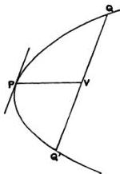
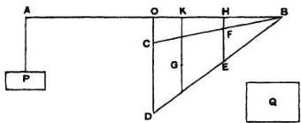
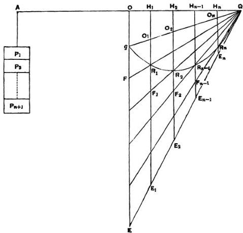
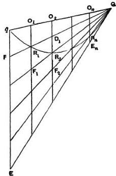
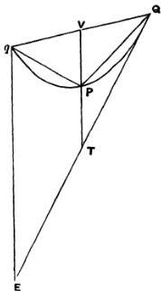
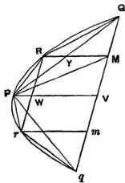

# QUADRATURE OF THE PARABOLA.

"Archimedes to Dositheus greeting.

"When I heard that Conon, who was my friend in his lifetime, was dead, but that you were acquainted with Conon and withal versed in geometry, while I grieved for the loss not only of a friend but of an admirable mathematician, I set myself the task of communicating to you, as I had intended to send to Conon, a certain geometrical theorem which had not been investigated before but has now been investigated by me, and which I first discovered by means of mechanics and then exhibited by means of geometry. Now some of the earlier geometers tried to prove it possible to find a rectilineal area equal to a given circle and a given segment of a circle; and after that they endeavoured to square the area bounded by the section of the whole cone* and a straight line, assuming lemmas not easily conceded, so that it was recognised by most people that the problem was not solved. But I am not aware that any one of my predecessors has attempted to square the segment bounded by a straight line and a section of a right-angled cone [a parabola], of which problem I have now discovered the solution. For it is here shown that every segment bounded by a straight line and a section of a right-angled cone [a parabola] is four-thirds of the triangle which has the same base and equal height with the segment, and for the demonstration

* There appears to be some corruption here: the expression in the text is τὰς δλου τοῦ κώνου τομᾶς, and it is not easy to give a natural and intelligible meaning to it. The section of ‘the whole cone’ might perhaps mean a section cutting right through it, i.e. an ellipse, and the ‘straight line’ might be an axis or a diameter. But Heiberg objects to the suggestion to read τὰς ἀξυγωνίου κώνου τομᾶς, in view of the addition of καὶ εὐθείας, on the ground that the former expression always signifies the whole of an ellipse, never a segment of it (Quaestiones Archimedeae, p. 149).

of this property the following lemma is assumed: that the excess by which the greater of (two) unequal areas exceeds the less can, by being added to itself, be made to exceed any given finite area. The earlier geometers have also used this lemma; for it is by the use of this same lemma that they have shown that circles are to one another in the duplicate ratio of their diameters, and that spheres are to one another in the triplicate ratio of their diameters, and further that every pyramid is one third part of the prism which has the same base with the pyramid and equal height; also, that every cone is one third part of the cylinder having the same base as the cone and equal height they proved by assuming a certain lemma similar to that aforesaid. And, in the result, each of the aforesaid theorems has been accepted* no less than those proved without the lemma. As therefore my work now published has satisfied the same test as the propositions referred to, I have written out the proof and send it to you, first as investigated by means of mechanics, and afterwards too as demonstrated by geometry. Prefixed are, also, the elementary propositions in conics which are of service in the proof (στοιχεία κωνικά χρείαν ἔχοντα ἐς τὰν ἀπόδειξιν). Farewell."

## Proposition 1.

If from a point on a parabola a straight line be drawn which is either itself the axis or parallel to the axis, as $PV$, and if $QQ'$ be a chord parallel to the tangent to the parabola at $P$ and meeting $PV$ in $V$, then

$$
QV = VQ'.
$$

Conversely, if $QV = VQ'$, the chord $QQ'$ will be parallel to the tangent at $P$.

* The Greek of this passage is: συμβαίνει δὲ τῶν προειρημένων θεωρημάτων ἕκαστον μηδέν ἡσσον τῶν ἄνευ τούτου τοῦ λήμματος ἀποδεδειγμένων πεπιστευκέναι. Here it would seem that πεπιστευκέναι must be wrong and that the passive should have been used.

## Proposition 2.

If in a parabola $QQ'$ be a chord parallel to the tangent at $P$, and if a straight line be drawn through $P$ which is either itself the axis or parallel to the axis, and which meets $QQ'$ in $V$ and the tangent at $Q$ to the parabola in $T$, then

$$
PV = PT.
$$

## Proposition 3.

If from a point on a parabola a straight line be drawn which is either itself the axis or parallel to the axis, as $PV$, and if from two other points $Q, Q'$ on the parabola straight lines be drawn parallel to the tangent at $P$ and meeting $PV$ in $V$, $V'$ respectively, then

$$
PV : PV' = QV^2 : Q'V'^2.
$$

"And these propositions are proved in the elements of conics.*"

## Proposition 4.

If $Qq$ be the base of any segment of a parabola, and $P$ the vertex of the segment, and if the diameter through any other point $R$ meet $Qq$ in $O$ and $QP$ (produced if necessary) in $F$, then

$$
QV : VO = OF : FR.
$$

Draw the ordinate $RW$ to $PV$, meeting $QP$ in $K$.

* i.e. in the treatises on conics by Euclid and Aristaeus.

Then

$$
PV: PW = QV^2: RW^2;
$$

whence, by parallels,

$$
PQ: PK = PQ^2: PF^2.
$$

In other words, $PQ$, $PF$, $PK$ are in continued proportion; therefore

$$
\begin{array}{l}
PQ: PF = PF: PK \\
= PQ \pm PF: PF \pm PK \\
= QF: KF.
\end{array}
$$

Hence, by parallels,

$$
QV: VO = OF: FR.
$$

[It is easily seen that this equation is equivalent to a change of axes of coordinates from the tangent and diameter to new axes consisting of the chord $Qq$ (as axis of $x$, say) and the diameter through $Q$ (as axis of $y$).

For, if $QV = a$, $PV = \frac{a^2}{p}$, where $p$ is the parameter of the ordinates to $PV$.

Thus, if $QO = x$, and $RO = y$, the above result gives

$$
\frac{a}{x - a} = \frac{OF}{OF - y},
$$

whence

$$
\frac{a}{2a - x} = \frac{OF}{y} = \frac{x \cdot \frac{a}{p}}{y},
$$

or

$$
py = x(2a - x).
$$

## Proposition 5.

If $Qq$ be the base of any segment of a parabola, $P$ the vertex of the segment, and $PV$ its diameter, and if the diameter of the parabola through any other point $R$ meet $Qq$ in $O$ and the tangent at $Q$ in $E$, then

$$
QO: Oq = ER: RO.
$$

Let the diameter through $R$ meet $QP$ in $F$.

Then, by Prop. 4,

$$
QV: VO = OF: FR.
$$

Since $QV = Vq$, it follows that

$$
QV: qO = OF: OR \quad (1).
$$

Also, if $VP$ meet the tangent in $T$,

$$
PT = PV, \text{ and therefore } EF = OF.
$$

Accordingly, doubling the antecedents in (1), we have

$$
Qq: qO = OE: OR,
$$

whence

$$
QO: Oq = ER: RO.
$$

## Propositions 6, 7*.

Suppose a lever $AOB$ placed horizontally and supported at its middle point $O$. Let a triangle $BCD$ in which the angle $C$ is right or obtuse be suspended from $B$ and $O$, so that $C$ is attached to $O$ and $CD$ is in the same vertical line with $O$. Then, if $P$ be such an area as, when suspended from $A$, will keep the system in equilibrium,

$$
P = \frac{1}{3} \triangle BCD.
$$

Take a point $E$ on $OB$ such that $BE = 2OE$, and draw $EFH$ parallel to $OCD$ meeting $BC$, $BD$ in $F$, $H$ respectively. Let $G$ be the middle point of $FH$.

Then $G$ is the centre of gravity of the triangle $BCD$.

Hence, if the angular points $B, C$ be set free and the triangle be suspended by attaching $F$ to $E$, the triangle will hang in the same position as before, because $EFG$ is a vertical straight line. “For this is proved†.”

Therefore, as before, there will be equilibrium.

Thus
$$
\begin{aligned}
P : \triangle BCD &amp;= OE : AO \\
&amp;= 1 : 3,
\end{aligned}
$$

or
$$
P = \frac{1}{3} \triangle BCD.
$$

* In Prop. 6 Archimedes takes the separate case in which the angle $BCD$ of the triangle is a right angle so that $C$ coincides with $O$ in the figure and $F$ with $E$. He then proves, in Prop. 7, the same property for the triangle in which $BCD$ is an obtuse angle, by treating the triangle as the difference between two right-angled triangles $BOD$, $BOC$ and using the result of Prop. 6. I have combined the two propositions in one proof, for the sake of brevity. The same remark applies to the propositions following Props. 6, 7.

† Doubtless in the lost book *περί ξυγών*. Cf. the Introduction, Chapter II., *ad fin*.

## Propositions 8, 9.

Suppose a lever $AOB$ placed horizontally and supported at its middle point $O$. Let a triangle $BCD$, right-angled or obtuse-angled at $C$, be suspended from the points $B, E$ on $OB$, the angular point $C$ being so attached to $E$ that the side $CD$ is in the same vertical line with $E$. Let $Q$ be an area such that

$$
AO : OE = \triangle BCD : Q.
$$

Then, if an area $P$ suspended from $A$ keep the system in equilibrium,

$$
P &lt; \triangle BCD \text{ but } &gt; Q.
$$

Take $G$ the centre of gravity of the triangle $BCD$, and draw $GH$ parallel to $DC$, i.e. vertically, meeting $BO$ in $H$.

We may now suppose the triangle $BCD$ suspended from $H$, and, since there is equilibrium,

$$
\triangle BCD : P = AO : OH \quad \text{(1)},
$$

whence

$$
P &lt; \triangle BCD.
$$

Also

$$
\triangle BCD : Q = AO : OE.
$$

Therefore, by (1),

$$
\triangle BCD : Q &gt; \triangle BCD : P,
$$

and

$$
P &gt; Q.
$$

## Propositions 10, 11.

Suppose a lever $AOB$ placed horizontally and supported at $O$, its middle point. Let $CDEF$ be a trapezium which can be so placed that its parallel sides $CD$, $FE$ are vertical, while $C$ is vertically below $O$, and the other sides $CF$, $DE$ meet in $B$. Let $EF$ meet in $B$ and let the trapezium be suspended by attaching $F$ to $H$ and $C$ to $O$. Further, suppose $Q$ to be an area such that

$$
AO : OH = (\text{trapezium } CDEF) : Q.
$$

Then, if $P$ be the area which, when suspended from $A$, keeps the system in equilibrium,

$$
P &lt; Q.
$$

The same is true in the particular case where the angles at $C$, $F$ are right, and consequently $C$, $F$ coincide with $O$, $H$ respectively.

Divide $OH$ in $K$ so that

$$
(2CD + FE) : (2FE + CD) = HK : KO.
$$

Draw $KG$ parallel to $OD$, and let $G$ be the middle point of the portion of $KG$ intercepted within the trapezium. Then $G$ is the centre of gravity of the trapezium [On the equilibrium of planes, I. 15].

Thus we may suppose the trapezium suspended from $K$, and the equilibrium will remain undisturbed.

Therefore

$$
AO : OK = (\text{trapezium } CDEF) : P,
$$

and, by hypothesis,

$$
AO : OH = (\text{trapezium } CDEF) : Q.
$$

Since $OK &lt; OH$, it follows that

$$
P &lt; Q.
$$

## Propositions 12, 13.

If the trapezium $CDEF$ be placed as in the last propositions, except that $CD$ is vertically below a point $L$ on $OB$ instead of being below $O$, and the trapezium is suspended from $L$, $H$, suppose that $Q$, $R$ are areas such that

$$
AO : OH = (\text{trapezium } CDEF) : Q,
$$

and

$$
AO : OL = (\text{trapezium } CDEF) : R_2
$$

If then an area $P$ suspended from $A$ keep the system in equilibrium,

$$P &gt; R \text{ but } &lt; Q.$$

Take the centre of gravity $G$ of the trapezium, as in the last propositions, and let the line through $G$ parallel to $DC$ meet $OB$ in $K$.

Then we may suppose the trapezium suspended from $K$, and there will still be equilibrium.

Therefore (trapezium $CDEF$) : $P = AO : OK$.

Hence

$$
\begin{array}{rl}
&amp; \text{(trapezium } CDEF: P &gt; \text{(trapezium } CDEF): Q, \\
&amp; \text{but} \quad &lt; \text{(trapezium } CDEF): R. \\
&amp; \text{It follows that} \quad &amp; P &lt; Q \text{ but } &gt; R.
\end{array}
$$

## Propositions 14, 15.

Let $Qq$ be the base of any segment of a parabola. Then, if two lines be drawn from $Q, q$, each parallel to the axis of the parabola and on the same side of $Qq$ as the segment is, either (1) the angles so formed at $Q, q$ are both right angles, or (2) one is acute and the other obtuse. In the latter case let the angle at $q$ be the obtuse angle.

Divide $Qq$ into any number of equal parts at the points $O_1, O_2, \ldots, O_n$. Draw through $q, O_1, O_2, \ldots, O_n$ diameters of the parabola meeting the tangent at $Q$ in $E, E_1, E_2, \ldots, E_n$ and the parabola itself in $q, R_1, R_2, \ldots, R_n$. Join $QR_1, QR_2, \ldots, QR_n$ meeting $qE, O_1E_1, O_2E_2, \ldots, O_{n-1}E_{n-1}$ in $F, F_1, F_2, \ldots, F_{n-1}$.

Let the diameters $Eq, E_1O_1, \ldots, E_nO_n$ meet a straight line $QOA$ drawn through $Q$ perpendicular to the diameters in the points $O, H_1, H_2, \ldots, H_n$ respectively. (In the particular case where $Qq$ is itself perpendicular to the diameters $q$ will coincide with $O, O_1$ with $H_1$, and so on.)

It is required to prove that

(1) $\triangle EqQ &lt; 3$ (sum of trapezia $FO_1, F_1O_2, \ldots, F_{n-1}O_n$ and $\triangle E_nO_nQ$),
(2) $\triangle EqQ &gt; 3$ (sum of trapezia $R_1O_2, R_2O_3, \ldots, R_{n-1}O_n$ and $\triangle R_nO_nQ$).

Suppose $AO$ made equal to $OQ$, and conceive $QOA$ as a lever placed horizontally and supported at $O$. Suppose the triangle $EqQ$ suspended from $OQ$ in the position drawn, and suppose that the trapezium $EO_1$ in the position drawn is balanced by an area $P_1$ suspended from $A$, the trapezium $E_1O_2$ in the position drawn is balanced by the area $P_2$ suspended

from $A$, and so on, the triangle $E_n O_n Q$ being in like manner balanced by $P_{n+1}$.

Then $P_1 + P_2 + \ldots + P_{n+1}$ will balance the whole triangle $EqQ$ as drawn, and therefore

$$
P_1 + P_2 + \ldots + P_{n+1} = \frac{1}{8} \triangle EqQ. \quad [\text{Props. 6, 7}]
$$

Again
$$
\begin{aligned}
AO : OH_1 &amp;= QO : OH_1 \\
&amp;= Qq : qO_1 \\
&amp;= E_1O_1 : O_1R_1 \text{ [by means of Prop. 5]} \\
&amp;= (\text{trapezium } EO_1) : (\text{trapezium } FO_1);
\end{aligned}
$$

whence [Props. 10, 11]

$$
(FO_1) &gt; P_1.
$$

Next
$$
\begin{aligned}
AO : OH_1 &amp;= E_1O_1 : O_1R_1 \\
&amp;= (E_1O_2) : (R_1O_2) \quad \text{...(α),}
\end{aligned}
$$

while
$$
\begin{aligned}
AO : OH_2 &amp;= E_2O_2 : O_2R_2 \\
&amp;= (E_2O_2) : (F_1O_2) \quad \text{...(β)};
\end{aligned}
$$

and, since $(\alpha)$ and $(\beta)$ are simultaneously true, we have, by Props. 12, 13,

$$
(F_1O_2) &gt; P_2 &gt; (R_1O_2).
$$

Similarly it may be proved that

$$
(F_2O_2) &gt; P_3 &gt; (R_2O_3),
$$

and so on.

Lastly [Props. 8, 9]

$$
\triangle E_n O_n Q &gt; P_{n+1} &gt; \triangle R_n O_n Q.
$$

By addition, we obtain

(1) $(FO_1) + (F_1O_2) + \ldots + (F_{n-1}O_n) + \triangle E_n O_n Q &gt; P_1 + P_2 + \ldots + P_{n+1}$

$$
&gt; \frac{1}{8} \triangle EqQ,
$$

or
$$
\triangle EqQ &lt; 3 \quad (FO_1 + F_1O_2 + \ldots + F_{n-1}O_n + \triangle E_n O_n Q).
$$

(2) $(R_1O_2) + (R_2O_3) + \ldots + (R_{n-1}O_n) + \triangle R_n O_n Q &lt; P_2 + P_3 + \ldots + P_{n+1}$

$$
\begin{aligned}
&amp;&lt; P_1 + P_2 + \ldots + P_{n+1}, \text{ a fortiori,} \\
&amp;&lt; \frac{1}{8} \triangle EqQ,
\end{aligned}
$$

or
$$
\triangle EqQ &gt; 3 \quad (R_1O_2 + R_2O_3 + \ldots + R_{n-1}O_n + \triangle R_n O_n Q).
$$

## Proposition 16.

Suppose $Qq$ to be the base of a parabolic segment, $q$ being not more distant than $Q$ from the vertex of the parabola. Draw through $q$ the straight line $qE$ parallel to the axis of the parabola to meet the tangent at $Q$ in $E$. It is required to prove that

$$
(\text{area of segment}) = \frac{1}{3} \triangle EqQ.
$$

For, if not, the area of the segment must be either greater or less than $\frac{1}{3} \triangle EqQ$.

I. Suppose the area of the segment greater than $\frac{1}{3} \triangle EqQ$. Then the excess can, if continually added to itself, be made to exceed $\triangle EqQ$. And it is possible to find a submultiple of the triangle $EqQ$ less than the said excess of the segment over $\frac{1}{3} \triangle EqQ$.

Let the triangle $FqQ$ be such a submultiple of the triangle $EqQ$. Divide $Eq$ into equal parts each equal to $qF$, and let all the points of division including $F$ be joined to $Q$ meeting the parabola in $R_1, R_2, \ldots$

$R_n$ respectively. Through $R_1, R_2, \ldots, R_n$ draw diameters of the parabola meeting $qQ$ in $O_1, O_2, \ldots, O_n$ respectively.

Let $O_1R_1$ meet $QR_2$ in $F_1$.

Let $O_2R_2$ meet $QR_1$ in $D_1$ and $QR_2$ in $F_2$.

Let $O_3R_3$ meet $QR_2$ in $D_2$ and $QR_4$ in $F_3$, and so on.

We have, by hypothesis,

$$
\triangle FqQ &lt; (\text{area of segment}) - \frac{1}{3} \triangle EqQ,
$$

or

$$
(\text{area of segment}) - \triangle FqQ &gt; \frac{1}{3} \triangle EqQ \quad \dots \dots \dots (\alpha).
$$

Now, since all the parts of $qE$, as $qF$ and the rest, are equal, $O_1R_1 = R_1F_1$, $O_2D_1 = D_1R_2 = R_2F_2$, and so on; therefore

$$
\begin{array}{l}
\triangle FqQ = (FO_1 + R_1O_2 + D_1O_3 + \dots) \\
= (FO_1 + F_1D_1 + F_2D_2 + \dots + F_{n-1}D_{n-1} + \triangle E_nR_nQ) \dots (\beta).
\end{array}
$$

But

$$
\text{(area of segment)} &lt; (FO_1 + F_1O_2 + \dots + F_{n-1}O_n + \triangle E_nO_nQ).
$$

Subtracting, we have

$$
\begin{array}{l}
\text{(area of segment)} - \triangle FqQ &lt; (R_1O_2 + R_2O_3 + \dots \\
+ R_{n-1}O_n + \triangle R_nO_nQ),
\end{array}
$$

whence, *a fortiori*, by $(\alpha)$,

$$
\frac{1}{3}\triangle EqQ &lt; (R_1O_2 + R_2O_3 + \dots + R_{n-1}O_n + \triangle R_nO_nQ).
$$

But this is impossible, since [Props. 14, 15]

$$
\frac{1}{3}\triangle EqQ &gt; (R_1O_2 + R_2O_3 + \dots + R_{n-1}O_n + \triangle R_nO_nQ).
$$

Therefore

$$
\text{(area of segment)} \neq \frac{1}{3}\triangle EqQ.
$$

II. If possible, suppose the area of the segment less than $\frac{1}{3}\triangle EqQ$.

Take a submultiple of the triangle $EqQ$, as the triangle $FqQ$, less than the excess of $\frac{1}{3}\triangle EqQ$ over the area of the segment, and make the same construction as before.

Since $\triangle FqQ &lt; \frac{1}{3}\triangle EqQ - \text{(area of segment)}$, it follows that

$$
\begin{array}{l}
\triangle FqQ + \text{(area of segment)} &lt; \frac{1}{3}\triangle EqQ \\
&lt; (FO_1 + F_1O_2 + \dots + F_{n-1}O_n + \triangle E_nO_nQ).
\end{array}
$$

[Props. 14, 15]

Subtracting from each side the area of the segment, we have

$$
\begin{array}{l}
\triangle FqQ &lt; \text{(sum of spaces } qFR_1, R_1F_1R_2, \dots E_nR_nQ) \\
&lt; (FO_1 + F_1D_1 + \dots + F_{n-1}D_{n-1} + \triangle E_nR_nQ), \text{ a fortiori};
\end{array}
$$

which is impossible, because, by $(\beta)$ above,

$$
\triangle FqQ = FO_1 + F_1D_1 + \dots + F_{n-1}D_{n-1} + \triangle E_nR_nQ.
$$

Hence (area of segment) $\preccurlyeq \frac{1}{3}\triangle EqQ$.

Since then the area of the segment is neither less nor greater than $\frac{1}{3}\triangle EqQ$, it is equal to it.

## Proposition 17.

It is now manifest that the area of any segment of a parabola is four-thirds of the triangle which has the same base as the segment and equal height.

Let $Qq$ be the base of the segment, $P$ its vertex. Then $PQq$ is the inscribed triangle with the same base as the segment and equal height.

Since $P$ is the vertex* of the segment, the diameter through $P$ bisects $Qq$. Let $V$ be the point of bisection.

Let $VP$, and $qE$ drawn parallel to it, meet the tangent at $Q$ in $T, E$ respectively.

Then, by parallels,

$$
qE = 2VT,
$$

and

$$
PV = PT, \quad [\text{Prop. 2}]
$$

so that

$$
VT = 2PV.
$$

Hence $\triangle EqQ = 4\triangle PQq$.

But, by Prop. 16, the area of the segment is equal to $\frac{1}{3}\triangle EqQ$.

Therefore (area of segment) = $\frac{4}{3}\triangle PQq$.

DEF. “In segments bounded by a straight line and any curve I call the straight line the **base**, and the **height** the greatest perpendicular drawn from the curve to the base of the segment, and the **vertex** the point from which the greatest perpendicular is drawn.”

* It is curious that Archimedes uses the terms *base* and *vertex* of a segment here, but gives the definition of them later (at the end of the proposition). Moreover he assumes the converse of the property proved in Prop. 18.

## Proposition 18.

If $Qq$ be the base of a segment of a parabola, and $V$ the middle point of $Qq$, and if the diameter through $V$ meet the curve in $P$, then $P$ is the vertex of the segment.

For $Qq$ is parallel to the tangent at $P$ [Prop. 1]. Therefore, of all the perpendiculars which can be drawn from points on the segment to the base $Qq$, that from $P$ is the greatest. Hence, by the definition, $P$ is the vertex of the segment.

## Proposition 19.

If $Qq$ be a chord of a parabola bisected in $V$ by the diameter $PV$, and if $RM$ be a diameter bisecting $QV$ in $M$, and $RW$ be the ordinate from $R$ to $PV$, then

$$
PV = \frac{4}{3} RM.
$$

For, by the property of the parabola,

$$
\begin{array}{l}
PV: PW = QV^2: RW^2 \\
= 4RW^2: RW^2,
\end{array}
$$

so that

$$
PV = 4PW,
$$

whence

$$
PV = \frac{4}{3}RM.
$$

## Proposition 20.

If $Qq$ be the base, and $P$ the vertex, of a parabolic segment, then the triangle $PQq$ is greater than half the segment $PQq$.

For the chord $Qq$ is parallel to the tangent at $P$, and the triangle $PQq$ is half the parallelogram formed by $Qq$, the tangent at $P$, and the diameters through $Q, q$.

Therefore the triangle $PQq$ is greater than half the segment.

COR. It follows that it is possible to inscribe in the segment a polygon such that the segments left over are together less than any assigned area.

## Proposition 21.

If $Qq$ be the base, and $P$ the vertex, of any parabolic segment, and if $R$ be the vertex of the segment cut off by $PQ$, then

$$
\triangle P Q q = 8 \triangle P R Q.
$$

The diameter through $R$ will bisect the chord $PQ$, and therefore also $QV$, where $PV$ is the diameter bisecting $Qq$. Let the diameter through $R$ bisect $PQ$ in $Y$ and $QV$ in $M$. Join $PM$.

By Prop. 19,

$$
P V = \frac{4}{3} R M.
$$

Also $PV = 2 Y M.$

Therefore $Y M = 2 R Y,$

and $\triangle P Q M = 2 \triangle P R Q.$

Hence $\triangle P Q V = 4 \triangle P R Q,$

and $\triangle P Q q = 8 \triangle P R Q.$

Also, if $RW$, the ordinate from $R$ to $PV$, be produced to meet the curve again in $r$,

$$ RW = rW, $$

and the same proof shows that

$$ \Delta PQq = 8\Delta Prq. $$

## Proposition 22.

If there be a series of areas $A, B, C, D, \ldots$ each of which is four times the next in order, and if the largest, $A$, be equal to the triangle $PQq$ inscribed in a parabolic segment $PQq$ and having the same base with it and equal height, then

$$ (A + B + C + D + \ldots) &lt; \text{(area of segment } PQq\text{)}. $$

For, since $\Delta PQq = 8\Delta PRQ = 8\Delta Pqr$, where $R, r$ are the vertices of the segments cut off by $PQ, Pq$, as in the last proposition,

$$ \Delta PQq = 4(\Delta PQR + \Delta Pqr). $$

Therefore, since $\Delta PQq = A$,

$$ \Delta PQR + \Delta Pqr = B. $$

In like manner we prove that the triangles similarly inscribed in the remaining segments are together equal to the area $C$, and so on.

Therefore $A + B + C + D + \ldots$ is equal to the area of a certain inscribed polygon, and is therefore less than the area of the segment.

## Proposition 23.

Given a series of areas $A, B, C, D, \ldots, Z$, of which $A$ is the greatest, and each is equal to four times the next in order, then

$$ A + B + C + \ldots + Z + \frac{1}{2}Z = \frac{4}{3}A. $$

Take areas $b, c, d, \ldots$ such that

$$
\begin{array}{l}
b = \frac{1}{3} B, \\
c = \frac{1}{3} C, \\
d = \frac{1}{3} D, \text{ and so on.}
\end{array}
$$

Then, since

$$
\begin{array}{l}
b = \frac{1}{3} B, \\
\text{and} \quad
B = \frac{1}{4} A, \\
B + b = \frac{1}{3} A.
\end{array}
$$

Similarly

$$
C + c = \frac{1}{3} B.
$$

Therefore

$$
B + C + D + \ldots + Z + b + c + d + \ldots + z = \frac{1}{3} (A + B + C + \ldots + Y).
$$

But

$$
b + c + d + \ldots + y = \frac{1}{3} (B + C + D + \ldots + Y).
$$

Therefore, by subtraction,

$$
B + C + D + \ldots + Z + z = \frac{1}{3} A
$$

or

$$
A + B + C + \ldots + Z + \frac{1}{3} Z = \frac{4}{3} A.
$$

The algebraical equivalent of this result is of course

$$
\begin{array}{l}
1 + \frac{1}{4} + \left(\frac{1}{4}\right)^2 + \dots + \left(\frac{1}{4}\right)^{n-1} = \frac{4}{3} - \frac{1}{3} \left(\frac{1}{4}\right)^{n-1} \\
= \frac{1 - \left(\frac{1}{4}\right)^n}{1 - \frac{1}{4}}.
\end{array}
$$

## Proposition 24.

Every segment bounded by a parabola and a chord $Qq$ is equal to four-thirds of the triangle which has the same base as the segment and equal height.

Suppose

$$
K = \frac{4}{3} \triangle PQq,
$$

where $P$ is the vertex of the segment; and we have then to prove that the area of the segment is equal to $K$.

For, if the segment be not equal to $K$, it must either be greater or less.

I. Suppose the area of the segment greater than $K$.

If then we inscribe in the segments cut off by $PQ$, $Pq$ triangles which have the same base and equal height, i.e. triangles with the same vertices $R$, $r$ as those of the segments, and if in the remaining segments we inscribe triangles in the same manner, and so on, we shall finally have segments remaining whose sum is less than the area by which the segment $PQq$ exceeds $K$.

Therefore the polygon so formed must be greater than the area $K$; which is impossible, since [Prop. 23]

$$
A + B + C + \dots + Z &lt; \frac{4}{3} A,
$$

where

$$
A = \triangle PQq.
$$

Thus the area of the segment cannot be greater than $K$.

II. Suppose, if possible, that the area of the segment is less than $K$.

If then $\triangle PQq = A$, $B = \frac{1}{4}A$, $C = \frac{1}{4}B$, and so on, until we arrive at an area $X$ such that $X$ is less than the difference between $K$ and the segment, we have

$$
\begin{array}{l}
A + B + C + \dots + X + \frac{1}{3}X = \frac{4}{3}A \quad \text{[Prop. 23]} \\
= K.
\end{array}
$$

Now, since $K$ exceeds $A + B + C + \ldots + X$ by an area less than $X$, and the area of the segment by an area greater than $X$, it follows that

$$
A + B + C + \dots + X &gt; \text{(the segment)};
$$

which is impossible, by Prop. 22 above.

Hence the segment is not less than $K$.

Thus, since the segment is neither greater nor less than $K$,

$$
\text{(area of segment } PQq) = K = \frac{4}{3}\triangle PQq.
$$
