# ALMAGEST

# Introduction

## 1. Ptolemy

For a detailed discussion of what little is known of the life of the author of the Almagest, and an account of his numerous other works, on astronomy, astrology, geography, optics and other mathematical subjects, I refer the reader to my article in the Dictionary of Scientific Biography (Toomer ). Here I mention only that his name was Claudius Ptolemaeus (Κλαύδιος Πτολεμαῖος), that he lived from approximately A.D. 100 to approximately A.D. 175, and that he worked in Alexandria, the principal city of Greco-Roman Egypt, which possessed, among other advantages, what was probably still the best library in the ancient world.

## 2. The Almagest

The Almagest is firmly dated to the reign of the Roman emperor Antoninus (A.D. 138–161). The latest observation used in it is from 141 February 2 (IX 7 p. 450), and Ptolemy takes the beginning of the reign of Antoninus as the epoch of his star catalogue (VII 4 p. 340). Although it is clear that Ptolemy had spent much time on it and that it is a work of his maturity (his own observations recorded in it range from A.D. 127 to 141), it has always been considered as his earliest extant work, because of the changes from it and references back to it in other works by him (for details see Toomer p. 187). However, a recent discovery by Norman T. Hamilton (see IV n.51 p. 205) has shown that the ‘Canobic Inscription’ represents a stage in the development of Ptolemy’s astronomical theory earlier than the Almagest. Since Ptolemy erected that dedication in the tenth year of Antoninus (A.D. 146/7), the Almagest can hardly have been published earlier than the year 150.

As is implied by its Greek name, μαθηματική σύνταξις, ‘mathematical systematic treatise’, the Almagest is a complete exposition of mathematical astronomy as the Greeks understood the term. Whether there were any comparable works (i.e. comprehensive astronomical treatises) before it is not known. In any case, its success contributed to the loss of most of the work of Ptolemy’s scientific predecessors, notably Hipparchus, by the end of antiquity, because, being obsolete, they ceased to be copied. Whereas Hipparchus’ works are still used by Ptolemy’s younger contemporaries, Galen and Vettius Valens, by the early fourth century (and probably much earlier), when Pappus wrote his commentary on it, the Almagest had become the standard textbook on astronomy which it was to remain for more than a thousand years. Thus its importance for us lies not only in its value as a historical source for earlier theories and observations, but also, and perhaps chiefly, in its influence on all later astronomy in antiquity and the middle ages (in both Islamic and Christian areas) down to the sixteenth century. It was dominant to an extent and for a length of time which is unsurpassed by any scientific work except Euclid’s *Elements*.

No attempt can be made here to sketch even an outline of the history of its influence. I mention only some points to which I will make reference in the notes to the translation. The position of the Almagest as the standard textbook in astronomy for ‘advanced students’ in the schools at Alexandria (and no doubt at Athens and Antioch too) in late antiquity is amply demonstrated by the partially extant commentaries on it by Pappus (c. 320) and by Theon of Alexandria (c. 370). In the late eighth and ninth centuries, with the growth of interest in Greek science in the Islamic world, the Almagest was translated, first into Syriac, then, several times, into Arabic. In the middle of the twelfth century no less than five such versions were still available to the amateur ibn aṣ-Ṣalāḥ: a Syriac translation, two versions made under the Caliph al-Ma’mūn (an older one by al-Ḥasan ibn Quraysh, and one dated 827/8 by al-Ḥajjāj), a version by the famous translator Ishāq ibn Ḥunayn (c. 879–90), and a revision of the latter by Thābit ibn Qurra (d. 901). Two of these translations are still extant, those of al-Ḥajjāj and Ishāq-Thābit. In them we find the title of Ptolemy’s treatise given as ‘al-mjṣṭy’ (consonantal skeleton only). This is undoubtedly derived (ultimately) from a Greek form μεγίστη (?sc. σύνταξις), meaning ‘greatest [treatise]’, but it is only later that it was incorrectly vocalised as al-majaṣṭī, whence are derived the mediaeval Latin ‘almagesti’, ‘almagestum’, the ancestors of the modern title ‘Almagest’. The available evidence has been assembled and discussed by Kunitzsch, *Der Almagest* 115–25, where he makes a good case for supposing that the Arabic form was derived, not directly from the Greek, but from a middle Persian (Pahlavi) translation of the Almagest. There is independent evidence for the existence of the latter, but whether it was made as early as the reign of the Sassanid king Shahpuhr I (241–272), as later Persian accounts maintain, seems very dubious to me.

While Ptolemy’s work in the original Greek continued to be copied and studied in the eastern (Byzantine) empire, all knowledge of it was lost to western Europe by the early middle ages. Although translations from the Greek text into Latin were made in mediaeval times, the principal channel for the recovery of the Almagest in the west was the translation from the Arabic by Gerard of Cremona, made at Toledo and completed in 1175. Manuscripts of the Greek text began to reach the west in the fifteenth century, but it was Gerard’s text which underlay (often at several removes) books on astronomy as late as the Peurbach-Regiomontanus epitome of the Almagest (see Bibliography under Regiomontanus). It was also the version in which the Almagest was first printed (Venice, 1515). The sixteenth century saw the wide dissemination of the Greek text (printed at Basel by Hervagius, 1538), and also the obsolescence of Ptolemy’s astronomical system, brought about not so much by the work of Copernicus (which in form and concepts is still dominated by the Almagest), as by that of Brahe and Kepler.

### 3. The translation

The basis of my translation is the Greek text established by Heiberg. I have, however, found it necessary to make several hundred corrections to that text. These are noted at the places in the translation where they occur, and are also listed in Appendix B. In many cases (usually involving numerical computations), my correction consists of adopting the reading of the manuscript D, unjustly spurned by Heiberg as descended from an archetype due to an Alexandrian recension in late antiquity (Prolegomena, in Ptolemy, *Opera Minora* CXXVI-VII). Whatever the truth about that, and despite the fact that D itself is, as Heiberg says, ‘most negligently written’, I am convinced on grounds of internal consistency that it represents a sounder tradition than that of the mss. ABC, generally preferred by Heiberg. In many cases its obviously correct readings are shared by all or part of the Arabic tradition. Nevertheless, I have not deviated from Heiberg’s text except where it seemed essential for sense or numerical consistency. In making corrections I have referred to photographs of the following manuscripts.

**Greek (I use Heiberg’s notation)**

- A Parisinus graecus 2389. Mainly uncial, ninth century
- B Vaticanus graecus 1594. Minuscule, ninth century
- D Vaticanus graecus 180. Several hands, but not, as Heiberg, *Almagest* I p. V, of the twelfth century, but rather of the tenth: see the Vatican Catalogue by Mercati and Franchi de’ Cavalieri, I p. 206. N. G. Wilson has confirmed this dating for me by personal inspection. (Heiberg himself seems to have changed his opinion later: see Prolegomena LXXIX.)

Arabic (I have used the abbreviations ‘Ar’ to refer to the consensus of the

Arabic tradition, and ‘Is’ to the consensus of the mss. containing the Isḥāq-Thābit version).

L Leiden, or. 680. Eleventh century according to Kunitzsch, *Der Almagest* 38. This is the only surviving manuscript of the version of al-Ḥajjāj.

T Tunis, Bibliothèque Nationale, 07116 (see Kunitzsch, *Der Almagest* 38–40). Completed October 1085. The Isḥāq-Thābit version, complete.

P Paris, B.N. ar. 2482. Completed December 1221. See Kunitzsch, *Der Almagest* 42–3. The Isḥāq-Thābit version, Books I–VI 13.

Q Paris, B.N. ar. 2483. Fifteenth century. See Kunitzsch, *Der Almagest* 43. The Isḥāq-Thābit version, Books I–VII.

E Escorial 914. See Kunitzsch, *Der Almagest* 43–4. The Isḥāq-Thābit version, Books V–IX.

F Escorial 915. Completed September 1276. See Kunitzsch, *Der Almagest* 44–5. The Isḥāq-Thābit version, allegedly containing Books VII–XIII, but in fact lacking large sections even of these, and bound in such disorder as to be almost useless.

Ger The Latin translation of Gerard of Cremona, for which I have used only the printed edition (Venice, Liechtenstein, 1515). For the complex dependence of this on the various Arabic versions see Kunitzsch, *Der Almagest* 97–104.

I did not undertake a complete collation of any of the above mss. For the Greek mss. that would have been largely useless, since Heiberg’s reports are, as in all his editions, very accurate (to judge from my sporadic verifications; I remarked the rare exceptions in the notes to the translation). To collate the Arabic translation would have delayed this book for several years, with no commensurate gain. I have consulted the above mss. only in passages where I already considered Heiberg’s text wrong or suspect. Therefore no conclusions should be drawn about the readings of the Arabic mss. where I do not explicitly report them.

There are a number of places where, if I were to establish a Greek text, it would differ from Heiberg’s, but which I have not bothered to record in this book. Examples are:

| mere orthography: | |
| --- | --- |
| πύρισκομεν | for εὑρίσκομεν (imperfect) I 327,15 |
| Κάλλιππος | for Κάλιππος I 199,5 |
| ἀμετάπειστον | for ἀμετάπιστον I 6,18 (cf. Boll, *Studien* 74) |
| κρίκος | for κρίκος I 196,8 |
| changes in form not affecting the sense: ἄν for ἔάν I 393,11 | |
| reversals of letters referring to figures: ΖΚ for ΚΖ I 243, 22 | |
| obvious misprints: | |
| σελήνης | for σηλήνης I 406,25 |
| ἀνωμαλίας | for ἀμωμαλίας I 462,19 |
| (less obvious misprints, particularly those involving numbers, are recorded). | |

During the course of making the translation, I became convinced that the text contains quite a large number of interpolations, which must go back to antiquity, since they are in the whole manuscript tradition, both Greek and Arabic. I was first led to this conclusion by the discovery that there are places in the text, nonsensical as they stand, which can be made to yield perfect sense by the simple elimination of a clause or sentence, which must have been inserted as ‘explanation’ by someone who failed to understand Ptolemy’s meaning. A notable example is V 1 (see p. 219 n.5). Cf also V 12, p. 245 with n.41. I later realised that there are whole classes of textual matter which must also be regarded as interpolations. One of these is the totals in the star catalogue (see pp. 16–17). The other is the chapter headings. Some of these (e.g. IX 2) are so inept as descriptions of the actual content of the chapter that it is impossible to attribute them to Ptolemy. In fact I do not believe that Ptolemy himself used any chapter divisions at all. It is obvious that he is responsible for the division into 13 books, both from the summaries that are found at the beginning of most books, and from explicit references such as ‘in Book I’ (ἐν τῷ πρώτῳ τῆς συντάξεως, II 1 p. 75) and ‘in the preceding book’ (ἐν τῷ πρὸ τούτων συντάγματι, VI 5 p. 283). But he never refers to a chapter division. Furthermore, there is some discrepancy in the manuscript tradition (especially between the branch represented by D and that represented by A) as to the points of division between chapters (e.g. at the beginning of Book III), and it is clear from Pappus’ commentary that although a division into chapters already existed in his time, it was very different, at least in Book V, from the present division. If the chapter division and headings are spurious, so too must be the table of contents preceding each book. Nevertheless, since this method of subdividing the text is useful for reference purposes, and appears in all editions, I have retained it, merely marking the character of the chapter headings by enclosing them in brackets thus: [ ].

## 4. What is in the Almagest, and what is not

The order of treatment of topics in the Almagest (outlined in I 2) is completely logical. In Book I, after a brief treatment of the nature of the universe (in so far as it concerns the astronomer), Ptolemy develops the trigonometrical theory necessary for the work as a whole. In Book II he discusses those aspects of spherical astronomy which are related to the observer’s position on earth (rising-times, length of daylight, etc.). Book III is devoted to the theory of the sun. This is a necessary preliminary for the treatment of the moon in Book IV, since the use of lunar eclipses there depends on one’s ability to calculate the solar position. Book V treats the advanced lunar theory, which is a refinement of that in Book IV, and also lunar and solar parallax. Book VI is on eclipses, and thus requires a knowledge of both solar and lunar theory, and also of parallax. Books VII and VIII treat the fixed stars: since the moon is used as a ‘marker’ to determine the position of some crucial fixed stars, lunar theory must precede this, and since some planetary observations are made with respect to fixed stars, the establishment of a star catalogue (VII 5 and VIII 1) must precede the planetary theory. The last five books are devoted to the planets. Books IX–XI develop the theory of their longitudinal motion, Book XII treats retrogradations and greatest elongations (which depend only on longitude), while Book XIII deals with planetary latitude and those phenomena (the ‘phases’) which are partially dependent on it. Ptolemy occasionally anticipates later results for the sake of convenience (see IV 3 p. 179 and IX 3 p. 423, where the mean motion tables of moon and planets incorporate some later corrections), but in general the order of presentation, within books as well as in the treatise as a whole, is dictated by the logic of the didactic method.

There are, however, certain topics which Ptolemy does not discuss either because he takes it for granted that they are already known to his readers, or because it seemed superfluous to go into details (here I am referring especially to chronological matters). He says specifically (I 1 p. 37 with n.13) that the work is for ‘those who have already made some progress in the field’. This means, in practice, that he assumes a knowledge of elementary geometry (‘Euclid’) and ‘logistic’ (thus he does not consider it necessary to explain how to extract a square root), and also of ‘spherics’. The latter is illustrated by the extant works of Autolycus, Euclid (*Phaenomena*) and Theodosius (*Sphaerica*), which deal with the phenomena arising from the rotation of stars and sun about a central, spherical earth, e.g. their risings, settings, first and last visibilities, periods of invisibility etc., using elementary geometry, but arriving mainly at qualitative rather than quantitative results. These results are mostly irrelevant to Ptolemy’s work, but he does use much of the terminology and concepts of spherics without explanation.

5. What the reader of the Almagest needs to know

The modern reader, too, is likely to be familiar with elementary geometry. So I have not burdened the translation with references to Euclid except where the theorems assumed are not immediately obvious. However, in what follows I give a brief explanation of methods, concepts and facts not explained by Ptolemy which the reader of the Almagest needs to know, but which may be less familiar. On Ptolemy’s mathematical methods in general one may profitably consult Pedersen 47–56.

(a) The sexagesimal system

This was taken over by the Greeks (one may guess by the Hellenistic astronomers) from the Babylonians as a convenient way of expressing fractions and (to a lesser extent) large numbers, and of performing calculations with them. It is the first place-value system in history. In the translation and notes I use the convenient modern ‘comma and semi-colon’ notation, in which

6,13;10,0,58 represents $6 \times 60 + 13 + 10 \times 60^{-1} + 0 \times 60^{-2} + 58 \times 60^{-3}$. Ptolemy uses the system only for fractions, and represents whole numbers, even when combined with sexagesimal fractions, by the standard Greek (alphabetic) notation. The translation follows this mixed notation (thus the above number would be written 373;10,0,58 in the translation, and $\overleftrightarrow{\mathrm{to}}\gamma \overleftrightarrow{\mathrm{i}}$ or $\overleftrightarrow{\mathrm{v}}\overleftrightarrow{\mathrm{h}}$ in Greek).

### (b) Fractions

Except where it is necessary to be precise, Ptolemy prefers the traditional Greek fractional system to the sexagesimal. In this, although it is possible to express proper fractions as e.g. ‘4 5ths’, preference is given to unit fractions, so that, e.g. $\frac{1}{4}$ is expressed as the sum of $\frac{1}{2}$ and $\frac{1}{4}$ (written $\angle 3^{\circ}$, i.e. $\frac{1}{24}$). There is a special sign for $\frac{2}{3}$. In the translation I have usually converted these sums of unit fractions to proper fractions without comment. However, I have always retained the fractional form where Ptolemy has it, since it gives a misleading appearance of precision to convert to sexagesimals (as Manitius often does, putting an exact number of minutes instead of a fraction of a degree). This is particularly true of the star catalogue.

### (c) Trigonometry

The sole trigonometrical function used by Ptolemy is the chord. The derivation and structure of his chord table are fully explained in I 10. However, Ptolemy does not give explicit instructions for its use in trigonometrical calculations, although his method is obvious enough from the worked examples. In what follows I give a literal translation, with commentary, of a typical calculation involving trigonometry.

See Fig. A, and, for my conventions, compare the translation pp. 163–4. In the given situation arc ΘH is $30^{\circ}$, AD is $60^{\circ}$, AH is $2;30^{\circ}$, and it is required to find the angle ADH (the ‘equation’). In modern trigonometry we would use the cosine formula. Ptolemy has no equivalent, so he drops the perpendicular HK, thus transforming the problem into one of solving only right triangles, which is his standard procedure.

‘Then since arc ΘH is again 30 degrees, angle ΘAH would be 30 of those [units] of which 4 right angles are 360, and 60 of those [units] of which 2 right angles are 360. So the arc on HK is 60 of the units of which the circle [circumscribed] about the right-angled [triangle] HKA is 360, and the arc on AK is 120, the supplement making up the semi-circle. And so, of the chords subtended by them, HK will be 60 of the units of which hypotenuse AH is 120, and AK 103;55 of the same [units].’

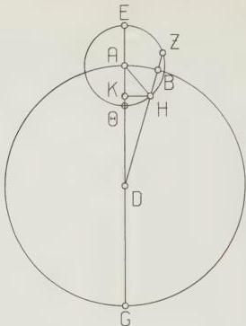
Fig. A

To solve a right-angled triangle (here HKA), Ptolemy imagines a circle circumscribed about it. Then the hypotenuse of the triangle is the diameter of the circle, and is taken (initially) as 120 parts ($R = 60$ being the standard on which Ptolemy’s chord table is constructed). The two acute angles of the triangle being given, the other two sides can now be expressed in the same units: they are the chords of the arcs of the circumscribed circle, which are the doubles of the angles of the triangle (since they are equal to the angles at the centre). Instead of explicitly doubling these angles, Ptolemy always first expresses them in ‘units of which 2 right angles are 360’. (Following the convention invented by B. R. Goldstein, I indicate these ‘denii degrees’ by the notation $\diamond\ast$, reserving $\diamond$ for the standard degree of which there are 90 in a right angle.) This enables him to switch smoothly from the triangle to the circle (and hence to the chord table, which gives him the actual numbers $60^{\circ}$ and $103;55^{\circ}$): an angle of size $\theta^{\circ}$ is $2\theta^{\circ}$, and hence the arc of the circumscribing circle which corresponds to that angle is $2\theta^{\circ}$.

‘Therefore in those [units] of which line AH is 2;30, and the radius AD is 60, HK will be 1;15 and AK, likewise, 2;10, and KD, the remainder, 57;50.’

The sides of triangle AKH are converted to the norm representing their actual size ($AH = 2;30^{\circ}$, hence they are multiplied by 2;30/120). This gives two sides of the next right triangle to be solved, DHK:HK and (by subtraction of AK from the given AD) KD.

‘And since the squares on these added together make the square on DH, the latter will be, in length, approximately 57;51 of the units of which line KH was [found to be] 1;15.'

Since Ptolemy has no tangent function, he has to use ‘Pythagoras’ theorem’ to find the hypotenuse of the right triangle in question. He uses the word μήκει, ‘in length’, to indicate that he is taking the square root (considered as the side of a square, hence a line length).

‘And so of those [units] of which hypotenuse DH is 120, line HK will be 2;34 and the arc on it [HK, will be] 2;27 of those [units] of which the circle about DHK is 360. So that angle HDK is 2;27 of those [units] of which 2 right angles are 360, and about 1;14 of those of which 4 right angles are 360.’

The sides of triangle DHK are now converted to the standard in which the hypotenuse is 120°, thus enabling Ptolemy to use the chord table to determine the size of the arc corresponding to the side opposite the angle to be determined, HDK. The latter, being at the circumference of the circumscribed circle, is half the arc. Ptolemy again expresses this relationship by saying that it is the same number of ‘demi degrees’ as the arc is ‘single degrees’, and then converting the ‘demi degrees’ to ‘single degrees’ by halving. Note that I frequently translate expressions like ‘30 degrees of the kind of which the great circle is 360’ simply as ‘30°’.

(d) Chronology and calendars

Ptolemy’s own chronological system is very simple. He uses the Egyptian year and the era Nabonassar. The Egyptian year is of unvarying length of 365 days, consisting of twelve 30-day months and 5 extra (‘epagomenal’) days at the end. Ptolemy uses the Greek transliterations of the Egyptian month names. For the reader’s convenience, I usually add a Roman numeral indicating the number of the month. The order of the months is:

| I | Thoth | VII | Phamenoth |
| --- | --- | --- | --- |
| II | Phaophi | VIII | Pharmouthi |
| III | Athyr | IX | Pachon |
| IV | Choiak | X | Payni |
| V | Tybi | XI | Epiphi |
| VI | Mechir | XII | Mesore. |

The reason for choosing the era Nabonassar is given by Ptolemy at III 7 (p. 166: the earliest (Babylonian) observations available to him were from the reign of King Nabonassar. Ptolemy’s epoch, Nabonassar 1, Thoth 1 corresponds to –746 February 26 in our reckoning.

Even when he refers to other calendars, Ptolemy usually gives the equivalent date in his own system, so there is no uncertainty. Sometimes, however, he gives, not the running date in the era Nabonassar, but only the regnal year of a king. It is clear that there already existed, in some form, a ‘king-list’ enabling one to relate the regnal year of a given king to a standard epoch. Later, in his ‘Handy Tables’, Ptolemy published such a king-list (known as ‘Canon Basileon’), and it survives, in a considerably augmented form, in Byzantine versions of Theon of Alexandria’s revision of the Handy Tables. From these I have excerpted and ‘reconstructed’ the table on p. 11, which makes no historical pretensions, but is intended solely as an aid to readers of this book. The basis of the table is Usener’s edition of the two versions in the manuscript Leidensis gr. 78, in *Monumenta Germaniae Historica, Auctores Antiquissimi* XIII (Chronica Minora Saec. IV.V. VI.VII, ed. Th. Mommsen), Vol. III, 447–53, supplemented by my own reading of the version in the ms. Vaticanus gr. 1291, 16°–17’. The names of the Babylonian and Assyrian kings are obviously very corrupt, and I have made no attempt to emend them, but have chosen those manuscript variants which seem closest to the forms now known from the cuneiform sources, which are listed in the second column (supplied to me by A. Sachs).

For the purposes of astronomical chronology, an integer number of years is assigned to each reign. As far as can be checked from independent sources, ‘Year 1’ of each reign was assumed to begin on the Thoth 1 preceding the historical date on which the king began to reign. Thus, to use the table to go from a given regnal year to the era Nabonassar, one simply adds the number of the regnal year to the total listed (in the fourth column) for the previous king. E.g. to find the second year of Mardokempad in the era Nabonassar (cf. IV.8 p. 204), we add 2 to the total of 26 given for his predecessor, Ilulai, and get the twenty-eighth year in the era Nabonassar.

Although I supply in the translation the modern equivalent of all dates in the Almagest, I have added, for the use of those readers who wish to check them, a fifth column listing the Julian equivalent of the first day of each king’s reign. If one bears in mind that every Julian year divisible by 4 is a leap-year, while the Egyptian year is constant, this is a sufficient basis for the calculation. However, I recommend as an easier alternative the use of Schram’s *Kalendariographische Tafeln*: from pp. 182–9 of that one can find the Julian day number of any date in

| Ruler | Correct form | Years of reign | Total years to end of reign | Julian date of beginning of reign |
| --- | --- | --- | --- | --- |
| **Kings [of Assyria and Babylonia]** | | | | |
| 1 Nabonassar | Nabū-nāṣir | 14 | 14 | -746 Feb. 26 |
| 2 Nadi | Nādin | 2 | 16 | -732 Feb. 23 |
| 3 Chinzer and Por | Ukin-zer; Pūlu | 5 | 21 | -730 Feb. 22 |
| 4 Ilulai | Elulai | 5 | 26 | -725 Feb. 21 |
| 5 Mardokempad | Marduk-apla-iddin | 12 | 38 | -720 Feb. 20 |
| 6 Arkean | Šarru-ukin | 5 | 43 | -708 Feb. 17 |
| 7 First interregnum | | 2 | 45 | -703 Feb. 15 |
| 8 Belib | Bēl-ibni | 3 | 48 | -701 Feb. 15 |
| 9 Aparanad | Alšur-nādin-šumi | 6 | 54 | -698 Feb. 14 |
| 10 Regebel | Nergal-ušezib | 1 | 55 | -692 Feb. 13 |
| 11 Mesesemordak | Mušezib-Marduk | 4 | 59 | -691 Feb. 12 |
| 12 Second interregnum | | 8 | 67 | -687 Feb. 11 |
| 13 Asaridin | Alšur-aḷa-iddina | 13 | 80 | -679 Feb. 9 |
| 14 Saosdouchin | Šamaš-šuma-ukin | 20 | 100 | -666 Feb. 6 |
| 15 Kiniladan | Kandalānu | 22 | 122 | -646 Feb. 1 |
| 16 Nabopolassar | Nabū-apla-uṣur | 21 | 143 | -624 Jan. 27 |
| 17 Nabokolassar | Nabū-kudurra-uṣur | 43 | 186 | -603 Jan. 21 |
| 18 Illoaroudam | Amil-Marduk | 2 | 188 | -560 Jan. 11 |
| 19 Nerigasolassar | Nergal-šarra-uṣur | 4 | 192 | -558 Jan. 10 |
| 20 Nabonadi | Nabū-naʿid | 17 | 209 | -554 Jan. 9 |
| **Kings of the Persians** | | | | |
| 21 Cyrus | Kūruš | 9 | 218 | -537 Jan. 5 |
| 22 Kambyses | Kaņbužiya | 8 | 226 | -528 Jan. 3 |
| 23 Darius I | Dārayavau | 36 | 262 | -520 Jan. 1 |
| 24 Xerxes | χšayāršā | 21 | 283 | -485 Dec. 23 |
| 25 Artaxerxes I | Artaχšaθrā | 41 | 324 | -464 Dec. 17 |
| 26 Darius II | Dārayavau | 19 | 343 | -423 Dec. 7 |
| 27 Artaxerxes II | Artaχšaθrā | 46 | 389 | -404 Dec. 2 |
| 28 Ochus | Vahauka | 21 | 410 | -358 Nov. 21 |
| 29 Arogos | Hāwarša | 2 | 412 | -337 Nov. 16 |
| 30 Darius III | Dārayavau | 4 | 416 | -335 Nov. 15 |
| 31 Alexander the Macedonian | Ἀλέξανδρος | 8 | 424 | -331 Nov. 14 |
| **Kings of the Macedonians** | | | | |
| 32 Philip who succeeded Alexander the founder | Φίλιππος | 7 | 431 | -323 Nov. 12 |
| 33 Alexander II | Ἀλέξανδρος ἕτερος | 12 | 443 | -316 Nov. 10 |
| 34 Ptolemy son of Lagos | Πτολεμᾶλος Λάγου | 20 | 463 | -304 Nov. 7 |
| 35 Ptolemy Philadelphos | Φιλάδελφος | 38 | 501 | -284 Nov. 2 |
| 36 Ptolemy Euergetes | Εὐεργέτης | 25 | 526 | -246 Oct. 24 |
| 37 Ptolemy Philopator | Φιλοπάτωρ | 17 | 543 | -221 Oct. 18 |
| 38 Ptolemy Epiphanes | Ἐπιφανής | 24 | 567 | -204 Oct. 13 |
| 39 Ptolemy Philometor | Φιλομήτωρ | 35 | 602 | -180 Oct. 7 |
| 40 Ptolemy Euergetes II | Εὐεργέτης βʹ | 29 | 631 | -145 Sept. 29 |
| 41 Ptolemy Soter | Σωτήρ | 36 | 667 | -116 Sept. 21 |
| 42 Ptolemy Neos Dionysus | Διόνυοος νέος | 29 | 696 | -80 Sept. 12 |
| 43 Cleopatra | Κλεοπάτρα | 22 | 718 | -51 Sept. 5 |
| **Kings of the Romans** | | | | |
| 44 Augustus | Augustus | 43 | 761 | -29 Aug. 31 |
| 45 Tiberius | Tiberius | 22 | 783 | 14 Aug. 20 |
| 46 Gaius | Gaius | 4 | 787 | 36 Aug. 14 |
| 47 Claudius | Claudius | 14 | 801 | 40 Aug. 13 |
| 48 Nero | Nero | 14 | 815 | 54 Aug. 10 |
| 49 Vespasian | Vespasian | 10 | 825 | 68 Aug. 6 |
| 50 Titus | Titus | 3 | 828 | 78 Aug. 4 |
| 51 Domitian | Domitianus | 15 | 843 | 81 Aug. 3 |
| 52 Nerva | Nerva | 1 | 844 | 96 July 30 |
| 53 Trajan | Traianus | 19 | 863 | 97 July 30 |
| 54 Hadrian | Hadrianus | 21 | 884 | 116 July 25 |
| 55 Antoninus | Aelius Antoninus | 23 | 907 | 137 July 20 |

the era Nabonassar in a few seconds, and hence (from his other tables) the equivalent date in any standard calendar.

The only other aspect of Ptolemy’s own chronology requiring remark is the ‘double dates’. He frequently characterises the day of an observation by expressions like Παχών ιζ’ εἰς τὴν ιη’, translated ‘Pachon 17/18’, but literally ‘Pachon, the seventeenth towards the eighteenth’. Modern commentators have made unnecessarily heavy weather of this. Ptolemy himself uses a noon epoch, but this is an artificial starting-point (the reason for which he explains at III 9 pp. 170–1), and has nothing to do with *numbering* the day. In antiquity the ‘civil epoch’ of the day was either dawn (as in Egypt) or sunset (as in Babylon). In either system, an event which took place in the daylight would be on the same ‘day’, but one which took place in the night would be on ‘day n’ for those using dawn epoch and ‘day n+1’ for those using sunset epoch. Hence ambiguity was possible. Ptolemy uses double dates (which are found *only* for night-time observations) to avoid this ambiguity. The form he uses implies the Egyptian, i.e. dawn epoch (cf. the long form III 1 p. 138,τῇ ια’ τοῦ Μεσορὴ μετὰ β’ ὥρας ἐγγύς τοῦ εἰς τὴν ιβ’ μεσονυκτίου (literally ‘on the eleventh of Mesore, approximately two hours after the midnight towards the twelfth’), but it would be clear even to someone using sunset epoch (who would date the above event to ‘Mesore 12’) what day he means.

In using the observations of his predecessors Ptolemy often has occasion to refer to other systems of chronology and calendars. Although in such cases one can always readily derive the equivalent date in Ptolemy’s own system (he almost always gives it explicitly), I shall describe them briefly here.

The most frequently mentioned is the *Kallippic Cycles*. To explain this, we must go back to Meton, who in –431 devised a 19-year ‘cycle’, i.e. a fixed scheme of intercalation of months containing 6940 days (thus the average length of a year was $365\frac{1}{2} + \frac{1}{6}$ days). Since he was an Athenian, he used the month names of the Athenian civil calendar for the months of his artificial ‘calendar’. A hundred years later an associate of Aristotle, Kallippos, produced a revision of this, based on the more accurate year-length of $365\frac{1}{2}$ days. In order to achieve this, he eliminated one day from 4 Metonic cycles, thus producing the ‘Kallippic cycle’ of 76 years and 27759 days. What was later known as the ‘First Kallippic Cycle’ began at the summer solstice (probably June 28th) of the year –329. In the Almagest we find references also to the Second and Third Kallippic Cycles, which began in –253 and –177 respectively. To judge from the Almagest, this chronological system was the one most used by earlier Hellenistic astronomers. In VII 3 four observations by Timocharis (Alexandria, third century B.C.) are given according to the year of the First Kallippic Cycle and ‘Athenian’ month and day. On the basis of these, several attempts have been made to reconstruct the whole ‘Kallippic calendar’, with discrepant results. Since the above constitute the whole evidential basis, apart from the passage in Geminus, *Eisagoge* VIII, which I regard as fiction, and two dubious equivalences in the Milesian parapegma, any reconstruction is academic. Here I note only that Kallippos evidently retained the peculiar Athenian method of counting the days of the month by decads, and in the last decad counting backwards, so that VII 3 p. 336 τῇ ὑφθίνοντος, literally ‘on the sixth [day] of the waning [moon]’, means ‘the sixth day from the end of the last decad’, i.e. the twenty-fifth.

Hipparchus too used the Kallippic cycles for astronomical dating, but combined them, not with Kallippos’ ‘Athenian’ calendar, but with the Egyptian calendar (i.e. he used the cycles simply as a year count), at least as far as we can tell from the Almagest. This seems to have led to ambiguities, since the ‘Kallippic’ year began at or near the summer solstice, while the Egyptian year is a ‘wandering year’, which in Hipparchus’ time began about the end of September. Thus there arose the possibility of a discrepancy of 1 in the year count, for certain stretches of the year (whether it is +1 or -1 depends on Hipparchus’ choice). Such a discrepancy is firmly attested in Almagest IV 11 (see p. 214 n. 72), and cannot plausibly be removed by emendation, though this has been done (by Ideler and others) in the interest of consistency. In fact it is impossible to make all of Hipparchus’ ‘Kallippic cycle’ dates in the Almagest consistent with one another (see p. 224 no. 13), and we must allow for the possibility that Hipparchus used different systems in different works.

Three planetary observations in the Almagest are dated κατὰ Χαλδαίους, ‘according to the Chaldaeans’, with a year number and a Macedonian month name and day number. The year numbers show that the era used is that known in modern times as the Seleucid Era (dating from the year which Seleucus I counted as the first of his reign, -311/10), which was common throughout the Seleucid empire. Since the observations are undoubtedly Babylonian, the particular epoch used in them is, as one would expect, that known from the surviving Babylonian astronomical texts, 1 Nisan (April) –310 (Greeks under the Seleucid empire commonly used an epoch of autumn –311). The use of Macedonian month names has rightly been taken to show that the Babylonian lunar months were simply called by the names of the Macedonian months by the Greeks under the Seleucid empire: if one computes the date of the first day of the ‘Macedonian’ month from the equivalent date in the era Nabonassar given by Ptolemy, it coincides (with an error of no more than one day) with the computed day of first visibility of the lunar crescent at Babylon. There is other evidence for the assimilation of the month names, but this is the strongest.

Unattested outside the Almagest is the Calendar of Dionysius. This had a running year count and months named after the signs of the zodiac (corresponding, at least approximately, to the period of the year when the sun was in the sign in question). The months Tauron (✐), Didymon (⏰), Leonton (⏰), Parthenon (⏰), Skorpion (⏰), Aigon (⏰) and Hydron (⏰) are attested. From analysis of the Almagest evidence Böckh, *Sonnenkreise* 286–340, showed that the epoch of the calendar was the summer solstice of –284. Since Thoth 1 (Nov. 2) of –284 is the beginning of the first regnal year of Ptolemy Philadelphos, it is plausibly concluded that Dionysius observed in Egypt. Böckh’s further conclusions, that the calendar was similar to the Egyptian one in having 12 months of 30 days, but was modified by introducing a sixth epagomenal day every four years, cannot be regarded as certain, especially since this requires ‘emending’ some of the Almagest dates. Here, as for the Kallippic calendar, ‘reconstruction’ seems pointless when the evidence is so scanty and the likelihood of verification utterly remote.

One observation is dated in the *Bithynian calendar* of the imperial period. Like a number of other contemporary calendars in Asia Minor, this was simply the Julian calendar, with different month-names, and with the first day of the year Augustus’ birthday, Sept. 23. For details and literature see Samuel, *Greek and Roman Chronology* 174–5.

### (e) Ptolemy’s star catalogue

The list of the coordinates and magnitudes of the principal fixed stars visible to Ptolemy poses special problems to the translator. In particular, there are numerous manuscript variants in the coordinates, and while one must put some number in the translation, it is often difficult to be certain about one’s choice. The solution I have adopted is (in the star catalogue only) to append an asterisk to any element (longitude, latitude, magnitude, description or identification) where there is reason to suppose that it may be incorrect (i.e. not what Ptolemy wrote or intended), either because there is a plausible ms. variant, or because of some gross inconsistency with the astronomical facts. In such cases I give all significant variants known to me in a footnote. I have made no effort to record all variants, since most are obviously wrong. The reader who wishes to go further must still consult Peters-Knobel, on which I have drawn heavily, and which is still the best treatment of the catalogue as a whole, though badly in need of updating and revision in certain respects.

Ptolemy lists the stars under 48 constellations, and gives for each star (1) a description of its location on the ‘figure’ and (sometimes) of its brightness and colour; (2) its longitude; (3) its latitude and direction (north or south of the ecliptic); and (4) its magnitude. I have followed my predecessors (notably Manitius) in adding to these: (a) an initial column giving a running number to the star within its constellation (stars listed at the end of some constellations by Ptolemy as ‘outside the constellation’, i.e. not part of the imaginary figure, are numbered continuously with those preceding them); (b) a final column giving the modern identification of the star. For those stars which have them, this is the Bayer letter or Flamsteed number. Certain fainter stars have neither; for these I give the number in the Yale Bright Star Catalogue (abbreviated as ‘BSC’). From that publication those interested can find the corresponding number in the Durchmusterung and the Henry Draper and Boss General Catalogues. I have abandoned all references to the antiquated Piazzi catalogue (still used by Peters-Knobel).

I have used Roman numerals to number the constellations, and refer to individual stars (throughout the translation) by the combination of Roman and Arabic numerals (thus ‘catalogue XXXIX 2’ refers to the second star in the thirty-ninth constellation (Canis Minor), namely Procyon).

The star descriptions pose numerous individual problems, only a few of which are touched on in the footnotes. Ideally one should provide a reconstruction of the outline of each constellation as it appears on Ptolemy’s star-globe. Unfortunately no one has done the necessary work of assembling and comparing all the literary and iconographic evidence from antiquity and from the derivative Arabic tradition (notably as-Ṣūfī). This would be an interesting and valuable enterprise. Meanwhile, for the reader who needs some visual illustration, I can recommend only the old work of Bayer, *Uranometria*, with the warning that in many cases his positioning of the stars on the figures, and the outlines of the figures themselves, are certainly different from Ptolemy’s. On the matter of the orientation of the figures, I have satisfied myself that Ptolemy describes them as if they were drawn on the *inside* of a globe, as seen by an observer at the centre of that globe, and facing towards him. This is in agreement with what Hipparchus says (*Comm. in Arat.* I 45): ‘for all the stars are described in constellations (ἡστέρισται) from our point of view, and as if they were facing us, except for such of them as are drawn in profile’ (κατάγραφον, as interpreted by Manitius, whom I follow dubiously). It is in this sense that we must interpret ‘left hand’, ‘right leg’, etc. This has to be said, since on the actual star globes the constellations were necessarily drawn on the *outside*. Hence the orientation of the figures was (at least in some cases) reversed, which could lead to confusion. I have rendered the prepositions used by Ptolemy in indicating the positions of stars with respect to parts of the figures consistently, as follows:

$$
\begin{aligned}
&\text{in} = \dot{\varepsilon} v \\
&\text{on} = \dot{\varepsilon} \pi i \\
&\text{over} = \dot{v} \pi \dot{\varepsilon} \rho
\end{aligned}
$$

above = ἐπάνω
under = ὑπό
below = ὑποκάτω
just over = κατὰ + genitive
advance, in advance = προηγούμενος
rear, to the rear = ἐπόμενος

On the meaning of the last two terms see below p. 20. Note that ‘rear’ is never used in a sense other than directional. To indicate the back parts of an animal figure I use ‘hind’.

Both longitudes and latitudes are given, not in degrees and minutes, but in degrees and fractions of a degree. I have retained this in the translation (see p. 7). With very few exceptions, the longitudes are not given more accurately than to $\frac{1}{4}^{\circ}$. (This has been taken to imply that the ecliptic ring of Ptolemy’s instrument was graduated only every $10^{\prime}$). However, one frequently finds the fractions $\frac{1}{4}^{\circ}$ and $\frac{1}{4}^{\circ}$ for the latitudes.

The latitudes in Ptolemy’s list are preceded by the direction ($\beta\alpha = \beta\acute{\alpha}\pi\acute{\alpha}\varsigma$, ‘northern’; $\nu\alpha = \nu\acute{\alpha}\tau\iota\varsigma$, ‘southern’). I have rendered these by + and – respectively.

The magnitudes range (according to a system which certainly precedes Ptolemy, but is only conjecturally attributed to Hipparchus) from 1 to 6. Ptolemy indicates intermediate magnitudes by adding (after the number) μείζων, ‘greater’ or ἐλάσσων, ‘less’ (abbreviated in the mss.). I have rendered these by > and < (before the number) respectively. One occasionally finds for the magnitude, instead of a number, the remark ἀμαυρός (rendered ‘f.’ for ‘faint’) or νεφελ. (for νεφελοειδής), ‘nebulous’, abbreviated as ‘neb.’

For the identifications, wherever Peters-Knobel and Manitius are in agreement, I have usually been content to adopt their opinion. Where they differ (and even when they agree, in some special cases), I have checked the possibilities as carefully as I could, using the large-scale *Atlas of the Heavens* by Βεϊνάζ, and transforming Ptolemy’s coordinates to right ascension and declination at the modern epoch, where necessary. However, I have made no attempt to redo the work of Peters and Knobel, namely to compute the longitude and latitude of the relevant stars for Ptolemy’s time from modern data (in particular using the most up-to-date values for the proper motions). This might be worth while, though I doubt whether the degree of improvement over Peters-Knobel would justify the large amount of computation. In any case, it is unlikely that it would eliminate the doubts that remain about the identification of many of the fainter stars.

At the end of each constellation in the mss. are listed the total number of stars in the constellation, and the sub-totals of each magnitude. These in turn are added up at various intermediate points (the northern segment, the zodiac, and the southern segment), and the grand totals are given at the end. I am

17

convinced that this was not done by Ptolemy (who makes no mention of it in his description of the catalogue, VII 4 pp. 339-40). Another indication of the spuriousness of these passages is that no separate count is made in the totals of the stars which are greater (>) or less (<) than a certain magnitude: all are lumped in with the stars of that magnitude. I have translated the passages in question, but enclosed them in brackets thus: [ ].

## (f) Explanations of special terms

### (i) Geometrical

by subtraction (λοιπός -ή -όν): literally ‘the remaining [part]’, ‘remainder’ (I have on occasion so rendered it).

by addition (δλος -η -ον): literally ‘the total’.

Crd x: chord of the angle $x^\circ$ ($R = 60^\circ$). Greek has no word with the specific meaning ‘chord’, but uses the generic εὐθεῖα, ‘straight line’. ‘Crd x’ renders ἡ τὰς x μοίρας ὑποτείνουσα εὐθεῖα, ‘the straight line subtending x degrees’.

In connection with the Menelaus Theorem (see p. 18), an expression of the type ‘Crd arc 2AB’ represents ἡ ὑπὸ τὴν διπλῆν τῆς ΑΒ περιφερείας, literally ‘the [line] subtended by the double of arc AB’.

supplement, supplementary arc (ἡ λείπουσα [λοιπὴ] εἰς τὸ ἡμικύκλιον περιφέρεια): literally ‘the arc which is the remainder to the semi-circle’.

complement (λοιπὴ εἰς τὸ τεταρτημόριον): literally, ‘the remainder to the quadrant’.

|| literally, ‘is similar to’. Used of arcs of different-sized circles. Arc AB || arc GD if each arc is the same fraction of its circle.

|| (ἰσογώνιον ἐστι): literally, ‘has [all] its angles equal to’, i.e. is similar to (used only of triangles).

≡ (ἰσοπλευρον ἐστι): literally ‘has its sides equal to’, i.e. is congruent to. Used only of spherical triangles. Sometimes ἰσογώνιον καὶ ἰσοπλευρον ἐστι, ‘has its angles and sides equal to’.

Q.E.D. (ὅπερ ἔδει δεῖξαι): literally ‘which is what it was required to prove’.

componendo (συνθέντι). Expresses the operation of addition of ratios: if $a : b = c : d$, then $(a + b) : b = (c + d) : d$.

dividendo (διελόντι, κατὰ διαίρεσιν) (1) Usually expresses the operation of subtraction of ratios: if $a : b = c : d$, then $(a - b) : b = (c - d) : d$.

(2) Once, at XII 1 (see p. 558 n.4) διελόντι expresses division of members of ratios. If $a : b = c : d$, then $\frac{a}{b} : b = \frac{c}{b} : d$.

Menelaus Configuration and Menelaus Theorem (used only in the footnotes and explanatory additions). Cf. HAMA 26-9. Fig. B represents a Menelaus Configuration. m,n,r and s are four great circle arcs on the surface of the sphere, intersecting each other as shown, and divided by the intersections into the parts $m_1$, $m_2$ etc. (thus $m = m_1 + m_2$ etc.) In I 10 Ptolemy proves the theorems

$$
\begin{array}{l}
\text{I} \quad \frac{\mathrm{Crd\ 2m}}{\mathrm{Crd\ 2m_1}} = \frac{\mathrm{Crd\ 2r}}{\mathrm{Crd\ 2r_1}} \times \frac{\mathrm{Crd\ 2s_2}}{\mathrm{Crd\ 2s}} \\
\text{II} \quad \frac{\mathrm{Crd\ 2r_2}}{\mathrm{Crd\ 2r_1}} = \frac{\mathrm{Crd\ 2m_2}}{\mathrm{Crd\ 2m_1}} \times \frac{\mathrm{Crd\ 2n}}{\mathrm{Crd\ 2n_2}}.
\end{array}
$$

Since it is known that these were discovered by Menelaus, Neugebauer has named them ‘Menelaus Theorem I’ and ‘Menelaus Theorem II’ respectively, and I follow him, abbreviating to ‘M.T.I.’ and ‘M.T.II’.

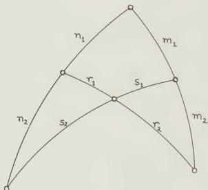
Fig. B

(ii) Spherical astronomy

(at) sphaera recta (ἐπ’ ὀρθῆς τῆς σφαίρας) and (at) sphaera obliqua (ἐπ’ ἐγκεκλιμένης τῆς σφαίρας). These mediaeval Latin terms are the literal translations of the Greek, meaning ‘on the upright sphere’ and ‘on the inclined sphere’ respectively. Probably taken from the use of celestial globes, they refer to the phenomena which occur when the celestial equator is perpendicular to the local horizon (sphaera recta) or inclined to it at an acute angle (sphaera obliqua). In particular, we use rising-time at sphaera recta or right ascension, and rising-time at sphaera obliqua or oblique ascension to designate the arc of the equator which crosses the horizon together with a given arc of the ecliptic (e.g. one

zodiacal sign) at sphaera recta (i.e. at the terrestrial equator), and at sphaera obliqua (i.e. any other terrestrial latitude) respectively.

equator represents $\text{一} \text{一} \text{一} \text{一} \text{一} \text{一} \text{一} \text{一} \text{一} \text{一}$ , literally 'circle of equal day', so called for the reason Ptolemy gives in I 8 (pp. 45-6).

meridian represents μεσημβρινός (κύκλος), literally 'midday circle' (defined and explained at I 8 p. 47). Meridian passage of a heavenly body is called culmination. The Greek terms for culminate and culmination, μεσουρανεῖν, μεσουράνησις, mean literally 'being in the middle of the heaven'. upper and lower culmination are expressed by ὑπὲρ γῆν and ὑπὸ γῆν, meaning 'above the earth' and 'below the earth' respectively, and sometimes so translated.

An altitude circle is any circle drawn through the zenith perpendicular to the horizon. Ptolemy has no special term for this in the Almagest, merely saying 'the (great) circle drawn through the zenith (through the poles of the horizon)', e.g. II 12, HI 166, 20-1.

colure. This term is used by Ptolemy only once, at II 6 p. 83. I translate part of Manitius' note on that passage: Two of the circles of declination through the poles of the equator are named 'colure' (κόλουρος): the solsticial colure, which goes through the solstices and hence carries the poles of the ecliptic, and the equinoctial colure. These two colures divide the sphere into four equal parts and divide both ecliptic and equator into four quadrants, so that one quadrant corresponds to each season of the year. Ptolemy counts the solsticial colure as boundary of the daily revolution [I 8 pp. 46-7, where however the term 'colure' is not used], but never explicitly mentions the equinoctial colure. Both colures were already defined by Eudoxus (Hipparchus, Comm. in Arat. 117 ff.) The term is explained by Achilles, Isagoge 27 (Maass, Comm. in Arat. 60) as follows: 'They are called colures because they appear to have their tails cut off as it were (κεκολοῦσθαι ὥσπερ τὰς οὐράς), since we cannot see the parts of them beginning at the antarctic, always invisible parallel'.

It is unfortunate that we have to use the same word latitude to refer both to the celestial coordinate (vertical to the ecliptic) and to the unrelated terrestrial coordinate. Ptolemy uses, for the former πλάτος, and for the latter κλίμα, literally 'inclination'. When necessary I gloss this e.g. as '[terrestrial] latitude'. κλίμα, however, does not refer to the coordinate as such (for which Ptolemy uses ἐγκλίμα, HI 68,9, ἐγκλίσις, HI 101,23 or, once, πλάτος, HI 188,4), but to a specific 'band' of the earth where the same phenomena (e.g. length of longest daylight) are found. Hence in early Hellenistic times arose the notion of the division of the known world (the οἰκουμένη) into 7 standard climata (see HAMA 334 ff., II 727 ff. and Honigmann, Die sieben Klimata). This is reflected in several places in the Almagest, e.g. in Table II 13. I refer to these seven standard parallels by Roman numerals, e.g. Clima IV = the parallel through Rhodes, longest day $14\frac{1}{2}$ hours.

### (iii) Referring to the heavenly bodies

As Ptolemy explains in I 8, in his system the whole heavens are conceived as rotating from east to west, making one revolution daily. The direction defined by this motion, and the direction counter to it, are called εἰς τὰ προηγούμενα (‘towards the leading [parts]’) and εἰς τὰ ἑπόμενα (‘towards the following [parts]’) respectively. The corresponding adjectives προηγούμενος and ἑπόμενος are also found, particularly in the star catalogue, and Ptolemy frequently uses the phrases εἰς τὰ προηγούμενα (ἑπόμενα) τῶν ζφδίων, ‘towards the leading (following) [parts] of the zodiacal signs’, to indicate the direction of motion in the ecliptic. A modern reader may find this confusing: since the normal motion of bodies in the ecliptic is from west to east, what we regard as forward motion, e.g. of a planet, is described as ‘towards the following [parts]’ (‘towards the rear’ in my translation). No version of these terms in a modern language is satisfactory. One cannot use ‘west’ and ‘east’ because these must be reserved for Ptolemy’s δυσμαί and ἀνατολαί, which are confined to situations where a terrestrial observer is implied. It is a distortion to translate (with Manitius) ‘in the reverse order of the signs’ and ‘in the order of the signs’, since this implies that the terms define ecliptic coordinates, whereas they are in the equatorial system, and while it is usually true that a celestial object which προηγεῖται (‘leads’) another will have a lesser ecliptic longitude, if their latitudes differ greatly the reverse may be true, especially at very high ecliptic latitudes. Precisely this situation occurs in the star catalogue, despite Ptolemy’s own statement at VII 4 p. 340 that the terms in the catalogue define ecliptic coordinates (see n.93 there). Although I am aware that my choice too has its drawbacks, I have settled on in advance for εἰς τὰ προηγούμενα, and towards the rear for εἰς τὰ ἑπόμενα. These always imply ‘with respect to the daily motion from east to west’, with the paradoxical consequence, as remarked above, that in the ecliptic a body which is ‘in advance’ of another has a lesser longitude. However, I have committed an inconsistency in translating the derived noun προήγησις as retrogradation. This is used only for the portion of the courses of the five planets in which they reverse their normal direction of motion, and it would be too confusing to render this by ‘motion in advance’.

*ecliptic.* Ptolemy never refers to this circle by the term ἐκλειπτικός (which he confines strictly to the meaning ‘having to do with eclipses’). His normal term is ὁ διά μέσων τῶν ζφδίων (κύκλος), ‘the (circle) through the middle of the zodiacal signs’ (e.g. HI 18,23–4); more fully, ὁ λόξος καὶ διά μέσων τῶν ζφδίων κύκλος, ‘the inclined circle through the middle of the signs’ (HI 64,4). Occasionally, when the context is clear, simply λόξος κύκλος, ‘inclined circle’ (HI 8,22). However, the latter can be used for other things, notably the moon’s orbit (which is ‘inclined’ to the ecliptic). I normally use ‘ecliptic’ throughout.

*[zodiacal] sign.* The conventional subdivision of the ecliptic into twelve 30° stretches named Aries, Taurus, etc. For this Ptolemy uses, not ζφδιον (‘animal sign’), but δωδεκατημόριον (‘twelfth’), presumably because he wishes to distinguish the ecliptic, a notional circle, from the zodiac, a band of actual constellations.

star. The Greek term ἀστήρ really means ‘heavenly body’, and can be used indifferently for a star (in the modern sense), a planet, or even the sun and moon. When Ptolemy wishes to distinguish what we call stars, he says ‘fixed stars’. I have normally translated ἀστήρ according to the context, as ‘planet’, ‘star’ or ‘body’. However, in I 3-8, where Ptolemy uses the term to include all heavenly bodies, I too have used star in this special sense. When naming the five planets, Ptolemy almost always uses the periphrasis ‘star of . . ’, thus ὁ τοῦ Κρόνου [ἀστήρ], ‘[star] of Kronos’. I always translate simply ‘Saturn’ etc.

latitude (celestial). πλάτος (literally ‘breadth’) refers not only to ‘the direction orthogonal to the ecliptic’, but to any ‘vertical’ direction, e.g. that normal to the equator. In such cases I use, not ‘latitude’, but another appropriate term (see I 12 p. 63 with n. 74). In VII 3, however, I have been forced to use ‘latitude’ to express the more general meaning of the Greek (see p. 329 n.55).

Ptolemy uses ἔκκεντρος as both adjective and noun. It may be that in the latter case one has always to understand ἔκκεντρος κύκλος, ‘eccentric circle’. However, to avoid ambiguity, I have (following mediaeval usage) consistently denoted the noun by eccentre and the adjective by eccentric. An ‘eccentre’ is simply an eccentric circle. Similarly for concentre and concentric.

I have occasionally used the convenient mediaeval term deferent to denote the circle on which an epicycle is ‘carried’. Ptolemy has no one-word equivalent, but uses phrases like ‘the concentric carrying the epicycle’, ‘the circle carrying it’.

anomaly. As noted e.g. by Pedersen (139 with n.9), ἀνωμαλία in the Almagest has a number of different meanings. Despite the ambiguity, I have generally rendered ἀνωμαλία and the adjective from which it is derived, ἀνώμαλος, by ‘anomaly’, ‘anomalistic’, although where necessary I have translated the latter literally as ‘non-uniform’. Besides referring to non-uniform motion, ‘anomaly’ is also used for the mean (hence uniform) motion of the moon and planets on their epicycles (because the motion on the epicycle produces the appearance of ‘non-uniformity’). For the planets Ptolemy distinguishes between the synodic anomaly (ἡ πρὸς τὸν ἥλιον ἀνωμαλία, ‘the anomaly with respect to the sun’, HII 255,8), which produces the phenomena of retrogradation and varies with the planet’s elongation from the sun, and the ecliptic anomaly (ζωδιακή ἀνωμαλία, HII 258,11), which varies according to the planet’s position in the ecliptic.

equation. I use this convenient mediaeval term for the angle (or arc) to be applied to a mean motion to ‘correct’ it to account for a particular feature of the geometric model. Ptolemy uses the vaguer terms τὸ διάφορον ‘difference’ (which is also used for many other things) and προσθαφαίρεσις (‘amount to be added or subtracted’). *equation of anomaly* refers to the correction for the varying position of a body on its epicycle, and *equation of centre* (only in the footnotes, not the text) to the correction due to the eccentricity of a planet’s deferent.

*centrum*. I have occasionally used this mediaeval term in the footnotes to denote the angular distance from apogee (see below) to the centre of the epicycle.

*elongation* (ἀποχή) is the angular distance along the ecliptic between two bodies or points. It is used particularly, but not exclusively, for the ecliptic distance between sun and moon.

*apogee* and *perigee* are simply transcriptions of ἀπόγειον and περίγειον, literally ‘[point] far from earth’ and ‘[point] near to earth’. These are the usual terms for the points on a body’s orbit which are respectively farthest from and nearest to the terrestrial observer. Ptolemy also uses the superlative forms ἀπογειότατον (περιγειότατον) σημεῖον (‘point farthest from (nearest to) earth’), with no obvious difference in meaning. However, in the case of Mercury, translation of both by ‘perigee’ generates an ambiguity. For all other bodies, in Ptolemy’s models, the perigee is diametrically opposite the apogee, but for Mercury the point of closest approach is about 120° from apogee. Ptolemy still refers to the point 180° from apogee as the ‘perigee’ (περιγείον) for Mercury, and when he wants to refer to the point of that planet’s closest approach uses the superlative (περιγειότατος). I have mitigated the ambiguity by translating the latter, not as ‘perigee’, but as ‘closest to earth’ (for Mercury alone).

*phase*. Used for the fixed stars and planets, this is simply a transcription of φάσις, and is a general term including all the significant ‘configurations with respect to the sun’ (listed by Ptolemy at VIII 4 pp. 409–10, and exemplified in his partially extant work φάσεις ἀπλανῶν ἀστέρων, ‘Phases of the Fixed Stars’), such as first visibility at sunset, or last visibility just before dawn. But the literal meaning of φάσις is ‘appearance’, and Ptolemy also uses it to mean specifically ‘first visibility’ of a body after a period of invisibility. To avoid ambiguity, I have translated the latter case by ‘first visibility’, reserving ‘phase’ for the general term.

(iv) Referring to sun and moon

*conjunction* is a fairly literal rendering of σύνοδος (‘meeting’), but *opposition* renders πανσέληνος (literally ‘full moon’, which occurs when sun and moon are in opposition). *sysygy* is a transcription of the convenient συζυγία (literally ‘yoking together’), a general term to denote either or both conjunction and opposition. In eclipses the partial phases are denoted by *immersion* (ἐμπτωσις, ‘falling in’, the phase from the beginning of the eclipse to totality) and *emersion* (ἀναπλήρωσις, ‘filling up again’, the phase from the end of totality to the end of the eclipse). The total phase is denoted by μονή (‘remaining’) and rendered by duration (of totality).

## (v) Time-reckoning

Ptolemy often uses the term νυχθήμερον, which combines the Greek words for night and day, to mean the ‘solar day’ of 24 hours. There is no such convenient term in English. I have generally translated it day when no ambiguity is possible, but have occasionally resorted to periphrasis (e.g. II 3 p. 79 = HI 96, 7-9). Since we use clocks, we reckon time by the mean solar day of uniform length, the average time taken by the sun to go from one meridian crossing to the next. In antiquity, where the normal means of telling time was the sundial, it was usually reckoned by the true solar day, of varying length, the time taken by the sun to go from one meridian crossing to the next on a specific day. In III 9 Ptolemy explains why they are different, and how to transform one into the other. He uses the terms ὅμαλά νυχθήμερα (‘uniform days’) and ἀνώμαλα νυχθήμερα (‘non-uniform days’) for mean and true solar days respectively. When he is talking about intervals, he often refers to those measured in true solar days as ‘reckoned simply’, and those measured in mean solar days as ‘reckoned accurately’.

The kind of hours normally used in the ancient world were seasonal hours (ὥραι καιρικαί), sometimes known as ‘civil hours’. An hour was 1/2th of the actual length of daylight or night-time at a given place, and hence the length of an hour varied according to terrestrial latitude and time of year, and a day-hour was of different length from a night-hour except at equinox. For astronomical purposes, however, the uniform 1/2th of a day was used; these were known as equinoctial hours (ὥραι ἰσημεριναί), because they were the same length as the seasonal hour at equinox. If an ordinal number is attached to an hour, it indicates a seasonal hour, counted from dawn (or sunset, if specified by ‘of night’ or by the context). Thus ‘the sixth hour’ is the same as noon.

time-degrees. Another way of measuring time was by the amount of the celestial equator which had passed a bound (horizon or meridian). This was often connected with the rising-times of ecliptic arcs (see pp. 18-19). This measurement was in degrees. Since 360° of the equator cross the meridian in about one day, one ‘time-degree’ equals 1/2th of an equinoctial hour or 4 minutes. The Greek term is χρόνοι ἰσημερινοί (‘equatorial times’), sometimes abbreviated to χρόνοι (‘times’).

## (vi) Other

mean (μέσος) can imply ‘of average length’ (as in ‘mean synodic month’) or ‘uniform’ (as in ‘mean motion in longitude’).

hypothesis. With some hesitation, I have used this to translate ὑπόθεσις, although the connotation in the Almagest never really coincides with the modern one. Whereas we use ‘hypothesis’ to denote a tentative theory which has still to be verified, Ptolemy usually means by ὑπόθεσις something more like ‘model’, ‘system of explanation’, often indeed referring to ‘the hypotheses which we have demonstrated'. The word still retains much of the etymological meaning of ‘basis on which something else is constructed’. The corresponding verbal forms are ὑποτίθεται, ὑποκεῖται, which I have frequently translated, not only as ‘assume’, but even as ‘it is given’. They are standard terms of Greek geometry in this sense at least as early as Euclid.

## 6. Editorial procedures

Since the translation is based principally on the Teubner text of Heiberg (see p. 3), it is keyed to that edition by the addition of Heiberg’s page numbers in the margin. There and elsewhere references to Heiberg are preceded by ‘H’. Thus HI 236,15 means ‘Heiberg’s edition, Vol. I p. 236 line 15’. Where the context makes it unnecessary the volume number is omitted.

Brackets are used as follows. Square brackets [ ] enclose explanatory additions to or expansions of the Greek text by the translator. Curved brackets [ ] enclose passages which I believe to be later additions to Ptolemy’s original text. Parentheses ( ) are used merely for clarity, better to express the author’s sequence of thought.

As explained on p. 5, I believe the list of chapter headings preceding each book to be a later addition. Nevertheless, since these serve a useful purpose, I have grouped them together at the beginning (pp. 27–32) to serve as a table of contents.

I have made no effort to provide a continuous commentary, but refer the reader to the relevant sections in Olaf Pedersen’s *A Survey of the Almagest* (abbreviated ‘Pedersen’) and O. Neugebauer’s *A History of Ancient Mathematical Astronomy* (abbreviated *HAMA*). My footnotes are confined to particulars not treated by them, or requiring some elaboration, and to textual corrections. In Appendix A, however, I have provided worked examples of every type of problem (including, where it is not utterly trivial, the use of the tables) which arises in the Almagest, except where Ptolemy himself gives a worked example. Where possible, my example is taken from a calculation or observation actually occurring in the Almagest. Appendix B lists all my corrections to Heiberg’s text. Appendix C discusses the problem of the derivation of Ptolemy’s planetary mean motions, which has never been adequately treated.

The index includes all proper names occurring in the text, and certain selected topics (mostly taken from the Introduction and footnotes). It also contains all observations recorded in the Almagest, under the topic or body concerned (e.g. ‘equinox’, ‘moon’). For a list of the observations in chronological order the reader is referred to Pedersen’s Appendix A.

In drawing the diagrams I have tried to reproduce the manuscript tradition, while at the same time making the figures as clear as possible by marking the points unambiguously. Since there is often considerable variation in the manuscript representations, I have been forced to make many choices; but I have not ‘modernized’ the figures. Where a figure seemed inadequate, I have not changed it, but have added an explanatory one of my own. Such explanatory (and other supplementary) figures are distinguished by alpha-

betical numbering (‘Fig. A’ etc.), whereas figures reproduced from the manuscripts are numbered according to the book and the order within that book (thus ‘Fig. 3.10’ indicates that this is the tenth diagram in Book III; in the manuscripts they are not usually numbered, but where they are, they are numbered separately in each book). I have represented the Greek letters of the figures by the following system:

| Text | Trans. | Text | Trans. | Text | Trans. |
| --- | --- | --- | --- | --- | --- |
| A | A | I | J | Π | P |
| B | B | K | K | Ρ | R |
| Γ | G | Λ | L | Σ | S |
| Δ | D | M | M | Τ | T |
| E | E | N | N | Υ | Y |
| Ζ | Ζ | Ξ | Χ | Φ | F |
| Η | H | Ο | Ο | Χ | Q |
| Θ | Θ | | | Ψ | V |

### 7. Other conventional symbols and abbreviations

- e eccentricity
- r radius of epicycle or body
- M length of longest day in hours
- m length of shortest day in hours
- R radius of principal circle (e.g. of deferent)
- α (1) right ascension (see p. 18)
- (2) anomaly (see p. 21)
- β celestial latitude
- δ declination
- ε obliquity of ecliptic
- η elongation
- θ equation
- ι inclination of orbit (of moon or planet)
- κ ‘centrum’, i.e. distance from apogee (see p. 22)
- λ longitude
- ρ (1) oblique ascension (see p. 18)
- (2) geocentric distance
- φ terrestrial latitude
- ω distance from northpoint on orbit

A bar over a letter denotes ‘mean’, thus $\overline{\lambda}$ = ‘mean longitude’.

The following are used in a raised position (e.g. $2^{\varphi}$) to denote units:

- d days
- h equinoctial hours

m months
y years
p ‘parts’, i.e. the arbitrary units in trigonometrical calculations (see pp. 7-9)
o degrees
∞ demi degrees (2⁰⁰ = 1°, see p. 8)
% degrees per day

In the star catalogue only, * indicates some doubt about the reading. For other abbreviations particular to the star catalogue see p. 341 n.95.

### Zodiacal signs

♈︎ Aries
♉︎ Taurus
♊︎ Gemini
♋︎ Cancer
♌︎ Leo
♍︎ Virgo
♎︎ Libra
♏︎ Scorpius
♐︎ Sagittarius
♑︎ Capricornus
♒︎ Aquarius
♓︎ Pisces

♈︎ 0° = 0° in longitude
♉︎ 0° = 30°
♊︎ 0° = 60°
♋︎ 0° = 90°
♌︎ 0° = 120°
♍︎ 0° = 150°
♎︎ 0° = 180°
♏︎ 0° = 210°
♐︎ 0° = 240°
♑︎ 0° = 270°
♒︎ 0° = 300°
♓︎ 0° = 330°

### Planetary symbols

Ρ Saturn
Ρ Jupiter
Ρ Mars
Ρ Venus
Ρ Mercury
Ρ Sun
Ρ Moon

### Other astronomical symbols

Θ Earth
Ρ ascending node
Ρ descending node

On ‘sexagesimal’ representations such as 6,13;10,0,58 see pp. 6-7.

For the mathematical symbols || and || (both meaning ‘is similar to’) and ≡ (‘is congruent to’) see p. 17.

For ‘M. T. I’ and ‘M. T. II’ see p. 18.

For manuscript abbreviations see pp. 3-4.

# Book I

## 1. [Preface]

The true philosophers, Syrus, were, I think, quite right to distinguish the theoretical part of philosophy from the practical. For even if practical philosophy, before it is practical, turns out to be theoretical, nevertheless one can see that there is a great difference between the two: in the first place, it is possible for many people to possess some of the moral virtues even without being taught, whereas it is impossible to achieve theoretical understanding of the universe without instruction; furthermore, one derives most benefit in the first case [practical philosophy] from continuous practice in actual affairs, but in the other [theoretical philosophy] from making progress in the theory. Hence we thought it fitting to guide our actions (under the impulse of our actual ideas [of what is to be done]) in such a way as never to forget, even in ordinary affairs, to strive for a noble and disciplined disposition, but to devote most of our time to intellectual matters, in order to teach theories, which are so many and beautiful, and especially those to which the epithet ‘mathematical’ is particularly applied. For Aristotle divides theoretical philosophy too, very fittingly, into three primary categories, physics, mathematics and theology. For everything that exists is composed of matter, form and motion; none of these [three] can be observed in its substratum by itself, without the others: they can only be imagined. Now the first cause of the first motion of the universe, if one considers it simply, can be thought of as an invisible and motionless deity; the division [of theoretical philosophy] concerned with investigating this [can be called] ‘theology’, since this kind of activity, somewhere up in the highest reaches of the universe, can only be imagined, and is completely separated from perceptible reality. The division [of theoretical philosophy] which investigates material and ever-moving nature, and which concerns itself with ‘white’, ‘hot’, ‘sweet’, ‘soft’ and suchlike qualities one may call ‘physics’; such an order of being is situated (for the most part) amongst corruptible bodies and below the lunar sphere. That division [of theoretical philosophy] which determines the nature involved in forms and motion from place to place, and which serves to investigate shape, number, size, and place, time and suchlike, one may define as ‘mathematics’. Its subject-matter falls as it were in the middle between the other two, since, firstly, it can be conceived of both with and without the aid of the senses, and, secondly, it is an attribute of all existing things without exception, both mortal and immortal: for those things which are perpetually changing in their inseparable form, it changes with them, while for eternal things which have an aethereal nature, it keeps their unchanging form unchanged.

From all this we concluded: that the first two divisions of theoretical philosophy should rather be called guesswork than knowledge, theology because of its completely invisible and ungraspable nature, physics because of the unstable and unclear nature of matter; hence there is no hope that philosophers will ever be agreed about them; and that only mathematics can provide sure and unshakeable knowledge to its devotees, provided one approaches it rigorously. For its kind of proof proceeds by indisputable methods, namely arithmetic and geometry. Hence we were drawn to the investigation of that part of theoretical philosophy, as far as we were able to the whole of it, but especially to the theory concerning divine and heavenly things. For that alone is devoted to the investigation of the eternally unchanging. For that reason it too can be eternal and unchanging (which is a proper attribute of knowledge) in its own domain, which is neither unclear nor disorderly. Furthermore it can work in the domains of the other [two divisions of theoretical philosophy] no less than they do. For this is the best science to help theology along its way, since it is the only one which can make a good guess at [the nature of] that activity which is unmoved and separated; [it can do this because] it is familiar with the attributes of those beings which are on the one hand perceptible, moving and being moved, but on the other hand eternal and unchanging, [I mean the attributes] having to do with motions and the arrangements of motions. As for physics, mathematics can make a significant contribution. For almost every peculiar attribute of material nature becomes apparent from the peculiarities of its motion from place to place. [Thus one can distinguish] the corruptible from the incorruptible by [whether it undergoes] motion in a straight line or in a circle, and heavy from light, and passive from active, by [whether it moves] towards the centre or away from the centre. With regard to virtuous conduct in practical actions and character, this science, above all things, could make men see clearly; from the constancy, order, symmetry and calm which are associated with the divine, it makes its followers lovers of this divine beauty, accustoming them and reforming their natures, as it were, to a similar spiritual state.

It is this love of the contemplation of the eternal and unchanging which we constantly strive to increase, by studying those parts of these sciences which have already been mastered by those who approached them in a genuine spirit of enquiry, and by ourselves attempting to contribute as much advancement as has been made possible by the additional time between those people and ourselves. We shall try to note down everything which we think we have discovered up to the present time; we shall do this as concisely as possible and in a manner which can be followed by those who have already made some progress in the field. For the sake of completeness in our treatment we shall set out everything useful for the theory of the heavens in the proper order, but to avoid undue length we shall merely recount what has been adequately established by the ancients. However, those topics which have not been dealt with [by our predecessors] at all, or not as usefully as they might have been, will be discussed at length, to the best of our ability.

## 2. [On the order of the theorems]

In the treatise which we propose, then, the first order of business is to grasp the relationship of the earth taken as a whole to the heavens taken as a whole. In the treatment of the individual aspects which follows, we must first discuss the position of the ecliptic and the regions of our part of the inhabited world and also the features differentiating each from the others due to the [varying] latitude at each horizon taken in order. For if the theory of these matters is treated first it will make examination of the rest easier. Secondly, we have to go through the motion of the sun and of the moon, and the phenomena accompanying these [motions]; for it would be impossible to examine the theory of the stars thoroughly without first having a grasp of these matters. Our final task in this way of approach is the theory of the stars. Here too it would be appropriate to deal first with the sphere of the so-called ‘fixed stars’, and follow that by treating the five ‘planets’, as they are called. We shall try to provide proofs in all of these topics by using as starting-points and foundations, as it were, for our search the obvious phenomena, and those observations made by the ancients and in our own times which are reliable. We shall attach the subsequent structure of ideas to this [foundation] by means of proofs using geometrical methods.

The general preliminary discussion covers the following topics: the heaven is spherical in shape, and moves as a sphere; the earth too is sensibly spherical in shape, when taken as a whole; in position it lies in the middle of the heavens very much like its centre; in size and distance it has the ratio of a point to the sphere of the fixed stars; and it has no motion from place to place. We shall briefly discuss each of these points for the sake of reminder.

## 3. [That the heavens move like a sphere]

It is plausible to suppose that the ancients got their first notions on these topics from the following kind of observations. They saw that the sun, moon and other stars were carried from east to west along circles which were always parallel to each other, that they began to rise up from below the earth itself, as it were, gradually got up high, then kept on going round in similar fashion and getting lower, until, falling to earth, so to speak, they vanished completely, then, after remaining invisible for some time, again rose afresh and set; and [they saw] that the periods of these [motions], and also the places of rising and setting, were, on the whole, fixed and the same.

What chiefly led them to the concept of a sphere was the revolution of the ever-visible stars, which was observed to be circular, and always taking place about one centre, the same [for all]. For by necessity that point became [for them] the pole of the heavenly sphere: those stars which were closer to it revolved on smaller circles, those that were farther away described circles ever greater in proportion to their distance, until one reaches the distance of the stars which become invisible. In the case of these, too, they saw that those near the ever-visible stars remained invisible for a short time, while those farther away remained invisible for a long time, again in proportion [to their distance]. The result was that in the beginning they got to the aforementioned notion solely from such considerations; but from then on, in their subsequent investigation, they found that everything else accorded with it, since absolutely all phenomena are in contradiction to the alternative notions which have been propounded.

For if one were to suppose that the stars’ motion takes place in a straight line towards infinity, as some people have thought, what device could one conceive of which would cause each of them to appear to begin their motion from the same starting-point every day? How could the stars turn back if their motion is towards infinity? Or, if they did turn back, how could this not be obvious? [On such a hypothesis], they must gradually diminish in size until they disappear, whereas, on the contrary, they are seen to be greater at the very moment of their disappearance, at which time they are gradually obstructed and cut off, as it were, by the earth’s surface.

But to suppose that they are kindled as they rise out of the earth and are extinguished again as they fall to earth is a completely absurd hypothesis. For even if we were to concede that the strict order in their size and number, their intervals, positions and periods could be restored by such a random and chance process; that one whole area of the earth has a kindling nature, and another an extinguishing one, or rather that the same part [of the earth] kindles for one set of observers and extinguishes for another set; and that the same stars are already kindled or extinguished for some observers while they are not yet for others: even if, I say, we were to concede all these ridiculous consequences, what could we say about the ever-visible stars, which neither rise nor set? Those stars which are kindled and extinguished ought to rise and set for observers everywhere, while those which are not kindled and extinguished ought always to be visible for observers everywhere. What cause could we assign for the fact that this is not so? We will surely not say that stars which are kindled and extinguished for some observers never undergo this process for other observers. Yet it is utterly obvious that the same stars rise and set in certain regions [of the earth] and do neither at others.

To sum up, if one assumes any motion whatever, except spherical, for the heavenly bodies, it necessarily follows that their distances, measured from the earth upwards, must vary, wherever and however one supposes the earth itself to be situated. Hence the sizes and mutual distances of the stars must appear to vary for the same observers during the course of each revolution, since at one time they must be at a greater distance, at another at a lesser. Yet we see that no such variation occurs. For the apparent increase in their sizes at the horizons is caused, not by a decrease in their distances, but by the exhalations of moisture surrounding the earth being interposed between the place from which we observe and the heavenly bodies, just as objects placed in water appear bigger than they are, and the lower they sink, the bigger they appear.

The following considerations also lead us to the concept of the sphericity of the heavens. No other hypothesis but this can explain how sundial constructions produce correct results; furthermore, the motion of the heavenly bodies is the most unhampered and free of all motions, and freest motion belongs among plane figures to the circle and among solid shapes to the sphere; similarly, since of different shapes having an equal boundary those with more angles are greater [in area or volume], the circle is greater than [all other] surfaces, and the sphere greater than [all other] solids; [likewise] the heavens are greater than all other bodies. Furthermore, one can reach this kind of notion from certain physical considerations. E.g., the aether is, of all bodies, the one with constituent parts which are finest and most like each other; now bodies with parts like each other have surfaces with parts like each other; but the only surfaces with parts like each other are the circular, among planes, and the spherical, among three-dimensional surfaces. And since the aether is not plane, but three-dimensional, it follows that it is spherical in shape. Similarly, nature formed all earthly and corruptible bodies out of shapes which are round but of unlike parts, but all aethereal and divine bodies out of shapes which are of like parts and spherical. For if they were flat or shaped like a discus they would not always display a circular shape to all those observing them simultaneously from different places on earth. For this reason it is plausible that the aether surrounding them, too, being of the same nature, is spherical, and because of the likeness of its parts moves in a circular and uniform fashion.

## 4. [That the earth too, taken as a whole, is sensibly spherical]

That the earth, too, taken as a whole, is sensibly spherical can best be grasped from the following considerations. We can see, again, that the sun, moon and other stars do not rise and set simultaneously for everyone on earth, but do so earlier for those more towards the east, later for those towards the west. For we find that the phenomena at eclipses, especially lunar eclipses, which take place at the same time [for all observers], are nevertheless not recorded as occurring at the same hour (that is at an equal distance from noon) by all observers. Rather, the hour recorded by the more easterly observers is always later than that recorded by the more westerly. We find that the differences in the hour are proportional to the distances between the places [of observation]. Hence one can reasonably conclude that the earth's surface is spherical, because its evenly curving surface (for so it is when considered as a whole) cuts off [the heavenly bodies] for each set of observers in turn in a regular fashion.

If the earth's shape were any other, this would not happen, as one can see from the following arguments. If it were concave, the stars would be seen rising first by those more towards the west; if it were plane, they would rise and set simultaneously for everyone on earth; if it were triangular or square or any other polygonal shape, by a similar argument, they would rise and set simultaneously for all those living on the same plane surface. Yet it is apparent that nothing like this takes place. Nor could it be cylindrical, with the curved surface in the east-west direction, and the flat sides towards the poles of the universe, which some might suppose more plausible. This is clear from the following: for those living on the curved surface none of the stars would be ever-visible, but either all stars would rise and set for all observers, or the same stars, for an equal [celestial] distance from each of the poles, would always be invisible for all observers. In fact, the further we travel toward the north, the more of the southern stars disappear and the more of the northern stars appear. Hence it is clear that here too the curvature of the earth cuts off [the heavenly bodies] in a regular fashion in a north-south direction, and proves the sphericity [of the earth] in all directions.

There is the further consideration that if we sail towards mountains or elevated places from and to any direction whatever, they are observed to increase gradually in size as if rising up from the sea itself in which they had previously been submerged: this is due to the curvature of the surface of the water.

## 5. That the earth is in the middle of the heavens

Once one has grasped this, if one next considers the position of the earth, one will find that the phenomena associated with it could take place only if we assume that it is in the middle of the heavens, like the centre of a sphere. For if this were not the case, the earth would have to be either

[a] not on the axis [of the universe] but equidistant from both poles, or
[b] on the axis but removed towards one of the poles, or
[c] neither on the axis nor equidistant from both poles.

Against the first of these three positions militate the following arguments. If we imagined [the earth] removed towards the zenith or the nadir of some observer, then, if he were at *sphaera recta*, he would never experience equinox, since the horizon would always divide the heavens into two unequal parts, one above and one below the earth; if he were at *sphaera obliqua*, either, again, equinox would never occur at all, or, [if it did occur,] it would not be at a position halfway between summer and winter solstices, since these intervals would necessarily be unequal, because the equator, which is the greatest of all parallel circles drawn about the poles of the [daily] motion, would no longer be bisected by the horizon; instead [the horizon would bisect] one of the circles parallel to the equator, either to the north or to the south of it. Yet absolutely everyone agrees that these intervals are equal everywhere on earth, since [everywhere] the increment of the longest day over the equinoctial day at the summer solstice is equal to the decrement of the shortest day from the equinoctial day at the winter solstice. But if, on the other hand, we imagined the displacement to be towards the east or west of some observer, he would find that the sizes and distances of the stars would not remain constant and unchanged at eastern and western horizons, and that the time-interval from rising to culmination would not be equal to the interval from culmination to setting. This is obviously completely in disaccord with the phenomena.

Against the second position, in which the earth is imagined to lie on the axis removed towards one of the poles, one can make the following objections. If this were so, the plane of the horizon would divide the heavens into a part above the earth and a part below the earth which are unequal and always different for different latitudes; whether one considers the relationship of the same part at two different latitudes or the two parts at the same latitude. Only at *sphaera recta* could the horizon bisect the sphere; at a *sphaera obliqua* situation such that the nearer pole were the ever-visible one, the horizon would always make the part above the earth lesser and the part below the earth greater; hence another phenomenon would be that the great circle of the ecliptic would be divided into unequal parts by the plane of the horizon. Yet it is apparent that this is by no means so. Instead, six zodiacal signs are visible above the earth at all times and places, while the remaining six are invisible; then again [at a later time] the latter are visible in their entirety above the earth, while at the same time the others are not visible. Hence it is obvious that the horizon bisects the zodiac, since the same semi-circles are cut off by it, so as to appear at one time completely above the earth, and at another [completely] below it.

And in general, if the earth were not situated exactly below the [celestial] equator, but were removed towards the north or south in the direction of one of the poles, the result would be that at the equinoxes the shadow of the gnomon at sunrise would no longer form a straight line with its shadow at sunset in a plane parallel to the horizon, not even sensibly. Yet this is a phenomenon which is plainly observed everywhere.

It is immediately clear that the third position enumerated is likewise impossible, since the sorts of objection which we made to the first [two] will both arise in that case.

To sum up, if the earth did not lie in the middle [of the universe], the whole order of things which we observe in the increase and decrease of the length of daylight would be fundamentally upset. Furthermore, eclipses of the moon would not be restricted to situations where the moon is diametrically opposite the sun (whatever part of the heaven [the luminaries are in]), since the earth would often come between them when they were not diametrically opposite, but at intervals of less than a semi-circle.

 The word translated here and elsewhere as ‘[terrestrial] latitude’ is κλίμα, for the meaning of which see Introduction p. 19.

 The *caveat* ‘sensibly’ is inserted because the equinox is not a date but an instant of time. Therefore on the day of equinox the sun does not rise due east and set due west (as is implied by the rising and setting shadows lying on the same straight line). However, the difference would be ‘imperceptible to the senses’.

## 6. That the earth has the ratio of a point to the heavens

Moreover, the earth has, to the senses, the ratio of a point to the distance of the sphere of the so-called fixed stars. A strong indication of this is the fact that the sizes and distances of the stars, at any given time, appear equal and the same from all parts of the earth everywhere, as observations of the same [celestial] objects from different latitudes are found to have not the least discrepancy from each other. One must also consider the fact that gnomons set up in any part of the earth whatever, and likewise the centres of armillary spheres, operate like the real centre of the earth; that is, the lines of sight [to heavenly bodies] and the paths of shadows caused by them agree as closely with the [mathematical] hypotheses explaining the phenomena as if they actually passed through the real centre-point of the earth.

Another clear indication that this is so is that the planes drawn through the observer’s lines of sight at any point [on earth], which we call ‘horizons’, always bisect the whole heavenly sphere. This would not happen if the earth were of perceptible size in relation to the distance of the heavenly bodies; in that case only the plane drawn through the centre of the earth could bisect the sphere, while a plane through any point on the surface of the earth would always make the section [of the heavens] below the earth greater than the section above it.

## 7. That the earth does not have any motion from place to place, either

One can show by the same arguments as the preceding that the earth cannot have any motion in the aforementioned directions, or indeed ever move at all from its position at the centre. For the same phenomena would result as would if it had any position other than the central one. Hence I think it is idle to seek for causes for the motion of objects towards the centre, once it has been so clearly established from the actual phenomena that the earth occupies the middle place in the universe, and that all heavy objects are carried towards the earth. The following fact alone would most readily lead one to this notion [that all objects fall towards the centre]. In absolutely all parts of the earth, which, as we said, has been shown to be spherical and in the middle of the universe, the direction and path of the motion (I mean the proper, [natural] motion) of all bodies possessing weight is always and everywhere at right angles to the rigid plane drawn tangent to the point of impact. It is clear from this fact that, if [these falling objects] were not arrested by the surface of the earth, they would certainly reach the centre of the earth itself, since the straight line to the centre is also always at right angles to the plane tangent to the sphere at the point of intersection [of that radius] and the tangent.

Those who think it paradoxical that the earth, having such a great weight, is not supported by anything and yet does not move, seem to me to be making the mistake of judging on the basis of their own experience instead of taking into account the peculiar nature of the universe. They would not, I think, consider such a thing strange once they realised that this great bulk of the earth, when compared with the whole surrounding mass [of the universe], has the ratio of a point to it. For when one looks at it in that way, it will seem quite possible that that which is relatively smallest should be overpowered and pressed in equally from all directions to a position of equilibrium by that which is the greatest of all and of uniform nature. For there is no up and down in the universe with respect to itself, any more than one could imagine such a thing in a sphere: instead the proper and natural motion of the compound bodies in it is as follows: light and rarefied bodies drift outwards towards the circumference, but seem to move in the direction which is ‘up’ for each observer, since the overhead direction for all of us, which is also called ‘up’, points towards the surrounding surface; heavy and dense bodies, on the other hand, are carried towards the middle and the centre, but seem to fall downwards, because, again, the direction which is for all us towards our feet, called ‘down’, also points towards the centre of the earth. These heavy bodies, as one would expect, settle about the centre because of their mutual pressure and resistance, which is equal and uniform from all directions. Hence, too, one can see that it is plausible that the earth, since its total mass is so great compared with the bodies which fall towards it, can remain motionless under the impact of these very small weights (for they strike it from all sides), and receive, as it were, the objects falling on it. If the earth had a single motion in common with other heavy objects, it is obvious that it would be carried down faster than all of them because of its much greater size: living things and individual heavy objects would be left behind, riding on the air, and the earth itself would very soon have fallen completely out of the heavens. But such things are utterly ridiculous merely to think of.

But certain people, [propounding] what they consider a more persuasive view, agree with the above, since they have no argument to bring against it, but think that there could be no evidence to oppose their view if, for instance, they supposed the heavens to remain motionless, and the earth to revolve from west to east about the same axis [as the heavens], making approximately one revolution each day; or if they made both heaven and earth move by any amount whatever, provided, as we said, it is about the same axis, and in such a way as to preserve the overtaking of one by the other. However, they do not realise that, although there is perhaps nothing in the celestial phenomena which would count against that hypothesis, at least from simpler considerations, nevertheless from what would occur here on earth and in the air, one can see that such a notion is quite ridiculous. Let us concede to them [for the sake of argument] that such an unnatural thing could happen as that the most rare and light of matter should either not move at all or should move in a way no different from that of matter with the opposite nature (although things in the air, which are less rare [than the heavens] so obviously move with a more rapid motion than any earthy object); [let us concede that] the densest and heaviest objects have a proper motion of the quick and uniform kind which they suppose (although, again, as all agree, earthy objects are sometimes not readily moved even by an external force). Nevertheless, they would have to admit that the revolving motion of the earth must be the most violent of all motions associated with it, seeing that it makes one revolution in such a short time; the result would be that all objects not actually standing on the earth would appear to have the same motion, opposite to that of the earth: neither clouds nor other flying or thrown objects would ever be seen moving towards the east, since the earth's motion towards the east would always outrun and overtake them, so that all other objects would seem to move in the direction of the west and the rear. But if they said that the air is carried around in the same direction and with the same speed as the earth, the compound objects in the air would none the less always seem to be left behind by the motion of both [earth and air]; or if those objects too were carried around, fused, as it were, to the air, then they would never appear to have any motion either in advance or rearwards: they would always appear still, neither wandering about nor changing position, whether they were flying or thrown objects. Yet we quite plainly see that they do undergo all these kinds of motion, in such a way that they are not even slowed down or speeded up at all by any motion of the earth.

## 8. That there are two different primary motions in the heavens

It was necessary to treat the above hypotheses first as an introduction to the discussion of particular topics and what follows after. The above summary outline of them will suffice, since they will be completely confirmed and further proven by the agreement with the phenomena of the theories which we shall demonstrate in the following sections. In addition to these hypotheses, it is proper, as a further preliminary, to introduce the following general notion, that there are two different primary motions in the heavens. One of them is that which carries everything from east to west: it rotates them with an unchanging and uniform motion along circles parallel to each other, described, as is obvious, about the poles of this sphere which rotates everything uniformly. The greatest of these circles is called the ‘equator’, because it is the only [such parallel circle] which is always bisected by the horizon (which is a great circle), and because the revolution which the sun makes when located on it produces equinox everywhere, to the senses. The other motion is that by which the spheres of the stars perform movements in the opposite sense to the first motion, about another pair of poles, which are different from those of the first rotation. We suppose that this is so because of the following considerations. When we observe for the space of any given single day, all heavenly objects whatever are seen, as far as the senses can determine, to rise, culminate and set at places which are analogous and lie on circles parallel to the equator; this is characteristic of the first motion. But when we observe continuously without interruption over an interval of time, it is apparent that while the other stars retain their mutual distances and (for a long time) the particular characteristics arising from the positions they occupy as a result of the first motion, the sun, the moon and the planets have certain special motions which are indeed complicated and different from each other, but are all, to characterise their general direction, towards the east and opposite to [the motion of] those stars which preserve their mutual distances and are, as it were, revolving on one sphere.

Now if this motion of the planets too took place along circles parallel to the equator, that is, about the poles which produce the first kind of revolution, it would be sufficient to assign a single kind of revolution to all alike, analogous to the first. For in that case it would have seemed plausible that the movements which they undergo are caused by various retardations, and not by a motion in the opposite direction. But as it is, in addition to their movement towards the east, they are seen to deviate continuously to the north and south [of the equator]. Moreover the amount of this deviation cannot be explained as the result of a uniformly-acting force pushing them to the side: from that point of view it is irregular, but it is regular if considered as the result of [motion on] a circle inclined to the equator. Hence we get the concept of such a circle, which is one and the same for all planets, and particular to them. It is precisely defined and, so to speak, drawn by the motion of the sun, but it is also travelled by the moon and the planets, which always move in its vicinity, and do not randomly pass outside a zone on either side of it which is determined for each body. Now since this too is shown to be a great circle, since the sun goes to the north and south of the equator by an equal amount, and since, as we said, the eastward motion of all of the planets takes place on one and the same circle, it became necessary to suppose that this second, different motion of the whole takes place about the poles of the inclined circle we have defined [i.e. the ecliptic], in the opposite direction to the first motion.

If, then, we imagine a great circle drawn through the poles of both the above-mentioned circles, (which will necessarily bisect each of them, that is the equator and the circle inclined to it [the ecliptic], at right angles), we will have four points on the ecliptic: two will be produced by [the intersection of] the equator, diametrically opposite each other; these are called ‘equinoctial’ points. The one at which the motion [of the planets] is from south to north is called the ‘spring’ equinox, the other the ‘autumnal’. Two [other points] will be produced by [the intersection of] the circle drawn through both poles; these too, obviously, will be diametrically opposite each other; they are called ‘tropical’ [or ‘solsticial’] points. The one south of the equator is called the ‘winter’ [solstice], the one north, the ‘summer’ [solstice].

We can imagine the first primary motion, which encompasses all the other motions, as described and as it were defined by the great circle drawn through both poles [of equator and ecliptic] revolving, and carrying everything else with it, from east to west about the poles of the equator. These poles are fixed, so to speak, on the ‘meridian’ circle, which differs from the aforementioned [great] circle in the single respect that it is not drawn through the poles of the ecliptic too at all positions of the latter. Moreover, it is called ‘meridian’ because it is considered to be always orthogonal to the horizon. For a circle in such a position divides both hemispheres, that above the earth and that below it, into two equal parts, and defines the midpoint of both day and night.

The second, multiple-part motion is encompassed by the first and encompasses the spheres of all the planets. As we said, it is carried around by the aforementioned [first motion], but itself goes in the opposite direction about the poles of the ecliptic, which are also fixed on the circle which produces the first motion, namely the circle through both poles [of ecliptic and equator]. Naturally they [the poles of the ecliptic] are carried around with it [the circle through both poles], and, throughout the period of the second motion in the opposite direction, they always keep the great circle of the ecliptic, which is described by that [second] motion, in the same position with respect to the equator.

## 9. On the individual concepts

Such, then are the necessary preliminary concepts which must be summarily set out in our general introduction. We are now about to begin the individual demonstrations, the first of which, we think, should be to determine the size of the are between the aforementioned poles [of the ecliptic and equator] along the great circle drawn through them. But we see that it is first necessary to explain the method of determining chords: we shall demonstrate the whole topic geometrically once and for all.

## 10. On the size of chords

For the user's convenience, then, we shall subsequently set out a table of their amounts, dividing the circumference into 360 parts, and tabulating the chords subtended by the arcs at intervals of half a degree, expressing each as a number of parts in a system where the diameter is divided into 120 parts. [We adopt this norm] because of its arithmetical convenience, which will become apparent from the actual calculations. But first we shall show how one can undertake the calculation of their amounts by a simple and rapid method, using as few theorems as possible, the same set for all. We do this so that we may not merely have the amounts of the chords tabulated unchecked, but may also readily undertake to verify them by computing them by a strict geometrical method. In general we shall use the sexagesimal system for our arithmetical computations, because of the awkwardness of the [conventional] fractional system. Since we always aim at a good approximation, we will carry out multiplications and divisions only as far as to achieve a result which differs from the precision achievable by the senses by a negligible amount.

First, then, [see Fig. 1.1] let there be a semi-circle ABG about centre D and on diameter ADG. Draw DB perpendicular to AG at D. Let DG be bisected at E, join EB, and let EZ be made equal to EB. Join ZB.

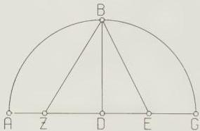
Fig. 1.1

I say that ZD is the side of the [regular] decagon, and BZ the side of the [regular] pentagon.

[Proof:] Since the straight line DG is bisected at E, and a straight line DZ is adjacent to it,

$$
\begin{array}{l}
\mathrm{GZ.ZD} + \mathrm{ED}^2 = \mathrm{EZ}^2.52 \\
\text{But } \mathrm{EZ}^2 = \mathrm{BE}^2 \text{ (EB = ZE)}, \\
\text{and } \mathrm{EB}^2 = \mathrm{ED}^2 + \mathrm{DB}^2. \\
\therefore \mathrm{GZ.ZD} + \mathrm{ED}^2 = \mathrm{ED}^2 + \mathrm{DB}^2.
\end{array}
$$

GZ.ZD = DB (subtracting ED, common).
GZ.ZD = DG.

So ZG has been cut in extreme and mean ratio at D.

Now since the side of the hexagon and the side of the decagon, when both are inscribed in the same circle, make up the extreme and mean ratios of the same straight line, and since GD, being a radius, represents the side of the hexagon, DZ is equal to the side of the decagon.

Similarly, since the square on the side of the pentagon equals the sums of the squares on the sides of the hexagon and decagon when all are inscribed in the same circle, and, in the right-angled triangle BDZ, the square on BZ equals the sum of the squares on BD, which is the side of the hexagon, and on DZ, which is the side of the decagon, it follows that BZ equals the side of the pentagon.

Since, then, as I said, we set the diameter of the circle as 120 parts, it follows from the above that

DE = 30° (DE half the radius)
and DE = 900°;
BD = 60° (BD a radius)
and BD = 3600°.
And EZ = EB = 4500°, the sum [of DE and BD]
∴ EZ ≈ 67;4,55°

and by subtraction [of DE from EZ], DZ = 37;4,55°.

So the side of the decagon, which subtends 36°, has 37;4,55° where the diameter has 120°.

Again, since DZ = 37;4,55°,
DZ = 1375;4,15°;
and DB = 3600°,
so BZ = DZ + DB = 4975;4,15°.
∴ BZ ≈ 70;32,3°.

Therefore the side of the pentagon, which subtends 72°, contains 70;32,3° where the diameter has 120°.

It is immediately obvious that the side of the [inscribed] hexagon, which subtends 60° and is equal to the radius, contains 60°.

Similarly, since the side of the [inscribed] square, which subtends 90°, is equal, when squared, to twice the square on the radius, and since the side of the [inscribed] triangle, which subtends 120°, is equal, when squared, to three times the square on the radius, and the square on the radius is 3600°, we compute that the square on the side of the square is 7200°

and the square on the side of the triangle is 10800°.

$$
\begin{array}{l}
\therefore \operatorname{Crd} 90^{\circ} \approx 84;51,10^{\mathrm{p}} \\
\text{and} \operatorname{Crd} 120^{\circ} \approx 103;55,23^{\mathrm{p}}
\end{array}
\quad \text{where the diameter is } 120^{\mathrm{p}}.
$$

We can, then, consider the above chords as established individually by the above straightforward procedures. It will immediately be obvious that if any chord be given, the chord of the supplementary arc is given in a simple fashion, since the sum of their squares equals the square on the diameter. For instance, since the chord of 36° was shown to be 37;4,55°, and the square of this is 1375;4,15°, and the square on the diameter is 14400°, the square on the chord of the supplementary arc (which is 144°) will be the difference, namely 13024;55,45, and so

$$
\operatorname{Crd} 144^{\circ} \approx 114;7;37^{\mathrm{p}}.
$$

Similarly for the other chords [of the supplements].

We shall next show how the remaining individual chords can be derived from the above [chords], first of all setting out a theorem which is extremely useful for the matter at hand.

[See Fig. 1.2.] Let there be a circle with an arbitrary quadrilateral ABGD inscribed in it. Join AG and BD.

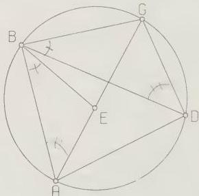
Fig. 1.2

We must prove that

$$
\mathrm{AG}.\mathrm{BD} = \mathrm{AB}.\mathrm{DG} + \mathrm{AD}.\mathrm{BG}.
$$

[Proof:] Make $\angle$ ABE = $\angle$ DBG.

Then, if we add $\angle$ EBD common,

$$
\angle \mathrm{ABD} = \angle \mathrm{EBG}.
$$

But ∠ BDA = ∠ BGE also, since they subtend the same segment.

∵ triangle ABD || triangle BGE.
∴ BG:GE = BD:DA.
∴ BG.AD = BD.GE.
Again, since ∠ ABE = ∠ DBG,
and ∠ BAE = ∠ BDG,
triangle ABE || triangle BGD.
∴ BA:AE = BD:DG.
∴ BA.DG = BD.AE.

But it was shown that
BG.AD = BD.GE.
Therefore, by addition, AG.BD = AB.DG + AD.BG.
Q.E.D.

Having established this preliminary theorem, we draw [Fig. 1.3] semi-circle ABGD on diameter AD, and draw from A two chords, AB, AG, each given in size in terms of a diameter of 120°. Join BG.

I say that BG too is given.
[Proof:] Join BD.GD.

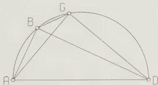
Fig. 1.3

Then, clearly, BD and GD too will be given, since they are chords of [arcs] supplementary [to the arcs of the given chords AB and AG].
Now since ABGD is a cyclic quadrilateral,
AB.GD + AD.BG = AG.BD.
But AG.BD and AB.GD are given.

∵ AD.BG is given by subtraction.
And AD is a diameter.
Therefore chord BG is given.

And we have shown that, if two arcs and the corresponding chords are given, the chord of the difference between the two arcs will also be given.

It is obvious that by means of this theorem we shall be able to enter [in the table] quite a few chords derived from the difference between the individually calculated chords, and notably the chord of 12°, since we have those of 60° and 72°.

Let us now consider the problem of finding the chord of the arc which is half that of some given chord.

Let [Fig. 1.4] ABG be a semi-circle on diameter AG. Let GB be a given chord. Bisect arc GB at D, join AB, AD, BD, DG, and drop perpendicular DZ from D on to AG.

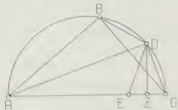
Fig. 1.4

I say that

$$
Z G = \frac{1}{2} (A G - A B).
$$

[Proof:] Let AE = AB, and join DE.

Then since [in the triangles ABD, ADE]

AB = AE, and AD is common, the two pairs of sides AB, AD, and AE, AD are equal.

Furthermore ∠ BAD = ∠ EAD.

∴ base BD = base DE.

But BD = DG [by construction]

∴ DG = DE.

So, since, in the isosceles triangle DEG, perpendicular DZ has been drawn from apex to base

$$
E Z = Z G.
$$

$$
\text{But } E G = [A G - A E = ] A G - A B.
$$

∴ ZG = ½ (AG - AB).

Now, if the chord of arc BG is given, the supplementary chord AB is immediately given.

Therefore ZG, which is ½ (AG - AB), is also given.

But, since, in the right-angled triangle AGD, the perpendicular DZ has been drawn.

triangle ADG || triangle DGZ (both right-angled).

∴ AG:GD = GD:GZ.

∴ AG:GZ = GD.

But AG,GZ is given.

Therefore GD is given, and so chord GD, which subtends an arc half of [the arc of the given chord] BG, is also given.

By means of this theorem too a large number of chords will be derived by halving [the arcs of] the previously determined chords, and notably, from the chord of 12⁶, the chords of 6⁶, 3⁶, 1³⁶ and 1⁶. By calculation we find the chord of 1³⁶ to be approximately 1:34,15⁸ where the diameter is 120⁸, and the chord of 1⁶ to be approximately 0:47,8⁸ in the same units.

Again, [see Fig. 1.5] let there be a circle ABGD on diameter AD, with centre Z. From A let there be cut off in succession two given arcs, AB, BG. Join the corresponding chords AB, BG; they too will be given.

Fig. 1.5

I say, that if we join AG, that [chord] too will be given.

[Proof.] Draw through B diameter BZE, and join BD,DG,GE,DE. It is immediately clear that from BG one can derive GE, and from AB one can derive BD and DE [all as chords of the supplementary arc]. By an argument similar to the preceding [p. 51], since BGDE is a cyclic quadrilateral, in which BD and GE are diagonals, the product of the diagonals will be equal to the sum of the products of the opposite sides [i.e. BD.GE = BG.DE + BE.GD]. Therefore, since (BD.GE) and (BG.DE) are both given, (BE.GD) is also given. But BE also is given, being a diameter: therefore the remaining part, GD, will also be given, and hence GA, the [chord of the] supplement.

Therefore, if two arcs and the corresponding chords are given, the chord corresponding to the sum of these two arcs will be given by means of this theorem.

It is obvious that by combining [in this way] the chord of 1¹⁶ with all the chords we have already obtained, and then computing successive chords, we will be able to enter [in the table] all chords [of arcs] which when doubled are divisible by three [i.e. multiples of $1^{\frac{1}{2}}$ ]. Then the only chords remaining to be determined will be those between the $1^{\frac{1}{2}}$ intervals, two in each interval, since our table is made at $\frac{1}{2}$ intervals. If, therefore, we can find the chord of $\frac{1}{2}$ , this will enable us to complete [the table with] all the remaining intermediate chords, by finding the sum or difference [of $\frac{1}{2}$ ] from the given chords at either end of the $[1^{\frac{1}{2}}]$ intervals. Now, if a chord, e.g. the chord of $1^{\frac{1}{2}}$ , is given, the chord corresponding to an arc which is one-third of the previous one cannot be found by geometrical methods. (If this were possible, we should immediately have the chord of $\frac{1}{2}$ ). Therefore we shall first derive the chord of $1^{\circ}$ from those of $1^{\frac{1}{2}}$ and $\frac{3}{4}$ . [We shall do this] by establishing a lemma which, though it cannot in general exactly determine the sizes [of chords], in the case of such very small quantities can determine them with a negligibly small error.

I say, then, that if two unequal chords be given, the ratio of the greater to the lesser is less than the ratio of the arc on the greater to the arc on the lesser.

[See Fig. 1.6] Let there be a circle ABGD, in which there are drawn two unequal chords, the lesser AB and the greater BG.

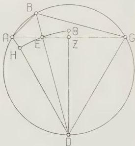
Fig. 1.6

I say that

$$
\mathrm {G B}: \mathrm {B A} < \operatorname {a r c} \mathrm {B G}: \operatorname {a r c} \mathrm {B A}.
$$

[Proof:] Let $\angle$ ABG be bisected by [chord] BD. Join AEG, AD and GD. Then, since $\angle$ ABG is bisected by chord BED,

$$
\mathrm {G D} = \mathrm {A D}
$$

and GE $>\mathrm{EA}$.

So drop perpendicular DZ from D on to AEG.

Then, since AD > ED and ED > DZ, a circle drawn on centre D with radius DE will cut AD and pass beyond DZ. Let it be drawn as HEΘ, and let DZ be produced to Θ. Now, since sector DEΘ is greater than triangle DEZ, and triangle DEA is greater than sector DEH, triangle DEZ: triangle DEA < sector DEΘ: sector DEH.

But triangle DEZ: triangle DEA = EZ:EA, and sector DEΘ: sector DEH = ∠ ZDE:∠ EDA.

∴ ZE:EA < ∠ ZDE:∠ EDA.

So, componendo,

ZA:EA < ∠ ZDA:∠ ADE.

And, doubling the first members [of the ratios],

GA:AE < ∠ GDA:∠ EDA.

Then, dividendo,

GE:EA < ∠ GDE:∠ EDA.

But GE:EA = GB:BA, and ∠ GDB:∠ BDA = arc GB:arc BA.

∴ GB:BA < arc GB:arc BA.

Having established this, let us draw [Fig. 1.7] circle ABG, and in it two chords, AB and AG. Let us suppose, first, that AB is the chord of 1°. and AG the chord of 1°. Then, since

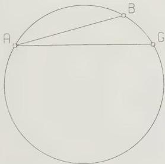
Fig. 1.7

AG:BA < arc AG:arc AB and arc AG = $\frac{4 \text{ arc AB}}{3}$

GA < $\frac{4 \text{ AB}}{3}$

But, in units of which the diameter contains 120, we showed that

$$
\mathbf{AB} = 0;47.8^{\circ}.
$$

$$
\therefore \mathbf{GA} < 1;2,50^{\circ} \text{ (for } 1;2,50 \approx \frac{4}{5}, 0;47.8\text{)}.
$$

$$
\arc AG = \frac{3 \arc AG}{\frac{2}{2}},
$$

$$
\mathbf{GA} < \frac{3BA}{2}.
$$

But, in units of which the diameter contains 120, we showed that

$$
\mathbf{AG} = 1;34,15^{\circ}.
$$

$$
\therefore \mathbf{AB} > 1;2,50^{\circ} \text{ (for } 1;34,15 = \frac{4}{5}, 1;2,50\text{)}.
$$

Therefore, since the chord of $1^{\circ}$ was shown to be both greater and less than the same amount, we can establish it as approximately $1;2,50^{\circ}$ where the diameter is $120^{\circ}$. By the preceding propositions we can also establish the chord of $\frac{1}{2}^{\circ}$, which we find to be approximately $0;31,25^{\circ}$. The remaining intervals can [now] be completed, as we said [p. 54]. For example, in the first $[1\frac{1}{2}^{\circ}]$ interval, we can calculate the chord of $2^{\circ}$ by using the addition formula for the chord of $\frac{1}{2}^{\circ}$ applied to the chord of $1\frac{1}{2}^{\circ}$, while the chord of $2\frac{1}{2}^{\circ}$ is given by using the difference formula for [the chord of $\frac{1}{2}^{\circ}$] applied to the chord of $3^{\circ}$. Similarly for the remaining chords.

Such, then, I think, is the easiest way to undertake the calculation of the chords. But, as I said, in order that we may have the actual amounts of the chords readily available for every occasion, we shall set out tables [for that purpose] below. They will be arranged in sections of 45 lines to achieve a symmetrical appearance. The first column [in each section] will contain the arcs tabulated at intervals of $\frac{1}{2}^{\circ}$, the second the corresponding chords in units of which the diameter contains 120, and the third the thirtieth part of the increment in the chord for each interval. [This last] is so that we may have the average increment corresponding to one minute [of arc], which will not be sensibly different from the true increment [for each minute]. Thus we can easily calculate the amount of the chord corresponding to fractions which fall between the [tabulated] half-degree intervals.

It is easy to see that, if we suspect some scribal corruption in one of the values for the chord in the table, the same theorems which we have already set out will enable us to test and correct it easily, either by taking the chord of double the arc [of that] of the chord in question, or from the difference with some other given chord, or from the chord of the supplement.

The layout of the table is as follows.

## 11. [Table of Chords]

[See pp. 57–60.]

## TABLE OF CHORDS

| Arcs | Chords | Sixtieths | Arcs | Chords | Sixtieths |
| --- | --- | --- | --- | --- | --- |
| ⅰ | 0 31 25 | 1 2 50 | 23 | 23 55 27 | 1 1 33 |
| 1 | 1 2 50 | 1 2 50 | 23½ | 24 26 13 | 1 1 30 |
| 1½ | 1 34 15 | 1 2 50 | 24 | 24 56 58 | 1 1 26 |
| 2 | 2 5 40 | 1 2 50 | 24½ | 25 27 41 | 1 1 22 |
| 2½ | 2 37 4 | 1 2 48 | 25 | 25 58 22 | 1 1 19 |
| 3 | 3 8 28 | 1 2 48 | 25½ | 26 29 1 | 1 1 15 |
| 3½ | 3 39 52 | 1 2 48 | 26 | 26 59 38 | 1 1 11 |
| 4 | 4 11 16 | 1 2 47 | 26½ | 27 30 14 | 1 1 8 |
| 4½ | 4 42 40 | 1 2 47 | 27 | 28 0 48 | 1 1 4 |
| 5 | 5 14 4 | 1 2 46 | 27½ | 28 31 20 | 1 1 0 |
| 5½ | 5 45 27 | 1 2 45 | 28 | 29 1 50 | 1 0 56 |
| 6 | 6 16 49 | 1 2 44 | 28½ | 29 32 18 | 1 0 52 |
| 6½ | 6 48 11 | 1 2 43 | 29 | 30 2 44 | 1 0 48 |
| 7 | 7 19 33 | 1 2 42 | 29½ | 30 33 8 | 1 0 44 |
| 7½ | 7 50 54 | 1 2 41 | 30 | 31 3 30 | 1 0 40 |
| 8 | 8 22 15 | 1 2 40 | 30½ | 31 33 50 | 1 0 35 |
| 8½ | 8 53 35 | 1 2 39 | 31 | 32 4 8 | 1 0 31 |
| 9 | 9 24 54 | 1 2 38 | 31½ | 32 34 22 | 1 0 27 |
| 9½ | 9 56 13 | 1 2 37 | 32 | 33 4 35 | 1 0 22 |
| 10 | 10 27 32 | 1 2 35 | 32½ | 33 34 46 | 1 0 17 |
| 10½ | 10 58 49 | 1 2 33 | 33 | 34 4 55 | 1 0 12 |
| 11 | 11 30 5 | 1 2 32 | 33½ | 34 35 1 | 1 0 8 |
| 11½ | 12 1 21 | 1 2 30 | 34 | 35 5 5 | 1 0 3 |
| 12 | 12 32 36 | 1 2 28 | 34½ | 35 35 6 | 0 59 57 |
| 12½ | 13 3 50 | 1 2 27 | 35 | 36 5 5 | 0 59 52 |
| 13 | 13 35 4 | 1 2 25 | 35½ | 36 35 1 | 0 59 48 |
| 13½ | 14 6 16 | 1 2 23 | 36 | 37 4 55 | 0 59 43 |
| 14 | 14 37 27 | 1 2 21 | 36½ | 37 34 47 | 0 59 38 |
| 14½ | 15 8 38 | 1 2 19 | 37 | 38 4 36 | 0 59 32 |
| 15 | 15 39 47 | 1 2 17 | 37½ | 38 34 22 | 0 59 27 |
| 15½ | 16 10 56 | 1 2 15 | 38 | 39 4 5 | 0 59 22 |
| 16 | 16 42 3 | 1 2 13 | 38½ | 39 33 46 | 0 59 16 |
| 16½ | 17 13 9 | 1 2 10 | 39 | 40 3 25 | 0 59 11 |
| 17 | 17 44 14 | 1 2 7 | 39½ | 40 33 0 | 0 59 5 |
| 17½ | 18 15 17 | 1 2 5 | 40 | 41 2 33 | 0 59 0 |
| 18 | 18 46 19 | 1 2 2 | 40½ | 41 32 3 | 0 58 54 |
| 18½ | 19 17 21 | 1 2 0 | 41 | 42 1 30 | 0 58 48 |
| 19 | 19 48 21 | 1 1 57 | 41½ | 42 30 54 | 0 58 42 |
| 19½ | 20 19 19 | 1 1 54 | 42 | 43 0 15 | 0 58 36 |
| 20 | 20 50 16 | 1 1 51 | 42½ | 43 29 33 | 0 58 31 |
| 20½ | 21 21 11 | 1 1 48 | 43 | 43 58 49 | 0 58 25 |
| 21 | 21 52 6 | 1 1 45 | 43½ | 44 28 1 | 0 58 18 |
| 21½ | 22 22 58 | 1 1 42 | 44 | 44 57 10 | 0 58 12 |
| 22 | 22 53 49 | 1 1 39 | 44½ | 45 26 16 | 0 58 6 |
| 22½ | 23 24 39 | 1 1 36 | 45 | 45 55 19 | 0 58 0 |

| Arcs | Chords | Sixtieths | Arcs | Chords | Sixtieths |
| --- | --- | --- | --- | --- | --- |
| 45½ | 46 24 19 | 0 57 54 | 68 | 67 6 12 | 0 52 1 |
| 46 | 46 53 16 | 0 57 47 | 68½ | 67 32 12 | 0 51 52 |
| 46½ | 47 22 9 | 0 57 41 | 69 | 67 58 8 | 0 51 43 |
| 47 | 47 51 0 | 0 57 34 | 69½ | 68 23 59 | 0 51 33 |
| 47½ | 48 19 47 | 0 57 27 | 70 | 68 49 45 | 0 51 23 |
| 48 | 48 48 30 | 0 57 21 | 70½ | 69 15 27 | 0 51 14 |
| 48½ | 49 17 11 | 0 57 14 | 71 | 69 41 4 | 0 51 4 |
| 49 | 49 45 48 | 0 57 7 | 71½ | 70 6 36 | 0 50 55 |
| 49½ | 50 14 21 | 0 57 0 | 72 | 70 32 3 | 0 50 45 |
| 50 | 50 42 51 | 0 56 53 | 72½ | 70 57 26 | 0 50 35 |
| 50½ | 51 11 18 | 0 56 46 | 73 | 71 22 44 | 0 50 26 |
| 51 | 51 39 42 | 0 56 39 | 73½ | 71 47 56 | 0 50 16 |
| 51½ | 52 8 0 | 0 56 32 | 74 | 72 13 4 | 0 50 6 |
| 52 | 52 36 16 | 0 56 25 | 74½ | 72 38 7 | 0 49 56 |
| 52½ | 53 4 29 | 0 56 18 | 75 | 73 3 5 | 0 49 46 |
| 53 | 53 32 38 | 0 56 10 | 75½ | 73 27 58 | 0 49 36 |
| 53½ | 54 0 43 | 0 56 3 | 76 | 73 52 46 | 0 49 26 |
| 54 | 54 28 44 | 0 55 55 | 76½ | 74 17 29 | 0 49 16 |
| 54½ | 54 56 42 | 0 55 48 | 77 | 74 42 7 | 0 49 6 |
| 55 | 55 24 36 | 0 55 40 | 77½ | 75 6 39 | 0 48 55 |
| 55½ | 55 52 26 | 0 55 33 | 78 | 75 31 7 | 0 48 45 |
| 56 | 56 20 12 | 0 55 25 | 78½ | 75 55 29 | 0 48 34 |
| 56½ | 56 47 54 | 0 55 17 | 79 | 76 19 46 | 0 48 24 |
| 57 | 57 15 33 | 0 55 9 | 79½ | 76 43 58 | 0 48 13 |
| 57½ | 57 43 7 | 0 55 1 | 80 | 77 8 5 | 0 48 3 |
| 58 | 58 10 38 | 0 54 53 | 80½ | 77 32 6 | 0 47 52 |
| 58½ | 58 38 5 | 0 54 45 | 81 | 77 56 2 | 0 47 41 |
| 59 | 59 5 27 | 0 54 37 | 81½ | 78 19 52 | 0 47 31 |
| 59½ | 59 32 45 | 0 54 29 | 82 | 78 43 38 | 0 47 20 |
| 60 | 60 0 0 | 0 54 21 | 82½ | 79 7 18 | 0 47 9 |
| 60½ | 60 27 11 | 0 54 12 | 83 | 79 30 52 | 0 46 58 |
| 61 | 60 54 17 | 0 54 4 | 83½ | 79 54 21 | 0 46 47 |
| 61½ | 61 21 19 | 0 53 56 | 84 | 80 17 45 | 0 46 36 |
| 62 | 61 48 17 | 0 53 47 | 84½ | 80 41 3 | 0 46 25 |
| 62½ | 62 15 10 | 0 53 39 | 85 | 81 4 15 | 0 46 14 |
| 63 | 62 42 0 | 0 53 30 | 85½ | 81 27 22 | 0 46 3 |
| 63½ | 63 8 45 | 0 53 22 | 86 | 81 50 24 | 0 45 52 |
| 64 | 63 35 25 | 0 53 13 | 86½ | 82 13 19 | 0 45 40 |
| 64½ | 64 2 2 | 0 53 4 | 87 | 82 36 9 | 0 45 29 |
| 65 | 64 28 34 | 0 52 55 | 87½ | 82 58 54 | 0 45 18 |
| 65½ | 64 55 1 | 0 52 46 | 88 | 83 21 33 | 0 45 6 |
| 66 | 65 21 24 | 0 52 37 | 88½ | 83 44 4 | 0 44 55 |
| 66½ | 65 47 43 | 0 52 28 | 89 | 84 6 32 | 0 44 43 |
| 67 | 66 13 57 | 0 52 19 | 89½ | 84 28 54 | 0 44 31 |
| 67½ | 66 40 7 | 0 52 10 | 90 | 84 51 10 | 0 44 20 |

accuracy he does in the third place. The book also enables one to make a number of corrections of scribal errors in the table. Before seeing it I had already made those given below. None of the other corrections (all of 1 in the last place) suggested by the authors seem likely to me, although some are possible.

Corrections to Heiberg's text:

Crd 9°, seconds, vô (with D, Ar) for να (51) at,20 (corrected by Hultsch, Sehnentafeln 52)

| Arcs | Chords | Sixtieths | Arcs | Chords | Sixtieths |
| --- | --- | --- | --- | --- | --- |
| 90½ | 85 13 20 | 0 44 8 | 113 | 100 3 59 | 0 34 34 |
| 91 | 85 35 24 | 0 43 57 | 113½ | 100 21 16 | 0 34 20 |
| 91½ | 85 57 23 | 0 43 45 | 114 | 100 38 26 | 0 34 6 |
| 92 | 86 19 15 | 0 43 33 | 114½ | 100 55 28 | 0 33 52 |
| 92½ | 86 41 2 | 0 43 21 | 115 | 101 12 25 | 0 33 39 |
| 93 | 87 2 42 | 0 43 9 | 115½ | 101 29 15 | 0 33 25 |
| 93½ | 87 24 17 | 0 42 57 | 116 | 101 45 57 | 0 33 11 |
| 94 | 87 45 45 | 0 42 45 | 116½ | 102 2 33 | 0 32 57 |
| 94½ | 88 7 7 | 0 42 33 | 117 | 102 19 1 | 0 32 43 |
| 95 | 88 28 24 | 0 42 21 | 117½ | 102 35 22 | 0 32 29 |
| 95½ | 88 49 34 | 0 42 9 | 118 | 102 51 37 | 0 32 15 |
| 96 | 89 10 39 | 0 41 57 | 118½ | 103 7 44 | 0 32 0 |
| 96½ | 89 31 37 | 0 41 45 | 119 | 103 23 44 | 0 31 46 |
| 97 | 89 52 29 | 0 41 33 | 119½ | 103 39 37 | 0 31 32 |
| 97½ | 90 13 15 | 0 41 21 | 120 | 103 55 23 | 0 31 18 |
| 98 | 90 33 55 | 0 41 8 | 120½ | 104 11 2 | 0 31 4 |
| 98½ | 90 54 29 | 0 40 55 | 121 | 104 26 34 | 0 30 49 |
| 99 | 91 14 56 | 0 40 42 | 121½ | 104 41 59 | 0 30 35 |
| 99½ | 91 35 17 | 0 40 30 | 122 | 104 57 16 | 0 30 21 |
| 100 | 91 55 32 | 0 40 17 | 122½ | 105 12 26 | 0 30 7 |
| 100½ | 92 15 40 | 0 40 4 | 123 | 105 27 30 | 0 29 52 |
| 101 | 92 35 42 | 0 39 52 | 123½ | 105 42 26 | 0 29 37 |
| 101½ | 92 55 38 | 0 39 39 | 124 | 105 57 14 | 0 29 23 |
| 102 | 93 15 27 | 0 39 26 | 124½ | 106 11 55 | 0 29 8 |
| 102½ | 93 35 11 | 0 39 13 | 125 | 106 26 29 | 0 28 54 |
| 103 | 93 54 47 | 0 39 0 | 125½ | 106 40 56 | 0 28 39 |
| 103½ | 94 14 17 | 0 38 47 | 126 | 106 55 15 | 0 28 24 |
| 104 | 94 33 41 | 0 38 34 | 126½ | 107 9 27 | 0 28 10 |
| 104½ | 94 52 58 | 0 38 21 | 127 | 107 23 32 | 0 27 56 |
| 105 | 95 12 9 | 0 38 8 | 127½ | 107 37 30 | 0 27 40 |
| 105½ | 95 31 13 | 0 37 55 | 128 | 107 51 20 | 0 27 25 |
| 106 | 95 50 11 | 0 37 42 | 128½ | 108 5 2 | 0 27 10 |
| 106½ | 96 9 2 | 0 37 29 | 129 | 108 18 37 | 0 26 56 |
| 107 | 96 27 47 | 0 37 16 | 129½ | 108 32 5 | 0 26 41 |
| 107½ | 96 46 24 | 0 37 3 | 130 | 108 45 25 | 0 26 26 |
| 108 | 97 4 55 | 0 36 50 | 130½ | 108 58 38 | 0 26 11 |
| 108½ | 97 23 20 | 0 36 36 | 131 | 109 11 44 | 0 25 56 |
| 109 | 97 41 38 | 0 36 23 | 131½ | 109 24 42 | 0 25 41 |
| 109½ | 97 59 49 | 0 36 9 | 132 | 109 37 32 | 0 25 26 |
| 110 | 98 17 54 | 0 35 56 | 132½ | 109 50 15 | 0 25 11 |
| 110½ | 98 35 52 | 0 35 42 | 133 | 110 2 50 | 0 24 56 |
| 111 | 98 53 43 | 0 35 29 | 133½ | 110 15 18 | 0 24 41 |
| 111½ | 99 11 27 | 0 35 15 | 134 | 110 27 39 | 0 24 26 |
| 112 | 99 29 5 | 0 35 1 | 134½ | 110 39 52 | 0 24 10 |
| 112½ | 99 46 35 | 0 34 48 | 135 | 110 51 57 | 0 23 55 |

Crd 72°, seconds, γ (with all mss. except D) for δ (4) at,10 (cf.,1 and p. 81 n. 19; corrected by Manitius)

Crd 88½°, minutes, μδ (with Ar) for μα (41) at,43.

Crd 97°, seconds, κθ (with D, Ar) for κζ (27) at,15

Crd 108°, seconds, νε (with D, Ar) for νς (56) at,37

Crd 118½°, seconds, μδ (with Ar) for μα (41) at,13

Crd 143°, seconds, νς (with D, Ar) for κς (26) at,17.

| Arcs | Chords | Sixtieths | Arcs | Chords | Sixtieths |
| --- | --- | --- | --- | --- | --- |
| 135½ | 111 3 54 | 0 23 40 | 158 | 117 47 43 | 0 11 51 |
| 136 | 111 15 44 | 0 23 25 | 158½ | 117 53 39 | 0 11 35 |
| 136½ | 111 27 26 | 0 23 9 | 159 | 117 59 27 | 0 11 19 |
| 137 | 111 39 1 | 0 22 54 | 159½ | 118 5 7 | 0 11 3 |
| 137½ | 111 50 28 | 0 22 39 | 160 | 118 10 37 | 0 10 47 |
| 138 | 112 1 47 | 0 22 24 | 160½ | 118 16 1 | 0 10 31 |
| 138½ | 112 12 59 | 0 22 8 | 161 | 118 21 16 | 0 10 14 |
| 139 | 112 24 3 | 0 21 53 | 161½ | 118 26 23 | 0 9 58 |
| 139½ | 112 35 0 | 0 21 37 | 162 | 118 31 22 | 0 9 42 |
| 140 | 112 45 48 | 0 21 22 | 162½ | 118 36 13 | 0 9 25 |
| 140½ | 112 56 29 | 0 21 7 | 163 | 118 40 55 | 0 9 9 |
| 141 | 113 7 2 | 0 20 51 | 163½ | 118 45 30 | 0 8 53 |
| 141½ | 113 17 25 | 0 20 36 | 164 | 118 49 56 | 0 8 37 |
| 142 | 113 27 44 | 0 20 20 | 164½ | 118 54 15 | 0 8 20 |
| 142½ | 113 37 54 | 0 20 4 | 165 | 118 58 25 | 0 8 4 |
| 143 | 113 47 56 | 0 19 49 | 165½ | 119 2 26 | 0 7 48 |
| 143½ | 113 57 50 | 0 19 33 | 166 | 119 6 20 | 0 7 31 |
| 144 | 114 7 37 | 0 19 17 | 166½ | 119 10 6 | 0 7 15 |
| 144½ | 114 17 15 | 0 19 2 | 167 | 119 13 44 | 0 6 59 |
| 145 | 114 26 46 | 0 18 46 | 167½ | 119 17 13 | 0 6 42 |
| 145½ | 114 36 9 | 0 18 30 | 168 | 119 20 34 | 0 6 26 |
| 146 | 114 45 24 | 0 18 14 | 168½ | 119 23 47 | 0 6 10 |
| 146½ | 114 54 31 | 0 17 59 | 169 | 119 26 52 | 0 5 53 |
| 147 | 115 3 30 | 0 17 43 | 169½ | 119 29 49 | 0 5 37 |
| 147½ | 115 12 22 | 0 17 27 | 170 | 119 32 37 | 0 5 20 |
| 148 | 115 21 6 | 0 17 11 | 170½ | 119 35 17 | 0 5 4 |
| 148½ | 115 29 41 | 0 16 55 | 171 | 119 37 49 | 0 4 48 |
| 149 | 115 38 9 | 0 16 40 | 171½ | 119 40 13 | 0 4 31 |
| 149½ | 115 46 29 | 0 16 24 | 172 | 119 42 28 | 0 4 14 |
| 150 | 115 54 40 | 0 16 8 | 172½ | 119 44 35 | 0 3 58 |
| 150½ | 116 2 44 | 0 15 52 | 173 | 119 46 35 | 0 3 42 |
| 151 | 116 10 40 | 0 15 36 | 173½ | 119 48 26 | 0 3 26 |
| 151½ | 116 18 28 | 0 15 20 | 174 | 119 50 8 | 0 3 9 |
| 152 | 116 26 8 | 0 15 4 | 174½ | 119 51 43 | 0 2 53 |
| 152½ | 116 33 40 | 0 14 48 | 175 | 119 53 10 | 0 2 36 |
| 153 | 116 41 4 | 0 14 32 | 175½ | 119 54 27 | 0 2 20 |
| 153½ | 116 48 20 | 0 14 16 | 176 | 119 55 38 | 0 2 3 |
| 154 | 116 55 28 | 0 14 0 | 176½ | 119 56 39 | 0 1 47 |
| 154½ | 117 2 28 | 0 13 44 | 177 | 119 57 32 | 0 1 30 |
| 155 | 117 9 20 | 0 13 28 | 177½ | 119 58 18 | 0 1 14 |
| 155½ | 117 16 4 | 0 13 12 | 178 | 119 58 55 | 0 0 57 |
| 156 | 117 22 40 | 0 12 56 | 178½ | 119 59 24 | 0 0 41 |
| 156½ | 117 29 8 | 0 12 40 | 179 | 119 59 44 | 0 0 25 |
| 157 | 117 35 28 | 0 12 24 | 179½ | 119 59 56 | 0 0 9 |
| 157½ | 117 41 40 | 0 12 7 | 180 | 120 0 0 | 0 0 0 |

## 12. On the arc between solstices

Now that we have tabulated the chords, our first task, as we said, is to determine the inclination of the ecliptic to the equator, that is, the ratio of the great circle through the poles of both to the arc intercepted between the poles. It is obvious that this is equal to the distance from the equator to either of the solsticial points. This quantity can be determined directly by an instrumental method, using the following simple apparatus. [See Fig. C.]

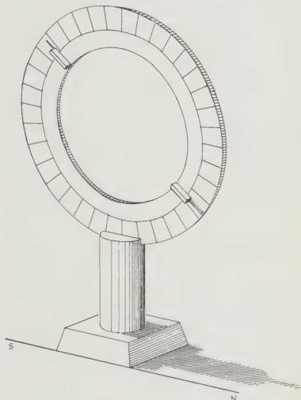
Fig. C

We make a bronze ring of a suitable size, turned on the lathe so that its surface is accurately squared off [i.e. has a rectangular cross-section]. We use this as a meridian circle, by dividing it into the normal 360° of a great circle, and subdividing each degree into as many parts as [the size of the instrument] allows. Then we take another smaller ring, and fit it inside the first in such a manner that the lateral faces of both are in the same plane, while the smaller ring can rotate freely inside the larger, with a north-south motion, [always] in the same plane. At two diametrically opposite points on one lateral face of the smaller ring we fix [two] little plates, of equal size, pointing towards each other and the centre of the rings, and exactly in the middle of the width of each plate we fix small pointers, which graze the surface of the larger, graduated ring. To serve all the necessary purposes we fix this ring firmly on a pillar of appropriate size, and set it up in the open air, so that the base of the pillar is on a foundation which is not inclined to the plane of the horizon. We take care that the [lateral] plane of the rings is perpendicular to the plane of the horizon and parallel to the plane of the meridian. The first of these [desiderata] is achieved by suspending a plumb-line from a point [on the outer ring] chosen as zenith, and adjusting supporting elements until the plumb-line points towards the point diametrically opposite [the zenith-point]. The second is achieved by marking a meridian line clearly in the plane below the pillar and moving the rings laterally until one can sight their [lateral] plane as parallel to that line. Having set the instrument up in that way, we observed the sun’s movement towards the north and south by turning the inner ring at noon until the lower plate was completely enshadowed by the upper one. When this was the case, the tips of the pointers indicated to us the distance of the sun from the zenith in degrees, measured along the meridian.

We found an even handier way of making this kind of observation by constructing, instead of the rings, a plaque [see Fig. D] of stone or wood, square

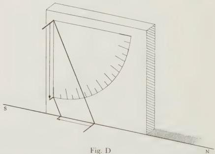

and rigid, with one of its faces smooth and accurately squared off. On this we drew a quadrant, using as centre a point near one of the corners, and drew from the centre to the inscribed arc the lines enclosing the right angle forming the quadrant. We divided the arc, as we had [the other instrument], into 90 degrees and subdivisions of those degrees. Next, on that line which was chosen to be perpendicular to the plane of the horizon and towards the south, we fixed two small cylindrical pegs, with their sides at right angles to their bases and exactly circular, machined to be of equal size: one of them we fixed on the centre-point itself, positioning the mid-point of the peg precisely on it, the other at the lower end of the line. Then we set this inscribed face of the plaque up along the meridian line which we had drawn on the foundation-plane, so as to be parallel to the plane of the meridian, and, using a plumb-line suspended between the pegs, set up the line between them precisely at right angles to the plane of the horizon, again correcting any deficiency by adjusting thin supporting elements underneath. In the same way as before, we observed the shadow cast at midday by the peg at the centre. In order to determine its position more accurately, we placed some object on the inscribed arc [where the shadow crossed it]. Marking the mid-point of the shadow, we took that division of the quadrant as indicating the position of the sun on the meridian in the north-south direction.

From observations of this kind, and especially from comparing observations near the actual solstices, which revealed that, over a number of returns [of the sun], the distance from the zenith was in general the same number of degrees of the meridian circle at the [same] solstice, whether summer or winter, we found that the arc between the northernmost and southernmost points, which is the arc between the solstitial points, is always greater than 47₁° and less than 47₄. From this we derive very much the same ratio as Eratosthenes, which Hipparchus also used. For [according to this] the arc between the solstices is approximately 11 parts where the meridian is 83.

From the preceding kind of observation it is easy to derive immediately the latitude of the region in which the observation is made, wherever it is: one takes the point halfway between the two extrema; this point lies on the equator; then one takes the distance between this point and the zenith, which is the same, obviously, as the distance of the poles from the horizon.

The text could equally well mean, not that Eratosthenes and Hipparchus used the ratio 11:83, but that the ratio 11:83 is Ptolemy’s value, which is close to the actual ratio used by them [namely 2:15, i.e. ε = 24°]. That interpretation has the advantage of agreeing with the only value otherwise attested for Eratosthenes (in his Geography, see Berger Frg. II B 23, Strabo 2.5.7) and Hipparchus (in his Geography and in his Commentary on Aratus, ed. Manitius p. 96,20; cf. HAMA 303, 335). It was proposed by Berger, Eratosthenes 131, followed by Heath, Aristarchus 131 n. 4. I prefer the traditional interpretation, since I find it inconceivable that Ptolemy would not mention what the ratio was to which his own was close, and also because of his expression at I 14 (p. 70). Eratosthenes’ peculiar ratio is due not to a perverse division of the circle into 83rds, as Theon supposes (Rome II 529), but to a pre-trigonometrical derivation from gnomon measurements, as I shall show elsewhere.

## 13. [Preliminaries for spherical proofs]

Our next task is to demonstrate the sizes of the individual arcs cut off between the equator and the ecliptic along a great circle through the poles of the equator. As a preliminary we shall set out some short and useful theorems which will enable us to carry out most demonstrations involving spherical theorems in the simplest and most methodical way possible. [See Fig. 1.8.] Let two straight lines, BE and GD, which are drawn to meet two straight lines. AB and AG, cut each other at point Z.

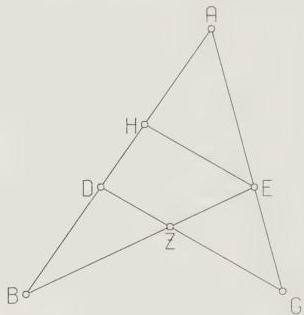
Fig. 1.8

I say that

$$
\mathrm{GA}: \mathrm{AE} = (\mathrm{GD}: \mathrm{DZ}). (\mathrm{ZB}: \mathrm{BE}).
$$

[Proof:] Let EH be drawn through E parallel to GD.

Then, since GD and EH are parallel,

$$
\mathrm{GA}: \mathrm{AE} = \mathrm{GD}: \mathrm{EH}.
$$

If we bring ZD in [as auxiliary],

$$
\mathrm{GD}: \mathrm{EH} = (\mathrm{GD}: \mathrm{DZ}). (\mathrm{DZ}: \mathrm{HE}).
$$

$$
\therefore \mathrm{GA}: \mathrm{AE} = (\mathrm{GD}: \mathrm{DZ}). (\mathrm{DZ}: \mathrm{HE}).
$$

But $\mathrm{DZ}: \mathrm{HE} = \mathrm{ZB}: \mathrm{BE}$ (EH parallel to ZD).

$$
\therefore \mathrm{GA}: \mathrm{AE} = (\mathrm{GD}: \mathrm{DZ}). (\mathrm{ZB}: \mathrm{BE}).
$$

In the same way, *dividendo*, we shall prove that

$$
\mathrm{GE}: \mathrm{EA} = (\mathrm{GZ}: \mathrm{DZ}). (\mathrm{DB}: \mathrm{BA}).
$$

[13.1]

Q.E.D.

[See Fig. 1.9.] Draw a line through A parallel to EB and produce GD to cut it at H. Again, since AH is parallel to EZ,

$$
\mathrm{GE:EA} = \mathrm{GZ:ZH}.
$$

But, if we bring in ZD [as auxiliary],

$$
\mathrm{GZ:ZH} = (\mathrm{GZ:ZD}).(\mathrm{DZ:ZH}).
$$

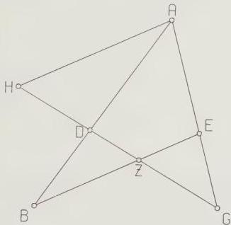
Fig. 1.9

But $\mathrm{DZ:ZH} = \mathrm{DB:BA}$ (BA and ZH drawn to meet the parallel lines AH and ZB).

$$
\therefore \mathrm{GZ:ZH} = (\mathrm{GZ:DZ}).(\mathrm{DB:BA}).
$$

But

$$
\mathrm{GZ:ZH} = \mathrm{GE:EA}.
$$

$$
\therefore \mathrm{GE:EA} = (\mathrm{GZ:DZ}).(\mathrm{DB:BA}). \tag{13.2}
$$

Q.E.D.

Again [Fig. 1.10] on circle ABG, with centre D, take any three points A,B,G, on the circumference, provided that each of the arcs AB and BG is less than a semi-circle (let the same condition be understood to apply to all subsequent arcs we take). Draw AG and DEB.

I say that

Crd arc 2AB:Crd arc 2BG = AE:EG.

[Proof:] Drop perpendiculars AZ and GH from points A and G on to DB. Then, since AZ is parallel to GH, and they meet line AEG,

$$
\mathrm{AZ:GH} = \mathrm{AE:EG}.
$$

But $\mathrm{AZ:GH} = \mathrm{Crd}$ arc 2AB : Crd arc 2BG

(for $\mathrm{AZ} = \frac{1}{2}$ Crd arc 2AB and $\mathrm{GH} = \frac{1}{2}$ Crd arc 2BG).

$$
\therefore \mathrm{AE:EG} = \mathrm{Crd} \text{ arc } 2\mathrm{AB}:\mathrm{Crd} \text{ arc } 2\mathrm{BG}. \tag{13.3}
$$

Q.E.D.

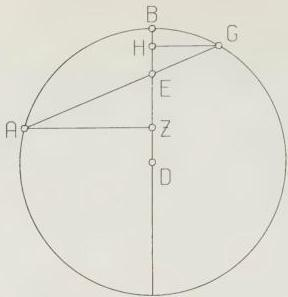
Fig. 1.10

It immediately follows that if we are given the whole of arc AG and the ratio (Crd arc 2AB:Crd arc 2BG), both arc AB and arc BG will be given.

For, repeating the same figure [see Fig. 1.11], join AD, and drop perpendicular DZ from D on to AEG. It is obvious that, if arc AG be given, ∠ ADZ, which subtends half arc AG, will be given, and hence the whole triangle ADZ. Now, since the whole chord AG is

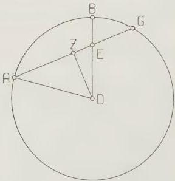
Fig. 1.11

given, and (AE:EG) is given (for it equals (Crd arc 2AB:Crd arc 2BG)), AE will be given,  and so will ZE, by subtraction [of AZ from AE]. Hence, since DZ too is given, in the right-angled triangle EDZ, $\angle$ EDZ will be given, and hence the whole angle ADB. Hence arc AB will be given and (by subtraction) arc BG. Q.E.D.

Again [see Fig. 1.12] on circle ABG with centre D take three points on the circumference, A,B,G.  Join DA and GB and produce them to meet at E.

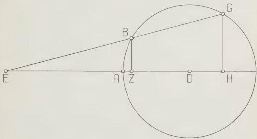
Fig. 1.12

I say that

Crd arc 2GA:Crd arc 2AB = GE:BE.

By a similar argument to the previous theorem, if we drop perpendiculars BZ and GH from B and G on to DA, since they are parallel,

$$
\mathrm {G H : B Z} = \mathrm {G E : E B}.
$$

$\therefore$ Crd arc 2GA:Crd arc 2AB = GE:EB. [13.4]

Q.E.D.

In this case too it follows immediately that if we are given just the arc GB and the ratio (Crd arc 2GA:Crd arc 2AB), arc AB will also be given.

For, if we repeat the same figure [see Fig. 1.13], and join DB and drop DZ perpendicular to BG, then $\angle BDZ$ , which subtends half arc BG, will be given. Hence the whole of the right-angled triangle  BDZ will be given. Now, since the ratio (GE:EB) and line GB are given, EB will be given, and hence, by addition, line EBZ. So, since DZ is given, in the right-angled triangle EDZ,

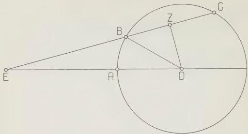
Fig. 1.13

$\angle$ EDZ is given, and, by subtraction [of the given $\angle$ BDZ] $\angle$ EDB is given. Hence arc AB will be given.

Having established these preliminary theorems, let us draw [Fig. 1.14] the following arcs of great circles on a sphere: BE and GD are drawn to meet AB and AG, and cut each other at Z. Let each of them be less than a semi-circle (and let the same condition be understood to apply to all the figures).

I say that

Crd arc 2GE:Crd arc 2EA =

(Crd arc 2GZ:Crd arc 2ZD). (Crd arc 2DB:Crd arc 2BA).

[Proof:] Let us take the centre of the sphere, H, and draw from it to the intersections of the circles, B, Z, E, lines HB, HZ, HE. Join AD and produce it to meet HB, also produced, at Θ. Similarly, join DG and AG, and let them cut HZ and HE at points K and L.

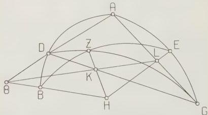
Fig. 1.14

Then Θ, K and L lie on a straight line, since they all lie simultaneously in two planes, the plane of triangle AGD, and the plane of circle BZE.

Draw this line [ΘKL]. The result will be that there are two straight lines, ΘL and GD, drawn to meet two straight lines, ΘA and GA, and intersecting each other at K.

```
∴ GL:LA = (GK:KD).(DΘ:ΘA). [from 13.2]
But GL:LA = Crd arc 2GE:Crd arc 2EA [from 13.3]
and GK:KD = Crd arc 2GZ:Crd arc 2ZD [from 13.3]
and DΘ:ΘA = Crd arc 2DB:Crd arc 2BA. [from 13.4]
```

∴ Crd arc 2GE:Crd arc 2EA = (Crd arc 2GZ:Crd arc 2ZD).(Crd arc 2DB:Crd arc 2BA). [13.5]

In the same way, corresponding to the straight lines in the plane figure [Fig. 1.8], it can be shown that

```
Crd arc 2GA:Crd arc 2EA = (Crd arc 2GD:Crd arc 2DZ).(Crd arc 2ZB:Crd arc 2BE). [13.6]
```

Q.E.D.

## 14. On the arcs between the equator and the ecliptic

Having set out this preliminary theorem, we shall first of all demonstrate the amounts of the arcs we set ourselves to determine, as follows.

[See Fig. 1.15.] Let the circle through both poles, that of the equator and that of the ecliptic, be ABGD; let the semi-circle representing the equator be AEG, and that representing the ecliptic BED, and let point E be the intersection of the two at the spring equinox, so that B is the winter solstice and D the summer solstice. On arc ABG take the pole of the equator AEG: let it be point Z. Cut off arc EH on the ecliptic: let us suppose it to be 30°, and draw through Z and H an arc of a great circle ZHΘ. Our problem, obviously, is to determine HΘ. Let us take for granted both here and in general for all such demonstrations (to avoid repeating ourselves on each occasion), that when we speak of the sizes of arcs or chords in terms of ‘degrees’ or ‘parts’ we mean (for arcs) those degrees of which the circumference of a great circle contains 360, and (for chords) those parts of which the diameter of the circle contains 120.

Now since, in the figure, the two great circle arcs ZΘ and EB are drawn to meet the two great circle arcs AZ and AE, and intersect each other at H,

```
Crd arc 2ZA:Crd arc 2AB = (Crd arc 2ΘZ:Crd arc 2ΘH). (Crd arc 2HE:Crd arc 2EB). [M.T.I]
```

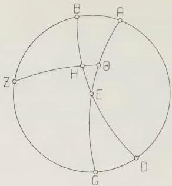
Fig. 1.15

But arc 2ZA = 180°, so Crd arc 2ZA = 120°,
and arc 2AB = 47;42,40° (according to the ratio 11:83, with which we agreed [p. 63]).
so Crd arc 2AB = 48;31,55°.
Again, arc 2HE = 60°, so Crd arc 2HE = 60°,
and arc 2EB = 180°, so Crd arc 2EB = 120°.
∴ Crd arc 2ZΘ:Crd arc 2ΘH = (120 : 48;31,55)/(60 : 120)
= 120 : 24;15,57.
And arc 2ZΘ = 180°, so Crd arc 2ZΘ = 120°.
∴ Crd arc 2ΘH = 24;15,57°.
∴ arc 2ΘH = 23;19,59°.
and arc ΘH ≈ 11;40°.
Again, let arc EH be taken as 60°. Then the other magnitudes will remain unchanged, but
arc 2EH = 120°, so Crd arc 2EH = 103;55,23°.
∴ Crd arc 2ZΘ:Crd arc 2ΘH = (120 : 48;31,55)/(103;55,23 : 120)
= 120 : 42;1,48.
But Crd arc 2ZΘ = 120°.
∴ Crd arc 2ΘH = 42;1,48°.
∴ arc 2ΘH = 41;0,18°,
and arc ΘH = 20;30,9°.

Q.E.D.

In the same way we shall compute the sizes of [the other] individual arcs, and set out a table giving for each degree of the quadrant the arc corresponding to those computed above. The table is as follows.

## 16. On rising-times at *sphaera recta*

Our next task is to show how to compute the size of an arc of the equator determined by a circle drawn through the poles of the equator and a given point on the ecliptic. In this way we can find how long, in equinoctial time-degrees, it takes a given section of the ecliptic to cross the meridian at any point on earth and the horizon at *sphaera recta* (for only in that situation does the horizon pass through the poles of the equator).

Repeat the previous figure [see Fig. 1.16]. Let the ecliptic arc EH again be given, first as $30^{\circ}$. We have to find arc EΘ of the equator.

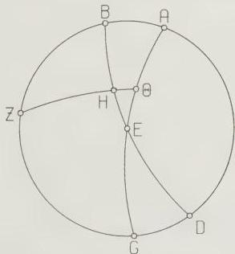
Fig. 1.16

By the same argument as the preceding, Crd arc 2ZB:Crd arc 2BA =

$$
\begin{array}{l}
\text{(Crd arc 2ZH:Crd arc 2HΘ). (Crd arc 2ΘE:Crd arc 2EA). [M.T.II)} \\
\text{But arc 2ZB} = 132;17,20^\circ, \\
\text{so Crd arc 2ZB} = 109;44,53^\circ.
\end{array}
$$

$45^{\circ}$, seconds, α (with D, Ar) for κ (20) at,50 (computed: 2)
$69^{\circ}$, seconds, α (with D, Ar) for ια (11) at,29 (computed: 10,59 for 11,1).
Possible emendations are:
$27^{\circ}$, seconds μξ (47) for νξ (57) (computed: 48). No ms. authority.
$51^{\circ}$, seconds ε (5) for ιε (15) (computed: 7). No ms. authority.
$59^{\circ}$, seconds α (1) for δ (4) (computed: 0). Only variant is ‘0’ in L.

## TABLE OF INCLINATION

| ARCS | | ARCS | |
| --- | --- | --- | --- |
| of the Ecliptic | of the Meridian | of the Ecliptic | of the Meridian |
| 1 | 0 24 16 | 46 | 16 54 47 |
| 2 | 0 48 31 | 47 | 17 12 16 |
| 3 | 1 12 46 | 48 | 17 29 27 |
| 4 | 1 37 0 | 49 | 17 46 20 |
| 5 | 2 1 12 | 50 | 18 2 53 |
| 6 | 2 25 22 | 51 | 18 19 15 |
| 7 | 2 49 30 | 52 | 18 35 5 |
| 8 | 3 13 35 | 53 | 18 50 41 |
| 9 | 3 37 37 | 54 | 19 5 57 |
| 10 | 4 1 38 | 55 | 19 20 56 |
| 11 | 4 25 32 | 56 | 19 35 28 |
| 12 | 4 49 24 | 57 | 19 49 42 |
| 13 | 5 13 11 | 58 | 20 3 31 |
| 14 | 5 36 53 | 59 | 20 17 4 |
| 15 | 6 0 31 | 60 | 20 30 9 |
| 16 | 6 24 1 | 61 | 20 42 58 |
| 17 | 6 47 26 | 62 | 20 55 24 |
| 18 | 7 10 45 | 63 | 21 7 21 |
| 19 | 7 33 57 | 64 | 21 18 58 |
| 20 | 7 57 3 | 65 | 21 30 11 |
| 21 | 8 20 0 | 66 | 21 41 0 |
| 22 | 8 42 50 | 67 | 21 51 25 |
| 23 | 9 5 32 | 68 | 22 1 25 |
| 24 | 9 28 5 | 69 | 22 11 1 |
| 25 | 9 50 29 | 70 | 22 20 11 |
| 26 | 10 12 46 | 71 | 22 28 57 |
| 27 | 10 34 57 | 72 | 22 37 17 |
| 28 | 10 56 44 | 73 | 22 45 11 |
| 29 | 11 18 25 | 74 | 22 52 39 |
| 30 | 11 39 59 | 75 | 22 59 41 |
| 31 | 12 1 20 | 76 | 23 6 17 |
| 32 | 12 22 30 | 77 | 23 12 27 |
| 33 | 12 43 28 | 78 | 23 18 11 |
| 34 | 13 4 14 | 79 | 23 23 28 |
| 35 | 13 24 47 | 80 | 23 28 16 |
| 36 | 13 45 6 | 81 | 23 32 30 |
| 37 | 14 5 11 | 82 | 23 36 35 |
| 38 | 14 25 2 | 83 | 23 40 2 |
| 39 | 14 44 39 | 84 | 23 43 2 |
| 40 | 15 4 4 | 85 | 23 45 34 |
| 41 | 15 23 10 | 86 | 23 47 39 |
| 42 | 15 42 2 | 87 | 23 49 16 |
| 43 | 16 0 38 | 88 | 23 50 25 |
| 44 | 16 18 58 | 89 | 23 51 6 |
| 45 | 16 37 1 | 90 | 23 51 20 |

And arc 2BA = 47;42,40°, so Crd arc 2BA = 48;31,55°.
Again, arc 2ZH = 156;40,1° [180° - arc 2ΘH, p. 70] so Crd arc 2ZH = 117;31,15°, and arc 2HΘ = 23;19,59°, so Crd arc 2HΘ = 24;15,57°.
∴ Crd arc ΘE:Crd arc 2EA = (109;44,53 : 48;31,55)/(117;31,15 : 24;15,57) = 54;52,26 : 117;31,15 = 56;1,53 : 120.
But arc 2EA = 180°, so Crd arc 2EA = 120°.
∴ Crd arc 2ΘE = 56;1,53°.
So arc 2ΘE ≈ 55;40° and arc ΘE ≈ 27;50°.
Again, let arc EH be taken as 60°. Then the other magnitudes will remain unchanged, but
arc 2ZH = 138;59,42°, [180° - arc 2ΘH, p. 70] so Crd arc 2ZH = 112;23,56°.
And arc 2ΘH = 41;0,18°. so Crd arc 2ΘH = 42;1,48°.
∴ Crd arc 2ΘE:Crd arc 2EA = (109;44,53 : 48;31,55)/(112;23,56 : 42;1,48) = 95;2,40 : 112;23,56
But Crd arc 2EA = 120°.
∴ Crd arc 2ΘE = 101;28,20°.
∴ arc 2ΘE ≈ 115;28°.
∴ arc ΘE ≈ 57;44°.
Thus it has been shown that the first sign of the ecliptic, counted from the equinox, rises in the aforementioned manner [i.e. at *sphaera recta*] in the same time as 27;50° of the equator; and that the second sign rises with 29;54° (for the sum of both arcs was shown to be 57;44°). It is obvious that the third sign will rise at *sphaera recta* in the same time as 32;16° (which is the complement [of 57;44°]), since each whole quadrant of the ecliptic rises in the same time as the corresponding quadrant of the equator as defined by circles drawn through the poles of the equator.
Following the same method as demonstrated above, we calculated the arc of the equator which rises in the same time as each 10-degree section of the ecliptic. (The [true] rising times of arcs smaller than 10° are not noticeably different from those derived by linear interpolation [from those of 10° arcs]). We shall set these too out, then, in order to be able to reckon conveniently the time which each arc takes, as we said, to cross the meridian at any point on earth and the horizon at *sphaera recta*. We begin with the 10° arc starting at [either] equinoctial point.

| Time-degrees |
| --- |
| 1st 2nd 3rd Ten-degree section rises in 9;10° 9;15° 9;25° |
| For 1st sign sum is 27;50°. |
| 4th 5th 6th Ten-degree section rises in 9;40° 9;58° 10;16° |
| For 2nd sign sum is 29;54° |
| 7th 8th 9th ten-degree section rises in 10;34° 10;47° 10;55°. |

For 3rd sign, ending at either solstice, sum is 32;16°. The sum for the whole quadrant is 90°, as it should be.

It is immediately obvious that the arrangement [of the rising-times] is the same for the other [three] quadrants, since the same relationships hold in each at *sphaera recta*, that is when the equator has no inclination to the horizon [i.e. is vertical to it].

# Book II

## 1. [On the general location of our part of the inhabited world]

In Book I of our treatise we discussed such preliminary notions about the situation of the universe as had to be summarily disposed of, and such theorems concerning *sphaera recta* as might be thought useful for the investigations which we propose. In what follows we shall try to develop the more important theorems concerning *sphaera obliqua* too, in the most convenient way possible.

On that topic, then, we must first make the following general introductory remark. If one considers the earth to be divided into four quarters by the equator and a circle drawn through the poles of the equator, our part of the inhabited world is approximately bounded by one of the two northern quarters. The main proof of this in the case of latitude (that is in the north-south direction) is that the noon shadows of gnomons at equinox always point towards the north and never towards the south. In the case of longitude (that is in the east-west direction) the main proof is that observations of the same eclipse (especially a lunar eclipse) by those at the extreme western and extreme eastern regions of our part of the inhabited world (which occur at the same [absolute] time), never differ by more than twelve equinoctial hours [in local time]; and the quarter [of the earth] contains a twelve-hour interval in longitude, since it is bounded by one of the two halves of the equator.

The individual points [concerning *sphaera obliqua*] which might be considered most appropriate to study for the subject we have undertaken are the more important phenomena which are particular to each of the northern parallels to the equator and to the region of the earth directly beneath each. These are the distance of the poles of the first motion [i.e. the equator] from the horizon, or [in other words] the distance of the zenith from the equator, measured along the meridian;

 for those regions where the sun reaches the zenith, when and how often this occurs;
 the ratios of the equinoctial and solsticial noon shadows to the gnomon;
 the size of the difference of the longest and shortest day from the equinoctial day; and all other additional phenomena which are [commonly] studied concerning
 the individual increases and decreases in the length of the days and nights;
 and the arcs of the equator which rise or set with [given] arcs of the ecliptic;
 and the particulars and quantities of angles between the more important great circles.

## 2. Given the length of the longest day, how to find the arcs of the horizon cut off between the equator and the ecliptic

Let us take as a general basis for our examples the parallel circle to the equator through Rhodes, where the elevation of the pole is 36°, and the longest day 14ᵈ equinoctial hours. Let [Fig. 2.1] ABGD represent the meridian, BED the eastern half of the horizon, AEG, likewise, the [eastern] half of the equator, with its south pole at Z. Let us suppose that the winter solstice on the ecliptic is rising at H. Draw through Z and H the great circle quadrant ZHΘ.

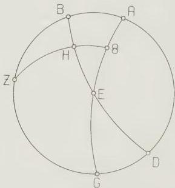
Fig. 2.1

First of all let the length of the longest day be given, and let the problem be to find arc EH of the horizon.

Now, since the revolution of the [heavenly] sphere takes place about the poles of the equator, it is obvious that points H and Θ will be on the meridian ABGD at the same time. Thus the time from the rising of H to its upper culmination is given by the equatorial arc ΘA, and the time from its lower culmination to its rising is given by [the equatorial arc] GΘ. It follows that the length of daylight is twice the time corresponding to arc ΘA, and the length of night twice the time corresponding to arc GΘ. For every parallel circle to the equator has both sections alike, that above the earth and that below it, bisected by the meridian.

Therefore arc EΘ, which is half the difference between longest or shortest day and equinoctial day, is $1\frac{1}{4}^{\text{h}}$ at the parallel in question, or 18;45 time-degrees. Hence its complement, arc ΘA, is 71;15 time-degrees.

Then since, in accordance with the previous theorems, the two great circle arcs EB and ZΘ have been drawn to meet the two great circle arcs AE and AZ, and intersect each other at H, Crd arc 2ΘA:Crd arc 2AE =

$$
\frac{(\text{Crd arc } 2\Theta Z:\text{Crd arc } 2\text{ZH}). \quad (\text{Crd arc } 2\text{HB}:\text{Crd arc } 2\text{BE})}{\text{But arc } 2\Theta A = 142;30^\circ, \quad \text{so Crd arc } 2\Theta A = 113;37,54^\circ} \quad \text{and arc } 2\text{AE} = 180^\circ, \quad \text{so Crd arc } 2\text{AE} = 120^\circ.
$$

Again, arc $2\Theta Z = 180^\circ$, so Crd arc $2\Theta Z = 120^\circ$, and arc $2ZH = 132;17,20^\circ$, so Crd arc $2ZH = 109;44,53^\circ$.

$\therefore$ Crd arc 2HB:Crd arc 2BE = $(113;37,54 : 120)/(120 : 109;44,53)$
= $103;55,26 : 120$.
But arc 2BE = $120^\circ$, since arc BE is a quadrant.

$\therefore$ Crd arc 2HB = $103;55,26^\circ$.

$\therefore$ arc 2HB ≈ $120^\circ$,
and arc HB ≈ $60^\circ$.

$\therefore$ arc HE, its complement, is $30^\circ$ where the horizon is $360^\circ$.

Q.E.D.

## 3. If the same quantities be given, how to find the elevation of the pole, and vice versa

Next let the problem be, given the same quantity [i.e. the length of the longest day] again, to find the elevation of the pole, that is arc BZ of the meridian [in Fig. 2.1]. Now, in the same figure, Crd arc 2EΘ:Crd arc 2ΘA =

$$
\frac{(\text{Crd arc } 2\text{EH}:\text{Crd arc } 2\text{HB})}{\text{But arc } 2\text{BE}}.
$$

(Arc HE, its complement, is $30^\circ$ where the horizon is $360^\circ$.

Q.E.D.

But arc $2E\Theta = 37;30^\circ$,
so Crd arc $2E\Theta = 38;34,22^\circ$,
and arc $2\Theta A = 142;30^\circ$,
so Crd arc $2\Theta A = 113;37,54^\circ$.

Furthermore arc $2EH = 60^\circ$,
so Crd arc $2EH = 60^\circ$,
and arc $2HB = 120^\circ$,
so Crd arc $2HB = 103;55,23^\circ$.

$\therefore$ Crd arc $2BZ$:Crd arc $2ZA = (38;34,22 : 113;37,54)/(60 : 103;55,23)$
$\approx 70;33 : 120$.

And again, Crd arc $2ZA = 120^\circ$,
so Crd arc $2BZ = 70;33^\circ$.

$\therefore$ arc $2BZ = 72;1^\circ$
and arc $BZ \approx 36^\circ$.

To do the reverse, in the same figure again [Fig. 2.1] let BZ, the arc of the pole’s elevation, be given, having been observed to be $36^\circ$. Let the problem be to find the difference between the shortest or longest day and the equinoctial day, i.e. arc $2E\Theta$.

Now, from the same considerations, Crd arc $2ZB$:Crd arc $2BA =$
(Crd arc $2ZH$:Crd arc $2H\Theta$). (Crd arc $2\Theta E$:Crd arc $2EA$). [M.T.II]

But arc $2ZB = 72^\circ$,
so Crd arc $2ZB = 70;32,3^\circ$,
and arc $2BA = 108^\circ$,
so Crd arc $2BA = 97;4,56^\circ$.

Furthermore arc $2ZH = 132;17,20^\circ$,
so Crd arc $2ZH = 109;44,53^\circ$,
and arc $2H\Theta = 47;42,40^\circ$,
so Crd arc $2H\Theta = 48;31,55^\circ$.

$\therefore$ Crd arc $2\Theta E$:Crd arc $2EA = (70;32,3 : 97;4,56)/(109;44,53 : 48;31,55)$
$\approx 31;11,23 : 97;4,56$
$\approx 38;34 : 120$. But Crd arc $2EA = 120^\circ$,
$\therefore$ Crd arc $2E\Theta = 38;34^\circ$.

$\therefore$ arc $2E\Theta \approx 37;30^\circ$, or $2\frac{1}{2}$ equinoctial hours. Q.E.D.

In the same way arc EH of the horizon can be determined. For
Crd arc $2ZA$:Crd arc $2AB =$
(Crd arc $2Z\Theta$:Crd arc $2\Theta H$). (Crd arc $2HE$:Crd arc $2EB$), [M.T.I]
and (Crd arc $2ZA$:Crd arc $2AB$) is a given ratio,
and so is (Crd arc $2Z\Theta$:Crd $2\Theta H$),
so, since arc EB is given, so is the amount of arc EH.

It is obvious that if we suppose H to be, instead of the place of the winter solstice, any other degree of the ecliptic, by similar reasoning both of the arcs EΘ and EH will be given, since we have already set out, in the ‘Table of Inclination’, the arc of the meridian intercepted between ecliptic and equator for every degree of the ecliptic: this arc corresponds to HΘ [in Fig. 2.1].

It immediately follows that points on the ecliptic cut by the same parallel circle, i.e. points equidistant from the same solstice, cut off [between ecliptic and equator] arcs of the horizon which are equal and on the same side of the equator. They also make the length of the day equal to that of the day [at the corresponding point], and the length of the night equal to that of the [corresponding] night.

It likewise follows that points [on the ecliptic] cut by equal parallel circles, that is points equidistant from the same equinox, cut off arcs of the horizon which are equal, but on opposite sides of the equator. They also make the length of the day equal to the length of the night at the opposite [corresponding] point, and the length of the night equal to that of the [corresponding] day.

For, in the figure already drawn [see Fig. 2.2], we put K as the point in which the parallel circle equal to the parallel through H cuts the semi-circle BED of the horizon; we draw in arcs HL and KM of the parallel circles: these will, clearly, be equal and opposite. We draw through K and the north pole the [great circle] quadrant NKX. Then arc ΘA = arc XG (arc ΘA || arc LH, and arc XG || arc MK).
∴ arc EΘ = arc EX (complements [of arc ΘA and arc XG]).

Then, in the two similar spherical triangles EHΘ and EKX we have two pairs of corresponding sides equal, EΘ to EX, and HΘ to KX, and both of the angles at Θ and X are right, so the base EH equals the base KE.

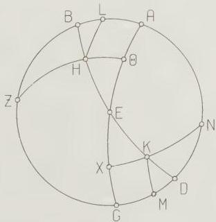
Fig. 2.2

## II 4. How to compute when the sun reaches zenith

## 4. How to compute for what regions, when, and how often the sun reaches the zenith

Once the above quantities are given, it is a straightforward computation to determine for what regions, when, and how often the sun reaches the zenith. For it is immediately obvious that for those beneath a parallel which is farther away from the equator than the 23;51,20° (approximately), which represents the distance of the summer solstice [from the equator], the sun never reaches the zenith at all, while for those beneath the parallel which is exactly that distance [from the equator], it reaches the zenith once [a year], precisely at the summer solstice. It is furthermore clear that for those beneath a parallel less far [from the equator] than the above-mentioned amount the sun reaches the zenith twice [a year]. The time when this happens is readily supplied from the Table of Inclination which we have set out [I 15]. For we take the distance from the equator, in degrees, of the parallel in question (which must, obviously, lie within the [parallel of the] summer solstice), and enter with it the second set of columns; we take the corresponding argument, in degrees from 1° to 90°, in the first set of columns; this gives us the distance of the sun from each of the equinoxes towards the summer solstice when it is in the zenith for those beneath the parallel in question.

## 5. How one can derive the ratios of the gnomon to the equinoctial and solsticial noon shadows from the above-mentioned quantities

The required ratios of shadow to gnomon can be found quite simply once one is given the arc between the solstices and the arc between the horizon and the pole; this can be shown as follows.

[See Fig. 2.3.] Let the meridian circle be ABGD, on centre E. Let A be taken as the zenith, and draw the diameter AEG. At right angles to this, in the plane of the meridian, draw GKZN: clearly, this will be parallel to the intersection of horizon and meridian. Now, since the whole earth has, to the senses, the ratio of a point and centre to the sphere of the sun, so that the centre E can be considered as the tip of the gnomon, let us imagine GE to be the gnomon, and line GKZN to be the line on which the tip of the shadow falls at noon. Draw through E the equinoctial noon ray and the [two] solsticial noon rays: let BEDZ represent the equinoctial ray, HEΘK the summer solsticial ray, and LEMN the winter solsticial ray. Thus GK will be the shadow at the summer solstice, GZ the equinoctial shadow, and GN the shadow at the winter solstice.

Then, since arc GD, which is equal to the elevation of the north pole from the horizon, is 36° (where meridian ABG is 360°) at the latitude in question, and

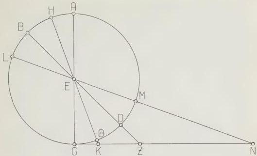
Fig. 2.3

both arc ΘD and arc DM are $23;51,20^{\circ}$, by subtraction arc GΘ = 12;8,40°, and by addition arc GM = 59;51,20°.

Therefore the corresponding angles

$$
\left. \begin{array}{l}
\angle \text{KEG} = 12;8,40^{\circ} \\
\angle \text{ZEG} = 36^{\circ} \\
\angle \text{NEG} = 59;51,20^{\circ}
\end{array} \right\} \text{where 4 right angles} = 360^{\circ}
$$

and

$$
\left. \begin{array}{l}
\angle \text{KEG} = 24;17,20^{\circ \circ} \\
\angle \text{ZEG} = 72^{\circ \circ} \\
\angle \text{NEG} = 119;42,40^{\circ \circ}
\end{array} \right\} \text{where 2 right angles} = 360^{\circ \circ}.
$$

Therefore in the circles about right-angled triangles KEG, ZEG, NEG, arc GK = 24;17,20°

and arc GE = 155;42,40° (supplement), arc GZ = 72°

and arc GE = 108°, similarly [as supplement], arc GN = 119;42,40°

and arc GE = 60;17,20° (again as supplement).

Therefore where Crd arc GK = 25;14,43°, Crd arc GE = 117;18,51°, and where Crd arc GZ = 70;32,4°, Crd arc GE = 97;4,56°, and where Crd arc GN = 103;46,16°, Crd arc GE = 60;15,42°.

Therefore, where the gnomon GE has $60^{\circ}$, in the same units the summer [solsticial] shadow, GK ≈ 12;55°, the equinoctial shadow, GZ ≈ 43;36°

and the winter [solsticial] shadow, GN ≈ 103;20°.

## II 6. Characteristics of parallel $M = 12$

It is immediately clear that the reverse process is possible. That is, provided only that any two of the three above ratios of the gnomon GE to the shadow be given, the elevation of the pole and the arc between the solstices are determined. For if any two of the angles at E are given, so is the third, since arcs ΘD and DM are equal. However, in so far as accuracy of the observation is concerned, the former quantities [elevation of the pole and 2ε] can be exactly determined in the way we explained; but the ratios of the shadows in question to the gnomon cannot be determined with equal accuracy, since the moment of the equinoxes is, in itself, somewhat indeterminate, and the tip of the shadow at winter solstice is hard to discern.

## 6. Exposition of the special characteristics, parallel by parallel

By the same method we also found the above-mentioned general characteristics for the other parallels [to the equator]. We calculated for latitudes at intervals of ¼-hour [of longest daylight], considering that sufficient. Before we deal with particulars, we shall set out these general characteristics.

1. We begin with the parallel beneath the equator itself, which forms, approximately, the southern boundary of the [earth’s] quarter which comprises our part of the inhabited world. This is the only parallel which has every day equal to every night, since only in that case [i.e. at the equator] are all parallel circles bisected by the horizon, so that every section above the earth is an arc of the same size, and is equal to the corresponding section below the earth. This does not occur at any other latitude: [elsewhere] only the equator is bisected at every place on earth by the horizon, so that it makes the night sensibly equal to the day [when the sun is] in it. For the equator too is a great circle. All the other [parallels] are divided [by the horizon] into unequal parts. As the sphere is inclined in our part of the inhabited world, parallels south of the equator make the sections above the earth smaller than those below the earth, and the days shorter than the nights, while the northern [parallels], on the contrary, make the sections above the earth larger, and the days longer.

This parallel [of the equator] also has the shadow going both ways: the sun

The shadow lengths in this chapter are all rounded to the nearest neat fraction or whole number. For higher latitudes there are considerable inaccuracies.

comes into the zenith twice [a year] for those living beneath it, when it reaches the intersections of ecliptic and equator; only at those [two times] do the gnomons cast no shadow at noon; while the sun is traversing the northern semi-circle [of the ecliptic] the shadows of the gnomons point towards the south, and while it is traversing the southern semi-circle they point towards the north. In that region a gnomon of $60^{\circ}$ has a shadow of $26\frac{1}{2}^{\circ}$ at both summer and winter solstices. (When we say ‘shadow’ we mean, in general, the noon shadow; it makes no significant difference that the equinoxes and solstices do not, in general, take place exactly at noon.)

For those who live beneath the equator those stars come into the zenith which revolve on the equator itself, but all stars are seen to rise and set, since the poles of the sphere are exactly on the horizon, and thus it is impossible for any of the parallel circles to appear always visible or always invisible, or for any meridian to be a colure [i.e. always partly invisible]. It is said that the regions beneath the equator could be inhabited, since the climate must be quite temperate. For the sun does not stay long in the neighbourhood of the zenith, since its motion in declination is swift round about the equinoctial points, and hence the summer would be temperate; furthermore, it is not very far from the zenith at the solstices, so the winter would not be harsh. But what these inhabited regions are we have no reliable grounds for saying. For up to now they are unexplored by men from our part of the inhabited world, and what people say about them must be considered guesswork rather than report. In any case, such, in sum, are the characteristics of the parallel beneath the equator.

As for the other parallels, which, according to some authorities, comprise the inhabited regions, we shall make the following general observations, to avoid repeating ourselves in every case. For each of them in order those stars come into the zenith whose distance from the equator, measured along the circle through the poles of the equator, is equal to the distance of the parallel in question [from the equator]. Furthermore the circle which has the north pole of the equator as its pole, and the elevation of the pole [at that parallel] as its radius, is always visible, and all stars within that circle are always visible. [Likewise], the circle which has the south pole as its pole, and the same radius [as the former], is always invisible, and the stars within it are always invisible.

2. The second is the parallel with a longest day of $12\frac{1}{4}$ equinoctial hours. This is $4\frac{1}{4}^{\circ}$ from the equator, and passes through the island Taprobane. This too is one of the parallels with the shadow going both ways: the sun comes into the zenith for those beneath it twice [a year], and makes the gnomons shadowless at noon, when it is $79\frac{1}{2}^{\circ}$ distant from the summer solstice on either side. Thus while it is traversing these $159^{\circ}$, the gnomon shadows point towards the south; and while

by Strabo 2.2.3 and 2.5.43. Whether Posidonius actually coined the terms, as Strabo implies (ἐκάλεσεν, wrongly denied by me, Toomer 146) seems improbable, but we have no earlier attestation.

it is traversing the other $201^{\circ}$, they point towards the north. In this region, for a gnomon of $60^{\circ}$, the equinoctial shadow is $4\frac{3}{2} P$, the summer [solsticial] shadow $21\frac{1}{2} P$, and the winter [solsticial] shadow $32^{\circ}$. 3. The third is the parallel with a longest day of $12\frac{1}{2}$ equinoctial hours. This is $8;25^{\circ}$ from the equator and goes through the Avalite gulf. This too is one of the parallels with the shadow going both ways: the sun comes into the zenith for those beneath it twice [a year], and makes the gnomons shadowless at noon, when it is $69^{\circ}$ distant from the summer solstice on either side. Thus while it is traversing these $138^{\circ}$, the gnomon shadows point towards the south; and while it is traversing the other $222^{\circ}$, they point towards the north. In this region, for a gnomon of $60^{\circ}$, the equinoctial shadow is $8\frac{3}{2} P$, the summer [solsticial] shadow $16\frac{3}{12} P$, and the winter [solsticial] shadow $37\frac{3}{16} P$. 4. The fourth is the parallel with a longest day of $12\frac{1}{2}$ equinoctial hours. This is $12\frac{1}{2}0$ from the equator, and goes through the Adulitic gulf. This too is one of the parallels with the shadow going both ways: the sun comes into the zenith twice [a year] for those beneath it, and makes the gnomons shadowless at noon, when it is $57\frac{3}{2}0$ from the summer solstice on either side. Thus while it is traversing these $115\frac{1}{2}0$ the gnomon shadows point towards the south, and while it is traversing the remaining $244\frac{3}{2}0$ they point towards the north. In this region, for a gnomon of $60^{\circ}$, the equinoctial shadow is $13\frac{1}{2}0$, the summer [solsticial] shadow $12^{\circ}$, and the winter [solsticial] shadow $44\frac{1}{2}0$.

5. The fifth is the parallel with a longest day of 13 equinoctial hours. This is $16;27^{\circ}$ from the equator, and goes through the island of Meroe. This too is one of the parallels with the shadow going both ways: the sun comes into the zenith for those beneath it twice [a year], and makes the gnomons shadowless at noon, when it is $45^{\circ}$ from the summer solstice on either side. Thus while it is traversing these $90^{\circ}$ the gnomon shadows point towards the south, and while it is traversing the remaining $270^{\circ}$ they point towards the north. In this region, for a gnomon of $60^{\circ}$, the equinoctial shadow is $17\frac{3}{4} P$, the summer [solsticial] shadow $7\frac{3}{4} P$, and the winter [solsticial] shadow $51^{\circ}$.

6. The sixth is the parallel with a longest day of $13\frac{1}{2}$ equinoctial hours. This is

20;14° from the equator, and goes through Napata. This too is one of the parallels with the shadow going both ways: the sun comes into the zenith for those beneath it twice [a year], and makes the gnomons shadowless at noon, when it is 31° from the summer solstice on either side. Thus while it is traversing these 62° the gnomon shadows point towards the south, and while it is traversing the remaining 298° they point towards the north. In this region, for a gnomon of 60°, the equinoctial shadow is 22½°, the summer [solsticial] shadow 3½°, and the winter [solsticial] shadow 58½°.

7. The seventh is the parallel with a longest day of 13½ equinoctial hours. This is 23;51° from the equator and goes through Soene. This is the first of the so-called ‘one-way-shadow’³⁶ parallels. For in this region the noon shadows of the gnomon never point towards the south. Only at the actual summer solstice does the sun come into the zenith for those beneath this parallel, so that the gnomons appear shadowless. For they are exactly the same distance from the equator as the summer solstice is. At every other time the shadows of the gnomons point towards the north. In this region, for a gnomon of 60°, the equinoctial shadow is 26½°, the winter [solsticial] shadow is 65½°, and the summer [solsticial] shadow is zero. Furthermore, all parallels north of this up to the northern boundary of our part of the inhabited world have the shadows going one way. For in those regions the gnomons at noon neither become shadowless nor point their shadows towards the south: they always point them towards the north, since the sun never comes into the zenith for them, either.

8. The eighth is the parallel with a longest day of 13½ equinoctial hours. This is 27;12° from the equator, and goes through Ptolemais in the Thebaid, which is called Ptolemais Herm eiou. In this region, for a gnomon of 60°, the summer [solsticial] shadow is 3½°, the equinoctial shadow 30½°, and the winter [solsticial] shadow 74½°.

9. The ninth is the parallel with a longest day of 14 equinoctial hours. This is 30;22° from the equator, and goes through lower Egypt. In this region, for a gnomon of 60°, the summer [solsticial] shadow is 6½°, the equinoctial shadow 35½°, and the winter [solsticial] shadow 83;12°.

10. The tenth is the parallel with a longest of $14\frac{1}{4}$ equinoctial hours. This is $33;18^{\circ}$ from the equator, and goes through the middle of Phoenicia. In this region, for a gnomon of $60^{\mathrm{p}}$, the summer [solsticial] shadow is $10^{\mathrm{p}}$, the equinoctial shadow $39\frac{3}{2}^{\mathrm{p}}$, and the winter [solsticial] shadow $93\frac{1}{2}^{\mathrm{p}}$.40

11. The eleventh is the parallel with a longest day of $14\frac{1}{2}$ equinoctial hours. This is $36^{\circ}$ from the equator, and goes through Rhodes. In this region, for a gnomon of $60^{\mathrm{p}}$, the summer [solsticial] shadow is $12\frac{1}{2}^{\frac{1}{2}^{\mathrm{p}}}$, the equinoctial shadow $43\frac{3}{2}^{\mathrm{p}}$, and the winter [solsticial] shadow $103\frac{1}{2}^{\mathrm{p}}$.

12. The twelfth is the parallel with a longest day of $14\frac{1}{4}$ equinoctial hours. This is $38;35^{\circ}$ from the equator, and goes through Smyrna. In this region, for a gnomon of $60^{\mathrm{p}}$, the summer [solsticial] shadow is $15\frac{3}{2}^{\mathrm{p}}$, the equinoctial shadow is $47\frac{3}{2}^{\mathrm{p}}$, and the winter [solsticial] shadow is $114\frac{1}{2}^{\mathrm{p}}$.

13. The thirteenth is the parallel with a longest day of 15 equinoctial hours. This is $40;56^{\circ}$ from the equator, and goes through the Hellespont. In this region, for a gnomon of $60^{\mathrm{p}}$, the summer [solsticial] shadow is $18\frac{1}{2}^{\mathrm{p}}$, the equinoctial shadow $52\frac{1}{2}^{\mathrm{p}}$, and the winter [solsticial] shadow $127\frac{1}{2}^{\mathrm{p}}$.42

14. The fourteenth is the parallel with a longest day of $15\frac{1}{4}$ equinoctial hours. This is $43;1^{\circ 43}$ from the equator, and goes through Massalia.44 In this region, for a gnomon of $60^{\mathrm{p}}$, the summer [solsticial] shadow is $20\frac{3}{4}^{\mathrm{p}}$, the equinoctial shadow $55\frac{1}{2}^{\mathrm{p}}$, and the winter [solsticial] shadow $140\frac{1}{4}^{\mathrm{p}}$.45

15. The fifteenth is the parallel with a longest day of $15\frac{1}{2}$ equinoctial hours. This is $45;1^{\circ}$ from the equator, and goes through the middle of Pontus.46 In this region, for a gnomon of $60^{\mathrm{p}}$, the summer [solsticial] shadow is $23\frac{1}{4}^{\mathrm{p}}$, the equinoctial shadow $60^{\mathrm{p}}$, and the winter [solsticial] shadow $155\frac{1}{2}^{\mathrm{p}}$.47

| | M = 15^{h} | φ = 40;56° | φ = 41° | text |
| --- | --- | --- | --- | --- |
| summer shadow | 18;21,47 | 18;25,58 | 18;30,34 | 18;30 |
| equinoctial shadow | 51;55,23 | 52;2,5 | 52;9,26 | 52;10 |
| winter shadow | 127;5,30 | 127;26,32 | 127;49,41 | 127;50 |

The parallel through the Hellespont is Clima V in the traditional ‘7 climata’ (see Introduction p. 19). Possibly, an older round number for the latitude underlies Ptolemy’s values here.

16. The sixteenth is the parallel with a longest day of $15\frac{3}{4}$ equinoctial hours. This is $46;51^{\circ}$ from the equator and goes through the sources of the river Istros. In this region, for a gnomon of $60^{\circ}$, the summer [solsticial] shadow is $25\frac{3}{4}^{\circ}$, the equinoctial shadow $63\frac{1}{2}^{\circ}$, and the winter [solsticial] shadow $171\frac{1}{2}^{\circ}$.

17. The seventeenth is the parallel with a longest day of 16 equinoctial hours. This is $48;32^{\circ}$ from the equator, and goes through the mouths of the Borysthenes. In this region, for a gnomon of $60^{\circ}$, the summer [solsticial] shadow is $27\frac{3}{2}^{\circ}$, the equinoctial shadow $67\frac{3}{2}^{\circ}$, and the winter [solsticial] shadow $188\frac{3}{2}^{\circ}$.

18. The eighteenth is the parallel with a longest day of $16\frac{1}{2}$ equinoctial hours. This is $50;4^{\circ}$ from the equator, and goes through the middle of the Maiotic lake. In this region, for a gnomon of $60^{\circ}$, the summer [solsticial] shadow is $29\frac{3}{2}^{\circ}$, the equinoctial shadow $71\frac{3}{2}^{\circ}$, and the winter [solsticial] shadow $208\frac{3}{2}^{\circ}$.

19. The nineteenth is the parallel with a longest day of $16\frac{1}{2}$ equinoctial hours. This is $51\frac{1}{2}^{\circ 54}$ from the equator and goes through the southernmost parts of Britannia. In this region, for a gnomon of $60^{\circ}$, the summer [solsticial] shadow is $31\frac{3}{2}^{\circ}$, the equinoctial shadow $75\frac{3}{2}^{\circ}$, and the winter [solsticial] shadow $229\frac{3}{2}^{\circ}$.

20. The twentieth is the parallel with a longest day of $16\frac{1}{2}$ equinoctial hours. This is $52;50^{\circ}$ from the equator and goes through the mouths of the Rhine. In this region, for a gnomon of $60^{\circ}$, the summer [solsticial] shadow is $33\frac{3}{2}^{\circ}$, the equinoctial shadow $79\frac{3}{2}^{\circ}$, and the winter [solsticial] shadow $253\frac{3}{2}^{\circ}$.

21. The twenty-first is the parallel with a longest day of 17 equinoctal hours. This is $54;1^{\circ}$ from the equator, and goes through the mouths of the Tanais. In this region, for a gnomon of $60^{\circ}$, the summer [solsticial] shadow is $34\frac{1}{2}^{\circ}$, the equinoctial shadow $82\frac{1}{2}^{\circ}$, and the winter [solsticial] shadow $278\frac{3}{2}^{\circ}$.

22. The twenty-second is the parallel with a longest day of $17\frac{1}{4}$ equinoctial hours. This is $55^{\circ}$ from the equator and goes through Brigantium in Great Britania. In this region, for a gnomon of $60^{\mathrm{p}}$, the summer [solsticial] shadow is $36\frac{1}{4}^{\mathrm{p}}$, the equinoctial shadow is $85\frac{3}{2}^{\mathrm{p}}$, and the winter [solsticial] shadow is $304\frac{1}{2}^{\mathrm{p}}$.

23. The twenty-third is the parallel with a longest day of $17\frac{1}{2}$ equinoctial hours. This is $56^{\circ}$ from the equator, and goes through the middle of Great Britania. In this region, for a gnomon of $60^{\mathrm{p}}$, the summer [solsticial] shadow is $37\frac{3}{2}^{\mathrm{p}}$, the equinoctial shadow $88\frac{3}{2}^{\mathrm{p}}$, and the winter [solsticial] shadow $335\frac{1}{2}^{\mathrm{p}}$. 24. The twenty-fourth is the parallel with a longest day of $17\frac{1}{4}$ equinoctial hours. This is $57^{\circ}$ from the equator, and goes through Caturactonium in Britania. In this region, for a gnomon of $60^{\mathrm{p}}$, the summer [solsticial] shadow is $39\frac{1}{4}^{\mathrm{p}}$, the equinoctial shadow is $92\frac{3}{12}^{\mathrm{p}}$, and the winter [solsticial] shadow is $372\frac{3}{2}^{\mathrm{p}}$.

25. The twenty-fifth is the parallel with a longest day of 18 equinoctial hours. This is $58^{\circ}$ from the equator and goes through the southern part of Little Britania. In this region, for a gnomon of $60^{\mathrm{p}}$, the summer [solsticial] shadow is $40\frac{3}{2}^{\mathrm{p}}$, the equinoctial shadow $96^{\mathrm{p}}$, and the winter [solsticial] shadow $419\frac{1}{12}^{\mathrm{p}}$.

26. The twenty-sixth is the parallel with a longest day of $18\frac{1}{2}$ equinoctial hours. This is $59\frac{1}{2}^{\circ}$ from the equator, and goes through the middle of Little Britania.

From here on we no longer used 4-hour increments, since [at intervals of 4-hour for the longest daylight] the parallels are now close together, and the difference in the elevation of the pole is no longer as much as a whole degree. Furthermore, for the points even further north there is not the same need for detail. Hence we considered it superfluous to list the ratios of the shadows to the gnomon, as if it were for some well-defined place. 27. The parallel where the longest day is 19 equinoctial hours is $61^{\circ}$ from the equator and goes through the northern parts of Little Britania.

Computed: 55;7,16. From here on the roundings become much more drastic.

By ‘Great Britania’ and ‘Little Britania’ Ptolemy refers to the two principal islands of the British isles, namely modern ‘Great Britain’ (England, Wales and Scotland) and Ireland. None of the places called Brigantium were in Britain. However, there was in Britain a tribe of Brigantes, whose kingdom was sometimes known as Brigantia (which was further to the north than this latitude would imply). Ptolemy presumably made an error here. He seems to have corrected it by the time he came to write the *Geography*, which does mention the Brigantes, but no Brigantium in Britain.

Modern Catterick in Yorkshire. The usual Latin form is ‘Cataractonium’.

Reading $\overline{\lambda\theta}\varsigma'$ (with D. Is) for $\overline{\lambda\theta}\gamma'$ ($39\frac{1}{2}$) at.4. Computed for $\varphi = 57^{\circ}$: 39;10,48.

Reading $\tau\overline{\sigma\beta}\Gamma_{0}^{-}$ (with $BD$, Ar) for $\tau\overline{\sigma\beta}\upsilon\beta'$ ($372\frac{1}{2}$) at.5. Computed: for $\varphi = 59^{\circ}$: 372;44,27.

Ireland: see above n.59.

Computed for $\varphi = 58^{\circ}$: 419;15,1. Perhaps one should emend to $419\frac{1}{4}$ ($\delta'$ for $\upsilon\beta'$ at.11). Cf. ‘$119\frac{1}{4}$’. Ger.

28. The parallel where the longest day is $19\frac{1}{2}$ equinoctial hours is $62^{\circ}$ from the equator and goes through the islands called ‘Eboudae’.

29. The parallel where the longest day is 20 equinoctial hours is $63^{\circ}$ from the equator and goes through the island Thule.

30. The parallel where the longest day is 21 equinoctial hours is $64\frac{1}{2}^{\circ}$ from the equator and goes through unknown Scythian peoples.

31. The parallel where the longest day is 22 equinoctial hours is $65\frac{1}{2}^{\circ}$ from the equator.

32. The parallel where the longest day is 23 equinoctial hours is $66^{\circ}$ from the equator.

33. The parallel where the longest day is 24 equinoctial hours is $66;8,40^{\circ}$ from the equator. This is the first of the [parallels] where the shadow goes full circle. For on that parallel, at the summer solstice (and then only), the sun does not set, so the shadow of the gnomon points towards every part of the horizon [in turn]. There the parallel of the summer solstice is ever-visible, and the parallel of the winter solstice is ever-invisible, since both are tangent to the horizon, on opposite sides. And the ecliptic coincides with the horizon when the spring equinoctial point on it is rising.

If, purely theoretically, one were to investigate some of the general characteristics of the latitudes even farther north, one would find the following.

34. Where the elevation of the north pole is about $67^{\circ}$, the $15^{\circ}$ of the ecliptic on either side of the summer solstice do not set at all. So the longest day and the period when the shadow turns to point in all directions on the horizon is about a month long. This too can easily be seen from the Table of Inclination set out [above]. For we take a parallel, e.g. the parallel which cuts off [a segment of the ecliptic] $15^{\circ}$ either side of the solstice (at which point it is either ever-visible or ever-invisible). The distance from the equator corresponding to that segment of the ecliptic will, obviously, give the amount by which the elevation of the north pole differs from the $90^{\circ}$ of the quadrant.

35. Thus, where the elevation of the pole is $69\frac{1}{2}^{\circ}$, one would find that the $30^{\circ}$ on either side of the summer solstice do not set at all. So the longest day and the

period when the gnomons throw shadows in all directions last about two months.

36. Where the elevation of the pole is $73\frac{1}{2}^{\circ}$, one would find that the $45^{\circ}$ on either side of the summer solstice do not set at all. So the longest day and the period when the gnomons throw shadows in all directions last about three months.

37. Where the elevation of the pole is $78\frac{1}{2}^{\circ}$, one would find that the $60^{\circ}$ on either side of the same solstice do not set at all. So the longest day and the period when the shadow turns through a full circle would last about four months.

38. Where the elevation of the pole is $84^{\circ}$, one would find that the $75^{\circ}$ on either side of the summer solstice do not set at all. So in this case the longest day would be about five months long, and the gnomon would throw shadows in all directions for the same period.

39. Where the north pole is elevated from the horizon through the $90^{\circ}$ of the complete quadrant, the whole semi-circle of the ecliptic which is north of the equator never goes below the earth, and the whole semi-circle south of it never comes above the earth. Therefore every year contains only one day and one night, each about six months long, and the gnomons always throw shadows in all directions. Further special characteristics of this latitude are that the north pole is in the zenith, and that the equator coincides with the position of the ever-visible circle, and also with that of the ever-invisible circle and with the horizon; thus the whole hemisphere north of the equator is always above the earth, and the whole hemisphere south of the equator is always below the earth.

## 7. On simultaneous risings of arcs of the ecliptic and equator at sphaera obliqua

After we have thus set out the general characteristics which can be theoretically deduced for the [various] latitudes, our next task is to show how to calculate, for each latitude, the arcs of the equator, measured as time-degrees, which rise together with [given] arcs of the ecliptic. From this we shall systematically derive all the other special characteristics [of the climata]. We shall use the names of the signs of the zodiac for the twelve [30°-] divisions of the ecliptic, according to the system in which the divisions begin at the solsticial and equinoctial points. We call the first division, beginning at the spring equinox and going towards the rear with respect to the motion of the universe, ‘Aries’, the second ‘Taurus’, and so on for the rest, in the traditional order of the 12 signs.

We shall first prove that arcs of the ecliptic which are equidistant from the same equinox always rise with equal arcs of the equator.

[See Fig. 2.4.] Let ABGD be a meridian, BED the semi-circle of the horizon, AEG the semi-circle of the equator, and ZH and ΘK two arcs of the ecliptic such that points Z and Θ are each supposed to be the spring equinox, and equal arcs have been cut off on opposite sides of [that equinox]: these are arcs ZH and ΘK, which are rising at points K and H [respectively]. I say, that the arcs of the equator which rise with them, namely ZE and ΘE respectively, are equal. [Proof.] Let points L and M represent the poles of the equator, and draw through them the great-circle arcs LEM, LΘ, LK, ZM and MH. Then since

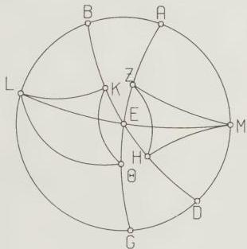
Fig. 2.4

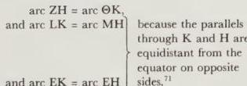

[sperical triangle] $\mathbf{LK}\Theta \equiv$ [sperical triangle] MHZ and arc EK = arc EH [sperical triangle] LKΘ = ∠ HME, and ∠ KLΘ = ∠ HMZ.

Therefore, by subtraction, ∠ ELΘ = ∠ EMZ.

∴ EΘ = EZ, bases [of congruent triangles ELΘ, EMZ].

Q.E.D.

Again, we shall prove that if two arcs of the ecliptic are equal and are equidistant from the same solstice, the sum of the two arcs of the equator which rise with them is equal to the sum of the rising-times [of the same two arcs of the ecliptic] at *sphaera recta*.

[See Fig. 2.5.] Let ABGD be a meridian, and let semi-circle BED represent the horizon, and semi-circle AEG the equator. Draw two arcs of the ecliptic, equal and equidistant from the winter solstice, ZH (where Z is taken as the autumnal equinox) and ΘH (where Θ is taken as the spring equinox).

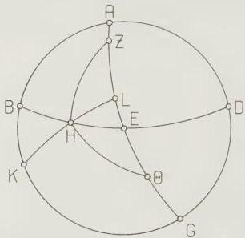
Fig. 2.5

Thus H is the point on the horizon which is common to the rising of both, since arcs ZH and ΘH are both bounded by the same parallel circle to the equator. Therefore, obviously, arc ΘE rises with arc ΘH, and arc EZ with arc ZH. Then it is immediately obvious that the whole arc ΘEZ is equal to the sum of the rising-times of arc ZH and arc ΘH at *sphaera recta*.

[Proof.] For if we take K as the south pole of the equator, and draw through it and H the great-circle quadrant KHL, which represents the horizon at *sphaera recta*, then ΘL is the arc which rises with arc ΘH at *sphaera recta*, and similarly LZ is the arc which rises with arc ZH. Thus the sum of the arcs (ΘL + LZ) equals the sum of the arcs (ΘE + EZ), and both are comprised in the arc ΘZ.

Q.E.D.

From the above we have shown that, if we can calculate the individual rising-times at any latitude for just a single quadrant, we will simultaneously have solved the problem for the remaining three quadrants as well.

This being the case, let us again take as a paradigm the parallel through Rhodes, where the longest day is $1\frac{1}{2}$ equinoctial hours, and the elevation of the north pole from the horizon is $36^\circ$.

[See Fig. 2.6.] Let ABGD be a meridian, BED the semi-circle of the horizon, AEG the semi-circle of the equator, and ZHΘ the semi-circle of the ecliptic, positioned so that H represents the spring equinox. Take K as the north pole of the equator, and draw through K and L, which is the intersection of the ecliptic and the horizon, the great-circle quadrant KLM.

Let the problem be, given arc HL, to find the arc of the equator which rises with it, that is arc EH.

First let arc HL comprise the sign of Aries.

Then since, in the diagram, the two great-circle arcs ED and KM are drawn to meet the two great-circle arcs EG and GK, and intersect each other at L, Crd arc 2KD:Crd arc 2DG =

(Crd arc 2KL:Crd arc 2LM). (Crd arc 2ME:Crd arc 2EG). [M.T. II]

But arc 2KD = 72°, so Crd arc 2KD = 70;32,4°;

arc 2GD = 108°, so Crd arc 2GD = 97;4,56°.

And arc 2KL = 156;40,1°, so Crd arc 2KL = 117;31,15°;

arc 2LM = 23;19,59°, so Crd arc 2LM = 24;15,57°.

∴ Crd arc 2ME:Crd arc 2EG = (70;32,4 : 97;4,56)/(117;31,15 : 24;15,57)

= 18;0,5 : 120.

And Crd arc 2EG = 120°.

∴ Crd arc 2ME = 18;0,5°

∴ arc 2ME ≈ 17;16°

and arc ME = 8;38°

And since the whole arc HM rises with the whole arc HL at sphaera recta, it is 27;50°, as was shown above. [p. 73.]

Therefore, by subtraction, EH is 19;12°.

We have simultaneously proved that the sign Pisces rises in the same time (in degrees) of $19;12^\circ$, and that each of the signs Virgo and Libra rises in $36;28^\circ$, which is the remainder [of $19;12^\circ$ taken] from twice the rising-time at *sphaera recta*.

Q.E.D.

Secondly, let arc HL comprise the $60^\circ$ of the two signs Aries and Taurus. Then, from our assumptions, the other quantities will remain the same, but

$$
\begin{align*}
\text{arc 2KL} &= 138;59,42^\circ, \text{ so Crd arc 2KL} = 112;23,56^\circ, \\
\text{and arc 2LM} &= 41;0,18^\circ, \text{ so Crd arc 2LM} = 42;1,48^\circ.
\end{align*}
$$

$$
\begin{align*}
\text{∴ Crd arc 2ME:Crd arc 2EG} &= (70;32,4 : 97;4,56)/(112;23,56 : 42;1,48) \\
&= 32;36,4 : 120.
\end{align*}
$$

$$
\begin{align*}
\text{And Crd arc 2EG} &= 120^\circ.
\end{align*}
$$

$$
\begin{align*}
\text{∴ Crd arc 2ME} &= 32;36,4^\circ.
\end{align*}
$$

$$
\begin{align*}
\text{∴ arc 2ME} &\approx 31;32^\circ, \\
\text{and arc ME} &\approx 15;46^\circ.
\end{align*}
$$

But the whole arc MH was previously shown to be $57;44^\circ$ [ p. 73.]

Therefore, by subtraction, arc HE = 41;58°.

Therefore the combined signs of Aries and Taurus rise in 41;58 time degrees, of which $19;12^\circ$ was shown to belong to the rising-time of Aries. Therefore the sign of Taurus by itself rises in 22;46 time-degrees.

By the same reasoning as before, the sign of Aquarius will rise in the same time of $22;46^\circ$, and each of the signs of Leo and Scorpio in $37;2^\circ$, which is the remainder [of $22;46^\circ$ taken] from twice the rising-time at *sphaera recta*.

Now since the longest day is $14$ equinoctial hours, and the shortest $9$ equinoctial hours, it is obvious that the semi-circle [of the ecliptic] from Cancer to Sagittarius will rise with $217;30^\circ$ of the equator, and the semi-circle from Capricorn to Gemini with $142;30^\circ$. Therefore each of the quadrants on either side of the spring equinox will rise in 71;15 time-degrees, and each of the quadrants on either side of the autumnal equinox will rise in 108;45 time-degrees. Therefore the remaining signs [in each quadrant], Gemini and Capricorn, will each rise in 29;17 time-degrees, which is the difference [of $19;12^\circ + 22;46^\circ$] from the $71;15^\circ$ in which the quadrant rises, and the remaining signs Cancer and Sagittarius will each rise in 35;15 time-degrees, which is the difference [of $36;28^\circ + 37;2^\circ$] from the $108;45^\circ$ in which that quadrant rises. It is obvious that we could also calculate the rising-times of smaller arcs of the ecliptic [than whole signs] by exactly the same method. But we can also compute them by another easier and more practical procedure, as follows.

[See Fig. 2.7.] First let ABGD represent a meridian, BED the semi-circle of the horizon, AEG the semi-circle of the equator, and ZEH the semi-circle of the ecliptic, with the intersection E taken as the spring equinox. Cut off an arbitrary arc EΘ on [the ecliptic], and draw the segment ΘK of the parallel to the equator through Θ. Taking L as the [south] pole of the equator, draw through it the great-circle quadrants LΘM, LKN and LE.

Reading $\mathfrak{pa}$ o $\mathfrak{m}$ (with Ar and variants in Greek mss.) for $\mathfrak{pa}$ θ $\mathfrak{m}$ (41;9,18) at,11. Corrected by Manitius.

Correcting the misprint ‘ME’ at,21, with Manitius.

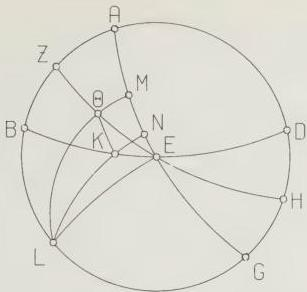
Fig. 2.7

Then it is immediately obvious that the segment EΘ of the ecliptic rises with arc EM of the equator at *sphaera recta*, and with NM at *sphaera obliqua*, since arc KΘ of the parallel circle, with which segment EΘ rises [at *sphaera obliqua*], is similar to arc NM of the equator and similar arcs of parallel circles rise in equal times everywhere. Therefore arc EN is the difference between the rising-times of segment EΘ at *sphaera obliqua* and at *sphaera recta*. Thus we have shown that, for arcs of the ecliptic bounded by point E and the parallel circle through K, in every case, if the great-circle arc corresponding to LKN is drawn, segment EN will comprise the difference between that arc’s rising-times at *sphaera recta* and at *sphaera obliqua*.

Q.E.D.

Having established this as a preliminary, let us draw [see Fig. 2.8] a diagram containing only the meridian and the semi-circles of the horizon [BED] and of the equator [AEG]; through Z, the south pole of the equator, let us draw the two great-circle quadrants ZHΘ and ZKL. Let us take H as the intersection of the horizon with the parallel circle through the winter solstice, and K as the intersection [of the horizon] with the parallel circle through, e.g., the beginning of Pisces, or any other given point on the quadrant [from the beginning of Capricorn to the end of Pisces].

Then, again, the great-circle arcs ZKL and EKH are drawn to meet the great-circle arcs ZΘ and EΘ, and intersect each other at K. Therefore

Crd arc 2ΘH:Crd arc 2ZH =

(Crd arc 2ΘE:Crd arc 2EL). (Crd arc 2KL:Crd arc 2KZ) [M.T. II]

But at every latitude arc 2ΘH is given and is the same, since it is the arc between the solstices. Hence arc 2HZ, its supplement, is also given. Similarly,

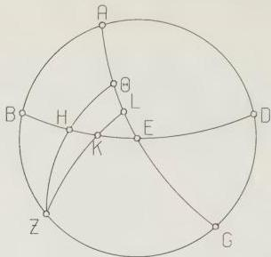
Fig. 2.8

for the same arc of the ecliptic, arc 2LK is the same at all latitudes, and is given from the Table of Inclination [I 15]; and thence again its supplement, arc 2KZ, is given. Therefore, by division [of the above members], (Crd arc 2ΘE:Crd arc 2EL) is found to be the same at all latitudes (for the same arc of that quadrant [of the ecliptic]).

Since this is so, we take the different values of arc KL at every $10^{\circ}$ [of the ecliptic] through the quadrant from the spring equinox to the winter solstice (for subdivision down to arcs of this size $[10^{\circ}]$ will be sufficient for practical purposes). Then in every case arc $2\Theta H = 47;42,40^{\circ}$, and Crd arc $2\Theta H = 48;31,55^{\circ}$,
arc $2HZ = 132;17,20^{\circ}$, and Crd arc $2HZ = 109;44,53^{\circ}$.

Then, for the $10^{\circ}$ [of the ecliptic] from the spring equinox towards the winter solstice,
arc $2KL = 8;3,16^{\circ}$, and Crd arc $2KL = 8;25,39^{\circ}$,
arc $2KZ = 171;56,44^{\circ}$, and Crd arc $2KZ = 119;42,14^{\circ}$.

For the arc $20^{\circ}$ from the equinox
arc $2KL = 15;54,6^{\circ}$, Crd arc $2KL = 16;35,56^{\circ}$,
arc $2KZ = 164;5,54^{\circ}$, Crd arc $2KZ = 118;50,47^{\circ}$.

For the arc $30^{\circ}$ from the equinox
arc $2LK = 23;19,58^{\circ}$, Crd arc $2LK = 24;15,56^{\circ}$,
arc $2KZ = 156;40,2^{\circ}$, Crd arc $2KZ = 117;31,15^{\circ}$.

For the arc $40^{\circ}$ from the equinox arc $2LK = 30;8,8^{\circ}$, Crd arc $2LK = 31;11,43^{\circ}$.
arc $2KZ = 149;51,52^{\circ}$, Crd arc $2KZ = 115;52,19^{\circ}$.

For the arc $50^{\circ}$ from the equinox
arc $2LK = 36;5,46^{\circ}$, Crd arc $2LK = 37;10,39^{\circ}$,
arc $2KZ = 143;54,14^{\circ}$, Crd arc $2KZ = 114;5,44^{\circ}$.

For the arc $60^{\circ}$ from the equinox arc 2LK = 41;0,18°, Crd arc 2LK = 42;1,48°,
arc 2KZ = 138;59,42°, Crd arc 2KZ = 112;23,57°.
For the arc 70° from the equinox
arc 2LK = 44;40,22°, Crd arc 2LK = 45;36,18°.
arc 2KZ = 135;19,38°, Crd arc 2KZ = 110;59,47°.
For the arc 80° from the equinox
arc 2LK = 46;56,32°, Crd arc 2LK = 47;47,40°,
arc 2KZ = 133;3,28°, Crd arc 2KZ = 110;4,16°.
From the above we find that if we divide the ratio (Crd arc 2ΘH:Crd arc 2HZ), namely (48:31,55 : 109;44,53), by the ratio (Crd arc 2LK:Crd arc 2KZ), as given above, at each of the 10° intervals, we will get the ratio (Crd arc 2ΘE:Crd arc 2EL), which is the same at all latitudes.

For the 10° arc it is 60 : 9;33
for the 20° arc 60 : 18;57
for the 30° arc 60 : 28;1
for the 40° arc 60 : 36;33⁷⁷
for the 50° arc 60 : 44;12
for the 60° arc 60 : 50;44
for the 70° arc 60 : 55;45
and for the 80° arc 60 : 58;55.

It is immediately obvious that for each latitude we will have arc 2ΘE as a given arc, since it is, in degrees, the difference in time-degrees of the equinoctial day from the shortest day. Hence, from Crd arc 2ΘE and the ratio (Crd arc 2ΘE:Crd arc 2EL), Crd arc 2EL will be given, and [hence] arc 2EL. We will subtract half of this, namely arc EL, which comprises the above-mentioned difference [between rising-times at *sphaera recta* and *sphaera obliqua*], from the rising-time of the ecliptic arc in question at *sphaera recta*, and thus obtain the rising-time of the same arc at the given latitude.

As an example, let us again take the latitude of the parallel through Rhodes. Here
arc 2EΘ = 37;30°, so Crd arc 2EΘ ≈ 38;34°.
Then since 60 : 38;34 = 9;33 : 6;8
= 18;57 : 12;11
= 28;1 : 18;0
= 36;33 : 23;29⁷⁸
= 44;12 : 28;25
= 50;44 : 32;37
= 55;45 : 35;52⁷⁹
= 58;55 : 37;52, and since Crd arc 2EL equals the above amount [6;8°, etc.] at each of the above-mentioned 10° intervals, half of the arc it subtends, namely arc EL, will assume the following values:

| for the first 10° | 2;56° |
| --- | --- |
| up to the end of the second | 5;50° |
| up to the end of the third | 8;38° |
| up to the end of the fourth | 11;17° |
| up to the end of the fifth | 13;42° |
| up to the end of the sixth | 15;46° |
| up to the end of the seventh | 17;24° |
| up to the end of the eighth | 18;24° |
| up to the end of the ninth, obviously, | 18;45°. |

Since the corresponding rising-times at *sphaera recta* are as follows:

| for the first 10° | 9;10° |
| --- | --- |
| up to the end of the second | 18;25° |
| up to the end of the third | 27;50° |
| up to the end of the fourth | 37;30° |
| up to the end of the fifth | 47;28° |
| up to the end of the sixth | 57;44° |
| up to the end of the seventh | 68;18° |
| up to the end of the eighth | 79;5° |
| and up to the end of the ninth | 90° (the time-degrees of the whole quadrant), |

it is clear that by subtracting the difference, given by the arc EL, from the corresponding rising-time at *sphaera recta* in each case, we get the rising-times of the same arcs at the latitude in question. These are

| for the first 10° | 6;14° |
| --- | --- |
| up to the end of the second | 12;35° |
| up to the end of the third | 19;12° |
| up to the end of the fourth | 26;13° |
| up to the end of the fifth | 33;46° |
| up to the end of sixth | 41;58° |
| up to the end of the seventh | 50;54° |
| up to the end of the eighth | 60;41° |
| up to the end of the ninth | 71;15° |

(i.e. for the whole quadrant) (which corresponds to the length of half of the [shortest] day).

The ten-degree segments will rise in the following time-degrees:

| 1st | 6;14° |
| --- | --- |
| 2nd | 6;21° |
| 3rd | 6;37° |
| 4th | 7;1° |
| 5th | 7;33° |
| 6th | 8;12° |
| 7th | 8;56° |

| 8th | 9;47° |
| --- | --- |
| 9th | 10;34°. |

Once we have established the above, the corresponding rising-times of the remaining quadrants will immediately be established on the same basis, by means of the theorems set out above.

In the same way we calculated the rising-times at every $10^{\circ}$ interval for all other parallels which one might come upon in actual practice. For future use we shall set these out in tabular form, beginning with the parallel directly beneath the equator, and going as far as the parallel with a longest day of 17 hours. The parallels are taken at intervals of $\frac{1}{2}$-hour [of longest day], since the difference [of exact computations] from results derived from linear interpolation [between half-hour intervals] is negligible. In the first column we put the 36 ten-degree intervals of the circle, in the next the corresponding time-degrees of the rising-time of that 10-degree arc at the latitude in question, and in the third the accumulated sum, as follows.

## 8. Table of rising-times at ten-degree intervals

[See pp. 100-3.]

## 9. On the particular features which follow from the rising-times

Now that we have set out the rising-times in the above manner, all the other problems associated with this subject will be easily soluble, and we shall not need to go through geometrical proofs or construct special tables to solve each problem. This will become clear from the actual methods described below.

First, one can find the length of a given day or night as follows. Take the rising-times of the appropriate latitude; for the day, count from the degree in which the sun is to the degree diametrically opposite, going towards the rear through the signs; for the night, count from the degree opposite the sun to the sun’s degree. Form the sum of the rising-times [of the relevant $180^{\circ}$], and divide by 15: this will give the relevant interval in equinoctial hours. If we take $\frac{1}{2}$th [of the sum of the rising-times] we will have the length of the seasonal hour of that interval [i.e. day or night] in time-degrees.

One can also find the length of the [seasonal] hour more conveniently by taking, from the above Table of Rising-times [II 8], the total rising-time corresponding to the sun’s degree for the day (or the degree opposite the sun for the night) both at the parallel beneath the equator [i.e. *sphaera recta*] and at the relevant latitude, and forming the difference. Take $\frac{1}{4}$th of the latter, and add it to the 15 time-degrees of one equinoctial hour for points on the northern semi-circle [of the ecliptic], or subtract it from $15^{\circ}$ for points on the southern semi-circle: the result will be the length of the relevant seasonal hour in time-degrees.

### TABLE OF RISING-TIMES AT $10$ INTERVALS

| SIGNS | $10$ Intervals | SPHAERA RECTA 12^{h} 0^{o} Accumulated o / Time-Degrees | | AVALITE GULF 12^{1h} 8^{o} 25^{o} Accumulated o / Time-Degrees | | MEROE 13^{h} 16^{o} 27^{o} Accumulated o / Time-Degrees | |
| --- | --- | --- | --- | --- | --- | --- | --- |
| ARIES | 10 | 9 10 | 9 10 | 8 35 | 8 35 | 7 58 | 7 58 |
| | 20 | 9 15 | 18 25 | 8 39 | 17 14 | 8 5 | 16 3 |
| | 30 | 9 25 | 27 50 | 8 52 | 26 6 | 8 17 | 24 20 |
| TAURUS | 10 | 9 40 | 37 30 | 9 8 | 35 14 | 8 36 | 32 56 |
| | 20 | 9 58 | 47 28 | 9 29 | 44 43 | 9 1 | 41 57 |
| | 30 | 10 16 | 57 44 | 9 51 | 54 34 | 9 27 | 51 24 |
| GEMINI | 10 | 10 34 | 68 18 | 10 15 | 64 49 | 9 56 | 61 20 |
| | 20 | 10 47 | 79 5 | 10 35 | 75 24 | 10 23 | 71 43 |
| | 30 | 10 55 | 90 0 | 10 51 | 86 15 | 10 47 | 82 30 |
| CANCER | 10 | 10 55 | 100 55 | 10 59 | 97 14 | 11 3 | 93 33 |
| | 20 | 10 47 | 111 42 | 10 59 | 108 13 | 11 11 | 104 44 |
| | 30 | 10 34 | 122 16 | 10 53 | 119 6 | 11 12 | 115 56 |
| LEO | 10 | 10 16 | 132 32 | 10 41 | 129 47 | 11 5 | 127 1 |
| | 20 | 9 58 | 142 30 | 10 27 | 140 14 | 10 55 | 137 56 |
| | 30 | 9 40 | 152 10 | 10 12 | 150 26 | 10 44 | 148 40 |
| VIRGO | 10 | 9 25 | 161 35 | 9 58 | 160 24 | 10 33 | 159 13 |
| | 20 | 9 15 | 170 50 | 9 51 | 170 15 | 10 25 | 169 38 |
| | 30 | 9 10 | 180 0 | 9 45 | 180 0 | 10 22 | 180 0 |
| LIBRA | 10 | 9 10 | 189 10 | 9 45 | 189 45 | 10 22 | 190 22 |
| | 20 | 9 15 | 198 25 | 9 51 | 199 36 | 10 25 | 200 47 |
| | 30 | 9 25 | 207 50 | 9 58 | 209 34 | 10 33 | 211 20 |
| SCORPIUS | 10 | 9 40 | 217 30 | 10 12 | 219 46 | 10 44 | 222 4 |
| | 20 | 9 58 | 227 28 | 10 27 | 230 13 | 10 55 | 232 59 |
| | 30 | 10 16 | 237 44 | 10 41 | 240 54 | 11 5 | 244 4 |
| SAGITTARIUS | 10 | 10 34 | 248 18 | 10 53 | 251 47 | 11 12 | 255 16 |
| | 20 | 10 47 | 259 5 | 10 59 | 262 46 | 11 11 | 266 27 |
| | 30 | 10 55 | 270 0 | 10 59 | 273 45 | 11 3 | 277 30 |
| CAPRICORNUS | 10 | 10 55 | 280 55 | 10 51 | 284 36 | 10 47 | 288 17 |
| | 20 | 10 47 | 291 42 | 10 35 | 295 11 | 10 23 | 298 40 |
| | 30 | 10 34 | 302 16 | 10 15 | 305 26 | 9 56 | 308 36 |
| AQUARIUS | 10 | 10 16 | 312 32 | 9 51 | 315 17 | 9 27 | 318 3 |
| | 20 | 9 58 | 322 30 | 9 29 | 324 46 | 9 1 | 327 4 |
| | 30 | 9 40 | 332 10 | 9 8 | 333 54 | 8 36 | 335 40 |
| PISCES | 10 | 9 25 | 341 35 | 8 52 | 342 46 | 8 17 | 343 57 |
| | 20 | 9 15 | 350 50 | 8 39 | 351 25 | 8 5 | 352 2 |
| | 30 | 9 10 | 360 0 | 8 35 | 360 0 | 7 58 | 360 0 |

| SIGNS | 10° Inter-vals | SOENE 13$\frac{1}{2}$^{h} Accumulated ° 'Time-Degrees | LOWER EGYPT 14^{h} 30;22° Accumulated ° 'Time-Degrees | RHODES 14$\frac{1}{2}$^{h} 36.0° Accumulated ° 'Time-Degrees |
| --- | --- | --- | --- | --- |
| ARIES | 10 20 30 | 7 23 7 29 7 45 | 7 23 14 52 22 37 | 6 48 6 55 7 10 6 48 13 43 20 53 7 33 8 2 8 37 6 48 15 43 7 33 8 2 8 37 6 48 15 43 7 33 8 2 8 37 |
| TAURUS | 10 20 30 | 8 4 8 31 9 3 | 30 41 39 12 48 15 | 7 33 8 2 36 28 45 5 8 12 7 33 8 12 7 33 8 12 |
| GEMINI | 10 20 30 | 9 36 10 11 10 43 | 57 51 68 2 78 45 | 9 17 10 0 64 22 9 47 10 34 75 0 10 34 75 0 |
| CANCER | 10 20 30 | 11 7 11 23 11 32 | 89 52 101 15 112 47 | 11 12 11 34 97 46 11 47 12 12 109 37 106 30 |
| LEO | 10 20 30 | 11 29 11 25 11 16 | 124 16 135 41 146 57 | 11 55 11 54 133 26 145 13 12 20 12 23 12 19 118 50 131 13 143 32 |
| VIRGO | 10 20 30 | 11 5 11 1 10 57 | 158 2 169 3 180 0 | 11 40 11 35 168 28 11 32 180 0 12 6 156 53 168 28 180 0 12 13 12 9 167 54 180 0 |
| LIBRA | 10 20 30 | 10 57 11 1 11 5 | 190 57 201 58 213 3 | 11 32 11 35 203 7 11 40 214 47 12 9 12 13 12 13 12 19 12 6 192 6 204 15 216 28 |
| SCORPIUS | 10 20 30 | 11 16 11 25 11 29 | 224 19 235 44 247 13 | 11 47 11 54 226 34 11 55 238 28 250 23 12 19 12 23 12 20 228 47 241 10 253 30 |
| SAGITTARIUS | 10 20 30 | 11 32 11 23 11 7 | 258 45 270 8 281 15 | 11 51 11 34 262 14 11 12 273 48 285 0 12 12 11 47 11 16 265 42 277 29 288 45 |
| CAPRICORNUS | 10 20 30 | 10 43 10 11 9 36 | 291 58 302 9 311 45 | 10 38 10 0 305 38 9 17 314 55 8 18 314 55 |
| AQUARIUS | 10 20 30 | 9 3 8 31 8 4 | 320 48 329 19 337 23 | 8 37 8 2 323 32 7 33 331 34 7 33 339 7 8 12 7 33 7 1 326 14 333 47 340 48 |
| PISCES | 10 20 30 | 7 45 7 29 7 23 | 345 8 352 37 360 0 | 7 10 6 55 6 48 346 17 353 12 360 0 6 37 6 21 6 14 347 25 353 46 360 0 |

| SIGNS | 10° Inter-vals | HELLESPONT | | MIDDLE OF PONTUS | | MOUTHS OF BORYSTHENES | |
| --- | --- | --- | --- | --- | --- | --- | --- |
| | | 15^{h} Accumulated ° / Time-Degrees | 40;56° Accumulated ° / Time-Degrees | 15 Accumulated ° / Time-Degrees | 45;1° Accumulated ° / Time-Degrees | 16^{h} Accumulated ° / Time-Degrees | 48;32° Accumulated ° / Time-Degrees |
| ARIES | 10 | 5 40 | 5 40 | 5 8 | 5 8 | 4 36 | 4 36 |
| | 20 | 5 47 | 11 27 | 5 14 | 10 22 | 4 43 | 9 19 |
| | 30 | 6 5 | 17 32 | 5 33 | 15 55 | 5 1 | 14 20 |
| TAURUS | 10 | 6 29 | 24 1 | 5 58 | 21 53 | 5 26 | 19 46 |
| | 20 | 7 4 | 31 5 | 6 34 | 28 27 | 6 5 | 25 51 |
| | 30 | 7 46 | 38 51 | 7 20 | 35 47 | 6 52 | 32 43 |
| GEMINI | 10 | 8 38 | 47 29 | 8 15 | 44 2 | 7 53 | 40 36 |
| | 20 | 9 32 | 57 1 | 9 19 | 53 21 | 9 5 | 49 41 |
| | 30 | 10 29 | 67 30 | 10 24 | 63 45 | 10 19 | 60 0 |
| CANCER | 10 | 11 21 | 78 51 | 11 26 | 75 11 | 11 31 | 71 31 |
| | 20 | 12 2 | 90 53 | 12 15 | 87 26 | 12 29 | 84 0 |
| | 30 | 12 30 | 103 23 | 12 53 | 100 19 | 13 15 | 97 15 |
| LEO | 10 | 12 46 | 116 9 | 13 12 | 113 31 | 13 40 | 110 55 |
| | 20 | 12 52 | 129 1 | 13 22 | 126 53 | 13 51 | 124 46 |
| | 30 | 12 51 | 141 52 | 13 22 | 140 15 | 13 54 | 138 40 |
| VIRGO | 10 | 12 45 | 154 37 | 13 17 | 153 32 | 13 49 | 152 29 |
| | 20 | 12 43 | 167 20 | 13 16 | 166 48 | 13 47 | 166 16 |
| | 30 | 12 40 | 180 0 | 13 12 | 180 0 | 13 44 | 180 0 |
| LIBRA | 10 | 12 40 | 192 40 | 13 12 | 193 12 | 13 44 | 193 44 |
| | 20 | 12 43 | 205 23 | 13 16 | 206 28 | 13 47 | 207 31 |
| | 30 | 12 45 | 218 8 | 13 17 | 219 45 | 13 49 | 221 20 |
| SCORPIUS | 10 | 12 51 | 230 59 | 13 22 | 233 7 | 13 54 | 235 14 |
| | 20 | 12 52 | 243 51 | 13 22 | 246 29 | 13 51 | 249 5 |
| | 30 | 12 46 | 256 37 | 13 12 | 259 41 | 13 40 | 262 45 |
| SAGITTARIUS | 10 | 12 30 | 269 7 | 12 53 | 272 34 | 13 15 | 276 0 |
| | 20 | 12 2 | 281 9 | 12 15 | 284 49 | 12 29 | 288 29 |
| | 30 | 11 21 | 292 30 | 11 26 | 296 15 | 11 31 | 300 0 |
| CAPRICORNUS | 10 | 10 29 | 302 59 | 10 24 | 306 39 | 10 19 | 310 19 |
| | 20 | 9 32 | 312 31 | 9 19 | 315 58 | 9 5 | 319 24 |
| | 30 | 8 38 | 321 9 | 8 15 | 324 13 | 7 53 | 327 17 |
| AQUARIUS | 10 | 7 46 | 328 55 | 7 20 | 331 33 | 6 52 | 334 9 |
| | 20 | 7 4 | 335 59 | 6 34 | 338 7 | 6 5 | 340 14 |
| | 30 | 6 29 | 342 28 | 5 58 | 344 5 | 5 26 | 345 40 |
| PISCES | 10 | 6 5 | 348 33 | 5 33 | 349 38 | 5 1 | 350 41 |
| | 20 | 5 47 | 354 20 | 5 14 | 354 52 | 4 43 | 355 24 |
| | 30 | 5 40 | 360 0 | 5 8 | 360 0 | 4 36 | 360 0 |

| SIGNS | 10° Inter-vals | SOUTHERNMOST BRITTANIA 16$\frac{1}{2}$ 51;30° Accumulated Time-Degrees | MOUTHS OF TANAIS 17^{h} 54;1° Accumulated Time-Degrees |
| --- | --- | --- | --- |
| ARIES | 10 20 30 | 4 5 4 12 4 31 | 4 5 8 17 12 48 3 36 3 43 4 0 3 36 7 19 11 19 |
| TAURUS | 10 20 30 | 4 56 5 34 6 25 | 17 44 23 18 29 43 4 26 5 4 5 56 15 45 20 49 26 45 |
| GEMINI | 10 20 30 | 7 29 8 49 10 14 | 37 12 46 1 56 15 7 5 8 33 10 7 33 50 42 23 52 30 |
| CANCER | 10 20 30 | 11 36 12 45 13 39 | 67 51 80 36 94 15 11 43 13 1 14 3 64 13 77 14 91 17 |
| LEO | 10 20 30 | 14 7 14 22 14 24 | 108 22 122 44 137 8 14 36 14 52 14 54 105 53 120 45 135 39 |
| VIRGO | 10 20 30 | 14 19 14 18 14 15 | 151 27 165 45 180 0 14 50 14 47 14 44 150 29 165 16 180 0 |
| LIBRA | 10 20 30 | 14 15 14 18 14 19 | 194 15 208 33 222 52 14 44 14 47 14 50 194 44 209 31 224 21 |
| SCORPIUS | 10 20 30 | 14 24 14 22 14 7 | 237 16 251 38 265 45 14 54 14 52 14 36 239 15 254 7 268 43 |
| SAGITTARIUS | 10 20 30 | 13 39 12 45 11 36 | 279 24 292 9 303 45 14 3 282 46 295 47 307 30 |
| CAPRICORNUS | 10 20 30 | 10 14 8 49 7 29 | 313 59 322 48 330 17 10 7 8 33 7 5 317 37 326 10 333 15 |
| AQUARIUS | 10 20 30 | 6 25 5 34 4 56 | 336 42 342 16 347 12 5 56 5 4 4 26 339 11 344 15 348 41 |
| PISCES | 10 20 30 | 4 31 4 12 4 5 | 351 43 355 55 360 0 4 0 3 43 3 36 352 41 356 24 360 0 |

Next, one can convert seasonal hours for a given date into equinoctial hours by multiplying them by the length in time-degrees of the hour of the day in question at the relevant latitude (if they are hours of the day), or by the length in time-degrees of the hour of the night in question (if they are hours of the night). Then division of that product by 15 will give the total of equinoctial hours. *Vice versa*, one can convert equinoctial hours to seasonal by multiplying by 15 and dividing by the length of the hour of the relevant interval in time-degrees.

Furthermore, given a date and any time whatever, expressed in seasonal hours, on that date, we can find, first, the degree of the ecliptic rising at that moment. We do this by multiplying the number of hours, counted from sunrise by day, and from sunset by night, by the relevant length of the [seasonal] hour in time-degrees. We add this product to the rising-time at the latitude in question of the sun’s degree by day (or the degree opposite the sun by night): the degree [of the ecliptic] with rising-time corresponding to the total will be rising at that moment.

[Secondly], if we want to find the point at upper culmination [at the given moment], we take in every case [i.e. for both day and night] the total of seasonal hours from the last midday to the given time, multiply it by the appropriate length(s) of the hour(s) in time-degrees, and add the product to the rising-time at *sphaera recta* of the sun’s degree: the degree [of the ecliptic] with rising-time at *sphaera recta* equal to the total will be at upper culmination at that moment.

Similarly, we can find the culminating point from the rising point as follows: find from the table of rising-times for the relevant latitude the cumulative rising-times corresponding to the degree which is rising. Subtract from it, in every case, the 90° of the quadrant [of the equator between horizon and meridian]. The degree corresponding to the result in the column for rising-times at *sphaera recta* will be at upper culmination at that moment. *Vice versa*, one can find the rising point from the culminating point by taking the degree corresponding to the culminating point in the column for rising-times at *sphaera recta*, adding to it, in every case, the above 90°, and finding the degree corresponding to the result in the column for rising-times for the latitude in question: this degree will be rising at that moment.

It is also obvious that for those living beneath the same meridian the sun is the same distance from noon or midnight, counted in equinoctial hours, while for those living beneath different meridians the sun’s distance from noon or midnight differs by an amount, counted in time-degrees, equal to the distance of one meridian from the other in degrees.

## 10. On the angles between the ecliptic and the meridian

The remaining topic in the present theory is the discussion of angles formed at the ecliptic. We must first make clear that we define an angle between [two] great circles as follows: we say that [two] great circles form a right angle when a circle having as pole the intersection of the great circles and as radius any distance whatever has [exactly] a quadrant intercepted between the segments of the great circles forming the angle; in general, whatever ratio the intercepted arc of a circle described in the above manner bears to the whole circle is the same as the ratio of the angle between the planes [of the two great circles] to 4 right angles. Thus, since we set the circumference of the circle as 360°, the angle subtending the intercepted arc will contain the same number of degrees as the arc, in the system where one right angle contains 90°.

For the purposes of our present investigation, the most useful of the angles at the ecliptic are those formed by the intersection of the ecliptic and the meridian,
 the intersection of the ecliptic and the horizon for all positions [of the ecliptic], and
 the intersection of the ecliptic and a great circle drawn through the poles of the horizon [i.e. an altitude circle];

the process of finding the latter will also produce the arc of this [altitude] circle cut off between its intersection with the ecliptic and the pole of the horizon, i.e. the zenith. Computation of each of the above angles, besides being a most suitable topic for the theory proper, also plays a very important part in the requirements for lunar parallax: it is impossible to make any progress in that subject without having first understood how to compute these angles.

Now there are four angles at the intersection of the two circles (I mean the ecliptic and any of the [above] circles meeting it). Since we shall [always] discuss only one of these, which always occupies the same relative position, we must make the following preliminary definition. In general, when we demonstrate in what follows the characteristics and size of an angle, we refer to that angle [of the four possible] which lies to the rear of the intersection of the circles and to the north of the ecliptic.

The computation of the angles between the meridian and the ecliptic is simpler, so we shall start with that, and first we shall show that points on the ecliptic equidistant from the same equinox produce angles of the above kind equal to each other.

[See Fig. 2.9.] Let ABG be an arc of the equator, DBE an arc of the ecliptic, and Z the pole of the equator. Cut off equal arcs, BH and BΘ, on opposite sides of the equinox B, and draw through pole Z and points H, Θ the meridian arcs ZKH and ZΘL. I say that

$$
\angle KHB = \angle Z\Theta E. \tag{10.1}
$$

[Proof:] This is immediately obvious. For the spherical triangle BHK has all its

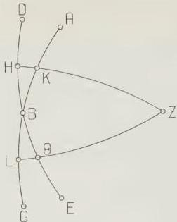
Fig. 2.9

angles equal to the angles of spherical triangle BΘL, since the three corresponding sides in each triangle are equal, HB to BΘ, HK to ΘL, and BK to BL. All this has been proven previously.

Therefore

$$
\angle KHB = \angle B\Theta L = \angle Z\Theta E.
$$

Q.E.D.

Secondly, we must prove that the sum of the angles between ecliptic and meridian at points on the ecliptic equidistant from the same solstice is equal to two right angles.

[See Fig. 2.10.] Let ABG be an arc of the ecliptic, with B taken as solstice. Let equal arcs, BD and BE, be taken on opposite sides of it, and draw through Z, the pole of the equator, and points D, E the meridian arcs ZD and ZE. I say that

$\angle ZDB + \angle ZEG = 2$ right angles [10.2]

[Proof:] This too is immediately obvious. For since points D and E are equidistant from the same solstice, arc DZ = arc ZE.

$$
\therefore \angle ZDB = \angle ZEB.
$$

But $\angle ZEB + \angle ZEG = 2$ right angles.

$\therefore \angle ZDB + \angle ZEG = 2$ right angles.

Q.E.D.

Having established these preliminary theorems, let us draw [Fig. 2.11] the meridian circle ABGD and the semi-circle of the ecliptic AEG (taking A as the winter solstice); then with pole A and radius the side of the [inscribed] square draw semi-circle BED. Then, since meridian ABGD goes through the poles of AEG and the poles of BED, arc ED is a quadrant.

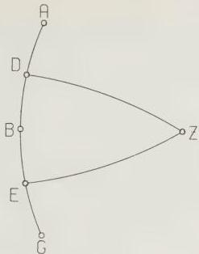
Fig. 2.10

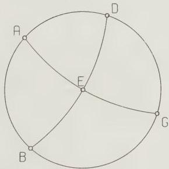
Fig. 2.11

Therefore $\angle$ DAE is right.

And the angle at the summer solstice is also right, from the previous theorem [10.2].

Q.E.D.

Again, [see Fig.2.12] let ABGD be a meridian circle, AEG a semi-circle of the equator, and AZG a semi-circle of the ecliptic in such a position that A is the autumnal equinox. Then with pole A and radius the side of the [inscribed] square draw semi-circle BZED.

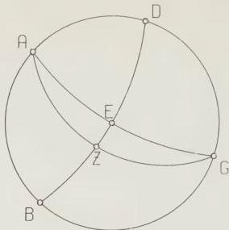
Fig. 2.12

By the same reasoning [as above], since ABGD goes through the poles of [circles] AEG and BED, AZ and ED are quadrants. Hence point Z is the winter solstice, and

$$
\sec \mathrm{ZE} \approx 23;51^\circ, \text{ as was shown previously [I 12 p. 63].}
$$

Therefore, by addition, arc $\mathrm{ZED} = 113;51^\circ$

$$
\text{and } \angle \mathrm{DAZ} = 113;51^\circ \text{ where one right angle} = 90^\circ.
$$

And again, from the previous theorem [10.2], the angle at the spring equinoctial point is the supplement, $66;9^\circ$.

Again [see Fig. 2.13] let ABGD be a meridian circle, AEG a semi-circle of the equator, and BZD a semi-circle of the ecliptic in such a position that point Z is

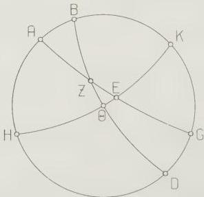
Fig. 2.13

the autumnal equinox, and arc BZ is (first of all) the length of one sign, that of Virgo; thus point B, obviously, is the beginning of Virgo. Again, with pole B and radius the side of the [inscribed] square, draw semi-circle HΘEK.

Let the problem be to find ∠ K B Θ.

Now since meridian ABGD goes through the poles of [circles] AEG and HEK, arc BH, arc BΘ and arc EH are all quadrants.

And, from the figure, Crd arc 2BA:Crd arc 2AH =

(Crd arc 2BZ:Crd arc 2ΘZ). (Crd arc 2ΘE:Crd arc 2EH). [M.T. II]

But, as was shown previously, arc 2BA = 23;20°, so Crd arc 2BA = 24;16°, arc 2AH = 156;40°, so Crd arc 2AH = 117;31°, and arc 2ZB = 60°, so Crd arc 2ZB = 60°, arc 2ZΘ = 120°, so Crd arc 2ZΘ = 103;55,23°.

∴ Crd arc 2ΘE:Crd arc 2EH = (24;16 : 117;31)/(60 : 103;55,23)

≈ 42;58 : 120.

But Crd arc 2EH = 120°.

∴ Crd arc 2ΘE ≈ 42;58°

∴ arc 2ΘE ≈ 42°

and arc ΘE ≈ 21°.

Therefore, by addition [of a quadrant] arc ΘEK = ∠ K B Θ = 111°, and the angle at the beginning of Scorpius is also 111°, and the angles at the beginning of Taurus and Pisces are each 69°, the supplement, by the theorems proved above [10.1 and 10.2].

Q.E.D.

Next, in the same figure [2.13], let arc ZB represent two signs, so that point B is the beginning of Leo. Then, with the [other] quantities remaining the same, arc 2BA = [2δ(60°)=] 41°, so Crd arc 2BA = 42;2°

and arc 2AH = 139°, so Crd arc 2AH = 112;24°;

furthermore arc 2ZB = 120°, so Crd arc 2ZB = 103;55,23°

and arc 2ZΘ = 60°, so Crd arc 2ZΘ = 60°.

∴ Crd arc 2ΘE:Crd arc 2EH = (42;2 : 112;24)/(103;55,23 : 60)

= 25;53 : 120.

∴ Crd arc 2ΘE = 25;53°

∴ arc 2ΘE ≈ 25°

and arc ΘE ≈ 12½°.

Therefore, by addition, arc ΘEK = ∠ K B Θ = 102½°.

Therefore the angle at the beginning of Sagittarius is also 102½°, and the angle at both the beginning of Gemini and the beginning of Aquarius is the supplement, 77½°.

We have [thus] calculated what we set out to do. It is sufficient for practical use to display [the results] for each sign, although the same procedure would apply to even smaller sections of the ecliptic.

## 11. On the angles between the ecliptic and the horizon: symmetries

Next we shall show how to calculate, for any given latitude, the angles formed by the ecliptic at the horizon. These too can be derived by a procedure which is simpler than that for the remaining angles [between ecliptic and altitude circles].

Now it is obvious that the angles [between ecliptic and] meridian are the same as those [between ecliptic and] horizon at *sphaera recta*. But, in order to calculate these angles also at *sphaera obliqua*, we must first prove that points on the ecliptic equidistant from the same equinox produce equal angles at the same horizon.

[See Fig. 2.14.] Let ABGD be a meridian circle, AEG the semi-circle of the equator and BED the semi-circle of the horizon. Draw two segments of the ecliptic, ZHΘ and KLM, such that points Z and K both represent the autumnal equinox, and arc ZH equals arc KL.

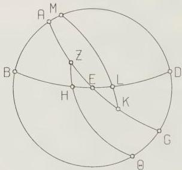
Fig. 2.14 I say that $\angle \mathrm{EH}\Theta = \angle \mathrm{DLK}$.

[Proof:] This is immediately obvious.

For spherical triangle $\mathrm{EZH} \equiv$ spherical triangle EKL, since, from what was proven above, the corresponding sides are equal:

$$
\begin{array}{l}
\mathrm{ZH} = \mathrm{KL} \\
\mathrm{HE} = \mathrm{EL} \quad \text{[arcs cut off by] the intersection of the} \\
\quad \text{horizon [with the ecliptic]} \\
\mathrm{EZ} = \mathrm{EK} \quad \text{(rising-time arcs)}. \quad 95 \\
\therefore \angle \mathrm{EHZ} = \angle \mathrm{ELK} \\
\therefore \angle \mathrm{EH}\Theta = \angle \mathrm{DLK} \quad \text{(supplements)}. \\
\end{array}
$$

Q.E.D.

I also say that, if two points [of the ecliptic] are diametrically opposite, the sum of the angles [between ecliptic and horizon] at the rising-point of one and the setting-point of the other is equal to two right angles.

[Proof: see Fig. 2.15.] If we draw ABGD as the circle of the horizon, and AEGZ as the circle of the ecliptic, so that they intersect at A and G, then

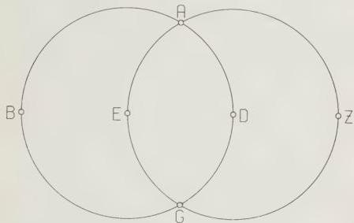
Fig. 2.15

$$
\angle ZAD + \angle DAE = 2 \text{ right angles.}
$$

$$
\text{But } \angle ZAD = \angle ZGD
$$

$$
\therefore \angle ZGD + \angle DAE = 2 \text{ right angles.}
$$

Q.E.D.

Since this is so, and since we have also proven that angles at the same horizon formed by points [on the ecliptic] equidistant from the same equinox are equal, a further consequence will be that, for points equidistant from the same solstice, the sum of the rising-angle at one and the setting-angle at the other will be equal to two right angles.

Hence, if we find the rising-angles from Aries to Libra [inclusive], we will simultaneously have found the rising-angles on the other semi-circle and the setting-angles on both semi-circles. We shall explain briefly how to do the calculation, again taking as example the same parallel, at which the elevation of the north pole from the horizon is 36°.

As for the angles between ecliptic and horizon at the equinoctial points, they can be calculated simply. For if [see Fig. 2.16] we draw ABGD as the meridian circle, AED as the eastern semi-circle of the horizon in question, EZ as a

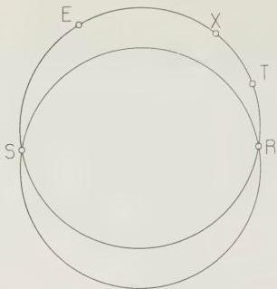
Fig. E

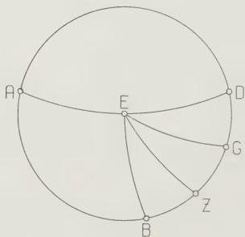
Fig. 2.16

quadrant of the equator, and EB and EG as two quadrants of the ecliptic such that point E is the autumnal equinox with respect to EB, and the spring equinox with respect to EG (thus B is the winter solstice and G the summer solstice), we can conclude as follows.

Ex hypothesi, arc DZ = 54° [colatitude of 36°]
and arc BZ = arc ZG ≈ 23;51°.
∴ arc GD = 30;9°
and arc BD = 77;51°.

Thus, since E is the pole of meridian ABG, $\angle$ DEG, the angle at the beginning of Aries, is $30:9^{\circ}$ where 1 right and $\angle$ DEB, the angle at the beginning of Libra, is $77:51^{\circ}$ angle $= 90^{\circ}$ .

In order to explain the procedure for finding the angles at other points, let us take, for example, the problem of finding the rising-angle formed at the beginning of Taurus and the horizon.

[See Fig. 2.17.] Let ABGD be the circle of the meridian, and BED the eastern semi-circle of the horizon in question. Draw semi-circle AEG of the ecliptic, so that point E represents the beginning of Taurus. Now at this latitude, when the beginning of Taurus is rising, $\Leftrightarrow 17:41^{\circ}$ is at lower culmination (we have shown

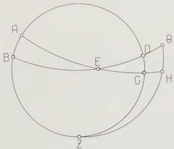
Fig. 2.17

how such a problem can readily be solved by means of the tabulated rising-times).97 Therefore arc EG is less than a quadrant. So with pole E and radius the side of the [inscribed] square draw the great circle segment ΘHZ, and complete the quadrants EGH and EDΘ. Both DGZ and ZHΘ are also quadrants, because the horizon BEΘ goes through the poles of meridian ZGD and of the great circle ZHΘ. Furthermore, $\Leftrightarrow 17:41^{\circ}$ is $22:40^{\circ}$ north of the equator, measured along the great circle through the poles of the equator (we have set out a table [I 15] for that too); and the equator is $36^{\circ}$ from pole Z of the horizon, measured along the same arc, ZGD. Therefore arc ZG = 58:40°. These quantities being given, it then follows from the figure that

Crd arc 2GD:Crd arc 2DZ =

(Crd arc 2GE:Crd arc 2EH). (Crd arc 2HΘ:Crd arc 2ZΘ). [M.T. I]

But, from the above, arc 2GD = 62:40°, so Crd arc 2GD = 62:24°

arc 2DZ = 180°, so Crd arc 2DZ = 120°

97 II 9 p. 104 (simply add $180^{\circ}$ to the point of upper culmination, which is calculated for this example in HAMA, 42).

$$
\begin{array}{l}
\text{arc 2GE} = 155;22^\circ, \text{ so Crd arc 2GE} = 117;14^\circ, \\
\text{arc 2EH} = 180^\circ, \text{ so Crd arc 2EH} = 120^\circ.
\end{array}
$$

$$
\begin{array}{l}
\therefore \text{ Crd arc 2ΘH: Crd arc 2ZΘ} = (62;24 : 120)/(117;14 : 120) \\
= 63;52 : 120.
\end{array}
$$

$$
\begin{array}{l}
\text{And Crd arc 2ΘZ} = 120^\circ. \\
\therefore \text{ Crd arc 2HΘ} = 63;52^\circ \\
\therefore \text{ arc 2HΘ} = 64;20^\circ
\end{array}
$$

$$
\text{and arc HΘ} = \angle \text{HEΘ} = 32;10^\circ.
$$

**Q.E.D.**

To avoid lengthening the explanatory part of this treatise by continual repetition of the procedure, we will take the same method for granted for the remaining signs and latitudes.

## 12. On the angles and arcs formed with the same circle [i.e. the ecliptic] by a circle drawn through the poles of the horizon

It remains [to describe] the method by which we can compute the angles formed between the ecliptic and a circle through the poles of the horizon [i.e. an altitude circle] for any latitude and any position [of the ecliptic relative to the altitude circle]. As we said, this method also produces the size of the arc of the circle through the poles of the horizon cut off between the zenith and the intersection of that circle with the ecliptic. We shall again set out the preliminary theorems for this topic too: we shall prove, first, that if two points of the ecliptic are equidistant from the same solstice, and cut off an equal number of time-degrees on either side of the meridian, one to the east and the other to the west, then the great circle arcs from the zenith to those two points are equal, and the sum of the [two] angles at those points, chosen according to our [previous] definition, is equal to two right angles.

[See Fig. 2.18.] Let ABG be a segment of the meridian, with point B on it taken as the zenith, and point G as the pole of the equator. Draw two segments of the ecliptic, ADE and AZH, such that points D and Z are equidistant from the same solstice, and cut off, on either side of meridian ABG, equal arcs of the parallel circle which passes through them. Furthermore, draw through points D and Z the following great circle arcs: arc GD and arc GZ from the pole of the equator G, and arc BD and arc BZ from the zenith B.

I say that

$$
\text{arc BD} = \text{arc BZ}
$$

$$
\text{and } \angle \text{BDE} + \angle \text{BZA} = 2 \text{ right angles.}
$$

[Proof:] Since points D and Z cut off equal arcs of the parallel circle through them on either side of meridian ABG,

$$
\angle \text{BGD} = \angle \text{BGZ.}
$$

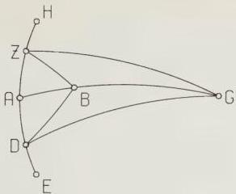
Fig. 2.18

Therefore, in the two spherical triangles BGD, BGZ
GD = GZ [D, Z equidistant from solstice]
BG = BG (common)
and ∠ BGD = ∠ BGZ,
so they have two sides and the included angle equal.
∴ BD = BZ (bases)
and ∠ BZG = ∠ BDG.

But since we showed just above that the sum of the two angles formed by a circle through the poles of the equator at points [of the ecliptic] equidistant from the same solstice is equal to two right angles [10.2],
∠ GDE + ∠ GZA = 2 right angles.
But we proved that ∠ BDG = ∠ BZG.
∴ ∠ BDE + ∠ BZA = 2 right angles.
Q.E.D.

Next we must prove that if we take the same point of the ecliptic at two positions equidistant from the meridian (as measured in time-degrees) on opposite sides of it, the great-circle arcs from the zenith to these two positions are equal, and the sum of the two angles [between altitude circle and ecliptic] east and west [of the meridian] is equal to twice the angle formed by the same point [of the ecliptic] at the meridian, provided that for both positions [i.e. when the point is east and west of the meridian] the points [of the ecliptic] which are [then] culminating are either both north or both south of the zenith.

Let us suppose, first, that both are south. [See Fig. 2.19.] Let ABGD be a segment of the meridian, with point G on it as the zenith, and D as the pole of the equator. Draw two segments of the ecliptic, AEZ and BHΘ, such that points E and H represent the same point, and cut off equal arcs of the parallel circle through that point on opposite sides of meridian ABGD. Again, draw through them [points E and H] the great-circle arcs GE and GH from G, and DE and

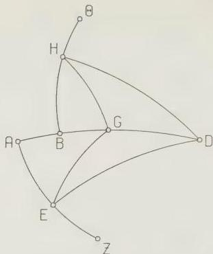
Fig. 2.19

DH from D. By the same reasoning as before, since points E and H generate the same parallel circle and cut off equal arcs of it on either side of the meridian, spherical triangle GDE $\equiv$ spherical triangle GDH.

$\therefore$ arc GE = arc GH.

Then I say that

$$
\angle GEZ + \angle GHB = 2 \angle DEZ = 2 \angle DHB.
$$

[Proof:] Since $\angle DEZ$ is the same as $\angle DHB$ [E and H the same point] and $\angle GED = \angle DHG$ [from congruent spherical triangles], $\angle GED + \angle GHB = \angle DHG$ $\angle GHB = \angle DHB$

Therefore, by addition $\angle GEZ + \angle GHB = 2 \angle DEZ = 2 \angle DHB$

Q.E.D.

Next, draw the same segments of the above circles again [Fig. 2.20], except that points A and B should be north of point G. I say that here too the same will apply, namely

$$
\angle KEZ + \angle LHB = 2 \angle DEZ.
$$

[Proof:] Since $\angle DEZ$ is the same as $\angle DHB$, and $\angle DEK = \angle DHL$ [supplements of equal angles DEG, DHG], by addition [of $\angle DHB$ to $\angle DHL$], $\angle LHB = \angle DEZ + \angle DEK$.

$$
\therefore \angle LHB + \angle KEZ = 2 \angle DEZ.
$$

Now again draw a similar figure [Fig. 2.21], except that the culminating point on the segment [of the ecliptic] east [of the meridian], namely A, should be south of the zenith G, while the culminating point on the segment west [of the meridian], namely B, should be north of the zenith.

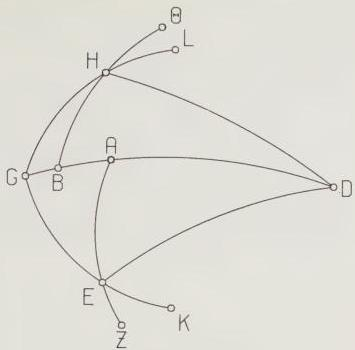
Fig. 2.20

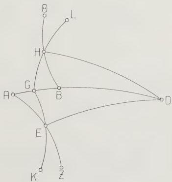
Fig. 2.21

1 say that

$$ \angle \text{GEZ} + \angle \text{LHB} = 2 \angle \text{DEZ plus 2 right angles.} $$

[Proof:] Since

$$ \angle \text{DHG} = \angle \text{DEG} $$

and

$$
\angle \text{DHG} + \angle \text{DHL} = 2 \text{ right angles,}
$$

$$ \therefore \angle \text{DEG} + \angle \text{DHL} = 2 \text{ right angles.} $$

But $$ \angle \text{DEZ} $$ is the same as $$ \angle \text{DHB} $$.

$$ \therefore \angle \text{GEZ} + \angle \text{LHB} = (\angle \text{DEZ} + \angle \text{DEG}) + (\angle \text{DHB} + \angle \text{DHL}) $$

$$ = (\angle \text{DEZ} + \angle \text{DHB}) + (\angle \text{DEG} + \angle \text{DHL}) $$

$$ = (\angle \text{DEZ} + \angle \text{DHB}) \text{ plus 2 right angles} $$

$$ = 2 \angle \text{DEZ plus 2 right angles.} $$

Q.E.D. For the remaining case, draw a similar figure [Fig. 2.22], in which point A, which is culminating on the section east [of the meridian], is north of G, while B, which is culminating on the section west [of the meridian], is south of [the zenith].

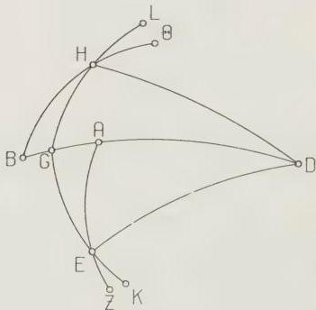
Fig. 2.22

I say that

$$ \angle \text{KEZ} + \angle \text{GHB} = 2 \angle \text{DEZ minus 2 right angles.} $$

[Proof:] By the same reasoning as before

$$ \angle \text{KEZ} + \angle \text{GHB} = (\angle \text{DEZ} + \angle \text{DHB}) - (\angle \text{DEK} + \angle \text{DHG}) $$

$$ = 2 \angle \text{DEZ} - (\angle \text{DEK} + \angle \text{DHG}). $$

But $\angle \text{DEK} + \angle \text{DHG} = 2 \text{ right angles},$ since

$$ \angle \text{DEK} + \angle \text{DEG} = 2 \text{ right angles, and } \angle \text{DEG} = \angle \text{DHG.} $$

Q.E.D.

Of the angles and arcs formed in the way defined between the ecliptic and an altitude circle, those at the meridian and the horizon can be computed readily, as can be shown immediately in the following way.

Draw [Fig. 2.23] the meridian circle ABGD, the semi-circle of the horizon BED, and the semi-circle of the ecliptic in any position, ZEH. Then if we imagine the altitude circle through the zenith A and the culminating point of the ecliptic Z, it coincides with the meridian ABGD, and ∠DZE will immediately be given, since the point Z and the angle that [the ecliptic makes] with the meridian at point Z are given. Arc AZ will also be given, since we know the distance in degrees of point Z from the equator (measured along the meridian), and the distance of the equator from the zenith A.

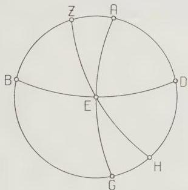
Fig. 2.23

Next, if we imagine the altitude circle AEG, drawn through the rising-point of the ecliptic, E, and [the zenith] A, here too it is immediately obvious that arc AE is always a quadrant, since point A is the pole of the horizon BED. For the same reason, ∠AED is always right; and since the angle which the ecliptic makes with the horizon, namely ∠DEH, is given, the sum, angle AEH, will also be given.

Q.E.D.

Thus it is clear that, since the above relationships hold, if we compute, for each latitude, just the angles and arcs before [i.e. to the east of] the meridian, and just for the signs from the beginning of Cancer to the beginning of Capricorn, we will simultaneously have found the angles and arcs for the same signs [Cancer to Capricorn] after the meridian too, and also the angles and arcs both before and after the meridian for the remaining signs. But in order to make clear the procedure in this case too for any position [of the ecliptic], as an example we shall display the general method by means of a single solution of the problem. At the same latitude, namely where the elevation of the north pole from the horizon is 36°, we suppose that the beginning of Cancer is, e.g., one equinoctial hour to the east of the meridian. In this situation, at the above latitude, Π 16;12° is culminating, and π 17;37° is rising. Then let [Fig. 2.24] ABGD be the meridian circle, BED the semi-circle of the horizon, and ZHΘ the semi-circle of the ecliptic in such a position that point H is the beginning of Cancer, while Z represents Π 16;12° and Θ π 17;37°. Draw through A, the zenith, and H, the beginning of Cancer, segment AHEG of the [altitude] great circle. Let the first problem be to find arc AH.

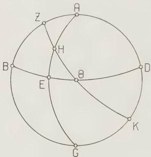
Fig. 2.24

Now it is clear that arc ZΘ = 91;25° [π 17;37° - Π 16;12°] and arc HΘ = 77;37° [π 17;37° - Π 0°].

Similarly, since Π 16;12° cut off 23;7° of the meridian to the north of the equator, and the equator cuts off 36° [of the meridian] from the zenith A, arc AZ = 12;53°

and arc ZB = 77;7° (complement).

When these quantities are given, from the figure

Crd arc 2ZB:Crd arc 2BA =

(Crd arc 2ZΘ:Crd arc 2ΘH). (Crd arc 2HE:Crd arc 2EA). [M.T. I]

But arc 2ZB = 154;14°, so Crd arc 2ZB = 116;59°

and arc 2BA = 180°, so Crd arc 2BA = 120°.

Furthermore arc 2ZΘ = 182;50°, so Crd arc 2ZΘ = 119;58°
and arc 2ΘH = 155;14°, so Crd arc 2ΘH = 117;12°.
∴ Crd arc 2EH: Crd arc 2EA = (116;59 : 120)/(119;58 : 117;12)
≈ 114;16 : 120.
But Crd arc 2EA = 120°
∴ Crd arc 2EH = 114;16°
∴ arc 2EH ≈ 144;26°
and arc EH = 72;13°.
∴ arc AH = 17;47° (complement).

Q.E.D.

Next we shall find ∠ AHΘ, as follows.

Draw the same figure [Fig. 2.25], and with pole H and radius the side of the [inscribed] square draw the great circle segment KLM.

Then, since circle AHE is drawn through the poles of EΘM and KLM, both EM and KM are quadrants. Again, from the figure

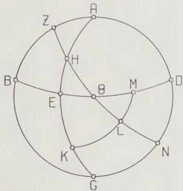
Fig. 2.25

Crd arc 2HE:Crd arc 2EK =
(Crd arc 2HΘ:Crd arc 2ΘL). (Crd arc 2LM:Crd arc 2KM). [M.T. II]
But arc 2HE = 144;26° [above], so Crd arc 2HE = 114;16°
and arc 2EK = 35;34°, so Crd arc 2EK = 36;38°.
Furthermore arc 2ΘH = 155;14°, so Crd arc 2ΘH = 117;12°
and arc 2ΘL = 24;46°, so Crd arc 2ΘL = 25;44°.
∴ Crd arc 2LM:Crd arc 2MK = (114;16 : 36;38)/(117;12 : 25;44)
≈ 82;11 : 120.
But Crd arc 2MK = 120°
∴ Crd arc 2LM = 82;11°

## II 12. Description of table of zenith distances

- $\therefore$ arc 2LM = 86;28°
and arc LM = 43;14°.
- $\therefore$ arc LK = $\angle$ LHK = 46;46° (complement).
- $\therefore$ $\angle$ AHΘ = 133;14° (supplement).

### Q.E.D.

**** The same method as was used for finding the above also applies to the remaining [arcs and angles]. But in order to have conveniently displayed all the other arcs and angles which it is reasonable to suppose we may need in our particular investigations, we computed these too geometrically, beginning from the parallel through Meroe, at which the longest day is 13 equinoctial hours, and going up to the parallel above Pontus [the Black Sea], through the mouths of the Borysthenes, where the longest day is 16 equinoctial hours. The intervals which we used were half an hour [of length of longest day] between parallels of latitude (as for the rising-times), one sign for the sections of the ecliptic, and one equinoctial hour for the position [of the altitude circles] to east and west of the meridian. We shall display the results in tabular form, one set of tables for each parallel of latitude, and one table for each sign. In the first column we put, first, the meridian situation, then the distance before or after the meridian, measured in equinoctial hours. In the second column we put the amount of the corresponding arc (as explained above) from the zenith to the beginning of the sign in question. In the third and fourth columns we put the amount of the angles formed by the above-mentioned intersection [between ecliptic and altitude circle], defined in the way we explained: the angles at positions to the east of the meridian in the third column, and those at positions to the west of the meridian in the fourth column. One must bear in mind that, according to our original definition, we always took the angle which lies to the rear of the intersection of the circles and to the north of the ecliptic, and expressed its magnitude in the system in which one right angle is 90 [degrees].

The layout of the tables is as follows.

## 13. Layout of angles and arcs, parallel by parallel
[See pp. 123-9.]

**** Now that the treatment of the angles [between ecliptic and principal circles] has been methodically discussed, the only remaining topic in the foundations [of the rest of the treatise] is to determine the coordinates in latitude and longitude of the cities in each province which deserve note, in order to calculate

PARALLEL THROUGH MEROE $13^{\circ}$ 16:27°

| CANCER | | | | CAPRICORNUS | | | |
| --- | --- | --- | --- | --- | --- | --- | --- |
| Hour | Arc | East Angle | West Angle | Hour | Arc | East Angle | West Angle |
| noon | 7 24 | 90 0 N | | noon | 40 18 | 90 0 | |
| 1 | 15 55 | 25 16 N | 154 44 N | 1 | 42 54 | 111 24 | 68 36 |
| 2 | 29 3 | 9 15 N | 170 45 N | 2 | 49 48 | 128 51 | 51 9 |
| 3 | 42 42 | 1 38 N | 178 22 N | 3 | 59 35 | 141 49 | 38 11 |
| 4 | 56 25 | 175 7 | 4 53 | 4 | 71 4 | 151 25 | 28 35 |
| 5 | 70 2 | 170 18 | 9 42 | 5 | 83 31 | 158 48 | 21 12 |
| 6 | 83 27 | 164 41 | 15 19 | 5 30 | 90 0 | 161 57 | 18 3 |
| 6 30 | 90 0 | 161 57 | 18 3 | | | | |
| LEO | | | | AQUARIUS | | | |
| Hour | Arc | East Angle | West Angle | Hour | Arc | East Angle | West Angle |
| noon | 4 3 | 102 30 N | | noon | 36 57 | 77 30 | |
| 1 | 14 20 | 26 3 N | 178 57 N | 1 | 39 46 | 100 12 | 54 48 |
| 2 | 28 42 | 15 28 N | 9 32 | 2 | 47 15 | 118 5 | 36 55 |
| 3 | 42 43 | 10 5 N | 14 55 | 3 | 57 33 | 131 3 | 23 57 |
| 4 | 56 49 | 6 19 N | 18 41 | 4 | 69 30 | 139 48 | 15 12 |
| 5 | 70 38 | 2 33 N | 22 27 | 5 | 82 18 | 146 43 | 8 17 |
| 6 | 84 17 | 177 0 | 28 0 | 5 35 | 90 0 | 149 51 | 5 9 |
| 6 25 | 90 0 | 174 51 | 30 9 | | | | |
| VIRGO | | | | PISCES | | | |
| Hour | Arc | East Angle | West Angle | Hour | Arc | East Angle | West Angle |
| noon | 4 47 | 111 0 | | noon | 28 7 | 69 0 | |
| 1 | 15 20 | 0 0 N | 42 0 | 1 | 31 46 | 97 0 | 41 0 |
| 2 | 29 28 | 8 0 N | 34 0 | 2 | 40 52 | 115 59 | 22 1 |
| 3 | 43 40 | 9 15 N | 32 45 | 3 | 52 30 | 127 23 | 10 37 |
| 4 | 58 13 | 8 39 N | 33 21 | 4 | 65 40 | 134 41 | 3 19 |
| 5 | 72 36 | 6 53 N | 35 7 | 5 | 79 18 | 139 41 | 178 19 N |
| 6 | 86 41 | 5 37 N | 36 23 | 5 46 | 90 0 | 142 9 | 175 51 N |
| 6 14 | 90 0 | 4 9 N | 37 51 | | | | |
| LIBRA | | | | ARIES | | | |
| Hour | Arc | East Angle | West Angle | Hour | Arc | East Angle | West Angle |
| noon | 16 27 | 113 51 | | noon | 16 27 | 66 9 | |
| 1 | 22 8 | 154 53 | 72 49 | 1 | 22 8 | 107 11 | 25 7 |
| 2 | 33 50 | 173 17 | 54 25 | 2 | 33 50 | 125 35 | 6 43 |
| 3 | 47 20 | 1 23 N | 46 19 | 3 | 47 20 | 133 41 | 178 37 N |
| 4 | 61 22 | 5 8 N | 42 34 | 4 | 61 22 | 137 26 | 174 52 N |
| 5 | 75 39 | 7 9 N | 40 33 | 5 | 75 39 | 139 27 | 172 51 N |
| 6 | 90 0 | 7 24 N | 40 18 | 6 | 90 0 | 139 42 | 172 36 N |
| SCORPIUS | | | | TAURUS | | | |
| Hour | Arc | East Angle | West Angle | Hour | Arc | East Angle | West Angle |
| noon | 28 7 | 111 0 | | noon | 4 47 | 69 0 | |
| 1 | 31 46 | 139 0 | 83 0 | 1 | 15 20 | 138 0 | 180 0 N |
| 2 | 40 52 | 157 59 | 64 1 | 2 | 29 28 | 146 0 | 172 0 N |
| 3 | 52 30 | 169 23 | 52 37 | 3 | 43 40 | 147 15 | 170 45 N |
| 4 | 65 40 | 176 41 | 45 19 | 4 | 58 13 | 146 39 | 171 21 N |
| 5 | 79 18 | 1 41 N | 40 19 | 5 | 72 36 | 144 53 | 173 7 N |
| 5 46 | 90 0 | 4 9 N | 37 51 | 6 | 86 41 | 143 37 | 174 23 N |
| | | | | 6 14 | 90 0 | 142 9 | 175 51 N |
| SAGITTARIUS | | | | GEMINI | | | |
| Hour | Arc | East Angle | West Angle | Hour | Arc | East Angle | West Angle |
| noon | 36 57 | 102 30 | | noon | 4 3 | 77 30 N | |
| 1 | 39 46 | 125 12 | 79 48 | 1 | 14 20 | 1 3 N | 153 57 N |
| 2 | 47 15 | 143 5 | 61 55 | 2 | 28 42 | 170 28 | 164 32 N |
| 3 | 57 33 | 156 3 | 48 57 | 3 | 42 43 | 165 5 | 169 55 N |
| 4 | 69 30 | 164 48 | 40 12 | 4 | 56 49 | 161 19 | 173 41 N |
| 5 | 82 18 | 171 43 | 33 17 | 5 | 70 38 | 157 33 | 177 27 N |
| 5 35 | 90 0 | 174 51 | 30 9 | 6 | 84 17 | 152 0 | 3 0 |
| | | | | 6 25 | 90 0 | 149 51 | 5 9 |

II 13. Table of zenith distances and ecliptic angles

PARALLEL THROUGH SOENE 13♯ 23:51°

| CANCER | | | | CAPRICORNUS | | | |
| --- | --- | --- | --- | --- | --- | --- | --- |
| Hour | Arc | East Angle | West Angle | Hour | Arc | East Angle | West Angle |
| noon | 0 0 | 90 0 | | noon | 47 42 | 90 0 | |
| 1 | 13 43 | 176 15 | 3 45 | 1 | 49 52 | 108 3 | 71 57 |
| 2 | 27 23 | 173 51 | 6 9 | 2 | 55 52 | 123 31 | 56 29 |
| 3 | 41 20 | 168 15 | 11 45 | 3 | 64 37 | 135 37 | 44 23 |
| 4 | 54 27 | 166 51 | 13 9 | 4 | 75 12 | 144 57 | 35 3 |
| 5 | 67 42 | 162 42 | 17 18 | 5 | 86 54 | 152 0 | 28 0 |
| 6 | 80 36 | 157 59 | 22 1 | 5 15 | 90 0 | 153 46 | 26 14 |
| 6 45 | 90 0 | 153 46 | 26 14 | | | | |
| LEO | | | | AQUARIUS | | | |
| Hour | Arc | East Angle | West Angle | Hour | Arc | East Angle | West Angle |
| noon | 3 21 | 102 30 | | noon | 44 21 | 77 30 | |
| 1 | 14 18 | 176 4 | 28 56 | 1 | 46 40 | 96 30 | 38 30 |
| 2 | 27 56 | 180 0 | 25 0 | 2 | 53 4 | 112 16 | 42 44 |
| 3 | 41 44 | 179 3 | 25 57 | 3 | 62 18 | 124 25 | 30 35 |
| 4 | 55 14 | 177 18 | 27 42 | 4 | 73 20 | 132 58 | 22 2 |
| 5 | 68 43 | 173 40 | 31 20 | 5 | 85 23 | 139 46 | 15 14 |
| 6 | 81 52 | 168 56 | 36 4 | 5 22 | 90 0 | 141 53 | 13 7 |
| 6 38 | 90 0 | 166 53 | 38 7 | | | | |
| VIRGO | | | | PISCES | | | |
| Hour | Arc | East Angle | West Angle | Hour | Arc | East Angle | West Angle |
| noon | 12 11 | 111 0 | | noon | 35 31 | 69 0 | |
| 1 | 18 42 | 158 40 | 63 20 | 1 | 38 25 | 91 15 | 46 45 |
| 2 | 30 57 | 173 44 | 48 16 | 2 | 46 2 | 108 18 | 29 42 |
| 3 | 44 22 | 178 3 | 43 57 | 3 | 56 30 | 119 41 | 18 19 |
| 4 | 58 1 | 180 0 | 42 0 | 4 | 68 31 | 127 5 | 10 55 |
| 5 | 71 43 | 179 15 | 42 45 | 5 | 81 22 | 132 30 | 5 30 |
| 6 | 85 20 | 177 39 | 44 21 | 5 39 | 90 0 | 134 41 | 5 19 |
| 6 21 | 90 0 | 176 41 | 45 19 | | | | |
| LIBRA | | | | ARIES | | | |
| Hour | Arc | East Angle | West Angle | Hour | Arc | East Angle | West Angle |
| noon | 23 51 | 113 51 | | noon | 23 51 | 66 9 | |
| 1 | 27 56 | 144 10 | 83 32 | 1 | 27 56 | 96 28 | 35 50 |
| 2 | 37 36 | 162 13 | 65 29 | 2 | 37 36 | 114 31 | 17 47 |
| 3 | 49 42 | 171 45 | 55 57 | 3 | 49 42 | 124 3 | 8 15 |
| 4 | 62 47 | 176 59 | 50 43 | 4 | 62 47 | 129 17 | 3 1 |
| 5 | 76 20 | 179 3 | 48 39 | 5 | 76 20 | 131 21 | 0 57 |
| 6 | 90 0 | 180 0 | 47 42 | 6 | 90 0 | 132 18 | 0 0 |
| SCORPIUS | | | | TAURUS | | | |
| Hour | Arc | East Angle | West Angle | Hour | Arc | East Angle | West Angle |
| noon | 35 31 | 111 0 | | noon | 12 11 | 69 0 | |
| 1 | 38 25 | 133 15 | 88 45 | 1 | 18 42 | 116 40 | 21 20 |
| 2 | 46 2 | 150 18 | 71 42 | 2 | 30 57 | 131 44 | 6 16 |
| 3 | 56 30 | 161 41 | 60 19 | 3 | 44 22 | 136 3 | 1 57 |
| 4 | 68 31 | 169 5 | 52 55 | 4 | 58 1 | 138 0 | 0 0 |
| 5 | 81 22 | 174 30 | 47 30 | 5 | 71 43 | 137 15 | 0 45 |
| 5 39 | 90 0 | 176 41 | 45 19 | 6 | 85 20 | 135 39 | 2 21 |
| | | | | 6 21 | 90 0 | 134 41 | 3 19 |
| SAGITTARIUS | | | | GEMINI | | | |
| Hour | Arc | East Angle | West Angle | Hour | Arc | East Angle | West Angle |
| noon | 44 21 | 102 30 | | noon | 3 21 | 77 30 | |
| 1 | 46 40 | 121 30 | 83 30 | 1 | 14 18 | 151 4 | 3 56 |
| 2 | 53 4 | 137 16 | 67 44 | 2 | 27 56 | 155 0 | 0 0 |
| 3 | 62 18 | 149 25 | 55 35 | 3 | 41 44 | 154 3 | 0 57 |
| 4 | 73 20 | 157 58 | 47 2 | 4 | 55 14 | 152 18 | 2 42 |
| 5 | 85 23 | 164 46 | 40 14 | 5 | 68 43 | 148 40 | 6 20 |
| 5 22 | 90 0 | 166 53 | 38 7 | 6 | 81 52 | 143 56 | 11 4 |
| | | | | 6 38 | 90 0 | 141 53 | 13 7 |

| CANCER | | | | CAPRICORNUS | | | |
| --- | --- | --- | --- | --- | --- | --- | --- |
| Hour | Arc | East Angle | West Angle | Hour | Arc | East Angle | West Angle |
| noon | 6 31 | 90 0 | | noon | 54 13 | 90 0 | |
| 1 | 14 56 | 150 0 | 30 0 | 1 | 56 6 | 105 34 | 74 26 |
| 2 | 27 23 | 159 38 | 20 22 | 2 | 61 22 | 119 23 | 60 37 |
| 3 | 40 19 | 160 30 | 19 30 | 3 | 69 17 | 130 46 | 49 14 |
| 4 | 53 14 | 158 51 | 21 9 | 4 | 78 59 | 139 30 | 40 30 |
| 5 | 65 55 | 156 0 | 24 0 | 5 | 90 0 | 146 28 | 33 32 |
| 6 | 78 15 | 151 49 | 28 11 | | | | |
| 7 | 90 0 | 146 28 | 33 32 | | | | |
| LEO | | | | AQUARIUS | | | |
| Hour | Arc | East Angle | West Angle | Hour | Arc | East Angle | West Angle |
| noon | 9 52 | 102 30 | | noon | 50 52 | 77 30 | |
| 1 | 16 45 | 153 13 | 51 47 | 1 | 52 53 | 93 39 | 61 21 |
| 2 | 28 44 | 166 22 | 38 38 | 2 | 58 27 | 107 51 | 47 9 |
| 3 | 41 31 | 169 26 | 35 34 | 3 | 66 44 | 119 1 | 35 59 |
| 4 | 54 27 | 169 8 | 35 52 | 4 | 76 51 | 127 37 | 27 23 |
| 5 | 67 17 | 167 1 | 37 59 | 5 | 88 9 | 133 43 | 21 17 |
| 6 | 79 48 | 163 46 | 41 14 | 5 9 | 90 0 | 134 49 | 20 11 |
| 6 51 | 90 0 | 159 49 | 45 11 | | | | |
| VIRGO | | | | PISCES | | | |
| Hour | Arc | East Angle | West Angle | Hour | Arc | East Angle | West Angle |
| noon | 18 42 | 111 0 | | noon | 42 2 | 69 0 | |
| 1 | 23 18 | 145 18 | 76 42 | 1 | 44 26 | 87 32 | 50 28 |
| 2 | 33 30 | 162 25 | 59 35 | 2 | 50 58 | 102 38 | 35 22 |
| 3 | 45 36 | 169 34 | 52 26 | 3 | 60 19 | 113 33 | 24 27 |
| 4 | 58 21 | 172 10 | 49 50 | 4 | 71 20 | 120 56 | 17 4 |
| 5 | 71 15 | 172 28 | 49 32 | 5 | 83 19 | 125 54 | 12 16 |
| 6 | 84 7 | 171 5 | 50 55 | 5 32 | 90 0 | 127 55 | 10 5 |
| 6 28 | 90 0 | 169 55 | 52 5 | | | | |
| LIBRA | | | | ARIES | | | |
| Hour | Arc | East Angle | West Angle | Hour | Arc | East Angle | West Angle |
| noon | 30 22 | 113 51 | | noon | 30 22 | 66 9 | |
| 1 | 33 35 | 137 52 | 90 10 | 1 | 33 35 | 89 50 | 42 28 |
| 2 | 41 39 | 154 19 | 73 23 | 2 | 41 39 | 106 37 | 25 41 |
| 3 | 52 25 | 164 10 | 63 32 | 3 | 52 25 | 116 28 | 15 50 |
| 4 | 64 28 | 169 47 | 57 55 | 4 | 64 28 | 122 5 | 10 13 |
| 5 | 77 6 | 172 21 | 55 21 | 5 | 77 6 | 124 39 | 7 39 |
| 6 | 90 0 | 173 29 | 54 13 | 6 | 90 0 | 125 47 | 6 31 |
| SCORPIUS | | | | TAURUS | | | |
| Hour | Arc | East Angle | West Angle | Hour | Arc | East Angle | West Angle |
| noon | 42 2 | 111 0 | | noon | 18 42 | 69 0 | |
| 1 | 44 26 | 129 32 | 92 28 | 1 | 23 18 | 103 18 | 34 42 |
| 2 | 50 58 | 144 38 | 77 22 | 2 | 33 30 | 120 25 | 17 35 |
| 3 | 60 19 | 155 33 | 66 27 | 3 | 45 36 | 127 34 | 10 26 |
| 4 | 71 20 | 162 56 | 59 4 | 4 | 58 21 | 130 10 | 7 50 |
| 5 | 83 19 | 167 54 | 54 6 | 5 | 71 15 | 130 28 | 7 32 |
| 5 32 | 90 0 | 169 55 | 52 5 | 6 | 84 7 | 129 5 | 8 55 |
| | | | | 6 28 | 90 0 | 127 55 | 10 5 |
| SAGITTARIUS | | | | GEMINI | | | |
| Hour | Arc | East Angle | West Angle | Hour | Arc | East Angle | West Angle |
| noon | 50 52 | 102 30 | | noon | 9 52 | 77 30 | |
| 1 | 52 53 | 118 39 | 86 21 | 1 | 16 45 | 128 13 | 26 47 |
| 2 | 58 27 | 132 51 | 72 9 | 2 | 28 44 | 141 22 | 13 38 |
| 3 | 66 44 | 144 1 | 60 59 | 3 | 41 31 | 144 26 | 10 34 |
| 4 | 76 51 | 152 37 | 52 23 | 4 | 54 27 | 144 8 | 10 52 |
| 5 | 88 9 | 158 43 | 46 17 | 5 | 67 17 | 142 1 | 12 59 |
| 5 9 | 90 0 | 159 49 | 45 11 | 6 | 79 48 | 138 46 | 16 14 |
| | | | | 6 51 | 90 0 | 134 49 | 20 11 |

| CANCER | | | | CAPRICORNUS | | | |
| --- | --- | --- | --- | --- | --- | --- | --- |
| Hour | Arc | East Angle | West Angle | Hour | Arc | East Angle | West Angle |
| noon | 12 9 | 90 0 | | noon | 59 51 | 90 0 | |
| 1 | 17 47 | 133 14 | 46 46 | 1 | 61 30 | 103 45 | 76 15 |
| 2 | 28 22 | 147 45 | 32 15 | 2 | 66 12 | 116 10 | 63 50 |
| 3 | 40 27 | 151 46 | 28 14 | 3 | 73 22 | 126 36 | 53 24 |
| 4 | 52 36 | 151 52 | 28 8 | 4 | 82 24 | 134 56 | 45 4 |
| 5 | 64 36 | 149 54 | 30 6 | 4 45 | 90 0 | 140 1 | 39 59 |
| 6 | 76 16 | 146 25 | 33 35 | | | | |
| 7 | 87 23 | 141 30 | 38 30 | | | | |
| 7 15 | 90 0 | 140 1 | 39 59 | | | | |
| LEO | | | | AQUARIUS | | | |
| Hour | Arc | East Angle | West Angle | Hour | Arc | East Angle | West Angle |
| noon | 15 30 | 102 30 | | noon | 56 30 | 77 30 | |
| 1 | 20 20 | 139 32 | 65 28 | 1 | 58 14 | 91 39 | 63 21 |
| 2 | 30 28 | 155 19 | 49 41 | 2 | 63 13 | 104 23 | 50 37 |
| 3 | 42 6 | 160 37 | 44 23 | 3 | 70 41 | 114 47 | 40 13 |
| 4 | 54 12 | 162 11 | 42 49 | 4 | 80 2 | 122 47 | 32 13 |
| 5 | 66 17 | 161 5 | 43 55 | 4 56 | 90 0 | 128 36 | 26 24 |
| 6 | 78 7 | 158 10 | 46 50 | | | | |
| 7 | 89 27 | 153 39 | 51 21 | | | | |
| 7 4 | 90 0 | 153 36 | 51 24 | | | | |
| VIRGO | | | | PISCES | | | |
| Hour | Arc | East Angle | West Angle | Hour | Arc | East Angle | West Angle |
| noon | 24 20 | 111 0 | | noon | 47 40 | 69 0 | |
| 1 | 27 51 | 137 38 | 84 22 | 1 | 49 42 | 84 50 | 53 10 |
| 2 | 36 24 | 153 59 | 68 1 | 2 | 55 26 | 90 20 | 39 40 |
| 3 | 47 14 | 162 10 | 59 50 | 3 | 63 48 | 108 34 | 29 26 |
| 4 | 59 0 | 165 40 | 56 20 | 4 | 73 55 | 115 51 | 22 9 |
| 5 | 71 5 | 166 34 | 55 26 | 5 | 85 5 | 120 28 | 17 32 |
| 6 | 83 9 | 165 30 | 56 30 | 5 25 | 90 0 | 122 7 | 15 53 |
| 6 35 | 90 0 | 164 7 | 57 53 | | | | |
| LIBRA | | | | ARIES | | | |
| Hour | Arc | East Angle | West Angle | Hour | Arc | East Angle | West Angle |
| noon | 36 0 | 113 51 | | noon | 36 0 | 66 9 | |
| 1 | 38 37 | 133 23 | 94 19 | 1 | 38 37 | 85 41 | 46 37 |
| 2 | 45 31 | 148 23 | 79 19 | 2 | 45 31 | 100 41 | 31 37 |
| 3 | 55 6 | 158 9 | 69 33 | 3 | 55 6 | 110 27 | 21 51 |
| 4 | 66 9 | 163 58 | 63 44 | 4 | 66 9 | 116 16 | 16 2 |
| 5 | 77 56 | 116 36 | 61 6 | 5 | 77 56 | 118 54 | 13 24 |
| 6 | 90 0 | 167 51 | 59 51 | 6 | 90 0 | 120 9 | 12 9 |
| SCORPIUS | | | | TAURUS | | | |
| Hour | Arc | East Angle | West Angle | Hour | Arc | East Angle | West Angle |
| noon | 47 40 | 111 0 | | noon | 24 20 | 69 0 | |
| 1 | 49 42 | 126 50 | 95 10 | 1 | 27 51 | 95 38 | 42 22 |
| 2 | 55 26 | 140 20 | 81 40 | 2 | 36 24 | 111 59 | 26 1 |
| 3 | 63 48 | 150 34 | 71 26 | 3 | 47 14 | 120 10 | 17 50 |
| 4 | 73 55 | 157 51 | 64 9 | 4 | 59 0 | 123 40 | 14 20 |
| 5 | 85 5 | 162 28 | 59 32 | 5 | 71 5 | 124 34 | 13 26 |
| 5 25 | 90 0 | 164 7 | 57 53 | 6 | 83 9 | 123 30 | 14 30 |
| | | | | 6 35 | 90 0 | 122 7 | 15 53 |
| SAGITTARIUS | | | | GEMINI | | | |
| Hour | Arc | East Angle | West Angle | Hour | Arc | East Angle | West Angle |
| noon | 56 30 | 102 30 | | noon | 15 30 | 77 30 | |
| 1 | 58 14 | 116 39 | 88 21 | 1 | 20 20 | 114 32 | 40 28 |
| 2 | 63 13 | 129 23 | 75 37 | 2 | 30 28 | 130 19 | 24 41 |
| 3 | 70 41 | 139 47 | 65 13 | 3 | 42 6 | 135 37 | 19 23 |
| 4 | 80 2 | 147 47 | 57 13 | 4 | 54 12 | 137 11 | 17 49 |
| 4 56 | 90 0 | 153 36 | 51 24 | 5 | 66 17 | 136 5 | 18 55 |
| | | | | 6 | 78 7 | 133 10 | 21 50 |
| | | | | 7 | 89 27 | 128 39 | 26 21 |
| | | | | 7 4 | 90 0 | 128 36 | 26 24 |

II 13. Table of zenith distances and ecliptic angles
PARALLEL THROUGH THE HELLESPONT

| CANCER | | | | CAPRICORNUS | | | |
| --- | --- | --- | --- | --- | --- | --- | --- |
| Hour | Arc | East Angle | West Angle | Hour | Arc | East Angle | West Angle |
| noon | 17 5 | 90 0 | | noon | 64 47 | 90 0 | |
| 1 | 21 18 | 122 32 | 57 28 | 1 | 66 15 | 102 27 | 77 33 |
| 2 | 30 17 | 138 29 | 41 31 | 2 | 70 30 | 113 35 | 66 25 |
| 3 | 41 37 | 144 18 | 35 42 | 3 | 77 4 | 122 55 | 57 5 |
| 4 | 52 25 | 145 38 | 34 22 | 4 | 85 18 | 130 58 | 49 2 |
| 5 | 63 47 | 144 28 | 35 32 | 4 50 | 90 0 | 134 16 | 45 44 |
| 6 | 74 48 | 141 30 | 38 30 | | | | |
| 7 | 85 9 | 137 5 | 42 55 | | | | |
| 7 30 | 90 0 | 134 16 | 45 44 | | | | |
| LEO | | | | AQUARIUS | | | |
| Hour | Arc | East Angle | West Angle | Hour | Arc | East Angle | West Angle |
| noon | 20 26 | 102 30 | | noon | 61 26 | 77 30 | |
| 1 | 24 5 | 131 6 | 73 54 | 1 | 63 0 | 90 5 | 64 55 |
| 2 | 32 37 | 147 0 | 58 0 | 2 | 67 24 | 101 29 | 53 31 |
| 3 | 43 8 | 153 50 | 51 10 | 3 | 74 13 | 111 10 | 43 50 |
| 4 | 54 19 | 156 5 | 48 55 | 4 | 82 48 | 118 45 | 36 15 |
| 5 | 65 36 | 155 8 | 49 52 | 4 44 | 90 0 | 123 6 | 31 54 |
| 6 | 76 46 | 153 24 | 51 36 | | | | |
| 7 | 87 24 | 149 6 | 55 54 | | | | |
| 7 16 | 90 0 | 148 6 | 56 54 | | | | |
| VIRGO | | | | PISCES | | | |
| Hour | Arc | East Angle | West Angle | Hour | Arc | East Angle | West Angle |
| noon | 29 16 | 111 0 | | noon | 52 36 | 69 0 | |
| 1 | 32 5 | 132 30 | 89 30 | 1 | 54 23 | 82 46 | 55 14 |
| 2 | 39 22 | 147 30 | 74 30 | 2 | 59 25 | 94 55 | 43 5 |
| 3 | 49 3 | 156 0 | 66 0 | 3 | 66 58 | 104 24 | 33 36 |
| 4 | 59 50 | 160 7 | 61 53 | 4 | 76 15 | 111 10 | 26 50 |
| 5 | 71 5 | 161 24 | 60 36 | 5 | 86 38 | 115 45 | 22 15 |
| 6 | 82 22 | 160 40 | 61 20 | 5 18 | 90 0 | 116 59 | 21 1 |
| 6 42 | 90 0 | 158 59 | 63 1 | | | | |
| LIBRA | | | | ARIES | | | |
| Hour | Arc | East Angle | West Angle | Hour | Arc | East Angle | West Angle |
| noon | 40 56 | 113 51 | | noon | 40 56 | 66 9 | |
| 1 | 43 8 | 129 57 | 97 45 | 1 | 43 8 | 82 15 | 50 3 |
| 2 | 49 7 | 143 38 | 84 4 | 2 | 49 7 | 95 36 | 36 22 |
| 3 | 57 42 | 153 8 | 74 34 | 3 | 57 42 | 105 26 | 26 52 |
| 4 | 67 50 | 158 47 | 68 55 | 4 | 67 50 | 111 5 | 21 13 |
| 5 | 78 45 | 161 59 | 65 43 | 5 | 78 45 | 114 17 | 18 1 |
| 6 | 90 0 | 162 55 | 64 47 | 6 | 90 0 | 115 13 | 17 5 |
| SCORPIUS | | | | TAURUS | | | |
| Hour | Arc | East Angle | West Angle | Hour | Arc | East Angle | West Angle |
| noon | 52 36 | 111 0 | | noon | 29 16 | 69 0 | |
| 1 | 54 23 | 124 46 | 97 14 | 1 | 32 5 | 90 30 | 47 30 |
| 2 | 59 25 | 136 55 | 85 5 | 2 | 39 22 | 105 30 | 32 30 |
| 3 | 66 58 | 146 24 | 75 36 | 3 | 49 3 | 114 0 | 24 0 |
| 4 | 76 15 | 153 10 | 68 50 | 4 | 59 50 | 118 7 | 19 53 |
| 5 | 86 38 | 157 45 | 64 15 | 5 | 71 5 | 119 24 | 18 36 |
| 5 18 | 90 0 | 158 59 | 63 1 | 6 | 82 22 | 118 40 | 19 20 |
| | | | | 6 42 | 90 0 | 116 59 | 21 1 |
| SAGITTARIUS | | | | GEMINI | | | |
| Hour | Arc | East Angle | West Angle | Hour | Arc | East Angle | West Angle |
| noon | 61 26 | 102 30 | | noon | 20 26 | 77 30 | |
| 1 | 63 0 | 115 5 | 89 55 | 1 | 24 5 | 106 6 | 48 54 |
| 2 | 67 24 | 126 29 | 78 31 | 2 | 32 37 | 122 0 | 33 0 |
| 3 | 74 13 | 136 10 | 68 50 | 3 | 43 8 | 128 50 | 26 10 |
| 4 | 82 48 | 143 45 | 61 15 | 4 | 54 19 | 131 5 | 23 55 |
| 4 44 | 90 0 | 148 6 | 56 54 | 5 | 65 36 | 130 8 | 24 52 |
| | | | | 6 | 76 46 | 128 24 | 26 36 |
| | | | | 7 | 87 24 | 124 6 | 30 54 |
| | | | | 7 16 | 90 0 | 123 6 | 31 54 |

II 13. Table of zenith distances and ecliptic angles
PARALLEL THROUGH THE MIDDLE OF PONTUS 15'5 45'1°

| CANCER | | | | CAPRICORNUS | | | |
| --- | --- | --- | --- | --- | --- | --- | --- |
| Hour | Arc | East Angle | West Angle | Hour | Arc | East Angle | West Angle |
| noon | 21 10 | 90 0 | | noon | 68 52 | 90 0 | |
| 1 | 24 32 | 116 5 | 63 55 | 1 | 70 14 | 101 11 | 78 49 |
| 2 | 32 12 | 131 30 | 48 30 | 2 | 74 5 | 111 30 | 68 30 |
| 3 | 42 1 | 138 17 | 41 43 | 3 | 80 6 | 120 29 | 59 31 |
| 4 | 52 29 | 140 31 | 39 29 | 4 | 87 42 | 128 13 | 51 47 |
| 5 | 63 4 | 140 2 | 39 58 | 4 15 | 90 0 | 129 21 | 50 39 |
| 6 | 73 24 | 137 32 | 42 28 | | | | |
| 7 | 83 17 | 133 26 | 46 34 | | | | |
| 7 45 | 90 0 | 129 21 | 50 39 | | | | |
| LEO | | | | AQUARIUS | | | |
| Hour | Arc | East Angle | West Angle | Hour | Arc | East Angle | West Angle |
| noon | 24 31 | 102 30 | | noon | 65 31 | 77 30 | |
| 1 | 27 29 | 124 49 | 80 11 | 1 | 66 55 | 88 50 | 66 10 |
| 2 | 34 48 | 140 47 | 64 13 | 2 | 70 58 | 99 21 | 55 39 |
| 3 | 44 20 | 148 5 | 56 55 | 3 | 77 14 | 108 19 | 46 41 |
| 4 | 54 37 | 151 5 | 53 55 | 4 | 85 10 | 115 20 | 39 40 |
| 5 | 65 15 | 151 7 | 53 53 | 4 32 | 90 0 | 118 25 | 36 35 |
| 6 | 75 39 | 149 20 | 55 40 | | | | |
| 7 | 85 39 | 145 39 | 59 21 | | | | |
| 7 28 | 90 0 | 143 25 | 61 35 | | | | |
| VIRGO | | | | PISCES | | | |
| Hour | Arc | East Angle | West Angle | Hour | Arc | East Angle | West Angle |
| noon | 33 21 | 111 0 | | noon | 56 41 | 69 0 | |
| 1 | 35 43 | 129 15 | 92 45 | 1 | 58 19 | 81 31 | 56 29 |
| 2 | 42 4 | 142 50 | 79 10 | 2 | 62 49 | 92 16 | 45 44 |
| 3 | 50 46 | 151 9 | 70 51 | 3 | 69 42 | 101 12 | 36 48 |
| 4 | 60 44 | 155 31 | 66 29 | 4 | 78 16 | 107 31 | 30 29 |
| 5 | 71 12 | 157 3 | 64 57 | 5 | 87 56 | 112 6 | 25 54 |
| 6 | 81 46 | 156 31 | 65 29 | 5 12 | 90 0 | 112 43 | 25 17 |
| 6 48 | 90 0 | 154 43 | 67 17 | | | | |
| LIBRA | | | | ARIES | | | |
| Hour | Arc | East Angle | West Angle | Hour | Arc | East Angle | West Angle |
| noon | 45 1 | 113 51 | | noon | 45 1 | 66 9 | |
| 1 | 46 55 | 128 19 | 99 23 | 1 | 46 55 | 80 37 | 51 41 |
| 2 | 52 17 | 140 26 | 87 16 | 2 | 52 17 | 92 44 | 39 34 |
| 3 | 60 1 | 149 4 | 78 38 | 3 | 60 1 | 101 22 | 30 56 |
| 4 | 69 19 | 154 48 | 72 54 | 4 | 69 19 | 107 6 | 25 12 |
| 5 | 79 28 | 157 55 | 69 47 | 5 | 79 28 | 110 13 | 22 5 |
| 6 | 90 0 | 158 50 | 68 52 | 6 | 90 0 | 111 8 | 21 10 |
| SCORPIUS | | | | TAURUS | | | |
| Hour | Arc | East Angle | West Angle | Hour | Arc | East Angle | West Angle |
| noon | 56 41 | 111 0 | | noon | 33 21 | 69 0 | |
| 1 | 58 19 | 123 31 | 98 29 | 1 | 35 43 | 87 15 | 50 45 |
| 2 | 62 49 | 134 16 | 87 44 | 2 | 42 4 | 100 50 | 37 10 |
| 3 | 69 42 | 143 12 | 78 48 | 3 | 50 46 | 109 9 | 28 51 |
| 4 | 78 16 | 149 31 | 72 29 | 4 | 60 44 | 113 31 | 24 29 |
| 5 | 87 56 | 154 6 | 67 54 | 5 | 71 12 | 115 3 | 22 57 |
| 5 12 | 90 0 | 154 43 | 67 17 | 6 | 81 46 | 114 31 | 23 29 |
| | | | | 6 48 | 90 0 | 112 43 | 25 17 |
| SAGITTARIUS | | | | GEMINI | | | |
| Hour | Arc | East Angle | West Angle | Hour | Arc | East Angle | West Angle |
| noon | 65 31 | 102 30 | | noon | 24 31 | 77 30 | |
| 1 | 66 55 | 113 50 | 91 10 | 1 | 27 29 | 99 49 | 55 11 |
| 2 | 70 58 | 124 21 | 80 39 | 2 | 34 48 | 115 47 | 39 13 |
| 3 | 77 14 | 133 19 | 71 41 | 3 | 44 20 | 123 5 | 31 55 |
| 4 | 85 10 | 140 20 | 64 40 | 4 | 54 37 | 126 5 | 28 55 |
| 4 32 | 90 0 | 143 25 | 61 35 | 5 | 65 15 | 126 7 | 28 53 |
| | | | | 6 | 75 39 | 124 20 | 30 40 |
| | | | | 7 | 85 39 | 120 39 | 34 21 |
| | | | | 7 28 | 90 0 | 118 25 | 36 35 |

II 13. Table of zenith distances and ecliptic angles
PARALLEL THROUGH BORYSTHENES 16h 48;32o

| CANCER | | | | CAPRICORNUS | | | |
| --- | --- | --- | --- | --- | --- | --- | --- |
| Hour | Arc | East Angle | West Angle | Hour | Arc | East Angle | West Angle |
| noon | 24 41 | 90 0 | | noon | 72 23 | 90 0 | |
| 1 | 27 30 | 111 44 | 68 16 | 1 | 73 38 | 100 15 | 79 45 |
| 2 | 34 9 | 126 7 | 53 53 | 2 | 77 10 | 109 47 | 70 13 |
| 3 | 43 2 | 133 18 | 46 42 | 3 | 82 44 | 118 3 | 61 57 |
| 4 | 52 44 | 136 6 | 43 54 | 4 | 90 0 | 124 58 | 55 2 |
| 5 | 62 40 | 136 4 | 43 56 | | | | |
| 6 | 72 24 | 134 0 | 46 0 | | | | |
| 7 | 81 38 | 130 16 | 49 44 | | | | |
| 8 | 90 0 | 124 58 | 55 2 | | | | |
| LEO | | | | AQUARIUS | | | |
| Hour | Arc | East Angle | West Angle | Hour | Arc | East Angle | West Angle |
| noon | 28 2 | 102 30 | | noon | 69 2 | 77 30 | |
| 1 | 30 32 | 122 9 | 82 51 | 1 | 70 20 | 87 49 | 67 11 |
| 2 | 36 55 | 135 54 | 69 6 | 2 | 74 2 | 97 31 | 57 29 |
| 3 | 45 30 | 143 28 | 61 32 | 3 | 79 48 | 105 49 | 49 11 |
| 4 | 55 3 | 146 50 | 58 10 | 4 | 87 14 | 112 25 | 42 35 |
| 5 | 64 59 | 147 19 | 57 41 | 4 20 | 90 0 | 114 20 | 40 40 |
| 6 | 74 47 | 145 46 | 59 14 | | | | |
| 7 | 84 10 | 142 27 | 62 33 | | | | |
| 7 40 | 90 0 | 139 20 | 65 40 | | | | |
| VIRGO | | | | PISCES | | | |
| Hour | Arc | East Angle | West Angle | Hour | Arc | East Angle | West Angle |
| noon | 36 52 | 111 0 | | noon | 60 12 | 69 0 | |
| 1 | 38 56 | 126 45 | 95 15 | 1 | 61 38 | 80 5 | 57 55 |
| 2 | 44 31 | 139 7 | 82 53 | 2 | 65 36 | 90 16 | 47 44 |
| 3 | 52 25 | 147 9 | 74 51 | 3 | 72 5 | 98 26 | 39 34 |
| 4 | 61 35 | 151 36 | 70 24 | 4 | 80 3 | 104 28 | 33 32 |
| 5 | 71 22 | 153 23 | 68 37 | 5 | 89 3 | 109 2 | 28 58 |
| 6 | 81 17 | 152 58 | 69 2 | 5 6 | 90 0 | 109 22 | 28 38 |
| 6 54 | 90 0 | 151 22 | 70 38 | | | | |
| LIBRA | | | | ARIES | | | |
| Hour | Arc | East Angle | West Angle | Hour | Arc | East Angle | West Angle |
| noon | 48 32 | 113 51 | | noon | 48 32 | 66 9 | |
| 1 | 50 21 | 126 50 | 101 12 | 1 | 50 21 | 78 48 | 53 30 |
| 2 | 54 59 | 137 40 | 90 2 | 2 | 54 59 | 89 58 | 42 20 |
| 3 | 62 5 | 145 46 | 81 56 | 3 | 62 5 | 98 4 | 34 14 |
| 4 | 70 41 | 151 18 | 76 24 | 4 | 70 41 | 103 36 | 28 42 |
| 5 | 89 8 | 154 23 | 73 19 | 5 | 80 8 | 106 41 | 25 37 |
| 6 | 90 0 | 155 19 | 72 23 | 6 | 90 0 | 107 37 | 24 41 |
| SCORPIUS | | | | TAURUS | | | |
| Hour | Arc | East Angle | West Angle | Hour | Arc | East Angle | West Angle |
| noon | 60 12 | 111 0 | | noon | 36 52 | 69 0 | |
| 1 | 61 38 | 122 5 | 99 55 | 1 | 38 56 | 84 45 | 53 15 |
| 2 | 65 36 | 132 16 | 89 44 | 2 | 44 31 | 97 7 | 40 53 |
| 3 | 72 5 | 140 26 | 81 34 | 3 | 52 25 | 105 9 | 32 51 |
| 4 | 80 3 | 146 28 | 75 32 | 4 | 61 35 | 109 36 | 28 24 |
| 5 | 89 3 | 151 2 | 70 58 | 5 | 71 22 | 111 23 | 26 37 |
| 5 6 | 90 0 | 151 22 | 70 38 | 6 | 81 17 | 110 58 | 27 2 |
| | | | | 6 54 | 90 0 | 109 22 | 28 38 |
| SAGITTARIUS | | | | GEMINI | | | |
| Hour | Arc | East Angle | West Angle | Hour | Arc | East Angle | West Angle |
| noon | 69 2 | 102 30 | | noon | 28 2 | 77 30 | |
| 1 | 70 20 | 112 49 | 92 11 | 1 | 30 32 | 97 9 | 57 51 |
| 2 | 74 2 | 122 31 | 82 29 | 2 | 36 55 | 110 54 | 44 6 |
| 3 | 79 48 | 130 49 | 74 11 | 3 | 45 30 | 118 28 | 36 32 |
| 4 | 87 14 | 137 25 | 67 35 | 4 | 55 3 | 121 50 | 33 10 |
| 4 20 | 90 0 | 139 20 | 65 40 | 5 | 64 59 | 122 19 | 32 41 |
| | | | | 6 | 74 47 | 120 46 | 34 14 |
| | | | | 7 | 84 10 | 117 27 | 37 33 |
| | | | | 7 40 | 90 0 | 114 20 | 40 40 |

the [astronomical] phenomena for those cities. However, the discussion of this subject belongs to a separate, geographical treatise, so we shall expose it to view by itself [in such a treatise], in which we shall use the accounts of those who have elaborated this field to the extent which is possible. We shall [there] list for each of the cities its distance in degrees from the equator, measured along its meridian, and the distance in degrees of that meridian from the meridian through Alexandria, to the east or west, measured along the equator (for that [Alexandria] is the meridian for which we establish the times of the positions [of the heavenly bodies]).

For the time being we take the locations [of the cities] for granted, and [therefore] think it appropriate to add no more than the following. Whenever we are given the time at some standard place, and we undertake to determine what the corresponding time is at another place, then, if they lie on different meridians, we have to take the distance between the two places in degrees, measured along the equator, and determine which of them is to the east or west, and then increase or decrease the time at the standard place by the same number of time-degrees, to get the corresponding time at the required place. We increase if the required place is the further east, and decrease if the standard [place is the further east].

notation, it may be a later addition, but it is a useful one, since it affects the sign of the parallax (see V 19 p. 266). It is easy to verify that Ptolemy’s rules on pp. 115–18 hold good according as N is appended to the eastern angle, the western angle, or both.

Because of the symmetries demonstrated in II 12 (see also *HAMA* 51) we have a means of checking most of the entries in these tables. The only entries which cannot be thus checked are the zenith distances for the signs of Cancer and Capricorn. This shows that there are very few scribal errors in Heiberg’s text here. However, recomputation of the data using modern formulas reveals considerable inaccuracies in Ptolemy’s values. The zenith distances are generally correct to within 2°, although occasional errors of up to 10° occur; but the angles regularly show errors of 10°, and occasionally as much as 1° (e.g. Parallel through Middle Pontus, Gemini, 1 hour from noon, eastern angle: text 99;49°; computed 100;54°).

Corrections to Heiberg’s text:

Clima I, ½, 2ʰ (,7) μθ νη (49;58): μθ μη, with BCDL (computed: 49;49).

Clima IV, 9ʰ, 2ʰ (,7) ρ μξ (100;47), λα λα (31;31): ρ μα, λα λξ with Ar. Cf. supplementary angles at Libra: 148;23, 79;19. Corrected by Manitius.

Clima V, ½, 2ʰ (,17) λβ (32): λβλ. Cf. supplementary angle for Virgo: 167;30. This is simply a misprint, corrected by Manitius.

Clima VII, ½, 2ʰ (,17) ρλβ ι (132;10), πθ ν (89;50): ρλβ ις, πθ μδ, as Ger. Cf. supplementary angles at Pisces: 90;16, 47;44. Manitius noticed the discrepancy, but changed the Pisces entries. My correction is closer to the accurately computed values (132;15°, 89;39°). Most of the Arabic tradition agrees with Heiberg here; L has 47;50 at Pisces, 2ʰ, west angle.

# Book III

[Preface]

In the preceding part of our treatise we have dealt with those aspects of heaven and earth which required, in outline, a preliminary mathematical discussion; also the inclination of the sun’s path through the ecliptic, and the resultant particular phenomena, both at *sphaera recta* and at *sphaera obliqua* for every inhabited region. We think that we should [now] discuss, as the subject which appropriately follows the above, the theory of the sun and moon, and go through the phenomena which are a consequence of their motions. For none of the phenomena associated with the [other] heavenly bodies can be completely investigated without the previous treatment of these [two]. Furthermore, we find that the subject of the sun’s motion must take first place amongst these [sun and moon], since without that it would, again, be impossible to give a complete discussion of the moon’s theory from start to finish.

## 1. [On the length of the year]

The very first of the theorems concerning the sun is the determination of the length of the year. The ancients were in disagreement and confusion in their pronouncements on this topic, as can be seen from their treatises, especially those of Hipparchus, who was both industrious and a lover of truth. The main cause of the confusion on this topic which even he displayed is the fact that, when one examines the apparent returns [of the sun] to [the same] equinox or solstice, one finds that the length of the year exceeds 365 days by less than $\frac{1}{4}$-day, but when one examines its return to [one of] the fixed stars it is greater [than 365$\frac{1}{4}$ days]. Hence Hipparchus comes to the idea that the sphere of the fixed stars too has a very slow motion, which, just like that of the planets, is towards the rear with respect to the revolution producing the first [daily] motion, which is that of a [great] circle drawn through the poles of both equator and ecliptic.

As for us, we shall show this is indeed the case, and how it takes place, in our discussion of the fixed stars (the theory of the fixed stars, too, cannot be thoroughly investigated without previously establishing the theory of the sun and moon). However, for the purposes of the present investigation, it is our judgment that the only reference point we must consider when examining the length of the solar year is the return of the sun to itself, that is [the period in which it traverses] the circle of the ecliptic defined by its own motion. We must define the length of the year as the time the sun takes to travel from some fixed point on this circle back again to the same point. The only points which we can consider proper starting-points for the sun’s revolution are those defined by the equinoxes and solstices on that circle. For if we consider the subject from a mathematical viewpoint, we will find no more appropriate way to define a ‘revolution’ than that which returns the sun to the same relative position, both in place and in time, whether one relates it to the [local] horizon, to the meridian, or to the length of the day and night; and the only starting-points on the ecliptic which we can find are those which happen to be defined by the equinoxes and solstices. And if, instead, we consider what is appropriate from a physical point of view, we will not find anything which could more reasonably be considered a ‘revolution’ than that which returns the sun to a similar atmospheric condition and the same season; and the only starting-points one could find [for this revolution] are those which are the principal means of marking off the seasons from one another [i.e. solsticial and equinoctial points]. One might add that it seems unnatural to define the sun’s revolution by its return to [one of] the fixed stars, especially since the sphere of the fixed stars is observed to have a regular motion of its own towards the rear with respect to the [daily] motion of the heavens. For, this being the case, it would be equally appropriate to say that the length of the solar year is the time it takes the sun to go from one conjunction with Saturn, let us say, (or any other of the planets) to the next. In this way many different ‘years’ could be generated. For the above reasons we think it appropriate to define the solar year as the time from one equinox or solstice to the next of the same kind, as determined by observations taken at the greatest possible interval.

Now since Hipparchus is somewhat disturbed by the suspicion, derived from a series of observations which he made in close succession, that this same revolution [of the sun] is not of constant length, we shall try to show succinctly that there is nothing to be disturbed about here. We became convinced that these intervals [from solstice to solstice etc.] do not vary, from the successive solstices and equinoxes which we ourselves have observed by means of our instruments. For we find that [the times of the observed solstices etc.] do not differ by a significant amount from those derivable from the [365½-day [year] (sometimes they differ by an amount roughly corresponding to the error which is explicable by the construction and positioning of the instruments). But we also guess from Hipparchus’ own calculations that his suspicion concerning the irregularity [in the length of the tropical year] is an error due mainly to the observations he used.

For, in his treatise ‘On the displacement of the solsticial and equinoctial points’, he first sets out those summer and winter solstices which he considers to have been observed accurately, in succession, and himself admits that these do not display enough discrepancies to allow one to use them to assert the existence of any irregularity in the length of the year. He comments on them as follows: ‘Now from the above observations it is clear that the differences in the year-length are very small indeed. However, in the case of the solstices, I have to admit that both I and Archimedes may have committed errors of up to a quarter of a day in our observations and calculations [of the time]. But the irregularity in the length of the year can be accurately perceived from the [equinoxes] observed on the bronze ring situated in the place at Alexandria called the “Square Stoa”. This is supposed to indicate the equinox on the day when the direction from which its concave surface is illuminated changes from one side to the other’.

Then he sets out, first, the times of autumnal equinoxes which he considers to have been very accurately observed:

 In the seventeenth year of the Third Kallippic Cycle, Mesore 30 [-161 Sept. 27], about sunset.

 3 years later, in the twentieth year, on the first epagomenal day [-158 Sept. 27], at dawn. This should have been at noon, so there is a ¼-day discrepancy.

 1 year later, in the twenty-first year, [on the first epagomenal day, -157 Sept. 27], at the sixth hour. This was in agreement with the preceding observation.

 11 years later, in the thirty-second year, at the midnight between the third and fourth epagomenal days [-146 Sept. 26/27]. This should have been at dawn, so again there is a ¼-day discrepancy.

 1 year later, in the thirty-third year, on the fourth epagomenal day [-145 Sept. 27], at dawn. This was in agreement with the previous observation.

 3 years later, in the thirty-sixth year, on the fourth epagomenal day [-142 Sept. 26], in the evening. This should have been at midnight, so again there is only a ¼-day discrepancy.

Next he sets out the spring equinoxes which have been observed with a similar accuracy:

 In the thirty-second year of the Third Kallippic Cycle, Mechir 27 [-145 Mar. 24], at dawn. Furthermore, he says, the ring at Alexandria was illuminated equally from both sides at about the fifth hour. Thus we can already see two different observations of the same equinox with a discrepancy of approximately 5 hours.

[2 to 6] He says that the subsequent observations up to the thirty-seventh year [-144 to -140] were all in agreement with the times derivable from the -day [year].

 11 years later [than 1], in the forty-third year, he says, the spring equinox occurred after midnight Mechir 29/30 [-134 Mar. 23/24]. This was in agreement with the observation in the thirty-second year, and, he says, again agrees with the observations [8 to 13, -133 to -128] in the subsequent years up to the fiftieth year . This took place on Phamenoth 1 [-127 Mar. 23], about sunset. This is approximately 1⁴ days later [in the Egyptian year] than the [equinox] in the forty-third year. This also fits the 7-year interval. Thus in these observations too there is no discrepancy worth noticing, even though it is possible for an error of up to a quarter of a day to occur not only in observations of solstices, but even in equinox observations. For suppose that the instrument, due to its positioning or graduation, is out of true by as little as ½ of the circle through the poles of the equator: then, to correct an error of that size in declination, the sun, [when it is] near the intersection [of the ecliptic] with the equator, has to move ⁴° in longitude on the ecliptic. Thus the discrepancy comes to about ⁴ of a day. The error could be even greater in the case of an instrument which, instead of being set up for the specific occasion and positioned accurately at the time of the actual observation, has been fixed once for all on a base intended to preserve it in the same position for a long period: [the error occurs when] the instrument is affected by a [gradual] displacement which is unnoticed because of the length of time over which it takes place. One can see this in the case of the bronze rings in our Palaestra, which are supposed to be fixed in the plane of the equator. When we observe with them, the distortion in their positioning is apparent, especially that of the larger and older of the two, to such an extent that sometimes the direction of illumination of the concave surface in them shifts from one side to the other twice on the same equinoctial day.

However, Hipparchus himself does not think that there is anything in the above observations which provides convincing support for his suspicion that there is an irregularity in the length of the year. Instead he makes computations on the basis of certain lunar eclipses, and declares that he finds that the variation in the length of the year, with respect to the mean value, is no more than $\frac{1}{4}$ of a day. This would be sufficiently great to take some account of, if it were indeed so; but it can be seen to be false from the very considerations which he adduces [to support it]. For he uses certain lunar eclipses which were observed to take place near [specific] fixed stars to compare the distance of the star called Spica in advance of the autumnal equinox at each [eclipse]. By this means he thinks he finds, on one occasion, a distance of $6\frac{1}{2}$° the maximum in his time, and on another a distance of $5\frac{1}{4}$° the minimum [in his time]. Thence he concludes that, since it is impossible for Spica [itself] to move so much in such a short time, it is plausible to suppose that the sun, which Hipparchus uses to determine the positions of the fixed stars, does not have a constant period of revolution. But this kind of computation cannot be made without using the sun's position at the eclipse as a basis. Thus, though he does not realise it, at each eclipse he is applying for this purpose [determination of the sun's position] the accurate observations of solstices and equinoxes which he himself has made in these same years. By the very act of doing this he shows that, when one compares the length of those years, there is no discrepancy from the -day interval.

To take a single example: from the eclipse observation in the thirty-second year of the Third Kallippic Cycle which he adduces, he claims to find that Spica is $6\frac{1}{2}$° in advance of the autumnal equinox, whereas from the eclipse observation in the forty-third year of that cycle he claims to find that it is $5\frac{1}{4}$° in advance. Likewise, in order to carry out the computations for the above, he adduces the spring equinoxes which he had accurately observed in those years. This was in order that from the latter he could find the position of the sun at the middle of each eclipse, from these the positions of the moon, and from the positions of the moon those of the stars. He says that the spring equinox in the thirty-second year took place on Mechir 27 [-145 March 24] at dawn, and the one in the forty-third year on [Mechir] 29/30 [-134 March 23/24] after midnight, later [in the Egyptian year] than that in the thirty-second by approximately $2\frac{1}{4}$ days, which is the same amount as is produced by the addition of precisely $\frac{1}{4}$-day in each of versa in autum). Manitius (I 427 n.21) explains the phenomenon reported here by Ptolemy as due to the effect of refraction on a correctly placed ring. His argument is dismissed by Rome I 230-5 and II p. 818 n., on the grounds that the true one of the two ‘equinoxes’ could easily be determined by the direction of shift. This does not of course invalidate Manitius’ explanation. The only good detailed discussion is Britton 29-42, correcting both Manitius and Rome, and concluding (p. 34) that multiple “equinoxes” on a well-aligned ring would be normal.

the intervening 11 years. Since, then, the sun has been shown to complete its revolution (as measured with respect to those equinoxes) in a time neither greater nor less than the ½-day interval, and since it is impossible for Spica to move 1½° in such a small number of years, surely it is perverse to use calculations based on the above foundations to impugn the very foundations on which they were based. It is perverse to ascribe the reason for such an impossibly large motion of Spica solely to the equinoxes on which the calculations are based (which entails the simultaneous assumptions, both that they are accurately observed, and that they have been inaccurately observed), when there are several possible causes for so great an error. It is more plausible to suppose, either that the distances of the moon from the nearest stars at the eclipses have been too crudely estimated, or that there has been an error or inaccuracy in the determinations of the moon's parallax with respect to its apparent position, or of the motion of the sun from the equinox to the time of mid-eclipse.

However, it is my opinion that Hipparchus himself realised that this kind of argumentation provides no persuasive evidence for the attribution of a second anomaly to the sun, but his love of truth led him not to suppress anything which might in any way lead some people to suspect [such an anomaly]. At any rate, he himself, in his theories of the sun and moon, assumes that the sun has a single and invariable anomaly, the period of which is the length of the year as defined by [return to] solstices and equinoxes. Furthermore, when we assume that the period of these revolutions of the sun is constant, we see that there is never any significant difference between the phenomena observed at eclipses and those calculated on the above assumption. Yet there would be a very perceptible difference if there were some correction due to a variation in the length of the year which we failed to take into account, even if that correction were as little as a single degree, which corresponds to approximately two equinoctial hours.

From all the above considerations, and from our own determination of the period of the [solar] revolution, by means of a series of observations of the sun's position, we conclude that the length of the year is constant, provided that it is always defined with respect to the same criterion, and not with respect to the solsticial and equinoctial points at one time and to the fixed stars at another. We also conclude that the most natural definition of the revolution is that in which the sun, starting from one solstice or equinox or any point on the ecliptic, returns to the same point again. And in general, we consider it a good principle to explain the phenomena by the simplest hypotheses possible, in so far as there is nothing in the observations to provide a significant objection to such a procedure.

Now it was already clear to us from Hipparchus' demonstrations that the length of the year, defined with respect to the solstices and equinoxes, is less than ¼-day in excess of 365 days. The amount by which it falls short [of ¼-day] cannot be determined with absolute certainty, since the difference is so small that for many years in succession the increment [over 365 days] remains sensibly the same as a constant $\frac{1}{4}$-day increment. Hence it is possible, when comparing observations taken over quite a long period, that the surplus days [over 365], which have to be obtained by distributing [the total surplus] over the years of the interval [between the observations], may appear to be the same whether one takes [observations over] a greater or lesser number of years. However, the longer the time between the observations compared, the greater the accuracy of the determination of the period of revolution. This rule holds good not only in this case, but for all periodic revolutions. For the error due to the inaccuracy inherent in even carefully performed observations is, to the senses of the observer, small and approximately the same at any [two] observations, whether these are taken at a large or a small interval. However, this same error, when distributed over a smaller number of years, makes the inaccuracy in the yearly motion [comparatively] greater (and [hence increases] the error accumulated over a longer period of time), but when distributed over a larger number of years makes the inaccuracy [comparatively] less. Hence we must consider it sufficient if we endeavour to take into account only that increase in the accuracy of our hypotheses concerning periodic motions which can be derived from the length of time between us and those observations we have which are both ancient and accurate. We must not, if we can avoid it, neglect the proper examination [of such records]; but as for assertions of validity ‘for eternity’, or even for a length of time which is many times that over which the observations have been taken, we must consider such as alien to a love of science and truth.

Now, as far as concerns antiquity [of the observations], the summer solstices observed by the school of Meton and Euktemon, and, later, the school of Aristarchus, deserve to be compared with those of our own time. However, since observations of solstices are, in general, hard to determine accurately, and since, furthermore, the observations handed down by the above-mentioned people were conducted rather crudely (as Hipparchus too seems to think), we abandoned those, and have used instead, for the comparison we propose, equinox observations, choosing amongst them, for the sake of accuracy, those which Hipparchus especially noted as very securely determined by him, and those which we ourselves have made with the greatest accuracy using the instruments for such purposes described at the beginning of our treatise [I 12]. For these we find that the solstices and equinoxes occur earlier than [one would expect from a year of 365]‡ days by one day in approximately 300 years.

For Hipparchus noted that in the thirty-second year of the Third Kallippic

Cycle he had made a very accurate observation of the autumnal equinox, and says that he calculated that it occurred at midnight, third-fourth epagomenal day [-146 Sept. 26/27]. The year is the 178th from the death of Alexander. 285 years later, in the third year of Antoninus, which is the 463rd from the death of Alexander, we observed, again very securely, that the autumnal equinox occurred on Athyr 9 [139 Sept. 26], approximately one hour after sunrise. Therefore the period of return comprised, over 285 complete Egyptian years (that is years of 365 days), 70¼ days plus approximately ⅝th of a day, instead of the 71¼ days corresponding to the ¼-day surplus for the above years. Thus the return took place earlier than it would have with the ¼-day year by one day less about ⅝th day.

Similarly, Hipparchus says that the spring equinox in the same thirty-second year of the Third Kallippic Cycle, which he observed most accurately, took place on Mechir 27 [-145 Mar. 24] at dawn. The year is the 178th from the death of Alexander. We find that the corresponding spring equinox 285 years later, in the 463rd year from the death of Alexander, took place on Pachon 7 [140 Mar. 22], approximately 1 hour after noon. Thus this period too comprised an increment [over 285 Egyptian years] of the same amount, 70¼ + about ⅝ days, instead of the 71¼ days corresponding to the ¼-day surplus for the 285 years. Here too, then, the return of the spring equinox took place earlier than it would have with the ¼-day year by ⅝ths of a day. Hence, since

1 day : ⅝th day = 300 : 285,

we conclude that the return of the sun to the equinoctial points takes place earlier than it would for a ¼-day year by approximately one day in 300 years.

Furthermore if, because of its antiquity, we compare the summer solstice observed by the school of Meton and Euktemon (though somewhat crudely recorded) with the solstice which we determined as accurately as possible, we will get the same result. For that [solstice] is recorded as occurring in the year when Apseudes was archon at Athens, on Phamenoth 21 in the Egyptian calendar [-431 June 27], at dawn. We determined securely that the [summer solstice] in the above-mentioned 463rd year from the death of Alexander occurred on Mesore 11/12 [140 June 24/25] about 2 hours after midnight. Now there are 152 years (as Hipparchus too reckons) from the summer solstice recorded in the archonship of Apseudes to the solstice observed by the school of Aristarchus in the fiftieth year of the First Kallippic Cycle [-279], and from that fiftieth year, which corresponds to the 44th year from the death of Alexander, to the 463rd year, in which our observation was made, is 419 years. Therefore in the whole interval of 571 years, if the summer solstice observed by the school of Euktemon took place around the dawning of Phamenoth 21, there is an increment of approximately $140^{\frac{3}{4}}$ days over complete Egyptian years, instead of the $142^{\frac{3}{4}}$ days corresponding to the $\frac{1}{4}$-day surplus for 571 years. Thus the return in question took place earlier than it would have with the $^{\frac{1}{4}}$-day year by $1^{\frac{1}{2}}$ days. Here too, then, it is clear that in a round 600 years the [true] year-length accumulates a decrement of approximately 2 complete days against the $^{\frac{1}{4}}$-day year.

We find the same result from a number of other observations of our own, and we see that Hipparchus agrees with it on more than one occasion. For in his work ‘On the length of the year’ he compares the summer solstice observed by Aristarchus at the end of the fiftieth year of the First Kallippic Cycle [–279] with the one which he himself had determined, again with accuracy, at the end of the forty-third year of the Third Kallippic Cycle [–134], and then says: ‘It is clear, then, that over 145 years the solstice occurs sooner than it would have with a $^{\frac{1}{4}}$-day year by half the sum of the length of day and night’. Again, in ‘On intercalary months and days’ also, after remarking that according to the school of Meton and Euktemon the length of the year comprises $365^{\frac{1}{4}} + \frac{1}{2}$ days, but according to Kallippos only $365^{\frac{1}{4}}$ days, he comments, in his own words, as follows: ‘As for us, we find the number of whole months comprised in 19 years to be the same as they found, but we find the year to be even less than $\frac{1}{4}$-[day beyond 365], by approximately 2$\frac{1}{4}$th of a day. Thus in 300 years its [accumulated] deficit is 5 days compared with Meton[’s figure], and 1 day compared with Kallippos’. And when he more or less sums up his opinions in his list of his own writings, he says: ‘I have also composed a work on the length of the year in one book, in which I show that the solar year (by which I mean the time in which the sun goes from a solstice back to the same solstice, or from an equinox back to the same equinox) contains 365 days, plus a fraction which is less than $\frac{1}{4}$ by about 2$\frac{1}{4}$th of the sum of one day and night, and not, as the mathematicians suppose, exactly $\frac{1}{4}$-day beyond the above-mentioned number of days.’

Thus I think it appears plainly from the agreement of present-day [observations] with earlier ones, that all phenomena observed up to the present time having to do with the length of the solar year accord with the above-mentioned figure for the return to solstices or equinoxes. This being so, if we distribute the one day over the 300 years, every year gets 12 seconds of a day. Subtracting these from the $365;15$ of the $\frac{1}{4}$-day increment, we get the required length of the year as $365;14,48$. Such, then, is the closest possible approximation which we can derive from the available data.

Now, with regard to the determination of the positions of the sun and the other [heavenly bodies] for any given time, which the construction of individual tables is designed to provide in a handy and as it were readymade form: we think that the mathematician’s task and goal ought to be to show all the heavenly phenomena being reproduced by uniform circular motions, and that the tabular form most appropriate and suited to this task is one which separates the individual uniform motions from the non-uniform [anomalistic] motion which [only] seems to take place, and is [in fact] due to the circular models; the apparent places of the bodies are then displayed by the combination of these two motions into one. In order to have this type of table in a form which shall be usable and ready to hand for the actual proofs [which are to come], we shall now set out the individual uniform motions of the sun in the following manner. Since we have shown that one revolution contains $365;14,48$, dividing the latter into the $360^\circ$ of the circle, we find the mean daily motion of the sun as approximately 0;59,8,17,13,12,31° (it will be sufficient to carry out divisions to this number [i.e. 6] of sexagesimal places).

Next, taking $\frac{1}{2}$th of the daily motion, we find the hourly motion as approximately 0;2,27,50,43,3,1°.

Similarly, we multiply the daily motion by 30, the number of days in one month, and get as the mean monthly motion 29;34,8,36,36,15,30°;

and, multiplying it by 365, the number of days in one Egyptian year, we get the mean annual motion as 359;45,24,45,21,8,35°.

Then we multiply the yearly motion by 18 years, since this number will produce symmetry in the layout of the tables, and, after reduction of complete circles, we find the increment over 18 years to be 355;37,25,36,20,34,30°.

So we have set out three tables for the uniform motion of the sun, each again containing 45 lines, and each having two [vertical] sections. The first table will contain the mean motions of the 18-year periods, the second will contain the yearly motions above and the hourly motions below, and the third will contain the monthly motions above and the daily motions below. The numbers representing time will be in the first [i.e. left-hand] section, and the corresponding degrees, obtained by successive addition of the appropriate amount for each [time-unit], in the second [i.e. right-hand] section. The tables are as follows.

## 2. Table of the mean motion of the sun—15

[See pp. 142-3.]

## 3. On the hypotheses for uniform circular motion

Our next task is to demonstrate the apparent anomaly of the sun. But first we must make the general point that the rearward displacements of the planets with respect to the heavens are, in every case, just like the motion of the universe in advance, by nature uniform and circular. That is to say, if we imagine the bodies or their circles being carried around by straight lines, in absolutely every case the straight line in question describes equal angles at the centre of its revolution in equal times. The apparent irregularity [anomaly] in their motions is the result of the position and order of those circles in the sphere of each by means of which they carry out their movements, and in reality there is in essence nothing alien to their eternal nature in the ‘disorder’ which the phenomena are supposed to exhibit. The reason for the appearance of irregularity can be explained by two hypotheses, which are the most basic and simple. When their motion is viewed with respect to a circle imagined to be in the plane of the ecliptic, the centre of which coincides with the centre of the universe (thus its centre can be considered to coincide with our point of view), then we can suppose, either that the uniform motion of each [body] takes place on a circle which is not concentric with the universe, or that they have such a concentric circle, but their uniform motion takes place, not actually on that circle, but on another circle, which is carried by the first circle, and [hence] is known as the ‘epicycle’. It will be shown that either of these hypotheses will enable [the planets] to appear, to our eyes, to traverse unequal arcs of the ecliptic (which is concentric to the universe) in equal times.

In the eccentric hypothesis: [see Fig. 3.1] we imagine the eccentric circle, on which the body travels with uniform motion, to be ABGD on centre E, with diameter AED, on which point Z represents the observer. Thus A is the apogee, and D the perigee. We cut off equal arcs AB and DG, and join BE, BZ, GE and GZ. Then it is immediately obvious that the body will traverse the arcs

### III 2. Solar mean motion table

#### TABLE OF THE SUN'S MEAN MOTION

Distance [in Anomaly] from the Sun's Apogee in $\pm 5;30^{\circ}$ to its Mean Longitude in the 1st Year of Nabonassar, $\pm 0;45^{\circ}:265;15^{\circ}$

| 18-Year Periods | ° | ′ | ″ | ″′ | ″′′ | ″′′′ | ″′′′′ |
| --- | --- | --- | --- | --- | --- | --- | --- |
| 18 | 355 | 37 | 25 | 36 | 20 | 34 | 30 |
| 36 | 351 | 14 | 51 | 12 | 41 | 9 | 0 |
| 54 | 346 | 52 | 16 | 49 | 1 | 43 | 30 |
| 72 | 342 | 29 | 42 | 25 | 22 | 18 | 0 |
| 90 | 338 | 7 | 8 | 1 | 42 | 52 | 30 |
| 108 | 333 | 44 | 33 | 38 | 3 | 27 | 0 |
| 126 | 329 | 21 | 59 | 14 | 24 | 1 | 30 |
| 144 | 324 | 59 | 24 | 50 | 44 | 36 | 0 |
| 162 | 320 | 36 | 50 | 27 | 5 | 10 | 30 |
| 180 | 316 | 14 | 16 | 3 | 25 | 45 | 0 |
| 198 | 311 | 51 | 41 | 39 | 46 | 19 | 30 |
| 216 | 307 | 29 | 7 | 16 | 6 | 54 | 0 |
| 234 | 303 | 6 | 32 | 52 | 27 | 28 | 30 |
| 252 | 298 | 43 | 58 | 28 | 48 | 3 | 0 |
| 270 | 294 | 21 | 24 | 5 | 8 | 37 | 30 |
| 288 | 289 | 58 | 49 | 41 | 29 | 12 | 0 |
| 306 | 285 | 36 | 15 | 17 | 49 | 46 | 30 |
| 324 | 281 | 13 | 40 | 54 | 10 | 21 | 0 |
| 342 | 276 | 51 | 6 | 30 | 30 | 55 | 30 |
| 360 | 272 | 28 | 32 | 6 | 51 | 30 | 0 |
| 378 | 268 | 5 | 57 | 43 | 12 | 4 | 30 |
| 396 | 263 | 43 | 23 | 19 | 32 | 39 | 0 |
| 414 | 259 | 20 | 48 | 55 | 53 | 13 | 30 |
| 432 | 254 | 58 | 14 | 32 | 13 | 48 | 0 |
| 450 | 250 | 35 | 40 | 8 | 34 | 22 | 30 |
| 468 | 246 | 13 | 5 | 44 | 54 | 57 | 0 |
| 486 | 241 | 50 | 31 | 21 | 15 | 31 | 30 |
| 504 | 237 | 27 | 56 | 57 | 36 | 6 | 0 |
| 522 | 233 | 5 | 22 | 33 | 56 | 40 | 30 |
| 540 | 228 | 42 | 48 | 10 | 17 | 15 | 0 |
| 558 | 224 | 20 | 13 | 46 | 37 | 49 | 30 |
| 576 | 219 | 57 | 39 | 22 | 58 | 24 | 0 |
| 594 | 215 | 35 | 4 | 59 | 18 | 58 | 30 |
| 612 | 211 | 12 | 30 | 35 | 39 | 33 | 0 |
| 630 | 206 | 49 | 56 | 12 | 0 | 7 | 30 |
| 648 | 202 | 27 | 21 | 48 | 20 | 42 | 0 |
| 666 | 198 | 4 | 47 | 24 | 41 | 16 | 30 |
| 684 | 193 | 42 | 13 | 1 | 1 | 51 | 0 |
| 702 | 189 | 19 | 38 | 37 | 22 | 25 | 30 |
| 720 | 184 | 57 | 4 | 13 | 43 | 0 | 0 |
| 738 | 180 | 34 | 29 | 50 | 3 | 34 | 30 |
| 756 | 176 | 11 | 55 | 26 | 24 | 9 | 0 |
| 774 | 171 | 49 | 21 | 2 | 44 | 43 | 30 |
| 792 | 167 | 26 | 46 | 39 | 5 | 18 | 0 |
| 810 | 163 | 4 | 12 | 15 | 25 | 52 | 30 |

| Single Years | ° | ′ | ″ | ... | ... | ... | ... |
| --- | --- | --- | --- | --- | --- | --- | --- |
| 1 | 359 | 45 | 24 | 45 | 21 | 8 | 35 |
| 2 | 359 | 30 | 49 | 30 | 42 | 17 | 10 |
| 3 | 359 | 16 | 14 | 16 | 3 | 25 | 45 |
| 4 | 359 | 1 | 39 | 1 | 24 | 34 | 20 |
| 5 | 358 | 47 | 3 | 46 | 45 | 42 | 55 |
| 6 | 358 | 32 | 28 | 32 | 6 | 51 | 30 |
| 7 | 358 | 17 | 53 | 17 | 28 | 0 | 5 |
| 8 | 358 | 3 | 18 | 2 | 49 | 8 | 40 |
| 9 | 357 | 48 | 42 | 48 | 10 | 17 | 15 |
| 10 | 357 | 34 | 7 | 33 | 31 | 25 | 50 |
| 11 | 357 | 19 | 32 | 18 | 52 | 34 | 25 |
| 12 | 357 | 4 | 57 | 4 | 13 | 43 | 0 |
| 13 | 356 | 50 | 21 | 49 | 34 | 51 | 35 |
| 14 | 356 | 35 | 46 | 34 | 56 | 0 | 10 |
| 15 | 356 | 21 | 11 | 20 | 17 | 8 | 45 |
| 16 | 356 | 6 | 36 | 5 | 38 | 17 | 20 |
| 17 | 355 | 52 | 0 | 50 | 59 | 25 | 55 |
| 18 | 355 | 37 | 25 | 36 | 20 | 34 | 30 |
| Hours | ° | ′ | ″ | ... | ... | ... | ... |
| 1 | 0 | 2 | 27 | 50 | 43 | 3 | 1 |
| 2 | 0 | 4 | 55 | 41 | 26 | 6 | 2 |
| 3 | 0 | 7 | 23 | 32 | 9 | 9 | 3 |
| 4 | 0 | 9 | 51 | 22 | 52 | 12 | 5 |
| 5 | 0 | 12 | 19 | 13 | 35 | 15 | 6 |
| 6 | 0 | 14 | 47 | 4 | 18 | 18 | 7 |
| 7 | 0 | 17 | 14 | 55 | 1 | 21 | 9 |
| 8 | 0 | 19 | 42 | 45 | 44 | 24 | 10 |
| 9 | 0 | 22 | 10 | 36 | 27 | 27 | 11 |
| 10 | 0 | 24 | 38 | 27 | 10 | 30 | 12 |
| 11 | 0 | 27 | 6 | 17 | 53 | 33 | 14 |
| 12 | 0 | 29 | 34 | 8 | 36 | 36 | 15 |
| 13 | 0 | 32 | 1 | 59 | 19 | 39 | 16 |
| 14 | 0 | 34 | 29 | 50 | 2 | 42 | 18 |
| 15 | 0 | 36 | 57 | 40 | 45 | 45 | 19 |
| 16 | 0 | 39 | 25 | 31 | 28 | 48 | 20 |
| 17 | 0 | 41 | 53 | 22 | 11 | 51 | 21 |
| 18 | 0 | 44 | 21 | 12 | 54 | 54 | 23 |
| 19 | 0 | 46 | 49 | 3 | 37 | 57 | 24 |
| 20 | 0 | 49 | 16 | 54 | 21 | 0 | 25 |
| 21 | 0 | 51 | 44 | 45 | 4 | 3 | 27 |
| 22 | 0 | 54 | 12 | 35 | 47 | 6 | 28 |
| 23 | 0 | 56 | 40 | 26 | 30 | 9 | 29 |
| 24 | 0 | 59 | 8 | 17 | 13 | 12 | 31 |

| Months | ° | ′ | ″ | ... | ... | ... | ... |
| --- | --- | --- | --- | --- | --- | --- | --- |
| 30 | 29 | 34 | 8 | 36 | 36 | 15 | 30 |
| 60 | 59 | 8 | 17 | 13 | 12 | 31 | 0 |
| 90 | 88 | 42 | 25 | 49 | 48 | 46 | 30 |
| 120 | 118 | 16 | 34 | 26 | 25 | 2 | 0 |
| 150 | 147 | 50 | 43 | 3 | 1 | 17 | 30 |
| 180 | 177 | 24 | 51 | 39 | 37 | 33 | 0 |
| 210 | 206 | 59 | 0 | 16 | 13 | 48 | 30 |
| 240 | 236 | 33 | 8 | 52 | 50 | 4 | 0 |
| 270 | 266 | 7 | 17 | 29 | 26 | 19 | 30 |
| 300 | 295 | 41 | 26 | 6 | 2 | 35 | 0 |
| 330 | 325 | 15 | 34 | 42 | 38 | 50 | 30 |
| 360 | 354 | 49 | 43 | 19 | 15 | 6 | 0 |
| Days | ° | ′ | ″ | ... | ... | ... | ... |
| 1 | 0 | 59 | 8 | 17 | 13 | 12 | 31 |
| 2 | 1 | 58 | 16 | 34 | 26 | 25 | 2 |
| 3 | 2 | 57 | 24 | 51 | 39 | 37 | 33 |
| 4 | 3 | 56 | 33 | 8 | 52 | 50 | 4 |
| 5 | 4 | 55 | 41 | 26 | 6 | 2 | 35 |
| 6 | 5 | 54 | 49 | 43 | 19 | 15 | 6 |
| 7 | 6 | 53 | 58 | 0 | 32 | 27 | 37 |
| 8 | 7 | 53 | 6 | 17 | 45 | 40 | 8 |
| 9 | 8 | 52 | 14 | 34 | 58 | 52 | 39 |
| 10 | 9 | 51 | 22 | 52 | 12 | 5 | 10 |
| 11 | 10 | 50 | 31 | 9 | 25 | 17 | 41 |
| 12 | 11 | 49 | 39 | 26 | 38 | 30 | 12 |
| 13 | 12 | 48 | 47 | 43 | 51 | 42 | 43 |
| 14 | 13 | 47 | 56 | 1 | 4 | 55 | 14 |
| 15 | 14 | 47 | 4 | 18 | 18 | 7 | 45 |
| 16 | 15 | 46 | 12 | 35 | 31 | 20 | 16 |
| 17 | 16 | 45 | 20 | 52 | 44 | 32 | 47 |
| 18 | 17 | 44 | 29 | 9 | 57 | 45 | 18 |
| 19 | 18 | 43 | 37 | 27 | 10 | 57 | 49 |
| 20 | 19 | 42 | 45 | 44 | 24 | 10 | 20 |
| 21 | 20 | 41 | 54 | 1 | 37 | 22 | 51 |
| 22 | 21 | 41 | 2 | 18 | 50 | 35 | 22 |
| 23 | 22 | 40 | 10 | 36 | 3 | 47 | 53 |
| 24 | 23 | 39 | 18 | 53 | 17 | 0 | 24 |
| 25 | 24 | 38 | 27 | 10 | 30 | 12 | 55 |
| 26 | 25 | 37 | 35 | 27 | 43 | 25 | 26 |
| 27 | 26 | 36 | 43 | 44 | 56 | 37 | 57 |
| 28 | 27 | 35 | 52 | 2 | 9 | 50 | 28 |
| 29 | 28 | 35 | 0 | 19 | 23 | 2 | 59 |
| 30 | 29 | 34 | 8 | 36 | 36 | 15 | 30 |

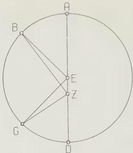
Fig. 3.1

AB and GD in equal times, but will [in so doing] appear to have traversed unequal arcs of a circle drawn on centre Z. For

$$
\angle \mathrm{BEA} = \angle \mathrm{GED}.
$$

But $\angle \mathrm{BZA} < \angle \mathrm{BEA}$ (or $\angle \mathrm{GED}$), and $\angle \mathrm{GZD} > \angle \mathrm{GED}$ (or $\angle \mathrm{BEA}$). In the epicyclic hypothesis: we imagine [see Fig. 3.2] the circle concentric with the ecliptic as ABGD on centre E, with diameter AEG, and the epicycle carried by it, on which the body moves, as ZHΘK on centre A.

Then here too it is immediately obvious that, as the epicycle traverses circle ABGD with uniform motion, say from A towards B, and as the body traverses the epicycle with uniform motion, then when the body is at points Z and Θ, it will appear to coincide with A, the centre of the epicycle, but when it is at other points it will not. Thus when it is, e.g., at H, its motion will appear greater than the uniform motion [of the epicycle] by arc AH, and similarly when it is at K its motion will appear less than the uniform by arc AK.

Now in this kind of eccentric hypothesis the least speed always occurs at the apogee and the greatest at the perigee, since $\angle \mathrm{AZB}$ [in Fig. 3.1] is always less than $\angle \mathrm{DZG}$. But in the epicyclic hypothesis both this and the reverse are possible. For the motion of the epicycle is towards the rear with respect to the heavens, say from A towards B [in Fig. 3.2]. Now if the motion of the body on the epicycle is such that it too moves rearwards from the apogee, that is from Z towards H, the greatest speed will occur at the apogee, since at that point both

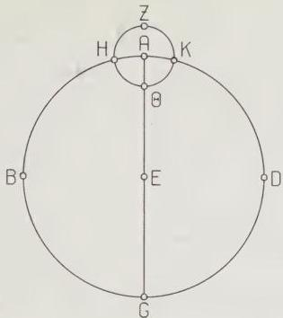
Fig. 3.2

epicycle and body are moving in the same direction. But if the motion of the body from the apogee is in advance on the epicycle, that is from Z towards K, then the reverse will occur: the least speed will occur at the apogee, since at that point the body is moving in the opposite direction to the epicycle.

Having established that, we must next make the additional preliminary point that for bodies which exhibit a double anomaly both the above hypotheses may be combined, as we shall prove in our discussions of such bodies, but for a body which displays a single invariant anomaly, a single one of the above hypotheses will suffice; and [in this case] all the phenomena will be represented, with no difference, by either hypothesis, provided that the same ratios are preserved in both. By this I mean that the ratio, in the eccentric hypothesis, of the distance between the centre of vision and the centre of the eccentric to the radius of the eccentric, must be the same as the ratio, in the epicyclic hypothesis, of the radius of the epicycle to the radius of the deferent; and furthermore that the time taken by the body, travelling towards the rear, to traverse the immovable eccentric, must be the same as the time taken by the epicycle, also travelling towards the rear, to traverse the circle with the observer as centre [the deferent], while the body moves with equal [angular] speed about the epicycle, but so that its motion at the apogee [of the epicycle] is in advance.

If these conditions are fulfilled, the identical phenomena will result from either hypothesis. We shall briefly show this [now] by comparing the ratios in abstract, and later by means of the actual numbers we shall assign to them for the sun’s anomaly. I say then, first, that in both hypotheses, the greatest difference between the uniform motion and the apparent, non-uniform motion (which is also the notional position of the mean speed for the bodies) occurs when the apparent distance from the apogee comprises a quadrant, and that the time between apogee [position] and the above-mentioned mean speed [position] is greater than the time between mean speed and perigee. Hence, for the eccentric hypothesis always, and for the epicyclic hypothesis when the motion at apogee is in advance, the time from least speed to mean is greater than the time from mean speed to greatest; for in both hypotheses the slowest motion takes place at the apogee. But [for the epicyclic hypothesis] when the sense of revolution of the body is rearwards from the apogee on the epicycle, the reverse is true: the time from greatest speed to mean is greater than the time from mean to least, since in this case the greatest speed occurs at the apogee.

First, then, [see Fig. 3.3] let the body’s eccenter be ABGD on centre E, with diameter AEG. On this diameter take the centre of the ecliptic, that is, the position of the observer, at Z, and draw BZD through Z at right angles to AEG. Let the positions of the body be B and D, so that, obviously, its apparent distance from apogee A is a quadrant on either side. We have to prove that the greatest difference between mean and anomalous motion takes place at points B and D.

Join EB and ED.

It is immediately obvious that the ratio of ∠EBZ to 4 right angles equals the

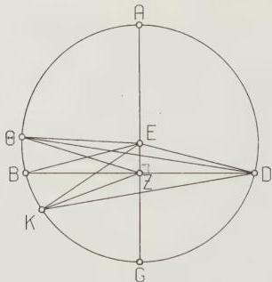
Fig. 3.3

ratio of the arc of the difference due to the anomaly to the whole circle; for ∠AEB subtends the arc of the uniform motion, and ∠AZB subtends the arc of the apparent, non-uniform motion, and the difference between them is ∠EBZ.

I say, then, that no angle greater than these two [∠EBZ and ∠EDZ] can be constructed on line EZ at the circumference of circle ABGD.

[Proof:] Construct at points Θ and K angles EΘZ and EKZ, and join ΘD, KD. Then since, in any triangle, the greater side subtends the greater angle, and ΘZ > ZD,
∴ ∠ΘDZ > ∠DΘZ.

But ∠EDΘ = ∠EΘD, since EΘ = ED [radii].

Therefore, by addition, ∠EDZ (=∠EBD) > ∠EΘZ.

Again, since DZ > KZ,
∠ZKD > ∠ZDK.

But ∠EKD = ∠EDK, since EK = ED.

Therefore, by subtraction, ∠EDZ (= ∠EBZ) > ∠EKZ.

Therefore it is impossible for any other angle to be constructed in the way defined greater than those at points B and D.

Simultaneously it is proven that arc AB, which represents the time from least speed to mean, exceeds BG, which represents the time from mean speed to greatest, by twice the arc comprising the equation of anomaly. For ∠AEB exceeds a right angle (∠EZB) by ∠EBZ, and ∠BEG falls short of a right angle by the same amount.

To prove the same theorem again for the other hypothesis, let [Fig. 3.4] the circle concentric with the universe be ABG on centre D and diameter ADB, and let the epicycle which is carried around it in the same plane be EZH on centre A. Let us suppose the body to be at H when its apparent distance from the apogee is a quadrant. Join AH and DHG.

I say that DHG is tangent to the epicycle; for that is the position in which the difference between uniform and anomalous motion is greatest.

[Proof:] The mean motion, counted from the apogee, is represented by ∠EAH; for the body traverses the epicycle with the same [angular] speed as the epicycle traverses circle ABG. Furthermore the difference between mean and apparent motion is represented by ∠ADH. Therefore it is clear that the amount by which ∠EAH exceeds ∠ADH (namely ∠AHD) represents the apparent distance of the body from the apogee. But this distance is, by hypothesis, a quadrant. Therefore ∠AHD is a right angle, and hence line DHG is tangent to epicycle EZH. Therefore arc AG, since it comprises the distance between the centre A and the tangent, is the greatest possible difference due to the anomaly.

By the same reasoning, arc EH, which according to the sense of rotation on

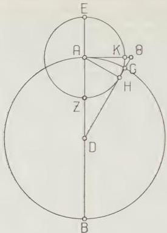
Fig. 3.4

the epicycle assumed here, represents the time from least speed to mean, exceeds arc HZ, which represents the time from mean speed to greatest, by twice arc AG. For if we produce DH to Θ and draw AKΘ at right angles to EZ,

$$
\angle \mathrm{KAH} = \angle \mathrm{ADG},
$$

$$
\text{and arc KH} = \text{arc AC}.
$$

And arc EKH is greater than a quadrant by arc KH, while arc ZH is less than a quadrant by arc KH.

Q.E.D.

It is also true that the same effects will be produced by both hypotheses if one takes a partial motion over the same stretch of time for both, whether one considers the mean motion or the apparent, or the difference between them, that is the equation of anomaly. The best way to see that is as follows.

[See Fig. 3.5.] Let the circle concentric with the ecliptic be ABG on centre D, and let the circle which is eccentric but equal to the concentre ABG be EZH on centre Θ. Let the common diameter through their centres D, Θ and the apogee E be EAΘD. Cut off at random an arc AB on the concentre, and with centre B and radius DΘ draw the epicycle KZ. Join KBD.

I say that the body will be carried by both kinds of motion [i.e. according to both hypotheses] to point Z, the intersection of the eccentre and the epicycle, in the same time in all cases (that is, the three arcs, EZ on the eccentre, AB on the

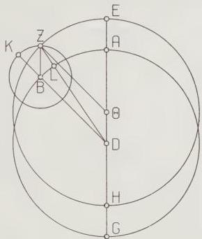
Fig. 3.5

concentre, and KZ on the epicycle, are all similar), and that the difference between uniform and anomalous motion, and the apparent positions of the body, will turn out to be one and the same according to both hypotheses. [Proof:] Join ZΘ, BZ and DZ.

Since, in the quadrilateral BDΘZ, the opposite sides are equal, ZΘ to BD and BZ to DΘ, BDΘZ is a parallelogram.

Therefore

$$
\angle E\Theta Z = \angle ADB = \angle ZBK.
$$

Therefore, since they are angles at the centre [of circles], the arcs subtended by them are also similar, i.e.

Arc EZ of the eccentre || arc AB of the concentre || arc KZ of the epicycle.

Therefore the body will be carried by both kinds of motions in the same time to the same point, Z, and will appear to have traversed the same arc AL of the ecliptic from the apogee, and accordingly the equation of anomaly will be the same in both hypotheses; for we showed that that equation is represented by $\angle DZ\Theta$ in the eccentric hypothesis and by $\angle BDZ$ in the epicyclic hypothesis, and these two angles are alternate and equal, since, as we have shown, ZΘ is parallel to BD.

It is obvious that the same results will hold good for all distances [of the body from the apogee]. For quadrilateral ΘDZB will always be a parallelogram, and [hence] the motion of the body on the epicycle will actually describe the eccentric circle, provided the ratios are similar and their members equal in both hypotheses.

Moreover, even if the members are unequal in size, provided their ratios are similar, the same phenomena will result. This can be shown as follows.

As before [see Fig. 3.6] let the circle concentric with the universe be ABG on centre D and the diameter, on which the body reaches apogee and perigee positions, ADG. Let the epicycle be drawn on point B, at an arbitrary distance, arc AB, from apogee A. Let the arc traversed by the body [on the epicycle] be EZ, which is, obviously, similar to AB, since the revolutions on [both] circles have the same period. Join DBE, BZ, DZ.


Fig. 3.6

Now it is immediately obvious that, according to this [epicyclic] hypothesis, ∠ADE will always equal ∠ZBE, and the body will appear to lie on line DZ.

But I say that the body will also appear to lie on the same line DZ according to the eccentric hypothesis, whether the eccentric is greater or smaller than the concentric ABG, provided only that one assumes that the ratios are similar and that the periods of revolution are the same.

[Proof:] Let the eccentric be drawn under the conditions we have described, greater [than the concentric] as HΘ on centre K ([which must lie] on AG), and smaller [than the concentre] as LM on centre N (this too [must lie on AG]). Produce DZ as DMZΘ, and DA as DLAH, and join ΘK, MN.

Then since

$$
\text{DB:BZ} = \Theta\text{K:KD} = \text{MN:ND} \text{ [by hypothesis],}
$$

and $\angle \text{BZD} = \angle \text{MDN}$ (since DA is parallel to BZ);

the three triangles [ZDB,DΘK,DMN] are equiangular, and $\angle \text{BDZ} = \angle \text{DΘK} = \angle \text{DMN}$ (angles subtended by corresponding sides).

Therefore DB, ΘK and MN are parallel.

$$
\therefore \angle \text{ADB} = \angle \text{AKΘ} = \angle \text{ANM}.
$$

Since these angles are at the centres of their circles, the arcs on them, AB, HΘ and LM, will also be similar.

So it is true, not only that the epicycle has traversed arc AB in the same time as the body has traversed arc EZ, but also that the body will have traversed arcs HΘ and LM on the eccentres in that same time; hence in every case it will be seen along the same line DMZΘ, according to the epicyclic [hypothesis] at point Z, according to the greater eccentre at point Θ, and according to the smaller eccentre at point M. The same will hold true in all positions.

A further consequence is that where the apparent distance of the body from apogee [at one moment] equals its apparent distance from perigee [at another], the equation of anomaly will be the same at both positions.

[Proof:] In the eccentric hypothesis [see Fig. 3.7], we draw the eccentric circle


Fig. 3.7

ABGD on centre E and diameter AEG through apogee A. We suppose the observer to be located at Z, and draw an arbitrary [chord] BZD through Z, and join EB and ED. Then the apparent positions [ of the body at B and D] will be equal and opposite, that is the angle AZB from the apogee will be equal and opposite to angle GZD from the perigee; and the equation of anomaly will be the same [in both cases], since

$$
BE = ED, \text{ and } \angle EBZ = \angle EDZ.
$$

So the arc [AB] of mean motion counted from the apogee A will exceed the arc of apparent motion (i.e. the arc subtended by angle AZB) by the same equation [equal to $\angle EBZ$] as the arc of mean motion counted from the perigee G is exceeded by the arc of apparent motion (i.e. the [equal] arc subtended by $\angle GZD$). For

$$
\angle AEB > \angle AZB, \text{ and } \angle GED < \angle GZD.
$$

In the epicyclic hypothesis [see Fig. 3.8] if, as before, we draw the concentre ABG on centre D and diameter ADG, and the epicycle EZH on centre A, draw an arbitrary line DHBZ, and join AZ and AH, then the arc AB representing the equation of anomaly will be the same at both positions, i.e. whether the body is


Fig. 3.8

at Z or at H. And the distance of the body from the point on the ecliptic corresponding to the apogee when it is at Z will be equal to its distance from the point corresponding to the perigee when it is at H. For the arc of its apparent distance from the apogee is represented by $\angle DZA$, since, as we showed, this is the difference between the mean motion and the equation of anomaly. And the arc of its apparent distance from the perigee is represented by $\angle ZHA$ (for this, too, is equal to the mean motion from the perigee plus the equation of anomaly).

$$
\text{But } \angle DZA = \angle ZHA, \text{ since } AZ = AH.
$$

Thus here too we conclude that the mean motion exceeds the apparent near the apogee (i.e. $\angle$ EAZ exceeds $\angle$ AZD) by the same equation (namely $\angle$ ADH) as the mean motion is exceeded by the (same) apparent motion (i.e. $\angle$ HAD by $\angle$ AHZ) near the perigee.

Q.E.D.

## 4. [On the apparent anomaly of the sun]

Having set out the above preliminary theorems, we must add a further preliminary thesis concerning the apparent anomaly of the sun. This has to be a single anomaly, of such a kind that the time taken from least speed to mean shall always be greater than the time from mean speed to greatest, for we find that this accords with the phenomena. Now this could be represented by either of the hypotheses described above, though in case of the epicyclic hypothesis the motion of the sun on the apogee arc of the epicycle would have to be in advance. However, it would seem more reasonable to associate it with the eccentric hypothesis, since that is simpler and is performed by means of one motion instead of two.

Our first task is to find the ratio of the eccentricity of the sun’s circle, that is, the ratio which the distance between the centre of the eccentric and the centre of the ecliptic (located at the observer) bears to the radius of the eccentric. We must also find the degree of the ecliptic in which the apogee of the eccentric is located. These problems have been solved by Hipparchus with great care. He assumes that the interval from spring equinox to summer solstice is $94\frac{1}{2}$ days, and that the interval from summer solstice to autumnal equinox is $92\frac{1}{2}$ days, and then, with these observations as his sole data, shows that the line segment between the above-mentioned centres [of eccentric and ecliptic] is approximately $\frac{1}{3}$th of the radius of the eccentric, and that the apogee is approximately $24\frac{1}{2}$° (where the ecliptic is divided into $360^{\circ}$) in advance of the summer solstice. We too, for our own time, find approximately the same values for the times [taken by the sun to traverse] the above-mentioned quadrants, and for those ratios. Hence it is clear to us that the sun’s eccentric always maintains the same position relative to the solsticial and equinoctial points.

In order not to neglect this topic, but rather to display the theorem worked out according to our own numerical solution, we too shall solve the problem, for the eccentric, using the same observed data, namely, as already stated, that the interval from spring equinox to summer solstice comprises $94\frac{1}{2}$ days, and that from summer solstice to autumnal equinox $92\frac{1}{2}$ days. For our own very precise observations of the equinoxes and the summer solstice in the 463rd year from the death of Alexander confirm the day-totals in these intervals: as we said, [III 1, p. 138], the autumnal equinox occurred on Athyr [III] 9, [139 Sept. 26], after sunrise, the spring equinox on Pachon [IX] 7 [140 March 22], after noon (thus the interval [between them] is $178\frac{1}{4}$ days), and the summer solstice on Mesore [XII] 11/12, [140 June 24/25], after midnight. Thus this interval, from spring equinox to summer solstice, comprises $94\frac{1}{2}$ days, which leaves approximately $92\frac{1}{2}$ days to complete the year; this number represents the interval from the summer solstice to the following autumnal equinox.

[See Fig. 3.9.] Let the ecliptic be ABGD on centre E. In it draw two diameters, AG and BD, at right angles to each other, through the solsticial and equinoctial points. Let A represent the spring [equinox], B the summer [solstice], and so on in order.


Fig. 3.9

Now it is clear that the centre of the eccentre will be located between lines EA and EB. For semi-circle ABG comprises more than half of the length of the year, and hence cuts off more than a semi-circle of the eccentre; and quadrant AB too comprises a longer time and cuts off a greater arc of the eccentre than quadrant BG. This being so, let point Z represent the centre of the eccentre, and draw the diameter through both centres and the apogee, EZH. With centre Z and arbitrary radius draw the sun’s eccentre ΘKLM, and draw through Z lines NXO parallel to AG and PRS parallel to BD. Draw perpendicular ΘTY from Θ to NXO and perpendicular KFQ from K to PRS.

Now since the sun traverses circle ΘKLM with uniform motion, it will traverse arc ΘK in 94½ days, and arc KL in 92½ days. In 94½ days its mean motion is approximately 93;9°, and in 92½ days 91;11°. Therefore arc ΘKL = 184;20°

and, by subtraction of the semi-circle NPO [from arc ΘKL], arc NΘ + arc LO [= 184;20° - 180°] = 4;20°

So arc ΘNY = 2 arc ΘN = 4;20° also, ∴ ΘY = Crd arc ΘNY ≈ 4;32° } where the diameter of
and EX = ΘT = ½ΘY = 2;16° } the eccentre = 120°, Now since arc ΘNPK = 93;9°, and arc ΘN = 2;10° and quadrant NP = 90°, by subtraction, arc PK = 0;59°, and arc KPQ = 2 arc PK = 1;58°.

∴ KFQ = Crd arc KPQ = 2;4°, } where the diameter
and ZX = KF = ½KFQ = 1;2° } of the eccentre = 120°.

And we have shown that EX = 2;16° in the same units.

Now since EZ = ZX + EX, EZ ≈ 2;29½° where the radius of the eccentre = 60°.

Therefore the radius of the eccentre is approximately 24 times the distance between the centres of the eccentre and the ecliptic.

Now, since EZ:ZX = 2;29½ : 1;2, ZX will be about 49;46° where hypotenuse EZ = 120^{\mathrm{p}}.

Therefore, in the circle about right-angled triangle EZX, arc ZX ≈ 49°.

∴ ∠ ZEX = { 49°° where 2 right angles = 360°°
24;30° where 4 right angles = 360°°. }

So, since ∠ ZEX is an angle at the centre of the ecliptic, arc BH, which is the amount by which the apogee at H is in advance of the summer solstice at B, is also 24;30°.

Furthermore, since quadrants OS and SN are each 90°, and arc OL = arc ΘN = 2;10°, and arc MS = 0;59°, ∴ arc LM = 86;51°, and arc MΘ = 88;49°.

But the sun in its uniform motion travels

86;51° in about 88½ days,

and 88;49° in about 90½ days.

Hence it is clear that the sun will traverse arc GD, which extends from the autumnal equinox to the winter solstice, in about $88\frac{1}{2}$ days, and arc DA, which extends from the winter solstice to the spring equinox, in about $90\frac{1}{2}$ days. The above conclusions are in agreement with what Hipparchus says.

Using these quantities, then, let us first see what the greatest difference between mean and anomalous motions is, and at what points it will occur.

[See Fig. 3.10.] Let the eccentric circle be ABG on centre D and diameter ADG through the apogee A, on which E represents the centre of the ecliptic. Draw EB at right angles to AG, and join DB.

Now since, where BD, the radius, equals $60^{\circ}$, DE, the eccentricity, equals $2;30^{\circ}$ (according to the ration 24:1), in the circle about right-angled triangle BDE,

$$
\mathrm{DE} = 5^{\circ} \text{ where hypotenuse } \mathrm{BD} = 120^{\mathrm{p}},
$$

and arc $\mathrm{DE} \approx 4;46^{\circ}$.

Therefore $\angle$ DBE, which represents the greatest equation of anomaly, $= \begin{cases} 4;46^{\circ \circ} \text{ where 2 right angles } = 360^{\circ \circ} \\ 2;23^{\circ} \text{ where 4 right angles } = 360^{\circ}. \end{cases}$

In the same units, right angle $\mathrm{BED} = 90^{\circ}$,

$$
\text{and } \angle \mathrm{BDA} = \angle \mathrm{DBE} + \angle \mathrm{BED} = 92;23^{\circ}.
$$


Fig. 3.10

Thus, since $\angle$ BDA is at the centre of the eccentric and $\angle$ BED is at the centre of the ecliptic, we conclude that the greatest equation of anomaly is $2;23^{\circ}$, and the position where it occurs is $92;23^{\circ}$ from the apogee, measured along the eccentric in uniform motion, and (as we proved earlier) a quadrant, or $90^{\circ}$ [from the apogee], measured along the ecliptic in anomalous motion. It is obvious from our previous results that in the opposite semi-circle the mean speed and the greatest equation of anomaly will occur at $270^{\circ}$ of apparent motion, and at $267;37^{\circ}$ of mean motion on the eccentric.

We now want to use numerical computation, as we promised [pp. 145-6], to show that one derives the same quantities from the epicyclic hypothesis too, provided the same ratios are preserved in the way we explained.

[See Fig. 3.11.] Let the circle concentric to the ecliptic be ABG on centre D and diameter ADG, and the epicycle circle EZH on centre A. From D draw a tangent to the epicycle, DZB, and join AZ. Then, as before, in the right-angled triangle ADZ, AD is 24 times AZ, so that, in the circle about right-angled triangle ADZ, AZ is, again, $5^{\mathrm{p}}$ where hypotenuse AD is $120^{\mathrm{p}}$, and the arc on AZ is $4;46^{\circ}$.

$$
\therefore \angle \mathrm{ADZ} = \left\{ \begin{array}{l} 4;46^{\circ \circ} \text{ where 2 right angles} = 360^{\circ \circ} \\ 2;23^{\circ} \text{ where 4 right angles} = 360^{\circ}. \end{array} \right.
$$


Fig. 3.11

Therefore the greatest equation of anomaly, namely arc AB, has been found to be $2;23^{\circ}$ here too, in agreement with [the previous result], and the arc of anomalous motion is $90^{\circ}$, since it is represented by the right angle AZD, while the arc of mean motion, which is represented by $\angle$ EAZ, is again $92;23^{\circ}$.

## 5. On the construction of a table for individual subdivisions of the anomaly

In order to enable one to determine the anomalous motion over any

On chs. 5 and 6 see HAMA 58-60, Pedersen 149-51.

subdivision [of the circle], we shall show, again for both hypotheses, how, given one of the arcs in question, we can compute the others. [See Fig. 3.12.] First, let the circle concentric to the ecliptic be ABG on centre D, the eccentric EZH on centre Θ, and let the diameter through both centres and the apogee E be EAΘDH. Cut off arc EZ, and join ZD, ZΘ. First, let arc EZ be given, e.g. as $30^\circ$.


Fig. 3.12

Produce ZΘ and drop the perpendicular to it from D, DK.

Then, since arc EZ is, by hypothesis, $30^\circ$,

$$
\angle E \Theta Z = \angle D \Theta K = \left\{ \begin{array}{l} 30^\circ \text{ where 4 right angles } = 360^\circ \\ 60^{\circ\circ} \text{ where 2 right angles } = 360^{\circ\circ} \end{array} \right.
$$

Therefore, in the circle about right-angled triangle DΘK,

$$
\begin{array}{l} \text{arc DK} = 60^\circ \\ \text{and arc KΘ} = 120^\circ \text{ (supplement).} \end{array}
$$

Therefore the corresponding chords

$$
\left. \begin{array}{l} DK = 60^\circ \\ \text{and KΘ} = 103; 55^\circ \end{array} \right\} \quad \text{where hypotenuse DΘ} = 120^{\mathrm{p}}.
$$

Therefore, where DΘ = 2;30° and radius ZΘ = 60^{\mathrm{p}}, $DK = 1; 15^\circ \text{ and } \Theta K = 2; 10^\circ.$

Now since DK + KΘZ = ZD, the hypotenuse ZD ≈ 62;11°.

Therefore, where ZD = 120°, DK = 2;25°, and, in the circle about right-angled triangle ZDK,

$$
\text{arc DK} = 2; 18^\circ.
$$

$$
\therefore \angle DZK = \begin{cases} 2; 18^\circ \text{ where } 2 \text{ right angles} = 360^\circ \\ 1; 9^\circ \text{ where } 4 \text{ right angles} = 360^\circ. \end{cases}
$$

That $[1;9^\circ]$ will be the amount of the equation of anomaly at this position.

And $\angle E\Theta Z$ was taken as $30^\circ$.

Therefore, by subtraction, $\angle ADB$ (which equals arc AB of the ecliptic) equals $28;51^\circ$.

Furthermore, if any other of the [relevant] angles be given [instead of $\angle E\Theta Z$], the remaining angles will be given, as is immediately obvious if, in the same figure [see Fig. 3.13] we drop perpendicular $\Theta L$ from $\Theta$ on to $ZD$.


Fig. 3.13

For suppose first that arc AB of the ecliptic, i.e. $\angle \Theta DL$, is given. Then the ratio $D\Theta:\Theta L$ will be given. And since $D\Theta:\Theta Z$ is also given, $\Theta Z:\Theta L$ will be given. Hence $\angle \Theta ZL$, the equation of anomaly, will be given. and so will $\angle E\Theta Z$, i.e. arc EZ of the eccentric.

Or suppose, secondly, that the equation of anomaly, i.e. $\angle \Theta ZD$, is given: we will get the same results in reverse order. For from $\angle \Theta ZD$ the ratio $\Theta Z:\Theta L$ will be given, and $\Theta Z:\Theta D$ is given from the beginning. Hence $D\Theta:\Theta L$ will be given, and hence $\angle \Theta DL$, i.e. arc AB of the ecliptic, and [hence] $\angle E\Theta Z$, i.e. arc EZ of the eccentric.

### III 5. Equation of anomaly from epicyclic hypothesis

Next [see Fig. 3.14] let the circle concentric with the ecliptic be ABG on centre D and diameter ADG, and let the epicycle (in the same ratio [to circle ABG as the eccentricity to the eccentre]) be EZHΘ on centre A. Cut off arc EZ and join ZBD and ZA. Let arc EZ again be taken in the same amount, $30^{\circ}$. Drop perpendicular ZK from Z on to AE.


Fig. 3.14

Since arc EZ = $30^{\circ}$,
$\angle \mathrm{EAZ} = \begin{cases} 30^{\circ} \text{ where 4 right angles} = 360^{\circ} \\ 60^{\circ\circ} \text{ where 2 right angles} = 360^{\circ\circ} \end{cases}.$

Therefore in the circle about right-angled triangle AZK,
arc ZK = $60^{\circ}$
and arc AK = $120^{\circ}$ (supplement).

Therefore the corresponding chords
$\begin{cases} \mathrm{ZK} = 60^{\mathrm{p}} \\ \text{and } \mathrm{KA} = 103; 55^{\mathrm{p}} \end{cases}$ where the diameter AZ = $120^{\mathrm{p}}$.
Therefore where hypotenuse AZ = $2; 30^{\mathrm{p}}$ and radius AD = $60^{\mathrm{p}}$
ZK = $1; 15^{\mathrm{p}}$, KA = $2; 10^{\mathrm{p}}$,
and, by addition, KAD = $62; 10^{\mathrm{p}}$.
And since ZK + KD = ZBD,
ZD = $62; 11^{\mathrm{p}}$, where ZK = $1; 15^{\mathrm{p}}$.
So where hypotenuse DZ = $120^{\mathrm{p}}$, ZK = $2; 25^{\mathrm{p}}$,
and, in the circle about right-angled triangle DZK,
arc ZK = $2; 18^{\mathrm{p}}$.
$\therefore \angle \mathrm{ZDK} = \begin{cases} 2; 18^{\circ} \text{ where 4 right angles} = 360^{\circ} \\ 1; 9^{\circ} \text{ where 2 right angles} = 360^{\circ\circ} \end{cases}.$

This is, again, the amount of the equation of anomaly, which is represented by arc AB.

And $\angle$ EAZ was taken as $30^{\circ}$.

Therefore, by subtraction, $\angle$ AZD, which represents the arc of apparent motion on the ecliptic, is $28;51^{\circ}$.

These amounts are in agreement with what we found for the eccentric hypothesis.

Here too, if any other angle be given [instead of $\angle$ EAZ], the remaining angles will be given, [as can be seen] on the same figure [see Fig. 3.15] if the perpendicular AL is dropped from A on to DZ.


Fig. 3.15

For if, as before, we first take the arc of apparent motion on the ecliptic, i.e. $\angle$ AZD, as given, from this the ratio ZA:AL will be given. And since ZA:AD was given from the beginning, DA:AL will be given. Hence $\angle$ ADB will be given, i.e. arc AB, the arc of the equation of anomaly, and so will $\angle$ EAZ, i.e. arc EZ of the epicycle.

Of if, secondly, we take the equation of anomaly, i.e. $\angle$ ADB, as given, then, in the same way but in reverse order, from this AD:AL will be given; and since DA:AZ was given from the beginning, ZA:AL will also be given; and hence $\angle$ AZD will be given, which corresponds to the arc of apparent motion on the ecliptic, and so will $\angle$ EAZ, i.e. arc EZ of the epicycle.

Let us again take the previous figure for the eccentric [see Fig. 3.16], and cut off from H, the perigee of the eccentric, arc HZ, which we again take as $30^{\circ}$. Join DZB and ZΘ, and drop perpendicular DK from D on to ΘZ.


Fig. 3.16

Then since $\operatorname{arc} ZH = 30^\circ$,
$$
\angle Z\Theta H = \left\{ \begin{array}{l} 30^\circ \text{ where 4 right angles } = 360^\circ \\ 60^{\circ\circ} \text{ where 2 right angles } = 360^{\circ\circ} \end{array} \right.
$$

Therefore in the circle about right-angled triangle $D\Theta K$,
$\operatorname{arc} DK = 60^\circ$
$\text{and} \ \operatorname{arc} K\Theta = 120^\circ \text{ (supplement).}$

Therefore the corresponding chords
$$
\left. \begin{array}{l} DK = 60^\circ \\ \text{and} K\Theta = 103;55^\circ \end{array} \right\} \text{ where diameter } D\Theta = 120^\circ.
$$

Therefore where hypotenuse $D\Theta = 2;30^\circ$ and radius $\Theta Z = 60^\circ$,
$$
DK = 1;15^\circ \text{ and } \Theta K = 2;10^\circ,
$$
and $KZ = 57;50^\circ$ by subtraction [of $\Theta K$ from $\Theta Z$]
$$
\text{And since } DZ = DK + KZ,
$$
$DZ \approx 57;51^\circ \text{ where } DK = 1;15^\circ.$

Therefore where hypotenuse $DZ = 120^{\mathrm{p}}$, $DK = 2;34^\circ$.

And, in the circle about right-angled triangle $DZK$,
$\operatorname{arc} DK = 2;27^\circ$,
$$
\therefore \angle DZK = \left\{ \begin{array}{l} 2;27^{\circ\circ} \text{ where 2 right angles } = 360^{\circ\circ} \\ 1;14^\circ \text{ (approximately) where 4 right angles } = 360^\circ \end{array} \right.
$$

This [1;14°], then, is the equation of anomaly.

And since $\angle Z\Theta H$ was taken as $30^\circ$,
by addition, $\angle BDG$, i.e. arc GB of the ecliptic, equals $31;14^\circ$.

Here too, in the same way [as before], [see Fig. 3.17], we produce BD and drop perpendicular $\Theta L$ on to it.


Fig. 3.17

Then if, first, we take arc GB of the ecliptic, i.e. $\angle \Theta DL$, as given, from this the ratio $D\Theta:\Theta L$ will be given. And since $\Theta D:\Theta Z$ was also given from the beginning, $Z\Theta:\Theta L$ will be given. Hence we will have as given angles $\angle \Theta ZD$, i.e. the equation of anomaly
and $\angle Z\Theta D$, i.e. arc HZ of the eccentric.

Or if, secondly, we take the equation of anomaly, i.e. $\angle \Theta ZD$, as given, then conversely, from this $Z\Theta:\Theta L$ will be given. And since $Z\Theta:\Theta D$ was also given from the beginning, $D\Theta:\Theta L$ will be given. Hence we will have, as given angles, $\angle \Theta DL$, which corresponds to arc GB of the ecliptic
and $\angle Z\Theta H$, i.e. arc HZ of the eccentric.

Similarly, on the previous figure of concentric and epicycle [see Fig. 3.18], we cut off arc $\Theta H$ from the perigee, in the same amount of $30^\circ$, join AH and DHB, and drop perpendicular HK from H on to AD.

Then since arc $\Theta H$ is again $30^\circ$,
$$
\angle \Theta AH = \begin{cases}
30^\circ & \text{where 4 right angles} = 360^\circ \\
60^\circ\& \text{where 2 right angles} = 360^{\circ\circ}\&
\end{cases}
\quad
$$
$$
\begin{cases}
\text{Therefore in the circle about right-angled triangle HKA,} \\
\text{arc HK} = 60^\circ \\
\text{and arc AK} = 120^\circ \text{ (supplement).}
\end{cases}
$$


Fig. 3.18

Therefore the corresponding chords

$$
\left. \begin{array}{l} \mathrm{HK} = 60^{\mathrm{p}} \\ \text{and AK} = 103;55^{\mathrm{p}} \end{array} \right\} \text{where hypotenuse AH} = 120^{\mathrm{p}}.
$$

Therefore where $\mathrm{AH} = 2;30^{\mathrm{p}}$ and radius $\mathrm{AD} = 60^{\mathrm{p}}$, $\mathrm{HK} = 1;15^{\mathrm{p}}$, $\mathrm{AK} = 2;10^{\mathrm{p}}$ and $\mathrm{KD} = 57;50^{\mathrm{p}}$, by subtraction.

and since $\mathrm{HK}^2 + \mathrm{KD}^2 = \mathrm{DH}^2$, $\mathrm{DH} \approx 57;51^{\mathrm{p}}$ where $\mathrm{KH} = 1;15^{\mathrm{p}}$.

Therefore where hypotenuse $\mathrm{DH} = 120^{\mathrm{p}}$

$\mathrm{HK} = 2;34^{\mathrm{p}}$, and, in the circle about $\mathrm{DHK}$, arc $\mathrm{HK} = 2;27^{\circ}$.

$$
\therefore \angle \mathrm{HDK} = \left\{ \begin{array}{l} 2;27^{\circ \circ} \text{ where 2 right angles} = 360^{\circ \circ} \\ 1;14^{\circ} \text{ (approximately) where 4 right angles} = 360^{\circ}. \end{array} \right.
$$

Here too, then, that is the size of the equation of anomaly, i.e. arc AB.

And since $\angle \mathrm{KAH}$ was taken as $30^{\circ}$, by addition, $\angle \mathrm{BHA}$, which represents the apparent motion on the ecliptic [counted from perigee], is $31;14^{\circ}$. These amounts agree with those found for the eccentric [hypothesis].

Here too, in the same way [as before], we drop perpendicular AL on to DB [see Fig. 3.19].

Then if, first, we take the arc of the ecliptic, i.e. $\angle \mathrm{AHL}$, as given, from this the ratio HA:AL will be given. And since HA:AD was given from the beginning, DA:AL will be given. Thence we will have as given angles

$\angle \mathrm{ADB}$, i.e. arc AB, representing the equation of anomaly

and $\angle \Theta \mathrm{AH}$, i.e. arc $\Theta \mathrm{H}$ of the epicycle.


Fig. 3.19

Or if, secondly, we take as given arc AB, representing the equation of anomaly, i.e. $\angle ADB$, then, in the same way but in reverse order, from this the ratio DA:AL will be given. And since DA:AH is given from the beginning, HA:AL will also be given. Hence we will have as given angles $\angle AHL$, i.e. the arc of the ecliptic and $\angle ΘAH$, i.e. arc $\Theta H$ of the epicycle.

Thus we have proved what we set out to do.

In order to have conveniently available the amount of the correction for any given position, [we want] to establish a table, subdivided into [appropriate] sections, for the computation of the apparent positions from the anomaly. The above theorems would allow a wide variety in the form of such a table, but we prefer that form in which the argument is the mean motion and the function is the equation of anomaly. For this form accords well with the actual theories, and it also provides a simple but highly practical way of computing any desired result. So using the first set of theorems [i.e. with the eccentric hypothesis] which we used in the numerical examples above, we computed geometrically, in the way described, for the individual subdivisions [of the circle], the equation of anomaly corresponding to the arc of mean motion. In general, both for the sun and for the other bodies, we divided the quadrants near the apogee into 15 subdivisions (thus in these quadrants the interval of tabulation is 6°, and the quadrants near the perigee into 30 subdivisions (thus in these the interval of tabulation is $3^{\circ}$). The reason is that the differences between [successive] equations of anomaly, for equal subdivisions [of the argument], are greater near the perigee than near the apogee.

## 6. Table of the sun’s anomaly

| 1 | 2 | 3 |
| --- | --- | --- |
| Common Numbers | | Equation |
| 6 | 354 | 0 14 |
| 12 | 348 | 0 28 |
| 18 | 342 | 0 42 |
| 24 | 336 | 0 56 |
| 30 | 330 | 1 9 |
| 36 | 324 | 1 21 |
| 42 | 318 | 1 32 |
| 48 | 312 | 1 43 |
| 54 | 306 | 1 53 |
| 60 | 300 | 2 1 |
| 66 | 294 | 2 8 |
| 72 | 288 | 2 14 |
| 78 | 282 | 2 18 |
| 84 | 276 | 2 21 |
| 90 | 270 | 2 23 |
| 96 | 267 | 2 23 |
| 99 | 264 | 2 23 |
| 102 | 258 | 2 21 |
| 105 | 255 | 2 20 |
| 108 | 252 | 2 18 |
| 111 | 249 | 2 16 |
| 114 | 246 | 2 13 |
| 117 | 243 | 2 10 |
| 120 | 240 | 2 6 |
| 123 | 237 | 2 2 |
| 126 | 234 | 1 58 |
| 129 | 231 | 1 54 |
| 132 | 228 | 1 49 |
| 135 | 225 | 1 44 |
| 138 | 222 | 1 39 |
| 141 | 219 | 1 33 |
| 144 | 216 | 1 27 |
| 147 | 213 | 1 21 |
| 150 | 210 | 1 14 |
| 153 | 207 | 1 7 |
| 156 | 204 | 1 0 |
| 159 | 201 | 0 53 |
| 162 | 198 | 0 46 |
| 165 | 195 | 0 39 |
| 168 | 192 | 0 32 |
| 171 | 189 | 0 24 |
| 174 | 186 | 0 16 |
| 177 | 183 | 0 8 |
| 180 | 180 | 0 0 |

## 7. On the epoch of the sun’s mean motion

It remains to establish the epoch of the sun’s mean motion, in order to be able to compute the particular position for any given time. In making our exposition of that matter, we shall again use those positions of the body which we ourselves have observed most accurately (this is our general rule both for the sun and for the other planets), but we use the mean motions we have derived to compute back to the beginning of the reign of Nabonassar for the epochs we establish. For that is the era beginning from which the ancient observations are, on the whole, preserved down to our own time.

[See Fig. 3.20.] Let the circle concentric with the ecliptic be ABG on centre D, and the sun’s eccentric EZH on centre Θ, and let the diameter through both centres and the apogee E be EAHG. Let B represent the autumnal equinox on the ecliptic. Join BZD and ZΘ, and drop perpendicular ΘK from Θ on to ZD produced. Then since B, the autumnal equinox, is located at the beginning of Libra, and G, the perigee, at $5\frac{1}{2}^{\circ}$,
$$
\text{arc BG} = 65;30^{\circ}.
$$
$$
\therefore \angle BDG = \angle ΘDK = \begin{cases}
65;30^{\circ} \text{ where 4 right angles} = 360^{\circ} \\
131^{\circ\circ} \text{ where 2 right angles} = 360^{\circ\circ}
\end{cases}
$$
Therefore in the circle about right-angled triangle DΘK,
$$
\text{arc ΘK} = 131^{\circ},
$$
and its chord ΘK = 109;12^{\mathrm{p}} where the diameter DΘ = 120^{\mathrm{p}}.


Fig. 3.20

Therefore where $\mathbf{D}\Theta = 5^{\mathrm{p}}$ and the hypotenuse $\mathbf{Z}\Theta = 120^{\mathrm{p}}$, $\Theta \mathbf{K} = 4;33^{\mathrm{p}}$.
And, in the circle about right-angled triangle $\Theta \mathbf{Z}\mathbf{K}$, $\operatorname{arc} \Theta \mathbf{K} = 4;20^{\circ}$. $\therefore \angle \Theta \mathbf{Z}\mathbf{K} = \begin{cases} 4;20^{\circ \circ} & \text{where 2 right angles} = 360^{\circ \circ} \\ 2;10^{\circ} & \text{where 4 right angles} = 360^{\circ} \end{cases}$. And we found $\angle \mathbf{BDG} = 65;30^{\circ}$.

Therefore, by subtraction, $\angle \mathbf{Z}\Theta \mathbf{H}$ (i.e. arc ZH of the eccentric) = 63;20°. Therefore, when the sun is at the autumnal equinox, it is 63;20° in mean motion in advance of the perigee (i.e. $\pm 5\frac{1}{2}^{\circ}$), and 116;40° in mean motion to the rear of the apogee (i.e. $\pm 5;30^{\circ}$).

Now that we have established that, among the first of the equinoxes observed by us, one of the most accurately determined was the autumnal equinox which occurred in the seventeenth year of Hadrian, on Athyr [III] 7 in the Egyptian calendar [132 Sept. 25], about 2 equinoctial hours after noon. [From the above computation] it is clear that at that time the sun, in its mean motion, was 116;40° to the rear of the apogee on the eccentric. Now from [the beginning of] the reign of Nabonassar [-746 Feb. 26] to the death of Alexander [-323 Nov. 12] is a total of 424 Egyptian years, and from the death of Alexander to [the beginning of] the reign of Augustus [-29 Aug. 31] 294 years, and from the first year of Augustus, Thoth 1 in the Egyptian calendar, noon (for we establish all epochs at noon), to the seventeenth year of Hadrian, Athyr 7, 2 equinoctial hours after noon, is 161 years 66 days 2 equinoctial hours. Therefore the sum total from the first year of Nabonassar, Thoth 1 in the Egyptian calendar, noon, up to the time of the above autumnal equinox, is 879 Egyptian years 66 days and 2 equinoctial hours. In that interval the mean motion of sun is approximately 211;25° beyond complete revolutions. Therefore, if to the 116;40°, which is the [sun’s] distance from the apogee of the eccentric at the above autumnal equinox, we add the 360° of one revolution, and subtract from the result the 211;25° of the increment in mean motion over the interval [in question], we find for the epoch in mean motion in the first year of Nabonassar, Thoth 1 in the Egyptian calendar, noon, that the sun’s distance in mean motion is 265;15° to the rear of the apogee. Thus its mean position is $ \aleph 0;45^\circ $.

## 8. On the calculation of the solar position

So whenever we want to know the sun’s position for any required time, we take the time from epoch to the given moment (reckoned with respect to the local time at Alexandria), and enter with it into the table of mean motion. We add up the degrees [and their subdivisions] corresponding to the various arguments [18-year periods, years, months, etc.], add to this the elongation [from apogee at epoch], 265;15°, subtract complete revolutions from the total, and count the result from $ \square 5;30^\circ $ rearwards through [i.e. in the order of] the signs. The point we come to will be the mean position of the sun. Next we enter with the same number, that is the distance from apogee to the sun’s mean position, into the table of anomaly, and take the corresponding amount in the third column. If the argument falls in the first column, that is if it is less than 180°, we subtract the [equation] from the mean position; but if the argument falls in the second column, i.e. is greater than 180°, we add it to the mean position. Thus we obtain the true or apparent [position of the] sun.

## 9. On the inequality in the [solar] days

Such, then, we may say, are the theories concerning the sun alone. Following this it seems appropriate to add a brief discussion of the subject of the inequality of the solar day. A grasp of this topic is a necessary prerequisite, since the mean motions which we tabulate for each body are all arranged on the simple system of equal increments, as if all solar days were of equal length. However, it can be seen that this is not so. The revolution of the universe takes place uniformly about the poles of the equator. The more prominent ways of marking that revolution are by its return to the horizon, or to the meridian. Thus one revolution of the universe is, clearly, the return of a given point on the equator from some place on either the horizon or the meridian to the same place; and a solar day, simply defined, is the return of the sun from some point either on the horizon or on the meridian to the same point. On this definition, a mean solar day is the period comprising the passage of the 360 time-degrees of one revolution of the equator plus approximately 0;59 time-degrees, which is the amount of the mean motion of the sun during that period; and an anomalous solar day is the period comprising the passage of the 360 time-degrees of one revolution of the equator plus that stretch of the equator which rises with, or crosses the meridian with, the anomalous motion of the sun [in that period].

This additional stretch of the equator, beyond the 360 time-degrees, which crosses [the horizon or meridian] cannot be a constant, for two reasons: firstly, because of the sun's apparent anomaly; and secondly, because equal sections of the ecliptic do not cross either the horizon or the meridian in equal times. Neither of these effects causes a perceptible difference between the mean and the anomalous return for a single solar day, but the accumulated difference over a number of solar days is quite noticeable.

As far as the effect of the solar anomaly is concerned, the greatest [accumulated] difference occurs between the two positions of the sun where its [true] speed equals its mean speed. The sum of the [anomalous] solar days [over either of the two such intervals] will differ from the sum of the mean solar days [over the same interval] by about $4\frac{3}{4}$ time-degrees, and from the sum of [anomalous] solar days over the other [such] interval by twice that amount, about $9\frac{1}{2}$ time-degrees. For the apparent motion of the sun over the semi-circle containing the apogee is $4\frac{1}{2}^{\circ}$ less than the mean, and its apparent motion over the semi-circle containing the perigee is the same amount [$4\frac{1}{2}^{\circ}$] greater than the mean.

As far as the effect of the variation in the time taken to cross the horizon at rising or setting is concerned, the greatest [accumulated] difference occurs between the ends of the semi-circles bounded by the solsticial points. For here too the rising-times of either of those semi-circles will differ from the $180^{\circ}$ of the mean interval by the amount by which the longest or shortest day differs from the equinoctial day (measured in time-degrees); and they will differ from each other by the amount by which the longest day (or night) differs from the shortest. As far as the effect of the variation in the time taken to cross the meridian is concerned, the greatest [accumulated] difference will occur between two points enclosing two signs which are on either side of either a solsticial or an equinoctial point. For the sum of [the rising-times at sphaera recta of] the two such signs on either side of a solstice will differ from the mean interval by about $4\frac{1}{2}$ time-degrees, and from [the sum of the rising-times of] the two signs on either side of an equinox by 9 time-degrees, since the latter fall short of, and the former exceed the amount for the mean by about the same quantity. Hence we establish the beginning of the solar day at [astronomical] epochs from the meridian-crossing of the sun, and not from its rising or setting, since the [time-] difference with respect to the horizon can reach several hours, and is not the same everywhere but varies according to the difference in longest or shortest day at the different latitudes, whereas the [time-]difference with respect to the meridian is the same at every place on earth, and is no greater than the time-variation due to the sun's anomaly.

The greatest [accumulated] difference [between mean and anomalous solar days] resulting from the combination of both these effects, namely that due to the sun's anomaly and that due to the [variation in the time of] meridian-crossing, occurs over intervals where the above effects are either both additive or both subtractive. Now the [maximum] subtractive result from both effects occurs over the interval from the middle of Aquarius to [the end of] Libra, and the [maximum] additive one over the interval from [the beginning of] Scorpio to the middle of Aquarius. Both of these intervals produce a maximum additive or subtractive result which is composed of about 3₃⁵⁰ due to the effect of the solar anomaly, and about 4₃⁵⁰ due to the [variation in the time of] meridian-crossing. Thus the maximum difference arising from the combination of both the above effects is 8₃⁵⁰ time-degrees, or ⅔ the of an hour, between the [true] solar days over either of these intervals and the [corresponding] mean solar days, and twice as much, 16₃⁵⁰ time-degrees, or 1⅓ hours, between the [true] solar days of one such interval and those of the other. Neglect of a difference of this order would, perhaps, produce no perceptible error in the computation of the phenomena associated with the sun or the other [planets]; but in the case of the moon, since its speed is so great, the resulting error could no longer be overlooked, since it could amount to ⅔ of a degree.

Therefore, to state once for all the rule for converting any interval whatever, given in [true] solar days (by which I mean days counted from noon to noon or midnight to midnight), into mean solar days: we determine the ecliptic position of the sun in both mean and anomalous motion at the beginning and end of the given interval of solar days; then we take the increment, in degrees, from [the first] anomalous (i.e. apparent) position to [the second] apparent position, enter with it into the table of rising-times at sphaera recta, and [thus] determine the time taken by this apparent distance [of the sun between the first and second positions] to cross the meridian, measured in degrees of the equator. We then take the difference between this number of time-degrees and the mean distance [of the sun from first to second positions], measured in degrees, and convert this difference, which is in time-degrees, to a fraction of an equinoctial hour. We add the result to the number of [true] solar days given if the amount of the time-degrees [corresponding to the rising-time of the apparent motion] was greater than the mean motion, or subtract it if less. The interval we arrive at will be corrected for expression in mean solar days. We shall use this type of interval particularly in computing the mean motions of the moon from its tables. One can immediately comprehend that, given mean solar days, one can find the [corresponding] civil solar days, i.e. days defined by simple observation, by performing the above computation of addition or subtraction of time-degrees in reverse.

At our epoch, that is, Year 1 of Nabonassar, Thoth 1 in the Egyptian calendar, noon, the position of the sun was in mean motion, as we showed just above, $\aleph 0;45^{\circ}$, and in anomalous motion about $\aleph 3;8^{\circ}$.

# Book IV

## 1. The kind of observations which one must use to examine lunar phenomena

In the preceding book we treated all the phenomena associated with the sun’s motion. We now begin our discussion of the moon, as is appropriate to the logical order. In doing so we think it our first duty not to take a naive or arbitrary approach in our use of the relevant observations. Rather, to establish our general notions [on this topic], we should rely especially on those demonstrations which depend on observations which not only cover a long period, but are actually made at lunar eclipses. For these are the only observations which allow one to determine the lunar position precisely: all others, whether they are taken from passages [of the moon] near fixed stars, or from [sightings with] instruments, or from solar eclipses, can contain a considerable error due to lunar parallax. It is only for particular further developments [of the theory] that we should use these other kinds of observations for our investigations. For the distance between the sphere of the moon and the centre of the earth, unlike the distance to the ecliptic, is not so great that the earth’s bulk has the ratio of a point to it. Hence it necessarily follows that the straight line drawn from the centre of the earth (which is the centre of the ecliptic) through the centre of the moon to a point on the ecliptic, which determines the true position ([as it does] for all bodies), does not in this case always coincide, even sensibly, with the line drawn from some point on the earth’s surface, that is, the observer’s point of view, to the moon’s centre, which determines its apparent position. Only when the moon is in the observer’s zenith do the lines from the earth’s centre and the observer’s eye through the moon’s centre to the ecliptic coincide. But when the moon is displaced from the zenith position in any way whatever, the directions of the above lines become different, and hence the apparent position cannot be the same as the true, but [differs from it], as the [line through] the observer’s eye assumes various positions with respect to the line drawn through the centre of the earth, [by an amount] proportional to the varying angle of inclination [between the two lines].

This is the reason why in the case of solar eclipses, which are caused by the moon passing below and blocking [the sun] (for when the moon falls into the cone from the observer’s eye to the sun it produces the obscuration which lasts until it has passed out [of the cone] again), the same eclipse does not appear identical, either in size or in duration, in all places. For the moon does not produce obscuration for all observers, for the reasons stated above, and [even for those for whom it does produce obscuration] does not appear to obscure the same parts of the sun [for all alike]. Whereas in the case of lunar eclipses there is no such variation due to parallax, since the observer’s position is not a contributory cause to what happens at a lunar eclipse. For the moon’s light is at all times caused by the illumination from the sun. Thus when it is diametrically opposite to the sun, it normally appears to us as lighted over its whole surface, since the whole of its illuminated hemisphere is turned towards us as well [as towards the sun] at that time. However, when its position at opposition is such that it is immersed in the earth’s shadow-cone (which revolves with the same speed as the sun, but opposite it), then the moon loses the light over a part of its surface corresponding to the amount of its immersion, as the earth obstructs the illumination by the sun. Hence it appears to be eclipsed for all parts of the earth alike, both in the size [of the eclipse] and the length of the intervals [of the various phases].

Now to establish our general theory we need to use true, and not apparent, positions of the moon; for the ordered and regular must necessarily precede and serve as a foundation for the disordered and irregular. So, for the above reasons, we declare that we must not use, for this purpose, observations of the moon into which the observer’s position enters, but only lunar eclipse observations, since [only] in these does the observer’s position have no effect on the determination of the moon’s position. For it is obvious that, if we find the point on the ecliptic which the sun occupies at the time of mid-eclipse (which is, as accurately as we can determine, the moment at which the moon’s centre is diametrically opposite the sun’s in longitude), then at the same time of mid-eclipse the precise position of the moon’s centre will be the point diametrically opposite.

## 2. On the periods of the moon

The above may serve as an outline of the kind of observations which must be examined to determine the general theory of the moon. We shall now endeavour to describe the method which was used by the ancients in their attempts at establishing a [lunar] theory, and which we will find a most convenient tool in deciding which hypotheses accord with the phenomena.

The moon’s motion appears anomalous both in longitude and in latitude: the time it takes to traverse the ecliptic is not constant, and neither is the time it takes to return to the same latitude. Now unless one finds the period of its return in anomaly it is, necessarily, impossible to determine the period of the other motions [in longitude and latitude]. However, from individual observations it is apparent that the moon's mean speed can occur in any part of the ecliptic, as can its greatest speed and its least speed, and that it can reach its greatest northern or southern latitude, or appear exactly in the ecliptic, anywhere, too. Hence the ancient astronomers, with good reason, tried to find some period in which the moon's motion in longitude would always be the same, on the grounds that only such a period could produce a return in anomaly. So they compared observations of lunar eclipses (for the reasons mentioned above), and tried to see whether there was an interval, consisting of an integer number of months, such that, between whatever points one took that interval of months, the length in time was always the same, and so was the motion [of the moon] in longitude, [i.e.] either the same number of integer revolutions, or the same number of revolutions plus the same arc.

The even more ancient [astronomers] used the somewhat crude estimate that such a period could be found in 6585⁴ days. For they saw that in that interval occurred approximately 223 lunations, 239 returns in anomaly, 242 returns in latitude, and 241 revolutions in longitude plus 10⁴°, which is the amount the sun travels beyond the 18 revolutions which it performs in the above time (that is when the motion of sun and moon is measured with respect to the fixed stars). They called this interval the 'Periodic', since it is the smallest single period which contains (approximately) an integer number of returns of the various motions. In order to obtain a period with an integer number of days, they tripled the 6585⁴ days, obtaining 19756 days, which they called 'Exeligmos'. Similarly, by tripling the other numbers, they obtained 669 lunations, 717 returns in anomaly, 726 returns in latitude, and 723 revolutions in longitude plus 32°, which is the amount the sun travels beyond its 54 revolutions.

However, Hipparchus already proved, by calculations from observations made by the Chaldaeans and in his time, that the above relationships were not accurate. For from the observations he set out he shows that the smallest constant interval defining an ecliptic period in which the number of months and the amount of [lunar] motion is always the same, is 126007 days plus 1 equinoctial hour. In this interval he finds comprised 4267 months, 4573 complete returns in anomaly, and 4612 revolutions on the ecliptic less about 7⁴°, which is the amount by which the sun's motion falls short of 345 revolutions (here too the revolution of sun and moon is taken with respect to the fixed stars). (Hence, dividing the above number of days by the 4267 months, he finds the mean length of the [synodic] month as approximately 29;31,50,8,20 days). He shows, then, that the corresponding interval between two lunar eclipses is always precisely the same when they are taken over the above period [126007°1′]. So it is obvious that it is a period of return in anomaly, since [from whatever eclipse it begins], it always contains the same number of months, and 4611 revolutions in longitude plus 352° as determined by its syzygies with the sun.

But if one were to look for the number of months [which always cover the same time-interval], not between two lunar eclipses, but merely between one conjunction or opposition and another syzygy of the same type, he would find an even smaller integer number of months containing a return in anomaly, by dividing the above numbers by 17 (which is their only common factor). This produces 251 months and 269 returns in anomaly.

However, it was found that the above period [of 126007°1′] did not contain an integer number of returns in latitude too. For it was apparent that the [pairs of] corresponding eclipses exhibited equality only with respect to the interval [between the pair] in time and revolution in longitude, but not with respect to the size and type of the obscuration, which is the criterion for [a return in] latitude. Nevertheless, having already determined the period of return in anomaly, Hipparchus again adduces intervals containing [an integer number of] months which have at each end eclipses which were identical in every respect, both in size and in duration [of the various phases], and in which there was no difference due to the anomaly. Thus it is apparent that there is a return in latitude too. He shows that such a period is contained in 5458 months and 5923 returns in latitude.

That, then, is the method which our predecessors used for the determination of such [periods]. It is not simple or easy to carry out, but demands a great deal of extraordinary care, as we can see from the following considerations. Let us grant that [two] intervals [between pairs of eclipses] are found to be precisely equal in time. In the first place, this is no use to us unless the sun too exhibits no effect due to anomaly, or exhibits the same over both intervals: for if this is not the case, but instead, as I said, the equation of anomaly has some effect, the sun will not have travelled equal distances over [the two] equal time-intervals, nor, obviously, will the moon. For example, let us suppose that each of the two intervals being compared comprises half a year beyond the same number of complete years, and that in this time the motion of the sun in the first interval starts from the position of mean speed in Pisces, and in the second interval from the position of mean speed in Virgo. Then over the first interval the sun will have traversed about 4³⁰ less than a semi-circle [beyond complete revolutions], but over the second about 4⁴⁰ more than a semi-circle. Thus the moon too will have traversed over the first interval 175³⁰ beyond complete revolutions and over the second 184³⁰, although both intervals cover an equal time. Therefore we define as the first necessary condition [for a return in lunar anomaly] that the intervals must exhibit one of the following characteristics with respect to the sun:

 It must complete an integer number of revolutions [in both intervals]; or
 traverse the semi-circle beginning at the apogee over one interval and the semi-circle beginning at the perigee over the other; or
 begin from the same point [of the ecliptic] in each interval; or
 be the same distance from apogee (or perigee) at the first eclipse of one interval as it is at the second eclipse of the other interval, [but] on the other side.

For only under one of these conditions will there be no effect due to the anomaly, or the same effect over both intervals, so that the arc traversed beyond complete revolutions over one interval is equal to that traversed over the other, or even equal to the mean motion of the sun [over the intervals] as well.

Secondly, it is our opinion that we must pay no less attention to the moon’s [varying] speed. For if this is not taken into account, it will be possible for the moon, in many situations, to cover equal arcs in longitude in equal times which do not at all represent a return in lunar anomaly as well. This will come to pass if in both intervals the moon starts from the same speed (either both increasing or both decreasing), but does not return to that speed; or
 if in one interval it starts from its greatest speed and ends at its least speed, while in the other interval it starts from its least speed and ends at its greatest speed; or
 if the distance of [the position of] its speed at the beginning of one interval is the same distance from the [position of] greatest or least speed as [the position of] its speed at the end of the other interval, [but] on the other side.

In each of these situations there will again be either no effect or the same effect [in both intervals] of the lunar anomaly, and hence equal increments in longitude will be produced [over both intervals], but there will be no return in anomaly at all. So the intervals adduced must avoid all the above situations if they are to provide us directly with a period of return in anomaly. On the contrary, we should select intervals [the ends of which are situated] so as to best indicate [whether the interval is or is not a period of anomaly], by displaying the discrepancy [between two intervals] when they do not contain an integer number of returns in anomaly. Such is the case when the intervals begin from speeds which are not merely different, but greatly different either in size or in effect. By ‘in size’ I mean when in one interval [the moon] starts from its least speed and does not end at the greatest speed, while in the other it starts from its greatest speed and does not end at its least speed. For in this case, unless the intervals contain an integer number of revolutions in anomaly, the difference in the increments in longitude over the two intervals will be very great; when the increment in anomaly is about one or three quadrants of a revolution, the intervals will differ by twice the [maximum] equation of anomaly. By ‘in effect’ I mean when [the moon] starts from mean speed in both positions, not, however, from the same mean speed, but from the mean speed during the period of increasing speed at one interval, and from that during the period of decreasing speed at the other. Here too, if there is not a return in anomaly, there will be a great difference in the increment in longitude [over the two intervals]; again, when the increment in anomaly is one or three quadrants of a revolution, the difference will again amount to twice the [maximum] equation of anomaly, and when the increment in anomaly is a semi-circle, the difference will be four times that amount.

That is why, as we can see, Hipparchus too used his customary extreme care in the selection of the intervals adduced for his investigation of this question: he used [two intervals], in one of which the moon started from its greatest speed and did not end at its least speed, and in the other of which it started from its least speed and did not end at its greatest speed. Furthermore he also made a correction, albeit a small one, for the sun’s equation of anomaly, since the sun fell short of an integer number of revolutions by about ¼ of a sign, and this sign was different, and produced a different equation of anomaly, in each of the two intervals.

We have made the above remarks, not to disparage the preceding method of determining the periodic returns, but to show that, while it can achieve its goal if applied with due care and the appropriate kind of calculations, if any of the conditions we set out above are omitted from consideration, even the least of them, it can fail utterly in its intended effect; and that, if one does use the proper criteria in making one’s selection of observational material, it is difficult to find corresponding [pairs of eclipse] observations which precisely fulfil all the required conditions.

In any case, when we take the above periodic returns, as determined by Hipparchus’ calculations, we find that the period [containing an integer number] of months has, as we said, been calculated as correctly as possible, and has no perceptible difference from the true value. But there is an error in the periods of anomaly and latitude, so considerable as to become quite apparent to us from the procedures we devised to check these values in simpler and more practical ways; we shall soon explain these, in connection with our demonstration of the size of the lunar anomaly. But first, for convenience [of calculation] in what follows, we set out the individual mean motions [of the moon] in longitude, anomaly and latitude, in accordance with the above periods of their returns, and [also the mean motions] calculated on the basis of the corrections which we shall derive later.

## 3. On the individual mean motions of the moon

If, then, we multiply the mean daily motion of the sun which we derived, ca. 0;59,8,17,13,12,31°, by the number of days in one [mean synodic] month, 29;31,50,8,20⁴, and add to the result the 360° of one revolution, we will get the mean motion of the moon in longitude during one synodic month as ca. 389;6,23,1,24,2,30,57°. Dividing this by the above number of days in a month, we get the mean daily motion of the moon in longitude as ca. 13;10,34,58,33,30,30°.

Next, multiplying the 269 revolutions in anomaly by the 360° of one revolution, we get 96840°. Dividing this by the number of days in 251 months, 7412;10,44,51,40⁸, we get the mean daily motion in anomaly as 13;3,53,56,29,38,38°.

Similarly, multiplying the 5923 returns in latitude by the 360° of one revolution, we get 2132280°. Dividing this by the number of days in 5458 months, 161177;58,58,3,20⁸, we get the mean daily motion in latitude as 13;13,45,39,40,17,19°.

Next, subtracting the mean daily motion of the sun from the mean daily motion of the moon in longitude, we get the mean daily motion in elongation as 12;11,26,41,20,17,59°.

However, from the methods which, as we said, we shall employ in what follows for investigation of this topic, we find that the mean daily motion in longitude (and hence, obviously, that in elongation), is practically identical to the above, but the mean daily motion in anomaly is 0;0,0,0,11,46,39° less: thus it is 13;3,53,56,17,51,59°; and the mean daily motion in latitude is 0;0,0,0,8,39,18° more; thus it is 13;13,45,39,48,56,37°.

Using the latter daily motions, and taking ½th of each, we get the following mean hourly motions:

| in longitude: | 0;32,56,27,26,23,46,15° |
| --- | --- |
| in anomaly: | 0;32,39,44,50,44,39,57,30° |
| in latitude: | 0;33,4,24,9,32,21,32,30° |
| in elongation: | 0;30,28,36,43,20,44,57,30°. |

## IV 3. Lunar mean motions

Multiplying the daily motions by 30 and subtracting complete revolutions, we get the following monthly mean increments:

| in longitude: | 35;17,29,16,45,15° |
| --- | --- |
| in anomaly: | 31;56,58,8,55,59,30° |
| in latitude: | 36;52,49,54,28,18,30° |
| in elongation: | 5;43,20,40,8,59,30°. |

Next, multiplying the daily motions by the 365 days of the Egyptian year, and subtracting complete revolutions, we get the following yearly mean increments:

| in longitude: | 129;22,46,13,50,32,30° |
| --- | --- |
| in anomaly: | 88;43,7,28,41,13,55° |
| in latitude: | 148;42,47,12,44,25,5° |
| in elongation: | 129;37,21,28,29,23,55°. |

Next, multiplying the yearly motions by 18 (this number is chosen, as we said, for convenience in tabulation), after subtracting complete revolutions we get the following mean increments over an eighteen-year period:

| in longitude: | 168;49,52,9,9,45° |
| --- | --- |
| in anomaly: | 156;56,14,36,22,10,30° |
| in latitude: | 156;50,9,49,19,31,30° |
| in elongation: | 173;12,26,32,49,10,30°. |

**** As in the case of the sun, we will again set out three tables arranged in 45 lines, with 5 columns in each. The first column will contain the time-divisions appropriate to each table, in the first table the 18-year periods, in the second the years, again followed by the hours, in the third the months, again followed by the days. The remaining four columns will contain the degrees [and their subdivisions] corresponding to the appropriate argument: the second column, longitude, the third, anomaly, the fourth, latitude, and the fifth, elongation. The layout of the tables is as follows.

**-93**
## 4. Tables of the mean motions of the moon
[See pp. 182-7.]

****
## 5. That in the simple hypothesis of the moon, too, the same phenomena are produced by both eccentric and epicyclic hypotheses

Our next task is to demonstrate the type and size of the moon’s anomaly. For the time being we shall treat this as if it were single and invariant. It is apparent that this anomaly, namely the one with a period corresponding to the above period of return, is the only one which our predecessors (just about all of them)

have hit upon. Later, however, we shall show that the moon also has a second anomaly, linked to its distance from the sun, this [second anomaly] reaches a maximum round about both [waxing and waning] half-moons, and goes through its period of return twice a month, [being zero] precisely at conjunction and opposition. We adopt this order of procedure in our demonstration because it is impossible to determine the second [anomaly] apart from the first, which is always combined with it, whereas the first can be found apart from the second, since it is determined from lunar eclipses, at which there is no perceptible effect of the anomaly connected with [the distance from] the sun.

In this first part of our demonstrations we shall use the methods of establishing the theorem which Hipparchus, as we see, used before us. We too, using three lunar eclipses, shall derive the maximum difference from mean motion and the epoch of the [moon’s position] at the apogee, on the assumption that only this [first] anomaly is taken into account, and that it is produced by the epicyclic hypothesis. It is true that the same phenomena would result from the eccentric hypothesis, but we shall find the latter more suitable to represent the second anomaly, which is connected with the sun, when we come to combine both anomalies. However, the same phenomena will in all cases result from both the hypotheses we have described, whether, as in the situation described for the sun, the period of return in anomaly and the period of return in the ecliptic [i.e. in longitude] are both equal, or whether, as in the case of the moon, they are unequal, provided only that the ratios [of epicycle to deferent and eccentricity to eccentric] are taken as identical. We can see this from the following, in which we use the above-mentioned simple anomaly of the moon for our examination.

Since the moon completes its return with respect to the ecliptic sooner than its return with respect to this anomaly, it is clear that, in the epicyclic hypothesis, over a given period of time, the epicycle will always traverse a greater arc of the circle concentric to the ecliptic than the arc of the epicycle traversed by the moon in the same time; in the eccentric hypothesis, the arc traversed by the moon on the eccentric will be similar to the arc traversed by it on the epicycle [in the epicyclic hypothesis], while the eccentric will move about the centre of the ecliptic in the same direction as the moon by an amount equal to the increment of the motion in longitude over the motion in anomaly [in the same time] (this corresponds to the increment of the arc of the deferent over the arc of the epicycle [in the epicyclic hypothesis]). In this way we can preserve the equality of the periods of both motions [i.e. in longitude and anomaly], as well as equality of the ratios, in both hypotheses.

With the above as a necessary basis (as is obvious from logic), let [Fig. 4.1] the circle concentric with the ecliptic be ABG on centre D and diameter AD, and let the epicycle be EZ on centre G. Let us suppose that when the epicycle was at A, the moon was at E, the apogee of the epicycle, and that in the same time as the epicycle has traversed arc AG, the moon has traversed arc EZ. Join ED, GZ.

TABLES OF THE MOON'S MEAN MOTIONS

| 18-Year Periods | Increment in Longitude | | | | | | | Increment in Anomaly | | | | | | |
| --- | --- | --- | --- | --- | --- | --- | --- | --- | --- | --- | --- | --- | --- | --- |
| | ° | ′ | ′′ | ′′′ | ′′′′ | ′′′′′ | ′′′′′ | ° | ′ | ′′ | ′′′ | ′′′′ | ′′′′′ | ′′′′′ |
| 18 | 168 | 49 | 52 | 9 | 9 | 45 | 0 | 156 | 56 | 14 | 36 | 22 | 10 | 30 |
| 36 | 337 | 39 | 44 | 18 | 19 | 30 | 0 | 313 | 52 | 29 | 12 | 44 | 21 | 0 |
| 54 | 146 | 29 | 36 | 27 | 29 | 15 | 0 | 110 | 48 | 43 | 49 | 6 | 31 | 30 |
| 72 | 315 | 19 | 28 | 36 | 39 | 0 | 0 | 267 | 44 | 58 | 25 | 28 | 42 | 0 |
| 90 | 124 | 9 | 20 | 45 | 48 | 45 | 0 | 64 | 41 | 13 | 1 | 50 | 52 | 30 |
| 108 | 292 | 59 | 12 | 54 | 58 | 30 | 0 | 221 | 37 | 27 | 38 | 13 | 3 | 0 |
| 126 | 101 | 49 | 5 | 4 | 8 | 15 | 0 | 18 | 33 | 42 | 14 | 35 | 13 | 30 |
| 144 | 270 | 38 | 57 | 13 | 18 | 0 | 0 | 175 | 29 | 56 | 50 | 57 | 24 | 0 |
| 162 | 79 | 28 | 49 | 22 | 27 | 45 | 0 | 332 | 26 | 11 | 27 | 19 | 34 | 30 |
| 180 | 248 | 18 | 41 | 31 | 37 | 30 | 0 | 129 | 22 | 26 | 3 | 41 | 45 | 0 |
| 198 | 57 | 8 | 33 | 40 | 47 | 15 | 0 | 286 | 18 | 40 | 40 | 3 | 55 | 30 |
| 216 | 225 | 58 | 25 | 49 | 57 | 0 | 0 | 83 | 14 | 55 | 16 | 26 | 6 | 0 |
| 234 | 34 | 48 | 17 | 59 | 6 | 45 | 0 | 240 | 11 | 9 | 52 | 48 | 16 | 30 |
| 252 | 203 | 38 | 10 | 8 | 16 | 30 | 0 | 37 | 7 | 24 | 29 | 10 | 27 | 0 |
| 270 | 12 | 28 | 2 | 17 | 26 | 15 | 0 | 194 | 3 | 39 | 5 | 32 | 37 | 30 |
| 288 | 181 | 17 | 54 | 26 | 36 | 0 | 0 | 350 | 59 | 53 | 41 | 54 | 48 | 0 |
| 306 | 350 | 7 | 46 | 35 | 45 | 45 | 0 | 147 | 56 | 8 | 18 | 16 | 58 | 30 |
| 324 | 158 | 57 | 38 | 44 | 55 | 30 | 0 | 304 | 52 | 22 | 54 | 39 | 9 | 0 |
| 342 | 327 | 47 | 30 | 54 | 5 | 15 | 0 | 101 | 48 | 37 | 31 | 1 | 19 | 30 |
| 360 | 136 | 37 | 23 | 3 | 15 | 0 | 0 | 258 | 44 | 52 | 7 | 23 | 30 | 0 |
| 378 | 305 | 27 | 15 | 12 | 24 | 45 | 0 | 55 | 41 | 6 | 43 | 45 | 40 | 30 |
| 396 | 114 | 17 | 7 | 21 | 34 | 30 | 0 | 212 | 37 | 21 | 20 | 7 | 51 | 0 |
| 414 | 283 | 6 | 59 | 30 | 44 | 15 | 0 | 9 | 33 | 35 | 56 | 30 | 1 | 30 |
| 432 | 91 | 56 | 51 | 39 | 54 | 0 | 0 | 166 | 29 | 50 | 32 | 52 | 12 | 0 |
| 450 | 260 | 46 | 43 | 49 | 3 | 45 | 0 | 323 | 26 | 5 | 9 | 14 | 22 | 30 |
| 468 | 69 | 36 | 35 | 58 | 13 | 30 | 0 | 120 | 22 | 19 | 45 | 36 | 33 | 0 |
| 486 | 238 | 26 | 28 | 7 | 23 | 15 | 0 | 277 | 18 | 34 | 21 | 58 | 43 | 30 |
| 504 | 47 | 16 | 20 | 16 | 33 | 0 | 0 | 74 | 14 | 48 | 58 | 20 | 54 | 0 |
| 522 | 216 | 6 | 12 | 25 | 42 | 45 | 0 | 231 | 11 | 3 | 34 | 43 | 4 | 30 |
| 540 | 24 | 56 | 4 | 34 | 52 | 30 | 0 | 28 | 7 | 18 | 11 | 5 | 15 | 0 |
| 558 | 193 | 45 | 56 | 44 | 2 | 15 | 0 | 185 | 3 | 32 | 47 | 27 | 25 | 30 |
| 576 | 2 | 35 | 48 | 53 | 12 | 0 | 0 | 341 | 59 | 47 | 23 | 49 | 36 | 0 |
| 594 | 171 | 25 | 41 | 2 | 21 | 45 | 0 | 138 | 56 | 2 | 0 | 11 | 46 | 30 |
| 612 | 340 | 15 | 33 | 11 | 31 | 30 | 0 | 295 | 52 | 16 | 36 | 33 | 57 | 0 |
| 630 | 149 | 5 | 25 | 20 | 41 | 15 | 0 | 92 | 48 | 31 | 12 | 56 | 7 | 30 |
| 648 | 317 | 55 | 17 | 29 | 51 | 0 | 0 | 249 | 44 | 45 | 49 | 18 | 18 | 0 |
| 666 | 126 | 45 | 9 | 39 | 0 | 45 | 0 | 46 | 41 | 0 | 25 | 40 | 28 | 30 |
| 684 | 295 | 35 | 1 | 48 | 10 | 30 | 0 | 203 | 37 | 15 | 2 | 2 | 39 | 0 |
| 702 | 104 | 24 | 53 | 57 | 20 | 15 | 0 | 0 | 33 | 29 | 38 | 24 | 49 | 30 |
| 720 | 273 | 14 | 46 | 6 | 30 | 0 | 0 | 157 | 29 | 44 | 14 | 47 | 0 | 0 |
| 738 | 82 | 4 | 38 | 15 | 39 | 45 | 0 | 314 | 25 | 58 | 51 | 9 | 10 | 30 |
| 756 | 250 | 54 | 30 | 24 | 49 | 30 | 0 | 111 | 22 | 13 | 27 | 31 | 21 | 0 |
| 774 | 59 | 44 | 22 | 33 | 59 | 15 | 0 | 268 | 18 | 28 | 3 | 53 | 31 | 30 |
| 792 | 228 | 34 | 14 | 43 | 9 | 0 | 0 | 65 | 14 | 42 | 40 | 15 | 42 | 0 |
| 810 | 37 | 24 | 6 | 52 | 18 | 45 | 0 | 222 | 10 | 57 | 16 | 37 | 52 | 30 |

| 18-Year Periods | Increment in Latitude [Epoch Position: ] 354;15° | | | | | | | Increment in Elongation [Epoch Position] 70;37° | | | | | | |
| --- | --- | --- | --- | --- | --- | --- | --- | --- | --- | --- | --- | --- | --- | --- |
| | ° | ′ | ″ | ″′ | ″′′ | ″′′′ | ″′′′ | ° | ′ | ″ | ″′′ | ″′′′ | ″′′′ | ″′′′′ |
| 18 | 156 | 50 | 9 | 49 | 19 | 31 | 30 | 173 | 12 | 26 | 32 | 49 | 10 | 30 |
| 36 | 313 | 40 | 19 | 38 | 39 | 3 | 0 | 346 | 24 | 53 | 5 | 38 | 21 | 0 |
| 54 | 110 | 30 | 29 | 27 | 58 | 34 | 30 | 159 | 37 | 19 | 38 | 27 | 31 | 30 |
| 72 | 267 | 20 | 39 | 17 | 18 | 6 | 0 | 332 | 49 | 46 | 11 | 16 | 42 | 0 |
| 90 | 64 | 10 | 49 | 6 | 37 | 37 | 30 | 146 | 2 | 12 | 44 | 5 | 52 | 30 |
| 108 | 221 | 0 | 58 | 55 | 57 | 9 | 0 | 319 | 14 | 39 | 16 | 55 | 3 | 0 |
| 126 | 17 | 51 | 8 | 45 | 16 | 40 | 30 | 132 | 27 | 5 | 49 | 44 | 13 | 30 |
| 144 | 174 | 41 | 18 | 34 | 36 | 12 | 0 | 305 | 39 | 32 | 22 | 33 | 24 | 0 |
| 162 | 331 | 31 | 28 | 23 | 55 | 43 | 30 | 118 | 51 | 58 | 55 | 22 | 34 | 30 |
| 180 | 128 | 21 | 38 | 13 | 15 | 15 | 0 | 292 | 4 | 25 | 28 | 11 | 45 | 0 |
| 198 | 285 | 11 | 48 | 2 | 34 | 46 | 30 | 105 | 16 | 52 | 1 | 0 | 55 | 30 |
| 216 | 82 | 1 | 57 | 51 | 54 | 18 | 0 | 278 | 29 | 18 | 33 | 50 | 6 | 0 |
| 234 | 238 | 52 | 7 | 41 | 13 | 49 | 30 | 91 | 41 | 45 | 6 | 39 | 16 | 30 |
| 252 | 35 | 42 | 17 | 30 | 33 | 21 | 0 | 264 | 54 | 11 | 39 | 28 | 27 | 0 |
| 270 | 192 | 32 | 27 | 19 | 52 | 52 | 30 | 78 | 6 | 38 | 12 | 17 | 37 | 30 |
| 288 | 349 | 22 | 37 | 9 | 12 | 24 | 0 | 251 | 19 | 4 | 45 | 6 | 48 | 0 |
| 306 | 146 | 12 | 46 | 58 | 31 | 55 | 30 | 64 | 31 | 31 | 17 | 55 | 58 | 30 |
| 324 | 303 | 2 | 56 | 47 | 51 | 27 | 0 | 237 | 43 | 57 | 50 | 45 | 9 | 0 |
| 342 | 99 | 53 | 6 | 37 | 10 | 58 | 30 | 50 | 56 | 24 | 23 | 34 | 19 | 30 |
| 360 | 256 | 43 | 16 | 26 | 30 | 30 | 0 | 224 | 8 | 50 | 56 | 23 | 30 | 0 |
| 378 | 53 | 33 | 26 | 15 | 50 | 1 | 30 | 37 | 21 | 17 | 29 | 12 | 40 | 30 |
| 396 | 210 | 23 | 36 | 5 | 9 | 33 | 0 | 210 | 33 | 44 | 2 | 1 | 51 | 0 |
| 414 | 7 | 13 | 45 | 54 | 29 | 4 | 30 | 23 | 46 | 10 | 34 | 51 | 1 | 30 |
| 432 | 164 | 3 | 55 | 43 | 48 | 36 | 0 | 196 | 58 | 37 | 7 | 40 | 12 | 0 |
| 450 | 320 | 54 | 5 | 33 | 8 | 7 | 30 | 10 | 11 | 3 | 40 | 29 | 22 | 30 |
| 468 | 117 | 44 | 15 | 22 | 27 | 39 | 0 | 183 | 23 | 30 | 13 | 18 | 33 | 0 |
| 486 | 274 | 34 | 25 | 11 | 47 | 10 | 30 | 356 | 35 | 56 | 46 | 7 | 43 | 30 |
| 504 | 71 | 24 | 35 | 1 | 6 | 42 | 0 | 169 | 48 | 23 | 18 | 56 | 54 | 0 |
| 522 | 228 | 14 | 44 | 50 | 26 | 13 | 30 | 343 | 0 | 49 | 51 | 46 | 4 | 30 |
| 540 | 25 | 4 | 54 | 39 | 45 | 45 | 0 | 156 | 13 | 16 | 24 | 35 | 15 | 0 |
| 558 | 181 | 55 | 4 | 29 | 5 | 16 | 30 | 329 | 25 | 42 | 57 | 24 | 25 | 30 |
| 576 | 338 | 45 | 14 | 18 | 24 | 48 | 0 | 142 | 38 | 9 | 30 | 13 | 36 | 0 |
| 594 | 135 | 35 | 24 | 7 | 44 | 19 | 30 | 315 | 50 | 36 | 3 | 2 | 46 | 30 |
| 612 | 292 | 25 | 33 | 57 | 3 | 51 | 0 | 129 | 3 | 2 | 35 | 51 | 57 | 0 |
| 630 | 89 | 15 | 43 | 46 | 23 | 22 | 30 | 302 | 15 | 29 | 8 | 41 | 7 | 30 |
| 648 | 246 | 5 | 53 | 35 | 42 | 54 | 0 | 115 | 27 | 55 | 41 | 30 | 18 | 0 |
| 666 | 42 | 56 | 3 | 25 | 2 | 25 | 30 | 288 | 40 | 22 | 14 | 19 | 28 | 30 |
| 684 | 199 | 46 | 13 | 14 | 21 | 57 | 0 | 101 | 52 | 48 | 47 | 8 | 39 | 0 |
| 702 | 356 | 36 | 23 | 3 | 41 | 28 | 30 | 275 | 5 | 15 | 19 | 57 | 49 | 30 |
| 720 | 153 | 26 | 32 | 53 | 1 | 0 | 0 | 88 | 17 | 41 | 52 | 47 | 0 | 0 |
| 738 | 310 | 16 | 42 | 42 | 20 | 31 | 30 | 261 | 30 | 8 | 25 | 36 | 10 | 30 |
| 756 | 107 | 6 | 52 | 31 | 40 | 3 | 0 | 74 | 42 | 34 | 58 | 25 | 21 | 0 |
| 774 | 263 | 57 | 2 | 20 | 59 | 34 | 30 | 247 | 55 | 1 | 31 | 14 | 31 | 30 |
| 792 | 60 | 47 | 12 | 10 | 19 | 6 | 0 | 61 | 7 | 28 | 4 | 3 | 42 | 0 |
| 810 | 217 | 37 | 21 | 59 | 38 | 37 | 30 | 234 | 19 | 54 | 36 | 52 | 52 | 30 |

| Single Years | Increment in Longitude | | | | | | | | Increment in Anomaly | | | | | | |
| --- | --- | --- | --- | --- | --- | --- | --- | --- | --- | --- | --- | --- | --- | --- | --- |
| | ° | ′ | ″ | ″′ | ″′′ | ″′′′ | ″′′′′ | ″′′′′ | ° | ′ | ″ | ″′ | ″′′ | ″′′′′ | ″′′′′ |
| 1 | 129 | 22 | 46 | 13 | 50 | 32 | 30 | | 88 | 43 | 7 | 28 | 41 | 13 | 55 |
| 2 | 258 | 45 | 32 | 27 | 41 | 5 | 0 | | 177 | 26 | 14 | 57 | 22 | 27 | 50 |
| 3 | 28 | 8 | 18 | 41 | 31 | 37 | 30 | | 266 | 9 | 22 | 26 | 3 | 41 | 45 |
| 4 | 157 | 31 | 4 | 55 | 22 | 10 | 0 | | 354 | 52 | 29 | 54 | 44 | 55 | 40 |
| 5 | 286 | 53 | 51 | 9 | 12 | 42 | 30 | | 83 | 35 | 37 | 23 | 26 | 9 | 35 |
| 6 | 56 | 16 | 37 | 23 | 3 | 15 | 0 | | 172 | 18 | 44 | 52 | 7 | 23 | 30 |
| 7 | 185 | 39 | 23 | 36 | 53 | 47 | 30 | | 261 | 1 | 52 | 20 | 48 | 37 | 25 |
| 8 | 315 | 2 | 9 | 50 | 44 | 20 | 0 | | 349 | 44 | 59 | 49 | 29 | 51 | 20 |
| 9 | 84 | 24 | 56 | 4 | 34 | 52 | 30 | | 78 | 28 | 7 | 18 | 11 | 5 | 15 |
| 10 | 213 | 47 | 42 | 18 | 25 | 25 | 0 | | 167 | 11 | 14 | 46 | 52 | 19 | 10 |
| 11 | 343 | 10 | 28 | 32 | 15 | 57 | 30 | | 255 | 54 | 22 | 15 | 33 | 33 | 5 |
| 12 | 112 | 33 | 14 | 46 | 6 | 30 | 0 | | 344 | 37 | 29 | 44 | 14 | 47 | 0 |
| 13 | 241 | 56 | 0 | 59 | 57 | 2 | 30 | | 73 | 20 | 37 | 12 | 56 | 0 | 55 |
| 14 | 11 | 18 | 47 | 13 | 47 | 35 | 0 | | 162 | 3 | 44 | 41 | 37 | 14 | 50 |
| 15 | 140 | 41 | 33 | 27 | 38 | 7 | 30 | | 250 | 46 | 52 | 10 | 18 | 28 | 45 |
| 16 | 270 | 4 | 19 | 41 | 28 | 40 | 0 | | 339 | 29 | 59 | 38 | 59 | 42 | 40 |
| 17 | 39 | 27 | 5 | 55 | 19 | 12 | 30 | | 68 | 13 | 7 | 7 | 40 | 56 | 35 |
| 18 | 168 | 49 | 52 | 9 | 9 | 45 | 0 | | 156 | 56 | 14 | 36 | 22 | 10 | 30 |
| Hours | Increment in Longitude | | | | | | | | Increment in Anomaly | | | | | | |
| | ° | ′ | ″ | ″′ | ″′′ | ″′′′ | ″′′′′ | ″′′′′ | ° | ′ | ″ | ″′ | ″′′ | ″′′′′ | ″′′′′ |
| 1 | 0 | 32 | 56 | 27 | 26 | 23 | 46 | | 0 | 32 | 39 | 44 | 50 | 44 | 40 |
| 2 | 1 | 5 | 52 | 54 | 52 | 47 | 32 | | 1 | 5 | 19 | 29 | 41 | 29 | 20 |
| 3 | 1 | 38 | 49 | 22 | 19 | 11 | 18 | | 1 | 37 | 59 | 14 | 32 | 14 | 0 |
| 4 | 2 | 11 | 45 | 49 | 45 | 35 | 5 | | 2 | 10 | 38 | 59 | 22 | 58 | 40 |
| 5 | 2 | 44 | 42 | 17 | 11 | 58 | 51 | | 2 | 43 | 18 | 44 | 13 | 43 | 20 |
| 6 | 3 | 17 | 38 | 44 | 38 | 22 | 37 | | 3 | 15 | 58 | 29 | 4 | 28 | 0 |
| 7 | 3 | 50 | 35 | 12 | 4 | 46 | 23 | | 3 | 48 | 38 | 13 | 55 | 12 | 40 |
| 8 | 4 | 23 | 31 | 39 | 31 | 10 | 10 | | 4 | 21 | 17 | 58 | 45 | 57 | 20 |
| 9 | 4 | 56 | 28 | 6 | 57 | 33 | 56 | | 4 | 53 | 57 | 43 | 36 | 42 | 0 |
| 10 | 5 | 29 | 24 | 34 | 23 | 57 | 42 | | 5 | 26 | 37 | 28 | 27 | 26 | 40 |
| 11 | 6 | 2 | 21 | 1 | 50 | 21 | 28 | | 5 | 59 | 17 | 13 | 18 | 11 | 20 |
| 12 | 6 | 35 | 17 | 29 | 16 | 45 | 15 | | 6 | 31 | 56 | 58 | 8 | 56 | 0 |
| 13 | 7 | 8 | 13 | 56 | 43 | 9 | 1 | | 7 | 4 | 36 | 42 | 59 | 40 | 39 |
| 14 | 7 | 41 | 10 | 24 | 9 | 32 | 47 | | 7 | 37 | 16 | 27 | 50 | 25 | 19 |
| 15 | 8 | 14 | 6 | 51 | 35 | 56 | 33 | | 8 | 9 | 56 | 12 | 41 | 9 | 59 |
| 16 | 8 | 47 | 3 | 19 | 2 | 20 | 20 | | 8 | 42 | 35 | 57 | 31 | 54 | 39 |
| 17 | 9 | 19 | 59 | 46 | 28 | 44 | 6 | | 9 | 15 | 15 | 42 | 22 | 39 | 19 |
| 18 | 9 | 52 | 56 | 13 | 55 | 7 | 52 | | 9 | 47 | 55 | 27 | 13 | 23 | 59 |
| 19 | 10 | 25 | 52 | 41 | 21 | 31 | 38 | | 10 | 20 | 35 | 12 | 4 | 8 | 39 |
| 20 | 10 | 58 | 49 | 8 | 47 | 55 | 25 | | 10 | 53 | 14 | 56 | 54 | 53 | 19 |
| 21 | 11 | 31 | 45 | 36 | 14 | 19 | 11 | | 11 | 25 | 54 | 41 | 45 | 37 | 59 |
| 22 | 12 | 4 | 42 | 3 | 40 | 42 | 57 | | 11 | 58 | 34 | 26 | 36 | 22 | 39 |
| 23 | 12 | 37 | 38 | 31 | 7 | 6 | 43 | | 12 | 31 | 14 | 11 | 27 | 7 | 19 |
| 24 | 13 | 10 | 34 | 58 | 33 | 30 | 30 | | 13 | 3 | 53 | 56 | 17 | 51 | 59 |

| Single Years | Increment in Latitude | | | | | | | Increment in Elongation | | | | | | |
| --- | --- | --- | --- | --- | --- | --- | --- | --- | --- | --- | --- | --- | --- | --- |
| | ° | ′ | ″ | … | … | … | … | ° | ′ | ″ | … | … | … | … |
| 1 | 148 | 42 | 47 | 12 | 44 | 25 | 5 | 129 | 37 | 21 | 28 | 29 | 23 | 55 |
| 2 | 297 | 25 | 34 | 25 | 28 | 50 | 10 | 259 | 14 | 42 | 56 | 58 | 47 | 50 |
| 3 | 86 | 8 | 21 | 38 | 13 | 15 | 15 | 28 | 52 | 4 | 25 | 28 | 11 | 45 |
| 4 | 234 | 51 | 8 | 50 | 57 | 40 | 20 | 158 | 29 | 25 | 53 | 57 | 35 | 40 |
| 5 | 23 | 33 | 56 | 3 | 42 | 5 | 25 | 288 | 6 | 47 | 22 | 26 | 59 | 35 |
| 6 | 172 | 16 | 43 | 16 | 26 | 30 | 30 | 57 | 44 | 8 | 50 | 56 | 23 | 30 |
| 7 | 320 | 59 | 30 | 29 | 10 | 55 | 35 | 187 | 21 | 30 | 19 | 25 | 47 | 25 |
| 8 | 109 | 42 | 17 | 41 | 55 | 20 | 40 | 316 | 58 | 51 | 47 | 55 | 11 | 20 |
| 9 | 258 | 25 | 4 | 54 | 39 | 45 | 45 | 86 | 36 | 13 | 16 | 24 | 35 | 15 |
| 10 | 47 | 7 | 52 | 7 | 24 | 10 | 50 | 216 | 13 | 34 | 44 | 53 | 59 | 10 |
| 11 | 195 | 50 | 39 | 20 | 8 | 35 | 55 | 345 | 50 | 56 | 13 | 23 | 23 | 5 |
| 12 | 344 | 33 | 26 | 32 | 53 | 1 | 0 | 115 | 28 | 17 | 41 | 52 | 47 | 0 |
| 13 | 133 | 16 | 13 | 45 | 37 | 26 | 5 | 245 | 5 | 39 | 10 | 22 | 10 | 55 |
| 14 | 281 | 59 | 0 | 58 | 21 | 51 | 10 | 14 | 43 | 0 | 38 | 51 | 34 | 50 |
| 15 | 70 | 41 | 48 | 11 | 6 | 16 | 15 | 144 | 20 | 22 | 7 | 20 | 58 | 45 |
| 16 | 219 | 24 | 35 | 23 | 50 | 41 | 20 | 273 | 57 | 43 | 35 | 50 | 22 | 40 |
| 17 | 8 | 7 | 22 | 36 | 35 | 6 | 25 | 43 | 35 | 5 | 4 | 19 | 46 | 35 |
| 18 | 156 | 50 | 9 | 49 | 19 | 31 | 30 | 173 | 12 | 26 | 32 | 49 | 10 | 30 |
| Hours | Increment in Latitude | | | | | | | Increment in Elongation | | | | | | |
| | ° | ′ | ″ | … | … | … | … | ° | ′ | ″ | … | … | … | … |
| 1 | 0 | 33 | 4 | 24 | 9 | 32 | 22 | 0 | 30 | 28 | 36 | 43 | 20 | 45 |
| 2 | 1 | 6 | 8 | 48 | 19 | 4 | 43 | 1 | 0 | 57 | 13 | 26 | 41 | 30 |
| 3 | 1 | 39 | 13 | 12 | 28 | 37 | 5 | 1 | 31 | 25 | 50 | 10 | 2 | 15 |
| 4 | 2 | 12 | 17 | 36 | 38 | 9 | 26 | 2 | 1 | 54 | 26 | 53 | 23 | 0 |
| 5 | 2 | 45 | 22 | 0 | 47 | 41 | 48 | 2 | 32 | 23 | 3 | 36 | 43 | 45 |
| 6 | 3 | 18 | 26 | 24 | 57 | 14 | 9 | 3 | 2 | 51 | 40 | 20 | 4 | 30 |
| 7 | 3 | 51 | 30 | 49 | 6 | 46 | 31 | 3 | 33 | 20 | 17 | 3 | 25 | 15 |
| 8 | 4 | 24 | 35 | 13 | 16 | 18 | 52 | 4 | 3 | 48 | 53 | 46 | 46 | 0 |
| 9 | 4 | 57 | 39 | 37 | 25 | 51 | 14 | 4 | 34 | 17 | 30 | 30 | 6 | 45 |
| 10 | 5 | 30 | 44 | 1 | 35 | 23 | 35 | 5 | 4 | 46 | 7 | 13 | 27 | 30 |
| 11 | 6 | 3 | 48 | 25 | 44 | 55 | 57 | 5 | 35 | 14 | 43 | 56 | 48 | 15 |
| 12 | 6 | 36 | 52 | 49 | 54 | 28 | 18 | 6 | 5 | 43 | 20 | 40 | 9 | 0 |
| 13 | 7 | 9 | 57 | 14 | 4 | 0 | 40 | 6 | 36 | 11 | 57 | 23 | 29 | 44 |
| 14 | 7 | 43 | 1 | 38 | 13 | 33 | 2 | 7 | 6 | 40 | 34 | 6 | 50 | 29 |
| 15 | 8 | 16 | 6 | 2 | 23 | 5 | 23 | 7 | 37 | 9 | 10 | 50 | 11 | 14 |
| 16 | 8 | 49 | 10 | 26 | 32 | 37 | 45 | 8 | 7 | 37 | 47 | 33 | 31 | 59 |
| 17 | 9 | 22 | 14 | 50 | 42 | 10 | 6 | 8 | 38 | 6 | 24 | 16 | 52 | 44 |
| 18 | 9 | 55 | 19 | 14 | 51 | 42 | 28 | 9 | 8 | 35 | 1 | 0 | 13 | 29 |
| 19 | 10 | 28 | 23 | 39 | 1 | 14 | 49 | 9 | 39 | 3 | 37 | 43 | 34 | 14 |
| 20 | 11 | 1 | 28 | 3 | 10 | 47 | 11 | 10 | 9 | 32 | 14 | 26 | 54 | 59 |
| 21 | 11 | 34 | 32 | 27 | 20 | 19 | 32 | 10 | 40 | 0 | 51 | 10 | 15 | 44 |
| 22 | 12 | 7 | 36 | 51 | 29 | 51 | 54 | 11 | 10 | 29 | 27 | 53 | 36 | 29 |
| 23 | 12 | 40 | 41 | 15 | 39 | 24 | 15 | 11 | 40 | 58 | 4 | 36 | 57 | 14 |
| 24 | 13 | 13 | 45 | 39 | 48 | 56 | 37 | 12 | 11 | 26 | 41 | 20 | 17 | 59 |

| Months | Increment in Longitude | | | | | | | Increment in Anomaly | | | | | | |
| --- | --- | --- | --- | --- | --- | --- | --- | --- | --- | --- | --- | --- | --- | --- |
| | ° | ′ | ″ | ″′ | ″′′ | ″′′′ | ″′′′ | ° | ′ | ″ | ″′ | ″′′ | ″′′′ | ″′′′ |
| 30 | 35 | 17 | 29 | 16 | 45 | 15 | 0 | 31 | 56 | 58 | 8 | 55 | 59 | 30 |
| 60 | 70 | 34 | 58 | 33 | 30 | 30 | 0 | 63 | 53 | 56 | 17 | 51 | 59 | 0 |
| 90 | 105 | 52 | 27 | 50 | 15 | 45 | 0 | 95 | 50 | 54 | 26 | 47 | 58 | 30 |
| 120 | 141 | 9 | 57 | 7 | 1 | 0 | 0 | 127 | 47 | 52 | 35 | 43 | 58 | 0 |
| 150 | 176 | 27 | 26 | 23 | 46 | 15 | 0 | 159 | 44 | 50 | 44 | 39 | 57 | 30 |
| 180 | 211 | 44 | 55 | 40 | 31 | 30 | 0 | 191 | 41 | 48 | 53 | 35 | 57 | 0 |
| 210 | 247 | 2 | 24 | 57 | 16 | 45 | 0 | 223 | 38 | 47 | 2 | 31 | 56 | 30 |
| 240 | 282 | 19 | 54 | 14 | 2 | 0 | 0 | 255 | 35 | 45 | 11 | 27 | 56 | 0 |
| 270 | 317 | 37 | 23 | 30 | 47 | 15 | 0 | 287 | 32 | 43 | 20 | 23 | 55 | 30 |
| 300 | 352 | 54 | 52 | 47 | 32 | 30 | 0 | 319 | 29 | 41 | 29 | 19 | 55 | 0 |
| 330 | 28 | 12 | 22 | 4 | 17 | 45 | 0 | 351 | 26 | 39 | 38 | 15 | 54 | 30 |
| 360 | 63 | 29 | 51 | 21 | 3 | 0 | 0 | 23 | 23 | 37 | 47 | 11 | 54 | 0 |
| Days | Increment in Longitude | | | | | | | Increment in Anomaly | | | | | | |
| | ° | ′ | ″ | ″′ | ″′′ | ″′′′ | ″′′′ | ° | ′ | ″ | ″′ | ″′′ | ″′′′ | ″′′′ |
| 1 | 13 | 10 | 34 | 58 | 33 | 30 | 30 | 13 | 3 | 53 | 56 | 17 | 51 | 59 |
| 2 | 26 | 21 | 9 | 57 | 7 | 1 | 0 | 26 | 7 | 47 | 52 | 35 | 43 | 58 |
| 3 | 39 | 31 | 44 | 55 | 40 | 31 | 30 | 39 | 11 | 41 | 48 | 53 | 35 | 57 |
| 4 | 52 | 42 | 19 | 54 | 14 | 2 | 0 | 52 | 15 | 35 | 45 | 11 | 27 | 56 |
| 5 | 65 | 52 | 54 | 52 | 47 | 32 | 30 | 65 | 19 | 29 | 41 | 29 | 19 | 55 |
| 6 | 79 | 3 | 29 | 51 | 21 | 3 | 0 | 78 | 23 | 23 | 37 | 47 | 11 | 54 |
| 7 | 92 | 14 | 4 | 49 | 54 | 33 | 30 | 91 | 27 | 17 | 34 | 5 | 3 | 53 |
| 8 | 105 | 24 | 39 | 48 | 28 | 4 | 0 | 104 | 31 | 11 | 30 | 22 | 55 | 52 |
| 9 | 118 | 35 | 14 | 47 | 1 | 34 | 30 | 117 | 35 | 5 | 26 | 40 | 47 | 51 |
| 10 | 131 | 45 | 49 | 45 | 35 | 5 | 0 | 130 | 38 | 59 | 22 | 58 | 39 | 50 |
| 11 | 144 | 56 | 24 | 44 | 8 | 35 | 30 | 143 | 42 | 53 | 19 | 16 | 31 | 49 |
| 12 | 158 | 6 | 59 | 42 | 42 | 6 | 0 | 156 | 46 | 47 | 15 | 34 | 23 | 48 |
| 13 | 171 | 17 | 34 | 41 | 15 | 36 | 30 | 169 | 50 | 41 | 11 | 52 | 15 | 47 |
| 14 | 184 | 28 | 9 | 39 | 49 | 7 | 0 | 182 | 54 | 35 | 8 | 10 | 7 | 46 |
| 15 | 197 | 38 | 44 | 38 | 22 | 37 | 30 | 195 | 58 | 29 | 4 | 27 | 59 | 45 |
| 16 | 210 | 49 | 19 | 36 | 56 | 8 | 0 | 209 | 2 | 23 | 0 | 45 | 51 | 44 |
| 17 | 223 | 59 | 54 | 35 | 29 | 38 | 30 | 222 | 6 | 16 | 57 | 3 | 43 | 43 |
| 18 | 237 | 10 | 29 | 34 | 3 | 9 | 0 | 235 | 10 | 10 | 53 | 21 | 35 | 42 |
| 19 | 250 | 21 | 4 | 32 | 36 | 39 | 30 | 248 | 14 | 4 | 49 | 39 | 27 | 41 |
| 20 | 263 | 31 | 39 | 31 | 10 | 10 | 0 | 261 | 17 | 58 | 45 | 57 | 19 | 40 |
| 21 | 276 | 42 | 14 | 29 | 43 | 40 | 30 | 274 | 21 | 52 | 42 | 15 | 11 | 39 |
| 22 | 289 | 52 | 49 | 28 | 17 | 11 | 0 | 287 | 25 | 46 | 38 | 33 | 3 | 38 |
| 23 | 303 | 3 | 24 | 26 | 50 | 41 | 30 | 300 | 29 | 40 | 34 | 50 | 55 | 37 |
| 24 | 316 | 13 | 59 | 25 | 24 | 12 | 0 | 313 | 33 | 34 | 31 | 8 | 47 | 36 |
| 25 | 329 | 24 | 34 | 23 | 57 | 42 | 30 | 326 | 37 | 28 | 27 | 26 | 39 | 35 |
| 26 | 342 | 35 | 9 | 22 | 31 | 13 | 0 | 339 | 41 | 22 | 23 | 44 | 31 | 34 |
| 27 | 355 | 45 | 44 | 21 | 4 | 43 | 30 | 352 | 45 | 16 | 20 | 2 | 23 | 33 |
| 28 | 8 | 56 | 19 | 19 | 38 | 14 | 0 | 5 | 49 | 10 | 16 | 20 | 15 | 32 |
| 29 | 22 | 6 | 54 | 18 | 11 | 44 | 30 | 18 | 53 | 4 | 12 | 38 | 7 | 31 |
| 30 | 35 | 17 | 29 | 16 | 45 | 15 | 0 | 31 | 56 | 58 | 8 | 55 | 59 | 30 |

| Months | Increment in Latitude | | | | | | | Increment in Elongation | | | | | | |
| --- | --- | --- | --- | --- | --- | --- | --- | --- | --- | --- | --- | --- | --- | --- |
| | ° | ′ | ″ | ′′ | ″′′ | ′′′′ | ′′′′′ | ° | ′ | ″ | ′′ | ″′′ | ′′′′ | ′′′′′ |
| 30 | 36 | 52 | 49 | 54 | 28 | 18 | 30 | 5 | 43 | 20 | 40 | 8 | 59 | 30 |
| 60 | 73 | 45 | 39 | 48 | 56 | 37 | 0 | 11 | 26 | 41 | 20 | 17 | 59 | 0 |
| 90 | 110 | 38 | 29 | 43 | 24 | 55 | 30 | 17 | 10 | 2 | 0 | 26 | 58 | 30 |
| 120 | 147 | 31 | 19 | 37 | 53 | 14 | 0 | 22 | 53 | 22 | 40 | 35 | 58 | 0 |
| 150 | 184 | 24 | 9 | 32 | 21 | 32 | 30 | 28 | 36 | 43 | 20 | 44 | 57 | 30 |
| 180 | 221 | 16 | 59 | 26 | 49 | 51 | 0 | 34 | 20 | 4 | 0 | 53 | 57 | 0 |
| 210 | 258 | 9 | 49 | 21 | 18 | 9 | 30 | 40 | 3 | 24 | 41 | 2 | 56 | 30 |
| 240 | 295 | 2 | 39 | 15 | 46 | 28 | 0 | 45 | 46 | 45 | 21 | 11 | 56 | 0 |
| 270 | 331 | 55 | 29 | 10 | 14 | 46 | 30 | 51 | 30 | 6 | 1 | 20 | 55 | 30 |
| 300 | 8 | 48 | 19 | 4 | 43 | 5 | 0 | 57 | 13 | 26 | 41 | 29 | 55 | 0 |
| 330 | 45 | 41 | 8 | 59 | 11 | 23 | 30 | 62 | 56 | 47 | 21 | 38 | 54 | 30 |
| 360 | 82 | 33 | 58 | 53 | 39 | 42 | 0 | 68 | 40 | 8 | 1 | 47 | 54 | 0 |
| Days | Increment in Latitude | | | | | | | Increment in Elongation | | | | | | |
| | ° | ′ | ″ | ′′ | ″′′ | ′′′′ | ′′′′′ | ° | ′ | ″ | ′′ | ′′′ | ′′′′ | ′′′′′ |
| 1 | 13 | 13 | 45 | 39 | 48 | 56 | 37 | 12 | 11 | 26 | 41 | 20 | 17 | 59 |
| 2 | 26 | 27 | 31 | 19 | 37 | 53 | 14 | 24 | 22 | 53 | 22 | 40 | 35 | 58 |
| 3 | 39 | 41 | 16 | 59 | 26 | 49 | 51 | 36 | 34 | 20 | 4 | 0 | 53 | 57 |
| 4 | 52 | 55 | 2 | 39 | 15 | 46 | 28 | 48 | 45 | 46 | 45 | 21 | 11 | 56 |
| 5 | 66 | 8 | 48 | 19 | 4 | 43 | 5 | 60 | 57 | 13 | 26 | 41 | 29 | 55 |
| 6 | 79 | 22 | 33 | 58 | 53 | 39 | 42 | 73 | 8 | 40 | 8 | 1 | 47 | 54 |
| 7 | 92 | 36 | 19 | 38 | 42 | 36 | 19 | 85 | 20 | 6 | 49 | 22 | 5 | 53 |
| 8 | 105 | 50 | 5 | 18 | 31 | 32 | 56 | 97 | 31 | 33 | 30 | 42 | 23 | 52 |
| 9 | 119 | 3 | 50 | 58 | 20 | 29 | 33 | 109 | 43 | 0 | 12 | 2 | 41 | 51 |
| 10 | 132 | 17 | 36 | 38 | 9 | 26 | 10 | 121 | 54 | 26 | 53 | 22 | 59 | 50 |
| 11 | 145 | 31 | 22 | 17 | 58 | 22 | 47 | 134 | 5 | 53 | 34 | 43 | 17 | 49 |
| 12 | 158 | 45 | 7 | 57 | 47 | 19 | 24 | 146 | 17 | 20 | 16 | 3 | 35 | 48 |
| 13 | 171 | 58 | 53 | 37 | 36 | 16 | 1 | 158 | 28 | 46 | 57 | 23 | 53 | 47 |
| 14 | 185 | 12 | 39 | 17 | 25 | 12 | 38 | 170 | 40 | 13 | 38 | 44 | 11 | 46 |
| 15 | 198 | 26 | 24 | 57 | 14 | 9 | 15 | 182 | 51 | 40 | 20 | 4 | 29 | 45 |
| 16 | 211 | 40 | 10 | 37 | 3 | 5 | 52 | 195 | 3 | 7 | 1 | 24 | 47 | 44 |
| 17 | 224 | 53 | 56 | 16 | 52 | 2 | 29 | 207 | 14 | 33 | 42 | 45 | 5 | 43 |
| 18 | 238 | 7 | 41 | 56 | 40 | 59 | 6 | 219 | 26 | 0 | 24 | 5 | 23 | 42 |
| 19 | 251 | 21 | 27 | 36 | 29 | 55 | 43 | 231 | 37 | 27 | 5 | 25 | 41 | 41 |
| 20 | 264 | 35 | 13 | 16 | 18 | 52 | 20 | 243 | 48 | 53 | 46 | 45 | 59 | 40 |
| 21 | 277 | 48 | 58 | 56 | 7 | 48 | 57 | 256 | 0 | 20 | 28 | 6 | 17 | 39 |
| 22 | 291 | 2 | 44 | 35 | 56 | 45 | 34 | 268 | 11 | 47 | 9 | 26 | 35 | 38 |
| 23 | 304 | 16 | 30 | 15 | 45 | 42 | 11 | 280 | 23 | 13 | 50 | 46 | 53 | 37 |
| 24 | 317 | 30 | 15 | 55 | 34 | 38 | 48 | 292 | 34 | 40 | 32 | 7 | 11 | 36 |
| 25 | 330 | 44 | 1 | 35 | 23 | 35 | 25 | 304 | 46 | 7 | 13 | 27 | 29 | 35 |
| 26 | 343 | 57 | 47 | 15 | 12 | 32 | 2 | 316 | 57 | 33 | 54 | 47 | 47 | 34 |
| 27 | 357 | 11 | 32 | 55 | 1 | 28 | 39 | 329 | 9 | 0 | 36 | 8 | 5 | 33 |
| 28 | 10 | 25 | 18 | 34 | 50 | 25 | 16 | 341 | 20 | 27 | 17 | 28 | 23 | 32 |
| 29 | 23 | 39 | 4 | 14 | 39 | 21 | 53 | 353 | 31 | 53 | 58 | 48 | 41 | 31 |
| 30 | 36 | 52 | 49 | 54 | 28 | 18 | 30 | 5 | 43 | 20 | 40 | 8 | 59 | 30 |


Fig. 4.1

Then, since arc AG > arc EZ,
cut off arc BG || arc EZ, and join BD.

Then it is clear that, in the same time, the eccentric will have moved through ∠ ADB, which represents the difference between the two motions, and its centre
and apogee will lie along line BD.

This being so, let DH = GZ. Join ZH, and with centre H and radius HZ draw
the eccentric ZΘ.

I say, that

$$
\mathrm{ZH:HD} = \mathrm{DG:GZ},
$$

and that in this hypothesis too the moon will be at point Z, i.e.
arc ZΘ || arc EZ.

[Proof:] Since ∠ BDG = ∠ EGZ, GZ is parallel to DH.
But GZ = DH [by construction].

Therefore ZH too is equal and parallel to GD.
∴ ZH:HD = DG:GZ. Furthermore, since DG is parallel to HZ,
∠ GDB = ∠ ZHΘ;
and, by hypothesis, ∠ GDB = ∠ EGZ.
∴ arc ZΘ || arc EZ.

Therefore the moon has reached point Z in the same time according to either
hypothesis, since the moon itself has traversed arc EZ on the epicycle and arc
ΘZ on the eccentric, which we have shown to be similar, while the epicycle centre has moved through arc AG, and the centre of the eccentre through arc AB, which is the increment of arc AG over arc EZ.

Q.E.D.

Moreover, even if [the members of] the ratios are unequal, and the eccentre is not the same size as the deferent, the same phenomena will result, provided the ratios are similar, as will be clear from the following.

Draw each of the hypotheses in a separate figure. Let [Fig. 4.2] the circle concentric to the ecliptic be ABG on centre D and diameter AD, and the epicycle EZ on centre G. Let the moon be at Z. Let [Fig. 4.3] the eccentre be HΘK on centre L and diameter ΘLM, with the centre of the ecliptic at M. Let the moon be at K. In the first figure join DGE, GZ, DZ, and in the second figure join HM, KM, KL.

Let DG:GE = ΘL:LM.

Let us suppose that in the same time as the epicycle has moved through ∠ADG, the moon has again moved through ∠EGZ, the eccentre through ∠HMΘ, and the moon, again, through ∠ΘLK.

Therefore, because of the assumed relationship between the motions,

$$
\angle EGZ = \angle \Theta LK,
$$


Fig. 4.2

$$
\text{and } \angle ADG = \angle HMΘ + \angle \Theta LK.
$$

This being so, I say that the moon will again appear to have traversed an equal arc in the same time according to either hypothesis, i.e.

$$
\angle ADZ = \angle HMK
$$

(for at the beginning of the time-interval the moon was at the apogee and appeared along lines DA and MH, while at the end it was at points Z and K and appeared along lines ZD and MK).

[Proof:] Let arc BG again be similar to arc ΘK (or arc EZ). Join BD.

Then, since DG:GZ = KL:LM, and the angles at G and L are equal,


Fig. 4.3

triangle GDZ III triangle KLM (sides about equal angles proportional), and the angles opposite the corresponding sides are equal.

$$
\therefore \angle GZD = \angle LMK.
$$

$$
\therefore \angle BZD = \angle BZD,
$$

for GZ is parallel to BD, since, by hypothesis, $\angle ZGE = \angle BDG$.

$$
\therefore \angle ZDB = \angle LMK.
$$

But, by hypothesis, $\angle ADB$, the difference between the motions [in longitude and anomaly] equals $\angle HM\Theta$, the motion of [the centre of] the eccentricity. Therefore, by addition,

$$
\angle ADZ = \angle KMH.
$$

Q.E.D.

## 6. Demonstration of the first, simple anomaly of the moon

Let the preceding suffice us as preliminary theory. We shall now demonstrate the lunar anomaly in question, by means of the epicyclic hypothesis, for the reason mentioned. [For this purpose] we shall use, first, among the most ancient eclipses available to us, three [which we have selected] as being recorded in an unambiguous fashion, and, secondly, [we shall repeat the procedure] using, among contemporary eclipses, three which we ourselves have observed very accurately. In this way our results will be valid over as long a period as possible, and in particular it will be apparent that approximately the same [maximum] equation of anomaly results from both demonstrations, and that the increment in the mean motions [between the two sets of eclipses] agrees with that computed from the above periods (as corrected by us).

For the purposes of demonstrating the first anomaly, considered separately, the epicyclic hypothesis which we mentioned can be described as follows. Imagine a circle in the sphere of the moon which is concentric to and lies in the same plane as the ecliptic. Inclined to this, at an angle corresponding to the amount of its [maximum] deviation in latitude, is another circle, which moves uniformly in advance (with respect to the centre of the ecliptic) with a speed equal to the difference between the motions in latitude and longitude. On this inclined circle we suppose the so-called ‘epicycle’ to be carried, with a uniform motion, towards the rear with respect to the heavens, corresponding to the motion in latitude. (This motion, obviously, will represent the [mean] motion in longitude with respect to the ecliptic). On the epicycle itself [we suppose] the moon to move, in such a way that on the arc near the apogee its motion is in advance with respect to the heavens, at a speed corresponding to the period of return in anomaly. However, for the purposes of the present demonstration we shall suffer no ill consequences if we neglect the advance motion in latitude and the inclination of the moon’s orbit, since such a small inclination has no noticeable effect on the position in longitude.

First, the three ancient eclipses which are selected from those observed in Babylon.

The first is recorded as occurring in the first year of Mardokempad, Thoth [I] 29/30 in the Egyptian calendar [-720 Mar. 19/20]. The eclipse began, it says, well over an hour after moonrise, and was total.

Now since the sun was near the end of Pisces, and [therefore] the night was about 12 equinoctial hours long, the beginning of the eclipse occurred, clearly, 4½ equinoctial hours before midnight, and mid-eclipse (since it was total) 2½ hours before midnight. Now we take as the standard meridian for all time determinations the meridian through Alexandria, which is about ¾ of an equinoctial hour in advance [i.e. to the west] of the meridian through Babylon. So at Alexandria the middle of the eclipse in question was 3½ equinoctial hours before midnight, at which time the true position of the sun, according to the [tables] calculated above, was approximately 24½.

The second eclipse is recorded as occurring in the second year of the same Mardokempad, Thoth [I] 18/19 in the Egyptian calendar [-719 Mar. 8/9]. The [maximum] obscuration, it says, was 3 digits from the south exactly at midnight. So, since mid-eclipse was exactly at midnight at Babylon, it must have been $\frac{2}{3}^h$ before midnight at Alexandria, at which time the true position of the sun was $\frac{3}{4} \pm 13\frac{3}{4}^\circ$.

The third eclipse is recorded as occurring in the (same) second year of Mardokempad, Phamenoth [VII] 15/16 in the Egyptian calendar [-719 Sept. 1/2]. The eclipse began, it says, after moonrise, and the [maximum] obscuration was more than half [the disk] from the north. So, since the sun was near the beginning of Virgo, the length of night at Babylon was about 11 equinoctial hours, and half the night was $5\frac{3}{4}$ [equinoctial] hours. Therefore the beginning of the eclipse was about 5 equinoctial hours before midnight (since it began after moonrise), and mid-eclipse about $3\frac{3}{4}$ hours before midnight (for the total time for an eclipse of that size must have been about 3 hours). So in Alexandria mid-eclipse occurred $4\frac{3}{4}$ equinoctial hours before midnight, at which time the true position of the sun was about $\frac{3}{4}^h$.

Then it is clear that the motion of the sun (which is the same as that of the moon apart from complete revolutions) is from the middle of the first eclipse to the middle of the second: $349;15^\circ$

from the middle of the second eclipse to the middle of the third: $169;30^\circ$.

The time intervals are:

| from first to second | $\begin{cases} 354^d 2\frac{3}{4}^h \text{ reckoned simply} \\ 345^d 2\frac{3}{4}^h \text{ reckoned in mean solar days} \end{cases}$ |
| --- | --- |
| from second to third | $\begin{cases} 176^d 20\frac{3}{4}^h \text{ reckoned simply} \\ 176^d 20\frac{3}{4}^h \text{ reckoned in mean solar days}. \end{cases}$ |

Over such short intervals it will make no appreciable difference if one uses approximate periods [to determine the moon’s mean motions]. The moon’s mean motions are, then, (beyond complete revolutions), approximately

| in $354^d 2\frac{3}{4}^h$ | $\begin{cases} 306;25^\circ \text{ in anomaly} \\ 345;51^\circ \text{ in longitude} \end{cases}$ |
| --- | --- |
| in $176^d 20\frac{3}{4}^h$ | $\begin{cases} 150;26^\circ \text{ in anomaly} \\ 170;7^\circ \text{ in longitude}. \end{cases}$ |

Thus it is clear that the motion on the epicycle of $306;25^\circ$ over the first interval has produced an increment of $[349;15^\circ - 345;51^\circ =] 3;24^\circ$ over the mean motion, and the motion [on the epicycle] of $150;26^\circ$ over the second interval has produced a decrement from the mean motion of $[169;30^\circ - 170;7^\circ =] 0;37^\circ$.

With the above as data, let [Fig. 4.4] the moon’s epicycle be [circle] ABG, on


Fig. 4.4

which point A is the location of the moon at the middle of the first eclipse, B its position at the middle of the second eclipse, and G its position at the middle of the third eclipse. We must imagine the moon to move on the epicycle from B to A and from A to G in such a way that arc AGB, which is its increment in motion between the first and second eclipses, is 306;25° and produces an increment of 3;24° over the mean motion, while arc BAG, which is its increment in motion between the second and third eclipses, is 150;26°, and produces a decrement of 0;37° from the mean motion. Hence the motion from B to A is 53;35° and produces a decrement of 3;24° from the mean motion, and the motion from A to G is 96;51° and produces an increment of 2;47° over the mean motion.

Now the perigee of the epicycle cannot lie on arc BAG. This is clear because this arc has a subtractive effect, and is less than a semi-circle, while the greatest speed occurs at the perigee. Since, then, [the perigee] necessarily lies on arc GEB, let us take the centre of the ecliptic, which is also the centre of the deferent, as point D, and draw lines DA, DEB and DG to the points representing [the positions of the moon at] the three eclipses. In order to make the sequence of the proof readily transferable for computations of this kind, whether we use the epicyclic hypothesis (as now) for our demonstration, or the eccentric hypothesis, in which case [see Fig. 4.5] centre D is taken inside the circle, we give the following generally applicable description.

Produce one of the three straight lines drawn [DA,DB,DG] to the opposite circumference (in this case we already have DEB drawn to E from point B of the second eclipse), and draw a line joining the points of the other two eclipses (here AG). From the point where the first line produced cuts the circumference again (here E) draw lines to the other two points (here EA, EG), and [from the same point] drop perpendiculars on to the lines between the other two points and the centre of the ecliptic (here EZ on to AD and EH on to GD). From one of these


Fig. 4.5

two points (here G) drop a perpendicular on to the line drawn from the other (here A) to the extra intersection [with the circumference] (here E) resulting from [the first straight line, DB,] being produced (in this case, we drop $\mathbf{G}\Theta$ on to AE). Whichever point we start drawing the figure from, we shall find that the same ratios result from the numbers used in the demonstration. Our choice [of starting-point] is guided merely by convenience.

So, since we found that arc BA subtends $3;24^{\circ}$ of the ecliptic, the angle at its centre, $\angle \mathrm{BDA} = \begin{cases} 3;24^{\circ} \text{ where } 4 \text{ right angles } = 360^{\circ} \\ 6;48^{\circ} \text{ where } 2 \text{ right angles } = 360^{\circ} \end{cases}$. Therefore in the circle about right-angled triangle DEZ.

$$
\operatorname{arc} \mathrm{EZ} = 6;48^{\circ}
$$

$$
\text{and } \mathrm{EZ} = 7;7,0^{\circ} \text{ where hypotenuse } \mathrm{DE} = 120^{\mathrm{p}}.
$$

Similarly, since arc BA = 53;35,
the angle [it subtends] at the circumference,
∠ BEA = 53;35°° where 2 right angles = 360°°.
But, in the same units, ∠ BDA = 6;48°°.
Therefore, by subtraction, ∠ EAZ = 46;47°° in the same units.
Therefore in the circle about right-angled triangle AEZ,
arc EZ = 46;47°
and EZ = 47;38,30° where hypotenuse EA = 120^{\mathrm{p}}.
Therefore where EZ = 7;7,0° and ED = 120°,
AE = 17;55,32°.
Again, since arc BAG subtends 0;37° of the ecliptic,
the angle at its centre, ∠ BDG = { 0;37° where 4 right angles = 360°
1;14°° where 2 right angles = 360°°.
Therefore in the circle about right-angled triangle DEH,
arc EH = 1;14°
and EH = 1;17,30° where hypotenuse DE = 120^{\mathrm{p}}.

Similarly, since arc BAG = 150;26°,
the angle [it subtends] at the circumference,
∠ BEG = 150;26°° where 2 right angles = 360°°.
But ∠ BDG = 1;14°° in the same units.
Therefore, by subtraction, ∠ EGD = 149;12°°.
Therefore in the circle about right-angled triangle GEH,
arc EH = 149;12°
and EH = 115;41,21° where hypotenuse GE = 120^{\mathrm{p}}.
Therefore where EH = 1;17,30° and DE = 120°,
GE = 1;20,23°,
and, as we showed, EA = 17;55,32° in the same units.
Again since, as we showed, arc AG = 96;51°,
the angle [subtended by it] at the circumference,
∠ AEG = 96;51°° where 2 right angles = 360°°.
Therefore in the circle about right-angled triangle GEΘ,
arc GΘ = 96;51°
and arc EΘ = 83;9° (complement).
So the corresponding chords
$$
\left. \begin{array}{c} GΘ = 89;46,14° \\ \text{and} \ EΘ = 79;37,55° \end{array} \right\} \text{where hypotenuse} \ GE = 120^{\mathrm{p}}.
$$

Therefore where GE = 1;20,23°
GΘ = 1;0,8°
and EΘ = 0;53,21°.
And, in the same units, the whole line EA was found to be 17;55,32°.
Therefore, by subtraction, ΘA = 17;2,11° where GΘ = 1;0,8°.
And the square on AΘ is 290;14,19
while the square on GΘ is 1;0,17.
But AG = AΘ + GΘ = 291;14,36.

Therefore $AG = 17;3,57^{\mathrm{p}}$ where $DE = 120^{\mathrm{p}}$ and $GE = 1;20,23^{\mathrm{p}}$.
But, where the diameter of the epicycle is $120^{\mathrm{p}}$, $AG = 89;46,14^{\mathrm{p}}$ (for it subtends arc AG, which is $96;51^{\circ}$).
Therefore where $AG = 89;46,14^{\mathrm{p}}$ and the epicycle diameter is $120^{\mathrm{p}}$,
$DE = 631;13,48^{\mathrm{p}}$
and $GE = 7;2,50^{\mathrm{p}}$.
Therefore arc GE of the epicycle = $6;44,1^{\circ}$.
And, by hypothesis, arc BAG = $150;26^{\circ}$.
Therefore, by addition, arc BGE = $157;10,1^{\circ}$, so its chord, $BE = 117;37,32^{\mathrm{p}}$ where the epicycle diameter is $120^{\mathrm{p}}$ and $ED = 631;13,48^{\mathrm{p}}$.

Now if we had found BE equal to the diameter of the epicycle, the epicycle centre would, obviously, lie on it, and we would immediately get the ratio between the diameters [of epicycle and deferent]. Since, however, it is less than the diameter, and also arc BGE is less than a semi-circle, it is clear that the centre of the epicycle will fall outside segment BAGE.

Let it be [Fig. 4.6] in point K, and draw the line DMKL from D, the centre of the ecliptic, through K. Thus point L represents the apogee of the epicycle and M its perigee. Then
$$BD.DE = LD.DM; $$


Fig. 4.6

and we have shown that where the epicycle diameter LKM = 120^{\mathrm{p}},
BE = 117;37,32° and ED = 631;13,48°.
Therefore, by addition, BD = 748;51,20°.
Therefore LD.DM = BD.DE = 472700;5,32°.
Furthermore, since LD.DM + KM = DK,
and the radius of the epicycle, KM = 60^{\mathrm{p}},
KM = 3600°,
and DK = 472700;5,32° + 3600° = 476300;5,32°.
Therefore DK, the radius of the deferent circle concentric to the ecliptic, is 690;8,42° where KM, the radius of the epicycle, is 60°.
So, where the radius of the deferent, the centre of which coincides with the observer, is 60°, the radius of the epicycle is about 5;13°.
Repeating the same figure [Fig. 4.7], drop perpendicular KNX from centre K on to BE, and join BK.
Now, where DK = 690;8,42°,
we found that DE = 631;13,48°
and NE = ½BE = 58;48,46°.
Therefore, by addition, DEN = 690;2,34°.

Fig. 4.7

Therefore in the circle about right-angled triangle DNK, DN = 119;58,57° where hypotenuse DK = 120^{\mathrm{p}},
and arc DN ≈ 178;2°.
∴ ∠ DKN = {
178;2°° where 2 right angles = 360°°
89;1° where 4 right angles = 360°.
}

Therefore arc XM of the epicycle = 89;1°,
and arc LBX = 90;59° (complement),
and arc XB = ½ arc BXE = 78;35° (for arc BE was determined [p. 196] as about 157;10°).

Therefore, by subtraction, arc LB of the epicycle, which is the distance of the moon from the apogee of the epicycle at the middle of the second eclipse in question, is 12,24°.

Similarly, since, as we showed,
∠ DKN = 89;1° where 4 right angles = 360°,
by subtraction, ∠ KDN, which represents the equation of anomaly (which is subtractive with respect to the mean motion) corresponding to the epicycle arc LB, is 0;59° (complement of ∠ DKN). Therefore the mean position of the moon at the middle of the second eclipse was πr 14;44°, since its true position was πr 13;45°, corresponding to the position of the sun in Pisces.

Let us now turn to the three eclipses which we have selected from those very carefully observed by us in Alexandria.

The first occurred in the seventeenth year of Hadrian, Pauni [X] 20/21 in the Egyptian calendar [133 May 6/7]. We computed the exact time of mid-eclipse as ¾ of an equinoctial hour before midnight. It was total. At that time the true position of the sun was about 13¼°.

The second occurred in the nineteenth year of Hadrian, Choiak [IV] 2/3 in the Egyptian calendar [134 Oct. 20/21]. We computed that mid-eclipse occurred 1 equinoctial hour before midnight. [The moon] was eclipsed ⅕ of its diameter from the north. At that time the true position of the sun was about 25½°.

The third eclipse occurred in the twentieth year of Hadrian, Pharmouthi [VIII] 19/20 in the Egyptian calendar [136 Mar. 5/6]. We computed that mid-eclipse occurred 4 equinoctial hours after midnight. [The moon] was eclipsed half of its diameter from the north. At that time the position of the sun was about 14½°.

It is clear that here too the mean motion [in longitude] of the moon, beyond complete revolutions, is equal to that of the sun, and is:
from middle of the first eclipse to middle of the second: 161;55°
from middle of the second eclipse to middle of the third: 138;55°.

The length of the first interval is:

The length of the second interval is:

The approximate mean motion of the moon (beyond complete revolutions) is:
in $1^{\mathrm{y}} 166^{\mathrm{d}} 23\frac{3}{8}^{\mathrm{h}}$ $\left\{ \begin{array}{l} 110;21^{\circ} \text{ in anomaly} \\ 169;37^{\circ} \text{ in longitude} \\ 81;36^{\circ} \text{ in anomaly} \\ 137;34^{\circ} \text{ in longitude}. \end{array} \right.$

Therefore, clearly, the $110;21^{\circ}$ of motion on the epicycle over the first interval have produced a decrement from the mean motion of $[161;55^{\circ} - 169;37^{\circ} =] 7;42^{\circ}$, while the $81;36^{\circ}$ of motion on the epicycle over the second interval have produced an increment to the mean motion of $[138;55^{\circ} - 137;34^{\circ} =] 1;21^{\circ}$.

With the above data, let the moon’s epicycle [Fig. 4.8] be ABG. Let A be the point in which the moon was at the middle of the first eclipse, B its location at the middle of the second eclipse, and G its position at the middle of the third.


Fig. 4.8

We must, again, imagine the motion of the moon taking place from A to B and then from B to G in such a way that, as we said, arc AB, which is $110;21^{\circ}$, produces a decrement of $7;42^{\circ}$ with respect to the mean motion, while arc BG, which is $81;36^{\circ}$, produces an increment of $1;21^{\circ}$ with respect to the mean motion; thus the remaining arc GA is $168;3^{\circ}$ and produces an increment to the mean motion of $6;21^{\circ}$, which is the difference [between $7;42^{\circ}$ and $1;21^{\circ}$].

It is clear that the apogee must lie on arc AB, since it can lie neither on arc BG nor on arc GA, both of which produce an additive effect and are less than a semi-circle. In the same way [as before], take the centre of the ecliptic and the circle carrying the epicycle as D, and draw from it, to the points representing the 3 eclipses, lines DEA,DB,DG. Join BG and draw from point E to B and G lines EB and EG, and drop on to lines BD and DG perpendiculars EZ and EH. Also drop perpendicular GΘ from G on to BE.

Then, since arc AB subtends $7;42^{\circ}$ on the ecliptic, the angle at the centre of the ecliptic,

$$
\angle ADB = \left\{ \begin{array}{l} 7;42^{\circ} \text{ where 4 right angles} = 360^{\circ} \\ 15;24^{\circ \circ} \text{ where 2 right angles} = 360^{\circ \circ}. \end{array} \right.
$$

Therefore in the circle about right-angled triangle DEZ,

$$
\arc EZ = 15;24^{\circ}
$$

and $EZ = 16;4,42^{\circ}$ where hypotenuse $DE = 120^{\mathrm{p}}$.

Similarly, since $\arc AB = 110;21^{\circ}$, the angle [subtended by it] at the circumference,

$$
\angle AEB = 110;21^{\circ \circ} \text{ where 2 right angles} = 360^{\circ \circ}.
$$

But $\angle ADB = 15;24^{\circ \circ}$ in the same units.

Therefore, by subtraction, $\angle EBD = 94;57^{\circ \circ}$.

Therefore in the circle about right-angled triangle BEZ,

$$
\arc EZ = 94;57^{\circ}
$$

and $EZ = 88;26,17^{\circ}$ where hypotenuse $BE = 120^{\mathrm{p}}$.

Therefore where $EZ = 16;4,42^{\circ}$ and $DE = 120^{\circ}$,

$$
BE = 21;48,59^{\circ}.
$$

Furthermore, since, as we showed, arc GEA subtends $6;21^{\circ}$ of the ecliptic, the angle at the centre of the ecliptic also,

$$
\angle ADG = \left\{ \begin{array}{l} 6;21^{\circ} \text{ where 4 right angles} = 360^{\circ} \\ 12;42^{\circ \circ} \text{ where 2 right angles} = 360^{\circ \circ}. \end{array} \right.
$$

Therefore in the circle about right-angled triangle DEH,

$$
\arc EH = 12;42^{\circ}
$$

and $EH = 13;16,19^{\circ}$ where hypotenuse $DE = 120^{\mathrm{p}}$.

Similarly, since $\arc ABG = 191;57^{\circ}$, the angle [subtended by it] at the circumference,

$$
\angle AEG = 191;57^{\circ \circ} \text{ where 2 right angles} = 360^{\circ \circ}.
$$

But $\angle ADG$ was found to be $12;42^{\circ \circ}$ in the same units.

Therefore, by subtraction, $\angle EGD = 179;15^{\circ \circ}$ in the same units.

Therefore in the circle about right-angled triangle GEH,

$$
\arc EH = 179;15^{\circ}
$$

and $EH = 119;59,50^{\circ}$ where hypotenuse $GE = 120^{\mathrm{p}}$.

Reading ὁμοίως for ὅμως ὡς μή ὑποκειμένου τούτου at,4-5. This would mean ‘Nevertheless, without this as an assumption’; but the location of the apogee on arc AB is (and must be) assumed in Fig. 4.8. I suppose that ὁμοίως (‘similarly’) was corrupted to ὅμως (‘however’) and the rest then added as an ancient gloss.

Reading ὁρθογώνιον (with D, Ar) for τρίγωνον at,25. So too at,4 and 319,14.

Reading BEZ ὁρθογώνιον (with D, Ar) for BEZ at,8.

Therefore where EH = 13;16,19° and DE = 120°,
GE = 13;16,20°.

And, as we showed, BE = 21;48,59° in the same units.

Furthermore, since arc BG = 81;36°,
the angle [subtended by it] at the circumference,
∠ BEG = 81;36°° where 2 right angles = 360°°.

Therefore in the circle about right-angled triangle GEΘ,
arc GΘ = 81;36°
and arc EΘ = 98;24° (supplement).

Therefore the corresponding chords
GΘ = 78;24,37°
and EΘ = 90;50,22°
} where hypotenuse EG = 120^{\mathrm{p}}.

Therefore where GE = 13;16,20°,
GΘ = 8;40,20° and EΘ = 10;2,49°.

And the whole line EB was found to be 21;48,59° in the same units.

Therefore, by subtraction [of EΘ from EB],
ΘB = 11;46,10° where GΘ = 8;40,20°.
And ΘB = 138;31,11°, GΘ = 75;12,27°,
and BG = ΘB + GΘ = 213;43,38°.

Therefore BG = 14;37,10° where DE = 120° and GE = 13;16,20°.

But where the diameter of the epicycle is 120°,
BG = 78;24,37^{\mathrm{p}} (chord of arc BG, which is 81;36°).

Therefore where BG = 78;24,37° and the epicycle diameter is 120°,
DE = 643;36,39° and GE = 71;11,4°.

Therefore arc GE of the epicycle = 72;46,10°.

And, by hypothesis, arc GEA = 168;3°.

Therefore, by subtraction, arc EA = 95;16,50°
and therefore its chord AE = 88;40,17^{\mathrm{p}}
where the epicycle diameter is 120° and where ED = 643;36,39°.

Furthermore, since arc EA was shown to be less than a semi-circle, the centre of the epicycle will, obviously, fall outside segment EA. Take the centre as point K [Fig. 4.9], and draw line DMKL, so that, again, point L represents the apogee and point M the perigee. Then
AD.DE = LD.DM, and we have shown that, where the epicycle diameter LKM = 120^{\mathrm{p}},
AE = 88;40,17° and ED = 643;36,39°
(thus, by addition, AD = 732;16,56°).

∴ LD.DM = AD.DE = 471304;46,17.

Again, since
LD.DM + KM = DK,
and KM, the radius of the epicycle, is 60°,
if we add the 3600° (of KM) to the above 471304;46,17°,
we find DK = 474904;46,17°.


Fig. 4.9 Therefore the radius of the deferent, concentric with the ecliptic,

$$
\mathrm{DK} = 689;8^{\mathrm{p}} \text{ where the radius of the epicycle, } \mathrm{KM} = 60^{\mathrm{p}}.
$$

Therefore where the line joining the centres of ecliptic and epicycle is $60^{\mathrm{p}}$, the radius of the epicycle is $5;14^{\mathrm{p}}$.

This ratio is very nearly the same as that derived just above from the more ancient eclipses.

So, in the same figure [Fig. 4.10] drop perpendicular KNX from centre K on to DEA, and join AK.

Then, as we showed, where $\mathrm{DK} = 689;8^{\mathrm{p}}$, $\mathrm{DE} = 643;36,39^{\mathrm{p}}$; and $\mathrm{NE} = \frac{1}{2}\mathrm{AE} = 44;20,8^{\mathrm{p}}$ in the same units.

Therefore, by addition, $\mathrm{DEN} = 687;56,47^{\mathrm{p}}$.

Therefore, where hypotenuse $\mathrm{DK} = 120^{\mathrm{p}}$, $\mathrm{DN} = 119;47,36^{\mathrm{p}}$, and in the circle about right-angled triangle $\mathrm{DKN}$,

$$
\arc D N \approx 173;17^{\circ}.
$$

$$
\therefore \angle \mathrm{DKN} = \left\{ \begin{array}{l} 173;17^{\circ \circ} \text{ where 2 right angles} = 360^{\circ \circ} \\ 86;38,30^{\circ} \text{ where 4 right angles} = 360^{\circ}. \end{array} \right.
$$


Fig. 4.10

∴ arc MEX of the epicycle = 86;38,30°,
and arc LAX = 93;21,30° (supplement),
and arc AX = ½ arc AE ≈ 47;38,30°.

Therefore, by subtraction, arc AL = 45;43°.
But, by hypothesis, the whole arc AB = 110;21°.
Therefore, by subtraction, arc LB = 64;38°.
This is the distance of the moon from the apogee at the middle of the second eclipse determined above.

Similarly, as we showed,
∠ DKN ≈ 86;38°,
so ∠ KDN = 3;22° (complement),
and, by hypothesis, ∠ ADB = 7;42°.
Therefore, by subtraction, ∠ LDB = 4;20°.

This angle subtends the arc of the ecliptic representing the equation of anomaly (which is subtractive with respect to the mean motion) resulting from arc LB of the epicycle.

Therefore the mean position of the moon at the middle of the second eclipse was ♀ 29;30°, since its true position was ♀ 25;10°, corresponding to the position of the sun in Libra.

## 7. On the correction of the mean positions of the moon in longitude and anomaly

Now we have shown that the mean position of the moon at the middle of the second of the [three] ancient eclipses was:

in longitude: πr 14;44°

in anomaly: 12;24° from the apogee of the epicycle;

and at the second of the three eclipses in our time:

in longitude: θ 29;30°

in anomaly: 64;38° from the apogee.

So it is clear that in the interval between the above two eclipses the mean motion of the moon, beyond complete revolutions, was:

in longitude: 224;46°

in anomaly: 52;14°.

Now the time between Mardokempad 2, Thoth 18/19, δ hour before midnight, and Hadrian 19, Choiak 2/3, 1 hour before midnight is In days this is 311783 days 23³ equinoctial hours.

In this interval we find that the increment over complete revolutions, according to the daily motions derived above from the uncorrected hypotheses, is:

in longitude: 224;46°

in anomaly: 52;31°.

Thus, as we said [p. 179], we find that the increment in longitude is identical with what we derived from the above observations, but the increment in anomaly is 17 minutes too great. Hence, before constructing the [mean motion] tables, we corrected the daily motion in anomaly by dividing these 17 minutes by the above total in days, and subtracting the resulting correction for 1 day (of 0;0,0,0,11,46,39°) from the uncorrected mean daily motion in anomaly. The corrected motion is 13;3,53,56,17,51,59°, which is the basis of the other entries, derived by accumulation, in the tables.

## 8. On the epoch of the mean motions of the moon in longitude and anomaly

In order to establish the epochs of these [mean motions] for the same first year of Nabonassar, Thoth 1 in the Egyptian calendar, noon, we took the time-interval from that moment to the middle of the second eclipse of the first trio (which is the nearer [to the epoch]). This, as we said, took place in the second year of Mardokempad, Thoth 18/19 in the Egyptian calendar, δth of an equinoctial hour before midnight. This interval is computed as 27 Egyptian years, 17 days and $11\frac{1}{6}$ hours both by the simple and (approximately) by the accurate reckoning. To this interval corresponds (beyond complete revolutions)

123;22° in longitude, and
103;35° in anomaly.

Subtracting each of these values from the corresponding one at the middle of the second eclipse [πp 14;44° and 12;24°, p. 198], we find for the mean positions of the moon in the first year of Nabonassar, Thoth 1 in the Egyptian calendar, noon:

in longitude: 811;22°
in anomaly: 268;49° from the apogee of the epicycle
in elongation: 70;37° (for, as we showed, the [mean] position of the sun at the same moment was 360;45°).

## 9. On the correction of the mean positions in latitude of the moon, and their epochs

By the above methods we have established the periodic motions and epochs [of the moon] in longitude and anomaly. Concerning the corresponding amounts for its latitude, we were formerly in error, because we too adopted Hipparchus’ assumptions that [the diameter of] the moon goes approximately 650 times into its own orbit, and $2\frac{1}{2}$ times into [the diameter of] the earth’s shadow, when it is at mean distance in the syzygies. For once these quantities and the size of the inclination of the moon’s orbit are given, the limits of individual lunar eclipses are given. So we took [pairs of] eclipses separated by a known interval, computed (from the magnitude of the obscuration at mid-eclipse) the true distance [of the moon] from whichever of the two nodes [the eclipse was near] along its inclined circle in [argument of] latitude, determined the mean position [in latitude] from the true by applying the equation of anomaly as already determined, and thus found the mean position in latitude at the middle of each eclipse, and hence the motion in latitude (as increment over complete revolutions) during that interval.

But now, using more elegant methods which do not require any of the previous assumptions for the solution of the problem, we have found that the motion in latitude computed by the above method is faulty. Furthermore, from the motion in latitude computed from our new method without those assumptions, we have proven that those very assumptions concerning sizes and distance are false, and have corrected them. We have done something similar with the hypotheses for Saturn and Mercury, changing some of our earlier, somewhat incorrect, assumptions because we later got more accurate observations. For those who approach this science in a true spirit of enquiry and love of truth ought to use any new methods they discover, which give more accurate results, to correct not merely the ancient theories, but their own too, if they need it. They should not think it disgraceful, when the goal they profess to pursue is so great and divine, even if their theories are corrected and made more accurate by others beside themselves. As for those topics [corrections to the theories of Saturn and Mercury], we will explain how we deal with them at the proper places in the later part of our treatise. For the time being, to preserve the proper order of procedure, we will turn to the demonstration of the position in latitude, which is by the following method.

First, then, to correct the actual mean motion in latitude, we looked for [pairs of] lunar eclipses (among those securely recorded) separated by as great an interval as possible, at both of which

1. the size of obscuration was equal,
2. the eclipses took place near the same node,
3. the eclipse was from the same side (either both from the north or both from the south) and
4. the moon was at about the same distance [from the earth]. If these conditions are fulfilled the moon’s centre must be the same distance from the same node, and on the same side, at both eclipses, and hence its true motion in latitude during the interval between the observations contains an integer number of revolutions in latitude.

The first eclipse we used is the one observed in Babylon in the thirty-first year of Darius I, Tybi [V] 3/4 in the Egyptian calendar, [−490 Apr. 25/26] at the middle of the sixth hour [of night]. It is reported that at this eclipse the moon was obscured 2 digits from the south.

The second eclipse we used is the one observed in Alexandria in the ninth year of Hadrian, Pachon [IX] 17/18 in the Egyptian calendar [125 Apr. 5/6], 3³ equinoctial hours before midnight. At this eclipse too the moon was obscured 1⁄₂th of its diameter from the south.

The position of the moon in latitude was near the descending node at each eclipse (such conclusions can be drawn even from quite crude hypotheses). The distance [of the moon] was about the same [at both eclipses], and a little closer to the perigee than the mean distance. This too can be shown from our previous determination of the anomaly. Now, when the moon is eclipsed from the south, its centre is north of the ecliptic. So it is clear that at both eclipses the moon’s centre was an equal amount in advance of the descending node. In the first eclipse the distance of the moon from the apogee of the epicycle was 100;19°. (For the time of mid-eclipse was ½-hour before midnight at Babylon, and [hence] 1½ equinoctial hours before midnight at Alexandria; from the Nabonassar epoch the time comes to

256 years 122 days { 10½ hours reckoned simply
10¼ hours reckoned in true solar days.}

Therefore the true position was 5° less than the mean. In the second eclipse the moon was 251;53° from the apogee of the epicycle. (For in this case the time from epoch to the middle of the eclipse comes to

871 years 256 days { 8½ equinoctial hours reckoned simply
8⅓ equinoctial hours reckoned accurately.}

Therefore the true position was 4;53° more than the mean. Therefore, in the interval between the two eclipses, which comprises 615 Egyptian years, 133 days and 21⅜ equinoctial hours, the true motion of the moon in latitude comprises an integer number of revolutions, while its mean motion fell short of a complete revolution by 9,53°, which is the sum of both [equations of] anomaly. But according to the mean motions derived from Hipparchus’ hypotheses, as set out above, in that interval it falls short of a complete revolution by about 10;2°. Thus the mean motion in latitude is greater than one would expect from his hypotheses by 9 minutes.

We divided these 9 minutes by the total of days in the above interval (approximately 224609), and added the resulting 0;0,0,0,8,39,18° to the mean daily motion [in latitude] derived above from those hypotheses; thus we found the corrected mean motion of 13;13,45,39,48,56,37°, which we again used as the basis for the other accumulated totals in the tables.

Having once, in this way, determined the mean motion in latitude, we next proceeded to establish its epoch position. For this purpose we looked for another pair of accurately observed eclipses at a known interval, in which all the same conditions were fulfilled as in the previous pair (namely, for both eclipses the distance of the moon was approximately equal, and [the magnitude of] the obscuration was equal and from the same side (either from the north or from the south for both), except that here the eclipses were near opposite nodes instead of near the same node.

The first of these eclipses is the one which we also used for our demonstration of the anomaly [p. 191]. It occurred in the second year of Mardokempad, Thoth[I] 18/19 in the Egyptian calendar [-719 Mar. 8/9], at midnight in Babylon, and $\frac{3}{8}$ of an equinoctial hour before midnight at Alexandria; at this eclipse it is recorded that the moon was obscured 3 digits from the south.

The second, which Hipparchus too used, occurred in the twentieth year of that Darius who succeeded Kambyses, Epiphi [XI] 28/29 in the Egyptian calendar [-501 Nov. 19/20], when $6\frac{1}{2}$ equinoctial hours of the night had passed; at this eclipse the moon was, again, obscured from the south $\frac{1}{4}$ of its diameter. The middle of the eclipse was $\frac{3}{4}$ of an equinoctial hour before midnight in Babylon (for the length of half the night was about $6\frac{1}{4}$ equinoctial hours on that date), and [hence] $1\frac{1}{4}$ equinoctial hours before midnight in Alexandria. Both of these eclipses occurred when the moon was near its greatest distance, but the first was near the ascending node, while the second was near the descending node. So here too the centre of the moon was an equal distance north of the ecliptic at [both] eclipses.

Then let [Fig. 4.11] the moon’s inclined orbit be ABG on diameter AG. Let us take point A as the ascending node, G as the descending node, and B as the


Fig. 4.11

northern limit. Cut off equal arcs, AD and GE, from nodes A and G towards the northern limit B. Then in the first eclipse the centre of the moon was at D and in the second at E.

Now the time from epoch to [the middle of] the first eclipse is 27 Egyptian years, 17 days $11\frac{1}{6}$ equinoctial hours (reckoned both simply and accurately). Hence the moon’s distance from the apogee of the epicycle was $12;24^{\circ}$, and the mean position was greater than the true by 59 minutes. Likewise, the time [from epoch] to [the middle of] the second eclipse was

$$
245 \text{ Egyptian years, } 327 \text{ days} \begin{cases} 10\frac{3}{4} \text{ equinoctial hours reckoned simply} \\ 10\frac{1}{4} \text{ equinoctial hours reckoned accurately.} \end{cases}
$$

Hence the moon’s distance from the apogee of the epicycle was $2;44^{\circ}$, and the mean position was greater than the true by 13 minutes. The interval between the observations contains 218 Egyptian years, 309 days $23\frac{1}{2}$ equinoctial hours, which produces, for the mean motion in latitude deduced above, an increment [over complete revolutions] of $160;4^{\circ}$.

So, because of the above, let the mean position of the centre of the moon be at Z [in Fig. 4.11] at the first eclipse and at H in the second. Then since arc ZBH = 160;4°
and arc DZ = 0;59° and arc EH = 0;13°,
arc DE = [arc DZ + arc ZBH − arc EH = ] 160;50°.
∴ (arc AD + arc EG) = 19;10° (supplement).

And, since they are equal, arc AD = arc EG = 9;35°.

That is the amount by which the true position of the moon at the first eclipse was to the rear of the ascending node, and by which the true position of the moon at the second eclipse was in advance of the descending node. Therefore, by addition, arc AZ = [arc AD + arc DZ = ] 10;34°
and, by subtraction,
arc HG = [arc EG − arc EH = ] 9;22°.

Hence the mean position of the moon at the first eclipse was $10;34^{\circ}$ to the rear of the ascending node, and [therefore] was $280;34^{\circ}$ from the northern limit B, and at the second eclipse it was $9;22^{\circ}$ in advance of the descending node, and [therefore] its distance from the northern limit was $80;38^{\circ}$.

Next, since the time from epoch to the middle of the first eclipse produces an increment [over complete revolutions] of [mean motion in] latitude of $286;19^{\circ}$, we subtract this amount from the $280;34^{\circ}$ for the position at the first eclipse and (after adding $360^{\circ}$) find, for the first year of Nabonassar, Thoth 1 in the Egyptian calendar, noon: the mean position in latitude (counted from the northern limit): $354;15^{\circ}$.

In order to be able to check calculations concerning conjunctions and oppositions (since for those positions [of the moon] we have no need of the second anomaly which we shall demonstrate later), we shall set out a table for the individual [equations of anomaly]. We have calculated it geometrically, in the same way as we already did for the sun. In this case we used the ratio $60:5\frac{1}{4}$ [as a basis], but, as [previously], we tabulate it at intervals of $6^{\circ}$ for the apogee quadrants, and of $3^{\circ}$ for the perigee [quadrants]. Thus the layout of the table is identical to that for the sun: it consists of 45 lines and 3 columns; the first two columns contain the argument, in degrees of anomaly, while the third contains the equation corresponding to each argument. In calculating the longitude and the latitude, this equation has to be subtracted when the anomaly, counted from the apogee of the epicycle, is up to $180^{\circ}$, and added when the anomaly is more than $180^{\circ}$. The table is as follows.

## 10. Table of lunar equation (first anomaly)

| 1 2 Common Numbers | | 3 Equation | |
| --- | --- | --- | --- |
| 6 | 354 | 0 | 29 |
| 12 | 348 | 0 | 57 |
| 18 | 342 | 1 | 25 |
| 24 | 336 | 1 | 53 |
| 30 | 330 | 2 | 19 |
| 36 | 324 | 2 | 44 |
| 42 | 318 | 3 | 8 |
| 48 | 312 | 3 | 31 |
| 54 | 306 | 3 | 51 |
| 60 | 300 | 4 | 8 |
| 66 | 294 | 4 | 24 |
| 72 | 288 | 4 | 38 |
| 78 | 282 | 4 | 49 |
| 84 | 276 | 4 | 56 |
| 90 | 270 | 4 | 59 |
| 93 | 267 | 5 | 0 |
| 96 | 264 | 5 | 1 |
| 99 | 261 | 5 | 0 |
| 102 | 258 | 4 | 59 |
| 105 | 255 | 4 | 57 |
| 108 | 252 | 4 | 53 |
| 111 | 249 | 4 | 49 |
| 114 | 246 | 4 | 44 |
| 117 | 243 | 4 | 38 |
| 120 | 240 | 4 | 31 |
| 123 | 237 | 4 | 24 |
| 126 | 234 | 4 | 16 |
| 129 | 231 | 4 | 7 |
| 132 | 228 | 3 | 57 |
| 135 | 225 | 3 | 46 |
| 138 | 222 | 3 | 35 |
| 141 | 219 | 3 | 23 |
| 144 | 216 | 3 | 10 |
| 147 | 213 | 2 | 57 |
| 150 | 210 | 2 | 43 |
| 153 | 207 | 2 | 28 |
| 156 | 204 | 2 | 13 |
| 159 | 201 | 1 | 57 |
| 162 | 198 | 1 | 41 |
| 165 | 195 | 1 | 25 |
| 168 | 192 | 1 | 9 |
| 171 | 189 | 0 | 52 |
| 174 | 186 | 0 | 35 |
| 177 | 183 | 0 | 18 |
| 180 | 180 | 0 | 0 |

## 11. That the difference in the size of the lunar anomaly, according to Hipparchus, is due not to the different hypotheses employed, but to his calculations

How that we have demonstrated the above, it would be quite reasonable for someone to ask why it is that the ratio [of the eccentricity] found by Hipparchus from the lunar eclipses which he adduced for the determination of this anomaly is neither identical with the one determined by us, nor [consistent with itself, since] the first ratio he found, using the eccentric hypothesis, differs from the second, which was calculated from the epicyclic hypothesis. For in his first demonstration he derives the ratio between the radius of the eccentricity and the distance between the centres of the eccentricity and the ecliptic as about 3144:327½ (which is the same as 60:6;15), while in the second he finds the ratio between the line joining the centre of the ecliptic to the centre of the epicycle, and the radius of the epicycle, as 3122½:247½ (which is the same as 60:4;46). Now the maximum equation of anomaly for a ratio of 60:6½ is 5;49°; for a ratio of 60:4;46 it is 4;34°, while our ratio of 60:5½ produces a maximum equation of about 5°.

Such a discrepancy cannot, as some think, be due to some inconsistency between the [epicyclic and eccentric] hypotheses. Not only have we shown this by logical argument just above [IV 5], from the perfect agreement between the phenomena resulting from both hypotheses, but numerically too, if we wanted to carry out the calculations, we would find that the same ratio results from both hypotheses, provided we use the same set of data for both, and not, like Hipparchus, different sets. For in that case (if different sets of eclipses are used as basis), the discrepancy can occur [through errors] in the actual observations or in the computations of the intervals. At any rate, we will find that in the case of those eclipses [used by Hipparchus] the syzygies were observed correctly, and are in agreement with our proven theories for the mean and anomalous motions, but the computations of the intervals (on which the demonstration of the size of the ratio depends) were not carried out as carefully as possible. We shall demonstrate both of these assertions, beginning with the first three eclipses.

He says that these three eclipses which he adduces are from the series brought over from Babylon, and were observed there; that the first occurred in the archonship of Phanostratos at Athens, in the month Poseideon; a small section of the moon’s disk was eclipsed from the summer rising-point [i.e. the northeast] when half an hour of night was remaining. He adds that it was still eclipsed when it set. Now this moment is in the 366th year from Nabonassar, in the Egyptian calendar (as Hipparchus himself says) Thoth 26/27 [-382 Dec. 22/23], $5\frac{1}{2}$ seasonal hours after midnight (since half an hour of night was remaining). When the sun is near the end of Sagittarius, 1 hour of night in Babylon is 18 time-degrees (for the night is $14\frac{3}{4}$ equinoctial hours long). So $5\frac{1}{2}$ seasonal hours produce $6\frac{3}{4}$ equinoctial hours. Therefore the beginning of the eclipse was $18\frac{3}{4}$ equinoctial hours after noon on the 26th. And since a small section [of the disk] was obscured, the duration of the whole eclipse must have been about $1\frac{1}{2}$ hours, so the middle of the eclipse, obviously, must have been $19\frac{3}{4}$ equinoctial hours after [noon]. Therefore mid-eclipse at Alexandria was $18\frac{3}{4}$ equinoctial hours after noon on the 26th. The time from epoch in the first year of Nabonassar to the moment in question is

$$
365 \text{ Egyptian years } 25 \text{ days} \begin{cases} 18\frac{1}{2} \text{ equinoctial hours reckoned simply} \\ 18\frac{1}{4} \text{ equinoctial hours reckoned accurately.} \end{cases}
$$

At this moment, using our hypotheses as set out above, we find the true position of the sun as $\begin{array}{l} \text{♯} 28;18^\circ, \\ \text{the mean position of the moon as} \square 24;20^\circ, \\ \text{and its true position as} \square 28;17^{\circ 66} \end{array}$

(for its distance in anomaly from the apogee of the epicycle is $227;43^\circ$).

He says that the next eclipse occurred in the archonship of Phanostratos at Athens, in the month Skirophorion, Phamenoth 24/25 in the Egyptian calendar, and that [the moon] was eclipsed from the summer rising-point [i.e. the north-east] when the first hour [of night] was well advanced. This moment is in the 366th year from Nabonassar, Phamenoth [VII] 24/25 [-381 June 18/19], about $5\frac{1}{2}$ seasonal hours before midnight. When the sun is near the end of Gemini, one hour of the night at Babylon is 12 time-degrees. Therefore the $5\frac{1}{2}$ seasonal hours produce $4\frac{3}{4}$ equinoctial hours. So the beginning of the eclipse was $7\frac{3}{4}$ equinoctial hours after noon on the 24th. And since the duration of the whole eclipse is recorded as three hours, mid-eclipse, obviously, occurred $9\frac{1}{6}$ equinoctial hours after [noon]. So in Alexandria it must have occurred about $8\frac{1}{4}$ equinoctial hours after noon on the 24th.

The time from epoch is

For this moment we find:

true longitude of the sun: $\square 21;46^\circ$

66 I.e. here (and in the other five eclipses) the true moon and true sun, as calculated from Ptolemy’s hypotheses, are almost exactly 180° apart, thus giving further confirmation of those hypotheses. In fact more accurate calculation gives rather worse agreement (e.g. here the discrepancy is about 4½ minutes of arc rather than 1°), but in no case is the difference greater than could be explained by the vagueness of the time given in the eclipse report.

mean longitude of the moon: $\pmb{\mathfrak{F}}$ 23;58°
true longitude of the moon: $\pmb{\mathfrak{F}}$ 21;48°
(for its distance from the apogee of the epicycle in anomaly was 27;37°).
The intervals between the first and second eclipses are:
[time:] $177^{\mathrm{d}}$ 13½ equinoctial hours
motion of the sun in longitude: 173;28°,
whereas Hipparchus carried out his demonstration on the basis of the intervals:
[time:] $177^{\mathrm{d}}$ 13½ equinoctial hours
[longitude:] $173^{\circ} - \frac{1}{6}^{\circ}$.
He says that the third eclipse occurred in the archonship of Euandros at Athens, in the month Poseideon I, Thoth 16/17 in the Egyptian calendar, and that [the moon] was totally eclipsed, beginning from the summer rising-point [i.e. the north-east], after 4 hours [of night] had passed. This moment is in the 367th year from Nabonassar, Thoth [I] 16/17 [-381 Dec. 12/13], about 2½ hours before midnight. Now when the sun is about two-thirds through Sagittarius, one hour of night at Babylon is about 18 time-degrees. So 2½ seasonal hours produce 3 equinoctial hours. Therefore the beginning of the eclipse was 9 equinoctial hours after noon on the 16th. And since the eclipse was total, its duration was about 4 equinoctial hours. So mid-eclipse, clearly, was about 11 hours after noon. Therefore in Alexandria mid-eclipse must have occurred 10½ equinoctial hours after noon on the 16th. The time from epoch [to this moment] is
For this moment we find:
true longitude of the sun: $\pmb{\mathfrak{F}}$ 17;30°
mean longitude of the moon: $\pmb{\Pi}$ 17;21°
true longitude of the moon: $\pmb{\Pi}$ 17;28°
(for its distance from the apogee of the epicycle in anomaly was 181;12°).
The intervals from the second to the third eclipse are:
[in time:] $177^{\mathrm{d}}$ 2 equinoctial hours
[in longitude:] 175:44°,
whereas Hipparchus assumed the following intervals:
[in time:] $177^{\mathrm{d}}$ 1½ hours
[in longitude:] 175½°.
Thus it is apparent that he committed errors in his computations of the intervals of ½th and ½rd of an equinoctial hour in time, and about ½ of a degree [in longitude] in each interval. Errors of this amount can produce a considerable discrepancy in the size of the ratio [derived].

We will pass to the second set of three eclipses he set out, which he says were observed in Alexandria. He says that the first of these occurred in the 54th year of the Second Kallippic Cycle, Mesore [XII] 16 in the Egyptian calendar [-200 Sept. 22]. In this eclipse the moon began to be obscured half an hour before it rose, and its full light was restored in the middle of the third hour [of night]. Therefore mid-eclipse occurred at the beginning of the second hour, 5 seasonal hours before midnight, and also 5 equinoctial hours, since the sun was near the end of Virgo. So mid-eclipse at Alexandria occurred 7 equinoctial hours after noon on the 16th. And the time from epoch in the first year of Nabonassar is

6½ equinoctial hours reckoned accurately. }

For this moment we find:
true longitude of the sun: πψ 26;6°
mean longitude of the moon: ∝ 22°
true longitude of the moon: ∝ 26;7°

(for its distance in anomaly from the apogee of the epicycle was 300;13°).

He says that the next eclipse occurred in the 55th year of the same cycle, Mechir [VI] 9 in the Egyptian calendar [-199 Mar. 19], that it began when 5½ hours of night had passed, and was total. So the beginning of the eclipse was 11½ equinoctial hours after noon on the 9th (since the sun was near the end of Pisces), and mid-eclipse was 13½ equinoctial hours after [noon], (since the whole moon was eclipsed). The time from epoch to this moment is 547 Egyptian years 158 days 13½ equinoctial hours, whether reckoned simply or accurately.

For this moment we find:
true longitude of the sun: ∝ 26;17°
mean longitude of the moon: ⇄ 1;7°
true longitude of the moon: πψ 26;16°

(for its distance in anomaly from the apogee was 109;28°).

The intervals from first to second eclipse are:
[in time:] 178ᵗ 6⁶ equinoctial hours
[in longitude]: 180;11°, whereas Hipparchus carried out his demonstration on the basis of the following intervals:

[in time:] 178ᵈ 6 equinoctial hours
[in longitude:] 180;20°.

He says that the third eclipse occurred in the same (55th) year of the Second Cycle, on Mesore [XII] 5 in the Egyptian calendar [-199 Sept. 11] and that it began when 6½ hours of the night had passed, and was total. He also says that mid-eclipse occurred at about 8½ hours of night, that is 2½ seasonal hours after midnight. Now when the sun is near the middle of Virgo, one hour of the night in Alexandria is 14½ time-degrees. So 2½ seasonal hours produce about 2¼ equinoctial hours. So mid-eclipse was 14¼ equinoctial hours after noon on the 5th. The time from epoch to this moment is

13¼ equinoctial hours reckoned accurately.

For this moment we find:

true position of the sun: mg 15;12°
mean position of the moon: Ḫ 10;24°
true position of the moon: Ḫ 15;13°

(for its distance in anomaly from the apogee of the epicycle was 249;9°).

The interval from second to third eclipse is:

[in time:] 176ᵈ ¾ equinoctial hour
[in longitude:] 168;55°, whereas Hipparchus assumed the following intervals:

[in time:] 176ᵈ 1½ equinoctial hours
[in longitude:] 168;33°.

Here too, then, it is apparent that he committed errors of about ½° and ½° [in longitude], and about ½° and ½° (½° + ½°) equinoctial hours [in time]. These errors too can result in a considerable discrepancy in the ratio calculated for the {particular} hypothesis.

# Book V

## 1. [On the construction of an ‘astrolabe’ instrument]

As far as concerns the [moon’s] syzygies with the sun at conjunction and opposition, and the eclipses which occur at such syzygies, we find that the hypothesis set out above for the first, simple anomaly is sufficient, even if we employ it just as it is, without any change. But for particular positions [of the moon] at other sun-moon configurations one will find that it is no longer adequate, since as we said [p. 181], we have discovered that there is a second lunar anomaly, related to its distance from the sun. This anomaly is reduced to the first [i.e. becomes zero] at both syzygies, and reaches a maximum at both quadratures. We were led to awareness of and belief in this [second anomaly] by the observations of lunar positions recorded by Hipparchus, and also by our own observations, which were made by means of an instrument which we constructed for this purpose. The makeup of the instrument is as follows.

We took two rings of an appropriate size, with their surfaces precisely turned on the lathe so as to be squared off [i.e. with rectangular cross-sections], equal and similar to each other in all dimensions. We joined them together at diametrically opposite points, so that they were fixed at right angles to each other, and their corresponding surfaces coincided: thus one of them [Fig. F,3] represented the ecliptic, and the other [Fig. F,4] the meridian through the poles of the ecliptic and the equator [i.e. a colure]. On the latter, using the side of the [inscribed] square [as measure], we marked the points representing the poles of the ecliptic, and pierced each point with a cylindrical peg [Fig. F,e,e] projecting beyond both outer and inner surfaces. On the outer [projections] we pivoted another ring [Fig. F,5] the concave [inner] surface of which fitted closely on the convex [outer] surface of the two joined rings, in such a way that it could move freely about the above-mentioned poles of the ecliptic in the


Fig. F

longitudinal direction. Similarly we pivoted another ring [Fig. F,2] on the inner [projections]; this too fitted the two [joined] rings closely, its convex surface to their concave, and, like the outer ring, moved freely in longitude about the same poles. We marked on this inner ring, and also on the ring representing the ecliptic, the divisions indicating the standard 360 degrees of the circumference, and as small subdivisions of a degree as was practical. Then we fitted snugly inside the inner of the two [movable] rings another thin ring [Fig. F,1] with sighting-holes [Fig. F,b,b] projecting from it at diametrically opposite points. [This ring was constructed] so that it could move laterally in the plane of the ring it was fitted into, towards either of the above-mentioned poles, in order to allow observation of the variation in latitude.

Having completed the above construction, we marked off from both poles of the ecliptic, on the ring representing the circle through both poles [Fig. F,4], an arc equal to the distance between the poles of ecliptic and equator (as determined above). At the ends of these arcs (which were, again, diametrically opposite) we again inserted pivots [Fig. F,d,d], attaching them to a meridian ring [Fig. F,6] similar to that described at the beginning of this treatise [pp. 61-2] for making observations of the arc of the meridian between the solsticial points. This meridian ring was set up in the same position as the earlier one, perpendicular to the plane of the horizon and at an elevation of the pole appropriate for the place in question, and also parallel to the plane of the actual meridian [at that place]. Thus the inner rings [Fig. F,4 etc.] were set up so as to revolve about the poles of the equator, from east to west, following the first motion of the universe.

Once we had set up the instrument in the way described, whenever we had a situation in which both sun and moon could be observed above the earth at the same time, we set the outer astrolabe ring [Fig. F,5] to the graduation [on the ecliptic ring, fig. F,3] marking, as nearly as possible, the position of the sun at that moment. Then we rotated the ring through the poles [Fig. F,4] until the intersection [of outer astrolabe ring and ecliptic ring] marking the sun’s position was exactly facing the sun, and thus both the ecliptic ring [Fig. F,3] and the [ring] which goes through the poles of the ecliptic [Fig. F,5] cast its shadow exactly on itself. Or, if we were using a star as sighting [i.e. orienting] object, we set the outer [astrolabe] ring to the position assumed for that star on the ecliptic-ring, [and then rotated the ring Fig. F,4 to such a position] that when we applied one eye to one face of the outer ring [Fig. F,5] the star appeared fastened, so to speak, to both [nearer and farther] surfaces of that face, and thus was sighted in the plane through them. Then we rotated the other, inner astrolabe ring [Fig. F,2] towards the moon (or any other object we desired) so that the moon (or any other desired object) was sighted through both sighting-holes on the inmost ring at the same time as the sun (or the other sighting-star) was being sighted [as described above].

In this way we read off the position [of the moon or any other desired object] in longitude on the ecliptic, from the graduation occupied by the inner [astrolabe] ring [Fig. F,2] on the ring representing the ecliptic [Fig. F,3], and its deviation to north or south [of the ecliptic] along the circle through the poles of the ecliptic, from the graduations of the inner astrolabe ring [Fig. F,2]; the latter is given by the distance between the mid-point of the upper sighting-hole on the inmost rotating ring [Fig. F,1] and the line drawn through the centre of the ecliptic ring.

## 2. On the hypothesis for the double anomaly of the moon

--- When this type of observation was made without further analysis, it was found, both from the observations recorded by Hipparchus and from our own, that the distance of the moon from the sun was sometimes in agreement with that calculated from the above [simple] hypothesis, and sometimes in disagreement, the discrepancy being at some times small and at other times great. But when we paid more attention to the circumstances of the anomaly in question, and examined it more carefully over a continuous period, we discovered that at conjunction and opposition the discrepancy [between observation and calculation] is either imperceptible or small, the difference being of a size explicable by lunar parallax; at both quadratures, however, while the discrepancy is very small or nothing when the moon is at apogee or perigee of the epicycle, it reaches a maximum when the moon is near its mean speed and [thus] the equation of the first anomaly is also a maximum; furthermore, at either quadrature, when the first anomaly is subtractive the moon’s observed position is at an even smaller longitude than that calculated by subtracting the equation of the first anomaly, but when the first anomaly is additive its true position is even greater [than that calculated by adding the equation of the first anomaly], and the size of this discrepancy is closely related to the size of the equation of the first anomaly. From these circumstances alone we could see that we must suppose the moon’s epicycle to be carried on an eccentric circle, being farthest from the earth at conjunction and opposition, and nearest to the earth at both quadratures. This will come about if we modify the first hypothesis along somewhat the following lines.

Imagine the circle (in the inclined plane of the moon) concentric with the ecliptic moving in advance, as before [p. 191], (to represent the [motion in] latitude) about the poles of the ecliptic with a speed equal to the increment of the motion in latitude over the motion in longitude. Imagine, again, the moon traversing the so-called epicycle (moving in advance on its apogee arc) with a speed corresponding to the return of the first anomaly. Now, in this inclined plane, we suppose two motions to take place, in opposite directions, both uniform with respect to the centre of the elliptic: one of these carries the centre of the epicycle towards the rear through the signs with the speed of the motion in latitude, while the other carries the centre and apogee of the eccentric, which we assume located in the same [inclined] plane, (the centre of the epicycle will at all times be located on this eccentric), in advance through [i.e. in the reverse order of] the signs) by an amount corresponding to the difference between the motion in latitude and the double elongation (the elongation being the amount by which the moon’s mean motion in longitude exceeds the sun’s mean motion). Thus, to give an example, in one day the centre of the epicycle traverses about 13;14° in motion of latitude towards the rear through the signs, but appears to have traversed 13;11° in longitude on the ecliptic, since the whole inclined circle [of the moon] traverses the difference of 0;3° in the opposite direction, [i.e.] in advance; [meanwhile] the apogee of the eccentric, in turn, travels 11;9°

in the opposite direction, (again in advance): this is the amount by which the double elongation, $24;23^{\circ}$, exceeds the motion in latitude, $13;14^{\circ}$. The combination of both of these motions, which take place in opposite directions, as we said, about the centre of the ecliptic, will produce the result that the radius carrying the centre of the epicycle and the radius carrying the centre of the eccentric will be separated by an arc which is the sum of $13;14^{\circ}$ and $11;9^{\circ}$, and is twice the amount of the elongation (which is approximately $12;11^{\frac{1}{2}}$). Hence the epicycle will traverse the eccentric twice during a mean [synodic] month. We assume that it returns to the apogee of the eccentric at mean conjunction and opposition.

In order to illustrate the details of the hypothesis, imagine [Fig. 5.1] the circle in the moon’s inclined plane concentric with the ecliptic as ABGD on centre E and diameter AEG. Let the apogee of the eccentric, the centre of the epicycle, the northern limit, the beginning of Aries and the mean sun [all] be located at


Fig. 5.1

point A at the same moment. Then I say that in the course of one day the whole [inclined] plane moves in advance from A towards D about centre E, by about $3'$: thus the northern limit (which is [still represented by] A) reaches $\times 29;57^{\circ}$. The two opposite motions are carried out by the radius corresponding to EA [moving] uniformly about E, the centre of the ecliptic. Thus I say that in the course of one day the radius through the centre of the eccentric corresponding to EA rotates uniformly in advance [i.e. in the reverse order] of the signs to the position ED, carrying the apogee of the eccentric to D, and making arc AD 11;9°. [In the same time] the radius through the centre of the epicycle [corresponding to EA] rotates uniformly, again about E, towards the rear through the signs to the position EB, carrying the centre of the epicycle to H, and making arc AB 13;14°. Thus the apparent distance of H, the centre of the epicycle, is 13;14° (in motion of latitude) from the northern limit A, 13;11° (in longitude) from the beginning of Aries (for the northern limit A has moved to H 29;57° in the same time), and 24;23° (the sum of arc AD and arc AB, and twice the mean daily elongation) from the apogee of the eccentric D. Since, in this way, the motion through B and the motion through D meet each other once in half a mean [synodic] month, it is obvious that these motions will always be diametrically opposite at intervals of a quarter and three-quarters of that period, i.e. at the mean quadratures. At those times the centre of the epicycle, located on EB, will be diametrically opposite the apogee of the eccentric, located on ED, and [thus] will be at the perigee of the eccentric.

It is also clear that under these circumstances the eccentric itself (that is, the fact that the arc DB is not similar to arc DH) will not produce any correction to the mean motion. For the uniform motion of the line EB is counted, not along arc DH of the eccentric, but along arc DB of the ecliptic, since it rotates, not about the centre of the eccentric Z, but about E. The only [correction] which will result is that due to the difference in the effect of the epicycle: as the epicycle moves towards the perigee it produces a continuous increase in the equation of anomaly (subtractive and additive alike), since the angle formed by the epicycle at the observer’s eye is greater at positions [of the epicycle] nearer the perigee. On the other hand, there will, in general, be no difference from the first hypothesis when the centre of the epicycle is at the apogee A, which is the situation at the mean conjunctions and oppositions.

For if [Fig. 5.2] we draw epicycle MN about point A, AE:AM is the same ratio as that which we demonstrated from the eclipses. The greatest difference will be when the epicycle reaches H, the perigee of the eccentric (as XO here). This occurs at the mean quadratures. For the ratio XH:HE is greater than that at any other position, since XH, the radius of the epicycle, is always a constant length, while EH is the shortest of all lines drawn from the centre of the earth to the eccentric.

## 3. On the size of the anomaly of the moon which is related to the sun

In order to see what the maximum equation of anomaly is when the epicycle is at the perigee of the eccentric, we sought observations of the distance of the moon from the sun under the following conditions:

does Is.) καὶ γραφέντος περὶ τὸ Ζ κέντρον τοῦ ΔΗ ἐκκέντρου ‘and if the eccentric DH is described about centre Z’. However, it seems more likely that this is an interpolation by someone who wanted an explicit reference to the drawing of the eccentric DH on centre Z, represented in Fig. 5.1 and referred to by Ptolemy below.


Fig. 5.2

 The moon’s speed was about at the mean (for that is when the equation of anomaly is maximum).
 The mean elongation of the moon from the sun was about a quadrant (for then the epicycle was near the perigee of the eccentric).
 In addition to the above, the moon had no longitudinal parallax.

If these conditions are fulfilled, the apparent observed longitudinal distance is the same as the true, and thus we can safely infer the size of the second anomaly which we are seeking. When we investigate on the basis of the above kind of observations, we find that, when the epicycle is closest to the earth, the greatest equation of anomaly is about $7\frac{3}{4}$° with respect to the mean position (or $2\frac{3}{4}$° different from [the corresponding equation of] the first anomaly).

We will illustrate the way in which this kind of determination is made from one or two observations by way of example. We sighted sun and moon in the 2nd year of Antoninus, Phamenoth [VII] 25 in the Egyptian calendar [139, Feb. 9], after sunrise, and 5½ equinoctial hours before noon. The sun was sighted in ≈ 18½°, and ≈ 4 was culminating. The apparent position of the moon was π₀ 9½°, and that was its true position too, since when it is near the beginning of Scorpius, about 1½ hours to the west of the meridian at Alexandria, it has no noticeable parallax in longitude. Now the time from epoch in the first year of Nabonassar to the observation is 885 Egyptian years 203 days 18½ equinoctial hours (whether reckoned simply or accurately).
For this moment we find:
mean position of the sun: ≈ 16;27°
true position of the sun: ≈ 18;50° (in accordance with its sighted position according to the astrolabe).

From the first hypothesis we find the mean position of the moon at that moment as $m_{\mathrm{e}}$ 17;20° (thus its mean elongation from the sun was about a quadrant), and the moon’s distance in anomaly from the apogee of the epicycle as 87;19° (which is near the position of maximum equation). Thus the true position of the moon was less than the mean by 7½° (instead of the 5° of the first anomaly).

Again, to display the amount of the equation under similar conditions which is derived from Hipparchus’ observations of such positions, we will adduce one of these. He says that he made the observation in the fifty-first year of the Third Kallippic Cycle, Epiphi [XI] 16 in the Egyptian calendar [-127 Aug. 5], when ⅕ of the first hour had passed. ‘The speed was [that of day] 241’, he says, ‘and while the sun was sighted in Leo 8½° the apparent position of the moon was Taurus 12½°, and its true position was approximately the same’. So the true observed distance between moon and sun was 86;15°. But when the sun is near the beginning of Leo, at Rhodes (where the observation was made), 1 hour of the day is 17½ time-degrees. So the 5½ seasonal hours (which make up the interval to [the following] noon) produce 6½ equinoctial hours. Therefore the observation occurred $6\frac{1}{8}$ equinoctial hours before noon on the sixteenth, while $8\frac{9}{8}$ was culminating. Thus in this case the time from epoch to the observation is

$$
619 \text{ Egyptian years } 314 \text{ days} \begin{cases} 17\frac{5}{6} \text{ equinoctial hours reckoned simply} \\ 17\frac{3}{4} \text{ equinoctial hours reckoned accurately.} \end{cases}
$$

For this moment we find from our hypotheses (since the meridian through Rhodes is the same as that through Alexandria):

mean position of the sun: $\Omega$ 10;27°

true position of the sun: $\Omega$ 8;20°

mean position of the moon in longitude: 8 4;25°

(thus the mean elongation was again nearly a quadrant)

mean distance of the moon from the apogee of the epicycle in anomaly: 257;47° (which is again near the position of the maximum equation of the anomaly due to the epicycle).

So the distance from the mean moon to the true sun is calculated as 93;55°. And the observed distance from the true moon to the true sun was 86;15°. Therefore the true position of the moon was greater than the mean, again by 7$\frac{3}{4}$° instead of the 5° of the first hypothesis. And it is [further] evident, that of these two observations taken near the second quadrature, ours was found to be less than the position computed from the first anomaly by 2$\frac{3}{4}$°, while Hipparchus’ was greater by the same amount, since the total equation of anomaly was subtractive at our observation and additive at Hipparchus’.

From numerous other similar observations also we find that the greatest equation of anomaly is about 7$\frac{3}{4}$° when the epicycle is at the perigee of the eccentre.

## 4. On the ratio of the eccentricity of the moon’s circle

With this as a datum, let [Fig. 5.3] the moon’s eccentric circle be ABG on centre D and diameter ADG, on which E is taken as the centre of the ecliptic. Thus A is the apogee of the eccentre and G the perigee. On centre G draw the moon’s epicycle ZHΘ, draw EΘB tangent to it, and join GΘ.

Then since the greatest equation of anomaly occurs when the moon is at the epicycle tangent, and we have shown that this amounts to 7$\frac{3}{4}$°, the angle at the centre of the ecliptic,

$$
\angle \text{GEΘ} = \left\{ \begin{array}{l} 7;40^\circ \text{ where 4 right angles} = 360^\circ \\ 15;20^{\circ\circ} \text{ where 2 right angles} = 360^{\circ\circ} \text{.} \end{array} \right.
$$

Therefore in the circle about right-angled triangle GEΘ
arc GΘ = 15;20°
and the corresponding chord
GΘ ≈ 16° where the hypotenuse GE = 120^{\mathrm{p}}.
So, where GΘ, the radius of the epicycle, is, as was shown, 5;15°
and EA, the distance from the centre of the ecliptic to the apogee of the
eccentre, is 60°,
EG, the distance from the centre of the ecliptic to the perigee of the eccentre,
is 39;22°.
Therefore, by addition, diameter AG = 99;22^{\mathrm{p}},
and DA, the radius of the eccentre = 49;41°
and ED, the distance between the centres of the ecliptic and the eccentre =
10;19.°

Thus we have demonstrated the ratio of the eccentricity.


## 5. On the ‘direction’ of the moon’s epicycle

As far as concerns the phenomena at syzygies and at quadrature positions of the
moon, the preceding discussion would provide a full explanation of the
hypotheses elucidating the circles of the moon described above. But from
individual observations taken at distances of the moon [from the sun] when it is
sickle-shaped or gibbous (which occur when the epicycle is between the apogee and the perigee of the eccentric), we find that the moon has a peculiar characteristic associated with the direction in which the epicycle points. Every epicycle must, in general, possess a single, unchanging point defining the position of return of revolution on that epicycle. We call this point the ‘mean apogee’, and establish it as the beginning from which we count motion on the epicycle. Thus point Z on the previous figure [5.3] is such a point. It is defined, for the position of the epicycle at apogee or perigee of its eccentric, by the straight line drawn through all the centres [of ecliptic, eccentric and epicycle] (DEG here). Now in all other hypotheses [involving epicycle on eccentric], we see absolutely nothing in the phenomena which would count against the following [model]: in other positions of the epicycle [outside apogee and perigee of the eccentric], the diameter of the epicycle through the above apogee, i.e. ZGH, always keeps the same position relative to the straight line which carries the epicycle centre round with uniform motion (here EG), and [thus] (as one would think appropriate) always points towards the centre of revolution, at which, furthermore, equal angles of uniform motion are traversed in equal times. In the case of the moon, however, the phenomena do not allow one to suppose that, for positions of the epicycle between A and G, diameter ZH points towards E, the centre of revolution, and keeps the same position relative to EG. We do indeed find that the direction in which [diameter ZH] points is a single, unchanging point on diameter AG, but that point is neither E, the centre of the ecliptic, nor D, the centre of the eccentric, but a point removed from E towards the perigee of the eccentric by an amount equal to DE. We shall show that this is so, again, by setting out, from among the numerous [relevant] observations, two which are particularly suitable for illustrating our point, since the epicycle at these observations was at distances halfway [between apogee and perigee of the eccentric], and the moon was near apogee or perigee of the epicycle; for in these situations occur the greatest effects of the above direction [of the epicycle diameter].

Now Hipparchus records that he observed the sun and the moon with his instruments in Rhodes in the 197th year from the death of Alexander, Pharmouthi [VIII] 11 in the Egyptian calendar [–126 May 2], at the beginning of the second hour. He says that while the sun was sighted in 8 7³⁰, the apparent position of the centre of the moon was 21⁴ 21⁵, and its true position was 21⁴ 21⁵ [21;27²⁰]. Therefore at the moment in question the distance of the true moon from the true sun was about 313;42°, [counting] towards the rear. Now the observation was made at the beginning of the second hour, about 5 seasonal hours (which correspond to about 5³ equinoctial hours in Rhodes on that date) before noon on the 11th. So the time from our epoch to the observation is

For this moment we find:

mean sun in $\aleph 6;41^{\circ}$

true sun in $\aleph 7;45^{\circ}$

mean moon $\begin{cases} \text{in } \aleph 22;13^{\circ} & \text{in longitude} \\ \text{at } 185;30^{\circ} & \text{from mean apogee of epicycle in anomaly.} \end{cases}$

Therefore the distance of the mean moon from the true sun was $314;28^{\circ}$.

With these data, let [Fig. 5.4] the moon’s eccentric circle be ABG on centre D and diameter ADG, on which E represents the centre of the ecliptic. On centre B draw the moon’s epicycle, ZHΘ. Let the sense of motion of the epicycle be towards the rear from B towards A, and the sense of motion of the moon on the epicycle be from Z towards H and [then] Θ. Join DB and EΘBZ.


Fig. 5.4

Now in a mean [synodic] month occur two revolutions of the epicycle on the eccentre, and in the situation in question the elongation of mean moon from mean sun was $315;32^{\circ}$. So if we double the latter and subtract [the $360^{\circ}$ of] a circle, we will get the elongation at that moment of the epicycle from the apogee of the eccentre, [counting] towards the rear: this is $271;4^{\circ}$.

$\therefore \angle AEB = 88;56^{\circ}$ (remainder [when $271;4^{\circ}$ is subtracted] from $360^{\circ}$). So drop perpendicular DK from D on to EB.

$$
\therefore \angle DEB = \begin{cases} 88;56^{\circ} & \text{where 4 right angles} = 360^{\circ} \\ 177;52^{\circ\circ} & \text{where 2 right angles} = 360^{\circ\circ}. \end{cases}
$$

Therefore in the circle about right-angled triangle DEK,

$$
\arc\ DK = 177;52^\circ
$$

and $\arc\ EK = 2;8^\circ$ (supplement).

Therefore the corresponding chords

$$
\left.\begin{array}{l}
DK = 119;59^\circ \\
\text{and } EK = 2;14^\circ
\end{array}\right\} \text{ where hypotenuse } DE = 120^{\mathrm{p}}.
$$

Therefore where DE, the distance between the centres, is $10;19^\circ$

and DB, the radius of the eccentre, is $49;41^\circ$,

$$
DK \approx 10;19^\circ \text{ also,}
$$

and

$$
\text{EK} = 0;12^\circ.
$$

But

$$
BK = DB - DK.
$$

$$
\therefore \text{BK} = 48;36^\circ \text{ in the same units,}
$$

and, by addition, $\text{BE} [= \text{BK} + \text{EK}] = 48;48^\circ$.

Again, since the distance of the mean moon from the true sun was found to be $314;28^\circ$, and the distance of the true moon [from the true sun] was observed to be $313;42^\circ$, the equation of anomaly is $-0;46^\circ$. Now the mean position of the moon is seen along the line EB. So let the moon be located at H (since it is near the perigee), join EH and BH, and drop perpendicular BL from B on to EH produced. Then, since $\angle$ BEL contains the moon’s equation of anomaly,

$$
\angle \text{ BEL} = \left\{ \begin{array}{l}
0;46^\circ \text{ where 4 right angles} = 360^\circ \\
1;32^{\circ\circ} \text{ where 2 right angles} = 360^{\circ\circ}
\end{array} \right.
$$

Therefore in the circle about right-angled triangle EBL,

$$
\arc\ BL = 1;32^\circ
$$

and the corresponding chord

$$
BL = 1;36^\circ \text{ where the hypotenuse } EB = 120^{\mathrm{p}}.
$$

Therefore where BE = $48;48^\circ$ and BH, the radius of the epicycle, is $5;15^\circ$,

$$
BL = 0;39^\circ.
$$

Therefore where BH, the radius of the epicycle, is $120^\circ$,

$$
BL = 14;52^\circ
$$

and, in the circle about right-angled triangle BHL,

$$
\arc\ BL = 14;14^\circ
$$

$$
\therefore \angle \text{BHL} = 14;14^{\circ\circ} \text{ where 2 right angles} = 360^{\circ\circ}
$$

and, by subtraction

$$
\left[ \text{of } \angle \text{ BEL} \right], \angle \text{EBH} = \left\{ \begin{array}{l}
12;42^{\circ\circ} \text{ where 2 right angles} = 360^{\circ\circ} \\
6;21^\circ \text{ where 4 right angles} = 360^\circ
\end{array} \right.
$$

That $[6;21^\circ]$, then, is the size of $\arc\ H\Theta$ of the epicycle, which comprises the distance from the moon to the true perigee [of the epicycle].

But since the distance of the moon from the mean apogee at the time of the observation was $185;30^\circ$ [p. 228], it is clear that the mean perigee is in advance of the moon, i.e. of point H. Let [the mean perigee] be point M, draw line BMN, and drop perpendicular EX on to it from point E.

Then since, as was shown,

$$
\arc\ \Theta H = 6;21^\circ,
$$

and $\arc\ HM$, the distance from the perigee, is given as $5;30^\circ$, by addition, $\arc\ \Theta M = 11;51^\circ$.

$$
\text{So } \angle \text{EBX} = \left\{ \begin{array}{l}
11;51^\circ \text{ where 4 right angles} = 360^\circ \\
23;42^{\circ\circ} \text{ where 2 right angles} = 360^{\circ\circ}
\end{array} \right.
$$

Therefore in the circle about right-angled triangle BEX,

$$
\arc E X = 23;42^\circ
$$

and $ EX = 24;39^\circ $ where hypotenuse $ BE = 120^{\mathrm{p}} $.

Therefore where $ BE = 48;48^\circ $ $ EX = 10;2^\circ $.

Again, since [p. 228]

$$
\angle A E B = 177;52^\circ \circ \quad \text{and} \quad \angle E B N = 23;42^\circ \circ \quad \text{where 2 right angles} = 360^{\circ\circ} \text{,}
$$

by subtraction,

$$
\angle E N B = 154;10^\circ \circ.
$$

Therefore in the circle about right-angled triangle ENX,

$$
\arc E X = 154;10^\circ
$$

and $ EX = 116;58^\circ $ where hypotenuse $ EN = 120^{\mathrm{p}} $.

Therefore where $ EX = 10;2^\circ $ and DE, the distance between the centres, is $ 10;19^\circ $,

$$
E N = 10;18^\circ.
$$

Therefore the [radius of the epicycle] through the mean perigee, BM, points in a direction such that, when produced to N, it cuts off a line EN which is very nearly equal to DE.

Similarly, in order to show that we get the same result at the opposite sides of eccentric and epicycle, we have again selected from the distances [between sun and moon] observed by Hipparchus, as already mentioned, in Rhodes, the observation he made in the same year [as the preceding one], being the 197th year from the death of Alexander, Payni [X] 17 in the Egyptian calendar [−126 July 7), at 9½ hours. He says that while the sun was sighted at ≈ 10 5/10° the apparent position of the moon was 29°. And this was its true position too; for at Rhodes, near the end of Leo, about one hour past the meridian, the moon has no longitudinal parallax. Therefore the distance of the true moon from the true sun at the time in question was 48;6° towards the rear. Now since the observation was 3½ seasonal hours after noon on the 17th of Payni, which correspond to about 4 equinoctial hours in Rhodes on that date, the time from our epoch to the observation is

4 equinoctial hours reckoned simply
3½ equinoctial hours reckoned accurately.
}

For this moment we find:

- mean sun at ≈ 12;5°
- true sun at ≈ 10;40°
- mean moon at 27;20° in longitude

(thus the distance of the mean moon from the true sun was 46;40°)

mean moon at 333;12° in anomaly from the apogee of the epicycle.

With these data, let [Fig. 5.5] the moon’s eccentric circle be ABG on centre D


Fig. 5.5

and diameter ADG, on which the centre of the ecliptic is represented by point
E. About point B draw the moon's epicycle, ZHΘ, and join DB, EΘBZ.
Then since twice the mean elongation of sun and moon is 90;30°, from the theory already established
$$ \angle AEB = \begin{cases} 90;30^\circ \text{ where 4 right angles} = 360^\circ \\ 181^{\circ\circ} \text{ where 2 right angles} = 360^{\circ\circ} \end{cases} $$
So if we produce BE and drop perpendicular DK on to it from D,
$$ \angle DEK = 179^\circ \text{ (supplement)}. $$
Therefore in the circle about right-angled triangle DEK
$$ \begin{array}{l} \text{arc } DK = 179^\circ \\ \text{and arc } EK = 1^\circ \text{ (supplement)}. \end{array} $$
Therefore the corresponding chords
Therefore where DE, the distance between the centres, is 10;19°
and BD, the radius of the eccenter, is 49;41°,
$$ \begin{array}{l} DK \approx 10;19^\circ \\ \text{and } EK = 0;5^\circ. \end{array} $$
Now since BK = BD − DK,
$$ \begin{array}{l} BK = 48;36^\circ, \\ \text{and, by subtraction [of EK],} \ EB = 48;31^\circ. \end{array} $$
Furthermore, since the distance of mean moon from true sun was found to be 46;40°, and the distance of true moon [from true sun was observed as] 48;6°, the equation of anomaly is +1;26°. So let the position of the moon be at H (since it is near the apogee of the epicycle). Join EH, BH, and drop perpendicular BL from B on to EH.

Then since

$$ \angle \text{ BEL} = \begin{cases} 1; 26^\circ \text{ where 4 right angles} = 360^\circ \\ 2; 52^{\circ\circ} \text{ where 2 right angles} = 360^{\circ\circ} \text{,} \end{cases} $$

in the circle about right-angled triangle BEL, Therefore where $\text{EB} = 48; 31^\circ$ and BH, the radius of the epicycle, is $5; 15^\circ$,

$$ \text{BL} = 1; 12^\circ. $$

So in the circle about right-angled triangle BHL,

$$ \text{BL} = 27; 34^\circ \text{ where hypotenuse BH} = 120^{\mathrm{p}}, \text{} $$

and

$$
\text{arc BL} = 26; 34^\circ.
$$

$$ \therefore \angle \text{BHL} = 26; 34^{\circ\circ} \text{ where 2 right angles} = 360^{\circ\circ} \text{,} $$

and, by addition [of $\angle \text{BEL} = 2; 52^\circ$],

$$ \angle \text{ZBH} = \begin{cases} 29; 26^{\circ\circ} \text{ where 2 right angles} = 360^{\circ\circ} \text{,} \\ 14; 43^\circ \text{ where 4 right angles} = 360^\circ \text{,} \end{cases} $$

That $[14; 43^\circ]$ is the size of the arc HZ of the epicycle, which comprises the distance from the moon to the true apogee.

But since [the moon’s] distance from the mean apogee at the time of the observation was $333; 12^\circ$, if we put the mean apogee at M, draw line MBN, and drop perpendicular EX on to it from E, then

$$ \text{arc HZM} = 26; 48^\circ \text{ (by subtraction [of } 333; 12^\circ \text{] from the circle)}, $$

and, by subtraction [of $\text{arc HZ} = 14; 43^\circ$], $\text{arc ZM} = 12; 5^\circ.$

$$ \therefore \angle \text{MBZ} = \angle \text{EBX} = \begin{cases} 12; 5^\circ \text{ where 4 right angles} = 360^\circ \\ 24; 10^{\circ\circ} \text{ where 2 right angles} = 360^{\circ\circ} \text{,} \end{cases} $$

Therefore in the circle about right-angled triangle BEX

Therefore where $\text{BE} = 48; 31^\circ$ and DE, the line between the centres, is $10; 19^\circ$,

$$ \text{EX} = 10; 8^\circ. $$

Again, since $\angle \text{AEB}$ is given as $181^{\circ\circ}$ where 2 right angles $= 360^{\circ\circ}$, and we have shown that $\angle \text{EBN} = 24; 10^\circ$, by subtraction, $\angle \text{ENB} = 156; 50^\circ$ in the same units, and, in the circle about right-angled triangle ENX,

$$ \text{arc EX} = 156; 50^\circ $$

and $\text{EX} = 117; 33^\circ$ where hypotenuse $\text{EN} = 120^{\mathrm{p}}.$

Therefore where $\text{EX} = 10; 8^\circ$ and DE, the line between the centres, is $10; 19^\circ$,

$$ \text{EN} = 10; 20^\circ. $$

So from this calculation too it turns out that MB, [the radius of the epicycle] through M, the mean apogee, points in a direction such that, when produced to N, it cuts off a line EN approximately equal to DE, the distance between the centres.

We also find that approximately the same ratio results by calculation from a number of other observations. Thus these observations confirm the peculiar characteristic of the direction of the epicycle in the hypothesis of the moon: the [uniform] revolution of the centre of the epicycle takes place about E, the centre of the ecliptic, but the diameter of the epicycle which defines the unchanging point of the epicycle at which the mean epicyclic apogee is located points, not (as it does for the other [planets]), towards E, the centre of mean motion, but always towards N, which is removed in the opposite direction [to D from E] by an amount equal to DE, the distance between the centres.

## 6. How the true position of the moon can be calculated geometrically from the periodic motions

Now that we have demonstrated the above, the appropriate sequel is to show how, for a particular position of the moon, given the amounts of the [various] mean motions, we can find from the amount of the elongation and of the moon’s [motion in anomaly] on the epicycle the amount due to the equation of anomaly which should be added to or subtracted from the mean motion in longitude. If one uses [strictly] geometrical methods, the way to solve such a problem is via theorems similar to those already set out.

Let us use the last of the above figures [5.5] as an example, and take as a basis of calculation the same periodic motions in elongation and anomaly, namely double elongation: 90;30°

anomaly counted from the mean epicyclic apogee: 333;12°. [See Fig. 5.6.] We drop perpendicular NX (instead of EX) and perpendicular HL (instead of BL). Then, by the same computation as before [p. 231], since we are given

 The angles at centre E;
 hypotenuse DE and hypotenuse EN (which are equal),

$$
\mathrm{DK} = \mathrm{NX} \approx 10;19^{\circ}
$$


Fig. 5.6

where DB, the radius of the eccentric = $49;41^{\mathrm{p}}$
and BH, the radius of the epicycle = $5;15^{\mathrm{p}}$
and EK = EX = $0;5^{\mathrm{p}}$.
Hence, as shown before [p. 231] BK = $48;36^{\mathrm{p}}$
and similarly, [by subtraction of EK] BE = $48;31^{\mathrm{p}}$
and, by subtraction [of EX] BX = $48;26^{\mathrm{p}}$.
So, since $BX + XN = BN$,
$BN = 49;31^{\mathrm{p}}$ where NX = $10;19^{\mathrm{p}}$.
Therefore, in the circle about right-angled triangle BNX,
where hypotenuse $BN = 120^{\mathrm{p}}$
$NX \approx 25^{\mathrm{p}}$,
and arc NX = $24;3^{\circ}$
$$
\therefore \angle NBX = \angle ZBM = \left\{ \begin{array}{l} 24;3^{\circ\circ} \text{ where 2 right angles = } 360^{\circ\circ} \\ 12;1^{\circ} \text{ (approximately) where 4 right angles = } 360^{\circ} \end{array} \right.
$$
That $[12;1^{\circ}]$ is the size of the arc ZM of the epicycle.
But since the distance of point H, representing the moon, from M, the mean apogee, is one revolution minus [the mean anomaly of $333;12^{\circ}$], i.e. $26;48^{\circ}$, by subtraction [of arc ZM from arc MH], arc HZ = $14;47^{\circ}$.
$$
\therefore \angle HBZ = \left\{ \begin{array}{l} 14;47^{\circ} \text{ where 4 right angles = } 360^{\circ} \\ 29;34^{\circ\circ} \text{ where 2 right angles = } 360^{\circ\circ} \end{array} \right.
$$
and, in the circle about right-angled triangle HBL,
arc HL = $29;34^{\circ}$
and arc LB = $150;26^{\circ}$ (supplement).
Therefore where hypotenuse BH = $120^{\mathrm{p}}$, the corresponding chords
HL = $30;37^{\mathrm{p}}$ and LB = $116;2^{\mathrm{p}}$.
Therefore where BH, the radius of the epicycle, is $5;15^{\mathrm{p}}$
and (as was shown) BE = $48;31^{\mathrm{p}}$,
HL = $1;20^{\mathrm{p}}$ and LB = $5;5^{\mathrm{p}}$. Therefore, by addition, EBL = $53;36^{\mathrm{p}}$ where LH = $1;20^{\mathrm{p}}$.
And since $EL + LH = EH$
EH ≈ 53;37° in the same units.
Therefore in the circle about right-angled triangle EHL,
where hypotenuse EH = $120^{\mathrm{p}}$,
HL = $2;59^{\mathrm{p}}$
and arc HL = $2;52^{\circ}$.
Therefore the equation of anomaly,
$$
\angle HEL = \left\{ \begin{array}{l} 2;52^{\circ\circ} \text{ where 2 right angles = } 360^{\circ\circ} \\ 1;26^{\circ} \text{ where 4 right angles = } 360^{\circ} \end{array} \right.
$$
Q.E.D.

## 7. Construction of a table for the complete lunar anomaly

In order again to provide a ready means of computing the individual additive or subtractive equations by setting out a table, we have supplemented the table for the simple hypothesis set out above [IV 10] with columns which enable one to correct easily for the second lunar anomaly. For this purpose we again used the same geometrical methods [as explained above]. After the first two columns containing the argument, we inserted a third column containing the equation to be added to or subtracted from the anomaly in order to reduce the mean motion counted from M [in Fig. 5.6], the mean apogee, to Z, the true apogee. [E.g.] above [p. 234], for the elongation of 90;30°, we showed that arc ZM is 12;1°, and thus, since the distance of the moon from M, the mean apogee, was 333;12°, we find that its distance from Z, the true apogee, was, obviously, 345;13°, which we must use as argument for the epicyclic equation correcting the mean motion in longitude. In the same way, for other elongations, taken at intervals appropriate [for the table], we calculated the corresponding amount of the equation in question. We did this by the same method [as above], (to cut a long story short), and entered the amount corresponding to each [tabulated] argument in the third column. Of the succeeding columns, the fourth will contain the equations of the epicyclic anomaly (already set out in the previous table [IV 10]), where the maximum equation reaches approximately 5;1°, corresponding to the ratio 60 : 5;15. The fifth column will contain the increments in the equations due to the second anomaly as compared with the first, in the situation where the maximum equation is 71°, corresponding to the ratio 60 : 8. Thus the fourth column is for the situation of the epicycle at the apogee of the eccentric (which occurs at the syzygies), and the fifth column is for the increments [to the equations] accruing from [the position of the epicycle] at the perigee of the eccentric (which occurs at the quadratures).

In order to enable one to find the proportion of these tabulated increments [in the fifth column] corresponding to a position of the epicycle in between those two locations [at apogee and perigee of the eccentric], we have added a sixth column. This contains, for each tabulated argument of elongation, the corresponding fraction (given in sixtieths) of the tabulated increment which must be added to the equation of anomaly tabulated in the fourth column. We have calculated these fractions in the following manner.

[See Fig. 5.7.] Let the moon’s eccentric again be ABG on centre D and diameter ADG, on which E is taken as the centre of the ecliptic. Mark off arc AB, draw the epicycle, ZHΘK, on centre B, and draw line EBZ. Let the elongation be given, e.g., as 60°.

Hence by the same argument as before

∠ AEB = double the given elongation = 120°.

Drop perpendicular DL from D on to BE produced, and draw HBKD. Suppose that the line from centre E to the moon, EMN, is tangent to the epicycle,

![Fig. 5.7]

producing a maximum equation of anomaly, and join BM. Then since

$$ \angle DEL = 120^\circ (supplement). $$

Therefore in the circle about right-angled triangle DEL,

$$ \arc DL = 120^\circ $$

$$ \text{and } \arc EL = 60^\circ (supplement). $$

So the corresponding chords and $ DL = 8;56^\circ $.

And, since $ BL = BD - DL $, and, by subtraction [of EL], $ EB = 43;43^\circ $, where MB, the radius of the epicycle, is $ 5;15^\circ $.

Therefore in the circle about right-angled triangle BEM, where hypotenuse $ EB = 120^{\mathrm{p}} $, BM = $ 14;25^\circ $

and arc $ BM = 13;48^\circ $.

Therefore the maximum equation of anomaly, Thus, at this distance in elongation, the equation of anomaly differed from the $ 5;1^\circ $ [of maximum equation] at the apogee [of the eccentric] by $ 1;53^\circ $. But the total difference [between maximum equation at apogee and] at perigee [of the eccentre] is 2:39°. So, where the total difference is 60, 1,53° will be 42:38. This is the amount which we will put in the sixth column corresponding to 120° of [double] elongation.

In exactly the same way we computed, for the other tabulated arguments, the fractions of the difference between the two maximum equations of anomaly, obtained in the above manner, and entered them, expressed in sixtieths of that difference, opposite the corresponding argument. It is obvious that the total 60 [sixtieths] correspond to the double of 90° of elongation, which is at 180° of the eccentre, the location of the perigee.

We also added a seventh column containing the position of the moon in latitude, on either side of the ecliptic, as measured along a circle through the poles of the ecliptic, i.e. the arc of the latter circle cut off between the ecliptic and the inclined circle of the moon on the same centre [as the ecliptic], for each [tabulated] position of the moon on its inclined circle. For this we have used the same procedure as we did to calculate the arcs of the circle through the poles of the equator [which are cut off] between the equator and the ecliptic [I 14]. Here, however, we took the arc between the ecliptic and the northern or southern limit of the inclined circle, as measured along the great circle through both their poles, as 5°. For, like Hipparchus, we find by calculation from the moon's most northerly and southerly apparent positions that its greatest deviation either side of the ecliptic is approximately that amount. Furthermore, almost all circumstances of observations of the moon, whether taken with respect to the stars, or taken with instruments, fit a maximum latitudinal deviation of that amount, as will become clear from subsequent demonstrations.

The table of the complete lunar anomaly is as follows.

## 8. Table of the complete lunar anomaly [See p. 238.]-1

## 9. On the complete calculation of the moon's position

So, whenever we choose to calculate the moon's anomalous position by means of the table set out, we take, for the moment in question at Alexandria, the mean

TABLE OF THE COMPLETE LUNAR ANOMALY

| 1 2 Common Numbers | 3 Equation for [Mean to True] Apogee | 4 Epicyclic Equation | 5 Increment in Epicyclic [Equation] | 6 Sixtieths | 7 Latitude | Northern limit |
| --- | --- | --- | --- | --- | --- | --- |
| 6 354 12 348 18 342 | 0 53 1 46 2 39 | 0 29 0 57 1 25 | 0 14 0 28 0 42 | 0 12 0 24 1 20 | 4 58 4 54 4 45 | |
| 24 336 30 330 36 324 | 3 31 4 23 5 15 | 1 53 2 19 2 44 | 0 56 1 10 1 23 | 2 16 3 24 4 32 | 4 34 4 20 4 3 | |
| 42 318 48 312 54 306 | 6 7 6 58 7 48 | 3 8 3 31 3 51 | 1 35 1 45 1 54 | 6 25 8 18 10 22 | 3 43 3 20 2 56 | |
| 60 300 66 294 72 288 | 8 36 9 22 10 6 | 4 8 4 24 4 38 | 2 3 2 11 2 18 | 12 26 15 5 17 44 | 2 30 2 2 1 33 | |
| 78 282 84 276 90 270 | 10 48 11 27 12 0 | 4 49 4 56 4 59 | 2 25 2 31 2 35 | 20 34 23 24 26 36 | 1 3 0 32 0 0 | |
| 93 267 96 264 99 261 | 12 15 12 28 12 39 | 5 0 5 1 5 0 | 2 37 2 38 2 39 | 28 12 29 49 31 25 | 0 16 0 32 0 48 | |
| 102 258 105 255 108 252 | 12 48 12 56 13 3 | 4 59 4 57 4 53 | 2 39 2 39 2 38 | 33 1 34 37 36 14 | 1 3 1 17 1 33 | |
| 111 249 114 246 117 243 | 13 6 13 9 13 7 | 4 49 4 44 4 38 | 2 38 2 37 2 35 | 37 50 39 26 41 2 | 1 48 2 2 2 16 | |
| 120 240 123 237 126 234 | 13 4 12 59 12 50 | 4 32 4 25 4 16 | 2 32 2 28 2 24 | 42 38 44 3 45 28 | 2 30 2 43 2 56 | |
| 129 231 132 228 135 225 | 12 36 12 16 11 54 | 4 7 3 57 3 46 | 2 20 2 16 2 11 | 46 53 48 18 49 32 | 3 8 3 20 3 32 | |
| 138 222 141 219 144 216 | 11 29 11 2 10 33 | 3 35 3 23 3 10 | 2 5 1 58 1 51 | 50 45 51 59 53 12 | 3 43 3 53 4 3 | |
| 147 213 150 210 153 207 | 10 0 9 22 8 38 | 2 57 2 43 2 28 | 1 43 1 35 1 27 | 54 3 54 54 55 45 | 4 11 4 20 4 27 | |
| 156 204 159 201 162 198 | 7 48 6 56 6 3 | 2 13 1 57 1 41 | 1 19 1 11 1 2 | 56 36 57 15 57 55 | 4 34 4 40 4 45 | |
| 165 195 168 192 171 189 | 5 8 4 11 3 12 | 1 25 1 9 0 52 | 0 52 0 42 0 31 | 58 35 59 4 59 26 | 4 50 4 54 4 56 | |
| 174 186 177 183 180 180 | 2 11 1 7 0 0 | 0 35 0 18 0 0 | 0 21 0 10 0 0 | 59 37 59 49 60 0 | 4 58 4 59 5 0 | Southern limit |

motions of the moon in longitude, elongation, anomaly and latitude, in the way explained. Then we always, first, double the figure computed for the elongation, and (after subtracting 360°, if necessary), enter with this into the table of anomaly and take the corresponding amount in the third column. If the double elongation is less than 180° we add the amount [in the third column] to the mean anomaly, but if the double elongation is greater than 180° we subtract the amount from the mean anomaly. We enter with the resulting true anomaly into the same table, and take the corresponding equation in the fourth column and also the corresponding increment in the fifth column, and write [both] down separately. Next we enter with the doubled mean elongation into the same table, take the sixtieths corresponding to it in the sixth column, multiply the increment which we wrote down separately by that number of sixtieths, and always add the result to the previously computed equation from the fourth column. If the true anomaly is less than 180°, we subtract this sum from the mean longitude and mean [argument of] latitude, but add it to them if the true anomaly is greater than 180°. Thus we have [two] numbers: we add the one for the longitude to the position [of the mean moon] at epoch: the result will be the true position of the moon. With the one for the [argument of] latitude, counted from the northern limit, we enter into the same table: the number corresponding to it in the seventh column will be the distance of the moon’s centre from the ecliptic, measured along the great circle through the poles of the ecliptic. If the argument falls within the first 15 lines, it will be to the north [of the ecliptic], but if it falls below the first 15 lines, it will be to the south. The first column of argument comprises the moon’s motion from north to south, and the second column its motion from south to north.

## 10. That the difference at the syzygies due to the moon’s eccentre is negligible

Now it is likely that some people will suspect that the moon’s eccentric circle might also have a considerable effect at conjunctions and oppositions and the eclipses occurring at them, since the centre of the epicycle does not always under all circumstances stand exactly at the apogee at those times, but can be removed from the apogee by an arc [of the eccentre] of considerable size, because location precisely at the apogee occurs at the mean syzygies, whereas the determination of true conjunction and opposition requires taking the anomalies of both luminaries into account. Therefore we shall try to show that this difference cannot produce any considerable error in [calculation of] the phenomena at syzygies, even if the correction due to the eccentricity is not taken into account.

Let [Fig. 5.8] the moon’s eccentric circle be ABG on centre D and diameter HDG, on which the centre of the ecliptic is taken at point E, and the point of ‘direction’, opposite to D, as Z. Cut off arc AB from the apogee A, and draw the epicycle, HØKL, on centre B. Join BD, HBKE and BLZ.

Now the size of the [equation of] anomaly can differ from that of the apogee situation of the epicycle (at A) in two ways:

 because the epicycle is removed towards the perigee, the epicycle subtends a larger angle at E;

 the direction in which the diameter through mean apogee and perigee [of the epicycle] points is no longer towards E but towards Z.


Fig. 5.8

The effect from the first factor is a maximum when the moon’s equation of anomaly is a maximum, while the effect of the second factor is a maximum when the moon is near the apogee or perigee of the epicycle. Hence it is clear that when the maximum effect of the first factor occurs, the effect of the second factor will be quite negligible, since the moon’s equation of anomaly hardly varies for a considerable distance either side of its situation on the tangent to the epicycle. However, [in this situation] the true syzygy can differ from the mean by the sum of the equations of the two luminaries, if one is additive and the other subtractive. On the other hand, when the maximum effect of the second factor, the difference due to the direction, occurs, then again the effect of the first factor is negligible, since the complete equation of anomaly is either zero or very small when the moon is near the apogee or perigee of the epicycle. But [in this case] the true syzygy will differ from the mean only by the sun’s equation of anomaly.

Let us suppose, then, that the sun has a maximum additive equation of $2;23^\circ$, and (first) that the moon too has a maximum (but subtractive) equation of $5;1^\circ$. Thus $\angle AEB$ contains twice the sum of the above, $7;24^\circ$, i.e. $14;48^\circ$. Draw $E\Theta$ from $E$ tangent to the epicycle, and drop perpendicular $B\Theta$ on to it, and also perpendicular DM from $D$ on to $BE$. Then since

$$
\angle AEB = \begin{cases}
14;48^\circ & \text{where 4 right angles} = 360^\circ \\
29;36^{\circ\circ} & \text{where 2 right angles} = 360^{\circ\circ}
\end{cases}
$$

in the circle about right-angled triangle $DEM$
$$
\text{arc DM} = 29;36^\circ
$$
$$
\text{and arc EM} = 150;24^\circ \text{ (supplement)}.
$$

Therefore the corresponding chords

$$
\left.
\begin{array}{c}
DM = 30;39^\circ \\
\text{and EM} = 116;1^\circ
\end{array}
\right\}
$$
where hypotenuse $DE = 120^{\mathrm{p}}$.

Therefore where $DE$, the distance between the centres, is $10;19^\circ$, and $BD$, the radius of the eccentre, is $49;41^\circ$,

$$
DM = 2;38^\circ
$$
$$
\text{and EM} = 9;59^\circ.
$$

$$
\text{And since } BM = BD - DM,
$$
$$
BM = 49;37^\circ,
$$

and, by addition [of EM], $BME = 59;36^\circ$, where $B\Theta$, the radius of the epicycle, is $5;15^\circ$.

Therefore in the circle about right-angled triangle $BE\Theta$,

$$
\text{where hypotenuse } EB = 120^{\mathrm{p}},
$$
$$
B\Theta = 10;34^\circ,
$$
$$
\text{and arc } B\Theta = 10;6^\circ.
$$

Therefore the angle of the maximum equation of anomaly,

$$
\angle BE\Theta = \begin{cases}
10;6^{\circ\circ} & \text{where 2 right angles} = 360^{\circ\circ} \\
5;3^\circ & \text{where 4 right angles} = 360^\circ,
\end{cases}
$$

instead of the $5;1^\circ$ for the apogee position of the epicycle at $A$.

Therefore the difference in the equation of anomaly due to this effect was found to be 2 sixtieths of a degree, which cannot produce an error of even as much as $\frac{1}{16}$th of an hour.

Next let the moon be at $L$, the mean perigee. Thus $\angle AEB$ will contain, approximately, only double the sun’s [maximum] equation of anomaly, namely $4;46^\circ$. With a figure [5.9] similar [to the preceding], draw line $EL$, and drop perpendiculars $LN$ (from $L$) and $DM$ (from $D$) on to $BE$, and $ZX$ from $Z$ on to $BE$ produced. Then, by the same kind of calculation as before, since the angle at $E$,

$$
[\angle AEB] = \begin{cases}
4;46^\circ & \text{where 4 right angles} = 360^\circ \\
9;32^{\circ\circ} & \text{where 2 right angles} = 360^{\circ\circ}
\end{cases}
$$

in the circles about right-angled triangles $EDM$ and $EZX$,

$$
\text{arc DM} = \text{arc } ZX = 9;32^\circ
$$
$$
\text{and arc EM} = \text{arc } EX = 170;28^\circ \text{ (supplements)}.
$$

$$
\therefore \text{ Crd arc DM} = \text{ Crd arc } ZX = 9;58^\circ, \quad \text{where hypotenuses } DE \text{ and } EZ = 120^\circ.
$$

Therefore where $\mathrm{DE} = \mathrm{EZ} = 10;19^{\mathrm{p}}$ and DB, the radius of the eccentric, is $49;41^{\mathrm{p}}$,

$$
\mathrm{DM} = \mathrm{ZX} = 0;51^{\mathrm{p}}
$$

and

$$
\mathrm{ME} = \mathrm{EX} = 10;17^{\mathrm{p}}.
$$

And since

$$
\mathrm{BM}^2 = \mathrm{BD}^2 - \mathrm{DM}^2,
$$

$$
\mathrm{BM} \approx 49;41^{\mathrm{p}}.
$$

$\therefore \mathrm{BE} = [\mathrm{BM} + \mathrm{ME} =] 59;58^{\mathrm{p}}$, and, by addition [of EX], $\mathrm{BX} = 70;15^{\mathrm{p}}$ where $\mathrm{ZX} = 0;51^{\mathrm{p}}$.


Fig. 5.9

Therefore by the same argument, hypotenuse BZ [of triangle BZX] will be approximately the same size [as BX], $70;15^{\mathrm{p}}$.

And BZ:ZX = BL:LN and BZ:BX = BL:BN.

Therefore where BL, the radius of the epicycle, is $5;15^{\mathrm{p}}$, and BE, as was shown = $59;58^{\mathrm{p}}$,

$$
\mathrm{LN} = 0;4^{\mathrm{p}} \text{ and } \mathrm{BN} \approx 5;15^{\mathrm{p}}.
$$

And, by subtraction [of BN from BE], $\mathrm{NE} = 54;43^{\mathrm{p}}$ where $\mathrm{LN} = 0;4^{\mathrm{p}}$.

And since, from the preceding, hypotenuse EL [of triangle ELN] is not noticeably different from this amount of $54;43^{\mathrm{p}}$, it follows that, where hypotenuse $\mathrm{EL} = 120^{\mathrm{p}}$,

$$
\mathrm{LN} \approx 0;8^{\mathrm{p}},
$$

and, in the circle about right-angled triangle ELN,

$$
\arc \mathrm{LN} = 0;8^{\mathrm{p}}.
$$

Therefore the difference in the moon’s position due to the direction towards Z,

$$
\angle \mathrm{BEL} = \left\{ \begin{array}{l} 0;8^{\circ\circ} \text{ where 2 right angles} = 360^{\circ\circ} \\ 0;4^{\circ} \text{ where 4 right angles} = 360^{\circ}. \end{array} \right.
$$

Thus here too the difference in the moon’s equation of anomaly is [only] 4 minutes of arc; and even this does not produce a significant error in the phenomena at the syzygies, since it cannot reach as much as 1/4th of an hour, an amount one may expect to encounter frequently as a purely observational error.

We made the above argumentation, not to show that one cannot take these differences into account, very small though they be, for the computation of syzygies too, but to show that we committed no noticeable error in our previous demonstrations using lunar eclipses when we used the [simple hypothesis], and not that supplemented by introducing the eccentre.

## 11. On the moon’s parallaxes

With the above we have about disposed of the [elements] necessary for finding the true positions of the moon. However, in the case of the moon there is the additional problem that its apparent position does not coincide with its true position, even to the senses. For, as we said [IV 1 p. 173], the earth does not bear the ratio of a point to the distance of the moon’s sphere. Hence it is both necessary and appropriate to discuss the lunar parallaxes, especially in order to deal with the theory of solar eclipses, amongst other phenomena. By means of the lunar parallaxes it will be possible, given a true position [of the moon], [i.e. its position] with respect to the centre of the earth and of the ecliptic, to determine its position as seen from the standpoint of the observer, that is from some point on the earth’s surface, and, vice versa, to determine the true position from the apparent position. Now it is a feature of this kind of enquiry that one cannot find the amount of the parallax for individual situations unless one is first given the ratio of the distance [of the body to the earth’s radius], nor can one find the ratio of the distance without the parallax for some particular situation being given. Hence for those bodies with no perceptible parallax, namely, those to [the distance of] which the earth bears the ratio of a point, it is, obviously, impossible to find the ratio of the distance. But in the case of those bodies, like the moon, which do exhibit a parallax, the only appropriate procedure is, first given some particular parallax, to find the ratio of the distance. For it is possible to make an observation of a [particular] parallax of this kind by itself, but quite impossible to determine the amount of the distance [by itself].

Now Hipparchus used the sun as the main basis of his examination of this problem. For since it follows from certain other characteristics of the sun and moon (which we shall discuss subsequently) that, given the distance to one of the luminaries, the distance to the other is also given, Hipparchus tries to demonstrate the moon’s distance by guessing at the sun’s. First he supposes that the sun has the least perceptible parallax, in order to find its distance, and then he uses the solar eclipse which he adduces; at one time he assumes that the sun has no perceptible parallax, at another that it has a parallax big enough [to be
observed]. As a result the ratio of the moon’s distance came out different for him for each of the hypotheses he put forward; for it is altogether uncertain in the case of the sun, not only how great its parallax is, but even whether it has any parallax at all.

## 12. On the construction of a parallactic instrument

We, in contrast, to avoid taking any uncertain factors into our examination of this topic, constructed an instrument to enable us to observe as accurately as possible the amount of the moon’s parallax, and its zenith distance, along the great circle through the poles of the horizon and the moon.

We made two rods [Fig. G,1,2], rectangular [in cross-section], no less than 4 cubits long, so as to admit finer graduation, and with a cross-section of sufficient size that they were not distorted because of their length, but each side conformed very strictly to a straight line. Then we drew a straight line along the middle of the broader side of each rod, and affixed to one of them [Fig. G,2], at each end, centred on the line, and perpendicular [to it], two rectangular plates, of equal size and parallel to each other [Fig. G,a,b]; each plate had an aperture exactly in the centre, the aperture at the eye being small, and that towards the moon being greater, in such a way that when one eye was placed at the plate with the smaller aperture, the whole of the moon would be visible through the aperture on the other plate, which was aligned [with the first aperture]. We made a perforation of equal size through both rods at the end of the median line near the plate with the larger hole, and fitted a peg [Fig. G,c] through both perforations in such a way that the sides of the rods inscribed with the lines were fastened together round the peg as a centre, but the rod with the plates could rotate freely in all directions without distortion. We wedged the rod with no plates on it [Fig. G,1] into a base [Fig. G,4]. On the median line of each rod, at the end by the base, we took a point as far as possible from the centre of the peg (the same distance from it [on both rods]), and, on the rod with the base, divided the line so defined into 60 sections, subdividing each section into as many subdivisions as possible. We also attached to the back of the same rod, at its end, [two] plates [Fig. G,d,d] having their corresponding faces aligned with


Fig. G (part I)


Fig. G (part II)

each other,  and each being equidistant in all respects from that same median line, so that when a plumb-line was suspended between them, the rod could be set up exactly perpendicular to the plane of the horizon. We also had a meridian line [Fig. G,e] ready drawn in the plane parallel to that of the horizon in an unshaded place. We set the instrument upright in such a way that the sides of the rods which were held flush with each other by the peg lay in the meridian, being parallel to the meridian line, and the rod with the base was fixed exactly perpendicular, in a firm and immovable position, while the other rod could move in the plane of the meridian about the peg, responding to the pressure [of the user]. We also added another thin, straight rod, [Fig. G,3] attached by a small pin [Fig. G,f] at the base end of the graduated line, so that it too could be rotated, and long enough to reach the end of the line on the other rod equidistant [from the peg] when it was rotated to its maximum distance [from the base]; thus by rotating it at the same time as the latter, one could use it to show the straight-line distance between the ends [of the centre-lines on the two rods].

We made our observations of the moon as follows. The moon had to be located on the meridian, and near the solstices on the ecliptic, since at such situations the great circle through the poles of the horizon and the centre of the moon very nearly coincides with the great circle through the poles of the ecliptic, along which the moon’s latitude is taken. Furthermore the true distance [of the moon] from the zenith can also be conveniently determined from the same situation. When the moon was precisely in the meridian, we moved the rod with the [sighting-] plates on it round to the position in which the centre of the moon, when sighted through both apertures, was in the centre of the larger aperture. We marked on the thin rod the distance between the ends of the lines on the [two] rods, then applied the distance [marked on the thin rod] to the line on the upright rod graduated into 60 sections. Thus we found the amount of that distance in those units of which the radius of the circle described by the rotation [of the rod with the sighting-plates] in the plane of the meridian contains 60. By calculating the arc corresponding to that chord, we found the angular distance of the apparent centre of the moon from the zenith, measured along the great circle through the poles of the horizon and the moon’s centre, which coincided at that moment with the [great circle] through the poles of the equator and the ecliptic, [i.e.] the meridian.

In order, first, to determine the precise amount of the moon’s greatest deviation in latitude, we made sightings when the moon was simultaneously p. 75). πρὸς τῇ αὐτῇ γραμμῇ is a stupid gloss on ἐπὶ τὰ αὐτά μέρη, which I have translated ‘corresponding’, but which literally means ‘in the same direction’. The interpolation is old, since it is found in the Arabic tradition.

near the summer solstice and near the northern limit of its inclined circle. For in the region of those points the moon’s latitude remains sensibly the same over a considerable interval, and furthermore, since the moon is then very near the zenith at the parallel through Alexandria (at which we made our observations), its apparent position is approximately the same as its true position. At such situations it was found that the distance of the centre of the moon from the zenith was always about 2½°. Hence by this method too the moon’s greatest latitude either side of the ecliptic is shown to be 5°. For the zenith distance of the equator at Alexandria has been shown to be 30;58°; if we subtract from this the 2½° (which is the apparent distance [of the centre of the moon from the zenith]), the result [28;50½°] is about 5° greater than the distance from the equator to the summer solstice, which was shown to be 23;51°.

Then, in order to attack the problem of the parallaxes, we observed the moon in the same way, but this time when it was near the winter solstice, both for the reason already mentioned [above] and because its distance from the zenith in that situation is the greatest of all such meridian positions, and thus provides us with a greater and more easily determinable parallax. We will set out one of a number of parallax observations which we made at such situations. By this means we shall display the method of calculation and at the same time provide a demonstration of the rest of what is to follow in the appropriate order.

## 13. Demonstration of the distances of the moon

In the twentieth year of Hadrian, Athyr [III] 13 in the Egyptian calendar [135 Oct. 1], 5½ equinoctial hours after noon, just before sunset, we observed the moon when it was on the meridian. The apparent distance of its centre from the zenith, according to the instrument, was 50½°. For the distance [measured] on the thin rod was 51½° of the 60 subdivisions into which the radius of revolution had been divided, and a chord of that size subtends an arc of 50½°. Now the time from epoch in the first year of Nabonassar to the moment of the above observation is

For this moment we find:

mean longitude of the sun: ⇄ 7;31°
true longitude of the sun: ⇄ 5;28°
mean longitude of the moon: ⇄ 25;44°
elongation: 78;13°
distance [in anomaly] from mean apogee of epicycle: 262;20°
distance in [argument of] latitude from the northern limit: 354;40°.

Hence the complete equation of anomaly, derived from the appropriate table, was $+7;26^\circ$, so that the true position of the moon at that moment was:

in longitude: $\varnothing 3;10^\circ$

in [argument of] latitude on the inclined circle: $2;6^\circ$ from the northern limit in latitude on the great circle through the poles of the ecliptic (which almost coincided at that moment with the meridian): $4;59^\circ$ north of the ecliptic.

Now $\varnothing 3;10^\circ$ is $23;49^\circ$ south of the equator on the same [meridian] circle, and the equator is, likewise, $30;58^\circ$ south of the zenith at Alexandria. Therefore the true distance of the centre of the moon from the zenith was $[23;49 + 30;58 - 4;59 =] 49;48^\circ$. And its apparent distance was $50;55^\circ$. Therefore the moon’s Harallax at the distance [of the moon from the earth] corresponding to the position in question was $1;7^\circ$ along the great circle through the moon and the poles of the horizon, when its true distance from the zenith was $49;48^\circ$.

Now that we have established that, draw [Fig. 5.10] in the plane of the great circle through the poles of the horizon and the moon the following great circles, on the same centre:

- that of the earth, AB;
- that through the centre of the moon at the [above] observation, GD;
- the great circle to which the earth bears the ratio of a point, EZHØ.

Fig. 5.10

Let their common centre be K, and let the line through the points at the zenith be KAGE. Let us assume that the same distance of the moon, D, from the zenith at G is the amount already determined, 49;48°. Join KDH, ADΘ, and furthermore from point A, which represents the observer's eye, draw AL as perpendicular to KB, and AZ as parallel to KH.

Then it is obvious that for an observer at point A the moon's parallax was arc HΘ. So arc HΘ is 1;7°, according to the calculation from the observation. But since arc ZΘ is negligibly greater than arc HΘ (for the whole earth bears the ratio of a point to circle EZHΘ), arc ZHΘ is very nearly the same, 1;7°. And since, again, point A is negligibly different from the centre of circle ZΘ,

$$
\angle ZAΘ = \left\{ \begin{array}{l} 1;7^\circ \text{ where 4 right angles} = 360^\circ \\ 2;14^{\circ\circ} \text{ where 2 right angles} = 360^{\circ\circ} \text{.} \end{array} \right.
$$

$$
\text{And } \angle ADL = \angle ZAΘ = 2;14^\circ \text{.}
$$

Therefore in the circle about right-angled triangle ADL,

$$
\text{arc } AL = 2;14^\circ
$$

and Crd arc AL = 2;21° where hypotenuse AD = 120^{\mathrm{p}}.

But LD is negligibly smaller than AD.

Therefore where LA = 2;21°, LD ≈ 120°.

Furthermore since, by hypothesis, arc GD = 49;48°, the angle at the centre of the circle,

$$
\angle GKD = \left\{ \begin{array}{l} 49;48^\circ \text{ where 4 right angles} = 360^\circ \\ 99;36^{\circ\circ} \text{ where 2 right angles} = 360^{\circ\circ} \text{.} \end{array} \right.
$$

Therefore in the circle about right-angled triangle ALK

$$
\text{arc } AL = 99;36^\circ
$$

and arc LK = 80;24° (supplement).

Therefore the corresponding chords

$$
\left. \begin{array}{l} AL = 91;39^\circ \\ \text{and } LK = 77;27^\circ \end{array} \right\} \text{ where hypotenuse AK = 120^{\mathrm{p}}}.
$$

Therefore where AK, the radius of the earth, is 1°,

$$
AL = 0;46^\circ
$$

and KL = 0;39°.

But where AL = 2;21°, LD, as was shown, = 120°.

Therefore where AL = 0;46°, LD = 39;6°.

And, in the same units, KL = 0;39°.

and the radius of the earth, KA = 1^{\mathrm{p}}.

Therefore where KA, the radius of the earth, is 1°, by addition, KLD, which represents the distance of the moon at the observation, is 39;45°.

Now that we have demonstrated this, let [Fig. 5.11] the moon's eccentre be ABG on centre D and diameter ADG, on which E is taken as the centre of the ecliptic, and Z as the point towards which [the mean apogee diameter of] the epicycle is directed. Draw the epicycle, HΘKL, on point B, and join HBΘE, BD and BKZ. Let L represent the position of the moon at the observation in question, and draw perpendiculars to BE, DM from D and ZN from Z.

Then since the amount of the elongation at the time of the observation was 78;13° [p. 247], it follows from the theory previously established that

∠ AEB = 156;26° where 4 right angles = 360°;

hence its supplement, ∠ ZEN = ∠ DEM = { 23;34° where 4 right angles = 360°
47;8°° where 2 right angles = 360°° }


Fig. 5.11

Therefore in the circles about the corresponding right-angled triangles, [ZEN, DEM], since DE = EZ, arc DM = arc ZN = 47;8°

and arc EM = arc EN = 132;52° [supplements].

Therefore the corresponding chords

DM = ZN = 47;59°
and EM = EN = 110;0°
} where hypotenuse DE = hypotenuse EZ = 120^{\mathrm{p}}.

Therefore where DE = EZ = 10;19° and DB, the radius of the eccentric, is 49;41°, DM = ZN = 4;8°

and EM = EN = 9;27°.

And since BM = BD - DM, BM = 49;31°.

And BE = [BM - EM =] 40;4°, and, by subtraction [of EN from BE], BN = 30;37° where ZN = 4;8°.

And since BN + ZN = BZ, hypotenuse BZ = 30;54^{\mathrm{p}}.

Therefore in the circle about right-angled triangle BZN,
where hypotenuse BZ = 120^{\mathrm{p}},
ZN = 16;2°
and arc ZN = 15;21°.
∴ ∠ ZBN = { 15;21°° where 2 right angles = 360°°
about 7;40° where 4 right angles = 360°.

That [7;40°], then, is the size of arc ΘK of the epicycle.
Next, the distance of the moon from the mean apogee of the epicycle at the moment of the observation was 262;20° [p. 247], and, obviously, its distance from K, the mean perigee, was 82;20° (by subtraction of a semi-circle).
Therefore arc KL = 82;20°
and arc ΘKL = [arc ΘK + arc KL =] 90;0°.
So ∠ ΘBL is a right angle.
∴ EL = BL + EB,
and where DB, the radius of the eccentric, is 49;41°
and BL, the radius of the epicycle, is 5;15°,
EB, as we showed = 40;4°.
∴ EL = 40;25°.

Therefore the distance of the moon at the observation is 40;25°,
where BL, the radius of the epicycle, is 5;15°
and where EA, the distance from the centre of the earth to the apogee of the eccentric, is 60°,
and where EG, the distance from the centre of the earth to the perigee of the eccentric, is 39;22°.

But we showed that the moon’s distance at the observation, that is EL, was 39;45° where the radius of the earth is one.
Therefore where EL, the distance of the moon at the observation, is 39;45°, and the earth’s radius is 1°,
EA, the mean distance at the syzygies = 59;0°,
EG, the mean distance at the quadratures = 38;43°,
and the radius of the epicycle = 5;10°.

Q.E.D.

## 14. On the ratio of the apparent diameters of sun, moon and shadow at the syzygies

Now that we have demonstrated the distances of the moon in the above manner, the appropriate sequel is to demonstrate those of the sun as well. This too can readily be performed geometrically, if we are given, in addition to the distances of the moon at the syzygies, the sizes of the angles formed at the [observer’s] eye at the syzygies by the diameters of the sun, moon and shadow.

Of the various methods used to solve the latter problem, we have rejected those claiming to measure the luminaries by measuring [the flow of] water or by the time [the bodies] take to rise at the equinox, since such methods cannot provide an accurate result for the matter in hand. Instead, we too constructed the kind of dioptra which Hipparchus described, which uses a four-cubit rod, and, observing with this, found that the sun’s diameter always subtends approximately the same angle, there being no noticeable difference due to [the variation in] its distance, but that the moon subtends the same angle as the sun only when it is at its greatest distance from the earth (i.e. the apogee of the epicycle) at full moon, in contradiction to the hypotheses of my predecessors, [who assumed that it subtends the same angle as the sun at full moon] when it is at mean distance. Furthermore, we find that the angles themselves are considerably smaller than those traditionally accepted. However our computation of the latter rests, not on measurement with the dioptra, but on certain lunar eclipses. For although it was possible to determine readily from the dioptra, as constructed, when both diameters subtend the same angle (since such a determination involves no actual measurement), the amount [of the angle subtended] seemed utterly dubious to us, since the measurement involving the positioning of the width [of the plate] which covers [the body being sighted] on upper margin), as a more appropriate break. Cf. Introduction p. 5. On ch. 14 see HAMA 103-8, Pedersen 207-9 (with the corrections Toomer 140, 143, 149).

the length of the rod running from the eye to the plate can be inaccurate. However, once it was determined that the moon is at its greatest distance when it subtends the same angle at the eye as the sun, we computed the size of the angle it subtends from observations of lunar eclipses in which the moon was near that [greatest] distance, and thence obtained immediately the size of the angle subtended by the sun. We shall explain the method of procedure in this by means of two of the eclipses used.

In the fifth year of Nabopolassar, which is the 127th year from Nabonassar, Athyr [III] 27/28 in the Egyptian calendar [-620 Apr. 21/22], at the end of the eleventh hour in Babylon, the moon began to be eclipsed; the maximum obscuration was ¼ of the diameter from the south. Now, since the beginning of the eclipse occurred 5 seasonal hours after midnight, and mid-eclipse about 6 [seasonal hours after midnight], which correspond to 5⅜ equinoctial hours at Babylon on that date (for the true position of the sun was 27;3°), it is clear that mid-eclipse, which is when the greatest part of the diameter is immersed in the shadow, occurred 5⅜ equinoctial hours after midnight in Babylon, and exactly 5 [hours after midnight] at Alexandria.

The time from epoch is

16¼ equinoctial hours in mean solar days. }

Therefore the lunar position was as follows:

mean position in longitude: 25;32°

true position in longitude: 27;5°

distance [in anomaly] from the apogee of the epicycle: 340;7°

distance [in latitude] from the northern limit on the inclined circle: 80;40°.

Thus it is clear that when the centre of the moon near its greatest distance is 9½° distant from the node, measured along its inclined circle, and the centre of the shadow lies on the great circle drawn through the moon’s centre at right angles to the inclined circle (which is the situation at which the greatest obscuration occurs), ¼ of the moon’s diameter is immersed in the shadow.

Again, in the seventh year of Kambyses, which is the 225th year from Nabonassar, Phamenoth [VII] 17/18 in the Egyptian calendar [-522 July 16/17], 1 [equinoctial] hour before midnight at Babylon, the moon was eclipsed half its diameter from the north. Thus this eclipse occurred about 1⅜ equinoctial hours before midnight at Alexandria. The time from epoch is

--- (for the position of the sun was $\approx 18;12^\circ$).

Therefore the lunar position was as follows:

- mean position in longitude: $\varnothing = 20;22^\circ$
- true position in longitude: $\varnothing = 18;14^\circ$⁵⁹

distance [in anomaly] from the apogee of the epicycle: $28;5^\circ$⁶⁰ distance [in latitude] from the northern limit on the inclined circle: $262;12^\circ$.

Hence it is clear that, when the centre of the moon, again near its greatest distance, is $7\frac{3}{5}^\circ$ from the node, as measured along its inclined circle, and the centre of the shadow has the same position relative to it as before, half of the moon’s diameter is immersed in the shadow.

But, when the moon’s centre is $9\frac{1}{5}^\circ$ from the node along the inclined circle, it is $48\frac{3}{7}^\circ$ from the ecliptic along the great circle drawn through it at right angles to the inclined circle [the orbit]; and when it is $7\frac{3}{5}^\circ$ from the node along the inclined circle, it is $40\frac{3}{7}^\circ$ from the ecliptic along the great circle drawn through it at right angles to the inclined circle. Therefore, since the difference between [the sizes of] the two eclipses comprises $\frac{1}{4}$ of the moon’s diameter, and the difference between the above distances of the moon’s centre from the ecliptic (i.e. from the centre of the shadow) comprises $[48\frac{3}{7} - 40\frac{3}{7} =]7\frac{3}{5}^\circ$, it is obvious that the total diameter of the moon subtends a great circle arc of $[4 \times 7\frac{3}{5} =]31\frac{1}{7}^\circ$.

From the same data it is easy to see that the radius of the shadow at the same greatest distance of the moon subtends $40\frac{3}{7}^\circ$. For when the moon’s centre was that distance $[40\frac{3}{7}^\circ]$ from the centre of the shadow, it was touching the edge of the shadow’s circumference, because [in that situation] half of the moon’s diameter was eclipsed. This is negligibly less than $2\frac{1}{3}$ times the radius of the moon, which is $15\frac{3}{7}^\circ$. The values we derive for the above quantities from a number of similar observations are in agreement with these; hence we use them, both in other parts of the theory, concerning eclipses, and in the following demonstration of the solar distance, which will be along the same lines as that followed by Hipparchus. A further presupposition [of this demonstration] is that the circles of sun, moon and earth enclosed by the cones are not noticeably less than great circles on their spheres, and the diameters too [not noticeably less than great circle diameters].

## 15. On the distance of the sun and other consequences of the demonstration of that

Now, given the above, and given that the greatest distance of the moon at the syzygies is 64;10 units where the earth's radius is 1 (for we showed [p. 251] that its mean distance is 59 of those units, and the radius of the epicycle 5;10), let us see the size of the sun's distance which results.

[See Fig. 5.12.] Let there be the following great circles of the [various] spherical bodies lying in the same plane: circle ABG of the sun's, on centre D, circle EZH of the moon's at its greatest distance, on centre Θ, circle KLM of the earth's, on centre N. Let AXG be the plane through the centres [in the tangent cone] enclosing earth and sun, and ANG the plane through the centres [in the tangent cone] enclosing sun and moon, with DΘNX as common axis. Let the straight lines through the points of tangency, which are, obviously, parallel to each other, and sensibly equal to diameters, be ADG on the sun's circle, EΘH on the moon's circle, KNM on the earth's circle, and OPR on the circle of the shadow in which the moon is immersed at its greatest distance (thus ΘN equals NP, and each of them is 64;10 units where NL, the earth's radius, is 1).

Then we have to find the ratio between ND, the distance of the sun, and NL, the earth's radius.

Produce EH to [meet XG at] S.

Since we demonstrated [p. 254] that the moon's diameter at the distance in question, namely the greatest distance in the syzygies, subtends 0;31,20° of the circle drawn through the moon about the earth's centre,

$$
\angle \mathrm{ENH} = 0;31,20^{\circ} \text{ where 4 right angles} = 360^{\circ}, \quad \text{} \quad \text{and} \quad \angle \Theta\mathrm{NH} = \frac{1}{2} \angle \mathrm{ENH} = 0;31,20^{\circ \circ} \text{ where 2 right angles} = 360^{\circ \circ}.
$$

Therefore in the circle about right-angled triangle NHΘ,

$$
\arcsin \Theta H = 0;31,20^{\circ}
$$

$$
\text{and arc } \Theta N = 179;28,40^{\circ} \text{ (supplement)}.
$$

Therefore the corresponding chords

$$
\left. \begin{array}{l} \mathrm{H}\Theta = 0;32,48^{\mathrm{p}} \\ \text{and } \mathrm{N}\Theta \approx 120^{\mathrm{p}} \end{array} \right\} \text{ where diameter } \mathrm{NH} = 120^{\mathrm{p}}.
$$

Therefore where NΘ = 64;10, ΘH = 0;17,33.

And NM, the radius of the earth, is 1 in the same units.

But PR:ΘH ≈ 2;36 : 1 [p. 254].

∴ PR = 0;45,38 in the same units.

∴ ΘH + PR = 1;3,11 where NM = 1.

But PR + ΘS = 2, since PR + ΘS = 2NM (for, as we said, all [three] are parallel, and NP = NΘ).

Therefore, by subtraction [of (PR + ΘH) from (PR + ΘS)], HS = 0;56,49 where NM = 1.

And NM:HS = NG:HG = ND:ΘD.


Fig. 5.12

Therefore where ND = 1. DΘ = 0;56,49, and, by subtraction, ΘN = 0;3,11.

Therefore where NΘ = 64;10 and NM = 1, the sun’s distance, ND ≈ 1210.

Similarly, as we showed, PR = 0;45,38 where NM = 1, and NM:PR = NX:XP.

Therefore where NX = 1, XP = 0;45,38 and, by subtraction, PN = 0;14,22.

Therefore where PN = 64;10 and NM, the earth’s radius, = 1, XP ≈ 203;50, and, by addition, XN = 268.

Therefore we have calculated that where the earth’s radius is 1 the mean distance of the moon at the syzygies is 59 the distance of the sun is 1210 and the distance from the centre of the earth to the apex of the shadow cone is 268.

## 16. On the sizes of sun, moon and earth

The ratios of the volumes of the bodies are immediately derivable from the ratios of the diameters of sun, moon and earth.

For, since we have shown that, where NM, the earth’s radius, is 1, the moon’s radius, ΘH = 0;17,33 and NΘ = 64;10, and since NΘ:ΘH = ND:DG, and ND was shown to be 1210 in the same units, the radius of the sun, DG ≈ 5½ in the same units.

So the diameters will have the same ratios.

Therefore where the moon’s diameter is 1, the earth’s diameter will be about 3¾, and the sun’s 18¾.

Therefore the earth’s diameter is 3¾ times the moon’s and the sun’s diameter is 18¾ times the moon’s and 5½ times the earth’s.

And, using the same numbers, since 1³ = 1, and 3¾³ ≈ 39¼, and 18¾³ ≈ 6644½, we conclude that, where the moon’s volume is 1, the earth’s volume is 39¼ and the sun’s 6644½.

Therefore the sun’s volume is about 170 times that of the earth.

## 17. On the individual parallaxes of sun and moon

With the above as basis, the next problem is to demonstrate, again briefly, how one may calculate the individual parallaxes of sun and moon from the amount of their distances. First [we deal with] the parallaxes with respect to the great circle drawn through the zenith and the body. [See Fig. 5.13.] In the plane of that great circle, then, let the great circle representing the [surface of the] earth again [as in Fig. 5.10] be AB, the great circle representing the [position of the] sun or moon GD, and the great circle to which the earth bears the ratio of a point EZHΘ. Let K be the centre of all


Fig. 5.13

[these circles], and KAGE the diameter through the zenith. Cut off from the zenith point G arc GD; let it be, e.g., 30°, and again draw KDH and ADΘ, from A draw AZ parallel to KH, and drop perpendicular AL on to KH.

Now neither of the luminaries always remains at the same distance. But the resulting difference in the sun’s parallaxes will be very small and imperceptible, since the eccentricity of its circle is small, and its distance great. For the moon, however, the resulting difference will be very perceptible, both because of its motion on the epicycle and because of the motion of the epicycle on the eccentre, each of which produces quite a large difference in the distance. Therefore we shall demonstrate the solar parallaxes for a single ratio, namely 1210:1, but we shall demonstrate the lunar parallaxes for the four ratios which will be most convenient for the methods we shall subsequently develop. The four distances we have chosen are as follows:

The first two are when the epicycle is at the apogee of the eccentre,

[a] the distance to the apogee of the epicycle, which we concluded from our previous demonstration [p. 255] to be 64;10 earth-radii;

[b] the distance to the perigee of the epicycle, which we compute to be $[59;0 - 5;10 =]$ 53;50 earth-radii.

The second two are when the epicycle is at the perigee of the eccentre,

[a] the distance to the apogee of the epicycle, which we concluded from our previous demonstration [p. 251] to be $[38;43 + 5;10 =]$ 43;53 earth-radii;

[b] the distance to the perigee of the epicycle, which we compute as $[38;43 - 5;10 =]$ 33;33 earth-radii.

Then, since arc GD = 30°, by hypothesis,

$$
\angle G K D = \left\{ \begin{array}{l} 30^{\circ} \text{ where 4 right angles} = 360^{\circ} \\ 60^{\circ\circ} \text{ where 2 right angles} = 360^{\circ\circ} \end{array} \right.
$$

Therefore in the circle about right-angled triangle AKL arc AL = 60°, and arc KL = 120° (supplement).

Therefore the corresponding chords

$$
\left. \begin{array}{c} \mathrm{AL} = 60^{\mathrm{p}} \\ \text{and} \mathrm{KL} = 103;55^{\mathrm{p}} \end{array} \right\} \text{ where diameter AK} = 120^{\mathrm{p}}.
$$

Therefore where AK = 1°, AL = 0;30° and KL = 0;52°.

And, in the same units,

$$
\mathrm{KLD} = \left\{ \begin{array}{l} 1210^{\mathrm{p}} \text{ for the sun's distance} \\ 64;10^{\mathrm{p}} \text{ for the moon's first limit} \\ 53;50^{\mathrm{p}} \text{ for the moon's second limit} \\ 43;53^{\mathrm{p}} \text{ for the moon's third limit} \\ 33;33^{\mathrm{p}} \text{ for the moon's fourth limit} \end{array} \right. \tag{1a}
$$

And, by subtraction, LD [= KLD - KL], which is the same as AD, since the difference is imperceptible.

$$
\therefore \mathrm{AD} = \left\{ \begin{array}{l} 1209;8^{\mathrm{p}} \text{ for the sun's distance} \\ 63;18^{\mathrm{p}} \text{ for the moon's first limit} \\ 52;58^{\mathrm{p}} \text{ for the moon's second limit} \\ 43;1^{\mathrm{p}} \text{ for the moon's third limit} \\ 32;41^{\mathrm{p}} \text{ for the moon's fourth limit} \end{array} \right. \tag{1a}
$$

Therefore, where hypotenuse AD = 120^{\mathrm{p}}, then (assuming the same order, to avoid repetition)

| [Sun] | [1a] | [1b] | [2a] | [2b] |
| --- | --- | --- | --- | --- |
| AL = | 0;2,59° | 0;56,52° | 1;7,58° | 1;23,41° |

Therefore in the circle about right-angled triangle DLA arc AL = 0;2,50° 0;54,18° 1;4,54° about 1;20° about 1;45°.
∴ ∠ ADB = {0;2,50°° 0;54,18°° 1;4,54°° 1;20°° 1;45°°
∠ ZAΘ = { where 2 right angles = 360°°
0;1;25° 0;27,9° 0;32,27° 0;40° 0;52,30°
 where 4 right angles = 360°.

So, since point A is negligibly different from centre K, and arc ZHΘ is negligibly greater than arc HΘ (for the whole earth has the ratio of a point to circle EZHΘ), in circle EZHΘ, the arc of the parallax arc HΘ = { 0;1,25° for the sun’s distance
0;27,9° for the moon’s first limit
0;32,27° for the moon’s second limit
0;40° for the moon’s third limit
0;52,30° for the moon’s fourth limit.

Q.E.D.

In the same way we calculated the parallaxes for the other zenith distances (at intervals of 6° up to the 90° of the quadrant) at each limit, and constructed a table to determine the parallaxes. The table has, again, 45 lines, and 9 columns. In the first column we put the 90 degrees of the quadrant, tabulating them, obviously, at two-degree intervals; in the second column we put the minutes of solar parallax corresponding to each argument, in the third column the lunar parallax at the first limit; in the fourth column the increment in the [lunar] parallax at the second limit over the first limit; in the fifth column the [lunar] parallax at the third limit; and in the sixth the increment in the [lunar] parallax at the fourth limit over the third limit. Thus, for example, for an argument of 30° we put 0;1,25° for the sun, then 0;27,9° for the first limit of the moon; next 0;5,18°, which is the increment of the second limit over the first; then 0;40°, for the third limit, and next 0;12,30°, which is the increment of the fourth limit over the third.

We needed to provide a convenient method of calculating the parallax (corresponding to the appropriate argument) for distances [of the moon] at intermediate positions between apogee and perigee [of eccentric and epicycle] from the parallaxes tabulated at the above four limits, using minutes [of interpolation]. To this end we added the remaining three columns, to account for those differences. We calculated these columns in the following manner. Let [Fig. 5.14] the moon’s epicycle be ABGD on centre E, and let Z be the centre of the ecliptic and the earth. Join [ZE with line] AEDZ, draw ZGB, join BE, GE, and drop perpendiculars on to AD, BH from B, and GΘ from G. Let us suppose, first, that arc AB, the moon’s distance from A, the true apogee [of the epicycle] as taken with respect to centre Z, is, e.g. 60°.

∴ ∠ BEH = { 60° where 4 right angles = 360°
120°° where 2 right angles = 360°°.


Fig. 5.14

Therefore in the circle about right-angled triangle BEH
arc BH = 120°
and arc EH = 60° (supplement).

Therefore the corresponding chords
$$
\left. \begin{array}{c} \mathrm{BH} = 103; 55^{\mathrm{p}} \\ \text{and} \mathrm{EH} = 60^{\mathrm{p}} \end{array} \right\} \text{ where diameter } \mathrm{EB} = 120^{\mathrm{p}}.
$$

But when centre E of the epicycle is at the apogee of the eccentric,
ZE:EB = 60 : 5;15.

Therefore, where EB = 5;15⁹,
BH = 4;33⁹
EH = 2;38⁹ and, by addition [of EH to EZ], HEZ = 62;38⁹.
And ZB = ZH + HB.
∴ ZB = 62;48⁹, where
the distance of the first limit, ZA = 65;15⁹
the distance of the second limit, ZD = 54;45⁹
and the difference between the two limits, AD = 10;30⁹.

Therefore the difference at B with respect to the first limit is [65;15 - 62;48 =] 2;27⁹ where the total difference is 10;30⁹. Therefore where the total difference is $60^{\circ}$, the difference at B will be $14;0^{\circ}$. This $[14;0]$, then, is the amount which we shall enter in the seventh column on the line [corresponding to the argument] of half of the number 60, namely 30. The reason for this is that the 90 degrees comprised in the first column of the table contain half of the 180 degrees from A to D.

By the same reasoning, if we suppose arc GD to be the same size [as arc AB above], $60^{\circ}$, it will be shown that

$$
\left\{
\begin{array}{l}
\mathrm{G}\Theta = 4;33^{\mathrm{p}} \\
\mathrm{and}\ \mathrm{E}\Theta = 2;38^{\mathrm{p}}
\end{array}
\right.
\text{where radius EG} = 5;15^{\mathrm{p}}.
$$

Hence, by subtraction [of EΘ from ZE], ZΘ = 57;22ᵖ.

By the same reasoning [as above], hypotenuse ZG = [$\sqrt{57;22 + 4;33} = 57;33^{\mathrm{p}}$]. We again subtract this from the $65;15^{\mathrm{p}}$ of the first limit, and find that the result, $7;42^{\mathrm{p}}$, is 44;0 sixtieths of the total difference. This is what we shall enter in the same [seventh] column opposite the argument 60, since arc ABG = $120^{\circ}$.

With the same arcs [AB and GD] as basis, let us suppose that centre E is at the perigee of the eccentre, which is the position defining the third and fourth limits. In this position

ZE:EB = 60:8.

Therefore where BE = $8^{\mathrm{p}}$, and assuming both arc AB and arc GD as $60^{\circ}$,

$$
\left\{
\begin{array}{l}
\mathrm{BH} = \mathrm{G}\Theta = 6;56^{\mathrm{p}} \\
\mathrm{and}\ \mathrm{EH} = \mathrm{E}\Theta = 4;0^{\mathrm{p}}
\end{array}
\right.
\text{where ZE} = 60^{\mathrm{p}}.
$$

$$
\therefore \mathrm{ZH} = [\mathrm{ZE} + \mathrm{EH} =] 64^{\mathrm{p}}
$$

and ZΘ = [ZE – EH =] 56ᵖ, so, by the same reasoning [as above]

hypotenuse ZB = [$\sqrt{\mathrm{ZH}^2 + \mathrm{BH}^2} = 64;23^{\mathrm{p}}$]

and hypotenuse ZG = [$\sqrt{\mathrm{Z}\Theta + \mathrm{G}\Theta} = 56;26^{\mathrm{p}}$], where the [distance of] the third limit, ZA = 68ᵖ, and the difference between the third and fourth limits, AD = 16ᵖ.

And $68^{\mathrm{p}} - 64;23^{\mathrm{p}} = 3;37^{\mathrm{p}}$, which is 13;33 sixtieths of the total difference, $16^{\mathrm{p}}$. We enter this amount [13;33] in the eighth column opposite the argument 30, in the same way as before.

Also, $68^{\mathrm{p}} - 56;26^{\mathrm{p}} = 11;34^{\mathrm{p}}$, which is 43;24 sixtieths of the total difference, $16^{\mathrm{p}}$. This amount we enter, similarly, in the eighth column opposite the argument 60.

That, then, is the way we shall set out the corrections computed for the motion of the moon on the epicycle. The corrections for the motion of the epicycle on the eccentre will be derived as follows.

Let [Fig. 5.15] the moon’s eccentre be ABGD on centre E and diameter AEG, on which Z is taken as the centre of the ecliptic. Draw BZD, and let angles AZB and GZD both, again, be taken as $60^{\circ}$. These situations occur at elongations of $30^{\circ}$ (when the centre of the epicycle is at B), and $120^{\circ}$ (when the centre of the epicycle is at D). Join BE, ED, and drop perpendicular EH from E on to BZD.


Fig. 5.15

Then, since $\angle BZA = 120^{\circ\circ}$ where 2 right angles $= 360^{\circ\circ}$, in the circle about right-angled triangle EZH, arc EH = 120°

and arc ZH = 60° (supplement).

Therefore the corresponding chords

$$
\left. \begin{array}{l}
\mathrm{EH} = 103; 55^\mathrm{p} \\
\mathrm{and} \mathrm{HZ} = 60^\mathrm{p}
\end{array} \right\} \text{ where hypotenuse EZ} = 120^\mathrm{p}.
$$

Therefore where the distance between the centres, EZ = 10;19$^\mathrm{p}$ and the radius of the eccentre is 49;41$^\mathrm{p}$,

$$
\mathrm{EH} = 8; 56^\mathrm{p}
$$

$$
\mathrm{and} \mathrm{ZH} = 5; 10^\mathrm{p}.
$$

And since $\mathrm{BH}^2 = \mathrm{BE}^2 - \mathrm{EH}^2$, $\mathrm{BH} = \mathrm{DH} = 48; 53^\mathrm{p}$ in the same units.

Therefore, by addition [ of ZH to BH], $\mathrm{ZB} = 54; 3^\mathrm{p}$, and, by subtraction [of ZH from DH], $\mathrm{ZD} = 43; 43^\mathrm{p}$ where [the distance for] the first [two] limits, $\mathrm{ZA} = 60^\mathrm{p}$ [the distance for] last [two] limits, $\mathrm{ZG} = 39; 22^\mathrm{p}$ and the difference between them $= 20; 38^\mathrm{p}$.

Now $60^\mathrm{p} - 54; 3^\mathrm{p} = 5; 57^\mathrm{p}$, which is 17;18 sixtieths of the total difference of $20; 38^\mathrm{p}$:

and $60^\mathrm{p} - 43; 43^\mathrm{p} = 16; 17^\mathrm{p}$, which is 47;21 sixtieths of the total difference of $20; 38^\mathrm{p}$.

Therefore, obviously, we shall enter 17,18 in the ninth column opposite the argument $30^\circ$ of elongation, and 47,21 opposite $120^\circ$, i.e. again opposite $60^\circ$; for, since the perigee [of the eccentre] lies at $90^\circ$ [of elongation], an elongation of $60^\circ$ is equivalent in distance to an elongation of $120^\circ$.

--- In the same way we calculated the minutes [of coefficient of interpolation] for the differences over the three intervals in question for the other arcs. We performed the calculation at intervals of $12^{\circ}$, which corresponds to $6^{\circ}$ in the arguments in the table, since the $180^{\circ}$ from apogee [of the epicycle or eccentric] to perigee correspond to the $90^{\circ}$ of [the argument column in] the table. We entered these minutes, calculated geometrically, opposite the appropriate argument. We derived the entries for the intermediate arguments by linear interpolation over the six-degree intervals: for the difference between the results so derived and [accurate] geometrical calculation is negligible over such a short interval, both for the minutes and for the actual parallaxes.

## 18. Parallax Table

| 1 | 2 | 3 | 4 | 5 | 6 | 7 | 8 | 9 |
| --- | --- | --- | --- | --- | --- | --- | --- | --- |
| Arguments | Sun's Parallaxes | Moon Parallaxes at First Limit | Moon Difference at Second Limit | Moon Parallaxes at Third Limit | Moon Difference at Fourth Limit | Sixtieths for Epicycle at Apogee | Sixtieths for Epicycle at Perigee | Sixtieths for Eccentre |
| 2 | 0 0 7 | 0 1 54 | 0 0 23 | 0 3 0 | 0 0 50 | 0 14 | 0 11 | 0 15 |
| 4 | 0 0 13 | 0 3 48 | 0 0 45 | 0 6 0 | 0 1 40 | 0 28 | 0 22 | 0 30 |
| 6 | 0 0 19 | 0 5 41 | 0 1 7 | 0 9 0 | 0 2 30 | 0 42 | 0 33 | 0 45 |
| 8 | 0 0 25 | 0 7 34 | 0 1 29 | 0 11 40 | 0 3 20 | 1 22 | 1 7 | 1 33 |
| 10 | 0 0 31 | 0 9 27 | 0 1 51 | 0 14 20 | 0 4 10 | 2 2 | 1 41 | 2 21 |
| 12 | 0 0 37 | 0 11 19 | 0 2 12 | 0 17 0 | 0 5 0 | 2 42 | 2 15 | 3 9 |
| 14 | 0 0 42 | 0 13 10 | 0 2 33 | 0 19 40 | 0 5 50 | 3 35 | 3 13 | 4 22 |
| 16 | 0 0 48 | 0 15 0 | 0 2 54 | 0 22 20 | 0 6 40 | 4 28 | 4 11 | 5 35 |
| 18 | 0 0 53 | 0 16 49 | 0 3 15 | 0 25 0 | 0 7 30 | 5 21 | 5 9 | 6 48 |
| 20 | 0 0 58 | 0 18 36 | 0 3 36 | 0 27 40 | 0 8 20 | 6 39 | 6 25 | 8 25 |
| 22 | 0 1 4 | 0 20 22 | 0 3 57 | 0 30 20 | 0 9 10 | 7 57 | 7 41 | 10 2 |
| 24 | 0 1 9 | 0 22 6 | 0 4 18 | 0 33 0 | 0 10 0 | 9 15 | 8 57 | 11 39 |
| 26 | 0 1 14 | 0 23 49 | 0 4 39 | 0 35 20 | 0 10 50 | 10 50 | 10 29 | 13 32 |
| 28 | 0 1 20 | 0 25 30 | 0 4 59 | 0 37 40 | 0 11 40 | 12 25 | 12 1 | 15 25 |
| 30 | 0 1 25 | 0 27 9 | 0 5 18 | 0 40 0 | 0 12 30 | 14 0 | 13 33 | 17 18 |
| 32 | 0 1 30 | 0 28 46 | 0 5 37 | 0 42 20 | 0 13 20 | 15 52 | 15 22 | 19 23 |
| 34 | 0 1 35 | 0 30 21 | 0 5 55 | 0 44 40 | 0 14 10 | 17 44 | 17 11 | 21 28 |
| 36 | 0 1 40 | 0 31 54 | 0 6 13 | 0 47 0 | 0 15 0 | 19 36 | 19 0 | 23 33 |
| 38 | 0 1 44 | 0 33 24 | 0 6 30 | 0 49 0 | 0 15 40 | 21 36 | 20 59 | 25 40 |
| 40 | 0 1 49 | 0 34 51 | 0 6 47 | 0 51 0 | 0 16 20 | 23 36 | 22 58 | 27 47 |
| 42 | 0 1 54 | 0 36 14 | 0 7 4 | 0 53 0 | 0 17 0 | 25 36 | 24 57 | 29 54 |
| 44 | 0 1 58 | 0 37 37 | 0 7 20 | 0 55 0 | 0 17 40 | 27 40 | 27 1 | 32 0 |
| 46 | 0 2 3 | 0 38 57 | 0 7 35 | 0 57 0 | 0 18 20 | 29 44 | 29 5 | 34 6 |
| 48 | 0 2 8 | 0 40 14 | 0 7 49 | 0 59 0 | 0 19 0 | 31 48 | 31 9 | 36 12 |
| 50 | 0 2 12 | 0 41 28 | 0 8 3 | 1 0 40 | 0 19 40 | 33 52 | 33 14 | 38 9 |
| 52 | 0 2 16 | 0 42 39 | 0 8 16 | 1 2 20 | 0 20 20 | 35 56 | 35 19 | 40 6 |
| 54 | 0 2 20 | 0 43 45 | 0 8 29 | 1 4 0 | 0 21 0 | 38 0 | 37 24 | 42 3 |
| 56 | 0 2 23 | 0 44 48 | 0 8 42 | 1 5 20 | 0 21 20 | 40 0 | 39 24 | 43 49 |
| 58 | 0 2 26 | 0 45 48 | 0 8 53 | 1 6 40 | 0 21 40 | 42 0 | 41 24 | 45 35 |
| 60 | 0 2 29 | 0 46 46 | 0 9 3 | 1 8 0 | 0 22 0 | 44 0 | 43 24 | 47 21 |
| 62 | 0 2 32 | 0 47 40 | 0 9 13 | 1 9 20 | 0 22 20 | 45 50 | 45 13 | 48 49 |
| 64 | 0 2 34 | 0 48 30 | 0 9 22 | 1 10 40 | 0 22 40 | 47 40 | 47 2 | 50 17 |
| 66 | 0 2 36 | 0 49 15 | 0 9 31 | 1 12 0 | 0 23 0 | 49 30 | 48 51 | 51 45 |
| 68 | 0 2 38 | 0 49 57 | 0 9 39 | 1 13 0 | 0 23 10 | 50 56 | 50 24 | 52 57 |
| 70 | 0 2 40 | 0 50 36 | 0 9 46 | 1 14 0 | 0 23 20 | 52 22 | 51 57 | 54 9 |
| 72 | 0 2 42 | 0 51 11 | 0 9 53 | 1 15 0 | 0 23 30 | 53 48 | 53 30 | 55 21 |
| 74 | 0 2 44 | 0 51 44 | 0 9 59 | 1 15 40 | 0 23 40 | 54 57 | 54 41 | 56 12 |
| 76 | 0 2 46 | 0 52 12 | 0 10 4 | 1 16 20 | 0 23 50 | 56 6 | 55 52 | 57 3 |
| 78 | 0 2 47 | 0 52 34 | 0 10 8 | 1 17 0 | 0 24 0 | 57 15 | 57 3 | 57 54 |
| 80 | 0 2 48 | 0 52 53 | 0 10 11 | 1 17 20 | 0 24 10 | 57 57 | 57 47 | 58 26 |
| 82 | 0 2 49 | 0 53 9 | 0 10 14 | 1 17 40 | 0 24 20 | 58 39 | 58 31 | 58 58 |
| 84 | 0 2 50 | 0 53 21 | 0 10 16 | 1 18 0 | 0 24 30 | 59 21 | 59 15 | 59 30 |
| 86 | 0 2 50 | 0 53 29 | 0 10 16 | 1 18 20 | 0 24 40 | 59 34 | 59 30 | 59 40 |
| 88 | 0 2 51 | 0 53 33 | 0 10 17 | 1 18 40 | 0 24 50 | 59 47 | 59 45 | 59 50 |
| 90 | 0 2 51 | 0 53 34 | 0 10 17 | 1 19 0 | 0 25 0 | 60 0 | 60 0 | 60 0 |

## 19. On the determination of the parallaxes

So, when we decide to determine the amount of the moon’s parallax at any given [lunar] position, (first) with respect to the great circle drawn through the moon and the zenith, we examine its distance (in equinoctial hours) from the meridian at the latitude in question. With the distance found as argument, we enter the Table of Angles [II 13] for the appropriate latitude and zodiacal sign, and take the amount in degrees in the second column corresponding to the hour, interpolating between integer hours if necessary. This gives us the distance of the moon from the zenith, measured along the great circle joining the two. With this as argument, we enter the Table of Parallaxes [V 18], determine on which line in the first column the argument is to be found, and taking the numbers corresponding to this in the four columns following the column of solar parallaxes, namely the third, fourth, fifth and sixth columns, write each one down separately. Then we take the corrected anomaly (i.e. with respect to the true apogee [of the epicycle]) at that moment: [if it is less than 180°,] we take the anomaly itself, but if it is greater than 180°, we take (360° minus anomaly); we always halve the amount so obtained, and, entering with this into the same [column of] arguments, determine the number of minutes corresponding to it in both the seventh and eighth columns separately. We take the minutes found from the seventh column, multiply them into the difference found from the fourth column, and (always) add the result to the parallax from the third column. [Likewise] we take the minutes found from the eighth column, multiply them into the difference found from the sixth column, and again (always) add the result to the parallax from the fifth column. Thus we have obtained two parallaxes; we take the difference between these and write it down. Next we take the mean elongation of the moon from the sun, or else the mean elongation of the moon from the point opposite the [mean] sun, whichever of these two distances is the lesser, and entering with this too into the arguments in the first column, take the minutes corresponding to it in the ninth and last column. We multiply these into the difference between the two parallaxes which we wrote down, and (always) add the result to the smaller (that is, the one derived from the third and fourth columns). This sum will give us the moon’s parallax as measured along the great circle through the moon and the zenith. The sun’s parallax for a similar situation [i.e. as measured along an altitude circle] is immediately determined, in a simple fashion, (for solar eclipses), from the number in the second column corresponding to the size of the arc from the zenith [to the sun].

Now, in order to determine the parallax with respect to the ecliptic, in both longitude and latitude, at the given time, we again enter, with the same distance of the moon from the meridian in equinoctial hours [as before], into the same part of the Table of Angles [II 13], and take the number of degrees corresponding to that hour, in the third column if the moon is to the east of the meridian, or in the fourth column if it is to the west of the meridian. We examine the result, and if it is less than 90° we write down the number itself; but if it is greater than 90°, we write down its supplement, since that will be the size in degrees of the lesser of the two angles at the intersection [of ecliptic and altitude circle] in question. We double the number written down, and enter with this [doubled] number, and also with its supplement, into the Table of Chords [I 11]. The ratio of the chord of the doubled number to the chord of the supplement will give the ratio of the latitudinal parallax to the longitudinal parallax (for circular arcs of such small size are not noticeably different from straight lines). So we multiply the amounts of the chords in question by the parallax determined with respect to the altitude circle, and divide the products, each separately, by 120. The results of the division give us the separate components of the parallax. The following general rules apply.

For the latitudinal parallax, when the zenith is to the north of the point of the ecliptic then culminating, on the meridian, the [effect of the] parallax will be towards the south of it [the ecliptic]; but when the zenith is to the south of the culminating point, [the effect of] the parallax in latitude will be towards the north.

For the longitudinal parallax: the angles tabulated in the Table [II 13] represent the northernmost of the two angles cut off to the rear of the intersection of ecliptic [and altitude circle]. Therefore, when the latitudinal parallax is to the north, if the angle in question is greater than a right angle, the effect of the longitudinal parallax will be in advance [i.e. in reverse order] of the signs, but if the angle is less than a right angle, the effect will be towards the rear [i.e. in the order of the signs]. However, when the latitudinal parallax is to the south, the reverse will be true: if the angle in question is greater than a right angle, the longitudinal parallax will be towards the rear [i.e. in the order] of the signs, but if it is less than a right angle, the longitudinal parallax will be in advance.

Our previous demonstrations concerning the sun proceeded on the assumption that it has no perceptible parallax, though we are well aware that the parallax, which, as we subsequently showed, affects the sun also, will make some difference in them. However, we do not think that the resulting error in [predicting] the phenomena will be of sufficient concern to necessitate changing any of the theorems constructed without taking such a small effect into consideration. Similarly, for lunar parallaxes, we considered it sufficient to use the arcs and angles formed by the great circle through the poles of the horizon [i.e. an altitude circle] at the ecliptic, instead of those at the moon’s inclined circle. For we saw that the difference which would result at syzygies in which eclipses occur is imperceptible, and to set out the latter would have been complicated to demonstrate and laborious to calculate; for the distance of the moon from the node is not fixed for a given position of the moon on the ecliptic, but undergoes multiple changes both in amount and in relative position.

In order to make clear what we mean, let [Fig. 5.16] ABG be a segment of the ecliptic, AD a segment of the moon’s inclined circle, point A the node, and D the centre of the moon. Draw DB at right angles to the ecliptic. Let E be the pole of the horizon, and draw through E the great circle arcs EDZ through the moon’s centre, and EB through B. Let arc DH represent the moon’s parallax, and through point H draw HΘ at right angles to BD and HK at right angles to BZ. Thus AB represents the true distance [of the moon] in longitude from the node, and AK the apparent distance, while BD represents the true distance in latitude from the ecliptic, and KH the apparent. Furthermore an arc equal to ΘH represents the longitudinal component of parallax (with respect to the ecliptic) derived from DH, and an arc equal to DΘ represents the latitudinal component of parallax.

From the preceding theorems, [we know that] parallax DH can be found if arc ED is given, and both [components of] parallax, DΘ and ΘH, if ∠GZE is given. But what we determined previously was the arcs and angles formed at given points of the ecliptic by the altitude circle; and the only point on the ecliptic which is given in this situation is B. Hence it is clear that we are using arc EB instead of arc ED, and ∠GBE instead of ∠GZE.


Fig. 5.16

Now Hipparchus attempted to correct this kind [of inaccuracy] too, but it is apparent that he attacked the problem in a very careless and irrational way. For firstly, he does it for [just] a single value of the distance AD, instead of all [possible] values, or a number of values, as would have been appropriate in a situation where one has chosen to be nicely accurate about small [errors]. Furthermore, without realising it, he has fallen into a number of [even] stranger errors. Having also [like us] previously demonstrated [the amounts of] the arcs and angles with respect to [intersections of altitude circles with] the ecliptic, and shown that, if ED is given, DH can be found (he shows this in Bk. I of his ‘On parallaxes’), in order to get ED as a given quantity, he assumes that arc EZ and ∠ EZG are given (in this way, in Bk. II, he calculates ZD and takes ED as remainder [of EZ-ZD]). However he was misled by his failure to notice that the given point of the ecliptic is not Z but B, and hence the given arc is not EZ, but EB, and the given angle not EZG but EBG. Yet it is these [arc EZ and ∠ EZG] which were the [necessary] starting-points for making even such a partial correction. For in many situations there is a quite noticeable difference between the arc ED and the arc EZ, whereas the difference between BE (which really is given) and ED is, at most, the amount of the arc BD for any given distance [of the moon] from the node.

The logical procedure for making the correction by a [mathematically] sound method can be displayed as follows.

[First, see Fig. 5.17], let ABG be the ecliptic, and DBE at right angles to it. Let the moon be at either D or E, at a latitudinal distance from the ecliptic ABG which is a given arc, e.g. BD or BE. Then the zenith arcs and the angles are given at point B of the ecliptic, and the [corresponding arcs and angles] at D or E are to be found.


Fig. 5.17

Now if the position of the ecliptic is such that it is at right angles to the great circle drawn through point Z (which we set as the pole of the horizon) and point B, i.e. ZB, it is obvious that this great circle will coincide with arc DE, and the angles at D and E will not differ from that given at B: for [arcs] drawn through these points [from the zenith] are also at right angles to the ecliptic.

And ZD = ZB - BD

ZE = ZB + BE, where both BD and BE are given.

[Second,] let the ecliptic ABG coincide with the great circle through the zenith. Then if [see Fig. 5.18] we take A as the pole of the horizon and draw AD and AE, these [two arcs] will differ from arc AB, and angles BAD and BAE will differ from [the corresponding angle] in the previous case, which was zero.

considerable, whereas the error of taking EB for ED cannot exceed arc BD which (since ∠DBA is right) cannot exceed the inclination of the moon's orbit, 5°. After this I have excised, at,12–13, διὰ τὸ πολύ μᾶλλον ἐκεῖνων αὐτὰς μὴ δεδόσθαι, ‘because the former [ED] is even farther from being given than the latter [EZ]’, as an interpolation which is a (very lame) explanation of the preceding (in fact it is a consequence, not a cause). Heiberg’s punctuation of this passage makes it unintelligible: remove the stop after EZΓ (line 9) and insert a comma before πολλαχῆ (line 10).


Fig. 5.18

And AD and AE are given from the quantities AB and BD, BE (we speak in terms of straight lines, since the difference [from arcs] is negligible), since $AB + BD = AD$

$$
AB + BE = AE
$$

And the angles BAD and BAE can thence be derived.

[Third,] let the ecliptic be inclined [to the altitude circle]. If [Fig. 5.19] we take Z as pole of the horizon and draw ZB, ZHD and ZEΘ, arc ZB and $\angle ABZ$ will be given, and so again, obviously, will be BD and BE. What we need to be given are arcs ZD and ZE, and angles AHZ, AΘZ. These too are given if perpendiculars DK and EL are drawn to ZB. For since $\angle ABZ$ is given, and $\angle ABE$ is always a right angle, the right-angled triangles BKD and BLE are given, and so is the ratio of ZB to the sides containing the right angle, since [the ratio of ZB] to the hypotenuses DB and BE is given. Hence there will be given ZD, the hypotenuse [of right-angled triangle ZDK, of which sides ZK and KD are given], and ZE, the hypotenuse [of right-angled triangle ZLE, of which sides ZL and LE are given], and also the angles DZK and EZL, which are the differences from the required angles. For

$$
\begin{array}{l}
\angle AHZ = \angle ABZ + \angle DZB \\
\text{and } \angle AΘZ = \angle ABZ - \angle EZL.
\end{array}
$$

It is clear that, for the same latitudinal distance, the greatest difference [with respect to the arcs and angles at B] will occur for the angles, when point B itself is the zenith. For if the angle [formed by the altitude circle through the moon] at B is zero, the [arcs] through D and E from the zenith form right angles with the ecliptic;


Fig. 5.19

 for the arcs

[a] in the same situation [i.e. when point B is in the zenith]. For when the arc [from the zenith] to B is zero, the arcs to D and E will be equal in size to the moon's latitude; also
[b] when the circle through the zenith is perpendicular to the ecliptic. For the difference between arc ZB and ZD or ZE will again be equal to the whole amount of the [lunar] latitude.

But in other situations, in which DE is inclined to ZB, the resultant differences between the arcs and angles will be less. Thus, when the moon's distance in latitude from the ecliptic is $5^{\circ}$ , the greatest difference in the parallaxes [as computed at the ecliptic and at the moon's orbit] will be about 10 minutes. For the $5^{\circ}$ , representing the greatest difference between the arcs, produces that number of minutes [when one enters Table V 18] at the least distance and the greatest difference. But when the moon is at the maximum latitude which it can attain at a solar eclipse, which is about $1^{\frac{1}{2}}$ , the difference between the parallaxes will be the same number, [i.e.] $1^{\frac{1}{2}}$ , of minutes. And this happens rarely.

To verify these figures, take entries at $5^{\circ}$ interval in Table V 18, using cols. 5 and 6 (which are chosen because they give the maximum difference). The rate of change is fastest near zero, hence: for arg. $0, 0 + 0 = 0$ ; for arg. $5^{\circ}, 0; 7, 30 + 0; 2, 5 = 0; 9, 35 \approx 10'$ . For eclipses, which occur at conjunction, we have to take the values from cols. 3 and 4. Here, between $0^{\circ}$ and $1^{\frac{1}{2}}$ , we find: $0 + 0 = 0$ , $0; 1, 25 + 0; 0, 18 = 0$ ; 1, 43 (which is closer to $1^{\frac{1}{2}}$ than $1^{\frac{1}{2}}$ ). The maximum latitude of the moon at a solar eclipse is about $1^{\frac{1}{2}}$ , the sum of the apparent radii of the bodies (each about $1^{\circ}$ ) and the maximum parallax at conjunction (about $1^{\circ}$ ; see VI 6 p. 293). There is no reason to suspect an interpolation here, with Manitius (p. 447): he has misunderstood the passage, notably mistranslating τὰ ἴσα ἐξηκοστά.,15-16.

A convenient method for making the above kind of correction of the angles and arcs, if anyone wants to make it when the [differences] involved are so small, would be as follows. As a general rule, we double the amount of the angle [between altitude circle and ecliptic], and entering with this as argument into the Table of Chords take the chord corresponding to it, and also the chord corresponding to its supplement. We multiply both of the latter separately by the [moon’s] latitude, in degrees, divide each of the products by 120, and record the results [separately]. As for the result derived from the first angle, we subtract it from the relevant arc from the zenith [to the ecliptic] when the moon is on the same side [of the ecliptic] as the zenith, but add it when it is on the opposite side [of the ecliptic to the zenith]. We square the result, add that to the result derived from the supplementary angle, also squared, and take the square root of the sum: this will give us the corresponding arc [ZE or ZD in Fig. 5.19] which is required.

Next we take the result which we recorded from the [second,] supplementary angle, multiply it by 120, and divide the result by the arc we found [ZE or ZD]. With the resulting [chord] we enter into the [body of the] Table of Chords [I 11], take the corresponding arc [in the column of argument], and halve it. If the corrected arc [ZE or ZD] is greater than the original [ZB] we add the result to the amount of the original angle, but if [the corrected arc is] less [than the original], we subtract it: the result will be the corrected angle. To give an example, in the previous figure [5.20] let arc ZB be 45°, ∠ABZ 30°, and both arc DB and arc BE 5° in latitude.


Fig. 5.20

Now $\mathrm{Crd} (2 \times 30)^\circ = \mathrm{Crd} 60^\circ = 60^\circ$,
and $\mathrm{Crd} (180 - 60)^\circ = \mathrm{Crd} 120^\circ \approx 104^\circ$,
$\therefore \mathrm{BL:LE} = \mathrm{BK:DK} = 60:104$, where the hypotenuse $[\mathrm{BE} \text{ or } \mathrm{BD}] = 120^\circ$.
So we multiply each number by the $5^\circ$ of the hypotenuse and divide by 120.
$\therefore \mathrm{KB} = \mathrm{BL} = 2;30^\circ$
and $\mathrm{DK} = \mathrm{EL} = 4;20^\circ$.

First let us suppose the moon to be at E:
so we subtract the $2;30^\circ$ from the $45^\circ$ of arc ZB, since the moon’s distance in latitude is in the same direction as the zenith (i.e. they are either both south or both north of the ecliptic).

Thus

$$
\mathrm{arc} \mathrm{ZL} = 42;30^\circ.
$$

Secondly, suppose the moon to be at point D. Then we add $[2;30^\circ]$ to the $45^\circ$, since the relative positions are reversed, and
$\mathrm{ZK} = 47;30^\circ$.
We form either $\mathrm{ZL}^2 + \mathrm{EL}^2 = 42;30 + 4;20$
or $\mathrm{ZK}^2 + \mathrm{DK}^2 = 47;30 + 4;20$,
and get either $\mathrm{ZE} \approx 42;46^\circ$
or $\mathrm{ZD} \approx 47;44^\circ$.

We multiply 4;20 by 120 and divide by 42;46 and 47;44 separately.
Then $\mathrm{EL} \approx 12;8^\circ$ where hypotenuse $\mathrm{ZE} = 120^{\mathrm{p}}$
and $\mathrm{DK} \approx 10\ \mathrm{ph}$ where hypotenuse $\mathrm{ZD} = 120^{\mathrm{p}}$.

The arc corresponding to the chord $12;8^\circ$ is about $11\ \mathrm{ph}$,
and the arc corresponding to the chord $10\ \mathrm{ph}$ is about $10\ \mathrm{ph}$.

Taking half of these, we subtract $\angle \mathrm{EZL}$, [namely] $5\ \mathrm{ph}$, from $\angle \mathrm{ABZ}$, i.e. $30^\circ$, since arc ZE is less than arc ZB.
Thus $\angle \mathrm{A}\Theta\mathrm{Z} = 24\ \mathrm{ph}$;
and we add $\angle \mathrm{DZK}$, [namely] $5\ \mathrm{ph}$, to the same $[\angle \mathrm{ABZ}$, i.e.] $30^\circ$, since arc ZD is greater than arc ZB.
Thus $\angle \mathrm{AHZ} = 35\ \mathrm{ph}$.

Such is the procedure which was required.

.

# Book VI

## 1. On conjunctions and oppositions of sun and moon

The next subject we have to treat concerns the syzygies of sun and moon at which eclipses occur. The first topic of this, in turn, is the determination of the true conjunctions and oppositions. Now we do indeed think that the periodic and anomalous motions which we have [already] established for each of the luminaries are sufficient for the first determination of the above; for these [motions] enable one, if he does not shrink from [the labour of] comparing the individual positions of the luminaries at every appropriate occasion, to compute the places and times of the resulting syzygies, both those taken with respect to the mean motions and the true syzygies, [i.e.] taking the anomaly into account. Nevertheless, in order to provide a more convenient way of finding these [syzygies] too, by having set out in a readily available form the times and places of the mean conjunctions and oppositions, together with the position of the moon in anomaly and latitude at [these] mean times (which are the basis for the correction leading to the true syzygies and thence to the ecliptic syzygies), we constructed tables for this purpose. Their structure is as follows.

## 2. Construction of the tables of mean syzygies

First, we want to begin the epoch of the [synodic] months, like all other epochs, from the first year of Nabonassar. So we divided the mean position [of the moon] in elongation at noon, Thoth 1³ in the Egyptian calendar in that year, which we showed above [IV 8 p. 205] to be 70;37° by the mean daily motion in elongation, and found 5;47,33ᵈ. Therefore the previous mean conjunction preceded noon on Thoth 1 by that amount. So the next [mean conjunction] occurred about [29;31,50 - 5;47;33 =] 23;44,17ᵈ after that noon, i.e. 0;44,17ᵈ after noon on the 24th.

In 23;44,17ᵈ mean motion of the sun = 23;23,50°
mean motion of the moon in anomaly = 310;8,15°
mean motion of the moon in latitude = 314;2,21°.

And the mean positions at noon on Thoth 1 were:
longitude of sun: ☋ 0;45°
distance of sun from its apogee (this is convenient to have): 265;15°
anomaly of moon, counted from the apogee of the epicycle: 268;49° [argument of] latitude of moon, counted from the northern limit on [the moon’s] inclined circle: 354;15°.

Therefore, at the above-mentioned moment of the [first] mean conjunction after the first day [of Thoth],
the distance of the sun and moon in mean longitude from the sun’s apogee, namely ☐ 5;30°, was 288;38,50°
the distance of the moon in anomaly from the apogee [of the epicycle] was 218;57,15°
the distance of the moon in latitude from the northern limit was 308;17,21°.

So we will set out, first, a table of conjunctions, containing, again, 45 lines, and 5 columns. On the first line we will put, in the first column, year 1 of Nabonassar; in the second column, the days of Thoth, 24;44,17 (for the sixtieths [of a day] are after noon on the 24th); in the third column the distance from the sun’s apogee of the mean position [of sun and moon], 288;38,50°; in the fourth column the moon’s distance in anomaly from the apogee [of the epicycle], 218;57,15°; and in the fifth column the [moon’s] distance in [argument of] latitude from the northern limit, 308;17,21°.

Now half a mean [synodic] month comprises approximately 14;45,55ᵈ, 14;33,12° of solar [mean] motion, 192;54,30° of lunar anomaly, and 195;20,6° of [argument of] latitude; we subtract the above amounts from the [corresponding positions] for the conjunction in question, and put the results, arranged in the same way as before, at the beginning of the second table, which has a structure similar [to the first], but will serve for the oppositions.

The entries are:
days: 9;58,22ᵈ
distance from the sun’s apogee: 274;5,38°
distance in anomaly from the moon’s apogee: 26;2,45°
distance in latitude from the northern limit: 112;57,15°.

Now 25 Egyptian years less 0;2,47,5ᵈ contain approximately an integer number of [mean synodic] months; and [in 25 years] the mean motions (beyond complete revolutions) are:
sun: 353;52,34,13°
moon, anomaly: 57;21,44,1°
moon, latitude: 117;12,49,54°.

So we will increase [each line in succession of] the first columns of the two tables by 25 years, and decrease [those of] the second columns by 0;2,47,5, and increase [those of] the remaining columns, the third by 353;52,34,13°, the fourth by 57;21,44,1°, and the fifth by 117;12,49,54°.

Following this we construct a table of years, in 24 lines, and then beneath it another table, of months, in 12 lines, each having the same number of columns as the first [two tables]. In the table for months we will enter on the first line, in the first column, the first month; in the second column, the days in one [synodic] month, 29;31,50,8,20; in the third column, the [mean] motion of the sun during that period, 29;6,23,1°; in the fourth column, the motion of the moon in anomaly [in one synodic month], 25;49,0,8°; and in the fifth, the motion in [argument of] latitude, 30;40,14,9°. The [line to line] increments in this table will be the same as the entries in the first line.

In the table for years we will enter on the first line, in the first column, year 1; in the second column, the number of days [beyond 365] contained in 13 synodic months, 18;53,51,48; in the third column, the increment in sun’s motion during that period, 18;22,59,18°; in the fourth column, the moon’s motion in anomaly, 335;37,1,51°; and in the fifth column, the motion in latitude, 38;43,3,51°. The [line to line] increments in this table will sometimes be the above 13-month increments, and at other times the 12-month increments. The latter come to:

| days: | 354;22,1,40^{d} |
| --- | --- |
| sun’s [mean] motion: | 349;16,36,16° |
| moon’s anomalistic motion: | 309;48,1,42° |
| moon’s latitudinal motion: | 8;2,49,42°. |

This [alternation between 12- and 13-month intervals] is in order that what appears in the table will be the first syzygy in each integer Egyptian year.

In the actual tabular entries it will be sufficient to go only as far as the second sexagesimal [fractional] place. The layout of the tables is as follows.

## 4. How to determine the mean and true syzygies

So when we want to find the mean syzygies for any given year, we calculate the number of the year in question in the era Nabonassar. Then we determine what combination of 25-year periods (taken from the first or second table, as the

The eclipse limits on p. 280 are those derived later, VI 5 pp. 286-7.

## 3. Tables of conjunctions and oppositions

| 1 | 2 | 3 | 4 | 5 |
| --- | --- | --- | --- | --- |
| 25-year periods | Days of Thoth | Distance of Sun from its Apogee ° ′ ′ ′ | Anomaly of Moon from Epicyclic Apogee ° ′ ′ ′ | Latitude from Northern Limit ° ′ ′ ′ |
| 1 | 24 44 17 | 288 38 50 | 218 57 15 | 308 17 21 |
| 26 | 24 41 30 | 282 31 24 | 276 18 59 | 65 30 11 |
| 51 | 24 38 43 | 276 23 58 | 333 40 43 | 182 43 1 |
| 76 | 24 35 56 | 270 16 33 | 31 2 27 | 299 55 51 |
| 101 | 24 33 9 | 264 9 7 | 88 24 11 | 57 8 41 |
| 126 | 24 30 22 | 258 1 41 | 145 45 55 | 174 21 31 |
| 151 | 24 27 35 | 251 54 15 | 203 7 39 | 291 34 20 |
| 176 | 24 24 47 | 245 46 50 | 260 29 23 | 48 47 10 |
| 201 | 24 22 0 | 239 39 24 | 317 51 7 | 166 0 0 |
| 226 | 24 19 13 | 233 31 58 | 15 12 51 | 283 12 50 |
| 251 | 24 16 26 | 227 24 32 | 72 34 35 | 40 25 40 |
| 276 | 24 13 39 | 221 17 6 | 129 56 19 | 157 38 30 |
| 301 | 24 10 52 | 215 9 41 | 187 18 3 | 274 51 20 |
| 326 | 24 8 5 | 209 2 15 | 244 39 47 | 32 4 10 |
| 351 | 24 5 18 | 202 54 49 | 302 1 31 | 149 17 0 |
| 376 | 24 2 31 | 196 47 23 | 359 23 15 | 266 29 50 |
| 401 | 23 59 44 | 190 39 57 | 56 44 59 | 23 42 39 |
| 426 | 23 56 57 | 184 32 32 | 114 6 43 | 140 55 29 |
| 451 | 23 54 10 | 178 25 6 | 171 28 27 | 258 8 19 |
| 476 | 23 51 22 | 172 17 40 | 228 50 11 | 15 21 9 |
| 501 | 23 48 35 | 166 10 14 | 286 11 55 | 132 33 59 |
| 526 | 23 45 48 | 160 2 49 | 343 33 39 | 249 46 49 |
| 551 | 23 43 1 | 153 55 23 | 40 55 23 | 6 59 39 |
| 576 | 23 40 14 | 147 47 57 | 98 17 7 | 124 12 29 |
| 601 | 23 37 27 | 141 40 31 | 155 38 51 | 241 25 19 |
| 626 | 23 34 40 | 135 33 5 | 213 0 35 | 358 38 9 |
| 651 | 23 31 53 | 129 25 40 | 270 22 19 | 115 50 58 |
| 676 | 23 29 6 | 123 18 14 | 327 44 3 | 233 3 48 |
| 701 | 23 26 19 | 117 10 48 | 25 5 47 | 350 16 38 |
| 726 | 23 23 32 | 111 3 22 | 82 27 31 | 107 29 28 |
| 751 | 23 20 45 | 104 55 57 | 139 49 16 | 224 42 18 |
| 776 | 23 17 57 | 98 48 31 | 197 11 0 | 341 55 8 |
| 801 | 23 15 10 | 92 41 5 | 254 32 44 | 99 7 58 |
| 826 | 23 12 23 | 86 33 39 | 311 54 28 | 216 20 48 |
| 851 | 23 9 36 | 80 26 13 | 9 16 12 | 333 33 38 |
| 876 | 23 6 49 | 74 18 48 | 66 37 56 | 90 46 28 |
| 901 | 23 4 2 | 68 11 22 | 123 59 40 | 207 59 17 |
| 926 | 23 1 15 | 62 3 56 | 181 21 24 | 325 12 7 |
| 951 | 22 58 28 | 55 56 30 | 238 43 8 | 82 24 57 |
| 976 | 22 55 41 | 49 49 4 | 296 4 52 | 199 37 47 |
| 1001 | 22 52 54 | 43 41 39 | 353 26 36 | 316 50 37 |
| 1026 | 22 50 7 | 37 34 13 | 50 48 20 | 74 3 27 |
| 1051 | 22 47 20 | 31 26 47 | 108 10 4 | 191 16 17 |
| 1076 | 22 44 32 | 25 19 21 | 165 31 48 | 308 29 7 |
| 1101 | 22 41 45 | 19 11 56 | 222 53 32 | 64 41 57 |

TABLE OF OPPOSITIONS

| 1 25-year periods | 2 Days of Thoth | 3 Distance of Sun from its Apogee ° ′ ″ | 4 Anomaly of Moon from Epicyclic Apogee ° ′ ″ | 5 Latitude from Northern Limit ° ′ ″ |
| --- | --- | --- | --- | --- |
| 1 26 51 | 9 58 22 9 55 35 9 52 48 | 274 5 38 267 58 12 261 50 46 | 26 2 45 83 24 29 140 46 13 | 112 57 15 230 10 5 347 22 55 |
| 76 101 126 | 9 50 1 9 47 14 9 44 27 | 255 43 21 249 35 55 243 28 29 | 198 7 57 255 29 41 312 51 25 | 104 35 45 221 48 35 339 1 25 |
| 151 176 201 | 9 41 40 9 38 52 9 36 5 | 237 21 3 231 13 38 225 6 12 | 10 13 9 67 34 53 124 56 37 | 96 14 14 213 27 4 330 39 54 |
| 226 251 276 | 9 33 18 9 30 31 9 27 44 | 218 58 46 212 51 20 206 43 54 | 182 18 21 239 40 5 297 1 49 | 87 52 44 205 5 34 322 18 24 |
| 301 326 351 | 9 24 57 9 22 10 9 19 23 | 200 36 29 194 29 3 188 21 37 | 354 23 33 51 45 17 109 7 1 | 79 31 14 196 44 4 313 56 54 |
| 376 401 426 | 9 16 36 9 13 49 9 11 2 | 182 14 11 176 6 45 169 59 20 | 166 28 45 223 50 29 281 12 13 | 71 9 44 188 22 33 305 35 23 |
| 451 476 501 | 9 8 15 9 5 27 9 2 40 | 163 51 54 157 44 28 151 37 2 | 338 33 57 35 55 41 93 17 25 | 62 48 13 180 1 3 297 13 53 |
| 526 551 576 | 8 59 53 8 57 6 8 54 19 | 145 29 37 139 22 11 133 14 45 | 150 39 9 208 0 53 265 22 37 | 54 26 43 171 39 33 288 52 23 |
| 601 626 651 | 8 51 32 8 48 45 8 45 58 | 127 7 19 120 59 53 114 52 28 | 322 44 21 20 6 5 77 27 49 | 46 5 13 163 18 3 280 30 52 |
| 676 701 726 | 8 43 11 8 40 24 8 37 37 | 108 45 2 102 37 36 96 30 10 | 134 49 33 192 11 17 249 33 1 | 37 43 42 154 56 32 272 9 22 |
| 751 776 801 | 8 34 50 8 32 2 8 29 15 | 90 22 45 84 15 19 78 7 53 | 306 54 45 4 16 29 61 38 14 | 29 22 12 146 35 2 263 47 52 |
| 826 851 876 | 8 26 28 8 23 41 8 20 54 | 72 0 27 65 53 1 59 45 36 | 118 59 58 176 21 42 233 43 26 | 21 0 42 138 13 32 255 26 22 |
| 901 926 951 | 8 18 7 8 15 20 8 12 33 | 53 38 10 47 30 44 41 23 18 | 291 5 10 348 26 54 45 48 38 | 12 39 11 129 52 1 247 4 51 |
| 976 1001 1026 | 8 9 46 8 6 59 8 4 12 | 35 15 52 29 8 27 23 1 1 | 103 10 22 160 32 6 217 53 50 | 4 17 41 121 30 31 238 43 21 |
| 1051 1076 1101 | 8 1 25 7 58 37 7 55 50 | 16 53 35 10 46 9 4 38 44 | 275 15 34 332 37 18 29 59 2 | 355 56 11 113 9 1 230 21 51 |

YEARLY [AND MONTHLY] INCREMENTS for CONJUNCTION and OPPOSITION

| 1 Single years | 2 Days | 3 Sun from Apogee ° ′ ″ | 4 [Moon's] Anomaly ° ′ ″ | 5 Latitude ° ′ ″ |
| --- | --- | --- | --- | --- |
| 1 | 18 53 52 | 18 22 59 | 335 37 2 | 38 43 4 |
| 2 | 8 15 53 | 7 39 36 | 285 25 4 | 46 45 54 |
| 3 | 27 9 45 | 26 2 35 | 261 2 5 | 85 28 57 |
| 4 | 16 31 47 | 15 19 11 | 210 50 7 | 93 31 47 |
| 5 | 5 53 49 | 4 35 47 | 160 38 9 | 101 34 37 |
| 6 | 24 47 40 | 22 58 47 | 136 15 11 | 140 17 41 |
| 7 | 14 9 42 | 12 15 23 | 86 3 12 | 148 20 30 |
| 8 | 3 31 44 | 1 31 59 | 35 51 14 | 156 23 20 |
| 9 | 22 25 36 | 19 54 59 | 11 28 16 | 195 6 24 |
| 10 | 11 47 37 | 9 11 35 | 321 16 18 | 203 9 14 |
| 11 | 1 9 39 | 358 28 11 | 271 4 19 | 211 12 3 |
| 12 | 20 3 31 | 16 51 10 | 246 41 21 | 249 55 7 |
| 13 | 9 25 32 | 6 7 47 | 196 29 23 | 257 57 57 |
| 14 | 28 19 24 | 24 30 46 | 172 6 25 | 296 41 1 |
| 15 | 17 41 26 | 13 47 22 | 121 54 26 | 304 43 50 |
| 16 | 7 3 28 | 3 3 59 | 71 42 28 | 312 46 40 |
| 17 | 25 57 19 | 21 26 58 | 47 19 30 | 351 29 44 |
| 18 | 15 19 21 | 10 43 34 | 357 7 32 | 359 32 34 |
| 19 | 4 41 23 | 0 0 10 | 306 55 33 | 7 35 23 |
| 20 | 23 35 14 | 18 23 10 | 282 32 35 | 46 18 27 |
| 21 | 12 57 16 | 7 39 46 | 232 20 37 | 54 21 17 |
| 22 | 2 19 18 | 356 56 22 | 182 8 39 | 62 24 7 |
| 23 | 21 13 10 | 15 19 22 | 157 45 41 | 101 7 10 |
| 24 | 10 35 11 | 4 35 58 | 107 33 42 | 109 10 0 |
| [ECLIPSE] LIMITS OF SUN IN MEAN [LATITUDINAL] MOTION: from 69:19° to 101:22° and from 258:38° to 290:41° [ECLIPSE] LIMITS OF MOON IN MEAN [LATITUDINAL] MOTION: from 74:48° to 105:12° and from 254:48° to 285:12° | | | | |
| Months | Days | Sun from Apogee | [Moon's] Anomaly | Latitude |
| 1 | 29 31 50 | 29 6 23 | 25 49 0 | 30 40 14 |
| 2 | 59 3 40 | 58 12 46 | 51 38 0 | 61 20 28 |
| 3 | 88 35 30 | 87 19 9 | 77 27 0 | 92 0 42 |
| 4 | 118 7 21 | 116 25 32 | 103 16 1 | 122 40 57 |
| 5 | 147 39 11 | 145 31 55 | 129 5 1 | 153 21 11 |
| 6 | 177 11 1 | 174 38 18 | 154 54 1 | 184 1 25 |
| 7 | 206 42 51 | 203 44 41 | 180 43 1 | 214 41 39 |
| 8 | 236 14 41 | 232 51 4 | 206 32 1 | 245 21 53 |
| 9 | 265 46 31 | 261 57 27 | 232 21 1 | 276 2 7 |
| 10 | 295 18 21 | 291 3 50 | 258 10 1 | 306 42 21 |
| 11 | 324 50 12 | 320 10 13 | 283 59 2 | 337 22 36 |
| 12 | 354 22 2 | 349 16 36 | 309 48 2 | 8 2 50 |

case may be [i.e. for conjunction or opposition]) and single years (taken from the third table) adds up to that number of years, take the entries corresponding to those lines [in the table], and add the entries from [each] successive column separately: for conjunctions we add the entries from the first and third tables, and likewise for oppositions we add the entries from the second and third tables. The sum derived from the entries in the second column will give us the moment of syzygy, counted from the beginning of that year; e.g., if the sum is $24;44^{\mathrm{d}}$, [the syzygy will be] 44 sixtieths of a day after noon on Thoth 24; or, again, if it is $34;44^{\mathrm{d}}$, it will be 44 sixtieths of a day after noon on Phaophi 4. The sum derived from the entries in the third column will give us the [mean] position of the sun in degrees counted from the apogee; the fourth column, the anomaly of the moon counted from the apogee [of the epicycle]; the fifth column, the [argument of] latitude counted from the northern limit. At the same time we can readily calculate the subsequent [syzygies of the year in question], either all, or some, as we choose, in logical fashion, by adding the appropriate entries in the fourth, monthly table. For practical purposes we will always convert the time measurements from sixtieths of a day into equinoctial hours. However, the time in hours resulting from the addition [of the entries] will be expressed in mean solar days, whereas the time expressed in seasonal hours is not always identical with that, but is based on true solar days. So we will correct this too, by calculating the difference due to this effect, by the method indicated above: if the amount of time-degrees corresponding to [the rising-time of] the apparent motion is greater [than the interval in mean motion], we subtract the difference from the total [of hours] derived on the basis of mean solar days, but if it is less, we add it to that total.

Once we have derived, by the above procedure, the time of mean conjunction or opposition, and the position of each luminary in anomaly at that time, it will be easy to determine the time and place of the true syzygy, and also the moon’s position in latitude, by comparing the anomalies of the two bodies. For by applying each anomaly in turn, we calculate the true position of sun, moon and moon’s latitude, at the moment defined by the mean syzygy in question, by means of the equation thus found, and examine these positions. If we find that the bodies are still at the same longitude [for conjunction], or exactly opposite [for opposition], then the time of true syzygy will be the same [as that of mean syzygy]. If not, we take the difference between the bodies in longitude, expressed in degrees, and increase it by a twelfth part of itself, to account approximately for the additional motion of the sun [between mean and true syzygy]. We then determine how long, in equinoctial hours, the moon in its anomalistic [i.e. true] motion, takes to cover that interval. If the true longitude of the moon [at mean syzygy] is less than the true longitude of the sun, we add the result to the time of mean syzygy, but if it [the moon’s longitude] is greater, we subtract the result from the time of mean syzygy. Similarly, if the true longitude of the moon at mean syzygy is less than the sun’s [true longitude], we add the interval in degrees (increased, again, by a twelfth) to both the longitude and the argument of latitude [at mean syzygy], but if it is greater we subtract it [from both]. Thus we get the time of true syzygy, and the approximate true position of the moon on its inclined circle.

The method of finding the moon’s true hourly motion at the syzygy for any given position is as follows. We enter the table of the moon’s anomaly [IV 10] with the anomaly at the moment in question, take the corresponding equation, and then determine the size of the increment in the equation [at that point] corresponding to an increment of 1 degree in anomaly. We multiply this increment by the mean motion in anomaly in 1 hour, 0;32,40°, and, if the anomaly [with which we entered the table] as argument is in the lines above the greatest equation, we subtract the product from the mean hourly motion in longitude, 0;32,56°, but if [the anomaly] is in the lines below [the greatest equation], we add the product to 0;32,56°. The result will be the moon’s true motion in longitude in one equinoctial hour at that position.

Now the above procedure will give us the time of true syzygy at Alexandria, since all epochs have been defined in terms of time as expressed in hours [i.e. counted from noon] with respect to the meridian through Alexandria. But it is easy to find the time of a given syzygy for any place whatever from the time of that syzygy at Alexandria. From the difference in position between the two places, we determine the interval, in degrees, between the meridian through the place required and the meridian through Alexandria. If the meridian through the required place is to the east of the meridian through Alexandria, the phenomenon will appear to be observed there that amount (in time-degrees) later, but if it is to the west, that amount earlier. (Obviously, as always, 15 time-degrees represent 1 equinoctial hour.)

## 5. On the ecliptic limits of sun and moon

Now that we have explained the above methods, it would be appropriate to follow up with the considerations pertinent to the ecliptic limits for both solar and lunar eclipses. The purpose of this is that if we decide to compute, not all mean syzygies [in a given year], but just those which could fall into the category concerning eclipse prognostications, we may have a handy method of deciding which these are from the entry for the moon’s mean position in latitude at each mean syzygy.

Now in the preceding book [V 14, p. 254] we have shown that the moon’s diameter subtends an arc which is 0;31,20° of the great circle drawn about the centre of the ecliptic at the moon’s greatest distance. We calculated this by means of two eclipses which occurred near the apogee of the moon’s epicycle. So now too, when we propose to determine the maximum limits of ecliptic syzygies (which limits are determined by the position of the moon at the perigee of the epicycle), we shall, in this situation too, demonstrate in the same way the size of the arc subtended by the moon’s diameter, by means of two eclipses [this time] from among those which have been observed near the perigee [of the epicycle]. For it is safer to demonstrate this kind of parameter from the actual phenomena.

In the seventh year of Philometor, which is the 574th from Nabonassar, on Phamenoth [VII] 27/28 in the Egyptian calendar [-173 May 0/1], from the beginning of the eighth hour till the end of the tenth in Alexandria, there was an eclipse of the moon which reached a maximum obscuration of 7 digits from the north. So mid-eclipse occurred 2½ seasonal hours after midnight, which corresponds to 2½ equinoctial hours, since the true position of the sun was 8 6¼°. And the time from epoch to mid-eclipse is

14 equinoctial hours reckoned in mean solar days. }

At this moment the position of the centre of the moon was as follows:

mean longitude: 7;49°
true longitude: 6;16°
distance [in anomaly] from the apogee of the epicycle: 163;40°
distance from the northern limit on the inclined circle: 98;20°.

Hence it is clear that when the moon’s centre is 8;20° from the node (measured along the inclined circle), while the moon is near its least distance [at syzygy], and the centre of the shadow is on the great circle drawn through the moon’s centre at right angles to the inclined circle (which is the position of greatest obscuration), $(\frac{1}{2} + \frac{1}{12})$th of the moon’s diameter is immersed in the shadow.

Again, in the thirty-seventh year of the Third Kallippic Cycle, which is the 507th from Nabonassar, Tybi [V] 2/3 in the Egyptian calendar [-140 Jan. 27/28], at the beginning of the fifth hour [of night] in Rhodes, the moon began to be eclipsed; the maximum obscuration was 3 digits from the south.

Here, then, the beginning of the eclipse was 2 seasonal hours before midnight, which corresponds to $2\frac{1}{4}$ equinoctial hours in Rhodes and in Alexandria, since the true position of the sun was $\approx 5;8^\circ$. And mid-eclipse, at which the greatest obscuration occurred, was about $1\frac{3}{8}$ equinoctial hours before midnight. The time from epoch to mid-eclipse is 606 Egyptian years 121 days $10\frac{1}{6}$ equinoctial hours, whether reckoned simply or in mean solar days.

At this moment the position of the centre of the moon was as follows:

mean longitude: $\varOmega$ 5;16°

true longitude: $\varOmega$ 5;8°

distance [in anomaly] from the apogee of the epicycle: 178;46°

distance from the northern limit on the inclined circle: 280;36°.

Hence it is clear that when the moon’s centre is 10;36° (measured along the inclined circle) from the node, while the moon is (as before) near the least distance, and the centre of the shadow is at the intersection of the ecliptic and the great circle drawn through the moon’s centre at right angles to the [moon’s] inclined circle, then a quarter of the moon’s diameter will be immersed in the shadow. But when the moon’s centre is $8\frac{1}{2}$° from the node on its inclined circle, it is $43\frac{1}{16}’$, measured along the great circle drawn through the poles of the inclined circle, from the ecliptic; and when it is $10\frac{3}{4}$° from the node on its inclined circle, it is $54\frac{3}{8}’$, measured along the great circle drawn through the poles of the inclined circle, from the ecliptic. Now the difference [in magnitude] between the two eclipses comprises $\frac{1}{2}$rd of the moon’s diameter, and the difference in the above two distances of its centre, measured along the same great circle, from the same point of the ecliptic (i.e. the centre of the shadow) is 0;11,47°. So it is clear that the whole diameter of the moon subtends an arc of about 0;35,20° of the great circle drawn on the centre of the ecliptic at the moon’s least distance [at syzygy].

Furthermore, in the second eclipse, in which $\frac{1}{4}$ of the moon’s diameter was obscured, the moon’s centre was $54\frac{3}{8}’$ from the centre of the shadow and $\frac{1}{4}$ of the moon’s diameter (i.e. $8\frac{3}{8}’$) from the point at which the line joining the centres [of moon and shadow] intersects the perimeter of the shadow. Hence it is immediately obvious that, by subtraction, the radius of the shadow at the moon’s least distance is $46’$. This is negligibly greater than $2\frac{1}{2}$ times the moon’s radius, which is $17\frac{1}{2}’$. Moreover, the sun’s radius subtends $0;15,40^\circ$ of the great circle drawn through the sun about the centre of the ecliptic. For, as we demonstrated [V 14], the sun covers the same amount of its circle [i.e. subtends the same angle] as the moon does when it is at its greatest distance at syzygy. Therefore, when the apparent centre of the moon is $[0;17,40 + 0;15,40 = ]0;33,20^\circ$ from the centre of the sun, [measured orthogonally to the moon’s orbit] on either side of the ecliptic, that is the limiting position in which the moon can just be in apparent contact with the sun.

For example [see Fig. 6.1] let us imagine AB as an arc of the ecliptic and GD as an arc of the moon’s inclined circle. These are sensibly parallel to each other, at least as far as concerns the positions [of the bodies] at the time of eclipses. We


Fig. 6.1

draw the arc of the great circle through the poles of the [moon’s] inclined circle, AEG, and imagine the semi-circle of the sun on centre A, and the semi-circle of the apparent moon on centre E, in such a position that it is just touching the sun at point Z. Then arc AE, which is the distance of E, the apparent centre of the moon, from A, the centre of the sun, can at times be as much as 0;33,20°, as established above. But in the regions stretching from Meroe, where the longest day is 13 equinoctial hours, up to the mouths of the Borysthenes, where the longest day is 16 equinoctial hours, the maximum northward effect of the lunar parallax for the moon at least distance in the syzygies (if we subtract the solar parallax) is about 0;8°, and the maximum southward effect, under the same conditions, is 0;58°. When its [latitudinal] parallax is 0;8° northwards, it has a maximum longitudinal parallax of about 0;30°, round about Leo and Gemini; and when its [latitudinal] parallax is 0;58° southwards, it has a maximum longitudinal parallax of about $0;15^{\circ}$, round about Scorpius and Pisces. So if we suppose that the true centre of the moon is at D, and draw line DE, which represents the total parallax, DG will (approximately) represent the parallax in longitude, and GE the parallax in latitude.

Therefore, when the moon is to the north of the sun and has a maximum southward parallax, arc DG will be $0;15^{\circ}$, and arc AEG $[0;33,20^{\circ} + 0;58^{\circ} =]$ about $1;31^{\circ}$.

Now the ratio between the arc from the node to G and the arc GA is about $11\frac{1}{2} : 1$ for distances between the eclipse limits: this can easily be seen from our previous demonstration of the inclination of the lunar orbit. So the distance from the node to G will be $17;26^{\circ}$, and GD added to this makes $17;41^{\circ}$.

And when the moon is to the south of the sun and has its maximum northward parallax, arc DG will be $0;30^{\circ}$, and the whole of arc AEG, $[0;33,20^{\circ} + 0;8^{\circ} \approx] 0;41^{\circ}$. By the same kind of calculation as before, the distance from the node to G will be $7;52^{\circ}$, and the total distance, including arc GD, $8;22^{\circ}$.

Therefore, the limiting positions, in which the moon can just be in apparent contact with the sun, for the above regions of our part of the inhabited world, are when the true distance of the centre of the moon from either of the nodes on its inclined circle is $17;41^{\circ}$ towards the north, or $8;22^{\circ}$ towards the south.

Furthermore, since, as we showed, the maximum equation of anomaly is $2;23^{\circ}$ for the sun and $5;1^{\circ}$ for the moon near the syzygies, it will at times be possible for the true distance of the moon from the sun at mean syzygies to reach $7;24^{\circ}$. But, in the time the moon takes to traverse the distance $[7;24^{\circ}]$, the sun will traverse an extra distance of about $\frac{1}{3}$th of that amount, i.e. $0;34^{\circ}$; and again, while the moon is traversing that extra $0;34^{\circ}$, the sun will traverse an extra $\frac{1}{3}$th of that, or about $0;3^{\circ}$ (a $\frac{1}{3}$th of the latter is negligible). So if we add the sum, $0;37^{\circ}$ (which is $\frac{1}{3}$th of the original $7;24^{\circ}$) to the $2;23^{\circ}$ of the solar [equation of] anomaly, we get $3^{\circ}$, which is, approximately, the maximum difference in longitude and [argument of] latitude between mean position [of the bodies] at mean syzygy and their true position [at true syzygy]. So the limiting positions in which the moon can just be in apparent contact with the sun, for the above regions, are when the mean distance of the centre of the moon from [either of] the nodes on its inclined circle is $20;41^{\circ}$ to the north, or $11;22^{\circ}$ to the south. And by the same argument, the above effect can take place in the regions in question only when the amount of the distance of the moon from the northern limit corresponding [in the fifth column of Table VI 3] to the mean syzygy falls between $69;19^{\circ}$ and $101;22^{\circ}$, or between $258;38^{\circ}$ and $290;41^{\circ}$. Next, to obtain the moon's ecliptic limits: since, as we showed [p. 284], the moon's radius at its least distance [at syzygy] subtends $0;17,40^{\circ}$, and the shadow's radius, being about $2\frac{3}{4}$ times that, comes to 0;45,56°, it is clear that when the true distance of the moon's centre is 1;3,36° from the shadow's centre on either side of the ecliptic (as measured along the great circle drawn through the poles of the moon's inclined orbit), or about 12;12° from either of the nodes on its inclined circle (according to the ratio $1:11\frac{1}{2}$), that is the limiting position in which the moon can just touch the shadow. And by the same argument as was deduced above from the anomaly, the limiting position for the moon to touch the shadow will be when the distance of the mean moon's centre from the node on its inclined circle is 15;12°. Hence the [mean moon], in distance from the northern limit, must fall within the boundaries 74;48° to 105;12°, or 254;48° to 285;12°.

We will, then, include these numbers for the moon's [argument of] latitude at solar and lunar [eclipse] limits in the preceding table of syzygies, in order to provide a convenient method of determining whether [a given syzygy] could fall into the category of an eclipse.

## 6. [On the interval of months between eclipses]

In addition to the above, it would also be useful to discuss the problem of the intervals at which, in general, it is possible for ecliptic syzygies to occur, so that, once we have determined a single example of an ecliptic syzygy, we need not apply our examination of the [ecliptic] limits to every succeeding syzygy in turn, but only to those which are separated [from the first] by an interval of months at which it is possible for an eclipse to recur.

Now it is immediately obvious that eclipses of both sun and moon can occur at 6-month intervals, since the increment in the moon's mean motion in [argument of] latitude over 6 months comes to 184;1,25°, and the arcs between the ecliptic limits [at opposite nodes], for both sun and moon, comprise less than the above amount if they are less than a semi-circle, and more than the above amount if they are greater than a semi-circle.

For, in the case of the sun, the ecliptic limits cut off 20;41° (as we showed [p. 286]) to the north of both nodes on the moon's inclined circle, and 11;22° to the south. Thus the arcs on which eclipses cannot occur comprise 138;38° to the north [of the nodes], and 157;16° to the south.

And, in the case of the moon, the ecliptic limits cut off 15;12° [above] of the circle [of the moon's orbit] from the nodes on both sides of the ecliptic. Thus each of the arcs on which eclipses cannot occur comprises 149;36°.

**MOON**


**SUN**


Fig. H

On the basis of the theories developed above, it is possible for eclipses of the moon to recur at a 5-month interval which is the longest possible, i.e. an interval in which the sun has the greatest possible motion and the moon the least. We can see that as follows.

In the mean 5-month interval we find the following increments in the motions:

- mean motion in the longitude of both luminaries: 145;32°
- motion of the moon on the epicycle in anomaly: 129;5°.

The sun’s 145;32°, when its [true] motion is greatest, [i.e. distributed symmetrically] either side of the perigee, produce an addition to the mean motion of $4:38^{\circ}$. The $129;5^{\circ}$ of the moon’s anomaly on the epicycle, when its [true] motion is least, [i.e. distributed symmetrically] either side of the apogee, produce a decrement from the mean motion of $8;40^{\circ}$. Therefore over the period of 5 mean synodic months during which the sun has its greatest possible motion and the moon its least, the moon will still be in advance of the sun by the sum of both [above equations of] anomaly, i.e. $13;18^{\circ}$. We take $\frac{1}{2}$th of this (for the reasons explained above [p. 286]), and get about $1;6^{\circ}$ for the additional motion of the sun before the moon overtakes it. So, since it has an additional $4;38^{\circ}$ of motion from its own anomaly, and another $1;6^{\circ}$ from the motion needed for overtaking [the sun] at true syzygy, the greatest possible 5-month interval will be greater than the mean by $5;44^{\circ}$ of longitude. Hence the moon’s additional motion in latitude on its inclined circle will be about the same amount $[5;44^{\circ}]$ over the mean motion in latitude in 5 months, which comes to about $153;21^{\circ}$. Thus the true motion in latitude over the greatest possible 5-month interval comes to $159;5^{\circ}$.

But the ecliptic limits of the moon for the moon’s mean distance enclose about $1^{\circ}$ (either side of the ecliptic) of the great circle drawn through the poles of the moon’s inclined circle; for at the moon’s least distance [the corresponding amount] is $1;3,36^{\circ}$, and at its greatest distance $0;56,24^{\circ}$; thus [the ecliptic limits enclose] $11;30^{\circ}$ of the inclined circle either side of the nodes, and hence the anecliptic arc between them comprises $157;0^{\circ}$. This amount is $2;5^{\circ}$ less than the $159;5^{\circ}$ of the [moon’s] inclined circle which is the increment over the greatest possible 5-month interval. From these considerations it is clear that, if one takes the longest possible 5-month interval, the moon can be eclipsed at the opposition at the beginning of that interval, while it is receding from either of the nodes, and then be eclipsed again at the opposition at the end of the interval, while it is approaching the opposite node. The obscuration will take place from the same side of the ecliptic (never from opposite sides) in both eclipses.

Thus we have shown that the longest possible 5-month interval can produce two lunar eclipses. However, it is impossible for this to occur if 7 months intervene, even if we assume the shortest possible 7-month interval, namely that in which the sun has its least motion and the moon its greatest. We can see this by the same method as above.

For in the mean 7-month interval the increments in motion are as follows:
- mean motion in longitude of both luminaries: $203;45^{\circ}$
- moon’s motion on the epicycle: $180;43^{\circ}$.

The sun’s $203;45^{\circ}$, when its [true] motion is least, [i.e. distributed symmetrically] either side of the apogee, produce a decrement from the mean motion of $4;42^{\circ}$, while the $180;43^{\circ}$ of the moon’s [anomaly] on the epicycle, when its [true] motion is greatest, [i.e. distributed symmetrically] either side of the perigee, produce an addition to the mean motion of $9;58^{\circ}$. Therefore over the period of 7 mean synodic months in which the sun has its least possible motion and the moon its greatest, the moon will be beyond the sun by the sum of both [above equations of] anomaly, $14;40^{\circ}$. For the same reason [as before], we take $\frac{1}{2}$th of this, $[1;13^{\circ}]$, and add it to the decrement due to the sun’s anomaly, $4;42^{\circ}$. The result, $5;55^{\circ}$, gives us the approximate amount by which [the bodies’] motion in longitude over the shortest possible 7-month interval falls short of that over the mean 7-month interval. The moon’s motion in latitude will fall short of that over the mean 7-month interval, $214;42^{\circ}$, by the same amount $[5;55^{\circ}]$. So in the least possible 7-month interval the increment in the moon’s latitudinal motion on its inclined circle will be $208;47^{\circ}$. But the total amount of the greatest arc between the [ecliptic] limits of the moon at mean distance, that is the arc between the limit preceding one node and the limit following the other node, is only $[180^{\circ} + 2 \times 11;30^{\circ} = ]203^{\circ}$. Therefore it is impossible for the moon to be eclipsed at the first opposition of a 7-month interval and then to be eclipsed again, in any way whatever, at the last opposition of that interval, even if it is the shortest possible.

We must now prove that, over the greatest possible 5-month interval, the sun too can be eclipsed twice for observers in the same place, and in all regions of our part of the inhabited world.

In the longest possible 5-month interval, the moon’s increment in [argument of] latitude is, as we have shown [p. 289], $159;5^{\circ}$. And the arc on which solar eclipses cannot occur, for the moon’s mean distance, is $167;36^{\circ}$; for the sun’s ecliptic limits are $0;32;20^{\circ}$ from the ecliptic, as measured along the great circle through the poles of the ecliptic, and about $6;12^{\circ}$, as measured along the moon’s inclined circle. So it is clear that, if the moon has no parallax, the event in question [solar eclipses at a 5-month interval] will be impossible, since the anecliptic arc exceeds the motion over the longest possible 5-month interval by $8;31^{\circ}$ counted along the [moon’s] inclined circle, which corresponds to about $0;45^{\circ}$ on the [great circle] orthogonal to the ecliptic. However, at any place where the moon can attain a parallax so great that the parallax at either of the conjunctions at the two ends [of the interval], or the sum of the parallaxes at both conjunctions combined, exceeds $0;45^{\circ}$, it is possible for the conjunctions at both ends to produce an eclipse at that place.

Now we have shown [p. 289] that, over the period of that mean 5-month interval in which the moon has its least possible motion and the sun its greatest, [which is] from two-thirds through Virgo up to two-thirds through Aquarius, the moon is still in advance of the sun by the sum of both [equations of] anomaly, $13;18^{\circ}$. It takes the moon, in mean motion, $1^{\mathrm{d}}2^{\mathrm{d}}_{4}$ to move $(13;18^{\circ} + \frac{1}{2} \times 13;18^{\circ})$.

Hence it is clear, since the period of the mean 5-month interval is about $147^{\mathrm{d}}$ $15^{\mathrm{th}}$, that the period of the longest possible 5-month interval will be $148^{\mathrm{d}}$ $18^{\mathrm{h}}$. Therefore the last conjunction, which takes place about two-thirds through Aquarius, will be earlier [in the day] than the first conjunction, which takes place about two-thirds through Virgo, by 6 hours (which is the difference [of the above period] from an integer number of days). So we have to search for a place and time at which, if the moon is in Virgo [ca. $20^{\circ}$] and also, 6 hours earlier, in Aquarius [ca. $20^{\circ}$], its parallax exceeds the above-mentioned $0;45^{\circ}$, that is, either its parallax in one of those signs taken singly, or the combined parallax in both of those signs.

Now we find that the moon’s northward parallax never reaches that amount (under the prescribed conditions) in any place in our part of the inhabited world. Hence it is impossible for the sun to be eclipsed twice in the longest possible 5-month interval when the moon’s position is to the south of the ecliptic, that is when it is receding from the descending node at the first conjunction and approaching the ascending node at the last. However, it can achieve a southward parallax of this amount, in all regions (beginning almost at the equator, and going northwards), if one takes the combined parallax at both the above signs with a 6-hour difference. This occurs when $\mathfrak{M} 20^{\circ}$ is at the setting-point at the first conjunction, and $\varpi 20^{\circ}$ in the meridian at the second conjunction. For in those situations we find the following approximate southward parallaxes, for the moon at mean distance (subtracting the solar parallax):

| | D in $\mathfrak{M}$ | D in $\varpi$ |
| --- | --- | --- |
| at the equator | 0;22° | 0;14° |
| where the longest day is $12^{\mathrm{th}}$ | 0;27° | 0;22° |

Thus already in latter region the combined parallaxes exceed the $0;45^{\circ}$ in question by 4 minutes. And since the southward parallax increases as one takes regions farther north, it is obvious that there will be an increasing possibility, [as one goes to regions farther north,] for the sun to be eclipsed for the inhabitants of those regions twice in the longest possible 5-month interval. However, this can happen only while the moon’s position is to the north of the ecliptic, that is when it is receding from the ascending node at the first eclipse and approaching the descending node at the second.

I say, furthermore, that it is possible for the sun to be eclipsed twice for observers in the same place also in the shortest 7-month interval. For, as we have shown [p. 290], the moon’s motion in [argument of] latitude over the shortest 7-month interval is $208;47^{\circ}$. And the greatest arc of the [moon’s] inclined circle intercepted between [two] ecliptic limits (which is the arc between the limit preceding one node and the limit succeeding the opposite node) is, for the sun when the moon is at mean distance, $192;24^{\circ}$. So it is again clear that, if the moon has no parallax, the event in question cannot take place, since the arc of the [moon’s] inclined circle covered in the shortest 7-month interval exceeds the greatest arc cut off between the sun’s ecliptic limits by 16;23°, as measured on the inclined circle, [which corresponds to] 1;25° on the circle through the poles of the ecliptic. But in any place where the moon’s parallax is great enough so that the parallax at either of the conjunctions at the two ends [of the interval], or the sum of the parallaxes at both conjunctions combined, exceeds 1;25°, it is possible for the conjunctions at both ends to produce an eclipse at that place.

Now we have shown [p. 290] that, over the period of that mean 7-month interval in which the moon has its greatest [true] motion, and the sun its least, [which is] from the end of Aquarius to the middle of Virgo, the moon, in true motion, has already overtaken the sun by 14;40°. The moon in mean motion traverses (14;40 + ½ × 14;40)° in 1ᵈ 5ʰ. Hence, since the period of the mean 7-month interval comprises about 206ᵈ 17ʰ, the period of the shortest possible 7-month interval will be 205ᵈ 12ʰ. Therefore, the last conjunction, which takes place about the middle of Virgo, will be 12 hours later [in the day] than the first conjunction, which takes place about the end of Aquarius. So we have to search for a place and time at which the moon’s parallax can exceed 1;25°, either at one of those situations singly or at both situations combined, when the two situations are separated by 12 hours, i.e. one sign is setting and the other rising (for otherwise it will be impossible for both eclipses to occur above the horizon).

Now, again, it is impossible for the moon to achieve a northward parallax of that amount for any region in our part of the inhabited world, since, even for those living directly below the equator, the [northward] parallax in latitude at the [moon’s] mean distance never exceeds 23 minutes. Hence it is impossible for the sun to be eclipsed twice in the shortest 7-month interval when the moon’s position is to the south of the ecliptic, i.e. when it is approaching the ascending node at the first conjunction and receding from the descending node at the last conjunction. But we find that a southward parallax of that amount [i.e. greater than 1;25°] is achieved [for regions north of a latitude which is] approximately the parallel through Rhodes, when the end of Aquarius is rising and the middle of Virgo is setting. For in Rhodes, and those regions beneath the same parallel, at both of the above situations the parallax of the moon at mean distance (with the solar parallax subtracted) is about 0;46° southwards. Thus already in these regions the sum of the parallaxes at both conjunctions is greater than 1;25°. And since for regions yet farther north than this parallel the southward parallax is greater, it is obvious that for the inhabitants of those regions an

$$ 65;30^{\circ} \mp \frac{1}{2}(203;45^{\circ} - 4;42^{\circ}) = \left\{ \begin{array}{l l} \approx & 25;58\frac{1}{2}^{\circ} \\ \text{mg} & 15;1\frac{1}{2}^{\circ} \end{array} \right. $$
$$ \text{Å} \approx 15;15;15^{\circ} $$
And since for regions yet farther north than this parallel the southward parallax is greater, it is obvious that for the inhabitants of those regions an

$$ 65;30^{\circ} \mp \frac{1}{2}(203;45^{\circ} - 4;42^{\circ}) = \left\{ \begin{array}{l l} \approx & 25;58\frac{1}{2}^{\circ} \\ \text{mg} & 15;1\frac{1}{2}^{\circ} \end{array} \right. $$

eclipse of the sun can be observed twice in the shortest 7-month interval. However, this is, again, possible only when the moon’s position is north of the ecliptic, i.e. when it is approaching the descending node at the first eclipse and receding from the ascending node at the second.

It remains for us to prove that it is impossible for the sun to be eclipsed twice at one month’s interval in our part of the inhabited world, either [for observers] at the same latitude or at different latitudes, even if one assumes a combination of conditions which could not in fact all hold true at the same time, but which may be lumped together in a vain attempt to provide a possibility of the event in question happening. These assumptions are, that the moon is at least distance (to make its parallax greater); that the month is the shortest possible (so that the amount by which the month’s motion in latitude exceeds the distance between the sun’s ecliptic limits be as small as possible); and that we use, without analysis [of whether it is a possible situation], those times and zodiacal signs in which the moon’s apparent parallax is greatest.

Now in 1 mean synodic month the mean motions of the bodies are as follows:
increment of motion in longitude for both luminaries: 29;6°
moon’s [anomaly] on the epicycle: 25;49°.

The 29;6° of the sun’s motion, [when distributed symmetrically] either side of the apogee to produce its least [true] motion, result in an equation of –1;8° from the mean. And the 25;49° of the moon’s motion, [when distributed symmetrically] either side of the perigee to produce its greatest [true] motion, result in an equation of +2;28° to the mean. In accordance with our previous demonstration, we take the sum of both equations of anomaly, 3;36°, and add ½th of this, 0;18°, to the amount by which the sun was behind [i.e. 1;8°]. This gives us 1;26° for the amount by which the motion over the shortest month in longitude and [argument of] latitude is exceeded by that in 1 mean synodic month. Therefore, since the motion in latitude during one mean synodic month is 30;40°, that in the shortest month is 29;14°, which corresponds to about 2;33° on the great circle perpendicular to the ecliptic. But the total amount of [the corresponding distance at] the sun’s ecliptic limits when the moon is at least distance is 1;6°, which the shortest-month distance exceeds by 1;27°. Therefore, if the sun is to be eclipsed twice at an interval of 1 month, it would be absolutely necessary either for the moon to have no parallax at one conjunction and more than 1;27° at the other, or, secondly, for the parallax at both conjunctions to be in the same direction and for the difference between the parallaxes to be greater than 1;27°, or, [thirdly], for the parallax at one conjunction to be towards the north and the parallax at the other to be towards the south, while their sum exceeded that amount [1;27°]. But nowhere on earth does the moon at syzygy, even at its least distance, have a latitudinal parallax of more than 1° (when the solar parallax is subtracted). Therefore it will not be possible for a solar eclipse to occur twice at the interval of the shortest month

## 7. Construction of eclipse tables

By means of the above it has become clear to us which intervals between syzygies should be taken into account when we are examining for eclipses. Now, after having determined the times of mid-eclipse at these [syzygies], and computed the moon’s positions at that moment, (the apparent positions at conjunctions and the true positions at oppositions), we want to have a convenient means of determining, from the moon’s position in latitude, which of those syzygies will definitely produce an eclipse, and the magnitudes and times of obscuration for these eclipses. To solve this problem we have constructed tables, two for solar eclipses and two for lunar eclipses ([in each case] one for the moon’s greatest distance and one for its least distance). The interval which we establish [between successive entries in the tables] is determined by the amount of obscuration, being ½th of the diameter of whichever of the luminaries is eclipsed.

The first table for solar eclipses, which covers the interval between the limits of eclipses at the moon’s greatest distance, will be arranged on 25 lines in 4 columns. The first two columns will contain the apparent position of the moon in [argument of] latitude on the [moon’s] inclined circle for each [unit of] obscuration. Since the sun’s diameter is 0;31,20°, and, as was proven [p. 254], the moon’s diameter at its greatest distance is also 0;31,20°, it follows that when the moon’s apparent centre is 0;31,20° from the sun’s centre on the great circle through both their centres, (and thus is 6° from the node along its inclined circle, according to the previous ratio, 11;30 : 1), that will be the situation in which the moon just touches the sun. So in the first line of the first column we put ‘84°’, and in the first line of the second column, ‘276°’; again, in the last line of the first column we put ‘96°’, and in the last line of the second column, ‘264°’.

Furthermore, since the amount of the [moon’s] inclined circle which corresponds to ½th of the solar diameter is about 0;30°, we increase or decrease the entries in the above-mentioned two columns by that amount, beginning from the lines at both ends and going towards the middle. On the middle line we put ‘90°’ and ‘270°’.

The third column will contain the magnitude of the obscuration. On the two lines at top and bottom we put the ‘0’ representing the touching position, on the two lines next to those ‘1 digit’ (representing ½th of the diameter), and so forth for the rest, with an increment [from line to line] of 1 digit up to the middle line, which will receive the entry ‘12 digits’.

The fourth column will contain the distance travelled by the centre of the moon corresponding to each [tabulated] obscuration, without however taking into account either the sun’s additional motion [during the phase of the eclipse] or the moon’s epiparallax [i.e. the change in the moon’s parallax].

The second table for solar eclipses, which covers the interval between the limits of eclipses at the moon’s least distance, will be arranged in the same way as the first, except that it will have 27 lines in 4 columns. The moon’s radius at its least distance is, as we have shown [p. 284], 0;17,40° where the sun’s radius is 0;15,40°. So when the moon [at least distance] is just touching the sun, its apparent centre is 0;33,20° from the sun’s centre, and 6;24° from the node along its inclined circle. So the entries for the apparent [argument of] latitude in the top and bottom lines are ‘83;36°, 276;24°’, and ‘96;24°, 263;36°’ [respectively], and the entry for the digits on the middle line, if we use linear extrapolation, will be 12⁸ digits. For this entry there will also be a duration of totality. Each of the lunar [eclipse] tables will be arranged in 45 lines and 5 columns. In the first table we will tabulate the [argument of] latitude for greatest distance of the moon. The moon’s radius at its greatest distance is, as we showed [p. 254], 0;15,40°, and the radius of the shadow, 0;40,44°. So, when the moon is just touching the shadow, the moon’s centre is 0;56,24° from the shadow’s centre along the great circle through both centres, and 10;48° from the node along the [moon’s] inclined circle. So we put, on the first line, ‘79;12°’ [in the first column] and ‘280;48°’ [in the second column], and on the last line ‘100;48°’ and 259;12°. By the same reasoning as in the first [solar table], we increase or decrease each line by 0;30°, which corresponds to ½th of the lunar diameter for that distance. In the second table we will tabulate the [argument of] latitude for the moon at least distance, at which, as was shown [p. 284], its radius is 0;17,40°, and the radius of the shadow 0;45,56°. Therefore, when the moon just touches the shadow, its centre is, by the same argument as before, 1;3,36° from the centre of the shadow, and 12;12° from the node along the moon’s inclined circle. Hence we put, on the first line, ‘77;48°’ and ‘282;12°’, and, on the last line, ‘102;12°’ and ‘257;48°’, and again increase or decrease the entries by the amount corresponding to ½th of the lunar diameter for that distance, [namely] 0;34°. The third column [in each table], for the digits, will be arranged in the same way as that in the solar tables. So too will be the succeeding columns, which contain the travel of the moon for each [tabulated] obscuration, namely [the fourth column] for both immersion and emersion, and also [the fifth column] for half of totality.

We computed the travel of the moon tabulated for each obscuration geometrically, but as if [the problem were confined to] a single plane and straight lines, since such small arcs do not differ sensibly from the corresponding chords, and furthermore the moon’s motion on its inclined circle is not noticeably different from its motion with respect to the ecliptic.

[I say this] in case anyone should suppose that we do not realise that, in general, the moon’s motion in longitude is affected by the use of arcs of the inclined circle instead of arcs of the ecliptic, and also that it does not follow that the time of syzygy is exactly the same as the time of mid-eclipse. [To illustrate this, see Fig. 6.2], we cut off from the node A two equal arcs of the circles in question [orbit and ecliptic], AB and AG, join BG and from B draw BD perpendicular to AG. Then it is immediately obvious that, if we suppose the moon at B, when we use arc AG of the ecliptic instead of arc AD, then, since motion with respect to the ecliptic is determined by [the great circle] through the poles of the ecliptic, the difference [in longitude] due to the inclination of the lunar orbit will be GD.


Fig. 6.2

Or again, if we imagine the sun or the centre of the shadow at B, the time of syzygy will occur when the moon is at G (we can say this) since the difference due to the two circles [ecliptic and orbit] is negligible), but the time of mid-eclipse when the moon is at D, since, again, the time of mid-eclipse is defined by the circle through the poles of the moon’s orbit. And [thus] the time of syzygy will differ from the time of mid-eclipse by arc GD.


Fig. J

The reason that we did not take these arcs into account in our derivations of the individual [entries] is that the differences they cause are small and imperceptible. While it would be absurd not to recognise any of these effects, on the other hand, when one considers the resulting complication in the methods necessary to deal with each of them, deliberate neglect of effects small enough to be overlooked both in theory and observation evokes [in the reader] a strong feeling of the advantage of greater simplicity, and no regret, or little, for the resulting error in representing the phenomena. In any case, we find that the arc corresponding to GD does not, in general, exceed 0;5°. This can be demonstrated by means of the same theorem which we used [I 16] to calculate the difference between arcs of the equator and corresponding arcs of the ecliptic, as defined by a [great] circle drawn through the poles of the equator. And in eclipses [the arc corresponding to GD] does not exceed 2′. For, if we take arc AB = arc AG = 12°, which is the maximum amount of the moon’s distance [from the node] at eclipses, then BD is about 1°. And hence AD is about 11;58°, and, by subtraction, GD is 2′, which corresponds to less than 1⁄2th of an equinoctial hour. Scrupulous accuracy about such a small amount is a sign of vain conceit rather than love of truth.

For the above reasons we have computed the travel of the moon during the obscurations in question as if the circles [of ecliptic and orbit] were sensibly identical. The method of calculation, to give one or two examples, is as follows.

Let [Fig. 6.3] A be the centre of the sun or the shadow, and BGD the straight line representing the arc of the moon’s [inclined] circle. Let the points representing the moon’s centre when it is just touching the sun or the shadow be, at the moon’s approach [i.e. at first contact] B, and at its recession [i.e. at last contact] D. Join AB and AD, and drop perpendicular AG from A on to BD.


Fig. 6.3

Now it is clear that eclipse middle and greatest obscuration occur when the centre of the moon is at G, because AB equals AD, and hence the distances travelled, BG and GD, are also equal, and because AG is the least of all lines joining the two centres [when the moon is] on BD. It is also clear that AB and AD each comprise the sum of the radii of moon and sun or [moon and] shadow, and that each of them exceeds AG by that part of the diameter of the eclipsed body which is cut off by the obscuration. This being the case, let the obscuration be, e.g., 3 digits. First let A represent the sun’s centre.

Therefore, when the moon is at its greatest distance,

$$
\begin{array}{l}
\mathrm{AB} = 31;20 \text{ minutes [p. 295]}. \\
\therefore \mathrm{AB}^2 = 981;47.
\end{array}
$$

And AG = 23;30 minutes, since it is less than AB by 1⁄2ths of the sun’s diameter, i.e. 7;50 minutes.


Fig. K

So

$$
\mathrm{AG}^2 = 552;15
$$

Hence

$$
\mathrm{BG}^2 = 429;32
$$

and $\mathrm{BG} \approx 20;43$ minutes.

This is the amount which we will enter in the fourth column of the first table for solar [eclipses] opposite '3 digits'.

For the moon's least distance

$\mathrm{AB} = 33;20$ minutes [p. 295].

$$
\therefore \mathrm{AB}^2 = 1111;7
$$

And $\mathrm{AG} = [0;33,20^{\circ} - 0;7,50^{\circ} = ]25;30$ minutes, so $\mathrm{AG}^2 = 650;15$

And, by subtraction, $\mathrm{BG}^2 = 460;52$

and so $\mathrm{BG} = 21;28$ minutes.

This is the amount which we will enter in the fourth column of the second table for solar [eclipses] opposite '3 digits'.

Next let A represent the centre of the shadow, and let the obscuration be the same fraction as before, $\frac{1}{4}$ , [but now] of the lunar diameter.

Then, for the moon's greatest distance, $\mathrm{AB} = 56;24$ minutes [p. 296], so $\mathrm{AB}^2 = 3180;58$

and $\mathrm{AG} = 48;34$ minutes, since it is less than AB by $\frac{1}{4}$ of the lunar diameter, i.e. (for the moon's greatest distance) 7;50 minutes.

So

$$
\mathrm{AG}^2 = 2358;43
$$

Hence, by subtraction, $\mathrm{BG}^2 = 822;15$

and $\mathrm{BG} = 28;41$ minutes.

This is the amount which we will enter in the fourth column of the first table for lunar [eclipses] opposite '3 digits'. It represents the travel during immersion, which is sensibly equal to that during emersion.

For the [moon's] least distance

$\mathrm{AB} = 63;36$ minutes [p. 296],

so

$$
\mathrm{AB}^2 = 4044;58
$$

And $AG = 54;46$ minutes, since the difference [between AB and AG], 8;50 minutes, is, again, $\frac{1}{4}$ of the moon’s diameter, [here] at least distance.

$$
\therefore AG = 2999;23.
$$

So, by subtraction, $BG = 1045;35$, and $BG = 32;20$ minutes.

This is the amount which we will enter opposite ‘3 digits’, as before, in the fourth column of the second table for lunar [eclipses].

Next, to represent those [phases of] the lunar obscurations comprising the duration of totality, let [Fig. 6.4] A be the centre of the shadow, and BGDEZ the straight line standing for the arc of the moon’s inclined circle. Let B represent


Fig. 6.4

the place of the centre of the moon when it is just externally tangent to the circle of the shadow, at approach, G the place of the centre of the moon when it is just internally tangent to the circle of the shadow at the beginning of totality, E the place of the centre of the moon when it is just internally tangent to the circle of the shadow as [the moon] recedes [at the end of totality], and Z the place of the centre of the moon when it is externally tangent to the shadow at the very end of its emersion [from obscuration]. Again drop perpendicular AD from A on to BZ. The same conclusions as before remain valid, and it is furthermore clear


Fig. L

that AG and AE each comprise the amount by which the radius of the shadow exceeds the radius of the moon. Hence the distance GD is equal to the distance DE, and each represents half of totality, while BG, the remainder [of BD-GD], which represents the immersion, is equal to EZ, the remainder [of DZ-DE], which represents the emersion.

So let us take [for an example] an eclipse for which the entry [in the table] is ‘15 lunar digits’, i.e. one in which D, the moon’s centre [at mid-eclipse], lies $1\frac{1}{4}$ lunar diameters inside the boundary set by the limits of the eclipse. That is to say, when

$$(\mathrm{AB} - \mathrm{AD}) = \quad (\mathrm{AZ} - \mathrm{AD}) \quad = \quad 1\frac{1}{4} \text{ lunar diameters} $$

and

$$
(\mathrm{AG} - \mathrm{AD}) = (\mathrm{AE} - \mathrm{AD}) = \quad \frac{1}{4} \text{ lunar diameter}.
$$

Then, for the moon’s greatest distance, as before [p. 299], $\mathrm{AB} = 56;24$ minutes and $\mathrm{AB}^2 = 3180;58$.

And $\mathrm{AG} = 25;4$ minutes, since the moon’s diameter at greatest distance is 31;20 minutes.

$\therefore \mathrm{AG}^2 = 628;20$, and, by a similar argument, $\mathrm{AD} = [56;24 - (31;20 + 7;50) = ]17;14$ minutes and $\mathrm{AD}^2 = 296;59$.

So, by subtraction [of $\mathrm{AD}^2$ from $\mathrm{AB}^2$], $\mathrm{BD}^2 = 2883;59$, and $\mathrm{BD} = 53;42$ minutes.

And, by subtraction [of $\mathrm{AD}^2$ from $\mathrm{AG}^2$], $\mathrm{GD}^2 = 331;21$, and $\mathrm{GD} = 18;12$ minutes.

So, by subtraction, $\mathrm{BG} = 35;30$ minutes.

So we will put, opposite the entry ‘15 digits’ in the first table for lunar eclipses, in the fourth column ‘35;30 minutes’ for the immersion (which will be the same for the emersion), and, in the fifth column ‘18;12 minutes’ for half the duration of totality.

For the moon’s least distance, as before [p. 299], $\mathrm{AB} = 63;36$ minutes and $\mathrm{AB}^2 = 4044;58$;

$\mathrm{AG} = 28;16$ minutes, since, as was shown, the moon’s diameter at least distance is 35;20 minutes, and $\mathrm{AG}^2 = 799;0$.

And, by a similar argument, $\mathrm{AD} = [63;36 - (35;20 + 8;50) = ]19;26$ minutes, so $\mathrm{AD}^2 = 377;39$.

Therefore, by subtraction, $\mathrm{BD}^2 = 3667;19$, and $\mathrm{BD} = 60;34$ minutes.

And, by subtraction, $\mathrm{GD}^2 = 421;21$

and $\mathrm{GD} = 20;32$ minutes.

So, by subtraction, $\mathrm{BG} = 40;2$ minutes.

Therefore we will put, opposite the entry ‘15 digits’ in the second table for lunar eclipses, in the fourth column ‘40;2 minutes’ for the immersion (which will again be the same for the emersion), and, in the fifth column, ‘20;32 minutes’ for half the duration of totality.

In order to have a convenient way of obtaining the fraction of the difference [between values derived from the first and second tables] for positions of the moon on the epicycle in between greatest and least distances ([which we do] by the method of sixtieths [of interpolation]), we have drawn up, below the above tables, another little table. This contains, as argument, the position [in anomaly] on the epicycle, and, [as function], the corresponding number of sixtieths to be applied [as interpolation coefficient] in every case to the difference [between values] derived from the first and second eclipse tables. We have already computed the amounts of these sixtieths for the table of the moon’s parallax [V 18]: they are set out in the seventh column [of that table], since the epicycle has to be taken at the apogee of the eccentric to represent [the situation at] syzygy.

But most of those who observe the [weather] indications derived from eclipses measure the size of the obscuration, not by the diameters of the disks [of sun and moon], but, on the whole, by [the amount of] the total surface of the disks, since, when one approaches the problem naively, the eye compares the whole part of the surface which is visible with the whole of that which is invisible. For this reason we have added to the above table yet another little table with 12 lines and 3 columns. In the first column we put the digits from 1 to 12, where each digit represents ½th of the diameter of each luminary, as in the actual eclipse tables. In the other two columns we put twelfths of the whole surface-area corresponding to these [linear digits], those for the sun in the second, and those for the moon in the third. We computed these amounts only for the sizes [of the apparent diameters] for the moon at mean distance, since very nearly the same ratio will result [at other distances], given so small a variation in the diameters. Furthermore, we assumed that the ratio of the circumference to the diameter is 3:8,30 : 1, since this ratio is about half-way between 3½ : 1 and 3½ : 1, which Archimedes used as rough [bounds].

First, to represent solar eclipses, let [Fig. 6.5] the sun’s disk be ABGD on centre E, and the disk of the moon at mean distance AZGH on centre Θ, intersecting the sun’s disk at points A and G. Join BEΘH, and let us suppose that ¼ of the sun’s diameter is eclipsed.

Thus ZD = 3 where diameter BD = 12, and the moon’s diameter, ZH ≈ 12;20 in the same units, according to the ratio 15:40 : 16:40. Hence EΘ = [½ (12 + 12;20) − 3 =] 9;10 in the same units. Therefore the circumferences of the disks are, according to the ratio 1 : 3:8,30,


Fig. 6.5

sun’s circumference: 37;42ᵖ
moon’s circumference: 38;46ᵖ.

Similarly, since the product of the radius and the circumference is twice the area of the circle, the areas of the whole disks are:
sun’s area: 113;6ᵖ
moon’s area: 119;32ᵖ.

With the above as given quantities, let the problem be to find the area of the surface enclosed by ADGZ, where the total area of the sun’s surface is 12 parts.
Join AE, AΘ, GE, GΘ, and also draw perpendicular AKG.
Now, where EΘ = 9;10ᵖ,
$$
\left.
\begin{array}{c}
\text{AE} = \text{EG} = 6^{\text{p}} \\
\text{and AΘ} = \text{ΘG} = 6;10^{\text{p}}
\end{array}
\right\} \text{ by assumption.}
$$

Furthermore, the angle at K is right.
Therefore, if we divide (ΘA – AE), or 2;2, by EΘ, we will get (KΘ – EK) as 0;13⁴ᵖ.

Hence EK comes out to 4;28ᵖ and KΘ to 4;42ᵖ.
Therefore AK = KG ≈ 4ᵖ.

Accordingly the area of triangle AEG = 17;52ᵖ
and the area of triangle AΘG = 18;48ᵖ.

Furthermore, where diameter BD = 12ᵖ and ZH = 12;20ᵖ, AG = 8ᵖ;
so where diameter BD = 120ᵖ, AG = 80ᵖ,
and where diameter ZH = 120ᵖ, AG = 77;50ᵖ.

Therefore the corresponding arcs are:
arc ADG = 83;37° of circle ABGD
and arc AZG = 80;52° of circle AZGH.

At,20 I read ℓγ′ (with A,D, Is) for ℓγ′γ′ (13;3′). Corrected by RomeI 262 n. (3), whence Neugebauer in the 2nd edn. of Manitius.

So, since the ratio of a circle to one of its arcs equals the ratio of the area of the whole circle to the area of the sector beneath that arc, as was shown, and, in the same units, $ \text{area of sector AΘGZ} = 26;51^p $

(for circle AZGH was shown to be $ 119;32^p $).

And, in the same units, we showed that

Therefore, by subtraction, $ \text{area of segment ADGK} = 8;24^p $

and

$$
\text{area of segment AZGK} = 8;3^p.
$$

So, by addition, $ \text{area of AZGD} = 16;27^p $ where $ \text{area of circle ABGD} = 113;6^p. $

Therefore where the area of the sun’s disk equals $ 12^p, $

the area of the eclipsed part ≈ $ 1\frac{3}{4}^p. $

This is the amount which we will enter in the above-mentioned table in the second column on the line with ‘3 digits’ [as argument].

Again, in the same figure [Fig. 6.5], to represent lunar eclipses, let the moon’s disk be ABGD, and the shadow’s disk at mean [lunar] distance AZGH, and, as before, let $ \frac{1}{4} $ of the diameter of the moon be eclipsed.

Hence, where diameter $ BD = 12^p $, the eclipsed section, $ ZD = 3^p. $

And, according to the ratio $ 2;36 : 1 $, the diameter of the shadow, $ ZH = 31;12^p. $

Therefore $ EK\Theta $ comes to $ [\frac{1}{2}(12 + 31;12) - 3 = ] 18;36^p. $

So the circumferences are as follows:

moon’s disk: $ 37;42^p $

shadow’s disk: $ 98;1^p $

and the areas are:

moon’s disk: $ 113;6^p $

shadow’s disk: $ 764;32^p. $

Here again, where $ E\Theta = 18;36^p $, by assumption.

∴ $ K\Theta - EK = (\Theta A - AE) / E\Theta = 11;8^p. $

So $ EK $ comes out to $ 3;44^p $ and $ K\Theta $ to $ 14;52^p. $

Hence

$$
AK = KG = 4;42^p.
$$

Accordingly, the area of triangle $ AEG = 17;33^p $ and the area of triangle $ A\Theta G = 69;52^p. $

Furthermore, where diameter $ BD = 12^p $ and $ ZH = 31;12^p $, $ AG = 9;24^p. $

So where diameter $ BD = 120^p $, $ AG = 94^p $, and where diameter $ ZH = 120^p $, $ AG = 36;9^p. $

Therefore the corresponding arcs are:

$$ \text{arc ADG} = 103;8^\circ \text{ of circle ABGD} $$

and

$$
\text{arc AZG} = 35;4^\circ \text{ of circle AZGH}.
$$

Therefore, by the previous argument, $ \text{area of sector AEGD} = 32;24^p $ where, as was shown, $ \text{area of circle ABGD} = 113;6^p $ and, in the same units, $ \text{area of sector AGΘZ} = 74;28^p, $

since $ \text{area of circle AZGH} $ was shown to be $ 764;32^p. $

And, as we showed, in the same units
area of triangle AEG = 17;33ᵖ
and area of triangle AΘG = 69;52ᵖ.

Therefore, by subtraction, area of segment ADGK = 14;51ᵖ
and area of segment AZGK = 4;36ᵖ.

So, by addition, the area enclosed by AZGD is 19;27ᵖ
where the area of circle ABGD is taken as 113;6ᵖ.
Therefore, where the area of the lunar disk is 12ᵖ,
the area comprised by its eclipsed section will be about 2ᵢ⁵ᵖ.
This is the amount which we will enter in the above-mentioned table in the third, lunar, column, on the line with ‘3 digits’ [as argument].

The layout of the tables is as follows.

## 8. Eclipse tables
[See pp. 306-8.]

## 9. Determination of lunar eclipses

Having set out the above as a preliminary, we can predict lunar eclipses in the following manner.

We set down the amounts in degrees, computed for the required opposition at the time of mid-syzygy at Alexandria, of the so-called anomaly, [counted] from the apogee of the epicycle, and the [argument of] latitude, [counted] from the northern limit. Having corrected the latter by means of the equation [of anomaly], we first enter with this corrected [argument of] latitude into the tables for lunar eclipses. If it falls within the range of the numbers in the first two columns, we take the amounts corresponding to the argument of latitude in the columns for the [lunar] travel and the column for the digits [of magnitude] in both tables, and write them down separately. Then, with the anomaly as argument, we enter into the correction table, and take the corresponding number of sixtieths. We then take this fraction of the difference between the [two sets of] digits, [derived from] the two tables, which we wrote down, and also of the difference between the [two sets of] minutes of travel, and add the results to the amounts derived from the first table. If, however, it happens that the argument of latitude falls within the range of the second table only, we take [as final result] the appropriate fraction (determined by the number of sixtieths found [from the correction table]) of the digits and minutes [of travel] corresponding [to the argument of latitude] in the second table alone. The number of digits which we find as a result of the above correction will give us the magnitude of the obscuration, in twelfths of the lunar diameter, at mid-eclipse.

TABLE FOR SOLAR ECLIPSES

| GREATEST DISTANCE | | | | LEAST DISTANCE | | | |
| --- | --- | --- | --- | --- | --- | --- | --- |
| 1 Arguments of Latitude | 2 Digits | 3 Minutes of Immersion | 4 Arguments of Latitude | 1 Arguments of Digit | 2 Digits | 3 Minutes of Immersion | 4 Minutes of Immersion |
| 84 0 276 0 | 0 | 0 0 | 83 36 275 54 | 276 24 275 54 | 0 1 | 0 0 12 57 | 0 0 17 54 |
| 84 30 275 30 | 1 | 12 32 | 84 36 275 54 | 275 24 275 54 | 2 | 17 54 | |
| 85 0 275 0 | 2 | 17 19 | 85 6 274 54 | 274 54 274 54 | 3 4 | 21 28 24 14 | |
| 85 30 274 30 | 3 | 20 43 | 85 36 274 54 | 274 24 274 54 | 4 5 | 26 27 26 27 | |
| 86 0 273 30 | 5 | 25 38 | 86 36 273 24 | 273 24 273 24 | 6 7 | 28 16 29 45 | |
| 86 30 273 0 | 6 | 27 8 | 87 6 272 54 | 272 54 272 54 | 8 5 | 30 55 30 55 | |
| 87 0 272 30 | 7 | 28 29 | 87 36 272 24 | 272 24 272 24 | 9 | 31 51 32 33 | |
| 88 0 272 0 | 8 | 29 32 | 88 6 271 54 | 271 54 271 54 | 10 | 32 33 32 33 | |
| 88 30 271 30 | 9 | 30 20 | 88 36 271 24 | 271 24 271 24 | 11 | 33 1 33 1 | |
| 89 0 270 30 | 11 | 31 13 | 89 36 270 24 | 270 24 270 24 | 12 | 33 16 33 20 | |
| 90 0 270 0 | 12 | 31 20 | 90 0 270 0 | 270 0 270 0 | 12½ | 33 20 33 16 | |
| 90 30 269 30 | 11 | 31 13 | 90 24 269 36 | 269 36 269 36 | 12 | 33 16 33 16 | |
| 91 0 269 0 | 10 | 30 54 | 90 54 269 6 | 269 6 269 6 | 11 | 33 1 32 33 | |
| 91 30 268 30 | 9 | 30 20 | 91 24 268 36 | 268 36 268 36 | 10 | 32 33 31 51 | |
| 92 0 268 0 | 8 | 29 32 | 91 54 268 6 | 268 6 268 6 | 9 | 31 51 31 51 | |
| 92 30 267 30 | 7 | 28 29 | 92 24 267 36 | 267 36 267 36 | 8 | 30 55 29 45 | |
| 93 0 267 0 | 6 | 27 8 | 92 54 267 6 | 267 6 267 6 | 7 | 29 45 28 16 | |
| 93 30 266 30 | 5 | 25 38 | 93 24 266 36 | 266 36 266 36 | 6 | 28 16 28 16 | |
| 94 0 266 0 | 4 | 23 27 | 93 54 266 6 | 266 6 266 6 | 5 | 26 27 24 14 | |
| 94 30 265 30 | 3 | 20 43 | 94 24 265 36 | 265 36 265 36 | 4 | 24 14 21 28 | |
| 95 0 265 0 | 2 | 17 19 | 94 54 265 6 | 265 6 265 6 | 3 | 21 28 21 28 | |
| 95 30 264 30 | 1 | 12 32 | 95 24 264 36 | 264 36 264 36 | 2 | 17 54 12 57 | |
| 96 0 264 0 | 0 | 0 0 | 95 54 264 6 | 264 6 264 6 | 1 | 12 57 0 0 | |

**LUNAR ECLIPSES**

| GREATEST DISTANCE | | | | | LEAST DISTANCE | | | | |
| --- | --- | --- | --- | --- | --- | --- | --- | --- | --- |
| 1 Arguments of Latitude | 2 Digits | 3 Minutes of Immersion | 4 Minutes of Immersion | 5 Half Totality | 1 Arguments of Latitude | 2 Digits | 3 Minutes of Immersion | 4 Minutes of Immersion | 5 Half Totality |
| 79 12 79 42 80 12 | 280 48 280 18 279 48 | 0 1 2 | 0 0 16 59 23 43 | | 77 48 78 22 78 56 | 282 12 281 38 281 4 | 0 1 2 | 0 0 19 9 26 45 | |
| 80 42 81 12 81 42 | 279 18 278 48 278 18 | 3 4 5 | 28 41 32 42 36 6 | | 79 30 80 4 80 38 | 280 30 279 56 279 22 | 3 4 5 | 32 20 36 53 40 42 | |
| 82 12 82 42 83 12 | 277 48 277 18 276 48 | 6 7 8 | 39 1 41 34 43 50 | | 81 12 81 46 82 20 | 278 48 278 14 277 40 | 6 7 8 | 43 59 46 53 49 25 | |
| 83 42 84 12 84 42 | 276 18 275 48 275 18 | 9 10 11 | 45 48 47 35 49 9 | | 82 54 83 28 84 2 | 277 6 276 32 275 58 | 9 10 11 | 51 40 53 39 55 25 | |
| 85 12 85 42 86 12 | 274 48 274 18 273 48 | 12 13 14 | 50 31 40 35 37 28 | 11 9 15 20 | 84 36 85 10 85 44 | 275 24 274 50 274 16 | 12 13 14 | 56 59 45 47 42 15 | 12 34 17 17 |
| 86 42 87 12 87 42 | 273 18 272 48 272 18 | 15 16 17 | 35 30 34 6 33 7 | 18 12 20 22 22 0 | 86 18 86 52 87 26 | 273 42 273 8 272 34 | 15 16 17 | 40 2 38 28 37 20 | 20 32 22 58 24 49 |
| 88 12 88 42 89 12 | 271 48 271 18 270 48 | 18 19 20 | 32 23 31 51 31 32 | 23 14 24 8 24 43 | 88 0 88 34 89 8 | 272 0 271 26 270 52 | 18 19 20 | 36 37 35 55 35 34 | 26 1 27 13 27 52 |
| 89 42 90 0 90 18 | 270 18 270 0 269 42 | 21 entire 21 | 31 22 31 20 31 22 | 25 1 25 4 25 1 | 89 42 90 0 90 18 | 270 18 270 0 269 42 | 21 entire 21 | 35 22 35 20 35 22 | 28 12 28 16 28 12 |
| 90 48 91 18 91 48 | 269 12 268 42 268 12 | 20 19 18 | 31 32 31 51 32 23 | 24 43 24 8 23 14 | 90 52 91 26 92 0 | 269 8 268 34 268 0 | 20 19 18 | 35 34 35 55 36 37 | 27 52 27 13 26 1 |
| 92 18 92 48 93 18 | 267 42 267 12 266 42 | 17 16 15 | 33 7 34 6 35 30 | 22 0 20 22 18 12 | 92 34 93 8 93 42 | 267 26 266 52 266 18 | 17 16 15 | 37 20 38 28 40 2 | 24 49 22 58 20 32 |
| 93 48 94 18 94 48 | 266 12 265 42 265 12 | 14 13 12 | 37 28 40 35 50 31 | 15 20 11 9 | 94 16 94 50 95 24 | 265 44 265 10 264 36 | 14 13 12 | 42 15 45 47 56 59 | 17 17 12 34 |
| 95 18 95 48 96 18 | 264 42 264 12 263 42 | 11 10 9 | 49 9 47 35 45 48 | | 95 58 96 32 97 6 | 264 2 263 28 262 54 | 11 10 9 | 55 25 53 39 51 40 | |
| 96 48 97 18 97 48 | 263 12 262 42 262 12 | 8 7 6 | 43 50 41 34 39 1 | | 97 40 98 14 98 48 | 262 20 261 46 261 12 | 8 7 6 | 49 25 46 53 43 59 | |
| 98 18 98 48 99 18 | 261 42 261 12 260 42 | 5 4 3 | 36 6 32 42 28 41 | | 99 22 99 56 100 30 | 260 38 260 4 259 30 | 5 4 3 | 40 42 36 53 32 20 | |
| 99 48 100 18 100 48 | 260 12 259 42 259 12 | 2 1 0 | 23 43 16 59 0 0 | | 101 4 101 38 102 12 | 258 56 258 22 257 48 | 2 1 0 | 26 45 19 9 0 0 | |

| Table of Correction | | | Table for Magnitudes of Solar and Lunar [Eclipses] | | |
| --- | --- | --- | --- | --- | --- |
| 1 Common Numbers (Anomaly) | 2 Common Numbers (Anomaly) | 3 Sixtieths | [Linear] Digits | [Area] Digits of Sun | [Area] Digits of Moon |
| 6 | 354 | 0' 21 | 1 | 0½ | 0½ |
| 12 | 348 | 0 42 | 2 | 1 | 1½ |
| 18 | 342 | 1 42 | 3 | 1½ | 2½ |
| 24 | 336 | 2 42 | 4 | 2½ | 3½ |
| 30 | 330 | 4 1 | 5 | 3½ | 4½ |
| 36 | 324 | 5 21 | 6 | 4½ | 5½ |
| 42 | 318 | 7 18 | 7 | 5½ | 6½ |
| 48 | 312 | 9 15 | 8 | 7 | 8 |
| 54 | 306 | 11 37 | 9 | 8½ | 9½ |
| 60 | 300 | 14 0 | 10 | 9½ | 10½ |
| 66 | 294 | 16 48 | 11 | 10½ | 11½ |
| 72 | 288 | 19 36 | 12 | 12 | 12 |
| 78 | 282 | 22 36 | | | |
| 84 | 276 | 25 36 | | | |
| 90 | 270 | 28 42 | | | |
| 96 | 264 | 31 48 | | | |
| 102 | 258 | 34 54 | | | |
| 108 | 252 | 38 0 | | | |
| 114 | 246 | 41 0 | | | |
| 120 | 240 | 44 0 | | | |
| 126 | 234 | 46 45 | | | |
| 132 | 228 | 49 30 | | | |
| 138 | 222 | 51 39 | | | |
| 144 | 216 | 53 48 | | | |
| 150 | 210 | 55 32 | | | |
| 156 | 204 | 57 15 | | | |
| 162 | 198 | 58 18 | | | |
| 168 | 192 | 59 21 | | | |
| 174 | 186 | 59 41 | | | |
| 180 | 180 | 60 0 | | | |

As for the minutes [of travel] resulting from the same correction, we always increase them by 1½ th, to allow for the sun's additional motion [during the phase of the eclipse], and divide the result by the moon's anomalous [i.e. true] hourly motion at that point. The results of the division will give us the duration of each phase of the eclipse in equinoctial hours: the result derived from the fourth column will give the duration of the immersion (and also that of the emersion likewise); and the result derived from the fifth column will give the duration of half of the totality. The times of entry and exit at beginning and end [of the various phases] can be derived immediately by adding or subtracting the individual durations to or from the time of the middle of totality, that is, approximately, the time of true opposition. We can also immediately find the area digits by entering with the digits of the diameter into the final small table and taking the corresponding amount in the third column (and similarly for solar eclipses by taking the corresponding amount in the second column).

Now reason informs us that the time interval from the beginning of an eclipse to its middle is not always equal to the time interval from mid-eclipse to the end, because of solar and lunar anomaly, the effect of which is that equal distances are covered [by the bodies] in unequal times. However, as far as the senses are concerned, no noticeable error with respect to the phenomena would result from supposing these intervals equal in time. For, even when [the luminaries] are near mean speed, where the change [in speed] resulting from an [equal] increment [in the argument] is greater [than elsewhere], the motion over the number of hours represented by the whole duration of [even] the maximum possible eclipse does not exhibit the least noticeable difference [in duration] due to the change [in speed].

Furthermore, we can [now] see, by examining the matter on the above basis, that we were quite right to reject as erroneous the period for the moon’s [return in] latitude which Hipparchus demonstrated. [As we saw, p. 207,] the increment [in argument of latitude] between the [two] eclipses which he set out appeared smaller according to his hypothesis, whereas according to our calculations it was found to be greater.

To demonstrate his thesis [of the period of return in latitude], he chose two eclipses with an interval between them of 7160 [synodic] months, in both of which it happened that a quarter of the moon’s diameter was eclipsed, at the same distance from the ascending node. The first of these was observed in the second year of Mardokempad and the second in the thirty-seventh year of the Third Kallippic Cycle. In order to demonstrate the return [in latitude], he makes the assumption that each eclipse exhibits the same position in mean argument of latitude, on the grounds that the first eclipse occurred when the moon was at the apogee of the epicycle, and the second when it was at the perigee, and hence, he thought, the anomaly had no effect. However, his first mistake is in this very point, since there indeed was a considerable effect from the anomaly: the mean motion was greater than the true at both eclipses, [and] not by an equal amount, but by about 1° in the first eclipse, and ½° in the second eclipse. Thus, in this respect, the period in latitude [between the two eclipses] falls short of an integer number of returns by ½° of the moon’s orbit. Furthermore, he failed to take into account the effect of the lunar distance on the size of the obscuration, although the difference [due to this effect] was the greatest possible between [precisely] these eclipses, since the first occurred when the moon was at its greatest distance, and the second when it was at its least. For the same obscuration, of $\downarrow$ [of the diameter], must necessarily result at a lesser distance from the ascending node at the first eclipse, and a greater distance at the second. We have shown that the difference between these distances comes to $1\frac{1}{2}^{\circ}$. Hence, in this respect, the period of latitude exceeds an integer number of returns by that amount [$1\frac{1}{2}^{\circ}$]. Thus, with respect to the absolute error, the return in latitude would have been out by about two degrees (the sum of the [above] two errors), if it happened that the effect of both had been subtractive or additive. However, since one had the effect of falling short of a return and the other of exceeding a return, by a chance stroke of good luck (perhaps Hipparchus too noticed that these effects counterbalance each other somewhat) it turns out that the [motion in latitude] exceeds an [exact] return by only the difference between the [two] errors, [or] a third of a degree.

## 10. Determination of solar eclipses

Correct prediction of lunar eclipses can be achieved merely by the above, if the computations are carried out accurately in the way described. Solar eclipses, however, with which we deal next, are more complicated to predict because of lunar parallax. We will do it as follows.

We determine the number of equinoctial hours by which the time of true syzygy at Alexandria precedes or follows noon. Then, if the geographical position in question, [i.e.] that of the required place, is different [from that], i.e. if it does not lie beneath the same meridian as Alexandria, we add or subtract the difference in longitude between the two meridians, expressed in equinoctial hours, and [thus] decide how many hours before or after noon the true syzygy occurred at that place too. Then we determine, first, the time of apparent syzygy (which will be approximately the same as mid-eclipse) at the required geographical location, by applying the method of computing parallaxes which we explained previously [V 19], [as follows].

We enter the Table of Angles [II 13] and the Table of Parallaxes [V 18], using [as arguments] the appropriate latitude, distance in hours from the meridian, point on the ecliptic where the conjunction occurred, and also distance of the moon. We thus find, first, the moon’s parallax along the great circle drawn through the zenith and the moon’s centre. We always subtract from this that solar parallax which is on the same line, and from the result determine, in the way indicated, the component of parallax in longitude by itself, which is computed by means of the angle we found [from the table] between the ecliptic and the great circle through the zenith. We always add to this [longitudinal parallax] the increment of ‘epiparallax’ corresponding to the number of equinoctial hours represented by the longitudinal parallax. This epiparallax is determined as follows. We take the difference (as determined from the same table) between the parallax corresponding to the original zenith distance and the parallax corresponding to the zenith distance after the passage of the number of equinoctial hours [represented by the longitudinal parallax]. We take the longitudinal component of this by itself, plus an additional amount (if it is significant) which is the same fraction of the latter as the latter is of the original [longitudinal] parallax. To the total parallax in longitude, computed in this way, we add ½th of itself, to account for the additional motion of the sun, and convert the total to equinoctial hours by dividing it by the moon’s true hourly motion at the conjunction. If the longitudinal parallax we found is towards the rear [i.e. in the order] of the signs (we explained previously [p. 267] how to determine this), we subtract the amount in degrees which we had converted into equinoctial hours from the moon’s position, as previously determined, at the moment of true conjunction, in longitude, latitude and anomaly (each separately): this gives us the [corresponding] true positions of the moon at the moment of apparent conjunction, while the number of hours itself [resulting from the above computation] tells us by how much the apparent conjunction precedes the true. But if the longitudinal parallax we found is in advance [i.e. in the reverse order] of the signs, contrariwise, we add the amount in degrees to the position, as previously determined, at the moment of true conjunction, in longitude, latitude and anomaly (each separately); and the number of hours will give us the amount by which the apparent conjunction is later than the true.

Next, using the same methods, we determine from the distance in equinoctial hours of the apparent conjunction from the meridian, first, what the moon’s parallax is measured along the great circle through the moon and the zenith. From the result we subtract the solar parallax for the same argument, and use this result to determine, as before, (by means of the angle formed between the circles [of ecliptic and altitude] at that moment), the latitudinal parallax [i.e. the parallax] along a circle orthogonal to the ecliptic. We convert the result to a distance along [the moon’s] inclined circle, i.e. we multiply it by 12. If the effect of the latitudinal parallax is northwards with respect to the ecliptic, we add the result to the previously determined true position in [argument of] latitude at the moment of apparent conjunction when the moon is near the ascending node, but subtract it when the moon is near the descending node. Contrariwise, if the effect of the latitudinal parallax is southwards with respect to the ecliptic, we subtract the distance derived from the parallax from the previously determined position in [argument of] latitude at the moment of apparent conjunction, when the moon is near the ascending node, but add it when the moon is near the descending node.

We thus obtain the amount of apparent [argument of] latitude at the moment of apparent conjunction. With this as argument, we enter the solar eclipse tables, and if our argument falls within the range of the numbers in the first two columns, we can say that there will be a solar eclipse, and that its middle coincides approximately with the moment defining apparent conjunction. So we set down separately the amounts of the [magnitude in] digits and the minutes of immersion and emersion corresponding to the argument of latitude, as derived from each of the two tables, then enter, with the distance of the moon in anomaly from the apogee [of the epicycle] at the apparent conjunction, into the table of correction, take the corresponding number of minutes, and take the corresponding fraction of the difference between each [pair of] results we wrote down. In every case we add the result to the number derived from the first table. The digits found by this procedure give us, again, the amount, in twelfths of the sun's diameter, which will be obscured at approximately mid-eclipse. We increase the minutes of travel [found by this procedure] for both [stretches, i.e. immersion and emersion] by 1½th, to account for the sun's additional motion, and convert the result into equinoctial hours [by dividing] by the moon's true [hourly] motion. Thus we have the length of both immersion and emersion; this, however, is on the assumption that the [change in] parallax has no effect on these time-intervals.

Now there is in fact a noticeable inequality in these intervals, due, not to the anomalous motion of the luminaries, but to the moon's parallax. The effect of this is to make each of the two intervals [immersion and emersion], separately, always greater than the amount derived by the above method, and, generally, unequal to each other. We shall not neglect to take this into account, even if it is small. This phenomenon is due to the fact that the effect of the parallax on the moon's apparent motion is always to produce the appearance of motion which would be in advance (if one were to disregard the moon's proper motion towards the rear). For suppose, first, that the moon's apparent position is before [i.e. to the east of] the meridian: then, as it gradually rises higher [above the horizon], its eastward parallax becomes continually smaller than at the moment preceding, and thus its motion towards the rear appears slower. Or suppose, secondly, that its apparent position is after [i.e. to the west of] the meridian: then, again, as it gradually descends [towards the horizon], its westward parallax becomes continually greater than at the moment preceding, and thus, as before, its motion towards the rear appears slower. For this reason the intervals in question are always greater than those derived by the simple procedure described. Furthermore, the difference between successive parallaxes [at equal intervals of time] becomes greater as one approaches the meridian: hence those intervals [of immersion or emersion] which are nearer the meridian must necessarily become more drawn-out. For this reason, the only situation in which the time of immersion is approximately equal to the time of emersion is when mid-eclipse occurs precisely at noon, for then the appearance of motion in advance resulting from the parallax is about equal on both sides [of mid-eclipse]. But when mid-eclipse occurs before noon, then the interval of emersion is closer to the meridian and [thus] longer, while if mid-eclipse occurs after noon, then the interval of immersion is closer to the meridian and longer.

So in order to correct the time-intervals for this effect, we [first] determine, in the way explained, the uncorrected length of each of the intervals in question, and the zenith distance at mid-eclipse. Suppose, for example, that each interval is 1 equinoctial hour, and the zenith distance $75^{\circ}$. In the Parallax Table [V 18] we look for the minutes of parallax corresponding to the argument $75^{\circ}$ (for, e.g., the moon’s greatest distance, for which one takes the entries in the third column). We find, corresponding to $75^{\circ}$, $52’$. Since, by hypothesis, the time-intervals of both immersion and emersion, in the mean, is 1 equinoctial hour, or 15 time-degrees, we subtract these $15^{\circ}$ from the $75^{\circ}$ of the zenith distance, and find the minutes of parallax in the same column corresponding to the resulting $60^{\circ}$, [namely], $47’$. Hence the displacement in advance resulting from the parallax at the (average) position nearer the meridian comes to $5’$. We also add the $[15^{\circ}]$ to the $75^{\circ}$, and find the minutes of total parallax corresponding to the resulting $90^{\circ}$ in the same column, $53\frac{1}{2}’$. Thus here the displacement in advance resulting from the [parallax at] the position nearer the horizon is $1\frac{1}{2}’$. We take the longitudinal components of these increments we have found, and convert each [separately] into a fraction of an equinoctial hour by means of the moon’s true motion, as described, and then add each result to the appropriate mean interval, calculated simply, of immersion or emersion; that is, we add the greater to the interval bounded by the position nearer to the meridian, and the lesser to the interval bounded by the position nearer the horizon. It is obvious that the difference between the two intervals in the above example is $3\frac{1}{2}’$, or about $\frac{1}{4}$th of an equinoctial hour, which is the time taken by the moon in mean motion to traverse that distance.

There remains only the readily accomplished task, if we wish, of converting the time in equinoctial hours at each interval into the seasonal hours particular [to the given latitude and date], by the method explained in the earlier part of our treatise [II 9].

## 11. On the angles of inclination at eclipses

The next topic is the examination of the inclinations which are formed at eclipses. This kind of investigation is based both on the inclination of the μέσην. If not an interpolation, this must mean, taking the position obtained by applying the $15^{\circ}$ of the motion of the heavens in 1 hour directly to the zenith distance. In fact $15^{\circ}$ is the *maximum* possible change in the zenith distance in 1 equinoctial hour. Cf. n.75.

eclipsed part [of the body] to the ecliptic and on the inclination of the ecliptic itself to the horizon. Both of these angles, during the course of every eclipse phase, undergo great changes as a result of the shift in position [of the bodies], in a way which could not be controlled if one wanted to undertake the task of computing the inclinations throughout the whole of the duration [of the eclipse], a superfluous task, since predictions on such a scale are not in the least necessary or useful. For, since the situation of the ecliptic relative to the horizon is determined from the position on the horizon occupied by its rising or setting points, the angle formed by the ecliptic at the horizon must necessarily change continuously during the course of an eclipse, as those points on the ecliptic which are rising or setting change continuously. Similarly, since the inclination of the eclipsed part [of the body] to the ecliptic is determined from the great circle drawn through the two centres, [i.e.] the centres of moon and shadow or the centres of moon and sun, it is, again, a necessary consequence of the motion of the moon's centre during the course of an eclipse that the circle through the two centres occupy a continuously varying position relative to the ecliptic, and [hence] that the angle formed at their intersection vary continuously. Therefore [the need for] this kind of examination will be satisfied if it is carried out only for those points in [the progress of] the eclipse which have some significance, and only roughly for the inclinations with respect to the horizon. [To achieve this kind of accuracy] people who actually observe the eclipse as it occurs could, merely by eye, estimate the important inclinations by looking at the relative positions in both cases [at eclipse and horizon], since, as we said, a rough notion [of the amount] is sufficient in such matters. Nevertheless, not to pass over this topic altogether, we shall try to set out some ways of achieving the kind of result desired as conveniently as possible.

The points in [the progress of] the eclipse which we too take into consideration as deserving to be thought significant are:

1. the point of the start of obscuration, which coincides with the very beginning of the whole eclipse;
2. the point of the completion of obscuration, which coincides with the beginning of the phase of totality;
3. the point of greatest obscuration, which coincides with the middle of totality;
4. the point of the start of emersion, which coincides with the end of the whole total phase;
5. the point of the completion of emersion, which coincides with the end of the whole eclipse.

The inclinations [with respect to the horizon] which we take into consideration as being more reasonable and more significant are those bounded by the meridian and also those bounded by the rising and setting points of the ecliptic at the equinoxes and at summer and winter solstices. As for the points bounding the various ‘wind-directions’, they may be understood in many different ways by many people; nevertheless, if desired, they can be indicated by means of the angles we set out along the horizon.

Considering the intersections of meridian with horizon, let us make the following definitions:

- the northern intersection is the ‘northpoint’;
- the southern intersection is the ‘southpoint’.

Considering the rising and setting [points of the ecliptic, let us make the following definitions]:

- the intersections of the beginning of Aries or Libra with the horizon are known as ‘equinoctial rising’ and ‘equinoctial setting’; these are always the same distance, [i.e.] a quadrant, from the point where the meridian intersects [the horizon];
- the intersections of the beginning of Cancer [are known] as ‘summer rising’ and ‘summer setting’, and the intersections of the beginning of Capricorn as ‘winter rising’ and ‘winter setting’.

The distances [from the meridian intersection] of these last [four] points vary according to the latitude in question. The inclinations are sufficiently characterised by saying that they are at one of the above situations or between some pair of them.

To enable one to determine the position of the ecliptic relative to the horizon for any given situation, we computed, by the method indicated in the first books of our treatise, the distance along the horizon, at rising and setting, of the beginning of each zodiacal sign from the points where the equator intersects [the horizon, computing them] on either side of it [i.e. north or south]. We did this for each of those latitudes from Meroe to Borysthenes for which we [earlier] tabulated the angles [II 13]. To provide a means of readily surveying these, instead of a table, we drew a diagram [Fig 6.7] consisting of 8 concentric circles, conceived as lying in the plane of the horizon, to contain the [various] distances and nomenclature for the 7 climata. Then we drew two lines, at right angles to each other, through all the circles: a horizontal one representing the intersection of the planes of horizon and equator, and another, vertical one representing the intersection of the planes of horizon and meridian. On the innermost circle we wrote, at the ends of the horizontal line ‘equinoctial rising’ and ‘equinoctial setting’, and at the ends of the vertical line ‘north’ and ‘south’. Similarly we drew [four] straight lines through all the circles at equal inclinations either side of the equator [i.e. the horizontal line], and wrote along these, in the seven interlinear spaces, the horizon distance of the solsticial point from the equator which we found for each latitude (in units where one quadrant contains $90^{\circ}$). At the ends where these lines meet the inmost circle we wrote, for the southern ones, ‘winter rising’ and ‘winter setting’, and for the northern ones, ‘summer rising’ and ‘summer setting’. To indicate the signs in between [equinoxes and solstices] we inserted two more lines in each of the four segments, and [wrote] along these the horizon distance from the equator of [the beginning of] the appropriate zodiacal sign, adding the name of each sign on the outermost circle. We also wrote, along the meridian line, for [each] parallel, its name, the length [of the longest day] in hours, and the elevation of the pole. In writing in [the data for all of the above], we began with the largest, outermost circle for the northernmost data, [and so on].

In order to have tabulated the apparent inclinations of the actual phases to the ecliptic, i.e. the angles formed between the ecliptic and the great circle joining the centres in question at each of the significant points mentioned above, we computed these too, for [successive] positions of the moon corresponding to a difference of 1 digit in obscuration. However, we did this only for lunar positions at mean distance (since that is sufficient), and under the assumption that those arcs of the ecliptic and the moon’s inclined circle which we consider for the obscurations are sensibly parallel to each other.

For example, let [Fig. 6.6] line AB represent the arc of the ecliptic, with A as the centre of the sun or the shadow, and let line GDE represent the moon’s inclined circle, with G as the point at which the moon’s centre is at eclipse middle, and D as the point at which the centre is when it is just totally eclipsed or just about to begin emerging from totality (i.e. when the moon is internally tangent to the circle of the shadow). Let E be the point at which the moon’s


Fig. 6.6

Correction to Heiberg: for the latitude of Clima VI read με α (with AD, Is) for με λδ (45;34°). Corrected by Heiberg ad loc.

centre is when either sun or moon is just beginning to be eclipsed or has just completed emersion (i.e. when the circles are externally tangent). Join AG, AD, AE.

It is obvious that angles BAG and AGE, which correspond to the time of mid-eclipse, are right angles to the senses, and that $\angle$ BAE represents the angles at the beginning and end of the eclipse, while $\angle$ BAD represents the angles at the end of [the partial phase of] the eclipse and at the beginning of emersion. And it is immediately clear that AE represents the sum of the radii of both circles, and AD their difference.

Then let us take as an example an eclipse in which half the sun’s diameter is obscured at mid-eclipse. Let A be the sun’s centre. Then in all cases (since we assume the moon at mean distance) AE comes to [0;15,40° + 0;16,40° =] 0;32,20°, and AG, which is less than that by half the sun’s diameter, comes to 0;16,40°.

Therefore, since AG = 16;40° where hypotenuse EA = 32;20^{\mathrm{p}} (according to the magnitude of obscuration assumed), where hypotenuse AE = 120^{\mathrm{p}}

AG = 61;51°, and, in the circle about right-angled triangle AGE arc AG = 62;2°.

$$
\therefore \angle \mathrm{AEG} = \angle \mathrm{BAE} = \left\{ \begin{array}{l} 62;2^{\circ\circ} \text{ where 2 right angles} = 360^{\circ\circ} \\ 31;1^\circ \text{ where 4 right angles} = 360^\circ. \end{array} \right.
$$

Again, to take the case of a lunar eclipse, let A be the centre of the shadow. Then, since, as before, we assume the moon at mean distance, AE will always be the same amount, namely [0;43,20° + 0;16,40° =] 60 minutes, and AD, likewise, will always be [0;43,20° - 0;16,40° =] 26;40 minutes. Let the moon be eclipsed in a situation such that the magnitude is 18 digits. Thus AG is again less than AD by half the diameter [of the moon] and, by subtraction [of 16;40′ from 26;40′], AG comes to 10;0 minutes.

Then, where hypotenuse AE = 120^{\mathrm{p}}, AG = 20;0°, and, in the circle about right-angled triangle AGE, arc AG = 19;12°.

$$
\therefore \angle \mathrm{AEG} = \angle \mathrm{BAE} = \left\{ \begin{array}{l} 19;12^{\circ\circ} \text{ where 2 right angles} = 360^{\circ\circ} \\ 9;36^\circ \text{ where 4 right angles} = 360^\circ. \end{array} \right.
$$

Similarly, where hypotenuse AD = 120^{\mathrm{p}}, AG = 45°, and, in the circle about right-angled triangle AGD, arc AG = 44;2°.

$$
\therefore \angle \mathrm{ADG} = \angle \mathrm{BAD} = \left\{ \begin{array}{l} 44;2^{\circ\circ} \text{ where 2 right angles} = 360^{\circ\circ} \\ 22;1^\circ \text{ where 4 right angles} = 360^\circ. \end{array} \right.
$$

In the same way we computed the sizes of the angles for the other [integer] digits [of magnitude], [always taking] that angle which was less than a right angle, in units where one right angle equals 90° (corresponding to the graduation of the quadrant of the horizon). We constructed a table with 22 lines


Fig. M

and 4 columns. The first column contains the digits of actual obscuration, measured along the diameter, found for mid-eclipse; the second contains the angles occurring at solar eclipses at the moment of the beginning of the eclipse and the moment of the end of emersion; the third contains the angles occurring at lunar eclipses at the moments of the beginning of the eclipse and of the end of emersion; and the fourth also contains the angles occurring at lunar eclipses, at the moment of the end of [the partial phase of] the eclipse and the moment of the beginning of emersion. The layout of table and circle [diagram] are as follows.

## 12. Display of diagrams for the inclinations
[See pp. 319,320.]

## 13. Determination of the inclinations
Thus, as a preliminary, we determine, by the method explained [VI 9–10], the time of each significant point [in the eclipse] listed above, and, from the times, those points on the ecliptic which are rising and setting at those moments, and, from the diagram [Fig. 6.7], the situation [of ecliptic] with respect to the horizon. Then, when the centre of the moon (the apparent centre at solar eclipses and the true centre at lunar eclipses) is exactly on the ecliptic, we get the inclination for a solar eclipse at the beginning of the eclipse, and the inclination for a lunar eclipse at the end of the partial phase and also at the end of emersion, from the situation on the horizon of the point of the ecliptic setting at the moment in question; we get the inclination for a solar eclipse at the end of the eclipse, and the inclination for a lunar eclipse at the beginning of the eclipse and the beginning of emersion [i.e. end of totality], from the [horizon situation] of the rising-point of the ecliptic. When the moon’s centre is not exactly on the ecliptic, we take from the table the angles corresponding to the relevant magnitude [of the eclipse] in digits, and apply those angles to the intersection of horizon and ecliptic.


| 1 Digits | 2 Sun Beginning of Eclipse and End of Emersion | 3 Moon Beginning of Eclipse and End of Emersion | 4 [Moon] End of Partial Phase and Beginning of Emersion |
| --- | --- | --- | --- |
| 0 | 90° 0 | 90° 0 | |
| 1 | 66 50 | 72 30 | |
| 2 | 56 59 | 65 10 | |
| 3 | 49 16 | 59 27 | |
| 4 | 42 36 | 54 34 | |
| 5 | 36 35 | 50 14 | |
| 6 | 31 1 | 46 15 | |
| 7 | 25 46 | 42 31 | |
| 8 | 20 44 | 39 2 | |
| 9 | 15 51 | 35 42 | |
| 10 | 11 6 | 32 29 | |
| 11 | 6 25 | 29 23 | |
| 12 | 1 47 | 26 23 | 90° 0 |
| 13 | | 23 28 | 63 37 |
| 14 | | 20 36 | 52 21 |
| 15 | | 17 48 | 43 26 |
| 16 | | 15 1 | 35 41 |
| 17 | | 12 18 | 28 38 |
| 18 | | 9 36 | 22 1 |
| 19 | | 6 55 | 15 43 |
| 20 | | 4 15 | 9 36 |
| 21 | | 1 36 | 3 35 |


Fig. 6.7

If the moon’s centre is north of the ecliptic, we set off the angle to the north of the setting-point for eclipse-beginning in solar eclipses and for the end of the partial phase in lunar eclipses; we set it off to the north of the rising-point for the end of emersion in solar eclipses and the beginning of emersion in lunar eclipses; furthermore we set it off to the south of the rising-point for eclipse-beginning in lunar eclipses, and to the south of the setting-point for eclipse-end in lunar eclipses. If the moon’s centre is south of the ecliptic, we set the angle off to the south of the setting-point for eclipse-beginning in solar eclipses and for end of the partial phase in lunar eclipses; to the south of the rising-point for the eclipse-end in solar eclipses and for the beginning of emersion in lunar eclipses; to the north of the rising-point for eclipse-beginning in lunar eclipses; and to the north of the setting-point for eclipse-end in lunar eclipses. The result of this procedure will give us the point on the horizon towards which (speaking roughly, as we said), are inclined those points of the luminaries comprising the significant [moments of the phases], namely the beginning and end of eclipse and of total phase.

# Book VII

## 1. That the fixed stars always maintain the same position relative to each other

In the preceding part of this treatise, Syrus, we discussed the phenomena associated with *sphaera recta* and *sphaera obliqua*, and also the details of the hypotheses for the motions of sun and moon and the combinations of positions which are seen to result from them. Now, to deal with the next part of the theory, we shall begin discussing the stars, and first, in accordance with the logical order, the so-called fixed stars.

First of all we must make the following introductory point. Concerning the terminology we use, in as much as the stars themselves patently maintain the formations [of their constellations] unchanged and their distances from each other the same, we are quite right to call them ‘fixed’; but in as much as their sphere, taken as a whole, to which they are attached, as it were, as they are carried around, also [like the other spheres] has a regular motion of its own towards the rear and the east with respect to the first [daily] motion, it would not be appropriate to call this [sphere] too ‘fixed’. For we find that both these statements are true, at least on the [observational] basis afforded by the amount of time [preceding us]: even before this Hipparchus conceived of both these notions on the basis of the phenomena available to him, but under conditions which forced him, as far as concerns the effect over a long period, to conjecture rather than to predict, since he had found very few observations of fixed stars before his own time, in fact practically none besides those recorded by Aristyllos and Timocharis, and even these were neither free from uncertainty nor carefully worked out; but we too come to the same conclusions by comparing present phenomena with those of that time, but with more assurance, both because our examination is conducted [with material taken] from a longer time-interval, and because the fixed-star observations recorded by Hipparchus, which are our chief source for comparisons, have been handed down to us in a thoroughly satisfactory form.

First, then, no change has taken place in the relative positions of the stars even up to the present time. On the contrary, the configurations observed in Hipparchus’ time are seen to be absolutely identical now too. This is true not only of the positions of the stars in the zodiac relative to each other, or of the stars outside the zodiac relative to other stars outside the zodiac (which would [still] be the case if only stars in the vicinity of the zodiac had a rearward motion, as Hipparchus proposes in the first hypothesis he puts forward); but it is also true of the positions of stars in the zodiac relative to those outside it, even those at considerable distances. This can easily be seen by anyone who is willing to make an inspection of the matter and examine, in the spirit of love of truth, whether present phenomena agree with those recorded for Hipparchus’ time.

In any case, to provide a convenient test of the matter, we too will adduce here a few of his observations, [namely] those which are most suitable for easy comprehension and also for giving an overview of the whole method of comparison, by showing that the configurations formed by stars outside the zodiac, both with each other and with stars in the zodiac, have been preserved unchanged.

**Stars in Cancer.** [Hipparchus] records that the star in the southern claw of Cancer [α Cnc], the bright star which is in advance of the latter and of the head of Hydra [β Cnc], and the bright star in Procyon [α CMi] lie almost on a straight line. For the one in the middle lies 1½ digits to the north and east of the straight line joining the two end ones, and the distances [from it to each of them] are equal.

**Stars in Leo.** [He records] that the easternmost two [μ, ε Leo] of the four stars in the head of Leo [μ, ε, κ, λ], and the star in the place where the neck joins [the head] of Hydra [ω Hya], lie on a straight line. Also, that the line drawn through the tail of Leo [β] and the star in the end of the tail of Ursa Major [η UMa] cuts off the bright star under the tail of Ursa Major [α CVn] 1 digit to the west [i.e. passes 1 digit to the east of it]. Similarly, [he records] that the line through the star under the tail of Ursa Major and the tail of Leo passes through the more advanced of the stars in Coma [Berenices].

**Stars in Virgo.** [He records] that between the northern foot of Virgo [μ Vir] and the right foot of Bootes [ζ Boo] lie two stars; the southern one of these [109 Boo], which is equally bright as the [right] foot of Bootes, lies to the east of the line joining the feet, while the northern one [31 Boo], which is half-bright, lies on a straight line with the feet. Furthermore, of these two stars, the half-bright one is preceded by two bright stars, which form, together with the half-bright one, an isosceles triangle of which the half-bright one is the apex. These [two bright stars] lie on a straight line with Arcturus [α Boo] and the southern foot of Virgo [λ Vir]. Also, that between Spica [α Vir] and the second star from the end of the tail in Hydra [γ Hya] lie three stars, all on one straight line [57,63,69 Vir]. The middle one of these lies on a straight line with Spica and the second star from the end of the tail in Hydra.

**Stars in Libra.** [He records] that the star [μ Ser] which is very nearly on a straight line towards the north with the [two] bright stars in the claws [α, β Lib] is bright and triple: for on both sides of it lie single small stars [36,30 Ser].

**Stars in Scorpius.** [He records] that the straight line drawn through the rearmost of the stars in the sting of Scorpius [λ Sco] and through the right knee of Ophiuchus [η Oph] bisects the interval between the two advance stars in the right foot of Ophiuchus [36,θ Oph] and that the fifth and seventh joints [in the tail of Scorpius, θ, κ Sco] lie on a straight line with the bright star in the middle of Ara [α Ara]. Furthermore, that the northernmost star [σ] of the two in the base of Ara [σ, θ] lies between and almost on a straight line with the fifth joint and the star in the middle of Ara, being almost equidistant from both.

**Stars in Sagittarius.** [He records] that to the east and south of the Circle under Sagittarius [i.e. of Corona Australis] lie two bright stars [α, β Sgr], quite some distance (about 3 cubits) from each other. The southernmost and brighter of these [β], which is on the foot of Sagittarius, lies very nearly on a straight line with the midmost [α CrA] of the three bright stars in the Circle (which lie furthest towards the east in that [constellation]) [γ, α, β CrA], and with the rearmost [ζ Sgr] of the [two] bright stars [ζ, σ Sgr] at opposite angles of the Quadrilateral [in Sagittarius, ζ, τ, σ, φ]: the two intervals [between these three stars] are equal. The northernmost [of the two stars to the east of the Circle, α Sgr] lies to the east of this straight line, but is on a straight line with the [two] bright stars [ζ, σ] at opposite angles of the Quadrilateral.

Stars in Aquarius. [He records] that the two stars close together in the head of Pegasus [θ, ν Peg] and the rear shoulder of Aquarius [α Aqr] are almost on a straight line, to which the line from the advance shoulder of Aquarius [β Aqr] to the star in the cheek of Pegasus [ε Peg] is parallel. Also, that the advance shoulder of Aquarius [β], the bright star [ζ Peg] of the two in the neck of Pegasus [ζ, ξ], and the star in the navel of Pegasus [α And] lie on a straight line, with equal intervals between them. Furthermore, that the line through the muzzle [ε] of Pegasus and the easternmost [η Aqr] of the four stars in the vessel [of Aquarius, η, ζ, π, γ] bisects, almost at right angles, the line through the two stars [θ, ν] close together in the head of Pegasus.

Stars in Pisces. [He records] that the star [β Psc] in the snout of the southernmost fish [of Pisces], the bright star in the shoulders of Pegasus [α Peg], and the bright star in the chest of Pegasus [β Peg] lie on a straight line.

Stars in Aries. [He records] that the advance star [β Tri] in the base of Triangulum lies 1 digit to the east of the straight line drawn through the star in the muzzle of Aries [α Ari] and the left foot of Andromeda [γ And]. Also, that the most advanced of the stars in the head of Aries [β, γ Ari] and the midpoint of the base of Triangulum [i.e. halfway between β and γ Tri] lie on a straight line.

Stars in Taurus. [He records] that the [two] easternmost stars of the Hyades [α, ε Tau] and that star [π Ori] in the pelt held in Orion’s left hand which is sixth, counted from the south, lie on a straight line. And that the line drawn through the advance eye of Taurus [ε Tau] and the seventh star from the south in the pelt [ο Ori] cuts off the bright star in the Hyades [α Tau] 1 digit to the north.

Stars in Gemini. [He records] that the heads of Gemini [α, β Gem] lie on a straight line with a certain star [ζ Cnc] which lies to the rear of the rearmost head by a distance three times that between the heads, and that the same star also lies on a straight line with the [two] southernmost [θ, δ Cnc] of the four stars [θ, δ, γ, η] round the nebula [Praesepe].

In these alignments, and similar alignments which enable us to carry out comparisons practically throughout the sphere [of the fixed stars], we see that no change has occurred up to the present time. Yet very noticeable changes would have occurred in the 260 or so years between [Hipparchus and now] if the stars near the ecliptic were the only ones to perform an eastward motion.

But, in order to provide those who come after us with a means of comparison over a longer interval [than was possible for us], from an even larger number of alignments of the above kind, we shall add the most easily recognisable from among those which we have observed but which were not previously recorded. We begin from the

*Stars in Aries.* The two northernmost [α, β Ari] of the three stars in the head of Aries [α, β, γ] and the bright star in the southern knee of Perseus [ε Per] and the star called Capella [α Aur] lie on a straight line.

[*Stars in Taurus.*] The line drawn through the star called Capella [α Aur] and the bright star in the Hyades [α Tau] cuts off the star in the advance leg of Auriga [ι Aur] a little to the east. Also, the star called Capella [α Aur], the star which is common to the rearmost foot of Auriga and the tip of the northern horn of Taurus [β Tau], and the star in the advance shoulder of Orion [γ Ori] lie on a straight line.

[*Stars in Gemini.*] Furthermore, the [two] bright stars in the heads of Gemini [α, β Gem] and the bright star in the neck of Hydra [θ Hya] lie very nearly on a straight line.

[*Stars in Cancer.*] Furthermore, the two stars close together in the front leg of Ursa Major [ι, κ UMa], the star on the tip of the northern claw of Cancer [ι Cnc], and the northernmost of the [two] ‘Aselli’ [γ Cnc] lie on a straight line. Similarly, the southern Asellus [δ Cnc], the bright star in Procyon [α CMi], and the bright star between them (which is in advance of the head of Hydra) [β Cnc]), lie almost on a straight line.

[*Stars in Leo.*] Furthermore, the straight line drawn from the midmost star [γ Leo] of the [three] bright stars in the neck of Leo [ζ, γ, η] to the bright star in Hydra [α Hya] cuts off the star on the heart of Leo [α Leo] a little to the east. The [line] from the bright star in the rump of Leo [δ Leo] to the bright star [γ UMa] in the back of the thigh of Ursa Major (which is the southernmost star on the rear side of the quadrilateral), cuts off, a little to the west, the two stars which are close together in the rear paw of Ursa Major [ν, ξ UMa].

[*Stars in Virgo.*] Furthermore, the line from the star in the back of the thigh of Virgo [ζ Vir] to the second star from the tip of Hydra’s tail [γ Hya] cuts off the star called Spica [α Vir] a little to the west. The line from Spica to the star in the head of Bootes [β Boo] cuts off Arcturus [α Boo] a little to the east. Spica and the [two] stars on the wings of Corvus [δ, γ Crv] lie on a straight line. Spica, the star in the back of Virgo’s thigh [ζ Vir], and the northernmost, bright star [η Boo] of the three in the advance knee of Bootes [η, τ, υ] lie on a straight line.

[Stars in Libra.] Furthermore, the [two] bright stars in the claws [α, β Lib] and the star on the tip of Hydra’s tail [π Hya] are very nearly on a straight line. The bright star in the southern claw [α Lib], Arcturus [α Boo], and the midmost [ζ UMa] of the three stars in the tail of Ursa Major [ε, ζ, η] lie on a straight line. The bright star in the northern claw [β Lib], Arcturus [α Boo], and the star in the back of the thigh of Ursa Major [γ UMa] lie on a straight line.

[Stars in Scorpius.] Furthermore, the star on the rear shin of Ophiuchus [ξ Oph], the star in the fifth tail-joint of Scorpius [θ Sco], and the more advanced [υ] of the two stars close together in its sting [λ, υ] lie on a straight line. The most advanced [σ] of the three stars in the breast of Scorpius [σ, α, τ], and the two stars in the knees of Ophiuchus [η, ζ Oph], form an isosceles triangle, the apex of which is the most advanced of the three stars in the breast.

[Stars in Sagittarius.] Furthermore, the star on the front, southern hock of Sagittarius (which is of second magnitude) [β Sgr], the star on the arrow-head [γ Sgr], and the star in the rear knee of Ophiuchus [η Oph] lie on a straight line. The star [α Sgr] in the knee of the same [front] leg of Sagittarius (which lies near Corona [Australis]), the star on the arrow-head [γ Sgr], and the star in the advance knee of Ophiuchus [ζ Oph] lie on a straight line.

[Stars in Capricorn.] Furthermore, the line drawn from the bright star in Lyra [α Lyr] to the stars in the horns of Capricorn [α, β, ν, ξ Cap] cuts off the bright star in Aquila [α Aql] a little to the east. The line from the bright star in Aquila to the first-magnitude star in the mouth of Piscis Austrinus [α PsA] bisects, approximately, the interval between the two bright stars on the tail of Capricorn [γ, δ Cap].

[Stars in Aquarius.] Furthermore, the line from the first-magnitude star in the mouth of Piscis Austrinus [α PsA] to the star in the muzzle of Pegasus [ε Peg] cuts off the bright star in the rear shoulder of Aquarius [α Aqr], a little to the east.

[Stars in Pisces.] Furthermore, the stars in the mouths of Piscis Austrinus [α

PsA] and the southern fish [of Pisces, β Psc] and the [two] advance stars of the quadrilateral in Pegasus [α, β Peg] lie on a straight line.

If one were to match the above alignments too against the diagrams forming the constellations on Hipparchus’ celestial globe, he would find that the positions of the [relevant stars] on the globe resulting from the observations made at that time [of Hipparchus], according to what he recorded, are very nearly the same as at present.

## 2. That the sphere of the fixed stars, too, performs a rearward motion along the ecliptic

From these considerations, and others like these, we can be assured that absolutely all the so-called fixed stars maintain one and the same position relative [to each other], and share one and the same motion. But the sphere of the fixed stars also performs a motion of its own in the opposite direction to the revolution of the universe, that is, [the motion of] the great circle through both poles, that of the equator and that of the ecliptic. We can see this mainly from the fact that the same stars do not maintain the same distances with respect to the solsticial and equinoctial points in our times as they had in former times: rather, the distance [of a given star] towards the rear with respect to [one of] those same points is found to be greater in proportion as the time [of observation] is later.

For Hipparchus too, in his work ‘On the displacement of the solsticial and equinoctial points’, adducing lunar eclipses from among those accurately observed by himself, and from those observed earlier by Timocharis, computes that the distance by which Spica is in advance of the autumnal [equinoctial] point is about 6° in his own time, but was about 8° in Timocharis’ time. For his final conclusion is expressed as follows: ‘If, then, Spica, for example, was formerly 8°, in zodiacal longitude, in advance of the autumnal [equinoctial] point, but is now 6° in advance’, and so forth. Furthermore he shows that in the case of almost all the other fixed stars for which he carried out the comparison, the rearward motion was of the same amount. And we also, comparing the distances of fixed stars from the solsticial and equinoctial points as they appear in our time with those observed and recorded by Hipparchus, find that their motion towards the rear with respect to the ecliptic is, proportionally, similar to the above amount. We conducted this type of investigation by means of the instrument which we constructed previously [see V 1] for the observations of individual moon-sun distances. [In this case] we set one of the astrolabe rings to the apparent position of the moon (computed for the moment of observation), then adjusted the other astrolabe ring to align it with the star being sighted, so that both moon and star would be sighted simultaneously in the proper positions. Thus we obtained the position of every one of the bright stars from its distance from the moon.

To [illustrate this procedure] by a single example. In the second year of Antoninus, on Pharmouthi [VIII] 9 in the Egyptian calendar [139 Feb. 23], when the sun was just about to set in Alexandria, and the last degree of Taurus was culminating, i.e. ⁵¹/² equinoctial hours after noon on the ninth, we observed the apparent distance of the moon from the sun (which was sighted at about 3°) as 92⁴°. Half an hour later, the sun now having set, and the [first] quarter of Gemini [i.e. 7;30°] culminating, the apparent moon was sighted in the same position [with respect to the astrolabe ring], and the star on the heart of Leo [α Leo, Regulus]] had an apparent distance from the moon, [as measured] by means of the other astrolabe [ring], of 57⁴° towards the rear along the ecliptic.

Now at the first [observation] the true position of the sun was very nearly 3⁵°. Hence the apparent position of the moon, since it was 92⁴° towards the rear [of the sun], was approximately 5⁵°, which is also the position it ought to occupy according to our hypotheses. Half an hour later the moon should have moved about ⁴° towards the rear, and have a parallax in advance, relative to the first situation, of about ⁷°. Therefore the apparent position of the moon half an hour later was 5⁵°. Hence the star on the heart, since its apparent distance from the moon was 57⁴° to the rear, had a position of 2⁵°, and its distance from the summer solstice was 32⁵°.

But in the 50th year of the Third Kallippic Cycle [−128/7], as Hipparchus records from his own observations, [that star] had a distance to the rear of the summer solstice of 29⁶°. Therefore the star on the heart of Leo has moved 2⁵° towards the rear along the ecliptic in the 265 or so years from the observation of Hipparchus to the beginning [of the reign] of Antoninus [137/8], which was when we made the majority of our observations of the positions of the fixed stars. From this we find that 1° rearward motion takes place in approximately 100 years, as Hipparchus too seems to have suspected, according to the following quotation from his work ‘On the length of the year’: ‘For if the solstices and equinoxes were moving, from that cause, not less than 15th of a degree in advance [i.e. in the reverse order] of the signs, in the 300 years they should have moved not less than 3°’.

In the same way we took sightings of Spica and the brightest among those stars near the ecliptic, from the moon, and then [having done that], were in a better position to use those stars to take sightings of the rest. We [thus] find that their distances relative to each other are, again, very nearly the same as those observed by Hipparchus, but their individual distances from the solsticial or equinoctial points are in each case about 2½° farther to the rear than those derivable from what Hipparchus recorded.

## 3. That the rearward motion of the sphere of the fixed stars, too, takes place about the poles of the ecliptic

From the above it has become clear to us that the sphere of the fixed stars, too, performs a rearward motion along the ecliptic, of approximately the amount indicated. Our next task is to determine the type of this motion, that is to say, whether it takes place about the poles of the equator or about the poles of the inclined circle of the ecliptic. Since great circles drawn through the poles of either one of the above [equator or ecliptic] cut off unequal arcs on the other, [the answer to] the above [question] would become apparent merely from the motion in longitude, were it not for the fact that the motion in longitude over the time available [for comparison of observations] is so extremely small that the difference due to the above effect would be, as yet, imperceptible. The easiest way to detect [the answer] is through [comparison of] the positions [of the stars] in latitude in ancient times and now. For it is obvious that whichever of the two circles, equator and ecliptic, it is from which they can be shown to maintain a constant distance in latitude, that is the circle about the poles of which the motion of their sphere will take place.

Now Hipparchus agrees with [the idea of] the motion taking place about the poles of the ecliptic. For in ‘On the displacement of the solsticial and equinoctial points’ he deduces from the observations of Timocharis and himself that Spica (again) has maintained the same distance in latitude, not with respect to the equator but with respect to the ecliptic, being 2° south of the ecliptic at both earlier and later periods. That is why in ‘On the length of the year’ he assumes only the motion which takes place about the poles of the ecliptic, although he is still dubious, as he himself declares, both because the observations of the school of Timocharis are not trustworthy, having been made very crudely, and because the difference in time between [Timocharis and himself] is not sufficient to provide a secure result. We, however, find the [latitudinal distances with respect to the ecliptic] preserved over the much longer interval [down to our times], and that for practically all fixed stars. We can therefore with good reason consider the motion about the poles of the ecliptic as now more firmly established. For when we observe the latitudinal distance of any star with respect to the ecliptic, as measured along the great circle through the poles of the ecliptic, we find that it is practically the same as that computed from the records of Hipparchus, or if there is a discrepancy, it is of very small size, such as can be accounted for by small observational errors. But when we consider the distances [of the stars] from the equator, as measured along great circles through the poles of the equator, we find that those observed by us do not agree with those recorded in the same way by Hipparchus, and that the latter do not agree with those recorded even earlier by Timocharis and his associates; rather, the constancy of their latitudes with respect to the ecliptic is confirmed even more by these very observations, since the distances from the equator of the stars located on the hemisphere from the winter solstice through the spring equinox to the summer solstice are found to be ever more northerly compared to those [of the same stars] in earlier periods, while for stars located on the opposite hemisphere they are ever more southerly. Furthermore the differences [between earlier and later observations] are greater for stars near the equinoctial points, and less for stars near the solstices, and these differences are just about the same as the amount by which that section of the ecliptic to the rear [of the earliest longitude of any particular star] defined by the corresponding motion in longitude [during the period in question] produces a displacement to the north or south of the equator.

In order to illustrate this point for a few easily recognisable stars we will set out, for each of the two hemispheres mentioned, their vertical distances from the equator, as measured along the great circle through the poles of the equator, as recorded by the school of Timocharis, as recorded by Hipparchus, and also as determined in the same fashion by ourselves. [See p. 331.]

In the case of all the above stars, which are located (to speak of their longitudinal position) on that one of the above-defined hemispheres which contains the spring equinox, the vertical distances from the equator which are later in time are all more northerly than the earlier, and for those stars very near the solsticial points [the difference] is very small, while for those near the equinoxes it is quite considerable: this accords with a rearward motion about the poles of the ecliptic, for if one takes successive sections of this semi-circle [of the ecliptic] going towards the rear, each is more northerly than the one in advance of it, and the difference [between successive equal sections] is again greater near the equinoxes and less near the solstices.

[See p. 332.]

| | North or south of equator | As recorded by [Aristyllos or] Timocharis | As recorded by Hipparchus | As found by us |
| --- | --- | --- | --- | --- |
| The bright star in Aquila | north | 5½° | 5½° | 5½° |
| The middle of the Pleiades | north | 14½° | 15½° | 16½° |
| The bright star in the Hyades | north | 8½° | 9½° | 11° |
| The brightest star in Auriga, called Capella | north | 40° (Aristyllos) | 40½° | 41½° |
| The star in the advance shoulder of Orion | north | 1½° | 1½° | 2½° |
| The star in the rear shoulder of Orion | north | 3½° | 4½° | 5½° |
| The bright star in the mouth of Canis Major | south | 16½° | 16° | 15½° |
| The more advanced of the [two] bright stars in the heads of Gemini | north | 33° (Aristyllos) | 33½° | 33½° |
| The rearmost [of the bright stars in the heads of Gemini] | north | 30° (Aristyllos) | 30° | 30½° |

In the opposite hemisphere:

| | North or south of equator | As recorded by [Aristyllos or] Timocharis | As recorded by Hipparchus | As found by us |
| --- | --- | --- | --- | --- |
| The star on the heart of Leo | north | 21½° | 20½° | 19½° |
| The star called Spica | north | 1½° | only ½° north | ½° south |
| Of the 3 stars in the tail of Ursa Major: | | | | |
| the one at the tip | north | 61½° (Aristyllos) | 60½° | 59½° |
| the second from the end, in the middle of the tail | north | 67½° (Aristyllos) | 66½° | 65° |
| the third from the end, about where the tail joins [the body] | north | 68½° (Aristyllos) | 67½°60 | 66½° |
| Arcturus | north | 31½° | 31° | 29½° |
| Of the bright stars in the claws of Scorpius [i.e. in Libra]: | | | | |
| the one in the tip of the southern claw | south | 5° | 5½° | 7½° |
| the one in the tip of the northern claw | north | 1½° | only ½° north | ½° south |
| The bright star in the chest of Scorpius, called Antares | south | 18½° | 19° | 20½° |

Thus in the case of all these stars, the reverse [of the above] is true, as one would logically expect: the later vertical distances from the equator are more southerly than the earlier, in proportion [to the time intervals and locations].

Furthermore one can conclude from these data that the rearward motion in longitude of the sphere of the fixed stars is, as we said previously [p. 328], $1^{\circ}$ in about 100 years, or $2^{\frac{3}{2}}$° in the 265 years between Hipparchus’ and our observations. It is particularly [easy to do this] from the differences in declination found for those stars near the equinoctial points.

For the middle of the Pleiades, which was found to be $15^{\frac{1}{2}}$° north of the equator in Hipparchus’ time, and $16^{\frac{1}{2}}$° in our time, has [thus] moved $1^{\frac{1}{2}}$° northward in the interval between us: this is nearly the same as the difference in declination from the equator between [both ends of] the $2^{\frac{3}{2}}$° of the ecliptic near the end of Aries which represents the rearward motion in longitude over that interval. And the star called Capella, which was found to be $40^{\frac{3}{2}}$° north of the equator in Hipparchus’ time, and $41^{\frac{1}{2}}$° in our time, has [thus] moved northward $3^{\circ}$: this is, again, the same as the difference in declination from the equator of [the ends of] the [intervening] $2^{\frac{3}{2}}$° of the ecliptic near the middle of Taurus. Also, the star on the advance shoulder of Orion, which was found to be $1^{\frac{4}{2}}$° north of the equator in Hipparchus’ time, and $2^{\frac{1}{2}}$° in our time, has [thus] moved northward about $3^{\circ}$, which is nearly the same as the difference in declination from the equator of [the ends of] the [intervening] $2^{\frac{3}{2}}$° of the ecliptic two-thirds through Taurus.

The situation is similar on the opposite hemisphere. Spica, which was found to be $3^{\circ}$ north of the equator in Hipparchus’ time, but $3^{\circ}$ south in our time, has [thus] moved southwards $1^{\frac{1}{6}}$°, which is, again, the amount of the difference in declination from the equator of the [ends of the] $2^{\frac{3}{2}}$° of the ecliptic near the end of Virgo. And the star in the tip of the tail of Ursa Major, which was found to be $60^{\frac{1}{2}}$° north of the equator in Hipparchus’ time, but $59^{\frac{3}{2}}$° in our time, has [thus] moved southwards $1^{\frac{1}{2}}$, which is the amount of the difference in declination from the equator of the $2^{\frac{3}{2}}$° of the ecliptic near the beginning of the sign of Libra. Also, Arcturus, which was found to be $31^{\circ}$ north of the equator in Hipparchus’ time, but $29^{\frac{3}{2}}$° in our time, has [thus] moved southward $1^{\frac{1}{6}}$, which is, likewise, approximately the amount of the difference in declination from the equator of the $2^{\frac{3}{2}}$° of the ecliptic near the beginning of Libra.

$$
\left. \begin{array}{l}
\delta \ (30^{\circ}) = 11;39,59 \\
\delta \ (32^{\frac{3}{2}})^{\circ}) = 12;36,29
\end{array} \right\} \Delta = 0;57,30^{\circ},
$$

which is considerably less than Ptolemy’s $1^{\frac{1}{2}}$. Perhaps he has carelessly computed $\delta (30^{\circ}) \approx 11;40^{\circ}$, $2^{\frac{3}{2}}/30 \times 11;40^{\circ} \approx 1;2^{\circ}$.

The point in question will become even clearer to us from the following observations.

[Firstly] Timocharis, who observed at Alexandria, records the following. In the 47th year of the First Kallippic 76-year period, on the eighth of Anthesterion, which is Athyr 29 in the Egyptian calendar, towards the end of the third hour [of night], the southern half of the moon was seen to cover exactly either the rearmost third or [the rearmost] half of the Pleiades. That moment is in the 465th year from Nabonassar, Athyr [III] 29/30 in the Egyptian calendar [-282 Jan. 29/30], 3 seasonal hours before midnight, or 3½ equinoctial hours (since the sun was in about ≈ 7°). The interval reckoned in mean solar days comes to about the same number of equinoctial hours [3½] before midnight. At that moment, according to the hypotheses we demonstrated previously, the position of the moon was as follows:

true longitude: 8 0;20°
(i.e. distance from the spring equinox: 30;20°)

| [latitude]: | 3;45° north of the ecliptic |
| --- | --- |
| apparent longitude | 29;20° in Alexandria |
| apparent [latitude] | 3;35° north of the ecliptic |

(for the culminating point was ⅔ths through Gemini).

Therefore at that time the rearmost end of the Pleiades was about 29½° towards the rear from the spring equinox (for the moon’s centre was still in advance of it), and was about 3½° north of the ecliptic (for, again, it was a little north of the moon’s centre).

[Secondly] Agrippa, who observed in Bithynia, records that in the twelfth year of Domitian, on the seventh of Metroos according to the calendar of that region, at the beginning of the third hour of night, the moon occulted the rearmost, southern part of the Pleiades with its southern horn. That moment is in the 840th year from Nabonassar, Tybi [V] 2/3 in the Egyptian calendar [92, Nov. 29/30], 4 seasonal hours before midnight, or 5 equinoctial hours (since the sun was in about 6°). Therefore, reduced to the meridian of Alexandria, the observation occurred $5\frac{1}{3}$ equinoctial hours before midnight, or $5\frac{1}{4}$ hours with respect to mean solar days. At this moment the positions of the centre of the moon were as follows:

true longitude: 8 3;7°
[latitude]: $4\frac{5}{6}$° north of the ecliptic
apparent longitude } 8 3;15°
} in Bithynia
apparent [latitude] } 4° north of the ecliptic
(for the culminating point was two-thirds through Pisces).

Therefore at that time the rearmost section of the Pleiades was, in longitude, $33\frac{1}{4}$° towards the rear from the spring equinox, and, [in latitude], $3\frac{2}{3}$° north of the ecliptic.

Hence it is clear that the rearmost part of the Pleiades was, both then and now, the same distance in latitude, $3\frac{2}{3}$°, north of the ecliptic, as measured along the great circle through the poles of the ecliptic, while in longitude it has moved 3;45° towards the rear from the spring equinox (since it was 29$\frac{1}{2}$° from the equinox at the first observation and 33$\frac{1}{4}$° at the second) in the interval of 375 years comprised between the two observations. Therefore in 100 years the rearmost part of the Pleiades has moved 1° towards the rear.

Again, [firstly] Timocharis, who observed at Alexandria, records that in the 36th year of the First Kallippic Cycle, on Elaphebolion 15, which is Tybi 5, at the beginning of the third hour, the moon covered Spica with the middle of that edge of its disk which is towards the equinoctial rising-point [i.e. the east], and that Spica, in passing through, cut off exactly the northern third of [the moon’s] diameter.

This moment is in the 454th year from Nabonassar, Tybi [V] 5/6 in the Egyptian calendar [-293 Mar. 9/10], 4 seasonal hours before midnight, which is also 4 equinoctial hours approximately, since the sun was in about 15°; and reckoning with respect to mean solar days leads to about the same number of hours before [midnight]. At that moment the positions of the moon’s centre were as follows:

true longitude: π 21;21°
(i.e. distance from the summer solstice was 81;21° towards the rear)

meridian of Alexandria implies that Agrippa was observing at a place 5° to the east: in fact no place in Bithynia was more than 3° to the east of Alexandria; moreover, in the *Geography* (8.17.3–7) Ptolemy puts all the cities in Bithynia *west* of Alexandria.

true [latitude]: $1\frac{2}{6}^{\circ}$ south of ecliptic
apparent longitude: $82\frac{1}{12}^{\circ}$ from the summer solstice
apparent [latitude]: about $2^{\circ}$ south of the ecliptic
(for the middle of Cancer was culminating).

Therefore, from the above, [we conclude that] Spica was at that moment $82\frac{1}{2}^{\circ}$ in longitude from the summer solstice, and just about $2^{\circ}$ south of the ecliptic.

Likewise, [secondly] in the 48th year of the same [First Kallippic] Cycle, he says that on the sixth day from the end of the last third of Pyanepsion, which is Thoth 7, when as much as half an hour of the tenth hour had gone by, and the moon had risen above the horizon, Spica appeared exactly touching the northern point on [the moon].

This moment is in the 466th year from Nabonassar, Thoth [I] 7/8 in the Egyptian calendar [-282 Nov. 8/9]; [the hour is], according to Timocharis himself, $3\frac{1}{2}$ seasonal hours after midnight, or approximately $3\frac{1}{4}$ equinoctial hours, since the sun was near the middle of Scorpius; but, according to logical reasoning, [it must have been] $2\frac{1}{2}$ hours after midnight. For that is the time when $\Pi 22\frac{1}{2}^{\circ}$ is culminating, and $\pi 22\frac{1}{2}^{\circ}$ (approximately) is rising: and that $[\pi 22\frac{1}{2}^{\circ}]$ was the longitude of the moon at that moment when, as he says, it was rising. Reckoning with respect to mean solar days, we find that only 2 equinoctial hours had passed since midnight. At this time the positions of the centre of the moon were as follows:

true [longitude]: distance from the summer solstice: 81;30°
true [latitude]: $2\frac{1}{6}^{\circ}$ south of the ecliptic
apparent longitude: $82\frac{1}{2}^{\circ}$ [from the summer solstice]
apparent [latitude]: $2\frac{1}{4}^{\circ}$ south [of the ecliptic].

Therefore, according to this observation too, Spica was the same distance of about $2^{\circ}$ south of the ecliptic, and was $82\frac{1}{2}^{\circ}$ from the summer solstice. So in the 12 years between the two observations it moved about $\frac{1}{6}^{\circ}$ towards the rear from the summer solstice.

[Thirdly] the geometer Menelaus says that the following observation was made [by him] in Rome. In the first year of Trajan, Mechir 15/16, when the tenth hour [of night] was completed, Spica had been occulted by the moon (for it could not be seen), but towards the end of the eleventh hour it was seen in

Calculated (cf. Appendix A Examples 9 and 10): $\lambda \ \zeta = 171;39^{\circ}$, $\beta \ \zeta = -2;7^{\circ}$. Apparent positions: $\lambda = 173;1^{\circ}$, $\beta = -2;20^{\circ}$.

advance of the moon’s centre, equidistant from the [two] horns by an amount less than the moon’s diameter.

This moment is in the 845th year from Nabonassar, Mechir [VI] 15/16 in the Egyptian calendar [98 Jan. 10/11], 4 seasonal hours after midnight when the moon’s centre was approximately covering Spica, which corresponds to 5 equinoctial hours, since the sun was in about 20°; when reduced to the meridian through Alexandria this is 6½ equinoctial hours, and [this], with respect to mean solar days, is 6¼ hours (or a little more). At this moment the positions of the centre of the moon were as follows:

true [longitude]: 85½° from the summer solstice
true [latitude]: about 1½° south of the ecliptic
apparent longitude: 86½° from [the summer solstice]
apparent [latitude]: 2° south [of the ecliptic]

(for the culminating point was about a quarter of the way through Libra). Therefore that was the position of Spica too at that moment.

It is clear that Spica was, again, the same amount south of the ecliptic, namely 2°, both in Timocharis’ time and in our time, and that its movement towards the rear in longitude is $3;55°$ in the 391 years from the observation in the 36th year [of the First Kallippic Cycle to the observation of Menelaus], and $3;45°$ in the 379 years from the observation in the 48th year.

Hence from these data too we conclude that the motion of Spica towards the rear in 100 years is about 1°.

Again, Timocharis, who observed in Alexandria, says that in the 36th year of the First Kallippic Cycle, on Poseideon 25, which is Phaophi 16, at the beginning of the tenth hour, the moon appeared to occult the northernmost of the stars in the forehead of Scorpius very precisely with its northern rim.

This moment is in the 454th year from Nabonassar, Phaophi [II] 16/17 in the Egyptian calendar [-294 Dec. 20/21], 3 seasonal hours after midnight, or 3½ equinoctial hours, since the sun was in about 26°. Reduced to mean solar days this is 3½ hours. At this moment the position of the centre of the moon was as follows:

in true [longitude]: 31½° from the autumnal equinox [towards the rear]
[in true latitude]: 1½° north of the ecliptic in apparent longitude: 83° 32° [from the autumnal equinox]
in apparent [latitude]: 1½° north of the ecliptic84°
(for the culminating point was the middle of Leo).

Therefore at that moment the northernmost of the stars in the forehead of Scorpius was the same amount, 32°, from the autumnal equinox in longitude, and about 1½° north of the ecliptic [in latitude].

Similarly, Menelaus, who observed in Rome, says that in the first year of Trajan, Mechir 18/19, towards the end of the eleventh hour, the southern horn of the moon appeared on a straight line with the middle and the southernmost of the stars in the forehead of Scorpius, and its centre was to the rear of that straight line, and was the same distance from the middle star as the middle star was from the southernmost; it appeared to have occulted the northernmost of the stars in the forehead, since [this star] was nowhere to be seen.

This moment is, again, in the 845th year from Nabonassar, Mechir [VI] 18/19 in the Egyptian calendar [98 Jan. 13/14], 5 seasonal hours after midnight, or 6½ equinoctial hours, since the sun was in about ½° 23°. Reduced to the meridian of Alexandria this is 7½ equinoctial hours, and it is about the same with respect to mean solar days. At this moment the position of the centre of the moon was as follows:

true [longitude]: 35½° from the autumnal equinox [towards the rear]
true [latitude]: 2½° north of the ecliptic85°
apparent longitude: 35;55° [from the autumnal equinox]
apparent [latitude]: 1½° north [of the ecliptic]
(for the culminating point was the end of Libra).86

Therefore the northernmost of the stars in the forehead of Scorpius had approximately the same position at the moment. Hence it is clear that for this star too its distance in latitude from the ecliptic has been observed to be the same in former times and in our times, while its position in longitude has moved away from the autumnal equinox towards the rear by an amount of 3;55° in the time between the observations, which comprise 391 years, from which it follows that in 100 years the motion of the star towards the rear amounts to 1°.

## 4. On the method used to record [the positions of] the fixed stars

Thus, from our observations and comparisons of the above stars, from similar observations and comparisons of the other bright stars, and from the fact that we found the distances of the other stars with respect to the [bright stars] which we had established to be in agreement [with the results of our predecessors], we have confirmed that the sphere of the fixed stars, too, has a movement towards the rear with respect to the solsticial and equinoctial points of the amount determined (in so far as the time [for which observations are] available allows); furthermore, [we have confirmed] that this motion of theirs takes place about the poles of the ecliptic, and not those of the equator (i.e. the poles of the first motion). So we thought it appropriate, in making our observations and records of each of the above fixed stars, and of the others too, to give their positions, as observed in our time, in terms of longitude and latitude, not with respect to the equator, but with respect to the ecliptic, [i.e.] as determined by the great circle drawn through the poles of the ecliptic and each individual star. In this way, in accordance with the hypothesis of their motion established above, their positions in latitude with respect to the ecliptic must necessarily remain the same, while their positions in longitude must always traverse equal arcs towards the rear in equal times.

Hence, again using the same instrument [as we did for the moon, V 1], (because the astrolabe rings in it are constructed to rotate about the poles of the ecliptic), we observed as many stars as we could sight down to the sixth magnitude. [We proceeded as follows.] We always arranged the first of the above-mentioned astrolabe rings [Fig. F,5] [to sight] one of the bright stars whose position we had previously determined by means of the moon, setting the ring to the proper graduation on the ecliptic [ring (Fig. F,3) for that star], then set the other ring [Fig. F,2], which was graduated along its entire length and could also be rotated in latitude towards the poles of the ecliptic, to the required star, so that at the same time as the control star was sighted [in its proper position], this star too was sighted through the hole on its own ring. For when these conditions were met, we could readily obtain both coordinates of the required star at the same time by means of its astrolabe ring [Fig. F,2]: the position in longitude was defined by the intersection of that ring and the ecliptic [ring], and the position in latitude by the arc of the astrolabe ring cut off between the same intersection and the upper sighting-hole.

In order to display the arrangement of stars on the solid globe according to the above method, we have set it out below in the form of a table in four sections. For each star (taken by constellation), we give, in the first section, its description as a part of the constellation; in the second section, its position in longitude, as derived from observation, for the beginning of the reign of Antoninus ([the position is given] within a sign of the zodiac, the beginning of each quadrant of the zodiac being, as before, established at [one of] the solsticial or equinoctial points); in the third section we give its distance from the ecliptic in latitude, to the north or south as the case may be for the particular star; and in the fourth, the class to which it belongs in magnitude. The latitudinal distances will remain always unchanged, and the positions in longitude can provide a ready means of determining the [corresponding] longitude at other points in time, if we [calculate] the distance in degrees between the epoch and the time in question on the basis of a motion of 1° in 100 years, [and] subtract it from the epoch position for earlier times, but add it to the epoch position for later times.

For the same reasons, our indications [of relative positions] in the descriptions must also be understood to accord with the above kind of hypothesis about the arrangement of the stars, and with the definition [of position] by [circles drawn] through the poles of the ecliptic. Thus, when we speak of a star as ‘in advance of’ or ‘to the rear of’ another, we mean that it occupies the relative position in question as defined by the ecliptic position [of the two stars, ‘in advance of’] referring to the section of the ecliptic which is in advance, and [‘to the rear’] referring to the section of the ecliptic which is towards the rear; and by ‘more to the south’ or ‘more to the north’, we mean nearer to the pole of the ecliptic (southern or northern as the case may be). Furthermore, the descriptions which we have applied to the individual stars as parts of the constellation are not in every case the same as those of our predecessors (just as their descriptions differ from their predecessors’): in many cases our descriptions are different because they seemed to be more natural and to give a better proportioned outline to the figures described. Thus, for instance, those stars which Hipparchus places ‘on the shoulders of Virgo’ we describe as ‘on her sides’, since their distance from the stars in her head appears greater than their distance from the stars in her hands, and that situation fits [a location] ‘on her side’, but is totally inappropriate to [a location] ‘on her shoulders’. However, one has a ready means of identifying those stars which are described differently [by others]; this can be done immediately simply by comparing the recorded positions.

The layout of the catalogue is as follows.

## 5. Tabular layout of the constellations in the northern hemisphere

| [Number in constellation] | Description | Longitude in degrees | Latitude in degrees | Magnitude | [Modern designation] |
| --- | --- | --- | --- | --- | --- |
| 1 | [I] Constellation of Ursa Minor The star on the end of the tail | Ω 0↓ | +66 | 3 | α UMi |
| 2 | The one next to it on the tail | Ω 2↓ | +70 | 4 | δ UMi |
| 3 | The one next to that, before the place where the tail joins [the body] | *Ω 10↓⁹⁶ | +74↓ | 4 | ε UMi |
| 4 | The southernmost of the stars in the advance side of the rectangle | Ω 29↑ | +75↑ | 4 | ζ UMi |
| 5 | The northernmost of [those in] the same side | ↔ 3↑ | +77↑ | 4 | η UMi |
| 6 | The southern star in the rear side | *↔ 17↓⁹⁷ | +72↓ | 2 | β UMi |
| 7 | The northern one in the same side [7 stars, 2 of the second magnitude, 1 of the third, 4 of the fourth] | ↔ 26↓ | +74↓ | 2 | γ UMi |
| 8 | Nearby star outside the constellation: The star lying on a straight line with the stars in the rear side [of the rectangle] and south of them [1 star of the fourth magnitude] | ↔ 13 | +71↓ | 4 | 5 UMi |

Abbreviations:

S (plus number) the list of variants in the various Arabic versions according to ibn aš-Ṣalāḥ, 83-96 of Kunitzsch's edn.

P-K Peters and Knobel, *Ptolemy's Catalogue of Stars*

BSC Yale Catalogue of Bright Stars

CGal Cumulus Galacticus (Galactic cluster)

CGlo Cumulus Globaris (Globular cluster).

| [Number in constellation] | Description | Longitude in degrees | Latitude in degrees | Magnitude | [Modern designation] |
| --- | --- | --- | --- | --- | --- |
| | [II] Constellation of Ursa Major | | | | |
| | The star on the end of the snout | ☐ 25 | +39 | 4 | ο UMa |
| 2 | The more advanced of the stars in the two eyes | ☐ 25 | +43 | 5 | 2(A) UMa |
| 3 | The one to the rear | ☐ 26 | +43 | 5 | π UMa |
| 4 | The more advanced of the two stars in the forehead | ☐ 26 | +47 | 5 | ρ UMa |
| 5 | The one to the rear | *☐ 26 | +47 | 5 | σ UMa |
| 6 | The star on the tip of the advance ear | ☐ 28 | +50 | 5 | 24(d) UMa |
| 7 | The more advanced of the two stars in the neck | ☐ 0 | +43 | 4 | τ UMa |
| 8 | The one to the rear | ☐ 2 | +44 | 4 | 23(h) UMa |
| 9 | The northernmost of the two stars in the chest | ☐ 9 | +42 | 4 | υ UMa |
| 10 | The southernmost of them | ☐ 11 | *+44 | <4 | φ UMa |
| 11 | The star on the left knee | ☐ 10 | +35 | 3 | θ UMa |
| 12 | The northernmost of the [two] in the front left paw | ☐ 5 | +29 | 3 | ι UMa |
| 13 | The southernmost of them | ☐ 6 | +28 | 3 | κ UMa |
| 14 | The star above the right knee | ☐ 5 | +36 | 4 | 18(e) UMa |
| 15 | The star below the right knee | ☐ 5 | +33 | 4 | 15(f) UMa |
| 16-19 | The stars in the quadrilateral: | | | | |
| 16 | the one on the back | ☐ 17 | +49 | 2 | α UMa |
| 17 | the one on the flank | ☐ 22 | +44 | 2 | β UMa |
| 18 | the one on the place where the tail joins [the body] | ☐ 3 | +51 | 3 | δ UMa |
| 19 | the remaining one, on the left hind thigh | ☐ 3 | +46 | 2 | γ UMa |
| 20 | The more advanced of the [two stars] in the left hind paw | ☐ 22 | +29 | 3 | λ UMa |
| 21 | The one to the rear of it | ☐ 24 | +28 | 3 | μ UMa |

10 P–K adopt 27° on very poor authority.
12 100 ἀκρόπου. Following Hellenistic practice, Ptolemy normally uses πῦς and χείρ to denote ‘leg’ and ‘arm’. (But not always, cf. e.g. XIII 14 and 24, or XIV 11 and 12). Hence for ‘foot’ and ‘hand’ he has to use terms like ἀκρόπου (ἀκροπόδιον) and ἀκροχείριον. Translators have often misrepresented the latter by expressions such as ‘tip of the foot’ and ‘end of the hand’.

| [Number in constellation] | Description | Longitude in degrees | Latitude in degrees | Magnitude | [Modern designation] |
| --- | --- | --- | --- | --- | --- |
| 22 | The star on the left knee-bend | Ω 1½ | +35½ | >4 | ψ UMa |
| 23 | The northernmost of the [two stars] in the right hind paw | Ω 9½ | +25½ | 3 | ν UMa |
| 24 | The southernmost of them | Ω 10½ | +25 | 3 | ξ UMa |
| 25 | The first of the three stars on the tail next to the place where it joins [the body] | Ω 12½ | +53½ | 2 | ε UMa |
| 26 | The middle one | Ω 18 | +55½ | 2 | ζ UMa |
| 27 | The third, on the end of the tail [27 stars, 6 of the second magnitude, 8 of the third, 8 of the fourth, 5 of the fifth] | Ω 29½ | +54 | 2 | η UMa |
| | Stars under [Ursa Major] outside the constellation: | | | | |
| 28 | The star under the tail, at some distance towards the south | Ω 27½ | +39½ | 3 | α CVn |
| 29 | The rather faint star in advance of it | Ω 20½ | +41½ | 5 | β CVn |
| 30 | The southernmost of the [two] stars between the front legs of Ursa [Major] and the head of Leo | ≈ 15 | +17½ | 4 | 40 Lyn |
| 31 | The one north of it | ≈ 13½ | +19½ | 4 | 38 Lyn |
| 32 | The rearmost of the remaining three faint stars | ≈ 16½ | +20 | f. | *10 LMi |
| 33 | The one in advance of this | *≈ 12½ | *+22½ | f. | *BSC 3809 |
| 34 | The one in advance again of the latter | ≈ 11½ | *+20½ | f. | *BSC 3612 |
| 35 | The star between the front legs [of Ursa Major] and Gemini [8 stars outside the constellation, 1 of the third magnitude, 2 of the fourth, 1 of the fifth, 4 faint] | ≈ 0 | +22½ | f. | 31 Lyn |

| [Number in constellation] | Description | Longitude in degrees | Latitude in degrees | Magnitude | [Modern designation] |
| --- | --- | --- | --- | --- | --- |
| 1 | [III] Constellation of Draco | | | | |
| 2 | The star on the tongue | ≈ 26‡ | +76‡ | 4 | μ Dra |
| 3 | The star in the mouth | m 11‡ | +78‡ | >4 | ν Dra |
| 4 | The star above the eye | m 13‡ | +75‡ | 3 | β Dra |
| 5 | The star on the jaw | m 27‡ | +80‡ | 4 | ξ Dra |
| 6 | The star above the head | m 29‡ | +75‡ | 3 | γ Dra |
| 7 | The northernmost of the 3 stars in a straight line in the first bend of the neck | ≠ 24‡ | +82‡ | 4 | 39(b) Dra |
| 8 | The middle one | ≠ 2‡ | +78‡ | 4 | 46(c) Dra |
| 9 | The star to the rear and due east of the latter | ≠ 28‡ | +80‡ | 4 | 45(d) Dra |
| 10 | The southern star of the [two] forming the advance side of the quadrilateral in the next bend | ≠ 19‡ | +81‡ | 4 | ο Dra |
| 11 | The more northerly star of the advance side | ≠ 8 | +81‡ | 4 | π Dra |
| 12 | The northern star of the rear side [of the quadrilateral] | ≠ 20‡ | +83 | 4 | δ Dra |
| 13 | The southern star of the rear side | ≠ 7‡ | +78‡ | 4 | ε Dra |
| 14 | The southern star of [those forming] the triangle in the next bend | ≠ 22‡ | +77‡ | 4 | ρ Dra |
| 15 | The more advanced of the other two stars of the triangle | ≠ 10‡ | +80‡ | 5 | σ Dra |
| 16 | The one to the rear | ≠ 21‡ | +81‡ | 5 | υ Dra |
| 17 | The most advanced of the three stars in the next triangle, which is in advance [of the last] | ≠ 26‡ | +80‡ | 5 | τ Dra |
| | | ≠ 13‡ | +84‡ | 4 | ψ Dra |

108 γένυς, which could also be translated 'cheek'.
109 P–K adopt 81‡, from the Arabic (all mss. which I have examined).

| α | δ |
| --- | --- |
| 15 291.9° | 67.9° |
| 16 294.7° | 68.7° |
| 17 274.9° | 71.4° |
| 18 282.6° | 70.7° |

Thus 16 is 'to the rear of' 15, but 17 is 'in advance of' 18, and 17 and 18 are 'in advance of' 15 and 16, in agreement with the text I adopt. Corrected by Manitius.

| [Number in constellation] | Description | Longitude in degrees | Latitude in degrees | Magnitude | [Modern designation] |
| --- | --- | --- | --- | --- | --- |
| 18 | The southernmost of the other two forming the triangle | 8 20‡ | +83‡111 | 4 | χ Dra |
| 19 | The northernmost of the other two | 8 11‡ | +84‡ | 4 | φ Dra |
| 20 | The rearmost of the two small stars to the west of the triangle | ≈ 28‡ | +87‡ | 6 | 27(f) Dra |
| 21 | The one in advance | ≈ 21‡ | +86‡ | 6 | ω Dra |
| 22 | The southernmost of the next 3 stars in a straight line | πg 9 | +81‡ | 5 | 18(g) Dra |
| 23 | The middle one of the three | πg 9‡ | +83112 | 5 | 19(h) Dra |
| 24 | The northernmost of them | πg 8‡ | +84‡ | 3 | ζ Dra |
| 25 | The northernmost of the next 2 to the west | πg 10 | +78 | 3 | η Dra |
| 26 | The southernmost of these | πg 13113 | +74‡ | >4 | θ Dra |
| 27 | The star to the west of these, in the bend by the tail | πg 12‡ | +70 | 3 | ι Dra |
| 28 | The advance star of the 2 quite some distance from the latter | Ω 7‡ | +64‡ | 4 | 10(i) Dra |
| 29 | The rear star of these [two] | Ω 11‡ | +65‡ | 3 | α Dra |
| 30 | The star close by these, by the tail | ≈ 19‡ | +61‡ | 3 | κ Dra |
| 31 | The remaining star, on the tip of the tail [31 stars, 8 of the third magnitude, 16 of the fourth, 5 of the fifth, 2 of the sixth]114 | ≈ 13‡ | +56‡ | 3 | λ Dra |
| | [IV] Constellation of Cepheus | | | | |
| 1 | The star on the right leg | 8 5 | +75‡ | 4 | κ Cep |
| 2 | The one on the left leg | 8 3 | +64‡ | 4 | γ Cep |
| 3 | The star under the belt on the right side | P 7‡ | +71‡ | 4 | β Cep |
| 4 | The star over the right shoulder, which touches it | X 16‡ | +69 | 3 | α Cep |
| 5 | The star over the right elbow, which touches it | X 9‡ | +72 | 4 | η Cep |

| [Number in constellation] | Description | Longitude in degrees | Latitude in degrees | Magnitude | [Modern designation] |
| --- | --- | --- | --- | --- | --- |
| 6 | The one under that elbow, which also touches it | ¥ 10 | +74 | 4 | θ Cep |
| 7 | The star in the chest | ¥ 28½ | +65½ | 5 | ξ Cep |
| 8 | The star on the left arm | ¥ 7½ | +62½ | >4 | ι Cep |
| 9 | The southernmost of the 3 stars on the tiara | ¥ 16½ | +60½ | 5 | ε Cep |
| 10 | The middle one of the three | ¥ 17½ | +61½ | 4 | ζ Cep |
| 11 | The northernmost of the three | ¥ 19 | +61½ | 5 | λ Cep |
| | [11 stars, 1 of the third magnitude, 7 of the fourth, 3 of the fifth] | | | | |
| | Stars around Cepheus outside the constellation: | | | | |
| 12 | The one in advance of the tiara | ¥ 13½ | +64 | 5 | μ Cep |
| 13 | The one to the rear of the tiara | ¥ 21½ | +59½ | 4 | δ Cep |
| | [2 stars outside the constellation, 1 of the fourth magnitude, 1 of the fifth] | | | | |
| | [V] Constellation of Bootes | | | | |
| 1 | The most advanced of the three in the left arm | ¥ 2½ | +58½ | 5 | κ Boo |
| 2 | The middle and southernmost of the three | ¥ 4½ | +58½ | 5 | ι Boo |
| 3 | The rearmost of the three | ¥ 5½ | +60½ | 5 | θ Boo |
| 4 | The star on the left elbow | ¥ 9½ | +54½ | 5 | λ Boo |
| 5 | The star on the left shoulder | ¥ 19½ | +49 | 3 | γ Boo |
| 6 | The star on the head | ¥ 26½ | +53½ | >4 | β Boo |
| 7 | The star on the right shoulder | ♂ 5½ | +48½ | >4 | δ Boo |
| 8 | The one to the north of these, on the staff | ♂ 5½ | +53½ | 4 | μ Boo |

118 κολλόροβον, a kind of curved stick traditionally applied to the object held by Bootes, and also to that wielded by Orion (XXXV 11). Variously translated as 'shepherd's staff' or 'club'. The former would be more appropriate to the herdsman Bootes, the latter more plausible for the hunter Orion. However, the object carried by Bootes is called by Ptolemy (no. 10) a club (βόπαλον), and that is what is represented on the Farnese globe (Thiele Pl. VI top). The object in Thiele Fig. 22 p. 96 resembles a shepherd's crook.

| [Number in constellation] | Description | Longitude in degrees | Latitude in degrees | Magnitude | [Modern designation] |
| --- | --- | --- | --- | --- | --- |
| 9 | The one farther to the north again of this, on the tip of the staff | ≈ 5 | +57½ | 4 | ν Boo |
| 10 | The northernmost of the two stars below the shoulder, in the club | ≈ 7½ | +46½ | >4 | *η CrB |
| 11 | The southernmost of them | ≈ 8½ | +45½ | 5 | ο CrB |
| 12 | The star on the end of the right arm | ≈ 8½ | +41½ | 5 | *45(e) Boo |
| 13 | The more advanced of the two stars in the wrist | ≈ 6½ | +41½ | 5 | *ψ Boo |
| 14 | The rearmost of them | ≈ 7 | +42½ | 5 | *46(b) Boo |
| 15 | The star on the end of the handle of the staff | ≈ 7½ | +40½ | 5 | *ω Boo |
| 16 | The star on the right thigh, in the apron | ≈ 0 | +40½ | 3 | ε Boo |
| 17 | The rearmost of the two stars in the belt | ≈ 25½ | +41½ | 4 | σ Boo |
| 18 | The more advanced of them | ≈ 25 | +42½ | >4 | ρ Boo |
| 19 | The star on the right heel | ≈ 5½ | +28 | 3 | ζ Boo |
| 20 | The northernmost of the 3 stars in the left lower leg | ≈ 21½ | +28 | 3 | η Boo |
| 21 | The middle one of the three | ≈ 20½ | +26½ | 4 | τ Boo |
| 22 | The southernmost of them | ≈ 21½ | +25 | 4 | υ Boo |
| | [22 stars, 4 of the third magnitude, 9 of the fourth, 9 of the fifth] | | | | |
| | Star under [Bootes] outside the constellation: | | | | |
| 23 | The star between the thighs, called ‘Arcturus’, reddish | ≈ 27 | +31½ | 1 | α Boo |
| | [1 star of the first magnitude] | | | | |
| | [VI] Constellation of Corona Borealis | | | | |
| 1 | The bright star in the crown | ≈ 14½ | +44½ | >2 | α CrB |
| 2 | The star most in advance of all | ≈ 11½ | +46½ | >4 | β CrB |
| 3 | The one to the rear and to the north of this | ≈ 11½ | +48 | 5 | θ CrB |
| 4 | The one to the rear and north again of this | ≈ 13½ | +50½ | 6 | π CrB |
| 5 | The one to the rear of the bright star from the south | ≈ 17½ | +44½ | 4 | γ CrB |
| 6 | The one to the rear again of the latter, close by | ≈ 19½ | +44½ | 4 | δ CrB |

119 περιζωμα, a kind of girdle. In the representations I have seen (e.g. Thiele, as in n. 118) Bootes wears an έξωμις, a tunic which leaves one shoulder bare.

| [Number in constellation] | Description | Longitude in degrees | Latitude in degrees | Magnitude | [Modern designation] |
| --- | --- | --- | --- | --- | --- |
| 7 | The one to the rear again of these | ⇔ 21 | +46 | 4 | ε CrB |
| 8 | The star to the rear of all [the others] in the crown [8 stars, 1 of the second magnitude, 5 of the fourth, 1 of the fifth, 1 of the sixth] | ⇔ 21 | +49 | 4 | ι CrB |
| [VII] Constellation of Hercules | | | | | |
| 1 | The star on the head | m_{h} 17 | +37 | 3 | α Her |
| 2 | The star on the right shoulder by the armpit | m_{h} 3 | +43 | 3 | β Her |
| 3 | The star on the right upper arm | m_{h} 1 | +40 | 3 | γ Her |
| 4 | The star on the right elbow | ⇔ 28 | +37 | 4 | κ Her |
| 5 | The star on the left shoulder | m_{h} 16 | +48 | 3 | δ Her |
| 6 | The star on the left upper arm | m_{h} 22 | +49 | >4 | λ Her |
| 7 | The star on the left elbow | m_{h} 27 | +52 | >4 | μ Her |
| 8 | The rearmost of the 3 stars in the left wrist | ↕ 5 | +52 | >4 | ο Her |
| 9 | The northernmost of the other 2 | ↕ 1 | +54 | >4 | ν Her |
| 10 | The southernmost of them | ↕ 1 | +53 | 4 | ξ Her |
| 11 | The star in the right side | m_{h} 3 | *+53 | 3 | ζ Her |
| 12 | The star in the left side | m_{h} 10 | +53 | *5 | ε Her |
| 13 | The one north of the latter, on the left buttock | m_{h} 10 | +56 | 5 | 59(d) Her |
| 14 | The one on the place where the thigh joins the same [buttock] | m_{h} 11 | +58 | 3 | 61(c) Her |
| 15 | The most advanced of the 3 in the left thigh | m_{h} 14 | +59 | 4 | π Her |

125 D, Ar have the magnitude >4, in better agreement with modern estimates of the magnitude of ε Her (3.9). As Manitius (p. 401) says, adopting this would upset the partial and complete totals of 4th and 5th magnitude stars. But since these are probably later accretions, they indicate only that this was counted as a 5th magnitude star in the late Alexandrine tradition.

| [Number in constellation] | Description | Longitude in degrees | Latitude in degrees | Magnitude | [Modern designation] |
| --- | --- | --- | --- | --- | --- |
| 16 | The one to the rear of this | m_{s} 15 | *+60 | 4 | 69(e) Her |
| 17 | The one yet further to the rear of this | m_{s} 16 | +61 | >4 | ρ Her |
| 18 | The star on the left knee | ↑ 0 | +61 | 4 | θ Her |
| 19 | The star on the left shin | m_{s} 22 | +69 | 4 | ι Her |
| 20 | The most advanced of the 3 stars in the left foot | m_{s} 15 | +70 | 6 | 74(x) Her |
| 21 | The middle one of the three | m_{s} 16 | +71 | 6 | 77(y) Her |
| 22 | The rearmost of them | m_{s} 19 | *+72 | 6 | 82(z) Her |
| 23 | The star on the place where the right thigh joins [the buttock] | m_{s} 0 | *+60 | >4 | η Her |
| 24 | The star north of it in the same thigh | ≈ 25 | +63 | 4 | σ Her |
| 25 | The star on the right knee | ≈ 15 | +65 | >4 | τ Her |
| 26 | The southernmost of the 2 stars under the right knee | ≈ 13 | +63 | 4 | φ Her |
| 27 | The northernmost of them | ≈ 10 | +64 | 4 | υ Her |
| 28 | The star in the right lower leg | ≈ 11 | +60 | 4 | χ Her |
| | The star on the end of the right leg is the same as the one on the tip of the staff [of Bootes, V 9] [Not counting the latter, 28 stars, 6 of the third magnitude, 17 of the fourth, 2 of the fifth, 3 of the sixth] | | | | |
| | Star outside this constellation: | | | | |
| 29 | The star south of the one in the right upper arm [1 star of the fifth magnitude] | m_{s} 2 | +38 | 5 | *ω Her |
| | [VIII] Constellation of Lyra | | | | |
| 1 | The bright star on the shell, called Lyra | ↑ 17 | +62 | 1 | α Lyr |
| 2 | The northernmost of the 2 stars lying near the latter, close together | ↑ 20 | +62 | >4 | ε Lyr |

128 D.Ar have 72, adopted by P–K.

| [Number in constellation] | Description | Longitude in degrees | Latitude in degrees | Magnitude | [Modern designation] |
| --- | --- | --- | --- | --- | --- |
| 3 | The southernmost of them | ↑ 20 | +61 | >4 | ζ Lyr |
| 4 | The one to the rear of these, in between the points where the horns [of the lyre] are attached | ↑ 23 | +60 | 4 | *δ Lyr |
| 5 | The northernmost of the 2 stars close together in the region to the east of the shell | ↓ 2 | +61 | 4 | η Lyr |
| 6 | The southernmost of them | ↓ 1 | +60 | 4 | θ Lyr |
| 7 | The northernmost of the two advance stars in the bridge | ↑ 21 | +56 | 3 | β Lyr |
| 8 | The southernmost of them | ↑ 20 | +55 | <4 | *ν Lyr |
| 9 | The northernmost of the two rear stars in the bridge | ↑ 24 | +55 | 3 | γ Lyr |
| 10 | The southernmost of them | *↑ 24 | +54 | <4 | λ Lyr |
| | [10 stars, 1 of the first magnitude, 2 of the third, 7 of the fourth] | | | | |
| | [IX] Constellation of Cygnus | | | | |
| 1 | The star on the beak | ↓ 4 | *+49 | 3 | β Cyg |
| 2 | The one to the rear of this, on the head | ↓ 9 | +50 | 5 | φ Cyg |
| 3 | The star in the middle of the neck | ↓ 16 | +54 | >4 | η Cyg |
| 4 | The star in the breast | ↓ 28 | +57 | 3 | γ Cyg |
| 5 | The bright star in the tail | ≈ 9 | +60 | 2 | α Cyg |
| 6 | The star in the bend of the right wing | *↓ 19 | +64 | 3 | δ Cyg |
| 7 | The southernmost of the 3 in the right wing-feathers | ↓ 22 | +69 | 4 | θ Cyg |
| 8 | The middle one of the three | ↓ 21 | +71 | >4 | ι Cyg |
| 9 | The northernmost of them, on the tip of the wing-feathers | ↓ 16 | +74 | >4 | κ Cyg |
| 10 | The star on the bend of the left wing | ≈ 0 | +49 | 3 | ε Cyg |
| 11 | The star north of this, in the middle of the same wing | ≈ 3 | +52 | >4 | λ Cyg |

132 ζύγωμα, the 'cross-bar' of the lyre.

134 δρνις, literally 'bird'. It is not identified with a swan (Cygnus) or any particular bird in the earlier Greek tradition (e.g. Aratus 278), but the extant pictorial representations (e.g. Thiele Fig. 39 p. 114) mostly resemble a swan. For the origin of the appellation 'swan' see Gundel, art. 'Kyknos'. RE 11.2, 2442-3.

| [Number in constellation] | Description | Longitude in degrees | Latitude in degrees | Magnitude | [Modern designation] |
| --- | --- | --- | --- | --- | --- |
| 12 | The star in the tip of the feathers of the left wing | ≈ 6‡ | +44 | 3 | ζ Cyg |
| 13 | The star on the left leg | ≈ 10 | +55‡ | >4 | ν Cyg |
| 14 | The star on the left knee | ≈ 14‡ | +57 | >4 | ξ Cyg |
| 15 | The more advanced of the 2 stars in the right leg | ≈ 1‡ | +64 | 4 | ο Cyg |
| 16 | The one to the rear | ≈ 2‡ | +64‡ | 4 | ο Cyg |
| 17 | The nebulous star on the right knee [17 stars, 1 of the second magnitude, 5 of the third, 9 of the fourth, 2 of the fifth] | ≈ 12‡ | +64‡ | 5 | ω Cyg |
| | Stars around [Cygnus] outside the constellation | | | | |
| 18 | The southernmost of the 2 stars under the left wing | ≈ 10‡¹³⁷ | +49‡ | >4 | τ Cyg |
| 19 | The northernmost of them [2 stars of the fourth magnitude] | ≈ 13‡ | +51‡ | >4 | σ Cyg |
| | [X] Constellation of Cassiopeia | | | | |
| 1 | The star on the head | ♀ 7‡ | +45‡ | >4 | ζ Cas |
| 2 | The star in the breast | ♀ 10‡ | +46‡ | 3 | α Cas |
| 3 | The one north of that, on the belt | ♀ 13 | +47‡ | 4 | η Cas |
| 4 | The star over the throne, just over the thighs | ♀ 16‡ | +49 | >3 | γ Cas |
| 5 | The star in the knees | ♀ 20‡ | +45‡ | 3 | δ Cas |
| 6 | The star on the lower leg | ♀ 27 | +47‡ | 4 | ε Cas |
| 7 | The star on the end of the leg | *8 1‡ | +47‡ | 4 | ι Cas |
| 8 | The star on the left upper arm | ♀ 14‡ | +44‡ | 4 | *θ Cas |
| 9 | The star below the left elbow | ♀ 17‡ | +45 | 5 | *φ Cas |
| 10 | The star on the right fore-arm | ♀ 2‡ | +50 | 6 | σ Cas |
| 11 | The star above the foot of the throne | ♀ 15 | +52‡ | <4 | κ Cas |
| 12 | The star on the middle of the back of the throne | ♀ 7‡ | +51‡ | 3 | β Cas |
| 13 | The star on the top of the throne-back [13 stars, 4 of the third magnitude, 6 of the fourth, 1 of the fifth, 2 of the sixth] | ♀ 3‡ | +51‡ | 6 | ρ Cas |

| [Number in constellation] | Description | Longitude in degrees | Latitude in degrees | Magnitude | [Modern designation] |
| --- | --- | --- | --- | --- | --- |
| 1 | [XI] Constellation of Perseus The nebulous mass on the right hand | 9 26 | +40 | neb. | CGal 884 + 869 |
| 2 | The star on the right elbow | 8 1 | +37 | 4 | η Per |
| 3 | The star on the right shoulder | 8 2 | +34 | <3 | γ Per |
| 4 | The star on the left shoulder | 9 27 | +32 | 4 | θ Per |
| 5 | The star on the head | 8 0 | +34 | 4 | τ Per |
| 6 | The star on the place between the shoulders | 8 1 | +31 | 4 | ι Per |
| 7 | The bright star in the right side | 8 4 | +30 | 2 | α Per |
| 8 | The most advanced of the 3 stars next to the one in the side | 8 5 | +27 | 4 | σ Per |
| 9 | The middle one of the three | 8 7 | +27 | 4 | ψ Per |
| 10 | The rearmost of them | 8 7 | +27 | 3 | δ Per |
| 11 | The star on the left elbow | 8 0 | +27 | 4 | κ Per |
| 12-15 | Stars in the Gorgon-head: | | | | |
| 12 | the bright one | 9 29 | +23 | 2 | β Per |
| 13 | the one to the rear of this | 9 29 | +21 | 4 | ω Per |
| 14 | the one in advance of the bright star | 9 27 | +21 | 4 | ρ Per |
| 15 | the remaining one, yet again in advance of this | 9 26 | +22 | 4 | π Per |
| 16 | The star in the right knee | 8 14 | *+28 | 4 | 72(b) Per |
| 17 | The one in advance of this, over the knee | 8 13 | +28 | 4 | λ Per |
| 18 | The more advanced of the 2 stars above the bend in the knee | 8 12 | +25 | 4 | 48 Per |
| 19 | The rearmost of them, just over the bend in the knee | 8 14 | +26 | 4 | μ Per |
| 20 | The star on the right calf | 8 14 | +24 | 5 | 53(d) Per |
| 21 | The star on the right ankle | 8 16 | +18 | *5 | 58(e) Per |
| 22 | The star in the left thigh | 8 6 | +21 | >4 | ν Per |
| 23 | The star on the left knee | 8 8 | +19 | 3 | ε Per |
| 24 | The star on the left lower leg | 8 8 | +14 | 4 | ξ Per |
| 25 | The star on the left heel | 8 4 | +12 | <3 | ο Per |

139 μετιθρρενον. See p. 356 n.159. Here Perseus may be envisioned as partly turned to the side, so that some of his back is visible.
141 28 is the reading of all Greek mss., 281 that of some Arabic mss. (L,E,F), adopted by P–K.

| [Number in constellation] | Description | Longitude in degrees | Latitude in degrees | Magnitude | [Modern designation] |
| --- | --- | --- | --- | --- | --- |
| 26 | The one to the rear of this, on the left foot [26 stars, 2 of the second magnitude, 5 of the third, 16 of the fourth, 2 of the fifth, nebulous] | 8 6 | +11 | >3 | ζ Per |
| 27 | Stars around Perseus outside the constellation: The star to the east of the one on the left knee [no. 23] | 8 11 | +18 | 5 | 52(f) Per |
| 28 | The star to the north of the one in the right knee [no. 16] | 8 15 | +31 | 5 | *BSC 1314 |
| 29 | The star in advance of those in the Gorgon-head [nos. 12-15] [3 stars, 2 of the fifth magnitude, 1 faint] | 9 24 | +20 | f. | 16 Per |
| [XII] Constellation of Auriga | | | | | |
| 1 | The southernmost of the two on the head | 11 2 | +30 | 4 | δ Aur |
| 2 | The northernmost [of these], over the head | 11 2 | +31 | 4 | ξ Aur |
| 3 | The star on the left shoulder, called Capella | 8 25 | +22 | 1 | α Aur |
| 4 | The star on the right shoulder | 11 2 | +20 | 2 | β Aur |
| 5 | The star on the right elbow | 11 1 | +15 | 4 | ν Aur |
| 6 | The star on the right wrist | 11 2 | +13 | >4 | θ Aur |
| 7 | The star on the left elbow | 8 22 | +20 | >4 | ε Aur |
| 8 | The rearmost of the two stars on the left wrist, which are called 'Haedi' | 8 22 | +18 | >4 | η Aur |
| 9 | The more advanced of these | 8 22 | +18 | 4 | ζ Aur |
| 10 | The star on the left ankle | 8 19 | +10 | <3 | ι Aur |
| 11 | The star on the right ankle, which is [applied in] common to the horn [of Taurus] | 8 25 | +5 | >3 | β Tau |
| 12 | The one to the north of the latter, in the lower hem [of the garment] | 8 26 | +8 | 5 | χ Aur |
| 13 | The one north again of this, on the buttock | 8 26 | +12 | 5 | φ Aur |

145 περισόδιον. Auriga ('the charioteer') is depicted as wearing a long tunic reaching to the feet, like the well-known bronze Delphic charioteer (see e.g. Richter, Handbook of Greek Art, Fig. 113 p. 85).

| [Number in constellation] | Description | Longitude in degrees | Latitude in degrees | Magnitude | [Modern designation] |
| --- | --- | --- | --- | --- | --- |
| 14 | The small star over the left foot [14 stars, 1 of the first magnitude, 1 of the second, 2 of the third, 7 of the fourth, 2 of the fifth, 1 of the sixth] | *8 20‡ | *+10‡ | 6 | *14 Aur |
| | [XIII] Constellation of Ophiuchus | | | | |
| 1 | The star on the head | m. 24‡ | +36 | >3 | α Oph |
| 2 | The more advanced of the 2 stars on the right shoulder | m. 28 | +27‡ | >4 | β Oph |
| 3 | The rearmost of them | m. 29 | +26‡ | 4 | γ Oph |
| 4 | The more advanced of the 2 stars on the left shoulder | m. 13‡ | +33 | 4 | ι Oph |
| 5 | The rearmost of them | m. 14‡ | +31‡ | 4 | κ Oph |
| 6 | The star on the left elbow | m. 8‡ | *+24‡ | 4 | λ Oph |
| 7 | The more advanced of the 2 stars in the left hand | m. 5 | +17 | 3 | δ Oph |
| 8 | The rearmost of them | m. 6 | +16‡ | 3 | ε Oph |
| 9 | The star on the right elbow | m. 26‡ | +15 | 4 | μ Oph |
| 10 | The more advanced of the 2 stars in the right hand | ? 2‡ | +13‡ | <4 | ν Oph |
| 11 | The rearmost of them | ? 3‡ | +14‡ | 4 | τ Oph |
| 12 | The star on the right knee | m. 21‡ | +7‡ | 3 | η Oph |
| 13 | The star on the right lower leg | *m. 23‡ | +2‡ | >4 | *ξ Oph |
| 14 | The most advanced of the 4 stars on the right foot | m. 23 | *−2‡ | 4 | *36(A) Oph |
| 15 | The one to the rear of this | m. 24‡ | *−1‡ | >4 | *θ Oph |
| 16 | The one to the rear again of that | m. 25 | *−0‡ | 4 | *44(b) Oph |
| 17 | The last and rearmost of the 4 | m. 25‡ | *−0‡ | 5 | *51(c) Oph |

146 P–K adopt the reading 23 from the late Greek ms. Par. 2394. There is no good authority for it.
149 24‡ is the reading of DL, adopted by Heiberg. Most Greek mss. have 33‡. P–K adopt 23‡, claiming that it is the reading of some Greek and one Arabic ms. (it appears to be that of T).

| [Number in constellation] | Description | Longitude in degrees | Latitude in degrees | Magnitude | [Modern designation] |
| --- | --- | --- | --- | --- | --- |
| 18 | The star to the rear of these, which touches the heel | π_{L} 27 | +1 | 5 | *51 Oph |
| 19 | The star in the left knee | π_{R} 12 | +11 | 3 | ζ Oph |
| 20 | The northernmost of the 3 stars in a straight line in the left lower leg | π_{R} 11 | +5 | >5 | φ Oph |
| 21 | The middle one of these | π_{R} 10 | +3 | 5 | χ Oph |
| 22 | The southernmost of the three | π_{R} 9 | *+1 | >5 | ψ Oph |
| 23 | The star on the left heel | π_{R} 12 | +0 | 5 | ω Oph |
| 24 | The star touching the hollow of the left foot | π_{R} 10 | -0 | 4 | ρ Oph |
| | [24 stars, 5 of the third magnitude, 13 of the fourth, 6 of the fifth] | | | | |
| | Stars around Ophiuchus outside the constellation: | | | | |
| 25 | The northernmost of the 3 to the east of the right shoulder | ♪ 2 | +28 | 4 | 66(n) Oph |
| 26 | The middle one of the three | ♪ 2 | +26 | 4 | 67 Oph |
| 27 | The southernmost of them | ♪ 3 | +25 | 4 | 68 Oph |
| 28 | The star to the rear of these 3, approximately over the middle one | ♪ 3 | +27 | 4 | 70 Oph |
| 29 | The lone star north of [these] 4 [nos 25-28] | ♪ 4 | +33 | 4 | 72 Oph |
| | [5 stars of the fourth magnitude] | | | | |
| | [XIV] Constellation of Serpens | | | | |
| 1-5 | Stars on the quadrilateral in the heads: | | | | |
| 1 | the one on the end of the jaw | ≈ 18 | +38 | 4 | ι Ser |
| 2 | the one touching the nostrils | ≈ 21 | +40 | 4 | ρ Ser |
| 3 | the one in the temple | *≈ 24 | +36 | 3 | γ Ser |
| 4 | the one where the neck joins [the head] | ≈ 22 | +34 | 3 | β Ser |
| 5 | the one in the middle of the quadrilateral, in the mouth | ≈ 21 | +37 | 4 | κ Ser |
| 6 | The star outside the head, to the north of it | ≈ 23 | +42 | 4 | π Ser |
| 7 | The one after the first bend in the neck | ≈ 21 | +29 | 3 | δ Ser |

| [Number in constellation] | Description | Longitude in degrees | Latitude in degrees | Magnitude | [Modern designation] |
| --- | --- | --- | --- | --- | --- |
| 8 | The northernmost of the 3 following this | ⇔ 24↓ | +26↓ | 4 | λ Ser |
| 9 | The middle one of the three | ⇔ 24↓ | +25↓ | 3 | α Ser |
| 10 | The southernmost of them | ⇔ 26↓ | +24 | 3 | ε Ser |
| 11 | The star after the next bend, which is in advance of the left hand of Ophiuchus | ⇔ 28↓ | +16↓ | 4 | μ Ser |
| 12 | The star to the rear of those in the hand [of Ophiuchus, nos. XIII 7-8] | ↑↑ 8↓ | *+13↓ | 5 | υ Oph |
| 13 | The one after the back of the right thigh of Ophiuchus | ↑↑ 23↓ | +10↓ | 4 | ν Ser |
| 14 | The southernmost of the 2 to the rear of the latter | ↑↑ 27 | +8↓ | >4 | ξ Ser |
| 15 | The northernmost of them | ↑↑ 27↓ | +10↓ | 4 | ο Ser |
| 16 | The one after the right hand [of Ophiuchus], on the bend in the tail | ↑ 3↓ | +20 | 4 | ζ Ser |
| 17 | The one to the rear of this, likewise on the tail | ↑ 8↓ | +21↓ | >4 | η Ser |
| 18 | The star on the tip of the tail [18 stars, 5 of the third magnitude, 12 of the fourth, 1 of the fifth] | ↑ 18↓ | +27 | 4 | θ Ser |
| | [XV] Constellation of Sagitta | | | | |
| 1 | The lone star on the arrow-head | ↓↓ 10↓ | +39↓ | 4 | γ Sge |
| 2 | The rearmost of the three stars in the shaft | ↓ 6↓ | +39↓ | 6 | ζ Sge |
| 3 | The middle one | ↓ 5↓ | +39↓ | 5 | δ Sge |
| 4 | The most advanced of the three | ↓ 4↓ | +39 | 5 | α Sge |
| 5 | The star on the end of the notch [5 stars, 1 of the fourth magnitude, 3 of the fifth, 1 of the sixth] | ↓ 3↓ | *+38↓ | 5 | β Sge |
| | [XVI] Constellation of Aquila | | | | |
| 1 | The star in the middle of the head | ↓ 7↓ | +26↓ | 4 | τ Aql |
| 2 | The one in advance of this, on the neck | ↓ 4↓ | +27↓ | 3 | β Aql |
| 3 | The bright star on the place between the shoulders, called Aquila | ↓ 3↓ | +29↓ | >2 | α Aql |

156 13↓ is Heiberg's emendation (following Bode, who in fact conjectured '13'). All mss. have 16↓. See the discussion of P–K, pp. 99–100.

| [Number in constellation] | Description | Longitude in degrees | Latitude in degrees | Magnitude | [Modern designation] |
| --- | --- | --- | --- | --- | --- |
| 4 | The one close to this towards the north | ✆ 4† | +30 | <3 | *o Aql |
| 5 | The more advanced of the 2 in the left shoulder | ✆ 3‡ | +31‡ | 3 | γ Aql |
| 6 | The rearmost of them | ✆ 6 | +31‡ | 5 | φ Aql |
| 7 | The more advanced of the two in the right shoulder | ✆ 29† | +28† | 5 | μ Aql |
| 8 | The rearmost of them | ✆ 1‡ | +26† | >5 | σ Aql |
| 9 | The star some distance under the tail of Aquila, touching the Milky Way [9 stars, 1 of the second magnitude, 4 of the third, 1 of the fourth, 3 of the fifth] | ✆ 22‡ | +36† | 3 | ζ Aql |
| 10 | The stars around Aquila, to which the name ‘Antinous’ is given | ✆ 3† | +21† | 3 | η Aql |
| 11 | The more advanced of the 2 stars south of the head of Aquila | ✆ 8‡ | +19‡ | 3 | θ Aql |
| 12 | The rearmost of them | ✆ 26 | +25 | >4 | δ Aql |
| 13 | The star to the south and west of the right shoulder of Aquila | ✆ 28‡ | +20 | 3 | ι Aql |
| 14 | The one to the south of this | ✆ 29† | +15‡ | 5 | *κ Aql |
| 15 | The one to the south again of the latter | ✆ 21‡ | +18‡ | 3 | λ Aql |
| 15 | The star most in advance of all [6 stars, 4 of the third magnitude, 1 of the fourth, 1 of the fifth] | | | | |
| 1 | [XVII] Constellation of Delphinus | | | | |
| 2 | The most advanced of the 3 stars in the tail | ✆ 17‡ | +29‡ | <3 | ε Del |
| 3 | The northernmost of the other 2 | ✆ 18† | +29 | <4 | ι Del |
| 4-7 | The southernmost of them | ✆ 18† | +27‡ | 4 | κ Del |
| 4 | The stars in the rhomboid quadrilateral: | | | | |
| 5 | the southernmost one on the advance side | ✆ 18‡ | +32 | <3 | β Del |
| 6 | the northernmost one on the advance side | *✆ 20‡ | *+33‡ | <3 | α Del |
| 7 | the southernmost one on the rear side of the rhombus | ✆ 21‡ | +32 | <3 | δ Del |
| 7 | the northernmost one on the rear side | ✆ 23‡ | +33‡ | <3 | γ Del |

161 I.e. with only two of its four sides parallel.

| [Number in constellation] | Description | Longitude in degrees | Latitude in degrees | Magnitude | [Modern designation] |
| --- | --- | --- | --- | --- | --- |
| 8 | The southernmost of the 3 stars between the tail and the rhombus | ✆ 17 | +30 | 6 | η Del |
| 9 | The more advanced of the other 2 to the north | ✆ 17 | +31 | 6 | ζ Del |
| 10 | The remaining, rearmost one [10 stars, 5 of the third magnitude, 2 of the fourth, 3 of the sixth] | ✆ 19 | +31 | 6 | θ Del |
| | [XVIII] Constellation of Equuleus | | | | |
| 1 | The more advanced of the 2 stars in the head | ✆ 26 | +20 | f. | α Equ |
| 2 | The rearmost of them | ✆ 28 | +20 | f. | β Equ |
| 3 | The more advanced of the two stars in the mouth | ✆ 26 | +25 | f. | γ Equ |
| 4 | The rearmost of them [4 stars, [all] faint] | ✆ 27 | +25 | f. | δ Equ |
| | [XIX] Constellation of Pegasus | | | | |
| 1 | The star on the navel, which is [applied in] common to the head of Andromeda | ✆ 17 | +26 | <2 | α And |
| 2 | The star on the rump and the wing-tip | ✆ 12 | +12 | <2 | γ Peg |
| 3 | The star on the right shoulder and the place where the leg joins [it] | ✆ 2 | +31 | <2 | β Peg |
| 4 | The star on the place between the shoulders and the shoulder-part of the wing | ≈ 26 | +19 | <2 | α Peg |
| 5 | The northernmost of the two stars in the body under the wing | ✆ 4 | +25 | 4 | τ Peg |
| 6 | The southernmost of them | ✆ 5 | +25 | 4 | υ Peg |
| 7 | The northernmost of the two stars in the right knee | ≈ 29 | +35 | 3 | η Peg |
| 8 | The southernmost of them | ≈ 28 | +34 | 5 | ο Peg |

| [Number in constellation] | Description | Longitude in degrees | Latitude in degrees | Magnitude | [Modern designation] |
| --- | --- | --- | --- | --- | --- |
| 9 | The more advanced of the two stars close together in the chest | ≈ 26↓ | +29 | 4 | λ Peg |
| 10 | The rearmost of them | ≈ 27 | +29 | 4 | μ Peg |
| 11 | The more advanced of the 2 stars close together in the neck | ≈ 18↓ | +18 | 3 | ξ Peg |
| 12 | The rearmost of them | ≈ 20↓ | +19 | 4 | ξ Peg |
| 13 | The southernmost of the two stars on the mane | ≈ 21↓ | +15 | 5 | ρ Peg |
| 14 | The northernmost of them | ≈ 20↓ | +16 | 5 | σ Peg |
| 15 | The northernmost of the two stars close together on the head | *≈ 9↓167 | +16 | 3 | θ Peg |
| 16 | The southernmost of them | ≈ 8 | +16 | 4 | ν Peg |
| 17 | The star in the muzzle | ≈ 5↓ | +22 | >3 | ε Peg |
| 18 | The star in the right hock | ≈ 23↓ | +41 | >4 | π Peg |
| 19 | The star on the left knee | ≈ 17↓ | +34 | >4 | ι Peg |
| 20 | The star in the left hock | ≈ 12↓ | +36 | >4 | κ Peg |
| | [20 stars, 4 of the second magnitude, 4 of the third, 9 of the fourth, 3 of the fifth] | | | | |
| | [XX] Constellation of Andromeda | | | | |
| 1 | The star in the place between the shoulders | × 25↓ | +24 | 3 | δ And |
| 2 | The star in the right shoulder | × 26↓ | +27 | 4 | π And |
| 3 | The star in the left shoulder | × 24↓ | +23 | 4 | ε And |
| 4 | The southernmost of the 3 stars on the right upper arm | × 23↓ | +32 | 4 | σ And |
| 5 | The northernmost of them | × 24↓ | +33 | 4 | θ And |
| 6 | The middle one of the three | × 25 | +32 | 5 | ρ And |
| 7 | The southernmost of the 3 stars on the right hand | × 19↓ | +41 | 4 | ι And |
| 8 | The middle one of these | × 20↓ | +42 | 4 | κ And |
| 9 | The northernmost of the three | × 22↓ | +44 | 4 | λ And |
| 10 | The star on the left upper arm | × 24↓ | +17 | 4 | ζ And |
| 11 | The star on the left elbow | × 25↓ | +15 | 4 | η And |
| 12 | The southernmost of the 3 stars over the girdle | ° 3↓ | +26 | 3 | β And |
| 13 | The middle one of these | ° 1↓ | +30 | 4 | μ And |
| 14 | The northernmost of the three | ° 2 | +32 | 4 | ν And |

| [Number in constellation] | Description | Longitude in degrees | Latitude in degrees | Magnitude | [Modern designation] |
| --- | --- | --- | --- | --- | --- |
| 15 | The star over the left foot | ♀ 16♂ | +28 | 3 | γ And |
| 16 | The star in the right foot | ♀ 17♂ | +37♀ | <4 | φ Per |
| 17 | The one south of the latter | ♀ 15♂ | +35♂ | >4 | 51 And |
| 18 | The northernmost of the 2 stars on the left knee-bend | ♀ 12♂ | +29 | 4 | υ And |
| 19 | The southernmost of them | ♀ 12 | +28 | 4 | τ And |
| 20 | The star on the right knee | ♀ 10♂ | +35♂ | 5 | φ And |
| 21 | The northernmost of the two stars in the lower hem [of the garment] | ♀ 12♂ | +34♂ | 5 | *49(A) And |
| 22 | The southernmost of them | ♀ 14♂ | +32♂ | 5 | *χ And |
| 23 | The star in advance of the three in the right hand, outside [of it] [23 stars, 4 of the third magnitude, 15 of the fourth, 4 of the fifth] | ♀ 11♂ | +44 | 3 | ο And |
| | [XXI] Constellation of Triangulum | | | | |
| 1 | The star in the apex of the triangle | ♀ 11 | +16♂ | 3 | α Tri |
| 2 | The most advanced of the 3 on the base | ♀ 16 | +20♂ | 3 | β Tri |
| 3 | The middle one of these | ♀ 16♂ | +19♂ | 4 | δ Tri |
| 4 | The rearmost of the three [4 stars, 3 of the third magnitude, 1 of the fourth] [Total for the northern segment: 360 stars, 3 of the first magnitude, 18 of the second, 81 of the third, 177 of the fourth, 58 of the fifth, 13 of the sixth, 9 faint, 1 nebulous] | ♀ 16♂ | +19 | 3 | γ Tri |
| | [Constellations in the zodiac] | | | | |
| | [XXII] Constellation of Aries | | | | |
| 1 | The more advanced of the 2 stars on the horn | ♀ 6♂ | +7♂ | <3 | γ Ari |
| 2 | The rearmost of them | ♀ 7♂ | +8♂ | 3 | β Ari |
| 3 | The northernmost of the 2 stars on the muzzle | ♀ 11 | +7♂ | 5 | η Ari |
| 4 | The southernmost of them | ♀ 11♂ | +6 | 5 | θ Ari |

| [Number in constellation] | Description | Longitude in degrees | Latitude in degrees | Magnitude | [Modern designation] |
| --- | --- | --- | --- | --- | --- |
| 5 | The star on the neck | *↑ 6 | +5 | 5 | ι Ari |
| 6 | The star on the rump | ↑ 17 | +6 | 6 | ν Ari |
| 7 | The star on the place where the tail joins [the body] | ↑ 21 | +4 | 5 | ε Ari |
| 8 | The most advanced of the 3 stars in the tail | ↑ 23 | +1 | 4 | δ Ari |
| 9 | The middle one of the three | ↑ 25 | +2 | 4 | ζ Ari |
| 10 | The rearmost of them | ↑ 27 | +1 | 4 | τ Ari |
| 11 | The star in the back of the thigh | ↑ 19 | *+1 | 5 | ρ Ari |
| 12 | The star under the knee-bend | ↑ 18 | -1 | 5 | σ Ari |
| 13 | The star on the hind hoof | ↑ 15 | -5 | >4 | *μ Cet |
| | 13 stars, 2 of the third magnitude, 4 of the fourth, 6 of the fifth, 1 of the sixth] | | | | |
| | Stars around Aries outside the constellation: | | | | |
| 14 | The star over the head, which Hipparchus [calls] ‘the one on the muzzle’ | ↑ 10 | *+10 | >3 | α Ari |
| 15-18 | The 4 stars over the rump: | | | | |
| 15 | the rearmost, which is brighter [than the others] | ↑ 21 | +10 | 4 | 41(c) Ari |
| 16 | the northernmost of the other 3, fainter stars | ↑ 21 | +12 | 5 | 39 Ari |
| 17 | the middle one of these three | ↑ 19 | +11 | 5 | 35 Ari |
| 18 | the southernmost of them | ↑ 19 | +10 | 5 | 33 Ari |
| | [5 stars, 1 of the third magnitude, 1 of the fourth, 3 of the fifth] | | | | |
| | [XXIII] Constellation of Taurus | | | | |
| 1 | The northernmost of the 4 stars in the cut-off | ↑ 26 | -6 | 4 | 5(f) Tau |
| 2 | The one close by this | ↑ 26 | -7 | 4 | 4(x) Tau |

170 B has ὁπισθύῳ μήρῳ (‘the hind thigh’), which is also possible. However, the Arabic translations are based on ὁπισθύῳ, the reading adopted by Heiberg (see Kunitzsch, Der Almagest no. 261 p. 264).
172 VII 1 p. 324 (which has, however, ‘in (ἐν) the muzzle’), and Hipparchus, Comm. in Arat. 1.6.9 (ed. Manitius 58,22-3).
174 ἀποτομή. Only the front half of the bull is represented. See e.g. Thiele Pl. IV, and compare the similar phrase for Argo (XL 32).

| [Number in constellation] | Description | Longitude in degrees | Latitude in degrees | Magnitude | [Modern designation] |
| --- | --- | --- | --- | --- | --- |
| 3 | The one close again to the latter | *P 24 | -8 | 4 | ξ Tau |
| 4 | The southernmost of the 4 | P 24 | -9 | 4 | ο Tau |
| 5 | The one to the rear of these, on the right shoulder-blade | P 29 | -9 | 5 | 30(e) Tau |
| 6 | The star in the chest | 8 3 | -8 | 3 | λ Tau |
| 7 | The star on the right knee | 8 6 | -12 | 4 | μ Tau |
| 8 | The star on the right hock | 8 3 | -14 | 4 | ν Tau |
| 9 | The star on the left knee | 8 12 | -10 | 4 | 90(c) Tau |
| 10 | The star on the left lower leg | *8 13 | -13 | 4 | 88(d) Tau |
| 11-15 | The stars in the face, called 'the Hyades': | | | | |
| 11 | the one on the nostrils | 8 9 | -5 | <3 | γ Tau |
| 12 | the one between this and the northern eye | 8 10 | -4 | <3 | δ Tau |
| 13 | the one between it [no. 11] and the southern eye | 8 10 | -5 | <3 | θ Tau |
| 14 | the bright star of the Hyades, the reddish one on the southern eye | 8 12 | -5 | 1 | α Tau |
| 15 | the remaining one, on the northern eye | *8 11 | -3 | <3 | ε Tau |
| 16 | The star on the place where the southern horn and the ear join [the head] | *8 17 | -4 | 4 | 97(i) Tau |
| 17 | The southernmost of the 2 stars on the southern horn | 8 20 | -5 | 5 | 104(m) Tau |
| 18 | The northernmost of these | 8 20 | -3 | 5 | 106(l) Tau |
| 19 | The star on the tip of the southern horn | 8 27 | -2 | 3 | ζ Tau |
| 20 | The star on the place where the northern horn joins [the head] | 8 15 | *-0 | 4 | τ Tau |
| 21 | The star on the tip of the northern horn, which is the same as the one on the right foot of Auriga [XII no. 11] | 8 25 | +5 | 3 | β Tau |

175 P–K adopt 24<sup>1</sup>, the reading of Ar, which is no doubt the origin of the corruption 21<sup>1</sup> in D.

| [Number in constellation] | Description | Longitude in degrees | Latitude in degrees | Magnitude | [Modern designation] |
| --- | --- | --- | --- | --- | --- |
| 22 | The northernmost of the 2 stars close together in the northern ear | 8 12 | +01 183 | 5 | υ Tau |
| 23 | The southernmost of them | 8 11 | +01 184 | 5 | κ Tau |
| 24 | The more advanced of the 2 small stars in the neck | 8 7 | +01 | 5 | 37(A1) Tau |
| 25 | The rearmost of them | 8 9 | *-1 185 | 6 | ω Tau |
| 26-29 | The quadrilateral in the neck: | | | | |
| 26 | the southernmost star on the advance side | *8 8 | +5 | 5 | 44(p) Tau |
| 27 | the northernmost star on the advance side | *8 8186 | *+71 187 | 5 | *ψ Tau |
| 28 | the southernmost star on the rear side | 8 12 | +3 | 5 | χ Tau |
| 29 | the northernmost one on the rear side | 8 11 | +5 | 5 | φ Tau |
| 30-33 | The Pleiades: | | | | |
| 30 | the northern end of the advance side | 8 2 | +4 | 5 | *19 Tau |
| 31 | the southern end of the advance side | 8 2 | +3 | 5 | *23 Tau |
| 32 | the rearmost and narrowest end of the Pleiades | 8 3 | +31 188 | 5 | *27 Tau189 |
| 33 | the small star outside190 the Pleiades, towards the north [32 stars,192 1 of the first magnitude, 6 of the third, 11 of the fourth, 13 of the fifth, 1 of the sixth] | 8 3 | +5 | *4191 | *BSC 1188 |

187 D,Ar have the variant 71, adopted by P-K.
192 '32' is correct, since no. 21 is not counted, having already been recorded as part of Auriga.

| [Number in constellation] | Description | Longitude in degrees | Latitude in degrees | Magnitude | [Modern designation] |
| --- | --- | --- | --- | --- | --- |
| 34 | Stars around Taurus outside the constellation: The star under the right foot and the shoulder-blade | 0° 25′ | -17° | 4 | 10 Tau |
| 35 | The most advanced of the 3 stars over the southern horn | 0° 20′ | -2° | 5 | 10 Tau |
| 36 | The middle one of the three | 0° 24′ | -1° | 5 | 109(n) Tau |
| 37 | The rearmost of them | 0° 26′ | -2° | 5 | 114(o) Tau |
| 38 | The northernmost of the 2 stars under the tip of the southern horn | 0° 29′ | -6° | 5 | 126 Tau |
| 39 | The southernmost of them | 0° 29′ | -7° | 5 | 129 Tau |
| 40-44 | The 5 stars under and to the rear of the northern horn: the most advanced | 0° 27′ | +0° | 5 | 121 Tau |
| 41 | the one to the rear of this | 0° 29′ | +1° | 5 | 125 Tau |
| 42 | the one to the rear again of the latter | 0° 1′ | +1° | 5 | 132 Tau |
| 43 | the northernmost of the remaining, rearmost 2 | 0° 2° | +3° | 5 | 136 Tau |
| 44 | the southernmost of these two | 0° 3° | +1° | 5 | 139 Tau |
| | [11 stars, 1 of the fourth magnitude, 10 of the fifth] | | | | |
| | [XXIV] Constellation of Gemini | | | | |
| 1 | The star on the head of the advance twin | 0° 23′ | +9° | 2 | α Gem |
| 2 | The reddish star on the head of the rear twin | 0° 26′ | +6° | 2 | β Gem |
| 3 | The star in the left forearm of the advance twin | 0° 16′ | +10° | 4 | θ Gem |
| 4 | The star in the same [left] upper arm | 0° 18′ | +7° | 4 | τ Gem |
| 5 | The one to the rear of that, just over the place between the shoulders | 0° 22′ | +5° | 4 | ι Gem |
| 6 | The one to the rear of this, on the right shoulder of the same [advance] twin | 0° 24′ | +4° | 4 | υ Gem |
| 7 | The star on the rear shoulder of the rear twin | 0° 26′ | +2° | 4 | κ Gem |
| 8 | The star on the right side of the advance twin | 0° 21′ | +2° | 5 | 57(A) Gem |
| 9 | The star on the left side of the rear twin | 0° 23′ | +0° | 5 | 58 Gem |

(193) Tallgren (see Kunitzsch, *Der Almagest* no. 295 p. 270) suggested emending καὶ at,8 to κατὰ ('opposite the shoulder-blade'), following the translation of al-Ḥajjāj. This may be correct, but the rest of the Arabic tradition is based on καὶ (see Kunitzsch, ibn aš-Ṣalāḥ p. 59 n.91).

(194) The variant 16 is found in the earlier Arabic tradition according to S 37.

(195) Reading κδ (with AD and the later Arabic tradition, see S 38) for κα (21) at,10. Corrected by Manitius.

(196) D,Ar have the variant 91, adopted by P–K.

(197) Most Greek mss. have 262. Heiberg’s text is the reading of D,Ar. The identification of this star is very uncertain.

(198) Most mss., both Greek and Arabic, have 3. γ′ (1) appears in C and as a variant in A, and is adopted by Heiberg and P–K.

| [Number in constellation] | Description | Longitude in degrees | Latitude in degrees | Magnitude | [Modern designation] |
| --- | --- | --- | --- | --- | --- |
| 10 | The star on the left knee of the advance twin | Ω 13 | +1½ | 3 | ε Gem |
| 11 | The star under199 the left knee of the rear twin | *Ω 18½200 | -2½ | 3 | ζ Gem |
| 12 | The star in the left groin of the rear twin | Ω 21½ | -0½ | 3 | δ Gem |
| 13 | The star over the bend in the right knee201 of the same [rear] twin | *Ω 21½202 | *-6203 | 3 | λ Gem |
| 14 | The star on the forward foot204 of the advance twin | Ω 6½ | -1½ | >4 | η Gem |
| 15 | The one to the rear of this on the same foot | *Ω 8½205 | -1½ | >4 | μ Gem |
| 16 | The star on the right foot of the advance twin | Ω 10½ | -3½ | >4 | ν Gem |
| 17 | The star on the left foot of the rear twin | Ω 12 | -7½ | 3 | γ Gem |
| 18 | The star on the right foot of the rear twin | Ω 14½ | -10½ | 4 | ξ Gem |
| | [18 stars, 2 of the second magnitude, 5 of the third, 9 of the fourth, 2 of the fifth] | | | | |
| | Stars around Gemini outside the constellation: | | | | |
| 19 | The star in advance of the forward foot of the advance twin | Ω 4½ | -0½ | 4 | 1(H) Gem |
| 20 | The bright star in advance of the advance knee | Ω 6½ | +5½ | >4 | κ Aur |
| 21 | The star in advance of the left knee of the rear twin | Ω 15½ | -2½ | 5 | 36(d) Gem |
| 22 | The northernmost of the three stars in a straight line to the rear of the right arm of the rear twin | Ω 28½ | -1½ | 5 | *85 Gem |
| 23 | The middle one of the three | Ω 26½ | -3½ | 5 | *81(g) Gem |
| 24 | The southernmost of them, near the forearm of the [right] arm | Ω 26 | -4½ | 5 | *74(f) Gem |
| 25 | The bright star to the rear of the above-mentioned 3 [7 stars, 3 of the fourth magnitude, 4 of the fifth] | *ω 0½206 | -2½ | 4 | *ζ Cnc |

199 D has $\hat{\mathbf{u}}\pi \hat{\mathbf{e}}\rho$ (over), and this was the reading behind the Arabic ('fawqa').
200 P-K emend to 18½ (the reading of Ger; the rest of the Arabic tradition has 18½), on the grounds that the fraction is not used in the longitudes (the only other examples are XXVII 17 and 29 and XXXIII 36). But in X 1 (p. 469) Ptolemy gives the longitude of this star as 18½, and that position is confirmed by his subsequent computations.
203 $\hat{\mathbf{d}}\gamma \mathbf{c}\hat{\mathbf{u}}\lambda \eta$ . This would normally mean 'elbow', and is so translated by Manitius. But the position of the star on the figure shows that it must be on the leg, and therefore we must refer it to the bend in the leg (as in animal figures, e.g. Aries, XXII 12).
204 forward foot: $\pi \rho \sigma \pi \sigma \sigma \varsigma$ , also used e.g. as the spur of a mountain. The twin is depicted with one foot (or leg) advanced before the other. $\pi \rho \sigma \pi \sigma \varsigma$ was used as a name for this particular star, see Hipparchus, Comm. in Arat. 3.4.12 (ed. Manitius 268,28).
205 8d D,Ar, adopted by P-K.
206 D has 3, adopted by Manitius. P-K adopt $5^{\frac{1}{2}}$ (from Ger). All the Arabic mss. I have seen have $0^{\frac{1}{2}}$ .

| [Number in constellation] | Description | Longitude in degrees | Latitude in degrees | Magnitude | [Modern designation] |
| --- | --- | --- | --- | --- | --- |
| 1 | [XXV] Constellation of Cancer The middle of the nebulous mass in the chest, called Praesepe | ≈ 10 | *+0 | neb. | CGal 2632 (Messier 44) |
| 2-5 | The quadrilateral containing the nebula [no. 1]: | | | | |
| 2 | the northernmost of the two stars in advance | ≈ 7 | +1 | <4 | η Cnc |
| 3 | the southernmost of the two stars in advance | ≈ 8 | -1 | <4 | θ Cnc |
| 4 | the northernmost of the rear 2 stars on the quadrilateral, which are called ‘Aselli’ | ≈ 10 | + 2 | >4 | γ Cnc |
| 5 | the southernmost of these two | ≈ 11 | -0 | >4 | δ Cnc |
| 6 | The star on the southern claw | ≈ 16 | -5 | 4 | α Cnc |
| 7 | The star on the northern claw | ≈ 8 | +11 | 4 | ι Cnc |
| 8 | The star on the northern back leg | ≈ 2 | +1 | 5 | μ Cnc |
| 9 | The star on the southern back leg [9 stars, 7 of the fourth magnitude, 1 of the fifth, 1 nebulous] | ≈ 7 | *-7 | >4 | β Cnc |
| | Stars around Cancer outside the constellation: | | | | |
| 10 | The star over the joint in the southern claw | *≈ 19 | -2 | <4 | *π Cnc |
| 11 | The star to the rear of the tip of the southern claw | ≈ 21 | -5 | <4 | κ Cnc |
| 12 | The more advanced of the two stars over the nebula and to the rear of it | ≈ 14 | *+7 | 5 | *ν Cnc |
| 13 | The rearmost of these [two] [4 stars, 2 of the fourth magnitude, 2 of the fifth] | ≈ 17 | *+4 | 5 | *ξ Cnc |

207 φάτνη (‘manger’). Manitius and P–K identify this as ε Cnc, which is indeed in the middle of the galactic cluster, but Ptolemy is clearly not referring to an individual star.

209 δνoι (‘asses’).

| [Number in constellation] | Description | Longitude in degrees | Latitude in degrees | Magnitude | [Modern designation] |
| --- | --- | --- | --- | --- | --- |
| | [XXVI] Constellation of Leo | — | — | — | — |
| | The star on the tip of the nostrils | 18 | +10 | 4 | κ Leo |
| 2 | The star in the gaping jaws | 21 | +7 | 4 | λ Leo |
| 3 | The northernmost of the two stars in the head | 24 | +12 | 3 | μ Leo |
| 4 | The southernmost of these | 24 | +9 | >3 | ε Leo |
| 5 | The northernmost of the 3 stars in the neck | 0 | +11 | 3 | ζ Leo |
| 6 | The one close to this, the middle one of the three | 2 | +8 | 2 | γ Leo |
| 7 | The southernmost of them | 0 | +4 | 3 | η Leo |
| 8 | The star on the heart, called 'Regulus' | 2 | +0 | 1 | α Leo |
| 9 | The one south of this, about on the chest | 3 | -1 | 4 | 31(A) Leo |
| 10 | The star a little in advance of the star on the heart [no. 8] | 0 | -0 | 5 | ν Leo |
| 11 | The star on the right knee | 27 | 0 | 5 | ψ Leo |
| 12 | The star on the right front claw-clutch | 24 | -3 | *5 | ξ Leo |
| 13 | The star on the left front claw-clutch | 27 | -4 | 4 | ο Leo |
| 14 | The star on the left [front] knee | 2 | -4 | 4 | π Leo |
| 15 | The star on the left armpit | 9 | -0 | 4 | ρ Leo |
| 16 | The most advanced of the three stars in the belly | 7 | +4 | 6 | 46(i) Leo |
| 17 | The northernmost of the other, rearmost 2 | 10 | +5 | 6 | 52(k) Leo |
| 18 | The southernmost of these [two] | 12 | +2 | 6 | 53(1) Leo |
| 19 | The more advanced of the two stars on the rump | 11 | +12 | *6 | 60(b) Leo |
| 20 | The rearmost of them | 14 | +13 | <2 | δ Leo |
| 21 | The northernmost of the 2 stars in the buttocks | 14 | +11 | 5 | *81 Leo |
| 22 | The southernmost of them | 16 | +9 | 3 | θ Leo |

214 δράξ, literally 'grasping hand'. The lion is represented with claws out and hooked, as in Thiele Fig. 26 p. 99.
19 (from the Arabic), perhaps rightly.

| [Number in constellation] | Description | Longitude in degrees | Latitude in degrees | Magnitude | [Modern designation] |
| --- | --- | --- | --- | --- | --- |
| 23 | The star in the hind thighs | ∅ 20 | +5 | 3 | ι Leo |
| 24 | The star in the hind leg-bends | ∅ 21 | +1 | 4 | σ Leo |
| 25 | The one south of this, about in the lower legs | ∅ 24 | -0 | 4 | τ Leo |
| 26 | The star on the hind claw-clutches | ∅ 27 | *-3 | 5 | υ Leo |
| 27 | The star on the end of the tail | ∅ 24 | +11 | <1 | β Leo |
| | [27 stars, 2 of the first magnitude, 2 of the second, 6 of the third, 8 of the fourth, 5 of the fifth, 4 of the sixth] | | | | |
| | Stars around Leo outside the constellation: | | | | |
| 28 | The more advanced of the 2 over the back | ∅ 6 | +13 | 5 | 41 LMi |
| 29 | The rearmost of them | ∅ 8 | +15 | 5 | 54 Leo |
| 30 | The northernmost of the 3 under the flank | ∅ 17 | +1 | <4 | χ Leo |
| 31 | The middle one of these | ∅ 17 | -0 | 5 | 59(c) Leo |
| 32 | The southernmost of them | ∅ 18 | -2 | 5 | 58(d) Leo |
| 33 | The northernmost part of the nebulous mass between the edges of Leo and Ursa [Major], called Coma [Berenices] | ∅ 24 | +30 | *f. | *15(c) Com |
| 34 | The most advanced of the southern outrunners of Coma | ∅ 24 | +25 | f. | *7(h) Com |
| 35 | The rearmost of them, shaped like an ivy leaf | ∅ 28 | +25 | f. | *23(k) Com |
| | [5 stars, 1 of the fourth magnitude, 4 of the fifth, plus Coma] | | | | |
| | [XXVII] Constellation of Virgo | | | | |
| 1 | The southernmost of the 2 stars in the top of the skull | *∅ 26 | +4 | 5 | ν Vir |
| 2 | The northernmost of them | *∅ 27 | +5 | 5 | ξ Vir |

| [Number in constellation] | Description | Longitude in degrees | Latitude in degrees | Magnitude | [Modern designation] |
| --- | --- | --- | --- | --- | --- |
| 3 | The northernmost of the 2 stars to the rear of these, in the face | m 0† | +8 | 5 | o Vir |
| 4 | The southernmost of them | m 0‡ | +5‡ | 5 | π Vir |
| 5 | The star on the tip of the southern, left wing | 41 29 | *+04226 | 3 | β Vir |
| 6 | The most advanced of the 4 stars in the left wing | m 8‡ | *+14227 | 3 | η Vir |
| 7 | The one to the rear of this | m 13‡ | +24 | 3 | γ Vir |
| 8 | The one to the rear again of this | m 17‡ | *+24228 | 5 | *46 Vir |
| 9 | The last and rearmost of the 4 | m 21 | +1† | 4 | θ Vir |
| 10 | The star in the right side under the girdle | m 14‡229 | +8‡ | 3 | δ Vir |
| 11 | The most advanced of the 3 stars in the right, northern wing | m 8‡ | *+13230 | 5 | ρ Vir |
| 12 | The southernmost of the other 2 | m 10‡231 | +11† | 6 | 32(d) Vir |
| 13 | The northernmost of these, called ‘Vindemiatrix’232 | m 12‡ | *+15233 | >3 | ε Vir |
| 14 | The star on the left hand, called ‘Spica’234 | m 26† | -2 | 1 | α Vir |
| 15 | The star under the apron,235 just about over the right buttock | m 24‡ | +8† | 3 | ζ Vir |
| 16-19 | The quadrilateral in the left thigh:236 | | | | |
| 16 | the northern star on the advance side | m 26‡ | +3‡ | 5 | *74(l) Vir |
| 17 | the southern star on the advance side | *m 27‡ | +04237 | 6 | *76(h) Vir |
| 18 | the northernmost of the 2 stars on the rear side | ≈ 0 | +1‡ | <4 | *82(m) Vir |
| 19 | the southernmost star on the rear side | m 28 | -3238 | 5 | *68(i) Vir |

Arabic tradition (see S 46). It is adopted by P-K. A and the rest of the Arabic tradition have 6.
232 πρoτρυγητρρ, 'the harbinger of vintage'.
234 στάχυς, an ear of wheat or other cereal.
235 περίζωμα (clothing worn about the loins), probably different from the ζώνη (girdle) in no. 10.
236 P-K and Manitius agree on the identification of these four stars, but as Manitius points out (p. 403), it is hard to see them as forming any kind of a
'quadrilateral'. To remedy this P-K (no. 515 p. 104) suggest an implausible interchange in the coordinates of nos. 19 and 20.

| [Number in constellation] | Description | Longitude in degrees | Latitude in degrees | Magnitude | [Modern designation] |
| --- | --- | --- | --- | --- | --- |
| 20 | The star on the left knee | ≈ 1‡ | -1‡ | 5 | 86 Vir |
| 21 | The star in the back of the right thigh | ≈ 28 | +8‡ | 5 | *90(p) Vir |
| 22 | The middle star of the 3 in the garment-hem round the feet | *≈ 6‡ | +7‡ | 4 | ι Vir |
| 23 | The southernmost of them | ≈ 7‡ | +2‡ | 4 | κ Vir |
| 24 | The northernmost of the three | ≈ 8‡ | +11‡ | 4 | φ Vir |
| 25 | The star on the left, southern foot | ≈ 10 | +0‡ | 4 | λ Vir |
| 26 | The star on the right, northern foot | ≈ 12‡ | +9‡ | 4 | μ Vir |
| | [26 stars, 1 of the first magnitude, 6 of the third, 7 of the fourth, 10 of the fifth, 2 of the sixth] | | | | |
| | Stars around Virgo outside the constellation: | | | | |
| 27 | The most advanced of the three in a straight line under the left forearm | ≈ 14‡ | -3‡ | 5 | χ Vir |
| 28 | The middle one of these | ≈ 19 | -3‡ | 5 | ψ Vir |
| 29 | The rearmost of the 3 | *≈ 22‡ | -3‡ | 5 | 49 Vir |
| 30 | The most advanced of the 3 stars almost on a straight line under Spica | ≈ 27‡ | *-7‡ | 6 | 53 Vir |
| 31 | The middle one of these, which is a double star | ≈ 28‡ | -8‡ | 5 | *61 + 63 Vir |
| 32 | The rearmost of the three | ≈ 5 | -7‡ | 6 | 89 Vir |
| | [6 stars, 4 of the fifth magnitude, 2 of the sixth] | | | | |

# Book VIII

## 1. Tabular layout of the constellations in the southern hemisphere

### Constellation XXVIII: Libra

| [Number in constellation] | Description | Longitude in degrees | Latitude in degrees | Magnitude | [Modern designation] |
| --- | --- | --- | --- | --- | --- |
| 1-2 | [XXVIII] Constellation of Libra | | | | |
| 1 | Stars on the tip of the southern claw: | | | | |
| 2 | the bright one | ≈ 18 | +0½ | 2 | α Lib |
| 3-4 | the star to the north of this and fainter than it | ≈ 17 | +2½ | 5 | μ Lib |
| 3 | Stars on the tip of the northern claw: | | | | |
| 4 | the bright one | ≈ 22½ | +8½ | 2 | β Lib |
| 5 | the faint star in advance of this | ≈ 17½ | +8½ | 5 | δ Lib |
| 6 | The star in the middle of the southern claw | ≈ 24 | -1½ | 4 | ι Lib |
| 7 | The one in advance of this on the same claw | ≈ 21½ | +1½ | 4 | ν Lib |
| 8 | The star in the middle of the northern claw | ≈ 27½ | +4½ | 4 | γ Lib |
| | The one to the rear of this on the same claw | m₀ 3 | +3½ | <4 | θ Lib |
| | [8 stars, 2 of the second magnitude, 4 of the fourth, 2 of the fifth] | | | | |
| | Stars around Libra outside the constellation: | | | | |
| 9 | The most advanced of the 3 stars north of the northern claw | ≈ 26½ | +9 | 5 | 37 Lib |
| 10 | The southernmost of the rearmost 2 [of these] | m₀ 3½ | +6½ | <4 | 48 Lib |
| 11 | The northernmost of them | m₀ 4½ | +9½ | <4 | ξ Sco |
| 12 | The rearmost of the 3 stars between the claws | m₀ 3½ | +0½ | 6 | λ Lib |
| 13 | The northernmost of the other 2 in advance [of the latter] | m₀ 0½ | *+0½² | 5 | *41 Lib |

| [Number in constellation] | Description | Longitude in degrees | Latitude in degrees | Magnitude | [Modern designation] |
| --- | --- | --- | --- | --- | --- |
| 14 | The southernmost of them | m_{v} 1½ | -1½ | 4 | *BSC 5810 |
| 15 | The most advanced of the 3 stars south of the southern claw | ≈ 23 | -7½ | 3 | 20 Lib |
| 16 | The northernmost of the other, rear 2 | m_{v} 1½ | *-8½ | 4 | 39 Lib |
| 17 | The southernmost of them | m_{v} 2 | -9½ | 4 | 40 Lib |
| [9 stars, 1 of the third magnitude, 5 of the fourth, 2 of the fifth, 1 of the sixth] | | | | | |
| [XXIX] Constellation of Scorpius | | | | | |
| 1 | The northernmost of the 3 bright stars in the forehead | m_{v} 6½ | +1½ | 3 | β Sco |
| 2 | The middle one of these | m_{v} 5½ | -1½ | 3 | δ Sco |
| 3 | The southernmost of the three | m_{v} 5½ | -5 | 3 | π Sco |
| 4 | The star south again of this, on one of the legs | m_{v} 6 | -7½ | 3 | ρ Sco |
| 5 | The northernmost of the 2 stars adjacent to the northernmost of the bright ones [no.1] | m_{v} 7 | +1½ | 4 | ν Sco |
| 6 | The southernmost of these | m_{v} 6½ | +0½ | 4 | *ω + ω Sco |
| 7 | The most advanced of the 3 bright stars in the body | m_{v} 10½ | -3½ | 3 | σ Sco |
| 8 | The middle one of these, which is reddish and called ‘Antares’ | m_{v} 12½ | -4 | 2 | α Sco |
| 9 | The rearmost of the 3 | m_{v} 14½ | -5½ | 3 | τ Sco |
| 10 | The advance star of the 2 under these, approximately on the last leg | m_{v} 9½ | *-6½ | 5 | 13(c) Sco |
| 11 | The rearmost of these | m_{v} 10½ | -6½ | 5 | d Sco = BSC 6070 |
| 12 | The star in the first [tail-] joint from the body | m_{v} 18½ | -11 | 3 | ε Sco |
| 13 | The one after this, in the 2nd joint | m_{v} 18½ | -15 | 3 | μ + μ Sco |
| 14 | The northern star of the double-star in the 3rd joint | *m_{v} 20½ | *-18 | 4 | *ζ Sco |
| 15 | The southern star of the double-star | *m_{v} 20 | *-18½ | 4 | *ζ Sco |
| 16 | The one following, in the 4th joint | m_{v} 23½ | -19½ | 3 | η Sco |

| [Number in constellation] | Description | Longitude in degrees | Latitude in degrees | Magnitude | [Modern designation] |
| --- | --- | --- | --- | --- | --- |
| 17 | The one after that, in the 5th joint | m. 28↓ | -18↓ | 3 | θ Sco |
| 18 | The next one again, in the 6th joint | ↑ 0↑ | -16↑ | 3 | ι Sco |
| 19 | The star in the 7th joint, the joint next to the sting | m. 29 | -15↓ | 3 | κ Sco |
| 20 | The rearmost of the 2 stars in the sting | m. 27↑ | -13↑ | 3 | λ Sco |
| 21 | The more advanced of these [21 stars, 1 of the second magnitude, 13 of the third, 5 of the fourth, 2 of the fifth] | m. 27 | -13↑ | 4 | υ Sco |
| Stars around Scorpius outside the constellation: | | | | | |
| 22 | The nebulous star to the rear of the sting | ↑ 1↓ | -13↓ | neb. | G Sco + CGlo 6441# |
| 23 | The most advanced of the 2 stars to the north of the sting | m. 25↑ | -6↓ | >5 | 45(d) Oph |
| 24 | The rearmost of them [3 stars, 2 of the fifth magnitude, 1 nebulous] | *m. 29↑b | *-4↓10 | 5 | *3 Sgr |
| [XXX] Constellation of Sagittarius11 | | | | | |
| 1 | The star on the point of the arrow | ↑ 4↑ | -6↑ | 3 | γ Sgr |
| 2 | The star in the [bow-]grip held by the left hand | ↑ 7↑ | -6↑ | 3 | δ Sgr |
| 3 | The star in the southern portion of the bow | ↑ 8 | -10↓ | 3 | ε Sgr |
| 4 | The southernmost of the stars in the northern portion of the bow | ↑ 9 | -1↑ | 3 | λ Sgr |
| 5 | The northernmost of these, on the tip of the bow | ↑ 6↑ | +2↓ | 4 | μ Sgr |
| 6 | The star on the left shoulder | ↑ 15↑ | -3↑b | 3 | σ Sgr |
| 7 | The one in advance of this, just over the arrow | ↑ 13 | *-3↑12 | 4 | φ Sgr |
| 8 | The star on the eye, which is nebulous and double | ↑ 15↓ | +0↓ | neb. | v + v Sgr |
| 9 | The most advanced of the 3 stars in the head | ↑ 15↑ | +2↓ | 4 | ξ Sgr |

Manitius identifies this as G Scorpii, P-K as γ Telescopii, an obsolete designation which is the same as G Scorpii (BSC 6630). But the description 'nebulous' obviously includes the globular cluster (cf. P-K no. 567 p. 105 and Burnham III 1689).
The archer, represented as a centaur.
The variant 3, found in the Arabic (L, T, E, Ger), is adopted by P-K.

| [Number in constellation] | Description | Longitude in degrees | Latitude in degrees | Magnitude | [Modern designation] |
| --- | --- | --- | --- | --- | --- |
| 10 | The middle one of these | ↑ 17 | +1 | 4 | ο Sgr |
| 11 | The rearmost of the three | ↑ 19 | +2 | 4 | π Sgr |
| 12 | The southernmost of the 3 stars in the northern cloak-attachment | ↑ 21 | +2 | 5 | 43(d) Sgr |
| 13 | The middle one of these | ↑ 22 | +4 | 4 | ρ Sgr |
| 14 | The northernmost of the three | ↑ 22 | +6 | 4 | υ Sgr |
| 15 | The faint star to the rear of these three | *↑ 25 | +5 | 6 | 55(e) Sgr |
| 16 | The northernmost of the 2 stars on the southern cloak-attachment | ↑ 29 | +5 | 5 | 61(g) Sgr |
| 17 | The southernmost of them | ↑ 27 | +2 | 6 | *57 Sgr |
| 18 | The star on the right shoulder | *↑ 22 | -1 | 5 | *χ Sgr |
| 19 | The star on the right elbow | ↑ 24 | -2 | 4 | *51(h) + 52(h) Sgr |
| 20-22 | The three stars in the back: | | | | |
| 20 | the one just above the place between the shoulders | ↑ 20 | -2 | 5 | ψ Sgr |
| 21 | the middle one, just above the shoulder-blade | ↑ 17 | -4 | >4 | τ Sgr |
| 22 | the other one, under the armpit | ↑ 16 | -6 | 3 | ζ Sgr |
| 23 | The star on the front left hock | ↑ 17 | -23 | 2 | *β + β Sgr |
| 24 | The one on the knee of the same leg | ↑ 17 | -18 | <2 | α Sgr |
| 25 | The star on the front right hock | ↑ 6 | -13 | 3 | η Sgr |
| 26 | The star on the left thigh | ↑ 27 | -13 | 3 | *κ + κ Sgr |

13 ἐφαπτὶς. This word is mistreated in the dictionaries. It is a piece of cloth which was attached (hence the name) to a mounted soldier’s cloak at the shoulder, and which was, in theory, used to wrap round the arm as a guard (defined by Pollux IV 116, ed. Bethe I 235, συστρεμμάτιον πορφυριδῶν ἡ φοινικοῦν, ὃ περὶ τὴν χεῖρα εἶχον οἱ πολεμοῦντες ἢ οἱ θηρῶντες), but in practice was largely decorative, being often of purple or embroidered (see Athenaeus V 194f and 196f, passages from Hellenistic authors), and streaming free from the shoulder as the wearer galloped. This is how it (or they, one on each shoulder) appeared in the depictions of Sagittarius (e.g. Thiele Fig. 42 on p. 117), where they may be a Greek adaptation of the wings of a Babylonian original (see e.g. King, Babylonian Boundary Stones Pl. XXIX A; but it is only a plausible conjecture that this figure represents a constellation. See Seidl, Kudurru-Relief 177, with further literature). This attribute of Sagittarius is as early as Hipparchus (e.g. Commi in Arat. 2.5.16, ed. Manitius 198,27). I do not know whether Hephaestion (ed. Pingree 1,3,10), in referring to ‘wings or cloak-attachments’, preserves a Babylonian tradition or is misinterpreting a picture of Sagittarius.

14 S 56 records the variant 1 (?) in the earlier Arabic tradition.
15 251 in some Greek mss. 251 in AD,Ar.

| [Number in constellation] | Description | Longitude in degrees | Latitude in degrees | Magnitude | [Modern designation] |
| --- | --- | --- | --- | --- | --- |
| 27 | The star on the right hind lower leg | *↑ 26^{h}18 | *−20^{h}19 | 3 | ι Sgr |
| 28–31 | The four stars [forming a quadrilateral] in the place where the tail joins [the body]: | | | | |
| 28 | the advance star on the northern side | *↑ 27^{h}20 | −4^{h} | 5 | ω Sgr |
| 29 | the rear star on the northern side | ↑ 28^{h} | −4^{h} | 5 | 60(A) Sgr |
| 30 | the advance star on the southern side | ↑ 28^{h} | −5^{h} | 5 | 59(b) Sgr |
| 31 | the rear star on the southern side | ↑ 29^{h} | −6^{h} | 5 | 62(c) Sgr |
| | [31 stars, 2 of the second magnitude, 9 of the third, 9 of the fourth, 8 of the fifth, 2 of the sixth, nebulous] | | | | |
| | [XXXI] Constellation of Capricornus | | | | |
| 1 | The northernmost of the 3 stars in the rear horn | ↓ 7^{h} | +7^{h} | 3 | α + α Cap |
| 2 | The middle one of these | ↓ 7^{h} | +6^{h} | 6 | ν Cap |
| 3 | The southernmost of the three | ↓ 7^{h} | +5 | 3 | β Cap |
| 4 | The star on the tip of the advance horn | *↓ 5^{h} | +8 | 6 | ξ + ξ Cap |
| 5 | The southernmost of the 3 stars in the muzzle | ↓ 9 | +0^{h} | 6 | ο Cap |
| 6 | The more advanced of the other two | ↓ 8^{h} | +1^{h} | 6 | π Cap |
| 7 | The rearmost of these | ↓ 8^{h} | +1^{h} | 6 | ρ Cap |
| 8 | The star in advance of the [above] 3, under the right eye | ↓ 6^{h} | +0^{h} | 5 | σ Cap |
| 9 | The northernmost of the 2 stars in the neck | ↓ 11^{h} | +3^{h} | 6 | τ Cap |
| 10 | The southernmost of them | ↓ 11^{h} | *+0^{h}22 | 5 | υ Cap |
| 11 | The star on the left, doubled-up knee | ↓ 11^{h} | −8^{h} | 4 | ω Cap |
| 12 | The star under the right knee | ↓ 10^{h} | −6^{h} | 4 | ψ Cap |
| 13 | The star on the left shoulder | ↓ 16^{h} | −7^{h} | 4 | 24(A) Cap |
| 14 | The more advanced of the 2 stars close together under the belly | ↓ 20^{h} | −6^{h} | 4 | ζ Cap |

| [Number in constellation] | Description | Longitude in degrees | Latitude in degrees | Magnitude | [Modern designation] |
| --- | --- | --- | --- | --- | --- |
| 15 | The rearmost of these | ⊕ 20 | -6 | 5 | 36(b) Cap |
| 16 | The rearmost of the 3 stars in the middle of the body | ⊕ 18 | -4 | 5 | φ Cap |
| 17 | The southernmost of the other, advance 2 | ⊕ 16 | -4 | 5 | χ Cap |
| 18 | The northernmost of them | ⊕ 16 | -2 | 5 | η Cap |
| 19 | The more advanced of the 2 stars in the back | ⊕ 16 | -0 | 4 | θ Cap |
| 20 | The rearmost of them | ⊕ 21 | -0 | 4 | ι Cap |
| 21 | The more advanced of the 2 stars in the southern spine | ⊕ 23 | -4 | 4 | ε Cap |
| 22 | The rearmost of them | ⊕ 25 | -4 | 4 | κ Cap |
| 23 | The more advanced of the 2 stars in the section [of the body] next to the tail | *⊕ 24 | -2 | 3 | γ Cap |
| 24 | The rearmost of them | ⊕ 26 | -2 | 3 | δ Cap |
| 25 | The most advanced of the 4 stars on the northern portion of the tail | ⊕ 26 | +0 | 4 | 42(d) Cap |
| 26 | The southernmost of the other 3 | ⊕ 28 | +0 | 5 | μ Cap |
| 27 | The middle one of these | ⊕ 27 | +2 | 5 | λ Cap |
| 28 | The northernmost of them, on the end of the tail-fin | ⊕ 28 | +4 | 5 | 46(c) Cap |
| | [28 stars, 4 of the third magnitude, 9 of the fourth, 9 of the fifth, 6 of the sixth] | | | | |
| | [XXXII] Constellation of Aquarius | | | | |
| 1 | The star on the head of Aquarius | ≈ 0 | +15 | 5 | 25(d) Aqr |
| 2 | The brighter of the 2 stars in the right shoulder | ≈ 6 | +11 | 3 | α Aqr |
| 3 | The fainter one, under it | ≈ 5 | +9 | 5 | ο Aqr |
| 4 | The star in the left shoulder | ⊕ 26 | +8 | 3 | β Aqr |

26 'Spine' (ἀκάνθη) here means a projection from the fish-tail. Manitius (p. 404) emends νοτίω (’southern’) to νοστιαία, the spine on [projecting from] the back, comparing,1 ἐπὶ τῆς νοστιαίας ἀκάνθης, and,22 ἐπὶ τῆς νοστιαίας νοτίου ἀκάνθης. Although the conjecture is superficially attractive, the location of this projection on the figure seems indeed to be south of the main tail: see Thiele Fig. 41 on p. 116.
27 21 all Greek mss. except A. 24 Ar.

| [Number in constellation] | Description | Longitude in degrees | Latitude in degrees | Magnitude | [Modern designation] |
| --- | --- | --- | --- | --- | --- |
| 5 | The one under that, in the back, approximately under the armpit | 19 27‡ | +6‡ | 5 | ξ Aqr |
| 6 | The rearmost of the three stars in the left arm, on the coat | 19 17‡ | +5‡ | 3 | ν Aqr |
| 7 | The middle one of these | 19 16‡ | +8 | 4 | μ Aqr |
| 8 | The most advanced of the three | 19 14‡ | +8‡ | 3 | ε Aqr |
| 9 | The star in the right forearm | ≈ 9‡ | +8‡ | 3 | γ Aqr |
| 10 | The northernmost of the 3 stars on the right hand | ≈ 11‡ | +10‡ | 3 | π Aqr |
| 11 | The more advanced of the other 2 to the south | ≈ 12 | +9 | 3 | ζ Aqr |
| 12 | The rearmost of them | ≈ 13‡ | +8‡ | 3 | η Aqr |
| 13 | The more advanced of the 2 stars close together in the hollow of the right [hip] | ≈ 6‡ | +3 | 4 | θ Aqr |
| 14 | The rearmost of them | ≈ 7 | *+3‡²² | 5 | ρ Aqr |
| 15 | The star on the right buttock | ≈ 8‡ | -0‡ | 4 | σ Aqr |
| 16 | The southernmost of the 2 stars in the left buttock | ≈ 1‡ | -1‡ | 4 | ι Aqr |
| 17 | The northernmost of them | ≈ 3‡ | *+0‡¹¹ | 6 | 38(e) Aqr |
| 18 | The southernmost of the 2 stars in the right lower leg | ≈ 11‡ | -7‡ | 3 | δ Aqr |
| 19 | The northernmost of them, under the knee-bend | ≈ 11‡ | -5 | 4 | τ Aqr |
| 20 | The star in the back of the left thigh | ≈ 4‡ | -5‡ | 5 | 53(f) Aqr |
| 21 | The southernmost of the 2 stars in the left lower leg | ≈ 8‡ | -10 | 5 | 68(g) Aqr |
| 22 | The northernmost of these, under the knee | ≈ 7‡ | -9 | 5 | 66(g) Aqr |
| 23-42 | The stars on the flow of water: | | | | |
| 23 | the most advanced [in the section] beginning at the hand | ≈ 15 | +2 | 4 | *κ Aqr |

| [Number in constellation] | Description | Longitude in degrees | Latitude in degrees | Magnitude | [Modern designation] |
| --- | --- | --- | --- | --- | --- |
| 24 | the one next to the latter towards the south | ≈ 14↓ | +0↓ | 4 | λ Aqr |
| 25 | the one next to this, after [the beginning of] the bend | ≈ 17↑ | -1↓ | 4 | 83(h) Aqr |
| 26 | the one to the rear again of this | ≈ 20 | -0↑ | 4 | φ Aqr |
| 27 | the one in the bend to the south of this | ≈ 20↑ | -1↑ | 4 | χ Aqr |
| 28 | the northernmost of the 2 stars to the south of this | ≈ 19 | -3↑ | 4 | ψ Aqr |
| 29 | the southernmost of the two | ≈ 19↓ | -4↓ | 4 | *ψ Aqr |
| 30 | the lone star at some distance from these [two] towards the south | ≈ 20↓ | -8↓ | 5 | *BSC 8958 |
| 31 | the more advanced of the 2 stars close together after the latter | *≈ 22↑ | -11 | 5 | ω Aqr |
| 32 | the rearmost of them | ≈ 23↓ | -10↓ | 5 | ω Aqr |
| 33 | the northernmost of the 3 stars in the next group | ≈ 21↑ | -14 | 5 | *103(A) + 104(A) Aqr |
| 34 | the middle one of the three | ≈ 22↓ | -14↓ | 5 | 106(i) Aqr |
| 35 | the rearmost of them | ≈ 23↓ | -15↑ | 5 | *108(i) Aqr |
| 36 | the northernmost of the next 3 [arranged] likewise | ≈ 17 | -14↓ | 4 | 98(b) Aqr |
| 37 | the southernmost of the three | ≈ 18↑ | -15↓ | 4 | 101(b) Aqr |
| 38 | the middle one of the three | ≈ 17↑ | -15 | 4 | 99(b) Aqr |
| 39 | the most advanced of the 3 stars in the remaining group | ≈ 11↓ | *-14↓ | 4 | 86(c) Aqr |
| 40 | the southernmost of the other 2 | ≈ 12↑ | -15↑ | 4 | 89(c) Aqr |
| 41 | the northernmost of them | ≈ 13↓ | -14 | 4 | 88(c) Aqr |
| 42 | the star at the end of the water and on the mouth of Pisces Austrinus [42 stars, 1 of the first magnitude, 9 of the third, 18 of the fourth, 13 of the fifth, 1 of the sixth] | ≈ 7 | -20↑ | 1 | α PsA |

| [Number in constellation] | Description | Longitude in degrees | Latitude in degrees | Magnitude | [Modern designation] |
| --- | --- | --- | --- | --- | --- |
| 43 | Stars round Aquarius outside the constellation: The most advanced of the 3 stars to the rear of the bend in the water | ≈ 26½ | -15½ | >4 | 2 Cet |
| 44 | The northernmost of the other 2 | ≈ 29½ | -14½ | >4 | 6 Cet |
| 45 | The southernmost of them [3 stars of magnitude greater than the fourth] | ≈ 29 | -18½ | >4 | 7 Cet |
| 1 | [XXXIII] Constellation of Pisces | | | | |
| 2 | The star in the mouth of the advance fish | ≈ 21½ | +9½ | *4⁴² | β Psc |
| 3 | The southernmost of the 2 stars in the top of its head | ≈ 24½ | +7½⁴³ | 4 | γ Psc |
| 4 | The northernmost of them | ≈ 26 | +9½ | 4 | 7(b) Psc |
| 5 | The more advanced of the 2 stars in the back | ≈ 28½ | +9½ | 4 | θ Psc |
| 6 | The rearmost of them | ≈ 0½ | +7½ | 4 | ι Psc |
| 7 | The more advanced of the 2 stars in the belly | ≈ 26 | +4½ | 4 | κ Psc |
| 8 | The rearmost of them | ≈ 29½ | +3½ | 4 | λ Psc |
| 9-18 | The stars forming its fishing-line: | × 6 | +6½ | 4 | ω Psc |
| 9 | the first after the tail | × 11 | +5½ | 6 | 41(d) Psc |
| 10 | the one to the rear | × 13 | +3½ | 6 | 51 Psc |
| 11 | the most advanced of the 3 following bright stars | × 17½ | +2½ | 4 | δ Psc |
| 12 | the middle one of these | *× 20½⁴⁶ | +1½ | 4 | ε Psc |
| 13 | the rearmost of the three | × 23 | *-0½⁴⁷ | 4 | ζ Psc |
| 14 | the northernmost of the 2 small stars under these, in the bend | *× 22½⁴⁸ | -2 | 6 | 80(e) Psc |

| [Number in constellation] | Description | Longitude in degrees | Latitude in degrees | Magnitude | [Modern designation] |
| --- | --- | --- | --- | --- | --- |
| 15 | the southernmost of them | *✘ 23 | -5 | 6 | 89(f) Psc |
| 16 | the most advanced of the 3 stars after the bend | ✘ 26 | -2 | 4 | μ Psc |
| 17 | the middle one of these | *✘ 28 | -4 | 4 | ν Psc |
| 18 | the rearmost of the three | ✘ 0 | -7 | 4 | ξ Psc |
| 19 | The star on the knot joining the 2 fishing-lines | ✘ 2 | -8 | 3 | α Psc |
| 20-23 | Stars in the northern fishing-line: | | | | |
| 20 | the first in the section beginning at the knot | ✘ 0 | -1 | 4 | ο Psc |
| 21 | the southernmost of the 3 stars following after that | ✘ 0 | +1 | 5 | π Psc |
| 22 | the middle one of these | *✘ 0 | +5 | 3 | η Psc |
| 23 | the northernmost of the 3, which is also on the end of the tail | ✘ 0 | +9 | 4 | ρ Psc |
| 24 | The northernmost of the 2 stars in the mouth of the rear fish | ✘ 2 | +21 | 5 | 82(g) Psc |
| 25 | The southernmost of them | ✘ 1 | +21 | 5 | τ Psc |
| 26 | The rearmost of the 3 small stars in the head | ✘ 28 | +20 | 6 | 68(h) Psc |
| 27 | The middle one of these | ✘ 27 | +19 | 6 | 67(k) Psc |
| 28 | The most advanced of the three | ✘ 27 | *+20 | 6 | 65(i) Psc |
| 29 | The most advanced of the 3 stars on the spine in the back, following [i.e. to the rear of] the star on the elbow of Andromeda [XX no. 11] | ✘ 25 | +14 | 4 | ψ Psc |
| 30 | The middle one of the three | *✘ 26 | *+13 | 4 | ψ Psc |
| 31 | The rearmost of the three | ✘ 27 | +12 | 4 | *χ Psc |

51 προηγούμενος, which is normally 'the most advanced'. But that cannot be so here, since no. 20 is 'to the rear' of no. 21. Perhaps one should emend to
54 23 the Greek mss. Heiberg adopts 201 from the editus princeps. According to ibn ay-Salah (S 67) all the Arabic translations except the original Ishag
55 261 ABCT, adopted by P-K. 261 D,L,E,F,Ger.
56 131 AD, 13 BC,Ar.
58 identification of 34 as χ Psc fits the description but involves a serious error in the longitude. There are in any case bad errors in the coordinates of all nos. 31
59 to 34.

| Number in Constellation | Description | Longitude in degrees | Latitude in degrees | Magnitude | Modern designation |
| --- | --- | --- | --- | --- | --- |
| 32 | The northernmost of the 2 stars in the belly | 24 | +17 | 4 | ν Psc |
| 33 | The southernmost of them | 294 | +15 | 4 | φ Psc |
| 34 | The star in the rear spine, near the tail | 0 | +11 | 4 | *φ Psc |
| 34 | [34 stars, 2 of the third magnitude, 22 of the fourth, 3 of the fifth, 7 of the sixth] | | | | |
| 35-38 | Stars round Pisces outside the constellation: | | | | |
| 35 | The quadrilateral under the advance fish: | | | | |
| 36 | the more advanced of the 2 northern stars | 14 | -2 | 4 | 27 Psc |
| 37 | the rearmost of them | 24 | -2 | 4 | 29 Psc |
| 38 | the more advanced star on the southern side | 0 | -5 | 4 | 30 Psc |
| 38 | [4 stars of the fourth magnitude] | 24 | -5 | 4 | 33 Psc |
| 38 | [Total for the zodiac: 346 stars, 5 of the first magnitude, 9 of the second, 64 of the third, 133 of the fourth, 105 of the fifth, 27 of the sixth, 3 nebulous, and Coma [Berenices]] | | | | |
| 1 | [XXXIV] Constellation of Cetus | | | | |
| 2-4 | The star on the tip of the nostrils | 17 | -7 | 4 | λ Cet |
| 2 | The three stars in the snout: | | | | |
| 3 | the rearmost, on the end of the jaw | 17 | -12 | 3 | α Cet |
| 4 | the middle one, in the middle of the mouth | 12 | -11 | 3 | γ Cet |
| 5 | the most advanced of the 3, on the cheek | 10 | -14 | 3 | δ Cet |
| 6 | The star on the eyebrow and the eye | 10458 | -84 | 4 | *ν Cet59 |
| 6 | The one to the north of this, about on the hair68 | 12 | -6 | 4 | *δ Cet |

60 θριξ. Manitius takes this as 'the hair on the forehead.' It is in any case distinct from the 'mane' (χαὶτη) of no. 7. The representation in Thiele Fig. 49 p. 125 is little help, unless one supposes that the long ears are a distortion of brow-hair in the original. For ancient representations of serpents with manes reaching over the brow see e.g. Allinson, Lucian, photo opp. p. 108 (the serpent Glykon of Alexander of Abonouteichos); a remarkable life-size statue of Glykon found at Tomis is illustrated in Robert, A travers l'Asie Mineure, Fig. 8 on p. 398.

| [Number in constellation] | Description | Longitude in degrees | Latitude in degrees | Magnitude | [Modern designation] |
| --- | --- | --- | --- | --- | --- |
| 7 | The one in advance of this, about on the mane | *➀ 7‡81 | -4½ | 4 | ξ Cet |
| 8-11 | The quadrilateral in the chest: | | | | |
| 8 | the northernmost star on the advance side | ➀ 3 | -24½ | 4 | ρ Cet |
| 9 | the southernmost one on the advance side | ➀ 3½ | -28 | 4 | σ Cet |
| 11 | the northernmost one on the rear side | ➀ 6½ | -25½ | 4 | ε Cet |
| 11 | the southernmost one on the rear side | ➀ 7 | -27½ | 3 | π Cet |
| 12 | The midmost of the 3 stars in the body | ✘ 22 | -25½ | 3 | τ Cet |
| 13 | The southernmost of them | ✘ 23 | -30½ | 4 | υ Cet |
| 14 | The northernmost of the three | ✘ 25 | -20 | 3 | ζ Cet |
| 15 | The rearmost of the 2 stars by the section next to the tail | ✘ 19½ | *-15‡82 | 3 | θ Cet |
| 16 | The more advanced of them | ✘ 15 | -15½ | 3 | η Cet |
| 17-20 | The quadrilateral in the section next to the tail: | | | | |
| 17 | the northernmost star on the rear side | ✘ 11 | -13½ | 5 | *φ Cet |
| 18 | the southernmost one on the rear side | ✘ 10½ | -14‡84 | 5 | *BSC 227 |
| 19 | the northernmost one on the advance side | ✘ 9½ | -13 | >5 | *φ Cet |
| 20 | the southernmost one on the advance side | ✘ 9 | -14 | >5 | *BSC 190 |
| 21-22 | The 2 stars at the ends of the tail-fins: | | | | |
| 21 | the one on the northern [tail-fin] | ✘ 4½ | -9½ | <3 | ι Cet |
| 22 | the one on the end of the southern tail-fin | ✘ 5½ | -20½ | 3 | β Cet |
| | [XXXV] Constellation of Orion | | | | |
| 1 | The nebulous star in the head of Orion | § 27 | *-13‡85 | neb. | *λ Ori |
| 2 | The bright, reddish star on the right shoulder | □ 2 | -17 | <1 | α Ori |

62 15½ D,Ar, adopted by P–K.
Manitius has different identifications (see his note on Wallisch 17, p. 405) which would require considerable errors in the coordinates.

| [Number in constellation] | Description | Longitude in degrees | Latitude in degrees | Magnitude | [Modern designation] |
| --- | --- | --- | --- | --- | --- |
| 3 | The star on the left shoulder | 8 24 | -17½ | 2 | γ Ori |
| 4 | The one under this to the rear | 8 25 | -18 | <4 | 32(A) Ori |
| 5 | The star on the right elbow67 | 11 4½ | -14½ | 4 | μ Ori |
| 6 | The star on the right forearm | 11 6½ | -11½ | 6 | 74(k) Ori |
| 7-10 | The quadrilateral in the right hand: | | | | |
| 7 | the rear, double star on the southern side | 11 6½ | -10 | 4 | *ξ Ori68 |
| 8 | the advance star on the southern side | 11 6 | -9½ | 4 | ν Ori |
| 9 | the rear one on the northern side | 11 7½ | -8½ | 6 | 72(β) Ori |
| 10 | the advance one on the northern side | 11 6½ | -8½ | 6 | 69(β) Ori |
| 11 | The more advanced of the 2 stars in the staff69 | 11 1½ | -3½ | 5 | χ Ori |
| 12 | The rearmost of them | *11 4½70 | -4½ | 5 | χ Ori |
| 13 | The rearmost of the 4 stars almost on a straight line just over the back | 8 27½ | -19½ | 4 | ω Ori |
| 14 | The one in advance of this | 8 26½ | -20 | 6 | 38(n) Ori |
| 15 | The one in advance again of this | 8 25½ | -20½ | 6 | 33(n) Ori |
| 16 | The last and most advanced of the 4 | 8 24½ | -20½ | 5 | ψ Ori |
| 17-25 | Stars in the pelt71 on the left arm: | | | | |
| 17 | the northernmost | 8 20½ | -8 | 4 | 15(y) Ori |
| 18 | the 2nd from the northernmost | 8 19½ | -8½ | 4 | 11(y) Ori |
| 19 | the 3rd from the northernmost | 8 18 | -10½ | 4 | o Ori |
| 20 | the 4th from the northernmost | 8 16½ | -12½ | 4 | π Ori |
| 21 | the 5th from the northernmost | 8 15½ | -14½ | 4 | π Ori |
| 22 | the 6th from the northernmost | 8 14½ | -15½ | 3 | π Ori |
| 23 | the 7th from the northernmost | 8 14½ | -17½ | 3 | π Ori |
| 24 | the 8th from the northernmost | 8 15½ | -20½ | 3 | π Ori |
| 25 | the last and southernmost of those in the pelt | 8 16½ | -21½ | 3 | π Ori |
| 26 | The most advanced of the 3 stars on the belt | 8 25½ | -24½ | 2 | δ Ori |

As Manitius notes (p. 405, cf. P-K no. 740 p. 108). $\xi$ Ori is not a double star, but there are two small stars close together just below it, which may have
led to this description.
69 KOLLOPOBov. cf. p. 346 n.118. Thiele Fig. 45 on p. 120 shows a curved stick, more like a $\lambda$ ayoobov.
70 41 D.L.E.Ger., adopted by P-K; 41T1.F.

| [Number in constellation] | Description | Longitude in degrees | Latitude in degrees | Magnitude | [Modern designation] |
| --- | --- | --- | --- | --- | --- |
| 27 | The middle one | 8 27 | -24 | 2 | ε Ori |
| 28 | The rearmost of the three | 8 28 | -25 | 2 | ζ Ori |
| 29 | The star near the handle of the dagger | 8 23 | -25 | 3 | η Ori |
| 30 | The northernmost of the 3 stars joined together at the tip of the dagger | 8 26 | *-28 | 4 | *42 + 45 Ori |
| 31 | The middle one | 8 26 | -29 | <3 | *θ + θ Ori |
| 32 | The southernmost of the three | 8 27 | -29 | 3 | *ι Ori |
| 33 | The rearmost of the 2 stars under the tip of the dagger | 8 27 | -30 | 4 | 49(d) Ori |
| 34 | The more advanced of them | *8 26 | -30 | 4 | υ Ori |
| 35 | The bright star in the left foot, which is [applied in] common to the water [of Eridanus] | 8 19 | -31 | 1 | β Ori |
| 36 | The star to the north of it in the lower leg, over the ankle-joint | 8 21 | -30 | >4 | τ Ori |
| 37 | The star under the left heel, outside | 8 23 | -31 | 4 | 29(e) Ori |
| 38 | The star under the right, rear knee | Ω 0 | -33 | >3 | κ Ori |
| | [38 stars, 2 of the first magnitude, 4 of the second, 8 of the third, 15 of the fourth, 3 of the fifth, 5 of the sixth, nebulous] | | | | |
| | [XXXVI] Constellation of Eridanus | | | | |
| 1 | The star after the one in the foot of Orion [XXXV no. 35], at the beginning of the river | 8 18 | -31 | >4 | λ Eri |
| 2 | The one north of this, in the curve near the shin of Orion | 8 18 | -28 | 4 | β Eri |
| 3 | The rearmost of the 2 stars next in order after this | 8 18 | -29 | 4 | ψ Eri |
| 4 | The more advanced of them | 8 14 | -28 | 4 | ω Eri |

72 μαχαῖρα, a hunting-knife or short sword.
73 P–K adopt 28<sup>1</sup>, the reading of D,Ar (28:12 E).
75 264 D,Is., adopted by P–K. 26:20 L.

| [Number in constellation] | Description | Longitude in degrees | Latitude in degrees | Magnitude | [Modern designation] |
| --- | --- | --- | --- | --- | --- |
| 5 | The rearmost of the next 2 in order again | 8 13½ | -25½ | 4 | μ Eri |
| 6 | The more advanced of them | *8 10½79 | -25½ | 4 | ν Eri |
| 7 | The rearmost of the 3 stars after this | 8 6½ | -26 | 5 | ξ Eri |
| 8 | The middle one of these | 8 5½ | -27 | 4 | ο Eri |
| 9 | The most advanced of the three | 8 2½ | -27½ | 4 | ο Eri |
| 10 | The rearmost of the four stars in the next interval | Φ 27 | -32½ | 3 | γ Eri |
| 11 | The one in advance of this | Φ 24½ | -31 | 4 | π Eri₁ |
| 12 | The one in advance again of this | Φ 24½ | -28½ | 3 | δ Eri |
| 13 | The most advanced of the 4 | Φ 22 | -28 | 3 | ε Eri |
| 14 | The rearmost of the 4 stars in the next interval again | Φ 17½ | -25½ | 3 | ζ Eri |
| 15 | The one in advance of this | Φ 14½ | -23½ | 4 | *ρ + ρ Eri80 |
| 16 | The one in advance again of this | Φ 12½ | -23½ | 3 | *η Eri |
| 17 | The most advanced of the 4 | Φ 10½ | -23½ | 4 | *BSC 859 |
| 18 | The first star in the bend85 of the river, which [star] touches the chest of Cetus | Φ 5½ | -32½ | 4 | τ Eri |
| 19 | The one to the rear of this | Φ 5½ | -34½ | 4 | τ Eri |
| 20 | The most advanced of the next [group of] three | Φ 8½ | -38½ | 4 | τ Eri |
| 21 | The middle one of these | Φ 13½ | -38½ | 4 | τ Eri |
| 22 | The rearmost of the three | Φ 17½ | -39 | 4 | τ Eri |
| 23-26 | The next four stars, nearly forming a trapezium: | | | | |
| 23 | the northern one on the advance side | Φ 21½ | -41½ | 4 | τ Eri |
| 24 | the southernmost on the advance side | Φ 21½ | -42½ | 5 | τ Eri |
| 25 | the more advanced one on the rear side | Φ 22½ | -43½ | 4 | τ Eri |
| 26 | the last of the 4, the rear one on that side | Φ 24½ | -43½ | 4 | τ Eri |
| 27 | The northernmost of the 2 stars close together at some distance to the east | 8 4½ | *-50½82 | 4 | υ Eri93 |

81 bend', ἐπιστροφή, i.e. a change of direction (see Bayer Tab. 36), in contrast to ἐπικάρπιον 'curve', in no. 2.

| [Number in constellation] | Description | Longitude in degrees | Latitude in degrees | Magnitude | [Modern designation] |
| --- | --- | --- | --- | --- | --- |
| 28 | The southernmost of them | 8 5 | -51½ | 4 | v Eri |
| 29 | The rearmost of the next 2 stars after the bend | 9 28½ | -53½ | 4 | v Eri |
| 30 | The more advanced of them | 9 25½ | -53½ | 4 | v Eri |
| 31 | The rearmost of the 3 stars in the next interval | 9 17½ | -53 | 4 | *g Eri |
| 32 | The middle one | 9 14½ | -53½ | 4 | *f Eri |
| 33 | The most advanced of the three | 9 11½ | -52½ | 4 | *h Eri |
| 34 | The last star of the river, the bright one | 9 0½ | -53½ | *1⁸⁵ | θ Eri |
| | [34 stars, 1 of the first magnitude, 5 of the third, 26 of the fourth, 2 of the fifth] | | | | |
| | [XXXVII] Constellation of Lepus | | | | |
| 1-4 | The quadrilateral just over the ears: | | | | |
| 1 | the northern star on the advance side | 8 19½ | -35 | 5 | ι Lep |
| 2 | the southern star on the advance side | 8 19½ | -36½ | 5 | κ Lep |
| 3 | the northern star on the rear side | 8 21½ | -35½ | 5 | ν Lep |
| 4 | the southern star on the rear side | 8 21½ | -36½ | 5 | λ Lep |
| 5 | The star in the cheek | 8 19½ | -39½ | >4 | μ Lep |
| 6 | The star on the left front foot | 8 16½ | -45½ | >4 | ε Lep |
| 7 | The star in the middle of the body | 8 25½ | -41½ | 3 | α Lep |
| 8 | The star under the belly | *8 24½⁸⁶ | -44½ | 3 | β Lep |
| 9 | The northernmost of the 2 stars in the hind legs | Ω 1 | -44½ | >4 | δ Lep |
| 10 | The southernmost of them | 8 29 | -45½ | >4 | γ Lep |
| 11 | The star on the rump | Ω 0 | -38½ | >4 | ζ Lep |
| 12 | The star on the tip of the tail | Ω 2½ | -38½ | >4 | η Lep |
| | [12 stars, 2 of the third magnitude, 6 of the fourth, 4 of the fifth] | | | | |

| [Number in constellation] | Description | Longitude in degrees | Latitude in degrees | Magnitude | [Modern designation] |
| --- | --- | --- | --- | --- | --- |
| 1 | [XXXVIII] Constellation of Canis Major The star in the mouth, the brightest, which is called ‘the Dog’ and is reddish | Ω 17 | -39 | 1 | α CMa |
| 2 | The star on the ears | Ω 19 | -35 | 4 | θ CMa |
| 3 | The star on the head | Ω 21 | -36 | 5 | μ CMa |
| 4 | The northernmost of the 2 stars in the neck | Ω 23 | -37 | 4 | γ CMa |
| 5 | The southernmost of them | *Ω 25 | -40 | 4 | ι CMa |
| 6 | The star on the chest | Ω 20 | -42 | 5 | π CMa |
| 7 | The northernmost of the 2 stars on the right knee | Ω 16 | -41 | 5 | ν CMa |
| 8 | The southernmost of them | Ω 16 | -42 | 5 | ν CMa |
| 9 | The star on the end of the front leg | Ω 11 | -41 | 3 | β CMa |
| 10 | The more advanced of the 2 stars in the left knee | Ω 14 | -46 | 5 | ξ CMa |
| 11 | The rearmost of them | Ω 16 | -45 | 5 | ξ CMa |
| 12 | The rearmost of the 2 stars in the left shoulder | Ω 24 | -46 | 4 | ο CMa |
| 13 | The more advanced of them | Ω 21 | -47 | 5 | ο CMa |
| 14 | The star in the place where the left thigh joins [the body] | Ω 26 | -48 | <3 | δ CMa |
| 15 | The star below the belly, in the middle of the thighs | Ω 23 | -51 | 3 | ε CMa |
| 16 | The star on the joint of the right leg | *Ω 23 | -55 | 4 | κ CMa |
| 17 | The star on the end of the right leg | Ω 9 | -53 | 3 | ζ CMa |
| 18 | The star on the tail [18 stars, 1 of the first magnitude, 5 of the third, 5 of the fourth, 7 of the fifth] | ∞ 2 | -50 | <3 | η CMa |
| 19 | Stars round Canis Major outside the constellation: The star to the north of the top of Canis | Ω 19 | -25 | 4 | *22 Mon |

| [Number in constellation] | Description | Longitude in degrees | Latitude in degrees | Magnitude | [Modern designation] |
| --- | --- | --- | --- | --- | --- |
| 20 | The southernmost of the 4 stars almost on a straight line under the hind legs | °□ 10 | -61 | 4 | θ Col |
| 21 | The one north of this | □ 11 | -58 | 4 | κ Col |
| 22 | The one north again of this | □ 13 | -57 | 4 | δ Col |
| 23 | The last and northernmost of the 4 | □ 14 | -56 | 4 | λ CMa |
| 24 | The most advanced of the 3 stars almost on a straight line to the west of the [above] four | § 28 | -55 | 4 | μ Col |
| 25 | The middle one | □ 0 | -57 | 4 | λ Col |
| 26 | The rearmost of the three | □ 2 | -59 | 4 | γ Col |
| 27 | The rearmost of the 2 bright stars under these | § 29 | -59 | 2 | β Col |
| 28 | The more advanced of them | § 26 | -57 | 2 | α Col |
| 29 | The last star, to the south of the above [11 stars, 2 of the second magnitude, 9 of the fourth] | § 22 | -59 | 4 | ε Col |
| 1 | The star in the neck | □ 25 | -14 | 4 | β CMi |
| 2 | The bright star just over the hindquarters, called Procyon [2 stars, 1 of the first magnitude, 1 of the fourth] | °□ 29 | -16 | 1 | α CMi |
| 1 | [XL] Constellation of Argo | ≈ 10 | -42 | 5 | 11(e) Pup |
| 2 | The more advanced of the 2 stars in the stern-ornament | ≈ 14 | -43 | 3 | ρ Pup |

93 P–K adopt 7 on no authority.
95 59 Ger, adopted by P–K. All Arabic mss. examined by me have 59.

| [Number in constellation] | Description | Longitude in degrees | Latitude in degrees | Magnitude | [Modern designation] |
| --- | --- | --- | --- | --- | --- |
| 3 | The northernmost of the 2 stars close together over the little shield in the poop | ≈ 8½ | -45 | 4 | ξ Pup |
| 4 | The southernmost of them | ≈ 8¾ | *-46¹⁰⁰ | 4 | o Pup |
| 5 | The star in advance of these | ≈ 5½ | -45½ | 4 | m Pup (BSC 2944) |
| 6 | The bright star in the middle of the little shield | ≈ 6½ | -47½ | 3 | BSC 2948 + 2949 |
| 7 | The most advanced of the 3 stars under the little shield | ≈ 5½ | *-49½¹⁰¹ | 4 | p Pup (BSC 2922) |
| 8 | The rearmost of them | ≈ 9½ | *-49½¹⁰² | 4 | 3 Pup |
| 9 | The middle one of the three | ≈ 8½ | -49½ | 4 | 1 Pup |
| 10 | The star on the goose[-neck] | ≈ 14 | -49½ | 4 | BSC 3113¹⁰⁴ |
| 11 | The northernmost of the 2 stars in the stern-keel | ≈ 4 | -53 | 4 | ? |
| 12 | The southernmost of them | ≈ 4 | -58½ | 3 | π Pup |
| 13-21 | Stars in the poop-deck: | | | | |
| 13 | the northernmost | ≈ 10½¹⁰⁶ | -55½ | 5 | f Pup (BSC 2937) |
| 14 | the most advanced of the next 3 | ≈ 12½ | -58½ | 5 | *BSC 2961 + 2964¹⁰⁷ |
| 15 | the middle one | ≈ 13½ | -57½ | 4 | c Pup (BSC 3017) |
| 16 | the rearmost of the three | ≈ 16½ | -57½ | 4 | b Pup (BSC 3084) |
| 17 | the bright star on the deck to the rear of these | ≈ 21½ | -58½ | 2 | ζ Pup |

| [Number in constellation] | Description | Longitude in degrees | Latitude in degrees | Magnitude | [Modern designation] |
| --- | --- | --- | --- | --- | --- |
| 18 | the more advanced of the 2 faint stars under the bright one | ≈ 18↓ | -60 | 5 | a Pup (BSC 3080) |
| 19 | the rearmost of them | ≈ 21 | -59‡ | 5 | BSC 3162 |
| 20 | the more advanced of the 2 stars over the above-mentioned bright one | *≈ 23↓ | -56‡ | 5 | h Pup (BSC 3225) |
| 21 | the rearmost of them | ≈ 24‡ | -57‡ | 5 | h Pup (BSC 3243) |
| 22 | The northernmost of the 3 stars on the little shields, about on the mast-holder | Ω 5‡ | -51‡ | >4 | BSC 3439 |
| 23 | The middle one | Ω 6↓ | -55‡ | >4 | d Vel (BSC 3477) |
| 24 | The southernmost of the three | Ω 4 | -57↓ | >4 | e Vel (BSC 3426) |
| 25 | The northernmost of the 2 stars close together under these | Ω 9↓ | -60 | >4 | *a Vel (BSC 3487) |
| 26 | The southernmost of them | Ω 9 | -61↓ | >4 | *b Vel (BSC 3445) |
| 27 | The southernmost of the 2 stars in the middle of the mast | Ω 0↓ | *-51↓ | 3 | β Pyx |
| 28 | The northernmost of them | ≈ 29‡ | -49 | 3 | α Pyx |
| 29 | The more advanced of the 2 stars by the tip of the mast | ≈ 28 | -43‡ | 4 | γ Pyx |
| 30 | The rearmost of them | ≈ 29 | -43‡ | 4 | δ Pyx |
| 31 | The star below the 3rd and rearmost little shield | Ω 14↓ | -54‡ | 2 | λ Vel |
| 32 | The star on the cut-off of the deck | Ω 17‡ | -51↓ | <2 | ψ Vel |
| 33 | The star between the steering-oars, in the keel | ≈ 11↓ | -63 | 4 | *α Pup |
| 34 | The faint star to the rear of this | ≈ 19 | -64‡ | 6 | *P Pup (BSC 3055) |
| 35 | The bright star to the rear of this, under the deck | Ω 0 | -63↓ | 2 | γ Vel |

110 51½ Ar, adopted by P–K.

| [Number in constellation] | Description | Longitude in degrees | Latitude in degrees | Magnitude | [Modern designation] |
| --- | --- | --- | --- | --- | --- |
| 36 | The bright star to the south of this, on the lower [part of the] keel | Ω 8½ | -69½ | 2 | *χ Car |
| 37 | The most advanced of the 3 stars to the rear of this | Ω 15½ | -65½ | 3 | *ο Vel113 |
| 38 | The middle one | Ω 21½ | -65½ | 3 | *δ Vel |
| 39 | The rearmost of the three | Ω 26 | -67½ | 2 | *f Car (BSC 3498) |
| 40 | The more advanced of the 2 stars to the rear of these, near the cut-off | πg 1 | -62½ | 3 | κ Vel |
| 41 | The rearmost of them | πg 8 | -62½ | 3 | N Vel (BSC 3803) |
| 42 | The more advanced of the 2 stars in the northern, advance steering-oar | Π 4 | -65½ | >4 | η Col |
| 43 | The rearmost of them | Π 20½ | -65½ | >3 | ν Pup |
| 44 | The more advanced of the 2 stars in the other steering-oar, called Canopus | Π 17½ | -75 | 1 | α Car |
| 45 | The other, rearmost star [45 stars, 1 of the first magnitude, 6 of the second, 11 of the third, 19 of the fourth, 7 of the fifth, 1 of the sixth] | Π 29 | -71½ | >3 | τ Pup |
| 1-5 | The 5 stars in the head: | | | | |
| 1 | the southernmost of the 2 advance ones, which is on the nostrils | Θ 14 | -15 | 4 | σ Hya |
| 2 | the northernmost of these , which is above the eye | Θ 13½ | -13½ | 4 | δ Hya |
| 3 | the northernmost of the 2 to the rear of these, which is about on the skull | Θ 15½ | -11½ | 4 | ε Hya |
| 4 | the southernmost of them, on the gaping jaws | Θ 15½ | *-14½115 | 4 | η Hya |
| 5 | the rearmost of all, about on the cheek | Θ 17½ | *-12½116 | 4 | ζ Hya |

| [Number in constellation] | Description | Longitude in degrees | Latitude in degrees | Magnitude | [Modern designation] |
| --- | --- | --- | --- | --- | --- |
| 6 | The more advanced of the 2 stars in the place where the neck joins [the head] | ≈ 20½ | -11½ | 5 | ω Hya |
| 7 | The rearmost of them | ≈ 23½ | -13½ | 4 | θ Hya |
| 8 | The middle star of the following three in the bend of the neck | ≈ 28½ | -15½ | 4 | τ Hya |
| 9 | The rearmost of the 3 | Ω 0½ | -14½ | 4 | ι Hya |
| 10 | The southernmost of them | ≈ 28½ | -17½ | 4 | τ Hya |
| 11 | The faint, northernmost star of the 2 close together to the south | ≈ 29½ | -19½ | 6 | *BSC 3750 |
| 12 | The bright one of these two close stars | Ω 0 | *-20½ | 2 | α Hya |
| 13 | The most advanced of the 3 stars to the rear, after the bend [in the neck] | Ω 6 | -26½ | 4 | κ Hya |
| 14 | The middle one | Ω d½ | -26 | 4 | υ Hya |
| 15 | The rearmost of the three | Ω 11½ | *-23½ | 4 | υ Hya |
| 16 | The most advanced of the next 3 stars almost on a straight line | Ω 18 | -24½ | 3 | μ Hya |
| 17 | The middle one | Ω 20 | -23½ | 4 | φ Hya |
| 18 | The rearmost of the three | Ω 23 | -22½ | 3 | ν Hya |
| 19 | The northernmost of the 2 stars after [i.e. to the rear of] the base of Crater | ω 1½ | -25½ | >4 | β Crt |
| 20 | The southernmost of them | ω 2½ | -30½ | 4 | χ Hya |
| 21 | The most advanced of the 3 stars after these, as it were in a triangle | ω 12½ | -31½ | 4 | ξ Hya |
| 22 | The middle and southernmost one | ω 14½ | -33½ | 4 | ο Hya |
| 23 | The rearmost of the three | ω 16½ | -31½ | 3 | β Hya |
| 24 | The star after Corvus, in the section by the tail | ≈ 0 | -13½ | >4 | γ Hya |

119 BSC 3750 is P–K’s W.9°439. Another possible identification is 28 Hya. 29 Hya, adopted by Manitius, is impossible, since it is south of α Hya (no. 12).
120 P–K’s emendation, κγ (23) for κ ∠′, is very plausible.

| Number in constellation | Description | Longitude in degrees | Latitude in degrees | Magnitude | Modern designation |
| --- | --- | --- | --- | --- | --- |
| 25 | The star on the tip of the tail [25 stars, 1 of the second magnitude, 3 of the third, 19 of the fourth, 1 of the fifth, 1 of the sixth] | ≈ 13½ | +−17½ | >4 | π Hya |
| 26 | Stars round Hydra outside the constellation: The star to the south of the head | ≈ 12½ | −23½ | 3 | BSC 3314 |
| 27 | The star some distance to the rear of those in the neck [nos. 6–15] [2 stars of the third magnitude] | ∅ 11 | +−16½ | 3 | +ε Sex |
| 1 | [XLII] Constellation of Crater The star in the base of bowl, which is [applied in] common to Hydra | ∅ 23½ | −23 | 4 | α Crt |
| 2 | The southernmost of the 2 stars in the middle of the bowl | ∅ 2½ | −19½ | 4 | γ Crt |
| 3 | The northernmost of them | ∅ 0 | −18 | 4 | δ Crt |
| 4 | The star on the southern rim of the mouth | ∅ 7 | −18½ | >4 | ζ Crt |
| 5 | The star on the northern rim | ∅ 29½ | −13½ | 4 | ε Crt |
| 6 | The star on the southern handle | ∅ 9½ | −16½ | <4 | η Crt |
| 7 | The star on the northern handle [7 stars of the fourth magnitude] | +∅ 1½ | −11½ | 4 | θ Crt |
| 1 | [XLIII] Constellation of Corvus The star in the beak, which is [applied in] common to Hydra | ∅ 15½ | −21½ | 3 | α Crv |
| 2 | The star in the neck, by the head | ∅ 14½ | −19½ | 3 | ε Crv |

| [Number in constellation] | Description | Longitude in degrees | Latitude in degrees | Magnitude | [Modern designation] |
| --- | --- | --- | --- | --- | --- |
| 3 | The star in the breast | ₘₑ 16⅓ | -18⅓ | 5 | ζ Crv |
| 4 | The star in the advance, right wing | ₘₑ 13⅓ | -14⅓ | 3 | γ Crv |
| 5 | The more advanced of the 2 stars in the rear wing | ₘₑ 16⅓ | -12⅓ | 3 | δ Crv |
| 6 | The rearmost of them | ₘₑ 17 | -11⅓ | 4 | η Crv |
| 7 | The star on the end of the leg, which is [applied in] common to Hydra [7 stars, 5 of the third magnitude, 1 of the fourth, 1 of the fifth] | ₘₑ 20⅓ | -18⅓ | 3 | β Crv |
| [XLIV] Constellation of Centaurus | | | | | |
| 1 | The southernmost of the 4 stars in the head | ⇔ 10⅓ | -21⅓ | >5 | 2(g) Cen |
| 2 | The northernmost of them | ⇔ 10 | -18⅓ | >5 | 4(h) Cen |
| 3 | The more advanced of the other, middle 2 | ⇔ 9⅓ | -20⅓ | >4 | 1(i) Cen |
| 4 | The rearmost of these, the last of the 4 | ⇔ 10 | -20 | >5 | 3(k) Cen |
| 5 | The star on the left, advance shoulder | ⇔ 6⅓ | -25⅓ | 3 | ι Cen |
| 6 | The star on the right shoulder | ⇔ 15⅓ | -22⅓ | 3 | θ Cen |
| 7 | The star on the left shoulder-blade | ⇔ 9⅓ | -27⅓ | 4 | BSC 5089 (d Cen) |
| 8-11 | The 4 stars in the thyrsus: | | | | |
| 8 | the northernmost of the advance 2 | ⇔ 18⅓ | -22⅓ | 4 | ψ Cen |
| 9 | the southernmost of these | ⇔ 19⅓ | -23⅓ | 4 | BSC 5378 (a Cen) |
| 10 | that one of the other two which is at the tip of the thyrsus | ⇔ 22 | -18⅓ | 4 | BSC 5485+5489 (c + c Cen) |
| 11 | the last one, south of the latter | ⇔ 22⅓ | -20⅓ | 4 | BSC 5471 (b Cen) |
| 12 | The most advanced of the 3 stars in the right side | ⇔ 13⅓ | -28⅓ | >4 | ν Cen |
| 13 | The middle one | ⇔ 14 | -29⅓ | >4 | μ Cen |
| 14 | The rearmost of the three | ⇔ 15⅓ | -28 | >4 | φ Cen |

| [Number in constellation] | Description | Longitude in degrees | Latitude in degrees | Magnitude | [Modern designation] |
| --- | --- | --- | --- | --- | --- |
| 15 | The star on the right upper arm | ≈ 16‡ | -26‡ | >4 | χ Cen |
| 16 | The star on the right forearm | ≈ 22‡ | -25‡ | 3 | η Cen |
| 17 | The star in the right hand | ≈ 27‡ | -24‡ | 4 | κ Cen |
| 18 | The bright star in the place where the human body joins [the horse's] | ≈ 18 | -33‡ | >3 | ζ Cen |
| 19 | The rearmost of the 2 faint stars to the north of this | ≈ 17‡ | -31 | 5 | υ Cen |
| 20 | The more advanced of them | ≈ 16‡ | *-30‡131 | 5 | υ Cen |
| 21 | The star on the place where the back joins [the horse's body] | ≈ 12‡ | -34‡ | 5 | ω Cen132 |
| 22 | The star in advance of this, on the horse's back | ≈ 9 | -37‡ | 5 | *BSC 4940 (f Cen) |
| 23 | The rearmost of the stars on the rump | ≈ 5‡ | -40 | 3 | γ Cen |
| 24 | The middle one | ≈ 5 | *-40‡133 | 4 | τ Cen |
| 25 | The most advanced of the three | ≈ 2‡ | -41 | 5 | σ Cen |
| 26 | The more advanced of the 2 stars close together on the right thigh | ≈ 2‡ | -46‡ | 3 | δ Cen |
| 27 | The rearmost of them | ≈ 3‡ | -46‡ | 4 | ρ Cen |
| 28 | The star in the chest, under the horse's armpit | ≈ 18‡ | -40‡ | 4 | BSC 5172 (M Cen)134 |
| 29 | The more advanced of the 2 stars under the belly | ≈ 16‡ | -43 | 2 | ε Cen |
| 30 | The rearmost of them | ≈ 17‡ | -43‡ | 3 | Q Cen |
| 31 | The star on the knee-bend of the right [hind] leg | ≈ 10 | -51‡ | 2 | γ Cru |
| 32 | The star in the hock of the same leg | ≈ 15‡ | -51‡ | 2 | β Cru |
| 33 | The star under the knee-bend of the left [hind] leg | ≈ 6‡ | -55‡ | 4 | δ Cru |
| 34 | The star on the frog of the hoof135 on the same leg | ≈ 11‡ | -55‡ | 2 | α Cru |
| 35 | The star on the end of the right front leg | m, 8‡ | *-41‡136 | 1 | α Cen |

135 βατρόχιον. The Oxford English Dictionary defines 'frog' (s.v. 2) as 'an elastic, horny substance growing in the middle of the sole of a horse's hoof'.

| [Number in constellation] | Description | Longitude in degrees | Latitude in degrees | Magnitude | [Modern designation] |
| --- | --- | --- | --- | --- | --- |
| 36 | The star on the knee of the left [front] leg | ≈ 24½ | -45½ | 2 | β Cen |
| 37 | The star outside, under the right hind leg [37 stars, 1 of the first magnitude, 5 of the second, 7 of the third, 16 of the fourth, 8 of the fifth] | *≈ 14½ | -49½ | 4 | μ Cru |
| 1 | The star at the end of the hind leg, by the [right] hand of Centaurus | ≈ 28 | -24½ | 3 | β Lup |
| 2 | The star on the bend in the same leg | ≈ 25½ | -29½ | 3 | α Lup |
| 3 | The more advanced of the 2 stars just over the shoulder-blade | π_{h} 1 | -21½ | 4 | δ Lup |
| 4 | The rearmost of them | π_{h} 4½ | -21 | 4 | γ Lup |
| 5 | The star in the middle of the body of Lupus | π_{h} 3 | -25½ | 4 | ε Lup |
| 6 | The star in the belly, under the flank | π_{h} 0½ | -27 | 5 | λ Lup |
| 7 | The star on the thigh | π_{h} 0½ | -29 | 5 | π Lup |
| 8 | The northernmost of the 2 stars near the place where the thigh joins [the body] | π_{h} 4½ | -28½ | 5 | μ Lup |
| 9 | The southernmost of them | π_{h} 3½ | -30½ | 5 | κ Lup |
| 10 | The star on the end of the rump | π_{h} 5½ | -33½ | 5 | ξ Lup |
| 11 | The southernmost of the 3 stars in the end of the tail | *≈ 22 | -31½ | 5 | *p Lup |
| 12 | The middle one of the three | ≈ 21½ | -30½ | 4 | ι Lup |
| 13 | The northernmost of them | ≈ 23 | -29½ | >4 | τ + τ Lup |
| 14 | The southernmost of the 2 stars in the neck | π_{h} 8½ | -17 | 4 | η Lup |
| 15 | The northernmost of them | π_{h} 9½ | -15½ | >4 | θ Lup |
| 16 | The more advanced of the 2 stars in the snout | π_{h} 5½ | -13½ | 4 | *ψ + ψ Lup |

137 D has 11½ as P–K remark (no. 971 on p. 112), this would be more consistent than 14½ with the errors of the other stars in this group.

| [Number in constellation] | Description | Longitude in degrees | Latitude in degrees | Magnitude | [Modern designation] |
| --- | --- | --- | --- | --- | --- |
| 17 | The rearmost of them | m, 61/4 | -111/4 | 4 | *χ Lup |
| 18 | The southernmost of the 2 stars in the front leg | *≈ 271/41 | *-111/42 | >4 | 1(i) Lup |
| 19 | The northernmost of them | ≈ 261/4 | -10 | >4 | 2(f) Lup |
| | [19 stars, 2 of the third magnitude, 11 of the fourth, 6 of the fifth] | | | | |
| | [XLVI] Constellation of Ara143 | | | | |
| 1 | The northernmost of the 2 stars in the base | m, 271/4 | -221/4 | 5 | σ Ara |
| 2 | The southernmost of them | *1/4 3144 | -251/4 | 4 | θ Ara |
| 3 | The star in the middle of the little altar | m, 261/45 | -261/4 | >4 | α Ara |
| 4 | The northernmost of the 3 stars in the brazier | m, 201/4 | -301/46 | 5 | ε1 Ara |
| 5 | The southernmost of the other 2 which are close together | m, 251/4 | -341/4 | >4 | γ Ara |
| 6 | The northernmost of these | m, 25 | -331/4 | 4 | β Ara |
| 7 | The star on the end of the burning-apparatus | m, 201/4 | *-341/47 | 4 | ζ Ara |
| | [7 stars, 5 of the fourth magnitude, 2 of the fifth] | | | | |
| | [XLVII] Constellation of Corona Australis | | | | |
| 1 | The most advanced of the stars on the southern rim, outside [the crown] | 1/4 91/4 | -211/4 | 4 | *α Tel148 |
| 2 | The star to the rear of this,149 on the crown | 1/4 111/4 | -21 | 5 | η1 + η2 CrA |
| 3 | The one to the rear of this | 1/4 131/4 | -23 | 5 | BSC 7122 |

141 L,T,E, Ger have 271/4, adopted by P-K.
142 L,T2,E, Ger have 111/4, adopted by P-K.
143 θιματήριον, actually an incense-burner. It is depicted upside-down (i.e. base towards the north).
144 BC have 31/4. Much of the Arabic tradition, and Ger, have 01/4, but 3 is also found (see S 84).
145 261/4 is found as an alternative reading in A, and in Is. It is adopted by P-K. The 'little altar' (βώμισκος) is evidently the same as the 'brazier' (ἐπίπιρον) in no. 4: see p. 400 n.160.

| [Number in constellation] | Description | Longitude in degrees | Latitude in degrees | Magnitude | [Modern designation] |
| --- | --- | --- | --- | --- | --- |
| 4 | The one to the rear again of this | ↑ 14↓ | -20 | 4 | ζ CrA |
| 5 | The one after this, before the knee of Sagittarius | ↑ 16↓ | -18½ | 5 | δ CrA |
| 6 | The one after this, which is north of the bright star in the knee (of Sagittarius, XXX no. 24) | ↑ 17 | -17↓ | 4 | β CrA |
| 7 | The star to the north of this | ↑ 16↓ | -16 | 4 | α CrA |
| 8 | The one to the north again of this | ↑ 16½ | -15↓ | 4 | γ CrA |
| 9 | The rearmost of the 2 stars after this, in advance, in the northern rim | ↑ 15↓ | -15½ | 6 | ε CrA |
| 10 | The more advanced of these 2 faint stars | ↑ 14½ | -14↓ | 6 | BSC 7129 |
| 11 | The star quite some distance in advance of this | ↑ 11↓ | -14½ | 5 | λ CrA |
| 12 | The one in advance again of this | ↑ 9½ | -15↓ | 5 | *BSC 6942 |
| 13 | The last one, which is south of the aforementioned star [13 stars, 5 of the fourth magnitude, 6 of the fifth, 2 of the sixth] | ↑ 9↓ | -18½ | 5 | θ CrA |
| 1 | [XLVIII] Constellation of Pisces Austrinus The star in the mouth, which is the same as the beginning of the water [= XXXII no. 42] | = 7 | -20½ | 1 | α PsA |
| 2 | The most advanced of the 3 stars on the southern rim of the head | = 0½ | -20½ | 4 | β PsA |
| 3 | The middle one | = 4↓ | -22↓ | 4 | γ PsA |
| 4 | The rearmost of the three | = 5↓ | -22↓ | 4 | δ PsA |
| 5 | The star by the gills | = 4↓ | -16↓ | >4 | ε PsA |
| 6 | The star on the southernmost spine on the back | Ø 25↓ | -19½ | 5 | μ PsA |
| 7 | The rearmost of the 2 stars in the belly | = 1↓ | -15↓ | 5 | ζ PsA |
| 8 | The more advanced of them | Ø 28↓ | -14½ | 4 | λ PsA |
| 9 | The rearmost of the 3 stars on the northern spine | Ø 25↓ | -15 | 4 | η PsA |
| 10 | The middle one | Ø 21↓ | -16↓ | 4 | θ PsA |
| 11 | The most advanced of the three | Ø 21 | -18↓ | 4 | ι PsA |

| [Number in constellation] | Description | Longitude in degrees | Latitude in degrees | Magnitude | [Modern designation] |
| --- | --- | --- | --- | --- | --- |
| 12 | The star on the tip of the tail (11 stars, 155 9 of the fourth magnitude, 2 of the fifth) | Ø 20° 454 | -22° 4 | 4 | γ Gru |
| 13 | Stars round Piscis Austrinus outside the constellation: The most advanced of the 3 bright stars in advance of Piscis [Austrinus] | Ø 8 | -22° 4 | <3 | *η Mic |
| 14 | The middle one | Ø 11° 4 | -22° 4 | <3 | *θ Mic |
| 15 | The rearmost of the three | Ø 14° 12 | -21° 4 | <3 | *ξ Gru |
| 16 | The faint star in advance of this | Ø 13° 4 | -20° 4 | 5 | *θ Mic |
| 17 | The southernmost of the remaining 2 stars to the north | Ø 13° 4 | -17° 4 | 4 | *γ Mic |
| 18 | The northernmost of them (6 stars, 3 of the third magnitude, 2 of the fourth, 1 of the fifth) | Ø 13° 4 | -14° 4 | 4 | *α Mic |
| | [Total for the southern region 316 stars, 7 of the first magnitude, 18 of the second, 63 of the third, 164 of the fourth, 54 of the fifth, 9 of the sixth, 1 nebulous] | | | | |
| | [Total for all stars 1022, 15 of the first magnitude, 45 of the second, 208 of the third, 474 of the fourth, 217 of the fifth, 49 of the sixth, 9 faint, 5 nebulous, plus Coma [Berenices]] | | | | |

## 2. On the situation of the circle of the Milky Way

Such, then, is the way in which we may set out the order of the fixed stars. To this we shall join, as the logical order demands, our discussion of the disposition of the circle of the Milky Way, to the best of our ability, with our observations of each of its sections: we shall try to describe the form which the individual parts appear to take.

Now the Milky Way is not strictly speaking a circle, but rather a belt of a sort of milky colour overall (whence it got its name); moreover this belt is neither uniform nor regular, but varies in width, colour, density and situation, and in one section is bifurcated. [All] that is very apparent even to the casual eye, but the details, which can only be determined by a more careful examination, we find to be as follows.

The bifurcated part of the belt has one of its ‘forks’, so to speak, near Ara, and the other in Cygnus. But, whereas the advance [part of the] belt is in no way attached to the other part, since it forms gaps both at the fork by Ara and at the fork by Cygnus, the rearmost part is joined to the remainder of the Milky Way and forms [with it] a single belt, through which the great circle drawn approximately along the middle of it would pass. It is this belt which we shall describe first, beginning with its southernmost section.

This [section] goes through the legs of Centaurus, and is rather less dense and less bright [than the rest]. The star on the knee-bend of the right hind leg [XLIV 31] is a little farther south than the line [bounding] the milk to the north, and so are the star on the left front knee [XLIV 36] and the star under the right hind hock [XLIV 32]. But the star in the left hind lower leg [XLIV 33] lies in the middle of the milk, and the stars on the hock of the same leg [XLIV 34] and on the right front hock [XLIV 35] are to the north of its southern rim, by about $2^{\circ}$ (where the great circle is $360^{\circ}$). It is slightly denser in the region near the hind legs.

Next in order, the northern rim of the milk is about $1\frac{1}{2}^{\circ}$ from the star on the rump of Lupus [XLV 10], and the southern rim encloses the star on the burning-apparatus of Ara [XLVI 7], but just grazes the northernmost of the two stars close together in the brazier [XLVI 6] and the southernmost of the two stars in the base [XLVI 2], while the star in the northern part of the brazier and the one in the middle of the brazier [XLVI 4, 3] lie right in the milk. These sections are rather less dense.

Next, the northern part of the milk encloses the three joints before the sting of Scorpius [XXIX 17, 18, 19] and the nebulous mass to the rear of the sting [XXIX 22], while the southern rim touches the star in the right front hock of Sagittarius [XXX 25], and encloses the star on his left hand [XXX 2]. The star on the southern portion of the bow [XXX 3] is outside the milk, but the star on the point of the arrow [XXX 1] lies in the middle of it, while the stars in the northern part of the bow [XXX 4, 5] also lie in it, each of them being a little more than 1° removed from one of the rims, the southern star from the southern rim, the northern star from the opposite rim. The area [of the Milky Way] near the three joints [of Scorpius] is somewhat denser, while the area round the point [of the arrow of Sagittarius] is very dense indeed and appears smoky.

The following section is a little less dense. It extends along [the constellation] Aquila, maintaining about the same width throughout. The star on the tip of the tail of the snake [Serpens, XIV 18] held by Ophiuchus lies in the open, a little more than one degree away from the advance rim of the milk, while the two most advanced of the bright stars below it lie right in the milk: the southern one [XVI 15] is 1° from the rear rim, and the northern one [XVI 12], 2° [from it]. The rearmost of the [two] stars in the right shoulder of Aquila [XVI 8] touches the same rim, while the more advanced one [XVI 7] is cut off inside it, as is also the more advanced, bright star of those in the left wing [XVI 5]. Furthermore, the bright star on the place between the shoulders [XVI 3] and the two stars which lie on a straight line with it fall a little short of touching the same rim. Next, Sagitta is enclosed entirely within the milk. The star on the arrowhead [XV 1] lies one degree from the eastern rim, while the star on the notch [XV 5] lies two degrees from the western rim. The section round Aquila is slightly denser, and the remainder slightly less dense.

Next the milk extends towards Cygnus. Its north-western rim is defined in a reentrant angle by the star in the southern shoulder of Cygnus [IX 11], the star under it in the same [southern] wing [IX 10], and the two stars on the southern leg [IX 13, 14]. Its south-eastern rim is defined by the star in the tip of the southern wing-feathers [IX 12], and encloses the two stars under the same wing outside the constellation [IX 18, 19], which are about 2° from it [the rim]. The section around the wing is slightly denser. The next section is continuous with that belt, but is much denser and seems to have a different starting-point. For it points towards the end parts of the other belt, but leaves a gap between it [and itself]: on its southern side it joins the belt which we are currently describing, which is very rarefied at the junction; but after the point where it forms a gap with the other belt it gets denser, beginning from the bright star in the rump of Cygnus [IX 5] and the nebulous mass in the northern knee [IX 17]. Then it makes a slight bend as far as the star on the southern knee [IX 14], and continues, gradually diminishing in density, up to the tiara of Cepheus. The northern side is delimited by the southernmost of the three stars in the tiara [IV 9] and the star to the rear of those three [IV 13], at which it also forms two outrunners, one verging to the north and east, the other to the south and east.

Next the milk encloses the whole of Cassiopeia except for the star in the end of the leg [X 7]. The southern rim is defined by the star in the head of Cassiopeia [X 1], and the northern rim by the star in the foot of the throne [X 11] and the star in the lower leg of Cassiopeia [X 6]. The other stars [of Cassiopeia] and all those round about this [constellation] lie in the milk. The areas near the rims are of thinner consistency, but those at the middle of Cassiopeia display a dense patch running the length [of the Milky Way].

Next, the righthand parts of Perseus are enclosed in the milk. Furthermore, its northern edge, which is very rarefied, is defined by the lone star outside the right knee of Perseus [XI 28], and its southern edge, which is very dense, by the bright star on his right side [XI 7] and by the two rearmost stars of the three to the south of that [bright star, XI 9, 10]. Enclosed in it also are the nebulous mass on the hilt [XI 1], the star in the head [XI 5], the star in the right shoulder [XI 3] and the star on the right elbow [XI 2]. The quadrilateral in the right knee [XI 16, 17, 18, 19] and also the star on the same [right] calf [XI 20] lie in the midst of the milk, while the star in the right heel [XI 21] is also inside it, a little distance from the southern border.

Next the belt goes through Auriga, displaying a slightly thinner consistency. The star on the left shoulder, called Capella [XII 3], and the two stars on the right forearm [XII 5, 6] fall just short of touching the north-eastern rim of the milk, while the small star over the left foot in the lower hem [of the garment, XII 14] defines the south-western edge. The star over the right foot [XII 12] lies half a degree within the same edge, and the two stars close together on the left forearm, called Haedi [XII 8, 9], lie in the middle of the belt.

Next the milk goes through the legs of Gemini, displaying a certain amount of density in elongated form just over the stars at the ends of the legs. Now the advance edge of the milk is defined by the rearmost of the 3 stars on a straight line under the right foot of Auriga [XXIV 19], by the rearmost star of the two in the staff of Orion [XXXV 12] and by the northernmost [two] of the four stars on his [Orion’s] hand [XXXV 9, 10]; the brilliant star under the right hand of Auriga [XXIV 20] and the star in the rear foot of the rear twin [XXIV 18] are approximately 1° inside the rear edge, while the stars in the other feet [XXIV 14, 15, 16, 17] lie in the midst of the milk.

Thence the belt passes by Canis Minor [Procyon] and Canis Major: it leaves the whole of Canis Minor outside the milk no small distance to the east, and leaves Canis Major too outside to the west, almost in its entirety; for the star on its ears [XXXVIII 2] is caught by a sort of cloud which projects [from the Milky Way] and which then almost touches the three stars in the neck of Canis Major next to that [star] towards the rear [XXXVIII 3, 4, 5], while the lone star over the head of Canis Major, outside it and at some distance [XXXVIII 19], is about 2¹⁰ inside the eastern rim. The consistency in this whole region is somewhat thinner.

After that the milk passes through Argo. The western rim of the belt is defined by the northernmost and most advanced of the stars in the little shield in the poop [XL 5]. The star in the middle of the little shield [XL 6], the two stars close together under it [XL 8, 9], the bright star at the beginning of the deck near the steering-oar [XL 17] and the midmost of the three stars in the keel [XL 38] are just short of touching the same [western] edge. The northernmost of the three stars in the mast-holder [XL 22] defines the eastern rim, while the bright star in the stern-ornament [XL 2] is 1° within the same [eastern] edge, and the bright star under the rearmost little shield in the deck [XL 31] is the same amount, 1°, outside the same [eastern] edge. The southernmost of the two brilliant stars in the middle of the mast [XL 27] touches the same edge, and the two bright stars at the point where the keel is cut off [XL 35, 36] are about 2° inside the advance rim. At that point the milk joins the belt through the legs of Centaurus. The consistency in this area too, throughout Argo, is somewhat rarefied, but the sections of it around the little shield, the mast-holder and the point where the keel is cut off are more dense.

The belt we mentioned previously forms a gap, as we said, between [itself and] the one we have [just] described, at Ara. Beginning at that point, it encloses the three joints of Scorpius' [tail] nearest the body [XXIX 12, 13, 14], but leaves the rearmost star of the three in the body [XXIX 9] 1° outside its western rim. The star in the fourth joint [XXIX 16] lies in the open space between the two belts, about the same distance from each, a little more than 1°.

After that the advance belt turns aside to the east, in the shape of a segment of a circle, defining the advance edge of the milk by the star on the right knee of Ophiuchus [XIII 12], and the rear edge by the star on the same [right] shin [XIII 13], while the most advanced of the stars at the end of the same [right] leg [XIII 14] touches that same [rear] edge. Subsequently the western rim is defined by the star under the right elbow of Ophiuchus [XIII 9], and the eastern rim by the more advanced of the two stars in the same [right] hand [XIII 10].

From that point on there is a considerable gap of open space, in which lie the two stars on the tail of Serpens [XIV 16, 17] next to the star in the tip [of the tail, XIV 18]. The whole of the section of this belt which we have [just] finished describing consists of an extremely fine and almost aery substance, except for the area enclosing the three joints [of Scorpius], which is somewhat more concentrated. After the gap the milk again makes a fresh beginning at the four stars to the rear of the right shoulder of Ophiuchus [XIII 25, 26, 27, 28]. The eastern rim of this belt is defined (being just grazed) by the lone brilliant star under the tail of Aquila [XVI 9], while the opposite rim is defined by the star which is some distance to the north of the four just mentioned [XIII 29]. From there on this belt, besides being rarefied, is also contracted into a narrow space in the area which is in advance of the star in the beak of Cygnus [IX 1], so as to produce the appearance of a gap. However, the remainder of it, from the star in the beak up to the star in the breast of Cygnus [IX 4], is wider and considerably denser. The star in the neck of Cygnus [IX 3] lies in the middle of the dense section. A rarefied section branches off to the north from the star in the breast as far as the star in the shoulder of the right wing [IX 6] and the two stars close together in the right foot [IX 15, 16]. From this point, as we said, occurs a clear gap to the other belt, [a gap] stretching from the above-mentioned stars in Cygnus up to the bright star in the rump [IX 5].

## 3. On the construction of a solid globe

Such, then, is the disposition of the phenomena associated with the Milky Way. But we also wish to provide a representation [of the fixed stars] by means of a solid globe in accordance with the hypotheses which we have demonstrated concerning the sphere of the fixed stars, according to which, as we saw, this sphere too, like those of the planets, is carried around by the primary [daily] motion from east to west about the poles of the equator, but also has a proper motion in the opposite direction about the poles of the sun’s, ecliptic circle. To this end we shall carry out the construction of the solid globe and the delineation of the constellations in the following fashion.

We make the colour of the globe in question somewhat deep, so as to resemble, not the daytime, but rather the nighttime sky, in which the stars actually appear. We take two points on it precisely diametrically opposite, and with these as poles draw a great circle: this will at all times be in the plane of the ecliptic. At right angles to the latter and through its poles we draw another [great] circle, and starting from one of the intersections of this with the first circle we divide the ecliptic into the [conventional] 360 degrees, and write by it the numbers at intervals of however many degrees seems convenient. Then we make, from a tough and unwarped material, two rings with rectangular cross-section, accurately turned on the lathe in all dimensions: one should be smaller [than the other], and fit closely to the globe on the whole of its inner surface, while the other should be a little larger than this. In the middle of the convex face of each ring we draw a line accurately bisecting its width. Using these lines as guides, we cut out one of the latitudinal sections defined by the line over half of the circumference, and divide [each of] the semi-circular recessed sections [thus created] into 180 degrees. When this is done, we take the smaller of the rings as the one which will always represent the circle through both poles, that of the equator and that of the ecliptic, and also through the solstitial points ([this circle runs] along the plane surface of the above-mentioned recessed section), and, boring holes through the middle of it at the diametrically opposite points at the ends of the recessed section, we attach it, by means of pins [through those holes], to the poles of the ecliptic which we took on the globe, in such a way that the ring can revolve freely over the whole spherical surface.

Since it is not reasonable to mark the solstitial and equinoctial points on the actual zodiac of the globe (for the stars depicted [on the globe] do not retain a constant distance with respect to these points), we need to take some fixed starting-point in the delineated fixed stars. So we mark the brightest of them, namely the star in the mouth of Canis Major [Sirius], on the circle drawn at right angles to the ecliptic at the division forming the beginning of the graduation, at the distance in latitude from the ecliptic towards its south pole recorded [in the star catalogue]. Then, for each of the other fixed stars in the catalogue in order, we mark the position by rotating the ring with the graduated recessed face about the poles of the ecliptic: we turn the face of its recessed section to that point on the [globe's] ecliptic which is the same distance from the beginning of the numbered graduation (at Sirius) as the star in question is from Sirius in the catalogue; then we go to that point on the graduated face which we have [thus] positioned which is, again, the same distance from the ecliptic as the star is in the catalogue, either towards the north or towards the south pole of the ecliptic as the particular case may be, and at that point we mark the position of the star; then we apply to it a spot of yellow colouring (or, for some stars, the colour they are noted [in the catalogue] as having), of a size appropriate to the magnitude of each star.

As for the configurations of the shapes of the individual constellations, we make them as simple as possible, connecting the stars within the same figure only by lines, which moreover should not be very different in colour from the general background of the globe. The purpose of this is, [on the one hand], not to lose the advantages of this kind of pictorial description, and [on the other] not to destroy the resemblance of the image to the original by applying a variety of colours, but rather to make it easy for us to remember and compare when we actually come to examine [the starry heaven], since we will be accustomed to the unadorned appearance of the stars in their representation on the globe too.

We also, then, mark the location of the Milky Way on [the globe], in accordance with its positions, arrangements, densities and gaps as described above. Then we attach the larger of the rings, which will always represent a meridian, to the smaller ring which fits around the globe, on poles coinciding with those of the equator. These points [the poles of the equator] are, in the case of the larger, meridian [ring], attached, again, at the diametrically opposite ends of the recessed and graduated face (which will represent the [section of the meridian] above the earth); but in the case of the smaller ring, [which passes] through both poles, they will be fixed at the ends of the diametrically opposite arcs which stretch the 23;51° of the obliquity from each of the poles of the ecliptic. We leave small solid pieces in the recessed parts of the rings, to receive the bore-holes for the attachments [of the pins representing the poles].

Now the recessed face of the smaller of the rings must, clearly, always coincide with the meridian through the solstitial points. So on any occasion [when we want to use the globe], we set it to that point of the ecliptic graduation whose distance from the starting-point defined by Sirius is equal to the distance of Sirius from the summer solstice at the time in question (e.g. at the beginning of the reign of Antoninus, 12½° in advance). Then we fix the meridian ring in position perpendicular to the horizon defined by the stand [of the globe], in such a way that it is bisected by the visible surface of the latter, but can be moved round in its own plane: this is in order that we may, for any particular application, raise the north pole from the horizon by the appropriate arc for the latitude in question, using the graduation of the meridian [to place the ring correctly].

We shall suffer no disadvantage from our inability to mark the equator and the solstitial points on the globe itself. For since the face of the meridian is graduated, the point between the poles of the equator which is 90° of the quadrant distant from both will be equivalent to points on the equator, while the points 23;51° distant from that point will be equivalent to points on the two solstitial circles, the one to the north to those on the summer solstitial circle, and the one to the south to those on the winter solstitial circle. Thus, when any required star is rotated with the primary, east-to-west rotation to the graduated face of the meridian, we can again, by means of that same graduation, determine its distance from the equator or the solstitial circles, as measured on the great circle through the poles of the equator.

## 4. On the configurations particular to the fixed stars

Now that we have demonstrated the distinctive features of the pictorial representation of the fixed stars, it remains to discuss their configurations. The configurations involving the fixed stars, then, are, apart from those fixed configurations with respect to each other (e.g. such and such stars lie on a straight line, form a triangle, and the like), as follows:

 those considered with respect to the planets, sun and moon, or the parts of the zodiac alone;

 those considered with respect to the earth alone;

 those considered with respect both to the earth and at the same time to the planets, sun and moon, or the parts of the zodiac.

 Those configurations of the fixed stars with the planets and the parts of the zodiac alone which are accepted are

[a] for all stars in general, when fixed star and planet come to be on the same circle through the poles of the ecliptic, or on circles which are different, but at intervals [of a regular polygon] with three, four or six angles, i.e., which enclose an angle which is either a right angle or a third of a right angle greater or less than a right angle;

[b] for some stars in particular, those for which one of the planets can pass directly below it (these are the stars fixed in that narrow band of the zodiac containing the latitudinal motions of the planets) – for these, [configurations] with the five planets concern their apparent contacts or their occultations, and with the sun and moon, their last visibilities, conjunctions and first visibilities. We give the name ‘last visibility’ to the situation when a star falls within the rays of [one of] the luminaries and begins to become invisible; ‘conjunction’, when it is covered by the centre of [one of] them; and ‘first visibility’, when it escapes their rays and begins to be visible.

 The configurations of the fixed stars with the earth alone are four in number. The term applied by some people to all in common is ‘cardines’. Their individual titles are ‘ascendant’, ‘culmination above the earth’, ‘descendant’ and ‘culmination below the earth’. Now in the region where the equator is in the zenith all the fixed stars rise and set and once in every revolution reach culmination above the earth, and once culmination below the earth; for in that situation the poles of the equator lie on the horizon, and do not make any of the parallel circles either always visible or always invisible. And in the regions where [one of] the poles is in the zenith, none of the fixed stars either rises or sets. For in that situation the equator assumes the position of the horizon, and one of the hemispheres into which it divides [the heavens] rotates always above the earth, while the other rotates always below the earth. Hence each star repeats the same type of culmination twice in one revolution, some reaching culmination above the earth twice, the others culmination below the earth twice. But at the other, intermediate, terrestrial latitudes, some of the [parallel] circles are always visible, and some always invisible; so the stars cut off between these and the poles neither rise nor set, and perform two culminations in each revolution; those stars in the region which is always visible [culminate twice] above the earth, and those in the region which is always invisible [culminate twice] below the earth. The remaining stars, which lie on parallels greater [than the always visible and invisible parallels], both rise and set, and culminate once above the earth and once below the earth in each revolution.

For these stars the time [of travel] from any one of the cardines back to the same one is the same at every place: it comprises one revolution, to the senses. The time from one cardine to the one diametrically opposite is the same at every place when one considers meridian [passage], since it comprises half a revolution. When one considers horizon [passage] it is again constant where the equator is in the zenith: each of the two intervals [from rising to setting and from setting to rising] comprises half a revolution, since in that case all the parallel circles are bisected, not only by the meridian, but also by the horizon. However, at all other terrestrial latitudes, if one takes separately the time spent above the earth and the time spent below the earth [by a star], neither is the same for all stars [at a given latitude]; nor is the time spent above the earth for any particular star equal to the time it spends below the earth, except for those stars which happen to lie precisely on the equator; for the latter is the only circle which is bisected by the horizon at *sphaera obliqua* too, whereas all the other [parallels] are divided [by the horizon] into arcs which are neither similar nor equal. Furthermore, in accordance with this, the time from rising or setting to one or other of the culminations is equal to the time from the same culmination to setting or rising, since the meridian bisects those segments of the parallels which are above and below the earth; but the times from rising or setting to the two [opposite] culminations are unequal at *sphaera obliqua*, but equal at *sphaera recta*, since only in the latter situation are the whole segments [of the parallel circles] above the earth equal to the segments below the earth. Hence, for *sphaera recta*, [heavenly bodies] which culminate simultaneously always rise and set simultaneously too (in so far as their motion about the poles of the ecliptic is imperceptible); but, for *sphaera obliqua*, [heavenly bodies] which culminate simultaneously neither rise nor set simultaneously, but the more southerly ones always rise later and set sooner than the more northerly.

 The accepted configurations of the fixed stars considered with respect to the earth and at the same time to the planets or the parts of the zodiac are: [a] in general, their risings, culminations or settings which are simultaneous with those of one of the planets or with some part of the zodiac; [b] in particular, their configurations with respect to the sun, which are of 9 types.

The first type of configuration is that called ‘dawn easterly’, when the star is on the eastern horizon together with the sun. One variety of this is called ‘dawn invisible later rising’, when the star, which is just at last visibility, rises immediately after the sun; another is called ‘dawn true simultaneous rising’, when the star arrives at the eastern horizon at precisely the same time as the sun; the third is called ‘dawn visible earlier rising’, when the star, which is just at first visibility, rises before the sun.

The second type of configuration is that called ‘dawn culmination’, when the sun is on the eastern horizon while the star is at the meridian, either above or below the earth. Of this too there are varieties: one is called ‘dawn invisible later culmination’, when the star culminates immediately after sunrise; a second is called ‘dawn true simultaneous culmination’, when the star culminates at the same time as the sun rises; and the third is called ‘dawn earlier culmination’, when the star culminates immediately before sunrise. When the latter is a culmination above the earth it is visible.

The third type of configuration is that called ‘dawn westerly’, when the sun is on the eastern horizon and the star on the western. This too has varieties: one is called ‘dawn invisible later setting’, when the star sets immediately after sunrise; a second is called ‘dawn true simultaneous setting’, when the star sets at exactly the same time as the sun rises; and the third is called ‘dawn visible earlier setting’, when the sun rises immediately after the star has set.

The fourth type of configuration is that called ‘meridian easterly’, when the sun is on the meridian and the star is on the eastern horizon. This too has varieties: one during the day and invisible, when the sun is culminating above the earth as the star is rising; the other during the night and visible, when the sun is culminating below the earth as the star is rising.

The fifth type of configuration is that called ‘meridian culmination’, when sun and star both reach the meridian at the same time. This too has varieties:

two are during the day and invisible, when the sun is culminating above the earth and the star is either culminating above the earth together with the sun, or else culminating below the earth opposite it; and two are during the night, when the sun is culminating below the earth; of these one is invisible, when the star too culminates below the earth together with the sun, and the other is visible, when the star culminates above the earth opposite it.

The sixth type of configuration is that called ‘meridian westerly’, when the sun is on the meridian and the star is on the western horizon. This too has varieties: one during the day and invisible, when the sun is culminating above the earth as the star is setting; the other during the night and visible, when the sun is culminating below the earth as the star is setting.

The seventh type of configuration is that called ‘evening easterly’, when the sun is on the western horizon and the star on the eastern. This again has varieties: one is called ‘evening visible later rising’, when the star rises immediately after the sun has set; another is called ‘evening true simultaneous rising’, when the star rises at the same time as the sun sets; the third is called ‘evening invisible earlier rising’, when the sun sets immediately after the star has risen.

The eighth type of configuration is that called ‘evening culmination’, when the sun is on the western horizon and the star is on the meridian either above or below the earth. This too has varieties: one is called ‘evening later culmination’, when the star culminates immediately after sunset (when the culmination is above the earth, this is visible); another is called ‘evening true simultaneous culmination’, when the star culminates at the same time as the sun sets; the third is called ‘evening invisible earlier culmination’, when the sun sets immediately after the star has culminated.

The ninth type of configuration is that called ‘evening westerly’, when the star is on the western horizon together with the sun. This too has varieties: one is called ‘evening visible later setting’, when the star, just at last visibility, sets immediately after the sun; another is called ‘evening true simultaneous setting’, when the star sets at exactly the same time as the sun; and the third is called ‘evening invisible earlier setting’, when the star, which is just at first visibility, sets [just] before the sun.

## 5. On simultaneous risings, culminations and settings of the fixed stars

Given the above definitions, the times of the true simultaneous risings, culminations and settings, which are taken with respect to the sun’s centre, can be found by us immediately from the position of [the stars in question] in the delineation of the stars [on the solid globe], by purely geometrical methods. For the points on the ecliptic with which each fixed star simultaneously culminates, rises or sets can be derived geometrically by means of the theorems [already] established.

First, to demonstrate the simultaneous culminations, let [Fig. 8.1] the circle through both poles, that of the equator and that of the ecliptic, be ABGD. Let AEG be a semi-circle of the equator about pole Z, and BED a semi-circle of the ecliptic about pole H. Draw through the poles of the ecliptic the great circle segment HΘKL, and take on it point Θ as the required fixed star (for it is with respect to such circles [i.e. great circles through the poles of the ecliptic] that we have observed and recorded the positions of the fixed stars). Also, draw through the poles of the equator and the star at Θ the great circle segment ZΘMN.


Fig. 8.1

Now it is obvious that the star at Θ culminates simultaneously with points M and N of the ecliptic and equator [respectively]. But these points, and arc ΘN, are given, as will be clear from the following considerations. From what we proved at the beginning of our treatise [I 13], since the [two] great circle arcs HL and NZ have been drawn to meet the two great circle arcs AH and AN, Crd arc 2HA:Crd arc 2AZ =

(Crd arc 2HL:Crd arc 2LΘ). (Crd arc 2NΘ:Crd arc 2ZN). [M.T. I] But, immediately by hypothesis, each of the arcs AZ, ZN and HK are given as quadrants; from the catalogue, arc KΘ is given from the star's latitude and arc KB from its longitude; and arc ZH and arc KL are given from the demonstrated obliquity of the ecliptic. Hence it is clear that, of the arcs in question, arc HA [ = arc AZ + arc ZH], arc AZ, arc HL [= arc HK + arc KL], arc LΘ [ = arc KL + arc KΘ] and also arc NZ are given. Hence the remaining arc, NΘ, will also be given.

Again, since

Crd arc 2ZH:Crd arc 2HA =

(Crd arc 2ZΘ:Crd arc 2ΘN). (Crd arc 2NL:Crd arc 2LA), [M.T. II] and, by the above, of the arcs in question, arc ZH, arc HA, arc ZΘ [= arc ZN - arc NΘ] and arc ΘN are given, and arc LA is given from [the given] arc KB, by means of [the arcs of] the equator which rise together with [those of] the ecliptic at sphaera recta, the remaining arc, NL, will also be given. Similarly [by means of the rising-times at sphaera recta] arc MB of the ecliptic will be given from arc NA, the sum [of arc NL + arc LA].

Moreover the points on the equator and ecliptic which rise or set simultaneously with a fixed star can readily be found by means of the simultaneous culminations, in the following manner.

Let [Fig. 8.2] ABGD be a meridian, AEG a semi-circle of the equator about pole Z, and BED a semi-circle of the horizon. Let the star rise at point H of the horizon, and draw the great circle quadrant ZHΘ through points Z, H.


Fig. 8.2

Then again, since [two] great circle arcs ZΘ and EB have been drawn to meet two great circle arcs AZ and AE, Crd arc 2ZB:Crd arc 2BA =

(Crd arc 2ZH:Crd arc 2HΘ). (Crd arc 2ΘE:Crd arc 2AE). [M.T. II] But, of the arcs in question, arc ZA, arc ZΘ and arc EA each comprise a quadrant, arc ZB [and hence arc BA = arc ZA - arc ZB] is given from the elevation of the pole, and point Θ of the equator and arc ΘH [and hence arc HZ = arc ZΘ - arc ΘH] from the simultaneous culmination. Therefore the remaining [arc], ΘE, will be given.

For the simultaneous settings, too, it can easily be seen that if we cut off an arc, ΘK, in advance of Θ equal to arc ΘE, the star will set together with point K of the equator. For in that situation the setting takes place on an arc [of the horizon measured from the meridian] equal to arc BH, and cuts off an angle in advance of the meridian equal to that enclosed to the rear [of it] by arc AZ and arc ZΘ in the present situation.

Furthermore, from the arcs of the equator and ecliptic which rise and set together which we have computed for each clima [II 8], there will immediately be given that point on the ecliptic which rises together with point E of the equator and the star, and that point which sets together with point K and the star. It is clear that at the moment when the sun is exactly in those points of the ecliptic, there will come to pass the risings, culminations and settings of the fixed star [in question] taken with respect to the sun’s centre which are called ‘true simultaneous cardinal positions’.

## 6. [On first and last visibilities of the fixed stars]

However, in the case of the first and last visibilities [of the fixed stars], we find that the geometrical method expounded [above], using only their position [in latitude and longitude], is no longer adequate. For it is not possible to find the size of the arc by which the sun must be removed below the horizon in order for a given star to have its first or last visibility by methods similar to the geometrical procedures by which, e.g., one demonstrates the point on the ecliptic with which that star rises. For that arc [the arcus visionis] cannot be the same for all stars nor the same for a given star at all places [on earth], but varies according to the magnitude of the star, its distance in latitude from the sun, and the change in the inclinations of the ecliptic [with respect to the horizon].

For if we imagine [Fig. 8.3] a meridian circle ABGD, a semi-circle of the ecliptic AEZG, and a semi-circle of the horizon BED about pole H, it is clear that, given a star rising simultaneously with point E of the ecliptic, if a star of greater magnitude has its first visibility when the sun is at a distance of, e.g., arc EZ below the earth, a star of lesser magnitude, even one at an equal distance in latitude from the sun, will have its first visibility when the sun is at a greater distance than arc EZ, and [thus] the effect of its rays is weaker. Again, for stars of equal magnitude, if a star which is closer in latitude to point E has its first visibility at a distance [of the sun from the horizon] of arc EZ, a star which is farther than that [from point E in latitude] will have its first visibility at a lesser [solar] distance. For, given the same distance of the sun below the horizon, the rays in the vicinity of the ecliptic and of the sun itself are denser than those


Fig. 8.3 farther away. [Finally], in the case of the stars of equal magnitude which rise at equal distances in latitude [from the sun], the more the ecliptic is inclined to the horizon, [thus] making angle DEZ smaller, the greater the [solar] distance EZ at which the star will have its first visibility.

For if, as in the following figure [Fig. 8.4], we also draw in the semi-circle HΘZK through the poles of the horizon and the sun at Z, which will, obviously, be perpendicular to the horizon, the [vertical] distance of the sun below the earth will always remain equal to ZΘ for the same star, since, for an equal interval so taken, the [effect of] the rays above the earth will be similar; but if arc ΘZ is kept constant, arc EZ will, as we said, become less as the ecliptic is raised more towards a perpendicular position, and greater as it is more inclined [to the horizon].

Therefore we need observations for each individual fixed star in order to determine the [required] distance of the sun below the earth as measured along the ecliptic. And if even the distance vertical to the horizon (for instance, in the present figure [8.4], ZΘ) does not remain the same for the same stars at all locations on earth, because the rays of similar density do not have the same obscuring effect in the thicker air of the more northerly terrestrial latitudes, we will need observations, not merely at one terrestrial latitude, but at each of the others alike. However, if the arc corresponding to ZΘ remains constant everywhere on earth for the same stars (as seems likely, since the fixed stars too must be affected by the variation in the atmosphere in the same way as the rays are), the distances observed at a single terrestrial latitude will suffice us to determine those at the other latitudes: [we can do this] by geometrical methods,


Fig. 8.4

whether the variation in the inclination of the ecliptic is due to the terrestrial location or to the demonstrated motion of the sphere of the fixed stars towards the rear with respect to it [the ecliptic].

[To show this], in the figure described [Fig. 8.4], let the distance EZ be given from an observation at any one terrestrial latitude whatever. Then since, again, the [two great circle arcs] BΘ and ZA have been drawn to meet the two great circle arcs HB and HZ, Crd arc 2AB:Crd arc 2BH =

(Crd arc 2AE:Crd arc 2EZ).(Crd arc 2ZΘ:Crd arc 2ΘH). [M.T. II] But, of the arcs in question, arc BH and arc ΘH are immediately [given, being] each a quadrant; and since point E, with which the star rises, is given by hypothesis, A, the culminating point, is also given, by means of the section on rising-times [II 9, p. 104]: thus arc AE too is given by this means, and arc EZ by the observation; and arc AH too [and hence arc AB = arc BH - arc AH] is given, being derived from the distance of point A from the equator (which is given from the Table of Inclination [I 15]) and from the distance of the equator from the zenith along the same meridian (which equals the elevation of the pole). Therefore the remaining [arc], ZΘ, will be given.

Once this [arc ZΘ] has been found, and provided that it remains the same for all locations, we can use it to derive the amounts of arc EZ at [all] other terrestrial latitudes from the same considerations. For again [in Fig. 8.4]

$$
\text{Crd arc } 2HB : \text{Crd } 2AB = (\text{Crd arc } 2H\Theta : \text{Crd arc } 2Z\Theta) \cdot (\text{Crd arc } 2ZE : \text{Crd arc } 2EA). \quad [\text{M.T. II}]
$$

And, of the arcs in question, arc ZΘ is now given by hypothesis; and since E, the point which rises together with the star at the terrestrial latitude in question, is given by the procedure demonstrated above [VIII 5 p. 412], and similarly arcs EA and BA are given, the remaining arc, which is arc EZ of the ecliptic, is also given. We shall take the same method of operation for granted for the last visibilities, which occur near the setting-point. Practically the only difference will be that in the same figure [Fig. 8.4] the ecliptic will be drawn on the other side [of BED], in accordance with the way it is inclined when the horizon [arc] BD is taken as the western part [see Fig. N].


Fig. N

We think that the above suffices as an indication of the methods in this type of theoretical investigation, enough [at least] so that it cannot be said that we have neglected this topic. However, seeing that the computation of this kind of prediction is of great complexity, not only because of the great number of different terrestrial latitudes and inclinations of the ecliptic involved, but also because of the sheer multitude of the fixed stars; seeing, too, that, in respect of the actual observations of the phases it is laborious and uncertain, since [differences between] the observers themselves and the atmosphere in the regions of observation can produce variation in and doubt about the time of the first suspected occurrence, as has become clear, to me at least, from my own experience and from the disagreements in this kind of observations; seeing, furthermore, that because of the motion [through the ecliptic] of the sphere of the fixed stars, even for the individual terrestrial latitudes the simultaneous risings, culminations and settings cannot remain forever identical with the present ones, which would take such a vast amount of numerical and geometrical computations to calculate, we have decided to dispense with such a time-consuming operation. For the time being we content ourselves with the approximate [phases] which can be derived either from earlier records or from actual manipulation of the [star-]globe for any particular star. Moreover, we notice that the prognostications concerning the states of the atmosphere derived from first or last visibilities (if indeed one assigns these as the cause [of changes in the weather], and not rather the positions [of the sun] in the ecliptic), are almost always approximations, and do not exhibit a perfect regularity and invariability: it seems that this causal factor has only general application, and derives its strength, not so much from the actual times of the first or last visibility, as from the configurations with respect to the sun, taken as intervals in round numbers, and, in part, the inclinations of the moon at those configurations.

.

# Book IX

## 1. On the order of the spheres of sun, moon and the 5 planets

Such, then, more or less, is the sum total of the chief topics one may mention as having to do with the fixed stars, in so far as the phenomena [observed] up to now provide the means of progress in our understanding. There remains, to [complete] our treatise, the treatment of the five planets. To avoid repetition we shall, as far as possible, explain the theory of the latter by means of an exposition common [to all five], treating each of the methods [for all planets] together.

First, then, [to discuss] the order of their spheres, which are all situated [with their poles] nearly coinciding with the poles of the inclined, ecliptic circle: we see that almost all the foremost astronomers agree that all the spheres are closer to the earth than that of the fixed stars, and farther from the earth than that of the moon, and that those of the three [outer planets] are farther from the earth than those of the other [two] and the sun, Saturn’s being greatest, Jupiter’s the next in order towards the earth, and Mars’ below that. But concerning the spheres of Venus and Mercury, we see that they are placed below the sun’s by the more ancient astronomers, but by some of their successors these too are placed above [the sun’s], for the reason that the sun has never been obscured by them [Venus and Mercury] either. To us, however, such a criterion seems to have an element of uncertainty, since it is possible that some planets might indeed be below the sun, but nevertheless not always be in one of the planes through the sun and our viewpoint, but in another [plane], and hence might not be seen passing in front of it, just as in the case of the moon, when it passes below [the sun] at conjunction, no obscuration results in most cases.

And since there is no other way, either, to make progress in our knowledge of this matter, since none of the stars has a noticeable parallax (which is the only phenomenon from which the distances can be derived), the order assumed by the older [astronomers] appears the more plausible. For, by putting the sun in the middle, it is more in accordance with the nature [of the bodies] in thus

## 2. On our purpose in the hypotheses of the planets

So much, then, for the arrangements of the spheres. Now it is our purpose to demonstrate for the five planets, just as we did for the sun and moon, that all their apparent anomalies can be represented by uniform circular motions, since these are proper to the nature of divine beings, while disorder and non-uniformity are alien [to such beings]. Then it is right that we should think success in such a purpose a great thing, and truly the proper end of the mathematical part of theoretical philosophy. But, on many grounds, we must think that it is difficult, and that there is good reason why no-one before us has yet succeeded in it. For, [firstly], in investigations of the periodic motions of a planet, the possible [inaccuracy] resulting from comparison of [two] observations (at each of which the observer may have committed a small observational error) will, when accumulated over a continuous period, produce a noticeable difference [from the true state] sooner when the interval [between the observations] over which the examination is made is shorter, and less soon when it is longer. But we have records of planetary observations only from a time which is recent in comparison with such a vast enterprise: this makes prediction for a time many times greater [than the interval for which observations are available] insecure. [Secondly], in investigation of the anomalies, considerable confusion stems from the fact that it is apparent that each planet exhibits two anomalies, which are moreover unequal both in their amount and in the periods of their return: one [return] is observed to be related to the sun, the other to the position in the ecliptic; but both anomalies are continuously combined, whence it is difficult to distinguish the characteristics of each individually. [It is] also [confusing] that most of the ancient [planetary] observations have been recorded in a way which is difficult to evaluate, and crude. For the more continuous series of observations concern stations and phases [i.e. first and last visibilities]. But detection of both of these particular phenomena is fraught with uncertainty: stations cannot be fixed at an exact moment, since the local motion of the planet for several days both before and after the actual station is too small to be observable; in the case of the phases, not only do the places [in which the planets are located] immediately become invisible together with the bodies which are undergoing their first or last visibility, but the times too can be in error, both because of atmospheric differences and because of differences in the [sharpness of] vision of the observers. In general, observations [of planets] with respect to one of the fixed stars, when taken over a comparatively great distance, involve difficult computations and an element of guesswork in the quantity measured, unless one carries them out in a manner which is thoroughly competent and knowledgeable. This is not only because the lines joining the observed stars do not always form right angles with the ecliptic, but may form an angle of any size (hence one may expect considerable error in determining the position in latitude and longitude, due to the varying inclination of the ecliptic [to the horizon frame of reference]); but also because the same interval [between star and planet] appears to the observer as greater near the horizon, and less near mid-heaven; hence, obviously, the interval in question can be measured as at one time greater, at another less than it is in reality.

Hence it was, I think, that Hipparchus, being a great lover of truth, for all the above reasons, and especially because he did not yet have in his possession such a groundwork of resources in the form of accurate observations from earlier times as he himself has provided to us, although he investigated the theories of the sun and moon, and, to the best of his ability, demonstrated with every means at his command that they are represented by uniform circular motions, did not even make a beginning in establishing theories for the five planets, not at least in his writings which have come down to us. All that he did was to make a compilation of the planetary observations arranged in a more useful way, and to show by means of these that the phenomena were not in agreement with the hypotheses of the astronomers of that time. For, we may presume, he thought that one must not only show that each planet has a twofold anomaly, or that each planet has retrograde arcs which are not constant, and are of such and such sizes (whereas the other astronomers had constructed their geometrical proofs on the basis of a single unvarying anomaly and retrograde arc); nor [that it was sufficient to show] that these anomalies can in fact be represented either by means of eccentric circles or by circles concentric with the ecliptic, and carrying epicycles, or even by combining both, the ecliptic anomaly being of such and such a size, and the synodic anomaly of such and such (for these representations have been employed by almost all those who tried to exhibit the uniform circular motion by means of the so-called ‘Aeon-tables’, but their attempts were faulty and at the same time lacked proofs: some of them did not achieve their object at all, the others only to a limited extent); but, [we may presume], he reckoned that one who has reached such a pitch of accuracy and love of truth throughout the mathematical sciences will not be content to stop at the above point, like the others who did not care [about the imperfections]; rather, that anyone who was to convince himself and his future audience must demonstrate the size and the period of each of the two anomalies by means of well-attested phenomena which everyone agrees on, must then combine both anomalies, and discover the position and order of the circles by which they are brought about, and the type of their motion; and finally must make practically all the phenomena fit the particular character of the arrangement of circles in his hypothesis. And this, I suspect, appeared difficult even to him.

The point of the above remarks was not to boast [of our own achievement]. Rather, if we are at any point compelled by the nature of our subject to use a procedure not in strict accordance with theory (for instance, when we carry out proofs using without further qualification the circles described in the planetary spheres by the movement [of the body, i.e.] assuming that these circles lie in the plane of the ecliptic, to simplify the course of the proof); or [if we are compelled] to make some basic assumptions which we arrived at not from some readily apparent principle, but from a long period of trial and application, or to assume a type of motion or inclination of the circles which is not the same and unchanged for all planets; we may [be allowed to] accede [to this compulsion], since we know that this kind of inexact procedure will not affect the end desired, provided that it is not going to result in any noticeable error; and we know too that assumptions made without proof, provided only that they are found to be in agreement with the phenomena, could not have been found without some careful methodological procedure, even if it is difficult to explain how one came to conceive them (for, in general, the cause of first principles is, by nature, either non-existent or hard to describe); we know, finally, that some variety in the type of hypotheses associated with the circles [of the planets] cannot plausibly be considered strange or contrary to reason (especially since the phenomena exhibited by the actual planets are not alike [for all]); for, when uniform circular motion is preserved for all without exception, the individual phenomena are demonstrated in accordance with a principle which is more basic and more generally applicable than that of similarity of the hypotheses [for all planets].

The observations which we use for the various demonstrations are those which are most likely to be reliable, namely those in which there is observed actual contact or very close approach to a star or the moon, and especially those made by means of the astrolabe instruments. [In these] the observer’s line of vision is directed, as it were, by means of the sighting-holes on opposite sides of the rings, thus observing equal distances as equal arcs in all directions, and can accurately determine the position of the planet in question in latitude and longitude with respect to the ecliptic, by moving the ecliptic ring on the astrolabe, and the diametrically opposite sighting-holes on the rings through the poles of the ecliptic, into alignment with the object observed.

## 3. On the periodic returns of the five planets

Now that we have completed the above discussion, we will first set out, for each of the 5 planets, the smallest period in which it makes an approximate return in both anomalies, as computed by Hipparchus. These [periods] have been corrected by us, on the basis of the comparison of their positions which became possible after we had demonstrated their anomalies, as we shall explain at that point. However, we anticipate and put them here, so as to have the individual mean motions in longitude and anomaly set out in a convenient form for the calculations of the anomalies. But it would in fact make no noticeable difference in those calculations even if one used more roughly computed mean positions.

As a general definition, we mean by ‘motion in longitude’ the motion of the centre of the epicycle around the eccentric, and by ‘anomaly’ the motion of the body around the epicycle.

We find, then, that for Saturn, 57 returns in anomaly correspond to 59 solar years (as defined by us, i.e. returns to the same solstice or equinox), plus about $1\frac{3}{4}$ days, and to 2 revolutions [in longitude] plus $1:43^{\circ}$ (for in the case of the 3 planets which are always overtaken by the sun the number of revolutions of the sun during the period of return is always, for each of them, the sum of the number of revolutions in longitude and the number of returns in anomaly of the planet);

 for Jupiter, 65 returns in anomaly correspond to 71 solar years (defined as above) less about $4\frac{3}{16}$ days, and to 6 revolutions of the planet from a solstice back to the same solstice, less $4\frac{3}{6}$°;

 for Mars, 37 returns in anomaly correspond to 79 solar years (as defined by us) plus about 3:13 days, and to 42 revolutions of the planet from a solstice back to the same solstice, plus $3\frac{1}{6}$°;

 for Venus, 5 returns in anomaly correspond to 8 solar years (as defined by us) less about 2:18 days, and to a number of [longitudinal] revolutions of the planet equal to that of the sun, 8, less $2\frac{1}{2}$°;

 for Mercury, 145 returns in anomaly correspond to 46 of the same kind of years plus about $1\frac{1}{16}$ days, and to a number of [longitudinal] revolutions which is, again, equal to that of the sun, 46, plus $1^{\circ}$.

But if, for each planet, we reduce the period of return to days, in accordance with the length of the year as demonstrated by us, and the number of returns in anomaly to degrees according to the system in which a circle contains $360^{\circ}$, we will get:

for Saturn, $21551:18^{\mathrm{d}}$ and $20520^{\circ}$ of anomaly for Jupiter, $25927:37^{\mathrm{d}}$ and $23400^{\circ 25}$ of anomaly for Mars, $28857:43^{\mathrm{d}26}$ and $13320^{\circ}$ of anomaly for Venus, $2919:40^{\mathrm{d}}$ and $1800^{\circ}$ of anomaly for Mercury, $16802:24^{\mathrm{d}27}$ and $52200^{\circ}$ of anomaly.

So we divide the degrees of anomaly proper to each by the appropriate number of days, and get the following for the approximate mean daily motions in anomaly:

| Saturn | 0:57,7,43,41,43,40° |
| --- | --- |
| Jupiter | 0:54,9,2,46,26,0° |

| Mars | 0;27,41,40,19,20,58° |
| --- | --- |
| Venus | 0;36,59,25,53,11,28° |
| Mercury | 3;6,24,6,59,35,50°. |

For each of these we take $\frac{1}{2}$th to get the following mean hourly motions in anomaly:

| Saturn | 0;2,22,49,19,14,19,10° |
| --- | --- |
| Jupiter | 0;2,15,22,36,56,5° |
| Mars | 0;1,9,14,10,48,22,25° |
| Venus | 0;1,32,28,34,42,58,40° |
| Mercury | 0;7,46,0,17,28,59,35°. |

Then we multiply the daily motion of each by 30 to get the following mean monthly motions in anomaly:

| Saturn | 28;33,51,50,51,50,0° |
| --- | --- |
| Jupiter | 27;4,31,23,13,0,0° |
| Mars | 13;50,50,9,40,29,0° |
| Venus | 18,29,42,56,35,44,0° |
| Mercury | 93;12,3,29,47,55,0°. |

Similarly, we multiply the daily motions by 365, the number of days in one Egyptian year, to get the following mean yearly motions in anomaly:

| Saturn | 347;32,0,48,50,38,20° |
| --- | --- |
| Jupiter | 329;25,1,52,28,10,0° |
| Mars | 168;28,30,17,42,32,50° |
| Venus | 225;1,32,28,34,39,15° |
| Mercury | 53;56,42,32,32,59,10° (increment[overcompletecircles]). |

In the same way, we multiply each of the annual motions by 18 (just as we did in the construction of tables for the luminaries), to get the following increments in mean anomaly for the period of 18 Egyptian years:

| Saturn | 135;36,14,39,11,30,0° |
| --- | --- |
| Jupiter | 169;30,33,44,27,0,0° |
| Mars | 152;33,5,18,45,51,0° |
| Venus | 90;27,44,34,23,46,30° |
| Mercury | 251;0,45,45,53,45,0°. |

We can also find the mean motions in longitude corresponding to the above without reducing the number of [longitudinal] revolutions to degrees and dividing them by [the number of days in] the period set out above for each planet. For Venus and in Mercury, it is obvious that we can do this by taking the same mean motions as we set out previously for the sun; for the other three planets, by taking the difference between the [mean motion in] anomaly and the corresponding solar [mean] motion for each individual entry. By this method we get the following mean motions in longitude:

Daily:
Saturn 0;2,0,33,31,28,51°
Jupiter 0;4,59,14,26,46,31°
Mars 0;31,26,36,53,51,33°.

Hourly:
Saturn 0;0,5,1,23,48,42,7,30°
Jupiter 0;0,12,28,6,6,56,17,30°
Mars 0;1,18,36,32,14,38,52,30°.

Monthly:
Saturn 1;0,16,45,44,25,30°
Jupiter 2;29,37,13,23,15,30°
Mars 15;43,18,26,55,46,30°.

Yearly:
Saturn 12;13,23,56,30,30,15°
Jupiter 30;20,22,52,52,58,35°
Mars 191;16,54,27,38,35,45°.

For 18 years:
Saturn 220;1,10,57,9,4,30° in mean motion
Jupiter 186;6,51,51,53,34,30° { increment [over
Mars 203;4,20,17,34,43,30° { complete circles].

So once again, for the user’s convenience, we shall set out, for each of the planets in order, tables of the above mean motions derived by successive summation [of the motions for the appropriate time-interval]. Like the other [mean motion tables], these will be in 45 lines and 3 sections: the first section will contain the entries (obtained by successive summation) for the 18-year periods; the second will contain those for the years and hours, and the third those for the months and days.

## 4. Tables of the mean motions in longitude and anomaly of the five planets

## 5. Preliminary notions [necessary] for the hypotheses of the 5 planets

Now that these [mean motions] have been tabulated, our next task is to discuss the anomalies which occur in connection with the longitudinal positions of the five planets. The way we have approached it, to give the general outlines, is as follows..24 (Mars, longitude, 3°, last place) read νς for ς (6). Misprint..3 (Venus, epoch in longitude) read ο με for με (45°), with D.
Corrected by Manitius, but this is not (pace Manitii) a misprint in Heiberg.

| Saturn18-YearPeriods | [Epoch] Position in [Mean]Longitude: $\forall 26;43^{\circ}$ Longitude | | | | | | | [Epoch] Position inAnomaly: 34,2°[Epoch] Position of Apogee: $\pi_1 14;10^{\circ}$ Anomaly | | | | | | |
| --- | --- | --- | --- | --- | --- | --- | --- | --- | --- | --- | --- | --- | --- | --- |
| 18 | $220^{\circ}$ | 1 | 10 | 57 | 9 | 4 | 30 | $135^{\circ}$ | 36 | 14 | 39 | 11 | 30 | 0 |
| 36 | 80 | 2 | 21 | 54 | 18 | 9 | 0 | 271 | 12 | 29 | 18 | 23 | 0 | 0 |
| 54 | 300 | 3 | 32 | 51 | 27 | 13 | 30 | 46 | 48 | 43 | 57 | 34 | 30 | 0 |
| 72 | 160 | 4 | 43 | 48 | 36 | 18 | 0 | 182 | 24 | 58 | 36 | 46 | 0 | 0 |
| 90 | 20 | 5 | 54 | 45 | 45 | 22 | 30 | 318 | 1 | 13 | 15 | 57 | 30 | 0 |
| 108 | 240 | 7 | 5 | 42 | 54 | 27 | 0 | 93 | 37 | 27 | 55 | 9 | 0 | 0 |
| 126 | 100 | 8 | 16 | 40 | 3 | 31 | 30 | 229 | 13 | 42 | 34 | 20 | 30 | 0 |
| 144 | 320 | 9 | 27 | 37 | 12 | 36 | 0 | 4 | 49 | 57 | 13 | 32 | 0 | 0 |
| 162 | 180 | 10 | 38 | 34 | 21 | 40 | 30 | 140 | 26 | 11 | 52 | 43 | 30 | 0 |
| 180 | 40 | 11 | 49 | 31 | 30 | 45 | 0 | 276 | 2 | 26 | 31 | 55 | 0 | 0 |
| 198 | 260 | 13 | 0 | 28 | 39 | 49 | 30 | 51 | 38 | 41 | 11 | 6 | 30 | 0 |
| 216 | 120 | 14 | 11 | 25 | 48 | 54 | 0 | 187 | 14 | 55 | 50 | 18 | 0 | 0 |
| 234 | 340 | 15 | 22 | 22 | 57 | 58 | 30 | 322 | 51 | 10 | 29 | 29 | 30 | 0 |
| 252 | 200 | 16 | 33 | 20 | 7 | 3 | 0 | 98 | 27 | 25 | 8 | 41 | 0 | 0 |
| 270 | 60 | 17 | 44 | 17 | 16 | 7 | 30 | 234 | 3 | 39 | 47 | 52 | 30 | 0 |
| 288 | 280 | 18 | 55 | 14 | 25 | 12 | 0 | 9 | 39 | 54 | 27 | 4 | 0 | 0 |
| 306 | 140 | 20 | 6 | 11 | 34 | 16 | 30 | 145 | 16 | 9 | 6 | 15 | 30 | 0 |
| 324 | 0 | 21 | 17 | 8 | 43 | 21 | 0 | 280 | 52 | 23 | 45 | 27 | 0 | 0 |
| 342 | 220 | 22 | 28 | 5 | 52 | 25 | 30 | 56 | 28 | 38 | 24 | 38 | 30 | 0 |
| 360 | 80 | 23 | 39 | 3 | 1 | 30 | 0 | 192 | 4 | 53 | 3 | 50 | 0 | 0 |
| 378 | 300 | 24 | 50 | 0 | 10 | 34 | 30 | 327 | 41 | 7 | 43 | 1 | 30 | 0 |
| 396 | 160 | 26 | 0 | 57 | 19 | 39 | 0 | 103 | 17 | 22 | 22 | 13 | 0 | 0 |
| 414 | 20 | 27 | 11 | 54 | 28 | 43 | 30 | 238 | 53 | 37 | 1 | 24 | 30 | 0 |
| 432 | 240 | 28 | 22 | 51 | 37 | 48 | 0 | 14 | 29 | 51 | 40 | 36 | 0 | 0 |
| 450 | 100 | 29 | 33 | 48 | 46 | 52 | 30 | 150 | 6 | 6 | 19 | 47 | 30 | 0 |
| 468 | 320 | 30 | 44 | 45 | 55 | 57 | 0 | 285 | 42 | 20 | 58 | 59 | 0 | 0 |
| 486 | 180 | 31 | 55 | 43 | 5 | 1 | 30 | 61 | 18 | 35 | 38 | 10 | 30 | 0 |
| 504 | 40 | 33 | 6 | 40 | 14 | 6 | 0 | 196 | 54 | 50 | 17 | 22 | 0 | 0 |
| 522 | 260 | 34 | 17 | 37 | 23 | 10 | 30 | 332 | 31 | 4 | 56 | 33 | 30 | 0 |
| 540 | 120 | 35 | 28 | 34 | 32 | 15 | 0 | 108 | 7 | 19 | 35 | 45 | 0 | 0 |
| 558 | 340 | 36 | 39 | 31 | 41 | 19 | 30 | 243 | 43 | 34 | 14 | 56 | 30 | 0 |
| 576 | 200 | 37 | 50 | 28 | 50 | 24 | 0 | 19 | 19 | 48 | 54 | 8 | 0 | 0 |
| 594 | 60 | 39 | 1 | 25 | 59 | 28 | 30 | 154 | 56 | 3 | 33 | 19 | 30 | 0 |
| 612 | 280 | 40 | 12 | 23 | 8 | 33 | 0 | 290 | 32 | 18 | 12 | 31 | 0 | 0 |
| 630 | 140 | 41 | 23 | 20 | 17 | 37 | 30 | 66 | 8 | 32 | 51 | 42 | 30 | 0 |
| 648 | 0 | 42 | 34 | 17 | 26 | 42 | 0 | 201 | 44 | 47 | 30 | 54 | 0 | 0 |
| 666 | 220 | 43 | 45 | 14 | 35 | 46 | 30 | 337 | 21 | 2 | 10 | 5 | 30 | 0 |
| 684 | 80 | 44 | 56 | 11 | 44 | 51 | 0 | 112 | 57 | 16 | 49 | 17 | 0 | 0 |
| 702 | 300 | 46 | 7 | 8 | 53 | 55 | 30 | 248 | 33 | 31 | 28 | 28 | 30 | 0 |
| 720 | 160 | 47 | 18 | 6 | 3 | 0 | 0 | 24 | 9 | 46 | 7 | 40 | 0 | 0 |
| 738 | 20 | 48 | 29 | 3 | 12 | 4 | 30 | 159 | 46 | 0 | 46 | 51 | 30 | 0 |
| 756 | 240 | 49 | 40 | 0 | 21 | 9 | 0 | 295 | 22 | 15 | 26 | 3 | 0 | 0 |
| 774 | 100 | 50 | 50 | 57 | 30 | 13 | 30 | 70 | 58 | 30 | 5 | 14 | 30 | 0 |
| 792 | 320 | 52 | 1 | 54 | 39 | 18 | 0 | 206 | 34 | 44 | 44 | 26 | 0 | 0 |
| 810 | 180 | 53 | 12 | 51 | 48 | 22 | 30 | 342 | 10 | 59 | 23 | 37 | 30 | 0 |

| Single Years | Saturn Longitude | | | | | | | Saturn Anomaly | | | | | | |
| --- | --- | --- | --- | --- | --- | --- | --- | --- | --- | --- | --- | --- | --- | --- |
| 1 | 12° | 13 | 23 | 56 | 30 | 30 | 15 | 347° | 32 | 0 | 48 | 50 | 38 | 20 |
| 2 | 24 | 26 | 47 | 53 | 1 | 0 | 30 | 335 | 4 | 1 | 37 | 41 | 16 | 40 |
| 3 | 36 | 40 | 11 | 49 | 31 | 30 | 45 | 322 | 36 | 2 | 26 | 31 | 55 | 0 |
| 4 | 48 | 53 | 35 | 46 | 2 | 1 | 0 | 310 | 8 | 3 | 15 | 22 | 33 | 20 |
| 5 | 61 | 6 | 59 | 42 | 32 | 31 | 15 | 297 | 40 | 4 | 4 | 13 | 11 | 40 |
| 6 | 73 | 20 | 23 | 39 | 3 | 1 | 30 | 285 | 12 | 4 | 53 | 3 | 50 | 0 |
| 7 | 85 | 33 | 47 | 35 | 33 | 31 | 45 | 272 | 44 | 5 | 41 | 54 | 28 | 20 |
| 8 | 97 | 47 | 11 | 32 | 4 | 2 | 0 | 260 | 16 | 6 | 30 | 45 | 6 | 40 |
| 9 | 110 | 0 | 35 | 28 | 34 | 32 | 15 | 247 | 48 | 7 | 19 | 35 | 45 | 0 |
| 10 | 122 | 13 | 59 | 25 | 5 | 2 | 30 | 235 | 20 | 8 | 8 | 26 | 23 | 20 |
| 11 | 134 | 27 | 23 | 21 | 35 | 32 | 45 | 222 | 52 | 8 | 57 | 17 | 1 | 40 |
| 12 | 146 | 40 | 47 | 18 | 6 | 3 | 0 | 210 | 24 | 9 | 46 | 7 | 40 | 0 |
| 13 | 158 | 54 | 11 | 14 | 36 | 33 | 15 | 197 | 56 | 10 | 34 | 58 | 18 | 20 |
| 14 | 171 | 7 | 35 | 11 | 7 | 3 | 30 | 185 | 28 | 11 | 23 | 48 | 56 | 40 |
| 15 | 183 | 20 | 59 | 7 | 37 | 33 | 45 | 173 | 0 | 12 | 12 | 39 | 35 | 0 |
| 16 | 195 | 34 | 23 | 4 | 8 | 4 | 0 | 160 | 32 | 13 | 1 | 30 | 13 | 20 |
| 17 | 207 | 47 | 47 | 0 | 38 | 34 | 15 | 148 | 4 | 13 | 50 | 20 | 51 | 40 |
| 18 | 220 | 1 | 10 | 57 | 9 | 4 | 30 | 135 | 36 | 14 | 39 | 11 | 30 | 0 |
| Hours | Longitude | | | | | | | Anomaly | | | | | | |
| 1 | 0° | 0 | 5 | 1 | 23 | 48 | 42 | 0° | 2 | 22 | 49 | 19 | 14 | 19 |
| 2 | 0 | 0 | 10 | 2 | 47 | 37 | 24 | 0 | 4 | 45 | 38 | 38 | 28 | 38 |
| 3 | 0 | 0 | 15 | 4 | 11 | 26 | 6 | 0 | 7 | 8 | 27 | 57 | 42 | 57 |
| 4 | 0 | 0 | 20 | 5 | 35 | 14 | 48 | 0 | 9 | 31 | 17 | 16 | 57 | 17 |
| 5 | 0 | 0 | 25 | 6 | 59 | 3 | 31 | 0 | 11 | 54 | 6 | 36 | 11 | 36 |
| 6 | 0 | 0 | 30 | 8 | 22 | 52 | 13 | 0 | 14 | 16 | 55 | 55 | 25 | 55 |
| 7 | 0 | 0 | 35 | 9 | 46 | 40 | 55 | 0 | 16 | 39 | 45 | 14 | 40 | 14 |
| 8 | 0 | 0 | 40 | 11 | 10 | 29 | 37 | 0 | 19 | 2 | 34 | 33 | 54 | 33 |
| 9 | 0 | 0 | 45 | 12 | 34 | 18 | 19 | 0 | 21 | 25 | 23 | 53 | 8 | 52 |
| 10 | 0 | 0 | 50 | 13 | 58 | 7 | 1 | 0 | 23 | 48 | 13 | 12 | 23 | 12 |
| 11 | 0 | 0 | 55 | 15 | 21 | 55 | 43 | 0 | 26 | 11 | 2 | 31 | 37 | 31 |
| 12 | 0 | 1 | 0 | 16 | 45 | 44 | 25 | 0 | 28 | 33 | 51 | 50 | 51 | 50 |
| 13 | 0 | 1 | 5 | 18 | 9 | 33 | 8 | 0 | 30 | 56 | 41 | 10 | 6 | 9 |
| 14 | 0 | 1 | 10 | 19 | 33 | 21 | 50 | 0 | 33 | 19 | 30 | 29 | 20 | 28 |
| 15 | 0 | 1 | 15 | 20 | 57 | 10 | 32 | 0 | 35 | 42 | 19 | 48 | 34 | 47 |
| 16 | 0 | 1 | 20 | 22 | 20 | 59 | 14 | 0 | 38 | 5 | 9 | 7 | 49 | 7 |
| 17 | 0 | 1 | 25 | 23 | 44 | 47 | 56 | 0 | 40 | 27 | 58 | 27 | 3 | 26 |
| 18 | 0 | 1 | 30 | 25 | 8 | 36 | 38 | 0 | 42 | 50 | 47 | 46 | 17 | 45 |
| 19 | 0 | 1 | 35 | 26 | 32 | 25 | 20 | 0 | 45 | 13 | 37 | 5 | 32 | 4 |
| 20 | 0 | 1 | 40 | 27 | 56 | 14 | 2 | 0 | 47 | 36 | 26 | 24 | 46 | 23 |
| 21 | 0 | 1 | 45 | 29 | 20 | 2 | 45 | 0 | 49 | 59 | 15 | 44 | 0 | 42 |
| 22 | 0 | 1 | 50 | 30 | 43 | 51 | 27 | 0 | 52 | 22 | 5 | 3 | 15 | 2 |
| 23 | 0 | 1 | 55 | 32 | 7 | 40 | 9 | 0 | 54 | 44 | 54 | 22 | 29 | 21 |
| 24 | 0 | 2 | 0 | 33 | 31 | 28 | 51 | 0 | 57 | 7 | 43 | 41 | 43 | 40 |

| Min. | Saturn Longitude | | | | | | | Saturn Average | | | | | | |
| --- | --- | --- | --- | --- | --- | --- | --- | --- | --- | --- | --- | --- | --- | --- |
| | 1° | 0 | 16 | 45 | 44 | 25 | 50 | 28 | 11 | 5 | 36 | 1 | 50 | 1 |
| 50 | 2 | 0 | 33 | 31 | 28 | 51 | 0 | 27 | 7 | 41 | 41 | 45 | 44 | 0 |
| 90 | 3 | 0 | 59 | 17 | 13 | 16 | 30 | 85 | 11 | 25 | 32 | 35 | 38 | 0 |
| 100 | 4 | 1 | 7 | 2 | 37 | 42 | 0 | 111 | 15 | 27 | 23 | 27 | 30 | 0 |
| 150 | 5 | 1 | 24 | 48 | 42 | 7 | 30 | 142 | 49 | 19 | 14 | 19 | 21 | 0 |
| 180 | 6 | 1 | 46 | 14 | 46 | 11 | 0 | 171 | 25 | 11 | 5 | 11 | 0 | 0 |
| 210 | 7 | 1 | 37 | 20 | 10 | 38 | 30 | 99 | 17 | 2 | 36 | 2 | 50 | 0 |
| 240 | 8 | 2 | 4 | 1 | 39 | 24 | 0 | 228 | 38 | 54 | 46 | 54 | 43 | 0 |
| 270 | 9 | 2 | 10 | 11 | 39 | 49 | 30 | 257 | 4 | 46 | 17 | 46 | 31 | 0 |
| 300 | 10 | 2 | 45 | 17 | 24 | 15 | 0 | 285 | 38 | 38 | 28 | 38 | 20 | 0 |
| 340 | 11 | 3 | 4 | 23 | 8 | 40 | 30 | 314 | 19 | 30 | 19 | 30 | 10 | 0 |
| 360 | 12 | 3 | 27 | 8 | 11 | 6 | 0 | 325 | 46 | 35 | 10 | 22 | 0 | 0 |
| Mean | Longitude | | | | | | | Average | | | | | | |
| 1 | 0° | 2 | 0 | 33 | 31 | 28 | 51 | 0° | 37 | 5 | 41 | 41 | 41 | 40 |
| 2 | 0 | 4 | 1 | 7 | 2 | 57 | 42 | 1 | 54 | 11 | 27 | 21 | 27 | 20 |
| 3 | 0 | 6 | 1 | 40 | 54 | 26 | 33 | 2 | 51 | 23 | 71 | 1 | 11 | 0 |
| 4 | 0 | 8 | 2 | 14 | 5 | 55 | 24 | 3 | 48 | 10 | 54 | 46 | 54 | 40 |
| 5 | 0 | 10 | 2 | 47 | 37 | 24 | 15 | 4 | 41 | 18 | 38 | 28 | 28 | 20 |
| 6 | 0 | 12 | 3 | 21 | 8 | 53 | 6 | 5 | 42 | 46 | 22 | 10 | 22 | 0 |
| 7 | 0 | 14 | 3 | 54 | 40 | 21 | 35 | 6 | 39 | 54 | 5 | 12 | 5 | 40 |
| 8 | 0 | 16 | 4 | 28 | 11 | 30 | 48 | 7 | 37 | 1 | 49 | 13 | 49 | 20 |
| 9 | 0 | 18 | 5 | 1 | 43 | 19 | 39 | 8 | 34 | 4 | 31 | 15 | 31 | 0 |
| 10 | 0 | 20 | 5 | 35 | 14 | 48 | 30 | 9 | 31 | 17 | 16 | 57 | 16 | 40 |
| 11 | 0 | 22 | 6 | 8 | 46 | 17 | 21 | 10 | 28 | 25 | 0 | 39 | 0 | 20 |
| 12 | 0 | 24 | 6 | 42 | 17 | 46 | 12 | 11 | 25 | 32 | 44 | 20 | 44 | 0 |
| 13 | 0 | 26 | 7 | 15 | 49 | 15 | 5 | 12 | 22 | 40 | 18 | 1 | 17 | 40 |
| 14 | 0 | 28 | 7 | 40 | 20 | 41 | 50 | 15 | 19 | 48 | 13 | 44 | 13 | 20 |
| 15 | 0 | 30 | 8 | 22 | 52 | 12 | 45 | 16 | 16 | 51 | 15 | 21 | 55 | 0 |
| 16 | 0 | 32 | 8 | 56 | 21 | 41 | 36 | 15 | 14 | 1 | 39 | 7 | 38 | 40 |
| 17 | 0 | 34 | 9 | 29 | 55 | 10 | 27 | 16 | 11 | 11 | 22 | 49 | 22 | 20 |
| 18 | 0 | 36 | 10 | 3 | 28 | 39 | 18 | 17 | 6 | 19 | 6 | 31 | 6 | 0 |
| 19 | 0 | 38 | 10 | 46 | 58 | 8 | 9 | 18 | 5 | 26 | 50 | 12 | 49 | 40 |
| 20 | 0 | 40 | 11 | 10 | 39 | 37 | 0 | 19 | 2 | 34 | 13 | 54 | 13 | 20 |
| 21 | 0 | 42 | 11 | 44 | 1 | 5 | 51 | 19 | 59 | 42 | 17 | 36 | 17 | 0 |
| 22 | 0 | 44 | 12 | 17 | 12 | 34 | 42 | 20 | 56 | 50 | 1 | 18 | 0 | 40 |
| 23 | 0 | 46 | 12 | 31 | 4 | 1 | 17 | 21 | 53 | 57 | 44 | 59 | 44 | 20 |
| 24 | 0 | 48 | 13 | 24 | 15 | 32 | 24 | 22 | 51 | 5 | 28 | 41 | 28 | 0 |
| 25 | 0 | 50 | 13 | 58 | 7 | 1 | 13 | 23 | 48 | 13 | 22 | 21 | 11 | 40 |
| 26 | 0 | 52 | 14 | 31 | 18 | 33 | 6 | 24 | 45 | 20 | 56 | 4 | 51 | 20 |
| 27 | 0 | 54 | 15 | 5 | 9 | 58 | 55 | 25 | 42 | 28 | 39 | 46 | 39 | 0 |
| 28 | 0 | 56 | 15 | 38 | 41 | 27 | 48 | 26 | 39 | 16 | 22 | 28 | 22 | 40 |
| 29 | 0 | 58 | 16 | 12 | 12 | 56 | 39 | 27 | 36 | 44 | 7 | 10 | 6 | 20 |
| 30 | 1 | 0 | 16 | 45 | 44 | 25 | 30 | 28 | 33 | 51 | 50 | 52 | 51 | 0 |

| Jupiter 18-Year Periods | [Epoch] Position in [Mean] Longitude: $\triangleq 4;41^\circ$ Longitude | | | | | | | [Epoch] Position in Anomaly: 146;4° [Epoch] Position of Apogee: $\approx 2;9^\circ$ Anomaly | | | | | | |
| --- | --- | --- | --- | --- | --- | --- | --- | --- | --- | --- | --- | --- | --- | --- |
| 18 | 186° | 6 | 51 | 51 | 53 | 34 | 30 | 169° | 30 | 33 | 44 | 27 | 0 | 0 |
| 36 | 12 | 13 | 43 | 43 | 47 | 9 | 0 | 339 | 1 | 7 | 28 | 54 | 0 | 0 |
| 54 | 198 | 20 | 35 | 35 | 40 | 43 | 30 | 148 | 31 | 41 | 13 | 21 | 0 | 0 |
| 72 | 24 | 27 | 27 | 27 | 34 | 18 | 0 | 318 | 2 | 14 | 57 | 48 | 0 | 0 |
| 90 | 210 | 34 | 19 | 19 | 27 | 52 | 30 | 127 | 32 | 48 | 42 | 15 | 0 | 0 |
| 108 | 36 | 41 | 11 | 11 | 21 | 27 | 0 | 297 | 3 | 22 | 26 | 42 | 0 | 0 |
| 126 | 222 | 48 | 3 | 3 | 15 | 1 | 30 | 106 | 33 | 56 | 11 | 9 | 0 | 0 |
| 144 | 48 | 54 | 54 | 55 | 8 | 36 | 0 | 276 | 4 | 29 | 55 | 36 | 0 | 0 |
| 162 | 235 | 1 | 46 | 47 | 2 | 10 | 30 | 85 | 35 | 3 | 40 | 3 | 0 | 0 |
| 180 | 61 | 8 | 38 | 38 | 55 | 45 | 0 | 255 | 5 | 37 | 24 | 30 | 0 | 0 |
| 198 | 247 | 15 | 30 | 30 | 49 | 19 | 30 | 64 | 36 | 11 | 8 | 57 | 0 | 0 |
| 216 | 73 | 22 | 22 | 22 | 42 | 54 | 0 | 234 | 6 | 44 | 53 | 24 | 0 | 0 |
| 234 | 259 | 29 | 14 | 14 | 36 | 28 | 30 | 43 | 37 | 18 | 37 | 51 | 0 | 0 |
| 252 | 85 | 36 | 6 | 6 | 30 | 3 | 0 | 213 | 7 | 52 | 22 | 18 | 0 | 0 |
| 270 | 271 | 42 | 57 | 58 | 23 | 37 | 30 | 22 | 38 | 26 | 6 | 45 | 0 | 0 |
| 288 | 97 | 49 | 49 | 50 | 17 | 12 | 0 | 192 | 8 | 59 | 51 | 12 | 0 | 0 |
| 306 | 283 | 56 | 41 | 42 | 10 | 46 | 30 | 1 | 39 | 33 | 35 | 39 | 0 | 0 |
| 324 | 110 | 3 | 33 | 34 | 4 | 21 | 0 | 171 | 10 | 7 | 20 | 6 | 0 | 0 |
| 342 | 296 | 10 | 25 | 25 | 57 | 55 | 30 | 340 | 40 | 41 | 4 | 33 | 0 | 0 |
| 360 | 122 | 17 | 17 | 17 | 51 | 30 | 0 | 150 | 11 | 14 | 49 | 0 | 0 | 0 |
| 378 | 308 | 24 | 9 | 9 | 45 | 4 | 30 | 319 | 41 | 48 | 33 | 27 | 0 | 0 |
| 396 | 134 | 31 | 1 | 1 | 38 | 39 | 0 | 129 | 12 | 22 | 17 | 54 | 0 | 0 |
| 414 | 320 | 37 | 52 | 53 | 32 | 13 | 30 | 298 | 42 | 56 | 2 | 21 | 0 | 0 |
| 432 | 146 | 44 | 44 | 45 | 25 | 48 | 0 | 108 | 13 | 29 | 46 | 48 | 0 | 0 |
| 450 | 332 | 51 | 36 | 37 | 19 | 22 | 30 | 277 | 44 | 3 | 31 | 15 | 0 | 0 |
| 468 | 158 | 58 | 28 | 29 | 12 | 57 | 0 | 87 | 14 | 37 | 15 | 42 | 0 | 0 |
| 486 | 345 | 5 | 20 | 21 | 6 | 31 | 30 | 256 | 45 | 11 | 0 | 9 | 0 | 0 |
| 504 | 171 | 12 | 12 | 13 | 0 | 6 | 0 | 66 | 15 | 44 | 44 | 36 | 0 | 0 |
| 522 | 357 | 19 | 4 | 4 | 53 | 40 | 30 | 235 | 46 | 18 | 29 | 3 | 0 | 0 |
| 540 | 183 | 25 | 55 | 56 | 47 | 15 | 0 | 45 | 16 | 52 | 13 | 30 | 0 | 0 |
| 558 | 9 | 32 | 47 | 48 | 40 | 49 | 30 | 214 | 47 | 25 | 57 | 57 | 0 | 0 |
| 576 | 195 | 39 | 39 | 40 | 34 | 24 | 0 | 24 | 17 | 59 | 42 | 24 | 0 | 0 |
| 594 | 21 | 46 | 31 | 32 | 27 | 58 | 30 | 193 | 48 | 33 | 26 | 51 | 0 | 0 |
| 612 | 207 | 53 | 23 | 24 | 21 | 33 | 0 | 3 | 19 | 7 | 11 | 18 | 0 | 0 |
| 630 | 34 | 0 | 15 | 16 | 15 | 7 | 30 | 172 | 49 | 40 | 55 | 45 | 0 | 0 |
| 648 | 220 | 7 | 7 | 8 | 8 | 42 | 0 | 342 | 20 | 14 | 40 | 12 | 0 | 0 |
| 666 | 46 | 13 | 59 | 0 | 2 | 16 | 30 | 151 | 50 | 48 | 24 | 39 | 0 | 0 |
| 684 | 232 | 20 | 50 | 51 | 55 | 51 | 0 | 321 | 21 | 22 | 9 | 6 | 0 | 0 |
| 702 | 58 | 27 | 42 | 43 | 49 | 25 | 30 | 130 | 51 | 55 | 53 | 33 | 0 | 0 |
| 720 | 244 | 34 | 34 | 35 | 43 | 0 | 0 | 300 | 22 | 29 | 38 | 0 | 0 | 0 |
| 738 | 70 | 41 | 26 | 27 | 36 | 34 | 30 | 109 | 53 | 3 | 22 | 27 | 0 | 0 |
| 756 | 256 | 48 | 18 | 19 | 30 | 9 | 0 | 279 | 23 | 37 | 6 | 54 | 0 | 0 |
| 774 | 82 | 55 | 10 | 11 | 23 | 43 | 30 | 88 | 54 | 10 | 51 | 21 | 0 | 0 |
| 792 | 269 | 2 | 2 | 3 | 17 | 18 | 0 | 258 | 24 | 44 | 35 | 48 | 0 | 0 |
| 810 | 95 | 8 | 53 | 55 | 10 | 52 | 30 | 67 | 55 | 18 | 20 | 15 | 0 | 0 |

| Single Years | Jupiter Longitude | | | | | | | Jupiter Anomaly | | | | | | |
| --- | --- | --- | --- | --- | --- | --- | --- | --- | --- | --- | --- | --- | --- | --- |
| 1 | 30° | 20 | 22 | 52 | 52 | 58 | 35 | 329° | 25 | 1 | 52 | 28 | 10 | 0 |
| 2 | 60 | 40 | 45 | 45 | 45 | 57 | 10 | 298 | 50 | 3 | 44 | 56 | 20 | 0 |
| 3 | 91 | 1 | 8 | 38 | 38 | 55 | 45 | 268 | 15 | 5 | 37 | 24 | 30 | 0 |
| 4 | 121 | 21 | 31 | 31 | 31 | 54 | 20 | 237 | 40 | 7 | 29 | 52 | 40 | 0 |
| 5 | 151 | 41 | 54 | 24 | 24 | 52 | 55 | 207 | 5 | 9 | 22 | 20 | 50 | 0 |
| 6 | 182 | 2 | 17 | 17 | 17 | 51 | 30 | 176 | 30 | 11 | 14 | 49 | 0 | 0 |
| 7 | 212 | 22 | 40 | 10 | 10 | 50 | 5 | 145 | 55 | 13 | 7 | 17 | 10 | 0 |
| 8 | 242 | 43 | 3 | 3 | 3 | 48 | 40 | 115 | 20 | 14 | 59 | 45 | 20 | 0 |
| 9 | 273 | 3 | 25 | 55 | 56 | 47 | 15 | 84 | 45 | 16 | 52 | 13 | 30 | 0 |
| 10 | 303 | 23 | 48 | 48 | 49 | 45 | 50 | 54 | 10 | 18 | 44 | 41 | 40 | 0 |
| 11 | 333 | 44 | 11 | 41 | 42 | 44 | 25 | 23 | 35 | 20 | 37 | 9 | 50 | 0 |
| 12 | 4 | 4 | 34 | 34 | 35 | 43 | 0 | 353 | 0 | 22 | 29 | 38 | 0 | 0 |
| 13 | 34 | 24 | 57 | 27 | 28 | 41 | 35 | 322 | 25 | 24 | 22 | 6 | 10 | 0 |
| 14 | 64 | 45 | 20 | 20 | 21 | 40 | 10 | 291 | 50 | 26 | 14 | 34 | 20 | 0 |
| 15 | 95 | 5 | 43 | 13 | 14 | 38 | 45 | 261 | 15 | 28 | 7 | 2 | 30 | 0 |
| 16 | 125 | 26 | 6 | 6 | 7 | 37 | 20 | 230 | 40 | 29 | 59 | 30 | 40 | 0 |
| 17 | 155 | 46 | 28 | 59 | 0 | 35 | 55 | 200 | 5 | 31 | 51 | 58 | 50 | 0 |
| 18 | 186 | 6 | 51 | 51 | 53 | 34 | 30 | 169 | 30 | 33 | 44 | 27 | 0 | 0 |
| Hours | Longitude | | | | | | | Anomaly | | | | | | |
| 1 | 0° | 0 | 12 | 28 | 6 | 6 | 56 | 0° | 2 | 15 | 22 | 36 | 56 | 5 |
| 2 | 0 | 0 | 24 | 56 | 12 | 13 | 52 | 0 | 4 | 30 | 45 | 13 | 52 | 10 |
| 3 | 0 | 0 | 37 | 24 | 18 | 20 | 48 | 0 | 6 | 46 | 7 | 50 | 48 | 15 |
| 4 | 0 | 0 | 49 | 52 | 24 | 27 | 45 | 0 | 9 | 1 | 30 | 27 | 44 | 20 |
| 5 | 0 | 1 | 2 | 20 | 30 | 34 | 41 | 0 | 11 | 16 | 53 | 4 | 40 | 25 |
| 6 | 0 | 1 | 14 | 48 | 36 | 41 | 37 | 0 | 13 | 32 | 15 | 41 | 36 | 30 |
| 7 | 0 | 1 | 27 | 16 | 42 | 48 | 34 | 0 | 15 | 47 | 38 | 18 | 32 | 35 |
| 8 | 0 | 1 | 39 | 44 | 48 | 55 | 30 | 0 | 18 | 3 | 0 | 55 | 28 | 40 |
| 9 | 0 | 1 | 52 | 12 | 55 | 2 | 26 | 0 | 20 | 18 | 23 | 32 | 24 | 45 |
| 10 | 0 | 2 | 4 | 41 | 1 | 9 | 22 | 0 | 22 | 33 | 46 | 9 | 20 | 50 |
| 11 | 0 | 2 | 17 | 9 | 7 | 16 | 19 | 0 | 24 | 49 | 8 | 46 | 16 | 55 |
| 12 | 0 | 2 | 29 | 37 | 13 | 23 | 15 | 0 | 27 | 4 | 31 | 23 | 13 | 0 |
| 13 | 0 | 2 | 42 | 5 | 19 | 30 | 11 | 0 | 29 | 19 | 54 | 0 | 9 | 5 |
| 14 | 0 | 2 | 54 | 33 | 25 | 37 | 8 | 0 | 31 | 35 | 16 | 37 | 5 | 10 |
| 15 | 0 | 3 | 7 | 1 | 31 | 44 | 4 | 0 | 33 | 50 | 39 | 14 | 1 | 15 |
| 16 | 0 | 3 | 19 | 29 | 37 | 51 | 0 | 0 | 36 | 6 | 1 | 50 | 57 | 20 |
| 17 | 0 | 3 | 31 | 57 | 43 | 57 | 56 | 0 | 38 | 21 | 24 | 27 | 53 | 25 |
| 18 | 0 | 3 | 44 | 25 | 50 | 4 | 53 | 0 | 40 | 36 | 47 | 4 | 49 | 30 |
| 19 | 0 | 3 | 56 | 53 | 56 | 11 | 49 | 0 | 42 | 52 | 9 | 41 | 45 | 35 |
| 20 | 0 | 4 | 9 | 22 | 2 | 18 | 45 | 0 | 45 | 7 | 32 | 18 | 41 | 40 |
| 21 | 0 | 4 | 21 | 50 | 8 | 25 | 42 | 0 | 47 | 22 | 54 | 55 | 37 | 45 |
| 22 | 0 | 4 | 34 | 18 | 14 | 32 | 38 | 0 | 49 | 38 | 17 | 32 | 33 | 50 |
| 23 | 0 | 4 | 46 | 46 | 20 | 39 | 34 | 0 | 51 | 53 | 40 | 9 | 29 | 55 |
| 24 | 0 | 4 | 59 | 14 | 26 | 46 | 31 | 0 | 54 | 9 | 2 | 46 | 26 | 0 |

| Months | Jupiter Longitude | | | | | | | Jupiter Anomaly | | | | | | |
| --- | --- | --- | --- | --- | --- | --- | --- | --- | --- | --- | --- | --- | --- | --- |
| 30 | 2° | 29 | 37 | 13 | 23 | 15 | 30 | 27° | 4 | 31 | 23 | 13 | 0 | 0 |
| 60 | 4 | 59 | 14 | 26 | 46 | 31 | 0 | 54 | 9 | 2 | 46 | 26 | 0 | 0 |
| 90 | 7 | 28 | 51 | 40 | 9 | 46 | 30 | 81 | 13 | 34 | 9 | 39 | 0 | 0 |
| 120 | 9 | 58 | 28 | 53 | 33 | 2 | 0 | 108 | 18 | 5 | 32 | 52 | 0 | 0 |
| 150 | 12 | 28 | 6 | 6 | 56 | 17 | 30 | 135 | 22 | 36 | 56 | 5 | 0 | 0 |
| 180 | 14 | 57 | 43 | 20 | 19 | 33 | 0 | 162 | 27 | 8 | 19 | 18 | 0 | 0 |
| 210 | 17 | 27 | 20 | 33 | 42 | 48 | 30 | 189 | 31 | 39 | 42 | 31 | 0 | 0 |
| 240 | 19 | 56 | 57 | 47 | 6 | 4 | 0 | 216 | 36 | 11 | 5 | 44 | 0 | 0 |
| 270 | 22 | 26 | 35 | 0 | 29 | 19 | 30 | 243 | 40 | 42 | 28 | 57 | 0 | 0 |
| 300 | 24 | 56 | 12 | 13 | 52 | 35 | 0 | 270 | 45 | 13 | 52 | 10 | 0 | 0 |
| 330 | 27 | 25 | 49 | 27 | 15 | 50 | 30 | 297 | 49 | 45 | 15 | 23 | 0 | 0 |
| 360 | 29 | 55 | 26 | 40 | 39 | 6 | 0 | 324 | 54 | 16 | 38 | 36 | 0 | 0 |
| Days | Longitude | | | | | | | Anomaly | | | | | | |
| 1 | 0° | 4 | 59 | 14 | 26 | 46 | 31 | 0° | 54 | 9 | 2 | 46 | 26 | 0 |
| 2 | 0 | 9 | 58 | 28 | 53 | 33 | 2 | 1 | 48 | 18 | 5 | 32 | 52 | 0 |
| 3 | 0 | 14 | 57 | 43 | 20 | 19 | 33 | 2 | 42 | 27 | 8 | 19 | 18 | 0 |
| 4 | 0 | 19 | 56 | 57 | 47 | 6 | 4 | 3 | 36 | 36 | 11 | 5 | 44 | 0 |
| 5 | 0 | 24 | 56 | 12 | 13 | 52 | 35 | 4 | 30 | 45 | 13 | 52 | 10 | 0 |
| 6 | 0 | 29 | 55 | 26 | 40 | 39 | 6 | 5 | 24 | 54 | 16 | 38 | 36 | 0 |
| 7 | 0 | 34 | 54 | 41 | 7 | 25 | 37 | 6 | 19 | 3 | 19 | 25 | 2 | 0 |
| 8 | 0 | 39 | 53 | 55 | 34 | 12 | 8 | 7 | 13 | 12 | 22 | 11 | 28 | 0 |
| 9 | 0 | 44 | 53 | 10 | 0 | 58 | 39 | 8 | 7 | 21 | 24 | 57 | 54 | 0 |
| 10 | 0 | 49 | 52 | 24 | 27 | 45 | 10 | 9 | 1 | 30 | 27 | 44 | 20 | 0 |
| 11 | 0 | 54 | 51 | 38 | 54 | 31 | 41 | 9 | 55 | 39 | 30 | 30 | 46 | 0 |
| 12 | 0 | 59 | 50 | 53 | 21 | 18 | 12 | 10 | 49 | 48 | 33 | 17 | 12 | 0 |
| 13 | 1 | 4 | 50 | 7 | 48 | 4 | 43 | 11 | 43 | 57 | 36 | 3 | 38 | 0 |
| 14 | 1 | 9 | 49 | 22 | 14 | 51 | 14 | 12 | 38 | 6 | 38 | 50 | 4 | 0 |
| 15 | 1 | 14 | 48 | 36 | 41 | 37 | 45 | 13 | 32 | 15 | 41 | 36 | 30 | 0 |
| 16 | 1 | 19 | 47 | 51 | 8 | 24 | 16 | 14 | 26 | 24 | 44 | 22 | 56 | 0 |
| 17 | 1 | 24 | 47 | 5 | 35 | 10 | 47 | 15 | 20 | 33 | 47 | 9 | 22 | 0 |
| 18 | 1 | 29 | 46 | 20 | 1 | 57 | 18 | 16 | 14 | 42 | 49 | 55 | 48 | 0 |
| 19 | 1 | 34 | 45 | 34 | 28 | 43 | 49 | 17 | 8 | 51 | 52 | 42 | 14 | 0 |
| 20 | 1 | 39 | 44 | 48 | 55 | 30 | 20 | 18 | 3 | 0 | 55 | 28 | 40 | 0 |
| 21 | 1 | 44 | 44 | 3 | 22 | 16 | 51 | 18 | 57 | 9 | 58 | 15 | 6 | 0 |
| 22 | 1 | 49 | 43 | 17 | 49 | 3 | 22 | 19 | 51 | 19 | 1 | 1 | 32 | 0 |
| 23 | 1 | 54 | 42 | 32 | 15 | 49 | 53 | 20 | 45 | 28 | 3 | 47 | 58 | 0 |
| 24 | 1 | 59 | 41 | 46 | 42 | 36 | 24 | 21 | 39 | 37 | 6 | 34 | 24 | 0 |
| 25 | 2 | 4 | 41 | 1 | 9 | 22 | 55 | 22 | 33 | 46 | 9 | 20 | 50 | 0 |
| 26 | 2 | 9 | 40 | 15 | 36 | 9 | 26 | 23 | 27 | 55 | 12 | 7 | 16 | 0 |
| 27 | 2 | 14 | 39 | 30 | 2 | 55 | 57 | 24 | 22 | 4 | 14 | 53 | 42 | 0 |
| 28 | 2 | 19 | 38 | 44 | 29 | 42 | 28 | 25 | 16 | 13 | 17 | 40 | 8 | 0 |
| 29 | 2 | 24 | 37 | 58 | 56 | 28 | 59 | 26 | 10 | 22 | 20 | 26 | 34 | 0 |
| 30 | 2 | 29 | 37 | 13 | 23 | 15 | 30 | 27 | 4 | 31 | 23 | 13 | 0 | 0 |

| Mars 18-Year Periods | [Epoch] Position in [Mean] Longitude : Φ 3;32° Longitude | | | | | | | [Epoch] Position in Anomaly : 327;13° [Epoch] Position of Apogee : ≈ 16;40° Anomaly | | | | | | |
| --- | --- | --- | --- | --- | --- | --- | --- | --- | --- | --- | --- | --- | --- | --- |
| | 203° | 4 | 20 | 17 | 34 | 43 | 30 | 152° | 33 | 5 | 18 | 45 | 51 | 0 |
| 18 | 46 | 8 | 40 | 35 | 9 | 27 | 0 | 305 | 6 | 10 | 37 | 31 | 42 | 0 |
| 36 | 249 | 13 | 0 | 52 | 44 | 10 | 30 | 97 | 39 | 15 | 56 | 17 | 33 | 0 |
| 72 | 92 | 17 | 21 | 10 | 18 | 54 | 0 | 250 | 12 | 21 | 15 | 3 | 24 | 0 |
| 90 | 295 | 21 | 41 | 27 | 53 | 37 | 30 | 42 | 45 | 26 | 33 | 49 | 15 | 0 |
| 108 | 138 | 26 | 1 | 45 | 28 | 21 | 0 | 195 | 18 | 31 | 52 | 35 | 6 | 0 |
| 126 | 341 | 30 | 22 | 3 | 3 | 4 | 30 | 347 | 51 | 37 | 11 | 20 | 57 | 0 |
| 144 | 184 | 34 | 42 | 20 | 37 | 48 | 0 | 140 | 24 | 42 | 30 | 6 | 48 | 0 |
| 162 | 27 | 39 | 2 | 38 | 12 | 31 | 30 | 292 | 57 | 47 | 48 | 52 | 39 | 0 |
| 180 | 230 | 43 | 22 | 55 | 47 | 15 | 0 | 85 | 30 | 53 | 7 | 38 | 30 | 0 |
| 198 | 73 | 47 | 43 | 13 | 21 | 58 | 30 | 238 | 3 | 58 | 26 | 24 | 21 | 0 |
| 216 | 276 | 52 | 3 | 30 | 56 | 42 | 0 | 30 | 37 | 3 | 45 | 10 | 12 | 0 |
| 234 | 119 | 56 | 23 | 48 | 31 | 25 | 30 | 183 | 10 | 9 | 3 | 56 | 3 | 0 |
| 252 | 323 | 0 | 44 | 6 | 6 | 9 | 0 | 335 | 43 | 14 | 22 | 41 | 54 | 0 |
| 270 | 166 | 5 | 4 | 23 | 40 | 52 | 30 | 128 | 16 | 19 | 41 | 27 | 45 | 0 |
| 288 | 9 | 9 | 24 | 41 | 15 | 36 | 0 | 280 | 49 | 25 | 0 | 13 | 36 | 0 |
| 306 | 212 | 13 | 44 | 58 | 50 | 19 | 30 | 73 | 22 | 30 | 18 | 59 | 27 | 0 |
| 324 | 55 | 18 | 5 | 16 | 25 | 3 | 0 | 225 | 55 | 35 | 37 | 45 | 18 | 0 |
| 342 | 258 | 22 | 25 | 33 | 59 | 46 | 30 | 18 | 28 | 40 | 56 | 31 | 9 | 0 |
| 360 | 101 | 26 | 45 | 51 | 34 | 30 | 0 | 171 | 1 | 46 | 15 | 17 | 0 | 0 |
| 378 | 304 | 31 | 6 | 9 | 9 | 13 | 30 | 323 | 34 | 51 | 34 | 2 | 51 | 0 |
| 396 | 147 | 35 | 26 | 26 | 43 | 57 | 0 | 116 | 7 | 56 | 52 | 48 | 42 | 0 |
| 414 | 350 | 39 | 46 | 44 | 18 | 40 | 30 | 268 | 41 | 2 | 11 | 34 | 33 | 0 |
| 432 | 193 | 44 | 7 | 1 | 53 | 24 | 0 | 61 | 14 | 7 | 30 | 20 | 24 | 0 |
| 450 | 36 | 48 | 27 | 19 | 28 | 7 | 30 | 213 | 47 | 12 | 49 | 6 | 15 | 0 |
| 468 | 239 | 52 | 47 | 37 | 2 | 51 | 0 | 6 | 20 | 18 | 7 | 52 | 6 | 0 |
| 486 | 82 | 57 | 7 | 54 | 37 | 34 | 30 | 158 | 53 | 23 | 26 | 37 | 57 | 0 |
| 504 | 286 | 1 | 28 | 12 | 12 | 18 | 0 | 311 | 26 | 28 | 45 | 23 | 48 | 0 |
| 522 | 129 | 5 | 48 | 29 | 47 | 1 | 30 | 103 | 59 | 34 | 4 | 9 | 39 | 0 |
| 540 | 332 | 10 | 8 | 47 | 21 | 45 | 0 | 256 | 32 | 39 | 22 | 55 | 30 | 0 |
| 558 | 175 | 14 | 29 | 4 | 56 | 28 | 30 | 49 | 5 | 44 | 41 | 41 | 21 | 0 |
| 576 | 18 | 18 | 49 | 22 | 31 | 12 | 0 | 201 | 38 | 50 | 0 | 27 | 12 | 0 |
| 594 | 221 | 23 | 9 | 40 | 5 | 55 | 30 | 354 | 11 | 55 | 19 | 13 | 3 | 0 |
| 612 | 64 | 27 | 29 | 57 | 40 | 39 | 0 | 146 | 45 | 0 | 37 | 58 | 54 | 0 |
| 630 | 267 | 31 | 50 | 15 | 15 | 22 | 30 | 299 | 18 | 5 | 56 | 44 | 45 | 0 |
| 648 | 110 | 36 | 10 | 32 | 50 | 6 | 0 | 91 | 51 | 11 | 15 | 30 | 36 | 0 |
| 666 | 313 | 40 | 30 | 50 | 24 | 49 | 30 | 244 | 24 | 16 | 34 | 16 | 27 | 0 |
| 684 | 156 | 44 | 51 | 7 | 59 | 33 | 0 | 36 | 57 | 21 | 53 | 2 | 18 | 0 |
| 702 | 359 | 49 | 11 | 25 | 34 | 16 | 30 | 189 | 30 | 27 | 11 | 48 | 9 | 0 |
| 720 | 202 | 53 | 31 | 43 | 9 | 0 | 0 | 342 | 3 | 32 | 30 | 34 | 0 | 0 |
| 738 | 45 | 57 | 52 | 0 | 43 | 43 | 30 | 134 | 36 | 37 | 49 | 19 | 51 | 0 |
| 756 | 249 | 2 | 12 | 18 | 18 | 27 | 0 | 287 | 9 | 43 | 8 | 5 | 42 | 0 |
| 774 | 92 | 6 | 32 | 35 | 53 | 10 | 30 | 79 | 42 | 48 | 26 | 51 | 33 | 0 |
| 792 | 295 | 10 | 52 | 53 | 27 | 54 | 0 | 232 | 15 | 53 | 45 | 37 | 24 | 0 |
| 810 | 138 | 15 | 13 | 11 | 2 | 37 | 30 | 24 | 48 | 59 | 4 | 23 | 15 | 0 |

| Single Years | Mars Longitude | | | | | | | Mars Anomaly | | | | | | |
| --- | --- | --- | --- | --- | --- | --- | --- | --- | --- | --- | --- | --- | --- | --- |
| 1 | 191° | 16 | 54 | 27 | 38 | 35 | 45 | 168° | 28 | 30 | 17 | 42 | 32 | 50 |
| 2 | 22 | 33 | 48 | 55 | 17 | 11 | 30 | 336 | 57 | 0 | 35 | 25 | 5 | 40 |
| 3 | 213 | 50 | 43 | 22 | 55 | 47 | 15 | 145 | 25 | 30 | 53 | 7 | 38 | 30 |
| 4 | 45 | 7 | 37 | 50 | 34 | 23 | 0 | 313 | 54 | 1 | 10 | 50 | 11 | 20 |
| 5 | 236 | 24 | 32 | 18 | 12 | 58 | 45 | 122 | 22 | 31 | 28 | 32 | 44 | 10 |
| 6 | 67 | 41 | 26 | 45 | 51 | 34 | 30 | 290 | 51 | 1 | 46 | 15 | 17 | 0 |
| 7 | 258 | 58 | 21 | 13 | 30 | 10 | 15 | 99 | 19 | 32 | 3 | 57 | 49 | 50 |
| 8 | 90 | 15 | 15 | 41 | 8 | 46 | 0 | 267 | 48 | 2 | 21 | 40 | 22 | 40 |
| 9 | 281 | 32 | 10 | 8 | 47 | 21 | 45 | 76 | 16 | 32 | 39 | 22 | 55 | 30 |
| 10 | 112 | 49 | 4 | 36 | 25 | 57 | 30 | 244 | 45 | 2 | 57 | 5 | 28 | 20 |
| 11 | 304 | 5 | 59 | 4 | 4 | 33 | 15 | 53 | 13 | 33 | 14 | 48 | 1 | 10 |
| 12 | 135 | 22 | 53 | 31 | 43 | 9 | 0 | 221 | 42 | 3 | 32 | 30 | 34 | 0 |
| 13 | 326 | 39 | 47 | 59 | 21 | 44 | 45 | 30 | 10 | 33 | 50 | 13 | 6 | 50 |
| 14 | 157 | 56 | 42 | 27 | 0 | 20 | 30 | 198 | 39 | 4 | 7 | 55 | 39 | 40 |
| 15 | 349 | 13 | 36 | 54 | 38 | 56 | 15 | 7 | 7 | 34 | 25 | 38 | 12 | 30 |
| 16 | 180 | 30 | 31 | 22 | 17 | 32 | 0 | 175 | 36 | 4 | 43 | 20 | 45 | 20 |
| 17 | 11 | 47 | 25 | 49 | 56 | 7 | 45 | 344 | 4 | 35 | 1 | 3 | 18 | 10 |
| 18 | 203 | 4 | 20 | 17 | 34 | 43 | 30 | 152 | 33 | 5 | 18 | 45 | 51 | 0 |
| Hours | Longitude | | | | | | | Anomaly | | | | | | |
| 1 | 0° | 1 | 18 | 36 | 32 | 14 | 39 | 0° | 1 | 9 | 14 | 10 | 48 | 22 |
| 2 | 0 | 2 | 37 | 13 | 4 | 29 | 18 | 0 | 2 | 18 | 28 | 21 | 36 | 44 |
| 3 | 0 | 3 | 55 | 49 | 36 | 43 | 56 | 0 | 3 | 27 | 42 | 32 | 25 | 7 |
| 4 | 0 | 5 | 14 | 26 | 8 | 58 | 35 | 0 | 4 | 36 | 56 | 43 | 13 | 29 |
| 5 | 0 | 6 | 33 | 2 | 41 | 13 | 14 | 0 | 5 | 46 | 10 | 54 | 1 | 52 |
| 6 | 0 | 7 | 51 | 39 | 13 | 27 | 53 | 0 | 6 | 55 | 25 | 4 | 50 | 14 |
| 7 | 0 | 9 | 10 | 15 | 45 | 42 | 32 | 0 | 8 | 4 | 39 | 15 | 38 | 36 |
| 8 | 0 | 10 | 28 | 52 | 17 | 57 | 11 | 0 | 9 | 13 | 53 | 26 | 26 | 59 |
| 9 | 0 | 11 | 47 | 28 | 50 | 11 | 49 | 0 | 10 | 23 | 7 | 37 | 15 | 21 |
| 10 | 0 | 13 | 6 | 5 | 22 | 26 | 28 | 0 | 11 | 32 | 21 | 48 | 3 | 44 |
| 11 | 0 | 14 | 24 | 41 | 54 | 41 | 7 | 0 | 12 | 41 | 35 | 58 | 52 | 6 |
| 12 | 0 | 15 | 43 | 18 | 26 | 55 | 46 | 0 | 13 | 50 | 50 | 9 | 40 | 29 |
| 13 | 0 | 17 | 1 | 54 | 59 | 10 | 25 | 0 | 15 | 0 | 4 | 20 | 28 | 51 |
| 14 | 0 | 18 | 20 | 31 | 31 | 25 | 4 | 0 | 16 | 9 | 18 | 31 | 17 | 13 |
| 15 | 0 | 19 | 39 | 8 | 3 | 39 | 43 | 0 | 17 | 18 | 32 | 42 | 5 | 36 |
| 16 | 0 | 20 | 57 | 44 | 35 | 54 | 22 | 0 | 18 | 27 | 46 | 52 | 53 | 58 |
| 17 | 0 | 22 | 16 | 21 | 8 | 9 | 0 | 0 | 19 | 37 | 1 | 3 | 42 | 21 |
| 18 | 0 | 23 | 34 | 57 | 40 | 23 | 39 | 0 | 20 | 46 | 15 | 14 | 30 | 43 |
| 19 | 0 | 24 | 53 | 34 | 12 | 38 | 18 | 0 | 21 | 55 | 29 | 25 | 19 | 5 |
| 20 | 0 | 26 | 12 | 10 | 44 | 52 | 57 | 0 | 23 | 4 | 43 | 36 | 7 | 28 |
| 21 | 0 | 27 | 30 | 47 | 17 | 7 | 36 | 0 | 24 | 13 | 57 | 46 | 55 | 50 |
| 22 | 0 | 28 | 49 | 23 | 49 | 22 | 15 | 0 | 25 | 23 | 11 | 57 | 44 | 13 |
| 23 | 0 | 30 | 8 | 0 | 21 | 36 | 54 | 0 | 26 | 32 | 26 | 8 | 32 | 35 |
| 24 | 0 | 31 | 26 | 36 | 53 | 51 | 33 | 0 | 27 | 41 | 40 | 19 | 20 | 58 |

| Months | Mars Longitude | | | | | | | Mars Anomaly | | | | | | |
| --- | --- | --- | --- | --- | --- | --- | --- | --- | --- | --- | --- | --- | --- | --- |
| 30 | 15° | 43 | 18 | 26 | 55 | 46 | 30 | 13° | 50 | 50 | 9 | 40 | 29 | 0 |
| 60 | 31 | 26 | 36 | 53 | 51 | 33 | 0 | 27 | 41 | 40 | 19 | 20 | 58 | 0 |
| 90 | 47 | 9 | 55 | 20 | 47 | 19 | 30 | 41 | 32 | 30 | 29 | 1 | 27 | 0 |
| 120 | 62 | 53 | 13 | 47 | 43 | 6 | 0 | 55 | 23 | 20 | 38 | 41 | 56 | 0 |
| 150 | 78 | 36 | 32 | 14 | 38 | 52 | 30 | 69 | 14 | 10 | 48 | 22 | 25 | 0 |
| 180 | 94 | 19 | 50 | 41 | 34 | 39 | 0 | 83 | 5 | 0 | 58 | 2 | 54 | 0 |
| 210 | 110 | 3 | 9 | 8 | 30 | 25 | 30 | 96 | 55 | 51 | 7 | 43 | 23 | 0 |
| 240 | 125 | 46 | 27 | 35 | 26 | 12 | 0 | 110 | 46 | 41 | 17 | 23 | 52 | 0 |
| 270 | 141 | 29 | 46 | 2 | 21 | 58 | 30 | 124 | 37 | 31 | 27 | 4 | 21 | 0 |
| 300 | 157 | 13 | 4 | 29 | 17 | 45 | 0 | 138 | 28 | 21 | 36 | 44 | 50 | 0 |
| 330 | 172 | 56 | 22 | 56 | 13 | 31 | 30 | 152 | 19 | 11 | 46 | 25 | 19 | 0 |
| 360 | 188 | 39 | 41 | 23 | 9 | 18 | 0 | 166 | 10 | 1 | 56 | 5 | 48 | 0 |
| Days | Longitude | | | | | | | Anomaly | | | | | | |
| 1 | 0° | 31 | 26 | 36 | 53 | 51 | 33 | 0° | 27 | 41 | 40 | 19 | 20 | 58 |
| 2 | 1 | 2 | 53 | 13 | 47 | 43 | 6 | 0 | 55 | 23 | 20 | 38 | 41 | 56 |
| 3 | 1 | 34 | 19 | 50 | 41 | 34 | 39 | 1 | 23 | 5 | 0 | 58 | 2 | 54 |
| 4 | 2 | 5 | 46 | 27 | 35 | 26 | 12 | 1 | 50 | 46 | 41 | 17 | 23 | 52 |
| 5 | 2 | 37 | 13 | 4 | 29 | 17 | 45 | 2 | 18 | 28 | 21 | 36 | 44 | 50 |
| 6 | 3 | 8 | 39 | 41 | 23 | 9 | 18 | 2 | 46 | 10 | 1 | 56 | 5 | 48 |
| 7 | 3 | 40 | 6 | 18 | 17 | 0 | 51 | 3 | 13 | 51 | 42 | 15 | 26 | 46 |
| 8 | 4 | 11 | 32 | 55 | 10 | 52 | 24 | 3 | 41 | 33 | 22 | 34 | 47 | 44 |
| 9 | 4 | 42 | 59 | 32 | 4 | 43 | 57 | 4 | 9 | 15 | 2 | 54 | 8 | 42 |
| 10 | 5 | 14 | 26 | 8 | 58 | 35 | 30 | 4 | 36 | 56 | 43 | 13 | 29 | 40 |
| 11 | 5 | 45 | 52 | 45 | 52 | 27 | 3 | 5 | 4 | 38 | 23 | 32 | 50 | 38 |
| 12 | 6 | 17 | 19 | 22 | 46 | 18 | 36 | 5 | 32 | 20 | 3 | 52 | 11 | 36 |
| 13 | 6 | 48 | 45 | 59 | 40 | 10 | 9 | 6 | 0 | 1 | 44 | 11 | 32 | 34 |
| 14 | 7 | 20 | 12 | 36 | 34 | 1 | 42 | 6 | 27 | 43 | 24 | 30 | 53 | 32 |
| 15 | 7 | 51 | 39 | 13 | 27 | 53 | 15 | 6 | 55 | 25 | 4 | 50 | 14 | 30 |
| 16 | 8 | 23 | 5 | 50 | 21 | 44 | 48 | 7 | 23 | 6 | 45 | 9 | 35 | 28 |
| 17 | 8 | 54 | 32 | 27 | 15 | 36 | 21 | 7 | 50 | 48 | 25 | 28 | 56 | 26 |
| 18 | 9 | 25 | 59 | 4 | 9 | 27 | 54 | 8 | 18 | 30 | 5 | 48 | 17 | 24 |
| 19 | 9 | 57 | 25 | 41 | 3 | 19 | 27 | 8 | 46 | 11 | 46 | 7 | 38 | 22 |
| 20 | 10 | 28 | 52 | 17 | 57 | 11 | 0 | 9 | 13 | 53 | 26 | 26 | 59 | 20 |
| 21 | 11 | 0 | 18 | 54 | 51 | 2 | 33 | 9 | 41 | 35 | 6 | 46 | 20 | 18 |
| 22 | 11 | 31 | 45 | 31 | 44 | 54 | 6 | 10 | 9 | 16 | 47 | 5 | 41 | 16 |
| 23 | 12 | 3 | 12 | 8 | 38 | 45 | 39 | 10 | 36 | 58 | 27 | 25 | 2 | 14 |
| 24 | 12 | 34 | 38 | 45 | 32 | 37 | 12 | 11 | 4 | 40 | 7 | 44 | 23 | 12 |
| 25 | 13 | 6 | 5 | 22 | 26 | 28 | 45 | 11 | 32 | 21 | 48 | 3 | 44 | 10 |
| 26 | 13 | 37 | 31 | 59 | 20 | 20 | 18 | 12 | 0 | 3 | 28 | 23 | 5 | 8 |
| 27 | 14 | 8 | 58 | 36 | 14 | 11 | 51 | 12 | 27 | 45 | 8 | 42 | 26 | 6 |
| 28 | 14 | 40 | 25 | 13 | 8 | 3 | 24 | 12 | 55 | 26 | 49 | 1 | 47 | 4 |
| 29 | 15 | 11 | 51 | 50 | 1 | 54 | 57 | 13 | 23 | 8 | 29 | 21 | 8 | 2 |
| 30 | 15 | 43 | 18 | 26 | 55 | 46 | 30 | 13 | 50 | 50 | 9 | 40 | 29 | 0 |

| Venus 18-Year Periods | [Epoch] Position in [Mean] Longitude: 36 0;45° Longitude | | | | | | | [Epoch] Position in Anomaly: 71;7° [Epoch] Position of Apogee: 8 16;10° Anomaly | | | | | | |
| --- | --- | --- | --- | --- | --- | --- | --- | --- | --- | --- | --- | --- | --- | --- |
| 18 | 355° | 37 | 25 | 36 | 20 | 34 | 30 | 90° | 27 | 44 | 34 | 23 | 46 | 30 |
| 36 | 351 | 14 | 51 | 12 | 41 | 9 | 0 | 180 | 55 | 29 | 8 | 47 | 33 | 0 |
| 54 | 346 | 52 | 16 | 49 | 1 | 43 | 30 | 271 | 23 | 13 | 43 | 11 | 19 | 30 |
| 72 | 342 | 29 | 42 | 25 | 22 | 18 | 0 | 1 | 50 | 58 | 17 | 35 | 6 | 0 |
| 90 | 338 | 7 | 8 | 1 | 42 | 52 | 30 | 92 | 18 | 42 | 51 | 58 | 52 | 30 |
| 108 | 333 | 44 | 33 | 38 | 3 | 27 | 0 | 182 | 46 | 27 | 26 | 22 | 39 | 0 |
| 126 | 329 | 21 | 59 | 14 | 24 | 1 | 30 | 273 | 14 | 12 | 0 | 46 | 25 | 30 |
| 144 | 324 | 59 | 24 | 50 | 44 | 36 | 0 | 3 | 41 | 56 | 35 | 10 | 12 | 0 |
| 162 | 320 | 36 | 50 | 27 | 5 | 10 | 30 | 94 | 9 | 41 | 9 | 33 | 58 | 30 |
| 180 | 316 | 14 | 16 | 3 | 25 | 45 | 0 | 184 | 37 | 25 | 43 | 57 | 45 | 0 |
| 198 | 311 | 51 | 41 | 39 | 46 | 19 | 30 | 275 | 5 | 10 | 18 | 21 | 31 | 30 |
| 216 | 307 | 29 | 7 | 16 | 6 | 54 | 0 | 5 | 32 | 54 | 52 | 45 | 18 | 0 |
| 234 | 303 | 6 | 32 | 52 | 27 | 28 | 30 | 96 | 0 | 39 | 27 | 9 | 4 | 30 |
| 252 | 298 | 43 | 58 | 28 | 48 | 3 | 0 | 186 | 28 | 24 | 1 | 32 | 51 | 0 |
| 270 | 294 | 21 | 24 | 5 | 8 | 37 | 30 | 276 | 56 | 8 | 35 | 56 | 37 | 30 |
| 288 | 289 | 58 | 49 | 41 | 29 | 12 | 0 | 7 | 23 | 53 | 10 | 20 | 24 | 0 |
| 306 | 285 | 36 | 15 | 17 | 49 | 46 | 30 | 97 | 51 | 37 | 44 | 44 | 10 | 30 |
| 324 | 281 | 13 | 40 | 54 | 10 | 21 | 0 | 188 | 19 | 22 | 19 | 7 | 57 | 0 |
| 342 | 276 | 51 | 6 | 30 | 30 | 55 | 30 | 278 | 47 | 6 | 53 | 31 | 43 | 30 |
| 360 | 272 | 28 | 32 | 6 | 51 | 30 | 0 | 9 | 14 | 51 | 27 | 55 | 30 | 0 |
| 378 | 268 | 5 | 57 | 43 | 12 | 4 | 30 | 99 | 42 | 36 | 2 | 19 | 16 | 30 |
| 396 | 263 | 43 | 23 | 19 | 32 | 39 | 0 | 190 | 10 | 20 | 36 | 43 | 3 | 0 |
| 414 | 259 | 20 | 48 | 55 | 53 | 13 | 30 | 280 | 38 | 5 | 11 | 6 | 49 | 30 |
| 432 | 254 | 58 | 14 | 32 | 13 | 48 | 0 | 11 | 5 | 45 | 45 | 30 | 36 | 0 |
| 450 | 250 | 35 | 40 | 8 | 34 | 22 | 30 | 101 | 33 | 34 | 19 | 54 | 22 | 30 |
| 468 | 246 | 13 | 5 | 44 | 54 | 57 | 0 | 192 | 1 | 18 | 54 | 18 | 9 | 0 |
| 486 | 241 | 50 | 31 | 21 | 15 | 31 | 30 | 282 | 29 | 3 | 28 | 41 | 55 | 30 |
| 504 | 237 | 27 | 56 | 57 | 36 | 6 | 0 | 12 | 56 | 48 | 3 | 5 | 42 | 0 |
| 522 | 233 | 5 | 22 | 33 | 56 | 40 | 30 | 103 | 24 | 32 | 37 | 29 | 28 | 30 |
| 540 | 228 | 42 | 48 | 10 | 17 | 15 | 0 | 193 | 52 | 17 | 11 | 53 | 15 | 0 |
| 558 | 224 | 20 | 13 | 46 | 37 | 49 | 30 | 284 | 20 | 1 | 46 | 17 | 1 | 30 |
| 576 | 219 | 57 | 39 | 22 | 58 | 24 | 0 | 14 | 47 | 46 | 20 | 40 | 48 | 0 |
| 594 | 215 | 35 | 4 | 59 | 18 | 58 | 30 | 105 | 15 | 30 | 55 | 4 | 34 | 30 |
| 612 | 211 | 12 | 30 | 35 | 39 | 33 | 0 | 195 | 43 | 15 | 29 | 28 | 21 | 0 |
| 630 | 206 | 49 | 56 | 12 | 0 | 7 | 30 | 286 | 11 | 0 | 3 | 52 | 7 | 30 |
| 648 | 202 | 27 | 21 | 48 | 20 | 42 | 0 | 16 | 38 | 44 | 38 | 15 | 54 | 0 |
| 666 | 198 | 4 | 47 | 24 | 41 | 16 | 30 | 107 | 6 | 29 | 12 | 39 | 40 | 30 |
| 684 | 193 | 42 | 13 | 1 | 1 | 51 | 0 | 197 | 34 | 13 | 47 | 3 | 27 | 0 |
| 702 | 189 | 19 | 38 | 37 | 22 | 25 | 30 | 288 | 1 | 58 | 21 | 27 | 13 | 30 |
| 720 | 184 | 57 | 4 | 13 | 43 | 0 | 0 | 18 | 29 | 42 | 55 | 51 | 0 | 0 |
| 738 | 180 | 34 | 29 | 50 | 3 | 34 | 30 | 108 | 57 | 27 | 30 | 14 | 46 | 30 |
| 756 | 176 | 11 | 55 | 26 | 24 | 9 | 0 | 199 | 25 | 12 | 4 | 38 | 33 | 0 |
| 774 | 171 | 49 | 21 | 2 | 44 | 43 | 30 | 289 | 52 | 56 | 39 | 2 | 19 | 30 |
| 792 | 167 | 26 | 46 | 39 | 5 | 18 | 0 | 20 | 20 | 41 | 13 | 26 | 6 | 0 |
| 810 | 163 | 4 | 12 | 15 | 25 | 52 | 30 | 110 | 48 | 25 | 47 | 49 | 52 | 30 |

| Single Years | Venus Longitude | | | | | | | Venus Anomaly | | | | | | |
| --- | --- | --- | --- | --- | --- | --- | --- | --- | --- | --- | --- | --- | --- | --- |
| 1 | 359° | 45 | 24 | 45 | 21 | 8 | 35 | 225° | 1 | 32 | 28 | 34 | 39 | 15 |
| 2 | 359 | 30 | 49 | 30 | 42 | 17 | 10 | 90 | 3 | 4 | 57 | 9 | 18 | 30 |
| 3 | 359 | 16 | 14 | 16 | 3 | 25 | 45 | 315 | 4 | 37 | 25 | 43 | 57 | 45 |
| 4 | 359 | 1 | 39 | 1 | 24 | 34 | 20 | 180 | 6 | 9 | 54 | 18 | 37 | 0 |
| 5 | 358 | 47 | 3 | 46 | 45 | 42 | 55 | 45 | 7 | 42 | 22 | 53 | 16 | 15 |
| 6 | 358 | 32 | 28 | 32 | 6 | 51 | 30 | 270 | 9 | 14 | 51 | 27 | 55 | 30 |
| 7 | 358 | 17 | 53 | 17 | 28 | 0 | 5 | 135 | 10 | 47 | 20 | 2 | 34 | 45 |
| 8 | 358 | 3 | 18 | 2 | 49 | 8 | 40 | 0 | 12 | 19 | 48 | 37 | 14 | 0 |
| 9 | 357 | 48 | 42 | 48 | 10 | 17 | 15 | 225 | 13 | 52 | 17 | 11 | 53 | 15 |
| 10 | 357 | 34 | 7 | 33 | 31 | 25 | 50 | 90 | 15 | 24 | 45 | 46 | 32 | 30 |
| 11 | 357 | 19 | 32 | 18 | 52 | 34 | 25 | 315 | 16 | 57 | 14 | 21 | 11 | 45 |
| 12 | 357 | 4 | 57 | 4 | 13 | 43 | 0 | 180 | 18 | 29 | 42 | 55 | 51 | 0 |
| 13 | 356 | 50 | 21 | 49 | 34 | 51 | 35 | 45 | 20 | 2 | 11 | 30 | 30 | 15 |
| 14 | 356 | 35 | 46 | 34 | 56 | 0 | 10 | 270 | 21 | 34 | 40 | 5 | 9 | 30 |
| 15 | 356 | 21 | 11 | 20 | 17 | 8 | 45 | 135 | 23 | 7 | 8 | 39 | 48 | 45 |
| 16 | 356 | 6 | 36 | 5 | 38 | 17 | 20 | 0 | 24 | 39 | 37 | 14 | 28 | 0 |
| 17 | 355 | 52 | 0 | 50 | 59 | 25 | 55 | 225 | 26 | 12 | 5 | 49 | 7 | 15 |
| 18 | 355 | 37 | 25 | 36 | 20 | 34 | 30 | 90 | 27 | 44 | 34 | 23 | 46 | 30 |
| Hours | Longitude | | | | | | | Anomaly | | | | | | |
| 1 | 0° | 2 | 27 | 50 | 43 | 3 | 1 | 0° | 1 | 32 | 28 | 34 | 42 | 58 |
| 2 | 0 | 4 | 55 | 41 | 26 | 6 | 2 | 0 | 3 | 4 | 57 | 9 | 25 | 57 |
| 3 | 0 | 7 | 23 | 32 | 9 | 9 | 3 | 0 | 4 | 37 | 25 | 44 | 8 | 56 |
| 4 | 0 | 9 | 51 | 22 | 52 | 12 | 5 | 0 | 6 | 9 | 54 | 18 | 51 | 54 |
| 5 | 0 | 12 | 19 | 13 | 35 | 15 | 6 | 0 | 7 | 42 | 22 | 53 | 34 | 53 |
| 6 | 0 | 14 | 47 | 4 | 18 | 18 | 7 | 0 | 9 | 14 | 51 | 28 | 17 | 52 |
| 7 | 0 | 17 | 14 | 55 | 1 | 21 | 9 | 0 | 10 | 47 | 20 | 3 | 0 | 50 |
| 8 | 0 | 19 | 42 | 45 | 44 | 24 | 10 | 0 | 12 | 19 | 48 | 37 | 43 | 49 |
| 9 | 0 | 22 | 10 | 36 | 27 | 27 | 11 | 0 | 13 | 52 | 17 | 12 | 26 | 48 |
| 10 | 0 | 24 | 38 | 27 | 10 | 30 | 12 | 0 | 15 | 24 | 45 | 47 | 9 | 46 |
| 11 | 0 | 27 | 6 | 17 | 53 | 33 | 14 | 0 | 16 | 57 | 14 | 21 | 52 | 45 |
| 12 | 0 | 29 | 34 | 8 | 36 | 36 | 15 | 0 | 18 | 29 | 42 | 56 | 35 | 44 |
| 13 | 0 | 32 | 1 | 59 | 19 | 39 | 16 | 0 | 20 | 2 | 11 | 31 | 18 | 42 |
| 14 | 0 | 34 | 29 | 50 | 2 | 42 | 18 | 0 | 21 | 34 | 40 | 6 | 1 | 41 |
| 15 | 0 | 36 | 57 | 40 | 45 | 45 | 19 | 0 | 23 | 7 | 8 | 40 | 44 | 40 |
| 16 | 0 | 39 | 25 | 31 | 28 | 48 | 20 | 0 | 24 | 39 | 37 | 15 | 27 | 38 |
| 17 | 0 | 41 | 53 | 22 | 11 | 51 | 21 | 0 | 26 | 12 | 5 | 50 | 10 | 37 |
| 18 | 0 | 44 | 21 | 12 | 54 | 54 | 23 | 0 | 27 | 44 | 34 | 24 | 53 | 36 |
| 19 | 0 | 46 | 49 | 3 | 37 | 57 | 24 | 0 | 29 | 17 | 2 | 59 | 36 | 34 |
| 20 | 0 | 49 | 16 | 54 | 21 | 0 | 25 | 0 | 30 | 49 | 31 | 34 | 19 | 33 |
| 21 | 0 | 51 | 44 | 45 | 4 | 3 | 27 | 0 | 32 | 22 | 0 | 9 | 2 | 32 |
| 22 | 0 | 54 | 12 | 35 | 47 | 6 | 28 | 0 | 33 | 54 | 28 | 43 | 45 | 30 |
| 23 | 0 | 56 | 40 | 26 | 30 | 9 | 29 | 0 | 35 | 26 | 57 | 18 | 28 | 29 |
| 24 | 0 | 59 | 8 | 17 | 13 | 12 | 31 | 0 | 36 | 59 | 25 | 53 | 11 | 28 |

| Months | Venus Longitude | | | | | | | Venus Anomaly | | | | | | |
| --- | --- | --- | --- | --- | --- | --- | --- | --- | --- | --- | --- | --- | --- | --- |
| 30 | 29° | 34 | 8 | 36 | 36 | 15 | 30 | 18° | 29 | 42 | 56 | 35 | 44 | 0 |
| 60 | 59 | 8 | 17 | 13 | 12 | 31 | 0 | 36 | 59 | 25 | 53 | 11 | 28 | 0 |
| 90 | 88 | 42 | 25 | 49 | 48 | 46 | 30 | 55 | 29 | 8 | 49 | 47 | 12 | 0 |
| 120 | 118 | 16 | 34 | 26 | 25 | 2 | 0 | 73 | 58 | 51 | 46 | 22 | 56 | 0 |
| 150 | 147 | 50 | 43 | 3 | 1 | 17 | 30 | 92 | 28 | 34 | 42 | 58 | 40 | 0 |
| 180 | 177 | 24 | 51 | 39 | 37 | 33 | 0 | 110 | 58 | 17 | 39 | 34 | 24 | 0 |
| 210 | 206 | 59 | 0 | 16 | 13 | 48 | 30 | 129 | 28 | 0 | 36 | 10 | 8 | 0 |
| 240 | 236 | 33 | 8 | 52 | 50 | 4 | 0 | 147 | 57 | 43 | 32 | 45 | 52 | 0 |
| 270 | 266 | 7 | 17 | 29 | 26 | 19 | 30 | 166 | 27 | 26 | 29 | 21 | 36 | 0 |
| 300 | 295 | 41 | 26 | 6 | 2 | 35 | 0 | 184 | 57 | 9 | 25 | 57 | 20 | 0 |
| 330 | 325 | 15 | 34 | 42 | 38 | 50 | 30 | 203 | 26 | 52 | 22 | 33 | 4 | 0 |
| 360 | 354 | 49 | 43 | 19 | 15 | 6 | 0 | 221 | 56 | 35 | 19 | 8 | 48 | 0 |
| Days | Longitude | | | | | | | Anomaly | | | | | | |
| 1 | 0° | 59 | 8 | 17 | 13 | 12 | 31 | 0° | 36 | 59 | 25 | 53 | 11 | 28 |
| 2 | 1 | 58 | 16 | 34 | 26 | 25 | 2 | 1 | 13 | 58 | 51 | 46 | 22 | 56 |
| 3 | 2 | 57 | 24 | 51 | 39 | 37 | 33 | 1 | 50 | 58 | 17 | 39 | 34 | 24 |
| 4 | 3 | 56 | 33 | 8 | 52 | 50 | 4 | 2 | 27 | 57 | 43 | 32 | 45 | 52 |
| 5 | 4 | 55 | 41 | 26 | 6 | 2 | 35 | 3 | 4 | 57 | 9 | 25 | 57 | 20 |
| 6 | 5 | 54 | 49 | 43 | 19 | 15 | 6 | 3 | 41 | 56 | 35 | 19 | 8 | 48 |
| 7 | 6 | 53 | 58 | 0 | 32 | 27 | 37 | 4 | 18 | 56 | 1 | 12 | 20 | 16 |
| 8 | 7 | 53 | 6 | 17 | 45 | 40 | 8 | 4 | 55 | 55 | 27 | 5 | 31 | 44 |
| 9 | 8 | 52 | 14 | 34 | 58 | 52 | 39 | 5 | 32 | 54 | 52 | 58 | 43 | 12 |
| 10 | 9 | 51 | 22 | 52 | 12 | 5 | 10 | 6 | 9 | 54 | 18 | 51 | 54 | 40 |
| 11 | 10 | 50 | 31 | 9 | 25 | 17 | 41 | 6 | 46 | 53 | 44 | 45 | 6 | 8 |
| 12 | 11 | 49 | 39 | 26 | 38 | 30 | 12 | 7 | 23 | 53 | 10 | 38 | 17 | 36 |
| 13 | 12 | 48 | 47 | 43 | 51 | 42 | 43 | 8 | 0 | 52 | 36 | 31 | 29 | 4 |
| 14 | 13 | 47 | 56 | 1 | 4 | 55 | 14 | 8 | 37 | 52 | 2 | 24 | 40 | 32 |
| 15 | 14 | 47 | 4 | 18 | 18 | 7 | 45 | 9 | 14 | 51 | 28 | 17 | 52 | 0 |
| 16 | 15 | 46 | 12 | 35 | 31 | 20 | 16 | 9 | 51 | 50 | 54 | 11 | 3 | 28 |
| 17 | 16 | 45 | 20 | 52 | 44 | 32 | 47 | 10 | 28 | 50 | 20 | 4 | 14 | 56 |
| 18 | 17 | 44 | 29 | 9 | 57 | 45 | 18 | 11 | 5 | 49 | 45 | 57 | 26 | 24 |
| 19 | 18 | 43 | 37 | 27 | 10 | 57 | 49 | 11 | 42 | 49 | 11 | 50 | 37 | 52 |
| 20 | 19 | 42 | 45 | 44 | 24 | 10 | 20 | 12 | 19 | 48 | 37 | 43 | 49 | 20 |
| 21 | 20 | 41 | 54 | 1 | 37 | 22 | 51 | 12 | 56 | 48 | 3 | 37 | 0 | 48 |
| 22 | 21 | 41 | 2 | 18 | 50 | 35 | 22 | 13 | 33 | 47 | 29 | 30 | 12 | 16 |
| 23 | 22 | 40 | 10 | 36 | 3 | 47 | 53 | 14 | 10 | 46 | 55 | 23 | 23 | 44 |
| 24 | 23 | 39 | 18 | 53 | 17 | 0 | 24 | 14 | 47 | 46 | 21 | 16 | 35 | 12 |
| 25 | 24 | 38 | 27 | 10 | 30 | 12 | 55 | 15 | 24 | 45 | 47 | 9 | 46 | 40 |
| 26 | 25 | 37 | 35 | 27 | 43 | 25 | 26 | 16 | 1 | 45 | 13 | 2 | 58 | 8 |
| 27 | 26 | 36 | 43 | 44 | 56 | 37 | 57 | 16 | 38 | 44 | 38 | 56 | 9 | 36 |
| 28 | 27 | 35 | 52 | 2 | 9 | 50 | 28 | 17 | 15 | 44 | 4 | 49 | 21 | 4 |
| 29 | 28 | 35 | 0 | 19 | 23 | 2 | 59 | 17 | 52 | 43 | 30 | 42 | 32 | 32 |
| 30 | 29 | 34 | 8 | 36 | 36 | 15 | 30 | 18 | 29 | 42 | 56 | 35 | 44 | 0 |

| Mercury 18-Year Periods | [Epoch] Position in [Mean] Longitude: ☑ 0;45° Longitude | | | | | | | [Epoch] Position in Anomaly: 21;55° [Epoch] Position of Apogee: ⇔ 1;10° Anomaly | | | | | | |
| --- | --- | --- | --- | --- | --- | --- | --- | --- | --- | --- | --- | --- | --- | --- |
| 18 | 355° | 37 | 25 | 36 | 20 | 34 | 30 | 251° | 0 | 45 | 45 | 53 | 45 | 0 |
| 36 | 351 | 14 | 51 | 12 | 41 | 9 | 0 | 142 | 1 | 31 | 31 | 47 | 30 | 0 |
| 54 | 346 | 52 | 16 | 49 | 1 | 43 | 30 | 33 | 2 | 17 | 17 | 41 | 15 | 0 |
| 72 | 342 | 29 | 42 | 25 | 22 | 18 | 0 | 284 | 3 | 3 | 3 | 35 | 0 | 0 |
| 90 | 338 | 7 | 8 | 1 | 42 | 52 | 30 | 175 | 3 | 48 | 49 | 28 | 45 | 0 |
| 108 | 333 | 44 | 33 | 38 | 3 | 27 | 0 | 66 | 4 | 34 | 35 | 22 | 30 | 0 |
| 126 | 329 | 21 | 59 | 14 | 24 | 1 | 30 | 317 | 5 | 20 | 21 | 16 | 15 | 0 |
| 144 | 324 | 59 | 24 | 50 | 44 | 36 | 0 | 208 | 6 | 6 | 7 | 10 | 0 | 0 |
| 162 | 320 | 36 | 50 | 27 | 5 | 10 | 30 | 99 | 6 | 51 | 53 | 3 | 45 | 0 |
| 180 | 316 | 14 | 16 | 3 | 25 | 45 | 0 | 350 | 7 | 37 | 38 | 57 | 30 | 0 |
| 198 | 311 | 51 | 41 | 39 | 46 | 19 | 30 | 241 | 8 | 23 | 24 | 51 | 15 | 0 |
| 216 | 307 | 29 | 7 | 16 | 6 | 54 | 0 | 132 | 9 | 9 | 10 | 45 | 0 | 0 |
| 234 | 303 | 6 | 32 | 52 | 27 | 28 | 30 | 23 | 9 | 54 | 56 | 38 | 45 | 0 |
| 252 | 298 | 43 | 58 | 28 | 48 | 3 | 0 | 274 | 10 | 40 | 42 | 32 | 30 | 0 |
| 270 | 294 | 21 | 24 | 5 | 8 | 37 | 30 | 165 | 11 | 26 | 28 | 26 | 15 | 0 |
| 288 | 289 | 58 | 49 | 41 | 29 | 12 | 0 | 56 | 12 | 12 | 14 | 20 | 0 | 0 |
| 306 | 285 | 36 | 15 | 17 | 49 | 46 | 30 | 307 | 12 | 58 | 0 | 13 | 45 | 0 |
| 324 | 281 | 13 | 40 | 54 | 10 | 21 | 0 | 198 | 13 | 43 | 46 | 7 | 30 | 0 |
| 342 | 276 | 51 | 6 | 30 | 30 | 55 | 30 | 89 | 14 | 29 | 32 | 1 | 15 | 0 |
| 360 | 272 | 28 | 32 | 6 | 51 | 30 | 0 | 340 | 15 | 15 | 17 | 55 | 0 | 0 |
| 378 | 268 | 5 | 57 | 43 | 12 | 4 | 30 | 231 | 16 | 1 | 3 | 48 | 45 | 0 |
| 396 | 263 | 43 | 23 | 19 | 32 | 39 | 0 | 122 | 16 | 46 | 49 | 42 | 30 | 0 |
| 414 | 259 | 20 | 48 | 55 | 53 | 13 | 30 | 13 | 17 | 32 | 35 | 36 | 15 | 0 |
| 432 | 254 | 58 | 14 | 32 | 13 | 48 | 0 | 264 | 18 | 18 | 21 | 30 | 0 | 0 |
| 450 | 250 | 35 | 40 | 8 | 34 | 22 | 30 | 155 | 19 | 4 | 7 | 23 | 45 | 0 |
| 468 | 246 | 13 | 5 | 44 | 54 | 57 | 0 | 46 | 19 | 49 | 53 | 17 | 30 | 0 |
| 486 | 241 | 50 | 31 | 21 | 15 | 31 | 30 | 297 | 20 | 35 | 39 | 11 | 15 | 0 |
| 504 | 237 | 27 | 56 | 57 | 36 | 6 | 0 | 188 | 21 | 21 | 25 | 5 | 0 | 0 |
| 522 | 233 | 5 | 22 | 33 | 56 | 40 | 30 | 79 | 22 | 7 | 10 | 58 | 45 | 0 |
| 540 | 228 | 42 | 48 | 10 | 17 | 15 | 0 | 330 | 22 | 52 | 56 | 52 | 30 | 0 |
| 558 | 224 | 20 | 13 | 46 | 37 | 49 | 30 | 221 | 23 | 38 | 42 | 46 | 15 | 0 |
| 576 | 219 | 57 | 39 | 22 | 58 | 24 | 0 | 112 | 24 | 24 | 28 | 40 | 0 | 0 |
| 594 | 215 | 35 | 4 | 59 | 18 | 58 | 30 | 3 | 25 | 10 | 14 | 33 | 45 | 0 |
| 612 | 211 | 12 | 30 | 35 | 39 | 33 | 0 | 254 | 25 | 56 | 0 | 27 | 30 | 0 |
| 630 | 206 | 49 | 56 | 12 | 0 | 7 | 30 | 145 | 26 | 41 | 46 | 21 | 15 | 0 |
| 648 | 202 | 27 | 21 | 48 | 20 | 42 | 0 | 36 | 27 | 27 | 32 | 15 | 0 | 0 |
| 666 | 198 | 4 | 47 | 24 | 41 | 16 | 30 | 287 | 28 | 13 | 18 | 8 | 45 | 0 |
| 684 | 193 | 42 | 13 | 1 | 1 | 51 | 0 | 178 | 28 | 59 | 4 | 2 | 30 | 0 |
| 702 | 189 | 19 | 38 | 37 | 22 | 25 | 30 | 69 | 29 | 44 | 49 | 56 | 15 | 0 |
| 720 | 184 | 57 | 4 | 13 | 43 | 0 | 0 | 320 | 30 | 30 | 35 | 50 | 0 | 0 |
| 738 | 180 | 34 | 29 | 50 | 3 | 34 | 30 | 211 | 31 | 16 | 21 | 43 | 45 | 0 |
| 756 | 176 | 11 | 55 | 26 | 24 | 9 | 0 | 102 | 32 | 2 | 7 | 37 | 30 | 0 |
| 774 | 171 | 49 | 21 | 2 | 44 | 43 | 30 | 353 | 32 | 47 | 53 | 31 | 15 | 0 |
| 792 | 167 | 26 | 46 | 39 | 5 | 18 | 0 | 244 | 33 | 33 | 39 | 25 | 0 | 0 |
| 810 | 163 | 4 | 12 | 15 | 25 | 52 | 30 | 135 | 34 | 19 | 25 | 18 | 45 | 0 |

| Single Years | Mercury Longitude | | | | | | | Mercury Anomaly | | | | | | |
| --- | --- | --- | --- | --- | --- | --- | --- | --- | --- | --- | --- | --- | --- | --- |
| 1 | 359° | 45 | 24 | 45 | 21 | 8 | 35 | 53° | 56 | 42 | 32 | 32 | 59 | 10 |
| 2 | 359 | 30 | 49 | 30 | 42 | 17 | 10 | 107 | 53 | 25 | 5 | 5 | 58 | 20 |
| 3 | 359 | 16 | 14 | 16 | 3 | 25 | 45 | 161 | 50 | 7 | 37 | 38 | 57 | 30 |
| 4 | 359 | 1 | 39 | 1 | 24 | 34 | 20 | 215 | 46 | 50 | 10 | 11 | 56 | 40 |
| 5 | 358 | 47 | 3 | 46 | 45 | 42 | 55 | 269 | 43 | 32 | 42 | 44 | 55 | 50 |
| 6 | 358 | 32 | 28 | 32 | 6 | 51 | 30 | 323 | 40 | 15 | 15 | 17 | 55 | 0 |
| 7 | 358 | 17 | 53 | 17 | 28 | 0 | 5 | 17 | 36 | 57 | 47 | 50 | 54 | 10 |
| 8 | 358 | 3 | 18 | 2 | 49 | 8 | 40 | 71 | 33 | 40 | 20 | 23 | 53 | 20 |
| 9 | 357 | 48 | 42 | 48 | 10 | 17 | 15 | 125 | 30 | 22 | 52 | 56 | 52 | 30 |
| 10 | 357 | 34 | 7 | 33 | 31 | 25 | 50 | 179 | 27 | 5 | 25 | 29 | 51 | 40 |
| 11 | 357 | 19 | 32 | 18 | 52 | 34 | 25 | 233 | 23 | 47 | 58 | 2 | 50 | 50 |
| 12 | 357 | 4 | 57 | 4 | 13 | 43 | 0 | 287 | 20 | 30 | 30 | 35 | 50 | 0 |
| 13 | 356 | 50 | 21 | 49 | 34 | 51 | 35 | 341 | 17 | 13 | 3 | 8 | 49 | 10 |
| 14 | 356 | 35 | 46 | 34 | 56 | 0 | 10 | 35 | 13 | 55 | 35 | 41 | 48 | 20 |
| 15 | 356 | 21 | 11 | 20 | 17 | 8 | 45 | 89 | 10 | 38 | 8 | 14 | 47 | 30 |
| 16 | 356 | 6 | 36 | 5 | 38 | 17 | 20 | 143 | 7 | 20 | 40 | 47 | 46 | 40 |
| 17 | 355 | 52 | 0 | 50 | 59 | 25 | 55 | 197 | 4 | 3 | 13 | 20 | 45 | 50 |
| 18 | 355 | 37 | 25 | 36 | 20 | 34 | 30 | 251 | 0 | 45 | 45 | 53 | 45 | 0 |
| Hours | Longitude | | | | | | | Anomaly | | | | | | |
| 1 | 0° | 2 | 27 | 50 | 43 | 3 | 1 | 0° | 7 | 46 | 0 | 17 | 28 | 59 |
| 2 | 0 | 4 | 55 | 41 | 26 | 6 | 2 | 0 | 15 | 32 | 0 | 34 | 57 | 59 |
| 3 | 0 | 7 | 23 | 32 | 9 | 9 | 3 | 0 | 23 | 18 | 0 | 52 | 26 | 58 |
| 4 | 0 | 9 | 51 | 22 | 52 | 12 | 5 | 0 | 31 | 4 | 1 | 9 | 55 | 58 |
| 5 | 0 | 12 | 19 | 13 | 35 | 15 | 6 | 0 | 38 | 50 | 1 | 27 | 24 | 57 |
| 6 | 0 | 14 | 47 | 4 | 18 | 18 | 7 | 0 | 46 | 36 | 1 | 44 | 53 | 57 |
| 7 | 0 | 17 | 14 | 55 | 1 | 21 | 9 | 0 | 54 | 22 | 2 | 2 | 22 | 57 |
| 8 | 0 | 19 | 42 | 45 | 44 | 24 | 10 | 1 | 2 | 8 | 2 | 19 | 51 | 56 |
| 9 | 0 | 22 | 10 | 36 | 27 | 27 | 11 | 1 | 9 | 54 | 2 | 37 | 20 | 56 |
| 10 | 0 | 24 | 38 | 27 | 10 | 30 | 12 | 1 | 17 | 40 | 2 | 54 | 49 | 55 |
| 11 | 0 | 27 | 6 | 17 | 53 | 33 | 14 | 1 | 25 | 26 | 3 | 12 | 18 | 55 |
| 12 | 0 | 29 | 34 | 8 | 36 | 36 | 15 | 1 | 33 | 12 | 3 | 29 | 47 | 55 |
| 13 | 0 | 32 | 1 | 59 | 19 | 39 | 16 | 1 | 40 | 58 | 3 | 47 | 16 | 54 |
| 14 | 0 | 34 | 29 | 50 | 2 | 42 | 18 | 1 | 48 | 44 | 4 | 4 | 45 | 54 |
| 15 | 0 | 36 | 57 | 40 | 45 | 45 | 19 | 1 | 56 | 30 | 4 | 22 | 14 | 53 |
| 16 | 0 | 39 | 25 | 31 | 28 | 48 | 20 | 2 | 4 | 16 | 4 | 39 | 43 | 53 |
| 17 | 0 | 41 | 53 | 22 | 11 | 51 | 21 | 2 | 12 | 2 | 4 | 57 | 12 | 52 |
| 18 | 0 | 44 | 21 | 12 | 54 | 54 | 23 | 2 | 19 | 48 | 5 | 14 | 41 | 52 |
| 19 | 0 | 46 | 49 | 3 | 37 | 57 | 24 | 2 | 27 | 34 | 5 | 32 | 10 | 52 |
| 20 | 0 | 49 | 16 | 54 | 21 | 0 | 25 | 2 | 35 | 20 | 5 | 49 | 39 | 51 |
| 21 | 0 | 51 | 44 | 45 | 4 | 3 | 27 | 2 | 43 | 6 | 6 | 7 | 8 | 51 |
| 22 | 0 | 54 | 12 | 35 | 47 | 6 | 28 | 2 | 50 | 52 | 6 | 24 | 37 | 50 |
| 23 | 0 | 56 | 40 | 26 | 30 | 9 | 29 | 2 | 58 | 38 | 6 | 42 | 6 | 50 |
| 24 | 0 | 59 | 8 | 17 | 13 | 12 | 31 | 3 | 6 | 24 | 6 | 59 | 35 | 50 |

| Months | Mercury Longitude | | | | | | | Mercury Anomaly | | | | | | |
| --- | --- | --- | --- | --- | --- | --- | --- | --- | --- | --- | --- | --- | --- | --- |
| 30 | 29° | 34 | 8 | 36 | 36 | 15 | 30 | 93° | 12 | 3 | 29 | 47 | 55 | 0 |
| 60 | 59 | 8 | 17 | 13 | 12 | 31 | 0 | 186 | 24 | 6 | 59 | 35 | 50 | 0 |
| 90 | 88 | 42 | 25 | 49 | 48 | 46 | 30 | 279 | 36 | 10 | 29 | 23 | 45 | 0 |
| 120 | 118 | 16 | 34 | 26 | 25 | 2 | 0 | 12 | 48 | 13 | 59 | 11 | 40 | 0 |
| 150 | 147 | 50 | 43 | 3 | 1 | 17 | 30 | 106 | 0 | 17 | 28 | 59 | 35 | 0 |
| 180 | 177 | 24 | 51 | 39 | 37 | 33 | 0 | 199 | 12 | 20 | 58 | 47 | 30 | 0 |
| 210 | 206 | 59 | 0 | 16 | 13 | 48 | 30 | 292 | 24 | 24 | 28 | 35 | 25 | 0 |
| 240 | 236 | 33 | 8 | 52 | 50 | 4 | 0 | 25 | 36 | 27 | 58 | 23 | 20 | 0 |
| 270 | 266 | 7 | 17 | 29 | 26 | 19 | 30 | 118 | 48 | 31 | 28 | 11 | 15 | 0 |
| 300 | 295 | 41 | 26 | 6 | 2 | 35 | 0 | 212 | 0 | 34 | 57 | 59 | 10 | 0 |
| 330 | 325 | 15 | 34 | 42 | 38 | 50 | 30 | 305 | 12 | 38 | 27 | 47 | 5 | 0 |
| 360 | 354 | 49 | 43 | 19 | 15 | 6 | 0 | 38 | 24 | 41 | 57 | 35 | 0 | 0 |
| Days | Longitude | | | | | | | Anomaly | | | | | | |
| 1 | 0° | 59 | 8 | 17 | 13 | 12 | 31 | 3° | 6 | 24 | 6 | 59 | 35 | 50 |
| 2 | 1 | 58 | 16 | 34 | 26 | 25 | 2 | 6 | 12 | 48 | 13 | 59 | 11 | 40 |
| 3 | 2 | 57 | 24 | 51 | 39 | 37 | 33 | 9 | 19 | 12 | 20 | 58 | 47 | 30 |
| 4 | 3 | 56 | 33 | 8 | 52 | 50 | 4 | 12 | 25 | 36 | 27 | 58 | 23 | 20 |
| 5 | 4 | 55 | 41 | 26 | 6 | 2 | 35 | 15 | 32 | 0 | 34 | 57 | 59 | 10 |
| 6 | 5 | 54 | 49 | 43 | 19 | 15 | 6 | 18 | 38 | 24 | 41 | 57 | 35 | 0 |
| 7 | 6 | 53 | 58 | 0 | 32 | 27 | 37 | 21 | 44 | 48 | 48 | 57 | 10 | 50 |
| 8 | 7 | 53 | 6 | 17 | 45 | 40 | 8 | 24 | 51 | 12 | 55 | 56 | 46 | 40 |
| 9 | 8 | 52 | 14 | 34 | 58 | 52 | 39 | 27 | 57 | 37 | 2 | 56 | 22 | 30 |
| 10 | 9 | 51 | 22 | 52 | 12 | 5 | 10 | 31 | 4 | 1 | 9 | 55 | 58 | 20 |
| 11 | 10 | 50 | 31 | 9 | 25 | 17 | 41 | 34 | 10 | 25 | 16 | 55 | 34 | 10 |
| 12 | 11 | 49 | 39 | 26 | 38 | 30 | 12 | 37 | 16 | 49 | 23 | 55 | 10 | 0 |
| 13 | 12 | 48 | 47 | 43 | 51 | 42 | 43 | 40 | 23 | 13 | 30 | 54 | 45 | 50 |
| 14 | 13 | 47 | 56 | 1 | 4 | 55 | 14 | 43 | 29 | 37 | 37 | 54 | 21 | 40 |
| 15 | 14 | 47 | 4 | 18 | 18 | 7 | 45 | 46 | 36 | 1 | 44 | 53 | 57 | 30 |
| 16 | 15 | 46 | 12 | 35 | 31 | 20 | 16 | 49 | 42 | 25 | 51 | 53 | 33 | 20 |
| 17 | 16 | 45 | 20 | 52 | 44 | 32 | 47 | 52 | 48 | 49 | 58 | 53 | 9 | 10 |
| 18 | 17 | 44 | 29 | 9 | 57 | 45 | 18 | 55 | 55 | 14 | 5 | 52 | 45 | 0 |
| 19 | 18 | 43 | 37 | 27 | 10 | 57 | 49 | 59 | 1 | 38 | 12 | 52 | 20 | 50 |
| 20 | 19 | 42 | 45 | 44 | 24 | 10 | 20 | 62 | 8 | 2 | 19 | 51 | 56 | 40 |
| 21 | 20 | 41 | 54 | 1 | 37 | 22 | 51 | 65 | 14 | 26 | 26 | 51 | 32 | 30 |
| 22 | 21 | 41 | 2 | 18 | 50 | 35 | 22 | 68 | 20 | 50 | 33 | 51 | 8 | 20 |
| 23 | 22 | 40 | 10 | 36 | 3 | 47 | 53 | 71 | 27 | 14 | 40 | 50 | 44 | 10 |
| 24 | 23 | 39 | 18 | 53 | 17 | 0 | 24 | 74 | 33 | 38 | 47 | 50 | 20 | 0 |
| 25 | 24 | 38 | 27 | 10 | 30 | 12 | 55 | 77 | 40 | 2 | 54 | 49 | 55 | 50 |
| 26 | 25 | 37 | 35 | 27 | 43 | 25 | 26 | 80 | 46 | 27 | 1 | 49 | 31 | 40 |
| 27 | 26 | 36 | 43 | 44 | 56 | 37 | 57 | 83 | 52 | 51 | 8 | 49 | 7 | 30 |
| 28 | 27 | 35 | 52 | 2 | 9 | 50 | 28 | 86 | 59 | 15 | 15 | 48 | 43 | 20 |
| 29 | 28 | 35 | 0 | 19 | 23 | 2 | 59 | 90 | 5 | 39 | 22 | 48 | 19 | 10 |
| 30 | 29 | 34 | 8 | 36 | 36 | 15 | 30 | 93 | 12 | 3 | 29 | 47 | 55 | 0 |

There are, as we said, two types of motion which are simplest and at the same time sufficient for our purpose, [namely] that produced by circles eccentric to [the centre of] the ecliptic, and that produced by circles concentric with the ecliptic but carrying epicycles around. There are likewise two apparent anomalies for each planet: that anomaly which varies according to its position in the ecliptic, and that which varies according to its position relative to the sun.

For we find, from a series of different [sun-planet] configurations observed round about the same part of the ecliptic, that in the case of the five planets the time from greatest speed to mean is always greater than the time from mean speed to least. Now this feature cannot be a consequence of the eccentric hypothesis, in which exactly the opposite occurs, since the greatest speed takes place at the perigee in the eccentric hypothesis, while the arc from the perigee to the point of mean speed is less than the arc from the latter to the apogee in both [eccentric and epicyclic] hypotheses. But it can occur as a consequence of the epicyclic hypothesis, however only when the greatest speed occurs, not at the perigee, as in the case of the moon, but at the apogee; that is to say, when the planet, starting from the apogee, moves, not as the moon does, in advance [with respect to the motion] of the universe, but instead towards the rear. Hence we use the epicyclic hypothesis to represent this kind of anomaly.

But for , the anomaly which varies according to the position in the ecliptic, we find from [observations of] the arcs of the ecliptic between [successive] phases or [sun-planet] configurations of the same kind that the opposite is true: the time from least speed to mean is always greater than the time from mean speed to greatest. This feature can indeed be a consequence of either of the two hypotheses (in the way we described in our discussion of the equivalence of the hypotheses at the beginning of our treatise on the sun [III 3]). But it is more appropriate to the eccentric hypothesis, and that is the hypothesis which we actually use to represent this kind of anomaly, since, moreover, the other anomaly was found to be peculiar, so to speak, to the epicyclic hypothesis.

Now from prolonged application and comparison of observations of individual [planetary] positions with the results computed from the combination of both [the above] hypotheses, we find that it will not work simply to assume [as one has hitherto] that the plane in which we draw the eccentric circles is stationary, and that the straight line through both centres (the centre of the [planet’s] eccentric and the centre of the ecliptic), which defines apogee and perigee, remains at a constant distance from the solstitial and equinoctial points; nor [to assume] that the eccentric on which the epicycle centre is carried is identical with the eccentric with respect to the centre of which the epicycle makes its uniform revolution towards the rear, cutting off equal angles in equal times at [that centre]. Rather, we find that the apogee of the eccentric performs a slow motion towards the rear with respect to the solstices, which is uniform about the centre of the ecliptic, and comes to about the same for each planet as the amount determined for the sphere of the fixed stars, i.e. $1^{\circ}$ in 100 years (at least, as far as can be estimated on the basis of available evidence). We find, too, that the epicycle centre is carried on an eccentric which, though equal in size to the eccentric which produces the anomaly, is not described about the same centre as the latter. For all planets except Mercury the centre [of the actual deferent] is the point bisecting the line joining the centre of the eccentric producing the anomaly to the centre of the ecliptic. For Mercury alone, [the centre of the deferent] is a point whose distance from the centre of the circle about which it rotates is equal to the distance of the latter point towards the apogee from the centre of the eccentric producing the anomaly, which in turn is the same distance towards the apogee from the point representing the observer; for also, in the case of this planet alone, we find that, just as for the moon, the eccentric is rotated by [the movement of] the above-mentioned centre in the opposite sense to the epicycle, [i.e.] in the advance direction, one rotation per year. [This must be so] because the planet itself appears twice in the perigee in the course of one revolution, just as the moon appears twice in the perigee in one [synodic] month.

## 6. On the type of and difference between the hypotheses

One may more easily grasp the type of the hypotheses which we infer on the basis of the preceding [phenomena] from the following description.

First for that of the [four planets] other [than Mercury], imagine [Fig. 9.1] the eccentric ABG about centre D, with ADG as the diameter through D and the centre of the ecliptic; on this let E be taken as the centre of the ecliptic, i.e. the viewpoint of the observer, making A the apogee and G the perigee. Let DE be bisected at Z, and with centre Z and radius DA draw a circle HΘK, which must, clearly, be equal to ABG. Then on centre Θ draw the epicycle LM, and join LΘMD.

First, then, although we assume that the plane of the eccentric circles is inclined to the plane of the ecliptic, and also that the plane of the epicycle is inclined to the plane of the eccentres, to account for the latitudinal motion of the planets, in accordance with what we shall demonstrate concerning that topic, nevertheless, for the motions in longitude, for the sake of convenience, let us imagine that all [those planes] lie in a single [plane], that of the ecliptic, since there will be no noticeable longitudinal difference, not at least when the inclinations are as small as those which will be brought to light for each of the


Fig. 9.1

planets. Next, we say that the whole plane [of the eccentric] moves uniformly about centre E towards the rear [i.e. in the order] of the signs, shifting the position of apogee and perigee $1^{\circ}$ in 100 years, and that diameter LΘM of the epicycle rotates uniformly about centre D, again towards the rear [i.e. in the order] of the signs, with a speed corresponding to the planet's return in longitude, and that it carries with it points L and M of the epicycle, and centre Θ of the epicycle (which always moves on the eccentric HΘK), and also carries with it the planet; the planet, for its part, moves with uniform motion on the epicycle LM and performs its return always with respect to that diameter [of the epicycle] which points towards centre D, with a speed corresponding to the mean period of the synodic anomaly, and [a sense of rotation] such that its motion at the apogee L takes place towards the rear.

We can visualise the peculiar features of the hypothesis for Mercury as follows. Let [Fig. 9.2] the eccentric producing the anomaly be ABG about centre D, and let the diameter through D and centre E of the ecliptic be ADEG, [passing] through the apogee at A. On AG take DZ towards the apogee A, equal to DE. Then everything else remains the same, namely the whole plane, [revolving] about centre E, shifts the apogee towards the rear by the same amount as for the other planets, the epicycle is revolved uniformly about centre D towards the rear, as [here] by the line DB, and furthermore the planet moves on the epicycle in the same way as the others. But in this case the centre of the other eccentric, which is, again, equal in size to the first eccentric, and on which the epicycle centre is always located, is carried around point Z in the opposite sense to the motion of the epicycle, namely in advance [i.e. in the reverse order] of the signs, but uniformly and with the same speed as the epicycle, as [here] by the line ZHΘ. Thus in one year each of the lines DB and ZHΘ performs one


Fig. 9.2

return with respect to a [given] point of the ecliptic, but, with respect to each other, obviously, two returns. And [the centre of that eccentre] will always be at a constant distance from point Z, and that distance too will be equal to both ED and DZ (as [here] ZH). Thus the small circle described by its motion in advance, with centre Z and radius ZH, always has on its boundary the point D (the centre of the first, fixed eccentre) too; and the moving eccentre, at any given moment, can be described with centre H and radius HΘ equal to DA (as here ΘK), the epicycle always having its centre on it (as here at point K).

We shall get an even clearer grasp of these hypotheses from the demonstrations we shall make [in determining] the parameters for each planet individually. In those demonstrations will also frequently become clear, [at least] in outline, the motives which somehow led us to adopt these hypotheses.

However, one must make the preliminary point that the longitudinal periods do not bring the planet back to the same position both with respect to a point on the ecliptic and [simultaneously] with respect to the apogee or perigee of the eccentre; this is due to the shift in position which we assign to the latter. Hence the mean motions in longitude which we tabulated above represent, not the returns [of the planets] defined with respect to the apogees of the eccentres, but the returns defined with respect to the solstitial and equinoctial points, agreeing with the length of the year as we have determined it.

Now we must prove first that from these hypotheses too it follows that, for equal distances of the planet in mean longitudinal motion on opposite sides of apogee or perigee, the equation of ecliptic anomaly on one side [of apogee or perigee] is equal to that on the other side, and that the greatest elongation on the epicycle from the mean position [on one side is equal to that] in the same direction [on the other side].

Let [Fig. 9.3] the eccentric circle on which the epicycle centre moves be ABGD on centre E, with diameter AEG, on which Z is taken as the centre of the ecliptic, and H as the centre of the eccentric producing the anomaly, i.e. the point about which we say the uniform motion of the epicycle takes place. Draw BHΘ and DHK at equal distances from apogee A (so that ∠AHB = ∠AHD), draw on points B and D epicycles of equal size, and join BZ and DZ. From Z, the observer, draw ZL and ZM as tangents to the [two] epicycles in the same direction [i.e. both towards the perigee].


Fig. 9.3

I say that the angles of the equation of ecliptic anomaly
∠ZBH = ∠HDZ
 similarly, that the greatest elongations on the epicycle
∠BZL = ∠DZM.

(For, [if these statements are true], the amounts of the greatest elongations from the mean [position] resulting from the combination [of the hypotheses] will also be equal [on opposite sides of the apsides]).

[Proof:] Drop perpendiculars BL and DM from B and D on to ZL and ZM, and perpendiculars EN and EX from E on to DK and BΘ.

Then, since $\angle XHE = \angle NHE$

and the angles at $N$ and $X$ are right and EH is common to the equiangular triangles [NHE, XHE],

$$
NH = XH
$$

and perpendicular EN = perpendicular EX.

Therefore lines BΘ and DK are equidistant from centre E.

Therefore they are equal to one another, and their halves are equal to one another [i.e. $BX = DN$].

Therefore, by subtraction [of XH from BX and NH from DN],

$$
BH = DH.
$$

But HZ is common [to triangles BHZ, DHZ]

and

$$
\angle BHZ = \angle DHZ.
$$

Therefore base BZ = base DZ and $\angle HBZ = \angle HDZ$.

But also BL = DM (radii of the epicycle), and the angles at L and M are right.

$$
\therefore \angle BZL = \angle DZM.
$$

Q.E.D.

Again, to represent the hypothesis for Mercury, let [Fig. 9.4] ABG be the diameter through the centres and apogee of the [eccentric] circles, and let A be taken as the centre of the ecliptic, B as the centre of the eccentric producing the anomaly, and G as the point about which rotates the centre of the eccentric carrying the epicycle. Draw, again on both sides [of the apogee], lines BD and BE, representing the uniform motion of the epicycle towards the rear, and lines


Fig. 9.4

GZ and GH representing the revolution of the eccentric in advance with a speed equal [to the epicycle’s]. (So it is clear that the angles at G and B must be equal, and BD must be parallel to GZ, and BE to GH). On GZ and GH take the centres of the [moving] eccentres – let them be Θ and K – and let the eccentres drawn on those centres (on which the epicycles are located), pass through points D and E. On points D and E draw epicycles (again equal), join AD and AE, and draw AL and AM tangent to the epicycles on the same side [of the epicycles].

Then we must prove that in this situation too the angles of the equation of ecliptic anomaly

$$ \angle ADB = \angle AEB, $$

and that the angles of greatest elongation on the epicycle

$$ \angle DAL = \angle EAM. $$

[Proof:] Join BΘ, BK, ΘD and KE, and drop perpendiculars GN and GX from G on to BD and BE, perpendiculars DZ and EH from D and E on to GZ and GH, and perpendiculars DL and EM from D and E on to AL and AM.

Then, since ∠ GBN = ∠ GBX [by hypothesis] and the angles at N and X are right and line GB is common [to triangles GBN, GBX],

$$ \mathrm{GN} = \mathrm{GX} $$

i.e. DZ = EH.

And also ΘD = KE and the angles at Z and H are right.

So ∠ DΘZ = ∠ EKH.

And because [in triangles GΘB, GKB]

$$ \Theta G = GK \text{ (by hypothesis)} $$

and GB is common and ∠ ΘGB = ∠ KGB, hence ∠ GΘB = ∠ GKB.

Therefore, by subtraction, ∠ BΘD = ∠ BKE, and base BD = base BE.

But again [in triangles BAD, BAE]

BA is common and ∠ DBA = ∠ EBA [by hypothesis].

So base AD = base AE and ∠ ADB = ∠ AEB.

By the same reasoning [as before]

since DL = EM [epicycle radii]

and the angles at L and M are right,

$$ \angle DAL = \angle EAM. $$

Q.E.D.

## 7. Demonstration of [the position of] the apogee of Mercury and of its displacement

After establishing the above theory, we determined, first, in what part of the ecliptic Mercury's apogee lies, by the following method.

We sought out observations of greatest elongations in which the distance [of Mercury] as morning-star from the mean longitude of the sun (i.e. from the mean longitude of the planet) is equal to its distance as evening-star. For once we had found such a situation, it necessarily follows from our [above] demonstrations that the point on the ecliptic halfway between the two positions [of Mercury as morning-star and evening-star] occupies the apogee of the eccentric.

The observations which we used for this purpose are few in number, because precisely such combinations [of planet and sun positions] rarely occur; nevertheless they are sufficient to exhibit the desired result. The more recent of them are the following.

 In the sixteenth year of Hadrian, Phamenoth [VII] 16/17 in the Egyptian calendar [132 Feb. 2/3], in the evening, we observed Mercury, by means of the astrolabe instrument, at its greatest distance from the mean longitude of the sun. Also, from a sighting with respect to the bright star in the Hyades, it was seen then to occupy a longitude of $\aleph 1^{\circ}$. At the time in question the sun's mean longitude was $\approx 9\frac{1}{4}^{\circ}$. So the greatest elongation from the mean as evening-star comes out as $21\frac{1}{4}^{\circ}$.

 And, in the eighteenth year of Hadrian, Epiphi [XI] 18/19 in the Egyptian calendar [134 June 3/4], at dawn, Mercury [was observed] at greatest elongation, appearing very small and dim; from a sighting with respect to the bright star in the Hyades it was seen to occupy $8 \cdot 18\frac{3}{4}^{\circ}$. Now at that time the mean sun was in $\pm 10^{\circ}$. Here too, then, the greatest elongation from the mean as morning-star was $21\frac{1}{4}^{\circ}$, equal [to the elongation in ].

So, since the mean position of the planet was $\approx 9\frac{1}{4}^{\circ}$ at one of the observations, and $\pm 10^{\circ}$ at the other, and the point of the ecliptic halfway between these occupies $\varphi 9\frac{1}{4}^{\circ}$, the diameter through the apogee must lie in that position at that time.

 Again, in the first year of Antoninus, Epiphi [XI] 20/21 in the Egyptian calendar [138 June 4/5], in the evening, we observed Mercury by means of the astrolabe at its greatest distance from the sun's mean longitude. From a sighting at that moment with respect to the star on the heart of Leo it was seen to occupy $\Leftrightarrow 7^{\circ}$. But at the time in question the mean sun was in $\pm 10^{\frac{1}{2}\circ}$. Therefore the greatest elongation [of Mercury] as evening-star comes out as $26^{\frac{1}{2}\circ}$.

 Similarly, in the fourth year of Antoninus, Phamenoth [VII] 18/19 in the Egyptian calendar [141 Feb. 1/2], at dawn, [Mercury was observed], again, at greatest elongation: from a sighting with respect to the star called Antares it was seen to occupy $\wp 13^{\frac{1}{2}}$, while the mean sun was in $\approx 10^{\circ}$. Here too, then, the greatest elongation from the mean as morning-star was $26^{\frac{1}{2}}$, equal [to the elongation in ].

So, since the mean position of the planet was $\pm 10^{\frac{1}{2}}$ at one of the observations and $\approx 10^{\circ}$ at the other, and the point of the ecliptic halfway between them occupies $\approx 10^{\frac{1}{4}}$, the diameter through the apogee must lie in that position at that time.

From these observations, then, we find that the apogee falls at about $10^{\circ}$ of Aries or Libra, whereas from the ancient observations made near the greatest elongations we find it at about $6^{\circ}$ of the same signs, as can be calculated from the following kind [of data].

 In the 23rd year in Dionysius’ calendar, Hydron 21, at dawn, Stilbon was 3 moons to the north of the brightest star in the tail of Capricorn. At that time the star in question had a position, according to [the coordinate system defined by] our origin, namely that beginning with the solstitial or equinoctial points, of $\wp 22^{\frac{1}{2}}$. Mercury, obviously, had the same longitude, and the mean sun was in $\approx 18^{\frac{1}{2}}$: for that moment was in the 486th year from Nabonassar, Choiak [IV] 17/18 in the Egyptian calendar [–261 Feb. 11/12], dawn. Therefore the greatest elongation from the mean [of Mercury] as morning-star was $25^{\frac{1}{2}}$.

Now we did not find a greatest elongation from the mean as evening-star which was precisely equal to that, at least in the observations which have reached us: but we calculated the [position with] equal [elongation] by means of two observations which were very close [to the required situation], in the following manner.

 [Firstly], in the same 23rd year in Dionysius’ calendar, Tauron 4, in the evening, [Mercury] was 3 moons behind [i.e. to the rear of] the straight line through the horns of Taurus, and it seemed as if it was going to be more than 3 moons to the south of that one common [to Auriga and Taurus] when it passed by it. Thus its position according to our coordinates was 8 23½°. That moment was again in the 486th year from Nabonassar, [Mechir [VI]] 30/ Phamenoth [VII] 1⁶³ in the Egyptian calendar [-261 Apr. 25/26], evening, at which time the longitude of the mean sun was 9 29½°. So the greatest elongation from the mean as evening-star was 24½°.

 [Secondly], in the 28th year in Dionysius’ calendar, Didymon 7, in the evening, [Mercury] was practically on a straight line with [the stars in] the heads of Gemini, and lay to the south of the southern one by ⅓ of a moon less than twice the distance between [the stars in] the heads. Thus at that time, according to our coordinates, Mercury was in 11 29½°. This moment is in the 491st year from Nabonassar, Pharmouthi [VIII] 5/6 in the Egyptian calendar


Fig. O

[-256 May 28/29], evening, at which time the longitude of the mean sun was $\prod 2\frac{3}{8}^{\circ}$. Thus this [greatest] elongation was $26\frac{1}{2}^{\circ}$.

Now, when the mean position was in $\Phi 29\frac{1}{2}^{\circ}$, the greatest elongation was $24\frac{1}{8}^{\circ}$, and when the mean position was in $\prod 2\frac{3}{8}^{\circ}$, the [greatest] elongation was $26\frac{1}{2}^{\circ}$; and the [greatest elongation] as morning-star, to which we were seeking the corresponding [greatest elongation as evening-star], was $25\frac{3}{8}^{\circ}$. So we derived the location of the mean position for a [greatest] evening elongation of $25\frac{3}{8}^{\circ}$ from the difference between the above two observations: the difference between the mean positions at the two observations is $33\frac{1}{2}^{\circ}$, and the difference between the greatest elongations $2\frac{1}{2}^{\circ}$. Thus to $1\frac{3}{4}^{\circ}$ (which is the amount by which $25\frac{3}{8}^{\circ}$ exceeds $24\frac{1}{8}^{\circ}$) correspond approximately $24^{\circ}$. If we add this amount to $\Phi 29\frac{1}{2}^{\circ}$, we shall get the mean position at which the greatest evening elongation is calculated to be equal to the greatest morning elongation of $25\frac{3}{8}^{\circ}$: this point is $8 \cdot 23\frac{1}{2}^{\circ}$. And the point halfway between $\approx 18\frac{1}{8}^{\circ}$ and $8 \cdot 23\frac{1}{2}^{\circ}$ is at $\Phi 5\frac{3}{8}^{\circ}$.

 Again, in the 24th year in Dionysius’ calendar, Leonton 28, in the evening, [Mercury] was a little more than $3^{\circ}$ in advance of Spica, according to Hipparchus’ reckoning. Thus at that moment its longitude according to our coordinates was $\pi r 19\frac{3}{4}^{\circ}$. That moment is in the 486th year from Nabonassar, Payni [X] 30 in the Egyptian calendar [-261 Aug. 23], evening, at which time the longitude of the mean sun was $\Omega 27\frac{3}{8}^{\circ}$. Therefore the greatest elongation from the mean as evening-star was $21\frac{3}{4}^{\circ}$. We again calculated [the position of] the morning elongation precisely corresponding to that from two of the available [observations].

 In the 75th year in the Chaldaean calendar, Dios 14, at dawn, [Mercury] was half a cubit [ca. $1^{\circ}$] above [the star on] the southern scale [of Libra]. Thus at that time it was in $\approx 14\frac{1}{8}^{\circ}$, according to our coordinates. This moment is in the 512th year from Nabonassar, Thoth [I] 9/10 in the Egyptian calendar [-236 Oct. 29/30], dawn, at which time the longitude of the mean sun was $\pi_{\mathrm{r}} 5\frac{1}{8}^{\circ}$. Therefore the greatest morning elongation was $21^{\circ}$. In the 67th year in the Chaldaean calendar, Apellaios 5, at dawn, [Mercury] was a half a cubit [ca. $1^{\circ}$] above the northern [star in the] forehead of Scorpius. Thus at that time it was in $\pi_{\mathrm{r}} 2\frac{1}{2}^{\circ}$, according to our coordinates. This moment is in the 504th year from Nabonassar, Thoth [I] 27/28 in the Egyptian calendar [-244 Nov. 18/19], dawn, at which time the longitude of the mean sun was $m_{\mathrm{L}} 24\frac{3}{6}^{\circ}$. Therefore this [greatest morning] elongation was $22\frac{1}{2}^{\circ}$.

In these two observations again, then, since the difference between the two mean positions is $19\frac{3}{5}^{\circ}$, and the difference between the greatest elongations is $1\frac{1}{2}^{\circ}$, it follows that to $\frac{3}{5}^{\circ}$ (which is the amount by which the $21\frac{1}{5}^{\circ}$ of the required elongation exceeds the $21^{\circ}$ of the lesser [of these two]) corresponds about $9^{\circ}$. If we add the latter to $m_{\mathrm{L}} 5\frac{1}{6}^{\circ}$, we get the mean position at which the greatest morning elongation becomes equal to the greatest evening elongation of $21\frac{3}{5}^{\circ}$: this point is $m_{\mathrm{L}} 14\frac{1}{6}^{\circ}$. And the point halfway between $\Omega 27\frac{3}{6}^{\circ}$ and $m_{\mathrm{L}} 14\frac{1}{6}^{\circ}$ is, again, about $\simeq 6^{\circ}$.

From the above, and also because the phenomena associated with the other planets individually fit [the assumption], we find it consistent [with the facts to assume] that the diameters through the apogees and perigees of the five planets shift about the centre of the ecliptic towards the rear through the signs, and that this shift has the same speed as that of the sphere of the fixed stars. For the latter moves about $1^{\circ}$ in 100 years, as we demonstrated [p. 328]; and here too the interval from the ancient observations, in which the apogee of Mercury was in about the 6th degree [of the signs in question], to the time of our observations, during which it has moved about $4^{\circ}$ (since it [now] occupies the 10th degree), is found to comprise approximately 400 years.

## 8. That the planet Mercury, too, comes closest to the earth twice in one revolution

In accordance with the above we investigated the size of the greatest elongations which occur when the mean longitude of the sun is exactly in the apogee, and again, when it is diametrically opposite that point. We cannot derive this from the ancient observations, but we can do so from our own observations made with the astrolabe. For it is in this situation that one can best appreciate the usefulness of this way of making observations, since, even if those stars with previously determined positions which are visible are not near the planet being observed (which is generally the case with Mercury, since, for the majority of the fixed stars, it is rare that they are visible when they are [only] as far from the sun as Mercury is), one can still determine positions of the planet in question accurately in latitude and longitude, by sighting stars which are at a considerable distance.

[Firstly] then, in the nineteenth year of Hadrian, Athyr [III] 14/15 in the Egyptian calendar [134 Oct. 2/3], at dawn, Mercury, which was around its greatest elongation, was sighted with respect to the star on the heart of Leo, and was seen to have a longitude of πφ 20⁴⁰. The mean sun was at about ≲ 9⁴⁰, so the greatest elongation was 19⁴⁰.

[Secondly], in the same year, Pachon [IX] 19 [135 Apr. 5], in the evening, [Mercury], which was again around its greatest elongation, was sighted with respect to the bright star in the Hyades, and was seen to have a longitude of 8 4⁴⁰. The mean sun had a longitude of Ψ 11⁴⁰. Hence in this case one calculates the greatest elongation as 23⁴⁰, and it is immediately obvious that the apogee of the eccentric is in Libra and not in Aries.

With these data, let [Fig. 9.5] the diameter through the apogee be ABG. Let B be taken as the centre of the ecliptic, at which the observer is, A as the point at ≲ 10°, and G as the point at Ψ 10°. Describe equal epicycles with points D and


Fig. 9.5

E [on their circumferences] about A and G [respectively], and draw from B tangents to them, BD and BE. Drop perpendiculars AD and GE from the centres to the points of tangency.

Now since the greatest elongation from the mean as morning-star in Libra was observed as $19\frac{1}{10}^{\circ}$,

$$ \angle ABD = \left\{ \begin{array}{l} 19;3^{\circ} \text{ where } 4 \text{ right angles} = 360^{\circ} \\ 38;6^{\circ} \text{ where } 2 \text{ right angles} = 360^{\circ} \end{array} \right. $$

Therefore in the circle about right-angled triangle ABD

$$ \text{arc } AD = 38;6^{\circ} $$

and its chord, $AD \approx 39;9^{\circ}$ where hypotenuse $AB = 120^{\mathrm{p}}$.

Again, since the greatest elongation from the mean as evening-star in Aries was observed as $23\frac{1}{4}^{\circ}$,

$$ \angle GBE = \left\{ \begin{array}{l} 23;15^{\circ} \text{ where } 4 \text{ right angles} = 360^{\circ} \\ 46;30^{\circ} \text{ where } 2 \text{ right angles} = 360^{\circ} \end{array} \right. $$

Therefore in the circle about right-angled triangle GBE

$$ \text{arc } GE = 46;30^{\circ} $$

and its chord, $GE = 47;22^{\mathrm{p}}$ where hypotenuse $BG = 120^{\mathrm{p}}$.

Therefore where $GE = 39;9^{\circ}$ and $AB = 120^{\circ}$

(for $AD = GE$, radii of the epicycle), and, by addition [of AB to BG], $ABG = 219;9^{\circ}$.

So if it is bisected at point Z, its half, $AZ = 109;34^{\circ}$ in the same units.

and the distance between points B and $Z = 10;25^{\circ}$

Now it is clear that either point Z is the centre of the eccentre on which the centre of the epicycle is always located, or else the centre of that [eccentre] moves about point Z. For those are the only conditions under which the centre of the epicycle could be equidistant from Z at both the above diametrically opposite situations, as demonstrated. But if Z were the actual centre of the eccentre on which the epicycle centre is always located, that eccentre would be stationary, and the situation in Aries would be the closest to the earth of all situations [i.e. the perigee], since BG is the shortest of [all] lines drawn from B to the circle described on centre Z. However, we find that the situation in Aries is not the closest to the earth of all, but the situations in Gemini and Aquarius are even closer to the earth than that, and approximately equal to each other. Hence it is clear that the centre of the eccentre in question rotates about point Z, in the opposite sense to the revolution of the epicycle (i.e. in advance with respect to the signs), it too making one rotation in one revolution [of the epicycle]. For if this is so the epicycle centre will be closest to the earth twice [in one revolution] on the eccentre.

As for the fact that the epicycle is closer to the earth in Gemini and Aquarius than in the [above] situation in Aries, this is easily seen to be an immediate consequence of the observations already detailed. For in the observation of the 16th year of Hadrian, Phamenoth 16 [p. 449 no. 1], the greatest elongation from the mean as evening-star was $21\frac{1}{4}^{\circ}$, and in the observation of the 4th year of Antoninus, Phamenoth $19$ [p. 450 no. 4], the greatest elongation from the mean as morning-star was $26^{1/2}\circ$, while in both observations the mean sun was near $\approx 10^{\circ}$. Again, in the observation of the 18th year of Hadrian, Epiphi 19 [p. 449 no.2], the greatest elongation from the mean as morning-star was $21^{1/2}\circ$, and in the observation of the 1st year of Antoninus, Epiphi 20 [p. 449 no.3], the greatest elongation from the mean as evening-star was $26^{1/2}\circ$, the mean sun in both these observations being near $\pm 10^{\circ}$. Thus both in Aquarius and in Gemini the sum of the opposite greatest elongations comes to $47^{1/2}\circ$, while the sum of the two [greatest] elongations in Aries is [only] $46^{1/2}\circ$, since the evening elongation (which is equal to the morning elongation) was observed as $23^{1/2}\circ$.

## 9. On the ratio and the amount of the anomalies of Mercury

Having completed the above preliminary investigation, we have still to demonstrate the position of the point on line AB about which takes place the annual revolution of the epicycle in uniform motion towards the rear with respect to the signs, and the distance from Z of the centre of that eccentric which performs its revolution in advance in the same period [as the epicycle]. For this investigation we used two observations of greatest elongations, one as morning-star and one as evening-star, but in both of which the mean position was a quadrant from the apogee on the same side: that is the situation in which, approximately, the greatest equation of ecliptic anomaly occurs.

 In the fourteenth year of Hadrian, Mesore [XII] 18 in the Egyptian calendar [130 July 4], in the evening, as we found in the observations we got from Theon, he says that [Mercury] was at its greatest distance from the sun, $3^{1/2}\circ$ behind [i.e. to the rear of] the star on the heart of Leo. Thus, according to our coordinates, its longitude was about $\Omega 6^{1/2}\circ$, while the longitude of the mean sun at that moment was about $\approx 10^{1/2}\circ$. Thus the greatest evening elongation was $26^{1/2}\circ$.

 In the second year of Antoninus, Mesore [XII] /$21$ in the Egyptian calendar [139 July 4/5], at dawn, we observed its greatest distance by means of the astrolabe: sighting it with respect to the bright star in the Hyades, we found its longitude as $\pm 20^{1/2}\circ$. The mean sun was, again, near $\approx 10^{1/2}\circ$. Thus the greatest morning elongation was $20^{1/2}\circ$.

With the above as data, let [Fig. 9.6] the diameter through $\approx 10^{\circ}$ and $\eta 10^{\circ}$ again be AZBG, and, as in the previous figure [9.5], let A be taken as the point


Fig. 9.6

at which the epicycle centre is found when its longitude is $\simeq 10^{\circ}$, G as the point at which it is found when its longitude is $\Upsilon 10^{\circ}$, B as the centre of the ecliptic, and Z as the point about which the centre of the eccentric rotates in advance.

Let the first problem be to find the distance from point B of the centre about which we say the uniform motion of the epicycle towards the rear takes place.

Let that centre be H, and draw a straight line through H at right angles to AG, so that its [angular] distance from the apogee is a quadrant. On this line take $\Theta$, the centre of the epicycle at the above observations (for at those observations the mean longitude of the sun was a quadrant from the apogee, since it was near $\approx 10^{\circ}$). Draw the epicycle KL on centre $\Theta$, and draw the tangents to it from B, BK and BL. Join $\Theta K$, $\Theta L$ and $B\Theta$.

Then, since at the mean position in question the greatest morning elongation from the mean is given as $20\frac{1}{2}^{\circ}$, and the greatest evening elongation as $26\frac{1}{2}^{\circ}$, $\angle KBL = [20\frac{1}{2}^{\circ} + 26\frac{1}{2}^{\circ} = ]46;30^{\circ}$ where 4 right angles $= 360^{\circ}$.

Therefore it's half, $\angle KB\Theta = 46;30^{\circ\circ}$ where 2 right angles $= 360^{\circ\circ}$.85

Therefore in the circle about right-angled triangle $B\Theta K$

$$
\arc \Theta K = 46;30^{\circ}
$$

and its chord, $\Theta K = 47;22^{\circ}$ where hypotenuse $B\Theta = 120^{\circ}$.

Therefore where $\Theta K$, the radius of the epicycle, is $39;9^{\circ}$

and, as was shown, $BZ = 10;25^{\circ}$,

$$
B\Theta = 99;9^{\circ}.
$$

Again, the difference between the above greatest elongations, $6^{\circ}$, comprises twice the equation of the ecliptic anomaly; and the latter is represented by $\angle B\Theta H$, as we proved previously.86

86 IX 6 p. 448. But it is assumed rather than ‘proven’ there.

Therefore

$$
\angle B\Theta H = \left\{ \begin{array}{ll}3^{\circ} & \text{where 4 right angles} = 360^{\circ}\\ 6^{\circ \circ} & \text{where 2 right angles} = 360^{\circ \circ}. \end{array} \right.
$$

Therefore in the circle about right-angled triangle BH $\Theta$

arc BH = 6°

and $\mathrm{BH} = 6;17^{\circ}$ where hypotenuse $\mathrm{B}\Theta = 120^{\circ}$

Therefore where $\mathrm{B}\Theta = 99;9^{\circ}$ and likewise $\mathrm{BZ} = 10;25^{\circ}$

$$
\mathrm{BH} = 5;12^{\circ}
$$

Therefore BH is approximately half BZ, and $\mathrm{BH}\approx \mathrm{HZ}\approx 5;12^{\circ}$ , where the radius of the epicycle is $39;9^{\circ}$

Again, in the same figure [Fig. 9.7], draw line ZMN through Z at right angles to AG, but on the opposite side to HΘ. Because lines HΘ and ZN perform their returns to the same point in the same period, but in opposite senses, the centre of


Fig. 9.7

that eccentric on which the epicycle centre $\Theta$ is located will, obviously, lie on ZMN at that moment. Let ZN be equal to ZA: thus ZN, like AZ, is the sum of the radius of the eccentric and the distance between the centres ([i.e.] between the centre of the eccentric and point Z). Take on ZN the centre of the eccentric, M, and join Z0.

Now $\angle MZH$ is right, and $\angle \Theta ZH$ is practically a right angle (hence $NZ\Theta$ , too, is practically a straight line);

and it has been demonstrated that where the epicycle radius is $39;9^{\circ}$

$$
\mathrm{NZ} = \mathrm{AZ} = 109;34^{\circ}
$$

and $\mathrm{Z}\Theta = \mathrm{B}\Theta = 99;9^{\circ}$ .88

Therefore, by addition, NZΘ = 208;43°
and its half, NM, the radius of the eccentric, is about 104;22°,
and by subtraction [of NM from NZ],
ZM, the distance between the centres, is 5;12°.
But we showed that both BH and HZ were the same amount, 5;12°.
Thus we have computed that
where the radius of the eccentric is 104;22°
each of the distances between the centres [BH, HZ, ZM] is 5;12°
and the radius of the epicycle is 39;9°.
Therefore where the radius of the eccentric is 60°,
each of the distances between the centres is 3;0°
and the radius of the epicycle is 22;30°.

Q.E.D.

With the above [elements] given, the [computed] greatest elongations at the points closest to the earth are in agreement with those observed (i.e. when the mean position is at ≈ 10° or ∝ 10°, and [thus] its distance from the apogee is the side of the [inscribed] triangle [i.e. 120°], the angle subtended by the epicycle at the eye is about 47°), as we can deduce by the following.


Fig. 9.8

Let [Fig. 9.8] the diameter through the apogee be ABGDE, on which point A is taken as the apogee, B as the point about which the centre of the eccentric performs its motion in advance, G as the point about which the epicycle centre performs its [uniform] motion towards the rear, and D as the centre of the ecliptic. Let each of the [above] motions have gone through the side of the [inscribed] triangle [i.e. 120°] (performed uniformly and with equal speed about its own centre) from the apogee A on opposite sides of it. Let the straight line rotating the epicycle be GZ, and that rotating the centre of the eccentre be BH, and let the centre of the eccentre be H and the centre of the epicycle, Z. With the latter as centre describe the epicycle, draw tangents to the epicycle, DΘ and DK, join GH, DZ, ZΘ and ZK, and drop perpendicular DL from D on to GZ.

We have to show that

$$ \angle \Theta DK = 47\frac{3}{4}° \text{ where 4 right angles } = 360° $$

Now both $ \angle ABH $ and $ \angle AGL $ subtend the side of the [inscribed] triangle and are equal to $ 120°° $ where 2 right angles $ = 180° $;

so

$$
\angle GBH = \angle DGL = 60°;
$$

and $ \angle BHG = \angle BGH $ (BG = BH, by hypothesis).

But $ \angle BHG + \angle BGH = 120° $ (supplement [to $ \angle GBH = 60° $]).

$$
\therefore \angle BHG = \angle BGH = 60°.
$$

So triangle BGH is equiangular and equilateral.

And

$$
\angle DGL = \angle BGH.
$$

So points H, G and Z lie on a straight line.

Hence HZ, the radius of the eccentre $ = 60^{\mathrm{p}} $

where GH (which equals GD) $ = 3^{\mathrm{p}} $, the distance between the centres.

Therefore, by subtraction [of GH from HZ], $ GZ = 57^{\mathrm{p}} $ in the same units.

Again, since in the circle about right-angle triangle GDL arc DL = 120°

and arc GL = 60° (supplement).

Therefore the corresponding chords

$$ \begin{array}{c} DL = 103; 55^{\mathrm{p}} \\ \text{and} \ G = 60^{\mathrm{p}} \end{array} $$

Therefore where DG = 3^{\mathrm{p}} and GZ = 57°

DL = 2; 36^{\mathrm{p}}

and GL = 1; 30^{\mathrm{p}};

and, by subtraction [of GL from GZ], LZ = 55; 30^{\mathrm{p}}.

And since LZ + DL² = DZ, DZ = 55; 34^{\mathrm{p}}

where the radius of the epicycle (i.e. ZΘ and ZK) = 22; 30^{\mathrm{p}}, by hypothesis.

Therefore where hypotenuse DZ = 120^{\mathrm{p}}

ΘZ = ZK = 48; 35^{\mathrm{p}};

and $ \angle ZD\Theta = \angle ZDK = 47; 46°° $ where 2 right angles $ = 360°° $.

Therefore, by addition [of $ \angle ZD\Theta $ to $ \angle ZDK $], $ \angle \Theta DK = 47; 46° $ where 4 right angles $ = 360° $.

Q.E.D.

## 10. On the correction of the periodic motions of Mercury

The sequel to the above is the establishment of the periodic motions of Mercury and their epochs. Now the [motion and epoch] in longitude, that is, of the epicycle in its uniform motion about point G, are given immediately from those of the sun. As for the [motion and epoch] in anomaly, that is, of the planet in its [uniform] motion on the epicycle about the epicycle centre, we have derived it from two reliable observations, one from among those recorded in our time, and the other from the ancient observations.

[Firstly], we observed the planet Mercury in the second year of Antoninus (which was the 886th year from Nabonassar), Epiphi [XI] 2/3 in the Egyptian calendar [139 May 17/18], by means of the astrolabe instrument. It had not yet reached its greatest elongation as evening-star. When sighted with respect to the star on the heart of Leo it was observed at a longitude of ♊︎ $17\frac{1}{2}^{\circ}$; and at that moment it was also $1\frac{1}{2}^{\circ}$ to the rear of the moon’s centre. The time at Alexandria was $4\frac{1}{2}$ equinoctial hours before midnight of [Epiphi 2/]3, since, according to the astrolabe, the 12th degree of Virgo [i.e. ♍︎ $11°-12°$] was culminating, while the sun was in about ♉︎ $23^{\circ}$. Now at that moment, the positions according to the hypotheses we have demonstrated were as follows:

| mean longitude of the sun | ♉︎ 22;34° |
| --- | --- |
| mean longitude of the moon | ♊︎ 12;14° |
| anomaly of the moon from the apogee of the epicycle | 281;20° |
| hence, by computation, true position of the moon’s centre | ♊︎ 17;10° |
| apparent position of the moon’s centre | ♊︎ 16;20° |

Thus from this [computation] too we find that Mercury’s longitude was ♊︎ $17\frac{1}{2}^{\circ}$ (since it was $1\frac{1}{2}^{\circ}$ to the rear of the moon’s centre).

With this as datum, let [Fig. 9.9] the diameter through the apogee and perigee be ABGDE, on which point A is taken as the apogee, B as the point about which the centre of the eccentric performs its motion in advance, G the point about which the centre of the epicycle performs its [uniform] motion towards the rear, and D the centre of the ecliptic. Let the epicycle centre, Z, have been carried by the line GZ about point G through the angle AGZ, and let the centre of the eccentric, H, have been carried by line BH about point B through the angle ABH, which will, obviously, be equal to $\angle AGZ$ because of the equal speed of the motions. Draw the epicycle, ΘKL, on centre Z, and let the planet be situated at L. Join GH, HZ, DZ, ZL and DL, extend GZΘ and drop perpendiculars HM and DN on to it from H and D, and drop perpendicular ZX from Z on to DL.


Fig. 9.9

Let us consider the problem, to find the arc of the epicycle between $\Theta$, the apogee [of the epicycle], and the planet at L.

Now at that moment the longitude of the mean sun was ♉︎ $22;34^{\circ}$, and the perigee of the planet was at about ♈︎ $10^{\circ}$.

Thus its distance from the perigee in mean longitude was $42;34^{\circ}$.

$$
\therefore \angle GBH = \left\{ \begin{array}{l} 42;34^{\circ} \text{ where 4 right angles} = 360^{\circ} \\ 85;8^{\circ\circ} \text{ where 2 right angles} = 360^{\circ\circ} \end{array} \right.
$$

And since BG always equals BH

$\angle BHG = \angle BGH = 137;26^{\circ \circ}$ in the same units.

So, in the circle about triangle $BGH$

$$
\begin{array}{l}
\text{arc } HG = 85;8^{\circ} \\
\text{and arc } BG = 137;26^{\circ}.
\end{array}
$$

Therefore the corresponding chords

$$
\left. \begin{array}{l}
GH = 81;10^{\mathrm{p}} \\
\text{and } BG = 111;49^{\mathrm{p}}
\end{array} \right\} \text{ where the diameter of the circle is } 120^{\mathrm{p}}.
$$

Therefore where $BG = 3^{\mathrm{p}}$, $GH = 2;11^{\circ}$.

Again, since $\angle BGH = 137;26^{\circ \circ}$

and

$$
\angle BGM = 85;8^{\circ \circ}
$$

where 2 right angles = 360°°, by subtraction, $\angle HGM = 52;18^{\circ \circ}$ in the same units.

Therefore in the circle about right-angled triangle GHM

$\text{arc HM} = 52;18^\circ$
and $\text{arc GM} = 127;42^\circ$ (supplement).

Therefore the corresponding chords
Therefore where $\text{GH} = 2;11^{\mathrm{p}}$,
and $\text{HZ}$, the radius of the eccentric carrying the epicycle, is $60^{\mathrm{p}}$,
$\text{HM} = 0;58^{\mathrm{p}}$ and $\text{GM} = 1;58^{\mathrm{p}}$.
Hence $\text{MZ}$, being a negligible amount less than $\text{HZ}$, the hypotenuse [of triangle $\text{HMZ}$], is the same, $60^{\mathrm{p}}$,
and, by subtraction [of $\text{GM}$ from $\text{MZ}$], $\text{GZ} = 58;2^{\mathrm{p}}$.
Similarly, since $\angle \text{DGN} = 85;8^{\circ\circ}$ where 2 right angles $= 360^{\circ\circ}$,
in the circle about right-angled triangle $\text{GDN}$
$\text{arc DN} = 85;8^\circ$
and $\text{arc GN} = 94;52^\circ$ (supplement).

Therefore the corresponding chords
Therefore where $\text{GD} = 3^{\mathrm{p}}$ and, as was demonstrated, $\text{GZ} = 58;2^{\mathrm{p}}$,
$\text{DN} = 2;2^\circ$ and $\text{GN} = 2;13^{\mathrm{p}}$,
and, by subtraction [of $\text{GN}$ from $\text{GZ}$], $\text{NZ} = 55;49^{\mathrm{p}}$.
Hence hypotenuse $\text{DZ} = \sqrt{ \text{DN}^2 + \text{NZ}^2 } = 55;51^\circ$
where the radius of the epicycle $= 22;30^{\mathrm{p}}$.
Therefore in the circle about right-angled triangle $\text{DZN}$,
where hypotenuse $\text{DZ} = 120^{\mathrm{p}}$,
$\text{DN} = 4;22^{\mathrm{p}}$
and $\text{arc DN} = 4;11^\circ$.
And, by addition [of $\angle \text{DZN}$ and $\angle \text{DGN}$], $\angle \text{EDZ} = 89;19^{\circ\circ}$.
And the whole angle $\text{EDL} = 135^{\circ\circ}$ in the same units, since the planet was observed at $67;30^\circ$ from the perigee.
Therefore by subtraction [of $\angle \text{EDZ}$ from $\angle \text{EDL}$], $\angle \text{ZDL} = 45;41^{\circ\circ}$.
Therefore in the circle about right-angled triangle $\text{DZX}$,
$\text{arc ZX} = 45;41^\circ$
and $\text{ZX} = 46;35^\circ$ where hypotenuse $\text{DZ} = 120^{\mathrm{p}}$.
Therefore where hypotenuse $\text{DZ} = 55;51^{\mathrm{p}}$ and the radius of the epicycle,
$\text{ZL} = 22;30^{\mathrm{p}}$,
$\text{ZX} = 21;41^{\mathrm{p}}$.
And, in the circle about right-angled triangle $\text{ZLX}$,
where hypotenuse $\text{ZL} = 120^{\mathrm{p}}$,
$\text{ZX} = 115;39^{\mathrm{p}}$.
$\therefore \text{arc ZX} = 149;2^\circ$

--- and $\angle \mathrm{ZLX} = 149;2^{\circ} \circ$ where 2 right angles $= 360^{\circ} \circ$.

But we showed that $\angle \mathrm{ZDL} = 45;41^{\circ} \circ$ in the same units.

$$
[\because \angle \mathrm{LZK} = \angle \mathrm{ZLX} + \angle \mathrm{ZDL} = 194;43^{\circ} \circ.]
$$

And $\angle \Theta \mathrm{ZK} \coloneqq \angle \mathrm{DZN} = 4;11^{\circ} \circ$ likewise.

Therefore, by addition [of $\angle \Theta \mathrm{ZK} + \angle \mathrm{LZK}$],

$$
\angle \Theta \mathrm{ZL} = \left\{ \begin{array}{c} 198;54^{\circ} \circ \text{ where 2 right angles} = 360^{\circ} \circ \\ 99;27^{\circ} \text{ where 4 right angles} = 360^{\circ}. \end{array} \right.
$$

Therefore arc $\Theta \mathrm{KL}$ of the epicycle, which was the distance of the planet Mercury from the apogee $\Theta$ at the observation, is $99;27^{\circ}$.

Q.E.D.

Secondly, in the 21st year of Dionysius’ calendar (which was in the 484th year from Nabonassar), Scorpion 22, [which is] Thoth [I] 18/19 in the Egyptian calendar [-264 Nov. 14/15], at dawn, Stilbon [i.e. Mercury] was 1 moon to the rear of the straight line through the northern [star in the] forehead of Scorpius and the middle [star in the forehead], and was 2 moons to the north of the northern [star in the] forehead. Now according to our coordinates at that time the midmost of the stars in the forehead of Scorpius had a longitude of ♏︎ $1\frac{3}{4}^{\circ}$, and is the same amount $[1\frac{3}{4}^{\circ}]$ south of the ecliptic, while the northernmost star had a longitude of ♏︎ $2\frac{3}{4}^{\circ}$ and is $1\frac{3}{4}^{\circ}$ north of the ecliptic. So the planet Mercury had a longitude of about ♏︎ $3\frac{3}{4}^{\circ}$. Furthermore it is clear that it had not yet reached its greatest elongation as morning-star, since 4 days later, on Scorpion 26, it is recorded that its distance from the same straight line towards the rear was $1\frac{1}{2}$ moons; for [by that time] the elongation had become greater, the sun having moved about 4 degrees, but the planet [only] half a moon. And on Thoth 19 at dawn the longitude of the mean sun, according to our tables, was $\pi_1 20\frac{3}{4}^{\circ}$, while the longitude of the apogee of the planet was about ♎︎ $6^{\circ}$, since the 400 or so years between the observations produce a displacement of the apogee of about $4^{\circ}$.

With the above as data, then, let us draw a figure [Fig. 9.10] similar to the one preceding [Fig. 9.9], but in which, because of the difference in the positions, the angles towards the apogee A [i.e. $\angle \mathrm{AGZ}, \angle \mathrm{ABH}$] are to be drawn as acute, the straight lines joining [points] to the planet [i.e. ZL, DL], as in advance of the epicycle [centre], and perpendicular ZX as beyond ZL, the radius of the epicycle.

Then, since the mean position of the planet was $[\pi_2 20\frac{3}{4}^{\circ} - ♎︎ 6^{\circ} =] 44;50^{\circ}$ from the apogee,

$$
\angle \mathrm{ABH} = \left\{ \begin{array}{l} 44;50^{\circ} \text{ where 4 right angles} = 360^{\circ} \\ 89;40^{\circ\circ} \text{ where 2 right angles} = 360^{\circ\circ} \end{array} . \right.
$$

Therefore its supplement, $\angle \mathrm{GBH} = 270;20^{\circ} \circ$

and $\angle \mathrm{BGH} = \angle \mathrm{BHG} = 44;50^{\circ} \circ$ in the same units.


Fig. 9.10

And, by the same reasoning [as before]
in the circle about triangle BGH the corresponding chords
$$
\begin{array}{c}
\mathrm{GH} = 84;36^{\mathrm{p}} \\
\text{and BG} = \mathrm{BH} = 45;46^{\mathrm{p}}
\end{array}
\}
$$
where the diameter is $120^{\mathrm{p}}$.

Therefore where BG = BH = $3^{\mathrm{p}}$,
GH = 5;33°.

Again, by hypothesis,
∠ AGZ = 89;40°° where 2 right angles = 360°°
and ∠ BGH = 44;50°° in the same units,
so, by addition, ∠ ZGH = 134;30°°,
and, in the circle about right-angled triangle GHM
arc HM = 134;30°
and arc GM = 45;30° (supplement).

Therefore the corresponding chords
$$
\begin{array}{c}
\mathrm{MH} = 110;40^{\mathrm{p}} \\
\text{and GM} = 46;24^{\mathrm{p}}
\end{array}
$$
where hypotenuse GH = 120^{\mathrm{p}}.

Therefore where GH = 5;33^{\mathrm{p}} (i.e. where ZH, the radius of the eccentric, is $60^{\mathrm{p}}$),
HM = 5;7^{\mathrm{p}}
and GM = 2;10^{\mathrm{p}}.101

101 2:9° would be more accurate by any method of computation

Hence we compute ZM $[=\sqrt{\mathrm{ZH}^2 - \mathrm{HM}^2}]$ as $59;47^{\mathrm{p}}$,
and, by addition [of MG to ZM], ZMG as $61;57^{\mathrm{p}}$ in the same units.
Similarly, since $\angle DGN[=\angle AGZ]=89;40^{\circ\circ}$ where 2 right angles $=360^{\circ\circ}$,
in the circle about right-angled triangle GDN,
$\arc DN=89;40^\circ$
$\arc GN=90;20^\circ$ (supplement).

So the corresponding chords
$\left.\begin{array}{l}\mathrm{DN}=84;36^{\mathrm{p}}\\ \mathrm{and} \mathrm{GN}=85;6^{\mathrm{p}}\end{array}\right\}$ where hypotenuse $\mathrm{GD}=120^{\mathrm{p}}$.
Therefore where $\mathrm{GD}=3^{\mathrm{p}}$,
$\mathrm{DN}=2;7^{\mathrm{p}}$
$\mathrm{and} \mathrm{GN}=2;8^{\mathrm{p}}$,
and, by addition [of ZG to $\underline{\mathrm{GN}}$], $\underline{\mathrm{ZGN}}=64;5^{\mathrm{p}}$.
Hence hypotenuse $\mathrm{ZD}[=\sqrt{\mathrm{ZN}^2 + \mathrm{DN}^2}]=64;7^{\mathrm{p}}$ in the same units.
Therefore, in the circle about right-angled triangle ZDN,
where $\mathrm{ZD}=120^{\mathrm{p}}$,
$\mathrm{DN}=3;58^{\mathrm{p}}$
$\mathrm{and} \mathrm{arc} \mathrm{DN}=3;48^\circ$.
$\therefore \angle DZN=3;48^{\circ\circ}$ where 2 right angles $=360^{\circ\circ}$,
and, by subtraction [of $\angle DZN$ from $\angle AGZ$],
$\angle ADZ=85;52^\circ$ in the same units.

But $\angle ADL$ is given as $54;40^\circ$ in the same units
(for the planet was $[\mathfrak{m}_4 3] - \triangle 6^\circ = 127;20^\circ$ from the apogee at the observation). Hence, by subtraction, $\angle ZDL=31;12^{\circ\circ}$ where 2 right angles $=360^{\circ\circ}$.
Therefore in the circle about right-angled triangle ZDX,
$\arc ZX=31;12^\circ$
$\arc ZX=32;16^{\mathrm{p}}$ where hypotenuse $\mathrm{DZ}=120^{\mathrm{p}}$.
Therefore where $\mathrm{DZ}=64;7^{\mathrm{p}}$ (i.e. where ZL, the radius of the epicycle, is $22;30^{\mathrm{p}}$),
$\mathrm{XZ}=17;15^{\mathrm{p}}$.
And, in the circle about right-angled triangle ZLX,
where hypotenuse $\mathrm{ZL}=120^{\mathrm{p}}$,
$\mathrm{ZX} \approx 92^{\mathrm{p}}$.
$\therefore \arc ZX=100;8^\circ$.
$\mathrm{and} \angle ZLX=100;8^{\circ\circ}$ where 2 right angles $=360^{\circ\circ}$.
And we showed that, in the same units, $\angle ZDL=31;12^\circ$,
$\left[\text{hence} \angle \Theta ZL=\angle ZLX-\angle ZDL=68;56^\circ\right]$,
$\mathrm{and} \mathrm{that} \angle \Theta ZK=3;48^\circ$.
Therefore, by subtraction [of $\angle \Theta ZK$ from $\angle \Theta ZL$],
$\angle KZL=\begin{cases}65;8^{\circ\circ}\text{ where 2 right angles }=360^{\circ\circ} \\ 32;34^\circ\text{ where 4 right angles }=360^\circ.\end{cases}$
At this observation, then, the planet was $32;34^\circ$ from the epicycle perigee K,
and, obviously, $212;34^\circ$ from the apogee. But we showed that at the moment of

Our observation it was 99;27° from the apogee of the epicycle. Now the interval between the two observations is approximately

This interval contains 1268 complete returns of the planet in anomaly (for 20 Egyptian years produce very nearly 63 returns, so 400 years produce 1260, and the remaining 2 years plus the additional days another 8 complete returns). Thus we have shown that in 402 Egyptian years 283 days 13½ hours the planet Mercury moved in anomaly, beyond 1268 complete revolutions, 246;53°, which is the amount by which the position at our observation is beyond the previous one. And just about the same increment [in anomaly] results from the tables we set out before: for it was on the basis of these very same calculations that we made our correction to the periodic motions of Mercury, by reducing the above interval to days, and the above revolutions in anomaly plus the increment to degrees. For when the total of degrees is divided by the total of days, there results the mean daily motion in anomaly which we set out for Mercury in our previous discussion [IX 3].

## 11. On the epoch of its [Mercury’s] periodic motions

Then in order to establish the epochs of the five planets, as we did for the sun and moon, for the first year of Nabonassar, Thoth 1 in the Egyptian calendar, noon, we took the interval between that moment and the more ancient of the observations, which is closer to it: this is very nearly

The increment in mean anomaly corresponding to that interval is 190;39°. If we subtract the latter from the 212;34° (counted from the apogee) derived from the observation, we get the following epoch positions for Nabonassar 1, Thoth 1 in the Egyptian calendar, noon:

anomaly counted from the apogee of the epicycle  21;55°
[mean] longitude the same as the sun’s, i.e.  ⋐ 0;45°
apogee of the eccentric in about  ⇐ 1⅙°
(for $\frac{1}{100}$ [of a degree for each] of the above years comes to about 4⅚°, which, subtracted from the [longitude] ⇐ 6° at the observation, gives [⇐] 1⅙°).

# Book X

## 1. Demonstration of [the position of] the apogee of the planet Venus

Such, then, was the method by which we found the hypotheses for the planet Mercury, the sizes of its anomalies, and also the precise amounts of its periodic motions, and their epochs. For the planet Venus, again, we first investigated the position in the ecliptic of the apogee and perigee of the eccentricity by [finding] greatest elongations which are equal and in the same direction. The available ancient observations did not supply us with exact pairs of positions [suitable] for this purpose, but we used contemporary observations for our approach, as follows.

 Among the observations given to us by the mathematician Theon, we found one recorded in the sixteenth year of Hadrian, on Pharmouthi [VIII] 21/22 in the Egyptian calendar [132 Mar. 8/9], at which, he says, the planet Venus was at its greatest elongation as evening-star from the sun, and was the length of the Pleiades in advance of the middle of the Pleiades; and it seemed to be passing it a little to the south. Now, according to our coordinates, the longitude of the middle of the Pleiades at that time was 8°3°, and its length is about 1½°; so clearly Venus’ longitude at that moment was 8°1½°. So, since the longitude of the mean sun at that moment was 14½°, the greatest distance from the mean as evening-star was 47½°.

 In the fourth year of Antoninus, Thoth [I] 11/12 in the Egyptian calendar [140 July 29/30], we observed Venus at its greatest elongation from the sun as morning-star. It was [the breadth of] half a full moon to the north-east of [the star in] the middle knee of Gemini. At that moment the longitude of the fixed star, according to us, was 18½°, so Venus was in about 18½°. And the mean sun was in ♫ 5⁴⁰. So the greatest distance as morning-star was the same amount as before, 47⁴⁰.

Therefore, since the mean position was ✕ 14⁴⁰ at the first observation, and ♫ 5⁴⁰ at the second, and the point on the ecliptic halfway between these falls in [either] 8 25° [or] πₖ 25°, the diameter through apogee and perigee must go through the latter [points].

 Similarly, in the [observations we got] from Theon, we found that in the twelfth year of Hadrian, Athyr [III] 21/22 in the Egyptian calendar [127 Oct. 11/12], Venus as morning-star had its greatest elongation from the sun when it was to the rear of the star on the tip of the southern wing of Virgo by the length of the Pleiades, or less than that amount by its own diameter; and it seemed to be passing the star one moon to the north. Now the longitude of the fixed star at that time, according to us, was ♫ 28⁴⁰: hence the longitude of Venus was about πₗ 0⁴⁰. And the mean sun was in ≈ 17⁴⁰. So the greatest elongation from the mean as morning-star was 47⁴⁰.

 In the twenty-first year of Hadrian, Mechir [VI] 9/10 in the Egyptian calendar [136 Dec. 25/26], in the evening, we observed Venus at its greatest elongation from the sun. It was in advance of the northernmost star of the four which almost form a quadrilateral (behind the star to the rear of and on a straight line with the [two] in the groin of Aquarius): [its distance from the star was] about two-thirds of a full moon, and it seemed about to obscure the star with its light. Now the longitude of the fixed star at that time, according to us, was ≈ 20°; hence Venus was in about ≈ 19⁴⁰, and the mean sun’s longitude was 21⁵°.

Here too, then, the greatest elongation as evening-star was the same [as in as morning-star], 47⁴⁰. And the points on the ecliptic halfway between the ≈ 17⁴⁰ of the first observation and the 21⁵° of the second are again about πₖ 25° and 8 25°.

## 2. On the size of [Venus’] epicycle

By these means, then, we determined that in our time the apogee and perigee of [Venus’] eccentric lie in 8 25° and πₖ 25°. Accordingly, we again looked for greatest elongations from the mean which occur when the sun is near 8 25° and πₖ 25°.

 In the [observations] given to us by Theon we find that in the thirteenth year of Hadrian, Epiphi [XI] 2/3 in the Egyptian calendar [129 May 19/20], Venus was at its greatest elongation from the sun as morning-star, and was $1\frac{1}{3}^{\circ}$ in advance of the straight line through the foremost of the 3 stars in the head of Aries and the star on the hind leg, while its distance from the foremost star of those in the head was approximately double its distance from the star on the leg. Now at that time, according to us, the foremost star of the 3 in the head of Aries had a longitude of $[\nabla] 6\frac{1}{3}^{\circ}$ and is $7\frac{1}{3}^{\circ}$ north of the ecliptic, while the star in the hind leg of Aries had a longitude of $14\frac{3}{4}^{\circ}$, and is $5\frac{1}{4}^{\circ}$ south of the ecliptic. Therefore the longitude of Venus was $\nabla 10\frac{3}{2}^{\circ}$ and it was $1\frac{1}{2}^{\circ}$ south of the ecliptic. Hence, since the longitude of the mean sun at that time was $8 25\frac{3}{4}^{\circ}$, the greatest elongation from the mean was $44\frac{4}{5}^{\circ}$.

 In the twenty-first year of Hadrian, Tybi [V] 2/3 in the Egyptian calendar [136 Nov. 18/19], in the evening, we observed Venus at its greatest distance from the sun: when sighted with respect to the stars in the horns of Capricorn it was seen to occupy $12\frac{3}{8}^{\circ}$, while the longitude of the mean sun was $25\frac{1}{2}^{\circ}$. Hence in this position the greatest elongation from the mean comes out as $47\frac{1}{3}^{\circ}$.

Hence it is clear that the apogee lies in $8 25^{\circ}$, and the perigee in $25^{\circ}$. Furthermore, it has also become plain to us that the eccentric of Venus carrying the epicycle is fixed, since nowhere on the ecliptic do we find the sum of the greatest elongations from the mean on both sides to be less than the sum of both in Taurus, or greater than the sum of both in Scorpius.

With the above as data, let [Fig. 10.1] the eccentric circle, on which Venus’ epicycle is always carried, be ABG on diameter AG, on which D is taken as the centre of the eccentric, E as the centre of the ecliptic, and A as the point at $8 25^{\circ}$. About points A and G let there be drawn equal epicycles, on which lie points Z and H [respectively]. Draw the tangents EZ and EH, and join AZ, GH.

Then, since $\angle AEZ$, which is at the centre of the ecliptic, subtends the greatest elongation of the planet at the apogee, which is, by hypothesis, $44\frac{4}{5}^{\circ}$,

$$
\angle AEZ = \begin{cases}
44;48^{\circ} & \text{where 4 right angles} = 360^{\circ} \\
89;36^{\circ\circ} & \text{where 2 right angles} = 360^{\circ\circ}.
\end{cases}
$$

Therefore in the circle about right-angled triangle AEZ

$$
\arc AG = 89;36^{\circ}
$$

and its chord AZ ≈ 84;33° where hypotenuse AE = 120^{\mathrm{p}}.

Similarly, since $\angle GEH$ subtends the greatest elongation at the perigee, which is, by hypothesis, $47\frac{1}{3}^{\circ}$,

$$
\angle GEH = \begin{cases}
47;20^{\circ} & \text{where 4 right angles} = 360^{\circ} \\
94;40^{\circ\circ} & \text{where 2 right angles} = 360^{\circ\circ}.
\end{cases}
$$

Therefore in the circle about right-angled triangle GEH

$$
\arc GH = 94;40^{\circ}
$$

and its chord GH ≈ 88;13° where hypotenuse EG = 120^{\mathrm{p}}.


Fig. 10.1

Therefore where GH (= AZ), the radius of the epicycle, is 84;33°, and AE = 120°,

$$
\mathrm{EG} = 115;1^{\circ},
$$

and obviously, by addition, AG = 235;1°

and its half, AD ≈ 117;30°, and, by subtraction, the distance between the centres, DE = 2;29°.

Therefore where the radius of the eccentric, AD = 60^{\mathrm{p}}, the distance between the centres, DE ≈ 1½°, and the radius of the epicycle, AZ = 43½°.

## 3. On the ratios of the eccentricities of the planet [Venus]

But since it is not clear whether the uniform motion of the epicycle takes place about point D, here too we took two greatest elongations, in opposite directions [i.e. one as evening-star and the other as morning-star], in each of which the mean motion of the sun was a quadrant from the apogee.

 We observed the first in the eighteenth year of Hadrian, Pharmouthi [VIII] 2/3 in the Egyptian calendar [134 Feb. 17/18]. In this Venus was at greatest elongation from the sun as morning-star, and when it was sighted with respect to the star called Antares [catalogue XXIX 8], its longitude was ♑︎ $11\frac{11}{12}^{\circ}$, at which time the longitude of the mean sun was ♒︎ $25\frac{1}{2}^{\circ}$. So the greatest elongation from the mean as morning-star was $43\frac{7}{12}^{\circ}$.

 We observed the second in the third year of Antoninus, Pharmouthi [VIII] 4/5 in the Egyptian calendar [140 Feb. 18/19], in the evening. In this Venus was at its greatest elongation from the sun, and when it was sighted with respect to the bright star in the Hyades [catalogue XXIII 14], its longitude was ♈︎ $13\frac{5}{6}^{\circ}$, while the longitude of the mean sun was again ♒︎ $25\frac{1}{2}^{\circ}$. Hence in this case the greatest elongation from the mean as evening-star was $48\frac{1}{3}^{\circ}$.

With the above as data, let [Fig. 10.2] the diameter through the apogee and perigee of the eccentre be ABG; let A represent the point at ♉︎ $25^{\circ}$, and let B represent the centre of the ecliptic. Let our task be to find the centre about which we say that the uniform motion of the epicycle takes place. Let that


Fig. 10.2

centre be point D, and draw DE through D perpendicular to AG, in order for the mean position of the epicycle to be a quadrant from the apogee, as in the observations. On DE take E to represent the centre of the epicycle at the observations in question, draw the epicycle ZH on it as centre, draw the tangents to it from B, BZ and BH, and join BE, EZ and EH.

Then since, at the mean position in question, the greatest elongation from the mean as morning-star is, by hypothesis, $43\frac{7}{12}^{\circ}$, and the greatest as evening-star $48\frac{1}{3}^{\circ}$, by addition, $\angle ZBH = 91;55^{\circ}$ where 4 right angles = $360^{\circ}$.

Therefore its half, $\angle ZBE = 91;55^{\circ\circ}$ where 2 right angles = $360^{\circ\circ}$.

Therefore in the circle about right-angled triangle BEZ arc EZ = 91;55°

and EZ = 86;16^{\mathrm{p}} where hypotenuse BE = $120^{\mathrm{p}}$.

Therefore where the radius of the epicycle, $\mathrm{EZ} = 43;10^{\mathrm{p}}$
$\mathrm{BE} = 60;3^{\mathrm{p}}$.
Again, since the difference between the above greatest elongations (which is $4;45^{\circ}$) comprises twice the equation of the ecliptic anomaly at that point, which is represented by $\angle$ BED,
$$
\angle \mathrm{BED} = \left\{ \begin{array}{l} 2;22,30^{\circ} \text{ where 4 right angles } = 360^{\circ} \\ 4;45^{\circ \circ} \text{ where 2 right angles } = 360^{\circ \circ}. \end{array} \right.
$$
Therefore in the circle about right-angled triangle BDE
$\mathrm{arc} \quad \mathrm{BD} = 4;45^{\circ}$
$\mathrm{and} \quad \mathrm{BD} \approx 4;59^{\mathrm{p}} \text{ where hypotenuse } \mathrm{BE} = 120^{\mathrm{p}}$.
Therefore where $\mathrm{BE} = 60;3^{\mathrm{p}}$ and the radius of the epicycle is $43;10^{\mathrm{p}}$, $\mathrm{BD} \approx 2\frac{1}{2}^{\mathrm{p}}$.
But we showed [p. 472] that the distance between B, the centre of the ecliptic, and the centre of the eccentre on which the epicycle centre is always carried, is $1\frac{1}{4}^{\mathrm{p}}$ in the same units; thus it is half of BD.

Therefore, if we bisect BD at $\Theta$, we have demonstrated that
where $\Theta A$, the radius of the eccentre carrying the epicycle, is $60^{\mathrm{p}}$, each of the distances between the centres, $B\Theta$ and $\Theta D = 1\frac{1}{4}^{\mathrm{p}}$, and EZ, the radius of the epicycle, is $43;10^{\mathrm{p}}$.
Q.E.D.

## 4. On the correction of the periodic motions of the planet [Venus]

Such, then, is the method by which we determined the type of [Venus'] hypothesis and the ratios of its anomalies. For the periodic motions and epochs of the planet, once again [as for Mercury], we took two reliable observations, [one] from among ours, and [one] of the ancient ones.

 In the second year of Antoninus, Tybi [V] 29/30 in the Egyptian calendar [138 Dec. 15/16], we observed the planet Venus, after its greatest elongation as morning-star, using the astrolabe and sighting it with respect to Spica: its apparent longitude was ♏︎ $6\frac{1}{2}^{\circ}$. At that moment it was also between and on a straight line with the northernmost of the stars in the forehead of Scorpius and the apparent centre of the moon, and was in advance of the moon's centre 1$\frac{1}{2}$ times the amount it was to the rear of the northernmost of the stars in the forehead. Now the [latter] fixed star had at that time, according to our coordinates, a longitude of ♏︎ $6;20^{\circ}$, and is 1:20° north of the ecliptic. The time was 4$\frac{1}{4}$ equinoctial hours after midnight, since the sun was in about ♐︎ $23$, and the second degree of Virgo [i.e. ♍︎ $1^{\circ}-2^{\circ}$] was culminating according to the astrolabe. At that moment the positions were as follows:

| mean longitude of the sun | ♐︎ $22;9^{\circ}$ |
| --- | --- |
| mean longitude of the moon | ♏︎ $11;24^{\circ}$ |
| anomaly of the moon, counted from apogee | $87;30^{\circ}$ |
| [argument of] latitude of the moon, from the northern limit | $12;22^{\circ}$ |
| hence, true position of the moon’s centre | ♏︎ $5;45^{\circ}$ |
| [moon’s latitude] | $5^{\circ}$ north of the ecliptic |
| apparent position [of the moon] at Alexandria in longitude | ♏︎ $6;45^{\circ}$ |
| [apparent position of the moon in latitude] | $4;40^{\circ}$ north of the ecliptic. |

From these considerations too, then, Venus’ longitude was ♏︎ $6;30^{\circ}$, and it was $2;40^{\circ}$ north of the ecliptic.

With the above as data, let [Fig. 10.3] the diameter through the apogee be ABGDE. Let A represent the point at ♉︎ $25^{\circ}$, B the point about which the epicycle moves uniformly, G the centre of the eccentre carrying the epicycle centre, and D the centre of the ecliptic. Since the mean sun had a longitude of ♐︎ $22;9^{\circ}$ at the observation, the mean position of the epicycle is $[♐︎ 22;9^{\circ}-♏︎ 25^{\circ} =] 27;9^{\circ}$ towards the rear from the perigee at E. So let the epicycle centre be located at Z, and draw the epicycle HΘK on Z as centre. Join DZH, GZ and BZΘ, and drop perpendiculars GL and DM from G and D on to BZ. Let the


Fig. 10.3

planet be located at point K, join DK and ZK, and drop perpendicular ZN [on to DK]. Let the problem be, to find the arc ΘK, which is the distance of the planet from the epicycle apogee Θ [at the observation].

Now since

$$ \angle \text{EBZ} = \begin{cases} 27; 9^\circ \text{ where 4 right angles} = 360^\circ \\ 54; 18^{\circ\circ} \text{ where 2 right angles} = 360^{\circ\circ} \text{,} \end{cases} $$

in the circle about right-angled triangle BGL arc GL = 54;18°

and arc BL = 125;42° (supplement).

Therefore the corresponding chords

GL = 54;46^{\mathrm{p}}

and BL = 106;47^{\mathrm{p}}

where hypotenuse BG = 120^{\mathrm{p}}.

Therefore where BG = 1;15^{\mathrm{p}} and GZ, the radius of the eccentre, is 60°, GL = 0;34^{\mathrm{p}}

and BL = 1;7^{\mathrm{p}}.

And since ZG² − GL = ZL, ZL ≈ 60^{\mathrm{p}} in the same units.

And since BG = GD

ML = LB [= 1;7^{\mathrm{p}}],

and DM = 2GL.

Therefore, by subtraction [of ML from ZL], ZM = 58;53^{\mathrm{p}}

and DM = 1;8^{\mathrm{p}} in the same units.

Hence hypotenuse ZD[= √ZM + DM] ≈ 58;54^{\mathrm{p}}.

Therefore, where ZD = 120^{\mathrm{p}}, DM = 2;18°, and, in the circle about right-angled triangle DZM, arc DM = 2;12°.

∴ ∠ BZD = 2;12°° where 2 right angles = 360°°, and, by addition [of ∠ EBZ and ∠ BZD], ∠ EDZ = 56;30°° in the same units.

And, since the planet was 18;30° in advance of the perigee at E (i.e. m, 25°) at the observation,

$$ \angle \text{EDK} = \begin{cases} 18; 30^\circ \text{ where 4 right angles} = 360^\circ \\ 37^{\circ\circ} \text{ where 2 right angles} = 360^{\circ\circ} \text{.} \end{cases} $$

Therefore, by addition [of ∠ EDK to ∠ EDZ], ∠ KDZ = 93;30°° where 2 right angles = 360°°, and, in the circle about right-angled triangle DZN, arc ZN = 93;30°.

Therefore its chord, ZN = 87;25^{\mathrm{p}} where ZD = 120^{\mathrm{p}}.

So where ZD = 58;54^{\mathrm{p}}, i.e. where the epicycle radius ZK is 43;10^{\mathrm{p}}.

ZN = 42;54^{\mathrm{p}}.

∴ ZN = 119;18^{\mathrm{p}} where hypotenuse ZK = 120^{\mathrm{p}}, and, in the circle about right angled triangle ZKN, arc ZN = 167;38°.

∴ ∠ ZKD = 167;38°° where ∠ ZDK has already been found as 93;30°°.

So, by addition, $\angle \mathbf{KZH} = 261;8^{\circ\circ}$.

And we showed that $\angle \mathbf{BZD} (= \angle \mathbf{HZ\Theta}) = 2;12^{\circ\circ}$ in the same units.

Therefore, by subtraction, $\angle \Theta ZK = \begin{cases} 258;56^{\circ\circ} & \text{where 2 right angles} = 360^{\circ\circ} \\ 129;28^\circ & \text{where 4 right angles} = 360^\circ  \end{cases}$.

So the planet Venus, at the time in question, was the above distance, $129;28^\circ$, in advance of the epicycle apogee $\Theta$, and, [therefore], in the motion [on the epicycle] assigned to it in the hypothesis, [namely] towards the rear, it was the difference of the above from one revolution, $230;32^\circ$, which was what we had to determine.

 From the ancient observations we selected one which is recorded by Timocharis as follows. In the thirteenth year of Philadelphos, Mesore [XII] 17/18 in the Egyptian calendar [-271 Oct. 11/12], at the twelfth hour, Venus was seen to have exactly overtaken the star opposite Vindemiatrix. That is the star which, in our descriptions [catalogue XXVII 6], is the one following the star on the tip of the southern wing of Virgo, and which had a longitude of $\mathfrak{m} \cdot 8^{\frac{1}{4}}$ in the first year of Antoninus. Now the year of the observation is the 476th from Nabonassar, while the first year of Antoninus is 884 [years] from Nabonassar; to the 408 years of the interval corresponds a motion of the fixed stars and the apogees of about $4^{\frac{1}{3}}$. Hence it is clear that the longitude of Venus was $\mathfrak{m} \cdot 4^{\frac{1}{6}}$, and the longitude of the perigee of its eccentric $\mathfrak{m} \cdot 20^{\frac{1}{2}}$. And here too Venus was past its greatest elongation as morning-star; for 4 days after the above observation, on Mesore 21/22, as one can deduce from what Timocharis says, its longitude was $\mathfrak{m} \cdot 8^{\frac{1}{6}}$ according to our coordinates; and the mean position of the sun was ♎︎ $17;3^\circ$ at the first observation and ♎︎ $20;59^\circ$ at the next: thus its elongation at the first observation comes to $42;53^\circ$ and at the next $42;9^\circ$.

With the above as data, let there be drawn [Fig. 10.4] a figure similar [to the preceding], but which has the epicycle in advance of the perigee, since the mean longitude of the epicycle is ♎︎ $17;3^\circ$, while the longitude of the perigee is ♏︎ $20;55^\circ$. Now for that reason

$$
\angle \mathrm{EBZ} \left[ = ♏︎ 20;55^\circ - \simeq 17;3^\circ \right] = \begin{cases} 33;52^\circ \text{ where 4 right angles} = 360^\circ \\ 67;44^{\circ\circ} \text{ where 2 right angles} = 360^{\circ\circ} \end{cases}.
$$

Therefore, in the circle about right-angled triangle BGL,

$$
\begin{aligned}
&\operatorname{arc} \mathrm{GL} = 67;44^\circ \\
&\text{and} \quad \operatorname{arc} \mathrm{BL} = 112;16^\circ \text{ (supplement)}.
\end{aligned}
$$

Therefore the corresponding chords

$$
\begin{aligned}
&\mathrm{GL} = 66;52^{\mathrm{p}} \\
&\text{and} \quad \mathrm{BL} = 99;38^{\mathrm{p}}
\end{aligned}
\quad \text{where hypotenuse} \quad \mathrm{BG} = 120^{\mathrm{p}}.
$$

Therefore where $\mathrm{BG} = 1;15^{\mathrm{p}}$ and the radius of the eccentre, $\mathrm{GZ} = 60^{\mathrm{p}}$,

$$
\begin{aligned}
&\mathrm{GL} = 0;42^{\mathrm{p}} \\
&\text{and} \quad \mathrm{BL} = 1;2^{\mathrm{p}}.
\end{aligned}
$$


Fig. 10.4

And since $ZG - GL = ZL$,
$ZL \approx 60^\circ$.

And by the same reasoning [as before]
$BL = LM$
and $DM = 2GL$.

Therefore, by subtraction [of LM from ZL], $ZM = 58;58^\circ$
and $DM = 1;24^\circ$ in the same units.

Hence hypotenuse $ZD[= \sqrt{ZM + DM}] \approx 58;59^\circ$.
Therefore, where $ZD = 120^\circ$, $DM = 2;51^\circ$,
and, in the circle about right-angled triangle ZDM,
$\arc DM = 2;44^\circ$
$\therefore \angle BZD = 2;44^{\circ\circ}$ where 2 right angles = $360^{\circ\circ}$.

And, by addition [of $\angle BZD$ and $\angle EBZ$], $\angle EDZ = 70;28^\circ$ in the same units.

And the distance of the planet in advance from the perigee,
$\angle EDK[= \text{m} 20;55^\circ - \text{m} 4;10^\circ] = \begin{cases} 76;45^\circ & \text{where 4 right angles = } 360^\circ \\ 153;30^{\circ\circ} & \text{where 2 right angles = } 360^{\circ\circ} \end{cases}$.

Therefore, by subtraction, $\angle ZDK = 83;2^\circ$ in the same units,
and, in the circle about right-angled triangle DZN,
$\arc ZN = 83;2^\circ$.

So its chord $ZN = 79;33^{\mathrm{p}}$ where hypotenuse $DZ = 120^{\mathrm{p}}$,
and where $DZ = 58;59^\circ$, i.e. where the epicycle radius $ZK = 43;10^{\mathrm{p}}$,
$ZN = 39;7^\circ$.

Therefore, in the circle about right-angled triangle ZKN,
where hypotenuse $ZK = 120^{\mathrm{p}}$
$ZN = 108;45^\circ$

and arc ZN ≈ 130°.
∴ ∠ DKZ = 130°° where ∠ ZDK has already been found as 83;2°°.

And, by addition, ∠ ΘZK = 213;2°° in the same units.

But we showed that ∠ BZD (= ∠ HZΘ) = 2;44°° in the same units.

Therefore, by addition, ∠ HZK = $\begin{cases} 215;46°° & \text{where 2 right angles = 360°°} \\ 107;53° & \text{where 4 right angles = 360°.19} \end{cases}$

At that moment, then, the distance of the planet Venus, [in the sense of rotation] towards the rear, from the epicycle apogee H was the difference from one revolution, 252;7°, which was what we had to determine.

Now its distance from the apogee of the epicycle, in the same sense, at the moment of our observation was 230;32°. And the interval between the two observations comprises 409 Egyptian years and about 167 days, and 255 complete revolutions in anomaly (for 8 Egyptian years produce approximately 5 revolutions, so the 408 years produce 255 revolutions, while the remaining year plus the additional days do not complete the period of one revolution). So we have demonstrated that in 409 Egyptian years 167 days the planet Venus travels on the epicycle, beyond 255 complete revolutions in anomaly, 338;25°, which is the amount by which the position at our observation exceeded the earlier one. And approximately the same increment results from the mean motion tables which we set out above. For our correction of the mean motions was derived from the increment over complete revolutions we have found [above]: the time-interval was reduced to days, and the revolutions plus the increment to degrees. For then, when the total in degrees is divided by the total in days, there results the mean daily motion of Venus in anomaly which we set out previously.

## 5. On the epoch of [Venus’] periodic motions

Here, too, the task remains to establish the epochs of the periodic motions for the first year of the reign of Nabonassar, Thoth 1 in the Egyptian calendar, noon. We again took the interval between the latter moment and the moment of the more ancient observation. This comes to

The increment in mean motion corresponding to that interval in the columns

--- for anomaly is approximately $181^{\circ}$. Subtracting the latter from the $252;7^{\circ}$ [of the position] at the observation, we get for the first year of Nabonassar, Thoth I in the Egyptian calendar, noon:

epoch in anomaly: $71;7^{\circ}$ from the apogee of the epicycle. The mean position in longitude is again, by hypothesis, the same as the sun’s namely longitude: $\times 0;45^{\circ}$.

And it is obvious that, since the apogee [of the eccentric] was at about $8\;20;55^{\circ}$ at the observation, and to the intervening 476 years correspond approximately $4_{4}$ [of motion of the apogee], at the moment of epoch the apogee will be in about $8\;16;10^{\circ}$.

## 6. Preliminaries for the demonstrations concerning the other [3 outer] planets

Such, then, were the methods which we successfully used for these two planets, Mercury and Venus, to establish the hypotheses and demonstrate [the sizes of] the anomalies. For the other three, Mars, Jupiter and Saturn, the hypothesis which we find for their motion is the same [for all] and like that established for the planet Venus, namely one in which the eccentric on which the epicycle centre is always carried is described on a centre which is the point bisecting the line joining the centre of the ecliptic and the point about which the epicycle has its uniform motion; for in the case of each of these planets too, using rough estimation, the eccentricity one finds from the greatest equation of ecliptic anomaly turns out to be about twice that derived from the size of the retrograde arcs at greatest and least distances of the epicycle. However, the demonstrations by which we calculate the amounts of both anomalies and [the positions of] the apogees cannot proceed along the same lines for these planets as for the previous two, since these reach every possible elongation from the sun, and it is not obvious from observation, as it was from the greatest elongations for Mercury and Venus, when the planet is at the point where the line of our sight is tangent to the epicycle. So, since that approach is not available, we have used observations of their oppositions to the mean position of the sun to demonstrate, first of all, the ratios of their eccentricities and [the positions of] their apogees. For only in such positions [of the planet], considered from a theoretical point of view, do we find the ecliptic anomaly isolated, with no effect from the anomaly related to the sun. For let [Fig. 10.5] the planet’s eccentric, on which the epicycle centre is carried, be ABG on centre D, and let the diameter through the apogee be AG, on which point E is the centre of the ecliptic, and Z the centre of that eccentric with respect to which the epicycle’s mean motion in longitude is taken. Draw the epicycle HΘKL on centre B, and join ZLBΘ and HBKEM.

I say, first, that when the planet is seen along line EH through the epicycle


Fig. 10.5

centre B, then the mean position of the sun, too, will always be on the same line, and that when the planet is at H it will be in conjunction with the mean sun (which will also, in theory, be seen towards H), and when the planet is at K it will be in opposition to the mean sun (which will be seen, in theory, towards M). [Proof:] For each of these [outer] planets, the sum of the mean motions in longitude and anomaly, counted from the apogee [of eccentric and epicycle respectively], equals the mean motion of the sun counted from the same starting-point. And the difference between the angle at centre Z (which comprises the mean motion of the planet in longitude), and the angle at E (which comprises the apparent motion in longitude), is always the angle at B (which comprises the mean motion on the epicycle). Hence it is clear that when the planet is at H, it will fall short of a return to the apogee Θ by ∠ HBΘ; but ∠ HBΘ added to ∠ AZB produces the angle comprising the sun's mean motion, namely ∠ AEH, which is the same as the apparent motion of the planet. And when the planet is at K, its motion on the epicycle, again, will be ∠ ΘBK, and ∠ ΘBK + ∠ AZB equal the mean motion of the sun counted from the apogee A.


Fig. P1


Fig. P2

Thus the latter comprises $180^{\circ} + (\angle \mathrm{AZB} - \angle \mathrm{LBK}) = 180^{\circ} + \angle \mathrm{GEM}$, i.e. the mean position of the sun will be opposite the apparent position of the planet.

Hence, furthermore, in such configurations [i.e. mean conjunctions and oppositions], the line joining the epicycle centre B to the planet, and the line from E, our point of view, to the mean sun, will coincide in one straight line, but at all other [sun-planet] elongations [those vectors] will always be parallel to each other, although the direction in which they point will vary.


Fig. 10.6

[Proof:] In the above figure [see Fig. 10.6], if we draw the line BN from B to the planet in any situation, and the line EX from E to the mean sun, for the reasons stated above

$$
\angle \mathrm{AEX} = \angle \mathrm{AZ\Theta} + \angle \mathrm{NB\Theta},
$$

$$
\text{and } \angle \mathrm{AZ\Theta} = \angle \mathrm{AEH} + \angle \mathrm{HB\Theta}.
$$

$$
[\therefore \angle \mathrm{AEX} = \angle \mathrm{AEH} + \angle \mathrm{NB\Theta} + \angle \mathrm{HB\Theta}.]
$$

If we subtract $\angle$ AEH from both sides,

$$
\angle \mathrm{HEX} = \angle \mathrm{HBN}.
$$

Therefore line EX is parallel to line BN.

Thus we find that in the above configurations of conjunction and opposition with respect to the mean sun, the planet is viewed, in theory, [along the line] through the centre of the epicycle, just as if its motion on the epicycle did not exist, but instead it were itself situated on circle ABG and were carried in uniform motion by the line ZB, in the same way as the epicycle centre is. Hence it is clear that it is possible to isolate and demonstrate the ratio of the ecliptic eccentricity by [both] such types of [planetary] positions, but since the conjunctions are not visible, we are left with the oppositions on which to build our demonstrations.

## 7. [Demonstration of the eccentricity and apogee [position] of Mars]

In the case of the moon we took the positions and times of three lunar eclipses, and demonstrated the ratio of the anomaly and the position of the apogee geometrically. So too, here, in the same way, for each of these [outer] planets, we observed the positions of three oppositions to the mean sun, as accurately as possible, using the astrolabe instruments, computed, too, the time and position for the precise 180° elongation from the position of the mean sun at [each of] the observations, and thence demonstrate the ratio of the eccentricity and [the position of] the apogee.

First, then, for Mars, we took three oppositions, which we observed as follows.

1. The first in the fifteenth year of Hadrian, Tybi [V] 26/27 in the Egyptian calendar [130 Dec. 14/15], 1 equinoctial hour after midnight, at about □ 21°.
2. The second in the nineteenth year of Hadrian, Pharmouthi [VIII] 6/7 in the Egyptian calendar [135 Feb. 21/22], 3 hours before midnight, at about ♫ 28;50°.
3. The third in the second year of Antoninus, Epiphi [XI] 12/13 in the Egyptian calendar [139 May 27/28], 2 equinoctial hours before midnight, at about ♣ 2;34°.

The intervals between the above are as follows:

From oppositions to 4 Egyptian years 69 days 20 equinoctial hours.

From to 4 years 96 days 1 equinoctial hour.

For the first interval we compute a [mean] motion in longitude, beyond complete revolutions, of 81;44° and for the second interval, 95;28°.

Even if we used the crude periods of return, which we listed above, to compute the mean motions, it would make no significant difference over such a short interval.

It is obvious that the apparent motion of the planet, beyond complete revolutions, is for the first interval 67;50° and for the second interval 93;44°. Then [see Fig. 10.7] let there be drawn in the plane of the ecliptic three equal circles: let the circle carrying the epicycle centre of Mars be ABG on centre D, the eccentric of uniform motion EZH on centre Θ, and the circle concentric with the ecliptic KLM on centre N, and let the diameter through all [three] centres be XOPR. Let A be the point at which the epicycle centre was at the first opposition, B the point where it was at the second opposition, and G the point where it was at the third opposition. Join ΘAE, ΘBZ, ΘHG, NKA, NLB and NGM. Then arc EZ of the eccentric [equant] is 81;44°, the amount of the first interval of mean motion, and arc ZH is 95;28°, the amount of the second


Fig. 10.7

interval. Furthermore arc KL of the ecliptic is $67;50^{\circ}$, the amount of the first interval of apparent motion, while arc LM is $93;44^{\circ}$, the amount of the second interval.

Now if arcs EZ and ZH of the eccentric [equant] were subtended by arcs KL and LM of the ecliptic, that would be all we would need in order to demonstrate the eccentricity. However, as it is, they [arc KL and arc LM] subtend arcs AB and BG of the middle eccentric, which are not given; and if we join NSE, NTZ, NHY, we again find that arcs EZ and ZH of the eccentric [equant] are subtended by arcs ST and TY of the ecliptic, which are, obviously, not given either. Hence the difference arcs, KS, LT and MY, must first be given, in order to carry out a rigorous demonstration of the ratio of the eccentricity starting from the corresponding arcs, EZ, ZH, and ST, TY. But the latter [arcs ST and TY] cannot be precisely determined until we have found the ratio of the eccentricity and [the position of] the apogee; however, even without the previous precise determination of eccentricity and apogee, the arcs are given approximately, since the difference arcs are not large. Therefore we shall first carry out the calculation as if the arcs ST, TY did not differ significantly from the arcs KL, LM.

For [see Fig. 10.8] let the eccentric of mean motion of Mars be ABG, on which A is taken as the point of the first opposition, B of the second, and G of the third. Inside the eccentric take D as the centre of the ecliptic, which is our point of view, draw in every case [where one has to carry out this kind of calculation] the lines joining the points of the three oppositions to the observer (as here AD, BD


Fig. 10.8

and GD), and, as a universal rule, produce one of the three lines so drawn to meet the circumference of the eccentric on the other side (as here GDE), and draw the line joining the other two opposition points (as in this case AB). Then, from the point where the straight line produced intersects the eccentric (as E), draw the lines joining it to the other two opposition points (as here EA and EB), and drop perpendiculars [from the point corresponding to E] on to the lines joining the above-mentioned two points to the centre of the ecliptic (in this case, drop EZ on to AD, and EH on to BD). Also, drop a perpendicular from one of those two points on to the line joining the other with the extra point generated on the eccentric (as here, perpendicular AΘ on to line BE). If we always observe the above rules when drawing this type of figure, we will find that the same numerical ratios result however we decide to draw it. The remainder of the demonstration will become clear as follows, on the basis of the above arcs for Mars.

Since arc BG of the eccentric is given as subtending $93;44^{\circ}$ of the ecliptic, the angle at the centre of the ecliptic,

$$
\angle \mathrm{BDG} = \left\{ \begin{array}{l} 93;44^{\circ} \text{ where 4 right angles} = 360^{\circ} \\ 187;28^{\circ\circ} \text{ where 2 right angles} = 360^{\circ\circ}, \end{array} \right.
$$

and its supplement, $\angle \mathrm{EDH} = 172;32^{\circ}$ in the same units.

Therefore, in the circle about right-angled triangle DEH,

$$
\arc \mathrm{EH} = 172;32^{\circ}
$$

$$
\arc \mathrm{EH} = 119;45^{\circ} \text{ where hypotenuse } \mathrm{DE} = 120^{\mathrm{p}}.
$$

Similarly, since arc BG = 95;28°

the angle at the circumference, $\angle \mathrm{BEG} = 95;28^{\circ\circ}$ where 2 right angles = 360°°.

But we found that $\angle \mathrm{BDE} = 172;32^{\circ}$ in the same units.

Therefore the remaining angle [in triangle BDE],

$$
\angle \mathrm{EBH} = 92^{\circ} \text{ in the same units}.
$$

Therefore, in the circle about right-angled triangle BEH,

$$
\arc \mathrm{EH} = 92^{\circ}
$$

$$
\arc \mathrm{EH} = 86;19^{\circ} \text{ where hypotenuse } \mathrm{BE} = 120^{\mathrm{p}}.
$$

Therefore where EH, as we showed, is $119;45^{\circ}$, and $\mathrm{ED} = 120^{\circ}$,

$$
\mathrm{BE} = 166;29^{\circ}.
$$

Again, since the whole arc ABG of the eccentric is given as subtending $[93;44^{\circ} + 67;50^{\circ} =] 161;34^{\circ}$ of the ecliptic (the sum of both intervals),

$$
\begin{array}{l}
\angle \mathrm{ADG} = 161;34^{\circ} \text{ where 4 right angles} = 360^{\circ}, \\
\text{and, by subtraction [from } 180^{\circ} \text{]}, \\
\angle \mathrm{ADE} = \left\{ \begin{array}{l} 18;26^{\circ} \text{ where 4 right angles} = 360^{\circ} \\ 36;52^{\circ\circ} \text{ where 2 right angles} = 360^{\circ\circ}. \end{array} \right.
\end{array}
$$

Therefore, in the circle about right-angled triangle DEZ,

$$
\arc \mathrm{EZ} = 36;52^{\circ}
$$

$$
\arc \mathrm{EZ} = 37;57^{\circ} \text{ where hypotenuse } \mathrm{DE} = 120^{\mathrm{p}}.
$$

Similarly, since arc ABG of the eccentric is, by addition [of $81;44^{\circ}$ to $95;28^{\circ}$], $177;12^{\circ}$,

$$
\angle \mathrm{AEG} = 177;12^{\circ\circ} \text{ where 2 right angles} = 360^{\circ\circ}.
$$

But we found that $\angle \mathrm{ADE} = 36;52^{\circ}$ in the same units.

Therefore the remaining angle [in triangle ADE], $\angle$ DAE = 145;56°° in the same units.

Therefore, in the circle about right-angled triangle AEZ,

$$
\text{arc } \mathrm{EZ} = 145;56^\circ
$$

and $\mathrm{EZ} = 114;44^\circ$ where hypotenuse $\mathrm{AE} = 120^{\mathrm{p}}$.

Therefore, where EZ, as was shown = 37;57°, and $\mathrm{ED} = 120^\circ$,

$$
\mathrm{AE} = 39;42^\circ.
$$

Again, since arc AB of the eccentric = 81;44°,

$$
\angle \mathrm{AEB} = 81;44^{\circ\circ} \text{ where 2 right angles} = 360^{\circ\circ} \text{°}.
$$

Therefore, in the circle about right-angled triangle AEΘ,

$$
\text{arc } \mathrm{AΘ} = 81;44^\circ
$$

and arc EΘ = 98;16° (supplement).

Therefore the corresponding chords

$$
\left.
\begin{array}{c}
\mathrm{AΘ} = 78;31^\circ \\
\text{and } \mathrm{EΘ} = 90;45^\circ
\end{array}\right\}
\quad \text{where hypotenuse } \mathrm{AE} = 120^{\mathrm{p}}.
$$

Therefore where AE, as was shown, is 39;42°, and DE is given as 120°,

$$
\Theta \mathrm{A} = 25;58^\circ
$$

and EΘ = 30;2°.

But the whole line EB was shown to be 166;29° in the same units.

Therefore, by subtraction, $\Theta \mathrm{B} = 136;27^\circ$ where $\Theta \mathrm{A} = 25;58^\circ$.

$$
\text{And } \Theta \mathrm{B}^2 = 18615;16,
$$

$$
\Theta \mathrm{A}^2 = 674;16,
$$

$$
\text{so } \mathrm{AB}^2 = \Theta \mathrm{B}^2 + \Theta \mathrm{A}^2 = 19289;32.
$$

$$
\therefore \mathrm{AB} = 138;53^\circ \text{ where } \mathrm{ED} = 120^\circ \text{ and } \mathrm{AE} = 39;42^\circ.
$$

since it subtends an arc of 81;44°.

Therefore where AB = 78;31°, and the diameter of the eccentric is 120°,

$$
\mathrm{ED} = 67;50^\circ
$$

and AE = 22;44°.

Therefore arc AE of the eccentric is 21;41°.

And, by addition, arc EABG = [177;12° + 21;41° =] 198;53°.

Therefore the remaining arc GE = 161;7°

and the corresponding chord GE = 118;22^{\mathrm{p}} where the diameter of the eccentric is 120°.

Now if GE had been found equal to the diameter of the eccentric, it is obvious that the centre would lie on GE, and the ratio of the eccentricity would immediately be apparent. But, since it is not equal [to the diameter], but makes segment EABG greater than a semi-circle, it is clear that the centre of the eccentric will fall within the latter. Let it be at K [Fig. 10.9], and draw through


Fig. 10.9

D and K the diameter through both centres, LKDM, and drop perpendicular KNX from K on to GE.

Then, since, as we showed, $EG = 118;22^{\circ}$ where diameter LM = $120^{\mathrm{p}}$,
and $DE = 67;50^{\circ}$ in the same units,
by subtraction, $GD = 50;32^{\circ}$ in the same units.
Then, since ED.DG = LD.DM,
LD.DM = [67;50 × 50;32 =] 3427;51.

But (LD.DM) + DK equals the square on half the whole line [LD + DM],
i.e. (LD.DM) + DK$$ = LK$$.

Now the square on the half is 3600, and (LD.DM) = 3427;51,
so DK = 3600 - 3427;51 = 172;9,
and the distance between the centres,
DK ≈ 13;7 where the radius of the eccentric, KL = $60^{\mathrm{p}}44}$.

Furthermore, since
GN = $\frac{1}{2}GE = 59;11^{\circ}$ where diameter LM = $120^{\mathrm{p}}$,
and, as we showed, GD = 50;32 in the same units,
by subtraction, DN = 8;39 where DK was computed as 13;7.

Therefore in the circle about right-angled triangle DKN,
DN = 79;8 where hypotenuse DK = $120^{\mathrm{p}}$,
and arc DN = 82;30.
∴ ∠ DKN = $\begin{cases} 82;30^{\circ0} & \text{where 2 right angles = } 360^{\circ\circ} \\ 41;15^{\circ} & \text{where 4 right angles = } 360^{\circ}. \end{cases}$

And since ∠ DKN is an angle at the centre of the eccentric,
arc MX = 41;15 also.

But the whole arc $\mathrm{GMX} = \frac{1}{2}$ arc GXE $[= \frac{1}{2} \cdot 161;7^{\circ}] = 80;34^{\circ}$.

Therefore, by subtraction, the arc from the third opposition to the perigee, arc $\mathrm{GM} = 39;19^{\circ}$.

And it is obvious that, since arc BG is given as $95;28^{\circ}$, by subtraction, the arc from the apogee to the second opposition, arc LB $[= 180^{\circ} - (95;28^{\circ} + 39;19^{\circ})] = 45;13^{\circ}$, and that, since arc AB is given as $81;44^{\circ}$, by subtraction, the arc from the first opposition to the apogee, arc AL $[= \mathrm{arc} \mathrm{AB} - \mathrm{arc} \mathrm{LB}] = 36;31^{\circ}$.

Taking the above quantities as given, let us investigate the differences which can be derived from them in the ecliptic arcs which we seek to determine at each of the oppositions [in turn]. Our investigation proceeds as follows.


Fig. 10.10

[See Fig. 10.10.] From the previous figure [10.7] for the three oppositions let us draw separately the part representing the first opposition, draw the additional line AD, and drop perpendiculars DF and NQ from points D and N on to AΘ produced.

Then, since arc XE = 36;31°,

$$
\angle E\Theta X = \left\{ \begin{array}{l} 36;31^{\circ} \text{ where 4 right angles} = 360^{\circ} \\ 73;2^{\circ\circ} \text{ where 2 right angles} = 360^{\circ\circ} \end{array} \right.
$$

And the vertically opposite angle DΘF = 73;2°° in the same units also.

Therefore, in the circle about right-angled triangle DΘF, arc DF = 73;2° and arc ΘF = 106;58° (supplement).

Therefore the corresponding chords

$$
\begin{array}{l}
\mathrm{DF} = 71;25^{\circ} \\
\text{and} \quad F\Theta = 96;27^{\circ}
\end{array}
$$

where hypotenuse $\mathrm{D}\Theta = 120^{\circ}$.

Therefore where $\mathrm{D}\Theta = 6;33^{\circ}$ and the radius of the eccentric, DA = $60^{\mathrm{p}}$, DF = 3;54° and FΘ = 5;16°.

$$
\begin{array}{l}
\text{And since } \mathrm{DA}^2 - \mathrm{DF}^2 = \mathrm{FA}^2, \\
\mathrm{AF} = 59;52^\circ, \\
\text{and, since } \mathrm{QF} = \mathrm{F}\Theta, \\
\text{by addition [of QF to FA], QA} = 65;8^\circ \\
\text{where } \mathrm{NQ} = 2\mathrm{DF} = 7;48^\circ. \\
\text{Hence hypotenuse [of right-angled triangle NAQ] } \\
\mathrm{NA} = 65;36^\circ \text{ in the same units.} \\
\text{Therefore, where } \mathrm{NA} = 120^\circ, \mathrm{NQ} = 14;16^\circ, \\
\text{and, in the circle about right-angled triangle ANQ,} \\
\text{arc } \mathrm{NQ} = 13;40^\circ \\
\therefore \angle \mathrm{NAQ} = 13;40^{\circ\circ} \text{ where 2 right angles} = 360^{\circ\circ} \text{.}
\end{array}
$$

$$
\begin{array}{l}
\text{Again, since QN was shown to be } 7;48^\circ \text{ and } \mathrm{Q}\Theta \ [= 2\mathrm{F}\Theta] \text{ to be } 10;32^\circ, \\
\text{where the radius of the eccentric, } \Theta\mathrm{E} = 60^\circ, \\
\text{by addition, } \mathrm{Q}\Theta\mathrm{E} = 70;32^\circ \text{ in the same units,} \\
\text{and hence the hypotenuse [of right-angled triangle QNE] } \\
\mathrm{NE} \approx 71^\circ \text{ in the same units.} \\
\text{Therefore, where } \mathrm{NE} = 120^\circ, \mathrm{QN} = 13;10^\circ, \text{} \\
\text{and, in the circle about right-angled triangle ENQ,} \\
\text{arc } \mathrm{QN} = 12;36^\circ. \\
\therefore \angle \mathrm{NEQ} = 12;36^{\circ\circ} \text{ where 2 right angles} = 360^{\circ\circ} \text{.}
\end{array}
$$

$$
\begin{array}{l}
\text{But we found that } \angle \mathrm{NAQ} = 13;40^\circ \text{ in the same units.} \\
\text{Therefore, by subtraction [of } \angle \mathrm{NEQ} \text{ from } \angle \mathrm{NAQ]}, \\
\angle \mathrm{ANE} = \begin{cases} 1;4^{\circ\circ} \text{ where 2 right angles} = 360^{\circ\circ} \\ 0;32^\circ \text{ where 4 right angles} = 360^\circ. \end{cases} \\
\end{array}
$$

$$
\begin{array}{l}
\text{That } [0;32^\circ], \text{ then, is the amount of arc KS of the ecliptic.} \\
\text{Next, draw a similar figure containing [the part of] the diagram for the} \\
\text{second opposition [Fig. 10.11].}
\end{array}
$$


Fig. 10.11

Then, since arc XZ is given as $45;13^{\circ},$

$$ \angle X\Theta Z = \begin{cases} 45;13^{\circ} & \text{where 4 right angles} = 360^{\circ} \\ 90;26^{\circ\circ} & \text{where 2 right angles} = 360^{\circ\circ}, \end{cases} $$

and the vertically opposite angle $\mathrm{D}\Theta\mathrm{F} = 90;26^{\circ\circ}$ in the same units, also.

Therefore, in the circle about right-angled triangle DΘF, arc DF = 90;26°

and arc FΘ = 89;34° (supplement).

Therefore the corresponding chords

DF = 85;10⁸
and FΘ = 84;32⁸
where hypotenuse DΘ = 120⁸.

Therefore where DΘ = 6;33³, and the radius of the eccentric, DB = 60⁸, DF = 4;39⁸ and FΘ = 4;38⁸.

And since DB ~ DF = BF, FB = 59;49⁸, and, since FQ = FΘ, by addition, QB = 64;27⁸ where NQ (= 2DF) is computed as 9;18⁸.

Therefore hypotenuse [of right-angled triangle NQB]

NB = 65;6⁸, in the same units.

Therefore, where NB = 120⁸, NQ = 17;9⁸, and, in the circle about right-angled triangle BNQ, arc NQ = 16;26°

∴ ∠ NBQ = 16;26°° where 2 right angles = 360°°.

Again, since NQ was shown to be 9;18⁸, and QΘ [= 2FΘ] = 9;16⁸, where the radius of the eccentric, ZΘ = 60⁸, by addition, QΘZ = 69;16⁸ in the same units.

Hence hypotenuse NZ [of right-angled triangle NQZ] = 69;52⁸.

Therefore, where hypotenuse NZ = 120⁸, NQ ≈ 16⁸, and, in the circle about right-angled triangle ZNQ, arc NQ = 15;20°.

∴ ∠ NZQ = 15;20°° where 2 right angles = 360°°.

But we found that ∠ NBQ = 16;26° in the same units.

Therefore, by subtraction, ∠ BNZ =

1;6° in the same units
0;33° where 4 right angles = 360°.

That [0;33°], then, is the amount of arc LT of the ecliptic.

Now, since we found arc KS as 0;32° for the first opposition, it is clear that the first interval, taken with respect to the eccentric, will be greater than the interval of apparent motion by the sum of both arcs, [namely] 1;5°, and [hence] will contain 68;55°.

Then let [the part of] the diagram for the third opposition be drawn [Fig. 10.12]. Now, since arc PH is given as 39;19°,

$$ \angle P\Theta H = \begin{cases} 39;19^{\circ} & \text{where 4 right angles} = 360^{\circ} \\ 78;38^{\circ\circ} & \text{where 2 right angles} = 360^{\circ\circ}. \end{cases} $$


Fig. 10.12

Therefore, in the circle about right-angled triangle DΘF,
arc DF = 78;38°
and arc ΘF = 101;22° (supplement).

Therefore the corresponding chords
DF = 76;2°
and ΘF = 92;50°
where hypotenuse DΘ = 120^{\mathrm{p}}.

Therefore where the distance between the centres, DΘ = 6;33½°, and the radius of the eccentre, DG = 60^{\mathrm{p}},
DF = 4;9°
and ΘF = 5;4°.

And since GD - DF = GF,
GF = 59;51°,
and, since ΘF = FQ,
by subtraction, GQ = 54;47° where NQ (= 2DF) is computed as 8;18°.

Hence hypotenuse [of right-angled triangle NGQ]
NG = 55;25^{\mathrm{p}} in the same units.

Therefore, where NG = 120°, NQ = 17;59°,
and, in the circle about right-angled triangle GNQ,
arc NQ = 17;14°
∴ ∠ NGQ = 17;14°° where 2 right angles = 360°°.

Again, since NQ was shown to be 8;18°, and ΘQ [= 2FΘ] = 10;8°,
where the radius of the eccentre, ΘH = 60^{\mathrm{p}},
by subtraction, QH = 49;52° in the same units,
and therefore hypotenuse NH [of right-angled triangle NHQ] = 50;33°.

Therefore, where NH = 120°, NQ = 19;42°,
and, in the circle about right-angled triangle HNQ,
arc NQ = 18;54°.
∴ ∠ NHQ = 18;54°° where 2 right angles = 360°°.

But we showed that ∠ NGQ = 17;14°° in the same units.

Therefore by subtraction,

$$
\angle \mathrm{GNH} = \begin{cases} 1;40^{\circ} \text{ in the same units.} \\ 0;50^{\circ} \text{ where 4 right angles} = 360^{\circ}. \end{cases}
$$

That $[0;50^{\circ}]$, then, is the amount of arc MY of the ecliptic.

Now since we found arc LT as $0;33^{\circ}$ for the second opposition, it is clear that the second interval, taken with respect to the eccentric, will be less than the interval of apparent motion by the sum of both arcs, [namely] $1;23^{\circ}$, and will [thus] contain $92;21^{\circ}$.

Using the ecliptic arcs thus computed for the two intervals, and, once more, the original arcs assumed for the eccentric [equant], and following the theorem demonstrated above [pp. 486-9] for such elements, by means of which we determine [the position of] the apogee and the ratio of the eccentricity, we find (not to lengthen our account by going through the same [computations in detail again]), the distance between the centres, $\mathrm{DK} = 11;50^{\mathrm{p}}$ where the radius of the eccentric is $60^{\mathrm{p}}$;

the arc of the eccentric from the third opposition to the perigee, $\mathrm{GM} = 45;33^{\circ}$.

$$
\begin{aligned}
&\text{Hence }arc LB = [180^{\circ} - (95;28^{\circ} + 45;33^{\circ})] = 38;59^{\circ} \\
&\text{and arc AL} = [81;44^{\circ} - 38;59^{\circ}] = 42;45^{\circ}.
\end{aligned}
$$

Next, starting from these [arcs] as data, we found from our demonstration for each of the oppositions [separately] the following amounts for the true size of each of the arcs in question:

- arc KS: $0;28^{\circ}$
- arc LT, about the same: $0;28^{\circ}$
- arc MY: $0;40$

We combined the [corrections] for the first and second oppositions, added the resulting $0;56^{\circ}$ to the ecliptic arc of the first interval, $67;50^{\circ}$, and got the accurate interval with respect to the eccentric as $68;46^{\circ}$. Again, combining the [corrections] for the second and third oppositions, and subtracting the resulting $1;8^{\circ}$ from the apparent motion on the ecliptic over the second interval, $93;44^{\circ}$, we got the accurate interval with respect to the eccentric as $92;36^{\circ}$. Next, using the same procedure [as before], we determined a more accurate value for the ratio of the eccentricity and [the position of] the apogee; we found the distance between the centres, $\mathrm{DK} \approx 12^{\mathrm{p}}$ where the radius of the eccentric,

$$
\mathrm{KL} = 60^{\mathrm{p}},
$$

- arc GM of the eccentric: $44;21^{\circ}$
- whence, again, arc LB: $40;11^{\circ}$
- arc AL: $41;33^{\circ}$

Next, we shall show by means of the same [configurations] that the observed apparent intervals between the three oppositions are found to be in agreement with the above quantities.


Fig. 10.13

Let there be drawn [Fig. 10.13] the diagram for the first opposition, but with only eccentric EZ, on which the epicycle centre is always carried, drawn in. Then

$$ \angle A\Theta E = 41;33^\circ \text{ where } 4 \text{ right angles} = 360^\circ, $$

so where 2 right angles = 360°°,

$$ \angle A\Theta E = 83;6^\circ \text{ = } \angle D\Theta F \text{ (vertically opposite)}. $$

Therefore, in the circle about right-angled triangle DΘF, arc DF = 83;6°

and arc FΘ = 96;54° (supplement).

Therefore the corresponding chords

DF = 79;35°
and FΘ = 89;50°
where hypotenuse DΘ = 120^{\mathrm{p}}.

Therefore where DΘ = 6° and hypotenuse [of right-angled triangle

DAF] DA = 60°,

DF = 3;58°
and FΘ = 4;30°.

And since DA - DF = FA, FA = 59;50° in the same units.

Furthermore, since FΘ = FQ and NQ = 2DF, by addition, AQ = 64;20° where NQ = 7;57°.

Hence hypotenuse [of right-angled triangle NAQ] NA = 64;52^{\mathrm{p}} in the same units.

Therefore where NA = 120°, NQ = 14;44°, and, in the circle about right-angled triangle ANQ, arc NQ = 14;6°.

$$ \angle \text{NAQ} = \begin{cases} 14;6^\circ \text{ where } 2 \text{ right angles} = 360^\circ \\ 7;3^\circ \text{ where } 4 \text{ right angles} = 360^\circ. \end{cases} $$

But $ \angle A\Theta E = 41;33^\circ $ in the same units.

Therefore, by subtraction, the angle of the apparent position, $\angle$ ANE = 34;30°. This is the amount by which the planet was in advance of the apogee at the first opposition. Let a similar diagram [Fig. 10.14] be drawn again for the second opposition. Then the angle of the mean position of the epicycle,


Fig. 10.14

$\angle$ BΘE = 40;11° where 4 right angles = 360°,
so where 2 right angles = 360°°,
$\angle$ BΘE = 80;22°° = $\angle$ QΘN (vertically opposite).

Therefore, in the circle about right-angled triangle DΘF,
arc DF = 80;22°
and arc FΘ = 99;38° (supplement).

Therefore the corresponding chords
DF = 77;26°
and FΘ = 91;41°
where hypotenuse DΘ = 120^{\mathrm{p}}.

Therefore where DΘ = 6° and hypotenuse [of right-angled triangle DBF] DB = 60^{\mathrm{p}},
DF = 3;52°
and FΘ = 4;35°.

And since DB ~ DF = BF,
BF = 59;53° in the same units.

And, by the same argument [as before], since FΘ = FQ, and NQ = 2 DF,
by addition, BQ = 64;28° where NQ = 7;44°.

Hence hypotenuse [of right-angled triangle BNQ] BN = 64;56^{\mathrm{p}} in the same units.

Therefore, where hypotenuse $\mathrm{BN} = 120^{\mathrm{p}}$, $\mathrm{NQ} = 14;19^{\mathrm{p}}$, and, in the circle about right-angled triangle $\mathrm{BNQ}$,
$\operatorname{arc} \mathrm{NQ} = 13;42^{\circ}$.
$$
\therefore \angle \mathrm{NBQ} = \left\{
\begin{array}{l}
13;42^{\circ \circ} \text{ where 2 right angles} = 360^{\circ \circ} \\
6;51^{\circ} \text{ where 4 right angles} = 360^{\circ}.
\end{array}
\right.
$$
But $\angle \mathrm{B\Theta E} = 40;11^{\circ}$ in the same units.
Therefore, by subtraction, the angle of apparent position,
$\angle \mathrm{ENB} = 33;20^{\circ}$ in the same units.
That $[33;20^{\circ}]$, then, is the amount by which the planet, in its apparent motion, was to the rear of the apogee at the second opposition. And we showed that at the first opposition it was $34;30^{\circ}$ in advance of the apogee. Therefore the total distance [in apparent motion] from first to second opposition comes to $67;50^{\circ}$, in agreement with what we derived from the observations [p. 485].

Let the diagram for the third opposition be drawn in the same way [Fig. 10.15]. In this case the angle of the mean position of the epicycle,


Fig. 10.15

$$
\angle \mathrm{G\Theta Z} = \left\{
\begin{array}{l}
44;21^{\circ} \text{ where 4 right angles} = 360^{\circ} \\
88;42^{\circ \circ} \text{ where 2 right angles} = 360^{\circ \circ}.
\end{array}
\right.
$$

Therefore, in the circle about right-angled triangle $\mathrm{D\Theta F}$,
$\operatorname{arc} \mathrm{DF} = 88;42^{\circ}$
and $\operatorname{arc} \mathrm{F\Theta} = 91;18^{\circ}$ (supplement).

Therefore the corresponding chords
$$
\left.
\begin{array}{l}
\mathrm{DF} = 83;53^{\mathrm{p}} \\
\mathrm{and} \mathrm{F\Theta} = 85;49^{\mathrm{p}}
\end{array}
\right\}
$$
where hypotenuse $\mathrm{D\Theta} = 120^{\mathrm{p}}$.

Therefore where $D\Theta = 6^P$ and the radius of the eccentric, $DG = 60^P$,

$$DF = 4;11^P $$

and

$$
F\Theta = 4;17^P.
$$

And since $DG - DF = GF$, we find that $GF = 59;51^P$ in the same units.

Furthermore, since $F\Theta = FQ$, and $NQ = 2DF$, we find by subtraction that $QG = 55;34^P$ where $NQ = 8;23^P$.

Hence we find that hypotenuse [of right-angled triangle GNQ]

$$GN = 56;12^P \text{ in the same units.} $$

Therefore, where hypotenuse $GN = 120^P$, $NQ = 17;55^P$, and, in the circle about right-angled triangle GNQ,

$$ \text{arc } NQ = 17;10^o. $$

$$ \therefore \angle \Theta GN = \begin{cases} 17;10^{\circ\circ} \text{ where 2 right angles} = 360^{\circ\circ} \\ 8;35^{\circ} \text{ where 4 right angles} = 360^{\circ}. \end{cases} $$

$$ \text{But } \angle G\Theta Z = 44;21^{\circ} \text{ in the same units.} $$

Therefore, by addition, $\angle GNZ = 52;56^{\circ}$ in the same units.

That $[52;56^{\circ}]$, then, is the amount by which the planet was in advance of the perigee at the third opposition. But we also showed that at the second opposition it was $33;20^{\circ}$ to the rear of the apogee. So we have found $93;44^{\circ}$ between the second and third oppositions, computed by subtraction [of the sum of $52;56^{\circ}$ and $33;20^{\circ}$ from $180^{\circ}$], in agreement with the amount observed for the second interval [p. 485].

Furthermore, since the planet, when viewed at the third opposition along line GN, had a longitude of $\angle 2;34^{\circ}$ according to our observation [p. 484], and angle GNZ at the centre of the ecliptic was shown to be $52;56^{\circ}$, it is clear that the perigee of the eccentric, at point Z, had a longitude of $[\angle 2;34^{\circ} + 52;56^{\circ} =] \angle 25;30^{\circ}$, while the apogee was diametrically opposite in $\angle 25;30^{\circ}$.

And if [see Fig. 10.16] we draw Mars’ epicycle KLM on centre G and produce line ΘGM, we will have, for the moment of the third opposition:

mean motion of the epicycle counted from apogee of the eccentric: $135;39^{\circ}$ (for its supplement, $\angle G\Theta Z$, was shown to be $44;21^{\circ}$);

mean motion of the planet from the epicycle apogee M (i.e. arc MK): $171;25^{\circ}$ (for $\angle \Theta GN$ was shown to be $8;35^{\circ}$ [above], and since it is an angle at the centre of the epicycle, the arc KL from the planet at K to the perigee at L is also $8;35^{\circ}$, hence the supplementary arc from the apogee M to the planet at K is, as already stated, $171;25^{\circ}$).

Thus we have demonstrated, among other things, that at the moment of the third opposition, i.e. in the second year of Antoninus, Epiphi 12/13 in the Egyptian calendar, 2 equinoctial hours before midnight, the mean positions of the planet Mars were: in longitude (so-called) from the apogee of the eccentric: $135;39^{\circ}$

in anomaly from the apogee of the epicycle: $171;25^{\circ}$.

Q.E.D.


Fig. 10.16

## 8. [Demonstration of the size of the epicycle of Mars]

Our next task is to demonstrate the ratio of the size of the epicycle. For this purpose we took an observation which we obtained by sighting [with the astrolabe] about three days after the third opposition, that is, in the second year of Antoninus, Epiphi [XI] 15/16 in the Egyptian calendar [139 May 30/31], 3 equinoctial hours before midnight. [That was the time,] for the twentieth degree of Libra [i.e. ≳ 19°–20°] was culminating according to the astrolabe, while the mean sun was in ☊ 5;27° at that moment. Now when the star on the ear of wheat [Spica] was sighted in its proper position [on the instrument], Mars was seen to have a longitude of ☐ 1½°. At the same time it was observed to be the same distance (1½°) to the rear of the moon’s centre. Now at that moment the moon’s position was as follows:

| mean longitude | ☐ 4;20° |
| --- | --- |
| true longitude | ☐ 29;20° |
| (for its distance in anomaly from the epicycle apogee was 92°) | |
| apparent longitude | ☐ 0°, |

So from these considerations too the longitude of Mars was ☐ 1;36°, in agreement with the [astrolabe] sighting.

Hence, clearly, it was 53;54° in advance of the perigee.

And the interval between the third opposition and this observation comprises
in longitude about 1;32°
in anomaly about 1;21°.

If we add the latter to the [mean] positions at the opposition in question as demonstrated above, we get, for the moment of this observation;
distance of Mars in longitude from the apogee of the eccentric: 137;11°
distance in anomaly from the apogee of the epicycle: 172;46°.

With these elements as data, let [Fig. 10.17] the eccentric circle carrying the centre of the epicycle be ABG on centre D and diameter ADG, on which the centre of the ecliptic is taken at E, and the point of greater eccentricity [i.e. the


Fig. 10.17

[equant] at Z. Draw the epicycle HØK on centre B, draw ZKBH, EØB and DB, and drop perpendiculars EL and DM from points D and E on to ZB. Let the planet be situated at point N on the epicycle, join EN, BN, and drop perpendicular BX from B on to EN produced.

Then, since the planet’s distance from the apogee of the eccentric is 137;11°,
$$
\angle BZG = [180^\circ - 137;11^\circ] = \left\{
\begin{array}{l}
42;49^\circ \text{ where 4 right angles} = 360^\circ \\
85;38^{\circ\circ} \text{ where 2 right angles} = 360^{\circ\circ}
\end{array}
\right.
$$
Therefore, in the circle about right-angled triangle DZM,
$$
\text{arc DM} = 85;38^\circ
$$
and arc ZM = 94;22° (supplement).

Therefore the corresponding chords

$$
\left.
\begin{array}{c}
\text{DM} = 81;34^{\text{p}} \\
\text{and} \quad \text{ZM} = 88;1^{\text{p}}
\end{array}
\right\} \text{ where hypotenuse } \text{DZ} = 120^{\text{p}}.
$$

Therefore where the distance between the centres, $\text{DZ} = 6^{\text{p}}$, and the radius of the eccentre, $\text{DB} = 60^{\text{p}}$,

$$
\text{DM} = 4;5^{\text{p}}
$$

$$
\text{and} \quad \text{ZM} = 4;24^{\text{p}}.
$$

And since

$$
\text{DB}^2 - \text{DM}^2 = \text{BM}^2,
$$

$$
\text{BM} = 59;52^{\text{p}} \text{ in the same units}.
$$

Similarly, since $\text{ZM} = \text{ML}$, and $\text{EL} = 2\text{DM}$, by subtraction, $\text{BL} = 55;28^{\text{p}}$ and $\text{EL} = 8;10^{\text{p}}$ in the same units.

Hence hypotenuse [of right-angled triangle EBL] $\text{EB} = 56;4^{\text{p}}$.

Therefore, where $\text{EB} = 120^{\text{p}}$, $\text{EL} = 17;28^{\text{p}}$, and, in the circle about right-angled triangle BEL,

$$
\text{arc } \text{EL} = 16;44^{\circ}
$$

$$
\therefore \angle \text{ZBE} = 16;44^{\circ\circ} \text{ where 2 right angles} = 360^{\circ\circ}.
$$

Furthermore, the apparent distance of the planet Mars in advance of the perigee G,

$$
\angle \text{GEX is given as} \left\{
\begin{array}{l}
53;54^{\circ} \text{ where 4 right angles} = 360^{\circ} \\
107;48^{\circ\circ} \text{ where 2 right angles} = 360^{\circ\circ}.
\end{array}
\right.
$$

And, in the same units, $\angle \text{ZBE} = 16;44^{\circ\circ}$ (shown above),

$$
\text{and} \quad \angle \text{GZB} = 85;38^{\circ\circ} \text{ (given)},
$$

$$
\text{so} \quad \angle \text{GEB} = \angle \text{ZBE} + \angle \text{GZB} = 102;22^{\circ\circ}.
$$

Therefore, by subtraction [of $\angle \text{GEB from } \angle \text{GEX}$],

$$
\angle \text{BEX} = 5;26^{\circ\circ} \text{ in the same units},
$$

and, in the circle about right-angled triangle BEX

$$
\text{arc } \text{BX} = 5;26^{\circ}.
$$

$$
\text{So } \text{BX} = 5;41^{\text{p}} \text{ where hypotenuse } \text{EB} = 120^{\text{p}}.
$$

Therefore where EB, as was shown, $= 56;4^{\text{p}}$, and the radius of the eccentre is $60^{\text{p}}$, $\text{BX} = 2;39^{\text{p}}$.

Similarly, since the distance of point N from the epicycle apogee H was $172;46^{\circ}$, and [hence], from the perigee K, $7;14^{\circ}$,

$$
\angle \text{KBN} = \left\{
\begin{array}{l}
7;14^{\circ} \text{ where 4 right angles} = 360^{\circ} \\
14;28^{\circ\circ} \text{ where 2 right angles} = 360^{\circ\circ}.
\end{array}
\right.
$$

But $\angle \text{KB}\Theta$ was found as $16;44^{\circ\circ}$ in the same units.

Therefore, by subtraction, $\angle \text{NB}\Theta = 2;16^{\circ\circ}$, and, by addition, [of $\angle \text{NB}\Theta$ to $\angle \text{BEX}$], $\angle \text{XNB} = 7;42^{\circ\circ}$.

Therefore, in the circle about right-angled triangle BNX,

$$
\text{arc } \text{XB} = 7;42^{\circ}
$$

$$
\text{and} \quad \text{BX} = 8;3^{\text{p}} \text{ where hypotenuse } \text{BN} = 120^{\text{p}}.
$$

Therefore where $\text{BX} = 2;39^{\text{p}}$ and the radius of the eccentre $= 60^{\text{p}}$, the epicycle radius $\text{BN} \approx 39;30^{\text{p}}$.

Therefore the ratio of the radius of the eccentre to the radius of the epicycle is $60:39;30$.

Q.E.D.

## 9. On the correction of the periodic motions of Mars

In order to correct the periodic mean motions we took one of the ancient observations, in which it is declared that in the 13th year of the calendar of Dionysius, Aigon 25, at dawn, Mars seemed to have occulted the northern [star in the] forehead of Scorpius. The moment of this observation is in the 52nd year from the death of Alexander, i.e. in the 476th year from Nabonassar, Athyr [III] 20/21 in the Egyptian calendar [−271 Jan. 17/18], dawn. At this time we find the longitude of the mean sun as ☐ 23;54°, and the longitude of the star on the northern part of the forehead of Scorpius was observed in our time as π₀ 6½°. So, since the 409 years from the observation to [the beginning of] the reign of Antoninus produce about 4;5° of shift in the position of the fixed stars, at the time of the observation in question the longitude of the star must have been π₀ 2½°, and, obviously, the longitude of the planet Mars was the same. In the same way, since the longitude of the apogee of Mars in our time, that is at the beginning of the reign of Antoninus, was ☐ 25;30°, it must have been ☐ 21;25° at the observation. Thus it is clear at that moment the apparent distance of the planet from its apogee was 100;50°, while the distance of the mean sun from the same apogee was 182;29°, and, obviously, 2;29° from [Mars’] perigee.

With the above elements as data, let [Fig. 10.18] the eccentric circle carrying the epicycle centre be ABG on centre D and diameter ADG, on which the centre of the ecliptic is taken at E, and the point of the greater eccentricity [i.e. the equant] at Z. Draw the epicycle HΘ on centre B, draw ZBH and DB, and drop perpendicular ZK from Z on to DB. Let the planet be situated at point Θ of the epicycle; join BΘ and draw EL parallel to it from E; then it is clear from our earlier demonstration [X 6, pp. 480–3] that the mean position of the sun will be seen along EL. Join EΘ, and on to it drop perpendiculars DM and BN from points D and B. Also, drop perpendicular DX from D on to BN, so that the figure DMNX is a rectangular parallelogram.

Then, since the angle representing the apparent distance of the planet from the apogee, ∠ AEΘ = 100;50° where 4 right angles = 360°,
and the angle representing the mean motion of the sun [counted from the perigee], ∠ GEL = 2;29° in the same units,
∠ ΘEL = ∠ BΘE = [180° − 100;50° + 2;29° =]
{
81;39° where 4 right angles = 360°
163;18°° where 2 right angles = 360°°
}


Fig. 10.18

Therefore, in the circle about right-angled triangle BΘN,
arc BN = 163;18°
and BN = 118;43° where hypotenuse BΘ = 120^{\mathrm{p}}.
Therefore where the radius of the epicycle, BΘ = 39;30^{\mathrm{p}},
and the distance between the centres, ED = 6°,
BN = 39;3°.

Furthermore, since
$$
\angle AE\Theta = \left\{
\begin{array}{l}
100;50^\circ \text{ where 4 right angles} = 360^\circ \\
201;40^{\circ\circ} \text{ where 2 right angles} = 360^{\circ\circ}
\end{array}
\right.
$$
and therefore its supplement, $\angle DEM = 158;20^\circ$ in the same units,
in the circle about right-angled triangle DEM,
arc DM = 158;20°
and DM = 117;52° where hypotenuse DE = 120^{\mathrm{p}}.
Therefore where DE = 6° and BN, as was shown, is 39;3°,
DM = NX = 5;54°.

So, by subtraction, BX = 33;9° where the radius of the eccentre, BD = 60^{\mathrm{p}}.
Therefore where hypotenuse [of right-angled triangle BDX] BD = 120^{\mathrm{p}},
BX = 66;18°,
and, in the circle about right-angled triangle BDX,
arc BX ≈ 67;4°.
$$
\therefore \angle BDX = 67;4^{\circ\circ} \text{ where 2 right angles} = 360^{\circ\circ}
$$
and, by addition [of right angle XDM], $\angle BDM = 247;4^\circ$.
But, since $\angle DEM$ was shown to be 158;20°,
$\angle EDM$ [= a right angle minus $\angle DEM$] = 21;40°° in the same units.
Therefore, by subtraction, $\angle BDE$ is computed as 225;24°°,
and its supplement, $\angle BDA = 134;36^\circ$ in the same units.

Therefore, in the circle about right-angled triangle DZK,

$$
\begin{aligned}
&\text{arc ZK} = 134;36^\circ \\
&\text{and arc DK} = 45;24^\circ \text{ (supplement)}.
\end{aligned}
$$

Therefore the corresponding chords

$$
\begin{aligned}
&\mathrm{ZK} = 110;42^\circ \\
&\text{and DK} = 46;18^\circ
\end{aligned}
\quad \text{where hypotenuse DZ} = 120^{\mathrm{p}}.
$$

Therefore where $\mathrm{DZ} = 6^\circ$ and the radius of the eccentric, $\mathrm{DB} = 60^{\mathrm{p}}$,

$$
\begin{aligned}
&\mathrm{ZK} = 5;32^\circ \\
&\text{and DK} = 2;19^\circ.
\end{aligned}
$$

And, by subtraction, $\mathrm{KB} = 57;41^\circ$.

Hence hypotenuse [of right-angled triangle BZK] $\mathrm{BZ} \approx 57;57^\circ$ in the same units.

Therefore, where $\mathrm{BZ} = 120^\circ$, $\mathrm{ZK} = 11;28^\circ$, and, in the circle about right-angled triangle BKZ,

$$
\begin{aligned}
&\text{arc ZK} = 10;58^\circ \\
&\therefore \angle \mathrm{ZBD} = 10;58^{\circ\circ} \text{ where 2 right angles} = 360^{\circ\circ} \text{.}
\end{aligned}
$$

But $\angle \mathrm{BDA} = 134;36^\circ$ in the same units.

Therefore, by addition, $\mathrm{BZA} = \begin{cases} 145;34^\circ \text{ in the same units} \\ 72;47^\circ \text{ where 4 right angles} = 360^\circ. \end{cases}$

Therefore the mean position in longitude of the planet (i.e. of B, the centre of the epicycle) at the moment of the observation in question was $72;47^\circ$ from the apogee. Hence its [mean] longitude was $[\approx 21;25^\circ + 72;47^\circ =] \approx 4;12^\circ$.

And $\angle \mathrm{GEL}$ is given as $2;29^\circ$, and $\angle \mathrm{GEL}$ plus the two right angles of semi-circle ABG equals the sum of the mean longitude, $\angle \mathrm{AZB}$, and the [mean] anomaly (i.e. the [mean] motion of the planet on the epicycle), $\angle \mathrm{HB}\Theta$.

So, by subtraction [of $\angle \mathrm{AZB}$ from $\angle \mathrm{GEL} + 180^\circ$], we get

$$
\angle \mathrm{HB}\Theta = 109;42^\circ.
$$

Therefore the distance of the planet in anomaly from the apogee of the epicycle at that same moment of the observation was the above $109;42^\circ$, which was what we had to determine.

Now we had [already] shown [X 7, p. 498] that at the moment of the third opposition the distance [of Mars] in anomaly from the apogee of the epicycle was $171;25^\circ$. Therefore, in the interval between the observations, which comprises 410 Egyptian years and $231 \text{‰}$ days (approximately), the planet moved $61;43^\circ$ beyond 192 complete revolutions. That is practically the same increment [in anomaly] which we find from the tables for Mars’ mean motion we constructed. For our [mean] daily motion was derived from these very data, by dividing the number of degrees obtained from the complete revolutions plus the increment by the number of days computed from the interval between the two observations.

## 10. On the epoch of [Mars'] periodic motions]

Furthermore, the interval from the first year of Nabonassar, Thoth 1 in the Egyptian calendar, noon, until the above observation [p. 502], is
180;40° in longitude
and 142;29° in anomaly.
If, then, we subtract the latter from the respective positions for both [longitude and anomaly] at the observation, as given above [p. 504], namely,
≈ 4;12° in longitude
and 109;42° in anomaly,
we get the following epoch positions for the periodic motion of Mars at noon Thoth 1 in the Egyptian calendar, first year of Nabonassar:
longitude φ 3;32°
anomaly 327;13° from the epicycle apogee.
Similarly, since, for the shift of the apogee in 475 years one gets by computation 4½°, and the apogee of Mars was in ≅ 21;25° at the observation, it is obvious that, at the above moment of epoch,
longitude of the apogee was ≅ 16;40°.

.

# Book XI

## 1. [Demonstration of the eccentricity of Jupiter]

Now that we have established the periodic motions, anomalies and epochs of the planet Mars, we shall next deal with those of Jupiter in the same way. Once again, we first take, to demonstrate [the position of] the apogee and [the ratio of] the eccentricity, three oppositions [in which Jupiter is] directly opposite the mean sun.

 We observed the first of these by means of the astrolabe instrument in the seventeenth year of Hadrian, Epiphi [XI] 1/2 in the Egyptian calendar [133 May 17/18], 1 hour before midnight, in $\mathfrak{M}$ 23;11°;

 the second in the twenty-first year [of Hadrian], Phaophi [II] 13/14 [136 Aug. 31/Sept. 1], 2 hours before midnight, in $\aleph 7;54^{\circ}$;

 and the third in the first year of Antoninus, Athyr [III] 20/21 [137 Oct. 7/8], 5 hours after midnight, in $\mathfrak{P}$ 14;23°.

For the two intervals, that from the first to the second opposition comprises:

[in time] 3 Egyptian years 106 days 23 hours
and in apparent motion of the planet 104;43°;
while that from the second to the third opposition comprises:

[in time] 1 Egyptian year 37 days 7 hours
and [in true longitude] 36;29°.

By computation we find the mean motion in longitude
for the first interval: 99;55°
for the second interval: 33;26°.

From these intervals, following the methods expounded for Mars, we carried out the demonstration of what we proposed to determine; first of all as if there were, again, only one eccentric. The demonstration is as follows.

Let [Fig. 11.1] the eccentric be ABG, on which point A is taken as the position of the epicycle centre at the first opposition, B that of the second opposition, and G that of the third. Within the eccentric ABG take D as the centre of the ecliptic, join AD, BD and GD, produce GD to E and draw AE, EB and AB, and drop perpendiculars EZ and EH from E on to AD and BD, and perpendicular AΘ from A on to EB.

Then, since arc BG of the eccentric is given as subtending 36;29° of the ecliptic, the angle at the centre of the ecliptic,

$$
\angle \mathrm{BDG} \ (= \angle \mathrm{EDH}) = \left\{ \begin{array}{l} 36;29^{\circ} \text{ where 4 right angles} = 360^{\circ} \\ 72;58^{\circ\circ} \text{ where 2 right angles} = 360^{\circ\circ} \end{array} \right.
$$


Fig. 11.1

Therefore, in the circle about right-angled triangle EDH,
arc EH = 72;58°
and EH = 71;21° where hypotenuse DE = 120^{\mathrm{p}}.
Similarly, since arc BG = 33;26°,
the angle [subtended by it] at the circumference,
∠ BEG = 33;26°° where 2 right angles = 360°°;
and, by subtraction [of ∠ BEG from ∠ EDH],
∠ EBH = 39;32°° in the same units.

Therefore, in the circle about right-angled triangle BEH,
arc EH = 39;32°
and EH = 40;35° where hypotenuse BE = 120^{\mathrm{p}}.
Therefore where EH, as we showed, is 71;21°, and ED = 120°,
BE = 210;58°.

Furthermore, since the whole arc ABG of the eccentric is given as subtending 141;12° of the ecliptic (the sum of both intervals [104;43° and 36;29°]), the angle at the centre of the ecliptic,
∠ ADG = { 141;12° where 4 right angles = 360°
{ 282;24°° where 2 right angles = 360°°},
and its complement, ∠ ADE = 77;36°° in the same units.

Therefore, in the circle about right-angled triangle DEZ,
arc EZ = 77;36°
and EZ = 75;12° where hypotenuse DE = 120^{\mathrm{p}}.
Similarly, since arc ABG of the eccentric is, by addition [of 99;55° + 33;26°], 133;21°, the angle [subtended by it] at the circumference,
∠ AEG = 133;21°° where 2 right angles = 360°°.

But ∠ ADE was found to be 77;36°° in the same units.

Therefore the remaining angle [in triangle EAD],
∠ EAZ = 149;3°° in the same units.

Therefore, in the circle about right-angled triangle AEZ,

$$
\arc EZ = 149;3^\circ
$$

and $EZ = 115;39^\circ$ where hypotenuse EA is $120^\circ$.

Therefore where EZ, as was shown, is 75;12°, and ED is given as 120°,

$$
EA = 78;2^\circ.
$$

Furthermore, since arc AB of the eccentre is 99;55°, the angle [subtended by it] at the circumference,

$$
\angle AEB = 99;55^{\circ\circ} \text{ where 2 right angles} = 360^{\circ\circ}.
$$

Therefore, in the circle about right-angled triangle AEΘ,

$$
\arc AΘ = 99;55^\circ
$$

and $\arc EΘ = 80;5^\circ$ (supplement).

Therefore the corresponding chords

$$
A\Theta = 91;52^\circ \quad \text{where hypotenuse } EA = 120^{\mathrm{p}}. \tag{}
$$

and

$$
E\Theta = 77;12^\circ
$$

Therefore where AE, as was shown, is 78;2°, and DE = 120°,

$$
A\Theta = 59;44^\circ
$$

and

$$
E\Theta = 50;12^\circ.
$$

But the whole line EB was shown to be 210;58° in the same units.

So, by subtraction, $\Theta B = 160;46^\circ$ where $A\Theta = 59;44^\circ$.

$$
\text{And } \Theta B = 25845;55
$$

$$
\Theta A = 3568;4,
$$

$$
\text{so } \Theta B + \Theta A = AB = 29413;59.
$$

$$
\therefore AB = 171;30^\circ \text{ where ED is } 120^\circ \text{ and EA is } 78;2^\circ.
$$

Moreover, where the diameter of the eccentre is $120^\circ$,

$$
AB = 91;52^\circ \text{ (for it subtends an arc of } 99;55^\circ\text{)}.
$$

Therefore where $AB = 91;52^\circ$ and the diameter of the eccentre is $120^\circ$,

$$
ED = 64;17^\circ
$$

$$
\text{and } EA = 41;47^\circ.
$$

Therefore arc EA of the eccentre equals 40;45°,

$$
\text{and the whole arc } EABG = 40;45^\circ + 133;21^\circ = 174;6^\circ. \tag{}
$$

Hence $EDG \approx 119;50^\circ$ where the diameter of the eccentre is $120^\circ$.

Now segment EABG is less than a semi-circle, so the centre of the eccentre will fall outside it. Let it, then, be at K [see Fig. 11.2], and draw through K and D the diameter through both centres, LKDM, and let the perpendicular from K to GE be produced as KNX.

Then, where diameter LM = 120^{\mathrm{p}}, the whole line EG was shown to be 119;50°, and ED to be 64;17°;

so, by subtraction, $GD = 55;33^\circ$ in the same units.

So, since $ED.DG = LD.DM$,

$$
LD.DM = 3570;56^\circ \text{ where diameter } LM = 120^{\mathrm{p}}.
$$

But $LD.DM + DK = LK$ (i.e. the square on half the diameter).

Therefore, if we subtract (LD.DM), i.e. 3570;56, from the square on half the diameter, i.e. 3600, the remainder will be the square on DK,

$$
\text{i.e. } DK = 29;4.
$$

Therefore the distance between the centres, $DK \approx 5;23^{\circ}$

where the radius of the eccentre, $KL = 60^{\mathrm{p}}$.


Fig. 11.2

Furthermore, since

$$
\mathrm{GN} = \frac{1}{2} \mathrm{GE} = 59;55^{\circ} \text{ where diameter } \mathrm{LM} = 120^{\mathrm{p}},
$$

and GD was shown to be $55;33^{\circ}$ in the same units, by subtraction, $\mathrm{DN} = 4;22^{\circ}$ where $\mathrm{DK} = 5;23^{\circ}$.

Therefore where hypotenuse [of right-angled triangle $\mathrm{DKN}$] $\mathrm{DK} = 120^{\mathrm{p}}$, $\mathrm{DN} = 97;20^{\circ}$, and, in the circle about right-angled triangle $\mathrm{DKN}$,

$$
\arc \mathrm{DN} = 108;24^{\circ}.
$$

$$
\therefore \angle \mathrm{DKN} = \left\{ \begin{array}{l} 108;24^{\circ \circ} \text{ where 2 right angles } = 360^{\circ \circ} \\ 54;12^{\circ} \text{ where 4 right angles } = 360^{\circ} \end{array} \right.
$$

And since $\mathrm{DKN}$ is an angle at the centre of the eccentric, arc MX = 54;12° also.

But the whole arc GMX, which is $\frac{1}{2}$ arc GXE, equals $87;3^{\circ}$.

Therefore, by subtraction, the arc from the perigee to the third opposition, $\arc \mathrm{MG} = 32;51^{\circ}$.

And clearly, since the interval BG is given as $33;26^{\circ}$, by subtraction, we find the arc from the second opposition to the perigee, $\arc \mathrm{BM} = 0;35^{\circ}$;

and since the interval AB is given as $99;55^{\circ}$, by subtraction [of (arc AB + arc BM) from $180^{\circ}$], we find the arc from the apogee to the first opposition, $\arc \mathrm{LA} = 79;30^{\circ}$.

Now if it were this eccentric on which the epicycle centre is carried, the above quantities would be sufficiently accurate to use. However, since, according to our hypothesis, [the epicycle centre] moves on a different circle, namely the circle described with centre at the point bisecting DK and with radius KL, we must once again, as we did for Mars, first calculate the differences which result in the apparent intervals [i.e. the arcs of the ecliptic between the oppositions]: we must show what the sizes of these differences would be (taking the above ratio for the eccentricity as approximately correct), if the epicycle centre were carried, not on the second eccentric, but on the first eccentric [i.e. the equant], which produces the ecliptic anomaly, i.e. the one drawn on centre K.

Then [see Fig. 11.3] let the eccentric carrying the epicycle centre be LM on centre D, and the eccentric of the planet’s mean motion be NX on centre Z,


Fig. 11.3

equal to LM. Draw the diameter through the centres, NLM, and take on it the centre of the ecliptic E. Let the epicycle centre be situated, first, at A, for the first opposition. Draw DA, EA, ZAX and EX, and drop perpendiculars DH and EΘ from D and E on to AZ produced.

Then, since the angle of mean motion in longitude, $\angle$ NZX, was shown to be 79;30° where 4 right angles = 360°, the angle vertically opposite to it,

$$
\angle \mathrm{DZH} = \left\{ \begin{array}{l} 79;30^{\circ\circ} \text{ where 2 right angles } = 360^{\circ\circ} \\ 159^{\circ\circ} \text{ where 2 right angles } = 360^{\circ\circ} \text{.} \end{array} \right.
$$

Therefore, in the circle about right-angled triangle DZH, arc DH = 159°

and arc ZH = 21° (supplement).

Therefore the corresponding chords

$$
\begin{array}{c}
\mathrm{DH} = 117;59^{\mathrm{p}} \\
\text{and} \quad \mathrm{ZH} = 21;52^{\mathrm{p}}
\end{array}
\quad \text{where hypotenuse} \quad \mathrm{DZ} = 120^{\mathrm{p}}.
$$

Therefore where $\mathrm{DZ} (= \frac{1}{2}\mathrm{EZ}) \approx 2;42^{\mathrm{p}}$ and the radius of the eccentric, $\mathrm{DA} = 60^{\mathrm{p}}$,

$$
\begin{array}{c}
\mathrm{DH} = 2;39^{\mathrm{p}} \\
\text{and} \quad \mathrm{ZH} = 0;30^{\mathrm{p}}.
\end{array}
$$

And since $\mathrm{DA}^2 \sim \mathrm{DH}^2 = \mathrm{AH}^2$, $\mathrm{AH} = 59;56^{\mathrm{p}}$ in the same units.

Similarly, since $\mathrm{ZH} = \mathrm{H}\Theta$, and $\mathrm{E}\Theta = 2\mathrm{DH}$, by addition, $\mathrm{A}\Theta = 60;26^{\mathrm{p}}$ where $\mathrm{E}\Theta = 5;18^{\mathrm{p}}$, and hence hypotenuse [of right-angled triangle $\mathrm{AE}\Theta$]

$\mathrm{AE} = 60;40^{\mathrm{p}}$ in the same units.

Therefore, where $\mathrm{AE} = 120^{\mathrm{p}}$, $\mathrm{E}\Theta = 10;29^{\mathrm{p}}$, and, in the circle about right-angled triangle $\mathrm{AE}\Theta$, $\mathrm{arc} \quad \mathrm{E}\Theta \approx 10;1^{\circ}$.

$\therefore \angle \mathrm{EA}\Theta = 10;1^{\circ\circ}$ where 2 right angles $= 360^{\circ\circ}$. Furthermore, where $\mathrm{E}\Theta = 5;18^{\mathrm{p}}$, the radius of the eccentric, $\mathrm{ZX} = 60^{\mathrm{p}}$ and $\mathrm{Z}\Theta$ $[= 2\mathrm{ZH}] = 1^{\mathrm{p}}$, (hence, obviously, by addition, $\mathrm{X}\Theta = 61^{\mathrm{p}}$).

So we find hypotenuse [of right-angled triangle $\mathrm{E}\Theta\mathrm{X}$] $\mathrm{EX}$ as $61;14^{\mathrm{p}}$ in the same units.

Therefore, where $\mathrm{EX} = 120^{\mathrm{p}}$, $\mathrm{E}\Theta = 10;23^{\mathrm{p}}$, and, in the circle about right-angled triangle $\mathrm{E}\Theta\mathrm{X}$, $\mathrm{arc} \quad \mathrm{E}\Theta = 9;55^{\circ}$.

$\therefore \angle \mathrm{EX}\Theta = 9;55^{\circ\circ}$ where 2 right angles $= 360^{\circ\circ}$.

But we showed that $\angle \mathrm{EA}\Theta = 10;1^{\circ}$ in the same units.

Therefore, by subtraction, the angle of the difference in question,

$$
\angle \mathrm{AEX} = \begin{cases}
0;6^{\circ\circ} & \text{where 2 right angles} = 360^{\circ\circ} \\
0;3^{\circ} & \text{where 4 right angles} = 360^{\circ}.
\end{cases}
$$

But at the first opposition the planet, viewed along the line EA, had an apparent longitude of $\mathfrak{m}$. 23;11°. Thus it is clear that, if the epicycle centre were carried, not on eccentric LM, but on [eccentric] NX, it would have been at point X on that eccentric, and the planet would have appeared along line EX, differing by $0;3^{\circ}$ [from the actual position], and thus would have had a longitude of $\mathfrak{m}$. 23;14°. Let the diagram for the second opposition be drawn, again with a similar figure [Fig. 11.4]. [with the epicycle centre] depicted as a little in advance of the perigee.

Then, since arc XN of the eccentric was shown [p. 510, arc BM] to be $0;35^{\circ}$,

$$
\angle \mathrm{XZN} = \begin{cases}
0;35^{\circ} & \text{where 4 right angles} = 360^{\circ} \\
1;10^{\circ\circ} & \text{where 2 right angles} = 360^{\circ\circ}.
\end{cases}
$$

Therefore, in the circle about right-angled triangle $\mathrm{DZH}$, $\mathrm{arc} \quad \mathrm{DH} = 1;10^{\circ}$

and $\mathrm{arc} \quad \mathrm{ZH} = 178;50^{\circ}$ (supplement).

$^5$Heiberg’s figure (p. 371) is wrong: $\Delta\Xi$ has been connected instead of $\Delta\mathrm{B}$, and $\Lambda$ is misprinted as A. Corrected by Manitius.


Fig. 11.4

Therefore the corresponding chords

$$
\begin{array}{l}
\mathrm{DH} = 1;13^{\mathrm{p}} \\
\text{and} \mathrm{ZH} \approx 120^{\mathrm{p}}
\end{array}
\Bigg\} \text{ where hypotenuse } \mathrm{DZ} = 120^{\mathrm{p}}.
$$

Therefore where $\mathrm{DZ} = 2;42^{\mathrm{p}}$ and the radius of the eccentric, $\mathrm{DB} = 60^{\mathrm{p}}$,

$$
\begin{array}{l}
\mathrm{DH} = 0;2^{\mathrm{p}} \\
\text{and} \mathrm{ZH} = 2;42^{\mathrm{p}}.
\end{array}
$$

And $\mathrm{HB} = 60^{\mathrm{p}}$ in the same units (for it is negligibly smaller than hypotenuse [of right-angled triangle HBD] BD).

Furthermore, since $\Theta \mathrm{H} = \mathrm{HZ}$, and $\mathrm{E}\Theta = 2\mathrm{DH}$, by subtraction, $\Theta \mathrm{B} = 57;18^{\mathrm{p}}$ where $\mathrm{E}\Theta = 0;4^{\mathrm{p}}$.

Hence hypotenuse [of right-angled triangle $\mathrm{E}\Theta \mathrm{B}$] $\mathrm{EB} = 57;18^{\mathrm{p}}$ in the same units.

Therefore, where $\mathrm{EB} = 120^{\mathrm{p}}$, $\mathrm{E}\Theta \approx 0;8^{\mathrm{p}}$, and, in the circle about right-angled triangle $\mathrm{BE}\Theta$,

$$
\text{arc } \mathrm{E}\Theta = 0;8^{\circ} \text{ also.}
$$

$$
\therefore \angle \mathrm{EB}\Theta = 0;8^{\circ\circ} \text{ where 2 right angles} = 360^{\circ\circ}.
$$

In the same way, since we showed that the whole line $\mathrm{Z}\Theta$ $[= 2\mathrm{ZH}] = 5;24^{\mathrm{p}}$ where the radius of the eccentric, $\mathrm{ZX} = 60^{\mathrm{p}}$, by subtraction, $\Theta X = 54;36^{\mathrm{p}}$ where $\mathrm{E}\Theta = 0;4^{\mathrm{p}}$.

Hence hypotenuse [of right-angled triangle $\mathrm{E}\Theta \mathrm{X}$] $\mathrm{EX} = 54;36^{\mathrm{p}}$ in the same units.

Therefore, where $\mathrm{EX} = 120^{\mathrm{p}}$, $\mathrm{E}\Theta \approx 0;10^{\mathrm{p}}$, and, in the circle about right-angled triangle $\mathrm{E}\Theta \mathrm{X}$,

$$
\text{arc } \mathrm{E}\Theta = 0;10^{\circ}.
$$

$$
\therefore \angle \mathrm{EX}\Theta = 0;10^{\circ\circ} \text{ where 2 right angles} = 360^{\circ\circ},
$$

and, by subtraction [of $\angle \mathrm{EB}\Theta$], $\angle \mathrm{BEX} = \begin{cases} 0;2^{\circ\circ} \text{ in the same units} \\ 0;1^{\circ} \text{ where 4 right angles} = 360^{\circ}. \end{cases}$

Here, then, it is clear that the planet, since its apparent longitude at the

--- second opposition, when it was viewed along line EB, was $\aleph 7;54^{\circ}$, would, if it had been viewed along line EX, have had a longitude of only $\aleph 7;53^{\circ}$.

So let the diagram for the third opposition be drawn, to the rear of the perigee [Fig. 11.5].

Then, since arc NX of the eccentric is given as $32;51^{\circ}$,

$$
\angle N Z X = \left\{ \begin{array}{l} 32;51^{\circ} \text{ where 4 right angles} = 360^{\circ} \\ 65;42^{\circ \circ} \text{ where 2 right angles} = 360^{\circ \circ}. \end{array} \right.
$$


Fig. 11.5

Therefore, in the circle about right-angled triangle DZH,

$$
\operatorname{arc} DH = 65;42^{\circ}
$$

$$
\text{and} \operatorname{arc} ZH = 114;18^{\circ} \text{ (supplement)}.
$$

Therefore the corresponding chords

$$
\left. \begin{array}{c} DH = 65;6^{\circ} \\ \text{and} ZH = 100;49^{\circ} \end{array} \right\} \text{ where hypotenuse } DZ = 120^{\mathrm{p}}.
$$

Therefore where $DZ = 2;42^{\circ}$ and the radius of the eccentric, $DG = 60^{\mathrm{p}}$,

$$
DH = 1;28^{\circ}
$$

$$
\text{and} ZH = 2;16^{\circ}.
$$

And since

$$
GD - DH = GH,
$$

$$
GH \approx 59;59^{\circ}.
$$

Similarly, since $\Theta H = HZ$, and $E\Theta = 2DH$, by subtraction, $G\Theta = 57;43^{\circ}$ where $E\Theta = 2;56^{\circ}$.

Hence hypotenuse [of right-angled triangle EΘG] $EG = 57;47^{\mathrm{p}}$ in the same units.

Therefore, where $EG = 120^{\circ}$, $E\Theta = 6;5^{\circ}$, and, in the circle about right-angled triangle GEΘ,

$$
\arc E\Theta = 5;48^\circ.
$$

$$
\therefore \angle EG\Theta = 5;48^{\circ\circ} \text{ where 2 right angles} = 360^{\circ\circ}.
$$

In the same way, since the whole line ZΘ[= 2ZH] comes to 4;32°

where the radius of the eccentre, ZX = 60^{\mathrm{p}}, by subtraction, XΘ = 55;28° where EΘ was found to be 2;56°.

Hence hypotenuse [of right-angled triangle EΘX] EX = 55;33^{\mathrm{p}} in the same units.

Therefore, where EX = 120°, EΘ = 6;20°, and, in the circle about right-angled triangle EΘX,

$$
\arc E\Theta = 6;2^\circ.
$$

$$
\therefore \angle EX\Theta = 6;2^{\circ\circ} \text{ where 2 right angles} = 360^{\circ\circ},
$$

and, by subtraction [of $\angle EG\Theta$], $\angle GEX = \begin{cases} 0;14^{\circ\circ} \text{ in the same units} \\ 0;7^\circ \text{ where 4 right angles} = 360^\circ. \end{cases}$

Hence, since the planet at the 3rd opposition, when viewed along line EG, had a longitude of $\varPhi$ 14;23°, it is clear that, if it had been on line EX, it would have had a longitude of $\varPhi$ 14;30°. And we showed that its [corrected] longitudes [would have been]

at the first opposition $\eta$ 23;14°

at the second opposition $\aleph$ 7;53°.

Hence we calculate the apparent intervals [in longitude] of the planet, taken, not with respect to the eccentre carrying the epicycle centre, but with respect to the eccentre producing the mean motion [i.e. the equant], as from first to second oppositions 104;39°

from second to third oppositions 36;37°.

Starting from these data, by means of the previously demonstrated theorem we find the distance between the centres of the ecliptic and the eccentre producing the mean motion of the epicycle as about

5;30° where the diameter of the eccentre is 120°;

and, for the arcs of the eccentre, from the apogee to the first opposition: 77;15°

from the second opposition to the perigee 2;50°

from the perigee to the third opposition 30;36°.

The above quantities have been accurately determined by this method, for the differences in the intervals [as measured along deferent and equant], when calculated from these data, are very nearly the same as the previous set. That is [also] clear from the fact that the apparent intervals [in longitude] of the planet derived from the ratios we have thus found turn out to be the same as those observed; we can show this as follows.

Once again, let the diagram for the first opposition be drawn [Fig. 11.6], but containing only the eccentre carrying the epicycle centre. Then, since

$\angle LZA$ was shown to be 77;15° where 4 right angles = 360°,

$\angle LZA = \angle DZH$ (vertically opposite) = 154;30°° where 2 right angles = 360°°.


Fig. 11.6

Therefore, in the circle about right-angled triangle DZH,

$$
\arc D H = 154;30^\circ
$$

and $\arc ZH = 25;30^\circ$ (supplement).

Therefore the corresponding chords

$$
\left. \begin{array}{l} \mathrm{DH} = 117;2^\circ \\ \text{and} \mathrm{ZH} = 26;29^\circ \end{array} \right\} \text{where hypotenuse} \mathrm{DZ} = 120^{\mathrm{p}}.
$$

Therefore where $\mathrm{ZD} = 2;45^\circ$ and the radius of the eccentricity $\mathrm{DA} = 60^{\mathrm{p}}$,

$$
\mathrm{DH} = 2;41^\circ
$$

$$
\text{and} \mathrm{ZH} = 0;36^\circ.
$$

Then, by the same argument as in the previous proof, $\mathrm{AH} \left[ = \sqrt{\mathrm{AD}^2 - \mathrm{DH}^2} \right] = 59;56^\circ$ in the same units, and, by addition [of $\mathrm{H}\Theta = \mathrm{ZH}$], $\mathrm{A}\Theta = 60;32^\circ$ where $\mathrm{E}\Theta (= 2\mathrm{DH}) = 5;22^\circ$.

Therefore hypotenuse [of right-angled triangle AEΘ] AE comes to $60;46^\circ$ in the same units.

Therefore, where $\mathrm{AE} = 120^\circ$, $\mathrm{E}\Theta = 10;36^\circ$, and, in the circle about right-angled triangle AEΘ,

$$
\arc E\Theta = 10;8^\circ.
$$

$\therefore \angle \mathrm{EA}\Theta = 10;8^{\circ\circ}$ where 2 right angles $= 360^{\circ\circ}$, and, by subtraction [of $\angle \mathrm{EA}\Theta$ from $\angle \mathrm{LZA}$],

$$
\angle \mathrm{LEA} = \left\{ \begin{array}{l} 144;22^\circ \text{ in the same units} \\ 72;11^\circ \text{ where 4 right angles} = 360^\circ. \end{array} \right.
$$

That $[72;11^\circ]$, then, was the distance in the ecliptic$^9$ of the planet from its apogee at the first opposition.

$^9$So we must translate τοῦ ζιρδιακοῦ (i.e. take it closely with μοίρας) at,16, to make any sense at all. But its position in the sentence, and redundancy, make me suspect it as an interpolation, although it is in all branches of the ms. tradition.


Fig. 11.7

Again, let the [corresponding] diagram for the second opposition be drawn [Fig. 11.7]. [Then,] since

$$
\angle B Z M \text{ is given as } \left\{ \begin{array}{l} 2; 50^\circ \text{ where 4 right angles = } 360^\circ \\ 5; 40^{\circ\circ} \text{ where 2 right angles = } 360^{\circ\circ} \text{,} \end{array} \right.
$$

in the circle about right-angled triangle DZH,

$$
\operatorname{arc} \mathrm{DH} = 5; 40^\circ
$$

$$
\text{and} \operatorname{arc} \mathrm{ZH} = 174; 20^\circ \text{ (supplement)}.
$$

Therefore the corresponding chords

$$
\begin{array}{c}
\mathrm{DH} = 5; 55^\circ \\
\text{and} \mathrm{ZH} = 119; 51^\circ
\end{array}
\quad
\begin{array}{c}
\text{where hypotenuse} \mathrm{DZ} = 120^{\mathrm{p}}.
\end{array}
$$

$$
\begin{array}{c}
\text{Therefore where} \mathrm{DZ} = 2; 45^\circ \text{ and the radius of the eccentric, } \mathrm{DB} = 60^{\mathrm{p}}, \\
\mathrm{DH} = 0; 8^\circ \\
\text{and} \mathrm{ZH} \approx 2; 45^\circ.
\end{array}
$$

And, by the same [argument as previously],

$$
\mathrm{BH} \approx 60^\circ \text{ in the same units,}
$$

and, by subtraction [of $\mathrm{H}\Theta = \mathrm{ZH}$], $\mathrm{B}\Theta = 57; 15^\circ$ where $\mathrm{E}\Theta = 0; 16^\circ$.

Hence hypotenuse [of right-angled triangle $\mathrm{EB}\Theta$] $\mathrm{EB}$ comes to $57; 15^\circ$ in the same units.

Therefore, where $\mathrm{EB} = 120^\circ$, $\mathrm{E}\Theta = 0; 33^\circ$, and, in the circle about right-angled triangle $\mathrm{BE}\Theta$,

$$
\operatorname{arc} \mathrm{E}\Theta = 0; 32^\circ.
$$

$$
\therefore \angle \mathrm{EB}\Theta = 0; 32^{\circ\circ} \text{ where 2 right angles = } 360^{\circ\circ} \text{.}
$$

And, by addition [of $\angle \mathrm{BZM}$], $\angle \mathrm{BEM} = \left\{ \begin{array}{l} 6; 12^\circ \text{ in the same units} \\ 3; 6^\circ \text{ where 4 right angles = } 360^\circ \text{.} \end{array} \right.$

Therefore the distance of the planet in advance of the perigee at the second opposition was $3; 6^\circ$. And we showed [p. 516] that at the first opposition it was $72;11°$ to the rear of the apogee. Thus the computed apparent interval from first to second oppositions is the supplement [of $3;6° + 72;11°$], $104;43°$, in agreement with the interval derived from the observations [p. 507].

So let the [corresponding] diagram for the third opposition be drawn [Fig. 11.8]. [Then,] since

$$
\angle M Z G \text{ was shown to be } \left\{ \begin{array}{l} 30;36^\circ \text{ where 4 right angles } = 360^\circ \\ 61;12^{\circ\circ} \text{ where 2 right angles } = 360^{\circ\circ} \end{array} \right.,
$$

in the circle about right-angled triangle DZH,

$$
\operatorname{arc} \mathrm{DH} = 61;12^\circ
$$

$$
\text{and} \operatorname{arc} \mathrm{ZH} = 118;48^\circ \text{ (supplement)}.
$$


Fig. 11.8

Therefore the corresponding chords

$$
\left. \begin{array}{l} \mathrm{DH} = 61;6^\circ \\ \text{and} \mathrm{ZH} = 103;17^\circ \end{array} \right\} \text{ where hypotenuse} \mathrm{DZ} = 120^{\mathrm{p}}.
$$

Therefore where $\mathrm{DZ} = 2;45^\circ$ and the radius of the eccentric, $\mathrm{GD} = 60^{\mathrm{p}}$ ,

$$
\mathrm{DH} = 1;24^\circ
$$

$$
\text{and} \mathrm{ZH} = 2;22^\circ.
$$

And, by the same [argument as previously],

$$
\mathrm{GH} = 59;59^\circ,
$$

and, by subtraction [of $\mathbf{H}\Theta = \mathbf{Z}\mathbf{H}$], $\mathbf{G}\Theta = 57;37^\circ$ where $\mathbf{E}\Theta = 2;48^\circ$.

Therefore hypotenuse [of right-angled triangle $\mathbf{EG}\Theta$ ] $\mathbf{EG} = 57;41^{\mathrm{p}}$ in the same units;

and hence, where $\mathbf{EG} = 120^{\circ}$ , $\mathbf{E}\Theta = 5;50^{\circ}$

and, in the circle about right-angled triangle $\mathbf{G}\mathbf{E}\Theta$

$$
\operatorname{arc} \mathbf{E}\Theta = 5;34^\circ
$$

$$
\therefore \angle \mathbf{EG}\Theta = 5;34^{\circ\circ} \text{ where 2 right angles } = 360^{\circ\circ} \text{.}
$$

And, by addition [of $\angle$ MZG],

$$
\angle \mathrm{MEG} = \begin{cases}
66;46^\circ \text{ in the same units} \\
33;23^\circ \text{ where 4 right angles} = 360^\circ.
\end{cases}
$$

That $[33;23^\circ]$, then, was the distance of the planet to the rear of the perigee at the third opposition. And we showed that at the second opposition its distance in advance of the same perigee was $3;6^\circ$. Therefore the apparent interval [in longitude] from the second to the third oppositions is computed as the sum [of the above], $36;29^\circ$, once again in agreement with the observed interval [p. 507].

It is immediately clear, since the planet at the third opposition had an observed longitude of $\Psi$ 14;23° and, as we showed, was 33;23° to the rear of the perigee, that at that moment the perigee of its eccentric had a longitude of $\aleph$ 11°, while its apogee was diametrically opposite at $\mathfrak{m}$ 11°.

And if [see Fig. 11.9] we draw the epicycle HΘK about centre G, we will immediately have:


Fig. 11.9

the mean position in longitude [counted] from the apogee of the eccentric, L, as $210;36^\circ$ (for we have shown that $\angle \mathrm{MZG} = 30;36^\circ$);

and the arc ΘK of the epicycle from the perigee Θ to the planet K as 2;47° (for we showed that

$$
\angle \mathrm{EGZ} = \begin{cases}
5;34^{\circ\circ} \text{ where 2 right angles} = 360^{\circ\circ} \text{ } \\
2;47^\circ \text{ where 4 right angles} = 360^\circ.
\end{cases}
$$

Therefore at the moment of the third opposition, namely in the first year of Antoninus, Athyr [III] 20/21 in the Egyptian calendar, 5 hours after midnight, the planet Jupiter had the following mean positions:

in longitude
210;36° from the apogee of the eccentric
(i.e. its mean longitude was $\Psi$ 11;36°)

in anomaly
182;47° from the apogee of the epicycle, H.

## 2. [Demonstration of the size of Jupiter’s epicycle]

Next, to demonstrate the size of the epicycle, we again took an observation, which we obtained by sighting [with the astrolabe], in the second year of Antoninus, Mesore [XII] 26/27 in the Egyptian calendar [139 July 10/11], before sunrise, i.e. about 5 equinoctial hours after midnight (for the mean longitude of the sun was $\approx 16;11^{\circ}$, and the second degree of Aries [i.e. $\varphi 1^{\circ}-2^{\circ}$] was culminating according to the astrolabe). At that moment Jupiter, when sighted with respect to the bright star in the Hyades, was seen to have a longitude of $\pm 15\frac{3}{4}^{\circ}$, and also had the same apparent longitude as the centre of the moon, which lay to the south of it. For that moment we find, by means of the [kind of] calculations [previously] explained:

moon’s mean longitude $\pm 9;0^{\circ}$ moon’s [mean] anomaly counted from the epicycle apogee 272;5°

hence its true position $\pm 14;50^{\circ}$

and its apparent position at Alexandria $\pm 15;45^{\circ}$.

Thus from these considerations too Jupiter’s longitude was $\pm 15\frac{3}{4}^{\circ}$.

Furthermore, the time interval from the third opposition to the above observation comprises

* 1 Egyptian year and 276 days,

and this interval produces in longitude: 53;17°

and in anomaly: 218;31°

(for it will make no sensible difference even if this kind of calculation is carried out rather crudely); so, if we add the latter to the [mean] positions derived for the third opposition, we will get, for the moment of the present observation, [the mean positions]:

in longitude 263;53° from the apogee (which is in approximately the same position [as at the third opposition])

in anomaly 41;18° from the apogee of the epicycle.

With the above as data, let the diagram for the similar demonstration in the case of Mars [Fig. 10.17] be repeated [Fig. 11.10], [but] with the epicycle in a position to the rear of the perigee of the eccentric, and with the planet past the apogee of the epicycle, in accordance with the mean positions in longitude and anomaly set out here.

Then, since the mean position in longitude from the apogee of the eccentric is 263;53°,

$$
\angle BZG = \left\{ \begin{array}{l} 83;53^{\circ} \text{ where 4 right angles} = 360^{\circ} \\ 167;46^{\circ\circ} \text{ where 2 right angles} = 360^{\circ\circ}. \end{array} \right.
$$


Fig. 11.10

Therefore, in the circle about right-angled triangle DZM,
arc DM = 167;46°
and arc ZM = 12;14° (supplement).

Therefore the corresponding chords
DM = 119;19°
and ZM = 12;47°
where hypotenuse DZ = 120^{\mathrm{p}}.

Therefore where DZ = 2;45° and the radius of the eccentric, DB = 60^{\mathrm{p}},
DM ≈ 2;44°
and ZM = 0;18°.

And since DB - DM = MB,
MB = 59;56° in the same units.

Similarly, since ZM = ML and EL = 2DM,
by subtraction, LB = 59;38° where EL is computed as 5;28°.

Hence hypotenuse [of right-angled triangle LBE] EB = 59;52^{\mathrm{p}} in the same units.

Therefore, where EB = 120°, EL ≈ 10;58°,
and, in the circle about right-angled triangle BEL,
arc EL = 10;30°.
∴ ∠EBZ = 10;30°° where 2 right angles = 360°°.
But ∠BZG = 167;46°° in the same units.

Therefore, by addition, ∠BEG = 178;16°° in the same units.

Furthermore, since the approximate longitude of the perigee G is ≥ 11°, and the apparent longitude of the planet, as viewed along line EK, was ∏ 15;45°,
∠ KEG =
$$
\begin{cases}
94;45^\circ \text{ where 4 right angles} = 360^\circ \\
189;30^{\circ\circ} \text{ where 2 right angles} = 360^{\circ\circ}
\end{cases}
$$

And, by subtraction [of ∠BEG], ∠BEK = 11;14°° in the same units.

Therefore, in the circle about right-angled triangle BEN,
arc BN = 11;14°
and BN = 11;44° where hypotenuse EB = 120^{\mathrm{p}}.

Therefore, where $EB = 59;52^{\mathrm{p}}$, and the radius of the eccentric is $60^{\mathrm{p}}$,
$BN = 5;50^{\mathrm{p}}$.

Similarly, since $\text{arc HK} = 41;18^{\circ}$,
$\angle HBK = \begin{cases} 41;18^{\circ} & \text{where 4 right angles = } 360^{\circ} \\ 82;36^{\circ \circ} & \text{where 2 right angles = } 360^{\circ \circ}. \end{cases}$

But $\angle EBZ (= \angle HB\Theta) = 10;30^{\circ \circ}$ in the same units.

Therefore, by subtraction, $\angle \Theta BK = 72;6^{\circ \circ}$.

And we showed that $\angle KE\Theta = 11;14^{\circ \circ}$ in the same units.

Therefore, by subtraction, $\angle BKN = 60;52^{\circ \circ}$ in the same units.

Therefore, in the circle about right-angled triangle BKN,
$\text{arc } BN = 60;52^{\circ}$
and $BN = 60;47^{\circ}$ where hypotenuse $BK = 120^{\mathrm{p}}$.

Therefore where $BN = 5;50^{\circ}$ and the radius of the eccentric is $60^{\circ}$,
the radius of the epicycle, $BK \approx 11;30^{\circ}$.

Q.E.D.

## 3. On the correction of the periodic motions of Jupiter

Next, to [determine] the periodic motions, we again took one of the precisely recorded ancient observations. In this it is declared that in the 45th year of the calendar of Dionysius, on Parthenon 10, the planet Jupiter occulted the southernmost [of the 2] Aselli at dawn. Now the moment [of the observation] is in the 83rd year from the death of Alexander, Epiphi [XI] 17/18 in the Egyptian calendar [-240 Sept. 3/4], dawn. For that time we find the longitude of the mean sun as $\mathfrak{m} 9;56^{\circ}$. But the star called ‘the southern Asellus’ among those surrounding the nebula in Cancer had a longitude, at the time of our observation [of it], of $\tau 11\frac{1}{3}^{\circ}$ [catalogue XXV 5]. Hence, obviously, its longitude at the observation in question was $[\tau] 7;33^{\circ}$, since to the 378 years between the observations corresponds [a precessional motion of] $3;47^{\circ}$. Therefore the longitude of Jupiter at that moment (since it had occulted the star) was also $\tau 7;33^{\circ}$. Similarly, since the apogee was in $\mathfrak{m} 11^{\circ}$ in our times, it must have had a longitude of $\mathfrak{m} 7;13^{\circ}$ at the observation. Hence it is clear that the distance of the apparent planet from the then apogee of the eccentric was $300;20^{\circ}$, while the distance of the mean sun from that same apogee was $2;43^{\circ}$.

With the above elements as data, let there again be drawn [Fig. 11.11] a diagram similar to that for the [corresponding] demonstration for Mars [Fig. 10.18], but in this case in accordance with the positions given for the observation: [i.e.], have the epicycle, on centre B, positioned before the apogee A, and the point L, representing the mean position of the sun, a little after that


Fig. 11.11

same apogee, and hence the point Θ, representing the planet, after H, the apogee of the epicycle. And, as we always do in similar situations, we join ZBH, DB, BΘ and EΘ, and drop perpendiculars ZK on to DB, DM and BN on to EΘ, and DX on to NB (produced in this case), which forms the rectangular parallelogram DMNX.

Then ∠ AEΘ contains one revolution in the ecliptic less 300;20°, or 59;40°.

And ∠ AEL = 2;43°.

Therefore, by addition,

$$
\angle \mathrm{LEΘ} (= \angle \mathrm{BΘE}) = \left\{ \begin{array}{l} 62;23^{\circ} \text{ where 4 right angles} = 360^{\circ} \\ 124;46^{\circ\circ} \text{ where 2 right angles} = 360^{\circ\circ} \end{array} \right.
$$

Therefore, in the circle about right-angled triangle BΘN,

$$
\arc B N = 124;46^{\circ}
$$

$$
\text{and } B N = 106;20^{\circ} \text{ where hypotenuse } B \Theta = 120^{\circ}.
$$

Therefore where the radius of the epicycle, BΘ = 11;30^{\mathrm{p}},

$$
\mathrm{B N} = 10;12^{\circ}.
$$

Again, since ∠ DEM is given as $\left\{ \begin{array}{l} 59;40^{\circ} \text{ where 4 right angles} = 360^{\circ} \\ 119;20^{\circ\circ} \text{ where 2 right angles} = 360^{\circ\circ} \end{array} \right.$

and ∠ MDE = 60;40° in the same units (complement), in the circle about right-angled triangle DEM

$$
\arc D M = 119;20^{\circ}
$$

$$
\text{and } D M = 103;34^{\circ} \text{ where hypotenuse } E D = 120^{\circ}.
$$

Therefore where ED = 2;45° and the radius of the eccentric, DB = 60^{\mathrm{p}},

$$
\mathrm{D M} = 2;23^{\circ},
$$

and, by addition, BNX = 12;35°.

Therefore where hypotenuse [of right-angled triangle BDX] BD = 120^{\mathrm{p}}, BX = 25;10°, and, in the circle about right-angled triangle BDX,
arc BX = 24;14°
∴ ∠ BDX = 24;14°° where 2 right angles = 360°°, and, by subtraction [from a right angle], ∠ BDM = 155;46°° in the same units; and, by addition [of ∠ MDE], ∠ BDE = 216;26°° in the same units; and, again by subtraction [from 2 right angles], ∠ BDZ = 143;34°° in the same units.

Therefore, in the circle about right-angled triangle ZDK,
arc ZK = 143;34°
and arc DK = 36;26° (supplement).

Therefore the corresponding chords
ZK = 113;59°
and DK = 37;31°
where hypotenuse DZ = 120^{\mathrm{p}}.
Therefore where DZ = 2;45° and the radius of the eccentric, DB = 60^{\mathrm{p}}, KZ = 2;37°
and DK = 0;52°,
and, by subtraction [from DB], KB = 59;8° in the same units.

Hence hypotenuse [of right-angled triangle ZBK] ZB = 59;12^{\mathrm{p}} in the same units.

Therefore, where ZB = 120°, ZK = 5;18°, and, in the circle about right-angled triangle BZK,
arc ZK = 5;4°.
∴ ∠ ZBD = 5;4°° where 2 right angles = 360°°,
and, by addition [of ∠ BDZ],
∠ AZB (which comprises the mean motion in longitude) = { 148;38°° in the same units
74;19° where 4 right angles = 360°.
And since ∠ HBΘ + ∠ BZG + 180° (i.e. here ∠ HBΘ - ∠ AZB) = ∠ AEL = 2;43°, we find that ∠ HBΘ (which comprises the planet’s position [in anomaly] from the apogee of the epicycle) is 77;2°.

Therefore we have shown that at the moment of the observation in question the planet Jupiter had the following mean positions:
in longitude, from the apogee of the eccentric, 285;41°
(i.e. its mean longitude was ∏ 22;54°)
in anomaly, from the apogee of the epicycle, 77;2°.

And we had [already] shown that at the moment of the third opposition its distance from the apogee of the epicycle was 182;47°. Thus in the interval between the two observations, which comprises
105;45° beyond 345 complete revolutions.
That is, again, very nearly the same increment in anomaly as one derives from the [tables for] mean motions which we constructed. For it was from these very same elements that we derived the daily [mean motion in anomaly], by dividing the number of degrees contained in the complete revolutions plus the increment by the number of days contained in the time-interval.

## 4. [On the epoch of Jupiter’s periodic motions]

Here too again, then, since the interval from the first year of Nabonassar, Thoth 1 in the Egyptian calendar, noon, to the above-mentioned ancient observation is

258;13° in longitude
and 290;58° in anomaly,
if we subtract the latter from the respective [mean] positions listed above for the observation, we get, for the same moment of epoch as for the other [heavenly bodies], for Jupiter:
mean longitude                       4;41°
mean anomaly                               146;4° from the epicyclic apogee.
And, by the same [kind of computation as before],
the apogee of its eccentric will be in $\mathfrak{mp}$ 2;9°.

## 5. [Demonstration of Saturn’s eccentricity and [the position of] its apogee]

To complete this topic, it remains to demonstrate the anomalies and epochs for the theory of the planet Saturn. Once again, as for the other planets, we took, first, for our investigation of [the position of] the apogee and the eccentricity, three opposition situations of the planet, in which it was diametrically opposite the sun’s mean position.

 The first of these was observed by us, using the astrolabe instruments, in the eleventh year of Hadrian, Pachon [IX] 7/8 in the Egyptian calendar [127 Mar. 26/27], in the evening, in $\Leftrightarrow$ 1;13°;

 the second, in the seventeenth year of Hadrian, Epiphi [XI] 18 in the Egyptian calendar [133 June 3]. We computed the time and place of exact opposition from nearby observations as 4 hours after noon on the 18th, in $\Uparrow$ 9;40°;

 we observed the third opposition in the twentieth year of Hadrian, Mesore [XII] 24 in the Egyptian calendar [136 July 8]. As before, we computed the time of exact opposition as having occurred precisely at noon on the 24th, and computed the place as $\wp$ 14;14°.

Of these two intervals, then, that from the first to the second opposition comprises [in time] 6 Egyptian years 70 days 22 hours
in apparent motion of the planet 68;27°;
while that from the second to the third opposition comprises
[in time] 3 Egyptian years 35 days 20 hours
[in apparent motion] 34;34°.
And we compute for the mean motion in longitude, using rough figures,
for the first interval: 75;43°
and for the second interval: 37;52°.
These intervals [in mean and true longitude] being given, we again demonstrate the required [parameters] by means of the same theorem [as before] (as if there were only one eccentric), as follows.

To avoid repetition, let there be drawn a diagram [Fig. 11.12] like those used for the same proof [previously, Figs. 10.8, 11.1]. Then since arc BG of the eccentric is given as subtending 34;34° of the ecliptic, the [corresponding] angle at the centre of the ecliptic.


Fig. 11.12

$$
\angle \mathrm{BDG} (= \angle \mathrm{EDH}) = \left\{
\begin{array}{l}
34;34^\circ \text{ where 4 right angles} = 360^\circ \\
69;8^{\circ\circ} \text{ where 2 right angles} = 360^{\circ\circ}.
\end{array}
\right.
$$

Therefore, in the circle about right-angled triangle DEH,
$$
\text{arc } \mathrm{EH} = 69;8^\circ
$$
and $\mathrm{EH} = 68;5^\circ$ where hypotenuse $\mathrm{DE} = 120^{\mathrm{p}}$.

Similarly, since arc BG = 37;52°, the angle at the circumference, $\angle \mathrm{BEG} = 37;52^{\circ\circ}$ where 2 right angles = $360^{\circ\circ}$, and, by subtraction [from $\angle \mathrm{BDG}$], $\angle \mathrm{EBH} = 31;16^\circ$ in the same units.

Therefore, in the circle about right-angled triangle EBH,
$$
\text{arc } \mathrm{EH} = 31;16^\circ
$$
and $\mathrm{EH} = 32;20^\circ$ where hypotenuse $\mathrm{BE} = 120^{\mathrm{p}}$.

Therefore where EH, as we showed, is $68;5^{\mathrm{p}}$, and $\mathrm{ED} = 120^{\mathrm{p}}$,
$\mathrm{BE} = 252;41^{\mathrm{p}}$.
Furthermore, since the whole arc ABG subtends $103;1^{\circ}$ of the ecliptic (the sum of both intervals [in true longitude]), the [corresponding] angle at the centre of the ecliptic,
$\angle \mathrm{ADG} = 103;1^{\circ}$ where 4 right angles $= 360^{\circ}$.
Hence the supplementary angle, $\angle \mathrm{ADE} = \begin{cases} 76;59^{\circ} & \text{in the same units} \\ 153;58^{\circ \circ} & \text{where 2 right angles} = 360^{\circ \circ} \end{cases}$.
Therefore, in the circle about right-angled triangle DEZ,
$\mathrm{arc} \mathrm{EZ} = 153;58^{\circ}$
$\mathrm{and} \mathrm{EZ} = 116;55^{\mathrm{p}}$ where hypotenuse $\mathrm{DE} = 120^{\mathrm{p}}$.
Similarly, since arc ABG of the eccentric is found by addition [of $75;43^{\circ}$ and $37;52^{\circ}$] as $113;35^{\circ}$, the angle at the circumference,
$\angle \mathrm{AEG} = 113;35^{\circ \circ}$ where 2 right angles $= 360^{\circ \circ}$.
But we found that $\angle \mathrm{ADE} = 153;58^{\circ \circ}$ in the same units.
Therefore the remaining angle [in triangle ADE],
$\angle \mathrm{ZAE} = 92;27^{\circ \circ}$ in the same units.
Therefore, in the circle about right-angled triangle AEZ,
$\mathrm{arc} \mathrm{EZ} = 92;27^{\circ}$
$\mathrm{and} \mathrm{EZ} = 86;39^{\mathrm{p}}$ where hypotenuse $\mathrm{AE} = 120^{\mathrm{p}}$.
Therefore where EZ, as we showed, is $116;55^{\mathrm{p}}$, and $\mathrm{ED} = 120^{\mathrm{p}}$
$\mathrm{EA} = 161;55^{\mathrm{p}}$.
Furthermore, since arc AB of the eccentric is $75;43^{\circ}$, the angle at the circumference
$\angle \mathrm{AEB} = 75;43^{\circ \circ}$ where 2 right angles $= 360^{\circ \circ}$.
Therefore, in the circle about right-angled triangle AEΘ,
$\mathrm{arc} \mathrm{AΘ} = 75;43^{\circ}$,
$\mathrm{and} \mathrm{arc} \mathrm{EΘ} = 104;17^{\circ}$ (supplement).
Therefore the corresponding chords
$\left.\begin{array}{l}\mathrm{AΘ} = 73;39^{\mathrm{p}}\\ \mathrm{and} \mathrm{EΘ} = 94;45^{\mathrm{p}}\end{array}\right\}$ where hypotenuse $\mathrm{EA} = 120^{\mathrm{p}}$.
Therefore where AE, as we showed, is $161;55^{\mathrm{p}}$, and $\mathrm{DE} = 120^{\mathrm{p}}$,
$\mathrm{AΘ} = 99;23^{\mathrm{p}24}$
$\mathrm{and} \mathrm{EΘ} = 127;51^{\mathrm{p}}$.
But we showed that the whole line $\mathrm{EB} = 252;41^{\mathrm{p}}$ in the same units.
Therefore, by subtraction, $\Theta \mathrm{B} = 124;50^{\mathrm{p}}$ where $\mathrm{AΘ} = 99;23^{\mathrm{p}}$.
$\mathrm{And} \Theta \mathrm{B} = 15583;22$
$\mathrm{and} \mathrm{AΘ} = 9877;3$
$\mathrm{and} \Theta \mathrm{B} + \mathrm{AΘ} = \mathrm{AB} = 25460;25$.
$\therefore \mathrm{AB} = 159;34^{\mathrm{p}}$ where $\mathrm{ED} = 120^{\mathrm{p}}$ and $\mathrm{EA} = 161;55^{\mathrm{p}}$.
And, where the diameter of the eccentric is $120^{\mathrm{p}}$, $\mathrm{AB} = 73;39^{\mathrm{p}}$
(for it subtends an arc of $75;43^{\circ}$).
Therefore where $\mathrm{AB} = 73;39^{\mathrm{p}}$ and the diameter of the eccentric is $120^{\mathrm{p}}$,
$\mathrm{ED} = 55;23^{\mathrm{p}}$
$\mathrm{and} \mathrm{EA} = 74;43^{\mathrm{p}}$.

Therefore arc EA of the eccentric $= 77;1^{\circ}$

and, by addition [of arc ABG], arc EABG = 190;36°, and hence, by subtraction [from the circle], arc GE = 169;24°.

Therefore $\mathrm{GDE} \approx 119;28^{\circ}$ where the diameter of the eccentric is $120^{\circ}$ .

So [see Fig. 11.13] let the centre of the eccentric be taken inside segment EAG (since it is greater than a semi-circle) as point K. Draw through K and D the diameter of the eccentric through both centres, LKDM, and let the perpendicular from K on to GE be produced [to meet the circumference] as KNX.

Then, where the diameter, $\mathrm{LM} = 120^{\mathrm{p}}$

the whole line EG was shown to be $119;28^{\circ}$ and ED to be $55;23^{\circ}$ ;

so, by subtraction, $\mathrm{DG} = 64;5^{\circ}$ in the same units.

So, since ED. DG = LD.DM, LD.DM = 3549;9° where diameter LM is 120°.

But LD.DM + DK = LK (the square on half the diameter).


Fig. 11.13

Therefore, if from the square on half the diameter, 3600, we subtract 3549;9, we are left with $\mathrm{DK}^2$ as $50;51^{\circ}$ in the same units.

Therefore the distance between the centres, $\mathrm{DK} \approx 7;8^{\circ}$

where the diameter of the eccentric is $120^{\circ}$ .

Furthermore, since EN $(= \frac{1}{2}\mathrm{GE}) = 59;44^{\circ}$ where diameter LM $= 120^{\mathrm{p}}$

and we showed that $\mathrm{ED} = 55;23^{\circ}$ in the same units, by subtraction, $\mathrm{DN} = 4;21^{\circ}$ where DK, as we showed, $= 7;8^{\circ}$ .

Therefore where hypotenuse [of right-angled triangle DKN] $\mathrm{DK} = 120^{\mathrm{p}}$

$$
\mathrm{DN} = 73;11^{\circ}
$$

25 DG and ED have been computed with only small inaccuracies (I find 64;5,21 and 55;23,39 for Ptolemy's 64;5 and 55;23), but the resulting value for the eccentricity, 7;3,33°, differs significantly from Ptolemy's 7;8°.

and, in the circle about right-angled triangle DKN

$$
\begin{aligned}
&\text{arc DN} = 75;10^\circ. \\
&\therefore \angle \text{DKN} = \begin{cases}
75;10^{\circ\circ} & \text{where 2 right angles} = 360^{\circ\circ} \\
37;35^\circ & \text{where 4 right angles} = 360^\circ.
\end{cases}
\end{aligned}
$$

And since $\angle$ DKN is an angle at the centre of the eccentre,

$$
\text{arc XM} = 37;35^\circ. \text{26}
$$

But $\text{arc GX} = \frac{1}{2}$ $\text{arc GXE} = 84;42^\circ$.

Therefore, by subtraction [of $(\text{arc GX} + \text{arc XM})$ from $180^\circ$], the arc from the apogee to the third opposition,

$$
\text{arc GL} = 57;43^\circ.
$$

But $\text{arc BG}$ is given as $37;52^\circ$.

Therefore, by subtraction, the arc from the apogee to the second opposition,

$$
\text{arc LB} = 19;51^\circ.
$$

Similarly, since $\text{arc AB}$ is given as $75;43^\circ$, by subtraction, the arc from the first opposition to the apogee,

$$
\text{arc AL} = 55;52^\circ.
$$

Now again, since the epicycle centre is carried, not on this eccentre, but on that drawn with centre the point bisecting DK and with radius KL, we computed in due order, as we did for the other [planets], the differences in the apparent intervals [in true longitude] on the ecliptic which result from the above ratios (taking them to be approximately correct), if we transfer the epicycle’s path to the eccentre in question, which produces the ecliptic anomaly [i.e. the equant].

Thus, let there be drawn [Fig. 11.14] the diagram for the first opposition, [similar to] the [previous] one in the same demonstration, but drawn in advance of the apogee L. Then, since the angle of the mean position in longitude,

$$
\angle \text{NZX} (= \angle \text{DZH}) = \begin{cases}
55;52^\circ & \text{where 4 right angles} = 360^\circ \\
111;44^{\circ\circ} & \text{where 2 right angles} = 360^{\circ\circ},
\end{cases}
$$

in the circle about right-angled triangle DZH,

$$
\text{arc DH} = 111;44^\circ \quad \text{}
$$

and $\text{arc ZH} = 68;16^\circ$ (supplement).

Therefore the corresponding chords

$$
\begin{aligned}
&\mathrm{DH} = 99;20^\circ \\
&\text{and } \mathrm{ZH} = 67;20^\circ
\end{aligned}
$$

where hypotenuse $\mathrm{DZ} = 120^{\mathrm{p}}$.

Therefore where the distance between the centres, $\mathrm{DZ} = 3;34^\circ$, and the radius of the eccentre, $\mathrm{DA} = 60^{\mathrm{p}}$,

$$
\begin{aligned}
&\mathrm{DH} = 2;57^\circ \\
&\text{and } \mathrm{ZH} = 2;0^\circ.
\end{aligned}
$$

And since $\mathrm{DA}^2 - \mathrm{DH}^2 = \mathrm{AH}^2$, $\mathrm{AH} = 59;56^\circ$ in the same units.

Similarly, since $\mathrm{ZH} = \Theta\mathrm{H}$,

$$
\text{and } \Theta\mathrm{E} = 2\mathrm{DH},
$$

by addition, $\mathrm{A}\Theta = 61;56^\circ$ where $\mathrm{E}\Theta = 5;54^\circ$.


Fig. 11.14

Hence hypotenuse [of right-angled triangle ΘAE]

$$
AE = 62;13^p \text{ in the same units.}
$$

Therefore, where hypotenuse $AE = 120^p$, $E\Theta = 11;21^p$, and, in the circle about right-angled triangle $AE\Theta$,

$$
\arc E\Theta \approx 10;51^\circ
$$

$$
\therefore \angle EA\Theta = 10;51^{\circ\circ} \text{ where 2 right angles} = 360^{\circ\circ}.
$$

the radius of the eccentre, $ZX = 60^p$, and $Z\Theta = 4^p$;

hence, by addition, $\Theta X$, obviously, $= 64^p$, and we get hypotenuse [of right-angled triangle EΘX]

$$
EX \text{ as } 64;16^p \text{ in the same units.}
$$

Therefore, where hypotenuse $EX = 120^p$, $\Theta E = 11;2^p$, and, in the circle about right-angled triangle EΘX,

$$
\arc E\Theta = 10;33^\circ
$$

$$
\therefore \angle EX\Theta = 10;33^{\circ\circ} \text{ where 2 right angles} = 360^{\circ\circ} \text{.}
$$

But we showed that $\angle EA\Theta = 10;51^\circ \text{ in the same units.}$

Therefore, by subtraction, the angle of the required difference,

$$
\angle AEX = \begin{cases}
0;18^{\circ\circ} \text{ where 2 right angles} = 360^{\circ\circ} \text{,} \\
0;9^\circ \text{ where 4 right angles} = 360^\circ \text{.}
\end{cases}
$$

But the planet at the first opposition, when viewed along line AE, had an apparent longitude of $\simeq 1;13^\circ$. Thus it is clear that if the epicycle centre were carried, not on AL, but on NX, it would have been at point X [at the first opposition], and the planet would have been seen along line EX, 9′ in advance of its [actual] position at A, with a longitude of $\Rightarrow 1;4^{\circ}$.

Again, let there be drawn [Fig. 11.15] the diagram for the second opposition, [like that] in the same demonstration [previously], but drawn to the rear of the apogee. [Then,] since arc NX of the eccentre was shown to be 19;51°,

$$
\angle NZX = \angle DZH \quad \text{(vertically opposite)} = \begin{cases} 19;51^{\circ} & \text{where 4 right angles = } 360^{\circ} \\ 39;42^{\circ\circ} & \text{where 2 right angles = } 360^{\circ\circ}. \end{cases} \quad
$$


Fig. 11.15

Therefore, in the circle about right-angled triangle DZH,

$$
\arc DH = 39;42^{\circ}
$$

and $\arc ZH = 140;18^{\circ}$ (supplement).

Therefore the corresponding chords

$$
DH = 40;45^{\circ}
$$

and

$$
\angle ZH = 112;52^{\circ}
$$

$$
\arc ZH = 120^{\circ}.
$$

Therefore, where DZ = 3;34° and the radius of the eccentre, DB = 60^{\mathrm{p}},

$$
DH = 1;13^{\circ}
$$

and

$$
\angle ZH = 3;21^{\circ}.
$$

And, since $DB - DH = BH$,

$$
BH \approx 59;59^{\circ} \text{ in the same units}.
$$

Similarly, since $\angle ZH = H\Theta$, and $E\Theta = 2DH$, by addition, $B\Theta = 63;20^{\circ}$ where $E\Theta = 2;26^{\circ}$.

Hence hypotenuse [of right-angled triangle BEΘ]

$$
EB = 63;23^{\circ} \text{ in the same units}.
$$

Therefore where hypotenuse $BE = 120^{\mathrm{p}}$, $E\Theta = 4;36^{\circ}$, and, in the circle about right-angled triangle BEΘ,

$$
\arc E\Theta = 4;24^\circ
$$

$$
\therefore \angle EB\Theta = 4;24^\circ \circ \text{ where 2 right angles} = 360^\circ \circ.
$$

Likewise, where the radius of the eccentric, $XZ = 60^{\mathrm{p}}$, $Z\Theta$ is computed as $6;42^\circ$;

so, by addition, $X\Theta = 66;42^\circ$ where $E\Theta$ is given as $2;26^\circ$.

Hence we find hypotenuse [of right-angled triangle EΘX] EX as $66;45^\circ$ in the same units.

Therefore, where hypotenuse $EX = 120^{\mathrm{p}}$, $E\Theta = 4;23^\circ$, and, in the circle about right-angled triangle EΘX,

$$
\arc E\Theta = 4;12^\circ.
$$

$$
\therefore \angle EX\Theta = 4;12^\circ \circ \text{ where 2 right angles} = 360^\circ \circ.
$$

But $\angle EB\Theta$ was shown to be $4;24^\circ$ in the same units.

Therefore, by subtraction, $\angle BEX = \begin{cases} 0;12^\circ \circ \text{ in the same units} \\ 0;6^\circ \text{ where 4 right angles} = 360^\circ \circ. \end{cases}$

Here too, then, it is clear, since the planet at the second opposition, when viewed along EB, had a longitude of $\uparrow 9;40^\circ$, that if, instead, it were viewed along EX, it would have a longitude of $\uparrow 9;46^\circ$. And we showed that at the first opposition it would, on the same hypothesis, have had a longitude of $\simeq 1;4^\circ$. Hence it is clear that the interval in apparent [longitude] from the first to the second opposition, if it were taken with respect to the eccentric NX, would be $68;42^\circ$ of the ecliptic.

Let the diagram for the third opposition be drawn [Fig. 11.16], with the same layout as that set out above for the second. [Then,] since we showed [p. 529] that arc $NX = 57;43^\circ$,


Fig. 11.16

$$
\angle \mathrm{NZX} \ (= \angle \mathrm{DZH}) = \left\{ \begin{array}{l} 57;43^\circ \ \text{where 4 right angles} = 360^\circ \\ 115;26^\circ \ \text{where 2 right angles} = 360^{\circ\circ} \end{array} \right.
$$

Therefore, in the circle about right-angled triangle $\mathrm{DZH}$,

$$
\arc \mathrm{DH} = 115;26^\circ
$$

and $\arc \mathrm{ZH} = 64;34^\circ$ (supplement).

Therefore the corresponding chords

$$
\begin{array}{l}
\mathrm{DH} = 101;27^\circ \\
\text{and } \mathrm{ZH} = 64;6^\circ
\end{array}
$$

where hypotenuse $\mathrm{DZ} = 120^{\mathrm{p}}$.

Therefore where $\mathrm{DZ} = 3;34^\circ$ and the radius of the eccentric, $\mathrm{DG} = 60^{\mathrm{p}}$,

$$
\mathrm{DH} = 3;1^\circ
$$

and

$$
\mathrm{ZH} = 1;54^\circ.
$$

Again, since $\mathrm{DG}^2 \sim \mathrm{DH}^2 = \mathrm{GH}^2$, $\mathrm{GH} = 59;56^\circ$ in the same units.

Similarly, since $\mathrm{ZH} = \Theta\mathrm{H}$, and $\mathrm{E}\Theta = 2\mathrm{DH}$, by addition, $\mathrm{G}\Theta = 61;50^\circ$ where $\mathrm{E}\Theta$ is computed as $6;2^\circ$;

Hence hypotenuse [of right-angled triangle $\mathrm{GE}\Theta$]

$$
\mathrm{EG} = 62;8^\circ \ \text{in the same units}.
$$

Therefore, where hypotenuse $\mathrm{GE} = 120^{\mathrm{p}}$, $\mathrm{E}\Theta = 11;39^\circ$, and, in the circle about right-angled triangle $\mathrm{GE}\Theta$,

$$
\arc \mathrm{E}\Theta \ \approx 11;9^\circ.
$$

$$
\therefore \angle \mathrm{EG}\Theta = 11;9^\circ \ \text{where 2 right angles} = 360^{\circ\circ} \text{.}
$$

Similarly, where the radius of the eccentric, $\mathrm{XZ} = 60^{\mathrm{p}}$, $\mathrm{Z}\Theta$ is computed as $3;48^\circ$;

so, by addition, $\mathrm{X}\Theta = 63;48^\circ$ where $\mathrm{E}\Theta$ was found to be $6;2^\circ$.

Hence hypotenuse [of right-angled triangle $\mathrm{E}\Theta\mathrm{X}$]

$$
\mathrm{EX} = 64;5^\circ \ \text{in the same units}.
$$

Therefore, where hypotenuse $\mathrm{EX} = 120^{\mathrm{p}}$, $\mathrm{E}\Theta = 11;18^\circ$, and, in the circle about right-angled triangle $\mathrm{E}\Theta\mathrm{X}$,

$$
\arc \mathrm{E}\Theta = 10;49^\circ
$$

$$
\therefore \angle \mathrm{EX}\Theta = 10;49^\circ \ \text{where 2 right angles} = 360^{\circ\circ} \text{.}
$$

But we showed that $\angle \mathrm{EG}\Theta = 11;9^\circ$ in the same units.

Therefore, by subtraction, $\angle \mathrm{GEX} = \left\{ \begin{array}{l} 0;20^\circ \ \text{in the same units} \\ 0;10^\circ \ \text{where 4 right angles} = 360^\circ. \end{array} \right.$

Hence, since the planet at the third opposition, when viewed along line $\mathrm{EG}$, had a longitude of $14;14^\circ$, it is clear that, if it had been on line $\mathrm{EX}$, it would have had a longitude of $14;24^\circ$, and the interval from the second opposition to the third in apparent [longitude], taken with respect to eccentric $\mathrm{NX}$, would have been $[14;24^\circ - 14;9;46^\circ =] 34;38^\circ$.

Starting from these intervals, then, we follow through the same theorem, and find the distance between the centres of the ecliptic and the eccentric which produces the uniform motion of the epicycle (i.e. the distance equal to $\mathrm{EZ}$ [in Fig. 11.16]) as about $6;50^\circ$ where the diameter of the eccentric is $120^\circ$, and [the following values] for the arcs of that same eccentric:

from the first opposition to the apogee 57;5°

from the apogee to the second opposition 18;38°

from the apogee to the third opposition 56;30°.

Here again, the above quantities have been accurately derived by this method; for the differences in the ecliptic arcs computed from these arcs are very nearly the same as the previous set, and the apparent intervals [in longitude] of the planet are found to be in agreement with those observed, as we shall show by a procedure similar [to the preceding ones for Jupiter and Mars].

Let the diagram for the first opposition be drawn [Fig. 11.17], with only the eccentric carrying the epicycle centre. Then since the angle subtending 57;5° of the eccentric [i.e. equant], $\angle AZL = 57;5^\circ$ where 4 right angles = 360°,
and $\angle AZL = \angle DZH$ (vertically opposite) = 114;10°° where 2 right angles = 360°°,


Fig. 11.17

in the circle about right-angled triangle DZH,
arc DH = 114;10°
and arc ZH = 65;50° (supplement).

Therefore the corresponding chords
DH = 100;44°
and ZH = 65;13°
where hypotenuse DZ = 120^{\mathrm{p}}. Therefore where the distance between the centres, DZ = 3;25°,
and the radius of the eccentric, DA = 60^{\mathrm{p}},
DH = 2;52°
and ZH = 1;51°.

Furthermore, since AD - DH = AH,
AH = 59;56° in the same units.
Similarly, since ZH = HΘ, and EΘ = 2DH, by addition, $A\Theta = 61;47^{\circ}$ where $E\Theta$ is computed as $5;44^{\circ}$.

Hence hypotenuse [of right-angled triangle $AE\Theta$]

$AE = 62;3^{\circ}$ in the same units.

Therefore, where hypotenuse $AE = 120^{\mathrm{p}}$, $E\Theta = 11;5^{\circ}$, and, in the circle about right-angled triangle $AE\Theta$, $\arc E E\Theta = 10;36^{\circ}$.

$\therefore \angle EAZ = 10;36^{\circ\circ}$ where 2 right angles $= 360^{\circ\circ}$.

But $\angle AZL$ was given as $114;10^{\circ\circ}$ in the same units.

Therefore, by subtraction, $\angle AEL = \begin{cases} 103;34^{\circ\circ} \text{ in the same units} \\ 51;47^{\circ} \text{ where 4 right angles } = 360^{\circ}. \end{cases}$

That $[51;47^{\circ}]$, then, was the amount by which the planet was in advance of the apogee at the first opposition.

Again, let the diagram for the second opposition be drawn in the same manner [Fig. 11.18]. [Then,] since


Fig. 11.18

$\angle BZL$ was shown to be $18;38^{\circ}$ where 4 right angles $= 360^{\circ}$, and $\angle BZL = \angle DZH$ (vertically opposite) $= 37;16^{\circ\circ}$ where 2 right angles $= 360^{\circ\circ}$

in the circle about right-angled triangle DZH, $\arc DH = 37;16^{\circ}$

and $\arc ZH = 142;44^{\circ}$ (supplement).

Therefore the corresponding chords

$\begin{array}{l}DH = 38;20^{\circ} \\ \text{and} ZH = 113;43^{\circ} \end{array}$ where hypotenuse $DZ = 120^{\mathrm{p}}$.

So where $DZ = 3;25^{\circ}$ and the radius of the eccentric, $DB = 60^{\mathrm{p}}$, $\begin{array}{l}DH = 1;5^{\circ} \\ \text{and} ZH = 3;14^{\circ}. \end{array}$

And since $\mathbf{DB}^2 - \mathbf{DH}^2 = \mathbf{BH}^2$,
$\mathbf{BH} = 59;59^{\circ}$ in the same units.
Similarly, since $\mathbf{ZH} = \mathbf{H}\Theta$, and $\mathbf{E}\Theta = 2\mathbf{DH}$,
by addition, $\mathbf{B}\Theta = 63;13^{\circ}$ where $\mathbf{E}\Theta$ is computed as $2;10^{\circ}$.

Hence hypotenuse [of right-angled triangle $\mathbf{B}\mathbf{E}\Theta$]
$\mathbf{E}\mathbf{B} = 63;15^{\circ}$ in the same units.
Therefore, where hypotenuse $\mathbf{E}\mathbf{B} = 120^{\circ}$, $\Theta \mathbf{E} = 4;7^{\circ}$, and, in the circle about right-angled triangle $\mathbf{B}\mathbf{E}\Theta$,
$\operatorname{arc} \Theta \mathbf{E} = 3;56^{\circ}$.
$\therefore \angle \mathbf{E}\mathbf{B}\mathbf{Z} = 3;56^{\circ\circ}$ where 2 right angles $= 360^{\circ\circ}$.

But $\angle \mathbf{B}\mathbf{Z}\mathbf{L}$ was given as $37;16^{\circ}$ in the same units.
Therefore, by subtraction, $\angle \mathbf{B}\mathbf{E}\mathbf{L} = \begin{cases} 33;20^{\circ} & \text{in the same units} \\ 16;40^{\circ} & \text{where 4 right angles} = 360^{\circ}. \end{cases}$

Therefore at the second opposition the apparent position of the planet was $16;40^{\circ}$ to the rear of the apogee. And we showed that at the first opposition it was $51;47^{\circ}$ in advance of the same apogee. Therefore the interval in apparent [longitude] from the first opposition to the second is computed as the sum of the above amounts, $68;27^{\circ}$, in agreement with the distance found from the observations [p. 526].

Now let the diagram for the third opposition be drawn [Fig. 11.19]. [Then,] since
$\angle \mathbf{G}\mathbf{Z}\mathbf{L}$ was shown to be $56;30^{\circ}$ where 4 right angles $= 360^{\circ}$,
and $\angle \mathbf{G}\mathbf{Z}\mathbf{L} = \angle \mathbf{D}\mathbf{Z}\mathbf{H}$ (vertically opposite) $= 113;0^{\circ\circ}$ where 2 right angles $= 360^{\circ\circ}$,
in the circle about right-angled triangle $\mathbf{D}\mathbf{Z}\mathbf{H}$,
$\operatorname{arc} \mathbf{DH} = 113^{\circ}$ and $\operatorname{arc} \mathbf{ZH} = 67^{\circ}$ (supplement).


Fig. 11.19

Therefore the corresponding chords

$$
\begin{array}{c}
\mathrm{DH} = 100;4^{\mathrm{p}} \\
\text{and} \quad \mathrm{ZH} = 66;14^{\mathrm{p}}
\end{array}
\quad \text{where hypotenuse} \quad \mathrm{DZ} = 120^{\mathrm{p}}.
$$

Therefore, where $\mathrm{DZ} = 3;25^{\mathrm{p}}$, and the radius of the eccentric, $\mathrm{DG} = 60^{\mathrm{p}}$,

$$
\begin{array}{c}
\mathrm{DH} = 2;51^{\mathrm{p}} \\
\text{and} \quad \mathrm{ZH} = 1;53^{\mathrm{p}}.
\end{array}
$$

Again, since $\mathrm{DG}^2 - \mathrm{DH}^2 = \mathrm{GH}^2$,

$$
\mathrm{GH} = 59;56^{\mathrm{p}} \text{ in the same units}.
$$

Similarly, since $\mathrm{ZH} = \mathrm{H}\Theta$, and $\mathrm{E}\Theta = 2\mathrm{DH}$, by addition, $\mathrm{G}\Theta = 61;49^{\mathrm{p}}$ where $\mathrm{E}\Theta$ is computed as $5;42^{\mathrm{p}}$;

hence hypotenuse [of right-angled triangle $\mathrm{GE}\Theta$]

$$
\mathrm{EG} = 62;5^{\mathrm{p}} \text{ in the same units}.
$$

Therefore, where hypotenuse $\mathrm{GE} = 120^{\mathrm{p}}$, $\mathrm{E}\Theta = 11;1^{\mathrm{p}}$, and, in the circle about right-angled triangle $\mathrm{GE}\Theta$,

$$
\begin{array}{l}
\text{arc } \mathrm{E}\Theta = 10;32^{\circ} \\
\therefore \angle \mathrm{EG}\Theta = 10;32^{\circ\circ} \text{ where 2 right angles} = 360^{\circ\circ}.
\end{array}
$$

But $\angle \mathrm{GZL}$ was given as $113^{\circ\circ}$ in the same units.

Therefore, by subtraction, $\angle \mathrm{GEL} = \begin{cases} 102;28^{\circ\circ} & \text{in the same units} \\ 51;14^{\circ} & \text{where 4 right angles} = 360^{\circ}. \end{cases}$

That $[51;14^{\circ}]$, then, is the amount by which the planet was to the rear of the apogee at the third opposition. And we showed that at the second opposition it was $16;40^{\circ}$ to the rear of the same apogee. So the distance in apparent [longitude] from the second opposition to the third is computed as the difference [between $51;14^{\circ}$ and $16;40^{\circ}$], $34;34^{\circ}$, which is, again, in agreement with that derived from the observations [p. 526].

It is immediately clear, since the planet at the third opposition had a longitude of $\angle 14;14^{\circ}$, and was shown to be $51;14^{\circ}$ to the rear of the apogee, that the apogee of its eccentric had at that moment a longitude of $\angle 23^{\circ}$, while its perigee was diametrically opposite at $\angle 23^{\circ}$.

In the same way [as before], if we draw [Fig. 11.20] the epicycle $\mathrm{H}\Theta$ about centre G, we immediately get the mean position of the epicycle in longitude from the apogee of the eccentric as $56;30^{\circ}$ (as demonstrated [p. 533]), and arc $\Theta K$ of the epicycle as $5;16^{\circ}$ (for $\angle \mathrm{EGZ}$ was shown [above] to be $10;32^{\circ\circ}$ where 2 right angles equal $360^{\circ\circ}$). Therefore, by subtraction [from $180^{\circ}$], arc $\mathrm{H}\Theta$, the arc from the apogee of the epicycle to the planet, is $174;44^{\circ}$. Therefore at the moment of the third opposition, namely in the twentieth year of Hadrian, Mesure 24 in the Egyptian calendar, at noon, the planet Saturn had the following mean positions:

in longitude: $56;30^{\circ}$ from the apogee of the eccentric

(i.e. its [mean] longitude was $\angle 19;30^{\circ}$);

in anomaly: $174;44^{\circ}$ from the apogee of the epicycle.

Q.E.D.


## 6. Demonstration of the size of Saturn’s epicycle

Next, once again, in order to demonstrate the size of the epicycle, we took an observation which we made in the second year of Antoninus, Mechir [VI] 6/7 in the Egyptian calendar [138 Dec. 22/23]. It was 4 equinoctial hours before midnight, for according to the astrolabe the last degree of Aries was culminating, while the longitude of the mean sun was ⬍ 28;41°. At that moment the planet Saturn, sighted with respect to the bright star in the Hyades [catalogue XXIII 14], was seen to have a longitude of ≡ 9½°, and was about ½° to the rear of the centre of the moon (for that was its distance from the moon’s northern horn). Now at that moment the moon’s positions were as follows:

mean longitude ≡ 8;55°
anomaly 174;15° from the apogee of the epicycle
hence its true longitude must have been ≡ 9;40° and its apparent longitude at Alexandria ≡ 8;34°.

Thus from these considerations too the planet Saturn must have had a longitude of ≡ 9½° (since it was about ½° to the rear of the moon’s centre).

| | for 7;50 p.m. | for 8 p.m. | Ptolemy |
| --- | --- | --- | --- |
| λ⊂ | 308;52° | 308,58° | 308;55° |
| a⊂ | 174;15° | 174;20° | 174;15° |
| λ⊂ | 309;29° | 309,35° | 309;40° |

Since the moon was almost on the horizon, the parallax was large: from Ptolemy’s tables I find a longitudinal parallax of about –1¼° (–1;6° text), leading to a discrepancy of about ¼° in the final result.

And its distance from the apogee of the eccentric (which was [in] the same [position as at the third opposition], since its shift over so short an interval is negligible), was 76;4°.

Now the interval from the third opposition to this observation is

And the [mean] motions of Saturn over this interval, calculated roughly, are
in longitude: 30;3°
in anomaly: 134;24°.

If we add the latter to the positions at the third opposition as found above [p. 537], we get, for the moment of the observation in question:
in [mean] longitude 86;33° from the apogee of the eccentric
in anomaly 309;8° from the apogee of the epicycle.

With the above as data, let us again draw the diagram [Fig. 11.21] as in the similar proof [for Mars and Jupiter, Figs. 10.17 and 11.10], but with the epicycle situated to the rear of the apogee of the eccentric, and the planet in advance of the apogee of the epicycle, in accordance with their given positions. [Then,] since

Fig. 11.21

$$
\angle AZB (= \angle DZM) = \left\{ \begin{array}{l} 86;33^\circ \text{ where 4 right angles } = 360^\circ \text{ (given)} \\ 173;6^{\circ\circ} \text{ where 2 right angles } = 360^{\circ\circ} \text{,} \end{array} \right. \tag{}
$$

in the circle about right-angled triangle DZM,
arc DM = 173;6°
and arc ZM = 6;54° (supplement).

Therefore the corresponding chords
DM = 119;47°
and ZM = 7;13°
where hypotenuse DZ = 120^{\mathrm{p}}.

Therefore, where the distance between the centres, $DZ = 3;25^p$,
and the radius of the eccentre, $DB = 60^p$,
$DM \approx 3;25^c$
and $ZM = 0;12^p$.

And since $DB \sim DM = BM$,
$BM = 59;54^p$ in the same units.

Similarly, since $ZM = ML$, and $EL = 2DM$,
by addition, $BL = 60;6^p$ where $EL$ is computed as $6;50^p$.

Hence hypotenuse [of right-angled triangle BEL]
$EB = 60;29^p$ in the same units.

Therefore, where hypotenuse $EB = 120^p$, $EL = 13;33^p$,
and, in the circle about right-angled triangle BEL,
$\arc EL = 12;58^\circ$
$\therefore \angle EBZ = 12;58^{\circ \circ}$ where 2 right angles = $360^{\circ \circ}$.

But $\angle AZB$ was given as $173;6^{\circ \circ}$ in the same units.

Therefore, by subtraction, $\angle AEB = 160;8^{\circ \circ}$ in the same units.

But the angle representing the apparent distance of the planet from the apogee,
$\angle AEK$ was given as $\left\{ \begin{array}{l} 76;4^\circ \text{ where 4 right angles } = 360^\circ \\ 152;8^{\circ \circ} \text{ where 2 right angles } = 360^{\circ \circ}. \end{array} \right.$

Therefore, by subtraction, $\angle KEB = 8;0^{\circ \circ}$ in the same units.

Therefore, in the circle about right-angled triangle BEN,
$\arc BN = 8^\circ$

and $BN = 8;22^p$ where hypotenuse $EB = 120^p$.

Therefore, where $EB = 60;29^p$, and the radius of the eccentre is $60^p$,
$BN = 4;13^p$.

Furthermore, since the distance of the planet from $H$, the apogee of the epicycle, was $309;8^\circ$,
by subtraction [from $360^\circ$], $\arc HK = 50;52^\circ$.
$\therefore \angle HBK = \left\{ \begin{array}{l} 50;52^\circ \text{ where 4 right angles } = 360^\circ \\ 101;44^{\circ \circ} \text{ where 2 right angles } = 360^{\circ \circ}. \end{array} \right.$

But we found that $\angle EBZ (= \angle HB\Theta) = 12;58^{\circ \circ}$.

Therefore, by subtraction, $\angle \Theta BK = 88;46^{\circ \circ}$ where $\angle KEB$ was shown to be $8^{\circ \circ}$.

Therefore, by subtraction, $\angle BKN = 80;46^{\circ \circ}$ in the same units.

Therefore, in the circle about right-angled triangle BKN,
$\arc BN = 80;46^\circ$
and $BN = 77;45^p$ where hypotenuse $BK = 120^p$.

Therefore, where $BN$ was found as $4;13^p$, and the radius of the eccentre is $60^p$,
the radius of the epicycle, $BK \approx 64^p$.

Thus we have computed the following:
round about the beginning of the reign of Antoninus the longitude of Saturn’s apogee was $\pi_4 23^\circ$;
where the radius of the eccentre carrying the epicycle is $60^p$,
the distance between the centres of the ecliptic and the eccentre which produces
the uniform motion is $6;50^p$,
and the radius of the epicycle is $6;30^p$.

Q.E.D.

## 7. On the correction of Saturn's periodic motions

It remains to demonstrate the correction of the periodic motions. For this purpose we again selected one of the accurately recorded ancient observations. In this it is declared that in the 82nd year in the Chaldaean calendar, Xanthikos 5, in the evening, the planet Saturn was 2 digits [i.e. 10 minutes] below [the star on] the southern shoulder of Virgo. Now that moment is in the 519th year from Nabonassar, Tybi [V] 14 in the Egyptian calendar [~228 Mar. 1], evening, at which time we find the longitude of the mean sun as Ṽ 6;10°. But the fixed star on the southern shoulder of Virgo had a longitude at the time of our observation of ṡ 13½°; thus at the moment of the observation in question, since to the intervening 366 years corresponds a motion of the fixed stars of about 3½°, its longitude was, obviously, ṡ 9½°. And the planet Saturn had the same longitude, since it was 2 digits to the south of the fixed star. By the same argument, since we showed that in our time its apogee was at ṡ 23°, at the observation in question it must have had a longitude of ṡ 19½°. From this we conclude that at the above moment the apparent distance of the planet from the then apogee was 290;10° of the ecliptic, while the mean sun was 106;50° from the same apogee.

With the above as data, let there be drawn [Fig. 11.22] the diagram as for the same demonstration [for Mars and Jupiter, Figs. 10.18 and 11.11], [but] with the epicycle located in advance of the apogee of the eccentric, and the [mean] sun in advance of the perigee, with the radius from the epicycle centre to the


Fig. 11.22

planet drawn parallel to [the line indicating] the sun’s position. Then, since the apparent position of Saturn was in advance of the apogee by 69;50° (the difference [of 290;10°] from one revolution), the angle at the centre of the ecliptic,

$$
\angle AE\Theta = \left\{ \begin{array}{l} 69;50^\circ \text{ where 4 right angles} = 360^\circ \\ 139;40^{\circ\circ} \text{ where 2 right angles} = 360^{\circ\circ} \text{.} \end{array} \right.
$$

And the angle of the sun’s distance [from the apogee],

$$
\angle AEL \text{ is given as } \left\{ \begin{array}{l} 106;50^\circ \text{ where 4 right angles} = 360^\circ \\ 213;40^{\circ\circ} \text{ where 2 right angles} = 360^{\circ\circ} \text{.} \end{array} \right.
$$

Therefore, by addition, $\angle \Theta EL$ (= $\angle B\Theta E$, since $B\Theta$ is parallel to $EL$), is 353;20°° where 2 right angles = 360°°, and, by subtraction [of $\angle B\Theta E$ from 2 right angles] $\angle B\Theta N = 6;40^\circ$ in the same units.

Therefore, in the circle about right-angled triangle $B\Theta N$, arc $BN = 6;40^\circ$ and $BN = 6;58^\circ$ where hypotenuse $B\Theta = 120^\circ$.

Therefore where the radius of the epicycle, $B\Theta = 6;30^\circ$, $BN = 0;23^\circ$.

Similarly, since $\angle AE\Theta = 139;40^{\circ\circ}$ where 2 right angles = 360°° and $\angle EDM = 40;20^\circ$ in the same units [complement], in the circle about right-angled triangle $DEM$, arc $DM = 139;40^\circ$ and $DM = 112;39^\circ$ where hypotenuse $ED = 120^{\mathrm{p}}$.

Therefore, where the distance between the centres, $ED = 3;25^\circ$, and the radius of the eccentre, $DB = 60^{\mathrm{p}}$, $DM (= XN) = 3;12^\circ$, and, by addition, $BNX = 3;35^\circ$ where hypotenuse [of right-angled triangle $BDX$] $DB = 60^{\mathrm{p}}$.

Therefore, where $DB = 120^\circ$, $BX = 7;10^\circ$, and, in the circle about right-angled triangle $BDX$, arc $BX = 6;52^\circ$ $\therefore \angle BDX = 6;52^{\circ\circ}$ where 2 right angles = 360°° and, by subtraction [from a right angle], $\angle BDM = 173;8^\circ$ in the same units.

And, by addition [of $\angle EDM$], $\angle BDE = 213;28^\circ$ in the same units, and, by subtraction [from 2 right angles], $\angle BDA = 146;32^\circ$ in the same units.

Therefore, in the circle about right-angled triangle $DZK$, arc $ZK = 146;32^\circ$ and arc $DK = 33;28^\circ$ (supplement).

Therefore the corresponding chords
$$
\left. \begin{array}{c} ZK = 114;55^\circ \\ \text{and } DK = 34;33^\circ \end{array} \right\} \text{ where hypotenuse } DZ = 120^{\mathrm{p}}.
$$

Therefore, where the distance between the centres, $DZ = 3;25^\circ$, and the radius of the eccentre, $DB = 60^{\mathrm{p}}$, $ZK = 3;17^\circ$ and $DK = 0;59^\circ$, and, by subtraction [from DB], KB = 59;1° where ZK = 3;17°.

Hence hypotenuse [of right-angled triangle BZK]
ZB = 59;6^{\mathrm{p}} in the same units.

Therefore, where hypotenuse ZB = 120^{\mathrm{p}}, ZK = 6;40°,
and, in the circle about right-angled triangle BZK,
arc ZK = 6;22°.
∴ ∠ ZBK = 6;22°° where 2 right angles = 360°°.

But we found that ∠ ADB = 146;32°° in the same units.

Therefore, by addition, the angle representing the mean position in longitude,
$$
\angle AZB = \left\{ \begin{array}{l} 152;54^\circ \text{ in the same units} \\ 76;27^\circ \text{ where 4 right angles} = 360^\circ. \end{array} \right.
$$
Therefore at the moment of the above observation Saturn’s distance from the apogee in mean longitudinal motion was 283;33°, i.e. its [mean] longitude was [m, 19;20° + 283;33° =] m 2;53°.

And since the sun’s mean position is given as 106;50°, if we add the 360° of one revolution to the latter and from the resulting 466;50° subtract the 283;33° of the longitude [from apogee], we get, for the anomaly at that moment,
183;17° from the apogee of the epicycle.

So, since we have shown that at the moment of the above observation, which is in the 519th year from Nabonassar, Tybi [V] 14, in the evening, [Saturn] was 183;17° [in anomaly] from the apogee of the epicycle, and at the moment of the third opposition, which was in the 883rd year from Nabonassar, Mesore [XII] 24, noon, it was 174;44°, it is clear that in the interval between the observations, which comprises

- 364 Egyptian years and 219½ days,
- the planet Saturn has moved
- 351;27° (beyond 351 complete revolutions in anomaly).

That is again almost the same increment as one derives from the [tables for] mean motions which we constructed. For it was from these very same elements that we derived the daily mean motion [in anomaly], by dividing the total in degrees computed from the number of complete revolutions plus the increment by the total in days computed from the time [interval].

## 8. [On the epoch of Saturn’s periodic motions]

Now since the time interval from the first year of Nabonassar, Thoth 1, noon, to the above ancient observation is

- 518 Egyptian years 133½ days,
- and this interval comprises increments of
- 216;10° in longitude

and 149;15° in anomaly,
if we subtract the latter from the [respective] positions at the observation, we get, for the same moment of epoch, the mean position of the planet Saturn as in longitude: $\wp$ 26;43°
in anomaly: 34;2° from the apogee of the epicycle.
By the same computation [as before], we find the apogee of its eccentric in $\mathfrak{m}$ 14;10°.
## 9. How the true positions can be found geometrically from the periodic motions

Furthermore, conversely, given the arcs of the periodic [motions] on the eccentric which produces the uniform motion [i.e. the equant] and on the epicycle, one can readily obtain the apparent positions of the planets geometrically, as will become clear to us through the same [diagrams as above, e.g. Fig. 11.21].

For [see Fig. 11.23], in the simplified diagram containing [only] the eccentric and epicycle, we join ZBΘ and EBH. Then, if we are given the mean position in longitude, i.e. $\angle$ AZB, from what we proved previously, $\angle$ AEB will be given according to both hypotheses, and so will $\angle$ EBZ, (which is the same as


Fig. 11.23

to Ptolemy’s table, is only 216;8,27°. But 216,10° is confirmed by the reading 26;43° below (in which all mss. agree here and in IX 4: Heiberg’s correction to 26;44° must be rejected), and we must admit that Ptolemy made a small computing error. Cf. *HAMA* 182 n.15.

$\angle \mathrm{HB}\Theta$), and also the ratio of line EB to the radius of the epicycle. And if we also suppose that the planet is located on the epicycle, e.g. at point K, and, when EK and BK are joined, arc $\Theta\mathrm{K}$ is given, then, if instead of dropping the perpendicular from the epicycle centre B on to EK (as in the converse proof), we drop the perpendicular (here KL) from the planet K on to EB, then $\angle \mathrm{HBK}$ will be given by addition [of the given angles $\angle \Theta\mathrm{BK}, \angle \mathrm{HB}\Theta$], and hence the ratio of KL and LB to BK and also, obviously, [their ratio] to EB. Accordingly, the ratio of the whole line EBL to LK will be given. Hence $\angle \mathrm{LEK}$ will be given, and we will have computed the angle AEK which comprises the apparent distance of the planet from the apogee.

## 10. [Method of constructing tables for the anomalies]

However, to avoid always computing the apparent positions geometrically (for although that method is the only one which provides a fully accurate solution to the problem, it is too cumbersome to be convenient for [astronomical] investigations), we have constructed for each of the five planets a table which is as easy to use as we could devise, while at the same time being very close to full accuracy. [Each table] contains the individually determined anomalies of the planets, so that we can use them as a ready means of computing any particular apparent position, once we are given the periodic motions from the respective apogees.

We have again arranged each of the tables in 45 lines for the sake of symmetry, and we have arranged each in 8 columns. The first 2 columns will contain the numbers of the mean positions arranged as for the sun and moon [III 6 and V 8]: in the first column the 180 degrees beginning from the apogee, from the top down, and in the second the remaining 180 degrees of the [other] semi-circle, from the bottom up, in such a way that the number ‘180’ is in the last line in both columns, and the increment in the numbers is $6^{\circ}$ in the top 15 lines, but $3^{\circ}$ in the 30 lines remaining below (for the differences between [successive] values for the anomalies remain almost constant for longer stretches near the apogee, whereas they change faster near the perigee). As for the next two columns, the third will contain the equations corresponding to the mean position in longitude (each to the arguments on the same line), computed for the greater eccentricity, but under the simplifying assumption that the centre of the epicycle is carried on the eccentricity which produces the mean motion [i.e. the equant]. The fourth column will contain the corrections to the equations due to the fact that the epicycle centre is carried, not on the above circle, but on another. The method by which each of these quantities [the equation and its correction], both in combination and separately, can be found geometrically has already been made plain by numerous preceding theorems. In this place, since this is a [scientific] treatise, it was appropriate to display this way of separating the zodiacal anomaly, and hence to tabulate it in two columns. However, for actual use, a single column formed by combining these two will suffice.

Each of the next three columns will contain the equations due to the epicycle. These, again, are computed under a simplifying assumption, [namely] that the apogee or perigee of the epicycle is viewed along the line from the observer [to the epicycle centre]. The way in which this kind of demonstration is performed has also been made plain by the previous theorems. The midmost of these three columns (which is the sixth from the beginning) will contain the equations computed for the ratio [of epicycle radius to distance of epicycle centre] at mean distance; the fifth will contain, [for each argument], the difference between the equation at greatest distance [of the epicycle] and the equation for the same argument at mean distance; the seventh will contain the differences between the equations at least distance and the [corresponding] equations at mean distance. For we have shown that for the following epicycle sizes (from now on it would be best to list [the planets] in order from the outermost):

| Saturn | Jupiter | Mars | Venus | Mercury |
| --- | --- | --- | --- | --- |
| 6;30^{p} | 11;30^{p} | 39;30^{p} | 43;10^{p} | 22;30^{p}, |

the mean distance, i.e. the distance [equivalent] to the radius of the eccentricity which carries the epicycle, is 60° in all cases; and the greatest distances (with respect to the centre of the ecliptic), are:

| Saturn | Jupiter | Mars | Venus | Mercury |
| --- | --- | --- | --- | --- |
| 63;25^{p} | 62;45^{p} | 66^{p} | 61;15^{p} | 69^{p}. |

The least distances (defined similarly) are:

| Saturn | Jupiter | Mars | Venus | Mercury |
| --- | --- | --- | --- | --- |
| 56;35^{p} | 57;15^{p} | 54^{p} | 58;45^{p} | 55;34^{p}. |

As for the remaining, eighth column, we provided it in order that one may find the applicable fraction of the above differences [in cols. 5 and 7] when the planet's epicycle is not exactly at mean, greatest or least distance, but in an intermediate position. The computation of this correction is based only on the maximum equation ([i.e.] that formed by the tangent from the observer to the epicycle) at each intermediate distance; for the [fraction] of the difference to be applied for any particular position [of the planet] on the epicycle is not significantly different from that for the greatest equation.

But in order to make our meaning clearer, and to explain the actual method of computing the [fractions] to be applied, let us draw [see Fig. 11.24] the line through both centres (the centre of the ecliptic and the centre of the eccentric producing the uniform motion of the epicycle), ABGD. Let the centre of the ecliptic be taken at G, and the centre of the epicycle’s uniform motion [i.e. the equant point] at B. Produce line BEZ, describe the epicycle ZH about centre E, and draw the tangent to it from G, line GH. Join GE and perpendicular EH, and let us suppose, exempli gratia, that for each of the five planets the epicycle centre is $30^\circ$ from the apogee of the eccentric in mean motion.

Fig. 11.24

Then (to avoid lengthening the computation by demonstrating the same thing over and over again), we have demonstrated at length in what preceded, both in the hypothesis for Mercury and in that for the other planets, that if ∠ABE is given, the ratio of GE to the radius of the epicycle (HE) is also given. Hence, by means of the computations for each particular planet, with ∠ABE taken as $30^\circ$, this ratio comes to:

| for Saturn | Jupiter | Mars | Venus | Mercury |
| --- | --- | --- | --- | --- |
| 63;2 : 6;30 | 62;26 : 11;30 | 65;24 : 39;30 | 61;6⁵² : 43;10 | 66;35 : 22;30. |

Thus we will get for ∠EGH, which comprises the maximum epicyclic equation at that point,

| for Saturn | Jupiter | Mars | Venus | Mercury |
| --- | --- | --- | --- | --- |
| 5;55½° | 10;36½° | 37;9° | 44;56½° | 19;45°. |

And we compute the greatest equations at the mean distance, according to the ratios set out just above, as (to avoid repetition, we [simply list them] in an order corresponding to the above order of the planets):

| 6;13° | 11;3° | 41;10° | 46;0° | 22;2°; |
| --- | --- | --- | --- | --- |

those at the greatest distances as
5;53° 10;34° 36;45° 44;48° 19;2°;
and those at the least distances as
6;36° 11;35° 47;1° 47;17° 23;53°. Thus the differences between the equations at mean distance and those at greatest distance are
0;20° 0;29° 4;25° 1;12° 3;0°,
while the differences between [those at mean distance and] those at least distance are
0;23° 0;32° 5;51° 1;17° 1;51°.

Now the equations of the distances in question [for a mean longitude of 30° from the apogee] are less than those for mean distance, and differ from the latter by the following amounts:
0;17½° 0;26½° 4;1° 1;3½° 2;17°,
and the latter (expressed as sixtieths of the above total differences between [the equations for] mean and greatest distance) are
| for Saturn | Jupiter | Mars | Venus | Mercury |
| --- | --- | --- | --- | --- |
| 52;30 | 54;50 | 54;34 | 52;55 | 45;40. |

So those are the values, in sixtieths, which we put in the 8th column of the appropriate table, on the line containing the number ‘30’ for the mean motion in longitude. For those distances which have equations greater than those at mean distance, we again reduced the [resulting] differences to sixtieths, but in this case expressed as fractions, not of the [corresponding] equations at greatest distance, but of those at least distance. In the same way [as above], we performed the computation for all other positions [of the epicycle] at 6° intervals of mean longitude, and tabulated the resulting fractions, expressed in sixtieths, opposite the appropriate arguments. As we said, the fraction of the difference to be applied is sensibly the same even when the position of a planet is not at the greatest epicyclic equation, but at some other point on the epicycle.

The layout of the five tables is as follows.

## 11. [Planetary equation tables]

[See pp. 549-53.],49 Mars, arg. 174°, col. 6. Read ια ιε (with Ar) for ια ιθ (11;19°). Computed: 11;16°.,17 Venus, arg. 66°, col. 6. Read κς νς (with DL) for κς λς (26;37°). 26;57° is the value I compute, and it also agrees with the value in col. 2 of the latitude table (XIII 5).,34 arg. 129°, col. 3. Read α νδ (with Ar) for α να (1;51°). Corrected by Manitius.,36 arg. 135°, col. 6. Read με νθ (with D,Ar) for με νε (45;35°). Computed: 46;0°.,43 arg. 156°, col. 7. Read α μη (with D,Ar) for α νη (1;58°), which is obviously wrong since it is greater than the value for 159°. Computed: 1;47°. Corrected by Manitius.,9 Mercury, arg. 18°, col. 5. Read ο κθ (with Ar) for ο κδ (0;24°). Computed: 0;29°.

SATURN
APOGEE: $\mathfrak{m}_{\mathfrak{p}}$ 14;10°

| 1 2 Common Numbers | | 3 Equation in Longitude | 4 Difference in Equation | 5 Subtractive Difference | 6 Equation of Anomaly | 7 Additive Difference | 8 Sixtieths |
| --- | --- | --- | --- | --- | --- | --- | --- |
| 6 | 354 | 0 37 | +0 2 | 0 2 | 0 36 | 0 2 | -60 0 |
| 12 | 348 | 1 13 | +0 4 | 0 4 | 1 11 | 0 4 | -58 30 |
| 18 | 342 | 1 49 | +0 6 | 0 5 | 1 45 | 0 7 | -57 0 |
| 24 | 336 | 2 23 | +0 8 | 0 7 | 2 18 | 0 9 | -55 30 |
| 30 | 330 | 2 57 | +0 9 | 0 8 | 2 50 | 0 11 | -52 30 |
| 36 | 324 | 3 29 | +0 10 | 0 10 | 3 20 | 0 13 | -49 30 |
| 42 | 318 | 3 59 | +0 11 | 0 11 | 3 49 | 0 15 | -46 30 |
| 48 | 312 | 4 28 | +0 11 | 0 12 | 4 17 | 0 17 | -43 30 |
| 54 | 306 | 4 55 | +0 10 | 0 14 | 4 42 | 0 19 | -39 0 |
| 60 | 300 | 5 20 | +0 9 | 0 15 | 5 4 | 0 20 | -34 30 |
| 66 | 294 | 5 42 | +0 8 | 0 17 | 5 25 | 0 20 | -30 0 |
| 72 | 288 | 6 0 | +0 7 | 0 18 | 5 42 | 0 21 | -24 0 |
| 78 | 282 | 6 14 | +0 5 | 0 18 | 5 55 | 0 21 | -18 0 |
| 84 | 276 | 6 24 | +0 3 | 0 19 | 6 5 | 0 22 | -12 0 |
| 90 | 270 | 6 30 | +0 1 | 0 19 | 6 12 | 0 22 | -4 30 |
| 93 | 267 | 6 31 | +0 0 | 0 20 | 6 12 | 0 23 | -0 45 |
| 96 | 264 | 6 32 | -0 2 | 0 20 | 6 13 | 0 23 | +2 32 |
| 99 | 261 | 6 31 | -0 3 | 0 20 | 6 12 | 0 24 | +5 51 |
| 102 | 258 | 6 30 | -0 4 | 0 21 | 6 12 | 0 24 | +9 8 |
| 105 | 255 | 6 27 | -0 5 | 0 21 | 6 9 | 0 24 | +11 45 |
| 108 | 252 | 6 23 | -0 6 | 0 20 | 6 5 | 0 25 | +14 21 |
| 111 | 249 | 6 19 | -0 7 | 0 20 | 6 0 | 0 25 | +16 58 |
| 114 | 246 | 6 14 | -0 8 | 0 20 | 5 55 | 0 24 | +19 31 |
| 117 | 243 | 6 7 | -0 9 | 0 19 | 5 48 | 0 24 | +22 11 |
| 120 | 240 | 5 59 | -0 10 | 0 19 | 5 40 | 0 23 | +24 47 |
| 123 | 237 | 5 50 | -0 10 | 0 19 | 5 31 | 0 23 | +27 24 |
| 126 | 234 | 5 39 | -0 11 | 0 18 | 5 21 | 0 22 | +30 0 |
| 129 | 231 | 5 27 | -0 11 | 0 18 | 5 10 | 0 22 | +32 37 |
| 132 | 228 | 5 14 | -0 12 | 0 17 | 4 58 | 0 21 | +35 13 |
| 135 | 225 | 5 0 | -0 12 | 0 17 | 4 45 | 0 20 | +37 50 |
| 138 | 222 | 4 45 | -0 12 | 0 16 | 4 31 | 0 19 | +40 26 |
| 141 | 219 | 4 29 | -0 12 | 0 15 | 4 16 | 0 18 | +43 3 |
| 144 | 216 | 4 12 | -0 12 | 0 14 | 4 0 | 0 17 | +45 39 |
| 147 | 213 | 3 54 | -0 12 | 0 14 | 3 43 | 0 15 | +47 37 |
| 150 | 210 | 3 35 | -0 11 | 0 12 | 3 25 | 0 14 | +49 34 |
| 153 | 207 | 3 16 | -0 11 | 0 11 | 3 7 | 0 13 | +51 32 |
| 156 | 204 | 2 56 | -0 10 | 0 10 | 2 48 | 0 12 | +53 29 |
| 159 | 201 | 2 36 | -0 9 | 0 9 | 2 29 | 0 11 | +54 49 |
| 162 | 198 | 2 15 | -0 8 | 0 7 | 2 9 | 0 10 | +56 6 |
| 165 | 195 | 1 53 | -0 7 | 0 6 | 1 48 | 0 8 | +57 24 |
| 168 | 192 | 1 31 | -0 6 | 0 5 | 1 27 | 0 7 | +58 42 |
| 171 | 189 | 1 9 | -0 5 | 0 5 | 1 6 | 0 5 | +59 21 |
| 174 | 186 | 0 47 | -0 3 | 0 4 | 0 45 | 0 4 | +60 0 |
| 177 | 183 | 0 24 | -0 2 | 0 2 | 0 23 | 0 2 | +60 0 |
| 180 | 180 | 0 0 | -0 0 | 0 0 | 0 0 | 0 0 | +60 0 |

| 1 | 2 | 3 | 4 | 5 | 6 | 7 | 8 |
| --- | --- | --- | --- | --- | --- | --- | --- |
| Common Numbers | Equation in Longitude | Difference in Equation | Difference in Equation | Subtractive Difference | Equation of Anomaly | Additive Difference | Sixtieths |
| 6 | 354 | 0 30 | +0 1 | 0 2 | 0 58 | 0 2 | -60 0 |
| 12 | 348 | 1 0 | +0 2 | 0 5 | 1 56 | 0 5 | -58 58 |
| 18 | 342 | 1 30 | +0 3 | 0 7 | 2 52 | 0 7 | -57 56 |
| 24 | 336 | 1 58 | +0 4 | 0 9 | 3 48 | 0 9 | -56 54 |
| 30 | 330 | 2 26 | +0 5 | 0 11 | 4 42 | 0 11 | -54 50 |
| 36 | 324 | 2 52 | +0 6 | 0 13 | 5 34 | 0 13 | -51 43 |
| 42 | 318 | 3 17 | +0 7 | 0 15 | 6 25 | 0 15 | -47 35 |
| 48 | 312 | 3 40 | +0 7 | 0 17 | 7 12 | 0 18 | -43 27 |
| 54 | 306 | 4 1 | +0 7 | 0 19 | 7 57 | 0 20 | -39 19 |
| 60 | 300 | 4 20 | +0 6 | 0 21 | 8 37 | 0 22 | -35 8 |
| 66 | 294 | 4 37 | +0 5 | 0 23 | 9 14 | 0 24 | -28 58 |
| 72 | 288 | 4 51 | +0 4 | 0 24 | 9 46 | 0 26 | -22 45 |
| 78 | 282 | 5 2 | +0 3 | 0 25 | 10 13 | 0 28 | -17 35 |
| 84 | 276 | 5 9 | +0 2 | 0 26 | 10 35 | 0 30 | -11 23 |
| 90 | 270 | 5 14 | +0 1 | 0 26 | 10 51 | 0 31 | - 4 40 |
| 93 | 267 | 5 15 | +0 0 | 0 27 | 10 57 | 0 31 | - 1 8 |
| 96 | 264 | 5 16 | -0 1 | 0 27 | 11 0 | 0 32 | + 1 52 |
| 99 | 261 | 5 15 | -0 1 | 0 27 | 11 2 | 0 32 | + 5 9 |
| 102 | 258 | 5 14 | -0 2 | 0 28 | 11 3 | 0 32 | + 8 26 |
| 105 | 255 | 5 12 | -0 2 | 0 28 | 11 1 | 0 33 | +11 43 |
| 108 | 252 | 5 9 | -0 3 | 0 29 | 10 59 | 0 33 | +15 0 |
| 111 | 249 | 5 5 | -0 4 | 0 29 | 10 53 | 0 33 | +17 49 |
| 114 | 246 | 5 0 | -0 5 | 0 30 | 10 45 | 0 34 | +20 37 |
| 117 | 243 | 4 54 | -0 5 | 0 30 | 10 35 | 0 34 | +23 26 |
| 120 | 240 | 4 47 | -0 6 | 0 30 | 10 24 | 0 34 | +26 15 |
| 123 | 237 | 4 39 | -0 6 | 0 29 | 10 10 | 0 33 | +29 4 |
| 126 | 234 | 4 30 | -0 7 | 0 29 | 9 54 | 0 33 | +31 52 |
| 129 | 231 | 4 20 | -0 7 | 0 28 | 9 36 | 0 32 | +34 41 |
| 132 | 228 | 4 9 | -0 8 | 0 28 | 9 16 | 0 32 | +37 30 |
| 135 | 225 | 3 58 | -0 8 | 0 27 | 8 54 | 0 31 | +40 19 |
| 138 | 222 | 3 46 | -0 8 | 0 26 | 8 30 | 0 30 | +43 7 |
| 141 | 219 | 3 33 | -0 8 | 0 25 | 8 4 | 0 28 | +45 28 |
| 144 | 216 | 3 20 | -0 7 | 0 23 | 7 36 | 0 26 | +47 49 |
| 147 | 213 | 3 6 | -0 7 | 0 22 | 7 6 | 0 25 | +49 42 |
| 150 | 210 | 2 51 | -0 6 | 0 21 | 6 34 | 0 23 | +51 31 |
| 153 | 207 | 2 36 | -0 6 | 0 19 | 6 0 | 0 21 | +52 58 |
| 156 | 204 | 2 20 | -0 5 | 0 17 | 5 24 | 0 19 | +54 22 |
| 159 | 201 | 2 4 | -0 5 | 0 15 | 4 47 | 0 17 | +55 47 |
| 162 | 198 | 1 47 | -0 4 | 0 13 | 4 9 | 0 15 | +57 11 |
| 165 | 195 | 1 30 | -0 3 | 0 11 | 3 29 | 0 13 | +57 40 |
| 168 | 192 | 1 13 | -0 2 | 0 9 | 2 49 | 0 10 | +58 13 |
| 171 | 189 | 0 55 | -0 2 | 0 7 | 2 7 | 0 8 | +58 40 |
| 174 | 186 | 0 37 | -0 1 | 0 5 | 1 25 | 0 5 | +59 4 |
| 177 | 183 | 0 18 | -0 1 | 0 3 | 0 43 | 0 3 | +59 32 |
| 180 | 180 | 0 0 | -0 0 | 0 0 | 0 0 | 0 0 | +60 0 |

MARS
APOGEE: $\text{一} 16:40^{\circ}$

| 1 2 Common Numbers | 3 Equation in Longitude | 4 Difference in Equation | 5 Subtractive Difference | 6 Equation of Anomaly | 7 Additive Difference | 8 Sixtieths |
| --- | --- | --- | --- | --- | --- | --- |
| 6 354 | 1 0 | +0 5 | 0 8 | 2 24 | 0 9 | -59 53 |
| 12 348 | 2 0 | +0 10 | 0 16 | 4 46 | 0 18 | -58 59 |
| 18 342 | 2 58 | +0 15 | 0 24 | 7 8 | 0 28 | -57 51 |
| 24 336 | 3 56 | +0 20 | 0 33 | 9 30 | 0 37 | -56 36 |
| 30 330 | 4 52 | +0 24 | 0 42 | 11 51 | 0 46 | -54 34 |
| 36 324 | 5 46 | +0 27 | 0 51 | 14 11 | 0 56 | -52 11 |
| 42 318 | 6 39 | +0 28 | 1 0 | 16 29 | 1 6 | -49 28 |
| 48 312 | 7 28 | +0 29 | 1 9 | 18 46 | 1 16 | -46 17 |
| 54 306 | 8 14 | +0 28 | 1 18 | 21 0 | 1 28 | -42 38 |
| 60 300 | 8 57 | +0 27 | 1 27 | 23 13 | 1 40 | -38 8 |
| 66 294 | 9 36 | +0 24 | 1 37 | 25 22 | 1 53 | -33 26 |
| 72 288 | 10 9 | +0 20 | 1 49 | 27 29 | 2 6 | -28 20 |
| 78 282 | 10 38 | +0 15 | 2 1 | 29 32 | 2 19 | -22 47 |
| 84 276 | 11 2 | +0 10 | 2 14 | 31 30 | 2 33 | -16 33 |
| 90 270 | 11 19 | +0 4 | 2 28 | 33 22 | 2 45 | -10 5 |
| 93 267 | 11 25 | +0 0 | 2 35 | 34 15 | 2 57 | -6 34 |
| 96 264 | 11 29 | -0 4 | 2 42 | 35 6 | 3 6 | -3 3 |
| 99 261 | 11 32 | -0 8 | 2 49 | 35 56 | 3 15 | +0 5 |
| 102 258 | 11 32 | -0 12 | 2 56 | 36 43 | 3 25 | +3 13 |
| 105 255 | 11 31 | -0 16 | 3 4 | 37 27 | 3 36 | +6 1 |
| 108 252 | 11 28 | -0 19 | 3 13 | 38 9 | 3 47 | +8 49 |
| 111 249 | 11 22 | -0 22 | 3 22 | 38 48 | 3 58 | +11 44 |
| 114 246 | 11 14 | -0 25 | 3 32 | 39 24 | 4 9 | +14 38 |
| 117 243 | 11 5 | -0 28 | 3 43 | 39 56 | 4 21 | +17 33 |
| 120 240 | 10 53 | -0 31 | 3 54 | 40 23 | 4 35 | +20 27 |
| 123 237 | 10 39 | -0 33 | 4 4 | 40 44 | 4 50 | +23 35 |
| 126 234 | 10 23 | -0 35 | 4 14 | 40 59 | 5 5 | +26 42 |
| 129 231 | 10 4 | -0 37 | 4 24 | 41 7 | 5 21 | +29 31 |
| 132 228 | 9 44 | -0 39 | 4 35 | 41 9 | 5 37 | +32 20 |
| 135 225 | 9 21 | -0 40 | 4 45 | 41 2 | 5 55 | +35 9 |
| 138 222 | 8 55 | -0 41 | 4 56 | 40 45 | 6 14 | +37 58 |
| 141 219 | 8 27 | -0 41 | 5 7 | 40 16 | 6 34 | +40 35 |
| 144 216 | 7 59 | -0 41 | 5 18 | 39 37 | 6 53 | +43 12 |
| 147 213 | 7 27 | -0 41 | 5 28 | 38 40 | 7 12 | +45 26 |
| 150 210 | 6 54 | -0 38 | 5 34 | 37 25 | 7 30 | +47 39 |
| 153 207 | 6 19 | -0 36 | 5 38 | 35 52 | 7 45 | +49 50 |
| 156 204 | 5 41 | -0 33 | 5 38 | 33 53 | 7 58 | +52 1 |
| 159 201 | 5 3 | -0 30 | 5 34 | 31 30 | 8 3 | +53 47 |
| 162 198 | 4 22 | -0 27 | 5 18 | 28 35 | 7 58 | +55 32 |
| 165 195 | 3 41 | -0 23 | 4 52 | 25 3 | 7 47 | +56 44 |
| 168 192 | 2 58 | -0 19 | 4 18 | 21 0 | 7 6 | +57 55 |
| 171 189 | 2 14 | -0 15 | 3 32 | 16 25 | 5 59 | +58 49 |
| 174 186 | 1 30 | -0 10 | 2 27 | 11 15 | 4 26 | +59 43 |
| 177 183 | 0 45 | -0 5 | 1 16 | 5 45 | 2 20 | +59 52 |
| 180 180 | 0 0 | -0 0 | 0 0 | 0 0 | 0 0 | +60 0 |

| 1 | 2 | 3 | 4 | 5 | 6 | 7 | 8 |
| --- | --- | --- | --- | --- | --- | --- | --- |
| Common Numbers | | Equation in Longitude | Difference in Equation | Subtractive Difference | Equation of Anomaly | Additive Difference | Sixtieths |
| 6 | 354 | 0 14 | +0 1 | 0 1 | 2 31 | 0 2 | -59 10 |
| 12 | 348 | 0 28 | +0 1 | 0 3 | 5 1 | 0 4 | -57 55 |
| 18 | 342 | 0 42 | +0 1 | 0 5 | 7 31 | 0 6 | -56 40 |
| 24 | 336 | 0 56 | +0 2 | 0 7 | 10 1 | 0 8 | -55 0 |
| 30 | 330 | 1 9 | +0 2 | 0 9 | 12 30 | 0 10 | -52 55 |
| 36 | 324 | 1 21 | +0 2 | 0 11 | 14 58 | 0 12 | -49 35 |
| 42 | 318 | 1 32 | +0 3 | 0 13 | 17 25 | 0 14 | -45 50 |
| 48 | 312 | 1 43 | +0 3 | 0 15 | 19 51 | 0 16 | -42 5 |
| 54 | 306 | 1 53 | +0 3 | 0 18 | 22 15 | 0 18 | -37 5 |
| 60 | 300 | 2 1 | +0 2 | 0 20 | 24 38 | 0 20 | -31 40 |
| 66 | 294 | 2 8 | +0 2 | 0 22 | 26 57 | 0 23 | -26 15 |
| 72 | 288 | 2 14 | +0 2 | 0 24 | 29 14 | 0 25 | -20 25 |
| 78 | 282 | 2 18 | +0 1 | 0 27 | 31 27 | 0 28 | -14 35 |
| 84 | 276 | 2 21 | +0 1 | 0 29 | 33 38 | 0 30 | - 8 20 |
| 90 | 270 | 2 23 | +0 1 | 0 31 | 35 44 | 0 33 | - 1 40 |
| 93 | 267 | 2 23 | -0 0 | 0 33 | 36 40 | 0 36 | + 1 31 |
| 96 | 264 | 2 23 | -0 1 | 0 35 | 37 43 | 0 38 | + 4 42 |
| 99 | 261 | 2 22 | -0 1 | 0 38 | 38 40 | 0 40 | + 7 39 |
| 102 | 258 | 2 21 | -0 1 | 0 40 | 39 35 | 0 43 | +10 35 |
| 105 | 255 | 2 20 | -0 1 | 0 42 | 40 29 | 0 45 | +13 32 |
| 108 | 252 | 2 18 | -0 1 | 0 45 | 41 20 | 0 47 | +16 28 |
| 111 | 249 | 2 16 | -0 1 | 0 47 | 42 9 | 0 50 | +19 25 |
| 114 | 246 | 2 13 | -0 2 | 0 49 | 42 54 | 0 52 | +22 21 |
| 117 | 243 | 2 10 | -0 2 | 0 52 | 43 35 | 0 55 | +25 18 |
| 120 | 240 | 2 6 | -0 2 | 0 54 | 44 12 | 0 58 | +28 14 |
| 123 | 237 | 2 2 | -0 2 | 0 57 | 44 45 | 1 1 | +31 0 |
| 126 | 234 | 1 58 | -0 2 | 1 0 | 45 14 | 1 4 | +33 44 |
| 129 | 231 | 1 54 | -0 2 | 1 3 | 45 36 | 1 8 | +36 18 |
| 132 | 228 | 1 49 | -0 3 | 1 6 | 45 51 | 1 11 | +38 50 |
| 135 | 225 | 1 44 | -0 3 | 1 10 | 45 59 | 1 14 | +41 11 |
| 138 | 222 | 1 39 | -0 3 | 1 14 | 45 57 | 1 18 | +43 32 |
| 141 | 219 | 1 33 | -0 3 | 1 19 | 45 45 | 1 22 | +45 42 |
| 144 | 216 | 1 27 | -0 2 | 1 24 | 45 20 | 1 27 | +47 51 |
| 147 | 213 | 1 21 | -0 2 | 1 29 | 44 40 | 1 32 | +49 37 |
| 150 | 210 | 1 14 | -0 2 | 1 33 | 43 39 | 1 38 | +51 23 |
| 153 | 207 | 1 7 | -0 2 | 1 37 | 42 18 | 1 43 | +52 46 |
| 156 | 204 | 1 0 | -0 2 | 1 39 | 40 28 | 1 48 | +54 8 |
| 159 | 201 | 0 53 | -0 2 | 1 41 | 38 7 | 1 51 | +55 18 |
| 162 | 198 | 0 46 | -0 1 | 1 42 | 35 7 | 1 52 | +56 26 |
| 165 | 195 | 0 39 | -0 1 | 1 38 | 31 24 | 1 50 | +57 28 |
| 168 | 192 | 0 32 | -0 1 | 1 31 | 26 46 | 1 43 | +58 26 |
| 171 | 189 | 0 24 | -0 1 | 1 19 | 21 15 | 1 27 | +59 1 |
| 174 | 186 | 0 16 | -0 1 | 0 58 | 14 47 | 1 5 | +59 36 |
| 177 | 183 | 0 8 | -0 1 | 0 31 | 7 38 | 0 35 | +59 58 |
| 180 | 180 | 0 0 | -0 0 | 0 0 | 0 0 | 0 0 | +60 0 |

MERCURY
APOGEE: $\simeq 1;10^{\circ}$

| 1 Common Numbers | 2 | 3 Equation in Longitude | 4 Difference in Equation | 5 Subtractive Difference | 6 Equation of Anomaly | 7 Additive Difference | 8 Sixtieths |
| --- | --- | --- | --- | --- | --- | --- | --- |
| 6 | 354 | 0 18 | -0 1 | 0 10 | 1 38 | 0 5 | -59 20 |
| 12 | 348 | 0 34 | -0 2 | 0 20 | 3 16 | 0 11 | -57 20 |
| 18 | 342 | 0 51 | -0 4 | 0 29 | 4 53 | 0 17 | -54 40 |
| 24 | 336 | 1 7 | -0 5 | 0 39 | 6 29 | 0 23 | -50 40 |
| 30 | 330 | 1 22 | -0 5 | 0 49 | 8 4 | 0 28 | -45 40 |
| 36 | 324 | 1 37 | -0 4 | 0 59 | 9 36 | 0 34 | -39 40 |
| 42 | 318 | 1 51 | -0 4 | 1 8 | 11 6 | 0 40 | -33 0 |
| 48 | 312 | 2 4 | -0 3 | 1 18 | 12 33 | 0 45 | -25 40 |
| 54 | 306 | 2 15 | -0 1 | 1 28 | 13 58 | 0 50 | -18 0 |
| 60 | 300 | 2 25 | -0 0 | 1 39 | 15 18 | 0 56 | -10 20 |
| 66 | 294 | 2 34 | +0 2 | 1 49 | 16 33 | 1 4 | -2 20 |
| 72 | 288 | 2 41 | +0 4 | 1 59 | 17 43 | 1 11 | +9 14 |
| 78 | 282 | 2 46 | +0 6 | 2 9 | 18 47 | 1 17 | +20 0 |
| 84 | 276 | 2 50 | +0 7 | 2 19 | 19 44 | 1 23 | +29 44 |
| 90 | 270 | 2 52 | +0 9 | 2 29 | 20 33 | 1 29 | +39 28 |
| 93 | 267 | 2 52 | +0 10 | 2 34 | 20 54 | 1 32 | +43 31 |
| 96 | 264 | 2 52 | +0 10 | 2 39 | 21 14 | 1 35 | +47 34 |
| 99 | 261 | 2 51 | +0 11 | 2 44 | 21 29 | 1 38 | +50 0 |
| 102 | 258 | 2 50 | +0 10 | 2 48 | 21 42 | 1 41 | +52 26 |
| 105 | 255 | 2 48 | +0 10 | 2 53 | 21 52 | 1 44 | +54 52 |
| 108 | 252 | 2 46 | +0 10 | 2 58 | 21 59 | 1 46 | +57 18 |
| 111 | 249 | 2 44 | +0 9 | 3 2 | 22 2 | 1 49 | +58 23 |
| 114 | 246 | 2 41 | +0 9 | 3 4 | 22 1 | 1 52 | +59 28 |
| 117 | 243 | 2 37 | +0 9 | 3 6 | 21 56 | 1 55 | +59 44 |
| 120 | 240 | 2 33 | +0 8 | 3 8 | 21 47 | 1 57 | +60 0 |
| 123 | 237 | 2 28 | +0 7 | 3 9 | 21 33 | 1 59 | +59 44 |
| 126 | 234 | 2 23 | +0 7 | 3 10 | 21 15 | 2 0 | +59 23 |
| 129 | 231 | 2 18 | +0 6 | 3 12 | 20 53 | 2 0 | +58 39 |
| 132 | 228 | 2 12 | +0 6 | 3 12 | 20 25 | 2 1 | +57 50 |
| 135 | 225 | 2 6 | +0 5 | 3 9 | 19 50 | 2 1 | +56 46 |
| 138 | 222 | 2 0 | +0 4 | 3 6 | 19 10 | 2 0 | +55 41 |
| 141 | 219 | 1 53 | +0 4 | 3 2 | 18 24 | 2 0 | +54 3 |
| 144 | 216 | 1 46 | +0 3 | 2 57 | 17 32 | 1 58 | +52 26 |
| 147 | 213 | 1 38 | +0 3 | 2 51 | 16 35 | 1 53 | +50 48 |
| 150 | 210 | 1 30 | +0 2 | 2 42 | 15 31 | 1 47 | +49 11 |
| 153 | 207 | 1 22 | +0 2 | 2 32 | 14 20 | 1 41 | +47 34 |
| 156 | 204 | 1 13 | +0 2 | 2 21 | 13 3 | 1 34 | +45 57 |
| 159 | 201 | 1 5 | +0 1 | 2 9 | 11 41 | 1 26 | +44 36 |
| 162 | 198 | 0 56 | +0 1 | 1 55 | 10 13 | 1 17 | +43 15 |
| 165 | 195 | 0 46 | +0 1 | 1 38 | 8 40 | 1 7 | +42 26 |
| 168 | 192 | 0 38 | +0 0 | 1 19 | 7 1 | 0 56 | +41 37 |
| 171 | 189 | 0 28 | +0 0 | 1 1 | 5 19 | 0 43 | +40 48 |
| 174 | 186 | 0 19 | +0 0 | 0 42 | 3 35 | 0 28 | +40 0 |
| 177 | 183 | 0 9 | +0 0 | 0 21 | 1 48 | 0 14 | +39 44 |
| 180 | 180 | 0 0 | +0 0 | 0 0 | 0 0 | 0 0 | +39 28 |

## 12. On the computation of the longitude of the five planets

So when we want to determine the apparent position of any one of the planets from the periodic motions in longitude and anomaly, by employing the above [tables], we carry out the numerical computation (which is one and the same for all five planets) in the following way.

From the tables for mean motion we compute the mean positions in longitude and anomaly for the moment required (by addition, and casting out complete revolutions). Then, taking as argument the distance from the apogee of the eccentric et that moment to the mean position in longitude, we enter the anomaly table belonging to the planet in question, and take the value for the longitudinal correction corresponding to that argument in the third column, together with the value (in minutes) in the fourth column (which has to be added or subtracted). We subtract the result from the [mean] longitude and add it to the anomaly if the above-mentioned argument for the longitude [i.e. the mean centrum] falls in the first column, but if it falls in the second column, we add the result to the longitude and subtract it from the anomaly, to get both positions corrected.

Then we enter with the corrected anomaly [counted] from the [epicyclic] apogee into [one of] the first two columns, take the corresponding amount in the sixth column (the equation for mean distance), and write it down separately. Similarly, we enter with the amount for the mean longitude [i.e. mean centrum] (which we used as argument at the beginning) into the same argument [columns]; then, if [that argument] falls in the upper lines, which are closer to the apogee than that for mean distance (this will be clear from the entries in the eighth column), we take the corresponding number of sixtieths in the eighth column, take, from the fifth column (for the [difference at] greatest distance), the entry on the same line as that for the equation at mean distance which was written down separately, form the fraction of that [entry for the] difference corresponding to the above number of sixtieths, and subtract the result from the amount which we wrote down separately. But if the argument of the above longitude [i.e. the mean centrum] falls in the lower lines, which are closer to the perigee than that for mean distance, we take the corresponding number of sixtieths in the eighth column, as before, take, from the seventh column (for the [difference at] least distance), the entry corresponding to the equation for mean [distance] which was written down separately, form the fraction of that difference corresponding to the above number of sixtieths, and add the result to the number we wrote down separately. The result will be the corrected equation [of anomaly]. If the corrected anomaly is in the first column, we add that corrected equation to the amount for the corrected longitude, but we subtract it if the corrected anomaly is in the second column. Using the result to count from the apogee of the planet at that moment, we reach its apparent position.

# Book XII

## 1. On the preliminaries for the retrogradations

How that we have demonstrated the above, the appropriate sequel would be to examine the greatest and least retrogradations associated with each of the 5 planets, and to show that the sizes of these, [as computed] from the above hypotheses, are in as close agreement as possible with those found from observations.

In the definition of this kind of problem, there is a preliminary lemma demonstrated (for a single anomaly, that related to the sun) by a number of mathematicians, notably Apollonius of Perge, to the following effect.

 If [the synodic anomaly] is represented by the epicyclic hypothesis, in which the epicycle performs the [mean] motion in longitude on the circle concentric with the ecliptic towards the rear [i.e. in the order] of the signs, and the planet performs the motion in anomaly on the epicycle [uniformly] with respect to its centre, towards the rear along the arc near the apogee, and if a line is drawn from our point of view intersecting the epicycle in such a way that the ratio of half that segment of the line intercepted within the epicycle to that segment intercepted between the observer and the point where the line intersects the epicycle nearer its perigee is equal to the ratio of the speed of the epicycle to the speed of the planet, then the point on the arc of the epicycle nearer the perigee determined by the line so drawn is the boundary between forward motion and retrogradation, so that when the planet reaches that point it creates the appearance of station.

 If the anomaly related to the sun is represented by the eccentric hypothesis (which is a viable hypothesis only for the three [outer] planets which can reach any elongation from the sun), in which the centre of the eccentric moves [uniformly] about the centre of the ecliptic with the speed of the [mean] sun towards the rear [i.e. in the order] of the signs, while the planet moves on the eccentric in advance [i.e. in the reverse order] of the signs with a speed [uniform] with respect to the centre of the eccentric and equal to the [mean] motion in anomaly, and if a line is drawn in the eccentric through the centre of the ecliptic (i.e. the observer) in such a way that the ratio of half the whole line to the smaller of the two segments of the line formed by [the position of] the observer is equal to the ratio of the speed of the eccentric to the speed of the planet, then when the planet arrives at the point in which the above line cuts the arc of the eccentric near the perigee, it will produce the appearance of station. We too shall achieve the required result by a method which, though summary, is none the less more convenient: we employ a proof which contains both hypotheses combined in a common [figure], to demonstrate their agreement and similarity in these ratios of theirs too.

Let [Fig. 12.1] the epicycle be ABGD on centre E and diameter AEG, which is produced to Z, the centre of the ecliptic (i.e. our point of view). Cut off equal arcs, GH, GΘ, on either side of the perigee G, and draw ZHB and ZΘD from Z through points H and Θ. Join DH and BΘ to intersect each other at point K, which will, obviously, lie on diameter AG.

We say, first, that

$$
\mathrm{AZ:ZG = AK:KG.}
$$

[Proof:] Join AD, DG, and draw LGM through G parallel to AD. Then LGM will, obviously, be perpendicular to DG (for $\angle$ ADG is right).

Then, since $\angle \mathrm{GDH} = \angle \mathrm{GD}\Theta$ [on equal arcs, Euclid III 27],

$$
\mathrm{GL} = \mathrm{GM} \text{ [triangles LDG, MDG congruent].}
$$


Fig. 12.1

$$
\therefore \mathrm{AD:GL} = \mathrm{AD:GM}.
$$

But AD:GM = AZ:ZG [triangle ADZ || triangle GMZ]
and AD:LG = AK:KG [triangle ADK || triangle GLK].

$$
\therefore \mathrm{AZ:ZG} = \mathrm{AK:KG}.
$$

So, if we imagine epicycle ABGD to be the actual eccentre in the eccentric hypothesis, the point K will be the centre of the ecliptic, and diameter AG will be divided by it in the same ratio as [the corresponding amounts] in the epicyclic hypothesis. For we have shown that the ratio of the greatest distance in the epicyclic [hypothesis], AZ, to the least distance, ZG, is the same as the greatest distance in the eccentric [hypothesis], AK, to the least distance, KG.

We also say, [secondly], that

$$
\mathrm{DZ:Z\Theta} = \mathrm{BK:K\Theta}.
$$

[Proof:] In the similar diagram [Fig. 12.2] join the line BND (obviously, this will be perpendicular to diameter AG), and draw ΘX parallel to it from Θ. Then, since


Fig. 12.2

$$
\mathrm{BN} = \mathrm{ND}.
$$

$$
\mathrm{BN:X\Theta} = \mathrm{ND:X\Theta}.
$$

But ND:XΘ = DZ:ZΘ [triangle ZND || triangle ZXΘ]
and BN:XΘ = BK:KΘ [triangle BNK || triangle ΘXK].

$$
\therefore \mathrm{DZ:Z\Theta} = \mathrm{BK:K\Theta}.
$$

So, componendo,

$$
(\mathrm{DZ+Z\Theta}):\mathrm{Z\Theta} = \mathrm{B\Theta:\Theta K}.
$$

And, dropping perpendiculars EO and EP, and *dividendo*, [we get],

$$
OZ: Z\Theta = P\Theta: K\Theta.
$$

And, *dividendo* once again,

$$
O\Theta: Z\Theta = PK: K\Theta.
$$

Therefore, if, in the epicyclic hypothesis, DZ is drawn in such a way that the ratio of OΘ to ZΘ equals the ratio of the speed of the epicycle to the speed of the planet, in the eccentric hypothesis PK:KΘ will have that same ratio.

The reason that in this case [i.e. in the eccentric hypothesis] we do not use this ratio obtained *dividendo* (namely PK:KΘ) to get the stations, but rather the undivided ratio (namely PΘ:KΘ), is that the epicycle’s speed is in the same ratio to the planet’s as the [mean] motion in longitude (alone) to the [mean] motion in anomaly, whereas the ratio of the eccentre’s speed to the planet’s is the same as that of the sun’s mean motion (i.e. the sum of the planet’s [mean] motions in longitude and anomaly) to the motion in anomaly. Thus, e.g. for Mars, speed of epicycle: speed of planet ≈ 42:37 (for that, approximately, is the ratio which, as we demonstrated, holds between the [mean] motions in longitude and anomaly).

Hence that is also the ratio of OΘ:ΘZ.

But speed of eccentre: speed of planet ≈ [42 + 37 =] 79:37, i.e. this is the same as the ratio obtained *componendo*, PΘ:ΘK, since we found that the divided ratio, PK:KΘ, is equal to OΘ:ΘZ (i.e. 42:37).

Let the above suffice us as preliminary theorems. It remains to prove that when one takes lines [corresponding to ZD, BΘ] divided in the ratio described, then in both hypotheses H and Θ represent the points in which station appears to take place, and [thus] arc HGΘ must be retrograde, and the remainder [of the circle] possessing forward motion. [For this purpose] Apollonius proposes the following preliminary lemma.

[See Fig. 12.3.] In triangle ABG, in which

BG > AG,

if we cut off [from GB] GD ≥ AG, then

GD: BD > ∠ ABG: ∠ BGA. His proof is as follows.

Complete the parallelogram ADGE (he says), and let BA and GE be produced to meet at Z. Then, since

$$
AE = GD \geq AG,
$$

the circle drawn on centre A with radius AE will either pass through G or beyond G. Let it be drawn to pass through G, as HEG. Then, since triangle AEZ > sector AEH and triangle AEG < sector AEG, triangle AEZ: triangle AEG > sector AEH: sector AEG.

But sector AEH: sector AEG = ∠ EAZ: ∠ EAG


Fig. 12.3

and triangle AEZ : triangle AEG = ZE:EG (bases).

∴ ZE:EG > ∠ ZAE:∠ EAG.

But ZE:EG = [ZA:AB =] GD:DB.

And ∠ ZAE = ∠ ABG and ∠ EAG = ∠ BGA.

∴ GD:DB > ∠ ABG:∠ AGB.

And it is obvious that if GD (= AE) is supposed, not equal to AG, but greater, the difference in the ratios will be even greater.

Now that we have established this preliminary lemma, let [Fig. 12.4] the epicycle be ABGD on centre E and diameter AEG. Produce AEG to Z, [representing] our point of view, so that

EG:GZ > speed of epicycle : speed of planet.

Thus it will be possible to draw a line ZHB in such a way that

$$
\frac{1}{2} \text{BH}: \text{HZ} = \text{speed of epicycle} : \text{speed of planet}.
$$

Then, by what we proved previously, if we cut off arc AD equal to arc AB, and join DΘH, point Θ will represent our point of view in the eccentric hypothesis, and

$$
\frac{1}{2} \text{DH}: \Theta \text{H} = \text{speed of eccentric} : \text{speed of planet}.
$$

We say, then, that in either hypothesis, when the planet reaches point H, it will produce the appearance of station, and if we cut off arcs, however small, on either side of H, we will find that the arc intercepted towards the apogee will be an arc of forward motion, and the arc towards the perigee will be retrograde. [Proof:] First, cut off an arbitrary arc towards the apogee, KH, draw ZKL and KΘM, and join BK, DK and also EK and EH.

Then since, in triangle BKZ,

$$
\text{BH} > \text{BK},
$$

$$
\text{BH}: \text{HZ} > \angle \text{HZK}: \angle \text{HBK} \text{ [cf. above]}.
$$


Fig. 12.4

$$
\therefore \frac{1}{2} \mathrm{BH}: \mathrm{HZ} > \angle \mathrm{HZK}: 2 \angle \mathrm{KBH} = \angle \mathrm{HZK}: \angle \mathrm{KEH}
$$

But $\frac{1}{2}\mathrm{BH}: \mathrm{HZ} =$ speed of epicycle : speed of planet.

$$
\therefore \angle \mathrm{HZK}: \angle \mathrm{KEH} < \text{speed of epicycle} : \text{speed of planet}.
$$

Therefore the angle which has the same ratio to $\angle \mathrm{KEH}$ as the ratio (speed of epicycle : speed of planet) is greater than $\angle \mathrm{HZK}$. Let that angle be $\angle \mathrm{HZN}$. Then, in the time that the planet takes to travel arc KH of the epicycle, the epicycle centre has moved in the opposite direction by an amount equal to the [angular] distance from ZH to ZN. So it is clear that arc KH of the epicycle has moved the planet in advance through an angle at our eye ($\angle \mathrm{HZK}$) which is less than the angle ($\angle \mathrm{HZN}$) through which [the motion of] the epicycle itself has moved it towards the rear during the same space of time. Thus the planet has undergone a forward motion [of the amount] of $\angle \mathrm{KZN}$.

Similarly, to carry out the reasoning as if the circle [ABGD] were an eccentric:

since BH:HZ > ∠ HZK:∠ HBK,
*componendo*, BZ:ZH > [∠ HZK + ∠ HBK =] ∠ BKL:∠ HBK.
But BZ:ZH = DΘ:ΘH.
And ∠ BKL = ∠ DKM
and ∠ HBK = ∠ HDK.
∴ DΘ:ΘH > ∠ DKM:∠ HDK.
So, *componendo*, DH:HΘ > [∠ DKM + ∠ HDK =] ∠ HΘK:∠ HDK.
Therefore, *dividendo*, ∫DH:HΘ > ∠ HΘK:2 ∠ HDK = ∠ HΘK:∠ HEK.
But ∫DH:ΘH = speed of eccentre : speed of planet.
∴ ∠ HΘK:∠ HEK < speed of eccentre : speed of planet.

Therefore the angle which bears the same ratio to ∠ HEK as the speed of the eccentre bears to the speed of the planet is greater than ∠ HΘK. Let it, again, be ∠ HΘN. So, since the planet, in its own motion along KH, has travelled in advance through ∠ KEH, and in the same space of time has been carried by the motion of the eccentre towards the rear through ∠ HΘN, which is greater than ∠ KΘH, it is clear that, by this [hypothesis] too, the planet will appear to have undergone a forward motion [of the amount] of ∠ KΘN.

It is easy to see that the same method can be used to prove the opposite case, if in the same figure [Fig. 12.5] we suppose that
∫LK:KZ = speed of epicycle : speed of planet
and hence ∫MK:ΘK = speed of eccentre : speed of planet;
and imagine arc KH cut off towards the perigee side of line LZ.

For, if we join LH to produce the triangle LZH, in which there is cut off ZK > ZH, then
$$
\text{LK:KZ} < \angle \text{HZK:∠ HLK.}
$$
∴ ∫LK:KZ < ∠ HZK:2 ∠ HLK = ∠ HZK:∠ KEH,
which is the opposite of what was proved above.

And, by the same reasoning, one will come to a conclusion opposite [to the above, namely] that
$$
\angle \text{KEH:∠ HZK} < \text{speed of planet : speed of epicycle}
$$
and ∠ KEH:∠ HΘK < speed of planet : speed of eccentre.

So the angle which has the same ratio [to ∠ HZK or ∠ HΘK as the speed of the planet has to the speed of the epicycle or eccentre] turns out to be greater than ∠ KEH, and the resulting retrograde [component of] motion is greater than the forward.

Furthermore, it is clear that for distances at which
EG:GZ ≤ speed of epicycle : speed of planet
it will be impossible to draw another line [to the circle which will be cut] in a ratio equal to that [of the speeds of epicycle and planet], and the planet will not appear stationary or retrograde.


Fig. 12.5

For since, in triangle EKZ, EG has been cut off and is [equal to, i.e.] not less than EK, $\angle GZK:\angle GEK < EG:GZ.$

But $EG:GZ \leq$ speed of epicycle : speed of planet.

$\therefore \angle GZK:\angle GEK < \text{speed of epicycle} : \text{speed of planet.}$ Hence, since we have shown [p. 560] that, where this occurs, the planet has undergone a forward motion, we shall find no arc either on epicycle or on eccentre on which it will appear retrograde.

## 2. Demonstration of the retrogradations of Saturn

That being established, we shall next set out the calculations of the retrogradations for each of the planets, in accordance with the hypotheses [previously] demonstrated, beginning with Saturn. The method is as follows.


Fig. Q

[See Fig. 12.6.] Let the circle carrying the epicycle centre be AB on diameter AGB, on which G represents the centre of the ecliptic, i.e. our point of view. Describe the epicycle DEZH on centre A, and draw line GZE in such a way that, when perpendicular AΘ is dropped on to it, the ratio of half EZ (i.e. ΘZ) to ZG is that of the speed of the epicycle to the speed of the planet. Let us suppose, first, that the epicycle is situated at mean distance: thus the mean motions in longitude and anomaly are very nearly the same as the motions [in longitude and anomaly] taken with respect to the centre of the ecliptic.

Now for Saturn, as we demonstrated [XI 6], where the mean distance GA is 60°, the epicycle radius AD = 6½°.

Thus, by addition, DG = 66;30°, and, by subtraction, GH = 53;30° in the same units.


Fig. 12.6

Thus their product is 3557;45ᵖ.

But DG.GH = EG.GZ, so EG.GZ = 3557;45ᵖ in the same units.

Furthermore (in accordance with the mean motions), where the speed of the epicycle (i.e. ΘZ) is 1ᵖ, the speed of the planet (i.e. ZG) is about 28;25,46ᵖ.

Therefore, by addition, EG [= ZG + 2ΘZ] = 30;25,46ᵖ, and EG.GZ = 865;5,32ᵖ in the same units. So if we divide 3557;45 by 865;5,32, which gives a quotient of 4;6,45, take the square root of the latter, 2;1,40, and multiply this factor into ΘZ (= 1ᵖ) and ZG (= 28;25,46ᵖ) separately, we get

$$
\left\{
\begin{array}{l}
\Theta Z = 2;1,40^{\mathrm{p}} \\
\text{and } ZG = 57;38,55^{\mathrm{p}}
\end{array}
\right.
\quad \text{where (EG.GZ)} = 3557;45^{\mathrm{p}}.
$$

Then if we join AZ, where AZ = 6;30ᵖ,

$$
Z\Theta = 2;1,40^{\mathrm{p}},
$$

so where AZ = 120ᵖ, ZΘ = 37;26,9ᵖ.

Therefore, in the circle about right-angled triangle AZΘ,

$$
\begin{aligned}
&\text{arc } \Theta Z = 36;21,15^{\circ}, \\
&\text{so } \angle ZA\Theta \left\{
\begin{array}{l}
= 36;21;15^{\circ\circ} \text{ where 2 right angles } = 360^{\circ\circ} \\
\approx 18;10,38^{\circ} \text{ where 4 right angles } = 360^{\circ}.
\end{array}
\right.
\end{aligned}
$$

Furthermore, where hypotenuse [of right-angled triangle AGΘ] GHA = 60^{\mathrm{p}}, by addition, GZΘ [= 57;38,55° + 2;1,40°] = 59;40,35°, so where GHA = 120°, GZΘ = 119;21,10°.

So, in the circle about right-angled triangle AGΘ,
arc GΘ = 168;5,39°.
∴ ∠ GAΘ { = 168;5,39°° where 2 right angles = 360°°
≈ 84;2,50° where 4 right angles = 360°.
Hence we get ∠ AGΘ = 5;57,10° (complement),
and ∠ ZAH = ∠ GAΘ − ∠ ZAΘ = 65;52,12°.

So, since the planet is seen along line GZ at first station, and along GH at [mean] opposition, it is clear that, if the epicycle centre had no motion towards the rear [during this interval], arc ZH of the epicycle, comprising 65;52,12°, would produce a retrograde motion of the amount of ∠ AGZ, 5;57,10°. But since, according to the above ratio of the speed of the epicycle to the speed of the planet, to this anomaly of 65;52,12° correspond approximately 2;19° in longitude, we get a retrograde motion of:

from either station to opposition 3;38,10° and 69° (the latter is approximately the time the planet takes to move 2;19° in mean longitude), and a total retrogradation of 7;16,20° and 138°.

Next we will investigate the [corresponding] quantities near the greatest distance under the same conditions, namely when the opposition halfway between the [two] stations brings the epicycle centre precisely to the apogee of the eccentric, and, obviously, brings each of the two stations to a distance in corrected longitude from the opposition (i.e. from the apogee) which is close to the 2;19° which was derived [above] from the ratio between the mean [motions]. In this situation AG, which represents the distance at that moment, is negligibly different from the greatest distance, and hence is obtained via the theorems previously developed, and to 1° of longitude corresponds an equation of about 6;30′. Therefore the ratio of the corrected [motion in] longitude to the corrected [motion in] anomaly, i.e. of the apparent speed of the epicycle at that moment to the apparent speed of the planet, is 0;53,30 : 28;32,16.

Then, repeating the same figure [Fig. 12.7], where the radius of the epicycle DA is 6;30°, GA (which is negligibly different from the greatest distance) is 63;25°.

Hence, by addition, DG is computed as 69;55°, and, by subtraction, GH = 56;55°.

And DG.GH (= EG.EZ) = 3979;25,25°.


Fig. 12.7

And, by hypothesis, where $Z\Theta$ (representing the speed of the epicycle) is 0;53,30°, GZ (representing the speed of the planet) is 28;32,16°;

so, by addition, $EG$ [$=GZ + 2Z\Theta$] = 30;19,16°, and $EG.GZ = 865;17,50^{\circ}$.

So, again, dividing 3979;25,25 by 865;17,50, which gives 4;35,56, taking the square root of the latter, 2;8,40, and multiplying this factor into ΘZ (= 0;53,30°) and ZG (= 28;32,16°) separately, we get

$$
\begin{array}{l}
\Theta Z = 1;54,44^{\circ} \\
\text{and } GZ = 61;11,52^{\circ}
\end{array}
\Bigg\} \text{ where } AZ = 6;30^{\circ} \text{ and } AG = 63;25^{\circ}.
$$

And, by addition, $G\Theta = 63;6,36^{\circ}$ in the same units.

Therefore where hypotenuse AZ [of right-angled triangle $AZ\Theta$] = 120°,

$$
\Theta Z = 35;18,9^{\circ},
$$

and where hypotenuse GA [of right-angled triangle $AG\Theta$] = 120°,

$$
G\Theta = 119;25,11^{\circ}.
$$

Therefore, in the circle about right-angled triangle $AZ\Theta$,

$$
\arc \Theta Z = 34;13,4^{\circ},
$$

and, in the circle about right-angled triangle $AG\Theta$,

$$
\arc G\Theta = 168;43,38^{\circ}.
$$

$$
\begin{array}{l}
\therefore \angle ZA\Theta = 34;13,4^{\circ} \\
\text{and } \angle GA\Theta = 168;43,38^{\circ} \\
\therefore \angle ZA\Theta = 17;6,32^{\circ} \\
\text{and } \angle GA\Theta = 84;21,49^{\circ}
\end{array}
\quad
\begin{array}{l}
\text{where 2 right angles} = 360^{\circ\circ}. \\
\text{where 4 right angles} = 360^{\circ}.
\end{array}
$$

Hence, by subtraction [from $90^{\circ}$], $\angle AG\Theta$ (which represents the amount of retrogradation which there would be between either of the stations and opposition, if the epicycle had no forward motion) is 5;38,11°, and, by subtraction [of ∠ ZAΘ from ∠ GAΘ], ∠ ZAH (which represents the apparent motion on the epicycle at the same [unchanging] distance) is 67;15,17°.

Now, according to the ratio of the speeds at the apogee, to the latter amount correspond 2;6,6° in corrected longitude; so we get, for half of the total retrogradation,

$$[5;38,11^{\circ} - 2;6,6^{\circ} = ]\ 3;32,5^{\circ} \text{ and } 70\frac{1}{2} $$

(the latter is approximately the time the planet takes to travel 2;21,25° in mean longitude, which is the amount corresponding to the above 2;6,6° in corrected longitude);

and, for the total retrogradation,

$$7;4,10^{\circ} \text{ and } 140\frac{1}{2} $$

Again, we will investigate the [corresponding] quantities near the least distance, using the same figure [Fig. 12.8] and under similar conditions, i.e.


Fig. 12.8

--- when the opposition halfway between the [two] stations is precisely at the perigee of the eccentric, and both stations are the above [ca. 2;19°] distance in longitude from the opposition (i.e. from the perigee).

In this situation the distance at that moment, AG, is found in the same way [as at greatest distance], since it is negligibly different from the least distance. And to 1° of longitude corresponds an equation of about 7;20 minutes. So here apparent speed of epicycle: apparent speed of planet = 1;7,20 : 28;18,26.

Hence, where ΘZ = 1;7,20°, GZ = 28;18,26°,
and, by addition, EG = 30;33,6°,
and EG.GZ = 864;49,58°.

But where the epicycle radius, DA = 6;30^{\mathrm{p}},
AG (which is negligibly different from the least distance) is 56;35°;
hence, by addition, DG = 63;5°,
and, by subtraction, GH = 50;5°, and DG.GH (= EG.GZ) = 3159;25,25°.

Therefore if, as before, we divide 3159;25,25 by 864;49,58, which gives 3;39,12, take the square root of that, 1;54,41, and multiply the latter factor into ΘZ (= 1;7,20°) and ZG (= 28;18,26°) separately, we get

$$
\Theta Z = 2;8,43^\circ
$$

where the epicycle radius, AZ = 6;30^{\mathrm{p}}, and the distance at that moment, AG = 56;35°;
and GZ = 54;6,22° in the same units.

Hence, by addition, GΘ = 56;15,5° in the same units.

Therefore, where hypotenuse AZ = 120^{\mathrm{p}}, ΘZ = 39;36,18°,
and, where hypotenuse GA = 120^{\mathrm{p}}, GΘ = 119;17,46°.

Hence, in the circle about right-angled triangle AZΘ,

$$
\arc Z\Theta = 38;32,34^\circ,
$$

and, in the circle about right-angled triangle AGΘ,

$$
\arc G\Theta = 167;34,54^\circ.
$$

$$
\therefore \angle ZA\Theta = 38;32,34^\circ \text{ and } \angle GA\Theta = 167;34,54^{\circ\circ} \text{ where 2 right angles} = 360^{\circ\circ} \text{.
}
$$

$$
\text{And } \angle ZA\Theta = 19;16,17^\circ \text{ and } \angle GA\Theta = 83;47,27^\circ \text{ where 4 right angles} = 360^\circ.
$$

and, again by subtraction [of $\angle$ ZAΘ from $\angle$ GAΘ], $\angle$ ZAH, which represents the apparent motion on the epicycle at the same [unchanging] distance, as 64;31,10°.

According to the ratio of the speeds at the perigee, to the latter amount correspond 2;33,28° in corrected longitude. Hence we get for half the total retrogradation,

$$
[6;12,33^\circ - 2;33,28^\circ =] 3;39,5^\circ \text{ and } 68^\circ
$$

(the latter is approximately the time taken by the planet to travel, at mean speed, 2;16,45°, which is the amount in mean longitude corresponding to the above 2;33,28° of corrected longitude).

[Thus] the total retrogradation is

$$
7;18,10^\circ \text{ and } 136^\circ.
$$

## 3. [Demonstration of the retrogradations of Jupiter]

For Jupiter [see Fig. 12.9], according to our calculations for mean distance,

$$
\Theta Z:GZ = 1 : 10;51,29,
$$

$$
\text{and } EG:ZG = 12;51,29 : 10;51,29,
$$


Fig. 12.9

so EG.ZG = 139;37,39.
Furthermore GA:AD = 60 : 11;30
and GD:GH = 71;30 : 48:30,
so GD.GH = 3467;45.

Dividing [3467;45 by 139;37,39] we get 24;50,9, the square root of which, 4;59,1, we multiply into the above ratio of ΘZ:GZ, and get, in terms of the given sizes of GA and AZ [i.e. 60 and 11;30],

$$
\begin{array}{l}
\Theta Z = 4;59,1^{\mathrm{p}} \\
\text{and } GZ = 54;6,44^{\mathrm{p}} \text{ in the same units.} \\
\text{and, by addition, } G\Theta = 59;5,45^{\mathrm{p}}.
\end{array}
$$

Hence, expressed in units where hypotenuses AZ and AG [respectively] are $120^{\mathrm{p}}$,

$$
\begin{array}{l}
\Theta Z = 52;0,10^{\mathrm{p}} \\
\text{and } G\Theta = 118;11,30^{\mathrm{p}},
\end{array}
$$

and the corresponding arcs are:

$$
\begin{array}{l}
\text{arc } Z\Theta = 51;21,41^{\circ} \\
\text{and arc } G\Theta = 160;4,55^{\circ}.
\end{array}
$$

Accordingly we compute ∠ZAΘ ≈ 25;40,50°

and ∠GAΘ ≈ 80;2,28°, and, by subtraction [of ∠GAΘ from 90°], ∠ZGA, which represents the retrogradation due to the planet’s speed, is 9;57,32°, and ∠ZAH, which represents the apparent [motion in] anomaly, is [∠GAΘ - ∠ZAΘ =] 54;21,38°. To the latter correspond 5;1,24° in longitudinal motion, according to the above ratio [of 1 : 10;51,29]. Thus half the retrogradation is

$$
4;56,8^{\circ} \text{ and about } 60_{!}^{\mathrm{d}},
$$

and the total retrogradation is

$$
9;52,16^{\circ} \text{ and } 121^{\mathrm{d}}.
$$

The distance at an elongation of about 5° from apogee or perigee is [respectively] negligibly smaller than the greatest distance and negligibly larger than the least distance.

According to our calculations for greatest distance, the equation [corresponding to 1°] for correcting [the speeds] is 5ℓ minutes. Hence

$$
\begin{array}{l}
\Theta Z:GZ = 0;54,50 : 10;56,39 \\
\text{and EG:GZ = 12;46,19 : 10;56,39,} \\
\text{and EG.GZ = 139;46,42.}
\end{array}
$$

Furthermore, GA:AD = 62;45 : 11;30,
DG:GH = 74;15 : 51;15,
and DG.GH = 3805;18,45.

Dividing [3805;18,45 by 139;46,42], we get 27;13,26, the square root of which, 5;13,4, when multiplied into the above ratio of ΘZ:GZ, gives, in terms of the given sizes of GA and AZ [i.e. 62;45 and 11;30]

ZΘ = 4;46,6ᵖ,
GZ = 57;6,19ᵖ,
and, by addition, GΘ = 61;52,25ᵖ.

Hence, expressed in units where hypotenuses AZ and AG [respectively] are 120ᵖ, ZΘ = 49;45,23ᵖ
and GΘ = 118;19,27ᵖ,
and the corresponding arcs are:

arc ZΘ = 48;59,34°
arc GΘ = 160;49,36°.
Accordingly, ∠ ZAΘ = 24;29,47°
and ∠ GAΘ = 80;24,48°.

And, by subtraction, ∠ ZGA, which represents the retrogradation due to the planet’s speed, is [90° − ∠ GAΘ =] 9;35,12°, and ∠ ZAH, which represents the apparent [motion in] anomaly, is [∠ GAΘ − ∠ ZAΘ =] 55;55,1°. To the latter correspond 4;40,35° in corrected longitudinal motion, and 5;6,35° in mean [longitudinal] motion, according to the ratio [of speeds] at the apogee. Thus half the retrogradation is [9;35,12°− 4;40,35°=] 4;54,37° and about 61¹⁄₂ᵈ,
and the total retrogradation

9;49,14° and 123ᵈ.

According to our calculations for least distance, the equation [corresponding to 1°] for correcting [the speeds] is found to be 5³⁄₄ minutes. Hence

ΘZ:ZG = 1;5,40 : 10;45,49,
EG:ZG = 12;57,9 : 10;45,49,
and EG.ZG = 139;24,56.

Furthermore, GA:AD = 57;15 : 11;30,
DG:GH = 68;45 : 45;45,
and DG.GH = 3145;18,45.

Dividing [the latter by 139;24,56], we get 22;33,39, the square root of which, 4;45, multiplied into the above ratio of ΘZ:GZ, gives, in terms of the above sizes of GA and AZ [i.e. 57;15 and 11;30], ΘZ = 5;11,55ᵖ,
ZG = 51;7,38ᵖ,
and, by addition, GΘ = 56;19,33ᵖ.

$$
\begin{array}{l}
\Theta Z: ZG = 0;49,40 : 1;3,11, \\
EG: GZ = 2;42,31 : 1;3,11, \\
\text{and } EG.GZ = 2;51,8.
\end{array}
$$

Furthermore, GA:AH = 65;40 : 39;30,
DG:GH = 105;10 : 26;10,
and DG.GH = 2751;51,40.

And, when we divide [2751;51,40 by 2;51,8], we get 964;48,47, the square root of which, 31;3,41, multiplied into the above ratio of $\Theta Z:ZG$, gives, in terms of the above sizes of GA and AZ [i.e. 65;40 and 39;30],

$$
\Theta Z = 25;42,43^p,
$$

$$
GZ = 32;42,34^p,
$$

and, by addition, $G\Theta = 58;25,17^p$.

Hence, expressed in units where hypotenuses AZ and AG are each [respectively] $120^p$,

$$
Z\Theta = 78;6,44^p
$$

$$
\text{and } G\Theta = 106;45,36^p.
$$

The corresponding arcs are

$$
\arc Z\Theta = 81;13,8^{\circ 52}
$$

$$
\text{and } \arc G\Theta = 125;39,46^{\circ}.
$$

Accordingly $\angle ZA\Theta = 40;36,34^{\circ}$
and $\angle GA\Theta = 62;49,53^{\circ}$.

And, by subtraction, $\angle ZGA$, which represents the retrogradation due to the planet’s speed, is $[90^{\circ} - \angle GA\Theta =] 27;10,7^{\circ}$, while $\angle ZAH$, which represents the [motion in] apparent anomaly, is $[\angle GA\Theta - \angle ZA\Theta =] 22;13,19^{\circ}$. To the latter correspond [motions in] corrected longitude of $17;13,21^{\circ}$, and in mean [longitude] of $20;58,21^{\circ}$, according to the ratios [of the speeds] at the apogee. Thus half the retrogradation is

$[27;10,7^{\circ} - 17;13,21^{\circ} =] 9;56,46^{\circ}$ and about $40^d$,

and the total retrogradation is

$19;53,32^{\circ}$ and $80^d$.

According to our calculations for near least distance, the equation [corresponding to an argument of $1^{\circ}$] for correcting [the speeds] is found to be $12\frac{1}{2}$. Hence

$$
\Theta Z: ZG = 1;12,40 : 0;40,11,
$$

$$
EG: GZ = 3;5,31 : 0;40,11,
$$

and

$$
EG.GZ = 2;4,14.
$$

Furthermore, GA:AH = 54;20 : 39;30,
DG:GH = 93;50 : 14;50,
and DG.GH = 1391;51,40.

Dividing [1391;51,40 by 2;4,14], we get 672;13, the square root of which, 25;55,38, multiplied into the above ratio of ΘZ:ZG, gives, in terms of the above sizes of GA and AZ [i.e. 54:20 and 39;30],

$$
\begin{align*}
\text{ΘZ} &= 31;24,3^\circ, \\
\text{GZ} &= 17;21,51^\circ \text{ in the same units}, \\
\text{and, by addition, GΘ} &= 48;45,54^\circ.
\end{align*}
$$

Hence, where the hypotenuses AZ and AG are each [respectively] $120^\circ$,

$$
\begin{align*}
\text{ZΘ} &= 95;23,42^\circ \\
\text{and GΘ} &= 107;42,7^\circ.
\end{align*}
$$

The corresponding arcs are

$$
\begin{align*}
\text{arc ZΘ} &= 105;18,10^\circ \\
\text{and arc GΘ} &= 127;40,22^\circ.
\end{align*}
$$

Accordingly $\angle$ ZAΘ = 52;39,5°

$$
\text{and } \angle \text{GAΘ} = 63;50,11^\circ.
$$

And, by subtraction, $\angle$ ZGA, which represents the [amount of] retrogradation due to the planet’s speed, is $[90^\circ - \angle$ GAΘ =] 26;9,49°, while $\angle$ ZAH, which represents the [motion in] apparent anomaly, is $[\angle$ GAΘ - $\angle$ ZAΘ =] 11;11,6°. To the latter correspond [motions in] corrected longitude of 20;33,42°, and in mean longitude of 16;52,52°, according to the ratios [of the speeds] at the perigee. So half the retrogradation comes out as

$$
[26;9,49^\circ - 20;33,42^\circ =] 5;36,7^\circ \text{ and about } 321^\circ,
$$

and the total retrogradation is

$$
11;12,14^\circ \text{ and } 641^\circ.
$$

## 5. Demonstration of the retrogradations of Venus

Again, in the case of the planet Venus [see Fig. 12.11], according to our calculations for mean distance,

$$
\begin{align*}
\text{ΘZ:ZG} &= 1 : 0;37,31, \\
\text{EG:GZ} &= 2;37,31 : 0;37,31, \\
\text{and EG:GZ} &= 1;38,30.
\end{align*}
$$

Furthermore, GA:AH = 60 : 43;10,

$$
\text{DG:GH} = 103;10 : 16;50,
$$

and DG:GH = 1736;38,20.

Dividing [1736;38,20 by 1;38,30], we get 1057;51, the square root of which,

$$
\begin{array}{l}
\Theta Z: ZG = 0;49,40 : 1;3,11, \\
EG: GZ = 2;42,31 : 1;3,11, \\
\text{and } EG.GZ = 2;51,8.
\end{array}
$$

Furthermore, GA:AH = 65;40 : 39;30,
DG:GH = 105;10 : 26;10,
and DG.GH = 2751;51,40.

And, when we divide [2751;51,40 by 2;51,8], we get 964;48,47, the square root of which, 31;3,41, multiplied into the above ratio of $\Theta Z:ZG$, gives, in terms of the above sizes of GA and AZ [i.e. 65;40 and 39;30],

$$
\Theta Z = 25;42,43^p,
$$

$$
GZ = 32;42,34^p,
$$

and, by addition, $G\Theta = 58;25,17^p$.

Hence, expressed in units where hypotenuses AZ and AG are each [respectively] $120^p$,

$$
Z\Theta = 78;6,44^p
$$

$$
\text{and } G\Theta = 106;45,36^p.
$$

The corresponding arcs are

$$
\arc Z\Theta = 81;13,8^{\circ 52}
$$

$$
\text{and } \arc G\Theta = 125;39,46^{\circ}.
$$

Accordingly $\angle ZA\Theta = 40;36,34^{\circ}$
and $\angle GA\Theta = 62;49,53^{\circ}$.

And, by subtraction, $\angle ZGA$, which represents the retrogradation due to the planet’s speed, is $[90^{\circ} - \angle GA\Theta =] 27;10,7^{\circ}$, while $\angle ZAH$, which represents the [motion in] apparent anomaly, is $[\angle GA\Theta - \angle ZA\Theta =] 22;13,19^{\circ}$. To the latter correspond [motions in] corrected longitude of $17;13,21^{\circ}$, and in mean [longitude] of $20;58,21^{\circ}$, according to the ratios [of the speeds] at the apogee. Thus half the retrogradation is

$$
[27;10,7^{\circ} - 17;13,21^{\circ} =] 9;56,46^{\circ} \text{ and about } 40^d,
$$

and the total retrogradation is

$$
19;53,32^{\circ} \text{ and } 80^d.
$$

According to our calculations for near least distance, the equation [corresponding to an argument of $1^{\circ}$] for correcting [the speeds] is found to be $12^{1/}.$ Hence

$$
\Theta Z: ZG = 1;12,40 : 0;40,11,
$$

$$
EG: GZ = 3;5,31 : 0;40,11,
$$

$$
\text{and } EG.GZ = 2;4,14.
$$

$DG:GH = 93;50 : 14;50,$
and $DG.GH = 1391;51,40.$

Dividing [1391;51,40 by 2;4,14], we get 672;13, the square root of which, 25;55,38, multiplied into the above ratio of ΘZ:ZG, gives, in terms of the above sizes of GA and AZ [i.e. 54:20 and 39;30],

$$
\begin{align*}
\text{ΘZ} &= 31;24,3^\circ, \\
\text{GZ} &= 17;21,51^\circ \text{ in the same units}, \\
\text{and, by addition, GΘ} &= 48;45,54^\circ.
\end{align*}
$$

Hence, where the hypotenuses AZ and AG are each [respectively] $120^\circ$,

$$
\begin{align*}
\text{ZΘ} &= 95;23,42^\circ \\
\text{and GΘ} &= 107;42,7^\circ.
\end{align*}
$$

The corresponding arcs are

$$
\begin{align*}
\text{arc ZΘ} &= 105;18,10^\circ \\
\text{and arc GΘ} &= 127;40,22^\circ.
\end{align*}
$$

Accordingly

$$
\angle \text{ZAΘ} = 52;39,5^\circ
$$

and

$$
\angle \text{GAΘ} = 63;50,11^\circ.
$$

And, by subtraction, $\angle \text{ZGA}$, which represents the [amount of] retrogradation due to the planet’s speed, is $[90^\circ - \angle \text{GAΘ} =] 26;9,49^\circ$, while $\angle \text{ZAH}$, which represents the [motion in] apparent anomaly, is $[\angle \text{GAΘ} - \angle \text{ZAΘ} =] 11;11,6^\circ$. To the latter correspond [motions in] corrected longitude of $20;33,42^\circ$, and in mean longitude of $16;52,52^\circ$, according to the ratios [of the speeds] at the perigee. So half the retrogradation comes out as

$[26;9,49^\circ - 20;33,42^\circ =] 5;36,7^\circ$ and about $32\frac{1}{2}^d$,

and the total retrogradation is

$$
11;12,14^\circ \text{ and } 64\frac{1}{2}^d.
$$

## 5. Demonstration of the retrogradations of Venus

Again, in the case of the planet Venus [see Fig. 12.11], according to our calculations for mean distance,

$$
\begin{align*}
\text{ΘZ:ZG} &= 1 : 0;37,31,57 \\
\text{EG:GZ} &= 2;37,31 : 0;37,31, \\
\text{and EG:GZ} &= 1;38,30.
\end{align*}
$$

Furthermore, GA:AH = 60 : 43;10,

$$
\text{DG:GH} = 103;10 : 16;50,
$$

and DG:GH = 1736;38,20.

Dividing [1736;38,20 by 1;38,30], we get 1057;51, the square root of which,


Fig. 12.11 32;31,29, multiplied into the above ratio of ΘZ:ZG, gives, in terms of the above sizes of GA and AZ [i.e. 60 and 43;10],

$$
\begin{array}{l}
\Theta Z = 32;31,29^{\mathrm{p}}, \\
GZ = 20;20,11^{\mathrm{p}} \text{ in the same units}, \\
\text{and, by addition, } G\Theta = 52;51,40^{\mathrm{p}}. \\
\end{array}
$$

Hence, where hypotenuses AZ and AG are each [respectively] $120^{\mathrm{p}}$,

$$
\begin{array}{l}
Z\Theta = 90;24,58^{\mathrm{p}} \\
\text{and } G\Theta = 105;43,20^{\mathrm{p}}. \\
\end{array}
$$

The [corresponding] arcs are:

$$
\begin{array}{l}
\text{arc } Z\Theta = 97;47,0^{\circ} \\
\text{and arc } G\Theta = 123;31,49^{\circ}. \\
\end{array}
$$

$$
\begin{array}{l}
\text{Accordingly } \angle ZA\Theta = 48;53,30^{\circ} \\
\text{and } \angle GA\Theta \approx 61;45,54^{\circ}. \\
\end{array}
$$

And, by subtraction, $\angle ZGA$, which represents the [amount of] retrogradation due to the planet’s speed, is $[90^{\circ} - \angle GA\Theta =] 28;14,6^{\circ}$, while $\angle ZAH$, which represents the [motion in mean] anomaly, is $[\angle GA\Theta - \angle ZA\Theta =] 12;52,24^{\circ}$. To the latter corresponds a motion in [mean] longitude of $20;35,19^{\circ}$, according to the above mean ratio [of the speeds], and half the retrogradation is computed to be

$$
[28;14,6^{\circ} - 20;35,19^{\circ} =] 7;38,47^{\circ} \text{ and about } 208^{\circ}.
$$

The total retrogradation is

$$
15;17,34^{\circ} \text{ and } 413^{\circ}.
$$

[Hence] the distance at the elongation of the stations from apogee and perigee is [respectively] about $0;5^{\circ}$ of the mean distance [i.e. $60^{\circ}$] less than the greatest distance, and about the same amount greater than the least distance.

According to our calculations for near greatest distance, the equation [corresponding to $1^{\circ}$] for correcting [the speeds] is found to be $2\frac{3}{2}'.$ Hence

$$
\begin{align*}
\Theta Z: ZG &= 0;57,40 : 0;39,51, \\
EG: GZ &= 2;35,11 : 0;39,51, \\
\end{align*}
$$

and

$$
\begin{align*}
\Theta Z: ZG &= 0;57,40 : 0;39,51, \\
EG: GZ &= 2;35,11 : 0;39,51, \\
\end{align*}
$$

and

$$
\begin{align*}
\Theta Z: ZG &= 1;43,4. \\
\end{align*}
$$

Furthermore

$$
\begin{align*}
\Theta Z: AG &= 61;10 : 43;10, \\
DG: HG &= 104;20 : 18;0, \\
\end{align*}
$$

and

$$
\begin{align*}
\Theta Z: AG &= 1878;0. \\
\end{align*}
$$

Dividing [1878 by 1;43,4], we get 1093;16,23, the square root of which, 33;3,53, multiplied into the above ratio of $\Theta Z$:ZG, gives, in terms of the above sizes of GA and AZ [i.e. 61;10 and 43;10],

$$
\Theta Z = 31;46,44^{\circ},
$$

$$
GZ = 21;57,38^{\circ} \text{ in the same units},
$$

and, by addition, $G\Theta = 53;44,22^{\circ}$.

Hence, where hypotenuses AZ and AG are each [respectively] $120^{\circ}$,

$$
Z\Theta = 88;20,34^{\circ}
$$

and

$$
G\Theta = 105;25,44^{\circ}.
$$

The [corresponding] arcs are:

$$
\arc x Z\Theta = 94;48,54^{\circ}
$$

and

$$
\arc x G\Theta = 122;56,27^{\circ}.
$$

Accordingly

$$
\angle ZA\Theta = 47;24,27^{\circ}
$$

and

$$
\angle GA\Theta = 61;28,14^{\circ}.
$$

And, by subtraction, $\angle ZGA$, which represents the [amount of] retrogradation due to the planet's speed, is $[90^{\circ} - \angle GA\Theta =] 28;31,46^{\circ}$, while $\angle ZAH$, which represents the [motion in] apparent anomaly, is $[\angle GA\Theta - \angle ZA\Theta =] 14;3,47^{\circ}$. To the latter correspond [motions of] 20;19,3° in corrected longitude and 21;9,3° in mean longitude, according to the ratios [of the speeds] at apogee. Thus half of the retrogradation comes to

$$
[28;31,46^{\circ} - 20;19,3^{\circ} =] 8;12,43^{\circ} \text{ and about } 21\frac{3}{2}^{\circ}.
$$

The total retrogradation is

$$
16;25,26^{\circ} \text{ and } 43^{\circ}.
$$

According to our calculations for near least distance, the equation [corresponding to an argument of $1^{\circ}$] for correcting [the speeds] is found to be the same amount, $2\frac{3}{2}'.$ Hence

$$
\begin{array}{l}
Z\Theta: ZG = 1; 2, 20 : 0; 35, 11, \\
EG: GZ = 2; 39, 51 : 0; 35, 11, \\
\text{and } EG.GZ = 1; 33, 44.
\end{array}
$$

Furthermore

$$
\begin{array}{l}
GA: AD = 58; 50 : 43; 10, \\
DG: GH = 102; 0 : 15; 40, \\
\text{and } DG.GH = 1598; 0.
\end{array}
$$

$$
\begin{array}{l}
\Theta Z = 33; 13, 36^{\circ}, \\
GZ = 18; 45, 16^{\circ} \text{ in the same units}, \\
\text{and, by addition, } G\Theta = 51; 58, 52^{\circ}.
\end{array}
$$

Hence, where hypotenuses AZ and AG are each [respectively] $120^{\circ}$,

$$
\begin{array}{l}
Z\Theta = 92; 22, 3^{\circ} \\
\text{and } G\Theta = 106; 1, 23^{\circ}.
\end{array}
$$

The [corresponding] arcs are:

$$
\begin{array}{l}
\text{arc } Z\Theta = 100; 39, 34^{\circ} \\
\text{and arc } G\Theta = 124; 8, 22^{\circ}.
\end{array}
$$

Accordingly

$$
\angle ZA\Theta = 50; 19, 47^{\circ}
$$

$$
\text{and } \angle GA\Theta = 62; 4, 11^{\circ}.
$$

And, by subtraction, $\angle ZGA$, which represents the [amount of] retrogradation due to the planet’s speed, is $[90^{\circ} - \angle GA\Theta =] 27; 55, 49^{\circ}$, while $\angle ZAH$, which represents the [motion in] apparent anomaly, is $[\angle GA\Theta - \angle ZA\Theta =] 11; 44, 24^{\circ}$. To the latter correspond [motions of] $20; 53, 30^{\circ}$ in corrected longitude, and $20; 4, 30^{\circ}$ in mean longitude, according to the ratios [of the speeds] at perigee. Accordingly half of the retrogradation comes to

$$
[27; 55, 49^{\circ} - 20; 53, 30^{\circ} =] 7; 2, 19^{\circ} \text{ and about } 20^{1/2}.
$$

The total retrogradation is

$$
14; 4, 38^{\circ} \text{ and } 40^{1/2}.
$$

## 6. Demonstration of the retrogradations of Mercury

Again, in the case of Mercury [see Fig. 12.12], according to our calculations for mean distance,

$$
\begin{array}{l}
\Theta Z: ZG = 1 : 3; 9, 8, \\
EG: GZ = 5; 9, 8 : 3; 9, 8, \\
\text{and } EG.GZ = 16; 14, 27.
\end{array}
$$

Furthermore, $GA: AH = 60 : 22^{1/2}$,

$$
DG: GH = 82; 30 : 37; 30, \\
\text{and } DG.GH = 3093; 45.
$$


Fig. 12.12

Dividing [3093;45 by 16;14,27], we get 190;29,31, the square root of which, 13;48,7, multiplied into the above ratio of lines ΘZ:ZG, gives, in terms of the above sizes of GA and AZ [i.e. 60 and 22;30],

$$
\begin{array}{l}
\Theta Z = 13;48,7^{\mathrm{p}}, \\
ZG = 43;30,24^{\mathrm{p}}, \\
\end{array}
$$

and, by addition, GΘ = 57;18,31⁹.

Hence, where hypotenuses AZ and AG are each [respectively] 120⁹,

$$
\begin{array}{l}
Z\Theta = 73;36,37^{\mathrm{p}}, \\
\text{and } G\Theta = 114;37,2^{\mathrm{p}}. \\
\end{array}
$$

The corresponding arcs are:

$$
\begin{array}{l}
\text{arc } Z\Theta = 75;40,28^{\circ} \\
\text{and arc } G\Theta = 145;32,52^{\circ}. \\
\end{array}
$$

$$
\begin{array}{l}
\text{Accordingly } \angle ZA\Theta = 37;50,14^{\circ} \\
\text{and } \angle \Theta AG = 72;46,26^{\circ}. \\
\end{array}
$$

And, by subtraction, ∠ZGA, which represents the [amount of] retrogradation due to the planet's speed, is [90° - ∠ΘAG =] 17;13,34°, while ∠ZAH, which represents the [motion in mean] anomaly, is [∠ΘAG - ∠ZAθ =] 34;56,12°. To the latter corresponds a motion in [mean] longitude of 11;4,59°, according to the above ratio [of the speeds], and half the retrogradation is found by subtraction as

$$
[17;13,34^{\circ} - 11;4,59^{\circ} =] 6;8,35^{\circ} \text{ and about } 114^{\mathrm{d}}.
$$

The total retrogradation is computed as

$$
12;17,10^{\circ} \text{ and } 22^{\mathrm{d}}.
$$

According to our calculations for near greatest distance, i.e. when the corrected longitude is about $11^{\circ}$ from apogee (corresponding to a mean longitude of about $11^{1/2}$), the equation for correcting [the speeds] corresponding to $1^{\circ}$ [of anomaly] is about $2^{1/2}$. Hence

$$
\begin{array}{l}
\Theta Z: ZG = 0; 57,40 : 3; 11,28, \\
EG: GZ = 5; 6,48 : 3; 11,28, \\
\text{and } EG.GZ = 16; 19,2.
\end{array}
$$

Furthermore, GA:AH = 68;36 : 22;30,

$$
\begin{array}{l}
DG: GH = 91; 6 : 46; 6, \\
\text{and } DG.GH = 4199; 42,36.
\end{array}
$$

Dividing [4199;42,36 by 16;19,2], we get 257;22,44, the square root of which, 16;2,35, multiplied into the above ratio of $\Theta Z:ZG$, gives, in terms of the above sizes of GA and AZ [i.e. 68;36 and 22;30],

$$
\begin{array}{l}
\Theta Z = 15; 25,9^{\circ} \\
ZG = 51; 11,43^{\circ} \text{ in the same units}, \\
\text{and, by addition, } G\Theta = 66; 36,52^{\circ}.
\end{array}
$$

Hence, where hypotenuses ZA and AG are each [respectively] $120^{\circ}$,

$$
\begin{array}{l}
Z\Theta = 82; 14,8^{\circ} \\
\text{and } G\Theta = 116; 31,36^{\circ}.
\end{array}
$$

The corresponding arcs are:

$$
\begin{array}{l}
\text{arc } Z\Theta = 86; 31,4^{\circ} \\
\text{and arc } \Theta G = 152; 27,56^{\circ}.
\end{array}
$$

Accordingly

$$
\angle ZA\Theta = 43; 15,32^{\circ}
$$

$$
\text{and } \angle \Theta AG = 76; 13,58^{\circ}.
$$

And, by subtraction, $\angle ZGA$, which represents the [amount of] retrogradation due to the planet's speed, is $[90^{\circ} - \angle \Theta AG =] 13;46,2^{\circ}$, while $\angle ZAH$, which represents the [motion in] apparent anomaly, is $[\angle \Theta AG - \angle ZA\Theta =] 32;52;26^{\circ}$. To the latter correspond [motions of] $9;48,51^{\circ}$ in corrected longitude and $10;16,51^{\circ}$ in mean [longitude], according to the ratios [of the speeds] at the apogee. Thus half the retrogradation is found by subtraction as $[13;46,2^{\circ} - 9;48,51^{\circ} =] 3;57,11^{\circ}$ and about $10^{1/2}$.

The total retrogradation is

$$
7; 54,22^{\circ} \text{ and } 21^{\circ}.
$$

According to our calculations for near least distance (which occurs near the elongations of 120° in mean motion from the apogee), the equation for correcting [the speeds], derived from entering [the table] at around 11° either side of the perigees is approximately 1½′. Hence

$$
\begin{align*}
\text{ΘZ:ZG} &= 1;1,30 : 3;7,38, \\
\text{EG:GZ} &= 5;10,38 : 3;7,38, \\
\text{and EG.GZ} &= 16;11,25.
\end{align*}
$$

Furthermore, GA:AH ≈ 55;42 : 22;30,

$$
\text{DG:GH} = 78;12 : 33;12, \quad \text{}
$$

and DG.GH = 2596;14,24.

Dividing [2596;14,24 by 16;11,25], we get 160;21,29, the square root of which, 12;39,48, multiplied into each member of the above ratio of ΘZ:ZG, gives, in terms of the above sizes of GA and AZ [i.e. 55;42 and 22;30],

$$
\begin{align*}
\text{ΘZ} &= 12;58,47^{\circ} \\
\text{ZG} &= 39;36,4^{\circ} \text{ in the same units,} \\
\text{and, by addition, GΘ} &= 52;34,51^{\circ}.
\end{align*}
$$

Hence, where hypotenuses AZ and AG are each [respectively] 120°,

$$
\begin{align*}
\text{ΘZ} &= 69;13,31^{\circ} \\
\text{and ΘG} &= 113;16,48^{\circ}.
\end{align*}
$$

The corresponding arcs are:

$$
\begin{align*}
\text{arc ΘZ} &= 70;27,44^{\circ} \\
\text{and arc ΘG} &= 141;28,14^{\circ}.
\end{align*}
$$

Accordingly ∠ ΘAZ = 35;13,52°

$$
\text{and ∠ ΘAG} = 70;44,7^{\circ}.
$$

And, by subtraction, ∠ ZGA, which represents the [amount of] retrogradation due to the planet’s speed, is [90° − ∠ ΘAG =] 19;15,53°, while ∠ ZAH, which represents the [motion in] apparent anomaly, is [∠ ΘAG − ∠ ΘAZ =] 35;30,15°. To the latter correspond [motions of] 11;39,30° in corrected longitude, and 11;21,30° in mean [longitude], according to the above ratios [of the speeds near the perigee]. Thus half of the retrogradation is found by subtraction as

$$
[19;15,53^{\circ} - 11;39,30^{\circ} =] 7;36,23^{\circ} \text{ and about } 11^{\frac{1}{2}}.
$$

The total retrogradation is

$$
15;12,46^{\circ} \text{ and } 23^{\frac{1}{2}}.
$$

The amounts [of the retrogradations] we have demonstrated agree very closely with those derived from the actual phenomena associated with each planet.

We used the following method to find the motions in longitude at greatest and least distances.

For example, in the case of Mars [XII 4 p. 574], we showed that, near the greatest distance, the apparent arc of the epicycle from either of the stations to opposition (i.e. the arc as viewed from the centre of the ecliptic) is 22;13,19°. To the latter corresponds (according to the ratio 1 : 1;3,11) a motion in mean longitude of about 21;10°. But the latter does not represent [the actual mean motion] accurately, since the ratios of the speeds which we set out for the


Fig. R

stations do not remain unchanged throughout the whole period of retrogradation. However, it is close enough to the truth so that the equation corresponding to it (which is about 3;45°) is not significantly different [ from the true equation]. So we subtracted that [3;45°] from the 22;13,19° of the epicycle (since at greatest distance the apparent motion on the epicycle is greater than the mean motion), and [thus] found that the corresponding mean motion in anomaly from either of the stations to opposition is 18;28,19°. To this, according to the ratio of the mean motions [0;52,51 : 1] corresponds a motion in mean longitude of 20;58,21°. So we adopted that as the accurate value instead of the [previous] 21;10°, and subtracted from it the 3;45° of the equation (which remains very nearly unchanged for this position). [We subtracted] because at greatest distance the apparent motion in longitude is less than the mean. Thus we found the apparent motion in longitude as 17;13,21°, the interval set out above.

## 7. Construction of a table for the stations

Furthermore, to enable us to investigate conveniently at what point on the epicycle each planet is when it produces the appearance of being stationary, for distances in the interval between mean distance and greatest or least distance as well, we have constructed for this purpose a table with 31 lines and 12 columns. The first two of these columns will contain the numbers of the mean longitude at intervals of 6° (corresponding to the arrangement of the other tables). The following 10 columns will contain the distances in corrected anomaly from the apparent apogee of the epicycle for each of the 5 planets: in each case the first column [of the pair for that planet] will contain the amount for first station, and the second column the amount for second station. We obtained the amounts for these [entries] too from the [numbers] demonstrated above for mean, least and greatest distances, and from the increments at distances in between these, which we happen to have determined already in [our computations of] the minutes to be tabulated in the eighth column of the tables for anomaly. For in demonstrating the amount of the maximum equation of anomaly corresponding to each entry in mean motion, one simultaneously demonstrates the distance of the epicycle, which is the principal factor affecting the difference in [the position of] the stations.

But first, since the retrogradations which we demonstrated for near apogee and perigee represent, not the stations which occur when the centre of the epicycle is precisely at apogee and perigee, but those when it is a certain specified distance [from them], we used the latter to determine, for each planet, the amount corresponding to the actual apogee and perigee, as follows.

In the case of Saturn and Jupiter, since the distances of the epicycle at actual apogee and perigee do not differ significantly from those at the elongations from apogee and perigee used above, we entered the amounts of anomaly (counted from apparent apogee of the epicycle) derived for those elongations on the appropriate lines, i.e. we entered the amount for apogee on the line with the argument ‘360’, and the amount for perigee on the line with the argument ‘180’. We showed that for Saturn [XII 2, pp. 567-9] the distance [in anomaly] from the perigee of the epicycle at apogee of the eccentric is about 67;15°, and at perigee of the eccentric about 64;31°; and that for Jupiter [XII 3, pp. 571-2] it is 55;55° at apogee and 52;49° at perigee. For convenience in use, we entered the amounts [in anomaly] corresponding to these, counted from the apogee of the epicycle, on the appropriate lines in the 4 columns following the [argument columns of] longitude: on the line with the argument ‘360’ (for the apogee) [we entered], in the third column, ‘112;45°’ for the first station of Saturn, and, in the fourth column, ‘247;15°’ for its second station; similarly, in the fifth column, ‘124;5°’ for Jupiter’s first station, and, in the sixth column, ‘235;55°’ for its second station. And on the line with the argument ‘180’ (for the perigee) [we entered], following the same order, ‘115;29°’ and ‘244;31°’, and similarly ‘127;11°’ and ‘232;49°’.

In the case of Mars, we showed [XII 4, pp. 573-4] that when the epicycle centre is 20;58° in mean [longitude] from the apogee of the eccentric, the planet performs its stations at a distance of 22;13° [in anomaly] from the apparent perigee of the epicycle; and the [corresponding] amount [of anomaly] at mean distance is 16;51°, so that the difference is 5;22°. Furthermore, where the mean distance is 60°, the greatest distance is 66° and the difference between greatest and mean is 6°, while at the above distance from the apogee [of 20;58°] the distance is 65;40° and the difference between this and the mean is 5;40°. So, multiplying 6 into 5;22 and dividing the result by 5;40, we find that the difference with respect to the mean distance at the actual apogee is about 5;41°. Thus we calculate the distance [in anomaly] from the apparent perigee of the epicycle as [16;51° + 5;41° =] 22;32°, and from the apogee as, for the first station, 157;28°, which we enter in the seventh column on the line with ‘360’, and, for the second station, 202;32°, which we enter in the eighth column on the same line.

Similarly [see p. 575], when the epicycle centre is 16;53° in mean [longitude] from the perigee [of the eccentric], [Mars] performs its stations at a distance of 11;11° [in anomaly] from the apparent perigee of the epicycle, so that the difference [in anomaly] from that for mean distance is [16;51° - 11;11° =] 5;40°. And, in the same units [as before], the least distance is 54° (with a difference from the mean of 6°), and at the above elongation from the perigee of the eccentric it is 54;20°, with a difference from the mean of 5;40°. Thus at the actual perigee we get the total difference [in anomaly from the mean] as [5;40° × 6 + 5;40 =] 6°. Hence the amount [of anomaly] from apparent perigee of the epicycle is [16;51° - 6° =] 10;51°, and from the apogee, for the first station, 169;9°, and for the second 190;51°, which we enter in the appropriate columns on the line with ‘180’.

In the case of Venus, we showed [XII 5, pp. 576-7] that when it is 21;9° in mean longitude from the apogee [of the eccentric], the planet performs its stations at a distance of 14;4° [in anomaly] from the apparent perigee of the epicycle, while the [corresponding] amount at mean distance is 12;52°, so that the difference is 1;12°. And, where the mean distance is 60°, the greatest distance is 61;15°, and the difference from the mean 1;15°, while at the above elongation from the apogee the distance is 61;10° and the difference from the mean 1;10°. So, again, multiplying 1;15 into 1;12 and dividing the result by 1;10, we find the difference [in anomaly] at the actual apogee with respect to that for the mean distance as 1;17°. Thus we calculate the distance [in anomaly] from the apparent perigee of the epicycle as [12;52° + 1;17° =] 14;9°, and from the apogee as, for the first station, 165;51°, which we enter in the ninth column on the line with '360', and, for the second station, 194;9°, which we enter in the tenth column on the same line.

Similarly [see p. 578], when the epicycle is about 20° in mean longitude from perigee of the eccentric, [Venus] performs its stations at a distance [in anomaly] of 11:44° from the apparent perigee of the epicycle, so that the difference with respect to [that for] mean distance is [12:52° - 11:44° =] 1:8°. And the least distance is 58:45° where the mean is 60°, and their difference is 1:15°, while the distance at the above elongation from the perigee is 58:50° in the same units, and the difference from the mean 1:10°. So, multiplying 1:15 into 1:8 and dividing the result by 1:10, we find the difference [in anomaly] at the actual perigee with respect to the mean distance as 1:13°. Hence the amount of anomaly from the apparent perigee of the epicycle is [12:52° - 1:13° =] 11:39°, and from the apogee, for the first station, 168:21°, and, for the second station, 191:39°, which we enter in the same columns [i.e. the ninth and tenth respectively] opposite the number 85 '180'.

In the case of the planet Mercury, we showed [XII 6, pp. 579-80] that when the epicycle is 10:17° in mean longitude from the apogee of the eccentric, the planet performs its stations at a distance [in anomaly] from the apparent perigee of the epicycle of 32:52°, while the [corresponding] amount at mean distance is 34:56°, so that the difference is 2:4°. Furthermore, where the mean distance is 60°, the greatest distance is 69° and the difference between them 9°, while at the above elongation from the apogee the distance is 68:36°, 86 and the difference from the mean 8:36°. By the same procedure as before, multiplying 9 into 2:4 and dividing the result by 8:36, we find the difference [in anomaly] at the actual apogee with respect to that for the mean distance as about 2:10°. Thus we calculate the distance [in anomaly] from apparent perigee of the epicycle as [34:56° - 2:10° =] 32:46°, and from the apogee as, for the first station, 147:14°, which we enter in the eleventh column opposite the number '360', and for the second station 212:46°, which we enter in the twelfth column on the same line.

Similarly [see p. 581], when the epicycle is 11:22° in mean [longitude] from the perigee, the planet performs its stations at a distance [in anomaly] from the apparent perigee of the epicycle of 35:30°, so that the difference from that for mean distance is [35:30° - 34:56° =] 34'. And the least distance is 55:34° where the mean is 60°, and their difference is 4:26°, while at the above elongation from the perigee the distance is about 55:42°, and the difference from the mean 4:18°. So, again, multiplying 4:26 into 0:34 and dividing the result by 4:18, we find the difference [in anomaly] at the actual perigee with respect to that for the mean distance as 0:35°. Hence the distance in anomaly from the apparent perigee of the epicycle is $[34;56^{\circ} + 0;35^{\circ} =] 35;31^{\circ}$, and from the apogee, for the first station, $144;29^{\circ}$, and for the second station $215;31^{\circ}$. We enter the latter in the same [i.e. eleventh and twelfth] columns, in this case, however, not opposite the number '180' of longitude, but opposite '120' and '240', since we have shown that the points of the planet Mercury's eccentre closest to the earth are at those positions.

Now that the above has been set out, the increments for the positions in between [apogee and perigee] can be obtained using the same methods.

To take an example, let us set ourselves the task of finding the entries (in apparent anomaly) for first station when the mean position in longitude is $30^{\circ}$ from the apogee. At this situation the distance of the epicycle, for a mean distance in every case of $60^{\circ}$, calculated by the methods explained previously, is (as we stated before) as follows:

| Saturn | Jupiter | Mars | Venus | Mercury |
| --- | --- | --- | --- | --- |
| 63;2° | 62;26° | 65;24° | 61;6° | 66;35° |

Hence the differences of each with respect to the mean (using the above order, to avoid repetition) are

| 3;2° | 2;26° | 5;24° | 1;6° | 6;35° |
| --- | --- | --- | --- | --- |

But the differences between the distance at actual apogee and the mean, since the above amounts for the distance are in all cases greater than the mean, are, in the same units,

| 3;25° | 2;45° | 6;0° | 1;15° | 9;0° |
| --- | --- | --- | --- | --- |

Now the total differences in apparent anomaly between apogee and mean distance come to (using the same order)

| 1;23° | 1;33° | 5;41° | 1;17° | 2;10° |
| --- | --- | --- | --- | --- |

He multiply each of the latter in turn into the difference between the distance at that point and the mean for the planet in question (e.g. [for Saturn we multiply] 1;23 into 3;2), and divide the result by the difference between greatest distance [and mean], (e.g. [for Saturn] by 3;25), and thus get for the above position in longitude, for each planet, the following amounts of difference in anomaly with respect to that for mean distance:

| 1;14° | 1;22° | 5;7° | 1;8° | 1;35° |
| --- | --- | --- | --- | --- |

The distances [in anomaly] from the apparent apogee of the epicycle at the mean distances are:

| 114;8° | 125;38° | 163;9° | 167;8° | 145;4° |
| --- | --- | --- | --- | --- |

The [corresponding amount] at greatest distance is greater than the above for Mercury, but less for the other planets. So for Mercury we add the difference which we found for the distance in question to that for the mean distance, but for the other planets we subtract it, and get the following amounts, in apparent anomaly from the apogee of the epicycle, which are entered in the columns for first station opposite 30° of mean longitude:

| Saturn | Jupiter | Mars | Venus | Mercury |
| --- | --- | --- | --- | --- |
| 112;54° | 124;16° | 158;2° | 166;0° | 146;39°. |

We can immediately complete the columns for second station, by entering, for each [planet], the difference from 360° of the amount for first station, [putting the result] in the column for second station on the same line. Thus at the above position [we enter]

| 247;6° | 235;44° | 201;58° | 194;0° | 213;21°. |
| --- | --- | --- | --- | --- |

It is easy to see that if, for the sake of greater convenience, we should choose to enter, not the anomaly, taken with respect to the apparent apogee of the epicycle, but the uncorrected anomaly, taken with respect to the mean [epicyclic apogee], we can immediately derive this too, by taking in the table of anomaly the equation (combined [from the 3rd and 4th columns]) corresponding to each argument of mean longitude, and subtracting it from the amount we found for the apparent anomaly on the 180° of the eccentric counted from apogee, but adding it for [longitudes from apogee] of more than 180°.

The layout of the table is as follows.

## 8. Table of Stations

[See p. 588.]

## 9. Demonstration of the greatest elongations from the sun of Venus and Mercury

Now that we have gone through the theorems concerning retrogradations, next in the logical sequence is to demonstrate the greatest elongations of the planets Venus and Mercury from the sun, in each of the zodiacal signs, as derived from the above hypotheses. In setting out [the tables] for these, we have taken [the elongations] with respect to the apparent position of the sun, and assumed that the actual planets are at the beginning of the [respective] signs, and that the positions of their apogees with respect to the solstitial and equinoctial points are those which obtain in our time, namely, for Venus, in 8 25°, and, for Mercury, in ≈ 10°. It will be easy for those who come after us to correct for the change in the greatest distances due to the shift in the apogees, using the same methods, and in any case the change remains negligible for a very long time.

In order to make it easy to understand the method of our approach [to this problem], by way of example we must demonstrate, for Venus first, the greatest morning and evening elongations (as defined above) when the planet is at the spring equinox, [namely] at the beginning of Aries.

[TABLE OF STATIONS]
(AMOUNTS IN CORRECTED ANOMALY)

| Common Numbers | SATURN | | JUPITER | | MARS | | VENUS | | MERCURY | |
| --- | --- | --- | --- | --- | --- | --- | --- | --- | --- | --- |
| | First Station | Second Station | First Station | Second Station | First Station | Second Station | First Station | Second Station | First Station | Second Station |
| 0 | 360 | 112 45 | 247 15 | 124 5 | 235 55 | 157 28 | 202 32 | 165 51 | 194 9 | 147 14 |
| 6 | 354 | 112 45 | 247 15 | 124 6 | 235 54 | 157 29 | 202 31 | 165 52 | 194 8 | 147 13 |
| 12 | 348 | 112 46 | 247 14 | 124 7 | 235 53 | 157 34 | 202 26 | 165 53 | 194 7 | 147 8 |
| 18 | 342 | 112 48 | 247 12 | 124 9 | 235 51 | 157 41 | 202 19 | 165 55 | 194 5 | 147 1 |
| 24 | 336 | 112 51 | 247 9 | 124 12 | 235 48 | 157 50 | 202 10 | 165 57 | 194 3 | 146 51 |
| 30 | 330 | 112 54 | 247 6 | 124 16 | 235 44 | 158 2 | 201 58 | 166 0 | 194 0 | 146 39 |
| 36 | 324 | 112 58 | 247 2 | 124 21 | 235 39 | 158 18 | 201 42 | 166 4 | 193 56 | 146 25 |
| 42 | 318 | 113 3 | 246 57 | 124 26 | 235 34 | 158 34 | 201 26 | 166 9 | 193 51 | 146 11 |
| 48 | 312 | 113 8 | 246 52 | 124 32 | 235 28 | 158 55 | 201 5 | 166 15 | 193 45 | 145 55 |
| 54 | 306 | 113 15 | 246 45 | 124 39 | 235 21 | 159 17 | 200 43 | 166 22 | 193 38 | 145 39 |
| 60 | 300 | 113 22 | 246 38 | 124 47 | 235 13 | 159 42 | 200 18 | 166 29 | 193 31 | 145 23 |
| 66 | 294 | 113 29 | 246 31 | 124 55 | 235 5 | 160 10 | 199 50 | 166 35 | 193 25 | 145 8 |
| 72 | 288 | 113 36 | 246 24 | 125 3 | 234 57 | 160 39 | 199 21 | 166 42 | 193 18 | 144 58 |
| 78 | 282 | 113 44 | 246 16 | 125 12 | 234 48 | 161 10 | 198 50 | 166 50 | 193 10 | 144 52 |
| 84 | 276 | 113 53 | 246 7 | 125 22 | 234 38 | 161 44 | 198 16 | 166 58 | 193 2 | 144 46 |
| 90 | 270 | 114 1 | 245 59 | 125 32 | 234 28 | 162 18 | 197 42 | 167 7 | 192 53 | 144 40 |
| 96 | 264 | 114 10 | 245 50 | 125 41 | 234 19 | 162 54 | 197 6 | 167 14 | 192 46 | 144 36 |
| 102 | 258 | 114 18 | 245 42 | 125 51 | 234 9 | 163 31 | 196 29 | 167 21 | 192 39 | 144 33 |
| 108 | 252 | 114 27 | 245 33 | 126 0 | 234 0 | 164 9 | 195 51 | 167 28 | 192 32 | 144 30 |
| 114 | 246 | 114 35 | 245 25 | 126 10 | 233 50 | 164 47 | 195 13 | 167 35 | 192 25 | 144 30 |
| 120 | 240 | 114 43 | 245 17 | 126 19 | 233 41 | 165 25 | 194 35 | 167 43 | 192 17 | 144 29 |
| 126 | 234 | 114 51 | 245 9 | 126 28 | 233 32 | 166 3 | 193 57 | 167 50 | 192 10 | 144 29 |
| 132 | 228 | 114 58 | 245 2 | 126 36 | 233 24 | 166 37 | 193 23 | 167 56 | 192 4 | 144 30 |
| 138 | 222 | 115 5 | 244 55 | 126 44 | 233 16 | 167 8 | 192 52 | 168 1 | 191 59 | 144 31 |
| 144 | 216 | 115 11 | 244 49 | 126 51 | 233 9 | 167 39 | 192 21 | 168 6 | 191 54 | 144 33 |
| 150 | 210 | 115 16 | 244 44 | 126 57 | 233 3 | 168 4 | 191 56 | 168 10 | 191 50 | 144 35 |
| 156 | 204 | 115 21 | 244 39 | 127 2 | 232 58 | 168 28 | 191 32 | 168 14 | 191 46 | 144 37 |
| 162 | 198 | 115 25 | 244 35 | 127 6 | 232 54 | 168 46 | 191 14 | 168 17 | 191 43 | 144 38 |
| 168 | 192 | 115 27 | 244 33 | 127 8 | 232 52 | 168 59 | 191 1 | 168 19 | 191 41 | 144 39 |
| 174 | 186 | 115 29 | 244 31 | 127 10 | 232 50 | 169 8 | 190 52 | 168 20 | 191 40 | 144 40 |
| 180 | 180 | 115 29 | 244 31 | 127 11 | 232 49 | 169 9 | 190 51 | 168 21 | 191 39 | 144 40 |

Let [Fig. 12.13] the line through A, the apogee of the eccentric, be ABGDE, on which B is taken as the centre of uniform motion, G as the centre of the eccentric carrying the epicycle, and D as the centre of the ecliptic. Draw GZ as radius of the eccentric, describe the epicycle HΘ about Z, and from D draw DΘ as tangent on the side of the epicycle which represents morning [visibility] and is in advance of it[s centre]. Join BZH and ZΘ, and drop perpendiculars GK, GL and BM.

Then, since DA points towards $8 \times 25^{\circ}$ and DΘ towards the beginning of Aries,

$$
\angle AD\Theta = \left\{ \begin{array}{l} 55^{\circ} \text{ where 4 right angles} = 360^{\circ} \\ 110^{\circ \circ} \text{ where 2 right angles} = 360^{\circ \circ}; \\ \text{and } \angle DGK = 70^{\circ \circ} \text{ (complement)}. \end{array} \right.
$$


Fig. 12.13

Therefore, in the circle about right-angled triangle GDK,

$$
\arc G K = 110^{\circ}
$$

$$
\arc G K = 98;18^{\circ} \text{ where hypotenuse } \mathrm{G D} = 120^{\circ}.
$$

Therefore where $\mathrm{GD} = 1;15^{\circ}$ and the radius of the epicycle, $Z\Theta = 43;10^{\circ}$

$$
\mathrm{G K} (= \mathrm{L}\Theta) = 1;1^{\circ},
$$

and, by subtraction [of $\mathrm{L}\Theta$ from $Z\Theta$], $\mathrm{ZL} = 42;9^{\circ}$, where $\mathrm{GZ}$, the radius of the eccentric, is taken as $60^{\circ}$.

Therefore where hypotenuse $\mathrm{GZ} = 120^{\mathrm{p}}$, $\mathrm{ZL} = 84;18^{\circ}$

and, in the circle about right-angled triangle GZL,

$$
\arc Z L = 89;16^{\circ}.
$$

$\therefore \angle ZGL = 89;16^{\circ\circ}$ where 2 right angles $= 360^{\circ\circ}$.

But $\angle DGK = 70^{\circ}$ in the same units, and $\angle LGK$ is right.

Therefore, by addition, $\angle ZGD$ is found to be $[89;16 + 70 + 180] = 339;16^{\circ}$, and, by subtraction [from 2 right angles], $\angle AGZ = 20;44^{\circ}$.

Therefore, in the circle about right-angled triangle BGM,

$$
\arc B M = 20;44^{\circ}
$$

$$
\arc G M = 159;16^{\circ} \text{ (supplement)}.
$$

Therefore the corresponding chords

$$
\left. \begin{array}{l}
\mathrm{B M} = 21;35^{\circ} \\
\mathrm{B M} = 118;2^{\circ}
\end{array} \right\} \text{ where hypotenuse } \mathrm{B G} = 120^{\circ}.
$$

Therefore where $\mathrm{BG} = 1;15^{\circ}$, and $\mathrm{GZ}$, the radius of the eccentric, is $60^{\circ}$,

$$
\mathrm{B M} = 0;13^{\circ},
$$

$$
\mathrm{G M} = 1;14^{\circ},
$$

and, by subtraction [of $\mathrm{G M}$ from $\mathrm{GZ}$], $\mathrm{MZ} = 58;46^{\circ}$.

Hence hypotenuse $\mathrm{BZ} \left[= \sqrt{\mathrm{B M} + \mathrm{M Z}} \right] = 58;46^{\circ}$ in the same units.

Therefore, where $\mathrm{BZ} = 120^{\circ}$, $\mathrm{B M} = 0;27^{\circ}$, and, in the circle about right-angled triangle BZM, $\operatorname{arc} \mathbf{BM} = 0;26^\circ.$

$\therefore \angle \mathrm{BZG} = 0;26^\circ \circ$ where 2 right angles $= 360^\circ \circ$.

And we showed that $\angle \mathrm{AGZ} = 20;44^\circ \circ$ in the same units.

Therefore, by addition, $\angle \mathrm{ABZ}$, which represents the mean motion in longitude, is $\left\{ \begin{array}{l} 21;10^\circ \circ \text{ where 2 right angles} = 360^\circ \circ \\ 10;35^\circ \text{ where 4 right angles} = 360^\circ. \end{array} \right.$

Therefore the mean position of the sun will be $10;35^\circ$ in advance of the apogee at A, and, obviously, will be in $\aleph 14;25^\circ$.

And the true position of the sun will be in $\aleph 15;14^\circ$. Therefore the planet, when it is at the beginning of Aries, will have a maximum morning elongation from the true sun of $45;14^\circ$.

Again, let there be drawn next [Fig. 12.14] the diagram with the tangent to the side of the epicycle which represents evening [visibility] and is towards the


Fig. 12.14

rear of the epicycle [centre], while the planet, as before, is taken as being at the beginning of Aries.

By what was shown above, $\angle \mathrm{AD}\Theta$ will remain the same, and $\angle \mathrm{DGK} = 70^\circ \circ$ where 2 right angles $= 360^\circ \circ$, and $\mathrm{GK} = \mathrm{L}\Theta = 1;1^{\mathrm{p}}$

where $\mathrm{GZ}$, the radius of the eccentric, is $60^{\mathrm{p}}$, and $\mathrm{Z}\Theta$, the radius of the epicycle, is $43;10^{\mathrm{p}}$.

Therefore, by addition, $\mathrm{ZL}[= \mathrm{Z}\Theta + \mathrm{L}\Theta] = 44;11^{\mathrm{p}}$ in the same units.

And it is obvious that, where hypotenuse [of triangle GZL] $\mathrm{GZ} = 120^{\mathrm{p}}$, $\mathrm{ZL} = 88;22^{\mathrm{p}}$, and, in the circle about right-angled triangle GZL, $\operatorname{arc} \mathrm{ZL} = 94;51^\circ$.

$\therefore \angle \mathrm{ZGL} = 94;51^\circ \circ$ where 2 right angles $= 360^\circ \circ$, and $\angle \mathrm{ZGK} = 85;9^\circ \circ$ (complement).

So, by addition, $\angle \mathrm{ZGD} (= \angle \mathrm{BGM}) [= \angle \mathrm{DGK} + \angle \mathrm{ZGK}] = 155;9^\circ$ in the same units.

Hence, in the circle about right-angled triangle BGM,

$$
\begin{aligned}
&\text{arc } \mathrm{BM} = 155;9^\circ \\
&\text{and arc } \mathrm{GM} = 24;51^\circ \text{ (supplement)}.
\end{aligned}
$$

Therefore the corresponding chords

$$
\begin{aligned}
&\mathrm{BM} = 117;11^p \\
&\text{and } \mathrm{GM} = 25;49^p
\end{aligned}
\quad \text{where hypotenuse } \mathrm{BG} = 120^p.
$$

Therefore, where $\mathrm{BG} = 1;15^p$,

$$
\begin{aligned}
&\mathrm{BM} = 1;13^p, \\
&\mathrm{MG} = 0;16^p,
\end{aligned}
$$

and, by addition, $\mathrm{MZ} = 60;16^p$.

Hence hypotenuse $\mathrm{BZ} [= \sqrt{\mathrm{BM}^2 + \mathrm{MZ}^2}] = 60;17^p$ in the same units.

Therefore, where $\mathrm{BZ} = 120^p$, $\mathrm{BM} = 2;25^p$, and, in the circle about right-angled triangle BZM,

$$
\begin{aligned}
&\text{arc } \mathrm{BM} = 2;19^\circ. \\
&\therefore \angle \mathrm{BZM} = 2;19^{\circ\circ} \text{ where 2 right angles } = 360^{\circ\circ} \text{.} \\
&\text{And } \angle \mathrm{BGZ} = 204;51^\circ \text{ in the same units.}
\end{aligned}
$$

since $\angle \mathrm{DGZ}$ was shown to be $155;9^\circ$ in those units.

Therefore, by addition, $\angle \mathrm{ABZ}$, which represents the mean motion in longitude,

$$
\text{comes to } \begin{cases}
207;10^{\circ\circ} \text{ where 2 right angles } = 360^{\circ\circ} \\
103;35^\circ \text{ where 4 right angles } = 360^\circ.
\end{cases}
$$

Therefore the sun’s mean position will be at $[8 \cdot 25^\circ - 103;35^\circ =] \approx 11;25^\circ$ and its true position at $\approx 13;38^\circ$.

Thus the greatest evening elongation of the planet from the true sun, when, as before, it is at the beginning of Aries, will be $46;22^\circ$.

In the case of the planet Mercury, in order to have a more convenient approach to the demonstrations of its missing phases which we shall give further on, let us set ourselves the task of finding the maximum elongation of the planet from the true sun, as evening star when it is at the beginning of Scorpius, and as morning star when it is at the beginning of Taurus.

Now, according to our hypothesis for Mercury, when the apparent position of the planet is given, the mean position in longitude cannot be found, since line GZ does not remain the same constant length, always equal to the radius of the eccentric (as it does in the hypothesis for the other [planets]). But if the mean position in longitude is given, the apparent position can be demonstrated. So we assume, for each [zodiacal] sign, two positions in [mean] longitude which can bring the planet [at greatest elongation] near the beginning of the sign in question, the first in advance [of the beginning of the sign], and the second to the rear [of it]; we compute the greatest elongations at the chosen positions, and thence find the greatest elongation which occurs at the actual beginning of the sign. This will be easily comprehensible from the [particular] problems we have set ourselves to solve: and first for the greatest evening elongation at the beginning of Scorpius. Let [Fig. 12.15] the diameter through the apogee A be ABGD, on which G is taken as the centre of the ecliptic, and B as the centre of the epicycle’s uniform motion. First let the epicycle centre be imagined as being precisely at the


Fig. 12.15

apogee, so that the mean position in longitude of the sun will be $\simeq 10^\circ$, and its true longitude $\simeq 8^\circ$. On centre A describe the epicycle ZH, draw GH as tangent to the side of it representing evening, and drop perpendicular AH.

Then, since in our previous treatment [IX 9, p. 459] it was shown that where GA, the greatest distance, is $69^\circ$, AH, the epicycle radius, is $22\frac{1}{2}^\circ$, where hypotenuse [of right-angled triangle AGH] AG = $120^{\mathrm{p}}$,

$$
AH = 39;8^\circ,
$$

and, in the circle about right-angled triangle AGH,

$$
\begin{array}{l}
\text{arc } AH = 38;4^\circ, \\
\text{and } \angle AGH = \left\{
\begin{array}{l}
38;4^{\circ\circ} \text{ where 2 right angles } = 360^{\circ\circ} \\
19;2^\circ \text{ where 4 right angles } = 360^\circ.
\end{array}
\right.
\end{array}
$$

Therefore the planet will have a position of $\simeq 29;2^\circ$, its maximum elongation from the true sun being $21;2^\circ$.

Again, let [Fig. 12.16] the distance in mean longitude from the apogee be $3^{\circ}$: thus the mean sun will be at $\simeq 13^{\circ}$, and the true sun at $\simeq 11;4^{\circ}$. Draw BE and on centre E describe the epicycle ZH. As before, draw the tangent GH, and join EG, EH. Then at the situation in question, i.e. with $\angle$ ABE taken as $3^{\circ}$, by our previous methods one can show that the angle corrected for the eccentricity,

$$
\angle \mathrm{AGE} = 2;52^{\circ},
$$

and the distance of the epicycle in that situation, $\mathrm{EG} \approx 68;58^{\circ}$ where EH, the radius of the epicycle, is $22;30^{\circ}$.


Fig. 12.16

Therefore, where hypotenuse $\mathrm{EG} = 120^{\mathrm{p}}$, $\mathrm{EH} = 39;9^{\circ}$.

Therefore, in the circle about right-angled triangle GEH,

$$
\begin{array}{l}
\text{arc } \mathrm{EH} = 38;5^{\circ}, \\
\text{and } \angle \mathrm{EGH} = \left\{
\begin{array}{l}
38;5^{\circ \circ} \text{ where 2 right angles} = 360^{\circ \circ} \\
19;3^{\circ}, \text{ approximately, where 4 right angles} = 360^{\circ}.
\end{array}
\right.
\end{array}
$$

Hence, by addition, $\angle \mathrm{AGH} = 21;55^{\circ}$ in the same units.

So when the planet is at $\pi_1 1;55^{\circ}$, its greatest elongation from the true sun will be $[\pi_1 1;55^{\circ} - \simeq 11;4^{\circ} =] 20;51^{\circ}$.

And we showed that when it is at $\simeq 29;2^{\circ}$, its greatest elongation from the true sun will be $21;2^{\circ}$.

Thus the difference between the longitudes is $2;53^{\circ}$, and the difference between the greatest elongations is $11'$, and so to the $0;58^{\circ}$ from the first position to the beginning of Scorpius corresponds [a decrement in greatest elongation of] about $4'$, which we subtract from $21;2^\circ$ to get the greatest evening elongation from the true sun [when the planet is] precisely at the beginning of Scorpius as $20;58^\circ$.

Next, to find the greatest morning elongation at the beginning of Taurus, let us suppose first that the mean position in longitude is $39^\circ$ towards the rear from the perigee. Thus the mean sun is at 8 19°, and the true sun at 8 19;38°. Let there be drawn [Fig. 12.17] a figure similar [to the preceding], in which the epicycle is described to the rear of the perigee, and the tangent is drawn to the morning side of the epicycle.


Fig. 12.17

Then at the position in question, i.e. with $\angle DBZ$ taken as $39^\circ$, by the method previously described one can show that

$$
\angle DGE = 40;57^\circ,
$$

and that the distance at that moment,

$$
GE = 55;59^\circ \text{ where the radius of the epicycle, } EH = 22;30^{\mathrm{p}}.
$$

Therefore where hypotenuse [of right-angled triangle GEH] $GE = 120^{\mathrm{p}}$,

$$
EH = 48;14^\circ
$$

and, in the circle about right-angled triangle GEH,

$$
\angle EGH = \begin{cases}
47;24^{\circ\circ} \text{ where 2 right angles } = 360^{\circ\circ} \\
23;42^\circ \text{ where 4 right angles } = 360^\circ.
\end{cases}
$$

And, by subtraction [from $\angle DGE$, $\angle HGD = 17;15^\circ$ in the same units.

Therefore when the planet Mercury has a longitude of $\varphi$ 27;15°, its greatest morning elongation from the true sun will be [8 19;38° - $\varphi$ 27;15° =] 22;23°.

Again, let it be assumed to have a distance in mean longitude from the perigee, on the same side, of $42^\circ$. Thus the sun will have a mean longitude of 8 $22^\circ$ and a true longitude of 8 $22;31^\circ$.

Then at this position, i.e. with $\angle$ DBZ taken as $42^\circ$, one can show that

$$
\angle \mathrm{DGE} = 44;4^\circ,
$$

and that the distance at that moment,

$$
\mathrm{GE} = 55;53^{\mathrm{p}100} \text{ where the radius of the epicycle, } \mathrm{EH} = 22;30^{\mathrm{p}}.
$$

Therefore, where hypotenuse $\mathrm{EG} = 120^{\mathrm{p}}$, $\mathrm{EH} = 48;19^{\mathrm{p}}$, and, in the circle about right-angled triangle EGH,

$$
\arc \mathrm{EH} = 47;30^\circ.
$$

$$
\therefore \angle \mathrm{EGH} = \left\{
\begin{array}{l}
47;30^{\circ \circ} \text{ where 2 right angles} = 360^{\circ \circ} \\
23;45^{\circ} \text{ where 4 right angles} = 360^{\circ},
\end{array}
\right.
$$

and, by subtraction [from $\angle$ DGE], $\angle$ HGD = 20;19° in the same units.

Therefore when the planet Mercury has a longitude of 8 0;19°, its greatest morning elongation from the true sun will be [8 22;31° - 8 0;19° =] 22;12°. And we showed that when it has a longitude of 9 27;15°, its greatest elongation (similarly defined) will be 22;23°.

So, again, since the difference between the longitudes is 3;4°, and the difference between the greatest elongations is 11', to the 2;45° from the longitude at the first position to the beginning of Taurus correspond approximately 10'. So, subtracting the latter from the 22;23°, we get the greatest morning elongation from the true sun [when the planet is] at the beginning of Taurus as 22;13°.

Q.E.D.

In the same way we computed the greatest morning and evening elongations for both planets by calculation at [the beginning of] the other signs, and constructed a small table for them, with 12 lines (equal in number [to the signs]) and 5 columns. At the beginning we put, in the first column, the first points of the signs, starting with Aries. In the following 4 columns we put the corresponding computed greatest elongations from the true sun: the second contains the morning elongations of the planet Venus, the third its evening elongations, the fourth the morning elongations of Mercury, and the fifth its evening elongations. The table is as follows.

## 10. Table of the greatest elongations

| Beginning of the Sign | VENUS | | MERCURY | |
| --- | --- | --- | --- | --- |
| | As Morning Star | As Evening Star | As Morning Star | As Evening Star |
| 🏮 | 45 14 | 46 22 | 24 14 | 19 36 |
| 🏮 | 45 17 | 45 31 | 22 13 | 21 7 |
| 🏻 | 45 34 | 44 49 | 20 18 | 23 41 |
| 🏳️ | 45 56 | 44 25 | 18 17 | 26 16 |
| 🏳️ | 46 20 | 44 31 | 16 35 | 27 37 |
| 🏳️ | 46 38 | 44 55 | 16 8 | 26 17 |
| 🏳️ | 46 45 | 45 41 | 17 46 | 23 31 |
| 🏳️ | 46 47 | 46 30 | 21 32 | 20 58 |
| 🏳️ | 46 30 | 47 13 | 26 9 | 19 28 |
| 🏳️ | 46 7 | 47 35 | 28 37 | 19 14 |
| 🏳️ | 45 41 | 47 34 | 28 17 | 18 51 |
| 🏳️ | 45 20 | 47 7 | 26 24 | 19 0 |

There are occasional computing errors of up to 5′ in the entries. For Venus, ⇄, evening, the printed version of the *Handy Tables* (Halma III p. 32) has 47;37 (computed 47;39), but this greater accuracy seems coincidental, as the version in *Vat. Gr.* 1291, f. 90′, agrees with the *Almagest*. For Mercury, ⇄, evening, there is a serious computing error, as noted *HAMA* 234 n.10. I find 18;53, but all mss. known to me agree in 19;14.

# Book XIII

## 1. On the hypotheses for the positions in latitude of the 5 planets

The following two topics still remain to [complete] the treatment of the 5 planets: their position in latitude with respect to the ecliptic, and the discussion of their elongations at their first and last visibilities with respect to the sun. For the second topic the latitudinal distances of each must also be taken into account first, since some considerable differences in the first and last visibilities occur due to that factor. So we shall again first set out the hypotheses which we assign to the inclination of the circles of all [five] in common.

Now [first], just as each [planet] appears to perform a twofold anomaly in longitude, each exhibits a twofold difference in latitude, one [varying] with respect to the parts of the ecliptic, and due to the eccentric, the other with respect to [its elongation from] the sun, and due to the epicycle. Therefore in every case we suppose that the eccentric is inclined to the plane of the ecliptic, and that the epicycle is inclined to the plane of the eccentric. However, as we said [IX 6, p. 443], no noticeable difference occurs in the longitudinal position or the demonstrations of the anomalies on account of such small inclinations, as we shall show later. [Secondly,] from individual observations of every planet, [we see that] the planets appear exactly in the plane of the ecliptic when the corrected longitude is approximately a quadrant from the northern or southern limit of the eccentric, and at the same time the corrected anomaly is approximately a quadrant from its own apogee. So we suppose the inclinations of the eccentricities to take place at the centre of the ecliptic (just as for the moon), and with respect to the diameters through the northern and southern limits; and [we suppose] that the inclinations of the epicycles take place with respect to that diameter of the epicycle which points towards the centre of the ecliptic, on which its apparent apogee and perigee are observed.

Moreover, in the case of the 3 planets Saturn, Jupiter and Mars, we have observed that when their longitudinal positions are in the section of the eccentric farther from the earth they are always north of the ecliptic, and are more northerly for positions at the perigee of the epicycle than for those at the apogee; but that when their longitudinal positions are in the section of the eccentre nearer the earth, quite the opposite, they appear south of the ecliptic. And [we have observed] that the northern limit of the eccentre is, for Saturn and Jupiter, around the beginning of the sign of Libra, and, for Mars, around the end of Cancer, almost exactly at its apogee. From these [observations] we conclude that the parts of their eccentres in the above-mentioned regions of the zodiac are inclined towards the north, and the diametrically opposite parts [depressed] by an equal amount towards the south, and that the parts of the epicycle nearer the earth are always inclined in the same direction as the eccentre, while the diameter [of the epicycle] at right angles to the diameter through its apogee always remains parallel to the plane of the ecliptic.

In the case of Venus and Mercury, however, we have observed that [firstly], when their longitudinal positions are at the apogee or perigee of the eccentre, then positions at the perigee of the epicycle do not differ at all in latitude from positions at the apogee [of the epicycle]: rather they are either north or south of the ecliptic by an equal amount, always north for Venus, always south, on the contrary, for Mercury; whereas their positions at the greatest elongations differ [in latitude] from each other by the greatest amount (that is, the morning greatest elongations differ from the evening greatest elongations), while they differ from the positions at apogee and perigee of the epicycle (i.e. from the difference [in latitude] due to the eccentre) by an equal amount, [but] in opposite directions: the greatest elongation which is towards the rear [of the epicycle centre] and in the evening is, for Venus, more northerly [than the morning one] at the apogee of the eccentre and more southerly at the perigee, while for Mercury the opposite is true, it is more southerly at the apogee [of the eccentre] and more northerly at the perigee. [Secondly, we have observed that,] when their corrected longitudinal positions are at the nodes, then a distance of a quadrant on either side of apogee or perigee of the epicycle brings [the planet] into the plane of the ecliptic, whereas positions at the perigee [of the epicycle] have the greatest difference [in latitude] from positions at the apogee: for Venus this inclination is towards the south at the node on the semi-circle on which the equation is subtractive, and towards the north at the opposite [node]; for Mercury the opposite is again true: at the node on the subtractive semi-circle the inclination is towards the north, at the opposite one towards the south. From this too, then, we conclude that the inclination of the eccentre is also variable, and that its variation has the same period as the epicycle [on the eccentre]: when the epicycle is in the nodes, the eccentre is in the same plane as the ecliptic, but when [the epicycle] is at apogee or perigee, the eccentre produces the greatest difference in the epicycle’s latitude, making it most northerly for Venus and most southerly for Mercury. [We also conclude that] the epicycle brings about two variations [in latitude]: it produces the greatest inclination of the diameter through the apparent apogee at the nodes of the eccentre, and the greatest ‘slant’ (let us use this term to distinguish this kind of angular variation) of the diameter at right angles to the former at the apogee and perigee of the eccentre. Contrariwise, it brings the first [diameter] into the plane of the eccentre at its [the eccentre’s] apogee and perigee, and brings the second diameter into the plane of the ecliptic at the above-mentioned nodes.

## 2. On the type of the motions in inclination and slant according to the hypotheses

The general structure of the hypotheses, then, which we infer is as follows. The eccentric circles of [all] 5 planets are inclined to the plane of the ecliptic about the centre of the ecliptic. But in the case of the 3 planets Saturn, Jupiter and Mars the eccentric has a fixed inclination, so that diametrically opposite positions of the epicycle have opposite directions in latitude, whereas in the case of Venus and Mercury the eccentric moves together with the epicycle in the same latitudinal direction, for Venus always to the north, for Mercury always to the south. The epicycle [for all 5 planets] has the diameter through its apparent apogee moved from a starting-point in the plane of the eccentric, by a small circle which we may suppose attached to the end [of the diameter] nearer the earth. This circle is of a size corresponding to the appropriate [maximum] deviation in latitude, is perpendicular to and centred in the plane of the eccentric, and revolves with uniform motion, with a period equal to that of the motion in longitude, from one end of the intersection of its own plane and the plane of the epicycle towards the north (by hypothesis), carrying with it the plane of the epicycle: in its revolution through the first quadrant it carries the epicycle’s plane, obviously, to the northern limit, in the second back to the plane of the eccentric, in the third to the southern limit, and in its return to [the end of] the remaining quadrant back to the original plane. We also [infer] that the origin and point of return of this revolution is for Saturn, Jupiter and Mars the ascending node, for Venus the perigee of the eccentric, and for Mercury the apogee of the eccentric. The diameter [of the epicycle] at right angles to the aforementioned, in the case of the 3 [superior] planets, as we said [p. 598], always remains parallel to the plane of the ecliptic, or at any rate is not inclined to it by a significant amount, but in the case of Venus and Mercury it too is carried from a starting-point in the plane of the ecliptic by a small circle which we may suppose attached to the rearward end, which is again of a size corresponding to the appropriate [maximum] deviation in latitude, perpendicular to the plane of the ecliptic, and centred on the diameter parallel to the ecliptic. This circle revolves, with a speed equal to that of the other [small circle], from one end of the intersection of its plane and the plane of the epicycle towards the north, again by hypothesis, and carries with it the evening [i.e. rearward] end of the aforementioned diameter in the same order as before. For this too the origin and point of return of the similar type of revolution is, in the case of Venus, at the node in the additive semi-circle, and, in the case of Mercury, at the node in the subtractive semi-circle.

However, we must make the following assumption concerning those small circles which produce the motions in latitude of the epicycles: they too are, indeed, bisected by the planes about which we declare that the variations in latitude take place; for that is the only way in which it can come about that their [the epicycles’] motions in latitude are equal on both sides [of the planes]. However, their revolution in uniform motion takes place, not about their own centres, but about some other point which will produce in the small circle an eccentricity corresponding to [the eccentricity] of the planet in longitude in the ecliptic. For since the times of revolution on the ecliptic and the small circle are, by hypothesis, equal, and the arrivals at the quadrants in both [circles] also correspond to each other, according to the [observational] phenomena, if the [uniform] revolution of the small circle were to take place about its own centre, the desired result would not be achieved; since [in that case] each of the quadrants of the small circle would be traversed in an equal time, while the quadrants of the ecliptic traversed by the epicycle would not be, because of the eccentricity assumed for each planet. But if [the uniform revolution of the small circle takes place] about a point placed similarly to the [centre of uniform motion] in the eccentric, the returns in the inclinations will also traverse the corresponding quadrants of the ecliptic and the small circle in equal times.

Now let no one, considering the complicated nature of our devices, judge such hypotheses to be over-elaborated. For it is not appropriate to compare human [constructions] with divine, nor to form one’s beliefs about such great things on the basis of very dissimilar analogies. For what [could one compare] more dissimilar than the eternal and unchanging with the ever-changing, or that which can be hindered by anything with that which cannot be hindered even by itself? Rather, one should try, as far as possible, to fit the simpler hypotheses to the heavenly motions, but if this does not succeed, [one should apply hypotheses] which do fit. For provided that each of the phenomena is duly saved by the hypotheses, why should anyone think it strange that such complications can characterise the motions of the heavens when their nature is such as to afford no hindrance, but of a kind to yield and give way to the natural motions of each part, even if [the motions] are opposed to one another? Thus, quite simply, all the elements can easily pass through and be seen through all other elements, and this ease of transit applies not only to the individual circles, but to the spheres themselves and the axes of revolution. We see that in the models constructed on earth the fitting together of these [elements] to represent the different motions is laborious, and difficult to achieve in such a way that the motions do not hinder each other, while in the heavens no obstruction whatever is caused by such combinations. Rather, we should not judge ‘simplicity’ in heavenly things from what appears to be simple on earth, especially when the same thing is not equally simple for all even here. For if we were to judge by those criteria, nothing that occurs in the heavens would appear simple, not even the unchanging nature of the first motion, since this very quality of eternal unchangingness is for us not [merely] difficult, but completely impossible. Instead [we should judge ‘simplicity’] from the unchangingness of the nature of things in the heaven and their motions. In this way all [motions] will appear simple, and more so than what is thought ‘simple’ on earth, since one can conceive of no labour or difficulty attached to their revolutions.

## 3. On the amount of the inclination and slant for each [planet]

From the above considerations one may infer the general situation and arrangement of the inclinations of the [various] circles. But [concerning] the actual size for each planet of the arc cut off by the inclination on the great circle drawn perpendicular to the plane of the ecliptic through the poles of the inclined circle (with respect to which [great circle] the positions in latitude are measured), this is readily calculated in the case of Venus and Mercury from the apparent positions in latitude at the situations described.

For when their motion in longitude brings them to apogee or perigee of the eccentre, if the planet’s position is at perigee or apogee of the epicycle, they appear, as we said, (operating from nearby observations), an equal amount either north or south of the ecliptic: Venus always about ⅛° north, and Mercury always ⅜° south. Hence [we conclude that] the inclinations of the eccentres are of that size for each. But if they are at a greatest elongation from the sun, both planets appear about 5° (in the mean) farther north or south than at the opposite greatest elongation: for Venus has an apparent difference in latitude of the kind mentioned [i.e. between greatest morning and evening elongations] of negligibly less than 5° at the apogee of the eccentre, and negligibly greater than 5° at the perigee, while Mercury has about ⅛° [less and greater than 5° in latitudinal difference at apogee and $180^{\circ}$ from apogee respectively]. Hence the slant of the epicycle to either side of the plane of the eccentric subtends about $2\frac{1}{2}^{\circ}$, in the mean, of the [great] circle orthogonal to the ecliptic. From this [quantity] the size of the angles formed by the slant of the epicycle to the plane of the eccentric [for each planet] can be found, as will become clear in our proofs concerning them in what follows [XIII 4, p. 625] (so as not to fragment, at this point, our discussion of the inclinations, which will treat the five planets in common).

But when their corrected motion in longitude brings them to the nodes and [hence] very nearly to mean distance: then Venus, when its position is near the apogee of the epicycle, appears $1^{\circ}$ north or south of the ecliptic, and, when its position is near the perigee, about $6\frac{1}{2}^{\circ}$: hence the inclination of its epicycle to cuts off $2\frac{1}{2}^{\circ}$ of the great circle drawn through its poles in the way described; for we find from the [table for] epicyclic anomaly that at mean distance that amount $[2\frac{1}{2}^{\circ}]$ subtends at the observer’s eye an angle of $1;2^{\circ}$ for [the planet at] the apogee of the epicycle, and $6;22^{\circ}$ for [the planet at] the perigee. As for Mercury, when its position is near the apogee of the epicycle, as one can calculate from the phases nearest to it, it is north or south of the ecliptic by $1\frac{1}{2}^{\circ}$, and, when near the perigee, about $4^{\circ}$; hence the inclination of its epicycle comes to $6\frac{1}{2}^{\circ}$. For again we find from the [table for] epicyclic anomaly that at the distances of greatest inclination, that is when the corrected longitude is a quadrant from apogee, that amount $[6\frac{1}{2}^{\circ}]$ subtends, at the observer’s eye, $1;46^{\circ}$ for [the planet at] the apogee of the epicycle, and $4;5^{\circ}$ for [the planet at] the perigee.

In the case of the other planets, Saturn, Jupiter and Mars, there is no method for finding the sizes of the inclination immediately [from the observational data], since both inclinations, that connected with the eccentric and that connected with the epicycle, are always intermingled; however, once again, from the latitudinal positions observed at perigee and apogee of eccentric and epicycle, we determine each inclination separately in the following manner.

[See Fig. 13.1.] In the plane orthogonal to the ecliptic let the intersection with it of the plane of the ecliptic be AB, and of the plane of the eccentric, GD. Let point E be the centre of the ecliptic, and at the intersection of the planes, [that of the eccentric and that orthogonal to the ecliptic], draw, in the defined plane, about G, the apogee of the eccentric, and about D, the perigee, equal circles ZHØK and LMNX to represent the circles through the poles of the epicycles. On these circles let the planes of the epicycles [be drawn] on lines HGK and MDX, inclined, obviously, at equal angles at G and D. From E, the centre of


Fig. 13.1

the ecliptic, at which the observer's eye is, draw straight lines joining it to the apogees and perigees of the epicycles, EH and EM to the apogees, and EK and EX to the perigees. It is clear that points K and X will represent the positions at opposition, and H and M those at conjunction.

For Mars, then, we obtained the positions in latitude round about the oppositions occurring at the apogee of the eccentric (that is, round about point K of the epicycle), and also round about the oppositions occurring at the perigee of the eccentric (that is, round about point X of the epicycle), since the difference between them is quite noticeable. At the oppositions near the apogee it is $4\frac{1}{2}^{\circ}$ to the north of the ecliptic, and at those near the perigee about $7^{\circ}$ to the south. Thus

$$
\left\{
\begin{array}{l}
\angle A E K = 4 \frac{1}{3}^{\circ} \\
\text{and } \angle B E X = 7^{\circ}
\end{array}
\right.
\quad \text{where 4 right angles} = 360^{\circ}.
$$

With that as data, we find the angle formed by the inclination of the eccentric, namely $\angle AEG$, and that formed by the inclination of the epicycle, namely $\angle HGZ$, in the following manner.

Since it is easy to see from our demonstrations of the anomalies of Mars that, if one considers the angles subtended at the observer's eye by equal arcs of the epicycle near its perigee, those for positions near the apogee of the eccentric bear to those for positions near the perigee [of the eccentric] a ratio of approximately 5:9, and since

$$
\arc \Theta K = \arc N X.
$$

it follows that $\angle$ GEK:$\angle$ DEX = 5:9. So, since angles AEK and BEX are given,
and the ratio of $\angle$ GEK:$\angle$ DEX is given,
and $\angle$ AEG = $\angle$ BED,
if we form the difference between the magnitudes of the whole [angles, i.e. $\angle$ AEK and $\angle$ BEX], and the difference between [the members of] the ratio [i.e. 5 and 9], take the fraction which the first [difference] is of the second, and take that fraction of each [member of the] ratio, we will get the magnitude corresponding to each part of the ratio. This can be proven by means of an arithmetical lemma.

So, since the magnitudes are $4\frac{1}{3}$ and 7, and their difference $2\frac{3}{4}$,
and the ratio is 5:9 and the difference 4.
and $2\frac{3}{4}$ is two-thirds of 4,
we take two-thirds of 5 and 9 [respectively], and get
$\angle$ GEK = $3\frac{1}{3}$° and $\angle$ DEX = $6^{\circ}$.

Accordingly, by subtraction,
$\angle$ AEG = $\angle$ BED = $1^{\circ}$, the inclination of the eccentric.
Hence arc ΘK, representing the inclination of the epicycle, is $2\frac{1}{4}$°, for from the table of anomaly we find that that amount [$2\frac{1}{4}$°] corresponds approximately to the quantities we found for the angles GEK and DEX. In the case of Saturn and Jupiter, we find that the [latitudinal] positions occurring near the apogee of the eccentric are not sensibly different from those diametrically opposite, near the perigee. So we computed the required results in another way, by comparing the [latitudinal positions] near apogee of the epicycle with those near perigee. It has become clear to us from individual observations that at positions near first and last visibilities the maximum deviation to north and south is about $2^{\circ}$ for Saturn and $1^{\circ}$ for Jupiter, while for positions near opposition [the maximum latitudinal deviation] is about $3^{\circ}$ for Saturn and $2^{\circ}$ for Jupiter. Now for these planets too it is obvious from the [table for] anomaly that, if one considers the angles subtended at the observer’s eye by equal arcs near apogee and perigee of the epicycle, the angles subtended by arcs near apogee bear a ratio to those subtended by arcs near perigee of 18:23 for Saturn, and 29:43 for Jupiter;
and arcs ZH and ΘK of the epicycle are equal.
So $\angle$ ZEH: $\angle$ ZEK = $\begin{cases} 18:23 & \text{for Saturn} \\ 29:43 & \text{for Jupiter.} \end{cases}$

But $\angle$ HEK, which is the difference between the two latitudes [at apogee and

C = 1 × (B - A)/(m - l), D = m × (B - A)/(m - l).

Proof: Since D/C = m/l, (D - C)/C = (m - l)/l.
But D - C = B - A
∴ C = 1 × (B - A)/(m - l),
D = C × m/l = m × (B - A)/(m - l).

perigee of the epicycle], is, by subtraction, $1^{\circ}$ for both planets. Therefore, if we divide that $1^{\circ}$ in the above ratios, we get

$$
\angle \mathrm{ZEH} = \left\{ \begin{array}{l} 0;26^{\circ} \text{ for Saturn} \\ 0;24^{\circ} \text{ for Jupiter}, \\ 0;34^{\circ} \text{ for Saturn} \\ 0;36^{\circ} \text{ for Jupiter}. \end{array} \right.
$$

and

$$
\angle \mathrm{ZEK} = \left\{ \begin{array}{l} 0;34^{\circ} \text{ for Saturn} \\ 0;36^{\circ} \text{ for Jupiter}. \end{array} \right.
$$

So, by subtraction [from $\angle \mathrm{AEK}$], the inclination of the eccentric

$$
\angle \mathrm{AEG} = \left\{ \begin{array}{l} 2;26^{\circ} \text{ for Saturn} \\ 1;24^{\circ} \text{ for Jupiter}. \end{array} \right.
$$

Instead of these, to achieve greater symmetry, we have adopted the round numbers $2\frac{1}{2}^{\circ}$ and $1\frac{1}{2}^{\circ}$. Then are $\Theta K$, representing the inclination of the epicycle, can immediately be computed as $4\frac{1}{2}^{\circ}$ for Saturn and $2\frac{1}{2}^{\circ}$ for Jupiter. For again, in the tables of anomaly for each planet, those were the amounts which correspond approximately to the quantities we found for angles $\mathrm{ZEH}$ and $\mathrm{ZEK}$.

Q.E.D.

## 4. [Construction of tables for the individual positions in latitude]

From the above, then, we established the generally applicable quantities of the greatest inclinations of eccentricities and epicycles. But in order that we may be able to conveniently and systematically find the positions in latitude for a given moment for the individual distances [from apogee] as well, we constructed 5 tables for the 5 planets. Each contains the same number of lines as the tables for anomaly [i.e. 45], and 5 columns. The first 2 of these columns comprise the arguments, in the same way as in those [tables for anomaly]; the third column contains the latitudinal distances from the ecliptic corresponding to the particular degrees of [motion on] the epicycle, under the assumption of greatest inclination – for Venus and Mercury this is the inclination at the nodes of the eccentricity, and for the other 3 planets the inclination at the northern limit of the eccentricity. For the latter the fourth column will contain the similar corresponding amounts at the southern limit, and in the case of these 3 planets the maximum deviation to north and south of the eccentricities too has also been included in the computation. The way in which we determined these quantities for Venus and Mercury again rested on a single theorem [for both], as follows.

[See Fig. 13.2] In the plane orthogonal to the ecliptic let ABG be the intersection with it of the plane of the ecliptic, and DBE the intersection [with it] of the plane of the epicycle. Let A be the centre of the ecliptic, B the centre of the epicycle, and AB the distance of the epicycle at the greatest inclination. About B describe the epicycle DZEH, and draw diameter ZBH perpendicular


Fig. 13.2

to DE. Let the plane of the epicycle too be taken as perpendicular to the assumed plane [that orthogonal to the plane of the ecliptic], so that when lines are drawn in it perpendicular to DE, all will be parallel to the plane of the ecliptic, excepting only ZH, which will lie in the plane of the ecliptic.

Then let the problem be, given the ratio of AB to BE, and the amount of the inclination (i.e. of $\angle$ ABE), to find the positions of the planets in latitude when (to take an example) they are at a distance of $45^{\circ}$ (where [the circumference of] the epicycle is $360^{\circ}$) from the perigee of the epicycle, E. [We choose $45^{\circ}$] because we intend to demonstrate at the same time the differences in the positions in longitude produced by these [maximum] inclinations, and these differences ought to reach their maximum at about halfway between the perigee E and the positions Z and H, since at those points [the longitudes so computed] are identical with the longitudes produced by neglecting the inclination.

So let arc EΘ be cut off in the above amount of $45^{\circ}$, and drop ΘK perpendicular to BE, and KL, ΘM perpendicular to the plane of the ecliptic. Join ΘB, LM, AM and AΘ.


It is immediately obvious that

1. quadrilateral LKΘM has parallel sides and right angles (since KΘ is parallel to the plane of the ecliptic); and
2. the equation in longitude is comprised by $\angle$ LAM, and
3. the position in latitude is comprised by $\angle$ ΘAM (since angles ALM and AMΘ too turn out to be right angles, because line AM lies in the plane of the ecliptic).

But now we must demonstrate the numerical amounts of the required positions to be computed for each of the above planets, and first for Venus.

Since arc EΘ = 45° where [the circumference of] the epicycle is 360°, $\angle$ EBΘ (since it is at the centre of the epicycle) = $\begin{cases} 45^\circ \text{ where 4 right angles } = 360^\circ \\ 90^{\circ\circ} \text{ where 2 right angles } = 360^{\circ\circ} \text{.}\end{cases}$

Therefore, in the circle about right-angled triangle BΘK, arc BK = arc KΘ = 90°.

So the corresponding chords
BK = KΘ = 84;52° where hypotenuse BΘ = 120^{\mathrm{p}}.

Therefore where BΘ, the radius of the epicycle, is 43;10°, and AB, the mean distance, is 60° (for the greatest inclination of the epicycle occurs at approximately that point),
BK = KΘ = 30;32°.

Again, since the angle of inclination, $\angle$ ABE is taken as $\begin{cases} 2;30^\circ \text{ where 4 right angles } = 360^\circ \\ 5^{\circ\circ} \text{ where 2 right angles } = 360^{\circ\circ} \text{,}\end{cases}$ in the circle about right-angled triangle BLK, arc LK = 5° and arc BL = 175° (supplement).

So the corresponding chords
KL = 5;14° and BL = 119;53° where hypotenuse BK = 120^{\mathrm{p}}.

Therefore, where hypotenuse $BK = 30;32^P$, and $AB = 60^P$,

$$
\begin{array}{l}
KL = 1;20^P, \\
BL = 30;30^P,
\end{array}
$$

and, by subtraction [of BL from AB], $AL = 29;30^P$. But, in the same units, $LM = K\Theta = 30;32^P$.

Therefore hypotenuse $AM = \sqrt{AL + LM} = 42;27^P$ in the same units.

Therefore, where hypotenuse $AM = 120^P$, $LM = 86;19^P$, and the equation in longitude at that point,

$$
\angle LAM = \begin{cases}
92;0^{\circ\circ} \text{ where 2 right angles} = 360^{\circ\circ} \text{ and } \\
46;0^\circ \text{ where 4 right angles} = 360^\circ.
\end{cases}
$$

Similarly, where $AM = 42;27^P$,

$$
\begin{array}{l}
\Theta M = KL = 1;20^P; \\
\text{and } \Theta M + AM = A\Theta, \\
\text{so } A\Theta = 42;29^P \text{ in the same units}.
\end{array}
$$

Therefore, where hypotenuse $A\Theta = 120^P$,

$$
\Theta M = 3;46^P,
$$

and the angle of the deviation in latitude,

$$
\angle \Theta AM = \begin{cases}
3;36^{\circ\circ} \text{ where 2 right angles} = 360^{\circ\circ} \text{ and } \\
1;48^\circ \text{ where 4 right angles} = 360^\circ.
\end{cases}
$$

That $[1;48^\circ]$ is what we shall put in the third column of the table for Venus on the line containing $135^\circ$.

In order to make a comparison of the difference in the equation of longitude which results [from the above computation], let there be drawn [Fig. 13.3] the corresponding figure without any inclination of the epicycle. Then we showed that

$$
BK = K\Theta = 30;32^P \text{ where } AB = 60^P,
$$

so, by subtraction, $AK = 29;28^P$;

and $AK + K\Theta = A\Theta$, so $A\Theta = 42;26^P$ in the same units.

Therefore, where hypotenuse $A\Theta = 120^P$, $K\Theta = 86;21^P$, and the angle of the equation in longitude,

$$
\angle \Theta AK = \begin{cases}
92;3^{\circ\circ} \text{ where 2 right angles} = 360^{\circ\circ} \text{ and } \\
46;2^\circ, \text{ approximately, where 4 right angles} = 360^\circ.
\end{cases}
$$

And with the inclination it was shown to be $46^\circ$.

Therefore the equation in longitude, computed according to the inclination, was less by $2^\circ$.

Q.E.D.

Again, to enable us to demonstrate the [latitudinal] positions for Mercury too, let there be drawn a figure [Fig. 13.4] similar to the one before the last, with arc $E\Theta$ taken as the same size, $45^\circ$. Hence again

$$
BK = K\Theta = 84;52^P \text{ where hypotenuse } B\Theta = 120^P.
$$


Fig. 13.3

and AB, the distance at which the greatest inclinations occur, is $56;40^{\circ}$ (all of which we have previously demonstrated),

$$
\mathrm{BK} = \mathrm{K}\Theta = 15;55^{\circ} \text{ in the same units.}
$$

Again, since by hypothesis the angle of the inclination of the epicycle,

$$
\angle \mathrm{ABE} = \left\{ \begin{array}{l} 6;15^{\circ} \text{ where 4 right angles} = 360^{\circ} \\ 12;30^{\circ\circ} \text{ where 2 right angles} = 360^{\circ\circ} \end{array} \right.,
$$

in the circle about right-angled triangle BKL,

$$
\begin{array}{l}
\text{arc LK} = 12;30^{\circ} \\
\text{and arc BL} = 167;30^{\circ} \text{ (supplement).}
\end{array}
$$

So the corresponding chords

$$
\left. \begin{array}{l}
\mathrm{KL} = 13;4^{\circ} \\
\text{and BL} = 119;17^{\circ}
\end{array} \right\} \text{ where hypotenuse BK} = 120^{\mathrm{p}}.
$$

Therefore where BK, as we showed, is $15;55^{\circ}$, and AB, by hypothesis, is $56;40^{\circ}$,

$$
\begin{array}{l}
\mathrm{KL} = 1;44^{\circ}, \\
\mathrm{BL} = 15;49^{\circ},
\end{array}
$$


Fig. 13.4

and, by subtraction [from AB], AL = 40;51° in the same units.
And LM = KΘ = 15;55°.
And since AL + LM = AM,
AM = 43;50° where line LM = 15;55°.
Therefore, where hypotenuse AM = 120^{\mathrm{p}}, LM = 43;34°,
and the angle of the equation in longitude,
$$
\angle LAM = \begin{cases}
42;34^\circ \text{o where 2 right angles = } 360^{\circ\circ} \\
21;17^\circ \text{ where 4 right angles = } 360^\circ.
\end{cases}
$$
Similarly, where AM = 43;50°,
ΘM = KL = 1;44°;
and AM + ΘM = AΘ,
so AΘ = 43;52° in the same units.
Therefore, where hypotenuse AΘ = 120^{\mathrm{p}},
ΘM = 4;44°,
and the angle of the deviation in latitude,
$$
\angle ΘAM = \begin{cases}
4;32^\circ \text{o where 2 right angles = } 360^{\circ\circ} \\
2;16^\circ \text{ where 4 right angles = } 360^\circ.
\end{cases}
$$

That $[2;16^{\circ}]$ is what we shall enter in the third column of the table for Mercury on the same line, namely that containing the argument $135^{\circ}$.

In order again to make a comparison of the equation, let there be drawn [Fig. 13.5] the figure without the inclination [of the epicycle]. Then we showed that, where line $\mathbf{AB} = 56;40^{\mathrm{p}}$,

$$
\Theta \mathbf {K} = \mathbf {K B} = 15;55^{\mathrm{p}},
$$

and, by subtraction, obviously, $\mathbf{AK} = 40;45^{\mathrm{p}}$ in the same units;

$$
\text{and } \mathbf{AK}^2 + \mathbf{K}\Theta = \mathbf{A}\Theta,
$$

$$
\text{so } \mathbf{A}\Theta = 43;45^{\mathrm{p}} \text{ where } \Theta \mathbf{K} = 15;55^{\mathrm{p}}.
$$


Fig. 13.5

Therefore, where hypotenuse $\mathbf{A}\Theta = 120^{\mathrm{p}}$, $\Theta \mathbf{K} = 43;39^{\mathrm{p}}$, and the angle of the equation in longitude,

$$
\angle \mathbf{K A O} = \left\{ \begin{array}{l} 42;40^{\circ \circ} \text{ where 2 right angles} = 360^{\circ \circ} \\ 21;20^{\circ} \text{ where 4 right angles} = 360^{\circ} \end{array} \right.
$$

But we showed that with the inclination it was $21;17^{\circ}$.

Therefore here too the equation in longitude computed according to the inclination was less, by $3'$.

Q.E.D.

Such, then, is the method by which we computed the positions in latitude at the greatest inclinations for these two planets. For the greatest inclinations occur when the eccentric is in the same plane as the ecliptic. For the remaining 3 planets, however, we computed [those positions] by means of a theorem which requires a different diagram, since [for these] the greatest inclination of the epicycle occurs when the inclination of the eccentric is also at a maximum, and it would benefit us to have the positions in latitude resulting from both inclinations computed together.

[See Fig. 13.6 and cf. Fig. T.] In the plane orthogonal to the ecliptic, again, let the intersection with it of the plane of the ecliptic be AB, the intersection of the plane of the eccentric AG, and the intersection of the plane of the epicycle DGE. Let A be taken as the centre of the ecliptic, and G as the centre of the epicycle, and let the epicycle DZEH be described about G in such a way, again,


Fig. 13.6


Fig. T

that when lines are drawn perpendicular to DE, diameter ZGH lies in the plane of the eccentric and parallel to the plane of the ecliptic, while the other [perpendiculars] are parallel to both the above planes. Similarly, let arc EΘ be cut off in the same amount of $45^{\circ}$, and drop perpendicular ΘK from Θ (the point at which the planet is located), and also drop perpendiculars ΘL, KB from points Θ and K to the plane of the ecliptic. Join BL and AL. Then let the problem be, to find the equation in longitude, represented by $\angle$ BAL, and the position in latitude, represented by $\angle$ LAΘ.

So draw perpendicular KM from K to AG, and join GΘ, AK and AΘ. Let us again take it as given, from what was proved before, that

$$
\mathrm{GK} = \mathrm{K}\Theta = 84;52^{\mathrm{p}} \text{ where hypotenuse } \mathrm{G}\Theta = 120^{\mathrm{p}}.
$$

Then first, for Saturn:

Since we showed that the radius of the epicycle is $6;30^{\mathrm{p}}$ where the mean distance is $60^{\mathrm{p}}$,

$$
\mathrm{GK} = \mathrm{K}\Theta = 4;36^{\mathrm{p}} \text{ where hypotenuse } \mathrm{G}\Theta = 6;30^{\mathrm{p}}.
$$

And since, by hypothesis, the angle of the inclination of the epicycle,

$$
\angle AGE = \begin{cases}
4;30^{\circ} & \text{where 4 right angles} = 360^{\circ} \\
9^{\circ\circ} & \text{where 2 right angles} = 360^{\circ\circ},
\end{cases}
$$

in the circle about right-angled triangle GKM,

$$
\begin{aligned}
&\operatorname{arc} \mathrm{KM} = 9^{\circ} \\
&\text{and} \quad \operatorname{arc} \mathrm{GM} = 171^{\circ} \text{ (supplement)}.
\end{aligned}
$$

So the corresponding chords

$$
\begin{aligned}
&\mathrm{KM} = 9;25^{\mathrm{p}} \\
&\text{and} \quad \mathrm{GM} = 119;38^{\mathrm{p}} \\
&\text{where hypotenuse } \mathrm{GK} = 120^{\mathrm{p}}. \\
&\text{Therefore, where } \mathrm{GK} = 4;36^{\mathrm{p}}, \\
&\mathrm{KM} = 0;22^{\mathrm{p}} \\
&\text{and} \quad \mathrm{GM} = 4;35^{\mathrm{p}}.
\end{aligned}
$$

$$
\mathrm{}
$$

Now at the greatest inclination on the semi-circle containing the apogee, AG, representing the distance [when the epicycle is] near the beginning of Libra, is computed, by means of the theorems which we went through before, in treating the anomalies, as $62;10^{\mathrm{p}}$ in the same units. Hence, by subtraction [of GM from AG],

$$
\mathrm{AM} = 57;35^{\mathrm{p}} \text{ where line } \mathrm{MK} = 0;22^{\mathrm{p}};
$$

hence hypotenuse AK $[= \sqrt{\mathrm{AM}^2 + \mathrm{MK}^2}] = 57;35^{\mathrm{p}}$ in the same units.

Therefore, where hypotenuse AK = $120^{\mathrm{p}}$, KM = 0;46°,

$$
\text{and} \quad \angle \mathrm{KAM} = 0;44^{\circ\circ} \text{ where 2 right angles} = 360^{\circ\circ}.
$$

But, by hypothesis, the angle of the inclination of the eccentric,

$$
\angle BAG = \begin{cases}
2;30^{\circ} & \text{where 4 right angles} = 360^{\circ} \\
5^{\circ\circ} & \text{where 2 right angles} = 360^{\circ\circ}.
\end{cases}
$$

Therefore, by addition, $\angle BAK = 5;44^{\circ\circ}$ where 2 right angles = 360°°.

Therefore, in the circle about right-angled triangle BAK,

$$
\begin{aligned}
&\operatorname{arc} \mathrm{BK} = 5;44^{\circ} \\
&\text{and} \quad \operatorname{arc} \mathrm{AB} = 174;16^{\circ} \text{ (supplement)}.
\end{aligned}
$$

So the corresponding chords

Therefore, where line $\mathrm{AK} = 57;35^{\mathrm{p}}$,

And since $\mathrm{AB}^2 + \mathrm{BL}^2 = \mathrm{AL}^2$, $\mathrm{AL} = 57;42^{\mathrm{p}}$ in the same units.

Similarly, since $\mathrm{L}\Theta = \mathrm{BK} = 2;53^{\mathrm{p}}$ in the same units, and $\mathrm{AL}^2 + \mathrm{L}\Theta = \mathrm{A}\Theta$, $\mathrm{A}\Theta = 57;46^{\mathrm{p}}$.

Therefore, where hypotenuse $\mathrm{A}\Theta = 120^{\mathrm{p}}$, $\mathrm{AL} = 5;59^{\mathrm{p}}$, and the angle of the deviation in latitude,

$$ \angle \Theta \mathrm{AL} = \begin{cases} 5;44^{\circ \circ} & \text{where 2 right angles} = 360^{\circ \circ} \\ 2;52^{\circ} & \text{where 4 right angles} = 360^{\circ} \end{cases} $$

That $[2;52^{\circ}]$ is what we shall enter in the third column of the table for Saturn opposite $135^{\circ}$.

But at the greatest inclination on the semi-circle containing the perigee, since AG, representing the distance [when the epicycle is] near the beginning of Aries, is computed as $57;40^{\mathrm{p}}$, 37 where, as we demonstrated [p. 613], $\mathrm{KM} = 0;22^{\mathrm{p}}$ and $\mathrm{GM} = 4;35^{\mathrm{p}}$, hence, by subtraction, $\mathrm{AM} = 53;5^{\mathrm{p}}$.

And hypotenuse $\mathrm{AK} = 53;5^{\mathrm{p}}$ in the same units, since it is negligibly greater than line AM.

Therefore, where hypotenuse $\mathrm{AK} = 120^{\mathrm{p}}$, But, by hypothesis, $\angle \mathrm{BAG} = 5^{\circ \circ}$ in the same units.

So, by addition, $\angle \mathrm{BAK} = 5;48^{\circ \circ}$ where 2 right angles = $360^{\circ \circ}$.

Therefore, in the circle about right-angled triangle BAK, $\mathrm{arc} \mathrm{BK} = 5;48^{\circ}$

and $\mathrm{arc} \mathrm{AB} = 174;12^{\circ}$ (supplement).

So the corresponding chords

Therefore, where line $\mathrm{AK} = 53;5^{\mathrm{p}}$,

$$
\mathrm{BK} = 2;41^{\mathrm{p}}
$$

and

$$
\mathrm{AB} = 53;1^{\mathrm{p}}.
$$

And since $\mathrm{AB}^2 + \mathrm{BL}^2 = \mathrm{AL}^2$, and BL was shown to be $4;36^{\mathrm{p}}$ in the same units, $\mathrm{AL} = 53;13^{\mathrm{p}}$ in the same units.

Therefore, where hypotenuse $\mathbf{A}\mathbf{L} = 120^{\mathrm{p}}$ , $\mathbf{B}\mathbf{L} = 10;23^{\mathrm{p}}$ , and the angle of the equation in longitude,

$$
\angle \mathrm {B A L} = \left\{ \begin{array}{l l} 9; 5 6 ^ {\circ \circ} \text { where 2 right angles} = 3 6 0 ^ {\circ \circ} \\ 4; 5 8 ^ {\circ} \text { where 4 right angles} = 3 6 0 ^ {\circ}. \end{array} \right.
$$

Again, where line $\mathbf{A}\mathbf{L} = 53;13^{\mathrm{p}}$

$$
\Theta \mathrm {L} = \mathrm {K B} = 2; 4 1 ^ {\mathrm {p}},
$$

$$
\text {and} \mathrm {A L} ^ {2} + \Theta \mathrm {L} ^ {2} = \mathrm {A} \Theta^ {2},
$$

$$
\mathrm {s o} \mathrm {A} \Theta = 5 3; 1 7 ^ {\mathrm {p}}.
$$

Therefore where hypotenuse $\mathbf{A}\Theta = 120^{\mathrm{p}}$ , $\Theta \mathbf{L} = 6;3^{\mathrm{p}}$ , and the angle of the deviation in latitude,

$$
\angle \Theta \mathrm {A L} = \left\{ \begin{array}{l l} 5; 4 6 ^ {\circ \circ} \text { where 2 right angles} = 3 6 0 ^ {\circ \circ} \\ 2; 5 3 ^ {\circ} \text { where 4 right angles} = 3 6 0 ^ {\circ}. \end{array} \right.
$$

That $[2;53^{\circ}]$ is what we shall enter in the fourth column of the table opposite $135^{\circ}$ .

Then in order to compare the equations in longitude for the inclination nearer the perigee, let the diagram with no inclination be drawn again [Fig. 13.7]. Then, where the distance at that point,

$$
\mathrm {A G} = 5 7; 4 0 ^ {\mathrm {p}},
$$

$\mathbf{GK} (= \mathbf{K}\Theta)$ is given as $4;36^{\mathrm{p}}$

and, by subtraction, $\mathbf{AK} = 53;4^{\mathrm{p}}$ in the same units;

$$
\text {but} \mathrm {A K} ^ {2} + \mathrm {K} \Theta^ {2} = \mathrm {A} \Theta^ {2},
$$

$$
\mathrm {s o} \mathrm {A} \Theta = 5 3; 1 6 ^ {\mathrm {p}}.
$$


Fig. 13.7

Therefore, where hypotenuse $A\Theta = 120^p$, $K\Theta = 10;22^p$, and the angle of the equation in longitude,

$$
\angle \Theta AK = \left\{ \begin{array}{l} 9;54^\circ \circ \text{ where 2 right angles } = 360^\circ \circ \\ 4;57^\circ \text{ where 4 right angles } = 360^\circ. \end{array} \right.
$$

But when the inclinations [of eccentric and epicycle] were taken into account it was shown to be $4;58^\circ$. So the equation in longitude computed according to both inclinations was $1^\circ$ greater.

Q.E.D.

Let there again be drawn [Fig. 13.8], first, the diagram for the inclinations, representing the ratios established for Jupiter.

Hence, where the radius of the epicycle, $G\Theta = 11;30^p$, $GK (= K\Theta)$ is computed as $[84;52 \times 11;30 / 120 =] 8;8^p$.


Fig. 13.8

Then, since the angle of the inclination of the epicycle,

$$
\angle AGE = \left\{ \begin{array}{l} 2;30^\circ \text{ where 4 right angles } = 360^\circ \\ 5^{\circ\circ} \text{ where 2 right angles } = 360^{\circ\circ} \text{,} \end{array} \right.
$$

in the circle about right-angled triangle GKM,

$$
\arc K M = 5^\circ
$$

$$
\text{ and arc } GM = 175^\circ \text{ (supplement)}.
$$

So the corresponding chords

$$
\left. \begin{array}{l} KM = 5;14^p \\ \text{and } GM = 119;53^p \end{array} \right\} \text{ where hypotenuse } GK = 120^p.
$$

Therefore, where line $\mathbf{GK} = 8;8^{\mathrm{p}}$,
and AG, the distance near the beginning of Libra, is $62;30^{\mathrm{p}}$,
$$
\mathbf{KM} = 0;21^{\mathrm{p}},
$$
$$
\mathbf{GM} = 8;8^{\mathrm{p}},
$$
and, by subtraction, $\mathbf{MA} = 54;22^{\mathrm{p}}$.
Hence hypotenuse AK, being negligibly greater than MA, is $54;22^{\mathrm{p}}$ in the same units.

Therefore, where hypotenuse $\mathbf{AK} = 120^{\mathrm{p}}$, $\mathbf{KM} = 0;46^{\mathrm{p}}$,
and $\angle \mathbf{KAM} = 0;44^{\circ\circ}$ where 2 right angles $= 360^{\circ\circ}$.
But, by hypothesis, the angle of the inclination of the eccentric,
$$
\angle \mathbf{BAG} = \left\{ \begin{array}{l} 1;30^{\circ} \text{ where 4 right angles } = 360^{\circ} \\ 3^{\circ\circ} \text{ where 2 right angles } = 360^{\circ\circ} \end{array} \right..
$$
Therefore, by addition, $\angle \mathbf{BAK} = 3;44^{\circ\circ}$ where 2 right angles $= 360^{\circ\circ}$.
Therefore, in the circle about right-angled triangle BAK,
$$
\text{arc KB} = 3;44^{\circ}
$$
and arc AB $= 176;16^{\circ}$ (supplement).
So the corresponding chords
$$
\left. \begin{array}{c} \mathbf{KB} = 3;54^{\mathrm{p}} \\ \text{and AB} = 119;56^{\mathrm{p}} \end{array} \right\} \text{ where hypotenuse AK } = 120^{\mathrm{p}}.
$$
Therefore, where line $\mathbf{AK} = 54;22^{\mathrm{p}}$,
$$
\mathbf{KB} = 1;46^{\mathrm{p}}
$$
and AB $= 54;20^{\mathrm{p}}$.
And, from what was demonstrated previously, $\mathbf{BL} = 8;8^{\mathrm{p}}$ in the same units.
And since $\mathbf{AB}^2 + \mathbf{BL}^2 = \mathbf{AL}^2$,
$\mathbf{AL} = 54;56^{\mathrm{p}}$ in the same units.
Similarly, since $\mathbf{L}\Theta [= \mathbf{KB}] = 1;46^{\mathrm{p}}$ in the same units,
$$
\text{and } \mathbf{AL}^2 + \mathbf{L}\Theta = \mathbf{A}\Theta,
$$
$\mathbf{A}\Theta = 54;58^{\mathrm{p}}$ in the same units.
Hence, where hypotenuse $\mathbf{A}\Theta = 120^{\mathrm{p}}$, $\mathbf{L}\Theta = 3;52^{\mathrm{p}}$,
and the angle of the deviation in latitude,
$$
\angle \Theta \mathbf{AL} = \left\{ \begin{array}{l} 3;42^{\circ\circ} \text{ where 2 right angles } = 360^{\circ\circ} \\ 1;51^{\circ} \text{ where 4 right angles } = 360^{\circ}. \end{array} \right.
$$
That $[1;51^{\circ}]$ is what we shall enter in the third column of the table for Jupiter opposite '135°'.
In the same way, AG, when it represents the distance at the beginning of Aries, is computed as $57;30^{\mathrm{p}}$,  where, as we demonstrated, $\mathbf{KM} = 0;21^{\mathrm{p}}$ and $\mathbf{GM} = 8;8^{\mathrm{p}}$;
hence, by subtraction, $\mathbf{AM} (= \mathbf{AK}$ which is negligibly greater) is $49;22^{\mathrm{p}}$ in the same units.
Therefore, where hypotenuse $\mathbf{AK} = 120^{\mathrm{p}}$, $\mathbf{KM} = 0;51^{\mathrm{p}}$,
and $\angle \mathbf{KAM} = 0;49^{\circ\circ}$ where 2 right angles $= 360^{\circ\circ}$.

Therefore, by addition, $\angle$ BAK $[= \angle$ KAM $+ 3^\circ \circ ] = 3;49^\circ \circ$ in the same units.

Therefore, in the circle about right-angled triangle AKB,

$$
\text{arc KB} = 3;49^\circ
$$

and arc AB = 176;11° (supplement).

So the corresponding chords

$$
\begin{array}{c}
\text{BK} = 3;59^\circ \\
\text{and AB} = 119;56^\circ
\end{array}
\quad \text{where hypotenuse AK} = 120^{\mathrm{p}}.
$$

Therefore, where line AK = 49;22°,

$$
\text{KB} = 1;39^\circ
$$

and AB = 49;20°.

Hence, since BL = 8;8° in the same units,

$$
\text{and AB}^2 + \text{BL}^2 = \text{AL}^2,
$$

AL = 50;0° in the same units.

Therefore, where hypotenuse AL = 120^{\mathrm{p}}, BL = 19;31°, and the angle of the equation in longitude,

$$
\angle \text{BAL} = \begin{cases}
18;44^\circ \circ & \text{where 2 right angles} = 360^\circ \circ \\
9;22^\circ & \text{where 4 right angles} = 360^\circ.
\end{cases}
$$

Again, where line AL = 50;0°,

$$
\begin{array}{l}
\text{ΘL} \quad [= \text{KB}] = 1;39^\circ, \\
\text{and AL}^2 + \text{ΘL}^2 = \text{AΘ}^2, \\
\text{so AΘ} = 50;2^\circ.
\end{array}
$$

Therefore, where hypotenuse AΘ = 120^{\mathrm{p}}, LΘ = 3;57°, and the angle of the deviation in latitude,

$$
\angle \text{ΘAL} = \begin{cases}
3;46^\circ \circ & \text{where 2 right angles} = 360^\circ \circ \\
1;53^\circ & \text{where 4 right angles} = 360^\circ.
\end{cases}
$$

That [1;53°] is what we shall enter in the fourth column of the table opposite the same '135°'.

In order to compare the equations in longitude, let the diagram with no inclinations be drawn again [Fig. 13.9]. Then at the distance in question,

$$
\text{where ΘK} = \text{GK} = 8;8^\circ,
$$

the whole line AG = 57;30°, and, by subtraction, AK = 49;22° in the same units.

$$
\text{But AK}^2 + \text{KΘ}^2 = \text{AΘ}^2,
$$

so AΘ = 50;2° in the same units.

Therefore, where hypotenuse AΘ = 120^{\mathrm{p}}, ΘK = 19;30°, and the angle of the equation in longitude,

$$
\angle \text{ΘAK} = \begin{cases}
18;42^\circ \circ & \text{where 2 right angles} = 360^\circ \circ \\
9;21^\circ & \text{where 4 right angles} = 360^\circ.
\end{cases}
$$

And when the inclinations were taken into account it was shown to be 9;22°. So the equation in longitude computed according to both inclinations was, again, greater by only a single minute.)

Q.E.D.

Next, to determine the quantities for Mars, let there be drawn, first, the diagram for the inclinations [Fig. 13.10], and let GK (= KΘ) be computed as [84;52 × 39;30/120 =] 27;56°, where the radius of the epicycle, GΘ = 39;30^{\mathrm{p}}.


Fig. 13.9

Then, since the angle of the inclination of the epicycle,

$$
\angle A G E = \left\{ \begin{array}{l} 2; 1 5 ^ {\circ} \text{ where 4 right angles} = 3 6 0 ^ {\circ} \\ 4; 3 0 ^ {\circ \circ} \text{ where 2 right angles} = 3 6 0 ^ {\circ \circ}, \end{array} \right. \tag {}
$$

in the circle about right-angled triangle GMK,

$$
\operatorname{arc} \mathrm{KM} = 4; 3 0 ^ {\circ}
$$

$$
\text{and} \quad \operatorname{arc} \mathrm{GM} = 1 7 5; 3 0 ^ {\circ} \text{ (supplement)}.
$$

So the corresponding chords

$$
\mathrm{KM} = 4; 4 3 ^ {\mathrm{p}} \quad \text{and} \quad \mathrm{GM} = 1 1 9; 5 4 ^ {\mathrm{p}} \quad \text{where hypotenuse} \quad \mathrm{GK} = 1 2 0 ^ {\mathrm{p}}.
$$

Therefore, where line GK = 27;56p, and AG, the greatest distance, is 66p,

$$
\mathrm{KM} = 1; 6 ^ {\mathrm{p}}
$$

$$
\text{and} \quad \mathrm{GM} = 2 7; 5 4 ^ {\mathrm{p}},
$$

and, by subtraction, AM = 38;6p.

Hence hypotenuse AK $[= \sqrt{\mathrm{AM}^2 + \mathrm{KM}^2}] = 38;7^{\mathrm{p}}$ in the same units.

Therefore, where hypotenuse AK = 120p,

$$
\mathrm{KM} = 3; 2 8 ^ {\mathrm{p}},
$$

$$
\text{and} \angle \mathrm{KAM} = 3; 1 9 ^ {\circ \circ} \text{ where 2 right angles} = 3 6 0 ^ {\circ \circ}.
$$

But, by hypothesis, the angle of the eccentric's inclination,


Fig. 13.10

$$
\angle \mathrm{BAG} = \left\{ \begin{array}{l} 1^{\circ} \text{ where 4 right angles} = 360^{\circ} \\ 2^{\circ \circ} \text{ where 2 right angles} = 360^{\circ \circ}. \end{array} \right.
$$

Therefore, by addition, $\angle \mathrm{BAK} = 5;19^{\circ \circ}$ where 2 right angles $= 360^{\circ \circ}$.

So, in the circle about right-angled triangle BAK,

$$
\operatorname{arc} \mathrm{KB} = 5;19^{\circ}
$$

$$
\text{and} \operatorname{arc} \mathrm{AB} = 174;41^{\circ} \text{ (complement)}.
$$

So the corresponding chords

$$
\left. \begin{array}{l} \mathrm{BK} = 5;34^{\mathrm{p}} \\ \text{and} \mathrm{AB} = 119;52^{\mathrm{p}} \end{array} \right\} \text{ where hypotenuse} \mathrm{AK} = 120^{\mathrm{p}}.
$$

Therefore, where line $\mathrm{AK} = 38;7^{\mathrm{p}}$,

$$
\mathrm{KB} = 1;46^{\mathrm{p}}
$$

$$
\text{and} \mathrm{AB} = 38;5^{\mathrm{p}}.
$$

But line $\mathrm{BL} [= \mathrm{K}\Theta = \mathrm{GK}] = 27;56^{\mathrm{p}}$ in the same units.

$$
\text{And, since } \mathrm{AB}^2 + \mathrm{BL}^2 = \mathrm{AL}^2,
$$

$$
\mathrm{AL} = 47;14^{\mathrm{p}}.
$$

Similarly, since $\Theta \mathrm{L} = 1;46^{\mathrm{p}}$ in the same units,

$$
\text{and} \mathrm{AL}^2 + \mathrm{L}\Theta = \mathrm{A}\Theta,
$$

$$
\mathrm{A}\Theta = 47;16^{\mathrm{p}} \text{ in the same units}.
$$

Therefore, where hypotenuse $\mathrm{A}\Theta = 120^{\mathrm{p}}$, $\Theta \mathrm{L} = 4;29^{\mathrm{p}}$, and the angle of the deviation in latitude,

$$
\angle \Theta \mathrm{AL} = \left\{ \begin{array}{l} 4;18^{\circ \circ} \text{ where 2 right angles} = 360^{\circ \circ} \\ 2;9^{\circ} \text{ where 4 right angles} = 360^{\circ}. \end{array} \right.
$$

That [2;9°] is what we shall enter in the third column of the table for Mars opposite '135°'.

In the same way, for the inclinations at least distance:

AG = 54° where, as was shown,
KM = 1;6°
and GM = 27;54°.

Thus, by subtraction, AM = 26;6°,
and hypotenuse AK [= √KM + AM] = 26;7° in the same units.

Therefore, where hypotenuse AK = 120^{\mathrm{p}}, KM = 5;3°,
and ∠ KAM = 4;49°° where 2 right angles = 360°°.

Hence, by addition, ∠ BAK = 6;49°° in the same units.

Therefore, in the circle about right-angled triangle ABK,
arc BK = 6;49°
and arc AB = 173;11° (supplement).

So the corresponding chords
BK = 7;8°
and AB = 119;47°
} where hypotenuse AK = 120^{\mathrm{p}}.

Therefore, where line AK = 26;7°,
BK = 1;33°
and AB = 26;4°.

And line BL is, again, 27;56° in the same units.

And, since AB + BL = AL,
AL = 38;12°.

Therefore, where hypotenuse AL = 120^{\mathrm{p}}, BL = 87;45°,
and the angle of the equation in longitude,
∠ BAL = { 94°° where 2 right angles = 360°°
47° where 4 right angles = 360°.

Similarly, where line AL = 38;12°, LΘ [= BK] = 1;33°,
and AL + LΘ = AΘ,
so AΘ = 38;14°.

Therefore, where hypotenuse AΘ = 120^{\mathrm{p}}, LΘ = 4;52°,
and the angle of the deviation in latitude,
∠ ΘAL = { 4;40°° where 2 right angles = 360°°
2;20° where 4 right angles = 360°.

That [2;20°] is what we shall enter in the fourth column of the table opposite the same '135°'.

Again, if, in order to compare the equations in longitude, we set out the diagram without the inclinations [Fig. 13.11], at the least distance (where the difference must necessarily become most noticeable),
AG:GK (= KΘ) = 54 : 27;56.

hence, by subtraction, AK = 26;4°,
and hypotenuse AΘ [= √AK + KΘ] = 38;12° in the same units.

Hence, where hypotenuse AΘ = 120^{\mathrm{p}},
ΘK = 87;45° again [as BL in the previous computation],
and the angle of the equation in longitude,
∠ ΘAK = { 94°° where 2 right angles = 360°°
47° where 4 right angles = 360°.


Fig. 13.11 But that is the same size as was demonstrated by means of the calculations including the inclinations. Therefore the equation in longitude for Mars computed according to the inclinations of the circles [of epicycle and eccentric] did not differ at all.

Q.E.D.

The fourth column in the two tables for Venus and Mercury will contain the positions in latitude produced by the greatest slants of their epicycles, which occur at the apogee and perigee of the eccentric. However, we have computed these separately, without the effect due to the inclination of the eccentric, since that would have required a greater number of tables and a more complicated method of calculation [from the tables]: for the [corresponding latitudinal] positions as morning-star and evening-star are not going to be equal to each other, and not even always on the same side [i.e. north or south] of the ecliptic; and in any case, since the inclination of the eccentric is not constant, the differences in the amount to be diminished with respect to the greatest inclination [of the epicycle] would not correspond to the differences in the amount to be diminished with respect to the greatest slant. However, if we separate the effects, we can determine each element in a more convenient way, as will become clear from the actual procedure which we shall adduce.

Let AB [see Fig. 13.12] be the intersection of the planes of the ecliptic and the epicycle. Let point A be taken as the centre of the ecliptic, and B as the centre of the epicycle, and let the epicycle GDEZH be described about it slanted to the plane of the ecliptic, i.e. so that straight lines drawn in the [two planes] perpendicular to the common section GH all form equal angles at the points on GH. Draw AE tangent to the epicycle, and AZD intersecting the epicycle at an arbitrary point, and drop from points D, E and Z perpendiculars DΘ, EK and ZL to GH, and perpendiculars DM, EN and ZX to the plane of the ecliptic. Join ΘM, KN, LX, and also AN and AXM (for AXM will be a straight line, since the three points [A, X, M all] lie in two planes, the plane of the ecliptic and the plane through AZD perpendicular to the ecliptic.


Fig. 13.12

It is obvious that, with the slant as depicted, the equations in longitude of the planet [at D and E respectively] will be represented by angles ΘAM and KAN, and the [positions] in latitude by angles DAM and EAN. We must demonstrate, first, that the position in latitude at the tangent point, ∠ EAN, is the maximum, just as the equation in longitude [is maximum at that point].


Fig. U

[Proof:] Since $\angle EAK$ is the maximum,
KE:EA > OD:DA = LZ:ZA.
But EK:EN = OD:DM = LZ:ZX,
for, as we said, the triangles formed by them [EKN, DΘM and ZLX] have equal angles [at GH] and right angles at M, N and X.
∴ NE:EA > MD:DA = XZ:ZA. And, again, the angles DMA, ENA and ZXA are right.
Therefore $\angle EAN > \angle DAM$, and hence, obviously,
$\angle EAN$ is greater than any angle so formed.

It is immediately obvious that, when one considers the effect on the equations in longitude caused by the slant, the maximum difference is produced at the greatest deviations in latitude at E. For the differences [in the equation caused by the slant] are represented by the angles subtended by $(\Theta D - \Theta M)$, (KE - KN) and (LZ - LX) [when the planet is at D, E and Z respectively], and since the ratios of these lines [ΘD:ΘM etc.] to each other and to the difference between them [($\Theta D - \Theta M$) etc.] remains the same, it follows that
(EK - KN) : EA > ($\Theta D - \Theta M$) : AD, etc.
And it is also immediately clear that, whatever the ratio between the greatest equation in longitude and the greatest deviation in latitude [due to the slant], that ratio holds between the equation in longitude for any position [of the planet] on the epicycle and the [corresponding] position in latitude.

Having established these preliminary points, let us first examine the size of the angle which is contained by the slant of the planes for each of the two planets. We take for granted what was noted at the beginning [of the discussion, p. 601], that both planets, when halfway between greatest and least distances, display a maximum difference [in latitude] between opposite positions on the epicycle of 5° to north or south: for Venus appears to [so] vary by slightly more than 5° at perigee and slightly less than 5° at apogee, while Mercury varies by about ½ [more and less than 5° at 180° from apogee and apogee respectively].

So let [Fig. 13.13] ABG again be the intersection of ecliptic and epicycle. Describe the epicycle GDE about centre B, slanting to the plane of the ecliptic in the way described. From A, the centre of the ecliptic, draw AD tangent to the epicycle, and from D drop perpendicular DZ on to GBE, and perpendicular DH on to the plane of the ecliptic. Join BD, ZH and AH, and let ζ DAH be taken as comprising half the above deviation in latitude for each of the two


Fig. 13.13

--- planets (thus it is $2\frac{1}{2}^{\circ}$). Let our problem be, to find for each the amount of the slant between the planes, namely the size of $\angle$ DZH.

For Venus, since, where the radius of the epicycle is $43;10^{\circ}$, the greatest distance is $61;15^{\circ}$, the least $58;45^{\circ}$, and the mean between them $60^{\circ}$,

$$
\text{AB:BD} = 60 : 43;10.
$$

And since $\text{AB}^2 - \text{BD}^2 = \text{AD}^2$, $\text{AD} = 41;40^{\circ}$ in the same units.

Similarly, since $\text{BA:AD} = \text{BD:DZ}$, $\text{DZ} = 29;58^{\circ}$ in the same units.

Furthermore, since, by hypothesis,

$$
\angle \text{DAH} = \left\{ \begin{array}{c} 2;30^{\circ} \text{ where 4 right angles} = 360^{\circ} \\ 5^{\circ\circ} \text{ where 2 right angles} = 360^{\circ\circ} \end{array} \right.
$$

in the circle about right-angled triangle ADH, arc $\text{DH} = 5^{\circ}$

and the corresponding chord $\text{DH} = 5;14^{\mathrm{p}}$ where hypotenuse $\text{AD} = 120^{\mathrm{p}}$.

Therefore, where line $\text{AD} = 41;40^{\circ}$, $\text{DH} = 1;50^{\circ}$.

And DZ was shown to be $29;58^{\circ}$ in the same units.

Therefore, where hypotenuse $\text{DZ} = 120^{\mathrm{p}}$, $\text{DH} = 7;20^{\circ}$, and the angle of the slant,

$$
\angle \text{DZH} = \left\{ \begin{array}{c} 7^{\circ\circ} \text{ where 2 right angles} = 360^{\circ\circ} \\ 3;30^{\circ} \text{ where 4 right angles} = 360^{\circ}. \end{array} \right. \tag{}
$$

But since the amount by which $\angle$ DAZ exceeds $\angle$ HAZ represents the resulting difference in the equation in longitude, we must immediately compute this too, by finding the amounts of these angles. For we showed that, where line $\text{DH} = 1;50^{\circ}$, hypotenuse $\text{AD} = 41;40^{\mathrm{p}}$ and $\text{DZ} = 29;58^{\circ}$;

and

$$
\text{AD}^2 - \text{DH}^2 = \text{AH}^2
$$

while $\text{ZD}^2 - \text{DH}^2 = \text{HZ}^2$;

so

$$
\text{AH} = 41;37^{\circ}
$$

and $\text{HZ} = 29;55^{\circ}$ in the same units.

Therefore, where hypotenuse $\text{AH} = 120^{\mathrm{p}}$, $\text{ZH} = 86;16^{\circ}$,

$$
\text{and } \angle \text{ZAH} = \left\{ \begin{array}{c} 91;56^{\circ\circ} \text{ where 2 right angles} = 360^{\circ\circ} \\ 45;58^{\circ} \text{ where 4 right angles} = 360^{\circ}. \end{array} \right. \tag{}
$$

Similarly, since $\text{DZ} = 86;18^{\circ}$ where hypotenuse $\text{AD} = 120^{\mathrm{p}}$,

$$
\angle \text{DAZ} = \left\{ \begin{array}{c} 91;58^{\circ\circ} \text{ where 2 right angles} = 360^{\circ\circ} \\ 45;59^{\circ} \text{ where 4 right angles} = 360^{\circ}. \end{array} \right.
$$

Thus the equation in longitude computed according to the slant was less by one minute.

For Mercury [see Fig. 13.14], where the radius of the epicycle is $22;30^{\circ}$, the greatest distance, as we demonstrated, is $69^{\circ}$, and the distance diametrically opposite to that $57^{\circ}$; the mean between these two is calculated as $63^{\circ}$ in the same units.

So

$$
\text{AB:BD} = 63 : 22;30.
$$

And since $\text{AB}^2 - \text{DB}^2 = \text{AD}^2$, $\text{AD} = 58;51^{\circ}$.


Fig. 13.14

Similarly, since AB:AD = BD:DZ,
DZ = 21;1° in the same units.
Again, since, by hypothesis,
∠ DAH = 5°° where 2 right angles = 360°°,
in the circle about right-angled triangle ADH,
arc DH = 5°,
and the corresponding chord DH = 5;14^{\mathrm{p}} where hypotenuse AD = 120^{\mathrm{p}}.
Therefore, where line AD = 58;51°, DH = 2;34°.
But we showed that DZ = 21;1° in the same units.
Therefore, where hypotenuse DZ = 120^{\mathrm{p}}, DH = 14;40°,
and the angle of the slant,
$$
\angle DZH = \left\{
\begin{array}{l}
14°° \text{ where 2 right angles} = 360°° \\
7° \text{ where 4 right angles} = 360°.
\end{array}
\right.
$$
In the same way [as for Venus], in order to compare the angles of the equation [in longitude]:
again, where DH = 2;34°, we showed that
hypotenuse AD = 58;51^{\mathrm{p}} and DZ = 21;1°.
And DA - DH = AH,
DZ - DH = HZ,
so AH = 58;47°
and ZH = 20;53° in the same units.

Therefore, where hypotenuse $AH = 120^p$, $HZ = 42;38^p$,
and $\angle ZAH = \begin{cases} 41;38^{\circ\circ} \text{ where 2 right angles } = 360^{\circ\circ} \\ 20;49^\circ \text{ where 4 right angles } = 360^\circ. \end{cases}$

In the same way, where hypotenuse $AD = 120^p$, $DZ$ is calculated as $42;50^p$,
and $\angle DAZ = \begin{cases} 41;50^{\circ\circ} \text{ where 2 right angles } = 360^{\circ\circ} \\ 20;55^\circ \text{ where 4 right angles } = 360^\circ. \end{cases}$

So in this case the equation in longitude due to the slant was less by $6'.$
Q.E.D.

Next let us examine whether, if we take the above amounts of the slant as given, we find the greatest latitudes at the greatest and least distances [derived from them] to agree with those derived from our observations. In the same figure [Fig. 13.15], let us now take as basis the greatest distance of Venus, i.e.


Fig. 13.15

AB:BD = 61;15 : 43;10.
Hence, since $AB - BD = AD$,
$AD = 43;27^p$.
But AB:AD = BD:DZ.
So $DZ = 30;37^p$ in the same units.
Again, since, by hypothesis, the angle of the slant,
$\angle DZH = 7^{\circ\circ} \text{ where 2 right angles } = 360^{\circ\circ} \text{}$

and [hence] $\mathrm{DH} = 7;20^{\mathrm{p}}$ where hypotenuse $\mathrm{DZ} = 120^{\mathrm{p}}$, therefore, where line $\mathrm{DZ} = 30;37^{\mathrm{p}}$, and $\mathrm{AD} = 43;27^{\mathrm{p}}$, $\mathrm{DH} = 1;52^{\mathrm{p}}$.

So where hypotenuse $\mathrm{AD} = 120^{\mathrm{p}}$, $\mathrm{DH} = 5;9^{\mathrm{p}}$.

and the greatest deviation in latitude, $\angle \mathrm{DAH} = \begin{cases} 4;54^{\circ \circ} & \text{where 2 right angles} = 360^{\circ \circ} \\ 2;27^{\circ} & \text{where 4 right angles} = 360^{\circ} \end{cases}.$ But at the least distance, where the radius of the epicycle, $\mathrm{BD} = 43;10^{\mathrm{p}}$, AB is given as $58;45^{\mathrm{p}}$.

$$
\begin{aligned}
& \text{And } \mathrm{AB}^2 - \mathrm{DB}^2 = \mathrm{AD}^2, \\
& \text{so } \mathrm{AD} = 39;51^{\mathrm{p}} \text{ in the same units}. \\
& \text{Similarly, since } \mathrm{AB}:\mathrm{AD} = \mathrm{BD}:\mathrm{DZ}, \\
& \mathrm{DZ} = 29;17^{\mathrm{p}} \text{ in the same units}. \\
& \text{But } \mathrm{DZ}:\mathrm{DH} \text{ is given as } 120 : 7;20. \\
& \text{Therefore, where } \mathrm{DZ} = 29;17^{\mathrm{p}} \text{ and } \mathrm{AD} = 39;51^{\mathrm{p}}, \\
& \mathrm{DH} = 1;47^{\mathrm{p}}. \\
\end{aligned}
$$

Therefore, where hypotenuse $\mathrm{AD} = 120^{\mathrm{p}}$, $\mathrm{DH} = 5;22^{\mathrm{p}}$, and the greatest deviation in latitude, $\angle \mathrm{DAH} = \begin{cases} 5;8^{\circ \circ} & \text{where 2 right angles} = 360^{\circ \circ} \\ 2;34^{\circ} & \text{where 4 right angles} = 360^{\circ} \end{cases}.$ Thus [the greatest latitude] differs from the $2!^{\circ}$ of [greatest] deviation in latitude assumed for the mean, being less at the apogee and greater at the perigee, but [in both cases] by an amount which is negligible to the senses; for at the greatest distance it was only three minutes less, and at the least distance four minutes more. Such [small differences] could not be at all easily detected from the observations.

Next [see Fig. 13.16] let us take the greatest distance of Mercury as basis, namely AB:BD = 69 : 22;30.

Hence, by the same procedure as above, $\mathrm{AD} \left[ = \sqrt{\mathrm{AB}^2 - \mathrm{BD}^2} \right] = 65;14^{\mathrm{p}}$, and $\mathrm{DZ} \left[ = \mathrm{AD} \times \mathrm{BD}/\mathrm{AB} \right] = 21;16^{\mathrm{p}}$ in the same units. But in this case the angle of slant, $\angle \mathrm{DZH}$ is given as $14^{\circ \circ}$ where 2 right angles $= 360^{\circ \circ}$. Hence we have $\mathrm{DH} = 14;40^{\mathrm{p}49}$ where hypotenuse $\mathrm{DZ} = 120^{\mathrm{p}}$. Therefore, where line $\mathrm{DZ} = 21;16^{\mathrm{p}}$, and $\mathrm{AD} = 65;14^{\mathrm{p}}$, $\mathrm{DH} = 2;36^{\mathrm{p}}$. Therefore, where hypotenuse $\mathrm{AD} = 120^{\mathrm{p}}$, $\mathrm{DH} = 4;47^{\mathrm{p}}$, and the greatest deviation in latitude, $\angle \mathrm{DAH} = \begin{cases} 4;34^{\circ \circ} & \text{where 2 right angles} = 360^{\circ \circ} \\ 2;17^{\circ} & \text{where 4 right angles} = 360^{\circ} \end{cases}.$


Fig. 13.16

But at the least distance,

AB:BD is given as $57:22;30$, and so, by the same procedure again,

$$
\mathrm{AD} = 52;22^{\circ} \text{ in the same units}
$$

$$
\mathrm{and} \mathrm{DZ} = 20;40^{\circ}.
$$

And the slant is the same as before, and hence ZD:DH is given as $120:14;40$,

$$
\text{so where } \mathrm{DZ} = 20;40^{\circ} \text{ and } \mathrm{AD} = 52;22^{\circ},
$$

$$
\mathrm{DH} = 2;32^{\circ}.
$$

Therefore, where hypotenuse $\mathrm{AD} = 120^{\mathrm{p}}$, $\mathrm{DH} = 5;48^{\circ}$,

$$
\text{and} \angle \mathrm{DAH} = \begin{cases} 5;32^{\circ\circ} & \text{where 2 right angles} = 360^{\circ\circ} \\ 2;46^{\circ} & \text{where 4 right angles} = 360^{\circ}. \end{cases}
$$

Thus the difference from the maximum deviation in latitude at the mean (which was taken as $2\frac{1}{2}^{\circ}$ here too) was $13'$ in the negative direction at apogee and $16'$ in the positive direction at perigee. To represent these, we shall use a correction of $\frac{1}{2}^{\circ}$ with respect to the mean in the calculations [from the table], in accordance with the perceptible difference derived from the observations.

Now that we have demonstrated the above, and also demonstrated that the ratio between the greatest equation in longitude and the greatest deviation in latitude also holds good at other points on the epicycle for the ratio between the individual equations in longitude and the [corresponding] individual positions in latitude, we immediately have a convenient method for computing the positions in latitude due to the slant to be entered in the fourth column of the tables for Venus and Mercury. However, as we mentioned, these positions are based only on the slant of the epicycles at mean distance: the difference due to the inclination of the eccentres, and also the difference due to [the approach towards] apogee or perigee for Mercury, will be found by means of a correction procedure in the computation [from the tables], for convenience of calculation.

For, at the mean distances as set out above, the greatest deviation due to the slant was shown to be 2;30° on either side of the ecliptic for both planets; and the greatest equation in longitude is approximately 46° for Venus and 22° for Mercury; and we already have, set out in the tables for anomaly of these planets, the equations corresponding to the individual positions on the epicycle. So we form the ratios between the latter and the greatest equation, take the same proportion of 2½°, separately for each planet, and enter the results in the fourth column of the tables of latitude opposite the corresponding arguments.

We have produced the fifth column [in each table] in order to correct the positions in latitude for other positions [of the epicycle] on the eccentre, by using the sixtieths entered [in that column]. For since, as we said, the increase and decrease in the inclination and slant of the epicycle, through the action of the attached small circles, have a period precisely corresponding to the period of return on the eccentre, and since the amounts of all the inclinations and slants is not very different from that associated with the moon’s inclined orbit, and the individual deviations in latitude, for such small inclinations, are, again, almost proportional, and since we already have the corresponding entries for the moon computed geometrically, we multiplied each of the entries in that table by 12 (because the maximum there is about 5°, and here we are making the maximum 60), and entered the results opposite the appropriate argument in the fifth column of each table.

The layout of the tables is as follows.

## 5. Layout of the tables for the computations in latitude-6

[See pp. 632-4.]

| INCLINATIONS OF SATURN | | | | | INCLINATIONS OF JUPITER | | | | |
| --- | --- | --- | --- | --- | --- | --- | --- | --- | --- |
| Argument [in Distance] from Apogee | Northern Limit | Southern Limit | Sixtieths | Argument [in Distance] from Apogee | Northern Limit | Southern Limit | Sixtieths | Argument [in Distance] from Apogee | Southern Limit |
| 6 | 354 | 2 4 | 2 2 | 59 36 | 6 | 354 | 1 7 | 1 5 | 59 36 |
| 12 | 348 | 2 5 | 2 3 | 58 36 | 12 | 348 | 1 8 | 1 6 | 58 36 |
| 18 | 342 | 2 6 | 2 3 | 57 0 | 18 | 342 | 1 8 | 1 6 | 57 0 |
| 24 | 336 | 2 7 | 2 4 | 54 36 | 24 | 336 | 1 9 | 1 7 | 54 36 |
| 30 | 330 | 2 8 | 2 5 | 52 0 | 30 | 330 | 1 10 | 1 8 | 52 0 |
| 36 | 324 | 2 10 | 2 7 | 48 24 | 36 | 324 | 1 11 | 1 9 | 48 24 |
| 42 | 318 | 2 11 | 2 8 | 44 24 | 42 | 318 | 1 12 | 1 10 | 44 24 |
| 48 | 312 | 2 12 | 2 10 | 40 0 | 48 | 312 | 1 13 | 1 11 | 40 0 |
| 54 | 306 | 2 14 | 2 12 | 35 12 | 54 | 306 | 1 14 | 1 13 | 35 12 |
| 60 | 300 | 2 16 | 2 15 | 30 0 | 60 | 300 | 1 16 | 1 16 | 30 0 |
| 66 | 294 | 2 18 | 2 18 | 24 24 | 66 | 294 | 1 18 | 1 18 | 24 24 |
| 72 | 288 | 2 21 | 2 21 | 18 24 | 72 | 288 | 1 21 | 1 21 | 18 24 |
| 78 | 282 | 2 24 | 2 24 | 12 24 | 78 | 282 | 1 24 | 1 24 | 12 24 |
| 84 | 276 | 2 27 | 2 27 | 6 24 | 84 | 276 | 1 27 | 1 27 | 6 24 |
| 90 | 270 | 2 30 | 2 30 | 0 0 | 90 | 270 | 1 30 | 1 30 | 0 0 |
| 93 | 267 | 2 31 | 2 31 | 3 12 | 93 | 267 | 1 31 | 1 31 | 3 12 |
| 96 | 264 | 2 33 | 2 33 | 6 24 | 96 | 264 | 1 33 | 1 33 | 6 24 |
| 99 | 261 | 2 34 | 2 34 | 9 24 | 99 | 261 | 1 34 | 1 34 | 9 24 |
| 102 | 258 | 2 36 | 2 36 | 12 24 | 102 | 258 | 1 36 | 1 36 | 12 24 |
| 105 | 255 | 2 37 | 2 37 | 15 24 | 105 | 255 | 1 37 | 1 37 | 15 24 |
| 108 | 252 | 2 39 | 2 39 | 18 24 | 108 | 252 | 1 39 | 1 39 | 18 24 |
| 111 | 249 | 2 40 | 2 40 | 21 24 | 111 | 249 | 1 40 | 1 40 | 21 24 |
| 114 | 246 | 2 42 | 2 42 | 24 24 | 114 | 246 | 1 42 | 1 42 | 24 24 |
| 117 | 243 | 2 43 | 2 43 | 27 12 | 117 | 243 | 1 43 | 1 43 | 27 12 |
| 120 | 240 | 2 45 | 2 45 | 30 0 | 120 | 240 | 1 45 | 1 45 | 30 0 |
| 123 | 237 | 2 46 | 2 46 | 32 36 | 123 | 237 | 1 46 | 1 46 | 32 36 |
| 126 | 234 | 2 47 | 2 48 | 35 12 | 126 | 234 | 1 47 | 1 48 | 35 12 |
| 129 | 231 | 2 49 | 2 49 | 37 36 | 129 | 231 | 1 49 | 1 49 | 37 36 |
| 132 | 228 | 2 50 | 2 51 | 40 0 | 132 | 228 | 1 50 | 1 51 | 40 0 |
| 135 | 225 | 2 52 | 2 53 | 42 12 | 135 | 225 | 1 51 | 1 53 | 42 12 |
| 138 | 222 | 2 53 | 2 54 | 44 24 | 138 | 222 | 1 52 | 1 54 | 44 24 |
| 141 | 219 | 2 54 | 2 55 | 46 36 | 141 | 219 | 1 53 | 1 55 | 46 36 |
| 144 | 216 | 2 55 | 2 56 | 48 24 | 144 | 216 | 1 55 | 1 57 | 48 24 |
| 147 | 213 | 2 56 | 2 57 | 50 12 | 147 | 213 | 1 56 | 1 59 | 50 12 |
| 150 | 210 | 2 57 | 2 58 | 52 0 | 150 | 210 | 1 58 | 2 0 | 52 0 |
| 153 | 207 | 2 58 | 2 59 | 53 12 | 153 | 207 | 1 59 | 2 1 | 53 12 |
| 156 | 204 | 2 59 | 3 0 | 54 36 | 156 | 204 | 2 0 | 2 3 | 54 36 |
| 159 | 201 | 2 59 | 3 1 | 56 0 | 159 | 201 | 2 1 | 2 4 | 56 0 |
| 162 | 198 | 3 0 | 3 2 | 57 0 | 162 | 198 | 2 2 | 2 5 | 57 0 |
| 165 | 195 | 3 0 | 3 2 | 57 48 | 165 | 195 | 2 2 | 2 6 | 57 48 |
| 168 | 192 | 3 1 | 3 3 | 58 36 | 168 | 192 | 2 3 | 2 6 | 58 36 |
| 171 | 189 | 3 1 | 3 3 | 59 12 | 171 | 189 | 2 3 | 2 7 | 59 12 |
| 174 | 186 | 3 2 | 3 4 | 59 36 | 174 | 186 | 2 4 | 2 7 | 59 36 |
| 177 | 183 | 3 2 | 3 4 | 59 48 | 177 | 183 | 2 4 | 2 8 | 59 48 |
| 180 | 180 | 3 2 | 3 5 | 60 0 | 180 | 180 | 2 4 | 2 8 | 60 0 |

| INCLINATIONS OF MARS | | | | | INCLINATIONS OF VENUS | | | | |
| --- | --- | --- | --- | --- | --- | --- | --- | --- | --- |
| Argument [in Distance] from Apogee | | Northern Limit | Southern Limit | Sixtieths | Argument [in Distance] from Apogee | | Inclination | Slant | Sixtieths |
| 6 | 354 | 0 8 | 0 4 | 59 36 | 6 | 354 | 1 2 | 0 8 | 59 36 |
| 12 | 348 | 0 9 | 0 4 | 58 36 | 12 | 348 | 1 1 | 0 16 | 58 36 |
| 18 | 342 | 0 11 | 0 5 | 57 0 | 18 | 342 | 1 0 | 0 25 | 57 0 |
| 24 | 336 | 0 13 | 0 6 | 54 36 | 24 | 336 | 0 59 | 0 33 | 54 36 |
| 30 | 330 | 0 14 | 0 7 | 52 0 | 30 | 330 | 0 57 | 0 41 | 52 0 |
| 36 | 324 | 0 15 | 0 9 | 48 24 | 36 | 324 | 0 55 | 0 49 | 48 24 |
| 42 | 318 | 0 18 | 0 12 | 44 24 | 42 | 318 | 0 51 | 0 57 | 44 24 |
| 48 | 312 | 0 21 | 0 15 | 40 0 | 48 | 312 | 0 46 | 1 5 | 40 0 |
| 54 | 306 | 0 24 | 0 18 | 35 12 | 54 | 306 | 0 41 | 1 13 | 35 12 |
| 60 | 300 | 0 28 | 0 22 | 30 0 | 60 | 300 | 0 35 | 1 20 | 30 0 |
| 66 | 294 | 0 32 | 0 26 | 24 24 | 66 | 294 | 0 29 | 1 28 | 24 24 |
| 72 | 288 | 0 36 | 0 30 | 18 24 | 72 | 288 | 0 23 | 1 35 | 18 24 |
| 78 | 282 | 0 41 | 0 36 | 12 24 | 78 | 282 | 0 16 | 1 42 | 12 24 |
| 84 | 276 | 0 46 | 0 42 | 6 24 | 84 | 276 | 0 8 | 1 50 | 6 24 |
| 90 | 270 | 0 52 | 0 49 | 0 0 | 90 | 270 | 0 0 | 1 57 | 0 0 |
| 93 | 267 | 0 55 | 0 52 | 3 12 | 93 | 267 | 0 5 | 2 0 | 3 12 |
| 96 | 264 | 0 59 | 0 56 | 6 24 | 96 | 264 | 0 10 | 2 3 | 6 24 |
| 99 | 261 | 1 3 | 1 0 | 9 24 | 99 | 261 | 0 15 | 2 6 | 9 24 |
| 102 | 258 | 1 6 | 1 4 | 12 24 | 102 | 258 | 0 20 | 2 9 | 12 24 |
| 105 | 255 | 1 10 | 1 8 | 15 24 | 105 | 255 | 0 26 | 2 12 | 15 24 |
| 108 | 252 | 1 14 | 1 13 | 18 24 | 108 | 252 | 0 32 | 2 15 | 18 24 |
| 111 | 249 | 1 18 | 1 18 | 21 24 | 111 | 249 | 0 38 | 2 17 | 21 24 |
| 114 | 246 | 1 23 | 1 24 | 24 24 | 114 | 246 | 0 44 | 2 20 | 24 24 |
| 117 | 243 | 1 28 | 1 30 | 27 12 | 117 | 243 | 0 50 | 2 22 | 27 12 |
| 120 | 240 | 1 34 | 1 37 | 30 0 | 120 | 240 | 0 59 | 2 24 | 30 0 |
| 123 | 237 | 1 41 | 1 44 | 32 36 | 123 | 237 | 1 8 | 2 26 | 32 36 |
| 126 | 234 | 1 48 | 1 51 | 35 12 | 126 | 234 | 1 18 | 2 27 | 35 12 |
| 129 | 231 | 1 54 | 2 0 | 37 36 | 129 | 231 | 1 28 | 2 29 | 37 36 |
| 132 | 228 | 2 1 | 2 10 | 40 0 | 132 | 228 | 1 38 | 2 30 | 40 0 |
| 135 | 225 | 2 9 | 2 20 | 42 12 | 135 | 225 | 1 48 | 2 30 | 42 12 |
| 138 | 222 | 2 16 | 2 32 | 44 24 | 138 | 222 | 1 59 | 2 30 | 44 24 |
| 141 | 219 | 2 25 | 2 44 | 46 36 | 141 | 219 | 2 11 | 2 29 | 46 36 |
| 144 | 216 | 2 34 | 2 56 | 48 24 | 144 | 216 | 2 23 | 2 28 | 48 24 |
| 147 | 213 | 2 44 | 3 12 | 50 12 | 147 | 213 | 2 43 | 2 26 | 50 12 |
| 150 | 210 | 2 54 | 3 29 | 52 0 | 150 | 210 | 3 3 | 2 22 | 52 0 |
| 153 | 207 | 3 5 | 3 46 | 53 12 | 153 | 207 | 3 23 | 2 18 | 53 12 |
| 156 | 204 | 3 16 | 4 9 | 54 36 | 156 | 204 | 3 44 | 2 12 | 54 36 |
| 159 | 201 | 3 27 | 4 32 | 56 0 | 159 | 201 | 4 5 | 2 4 | 56 0 |
| 162 | 198 | 3 38 | 4 55 | 57 0 | 162 | 198 | 4 26 | 1 55 | 57 0 |
| 165 | 195 | 3 49 | 5 24 | 57 48 | 165 | 195 | 4 49 | 1 42 | 57 48 |
| 168 | 192 | 4 0 | 5 53 | 58 36 | 168 | 192 | 5 13 | 1 27 | 58 36 |
| 171 | 189 | 4 10 | 6 21 | 59 12 | 171 | 189 | 5 36 | 1 9 | 59 12 |
| 174 | 186 | 4 14 | 6 36 | 59 36 | 174 | 186 | 5 52 | 0 48 | 59 36 |
| 177 | 183 | 4 18 | 6 51 | 59 48 | 177 | 183 | 6 7 | 0 25 | 59 48 |
| 180 | 180 | 4 21 | 7 7 | 60 0 | 180 | 180 | 6 22 | 0 0 | 60 0 |

| INCLINATIONS OF MERCURY | | | | |
| --- | --- | --- | --- | --- |
| Argument (in Distance) from Apogee | | Inclination | Slant | Sixtieths |
| 6 | 354 | 1 45 | 0 11 | 59 36 |
| 12 | 348 | 1 44 | 0 22 | 58 36 |
| 18 | 342 | 1 43 | 0 33 | 57 0 |
| 24 | 336 | 1 40 | 0 44 | 54 36 |
| 30 | 330 | 1 36 | 0 55 | 52 0 |
| 36 | 324 | 1 30 | 1 6 | 48 24 |
| 42 | 318 | 1 23 | 1 16 | 44 24 |
| 48 | 312 | 1 16 | 1 26 | 40 0 |
| 54 | 306 | 1 8 | 1 35 | 35 12 |
| 60 | 300 | 0 59 | 1 44 | 30 0 |
| 66 | 294 | 0 49 | 1 52 | 24 24 |
| 72 | 288 | 0 38 | 2 0 | 18 24 |
| 78 | 282 | 0 26 | 2 7 | 12 24 |
| 84 | 276 | 0 16 | 2 14 | 6 24 |
| 90 | 270 | 0 0 | 2 20 | 0 0 |
| 93 | 267 | 0 8 | 2 23 | 3 12 |
| 96 | 264 | 0 15 | 2 25 | 6 24 |
| 99 | 261 | 0 23 | 2 27 | 9 24 |
| 102 | 258 | 0 31 | 2 28 | 12 24 |
| 105 | 255 | 0 40 | 2 29 | 15 24 |
| 108 | 252 | 0 48 | 2 29 | 18 24 |
| 111 | 249 | 0 57 | 2 30 | 21 24 |
| 114 | 246 | 1 6 | 2 30 | 24 24 |
| 117 | 243 | 1 16 | 2 30 | 27 12 |
| 120 | 240 | 1 25 | 2 29 | 30 0 |
| 123 | 237 | 1 35 | 2 28 | 32 36 |
| 126 | 234 | 1 45 | 2 26 | 35 12 |
| 129 | 231 | 1 55 | 2 23 | 37 36 |
| 132 | 228 | 2 6 | 2 20 | 40 0 |
| 135 | 225 | 2 16 | 2 16 | 42 12 |
| 138 | 222 | 2 27 | 2 11 | 44 24 |
| 141 | 219 | 2 37 | 2 6 | 46 36 |
| 144 | 216 | 2 47 | 2 0 | 48 24 |
| 147 | 213 | 2 57 | 1 53 | 50 12 |
| 150 | 210 | 3 7 | 1 46 | 52 0 |
| 153 | 207 | 3 17 | 1 38 | 53 12 |
| 156 | 204 | 3 26 | 1 29 | 54 36 |
| 159 | 201 | 3 34 | 1 20 | 56 0 |
| 162 | 198 | 3 42 | 1 10 | 57 0 |
| 165 | 195 | 3 48 | 0 59 | 57 48 |
| 168 | 192 | 3 54 | 0 48 | 58 36 |
| 171 | 189 | 3 58 | 0 36 | 59 12 |
| 174 | 186 | 4 2 | 0 24 | 59 36 |
| 177 | 183 | 4 4 | 0 12 | 59 48 |
| 180 | 180 | 4 5 | 0 0 | 60 0 |

## 6. Computation of the deviation in latitude for the 5 planets

Those [tables] thus established, we carry out the latitude computation for the 5 planets as follows.

For the 3 planets Saturn, Jupiter and Mars, we take the corrected longitude (for Mars just as it is, for Jupiter subtracting 20° and for Saturn adding 50°), and entering the argument [columns] of the appropriate table, find the sixtieths corresponding to it in the fifth column of the latitude, and write that down separately. Similarly, we enter the same argument [columns] with the corrected amount of the anomaly, and take the difference in latitude corresponding to it, in the third column if the corrected longitude falls within the first 15 lines, but in the fourth column if it falls within the lines after [the 15th]. We multiply this by the sixtieths we wrote down, and the result will give us the amount by which the planet is north of the ecliptic, if we took the difference in latitude from the third column, or south of it, if we took it from the fourth.

For Venus and Mercury we first enter with the corrected amount of the anomaly into the argument [columns] of the appropriate table, take the corresponding amounts in the third and fourth columns of the latitude, and write them down separately; we take them unchanged from all columns except the fourth column for Mercury, but for that, if the corrected longitude falls within the first 15 lines, we subtract a tenth part of the amount, whereas if the corrected longitude falls within the lines below [the 15th], we add a tenth part. Then we add to the corrected longitude, for Venus always 90°, and for Mercury always 270°, subtract [the 360° of] a circle if it comes to that [i.e. to more than 360°], enter with the result into the same argument [columns], and take the corresponding number of sixtieths in the fifth column. We multiply the latter into the amount we wrote down from the third column, and set out the result. The direction of this will be:

[A] if the longitude (with the addition as detailed above) falls within the first 15 lines, and the amount of the corrected anomaly falls within the first 15 lines: southerly the anomaly falls within the lines following [the 15th]: northerly;

[B] if the above-mentioned longitude falls within the lines below the 15, and the amount of the above-mentioned anomaly falls within the first 15 lines: northerly the anomaly falls within the lines following [the 15th]: southerly. Next we again take the corrected longitude, just as it is for Venus, but with the addition of 180° for Mercury, enter with it into the same [columns of]

argument, take the sixtieths corresponding to this in the fifth column, multiply them into the amount we wrote down from the fourth column, and set out the result. The direction of this will be:

[A] if the longitude we entered with (as described above) falls within the first 15 lines, and the corrected anomaly is $180^{\circ}$ or less: northerly the anomaly is greater than $180^{\circ}$: southerly;

[B] if the longitude falls within the lines below the 15, and the anomaly is $180^{\circ}$ or less: southerly the anomaly is greater than $180^{\circ}$: northerly.

Then we take these same sixtieths which were found by the second entry with the longitude, calculate the amount which is the same fraction of them as they are of 60, and, for Venus, take $\frac{1}{4}$th of this and set it out too, always with a northerly direction; but for Mercury we take $\frac{3}{4}$ of the amount and set it out, always in a southerly direction.

## 7. On the first and last visibilities of the 5 planets

Now that we have dealt with the basic problem of the deviations in latitude of the 5 planets, there remains the supplementary topic of the requisite theorems for their first and last visibilities with respect to the sun. For, as we explained in the treatise on the fixed stars [VIII 6, p. 413], it turns out that their distances from the sun along the ecliptic are variously unequal, for both first and last visibilities, for a number of reasons: the first of these is due to the fact that they are of unequal size, the second due to the variation of the inclination of the ecliptic to the horizon, and the third due to their positions in latitude.

For if we again imagine [see Fig. 13.17] segments of great circles, AB of the horizon, and GD of the ecliptic, and take point E as their intersection at rising or setting, points G and A in the direction of south [i.e. the meridian], and point D as the sun’s centre, and we draw through D and the pole of the horizon another great circle segment DBZ, and suppose the planet to rise or set along the horizon AEB (when it is situated on the ecliptic, it will do so, obviously, at E; when it is north of the ecliptic, at H, and when it is south, at Θ), and drop perpendiculars HK and ΘL on to the ecliptic from points H and Θ, then we will again have, in BD, an arc which is equal to the amount which the sun must always be below the earth in order for the same [given] planet to be first or last visible. For it is on a great circle so drawn [i.e. perpendicular to the horizon]


Fig. 13.17

that equal intervals below the earth must be taken in order for the identical obscuring effect of the sun’s rays to take place.

First, then, this arc [BD] is, naturally, unequal for the various planets, which are unequal [in size], so, even if all other factors remain the same, the arc of the ecliptic subtending the right angle, i.e. the interval corresponding to ED, must vary, being, obviously, smaller for the larger planets, and greater for the smaller planets.

Similarly, even if BD remains the same for the same [given] planet, but the angle of inclination of the ecliptic, BED, varies either because there is a different zodiacal sign [crossing the horizon] or [the latitude of] the location is different, the arc of the [sun’s] distance, ED, will again vary, and will become greater as the angle in question decreases and lesser as it increases.

In the same way, even if we join to the above condition [of BD being constant] the further condition that the inclination remains the same, but the planet does not lie on the ecliptic, but is either north of it at H or south of it at Θ, its first and last visibility will no longer take place at a distance [from the sun] of arc DE, but when it is north of the ecliptic, at the lesser distance DK, and when it is south, at the greater distance DEL.

Therefore, for our investigations of the particular cases, it is essential that there first be given, for each of the 5 planets, the universally applicable size of the arc corresponding to BD, from the more reliable observations of the phases. These would be those made in summer, round about Cancer, since at that season the atmosphere is thin and clear, and the inclination of the ecliptic to the horizon is symmetrical [at eastern and western horizons]. We find, then, by examining observations of [first] risings of this kind, that near the beginning of Cancer, in general, Saturn rises [i.e. is first visible] at a distance from the true sun of $14^{\circ}$

Jupiter at $12\frac{3}{4}^{\circ}$

Mars at $14\frac{3}{4}^{\circ}$

Venus as evening star at $5\frac{3}{4}^{\circ}$, and

Mercury as evening star at $11\frac{3}{4}^{\circ}$.

With these data given, let the diagram of the preceding figure be drawn [Fig. 13.18]. (For such small arcs it will make no difference if, for convenience* sake, we substitute in our calculations the corresponding chords which are not sensibly different from them). Let point E be the intersection of ecliptic and horizon at the above-mentioned phases, at the beginning of Cancer, and rising


Fig. 13.18

for the 3 morning-star planets, Saturn, Jupiter and Mars, but, obviously, setting for the evening-stars, Venus and Mercury. Let us take as geographical latitude the parallel through Phoenicia, where the longest day is $14\frac{1}{2}$ hours, since it is mainly on this parallel or round about it that the majority and most reliable of the observations of the phases have been made, those of the Babylonians almost on it, and those in Greece and Egypt round about it.

Now we find, by means of the procedure for angles [between ecliptic and horizon] previously demonstrated [II 11], that when the beginning of Cancer is rising at the latitude in question,

$$
\angle \mathrm{BED} = 103^{\circ \circ} \text{ where } 2 \text{ right angles} = 360^{\circ \circ}, \quad \text{and hence the ratio of the sides about the right angle}, \quad \text{[BD:BE]} \approx 94 : 75 \text{ where the hypotenuse [DE]} = 120^{\circ}.
$$

By means of the procedure for the [planetary] latitude, we find that (considering now just the 3 [outer] planets), when they [first] rise near the beginning of Cancer, that is, when they are near the apogee of the epicycle, then at any distance from the apogee not exceeding ⅓th [of the epicycle circumference], with no sensible error Saturn and Jupiter are practically on the ecliptic, while Mars is about ⅕° north of the ecliptic.

Therefore their distance from the sun along the ecliptic will be represented by DE for Saturn and Jupiter, and by DK for Mars, since it is north [of the ecliptic] by KH, of the amount 12′.

And since KH:KE = 94 : 75, KE ≈ 10′ in the same units.

But DK is given for Mars as 14½°, so, by addition, DE = 14;40°.

And for Saturn it is 14°

and for Jupiter 12¾°.

So, since ED:DB = 120 : 94, we get, approximately, for DB, the arc of the great circle drawn through the poles of the horizon, 11° for Saturn

10° for Jupiter and 11½° for Mars.

Similarly, for Venus and Mercury, when the beginning of Cancer is setting, it forms the same angle and inclination to the horizon as before; and we are given that, when these planets have their first visibility as evening-star in this part of the ecliptic, the distance of Venus from the true sun is 5¾°, while Mercury’s is 11⅓°. Therefore at their [first] risings the true sun will have a longitude of

☐ 24½° for Venus

and ☐ 18½° for Mercury, while the longitude of the mean sun will be about

☐ 25° for Venus and ☐ 19° for Mercury.

Therefore the planets will have these positions in mean longitude. And when, with these [mean] longitudes, the planets have apparent positions at the beginning of Cancer, we find that their distances from the apogee are about 14° for Venus and 32° for Mercury.

(This kind of computation can be carried out by means of the theorems on their anomaly which we set out before). Accordingly, at these positions, we find that


Fig. 13.19

Venus is about $1^{\circ}$ north of the ecliptic,
and Mercury about $1^{\frac{3}{2}}\circ$ north.
These, obviously, are the amounts of KH [in Fig. 13.19].
So, since KH:EK = 94 : 75,
and 94 : 75 ≈ $\left\{ \begin{array}{l} 1 : \frac{3}{4} \\ 1^{\frac{3}{2}} : 1^{\frac{1}{2}}, \end{array} \right.$
EK = $\left\{ \begin{array}{l} \frac{3}{4}\circ \text{ for Venus} \\ 1^{\frac{1}{2}}\circ \text{ for Mercury}. \end{array} \right.$

And in the same units, by hypothesis, the apparent distance of the planet from the sun,
DK = $\left\{ \begin{array}{l} 5^{\frac{2}{3}}\circ \text{ for Venus} \\ 11^{\frac{1}{2}}\circ \text{ for Mercury}. \end{array} \right.$ Therefore, by addition, DKE ≈ $\left\{ \begin{array}{l} 6^{\frac{2}{3}}\circ \text{ for Venus} \\ 12^{\frac{1}{2}}\circ \text{ for Mercury}. \end{array} \right.$
So, since ED:BD is again 120 : 94,
and that ratio is about the same as $6^{\frac{2}{3}} : 5$
and $12^{\frac{1}{6}} : 10$,
we get for DB, the size of the normal distance,
$5^{\circ}$ for Venus
and $10^{\circ}$ for Mercury.
Q.E.D.

## 8. That the peculiar characteristics of the phases of Venus and Mercury are also in accordance with the hypotheses

Furthermore, it is in accordance with the hypotheses detailed above that the strange characteristics of the first and last visibilities of Venus and Mercury take place: namely that, for Venus, the interval from evening setting to morning rising is about 2 days round about the beginning of Pisces, but about 16 days round about the beginning of Virgo; and, for the planet Mercury, the phases as evening-star are missing, when one would expect it to appear round about the beginning of Scorpius, and the phases as morning-star, when round about the beginning of Taurus. We can come to understand that as follows; and first for Venus.

Let there be drawn a diagram [Fig. 13.20] similar to the preceding figure for the phases, and let point E represent, first, the point on the ecliptic at the beginning of Pisces (at this point Venus, when it is near the perigee of the


Fig. 13.20

epicycle, is about $6\frac{1}{2}^{\circ}$ north of the ecliptic). Let the diagram represent the evening setting [i.e. last visibility as evening-star]. In this $\angle$ BED, at the terrestrial latitude in question, is calculated as $154^{\circ}$° where 2 right angles equal $360^{\circ}$°.

And [in the right-angled triangles BED,KEH], where the hypotenuse is $120^{\circ}$, the greater of the sides about the right angle,

$$[BD\ or\ KH] \approx 117^{\circ}, $$

and the lesser, $[BE\ or\ KE] \approx 27^{\circ}$.

Hence, where the normal distance, $DB = 5^{\circ}$,

$$DE = 5;8^{\circ}. $$

On the angles between ecliptic and horizon given by Ptolemy see *HAMA* 245–50. The (rounded) value here, $77^{\circ}$, can be found from the tables II 13, taking the values for $10^{\circ}$ at Clima III and Clima IV, $10;5^{\circ}$ and $15;53^{\circ}$, taking the mean, $12;59^{\circ}$, and taking its complement, $77;1^{\circ}$. The other values given by Ptolemy, however, cannot be so derived.

--- But since the planet is $6^{1/2}$ north of the ecliptic (which amount is represented by arc KH), and the ratio $117:27 \approx 6^{1/2}:1^{1/2}$,

$$
\mathrm{KE} = 1^{1/2}。
$$

and, by subtraction, KD, which represents the distance of the planet towards the rear from the sun at its evening setting, is

$$
[5;8 - 1;30 =] 3;38^\circ.
$$


Fig. 13.21

Again, on the similar diagram [Fig. 13.21], since at the morning rising [i.e. at the planet’s first visibility as morning-star]

$$
\angle BED = 69^\circ \circ \text{ where 2 right angles} = 360^\circ \circ,
$$

and hence, where the hypotenuse [of the right-angled triangles] is $120^\circ$, the lesser of the sides about the right angle, [BD or KH] $\approx 68^\circ$, and the greater, [BE or KE] $\approx 99^\circ$;

and we calculate that $68:120 = 5:8;49$

and that $68:99 = 6^{1/2}:9;13$, so we get $DE = 8;49^\circ$ in the same units, and the difference [in longitude] due to the latitude,

$$
KE = 9;13^\circ;
$$

and, by subtraction, DK, [the planet’s distance] from the sun, towards the rear (obviously), is $0;24^\circ$. And at its evening setting its distance, likewise towards the rear, was $3;38^\circ$. Therefore during the interval from evening setting to morning rising it has moved a distance which is less than the sun’s motion (that is, approximately, its own motion in [mean] longitude) by $3;14^\circ$, which is due to its motion in advance on the epicycle. Now it is easy to determine from the table of anomaly that a motion in advance of that amount $[3;14^\circ]$ is produced by a motion on the epicycle near its perigee of $1^{1/2} \circ;$ and the planet traverses $1^{1/2} \circ$ in mean motion [in anomaly] in about 2 days. Hence it is clear that that [2 days] is the period of the above interval, in agreement with the phenomena.

Again, on the similar diagram [Fig. 13.22], let point E be taken as the beginning of Virgo (at this point, when Venus is at the perigee of the epicycle, it is south of the ecliptic by about the same amount, $6\frac{1}{2}^{\circ}$).77 Let us consider, first, the evening setting, when

$\angle \mathrm{BED} = 69^{\circ \circ}$ where 2 right angles $= 360^{\circ \circ}$.

Fig. 13.22

Thus where the hypotenuse [of right-angled triangle BED] is $120^{\circ}$, the lesser of the sides about the right angle, $[\mathrm{BD}] \approx 68^{\circ}$, and the greater, $[\mathrm{BE}] \approx 99^{\circ}$.

Thus since the ratios [of BD:BE:DE] are the same as for the morning rising in Pisces, and the difference due to the latitude is equal [to its amount there], we get

$$
\arc \mathrm{ED} = 8;49^{\circ},
$$

the difference [in longitude] due to the latitude, $\mathrm{LE} = 9;13^{\circ}$, and, by addition, DL, the planet's distance from the sun towards the rear, is $18;2^{\circ}$.

From the table of anomaly, as mentioned before, [the motion in anomaly] near the perigee of the epicycle corresponding to that amount $[18;2^{\circ}]$ of retrogradation with respect to the mean motion in longitude of sun and planet is about $7\frac{1}{2}^{\circ}$

Similarly, at the morning rising at the beginning of Virgo, when

$\angle \mathrm{BED} = 154^{\circ \circ}$ where 2 right angles $= 360^{\circ \circ}$, and [hence], where the hypotenuse [of right-angled triangle BED] is $120^{\circ}$, the greater of the sides about the right angle, $[\mathrm{BD}] = 117^{\circ}$, and the lesser, $[\mathrm{BE}] = 27^{\circ}$; and one again finds the same ratios as those set out for the evening setting in Pisces, so we get

$$
\mathrm{DE} = 5;8^{\circ},
$$

the difference [in longitude] due to the latitude, $\mathrm{EL} = 1;30^{\circ}$, and, by addition, DL, the planet’s distance from the sun in advance, is $6;38^{\circ}$. To this amount corresponds, in the same way as above, about $2\frac{1}{2}^{\circ}$ of [motion in anomaly] near the perigee of the epicycle.

Therefore the total amount of motion on the epicycle which the planet Venus will perform from evening setting to morning rising is $10^{\circ}$; and it traverses that amount in about 16 days, which, as stated above, is the amount agreeing with the phenomena.

Having demonstrated the above, we must apply our theory to the facts concerning the missing phases of Mercury, and [show], first, that at the beginning of Scorpius, even if it reaches its greatest elongation towards the rear from the sun, it cannot become visible as evening-star.


Fig. 13.23

[Proof:] Let the diagram for the phases [Fig. 13.23] be drawn, with point E taken as the point on the ecliptic at the beginning of Scorpius at a [terrestrial latitude] such that at setting

$$
\angle BED = 69^{\circ\circ} \text{ where 2 right angles } = 360^{\circ\circ} \text{,}
$$

and [thus] where the hypotenuse [of right-angled triangle BED] is $120^{\circ}$, the lesser of the sides about the right angle, $[BD] = 68^{\circ}$, and the greater, $[BE] = 99^{\circ}$. Therefore where the amount of the normal distance, $BD = 10^{\circ}$, $DE = 17;39^{\circ}$.

But when the planet is in the above situation, it is about $3^{\circ}$ south of the ecliptic.

So, according to the above ratios, where $L\Theta$, the amount of the latitude, is $3^{\circ}$, $LE = 4;22^{\circ}$, and, by addition, $DEL [= 17;39^{\circ} + 4;22^{\circ}] \approx 22^{\circ}$.

Hence the planet must have that elongation [22°] from the true sun in order to have its first visibility. But since its maximum elongation from the true sun when it is at the beginning of Scorpius is only 20;58°, as we demonstrated previously [XII 9, p. 594] in our treatment of the greatest elongations, it is obvious that it is natural for phases of this kind to be missing.

Again, if we set out the same diagram for the phases [Fig. 13.24] and take point E as the beginning of Taurus at morning rising, when the planet, in accordance with the positions in question, is about 3½° south of the ecliptic, and the ratios of the sides [of triangles BED, LEΘ] about the right angles are the same as those above, then DE = 17;39°
and, where the latitude ΘL = 3;10°,
LE = 4;37°.
Thus, by addition, DEL = 22;16°.

Fig. 13.24

Thus here too the planet must have an elongation of that amount [22;16°] from the true sun in order to have its first visibility. But since its maximum elongation [in this situation] does not exceed 22;13°, as we demonstrated previously [p. 595], naturally, this kind of phase too is missing. Thus we have shown that the facts in question are in agreement with the hypotheses we set out as well as with the phenomena.

## 9. Method of determining the individual elongations from the sun of the first and last visibilities

It is immediately obvious [see Fig. 13.25] that if we take as fixed, for each planet, the normal arc [arcus visionis] BD, and are given the beginning of [each of] the [zodiacal] signs at the intersection E, and hence angle BED, there will also be given DE and the position in latitude of the planet at that elongation [i.e. DE],


Fig. 13.25

namely KH or ΘL; thence will be given KE or EL [respectively], and also the [corresponding] apparent distance, DK or DL. In this way, (to avoid lengthening our discussion), we computed, for all the signs and for each of the 5 planets, but for only one [terrestrial latitude], the intermediate parallel used above, since that is sufficient in itself, the apparent distance from the true sun of the risings and settings [i.e. first and last visibilities], on the assumption that the planets themselves were located at the beginning of the signs. We have set these out below, putting them, too, for the user's convenience, in 5 tables, [one] for [each of] the 5 planets, each containing 12 lines. The first 3 tables, for Saturn, Jupiter and Mars, are arranged in 3 columns: the first column contains the beginnings of the signs, the second the elongations at morning rising, and the third those at evening setting. The next 2 tables, for Venus and Mercury, are arranged in 5 columns: the first, as before, contains the beginnings of the signs, the second the elongations at evening rising, the third those at evening setting, and the fourth, again, those at morning rising, and the fifth those at morning setting. The layout of the tables is as follows.-10. {Layout of the tables containing the first and last visibilities of the 5 planets}
[See p. 647.].6 Saturn, Morning Rising, Aries, κγ λ (with DK, Is) for κγ α (23;1°) (HAMA 248, n.11)..7 Mars, Morning Rising, Taurus, κ ις (with DHKL) for κ η (20;8°) (HAMA 248 n. 9 suggests 20;19°).
See also HAMA 255 for a suggestion to emend Venus, Morning Rising, Aries, to 2;0° from 3;0°.

## 10. TABLES FOR FIRST AND LAST VISIBILITIES OF THE 5 PLANETS

| Beginning of Sign | SATURN | | JUPITER | | MARS | |
| --- | --- | --- | --- | --- | --- | --- |
| | Morning Rising | Evening Setting | Morning Rising | Evening Setting | Morning Rising | Evening Setting |
| Aries | 23 30 | 11 28 | 20 10 | 10 19 | 21 12 | 11 40 |
| Taurus | 21 57 | 11 41 | 19 6 | 10 29 | 20 16 | 11 48 |
| Gemini | 17 52 | 12 26 | 15 51 | 11 10 | 17 21 | 12 30 |
| Cancer | 14 2 | 14 2 | 12 46 | 12 46 | 14 33 | 14 33 |
| Leo | 11 34 | 15 34 | 10 40 | 14 31 | 12 28 | 17 19 |
| Virgo | 10 53 | 16 53 | 10 1 | 16 12 | 11 46 | 20 5 |
| Libra | 10 48 | 17 6 | 9 57 | 16 34 | 11 38 | 21 1 |
| Scorpius | 10 53 | 16 53 | 10 1 | 16 12 | 11 48 | 20 19 |
| Sagittarius | 11 34 | 15 34 | 10 40 | 14 31 | 12 34 | 17 32 |
| Capricornus | 14 2 | 14 2 | 12 46 | 12 46 | 14 45 | 14 45 |
| Aquarius | 17 52 | 12 26 | 15 51 | 11 10 | 17 35 | 12 36 |
| Pisces | 21 57 | 11 41 | 19 6 | 10 29 | 20 26 | 11 49 |

| Beginning of Sign | VENUS | | | | MERCURY | | | |
| --- | --- | --- | --- | --- | --- | --- | --- | --- |
| | Evening Rising | Evening Setting | Morning Rising | Morning Setting | Evening Rising | Evening Setting | Morning Rising | Morning Setting |
| Aries | 5 10 | 4 9 | 3 0 | 10 28 | 9 58 | 9 43 | 23 58 | 23 38 |
| Taurus | 5 8 | 4 16 | 6 16 | 9 40 | 10 4 | 10 15 | 22 15 | 22 15 |
| Gemini | 5 12 | 5 7 | 9 15 | 7 36 | 10 18 | 11 47 | 18 0 | 16 44 |
| Cancer | 5 36 | 8 23 | 9 50 | 5 59 | 12 22 | 15 34 | 14 4 | 12 30 |
| Leo | 6 16 | 13 3 | 8 2 | 5 5 | 13 43 | 19 59 | 11 25 | 10 21 |
| Virgo | 7 22 | 18 2 | 6 38 | 4 54 | 18 1 | 23 13 | 10 21 | 9 59 |
| Libra | 7 53 | 17 43 | 5 41 | 4 54 | 22 49 | 23 16 | 9 51 | 10 0 |
| Scorpius | 8 20 | 13 47 | 5 28 | 4 55 | 20 1 | 22 1 | 9 44 | 10 19 |
| Sagittarius | 7 49 | 8 1 | 4 39 | 5 16 | 18 11 | 17 25 | 9 25 | 11 19 |
| Capricornus | 6 52 | 4 8 | 2 43 | 6 35 | 13 54 | 12 10 | 9 36 | 14 5 |
| Aquarius | 5 51 | 3 16 | 0 30 | 8 33 | 11 10 | 9 50 | 12 27 | 17 50 |
| Pisces | 5 22 | 3 38 | 0 24 | 10 16 | 10 11 | 9 43 | 19 15 | 21 46 |

## 11. Epilogue of the treatise

We have now completed these additional topics, Syrus, and have shown the way to deal with almost all the topics which should, at least to my mind, be subjected to theory for the purposes of this kind of treatise, at any rate as far as the time up to our own days contributed to greater accuracy in our discoveries or in corrections [of earlier discoveries], and as far as was suggested by a memorandum directed only toward scientific usefulness, and not towards ostentation. So at this point our present discussion can be terminated at an appropriate place and at the right length.


