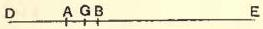
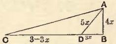
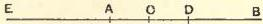
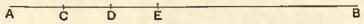
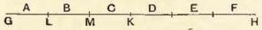
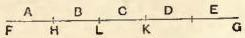
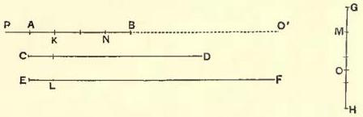
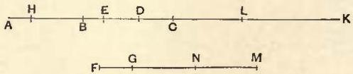

# THE ARITHMETICA

# BOOK I

## PRELIMINARY

**Dedication.**

"Knowing, my most esteemed friend Dionysius, that you are anxious to learn how to investigate problems in numbers, I have tried, beginning from the foundations on which the science is built up, to set forth to you the nature and power subsisting in numbers.

"Perhaps the subject will appear rather difficult, inasmuch as it is not yet familiar (beginners are, as a rule, too ready to despair of success); but you, with the impulse of your enthusiasm and the benefit of my teaching, will find it easy to master; for eagerness to learn, when seconded by instruction, ensures rapid progress."

After the remark that "all numbers are made up of some multitude of units, so that it is manifest that their formation is subject to no limit," Diophantus proceeds to define what he calls the different "species" of numbers, and to describe the abbreviative signs used to denote them. These "species" are, in the first place, the various powers of the unknown quantity from the second to the sixth inclusive, the unknown quantity itself, and units.

**Definitions.**

A square (= x²) is δύναμις ("power"), and its sign is a Δ with Y superposed, thus Δ^Y.

A cube (= x³) is κύβος, and its sign K^Y.

A square-square (= x⁴) is δυναμοδύναμις, and its sign is Δ^Y Δ.

A square-cube (= x⁵) is δυναμόκυβος, and its sign ΔK^Y.

A cube-cube (= x⁶) is κυβόκυβος, and its sign K^Y K.

"It is," Diophantus observes, "from the addition, subtraction or multiplication of these numbers or from the ratios which they bear to one another or to their own sides respectively that most arithmetical problems are formed"; and "each of these numbers... is recognised as an element in arithmetical inquiry."

"But the number which has none of these characteristics, but merely has in it an indeterminate multitude of units (πληθος μονάδων ἄοριστον) is called ἀριθμός, 'number,' and its sign is ς [= x]."

"And there is also another sign denoting that which is invariable in determinate numbers, namely the unit, the sign being M with o superposed, thus M̅."

Next follow the definitions of the reciprocals, the names of which are derived from the names of the corresponding species themselves.

Thus

from ἀριθμός [x] we derive the term ἀριθμοστόν [= 1/x]

,, δύναμις [x²] ,, ,, δυναμοστόν [= 1/x²]
,, κύβος [x³] ,, ,, κυβοστόν [= 1/x³]
,, δυναμοδύναμις [x⁴] ,, ,, δυναμοδυναμοστόν [= 1/x⁴]
,, δυναμόκυβος [x⁵] ,, ,, δυναμοκυβοστόν [= 1/x⁵]
,, κυβόκυβος [x⁶] ,, ,, κυβοκυβοστόν [= 1/x⁶],

and each of these has the same sign as the corresponding original species, but with a distinguishing mark, 𝒳, above the line to the right.

Thus Δʳⁱˣ = 1/x², just as γˣ = 1/3.

Sign of Subtraction (minus).

"A minus multiplied by a minus makes a plus; a minus multiplied by a plus makes a minus; and the sign of a minus is a truncated Ψ turned upside down, thus Λ."

Diophantus proceeds: "It is well that one who is beginning this study should have acquired practice in the addition, subtraction and multiplication of the various species. He should know how to add positive and negative terms with different coefficients to other terms, themselves either positive or likewise partly positive and partly negative, and how to subtract from a combination of positive and negative terms other terms either positive or likewise partly positive and partly negative.

"Next, if a problem leads to an equation in which certain terms are equal to terms of the same species but with different coefficients, it will be necessary to subtract like from like on both sides, until one term is found equal to one term. If by chance there are on either side or on both sides any negative terms, it will be necessary to add the negative terms on both sides, until the terms on both sides are positive, and then again to subtract like from like until one term only is left on each side.

"This should be the object aimed at in framing the hypotheses of propositions, that is to say, to reduce the equations, if possible, until one term is left equal to one term; but I will show you later how, in the case also where two terms are left equal to one term, such a problem is solved."

Diophantus concludes by explaining that, in arranging the mass of material at his disposal, he tried to distinguish, so far as possible, the different types of problems, and, especially in the elementary portion at the beginning, to make the more simple lead up to the more complex, in due order, such an arrangement being calculated to make the beginner's course easier and to fix what he learns in his memory. The treatise, he adds, has been divided into thirteen Books.

## PROBLEMS

## 1. To divide a given number into two having a given difference.

Given number 100, given difference 40.

Lesser number required x. Therefore

$$2x + 40 = 100,$$

$$x = 30.$$

The required numbers are 70, 30.

## 2. To divide a given number into two having a given ratio.

Given number 60, given ratio 3 : 1.

Two numbers x, 3x. Therefore x = 15.

The numbers are 45, 15.

## 3. To divide a given number into two numbers such that one is a given ratio of the other plus a given difference.

Given number 80, ratio 3 : 1, difference 4.

Lesser number x. Therefore the larger is 3x + 4, and

4x + 4 = 80, so that x = 19.

The numbers are 61, 19.

## 4. To find two numbers in a given ratio and such that their difference is also given.

Given ratio 5 : 1, given difference 20.

Numbers 5x, x. Therefore 4x = 20, x = 5, and

the numbers are 25, 5.

## 5. To divide a given number into two numbers such that given fractions (not the same) of each number when added together produce a given number.

Necessary condition. The latter given number must be such that it lies between the numbers arising when the given fractions respectively are taken of the first given number.

First given number 100, given fractions ⅛ and ⅛, given sum of fractions 30.

Second part 5x. Therefore first part = 3 (30 - x).

Hence 90 + 2x = 100, and x = 5.

The required parts are 75, 25.

## 6. To divide a given number into two numbers such that a given fraction of the first exceeds a given fraction of the other by a given number.

Necessary condition. The latter number must be less than that which arises when that fraction of the first number is taken which exceeds the other fraction.

Given number 100, given fractions ¼ and ⅛ respectively, given excess 20.

Second part 6x. Therefore the first part is 4 (x + 20).

Hence 10x + 80 = 100, x = 2, and

the parts are 88, 12.

## 7. From the same (required) number to subtract two given numbers so as to make the remainders have to one another a given ratio.

Given numbers 100, 20, given ratio 3 : 1.

Required number x. Therefore x - 20 = 3 (x - 100), and x = 140.

## 8. To two given numbers to add the same (required) number so as to make the resulting numbers have to one another a given ratio.

Necessary condition. The given ratio must be less than the ratio which the greater of the given numbers has to the lesser.

Given numbers 100, 20, given ratio 3 : 1.

Required number x. Therefore 3x + 60 = x + 100, and

x = 20.

## 9. From two given numbers to subtract the same (required) number so as to make the remainders have to one another a given ratio.

Necessary condition. The given ratio must be greater than the ratio which the greater of the given numbers has to the lesser.

Given numbers 20, 100, given ratio 6 : 1.

Required number x. Therefore 120 - 6x = 100 - x, and x = 4.

## 10. Given two numbers, to add to the lesser and to subtract from the greater the same (required) number so as to make the sum in the first case have to the difference in the second case a given ratio.

Given numbers 20, 100, given ratio 4 : 1.

Required number x. Therefore (20 + x) = 4 (100 - x), and x = 76.

## 11. Given two numbers, to add the first to, and subtract the second from, the same (required) number, so as to make the resulting numbers have to one another a given ratio.

Given numbers 20, 100, given ratio 3 : 1.

Required number x. Therefore 3x - 300 = x + 20, and x = 160.

## 12. To divide a given number twice into two numbers such that the first of the first pair may have to the first of the second pair a given ratio, and also the second of the second pair to the second of the first pair another given ratio.

Given number 100, ratio of greater of first parts to lesser of second 2 : 1, and ratio of greater of second parts to lesser of first parts 3 : 1.

x lesser of second parts.

The parts then are

$$\left. \begin{array}{c} 2x \\ 100 - 2x \end{array} \right\} \text{ and } \left. \begin{array}{c} 300 - 6x \\ x \end{array} \right\}.$$

Therefore 300 - 5x = 100, x = 40, and the parts are (80, 20), (60, 40).

## 13. To divide a given number thrice into two numbers such that one of the first pair has to one of the second pair a given ratio, the second of the second pair to one of the third pair another given ratio, and the second of the third pair to the second of the first pair another given ratio.

Given number 100, ratio of greater of first parts to lesser of second 3 : 1, of greater of second to lesser of third 2 : 1, and of greater of third to lesser of first 4 : 1.

x lesser of third parts.

Therefore greater of second parts = 2x, lesser of second = 100 - 2x, greater of first = 300 - 6x.

Hence lesser of first = 6x - 200, so that greater of third = 24x - 800.

Therefore 25x - 800 = 100, x = 36, and the respective divisions are (84, 16), (72, 28), (64, 36).

## 14. To find two numbers such that their product has to their sum a given ratio. [One is arbitrarily assumed.]

Necessary condition. The assumed value of one of the two must be greater than the number representing the ratio.

Ratio 3 : 1, x one of the numbers, 12 the other (> 3).

Therefore 12x = 3x + 36, x = 4, and the numbers are 4, 12.

## 15. To find two numbers such that each after receiving from the other a given number may bear to the remainder a given ratio.

Let the first receive 30 from the second, the ratio being then 2 : 1, and the second 50 from the first, the ratio being then 3 : 1; take x + 30 for the second.

Therefore the first = 2x - 30, and

$$(x + 80) = 3 (2x - 80).$$

Thus x = 64, and

the numbers are 98, 94.

## 16. To find three numbers such that the sums of pairs are given numbers.

Necessary condition. Half the sum of the three given numbers must be greater than any one of them singly.

Let (1) + (2) = 20, (2) + (3) = 30, (3) + (1) = 40.

x the sum of the three. Therefore the numbers are

$$x - 30, \quad x - 40, \quad x - 20.$$

The sum x = 3x - 90, and x = 45.

The numbers are 15, 5, 25.

## 17. To find four numbers such that the sums of all sets of three are given numbers.

Necessary condition. One-third of the sum of the four must be greater than any one singly.

Sums of threes 22, 24, 27, 20 respectively.

x the sum of all four. Therefore the numbers are

$$x - 22, \quad x - 24, \quad x - 27, \quad x - 20.$$

Therefore 4x - 93 = x, x = 31, and

the numbers are 9, 7, 4, 11.

## 18. To find three numbers such that the sum of any pair exceeds the third by a given number.

Given excesses 20, 30, 40.

2x the sum of all three.

We have (1) + (2) = (3) + 20.

Adding (3) to each side, we have: twice (3) + 20 = 2x, and (3) = x - 10.

Similarly the numbers (1) and (2) are x - 15, x - 20 respectively.

Therefore 3x - 45 = 2x, x = 45, and

the numbers are 30, 25, 35.

[Otherwise thus. As before, if the third number (3) is x,

$$(1) + (2) = x + 20.$$

Next, if we add the equations

$$\left. \begin{array}{l} (1) + (2) - (3) = 20 \\ (2) + (3) - (1) = 30 \end{array} \right\},$$

we have (2) = ½ (20 + 30) = 25.
Hence (1) = x - 5.
Lastly (3) + (1) - (2) = 40,
or 2x - 5 - 25 = 40.
Therefore x = 35.

The numbers are 30, 25, 35.]

## 19. To find four numbers such that the sum of any three exceeds the fourth by a given number.

Necessary condition. Half the sum of the four given differences must be greater than any one of them.

Given differences 20, 30, 40, 50.

2x the sum of the required numbers. Therefore the numbers are

x - 15, x - 20, x - 25, x - 10.

Therefore 4x - 70 = 2x, and x = 35.

The numbers are 20, 15, 10, 25.

[Otherwise thus. If the fourth number (4) is x,

(1) + (2) + (3) = x + 20.

Put (2) + (3) equal to half the sum of the two excesses 20 and 30, i.e. 25 [this is equivalent to adding the two equations

(1) + (2) + (3) - (4) = 20,

(2) + (3) + (4) - (1) = 30].

It follows by subtraction that (1) = x - 5.

Next we add the equations beginning with (2) and (3) respectively, and we obtain

(3) + (4) = ½ (30 + 40) = 35,

so that (3) = 35 - x.

It follows that (2) = x - 10.

Lastly, since (4) + (1) + (2) - (3) = 50,

3x - 15 - (35 - x) = 50, and x = 25.

The numbers are accordingly 20, 15, 10, 25.]

## 20. To divide a given number into three numbers such that the sum of each extreme and the mean has to the other extreme a given ratio.

Given number 100; and let $(1) + (2) = 3.(3)$ and $(2) + (3) = 4.(1)$.

$x$ the third number. Thus the sum of the first and second $= 3x$, and the sum of the three $= 4x = 100$.

Hence $x = 25$, and the sum of the first two $= 75$.

Let $y$ be the first. Therefore sum of second and third $= 4y$, $5y = 100$ and $y = 20$.

The required parts are 20, 55, 25.

## 21. To find three numbers such that the greatest exceeds the middle number by a given fraction of the least, the middle exceeds the least by a given fraction of the greatest, but the least exceeds a given fraction of the middle number by a given number.

Necessary condition. The middle number must exceed the least by such a fraction of the greatest that, if its denominator be multiplied into the excess of the middle number over the least, the coefficient of $x$ in the product is greater than the coefficient of $x$ in the expression for the middle number resulting from the assumptions made.

Suppose greatest exceeds middle by $\frac{1}{3}$ of least, middle exceeds least by $\frac{1}{3}$ of greatest, and least exceeds $\frac{1}{3}$ of middle by 10. [Diophantus assumes the three given fractions or submultiples to be one and the same.]

$x + 10$ the least. Therefore middle $= 3x$, and greatest $= 6x - 30$.

Hence, lastly, $6x - 30 - 3x = \frac{1}{3}(x + 10)$,

or $x + 10 = 9x - 90$, and $x = 12\frac{1}{2}$.

The numbers are 45, $37\frac{1}{2}$, $22\frac{1}{2}$.

[Another solution.

Necessary condition. The given fraction of the greatest must be such that, when it is added to the least, the coefficient of x in the sum is less than the coefficient of x in the expression for the middle number resulting from the assumptions made.

Let the least number be x + 10, as before, and the given fraction ⅓; the middle number is therefore 3x.

Next, greatest = middle + ⅓ (least) = 3⅓x + 3⅓.

Lastly, 3x = x + 10 + ⅓ (3⅓x + 3⅓)

= 2⅓x + 11⅓.

Therefore x = 12½, and

the numbers are, as before, 45, 37½, 22½.]

## 22. To find three numbers such that, if each give to the next following a given fraction of itself, in order, the results after each has given and taken may be equal.

Let first give ⅓ of itself to second, second ¼ of itself to third, third ⅕ of itself to first.

Assume first to be a number of x's divisible by 3, say 3x, and second to be a number of units divisible by 4, say 4.

Therefore second after giving and taking becomes x + 3.

Hence the first also after giving and taking must become x + 3; it must therefore have taken x + 3 - 2x, or 3 - x; 3 - x must therefore be ⅕ of third, or third = 15 - 5x.

Lastly, 15 - 5x - (3 - x) + 1 = x + 3,

or 13 - 4x = x + 3, and x = 2.

The numbers are 6, 4, 5.

## 23. To find four numbers such that, if each give to the next following a given fraction of itself, the results may all be equal.

Let first give ⅓ of itself to second, second ¼ of itself to third, third ⅕ of itself to fourth, and fourth ⅕ of itself to first.

Assume first to be a number of x's divisible by 3, say 3x, and second to be a number of units divisible by 4, say 4.

The second after giving and taking becomes $x + 3$.

Therefore first after giving $x$ to second and receiving $\frac{1}{6}$ of fourth $= x + 3$; therefore fourth

$$= 6(x + 3 - 2x) = 18 - 6x.$$

But fourth after giving $3 - x$ to first and receiving $\frac{1}{6}$ of third $= x + 3$; therefore third $= 30x - 60$.

Lastly, third after giving $6x - 12$ to fourth and receiving 1 from second $= x + 3$.

That is, $24x - 47 = x + 3$, and $x = \frac{50}{23}$.

The numbers are therefore $\frac{150}{23}$, 4, $\frac{120}{23}$, $\frac{114}{23}$; or, after multiplying by the common denominator, 150, 92, 120, 114.

## 24. To find three numbers such that, if each receives a given fraction of the sum of the other two, the results are all equal.

Let first receive $\frac{1}{3}$ of (second + third), second $\frac{1}{4}$ of (third + first), and third $\frac{1}{5}$ of (first + second).

Assume first $= x$, and for convenience' sake ($\tau\upsilon\bar{\upsilon}\pi\rho\upsilon\chi\epsilon\acute{\iota}\rho\upsilon\bar{\upsilon}\epsilon\kappa\epsilon\nu$) take for sum of second and third a number of units divisible by 3, say 3.

Then sum of the three $= x + 3$,

and first $+ \frac{1}{3}$ (second + third) $= x + 1$.

Therefore second $+ \frac{1}{4}$ (third + first) $= x + 1$;

hence 3 times second + sum of all $= 4x + 4$,

and therefore second $= x + \frac{1}{3}$.

Lastly, third $+ \frac{1}{6}$ (first + second) $= x + 1$,

or 4 times third + sum of all $= 5x + 5$,

and third $= x + \frac{1}{2}$.

Therefore $x + (x + \frac{1}{3}) + (x + \frac{1}{2}) = x + 3$,

and $x = \frac{13}{12}$.

The numbers, after multiplying by the common denominator, are 13, 17, 19.

## 25. To find four numbers such that, if each receives a given fraction of the sum of the remaining three, the four results are equal.

Let first receive $\frac{1}{3}$ of the rest, second $\frac{1}{4}$ of the rest, third $\frac{1}{5}$ of rest, and fourth $\frac{1}{6}$ of rest.

Assume first to be $x$ and sum of rest a number of units divisible by 3, say 3.

Then sum of all $= x + 3$.

Now first $+ \frac{1}{6}$ (second + third + fourth) $= x + 1$.

Therefore second + ¼ (third + fourth + first) = x + 1,

whence 3 times second + sum of all = 4x + 4,

and therefore second = x + ⅓.

Similarly third = x + ½,

and fourth = x + ⅗.

Adding, we have 4x + ⁴⁹⁄₃₀ = x + 3,

and x = ⁴⁷⁄₃₀.

The numbers, after multiplying by a common denominator, are 47, 77, 92, 101.

## 26. Given two numbers, to find a third number which, when multiplied into the given numbers respectively, makes one product a square and the other the side of that square.

Given numbers 200, 5; required number x.

Therefore 200x = (5x)², and

x = 8.

## 27. To find two numbers such that their sum and product are given numbers.

Necessary condition. The square of half the sum must exceed the product by a square number. ἔστι δὲ τοῦτο πλασματικόν.

Given sum 20, given product 96.

2x the difference of the required numbers.

Therefore the numbers are 10 + x, 10 - x.

Hence 100 - x² = 96.

Therefore x = 2, and

the required numbers are 12, 8.

## 28. To find two numbers such that their sum and the sum of their squares are given numbers.

Necessary condition. Double the sum of their squares must exceed the square of their sum by a square. ἔστι δὲ καὶ τοῦτο πλασματικόν.

Given sum 20, given sum of squares 208.

Difference 2x.

Therefore the numbers are 10+x, 10-x.

Thus 200+2x²=208, and x=2.

The required numbers are 12, 8.

## 29. To find two numbers such that their sum and the difference of their squares are given numbers.

Given sum 20, given difference of squares 80.

Difference 2x.

The numbers are therefore 10+x, 10-x.

Hence (10+x)²-(10-x)²=80,

or 40x=80, and x=2.

The required numbers are 12, 8.

## 30. To find two numbers such that their difference and product are given numbers.

Necessary condition. Four times the product together with the square of the difference must give a square. ἔστι δὲ καὶ τοῦτο πλασματικόν.

Given difference 4, given product 96.

2x the sum of the required numbers.

Therefore the numbers are x+2, x-2; accordingly

x²-4=96, and x=10.

The required numbers are 12, 8.

## 31. To find two numbers in a given ratio and such that the sum of their squares also has to their sum a given ratio.

Given ratios 3:1 and 5:1 respectively.

Lesser number x.

Therefore 10x²=5.4x, whence x=2, and

the numbers are 2, 6.

## 32. To find two numbers in a given ratio and such that the sum of their squares also has to their difference a given ratio.

Given ratios 3:1 and 10:1.

Lesser number x, which is then found from the equation

10x²=10.2x.

Hence x=2, and

the numbers are 2, 6.

## 33. To find two numbers in a given ratio and such that the difference of their squares also has to their sum a given ratio.

Given ratios 3 : 1 and 6 : 1.

Lesser number x, which is found to be 3.

The numbers are 3, 9.

## 34. To find two numbers in a given ratio and such that the difference of their squares also has to their difference a given ratio.

Given ratios 3 : 1 and 12 : 1.

Lesser number x, which is found to be 3.

The numbers are 3, 9.

Similarly by the same method can be found two numbers in a given ratio and (1) such that their product is to their sum in a given ratio, or (2) such that their product is to their difference in a given ratio.

## 35. To find two numbers in a given ratio and such that the square of the lesser also has to the greater a given ratio.

Given ratios 3 : 1 and 6 : 1 respectively.

Lesser number x, which is found to be 18.

The numbers are 18, 54.

## 36. To find two numbers in a given ratio and such that the square of the lesser also has to the lesser itself a given ratio.

Given ratios 3 : 1 and 6 : 1.

Lesser number x, which is found to be 6.

The numbers are 6, 18.

## 37. To find two numbers in a given ratio and such that the square of the lesser also has to the sum of both a given ratio.

Given ratios 3 : 1 and 2 : 1.

Lesser number x, which is found to be 8.

The numbers are 8, 24.

## 38. To find two numbers in a given ratio and such that the square of the lesser also has to the difference between them a given ratio.

Given ratios 3 : 1 and 6 : 1.

Lesser number x, which is found to be 12.

The numbers are 12, 36.

Similarly can be found two numbers in a given ratio and

(1) such that the square of the greater also has to the lesser a given ratio, or
(2) such that the square of the greater also has to the greater itself a given ratio, or
(3) such that the square of the greater also has to the sum or difference of the two a given ratio.

## 39. Given two numbers, to find a third such that the sums of the several pairs multiplied by the corresponding third number give three numbers in arithmetical progression.

Given numbers 3, 5.

Required number x.

The three products are therefore 3x + 15, 5x + 15, 8x.

Now 3x + 15 must be either the middle or the least of the three, and 5x + 15 either the greatest or the middle.

(1) 5x + 15 greatest, 3x + 15 least.

Therefore 5x + 15 + 3x + 15 = 2.8x, and

$$x = \frac{15}{4}.$$

(2) 5x + 15 greatest, 3x + 15 middle.

Therefore (5x + 15) - (3x + 15) = 3x + 15 - 8x, and

$$x = \frac{15}{7}.$$

(3) 8x greatest, 3x + 15 least.

Therefore 8x + 3x + 15 = 2(5x + 15), and

$$x = 15.$$

# BOOK II

[The first five problems of this Book are mere repetitions of problems in Book I. They probably found their way into the text from some ancient commentary. In each case the ratio of one required number to the other is assumed to be 2 : 1. The enunciations only are here given.]

## 1. To find two numbers such that their sum is to the sum of their squares in a given ratio [cf. I. 31].

## 2. To find two numbers such that their difference is to the difference of their squares in a given ratio [cf. I. 34].

## 3. To find two numbers such that their product is to their sum or their difference in a given ratio [cf. I. 34].

## 4. To find two numbers such that the sum of their squares is to their difference in a given ratio [cf. I. 32].

## 5. To find two numbers such that the difference of their squares is to their sum in a given ratio [cf. I. 33].

## 6. To find two numbers having a given difference and such that the difference of their squares exceeds their difference by a given number.

Necessary condition. The square of their difference must be less than the sum of the said difference and the given excess of the difference of the squares over the difference of the numbers.

Difference of numbers 2, the other given number 20.

Lesser number x. Therefore x + 2 is the greater, and

$$4x + 4 = 22.$$

Therefore x = 4½, and

the numbers are 4½, 6½.

## 7. To find two numbers such that the difference of their squares is greater by a given number than a given ratio of their difference. [Difference assumed.]

Necessary condition. The given ratio being 3:1, the square of the difference of the numbers must be less than the sum of three times that difference and the given number.

Given number 10, difference of required numbers 2.

Lesser number x. Therefore the greater is x + 2, and

$$4x + 4 = 3 \cdot 2 + 10.$$

Therefore x = 3, and

the numbers are 3, 5.

## 8. To divide a given square number into two squares.

Given square number 16.

$x^2$ one of the required squares. Therefore $16 - x^2$ must be equal to a square.

Take a square of the form $(mx - 4)^2$, $m$ being any integer and 4 the number which is the square root of 16, e.g. take $(2x - 4)^2$, and equate it to $16 - x^2$.

Therefore $4x^2 - 16x + 16 = 16 - x^2$,

or $5x^2 = 16x$, and $x = \frac{16}{5}$.

The required squares are therefore $\frac{256}{25}$, $\frac{144}{25}$.

## 9. To divide a given number which is the sum of two squares into two other squares.

Given number $13 = 2^2 + 3^2$.

As the roots of these squares are 2, 3, take $(x + 2)^2$ as the first square and $(mx - 3)^2$ as the second (where $m$ is an integer), say $(2x - 3)^2$.

Therefore $(x^2 + 4x + 4) + (4x^2 + 9 - 12x) = 13$,

or $5x^2 + 13 - 8x = 13$.

Therefore $x = \frac{8}{5}$, and

the required squares are $\frac{324}{25}$, $\frac{1}{25}$.

## 10. To find two square numbers having a given difference.

Given difference 60.

Side of one number $x$, side of the other $x$ plus any number the square of which is not greater than 60, say 3.

Therefore $(x + 3)^2 - x^2 = 60$;

$x = 8\frac{1}{2}$, and

the required squares are $72\frac{1}{4}$, $132\frac{1}{4}$.

## 11. To add the same (required) number to two given numbers so as to make each of them a square.

(1) Given numbers 2, 3; required number $x$.

Therefore $\left. \begin{array}{l} x + 2 \\ x + 3 \end{array} \right\}$ must both be squares.

This is called a double-equation ($\delta\iota\pi\lambda\circ\iota\acute{\sigma}\acute{o}\tau\eta\varsigma$).

To solve it, take the difference between the two expressions and resolve it into two factors; in this case let us say 4, $\frac{1}{4}$.

Then take either

(a) the square of half the difference between these factors and equate it to the lesser expression,

or (b) the square of half the sum and equate it to the greater.

In this case (a) the square of half the difference is $\frac{225}{64}$.

Therefore $x + 2 = \frac{225}{64}$, and $x = \frac{97}{64}$, the squares being $\frac{225}{64}, \frac{289}{64}$.

Taking (b) the square of half the sum, we have $x + 3 = \frac{289}{64}$, which gives the same result.

(2) To avoid a double-equation,

first find a number which when added to 2, or to 3, gives a square.

Take e.g. the number $x^2 - 2$, which when added to 2 gives a square.

Therefore, since this same number added to 3 gives a square,

$$x^2 + 1 = \text{a square} = (x - 4)^2, \text{ say,}$$

the number of units in the expression (in this case 4) being so taken that the solution may give $x^2 > 2$.

Therefore $x = \frac{15}{8}$, and

the required number is $\frac{97}{64}$, as before.

## 12. To subtract the same (required) number from two given numbers so as to make both remainders squares.

Given numbers 9, 21.

Assuming $9 - x^2$ as the required number, we satisfy one condition, and the other requires that $12 + x^2$ shall be a square.

Assume as the side of this square $x$ minus some number the square of which $> 12$, say 4.

Therefore $(x - 4)^2 = 12 + x^2$,

and $x = \frac{1}{2}$.

The required number is then $8\frac{3}{4}$.

[Diophantus does not reduce to lowest terms, but says $x = \frac{4}{8}$ and then subtracts $\frac{16}{64}$ from 9 or $\frac{576}{64}$.]

## 13. From the same (required) number to subtract two given numbers so as to make both remainders squares.

Given numbers 6, 7.

(1) Let $x$ be the required number.

Therefore $\left. \begin{array}{l} x - 6 \\ x - 7 \end{array} \right\}$ are both squares.

The difference is 1, which is the product of, say, 2 and $\frac{1}{2}$; and, by the rule for solving a double equation,

$$x - 7 = \frac{9}{16}, \text{ and } x = \frac{121}{16}.$$

(2) To avoid a double-equation, seek a number which exceeds a square by 6, say $x^2 + 6$.

Therefore $x^2 - 1$ must also be a square $= (x - 2)^2$, say.

Therefore $x = \frac{5}{4}$, and

the required number is $\frac{121}{16}$.

## 14. To divide a given number into two parts and to find a square which when added to each of the two parts gives a square number.

Given number 20.

Take two numbers such that the sum of their squares $< 20$, say 2, 3.

Add $x$ to each and square.

We then have

$$\left. \begin{array}{l} x^2 + 4x + 4 \\ x^2 + 6x + 9 \end{array} \right\},$$

and, if $\left. \begin{array}{l} 4x + 4 \\ 6x + 9 \end{array} \right\}$ are respectively subtracted, the remainders are the same square.

Let then $x^2$ be the required square, and we have only to make $\left. \begin{array}{l} 4x + 4 \\ 6x + 9 \end{array} \right\}$ the required parts of 20.

Thus $10x + 13 = 20,$

and $x = \frac{7}{10}.$

The required parts are then $\left( \frac{68}{10}, \frac{132}{10} \right)$, and

the required square is $\frac{49}{100}$.

## 15. To divide a given number into two parts and to find a square which, when each part is respectively subtracted from it, gives a square.

Given number 20.

Take $(x + m)^2$ for the required square, where $m^2$ is not greater than 20,

e.g. take $(x + 2)^2$.

This leaves a square if either $4x + 4$ or $2x + 3$ is subtracted.

Let these then be the parts of 20.

Therefore $6x + 7 = 20$, and $x = \frac{13}{6}$.

The required parts are therefore $\left(\frac{76}{6}, \frac{44}{6}\right)$, and the required square is $\frac{625}{36}$.

## 16. To find two numbers in a given ratio and such that each when added to an assigned square gives a square.

Given square 9, given ratio 3 : 1.

If we take a square of side $(mx + 3)$ and subtract 9 from it, the remainder may be taken as one of the numbers required.

Take, e.g., $(x + 3)^2 - 9$, or $x^2 + 6x$, for the lesser number.

Therefore $3x^2 + 18x$ is the greater number, and $3x^2 + 18x + 9$ must be made a square $= (2x - 3)^2$, say.

Therefore $x = 30$, and the required numbers are 1080, 3240.

## 17. To find three numbers such that, if each give to the next following a given fraction of itself and a given number besides, the results after each has given and taken may be equal.

First gives to second $\frac{1}{8}$ of itself $+ 6$, second to third $\frac{1}{8}$ of itself $+ 7$, third to first $\frac{1}{7}$ of itself $+ 8$.

Let first and second be $5x, 6x$ respectively.

When second has taken $x + 6$ from first it becomes $7x + 6$, and when it has given $x + 7$ to third it becomes $6x - 1$.

But first when it has given $x + 6$ to second becomes $4x - 6$; and this too when it has taken $\frac{1}{7}$ of third $+ 8$ must become $6x - 1$.

Therefore $\frac{1}{7}$ of third $+ 8 = 2x + 5$, and

third $= 14x - 21$.

Next, third after receiving $\frac{1}{8}$ of second $+ 7$ and giving $\frac{1}{7}$ of itself $+ 8$ must become $6x - 1$.

Therefore $13x - 19 = 6x - 1$, and $x = \frac{18}{7}$.

The required numbers are $\frac{90}{7}, \frac{108}{7}, \frac{105}{7}$.

## 18. To divide a given number into three parts satisfying the conditions of the preceding problem.

Given number 80.

Let first give to second ⅙ of itself + 6, second to third ⅙ of itself + 7, and third to first ⅙ of itself + 8.

[What follows in the text is not a solution of the problem but an alternative solution of the preceding. The first two numbers are assumed to be 5x and 12, and the numbers found are 170/19, 228/19, 217/19.]

## 19. To find three squares such that the difference between the greatest and the middle has to the difference between the middle and the least a given ratio.

Given ratio 3 : 1.

Assume the least square = x², the middle = x² + 2x + 1.

Therefore the greatest = x² + 8x + 4 = square = (x + 3)², say.

Thus x = 2½, and

the squares are 30¼, 12¼, 6¼.

## 20. To find two numbers such that the square of either added to the other gives a square.

Assume for the numbers $x, 2x + 1$, which by their form satisfy one condition.

The other condition gives

$$4x^2 + 5x + 1 = \text{square} = (2x - 2)^2, \text{ say.}$$

Therefore $x = \frac{3}{13}$, and

the numbers are $\frac{3}{13}, \frac{19}{13}$.

## 21. To find two numbers such that the square of either *minus* the other number gives a square.

$x + 1, 2x + 1$ are assumed, satisfying one condition.

The other condition gives

$$4x^2 + 3x = \text{square} = 9x^2, \text{ say.}$$

Therefore $x = \frac{3}{5}$, and

the numbers are $\frac{8}{5}, \frac{11}{5}$.

## 22. To find two numbers such that the square of either added to the sum of both gives a square.

Assume $x, x + 1$ for the numbers. Thus one condition is satisfied.

It remains that

$$x^2 + 4x + 2 = \text{square} = (x - 2)^2, \text{ say.}$$

Therefore $x = \frac{1}{4}$, and

the numbers are $\frac{1}{4}, \frac{5}{4}$.

[Diophantus has $\frac{2}{8}, \frac{10}{8}$.]

## 23. To find two numbers such that the square of either *minus* the sum of both gives a square.

Assume $x, x + 1$ for the numbers, thus satisfying one condition.

Then $x^2 - 2x - 1 = \text{square} = (x - 3)^2$, say.

Therefore $x = 2\frac{1}{2}$, and

the numbers are $2\frac{1}{2}, 3\frac{1}{2}$.

and that

$$y^2 + x = (q - y)^2 = q^2 - 2qy + y^2.$$

## 24. To find two numbers such that either added to the square of their sum gives a square.

Since $x^2 + 3x^2$, $x^2 + 8x^2$ are both squares, let the numbers be $3x^2, 8x^2$ and their sum $x$.

Therefore $121x^4 = x^2$, whence $11x^2 = x$, and $x = \frac{1}{11}$.

The numbers are therefore $\frac{3}{121}, \frac{8}{121}$.

## 25. To find two numbers such that the square of their sum minus either number gives a square.

If we subtract 7 or 12 from 16, we get a square.

Assume then $12x^2, 7x^2$ for the numbers, and $16x^2$ for the square of their sum.

Hence $19x^2 = 4x$, and $x = \frac{4}{19}$.

The numbers are $\frac{192}{361}, \frac{112}{361}$.

## 26. To find two numbers such that their product added to either gives a square, and the sides of the two squares added together produce a given number.

Let the given number be 6.

Since $x(4x - 1) + x$ is a square, let $x, 4x - 1$ be the numbers.

Therefore $4x^2 + 3x - 1$ is a square, and the side of this square must be $6 - 2x$ [since $2x$ is the side of the first square and the sum of the sides of the square is 6].

Since $4x^2 + 3x - 1 = (6 - 2x)^2$,

we have $x = \frac{37}{27}$, and

the numbers are $\frac{37}{27}, \frac{121}{27}$.

## 27. To find two numbers such that their product minus either gives a square, and the sides of the two squares so arising when added together produce a given number.

Let the given number be 5.

Assume $4x + 1, x$ for the numbers, so that one condition is satisfied.

Also $4x^2 - 3x - 1 = (5 - 2x)^2$.

Therefore $x = \frac{26}{17}$, and

the numbers are $\frac{26}{17}, \frac{121}{17}$.

## 28. To find two square numbers such that their product added to either gives a square.

Let the numbers be x², y².

Therefore {x²y² + y²} {x²y² + x²} are both squares.

To make the first expression a square we make x² + 1 a square, putting

$$x^2 + 1 = (x - 2)^2, \text{ say.}$$

Therefore x = 3/4, and x² = 9/16.

We have now to make 9/16(y² + 1) a square [and y must be different from x].

Put 9y² + 9 = (3y - 4)², say,

and y = 7/24.

Therefore the numbers are 9/16, 49/576.

## 29. To find two square numbers such that their product minus either gives a square.

Let x², y² be the numbers.

Then {x²y² - y²} {x²y² - x²} are both squares.

A solution of x² - 1 = (a square) is x² = 25/16.

We have now to solve

$$\frac{25}{16}y^2 - \frac{25}{16} = \text{a square.}$$

Put y² - 1 = (y - 4)², say.

Therefore y = 17/8, and

the numbers are 289/64, 100/64.

## 30. To find two numbers such that their product ± their sum gives a square.

Now m² + n² ± 2mn is a square.

Put 2, 3, say, for m, n respectively, and of course

$$2^2 + 3^2 \pm 2 \cdot 2 \cdot 3 \text{ is a square.}$$

Assume then product of numbers = (2² + 3²)x² or 13x², and sum = 2.2.3x² or 12x².

The product being 13x², let x, 13x be the numbers.

Therefore their sum 14x = 12x², and x = 7/6.

The numbers are therefore 7/6, 91/6.

## 31. To find two numbers such that their sum is a square and their product ± their sum gives a square.

$2 \cdot 2m \cdot m = \text{a square, and } (2m)^2 + m^2 \pm 2 \cdot 2m \cdot m = \text{a square.}$

If $m = 2$, $4^2 + 2^2 \pm 2 \cdot 4 \cdot 2 = 36$ or $4$.

Let then the product of the numbers be $(4^2 + 2^2)x^2$ or $20x^2$, and their sum $2 \cdot 4 \cdot 2x^2$ or $16x^2$, and take $2x$, $10x$ for the numbers.

Then $12x = 16x^2$, and $x = \frac{3}{4}$.

The numbers are $\frac{6}{4}$, $\frac{30}{4}$.

## 32. To find three numbers such that the square of any one of them added to the next following gives a square.

Let the first be $x$, the second $2x + 1$, and the third $2(2x + 1) + 1$ or $4x + 3$, so that two conditions are satisfied.

The last condition gives $(4x + 3)^2 + x = \text{square} = (4x - 4)^2$, say.

Therefore $x = \frac{7}{57}$, and

the numbers are $\frac{7}{57}$, $\frac{71}{57}$, $\frac{199}{57}$.

## 33. To find three numbers such that the square of any one of them *minus* the next following gives a square.

Assume $x + 1$, $2x + 1$, $4x + 1$ for the numbers, so that two conditions are satisfied.

Lastly, $16x^2 + 7x = \text{square} = 25x^2$, say,

and $x = \frac{7}{9}$.

The numbers are $\frac{16}{9}$, $\frac{23}{9}$, $\frac{37}{9}$.

## 34. To find three numbers such that the square of any one added to the sum of all three gives a square.

$\{\frac{1}{2}(m - n)\}^2 + mn$ is a square. Take a number separable into two factors $(m, n)$ in three ways, say 12, which is the product of $(1, 12)$, $(2, 6)$ and $(3, 4)$.

The values then of $\frac{1}{2}(m - n)$ are $5\frac{1}{2}$, $2$, $\frac{1}{2}$.

Take $5\frac{1}{2}x$, $2x$, $\frac{1}{2}x$ for the numbers, and for their sum $12x^2$.

Therefore $8x = 12x^2$, and $x = \frac{2}{3}$.

The numbers are $\frac{11}{3}$, $\frac{4}{3}$, $\frac{1}{3}$.

[Diophantus says $\frac{4}{6}$, and $\frac{22}{6}$, $\frac{8}{6}$, $\frac{2}{6}$.]

## 35. To find three numbers such that the square of any one minus the sum of all three gives a square.

$\{\frac{1}{2}(m+n)\}^2 - mn$ is a square. Take, as before, a number divisible into factors in three ways, as 12.

Let then $6\frac{1}{2}x, 4x, 3\frac{1}{2}x$ be the numbers, and their sum $12x^2$.

Therefore $14x = 12x^2$, and $x = \frac{7}{6}$.

The numbers are $\frac{45\frac{1}{2}}{6}, \frac{28}{6}, \frac{24\frac{1}{2}}{6}$.

# BOOK III

## 1. To find three numbers such that, if the square of any one of them be subtracted from the sum of all three, the remainder is a square.

Take two squares $x^2, 4x^2$; the sum is $5x^2$.

If then we take $5x^2$ as the sum of the three numbers, and $x, 2x$ as two of them, we satisfy two conditions.

Next divide 5, which is the sum of two squares, into two other squares $\frac{4}{25}, \frac{121}{25}$ [II. 9], and assume $\frac{2}{5}x$ for the third number.

Therefore $x + 2x + \frac{2}{5}x = 5x^2$, and $x = \frac{17}{25}$.

The numbers are $\frac{17}{25}, \frac{34}{25}, \frac{34}{125}$.

[Diophantus writes $\frac{85}{125}$ for $x$ and $\frac{85}{125}, \frac{170}{125}, \frac{34}{125}$ for the numbers.]

## 2. To find three numbers such that the square of the sum of all three added to any one of them gives a square.

Let the square of the sum of all three be $x^2$, and the numbers $3x^2, 8x^2, 15x^2$.

Hence $26x^2 = x$, $x = \frac{1}{26}$, and

the numbers are $\frac{3}{676}, \frac{8}{676}, \frac{15}{676}$.

## 3. To find three numbers such that the square of the sum of all three minus any one of them gives a square.

Sum of all three $4x$, its square $16x^2$, the numbers $7x^2, 12x^2, 15x^2$.

Then $34x^2 = 4x$, $x = \frac{2}{17}$, and

the numbers are $\frac{28}{280}, \frac{48}{280}, \frac{60}{280}$.

## 4. To find three numbers such that, if the square of their sum be subtracted from any one of them, the remainder is a square.

Sum $x$, numbers $2x^2, 5x^2, 10x^2$.

Then $17x^2 = x$, $x = \frac{1}{17}$, and

the numbers are $\frac{2}{289}, \frac{5}{289}, \frac{10}{289}$.

## 5. To find three numbers such that their sum is a square and the sum of any pair exceeds the third by a square.

Let the sum of the three be $(x + 1)^2$; let first + second = third + 1, so that third = $\frac{1}{2}x^2 + x$; let second + third = first + $x^2$, so that first = $x + \frac{1}{2}$.

Therefore second = $\frac{1}{2}x^2 + \frac{1}{2}$.

It remains that first + third = second + a square.

Therefore $2x =$ square = 16, say, and $x = 8$.

The numbers are $8\frac{1}{2}, 32\frac{1}{2}, 40$.

Otherwise thus.

First find three squares such that their sum is a square.

Find e.g. what square number + 4 + 9 gives a square, that is, 36;

4, 36, 9 are therefore squares with the required property.

Next find three numbers such that the sum of each pair = the third + a given number; in this case suppose

first + second - third = 4,

second + third - first = 9,

third + first - second = 36.

This problem has already been solved [I. 18].

The numbers are respectively 20, $6\frac{1}{2}$, $22\frac{1}{2}$.

## 6. To find three numbers such that their sum is a square and the sum of any pair is a square.

Let the sum of all three be $x^2 + 2x + 1$, sum of first and second $x^2$, and therefore the third $2x + 1$; let sum of second and third be $(x - 1)^2$.

Therefore the first $= 4x$, and the second $= x^2 - 4x$.

But first + third = square,

that is, $6x + 1 = \text{square} = 121$, say.

Therefore $x = 20$, and

the numbers are 80, 320, 41.

[An alternative solution, obviously interpolated, is practically identical with the above except that it takes the square 36 as the value of $6x + 1$, so that $x = \frac{85}{6}$, and the numbers are $\frac{140}{6} = \frac{840}{36}, \frac{385}{36}, \frac{456}{36}$.]

## 7. To find three numbers in A.P. such that the sum of any pair gives a square.

First find three square numbers in A.P. and such that half their sum is greater than any one of them. Let $x^2, (x + 1)^2$ be the first and second of these; therefore the third is $x^2 + 4x + 2 = (x - 8)^2$, say.

Therefore $x = \frac{62}{20}$ or $\frac{31}{20}$;

and we may take as the numbers 961, 1681, 2401.

We have now to find three numbers such that the sums of pairs are the numbers just found.

The sum of the three $= \frac{5043}{2} = 2521\frac{1}{2}$, and

the three numbers are $120\frac{1}{2}, 840\frac{1}{2}, 1560\frac{1}{2}$.

## 8. Given one number, to find three others such that the sum of any pair of them added to the given number gives a square, and also the sum of the three added to the given number gives a square.

Given number 3.

Suppose first required number + second $= x^2 + 4x + 1$,

second + third $= x^2 + 6x + 6$,

sum of all three $= x^2 + 8x + 13$.

Therefore third $= 4x + 12$, second $= x^2 + 2x - 6$, first $= 2x + 7$.

Also first + third + 3 = a square,

that is, $6x + 22 = \text{square} = 100$, suppose.

Hence $x = 13$, and

the numbers are 33, 189, 64.

## 9. Given one number, to find three others such that the sum of any pair of them *minus* the given number gives a square, and also the sum of the three *minus* the given number gives a square.

Given number 3.

Suppose first of required numbers + second = $x^2 + 3$,

second + third = $x^2 + 2x + 4$,

sum of the three = $x^2 + 4x + 7$.

Therefore third = $4x + 4$, second = $x^2 - 2x$, first = $2x + 3$.

Lastly, first + third - 3 = $6x + 4$ = a square = 64, say.

Therefore $x = 10$, and

(23, 80, 44) is a solution.

## 10. To find three numbers such that the product of any pair of them added to a given number gives a square.

Let the given number be 12. Take a square (say 25) and subtract 12. Take the difference (13) for the product of the first and second numbers, and let these numbers be $13x, 1/x$ respectively.

Again subtract 12 from another square, say 16, and let the difference (4) be the product of the second and third numbers.

Therefore the third number = $4x$.

The third condition gives $52x^2 + 12$ = a square; now $52 = 4 \cdot 13$, and 13 is not a square; but, if it were a square, the equation could easily be solved.

Thus we must find two numbers to replace 13 and 4 such that their product is a square, while either + 12 is also a square.

Now the product is a square if both are squares; hence we must find two squares such that either + 12 = a square.

"This is easy and, as we said, it makes the equation easy to solve."

The squares 4, $\frac{1}{4}$ satisfy the condition.

Retracing our steps, we now put $4x$, $1/x$ and $x/4$ for the numbers, and we have to solve the equation

$$x^2 + 12 = \text{square} = (x + 3)^2, \text{ say.}$$

Therefore $x = \frac{1}{2}$, and

$$(2, 2, \frac{1}{8}) \text{ is a solution}^1.$$

## 11. To find three numbers such that the product of any pair minus a given number gives a square.

Given number 10.

Put product of first and second = a square + 10 = 4 + 10, say, and let first = 14x, second = 1/x.

Let product of second and third = a square + 10 = 19, say; therefore third = 19x.

By the third condition, $266x^2 - 10$ must be a square; but 266 is not a square.

Therefore, as in the preceding problem, we must find two squares each of which exceeds a square by 10.

The squares $30\frac{1}{4}$, $12\frac{1}{4}$ satisfy these conditions.

Putting now $30\frac{1}{4}x$, $1/x$, $12\frac{1}{4}x$ for the numbers, we have, by the third condition, $370\frac{9}{16}x^2 - 10 = \text{square}$ [for $370\frac{9}{16}$ Diophantus writes $370\frac{1}{2}\frac{1}{16}$];

therefore $5929x^2 - 160 = \text{square} = (77x - 2)^2$, say.

Therefore $x = \frac{41}{17}$, and

the numbers are $\frac{1240\frac{1}{4}}{77}$, $\frac{77}{41}$, $\frac{502\frac{1}{4}}{77}$.

## 12. To find three numbers such that the product of any two added to the third gives a square.

Take a square and subtract part of it for the third number;
let $x^2 + 6x + 9$ be one of the sums, and 9 the third
number.

Therefore product of first and second $= x^2 + 6x$; let first
$= x$, so that second $= x + 6$.

By the two remaining conditions

$$\left. \begin{array}{l} 10x + 54 \\ 10x + 6 \end{array} \right\} \text{ are both squares.}$$

Therefore we have to find two squares differing by 48;
"this is easy and can be done in an infinite number
of ways."

The squares 16, 64 satisfy the condition. Equating these
squares to the respective expressions, we obtain
$x = 1$, and

the numbers are 1, 7, 9.

## 13. To find three numbers such that the product of any two minus the third gives a square.

First $x$, second $x + 4$; therefore product $= x^2 + 4x$, and we
assume third $= 4x$.

Therefore, by the other conditions,

$$\left. \begin{array}{l} 4x^2 + 15x \\ 4x^2 - x - 4 \end{array} \right\} \text{ are both squares.}$$

The difference $= 16x + 4 = 4(4x + 1)$, and we put

$$\left\{ \frac{1}{2}(4x + 5) \right\}^2 = 4x^2 + 15x.$$

Therefore $x = \frac{25}{20}$, and

the numbers are $\frac{25}{20}$, $\frac{105}{20}$, $\frac{100}{20}$.

## 14. To find three numbers such that the product of any two added to the square of the third gives a square.

First $x$, second $4x + 4$, third 1. Two conditions are thus satisfied.

The third condition gives

$$x + (4x + 4)^2 = \text{a square} = (4x - 5)^2, \text{ say.}$$

Therefore $x = \frac{9}{78}$, and

the numbers (omitting the common denominator) are 9, 328, 73.

## 15. To find three numbers such that the product of any two added to the sum of those two gives a square.

[Lemma.] The product of the squares of any two consecutive numbers added to the sum of the said squares gives a square.

Let 4, 9 be two of the required numbers, $x$ the third.

Therefore $\left. \begin{array}{c} 10x + 9 \\ 5x + 4 \end{array} \right\}$ are both squares.

The difference $= 5x + 5 = 5(x + 1)$.

Equating the square of half the sum of the factors to $10x + 9$, we have

$$\left[ \frac{1}{2}(x + 6) \right]^2 = 10x + 9.$$

Therefore $x = 28$, and (4, 9, 28) is a solution.

Otherwise thus.

Assume first number to be x, second 3.

Therefore 4x + 3 = square = 25 say, whence x = 5½, and 5½, 3 satisfy one condition.

Let the third be $x$, while $5\frac{1}{2}$, 3 are the first two.

Therefore $\left. \begin{array}{l} 4x + 3 \\ 6\frac{1}{2}x + 5\frac{1}{2} \end{array} \right\}$ must both be squares;

but, since the coefficients in one expression are respectively greater than those in the other, but neither of the ratios of corresponding coefficients is that of a square to a square, our suppositions will not serve the purpose; we cannot solve by our method.

Hence (to replace $5\frac{1}{2}$, 3) we must find two numbers such that their product + their sum = a square, and the ratio of the numbers increased by 1 respectively is the ratio of a square to a square.

Let these be $y$ and $4y + 3$, which satisfy the latter condition; and, in order that the other may be satisfied, we must have

$$4y^2 + 8y + 3 = \text{square} = (2y - 3)^2, \text{ say.}$$

Therefore $y = \frac{3}{10}$.

Assume now $\frac{3}{10}$, $4\frac{1}{5}$, $x$ for the three numbers.

Therefore $\left. \begin{array}{l} 5\frac{1}{5}x + 4\frac{1}{5} \\ \frac{13}{10}x + \frac{3}{10} \end{array} \right\}$ are both squares,

or, if we multiply by 25 and 100 respectively,

$$\left. \begin{array}{l} 130x + 105 \\ 130x + 30 \end{array} \right\} \text{ are both squares.}$$

The difference is $75 = 3.25$, and the usual method of solution gives $x = \frac{7}{10}$.

The numbers are $\frac{3}{10}$, $\frac{42}{10}$, $\frac{7}{10}$.

## 16. To find three numbers such that the product of any two minus the sum of those two gives a square.

Put $x$ for the first, and any number for the second; we then fall into the same difficulty as in the last problem.

We have to find two numbers such that

(a) their product minus their sum = a square, and

(b) when each is diminished by 1, the remainders have the ratio of squares.

Now $4y + 1, y + 1$ satisfy the latter condition.

The former (a) requires that

$$4y^2 - 1 = \text{square} = (2y - 2)^2, \text{ say,}$$

which gives $y = \frac{5}{8}$.

Assume then $\frac{13}{8}$, $\frac{28}{8}$, $x$ for the numbers.

Therefore $\left. \begin{array}{l} 2\frac{1}{2}x - 3\frac{1}{2} \\ \frac{5}{8}x - \frac{13}{8} \end{array} \right\}$ are both squares,

or, if we multiply by 4, 16 respectively,

$\left. \begin{array}{l} 10x - 14 \\ 10x - 26 \end{array} \right\}$ are both squares.

The difference is 12 = 2.6, and the usual method gives

$$x = 3.$$

The numbers are $\frac{13}{8}$, $3\frac{1}{2} = \frac{28}{8}$, $3 = \frac{24}{8}$.

## 17. To find two numbers such that their product added to both or to either gives a square.

Assume $x, 4x - 1$ for the numbers, since

$x(4x - 1) + x = 4x^2$, a square.

Therefore also $\left. \begin{array}{l} 4x^2 + 3x - 1 \\ 4x^2 + 4x - 1 \end{array} \right\}$ are both squares.

The difference is $x = 4x \cdot \frac{1}{4}$, and we find

$$x = \frac{65}{224}.$$

The numbers are $\frac{65}{224}$, $\frac{36}{224}$.

## 18. To find two numbers such that their product *minus* either, or *minus* the sum of both, gives a square.

Assume $x + 1, 4x$ for the numbers, since

$$4x(x + 1) - 4x = \text{a square.}$$

Therefore also $\left. \begin{array}{l} 4x^2 + 3x - 1 \\ 4x^2 - x - 1 \end{array} \right\}$ are both squares.

The difference is $4x = 4x \cdot 1$, and we find

$$x = 1\frac{1}{4}.$$

The numbers are $2\frac{1}{4}, 5$.

## 19. To find four numbers such that the square of their sum plus or minus any one singly gives a square.

Since, in any right-angled triangle,

(sq. on hypotenuse) $\pm$ (twice product of perps.) = a square, we must seek four right-angled triangles [in rational numbers] having the same hypotenuse,

or we must find a square which is divisible into two squares in four different ways; and "we saw how to divide a square into two squares in an infinite number of ways." [II. 8.]

Take right-angled triangles in the smallest numbers, (3, 4, 5) and (5, 12, 13); and multiply the sides of

are now $y^2 - \frac{1}{4}y + \frac{49}{64}$ and $49y^2 - \frac{441}{4}y + \frac{49}{64}$, and the difference between them is $48y^2 - 110y$. The solution next mentioned by De Billy was clearly obtained by separating this difference into factors such that, when the square of half their difference is equated to $y^2 - \frac{1}{4}y + \frac{49}{64}$, the absolute terms cancel out. The factors are $\frac{440}{7}y, \frac{42}{55}y - \frac{7}{4}$, and we put

$$\left\{ \left( \frac{220}{7} - \frac{21}{55} \right) y + \frac{7}{8} \right\}^2 = y^2 - \frac{1}{4}y + \frac{49}{64}.$$

This gives $y = -\frac{4045195}{71362992}$, whence $x = \frac{22715927}{71362992}$, and the numbers are

$$\frac{48647065}{71362992}, \frac{22715927}{71362992}.$$

A solution in smaller numbers is obtained by separating $48y^2 - 110y$ into factors such that the terms in $x^2$ in the resulting equation cancel out. The factors are $6y, 8y - \frac{55}{3}$, and we put

$$\left( y - \frac{55}{6} \right)^2 = y^2 - \frac{1}{4}y + \frac{49}{64},$$

whence $y = \frac{47959}{10416}$, and $x = \frac{47959}{10416} + \frac{3}{8} = \frac{51865}{10416}$.

This would give a negative value for $1 - x$; but, owing to the symmetry of the original double-equation in $x$, since $x = \frac{51865}{10416}$ satisfies it, so does $x = \frac{10416}{51865}$; hence the numbers are $\frac{10416}{51865}$ and $\frac{41449}{51865}$: a solution also mentioned by De Billy.

Cf. note on IV. 23.

the first by the hypotenuse of the second and vice versa.

This gives the triangles (39, 52, 65) and (25, 60, 65); thus 65² is split up into two squares in two ways.

Again, 65 is "naturally" divided into two squares in two ways, namely into 7² + 4² and 8² + 1², "which is due to the fact that 65 is the product of 13 and 5, each of which numbers is the sum of two squares."

Form now a right-angled triangle from 7, 4. The sides are (7² - 4², 2.7.4, 7² + 4²) or (33, 56, 65).

Similarly, forming a right-angled triangle from 8, 1, we obtain (2.8.1, 8² - 1², 8² + 1²) or 16, 63, 65.

Thus 65² is split into two squares in four ways.

Assume now as the sum of the numbers 65x and

as first number 2.39.52x² = 4056x²,

„ second „ 2.25.60x² = 3000x²,

„ third „ 2.33.56x² = 3696x²,

„ fourth „ 2.16.63x² = 2016x²,

the coefficients of x² being four times the areas of the four right-angled triangles respectively.

The sum 12768x² = 65x, and x = 65/12768.

The numbers are

$$\frac{17136600}{163021824}, \frac{12675000}{163021824}, \frac{15615600}{163021824}, \frac{8517600}{163021824}$$

## 20. To divide a given number into two parts and to find a square which, when either of the parts is subtracted from it, gives a square.

Given number 10, required square x² + 2x + 1.

Put for one of the parts 2x + 1, and for the other 4x.

The conditions are therefore satisfied if

6x + 1 = 10.

Therefore x = 1½;

the parts are (4, 6) and the square 6¼.

## 21. To divide a given number into two parts and to find a square which, when added to either of the parts, gives a square.

Given number 20, required square $x^2 + 2x + 1$.

If to the square there be added either $2x + 3$ or $4x + 8$, the result is a square.

Take $2x + 3$, $4x + 8$ as the parts of 20, and $6x + 11 = 20$, whence $x = 1\frac{1}{2}$.

Therefore the parts are (6, 14) and the square $6\frac{1}{4}$.

# BOOK IV

## 1. To divide a given number into two cubes such that the sum of their sides is a given number.

Given number 370, given sum of sides 10.

Sides of cubes $5 + x$, $5 - x$, satisfying one condition.

Therefore $30x^2 + 250 = 370$, $x = 2$,

and the cubes are $7^3$, $3^3$, or 343, 27.

## 2. To find two numbers such that their difference is a given number, and also the difference of their cubes is a given number.

Difference 6, difference of cubes 504.

Numbers $x + 3$, $x - 3$.

Therefore $18x^2 + 54 = 504$, $x^2 = 25$, and $x = 5$.

The sides of the cubes are 8, 2 and the cubes 512, 8.

## 3. To multiply one and the same number into a square and its side respectively so as to make the latter product a cube and the former product the side of the cube.

Let the square be $x^2$. Its side being $x$, let the number be $8/x$.

Hence the products are $8x$, 8, and

$$(8x)^3 = 8.$$

Therefore $2 = 8x$, $x = \frac{1}{4}$, and the number to be multiplied is 32.

The square is $\frac{1}{16}$ and its side $\frac{1}{4}$.

## 4. To add the same number to a square and its side respectively and make them the same [i.e. make the first product a square of which the second product is the side].

Square $x^2$, with side $x$.

Let the number added to $x^2$ be such as to make a square say $3x^2$.

Therefore $3x^2 + x =$ side of $4x^2 = 2x$, and $x = \frac{1}{3}$.

The square is $\frac{1}{9}$, its side $\frac{1}{3}$, and the number $\frac{1}{3}$.

## 5. To add the same number to a square and its side and make them the opposite.

Square $x^2$, the number a square number of times $x^2$ minus $x$, say $4x^2 - x$.

Hence $5x^2 - x =$ side of $4x^2 = 2x$, and $x = \frac{3}{5}$.

The square is $\frac{9}{25}$, its side $\frac{3}{5}$, and the number $\frac{21}{25}$.

## 6. To add the same square number to a cube and a square and make them the same.

Let the cube be $x^2$ and the square any square number of times $x^2$, say $9x^2$.

We want now a square which when added to $9x^2$ makes a square. Take two factors of 9, say 9 and 1, subtract 1 from 9, take half the difference and square. This gives 16.

Therefore $16x^2$ is the square to be added.

Next, $x^2 + 16x^2 =$ a cube $= 8x^2$, say; and $x = \frac{16}{7}$.

The cube is therefore $\frac{4096}{343}$, the square $\frac{2304}{49}$, and the added square number $\frac{4096}{49}$.

## 7. To add the same square number to a cube and a square respectively and make them the opposite.

For brevity call the cube (1), the second square (2) and the added square (3).

Now, since (2) + (3) = a cube, suppose (2) + (3) = (1).

Since $a^2 + b^2 \pm 2ab$ is a square, suppose (1) = $(a^2 + b^2)$, (3) = 2ab, so that the condition that (1) + (3) = square is satisfied.

But (3) is a square, and, in order that 2ab may be a square, we put $a = x$, $b = 2x$.

Suppose then (1) = $x^2 + (2x)^2 = 5x^2$, (3) = 2 . x . 2x = 4x^2; therefore (2) = $x^2$, by subtraction.

But $5x^2$ is a cube; therefore $x = 5$, and the cube (1) = 125, the square (2) = 25, the square (3) = 100.

Otherwise thus.

Let (2) + (3) = (1).

Then, since (1) + (3) = a square, we have to find two squares such that their sum + one of them = a square.

Let the first of these squares be $x^2$, the second 4.

Therefore $2x^2 + 4 = \text{square} = (2x - 2)^2$, say; thus $x = 4$, and the squares are 16, 4.

Assume now (2) = $4x^2$, (3) = $16x^2$.

Therefore $20x^2$ is a cube, so that $x = 20$; the cube (1) is 8000, the square (2) is 1600, and the added square (3) is 6400.

## 8. To add the same number to a cube and its side and make them the same.

Added number $x$, cube $8x^3$, say. Therefore second sum = 3x, and this must be the side of $8x^3 + x$.

That is, $8x^3 + x = 27x^3$, and $19x^3 = x$, or $19x^2 = 1$.

But 19 is not a square. Hence we must find, to replace it, some square number. Now 19x³ arises from 27x³ - 8x³, where 27 is the cube of 3, and 8 the cube of 2. And the 3x comes from the assumed side 2x, by increasing the coefficient by unity.

Thus we must find two consecutive numbers such that their cubes differ by a square.

Let them be y, y + 1.

Therefore 3y² + 3y + 1 = square = (1 - 2y)², say, and y = 7.

Going back to the beginning, we assume added number = x, side of cube = 7x.

The side of the new cube is then 8x, and

343x³ + x = 512x³.

Therefore x² = 1/169, and x = 1/13.

The cube is 343/2197, its side 7/13, and the added number 1/13.

## 9. To add the same number to a cube and its side and make them the opposite.

Suppose the cube is 8x³, its side being 2x, and the added number is 27x³ - 2x. (The coefficients 8, 27 are chosen as cube numbers.)

Therefore 35x³ - 2x = side of cube 27x³ = 3x, or 35x² = 5.

This gives no rational value.

But 35 = 27 + 8, and 5 = 3 + 2.

Therefore we have to find two cubes such that their sum has to the sum of their sides the ratio of a square to a square.

Let sum of sides = any number, 2 say, and side of first cube = z, so that the side of the other cube is 2 - z.

Therefore $8 - 12z + 6z^2$ must be twice a square.

That is, $4 - 6z + 3z^2 = \text{square} = (2 - 4z)^2$, say; $z = \frac{10}{13}$, and the sides are $\frac{10}{13}, \frac{16}{13}$.

Neglecting the denominator and the factor 2 in the numerators, we take 5, 8 for the sides.

Starting afresh, we put for the cube $125x^3$ and for the number to be added $512x^3 - 5x$; we thus get

$$637x^3 - 5x = 8x, \text{ and } x = \frac{1}{7}.$$

The cube is $\frac{125}{343}$, its side $\frac{5}{7}$, and the added number $\frac{267}{343}$.

## 10. To find two cubes the sum of which is equal to the sum of their sides.

Let the sides be $2x, 3x$.

This gives $35x^3 = 5x$; but this equation gives an irrational result.

We have therefore, as in the last problem, to find two cubes the sum of which has to the sum of their sides the ratio of a square to a square.

These are found, as before, to be $5^3, 8^3$.

Assuming then $5x, 8x$ as the sides of the required cubes, we obtain the equation $637x^3 = 13x$, and $x = \frac{1}{7}$.

The cubes are $\frac{125}{343}, \frac{512}{343}$.

## 11. To find two cubes such that their difference is equal to the difference of their sides.

Assume 2x, 3x as the sides.

This gives 19x³ = x, and x is irrational.

We have therefore to find two cubes such that their difference has to the difference of their sides the ratio of a square to a square. Let them be (z + 1)³, z³, so that the difference of the sides may be a square, namely 1.

Therefore 3z² + 3z + 1 = square = (1 - 2z)², say, and z = 7.

Starting afresh, assume 7x, 8x as the sides; therefore 169x³ = x, and x = 1/13.

The sides of the two cubes are therefore 7/13, 8/13.

## 12. To find two numbers such that the cube of the greater + the less = the cube of the less + the greater.

Assume 2x, 3x for the numbers.

Therefore 27x² + 2x = 8x² + 3x, or 19x² = x, and x is irrational.

But 19 is the difference of two cubes, and 1 the difference of their sides. Therefore, as in the last problem, we have to find two cubes such that their difference has to the difference of their sides the ratio of a square to a square.

The sides of these cubes are found, as before, to be 7, 8.

Starting afresh, we assume 7x, 8x for the numbers; then 343x² + 8x = 512x² + 7x, and x = 1/13.

The numbers are 7/13, 8/13.

## 13. To find two numbers such that either, or their sum, or their difference added to unity gives a square.

Take for the first number any square less 1; let it be, say, 9x² + 6x. But the second + 1 = a square; and first + second + 1 also = a square. Therefore we must find a square such that the sum of that square and 9x² + 6x = a square.

Take factors of the difference 9x² + 6x, say 9x + 6, x; the square of half the difference between these factors = 16x² + 24x + 9.

Therefore, if we put for the second number this expression minus 1, or 16x² + 24x + 8, three conditions are satisfied.

The remaining condition gives difference + 1 = square, or 7x² + 18x + 9 = square = (3 - 3x)², say.

Therefore x = 18, and (3024, 5624) is a solution.

## 14. To find three square numbers such that their sum is equal to the sum of their differences.

Sum of differences = (greatest) - (middle) + (middle) - (least) + (greatest) - least = twice difference of greatest and least.

This is equal to the sum of all three, by hypothesis.

Let the least square be 1, the greatest x² + 2x + 1; therefore twice difference of greatest and least = sum of the three = 2x² + 4x.

But least + greatest = x² + 2x + 2, so that

middle = x² + 2x - 2.

Hence x² + 2x - 2 = square = (x - 4)², say, and x = 8.

The squares are (196/25, 121/25, 1) or (196, 121, 25).

## 15. To find three numbers such that the sum of any two multiplied into the third is a given number.

Let (first + second) x third = 35, (second + third) x first = 27 and (third + first) x second = 32.

Let the third be x.

Therefore (first + second) = 35/x.

Assume first = 10/x, second = 25/x; then

$$\left. \begin{array}{l} \frac{250}{x^2} + 10 = 27 \\ \frac{250}{x^2} + 25 = 32 \end{array} \right\}$$

These equations are inconsistent; but they would not be if 25 - 10 were equal to 32 - 27 or 5.

Therefore we have to divide 35 into two parts (to replace 25 and 10) such that their difference is 5. The parts are 15, 20. [Cf. L. 1.]

We take therefore 15/x for the first number, 20/x for the second, and we have

$$\left. \begin{array}{l} \frac{300}{x^2} + 15 = 27 \\ \frac{300}{x^2} + 20 = 32 \end{array} \right\}$$

Therefore x = 5, and (3, 4, 5) is a solution.

## 16. To find three numbers such that their sum is a square, while the sum of the square of each added to the next following number gives a square.

Let the middle number be any number of x's, say 4x; we have therefore to find what square + 4x gives a square. Split 4x into two factors, say 2x, 2, and take the square of half their difference, (x - 1)². This is the square required.

Thus the first number is x - 1.

Again, 16x² + third number = a square. Therefore, if we subtract 16x² from a square, we shall have the third number. Take as the side of this square the side of 16x², or 4x, plus 1.

Therefore third number = (4x + 1)² - 16x² = 8x + 1.

Now the sum of the three numbers = a square; therefore 13x = a square = 169y², say.

The numbers are then 13y² - 1, 52y², 104y² + 1.

Lastly, (third)² + first = a square.

Therefore 10816y⁴ + 221y² = a square,

or 10816y² + 221 = a square = (104y + 1)², say.

Therefore y = 220/208 = 55/52,

and (36621/2704, 157300/2704, 317304/2704) is a solution.

## 17. To find three numbers such that their sum is a square, while the square on any one minus the next following also gives a square.

The solution is precisely similar to the last.

The middle number is assumed to be 4x. The square which exceeds this by a square is (x + 1)², and we therefore take x + 1 for the first number.

For the third number we take 16x² - (4x - 1)² or 8x - 1.

The sum of the numbers being a square,

13x = a square = 169y², say.

The numbers are then 13y² + 1, 52y², 104y² - 1.

Lastly, since (third)² - first = a square,

10816y⁴ - 221y² = a square,

or 10816y² - 221 = a square = (104y - 1)², say.

Thus y = 111/104,

and (170989/10816, 640692/10816, 1270568/10816) is a solution.

## 18. To find two numbers such that the cube of the first added to the second gives a cube, and the square of the second added to the first gives a square.

First number x. Therefore second is a cube number minus x³, say 8 - x³.

Therefore x³ - 16x³ + 64 + x = a square = (x³ + 8)², say, whence 32x³ = x, or 32x³ = 1.

This gives an irrational result; x would however be rational if 32 were a square.

But 32 comes from 4 times 8. We must therefore substitute for 8 in our assumptions a cube which when multiplied by 4 gives a square. If y³ is the cube, 4y³ = a square = 16y² say; whence y = 4.

Thus we must assume x, 64 - x³ for the numbers.

Therefore x³ - 128x³ + 4096 + x = a square = (x³ + 64)², say; whence 256x³ = x, and x = 1/16.

The numbers are 1/16, 262143/4096.

## 19. To find three numbers indeterminately such that the product of any two increased by 1 is a square.

Take for the product of first and second some square minus 1, say x² + 2x; this satisfies one condition.

Let second = x, so that first = x + 2.

Now product of second and third + 1 = a square; let the square be $(3x + 1)^2$, so that product of second and third $= 9x^2 + 6x$;

therefore third $= 9x + 6$.

Also product of third and first $+ 1 =$ a square; therefore $9x^2 + 24x + 13 =$ a square.

Now, if 13 were a square, and the coefficient of $x$ were twice the product of the side of this square and the side of the coefficient of $x^2$, the problem would be solved indeterminately.

But 13 comes from $2 \cdot 6 + 1$, the 2 in this from twice 1, and the 6 from twice 3. Therefore we want two coefficients (to replace 1, 3) such that the product of their doubles $+ 1 =$ a square, or four times their product $+ 1 =$ a square.

Now four times the product of any two numbers plus the square of their difference gives a square. Thus the requirement is satisfied by taking as coefficients any two consecutive numbers, since the square of their difference is 1. [The assumption of two consecutive numbers for the coefficients simultaneously satisfies the second of the two requirements indicated in the italicised sentence above.]

Beginning again, we take $(x + 1)^2 - 1$ for the product of first and second and $(2x + 1)^2 - 1$ for the product of second and third.

Let the second be $x$, so that first $= x + 2$, third $= 4x + 4$.

[Then product of first and third $+ 1 = 4x^2 + 12x + 9$, and the third condition is satisfied.]

Thus the required indeterminate solution is

$$(x + 2, x, 4x + 4).$$

## 20. To find four numbers such that the product of any two increased by unity is a square.

For the product of first and second take a square minus 1,
say $(x + 1)^2 - 1 = x^2 + 2x$.

Let first $= x$, so that second $= x + 2$.

For the product of first and third take $(2x + 1)^2 - 1$, or $4x^2 + 4$, the coefficient of $x$ being the number next following the coefficient (1) taken in the first case, for the reason shown in the last problem;

thus third number = $4x + 4$.

Similarly take $(3x + 1)^2 - 1$, or $9x^2 + 6x$, for the product of first and fourth; therefore fourth = $9x + 6$.

And product of third and fourth + 1

$$= (4x + 4)(9x + 6) + 1 = 36x^2 + 60x + 25,$$

which is a square.

Lastly, product of second and fourth $+ 1 = 9x^2 + 24x + 13$;

therefore $9x^2 + 24x + 13 = \text{square} = (3x - 4)^2$, say;

which gives $x = \frac{1}{16}$.

All the conditions are now satisfied,

and $\frac{1}{16}, \frac{33}{16}, \frac{68}{16}, \frac{105}{16}$ is the solution.

## 21. To find three numbers in proportion and such that the difference of any two is a square.

Assume $x$ for the least, $x + 4$ for the middle (in order that the difference of middle and least may be a square), $x + 13$ for the greatest (in order that difference of greatest and middle may be a square).

If now 13 were a square, we should have an indeterminate solution satisfying three of the conditions.

We must therefore replace 13 by a square which is the sum of two squares. Any rational right-angled triangle will furnish what is wanted, say 3, 4, 5;

we therefore put for the numbers x, x + 9, x + 25.

The fourth condition gives

$$x (x + 25) = (x + 9)^2, \text{ and } x = \frac{81}{7}.$$

Thus $\frac{81}{7}, \frac{144}{7}, \frac{256}{7}$ is a solution.

## 22. To find three numbers such that their solid content added to any one of them gives a square.

Assume continued product $x^2 + 2x$, first number 1, second number $4x + 9$, so that two conditions are satisfied.

The third number is then $(x^2 + 2x)/(4x + 9)$.

This cannot be divided out unless $x^2: 4x = 2x: 9$ or, alternately, $x^2: 2x = 4x: 9$; but it could be done if 4 were half of 9.

Now $4x$ comes from $6x - 2x$, and the $6x$ in this from twice $3x$; the 9 comes from $3^2$.

Therefore we have to find a number $m$ to replace 3 such that $2m - 2 = \frac{1}{2}m^2$: thus $m^2 = 4m - 4$, whence $m = 2$.

We put therefore for the second number $(x + 2)^2 - (x^2 + 2x)$, or $2x + 4$; the third number is then

$$(x^2 + 2x)/(2x + 4) \text{ or } \frac{1}{2}x.$$

Lastly, the third condition requires

$$x^2 + 2x + \frac{1}{2}x = \text{a square} = 4x^2, \text{ say.}$$

Therefore $x = \frac{5}{6}$,

and $\left(1, \frac{34}{6}, \frac{2\frac{1}{2}}{6}\right)$ is a solution.

## 23. To find three numbers such that their solid content minus any one gives a square.

First number x, solid content x² + x; therefore product of second and third = x + 1.

Let the second be 1, so that the third is x + 1.

The two remaining conditions require that

$$\left. \begin{array}{c} x^2 + x - 1 \\ x^2 - 1 \end{array} \right\} \text{ shall both be squares. [Double-equation.]}$$

The difference = x = ½ . 2x, say;

thus (x + ¼)² = x² + x - 1, and x = 17/8.

The numbers are (17/8, 1, 25/8).

## 24. To divide a given number into two parts such that their product is a cube minus its side.

Given number 6. First part x; therefore second = 6 - x, and 6x - x² = a cube minus its side.

Form a cube from a side of the form mx - 1, say 2x - 1, and equate 6x - x² to this cube minus its side.

Therefore 8x² - 12x² + 4x = 6x - x².

Now, if the coefficient of $x$ were the same on both sides, this would reduce to a simple equation, and $x$ would be rational.

In order that this may be the case, we must put $m$ for 2 in our assumption, where $3m - m = 6$ (the 6 being the given number in the original hypothesis). Thus $m = 3$.

We therefore assume

$$(3x - 1)^2 - (3x - 1) = 6x - x^2,$$

or $27x^2 - 27x^2 + 6x = 6x - x^2,$

and $x = \frac{36}{27}$.

The parts are $\frac{26}{27}$, $\frac{136}{27}$.

## 25. To divide a given number into three parts such that their continued product gives a cube the side of which is equal to the sum of the differences of the parts.

Given number 4.

Since the product is a cube, let it be $8x^2$, the side of which is $2x$.

Now (second part) - (first) + (third) - (second) + (third) - (first) = twice difference between third and first.

Therefore difference between third and first = half sum of differences = $x$.

Let the first be any multiple of $x$, say $2x$; therefore the third = $3x$.

Hence second = $8x^2/6x^2 = \frac{4}{3}x$; and, if the second had lain between the first and third, the problem would have been solved.

Now the second came from dividing 8 by 2.3, and the 2 and 3 are not two numbers at random but consecutive numbers.

Therefore we have to find two consecutive numbers such that, when 8 is divided by their product, the quotient lies between the numbers.

Assume $m, m + 1$; therefore $8/(m^2 + m)$ lies between $m$ and $m + 1$.

Therefore $\frac{8}{m^2 + m} + 1 > m + 1,$

so that $m^2 + m + 8 > m^2 + 2m^2 + m,$

or $8 > m^2 + m^2$.

I form a cube such that it has $m^3, m^2$ as terms, that is, the cube $(m + \frac{1}{3})^3$, which is greater than $m^3 + m^2$, and I put

$$(m + \frac{1}{3})^3 = 8;$$

therefore $m + \frac{1}{3} = 2$, and $m = \frac{5}{3}$.

Assume now for first number $\frac{5}{3}x$; the third is $\frac{8}{3}x$, and the second is $\frac{9}{3}x$.

Multiplying throughout by 15, we take $25x, 27x, 40x$, and the product of these numbers is a cube the side of which is the sum of their differences.

The sum $= 92x = 4$, by hypothesis.

Therefore $x = \frac{1}{23}$,

and $\left(\frac{25}{23}, \frac{27}{23}, \frac{40}{23}\right)$ are the parts required.

[N.B. The condition $8/(m^2 + m) < m + 1$ is ignored in the work, and is incidentally satisfied.]

## 26. To find two numbers such that their product added to either gives a cube.

Let the first number be of the form $m^3x$, say $8x$.

Second $x^2 - 1$. Therefore one condition is satisfied, since

$$8x^3 - 8x + 8x = \text{a cube.}$$

Also $8x^3 - 8x + x^2 - 1 = \text{a cube} = (2x - 1)^3$, say.

Therefore $13x^2 = 14x$, and $x = \frac{14}{13}$.

The numbers are $\frac{112}{13}, \frac{27}{169}$.

## 27. To find two numbers such that their product minus either gives a cube.

Let the first be of the form $m^3x$, say $8x$, and the second $x^2 + 1$ (since $8x^3 + 8x - 8x = \text{a cube}$).

Also $8x^3 + 8x - x^2 - 1$ must be a cube, "which is impossible."

Accordingly we assume for the first number an expression of the form $m^2x + 1$, say $8x + 1$, and for the second number $x^2$ (since $8x^3 + x^2 - x^3 = a$ cube).

Also $8x^3 + x^2 - 8x - 1 = a$ cube $= (2x - 1)^2$, say.

Therefore $x = \frac{14}{13}$,

and the numbers are $\frac{125}{13}$, $\frac{196}{169}$.

## 28. To find two numbers such that their product ± their sum gives a cube.

Assume the first cube (product + sum) to be 64, and the second (product - sum) to be 8.

Therefore twice sum of numbers $= 64 - 8 = 56$, and the sum $= 28$, while the product + the sum $= 64$; therefore the product $= 36$.

Therefore we have to find two numbers such that their sum is 28 and their product 36. If $14 + x$, $14 - x$ are the numbers, we have $196 - x^2 = 36$, or $x^2 = 160$; and, if 160 were a square, we should have a rational solution.

Now 160 arises from $14^2 - 36$, and $14 = \frac{1}{2} \cdot 28 = \frac{1}{4} \cdot 56 = \frac{1}{4}$ (difference of two cubes); also $36 = \frac{1}{2}$ (sum of the cubes).

Therefore we have to find two cubes such that $(\frac{1}{4}$ of their difference)$^2 - \frac{1}{2}$ their sum = a square.

Let the sides of the cubes be $(z + 1)$, $(z - 1)$;

therefore $\frac{1}{4}$ of difference $= 1\frac{1}{2}z^2 + \frac{1}{2}$, and the square of this is $2\frac{1}{4}z^4 + 1\frac{1}{2}z^2 + \frac{1}{4}$;

$\frac{1}{2}$ the sum of the cubes is $z^3 + 3z$;

therefore $2\frac{1}{4}z^4 + 1\frac{1}{2}z^2 + \frac{1}{4} - z^3 - 3z = a$ square,

or $9z^4 + 6z^2 + 1 - 4z^3 - 12z = a$ square $= (3z^2 + 1 - 6z)^2$, say; whence $32z^3 = 36z^2$, and $z = \frac{9}{8}$.

The sides of the cubes are therefore $\frac{17}{8}$, $\frac{1}{8}$, and the cubes $\frac{4913}{512}$, $\frac{1}{512}$.

Put now product of numbers + their sum $= \frac{4913}{512}$, and product - sum $= \frac{1}{512}$.

Therefore their sum $= \frac{2456}{512}$, and their product $= \frac{2457}{512}$.

Now let the first number $= x + \text{half sum} = x + \frac{1228}{512}$,

and the second = half sum $- x = \frac{1228}{512} - x$;

therefore $\frac{1507984}{262144} - x^2 = \frac{2457}{512}$,

and $262144x^2 = 250000$.

Therefore $x = \frac{500}{512}$,

and $\left(\frac{1728}{512}, \frac{728}{512}\right)$ is a solution.

Otherwise thus.

If any square number is divided into two parts one of which is its side, the product of the parts added to their sum gives a cube.

[That is, $x(x^2 - x) + x^2 - x + x =$ a cube.]

Let the square be $x^2$, and be divided into the parts $x, x^2 - x$.

Then, by the second condition of the problem,

$x^3 - x^2 - x^2 = x^3 - 2x^2 =$ a cube (less than $x^3$) $= (\frac{1}{2}x)^3$, say.

Therefore $8x^3 - 16x^2 = x^3$, so that $x = \frac{16}{7}$,

and $\left(\frac{16}{7}, \frac{144}{49}\right)$ is a solution.

## 29. To find four square numbers such that their sum added to the sum of their sides makes a given number.

Given number 12.

Now $x^2 + x + \frac{1}{4} =$ a square.

Therefore the sum of four squares + the sum of their sides + 1 = the sum of four other squares = 13, by hypothesis.

Therefore we have to divide 13 into four squares; then, if we subtract $\frac{1}{2}$ from each of their sides, we shall have the sides of the required squares.

Now $13 = 4 + 9 = (\frac{64}{25} + \frac{36}{25}) + (\frac{144}{25} + \frac{81}{25})$,

and the sides of the required squares are $\frac{11}{10}, \frac{7}{10}, \frac{19}{10}, \frac{13}{10}$,

the squares themselves being $\frac{121}{100}, \frac{49}{100}, \frac{361}{100}, \frac{169}{100}$.

## 30. To find four squares such that their sum *minus* the sum of their sides is a given number.

Given number 4.

Now $x^2 - x + \frac{1}{4} =$ a square.

Therefore (the sum of four squares) - (sum of their sides) $+ 1 =$ the sum of four other squares $= 5$, by hypothesis.

Divide 5 into four squares, as $\frac{9}{25}, \frac{16}{25}, \frac{64}{25}, \frac{86}{25}$.

The sides of these squares *plus* $\frac{1}{2}$ in each case are the sides of the required squares.

Therefore sides of required squares are $\frac{11}{10}, \frac{13}{10}, \frac{21}{10}, \frac{17}{10}$,

and the squares themselves $\frac{121}{100}, \frac{169}{100}, \frac{441}{100}, \frac{289}{100}$.

## 31. To divide unity into two parts such that, if given numbers are added to them respectively, the product of the two sums gives a square.

Let 3, 5 be the numbers to be added; $x, 1 - x$ the parts of 1. Therefore $(x + 3)(6 - x) = 18 + 3x - x^2 =$ a square $= 4x^2$, say; thus $18 + 3x = 5x^2$, *which does not give a rational result*.

Now 5 comes from a square $+ 1$; and, in order that the equation may have a rational solution, we must substitute for the square taken (4) a square such that

(the square $+ 1$). $18 + (\frac{9}{5})^2 =$ a square.

Put $(m^2 + 1)18 + 2\frac{1}{4} =$ a square,

or $72m^2 + 81 =$ a square $= (8m + 9)^2$, say,

and $m = 18, m^2 = 324$.

Hence we must put

$$(x + 3)(6 - x) = 18 + 3x - x^2 = 324x^2.$$

Therefore $325x^2 - 3x - 18 = 0$,

$$x = \frac{78}{325} = \frac{6}{25},$$

and $\left(\frac{6}{25}, \frac{19}{25}\right)$ is a solution.

*Otherwise thus.*

The numbers to be added being 3, 5, assume the first of the two parts to be $x - 3$; the second is then $4 - x$.

Therefore $x(9 - x) =$ a square $= 4x^2$, say,

and $x = \frac{9}{5}$.

*But I cannot take 3 from $\frac{9}{5}$, and $x$ must be $> 3$ and $< 4$.*

Now the value of $x$ comes from $9/(\text{a square} + 1)$, and, since $x > 3$, this square $+ 1$ should be $< 3$, so that the square must be less than $2$; but, since $x < 4$, the square $+ 1$ must be $> \frac{9}{4}$, so that the square must be $> \frac{5}{4}$.

Therefore I must find a square lying between $\frac{5}{4}$ and $2$, or between $\frac{80}{64}$ and $\frac{128}{64}$.

$\frac{100}{64}$ or $\frac{25}{16}$ satisfies the condition.

Put now $x(9 - x) = \frac{25}{16}x^2$;

therefore $x = \frac{144}{41}$,

and $\left(\frac{21}{41}, \frac{20}{41}\right)$ is a solution.

## 32. To divide a given number into three parts such that the product of the first and second ± the third gives a square.

Given number 6.

Suppose third part $= x$, second $=$ any number less than 6, say 2; therefore first part $= 4 - x$.

The two remaining conditions require that $8 - 2x \pm x = \text{a square}$,

or $\left. \begin{array}{l} 8 - x \\ 8 - 3x \end{array} \right\}$ are both squares. [Double-equation.]

This does not give a rational result ("is not rational"), since the ratio of the coefficients of $x$ is not a ratio of a square to a square.

But the coefficients of $x$ are $2 - 1$ and $2 + 1$; therefore we must find a number $y$ to replace 2 such that $(y + 1)/(y - 1) = \text{ratio of square to square} = \frac{4}{1}$, say.

Therefore $y + 1 = 4y - 4$, and $y = \frac{5}{3}$.

Put now second part $= \frac{5}{3}$; therefore first $= \frac{13}{3} - x$.

Therefore $\frac{65}{9} - \frac{5}{3}x \pm x = \text{a square}$.

That is, $\left. \begin{array}{l} 65 - 6x \\ 65 - 24x \end{array} \right\}$ are both squares,

or $\left. \begin{array}{l} 260 - 24x \\ 65 - 24x \end{array} \right\}$ are both squares.

The difference $= 195 = 15.13$;

we put therefore $\frac{1}{4}(15 - 13)^2 = 65 - 24x$, and $x = \frac{8}{3}$.

Therefore the required parts are $\left(\frac{5}{3}, \frac{5}{3}, \frac{8}{3}\right)^1$.

## 33. To find two numbers such that the first with a fraction of the second is to the remainder of the second in a given ratio, and also the second with the same fraction of the first is to the remainder of the first in a given ratio.

Let the first with the fraction of the second = 3 times the remainder of the second, and the second with the same fraction of the first = 5 times the remainder of the first.

[The fraction may be either an aliquot part or not, τὸ αὐτὸ μέρος or τὸ αὐτὸ μέρη as Diophantus says, following the ordinary definition of those terms ("the same part" or "the same parts"); cf. Euclid VII, Deff. 3. 4.]

Let the second = x + 1, and let the part of it received by the first = 1;

therefore the first = 3x - 1 (since 3x - 1 + 1 = 3x).

Since the second plus the fraction of the first = 5 times the remainder of the first,

the second + the first = 6 times the remainder of the first.

And first + second = 4x; therefore remainder of first = 3x, and hence the second receives from the first 3x - 1 - 3x or 3x - 1.

We have therefore to secure that 3x - 1 is the same fraction of 3x - 1 that 1 is of x + 1.

This requires that (3x - 1)(x + 1) = (3x - 1). 1;

therefore 1x^2 + 3x - 1 = 3x - 1, and x = 1.

Accordingly the numbers are 1, 12; and 1 is 1/12 of the second.

Multiply by 7 and the numbers are 8, 12, and the fraction is $\frac{7}{12}$; but 8 is not divisible by 12: so multiply by 3, and (24, 36) is a solution.

*Lemma to the next problem.*

To find two numbers indeterminately such that their product together with their sum is a given number.

Given number 8.

Assume the first number to be $x$, the second 3.

Therefore $3x + x + 3 =$ given number $= 8$; $x = \frac{5}{4}$, and the numbers are $\frac{5}{4}$, 3.

Now $\frac{5}{4}$ arises from $(8 - 3)/(3 + 1)$, where 3 is the assumed second number.

We may accordingly put for the second number (instead of 3) any (undetermined) number whatever; then, substituting this for 3 in the above expression, we have the corresponding first number.

For example, we may take $x - 1$ for the second number; the first is then $9 - x$ divided by $x$, or $\frac{9}{x} - 1$.

## 34. To find three numbers such that the product of any two together with the sum of those two makes a given number.

Necessary condition. Each number must be 1 less than some square.

Let (product + sum) of first and second = 8.

" " " second and third = 15.

" " " third and first = 24.

By the first equation, if we divide (8 - second) by (second + 1), we have the first number.

Let the second number be x - 1.

Therefore the first = (9 - x) / x = 9 / x = 1.

Similarly the third number = 16 / x - 1.

The third equation remains, which gives

144 / x² - 1 = 24, and x = 12 / 4.

The numbers are 33 / 12, 7 / 5, 68 / 12,

or, when reduced to a common denominator, 165 / 60, 84 / 60, 342 / 60.

## Lemma to the following problem.

To find two numbers indeterminately such that their product minus their sum is a given number.

Given number 8.

First number x, second 3, suppose; therefore

(product) - (sum) = 3x - x - 3 = 2x - 3 = 8, and x = 5½.

The first number is therefore 5½, the second 3.

But 5½ comes from (8 + 3)/(3 - 1), and we may put for 3 any number whatever.

E.g. put the second number = x + 1; the first is then x + 9 divided by x, or 1 + 9 / x.

## 35. To find three numbers such that the product of any two minus the sum of those two is a given number.

Necessary condition. Each of the given numbers must be 1 less than some square.

Let (product - sum) of first and second = 8.

" " " second and third = 15.
" " " third and first = 24.

By the first equation, if we divide (8 + second) by (second - 1), we have the first number.

Assuming x + 1 for the second number, we have 1 + 9/x for the first.

Similarly 1 + 16/x is the third number, and two conditions are satisfied.

The third gives 144/x^2 - 1 = 24, and x = 12/3.

The numbers are 57/12, 17/5, 92/12,

or, with a common denominator, 285/60, 204/60, 460/60.

## Lemma to the following problem.

To find two numbers indeterminately such that their product has to their sum a given ratio.

Let the given ratio be 3 : 1, the first number x, the second 5.

Therefore 5x = 3(5 + x), x = 7 1/2; and the numbers are 7 1/2, 5.

But 7 1/2 arises from 15 divided by 2, while the 15 is the second number multiplied by the given ratio, and the 2 is the excess of the second number over the ratio.

Putting therefore x (instead of 5) for the second number, we have, for the first number, 3x divided by x - 3.

The numbers are therefore 3x/(x - 3), x.

## 36. To find three numbers such that the product of any two bears to the sum of those two a given ratio.

Let product of first and second be 3 times their sum.

" " second and third be 4 times their sum.
" " third and first be 5 times their sum.

Let second number be x; the first is therefore 3x/(x - 3), by the Lemma, and similarly the third is 4x/(x - 4).

Lastly 3x/(x - 3) . 4x/(x - 4) = 5 (3x/(x - 3) + 4x/(x - 4)),

or 12x^2 = 35x^2 - 120x.

Therefore x = 120/20,

and the numbers are 360/51, 120/23, 480/28.

## 37. To find three numbers such that the product of any two has to the sum of the three a given ratio.

Let product of first and second = 3 times sum of the three,

" " of second and third = 4 " "
" " of third and first = 5 " "

First seek three numbers such that the product of any two has to an arbitrary number (say 5) the given ratio.

Then product of first and second = 15; and, if x be the second, the first is 15/x.

The product of second and third = 20; therefore third = 20/x.

It follows that 20.15/x² = 25.

And, if the ratio of 20.15 to 25 were that of a square to a square, the problem would be solved.

Now 15 = 3.5, and 20 is 4.5, the 3 and 4 being fixed by the original hypothesis, but 5 being an arbitrary number.

We must therefore find a number m (to replace 5) such that 12m²/5m = ratio of a square to a square.

Thus 12m².5m = 60m² = a square = 900m², say; and m = 15.

Let then the sum of the three numbers be 15.

Product of first and second is therefore 45, and first = 45/x.

Similarly third = 60/x.

Therefore 45.60/x² = 75, and x = 6.

Therefore the numbers are 7½, 6, 10, and the sum of these = 23½.

Now, if this sum were 15 instead, the problem would be solved.

Put therefore for the sum of the three numbers $15x^2$, and for the numbers themselves $7\frac{1}{2}x, 6x, 10x$.

Therefore $23\frac{1}{2}x = 15x^2$, so that $x = \frac{47}{30}$,

and $\frac{352\frac{1}{2}}{30}, \frac{282}{30}, \frac{470}{30}$ is a solution.

## 38. To find three numbers such that their sum multiplied into the first gives a triangular number, their sum multiplied into the second a square, and their sum multiplied into the third a cube.

Let the sum be $x^2$, and let the numbers be $m/x^2, n/x^2, p/x^2$, where $m, n, p$ are a triangular number, a square and a cube respectively;

say first number $= 6/x^2$, second $4/x^2$, third $8/x^2$.

But the sum is $x^2$; therefore $18/x^2 = x^2$, or $18 = x^4$.

Therefore we must replace 18 by some fourth power.

But $18 =$ sum of a triangular number, a square and a cube.

Let $x^4$ be the required fourth power, which must therefore be the sum of a triangular number, a square and a cube.

Let the square be $x^4 - 2x^2 + 1$;

therefore the triangular number + the cube $= 2x^2 - 1$.

Let the cube be 8; therefore the triangular number is $2x^2 - 9$.

But 8 times a triangular number $+ 1 =$ a square; therefore $16x^2 - 71 =$ a square $= (4x - 1)^2$, say; thus $x = 9$, the triangular number is 153, the square 6400 and the cube 8.

Assume then as the numbers $153/x^2, 6400/x^2, 8/x^2$.

Therefore $6561/x^2 = x^2$, or $x^4 = 6561$, and $x = 9$.

## 39. To find three numbers such that the difference of the greatest and the middle has to the difference of the middle and the least a given ratio, and also the sum of any two is a square.

Ratio 3:1. Since middle number + least = square, let the square be 4.

Therefore middle > 2; let it be x + 2, so that least = 2 - x.

Therefore difference of greatest and middle = 6x, whence the greatest = 7x + 2.

Therefore $\left. \begin{array}{l} 8x + 4 \\ 6x + 4 \end{array} \right\}$ are both squares. [Double-equation.]

Take the difference 2x, split it into factors, say $\frac{1}{2}x$, 4, and proceed by the rule; therefore x = 112.

But I cannot take 112 from 2; therefore x must be found to be < 2, so that 6x + 4 < 16.

Thus there are to be three squares 8x + 4, 6x + 4 and 4 (the 4 arising from 2.2), and the difference of the greatest and middle is $\frac{1}{3}$ of the difference of the middle and least.

We have therefore to find three squares having this property and such that the least = 4 and the middle < 16.

Let side of middle square be z + 2; therefore excess of middle over least = $z^2 + 4z$, whence excess of greatest over middle = $\frac{1}{3}z^2 + 1\frac{1}{3}z$, and therefore the greatest

$$= 1\frac{1}{3}z^2 + 5\frac{1}{3}z + 4.$$

This must be a square; therefore, multiplying by 9, we have

$$12z^2 + 48z + 36 = a \text{ square,}$$

or $3z^2 + 12z + 9 = \text{a square} = (mz - 3)^2, \text{say}.$

It follows that $z = (6m + 12)/(m^2 - 3)$, which must be $< 2$.

Therefore $6m + 12 < 2m^2 - 6$, or $2m^2 > 6m + 18$.

"When we solve such an equation, we multiply half the coefficient of $x$ into itself—this gives 9—then multiply the coefficient of $x^2$ into the units—$2 \cdot 18 = 36$—add this last number to the 9, making 45, and take the side [square root] of 45, which is not less than 7; add half the coefficient of $x$—making a number not less than 10—and divide the result by the coefficient of $x^2$; the result is not less than 5."

$$[3^2 + 18 \cdot 2 = 45, \text{ and } \frac{1}{2}\sqrt{45} + \frac{3}{2} \text{ is not less than } \frac{3}{2} + \frac{7}{2}.]$$

We may therefore put $m = \frac{3}{2} + \frac{7}{2}$, or 5, and we thus have

$$3z^2 + 12z + 9 = (3 - 5z)^2.$$

Therefore $z = \frac{21}{11}$, and the side of the middle square is $\frac{43}{11}$, the square itself being $\frac{1849}{121}$.

Turning to the original problem, we put $6x + 4 = \frac{1849}{121}$, and $x = \frac{1365}{726}$, which is less than 2.

The greatest of the required numbers $= 7x + 2 = \frac{11007}{726}$,

the middle $= x + 2 = \frac{2817}{726}$,

and the least $= 2 - x = \frac{87}{726}$.

The denominator not being a square, we can make it a square by dividing out by 6; the result is

$$\frac{1834\frac{1}{2}}{121}, \frac{469\frac{1}{2}}{121}, \frac{14\frac{1}{2}}{121},$$

or again, to avoid the $\frac{1}{2}$ in the numerators, we may multiply numerators, and denominators, by 4; thus

$$\frac{7338}{484}, \frac{1878}{484}, \frac{58}{484} \text{ is a solution}^2.$$

## 40. To find three numbers such that the difference of the squares of the greatest and the middle numbers has to the difference of the middle and the least a given ratio, and also the sum of each pair is a square.

Ratio 3 : 1.

Let greatest + middle number = the square 16x²; therefore greatest > 8x²: let it be 8x² + 2; hence middle = 8x² - 2.

And, since greatest + middle > greatest + least,

16x² > (greatest + least) > 8x²;

let greatest + least = 9x², say; therefore least = x² - 2.

Now difference of squares of greatest and middle = 64x², and difference of middle and least = 7x².

But 64 is not equal to 3.7 or 21.

Now 64 comes from 32.2; therefore we must find a number m (in place of 2) such that 32m = 21.

Therefore m = 21/32.

Assume now greatest number = 8x² + 21/32, middle = 8x² - 21/32, least = x² - 21/32.

[And difference of squares of greatest and middle

= 21x² = 3.7x².]

The only condition left is: middle + least = square; that is,

9x² - 42/32 = a square = (3x - 6)², say.

Therefore x = 597/576,

and (3069000/331776, 2633544/331776, 138681/331776) is a solution.

Take an arbitrary square number, say 4, for the sum of η, ξ; suppose 2 + x = η, 2 - x = ξ, so that η - ξ = 2x; therefore ξ - η = 3(η - ξ) = 6x, whence ξ = 2 + 7x.

The last two conditions require that

4 + 8x
4 + 6x} shall be squares.

Replace x by 1/6 y² + 2/3 y. This will make 4 + 6x a square. It remains that

4 + 16/3 y + 4/3 y² = a square
= (2 + 5/4 y)², say.

Thus y(25/16 - 4/3) = (16/3 - 5),

and y = 16/11, so that x = 1/6 y² + 2/3 y = 160/121.

The numbers are therefore 1362/121, 402/121, 82/121.

# BOOK V

## 1. To find three numbers in geometrical progression such that each of them *minus* a given number gives a square.

Given number 12.

Find a *square* which exceeds 12 by a square. "This is easy [II. 10]; $42\frac{1}{4}$ is such a number."

Let the first number be $42\frac{1}{4}$, the third $x^2$; therefore the middle number $= 6\frac{1}{2}x$.

Therefore $\left. \begin{array}{c} x^2 - 12 \\ 6\frac{1}{2}x - 12 \end{array} \right\}$ are both squares;

their difference $= x^2 - 6\frac{1}{2}x = x(x - 6\frac{1}{2})$; half the difference of the factors multiplied into itself $= \frac{169}{16}$; therefore, putting $6\frac{1}{2}x - 12 = \frac{169}{16}$, we have $x = \frac{361}{104}$,

and $\left(42\frac{1}{4}, \frac{2346\frac{1}{2}}{104}, \frac{130321}{10816}\right)$ is a solution.

## 2. To find three numbers in geometrical progression such that each of them when added to a given number gives a square.

Given number 20.

Take a square which when added to 20 gives a square, say 16.

Put for one of the extremes 16, and for the other $x^2$, so that the middle term $= 4x$.

Therefore $\left. \begin{array}{c} x^2 + 20 \\ 4x + 20 \end{array} \right\}$ are both squares.

Their difference is $x^2 - 4x = x(x - 4)$, and the usual method gives $4x + 20 = 4$, *which is absurd*, because the 4 ought to be some number greater than 20.

But the $4 = \frac{1}{4}(16)$, while the 16 is a square which when added to 20 makes a square; therefore, to replace 16, we must find some square greater than 4.20 and such that when increased by 20 it makes a square.

Now $81 > 80$; therefore, putting $(m + 9)^2$ for the required square, we have

$$(m + 9)^2 + 20 = \text{square} = (m - 11)^2, \text{ say;}$$

therefore $m = \frac{1}{2}$, and the square $= (9\frac{1}{2})^2 = 90\frac{1}{4}$.

Assume now for the numbers $90\frac{1}{4}, 9\frac{1}{2}x, x^2$, and we have

$$\left. \begin{array}{l} x^2 + 20 \\ 9\frac{1}{2}x + 20 \end{array} \right\} \text{both squares.}$$

The difference $= x(x - 9\frac{1}{2})$, and we put $9\frac{1}{2}x + 20 = \frac{361}{16}$.

Therefore $x = \frac{41}{152}$, and

$$\left(90\frac{1}{4}, \frac{389\frac{1}{2}}{152}, \frac{1681}{23104}\right) \text{ is a solution.}$$

## 3. Given one number, to find three others such that any one of them, or the product of any two of them, when added to the given number, gives a square.

Given number 5.

"We have it in the Porisms that if, of two numbers, each, as well as their product, when added to one and the same given number, severally make squares, the two numbers are obtained from the squares of consecutive numbers."

Take then the squares $(x + 3)^2, (x + 4)^2$, and, subtracting the given number 5 from each, put for the first number $x^2 + 6x + 4$, and for the second $x^2 + 8x + 11$, and let the third be twice their sum minus 1, or

$$4x^2 + 28x + 29.$$

Therefore $4x^2 + 28x + 34 = \text{a square} = (2x - 6)^2$, say.

Hence $x = \frac{1}{26}$, and $\left(\frac{2861}{676}, \frac{7645}{676}, \frac{20336}{676}\right)$ is a solution.

## 4. Given one number, to find three others such that any one of them, or the product of any two, *minus* the given number gives a square.

Given number 6.

Take two consecutive squares $x^2, x^2 + 2x + 1$.

Adding 6 to each, we assume for the first number $x^2 + 6$, and for the second $x^2 + 2x + 7$.

For the third we take twice the sum of the first and second *minus* 1, or $4x^2 + 4x + 25$.

Therefore third *minus* $6 = 4x^2 + 4x + 19 = \text{square} = (2x - 6)^2$, say.

Therefore $x = \frac{17}{28}$,

and $\left(\frac{4993}{784}, \frac{6729}{784}, \frac{22660}{784}\right)$ is a solution.

[The same Porism is assumed as in the preceding problem but with a *minus* instead of a *plus*. Cf. p. 99 above.]

## 5. To find three squares such that the product of any two added to the sum of those two, or to the remaining square, gives a square.

"*We have it in the Porisms*" that, if the squares on any two consecutive numbers be taken, and a third number be also taken which exceeds twice the sum of the squares by 2, we have three numbers such that the product of any two added to those two or to the remaining number gives a square.

Assume as the first square $x^2 + 2x + 1$, and as the second $x^2 + 4x + 4$, so that third number $= 4x^2 + 12x + 12$.

Therefore $x^2 + 3x + 3 = \text{a square} = (x - 3)^2$, say, and $x = \frac{2}{3}$. Therefore $\left(\frac{25}{9}, \frac{64}{9}, \frac{196}{9}\right)$ is a solution.

## 6. To find three numbers such that each *minus* 2 gives a square, and the product of any two *minus* the sum of those two, or *minus* the remaining number, gives a square.

Add 2 to each of three numbers found as in the Porism quoted in the preceding problem.

Let the numbers so obtained be $x^2 + 2$, $x^2 + 2x + 3$, $4x^2 + 4x + 6$.

All the conditions are now satisfied, except one, which gives

$$4x^2 + 4x + 6 - 2 = \text{a square.}$$

Divide by 4, and $x^2 + x + 1 = \text{a square} = (x - 2)^2$, say.

Therefore $x = \frac{3}{5}$,

and $\left(\frac{59}{25}, \frac{114}{25}, \frac{246}{25}\right)$ is a solution.

*Lemma I to the following problem.*

To find two numbers such that their product added to the squares of both gives a square.

Suppose first number $x$, second any number $(m)$, say 1.

Therefore $x \cdot 1 + x^2 + 1 = x^2 + x + 1 = \text{a square} = (x - 2)^2$, say.

Thus $x = \frac{3}{5}$, and

$$\left(\frac{3}{5}, 1\right) \text{ is a solution, or } (3, 5).$$

*Lemma II to the following problem.*

To find three right-angled triangles (*i.e.* three right-angled triangles *in rational numbers*)) which have equal areas.

We must first find two numbers such that their product + the sum of their squares = a square, *e.g.* 3, 5, as in the preceding problem.

Now form right-angled triangles from the pairs of numbers

$$(7, 3), (7, 5), (7, 3 + 5)$$

[i.e. the right-angled triangles $(7^2 + 3^2, 7^2 - 3^2, 2.7.3)$, etc.].

The triangles are (40, 42, 58), (24, 70, 74), (15, 112, 113), the area of each being 840.

## 7. To find three numbers such that the square of any one ± the sum of the three gives a square.

Since, in a right-angled triangle,

(hypotenuse)² ± twice product of perps. = a square, we make the three required numbers hypotenuses and the sum of the three four times the area.

Therefore we must find three right-angled triangles having the same area, e.g., as in the preceding problem,

(40, 42, 58), (24, 70, 74), (15, 112, 113).

Reverting to the substantive problem, we put for the numbers 58x, 74x, 113x; their sum 245x = four times the area of any one of the triangles = 3360x².

Therefore x = 7/96,

and (406/96, 518/96, 791/96) is a solution.

## Lemma to the following problem.

Given three squares, it is possible to find three numbers such that the products of the three pairs shall be respectively equal to those squares.

$$x = \frac{6725600}{3405601}$$

Squares 4, 9, 16.

First number $x$, so that the others are $4/x, 9/x$; and $36/x^2=16$.

Therefore $x=\frac{6}{4}$, and the numbers are $(1\frac{1}{2}, 2\frac{2}{3}, 6)$.

We observe that $x=\frac{6}{4}$, where 6 is the product of 2 and 3, and 4 is the side of 16.

Hence the following rule. Take the product of two sides (2, 3), divide by the side of the third square 4 [the result is the first number]; divide 4, 9 respectively by the result, and we have the second and third numbers.

## 8. To find three numbers such that the product of any two ± the sum of the three gives a square.

As in Lemma II to the 7th problem, we find three right-angled triangles with equal areas; the squares of their hypotenuses are 3364, 5476, 12769.

Now find, as in the last Lemma, three numbers such that the products of the three pairs are equal to these squares respectively, which we take because each $\pm 4$. (area) or 3360 gives a square; the three numbers then are

$$\frac{4292}{113}x, \frac{3277}{31}x,$$

$$\frac{4181}{29}x.$$

It remains that the sum of the three $= 3360x^2$.

Therefore $\frac{32824806}{121249}x = 3360x^2$.

Therefore $x = \frac{32824806}{407396640}$,

[and the numbers are $\frac{781543}{255380}, \frac{781543}{109520}, \frac{781543}{67280}$].

## 9. To divide unity into two parts such that, if the same given number be added to either part, the result will be a square.

Necessary condition. The given number must not be odd and the double of it + 1 must not be divisible by any prime number which, when increased by 1, is divisible by 4 [i.e. any prime number of the form $4n - 1$].

Given number 6. Therefore 13 must be divided into two squares each of which > 6. If then we divide 13 into two squares the difference of which < 1, we solve the problem.

Take half of 13 or 6½, and we have to add to 6½ a small fraction which will make it a square,

or, multiplying by 4, we have to make $\frac{1}{x^2} + 26$ a square, i.e. $26x^2 + 1 =$ a square = $(5x + 1)^2$, say, whence $x = 10$.

That is, in order to make 26 a square, we must add $\frac{1}{100}$, or, to make $6\frac{1}{2}$ a square, we must add $\frac{1}{400}$, and

$$\frac{1}{400} + 6\frac{1}{2} = (\frac{51}{20})^2.$$

Therefore we must divide 13 into two squares such that their sides may be as nearly as possible equal to $\frac{51}{20}$. [This is the παρισότητος ἀγωγή described above, pp. 95-8.]

Now $13 = 2^2 + 3^2$. Therefore we seek two numbers such that 3 minus the first = $\frac{51}{20}$, so that the first = $\frac{9}{20}$, and 2 plus the second = $\frac{51}{20}$, so that the second = $\frac{11}{20}$.

We write accordingly $(11x + 2)^2$, $(3 - 9x)^2$ for the required squares [substituting $x$ for $\frac{1}{20}$].

The sum = $202x^2 - 10x + 13 = 13$.

Therefore $x = \frac{5}{101}$, and the sides are $\frac{257}{101}$, $\frac{258}{101}$.

Subtracting 6 from the squares of each, we have, as the parts of unity,

$$\frac{4843}{10201}, \frac{5358}{10201}.$$

## 10. To divide unity into two parts such that, if we add different given numbers to each, the results will be squares.

Let the numbers be 2, 6 and let them and the unit be represented in the figure, where $DA = 2$, $AB = 1$, $BE = 6$, and $G$ is a point in $AB$ so chosen that $DG$, $GE$ are both squares.

Now $DE = 9$. Therefore we have to divide 9 into two squares such that one of them lies between 2 and 3.

Let the latter square be $x^2$, so that the other is $9 - x^2$, where $3 > x^2 > 2$.

Take two squares, one > 2, the other < 3 [the former being the smaller], say $\frac{289}{144}$, $\frac{361}{144}$.

Therefore, if we can make $x^2$ lie between these, we shall solve the problem.

We must have $x > \frac{17}{12}$ and $< \frac{19}{12}$.

Hence, in making $9 - x^2$ a square, we must find

$$x > \frac{17}{12} \text{ and } < \frac{19}{12}.$$

Put $9 - x^2 = (3 - mx)^2$, say, whence $x = 6m/(m^2 + 1)$.

Therefore $\frac{17}{12} < \frac{6m}{m^2 + 1} < \frac{19}{12}$.

The first inequality gives $72m > 17m^2 + 17$; and

$$36^2 - 17 \cdot 17 = 1007,$$

the square root of which is not greater than 31;

therefore $m \not\ge \frac{31 + 36}{17}$, i.e. $m \not\ge \frac{67}{17}$.

Similarly from the inequality $19m^2 + 19 > 72m$ we find

$$m \not\le \frac{66}{19}.$$

Let $m = 3\frac{1}{2}$. Therefore $9 - x^2 = (3 - 3\frac{1}{2}x)^2$, and $x = \frac{84}{53}$.

Therefore $x^2 = \frac{7056}{2809}$,

and the segments of 1 are $\begin{pmatrix} 1438 \\ 2809 \end{pmatrix}, \begin{pmatrix} 1371 \\ 2809 \end{pmatrix}$.

## 11. To divide unity into three parts such that, if we add the same number to each of the parts, the results are all squares.

Necessary condition. The given number must not be 2 or any multiple of 8 increased by 2.

Given number 3. Thus 10 is to be divided into three squares such that each $> 3$.

Take $\frac{1}{3}$ of 10, or $3\frac{1}{3}$, and find $x$ so that $\frac{1}{9x^2} + 3\frac{1}{3}$ may be a square, or $30x^2 + 1 = \text{a square} = (5x + 1)^2$, say.

Therefore $x = 2$, $x^2 = 4$, $1/x^2 = \frac{1}{4}$, and

$$\frac{1}{36} + 3\frac{1}{3} = \frac{121}{36} = \text{a square}.$$

Therefore we have to divide 10 into three squares each of which is as near as possible to $\frac{121}{36}$. [$\pi a \pi i \sigma \acute{o} \tau \eta \tau \sigma \varsigma$ $\acute{a} \gamma \omega \gamma \dot{\eta}$.]

Now $10 = 3^2 + 1^2 =$ the sum of the three squares $9, \frac{16}{25}, \frac{9}{25}$.

Comparing the sides $3, \frac{4}{5}, \frac{3}{5}$ with $\frac{11}{6}$,

or (multiplying by 30) 90, 24, 18 with 55, we must make each side approach 55.

[Since then $\frac{55}{30} = 3 - \frac{35}{30} = \frac{4}{5} + \frac{31}{30} = \frac{3}{5} + \frac{37}{30}$, we put for the sides of the required numbers

$$3 - 35x, \quad 31x + \frac{4}{5}, \quad 37x + \frac{3}{5}.$$

The sum of the squares $= 3555x^2 - 116x + 10 = 10$.

Therefore $x = \frac{116}{3555}$,

and this solves the problem.

## 12. To divide unity into three parts such that, if three different given numbers be added to the parts respectively, the results are all squares.

Given numbers 2, 3, 4. Then I have to divide 10 into three squares such that the first > 2, the second > 3, and the third > 4.

Let us add $\frac{1}{2}$ of unity to each, and we have to find three squares such that their sum is 10, while the first lies between 2, $2\frac{1}{2}$, the second between 3, $3\frac{1}{2}$, and the third between 4, $4\frac{1}{2}$.

It is necessary, first, to divide 10 (the sum of two squares) into two squares one of which lies between 2, $2\frac{1}{2}$; then, if we subtract 2 from the latter square, we have one of the required parts of unity.

Next divide the other square into two squares, one of which lies between 3, $3\frac{1}{2}$;

subtracting 3 from the latter square, we have the second of the required parts of unity.

Similarly we can find the third part.

## 13. To divide a given number into three parts such that the sum of any two of the parts gives a square.

Given number 10.

Since the sum of each pair of parts is a square less than 10, while the sum of the three pairs is twice the sum of the three parts or 20,

we have to divide 20 into three squares each of which is < 10.

But 20 is the sum of two squares, 16 and 4;

and, if we put 4 for one of the required squares, we have to divide 16 into two squares, each of which is < 10, or, in other words, into two squares, one of which lies between 6 and 10. This we learnt how to do [v. 10].

We have, when this is done, three squares such that each is < 10, while their sum is 20;

and by subtracting each of these squares from 10 we obtain the parts of 10 required.

## 14. To divide a given number into four parts such that the sum of any three gives a square.

Given number 10.

Three times the sum of the parts = the sum of four squares.

Therefore 30 has to be divided into four squares, each of which is < 10.

(1) If we use the method of approximation (παρισότης), we have to make each square approximate to 7½; then, when the squares are found, we subtract each from 10, and so find the required parts.

(2) Or, observing that 30 = 16 + 9 + 4 + 1, we take 4, 9 for two of the squares, and then divide 17 into two squares, each of which < 10.

If then we divide 17 into two squares, one of which lies between 8½ and 10, as we have learnt how to do [cf. v. 10], the squares will satisfy the conditions.

We shall then have divided 30 into four squares, each of which is less than 10, two of them being 4, 9 and the other two the parts of 17 just found.

Subtracting each of the four squares from 10, we have the required parts of 10, two of which are 1 and 6.

## 15. To find three numbers such that the cube of their sum added to any one of them gives a cube.

Let the sum be x and the cubes 7x³, 26x³, 63x³.

Therefore 96x³ = x, or 96x² = 1.

But 96 is not a square; we must therefore replace it by a square in order to solve the problem.

Now 96 is the sum of three numbers, each of which is 1 less than a cube;

therefore we have to find three numbers such that each of them is a cube less 1, and the sum of the three is a square.

Let the sides of the cubes be m + 1, 2 - m, 2, whence the numbers are m³ + 3m² + 3m, 7 - 12m + 6m² - m³, 7; their sum = 9m² - 9m + 14 = a square = (3m - 4)², say;

therefore m = 2/15,

and the numbers are 1538/3375, 18577/3375, 7.

Reverting to the original problem, we put x for the sum of the numbers, and for the numbers respectively

1538/3375x³, 18577/3375x³, 7x³,

whence 43740/3375x³ = x,

that is (if we divide out by 15 and by x),

2916x² = 225, and x = 15/64.

The numbers are therefore found.

## 16. To find three numbers such that the cube of their sum minus any one of them gives a cube.

Let the sum be x, and the numbers 7/8x³, 26/27x³, 63/64x³.

Therefore 4877/1728x³ = x,

and, if 4877/1728 were the ratio of a square to a square, the problem would be solved.

But 4877/1728 = 3 - (the sum of three cubes).

Therefore we must find three cubes, each of which < 1, and such that (3 - their sum) = a square.

If, a fortiori, the sum of the three cubes is made < 1, the square will be > 2. Let² it be 2¼.

We have therefore to find three cubes the sum of which
$= \frac{3}{4}$ or $\frac{162}{216}$;

that is, we have to divide 162 into three cubes.

But $162 = 125 + 64 - 27$;

and "we have it in the Porisms" that the difference of
two cubes can be transformed into the sum of two
cubes.

Having thus found the three cubes, we start again, and
$x = 2\frac{1}{4}x^3$, so that $x = \frac{2}{3}$.

The three numbers are thus determined.

## 17. To find three numbers such that each of them *minus* the cube of their sum gives a cube.

Let the sum be $x$ and the numbers $2x^2, 9x^2, 28x^2$.

Therefore $39x^2 = 1$;

and we must replace 39 by a square which is the sum of three cubes + 3;

therefore we must find three cubes such that their sum + 3 is a square.

Let their sides be $m, 3 - m$, and any number, say 1.

Therefore $9m^2 + 31 - 27m = \text{a square} = (3m - 7)^2$, say, so that $m = \frac{6}{5}$, and the sides of the cubes are $\frac{6}{5}, \frac{9}{5}, 1$.

Starting again, we put $x$ for the sum, and for the numbers

$$\frac{341}{125}x^3, \frac{854}{125}x^3, \frac{250}{125}x^3,$$

whence $1445x^2 = 125$, $x^2 = \frac{25}{289}$, and $x = \frac{5}{17}$.

The required numbers are thus found.

## 18. To find three numbers such that their sum is a square and the cube of their sum added to any one of them gives a square.

Let the sum be $x^2$ and the numbers $3x^6, 8x^6, 15x^6$.

It follows that $26x^4 = 1$; and, if 26 were a fourth power, the problem would be solved.

To replace it by a fourth power, we have to find three numbers such that each increased by 1 gives a square, while the sum of the three gives a fourth power.

Let these numbers be $m^4 - 2m^2, m^2 + 2m, m^2 - 2m$ [the sum being $m^4$]; these are indeterminate numbers satisfying the conditions.

Putting any number, say 3, for $m$, we have as the required auxiliary numbers 63, 15, 3.

Starting again, we put $x^2$ for the sum and $3x^6, 15x^6, 63x^6$ for the required numbers,

and we have $81x^6 = x^2$, so that $x = \frac{1}{3}$.

The numbers are thus found $\left(\frac{3}{729}, \frac{15}{729}, \frac{63}{729}\right)$.

## 19. To find three numbers such that their sum is a square and the cube of their sum *minus* any one of them gives a square.

[. . .]

The given sum is 2, the cube of which is 8.

We have to subtract each of the numbers from 8 and thereby make a square.

Therefore we have to divide 22 into three squares, each of which is greater than 6;

after which, by subtracting each of the squares from 8, we find the required numbers.

But we have already shown [cf. v. 11] how to divide 22 into three squares, each of which is greater than 6.

## 20. To divide a given fraction into three parts such that any one of them *minus* the cube of their sum gives a square.

Given fraction $\frac{1}{4}$.

Therefore each part $= \frac{1}{64} +$ a square.

Therefore the sum of the three $= \frac{1}{4} =$ the sum of three squares $+ \frac{3}{64}$.

Hence we have to divide $\frac{13}{64}$ into three squares, "which is easy."

## 21. To find three squares such that their continued product added to any one of them gives a square.

Let the "solid content" $= x^2$.

We want now three squares, each of which increased by 1 gives a square.

They can be got from right-angled triangles by dividing the square of one of the sides about the right angle by the square of the other.

Let the squares then be

$$\frac{9}{16}x^2, \frac{25}{144}x^2, \frac{64}{225}x^2.$$

The continued product $= \frac{14400}{518400}x^6 = x^2$, by hypothesis.

Therefore $\frac{120}{720}x^2 = 1$; and, if $\frac{120}{720}$ were a square, the problem would be solved.

As it is not, we must find three right-angled triangles such that, if b's are their bases, and p's are their perpendiculars, p₁p₂p₃b₁b₂b₃ = a square;

and, if we assume one triangle arbitrarily (3, 4, 5), we have to make 12p₁p₂b₁b₂ a square, or 3p₁b₁/p₂b₂ a square.

"This is easy," and the three triangles are (3, 4, 5), (9, 40, 41), (8, 15, 17) or similar to them.

Starting again, we put for the squares

$$\frac{9}{16}x^2, \frac{225}{64}x^2, \frac{81}{1600}x^3.$$

Equating the product of these to $x^2$, we find $x$ to be rational [$x = \frac{16}{9}$, and the squares are $\frac{16}{9}, \frac{100}{9}, \frac{4}{25}$].

## 22. To find three squares such that their continued product *minus* any one of them gives a square.

Let the solid content be $x^2$, and let the numbers be obtained from right-angled triangles, being

$$\frac{16}{25}x^2, \frac{25}{169}x^2, \frac{64}{289}x^2.$$

Therefore the continued product $\left(\frac{4 \cdot 5 \cdot 8}{5 \cdot 13 \cdot 17}\right)^2 x^6 = x^2$,

or $\left(\frac{4 \cdot 5 \cdot 8}{5 \cdot 13 \cdot 17}\right)^2 x^4 = \frac{25600}{1221025} x^4 = 1.$

If then $\frac{25600}{1221025}$ were a fourth power, *i.e.* if $\frac{4 \cdot 5 \cdot 8}{5 \cdot 13 \cdot 17}$ were a square, the problem would be solved.

We have therefore to find three right-angled triangles with hypotenuses $h_1, h_2, h_3$ respectively, and with $p_1, p_2, p_3$ as one of the perpendiculars in each respectively, such that

$$h_1 h_2 h_3 p_1 p_2 p_3 = \text{a square.}$$

Assuming one of the triangles to be $(3, 4, 5)$, so that *e.g.* $h_3 p_3 = 5 \cdot 4 = 20$, we must have

$$5 h_1 p_1 h_2 p_2 = \text{a square.}$$

This is satisfied if $h_1 p_1 = 5 h_2 p_2$.

With a view to this we have first (cf. the last proposition) to find two right-angled triangles such that, if $x_1, y_1$ are the two *perpendiculars* in one and $x_2, y_2$ the two *perpendiculars* in the other, $x_1 y_1 = 5 x_2 y_2$. From such a pair of triangles we can form two more right-angled triangles such that the product of the *hypotenuse* and *one perpendicular* in one is five times the product of the *hypotenuse* and *one perpendicular* in the other.

Since the triangles found satisfying the relation $x_1 y_1 = 5x_2 y_2$ are (5, 12, 13) and (3, 4, 5) respectively, we have in fact to find two new right-angled triangles from them, namely the triangles $(h_1, p_1, b_1)$ and $(h_2, p_2, b_2)$, such that

$$h_1 p_1 = 30 \text{ and } h_2 p_2 = 6,$$

the numbers 30 and 6 being the areas of the two triangles mentioned.

These triangles are $(6\frac{1}{2}, \frac{60}{13}, [\frac{119}{26}])$ and $(2\frac{1}{2}, \frac{12}{5}, [\frac{7}{10}])$ respectively.

Starting again, we take for the numbers

$$\frac{16}{25}x^2, \frac{576}{625}x^2, \frac{14400}{28561}x^2.$$

$[\frac{12}{5}$ divided by $2\frac{1}{2}$ gives $\frac{24}{25}$, and $\frac{60}{13}$ divided by $6\frac{1}{2}$ gives $\frac{120}{169}$.] The product $= x^2$:

therefore, taking the square root, we have

$$\frac{4 \cdot 24 \cdot 120}{5 \cdot 25 \cdot 169} x^2 = 1,$$

so that $x = \frac{65}{48}$, and the required squares are found.

## 23. To find three squares such that each minus the product of the three gives a square.

Let the "solid content" be $x^2$, and let the squares be formed from right-angled triangles, as before.

If we take the same triangles as those found in the last problem and put for the three squares

$$\|x^2, \|\|x^2, \|\|\|x^2,$$

each of these *minus* the continued product ($x^2$) gives a square.

It remains that their product $= x^2$;

this gives $x = \|\|$, and the problem is solved.

## 24. To find three squares such that the product of any two increased by 1 gives a square.

Product of first and second + 1 = a square, and the third is a square; therefore "solid content" + each = a square.

The problem therefore reduces to V. 21 above.

## 25. To find three squares such that the product of any two minus 1 gives a square.

This reduces, similarly, to v. 22 above.

## 26. To find three squares such that, if we subtract the product of any two of them from unity, the result is a square.

This again reduces to an earlier problem, v. 23.

## 27. Given a number, to find three squares such that the sum of any two added to the given number makes a square.

Given number 15.

Let one of the required squares be 9;

I have then to find two other squares such that each + 24 = a square, and their sum + 15 = a square.

To find two squares, each of which + 24 = a square, take two pairs of numbers which have 24 for their product.

Let one pair of factors be 4/x, 6x, and let the side of one square be half their difference or 2/x - 3x.

Let the other pair of factors be 3/x, 8x, and let the side of the other square be half their difference or 1½/x - 4x.

Therefore each of the squares + 24 gives a square.

It remains that their sum + 15 = a square;

therefore (1½/x - 4x)² + (2/x - 3x)² + 15 = a square, or $\frac{6\frac{1}{4}}{x^2} + 25x^2 - 9 = \text{a square} = 25x^2, \text{ say.}$

Therefore $x = \frac{5}{6}$, and the problem is solved.

## 28. Given a number, to find three squares such that the sum of any two *minus* the given number makes a square.

Given number 13.

Let one of the squares be 25;

I have then to find two other squares such that each + 12 = a square, and (sum of both) - 13 = a square.

Divide 12 into factors in two ways, and let the factors be (3x, 4/x) and (4x, 3/x).

Take as the sides of the squares half the differences of the factors, *i.e.* let the squares be

$$\left(1\frac{1}{2}x - \frac{2}{x}\right)^2, \left(2x - \frac{1\frac{1}{2}}{x}\right)^2.$$

Each of these + 12 gives a square.

It remains that the sum of the squares - 13 = a square,

or $\frac{6\frac{1}{4}}{x^2} + 6\frac{1}{4}x^2 - 25 = \text{a square} = \frac{6\frac{1}{4}}{x^2}, \text{ say.}$

Therefore x = 2, and the problem is solved.

## 29. To find three squares such that the sum of their squares is a square.

Let the squares be $x^2, 4, 9$ respectively.

Therefore $x^4 + 97 = \text{a square} = (x^2 - 10)^2$, say;

whence $x^3 = \frac{8}{20}$.

If the ratio of 3 to 20 were the ratio of a square to a square, the problem would be solved; but it is not.

Therefore I have to find two squares ($p^2, q^2$, say) and a number ($m$, say) such that $m^2 - p^4 - q^4$ has to $2m$ the ratio of a square to a square.

Let $p^2 = z^2$, $q^2 = 4$ and $m = z^2 + 4$.

Therefore $m^2 - p^4 - q^4 = (z^2 + 4)^2 - z^4 - 16 = 8z^2$.

Hence $8z^2/(2z^2 + 8)$, or $4z^2/(z^2 + 4)$, must be the ratio of a square to a square.

Put $z^2 + 4 = (z + 1)^2$, say;

therefore $z = 1\frac{1}{2}$, and the squares are $p^2 = 2\frac{1}{4}$, $q^2 = 4$, while $m = 6\frac{1}{4}$;

or, if we take 4 times each, $p^2 = 9$, $q^2 = 16$, $m = 25$.

Starting again, we put for the squares $x^2, 9, 16$;

then the sum of the squares $= x^4 + 337 = (x^2 - 25)^2$, and $x = \frac{12}{5}$.

The required squares are $\frac{144}{25}$, 9, 16.

## 30. [The enunciation of this problem is in the form of an epigram, the meaning of which is as follows.]

A man buys a certain number of measures ($\chi\acute{o}\epsilon\varsigma$) of wine, some at 8 drachmas, some at 5 drachmas each. He pays for them a square number of drachmas; and if we add 60 to this number, the result is a square, the side of which is equal to the whole number of measures. Find how many he bought at each price.

Let $x =$ the whole number of measures; therefore $x^2 - 60$ was the price paid, which is a square $= (x - m)^2$, say.

Now $\frac{1}{2}$ of the price of the five-drachma measures $+\frac{1}{2}$ of the price of the eight-drachma measures $= x$;

so that $x^2 - 60$, the total price, has to be divided into two parts such that $\frac{1}{2}$ of one $+\frac{1}{2}$ of the other $= x$.

We cannot have a real solution of this value

$$x > \frac{1}{2}(x^2 - 60) \text{ and } < \frac{1}{2}(x^2 - 60).$$

Therefore $5x < x^2 - 60 < 8x$.

(1) Since $x^2 > 5x + 60$,

$x^2 = 5x + a$ number greater than 60,

whence $x$ is not less than 11.

(2) $x^2 < 8x + 60$

or $x^2 = 8x +$ some number less than 60,

whence $x$ is not greater than 12.

Therefore $11 < x < 12$.

Now (from above) $x = (m^2 + 60)/2m$;

therefore $22m < m^2 + 60 < 24m$.

Thus (1) $22m = m^2 +$ (some number less than 60),

and therefore $m$ is not less than 19.

(2) $24m = m^2 +$ (some number greater than 60),

and therefore $m$ is less than 21.

Hence we put $m = 20$, and

$$x^2 - 60 = (x - 20)^2,$$

so that $x = 11\frac{1}{2}$, $x^2 = 132\frac{1}{4}$, and $x^2 - 60 = 72\frac{1}{4}$.

Thus we have to divide $72\frac{1}{4}$ into two parts such that $\frac{1}{5}$ of one part plus $\frac{1}{8}$ of the other $= 11\frac{1}{2}$.

Let the first part be $5x$.

Therefore $\frac{1}{2}$ (second part) $= 11\frac{1}{2} - 2$,

or second part $= 92 - 8x$;

therefore $5x + 92 - 8x = 72\frac{1}{4}$,

and $x = \frac{79}{12}$.

Therefore the number of five-drachma χόες $= \frac{79}{12}$,

and of eight-drachma χόες $= \frac{59}{12}$.

# BOOK VI

## 1. To find a (rational) right-angled triangle such that the hypotenuse *minus* each of the sides gives a cube.

Let the required triangle be formed from *x*, 3.

Therefore hypotenuse = *x*² + 9, perpendicular = 6*x*, base = *x*² - 9.

Thus *x*² + 9 - (*x*² - 9) = 18 should be a cube, but it is not.

Now 18 = 2 . 3²; therefore we must replace 3 by *m*, where 2 . *m*² is a cube; and *m* = 2.

We form, therefore, a right-angled triangle from *x*, 2, namely (*x*² + 4, 4*x*, *x*² - 4); and one condition is satisfied.

The other gives *x*² - 4*x* + 4 = a cube;

therefore (*x* - 2)² is a cube, or *x* - 2 is a cube = 8, say.

Thus *x* = 10,

and the triangle is (40, 96, 104).

## 2. To find a right-angled triangle such that the hypotenuse added to each side gives a cube.

Form a triangle, as before, from two numbers; and, as before, one of them must be such that twice its square is a cube, *i.e.* must be 2.

We form a triangle from *x*, 2, namely *x*² + 4, 4*x*, 4 - *x*²; therefore *x*² + 4*x* + 4 must be a cube, while *x*² must be less than 4, or *x* < 2.

Thus *x* + 2 = a cube which must be < 4 and > 2 = ²⁷/₈, say.

Therefore *x* = ¹¹/₈,

and the triangle is (¹³⁵/₆₄, 5½, ³⁷⁷/₆₄),

or, if we multiply by the common denominator, (135, 352, 377).

## 3. To find a right-angled triangle such that its area added to a given number makes a square.

Let 5 be the given number, (3*x*, 4*x*, 5*x*) the required triangle.

Therefore $6x^2 + 5 = a \text{ square} = 9x^2$, say,

or $3x^2 = 5$.

But 5 should have to 5 the ratio of a square to a square.

Therefore we must find a right-angled triangle and a number such that the difference between the square of the number and the area of the triangle has to 5 the ratio of a square to a square, i.e. = 1/2 of a square.

Form a right-angled triangle from $\left(m, \frac{1}{m}\right)$;

thus the area is $m^2 - \frac{1}{m^2}$.

Let the number be $m + \frac{2 \cdot 5}{m}$, so that we must have

$$4 \cdot 5 + \frac{101}{m^2} = 1/2 \text{ of a square;}$$

therefore $4 \cdot 25 + \frac{505}{m^2} = a \text{ square}$,

or $100m^2 + 505 = a \text{ square} = (10m + 5)^2$, say,

and $m = \frac{11}{2}$.

The auxiliary triangle must therefore be formed from $\frac{11}{2}$, $\frac{1}{24}$, and the auxiliary number sought is $\frac{11}{24}$.

Put now for the original triangle $(kr, px, dr)$, where $(k, p, t)$ is the right-angled triangle formed from $\frac{11}{2}$, $\frac{1}{24}$;

this gives $\frac{1}{2}p \cdot dx^2 + 5 = \frac{1}{2} \frac{1}{2} \frac{1}{2} \frac{1}{2} x^2$,

and we have the solution.

[The perpendicular sides of the right-angled triangle are

$$\left(\frac{24^2}{5^2} - \frac{5^2}{24^2}\right) x = \frac{1}{2} \frac{1}{2} \frac{1}{2} \frac{1}{2} x \text{ and } 2x,$$

whence $\frac{1}{2} \frac{1}{2} \frac{1}{2} \frac{1}{2} x^2 + 5 = \frac{1}{2} \frac{1}{2} \frac{1}{2} \frac{1}{2} x^2$,

$$x = \frac{11}{2}$$,

and the triangle is

$$\left(\frac{1}{2} \frac{1}{2} \frac{1}{2} \frac{1}{2} \frac{1}{2} \frac{1}{2} \frac{1}{2} \frac{1}{2} \frac{1}{2} \frac{1}{2} \frac{1}{2} \frac{1}{2} \frac{1}{2} \frac{1}{2} \frac{1}{2}\right)$$

## 4. To find a right-angled triangle such that its area minus a given number makes a square.

Given number 6, triangle $(3x, 4x, 5x)$, say.

Therefore $6x^2 - 6 = \text{square} = 4x^2$, say.

Thus, in this case, we must find a right-angled triangle and a number such that

(area of triangle) = (number)² = 1/2 of a square.

Form a triangle from $m, \frac{1}{m}$.

Its area is $m^2 - \frac{1}{m^2}$, and let the number be $m - \frac{6}{2} \cdot \frac{1}{m}$.

Therefore $6 - \frac{10}{m^2} = \frac{1}{6}$ (a square),

or $36m^2 - 60 = \text{a square} = (6m - 2)^2$, say.

Therefore $m = \frac{8}{3}$, and the auxiliary triangle is formed from $(\frac{8}{3}, \frac{3}{8})$, the auxiliary number being $\frac{37}{24}$.

We start again, substituting for 3, 4, 5 in the original hypothesis the sides of the auxiliary triangle just found, and putting $(\frac{37}{24})^2 x^2$ in place of $4x^2$; and the solution is obvious.

[The auxiliary triangle is $(\frac{4015}{576}, 2, \frac{4177}{576})$, whence

$$\frac{4015}{576}x^2 - 6 = (\frac{37}{24})^2 x^2, \text{ and } x = \frac{8}{7},$$

so that the required triangle is $(\frac{4015}{504}, \frac{16}{7}, \frac{4177}{504})$.]

## 5. To find a right-angled triangle such that, if its area be subtracted from a given number, the remainder is a square.

Given number 10, triangle $(3x, 4x, 5x)$, say.

Thus $10 - 6x^2 = \text{a square}$; and we have to find a right-angled triangle and a number such that (area of triangle) + (number)$^2 = \frac{1}{10}$ of a square.

Form a triangle from $m, \frac{1}{m}$, the area being $m^2 - \frac{1}{m^2}$, and let the number be $\frac{1}{m} + 5m$.

Therefore $26m^2 + 10 = \frac{1}{10}$ of a square,

or $260m^2 + 100 = \text{a square}$,

or again $65m^2 + 25 = \text{a square} = (8m + 5)^2$, say,

whence $m = 80$.

The rest is obvious.

The required triangle is $\frac{40959999}{825600}, \frac{2}{129}, \frac{40960001}{825609}$.]

## 6. To find a right-angled triangle such that the area added to one of the perpendiculars makes a given number.

Given number 7, triangle $(3x, 4x, 5x)$.

Therefore $6x^2 + 3x = 7$.

In order that this might be solved, it would be necessary that (half coefficient of $x$) + product of coefficient of $x^2$ and absolute term should be a square;

but $(1\frac{1}{2})^2 + 6 \cdot 7$ is not a square.

Hence we must find, to replace (3, 4, 5), a right-angled triangle such that

($\frac{1}{2}$ one perpendicular) + 7 times area = a square.

Let one perpendicular be $m$, the other 1.

Therefore $3\frac{1}{2}m + \frac{1}{4} = \text{a square, or } 14m + 1 = \text{a square.}$

Also, since the triangle is rational, $m^2 + 1 = \text{a square.}$

The difference $m^2 - 14m = m(m - 14)$;

and putting, as usual, $7^2 = 14m + 1$,

we have $m = \frac{24}{7}$.

The auxiliary triangle is therefore $(\frac{24}{7}, 1, \frac{25}{7})$ or $(24, 7, 25)$.

Starting afresh, we take as the triangle $(24x, 7x, 25x)$.

Therefore $84x^2 + 7x = 7$,

and $x = \frac{1}{4}$.

We have then $\left(6, \frac{7}{4}, \frac{25}{4}\right)$ as the solution.

## 7. To find a right-angled triangle such that its area *minus* one of the perpendiculars is a given number.

Given number 7.

As before, we have to find a right-angled triangle such that

$(\frac{1}{2} \text{ one perpendicular})^2 + 7 \text{ times area} = \text{a square}$;

this triangle is $(7, 24, 25)$.

Let then the triangle of the problem be $(7x, 24x, 25x)$.

Therefore $84x^2 - 7x = 7$,

$$x = \frac{1}{3},$$

and the problem is solved.

## 8. To find a right-angled triangle such that the area added to the sum of the perpendiculars makes a given number.

Given number 6.

Again I have to find a right-angled triangle such that

$$(\frac{1}{2} \text{ sum of perpendiculars})^2 + 6 \text{ times area} = \text{a square.}$$

Let $m, 1$ be the perpendicular sides of this triangle;

therefore $\frac{1}{4}(m + 1)^2 + 3m = \frac{1}{4}m^2 + 3\frac{1}{2}m + \frac{1}{4} = \text{a square,}$

while $m^2 + 1$ must also be a square.

Therefore $\left. \begin{array}{c} m^2 + 14m + 1 \\ m^2 + 1 \end{array} \right\}$ are both squares.

The difference is $2m \cdot 7$, and we put

$$m^2 - 7m + 12\frac{1}{4} = m^2 + 1,$$

whence $m = \frac{45}{28}$,

and the auxiliary triangle is $(\frac{45}{28}, 1, \frac{53}{28})$, or $(45, 28, 53)$.

Assume now for the triangle of the problem

$$(45x, 28x, 53x).$$

Therefore $630x^2 + 73x = 6;$

$x$ is rational $[= \frac{1}{18}]$, and the solution follows.

## 9. To find a right-angled triangle such that the area *minus* the sum of the perpendiculars is a given number.

Given number 6.

As before, we find a subsidiary right-angled triangle such that $(\frac{1}{2} \text{ sum of perpendiculars})^2 + 6 \text{ times area} = \text{a square.}$

This is found to be $(28, 45, 53)$ as before.

Taking $(28x, 45x, 53x)$ for the required triangle,

$$630x^2 - 73x = 6;$$

$x = \frac{6}{35}$, and the problem is solved.

## 10. To find a right-angled triangle such that the sum of its area, the hypotenuse, and one of the perpendiculars is a given number.

Given number 4.

If we assumed as the triangle $(hx, px, bx)$, we should have

$$\frac{1}{2}pbx^2 + hx + bx = 4;$$

and, in order that the solution may be rational, we must find a right-angled triangle such that

$\frac{1}{4}(\text{hyp.} + \text{one perp.})^2 + 4 \text{ times area} = \text{a square.}$

Form a right-angled triangle from $1, m + 1$.

Then $\frac{1}{4}(\text{hyp.} + \text{one perp.})^2 = \frac{1}{4}(m^2 + 2m + 2 + m^2 + 2m)^2$

$$= m^4 + 4m^3 + 6m^2 + 4m + 1,$$

and 4 times area $= 4(m + 1)(m^2 + 2m)$

$$= 4m^3 + 12m^2 + 8m.$$

Therefore

$m^4 + 8m^3 + 18m^2 + 12m + 1 = \text{a square} = (6m + 1 - m^2)^2$, say,

whence $m = \frac{4}{5}$, and the auxiliary triangle is formed from $(1, \frac{9}{5})$ or $(5, 9)$. This triangle is $(56, 90, 106)$ or $(28, 45, 53)$.

We assume therefore $28x, 45x, 53x$ for the original triangle, and we have $630x^2 + 81x = 4$.

Therefore $x = \frac{4}{105}$, and the problem is solved.

## 11. To find a right-angled triangle such that its area *minus* the sum of the hypotenuse and one of the perpendiculars is a given number.

Given number 4.

We have then to find an auxiliary triangle with the same property as in the last problem;

therefore $(28, 45, 53)$ will serve the purpose.

We put for the triangle of the problem $(28x, 45x, 53x)$, and we have $630x^2 - 81x = 4$;

$x = \frac{1}{6}$, and the problem is solved.

*Lemma I to the following problem.*

To find a right-angled triangle such that the difference of the perpendiculars is a square, the greater alone is a square, and further the area added to the lesser perpendicular gives a square.

Let the triangle be formed from two numbers, the greater perpendicular being twice their product.

Hence I must find two numbers such that (1) twice their product is a square and (2) twice their product exceeds the difference of their squares by a square.

This is true of any two numbers the greater of which
= twice the lesser.

Form then the triangle from $x$, $2x$, and two conditions are satisfied.

The third gives $6x^4 + 3x^2 =$ a square, or $6x^2 + 3 =$ a square.

I have therefore to find a number such that 6 times its
square + 3 = a square;

one such number is 1, and there are an infinite number of
others.

If $x = 1$, the triangle is formed from 1, 2.

## Lemma II to the following problem.

Given two numbers the sum of which is a square, an infinite number of squares can be found such that, when the square is multiplied by one of the given numbers and the product is added to the other, the result is a square.

Given numbers 3, 6.

Let $x^2 + 2x + 1$ be the required square which, say, when multiplied by 3 and then increased by 6, gives a square.

We have $3x^2 + 6x + 9 = \text{a square}$;

and, since the absolute term is a square, an infinite number of solutions can be found.

Suppose, e.g. $3x^2 + 6x + 9 = (3 - 3x)^2$,

and $x = 4$.

The side of the required square is 5, and an infinite number of other solutions can be found.

## 12. To find a right-angled triangle such that the area added to either of the perpendiculars gives a square.

Let the triangle be $(5x, 12x, 13x)$.

Therefore (1) $30x^2 + 12x = \text{a square} = 36x^2$, say,

and $x = 2$.

But (2) we must also have

$30x^2 + 5x = \text{a square}$.

This is however not a square when $x = 2$.

Therefore I must find a square $m^2x^2$, to replace $36x^2$, such that $12/(m^2 - 30)$, the value of $x$ obtained from the first equation, is real and satisfies the condition

$30x^2 + 5x = \text{a square}$.

This gives, by substitution,

$(60m^2 + 2520)/(m^4 - 60m + 900) = \text{a square}$,

or $60m^2 + 2520 = \text{a square}$.

This could be solved [by the preceding Lemma II] if $60 + 2520$ were equal to a square.

Now 60 arises from 5.12, i.e. from the product of the perpendicular sides of (5, 12, 13);

2520 is 30.12.(12-5), i.e. the continued product of the area, the greater perpendicular, and the difference between the perpendiculars.

Hence we must find an auxiliary triangle such that
(product of perps.) + (continued product of area,
greater perp. and difference of perps.) = a square.

Or, if we make the greater perpendicular a square and
divide out by it, we must have

(lesser perp.) + (product of area and diff. of perps.)

= a square.

Then, assuming that we have found two numbers, (1) the
product of the area and the difference of the perpen-
diculars and (2) the lesser perpendicular, satisfying
these conditions, we have to find a square ($m^2$) such
that the product of this square into the second of
the numbers, when added to the first number, gives
a square.

How to solve these problems is shown in the Lemmas.

The auxiliary triangle is (3, 4, 5). [Lemma I.]

Accordingly, putting for the original triangle (3x, 4x, 5x),

we have $\left. \begin{array}{l} 6x^2 + 4x \\ 6x^2 + 3x \end{array} \right\}$ both squares.

Let $x = \frac{4}{m^2 - 6}$ be the solution of the first equation;

then $x^2 = \frac{16}{m^4 - 12m^2 + 36}$.

The second equation therefore gives

$$\frac{96}{m^4 - 12m^2 + 36} + \frac{12}{m^2 - 6} = \text{a square,}$$

whence $12m^2 + 24 = \text{a square,}$

and we have therefore to find a square ($m^2$) such that twelve times it + 24 is a square; this is possible, since 12 + 24 is a square [Lemma II].

A solution is $m^2 = 25$,

whence $x = \frac{4}{19}$,

and $\left( \frac{12}{19}, \frac{16}{19}, \frac{20}{19} \right)$ is the required triangle.

## 13. To find a right-angled triangle such that its area minus either perpendicular gives a square.

We have to find an auxiliary triangle exactly as in the last problem; this triangle is (3, 4, 5), and accordingly we assume for the triangle of the problem (3x, 4x, 5x).

One condition then gives 6x² - 4x = a square = m²x², say (m² < 6),

and $x = \frac{4}{6 - m^2}$.

The second condition gives 6x² - 3x = a square; and, by substitution,

$$\frac{96}{m^4 - 12m^2 + 36} - \frac{12}{6 - m^2} = \text{a square},$$

or 24 + 12m² = a square.

This is satisfied by m = 1,

whence x = 4/5, and the required triangle is (12/5, 16/5, 4).

Or, if we do not wish to use the value 1 for m,

let m = z + 1, and (dividing by 4) we have

$$3m^2 + 6 = 3z^2 + 6z + 9 = \text{a square};$$

z must be found to be not greater than 13/9 (in order that m² may be less than 6), and m will not be greater than 22/9. The solution is then rational.

## 14. To find a right-angled triangle such that its area minus the hypotenuse or minus one of the perpendiculars gives a square.

Let the triangle be (3x, 4x, 5x).

Therefore $\left. \begin{array}{l} 6x^2 - 5x \\ 6x^2 - 3x \end{array} \right\}$ are both squares.

Making the latter a square (= m²x²), we have

$$x = \frac{3}{6 - m^2} \quad (m^2 < 6).$$

The first equation then gives

$$\frac{54}{m^4 - 12m^2 + 36} - \frac{15}{6 - m^2} = \text{a square,}$$

or $15m^2 - 36 = \text{a square.}$

This equation we cannot solve because 15 is not the sum of two squares. Therefore we must change the assumed triangle.

Now (with reference to the triangle 3, 4, 5) $15m^2 =$ the continued product of a square less than the area, the hypotenuse, and one perpendicular;

while 36 = the continued product of the area, the perpendicular, and the difference between the hypotenuse and the perpendicular.

Therefore we have to find a right-angled triangle (h, p, b, say) and a square (m²) less than 6 such that

$$m^2hp - \frac{1}{2}pb.p(h-p) \text{ is a square.}$$

If we form the triangle from two numbers $X_1, X_2$ and suppose that $p = 2X_1X_2$, and if we then divide throughout by $(X_1 - X_2)^2$ which is equal to $h - p$, we must find a square $z^2 [= m^2/(X_1 - X_2)^2]$ such that

$$z^2hp - \frac{1}{2}pb.p \text{ is a square.}$$

The problem can be solved if $X_1, X_2$ are "similar plane numbers."

Form the auxiliary triangle from similar plane numbers accordingly, say 4, 1. [The conditions are then satisfied.]

[The equation for m then becomes

$$8.17m^2 - 4.15.8.9 = \text{a square,}$$

or $136m^2 - 4320 = \text{a square.}$]

Let⁴ $m^2 = 36$. [This satisfies the equation, and 36 < area of triangle.]

The triangle formed from 4, 1 being (8, 15, 17), we assume 8x, 15x, 17x for the original triangle.

We now put 60x² - 8x = 36x²,

and x = ⅛.

The required triangle is therefore (8/3, 5, 17/3).

## Lemma to the following problem.

Given two numbers, if, when some square is multiplied into one of the numbers and the other number is subtracted from the product, the result is a square, another square larger than the aforesaid square can always be found which has the same property.

Given numbers 3, 11, side of square 5, say, so that 3.25 - 11 = 64, a square.

Let the required square be (x + 5)².

Therefore

3(x + 5)² - 11 = 3x² + 30x + 64 = a square
= (8 - 2x)², say,

and x = 62.

The side of the new square is 67, and the square itself 4489.

## 15. To find a right-angled triangle such that the area added to either the hypotenuse or one of the perpendiculars gives a square.

In order to guide us to a proper assumption for the required triangle, we have, in this case, to seek a triangle (h, p, b, say) and a square (m²) such that m² > ½pb, the area, and

m²hp - ½pb.p(h - p) is a square.

Let the triangle be formed from 4, 1, the square (m²) being 36, as before;

but, the triangle being (8, 15, 17), the square is not greater than the area.

We must therefore, as in the preceding Lemma, replace 36 by a greater square.

Now hp = 136, and ½pb.p(h - p) = 60.8.9 = 4320,

so that 136m² - 4320 = a square,

which is satisfied by m² = 36; and we have to find a larger square (s²) such that

136s² - 4320 = a square.

Put $x = m + 6$, and we have

$$(m^2 + 12m + 36) 136 - 4320 = \text{a square},$$

or $136m^2 + 1632m + 576 = \text{a square} = (km - 24)^2$, say.

This equation has any number of solutions; e.g., putting $k = 16$, we have

$$m = 20, x = 26, \text{ and } x^2 = 676.$$

We therefore put $(8x, 15x, 17x)$ for the original triangle, and then assume

$$6cx^2 + 8x = 676x^2,$$

whence $x = \frac{1}{17x}$, and the problem is solved.

## 16. To find a right-angled triangle such that the number representing the (portion intercepted within the triangle of the) bisector of an acute angle is rational.

Suppose the bisector $AD = 5x$, and one segment of the base $(DB) = 3x$; therefore the perpendicular $= 4x$.

Let the whole base $CB$ be some multiple of 3, say 3; then

$$CD = 3 - 3x.$$

But, since $AD$ bisects the angle $CAB$,

$$AC : CD = AB : BD;$$

therefore the hypotenuse $AC = \frac{4}{3}(3 - 3x) = 4 - 4x$.

Therefore [by Eucl. I. 47]

$$16x^2 - 32x + 16 = 16x^2 + 9,$$

and $x = \frac{7}{32}.$

If we multiply throughout by 32, the perpendicular = 28, the base = 96, the hypotenuse = 100, and the bisector = 35.

## 17. To find a right-angled triangle such that the area added to the hypotenuse gives a square, while the perimeter is a cube.

Let the area be $x$ and the hypotenuse some square minus $x$, say $16 - x$.

The product of the perpendiculars = $2x$;

therefore, if one of them be 2, the other is $x$, and the perimeter = 18, which is not a cube.

Therefore we must find some square which, when 2 is added to it, becomes a cube.

Let the side of the square be $m + 1$, and that of the cube $m - 1$.

Therefore $m^3 - 3m^2 + 3m - 1 = m^2 + 2m + 3$, from which $m$ is found to be 4.

Hence the side of the square = 5, and that of the cube = 3.

Assuming now $x$ for the area of the original triangle, $25 - x$ for its hypotenuse, and 2, $x$ for the perpendiculars, we find that the perimeter is a cube.

But (hypotenuse) = sum of squares of perpendiculars; therefore $x^2 - 50x + 625 = x^2 + 4$;

$x = \frac{621}{50}$, and the problem is solved.

## 18. To find a right-angled triangle such that the area added to the hypotenuse gives a cube, while the perimeter is a square.

Area $x$, hypotenuse some cube minus $x$, perpendiculars $x, 2$. Therefore we have to find a cube which, when 2 is added to it, becomes a square.

Let the side of the cube be $m - 1$.

Therefore $m^3 - 3m^2 + 3m + 1 = \text{a square} = (1\frac{1}{2}m + 1)^2$, say.

Thus $m = \frac{21}{4}$, and the cube $= (\frac{17}{4})^3 = \frac{4913}{64}$.

Put now $x$ for the area, $x, 2$ for the perpendiculars, and $\frac{4913}{64} - x$ for the hypotenuse;

and $x$ is found from the equation $(\frac{4913}{64} - x)^2 = x^2 + 4$.

[$x = \frac{24121185}{628864}$, and the triangle is $(2, \frac{24121185}{628864}, \frac{24153953}{628864})$.]

## 19. To find a right-angled triangle such that its area added to one of the perpendiculars gives a square, while the perimeter is a cube.

Make a right-angled triangle from some indeterminate odd number, say $2x + 1$;

then the altitude $= 2x + 1$, the base $= 2x^2 + 2x$, and the hypotenuse $= 2x^2 + 2x + 1$.

Since the perimeter = a cube,

$$4x^2 + 6x + 2 = (4x + 2)(x + 1) = \text{a cube};$$

and, if we divide all the sides by $x + 1$, we have to make $4x + 2$ a cube.

Again, the area + one perpendicular = a square.

Therefore $\frac{2x^2 + 3x^2 + x}{(x + 1)^2} + \frac{2x + 1}{x + 1} = \text{a square};$

that is, $\frac{2x^2 + 3x^2 + 4x + 1}{x^2 + 2x + 1} = 2x + 1 = \text{a square}.$

But $4x + 2 = \text{a cube}$;

therefore we must find a cube which is double of a square; this is of course 8.

Therefore $4x + 2 = 8$, and $x = 1\frac{1}{2}$.

The required triangle is $\left(\frac{8}{5}, \frac{15}{5}, \frac{17}{5}\right)$.

## 20. To find a right-angled triangle such that the sum of its area and one perpendicular is a cube, while its perimeter is a square.

Proceeding as in the last problem, we have to make

$$\left.\begin{array}{l} 4x + 2 \text{ a square} \\ 2x + 1 \text{ a cube} \end{array}\right\}$$

We have therefore to seek a square which is double of a cube; this is 16, which is double of 8.

Therefore $4x + 2 = 16$, and $x = 3\frac{1}{2}$.

The triangle is $\left(\frac{16}{9}, \frac{63}{9}, \frac{65}{9}\right)$.

## 21. To find a right-angled triangle such that its perimeter is a square, while its perimeter added to its area gives a cube.

Form a right-angled triangle from $x, 1$.

The perpendiculars are then $2x, x^2 - 1$, and the hypotenuse $x^2 + 1$.

Hence $2x^2 + 2x$ should be a square, and $x^2 + 2x^2 + x$ a cube.

It is easy to make $2x^2 + 2x$ a square; let $2x^2 + 2x = m^2x^2$; therefore $x = 2/(m^2 - 2)$.

By the second condition,

$$\frac{8}{(m^2 - 2)^2} + \frac{8}{(m^2 - 2)^2} + \frac{2}{m^2 - 2} \text{ must be a cube,}$$

i.e. $\frac{2m^2}{(m^2 - 2)^2} = \text{a cube.}$

Therefore $2m^4 = \text{a cube}$, or $2m = \text{a cube} = 8$, say.

Thus $m = 4$, $x = \frac{2}{14} = \frac{1}{7}$, $x^2 = \frac{1}{49}$.

But one of the perpendiculars of the triangle is $x^2 - 1$, and we cannot subtract 1 from $\frac{1}{49}$.

Therefore we must find another value for $x$ greater than 1;

hence $2 < m^2 < 4$.

And we have therefore to find a cube such that $\frac{1}{4}$ of the square of it is greater than 2, but less than 4.

If $z^3$ be this cube,

$$2 < \frac{1}{4}z^3 < 4,$$

or $8 < z^3 < 16$.

This is satisfied by $z^3 = \frac{729}{64}$, or $z^3 = \frac{27}{8}$.

Therefore $m = \frac{27}{16}$, $m^2 = \frac{729}{256}$, and $x = \frac{512}{217}$, the square of which is $> 1$.

Thus the triangle is known $[\frac{1024}{217}, \frac{215055}{47089}, \frac{309233}{47089}]$.

## 22. To find a right-angled triangle such that its perimeter is a cube, while the perimeter added to the area gives a square.

(1) We must first see how, given two numbers, a triangle may be formed such that its perimeter = one of the numbers and its area = the other.

Let 12, 7 be the numbers, 12 being the perimeter, 7 the area.

Therefore the product of the two perpendiculars

$$= 14 = \frac{1}{x} \cdot 14x.$$

If then $\frac{1}{x}$, $14x$ are the perpendiculars,

hypotenuse = perimeter - sum of perps. = $12 - \frac{1}{x} - 14x$.

Therefore [by Eucl. I. 47]

$$\frac{1}{x^2} + 196x^2 + 172 - \frac{24}{x} - 336x = \frac{1}{x^2} + 196x^2;$$

that is, $172 = 336x + \frac{24}{x}$,

or $172x = 336x^2 + 24$.

This equation gives no rational solution, because $86^2 - 24 \cdot 336$ is not a square.

Now $172 = (\text{perimeter})^2 + 4$ times area, $24 \cdot 336 = 8$ times area multiplied by $(\text{perimeter})^2$.

(2) Let now the area $= m$, and the perimeter $=$ any number which is both a square and a cube, say 64.

Therefore $\{\frac{1}{2}(64^2 + 4m)\}^2 - 8 \cdot 64^2 \cdot m$ must be a square,

or $4m^2 - 24576m + 4194304 = \text{a square}$.

Therefore $m^2 - 6144m + 1048576 = \text{a square}$

Also $m + 64 = \text{a square}$

To solve this double-equation, multiply the second by such a number as will make the absolute term the same as the absolute term in the first.

Then, if we take the difference and the factors as usual, the equations are solved.

[After the second equation is multiplied by 16384, the double-equation becomes

$$\begin{array}{l} m^2 - 6144m + 1048576 = \text{a square} \\ 16384m + 1048576 = \text{a square} \end{array}$$

The difference is $m^2 - 22528m$.

If $m, m - 22528$ are taken as the factors, we find $m = 7680$, which is an impossible value for the area of a right-angled triangle of perimeter 64.

We therefore take as the factors $11m, \frac{1}{11}m - 2048$; then, when the square of half the difference is equated to the smaller of the two expressions to be made squares, we have

$$(\frac{60}{11}m + 1024)^2 = 16384m + 1048576,$$

and $m = \frac{39484}{225}$.

Returning now to the original problem, we put $\frac{1}{x}, 2mx$ for the perpendicular sides of the required triangle, and we have

$$\left(64 - \frac{1}{x} - 2mx\right)^2 = \frac{1}{x^2} + 4m^2x^2,$$

which leads, when the value of $m$ is substituted, to the equation

$$78848x^2 - 8432x + 225 = 0.$$

The solution of this equation is rational, namely

$$x = \frac{527 \pm 23}{9856} = \frac{25}{448} \text{ or } \frac{9}{176}.$$

Diophantus would of course use the first value, which would give $(\frac{448}{25}, \frac{176}{9}, \frac{5968}{225})$ as the required right-angled triangle. The second value of $x$ clearly gives the same triangle.]

## 23. To find a right-angled triangle such that the square of its hypotenuse is also the sum of a different square and the side of that square, while the quotient obtained by dividing the square of the hypotenuse by one of the perpendiculars of the triangle is the sum of a cube and the side of the cube.

Let one of the perpendiculars be x, the other x².

Therefore (hypotenuse)² = the sum of a square and its side; also $\frac{x^4 + x^2}{x} = x^3 + x =$ the sum of a cube and its side.

It remains that x⁴ + x² must be a square.

Therefore x² + 1 = a square = (x - 2)², say.

Therefore x = ¾, and the triangle is found [¾, 9/16, 15/16].

## 24. To find a right-angled triangle such that one perpendicular is a cube, the other is the difference between a cube and its side, and the hypotenuse is the sum of a cube and its side.

Let the hypotenuse be x³ + x, and one perpendicular x³ - x.

Therefore the other perpendicular = 2x² = a cube = x³, say.

Thus x = 2, and the triangle is (6, 8, 10).

# ON POLYGONAL NUMBERS

All numbers from 3 upwards in order are polygonal, containing as many angles as they have units, e.g. 3, 4, 5, etc.

"As with regard to squares it is obvious that they are such because they arise from the multiplication of a number into itself, so it was found that any polygonal multiplied into a certain number depending on the number of its angles, with the addition to the product of a certain square also depending on the number of the angles, turned out to be a square. This I shall prove, first showing how any assigned polygonal number may be found from a given side, and the side from a given polygonal number. I shall begin by proving the preliminary propositions which are required for the purpose."

## 1. If there are three numbers with a common difference, then 8 times the product of the greatest and middle + the square of the least = a square, the side of which is the sum of the greatest and twice the middle number.

Let the numbers be AB, BC, BD in the figure, and we have to prove 8AB.BC+BD²=(AB+2BC)².

By hypothesis AC=CD, AB=BC+CD, BD=BC-CD.

Now 8AB.BC=4AB.BC+(4BC²+4BC.CD).

Therefore 8AB.BC+BD²

$$\begin{array}{l} =4AB.BC+4BC^{2}+(4BC.CD+BD^{2}) \\ =4AB.BC+4BC^{2}+AB^{2}, \quad [\text{Eucl. II. 8}] \end{array}$$

and we have to see how AB²+4AB.BC+4BC² can be made a square.

[Diophantus does this by producing BA to E, so that AE=BC, and then proving that

$$AB^{2}+4AB.BC+4BC^{2}=(BE+EA)^{2}.]$$

It is indeed obvious that

$$AB^{2}+4AB.BC+4BC^{2}=(AB+2BC)^{2}.$$

## 2. If there are any numbers, as many as we please, in A.P., the difference between the greatest and the least is equal to the common difference multiplied by the number of terms less one.

[That is, if in an A.P. the first term is a, the common difference b and the greatest term l, n being the number of terms, then

$$l - a = (n - 1) b.$$

Let AB, BC, BD, BE have a common difference.

Now AC, CD, DE are all equal.

Therefore EA = AC x (number of terms AC, CD, DE)

$$= AC \times (\text{number of terms in series} - 1).$$

## 3. If there are as many numbers as we please in A.P., then (greatest + least) x number of terms = double the sum of the terms.

[That is, with the usual notation, 2s = n (l + a).]

(1) Let the numbers be A, B, C, D, E, F, the number of them being even.

Let GH contain as many units as there are numbers, and let GH, being even, be bisected at K. Divide GK into units at L, M.

Since $F - D = C - A,$

$$F + A = C + D.$$

But $F + A = (F + A) . GL;$

therefore $C + D = (F + A) . LM.$

Similarly $E + B = (F + A) . MK.$

Therefore, by addition,

$$A + B + C + D + E + F = (F + A) . GK.$$

Therefore $2(A + B + ...) = 2(F + A) . GK$

$$= (F + A) . GH.$$

(2) Let the number of terms be odd, the terms being A, B, C, D, E.

Let there be as many units in FG as there are terms, so that there is an odd number of units.

Let FH be one of them; bisect HG at K, and divide HK into units, at L.

Since $E - C = C - A,$

$$E + A = 2C = 2C.LK.$$

Similarly $B + D = 2C.LH.$

Therefore $A + E + B + D = 2C.HK$

$$= C.HG.$$

Also $C = C.HF;$

therefore, by addition,

$$A + B + C + D + E = C.FG;$$

and, since $2C = A + E,$

$$2(A + B + C + D + E) = (A + E).FG.$$

## 4. If there are as many numbers as we please beginning with 1 and increasing by a common difference, then the sum of all × 8 times the common difference + the square of (common difference - 2) = a square, the side of which diminished by 2 = the common difference multiplied by a number which when increased by 1 is double of the number of terms.

[The A.P. being 1, 1 + b, ... 1 + (n - 1)b, and s the sum, we have to prove that

$$s.8b + (b - 2)^2 = \{b(2n - 1) + 2\}^2,$$

i.e. $8bs = 4b^2n^2 - 4(b - 2)nb,$

or $2s = bn^2 - (b - 2)n$

$$= n\{2 + (n - 1)b\}.$$

The proof being cumbrous, I shall add the generalised algebraic equivalent in a column parallel to the text.]

Let AB, CD, EF be the terms in A.P. after 1. $1 + b, 1 + 2b, 1 + 3b, \ldots$

Let GH contain as many units as there are terms including 1.

Difference between EF and 1 = (diff. between AB and 1) $\times (GH - 1).$

[Prop. 2]

$$l - 1 = (n - 1)b$$

Put AK, EL, GM each equal to unity.

Therefore LF = KB.MH.

Make KN = 2, and we have to inquire whether

(sum of terms) x 8KB + NB²

= {2 + KB(GH + HM)}².

Now sum of terms

= ½(FE + EL).GH [Prop. 3]
= ½(LF + 2EL).GH
= ½(KB.MH.GH + 2GH),

since LF = KB.MH [above].

Bisecting MH at O, we have (sum of terms)

= KB.GH.HO + GH.

We have therefore to inquire whether

(KB.GH.HO + GH).8KB + NB²

is a square.

Now KB.GH.HO.8KB

= 8GH.HO.KB²
= 4GH.HM.KB².

Is then

4GH.HM.KB² + 8KB.GH + NB²

a square?

Now 8GH.KB

= 4GM.KB + 4(GH + HM)KB.

Also 4GM.KB = 2NK.KB;

and, adding NB², the right-hand side becomes KB² + KN². [Eucl. II. 7]

Is then 4GH.HM.KB²

+ 4(GH + HM)KB + KB² + KN²

a square?

Again, KB² + 4GH.HM.KB²

= GM².KB² + 4GH.HM.KB²

= (GH + HM)².KB². [Eucl. II. 8]

Is then (GH + HM)².KB²

+ 4(GH + HM)KB + KN²

a square?

Make the number NO' equal to

(GH + HM).KB;

Call the expression on the left-hand side X.

s = ½(l + 1)n
= ½(l - 1 + 2)n
= ½{(n - 1)bn + 2n}

X = bn . (n - 1)/2 . 8b + 8bn

+ (b - 2)²

= 4n(n - 1)b² + 8bn + (b - 2)²

= 4n(n - 1)b²

+ 4{n + (n - 1)}b + b² + 2²

= (n + n - 1)²b²

+ 4{n + (n - 1)}b + 2² thus $(GH + HM)^p \cdot KB^p = NO^p$, as will be proved later.

Also $4NO^p = 2 \cdot NO^p \cdot NK$, since $NK = 2$.

Is then $NO^p + NK^p + 2NO^p \cdot NK$ a square?

Yes; it is the square on $KO$.

And

$$OK = 2 = NO = KB(GH + HM)$$,

while $GH + HM + 1 =$ (twice number of terms).

Thus the proposition is proved.

Therefore

$$X = [(n + n - 1)b + 2]^p$$

$$= [(2n - 1)b + 2]^p.$$

"The above being premised, I say that,

[5] If there be as many terms as we please in A.P. beginning from 1, the sum of the terms is polygonal; for it has as many angles as the common difference increased by 2 contains units, and its side is the number of the terms set out including 1."

The numbers being as set out in the figure of Prop. 4, we have, by that proposition,

$$(\text{sum of terms}) \cdot 8KB + NB^p = KO^p.$$

Taking another unit $AP$, we have $KP = 2$, while $KN = 2$; therefore $PB, BK, BN$ are in A.P., so that

$$8PB \cdot BK + NB^p = (PB + 2KB)^p; \quad [\text{Prop. 1}]$$

and $PB + 2KB - 2 = PB + 2KB - PK = 3KB$,

while $3 + 1 = 2 \cdot 2$, or 3 is one less than the double of 2. Now, since the sum of the terms of the progression including unity satisfies the same formula [literally "does the same problem"] as PB does,

while PB is any number and is also always a polygonal, the first after unity (for AP is a unit and AB is the term next after it), and has 2 for its side,

it follows that the sum of all the terms of the progression is a polygonal with the same number of angles as PB, the number of its angles being the same as the number of units in the number which is greater by 2, or PK, than the common difference KB, and that its side is GH which is equal to the number of terms including 1.

And thus is demonstrated what is stated by Hypsicles in his definition, namely, that,

"If there are as many numbers as we please beginning from 1 and increasing by the same common difference, then, when the common difference is 1, the sum of all the terms is a triangular number; when 2, a square; when 3, a pentagonal number [and so on]. And the number of the angles is called after the number exceeding the common difference by 2, and the side after the number of terms including 1."

[In other words, if there be an arithmetical progression

$$1, 1 + b, 1 + 2b, \dots 1 + (n - 1)b,$$

the sum of the n terms, or $\frac{1}{2}n\{2 + (n - 1)b\}$, is the nth polygonal number which has $(b + 2)$ angles.]

Hence, since we have triangles when the common difference is 1, the sides of the triangles will be the greatest term in each case, and the product of the greatest term and the greatest term increased by 1 is double the triangle.

And, since $PB$ is a polygonal with as many angles as there are units in it,

and $8PB \cdot (PB - 2) + (PB - 4)^2 =$ a square (from above, $BK$ being equal to $PB - 2$, and $NB$ to $PB - 4$),

the definition of polygonal numbers will be as follows:

Every polygonal multiplied by 8 times (number of angles $-2$) + square of (number of angles $-4$) = a square.

The Hypsiclean definition and the new one being thus simultaneously proved, it remains to show how, when the side is given, the prescribed polygonal is found.

For, having given the side $GH$ and the number of angles, we know $KB$.

Therefore $(GH + HM)KB$, which is equal to $NO'$, is also given; therefore $KO' (= NO' + NK \text{ or } NO' + 2)$ is given.

Therefore $KO'^2$ is given;

and, subtracting from it the given square on $NB$, we obtain the remaining term which is equal to the required polygonal multiplied by $8KB$. Thus the required polygonal can be found.

Similarly, given the polygonal number, we can find its side $GH$.
Q. E. D.

## Rules for practical use.

(1) To find the number from the side.

Take the side, double it, subtract 1, and multiply the remainder by (number of angles $-2$). Add 2 to the product; and from the square of the sum subtract the square of (number of angles $-4$). Dividing the remainder by 8 times (number of angles $-2$), we have the required number.

[If P be the nth a-gonal number,

$$P . 8 ( a - 2 ) + ( a - 4 ) ^ { 2 } = \{ 2 + ( 2 n - 1 ) ( a - 2 ) \} ^ { 2 } ,$$

or $P = \frac { \{ 2 + ( 2 n - 1 ) ( a - 2 ) \} ^ { 2 } - ( a - 4 ) ^ { 2 } } { 8 ( a - 2 ) } . ]$

(2) To find the side from the number.

Multiply the number by 8 times (number of angles - 2); add to the product the square of (number of angles - 4). We thus get a square. Subtract 2 from the side of this square and divide the remainder by (number of angles - 2). Add 1 to the quotient, and half the result gives the side required.

$$\left[ n = \frac { 1 } { 2 } \left( \frac { \sqrt { \{ P . 8 ( a - 2 ) + ( a - 4 ) ^ { 2 } \} - 2 } } { a - 2 } + 1 \right) . \right]$$

Given a number, to find in how many ways it can be polygonal.

Let AB be the given number, BC the number of angles, and in BC take CD = 2, CE = 4.

[Algebraical equivalent.]
Number AB = P.
Number of angles BC = a.

Since the polygonal AB has BC angles,

(1) 8AB.BD + BE² = a square = FG², say.

Cut off AH equal to 1; therefore 8AB.BD

$$= 4 A H . B D + 4 ( A B + B H ) B D .$$

Make DK equal to 4(AB + BH), and for 4AH.BD put 2BD.DE.

$$\begin{array} { l } { 8 P ( a - 2 ) + ( a - 4 ) ^ { 2 } } \\ { = \{ 2 + ( 2 n - 1 ) ( a - 2 ) \} ^ { 2 } } \\ { = X ^ { 2 } , \mathrm { ~ s a y . } } \\ { \mathrm { B u t } \quad 8 P ( a - 2 ) } \\ { = 4 ( a - 2 ) + 4 ( 2 P - 1 ) ( a - 2 ) } \\ { = 2 ( a - 2 ) . 2 + 4 ( 2 P - 1 ) ( a - 2 ) . } \\ { D K = 4 ( 2 P - 1 ) } \end{array}$$

Therefore

(2) $FG^2 = KD.DB + 2BD.DE + BE^2,$

(3) $= KD.DB + BD^2 + DE^2,$

[Eucl. II. 7]

(4) $= KB.BD + DE^2.$ [Eucl. II. 1]

But, since $DK = 4(AB + BH),$

$$DK > 4AH > 4,$$

and $DC = \text{half 4 or 2};$

therefore $CK > CD.$

Therefore, if $DK$ be bisected at $L, L$ falls between $C$ and $K$.

And, since $DK$ is bisected at $L$,

$$KB.BD + LD^2 = LB^2,$$

whence $KB.BD = LB^2 - LD^2.$

Therefore, by (4) above,

(5) $FG^2 = BL^2 - LD^2 + DE^2,$

or $FG^2 + DL^2 = BL^2 + DE^2,$

(6) or $LD^2 - DE^2 = LB^2 - FG^2.$

Again, since $ED = DC,$ and $DC$ is produced to $L$,

$$EL.LC + CD^2 = DL^2;$$

therefore $EL.LC = DL^2 - DC^2$

$$= DL^2 - DE^2$$

(7) $= LB^2 - FG^2.$

Put $FM = BL$ (for $BL > FG$, since $FG^2 + DL^2 = BL^2 + ED^2,$

while $DL^2 > ED^2).$

Therefore $FM^2 - FG^2 = EL.LC.$

Now, $DK$ being bisected at $L$ and being equal to $4(AB + BH),$

$$DL = 2(AB + BH).$$

And $DC = 2AH.$

Therefore $CL = 4BH,$

or $BH = \frac{1}{4}CL.$

But $AH (= 1) = \frac{1}{4}EC;$

therefore $AB = \frac{1}{4}EL,$

while $BH = \frac{1}{4}CL.$

Therefore $AB.BH = \frac{1}{16}EL.LC,$

or $EL.LC = 16AB.BH.$

$$X^2 = 4(2P - 1)(a - 2)$$

$$+ 2(a - 2).2 + (a - 4)^2$$

$$= 4(2P - 1)(a - 2)$$

$$+ (a - 2)^2 + 2^2$$

$$= \{4(2P - 1) + a - 2\}(a - 2)$$

$$+ 2^2$$

$$DL = 2(2P - 1)$$

$$[BL = 2(2P - 1) + a - 2]$$

$$X^2 = \{2(2P - 1) + a - 2\}^2$$

$$- \{2(2P - 1)\}^2 + 2^2$$

$$\{2(2P - 1)\}^2 - 2^2$$

$$= \{2(2P - 1) + a - 2\}^2 - X^2$$

$$[EL = 2(2P - 1) + 2,$$

$$CL = 2(2P - 1) - 2]$$

$$\{2(2P - 1) + 2\}\{2(2P - 1) - 2\}$$

$$= \{2(2P - 1) + a - 2\}^2 - X^2$$

$$FM = 2(2P - 1) + a - 2$$

$$CL = 4(P - 1)$$

$$EL = 4P$$

(8) Therefore

$$16AB.BH = MF^2 - FG^2$$

(9) $= GM^2 + 2FG.GM.$

Therefore $GM$ is even.

Let $GM$ be bisected at $N$ ...

$$\begin{array}{l} 16P(P-1) \\ = \{2(2P-1) + a - 2\}^2 - X^2 \\ = \{2(2P-1) + a - 2 - X\}^2 \\ + 2X\{2(2P-1) + a - 2 - X\} \\ [= \{2(2P-2) - 2(n-1)(a-2)\}^2 \\ + 2\{2 + (2n-1)(a-2)\} \\ \times \{2(2P-2) - 2(n-1)(a-2)\}] \end{array}$$

[. . .]
