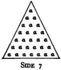
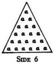
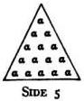
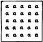
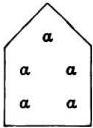
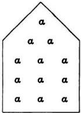

# INTRODUCTION TO ARITHMETIC

# BOOK I
## CHAPTER I
**1** The ancients, who under the leadership of Pythagoras first made science systematic, defined philosophy as the love of wisdom. Indeed the name itself means this, and before Pythagoras all who had knowledge were called 'wise' indiscriminately — a carpenter, for example, a cobbler, a helmsman, and in a word anyone who was versed in any art or handicraft. Pythagoras, however, restricting the title so as to apply to the knowledge and comprehension of reality, and calling the knowledge of the truth in this the only wisdom, naturally designated the desire and pursuit of this knowledge philosophy, as being desire for wisdom.

**2** He is more worthy of credence than those who have given other definitions, since he makes clear the sense of the term and the thing defined. This 'wisdom' he defined as the knowledge, or science, of the truth in real things, conceiving 'science' to be a steadfast and firm apprehension of the underlying substance, and 'real things' to be those which continue uniformly and the same in the universe and never depart even briefly from their existence; these real things would be things immaterial, by sharing in the substance of which everything else that exists under the same name and is so called is said to be 'this particular thing,' and exists.

**3** For bodily, material things are, to be sure, forever involved in continuous flow and change — in imitation of the nature and peculiar quality of that eternal matter and substance which has been from the beginning, and which was all changeable and variable throughout. The bodiless things, however, of which we conceive in connection with or together with matter, such as qualities, quantities, configurations, largeness, smallness, equality, relations, actualities, dispositions, places, times, all those things, in a word, whereby the qualities found in each body are comprehended — all these are of themselves immovable and unchangeable, but accidentally they share in and partake of the affections of the body to which they belong.
**4** Now it is with such things that 'wisdom' is particularly concerned, but accidentally also with things that share in them, that is, bodies.

## CHAPTER II
**1** Those things, however, are immaterial, eternal, without end, and it is their nature to persist ever the same and unchanging, abiding by their own essential being, and each one of them is called real in the proper sense. But what are involved in birth and destruction, growth and diminution, all kinds of change and participation, are seen to vary continually, and while they are called real things, by the same term as the former, so far as they partake of them, they are not actually real by their own nature; for they do not abide for even the shortest moment in the same condition, but are always passing over in all sorts of changes. **2** To quote the words of Timaeus, in Plato, "What is that which always is, and has no birth, and what is that which is always becoming but never is? The one is apprehended by the mental processes, with reasoning, and is ever the same; the other can be guessed at by opinion in company with unreasoning sense, a thing which becomes and passes away, but never really is.'

**3** Therefore, if we crave for the goal that is worthy and fitting for man, namely, happiness of life—and this is accomplished by philosophy alone and by nothing else, and philosophy, as I said, means for us desire for wisdom, and wisdom the science of the truth in things, and of things some are properly so called, others merely share the name—it is reasonable and most necessary to distinguish and systematize the accidental qualities of things.

**4** Things, then, both those properly so called and those that simply have the name, are some of them unified and continuous, for example, an animal, the universe, a tree, and the like, which are properly and peculiarly called 'magnitudes'; others are discontinuous, in a side-by-side arrangement, and, as it were, in heaps, which are called 'multitudes,' a flock, for instance, a people, a heap, a chorus, and the like.

**5** Wisdom, then, must be considered to be the knowledge of these two forms. Since, however, all multitude and magnitude are by their own nature of necessity infinite—for multitude starts from a definite root and never ceases increasing; and magnitude, when division beginning with a limited whole is carried on, cannot bring the dividing process to an end, but proceeds therefore to infinity—and since sciences are always sciences of limited things, and never of infinites, it is accordingly evident that a science dealing either with magnitude, per se, or with multitude, per se, could never be formulated, for each of them is limitless in itself, multitude in the direction of the more, and magnitude in the direction of the less. A science, however, would arise to deal with something separated from each of them, with quantity, set off from multitude, and size, set off from magnitude.

## CHAPTER III
**1** Again, to start afresh, since of quantity one kind is viewed by itself, having no relation to anything else, as 'even,' 'odd,' 'perfect,' and the like, and the other is relative to something else and is conceived of together with its relationship to another thing, like 'double,' 'greater,' 'smaller,' 'half,' 'one and one-half times,' 'one and one-third times,' and so forth, it is clear that two scientific methods will lay hold of and deal with the whole investigation of quantity; arithmetic, absolute quantity, and music, relative quantity.
**2** And once more, inasmuch as part of 'size' is in a state of rest and stability, and another part in motion and revolution, two other sciences in the same way will accurately treat of 'size,' geometry the part that abides and is at rest, astronomy that which moves and revolves.
**3** Without the aid of these, then, it is not possible to deal accurately with the forms of being nor to discover the truth in things, knowledge of which is wisdom, and evidently not even to philosophize properly, for "just as painting contributes to the menial arts toward correctness of theory, so in truth lines, numbers, harmonic intervals, and the revolutions of circles bear aid to the learning of the doctrines of wis-

**4** dom,” says the Pythagorean Androcydes. Likewise Archytas of Tarentum, at the beginning of his treatise *On Harmony*, says the same thing, in about these words: “It seems to me that they do well to study mathematics, and it is not at all strange that they have correct knowledge about each thing, what it is. For if they knew rightly the nature of the whole, they were also likely to see well what is the nature of the parts. About geometry, indeed, and arithmetic and astronomy, they have handed down to us a clear understanding, and not least also about music. For these seem to be sister sciences; for they deal with sister subjects, the first two forms of being.”

**5** Plato, too, at the end of the thirteenth book of the *Laws*, to which some give the title *The Philosopher*, because he investigates and defines in it what sort of man the real philosopher should be, in the course of his summary of what had previously been fully set forth and established, adds: “Every diagram, system of numbers, every scheme of harmony, and every law of the movement of the stars, ought to appear one to him who studies rightly; and what we say will properly appear if one studies all things looking to one principle, for there will be seen to be one bond for all these things, and if any one attempts philosophy in any other way he must call on Fortune to assist him. For there is never a path without these; this is the way, these the studies, be they hard or easy; by this course must one go, and not neglect it. The one who has attained all these things in the way I describe, him I for my part call wisest, and this I maintain through thick and thin.” **6** For it is clear that these studies are like ladders and bridges that carry our minds from things apprehended by sense and opinion to those comprehended by the mind and understanding, and from those material, physical things, our foster-brethren known to us from childhood, to the things with which we are unacquainted, foreign to our senses, but in their immateriality and eternity more akin to our souls, and above all to the reason which is in our souls. **7** And likewise in Plato’s *Republic*, when the interlocutor of Socrates appears to bring certain plausible reasons to bear upon the mathematical sciences, to show that they are useful to human life, arithmetic for reckoning, distributions, contributions, exchanges, and partnerships, geometry for sieges, the founding of cities and sanctuaries, and the partition of land, music for festivals, entertainment, and the worship of the gods, and the doctrine of the spheres, or astronomy, for farming, navigation and other undertakings, revealing beforehand the proper procedure and suitable season, Socrates, reproaching him, says: “You amuse me, because you seem to fear that these are useless studies that I recommend; but that is very difficult, nay, impossible. For the eye of the soul, blinded and buried by other pursuits, is rekindled and aroused again by these and these alone, and it is better that this be saved than thousands of bodily eyes, for by it alone is the truth of the universe beheld.”

## CHAPTER IV
**1** Which then of these four methods must we first learn? Evidently, the one which naturally exists before them all, is superior and takes the place of origin and root and, as it were, of mother to the others. **2** And this is arithmetic, not solely because we said that it existed before all the others in the mind of the creating God like some universal and exemplary plan, relying upon which as a design and archetypal example the creator of the universe sets in order his material creations and makes them attain to their proper ends; but also because it is naturally prior in birth, inasmuch as it abolishes other sciences with itself, but is not abolished together with them.

For example, 'animal' is naturally antecedent to 'man,' for abolish 'animal' and 'man' is abolished; but if 'man' be abolished, it no longer follows that 'animal' is abolished at the same time. And again, 'man' is antecedent to 'schoolteacher'; for if 'man' does not exist, neither does 'schoolteacher,' but if 'schoolteacher' is nonexistent, it is still possible for 'man' to be. Thus since it has the property of abolishing the other ideas with itself, it is likewise the older.

**3** Conversely, that is called younger and posterior which implies the other thing with itself, but is not implied by it, like 'musician,' for this always implies 'man.' Again, take 'horse'; 'animal' is always implied along with 'horse,' but not the reverse; for if 'animal' exists, it is not necessary that 'horse' should exist, nor if 'man' exists, must 'musician' also be implied.
**4** So it is with the foregoing sciences; if geometry exists, arithmetic must also needs be implied, for it is with the help of this latter that we can speak of triangle, quadrilateral, octahedron, icosahedron, double, eightfold, or one and one-half times, or anything else of the sort which is used as a term by geometry, and such things cannot be conceived of without the numbers that are implied with each one. For how can 'triple' exist, or be spoken of, unless the number 3 exists beforehand, or 'eightfold' without 8? **5** But on the contrary 3, 4, and the rest might be
without the figures existing to which they give names. Hence arithmetic abolishes geometry along with itself, but is not abolished by it, and while it is implied by geometry, it does not itself imply geometry.

## CHAPTER V
**1** And once more is this true in the case of music; not only because the absolute is prior to the relative, as 'great' to 'greater' and 'rich' to 'richer' and 'man' to 'father,' but also because the musical harmonies, diatessaron, diapente, and diapason, are named for numbers; similarly all of their harmonic ratios are arithmetical ones, for the diatessaron is the ratio of 4: 3, the diapente that of 3: 2, and the diapason the double ratio; and the most perfect, the di-diapason, is the quadruple ratio.

**2** More evidently still astronomy attains through arithmetic the investigations that pertain to it, not alone because it is later than geometry in origin — for motion naturally comes after rest — nor because the motions of the stars have a perfectly melodious harmony, but also because risings, settings, progressions, retrogressions, increases, and all sorts of phases are governed by numerical cycles and quantities.

**3** So then we have rightly undertaken first the systematic treatment of this, as the science naturally prior, more honorable, and more venerable, and, as it were, mother and nurse of the rest; and here we will take our start for the sake of clearness.

## CHAPTER VI
**1** All that has by nature with systematic method been arranged in the universe seems both in part and as a whole to have been determined and ordered in accordance with number, by the forethought and the mind of him that created all things; for the pattern was fixed, like a preliminary sketch, by the domination of number preëxistent in the mind of the world-creating God, number conceptual only and immaterial in every way, but at the same time the true and the eternal essence, so that with reference to it, as to an artistic plan, should be created all these things, time, motion, the heavens, the stars, all sorts of revolutions.

**2** It must needs be, then, that scientific number, being set over such things as these, should be harmoniously constituted, in accordance with itself; not by any other but by itself. **3** Everything that is harmoniously constituted is knit together out of opposites and, of course, out of real things; for neither can non-existent things be set in harmony, nor can things that exist, but are like one another, nor yet things that are different, but have no relation one to another. It remains, accordingly, that those things out of which a harmony is made are both real, different, and things with some relation to one another.

**4** Of such things, therefore, scientific number consists; for the most fundamental species in it are two, embracing the essence of quantity, different from one another and not of a wholly different genus, odd and even, and they are reciprocally woven into harmony with each other, inseparably and uniformly, by a wonderful and divine Nature, as straightway we shall see.

## CHAPTER VII
**1** Number is limited multitude or a combination of units or a flow of quantity made up of units; and the first division of number is even and odd.
**2** The even is that which can be divided into two equal parts without a unit intervening in the middle; and the odd is that which cannot be divided into two equal parts because of the aforesaid intervention of a unit.
**3** Now this is the definition after the ordinary conception; by the Pythagorean doctrine, however, the even number is that which admits of division into the greatest and the smallest parts at the same operation, greatest in size and smallest in quantity, in accordance with the natural contrariety of these two genera; and the odd is that which does not allow this to be done to it, but is divided into two unequal parts.

**4** In still another way, by the ancient definition, the even is that which can be divided alike into two equal and two unequal parts, except that the dyad, which is its elementary form, admits but one division, that into equal parts; and in any division whatsoever it brings to light only one species of number, however it may be divided, independent of the other. The odd is a number which in any division whatsoever, which necessarily is a division into unequal parts, shows both the two species of number together, never without intermixture one with another, but always in one another's company.

**5** By the definition in terms of each other, the odd is that which differs by a unit from the even in either direction, that is, toward the greater or the less, and the even is that which differs by a unit in either direction from the odd, that is, is greater by a unit or less by a unit.

## CHAPTER VIII
**1** Every number is at once half the sum of the two on either side of itself, and similarly half the sum of those next but one in either direction, and of those next beyond them, and so on as far as it is possible
to go. **2** Unity alone, because it does not have two numbers on either side of it, is half merely of the adjoining number; hence unity is the natural starting point of all number.
**3** By subdivision of the even, there are the even-times even, the odd-times even, and the even-times odd. The even-times even and the even-times odd are opposite to one another, like extremes, and the odd-times even is common to them both like a mean term.
**4** Now the even-times even is a number which is itself capable of being divided into two equal parts, in accordance with the properties of its genus, and with each of its parts similarly capable of division, and again in the same way each of their parts divisible into two equals until the division of the successive subdivisions reaches the
naturally indivisible unit. **5** Take for example 64; one half of this is 32, and of this 16, and of this the half is 8, and of this 4, and of this 2, and then finally unity is half of the latter, and this is naturally indivisible and will not admit of a half.
**6** It is a property of the even-times even that, whatever part of it be taken, it is always even-times even in designation, and at the same time, by the quantity of the units in it, even-times even in value; and that neither of these two things will ever share in the other class. **7** Doubtless it is because of this that it is called even-times even, because it is itself even and always has its parts, and the parts of its parts down to unity, even both in name and in value; in other words, every part that it has is even-times even in name and even-times even in value.

**8** There is a method of producing the even-times even, so that none will escape, but all successively fall under it, if you do as follows:
**9** As you proceed from unity, as from a root, by the double ratio to infinity, as many terms as there are will all be even-times even, and it is impossible to find others besides these; for instance, 1, 2, 4, 8, 16, 32, 64, 128, 256, 512....
**10** Now each of the numbers set forth was produced by the double ratio, beginning with unity, and is in every respect even-times even, and every part that it may be found to have is always named from some one of the numbers before it in the series, and the sum of units in this part is the same as one of the numbers before it, by a system of mutual correspondence, indeed, and interchange. If there is an even number of terms of the double ratio from unity, not one mean term can be found, but always two, from which the correspondence and interchange of factors and values, values and factors, will proceed in order, going first to the two on either side of the means, then to the next on either side, until it comes to the extreme terms, so that the whole will correspond in value to unity and unity to the whole. For example, if we set down 128 as the largest term, the number of terms will be even, for there are eight in all up to this number; and they will not have one mean term, for this is impossible with an even number, but of necessity two, 8 and 16. These will correspond to each other as factors; for of the whole, 128, 16 is one eighth and conversely 8 is one sixteenth. Thence proceeding in either direction, we find that 32 is one fourth, and 4 one thirty-second, and again 64 is one half, and 2 one sixty-fourth, and finally at the extremes unity is one one-hundred-twenty-eighth, and conversely 128 is the whole, to correspond with unity.

**11** If, however, the series consists of an odd number of terms, seven for example, and we deal with 64, there will be of necessity one mean term in accordance with the nature of the odd; the mean term will correspond to itself because it has no partner; and those on either side of it in turn will correspond to one another until this correspondence ends in the extremes. Unity, for example, will be one sixty-fourth, and 64 the whole, corresponding to unity; 32 is one half, and 2 one thirty-second; 16 is one fourth, and 4 one sixteenth; and 8 the eighth part, with nothing else to correspond to it.

**12** It is the property of all these terms when they are added together successively to be equal to the next in the series, lacking one unit, so that of necessity their summation in any way whatsoever will be an odd number, for that which fails by a unit of being equal to an even number is odd. **13** This observation will be of use to us very shortly in the construction of perfect numbers. But to take an example, the terms from unity preceding 256 in the series, when added together, are within 1 of equaling 256, and all the terms before 128, the term immediately preceding, are similarly equal to 128 save for one unit; and to the next terms the sums of those below them are similarly related. Thus unity itself is within one unit of equaling the next term, which is 2, and these two together fail by 1 of equaling the next, and the three together are within 1 of the next in order, and you will find that this goes on without interruption to infinity.

**14** This too it is very needful to recall: If the number of terms of the even-times even series dealt with is even, the product of the extremes will always be equal to the product of the means; if there is an odd number of terms, the product of the extremes will be equal to the square of the mean. For, in the case of an even number of terms, 1 times 128 is equal to 8 times 16 and further to 2 times 64 and again to 4 times 32, and this is so in every case; and with an odd number of terms, 1 times 64 equals 2 times 32, and this equals 4 times 16, and this again equals 8 times 8, the mean term alone multiplied by itself.

## CHAPTER IX
**1** The even-times odd number is one which is by its genus itself even, but is specifically opposed to the aforesaid even-times even. It is a number of which, though it admits of the division into two equal halves, after the fashion of the genus common to it and the even-times even, the halves are not immediately divisible into two equals, for example, 6, 10, 14, 18, 22, 26, and the like; for after these have been divided their halves are found to be indivisible.

**2** It is the property of the even-times odd that whatever factor it may be discovered to have is opposite in name to its value, and that the quantity of every part is opposite in value to its name, and that the numerical value of its part never by any means is of the same genus as its name. To take a single example, the number 18, its half, with an even name, is 9, odd in value; its third part, again, with an odd designation, is 6, even in value; conversely, the sixth part is 3 and the ninth part 2; and in other numbers the same peculiarity will be found.

**3** It is possibly for this reason that it received such a name, that is, because, although it is even, its halves are at once odd.

**4** This number is produced from the series beginning with unity, with a difference of 2, namely, the odd numbers, set forth in proper order as far as you like and then multiplied by 2. The numbers produced would be, in order, these: 6, 10, 14, 18, 22, 26, 30, and so on, as far as you care to proceed. The greater terms always differ by 4 from the next smaller ones, the reason for which is that their original basic forms, the odd numbers, exceed one another by 2 and were multiplied by 2 to make this series, and 2 times 2 makes 4.

**5** Accordingly, in the natural series of numbers the even-times odd numbers will be found fifth from one another, exceeding one another by a difference of 4, passing over three terms, and produced by the multiplication of the odd numbers by 2.

**6** They are said to be opposite in properties to the even-times even, because of these the greatest extreme term alone is divisible, while of these former the smallest only proved to be indivisible; and in particular because in the former case the reciprocal arrangement of parts from extremes to mean term or terms makes the product of the former equal to the square or product of the latter; but in this case by the same correspondence and comparison the mean term is one half the sum of the extremes, or if there should be two means, their sum equals that of the two extremes.

## CHAPTER X
**1** The odd-times even number is the one which displays the third form of the even, belonging in common to both the previously mentioned species like a single mean between two extremes, for in one respect it resembles the even-times even, and in another the even-times odd, and that property wherein it varies from the one it shares with the other, and by that property which it shares with the one it differs from the other.

**2** The odd-times even number is an even number which can be divided into two equal parts, whose parts also can so be divided, and sometimes even the parts of its parts, but it cannot carry the division of its parts as far as unity. Such numbers are 24, 28, 40; for each of these has its own half and indeed the half of its half, and sometimes one is found among them that will allow the halving to be carried even farther among its parts. There is none, however, that will have its parts divisible into halves as far as the naturally indivisible unit.

**3** Now in admitting more than one division, the odd-times even is like the even-times even and unlike the even-times odd; but in that its subdivision never ends with unity, it is like the even-times odd and unlike the even-times even.

**4** It alone has at once the proper qualities of each of the former two, and then again properties which belong to neither of them; for of them one had only the highest term divisible, and the other only the smallest indivisible, but this neither; for it is observed to have more divisions than one in the greater term, and more than one indivisible in the lesser.

**5** Furthermore, there are in it certain parts whose names are not opposed to their values nor of the opposite genus, after the fashion of the even-times even; and there are also always other parts of a name opposite and contrary in kind to their values, after the fashion of the even-times odd. For example, in 24, there are parts not opposed in name to their values, the fourth part, 6, the half, 12, the sixth, 4, and the twelfth, 2; but the third part, 8, the eighth, 3, and the twenty-fourth, 1, are opposed; and so it is with the rest.

**6** This number is produced by a somewhat complicated method, 6 and shows, after a fashion, even in its manner of production, that it is a mixture of both other kinds. For whereas the even-times even is made from even numbers, the doubles from unity to infinity, and the even-times odd from the odd numbers from 3, progressing to infinity, this must be woven together out of both classes, as being common to both. **7** Let us then set forth the odd numbers from 3 by themselves in due order in one series:

3, 5, 7, 9, 11, 13, 15, 17, 19,...

and the even-times even, beginning with 4, again one after another in a second series after their own order:

4, 8, 16, 32, 64, 128, 256,...

as far as you please. **8** Now multiply by the first number of either series — it makes no difference which — from the beginning and in order all those in the remaining series and note down the resulting numbers; then again multiply by the second number of the same series the same numbers once more, as far as you can, and write down the results; then with the third number again multiply the same terms anew, and however far you go you will get nothing but the odd-times even numbers.

**9** For the sake of illustration let us use the first term of the series of odd numbers and multiply by it all the terms in the second series in order, thus: 3 × 4, 3 × 8, 3 × 16, 3 × 32, and so on to infinity. The results will be 12, 24, 48, 96, which we must note down in one line. Then taking a new start do the same thing with the second number, 5 × 4, 5 × 8, 5 × 16, 5 × 32. The results will be 20, 40, 80, 160. Then do the same thing once more with 7, the third number, 7 × 4, 7 × 8, 7 × 16, 7 × 32. The results are 28, 56, 112, 224; and in the same way as far as you care to go, you will get similar results.

| Odd numbers | | 3 | 5 | 7 | 9 | 11 | 13 | 15 |
| --- | --- | --- | --- | --- | --- | --- | --- | --- |
| Even-times even | | 4 | 8 | 16 | 32 | 64 | 128 | 256 |
| Odd-times even numbers | Breadth | 16 | 24 | 48 | 96 | 192 | 384 | 768 |
| | | 20 | 40 | 80 | 160 | 320 | 640 | 1280 |
| | | 28 | 56 | 112 | 224 | 448 | 896 | 1792 |
| | | 36 | 72 | 144 | 288 | 576 | 1152 | 2304 |
| | | 44 | 88 | 176 | 352 | 704 | 1408 | 2816 |
| | | Length | | | | | | |

**10** Now when you arrange the products of multiplication by each term in its proper line, making the lines parallel, in marvelous fashion there will appear along the breadth of the table the peculiar property of the even-times odd, that the mean term is always half the sum of the extremes, if there should be one mean, and the sum of the means equals the sum of the extremes if two. But along the length of the table the property of the even-times even will appear; for the product of the extremes is equal to the square of the mean, should there be one mean term, or their product, should there be two. Thus this one species has the peculiar properties of them both, because it is a natural mixture of them both.

## CHAPTER XI
**1** Again, while the odd is distinguished over against the even in classification and has nothing in common with it, since the latter is divisible into equal halves and the former is not thus divisible, nevertheless there are found three species of the odd, differing from one another, of which the first is called the prime and incomposite, that which is opposed to it the secondary and composite, and that which is midway between both of these and is viewed as a mean among extremes, namely, the variety which, in itself, is secondary and composite, but relatively is prime and incomposite.

**2** Now the first species, the prime and incomposite, is found whenever an odd number admits of no other factor save the one with the number itself as denominator, which is always unity; for example, 3, 5, 7, 11, 13, 17, 19, 23, 29, 31. None of these numbers will by any chance be found to have a fractional part with a denominator different from the number itself, but only the one with this as denominator, and this part will be unity in each case; for 3 has only a third part, which has the same denominator as the number and is of course unity, 5 a fifth, 7 a seventh, and 11 only an eleventh part, and in all of them these parts are unity.

**3** It has received this name because it can be measured only by the number which is first and common to all, unity, and by no other; moreover, because it is produced by no other number combined with itself save unity alone; for 5 is 5 × 1, and 7 is 7 × 1, and the others in accordance with their own quantity. To be sure, when they are combined with themselves, other numbers might be produced, originating from them as from a fountain and a root, wherefore they are called ‘prime,’ because they exist beforehand as the beginnings of the others. For every origin is elementary and incomposite, into which everything is resolved and out of which everything is made, but the origin itself cannot be resolved into anything or constituted out of anything.

## CHAPTER XII
**1** The secondary, composite number is an odd number, indeed, because it is distinguished as a member of this same class, but it has no elementary quality, for it gets its origin by the combination of something else. For this reason it is characteristic of the secondary number to have, in addition to the fractional part with the number itself as denominator, yet another part or parts with different denominators, the former always, as in all cases, unity, the latter never unity, but always either that number or those numbers by the combination of which it was produced. For example, 9, 15, 21, 25, 27, 33, 35, 39; each one of these is measured by unity, as other numbers are, and like them has a fractional part with the same denominator as the number itself, by the nature of the class common to them all; but by exception and more peculiarly they also employ a part, or parts, with a different denominator; 9, in addition to the ninth part, has a third part besides; 15 a third and a fifth besides a fifteenth; 21 a seventh and a third besides a twenty-first, and 25, in addition to the twenty-fifth, which has as a denominator 25 itself, also a fifth, with a different denominator.

**2** It is called secondary, then, because it can employ yet another measure along with unity, and because it is not elementary, but is produced by some other number combined with itself or with something else; in the case of 9, 3; in the case of 15, 5 or, by Zeus, 3; and those following in the same fashion. And it is called composite for this, or some such, reason: that it may be resolved into those numbers out of which it was made, since it can also be measured by them. For nothing that can be broken down is incomposite, but by all means composite.

## CHAPTER XIII
**1** Now while these two species of the odd are opposed to each other a third one is conceived of between them, deriving, as it were, its specific form from them both, namely the number which is in itself secondary and composite, but relatively to another number is prime and incomposite. This exists when a number, in addition to the common measure, unity, is measured by some other number and is therefore able to admit of a fractional part, or parts, with denominator other than the number itself, as well as the one with itself as denominator.

When this is compared with another number of similar properties, it is found that it cannot be measured by a measure common to the other, nor does it have a fractional part with the same denominator as those in the other. As an illustration, let 9 be compared with 25. Each in itself is secondary and composite, but relatively to each other they have only unity as a common measure, and no factors in them have the same denominator, for the third part in the former does not exist in the latter nor is the fifth part in the latter found in the former.

**2** The production of these numbers is called by Eratosthenes the 'sieve,' because we take the odd numbers mingled together and indiscriminate and out of them by this method of production separate, as by a kind of instrument or sieve, the prime and incomposite by themselves, and the secondary and composite by themselves, and find the mixed class by themselves.

**3** The method of the 'sieve' is as follows. I set forth all the odd numbers in order, beginning with 3, in as long a series as possible, and then starting with the first I observe what ones it can measure, and I find that it can measure the terms two places apart, as far as we care to proceed. And I find that it measures not as it chances and at random, but that it will measure the first one, that is, the one two places removed, by the quantity of the one that stands first in the series, that is, by its own quantity, for it measures it 3 times; and the one two places from this by the quantity of the second in order, for this it will measure 5 times; and again the one two places further on by the quantity of the third in order, or 7 times, and the one two places still farther on by the quantity of the fourth in order, or 9 times, and so ad infinitum in the same way.

**4** Then taking a fresh start I come to the second number and observe what it can measure, and find that it measures all the terms four places apart, the first by the quantity of the first in order, or 3 times; the second by that of the second, or 5 times; the third by that of the third, or 7 times; and in this order ad infinitum.

**5** Again, as before, the third term 7, taking over the measuring function, will measure terms six places apart, and the first by the quantity of 3, the first of the series, the second by that of 5, for this is the second number, and the third by that of 7, for this has the third position in the series.

**6** And analogously throughout, this process will go on without interruption, so that the numbers will succeed to the measuring function in accordance with their fixed position in the series; the interval separating terms measured is determined by the orderly progress of the even numbers from 2 to infinity, or by the doubling of the position in the series occupied by the measuring term, and the number of times a term is measured is fixed by the orderly advance of the odd numbers in series from 3.

**7** Now if you mark the numbers with certain signs, you will find that the terms which succeed one another in the measuring function neither measure all the same number — and sometimes not even two will measure the same one — nor do absolutely all of the numbers set forth submit themselves to a measure, but some entirely avoid being measured by any number whatsoever, some are measured by one only, and some by two or even more. **8** Now these that are not measured at all, but avoid it, are primes and incomposites, sifted out as it were by a sieve; those measured by only one measure in accordance with its own quantity will have but one fractional part with denominator different from the number itself, in addition to the part with the same denominator; and those which are measured by one measure only, but in accordance with the quantity of some other number than the measure and not its own, or are measured by two measures at the same time, will have several fractional parts with other denominators besides the one with the same as the number itself; these will be secondary and composite.

**9** The third division, the one common to both the former, which is in itself secondary and composite but primary and incomposite in relation to another, will consist of the numbers produced when some prime and incomposite number measures them in accordance with its own quantity, if one thus produced be compared to another of similar origin. For example, if 9, which was produced by 3 measuring by its own quantity, for it is 3 times 3, be compared with 25, which was produced from 5 measuring by its own quantity, for it is 5 times 5, these numbers have no common measure except unity.

**10** We shall now investigate how we may have a method of discerning whether numbers are prime and incomposite, or secondary and composite, relatively to each other, since of the former unity is the common measure, but of the latter some other number also besides unity; and what this number is.
**11** Suppose there be given us two odd numbers and some one sets the problem and directs us to determine whether they are prime and incomposite relatively to each other or secondary and composite, and if they are secondary and composite what number is their common measure. We must compare the given numbers and subtract the smaller from the larger as many times as possible; then after this subtraction subtract in turn from the other, as many times as possible; for this changing about and subtraction from one and the other in turn will necessarily end either in unity or in some one and the same number, which will necessarily be odd. **12** Now when the subtractions terminate in unity they show that the numbers are prime and incomposite relatively to each other; and when they end in some other number, odd in quantity and twice produced, then say that they are secondary and composite relatively to each other, and that their common measure is that very number which twice appears.

For example, if the given numbers were 23 and 45, subtract 23 from 45, and 22 will be the remainder; subtracting this from 23, the remainder is 1, subtracting this from 22 as many times as possible you will end with unity. Hence they are prime and incomposite to one another, and unity, which is the remainder, is their common measure.

**13** But if one should propose other numbers, 21 and 49, I subtract the smaller from the larger and 28 is the remainder. Then again I subtract the same 21 from this, for it can be done, and the remainder is 7. This I subtract in turn from 21 and 14 remains; from which I subtract 7 again, for it is possible, and 7 will remain. But it is not possible to subtract 7 from 7; hence the termination of the process with a repeated 7 has been brought about, and you may declare the original numbers 21 and 49 secondary and composite relatively to each other, and 7 their common measure in addition to the universal unit.

## CHAPTER XIV
**1** To make again a fresh start, of the simple even numbers, some are superabundant, some deficient, like extremes set over against each other, and some are intermediary between them and are called perfect. **2** Those which are said to be opposites to one another, the superabundant and deficient, are distinguished from one another in the relation of inequality 1 in the directions of the greater and the less; for apart from these no other form of inequality could be conceived, nor could evil, 2 disease, disproportion, unseemliness, nor any such thing, save in terms of excess or deficiency. For in the realm of the greater 3 there arise excesses, overreaching, and superabundance, and in the less need, deficiency, privation, and lack; but in that which lies between the greater and the less, namely, the equal, are virtues, wealth, moderation, propriety, beauty, and the like, to which the aforesaid form of number, the perfect, is most akin.

**3** Now the superabundant number 4 is one which has, over and above the factors which belong to it and fall to its share, others in addition, just as if an animal should be created with too many parts or limbs, with ten tongues, as the poet says, and ten mouths, or with nine lips, or three rows of teeth, or a hundred hands, or too many fingers on one hand. Similarly if, when all the factors in a number are examined and added together in one sum, it proves upon investigation that the number's own factors exceed the number itself, this is called a superabundant number, for it oversteps the symmetry which exists between the perfect and its own parts. Such are 12, 24, and certain others, for 12 has a half, 6, a third, 4, a fourth, 3, a sixth, 2, and a twelfth, 1, which added together make 16, which is more than the original 12; its parts, therefore, are greater than the whole itself. **4** And 24 has a half, a third, fourth, sixth, eighth, twelfth, and twenty-fourth, which are 12, 8, 6, 4, 3, 2, 1. Added together they make 36, which, compared to the original number, 24, is found to be greater than it, although made up solely of its factors. Hence in this case also the parts are in excess of the whole.

## CHAPTER XV
**1** The deficient number is one which has qualities the opposite of those pointed out, and whose factors added together are less in comparison than the number itself. It is as if some animal should fall short of the natural number of limbs or parts, or as if a man should have but one eye, as in the poem, 'And one round orb was fixed in his brow'; or as though one should be one-handed, or have fewer than five fingers on one hand, or lack a tongue, or some such member. Such a one would be called deficient and so to speak maimed, after the peculiar fashion of the number whose factors are less than itself, such as 8 or 14. For 8 has the factors half, fourth, and eighth, which are 4, 2, and 1, and added together they make 7, and less than the original number. The parts, therefore, fall short of making up the whole. **2** Again, 14 has a half, a seventh, a fourteenth, 7, 2, and 1, respectively; and all together they make 10, less than the original number. So this number also is deficient in its parts, with respect to making up the whole out of them.

## CHAPTER XVI
**1** While these two varieties are opposed after the manner of extremes, the so-called perfect number appears as a mean, which is discovered to be in the realm of equality, and neither makes its parts greater than itself, added together, nor shows itself greater than its parts, but is always equal to its own parts. For the equal is always conceived of as in the mid-ground between greater and less, and is, as it were, moderation between excess and deficiency, and that which is in tune, between pitches too high and too low.

**2** Now when a number, comparing with itself the sum and combination of all the factors whose presence it will admit, neither exceeds them in multitude nor is exceeded by them, then such a number is properly said to be perfect, as one which is equal to its own parts. Such numbers are 6 and 28; for 6 has the factors half, third, and sixth, 3, 2, and 1, respectively, and these added together make 6 and are equal to the original number, and neither more nor less. Twenty-eight has the factors half, fourth, seventh, fourteenth, and twenty-eighth, which are 14, 7, 4, 2 and 1; these added together make 28, and so neither are the parts greater than the whole nor the whole greater than the parts, but their comparison is in equality, which is the peculiar quality of the perfect number.

**3** It comes about that even as fair and excellent things are few and easily enumerated, while ugly and evil ones are widespread, so also the superabundant and deficient numbers are found in great multitude and irregularly placed — for the method of their discovery is irregular — but the perfect numbers are easily enumerated and arranged with suitable order; for only one is found among the units, 6, only one other among the tens, 28, and a third in the rank of the hundreds, 496 alone, and a fourth within the limits of the thousands, that is, below ten thousand, 8,128.2 And it is their accompanying characteristic to end alternately in 6 or 8, and always to be even.

**4** There is a method of producing them, neat and unfailing, which neither passes by any of the perfect numbers nor fails to differentiate any of those that are not such, which is carried out in the following way.

You must set forth the even-times even numbers from unity, advancing in order in one line, as far as you please: 1, 2, 4, 8, 16, 32, 64, 128, 256, 512, 1,024, 2,048, 4,096.... Then you must add them together, one at a time, and each time you make a summation observe the result to see what it is. If you find that it is a prime, incomposite number, multiply it by the quantity of the last number added, and the result will always be a perfect number. If, however, the result is secondary and composite, do not multiply, but add the next and observe again what the resulting number is; if it is secondary and composite, again pass it by and do not multiply; but add the next; but if it is prime and incomposite, multiply it by the last term added, and the result will be a perfect number; and so on to infinity. In similar fashion you will produce all the perfect numbers in succession, overlooking none.

For example, to 1 I add 2, and observe the sum, and find that it is 3, a prime and incomposite number in accordance with our previous demonstrations; for it has no factor with denominator different from the number itself, but only that with denominator agreeing. Therefore I multiply it by the last number to be taken into the sum, that is, 2; I get 6, and this I declare to be the first perfect number in actuality, and to have those parts which are beheld in the numbers of which it is composed. For it will have unity as the factor with denominator the same as itself, that is, its sixth part; and 3 as the half, which is seen in 2, and conversely 2 as its third part.

**5** Twenty-eight likewise is produced by the same method when another number, 4, is added to the previous ones. For the sum of the three, 1, 2, and 4, is 7, and is found to be prime and incomposite, for it admits only the factor with denominator like itself, the seventh part. Therefore I multiply it by the quantity of the term last taken into the summation, and my result is 28, equal to its own parts, and having its factors derived from the numbers already adduced, a half corresponding to 2; a fourth, to 7; a seventh, to 4; a fourteenth to offset the half; and a twenty-eighth, in accordance with its own nomenclature, which is 1 in all numbers.

**6** When these have been discovered, 6 among the units and 28 in the tens, you must do the same to fashion the next. **7** Again add the next number, 8, and the sum is 15. Observing this, I find that we no longer have a prime and incomposite number, but in addition to the factor with denominator like the number itself, it has also a fifth and a third, with unlike denominators. Hence I do not multiply it by 8, but add the next number, 16, and 31 results. As this is a prime, incomposite number, of necessity it will be multiplied, in accordance with the general rule of the process, by the last number added, 16, and the result is 496, in the hundreds; and then comes 8,128 in the thousands, and so on, as far as it is convenient for one to follow.

**8** Now unity is potentially a perfect number, but not actually; for taking it from the series as the very first I observe what sort it is, according to the rule, and find it prime and incomposite; for it is so in very truth, not by participation like the rest, but it is the primary number of all, and alone incomposite. **9** I multiply it, therefore, by the last term taken into the summation, that is, by itself, and my re-10 sult is 1; for 1 times 1 equals 1. **10** Thus unity is perfect potentially; for it is potentially equal to its own parts, the others actually.

## CHAPTER XVII
**1** Now that we have given a preliminary systematic account of absolute quantity we come in turn to relative quantity.
**2** Of relative quantity, then, the highest generic divisions are two, equality and inequality; for everything viewed in comparison with another thing is either equal or unequal, and there is no third thing besides these.
**3** Now the equal is seen, when of the things compared one neither exceeds nor falls short in comparison with the other, for example, 100 compared with 100, 10 with 10, 2 with 2, a mina with a mina, a talent with a talent, a cubit with a cubit, and the like, either in bulk, length, 4 weight, or any kind of quantity. **4** And as a peculiar characteristic, also, this relation is of itself not to be divided or separated, as being most elementary, for it admits of no difference. For there is no such thing as this kind of equality and that kind, but the equal exists in one and the same manner. **5** And that which corresponds to an equal thing, to be sure, does not have a different name from it, but the same; like 'friend,' 'neighbor,' 'comrade,' so also 'equal'; for it is equal to an equal.

**6** The unequal, on the other hand, is split up by subdivisions, and one part of it is the greater, the other the less, which have opposite names and are antithetical to one another in their quantity and relation. For the greater is greater than some other thing, and the less again is less than another thing in comparison, and their names are not the same, but they each have different ones, for example, 'father' and 'son,' 'striker' and 'struck,' 'teacher' and 'pupil,' and the like.

**7** Moreover, of the greater, separated by a second subdivision into five species, one kind is the multiple, another the superparticular, another the superpartient, another the multiple superparticular, and another the multiple superpartient. **8** And of its opposite, the less, there arise similarly by subdivision five species, opposed to the foregoing five varieties of the greater, the submultiple, subsuperparticular, subsuperpartient, submultiple-superparticular, and submultiple-superpartient; for as whole answers to whole, smaller to greater, so also the varieties correspond, each to each, in the aforesaid order, with the prefix sub-.

## CHAPTER XVIII
**1** Once more, then; the multiple is the species of the greater first and most original by nature, as straightway we shall see, and it is a number which, when it is observed in comparison with another, contains the whole of that number more than once. For example, compared with unity, all the successive numbers beginning with 2 generate in their proper order the regular forms of the multiple; for 2, in the first place, is and is called the double, 3 triple, 4 quadruple, and so on; for 'more than once' means twice, or three times, and so on in succession as far as you like.
**2** Answering to this is the submultiple, which is itself primary in the smaller division of inequality. It is the number which, when it is compared with a larger, is able to measure it completely more than once, and 'more than once' starts with twice and goes on to infinity.
**3** If then it measures the larger number that is being compared twice only, it is properly called the subdouble, as 1 is of 2; if thrice, sub-triple, as 1 of 3; if four times, subquadruple, as 1 of 4, and so on in succession.
**4** While each of these, the multiple and the submultiple, is generically infinite, the varieties by subdivision and the species also are observed naturally to make an infinite series. For the double, beginning with 2, goes on through all the even numbers, as we select alternate numbers out of the natural series; and these will be called doubles in comparison with the even and odd numbers successively placed beginning
with unity. **5** All the numbers from the beginning two places apart, and third in order, are triples, for example, 3, 6, 9, 12, 15, 18, 21, 24. It is their property to be alternately odd and even, and they themselves in the regular series from unity are triples of all the numbers in succession as far as one wishes to go on with the process.
**6** The quadruples are those in the fourth places, three apart, for instance, 4, 8, 12, 16, 20, 24, 28, 32, and so on. These are the quadruples of the regular series of numbers from unity going on as far as one finds it convenient to follow. It belongs to them all to be even; for one needs only to take the alternate terms out of the even numbers already selected. Thus necessarily it is true that the even numbers, with no further designation, are all doubles, the alternate ones quadruples, those two places apart sextuples, and those three places apart octuples, and this series will go on, on this same analogy, indefinitely.

**7** The quintuples will be seen to be those four places apart, placed fifth from one another, and themselves the quintuples of the successive numbers beginning with unity. Alternately they are odd and even, like the triples.

## CHAPTER XIX
**1** The superparticular, the second species of the greater both naturally and in order, is a number that contains within itself the whole of the number compared with it, and some one factor of it besides.

**2** If this factor is a half, the greater of the terms compared is called specifically sesquialter, and the smaller subsesquialter; if it is a third, sesquitertian and subsesquitertian; and as you go on throughout it will always thus agree, so that these species also will progress to infinity, even though they are species of an unlimited genus.

For it comes about that the first species, the sesquialter ratio, has as its consequents the even numbers in succession from 2, and no other at all, and as antecedents the triples in succession from 3, and no other. **3** These must be joined together regularly, first to first, second to second, third to third — 3: 2, 6: 4, 9: 6, 12: 8 — and the analogous numbers to the ones corresponding to them in position.

**4** If we care to investigate the second species of the superparticular, the sesquitertian (for the fraction naturally following after the half is the third), we shall have this definition of it — a number which contains the whole of the number compared, and a third of it in addition to the whole. We may have examples of it, in the proper order, in the successive quadruples beginning with 4 joined to the triples from 3, each term with the one in the corresponding position in the series, 5 for example, 4: 3, 8: 6, 12: 9, and so on to infinity. **5** It is plain that that which corresponds to the sesquitertian but is called, with the prefix sub-, subsesquitertian, is the number, the whole of which is contained and a third part in addition, for example, 3: 4, 6: 8, 9: 12, and the similar pairs of numbers in the same position in the series.
**6** And we must observe the never-failing corollary of all this, that the first forms in each series, the so-called root numbers, are next to one another in the natural series; the next after the root-forms show an interval of only one number; the third two; the fourth three; the fifth four; and so on, as far as you like. **7** Furthermore, that the fraction after which each of the superparticulars is named is seen in the lesser of the root numbers, never in the greater.
**8** That by nature and by no disposition of ours the multiple is a more elementary and an older form than the superparticular we shall shortly learn, through a somewhat intricate process. And here, for a simple demonstration, we must prepare in regular and parallel lines the multiples specified above, according to their varieties, first the double in one line, then in a second the triple, then the quadruple in a third, and so on as far as the tenfold multiples, so that we may detect their order and variety, their regulated progress, and which of them is naturally prior, and indeed other corollaries delightful in their exactness. **9** Let the diagram be as follows:

| 1 | 2 | 3 | 4 | 5 | 6 | 7 | 8 | | 10 |
| --- | --- | --- | --- | --- | --- | --- | --- | --- | --- |
| 2 | 4 | 6 | 8 | 10 | 12 | 14 | 16 | 18 | 20 |
| 3 | 6 | 9 | 12 | 15 | 18 | 21 | 24 | 27 | 30 |
| 4 | 8 | 12 | 16 | 20 | 24 | 28 | 32 | 36 | 40 |
| 5 | 10 | 15 | 20 | 25 | 30 | 35 | 40 | 45 | 50 |
| 6 | 12 | 18 | 24 | 30 | 36 | 42 | 48 | 54 | 60 |
| 7 | 14 | 21 | 28 | 35 | 42 | 49 | 56 | 63 | 70 |
| 8 | 16 | 24 | 32 | 40 | 48 | 56 | 64 | 72 | 80 |
| 9 | 18 | 27 | 36 | 45 | 54 | 63 | 72 | 81 | 90 |
| 10 | 20 | 30 | 40 | 50 | 60 | 70 | 80 | 90 | 100 |

**10** Let there be set forth in the first row the natural series from unity, 10 and then in order those species of the multiple which we were bidden to insert.

**11** Now then in comparison with the first rows beginning with unity, 11 if we read both across and up and down in the form of the letter gamma, the next rows both ways, themselves in the form of a gamma, beginning with 4, are multiples according to the first form of the multiple, for they are doubles. The first differs by unity from the first, the second from the second by 2, the third from the third by 3, the next by 4, those following by 5, and you will find that this follows throughout.

The third rows in both directions from 9, their common origin, will be the triples of the terms in that same first row according to the second form of the multiple; the cross-lines like the letter chi, ending in the term 3 in either direction, are to be taken into consideration. **12** The difference, for these numbers, will progress after the series of the even numbers, being 2 for the first, 4 for the next, 6 for the third; and this difference nature has of her own accord interpolated for us between these rows that are being examined, as is evident in the diagram.

**13** The fourth row, whose common origin in both directions is 16, and whose cross-lines end with the terms 4, exhibits the third species of multiple, the quadruple, when it is compared with that same first row according to corresponding positions, first term with first, second with second, third with third, and so on. Again, the differences of these numbers are 3, 6, then 9, then 12, and the quantities that progress by steps of 3. These numbers are detected in the structure of the diagram in places just above the quadruples, and in the subsequent forms of the multiple the analogy will hold throughout.

**14** In comparison with the second line reading either way, which begins with the common origin 4 and runs over in cross-lines to the term 2 in each row, the lines which are next in order beneath display the first species of the superparticular, that is, the sesquialter, between terms occupying corresponding places. Thus by divine nature, not by our convention or agreement, the superparticulars are of later origin than the multiples. For illustration, 3 is the sesquialter of 2, 6 of 4, 9 of 6, 12 of 8, 15 of 10, and throughout thus. They have as a difference the successive numbers from unity, like those before them.

**15** The sesquitertians, the second species of superparticular, proceed with a regular, even advance from 4:3, 8:6, 12:9, 16:12, and so on; having also a regular increase of their differences. **16** And in the other multiple and superparticular relations you will see that the results are in harmony and not by any means inconsistent as you go on to infinity.

**17** The following feature of the diagram, moreover, is of no less exact-17
ness. The terms at the corners are units; the one at the beginning
a simple unit, that at the end the unit of the third course, and the
other two units of the second course appearing twice; so that the
product (of the first two) is equal to the square (of the last). **18** Further-18
more, in reading either way there is an even progress from unity to
the tens, and again on the opposite sides two other progressions from
10 to 100.

**19** The terms on the diagonal from 1 to 100 are all square numbers, the products of equals by equals, and those flanking them on either
side are all heteromecic, unequal, and the products of sides of which
one is greater than the other by unity; and so the sum of two successive squares and twice the heteromecic numbers between them is
always a square, and conversely a square is always produced from the
two heteromecic numbers on the sides and twice the square between
them.

**20** An ambitious person might find many other pleasing things displayed in this diagram, upon which it is not now the time to dwell, for we have not yet gained recognition of them from our *Introduction*, and so we must turn to the next subject. For after these two generic relations of the multiple and the superparticular and the other two, opposite to them, with the prefix sub-, the submultiple and the subsuperparticular, there are in the greater division of inequality the superpartient, and in the less its opposite, the subsuperpartient.

## CHAPTER XX
**1** It is the superpartient relation when a number contains within itself the whole of the number compared and in addition more than one part of it; and 'more than one' starts with 2 and goes on to all the numbers in succession. Thus the root-form of the superpartient is naturally the one which has in addition to the whole two parts of the number compared, and as a species will be called superbipartient; after this the one with three parts besides the whole will be called supertripartient as a species; then comes the superquadripartient, the superquintipartient, and so forth.
**2** The parts have their root and origin with the third, for it is impossible in this case to begin with the half. For if we assume that any number contains two halves of the compared number, besides the whole of it, we shall inadvertently be setting up a multiple instead of a superpartient, because each whole, plus two halves of it, added together makes double the original number. Thus it is most necessary to start with two thirds, then two fifths, two sevenths, and after these two ninths, following the advance of the odd numbers; for two quarters, for example, again are a half, two sixths a third, and thus again superparticulars will be produced instead of superpartients, which is not the problem laid before us nor in accord with the systematic construction of our science.
**3** After the superpartient the subsuperpartient immediately is produced, whenever a number is completely contained in the one compared with it, and in addition several parts of it, 2, 3, 4, or 5, and so on.

## CHAPTER XXI
**1** The regular arrangement and orderly production of both species are discovered when we set forth the successive even and odd numbers, beginning with 3, and compare with them simple series of odd numbers only, from 5 in succession, first to first — that is, 5 to 3, — second to second — that is, 7 to 4, — third to third — that is, 9 to 5, — fourth to fourth — that is, 11 to 6, — and so on in the same order as far as you like. In this way the forms of the superpartient and the sub-superpartient, in due order, will be disclosed through the root-forms of each species, the superbipartient first, then the supertripartient, superquadripartient, and superquintipartient, and further in succession in similar manner; for after the root-forms of each species the ones which follow them will be produced by doubling, or tripling, both the terms, and in general by multiplying after the regular forms of the multiple.

TABLE OF THE SUPERPARTIENTS

| Root-forms | 5 | 3 | 7 | 4 | 9 | 5 | 11 | 6 | 13 | 7 |
| --- | --- | --- | --- | --- | --- | --- | --- | --- | --- | --- |
| | 10 | 6 | 14 | 8 | 18 | 10 | 22 | 12 | 26 | 14 |
| | 15 | 9 | 21 | 12 | 27 | 15 | 33 | 18 | 39 | 21 |
| | 20 | 12 | 28 | 16 | 36 | 20 | 44 | 24 | 52 | 28 |
| | 25 | 15 | 35 | 20 | 45 | 25 | 55 | 30 | 65 | 35 |
| | 30 | 18 | 42 | 24 | 54 | 30 | 66 | 36 | 78 | 42 |
| | 35 | 21 | 49 | 28 | 63 | 35 | 77 | 42 | 91 | 49 |
| | 40 | 24 | 56 | 32 | 72 | 40 | 88 | 48 | 104 | 56 |
| | 45 | 27 | 63 | 36 | 81 | 45 | 99 | 54 | 117 | 63 |

**2** It must be observed that from the two parts in addition to the whole which are contained in the greater term, we are to understand 'third,' in the case of three parts, 'fourth,' with four parts, 'fifth,' with five, 'sixth,' and so on, so that the order of nomenclature is something like this: superbipartient, supertripartient, superquadripartient, then superquintipartient, and similarly with the rest.

**3** Now the simple, uncompounded relations of relative quantity are these which have been enumerated. Those which are compounded of them and as it were woven out of two into one are the following, of which the antecedents are the multiple superparticular and multiple superpartient, and the consequents the ones that immediately arise in connection with each of the former, named with the prefix sub-; together with the multiple superparticular the submultiple superparticular, and with the multiple superpartient the submultiple superpartient. In the subdivision of the genera the species of the one will correspond to those of the other, these also having names with the prefix sub-.

## CHAPTER XXII
**1** Now the multiple superparticular is a relation in which the greater of the compared terms contains within itself the lesser term more than once and in addition some one part of it, whatever this may be.
**2** As a compound, such a number is doubly diversified after the peculiarities of nomenclature of its components on either side; for inasmuch as the multiple superparticular is composed of the multiple and superparticular generically, it will have in its subdivisions according to species a sort of diversification and change of names proper both to the first part of the name and to the second. For instance, in the first part, that is, the multiple, it will have double, triple, quadruple, quintuple, and so forth, and in the second part, generically from the superparticular, its specific forms in due order, the sesquialter, sesquitertian, sesquiquartan, sesquiquintan, and so on, so that the combination will proceed in somewhat this order:

Double sesquialter, double sesquitertian, double sesquiquartan, double sesquiquintan, double sesquisextan, and analogously.

Beginning once more: triple sesquialter, triple sesquitertian, triple sesquiquartan, triple sesquiquintan.

Again: quadruple sesquialter, quadruple sesquitertian, quadruple sesquiquartan, quadruple sesquiquintan.

Again: quintuple sesquialter, quintuple sesquitertian, quintuple sesquiquartan, quintuple sesquiquintan, and the forms analogous to these ad infinitum. Whatever number of times the greater contains the whole of the smaller, by this quantity the first part of the ratio of the terms joined together in the multiple superparticular is named; and whatever may be the factor, in addition to the whole several times contained, that is, in the greater term, from this is named the second kind of ratio of which the multiple superparticular is compounded.

**3** Examples of it are these: 5 is the double sesquialter of 2; 7 the double sesquitertian of 3; 9 the double sesquiquartan of 4; 11 the double sesquiquintan of 5. You will furthermore always produce them in regular order, in this fashion, by comparing with the successive even and odd numbers from 2 the odd numbers, exclusively, from 5, first with first, second with second, third with third, and the others each with the one in the same position in the series. The successive terms beginning with 5 and differing by 5 will be without exception double sesquialters of all the successive even numbers from 2 on, when terms in the same position in the series are compared; and beginning with 3, if all those with a difference of 3 be set forth, as 3, 6, 9, 12, 15, 18, 21, and in another series there be set forth those that differ by 7, to infinity, as 7, 14, 21, 28, 35, 42, 49, and the greater be compared with the smaller, first to first, second to second, third to third, fourth to fourth, and so on, the second species will appear, the double sesquitertian, disposed in its proper order.

**4** Then again, to take a fresh start, if the simple series of quadruples be set forth, 4, 8, 12, 16, 20, 24, 28, 32, and then there be placed beside it in another series the successive numbers beginning with 9, and increasing by 9, as 9, 18, 27, 36, 45, 54, we shall have revealed once more the multiple superparticular in a specific form, that is, the double sesquiquartan in its proper order; and any one who desires can contrive this to an unlimited extent.

**5** The second kind begins with the triple sesquialter, such as 7: 2, 14: 4, 5 and in general the numbers that advance by steps of 7 compared with the even numbers in order from 2. **6** Then once more, 10: 3 is the first triple sesquitertian, 20: 6 the second, and, in a word, the multiples of 10 in succession, compared with the successive triples. This indeed we can observe with greater exactitude and clearness in the table studied above, for in comparison with the first row the succeeding rows in order, compared as whole rows, display the forms of the multiple in regular order up to infinity when they are all compared in each case to the same first row; and when each row is compared to all those above it, in succession, the second row being taken as our starting point, all the forms of the superparticular are produced in their proper order; and if we start with the third row, all of those beginning with the fifth that are odd in the series when they are compared with this same third row, and those following it, will show all the forms of the superpartient in proper order. In the case of the multiple superparticular, the comparisons will have a natural order of their own if we start with the second row and compare the terms from the fifth, first to first, second to second, third to third, and so on, and then the terms of the seventh row to the third, those of the ninth to the fourth, and follow the corresponding order as far as we are able to go. **7** It is plain that here too the smaller terms have names corresponding to the larger ones, with the prefix sub-, according to the nomenclature given them all.

## CHAPTER XXIII
**1** The multiple superpartient is the remaining relation of number. This, and the relation called by a corresponding name with the prefix sub-, exist when a number contains the whole of the number compared more than once (that is, twice, thrice, or any number of times) and certain parts of it, more than one, either two, three, or four, and so on, besides. **2** These parts are not halves, for the reasons mentioned above, but either thirds, fourths, or fifths, and so on.
**3** From what has already been said it is not hard to conceive of the varieties of this relation, for they are differentiated in the same way as, and consistently with, those that precede, double superbipartient, double supertripartient, double superquadripartient, and so on. For example, 8 is the double superbipartient of 3, 16 of 6, and in general the numbers beginning with 8 and differing by 8 are double superbipartients of those beginning with 3 and differing by 3, when those in corresponding places in the series are compared, and in the case of the other varieties one could ascertain their proper sequence by following out what has already been said. In this case, too, we must conceive that the nomenclature of the number compared goes along and suffers corresponding changes, with the addition of the prefix sub-.

Thus we come to the end of our speculation upon the ten arithmetical relations for a first Introduction. **4** There is, however, a method very exact and necessary for all discussion of the nature of the universe which very clearly and indisputably presents to us the fact that that which is fair and limited, and which subjects itself to knowledge, is naturally prior to the unlimited, incomprehensible, and ugly, and furthermore that the parts and varieties of the infinite and unlimited are given shape and boundaries by the former, and through it attain to their fitting order and sequence, and like objects brought beneath some seal or measure all gain a share of likeness to it and similarity of name when they fall under its influence. For thus it is reasonable that the rational part of the soul will be the agent which puts in order the irrational part, and passion and appetite, which find their places in the two forms of inequality, will be regulated by the reasoning faculty as though by a kind of equality and sameness.

**5** And from this equalizing process there will properly result for us the so-called ethical virtues, sobriety, courage, gentleness, self-control, fortitude, and the like.

**6** Let us then consider the nature of the principle that pertains to these universal matters. It is capable of proving that all the complex species of inequality and the varieties of these species are produced out of equality, first and alone, as from a mother and root.

**7** Let there be given us equal numbers in three terms, first, units, then two's in another group of three, then three's, next four's, five's, and so on as far as you like. For them, as the setting forth of these terms has come about by a divine, and not human, contrivance, nay, by Nature herself, multiples will first be produced, and among these the double will lead the way, the triple after the double, the quadruple next, and then the quintuple, and, following the order we have previously recognized, *ad infinitum*; second, the superparticular, and here again the first form, the sesquialter, will lead, and the next after it, the sesquitertian, will follow, and after them the next in order, the sesquiquartan, the sesquiquintan, the sesquisextan, and so on *ad infinitum*; third, the superpartient, which once more the superbipartient will lead, the supertripartient will follow immediately upon it, and then will come the superquadripartient, the superquintipartient, and according to the foregoing as far as one may proceed.

**8** Now you must have certain rules, like invariable and inviolable natural laws, following which the whole aforesaid advance and progress from equality may go on without failure. These are the directions: Make the first equal to the first, the second equal to the sum of the first and second, and the third to the sum of the first, twice the second, and the third. For if you fashion according to these rules you would get first all the forms of the multiple in order out of the three given terms of the equality, as it were, sprouting and growing without your paying any heed or offering any aid. From equality you will first 8 get the double; from the double the triple, from the triple successively the quadruple, and from this the quintuple in due order, and so on. **9** From these same multiples in their regular order, reversed, there are immediately produced by a sort of natural necessity through the agency of the same three rules the superparticulars, and these not as it chances and irregularly but in their proper sequence; for from the first, the double, reversed, comes the first, the sesquialter, and from the second, the triple, the second in this class, the sesquitertian; then the sesquiquartan from the quadruple, and in general each one from the one of similar name. **10** And with a fresh start, if the superparticulars are set forth in the order of their production, but with terms reversed, the superpartients, which naturally follow them, are brought to light, the superbipartient from the sesquialter, the supertripartient from the sesquitertian, the superquadripartient from the sesquiquartan, and so on ad infinitum. **11** If, however, the superparticulars are set forth with terms not in reverse but in direct order, there are produced through the three rules the multiple superparticulars, the double sesquialter out of the first, the sesquialter; the double sesquitertian from the second, the sesquitertian, the double sesquiquartan from the third, the sesquiquartan, and so on. **12** From those produced by the reversal of the superparticular, that is, the superpartients, and from those produced without such reversal, the multiple superparticulars, there are once more produced, in the same way and by the same rules, both when the terms are in direct or reverse order, the numbers that show the remaining numerical relations.

**13** The following must suffice as illustrations of all that has been said hitherto, the production of these numbers and their sequence, and the use of direct and of reverse order. **14** From the relation and proportion in terms of the sesquialter, reversed so as to begin with the largest term, there arises a relation in superpartient ratios, the superbipartient; and from it in direct order, beginning with the smallest term, a multiple superparticular relation, the double sesquialter. For example, from 9, 6, 4, we get either 9, 15, 25 or 4, 10, 25. From the relation in terms of sesquitertians, beginning with the greatest term, is derived a superpartient, the supertripartient; beginning with the smallest term, a double sesquitertian. For example, from 16, 12, 9 comes either 16, 28, 49 or 9, 21, 49. And from the relation in terms of sesquiquartans, when it is arranged to begin with the largest term, is derived a superpartient, the superquadripartient; when it starts with the smallest term, a multiple superparticular, the double sesquiquintan; for instance, from 25, 20, 16 comes either 25, 45, 81 or 16, 36, 81. **15** In the case of all these relations that are thus differentiated, and of the one from which both of the differentiated ones are derived, the last term is always the same and a square; the first term becomes the smallest, and invariably the extremes are squares.

**16** Moreover the multiple superpartients and superpartients of other kinds are made to appear in yet another way out of the superpartients; for example, from the superbipartient relation arranged so as to begin with the smallest term comes the double superbipartient, but, arranged so as to start with the greatest, the superpartient ratio of 8:5. Thus from 9, 15, 25 comes either 9, 24, 64 or 25, 40, 64. From the supertripartient, beginning with the smallest term, we have the double supertripartient, and, beginning with the largest, the ratio of 11:7. Thus, from 16, 28, 49 comes either 16, 44, 121 or 49, 77, 121. **17** Again, from the superquintipartient, as, for example, 25, 45, 81, beginning with the lesser term we derive the double superquintipartient in the terms 25, 70, 196, but beginning with the greater a superpartient again, the ratio of 14:9, in the terms 81, 126, 196. And you will find the results analogous and in agreement with the foregoing in all successive cases to infinity.

# BOOK II
## CHAPTER I
**1** An element is said to be, and is, the smallest thing which enters into the composition of an object and the least thing into which it can be analyzed. Letters, for example, are called the elements of literate speech, for out of them all articulate speech is composed and into them finally it is resolved. Sounds are the elements of all melody; for they are the beginning of its composition and into them it is resolved. The so-called four elements of the universe in general are simple bodies, fire, water, air, and earth; for out of them in the first instance we account for the constitution of the universe, and into them finally we conceive of it as being resolved.

We wish also to prove that equality is the elementary principle of relative number; for of absolute number, number per se, unity and the dyad are the most primitive elements, the least things out of which it is constructed, even to infinity, by which it has its growth, 2 and with which its analysis into smaller terms comes to an end. **2** We have, however, demonstrated that in the realm of inequality advance and increase have their origin in equality and go on to absolutely all the relations with a certain regularity through the operation of the three rules. It remains, then, in order to make it an element in very truth, to prove that analyses also finally come to an end in equality. Let this then be considered our procedure.

## CHAPTER II
**1** Suppose then you are given three terms, in any relation whatsoever and in any ratio, whether multiple, superparticular, superpartient, or a compound of these, multiple superparticular or multiple superpartient, provided only that the mean term is seen to be in the same ratio to the lesser as the greater to the mean, and vice versa. Subtract always from the mean the lesser term, whether it be first or last in order, and set down the lesser term itself as the first term of your new series; then put as your second term what remains from the second after the subtraction; then after having subtracted the sum of the new first term and twice the new second term from the remaining number — that is, the greater of the numbers originally given you — make the remainder your third term, and the resulting numbers will be in some other ratio, naturally more primitive. **2** And if again in the same way you subtract the remainder from these same terms, it will be found that your three terms have passed back into three others more primitive, and you will find that this always takes place as a consequence, until they are reduced to equality, whence by every necessity it appears evident that equality is the elementary principle of relative quantity.

**3** There follows upon this speculation a most elegant principle, extremely useful in its application to the Platonic psychogony and the problem of all harmonic intervals; for in the Platonic passage we are frequently bidden, for the sake of the argument, to set up series of intervals of two, three, four, five, or an infinite number of sesquialter ratios, or two sesquitertians, sesquiquartans, sesquioctaves, or superparticulars of any kind whatsoever, and in each case three, four, or five of them, or as many as may be directed. **4** It is reasonable that we should do this not in an unscientific, unintelligent fashion, it may be even blunderingly, but artistically, surely, and quickly, by the following procedure.

## CHAPTER III
**1** Every multiple will stand at the head of as many superparticular ratios corresponding in name with itself as it itself chances to be removed from unity, and no more nor less under any circumstances.

**2** The doubles, then, will produce sesquialters, the first one, the second two, the third three, the fourth four, the fifth five, the sixth six, and neither more nor less, but by every necessity when the superparticulars that are generated attain the proper number, that is, when their number agrees with the multiples that have generated them, at that point by a divine device, as it were, there is found the number which terminates them all because it naturally is not divisible by that factor whereby the progression of the superparticular ratios went on.

From the triples all the sesquitertians will proceed, likewise equal in number to the number of the generating terms, and coming to an end, after the independence of their advance is lost, in numbers not divisible by 3. Similarly the sesquiquartans come from the quadruples, reaching a culmination after their independent progression in a number that is not divisible by 4.

**3** As an example, since doubles generate sesquialters corresponding to them in number, the first row of multiples will be 1, 2, 4, 8, 16, 32, 64. Now since 2 is the first after unity, this will be the origin of one sesquialter only, 3, which number is not divisible by 2, so that another sesquialter might arise out of it. The first double, therefore, is productive of but one sesquialter, and the second, 4, of two. For it produces its own sesquialter, 6, and that of 6, 9, but there is none for 9 because it has no half. Eight, which is the third double, is father to three sesquialters; one its own, 12; the second, 18, the sesquialter of 12; and third, 27, that of 18; there is no fourth one, however, because of the general rule, for 27 is not divisible by 2. Sixteen, the fourth double, will stand at the head of four sesquialters, 24, 36, 54, and finally 81, so that they may of necessity be equal in number to what generated them; for 81 by its nature is not divisible by 2. And this, as you go on, you will find holds true in similar fashion to infinity.

**4** For the sake of illustration let there be set down the table of the doubles, thus:

The double ratio in the breadth of the table

| | 1 | 2 | 4 | 8 | 16 | 32 | 64 | |
| --- | --- | --- | --- | --- | --- | --- | --- | --- |
| | | 3 | 6 | 12 | 24 | 48 | 96 | |
| The triple ratio along | | | 9 | 18 | 36 | 72 | 144 | The sesquialter ra- |
| the hypotenuse | | | | 27 | 54 | 108 | 216 | tin in the depth |
| | | | | | 81 | 162 | 324 | of the table |
| | | | | | | 243 | 486 | |
| | | | | | | | 729 | |

## CHAPTER IV
**1** We must make a similar table in illustration of the triple:

The triple ratio in the breadth

| | 1 | 3 | 9 | 27 | 81 | 243 | 729 | |
| --- | --- | --- | --- | --- | --- | --- | --- | --- |
| | | 4 | 12 | 36 | 108 | 324 | 972 | |
| The quadruple | | | 16 | 48 | 144 | 432 | 1296 | The sesquiter- |
| ratio on the | | | | 64 | 192 | 576 | 1728 | tian ratio in |
| hypotenuse | | | | | 256 | 768 | 2304 | the depth |
| | | | | | | 1024 | 3072 | |
| | | | | | | | 4096 | |

In the foregoing table we shall observe that in the same way the first triple, 3, stands at the head of but one sesquitertian ratio, 4, its own sesquitertian, which immediately shuts off the development of another like it; for 4 is not divisible by 3, and hence will not have a sesquitertian. The second triple is 9, and hence will begin a series of only two sesquitertian ratios, 12, its own, and 16, that of 12; but 16 cuts off further progress, for it is not divisible by 3 and hence will not have a sesquitertian. **2** Next in order is the triple 27, three times removed from 1, for the triples progress thus: 1, 3, 9, 27. Therefore this number will stand at the head of three sesquitertian ratios and no more. The first is its own, 36; the second the sesquitertian of 36, 48; the third that of the last, 64, and this no longer has a third part and therefore will not admit of a sesquitertian. The fourth leads a series of four sesquitertians and the fifth, of course, five.

**3** Such, then, is the illustration; and for the other multiples let the manner of your tables be the same. Observe that likewise here, as we found to be true in our previous discussion, Nature shows us that the doubles are more nearly original than the triples, the triples than the quadruples, these latter than the quintuples, and so on throughout. For the highest rows of figures, across the breadth of the tables, if they are doubles, will have doubles lying parallel to them, and the numbers lying diagonally, on the hypotenuse, will be of the next succeeding variety, greater by 1, that is, triples, seen also in a series of parallel lines. If, however, there are triples across the breadth, the diagonals will by all means be quadruples; if the former are quadruples, then the latter are quintuples, and so forth.

## CHAPTER V
**1** It remains, after we have explained what other ratios are produced by combination of ratios, to pass on to the succeeding topics of the *Introduction*.

**2** Now the first two ratios of the superparticular, combined, produce the first ratio of the multiple, namely, the double; for every double is a combination of sesquialter and sesquitertian, and every sesquialter and sesquitertian combined will invariably produce a double.

For example, since 3 is the sesquialter of 2, and 4 the sesquitertian of 3, 4 will be the double of 2, and is a combination of sesquialter and sesquitertian. Again, as 6 is the double of 3, we shall find between them some number that will of necessity preserve the sesquitertian ratio to the one and the sesquialter to the other; and indeed 4, lying between 6 and 3, gives the sesquitertian ratio to 3 and the sesquialter to 6.

**3** It was rightly said, then, that the double, when resolved, is resolved into the sesquialter and the sesquitertian, and that when sesquialter and sesquitertian are combined there arises the double, and that the first two forms of the superparticular combined make the first form of the multiple.

**4** But again, to take another start, this first form of the multiple which has thus been produced, together with the first form of the superparticular, will produce the next form of the same class, that is, the second multiple, the triple; for from every multiple and sesquialter combined a triple of necessity arises. For example, as the double of 6 is 12, and the sesquialter of this is 18, then immediately 18 is the triple of 6; and to take another method, if I do not care to make 12 the mean term, but rather 9, the sesquialter of 6, the same result will come about, without deviation and harmoniously; for while 18 is the double of 9 it will preserve the triple ratio to 6. Hence from the sesquialter and the double, the first forms of the superparticular and the multiple, there arises by combination the second form of the multiple, the triple, and into them it is always resolved. **5** For look you; 6, which is the triple of 2, will have a mean term 3, which will exhibit two ratios, the sesquialter with regard to 2, and the double ratio of 6 to itself.

But if this triple ratio, likewise, the second form of the multiple, is combined with the sesquitertian, which is the second form of the superparticular, there would be produced from them the next form of the multiple, namely, the quadruple, and this also will of necessity be resolved into them after the same fashion as the cases previously set forth; and the quadruple, taking into combination the sesquiquartan, will make the quintuple, and, once more, the latter with the sesquiquintan will make the sextuple, and so on to the end. Thus the multiples in regular order from the beginning with the superparticulars in regular order from the beginning will be found to produce the next larger multiples. For the double with the sesquialter makes the triple, the triple with the sesquitertian the quadruple, the quadruple with the sesquiquartan the quintuple, and as far as you wish to proceed no contrary result will appear.

## CHAPTER VI
**1** Up to this point then we have sufficiently discussed relative number, by a process of selection measuring out what is easily comprehended and appropriate to the nature of the matters thus far introduced. Whatever remains to be said on this topic will be filled in after we have put it aside and have first discussed certain subjects which involve a more serviceable inquiry, having to do with the properties of absolute number, not relative. For mathematical speculations are always to be interlocked and to be explained one by means of another. The subjects which we must first survey and observe are concerned with linear, plane, and solid numbers, cubical and spherical, equilateral and scalene, 'bricks,' 'beams,' 'wedges,' and the like, the tradition concerning which, to be sure, since they are more closely related to magnitude, is properly given in the *Geometrical Introduction*. Yet the germs of these ideas are taken over into arithmetic, as the science which is the mother of geometry and more elementary than it. For we recall that a short time ago we saw that arithmetic abolishes the other sciences with itself, but is not abolished by them, and conversely is of necessity implied by them but does not itself imply them.

**2** First, however, we must recognize that each letter by which we indicate a number, such as iota, the sign for 10, kappa for 20, and omega for 800, designates that number by man's convention and agreement, not by nature. On the other hand, the natural, unartificial, and therefore simplest indication of numbers would be the setting forth one beside the other of the units contained in each. For example, the writing of one unit by means of one alpha will be the sign for 1; two units side by side, that is, a series of two alphas, will be the sign for 2; when three are put in a line it will be the character for 3, four in a line for 4, five for 5, and so on. For by means of such a notation and indication alone could the schematic arrangement of the plane and solid numbers mentioned be made clear and evident, thus:

```
The number 1,  α
The number 2,  α α
The number 3,  α α α
The number 4,  α α α α
The number 5,  α α α α α
```

and further in similar fashion.

**3** Unity, then, occupying the place and character of a point, will be the beginning of intervals and of numbers, but not itself an interval or a number, just as the point is the beginning of a line, or an interval, but is not itself line or interval. Indeed, when a point is added to a point, it makes no increase, for when an non-dimensional thing is added to another non-dimensional thing, it will not thereby have dimension; just as if one should examine the sum of nothing added to nothing, which makes nothing. We saw a similar thing also in the case of equality among the relatives; for a proportion is preserved — as the first is to the second, so the second is to the third — but no interval is generated in the relation of the extremes to each other, as there is in all the other relations with the exception of equality. In exactly the same way unity alone out of all number, when it multiplies itself, produces nothing greater than itself.

Unity, therefore, is non-dimensional and elementary, and dimension first is found and seen in 2, then in 3, then in 4, and in succession in the following numbers; for ‘dimension’ is that which is conceived of as between two limits.

**4** The first dimension is called ‘line,’ for ‘line’ is that which is extended in one direction. Two dimensions are called ‘surface,’ for a ‘surface’ is that which is extended in two directions. Three dimensions are called ‘solid,’ for a ‘solid’ is that which is extended in three directions, and it is by no means possible to conceive of a solid which has more than three dimensions, depth, breadth, and length. By these are defined the six directions which are said to exist in connection with every body and by which motions in space are distinguished, forward, backward, up, down, right and left; for of necessity two directions opposite to each other follow upon each dimension, up and down upon one, forward and backward upon the second, and right and left upon the third.

**5** The statement, also, as it happens, can be made conversely thus: 5
If a thing is solid, it has by all means three dimensions, length, depth
and breadth; and conversely, if it has the three dimensions, it is always a solid, and nothing else.

**6** That which has but two dimensions, therefore, will not be a solid, 6
but a surface, for the latter admits of but two dimensions. Here too
it is possible similarly to reverse the statement; directly stated, a
surface is that which has two dimensions, and conversely, that which
has two dimensions is always a surface.

**7** The surface, then, is exceeded by the solid by one dimension, and the
line is exceeded by the surface by one, for the line is that which is
extended 1 in but one direction and has only one dimension, and it
falls short of the solid by two dimensions. The point falls short of
the latter by one dimension, and hence it has already been stated that
it is non-dimensional, since it falls short of the solid by three dimensions, of the surface by two, and of the line by one.

## CHAPTER VII
**1** The point, then, is the beginning of dimension, but not itself a
dimension, and likewise the beginning of a line, but not itself a line;
the line is the beginning of surface, but not surface; and the beginning of the two-dimensional, but not itself extended in two directions.
**2** Naturally, too, surface is the beginning of body, but not itself body, 2
and likewise the beginning of the three-dimensional, but not itself
extended in three directions.

**3** Exactly the same in numbers, unity is the beginning of all number
that advances unit by unit in one direction; linear number is the beginning of plane number, which spreads out like a plane in one more
dimension; and plane number is the beginning of solid number,
which possesses a depth 3 in the third dimension, besides the original
ones. To illustrate and classify, linear numbers are all those which
begin with 2 and advance by the addition of 1 in one and the same dimension; and plane numbers are those that begin with 3 as their most elementary root and proceed through the next succeeding numbers. They receive their names also in the same order; for there are first the triangles, then the squares, the pentagons after these, then the hexagons, the heptagons, and so on indefinitely, and, as we said, they are named after the successive numbers beginning with 3.

**4** The triangle, therefore, is found to be the most original and elementary form of the plane number. This we can see from the fact that, among plane figures, graphically represented, if lines are drawn from the angles to the centers each rectilinear figure will by all means be resolved into as many triangles as it has sides; but the triangle itself, if treated like the rest, will not change into anything else but itself.

Hence the triangle is elementary among these figures; for everything else is resolved into it, but it into nothing else. From it the others likewise would be constituted, but it from no other. It is therefore the element of the others, and has itself no element. Likewise, as the argument proceeds in the realm of numerical forms, it will confirm this statement.

## CHAPTER VIII
Now a triangular number is one which, when it is analyzed into units, shapes into triangular form the equilateral placement of its parts in a plane. 3, 6, 10, 15, 21, 28, and so on, are examples of it; for their regular formations, expressed graphically, will be at once triangular and equilateral. As you advance you will find that such a numerical series as far as you like takes the triangular form, if you put as the most elementary form the one that arises from unity, so that unity may appear to be potentially a triangle, and 3 the first actually.

Their sides will increase by the successive numbers, for the side of the one potentially first is unity; that of the one actually first, that is, 3, is 2; that of 6, which is actually second, 3; that of the third, 4; the fourth, 5; the fifth, 6; and so on.

The triangular number is produced from the natural series of number set forth in a line, and by the continued addition of successive terms, one by one, from the beginning; for by the successive combinations and additions of another term to the sum, the triangular numbers in regular order are completed. For example, from this natural series, 1, 2, 3, 4, 5, 6, 7, 8, 9, 10, 11, 12, 13, 14, 15, I take the first term and have the triangular number which is potentially first, 1, α; then adding the next term I get the triangle actually first, for 2 plus 1 equals 3. In its graphic representation it is thus made up: Two units, side by side, are set beneath one unit, and the number three is made a triangle:

```
 α
α α
```

Then when next after these the following number, 3, is added, simplified into units, and joined to the former, it gives 6, the second triangle in actuality, and furthermore, it graphically represents this number:

```
  α
 α α
α α α
```

Again, the number that naturally follows, 4, added in and set down below the former, reduced to units, gives the one in order next after the aforesaid, 10, and takes a triangular form:

```
   α
  α α
 α α α
α α α α
```

5, after this, then 6, then 7, and all the numbers in order, are added, so that regularly the sides of each triangle will consist of as many numbers as have been added from the natural series to produce it:







## CHAPTER IX
**1** The square is the next number after this, which shows us no longer 3, like the former, but 4, angles in its graphic representation, but is none the less equilateral. Take, for example, 1, 4, 9, 16, 25, 36, 49, 64, 81, 100; for the representations of these numbers are equilateral, square figures, as here shown; and it will be similar as far as you wish to go:



**2** It is true of these numbers, as it was also of the preceding, that the advance in their sides progresses with the natural series. The side of the square potentially first, 1, is 1; that of 4, the first in actuality, 2; that of 9, actually the second, 3; that of 16, the next, actually the third, 4; that of the fourth, 5; of the fifth, 6, and so on in general with all that follow.

**3** This number also is produced if the natural series is extended in a line, increasing by 1, and no longer the successive numbers are added to the numbers in order, as was shown before, but rather all those in alternate places, that is, the odd numbers. For the first, 1, is potentially the first square; the second, 1 plus 3, is the first in actuality; the third, 1 plus 3 plus 5, is the second in actuality; the fourth, 1 plus 3 plus 5 plus 7, is the third in actuality; the next is produced by adding 9 to the former numbers, the next by the addition of 11, and so on.

**4** In these cases, also, it is a fact that the side of each consists of as many units as there are numbers taken into the sum to produce it.

## CHAPTER X
**1** The pentagonal number is one which likewise upon its resolution into units and depiction as a plane figure assumes the form of an equilateral pentagon. 1, 5, 12, 22, 35, 51, 70, and analogous numbers are examples. **2** Each side of the first actual pentagon, 5, is 2, for 1 is the side of the pentagon potentially first, 1; 3 is the side of 12, the second of those listed; 4, that of the next, 22; 5, that of the next in order, 35, and 6 of the succeeding one, 51, and so on. In general the side contains as many units as are the numbers that have been added together to produce the pentagon, chosen out of the natural arithmetical series set forth in a row. For in a like and similar manner, there are added together to produce the pentagonal numbers the terms beginning with 1 to any extent whatever that are two places apart, that is, those that have a difference of 3.

Unity is the first pentagon, potentially, and is thus depicted:

```
α
```

5, made up of 1 plus 4, is the second, similarly represented:



12, the third, is made up out of the two former numbers with 7 added to them, so that it may have 3 as a side, as three numbers have been added to make it. Similarly the preceding pentagon, 5, was the combination of two numbers and had 2 as its side. The graphic representation of 12 is this:



The other pentagonal numbers will be produced by adding together one after another in due order the terms after 7 that have the difference 3, as, for example, 10, 13, 16, 19, 22, 25, and so on. The pentagons will be 22, 35, 51, 70, 92, 117, and so forth.

## CHAPTER XI
**1** The hexagonal, heptagonal, and succeeding numbers will be set forth in their series by following the same process, if from the natural series of number there be set forth series with their differences increasing by 1. For as the triangular number was produced by admitting into the summation the terms that differ by 1 and do not pass over any in the series; as the square was made by adding the terms that differ by 2 and are one place apart, and the pentagon similarly by adding terms with a difference of 3 and two places apart (and we have demonstrated these, by setting forth examples both of them and of the polygonal numbers made from them), so likewise the hexagons will have as their root-numbers those which differ by 4 and are three places apart in the series, which added together in succession will produce the hexagons. For example, 1, 5, 9, 13, 17, 21, and so on; so that the hexagonal numbers produced will be 1, 6, 15, 28, 45, 66, and so on, as far as one wishes to go.

**2** The heptagonals, which follow these, have as their root-numbers terms differing by 5 and four places apart in the series, like 1, 6, 11, 16, 21, 26, 31, 36, and so on. The heptagons that thus arise are 1, 7, 18, 34, 55, 81, 112, 148, and so forth.

**3** The octagonals increase after the same fashion, with a difference of 6 in their root-numbers and corresponding variation in their total constitution.
**4** In order that, as you survey all cases, you may have a rule generally applicable, note that the root-numbers of any polygonal differ by 2 less than the number of the angles shown by the name of the polygonal — that is, by 1 in the triangle, 2 in the square, 3 in the pentagon, 4 in the hexagon, 5 in the heptagon, and so on, with similar increase.

## CHAPTER XII
**1** Concerning the nature of plane polygonals this is sufficient for a first Introduction. That, however, the doctrine of these numbers is to the highest degree in accord with their geometrical representation, and not out of harmony with it, would be evident, not only from the graphic representation in each case, but also from the following:

Every square figure diagonally divided is resolved into two triangles and every square number is resolved into two consecutive triangular numbers, and hence is made up of two successive triangular numbers. For example, 1, 3, 6, 10, 15, 21, 28, 36, 45, 55, and so on, are triangular numbers and 1, 4, 9, 16, 25, 36, 49, 64, 81, 100, squares. **2** If you add any two consecutive triangles that you please, you will always make a square, and hence, whatever square you resolve, you will be able to make two triangles of it.

Again, any triangle joined to any square figure makes a pentagon, for example, the triangle 1 joined with the square 4 makes the pentagon 5; the next triangle, 3 of course, with 9, the next square, makes the pentagon 12; the next, 6, with the next square, 16, gives the next pentagon, 22; 10 and 25 give 35; and so on.

**3** Similarly, if the triangles are added to the pentagons, following the same order, they will produce the hexagonals in due order, and again the same triangles with the latter will make the heptagonals in order, the octagonals after the heptagonals, and so on to infinity.

**4** To remind us, let us set forth rows of the polygonals, written in parallel lines, as follows: The first row, triangles, the next squares, after them pentagonals, then hexagonals, then heptagonals, then if one wishes the succeeding polygonals.

| Triangles | 1 | 3 | 6 | 10 | 15 | 21 | 28 | 36 | 45 | 55 |
| --- | --- | --- | --- | --- | --- | --- | --- | --- | --- | --- |
| Squares | 1 | 4 | 9 | 16 | 25 | 36 | 49 | 64 | 81 | 100 |
| Pentagonals | 1 | 5 | 12 | 22 | 35 | 51 | 70 | 92 | 117 | 145 |
| Hexagonals | 1 | 6 | 15 | 28 | 45 | 66 | 91 | 120 | 153 | 190 |
| Heptagonals | 1 | 7 | 18 | 34 | 55 | 81 | 112 | 148 | 189 | 235 |

You can also set forth the succeeding polygonals in similar parallel lines.

**5** In general, you will find that the squares are the sum of the triangles above those that occupy the same place in the series, plus the numbers of that same class in the next place back; for example, 4 equals 3 plus 1, 9 equals 6 plus 3, 16 equals 10 plus 6, 25 equals 15 plus 10, 36 equals 21 plus 15, and so on.

The pentagons are the sum of the squares above them in the same place in the series, plus the elementary triangles that are one place further back in the series; for example, 5 equals 4 plus 1, 12 equals 9 plus 3, 22 equals 16 plus 6, 35 equals 25 plus 10, and so on.

**6** Again, the hexagonals are similarly the sums of the pentagons above them in the same place in the series plus the triangles one place back; for instance, 6 equals 5 plus 1, 15 equals 12 plus 3, 28 equals 22 plus 6, 45 equals 35 plus 10, and as far as you like.
**7** The same applies to the heptagonals, for 7 is the sum of 6 and 1, 18 equals 15 plus 3, 34 equals 28 plus 6, and so on. Thus each polygonal number is the sum of the polygonal in the same place in the series with one less angle, plus the triangle, in the highest row, one place back in the series.
**8** Naturally, then, the triangle is the element of the polygon both in figures and in numbers, and we say this because in the table, reading either up and down or across, the successive numbers in the rows are discovered to have as differences the triangles in regular order.

## CHAPTER XIII
**1** From this it is easy to see what the solid number is and how its series advances with equal sides; for the number which, in addition to the two dimensions contemplated in graphic representation in a plane, length, and breadth, has a third dimension, which some call depth, others thickness, and some height, that number would be a solid number, extended in three directions and having length, depth, and breadth.

**2** This first makes its appearance in the so-called pyramids. These are produced from rather wide bases narrowing to a sharp apex, first after the triangular form from a triangular base, second after the form of the square from a square base, and succeeding these after the pentagonal form from a pentagonal base, then similarly from the hexagon, heptagon, octagon, and so on indefinitely.

**3** Exactly so among the geometrical solid figures; if one imagines three lines from the three angles of an equilateral triangle, equal in length to the sides of the triangle, converging in the dimension height to one and the same point, a pyramid would be produced, bounded by four triangles, equilateral and equal one to the other, one the original triangle, and the other three bounded by the aforesaid three lines. **4** And again, if one conceives of four lines starting from a square, equal in length to the sides of the square, each to each, and again converging in the dimension height to one and the same point, a pyramid would be completed with a square base and diminishing in square form, bounded by four equilateral triangles and one square, the original one. **5** And starting from a pentagon, hexagon, heptagon, and however far you care to go, lines equal in number to the angles, erected in the same fashion from the angles and converging to one and the same point, will complete a pyramid named from its pentagonal, hexagonal, or heptagonal base, or similarly.

**6** So likewise among numbers, each linear number increases from unity, as from a point, as for example, 1, 2, 3, 4, 5, and successive numbers to infinity; and from these same numbers, which are linear and extended in one direction, combined in no random manner, the polygonal and plane numbers are fashioned — the triangles by the combination of root-numbers immediately adjacent, the square by adding every other term, the pentagons every third term, and so on. **7** In exactly the same way, if the plane polygonal numbers are piled one upon the other and as it were built up, the pyramids that are akin to each of them are produced, the triangular pyramid from the triangles, the square pyramid from the squares, the pentagonal from the pentagons, the hexagonal from the hexagons, and so on throughout.

**8** The pyramids with a triangular base, then, in their proper order, are these: 1, 4, 10, 20, 35, 56, 84, and so on; and their origin is the piling up of the triangular numbers one upon the other, first 1, then 1, 3, then 1, 3, 6, then 10 in addition to these, and next 15 together with the foregoing, then 21 besides these, next 28, and so on to infinity.

**9** It is clear that the greatest number is conceived of as being lowest, for it is discovered to be the base; the next succeeding one is on top of it, and the next on top of that; until unity appears at the apex and, so to speak, tapers off the completed pyramid into a point.

## CHAPTER XIV
**1** The next pyramids in order are those with a square base which rise in this shape to one and the same point. These are formed in the same way as the triangular pyramids of which we have just spoken. For if I extend in series the square numbers in order beginning with unity, thus, 1, 4, 9, 16, 25, 36, 49, 64, 81, 100, and again set the successive terms, as in a pile, one upon the other in the dimension height, when I put 1 on top of 4, the first actual pyramid with square base, 5 is produced, for here again unity is potentially the first. **2** Once more, I put this same pyramid entire, composed of 5 units, just as it is, upon the square 9, and there is made up for me the pyramid 14, with square base and side 3 — for the former pyramid had the side 2, and the one potentially first 1 as a side. For here too each side of any pyramid whatsoever must consist of as many units as there are polygonal numbers piled together to create it.

**3** Again, I place the whole pyramid 14, with the square 9 as its base, 3 upon the square 16 and I have 30, the third actual pyramid of those that have a square base, and by the same order and procedure from a pentagonal, hexagonal, or heptagonal base, and even going on farther, we shall produce pyramids by piling upon one another the corresponding polygonal numbers, starting with unity as the smallest and going on to infinity in each case.

**4** From this too it becomes evident that triangles are the most elementary; for absolutely all of the pyramids that are exhibited and shown, with the various polygonal bases, are bounded by triangles up to the apex.
**5** But lest we be heedless of truncated, bi-truncated, and tri-truncated pyramids, the names of which we are sure to encounter in scientific writings, you may know that if a pyramid with any sort of polygon as its base, triangle, square, pentagon, or any of the succeeding polygons of the kind, when it increases by this process of piling up does not taper off into unity, it is called simply truncated when it is left without the natural apex that belongs to all pyramids; for it does not terminate in the potential polygon, unity, as in some one point, but in another polygon, and an actual one, and unity is not its apex, but its upper boundary becomes a plane figure with the same number of angles as the base. If, however, in addition to the failure to terminate in unity it does not even terminate in the polygon next to unity and the first in actuality, such a pyramid is called bi-truncated, and if, still further, it does not have the second actual polygon at its upper limit, but only the one next beneath, it will be called tri-truncated, yes, even four times truncated, if it does not have the next one as its limit, or five times truncated at the next step, and so on as far as you care to carry the nomenclature.

## CHAPTER XV
**1** While the origin, advance, increase, and nature of the equilateral solid numbers of pyramidal appearance is the foregoing, with its seed and root in the polygonal numbers and the piling up of them in their regular order, there is another series of solid numbers of a different kind, consisting of the so-called cubes, 'beams,' 'bricks,' 'wedges,' spheres and parallelepipedons, which has the order of its progress somewhat as follows:
**2** The foregoing squares 1, 4, 9, 16, 25, 36, 49, 64, and so on, which are extended in two directions and in their graphic representation in a plane have only length and breadth, will take on yet a third dimension and be solids and extended in three directions if each is multiplied by its own side; 4, which is 2 times 2, is again multiplied by 2, to make 8; 9, which is 3 times 3, is again increased by 3 in another dimension and gives 27; 16, which is 4 times 4, is multiplied by its own side, 4, and 64 results; and so on with the succeeding squares throughout.

**3** Here, too, the sides will be composed of as many units as were in the sides of the squares from which they arose, in each case; the sides of 8 will be 2, like those of 4; those of 27, 3, like those of 9; those of 64, 4, like those of 16; and so on, so that likewise the side of unity, the potential cube, will be 1, which is the side of the potential square, 1.

In general, each square is a single plane, and has four angles and four sides, while each several cube, having increased out of some one square multiplied by its own side, will have always six plane surfaces, each equal to the original square, and twelve edges, each equal to and containing exactly the same number of units as each side of the original square, and eight solid angles, each of which is bounded by three edges like in each case to the sides of the original square.

## CHAPTER XVI
**1** Now since the cube is a solid figure with equal sides in all dimensions, 1 in length, depth, and breadth, and is equally extended in all the six so-called directions, it follows that there is opposed to it that which has its dimensions in no case equal to one another, but its depth unequal to its breadth and its length unequal to either of these, for example 2 times 3 times 4, or 2 times 4 times 8, or 3 times 5 times 12, or a figure which follows some other scheme of inequality.

**2** Such solid figures, in which the dimensions are everywhere unequal one to another, are called scalene in general. Some, however, using other names, call them 'wedges,' for carpenters', house-builders' and blacksmiths' wedges and those used in other crafts, having unequal sides in every direction, are fashioned so as to penetrate; they begin with a sharp end and continually broaden out unequally in all the dimensions. Some also call them *sphekiskoi*, 'wasps,' because wasps' bodies also are very like them, compressed in the middle and showing the resemblance mentioned. From this also the *sphekoma*, 'point of the helmet,' must derive its name, for where it is compressed it imitates the waist of the wasp. Others call the same numbers 'altars,' using their own metaphor, for the altars of ancient style, particularly the Ionic, do not have the breadth equal to the depth, nor either of these equal to the length, nor the base equal to the top, but are of varied dimensions everywhere.

**3** Now whereas the two kinds of numbers, cube and scalene, are extremes, the one equally extended in every dimension, the other unequally, the so-called parallelepipedons are solid numbers like means between them. The plane surfaces of these are heteromecic numbers, just as in the case of the cubes the faces were squares, as has been shown.

## CHAPTER XVII
**1** Again, then, to take a fresh start, a number is called heteromecic if its representation, when graphically described in a plane, is quadrilateral and quadrangular, to be sure, but the sides are not equal one to another, nor is the length equal to the breadth, but they differ by 1. Examples are 2, 6, 12, 20, 30, 42, and so on, for if one represents them graphically he will always construct them thus: 1 times 2 equals 2, 2 times 3 equals 6, 3 times 4 equals 12, and the succeeding ones similarly, 4 times 5, 5 times 6, 6 times 7, 7 times 8, and thus indefinitely, provided only that one side is greater than the other by 1 and by no other number. If, however, the sides differ otherwise than by 1, for instance, by 2, 3, 4 or succeeding numbers, as in 2 times 4, 3 times 6, 4 times 8, or however else they may differ, then no longer will such a number be properly called a heteromecic, but an oblong number. For the ancients of the school of Pythagoras and his successors saw 'the other' and 'otherness' primarily in 2, and 'the same' and 'sameness' in 1, as the two beginnings of all things, and these two are found to differ from each other only by 1. Thus 'the other' is fundamentally 'other' by 1, and by no other number, and for this reason customarily 'other' is used, among those who speak correctly, of two things and not of more than two.

**2** Moreover, it was shown that all odd number is given its specific form by unity, and all even number by 2. Hence we shall naturally say that the odd partakes of the nature of 'the same,' and the even of that of 'the other'; for indeed there are produced by the successive additions of each of these — naturally, and not by our decree — by the addition of the odd numbers from 1 to infinity the class of the squares, and by the addition of the evens from 2 to infinity, that of the heteromecic numbers.

**3** There is, accordingly, every reason to think that the square once more shares in the nature of the same; for its sides display the same ratio, alike, unchanging and firmly fixed in equality, to themselves; while the heteromecic number partakes of the nature of the other; for just as 1 is differentiated from 2, differing by 1 alone, thus also the sides of every heteromecic number differ from one another, one differing from the other by 1 alone.

To illustrate, if I have set out before me the successive numbers in series beginning with 1, and select and arrange by themselves the odd numbers in the line and the even by themselves in another, there are obtained these two series:

1, 3, 5, 7, 9, 11, 13, 15, 17, 19, 21, 23, 25, 27
2, 4, 6, 8, 10, 12, 14, 16, 18, 20, 22, 24, 26, 28

**4** Now, then, the beginning of the odd series is unity, which is of the same class as the series and possesses the nature of 'the same,' and so whether it multiplies itself in two dimensions or in three it is not made different, nor yet does it make any other number depart from what it was originally, but keeps it just as it was. Such a property it is impossible to
find in any other number. **5** Of the other series the beginning is 2, which is similar in kind to this series and imitates 'otherness'; for whether it multiplies itself or another number, it causes a change, for example, 2 times 2, 2 times 3.
**6** But in cases like 8 times 8 times 2, or 8 times 8 times 3, such solid forms are called 'bricks,' the product of a number by itself and then by a smaller number; if, however, a greater height is joined to the square, as in 3 times 3 times 7, 3 times 3 times 8, or 3 times 3 times 9, or however many times the square be taken, provided only it be a greater number of times than the square itself, then the number is a 'beam,' the product of a number by itself and then by a larger number. The 'wedges,' to be sure, were the products of three unequal numbers, and cubes of three equal ones.

**7** Among the cubes, some of them, in addition to being the product of three equal numbers, have the further property of ending at every multiplication in the same number as that from which they began; these are called spherical, and also recurrent. Such indeed are those with sides 5 or 6; for however many times I increase each one of these, it will by all means end each time in the same figure, the derivative of 6 in 6 and that of 5 in 5. For example, the product of 5 times 5 will end in 5, and so will 5 times this product and if necessary, 5 times this again, and to infinity no other concluding term will be found except 5. From 6, too, in the same fashion 6 and no other will be the concluding term; and so I likewise is potentially spherical and recurrent, for as is reasonable it has the same property as the spheres and circles. For each one of them, circling and turning around, ends where it begins. And so these numbers aforesaid are the only ones of the products of equal factors to return to the same starting point from which they began, in the course of all their increases. If they increase in the manner of planes, in two dimensions, they are called circular, like 1, 25, and 36, derived from 1 times 1, 5 times 5, and 6 times 6; but if they have three dimensions, or are multiplied still further than this, they are called spherical solid numbers, for example 1, 125, 216, or, again, 1, 625, 1,296.

## CHAPTER XVIII
Regarding the solid numbers this is for the present sufficient. **1** The physical philosophers, however, and those that take their start with mathematics, call 'the same' and 'the other' the principles of the universe, and it has been shown that 'the same' inheres in unity and the odd numbers, to which unity gives specific form, and to an even greater degree in the squares, made by the continued addition of odd numbers, because in their sides they share in equality; while 'the other' inheres in 2 and the whole even series, which is given specific form by 2, and particularly in the heteromecic numbers, which are made by the continued addition of the even numbers, because of the share of the original inequality and 'otherness' which they have in the difference between their sides. Therefore it is most necessary further to demonstrate how in these two, as in origins and seeds, there are potentially existent all the peculiar properties of number, of its forms and subdivisions, of all its relations, of polygonals, and the like.

**2** First, however, we must make the distinction whereby the oblong (promecic) number differs from the heteromecic. The heteromecic is, as was stated above, the product of a number multiplied by another larger than the first by 1, for example, 6, which is 2 times 3, or 12, which is 3 times 4. But the oblong is similarly the product of two differing numbers, differing, however, not by 1 but by some larger number, as 2 times 4, 3 times 6, 4 times 8, and similar numbers, which in a way exceed in length and overstep the difference of 1.

**3** Therefore, since squares are produced from the multiplication of numbers by their own length, and have their length the same as their breadth, properly speaking they would be called 'idiomecic' or 'tautomecic'; for example, 2 times 2, 3 times 3, 4 times 4, and the rest. And if this is true, they will admit in every way of sameness and equality, and for this reason are limited and come to an end; for 'the equal' and 'the same' are so in one definite way. But since the heteromecic numbers are produced by the multiplication of a number by not its own, but another number's length, they are therefore called 'heteromecic,' and admit of infinity and boundlessness.

**4** In this way, then, all numbers and the objects in the universe which have been created with reference to them are divided and classified and are seen to be opposite one to another, and well do the ancients at the very beginning of their account of Nature make the first subdivision in their cosmogony on this principle. Thus Plato mentions the distinction between the natures of 'the same' and 'the other,' and again, that between the essence which is indivisible and always the same and the one which is divided; and Philolaus says that existent things must all be either limitless or limited, or limited and limitless at the same time, by which it is generally agreed that he means that the universe is made up out of limited and limitless things at the same time, obviously after the image of number, for all number is composed of unity and the dyad, even and odd, and these in truth display equality and inequality, sameness and otherness, the bounded and the boundless, the defined and the undefined.

## CHAPTER XIX
**1** That we may be clearly persuaded of what is being said, namely, that things are made up of warring and opposite elements and have in all likelihood taken on harmony — and harmony always arises from opposites; for harmony is the unification of the diverse and the reconciliation of the contrary-minded — let us set forth in two parallel lines no longer, as just previously, the even numbers from 2 by themselves and the odd numbers from 1, but the numbers that are produced from these by adding them successively together, the squares from the odd numbers, and the heteromecic from the even. For if we give careful attention to their setting forth, we shall admire their mutual friendship and their coöperation to produce and perfect the remaining forms, to the end that we may with probability conceive that also in the nature of the universe from some such source as this a similar thing was brought about by universal providence.

**2** Let the two series then be as follows: That of the squares, from unity, 1, 4, 9, 16, 25, 36, 49, 64, 81, 100, 121, 144, 169, 196, 225, and that of the heteromecic numbers, beginning with 2 and proceeding thus, 2, 6, 12, 20, 30, 42, 56, 72, 90, 110, 132, 156, 182, 210, 240.

**3** In the first place, then, the first square is the fundamental multiple of the first heteromecic number; the second, compared to the second, is its sesquialter; the third, sesquitertian of the third; the fourth, sesquiquartan of the fourth; then sesquiquintan, sesquisextan, and so on similarly *ad infinitum*. Their differences, too, will increase according to the successive numbers from 1; the difference of the first terms is 1, of the second 2, of the third 3, and so on. Next, if first the second term of the squares be compared with the first heteromecic number, the third with the second, the fourth with the third, and the rest similarly, they will keep unchanged the same ratios as before, but their differences will begin to progress no longer from 1, but from 2, remaining the same as before, and according to the advance observed in the former comparison, the first to the first will be the first, or root-form, multiple, the second to the second the second sesquialter from the rootform, the third to the third the third sesquitertian from the root-form, and the succeeding terms will go on in similar fashion.

**4** Furthermore, the squares among themselves will have only the odd numbers as differences, the heteromecic, even numbers. And if we put the first heteromecic number as a mean term between the first two squares, the second between the next two, the third between the two following, and the fourth between the two next succeeding, therein will be seen still more regularly the numerical relations in groups of three terms. For as 4 is to 2, so is 2 to 1; and as 9 is sesquialter to 6, so is 6 to 4; and as 16 to 12, so is 12 to 9, and so on, with both numbers and ratios regularly advancing. As the greater is to the mean, so will the mean be to the lesser, and not in the same ratio, but always a different one, by an increase. In all the groupings, too, the product of the extremes is equal to the square of the mean; and the extremes, plus twice the mean, by exchange will always give a square. What is neatest of all, from the addition of both there comes about the production of the triangles in due order, showing that the nature of these is more ancient than the origin of all things, thus: 1 plus 2, 2 plus 4, 4 plus 6, 6 plus 9, 9 plus 12, 12 plus 16, 16 plus 20, and by this process the triangles, which give rise to the polygons, come forth in order.

## CHAPTER XX
**1** Still further, every square plus its own side becomes heteromecic, or by Zeus, if its side is subtracted from it. Thus, 'the other' is conceived of as being both greater and smaller than 'the same,' since it is produced, both by addition and by subtraction, in the same way that the two kinds of inequality also, the greater and the less, have their origin from the application of addition or subtraction to equality. **2** This also is sufficient evidence that the two forms partake of sameness and otherness, of otherness in an indefinite fashion, but of sameness definitely, 1 and 2 generically, but the odd of sameness after the manner of a subordinate species because it belongs to the same class as 1, and the even of otherness because it is homogeneous with 2.

**3** There is also a still clearer reason why the square, since it is the product of the addition of odd numbers, is akin to sameness, and the heteromecic numbers to otherness because it is made up by adding even numbers; for as though they were friends of one another, these two forms share in their two rows the same differences when they do not have the same ratios, and conversely the same ratios when they do not have the same differences. For the difference between 4 and 2 in the double ratio is found between 6 and 4 as a superparticular; and again the difference between 9 and 6, as a sesquialter, is found between 12 and 9 as a sesquitertian, and so on. What is the same in quality is different in quantity, and just the opposite, what is the same in quantity is different in quality. **4** Again, it is clear that in all their relations the same difference between two terms will necessarily be called fractions with names that differ by 1, and be the half of one and the third of the other, or the third of one and the quarter of the other, or the fourth of one and the fifth of the other, and so on.

**5** But what will most of all confirm the fact that the odd, and never the even, is preëminently the cause of sameness, is to be demonstrated in every series beginning with 1 following some ratio, for example, the double ratio, 1, 2, 4, 8, 16, 32, 64, 128, 256, or the triple, 1, 3, 9, 27, 81, 243, 729, 2,187, and as far as you like. You will find that of necessity all the terms in the odd places in the series are squares, and no others by any device whatsoever, and that no square is to be found in an even place.

But all the products of a number multiplied twice into itself, that is, the cubes, which are extended in three dimensions and seen to share in sameness to an even greater extent, are the product of the odd numbers, not the even, 1, 8, 27, 64, 125, and 216, and those that go on analogously, in a simple, unvaried progression as well. For when the successive odd numbers are set forth indefinitely beginning with 1, observe this: The first one makes the potential cube; the next two, added together, the second; the next three, the third; the four next following, the fourth; the succeeding five, the fifth; the next six, the sixth; and so on.

## CHAPTER XXI
**1** After this it would be the proper time to incorporate the nature of proportions, a thing most essential for speculation about the nature of the universe and for the propositions of music, astronomy, and geometry, and not least for the study of the works of the ancients, and thus to bring the *Introduction to Arithmetic* to the end that is at once suitable and fitting.
**2** A proportion, then, is in the proper sense, the combination of two or more *ratios*, but by the more general definition the combination of two or more *relations*, even if they are not brought under the same ratio, but rather a difference, or something else.

**3** Now a ratio is the relation of two terms to one another, and the combination of such is a proportion, so that three is the smallest number of terms of which the latter is composed, although it can be a series of more, subject to the same ratio or the same difference. For example, 1: 2 is one ratio, where there are two terms; but 2: 4 is another similar ratio; hence 1, 2, 4 is a proportion, for it is a combination of ratios, or of three terms which are observed to be in the same ratio to one another. **4** The same thing may be observed also in greater numbers and longer series of terms; for let a fourth term, 8, be joined to the former after 4, again in a similar relation, the double, and then 16 after 8 and so on.

**5** Now if the same term, one and unchanging, is compared to those on

A good illustration of the proper use of the words λόγος and σχέσις is found in Theon, p. 22, 19 Hiller: αὐξόμενοι δὲ τοὺς λόγους τῆς πρὸς ἀλλήλους σχέσεως αὐτῶν μειοῦσιν ('as they increase they diminish the ratios of their relation to one another'). He is speaking of the fact that in the natural series of numbers the ratios between the terms decrease as you ascend in the series, e.g., 2: 1 > 3: 2 > 4: 3, etc. λόγος is the ratio; σχέσις means the general relation existing between pairs of terms, that is, the simple pairing and comparing of the terms. It is further to be noted with regard to the terminology of proportions that, according to Iamblichus (p. 99, 25 ff.), ἀναλογία properly refers to the continued proportion (that in three terms), as opposed to either side of it, to the greater as consequent and to the lesser as antecedent, such a proportion is called continued; for example, 1, 2, 4 is a continued proportion as regards quality, for 4: 2 equals 2: 1, and conversely 1: 2 equals 2: 4. In quantity, 1, 2, 3, for example, is a continued proportion, for as 3 exceeds 2, so 2 exceeds 1, and conversely, as 1 is less than 2, by so much 2 is less than 3.

**6** If, however, one term answers to the lesser term, and becomes its antecedent and a greater term, and another, not the same, takes the place of consequent and lesser term with reference to the greater, such a mean and such a proportion is called no longer continued, but disjunct; for example, as regards quality, 1, 2, 4, 8, for 2: 1 equals 8: 4, and conversely 1: 2 equals 4: 8, and again 1: 4 equals 2: 8 or 4: 1 equals 8: 2; and in quantity, 1, 2, 3, 4, for as 1 is exceeded by 2, by so much 3 is exceeded by 4, or as 4 exceeds 3, so 2 exceeds 1, and by interchange, as 3 exceeds 1, so 4 exceeds 2, or as 1 is exceeded by 3, by so much 2 is exceeded by 4.

## CHAPTER XXII
**1** The first three proportions, then, which are acknowledged by all the ancients, Pythagoras, Plato, and Aristotle, are the arithmetic, geometric, and harmonic; and there are three others subcontrary to them, which do not have names of their own, but are called in more general terms the fourth, fifth, and sixth forms of mean; after which the moderns discover four others as well, making up the number ten, which, according to the Pythagorean view, is the most perfect possible. It was in accordance with this number indeed that not long ago the ten relations were observed to take their proper number, the so-called ten categories, the divisions and forms of the extremities of our hands and feet, and countless other things which we shall notice in the proper place.

**2** Now, however, we must treat from the beginning, first, that form of proportion which by quantity reconciles and binds together the comparison of the terms, which is a quantitative equality as regards the difference of the several terms to one another. This would be the arithmetic proportion, for it was previously reported that quantity is its peculiar belonging. **3** What, then, is the reason that we shall treat of this first, and not another? Is it not clear that Nature shows it forth before the rest? For in the natural series of simple numbers, beginning with 1, with no term passed over or omitted, the definition of this proportion alone is preserved; moreover, in our previous statements, we demonstrated that the *Arithmetical Introduction* itself is antecedent to all the others, because it abolishes them together with itself, but is not abolished together with them, and because it is implied by them, but does not imply them. Thus it is natural that the mean which shares the name of arithmetic will not unreasonably take precedence of the means which are named for the other sciences, the geometric and harmonic; for it is plain that all the more will it take precedence over the subcontraries, over which the first three hold the leadership. As the first and original, therefore, since it is most deserving of the honor, let the arithmetic proportion have its discussion at our hands before the others.

## CHAPTER XXIII
**1** It is an arithmetic proportion, then, whenever three or more terms are set forth in succession, or are so conceived, and the same quantitative difference is found to exist between the successive numbers, but not the same ratio among the terms, one to another. For example, 1, 2, 3, 4, 5, 6, 7, 8, 9, 10, 11, 12, 13; for in this natural series of numbers, examined consecutively and without any omissions, every term whatsoever is discovered to be placed between two and to preserve the arithmetic proportion to them. For its differences as compared with those ranged on either side of it are equal; the same ratio, however, is not preserved among them.

**2** And we understand that in such a series there comes about both a continued and a disjunct proportion; for if the same middle term answers to those on either side as both antecedent and consequent, it would be a continued proportion, but if there is another mean along with it, a disjunct proportion comes about.

**3** Now if we separate out of this series any three consecutive terms whatsoever, after the form of the continued proportion, or four or more terms after the disjunct form, and consider them, the difference of them all would be 1, but their ratios would be different throughout. If, however, again we select three or more terms, not adjacent, but separated, separated nevertheless by a constant interval, if one term was omitted in setting down each term, the difference in every case will be 2; and once more with three terms it will be a continued proportion; with more, disjunct. If two terms are omitted, the difference will always be 3 in all of them, continued or disjunct; if three, 4; if four, 5; and so on.

**4** Such a proportion, therefore, partakes in equal quantity in its differences, but of unequal quality; for this reason it is arithmetic. If on the contrary it partook of similar quality, but not quantity, it would be geometric instead of arithmetic.

**5** A thing is peculiar to this proportion that does not belong to any other, namely, the mean is either half of, or equal to, the sum of the extremes, whether the proportion be viewed as continuous or disjunct or by alternation; for either the mean term with itself, or the mean terms with one another, are equal to the sum of the extremes.

**6** It has still another peculiarity; what ratio each term has to itself, this the differences have to the differences; that is, they are equal.

Again, the thing which is most exact, and which has escaped the notice of the majority, the product of the extremes when compared to the square of the mean is found to be smaller than it by the product of the differences, whether they be 1, 2, 3, 4, or any number whatever.

In the fourth place, a thing which all previous writers also have noted, the ratios between the smaller terms are larger, as compared to those between the greater terms. It will be shown that in the harmonic proportion, on the contrary, the ratios between the greater terms are greater than those between the smaller; for this reason the harmonic proportion is subcontrary to the arithmetic, and the geometric is midway between them, as it were, between extremes, for this proportion has the ratios between the greater terms and those between the smaller equal, and we have seen that the equal is in the middle ground between the greater and the less. So much, then, about the arithmetic proportion.

## CHAPTER XXIV
**1** The next proportion after this one, the geometric, is the only one in the strict sense of the word to be called a proportion, because its terms are seen to be in the same ratio. It exists whenever, of three or more terms, as the greatest is to the next greatest, so the latter is to the one following, and if there are more terms, as this again is to the one following it, but they do not, however, differ from one another by the same quantity, but rather by the same quality of ratio, the opposite of what was seen to be the case with the arithmetic proportion.

**2** For an example, set forth the numbers beginning with 1 that advance by the double ratio, 1, 2, 4, 8, 16, 32, 64, and so on, or by the triple ratio, 1, 3, 9, 27, 81, 243, and so on, or by the quadruple, or in some similar way. In each one of these series three adjacent terms, or four, or any number whatever that may be taken, will give the geometric proportion to one another; as the first is to the next smaller, so is that to the next smaller, and again that to the next smaller, and so on as far as you care to go, and also by alternation. For instance, 2, 4, 8; the ratio which 8 bears to 4, that 4 bears to 2, and conversely; they do not, however, have the same quantitative difference. Again, 2, 4, 8, 16; for not only does 16 have the same ratio to 8 as before, though not the same difference, but also by alternation it preserves a similar relation — as 16 is to 4, so 8 is to 2, and conversely, as 2 is to 8, so 4 is to 16; and disjunctly, as 2 is to 4, so 8 is to 16; and conversely and in disjunct form, as 16 is to 8 so 4 is to 2; for it has the double ratio.

**3** The geometric proportion has a peculiar property shared by none of the rest, that the differences of the terms are in the same ratio to each other as the terms to those adjacent to them, the greater to the less, and vice versa. Still another property is that the greater terms have as a difference, with respect to the lesser, the lesser terms themselves, and similarly difference differs from difference, by the smaller difference itself, if the terms are set forth in the double ratio; in the triple ratio both terms and differences will have as a difference twice the next smaller, in the quadruple ratio thrice, in the quintuple four times, and so on.

**4** Geometric proportions come about not only among the multiples, but also among all the superparticular, superpartient, and mixed forms, and the peculiar property of this proportion in all cases is preserved, that in the continued proportions the product of the extremes is equal to the square of the mean, but in disjunct proportions, or those with a greater number of terms, even if they are not continued, but with an even number of terms, that the product of the extremes equals that of the means.

**5** As an illustration of the fact that in all the relations, all kinds of multiples, superparticulars, superpartients, and mixed ratios the peculiar property of this proportion is preserved, let that suffice and be sufficient for us wherein we fashioned, beginning with equality, by the three rules all the kinds of inequality out of one another, when they were in both direct and reverse order; for each act of fashioning and each series set forth is a geometric proportion with all the aforesaid properties as well as a fourth, namely, that they keep the same ratio in both the greater and the smaller terms. Moreover, if we set forth the series shared by both heteromecic and square numbers, one by one, containing the terms in both series, and then selecting the terms by groups of three beginning with 1, examine them, in each case setting down the last of the former group as the starting point of the next, we shall find that from the multiple relation — that is, the double — all the kinds of superparticulars appear one after the other, the sesquialter, sesquitertian, sesquiquartan, and so on.

**6** It would be most seasonable, now that we have reached this point, to mention a corollary that is of use to us for a certain Platonic theorem: for plane numbers are bound together always by a single mean, solids by two, in the form of a proportion. For with two consecutive squares only one mean term is discovered which preserves the geometric proportion, as antecedent to the smaller and consequent to the greater term, and never more than one. Hence we conceive of two intervals between the mean term and each extreme, in the relation of similar ratios. **7** Again, with two consecutive cubes only two middle terms in proper ratio are found, in accordance with the geometric proportion, never more; hence there are three intervals, one, that between the mean terms compared to one another, and two between the extremes and the means on either side. **8** Thus the solid forms are called three-dimensional and the plane ones two-dimensional; for example, 1 and 4 are planes, and 2 a middle term in proportion, or again 4 and 9, two squares, and their middle term 6, held by the greater and holding the lesser term in the same ratio as that in which one difference holds the other. **9** The reason for this is that the sides of the two squares, one belonging peculiarly to each, both together produced this very number 6. In cubes, however, for example 8 and 27, no longer one but two mean terms are found, 12 and 18, which put themselves and the terms in the same ratio as that which the differences bear to one another; and the reason of this is that the two mean terms are the products of the sides of the cubes commingled, 2 times 2 times 3 and 3 times 3 times 2. **10** In general, then, if a square takes a square, that is, multiplies it, it always makes a square; but if a square multiplies a heteromecic number, or vice versa, it never makes a square; and if cube multiplies cube, a cube will always result, but if a heteromecic number multiplies a cube, or vice versa, never is the result a cube. In precisely the same way if an even number multiplies an even number, the product is always even and if odd multiplies odd always odd; but if odd multiplies even or even odd, the result will always be even and never odd. **11** These matters will receive their proper elucidation in the commentary on Plato, with reference to the passage on the so-called marriage number in the *Republic* introduced in the person of the Muses. So then let us pass over to the third proportion, the so-called harmonic, and analyze it.

## CHAPTER XXV
**1** The proportion that is placed in the third order is one called the harmonic, which exists whenever among three terms the mean on examination is observed to be neither in the same ratio to the extremes, antecedent of one and consequent of the other, as in the geometric proportion, nor with equal intervals, but an inequality of ratios, as in the arithmetic, but on the contrary, as the greatest term is to the smallest, so the difference between greatest and mean terms is to the difference between mean and smallest term. For example, take 3, 4, 6, or 2, 3, 6. For 6 exceeds 4 by one third of itself, since 2 is one third of 6, and 3 falls short of 4 by one third of itself, for 1 is one third of 3. In the first example, the extremes are in double ratio and their differences with the mean term are again in the same double ratio to one another; but in the second they are each in the triple ratio.

**2** It has a peculiar property, opposite, as we have said, to that of the arithmetic proportion; for in the latter the ratios were greater among the smaller terms, and smaller among the greater terms. Here, however, on the contrary, those among the greater terms are greater and those among the smaller terms smaller, so that in the geometric proportion, like a mean between them, there may be observed the equality of ratios on either side, a midground between greater and smaller.

**3** Furthermore, in the arithmetic proportion the mean term is seen to be greater and smaller than those on either side by the same fraction of itself, but by different fractions of the terms that flank it; in the harmonic, however, it is the opposite, for the middle term is greater and less than the terms on either side by different fractions of itself, but always the same fraction of those terms at its sides, a half of them or a third; but the geometric, as if in the midground between them, shows this property neither in the mean term exclusively nor in the extremes, but in both mean and extreme.

**4** Once more, the harmonic proportion has as a peculiar property the fact that when the extremes are added together and multiplied by the mean, it makes twice the product of themselves multiplied by one another.

**5** The harmonic proportion was so called because the arithmetic proportion was distinguished by quantity, showing an equality in this respect with the intervals from one term to another, and the geometric by quality, giving similar qualitative relations between one term and another, but this form, with reference to relativity, appears now in one form, now in another, neither in its terms exclusively nor in its differences exclusively, but partly in the terms and partly in the differences; for as the greatest term is to the smallest, so also is the difference between the greatest and the next greatest, or middle, term to the difference between the least term and the middle term, and vice versa.

## CHAPTER XXVI
**1** In the classification of Being previously set forth we recognized the relative as a thing peculiar to harmonic theory; but the musical ratios of the harmonic intervals are also rather to be found in this proportion. The most elementary is the diatessaron, in the sesquitertian ratio, 4: 3, which is the ratio of term to term in the example in the double ratio, or of difference to difference in that which follows, the triple, for these differences are of 6 to 2 or again of 6 to 3. Immediately following is the diapente, which is the sesquialter, 3: 2 or again, 6: 4, the ratio of term to term. Then the combination of both of these, sesquialter and sesquitertian, the diapason, which comes next, is in the double ratio, 6: 3 in both of the examples, the ratio of term to term. The following interval, that of the diapason and diapente together, which preserves the triple ratio of the two of them together, since it is the combination of double and sesquialter, is as 6: 2, the ratio of term to term in the example in the triple ratio, and likewise of difference to difference in the same, and in the proportion with double ratio it is the ratio of the greatest term to the difference between that term and the mean term, or of the difference between the extremes to the difference between the smaller terms. The last and greatest interval, the so-called di-diapason, as it were twice the double, which is in the quadruple ratio, is as the middle term in the proportion in the double ratio to the difference between the lesser terms, or as the difference between the extremes, in the example in the triple ratio, to the difference between the lesser terms.

Some, however, agreeing with Philolaus, believe that the proportion is called harmonic because it attends upon all geometric harmony, and they say that 'geometric harmony' is the cube because it is harmonized in all three dimensions, being the product of a number thrice multiplied together. For in every cube this proportion is mirrored; there are in every cube 12 sides, 8 angles and 6 faces; hence 8, the mean between 6 and 12, is according to harmonic proportion, for as the extremes are to each other, so is the difference between greatest and middle term to that between the middle and smallest terms, and, again, the middle term is greater than the smallest by one fraction of itself and by another is less than the greater term, but is greater and smaller by one and the same fraction of the extremes. And again, the sum of the extremes multiplied by the mean makes double the product of the extremes multiplied together. The diatessaron is found in the ratio 8: 6, which is sesquitertian, the diapente in 12: 8, which is sesquialter; the diapason, the combination of these two, in 12: 6, the double ratio; the diapason and diapente combined, which is triple, in the ratio of the difference of the extremes to that of the smaller terms, and the di-diapason is the ratio of the middle term to the difference between itself and the lesser term. Most properly, then, has it been called harmonic.

## CHAPTER XXVII
**1** Just as in the division of the musical canon, when a single string is stretched or one length of a pipe is used, with immovable ends, and the mid-point shifts in the pipe by means of the finger-holes, in the string by means of the bridge, and as in one way after another the aforesaid proportions, arithmetic, geometric, and harmonic, can be produced, so that the fact becomes apparent that they are logically and very properly named, since they are brought about through changing and shifting the middle term in different ways, so too it is both reasonable and possible to insert the mean term that fits each of the three proportions between two arithmetic terms, which stay fixed and do not change, whether they are both even or odd. In the arithmetic proportion this mean term is one that exceeds and is exceeded by an equal amount; in the geometric proportion it is differentiated from the extremes by the same ratio, and in the harmonic it is greater and smaller than the extremes by the same fraction of those same extremes.

**2** Let there be given then, first, two even terms, between which we must find how the three means would be inserted, and what they are. Let them be 10 and 40.

First, then, I fit to them the arithmetic mean. **3** It is 25, and the attendant properties of the arithmetic proportion are all preserved; for as each term is to itself, so also is difference to difference; they are in equality, therefore. And as much as the greater exceeds the means by so much the latter exceeds the lesser term; the sum of the extremes is twice the mean; the ratio of the lesser terms is greater than that of the greater; the product of the extremes is less than the square of the mean by the amount of the square of the differences; and the middle term is greater and less than the extremes by the same fraction of itself, but by different fractions regarded as parts of the extremes.

**4** If, however, I insert 20 as a mean between the given even terms, the properties of the geometrical proportion come into view and those of the arithmetic are done away with. For as the greater term is to the middle term, so is the middle term to the lesser; the product of the extremes is equal to the square of the mean; the differences are observed to be in the same ratio to one another as that of the terms; neither in the extremes alone nor in the middle term alone does there reside the sameness of the fraction concerned in the relative excess and deficiency of the terms, but in the middle term and one of the extremes by turns; and both between greater and smaller terms there is the same ratio.

**5** But if I select 16 as the mean, again the properties of the two former proportions disappear and those of the harmonic are seen to remain fixed, with respect to the two even terms. For as the greatest term is to the least, so is the difference of the greater terms to that of the lesser; by what fractions, seen as fractions of the greater term, the mean is smaller than the greater term, by these the same mean term is greater than the smallest term when they are looked upon as fractions of the smallest term; the ratio between the greater terms is greater, and that of the smaller terms, smaller, a thing which is not true of any other proportion; and the sum of the extremes multiplied by the mean is double the product of the extremes.

**6** If, however, the two terms that are given are not even but odd, like 5, 45, the same number, 25, will make the arithmetic proportion; and the reason for this is that the terms on either side overpass it and fail to come up to it by an equal number, keeping the same quantitative difference with respect to it. 15 substituted makes the geometric proportion, as it is the triple and subtriple of each respectively; and if 9 takes over the function of mean term it gives the harmonic; for by those parts of the smaller term by which it exceeds, namely, four fifths of the smaller, it is also less than the greater, if they be regarded as parts of the greater term, for this too is four fifths, and if you try all the previously mentioned properties of the harmonic ratio you will find that they will fit.

**7** And let this be your method whereby you might scientifically fashion the mean terms that are illustrated in the three proportions. For the two terms given you, whether odd or even, you will find the arithmetic mean by adding the extremes and putting down half of them as the mean, or if you divide by 2 the excess of the greater over the smaller, and add this to the smaller, you will have the mean. As for the geometric mean, if you find the square root of the product of the extremes, you will produce it, or, observing the ratio of the terms to one another, divide this by 2 and make the mean, for example, the double, in the case of a quadruple ratio. For the harmonic mean, you must multiply the difference of the extremes by the lesser term and divide the product by the sum of the extremes, then add the quotient to the lesser term, and the result will be the harmonic mean.

## CHAPTER XXVIII
**1** So much, then, concerning the three proportions celebrated by the 1⁻ ancients, which we have discussed the more clearly and at length for just this reason, that they are to be met with frequently and in various forms in the writings of those authors. The succeeding forms, however, we must only epitomize, since they do not occur frequently in the ancient writings, but are included merely for the sake of our own acquaintance with them and, so to speak, for the completeness of our
reckoning. **2** They are set forth by us in an order based on their opposition to the three archetypes already described, since they are fashioned out of them and have the same order.

**3** The fourth, and the one called subcontrary, because it is opposite to, and has opposite properties to, the harmonic proportion, exists when, in three terms, as the greatest is to the smallest, so the difference of the smaller terms is to that of the greater, for example 3, 5, 6. For the terms compared are seen to be in the double ratio, and it is plain wherein it is opposite to the harmonic proportion; for whereas they both have the same extreme terms, and in double ratio, in the former the difference of the greater terms as compared to that of the lesser preserved the same ratio as that of the extremes, but in this proportion just the reverse, the difference of the smaller compared with that of the greater. You must know that its peculiar property is this. The product of the greater and the mean terms is twice the product of the mean and the smaller; for 6 times 5 is twice 5 times 3.

**4** The two proportions, fifth and sixth, were both fashioned after the geometrical, and they differ from each other thus.

The fifth form exists, whenever, among three terms, as the middle term is to the lesser, so their difference is to the difference between the greater and the mean, as in 2, 4, 5, for 4 is the middle term, the double of 2, the lesser, and 2 is the double of 1 — the difference of the smallest terms as compared with that of the largest. That which makes it contrary to the geometric proportion is that in the former, as the middle term is to the lesser, so the excess of the greater over the mean is to the excess of the mean over the lesser term, whereas in this proportion, on the contrary, it is the difference of the lesser compared to that of the greater. Nevertheless it is peculiar to this proportion that the product of the greatest by the middle term is double that of the greatest by the smallest, for 5 times 4 is twice 5 times 2.

**5** The sixth form comes about when, in a group of three terms, as the greatest is to the mean, so the excess of the mean over the lesser is to the excess of the greater over the mean, for example 1, 4, 6, for both are in the sesquialter ratio. There is in this case also a reasonable cause for its opposition to the geometrical; for here, too, the likeness of the ratios reverses, as in the fifth form.

**6** These are the six proportions commonly spoken of among previous writers, the three prototypes having lasted from the times of Pythagoras down to Aristotle and Plato, and the three others, opposites of the former, coming into use among the commentators and sectarians who succeeded these men. But certain men have devised in addition, by shifting the terms and differences of the former, four more which do not much appear in the writings of the ancients, but have been sparingly touched upon as an over-nice detail. These, however, we must run over in the following fashion, lest we seem ignorant.

**7** The first of them, and the seventh in the list of them all, exists when, 7 as the greatest term is to the least, so their difference is to the difference of the lesser terms, as 6, 8, 9, for on comparison the ratio of each is seen to be the sesquialter.

**8** The eighth proportion, which is the second of this group, comes about when, as the greatest is to the least term, so the difference of the extremes is to the difference of the greater terms, as 6, 7, 9; for this also has sesquialters for the two ratios.

**9** The ninth in the complete list, and third in the number of those subsequently invented, exists when there are three terms and whatever ratio the mean bears to the least, that also the difference of the extremes has in comparison with that of the smallest terms, as 4, 6, 7.

**10** The tenth, in the full list, which concludes them all, and the fourth in the series presented by the moderns, is seen when, among three terms, as the mean is to the lesser, so the difference of the extremes is to the difference of the greater terms, as 3, 5, 8, for it is the superbipartient ratio in each pair.

**11** To sum up, then, let the terms of the ten proportions be set forth in one illustration, for the sake of easy comprehension:

First: 1, 2, 3

Sixth: 1, 4, 6

Second: 1, 2, 4

Seventh: 6, 8, 9

Third: 3, 4, 6

Eighth: 6, 7, 9

Fourth: 3, 5, 6

Ninth: 4, 6, 7

Fifth: 2, 4, 5

Tenth: 3, 5, 8

## CHAPTER XXIX
**1** It remains for me to discuss briefly the most perfect proportion, that which is three-dimensional and embraces them all, and which is most useful for all progress in music and in the theory of the nature of the universe. This alone would properly and truly be called harmony rather than the others, since it is not a plane, nor bound together by only one mean term, but with two, so as thus to be extended in three dimensions, just as a while ago it was explained that the cube is harmony.

**2** When, therefore, there are two extreme terms, both of three dimensions, either numbers multiplied thrice by themselves so as to be a cube, or numbers multiplied twice by themselves and once by another number so as to be either 'beams' or 'bricks,' or the products of three unequal numbers, so as to be scalene, and between them there are found two other terms which preserve the same ratios to the extremes alternately and together, in such a manner that, while one of them preserves the harmonic proportion, the other completes the arithmetic, it is necessary that in such a disposition of the four the geometric proportion appear, on examination, commingled with both mean terms — as the greatest is to the third removed from it, so is the second from it to the fourth; for such a situation makes the product of the means equal to the product of the extremes. And again, if the greatest term be shown to differ from the one next beneath it by the amount whereby this latter differs from the least term, such an array becomes an arithmetic proportion and the sum of the extremes is twice the mean. But if the third term from the greatest exceeds and is exceeded by the same fraction of the extremes, it is harmonic and the product of the mean by the sum of the extremes is double the product of the extremes.

**3** Let this be an example of this proportion, 6, 8, 9, 12. 6 is a scalene number, derived from 1 times 2 times 3, and 12 comes from the successive multiplication of 2 times 2 times 3; of the mean terms the lesser is from 1 times 2 times 4, and the greater from 1 times 3 times 3. The extremes are both solid and three-dimensional, and the means are of the same class. According to the geometric proportion, as 12 is to 8, so 9 is to 6; according to the arithmetic, as 12 exceeds 9, by so much does 9 exceed 6; and by the harmonic, by the fraction by which 8 exceeds 6, viewed as a fraction of 6, 8 is also exceeded by 12, viewed as a fraction of 12.

**4** Moreover 8:6 or 12:9 is the diatessaron, in sesquitertian ratio; 9:6 or 12:8 is the diapente in the sesquialter; 12:6 is the diapason in the double. Finally, 9:8 is the interval of a tone, in the superoctave ratio, which is the common measure of all the ratios in music, since it is also the more familiar, because it is likewise the difference between the first and most elementary intervals.

**5** And let this be sufficient concerning the phenomena and properties of number, for a first Introduction.
