# THE PHILOSOPHICAL AND MATHEMATICAL COMMENTARIES OF PROCLUS ON THE FIRST BOOK OF EUCLID'S ELEMENTS

*Translated by Thomas Taylor*

# Book I

## Chapter I. On the Middle Nature of the Mathematical Essence

It is necessary that the mathematical essence should neither be separated from the first nor last genera of things, nor from that which obtains a simplicity of essence; but that it should obtain a middle situation between substances destitute of parts, simple, incomposite and indivisible, and such as are subject to partition, and are terminated in manifold compositions and various divisions. For since that which subsists in its inherent reasons remains perpetually the same, is firm and durable, and cannot be confuted, it evidently declares it is superior to the forms existing in matter. But that power of progression which apprehends, and which besides uses the dimensions of subjects, and prepares different conclusions from different principles, gives it an order inferior to that nature which is allotted an indivisible essence, perfectly constituted in itself. Hence (as it appears to me) Plato also divides the knowledge of things which are, into first, middle, and last substances. And to indivisible natures, indeed, he attributes an intelligence, which, in a collective manner, and by a certain simple power, divides the objects of intellectual perception; so that being divested of matter, and endued with the greatest purity, it apprehends things themselves, by a certain unifying perception, and excels the other kinds of knowledge. But to divisible essences, and such as are allotted the lowest nature, and to all sensible beings, he attributes opinion, which obtains an obscure and imperfect truth. But to middle essences (and such are mathematical forms), and to things inferior to an indivisible and superior to a divisible nature, he attributes cogitation. For this, indeed, is inferior to intellect, and the supreme science dialectic; but is more perfect than opinion, and more certain and pure. For it advances by a discursive procession, expands the indivisibility of intellect, and unfolds that which was involved in the unity of intellectual apprehension: but it collects things which are divided, and brings them back to mind. Hence, as knowledges differ among themselves, so the objects of knowledge are distinguished by nature. So that intelligible essences having an uniform subsistence, evidently excel all others. But sensibles are entirely excelled by primary essences: and mathematical natures, and whatever falls under cogitation, are allotted a middle order: for they are excelled by the division of intelligibles; but because destitute of matter, they are superior to sensible natures; and by a certain simple power, they are excelled by the first; but by a certain reason are more exalted than the last. Hence they possess notions of an intellectual essence, which are more manifest than sensibles, but which are, at the same time, only the images of an intellectual nature; and they imitate divisibly the indivisible, and, in a multiform manner, the uniform exemplars of things. And, that I may sum up the whole in a few words, they are placed in the vestibules or entrances of primary forms, and disclose their indivisible and prolific subsistence collected into one, but they do not yet excel the division and composition of reasons, and an essence accommodated to the obscurity of images; nor are they capable of passing beyond the various notions of the soul, endued with a discursive power, and of adhering to intellections perfectly simple, and purified from all material imperfection. After this manner then, is the middle nature of mathematical genera and forms to be understood; as filling up the medium between essences entirely indivisible, and such as are divisible about matter.

## Chapter II. Concerning the common Principles of Beings, and of the Mathematical Essence, bound and infinite

But it is necessary that, considering the principles of the whole mathematical essence, we should return to those general principles, which pervade through and produce all things from themselves, I mean bound and infinite. For from these two after that cause of one, which can neither be explained, nor entirely comprehended, every other thing, as well as the nature of the mathematical disciplines, is constituted. In the former, indeed, producing all things collectively and separately; but in these proceeding in a convenient measure, and receiving a progression in a becoming order; and in some, subsisting among primary, but in others among middle, and in others again among posterior natures. For intelligible genera, by their simplicity of power, are the first participants of bound and infinite: because, on account of their union and identity, and their firm and stable existence, they are perfected by bound: but on account of their division into multitude, their copious power of generation, and their divine diversity and progression, they obtain the nature of infinite. But mathematical genera originate, indeed, from bound and infinite, yet not from primary, intelligible, and occult principles only; but also from those principles which proceed from the first to a secondary order, and which are sufficient to produce the middle ornaments of beings, and the variety which is alternately found in their natures. Hence, in these also, the reasons and proportions advance to infinity, but are restrained and confined by that which is the cause of bound. For number rising from the retreats of unity, receives an incessant increase, but that which is received as it stops in its progression, is always finite. Magnitude also suffers an infinite division, yet all the parts which are divided are bounded, and the particles of the whole exist finite in energy. So that without the being of infinity, all magnitudes would be commensurable, and no one would be found but what might either be explained by words, or comprehended by reason (in which indeed geometrical subjects appear to differ from such as are arithmetical;) and numbers would be very little able to evince the prolific power of unity, and all the multiplex and super-particular proportions which they contain. For every number changes its proportion, looking back upon, and diligently enquiring after unity, and a reason prior to itself. But bound being taken away, the commensurability and communication of reasons, and one and the same perpetual essence of forms, together with equality, and whatever regards a better co-ordination, would never appear in mathematical anticipations: nor would there be any science of these; nor any firm and certain comprehensions. Hence then, as all other genera of beings require these two principles, so likewise the mathematical essences. But such things as are last in the order of beings, which subsist in matter, and are formed by the plastic hand of nature, are manifestly seen to enjoy these two principles essentially. Infinite as the subject seat of their forms; but bound as that which invests them with reasons, figures, and forms. And hence it is manifest that mathematical essences have the same pre-existent principles with all the other genera of beings.

## Chapter III. What the common Theorems are of the Mathematical Essences

But as we have contemplated the common principles of things, which are diffused through all the mathematical genera, after the same manner we must consider those common and simple theorems, originating from one science, which contains all mathematical knowledge in one. And we must investigate how they are capable of according with all numbers, magnitudes and motions. But of this kind are all considerations respecting proportions, compositions, divisions, conversions, and alternate changes: also the speculation of every kind of reasons, multiplex, super-particular, super-partient, and the opposite to these: together with the common and universal considerations respecting equal and unequal, not as conversant in figures, or numbers, or motions, but so far as each of these possesses a common nature essentially, and affords a more simple knowledge of itself. But beauty and order are also common to all the mathematical disciplines, together with a passage from things more known, to such as are sought for, and a transition from these to those which are called resolutions and compositions. Besides, a similitude and dissimilitude of reasons are by no means absent from the mathematical genera: for we call some figures similar, and others dissimilar; and the same with respect to numbers. And again, all the considerations which regard powers, agree in like manner to all the mathematical disciplines, as well the powers themselves, as things subject to their dominion: which, indeed, Socrates, in the Republic, dedicates to the Muses, speaking things arduous and sublime, because he had embraced things common to all mathematical reasons, in terminated limits, and had determined them in given numbers, in which the measures both of abundance and sterility appear.

## Chapter IV. How these Common Properties subsist, and by what Science they are considered

But it is requisite to believe, that these common properties do not primarily subsist in many and divided forms, nor originate from things many and the last: but we ought to place them as things preceding in a certain simplicity and excellence. For the knowledge of these antecedes many knowledges, and supplies them with principles; and the multitude of sciences subsist about this, and are referred to it as their source. Thus the geometrician affirms, that when four magnitudes are proportional, they shall be alternately proportional; and he demonstrates this from principles peculiar to his science, and which the arithmetician never uses. In like manner, the arithmetician affirms, that when four numbers are proportional, they shall be so alternately: and this he evinces from the proper principles of his science. For who is he that knows alternate ratio considered by itself, whether it subsists in magnitudes or in numbers? And the division of composite magnitudes or numbers, and in like manner, the composition of such as are divided? For surely it cannot be said that there are sciences and cognitions of things divisible: but that we have no science of things destitute of matter, and which are assigned a more intellectual contemplation; for the knowledge of these is by a much greater priority science, and from these the common reasons of many sciences are derived. And there is a gradual ascent in cognitions from things more particular to more universal, till we revert to the science of that which is, considered as it is, abstracted from all secondary properties. For this sublime science does not think it suitable to its dignity, to contemplate the common properties which are essentially inherent in numbers, and are common to all quantities; but it contemplates the one, and firm essence of all the things which are. Hence, it is the most capacious of all sciences, and from this all the rest assume their own peculiar principles. For the superior sciences always afford the first suppositions of demonstrations to such as are subordinate. But that which is the most perfect of all the sciences, distributes from itself principles to all the rest, to some indeed, such as are more universal, but to others, such as are more particular. Hence, Socrates, in the Theætetus, mingling the jocose with the serious, compares the sciences which reside in us to doves: but he says they fly away, some in flocks, but others separate from one another. For such, indeed, as are more common and more capacious, comprehend in themselves many such as are more particular: but such as being distributed into forms, touch things subject to knowledge, are distant from one another, and can by no means be copulated together, since they are excited by different primary principles. One science, therefore, precedes all sciences and disciplines, since it knows the common properties which pervade through all the genera of beings, and supplies principles to all the mathematical sciences. And thus far our doctrine concerning dialectic is terminated.

## Chapter V. What the Instrument is, which judges of the Mathematical Genera and Species

Let us now consider what that instrument is, adapted to the judgment of mathematical concerns; and let us appoint Plato as our guide in this affair, who, in his Republic, divides cognitions separately from such things as are the objects of knowledge; and distributes cognitions in conjunction with things subject to knowledge. For of the things which are, some he ranks among intelligibles, and others among sensibles. And of intelligibles, some are again pure intelligibles, and others subject to cogitation. And of sensibles, some are purely sensibles, but others conjectural. To intelligibles, indeed, which are the first of the four genera, he assigns an intelligible knowledge; but to those which are subject to cogitation, he attributes thought: to sensibles, faith; but to conjecturals, a conjectural or assimilatory power. And he shews, that the assimilatory power has the same proportion to sense as thought to intelligence. For the conjectural power knows the spectres of sensible forms, while they are beheld in water and other bodies, which perspicuously represent their image: since, by their situation in water, they are after a manner, allotted the last seat in the gradations of forms, and truly become the resemblances of resemblances. In like manner, thought beholds the images of intelligibles in a degraded state, fallen from primary simple and indivisible forms, into multitude and division. Hence, a knowledge of this kind, depends on other more ancient hypotheses; but intelligence arrives at that principle which is no longer supposed. If then, mathematical concerns are neither allotted an essence separate from all division and variety, nor that nature which is apprehended by sense, which is obnoxious to many mutations, and is in every proportion divisible, it must be manifest to every one, that they are essentially subject to cogitation: but cogitation presides over these as an instrument adapted to judgment, in the same manner as sense to sensibles, and the assimilatory power to conjecturals. From whence, indeed, Socrates determines that the knowledge of these is more obscure than the first science, but is more evident than the impulsive apprehension of opinion. For in this the mathematical sciences are inferior to intelligence, because they contemplate that which is evolved, and is endued with a power of progression; but they are superior to opinion, by that stability of reasons which they contain, and which cannot be confuted. And they originate from supposition, through a diminution of the first science; but they contain forms independent of matter, from their possessing a knowledge more perfect than that of sensibles. We have therefore determined an instrument adapted to the judgment of all mathematical concerns, i. e. cogitation, according to the mind of Plato; which places itself indeed above opinion, but is excelled by intelligence.

## Chapter VI. Concerning the Essence of Mathematical Genera and Species

It now remains, that we consider what subsistence or essence ought to be assigned to mathematical genera and species? Whether we must deduce their origin and subsistence from sensible objects, or from abstraction, or from a collection of such things as are dispersed by parts into one common definition; or must allow them an existence prior to that of sensibles, as Plato affirms, and as the progression of universal being demonstrates? First then, if we affirm that mathematical species are composed from sensibles; whilst the soul from material triangles or circles, forms in herself the trigonic, or circular species, by a kind of secondary generation; I would ask from whence is derived the great certainty and accuracy of definitions? For it must either proceed from sensibles, or from the soul herself. But from sensibles is impossible, for these, in a continual flow of generation and decay, do not for a moment retain an exact sameness of being; and consequently fall far short of the exactness contained in the definitions themselves. It must therefore proceed from the soul, which, by her immaterial nature, procures perfection from the imperfect, accurate subtilty from that which is neither accurate nor subtle, and rekindles the light of ideas from the obscure and unreal objects of sense.

For where shall we find, amongst sensible objects, an indivisible nature, such as that of a point, or a line without the dimension of breadth, or a superficies without depth, or the ever constant proportion of sides, and exact rectitude of angles? For my part, I cannot see where, since all divisible natures are thus mixed and confused together, nothing sincere, nothing free from its contrary, but things every where yielding to separation, as well such as are removed by distance of place, as those which are united together. How then shall we obtain this durable essence for these immoveable natures from the ever fluctuating forms of sense? For whatever derives its existence from moveable beings, must of necessity be mutable and frail. And how shall we gain this perfect accuracy for the stable species, from the inaccurate and imperfect? For whatever is the cause of a conception, always immutable, is itself much more stable than its effect. We must therefore admit the soul to be the generator of these mathematical species and reasons. But if she contains them in herself, as first exemplars, she gives them an essential being, so that the generations are nothing else than propagations of species, which had a prior subsistence in herself: and thus we shall speak agreeably to the sentiments of Plato, and discover the true essence of mathematical entities. But if the soul, though she neither possesses nor received the mathematical reasons prior to the energies of sense, yet fabricates this admirable immaterial building, and generates this fair series of speculations; how can she discern whether her productions are stable and constant, or things which the winds may dissipate, and phantoms rather than realities? What standard can she apply as the measure of their truth? Or how, since she is destitute of their essence, can she generate such a variety of reasons? For from such an hypothesis, we make their subsistence fortuitous, not tending to any scientific bound. Mathematical species are therefore the genuine offspring of the soul: nor does she derive from sensible objects the definitions she frames, but rather the first are propagated from the second; they are the energies of soul, which, as it were, pregnant with forms, delivers her immaterial progeny into the dark and fluctuating regions of matter, as evidences of the permanent duration of her species.

Again, if we collect mathematical reasons from externals, why are not demonstrations composed from sensibles, better than the demonstrations of universal and simple species? For we say, in order to the investigation of any thing sought, that the principles and propositions, should be allied to the conclusions. If then, particulars are the causes of universals, and sensibles the sources of reasoning, why does the boundary of demonstration always refer to that which is more universal, and not to that which is partial and particular? And how can we prove that the essence of intelligibles is more allied to demonstration than the essence of sensibles? For thus they speak: his knowledge is not legitimate, who demonstrates that the isosceles, the equilateral, or the scalene triangle, have angles equal to two right; but he possesses science, properly so called, who demonstrates this of every triangle simply, or of triangle itself. And again, that universals, for the purpose of demonstration, are superior to particulars; that demonstrations concern things more universal; but that the principles from which demonstrations are composed, have a priority of existence, and a precedency in nature to singulars, and are the causes of the propositions they prove. It is very remote, therefore, from the nature of Apodictical sciences, that from converse with things of posterior origin, and from the dark perceptions of sense, they should falsely collect their indubitable propositions. I add farther, that they who affirm this, make the soul of a baser nature than the material species themselves. For if matter derives from nature beings essential, and participating a high degree of entity and evidence; but the soul, by a posterior energy, receives these from sensible objects, and fashions in herself resemblances and images of posterior origin, contemplating vile essences, and abstracting from matter, the forms inseparable from its nature; do they not make the soul more obscure and indigent than matter itself? For matter is the receptacle of forms materialized, as the soul is of species immaterialized. But in this case, matter would be the place of primary beings, and the soul of such as are secondary and subordinate: matter and its forms obtaining the lead in being, and existing as the sources of the subsistence of immaterial forms. Lastly, the material forms would have an essential existence, the others only an intentional denomination. How then can the soul, which is the first participant of intellect, and an intellective essence, and which derives from thence consummate knowledge, and a plenitude of life, become the receptacle of the most obscure species, the lowest in the order of things, and participating the most imperfect existence. But this opinion, which has been sufficiently exploded by others, needs no farther confutation.

If then, mathematical species do not subsist by material abstraction, nor by a collection of those common properties inherent in individuals; nor are at all, in their origin, posterior to sensibles, nor derived in any manner from them: it is necessary that the soul should either deduce them from herself, or from intellect; or lastly, from herself and intellect united. But if from herself alone, Whence do the images of intellectual species arise; whence do they derive their middle nature, linking, as it were, the divisible and indivisible essence together; if they do not participate the fullness of entity from primary essences? Lastly, how, upon this hypothesis, are the first exemplars, paradigms, or ideas, which subsist in intellect, the principles of universals? But if they are derived from intellect alone into the soul, how can the soul remain self-operative, and self-motive, if her inherent reasons flow from an external source, and are regulated by its operations? And in what respect does the soul differ from matter, which is all things in mere dormant capacity, but generates nothing appertaining to material species? It remains, therefore, that the soul deduces these species from herself, and intellect; and that she is the absolute consummation of the forms which originate from intellectual exemplars, but which are allotted from themselves a transition to permanent being. The soul, therefore, is by no means to be compared to a smooth tablet, void of all reasons; but she is an everwritten tablet, herself inscribing the characters in herself, of which she derives an eternal plenitude from intellect. For soul is a certain subordinate intellect, revolving round an intellect prior to herself, formed to its image, and participating its divine irradiations. If then, this superior intellect is all things intellectually, soul will all things animally; if the first exists as the exemplar, soul will be as its image; if as contracted and united in itself, soul as divisible and expanded. And this is what Plato understood, when in his Timæus, he composes the soul of the world from all things, dividing her according to harmonical reasons, and analogies; assigning to her the first principles effective of figures, I mean the right and circular line, and giving an intellectual motion to her inherent circles. All mathematical species, therefore, have a primary subsistence in the soul: so that, before sensible numbers, there are to be found in her inmost recesses, self-moving numbers; vital figures, prior to the apparent, ideal proportions of harmony previous to concordant sounds; and invisible orbs, prior to the bodies which revolve in a circle. So that soul is the prolific abundance of all these, and is another ornament producing herself, and produced from a proper principle, filling herself with life, and at the same time filled from the demiurgus of the universe, is an incorporeal and indistant manner. When, therefore, she produces and unfolds her latent reasons, she then detects every science and virtue. The essence of soul then consists in these species, nor must we suppose her inherent numbers to be a multitude of units, nor her archytipal ideas of divisible forms to be corporeal: but we must conceive all these as subsisting ever vitally, and intellectually, as the exemplars of apparent numbers, figures, reasons and motions. And here we must follow the doctrine of Timæus, who derives the origin, and consummates the fabric of the soul, from mathematical forms, and reposes in her nature the causes of every thing which exists. For the seven bounding terms, comprehending the principles of all numbers, lines, planes and solids, pre-exist in soul according to cause. And again, the principles of figures are placed in her essence, according to a demiurgical power. And lastly, the first of all motions, which embraces every other motion in its comprehensive ambit, is coexistent with soul. For the principle of every thing which is moved is a circle, and the circular motion. The mathematical reasons, therefore, which fully consummate the soul, are essential, and self-moving: and the soul, by her cogitative power, diffusing, propagating, and evolving these, from her profound recesses, constitutes all the fair variety of mathematical sciences. Nor will she ever cease to generate, and waken into energy, succeeding species, while she divests her indivisible reasons of their intellectual simplicity. For she previously received all things, after a primary manner; and according to her infinite power, from pre-existent principles, deduces a beautiful series of various speculations.

## Chapter VII. What the Employments and Powers are of the Mathematical Science, and how far they extend themselves in their Energies

But, after contemplating the essence of mathematical forms, it is necessary we should recur to that one master-science of these, which we have shewn is prior to a multitude of others, and that we should contemplate what its employment is, what are its powers, and how far it advances in its energies. The employment, therefore, of the whole mathematical science, possessing, as we have before said, the power of cogitation, must not be placed so high as that of intelligence; which is firmly seated in its own stable essence, is perfect, is contained by itself, and in itself continually verges. Nor must it be situated so low as that of opinion and sense, since these cognitions dwell upon external concerns, energize upon them, and do not possess the causes of the objects of their knowledge. But the mathematical science, receives its commencement, indeed, extrinsically from recollection, but ends in the most intimate reasons, residing in the depths of the soul; and is excited, indeed, from things posterior, but arrives by gradual advances at the principal essence of forms. Nor is its energy immoveable, like that of intelligence, nor is it affected with local motion and alteration, like sense, but it revolves with a vital energy, and runs through the ornament of incorporeal reasons, sometimes advancing from principles to such things as are perfected by principles, but at other times yielding in a retrograde progression from conclusions to their forming principles: and sometimes proceeding from things previously known, to such as are the subject of investigation: but at other times, from things placed in the question, to such as precede in cognition. Besides, it does not excel all inquisition, as if it were perfect from itself, like intellect, nor is it perfected from others, like sense, but it proceeds by enquiry to invention, and ascends from the imperfect to perfection. But it likewise possesses twofold powers, one kind of these deducing principles into multitude, and generating the different paths of contemplation: but the other endued with a power of collecting many transitions into proper suppositions. For since it proposes to itself as principles, as well unity, and multitude, as bound and infinite, and such things as are subject to its comprehension, are allotted a middle order, between forms indivisible and every way divisible; with great propriety (I think) the gnostic powers of the whole science of these are essentially twofold. One species indeed, hastens to union, and contracts the expansion of multitude: but the other possesses a power of distinguishing things simple into such as are various, more universals into more particulars, and reasons digested in their principle, into things secondary and multifariously multiplied from these principles. For rising higher from its commencement it penetrates even to such things as are the perfections of sensible concerns, is joined with nature, and demonstrates many things together with natural science. Since ascending from inferiors, it accedes in a certain respect proximate to intellectual knowledge, and touches the contemplation of things primary and divine. And hence, in the limits which flow from its essence, it produces the whole mechanic, optic, and catoptric speculation, together with many other sciences which are inwoven and entangled with sensible concerns, and which operate through their assistance. Besides, in its ascensions from corporeal natures, it derives intelligences indivisible and destitute of matter: and with these it perfects its divisible apprehensions, those cognitions which subsist in progressions, and its own genera and forms: it likewise indicates the truth respecting the gods themselves, and in its peculiar treatises exhibits a contemplation of the things which are. And thus much concerning the employment and powers of the Mathematical Science.

## Chapter VIII. Concerning the Utility of the Mathematical Science

But let us now consider the utility of this Science, which extends itself from the most principal to the last cognitions. Timæus, therefore, calls the knowledge of the mathematical disciplines the path of erudition, because, indeed, it has the same proportion to universal science, and the first philosophy, which learning has to virtue. For this last frames our soul to a perfect life, by the possession of worthy manners; but the former prepares our cogitation, and the divine eye of our soul to an elevation from the obscurity of sensible information. Hence, Socrates in the Republic, says, “That the eye of the soul, which is darkened and buried by other studies, can by the mathematical disciplines alone be invigorated, and again excited to the contemplation of that which is, and transferred from resemblances to real beings, from an obscure light to that light which has the power of intelligence, and from a cave, and those bonds which exist in it as the authors of generation, and from material impediments be able to rise to an incorporeal and indivisible essence. For the beauty and order of mathematical reasons, and the firmness and stability of the contemplations they afford, conjoins us with intelligible objects, and perfectly determines us in their essences; which perpetually remain the same, ever shining with divine beauty, and preserving a mutual order without end. But Socrates, in the Phædrus, delivers to us three characters who are elevated from sense, because they fill up and accomplish the primary life of the soul, i. e. the philosopher, the lover, and the musician. But the beginning and path of elevation to the lover, is a progression from apparent beauty, using as excitations the middle forms of beautiful objects. But to the musician, who is allotted the third seat, the way consists in a transition from sensible to invisible harmonies, and to the reasons existing in these. So that to the one, sight is the instrument of reminiscence, and to the other, hearing. But to him who is by nature a philosopher, from whence and by what means is reminiscence the prelude of intellectual knowledge, and an excitation to that which truly is, and to truth itself? For this character also, on account of its imperfection, requires a proper principle: for it is allotted a natural virtue, an imperfect eye, and a degraded manner. It must therefore be excited from itself; and he who is of such a nature, rejoices in that which is. But to the philosopher, says Plotinus, the mathematical disciplines must be exhibited, that they may accustom him to an incorporeal nature, and that afterwards using these as figures, he may be led to dialectic reasons, and to the contemplation of all the things which are. And thus it is manifest, from hence, that the mathematics are of the greatest utility to philosophy. But it is requisite that we should be more explicit, and mention the several particulars to which they conduce, and evince that they prepare the intellectual apprehensions of theology. For whatever to imperfect natures appears difficult and arduous in obtaining the true knowledge of the gods, the mathematical reasons render, by their images, credible, manifest, and certain. Thus, in numbers, they indicate the significations of superessential properties, but they evince the powers of intellectual figures, in those figures which fall under cogitation. Hence it is, that Plato, by mathematical forms teaches us many and admirable sentences concerning the gods, and the philosophy of the Pythagoreans, using these as veils, conceals from vulgar inspection the discipline of divine sentences. For such is the whole of the Sacred and Divine Discourse, that of Philolaus in his Bacchics, and the universal method of the Pythagoric narration concerning the Gods. But it especially refers to the contemplation of nature, since it discloses the order of those reasons by which the universe is fabricated, and that proportion which binds, as Timæus says, whatever the world contains, in union and consent; besides, it conciliates in amity things mutually opposing each other, and gives convenience and consent to things mutually disagreeing, and exhibits to our view simple and primary elements, from which the universe is composed, on every side comprehended by commensurability and equality, because it receives convenient figures in its proportions, and numbers proper to every production, and finds out their revolutions and renovations, by which we are enabled to reason concerning the best origin, and the contrary dissolution of particulars. In consequence of this, as it appears to me, Timæus discloses the contemplation concerning the nature of the universe, by mathematical names, adorns the origin of the elements with numbers and figures, referring to these their powers, passions, and energies; and esteeming as well the acuteness as the obtuseness of angles, the levity of sides, or contrary powers, and their multitude and paucity to be the cause of the all-various mutation of the elements. But why may we not say, that it profits much, and in an admirable manner, to that philosophy which is called Politic, as well by measuring the times of actions as affording the various revolutions of the universe, and numbers convenient to things rising into being; I mean the assimilating, and authors of dissimilitude, the prolific too and the perfect, and the contraries to these; together with orderly and elegant ministers of life, and inelegance; and finally, such numbers as procure fertility and sterility. Which, indeed, the speech of the Muses in the Republic evinces, placing the universal Geometric Number as the author of better and more debased generations, and as the cause of the indissoluble perseverance of good manners, and of the mutation of the best Republics into such as are remote from reason, and are given to affections. For it is sufficiently evident, that it belongs to the whole mathematical discipline to deliver the science of this number which is called geometrical, and not to one particular science, such as arithmetic, or geometry: since the reasons or proportions of abundance and sterility, permeate through all the mathematical disciplines. Again, it is the means of our institution in moral philosophy which it brings to its ultimate perfection, and gives order and an elegant life to our manners. Besides this, it delivers to us figures, and modulations and motions convenient to virtue, by which the Athenian guest wishes those to be instituted and perfected, who are destined to pursue moral virtue from their early youth. Add too, that it places before our view the reasons of virtues, in one manner, indeed, in numbers, in another in figures, but differently in musical symphonies; and lastly, it indicates the excess and defect of vices, by which we are enabled to moderate and adorn our manners. Hence it is, that Socrates, in the Gorgias, accusing Calicles of an inordinate and intemperate life, says to him, “You neglect geometry and geometric equality:” but, in the Republic, he finds out the proportion of tyrannic pleasure to a royal interval, according to a plane and solid generation. But we shall learn what great utility is derived to other sciences and arts from the mathematical science, when we consider that it adds order and perfection to contemplative arts; I mean rhetoric, and all such as consist in discourse. But it proposes to the poetic arts, the reasons of poems in the place of an example, because it presides over the measures existing in these. But to the active arts it determines action and motion, by its own abiding and immoveable forms. For all arts, as Socrates says, in the Philebus, require arithmetic, mensuration, and statics, either in all, or in some of their operations. But all these are contained in the discourses of the mathematical science, and are terminated according to their diversity. For from this science the divisions of numbers, and the variety of dimensions, and the difference of weights are known. The utility, therefore, of the whole mathematical science to philosophy itself, and to other sciences and arts, may be from hence known to intelligent hearers.”

## Chapter IX. A Solution of an Objection raised by some against the Utility of the Mathematical Sciences

But some, who are prone to contradiction through those who wish to subvert geometry, endeavour to destroy the dignity of this science. One part, indeed, depriving it of ornament and good, because it does not discourse on these. But another part affirming that sensible experiments are more useful than the universal objects of its speculation; I mean, that Geodesia (for instance,) or the mensuration of the earth, is preferable to geometry, and vulgar arithmetic to that arithmetic which is conversant with theorems alone: and that nautical astrology is more useful than that which teaches universally, abstracted from any application to sensible concerns. For we are not, say they, made rich by our knowledge of riches, but by using them; nor are we happy by the merely understanding felicity, but by living happily. Hence we must confess that those mathematical sciences, which are conversant with cognition, do not profit human life, and confer to action, but those only which are engaged in exercise. For those who are ignorant of the reasons of things, but are exercised in particular and sensible experiments, are in every respect more excellent, for the purposes of human life, than those who are employed in contemplation alone. Against objections then, of this kind, we shall reply, by shewing the beauty of the mathematical disciplines from those arguments by which Aristotle endeavours to persuade us. We must therefore confess that there are three things which especially cause beauty, both in bodies and souls; I mean, order, convenience, and determination. Since corporeal baseness, indeed, arises from material inordination, deformity, and inconvenience, and from the dominion of the indefinite in the composite body. But the baseness of the soul originates from its irrationality, and inordinate motion, and from its being in a state of discord with reason, and not receiving from thence its proper limitation. Hence, beauty exists even in contraries, by means of order, convenience and determination. But we may behold these in a more eminent degree in the mathematical science; order, indeed, in the perpetual exhibition of things posterior and more various, from such as are primary and more simple; for things subsequent are always annexed to their precedents, the latter ranking as principles, and the former as the first suppositions of things consequent: but convenience is evinced in the mutual consonance of things demonstrated, and in the relation of all of them to intellect, since intellect is the common measure of all science, from which it receives its principles, and to which it converts the learner: but determination is perceived in its perpetually abiding and immoveable reasons, for the objects of its knowledge are not, at times, subject to variation, like those of opinion and sense, but present themselves for ever the same, and are bounded by intellectual forms. If such then, are the principal requisites of beauty, it is evident, that in these sciences that illustrious ornament and gracefulness is found. For how is it possible this should not be the case with a science receiving a supernal illumination from intellect, to which it continually advances, hastening to transfer us from the obscure light of sensible information? With respect to the second objection, we think it proper to judge of its utility, without regarding the conveniencies and necessities of human life. For otherwise, we must confess that contemplative virtue is also useless, which separates itself from human concerns, which it is very little desirous to look down upon and understand. Indeed Socrates, in the Theætetus, affirming this concerning noblemen endued with the prophetic power, says, “that it withdraws them from all regard to human life, and raises their thoughts, properly liberated, from all necessity and use, to the very summit of all true being.” The mathematical science, therefore, must be considered as desirable for its own sake, and for the contemplation it affords, and not on account of the utility it administers to human concerns. But if it is necessary to refer the utility it produces to something different from itself, it must be referred to intellectual knowledge. For it leads us to this, and prepares the eye of the soul for the knowledge of universals, removing and obliterating the impediments arising from the senses, and from corporeal involution. As therefore we call the whole of purgative virtue useful, or the contrary, not regarding the use of the sensible life, but of that which is contemplative, so indeed it is requisite to refer the end of mathematics to intellect, and universal wisdom. Hence its energy is worthy our study, both on its own account, and on account of an intellectual life. But it appears, as Aristotle says, that this science is desirable of itself to its votaries, because though no reward is proposed to its enquirers, yet the mathematical contemplation receives, in a small time, an abundant increase. Besides, this is farther evident from hence, that all men are willingly employed in its pursuit, and wish to dwell on its speculations, omitting every other concern; even those who have, with their lips, as it were, but just touched its utility. And hence it follows, that they who despise the knowledge of the mathematical disciplines, have very little tasted of the pleasures they contain. The mathematics, therefore, are not to be despised because their speculative parts do not immediately confer to human utility, (for the ultimate limits of its progressions, and whatever operates with matter, consider a use of this kind;) but on the contrary we should admire its immateriality, and the good which it contains, considered by itself alone. For when mankind were entirely disengaged from the care of necessary concerns, they converted themselves to the investigation of the mathematical disciplines; and this, indeed, with the greatest propriety. Since affairs familiar to human life in its most imperfect state, and which are immediately connected with its origin, first of all employed the studies of mankind: but, in the second place, those concerns succeeded which separate the soul from generation, and restore its memory of that which IS. After this manner, then, we are engaged in necessaries, before things honourable for their own sakes, on account of their intrinsic dignity and worth; and in things related to sense, before such as are apprehended by the nobler energies of mind. For every origin and life of the soul which is converted into herself, is naturally adapted to proceed from the imperfect to the perfect. And thus much against those who despise the mathematical science.”

## Chapter X. A Solution of another Objection of certain Platonists, against the Utility of the Mathematical Sciences

But, perhaps, some of our own family will here rise up against us, and, proposing Plato as a witness, will endeavour to provoke ruder understandings into a contemptuous disregard of the mathematical disciplines. For they will say, that this philosopher entirely excludes (in his Republic) the mathematical knowledge from the choir of the sciences, and that he accuses it as being ignorant of its own principles, that its very principle is to itself unknown, and its ends and mediums composed from things of which it is ignorant. To these objections they may likewise add whatever other reproaches are there urged by Socrates against this contemplation. In answer then, to the objections of our friends, we shall recall into their memory, that Plato himself perspicuously asserts the mathematical science to be the purgation of the soul, and that it is endued with a power of leading it on high; because, like the Homeric Minerva, it removes the darkness of a sensible nature from the intellectual light of thought, which is better worth saving than ten thousand corporeal eyes, and which not only participates of a mercurial gift, (preserving us from the incantations and delusions of this material abode, which is similar to the fascinating realms of Circe,) but also of the more divine arts of Minerva. He likewise every where calls it by the name of science, and asserts that it is the cause of the greatest felicity to those who are exercised in its contemplation. But I will briefly explain why, in the Republic he takes from it the surname of science: for my present discourse is addressed to the learned. Plato, indeed, in most places, calls all the knowledge (as I may say) of universals by the name of science, opposing it in a division to sense which apprehends only particulars, whether such a mode of cognition is accomplished by art or experience. And in this sense, as it appears to me in the Civil Dialogue, and in the Sophista, he seems to use the name of science; placing likewise the illustrious Sophistic science, which Socrates in the Gorgias, says, is a certain experience: also, the adulatory, and many others, which are experiences, but not true sciences. But again, dividing this knowledge of universals into that which knows causes, and into that which understands without a cause, he thinks that the one should be called science, but the other experience. And hence, to arts he sometimes attributes the name of science, but to experience never. For how (says he in the Banquet) can a thing which possesses no reason be science? All knowledge, therefore, which contains the reason and cause of the things known, is a certain science. Again, therefore, he divides this science which is endued with a power from the cause of knowing, by the peculiarity of its subjects, and he places one, conjectural of things divisible; but the other of such as subsist by themselves, and are ever knowable after the same manner. And according to this division he separates from science, medicine, and every faculty which is conversant with material concerns. But he calls mathematical knowledge, and whatever possesses a power of contemplating eternal objects, by the name of science. Lastly, dividing this science, which we distinguished from arts, he considers one part as void of supposition; but the other as flowing from supposition. And that the one which is void of supposition, has a power of knowing universals: that it rises to good, and the supreme cause of all; and that it considers good as the end of its elevation: but that the other, which previously fabricates for itself definite and determinate principles, from which it evinces things consequent to such principles, does not tend to the principle, but to the conclusion. And hence he asserts, that mathematical knowledge, because it makes use of supposition, falls short of that science which is without supposition, and is perfect. For there is one true science, by means of which we are disposed to know all the things which are, and from which also principles emerge to all sciences; to some, indeed, constituted more proximately, but to others more remotely. We must not say, therefore, that Plato expels mathematical knowledge from the number of the sciences, but that he asserts it to be the second from that one science, which possesses the supreme seat of all: nor must we affirm, that he accuses it as ignorant of its own principles, but that receiving these from the master science dialectic, and possessing them without any demonstration, it demonstrates from these its consequent propositions. For, indeed, he sometimes allows the soul, which is constituted from mathematical reasons, to be the principle of motion: and sometimes he affirms, that it receives its motion from genera which are subject to intelligence. And these variations accord among themselves. For to such things as are moved by another, the soul is a certain cause of motion, but it is not the cause of every motion. After the same manner, the mathematical science is indeed the second from the first of all sciences, and, with reference to it, imperfect: but it is, nevertheless, a science, not as being free from supposition, but as knowing the peculiar reasons resident in the soul, and as bringing the causes of conclusions, and containing the reason of such things as are subject to its knowledge. And thus much for the opinion of Plato respecting mathematics.

## Chapter XI. 

But let us now consider what are the things which may be required of a mathematician, and how any one may rightly judge concerning his distinguishing peculiarities. For Aristotle indeed, says, that he who is simply learned in all disciplines, is adapted to judge of all: but that he who is alone skilled in the mathematical sciences, can alone determine concerning the magnitude of reasons inherent in these. It is requisite, therefore, that we should previously assume the terms of judging, and that we should know, in the first place, in what things it is proper to demonstrate generally, and in what to regard the peculiarities of singulars. For many of the same properties reside in things differing in species, as two right angles in all triangles: but many have indeed the same predicament, yet differ in their individuals in a common species, as similitude in figures and numbers. But one demonstration is not to be sought for by the mathematician in these, for the principles of figures and numbers are not the same, but differ in their subject genus. And if the essential accident is one, the demonstration will also be one: for the possession of two right angles is the same in all triangles, and that general something to which this pertains is the same in all, I mean triangle, and a triangular reason. In the same manner, likewise, the possession of external angles to four right ones, not only pertains to triangles, but also to all right-lined figures; and the demonstration, so far as they are rightlined, agrees in all. For every reason brings with it, at the same time, a certain property and passion, of which all participate through that reason, whether triangular, or rectilinear, or universally figure. But the second limit by which a mathematician is to be judged, is, if he demonstrates according to his subject-matter, and renders necessary reasons, and such as cannot be confuted, but are at the same time neither probable, nor replenished with a similitude of truth. For, says Aristotle, it is just the same to require demonstrations from a rhetorician, and to assent to a mathematician disputing probably; since every one, endued with science and art, ought to render reasons adapted to the subjects of his investigation. In like manner also, Plato in the Timæus, requires credible reasons of the natural philosopher, as one who is employed in the resemblances of truth: but of him who discourses concerning intelligibles, and a stable essence, he demands reasons which can neither be confuted nor moved. For subjects every where cause a difference in sciences and arts, since, if some of them are immoveable, others are conversant with motion; and some are more simple, but others more composite; and some are intelligibles, but others sensibles. Hence we must not require the same certainty from every part of the mathematical science. For if one part, after a manner, borders upon sensibles, but another part is the knowledge of intelligible subjects, they cannot both be equally certain, but one must inherit a higher degree of evidence than the other. And hence it is, that we call arithmetic more certain than the science of harmony. Nor must we think it just that mathematics and other sciences should use the same demonstrations; for their subjects afford them no small variety. In the third place, we must affirm, that he who rightly judges mathematical reasons, must consider sameness and difference, what subsists by itself, and what is accidental, what proportion is, and every consideration of a similar kind. For almost all errors of this sort happen to those who think they demonstrate mathematically, when at the same time they by no means demonstrate, since they either demonstrate the same thing as if different in each species, or that which is different as if it were the same: or when they regard that which is accidental, as if it were an essential property; or that which subsists by itself, as if it were accidental. For instance, when they endeavour to demonstrate that the circumference of a circle is more beautiful than a right line, or an equilateral than an isosceles triangle. For the determination of these does not belong to the mathematician, but to the first philosopher alone. Lastly, in the fourth place, we must affirm, that since the mathematical science obtains a middle situation between intelligibles and sensibles, and exhibits in itself many images of divine concerns, and many exemplars of natural reasons, we may behold in it three kinds of demonstration, one approaching nearer to intellect, the second more accommodated to cogitation, and the third bordering on opinion. For it is requisite that demonstrations should differ according to the varieties of problems, and receive a division correspondent to the genera of beings, since the mathematical science is connected with all these, and adapts its reasons to the universality of things. And thus much for a discussion of the subject proposed.

## Chapter XII. What and how many the Species of the whole Mathematical Science are, according to the Opinion of the Pythagoreans

But after these considerations, it is requisite to determine concerning the parts of the mathematical science, what, and how many they are. For it is just, after speculating its whole and entire genus, to consider the differences of its more particular sciences, according to their species. The Pythagoreans, therefore, thought that the whole mathematical science should receive a fourfold distribution, attributing one of its parts to the how-many, but the other to the how-much; and they assigned to each of these parts a twofold division. For they said, that discrete quantity, or the how-many, either subsists by itself, or must be considered with relation to some other; but that continued quantity, or the how-much, is either stable or in motion. Hence they affirmed, that arithmetic contemplates that discrete quantity which subsists by itself, but music that which is related to another; and that geometry considers continued quantity so far as it is immoveable; but spherics contemplates continued quantity as moving from itself, in consequence of its union with a self-motive nature. They affirmed besides, that these two sciences, discrete and continued quantity, did not consider either magnitude or multitude absolutely, but that alone which in each of these is definite from the participation of bound. For sciences alone speculate the definite, rejecting as vain the comprehension of infinite quantity. But when these wise men assigned this distribution, we must not suppose they understood that discrete quantity which is found in sensible natures, nor that continued quantity which subsists about the fluctuating order of bodies. For, I think, the contemplation of these pertains to the natural and not to the mathematical science. But because the demiurgus of the universe, employed the union, division, and identity of general natures, together with difference, station, and motion, for the purpose of completing the essence of the soul, and composed it from these genera, as Timæus informs us, we must affirm, that cogitation, abiding according to its diversity, its division of reasons, and its multitude, and understanding itself to be both one and many, proposes indeed to itself, and produces numbers, together with an arithmetical knowledge of these: but it provides for itself music according to an union of its multitude, and a communication and junction with itself; and hence it is that arithmetic excels music in antiquity; since, according to the narration of Plato, the demiurgus first divided the soul, and afterwards collected it in harmonical proportions. Again, thought establishing its energy according to the stability which it contains, draws from its inmost retreats geometry, together with one essential figure, and the demiurgical principles of all figures: but, according to its inherent motion, it produces the spherical science. For it is moved also by circles, but abides perpetually the same from the causes of circles. Hence, likewise, geometry precedes spherics, in the same manner as station is prior to motion. But because cogitation itself produces these sciences, not by looking back upon its convolution of forms, endued with an infinite power, but upon the inclosure of bound according to its definite genera; hence they say, that the mathematical sciences take away infinite from multitude and magnitude, and are only conversant about finite quantity. Indeed, intellect has placed in cogitation all the principles both of multitude and magnitude. For since it wholly consists, with reference to itself, of similar parts, and is one and indivisible, and again divisible, educing the ornament of forms, it participates of bound and infinite, from intelligible essences themselves. But it understands, indeed, from its participation of bound, and generates vital energies, and various reasons from the nature of infinite. The intellections, therefore, of thought, constitute these sciences according to the bound which they contain, and not according to an infinity of life; since they bring with them an image of intellect, but not of life. Such then is the opinion of the Pythagoreans, and the division of the four mathematical sciences.

## Chapter XIII. Another Division of the Mathematical Science, according to Geminus

Again, some think (among whom is Geminus) that the mathematical science is to be divided in a different manner from the preceding. And they consider that one of its parts is conversant with intelligibles only, but the other with sensibles, upon which it borders; denominating as intelligibles whatever inspections the soul rouses into energy by herself, when separating herself from material forms. And of that which is conversant with intelligibles they establish two, by far the first and most principal parts, arithmetic and geometry: but of that which unfolds its office and employment in sensibles, they appoint six parts, mechanics, astrology, optics, geodæsia, canonics, and logistics, or the art of reckoning. But they do not think that the military art, or tactics, should be called any one part of mathematics, according to the opinion of some; but they consider it as using at one time the art of reckoning, as in the numbering of legions; but at another time geodæsia, as in dividing and measuring the spaces filled by a field of camps. As, say they, neither the art of writing, nor the art of healing, are any part of mathematics, though frequently both the historian and physician use mathematical theorems. This is the case with historians indeed, when relating the situation of climates, or collecting the magnitudes and dimensions of cities, or their compass and circuit: but with physicians, when elucidating by ways of this kind, many things in their art. For Hippocrates himself shews the utility derived to medicine from astrology, and almost all who speak of opportune times and places. By the same reason he also, who accommodates his work to tactics, uses indeed mathematical theorems, yet is not on this account a mathematician, although he is sometimes willing that a numerous camp should exhibit a very small multitude, and forms his army according to a circular figure; but sometimes in a quadrangular, quinquangular, or some other multangular figure, when he desires it to appear numerous. But since these are the species of the whole mathematical science, geometry is again divided into the contemplation of planes, and the dimension of solids, which is called stereometry. For there is not any peculiar treatise about points and lines, because no figure can be produced from these without planes or solids. For geometry treats of nothing else in every one of its parts, than that it may constitute either planes or solids: or that when constituted, it may compare and divide them among themselves. In like manner, arithmetic is distributed into the contemplation of linear, plane, and solid numbers. For it considers the species of numbers separate from sensible connections, proceeding from unity, and the origin of plane numbers; I mean of the similar, dissimilar, and solid, even to the third increase. But geodæsia, and the art of reckoning, are divided similarly to arithmetic and geometry, as they do not discourse concerning intelligible numbers or figures, but of such as are sensible alone. For neither is it the office of geodesia to measure the cylinder or the cone, but material masses as if they were cones, and wells as if they were cylinders. Neither does it accomplish this purpose by intelligible right lines, but by such as are sensible, sometimes indeed by a more certain means, as by the solar rays: but at other times by grosser ones, as by a line and perpendicular. In like manner, the reckoner does not survey the passions of numbers by themselves, but as they are resident in sensible objects. From whence he also imposes a name upon these derived from the things which he reckons, calling them μηλίαι, & φιαλίται. Besides this, he does not, admit of any least, like the arithmetician, who receives that minimum, as a genus of relation. For some one man is considered by him as the measure of the whole multitude of men, as unity also is the common measure of all numbers. Again, optics and canonics are produced from geometry and arithmetic. And optics uses the visual rays which are constituted by the rays of the eyes, as lines and angles. But it is divided into that which is properly called optics (because it renders the cause of these appearances, which are accustomed to present themselves to us different from their reality, on account of the different situations and distances of visible objects, as the coincidence of parallel lines, or the appearance of quadrangles as if they were circles); and into universal catoptrics, which is conversant about various and manifold refractions, and is connected with imaginative or conjectural knowledge: as also into that which is called sciography, or the delineation of shadows, which shews how appearances in images may seem neither inelegant nor deformed, on account of the distances and altitudes of the things designed. But canonics (music) or the regular art, considers the apparent reasons of harmonies, finding out the sections of rules, every where using the assistance of sense, and, as Plato says, seeming to prefer the testimony of the ears to intellect itself. But to the parts we have hitherto enumerated, mechanics must he added, as it is a certain part of the whole science, and of the knowledge of sensible objects, and of things united with matter. But under this exists the art effective of instruments, which is called (ὀργανoποιητικὴ) I mean of those instruments proper for the purposes of war: such, indeed, as Archimedes is reported to have constructed, resisting the besiegers of sea and land; and that which is effective of miracles, and which is called (θαυματοποιητικὴ.) One part of this constructs with the greatest artifice pneumatic engines, such as Ctesibius and Heron fabricated: but another operates with weights, the motion of which is reckoned to be the cause of inequilibrity; but their station of equilibrity, as Timæus also has determined: and again, another part imitates animate foldings and motions by strings and ropes. Again, under mechanics is placed the knowledge of equilibriums, and of such instruments as are called centroponderants: also (σφαιροποιία) or the art effective of spheres, imitating the celestial revolutions, such as Archimedes fabricated; and lastly, every thing endued with a power of moving matter. But the last of all is astrology, which treats of the mundane motions, of the magnitudes of the celestial bodies, their figures and illuminations, their distances from the earth, and every thing of this kind; assuming many things indeed to itself from sense, but communicating much with the natural speculation. One part of this is gnomonics, which is exercised in settling the dimension of hororary gnomons: but the other is metheoroscopics, which finds out the differences of elevations, and the distances of the stars, and also teaches many other and various astrological theorems. The third part is dioptrics, which ascertains by dioptric instruments of this kind the distances of the sun and moon, and of the five other stars. And such is the account of the parts of the mathematical science, delivered by the ancients, and transmitted to our memory by the informing hand of time.

## Chapter XIV. How Dialectic is the Top of the Mathematical Sciences, and what their Conjunction is, according to Plato

Let us again consider after what manner Plato, in his Republic, calls dialectic the top of the mathematical disciplines; and what their conjunction is, according to the tradition of the author of the Epinomis. And in order to this we must assert, that as intellect is superior to cogitation, supplying it with supernal principles, and from itself giving perfection to cogitation; in the same manner dialectic also, being the purest part of philosophy, excels in simplicity the mathematical disciplines, to which it is proximate, and with which it is conjoined. Indeed it embraces the complete circle of these sciences, to which it elevates from itself various energies, endued with a power of causing perfection, judgment, and intelligence. And these energies consist in resolving, dividing, defining, and demonstrating; by which mathematics itself, receiving assistance and perfection, invents some things by resolution, but others by composition: and some things it explains by division, others by definition: but collects other subjects of its investigation by demonstration; accommodating, indeed, these ways to its subjects, but using each of them for the purpose of beholding its middle enquiries. From whence indeed, both the resolutions, definitions, divisions, and demonstrations which it contains, are peculiar, and adapted to its nature, and revolve according to the mode of mathematical cognition. Not undeservedly, therefore, is dialectic the vertex as it were, and summit of mathematics. Since it perfects all which mathematics contains of intelligence; renders its certainty free from reprehension, preserves the stability of its immovable essence, and refers what it contains destitute of matter and pure to the simplicity of intellect, and a nature separated from material connections. Besides, it distinguishes the first principles of these sciences, by definitions: exhibits the separations of genera and forms contained under the genera themselves: and besides this, teaches the compositions, which, from principles, produce things consequent to principles: and the resolutions which rise and mount up to things first, and to principles themselves. But with respect to what remains, proportion itself is not to be considered (as Eratosthenes thought it was) as the conjunction of the mathematical disciplines. Since proportion is said to be, and indeed is one of those things common to the mathematics. But in short, many other things besides proportion regard all the mathematical disciplines, which are essentially inherent in the common nature of the mathematics. But as it appears to me, we should say, that there is one proximate conjunction of these, and of the whole mathematical science, which especially embraces in itself, in a more simple manner, the principles of all sciences; which considers their community and difference; teaches whatever is found in these the same; together with what things are inherent in a many, and what in a few. So that to those who aptly learn there is a reversion from many other sciences to this alone. But, dialectic is a conjunction of the mathematical disciplines superior to the preceding; which Plato, as I have already observed, calls in his Republic their vertex: for, indeed, it perfects the whole of mathematics, brings it back to intellect by its powers, shews it to be a true science, and causes it to be certain and obnoxious to no reproof. But, intellect obtains the third order between these conjunctions, which comprehends in itself uniformly all the dialectic powers, contracts their variety by its simplicity, their partition by its indivisible knowledge, and their multitude by its occult union. Hence, intellect itself congregates indeed the involutions and deviations of the dialectic paths, into an intelligible essence, but it collects supernally all the progression of mathematical discourses: and it is the best end both of the elevating power of the soul, and of the energy consisting in cognition. And such are the sentiments declared by me on the present enquiry.

## Chapter XV. From whence the Name Mathematics originated

Again, from whence shall we say this name of mathematics, and mathematical disciplines, was assigned by the ancients, and what apt reason can we render of its position? Indeed, it appears to me, that such an appellation of a science which respects cogitative reasons, was not, like most names, invented by indifferent persons, but (as the truth of the case is, and according to report) by the Pythagoreans alone. And this, when they perceived, that whatever is called mathesis or discipline, is nothing more than reminiscence; which does not approach the soul extrinsically, like the images which rising from sensible objects are formed in the phantasy: nor is it adventitious and foreign, like the knowledge consisting in opinion, but it is excited, indeed, from apparent objects, and is perfected within, by thought intimately converted to itself. And when they likewise perceived that though reminiscence might be shewn from many particulars, yet it was evinced in a more eminent manner (as Plato also says) from the mathematical disciplines. For if any one, says he, is led into the descriptions, he will there easily prove that discipline is reminiscence. From whence Socrates also, in the Meno, shews by this method of arguing, that learning is nothing else than the soul’s recollection of her inherent reasons. And this, because that which recollects, is alone the cogitative part of the soul; but this perfects her essence in the reasons of the mathematical disciplines, the sciences of which she previously received into herself, though she does not always energize on their fair variety. Indeed, she contains them all essentially and occultly; but she produces each of them when she is freed from the impediments originating from sense. For sense unites her with divisible objects: the phantasy fills her with forming motions, and appetite bends her to an indulgent and luxurious life. But every thing divisible is an obstacle to our self-conversion. And whatever invests with form, disturbs and offends that knowledge which is destitute of form. And whatever is obnoxious to perturbations is an impediment to that energy which is unimpaired by affections. When, therefore, we have moved all these from the cogitative power, then shall we be able to understand by thought itself, the reasons which thought contains: then shall we become scientific in energy; and unfold our essential knowledge. But whilst we are captive and bound, and winking with the eye of the soul, we cannot by any means attain to a perfection convenient to our nature. Such then is mathesis or discipline: a reminiscence of the eternal reasons contained in the soul. And the mathematical or disciplinative science is on this account particularly denominated that knowledge which especially confers to our reminiscence of these essential reasons. Hence, the business and office of this science, is apparent from its name. For its duty is to move the inherent knowledge of the soul; to awaken its intelligence; to purify its cogitation; to call forth its essential forms from their dormant retreats; to remove that oblivion and ignorance, which are congenial with our birth; and to dissolve the bonds arising from our union with an irrational nature. It plainly leads us to a similitude of that divinity who presides over this science, who manifests intellectual gifts, and fills the universe with divine reasons; who elevates souls to intellect, wakens them as from a profound sleep, converts them by enquiry to themselves; and by a certain obstetric art, and invention of pure intellect, brings them to a blessed life. To whom indeed, dedicating the present work, we here conclude our contemplation of the mathematical science.

# Book II

## Chapter I. What Part Geometry is of Mathematics, and what the Matter is of which it consists

In the preceding discourses we have considered those common properties which respect the whole of the mathematical science; and this we have done agreeable to the doctrine of Plato; at the same time collecting such particulars as pertain to our present design. But consequent to this it is requisite that we should discourse on geometry itself, and on the proposed institution of the elements, for the sake of which we have undertaken the whole of the present work. That geometry then, is a part of the whole of mathematics, and that it obtains the second place after arithmetic, since it is perfected and bounded by this, (for whatever in geometry may be expressed and known, is determined by arithmetical reasons) has been asserted by the ancients, and requires no long discussion in the present enquiry. But we also may be able to relate our opinion on this particular, if we consider what place, and what essence its subject matter is allotted among the universality of things. For from a proper survey of this, the power of the science which knows this subject matter, the utility arising from it, and the good acquired by its learners, will immediately appear. Indeed, some one may doubt in what genus of things he ought to place geometrical matter, so as not to deviate from the truth it contains. For if the figures concerning which geometry discourses, exist in sensible natures, and cannot be separated from the dark receptacle of matter; how can we assert that geometry frees us from sensible objects, that it brings us to an incorporeal essence, that it accustoms us to an inspection of intelligibles, and prepares us for intellectual energy? Where shall we ever survey among sensible objects a point without parts, or a line destitute of breadth, or a superficies without profundity, or the equality of lines from the centre to the circumference; or the multangles, and all the figures of many bases, concerning which geometry informs us? Lastly, after what manner can the reasons of such a science remain free from all possible confutation; since, indeed, sensible forms and figures are susceptive of the more and the less, are all moveable and mutable, and are full of material variety; among which equality subsists mixt and confused with its contrary inequality, and into which things without parts have proceeded into partition, and interval, darkened with the shades of matter, and lost in its infinite folds? But if the subjects of geometry are removed from matter, are pure forms, and are separated from sensible objects: they will be all of them, without doubt, void of parts, incorporeal, and destitute of magnitude. For extension, tumor, and interval, approach to forms, on account of the material receptacle in which they are involved, and which receives things destitute of parts, distributed into parts; things void of dimension, extended into dimension; and immoveable natures accompanied with motion. How then, if this is the case, shall we cut a right line, triangle, and circle? How can we speak of the diversities of angles, and the increments and decrements of triangular and quadrangular figures? Or how exhibit the contacts of circles or right lines? For all these evince that the geometric matter consists of parts, and does not reside among indivisible reasons. Such then are the doubts concerning the matter of geometry, to which we may add, that Plato considers the forms of geometry as placed in cogitation; and grants, that we advance from sensibles to forms of this kind, and that we rise from sensibles to intellect, though (as we have previously observed) the reasons subsisting in cogitation are indivisible, are separated by no interval, and subsist according to the peculiarity of the soul. But if reasons are to be rendered agreeable to things themselves, and to the doctrine of Plato, the following division must be adopted. Every universal, and one thing containing many, is either naturally disposed to be thought of in particulars, or to appear such, because it possesses its existence in these; is inseparable from them; is disposed and distributed in them; and together with these is either moved, or firmly and immoveably abides. Or it is adapted to subsist prior to many, and to possess a power of generating multitude, affording to many things images from itself, being furnished with a nature destitute of parts, from the essences which it participates, and raising various participations to secondary natures: or it is disposed to be formed by thought, from the many, to possess a generating existence, and to reside in the last place in the many. For, according to these three modes of subsistence, we shall find, I think, that some subsist before the many, others in the many, and others from the relation and predication which they possess to these. But, that I may absolve all in one word, universal forms being threefold, we shall consider the differences of that form which many participate, which exists in many, and fills particular natures according to its subject matter. Besides this, establishing a twofold order of participants, one subsisting in sensible objects, but the other in the phantasy, (since matter is twofold; one indeed, of things united with sense, but the other of such as fall under the inspection of phantasy, as Aristotle asserts, in a certain place) we must allow that the universal, which is distributed in the many, is likewise twofold. The one, indeed, sensible, as being that which sensible objects participate; but the other imaginative, as that which subsists in the many of the phantasy. For the phantasy, on account of its forming motion, and because it subsists with, and in body, always receives impressions which are both divided and figured. So that whatever is known by it, is allotted a correspondent existence: on which account, Aristotle does not hesitate to call it passive intellect. But if it is intellect, why is it not impassive, and destitute of matter? And if it operates with passion, how can it with propriety be called intellect? For impassivity, indeed, properly belongs to intellect and an intelligent nature: but passivity is very remote from such an essence. But (unless I am deceived) Aristotle being willing to explain its middle nature between cognitions the most primary, and such as are the last, calls it at the same time intellect, because similar to primary cognitions, and passive from that alliance which it possesses with such as are posterior. For first cognitions are indeed destitute of figures and forms; comprehending in themselves, intelligible natures, energizing about themselves, united with the objects of knowledge, and free from all extrinsical impression and passion. But last cognitions exercise themselves through the medium of instruments, are rather passions than energies, admit extrinsical knowledge, and move themselves together with their various subjects. For such (says Plato) are the sensations which arise from violent passions. But the phantasy, obtaining a middle centre in the order of cognitions, is excited, indeed, by itself, and produces that which falls under cogitation: but because it is not separate from body, it deduces into partition, interval, and figure, the objects of its knowledge, from the indivisibility of an intellectual life. Hence, whatever it knows, is a certain impression and form of intelligence. For it understands the circle, together with its interval, void, indeed, of external matter, but possessing intelligible matter. On this account, like sensible matter, it does not contain one circle only: for we behold in its receptacle, distance, together with the more and the less, and a multitude of circles and triangles. If then an universal nature is distributed in sensible circles, since each of these completes a circular figure, and they are all mutually similar, subsisting in one reason, but differing in magnitudes or subjects: in like manner, there is a common something in the circles, which subsist in the receptacle of the phantasy, of which all its circles participate, and according to which they all possess the same form; but in the phantasy they possess but one difference only, that of magnitude. For when you imagine many circles about the same centre, they all of them exist in one immaterial subject and life, which is inseparable from a simple body, which, by the possession of interval, exceeds an essence destitute of parts; but they differ in magnitude and parvitude, and because they are contained and contain. Hence, that universal is twofold, which is understood as subsisting in the many: one, indeed, in sensible forms; but the other in such as are imaginative. And the reason of a circular and triangular figure, and of figure universal, is twofold. The one subsisting in intelligible, but the other in sensible matter. But prior to these is the reason which resides in cogitation, and that which is seated in nature herself. The former being the author of imaginative circles, and of the one form which they contain; but the other, of such as are sensible. For there are circles existing in the heavens, and universally those produced by nature, the reason of which does not fall under a cogitative distribution. For in incorporeal causes, things possessing interval, are distinguished by no intervals: such as are endued with parts, subsist without parts: and magnitudes without the diffusion of magnitude, as on the contrary in corporeal causes, things without parts subsist divisibly, and such as are void of magnitude with the extension of magnitude. Hence, the circle resident in cogitation, is one, simple and free from interval: and magnitude itself is there destitute of magnitude; and figure expressed by no figure: for such are reasons separate from matter. But the circle subsisting in the phantasy, is divisible, figured, endued with interval, not one only, but one and many, nor form alone, but distributed with form. And the circle, in sensible objects, is composite, distant with magnitude, diminished by a certain reason, full of ineptitude, and very remote from the purity of immaterial natures. We must therefore say, that geometry, when it asserts any thing of circle and diameter, and of the passions and affections which regard the circle; as of contacts, divisions, and the like: neither teaches nor discourses concerning sensible forms, (since it endeavours to separate us from these), nor yet concerning the form resident in cogitation, (for here the circle is one, but geometry discourses of many, proposing something of each, and contemplating the same of all: and here it is indivisible, but the geometric circle is divisible); but we must confess, that it considers universal itself; yet as distributed in imaginative circles. And that it beholds, indeed, one circle: and by the medium of another, contemplates the circle resident in the depths of cogitation: but by another, different from the preceding, fabricates the fair variety of its demonstrations. For since cogitation is endued with reasons, but cannot behold them contractedly, separated from material figure; it distributes and removes them, and draws them forth seated in the shadowy bosom of the phantasy, and placed in the vestibules of primary forms; revolving in it, or together with it, the knowledge of these: loving, indeed, a separation from sensibles, but finding imaginative matter proper for the reception of its universal forms. Hence, its intellection does not subsist without the phantasy. And the compositions and divisions of figures are imaginative; and their knowledge is the way which leads us to that essence pursued by cogitation: but cogitation itself, does not yet arrive at this stable essence, while it looks abroad to externals, contemplates its internal forms according to these, uses the impressions of reasons, and is moved from itself to external and material forms. But if it should ever be able to return to itself, when it has contracted intervals and impressions, and beholds multitude without impression, and subsisting uniformly; then it will excellently perceive geometrical reasons, void of division and interval, essential and vital, of which there is a copious variety. And this energy will be the best end of the geometric study; and truly the employment of a Mercurial gift, bringing it back as from a certain Calypso, and her detaining charms, to a more intellectual knowledge; and freeing it from those forming apprehensions with which the mirror of the phantasy is replete. Indeed, it is requisite that a true geometrician should be employed in this meditation, and should establish, as his proper end, the excitation and transition from the phantasy to cogitation alone; and that he should accomplish this by separating himself from intervals, and the passive intellect to that energy which cogitation contains. For by this means he will perceive all things without an interval, the circle and diameter without a part, the polygons in the circle, all in all, and yet every one separate and apart. Since, on this account, we exhibit also in the phantasy, both circles inscribed in polygons, and polygons in circles; imitating the alternate exhibition of reasons destitute of parts. Hence, therefore, we describe the constitutions, the origin, divisions, positions, and applications of figures: because we use the phantasy, and distances of this kind proceeding from its material nature; since form itself is immoveable, without generation, indivisible, and free from every subject. But whatever form contains occultly, and in an indistant manner, is produced into the phantasy subsisting with intervals, divisibly and expanded. And that which, indeed, produces the forms of geometric speculation, is cogitation: but that from which they are produced, is the form resident in cogitation: and that in which the produced figure resides is what is called the passive intellect. Which folds itself about the impartibility of true intellect, separates from itself the power of pure intelligence free from interval; conforms itself according to all formless species, and becomes perfectly every thing from which cogitation itself, and our indivisible reason consists. And thus much concerning the geometric matter, as we are not ignorant of whatever Porphyry the Philosopher has observed in his miscellanies, and whatever many of the Platonists describe. But we think that the present discussions are more agreeable to geometric dissertations, and to Plato himself, who subjects to geometry the objects of cogitation. For these mutually agree among themselves; because the causes, indeed, of geometrical forms, by which cogitation produces demonstrations, pre-exist in demonstration itself: but the particular figures which are divided and compounded, are situated in the receptacle of the phantasy.

## Chapter II. What kind of Science Geometry is

But let us now speak of that science which possesses a power of contemplating the universal forms participated by imaginative matter. Geometry, therefore, is endued with the knowledge of magnitudes and figures, and of the terms and reasons subsisting in these; together with the passions, various positions and motions which are contingent about these. For it proceeds, indeed, from an impartible point, but descends even to solids, and finds out their multiform diversities. And again, runs back from things more composite, to things more simple, and to the principles of these: since it uses compositions and resolutions, always beginning from suppositions, and assuming its principles from a previous science; but employing all the dialectic ways. In principles, by the divisions of forms from their genera, and by defining its orations. But in things posterior to principles, by demonstrations and resolutions. As likewise, it exhibits things more various, proceeding from such as are more simple, and returning to them again. Besides this, it separately discourses of its subjects; separately of its axioms; from which it rises to demonstrations; and separately of essential accidents, which it shews likewise are resident in its subjects. For every science has, indeed, a genus, about which it is conversant, and whose passions it proposes to consider: and besides this, principles, which it uses in demonstrations; and essential accidents. Axioms, indeed, are common to all sciences (though each employs them in its peculiar subject matter), but genus and essential accident vary according to the sciential variety. The subjects of geometry are therefore, indeed, triangles, quadrangles, circles, and universally figures and magnitudes, and the boundaries of these. But its essential accidents are divisions, ratios, contacts, equalities, applications, excesses, defects, and the like. But its petitions and axioms, by which it demonstrates every particular are, this, to draw a right line from any point to any point; and that, if from equals you take away equals, the remainders will be equal; together with the petitions and axioms consequent to these. Hence, not every problem nor thing sought is geometrical, but such only as flow from geometric principles. And he who is reproved and convicted from these, is convinced as a geometrician. But whoever is convinced from principles different from these, is not a geometrician, but is foreign from the geometric contemplation. But the objects of the non-geometric investigation, are of two kinds. For the thing sought for, is either from entirely different principles, as we say that a musical enquiry is foreign from geometry, because it emanates from other suppositions, and not from the principles of geometry: or it is such as uses, indeed, geometrical principles, but at the same time perversely, as if any one should say, that parallels coincide. And on this account, geometry also exhibits to us instruments of judging, by which we may know what things are consequent to its principles, and what those are which fall from the truth of its principles: for some things attend geometrical, but others arithmetical principles. And why should we speak of others, since they are far distant from these? For one science is more certain than another (as Aristotle says) that, indeed, which emanates from more simple suppositions, than that which uses more various principles; and that which tells the why, than that which knows only the simple existence of a thing; and that which is conversant about intelligibles, than that which touches and is employed about sensibles. And according to these definitions of certainty, arithmetic is, indeed, more certain than geometry, since its principles excel by their simplicity. For unity is void of position, with which a point is endued. And a point, indeed, when it receives position, is the principle of geometry: but unity, of arithmetic. But geometry is more certain than spherics; and arithmetic, than music. For these render universally the causes of those theorems, which are contained under them. Again, geometry is more certain than mechanics, optics, and catoptrics. Because these discourse only on sensible objects. The principles, therefore, of geometry and arithmetic, differ, indeed, from the principles of other sciences; but the hypotheses of these two, alternately differ and agree according to the difference we have already described. Hence, also, with respect to the theorems which are demonstrated in these sciences, some are, indeed, common to them, but others peculiar. For the theorem which says, every proportion may be expressed, alone belongs to arithmetic; but by no means to geometry: since this last science contains things which cannot be expressed. That theorem also, which affirms, that the gnomons of quadrangles are terminated according to the least, is the property of arithmetic: for in geometry, a minimum cannot be given. But those things are peculiar to geometry, which are conversant about positions; for numbers have no position: which respect contacts; for contact is found in continued quantities: and which are conversant about ineffable proportions; for where division proceeds to infinity, there also that which is ineffable is found. But things common to both these sciences, are such as respect divisions, which Euclid treats of in the second book; except that proposition which divides a right line into extreme and mean proportion. Again, of these common theorems, some, indeed, are transferred from geometry into arithmetic; but others, on the contrary, from arithmetic into geometry: and others similarly accord with both, which are derived into them from the whole mathematical science. For the permutation, indeed, conversions, compositions, and divisions of ratios are, after this manner, common to both. But such things as are commensurable, arithmetic first beholds; but afterwards geometry, imitating arithmetic. From whence, also, it determines such things to be commensurables of this kind, which have the same mutual ratio to one another, as number to number; because commensurability principally subsists in numbers. For where number is, there also that which is commensurable is found; and where commensurable is, there also number. Lastly, geometry first inspects triangles and quadrangles: but, arithmetic, receiving these from geometry, considers them according to proportion. For in numbers, figures reside in a causal manner. Being excited, therefore, from effects, we pass to their causes, which are contained in numbers. And at one time, we indifferently behold the same accidents, as when every polygon is resolved by us into triangles: but, at another time, we are content with what is nearest to the truth, as when we find in geometry one quadrangle the double of another, but not finding this in numbers, we say that one square is double of another, except by a deficience of unity. As for instance, the square from 7, is double the square from 5, wanting one. But we have produced our discussion to this length, for the purpose of evincing the communion and difference in the principles of these two sciences. Since it belongs to a geometrician to survey from what common principles common theorems are divided; and from what principles such as are peculiar proceed; and thus to distinguish between the geometrical, and non-geometrical, referring each of them to different sciences.

## Chapter III. From whence the whole of Geometry originated, how far it proceeds, and in what its Utility consists

But, beginning still higher, let us contemplate the whole of geometry, from whence it originated, and how far it proceeds in its energies: for thus we shall properly perceive the ornament which it contains. Indeed, it is necessary to understand that it is extended through the universality of things: that it accommodates its animadversions to all beings; and contains in itself the forms of all things: that, according to its supreme part, and which is endued with the highest power of intelligence, it surveys true beings; and teaches by images the properties of divine ornaments, and the powers of intellectual forms: for it contains the reasons of these also in its peculiar contemplations. And it exhibits what figures are convenient to the god, to primary essences, and to the natures of souls. But, according to its middle cognitions, it evolves cogitative reasons; explains and beholds the variety which they contain; exhibits their existence, and inherent passions; as also, their communities and diversities. From which, indeed, it comprehends, in terminated bounds, the imaginative formations of figures, and reduces them to the essential substance of reasons. But, according to the third propagations of cogitative intelligence, it considers nature, and delivers the manner in which the forms of sensible elements, and the powers which they contain, are previously received according to cause, in the reasons themselves. For it possesses, indeed, the images of universal intelligible genera; but the exemplars of such as are sensible: and completes its own essence, according to such things as are subject to cogitation. And through these, as through proper mediums, it ascends and descends to those universals which truly are, and to sensible forms which are in a state of perpetual formation. But always geometrically philosophising concerning the things which are, it comprehends in all the proportions of virtues, the images of intellectual, animal, and natural concerns. And it delivers, in an orderly manner, all the ornaments of republics: and exhibits in itself their various mutations. Such then are its energies arising from a certain immaterial power of cognition: but when it touches upon matter, it produces from itself a multitude of sciences; such as geodæsia, mechanics, and perspective: by which it procures the greatest benefit to the life of mortals. For it constructs by these sciences, war-instruments, and the bulwarks of cities; and makes known the circuits of mountains, and the situations of places. Lastly, it instructs us in measures: at one time of the diversified ways of the earth; and at another, of the restless paths of the deep. Add too, that it constructs balances and scales, by which it renders to cities a sure equality according to the invariable standard of number. Likewise, it clearly expresses, by images, the order of the whole orb of the earth; and by these, manifests many things incredible to mankind, and renders them credible to all. Such, indeed, as Hiero of Syracuse is reported to have said of Archimedes, when he had fabricated a ship furnished with three sails, which he had prepared to send to Ptolemy king of Egypt. For when all the Syracusians together, were unable to draw this ship, Archimedes enabled Hiero to draw it himself, without any assistance from others. But he, being astonished, said, From this day, Archimedes shall be believed in whatever he shall affirm. They also report, that Gelo said the same, when Archimedes discovered the weight of the several materials from which his crown was composed, without dissolving their union. And such are the narrations which many of the ancients have delivered to our memory, who were willing to speak in praise of the mathematics: and, on this account, we have placed before the reader, for the present, a few out of the many, as not foreign from our design of exhibiting the knowledge and utility of geometry.

## Chapter IV. On the Origin of Geometry, and its Inventors

But let us now explain the origin of geometry, as existing in the present age of the world. For the demoniacal Aristotle observes, that the same opinions often subsist among men, according to certain orderly revolutions of the world: and that sciences did not receive their first constitution in our times, nor in those periods which are known to us from historical tradition, but have appeared and vanished again in other revolutions of the universe; nor is it possible to say how often this has happened in past ages, and will again take place in the future circulations of time. But, because the origin of arts and sciences is to be considered according to the present revolution of the universe, we must affirm, in conformity with the most general tradition, that geometry was first invented by the Egyptians, deriving its origin from the mensuration of their fields: since this, indeed, was necessary to them, on account of the inundation of the Nile washing away the boundaries of land belonging to each. Nor ought it to seem wonderful that the invention of this as well as of other sciences, should receive its commencement from convenience and opportunity. Since whatever is carried in the circle of generation, proceeds from the imperfect to the perfect. A transition, therefore, is not undeservedly made from sense to consideration, and from this to the nobler energies of intellect. Hence, as the certain knowledge of numbers received its origin among the Phœnicians, on account of merchandise and commerce, so geometry was found out among the Egyptians from the distribution of land. When Thales, therefore, first went into Egypt, he transferred this knowledge from thence into Greece: and he invented many things himself, and communicated to his successors the principles of many. Some of which were, indeed, more universal, but others extended to sensibles. After him Ameristus, the brother of Stesichorus the poet, is celebrated as one who touched upon, and tasted the study of geometry, and who is mentioned by Hippias the Elean, as restoring the glory of geometry. But after these, Pythagoras changed that philosophy, which is conversant about geometry itself, into the form of a liberal doctrine, considering its principles in a more exalted manner; and investigating its theorems immaterially and intellectually; who likewise invented a treatise of such things as cannot be explained in geometry, and discovered the constitution of the mundane figures. After him, Anaxagoras the Clazomenian succeeded, who undertook many things pertaining to geometry. And Oenopides the Chian, was somewhat junior to Anaxagoras, and whom Plato mentions in his Rivals, as one who obtained mathematical glory. To these, succeeded Hippocrates, the Chian, who invented the quadrature of the lunula, and Theodorus the Cyrenean, both of them eminent in geometrical knowledge. For the first of these, Hippocrates composed geometrical elements: but Plato, who was posterior to these, caused as well geometry itself, as the other mathematical disciplines, to receive a remarkable addition, on account of the great study he bestowed in their investigation. This he himself manifests, and his books, replete with mathematical discourses, evince: to which we may add, that he every where excites whatever in them is wonderful, and extends to philosophy. But in his time also lived Leodamas the Thasian, Archytas the Tarantine, and Theætetus the Athenian; by whom theorems were increased, and advanced to a more skilful constitution. But Neoclides was junior to Leodamas, and his disciple was Leon; who added many things to those thought of by former geometricians. So that Leon also constructed elements more accurate, both on account of their multitude, and on account of the use which they exhibit: and besides this, he discovered a method of determining when a problem, whose investigation is sought for, is possible, and when it is impossible. But Eudoxus the Cnidian, who was somewhat junior to Leon, and the companion of Plato, first of all rendered the multitude of those theorems which are called universals more abundant; and to three proportions added three others; and things relative to a section, which received their commencement from Plato, he diffused into a richer multitude, employing also resolutions in the prosecution of these. Again, Amyclas the Heracleotean, one of Plato’s familiars, and Menæchmus, the disciple, indeed, of Eudoxus, but conversant with Plato, and his brother Dinostratus, rendered the whole of geometry as yet more perfect. But Theudius, the Magnian, appears to have excelled, as well in mathematical disciplines, as in the rest of philosophy. For he constructed elements egregiously, and rendered many particulars more universal. Besides, Cyzicinus the Athenian, flourished at the same period, and became illustrious in other mathematical disciplines, but especially in geometry. These, therefore, resorted by turns to the Academy, and employed themselves in proposing common questions. But Hermotimus, the Colophonian, rendered more abundant what was formerly published by Eudoxus and Theætetus, and invented a multitude of elements, and wrote concerning some geometrical places. But Philippus the Mendæan, a disciple of Plato, and by him inflamed in the mathematical disciplines, both composed questions, according to the institutions of Plato, and proposed as the object of his enquiry whatever he thought conduced to the Platonic philosophy. And thus far historians produce the perfection of this science. But Euclid was not much junior to these, who collected elements, and constructed many of those things which were invented by Eudoxus; and perfected many which were discovered by Theætetus. Besides, he reduced to invincible demonstrations, such things as were exhibited by others with a weaker arm. But he lived in the times of the first Ptolemy: for Archimedes mentions Euclid, in his first book, and also in others. Besides, they relate that Euclid was asked by Ptolemy, whether there was any shorter way to the attainment of geometry than by his elementary institution, and that he answered, there was no other royal path which led to geometry. Euclid, therefore, was junior to the familiars of Plato, but more ancient than Eratosthenes and Archimedes (for these lived at one and the same time, according to the tradition of Eratosthenes) but he was of the Platonic sect, and familiar with its philosophy: and from hence he appointed the constitution of those figures which are called Platonic, as the end of his elementary institutions.

## Chapter V. What Mathematical Volumes Euclid composed

There are, therefore, many other mathematical volumes of this man, full of admirable diligence, and skilful consideration: for such are his Optics, and Catoptrics: and such also, are his elementary institutions, which conduce to the attainment of music; and his book concerning divisions. But his geometrical institution of the Elements is especially admirable, on account of the order and election of those theorems and problems, which are distributed through the Elements. For he does not assume all which might be said, but that only which could be delivered in an elementary order. Besides this, he exhibits modes of syllogisms of every kind; some, indeed, receiving credibility from causes, but others proceeding from certain signs; but all of them invincible and sure, and accommodated to science. But, besides these, he employs all the dialectic ways, dividing, indeed, in the inventions of forms; but defining in essential reasons: and again, demonstrating in the progressions from principles to things sought, but resolving in the reversions from things sought to principles. Besides this, we may view in his geometrical elements, the various species of conversions, as well of such as are simple as of such as are more composite. And again, what wholes may be converted with wholes: what wholes with parts; and on the other hand, what as parts with parts. Besides this, we must say, that in the continuation of inventions, the dispositions and order of things preceding and following, and in the power with which he treats every particular, he is not deceived, as if falling from science, and carried to its contrary, falsehood and ignorance. But because we may imagine many things as adhering to truth, and which are consequent to principles producing science, which nevertheless tend to that error which flows from the principles, and which deceives ruder minds, he has also delivered methods of the perspicacious prudence belonging to these. From the possession of which, we may exercise those in the invention of fallacies, who undertake this inspection, and may preserve ourselves from all deception. And this book, by which he procures us this preparation, is inscribed ψευδαρίος, or, concerning fallacies. Because he enumerates in order their various modes, and in each exercises our cogitation with various theorems. And he compares truth with falsehood, and adapts the confutation of deception to experience itself. This book, therefore, contains a purgative and exercising power. But the institution of his elementary, skilful contemplation of geometrical concerns, possesses an invincible and perfect narration.

## Chapter VI. Concerning the Purport of Geometry

But, perhaps, some one may enquire in what the design of this treatise consists? To this I answer, that its design is to be distinguished as well according to the objects of enquiry, as according to the learner. And, indeed, regarding the subject, we must affirm, that all the discourse of geometry is concerning the mundane figures. Because it begins from such things as are simple, but ends in the variety of their constitution. And, indeed, it constitutes each of them separately, but at the same time delivers their inscriptions in a sphere, and the proportions which they contain. On which account some have thought, that the design of each of the books is to be referred to the world; and they have delivered to our memory, the utility which they afford us in the contemplation of the universe. But distinguishing the design with respect to the learner, we must affirm, that its purpose is the institution of elements; and the perfection of the learners cogitative powers in universal geometry. For beginning from these, we are enabled to understand the other parts of this science, and to comprehend the variety which they contain. And, indeed, without these, the discipline of the rest, is to us impossible and incomprehensible. For such theorems as are most principal and simple, and are most allied to first suppositions, are here collected in a becoming order. And the demonstrations of other mathematicians, use these as most known, and advance from these in their most complicated progressions. For thus Archimedes, in what he has writ concerning the sphere and cylinder, and Apollonius, and the rest of mathematicians, use, as evident principles, the things exhibited in this treatise. Its purpose, therefore, is the institution of learners in the whole geometric science, and to deliver the determinate constitutions of the mundane figures.

## Chapter VII. From whence the Name of Elementary Institution originated, and why Euclid is called the Institutor of Elements

But what gave rise to the name of elementary institution, and of element itself, from which elementary institution was derived? To this we shall reply, by observing, that of theorems some are usually called elements, but others elementary, and others again are determined beyond the power of these. Hence, an element is that whose consideration passes to the science of other things, and from which we derive a solution of the doubts incident to the particular science we investigate. For as there are certain first principles of speech, most simple and indivisible, which we denominate elements, and from which all discourse is composed; so there are certain principal theorems of the whole of geometry, denominated elements, which have the respect of principles to the following theorems; which regard all the subsequent propositions, and afford the demonstrations of many accidents essential to the subjects of geometric speculation. But things elementary are such as extend themselves to a multitude of propositions, and possess a certain simplicity and sweetness, yet are not of the same dignity with elements; because their contemplation is not common to all the science to which they belong, as is the case in the following theorem, that in triangles, perpendiculars, drawn from their angles to their sides, coincide in one point. Lastly, whatever neither possesses a knowledge extended into multitude, nor exhibits any thing skilful and elegant, falls beyond the elementary power. Again, an element, as Menæchmus says, may have a twofold definition. For that which confirms, is an element of that which is confirmed; as the first proposition of Euclid with respect to the second, and the fourth with regard to the fifth. And thus, indeed, many things may be mutually called elements one of another; for they are mutually confirmed. Thus, because the external angles of right-lined figures, are equal to four right angles, the multitude of internal ones equal to right angles; and, on the contrary, that from this is exhibited. Besides, an element is otherwise called that into which, because it is more simple, a composite is dissolved. But it must be observed, that every element cannot be called the element of every thing: but such as are more principal are the elements of such as are constituted in the reason of the thing effected; as petitions are the elements of theorems. And, according to this signification of an element, Euclid’s elements are constructed. Some, indeed, of that geometry which is conversant about planes; but others of stereometry. In the same manner, likewise, in arithmetic and astronomy, many have composed elementary institutions. But it is difficult, in each science, to chuse and conveniently ordain elements, from which all the peculiarities of that science originate, and into which they may be resolved. And among those who have undertaken this employment, some have been able to collect more, but others sewer elements. And some, indeed, have used shorter demonstrations; but others have extended their treatise to an infinite length. And some have omitted the method by an impossibility; but others that by proportion; and others, again, have attempted preparations against arguments destroying principles. So that many methods of elementary institution have been invented by particular writers on this subject. But it is requisite that this treatise should entirely remove every thing superfluous, because it is an impediment to science. But every thing should be chosen, which contains and concludes the thing proposed; for this is most convenient and useful in science. The greatest care, likewise, should be paid to clearness and brevity; for the contraries to these, disturb our cogitation. Lastly, it should vindicate to itself, the universal comprehension of theorems, in their proper bounds: for such things as divide learning into particular fragments, produce an incomprehensible knowledge. But in all these modes, any one may easily find, that the elementary institution of Euclid excels the institutions of others. For its utility, indeed, especially confers to the contemplation of primary figures: but the transition from things more simple to such as are more various, and also that perception, which from axioms possesses the beginning of knowledge, produces clearness, and an orderly tradition: and the migration from first and principal theorems to the objects of enquiry, effects the universality of demonstration. For whatever he seems to omit, may either be known by the same ways, as the construction of a scalene and isosceles triangle: or because they are difficult, and capable of infinite variety, they are far remote from the election of elements, such as the doctrine of perturbate proportions, which Apollonius has copiously handled: or, lastly, because they may be easily constructed from the things delivered, as from causes, such as many species of angles and lines. For these, indeed, were omitted by Euclid, and are largely discoursed of by others, and are known from simple propositions. And thus much concerning the universal elementary institution of geometry.

## Chapter VIII. Concerning the Order of Geometrical Discourses

But let us now explain the universal order of the discourses contained in geometry. Because then, we assert that this science consists from hypothesis, and demonstrates its consequent propositions from definite principles (for one science only, I mean the first philosophy, is without supposition, but all the rest assume their principles from this) it is necessary that he who constructs the geometrical institution of elements, should separately deliver the principles of the science, and separately the conclusions which flow from those principles; and that he should render no reason concerning the nature or truth of the principles, but should confirm by reasons, the things consequent to these geometric principles. For no science demonstrates its own principles, nor discourses concerning them; but procures to itself a belief of their reality, and they become more evident to the particular science to which they belong than the things derived from them as their source. And these, indeed, science knows by themselves; but their consequents, through the medium of these. For thus, also, the natural philosopher propagates his reasons from a definite principle, supposing the existence of motion. Thus too, the physician, and he who is skilled in any of the other sciences and arts. For if any one mingles principles, and things flowing from principles into one and the same, he disturbs the whole order of knowledge, and conglutinates things which can never mutually agree; since a principle, and its emanating consequent, are naturally distinct from each other. In the first place, therefore (as I have said), principles in the geometric institution are to be distinguished from their consequents, which is performed by Euclid in each of his books; who, before every treatise, exhibits the common principles of this science; and afterwards divides these common principles into hypotheses, petitions, and axioms. For all these mutually differ; nor is an axiom, petition, and hypothesis the same, according to the demoniacal Aristotle; but when that which is assumed in the order of a principle, is indeed known to the learner, and credible by itself, it is an axiom: such as, that things equal to the same, are mutually equal to each other. But when any one, hearing another speak concerning that of which he has no self-evident knowledge, gives this assent to its assumption, this is hypothesis. For that a circle is a figure of such a particular kind, we presume (not according to any common conception) without any preceding doctrine. But when, again, that which is asserted was neither known, nor admitted by the learner, yet is assumed, then (says he) we call it petition; as the assumption that all right angles are equal. But the truth of this is evinced by those who study to treat of some petition, as of that which cannot by itself be admitted by any one. And thus, according to the doctrine of Aristotle, are axiom, petition, and supposition distinguished. But oftentimes, some denominate all these hypotheses, in the same manner as the Stoics call every simple enunciation an axiom. So that, according to their opinion, hypotheses also will be axioms; but, according to the opinion of others, axioms will be called suppositions. Again, such things as flow from principles are divided into problems and theorems. The first, indeed, containing the origin, sections, ablations, or additions of figures, and all the affections with which they are conversant; but the other exhibiting the accidents essential to each figure. For, as things effective of science, participate of contemplation, in the same manner things contemplative previously assume problems in the place of operations. But formerly some of the ancient mathematicians thought that all geometrical propositions should be called theorems, as the followers of Speusippus and Amphinomus, believing, that to contemplative sciences, the appellation of theorems is more proper than that of problems; especially since they discourse concerning eternal and immutable objects. For origin does not subsist among things eternal: on which account, problems cannot have any place in these sciences; since they enunciate origin, and the production of that which formerly had no existence, as the construction of an equilateral triangle, or the description of a square on a given right line, or the position of a right line at a given point. It is better, therefore (say they), to assert that all propositions are of the speculative kind; but that we perceive their origin, not by production, but by knowledge, receiving things eternal as if they were generated; and on this account we ought to conceive all those theorematically, but not problematically. But others, on the contrary, think that all should be called problems; as those mathematicians who have followed Menæchmus. But that the office of problems is twofold, sometimes, indeed, to procure the thing sought; but at other times when they have received the determinate object of enquiry, to see, either what it is, or of what kind it is, or what affection it possesses, or what its relation is to another. And, indeed, the assertions of each are right; for the followers of Speusippus well perceive. Since the problems of geometry are not of the same kind, with such as are mechanical. For these are sensibles, and are endued with origin, and mutation of every kind. And, on the other hand, those who follow Menæchmus do not dissent from truth: since the inventions of theorems cannot by any means take place without an approach into matter; I mean intelligible matter. Reasons, therefore, proceeding into this, and giving form to its formless nature, are not undeservedly said to be assimilated to generations. For we say that the motion of our cogitation, and the production of its inherent reasons, is the origin of the figures situated in the phantasy, and of the affections with which they are conversant: for there constructions and sections, positions and applications, additions and ablations, exist: but every thing resident in cogitation, subsists without origin and mutation. There are, therefore, both geometrical problems and theorems. But, because contemplation abounds in geometry, as production in mechanics, all problems participate of contemplation; but every thing contemplative is not problematical. For demonstrations are entirely the work of contemplation; but every thing in geometry posterior to the principles, is assumed by demonstration. Hence, a theorem is more common: but all theorems do not require problems; for there are some which possess from themselves the demonstration of the thing sought. But others, distinguishing a theorem from a problem, say, that indeed every problem receives whatever is predicated of its matter, together with its own opposite: but that every theorem receives, indeed, its symptom predicate, but not its opposite. But I call the matter of these, that genus which is the subject of enquiry; as for instance, a triangle, quadrangle, or a circle: but the symptom predicate, that which is denominated an essential accident, as equality, or section, or position, or some other affection of this kind. When, therefore, any one proposes to inscribe an equilateral triangle in a circle, he proposes a problem: for it is possible to inscribe one that is not equilateral. But when any one asserts that the angles at the base of an isosceles triangle are equal, we must affirm that he proposes a theorem; for it is not possible that the angles at the base of an isosceles triangle should be unequal to each other. On which account, if any one forming problematically, should say that he wishes to inscribe a right angle in a semi-circle, he must be considered as ignorant of geometry; since every angle in a semi-circle is necessarily a right one. Hence, propositions which have an universal symptom, attending the whole matter, must be called theorems; but those in which the symptom is not universal, and does not attend its subject, must be considered as problems. As to bisect a given terminated right line, or to cut it into equal parts: for it is possible to cut it into unequal parts. To bisect every rectilinear angle, or divide it into equal parts; for a division may be given into unequal parts. On a given right line to describe a quadrangle; for a figure that is not quadrangular may be described. And, in short, all of this kind belong to the problematical order. But the followers of Zenodotus, who was familiar with the doctrine of Oenopides, but the disciple of Andron, distinguish a theorem from a problem, so far as a theorem enquires what the symptom is which is predicated of the matter it contains; but a problem enquires what that is, the existence of which is granted. From whence the followers of Possidonius define a theorem a proposition, by which it is enquired whether a thing exists or not; but a problem, a proposition, in which it is enquired what a thing is, or the manner of its existence. And they say that we ought to form the contemplating proposition by enunciating, as that every triangle has two sides greater than the remaining one, and that the angles at the base of every isosceles triangle are equal: but we must form the problematical proposition, as if enquiring whether a triangle is to be constructed upon this right line. For there is a difference, say they, absolutely and indefinitely, to enquire whether the thing proposed is from a given point to erect a right line at right angles to a given line, and to behold what the perpendicular is. And thus, from what has been said, it is manifest there is some difference between a problem and a theorem. But that the elementary institution of Euclid, also, consists partly of problems, and partly of theorems, will be manifest from considering the several propositions. Since, in the conclusion of his demonstrations, he sometimes adds (which was to be shewn) sometimes (which was to be done) the latter sentence being the mark or symbol of problems, and the former of theorems. For although, as we have said, demonstration takes place in problems, yet it is often for the sake of generation; for we assume demonstration in order to shew, that what was commanded is accomplished: but sometimes it is worthy by itself, since the nature of the thing sought after may be brought into the midst. But you will find Euclid sometimes combining theorems with problems, and using them alternately, as in the first book; but sometimes abounding with the one and not the other. For the fourth book is wholly problematical; but the fifth is entirely composed from theorems. And thus much concerning the order of geometrical propositions.

## Chapter IX. Concerning the Design of the first Book,—its Division,—and a previous Admonition to the Reader

But, after these considerations, when we have determined the design of the first book, and have exhibited its division, we shall enter upon the treatise of the definitions. The design, then, of this book, is to deliver the principles of the contemplation of right lines. For though a circle, and its consideration, is more excellent than the essence and knowledge of right lines, yet the doctrine concerning these is more adapted to us, who are hastening to transfer our cogitation from more imperfect and sensible natures, to such as are intelligible. For, indeed, right lined figures are proper to sensibles, but a circle to intelligibles. Because that which is simple, uniform, and definite, is proper to the nature of the things which are: but that which is various, and which increases indefinitely from the number of its containing sides, regards the fluctuating essence of sensible particulars. Hence, in this book, the first and most principal of right lined figures are delivered; I mean the triangle and parallelogram. For in these, as under their proper genus, the causes of the elements are contained: viz. the isosceles and scalene, and those which are formed from these, the equilateral triangle, and the quadrangle, from which the four figures of the elements are composed. We shall find, therefore, as well the origin of the equilateral triangle as of the quadrangle; of the last, indeed, upon, but of the first from a given right line. [An equilateral triangle, therefore, is the proximate cause of the three elements, fire, air, and water: but a quadrangle is annexed to earth.] And lastly, the design of the first book is adapted to the whole treatise, and confers to the universal knowledge of the mundane elements. Besides, it instructs learners in the science concerning right-lined figures; since it rightly invents, and accurately collects, the first principles of these.

But this book is divided into three greatest parts, of which the first declares the origin and properties of triangles, as well according to angles, as also according to sides. Besides, it makes mutual comparisons of these, and beholds every one by itself. For receiving one triangle, sometimes it considers the angles from the sides; but sometimes the sides from the angles: and this according to equality and inequality. And supposing two triangles, it discovers the same property again, by various methods. But the second part combines the contemplation of parallelograms, describing their properties and generations. And the third part shews the communication of triangles and parallelograms, both in symptoms and mutual comparisons. For it shews that triangles and parallelograms constituted on the same and on equal bases, are affected with the same passions; and by complication, when both stand upon one base: and again, after what manner a parallelogram may be made equal to a triangle; and lastly, concerning the proportion which in right angled triangles, the square made from the side subtending, has to the squares containing the right angle. And such is the division of the first Book.

But, previous to our enquiry into each of these parts, we think it requisite to admonish the reader, that he must not require of us, those small assumptions, and cases, and whatever else there may be of that kind, which has been divulged by our predecessors. For we are satiated with these, and shall, therefore, but rarely adopt them in our discourse. But whatever has a more difficult contemplation, and regards universal philosophy, of this we shall make a particular relation: imitating the Pythagoreans, with whom this ænigma was common, “a figure and a step: but not a figure and three oboli,” shewing by this, that it is requisite to pursue that philosophy which ascends every theorem by a step, and raises the soul on high; but does not suffer it to remain among sensibles, to fill up the use attendant on mortals, and, consulting for this, to neglect the elevation which rises from hence to an intelligible essence.

# The Definitions

### Definition I. A Point is that which has no Parts

That geometry, according to the transition which takes place from things more composite to such as are more simple, runs from body, which is diffused into distance by three dimensions, to a superficies by which it is bounded; but from superficies to a line, the boundary of superficies; and from a line to a point destitute of all dimension, has been often said, and is perfectly manifest. But because these terms, in many places, on account of their simplicity, appear to be more excellent than the nature of composites; but in many, as when they subsist in things which they terminate, they are similar to accidents, it is necessary to determine in what genera of beings each of these may be beheld. I say then, that such things as are destitute of matter, which subsist in separate reasons, and in those forms which are placed under themselves, are always allotted a subsistence of more simple essences, superior to the subsistence of such as are more composite. On this account, both in intellect, and in the ornaments, as well of the middle kind as among those peculiar to the soul, and in natures themselves, the terms which proximately vivify bodies, excel according to essence the things which are terminated; and are more impartible, more uniform, and more primary than these. For in immaterial forms, unity is more perfect than multitude; that which is impartible, than that which is endued with unbounded progression; and that which terminates, than that which receives bound from another. But such things as are indigent of matter, and abide in others, and degenerate from the perfection of their essence, which are scattered about subjects, and have an unnatural union, are allotted more composite reasons, prior to such as are more simple. Hence, things which appear in the phantasy invested with form, and the matter of the figures which the phantasy contains, and whatever in sensibles is generated by nature, have, in a preceding order, the reasons of the things terminated; but the reasons which terminate, in a following and adventitious rank.] For lest that which is distributed into three dimensions, should be extended into infinite magnitude, either according to intelligence or sense, it was every way terminated by superficies. And lest a plane superficies should conceal itself in an infinite progression, a line approaching opposed its diffusion, and gave bound to its indefinite extension. And, in like manner, a point limited the progressions of a line; composite natures deriving their subsistence from such as are simple. For this also is again manifest, that in separate forms the reasons of terms subsist in themselves, but not in those which are terminated; and abiding such as they are in reality, possess a power of constituting secondary natures. But, in inseparable forms they give themselves up to things which are terminated, reside in them, become, as it were, their parts, and are replenished with baser natures. On which account, that which is impartible is there endued with a partible essence, and that which is void of latitude is diffused into breadth. And terms are no longer able to preserve their simplicity and purity. For since they abide in another, they necessarily change their own nature into the matter of their containing subject. Matter, indeed, disturbs the perfection of these, and causes the reason of a plane to become a profound plane; but obscuring the one dimension of a line, causes it to be every way partible; and gives corporeity to the indivisibility of a point, and separates it together with the natures which it terminates. For all these reasons falling into matter, the one kind from cogitation into intelligible matter, but the other from nature into that which is sensible, are replenished with their containing subjects; and depart from their own simplicity, into foreign compositions and intervals. But here a doubt arises how all these, existing in intellect and soul in an impartible manner, and without any dimension, are distributed into matter, some indeed, principally, but others on account of its nature? Shall we say that there is a certain order in immaterial forms, so that some are allotted the first, some the middle, and others the last place; and that of forms some are more uniform, but that others are more multiplied; and that some have their powers collected together, but others tending into interval; and that some, again, border upon bound, but that others are proximate to infinity? For though all participate of these two principles, yet some originate from bound, but others from infinity, of which they more largely participate. Hence, a point is entirely impartible, since it subsists according to bound, yet it occultly contains an infinite power, by which it produces every interval, and the progression of all intervals, unfolds its infinite power. But body, and the reason of body, participates more of an infinite nature; on which account it is among the number of things terminated by another, and divisible in infinitum, according to all dimensions. But the mediums between these, according to the distance of the extremes, are either among the number of things which have an abundance of bound; or among such as have an affluence of infinity: on which account they both terminate and are terminated. For, indeed, so far as they consist from bound, they are able to terminate others; but so far as they participate of infinity, they are indigent of termination from others, Hence, since a point is also a bound, it preserves its proper power in participation: but since it likewise contains infinity occultly, and is compelled to be every where present with the natures which it terminates, it resides with them infinitely. And, because among immaterial forms there was a certain infinite power capable of producing things distant from each other by intervals, a point is present with its participants in capacity. For infinity in intelligibles is the primary cause and prolific power of the universe; but in material natures it is imperfect, and is alone all things in dormant capacity. And in short, those forms which, on account of their simplicity and impartibility, hold a superior rank among principles, preserve, indeed, (in conformity to their nature,) their own property in their participations, but become worse than more composite reasons. For matter is able to participate these more clearly, and to be prepared for their reception, rather than that of the most simple causes of beings. On which account, the vestigies of separate principles descend into matter; but the participations of those in a second and third order, become more conspicuous. Hence, matter participates more of the cause of body, than of a plane; and of this more than the form of a line; and of this still more than that of a point, which contains all these, and is the boundary of them all. For the reason of a point presides over this whole series, unites and contains all partible natures, terminates their progressions, produces them all by its infinite power, and comprehends them in its indivisible bound. On which account also, in the images of immaterial forms, some are the boundaries of others; but a point is the limit of them all. But that we must not think with the Stoics, that these boundaries of bodies alone subsist from cogitation; but that there are certain natures of this kind among beings, which previously contain the demiurgical reasons of things, we shall be enabled to remember, if we regard the whole world, the convolutions of its parts, the centres of those convolutions, and the axes which penetrate through the whole of these revolving circles. For the centres subsist in energy, since they contain the spheres, preserve them in their proper state, unite their intervals, and bind and establish to themselves the powers which they possess. But the axes themselves being in an immoveable position, evolve the spheres, give them a circular motion, and a revolution round their own abiding nature. And the poles of the spheres, which both terminate the axes, and bind in themselves the other convolutions, do they not perspicuously evince, that points are endued with demiurgical and capacious powers, that they are perfective of every thing distant by intervals, and are the sources of union, and an unceasing motion? From whence, indeed, Plato also says, that they have an adamantine subsistence; shewing by this, the immutable, eternal, and stable power of their essence, ever preserving itself in the same uniform mode of existence. He adds too, that the whole spindle of the Fates, is turned about these, and leaps round their coercive union. But other more recondite and abstruse discourses affirm, that the demiurgus presides over the world, seated in the poles, and, by his divine love, converting the universe to himself. But the Pythagoreans thought that the pole should be called the Seal of Rhea; because the zoogonic, or vivific goddess, pours through these into the universe, an inexplicable and efficacious power. And the centre they called the prison of Jupiter; because, since Jupiter has placed a demiurgical guard in the bosom of the world, he has firmly established it in the midst. For, indeed, the centre abiding, the universe possesses its immoveable ornament, and unceasing convolution: and the gods who preside over the poles, obtain a power collective of divisible natures, and unific of such as are multiplied: and those who are allotted the government of the axes, restrain and eternally evolve their perpetual convolutions. And, if it is lawful to offer our own opinion on this subject, the centres and poles of all the spheres are the symbols of the conciliating gods, shadowing forth their imperceptible and unifying composition. But the axes express the coherencies of the universal ornaments; and are endued with a power of comprehending the mundane integrities and periods, in the same manner as their presiding deities, of such as are intellectual. But the spheres themselves are images of the gods, called perfectors of works, copulating the principle with the end, and excelling all figures in simplicity, similitude, and perfection. But we have been thus prolix, that we might evince the power of impartibles, and of the terms which the world contains, and that so far as they bear an image of primary and most principal causes, they are allotted the most excellent order in the universe. For centres and poles are not of the same kind with things which are terminated; but they subsist in energy, and possess an essence, and perfect power, which pervades through all partible natures. But many beholding those terms which imperfectly subsist in terminated essences, consider them as endued with a slender subsistence; and some indeed say, that they are alone separated from sensibles by thought; but others, that they have an essence no where but in our thoughts. However, since the forms of all these are found both in the nature of intellect, in the ornaments of soul, in the nature of things, and in inferior bodies, let us consider how, according to the order they contain, they subsist in the genera of beings. And indeed, all of them pre-exist in intellect, but in an impartible and uniform manner: so that they all subsist according to one form, the reason of a point, which exists occultly and impartibly. But they all subsist in soul according to the form of a line: on which account Timæus also composes the soul from right and circular lines: for every circle is a line alone. But they all subsist in natures, according to the reason of a plane; and on this account, Plato commands us to manifest those natural reasons, which are endued with a power of constituting bodies by a plane. And the resolution of bodies into planes leads us to the proximate cause of appearances. Lastly, they all subsist in bodies, but in a corporeal manner; since all forms have their being in these, according to the partible nature of bodies. Hence, all of them appear every where, and each according to its proper order; and diversity arises from pre-dominating power. The point, indeed, is every where impartible, and when that which is divisible into parts, excels according to the diminution of beings, it vindicates to itself, an illustrious subsistence of partible natures. And sometimes the point is entirely superior, according to the excellence of cause; but sometimes it is connected with divisibles, and sometimes it is allotted in them an adventitious existence; and, as if swallowed up by the partition of the lowest natures, loses its own proper impartibility. As, therefore, with respect to the monad, one is the mother of number, but the other is as matter spread under, and the receptacle of numbers; and each of them a principle, (yet neither of them is number), but in a different respect: in the same manner a point also, is partly the parent and author of magnitudes; but is partly a principle in another respect, and not according to a generative cause. But is a point, then, the only impartible? Or may we affirm this of the now in time, and of unity in numbers? Shall we not say, that to the philosopher, indeed, discoursing concerning the universality of things, it is proper to behold every thing, however falling under distribution; but that to him who is endued with the science of particulars, who produces his contemplation from certain definite principles, and runs back even to these, but very little scrutinizes the progressions of beings, it is requisite to attempt, consider, and treat concerning that impartible nature alone, which regards his first principles; and to behold that simplicity which presides over all the particular subjects of his knowledge? In consequence of this reasoning, therefore, a point alone, according to the geometric matter, is destitute of partition; but unity according to that which is arithmetical. And the reason of a point, however in some other respects it may be imperfect, yet is perfect in the present science. For, indeed, the physician also says, that the elements of bodies are fire and water, and things similar to these; and as far as to these the resolution of bodies proceeds. But the natural philosopher passes on to more simple elements; and the one defines an element simple as to sense, but the other simple as to reason; and both of them properly as to their peculiar science. We must not, therefore, think that the definition of a point is faulty, nor determine it as imperfect; for so far as pertains to the geometric matter, and its principles, it is sufficiently delivered. This alone, indeed, is wanting to its completion, that the definition does not clearly say, that which is impartible with me is a point; and my principle, and that which I contain as most simple, is nothing else than this. And after this manner it is proper to hear the geometrician addressing us. Euclid, therefore, from a negation of parts, declares to us a principle, leading to the theory of its whole subject nature. For negative discourses are proper to principles, as Parmenides teaches us, who delivers the doctrine concerning the first and last cause, by negations alone. Since every principle consists of an essence different from its flowing consequents; and the negations of these exhibit to us the property of their source. For that it is, indeed, the cause of these, yet at the same time has nothing in common with these, becomes perspicuous from a doctrine of this kind. But here a doubt may arise, how, since the phantasy receives all things invested with forms, and in a partible manner, the geometrician beholds in it the point destitute of parts? For it is not because they are reasons existing in cogitation, but the phantasy receives the resemblances of intellectual and divine forms according to its own proper nature, exhibiting in its shadowy bosom the forms of formless natures, and clothing with figure things entirely free from the affections of figure. To this ambiguity we must say, that the species of imaginative motion is neither alone partible, nor impartible; but that it proceeds from the impartible to the partible, and from the formless nature to that which is expressed by form. For if it was partible alone, it could not preserve in itself many impressions of forms, since the subsequent would obscure the preexistent figures: for no body can contain at once, and according to the same situation, a multitude of figures; but the former will be blotted out by the succession of the latter. But if it was alone impartible, it would not be inferior to cogitation, and to soul, which surveys all things in an impartible manner. Hence, it is necessary that it should indeed begin from an impartible according to its motion, and from thence draw forth the folded and scattered form of every thing falling under cogitation, and penetrating to its shadowy receptacle: but, that it should at length end in form, figure, and interval. And if it be allotted a nature of this kind, it will, after a certain manner, contain an impartible essence: and a point, according to this, must be said to have its principal subsistence: for the form of a line is contracted in the phantasy according to this. Hence, because it possesses a twofold power, impartible and partible, it will indeed contain a point in an impartible, and intervals in a partible manner. But as the Pythagoreans define a point to be unity having position, let us consider what they mean. That numbers, indeed, are more immaterial and more pure than magnitudes, and that the principle of numbers is more simple than the principle of magnitudes, is manifest to every one: but when they say that a point is unity endued with position, they appear to me to evince that unity and number subsist in opinion: I mean monadic number. On which account, every number, as the pentad and the heptad, is one in every soul, and not many; and they are destitute of figure and adventitious form. But a point openly presents itself in the phantasy, subsists, as it were, in place, and is material according to intelligible matter. Unity, therefore, has no position, so far as it is immaterial, and free from all interval and place: but a point has position, so far as it appears seated in the bosom of the phantasy, and has a material subsistence. But unity is still more simple than a point, on account of the community of principles. Since a point exceeds unity according to position; but appositions in incorporeals produce diminutions of those natures, by which the appositions are received.

### Definition II. A Line is a Length without Breadth

A Line obtains the second place in the Definitions, as it is by far the first and most simple interval, which the geometrician calls a length, adding also without breadth; since a line, in respect of a superficies, ranks as a principle. For he defines a point, as it is the principle of all magnitudes, by negation alone; but a line, as well by affirmation as by negation. Hence it is a length, and by this exceeds the impartibility of a point; but it is without breadth, because it is separated from other dimensions. For, indeed, every thing which is void of breadth, is also destitute of bulk, but the contrary is not true, that every thing void of bulk is also destitute of breadth. Since, therefore, he has removed breadth from a line, he has also removed at the same time bulk. On which account he does not add, that a line also has no thickness, because this property is consequent to the notion of being without breadth. But it is defined by others in various ways: for some call it the flux of a point, but others a magnitude contained by one interval. And this definition, indeed; is perfect, and sufficiently explains the essence of a line; but that which calls it the flux of a point, appears to manifest its nature from its producing cause; and does not express every line, but alone that which is immaterial. For this is produced by a point, which though impartible itself, is the cause of being to partible natures. But the flux of a point, shews its progression and prolific power, approaching to every interval, receiving no detriment, perpetually abiding the same, and affording essence to all partible magnitudes. However, these observations are known, and manifest to every one. But we shall recall into our memory, discourses more Pythagorical, which determine a point as analogous to unity, a line to the duad, a superficies to the triad, and body to the tetrad. [Yet when we compare those which receive interval together, we shall find a line monadic; but a superficies dyadic, and a solid body triadic.] From whence also, Aristotle says; that body is perfected by the ternary number. And, indeed, this is not wonderful, that a point, on account of its impartibility, should be assimilated to unity; but that things subsequent to a point, should subsist according to numbers proceeding from unity, and should preserve the same proportion to a point, as numbers to unity; and that every one should participate of its proximate superior, and have the same proportion to its kindred, and following degree, as the superior to this, which is the immediate consequent. [For example, that a line has the order of the duad with respect to the point, but of unity to a superficies; and that this last has the relation of a triad to the point, but of the duad to a solid.] And on this account, body is tetradic, with respect to a point, but triadic as to a line. Each order, therefore, has its proportion; but the order of the Pythagoreans is the more principal, which receives its commencement from an exalted source, and follows the nature of beings. For a point is indeed twofold; since it either subsists by itself, or in a line; in which last respect also, since as a boundary it is alone and one, neither having a whole nor parts, it imitates the supreme nature of beings. On which account too, it was placed in a correspondent proportion to unity. For as the oracle says, Unity is there first, where the paternal unity abides. But a line is the first endued with parts and a whole, and it is monadic because it is distant by one interval only; and dyadic on account of its progression: for if it be infinite, it participates of the indefinite duad; but if finite, it requires two terms, from whence and to what place; since, on account of these it imitates totality, and is allotted an order among totals. For unity, according to the oracle, is extended, and generates two; and this produces a progression into longitude, together with that which is distant extendedly, and with one interval, and the matter of the duad. But superficies, since it is both a triad and duad, as also the receptacle of the primary figures, and that which receives the first form and species, is in a certain respect similar to the triadic nature, which first terminates beings; and to the duad, by which they are divided and dispersed. But a solid, since it has a triple distance, and is distinguished by the tetrad, which is endued with a power of comprehending all reasons, is reduced to that order in which the distinction of corporeal ornaments appears; as also the division of the universe into three parts, together with the tetradic property, which is generative and female. And these observations, indeed, might be more largely discussed, but for the present, must be omitted. Again, the discourse of the Pythagoreans, not undeservedly, calls a line, which is the second in order, and is constituted according to the first motion from an impartible nature, dyadic. And that a point is posterior to unity, a line to the duad, and a superficies to the triad, Parmenides himself shews, by first of all taking away multitude from one by negation, and afterwards the whole. Because, if multitude is before that which is a whole, number also will be prior to that which is continuous, and the duad to the line, and unity to the point: since the epithet not many, belongs to unity which generates multitude, but to the point, the term not a whole, is proper, because it produces a whole; for this is said to have no part. And these things are affirmed of a line, while we more accurately contemplate its nature. But we should also admit the followers of Apollonius, who say, that we obtain a notion of a line, when we are ordered to measure the lengths alone, either of ways or walls; for we do not then subjoin either breadth or bulk, but only make one distance the object of our consideration. In the same manner we perceive superficies, when we measure fields; and a solid, when we take the dimensions of wells. For then, collecting all the distances together, we say, that the space of the well is so much, according to length, breadth, and depth. But a line may become the object of our sensation, if we behold the divisions of lucid places from those which are dark, and survey the moon when dichotomized: for this medium has no distance with respect to latitude; but is endued with longitude, which is extended together with the light and shadow.

### Definition III. But the Extremities of a Line are Points

Every composite receives its bound from that which is simple, and every thing partible from that which is impartible; and the images of these openly present themselves in mathematical principles. For when it is said that a line is terminated by points, it seems manifestly to make it of itself infinite, because, on account of its proper progression, it has no extremity. As, therefore, the duad is terminated by unity, and reduces its own intolerable boldness under bound, when it is restrained in its comprehensive embrace: so a line also is limited by the points which it contains. For, since it is similar to the duad, it participates of a point having the relation of unity, according to the nature of the duad. Indeed, in imaginative, as well as in sensible forms, the points themselves terminate the lines in which they reside. But in immaterial forms, the reason of the impartible point pre-exists separate and apart; but when proceeding from thence by far the first of all, by determining itself with interval, moving itself, and flowing in infinite progression, and imitating the indefinite duad, it is restrained indeed, by its proper principle, is united by its power, and on every side seized by its coercive bound. Hence it is, at the same time, both infinite and finite: infinite, indeed, according to its progression; but finite according to its participation of a terminating cause. So that, when it approaches to this cause, it is detained in its comprehension, and is terminated according to its union. Hence too, in the images of incorporeal forms, a point is said to terminate a line, by occupying its beginning and end. Bound, therefore, in immaterials, is separated from that which is bounded: but here it is twofold; for it subsists in that which is terminated. And this affords a wonderful symptom, that forms; indeed, abiding in themselves, precede their participants according to cause; but when giving themselves up to their subordinate natures, subsist according to their diversified properties: since they are multiplied and distributed together with these, and receive the division of their subjects. Besides, this also must be previously received concerning a line, that our geometrician uses it in a threefold acceptation. As terminated on both sides, and finite; as in the problem which says, Upon a given terminated right line to construct an equilateral triangle. And as partly infinite and partly finite; as in the problem which commands us from three right lines, which are equal to three given right lines, to construct a triangle; for in the construction of the problem, he says, Let there be placed a certain right line, on one part finite, but on the other part infinite. And again, a line is received by Euclid as on both sides infinite; as in the problem which says, Upon a given infinite right line, from a given point, which is not in that line, to let fall a perpendicular. But, besides this, the following doubts, since they are worthy of solution, must not be omitted. How are points called the extremities of a line? and of what line, since they can neither be the bounds of one that is infinite, nor of every finite? For there is a certain line, which is both finite, and has not points for its extremities. And such is a circular line, which returns into itself, and is not bounded by points, like a right line. And such also is the ellipsis, or line like a shield. Is it therefore requisite to behold a line, considered as a line? for we must receive a certain circumference, which is terminated by points, and a part of the elliptic line; having, in like manner, its extremities bounded by points. But every circular and elliptic line, assumes to itself another certain property, by which it is not line alone, but is also endued with a power of perfecting figure. Lines, themselves, therefore, have their extremities terminated by points; but those which are effective of such like figures, return into themselves. And, indeed, if you conceive them to be described, you will also find how they are bounded by points; but if you receive them already described, and connect the end with the beginning, you can no longer behold their extremes.

### Definition IV. A Right Line, is that which is equally situated between its bounding Points

Plato establishing two most simple and principal species of lines, the right and the circular, composes all the rest from the mixture of these; I mean such as are called curve lines, some of which are formed from planes; but others subsist about solids; and whatever species of curve lines are produced by the sections of solids. And it seems, indeed, that a point (if it be lawful so to speak) bears an image of the one itself, according to Plato: for unity has no part, as he also shews in the Parmenides. But, because after unity itself there are three hypostases, or substances, bound, infinite, and that which is mixed from these, the species of lines, angles, and figures, which subsist in the nature of things originate from thence. And, indeed, a circumference and a circular angle, and a circle among plane figures, and a sphere among solids, are analogous to bound. But a right line corresponds to infinity, according to all these; for it properly belongs to all, if it is beheld as existing in each. But that which is mixed in all these, is analogous to the mixt which subsists among intelligibles. For lines are mixed, as those which are called spirals. And angles, as the semi-circular and cornicular. And plane figures, as segments and apsides; but solids, as cones and cylinders, and others of that kind. Bound, therefore, infinite, and that which is mixed, are participated by all these. But Aristotle likewise assents to Plato; for every species of lines, says he, is either right or circular, or mixed from these two. From whence also there are three motions, one according to a right line; the other circular; and the third mixed. But some oppose this division, and say that there are not two simple lines alone, but that there is a certain third line given, i. e. a helix or spiral, which is described about a cylinder, when, whilst a right line is moved round the superficies of the cylinder, a point in the line is carried along with an equal celerity. For by this means, a helix, or circumvolute line, is produced, which adapts all the parts of itself to all, according to a similitude of parts, as Apollonius shews in his book concerning the Cochlea; which passion, among all spirals, agrees to this alone. For the parts of a plane helix are dissimilar among themselves; as also of those which are described about a cone and sphere. But the cylindric spiral alone, consists of similar parts in the same manner as a right and circular line. Are there, then, three simple lines, and not two only? To which doubt we reply, that a helix of this kind is, indeed, of similar parts, as Apollonius teaches, but is by no means simple; since among natural productions, gold and silver are composed of similar parts, but are not simple bodies. But the generation of the cylindric helix evinces that its mixture is from things simple; for it originates while a right line is circularly moved round the axis of the cylinder, a point at the same time flowing along in the right line. Two simple motions, therefore, compose its nature; and, on this account, it is among the number of mixt lines, and not among such as are simple: for that which is composed from dissimilars is not simple, but mixt. Hence, Geminus, with great propriety, when he admits that some simple lines may be produced from many motions, does not grant that every such line is mixt; but that alone, which arises from dissimilar motions. For if you conceive a square, and two motions which are performed with an equal celerity, one according to the length, but the other according to the breadth, a right line or the diameter will be produced; but the right line will not, on this account, be mixed: for no other line precedes it, formed by a simple motion, as we asserted of the cylindric helix. Nor yet, if you suppose a right line, moving in a right angle, and by a bisection to describe a circle, is the circular line, on this account, produced with mixture: for the extremities of that which is moved after this manner, since they are equally moved, will describe a right line; and the bisection, since it is unequally devolved, will delineate a circle; but the other points will describe an ellipsis. On which account, the generation of a circular line is the consequence of that inequality of lation arising from the bisection; because a right line was supposed to be moved in a right angle, but not in a natural manner. And thus much concerning the generation of lines. But it seems, that of the two simple lines, the right and the circular, the right line is the more simple; for in this, dissimilitude cannot be conceived, even in opinion. But in the circular line, the concave and the convex, indicate dissimilitude. And a right line, indeed, does not infer a circumference according to thought; but a circumference brings with it a right line, though not according to its generation, yet with respect to its centre. But what if it should be said that a circumference requires a right line to its construction! For if either extreme of a right line remains fixt, but the other is moved, it will doubtless describe a circle, whose centre will be the abiding extreme of the right line. Shall we say that the generator of the circle is the point which is carried about the abiding point, but not the right line itself? For the line only determines the distance, but the point composes the circular line, while it is moved in a circular manner: but of this enough. Again, a circumference appears to be proximate to bound, and to have the same proportion to other lines, as bound to the universality of things. For it is finite, and is alone among simple lines perfective of figure. But a right line is proximate to infinity; for its capacity of infinite extension never fails: and as all the rest are produced from bound and infinite, in the same manner from the circular and right line, every mixt genus of lines is composed, as well of planes as of those which consist in solid bodies. And on this account, the soul also previously assumed into herself the right and circular according to her essence, that she might moderate all the co-ordination of infinite, and all the nature of bound, which the world contains. By a right line, indeed, constituting the progression of these principles into the universe; but by a circular line, their return to their original source: and by the one, producing all things into multitude; but by the other, collecting them into one. And not only the soul, but he also who produced the soul, and endued her with these powers, contains in himself both these primary causes. For when he previously assumed the beginning, middle, and end of all things, he terminated right lines (says Plato), by a circular progression according to nature. And proceeding to all things by provident energies, and returning to himself, he established himself, says Timæus, after his own peculiar manner. But a right line is the mark or symbol of a providence, indeclinable, incapable of perversion, immaculate, never-failing, omnipotent, and present to all beings, and to every part of the universe. But a circumference, and that which environs, is the symbol of an energy retiring into union with itself, and which rules over all things according to one intellectual bound. When, therefore, the demiurgus of the universe had established in himself these two principles, the right and the circular line, and had given them dominion, he produced from himself two unities; the one, indeed, energizing according to the circular line, and being effective of intellectual essences; but the other according to the right line, and affording an origin to sensible natures. But because the soul is allotted a middle situation between intellectuals and sensibles, so far, indeed, as she adheres to an intellectual nature, she energizes according to the circle; but so far as she presides over sensibles, she provides for their welfare according to the right line: and thus much concerning the similitude of these forms to the universality of things. But Euclid, indeed, has properly delivered the present definition of a line; by which he shews that a right line alone occupies a space equal to that which is situated between its points: for as much as is the distance of one point from another, so great is the magnitude of the lines terminated by the points. And this is the meaning of being equally situated between its extremes. For if you take two points in a circumference, or in any other certain line, the space of line which is included between these, exceeds their distance from each other; and every line, besides a right one, appears to suffer this property. Hence, according to a common conception, the vulgar also say, that he who walks by a right line, performs only a necessary journey: but that they necessarily wander much, who do not proceed in a right line. But Plato thus defines it; a right line is that whose middle parts darken its extremes. For this passion necessarily attends things which have a direct position; but it is not necessary that things situated in the circumference of a circle, or in another interval, should be endued with this property. Hence, the astrologers also say, that the sun then suffers an eclipse when that luminary, the moon, and our eye are in one right line; for it is then darkened through the middle position of the moon between us and its orb. And perhaps, the passion of a right line will evince, that in the things which are, according to processions emanating from causes, the mediums are endued with a power of dividing the distance of the extremes, and their mutual communication with each other. As also, according to regressions, such things as are distant from the extremes, are converted by mediums to their primary causes. But Archimedes defines a right line the least of things having the same bounds. For since, according to Euclid, a right line is equally situated between its points, it is on this account, the least of things having the same bounds: for if a less line could be given, it would not lie equally between its extremes: but all the other definitions of a right line, fall into the same conclusions; as for instance, that it is constituted in its extremities, and that one part of it is not in its subject plane, but another, in one more sublime: and that all its parts similarly agree to all: and that its extremes abiding, it also abides. Lastly, that it does not perfect figure, with one line similar in species to itself: for all these definitions express the property of a right line, which it possesses from the simplicity of its essence, and from its having one progression the shortest of all from one extremity to another. And thus much concerning the definitions of a right line. But again, Geminus divides a line first into an incomposite and composite; calling a composite, that which is refracted, and forms an angle; but all the rest of them, he denominates incomposites. Afterwards, he divides a composite line into that which produces figure, and that which may be infinitely extended. And he calls that which produces figure, a circular line, and the line of a shield, and that which is similar to an ivy leaf; but that which is not effective of figure, the section of a rectangular and obtuse angular cone, the line similar to a shell, the right line, and all of that kind. And again, after another manner, of the incomposite line, one sort is simple, but the other mixt. And of the simple, one produces figure, as the circular; but the other is indefinite, as the right line. But of the mixt, one subsists in planes, but the other in solids. And of that which is in planes, one coincides in itself, as the figure of the ivy leaf, which is called the cissoid; but the other may be produced in infinitum, as the helix. But of that which is in solids, one may be considered in the sections of solids; but the other as consisting about the solids themselves. For the helix, indeed, which is described about a sphere or a cone, consists about solids; but conic, or spirical sections are generated from a particular section of solids. But, with respect to these sections, the conic were invented by Mænechmus, which also Eratosthenes relating, says,

“Nor in a cone Mænechmian ternaries divide.”

But the spiric by Perseus, who composed an epigram on their invention, to this purpose, “When Perseus had invented three spiral lines in five sections, he sacrificed to the gods on the occasion.” And the three sections of a cone, are the parabola, hyperbola, and ellipsis: but of spiral sections, one kind is twisted and involved, like the fetlock of a horse; but another is dilated in the middle, and deficient in each extremity: and another which is oblong, has less space in the middle, but is dilated on each side. But the multitude of the other mixt lines is infinite. For there is an innumerable multitude of solid figures, from which there are constituted multiform sections. For a right line, while it is circularly moved, does not make a certain determinate superficies, nor yet conical, nor conchoidal lines, nor circumferences themselves. Hence, if these solids are multifariously cut, they will exhibit various species of lines. Lastly, of those lines which consist about solids, some are of similar parts, as the helixes about a cylinder; but others of dissimilar parts, as all the rest. From these divisions, therefore, we may collect, that there are only three lines of similar parts, the right, the circular, and the cylindric helix. The two simple ones, indeed, existing in a plane, but the one mixt, about a solid. And this Geminus evidently demonstrates, when he shews, that if two right lines are extended from one point, to a line of similar parts, so as to make equal angles upon that line, they shall be equal to each other. And the demonstrations of this may be received by the studious, from his volumes; since in these he delivers the origin of spiral, conchoidal, and cissoidal lines. But we have barely related the names and divisions of these lines, for the purpose of exciting the ingenious to their investigation; as we think, that an accurate enquiry after the method of detecting the properties of each, would be superfluous in the present undertaking: since the geometrician only unfolds to us in this work, simple and primary lines, i.e. the right line, in the present definition; but a circular line, in the tradition of a circle. For he then says, that the line terminating the circle, is the circumference. But he makes no mention of mixt lines, though he was well acquainted with mixt angles, I mean, the semi-circular and cornicular: as also with plane mixt figures, i.e. segments and sectors; and with solids, viz. cones and cylinders. Of each of the rest, therefore, he delivers three species; but of lines only two, i. e. the right and circular: for he thought it requisite in discourses concerning things simple, to assume simple species; and all the rest are more composite than lines. Hence, in imitation of the geometrician, we also shall terminate their explanation with simple lines.

### Definition V. A Superficies is that which has only Length and Breadth

After a point and a line, a superficies is placed, which is distant by a twofold interval, length and breadth. But this also remaining destitute of thickness or bulk, possesses a nature more simple than body, which is distant by a triple dimension. On which account the geometrician adds to the two intervals the particle only, because the third interval does not exist in superficies. And this is equivalent to a negation of bulk, as here also he shews the excellency of superficies compared to a solid with respect to simplicity, by negation, or by an addition equivalent to negation: but the diminution which it possesses, if compared with the preceding terms, by the affirmations themselves. But others define a superficies to be the boundary of body, which is almost affirming the same as the definition of Euclid; since that which terminates is exceeded in one dimension, by that which is terminated. And others, a magnitude different by two intervals. Lastly, others declaring the same affection, form its assignation in a somewhat different manner. But they say we have a knowledge of superficies when we measure fields, and distinguish their extremities according to length and breadth; but that we receive a certain sensation of it, when we behold shadows. For as they are without bulk, because they cannot penetrate into the interior part of the earth, they have only length and breadth. But the Pythagoreans say, that it is assimilated to the triad; because the ternary is by far the first cause to all the figures; which a superficies contains. For a circle, which is the principle of orbicular figures, occultly possesses the ternary, by its centre, interval, and circumference. But a triangle, which ranks as the first among all right-lined figures, on every side evinces that it is enclosed by the triad, and receives its form from its perfect nature.

### Definition VI. The Extremities of a Superficies are Lines

From these also, as images, we may understand, that things more simple procure bound and an end to every one of their proximate natures: for soul perfects and determines the operations of nature; and nature the motion of bodies. And prior to these, intellect measures the convolutions of soul; and unity the life of intellect; for that is the measure of all. Just as in these also, a solid is terminated by a superficies; but a superficies by a line; and a line by a point; for that is the boundary of them all. Hence, the line existing uniformly in immaterial forms and impartible reasons, terminates and restrains the various motion of a superficies in its progression, and proximately unites its infinity. But in the images of these, when that which bounds supervenes that which is bounded, it causes, by this means, its limitation and bound. But if it should be enquired how lines are the extremities of every superficies, since they are not the extremes of every finite figure; for the superficies of a sphere is terminated indeed, yet not by lines, but by itself? In answer to this, we must say, that by receiving a superficies so far as it is distant by a twofold interval, we shall find it terminated by lines according to length and breadth. But if we behold a spherical superficies, we must receive it as that which is endued with figure; which possesses another quality, and conjoins the end with the beginning; and loses its two extremities in the comprehensive embraces of one: and this one extremity subsists in capacity only, and not in energy.

### Definition VII. A Plane Superficies is that which is equally situated between its bounding Lines

It was not agreeable to the ancient philosophers to establish a plane species of superficies; but they considered superficies in general, as the representative of magnitude, which is distant by a twofold interval. For thus the divine Plato says, that geometry is contemplative of planes, opposing it in division to stereometry, as if a plane and a superficies were the same. And this was likewise the opinion of the demoniacal Aristotle. But Euclid and his followers consider superficies as a genus, but a plane as its species, in the same manner as rectitude of a line. And on this account he defines a plane separate from a superficies, after the similitude of a right line. For he defines this last as equal to the space, placed between its points. And in like manner, he says, that two right lines being given, a plane superficies occupies a place equal to the space situated between those two lines. For this is equally situated between its lines; and others also explaining the same boundary, assert that it is constituted in its extremities. But others define it as that to all the parts of which a right line may be adapted. But perhaps others will say, that it is the shortest of superficies, having the same boundaries; and that its middle parts darken its extremities; and that all the definitions of a right line may be transferred into a plane superficies, by only changing the genus: since a right, circular, and mixt line, commencing from lines, arrive even at solids, as we have asserted above; for they are proportionally, both in superficies and solids. Hence also, Parmenides says, that every figure is either right, or circular, or mixt. But if you wish to consider the right in superficies, take a plane, to which a right line agrees in various ways; but if a circular receive a spherical superficies; and if a mixt, a conic or cylindric, or some one of that genus. But it is requisite (says Geminus) since a line, and also a superficies is called mixt, to know the measure of mixture, because it is various. For mixture in lines, is neither by composition, nor by temperament only: since, indeed, a helix is mixed, yet one part of it is not straight, and another part circular, like those things which are mixed by composition: nor if a helix is cut after any manner, does it exhibit an image of things simple, such as those which are mixed through temperament; but in these the extremes are, at the same time, corrupted and confused. Hence, Theodorus the mathematician, does not rightly perceive, in thinking that this mixture is in lines. But mixture in superficies, is neither by composition, nor by confusion; but subsists rather by a certain temperament. For conceiving a circle in a subject plane, and a point on high, and producing a right line from the point to the circumference of the circle, the revolution of this line will produce a conical superficies which is mixt. And we again resolve it into its simple elements, by a parallel section: for by drawing a section between the vertex and the base, which shall cut the plane of the generative right line, we effect a circular line. But the idea of lines, shews that the mode of mixture is not by temperament; for neither does it send us back to the simple nature of elements: on the contrary, when superficies are cut, they immediately exhibit to us their producing lines. The mode of mixture, therefore, is not the same in lines and superficies. But as among lines there were some simple, that is, the right and circular, of which the vulgar also possess an anticipated knowledge without any previous instruction; but the species of mixt lines require a more artificial apprehension: so among superficies, we possess an innate notion of those which are especially elementary, the plane and spherical; but science and its reason investigates the variety of those which are composed through mixture. But this is an admirable property of superficies, that their mixture in generation is oftentimes produced from a circular line; and this also happens to a spiral superficies. For this is understood by the revolution of a circle remaining erect, and turning itself about the same point which is not its centre. And on this account, a spiral also is threefold; for its centre is either in a circumference, or within, or external to a circumference. If the centre is in the circumference, a continued spiral is produced: if within the circumference, an intangled one; if without, a divided one. And there are three spiral sections corresponding to these three differences. But every spiral line is mixt, although the motion from which it is produced is one and circular. And mixt superficies are produced as well from simple lines, (as we have said,) while they are moved with a motion of this kind, as from mixt lines. Since, therefore, there are three conic lines, they produce four mixt superficies, which they call conoids. For a rectangular conoid, is produced from the revolution of the parabola about its axis: but that which is formed by the ellipsis, is called a spheroid; and is the revolution is made about the greater axis, it is an oblong; but if about the lesser a broad spheroid. Lastly, an obtuse-angled conoid is generated from the revolution of the hyperbola. But it is requisite to know, that sometimes we arrive at the knowledge of superficies from lines, and sometimes the contrary; for from conical and spiral superficies, we apprehend conical and spiral lines. Besides, this also must be previously received concerning the difference of lines and superficies, that there are three lines of similar parts (as we have already observed), but only two superficies, the plane and the spherical. For this is not true of the cylindric, since all parts of the cylindric superficies cannot agree to all. And thus much concerning the differences of superficies, one of which the geometrician having chosen (I mean the plane), this also he has defined; and in this, as a subject, he contemplates figures, and their attendant passions: for his discourse is more copious in this than in other superficies: since, indeed, we may understand right lines, and circles, and helixes in a plane; also the sections of circles and right lines, contacts, and applications, and the constructions of angles of every kind. But in other superficies, all these cannot be beheld. For how in one that is spherical, can we apprehend a right line, or a right-lined angle? How, lastly, in a conic or cylindric superficies, can we behold sections of circles or right lines? Not undeservedly, therefore, does he both define this superficies, and discuss his geometrical concerns, by exhibiting every thing in this as in a subject; for from hence he calls the present treatise plane. And, after this manner, it is requisite to understand that which is plane, as projected and constituted before the eyes: but cogitation as describing all things in this, the phantasy corresponding to a plane mirror, and the reasons resident in cogitation as dropping their images into its shadowy receptacle.

### Definition VIII. A Plane Angle, is the inclination of two Lines to each other in a Plane, which meet together, but are not in the same direction

Some of the ancient philosophers, placing an angle in the predicament of relation, have said, that it is the mutual inclination of lines or planes to each other. But others, including this in quality, as well as rectitude and obliquity, say, that it is a certain passion of a superficies or a solid. And others, referring it to quantity, confess that it is superficies or a solid. For the angle which subsists in superficies is divided by a line; but that which is in solids, by a superficies. But (say they) that which is divided by these, is no other than magnitude, and this is not linear, since a line is divided by a point; and therefore it follows that it must be either a superficies or a solid. But if it is magnitude, and all finite magnitudes of the same kind have a mutual proportion; all angles of the same kind, i. e. which subsist in superficies, will have a mutual proportion. And hence, the cornicular will be proportionable to a right-lined angle. But things which have a mutual proportion, may, by multiplication, exceed each other; and therefore it may be possible for the cornicular to exceed a right-lined angle, which, it is well known, is impossible, since it is shewn to be less than every right-lined angle. But if it is quality alone, like heat and cold, how is it divisible into equal parts? For equality, inequality, and divisibility, are not less resident in angles than in magnitudes; but they are, in like manner, essential. But if the things in which these are essentially inherent, are quantities, and not qualities, it is manifest that angles also are not qualities. Since the more and the less are the proper passions of quality, but not equal and unequal. On this hypothesis, therefore, angles ought not to be called unequal, and this greater, but the other less; but they ought to be denominated dissimilars, and one more an angle, but the other less. But that these appellations are foreign from the essence of mathematical concerns, is obvious to every one: for every angle receives the same definition, nor is this more an angle, but that less. Thirdly, if an angle is inclination, and belongs to the category of relation, it must follow, that from the existence of one inclination, there will also be one angle, and not more than one. For if it is nothing else than the relation of lines or planes, how is it possible there can be one relation of lines or planes, but many angles? If, therefore, we conceive a cone cut by a triangle from the vertex to the base, we shall behold one inclination of the triangular lines in the semicone to the vertex; but two distinct angles: one of which is plane, I mean that of the triangle; but the other subsists in the mixt superficies of the cone, and both are comprehended by the two triangular lines. The relation, therefore, of these, do not make the angle. Again, if is necessary to call an angle either quality or quantity, or relation; for figures, indeed, are qualities, but their mutual proportions belong to relation. It is necessary, therefore, that an angle should be reduced under one of these three genera. Such doubts, then, arising concerning an angle, and Euclid calling it inclination, but Apollonius the collection of a superficies, or a solid in one point, under a refracted line or superficies (for he seems to define every angle universally), we shall affirm, agreeable to the sentiments of our preceptor Syrianus, that an angle is of itself none of the aforesaid; but is constituted from the concurrence of them all. And that, on this account, a doubt arises among those who regard one category alone. But this is not peculiar to an angle, but is likewise the property of a triangle. For this, too, participates of quantity, and is called equal and unequal; because it has to quantity the proportion of matter. But quality also, is present with this, in consequence of its figure (since triangles are called as well similar as equal); but it possesses this from one category, and that from another. Hence, an angle is perfectly indigent of quantity, the subject of magnitude. But it is also indigent of quality, by which it possesses, as it were, its proper form and figure, Lastly, it is indigent of the relation of lines terminating, or of superficies comprehending its form. So that an angle consists from all these, yet is not any one of them in particular. And it is indeed divisible, and capable of receiving equality and inequality, according to the quantity which it contains. But it is not compelled to admit the proportion of magnitudes of the same kind, since it has also a peculiar quantity, by which angles are also incapable of a comparison with each other. Nor can one inclination perfect one angle: since the quantity also, which is placed between the inclined lines, completes its essence. If then we regard these distinctions, we shall dissolve all absurdities, and discover that the property of an angle is not the collection of a superficies or solid, according to Apollonius (since these also complete its essence,) but that it is nothing else than a superficies itself, collected into one point, and comprehended by inclined lines, or by one line inclined to itself: and that a solid angle is the collection of superficies mutually inclined to each other. Hence, we shall find that a formed quantum, constituted in a certain relation, supplies its perfect definition. And thus much we have thought requisite to assert concerning the substance of angles, previously contemplating the common essence of every triangle, before we divide it into species. But since there are three opinions of an angle, Eudemus the Peripatetic, who composed a book concerning an angle, affirms that it is quality. For, considering the origin of an angle, he says that it is nothing else than the fraction of lines: because, if rectitude is quality, fraction also will be quality. And hence, since its generation is in quality, an angle will be entirely quality. But Euclid, and those who call it inclination, place it in the category of relation. But they call it quantity, who say that it is the first interval under a point, that is immediately subsisting after a point. In the number of which is Plutarch, who constrains Apollonius also into the same opinion. For it is requisite (says he) there should be some first interval, under the inclination of containing lines or superficies. But since the interval, which is under a point, is continuous, it is not possible that a first interval can be assumed; since every interval is divisible in infinitum. Besides, if we any how distinguish a first interval, and through it draw a right line, a triangle is produced, and not one angle. But Carpus Antiochenus says, that an angle is quantity, and is the distance of its comprehending lines, or superficies; and that this is distant by one interval, and yet an angle is not on that account a line: since it is not true that every thing which is distant by only one interval, is a line. But this surely is the most absurd of all, that there should be any magnitude except a line, which is distant only by one interval. And thus much concerning the nature of an angle. But with respect to the division of angles, some consist in superficies, but others in solids. And of those which are in superficies, some are in simple ones, but others in such as are mixt. For an angle may be produced in a cylindric, conic, spherical, and plane superficies. But of those which consist in simple superficies, some are constituted in the spherical; but others in the plane. For the zodiac itself forms angles, dividing the equinoctial in two parts, at the vertex of the cutting superficies. And angles of this kind subsist in a spherical superficies. But of those which are in planes, some are comprehended by simple lines, others by mixt ones; and others, again, by both. For in the shield-like figure, an angle is comprehended by the axis, and the line of the shield: but one of these lines is mixt, and the other simple. But if a circle cuts the shield, the angle will be comprehended by the circumference, and the ellipsis. And when cissoids, or lines similar to an ivy leaf, closing in one point like the leaves of ivy (from whence they derive their appellation) make an angle, such an angle is comprehended by mixt lines. Also, when the hippopede, or line familiar to the foot of a mare, which is one of the spirals, inclining to another line, forms an angle, it is comprehended by mixt lines. Lastly, the angles contained by a circumference and a right line, are comprehended by simple lines. But of these again, some are contained by such as are similar in species, but others by such as are dissimilar. For two circumferences, mutually cutting, or touching each other, produce angles: and these triple, for they are either on both sides convex, when the convexities of the circumferences are external: or on both sides concave, when both the concavities are external; which they call sistroides; or mixt from convex and concave lines, as the lines called lunulas. But besides this, angles are contained in a twofold manner, by a right line and a circumference: for they are either contained by a right line, and a concave circumference, as the semi-circular angle; or by a right line and a convex circumference, as the cornicular angle. But all those which are comprehended by two right lines, are called rectilinear angles, which have likewise a triple difference. The geometrician, therefore, in the present hypothesis, defines all those angles which are constituted in plane superficies, and gives them the common name of a plane angle. And the genus of these he denominates inclination: but the place, the plane itself, for angles have position: but their origin such, that it is requisite there should be two lines at least, and not three as in a solid. And that these should touch each other, and by touching, must not lie in a right line, as an angle is the inclination and comprehension of lines: but is not distance only, according to one interval. But if we examine this definition, in the first place it appears that it does not admit, an angle can be perfected by one line; though a cissoid, which is but one, perfects an angle. And, in like manner, the hippopede. For we call the whole a cissoid, and not its portions (lest any one should say, that the conjunction of these forms an angle) and the whole a spiral, but not its parts. Each, therefore, since it is one, forms an angle to itself, and not to another. But after this, he is faulty, in defining an angle to be inclination. For how, on this hypothesis, will there be two angles, from one inclination? How can we call angles equal and unequal? And whatever else is usually objected against this opinion. Thirdly, and lastly, that part of the definition, which says, and not placed in a right line, is superfluous in certain angles, as in those which are formed from orbicular lines. For without the assistance of this part, the definition is perfect; since the inclination of one of the lines to the other, forms the angle. And it is not possible that orbicular angles should be placed in a right line. And thus much we have thought proper to say concerning the definition of Euclid; partly, indeed, interpreting, and partly doubting its truth.

### Definition IX. But when the Lines containing the Angle, are right, the Angle is called Rectilinear

An angle is the symbol and image of the connection and compression, which subsists in the divine genera, and of that order which collects divisibles into one, particles into an impartible nature, and the many into conciliating community. For it is the bond of a multitude of lines and superficies, the collector of magnitude into the impartibility of points, and the comprehender of every figure which is composed by its confining nature. On which account, the oracles call the angular junctions of figures, knots, so far as they bring with them an image of connecting union, and divine conjunctions, by which discrete natures mutually cohere with each other. The angles, therefore, subsisting in superficies, express the more immaterial, simple, and perfect unions which superficies contain: but those which are in solids, represent the unions, which proceed even to inferiors, and supply a community to things disjunct, and a construction of the same nature, to things which on every side receive a perfect partition. But of the angles in superficies, some shadow forth primary and unmixt unions; but others, such as comprehend in themselves, an infinity of progressions. And some, indeed, are the sources of union to intellectual forms; but others, to sensible reasons; and others, again, are copulative of those forms which obtain between these, a middle situation. Hence, the angles which are made from circumferences, imitate those causes which envelop intellectual variety in coercive union; for circumferences, hastening to coalesce with each other, are images of intellect, and intellectual forms. On the contrary, rectilineal angles, are the symbols of those unions which preside over sensibles, and afford a conjunction of the reasons subsisting in these: but mixt angles represent the preservers of the communion, as well of sensible, as of intellectual forms, according to one immoveable union. It is requisite, therefore, by regarding these paradigms, or exemplars, to render the causes of each. For among the Pythagoreans we shall find various angles dedicated to various gods. Thus, Philolaus, consecrates to some a triangular, but to others a quadrangular angle; and to others, again, different angles. Likewise, he permits the same to many gods, and many to the same god, according to the different powers which they contain. And with a view to this, and to the demiurgic triangle, which is the primary cause of all the ornament of the elements, it appears to me, that Theodorus Asinæus the philosopher, constitutes some of the gods, according to sides; but others, according to angles. The first, indeed, supplying progression and power; but the second, the conjunction of the universe, and the collection of progressive natures again into one. But these, indeed, direct us to the knowledge of the things which are. And we must not wonder that lines are here said to contain an angle. For the one and impartible nature which is found in these, is adventitious: but in the gods themselves, and in true beings, the whole, and impartible good, precedes things many, and divided.

### Definition X. When a Right Line standing on a Right Line, makes the successive Angles on each side equal to one another, each of the equal Angles, is a Right Angle; and the insisting Right Line, is called a Perpendicular to that upon which it stands

### Definition XI. An Obtuse Angle is that which is greater than a Right Angle

### Definition XII. But an Acute Angle, is that which is less than a Right Angle

These are the triple species of angles, which Socrates speaks of in the Republic, and which are received by geometricians from hypothesis; a right-line constituting these angles, according to a division into species; I mean, the right, the obtuse, and the acute. The first of these being defined by equality, identity and similitude; but the others being composed through the nature of the greater and the lesser; and lastly, through inequality and diversity, and through the more and the less, indeterminately assumed. But many geometricians, are unable to render a reason of this division, and use the assertion, that there are three angles, as an hypothesis. So that, when we interrogate them concerning its cause, they answer, this is not to be required of them as geometricians. However, the Pythagoreans, referring the solution of this triple distribution to principles, are not wanting in rendering the causes of this difference of right-lined angles. For, since one of the principles subsists according to bound, and is the cause of limitation, identity, and equality, and lastly, of the whole of a better co-ordination: but the other is of an infinite nature, and confers on its progeny, a progression to infinity, increase, and decrease, inequality, and diversity of every kind, and entirely presides over the worse series; hence, with great propriety, since the principles of a rightlined angle are constituted by these, the reason proceeding from bound, produces a right angle, one, with respect to the equality of every right angle, endued with similitude, always finite and determinate, ever abiding the same, and neither receiving increment nor decrease. But the reason proceeding from infinity, since it is the second in order, and of a dyadic nature, produces twofold angles about the right angle, distinguished by inequality, according to the nature of the greater and the lesser, and possessing an infinite motion, according to the more and the less, since the one becomes more or less obtuse; but the other more or less acute. Hence, in consequence of this reason, they ascribe right angles to the pure and immaculate gods of the divine ornaments, and divine powers which proceed into the universe, as the authors of the invariable providence of inferiors; for rectitude, and an inflexibility and immutability to subordinate natures accords with these gods: but they affirm, that the obtuse and acute angles should be ascribed to the gods, who afford progression, and motion, and a variety of powers. Since obtuseness is the image of an expanded progression of forms; but acuteness possesses a similitude to the cause dividing and moving the universe. But likewise, among the things which are, rectitude is, indeed, similar to essence, preserving the same bound of its being; but the obtuse and acute, shadow forth the nature of accidents. For these receive the more and the less, and are indefinitely changed without ceasing. Hence, with great propriety, they exhort the soul to make her descent into generation, according to this invariable species of the right angle, by not verging to this part more than to that; and by not affecting some things more, and others less. For the distribution of a certain convenience and sympathy of nature, draws it down into material error, and indefinite variety. A perpendicular line is, therefore, the symbol of inflexibility, purity, immaculate, and invariable power, and every thing of this kind. But it is likewise the symbol of divine and intellectual measure: since we measure the altitudes of figures by a perpendicular, and define other rectilineal angles by their relation to a right angle, as by themselves they are indefinite and indeterminate. For they are beheld subsisting in excess and defect, each of which is, by itself, indefinite. Hence they say, that virtue also stands according to rectitude; but that vice subsists according to the infinity of the obtuse and acute, that it produces excesses and defects, and that the more and the less exhibit its immoderation, and inordinate nature. Of rectilineal angles, therefore, we must establish the right angle, as the image of perfection, and invariable energy, of limitation, intellectual bound, and the like; but the obtuse and acute, as shadowing forth infinite motion, unceasing progression, division, partition and infinity. And thus much for the theological speculation of angles. But here we must take notice, that the genus is to be added to the definitions of an obtuse and acute angle; for each is right-lined, and the one is greater, but the other less than a right-angle. But it is not absolutely true, that every angle which is less than a right one, is acute. For the cornicular is less than every right-angle, because less than an acute one, yet is not on this account an acute angle. Also, a semi-circular is less than any right-angle, yet is not acute. And the cause of this property is because they are mixt, and not rectilineal angles. Besides, many curve-lined angles appear greater than right-lined angles, yet are not on this account obtuse; because it is requisite that an obtuse should be a right-lined angle. Secondly, as it was the intention of Euclid, to define a right-angle, he considers a right-line standing upon another right-line, and making the angles on each side equal. But he defines an obtuse and acute angle, not from the inclination of a right line to either part, but from their relation to a right-angle. For this is the measure of angles deviating from the right, in the same manner as equality of things unequal. But lines inclined to either part, are innumerable, and not one alone, like a perpendicular. But after this, when he says,

(the angles equal to one another) he exhibits to us a specimen of the greatest geometrical diligence; since it is possible that angles may be equal to others, without being right. But when they are equal to one another, it is necessary they should be right. Besides, the word successive appears to me not to be added superfluously, as some have improperly considered it; since it exhibits the reason of rectitude. For it is on this account that each of the angles is right; because, when they are successive, they are equal. And, indeed, the insisting right-line, on account of its inflexibility to either part, is the cause of equality to both, and of rectitude to each. The cause, therefore, of the rectitude of angles, is not absolutely mutual equality, but position in a consequent order, together with equality. But, besides all this, I think it here necessary to call to mind, the purpose of our author; I mean, that he discourses in this place, concerning the angles consisting in one plane. And hence, this definition is not of every perpendicular; but of that which is in one and the same plane. For it is not his present design to define a solid angle. As, therefore, he defines, in this place, a plane angle, so likewise a perpendicular of this kind. Because a solid perpendicular ought not to make right angles to one right-line only; but to all which touch it, and are contained in its subject plane: for this is its necessary peculiarity.

### Definition XIII. A Bound is that which is the Extremity of any thing

A Bound, in this place, is not to be referred to all magnitudes, for there is a bound and extremity of a line; but to the spaces which are contained in superficies, and to solid bodies. For he now calls a bound, the ambit which terminates and distinguishes every space. And a bound of this kind, he defines to be an extremity: but not after the manner in which a point is called the extremity of a line, but according to its property of including and excluding from circumjacent figures. But this name is proper to geometry in its infant state, by which they measured fields, and preserved their boundaries distinct and without confusion, and from which they arrived at the knowledge of the present science. Since, therefore, Euclid calls the external ambit, a bound, it is not without propriety that he, by this means, defines the extremity of spaces. For by this, every thing comprehended is circumscribed. I say, for example, in a circle, its bound and extremity is the circumference; but itself, a certain plane space: and so of the rest.

### Definition XIV. A Figure is that which is comprehended by one or more Boundaries

Because figure is predicated in various ways, and is divided into different species, it is requisite, in the first place, to behold its differences; and afterwards to discourse concerning that figure which is proposed in this Definition. There is, then a certain figure which is constituted by mutation, and is produced from passion, while the recipients of the figure are disturbed, divided, or taken away; while they receive additions, or are altered, or suffer other various affections. There is also a figure, which is produced by the potter’s, or statuary’s art, according to the pre-existent reason, which art itself contains: art, indeed, producing the form, but matter receiving from thence, form, and beauty, and elegance. But there are still more noble and more illustrious figures than these, the skilful operations of nature. Some, indeed, existing in the elements under the moon, and having a power of comprehending the reasons those elements contain: but others are situated in the celestial regions, distinguishing their powers, and endless revolutions. For the heavenly bodies, both when considered by themselves, and with relation to each other, exhibit an abundant and admirable variety of figures; and at different times they present to our view different forms, bringing with them a splendid image of intellectual species; and, by their elegant and harmonious revolutions, describing the incorporeal and immaterial powers of figures. But there are, again, besides all these, most pure and perfect beauties, the figures of souls, which, because they are full of life, and self-motive, have an existence prior to things moved by another; and which, because they subsist immaterially, and without any dimension, excel the forms which are endued with dimension and matter. In the nature of which we are instructed by Timæus, who has explained to us the demiurgic, and essential figure of souls. But again, the figures of intellects are by far more divine than the figures of souls; for these, on every side, excel partible essences; are every where resplendent with impartible and intellectual light; are prolific, effective, and perfective of the universe; are equally present, and firmly abide in all things; and procure union to the figures of souls; but recall the mutation of sensible figures to the limitation of their proper bound. Lastly, there are, separate from all these, those perfect, uniform, unknown, and ineffable figures of the gods, which are resident, indeed, in the figures of intellects; but jointly terminate all figures, and comprehend all things in their unifying boundaries. The properties of which the theurgic art, also expressing, surrounds various resemblances of the gods, with various figures. And some, indeed, it fashions by characters, in an ineffable manner; for characters of this kind, manifest the unknown powers of the gods: but others it imitates by forms and images; fashioning some of them erect, and others fitting; and some similar to a heart, but others spherical, and others expressed by different figures. And again, some it fabricates of a simple form; but others it composes from a multitude of forms; and some are sacred and venerable; but others are domestic, exhibiting the peculiar gentleness of the gods. And some it constructs of a severe aspect; and lastly, attributes to others, different symbols, according to the similitude and sympathy pertaining to the gods. Since, therefore, figure derives its origin from the gods themselves, it arrives, by a gradual progression, even to inferiors, in these also appearing from primary causes. Since it is requisite to suppose the perfect before the imperfect, and things situated in the stability of their own essence, prior to those which subsist in others, and previous to things full of their own privation, such as preserve their proper nature sincere. Such figures, therefore, as are material, participate of material inelegance, and do not possess a purity convenient to their nature. But the celestial figures are divisible, and subsist in others. And the figures of souls are endued with division, and variety, and involution of every kind; but the figures of intellects, together with immaterial union, possess a progression into multitude. And lastly, the figures of the gods are free, uniform, simple, and generative; they subsist before all things, containing all perfection in themselves, and extending from themselves to all things, the completion of forms. We must not, therefore, listen to, and endure the opinions of many, who affirm, that certain additions, ablations, and alterations, produce sensible figures, (for motions, since they are imperfect, cannot possess the principle and primary cause of effects; nor could the same figures often be produced from contrary motions; for the same form is sometimes generated from addition and detraction,) but we must consider operations of this kind as subservient to other purposes in generation, and derive the perfection of figure from other primogenial causes. Nor must we subscribe to their opinion, who assert that figures destitute of matter can have no subsistence; but those only which appear in matter. Nor to theirs, who acknowledge, indeed, that they are external to matter, but consider them as subsisting alone, according to thought and abstraction. For where shall we preserve in safety, the certainty, beauty, and order of figures, among things which subsist by abstraction? For, since they are of the same kind with sensibles, they are far distant from indubitable and pure certainty. But from whence do they derive the certainty, order, and perfection which they receive? For they either derive it from sensibles (but they have no subsistence in these), or from intelligibles (but in these they are more perfect), since, to say from that which is not, is the most absurd of all. For nature does not produce imperfect figures, and leave the perfect without any subsistence. Nor is it lawful, that our soul should fabricate more certain, perfect, and orderly figures, than intellect and the gods themselves. There are, therefore, prior to sensible figures, self-moving, intellectual, and divine reasons of figures. And we are excited, indeed, from the obscurity of sensible forms, but we produce internal reasons, which are the lucid images of others. And we possess a knowledge of sensible figures, by their exemplars resident in soul (παραδειγματικῶς), but we comprehend by images (εἰκονικῶς) such as are intellectual and divine. For the reasons we contain, emerging from the dark night of oblivion, and propagating themselves in sciential variety, exhibit the forms of the gods, and the uniform bounds of the universe, by which they ineffably convert all things into themselves. In the gods, therefore, there is both an egregious knowledge of universal figures, and a power of generating and constituting all inferiors. But in natures, figures are endued with a power generative of apparent forms; but are destitute of cognition and intellectual perception. And, in particular souls, there is, indeed, an immaterial intellection, and a self-energizing knowledge; but there is wanting a prolific, and efficacious cause. As, therefore, nature, by her forming power presides over sensible figures, in the same manner, soul, by her gnostic energy, drops in the phantasy as in a mirror, the reasons of figures. But the phantasy receiving these in her shadowy forms, and possessing images of the inherent reasons of the soul, affords by these the means of inward conversion to the soul, and of an energy directed to herself, from the spectres of imagination. Just as if any one beholding his image in a mirror, and admiring the power of nature, and his own beauty, should desire to see himself in perfection, and should receive a power of becoming, at the same time, the perceiver, and the thing perceived. For the soul, after this manner, looking abroad into the bright mirror of the phantasy, and surveying the shadowy figures it contains, and admiring their beauty and order, pursues, in consequence of her admiration, the reasons from which these images proceed; and being wonderfully delighted, dismisses their beauty, as conversant about spectres alone; but afterwards seeks her own purer beauty, and desires to pass into her own profound retreats, and there to perceive the circle and the triangle, and all things subsisting together, in an impartible manner, and to insert herself in the objects, to contract her multitude into one; and lastly, to behold the occult and ineffable figures of the gods, seated in the most sacred and divine recesses of her nature. She is likewise desirous of bringing into light, from its awful concealment, the solitary beauty, of the gods, and of perceiving the circle, subsisting in its true perfection, more impartible than any centre, and the triangle without interval; and lastly, by ascending into an union with herself, of surveying every object which is subject to the power of cognition. The figure, therefore, which is self-motive, precedes that which is moved by another; and the impartible that which is self-motive: but that which is the same with one, precedes the impartible itself. For all things are bounded, when they return to the unities of their nature; since all things pass through these as a divine entrance into being. And thus much for this long digression, which we have delivered according to the sentiments of the Pythagoreans. But the geometrician, contemplating that figure which is seated in the phantasy, and defining this, in the first place, (since this definition agrees with sensibles, in the second place) says, that figure is that which is comprehended by one or more boundaries. For, since he receives it together with matter, and conceives of it as distant with intervals, he does not improperly call it finite and terminated. [Since every thing which contains either intelligible or feasible matter, is allotted an adventitious bound; and is not itself bound, but that which is bounded.] Nor is it the bound of itself; but one of its powers is terminating, and the other terminated. Nor does it subsist in bound itself, but is contained by bound. For figure is joined to quantity, and subsists together with it; and, at the same time, quantity is subjected to figure; but the reason and aspect of that quantity is nothing else than figure and form. Since, indeed, reason terminates quantity, and adds to it a particular character and bound, either simple or composite. For, since this also exhibits the twofold progression of bound and infinite in its proper forms, (in the same manner as the reason of an angle,) it invests the objects of its comprehension with one boundary and simple form, according to bound, but with many, according to infinity. Hence, every thing figured, vindicates to itself either one boundary, or a many. Euclid, therefore, denominating that which is figured and material, and annexed to quantity figure, does not improperly say, that it is contained by one or more terms. But Possidonius defines figure to be concluding bound, separating the reason of figure from quantity; and considering it as the cause of terminating, defining, and comprehending quantity. For that which encloses, is different from that which is enclosed; and bound from that which is bounded. And Possidonius, indeed, seems to regard the external surrounding bound; but Euclid, the whole subject. Hence, the one calls a circle a figure, with relation to its whole plane, and exterior ambit; but the other with relation to its circumference only. And the one defines that which is figured, and which is beheld together with its subject: but the other desires to define the reason of the circle; I mean that which terminates and concludes its quantity. But if any logician, and captious person, should blame the definition of Euclid, because he defines genus from species (for things contained by one or more terms, are the species of figure,) we shall assert, in opposition to such an objection, that genera also pre-occupy in themselves the powers of species. And when men of ancient authority, were willing to manifest genera themselves, from those powers which genera contain, they appeared, indeed, to enter on their design from species, but, in reality, they explained genera from themselves, and from the powers which they contain. The reason of figure, therefore, since it is one, comprehends the differences of many figures, according to the bound and infinity residing in its nature. And he who defined this reason, was not void of understanding, whilst he comprehended in a definition, the differences of the powers it contained. But you will ask, From whence does the reason of figure originate, and by what causes is it perfected? I answer, that it first arises from bound and infinite, and that which is mixed from these. Hence it produces some species from bound, others from infinite, and others from the mixt. And this it accomplishes by bringing the form of bound to circles; but that of infinite, to right lines: and that of the mixt to figures composed from right and circular lines. But, in the second place, this reason is perfected from that totality, which is separated into dissimilar parts. From whence, indeed, it occasions a whole to every form, and each figure is cut into different species. For a circle, and every right-lined figure may be divided, by reason or proportion, into dissimilar figures; which is the business of Euclid in his book of divisions, where he divides one figure into figures similar to each as are given; but another into such as are dissimilar. In the third place, it is invigorated from accumulated multitude, and, on account of this, extends forms of every kind, and produces the multiform reasons of figures. Hence, in propagating itself, it does not cease till it arrives at something last, and has unfolded all the variety of forms. And, as in the intelligible world, one is shewn to abide in that which is; and, at the same time, that which is in one, so likewise, reason exhibits circular in right-lined figures; and on the contrary, rectilinear comprehended in circular figures. And it peculiarly manifests its whole nature in each, and all these in all. Since the whole subsists in all collectively, and in each separate and apart. From that order, therefore, it is endued with this power. In the fourth place, it receives from the first of numbers, the measures of the progression of forms. From whence it constitutes all figures according to numbers; some, indeed, according to the more simple, but others according to the more composite. For triangles, quadrangles, quinquangles, and all multangles, proceed in infinitum, together with the mutations of numbers. But the cause of this is, indeed, unknown to the vulgar, though, to those who understand where number and figure subsist, the reason is manifest. Fifthly, it is replete with that division of forms, which divides forms into other similar forms, from another second totality, which is also distributed into similar parts. And by this, a triangular reason is divided into triangles, and a quadrangular reason into quadrangles. And hence, exercising our inward powers, we effect what I have said in images, since it pre-existed by far the first in its principles. But by regarding these distributions, we may render many causes of figures, reducing them to their first principles. And the more common, or geometrical figure, is allotted an order of this kind, and from so many causes, receives the perfection of its nature. But, from hence it advances to the genera of the gods, and is variously attributed according to its various forms, and energizes differently in different gods. To some, indeed, affording more simple figures; but to others, such as are more composite. And to some, again, assigning primary figures, and those which are produced in superficies; but to others (entering the tumor of solid bodies) such figures, as in solids are convenient to themselves. For all figures, indeed, subsist in all, since the forms of the gods are accumulated, and full of universal powers: but, by their peculiarity, they produce one thing according to another. For one possesses all things circularly, another in a triangular manner, but another according to a quadrangular reason. And in a similar manner in solids.

### Definition XV. A Circle is a Plane Figure, comprehended by one Line, which is called the Circumference, to which all Right Lines falling from a certain Point within the Figure, are equal to each other

### Definition XVI. And that Point is called the Centre of the Circle

A Circle is the first, most simple, and most perfect of figures. For it excels all solids, because it exists in a more simple place; but it is superior to the figures subsisting in planes, on account of its similitude and identity. And it has a corresponding proportion to bound, and unity, and a better co-ordination of being. Hence, in a distribution of mundane and super-mundane figures, you will always find that the circle is of a diviner nature. For if you make a division into the heavens, and the universal regions of generation, you must assign to the heavens a circular form; but to generation, that of a right line, For whatever among generable natures is circular, descends from the heavens; since generation revolves into itself, through their circumvolutions, and reduces its unstable mutation to a regular and orderly continuance. But if you distribute incorporeal natures into soul and intellect, you will say, that the circle belongs to intellect, and the right line to the soul. And on this account, the soul, by its conversion to intellect, is said to be circularly moved; and it possesses the same proportion to intellect, as generation to the heavens. For it is circularly moved, (says Socrates,) because it imitates intellect. But the generation and progression of soul is made according to a right-line. For it is the property, of the soul to apply herself at different times to different forms. But if you wish to divide into body and soul, you must constitute every thing corporeal, according to the right line; but you must assign to every animal a participation of the identity and similitude of the circle. For body is a composite, and is endued with various powers, similar to right-lined figures: but soul is simple and intelligent; self-motive, and selfoperative; converted into, and energizing in herself. From whence, indeed, Timæus also, when he had composed the elements of the universe from right-lined figures, assigned to them a circular motion and formation, from that divine soul which is seated in the bosom of the world. And thus, that the circle every where holds the first rank, in respect of other figures, is sufficiently evident from the preceding observations. But it is requisite to survey its whole series, beginning supernally, ending in inferiors, and perfecting all things, according to the aptitude of the natures which receive its alliance. To the gods, therefore, it affords a conversion to their causes, and ineffable union: it occasions their abiding in themselves, prevents their departing from their own beatitude, strengthens their highest unions, as centres desirable to inferior natures; and stably places about these the multitude of the powers which the gods possess, containing them in the simplicity of their essences. But the circle affords to intellectual natures, a perpetual energy in themselves, is the cause of their being filled with knowledge from themselves, and of possessing in their essences, intelligibles contractedly; and of perfecting intellections in themselves. For every intellect, proposes to itself that which is intelligible; and this is as a centre to intellect, about which it continually revolves: for intellect folds itself, and operates about this, and is united within itself on all sides, by universal intellectual energies. But it extends to souls by illumination, a self-vital, and self-motive power, and an ability of turning, and leaping round intellect, and of returning according to proper convolutions, unfolding the impartibility of intellect. Again, the intellectual orders excel souls after the manner of centres, but souls energize circularly about their nature. For every soul, according to its intellectual part, and the supreme one, which is the very flower of its essence, receives a centre: but, according to its multitude, it has a circular revolution, desiring, by this means, to embrace the intellect which it participates. But, to the celestial bodies, the circle affords an assimilation to intellect, equality, a comprehension of the universe, in proper limits, revolutions which take place in determinate measures, a perpetual subsistence, a nature without beginning and end, and every thing of this kind. And to the elements under the concave of the moon’s orb, it is the cause of a period, conversant with mutations; an assimilation to the heavens; that which is without generation, in generated natures; that which abides in things which are moved; and whatever is bounded in partible essences. For all things are perpetual, through the circle of generation; and equability is every where preserved on account of the reciprocation of corruption. Since, if generation did not return, in a circular revolution, in a short space of time, the order, and all the ornament of the elements would vanish. But again, the circle procures to animals and plants, that similitude which is found in generations; for these are produced from seeds, and seeds from these. Hence, generation here, and a circumvolution, alternately takes place, from the imperfect to the perfect, and the contrary; so that corruption subsists together with generation. But, besides this, to unnatural productions it imposes order, and reduces their indeterminate variety to the limitation of bound; and, through this, nature herself is gracefully ornamented in the last vestiges of her powers. Hence, things contrary to nature have a revolution according to determinate numbers, and not only fertility, but also sterility, subsists according to the alternate convolutions of circles (as the discourse of the Muses evinces), and all evils though they are dismissed from the presence of the gods, into the place of mortals, yet these roll round, says Socrates, and to these there is present a circular revolution, and a circular order; so that nothing immoderate and evil is deserted by the gods; but that providence, which is perfective of the universe, reduces also the infinite variety of evils, to bound, and an order convenient to their nature. The circle, therefore, is the cause of ornament to all things, even to the last participations, and leaves nothing destitute of itself, since it supplies beauty, similitude, formation, and perfection to the universe. Hence too, in numbers it contains the middle centres of the whole progression of numbers, which revolves from unity to the decad (or ten). For five and six exhibit a circular power, because, in the progressions from themselves, they return again into themselves, as is evident in the multiplication of these numbers. Multiplication, therefore, is an image of progression, since it is extended into multitude; but an ending in the same species, is an image of regression into themselves. But a circular power affords each of these, exciting, indeed, as from an abiding centre, those causes which are productive of multitude; but converting multitude after the productions to their causes. Two numbers, therefore, having the properties of a circle, possess the middle place between all numbers: of which one, indeed, precedes every convertible genus of males and an odd nature; but the other, recalls every thing feminine and even, and all prolific series, to their proper principles, according to a circular power. And thus much concerning the perfection of the circle. Let us now contemplate the mathematical definition of the circle, which is every way perfect. In the first place, therefore, he defines it a figure, because, indeed, it is finite, and every where comprehended by one limit, and is not of an infinite nature, but associated to bound. Likewise plane, because, since figures are either beheld in superficies, or in solid bodies, a circle is the first of plane figures, excelling solids in simplicity, but possessing the proportion of unity to planes. But comprehended by one line, because it is similar to one, by which it is defined, and because it does not extrinsically receive a variety of surrounding terms. And again, that this line makes all the lines drawn to it from a certain point within equal, because of the figures which are bounded by one line, some have all the lines proceeding from the middle equal; but others not at all. For the ellipsis is comprehended by one line, yet all the lines issuing from the centre, and bounded by is curvature, are not equal, but only two. Also the plane, which is included by the line called a cissoid, has one containing line, yet it does not contain a centre, from which all the lines are equal. But, because the centre in a circle is entirely one point (for there are not many centres of one circle), on this account, the geometrician adds, that lines falling from one point to the bound of the circle, are equal. For there are infinite points within it, but of all these, one only has the power of a centre. And because this one point, from which all the lines drawn to the circumference of the circle are equal, is either within the circle, or without (for every circle has a pole, from which all the lines drawn to its circumference are equal), on this account he adds, of the points within the figure, because, here he receives the centre alone, and not the pole. For he wishes to behold all its properties in one plane, but the pole is more elevated than the subject plane. Hence, he necessarily adds, in the end of the definition, that this point, which is placed within the circle, and to which all right lines drawn from it to the circumference, are equal, is the centre of the circle. For there are only two points of this kind, the pole and the centre. But the former is without, and the other within the plane. Thus, for instance, if you conceive a perpendicular standing on the centre of a circle, its superior extremity is the pole: for all lines drawn from it to the circumference of the circle, are demonstrated to be equal. And, in like manner, in a cone, the vertex of the whole cone, is the pole of the circle at the base. And thus far we have determined what a circle is, and its centre, and what the nature is of its circumference, and the whole circular figure. Again, therefore, from these, let us return to the speculation of their exemplars, contemplating in them the centre, according to one impartible and stable excellence. But the distances from the centre, according to the progressions which are made from one, to multitude infinite in capacity. And the circumference of the circle, according to the regression of the progressions to the centre, by means of which the multitude of powers are rolled round their union, and all of them hasten to its comprehension, and desire to energize about its indivisible embrace. And, as in the circle itself, all things subsist together, the centre, intervals, and external circumference; so in these which are its image, one thing has not an essence pre-existent, and another consequent in time; but all things are, indeed, together, permanency, progression, and regression. But these differ from those, because the former subsist indivisibly, and without any dimension; but the latter with dimension; and in a divisible manner; the centre existing in one place, the lines emanating from the centre, in another; and the external circumference terminating the circle, having a still different situation. But there all things abide in one: for if you regard that which performs the office of a centre, you will find it the receptacle of all things. If the progression distant from the centre, in this, likewise, you will find all things contained. And, in a similar manner, if you regard its regression. When, therefore, you are able to perceive all things subsisting together, and have taken away the defect proceeding from dimension, and have removed from your inward vision, the position about which partition subsists, you will find the true circle, advancing to itself, bounding, and energizing in itself, existing both one and many, and abiding, proceeding, and returning; likewise firmly establishing that part of its essence which is most impartible, and especially singular; but advancing from this according to rectitude, and the infinity which it contains; and rolling itself from itself to one, and exciting itself by similitude and identity to the impartible centre of its nature, and to the occult power of the one which it contains. But this one, which the circle contains, and environs in its bosom, it emulates according to the multitude of its own nature. For that which is convolved, imitates that which abides, and the periphery is as a centre which is distant with interval, and nods to itself, hastening to receive, and to become one with the centre, and to terminate its regress where it received the principle of its progression. For the centre is every where in the place of that which is lovely, and the object of desire, presiding over all things which subsist about its nature, and existing as the beginning and author of all progressions. And this the mathematical centre also expresses, by terminating all the lines falling from itself to the circumference, and by affording to them equality, as an image of proper union. But the oracles likewise define the centre, after this manner: The centre is that from which and to which all the lines to the circumference are equal. Indicating the beginning of the distance of the lines, by the particle from which; but the middle of the circumference by the particle to which: for this, in every part, is joined with the centre. But if it be necessary to declare the first cause, through which a circular figure appears and receives its perfection, I affirm, that it is the supreme order of intelligibles. For the centre, indeed, is assimilated to the cause of bound; but the lines emanating from this, and which are infinite, with respect to themselves, both in multitude and magnitude, represent infinity; and the line which terminates their extension, and conjoins the circular figure with the centre, is similar to that occult ornament, consisting from the intelligible orders; which Orpheus also says, is circularly borne, in the following words, But it is carried with an unwearied energy, according to an infinite circle. For, since it is moved intelligibly, about that which is intelligible, having it for the centre of its motion, it is, with great propriety, said to energize in a circular manner. Hence, from these also, the triadic god proceeds, who contains in himself the cause of the progression of rightlined figures. For on this account, wise men, and the most mystic of theologists, have fabricated his name. [Hence too, it is manifest, that a circle is the first of all figures:] but a triangle is the first of such as are right-lined. Figures, therefore, appear first in the regular ornaments of the gods; but they have a latent subsistence, according to pre-existent causes, in intelligible essences.

### Definition XVII. A Diameter of a Circle is a certain straight Line, drawn through the Centre, which is terminated both ways by the Circumference of the Circle, and, divides the Circle into two equal Parts

Euclid here perspicuously shews, that he does not define every diameter, but that which belongs to a circle only. Because there is a diameter of quadrangles and all parallelograms, and likewise of a sphere among solid figures. But in the first of these, it is denominated a diagonal: but in a sphere, the axis; and in circles the diameter only. Indeed, we are accustomed to speak of the axis of an ellipsis, cylinder, and cone; but of a circle, with propriety, the diameter. This, therefore, in its genus, is a right-line; but as there are many right-lines in a circle, as likewise infinite points, one of which is a centre, so this only is called a diameter, which passes through the centre, and neither falls within the circumference, nor transcends its boundary; but is both ways terminated by its comprehensive bound. And these observations exhibit its origin. But that which is added in the end, that it also divides the circle into two equal parts, indicates its proper energy in the circle, exclusive of all other lines drawn through the centre, which are not terminated both ways by the circumference. But they report, that Thales first demonstrated, that the circle was bisected by the diameter. And the cause of this bisection, is the indeclineable transit of the right line, through the centre. For, since it is drawn through the middle, and always preserves the same inflexible motion, according to all its parts, it cuts off equal portions on both sides to the circumference of the circle. But if you desire to exhibit the same mathematically, conceive the diameter drawn, and one part of the circle placed on the other. Then, if it is not equal, it either falls within, or without; but the consequence either of these ways must be, that a less right-line will be equal to a greater. Since all lines from the centre to the circumference are equal. The line, therefore, which tends to the exterior circumference, will be equal to that which tends to the interior. But this is impossible. These parts of the circle, then, agree, and are on this account equal. But here a doubt arises, if two semi-circles are produced by one diameter, and infinite diameters may be drawn through the centre, a double of infinities will take place, according to number. For this is objected by some against the section of magnitudes to infinity. But this we may solve by affirming, that magnitude may, indeed, be divided infinitely, but not into infinites. For this latter mode produces infinites in energy, but the former in capacity only. And the one affords essence to infinite, but the other is the source of its origin alone. Two semi-circles, therefore, subsist together with one diameter, yet there will never be infinite diameters, although they may be infinitely assumed. Hence, there can never be doubles of infinites; but the doubles which are continually produced, are the doubles of finites; for the diameters which are always assumed, are finite in number. And what reason can be assigned why every magnitude should not have finite divisions, since number is prior to magnitudes, defines all their sections, pre-occupies infinity, and always determines the parts which rise into energy, from dormant capacity?

### Definition XVIII. A Semi-circle is the Figure contained by the Diameter, and that Part of the Circumference which is cut off by the Diameter

### Definition XIX. But the Centre of the Semi-circle, is the same with that of the Circle

From the definition of a circle Euclid finds out the nature of the centre, differing from all the other points which the circle contains. But from the centre he defines the diameter, and separates it from the other right lines, which are described within the circle. And from the diameter, he teaches the nature of the semi-circle; and informs us, that it is contained by two terms, always differing from each other, viz. a right-line and a circumference: and that this right-line is not any one indifferently, but the diameter of the circle. For both a less and a greater segment of a circle, are contained by a right-line and circumference; yet these are not semi-circles, because the division of the circle is not made through the centre. All these figures, therefore, are biformed, as a circle was monadic, and are composed from dissimilars. For every figure which is comprehended by two terms, is either contained by two circumferences, as the lunular: or by a right-line and circumference, as the above mentioned figures; or by two mixt lines, as if two ellipses intersect each other (since they enclose a figure, which is intercepted between them), or by a mixt line and circumference, as when a circle cuts an ellipsis; or by a mixt and right-line, as the half of an ellipsis. But a semi-circle is composed from dissimilar lines, yet such as are, at the same time, simple, and touching each other by apposition. Hence, before he defines triadic figures, he, with great propriety, passes from the circle to a biformed figure. For two rightlines can, indeed, never comprehend space. But this may be effected by a right-line and circumference. Likewise by two circumferences, either making angles, as in the lunular figure; or forming a figure without angles, as that which is comprehended by concentric circles. For the middle space intercepted between both, is comprehended by two circumferences; one interior, but the other exterior, and no angle is produced. For they do not mutually intersect, as in the lunular figure, and that which is on both sides convex. But that the centre of the semi-circle is the same with that of the circle, is manifest. For the diameter, containing in itself the centre, completes the semi-circle, and from this all lines drawn to the semi-circumference are equal. For this is a part of the circumference of the circle. But equal right lines proceed from the centre to all parts of the circumference. The centre, therefore, of the circle and semi-circle is one and the same. And it must be observed, that among all figures, this alone contains the centre in its own perimeter, I say, among all plane figures. Hence you may collect, that the centre has three places. For it is either within a figure, as in the circle; or in its perimeter, as in the semi-circle; or without the figure, as in certain conic lines. What then is indicated by the semi-circles, having the same centre with the circle, or of what things does it bear an image, unless that all figures which do not entirely depart from such as are first, but participate them after a manner, may be concentric with them, and participate of the same causes? For the semi-circle communicates with the circle doubly, as well according to the diameter, as according to the circumference. On this account, they possess a centre also in common. And perhaps, after the most simple principles, the semi-circle is assimilated to the second co-ordinations, which participate those principles; and by their relation to them, although imperfectly, and by halves, they are, nevertheless, reduced to that which is, and to their first original cause.

### Definition XX. Rectilinear Figures are those which are comprehended by Straight Lines

### Definition XXI. Trilateral Figures, or Triangles, by three Straight Lines

### Definition XXII. Quadrilateral, by four Straight Lines

### Definition XXIII. Multilateral Figures, or Polygons, by more than four Straight Lines

After the monadic figure having the relation of a principle to all figures, and the biformed semi-circle, the progression of right-lined figures in infinitum, according to numbers, is delivered. For on this account also, mention was made of the semi-circle, as communicating according to terms or boundaries; partly, indeed, with the circle, but partly with right-lines: just as the duad is the medium between unity and number. For unity, by composition, produces more than by multiplication; but number, on the contrary, is more increased by multiplication than composition: and the duad, whether multiplied into, or compounded with itself, produces an equal quantity. As, therefore, the duad is the middle of unity and number, so likewise, a semi-circle communicates, according to its base, with right-lines; but according to its circumference, with the circle. But rightlined figures proceed orderly to infinity, attended by number and its bounding power, which begins from the triad. On this account, Euclid also begins from hence. For he says, trilateral and quadrilateral, and the following figures, called by the common name of multilateral: since trilateral figures are also multilaterals; but they have likewise a proper, besides a common denomination. But, as we are but little able to pursue the rest, on account of the infinite progression of numbers, we must be content with a common denomination. But he only makes mention of trilaterals and quadrilaterals, because the triad and tetrad are the first in the order of numbers; the former being a pure odd among the odd; but the latter, an entire even among even numbers. Euclid, therefore, assumes both in the origin of right-lined figures, for the purpose of exhibiting their subsistence, according to all even and odd numbers. Besides, since he is about to teach concerning these in the first book, as especially elementary (I mean triangles and parallelograms) he does not undeservedly, as far as to these, establish a proper enumeration: but he embraces all other right-lined figures by a common name, calling them multilaterals: but of these enough. Again, assuming a more elevated exordium, we must say, that of plane figures, some are contained by simple lines, others by such as are mixt, but others again by both. And of those which are comprehended by simple lines, some are contained by similars in species, as right-lines; but others by dissimilars in species, as semi-circles, and segments, and apsides, which are less than semi-circles. Likewise of those which are contained by similars in species, some are comprehended by a circular line; but others by a right-line. And of those comprehended by a circular line, some are contained by one, others by two, but others by more than two. By one, indeed, the circle itself. But by two, some without angles, as the crowns terminated by concentric circles; but others angular (γεγωνιωμένα) as the lunula. And of those comprehended by more than two, there is an infinite procession. For there are certain figures contained by three and four and succeeding circumferences. Thus, if three circles touch each other, they will intercept a certain trilateral space; but if four, one terminated by four circumferences, and in like manner, by a successive progression. But of those contained by right lines, some are comprehended by three, others by four, and others by a multitude of lines. For neither is space comprehended by two right-lines, nor much more by one right-line. Hence, every space comprehended by one boundary, or by two, is either mixt or circular. And it is mixt in a twofold manner, either because the mixt lines comprehend it, as the space intercepted by the cissoidal line; or because it is contained by lines dissimilar in species, as the apsis: since mingling is twofold, either by apposition or confusion. Every right-lined figure, therefore, is either trilateral, or quadrilateral, or gradually multilateral; but every trilateral, or quadrilateral, or multilateral figure, is not right-lined; since so great a number of sides is also produced from circumferences. And thus much concerning the division of plane figures. But we have already asserted, that rectitude of progression is both a symbol of motion and infinity, and that it is peculiar to the generative co-ordinations of the gods, and to the producers of difference, and to the authors of mutation and motion. Right-lined figures, therefore, are peculiar to these gods, who are the principles of the prolific energy of the whole progression of forms. On which account, generation also, was principally adorned by these figures, and is allotted its essence from these, so far as it subsists in continual motion and mutation without end.

### Definition XXIV. Of three-sided Figures: an Equilateral Triangle is that which has three equal Sides

### Definition XXV. An Isosceles Triangle, is that which has only two Sides equal

### Definition XXVI. A Scalene Triangle, is that which has three unequal Sides

### Definition XXVII. A Right-angled Triangle is that which has a Right Angle

### Definition XXVIII. An Obtuse-angled Triangle is that which has an Obtuse Angle

### Definition XXIX. An Acute-angled Triangle is that which has three Acute Angles

The division of triangles sometimes commences from angles, but sometimes from sides. And that, indeed, which originates from sides, precedes as known; but that from angles follows as a proper distribution. For these three angles alone belong to right-lined figures, viz. the right, the obtuse, and the acute: but the equality and inequality of sides subsist also in nonrectilinear figures. Euclid says, therefore, that of triangles, some are equilateral, others isosceles, and others scalene: for they have either all their sides equal, or all unequal, or only two equal. And again, that of triangles some are right-angled, others obtuse-angled, and others acute-angled. And he defines a right-angled triangle, that which has one right angle, as likewise an obtuse-angled triangle, that which has one obtuse angle: for it is impossible that a triangle can have more than one right, or obtuse angle. But he defines an acute-angled triangle, that which has all its angles acute. For here it is not sufficient that it should have only one acute; since, in this case, all triangles would be acute-angled, as every triangle has necessarily two acute angles. But, to possess three acute angles, is the property of an acute-angled triangle alone. But Euclid appears to me to have made a separate division into angles and sides, from considering this alone, that every triangle is not also trilateral. For there are quadrilateral triangles, which are called by mathematicians themselves (ἀκιδοειδῆ) that is, similar to the point of a spear: but by Zenodorus (κοιλογώνια) that is, having an hollow angle. For on one of the sides of a trilateral figure, constitute two right-lines inwardly; by this means a certain space will be enclosed, which is comprehended by external and internal right-lines, and which has three angles; one, indeed, contained by the external lines; but two comprehended by these and the internal lines, at the extremities in which these lines are conjoined. A figure of this kind, therefore, is a quadrilateral triangle. And hence, it does not immediately follow, that because a figure has three angles (whether they are all acute, or one right, or one obtuse), we shall find it trilateral; for it may be, perhaps, quadrilateral. In like manner, you may also find quadrangles having more than four sides. And therefore, we must not rashly determine the number of sides from the multitude of angles. But of this enough. But the Pythagoreans affirm that the triangle is simply the principle of generation, and of the formation of generable natures. On which account, Timæus says, that natural reasons, as well as those of the construction of the elements, are triangular. For they are distant by a triple interval, are on all sides collective of partible, and variously mutable natures, are replete with material infinity, and bear before themselves the conjunctions of material bodies, loosened and free: as, indeed, triangles also are comprehended by three right-lines, but they possess angles which collect the multitude of lines, and afford to them an adventitious angle and conjunction. With great propriety, therefore, Philolaus has consecrated the angle of a triangle to four gods, Saturn, Pluto, Mars, and Bacchus, comprehending in these the whole quadripartite ornament of the elements descending from the heavens, or from the four segments of the zodiac. For Saturn constitutes an essence wholly humid and frigid; but Mars a nature totally fiery; and Pluto contains the whole terrestrial life; but Bacchus governs a humid and hot generation; of which wine also is a symbol, for this is humid and hot. Hence, all these gods differ according to their operations in inferior concerns: but they are mutually united according to their proper natures. And on this account, Philolaus collects their union according to one angle. But if the differences of triangles contribute to generation, we shall very properly confess that a triangle is the principle and author of the constitution of sublunary natures. For a right angle, indeed, affords them essence, and determines the measure of being; and the reason of a right-angled triangle produces the essence of the elements of generable natures; but an obtuse angle assigns to them universal distance; and the reason of an obtuse-angled triangle increases material forms in magnitude, and in mutation of every kind. But an acute angle effects their divisible nature; and the reason of an acute-angled triangle prepares them to receive infinite division. But simply, a triangular reason constitutes the essence of material bodies distant with interval, and on all sides divisible. And thus much should we speculate concerning the nature of triangles. But from these divisions you may understand, that all the species of triangles are neither more nor less than seven. For the equilateral triangle is one, since it is acute-angled only; but each of the rest is triple. For the isosceles is either right-angled, or obtuse-angled, or acute-angled; and, in like manner, the scalene triangle possesses this triple difference. If then, these have a triple distinction, but the equilateral has but one mode of existence, all the species of triangles will be seven. But again, you will understand the proportion of triangles to the things which are, according to the division of sides; for the equilateral, entirely excelling in equality and simplicity, is allied to divine souls; since it is the measure and equality of things unequal, in the same manner as divinity of all inferior concerns. But the isosceles triangle is allied to the better genera, which govern a material nature, the greater part of which genera is held by the limitation of measure; but their extremes extend to inequality and material immoderation; for the two sides of an isosceles triangle are equal, but the base is unequal. But a scalene triangle symbolizes with partible lives, which are on all sides lame and defective, which prepare themselves for generation, and are replete with matter and material imperfection.

### Definition XXX. Of Quadrilateral Figures, a Quadrangle or Square is that which has all its Sides equal, and all its Angles Right Angles

### Definition XXXI. An Oblong is that which has all its Angles right Angles, but has not all its Sides equal

### Definition XXXII. A Rhombus, is that which has all its Sides equal, but its Angles are not right Angles

### Definition XXXIII. A Rhomboid is that which has its opposite Sides equal to one another, but all its Sides are not equal, nor its Angles Right Angles

### Definition XXXIV. All other Quadrilateral Figures besides these, are called Trapeziums

It is requisite that the first division of quadrilateral figures should take place in two numbers; and that some of them should be called parallelograms, but others non-parallelograms. But of parallelograms some are rectangular and equilateral, as quadrangles; but others neither of these, as rhomboids: others again, are rectangular, but not equilateral, as oblongs: but others, on the contrary, are equilateral, but not rectangular, as the rhombuses. For it is requisite either to possess both, viz. equality of sides and rectitude of angles, or neither; or one of these, and this in a twofold respect. Hence a parallelogram has a quadruple subsistence. But of non-parallelograms, some have only two parallel sides, and not the rest; but others have none of their sides parallel. And those are called Trapeziums, but these Trapezoids. But of Trapeziums, some, indeed, have the sides equal, by which the parallel sides of this kind are conjoined; but others unequal; and the former of these are called isosceles trapeziums; but the latter scalene trapeziums. A quadrilateral figure, therefore, is constituted by us according to a seven-fold distribution. For one is a quadrangle; but the other an oblong; the third a rhombus; the fourth a rhomboides; the fifth an isosceles trapezium; the sixth a scalene trapezium; the seventh a trapezoid. But Possidonius makes a perfect division of right-lined quadrilateral figures into so many members; for he establishes seven species of these; as likewise of triangles. But Euclid could not divide into parallelograms and non parallelograms, because he neither mentions parallels, nor teaches us concerning the parallelogram itself. But trapeziums, and all trapezoids, he calls by a common name, describing trapeziums themselves, according to the difference of those four figures, in which the property of parallelograms is verified. And this is to have the opposite sides and angles equal. For a quadrangle and an oblong, and a rhombus, have their opposite sides and angles equal. But in a rhomboides he only adds this, that its opposite sides are equal, lest he should define it by negations alone, since he neither calls it equilateral, nor rectangular. For where we want proper appellations, it is necessary to use such as are common. But we should hear Euclid shewing that this is common to all parallelograms. But a rhombus appears to be a quadrangle having its sides moved, and a rhomboides a moved oblong. Hence, according to sides, these do not differ from those; but they vary only according to the obtuseness and acuteness of angles; since the quadrangle and the oblong are rectangular. For if you conceive a quadrangle or an oblong, having its sides drawn in such a manner, that while two of its opposite angles are dilated, the other two are contracted; then the dilated angles will appear obtuse, and the contracted, acute. And the appellation of rhombus seems to have been imposed from motion. For if you conceive a quadrangle moving after the manner of a rhombus, it will appear to you changed in order, according to its angles: just as if a circle is moved after the manner of a sling, it will immediately exhibit the appearance of an ellipsis. But here you may perhaps enquire concerning the quadrangle, why it has this denomination? and why the appellation of quadrangle may not be applied to other quadrilateral figures, as the name of triangle is common to all those which are neither equiangular nor equilateral, and in like manner of quinquangles or pentagons; for the geometrician, in these, adds only the particle an equilateral triangle, or a quinquangle, which is equilateral and equiangular, as if these could not be otherwise than such as they are? But when he mentions a quadrangle, he immediately indicates that it must be equilateral and rectangular. But the reason of this is as follows: a quadrangle alone has the best space, both according to its sides and angles. For each of the latter is right, intercepting a measure of angles, which neither receives intention nor remission. As it excels, therefore, in both respects, it deservedly obtains a common appellation. But a triangle, though it may have equal sides, yet will in this case have all its angles acute, and a quinquangle all its angles obtuse. Since, therefore, of all quadrilateral figures, a quadrangle alone is replete with equality of sides, and rectitude of angles, it was not undeservedly allotted this appellation: for, to excellent forms, we often dedicate the name of the whole. But it appeared also to the Pythagoreans, that this property of quadrilateral figures, principally conveyed an image of a divine essence. For they particularly signified by this, a pure and immaculate order. Since rectitude imitates inflexibility, but equality a firm and permanent power: for motion emanates from inequality, but quiet from equality itself. The gods, therefore, who are the authors to all things of stable disposition, of pure and uncontaminated order, and of indeclinable power, are deservedly manifested as from an image, by a quadrangular figure. But, besides these, Philolaus also, according to another apprehension, calls a quadrangular angle, the angle of Rhea, Ceres and Vesta. For, since a quadrangle constitutes the earth, and is its proximate element, as we learn from Timæus, but the earth herself receives from all these divinities, genital seeds, and prolific powers, he does not unjustly consecrate the angle of a quadrangle to these goddesses, the bestowers of life. For some call both the earth and Ceres, Vesta, and they say that Rhea totally participates her nature, and that all generative causes are contained in her essence. Philolaus, therefore, says that a quadrangular angle comprehends, by a certain terrestrial power, one union of the divine genera. But some assimilate a quadrangle to universal virtue, so far as every quadrangle from its perfection has four right angles. Just as we say that each of the virtues is perfect, content with itself, the measure and bound of life, and the middle of every thing which, in morals, corresponds to the obtuse and acute. But it is by no means proper to conceal, that Philolaus attributes a triangular angle to four, but a quadrangular angle to three gods, exhibiting their alternate transition, and the community of all things in all, of odd natures in the even, and of even in the odd. Hence, the tetradic ternary, and the triadic quaternary, participating of prolific and efficacious goods, contain the whole ornament of generable natures, and preserve them in their proper state. From which the duodenary, or the number twelve, is excited to a singular unity, viz. the government of Jupiter. For Philolaus says, that the angle of a dodecagon (or twelve-sided figure) belongs to Jove, so far as Jupiter contains and preserves, by his singular union, the whole number of the duodenary. For also, according to Plato, Jupiter presides over the duodenary, and governs and moderates the universe with absolute sway. And thus much we have thought proper to discourse concerning quadrilateral figures, as well declaring the sense of our author, as likewise affording an occasion of more profound inspections to such as desire the knowledge of intelligible and occult essences.

### Definition XXXV. Parallel Right Lines are such as being in the same Plane, and produced both ways infinitely, will in no part mutually coincide

What the elements of parallels are, and by what accidents in these they may be known, we shall afterwards learn: but what parallel right lines are, he defines in these words: “It is requisite, therefore (says he), that they should be in one plane, and while they are produced both ways have no coincidence, but be extended in infinitum.” For non-parallel lines also, if they are produced to a certain distance, will not coincide. But to be produced infinitely, without coincidence, expresses the property of parallels. Nor yet this absolutely, but to be extended both ways infinitely, and not coincide. For it is possible that nonparallel lines may also be produced one way infinitely, but not the other; since, verging in this part, they are far distant from mutual coincidence in the other. But the reason of this is, because two right-lines cannot comprehend space; for if they verge to each other both ways, this cannot happen. Besides this, he very properly considers the right-lines as subsisting in the same plane. For if the one should be in a subject plane, but the other in one elevated, they will not mutually coincide according to every position, yet they are not on this account parallel. The plane, therefore, should be one, and they should be produced both ways infinitely, and not coincide in either part. For with these conditions, the right-lines will be parallel. And agreeable to this, Euclid defines parallel right-lines. But Posidonius says, parallel lines are such as neither incline nor diverge in one plane; but have all the perpendiculars equal which are drawn from the points of the one to the other. But such lines as make their perpendiculars always greater and less, will some time or other coincide, because they mutually verge to each other. For a perpendicular is capable of bounding the altitudes of spaces, and the distances of lines. On which account, when the perpendiculars are equal, the distances of the right lines are also equal; but when they are greater and less, the distance also becomes greater and less, and they mutually verge in those parts, in which the lesser perpendiculars are found. But it is requisite to know, that non-coincidence does not entirely form parallel lines. For the circumferences of concentric circles do not coincide: but it is likewise requisite that they should be infinitely produced. But this property is not only inherent in right, but also in other lines: for it is possible to conceive spirals described in order about right lines, which if produced infinitely together with the right lines, will never coincide. Geminus, therefore, makes a very proper division in this place, affirming from the beginning, that of lines some are bounded, and contain figure, as the circle and ellipsis, likewise the cissoid, and many others; but others are indeterminate, which may be produced infinitely, as the right-line, and the section of a rightangled, and obtuse angled cone; likewise the conchoid itself. But again, of those which may be produced in infinitum, some comprehend no figure, as the right-line and the conic sections; but others, returning into themselves, and forming figure, may afterwards be infinitely produced. And of these some will not hereafter coincide, which resist coincidence, how far soever they may be produced; but others are coincident, which will some time or other coincide. But of non-coincident lines, some are mutually in one plane; and others not. And of non-coincidents subsisting in one plane, some are always mutually distant by an equal interval; but others always diminish the interval, as an hyperbola in its inclination to a right-line, and likewise the conchoid. For these, though they always diminish the interval, never coincide. And they mutually converge, indeed, but never perfectly nod to each other; which is indeed a theorem in geometry especially admirable, exhibiting certain lines endued with a non-assenting nod. But the right-lines, which are always distant by an equal interval, and which never diminish the space placed between them in one plane, are parallel lines. And thus much we have extracted from the studies of the elegant Geminus, for the purpose of explaining the present definition.

# Book III. Concerning Petitions and Axioms.

SINCE the principles of geometry are triply divided into Hypotheses, Petitions, and Axioms, the difference between these we have explained in the preceding books. But we now intend to discourse more accurately of petition and axiom, as especially necessary to our present design. For hypotheses, which are also called definitions, we have already explained. It is common, therefore, as well to axioms as to petitions, to require no demonstration, and no geome- for geometrical faith: but to be received as manifest, and to become the principles of the rest. But they differ mutually from each other, in the same manner in which we have distinguished theorems from problems. For as in theorems we propose to perceive and know that which follows a subject; but in problems we are ordered to compare and do something: in the same manner also in axioms, we must receive whatever is manifest of itself, and easily apprehended by our untaught conceptions; but in petitions we must receive whatever is easy to be done and compared, (since in admitting these, thought is not fatigued) and whatever requires no variety, and no kind of construction. Hence evident and indemonstrable cognition, and unconstructed assumption, distinguish petitions from axioms. Just as demonstrative cognition, and an assumption of things sought, together with construction, separates theorems from problems. For it is every where requisite, that principles in simplicity, indemonstrability, and self-evidence, should excel things posterior to principles. For universally (says Speusippus) of the things which cogitation pursues, some of its energies it produces without a various progression, prepares them for future enquiry, and has a more evident apprehension of these than of visible objects: but others which it is not able immediately to follow, by a transition proceeding from their nature, these it endeavours by consequence to pursue. Thus for example, to draw a right line from one point to another, it receives as evident, and easy to be done. For since in this case the line is composed from the indeclinable flux of a point, and at the same time advances in an orderly progression, because it no where more or less declines, it necessarily falls in another point. Again, if one extremity of a right line abiding, the other is moved about it, it will describe a circle without any labour. But if any one wishes to describe a helix of one revolution, it requires a more various operation. For it is generated by various motions. Likewise if any one wishes to construct an equilateral triangle, he will require a certain method for its construction. For the geometrical intellect says, when I understand a right line, which abides according to one of its extremities, but is moved about it according to the other, and at the same time conceive a point, which is moved in the line from the abiding extreme, I have described a helix of one revolution. For when at the same time both the extremity of the right line, which describes the circle, and the point which is moved in the right line, arrive at the same point, and coincide, they produce for me such a helix. And again, when I describe equal circles, and draw right lines from the common section to the centre of the circles, and a right line from one centre to the other, I shall have an equilateral triangle. The production of these, therefore, is very remote from a simple apprehension, and primary notion. For we are content to pursue the progressions of their origin. Hence it happens that these are compared with greater ease or difficulty, and are exhibited with many or sewer mediums, according to the habit of those who enter on this undertaking: but that they require demonstration and construction, on account of the property of the things sought, which wants the evidence of petitions and axioms.

Petition, therefore, and axiom, are simple and easy to be apprehended. But petition, indeed, commands us to fabricate, and provide a certain matter, in order to the assignation of the symptom, which possesses an easy and simple apprehension: but axiom pronounces a certain essential accident, of itself known to the hearers. As that fire is hot, or any other of those manifest truths, he who doubts of which, we consider as either wanting sense or punishment. Hence, petition and axiom are of the same genus; but they differ in the above-mentioned manner. For each is an indemonstrable principle, but this after one mode, and that after another, as we have already observed. But some think that all these should be called petitions, in the same manner as all problems, things sought. For Archimedes beginning his book of Equiponderants, we desire it may be granted (says he) that things equally heavy, from equal lengths, will equally ponderate; though some would rather chuse to call this an axiom. But others call all these axioms, in the same manner as they denominate every thing a theorem, which requires demonstration. For, according to the same proportion, as it seems they pass from proper names to such as are common. Nevertheless, as a problem differs from a theorem, so petition from axiom : though both these last are indemonstrable, and the former require demonstration. And the one, indeed, is assumed as easy to be done, but the other is granted as easy to be known by the common consent of all men. After this manner, therefore, Geminus distinguishes petitions from axioms.

But others will perhaps say, that petitions are indeed proper to the geometrical matter : but that axioms are common to the universal theory, which is conversant about the how-much, and the how-many. For the geometrician knows that which requires that all right angles are equal, and that every finite right line may be produced straight forwards : but that which fays, things equal to one and the same are equal to each other, is a common conception, which not only the arithmetician employs, but every one endued with science, accommodating that which is common to his own particular matter. But Aristotle (as we have before observed) fays, that petition, since it is demonstrable, is not granted by the hearer, yet is received as a principle : but that axiom is of itself indemonstrable, and that this is confessed by all, according to habit, though some, for the sake of disputation, have doubted its evidence. Since then, there are these three differences, according to the first, which by operating, and knowlege only distinguishes petition from axiom, it is manifest that that which fays all right angles are mutually equal, is not a petition. Nor the fifth, which fays, if a right line falling on two right lines makes the internal angles towards the same parts less than two right, those right lines infinitely produced, shall coincide towards the parts in which the angles less than two right subsist. For these are neither assumed in construction, nor do they command any thing to be done : but they exhibit a certain symptom, inherent in right angles, and in right lines, departing from angles less than two right. But, according to the second difference, that will not be an axiom which says, that two right lines cannot comprehend space, which some at present consider as an axiom. For this is proper to the geometric matter, as likewise that which affirms that all right angles are equal. But according to the third difference, which is Aristotelic, all those which produce their own credibility by a certain demonstration, are petitions; but whatever are indemonstrable, are axioms. Apollonius, therefore, in vain endeavours to deliver the demonstrations of axioms: for Geminus very properly observes, that some have attempted demonstrations of indemonstrables, and have endeavoured from more unknown mediums, to prove things manifest to all, into which error Apollonius has fallen, who wishes to prove the axiom true, which says, that things equal to one, and the same, are equal to each other: but that others assume in the place of indemonstrables, things requiring demonstration. As is the case with Euclid himself, in the fourth and fifth petition. For some say, that this last, as ambiguous, requires demonstration. Indeed, is it not ridiculous, that theorems should be assigned as indemonstrable, the converse of which are demonstrable? For that the internal angles of coincident right lines are less than two right, Euclid himself shews in the theorem, which says, that two angles of every triangle, however taken, are less than two right: besides, it may be perspicuously shewn, that not every thing equal to a right angle is a right angle. Hence, says Geminus, the converse of these are not to be granted indemonstrable. It seems therefore, according to the ordination of this man, that there are, indeed, three petitions: but that the other two, and the converse of these, require demonstrating science: and that in the axioms, the one which says, that two right lines cannot comprehend space, is superfluously added, since its credibility must be derived from demonstration. And thus much concerning the difference of petitions and axioms. Again, of axioms, some are proper to arithmetic, but others to geometry; and others are common to both: for that which says, every number is measured by unity, is an arithmetical axiom. But that which says equal right lines agree amongst themselves, as also this which affirms that every magnitude is divisible in infinitum, are geometrical axioms: but the one which says that things equal to the same, are mutually equal, and all of this kind are common to both. However, it must be observed, that each science uses such as the last, according to its proper subject; as geometry in magnitudes, but arithmetic in numbers. In like manner of petitions, some are peculiar to particular sciences, but others are common to all. For you must call the petition which requires to be granted, that a number may be divided into the least parts, peculiar to arithmetic: but this, that every finite straight line may be produced straight forwards, peculiar to geometry; and the one which desires us to grant, that quantity may be infinitely increased, common to both; for this passion is equally found to reside in number and magnitude.

## PETITIONS or POSTULATES.

#### I.

Let it be granted that a straight line may be drawn from any one point to any other point.

#### II.

That a terminated straight line may be produced to any length in a straight line.

#### III.

And that a circle may be described from any centre, at any distance from that centre.

According to the opinion of Geminus, these three are necessarily placed among petitions, as well on account of their facility, as because they command us to do something. For this, to draw a right line from every point, to every point, follows the definition, which says, that a line is the flux of a point, and a right line an indeclinable and inflexible flow. If then we conceive a point to be moved with an uninclined, and the shortest motion, we shall fall upon another point, and the first petition will be produced, and we shall understand nothing various or difficult. But if when the right line itself is terminated by a point, we conceive its extremity moved with the shortest indeclinable motion, the second petition will arise from an easy and simple apprehension. But if we again imagine that the terminated right line abides according to its other extreme, but that it moves about that which abides according to the rest, the third petition will be produced; for the centre is the point which abides, but the interval the right line. Since the distance of the centre, from all parts of the circumference, is always equal to the quantity of this interval. But if any one should doubt how we apply motion in geometrical concerns, which have an immoveable existence; and how we can move impartibles, (since this is impossible) we request him to call to mind what we have demonstrated in the beginning of these Commentaries. I mean that the reasons of things subsisting in the phantasy, describe there all the images of cogitation, of which cogitation itself possesses the reason: for an intellect of this kind is an unwritten, ultimate, and passive tablet. Hence, it receives forms from another, accompanied with motion; but we must not understand a corporeal but imaginative motion, and must by no means admit that impartibles are moved with corporeal motions, but that they suffer imaginative progressions. For intellect, though impartible, is moved, yet not according to place, and the phantasy has a proper motion according to the impartible which it contains: but we only regarding corporeal motions, neglect those which are made in things destitute of interval. Impartibles, therefore, are pure from corporeal place, and external motions: but another species of motion, and another place congenial to such motions, is considered in their progressions. For, indeed, we should say, that a point also has position in the phantasy, and should not enquire how an impartible can abide, which is at the same time moved elsewhere, and comprehended by place. Since the place of things, with dimension, possesses itself dimension; but the place of impartibles is destitute of all dimension. The proper species therefore of geometrical concerns, are different from the things they produce; and the motion of bodies is different from that of the forms in the phantasy; and the place of partible is different from that of impartible natures; and it is requisite, by distinguishing these, neither to confound nor disturb the essences of things. But it appears that the first of these three petitions declares to us in images, how the things which are, are contained in their own impar-tible causes, and are terminated by their immaterial bound; and that previous to their constitution, they are on all sides comprehended in their indivisible embrace: for the points existing, a right line is drawn from the one to the other, is terminated by, and received between them. But the second indicates how the things which are by possessing proper causes proceed to all things, preserving in them a continuation not derived from the natures into which they proceed; but that through a cause of infinite power, they endeavour to permeate every where, with a never-failing progression. And the third petition shadows forth the manner in which these progressions return again to their proper principles: for the convolution of a point producing a circle, by moving about an abiding point, imitates a circular regression. But it is requisite to know, that every line cannot be infinitely produced, for the circle and cissoid, and all such as describe figure, are incapable of this property; as likewise some which produce no figure. For the helix of one revolution cannot be infinitely produced, since it is constituted between two points; nor any other lines similarly formed. But neither is it possible to extend every line from every point, to every point; for every line cannot subsist between all points: and thus much for the three first petitions; let us now proceed to the rest.

#### IV.

All right angles are equal to each other.

If the present petition is considered by us as manifest, and as requiring no demonstration, it is not a petition according to the opinion of Geminus, but an axiom; for it affirms a certain essential accident of right angles, not commanding us to perform any thing according to a simple conception. But neither is it a petition according to the division of Aristotle: for petition, according to his opinion, requires some demonstration. But if we should say it is demonstrable, and enquire after its demonstration, yet according to the opinion of Geminus, it ought not to be placed among petitions. The equality, therefore, of right angles, appears from our common conceptions; for since a right angle has the relation of unity or bound to the infinite increase and decrease of the angles on each side, it is equal with respect to every right angle, since we constitute the first right angle after this manner, by a right line making angles on each side of the right line on which it stands equal to each other; but if it be requisite to produce a linear demonstration of this, let there be two right angles, one a b c. the other d e f.

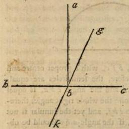

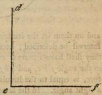

I say that they are equal; for if they are not equal, one of them must be greater, suppose the angle at b. If then the line d e be adapted to the line a b, the line e f shall fall within. Let it fall as b g, and let the line b c be produced to b; because, then a b c is a right angle, a b b also shall be a right angle, and they shall be mutually equal to each other, from the tenth Definition: the angle a b b therefore, is greater than the angle a b g. Let again the line g b be produced to k, because, therefore a b g is a right angle, the successive angle a b k shall be a right one, and consequently equal to a b g. Hence, the angle a b b, shall be less than the angle a b g; but it was also greater, which is impossible: but this has been shewn by other expositors, and requires no great consideration. But Pappus very properly admonishes us, that the converse of this Petition is not true; I mean, that every thing equal to a right angle, is a right angle; though if it be rectilinear, it is without doubt a right angle. But a curvilinear angle may also be exhibited equal to one that is right: for let there be conceived two equal right lines, a b, and b c, making the angle at the point b, right; and on them let the semicircles a e b, b f c, with a proper centre and interval be described; because, therefore, the semicircles are equal, they shall have a mutual congruence, and the angle e b a, is equal to the angle f b c, and a b f is common: the whole right angle, therefore, is equal to the lunular, i. e. to e b f, and yet the lunular is not a right angle. In the same manner, if the angle a b c should be obtuse or acute, a lunular angle may be shewn equal to it (for this is that genus of curvilinear angles which agrees with such as are rectilinear), only this is to be observed, that in a right and obtuse angle, it is requisite to add the middle angle, which is contained by the line a b, and the circumference b f; but in an acute angle to take this away: for the right line c b, in these cases, cuts the circumference b c. The truth of which, will be evident from the following figures:

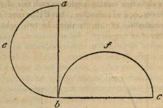

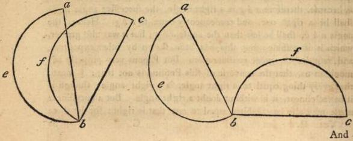

And hence, it appears, that all right angles are mutually equal to each other, and that not every thing equal to a right angle, is consequently a right angle: for if it be not rectilinear, how can it be called right. But it is also manifest from this Petition, that angular rectitude is allied to equality, in the same manner as acuteness and obtuseness are related to inequality. For rectitude and equality, as also similitude, are of the same co-ordination, (for each exists under bound): but acuteness and obtuseness, as also dissimilitude, are of the same series with inequality. For they are all produced from bound and infinite. Hence some, regarding the quantity of angles, say, that a right angle is equal to a right: but others, considering their quality, affirm that one is similar to another. For similitude in qualities is the same as equality in quantities.

#### V.

If a right line falling upon two right lines, makes the internal angles towards the same part less than two right, those right lines, if infinitely produced, shall coincide in that part, in which the angles less than two right, are placed.

This ought to be entirely blotted out from the number of Petitions, for it is a theorem including many doubts, which Ptolemy in one of his books proposes to solve; but it requires in its demonstration both many definitions and theorems; and Euclid also exhibits its converse as a theorem. But perhaps some, from an erroneous conception, may think that this should be placed among the petitions, as that which produces credibility of itself, respecting the inclination of right lines, on account of the diminution of two right angles. To such as these, Geminus rightly answers, that from the authors of this science, we learn not entirely to give credit to imaginative probabilities, for the purpose of accomplishing geometrical reasons: for it is similar (says Aristotle) to require demonstrations from a rhetorician, and patiently listen to a geometrician, disputing from probability. And Simmeas in the Phædo of Plato, says, "I know that those who demonstrate from appearances, are vain." Hence, in the present instance, it is true and necessary that right lines should incline, while right angles are diminished: but this, that the inclining lines, while they are more more produced, should at length coincide, is probable, but not necessary, unless some reason demonstrates that this is true in right lines: for there are certain lines infinitely inclining, and never coinciding, and though this appears incredible and admirable, yet it is true, and has been observed in other forms of a line. Is it therefore possible that this can be accomplished in right lines which takes place in others? For before we procure conviction of this, from demonstration, the properties exhibited in other lines molest the phantasy by the contrary images they produce. But if the reasons doubting against the coincidence of lines are very strong, ought we not much more to expel this improbable and irrational supposition from our doctrine? And thus it appears that a demonstration is to be sought for of the present theorem, and that it is foreign from the property of Petitions: but how it is to be demonstrated, and by what reasons the objections urged against it are to be removed, we shall shew in our comment on the proposition, where it is used by the institutor of the elements as manifest. For then it will be necessary to exhibit its evidence, since it does not present itself to our view with indemonstrable clearness, but becomes manifest through the medium of demonstration alone.

## AXIOMS.

#### I.

Things which are equal to the same, are equal to one another.

#### II.

If equals be added to equals, the wholes are equal.

#### III.

If equals be taken from equals, the remainders are equal.

#### IV.

If equals are added to unequals, the wholes are unequal.

#### V.

If equals be taken from unequals, the remainders are unequal.

#### VI.

Things which are double of the same, are equal to one another.

#### VII.

Things which are halves of the same, are equal to one another.

#### VIII.

Things which coincide with each other, are mutually equal.

#### IX.

The whole is greater than its part.

#### X.

Two right lines cannot comprehend space.

These are the things which, according to the opinion of all men, are called indemonstrable axioms, so far as their certainty is admitted by all, and no one disputes their evidence. For propositions also are often simply called axioms, of whatever kind they may be, whether they are immediately proper, or require some declaration; and the Stoics, indeed, are accustomed to call every simple enunciative speech an axiom: and when they write on dialectic arts, they say that they discourse on axioms. But some, distinguishing more accurately axioms from other propositions, give this appellation to a proposition immediate, and producing credibility of itself, on account of its evidence: as also Aristotle and geometricians themselves affirm. For, according to the opinion of these, an axiom is the same as a common conception. By no means, therefore, must we praise Apollonius the geometrician, who writ (as it appears) demonstrations of axioms, because he performs the very opposite to Euclid: for he, indeed, enumerates that which is demonstrable among Petitions; but Apollonius endeavours to find out demonstrations of indemonstrables. But these naturally differ from each other, and the genus of the sciences is different: I mean of the things which take place about immediate propositions, which are entirely subject to our knowlege, on account of their evidence; and of things which use demonstrations, which receive principles from them; and which, when received, they orderly employ in their proper conclusions. But that the demonstration of the first axiom, which Apollonius persuades himself he has invented, possesses a medium, not more known, but more dubious than the conclusion clusion may be known by any one from a flight inspection. For let (says he) a be equal to b, and b to c, I say that a also is equal to c. not only in magnitudes, but also in numbers, and motions, and times: and this indeed is necessary. For equal and unequal, the whole and part, and the more and the less, are common to discreet and continued quantities. The contemplation, therefore, which is conversant with times and motions, numbers and magnitudes, requires all these, as things evident by their own intrinsic light; and in all of them both that is true, which says, things equal to the same, are equal to one another; as likewise each of the axioms we have assumed: but as they exist in common, each science uses them according to its proper matter, and one indeed, as in magnitudes; but another, as in numbers; and another, as in times; and after this manner in each science, the conclusions become peculiar and apposite, though the axioms are common. Besides, it is likewise requisite not to contract the number of these to the least, as is done by Heron, who only establishes three axioms; for this also is an axiom, the whole is greater than its part, and the geometrician every where assumes this in his demonstrations; as also, that things which mutually coincide, are equal; for this is employed with advantage in the solution of the fourth Proposition. Nor is it proper to join some with others, of which some are proper to the geometric matter, as that two right lines cannot comprehend space, (since axioms are, as we have said, of a common kind); but others are consequent to things established, as that which says, things double of the same, are equal. For this is consequent to the axiom, affirming, that if to equals you add equals, the wholes are equal, since things equal to the half, because they assume the half, become double to the same, and mutually equal, on account of an equal addition: and according to this reason, not only the doubles, but also the triples, and all multiples of the same quantity will appear equal. But with these axioms, Pappus says, that certain others are to be classed, as if unequals are added to equals, the excess of the whole, will be equal to the excess of the adjuncts. And on the contrary, if equals are added to unequals, the excess of the wholes is equal to the excess or difference of the unequals themselves. And these also are manifest from themselves, yet they may be made manifest as follows. Let a be equal to b, and add to each the unequals c d, but let c be greater than d by e, and the remainder be f; because, therefore, a is equal to b, and also f to d; af will be equal to b d. For if equals are added to equals, the wholes are equals: a c, therefore, exceeds b d, by e only, by which alone c exceeds d. Again, c and d are unequals, to which, let the equals a and b be added, and let e be the excess of c, above d, and the remainder be f; because, therefore, a is equal to b, and f to d af will be equal to b d; the whole, therefore, a c, will exceed b d, by e only, by which c also exceeds d. These, therefore, are consequent to the aforesaid axioms, and are, not undeservedly, in many copies, omitted. But whatever others he adds to these, have been previously assumed by definitions, to which they are consequent. As for example: that all the parts of a plane and a right line mutually agree; for things placed in their extremities, possess a nature of this kind; and that a point divides a line, but a line a superficies, and a superficies a solid. For all things are divided by the natures by which they are proximately bounded; and that infinite subsists in magnitudes, by addition and diminution, but according to capacity only, in both these respects: for every thing continuous may be infinitely divided and increased. But, as we have summarily spoken concerning these, it remains that we consider things consequent to principles; for thus far principles extend themselves. But of those who oppose geometry, some very much doubt concerning principles, endeavouring to shew that the terms have no subsistence, whose arguments, indeed, are known in common, who endeavour to take away all science, and, like hostile foes from a foreign region, demolish the fruits and fecundity of philosophy, as is the case with the Pyrrhonian philosophers; but others only propose to themselves the subversion of geometrical principles, as the Epicureans. Others, again, admitting the principles, affirm, that things consequent to the principles cannot be demonstrated, unless something else is granted, which was not previously assumed in the principles. Zeno exercised this mode of contradiction, who was a Sidonian by birth, but of the Epicurean sect, against whom Possidonius wrote an entire book, exhibiting the whole of his imbecile opinion; and thus much may suffice for the difference of opinions concerning principles. We shall shortly consider the troublesome objection of Zeno: but now, after we have briefly resumed the consideration of theorems and problems, their difference, and the divisions they receive, we shall proceed to an exposition of the things exhibited by the institutor of the elements, gathering the more beautiful observations upon the propositions found in the writings of the antients, and contracting the infinite prolixity of their discourses; but delivering such things as are more artificial, and full of methods producing science, dwelling more on an accurate treatise of things than on the variety of cases and assumptions, to which young men, for the most part, eagerly incline.

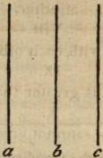

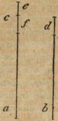

## PROPOSITION I. PROBLEM.

Upon a given terminated right line to describe an equilateral triangle.

Since all science is two-fold, and one is conversant about immediate propositions, but another about things, which are exhibited and provided from the propositions, and universally about the consequents to principles; this, again, divides itself in geometrical discourses, into the solution of problems, and the invention of theorems. And problems, indeed, geometry denominates things in which it proposes to procure, manifest, and fabricate that, which, in a certain respect, has no existence; but it calls theorems, things in which it appoints to perceive, know, and demonstrate that which either exists, or does not exist. For problems command us to undertake the origin, positions, applications, descriptions, inscriptions, circumscriptions, coaptations, and contacts of figures, and every thing of this kind: but theorems endeavour to procure our assent to symptoms, and things essentially inherent in the subjects of geometry, and to convince by demonstractions. For geometry discourses concerning every object of enquiry, which is possible to be effected, referring some things to problems, but others to theorems; since it enquires concerning the what, in a two-fold respect: for it either seeks for the reason and intelligence of the thing; or for intelligence, and the essence of the subject. I say, for example, as when it requires what a line of similar parts may be: for in an enquiry of this kind, it either desires to find the definition of such a line, as, that a line of similar parts is that which has all its parts agreeing with all; or to receive the species of lines of similar parts, as that it is either right, or circular, or a cylindric helix. Besides, prior to this, it enquires, by itself, concerning the if, and this especially in its determinations, agitating, whether the object of its enquiry is possible or impossible, what place it possesses, and in how many ways. It likewise seeks concerning the what kind; for when it considers the essential accidents of a triangle, circle, and parallels, it is manifest, that in such cases it seeks after the what kind; but many have thought that geometry very little contemplated the cause, and the why. And of this opinion is Amphinomus, led by the decisions of Aristotle: but (says Geminus) an enquiry into these may be found in geometry. For does it not belong to geometry to enquire for what cause infinite equilateral multangles may be inscribed in circles, but to describe solid equilateral and equiangular multangles, and constructed from similar planes, in spheres, is impossible? To whom does an investigation of this kind belong, except to a geometrician? When, therefore, to geometricians the syllogism is by an impossibility, they alone desire to find the symptom; but when by a principal demonstration, then again if the demonstrations are in that which is particular or partial, the cause is not yet manifest; but if in that which is universal, and in all similars, the why becomes immediately manifest: and thus much concerning objects of enquiry.

But every problem and theorem which receives its completion from its own perfect parts, ought to possess in itself all the following parts: proposition, exposition, determination, construction, demonstration, and conclusion. But of these, proposition informs us what the object of enquiry is from a given datum; for a perfect proposition is composed from both; but exposition receiving the datum essentially, prepares for the question. Again, determination separately explains the thing sought for according to the what; but construction adds to the datum what is wanting to the investigation of the thing sought; and demonstration skilfully collects the proposition from the concessions. But the epilogue, or conclusion, is again converted to the proposition, by confirming that which is exhibited. And so many, indeed, are all the parts of problems and theorems; but proposition, demonstration, and conclusion, are especially necessary, and exist in all; for it is requisite that the thing sought for should be previously known, and that this should be shewn by proper mediums, and that what is exhibited should be concluded; and it is not possible that any one of these three can be wanting; but the rest are, indeed, received in many places; but in many, because they produce no utility, are omitted. For determination and exposition are not found in the problem, which says, to construct an isosceles triangle, which will have each of the angles at the base double of the other; but construction has frequently no subsistence in many theorems, the demonstration being sufficient to exhibit the thing proposed from the data, without any addition. When, therefore, shall we say that exposition fails, when no datum is given in a proposition? Because, though proposition, for the most part, is divided into datum, and the thing sought for, yet this is not always the case; but sometimes the thing sought for, alone affirms that which it is requisite to know or effect, as in the aforesaid problem; for it does not previously say from what datum it is requisite to construct an isosceles triangle, which shall have each of the angles at the base, double of the remaining one; but that it is required to effect this. And here, indeed, the admission of the proposition takes place from things previously known; for we must know the meaning of the terms isosceles, equal and double (since this, as Aristotle observes, is the property of all ratiocinative discipline), yet nothing is subjected to us as in other problems, as in that which says, to bisect a given terminated right line. For here the right line is given, but we are ordered to divide it into two parts; and the datum is separately determined from the object of enquiry. When, therefore, a proposition has both of these, then also determination and exposition are found; but when the datum is deficient, these also fail, since exposition and determination belong to the datum: for this will be the same with the proposition. Indeed, what else do we say, when determining in the aforesaid problem, unless that it is requisite to find an isosceles of this kind? But such was the proposition: if then the proposition has neither this datum, nor thing sought, exposition will, indeed, be silent, because there is no datum; but determination will be neglected, lest it should become the same with the proposition: but you may find many other problems of this kind, especially in arithmetic, and in the tenth book of these Elements, as, to find a medium comprehending two right lines commensurable in power, and every thing of this kind.

But every datum may be given in these four modes, either in position, or proportion, in magnitude or form; for a point, indeed, is given in position only, but a line and the rest in all the four. Thus, when we say, to bisect a given rectilinear angle, we declare the species of the angle given, as that it is right lined, lest we should also seek to bisect a curvilinear angle by the same methods. But when we say, from the greater of two unequal right lines, to cut off a part equal to the less, the lines are given in magnitude; for the less and the more, finite and infinite, are the proper predications of magnitude. But when we say, that if four magnitudes are proportional, they shall be also alternately proportional, the same proportion is given in the four magnitudes: but when it is requisite, from a given point to place a right line equal to a given right line, then the point is given in position. From whence, since position may be various, construction also receives variety; for the point is given either without the right line, or in the right line, and in the extremity, or without the ex- tremity of the right line. Since, therefore, a datum has a four-fold acceptation, it is manifest, that exposition also is four-fold; but sometimes it connects two or three modes. Again, we find that demonstration sometimes possesses things proper to demonstration, exhibiting the thing sought for from mediate definitions; for this is the perfection of demonstration, but that sometimes it argues from certain signs. And it ought not to be concealed, that geometrical discourses have every where that which is necessary, on account of the subject matter, but are not every where perfected by demonstrative methods. For when, because the external angle of a triangle is equal to the two internal and opposite ones, it is shewn, that the three internal angles of the triangle are equal to two right, how is this demonstration from the cause? And is not a sign the medium in this case? For the external angle not yet existing, since the internal angles exist, they are equal to two right, since it is a triangle, though the side is not produced; but when, by a description of circles, the triangle, which is constituted, is shewn to be equilateral, the apprehension takes place from the cause. For we say, that the similitude and equality of the circles is the cause of the triangles equality with respect to its sides.

But geometrical discourses are likewise accustomed to make the conclusion, in a certain respect, two-fold. And this, when they exhibit things agreeable to the data, and reason universally, recurring from a particular conclusion to that which is universal; for when they do not use the property of the subjects, but placing the data before our eyes, describe an angle or right line, they think that which is concluded in this, is to be concluded in every thing similar: they pass on therefore to universal, lest we should think that the conclusion is particular. But their transition is effected in the best manner, since they employ, in demonstration, the things placed, not considered as such, but considered as similar to others: for it is not because such a particular angle is proposed that they effect a bipartite section, but because it is rectilineal only. But quantity, is indeed, proper to the proposed angle; but rectilineal is common to all right lines: let then the given angle be a right one. If therefore, we receive rectitude in the demonstration, we cannot pass to every species of right lines; but if we do not subjoin its rectitude, or being right angled, but alone consider its being rectilineal, the discourse may be adapted to all right lined angles; and all that we have previously observed we may contemplate in this first problem. For that it is a problem, is evident, since it commands us to construct an equilateral triangle: but proposition in this, consists from a datum and thing sought. For a terminated right line is given, but it is enquired how an equilateral triangle may be constructed upon it, and the datum indeed precedes, but the thing sought follows; so that we may say, by conjoining the two, if there be a terminated right line, it is possible to construct upon it an equilateral triangle; for a triangle cannot be constructed without the existence of a right line, since it is comprehended by right lines; nor upon an unlimited line, for an angle cannot be constructed unless it is made on one point, but in an infinite line there can be no extremity or bounding point. But after proposition, exposition follows, as, let there be given a terminated right line. And here we may see that exposition alone pronounces the datum, but by no means subjoins the thing sought; but after this we shall find determination: it is required upon the given terminated right line to construct an equilateral triangle; and here we may observe that determination is in a certain respect, the cause of attention, for it makes us more attentive to the demonstration, by pronouncing the thing sought, as exposition causes us to be more docile, by placing the datum before our eyes. Again, after determination, construction follows, from one extremity of the right line, as a centre, but with the remainder as an interval, let a circle be described. And again, with the other extremity, as a centre, and with the same interval, let a circle be described; and from the common point of the sections of the circles, to the extremities of the right line, let right lines be continued. And here we may observe, that Petitions are used in the construction, this for one, from every point to every point, to draw a right line; and also this, with every centre and interval to describe a circle; for universally Petitions are the sources of utility to constructions, but Axioms to demonstrations; demonstration therefore follows, because, then each extremity of the given right line is the centre of the circle surrounding it, the right line which reaches to the common section is equal to the given right line; hence, because the other extremity of the right line is the centre of its containing circle, the right line reaching to the common section of the circles, is also equal to the given line. And the admonition of these, is derived from the definition of the circle, which says, that all lines from the centre to the circumference are equal. Each of these lines, therefore, is equal to the same; but things equal to the same, are equal among themselves, by the first axiom. The three right lines, therefore, are mutually equal; hence, upon this given right line an equilateral triangle is constructed; and this, indeed, is the first conclusion which follows the exposition. But after this, that universal one, upon a given right line, therefore an equilateral triangle is constructed: for whether you make the line double of the one now proposed, or triple; or receive any one greater or less, the same constructions and demonstrations will accord. But to these he adds the particle which was required to be done, shewing from hence, that the conclusion is problematical; for in theorems, he adds the particle which was required to be shewn; the former announcing the production of something, but this the ostension and invention of a thing required. He therefore subjoins this to the conclusions, for the purpose of shewing that every part of the proposition is accomplished by this means, uniting the end with the beginning, and imitating intellect convolved, and again returning to its principle. But he does not always add the same, but sometimes the particle which was required to be done, and sometimes the particle which was required to be shewn, on account of the difference between problems and theorems: and thus, in this one problem, we have exercised and made perspicuous all this variety of considerations. But the reader ought to make a similar enquiry in the rest; investigating what propositions receive these leading properties, and in what they are omitted. Likewise in how many ways a datum is given, and from what principles we receive either constructions or demonstrations; for a perspicacious contemplation of these affords no small exercise and meditation of geometrical discourses.

But here it is necessary that we should briefly determine the nature of assumption, case, corollary, instance, (εγωσις) and induction. They say therefore that assumption is often predicated of every proposition assumed in the construction of another proposition, affirming at the same time that the demonstration of such a proposition is composed from so many assumptions. But assumption, properly considered by those who are conversant in geometry, is a proposition indigent of credibility; for when either in construction or demonstration we assume any thing which has not been exhibited, but requires a reason for its admission, then that which is assumed, as of itself ambiguous, being considered as worthy of enquiry, we call an assumption; and this differs from Petition and Axiom, because it is demonstrable, but they are assumed without demonstration, for the purpose of giving credibility to others. But the best aid in the invention of assumptions, is an aptitude of cogitation; for we may see many naturally acute in solutions, and discovering them without any method, as was the case with our Cratiscus, who was adapted to the investigation of a thing sought from the first and shortest methods possible; and had a natural promptitude for invention; but there are nevertheless certain most excellent methods delivered, one which reduces the thing sought, by resolution to its explored principle, which, as they say, Plato delivered to Leodamas, and from which he is reported to have been the inventor of many things in geometry: but the second is that which has a power of division; because it distributes the proposed genus into articles, but affords an occasion of demonstration, by an ablation of other things from the proposed construction. And this likewise is praised by Plato, as that which affords assistance to all sciences; but the third is that which by a deduction to an impossibility, does not of itself shew the thing sought, but confutes its opposite, and discovers the truth by accident; and thus far is the contemplation of assumption extended. But case enunciates different modes of construction, and the mutation of position, points, or lines, superficies, or solids being transposed; and in fine, all its variety is beheld about description: hence, it is also called case, because it is the transposition of construction. Again, Corollary is affirmed, indeed, of certain problems, as the Corollaries which are ascribed to Euclid; but Corollary is properly predicated, when, from the things demonstrated, a certain unexpected theorem appears, which on this account they have denominated Co- rollary, as a certain gain, exceeding the intention of demonstrative science; but instance impedes the whole passage of the discourse, either opposing the construction or the demonstration: and here it is not necessary, that as he who proposes a case, ought to shew the proposition true; so he who proposes an instance: but it is requisite to destroy the instance, and convict its employer of falsehood. Lastly, induction is a transition from one problem or theorem to another, which being known or compared, the thing proposed is also perspicuous. For example: when the duplication of the cube is investigated, geometricians transfer the question into another to which this is consequent, i. e. the invention of two mean proportionals, and afterwards they enquire how between two given right lines two means may be found. But Hippocrates Chius is reported to have been the first inventor of geometrical induction; who also made a quadrangle equal to a lunula, and invented many other things in geometry, and excelled all in his ingenuity respecting appellations; and thus much for these.

But let us return to the proposed problem: that an equilateral triangle, therefore, is the best among triangles, and is particularly allied to a circle, having all lines from the centre to the circumference equal, and one simple line for its external bound, is manifest to every one; but the partial comprehension of two circles in this problem, seems to exhibit in images how things which depart from principles, receive from them perfection, identity, and equality. For after this manner, things moving in a right line, roll round in a circle, on account of continual generation; and souls themselves, since they are indued with transitive intellections, resemble by restitutions and circumvolutions, the stable energy of intellect. The zoogonic or vivific fountain of souls too, is said to be contained by two intellects. If, therefore, a circle is an image of the essence of intellect, but a triangle of the first soul, on account of the equality and similitude of angles and sides; this is very properly exhibited by circles, since an equilateral triangle is included in their comprehension. But if also every soul proceeds from intellect, and to this finally returns and participates intellect in a two-fold respect; on this account also it will be proper that a triangle, since it is the symbol of the triple essence of souls, should receive its origin comprehended by two circles. But speculations of this kind, as from bright images in the mirror of phantasy, recall into our memory the nature of things. And here, because some object to the constitution of an equilateral triangle, thinking by this means to overthrow the whole of geometry, let us briefly answer and confute them. Zeno then, whom we have mentioned before, says, that if any one admits the principles of geometry, yet he will not obtain from common consent, things consequent to the principles, while this is not admitted, that there are not the same segments of two right lines: for unless this is given an equilateral triangle cannot be constructed. For let there be (says he) a right line a b, upon which an equilateral triangle is to be constructed.

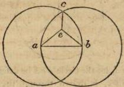

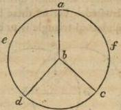

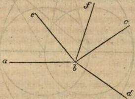

But let circles be described, and from their common section let the right lines c e a, c e b, be extended, having the common segment c e. It will therefore happen, that the lines extended from the common section, will be equal to the given line a b, and yet the sides of the triangle will not be also equal, but two will be less than the remainder, that is, than a b. And so this not being constituted, neither can the rest be constructed. Can then (says Zeno) the rest follow, though the principles are given, unless this also is previously received, that there are no common segments either of circles or of right lines? Against this objection then, we must affirm in the first place, that it was in a certain respect previously understood, that two right lines have no common segment. For the definition of a right line comprehends this property, since that is a right line which is equally situated between its bounding points; and the equality of the interval between the points to the right line, causes that which joins the points to be one, and the shortest line; so that if any one adapts it to another line, according to one of its parts, it must also agree with the line according to its remaining part; for since it is constituted in its extremities, because it is the shortest line, it is necessary that the whole should fall on the whole. But again, this was manifestly received in the Petitions: for the Petition which says, that a terminated right line may be produced straight forwards, perspicuously shews that the produced line ought to be one, and produced by one motion; but if any one is desirous to receive a demonstration of this assumption, let, if possible, a b be the common segment of a c and a d, and with the cen- tre b, and interval b d, let the circle a c d be described; because therefore the right line a b c, is drawn through the centre, a f c is a semicircle; and because the right line a b d likewise is drawn through the centre, a e d is a semicircle. The semicircles, therefore, a f c, a e d, are equal to each other, which is impossible. But against this demonstration Zeno will perhaps say, that it is likewise requisite to demonstrate that the diameter bisects the circle, because we previously assume that there is not a common segment of two circumferences. Thus too we take for granted, that one circumference coincides with another, or if it does not coincide, that it either falls externally or internally. But nothing hinders (he will say) that the whole may not coincide with the whole, but according to some part. But to this Possidonius rightly answers, who laughs at the acute Epicurean, as if conscious that though the circumferences do not coincide according to a part, yet the demonstration will succeed; for according to that part in which they do not coincide, the one will fall within, and the other without, and the same absurdities will follow when right lines are extended from the centre to the external circumference; for those from from the centre will be equal, as well the greater which is drawn to the external, as the less which is extended to the internal circle: either therefore the whole will coincide with the whole, and they will be equal; or coinciding according to a part, it will alternately vary according to the remainder, or no part will coincide with no part; and in this case it either falls within or without: but of this, enough. But Zeno also condemns the following demonstration of this particular: Let a b be the common segment of two right lines a c, a d, and let b e be erected at right angles to a c, the angle e b c, therefore, is a right one. Hence, if the angle e b'd is also right, they shall be equal, which is impossible; but if not, let b f be erected at right angles to a d. The angle f b a, therefore, is right; but the angle e b a was also right; and they are therefore mutually equal, which is impossible. This is the demonstration which Zeno opposes, as assuming that which is to be exhibited afterwards; I mean from a given point to raise a right line, at right angles, to a given right line. However, Possidonius observes, that indeed, a demonstration of this kind is never to be introduced into elementary institutions; but that Zeno calumniates Geometricians using their own as a flagitious demonstration; though there is some reason in their conduct. For there are right lines existing at right angles; since any two right lines are capable of forming a right angle; and this is previously assumed in our definition of a right angle. For we alone constitute a right angle from such an inclination; and it may perhaps be this which we have erected. Indeed, Epicurus himself, and all other philosophers admit, that not only many things possible may be supposed, but likewise many of an impossible matter, for the purpose of contemplating something consequent; and thus much concerning an equilateral triangle.

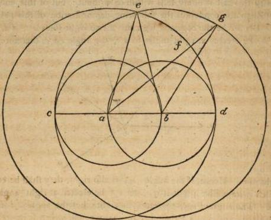

But it is requisite to construct other triangles, and in the first place an isosceles. Let a b, therefore, be a right line, upon which it is re- quired to construct an isosceles triangle. Describe circles as in the construction of an equilateral triangle, and produce the line a b on each side to the points c d; the line c b, therefore, is equal to a d. Again, with the centre b, and interval c b, let the circle c e be described; and with the centre a, and the interval d a, the circle d e; and from the point e, in which the circles intersect each other, to the points a and b, let the lines e a, e b, be extended. Because therefore, e a is equal to a d; but e b to b c, and a d is equal to b c, e a will also be equal to e b; but they are also greater than a b. The triangle a b e, therefore, is isosceles, which it was required to constitute. But let it be ordered to construct a scalene triangle upon the given right line a b. Describe circles with centres and intervals, as before, and let there be taken in the circumference of the circle, whose centre is a, the point f, and let the right line af be extended and produced to the point g; and likewise let the right line gb be extended. Because, therefore, a is a centre, af is equal to ad; and hence, ag is greater than ad, that is, than gb. But b also is a centre, gb, therefore, is equal to cb; and hence, gb is greater than ba: but ga is greater than gb; the three lines therefore gb, ba, ag, are unequal; and hence, the triangle abg is scalene. Hence too, three triangles are constructed; but these things are commonly known: however, this is beautiful in these triangles, that the equilateral existing on all sides equal, is constructed by one mode alone; but the isosceles, endued with equality in two sides only, has a two-fold construction: for the given right line is either less than both the equal ones (according to our present construction), or it is greater than both; but the scalene being unequal in all its sides, receives a triple construction; for the given right line is either the greatest of the three, or the least; or greater than the one, and less than the other; and indeed, it is proper to be exercised in each supposition, either by enlarging or contracting; but to us, what is already delivered, is sufficient. Let us now contemplate problems universally, some of which are produced simply, but others manifoldly, and others according to infinite modes. But (as Amphinomus observes) those which are simply constructed are ordinate: but those which receive a manifold composition, and are constructed according to number, are middle; and those which are varied in infinite ways, are inordinate. The manner, therefore, in which problems are constructed, simply or manifoldly, becomes manifest in the preceding triangles; for the equilateral is constituted simply; but of the other two, the one receives a two-fold, and the other a triple construction. But problems of the following kind, may take place in infinite modes; I mean to divide a given right line in three proportional parts; for if it be divided in a duple ratio, and the deficient quadrangular form, resulting from the less, be applied to the greater, it will be divided into three equal parts; but if the greater segment be more than double of the less, as for instance, triple, and a deficient quadrangular form, equal to that which results from the less, less, be applied to the greater, the line will be divided into three unequal parts. Because, therefore it may be divided into two parts, in infinite ways, the greater of which is either double or triple, (for multiplex proportion proceeds in infinitum), hence, it may be divided into three parts, according to infinite variations.

But it is requisite to know, that problem also is manifoldly predicated; for whatever is proposed may be called a problem, whether it is proposed for the sake of learning or operating. But in mathematical disciplines, that is properly called a problem, which is proposed for the purpose of contemplative energy. Since that which is performed in these, has contemplation for its end; and often, indeed, certain things, impossible to be executed, are called problems: but more properly that which is possible to be done, and neither exceeds, nor is deficient, is allotted an appellation of this kind; and the problem exceeds, which says, to construct an equilateral triangle, having its vertical angle two thirds of one right; for this is superfluous, and is added in vain: since it is a property inherent in every equilateral triangle. But of those which exceed, whatever are redundant with incongruous and non-existent symptoms, are called impossibles: but whatever are redundant with accidents, are called greater problems. But a defective problem (which is also called a less problem) is that which requires some addition, that it may be reduced from inordination into order and scientific bound, as if any one should say, to constitute an isosceles triangle: for this is mutilated and indeterminate, and requires some one who may subjoin, what kind of an isosceles triangle, whether that which has its base greater than either of the equal sides; or that which has it less. Likewise, whether that which has the vertical angle double of each at the base, as a semiquadrangle; or that which has each of the angles at the base double of the vertical angle; or that which possesses these angles according to some other proportion, as triple or quadruple: for it is possible that it may be varied in infinite modes. From hence, therefore, it is manifest, that such things as are properly denominated problems, ought to avoid indetermination, and not to be of the number of things capable of infinite variation; though such as these are also called problems, through an equivocation of the word problem. The first problem, therefore, of these elements, excels the rest in the manner we have explained; for it neither exceeds, nor is deficient; it is neither constructed in a variety, nor according to infinite modes; and such ought to be the conditions of that which is to be the element of the rest.

## PROPOSITION II. PROBLEM II.

To a given point to place a right line equal to a given right line.

Of problems, as well as of theorems, some are without case, but others possess a multitude of cases. Whatever, therefore, have the same power acceding to many descriptions, and when their positions are changed, preserve the same mode of demonstration, these are said to have case; but such as proceed according to one position only, and one construction, are without case; for simply, case, appears about the construction both of theorems and problems. The second problem, therefore, has many cases; but a point is given in it in position, since it can only be given in this manner; but a right line, both in form and position, (for it is not simply line, but of such a kind.) For it is here enquired, how to a given point to place a right line equal to a given right line. But it is manifest that the point is entirely in the subject plane, in which the right line exists, and not in one more elevated. For in all problems and theorems respecting planes, we must conceive that one plane is subjected. But if any one should doubt how a line is to be placed equal to a given right line, for what if the given line be infinite? Since the present datum pertains both to finite and infinite: for every datum signifies that which is proposed and supposed by us for the sake of investigation. But this Euclid himself declares, sometimes, saying, upon a given terminated right line to construct an equilateral triangle; but at other times, upon a given infinite right line to let fall a perpendicular. In answer then to this doubt, we must say, that when he orders us to place the line equal to a given right line, at a given point, he sufficiently evinces that the given line is finite; for every thing placed at a point, is terminated according to that point. Hence, the line equal to that which is given, must have a much prior termination. At the same time, therefore, in which he says to a given point, he terminates both the given right line, and its equal which is investigated.

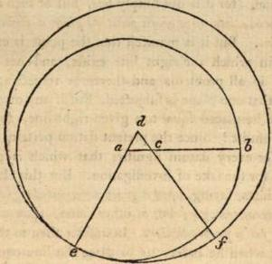

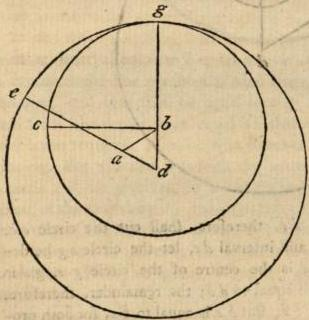

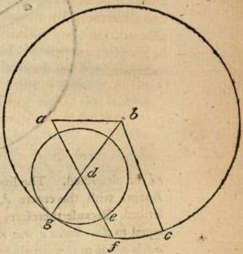

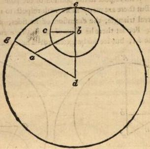

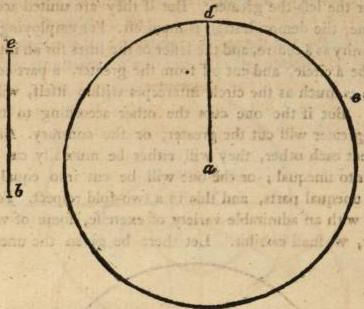

But that the cases of the present problem are formed from the various position of a point, is manifest. For the given point is either placed external to, or in the given right line; and if in it, it will either be one of its extremities, or it will be situated within the extremes; and if external, it will either have a lateral position, so that a line drawn from it to the extremity of the given line will form an angle, or a direct position; so that if the line were produced, it would coincide with the external point. But the geometrician, indeed, considers the point as external, and receives it according to a lateral position; however, for the sake of exercise, all the positions are to be assumed, the more difficult of which we shall exhibit. For let there be given a right line a b, and a given point c, which lies between its extremes, and let there be constituted according to the doctrine of the elements, an equilateral triangle upon the right line a c, and let d c, d a, be produced; then, with the centre a, and the interval a b, let the circle b c be described. And again, with the centre d, but with the interval d e, let the circle d f be designed. Because, therefore, a is the centre, b a is equal to a e; and hence, d e is equal to d f, the parts of which, d a, d c, are equal: for the triangle d a c was established as equilateral. The remainder, therefore, a e, is equal to c f; but a e, as it was shewn, is equal to a b, and hence, c f is equal to a b. To a given point, therefore, c, a right line c f is placed equal to a b. With respect to the position of the point then, so many cases arise. But there are many more with respect to the constitution of the equilateral triangle, the extension of its sides, and the description of circles. For let there be assumed, as in this element, a point a, and a right line b c, but let b a be extended. The equilateral triangle, therefore, will not be constituted on b a, with its vertex above (because there is no place for it), but beneath; let it, therefore, be a d b; a d, therefore, is either equal to b c, or greater or less. If then it be equal that which was required is performed. But if less with the centre b, and the interval b c, let a circle be described, and let a d, d b be produced to the points e and g; and with the centre d, but the interval d g, let a circle g a be designed. Because, therefore, d g is equal to d e, for they are drawn from the centre; and likewise because a d is equal to d b, for the triangle is equilateral, the remainder a e is equal to the remainder b g. But b g is also equal to b c, for they proceed from the centre; and hence, a e is equal to b c, which was required to be done. But if a d is greater than b c (for this is the last case), then with the centre b, and the interval b c, let a circle e c be described. The line d b, therefore, shall cut the circle e c. Again, with the centre d, and interval d e, let the circle e g be described. Because therefore, d is the centre of the circle g e, g d is equal to d e. But d a was also equal to d b; the remainder, therefore, a g is equal to the remainder b e. But b e is equal to b c, for both proceed from the centre. Hence, a g is equal to b c; and it is placed at the point a, as was required to be done. And though there are many other cases, the description of the above is sufficient for our present purpose. For from these it is possible for the more curious to exercise themselves in the rest. But formerly some destroying the construc- construction and variety of this problem, reasoned thus. Let a be a given point, but b e a given right line, and with the centre a, but with an interval equal to b e, let a circle d e be described. Then let a certain right line a d be extended from the point a to the circumference; and this shall be equal to b e: for the magnitude of the line from the centre, was equal to that of b e: and so that is done which was required. But he who thus reasons, begs, in the very beginning. For when he says with the centre a, but interval b e describe a circle e d, he receives, in a certain manner, a line equal to b e, placed at the extremity a; and preserving the Petition, he makes one extremity of the interval a centre, but with the other describes a circle: however, in this case, the centre is in one place, but the interval in another. We by no means, therefore, approve this method of demonstration.

## PROPOSITION III. PROBLEM III.

Two unequal right lines being given, from the greater to cut off a part equal to the less.

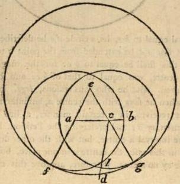

This third problem, likewise, has a variety of cases. For the given unequal right lines are either mutually distant from each other, as with the institutor of the elements, or they are united according to one extreme; or the one cuts the other according to one of its extremities, and this in a two-fold manner. For either the greater cuts the less, or the less the greater. But if they are united according to one extreme, the demonstration is manifest. For employing the common extremity as a centre, and the lesser of the lines for an interval, you will describe a circle, and cut off from the greater, a part equal to the less; since as much as the circle intercepts within itself, will be equal to the less. But if the one cuts the other according to its extreme, either the greater will cut the greater, or the contrary. And if they mutually cut each other, they will either be mutually cut into equal parts, or into unequal; or the one will be cut into equal, and the other into unequal parts, and this in a two-fold respect. For all these present us with an admirable variety of exercise, some of which, out of a many, we shall exhibit. Let there be given the unequal right lines a b, c d, the greater of which is c d, and let it cut a b in one of its extremities c; then with the centre a, but interval a h, let a circle b f be described, and let an equilateral triangle a e c be constructed upon a c, and produce e a, e c. Again, with the centre e, but interval e f, let the circle g f be described; and with the centre c, and interval c g, the circle g l. Because therefore, e f is equal to e g (for the centre is e) of which e a is equal to e c, the remainder a f, shall be equal equal to the remainder c g. But a s is likewise equal to a b; for the centre is a. Hence, c g will be equal to a b, and this is equal to c l, for the centre is the point c: a b, therefore, is equal to c l, which was required to be done.

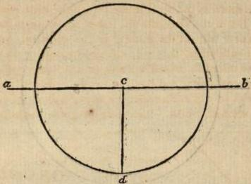

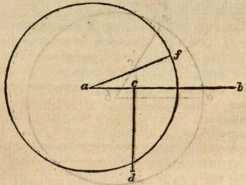

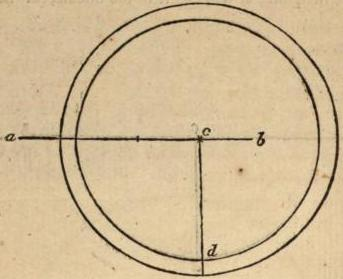

But let c d be less than a b, and let it cut a b according to its extremity c; either, therefore, it will cut it in the middle, or not in the middle. Let it in the first place cut it in the middle, c d, therefore, is either the half of a b, and a c is equal to c d, or it is less than half. And in this case with the centre c, and interval c d, describe a circle, and you will cut off from a b a part equal to c d: Or it is greater than half; and then at the point a, placing a s, equal to c d, and describing a cir- a circle with the centre a, and interval af, you will cut off from ab a part equal to af, that is to cd. But if cd does not cut ab in the middle, cd shall either be its half, or greater than the half, or less. If therefore cd is the half, or less than the half of ab, employing c as a centre, and cd as an interval, you will cut off from ab, a part equal to ed, as was required to be done. But if cd is greater than the half, again at the point a placing af equal to cd, you will accomplish the same. For with the centre a, but interval af, you will describe a circle, cutting off from ab a line equal to af, that is, to cd.

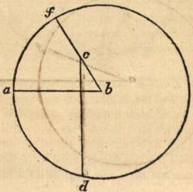

But if they mutually intersect, as c d, a b, then with the centre b, but interval b a, describe the circle a f, and let b c be extended to the point f. Because therefore, b f, c d, are the two unequal right lines, and c d cuts b f, according to its extremity, it is possible from c d to make a line equal to b f; for this has been shewn in the first case of this problem. It is therefore possible, that a line equal to a b may be cut off from c d; for a b and b f are mutually equal. Having, therefore, received these cases from division, we have endeavoured to exhibit their variety. But the demonstration of the elementary institutor is admirable, since it accords with all the preceding constructions. And it is possible, in every position, at the extremity of the greater, to place a line equal to the less, and using the same extreme as a centre, and placing the interval to describe a circle, which shall cut off from the greater, a line equal to the less, whether they mutually intersect, or one cuts the other, or they are constituted in a still different position.

## PROPOSITION IV. THEOREM I.

If two triangles have two sides equal each to each; and have likewise the angles equal; which are comprehended by the equal sides; then they shall have their bases equal; and the two triangles shall be equal; and the remaining angles opposite to the equal sides shall be equal.

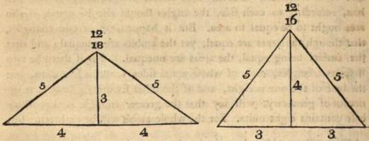

This is the first theorem in the institution of the elements, for all those which preceded were problems. The first, indeed, treating concerning the origin of triangles: but the second and third proposing to procure one right line equal to another. And of these the one produced an equal from an unequal line, but the other discovered an equal line by an ablation from one unequal. Since, therefore, equality, which is the first symptom in quantity, is to be constructed by us in a triangle and right line, it is delivered in the following theorem. For how can he who has not previoulsly constructed triangles, and procured their origin, be learned in their essential accidents, and in the equality of angles and sides which they contain? How can he receive sides equal to sides, and right lines to other right lines, who has neither problematically investigated these, nor fabricated the invention of equal right lines? For if he should say it may happen before they are fabricated, that if two triangles have this for a symptom, they shall likewise have this particular symptom; would it not, in this case, be easy to object to him, that we by no means know whether a triangle can be constructed? And should it be afterwards inferred, that if there are two triangles, they may have two sides equal to two sides, may we not also doubt this, whether it is possible that right lines may be mutually equal? And this particularly in geometrical forms, in which inequality not entirely existing, equality is likewise inherent. For we must learn that the cornicular is always unequal to an acute angle, and the same is true of the semicircular angle, and the transition from the greater to the less does not entirely take place through that which is equal. The institutor of the elements, therefore, first of all removing these objections, delivers also the construction of triangles (for it is common to three forms) and the origin of equal right lines, in a two-fold order. For he produces the one, not yet existing: but he acquires the other by an ablation from an unequal line. But after these he very properly subjoins the theorem, by which it is shewn how triangles having two sides equal to two, each to each, and the angles comprehended by the equal sides equal, have also the base equal to the base, the area equal to the area, and the remaining angles to the remaining angles. For there are three particulars exhibited in these triangles: but two data. Hence, the equality of the two sides is given, or two equal sides (and it is manifestly given in proportion) and the equality of the angle contained by the equal sides: but three particulars are investigated, the equality of base to base, of triangle to triangle, and of the remaining angles. But because it is possible that triangles may have two sides equal to two, and yet the theorem not be true, because the one is not equal to the other, but both together, on this account he adds in the data, that the sides are equal not simply, but one to the other. For if one of the triangles should have one of its sides of three units, but the other of four; and again, if the sides of the other triangle are respectively two, and five units, the angle comprehended by these being right, the two sides of the one triangle, will, indeed, taken together, be equal to the two sides fides of the other, or to seven units, yet the two triangles will not be equal. For the area of the one is six units, but of the other five. And the reason of this is, because the fides are not equal each to each. Hence, many, not observing this in the division of land, when they have received a greater, have thought just the same as if they had received an equal field; and this because both the fides containing one field, have been together equal to both the fides containing the other field. It is requisite, therefore, to receive the one equal to the other, and to mark wherever the institutor of the elements subjoins this, because he does not add it without occasion. For discoursing on the equality of equal angles, he adds the particle comprehended by equal fides, left by speaking indeterminately we should assume some one of the angles at the bases. Besides, when in triangles no side is previously named, we must conceive the base to be the side opposite to our fight; but when two are previously received, the remaining side is necessarily the base. Hence, here too, the institutor of the elements having previously assumed two fides equal to two, calls the remainder the bases of the triangles. But a triangle is then said to be equal to a triangle, when their areas are equal. For it is possible, that though the ambits are equal, yet the areas may be unequal, on account of the inequality of angles. But I call the area, the space intercepted by the fides of the triangle: as also I denominate the ambit, the line composed from the three triangular fides. Each, therefore, is different, and it is requisite, indeed, that besides the equality of the ambits, according to each side, the angles should also be equal, if also area ought to be equal to area. But it happens in certain triangles, that though the areas are equal, yet the ambits are unequal; and that the ambits being equal, the areas are unequal. For if there be two isosceles triangles, each of whose equal fides contains five units, but the base of the one is eight, and of the other six units; he who is ignorant of geometry, will say that the greater triangle is that whose base contains eight units. For the whole ambit will be eighteen. But the geometrician will say, that the area of each triangle contains twelve units, and this he will demonstrate, by drawing in each triangle a perpendicular from the vertex, and multiplying this with either part of the segments of the base. But it happens (as I have said) that though the ambits are equal, the spaces are unequal. Hence, certain persons formerly fraudulently deceived their partners in the division of fields, on account of the equality according to ambit, receiving a larger field. But one base is said to be equal to another, and one right line to another, when their extremes conjoined make the whole coincide with the whole. For every right line, indeed, agrees with every right line; but equal right lines mutually coincide according to their extremes. Again, one right-lined angle is said to be equal to another, when one of the comprehending sides of one angle being placed upon one of the other, the remaining side also coincides with the remainder: but when one of the remaining sides falls external to the other, the greater angle is that whose side falls externally; and the less whose side falls within. For there, indeed, the one contains, but in this case it is contained. But we must assume the equality of angles according to the convenience of sides in right lines, and in all of the same species, as in lunulars and systroides , and figures on both sides convex; because, it is possible that they may be equal, and yet the sides not mutually coincide. For a right angle is equal to a certain lunular angle, and yet it is not possible that right lines can coincide with circumferences. Besides, this also must be previously understood, that the angles are said to subtend the opposite sides. For every triangular angle is contained by two sides of the triangle, but is subtended by the remaining side. Hence, the geometrician, when he says that the angles are equal, adds, which are opposite to the equal sides, lest we should conceive it of no consequence whatever angle is received, and should think that he denominated any other two angles of the triangles equal, but we must call those equal which subtend equal sides. For equal sides mutually subtend equal angles. And such are the considerations necessary to the declaration of the present theorem.

But against the objection of our adversary , this must be previously assumed, that two right lines cannot comprehend space. For this the geometrician receives as evident. For if (says he) the extremes of the bases mutually coincide, the bases also shall coincide: but if not two right lines, will comprehend space. From whence, therefore, is the impossibility of this derived? Let there then be two right lines comprehending space a c b, a d b, and let them be infinitely produced.

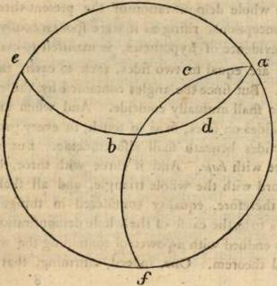

Then with the centre b, and interval a b, let a circle a c f be described. Because, therefore, the line a c b f is a diameter, a c f is the half of the circumference. Again, because the line a d b e is a diameter, a e, likewise, is one half of the circumference. Hence, a e, and a c f are equal to the circumference, which is impossible. Two right lines therefore, cannot comprehend space; which the institutor of the elements knowing said, in the first Petition, from every point, to every point, to draw a right line, because one right line is always capable of uniting two points, but this is impossible for two right lines to effect. Many circumferences, indeed, may conjoin two points, both in the same, and in contrary parts: for by this means the extremities of a diameter conjoin two circumferences, but only one right line. But it is possible that both within and without semicircles, infinite circumferences conjoining given points may be described. And the reason of this is, because a right line is the least of lines, having the same extremes. But there is every where one minimum, and this always becomes the measure of the infinity of others. As therefore a right line, since it is one, becomes the measure of the infinity of right-lined angles (for by this we discover their quantity) so likewise a right line procures us the greatest utility in the mensuration of such as are non-rectilineal. And thus much may suffice concerning these.

But that the whole demonstration of the present theorem depends on common conceptions, rising as it were spontaneously, and emerging from the evidence of hypotheses, is manifest to every one. For since two sides are equal to two sides, each to each, they will mutually coincide. But since the angles contained by the equal sides are equal, they also shall mutually coincide. And when angle is placed on angle, and sides on sides, so as to touch, in every part, the extremities of the sides beneath shall also coincide. But if these, then base, shall agree with base. And if three with three, the whole triangle shall accord with the whole triangle, and all shall be equal to all. Hence, therefore, equality considered in things of the same species, appears to be the cause of the whole demonstration. For here are two axioms endued with a power of containing the whole method of the proposed theorem. One, indeed, affirming, that things which mutually coincide, are equal; and this is simply true, requiring no limitation, and is employed by the institutor of the elements both in the base, and in the space, and in the other angles. For these, says he, are equal, because they mutually coincide. But the other affirming that things which are equal mutually coincide. This, however, is not true in all, but in those of a similar species. But I call things similar in species, such as a right line when compared with a right line, one circumference with another of the same circle, and the angles comprehended by similar lines endued with a similar position. But of these, I say, that such as are equal, mutually coincide: so that in short, the whole demonstration is of this kind. These equals, therefore, are given, viz. two sides equal to two sides, and the angles which they comprehend, and these accord among themselves. But if these mutually coincide, the base also shall agree with the base, and all coincide with all. And if these accord, they are also equal. If then these are equal, it may at the same time be shewn that all are equal to all. And this appears to be the first mode of knowing triangles on all sides equal. And thus much concerning the whole demonstration.

But Carpus, the mechanist, who, in an astrological treatise, discourses of problems and theorems, says, "that they must not be passed over in silence, since they opportunely present themselves for investigation;" and lastly, entering on their distinction, he observes, "that the problematical genus precedes theorems in order. For in problems (says he) the invention of subjects is investigated prior to symptoms. Likewise a problematical proposition is simple, and requires no artificial intelligence. For this commands us to accomplish something evident, as to construct an equilateral triangle, or from two given unequal right lines, to cut off from the greater a part equal to the less. For what is there in these difficult and obscure. But he affirms that the proposition of a theorem is difficult, and requires the most accurate power, and a judgment productive of science, that it may appear neither to exceed, nor to be deficient from truth; such, indeed, as the present, which is the first of theorems. Add too, that in problems, there is one common way invented by resolution, by proceed- ing according to which, we can happily accomplish our purpose. For after this manner the more easy kind of problems are investigated. But the treatise of theorems is so very difficult, that even to our time (says he) no one has been able to deliver any common method of their invention. Hence, on account of facility also, the problematical genus is more simple. But these being distinguished, it is on this account (says he) that in the elementary institution problems precede theorems, and from these the institution of the elements begins; and the first theorem is in order the fourth, not because the fourth is exhibited from the preceding, but because it is necessary they should precede as being problems, and this a theorem, though it should require none of the antecedent propositions for its demonstration. For the present theorem entirely employs common conceptions; and in a certain respect receives the same triangle in a different position. Since coincidence, and its consequent equality possess a sensible and manifest apprehension. But such being the demonstration of the first theorem, problems with great propriety precede, because they are universally allotted the primary place." And perhaps, indeed, problems antecede theorems in order; and particularly among those who ascend to contemplation from the arts, which are conversant with sensible particulars: but theorems excel problems in dignity of nature. And it appears, that all geometry, so far as it conjoins itself with a variety of arts, energizes problematically: but so far as it coheres to the first science, it proceeds theorematically from problems to theorems, from things secondary to such as are first, and from things which more regard the arts, to such as are endued with a greater power of producing science. It is, therefore, vain to accuse Geminus, for affirming that theorems are prior to problems. For Carpus assigns a precedency to problems, according to order: but Geminus to theorems, according to a more perfect dignity. But of this fourth theorem, we have already observed, that in a certain respect it is indigent of the preceding problems, in which we learn the origin of triangles, and the invention of equality. But we now add, that since it is the most simple and principle of theorems (for it is naturally, as I may say, exhibited from primary conceptions alone), but demonstrates a certain symptom appear- appearing about triangles, having two sides equal to two, each to each, and the two angles equal contained by the equal sides, it is with great propriety placed the first after problems, in which things subject to this symptom, and the data themselves are constructed.

## PROPOSITION V. THEOREM II.

The angles at the base of an isosceles triangle are mutually equal; and the equal right lines being produced, the angles under the base shall be mutually equal.

Of theorems some are simple, but others composite. I call those simple, which, both according to hypotheses and conclusions, are indivisible, possessing one datum, and one object of investigation. Thus for example, if the institutor of the elements had said, every isosceles triangle has the angles at the base equal, it would have been a simple theorem. But theorems are composite, which are composed from many particulars, either having composite hypotheses, or conclusions from a simple hypothesis, or both. And of these, some are complex, but others incomplex. The incomplex are such composites as cannot be divided into simple theorems, as the fourth proposition. For in this, both the datum is a composite, and its consequent, yet it is impossible that the datum can be divided into things simple, and become theorems. For if a triangle has its sides alone equal, or the angle at the vertex, the same consequences will not ensue. But the complex are such as may be divided into things simple, as the theorem which says, triangles and parallelograms of the same altitude, have the same proportion as their bases. For it is possible to say by division, that triangles of the same altitude, have the same proportion as their bases, and in parallelograms after a similar manner. But of all composites, some are composed according to the conclusion, being excited from the same hypothesis: but others have their conclusion according to hypotheses, and infer the same conclusion in all: and others, lastly, are composed both according to the conclusion, and according to hypo- theses. Composition, therefore, in the present case, is according to the conclusion, for there are three particulars concluded in this theorem, that the bases are equal, that the triangles are equal, and that the remaining angles, under the base, are equal to the remaining angles. But composition, according to hypothesis, is found in the common theorem of triangles and parallelograms of the same altitude. And according to both, in the theorem that the diameters both of circles and ellipses, bisect as well the spaces as the lines containing the spaces. But of complex theorems, some are universal: but others conclude that which is universal from particulars. For if we should say that a diameter divides a circle, ellipsis, and parallelograms, we receive, indeed, every part of the complex, not universally, but we make that universal which is composed from all. But if we should say, that in a circle, all lines passing through the centre, mutually bisect each other, and make equal angles of all the segments, we should affirm a universal. For in an ellipsis all the angles of the segments are not equal, but those only which are formed by the diameter. But these compositions are entirely fabricated, for the sake of geometrical brevity and resolutions. For many things incomposite are not resolved, but composites alone afford convenience to a resolution tending to principles.

In consequence of these previous considerations then, we must call the fifth theorem a composite, and a composite, both with respect to the datum, and the object of investigation; and this the institutor of the elements exhibiting, divides this theorem, being one, and gives a separate position to the data, and the things to be investigated, for he says that the angles at the base of an isosceles triangle are equal; and again, that the equal sides being produced, the angles under the base are equal. For we must not think that there are two theorems, but one; and that this is a composite, both according to the data, and thing sought: and that each of these composites is perfect and true. Hence, conversion also is true in each. For if the angles at the base are equal, the triangle is isosceles: but if those under the base are equal, the equal right lines are produced, and the triangle is isosceles isocles. But the institutor of the elements converts the equality of the angles at the base; but not the equality of those under the base, though this is likewise true; the reason of which we shall shortly explain. But we shall now, in the first place, enquire on what account he demonstrates that the angles under the base are equal. For he never employs this in the construction or demonstration of other problems or theorems. It may be doubted, therefore, why, since it is useless, it was requisite to insert it in the present theorem? To this we must reply, that though it is never employed in the elements, yet it is most useful for the destruction of objections, and the solution of oppositions to theorems . But it is artificial, and belongs to science to to prepare solutions of things resisting its propositions, and to provide subsidies of answers; that not only true demonstrations may be fabricated from things previously demonstrated, but that from hence confutations of error may be produced. And from this geometrical order, you will likewise receive a rhetorical emolument. For he who can effect this in the discourses of rhetoric, who can foresee the oppositions to his following heads, and previous to their delivery, can first of all prepare solutions of them to others, he, indeed, will fabricate in a wonderful manner, a most excellent mode of disputation. The institutor of the elements, therefore, teaching us this in reality, previous to the theorems by which we solve opposing objections, employing such as are now exhibited, at the same time demonstrates, that the angles under the base of an isosceles triangle, are equal, and thus prepares a confutation of the falsehood such objections contain. But that from the present theorem we may solve the objections urged in the seventh and ninth propositions, will be perspicuous as we proceed. Hence, it appears, why Euclid does not convert the latter part of this theorem in the sixth, because it does not produce a principal utility, but confers to our advantage, accidentally, with respect to the whole of science.

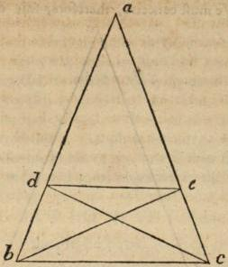

But if any one should desire us without producing the equal right lines, to prove the angles at the base of an isosceles triangle equal, (for it is not requisite to demonstrate the equality of these, by those under the base) by transposing, in a manner, the construction, and fabricating those constructions within, which are made without the isosceles triangle, we may exhibit the thing proposed. Thus let mentaries. And lastly, what is most material of all, if geometry be a science, what science itself is? This last question, indeed, they would doubtless consider so trifling and easy of solution, that they would readily and confidently answer with young Theatetus in Plato, "that sciences are such things as may be learned from Mathematicians, geometry, and the like; shoe-making, and other mechanical arts; and that all, and each of them are no other than sciences." To which admirable definition we may justly reply in the words of Socrates, "Generously and magnificently O my friends, when interrogated concerning one thing, have you given instead of something simple, things many and various." abc a b c be an isosceles triangle, and in the side a b, take any point d, and from a c, take a e, equal to a d, and draw the lines b e, d c, d e. Because, therefore, a b is equal to a c, and a d to a e, and the angle a is common, b e also shall be equal to c d, and the remaining angles to the remaining angles. Hence, the angle a b e, is equal to the angle a c d. Again, because d b is equal to e c, and b e to d c, and the angle d b e to e c d; hence, the base, since it is common to both, is equal to itself, and all are equal to all. The angle, e d b, therefore, is equal to the angle d e c: and the angle d e b, is equal to the angle e d c. Hence, since the angle e d b, is equal to the angle d e c, from which the equal angles d e b, e d c, are taken, the remaining angles b d c, c e b are equal. But the sides also b d, d c, are equal to the sides c e, e b, each to each, and the base b c is common. All, therefore, are equal to all. Hence, the remaining angles also, subtending equal sides, are equal. The angle, therefore, d b c, is equal to the angle e c b. For the angle d b c, subtends the line d c: but the angle e c b, the line e b. The angles, therefore, at the base of an isosceles triangle, are equal, the equal right lines not being produced.

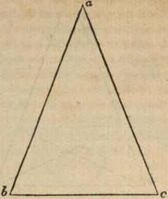

But Pappus demonstrates this yet shorter, without any addition in the following manner. Let a b c be an isosceles triangle, having a b, equal to a c. We must conceive, therefore, this one triangle as if it was two, and reason thus. Because a b is equal to a c, and a c to a b, the two sides a b, a c, are equal to the two a c, a b, and the angle b a c, is equal to the angle c a b, (for it is the same.) All, therefore, are equal to all. The base b c, to the base c b. But the triangle a b c, to the triangle a c b; and the angle a b c, to the angle a c b, and the angle a c b, to the angle a b c. For they subtend equal sides, i. e. a b, a c. The angles, therefore, at the base of an isosceles triangle, are equal. And it seems that Pappus invented this mode of demonstration, when he considered that the institutor of the elements also, in the fourth theorem, when he had united two triangles, and had made them mutually coincide, thus forming one of two, by this means observed their equality throughout. In like manner it is possible, that we also, by an assumption contemplating two triangles in one, may demonstrate the equality of the angles at the base. Thanks, therefore are to be given to the ancient Thales for the invention of this theorem, as well as a multitude of others. For he, first, is said to have perceived and affirmed, that the angles at the base of every isosceles triangle are equal: and after the manner of the ancients, to have called them similar. But still more deserving of praise are those moderns, who have yet more universally demonstrated (among which number is Geminus) that equal right lines falling from one point, on a line of similar parts, form equal angles. For Geminus using this theorem, shews, that there are only three lines, and not more of similar parts, the right, the circular, and the cylindric helix; and this is properly universal, to which this symptom first agrees, just as the possession of two sides greater than the third, is shewn to be essentially inherent in every triangle. It is not, therefore, the property universally of every isosceles, though it belongs to every one, to possess angles at the base equal: but of equal right lines falling on a line of similar parts. For to subtend equal angles, is in these primarily inherent.

## PROPOSITION VI. THEOREM III.

If two angles of a triangle be equal to each other, the sides also which subtend the equal angles, shall be equal to one another.

The present theorem exhibits these two properties of theorems, conversion, and a deduction to an impossibility. For it is converted, indeed, in the preceding theorem, but its certainty is evinced by a deduction to an impossibility. It is requisite, therefore, to speak of each, whatever belongs to the present treatise. One kind of conversion then, among geometricians, is denominated principally and properly, when the conclusions and hypotheses alternately receive theorems; so that the conclusion of the former becomes hypothesis in the latter; and hypothesis is inferred as the conclusion. As that the angles at the base of an isosceles triangle are equal. For here the isosceles triangle is the hypothesis: but the conclusion, the equality of the angles at the base. And that where the angles at the base are equal, the triangles are isosceles, which the present 6th theorem affirms. For here the equality of the angles at the base is the hypothesis; but the conclusion, the equality of the sides subtending the equal angles. But another kind of conversion, is alone according to a certain mutation of composites. For if the theorem be composite, beginning from many hypotheses, and ending in one conclusion, by receiving the conclusion, and one or more of the hypotheses, we infer some one of the other hypotheses as a conclusion. And after this manner the eighth theorem is the converse of the fourth. For the one says, that equal bases subtend equal sides and angles: but the other, that equal sides being placed on equal bases, contain equal angles. Of which the predication concerning equal bases in the latter proposition, is the conclusion of the former: but the predication concerning the position of equal sides, is one of the previously assumed hypotheses in the former theorem; and the comprehension of equal angles is another hypothesis which this fourth proposition contains. In consequence therefore of these two conversions, the one which is called the principle, is uniform and determinate: but the other is various, advancing into a great number of theorems, and not converting in one, but in many, on account of the multitude of hypotheses, in composite theorems. But oftentimes in that which begins from two hypotheses, there is one which is converted, when the hypotheses are not all determinate, but some of them indeterminate

It is here, however, requisite to observe, that many false and improper conversions take place. As that every sexangular is a triangular number . For the converse is not also true, that every triangular number is sexangular. But the reason of this is, because the one is more common, but the other more particular. And one is alone predicated totally of the other. But things in which, that which is primary, is inherent, and according to which it is received, in these, conversion also follows. And these observations, indeed, were not unknown to those mathematicians, the familiars of Menæchmus, and Amphinomus. But of theorems receiving conversion, some are usually called precedents, but others converse. For when supposing a certain genus, they demonstrate some symptom of its nature, they call this a precedent theorem. But when on the contrary, they make the hypothesis a symptom, and the conclusion a genus, they denominate the theorem to which this happens converse. As for instance, the theorem which says, every isosceles triangle has the angles at the base equal, is a precedent. For that is subjoined which precedes by nature. I mean the genus itself, or the isosceles triangle. But that which says, every triangle possessing two equal angles, has likewise the sides subtending those equal angles equal, and is isosceles, is a converse theorem. For it changes the subject, and its passion, supposing the latter, and from this exhibiting the former. And thus much concerning geometrical conversions.

But deductions to an impossibility, entirely end in an evident impossible, the contrary of which is confessed by all. It happens, however, that some of them end in such things as are opposed to Axioms, or Petitions, or Hypotheses; but others in things contradicting prior demonstrations. For the present sixth theorem shews that which happens to be impossible, because it destroys the common conception, affirming that the whole is greater than its part. But the eighth theorem falls, indeed, on an impossible, yet not on that endued with a power of destroying a common conception, but that exhibited by the seventh theorem. For what the seventh denies, this affirming exhibits to such as do not admit the object of investigation. But every deduction to an impossibility, which being received, opposes the thing sought, and on this hypothesis advances, until it falls upon the explored absurdity, and by this means destroys the hypothesis, corroborates that which was investigated from the first. But it is requisite to know, that all mathematical proofs are either from principles, or to principles, as Porphyry in a certain place affirms. And the proofs from principles, are two-fold. For they either emanate from common conceptions, and things self-evident: or from things previously exhibited. But proofs to principles are endued with a power of either establishing or destroying principles. And those, endued with a power of establishing principles, are called resolutions; and to these compositions are opposed. For it is possible that we may proceed in an orderly method from those principles to the object of investigation; and this is nothing else than composition. But those possessing a power of destroying principles, are called deductions to an impossibility. For it
VOL. II. I is is the business of this mode to destroy some of the concessions, and objects of investigation. And in this, also, there is a certain ratiocination, though not the same as in resolution. For in deductions to an impossibility, complexion is according to the second mode of hypothetical reasonings. As if in triangles possessing equal angles, the sides subtending the equal angles are unequal; and the whole is equal to its part: but this is impossible. In triangles, therefore, possessing two equal angles, the sides subtending the equal angles are equal. And thus much concerning what is called by geometricians, deduction to an impossibility.

But the institutor of the elements uses conversion in the present proposition, for he receives the conclusion of the fifth as a datum, and adds its hypothesis as an object of enquiry: but he employs deduction to an impossibility, in the construction and demonstration. But if any should rise up, and assert that it is not necessary by taking a part from a c equal to a b, to make the ablation at the point c, but at the point a, upon this hypothesis, we shall fall into the same impossibility. For let a b be equal to a d, and having produced b a, let a e be placed equal to dc. The whole b e, therefore, is equal to the whole a c.

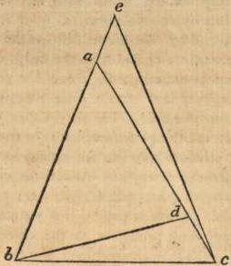

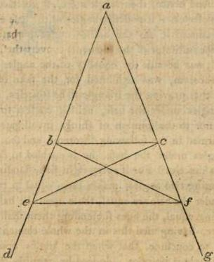

Let e c be connected. Because, therefore, a c is equal to b e, but b c is b c is common, the two are equal to the two, and the angle at the point b, is equal to the angle a c b. For so it was established in the hypothesis. All, therefore, are equal to all, by the fourth theorem. Hence, the triangle e b c, is equal to the triangle a b c, the whole to the part, which is impossible. But because this also is manifest, it remains that we exhibit the rest of the conversion. For the institutor of the Elements converts the whole sixth theorem from a part of the fifth. But it is requisite to adjoin the remaining conversion. This, then, he receives as an hypothesis, that the angles at the base of a certain triangle are equal: but he shews that the triangle is isosceles. Let a c b, therefore, be a triangle, and let a b, a c, be produced to the points d g, and let the angles under the base be equal. I say that the triangle a b c, is isosceles. For let there be assumed in the line a d, the point e, and let b e be taken equal to c f; and connect the lines e c, b f, e f. Because, therefore b e is equal to c f, but b c is common, the two will be equal to the two. And the angle e b c, is equal equal to the angle f c b; for they are under the base. All, therefore, are equal to all, by the fourth theorem. Hence the base e c, is equal to the base f b, and the angle b e c, to the angle c f b; and the angle c b f, to the angle b c e: for they subtend equal sides. But the whole angle e b c, was equal to the whole f c b, of which the angle f b c, is equal to the angle e c b. The remainder, therefore, e b f, is equal to the remainder f c e. But b e is equal to c f, and b f to c e, and they contain equal angles. All, therefore, are equal to all. Hence, also, the angle b e f, is equal to the angle c f e. Wherefore, the side a c, is equal to the side a f (for it is shewn by the sixth) of which b e, is equal to c f. The remainder, therefore, a b, is equal to the remainder a c. And hence, the triangle a b c, is isosceles. It is, therefore, as well isosceles, if it possesses angles at the base equal: as if the sides being produced it has the angles under the base equal. Why then did not the institutor of the Elements convert the remaining part? Shall we say it was because the equality of the angles under the base in the fifth theorem, was exhibited for the sake of solving other doubts. But that proving the triangle to be isosceles, from the equality of the angles under the base, neither confers to a principal demonstration, nor to the solution of things investigated, the truth of which is confirmed in the following theorems, and that from the equality of the angles under the base, he is enabled to demonstrate that the triangle is isosceles? For if every right line, standing upon a right line, and forming two angles, makes them equal to two right; when the angles under the base are equal, those upon the base will be equal. And these being equal, the sides subtending them shall be equal. Euclid, therefore, having used this in the whole elementary institution, was enabled to conclude, that when the angles under the base are equal, the triangle is isosceles. Indeed he requires this also, for the demonstration of certain theorems: For shortly a theorem will appear, evincing, that if a right line standing on a right line, forms angles, it will either make two right, or angles equal to two right. And the theorems, indeed, preceding this, require no such conversion; but those which follow, are indigent of this, and establish their credibility from the present theorem.
#

## PROPOSITION VII. THEOREM IV.

The present theorem possesses a rare property, which is not frequently found in propositions producing science. For to be formed by negation, and not by affirmation, is not their sufficiently distinguishing property. Indeed, the propositions, as well of geometrical as of arithmetical theorems, are for the most part affirmations. But the reasons of this is, (as Aristotle says) because, an affirmative universal, especially agrees with sciences, as more proper, and not indigent of negation: but a universal negative requires affirmation, in order to produce evidence; for from negatives alone, there is neither demonstration nor reasoning. Hence, demonstrative sciences exhibit a multitude of affirmations, but rarely employ negative conclusions. However, the proposition of this theorem is full of admirable diligence, and is bound with every addition, by which it is rendered so certain and indubitable, that it cannot be confuted and overturned by the efforts of opposing calumniators. For in the first place, the par- ticle upon the same right line, is assumed, lest we should exhibit upon another, two right lines equal each to each, and employ the proposition for the purpose of circumvention. In the second place, he does not say upon what right line, to constitute two right lines simply equal to two (for this is possible) but each to each. For what wonderful thing is it, that he should take both equal to both, who extends one of the constituted lines, and contracts the other? But each to each, (says he) is impossible. In the third place, he adds the particle, to different points. For what, if some one, when he has formed two lines equal to the first two, each to each, should connect these with those in the same point, which joins the subject right lines in the vertex; and should constitute these? For the extremes of equal right lines perfectly coincide. In the fourth place, he adds the particle to the same parts. For what if one subject right line being given, we should place two of the right lines on one side, and the other two on the opposite side, so that this common right line should be the basis of the two triangles with opposite vertexes? Lest, therefore, we should form an erroneous figure, and charge our deception on the institutor of the Elements, he adds the particle to the same parts. In the fifth place, he subjoins, having the same extremes with the two right lines first drawn. For it is possible to constitute upon the same right line, two right lines equal to two, each to each, drawn to different points, and to the same parts, by employing the whole right line, and constructing upon it, these two right lines; but then the lines last drawn, will not have the same extremes with those constituted at first. For if we conceive in a quadrangle two diagonals drawn on one of its sides, two lines shall be equal to two; a side and diameter to its parallel side, and the other diameter. But in this case the equal right lines will not have the same extremes. For neither the parallel sides, nor the diameters, will mutually possess the same extremes; and yet they will be equal. These distinctions, therefore, being preserved, the truth of the proposition, and the certainty of the reasoning, is evinced.

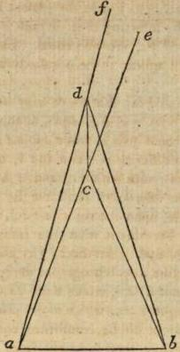

But perhaps, some, notwithstanding all these terms producing science, will dare to object, that these hypotheses being admitted, it is possible to effect what the geometrician affirms to be impossible. For let there be a right line ab, and upon this two lines ad, db, equal to two ac, cb, and let the former be external to the latter, being drawn to different points dc, and terminated in the same extremes a and b. Let ac too, be equal to ad: but bc to bd. This objection, then, we shall confute, by connecting the line dc, and producing the lines ac, and ad, to the points ef. For these being constructed, it is manifest that the triangle acd is isosceles, ad, being equal to ac, from hypothesis; and the angles under the base ecd, fdc are equal. The angle fdc, therefore, is greater than the angle bdc. Much more then is the angle bcd greater than the angle bdc. But again, because the line db, is equal to the line bc, the angles also at the base are equal, i. e. the angle bcd, to the angle bdc. The same angle, therefore, is both greater and equal, which is impossible. And this is what we said in our exposition of the fifth theorem, that though the equality of the angles under the base, was not useful to the demonstrations of the following theorems, yet it procured the greatest utility in the solution of objections. For in the present instance we have confuted the objection, by inferring that, because a c, and a d, are equal, the angles e c d, and s d c, are also equal. In a similar manner in other theorems, it will appear to be peculiarly useful for the solution of doubts.

But if any one should say that there may be constituted upon the right line a b, right lines b d, b c, equal to the right lines a c, a d, of which b c may be equal to a c, but b d to a d; and that in this case they will be drawn to different points a and b, to the same parts, and will have the same extremes with a c, and a d, viz. c, and d, what shall we reply to this assertion? Shall we say that it is requisite to constitute the first lines, upon the right line a b, and their equals upon the same right line? For this is what the institutor of the Elements affirms in the proposition. But here, a c, and a d, are not constituted upon the right line a b, but only on one of its points. Hence, the lines a c, c b, and a d, d b, which stand on the right line a b, are different from the right lines, which were placed in the beginning, and to which they ought to be constituted equal. Though at the same time it is necessary that the right lines constituted upon a b, should be equal to those constituted upon a b. And thus much may suffice for objections against the present question. But that the present theorem is exhibited by the institutor of the elements, by a deduction to an impossibility, and that this impossible opposes the common conception, affirming that the whole is greater than its part; and that the same thing cannot be both greater and equal, is sufficiently manifest. But this theorem seems to have been assumed for the sake of the eighth theorem. For it confers to its demonstration, and is neither simply an element, nor elementary: since it does not extend its utility to a multitude. And hence, we find it very rarely employed by the geometrician.

## PROPOSITION VIII. THEOREM V.

If two triangles have two sides equal to two, each to each, and have the base equal to the base: then the angles contained by the equal right lines, shall be equal to each other.

This eighth theorem is the converse of the fourth: but it is not assumed according to a principal conversion. For it does not make the whole of its hypothesis a conclusion; and the whole conclusion an hypothesis. But connecting together some part of the hypothesis of the fourth theorem, and some part of the objects of enquiry, it exhibits one of the data which it contains. For the equality of two sides to two, is in each an hypothesis; but the equality of base to base, is, in the fourth, an object of investigation, but in the present a datum; and the equality of angle to angle, is, in the former, a datum, but in the latter, an object of enquiry. Hence, a change alone of data, and objects of investigation, produces conversion. But if any one desires to learn the cause why this theorem is placed in the order of the eighth proposition, and not immediately after the fourth, as its converse, in the same manner as the sixth after the fifth, of which it is the converse, since many converted propositions follow their precedents, and are exhibited after them without any intervening medium, to this we must reply, that the eighth, indeed, is indigent of the seventh proposition. For its truth is evinced by a deduction to an impossibility, but the nature of an impossible becomes known from the seventh. And, this again, in its demonstration, is indigent of the fifth. Hence, the seventh and fifth theorems were necessarily assumed, previous to the present. But because the converse to the fifth obtained a demonstration easy, and from things first, it was very properly placed after the fifth, on account of its alliance with that theorem; and be- cause, since it is shewn by a deduction to an impossibility, it confutes that which is impossible from common conceptions, and not as the eighth from another theorem. For things opposing common conceptions, are more evident for the purpose of confutation than such as contradict theorems: since these are assumed by demonstration, but the knowledge of axioms is better than demonstration. But the institutor of the elements exhibits what is now proposed from the previously demonstrated seventh theorem.

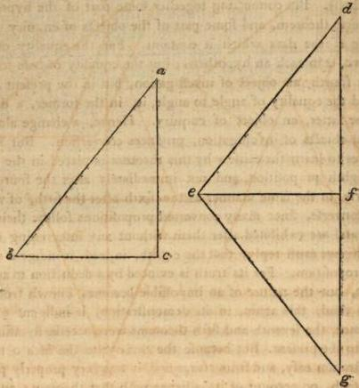

But the familiars of Philo assert, that they can demonstrate this theorem, without being indigent of any other. For let there be conceived (say they) two triangles, a b c, d e f, having two sides equal to two, and the base b c equal to the base e f. Likewise let the bases coincide coincide with each other; and let the two triangles a b c, d e f, be so placed in the same plane, that their vertices may be opposite, and so that e f g may be the equal substitute of a b c. And let e g be equal to d e, but f g to d f. Hence, f g will either be placed in a right line with d f, or not in a right line. And if not in a right line, it will either make with it an angle according to the internal part, or according to the external. Let it first be placed in a right line. Because, therefore, d e is equal to e g, and d f g is one line, the triangle d e g, is isosceles, and the angle at the point d, is equal to the angle at the point g. But if it does not lie in a right line, it will make an angle inward; and in this case let d g be connected. cause, therefore e d, e g, are equal, and the base is d g, the angle e d g also, is equal to the angle e g d. Again, because d f is equal to K 2 f g, f g, and the base is d g, the angle, also, f d g, is equal to the angle f g d. But the angle e d g was also equal to the angle e g d. Hence, the whole e d f, is equal to the whole f g e, which was required to be demonstrated. But in the third place, let f g make an angle with d f, externally, and let the right line d g be connected. Because, there- fore d e, e g, are equal, and the base is d g, the angles e d g, d g e, are equal. Again, because d f, f g, are equal, and the base is d g, the angle f d g, is equal to the angle f g d. But the whole angles e d g, d g e, were mutually equal. Hence, the remaining angles e d f, f g e, will be equal to each other. And thus the thing proposed is invented according to any position of the right line f g, and we may demonstrate the theorem, without employing the seventh proposition.

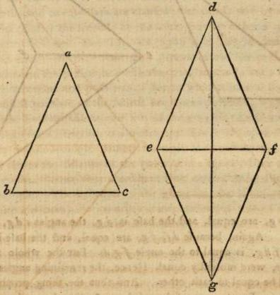

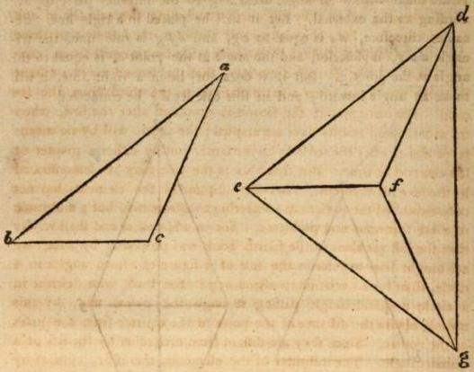

Is, then (say they), the seventh proposition introduced in vain by the institutor of the elements? For if we only assume it on account of the eighth, but the eighth may be exhibited without it, does not the seventh appear entirely useless? To these enquiries we must reply in the words of our predecessors, that the seventh theorem, being demonstrated, is of the greatest utility to such as are skilled in astronomical concerns, when they discourse concerning the eclipses of the sun and moon. For, employing this theorem, they shew that three consequent eclipses, distant from each other by an equal space, cannot subsist. I say, in such a manner, that the second may be distant from the first by as great a space of time as the third from the second. For example, if the second is produced after the first, when six months and twenty days are elapsed; the third, will by no means be produced after the second, by the same, but by either a greater or less interval of time. But that this is the case may be demonstrated by the seventh theorem. And the institutor of the elements has not only exhibited the present as conferring to astronomy, but a multitude of other theorems and problems. For to what other end shall we say that the last problem of the fourth book was proposed, by which we are taught how to inscribe the side of a figure of fifteen angles in a circle, than for its relation to astronomy? For those who describe in a circle a quindecangle passing through the poles, will, by this means, obtain the distance of the poles of the equator from the poles of the zodiac. Since they are distant from each other by the side of a quindecangle. The institutor of the elements, therefore, appears by regarding astronomy, to have previously exhibited many things preparative to our advancement in that science. But when, at the same time, he saw that this seventh theorem is exhibited from the fifth, and proves the eighth without any variety, he assigned it the present place. The addition of Philo is, indeed, beautiful, but is not sufficiently adapted by its variety of cases to an elementary institution. And thus much in reply to the present question.

But if any one should doubt why he does not add so much in the eighth as in the fourth theorem, I mean, that the triangles and the remaining angles are equal; we must say, that because the equality of the vertical angle is demonstrated, it follows, that all are equal to all, by the fourth theorem. It was therefore alone necessary to demonstrate this by itself, but to assume all the rest as consequents. But it seems that the equality of the vertical angles causes the equality of the bases, and of the sides comprehending those angles. For when the bases are unequal, the same angles will not remain, though the containing equal sides are supposed, but while the base becomes less, the angle is at the same time diminished, and while that increases, the angle also receives a correspondent increase. Nor while the same bases remain, but the sides become unequal, will the angle remain; but while they are diminished, it will be increased; and while they are increased, it will be diminished: for angles, and their containing sides, suffer a contrary passion. Thus, if upon the same base, you conceive the sides descending to the lower part, you will diminish the sides, but increase the angle which they comprehend, and enlarge their distance from each other. But if you conceive the sides to be elevated, and to receive an addition as they rise, you will diminish the angle which they contain: for they will coincide the longer, when their vertex is more remote from the base. We may therefore certainly affirm that the identity of the basis and equality of the sides, in a triangle, determine the equality of its angle.

## PROPOSITION IX. PROBLEM IV.

To bisect a given rectilineal angle.

Our author mingles theorems with problems, and connects problems with theorems, and through both completes the whole of his elementary institution, comparing as well subjects as the symptoms subsisting about subjects themselves. Since, therefore, he had shewn in the preceding propositions, both in one triangle, from the equa- lity of the sides, the consequent equality of the angles, and the contrary: and in a similar manner in two triangles, with this exception, that the mode of conversion in one and two triangles is different, he now passes to problems, and orders us to bisect a rectilineal angle. And it is manisest, that the angle here is given according to form: for it is called right-lined, and not of any kind whatever. Indeed, we cannot bisect every angle by the elementary institution; since it is doubtful whether every triangle can be bisected. For, perhaps, you may doubt whether it is possible to bisect a cornicular angle. But the ratio of the section is also distinguished in this problem, and this again not in vain. For to divide an angle in any given ratio, transcends the present construction: as, for example, into three, four, or five equal parts. Indeed, to trisect a right angle is possible, by employing a few of the propositions which are afterwards delivered : triangle e d b, and bisect the angle d b c, and the angles a b d, d b e, e b c, shalll be equal. For the angle d b c, is one third of two right angles, or two thirds of one right, and consequently the angle d b a, is one third of a right angle; and this is equal to d b c, the half of d b c. Therefore they are all equal. but this cannot be effected in an acute angle, without passing on to other lines of a mixt species. And this is manifested by the geometricians who propose to trisect a given rectilineal angle. For Nicho-
medes, indeed, from conchoidal lines, the origin, order, and symp-
toms of which, he delivers, as he was the inventor of their properties,
trisects every right-lined angle. But others effect this from the qua-
drantal lines of Hippias and Nichomedes, by employing mixt qua-
drantal lines. Others, again, being incited from the Helices of Ar-
chimedes, divide a given rectilineal angle, in a given ratio. But the
consideration of these, because difficult to learners, we shall for the
present omit; as it will, perhaps, be more convenient to examine
this in the third book , where the institutor of the Elements bisects a
given circumference. For there the same mode of enquiry presents
itself with respect not only to bisection, but also trisection; and the
ancients endeavoured, by employing the same lines, to divide every
circumference into three equal parts. With great propriety, there-
fore, he who only mentions a right line and a circumference, alone
bisects a right angle and a circumference. But conceiving that the
species composed from these, through mixture, are difficult to explain
and enumerate, without a curious examination, he omits all such en-
quiries as involve mixt lines in their consideration, and proposes to
investigate in first and simple forms alone, such things as can either
be produced or considered from these. And such, indeed, is the pro-
sition of the present problem, to bisect a given right lined angle. For
in the construction of this he uses one petition, and the first and third
problem: but in the demonstration he employs the eighth theorem
alone. Since problems entirely require demonstration (as we have al-
ready observed) and through this they obtain a power of producing
science. But perhaps, some may oppose the geometrician, by assert-
ing that an equilateral triangle may be constituted by him, not having
its vertex within the two right lines, but either upon, or external to
each; and that this may be manifested by the elements. For let there be an angle b a c, which it is required to bisect. Then let b a be taken equal to a c, and let b c be connected, and upon it, let an equilateral triangle b c d be constructed. This point d, therefore, is either within the right lines a b, a c, or upon a b, or a c, or external to both. Now the institutor of the Elements assumes them within; and hence, those who oppose the demonstration, will say the point is either placed on one of the right lines, or external to both. Let the point d then be placed on the line a b, so that the triangle b c d may be equilateral: d b, therefore, is equal to d c, and the angles at the base c b d, b c d, are equal. Hence, the whole, b c e, is greater than the angle c b d. Again, because a b, c a, are equal, the triangle a b c, is isosceles, and the angles under the base b c, will be equal. The angle, therefore, b c e, is equal to the angle c b d. But it was also greater, which is impossible. Hence, the vertex of the equilateral triangle cannot be in the right line a b d. In like manner we may shew that it cannot be in the right line a c e. Let it therefore, if possible be placed externally. Because, then b d is equal to c d, the angles at the base are equal, viz. b c d, and c b d. Hence, the angle b c d, is greater than the angle c b f. Much more, therefore, is the angle b c e, greater than c b f: but it is also equal, because these angles are under the base b c, of an isosceles triangle a b c, and this is impossible. Hence, the point cannot fall in these parts external to the two right lines; and it may be similarly shewn that this is impossible in other parts. Here too you may again observe, that we destroy objections by using the second part of the fifth proposition, that the angles under the base of an isosceles triangle are equal. And this is what we have previously observed, that many things opposing science, are shewn to be debile, and easy of confutation, by the assistance of this theorem; and that such is the utility it affords to geometry.

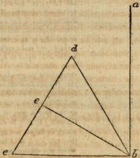

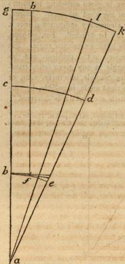

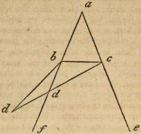

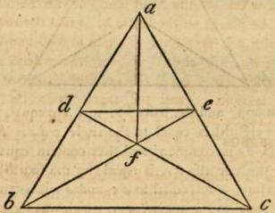

But if any one should say that there is no place under the base, and yet that it is requisite to constitute the equilateral triangle at the same parts, in which the lines b a, a c, are situated; it will be necessary that the lines which are constituted should either coincide with b a, a c, if they also are equal to the base c b: or that they should fall external to them, if they are less than the base b c: or within, if b a, a c, are greater than b c. Let them, in the first place, coincide, and let b a c be an equilateral triangle, and let there be taken in the side a b, the point d, and make a e in the side a c, equal to a d, and con- nect the lines d e, b e, c d, a f. Because, therefore, a b is equal to a c, and a d to a e, the two b a, a e, are equal to the two c a, a d, and they comprehend the same angle. Hence, they are all equal to all, and the angle d b e, is equal to the angle e c d. But d b is also equal to e c, and b e to c d. All, therefore, are equal to all. Hence, the angle d e b, is equal to the angle e d c: for they subtend equal fides. And d f is equal to e f, (by the sixth.) Because, therefore, a e is equal to a d, and a f is common, and the base d f, is equal to the base e f, the angle d a e is bisected, which was required to be done.

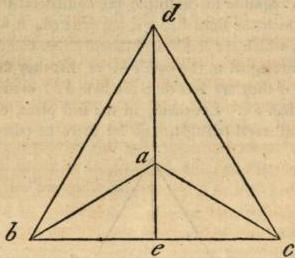

But if the fides of the equilateral triangle fall external to the right lines b a, a c, let them be b d, d c, and having connected d a, let it be produced to the point e. Because, therefore b d, d c, are equal, but d a is common, and the bases b a, a c, are equal, the angle, also, b d a, (by the eighth) is equal to the angle c d a. Again, b d, d c, are equal, and d e is common. and they contain equal angles as we have shewn, the base also b e, is equal (by the fourth) to the base e c. Because, therefore, a b is equal to a c, and a e is common, the angle, also b a e, is equal to the angle c a e, which was to be shewn.

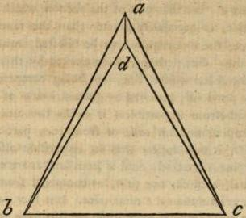

But if the fides of the equilateral triangle fall within the right lines a b, a c, as b d, d c, let again a d be connected. Because, therefore, b a, is is equal to a c, and a d is common, but the base b d, is equal to the base c d, hence, the angle b a d (by the eighth) is equal to c a d. The angle, therefore, at the point a, is bisected, in whatever manner the equilateral triangle may be constituted. And having thus summarily spoken concerning these, we shall now proceed to the following theorems, only adding, that the given angle may be given in a four-fold respect. In position, as when we say to this right line, and to this point to place an angle: for after this manner it is given. But in form, as when we call the angle right, or acute, obtuse, right-lined, or mixed. And in proportion, as when we call it double, or triple, greater, or less. And lastly, in magnitude, as when we call it the third part of a right angle. But the present angle is only given in form.

## PROPOSITION X. PROBLEM V.

To bisect a given finite right line.

This, also, is a problem which supposes a finite right line, since we cannot terminate a line on both sides infinite. But the section of a line infinite on one side only, wherever the point is assumed, is made in unequal parts. For that part of the section which takes place on the infinite side, is necessarily greater than the remainder, because finite. Hence, the line required to be bisected, must be necessarily both ways finite. But perhaps, some excited by this problem, may think, that the doctrine of a line, not being composed from impar-tibles, is only previously received by geometricians as an hypothesis. For if it consists from impar-tibles, it either becomes finite, and receives its completion from odd, or from even parts. But if from such as are odd, it will appear that an impar-tible also may be cut, while a right line is bisected. And if from such as are even, the section will be unequal, because, one part, as composed from more impar-tibles, will be greater than the remainder. It is therefore impossible to bisect a given right line, if magnitude consists from impar-tibles. But if it be not composed from impar-tibles, it may be divided in infinitum. It appears, therefore, (say they) to be received by common consent, and to be a geometrical principle, that magnitude is among the number of things infinitely divisible. Against these we reply in the words of Geminus, that geometricians previously receive according to a common conception, that continued quantity is divisible. For we call that continuous, which is composed from conjoined parts, and this it is in every respect possible to divide. But that continued quantity may be infinitely divided, they do not previously assume, but demonstrate from proper principles. For when they shew that incommensurability is found in magnitudes, and that all are not commensurable with each other, what else can we say they evince by this means, except this, that every magnitude may be divided into parts always divisible, and that we can never arrive at an impar-tible, by the most unwearied analysis, since this minimum would be the common measure of all magnitudes? This then is demonstrable, but that which says, every thing continuous is divisible, is an axiom. Hence, since a finite line also is continuous, it is divisible. And from this conception the institutor of the Elements cuts a finite right line into equal parts, but not as pre-assuming, that it is divisible in infinitum. For to be merely divisible, and to be infinitely divisible is not the same.

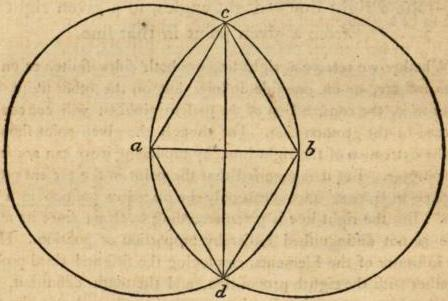

But the discourse of Zenocrates inferring indivisible lines, is confuted by this problem. For if it be a line, it is either right, and may be bisected; or circular, and it is greater than a certain right line; (since every circular has a certain right line less than itself); or it is mixt, and on this account is the more divisible, since composed from simple divisible lines. But this must be deferred to some posterior speculation. However, the geometrician bisects a finite right line, employing in the construction the first and ninth propositions; but using in the demonstration the fourth alone; for by the angles he shews the equality of the bases. But Apollonius Pergæus bisects a given finite right line after the following manner. Let there be (says he) a finite right line a b, which we are required to bisect, and with the centre a, but interval a b, let a circle be described. And again, with the centre b, but interval b a, let another circle be described, and let the right line c d, connect the common sections of the circles; this this shall bisect the right line a b. For let the equal lines d a, d b, c a, c b, be connected; these being equal, because each is equal to a b. But c d is common, and d a is equal to d b on the same account. Hence the angle a c d, is equal to the angle b c d; and so (by the fourth) a b is bisected. Such then, according to Apollonius, is the demonstration of this problem, assumed, also, from an equilateral triangle; but instead of exhibiting the bisection of the line, from the bisection of the angle at the point c, it shews this from the equality of the bases. The demonstration, therefore, of the institutor of the Elements, is much better, since it is both more simple, and emanates from principles.

## PROPOSITION XI. PROBLEM VI.

To raise a right line at right angles, to a given right line, from a given point in that line.

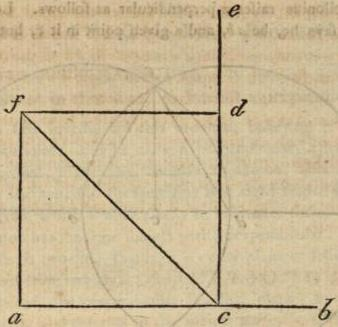

Whether we receive a right line on both sides finite, or on both sides infinite, or on one side infinite but on the other finite, and a point in it, the construction of the present problem will conveniently succeed to the geometrician. For though the given point should be on the extremity of the right line, by producing it we can accomplish our purpose. But it is manifest that the point in the present problem is given in position, since it can only be placed in position in a right line. But the right line is given according to form; since its magnitude is not distinguished either by proportion or position. Hence, the institutor of the Elements, employing the first and third problem, together with the eighth proposition, and the tenth definition, exhibits the thing proposed. But if any placing the point on the extremity of the right line, should ask us without producing the line, to erect upon this a right line at right angles, we can likewise shew that this is possible to be effected. For let there be a right line a b, and a given a given point in it a, and let there be assumed in the line a b, any point c, and from this (as the present element teaches us) let a right line c e be erected at right angles to a b. Then from c e, let c d be taken equal to a c, and let the angle at the point c be bisected by the line c f, and at the point d let a right line be erected at right angles, coinciding with f c in f; and lastly from the point f, to the point a, let f a be connected. I say that the angle at the point a is right. For since d c is equal to c a, but c f is common, and contains equal angles, (for the angle at the point c was bisected) hence, d f is equal to f a, and all in like manner (by the fourth) are equal to all. The angle, therefore, at the point a, is equal to the angle at d. But the angle at the point d is right; and so consequently is the angle at a. And thus the thing required is effected. But the insitutor of the Elements was not indigent of any such artifice: for he commands us to raise a line at right angles, but not at one right. It is requisite, therefore, not to receive the point in the extremity of the right line, because the perpendicular line forms angles with its subject right line, but not one angle alone.

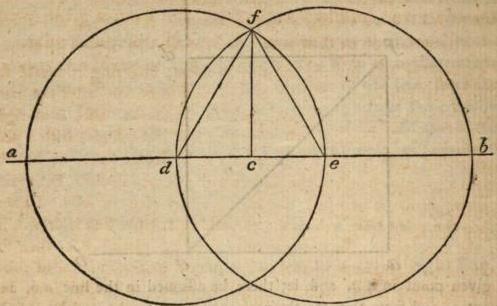

But Apollonius raises a perpendicular as follows. Let the given right line, says he, be ab, and a given point in it c, but let there be assumed in a c any point d, and from c b, take away c e, equal to c d. Then with the centre d, but interval d e, let a circle be described; and again with the centre e, but interval e d, let another circle be described, and let a right line be drawn from f to c. I say that f c is a perpendicular. For is f d, f e, are connected, they shall be equal. But d c, c e, are equal, and f c is common. Hence, also, the angles at the point c (by the eighth) are equal. They are therefore right. And here, is it not again obvious, that this demonstration is more various than that of Euclid, and requires the description of circles, that by this means an equilateral triangle may be described upon d e, and the problem exhibited? For all the rest are common to the demonstrations. But the demonstration by a semicircle is not worthy to be remembered, since it supposes many things which are afterwards exhibited, and entirely falls from the order of an elementary institution.

## PROPOSITION XII. PROBLEM VII.

Upon a given infinite right line, and from a given point which is not in that line, to let fall a perpendicular.

Oenopides first investigated this problem, believing it useful for astrological purposes. But he calls a perpendicular, after the manner of the ancients, a gnomon, because a gnomon, also, is at right angles to the horizon, but the same line is at right angles with a perpendicular, from which it differs only in habitude, since, as he observes a gnomon has the same subject with a perpendicular. But again, a perpendicular is two-fold, that is, it is either plane or solid. Hence, when the point from which the perpendicular right line is drawn, is in the same plane, the perpendicular is called plane; but when the point is on high, and external to the subject plane, it is called solid. And the plane perpendicular, indeed, is drawn to a right line: but the solid to a plane. Hence, it is necessary, that this last should not only form right angles, with one right line, but with all right lines in the same plane. For the perpendicular is let fall on a plane. In the present problem, therefore, the institutor of the Elements proposes to let fall a plane perpendicular. For the deduction is proposed to a right line, and the discourse proceeds, so far as all are supposed to be in the same plane. Hence, in the line at right angles we do not require infinity, because the point is supposed to be in that right line. But in the present problem, respecting a perpendicular, he supposes the given right line infinite, because the point from which the perpendicular is to be drawn is placed external to the right line. For if it was not infinite, the point might be received externally, and yet in a direct position, so that the protracted right line would fall upon it, and the problem not succeed. Hence, he places the right line infinite, so that the point may be received at either of its parts; and that no place may be left, in which it can be in the same direction with the given right line, unless it is in the line, and has not an external position. And on this account the right line to which the perpendicular is to be drawn is considered as infinite.

But in what manner infinite can subsist, is a matter well worthy our contemplation. For it is manifest that a right line existing infinite, a plane also will be infinite, and this in energy, if the thing proposed by Euclid be true. That among sensible particulars, therefore, there can be no magnitude infinite, according to any distance, both the damoniacal Aristotle, and those who received their philosophy from him, have abundantly shewn. For neither that which is moved circularly, nor any other simple body can be infinite; since the place of each is limited. But neither in separate and impartible reasons is an infinite of this kind possible. For if they neither contain dimension, nor magnitude, much less can they contain infinite magnitude. It remains, therefore, that infinite can alone subsist in the phantasy, which at the same time the phantasy does not comprehend. For as soon as it understands, it induces form and bound to that which is understood, stops the transit of the phantasm by its intellection, pursues its progress, and infolds it in its shadowy embrace. The phantasy, therefore, is not infinite by intellection, but rather by advancing infinitely about that which is understood; and calling whatever it leaves innumerable, and incomprehensible by intelligence, infinite. For as the sight by not seeing understands darkness; so the phantasy by not understanding perceives infinite. Hence it pursues the progress of the infinite, because it is endued with an impartible power, capable of perpetually advancing: but it understands as if stopping in its progression, because infinite surpasses its comprehension. For it calls that infinite, which it leaves as unable to pass over in its pursuit. On this account when we place a given infinite line in the phantasy, in the same manner as we establish all other geometrical species, viz. triangles, circles, angles, lines, and all of this kind, we must not wonder how a line is infinite in energy, and how advancing infinitely, it applies itself to finite intellections. But cogitation, in which reasons and demonstrations reside, does not use infinite for the purpose of science, since infinite is by no means perceptible by science, but receiving it from hypothesis, it employs finite alone in its demonstrations, and assumes infinite not for the sake of infinite, but of that which is bounded and finite. For if we should grant to cogitation, that the given point, neither lies in a right line with the given finite right line, nor yet is so distant from it, that no part of the right line is subjected to the point, we shall no longer require an infinite line. That cogitation, therefore, when employing a right line, may use it without controversy and reproof, she supposes it to be infinite; and employs the infinity of the phantasy, as the foundation of infinite generation. And thus much may suffice for the present concerning the nature of infinite.

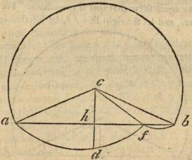

But it is now requisite that we should consider the objections which are urged against the construction of this problem. Let there be re- ceived, say they, an infinite right line a b, and let the given point be c, from which it is required to let fall a perpendicular, and let d be a point on the other side, according to the geometrician. But the circle cle which cuts the right line ab, in the points a and b, will cut it also in f, and will have a situation according to the figure. In answer to this, we must say, that it affirms an impossible case. For let the right line ab be bisected in b, and let cb be connected, and produced to the circumference, to the point d, and let ca, cb, cf, be connected. Because, therefore, these lines are from the centre, and ab, is equal to bb, but cb is common, all are equal to all. Hence cb forms right angles at the point b. Again, because ca, cb, are equal, they form equal angles at the points a and b. But ca also, is equal to cf, on which account the angle cas, is equal to the angle cfa. In like manner the angle cbf is equal to the angle cfb. Because, therefore, the angles at the points a and b, are equal, the angle, also, cfa, is equal to the angle cfb, and they are successive, and consequently right. But each of the angles at the point b is right. Hence, cb is equal to cf. But cf is also equal to cd, since they are from the centre. Therefore cb is equal to cd, which is impossible. Hence, the circle does not cut the right line in any other points than a and b.

But if any one should say, that he who describes a circle will bisect ab in f, we can again shew that this is impossible. For let all be described as before, and let the right line fb, be bisected in the point b.

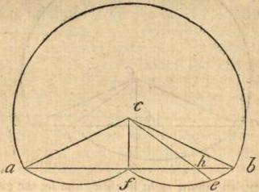

Because, therefore, af, fb, are equal, but cf common, and the base ca, is equal to the base cb, all are equal to all. Hence, the angles at the the point f are right. Again, because f b is equal to h b, and c b being connected, is common, and the base c f is equal to the base c b, for they are from the centre, the angles at the point h, are right; for they are equal and successive. Because, therefore, each of the angles c f b, c h f, is right, c f is equal to c h. But c f is equal to c e, for they are from the centre, and hence c h is not unequal to c e, which is impossible.

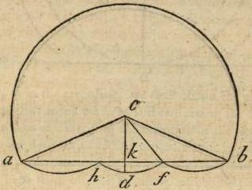

It now remains that we run over the third objection. For the circle which is described (say they) will cut the right line in the points a, b, and in the points f, h. We therefore bisecting the right line a b in the point k, and connecting the lines c a, c f, c k, c b, can shew that this is impossible. For since k a, k b, are equal, and c k is common, and the bases c a, c b, are equal, hence the angles at the points a and b are equal, and those at the point k right. But each of the lines is equal to c f; and hence, the angles at the point f, are right; for they are equal, because successive. Therefore, c f is equal to c k: for they subtend right angles. But c f is equal to c d, since they are from the centre; and hence, c d is equal to c k, which is impossible. Hence then, it is impossible that the circle which is described should cut the line a b in one, two, or in more points than a b. And such are the objections against the present problem.

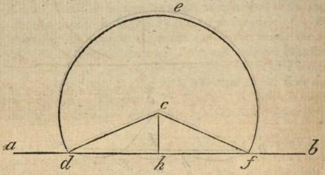

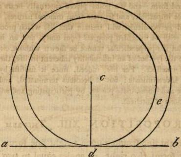

But there are also cases of the construction of this problem, which are to be distinguished from the objections. For case is not the same with objection; since the former shews the same thing differently, but the latter leads the objection to an inconvenience. But other expositors, not distinguishing these from one another, bring all into the same, so that it is uncertain, whether they enunciate to us in their writings, cases, or objections. We therefore distinguishing these, having enumerated the objections, shall now describe the cases of the problem. Let there be then an infinite right line a b, and a given point c. Now it may be said that there is no farther place in the other part of the perpendicular right line, but in that only where the point c lies. Taking, therefore, in the right line a b a point d, with the centre c, and interval c d, let us describe the circumference of a circle d e f, and bisecting d f in b, let us connect the lines c d, c b, e f. Because, therefore, d b is equal to b f, but c b is common, and c d is equal to c f, (for they are from the centre,) hence, the successive angles at the point b, are equal. They are, therefore, right. And hence, c b is a perpendicular to d f. But if any one should also say that the described circle does not cut the right line a b, but touch it as the circle d e, by taking the point e externally, and using the centre c, and interval interval c e, as in the preceding, we shall obtain the object of our enquiry. And thus much we have said concerning the cases of the problem, for the sake of exercising the attention of the reader.

But if we are desirous of adding contemplation likewise to these two problems, a right line erected at right angles, seems to imitate a life tending on high from inferior concerns, ascending purely, and without contamination, and abiding inflexibly with regard to natures subordinate to its own. But a perpendicular is the image of a life perpendicularly descending, and the least of all replete with generative infinity. For a right angle is the symbol of an energy inflexible, and restrained in the comprehension of equality, bound, and finite. From whence, indeed, Timæus also calls the other circle in the divine soul, possessing the reasons of sensible natures, right; for in our souls it is bent with flexions of every kind, and suffers various contortions and perturbations from the unceasing whirls of generation: but among wholes it resides immaculate, uncontaminated, firm, and indeclinable, prior to sensible forms. But if likewise an infinite right line is the symbol of the whole of generation, which is moved infinitely and indeterminately, and besides this, of matter itself, which is deprived
VOL. II. N of of bound and form : and if a point placed externally bears an image of an essence impartible, and separate from material natures, doubtless the deduced perpendicular will imitate that life which proceeds into generation with an undefiled progress from unity, and an impartible essence. But if a perpendicular cannot be shewn without circles, this also will be the symbol of an inflexibility inherent in life, through the medium of intellect. For life, indeed, since it subsists by itself as motion, is indeterminate : but it becomes terminated, and is filled with a pure and immaculate power, by participating and adhering to the circulations of intellect.

## PROPOSITION XIII. THEOREM VI.

When a right line standing upon a right line forms angles, it either forms two right, or angles equal to two right.

Euclid again passes on to theorems, consequent to things exhibited by problems. For after a perpendicular had been drawn to a right line, and a right line erected at right angles, it remained, to enquire if it should not be a perpendicular, what angles it would form, and how it would be affected to the line upon which it stands. This then he proves universally, that every right line standing upon a certain line, and forming angles, either forms two right, if its state be indeclinable, firm, and never verging : or angles equal to two right, if it declines in one part, but is more distant from its subject line, in the other part. For as much as it takes away from a right angle by its declination in one part, so much it adds by its distance in the other. But it is requisite to take notice, that in this proposition also, the Geometrician employs diligent care. For he does not simply say that every right line, standing upon a right line, forms either two right angles, or angles equal to two right, but he adds, if it forms angles. For what if standing on the extremity of a right line, it should form one angle, will it happen that this may be equal to two right? This certainly is impossible. Since every rectilineal angle is less than two right, as also every solid angle is less than four right. Hence, though you shou'd receive that which appears to be the greatest of all obtuse angles, this also must will increase, as that which does not yet receive the measure of two right angles. It is requisite, therefore, that the right line should stand in such a manner, that it may form angles. And these observations regard the productive diligence of science.

But what does he mean by adding the particle, either two right, or equal to two right? For when he has constituted two right, he forms angles equal to two right; since right angles are equal to each other. Shall we say that one of the equal angles is also common, but that the other of the equals is only proper? But we are accustomed when both proper and common is verified, to express every particular from that which is proper, but when we cannot effect this, we are content with that which is common for the explication of the subject concerns. This then, the equality of the successive angles, is common to right angles, but is not predicated of these alone: but this, that they are right, is peculiar to their equality. Hence, the assertion, equal to two right, alone signifies the inequality of the angles. For in these it is alone verified, but by no means in such as are equal. And this also the institutor of the Elements divides in opposition to two right. For since it is predicated by itself, it has a power of signifying that the angles on each side are unequal. But through these observations we may also perceive, that equality is the measure and bound of inequality. For though the increase and decrease of an obtuse and acute angle is indeterminate and infinite, yet it is said to receive limitation, and bound from a right angle; and each of them, indeed, separately, recedes from a similitude to the right; but both, according to one harmonizing union, are reduced to its bound. But as they can by no means perfectly equal the simplicity of a right angle, they receive an equality to it when doubled, the duad being the exemplar of their infinity, as of itself endued with an infinite nature. And this seems to procure a manifest image of the progression of primary causes; and of their abiding according to one boundary, in a manner perpetually the same, about the infinity of generation. For how could otherwise generation, which participates of the more and the less, and is carried in indefinite whirls, agree with intelligibles, and be equalled with them in a certain respect, unless by participating their natures, whilst they advance with prolific powers, and only multiply themselves in their progressions? For things which abide in their own simplicity and impartibility, are entirely separated from generable natures. And thus much is assumed from the present theorem, and applied to the knowledge of universals.

## PROPOSITION XIV. THEOREM VII.

If to any right line, and at a point in it, two right lines being placed in a consequent order, and not towards the same parts, make the successive angles equal to two right, those right lines shall be in a direct position to each other.

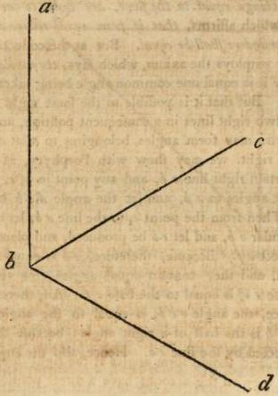

The present theorem is the converse of the foregoing: for such as are converse are always consequent to preceding theorems. Since, therefore, the former had constituted a right line upon a right line, and had shewn that it made the successive angles either two right, or equal to two right; in the present theorem he receives the equality of the angles to two right, which are formed at some right line, but he shews that it is one right line which produces their equality. Hence, that which was a datum in the former, is in the present theorem an object of enquiry; and is shewn by a deduction to an impossibility. For after this manner the converse of theorems ought to be exhibited; but in problems they should receive principal demonstrations. But in this theorem we may also perceive the greatest and most admirable diligence of this proposition producing science. For in the first place, after he had said, if to any right line, he adds, and at a point in it; for what if the two extremes of the right line existing, one of the right lines should be drawn from the one extreme, but the other from the remaining one, and should form angles at the right line, equal to two right, would they on this account have a direct position? And how can this take place in lines drawn from different points of the right line? It is on this account also, that he adds, and at a point in it, since he is willing that both should be in the same point. But in the second place, because it is possible that the right lines which are drawn, may be at the same point, and not consequent (since we may receive infinite right lines placed at the same point) he adds the particle, in a consequent order. And in the third place, because the word consequent may be considered as well at the same parts as on both sides: but because it is impossible that lines which are consequent at the same parts should be mutually in a direct position, this indeed he explains, but affords us an opportunity of considering that consequent right lines are to be received in position on both sides; since these also can be shewn to be in a right line. Let there be placed at the right line a b, and at a point in it b, towards the same parts, two right lines b c, b d, these, therefore, shall be consequent to each other. For no other right line is situated between them. But those things are successive, between which there is nothing similar. Thus we call the columns consequent, between which there is no other column: for though the air intervenes, yet nothing of the same kind is situated in the middle. Because, therefore, they lie towards the same parts, they are by no means in a direct position, although they form two angles equal to two right; I mean the angles at the point b. For nothing hinders but that the angle a b d, may contain in itself, one right, and a third part of a right angle: and that the angle a b c, may be two thirds of a right angle. And thus much concerning the proposition.

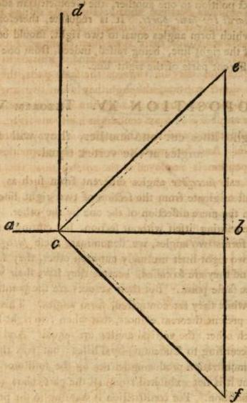

But one petition is employed in the construction, viz. the second, which begs to produce a right line straight forwards, as in the demonstration he uses the preceding theorem, and two axioms; i. e. the one which says, things equal to the same, are equal to one another; and also the one which affirms, that if from equal things equals are taken away, the remainders shall be equal. But at the collection of the impossibility, he employs the axiom, which says, the whole is greater than its part. For it is equal one common angle being taken away, which is impossible. But that it is possible to the same right line, and at a point in it, two right lines in a consequent position, and yet, towards the same parts, may form angles belonging to that one right line, equal to two right, we may fhew with Porphyry, as follows. Let there be a certain right line a b, and any point in it c, and let c d be raised at right angles to a b, and let the angle d c b be bisected, by the line c e. Then from the point e, to the line a b, let there be drawn the perpendicular e b, and let e b be produced, and place f b equal to e b, and connect c f. Because, therefore, e b is equal to b f, but b c is common, and they contain equal angles (for they are right), hence, the base e c, is equal to the base c f. All, therefore, are equal to all. Hence, the angle e c b, is equal to the angle f c b. But the angle e c b is the half of a right angle: because the right angle d c b was bisected by the line e c. Hence, also the angle f c b, is the half half of one right. The angle, therefore, d c f, is equal to one right, and the half of a right angle. But the angle d c e, also, is the half of a right angle. Hence to the right line c d, and to a point in it e, two right lines are consequently placed towards the same parts, viz. c e and c f, forming angles equal to two right, c e causing the half of a right angle, and c f one and a half. Lest, therefore, we should enquire after things impossible to be effected, viz. how the right lines c e, c f, forming angles at the right line d c, equal to two right, can be in a direct position to one another, the Geometrician adds the particle not towards the same parts. It is requisite, therefore, that the right lines which form angles equal to two right, should be placed on both sides of the right line, being raised, indeed, from one point, but drawn to different parts of the right line.

## PROPOSITION XV. THEOREM VIII.

If two right lines cut one another, they will form the angles at the vertex equal.

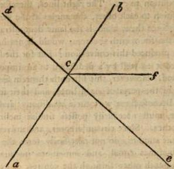

We must call successive angles different from such as are vertical. For these last originate from the section of two right lines: but the former from the mere dissection of the one by the other. Thus, if a right line remaining itself without section, but cutting another in its extremity, forms two angles, we denominate these successive angles. But if the two right lines mutually cut each other, they form vertical angles. And they are so called, because they have their vertices conjoined in the same point. But their vertices are the points, at which the planes, while they are contracted, form angles. This, therefore, is what the present theorem evinces, that when two right lines mutually cut each other, the vertical angles are equal. And it was first invented (according to Eudemus) by Thales: but was thought worthy of a demonstration producing science by the institutor of the Elements. But it is not exhibited from all the particulars requisite to a perfect proposition. For construction is wanting in the present theorem: but demonstration, which must be necessarily inherent, depends on the thirteenth theorem. But he uses two axioms, one of which is, that things equal to the same, are equal among themselves: and the other, if from equal things equals are taken away, the remainders will be equal. The theorem, indeed, of Euclid, is manifest, but another such is converted to the present theorem. If to any right line, and at a point in it, two right lines, not assumed towards the same parts, make the verti- cal angles equal, those right lines shall be in a direct position to each other. For let there be a certain right line ab, and any point in it c, and at the point c, let two right lines c d, c e, not towards the same parts be assumed, forming equal angles a c d, b c e. I say that c d, c e, are in a right line. For since the right line c d, insists upon the right line a b, it forms angles equal to two right, i. e. d c a, d c b. But the angle d c a, is equal to the angle b c e. Therefore, the angles d c b, b c e, are equal to two right. Because, therefore, to a certain right line b c, and at a point in it c, two consequent right lines c d, c e, not placed towards the same parts, form the successive angles equal to two right, those right lines c d, c e, are in a direct position to each other. The converse, therefore, to the present theorem, is exhibited. But the Geometrician seems to have neglected this, because it is easy to evince its truth, by the same method of deduction to an impossibility as we employed in exhibiting the fourteenth proposition. For the same things being supposed, I say that the right line c d, is in a direct position to c e. For if it be not, let c f be taken in a right line with c d. Because, therefore, two right lines a b, d f, intersect each other, they will form the angles at the vertex equal. Hence, the angles a c d, b c f, are equal. But a c d, b c e, were also equal.

The angle, therefore, b c e, is equal to the angle b c f, the greater to the less, which is impossible. Hence, no other right line, besides c d, is in a direct position to c e. The right lines, therefore, c d, c e, are in a direct position to each other, the angles at the vertex being supposed equal. Since then, there is the same demonstration which was preassumed in the fourteenth theorem, would it not have been superfluous to have produced this conversion? But for the fake of exercise, we have proved it as well by a deduction to an impossible, as by an ostensive method. However, this fifteenth theorem seems to rest upon the similitude of the parts of right lines, and their situation in their extremities. Because lines with these conditions, and mutually cutting each other, must necessarily possess similar inclinations on both fides to each other. Since circumferences, and universally non-right lines cutting one another, do not necessarily form the vertical angles equal, but sometimes equal, and sometimes unequal. For if two equal circles cut each other through the centres, or even not through the centres, they will form the lunular angles at the vertex equal: but not likewise the remaining angles, viz. those on both fides concave, and on both fides convex, but the one will be greater than the other. But in right lines, the situation in the extremities, causes the distance of one segment, to be equal to the distance of another.

## COROLLARY.

From hence it is manifest that if two right lines cut each other, they will make four angles equal to four right.

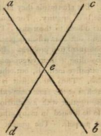

Corollary is one of the geometrical appellations, but it has a twofold signification. For they denominate corollaries, whatever theorems are proved together with the demonstrations of others, becoming as it were the unexpected gain and emolument of the investigator: and likewise, whatever is the object of enquiry, but is indigent of invention, and is neither investigated for the fake of generation alone, nor of simple contemplation. For that the angles at the bases of isos- celes triangles are equal, it is requisite to contemplate, and the knowledge of things in existence is of this kind. But to bisect an angle, or constitute a triangle, to cut off, or place an equal right line, all these demand that something may be performed. And again, to find the centre of a given circle, or two commensurable magnitudes being given to find their greatest common measure, with every thing of this kind, are, after a manner, situated between problems and theorems. For neither is the origin of objects of enquiry inherent in these, nor contemplation alone, but invention, Since it is requisite to place the object of enquiry conspicuously and before our eyes. Such then are whatever corollaries Euclid wrote, for he constructed a book of corollaries. But we must now omit to speak of corollaries of this kind. However, such as occur in the elementary institution, appear at the same time with the demonstrations of other things, but they themselves are not principally investigated, as is evident in that which is proposed at present. For the design of the proposition is to enquire whether if two right lines mutually cutting each other, the angles at the vertex are equal. But whilst this is evinced, it is at the same time demonstrated, that the four angles which are formed, are equal to four right. For when we say let there be two right lines, a b, c d, cutting each other in the point e: because a e stands upon c d, it makes the successive angles equal to two right. And again, because b e stands upon c d, it also makes the successive angles equal to two right; then together with the object of enquiry we demonstrate, that the angles about the point e, are equal to four right. A corollary, therefore, is a theorem, unexpectedly emerging from the demonstration of another problem, or theorem. For we seem to fall upon corollaries, as it were, by a certain chance; and they offer themselves to our inspection, without being proposed, or investigated by us. Hence, we assimilate these also to gains. And perhaps those skilled in mathematical concerns, have imposed on them this appellation, shewing the vulgar, who rejoice in apparent gain, that these are the true gifts of divinity, and true gains, and not the objects of their sordid estimation. For this indeed produces that faculty resident in our nature, and adds the prolific power of science, to principal enquiries, manifesting the copious riches of theorems. And such is the property of corollaries.

But they are to be divided in the first place, according to sciences. For of corollaries, some are geometrical, but others arithmetical. Thus the present corollary is geometrical: but that which is added at the end of the second theorem of the seventh book of the arithmetical elements, is arithmetical. But afterwards they must be divided according to the principal objects of enquiry. For some things are consequent to problems, but others to theorems. Thus, the present is consequent to a theorem: but that which is placed in the second of the seventh book, is consequent to a problem. But in the third place, they must be divided according to their ostensions. For some are exhibited, together with ostensive methods, but others together with deductions to an impossible. Thus the present is shewn by a direct ostension: but that which is at the same time exhibited in the first of the third book, appears, together with a deduction to an impossible. But corollaries may also be divided in many other modes, but these may suffice our present purpose. The present corollary, however, teaching us that the place about one point is distributed into angles equal to four right, is subservient to that admirable theorem, which shews that the following three multangles about one point, can alone fill place, viz. the equilateral triangle, the quadrangle, and an equilateral, and equiangular sexangle. But the equilateral triangle must be six times assumed; since six two-thirds, form four right angles. But the sexangle must be three times formed; for every sexangular angle is equal to one right, and a third part of a right. And a quadrangle must be four times assumed: for every quadrangular angle is right. Hence, six equilateral triangles conjoined according to their angles, fill four right angles, as also three sexangles, and four quadrangles. But all other multangles, however composed, according to angles, are either deficient from four right, or exceed four right angles ; while these alone, according to the aforesaid numbers, are equal to four right. And this theorem is Pythagoric. But by the present corollary, if even more than two right lines should cut each other in one point, as for instance, three or four, or any other number, all the angles which they form, may be shewn to be equal to four right. For they will vindicate to themselves the place of four right angles. But it is manifest that the angles always become double to the number of right lines. And thus two right lines intersecting each other, there will be four angles equal to four right: but from the intersection of three lines, there will be six angles; and from four, eight, and so on, in infinitum. For the multitude of the right lines is always doubled: but the angles increase according to multitude, and are diminished according to magnitude, because it is the same four right angles, which is perpetually divided.

## PROPOSITION XVI. THEOREM IX.

In every triangle having one side produced, the external angle is greater than either of the internal and opposite angles.

Those who enunciated this proposition, and at the same time omitted the particle, having one side produced, perhaps afforded an occasion of objection to many others, as well as to Philip, (according to the narration of the mechanist Heron.) But such as were desirous of entirely removing this calumny, enunciated the theorem, with the proposed addition, corresponding with the general manner of the geometrician. For in the fifth theorem, being desirous to shew, that the angles under the base of an isosceles triangle are equal, he adds, that when the equal right lines are produced, the angles under the base are equal. Hence we infer, that though this proposition might be defective and imperfect in various copies, yet it was perfect and written entire, by the institutor of the Elements. What then does the proposition assert? That in every triangle, if you produce one of its sides, you will find the angle constituted external to the triangle, greater than either of the internal and opposite angles. For a little after, this angle will be shewn equal to both, but it is proved to be greater than either in the present; and he necessarily compares it with the opposite angles, and not with the successive angle. For to this last it may be both equal and less: but it is greater than either of the former. Thus, if this triangle should be right angled, and you conceive one of the sides comprehending the right angle to be produced, the external will be equal to the successive angle. But if it should happen to be obtuse-angled, the internal angle may be greater than the external; and it is on this account that he does not compare the external with the successive angle, but with the opposite angles. For of the angles within a triangle, the successive angle borders on the external, but the two others are opposite. Hence, the external angle is greater than either of the successive, but may not exceed the successive angle to which it is proximate. But some conjoining these two theorems, I mean the present, and the following, enunciate the proposition thus. In every triangle having one side produced, the external angle is greater than either of the internal and opposite angles; and any two of the internal angles, are less than two right. But there is occasion for the connection of these theorems, because the geometrician himself, a little after, enunciates the proposition after this manner, in equal angles, for he says: In any triangle having one of its sides produced, the external angle is equal to the two interior, and opposite angles; and the three internal angles of a triangle, are equal to two right. Hence, they think it proper in the present similar case, to connect the objects of investigation, and to make the proposition a composite. But if the datum be enunciated with this addition, it also will be a composite, (since it is requisite to understand two things, viz. the subject triangle, and one side produced :) and if the datum be given without this, it will be a composite in capacity, but simple in energy; for this must be received at the same time as a datum; since while we suppose an external angle, we must pre-suppose the side as produced.

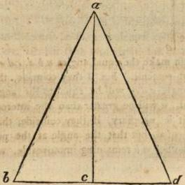

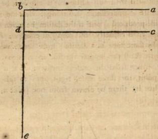

But we may assume from the present theorem, that it is impossible from the same point, for three equal right lines to fall on the same right line. Thus let there be drawn from one point a, three equal right lines, a b, a c, a d, to the right line b d. Because, therefore, a b is equal to a c, the angles at the base are equal. Hence, the angle a b c, is equal to the angle a c b. Again, because a b is equal to a d, the angle a b d, is equal to the angle a d b. But the angle a b c, was equal to the angle a c b. Hence, the angle a c b, is equal to the angle a d b, the external, to the internal and opposite, which is impossible. From the same point therefore, to the same right line, three equal right lines cannot be drawn. But by the present theorem, we can also demonstrate, that if a right line falling on two right lines, makes the external angle equal to the internal and opposite, those right lines will by no means make a triangle, nor coincide, because the same thing would be both greater and equal, which is impossible. Thus for example, let a b, c d, be right lines, and let the right line c b falling on them make the equal angles a b d, c d e, the right lines a b, c d, will not coincide. For if they coincide, the equal angles remaining, the angle c d e, will be equal to the angle a b d. And since it is external, it will be greater than the internal and opposite angle. Hence, it is necessary, if they coincide, that the angles remain no longer equal, but that the angle at the point d, be augmented. For whether a b remaining immoveable, we conceive that c d,
c d is moved towards it, so as to coincide in the point c, we shall produce a greater distance in the angle c d e; since c d approaches to a b, in the same proportion as it recedes from d e. Or whether c d, abiding, we conceive that a b is moved towards it, in a similar manner, we shall by this means diminish the angle a b d; for it is at the same time carried towards c d, and to b d. Or whether we conceive both of them tending to each other, we shall find that a b by tending to c d, contracts the angle a b e; and that c d, by receding from d e, on account of the motion to the line a b, increases the angle c d e. Hence, it is necessary, if it be a triangle; and if the right lines a b, c d, coincide, that the external angle must be also greater than the internal and opposite angle. For either the internal angle remaining, the external is increased, or the external abiding, the internal is diminished, or the internal is contracted, and the external is more dilated. But the cause of these consequences is the motion of the right lines, the one tending to those parts, where it diminishes the internal angle, but the other to the parts where it increases the external. And from this the reader should consider, how the origin of things produces the true causes of enquiries, which we have previously surveyed.

## PROPOSITION XVII. THEOREM X.

The two angles of every triangle, taken all possible ways, are less than two right.

In the present theorem he shews indeterminately, that any two angles of a triangle, are less than two right, but in the following theorems he determines how much they are less, and that they are deficient by the remaining angle of the triangle: for its three angles are equal to two right; and on this account the two remaining angles are less than two right. And, indeed, the demonstration of the elementary institutor proceeds in a manifest order; for it uses the preceding theorem. But it is necessary, as in the last proposition, by regarding the origin of triangles, to find the cause of the present symptom. Let then the right lines a b, c d, be at right angles to b d. If these lines then are to form a triangle, it is requisite they should incline to each other. But their inclination diminishes the internal angles, on which account they become less than two right: for they were right before their inclination. In like manner, if we conceive right lines standing at right angles, on the side a b, the same consequences will ensue respecting the inclination of the right lines; and the angles at the points a, b, will be less than two right; and so of the other side. This then is the cause of the proposition, and not the external angle being greater than either of the internal, and opposite angles: since it is not necessary that the side should be produced, nor that any angle should be constituted external to the triangle; but it is necessary that any two of the internal angles should be less than two right. Hence, it is necessary, as I have said, that the cause of this theorem should be the inclination of the right lines diminishing the angles at the base. But as the institutor of the elements exhibits the object of enquiry, by the external angle, we may accomplish this, without producing any one of the sides. Thus let there be a triangle a b c, and let there be taken in the side b c, any point d, and let a d be connected. Because, there- fore fore, one side of the triangle a b d, is produced, viz. b d, the external angle a d c, is greater than the internal a b d. Again, because one side of the triangle a d c is produced, viz. c d, the external angle a d b, is greater than the internal a c d. But the angles about the right line a d, are equal to two right, by the thirteenth of this. Hence, the angles a b c, a c b, are less than two right. In like manner, we may shew, that the angles b a c, and b c a, are less than two right, by taking a point in the side a c, and by connecting the point b with the assumed point. And again, we may affirm, that the angles c a b, a b c, are less than two right, by taking a point in the side a b, and by connecting a right line, from the point c, and the received point. And thus the thing proposed, is exhibited by the same theorem, without producing any side of the triangle. Hence, it is possible, that by this, the theorem may be proved, which asserts, that from the same point, two perpendiculars cannot be drawn, to one right line. For let there be drawn, if possible, from the point a, two perpendiculars a b, a c, to the right line b c. Then the angles a b c, a c b, are right. But because a b c is a triangle, two of its angles are less than two right. The angles, therefore, a b c, a c b, are less than two right. But they are also equal to two right, because they are perpendiculars, which is impossible. Hence, from the same point, to the same right line, two perpendiculars cannot be drawn.

## PROPOSITION XVIII. THEOREM XI.

The greater side of every triangle, subtends the greater angle.

That the equality of the sides in every triangle, forms the equality of the angles which they subtend, and that in like manner the equality of the angles shews the equality of their subtending sides, we learn from the fifth and sixth theorems. But that the equality of those angles, which are subtended by the sides, follows the inequality of the sides, and the contrary we now learn by the present eighteenth and nineteenth theorems. For the one shews that the greater angle is contained under the greater side, but the other, that the greater side subtends the greater angle; because these are mutually converted, but the same symptoms are contemplated in things contrary, as in the fifth and sixth theorems. But it is manifest, that we proportionally assume the greater and less side, in scalene triangles, that we distinguish the greatest, middle, and least, and the angles in a similar manner: but in isosceles triangles, the greater and less, simply assumed, are sufficient; for there is one side which is unequal to two, because it is either greater or less, as these theorems cannot take place in equilateral triangles. And here you may observe, that the theorems which exhibit the equality of angles or sides, agree with equilateral and isosceles triangles: but those which exhibit inequality to such as are isosceles and scalene. But the cause of this is, because of triangles, some are produced from equality alone, others from inequality alone, and others from the conjunction of both, which are partly constituted from equality, and partly through inequality. And some are allied to bound, others to infinity, and others are generated from the mixture of both. Hence the ternary permeates through all geometrical forms, as through lines, angles, and figures; and among figures, through such as are trilateral, quadrilateral, and all the rest in a consequent order. But bound, likewise, must be considered as inherent in geo- metrical forms, as well through similitude, as equality; and infinite, both by difimilitude, and inequality; and that which is mixt, sometimes from the junction of similitudes, and difimilitudes, and sometimes from the union of equalities, and inequalities. But the reason of this also, is because geometrical forms regard both quantity and quality. And we have assigned these, because, when we have determined these two, it will be manifest to us, that when the institutor of the Elements says, of every triangle, he does not also speak of the equilateral, but of that which has a greater and less side: for it is necessary to consider the object of enquiry, as consequent to the preceding datum; and that the triangle which has a greater and less side, contains a greater angle, under the greater side.

But because the geometrician, when in the construction he receives the triangle a b c, and the side a c, greater than the side a b, in order that he may shew, that the angle at the point b is greater than at the point c, from the side a c, he cuts off a right line a d, equal to the side a b: on this account it may be said that it is necessary to make the ablation at the point c, let us therefore exhibit the thing proposed upon this hypothesis, according to Porphyry, as follows. Let d c be equal to a b, and produce a b to the point e, and place b e equal to d a. The whole, therefore, a e, is equal to the whole a c.

Connect e c. Because, therefore, a e is equal to a c, the angle, also, a e c, is equal to the angle a c e, (by the fifth). Hence, the angle a e c is greater than the angle a c b. But the angle, also, a b c is greater than the angle a e c; because one side of the triangle c b e is produced, viz. b e, and so the angle a b c, since it is external, is greater than the internal and opposite angle. Much more, therefore, is the angle a b c, greater than the angle a c b, which was to be shewn. And such are the geometrical exhibitions of the present theorem.

But it is manifest that the cause of this symptom is the amplification, or diminution according to magnitude, of the side subtending the angle. For when it is greater, it more amplifies the angle; but when less, at the same time it diminishes, and gives a greater contraction to the angle. And this takes place on account of the right line being situated in its extremities: for through its being placed in its extremities, it changes likewise the magnitudes of the angles, according to the increase and decrease which it receives. And this we affirm in one triangle, since it it is possible that the same angle may be subtended by a greater or less right line; and that the same right line may subtend a greater and less angle. For let the triangle happen to be an isosceles one, a b c, and let there be taken in the side a b, a point a point a, and let a e be taken equal to a d, and connect d e. The right lines therefore, d e, b c, subtend the angle at the point a, of which the one is greater, but the other less. And in the same manner infinite right lines, greater and less subtending the angle a. Again, let the triangle a b c, be isosceles, and let b c be less than b a, a c, and construct upon b c, an equilateral triangle b d c, and connect a d, and produce it to e. Because, therefore, the angle b d e, of the triangle a b d, is external, it is greater than the angle b a d. In like manner the angle c d e, is greater than the angle c a d. The whole, therefore, b d c, is greater than the whole b a c, and the same right line subtends both, viz. the greater and the less angle. But it is shewn, that likewise greater and less right lines subtend the same angle. But in one and the same triangle, one right line subtends one angle, and the greater always the greater, and the less always the less, the cause of which we have contemplated.

## PROPOSITION XIX. THEOREM XII.

The greater side of every triangle subtends the greater angle.

This is the converse of the preceding theorem; and the datum, as well as the object of enquiry, is simple in each. Add too, that what was conclusion there, is hypothesis here: and what was hypo-thesis there is conclusion in this. But the former precedes, because it has the inequality of the sides given; and this follows, because it supposes unequal angles. For sides, indeed, seem to contain right-lined figures, but the angles appear to be contained; and the mode of demonstration in the former is ostensive, but in this it concludes the thing proposed by a deduction to an impossibility. The geometrician, therefore, by division, reasons concerning that which is impossible: for the angles being unequal, I say, (says he) that the sides also sub-tending the unequal angles are unequal; and the greater subtends the greater given angle. For if that which subtends the greater angle is not greater, it is either equal, or less. But if it be equal, the angles also which they subtend, are equal by the fifth. But if less, the angle also which it subtends, is less by the preceding: for it was shewn that the greater side subtends the greater angle, and the less the lesser. But the angles have a contrary position; and hence, the one side is greater than the other.

But it is possible that we may exhibit the thing proposed, without this division. For if the angle of a triangle be bisected, and the right line drawn to the base, cutting the angle, divides it into unequal parts, the sides containing that angle will be unequal, and the greater will be that which coincides with the greater segment of the base, but the less that which coincides with the lesser. Let there be a triangle a b c, and let the angle at a be bisected, by the right line a d, and let a d cut the base b c, into unequal parts, and let c d be greater than b d. I say that the side a c is greater than the side a b. Produce a d to the point e, and place d e equal to a d. And because d c is greater than d b, place d f equal to b d, and connect e f, and produce it to the point g. Because, therefore, a d is equal to d e, and b d to d f, the two are equal to the two, and they comprehend equal angles at the vertex. Hence, the base b a, is equal to the base e f, and all, therefore, are equal to all. On this account also the angle d e f, is equal to the angle d a b. But this is not unequal to d a g. Hence, the side a g, is equal to the side e g, by the sixth. The side, therefore, a c, is
VOL. II. Q greater greater than the side ef. But the side fe, is equal to the side ab; and hence, the side ac, is greater than the side ab, which was to be demonstrated.

This being pre-assumed, we can shew that the greater side subtends the greater angle. Let there be a triangle abc, having the angle at the point b, greater than the angle at the point c. I say that the side ac, is greater than the side ab. Let bc be bisected in the point d, and connect ad, and draw de, equal to ad, and connect be. Because, therefore, bd, is equal to dc, and ad, to de, the two are equal to the two, and they comprehend equal angles at the vertex. Hence, the base be, is equal to the base ac, and all are equal to all. Hence too, the angle dbe, is equal to the angle at the point c, but less than the angle abd. The angle, therefore abe, is bisected by the right line bf. Hence, ef, is greater than fa. Because, therefore, the angle at the point b, of the triangle a b e, is bisected by the right line b f, and e f is greater than f a, it follows from what has been previously shewn, that the side b e, is greater than the side b a. But b e has been shewn to be equal to a c. The side, therefore, a c, is greater than the side a b; and the object of enquiry is exhibited. And it is manifest that the institutor of the Elements, avoiding a variety of demonstration, refrains from this mode of demonstrating, and employs a method of proof, which leads from division to an impossibility, because he was willing to fabricate the converse to the preceding, without any intervening medium. For the eighth theorem, indeed, which is the converse of the fourth, brings great disturbance, because it makes conversion difficult to be known. For it is more excellent to exhibit converse theorems, by preserving the continuity through an impossible, than to destroy the continuity by a principal demonstration. And hence, Euclid shews almost all converse theorems by a deduction to an impossibility.

## PROPOSITION XX. THEOREM XIII.

Two sides of every triangle, however taken, are greater than the remaining one.

The Epicureans oppose the present theorem, asserting that it is manifest even to an ass; and that it requires no demonstration: and besides this, that it is alike the employment of the ignorant, to consider things manifest as worthy of proof, and to assent to such as are of themselves immanifest and unknown; for he who confounds these, seems to be ignorant of the difference between demonstrable and inde-mondstrable. But that the present theorem is known even to an ass, they evince from hence, that grass being placed in one extremity of the sides, the ass seeking his food, wanders over one side, and not over two. Against these we reply, that the present theorem is indeed manifest to sense, but not to reason producing science: for this is the case in a variety of concerns. Thus for example, we are indubitably certain from sense, that fire warms, but it is the business of science to convince us how it warms; whether by an incorporeal power, or by corporeal sections; whether by spherical, or pyramidal particles. Again, that we are moved is evident to sense, but it is difficult to assign a rational cause how we are moved; whether over an impartible, or over an interval: but how can we run through infinite, since every magnitude is divisible in infinitum? Let, therefore, the present theorem, that the two sides of a triangle are greater than the remainder, be manifest to sense, yet it belongs to science to inform us how this is effected. And thus much may suffice against the Epicureans.

But it is requisite to relate the other demonstrations of the present theorem, such as Heron, and the familiars of Porphyry have fabricated, without producing the right line, after the manner of Euclid. Let there be a triangle a b c, it is requisite, therefore, to fhew, that that the sides a b, a c, are greater than the side b c. Bisect the angle at a, by the right line a e. Because, therefore, the angle a e c, is external to the triangle a b e, it is greater than the angle b a e. But the angle b a e, was placed equal to the angle e a c. The angle, therefore, a e c, is greater than the angle e a c. Hence, the side also a c, is greater than the side c e. And for the same reason the side a b, is greater than the side b e. For the angle a e b is external to the triangle a e c, and is greater than the angle c a e; that is than the angle e a b. And on this account the side a b, is greater than the side b e. The sides, therefore, a b, a c, are greater than the whole side b c. And the like may be shewn of the other sides. Let there again be a triangle a b c. If therefore the triangle a b c, be equilateral, two sides will be doubtless greater than the remaining one: for when there are three equal quantities, any two are double of the remainder. But if it be isosceles, it will have a base either less, or greater than each of the equal sides. If therefore the base be less, the two sides are given greater than the remainder. But if the base be greater, let it be b c, and cut off from it a part equal to either of the sides, which let be b e, and connect a e. Because, therefore, the angle a e c, is external to the triangle a e b, it is greater than the angle b a e. On the same account the angle a e b, is greater than the angle c a e. Hence, the angles about the point e, are greater than the whole angle about the point a, of which b e a is equal to b a e, since a b is equal to b e. The remainder, therefore, a e c, is greater than the remainder c a e. Hence, the side a c, is greater than the side c e. But the side a b, was also equal to the side b e. The sides, therefore, a b, a c, are greater than the side b c.

But if the triangle a b c, be scalene, let the greatest side be a b, the middle a c, and the least c b. The greatest side, therefore, assumed with either of the others, exceeds the remainder: for by itself it is greater than either. But if we are desirous of shewing that the sides a c, c b, are greater than the greatest side a b, we must employ the same construction as in the isosceles triangle, cutting off from the greater side, a part equal to one of the other sides, and connecting the line c e, and using the external angles of the triangles.

Let there be again any triangle a b c. I say that the sides a b, a c, are greater than the side b c. For if they are not greater, they are either equal or less. Let them be equal, and cut off b e, equal to a b. The remainder, therefore, e c, is equal to a c. Because then, a b, b c, are equal, they subtend equal angles; and this is likewise true of a c, e c, because they are equal. Hence, the angles at the point e, are equal to the angles at the point a, which is impossible. Again let the the sides a b, a c, be less than b c, and cut off b d, equal to a-b, and e c to a c. Because, therefore, a b is equal to b d, the angle b d a, is not unequal to the angle b a d. And because a c is equal to c e, the angle c e a, is equal to the angle e a c. Hence, the two angles b d a, c e a, are equal to the two b a d, and e a c. Again, because the angle b d a is external to the triangle a d c, it is greater than the angle e a c: for it is greater than c a d. By a similar reason also, because the angle c e a, is external to the triangle a b e, it is greater than the angle b a d: for it is greater than the angle b a e. Hence, the angles b d a, c e a, are greater than the two b a d, e a c. But they were also equal to them, which is impossible. The sides, therefore, a b, a c, are neither equal to, nor less than the side b c, but greater. And the like may be exhibited in others.

## PROPOSITION XXI. THEOREM XIV.

If upon one side of a triangle, two right lines beginning from the extremities, are internally constituted, the constituted right lines will be less than the other sides of the triangle, but they will contain a greater angle.

That which is expressed by the proposition, is, indeed, manifest; and the demonstration adopted by the elementary institutor, is evident; and the theorem is consequent to the first principles, since it depends on two theorems, the one previously exhibited, and the sixteenth. teenth. For in order to shew, that the lines internally constituted, are less than the external, the theorem is required, which says, the two sides of every triangle, are greater than the remaining one: but for the purpose of confirming that the angle comprehended by them is greater than that comprehended by the external sides, that theorem procures the greatest utility, which says, the external angle of every triangle, is greater than the internal and opposite angle. But you will receive at the same time, conviction of geometrical diligence, and a commemoration of things admirable in the mathematical disciplines, if we shall shew that it is possible within a certain triangle, upon one of its sides, not upon the whole, but upon some one of its parts, to constitute two right lines greater than the external right lines; and again, others comprehending a less angle, and comprehended in the angle made by the external lines. For this being exhibited, it will at the same time be manifest, that the institutor of the Elements necessarily adds, that the internally constituted lines must begin from the extremities of the common basis; and must be constituted upon one whole side, and not upon any one of its parts: but likewise, as I have said, one of the admirable things which geometry contains, will be manifest. For is it not, indeed, admirable, that the lines constituted upon the whole side, should be less than the external sides: but that those constituted upon a part should be greater? Let there be then a right angled triangle a b c, having the angle at the point b right, and take in the side b c, any point d, and connect a d. Hence, a d is greater than a b. Take from a d, a d, a part equal to a b, which let be de, and bisect e a, in the point f, and connect fc. Because, therefore, a fc is a triangle, the lines af, fc, are greater than ac. But af is equal to fe. The right lines therefore, fe, fc, are greater than ac. But de is equal to ab. Hence, the right lines fc, fd, are greater than the right lines ab, ac, and they are internally constituted.

Let there be again an isosceles triangle abc, having the base bc, greater than either of the equal sides. Then from bc, cut off bd, equal to a b, and connect ad, and take in ad, any point e, and connect ec. Because, therefore, ab, is equal to bd, the angle bad, is also equal to the angle bda. And because the angle bda is external to the triangle edc, it is greater than the internal and opposite dec. Hence, the angle bad, is greater than the angle dec. Much more, therefore, is the angle bac, greater than the angle dec; and bac is contained by the external lines, but dec by internal lines. Within a triangle, therefore, right lines de, ec, comprehending a lesser angle, are constituted within the angle comprehended by the external lines; and the thing proposed is shewn without employing the parallel lines of expositors. Hence, it is necessary that the constituted right lines should begin from the extremities of the basis: for those which are constituted upon any one of its parts, are shewn to be sometimes greater than the external lines, and to comprehend a lesser angle. But when they are constituted in this manner, beginning from the extremities, the species of triangles, called (ἀπιδοειδῆ) or, similar to the point of a spear , presents itself to our view; and is one of the admirable things contained in geometry, viz. to find a quadrilateral tri- angle. As for example, the triangle A B C. For it is contained by the four sides B A, A C, B D, D C; but it has three angles, one at B, the other at A, and the other at C. And hence, the present figure is a quadrilateral triangle.

## PROPOSITION XXII. PROBLEM VIII.

To construct a triangle from three right lines, which are equal to three given right lines. But it is requisite that two of the lines must be greater than the remaining one, in whatever manner they may be taken.

We again pass to problems, and Euclid commands us to construct a triangle from three proposed right lines, two of which are greater than the remaining one, equal to given right lines. Because he knew this in the first place, that it was impossible to construct a triangle from those same lines, which had already received the declared position: but that this was possible to be effected from their equals. In the next place, he knew it was necessary that two of the right lines about to complete the triangle, should be greater than the remaining one: for the two sides of every triangle are greater than the remaining one, however assumed, as we have shewn. On this account he adds, that it is necessary the first right lines remaining, to construct a triangle from three equal to them: but that it is requisite, any two, however taken, should be greater than the remainder, or there will not be a triangle from three lines equal to the given right lines. But by this means he also destroys all the objections which are urged against the construction, and which may be perfectly dissolved by this addition. Hence, the present problem ranks among things determined, and not among such as are indetermined: For of problems as well as of theorems, some are indeterminate, but others without termination. Thus if we should simply say, from three right lines which are equal to three given right lines, to construct a triangle, the problem is indeterminate and impossible. But if we add, two of which, however assumed, are greater than the remainder, the problem is determined and possible. For as the division of theorems takes place, according to true and false, so that of problems according to a possible and impossible enunciation. But that the objections which are urged against the construction, may be from hence dissolved, we shall learn from a little inspection: for we shall follow the words of the geometrician. Let there be three right lines, a b c, of which any two, however taken, are greater than the third, and let it be required to accomplish the thing proposed. Let there be placed a certain right line d e, on one part finite, as at the point d: and on the other part infinite. Then place d f equal to a, but f g to b: and g b to c. And from the centre f, but interval f d, f d, let a circle k be described. Again, with the center g, but interval g h, let the circle l be designed; and the circles will intersect each other. For this is assumed by the institutor of the Elements. But it may be asked how this takes place? For perhaps they either only touch each other, or they do not even touch. Since it is necessary that they should suffer some one of three cases, I mean that they should either intersect or touch, or be distant from each other. I say, therefore, that they necessarily intersect each other. For let them in the first place, touch each other. Because, therefore, the point f is the centre of the circle k, df is equal to fn. And because the point g is the centre of the circle l, bg is equal to gm. The two, therefore, df, gb, are equal to one, viz. to fg. But they were placed greater than one, as also a, together with c, is greater than b. They are therefore equal to it, and at the same time greater, which is impossible. Again, if it be possible, let the circles be distant from each other, as k and k and l. Because, therefore, the point f, is the centre of the circle k, df, is equal to fn. And because the point g, is the centre of the circle l, bg is equal to gm. The whole, therefore, fg, is greater than the two, df, bg: for fg, exceeds df, gb, by nm. But it was supposed that df, bg, were greater than fg, in the same manner as a and c are greater than b. For df was placed equal to a, but fg, to b, and bg to c. It is necessary, therefore, that the circles kl, should intersect each other. Hence, the institutor of the Elements very properly receives them cutting one another: since of the three right lines, he supposes two greater than the third, however, they may be assumed, but neither equal to, nor less than one. But it is necessary that when the circles touch, two of the lines should be equal to the third; and that when they are distant from each other, two should be greater than the remainder.

## PROPOSITION XXIII. PROBLEM IX.

On a given right line, and at a given point in it, to constitute an angle equal to a given right lined angle.

This also is a problem, whose invention according to Eudemus is rather the gain of Oenopides than of Euclid: but it requires the construction of an angle, on a given right line; and at a given point in it equal to another right lined angle. This, then, Euclid necessarily adds, that the given angle must be rectilineal; because it is impossible that an angle can be constructed on a right line equal to every angle. For it has been shewn that there are only two curve-lined angles equal to right-lined angles, viz. the angle of a lunular figure, which we have proved equal to every right-lined angle; and the angle of that figure similar to an axe, which is equal to two thirds of a right

In the second comment of this book. angle. But a lunular figure of this kind, which is called (ἀτελεκούδες) Pelecoides, is formed from two circles cutting each other through their centres. However, the construction of an angle on a certain right line, causes the constituted angle to become determinate, and not indifferent in species, but forms it either right-lined, or mixt. But since no mixt can be equal to a right-lined angle, it is manifest that this must be perfectly rectilineal. The institutor of the Elements, therefore, simply using the present problem, and constructing a triangle from three right lines, equal to three given lines, accomplishes the thing proposed. But you may receive a more exquisite construction of the triangle, by the following method. Let there be a given right line a b, and a given point in it a, and a given right lined- lined angle c d e. It is required, therefore, to accomplish the problem. Connect c e, and produce a b on both sides to the points f, g. Then place f a, equal to c d, and d e to a b, and b g to e c. And with the centre a, but interval a f, describe the circle k. And again, as in the preceding, with the centre b, but interval b g, describe the circle l. The circles, therefore, will cut each other, as we have shewn in the last proposition. Let them cut each other in the points m, n, and from these points draw right lines to the centres as in the figure. Because, therefore, f a, is equal to a m, and a n, but c d, is equal to f a; a m, and a n, will be each equal to c d. Again, because b g is equal to b m, and b n, but g b is not unequal to c e; b m, and b n, will be also equal to c e. But a b is equal to d e. The two therefore, a b, a m, are not unequal to the two d e, d c, and the base b m, is equal to the base c e. Hence, the angle m a b, is equal to the angle at the point d. And again, the two n a, a b, are equal to the two c d, d e, and the base n b, is equal to the base c e. The angle, therefore, n a b, is equal to the angle c d e, and the thing proposed is doubly accomplished: for we have not only constituted one, but two angles, equal to the given angle, on each side of the right line a b; so that in whatever part we may desire the construction to be made, it will be indubitable, and without contradiction. And this we have added to the construction of the elementary institutor.

But we cannot praise the method of Apollonius, because it requires the assistance of the third book. For he receives any angle c d e, and a right line a b, and with the centre d, but interval c d, he describes a cir- a circumference c e. In like manner with the centre a, but interval a b, he describes a circumference b f; and intercepting a circumference c e, equal to b f, he connects the right line a f, and affirms that the angles a and d, insisting on equal circumferences, are equal. But it is necessary to pre-assume that a b is equal to c d, in order that the circles may may be also equal. We therefore think that a demonstration of this kind requiring posterior propositions, is foreign from an elementary institution; and we give the preference to that of the geometrician, as consequent to principles.

## PROPOSITION XXIV. THEOREM XV.

If two triangles have two sides equal to two, each to each, but the one angle contained by the equal right lines greater than the other: they shall also have the base of the one greater than the base of the other.

Euclid again passes on to theorems, and speaks concerning inequality in two triangles, in a manner similar to his discourse concerning equality. For supposing two triangles, having two sides equal to two, each to each, he sometimes places the vertical angle equal in each, and sometimes unequal; and he proceeds in a similar manner with respect to the base. Besides this, he demonstrates that the equality of the bases is consequent to the equality of the vertical angle, and that the equality of the vertical angles, is consequent to the equality of the bases: but he now shews that the inequality of the one, follows the inequality of the other. The present theorem, therefore, is opposite to the fourth: for that, indeed, supposes the vertical angles of the triangles equal, but this supposes them unequal. And that demonstrates the equality of their bases; but this proves them unequal, in the same manner as their angles. It precedes, however, the following theorem: for that deduces its proof of inequality from the bases to the angles subtending the bases: but this, on the contrary, reasons from the angles to the bases, which are under the angles. Hence it is, after this manner, the converse of its consequent proposition, but opposite to the eighth theorem. For the one from the equality of the bases, demonstrates the equality of the vertical angles, but the other from the inequality of the bases, shews that the vertical angles are unequal. It is, however, common to these four (two of which are conversant with equality, I mean the fourth, and the eighth, but two about inequality, the present and the following; and two begin from angles, viz. the fourth, and the object of investigation in the present, but two from bases, viz. the eighth, and the following proposition); it is common, I say, to all these four, as well to the fourth and the eighth, as to the twenty-fourth and twenty-fifth, to have two sides equal to two, each to each. For these being unequal, all enquiry is superfluous, and subject to deception. And thus much for a universal speculation concerning the present theorem.

But let us now consider the construction of the elementary institutor, and add to it where deficient. For Euclid receiving two triangles, a b c, d e f, having the sides a b, a c, equal to the sides d e, d f, each to each, and the angle at the point a, being greater than the angle at the point d, and willing to shew that the base b c, is greater than the base e f, on the right line e d, and at a point in it d, constitutes an angle e d b, equal to the angle at the point a. For the df, angle at the point a, is greater than the angle at the point d, and he connects db, equal to ac. The right line, therefore, eb, produced to the point b, either falls above, or upon, or beneath the line ef. The institutor of the Elements, indeed, considers it as lying above the line. But let it be upon the right line. Again, therefore, we may exhibit the same. For the two ab, ac, are equal to the two de, db, and they contain equal angles. Hence, the base bc, is equal to the base eb. But eb is greater than ef; and on this account bc is greater than ef. Again, let it be placed beneath ef. Connecting, therefore, eb, we must say, that since ab, ac, are equal to de, db, and they comprehend equal angles, bc is also equal to eb. Because, therefore, within the triangle deb, two right lines df, fe, are constructed on the side de, they are less than the external sides. But db, is equal to df: for it is equal to ac. Hence be is greater than ef: But be is equal to bc. And therefore, bc is greater than ef. The theorem, therefore, is exhibited according to every position. Why then, as is the fourth theorem, he at the same time demonstrated that, that the areas of triangles are equal, does he not add in the present, that besides the inequality of the bases, the areas also are unequal? Against this doubt we must say, that there is not the same proportion in equal, as in unequal angles and bases. For when the angles and bases are equal, the equality also of the triangles follows: but when they are unequal, it is not necessary that the inequality of the areas should be consequent; since the triangles may as well be equal, as unequal; and that may be greater, and likewise less, which contains the greater angle, and the greater base. On this account, therefore, the institutor of the Elements leaves the comparison of the triangles; to which we may add, that the contemplation of these, requires the doctrine of parallels.

But if it be requisite, that anticipating things which are afterwards exhibited, we at present make a comparison of areas, we must say, that if the angles a, d, are equal to two right, the triangles may be shewn to be equal: but when they are greater than two right, the lesser triangle will be that which contains the greater angle; and when they are less than two right, this will be the case with the greater triangle. For let the construction in the element be given, and produce e d. e d, f d, to the points k, b; and let us suppose the angles b a c, e d f, equal to two right. Because, therefore, the angle b a c, is equal to the angle e d g, the angles e d g, e d f, are equal to two right. But the angles e d g, k d g, are also equal to two right. Let the common angle e d g be taken away, and the remainder e d f, will be equal to the remainder k d g. But e d f is equal to h d k; for they are vertical angles. Hence, the angle k d g, is equal to the angle h d k. And because the angle g d h, is external to the triangle g d f, it is equal to the two internal and opposite angles at the points g and f. But these angles are equal to each other, because d g is equal to d f. Hence, the angle g d h, is double of the angle at the point g, and of the angle at the point f. The angle, therefore, at the point g, is equal to the angle g d k, and they are alternate; and consequently d e is parallel to f g. The triangles, therefore, g d e, f d e, are upon the same base d e, and between the same parallels d e, g f; and are consequently equal. But the triangle g d e, is equal to the triangle a b c; and so the triangle d e f, is not unequal to the triangle a b c. And here you may observe, that we require three theorems belonging to the doctrine of parallels; one, indeed, affirming, that the external angle of every triangle is equal to the two internal and opposite angles: but the other, that if a right line falling upon two right lines, makes the alternate angles equal, the right lines are parallel; and the third, that triangles constituted upon the same base, and between the same parallels, are equal, which the institutor of the Elements also knowing, omits the comparison of triangles.

But let the angles b a c, e d f, be greater than two right, and let the same things be constructed. Because, therefore, the angles b a c, e d f, i. e. the angles e d g, e d f, are greater than two right; but the angles e d g, g d k, are equal to two right, by taking away the common angle e d g, the angle e d f, is greater than the angle g d k. Hence, the angle g d h, is more than double of the angle g d k; and so the angle g d k, is less than the angle at the point g. Let g d k be placed equal to d g l, and let e l, and d l, be connected: g l, therefore, is parallel to d e; and hence, the triangles g d e, l d e, are equal. But the triangle l d e, is less than the triangle f d e. The triangle, therefore, g d e, is less than the triangle f d e. But the triangle g d e, is equal to the triangle a b c; and hence, the triangle a b c, is less than the triangle f d e, viz. is less than the triangle which contains the greater angle.

In the third place, let the unequal angles be left than two right, and let the same things be constructed. Because, therefore, the angles e d g, g d k, are equal to two right, by taking away the common angle e d g, the whole g d b, is left than double of g d k. But it is double also of the angle at the point g. Hence, the angle g d k, is greater than the angle at the point g. Let the angle d g l, be placed equal to the angle g d k, and let g l coincide with e l, in the point l, and connect d l. Hence, g l is parallel to d e; and consequently the triangles g d e, l d e, are equal to each other. But the triangle l d e, is greater than the triangle f d e; and the triangle g d e, is equal to the triangle a b c. Hence, the triangle a b c, is greater than the triangle d f e. It is shewn, therefore, that the triangle a b c, is both equal to, and is also greater and left than the triangle d e f, the angles at the points a and d, being either equal to, or greater or left than two right. And thus, all the hypotheses may be accomplished. For what if the angle at the point a, should be one right, and the half of a right angle, but the angle at the point b, the half of one right, would not those two angles be equal to two right? But what if the angle at the point a, should be one right, and the half of a right, but the angle at the point b, two thirds of one right, would they not be greater than two right angles? And lastly, if the angle at the point a, should be one right, and the half of a right angle, but the angle at the point b, a third a third part of a right angle, would they not be less than two right, and the angle a be greater than the angle d? All these comparisons, therefore, are produced by the assistance of parallels; and hence, they are necessarily not found in the present elementary institution.

## PROPOSITION XXV. THEOREM XVI.

If two triangles have two sides equal to two, each to each, but have the base of the one greater than the base of the other; they shall likewise have the angle contained by the equal sides in the one, greater than the angle contained by the equal sides in the other.

The present theorem is the opposite to the eighth, but the converse of the preceding. For the institutor of the Elements produces theorems concerning the equality and inequality of angles and bases, according to conjunction; in each of the conjunctions, receiving some as precedents, but others as converse. And in such as are precedent indeed, he employs direct ostensions: but in such as are converse, he uses deductions to an impossibility. After this manner he proceeds in some particular triangle, sometimes from the equality of the sides which it contains, shewing the consequent equality of the angles which they subtend: but sometimes from their inequality evincing inequality. And again, on the contrary, affirming that equality of sides is consequent to equality of angles, but inequality to inequality. However, that we may proceed to the thing proposed, we refer those who are desirous of learning how the geometrician shews when this is manifest, to his books on this subject. But we shall briefly relate the demonstrations which others produce of this proposition; and in the first place, that which Menelaus Alexandrinus invented and delivered. Let there be two triangles a b c, d e f, having the two sides a b, a c, equal equal to the two d e, d f, each to each, and the base b c, greater than the base e f, I say that the angle at the point a, is greater than the angle at the point d. For let there be cut from the base b c, a line b g, equal to the base e f, and construct at the point b, an angle g b b, equal to the angle d e f, and place b b equal to d e. Lastly, connect b g, and produce it to the point k, and connect a b. Because, therefore, b g is equal to e f, but b b to e d, the two are equal to the two, and they contain equal angles. Hence, g b is equal to d f, and the angle b b g, is not unequal to the angle e d f. And because g b is equal to d f, but d f to a c, g b, also, is equal to a c. Hence b k is greater than a c, and consequently is much greater than a k. The angle, therefore, k a b, is greater than the angle k b a. Again, because b b, is equal to a b, for it is equal to d e, the angle b b a, is equal to the angle b a b. Hence, the whole angle b b k, is less than the whole, b a c, but is shewn to be equal to the angle at the point d. The angle, therefore, b a c, is greater than the angle at the point d. And such is the demonstration of Menelaus.

But Heron, the mechanist, shews the same thing, in the following manner, without leading to an impossibility, as is the case with the demonstration of Euclid. Let there be two triangles a b c, d e f, with the same hypotheses as above. And because b c is greater than e f, let e f be produced, and place e g equal to b c; and in like manner extend d e, and place d b equal to d f. The circle, therefore, which is described with the centre d, and interval d f, will pass also through the point b. Let it be described as f k b. And because a c, a b, are together greater than b c, but these are equal to e b, and b c is equal to g e, hence the circle which is described with the centre e, but interval terval e g, will cut e b. Let it cut e b, as the circle g k, and connect from the common section of the circles to the centres, the right lines k d, k e. Because, therefore, the point d, is the centre of the circle b k f, d k is equal to d b, i. e. to a c. Again, because the point e, is the centre of the circle g k, the line e k, is equal to e g, i. e. to b c. Hence, since the two a b, a c, are equal to the two d e, d k, and the base b c, is equal to the base e k, the angle, also, b a c, is equal to the angle e d k. And thus the angle b a c, is greater than the angle f d e.

## PROPOSITION XXVI. THEOREM XVII.

If two triangles have two angles equal to two, each to each, and one side equal to one side, either that which is adjacent to the equal angles, or that which subtends one of the equal angles: then they shall have the remaining sides equal to the remaining sides, each to each, and the remaining angle equal to the remaining angle.

It is necessary, that he who wishes to compare triangles with each other, according to sides, angles, and areas, should either, by receiving the sides alone equal, enquire after the equality of angles; or by assuming the angles alone equal, investigate the equality of the sides; or by mingling the angles and sides, scrutinize the equality of angles and sides. Since, therefore, Euclid alone receives the angles equal, he could not likewise shew that the sides of the triangles are equal. For the least triangles are equiangular with the greatest, though at the same time they are excelled by them, both according to sides and comprehended space: but the angles of the former are separately equal to the angles of the latter. However, as he supposes the sides alone to be equal, he demonstrates that all are equal, by the eighth theorem, in which there are two triangles having two sides equal to two, each to each, and the base to the base, and these are shewn to be equiangular, and to possess a power of comprehending equal spaces. And the institutor of the Elements omits this addition, as necessarily following from the fourth, and requiring no demonstration. But when receiving sides and angles, he ought to receive either one side equal to one, and one angle equal to one; or one side, and two angles of the triangles, equal to two; or on the contrary, one angle and two sides; or one angle and three sides; or one side and three angles; or more than one side, and more than one angle. But when he had received one angle, and one side, he could by no means shew the thing proposed. I mean, the equality of the rest. For it is possible that two triangles which are equal, according to one side only, and one angle, may be entirely unequal as to the rest. Thus let there be a right line a b, perpendicularly erected upon the right line c d, but let b d be greater than b c, and connect a c, a d. In these tri- angles, therefore, there is one common side, and one angle equal to one, but all the rest are unequal. But it is lawful to receive one side, and two angles, and to prove the rest equal, and this he performs by the present theorem: though again, to suppose one side, and three equal angles, is superfluous; since from the equality of two alone, the equality of the rest is exhibited. Again, receiving one angle, and two equal sides, he demonstrates that the rest are equal in the fourth theorem. But it is superfluous to receive one angle, and three equal sides: for two equals being alone assumed, conclude the equa- lity of the rest. Besides, it is superfluous to assume two sides, and two equal angles; or two sides, and three equal angles; or two angles and three sides; or three angles and three sides. For the consequents to sewer hypotheses attend likewise a greater multitude, while the hypotheses are received with proper conditions. Hence, three hypotheses requiring demonstration, present themselves to our view, one, which alone receives three sides; and another which assumes one side, and two angles, which the geometrician now proposes; and a third, the opposite to this. On this account, we have only these three theorems, concerning the equality of triangles, which are conversant in sides and angles; since all the other hypotheses are either invalid for the purpose of shewing the object of enquiry; or they are valid indeed, but superfluous, because the same things may be readily procured by sewer hypotheses. As, therefore, when he assumed two sides equal to two, and one angle equal to one, he did not, indeed, assume every angle, but (as it was proposed by him) that contained by equal right lines, in the same manner when he assumes two angles equal to two, and one side to one, he does not assume any side, but either that which is adjacent to the equal angles, or that which subtends one of the equal angles. For neither is it possible in the fourth theorem, by assuming any equal angle, nor in the present by assuming any side, to shew the equality of the rest.

Thus for example, an equilateral triangle a b c, being given, let the side b c be divided into unequal parts, by the line a d. Hence, there will be formed two triangles, having two sides a b, a d, equal to the two a c, a d, and one angle at the point b, equal to one angle at the point c, but the remaining sides will not also be equal, as for instance, the side b d, to the side d c: for they are unequal. But neither are the remaining angles equal: the reason of which is, because we receive an angle equal to an angle, but not the angle which is contained by equal sides. After the same manner, indeed, the present theorem also will appear dubious, unless we assume, according to the aforesaid condition, an equal side subtending one of the equal angles, or adjacent to the equal angles. For let there be a right angled triangle a b c, having the angle at the point b right, and the side b c, greater than the side ba, and let there be constructed on the right line bc, and at a point in it c, an angle bcd, equal to the angle bac, and let bd, cd, produced, coincide in the point d. There are two triangles, therefore abc, bcd, having one side bc common, and two angles equal to two, viz. abc, to cbd (for they are right), and bac to bcd, according to construction. Hence, as it appears the triangles are equal, and yet it may be shewn that the triangle bdc, is greater than the triangle abc. But the reason of this is, because in the triangle abc, we assume the common side bc, subtending one of the equal angles, viz. the angle at the point a: but in the triangle bcd, we assume the equal side, adjacent to the equal angles. It was requisite, therefore, in each, either to subtend one of the equal angles, or to be adjacent to the equal angles. But not observing this, we affirmed that triangle to be equal, which is necessarily greater: for is not the triangle bcd, greater than the triangle abc? To be convinced of this, let there be constructed on the right line bc, and at a given point in it c, an angle fcb, equal to the angle acb: for the angle bcd, as well as the angle at the point a, is greater than the angle acb. Because, therefore, there are two triangles, abc, bcf, having two angles abc, bca, equal to two cbf, bcf, each to each, and one side common, adjacent to the equal angles, viz. bc, the triangles are equal. But the triangle bcd is greater than the triangle bcf, and consequently it is also greater than the triangle abc. But it was formerly shewn to be equal, on account of the assumption of any side: And thus much the diligence of Porphyry has supplied us on the present occasion. But Eudemus, in his Geometrical Narrations, refers the present theorem to Thales. For he says it is necessary to use this theorem in determining the distance of ships at sea, according to the method employed by Thales in this investigation. But from the preceding division we may briefly assume all the contemplation concerning the equality of triangles, and are enabled to relate the causes of things omitted, confuting those hypotheses, as either false, or superfluous. And thus far we determine the limits of the first section of the elementary institutor, because he forms the constructions construcsions and comparisons of triangles, according to equal and unequal. And by construction, indeed, he delivers their essence: but by comparison, their identity and diversity. For there are three things which are conversant about being, essence, same, and different , as well in quantities, as in qualities, according to the propriety of subjects. From these, therefore, as images it may be shewn, that every thing is the same with itself, and differs from itself, on account of the multitude which it contains; and that all things are the same with one another, and different from themselves. For both, in every triangle, and in more triangles than one, equality and inequality has been found to reside.

# Book IV.

WHATEVER can be said in an elementary institution, concerning the origin and equality of triangles, we may learn from the preceding discourse. But after this, the narration of Euclid is concerning quadrilateral figures, and he particularly teaches us concerning parallelograms, together with the contemplation of these delivering the doctrine of trapeziums. For a quadrilateral figure, (as we have formerly observed in our discourse on hypotheses,) is divided into parallelogram and trapezium; and a parallelogram into other certain species, and in like manner a trapezium. But because a parallelogram, on account of its participation of equality, possesses disposition and order, but a trapezium has neither the same, nor a similar order; Euclid's principal discourse, is with propriety, concerning parallelograms, but he also contemplates together with these a trapezium. For from the section of parallelograms, the origin of trapeziums will appear, as will be manifest as we proceed. But because again, it is not possible that any thing can be said of the construction or equality of parallelograms, without the consideration of parallels, (for as it is manifest from the very name, that is, a parallelogram, which is circumscribed by parallel right lines in an opposite position,) hence, he necessarily assumes from parallels the beginning of his doctrine, but having advanced a little from these, he enters on the doctrine of parallelograms, employing one middle theorem, between the elementary institution of each, because he appears to contemplate a certain symptom inherent in parallels: but he delivers the first origin of a parallelogram. For such is the proposition, which says, that right lines which join equal and parallel right lines towards the same parts, are themselves equal and parallel. For in this theorem, indeed, a certain accident to equal and parallel right lines is considered: but from the connection a parallelogram appears, having its sides opposite and parallel. And from hence it is manifest that the discourse con- cerning parallels, was necessarily pre-assumed. But three things are to be assumed, essentially inherent in parallels, which they essentially express, and are converted with them, not only the three together, but every one separately assumed from the rest. Of these, one is, that when a right line cuts parallel lines, the alternate angles are equal; but the second, that when a right line cuts parallel lines, the internal angles are equal to two right; and the third, that in consequence of a right line cutting parallel lines, the external is equal to the internal and opposite angle. For when any one of these symptoms is demonstrated, we have sufficient authority to affirm that the right lines are parallel. But other mathematicians, also, have been accustomed to discourse after this manner concerning lines, delivering the symptoms of every species. For Apollonius, in each of the conical lines, shews what a symptom is, as also Nicomedes in his Treatise on Conchoids, and Hippias in his Quadratics, and Perseus in his Spirals. Since after their origin, that which is essentially inherent in these lines, and according to what it is inherent, being assumed, distinguishes a constructed form from all others. After the same manner, therefore, the institutor of the Elements, first of all investigates, the symptoms of parallels.

## PROPOSITION XXVII. THEOREM XVIII.

If a right line falling upon two right lines, makes the alternate angles equal to each other, those right lines shall be parallel to each other.

In the present theorem it was not pre-assumed as evident that the right lines are in one plane, but this ought rather to be previousfly admitted in all theorems which are considered in a plane. This, however, is added, because it does not universally follow, that when the alternate angles are equal, the right lines will be parallel, unless they are in the same plane. For nothing hinders, but that a right line falling on right lines disposed in the shape of the letter X, one of which is situated in one plane, but the other in a different one, may make the alternate angles equal; and yet the right lines thus disposed will not be parallel. It was pre-assumed , therefore, that in a treatise on planes, we conceive every thing described in one and the same plane: and on this account, he does not require this addition in the present proposition. But it is requisite to know that the geometrician considers the particle alternate, in a twofold respect, sometimes, indeed, according to a certain situation, but sometimes according to a certain consequence of proportions. And according to this last signification, the particle alternate is used in the fifth book, and in such as are arithmetical: but agreeable to the former, both in this, and in all the other books concerning parallel right lines, and that which falls upon these. For he calls the angles alternate, which are not formed at the same parts, and are not successive to each other, which are distinct, indeed, from the incident line, but both of them exist within parallels, and differ in this, that the one has an upward, but the other a downward position. I say, for example, that when a right line ef, falls on the right lines ab, and cd, he calls the angles aef, dfe, and also the angles cfe, bef, alternate, or altern, because they have an alternate, or changed order, according to their position. But this too must be known, that from such a situation of right lines, all the symptoms become by division, six; three of which the geometrician alone receives; and three he omits. For we either assume the angles at the same parts, or not at the same. And if at the same parts, either both within the right lines, which shews them to be parallels; or both without, or one without, and the other within. And if not at the same parts, again, after the same manner, they are either both without the right lines, cutting the lines it is necessary to receive; or within; or one within, and the other without. But what we have said will become manifest by the same description as above. For let there be certain right lines a b, c d, and let a right line e f, fall upon them, and let it be produced to the points b and g. If then you assume angles at the same parts, you will either place them both within, as b e f, and e f d, or as a e f, and e f c; or both without, as b e b, and d f g, or as b e a, and c f g; or one within, and the other without, as b e b, and e f d, or as g f d, and f e b, or as b e a, and e f c, or as g f c, and a e f: for these last are received in a quadruple respect. But if you assume the angles not at the same parts, you will either place both within, as a e f, and e f d, or as c f e, and f e b; or both without, as a e b, and d f g, or as b e b, and c f g; or one within, and the other without, and this again in a quadruple respect. For they will either be the angles a e b, and e f d; or b e b, and e f c; or g f c and f e b; or g f d, and f e a. And besides these, there is no other assumption.

As, therefore, angles are assumed according to six modes, the geometrician combines three assumptions alone; and these consequent symptoms, are naturally adapted to express parallels. But of these three assumptions, one belongs to those angles which are not at the same parts, viz. to those which are only assumed within; and these he calls alternate, so that those, which are both external, and those, one of which is external, but the other internal, are omitted: but two of these assumptions belong to angles at the same parts, to those, indeed, which are both internal, which he says are equal to two right, and to those, one of which is internal, but the other external, which he says are equal, leaving indeed one assumption which supposes both the angles to be external. We therefore affirm that the same things will be consequent to the three omitted hypotheses. Thus, in the preceding figure, let both the external angles b e b, d f g, be at the same parts, I say that these are equal to two right angles. For the angle d f e, is equal to the angle b e b, and the angle b e f, to the angle d f g. But if the angles b e f, e f d, are equal to two right, the angles d f g, b e b, are equal to two right. Let again the angles a e b, e f d, not be towards the same parts, of which the one is within, but the other external, I say that these also are equal to two right angles. For if the angle a e b, is equal to the angle b e f, but the angles b e f, and e f d, are equal to two right, the angles, also, a e b, and e f d, are equal to two right. Again, let them not be at the same parts, but both without the right lines as a e b, d f g. I say that these are equal to one another. For if the angles a e b, and b e f, are equal to each other, but the angle d f g, is equal to the angle b e f, hence the angle a e b, is not unequal to the angle d f g. If, therefore, the things assumed by the geometrician, in three hypotheses are verified, all the same follow in the remaining three as indisputably true. Besides this too is to be observed, that in such as the geometrician receives these, according to two assumptions, the angles are supposed equal to each other, but when according to one assumption, equal to two right: but in these last on the contrary, according to two assumptions, they are supposed equal to two right angles, but according to one equal to each other. For since all the assumptions are six, it happens, indeed, from three, that the angles are equal to two right, but from the other three, that they are equal to each other. Hence, those which are omitted are not undeservedly contrary to the assumptions which are reckoned worthy of relation. But the geometrician appears to have chosen such hypotheses as either abound in affirmation, or are more simple, and on this account of those angles which are not at the same parts, he assumed alone the internal, which he calls alternate: but of those at the same parts, he assumes as well the internal, as well as one internal and the other external: but he avoids the rest, either because they are more declared by nega- tion, or because they are more various. However, whether this or some other be the cause, the number of the consequents to those hypotheses is from hence sufficiently manifest.

## PROPOSITION XXVIII. THEOREM XIX.

If a right line falling upon two right lines, makes the external equal to the internal angle, placed opposite, and at the same parts, or makes the angles internally situated, and at the same parts equal to two right, those right lines shall be parallel to each other.

The preceding theorem receiving the angles, not at the same parts, but situated within right lines, shews that the right lines are parallel among themselves: but the present theorem proposes the two remaining hypotheses, of which one separates the angles according to the particles without and within, but the other supposes them both within, and exhibits the same conclusion. But it may seem, perhaps, that the institutor of the Elements has inconveniently distributed the theorems. For it was necessary either to receive three hypotheses in a divided manner, and to make three theorems; or to collect all into one theorem, as Æneas Hierapolites does, who wrote a compendium of the Elements; or willing to divide them into two, to make an orderly division, and to assume the hypotheses separately, which contain equal angles, and separately that in which the angles are equal to two right. But in the present propositions, in one theorem he supposes the alternate angles equal, but in the other, the external to the internal, and the internal angles situated at the same parts equal to two right. What then is the cause of this division? Does he regard the equality of the angles to each other, or to two right, and on this account does not separate the proposed theorems from each other; or does he respect the angles being received at the same, or not at the same parts? For the preceding theorem does not respect angles at the same parts, since such as these are alternate: but the the present regards such as are situated at the same parts, as is per-
spicuous from the proposition. But how the institutor of the Ele-
ments shews, that from the internal angles being equal to two right,
the right lines are parallel, appears from his writings on this subject.
Ptolemy, however, in the theorems in which he proposes to de-
monstrate that right lines produced from angles less than two right,
coincide at the same parts, in which the angles less than two right
are situated, shewing before all his theorems, that from the internal
angles being equal to two right, the right lines are parallel, proves
it in the following manner. Let there be two right lines ab, cd, and let a certain right line egfb, so cut them, that it may
make the angles bfg, and fgd, equal to two right, I say that those
right lines are parallel, that is, will never coincide. For if it be
possible, let them coincide while the right lines bf, gd, are produced
in the point k. Because, therefore, the right line cf, stands upon
the right line ab, it makes the angles afe, bfe, equal to two right.
In like manner because fg stands upon cd, it makes the angles cgf,
dgf, equal to two right. Hence, the four angles bfe, afe, cgf,
dgf, are equal to four right, two of which bfg, fgd, are supposed
equal to two right. The remainders, therefore, afg, cgf, are
equal to two right. If then the right lines fb, gd, when produced,
coincide, the internal angles being equal to two right, fa, and ge, also, shall coincide when produced: for the angles a fg, c gf, are also equal to two right. Either therefore the right lines shall coincide in both parts, or in neither, since these, as well as the former, are equal to two-right. Let the right lines then fa, gc, coincide in the point l. But if this be admitted two right lines l a f k, l c g k, will comprehend space, which is impossible. It is not therefore possible, that the internal angles being equal to two right, the right lines can coincide. They are therefore parallel.

## PROPOSITION XXIX. THEOREM XX.

A right line falling upon parallel right lines, makes the alternate angles equal to each other; and the external equal to the internal angle, oppositely situated, and at the same parts; and the internal angles at the same parts equal to two right.

The present theorem is converted in both the preceding. For that which is the object of investigation, in each of them, forms the hypo-thesis: but what are data in the preceding, he proposes to shew in the present. And this difference of converse theorems is not to be passed over in silence, I mean that every thing which is converted, is either converted as one to one, as the sixth proposition to the fifth; or as one to a many, as the present to the preceding; or as many to one, as will shortly be manifest. But in the present theorem, the institutor of the Elements first employs the petition, which says: If a right line falling upon two right lines, makes the angles situated internally, and at the same parts less than two right, those right lines whilst they are infinitely produced, will coincide at those parts in which the angles less than two right are situated. But in our exposition of things prior to theorems, we have asserted, that this petition is not allowed by all to be indemontrably evident. For how can this be be the case when its converse is delivered among the theorems as demonstrable? For the theorem which says that the two internal angles of every triangle are less than two right, is the converse of this petition. Besides, the perpetual inclination of right lines, more and more, while they are produced, is not a certain sign of coincidence, because other lines are found perpetually inclining, and never coinciding, as we have already observed. Formerly, therefore, some, when they had pre-ordained this as a theorem, considered that which is assumed by the institutor of the Elements as a petition, to be worthy of demonstration. But this seems to be shewn by Ptolemy himself, in a book entitled: That right lines which are produced from less than two right angles, coincide. And this he proves by pre-assuming many things, which as far as to the present theorem, are already demonstrated by the elementary institutor; and he supposes that all are true (lest we should also superadd another confusion) and that this, as a small assumption, may be exhibited from the preceding. But this also is one of the things previously exhibited, which says, that the right lines produced from two angles equal to two right, will never coincide. I say, therefore, that the converse also is true, which says, that right lines being parallel, if they are cut by one right line, the angles situated internally, and at the same parts, shall be equal to two right angles. For it is necessary that a line cutting parallels, should either make the angles internally situated, and towards the same parts, equal to two right, or less, or greater than two right. Let the lines then, a b, c d, be parallel, and let the right line, g f. fall upon them, I say that it will not make the angles internal, and
at the same parts greater than two right. For if the angles afg, cgf, are greater than two right, the remainders bfg, dgf, are less than two right. But the same are also greater than two right. For af, and cg, are not more parallel than fb, and gd. Hence, if the line which falls upon af, cg, makes the internal angles greater than two right, that also which falls upon fb, gd, will make the internal greater than two right. But they are also less than two right (since the four, afg, cgf, bfg, dgf, are equal to four right) which is impossible. In like manner we may plainly shew, that the right line which falls upon parallels, does not make the angles internal, and at the same parts, less than two right. But if it makes them neither greater nor less than two right, it remains that the incident line must make the angles internal, and at the same parts equal to two right. This then being previously shewn, the thing proposed, is doubtless demonstrated. For I say, that if a right line falling upon two right lines, makes the angles situated internally, and at the same parts, less than two right, if those right lines are produced they will coincide at those parts in which the angles less than two right are situated. For let them not coincide. But if they are non-coincident at those parts in which the angles less than two right are situated, much more will they be non-coincident at the other parts, in which the angles greater than two right are situated. Hence, the right lines will be non-coincident at both parts; and if this be true, they will be parallel. But it was shewn that the right line which falls on parallels, makes the angles internal and at the same parts equal to two right. The same, therefore, are both equal to, and less than two right, which is impossible.

Ptolemy having previously shewn this, and proceeding to the thing proposed, wishes to add something more accurate, and to shew that if a right line falling upon two right lines, makes the angles internal, and at the same parts, less than two right, the lines are not only coincident as has been shewn, but likewise that their coincidence takes place at those parts, in which the angles less than two right, and not at those in which the angles greater than two right are situated. ated. For let there be two right lines a b, c d, and let a right line e f g b, falling upon them make the angles a f g, and c g f, less than two right. The remainders, therefore, are greater than two right; and thus it is shewn that the right lines coincide. But if they coincide, they will either coincide at the points a and c, or at the points b and d. Let them coincide at the points b and d in the point k. Because, therefore, the angles a f g, and c g f, are less than two right, but the angles a f g, b f g, are equal to two right, by taking away the common angle a f g, the angle c g f, will be less than the angle b f g. The external angle, therefore, of the triangle g f k, is less than the internal and opposite angle, which is impossible. Hence then, they do not coincide at these parts. But they do coincide; and consequently they will be coincident at the other parts, in which the angles less than two right are situated. And thus far Ptolemy.

But it is necessary to scrutinize this demonstration, left perhaps there should be any perverse and captious reasoning in the assumed hypotheses, in those, I say, in which he affirms, that a right line cutting non-coincident right lines, by forming four internal angles, forms the angles at the same parts on each side, either equal to two right, or greater, or less than two right. For the division is not perfect; since nothing hinders our calling those lines non-coincident, which are produced from angles less than two right, denominating, indeed, the two angles at the same parts, greater than two right, but the two at the remaining parts less than two right, and not admitting in these, one and the same proportion. But the division being imperfect, the thing proposed is by no means demonstrated. Besides this, also, is not to be passed over in silence against his demonstration, that he does not essentially shew that which is impossible. For it is not because a certain right line cutting parallels, makes the angles at the same parts on each side, greater or less than two right, that an absurdity on this account follows these hypotheses. Nevertheless, because the four angles within the lines which are cut, are equal to four right, on this account each of these hypotheses is impossible; since, if parallel right lines are not assumed, yet, when the same hypotheses are assumed, the same consequences will be the result. And such are our animadversions against the demonstration of Ptolemy: for the imbecility of his demonstration appears from what has been said.

Let us now consider those, who say it is impossible that lines produced from angles less than two right, should coincide. For when they have assumed two right lines a b, c d, and a right line a c, fall- ing upon them, and making the two internal angles less than two right, they say it is possible that the right lines a b, c d, may be shewn to be non-coincident. For let a c be bisected in e, and cut off from a b, a part a f, equal to a e: but from c d, a part c g, equal to e c. e c. It is manifest, therefore, that the right lines a f, c g, will not coincide in the points f and g. For if they coincide, these two in the triangle will be equal to a c, which is impossible. Let again f g be connected, and bisected in b, and cut off equal parts. These, therefore, will not coincide on the same account, and this will be the case, in infinitum, by connecting the non coincident points, and bisecting the connecting line, and by cutting from the right lines, lines equal to the halves of the connecting lines; for by this means they say, that the right lines a b, c d, will never coincide. To such as these we reply, that they indeed affirm that which is true, but not so much as they imagine. For it is not true that the point of coincidence is simply determined by this means, nor is it true that the lines by no means coincide. Thus, when the angles b a c, and d c a, are determined, the lines a b, and c d, will not coincide in the points f and g, yet nothing hinders their coinciding in the points k and l, though f k and g l should be equal to f b, and b g. For when a k and c l coincide, the angles k f b, l g b, will not remain the same, and a certain part of the right line f g, will be left external to the right lines a k and c l; and so again the two lines f k, and g l, are so much greater than the base, as the interior parts of the right line f g, which they intercept. Besides this also is to be said to such as affirm the non-coincidence of lines extended from angles less than two right, that they destroy what they are unwilling to destroy. For let the same description be given. Whether, therefore, is it possible, or impossible to connect a right line from the point a, to the point g? For if it be impossible, besides destroying the fifth petition, they also destroy that which says, that a right line may be drawn from every point to every point: but if possible let it be connected. Because, therefore, the angles f a c, g c a, are less than two right, it is manifest that the angles also, g a c, g c a, are much less than two right. The right lines, therefore, a g, c g, will coincide in the point g, being produced from angles less than two right. Hence, it is not possible to affirm indeterminately, that lines produced from angles less than two right, will not coincide. It is however manifest, that some right lines produced from angles less than two right will coincide, though the present discourse seems to investigate this in all. For it may be said, that when the diminution of two right lines is indefinite, the lines will remain non-coincident according to such a diminution: but will coincide according to another less than this. But he who desires to behold a demonstration of this affair, must be informed that it is requisite for this purpose to pre-assume such an axiom as is employed by Aristotle in proving the world to be finite, viz. If from one point two right lines forming an angle are produced in infinitum, the distance of the lines infinitely produced will exceed every finite magnitude. For he shews that when infinite right lines are produced from the centre to the circumference, the interval also contained between them will be infinite: since, if it be only finite, it is possible that the distance may be increased; and on this account the right lines will not be infinite. Right lines, therefore, infinitely produced, are distant from each other by an interval greater than every finite magnitude.

This being pre-supposed, I say that if any right line cuts the one of parallel right lines, it will also cut the other. For let a b and c d be parallels, and let the right line e f g cut a b. I say that it will also cut c d. For since there are two right lines, which are produced infinitely from the point f, viz. b f, and f g, they shall have a distance greater than every magnitude. Hence, they shall exceed the quantity of the interval contained between the parallel lines. Since, therefore, their distance from each other is greater than that of the parallels, f g shall cut c d. But this being demonstrated, we can exhibit the thing proposed in a consequent order. For let there be two right lines a b, c d, and let a right line e f, fall upon them, making the angles b e f, d f e, less than two right. I say that the right lines will coincide in those parts, in which the angles less than two right are situated. For since the angles b e f, d f e, are less than two right, let the angle b e b, be equal to the excess of two right angles above these angles, and produce b e, to the point k. Because, therefore, a right line e f, falls upon the right lines b k, c d, and makes the internal angles equal to two right, viz. the angles b e f, d f e, the right lines b k, c d, are parallel; and a b cuts k b. It will therefore also cut c d, by the assumption previously exhibited. Hence, the right lines a b, c d, will coincide in those parts, in which the angles less than two right are situated. And on this account the thing proposed, is evinced .

## PROPOSITION XXX. THEOREM XXI.

Right lines parallel to the same right line, are parallel to each other.

The geometrician in these discourses which are conversant with relation, is accustomed to shew identity permeating through all quantities, having the same relation to the same. Thus among the axioms also he says, things equal to the same, are equal to each other: and in the following books he says, things similar to the same, are similar to each other, and things having the same proportion to the same, have the same proportion to each other. After this manner, therefore, he now also demonstrates, that right lines parallel to the same, are parallel to each other. But it happens that this is not true in all respects. For quantities double of the same, are not also double of each other: nor are those which are fequialter of the same, fequialter likewise to each other, but it appears to take place in those alone, which are univocally converted in equality, similitude, identity, and parallel position. For that which is parallel to a parallel, is itself also parallel. As that which is equal to an equal, is itself equal; and that which is similar to a similar, is itself similar. For the relation of parallels to each other, is similitude of position. He affirms, therefore, and shews, in the present theorem, that lines parallel to the same, are entirely so related, that they are also parallel to each other. And he also exhibits the parallels with an external position, and likewise a medium, to which these have a similar relation, that what he asserts may become manifest from a common conception. For if they coincide with each other on either side, and coincide with that which is situated in the middle, they will no longer be parallel to it.

But it is possible that he who changes the position may shew the same thing, and by the same methods which the geometrician employs in exhibiting his proposition. For instance, he assumes both c d, and e f, parallel to a b, both of them situated above, and a b being beneath, and not in the middle. For a right line b k l, falling upon them, makes each of the angles b k d, k l f, equal to a b k, because they are alternate; and on this account it makes the angles b k d, k l f, equal to each other. The right lines, therefore, c d, e f, are parallel. But if any one should say that a b, b b, are parallel to c d, and are therefore parallel to each other, we reply that a b, b b, are parts of one parallel, and are not two parallel lines. For parallels are conceived to be infinitely produced, but a b, when produced, falls upon b b. It is therefore the same with b b, and not a different line. Hence, all the parts of a parallel, are parallel both to the right line, to which the whole was parallel, and to its parts. As for example, a b is as well parallel to k d, as b b, to c k. For if they are infinitely produced, they will never coincide. And these remarks must be considered as not foreign from the purpose, both on account of sophistical importunities, and the juvenile habits of mathematical auditors. For the vulgar rejoice to find captious reasonings of this kind, and to procure vain molestation to the possessors of science. But it is not requisite to convert the present theorem, and to shew that lines parallel to each other, are also parallel to the same. For if we again suppose one line parallel to some other, the remainder also of these shall be parallel to it, and they will be parallel to the same, and we shall again return to the same proposition.

## PROPOSITION XXXI. PROBLEM X.

Through a given point to draw a right line parallel to a given right line.

It is requisite that we should not only learn the essential accidents of parallels, in the discourses of the elementary institutor, but also that we should relate their origin, and know how one right line becomes parallel to another: for origin every where renders the essence of subjects more known to us. And this the institutor of the Elements effects by the present problem. For having received a point and a right line, he draws through that point a line parallel to a right line. But we ought to pre-assume as necessary, that the point should entirely be placed external to the right line: for we must not place it in the right line, because it is said, through a given point; since no
Vol. II. Y other, other, besides the given line, can be that which is drawn parallel through the point. Since, therefore, the point and the right line is divided, it indicates that the point is to be received external to the right line, which he manifests in a perpendicular by addition, commanding, upon a given infinite right line, and from a given point which is not in it, to let fall a perpendicular. One thing, therefore, which is common to both these problems, is, the external position of the point: but the other, that from the same point two perpendiculars cannot be let fall to the same right line, and that through the same point, two lines cannot be drawn parallel to the same right line. Hence, the institutor of the Elements commands in the singular number to draw a right line, in the former problem, a perpendicular, but in the present a parallel. And, that indeed, has been shewn, but this is manifest, from what is previously demonstrated. For if through the same point two parallels are drawn to the same right line, they would be parallel to each other, and coincide in the given point, which is impossible. But it is requisite to observe the differences of these two propositions, from a given point, and through a given point. For sometimes the point is the beginning of the right line which is drawn, and on this account the deduction is made from it: but sometimes the point is in the drawn right line, and on this account the drawing is made through the point. For the particle through, was not asserted, because the right line cuts a given point, but because it coincides with it, and terminates its own interval, in respect of that right line, by the distance of the point and the right line. Since as much as the given point is distant from the given right line, so much also is the interval of the parallel between itself and the right line.

## PROPOSITION XXXII. THEOREM XXII.

One side of every triangle being produced, the external angle of the triangle is equal to the two internal and opposite angles; and the three internal angles of a triangle are equal to two right angles.

As much as was deficient in the sixteen and seventeenth theorem, so much Euclid adds in the present. For we not only learn by this theorem that the external angle of a triangle is greater than either of the internal and opposite angles, but likewise how much it is greater; since as it is equal to both, it is greater than either of the remaining angles. Nor do we alone know from this theorem, that any two angles of a triangle, are less than two right, but by how much they are less: for they are deficient by the remaining third. The former, therefore, were more indefinite theorems: but this brings with it, on both sides, a boundary to science. We must not, however, call them on this account superfluous: for they are of the greatest utility in many demonstrations; and the present is proved by their assistance. And besides this, it is necessary that our knowledge, proceeding from the imperfect to the perfect, should pass from indeterminate apprehensions, to determinate and certain propositions. But the institutor of the Elements, by drawing a parallel externally, exhibits each of the objects of investigation. It is, however, possible that the same thing may be shewn without drawing the parallel externally; and this, by only changing the order of the things exhibited. For Euclid first shews, that the external angle is equal to the internal and opposite, and from this he proves the remainder. But we shall demonstrate this by a contrary mode of proceeding. Let there be then a triangle a b c, and let the side b c be produced to the point c.

Then take a point f in bc, and connect af, and through the point f, let fd be drawn parallel to ab. Because, therefore, fd is parallel to ab, and a right line af, falls upon these parallels, as also a right line bc, hence, the alternate angles are equal, and the external is equal to the internal angle. The whole, therefore, afc, is equal to tab, added to abs. In like manner we may shew by drawing a parallel, that the angle afb, is equal to the angles fac, acf. The two, therefore, afb, afc, are equal to the three angles of the triangle: and hence, the three angles of a triangle are equal to two right, viz. to afb, added to afc. But acf, ace, are also equal to two right angles. Let, therefore, the common angle acf, be taken away; and then the remaining external angle will be equal to the internal and opposite angles. And after this manner may the present theorem be exhibited.

But Eudemus, the Peripatetic, ascribes the invention of this theorem to the Pythagoreans, I mean that every triangle has its internal angles equal to two right, and says that they demonstrate it in the following manner. Let there be a triangle abc, and let there be drawn through the point a, a line de, parallel to bc. Because, therefore, the right lines de, bc, are parallel, the alternate angles are equal. Hence, the angle dab, is equal to the angle abc; and the angle eac, to the angle acb. Let the common angle bac, be added. The angles, therefore, dab, bac, cae, that is, the angles dab, bae, and that is two right, are equal to the three angles of the triangle. And such is the demonstration of the Pythagoreans.

But it is here requisite to deliver such theorems as are converse to the present theorem of the elementary institutor. For two are converted to one, since this is a composite, both, according to the object of enquiry, and the datum: for the datum is two-fold, viz. the triangle, and one of its sides produced; and in like manner the object of enquiry. For one part says, that the external angle is equal to the internal and opposite angles: but the other, that the three internal angles are equal to two right. If therefore, we suppose that the external is equal to the internal and opposite angles, we may shew that one side is produced, and that the right line externally situated, is in a direct position with one of the sides of the triangle: but if the three internal angles are equal to two right, we may shew that the given figure is a triangle. And so the whole object of enquiry, is converse to the whole datum. Let there be then a triangle a b c, and let the external angle a c d, be equal to the internal and opposite angles, I say that the side b c, is produced to the point d, and that b c d, is one right line. For since the angle a c d, is equal to the internal and opposite angles, let the common angle a c b be added. The angles, therefore, a c d, a c b, are equal to the three angles of the triangle a b c. But the three angles of the triangle a b c, are equal to two right. right. And hence, the angles a c d, a c b, are equal to two right. But if two right lines being consequently placed, and not at the same parts to any right line, and at a point in it, make the successive angles equal to two right, those right lines shall be in a direct position to each other. The right line, therefore, b c, is in a direct position to c d.

Let there be again, a certain right lined figure a b c, having three angles alone equal to two right, viz. a, b, and c, I say that the figure is a triangle, and that a c, is one right line. For let the right line b d be connected. Because, therefore, the three angles of each of the triangles a b d, b d c, are equal to two right, of which the angles of the figure a b c, are equal to two right, the remainders a d b, c d b, are equal to two right, and they are placed about a right line b d. Hence d c, is in the same direction with d a; and so the side a c, is one right line. In like manner we may shew that the side a b, and the side b c, are each of them one right line. And consequently the figure a b c, is a triangle. If then a figure having internal angles equal to two right, is right-lined, it is perfectly a triangle: but it does not follow that a figure is a triangle merely because it has internal angles equal to two right. For you will find a figure constructed from circumferences, having its internal angles equal to two right. For let there be a quadrangle a b c d, and upon the side a b, let a semicircle a e b, be internally described: but upon the other sides, fides, let the semicircles be externally described, as f, g, b. The figure, therefore, which is comprehended by the semicircles, has two angles g a e, e b b, equal to two right, viz. to c a b, d b a. For this was shewn in the petitions , and these angles alone are in this figure. There is, therefore, a certain figure not a triangle, which has its internal angles equal to two right. And thus much may suffice concerning converse theorems.

But as we have discovered that the three angles of every triangle are equal to two right, we ought to determine a certain method, by which we may find how many angles, of all other multangles, are equal to so many right angles; as for instance, of a quadrangle, quinquangle, and of all consequent multilateral figures. In the first place, therefore, it must be known, that every right-lined figure may be resolved into triangles, since a triangle is the principle of the constitution of all things, which Plato also asserts in the Timæus, when he teaches us that the rectitude of a plane basis is composed from triangles. But every figure is resolved into triangles less in number, by the binary, than its proper sides. If a quadrilateral figure, into two triangles: if a figure of five sides, into three: if of six sides, into four. For two triangles composed together, immediately form a quadrilateral figure. But the number of composite triangles by which the first constituted figure differs from its sides, is the measure of difference to the rest. Hence, every multilateral figure possesses more sides, by the binary, than the triangles into which it may be dissolved. But every triangle has been shewn to contain angles equal to two right.. And hence, if the number of the angles be made double to that of the composite triangles, it will afford a multitude of right angles, to which the angles of every multangle will be equal. On this account every quadrilateral figure has angles equal to four right, since it is composed from two triangles: but every figure of five sides has angles equal to six right; and after the same manner of the rest in a consequent order. This one thing, therefore, is to be assumed from the present theorem, concerning all multangular and right-lined figures.

But there is another consequent to this, which is summarily as follows. In every right-lined figure, each of its sides being at the same time produced, the angles externally constituted are equal to four right. For it is requisite, indeed, that the successive right angles should be double of the multitude of the sides; because, in each they are constituted equal to two right. But the right angles equal to the internal angles being taken away, the remaining external angles are equal to four right. As for example, if the figure is a triangle, while every one of its sides is produced, at the same time internal and external angles are constructed equal to six right angles, of which the internal angles are equal to two right, but the remaining external angles to four right. But if the figure be quadrilateral, the angles are in all eight, since they are double of the sides, of which the internal are equal to four right, and the external to the four remaining angles, and the consequences will be similar in infinitum. But after these observations we may also collect, that by this theorem every angle of an equilateral triangle is two thirds of a right angle: but that an isosceles triangle, when the vertical angle is right, has each of its remaining angles the half of one right, as a semiqua- drangle; and that a scalene triangle, when it is the half of an equilateral triangle, formed by a perpendicular drawn from any angle to its opposite side, has one angle right, but the other (which likewise belonged to the equilateral triangle) two thirds of a right angle, and the remainder by a necessary consequence, a third part of a right angle. For it is requisite that the three should be equal to two right. But I do not conceive that these remarks are foreign from our purpose, since they prepare us for the doctrine of Timæus. This also must be observed, that the possession of internal angles equal to two right, is inherent essentially, and answering to the predication according to what, in a triangle. And on this account, Aristotle in his Treatise on Demonstration , employs this as an example, considering it according to what. As therefore to be terminated, is essentially and primarily inherent in every figure, so likewise the possession of internal angles equal to two right, is essentially and primarily inherent in a triangle, though not in every figure. And the truth of this theorem seems to present itself to us according to common conceptions. For if we conceive a right line, and two right lines standing on its extremities, and inclining to each other, so as to form a triangle, we shall find that in proportion to their inclination they diminish the right angles, which they form with the right line. Hence, obtaining as much angular quantity, by their inclination at the vertex, as they take away from the base, they necessarily form three angles equal to two right.

## PROPOSITION XXXIII. THEOREM XXIII.

The right lines which join equal and parallel right lines at the same parts, are themselves also equal and parallel.

The present theorem is, as it were, the consine of the consideration of parallels and parallelograms: for it seems to declare a certain symptom of parallel right lines, and delivers the latent origin of parallelo- grams. For a parallelogram is formed, as well from those equal and parallel right lines, which are drawn in the beginning, as from those which conjoin them, and which are in like manner shewn to be equal and parallel. Hence, the proposition which immediately follows the present, contemplates the properties essentially inherent in these spaces, in a parallelogram as it were already constructed. And these things are indeed manifest. But it is requisite to consider the diligence which this proposition contains. In the first place, indeed, that it is not sufficient, that the lines which are conjoined should be equal: for the lines which connect equals, are not entirely equal, unless they are also parallel. For a triangle being isosceles, and a point being assumed in one of the equal sides, and through this a line being drawn parallel to the basis, equal lines shall indeed conjoin parallels to the basis, and the basis itself, yet these parallels shall not also be equal; and the sides will not be parallel, because they coincide at the vertex of the triangle.

In the second place, he considers that the subject right lines being parallel, is not sufficient to constitute the equality of the lines which conjoin them. For this is evident from the preceding construction of the isosceles triangle; since the drawn right line, and the basis, are parallel, and yet the lines which connect them are not parallel, because they are parts of the sides of the isosceles triangle. The parallel position, therefore, of the lines which are conjoined, is requisite to the equality of the connecting lines: but the equality of the latter is necessary to the parallel position of the former. On this account the institutor of the Elements assumes each, in those which are conjoined, for the purpose of exhibiting, that the connecting lines are as well equal, as parallel to one another. But in the third place, he intimates, that right lines being supposed both equal and parallel, their connecting lines will not be universally equal and parallel. For unless we make the conjunctions at the same parts as in this case, the connecting lines cannot be parallel (since they will cut each other), so they may be sometimes equal, and sometimes not. For if you assume a quadrangle, or oblong, as a b c d, and connect the the right lines a d, b c, the diameters are indeed equal, but not parallel, and they conjoin the equal and parallel opposite sides of the aforesaid spaces. But if the figure be a Rhombus, or a Rhomboides, the diameters of these, are not only non-parallels, but also unequal. For since a b, is equal to c d, but a c is common, and the angle b a c, is unequal to the angle a c d, the bases also are unequal. The initi- Z 2 tutor tutor of the Elements, therefore, very properly considered, that the lines which conjoin equal and parallel lines, ought to make the conjunction at the same parts, lest a c, b d, being supposed equal and parallel, we should assume a d, b c, as the connecting lines, and not a b, and c d. For he shews that these latter are equal and parallel: but that the former are, indeed, never parallel, but equal, as we have observed in a quadrangle and oblong, but never in a rhombus and rhomboides; as the opposite to this has been proved to be true, because they are unequal, on account of the inequality of the angles internal, and situated at the same parts.

## PROPOSITION XXXIV. THEOREM XXIV.

The opposite sides and angles of parallelogrammic spaces are equal to each other and they are bisected by the diameter.

As from the preceding theorem, he had assumed a parallelogram already constructed, he now contemplates its primarily inherent properties, and such things as express its peculiar constitution. But these are the following: that the sides and angles which are opposite, are equal, and that the spaces themselves are bisected by the diameter. For that part of the proposition relates to the spaces, which says: and they are bisected by the diameter. So that the area itself, is that whole which is bisected, and not the angles through which the diameter passes. These three properties then, are essentially inherent in parallelograms, the equality of the opposite sides and angles, and the bisection of the spaces by the diameter. And you may observe that the properties of parallelograms are investigated from all these, viz. from the sides, from the angles, and from the areas. But as there are four kinds of parallelograms, which Euclid defines in the hypotheses , viz. a quadrangle, oblong, rhombus, and rhomboides, it deserves to be re- marked, that if we divide these four into rectangles, and non-rectangles, we shall find, that not only the diameters bisect these spaces, but that the diameters themselves, are, indeed, in rectangles equal, but in non-rectangles unequal, as was observed in the preceding theorem. But if we divide them into equilateral, and non-equilateral, we shall again find that in the equilateral figures, not only the spaces are bisected by the diameters, but likewise the angles through which they are drawn: but in non-equilaterals this is never the case. For in a quadrangle, and a rhombus, the diameters bisect the angles, and not the spaces only: but in an oblong, and a rhomboides, they alone bisect the spaces. For let there be a quadrangle, or a rhombus, g c a b, and a diameter g b. Because, therefore, the sides g c, c b, are equal to the sides g a, a b (for they are equilateral), and the angles g c b, g a b, are equal (for they are opposite), and the basis also is common, hence, all are equal to all; and on this account the angles c g a, a b c, are bisected. Again, let there be an oblong, or rhomboides given. If, therefore, the angle b a c, and the angle c d b, is bisected by by the diameter, but the angle c a d, is equal to the angle a a b, the angle also, b a d, will be equal to the angle a d b. Hence, the side also, a b, will be equal to the side b d. But they are unequal; and consequently the angle b a c, is not bisected by the diameter, nor its equal the angle c d b. That I may therefore comprehend the whole in a few words, in a quadrangle the diameters are equal, on account of the rectitude of the angles, and the angles are bisected by the diameters, on account of the equality of the sides, and the areas are bisected by the diagonal, on account of the common property of parallelograms: but in an oblong, the diameters are indeed equal, because it is a rectangle, but the angles are not bisected by the diameters, because it is not equilateral, though the division of spaces into equal parts, is also inherent in this figure, so far as it is a parallelogram: but in a rhombus the diameters are unequal, because it is not a rectangle, but the spaces are not only bisected by these, because it is a parallelogram, but the angles also, because it is equilateral; and in the remaining figure, i. e. a rhomboides, the diameters are unequal, because it is not a rectangle, and the angles are cut by these into unequal parts, because it is not equilateral, and the spaces alone situated at each part of the diagonals, are equal, because it is a parallelogram. And thus much concerning observations of this kind, which exhibit the diversity found in the four divisions of parallelograms.

But we must not pass over in silence, the artificial consequence appearing in this theorem, that of theorems, some are universals, but others non-universals. But we shall speak concerning each of these, when we divide the object of investigation, which has, indeed, one part universal, but the other non universal. For though every theorem may seem to be universal, and every thing exhibited by the elementary institutor may appear to be of this kind (as in the present he may not only seem to assert, that in all parallelograms universally, the opposite sides and angles are equal, but likewise that each is bisected by the diameter), yet we must say that some things are universally exhibited, but others not universally. For it is customary to call the universal which asfirms the truth concerning every thing of which it is predicated, differently from that universal, comprehending all things in which the same symptom is inherent. Thus it is universal, that every isosceles triangle has three angles equal to two right, because it is true of all isosceles triangles: and it is universal that every triangle has three angles equal to two right, because it comprehends all things, in which this is essentially inherent. On which account we affirm that the possession of three angles equal to two right, is to be primarily manifested of a triangle. According to this signification, therefore, of theorems, calling some universal, but others non-universal, we must affirm that the present theorem, has, indeed, one of its objects of investigation universal, but the other non-universal. For the possession of opposite sides and angles that are equal, is a universal, since it is alone inherent in parallelograms: but that the diameter bisects the space, is not universal, because it does not comprehend all things in which this symptom is beheld; for this is inherent in a circle and ellipsis. And it appears, indeed, that primary conceptions of such like concerns, are more particular, but that in their progress they comprehend the whole. For when the ancients had contemplated that a diameter bisects an ellipsis, circle, and parallelogram, they afterwards surveyed that which was common in these. But we are deceived (says Aristotle) when a non-universal is exhibited as universal, because that common something in which the symptom is primarily inherent, is nameless. For we cannot say what that is, which is common to numbers and magnitudes, motions and sounds; and it is likewise difficult to express what is common to an ellipsis, circle, and parallelogram. For one of these figures is right-lined, but the other circular, and the third mixt; and on this account we conceive that he exhibits universally, who demonstrates that a diameter bisects every parallelogram, because we do not at the same time perceive that common something, on account of which, this is true. This then in parallelograms, is not an universal of this kind, on account of the aforesaid cause; but the proposition is universal, which asserts, that every parallelogram has its opposite sides and angles equal. For if any figure is supposed, having its opposite sides and angles equal, it may be shewn to be a parallelogram. Thus let such a figure be a b c d, and its diameter a d. Because, therefore, the sides a b, b d, are equal to the sides a c, c d, and the angles comprehended by them are equal, and the base common, all will be equal to all. The angle, therefore, b a d, is equal to the angle a d c, and the angle a d b, to the angle c a d. Hence, a b, is parallel to c d, and a c to b d. And on this account the figure a b c d, is a parallelogram. And thus much may suffice for observations of this kind.

But the institutor of the Elements seems to have composed the name of parallelograms, by taking an occasion from the preceding theorem. For when he had shewn that right lines, which conjoin equal and parallel right lines at the same parts, were themselves also equal and parallel, it is evident that he pronounces as well the opposite sides which conjoin, as those which are conjoined, to be parallel: but that he very properly calls the figure which is contained by parallels, a parallelogram, in the same manner as he denominates that which is comprehended by right lines rectilineal. And it is evident that the institutor of the Elements places a parallelogram among quadrilateral figures. But it is worthy our observation and enquiry, whether every right-lined figure, which is composed from equal sides, since it is equilateral and equiangular, is to be called a parallelogram. For a figure of this kind also, has its opposite sides equal and parallel, as likewise the opposite angles equal. As for example, a sexangle, and an octangle, and a decangle. Thus, if you conceive a sexangle a b c d e f, and con- connect a right line a c, you may shew that a f is parallel to c d. For the angle at the point b, is one right, and the third part of a right angle; and this is true of every angle of a sexangle, since it is equiangular. Besides the side a b, is equal to the side b c, for it is placed equilateral. Each of the angles, therefore, b a c, b c a, is a third part of a right angle. Hence, the angles f a c, a c d, are right angles. And on this account a f, is parallel to c d. In like manner we may shew that the other opposite sides are parallel, and the same may be evinced in an octangle, and in the remaining figures of this kind. If, therefore, that is a parallelogram which is comprehended by parallels oppositely situated, a parallelogram will likewise subsist among non-quadrilateral figures. But it appears that with the institutor of the Elements a parallelogram is quadrilateral. And this is particularly perspicuous in that theorem, in which he says, that a parallelogram which has the same base with a triangle, and is between the same parallels, is double of the triangle: for this is alone true in quadrilateral figures.

## PROPOSITION XXXV. THEOREM XXV.

Parallelograms which are upon the same base, and between the same parallels, are equal to each other.

As we have said that of theorems, some are universal, but others particular, and as dividing these we have subjoined, that some are also simple, but others composite, and have shewn the nature of each, so according to another distinction, we assert that some of these are local, but others non-local. But I call those local, to which the same symptom happens in a certain place; and I denominate the place of a line or a superficies, that situation, which produces one and the same symptom. For of local theorems some are constructed in lines, but others in superficies. And because of lines, some are plane, but others solid, the plane being those of which there is a simple conception in a plane, as of a right line: but the solid those whose origin appears from a certain section of a solid figure, as of cylindric, spiric, and co- nic lines, I should say, that of the local theorems which are constructed in lines some have a plane, but others a solid place. The present theorem, therefore, is both local, and local in lines, and a plane. For the whole space which lies between the parallels, is the place of the parallelograms constructed upon the same base; and which the institutor of the Elements shews to be equal to each other. But of those local theorems which are called solid, let the following be an example. The parallelograms which are inscribed within the asymptotes and the hyperbola, are equal: for it is evident that the hyperbola is a solid line.

But Chrysippus, as we are informed by Geminus, assimilates theorems of this kind to ideas. For as ideas comprehend the origin of infinites in terminated limits, so in these also there is a comprehension of infinites, in terminated places, and by this boundary equality appears, since the altitude of the parallels remaining the same, if infinite parallelograms are conceived upon the same base, they may all be shewn to be equal to each other. The present, therefore, is with the institutor of the Elements, the first local theorem. And he appears, when, agreeable to an elementary mode, he had distinguished theorems by a variety, according to all possible divisions, with great propriety not to have omitted, considering their idea of this kind. Nevertheless, as his discourse, for the present, is concerning right lines, he delivers local plane theorems in right lines: but in the third book, as he treats concerning things which may be contemplated of circles, and their symptoms, he likewise teaches the particulars, which are constructed in circumferences belonging to local, and at the same time, plane theorems. And such, among these, is the theorem, which says, that angles in the same segment, are equal to one another. Also this which asserts, that the angles in a semicircle are right. For if infinite angles are constructed in a circumference, the same base remaining, they are all shewn to be equal: but if that which is comprehended by the base and the circumference, is a semicircle, they are all shewn to be right. And these, indeed, correspond in proportion to triangles and parallelograms upon the same base, and between the same parallels. And such is the species of theorems called local, by the ancient mathematicians.

But perhaps it may seem perfectly worthy of admiration, to such as are unskilled in contemplations of this kind, that parallelograms constructed upon the same base, and between the same parallels, should be equal to each other. For it may be asked, how is this possible, since the longitude of the spaces, constructed on the same base, increases in infinitum? Since as much as we produce the parallels, by so much we may also increase the longitudes of the parallelograms. But some one may not improperly enquire how, while this takes place, the equality of the spaces remains. For if the breadth is the same (since the base is one), but the length is greater, will not the space also be greater? The present theorem, therefore, and that which follows concerning triangles, are among the number of mathematical theorems, which are denominated admirable. For mathematicians in theorems, as the Stoics in arguments, have established a place, which is called admirable, and they place the present among theorems of this kind. The vulgar, therefore, are immediately astonished, when they hear that the multiplication of length does not destroy the equality of spaces on the same base. We must nevertheless assert, that equality and inequality possess the greatest power in increasing or diminishing the spaces of angles. For in proportion as we make angles unequal, in such proportion we diminish the space, if the length and breadth remain the same. Hence, the increase of length is necessary, that we may preserve equality. Thus, for example, let there be a parallelogram a b c d, and let the side a c be produced in infinitum, and let it be a right-angled parallelogram; and lastly, on the base b d, construct another parallelogram b e f d. That the length, therefore, is increased is evident: for the side b e, is greater than the side a b, since the angle at the point a, is right. But this necessarily takes place, as the angles of the parallelogram b e f d, are unequal, and some of them are acute, but others obtuse: and this happens, because the side b c, approaches after a manner to the side b d, and contracts the space. For let b g be taken equal to a b, and through g, draw g b parallel to b d. The length, therefore, of the parallelogram b d g h, is equal to the length of the parallelogram a b c d, and the breadth is the same, and yet one space is less than the other; for it is less than b e f d. Hence, the inequality of angles diminishes the area, but the increment of length adding as much as the inequality of angles takes away, preserves the equality of the spaces. But the boundary of the increase of length, is the place of the parallel lines. For when both the parallelograms are rectangular, and have an equal ambit, ambit, the quadrangle is shewn to be greater than the oblong : but when they are both equilateral, and have consequently an equal ambit, that which is rectangular, is shewn to be greater than that which is non-rectangular. For the rectitude of angles, and the equality of sides, possesses universal power in the augmentation of spaces. It is on this account that a quadrangle is the greatest of all figures with an equal ambit, and a rhomboides the least. And these observations we shall demonstrate in another place: for they more properly belong to the hypotheses of the second book.

But with respect to the present theorem, it is requisite to know, that when Euclid calls parallelograms equal, he means the spaces, and not the sides: for he now discourses of areas. And we must likewise observe, that he first mentions trapeziums in the demonstration of this theorem: from whence also it is manifest, that he does not improperly teach us concerning a trapezium, in the definitions, when he informs us that it is indeed of a quadrilateral species, but is not a parallelogram. For the figure which has not its opposite sides and angles equal, falls from the order of parallelograms. The institutor of the Elements, therefore, as he had chosen a more difficult case, demonstrates the thing proposed. But if any one should say, let the parallelograms a b c d, and b d c e, be upon the same base d b, so that the side c d may be the diameter of the parallelogram a b, we can shew that according to this position they are equal. For the triangle b c d, is the half of each parallelogram: because c d is the diameter of a b, but c b of d e; and diameters bisect parallelograms.

Hence, a b is equal to the parallelogram d e. Again, if any one should suppose that the side a c, of the parallelogram a b, is cut by the side d c, and that the parallelograms are situated as a d b e, b d c f, we can shew that these also are equal. For since the side a e, is equal to the side c f (each because opposite being equal to d b), let the common right line c e be taken away. Hence, a c is equal to e f. But a d, also, is equal to e b, and the angle c a d, to the angle f e b. For a d is parallel to e b; and hence, the base c d, is equal to the base f b, and the whole triangle a d c, is equal to the whole triangle e b f. Let the common trapezium c b, be added. The whole, therefore, a b, is not unequal to the whole d f. And here you may observe that these are the only three cases. For the side d c, either cuts the side e b, according to the position of the elementary institutor; or it falls on the point c, as in the penultimate description: or it cuts the line a c, according to the present supposition. And thus the theorem is shewn to be true according to all its cases. Lastly, as there is a two-fold difference of trapeziums, and one kind has neither of its opposite sides parallel, but the other has one side parallel to one, this latter species of trapeziums is alone employed by the geometrician throughout the elements, and in the present description: for c e is parallel to d b.

## PROPOSITION XXXVI. THEOREM XXVI.

Parallelograms which are upon equal bases, and between the same parallels, are equal to each other.

The preceding theorem assumed, indeed, the same bases, but this receives them equal, and different from each other. But it is common to both, to suppose the parallelograms between the same parallels. It is requisite, therefore, that they should neither fall within, nor without their subject parallel lines. For parallelograms are said to be between the same parallels, when their bases and opposite sides are adapted to the same parallels. As to the rest, the institutor of the Elements, as he had assumed the bases entirely separate, exhibits the theorem. But nothing hinders our receiving them with this hypothesis, so that they may have a common part. For let a b, c d, be parallelograms upon equal bases e b, f d, having a common part, and constructed between the same parallels, I say that they are equal. Let the lines ec, bg, be connected. Because, therefore, ef, is equal to bd (for the base eb, was supposed equal to the base fd), but the side cf, is equal to the side dg, and the angle cfe, is equal to the angle gdb, and hence, ce is equal to bg. But it is also parallel to it. Hence, cb is a parallelogram, and has the same base with each of the parallelograms ab, cd, and is between the same parallels. The parallelogram, therefore, ab, is equal to the parallelogram cd.

But if any one should suppose that the bases of the parallelograms have neither a common part, nor are separate from each other, but (which is the only remaining hypothesis) that they touch each other in one point, as in the parallelograms ae, ed, we must say that the base be is equal to the base ef, and to the side cd. Hence, also, the right line cb, is equal to the right line de, and is parallel to it. For the lines which join equal and parallel lines, are themselves also equal and parallel. Hence, bd is a parallelogram, and is upon the same base, and between the same parallels, with the parallelograms cb, de. The parallelograms, therefore, cb, de, are equal. But according to the first conception of a theorem, we may divide the constructions by asserting that the bases have either a common part, or touch each other, or are distant from each other. It is however possible, that though they may touch each other, as be, ef, yet the whole parallelogram de may be supposed external to the side ce; or one side of the parallelogram cf, may be the diameter of the parallelogram ae; or the side ce, may cut the side ac; or the side ac, being produced beyond a, the side ce, may fall as the diameter of the parallelogram increased towards a, when the side df becomes the same as a line drawn from a to f; or the side ce, may cut the side ac, produced beyond a; or the side ac, may be still farther produced beyond a, so that the side ce may fall beyond the point, to which ac was extended in the preceding case, and the side df, may cut the line produced beyond a.  .

## PROPOSITION XXXVII. THEOREM XXVII.

Triangles which are upon the same base, and between the same parallels, are equal to each other.

The beginning of this Commentary is wanting. pendicular from the vertex, you will bisect the bases, and cause the half of the one to be three but of the other four measures: but the perpendicular on the contrary, will be there equal to four, but here equal to three; since it is requisite that the square from the quinary, should be equal to the squares from the perpendicular, and the half of the base. But if the base of the one is equal to three, the perpendicular must be four; and if the base of the other is equal to four, its perpendicular must be three. When, therefore, you have multiplied the half of the base with the perpendicular, you will have a space equal to the triangle: but this is the same in each, whether you multiply the quaternary with the ternary, or the ternary with the quaternary. And we have made these observations for the purpose of shewing that the equality of spaces is not to be entirely received from the ambits. Nor should we wonder, that though triangles upon the same base, may be infinitely increased between the same parallels, according to the remaining sides, yet the equality of the spaces immutably remains. But those triangles are said to be between the same parallels, which have their bases upon one of the parallel lines, and six their vertices on the remainder; and whose vertices being connected, form one right line, parallel to the bases on the same right line.

## PROPOSITION XXXVIII. THEOREM XXVIII.

Triangles which are upon equal bases, and between the same parallels, are equal to each other.

The present theorem also is local, because it corresponds in proportion with parallelograms, and supposes the situation of triangles upon equal bases. But Euclid seems, to me, to have delivered one demonstration by the first proposition of the sixth book of these four theorems, two of which are exhibited in parallelograms, and two in triangles: and two of which are on the same base, and the other two on equal bases. But that Euclid has performed this is unknown to the vulgar. For after he had shewn that triangles and parallelograms, which are under the same altitude, have the same proportion to each other as their bases, nothing demonstrates all these four theorems more universally, from proportion, than this theorem: since to possess the same altitude, is nothing else than being constituted between the same parallels. For all figures between the same parallels, are under the same altitude, and the contrary: since the altitude is the perpendicular, which extends itself from one parallel to the rest. In that proposition, therefore, it is shewn by proportion, that triangles and parallelograms, under the same altitude, that is, situated between the same parallels, are to each other as their bases, and so when the bases are equal, the spaces are equal; and when those are double, these will be double; and when the bases have any other proportion, the spaces also will have to each other the same proportion. But for the present, because it is not proper that he should use proportion, who has not yet explained its nature, he is content with equality and identity alone: for the identity of bases is collected from equality. Hence, these four theorems are comprehended in that one; not only because he shews by one demonstration, whatever are contained in these four, but likewise, because he adds what was wanting to their perfection, viz. identity of proportion, though the bases are unequal. But that this theorem, also, has many cases, and that it is possible that the bases of the triangles may be assumed, either having the same part as in parallelograms; or possessing no common part, but touching each other according to one point; or entirely separate, so that a line may intervene between them, is manifest, even to such as are endued with slender capacities. And this too is evident, that according to all cases, however the bases or vertices may be situated, the same method of proceeding must be adopted as in parallelograms; viz. parallels to the sides must be drawn, and produced both ways, and the equality of the triangles exhibited.

## PROPOSITION XXXIX. THEOREM XXIX.

Equal triangles, which are upon the same base, and at the same parts, are between the same parallels.

When it was proposed to exhibit equality to us, then it was requisite to make four theorems, receiving two in parallelograms, but the other two in triangles, situated either upon the same, or upon equal bases. But now by conversion, we neglect the theorems which are converse in parallelograms, and esteem such as are converse in triangles worthy of relation. And the reason of this is, because the mode of demonstration in parallelograms, is the same indifferently, by a deduction to an impossibility, and the construction is similar. But we are content when we have exhibited the way in more simple figures, I mean triangles, to leave to the more curious the same mode of reasoning in the rest: since it is easy, at the same time, to perceive that there is the same method in these. For when we assume equal parallelograms, upon the same base, or upon equal bases, we must say that they are also between the same parallels. For if they are not, either one of them falls within, when the parallels which are in the other are produced; or without. But which ever case is assumed, when we receive it and its parallels, we may exhibit the same consequences as in triangles, I mean that the whole will be equal to its part: but this is impossible. It is however manifest, that the institutor of the Elements very properly adds the particle, and at the same parts. For it is possible that equal triangles, may be assumed upon the same base, one, indeed, at these parts, but the other at different parts, and yet these will not be entirely between the same parallels: for neither will they be contained under the same altitude. And on this account he added the particle.

But since a parallel may be drawn in a two-fold respect, according to an absurd hypothesis, i. e. either within or without, Euclid draws it within: but we can exhibit the same consequences, by drawing it without. For let the equal triangles a b c, d b c, be upon base, and at the same parts, I say that they are between the same parallels, and that the right line connected at their vertices, is parallel to the base. Let the right line a d be connected. But if this is not parallel, let the line, external to this, i. e. a e be parallel, and let b d be produced to the point e, and connect e c. The triangle, therefore, a b c, a b c, is equal to the triangle e b c, the whole to the part. But this is impossible; and hence, the parallel line does not fall external to a d. But it is shewn by the institutor of the Elements, that neither does it fall within: and hence a d, is parallel to b c. Hence too, equal triangles, which are at the same parts, and upon the same base are parallel to each other. And thus the remaining part of the deduction to an impossibility is demonstrated. But it is worthy of observation, that since the conversion of theorems is triple (for either the whole is converted to the whole, as we have noticed, in the eighteenth and nineteenth theorems; or the whole to the part, as the sixth and fifth; or the part to the part, as the eighth and the fourth: for the whole is not a datum, in the one, and an object of investigation in the other: nor is the object of investigation, a datum, but a part) these triangular theorems appear to be of this kind. For, that the triangles are equal, is an object of investigation in the preceding; but this is not a datum alone in these, because it assumes, besides this, a part of that which was hypothesis in those. For to stand upon the same, or upon equal bases, is a datum in these, as well as in those, except that in these hypotheses he adds something which was neither an object of investigation, nor a datum in these; since the particle at the same parts, is over and above extrinsically assumed.

## PROPOSITION XL. THEOREM XXX.

Equal triangles which are upon equal bases, and at the same parts, are between the same parallels.

There is the same mode of conversion too in the present theorem, and a similar demonstration; and that part of the deduction to an impossibility, which is omitted by the institutor of the Elements, is demonstrated after the same manner, and there is no occasion for repetition. But since these three conditions are in the aforesaid propositions, situation upon equal, or on the same bases; position between the same parallels; and equality of triangles and parallelograms, it is manifest that we may variously convert, by always connecting two, and leaving one. For we either supposed the bases the same, or equal, and triangles and parallelograms between the same parallels, and thus we form four theorems; or we consider the triangles and parallelograms equal, and the bases the same, or equal, and thus we produce another four, two of which the elementary institutor omits, viz. those which respect parallelograms, but the other two relative to triangles, he exhibits; or lastly, when we have assumed them equal, and between the same parallels, we prove the remainder, that they are either upon the same, or upon equal bases, and produce another four, which the institutor of the Elements entirely neglects. For there is the same demonstration in these, except that two of these four are not essentially true. Thus, equal parallelograms or triangles, between the same parallels, are not necessarily upon the same base: but all this is true in these hypotheses, that they are upon the same or equal bases; but the other does not entirely follow the assumed hypotheses. Hence, as all these theorems are ten, the geometrician speaks of six, and neglects four, lest he should labour in vain, by repetition, since the demonstration is the same. For it may be shewn in triangles, that if they are equal, and between the same parallels, they will either be upon the same, or upon equal bases. For let it be denied, and if possible, let the triangles a b c, d e f, have these conditions, upon unequal bases b c, e f. Let too, b c, be the greater, and cut off b b, equal to e f, e f, and connect a b. Because, therefore, the triangles a b b, d e f, are upon equal bases, b b, e f, and between the same parallels, they are equal. But the triangles also, a b c, d e f, are supposed equal. Hence, the triangles a b c, a b b, are equal, which is impossible. The bases, therefore, of the triangles a b c, d e f, are not unequal. And the mode of demonstration will be the same in parallelograms. Since, therefore, the extensive method is the same, and the impossibility the same, viz. that the whole is equal to its part, it is not improperly omitted by the elementary institutor. And thus we have shewn, that there are necessarily ten theorems, and have enumerated what are omitted, and shewn the reason of their omission. But let us now pass to the following propositions.

## PROPOSITION XLI. THEOREM XXXI.

If a parallelogram has the same base with a triangle, and is between the same parallels, the parallelogram shall be double the triangle.

The present theorem also is local, but it mingles the constructions of triangles and parallelograms, situated under the same altitude. As, therefore, we have separately surveyed parallelograms and triangles, so when we assume each of them in conjunction, and with the same condition, we contemplate their proportion to each other. In the former, therefore, an equality of proportion is apparent, since all upon the same bases, and between the same parallels, have a mutual equality, whether they are triangles, or parallelograms. But in these latter, the first of unequal proportions, I mean the duple, is exhibited: for he demonstrates that a parallelogram is double of a triangle, on the same base, and possessing the same altitude. But the elementary institutor shews the thing proposed, by supposing the vertex of the triangle external to the parallelogram. We can, however, demonstrate the consequence, by assuming the line which is parallel to their common base, in the other side of the parallelogram: for these are two cases of the theorem. Since in consequence of the two having the same base, it is necessary that the vertex of the triangle should either be within, or without the parallelogram. Let there be, therefore, a parallelogram a b e d, and a triangle e c d, and let a point c be placed between the points a and b, and connect the right line a d. Because, therefore, the parallelogram is double of the triangle e c d, but the triangle a d c, is equal to the triangle e d c, hence, the parallelogram is double of the triangle e c d. And hence it is evident that a parallelogram is double of a triangle on the same base. But if the bases are equal, we can shew the same by drawing the diameters of the parallelograms: for if the triangles are equal, the parallelogram which is double of the one, will also be double of the other. But triangles are equal, on account of the equality of bases, and the identity of altitude. The geometrician, therefore, very properly omits this, for the demonstration is the same: since they will either have the same part, or they will be conjoined in one point only, or they will be separate from each other. But in whatever manner they may receive this variety, there is one demonstration according to all the cases.

We can likewise demonstrate the converse propositions to this theorem, after the same manner. One of which is: If a parallelogram is double of a triangle, and they have the same or equal bases, and are at the same parts, they shall be between the same parallels. For if they are not the whole shall be equal to the part, and the same proportion shall prevail: since it is necessary that the vertex of the triangle should either fall within, or external to the parallels. But in either case, the same impossibility will be the result, by drawing a parallel to the base, through the vertex of the triangle. But the second converse theorem is: If a parallelogram is double of a triangle, and both are between the same parallels, they will either be situated upon one base, or upon equal bases. For if they are upon unequal bases, since we have assumed the figures to be equal, we may shew that the whole will be equal to its part. Hence, all these theorems end in this common impossible: and on this account, the institutor of the Elements leaves us to investigate the variety they contain, as he himself, has contracted his speculation to such as are more simple, and of a more primary nature. However, as we have recognized these observations, let us see for the sake of exercise, by not assuming a parallelogram, but a trapezium, two of whose sides only are parallel (because it has the same base with the triangle, while it is situated between the same parallels), let us, I say, consider what proportion it possesses to the triangle. That it has not, therefore, a duple proportion is evident: for if it had a duple ratio, it would be a parallelogram, since it is a quadrilateral figure. But I say that it is either greater than double or least for since the two sides are parallel, one is greater, but the other less; because if equal, the sides conjoining them will be parallel. If, therefore, the triangle has its greater side for the base, the quadrilateral figure will be less than double of the triangle: but if the lesser side, it will be more than double. For let a b c d, be a quadrilateral figure, and let the side a b, be less than the side c d, and produce the side a b, in infinitum, and let the triangle e c d have the same base with the quadrilateral figure, that is c d; and lastly, through d, draw df, parallel to a c. Hence, the parallelogram a c df, is double of the triangle e c d; and so the quadrilateral figure a b c d, is less than double of the triangle.

Again, let the triangle have the base a b, and draw b f, parallel to a c. The parallelogram, therefore, a b f c, is double of the triangle.

And hence, the quadrilateral figure, a b c d, is more than double of the triangle. This being shewn; we affirm, that when there is a quadrilateral figure, whose two opposite sides only, are parallel, if one of the parallel sides is bisected, and right lines are drawn from it to the other side, the quadrilateral figure, is either more or less than double of the triangle resulting from such a construction. But if one of the sides by which the parallel lines are conjoined, is bisected, and certain right lines are drawn from it to the remaining side, the quadrilateral figure, will be perfectly double of the triangle which is produced. And this may be shewn as follows. Let there be a quadrilateral figure a b c d, and let the side a d, be parallel to the side b c, and bisect d c, in the point e, and connect the right lines a e, e b, and produce b e, till it coincides with a d, in some point, as f. Because, therefore, the angles at the point e, are equal, for they are vertical; likewise, because the angle f d e, is equal to the angle b c e, the side also f e, will be equal to the side e b, and the triangle d e f, will be equal to the triangle b c e. Let the common triangle a d e, be added. The whole triangle, therefore, fore, a e f, is equal to the two triangles a d e, b c e. But the triangle a e f, is equal to the triangle a e b: for they are upon equal bases, b e, e f, and between the same parallels, if a line parallel to b f, is drawn . Hence, the triangle a e b, is equal to the triangles a d e, b c e, and the quadrilateral figure a b c d, is double of the triangle a e b, which was to be shewn. After the same manner, we may shew, that if the side a b, is bisected, and certain right lines are drawn from it, to the side e d, the quadrilateral figure will be double of the triangle formed by such a construction. If, therefore, one of the sides by which the parallel lines are conjoined is bisected, and from it certain right lines are drawn to the remaining side, the quadrilateral figure shall be double of the triangle. And these things are demonstrated for the sake of geometrical exercise. Let us now proceed to the subsequent propositions.

## PROPOSITION XLII. PROBLEM XI.

To construct a parallelogram equal to a given triangle, in a given rectilineal angle.

## PROPOSITION XLIII. THEOREM XXXII.

The complements of parallelograms, situated about the diameter of every parallelogram, are equal to each other.

The beginning of this commentary is wanting. that parallelograms are not mutually conjoined according to one point, and that the complements are not quadrilateral; it is requisite that placing this also as a case, we should regard the same accident. For let there be a parallelogram a b, having the parallelograms c k, d l, about the same diameter, and let a certain right line k l, which is a part of the diameter intervene between them. Again, therefore, you may say the same, viz. that the triangle a c d, is equal to the triangle b c d; and the triangle e c k, to the triangle k c f; and likewise the triangle d g l, to the triangle d h l. The remaining figure, therefore, a g l k e, of five sides, is equal to the remaining five-sided figure b f k l b. But these were the complements. Again, if the parallelograms are neither conjoined according to a point, nor distant from each other, but mutually cut each other, on this hypothesis also, the demonstration will be the same. For let there be a parallelogram a b, and a diameter c d, and let parallelograms be constructed about it, one of which is e c f l, but the other, by which this also is intersected, d g k b. I say that the complements f g, e b, are equal. For since the whole triangle d g k, is equal to the whole triangle d b k, but a part of it also, the triangle k l m, is equal to the triangle k l n; (since l k is a parallelogram); hence the remaining trapezium d l n b, is equal to the remaining trapezium d l m g. But the triangle a d c, is equal to the triangle b c d, and the triangle f c l, in the parallelogram e f, to the triangle e c l, and the trapezium d g m l, to the trapezium d b n l. The remaining quadrilateral figure, therefore g f, is not unequal to the remaining quadrilateral figure e b. And hence, the theorem is exhibited according to all its cases. But there are three only, and neither more nor less. For the parallelograms consisting about the same diameter, either cut each other or touch each other, according to a point, or are distant from each other by a certain part of the diameter.

But the insitutor of the Elements assumes the appellation of complements, from the thing itself, so far as these also, besides two parallelograms, fill up the whole: and on this account, it was not of itself thought worthy of being remembered in the definitions. For, indeed, variety is requisite to its declaration, such as the knowledge of a pa- rallelogram, and what those parallelograms are, which are about the diameter of the whole parallelogram; since, when these are explained, this likewise becomes known. But those parallelograms are about the same diameter, which have a part of the whole diameter for their own: and those which have not this condition, are by no means about the same diameter. For when the diameter of the whole parallelogram is cut by the sides of an internal parallelogram, then this parallelogram is not about the same diameter with the whole parallelogram. As for example, in the parallelogram a b, let the diameter c d, cut the side e b, of the parallelogram c e. The parallelogram, therefore, e c, is not about the same diameter with the parallelogram c d.

## PROPOSITION XLIV. PROBLEM XII.

To a given right line, to apply a parallelogram equal to a given triangle, in an angle which is equal to a given right lined angle.

According to the Familiars of Eudemus, the inventions respecting the application, except, and defect of spaces, is ancient, and belongs to the Pythagoric muse. But junior mathematicians receiving names from these, transferred them to the lines which are called conic, because one of these they denominate a parabola, but the other an hyperbola, perbola, and the third an ellipsis ; since, indeed these ancient and divine men, in the plane description of spaces on a terminated right line, regarded the things indicated by these appellations. For when a right line being proposed, you adapt a given space to the whole right line, then that space is said to be applied; but when you make the longitude of the space greater than that of the right line, then the space is said to exceed; but when less, so that some part of the right line is external to the described space, then the space is said to be deficient. And after this manner, Euclid, in the sixth book, mentions both excess and defect. But in the present problem he requires application, wishing to apply to a given right line a parallelogram equal to a given triangle; that we may not only have the construction of a parallelogram equal to a given triangle, but also an application to a determinate right line. As for example, a triangle being given, having an area of twelve feet, but a right line being proposed, whose length is four feet, we may apply to the right line a parallelogram equal to the triangle, if when we assume the whole length of four feet, we find how many feet the breadth ought to contain, that the parallelogram may become equal to the triangle. When, therefore, we have discovered that the breadth is three feet, and have multiplied the length with the breadth, the proposed angle being right, we shall obtain the desired space. And such is the verb to apply, formerly delivered by the Pythagoreans. But there are three things given in the present problem; one, the right line to which it is to be so applied, that it may become the whole side of that space; but the other is the triangle to which that which is applied ought to be equal; and the third is the angle to which it is requisite that the angle of the space should be equal. And here it is again perpicuous, that when the angle is right, the space which is applied, is either a quadrangle, or an oblong; but when it is either acute or obtuse, the space is either a rhombus, or rhomboides. Besides, this too is manifest, that the right line ought to be finite; since this cannot be accomplished on an infinite line. At the same time, therefore, as he says, to apply to a given right line, he indicates that the right line must be necessarily finite. But he uses in the construction of the present problem, the construction of a parallelogram equal to a given triangle; since, as we have observed, application is not the same with construction. For the latter, indeed, constructs both the whole space, and all the sides; but the former, when it has one side given, constitutes on this the space, because it is neither deficient, nor exceeds according to this extension, but uses this one side which comprehends the area. But you may perhaps say, why does he use theorems, when he shews triangles equal to triangles; but problems, when he shews triangles equal to parallelograms? We reply, it is because equality spontaneously arises in things of the same species; but requires origin, and fabrication, in things of a dissimilar species, on account of the mutation subsisting according to species, since it is by itself difficult of invention.

## PROPOSITION XLV. PROBLEM XIII.

To construct a parallelogram equal to a given right-lined figure, in a given rectilineal angle.

The present is more universal than the two problems, in which he invented as well the construction, as the application of parallelograms equal to a given triangle. For whether a triangle, or a quadrangle, or any other quadrilateral figure is given, we may construct a parallelogram equal to it, by the present theorem; since every right-lined figure, as we have previously observed , may be essentially resolved into triangles, and we have delivered a method of discovering the multitude of triangles. When, therefore, we have resolved a given rectangle into triangles, and have constructed a parallelogram equal to one of them, and have applied to a given right line, parallelograms equal to the rest; then, by assuming that to which we have made the first application, we shall have a parallelogram composed from these parallelograms, equal to the right-lined figure composed from those triangles, and the thing desired, will be accomplished. Hence, though such a rectangle should be a figure of ten sides, yet, by resolving it into eight triangles, and constructing a parallelogram equal to one of them, and seven times applying parallelograms equal to the rest, we shall obtain the object of investigation. But, as it appears to me, the ancients being incited by this problem, sought how to describe a quadrangle equal to a circle. For if a parallelogram can be found equal to any right-lined figure, it deserves to be enquired whether right-lined figures also, can be shewn equal to such as are curve-lined. And Archimedes shews that every circle is equal to a right-angled triangle, one of whose radii is equal to one of the sides which are about the right angle of the triangle; but whose ambit is equal to the base. However, of this elsewhere: let us now proceed to the consequent propositions.

## PROPOSITION XLVI. PROBLEM XIV.

To describe a quadrangle from a given right line.

Euclid requires this problem, most particularly, in the construction of the following theorem. But he appears to have been desirous to deliver the origin of the two best rectilineal figures, viz. the equilateral triangle, and the quadrangle; because these right lined figures are required in the constitution of the mundane figures, and particularly of those four, to which origin and dissolution belong. For the icosaedron, and the octaedron, and the pyramid, are composed from equilateral triangles; but the cube from quadrangles. And on this account, as it appears to me, he has principally constructed the former, but described the latter. For he has discovered appellations adapted to these figures: since the equilateral triangle, so far as its composition is various, requires construction; but the quadrangle, so far as it originates from one side, requires description. For we cannot produce a triangle in the same manner as a quadrangle, by multiplying the number of a given right line into itself; but when we have conjoined right lines produced by other means, with the extremities of the given right line, we construct from these one equilateral triangle: and the description of circles, profits in discovering that point from which it is requisite to connect right lines, to the extremes of the proposed right line. But these observations are indeed perspicuous.

It may, however, be shewn, that the right lines, from which quadrangles are described, being equal, the quadrangles also shall be equal. For let the right lines a b, c d, be equal, and from a b, describe the quadrangle a b c g, but from c d, the quadrangle c d b f, and connect the right lines g b, b d. Because, therefore, the right lines a b, c d, are equal, a g, b c, are also equal; and they comprehend equal angles, and the base g b, is equal to the base b d, and the triangle a b g, to the triangle c d b; and the doubles of these are equal. Hence the quadrangle a c, is not unequal to the quadrangle c f. But the converse of this also is true. For if the quadrangles are equal, the right lines, also, from which they are described, will be equal. Thus let the quadrangles af, cg, be equal, and let them be so placed, that the side ab, may be in a right line with the side bc. Since therefore, the angles are right, the right line also fb, will be in a direct position, with the right line bg. Let the right lines fc, ag, af, cg, be connected: Because, therefore, the quadrangle af, is equal to the quadrangle cg; the triangle, also, afb, is equal to the triangle cbg. Let the common triangle bcf, be added. The whole triangle, therefore, acf, is equal to the whole triangle cfg.

Hence, ag is parallel to fc. Again, because, as well afg, as the angle cgb, is the half of a right angle, af, is parallel to cg. The right line, therefore, af, is equal to the right line cg, since they are the opposite sides of a parallelogram. Because, therefore, there are two triangles, abs, bcg, which have the alternate angles equal, since af, cg, are parallel; likewise one side af, equal to the side cg, the side, also, ab, shall be equal to the side bc, and the side bf, to the side bg. And thus it is shewn, that the quadrangles af, cg, being equal, the sides, also, from which they are described are equal.

## PROPOSITION XLVII. THEOREM XXXIII.

In right angled triangles, the quadrangle, which is described from the side subtending the right angle, is equal to the quadrangles which are described from the sides comprehending the right angle.

If we attend to the historians of antiquity, we shall find them referring the present theorem to Pythagoras, and asserting that he sacrificed an ox for its invention. For my own part, I admire those who first investigated the truth of this theorem: but I possess a greater admiration for the elementary institutor, not only because he establishes its truth by evident demonstration, but likewise, because he persuades us by scientific reasons, which cannot be confuted of a theorem more universal than this in his sixth book . For in that he shews universally, that in right-angled triangles, the figure described from the side subtending the right angle, is equal to the figures described from the sides comprehending the right angle, when they are similar to the former figure, and are similarly described. For every quadrangle is similar to every quadrangle; but all right-lined figures similar to each other, are not quadrangles: since in triangles, and other multangles, similitude is inherent. Hence, the reason which demonstrates that the figure described from the side subtending the right angle, whether it is quadrangular, or of some other form, is equal to the figures subsisting about the right angle, similar to the former, and similarly described; exhibits something more universal, and which possesses a greater power of producing science, than the reason exhibits, affirming a quadrangle alone, equal to quadrangles. For in the former case, it becomes manifest by an universal ostension, that the rectitude of the angle affords to the figure described from its subtending side, equality, to all the figures, subsisting about its comprehending sides, similar to the former, and similarly described: just as obtuseness is the cause of excess; but acuteness of diminution. But how this theorem is evinced, will be perspicuous, when we comment on it in the sixth book.

But let us now consider the truth of the present theorem, only adding this, that universal ought not to be shewn here, by him who has taught nothing concerning the similitude of right lined figures, and the doctrine of proportion: for many things which are here exhibited more particularly, are in that theorem shewn more universally by the same method. The institutor of the Elements, therefore, shews the thing proposed in the present, from the common contemplation of parallelograms. But since right-angled triangles are two-fold, i. e. either isosceles, or scalene; in isosceles triangles, we shall never find numbers corresponding with the sides: for there is no quadrangular number, exactly double of another quadrangular number; since the square from the septenary is double of the square from the quinary, by a deficiency of unity. But in scalene triangles it is possible, that numbers may be assumed, so as evidently to evince, that the square from the side subtending the right angle, is equal to the squares from the sides subsisting about the right angle. And of this kind is the triangle in the republic, whose right angle is contained by the ternary, and quaternary, but is subtended by the quinary. The quadrangle, therefore, from the quinary, is equal to the quadrangles from the other numbers: for this is twenty-five; but the quadrangle from the ternary is nine, and from the quaternary sixteen. And thus what we have asserted is perspicuous in numbers.

But there are delivered certain methods of inventing triangles of this kind, one of which they refer to Plato, but the other to Pythagoras, as originating from odd numbers. For Pythagoras places a given odd number, as the least of the sides about the right angle, and when he has received the quadrangle produced from this number, and diminished it by unity, he places the half of the remainder, as the greatest of the sides about the right angle; and when he has added unity to this, he produces the remaining side which subtends the right angle. Thus for example, when he has assumed the ternary, nary, and has produced from it a quadrangular number, and from this number nine, has taken unity, he assumes the half of eight, that is four, and to this again he adds unity, and makes five; and thus discovers a right-angled triangle, having one of its sides of three, but the other of four, and the other of five units. But the Platonic method originates from even numbers. For when he has assumed a given even number, he places it as one of the sides about the right angle, and when he has divided this into half, and has produced a quadrangular number from the half, when he has added unity to this quadrangle, he forms the subtending side, but when he has taken unity from the quadrangle, he forms the remaining side about the right angle. Thus for example, when he has assumed the number four, and has multiplied the half of this into itself, and produced four, when he takes away unity he forms the number three, but when he adds unity, he produces the number five; and thus he has the same triangle effected, as by the Pythagoric method. For the square from the number five, is equal to the squares from the numbers three, and four. And thus much for the digression of the present narration. But as the demonstration of the elementary institutor is perspicuous, I do not think, that any thing should be added, because it would be superfluous; but we should be content with what is written. For those who have added any thing more, as the familiars of Hero and Pappus, have been obliged to assume in an affair of no difficulty, some of the propositions of the sixth book; and the cause which regards this affair. We shall therefore pass on to the following theorem.

## PROPOSITION XLVIII. THEOREM XXXIV.

If the quadrangle described from one side of a triangle, is equal to the quadrangles described from the other two sides of the triangle: then the angle comprehended by the remaining two sides of the triangle, is right.

This theorem is the converse of the preceding, and the whole is converted to the whole. For if the triangle is rectangular, the quadrangle which is described, from the side subtending the right angle, is equal to the quadrangles described from the other sides: and if the square from this, is equal to the squares from the other sides, the triangle is rectangular, because it has the angle right, which is comprehended by the remaining sides. And the demonstration of the Elementary institutor is indeed conspicuous. But when there is a tri- angle a b c, having the quadrangle, which is described from the side a c, equal to the quadrangles from the sides a b, b c, since in the triangle, a right line from the point b, is raised at right angles to the side b c, if it should be said, that the right line must be raised at right angles, to other parts, and not at those to which the elementary institutor raises it, we assert that this is an impossibility. For it can neither fall within, nor without the triangle; and can be no other than a b. For if possible, let it fall as b e. Because, therefore, the angle e b c, is right, the angle c f b, is doubtless acute; and hence, the remaining angle a f b, will be obtuse. The side, therefore, a b, is greater than the side b f. Let a line b e, be placed equal to a b, and connect e c. Because, therefore, the angle e b c, is right, the quadrangle described from the side e c, is equal to the quadrangles from the sides e b, b c. But e b is equal to b a. The quadrangle, therefore, from the side e c, is equal to the quadrangles from the sides a b, b c. But the quadrangle from the side a c, was also equal to the same. Hence, the quadrangle from the side e c, is equal to that which is described from the side a c; and so e c is equal to a c. Two right lines, therefore, b e, e c, are equal to the two b a, a c, each to each, and are constructed upon the right line b c, which is impossible. And hence, the line raised at right angles, does not fall within the right line a b.

But neither can it fall without, towards other parts of the right line a b. For if possible, let it fall as b g, and let b g be equal to a b, and connect c g. Because, therefore, the angle g b c, is right, the quadrangle described from the side g c, is equal to the quadrangles from the sides b g, b c. But the quadrangle also, from the side a c, was equal to the quadrangles from the sides a b, b c, but a b is equal to g b; and so g c is equal to a c. But the right line g b, also, is equal to the right line b a, upon one right line b c, which is impos-sible. Hence, the right line which is raised from the point b, at right angles to b c, neither falls within, nor without the side a b; and therefore falls upon it. And so the objection is dissolved. But the infiti-tutor of the Elements, thus far completes his first book, in which he has delivered many species of conversions; (for he often converts the whole of theorems to the whole, and wholes to parts, and parts to parts) and has invented a great variety of problems; (for he has delivered the sections, positions, constructions, and applications of lines and angles. He likewise touches upon that mathematical place which is called admirable; and sufficiently brings local theorems into our remembrance. Besides, he unfolds the elementary infitution of universal and particular theorems, and indicates the difference of indeterminate, and determinate problems; all which, attending him in his progress, we have orderly explained. Lastly, he refers the whole book to one purpose, I mean the elementary institution, of the contemplation respecting the more simple rectilineal figures; and finally, he investigates their constructions, and considers their essential properties. But we, indeed, shall give thanks to the gods, should we be able to comment on the other books, in a similar manner. In the mean time, if other cares should prevent the execution of our design, it is my opinion, that such as are studious of these contemplations, ought to expound the other books, after the same mode; by investigating that which is every where difficult, and pertinent to the subject, and capable of an easy division. For, indeed, the commentaries which are circulated at the present period, are replete with great and various confusion, because, at the same time, they neither infer any assignation of cause, nor dialectic judgment, nor philosophic contemplation.

END OF THE COMMENTARIES. the side a c; and so e c is equal to a c. Two right lines, therefore, b e, e c, are equal to the two b a, a c, each to each, and are constructed upon the right line b c, which is impossible. And hence, the line raised at right angles, does not fall within the right line a b.

But neither can it fall without, towards other parts of the right line a b. For if possible, let it fall as b g, and let b g be equal to a b, and connect c g. Because, therefore, the angle g b c, is right, the quadrangle described from the side g c, is equal to the quadrangles from the sides b g, b c. But the quadrangle also, from the side a c, was equal to the quadrangles from the sides a b, b c, but a b is equal to g b; and so g c is equal to a c. But the right line g b, also, is equal to the right line b a, upon one right line b c, which is impossible. Hence, the right line which is raised from the point b, at right angles to b c, neither falls within, nor without the side a b; and therefore falls upon it. And so the objection is dissolved. But the institutor of the Elements, thus far completes his first book, in which he has delivered many species of conversions; (for he often converts the whole of theorems to the whole, and wholes to parts, and parts to parts) and has invented a great variety of problems; (for he has delivered the sections, positions, constructions, and applications of lines and angles. He likewise touches upon that mathematical place which is called admirable; and sufficiently brings local theorems into our remembrance. Besides, he unfolds the elementary institution of universal and particular theorems, and indicates the difference of indeterminate, and determinate problems; all which, attending him in his progress, we have orderly explained. Lastly, he refers the whole book to one purpose, I mean the elementary institution, of the contemplation respecting the more simple rectilineal figures; and finally, he investigates their constructions, and considers their essential properties. But we, indeed, shall give thanks to the gods, should we be able to comment on the other books, in a similar manner. In the mean time, if other cares should prevent the execution of our design, it is my opinion, that such as are studious of these contemplations, ought to expound the other books, after the same mode; by investigating that which is every where difficult, and pertinent to the subject, and capable of an easy division. For, indeed, the commentaries which are circulated at the present period, are replete with great and various confusion, because, at the same time, they neither infer any assignation of cause, nor dialectic judgment, nor philosophic contemplation.

END OF THE COMMENTARIES.
