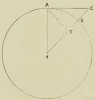
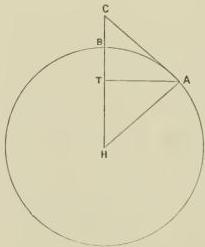
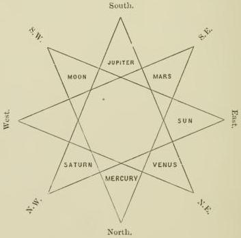
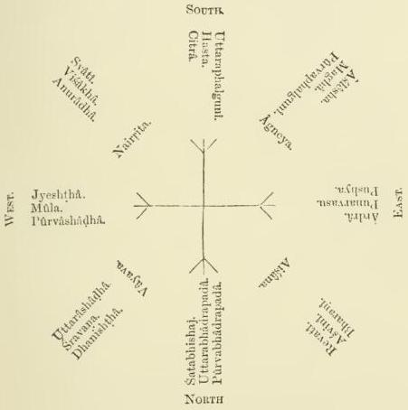
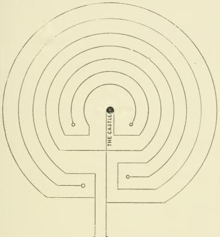
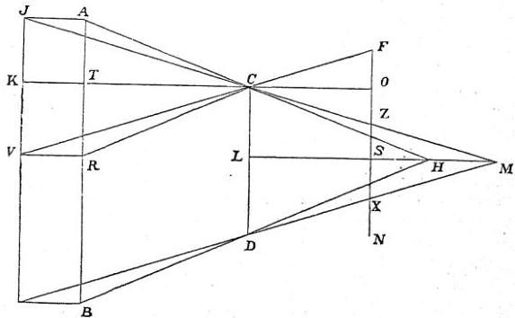

# ALBÊRÛNÎ'S INDIA

AN ACCURATE DESCRIPTION OF ALL CATEGORIES
OF HINDU THOUGHT, AS WELL THOSE WHICH ARE ADMISSIBLE AS THOSE WHICH MUST BE REJECTED.

COMPOSED BY 'ABÛ-ALRAIHÂN MUHAMMAD IBN 'AHMAD ALBÊRÛNÎ.

# PREFACE.

IN THE NAME OF GOD, THE COMPASSIONATE, THE MERCIFUL.

No one will deny that in questions of historic authenticity hearsay does not equal eye-witness; for in the latter the eye of the observer apprehends the substance of that which is observed, both in the time when and in the place where it exists, whilst hearsay has its peculiar drawbacks. But for these, it would even be preferable to eye-witness; for the object of eye-witness can only be actual momentary existence, whilst hearsay comprehends alike the present, the past, and the future, so as to apply in a certain sense both to that which is and to that which is not (i.e. which either has ceased to exist or has not yet come into existence). Written tradition is one of the species of hearsay—we might almost say, the most preferable. How could we know the history of nations but for the everlasting monuments of the pen?

The tradition regarding an event which in itself does not contradict either logical or physical laws will invariably depend for its character as true or false upon the character of the reporters, who are influenced by the divergency of interests and all kinds of animosities and antipathies between the various nations. We must distinguish different classes of reporters.

One of them tells a lie, as intending to further an interest of his own, either by lauding his family or nation, because he is one of them, or by attacking the family or nation on the opposite side, thinking that thereby he can gain his ends. In both cases he acts from motives of objectionable cupidity and animosity.

Another one tells a lie regarding a class of people whom he likes, as being under obligations to them, or whom he hates because something disagreeable has happened between them. Such a reporter is near akin to the first-mentioned one, as he too acts from motives of personal predilection and enmity.

Another tells a lie because he is of such a base nature as to aim thereby at some profit, or because he is such a coward as to be afraid of telling the truth.

Another tells a lie because it is his nature to lie, and he cannot do otherwise, which proceeds from the essential meanness of his character and the depravity of his innermost being.

Lastly, a man may tell a lie from ignorance, blindly following others who told him.

If, now, reporters of this kind become so numerous as to represent a certain body of tradition, or if in the course of time they even come to form a consecutive series of communities or nations, both the first reporter and his followers form the connecting links between the hearer and the inventor of the lie; and if the connecting links are eliminated, there remains the originator of the story, one of the various kinds of liars we have enumerated, as the only person with whom we have to deal.

That man only is praiseworthy who shrinks from a lie and always adheres to the truth, enjoying credit even among liars, not to mention others.

It has been said in the Koran, "Speak the truth, even if it were against yourselves" (Sûra, 4, 134); and the Messiah expresses himself in the Gospel to this effect: "Do not mind the fury of kings in speaking the truth before them.

They only possess your body, but they have no power over your soul" (cf. St. Matt. x. 18, 19, 28; St. Luke xii. 4). In these words the Messiah orders us to exercise moral courage. For what the crowd calls courage—bravely dashing into the fight or plunging into an abyss of destruction—is only a species of courage, whilst the genus, far above all species, is to scorn death, whether by word or deed.

Now as justice (i.e. being just) is a quality liked and coveted for its own self, for its intrinsic beauty, the same applies to truthfulness, except perhaps in the case of such people as never tasted how sweet it is, or know the truth, but deliberately shun it, like a notorious liar who once was asked if he had ever spoken the truth, and gave the answer, "If I were not afraid to speak the truth, I should say, no." A liar will avoid the path of justice; he will, as matter of preference, side with oppression and false witness, breach of confidence, fraudulent appropriation of the wealth of others, theft, and all the vices which serve to ruin the world and mankind.

When I once called upon the master 'Abû-Sahl 'Abd-Almun'im Ibn 'Alî Ibn Nûḥ At-tiflisî, may God strengthen him! I found that he blamed the tendency of the author of a book on the Mu'tazila sect to misrepresent their theory. For, according to them, God is omniscient of himself, and this dogma that author had expressed in such a way as to say that God has no knowledge (like the knowledge of man), thereby misleading uneducated people to imagine that, according to the Mu'tazilites, God is ignorant. Praise be to God, who is far above all such and similar unworthy descriptions! Thereupon I pointed out to the master that precisely the same method is much in fashion among those who undertake the task of giving an account of religious and philosophical systems from which they slightly differ or to which they are entirely opposed. Such misrepresentation is easily detected in a report about dogmas comprehended within the frame of one single religion, because they are closely related and blended with each other. On the other hand, you would have great difficulty in detecting it in a report about entirely foreign systems of thought totally differing both in principle and details, for such a research is rather an out-of-the-way one, and there are few means of arriving at a thorough comprehension of it. The same tendency prevails throughout our whole literature on philosophical and religious sects. If such an author is not alive to the requirements of a strictly scientific method, he will procure some superficial information which will satisfy neither the adherents of the doctrine in question nor those who really know it. In such a case, if he be an honest character, he will simply retract and feel ashamed; but if he be so base as not to give due honour to truth, he will persist in litigious wrangling for his own original standing-point. If, on the contrary, an author has the right method, he will do his utmost to deduce the tenets of a sect from their legendary lore, things which people tell him, pleasant enough to listen to, but which he would never dream of taking for true or believing.

In order to illustrate the point of our conversation, one of those present referred to the religions and doctrines of the Hindus by way of an example. Thereupon I drew their attention to the fact that everything which exists on this subject in our literature is second-hand information which one has copied from the other, a farrago of materials never sifted by the sieve of critical examination. Of all authors of this class, I know only one who had proposed to himself to give a simple and exact report of the subject sine irâ ac studio, viz. 'Abû-al'abbâs Alêrânshahrî. He himself did not believe in any of the then existing religions, but was the sole believer in a religion invented by himself, which he tried to propagate. He has given a very good account of the doctrines of the Jews and Christians as well as of the contents of both the Thora and the Gospel. Besides, he furnishes us with a most excellent account of the Manichæans, and of obsolete religions of bygone times which are mentioned in their books. But when he came in his book to speak of the Hindus and the Buddhists, his arrow missed the mark, and in the latter part he went astray through hitting upon the book of Zarkān, the contents of which he incorporated in his own work. That, however, which he has not taken from Zarkān, he himself has heard from common people among Hindus and Buddhists.

At a subsequent period the master 'Abū-Sahl studied the books in question a second time, and when he found the matter exactly as I have here described it, he incited me to write down what I know about the Hindus as a help to those who want to discuss religious questions with them, and as a repertory of information to those who want to associate with them. In order to please him I have done so, and written this book on the doctrines of the Hindus, never making any unfounded imputations against those, our religious antagonists, and at the same time not considering it inconsistent with my duties as a Muslim to quote their own words at full length when I thought they would contribute to elucidate a subject. If the contents of these quotations happen to be utterly heathenish, and the followers of the truth, i.e. the Muslims, find them objectionable, we can only say that such is the belief of the Hindus, and that they themselves are best qualified to defend it.

This book is not a polemical one. I shall not produce the arguments of our antagonists in order to refute such of them as I believe to be in the wrong. My book is nothing but a simple historic record of facts. I shall place before the reader the theories of the Hindus exactly as they are, and I shall mention in connection with them similar theories of the Greeks in order to show the relationship existing between them. For the Greek philosophers, although aiming at truth in the abstract, never in all questions of popular bearing rise much above the customary exoteric expressions and tenets both of their religion and law. Besides Greek ideas we shall only now and then mention those of the Sūfis or of some one or other Christian sect, because in their notions regarding the transmigration of souls and the pantheistic doctrine of the unity of God with creation there is much in common between these systems.

I have already translated two books into Arabic, one about the origines and a description of all created beings, called Sāṃkhya, and another about the emancipation of the soul from the fetters of the body, called Patañjali (Pātañjala?). These two books contain most of the elements of the belief of the Hindus, but not all the single rules derived therefrom. I hope that the present book will enable the reader to dispense with these two earlier ones, and with other books of the same kind; that it will give a sufficient representation of the subject, and will enable him to make himself thoroughly acquainted with it—God willing!

# CHAPTER I.

## ON THE HINDUS IN GENERAL, AS AN INTRODUCTION TO OUR ACCOUNT OF THEM.

BEFORE entering on our exposition, we must form an adequate idea of that which renders it so particularly difficult to penetrate to the essential nature of any Indian subject. The knowledge of these difficulties will either facilitate the progress of our work, or serve as an apology for any shortcomings of ours. For the reader must always bear in mind that the Hindus entirely differ from us in every respect, many a subject appearing intricate and obscure which would be perfectly clear if there were more connection between us. The barriers which separate Muslims and Hindus rest on different causes.

First, they differ from us in everything which other nations have in common. And here we first mention the language, although the difference of language also exists between other nations. If you want to conquer this difficulty (i.e. to learn Sanskrit), you will not find it easy, because the language is of an enormous range, both in words and inflections, something like the Arabic, calling one and the same thing by various names, both original and derived, and using one and the same word for a variety of subjects, which, in order to be properly understood, must be distinguished from each other by various qualifying epithets. For nobody could distinguish between the various meanings of a word unless he understands the context in which it occurs, and its relation both to the following and the preceding parts of the sentence. The Hindus, like other people, boast of this enormous range of their language, whilst in reality it is a defect.

Further, the language is divided into a neglected vernacular one, only in use among the common people, and a classical one, only in use among the upper and educated classes, which is much cultivated, and subject to the rules of grammatical inflection and etymology, and to all the niceties of grammar and rhetoric.

Besides, some of the sounds (consonants) of which the language is composed are neither identical with the sounds of Arabic and Persian, nor resemble them in any way. Our tongue and uvula could scarcely manage to correctly pronounce them, nor our ears in hearing to distinguish them from similar sounds, nor could we transliterate them with our characters. It is very difficult, therefore, to express an Indian word in our writing, for in order to fix the pronunciation we must change our orthographical points and signs, and must pronounce the case-endings either according to the common Arabic rules or according to special rules adapted for the purpose.

Add to this that the Indian scribes are careless, and do not take pains to produce correct and well-collated copies. In consequence, the highest results of the author's mental development are lost by their negligence, and his book becomes already in the first or second copy so full of faults, that the text appears as something entirely new, which neither a scholar nor one familiar with the subject, whether Hindu or Muslim, could any longer understand. It will sufficiently illustrate the matter if we tell the reader that we have sometimes written down a word from the mouth of Hindus, taking the greatest pains to fix its pronunciation, and that afterwards when we repeated it to them, they had great difficulty in recognising it.

As in other foreign tongues, so also in Sanskrit, two or three consonants may follow each other without an intervening vowel—consonants which in our Persian grammatical system are considered as having a hidden vowel. Since most Sanskrit words and names begin with such consonants without vowels, we find it very difficult to pronounce them.

Besides, the scientific books of the Hindus are composed in various favourite metres, by which they intend, considering that the books soon become corrupted by additions and omissions, to preserve them exactly as they are, in order to facilitate their being learned by heart, because they consider as canonical only that which is known by heart, not that which exists in writing. Now it is well known that in all metrical compositions there is much misty and constrained phraseology merely intended to fill up the metre and serving as a kind of patchwork, and this necessitates a certain amount of verbosity. This is also one of the reasons why a word has sometimes one meaning and sometimes another.

From all this it will appear that the metrical form of literary composition is one of the causes which make the study of Sanskrit literature so particularly difficult.

Secondly, they totally differ from us in religion, as we believe in nothing in which they believe, and vice versa. On the whole, there is very little disputing about theological topics among themselves; at the utmost, they fight with words, but they will never stake their soul or body or their property on religious controversy. On the contrary, all their fanaticism is directed against those who do not belong to them—against all foreigners. They call them mleccha, i.e. impure, and forbid having any connection with them, be it by intermarriage or any other kind of relationship, or by sitting, eating, and drinking with them, because thereby, they think, they would be polluted. They consider as impure anything which touches the fire and the water of a foreigner; and no household can exist without these two elements. Besides, they never desire that a thing which once has been polluted should be purified and thus recovered, as, under ordinary circumstances, if anybody or anything has become unclean, he or it would strive to regain the state of purity. They are not allowed to receive anybody who does not belong to them, even if he wished it, or was inclined to their religion. This, too, renders any connection with them quite impossible, and constitutes the widest gulf between us and them.

In the third place, in all manners and usages they differ from us to such a degree as to frighten their children with us, with our dress, and our ways and customs, and as to declare us to be devil's breed, and our doings as the very opposite of all that is good and proper. By the by, we must confess, in order to be just, that a similar depreciation of foreigners not only prevails among us and the Hindus, but is common to all nations towards each other. I recollect a Hindu who wreaked his vengeance on us for the following reason:—

Some Hindu king had perished at the hand of an enemy of his who had marched against him from our country. After his death there was born a child to him, which succeeded him, by the name of Sagara. On coming of age, the young man asked his mother about his father, and then she told him what had happened. Now he was inflamed with hatred, marched out of his country into the country of the enemy, and plentifully satiated his thirst of vengeance upon them. After having become tired of slaughtering, he compelled the survivors to dress in our dress, which was meant as an ignominious punishment for them. When I heard of it, I felt thankful that he was gracious enough not to compel us to Indianise ourselves and to adopt Hindu dress and manners.

Another circumstance which increased the already existing antagonism between Hindus and foreigners is that the so-called Shamaniyya (Buddhists), though they cordially hate the Brahmans, still are nearer akin to them than to others. In former times, Khurāsān, Persis, 'Irāk, Mosul, the country up to the frontier of Syria, was Buddhistic, but then Zarathustra went forth from Ādharbaijān and preached Magism in Balkh (Baktra). His doctrine came into favour with King Gushtasp, and his son Isfendiyād spread the new faith both in east and west, both by force and by treaties. He founded fire-temples through his whole empire, from the frontiers of China to those of the Greek empire. The succeeding kings made their religion (i.e. Zoroastrianism) the obligatory state-religion for Persis and 'Irāk. In consequence, the Buddhists were banished from those countries, and had to emigrate to the countries east of Balkh. There are some Magians up to the present time in India, where they are called Maga. From that time dates their aversion towards the countries of Khurāsān. But then came Islam; the Persian empire perished, and the repugnance of the Hindus against foreigners increased more and more when the Muslims began to make their inroads into their country; for Muḥammad Ibn Elkāsim Ibn Elmunabbih entered Sindh from the side of Sijistān (Sakastene) and conquered the cities of Bahmanwā and Mūlasthāna, the former of which he called Al-manṣūra, the latter Al-ma'mūra. He entered India proper, and penetrated even as far as Kanauj, marched through the country of Gandhāra, and on his way back, through the confines of Kashmir, sometimes fighting sword in hand, sometimes gaining his ends by treaties, leaving to the people their ancient belief, except in the case of those who wanted to become Muslims. All these events planted a deeply rooted hatred in their hearts.

Now in the following times no Muslim conqueror
passed beyond the frontier of Kābul and the river Sindh
until the days of the Turks, when they seized the power
in Ghazna under the Sāmānī dynasty, and the supreme
power fell to the lot of Nāṣir-addaula Sabuktagīn.
This prince chose the holy war as his calling, and therefore called himself Al-ghāzī (i.e. warring on the road of
Allah). In the interest of his successors he constructed,
in order to weaken the Indian frontier, those roads
on which afterwards his son Yamīn-addaula Maḥmūd
marched into India during a period of thirty years and
more. God be merciful to both father and son! Maḥ-
mūd utterly ruined the prosperity of the country, and
performed there wonderful exploits, by which the Hindus
became like atoms of dust scattered in all directions,
and like a tale of old in the mouth of the people. Their
scattered remains cherish, of course, the most inveterate
aversion towards all Muslims. This is the reason, too,
why Hindu sciences have retired far away from those
parts of the country conquered by us, and have fled to
places which our hand cannot yet reach, to Kashmīr,
Benares, and other places. And there the antagonism
between them and all foreigners receives more and
more nourishment both from political and religious
sources.

In the fifth place, there are other causes, the mentioning of which sounds like a satire—peculiarities of their
national character, deeply rooted in them, but manifest
to everybody. We can only say, folly is an illness for
which there is no medicine, and the Hindus believe that
there is no country but theirs, no nation like theirs, no
kings like theirs, no religion like theirs, no science like
theirs. They are haughty, foolishly vain, self-conceited,
and stolid. They are by nature niggardly in communicating that which they know, and they take the greatest
possible care to withhold it from men of another caste
among their own people, still much more, of course, from any foreigner. According to their belief, there is no other country on earth but theirs, no other race of man but theirs, and no created beings besides them have any knowledge or science whatsoever. Their haughtiness is such that, if you tell them of any science or scholar in Khurāsān and Persis, they will think you to be both an ignoramus and a liar. If they travelled and mixed with other nations, they would soon change their mind, for their ancestors were not as narrow-minded as the present generation is. One of their scholars, Varāhamihira, in a passage where he calls on the people to honour the Brahmans, says: "The Greeks, though impure, must be honoured, since they were trained in sciences, and therein excelled others. What, then, are we to say of a Brahman, if he combines with his purity the height of science?" In former times, the Hindus used to acknowledge that the progress of science due to the Greeks is much more important than that which is due to themselves. But from this passage of Varāhamihira alone you see what a self-lauding man he is, whilst he gives himself airs as doing justice to others. At first I stood to their astronomers in the relation of a pupil to his master, being a stranger among them and not acquainted with their peculiar national and traditional methods of science. On having made some progress, I began to show them the elements on which this science rests, to point out to them some rules of logical deduction and the scientific methods of all mathematics, and then they flocked together round me from all parts, wondering, and most eager to learn from me, asking me at the same time from what Hindu master I had learnt those things, whilst in reality I showed them what they were worth, and thought myself a great deal superior to them, disdaining to be put on a level with them. They almost thought me to be a sorcerer, and when speaking of me to their leading men in their native tongue, they spoke of me as the sea or as the water which is so acid that vinegar in comparison is

sweet.

Now such is the state of things in India. I have
found it very hard to work my way into the subject,
although I have a great liking for it, in which respect I
stand quite alone in my time, and although I do not
spare either trouble or money in collecting Sanskrit
books from places where I supposed they were likely
to be found, and in procuring for myself, even from very
remote places, Hindu scholars who understand them
and are able to teach me. What scholar, however, has
the same favourable opportunities of studying this subject as I have? That would be only the case with one
to whom the grace of God accords, what it did not
accord to me, a perfectly free disposal of his own doings
and goings; for it has never fallen to my lot in my own
doings and goings to be perfectly independent, nor to
be invested with sufficient power to dispose and to order
as I thought best. However, I thank God for that
which He has bestowed upon me, and which must be
considered as sufficient for the purpose.

The heathen Greeks, before the rise of Christianity,
held much the same opinions as the Hindus; their
educated classes thought much the same as those of
the Hindus; their common people held the same
idolatrous views as those of the Hindus. Therefore I like to confront the theories of the one nation
with those of the other simply on account of their
close relationship, not in order to correct them. For
that which is not the truth (i.e. the true belief or
monotheism) does not admit of any correction, and all
heathenism, whether Greek or Indian, is in its pith and
marrow one and the same belief, because it is only a
deviation from the truth. The Greeks, however, had
philosophers who, living in their country, discovered
and worked out for them the elements of science, not of
popular superstition, for it is the object of the upper classes to be guided by the results of science, whilst the common crowd will always be inclined to plunge into wrong-headed wrangling, as long as they are not kept down by fear of punishment. Think of Socrates when he opposed the crowd of his nation as to their idolatry and did not want to call the stars gods! At once eleven of the twelve judges of the Athenians agreed on a sentence of death, and Socrates died faithful to the truth.

The Hindus had no men of this stamp both capable and willing to bring sciences to a classical perfection. Therefore you mostly find that even the so-called scientific theorems of the Hindus are in a state of utter confusion, devoid of any logical order, and in the last instance always mixed up with the silly notions of the crowd, e.g. immense numbers, enormous spaces of time, and all kinds of religious dogmas, which the vulgar belief does not admit of being called into question. Therefore it is a prevailing practice among the Hindus jurare in verba magistri; and I can only compare their mathematical and astronomical literature, as far as I know it, to a mixture of pearl shells and sour dates, or of pearls and dung, or of costly crystals and common pebbles. Both kinds of things are equal in their eyes, since they cannot raise themselves to the methods of a strictly scientific deduction.

In most parts of my work I simply relate without criticising, unless there be a special reason for doing so. I mention the necessary Sanskrit names and technical terms once where the context of our explanation demands it. If the word is an original one, the meaning of which can be rendered in Arabic, I only use the corresponding Arabic word; if, however, the Sanskrit word be more practical, we keep this, trying to transliterate it as accurately as possible. If the word is a secondary or derived one, but in general use, we also keep it, though there be a corresponding term in Arabic, but before using it we explain its signification. In this way we have tried to facilitate the understanding of the terminology.

Lastly, we observe that we cannot always in our discussions strictly adhere to the geometrical method, only referring to that which precedes and never to that which follows, as we must sometimes introduce in a chapter an unknown factor, the explanation of which can only be given in a later part of the book, God helping us!

# CHAPTER II.

## ON THE BELIEF OF THE HINDUS IN GOD.

THE belief of educated and uneducated people differs in every nation; for the former strive to conceive abstract ideas and to define general principles, whilst the latter do not pass beyond the apprehension of the senses, and are content with derived rules, without caring for details, especially in questions of religion and law, regarding which opinions and interests are divided.

The Bindus believe with regard to God that he is one, eternal, without beginning and end, acting by freewill, almighty, all-wise, living, giving life, ruling, preserving; one who in his sovereignty is unique, beyond all likeness and unlikeness, and that he does not resemble anything nor does anything resemble him. In order to illustrate this we shall produce some extracts from their literature, lest the reader should think that our account is nothing but hearsay.

In the book of Patañjali the pupil asks:

"Who is the worshipped one, by the worship of whom blessing is obtained?"

The master says:

"It is he who, being eternal and unique, does not for his part stand in need of any human action for which he might give as a recompense either a blissful repose, which is hoped and longed for, or a troubled existence, which is feared and dreaded. He is unattainable to thought, being sublime beyond all unlikeness which is abhorrent and all likeness which is sympathetic. He by his essence knows from all eternity. Knowledge, in the human sense of the term, has as its object that which was unknown before, whilst not knowing does not at any time or in any condition apply to God."

Further the pupil speaks:

"Do you attribute to him other qualities besides those you have mentioned?"

The master says:

"He is height, absolute in the idea, not in space, for he is sublime beyond all existence in any space. He is the pure absolute good, longed for by every created being. He is the knowledge free from the defilement of forgetfulness and not-knowing."

The pupil speaks:

"Do you attribute to him speech or not?"

The master says:

"As he knows, he no doubt also speaks."

The pupil asks:

"If he speaks because he knows, what, then, is the difference between him and the knowing sages who have spoken of their knowing?"

The master says:

"The difference between them is time, for they have learned in time and spoken in time, after having been not-knowing and not-speaking. By speech they have transferred their knowledge to others. Therefore their speaking and acquiring knowledge take place in time. And as divine matters have no connection with time, God is knowing, speaking from eternity. It was he who spoke to Brahman, and to others of the first beings in different ways. On the one he bestowed a book; for the other he opened a door, a means of communicating with him; a third one he inspired so that he obtained by cogitation what God bestowed upon him."

The pupil asks:

"Whence has he this knowing?"

The master answers:

"His knowing is the same from all eternity, for ever and ever. As he has never been not-knowing, he is knowing of himself, having never acquired any knowledge which he did not possess before. He speaks in the Veda which he sent down upon Brahman:

"'Praise and celebrate him who has spoken the Veda, and was before the Veda.'"

The pupil asks:

"How do you worship him to whom the perception of the senses cannot attain?"

The master says:

"His name proves his existence, for where there is a report there must be something to which it refers, and where there is a name there must be something which is named. He is hidden to the senses and unperceivable by them. However, the soul perceives him, and thought comprehends his qualities. This meditation is identical with worshipping him exclusively, and by practising it uninterruptedly beatitude is obtained."

In this way the Hindus express themselves in this very famous book.

The following passage is taken from the book Gītā, a part of the book Bhārata, from the conversation between Vāsudeva and Arjuna:—

"I am the universe, without a beginning by being born, or without an end by dying. I do not aim by whatever I do at any recompense. I do not specially belong to one class of beings to the exclusion of others, as if I were the friend of one and the enemy of others. I have given to each one in my creation what is sufficient for him in all his functions. Therefore whoever knows me in this capacity, and tries to become similar to me by keeping desire apart from his action, his fetters will be loosened, and he will easily be saved and freed."

This passage reminds one of the definition of philosophy as the striving to become as much as possible similar to God.

Further, Vāsudeva speaks in the same book:—

"It is desire which causes most men to take refuge with God for their wants. But if you examine their case closely, you will find that they are very far from having an accurate knowledge of him; for God is not apparent to every one, so that he might perceive him with his senses. Therefore they do not know him. Some of them do not pass beyond what their senses perceive; some pass beyond this, but stop at the knowledge of the laws of nature, without learning that above them there is one who did not give birth nor was born, the essence of whose being has not been comprehended by the knowledge of any one, while his knowledge comprehends everything."

The Hindus differ among themselves as to the definition of what is action. Some who make God the source of action consider him as the universal cause; for as the existence of the agents derives from him, he is the cause of their action, and in consequence it is his own action coming into existence through their intermediation. Others do not derive action from God, but from other sources, considering them as the particular causes which in the last instance—according to external observation—produce the action in question.

In the book Sāṃkhya the devotee speaks: "Has there been a difference of opinion about action and the agent, or not?"

The sage speaks: "Some people say that the soul is not alive and the matter not living; that God, who is self-sufficing, is he who unites them and separates them from each other; that therefore in reality he himself is the agent. Action proceeds from him in such a way that he causes both the soul and the matter to move, like as that which is living and powerful moves that which is dead and weak.

"Others say that the union of action and the agent is effected by nature, and that such is the usual process in everything that increases and decreases.

"Others say the agent is the soul, because in the Véda it is said, 'Every being comes from Purusha.' According to others, the agent is time, for the world is tied to time as a sheep is tied to a strong cord, so that its motion depends upon whether the cord is drawn tight or slackened. Still others say that action is nothing but a recompense for something which has been done before.

"All these opinions are wrong. The truth is, that action entirely belongs to matter, for matter binds the soul, causes it to wander about in different shapes, and then sets it free. Therefore matter is the agent, all that belongs to matter helps it to accomplish action. But the soul is not an agent, because it is devoid of the different faculties."

This is what educated people believe about God. They call him iśvara, i.e. self-sufficing, beneficent, who gives without receiving. They consider the unity of God as absolute, but that everything beside God which may appear as a unity is really a plurality of things. The existence of God they consider as a real existence, because everything that exists exists through him. It is not impossible to think that the existing beings are not and that he is, but it is impossible to think that he is not and that they are.

If we now pass from the ideas of the educated people among the Hindus to those of the common people, we must first state that they present a great variety. Some of them are simply abominable, but similar errors also occur in other religions. Nay, even in Islam we must decidedly disapprove, e.g. of the anthropomorphic doctrines, the teachings of the Jabriyya sect, the prohibition of the discussion of religious topics, and such like. Every religious sentence destined for the people at large must be carefully worded, as the following example shows. Some Hindu scholar calls God a point, meaning to say thereby that the qualities of bodies do not apply to him. Now some uneducated man reads this and imagines, God is as small as a point, and he does not find out what the word point in this sentence was really intended to express. He will not even stop with this offensive comparison, but will describe God as much larger, and will say, "He is twelve fingers long and ten fingers broad." Praise be to God, who is far above measure and number! Further, if an uneducated man hears what we have mentioned, that God comprehends the universe so that nothing is concealed from him, he will at once imagine that this comprehending is effected by means of eyesight; that eyesight is only possible by means of an eye, and that two eyes are better than only one; and in consequence he will describe God as having a thousand eyes, meaning to describe his omniscience.

Similar hideous fictions are sometimes met with among the Hindus, especially among those castes who are not allowed to occupy themselves with science, of whom we shall speak hereafter.

# CHAPTER III.

## ON THE HINDU BELIEF AS TO CREATED THINGS, BOTH "INTELLIGIBILIA" AND "SENSIBILIA."

ON this subject the ancient Greeks held nearly the same view as the Hindus, at all events in those times before philosophy rose high among them under the care of the seven so-called pillars of wisdom, viz. Solon of Athens, Bias of Priene, Periander of Corinth, Thales of Miletus, Chilon of Lacedæmon, Pittacus of Lesbos, and Cleobulus of Lindos, and their successors. Some of them thought that all things are one, and this one thing is according to some τὸ λανθάνειν, according to others ἡ δύναμις; that e.g. man has only this prerogative before a stone and the inanimate world, that he is by one degree nearer than they to the First Cause. But this he would not be anything better than they.

Others think that only the First Cause has real existence, because it alone is self-sufficing, whilst everything else absolutely requires it; that a thing which for its existence stands in need of something else has only a dream-life, no real life, and that reality is only that one and first being (the First Cause).

This is also the theory of the Ṣūfīs, i.e. the sages, for ṣūf means in Greek wisdom (σοφία). Therefore a philosopher is called pailāsōpā (φιλόσοφος), i.e. loving wisdom. When in Islam persons adopted something like the doctrines of these philosophers, they also adopted their name; but some people did not understand the meaning of the word, and erroneously combined it with the Arabic word ṣuffa, as if the Ṣūfī (= φιλόσοφοι) were identical with the so-called 'Ahl-aṣṣuffa among the companions of Muḥammad. In later times the word was corrupted by misspelling, so that finally it was taken for a derivation from ṣūf, i.e. the wool of goats. Abū-alfath Albustī made a laudable effort to avoid this mistake when he said, "From olden times people have differed as to the meaning of the word ṣūfī, and have thought it a derivative from ṣūf, i.e. wool. I, for my part, understand by the word a youth who is ṣāfī, i.e. pure. This ṣāfī has become ṣūfī, and in this form the name of a class of thinkers, the Ṣūfī."

Further, the same Greeks think that the existing world is only one thing; that the First Cause appears in it under various shapes; that the power of the First Cause is inherent in the parts of the world under different circumstances, which cause a certain difference of the things of the world notwithstanding their original unity.

Others thought that he who turns with his whole being towards the First Cause, striving to become as much as possible similar to it, will become united with it after having passed the intermediate stages, and stripped of all appendages and impediments. Similar views are also held by the Ṣūfī, because of the similarity of the dogma.

As to the souls and spirits, the Greeks think that they exist by themselves before they enter bodies; that they exist in certain numbers and groups, which stand in various relations to each other, knowing each other and not knowing; that they, whilst staying in bodies, earn by the actions of their free-will that lot which awaits them after their separation from the bodies, i.e. the faculty of ruling the world in various ways. Therefore they called them gods, built temples in their names and offered them sacrifices; as Galenus says in his book called προτρεπτικὸς εἰς τὰς τέχνας: "Excellent men have obtained the honour of being reckoned among the deified beings only for the noble spirit in which they cultivated the arts, not for their prowess in wrestling and discus-throwing. E.g. Asclepius and Dionysos, whether they were originally human beings in bygone times and afterwards deified, or were divine beings from the very beginning, deserved in any case the greatest of honours, because the one taught mankind the science of medicine, the other the art of the cultivation of the vine."

Galenus says in his commentary on the aphorisms of Hippocrates: "As regards the offerings to Asclepius, we have never heard that anybody offered him a goat, because the weaving of goat's-hair is not easy, and much goat's-meat produces epilepsy, since the humours of the goats are bad. People only offer him a cock, as also Hippocrates has done. For this divine man acquired for mankind the art of medicine, which is much superior to that which Dionysos and Demeter have invented, i.e. the wine and the cereals whence bread is prepared. Therefore cereals are called by the name of Demeter and the vine is called by the name of Dionysos."

Plato says in his Timæus: "The θεοί whom the barbarians call gods, because of their not dying, are the δαίμονες, whilst they call the god the first god."

Further he says: "God spoke to the gods, 'You are not of yourselves exempt from destruction. Only you will not perish by death. You have obtained from my will at the time when I created you, the firmest covenant.'"

In another passage of the same book he says: "God is in the single number; there are no gods in the plural number."

These quotations prove that the Greeks call in general god everything that is glorious and noble, and the like usage exists among many nations. They go even so far as to call gods the mountains, the seas, &c.

Secondly, they apply the term god in a special sense
to the First Cause, to the angels, and to their souls.
According to a third usage, Plato calls gods the Sekināt
(= Μοῦσαι). But on this subject the terms of the
interpreters are not perfectly clear; in consequence
of which we only know the name, but not what it
means. Johannes Grammaticus says in his refutation
of Proclus: "The Greeks gave the name of gods to
the visible bodies in heaven, as many barbarians do.
Afterwards, when they came to philosophise on the
abstract ideas of the world of thought, they called these
by the name of gods."

Hence we must necessarily infer that being deified
means something like the state of angels, according
to our notions. This Galenus says in clear words
in the same book: "If it is true that Asclepius was
a man in bygone times, and that then God deigned
to make him one of the angels, everything else is idle
talk."

In another passage of the same book he says: "God
spoke to Lycurgus, 'I am in doubt concerning you,
whether to call you a man or an angel, but I incline to
the latter.'"

There are, however, certain expressions which are
offensive according to the notions of one religion, whilst
they are admissible according to those of another, which
may pass in one language, whilst they are rejected by
another. To this class belongs the word apotheosis,
which has a bad sound in the ears of Muslims. If we
consider the use of the word god in the Arabic language,
we find that all the names by which the pure truth, i.e.
Allāh, has been named, may somehow or other be applied
to other beings besides him, except the word Allāh,
which only applies to God, and which has been called
his greatest name.

If we consider the use of the word in Hebrew and Syriac, in which two languages the sacred books before the Koran were revealed, we find that in the Thora and the following books of prophets which are reckoned with the Thora as one whole, that word Rabb corresponds to the word Allāh in Arabic, in so far as it cannot in a genitive construction be applied to anybody besides God, and you cannot say the rabb of the house, the rabb of the property (which in Arabic is allowed). And, secondly, we find that the word 'Eloah in Hebrew corresponds in its usage there to the word Rabb in Arabic (i.e. that in Hebrew the word אֵלֶּה may apply to other beings but God, like the word رَب in Arabic). The following passages occur in those books:—

"The sons of Elohim came in unto the daughters of men" (Gen. vi. 4), before the deluge, and cohabited with them.

"Satan entered together with the sons of Elohim into their meeting" (Job i. 6).

In the Thora of Moses God speaks to him: "I have made thee a god to Pharaoh" (Exod. vii. 1).

In the 82d Psalm of the Psalter of David the following occurs: "God standeth in the congregation of the gods" (Ps. lxxxii. 1), i.e. of the angels.

In the Thora the idols are called foreign gods. If the Thora had not forbidden to worship any other being but God, if it had not forbidden people to prostrate themselves before the idols, nay, even to mention them and to think of them, one might infer from this expression (foreign gods) that the order of the Bible refers only to the abolition of foreign gods, which would mean gods that are not Hebrew ones (as if the Hebrews had adored national gods, in opposition to the gods of their neighbours). The nations round Palestine were idol worshippers like the heathen Greeks, and the Israelites always rebelled against God by worshipping the idol of Baal (lit. Ba'lā) and the idol of Ashtārōth, i.e. Venus.

From all this it is evident that the Hebrews used to apply the term being god, grammatically a term like being king, to the angels, to the souls invested with divine power (v. p. 34); by way of comparison, also, to the images which were made to represent the bodies of those beings; lastly, metaphorically, to kings and to other great men.

Passing from the word God to those of father and son, we must state that Islam is not liberal in the use of them; for in Arabic the word son means nearly always as much as a child in the natural order of things, and from the ideas involved in parentage and birth can never be derived any expression meaning the Eternal Lord of creation. Other languages, however, take much more liberty in this respect; so that if people address a man by father, it is nearly the same as if they addressed him by sir. As is well known, phrases of this kind have become so prevalent among the Christians, that anybody who does not always use the words father and son in addressing people would scarcely be considered as one of them. By the son they understand most especially Jesus, but apply it also to others besides him. It is Jesus who orders his disciples to say in prayer, "O our father which art in heaven" (St. Matt. vi. 9); and informing them of his approaching death, he says that he is going to his father and to their father (St. John xx. 17). In most of his speeches he explains the word the son as meaning himself, that he is the son of man.

Besides the Christians, the Jews too use similar expressions; for the 2d Book of Kings relates that God consoled David for the loss of his son, who had been borne to him by the wife of Uriah, and promised him another son from her, whom he would adopt as his own son (1 Chron. xxii. 9, 10). If the use of the Hebrew language admits that Salomo is by adoption a son of God, it is admissible that he who adopted was a father, viz. God.

The Manichæans stand in a near relationship to the Christians. Mânî expresses himself in a similar way in the book called Kanz-al'ihyâ (Thesaurus Vivificationis):

"The resplendent hosts will be called young women and virgins, fathers and mothers, sons, brothers, and sisters, because such is the custom in the books of the prophets. In the country of joy there is neither male nor female, nor are there organs of generation. All are invested with living bodies. Since they have divine bodies, they do not differ from each other in weakness and force, in length and shortness, in figure and looks; they are like similar lamps, which are lighted by the same lamp, and which are nourished by the same material. The cause of this kind of name-giving arises, in the last instance, from the rivalry of the two realms in mixing up with each other. When the low dark realm rose from the abyss of chaos, and was seen by the high resplendent realm as consisting of pairs of male and female beings, the latter gave similar outward forms to its own children, who started to fight that other world, so that it placed in the fight one kind of beings opposite the same kind of the other world."

The educated among the Hindus abhor anthropomorphisms of this kind, but the crowd and the members of the single sects use them most extensively. They go even beyond all we have hitherto mentioned, so as to speak of wife, son, daughter, of the rendering pregnant and other physical processes, all in connection with God. They are even so little pious, that, when speaking of these things, they do not even abstain from silly and unbecoming language. However, nobody minds these classes and their theories, though they be numerous. The main and most essential point of the Hindu world of thought is that which the Brahmans think and believe, for they are specially trained for preserving and maintaining their religion. And this it is which we shall explain, viz. the belief of the Brahmans.

Regarding the whole creation (τὸ ὄν), they think that it is a unity, as has already been declared, because Vāsudeva speaks in the book called Gītā: "To speak accurately, we must say that all things are divine; for Vishṇu made himself the earth that the living beings should rest thereupon; he made himself water to nourish them thereby; he made himself fire and wind in order to make them grow; and he made himself the heart of every single being. He presented them with recollection and knowledge and the two opposite qualities, as is mentioned in the Veda."

How much does this resemble the expression of the author of the book of Apollonius, De Causis Rerum, as if the one had been taken from the other! He says: "There is in all men a divine power, by which all things, both material and immaterial, are apprehended." Thus in Persian the immaterial Lord is called Khudhā, and in a derivative sense the word is also used to mean a man, i.e. a human lord.

I. Those Hindus who prefer clear and accurate definitions to vague allusions call the soul purusha, which means man, because it is the living element in the existing world. Life is the only attribute which they give to it. They describe it as alternately knowing and not knowing, as not knowing ἐν πράξει (actually), and as knowing ἐν δυνάμει (potentially), gaining knowledge by acquisition. The not-knowing of purusha is the cause why action comes into existence, and its knowing is the cause why action ceases.

II. Next follows the general matter, i.e. the abstract ὕλη, which they call avyakta, i.e. a shapeless thing. It is dead, but has three powers potentially, not actually, which are called sattva, rajas, and tamas. I have heard that Buddhodana (sic), in speaking to his adherents the Shamanians, calls them buddha, dharma, saṅgha, as it were intelligence, religion, and ignorance (sic). The first power is rest and goodness, and hence come existing and growing. The second is exertion and fatigue, and hence come firmness and duration. The third is languor and irresolution, and hence come ruin and perishing. Therefore the first power is attributed to the angels, the second to men, the third to the animals. The ideas before, afterwards, and thereupon may be predicated of all these things only in the sense of a certain sequence and on account of the inadequacy of language, but not so as to indicate any ordinary notions of time.

III. Matter proceeding from δύναμις into πρᾶξις under the various shapes and with the three primary forces is called vyakta, i.e. having shape, whilst the union of the abstract ὕλη and of the shaped matter is called prakrīti. This term, however, is of no use to us; we do not want to speak of an abstract matter, the term matter alone being sufficient for us, since the one does not exist without the other.

IV. Next comes nature, which they call ahaṅkāra. The word is derived from the ideas of overpowering, developing, and self-assertion, because matter when assuming shape causes things to develop into new forms, and this growing consists in the changing of a foreign element and assimilating it to the growing one. Hence it is as if Nature were trying to overpower those other or foreign elements in this process of changing them, and were subduing that which is changed.

V.-IX. As a matter of course, each compound presupposes simple elements from which it is compounded and into which it is resolved again. The universal existences in the world are the five elements, i.e. according to the Hindus: heaven, wind, fire, water, and earth. They are called mahābhūta, i.e. having great natures. They do not think, as other people do, that the fire is a hot dry body near the bottom of the ether. They understand by fire the common fire on earth which comes from an inflammation of smoke. The Vāyu Purāṇa says: "In the beginning were earth, water, wind, and heaven. Brahman, on seeing sparks under the earth, brought them forward and divided them into three parts: the first, párthiva, is the common fire, which requires wood and is extinguished by water; the second is divya, i.e. the sun; the third, vidyut, i.e. the lightning. The sun attracts the water; the lightning shines through the water. In the animals, also, there is fire in the midst of moist substances, which serve to nourish the fire and do not extinguish it."

X.-XIV. As these elements are compound, they presuppose simple ones which are called pañca mátáras, i.e. five mothers. They describe them as the functions of the senses. The simple element of heaven is śabda, i.e. that which is heard; that of the wind is sparśa, i.e. that which is touched; that of the fire is rūpa, i.e. that which is seen; that of the water is rasa, i.e. that which is tasted; and that of the earth is gandha, i.e. that which is smelled. With each of these mahābhūta elements (earth, water, &c.) they connect, firstly, one of the pañca-mátáras elements, as we have here shown; and, secondly, all those which have been attributed to the mahābhūta elements previously mentioned. So the earth has all five qualities; the water has them minus the smelling (= four qualities); the fire has them minus the smelling and tasting (i.e. three qualities); the wind has them minus smelling, tasting, and seeing (i.e. two qualities); heaven has them minus smelling, tasting, seeing, and touching (i.e. one quality).

I do not know what the Hindus mean by bringing sound into relation with heaven. Perhaps they mean something similar to what Homer, the poet of the ancient Greeks, said, "Those invested with the seven melodies speak and give answer to each other in a pleasant tone." Thereby he meant the seven planets; as another poet says, "The spheres endowed with different melodies are seven, moving eternally, praising the Creator, for it is he who holds them and embraces them unto the farthest end of the starless sphere."

Porphyry says in his book on the opinions of the most prominent philosophers about the nature of the sphere: "The heavenly bodies moving about in forms and shapes and with wonderful melodies, which are fixed for ever, as Pythagoras and Diogenes have explained, point to their Creator, who is without equal and without shape. People say that Diogenes had such subtle senses that he, and he alone, could hear the sound of the motion of the sphere."

All these expressions are rather hints than clear speech, but admitting of a correct interpretation on a scientific basis. Some successor of those philosophers, one of those who did not grasp the full truth, says: "Sight is watery, hearing airy, smelling fiery, tasting earthy, and touching is what the soul bestows upon everybody by uniting itself with it." I suppose this philosopher connects the sight with the water because he had heard of the moist substances of the eye and of their different classes (lacuna); he refers the smelling to the fire on account of frankincense and smoke; the tasting to the earth because of his nourishment which the earth yields him. As, then, the four elements are finished, he is compelled for the fifth sense, the touching, to have recourse to the soul.

The result of all these elements which we have enumerated, i.e. a compound of all of them, is the animal. The Hindus consider the plants as a species of animal as Plato also thinks that the plants have a sense, because they have the faculty of distinguishing between that which suits them and that which is detrimental to them. The animal is an animal as distinguished from a stone by virtue of its possession of the senses.

XV.-XIX. The senses are five, called indriyāṇi, the Indriyāṇi, hearing by the ear, the seeing by the eye, the smelling by the nose, the tasting by the tongue, and the touching by the skin.

XX. Next follows the will, which directs the senses in the exercise of their various functions, and which dwells in the heart. Therefore they call it manas.

XXI.-XXV. The animal nature is rendered perfect by five necessary functions, which they call karmendri-yāṇi, i.e. the senses of action. The former senses bring about learning and knowledge, the latter action and work. We shall call them the necessaria. They are: 1. To produce a sound for any of the different wants and wishes a man may have; 2. To throw the hands with force, in order to draw towards or to put away; 3. To walk with the feet, in order to seek something or to fly from it; 4, 5. The ejection of the superfluous elements of nourishment by means of the two openings created for the purpose.

The whole of these elements are twenty-five, viz. :—

1. The general soul.
2. The abstract ὕλη
3. The shaped matter.
4. The overpowering nature.
5-9. The simple mothers.
10-14. The primary elements.
15-19. The senses of apperception.
20. The directing will.
21-25. The instrumental necessaria.

The totality of these elements is called tattva, and all knowledge is restricted to them. Therefore Vyāsa the son of Parāśara speaks: "Learn twenty-five by distinctions, definitions, and divisions, as you learn a logical syllogism, and something which is a certainty, not merely studying with the tongue. Afterwards adhere to whatever religion you like; your end will be salvation."

# CHAPTER IV.

## FROM WHAT CAUSE ACTION ORIGINATES, AND HOW THE SOUL IS CONNECTED WITH MATTER.

VOLUNTARY actions cannot originate in the body of any animal, unless the body be living and exist in close contact with that which is living of itself, i.e. the soul. The Hindus maintain that the soul is ἐν πράξει, not ἐν δυνάμει, ignorant of its own essential nature and of its material substratum, longing to apprehend what it does not know, and believing that it cannot exist unless by matter. As, therefore, it longs for the good which is duration, and wishes to learn that which is hidden from it, it starts off in order to be united with matter. However, substances which are dense and such as are tenuous, if they have these qualities in the very highest degree, can mix together only by means of intermediary elements which stand in a certain relation to each of the two. Thus the air is the medium between fire and water, which are opposed to each other by these two qualities, for the air is related to the fire in tenuity and to the water in density, and by either of these qualities it renders the one capable of mixing with the other. Now, there is no greater antithesis than that between body and not-body. Therefore the soul, being what it is, cannot obtain the fulfilment of its wish but by similar media, spirits which derive their existence from the matres simplices in the worlds called Bhārloka, Bhuvarloka, and Svarloka. The Hindus call them tenuous bodies over which the soul rises like the sun over the earth, in order to distinguish them from

the dense bodies which derive their existence from the
common five elements. The soul, in consequence of
this union with the media, uses them as its vehicles.
Thus the image of the sun, though he is only one, is represented in many mirrors which are placed opposite to
him, as also in the water of vessels placed opposite.
The sun is seen alike in each mirror and each vessel,
and in each of them his warming and light-giving effect
is perceived.

When, now, the various bodies, being from their
nature compounds of different things, come into existence, being composed of male elements, viz. bones,
veins, and sperma, and of female elements, viz. flesh,
blood, and hair, and being thus fully prepared to receive
life, then those spirits unite themselves with them, and
the bodies are to the spirits what castles or fortresses
are to the various affairs of princes. In a farther stage
of development five winds enter the bodies. By the
first and second of them the inhaling and exhaling are
effected, by the third the mixture of the victuals in the
stomach, by the fourth the locomotion of the body from
one place to the other, by the fifth the transferring of
the apperception of the senses from one side of the body
to the other.

The spirits here mentioned do not, according to the
notions of the Hindus, differ from each other in substance, but have a precisely identical nature. However,
their individual characters and manners differ in the
same measure as the bodies with which they are united
differ, on account of the three forces which are in them
striving with each other for supremacy, and on account
of their harmony being disturbed by the passions of
envy and wrath.

Such, then, is the supreme highest cause of the soul's
starting off into action.

On the other hand, the lowest cause, as proceeding from matter, is this: that matter for its part seeks for perfection, and always prefers that which is better to that which is less good, viz. proceeding from δύναμις into πρᾶξις. In consequence of the vainglory and ambition which are its pith and marrow, matter produces and shows all kinds of possibilities which it contains to its pupil, the soul, and carries it round through all classes of vegetable and animal beings.

Hindus compare the soul to a dancing-girl who is clever in her art and knows well what effect each motion and pose of hers has. She is in the presence of a sybarite most eager of enjoying what she has learned. Now she begins to produce the various kinds of her art one after the other under the admiring gaze of the host, until her programme is finished and the eagerness of the spectator has been satisfied. Then she stops suddenly, since she could not produce anything but a repetition; and as a repetition is not wished for, he dismisses her, and action ceases. The close of this kind of relation is illustrated by the following simile: A caravan has been attacked in the desert by robbers, and the members of it have fled in all directions except a blind man and a lame man, who remain on the spot in helplessness, despairing of their escape. After they meet and recognise each other, the lame speaks to the blind: "I cannot move, but I can lead the way, whilst the opposite is the case with you. Therefore put me on your shoulder and carry me, that I may show you the way and that we may escape together from this calamity." This the blind man did. They obtained their purpose by helping each other, and they left each other on coming out of the desert.

Further, the Hindus speak in different ways of the agent, as we have already mentioned. So the Vishnu Purāṇa says: "Matter is the origin of the world. Its action in the world rises from an innate disposition, as a tree sows its own seed by an innate disposition, not intentionally, and the wind cools the water though it only intends blowing. Voluntary action is only due to Vishnu." By the latter expression the author means the living being who is above matter (God). Through him matter becomes an agent toiling for him as a friend toils for a friend without wanting anything for himself.

On this theory Māni has built the following sentence: "The Apostles asked Jesus about the life of inanimate nature, whereupon he said, 'If that which is inanimate is separated from the living element which is commingled with it, and appears alone by itself, it is again inanimate and is not capable of living, whilst the living element which has left it, retaining its vital energy unimpaired, never dies.'"

The book of Sāṃkhya derives action from matter, for the difference of forms under which matter appears depends upon the three primary forces, and upon whether one or two of them gain the supremacy over the remainder. These forces are the angelic, the human, and the animal. The three forces belong only to matter, not to the soul. The task of the soul is to learn the actions of matter like a spectator, resembling a traveller who sits down in a village to repose. Each villager is busy with his own particular work, but he looks at them and considers their doings, disliking some, liking others, and taking an example from them. In this way he is busy without having himself any share in the business going on, and without being the cause which has brought it about.

The book of Sāṃkhya brings action into relation with the soul, though the soul has nothing to do with action, only in so far as it resembles a man who happens to get into the company of people whom he does not know. They are robbers returning from a village which they have sacked and destroyed, and he has scarcely marched with them a short distance, when they are overtaken by the avengers. The whole party are taken prisoners, and together with them the innocent man is dragged off; and being treated precisely as they are, he receives the same punishment, without having taken part in their action.

People say the soul resembles the rain-water which comes down from heaven, always the same and of the same nature. However, if it is gathered in vessels placed for the purpose, vessels of different materials, of gold, silver, glass, earthenware, clay, or bitter-salt earth, it begins to differ in appearance, taste, and smell. Thus the soul does not influence matter in any way, except in this, that it gives matter life by being in close contact with it. When, then, matter begins to act, the result is different, in conformity with the one of the three primary forces which happens to preponderate, and conformably to the mutual assistance which the other two latent forces afford to the former. This assistance may be given in various ways, as the fresh oil, the dry wick, and the smoking fire help each other to produce light. The soul is in matter like the rider on a carriage, being attended by the senses, who drive the carriage according to the rider's intentions. But the soul for its part is guided by the intelligence with which it is inspired by God. This intelligence they describe as that by which the reality of things is apprehended, which shows the way to the knowledge of God, and to such actions as are liked and praised by everybody.

# CHAPTER V.

## ON THE STATE OF THE SOULS, AND THEIR MIGRATIONS THROUGH THE WORLD IN THE METEMPSYCHOSIS.

As the word of confession, "There is no god but God, Muhammad is his prophet," is the shibboleth of Islam, the Trinity that of Christianity, and the institute of the Sabbath that of Judaism, so metempsychosis is the shibboleth of the Hindu religion. Therefore he who does not believe in it does not belong to them, and is not reckoned as one of them. For they hold the following belief :—

The soul, as long as it has not risen to the highest absolute intelligence, does not comprehend the totality of objects at once, or, as it were, in no time. Therefore it must explore all particular beings and examine all the possibilities of existence; and as their number is, though not unlimited, still an enormous one, the soul wants an enormous space of time in order to finish the contemplation of such a multiplicity of objects. The soul acquires knowledge only by the contemplation of the individuals and the species, and of their peculiar actions and conditions. It gains experience from each object, and gathers thereby new knowledge.

However, these actions differ in the same measure as the three primary forces differ. Besides, the world is not left without some direction, being led, as it were, by a bridle and directed towards a definite scope. Therefore the imperishable souls wander about in perishable bodies conformably to the difference of their actions, as they prove to be good or bad. The object of the migration through the world of reward (i.e. heaven) is to direct the attention of the soul to the good, that it should become desirous of acquiring as much of it as possible. The object of its migration through the world of punishment (i.e. hell) is to direct its attention to the bad and abominable, that it should strive to keep as far as possible aloof from it.

The migration begins from low stages, and rises to higher and better ones, not the contrary, as we state on purpose, since the one is a priori as possible as the other. The difference of these lower and higher stages depends upon the difference of the actions, and this again results from the quantitative and qualitative diversity of the temperaments and the various degrees of combinations in which they appear.

This migration lasts until the object aimed at has been completely attained both for the soul and matter; the lower aim being the disappearance of the shape of matter, except any such new formation as may appear desirable; the higher aim being the ceasing of the desire of the soul to learn what it did not know before, the insight of the soul into the nobility of its own being and its independent existence, its knowing that it can dispense with matter after it has become acquainted with the mean nature of matter and the instability of its shapes, with all that which matter offers to the senses, and with the truth of the tales about its delights. Then the soul turns away from matter; the connecting links are broken, the union is dissolved. Separation and dissolution take place, and the soul returns to its home, carrying with itself as much of the bliss of knowledge as sesame develops grains and blossoms, afterwards never separating from its oil. The intelligent being, intelligence and its object, are united and become one.

It is now our duty to produce from their literature some clear testimonies as to this subject and cognate

theories of other nations.

Vâsudeva speaks to Arjuna instigating him to the
battle, whilst they stand between the two lines: "If you
believe in predestination, you must know that neither
they nor we are mortal, and do not go away without a
return, for the souls are immortal and unchangeable.
They migrate through the bodies, while man changes
from childhood into youth, into manhood and infirm
age, the end of which is the death of the body. Thereafter the soul proceeds on its return."

Further he says: "How can a man think of death
and being killed who knows that the soul is eternal,
not having been born and not perishing; that the soul
is something stable and constant; that no sword can
cut it, no fire burn it, no water extinguish it, and no
wind wither it? The soul migrates from its body, after it
has become old, into another, a different one, as the body,
when its dress has become old, is clad in another. What
then is your sorrow about a soul which does not perish?
If it were perishable, it would be more becoming that
you should not sorrow about a thing which may be dispensed with, which does not exist, and does not return
into existence. But if you look more to your body
than to your soul, and are in anxiety about its perishing, you must know that all that which is born dies,
and that all that which dies returns into another existence. However, both life and death are not your concern. They are in the hands of God, from whom all
things come and to whom they return."

In the further course of conversation Arjuna speaks
to Vâsudeva: "How did you dare thus to fight Brahman,
Brahman who was before the world was and before
man was, whilst you are living among us as a being,
whose birth and age are known?"

Thereupon Vâsudeva answered: "Eternity (pre-existence) is common to both of us and to him. How often have we lived together, when I knew the times of our life and death, whilst they were concealed from you! When I desire to appear in order to do some good, I array myself in a body, since one cannot be with man except in a human shape."

People tell a tale of a king, whose name I have forgotten, who ordered his people after his death to bury his body on a spot where never before had a dead person been buried. Now they sought for such a spot, but could not find it; finally, on finding a rock projecting out of the ocean, they thought they had found what they wanted. But then Vâsudeva spoke unto them, "This king has been burned on this identical rock already many times. But now do as you like; for the king only wanted to give you a lesson, and this aim of his has now been attained."

Vâsudeva says: "He who hopes for salvation and strives to free himself from the world, but whose heart is not obedient to his wish, will be rewarded for his action in the worlds of those who receive a good reward; but he does not attain his last object on account of his deficiency, therefore he will return to this world, and will be found worthy of entering a new shape of a kind of beings whose special occupation is devotion. Divine inspiration helps him to raise himself in this new shape by degrees to that which he already wished for in the first shape. His heart begins to comply with his wish; he is more and more purified in the different shapes, until he at last obtains salvation in an uninterrupted series of new births."

Further, Vâsudeva says: "If the soul is free from matter, it is knowing; but as long as it is clad in matter, the soul is not-knowing, on account of the turbid nature of matter. It thinks that it is an agent, and that the actions of the world are prepared for its sake. Therefore it clings to them, and it is stamped with the impressions of the senses. When, then, the soul leaves the body, the traces of the impressions of the senses remain in it, and are not completely eradicated, as it longs for the world of sense and returns towards it. And since it in these stages undergoes changes entirely opposed to each other, it is thereby subject to the influences of the three primary forces. What, therefore, can the soul do, its wing being cut, if it is not sufficiently trained and prepared?"

Vāsudeva says: "The best of men is the perfectly wise one, for he loves God and God loves him. How many times has he died and been born again! During his whole life he perseveringly seeks for perfection till he obtains it."

In the Vishnu-Dharma, Mārkaṇḍeya, speaking of the spiritual beings, says: "Brahman, Kārttikeya, son of Mahādeva, Lakshmi, who produced the Amrita, Daksha, who was beaten by Mahādeva, Umādevi, the wife of Mahādeva, each of them has been in the middle of this kalpa, and they have been the same already many times."

Varāhamihira speaks of the influences of the comets, and of the calamities which befall men when they appear. These calamities compel them to emigrate from their homes, lean from exhaustion, moaning over their mishap, leading their children by the hand along the road, and speaking to each other in low tones, "We are punished for the sins of our kings;" whereupon others answer, "Not so. This is the retribution for what we have done in the former life, before we entered these bodies."

When Māni was banished from Ērānshahr, he went to India, learned metempsychosis from the Hindus, and transferred it into his own system. He says in the Book of Mysteries: "Since the Apostles knew that the souls are immortal, and that in their migrations they array themselves in every form, that they are shaped in every animal, and are cast in the mould of every figure, they asked Messiah what would be the end of those souls which did not receive the truth nor learn the origin of their existence. Whereupon he said, 'Any weak soul which has not received all that belongs to her of truth perishes without any rest or bliss.' By perishing Mânî means her being punished, not her total disappearance. For in another place he says: "The partisans of Bardesanes think that the living soul rises and is purified in the carcase, not knowing that the latter is the enemy of the soul, that the carcase prevents the soul from rising, that it is a prison, and a painful punishment to the soul. If this human figure were a real existence, its creator would not let it wear out and suffer injury, and would not have compelled it to reproduce itself by the sperma in the uterus."

The following passage is taken from the book of Patañjali:—"The soul, being on all sides tied to ignorance, which is the cause of its being fettered, is like rice in its cover. As long as it is there, it is capable of growing and ripening in the transition stages between being born and giving birth itself. But if the cover is taken off the rice, it ceases to develop in this way, and becomes stationary. The retribution of the soul depends on the various kinds of creatures through which it wanders, upon the extent of life, whether it be long or short, and upon the particular kind of its happiness, be it scanty or ample."

The pupil asks: "What is the condition of the spirit when it has a claim to a recompense or has committed a crime, and is then entangled in a kind of new birth either in order to receive bliss or to be punished?"

The master says: "It migrates according to what it has previously done, fluctuating between happiness and misfortune, and alternately experiencing pain or pleasure."

The pupil asks: "If a man commits something which necessitates a retribution for him in a different shape from that in which he has committed the thing, and if between both stages there is a great interval of time and the matter is forgotten, what then?"

The master answers: "It is the nature of action to adhere to the spirit, for action is its product, whilst the body is only an instrument for it. Forgetting does not apply to spiritual matters, for they lie outside of time, with the nature of which the notions of long and short duration are necessarily connected. Action, by adhering to the spirit, frames its nature and character into a condition similar to that one into which the soul will enter on its next migration. The soul in its purity knows this, thinks of it, and does not forget it; but the light of the soul is covered by the turbid nature of the body as long as it is connected with the body. Then the soul is like a man who remembers a thing which he once knew, but then forgot in consequence of insanity or an illness or some intoxication which overpowered his mind. Do you not observe that little children are in high spirits when people wish them a long life, and are sorry when people imprecate upon them a speedy death? And what would the one thing or the other signify to them, if they had not tasted the sweetness of life and experienced the bitterness of death in former generations through which they had been migrating to undergo the due course of retribution?"

The ancient Greeks agreed with the Hindus in this belief. Socrates says in the book Phaedo: "We are reminded in the tales of the ancients that the souls go from here to Hades, and then come from Hades to here; that the living originates from the dead, and that altogether things originate from their contraries. Therefore those who have died are among the living. Our souls lead an existence of their own in Hades. The soul of each man is glad or sorry at something, and contemplates this thing. This impressionable nature ties the soul to the body, nails it down in the body, and gives it, as it were, a bodily figure. The soul which is not pure cannot go to Hades. It quits the body still filled with its nature, and then migrates hastily into another body, in which it is, as it were, deposited and made fast. Therefore, it has no share in the living of the company of the unique, pure, divine essence."

Further he says: "If the soul is an independent being, our learning is nothing but remembering that which we had learned previously, because our souls were in some place before they appeared in this human figure. When people see a thing to the use of which they were accustomed in childhood, they are under the influence of this impressionability, and a cymbal, for instance, reminds them of the boy who used to beat it, whom they, however, had forgotten. Forgetting is the vanishing of knowledge, and knowing is the soul's remembrance of that which it had learned before it entered the body."

Proclus says: "Remembering and forgetting are peculiar to the soul endowed with reason. It is evident that the soul has always existed. Hence it follows that it has always been both knowing and forgetting, knowing when it is separated from the body, forgetting when it is in connection with the body. For, being separated from the body, it belongs to the realm of the spirit, and therefore it is knowing; but being connected with the body, it descends from the realm of the spirit, and is exposed to forgetting because of some forcible influence prevailing over it."

The same doctrine is professed by those Sûfî who teach that this world is a sleeping soul and yonder world a soul awake, and who at the same time admit that God is immanent in certain places—e.g. in heaven—in the seat and the throne of God (mentioned in the Koran). But then there are others who admit that God is immanent in the whole world, in animals, trees, and the inanimate world, which they call his *universal appearance*. To those who hold this view, the entering of the souls into various beings in the course of metempsychosis is of no consequence.

# CHAPTER VI.

## ON THE DIFFERENT WORLDS, AND ON THE PLACES OF RETRIBUTION IN PARADISE AND HELL.

THE Hindus call the world *loka*. Its primary division consists of the upper, the low, and the middle. The upper one is called *svarloka*, *i.e.* paradise; the low, *nāgaloka*, *i.e.* the world of the serpents, which is hell; besides they call it *naraloka*, and sometimes also *pāṭāla*, *i.e.* the lowest world. The middle world, that one in which we live, is called *madhyaloka* and *manushyaloka*, *i.e.* the world of men. In the latter, man has to earn, in the upper to receive his reward; in the low, to receive punishment. A man who deserves to come to *svarloka* or *nāgaloka* receives there the full recompense of his deeds during a certain length of time corresponding to the duration of his deeds, but in either of them there is only the soul, the soul free from the body.

For those who do not deserve to rise to heaven and to sink as low as hell there is another world called *tiryagloka*, the irrational world of plants and animals, through the individuals of which the soul has to wander in the metempsychosis until it reaches the human being, rising by degrees from the lowest kinds of the vegetable world to the highest classes of the sensitive world. The stay of the soul in this world has one of the following causes: either the award which is due to the soul is not sufficient to raise it into heaven or to sink it into hell, or the soul is in its wanderings on the way back from hell; for they believe that a soul returning to the human world from heaven at once adopts a human body, whilst that one which returns there from hell has first to wander about in plants and animals before it reaches the degree of living in a human body.

The Hindus speak in their traditions of a large number of hells, of their qualities and their names, and for each kind of sin they have a special hell. The number of hells is 88,000 according to the Vishnu-Purāṇa. We shall quote what this book says on the subject:—

"The man who makes a false claim and who bears false witness, he who helps these two and he who ridicules people, come into the Raurava hell.

"He who sheds innocent blood, who robs others of their rights and plunders them, and who kills cows, comes into Rodha. Those also who strangle people come here.

"Whoso kills a Brahman, and he who steals gold, and their companions, the princes who do not look after their subjects, he who commits adultery with the family of his teacher, or who lies down with his mother-in-law, come into Taptakumbha.

"Whoso connives at the shame of his wife for greediness, commits adultery with his sister or the wife of his son, sells his child, is stingy towards himself with his property in order to save it, comes into Mahājwāla.

"Whoso is disrespectful to his teacher and is not pleased with him, despises men, commits incest with animals, contemns the Veda and Purāṇas, or tries to make a gain by means of them in the markets, comes into Śavala.

"A man who steals and commits tricks, who opposes the straight line of conduct of men, who hates his father, who does not like God and men, who does not honour the gems which God has made glorious, and who considers them to be like other stones, comes into Kṛimīśa.

"Whoso does not honour the rights of parents and grandparents, whoso does not do his duty towards the angels, the maker of arrows and spear-points, come to Lālabhaksha.

"The maker of swords and knives comes to Viśasana.

"He who conceals his property, being greedy for the presents of the rulers, and the Brahman who sells meat or oil or butter or sauce or wine, come to Adhomukha.

"He who rears cocks and cats, small cattle, pigs, and birds, comes to Rudhirāndha.

"Public performers and singers in the markets, those who dig wells for drawing water, a man who cohabits with his wife on holy days, who throws fire into the houses of men, who betrays his companion and then receives him, being greedy for his property, come to Rudhira.

"He who takes the honey out of the beehive comes to Vaitaraṇi.

"Whoso takes away by force the property and women of others in the intoxication of youth comes to Kṛishṇa.

"Whoso cuts down the trees comes to Asipatravana.

"The hunter, and the maker of snares and traps, come to Vahnijñāla.

"He who neglects the customs and rules, and he who violates the laws—and he is the worst of all—come to Sandamśaka."

We have given this enumeration only in order to show what kinds of deeds the Hindus abhor as sins.

Some Hindus believe that the middle world, that one for earning, is the human world, and that a man wanders about in it, because he has received a reward which does not lead him into heaven, but at the same time saves him from hell. They consider heaven as a higher stage, where a man lives in a state of bliss which must be of a certain duration on account of the good deeds he has done. On the contrary, they consider the wandering about in plants and animals as a lower stage, where a man dwells for punishment for a certain length of time, which is thought to correspond to the wretched deeds he has done. People who hold this view do not know of another hell, but this kind of degradation below the degree of living as a human being.

All these degrees of retribution are necessary for this reason, that the seeking for salvation from the fetters of matter frequently does not proceed on the straight line which leads to absolute knowledge, but on lines chosen by guessing or chosen because others had chosen them. Not one action of man shall be lost, not even the last of all; it shall be brought to his account after his good and bad actions have been balanced against each other. The retribution, however, is not according to the deed, but according to the intention which a man had in doing it; and a man will receive his reward either in the form in which he lives on earth, or in that form into which his soul will migrate, or in a kind of intermediary state after he has left his shape and has not yet entered a new one.

Here now the Hindus quit the path of philosophical speculation and turn aside to traditional fables as regards the two places where reward or punishment is given, e.g. that man exists there as an incorporeal being, and that after having received the reward of his actions he again returns to a bodily appearance and human shape, in order to be prepared for his further destiny. Therefore the author of the book Sāṃkhya does not consider the reward of paradise a special gain, because it has an end and is not eternal, and because this kind of life resembles the life of this our world; for it is not free from ambition and envy, having in itself various degrees and classes of existence, whilst cupidity and desire do not cease save where there is perfect equality.

The Ṣūfī, too, do not consider the stay in paradise a special gain for another reason, because there the soul delights in other things but the Truth, i.e. God, and its thoughts are diverted from the Absolute Good by things which are not the Absolute Good.

We have already said that, according to the belief of the Hindus, the soul exists in these two places without a body. But this is only the view of the educated among them, who understand by the soul an independent being. However, the lower classes, and those who cannot imagine the existence of the soul without a body, hold about this subject very different views. One is this, that the cause of the agony of death is the soul's waiting for a shape which is to be prepared. It does not quit the body before there has originated a cognate being of similar functions, one of those which nature prepares either as an embryo in a mother's womb or as a seed in the bosom of the earth. Then the soul quits the body in which it has been staying.

Others hold the more traditional view that the soul does not wait for such a thing, that it quits its shape on account of its weakness whilst another body has been prepared for it out of the elements. This body is called ativāhika, i.e. that which grows in haste, because it does not come into existence by being born. The soul stays in this body a complete year in the greatest agony, no matter whether it has deserved to be rewarded or to be punished. This is like the Barzakh of the Persians, an intermediary stage between the periods of acting and earning and that of receiving award. For this reason the heir of the deceased must, according to Hindu use, fulfil the rites of the year for the deceased, duties which end with the end of the year, for then the soul goes to that place which is prepared for it.

We shall now give some extracts from their literature to illustrate these ideas. First from the Vishṇu Purāṇa.

"Maitreya asked Parāśara about the purpose of hell and the punishment in it, whereupon he answered: 'It is for distinguishing the good from the bad, knowledge from ignorance, and for the manifestation of justice. But not every sinner enters hell. Some of them escape hell by previously doing works of repentance and expiation. The greatest expiation is uninterruptedly thinking of Vishṇu in every action. Others wander about in plants, filthy insects and birds, and abominable dirty creeping things like lice and worms, for such a length of time as they desire it.'"

In the book Sāṃkhya we read: "He who deserves exaltation and reward will become like one of the angels, mixing with the hosts of spiritual beings, not being prevented from moving freely in the heavens and from living in the company of their inhabitants, or like one of the eight classes of spiritual beings. But he who deserves humiliation as recompense for sins and crimes will become an animal or a plant, and will wander about until he deserves a reward so as to be saved from punishment, or until he offers himself as expiation, flinging away the vehicle of the body, and thereby attaining salvation."

A theosoph who inclines towards metempsychosis says: "The metempsychosis has four degrees:

"1. The transferring, i.e. the procreation as limited to the human species, because it transfers existence from one individual to another; the opposite of this is—

"2. The transforming, which concerns men in particular, since they are transformed into monkeys, pigs, and elephants.

"3. A stable condition of existence, like the condition of the plants. This is worse than transferring, because it is a stable condition of life, remains as it is through all time, and lasts as long as the mountains.

"4. The dispersing, the opposite of number 3, which applies to the plants that are plucked, and to animals immolated as sacrifice, because they vanish without leaving posterity."

Abū-Ya'kūb of Sijistān maintains in his book, called "The disclosing of that which is veiled," that the species are preserved; that metempsychosis always proceeds in one and the same species, never crossing its limits and passing into another species.

This was also the opinion of the ancient Greeks; for Johannes Grammaticus relates as the view of Plato that the rational souls will be clad in the bodies of animals, and that in this regard he followed the fables of Pythagoras.

Socrates says in the book Phædo: "The body is earthy, ponderous, heavy, and the soul, which loves it, wanders about and is attracted towards the place, to which it looks from fear of the shapeless and of Hades, the gathering-place of the souls. They are soiled, and circle round the graves and cemeteries, where souls have been seen appearing in shadowy forms. This phantasmagoria only occurs to such souls as have not been entirely separated, in which there is still a part of that towards which the look is directed."

Further he says: "It appears that these are not the souls of the good, but the souls of the wicked, which wander about in these things to make an expiation for the badness of their former kind of rearing. Thus they remain until they are again bound in a body on account of the desire for the bodily shape which has followed them. They will dwell in bodies the character of which is like the character which they had in the world. Whoso, e.g. only cares for eating and drinking will enter the various kinds of asses and wild animals; and he who preferred wrong and oppression will enter the various kinds of wolves, and falcons, and hawks."

Further he says about the gathering-places of the souls after death: "If I did not think that I am going first to gods who are wise, ruling, and good, then afterwards to men, deceased ones, better than those here, I should be wrong not to be in sorrow about death."

Further, Plato says about the two places of reward and of punishment: "When a man dies, a daimon, i.e. one of the guardians of hell, leads him to the tribunal of judgment, and a guide whose special office it is brings him, together with those assembled there, to Hades, and there he remains the necessary number of many and long cycles of time. Telephos says, 'The road of Hades is an even one.' I, however, say, 'If the road were even or only a single one, a guide could be dispensed with.' Now that soul which longs for the body, or whose deeds were evil and not just, which resembles souls that have committed murder, flies from there and encloses itself in every species of being until certain times pass by. Thereupon it is brought by necessity to that place which is suitable to it. But the pure soul finds companions and guides, gods, and dwells in the places which are suitable to it."

Further he says: "Those of the dead who led a middle sort of life travel on a vessel prepared for them over Acheron. After they have received punishment and have been purified from crime, they wash and receive honour for the good deeds which they did according to merit. Those, however, who had committed great sins, e.g. the stealing from the sacrifices of the gods, robberies on a great scale, unjust killing, repeatedly and consciously violating the laws, are thrown into Tartarus, whence they will never be able to escape."

Further: "Those who repented of their sins already during their lifetime, and whose crimes were of a somewhat lower degree, who, e.g. committed some act of violence against their parents, or committed a murder by mistake, are thrown into Tartarus, being punished there for a whole year; but then the wave throws them out to a place whence they cry to their antagonists, asking them to abstain from further retaliation, that they may be saved from the horrors of punishment. If those now agree, they are saved; if not, they are sent back into Tartarus. And this, their punishment, goes on until their antagonists agree to their demands for being relieved. Those whose mode of life was virtuous are liberated from these places on this earth. They feel as though released from prison, and they will inhabit the pure earth."

Tartarus is a huge deep ravine or gap into which the rivers flow. All people understand by the punishment of hell the most dreadful things which are known to them, and the Western countries, like Greece, have sometimes to suffer deluges and floods. But the description of Plato indicates a place where there are glaring flames, and it seems that he means the sea or some part of the ocean, in which there is a whirlpool (durdür, a pun upon Tartarus). No doubt these descriptions represent the belief of the men of those ages.

# CHAPTER VII.

## ON THE NATURE OF LIBERATION FROM THE WORLD, AND ON THE PATH LEADING THERETO.

If the soul is bound up with the world, and its being
bound up has a certain cause, it cannot be liberated
from this bond save by the opposite of this identical
cause. Now according to the Hindus, as we have
already explained (p. 55), the reason of the bond is
ignorance, and therefore it can only be liberated by
knowledge, by comprehending all things in such a way
as to define them both in general and in particular,
rendering superfluous any kind of deduction and removing all doubts. For the soul distinguishing between
things (τὰ ὄντα) by means of definitions, recognises its
own self, and recognises at the same time that it is its
noble lot to last for ever, and that it is the vulgar lot of
matter to change and to perish in all kinds of shapes.
Then it dispenses with matter, and perceives that that
which it held to be good and delightful is in reality
bad and painful. In this manner it attains real knowledge and turns away from being arrayed in matter.
Thereby action ceases, and both matter and soul become
free by separating from each other.

The author of the book of Patañjali says: "The concentration of thought on the unity of God induces man
to notice something besides that with which he is
occupied. He who wants God, wants the good for the
whole creation without a single exception for any reason
whatever; but he who occupies himself exclusively with his own self, will for its benefit neither inhale, breathe, nor exhale it (śvāsa and praśvāsa). When a man attains to this degree, his spiritual power prevails over his bodily power, and then he is gifted with the faculty of doing eight different things by which detachment is realised; for a man can only dispense with that which he is able to do, not with that which is outside his grasp. These eight things are:—

"1. The faculty in man of making his body so thin that it becomes invisible to the eyes.
2. The faculty of making the body so light that it is indifferent to him whether he treads on thorns or mud or sand.
3. The faculty of making his body so big that it appears in a terrifying miraculous shape.
4. The faculty of realising every wish.
5. The faculty of knowing whatever he wishes.
6. The faculty of becoming the ruler of whatever religious community he desires.
7. That those over whom he rules are humble and obedient to him.
8. That all distances between a man and any far-away place vanish."

The terms of the Sūfī as to the knowing being and his attaining the stage of knowledge come to the same effect, for they maintain that he has two souls—an eternal one, not exposed to change and alteration, by which he knows that which is hidden, the transcendental world, and performs wonders; and another, a human soul, which is liable to being changed and being born. From these and similar views the doctrines of the Christians do not much differ.

The Hindus say: "If a man has the faculty to perform these things, he can dispense with them, and will reach the goal by degrees, passing through several stages:—

"1. The knowledge of things as to their names and qualities and distinctions, which, however, does not yet afford the knowledge of definitions.

"2. Such a knowledge of things as proceeds as far as the definitions by which particulars are classed under the category of universals, but regarding which a man must still practise distinction.

"3. This distinction (viveka) disappears, and man comprehends things at once as a whole, but within time.

"4. This kind of knowledge is raised above time, and he who has it can dispense with names and epithets, which are only instruments of human imperfection. In this stage the intellectus and the intelligens unite with the intellectum, so as to be one and the same thing."

This is what Patañjali says about the knowledge which liberates the soul. In Sanskrit they call its liberation Moksha—i.e. the end. By the same term they call the last contact of the eclipsed and eclipsing bodies, or their separation in both lunar and solar eclipses, because it is the end of the eclipse, the moment when the two luminaries which were in contact with each other separate.

According to the Hindus, the organs of the senses have been made for acquiring knowledge, and the pleasure which they afford has been created to stimulate people to research and investigation, as the pleasure which eating and drinking afford to the taste has been created to preserve the individual by means of nourishment. So the pleasure of coitus serves to preserve the species by giving birth to new individuals. If there were not special pleasure in these two functions, man and animals would not practise them for these purposes.

In the book Gītā we read: "Man is created for the purpose of knowing; and because knowing is always the same, man has been gifted with the same organs.

If man were created for the purpose of acting, his organs would be different, as actions are different in consequence of the difference of the three primary forces. However, bodily nature is bent upon acting on account of its essential opposition to knowing. Besides, it wishes to invest action with pleasures which in reality are pains. But knowledge is such as to leave this nature behind itself prostrated on the earth like an opponent, and removes all darkness from the soul as an eclipse or clouds are removed from the sun."

This resembles the opinion of Socrates, who thinks that the soul "being with the body, and wishing to inquire into something, then is deceived by the body. But by cogitations something of its desires becomes clear to it. Therefore, its cogitation takes place in that time when it is not disturbed by anything like hearing, seeing, or by any pain or pleasure, when it is quite by itself, and has as much as possible quitted the body and its companionship. In particular, the soul of the philosopher scorns the body, and wishes to be separate from it."

"If we in this our life did not make use of the body, nor had anything in common with it except in cases of necessity, if we were not inoculated with its nature, but were perfectly free from it, we should come near knowledge by getting rest from the ignorance of the body, and we should become pure by knowing ourselves as far as God would permit us. And it is only right to acknowledge that this is the truth."

Now we return and continue our quotation from the book Gîtâ.

"Likewise the other organs of the senses serve for acquiring knowledge. The knowing person rejoices in turning them to and fro on the field of knowledge, so that they are his spies. The apprehension of the senses is different according to time. The senses which serve the heart perceive only that which is present. The heart reflects over that which is present and remembers also the past. The nature takes hold of the present, claims it for itself in the past, and prepares to wrestle with it in future. The reason understands the nature of a thing, no regard being had of time or date, since past and future are the same for it. Its nearest helpers are reflection and nature; the most distant are the five senses. When the senses bring before reflection some particular object of knowledge, reflection cleans it from the errors of the functions of the senses, and hands it over to reason. Thereupon reason makes universal what was before particular, and communicates it to the soul. Thus the soul comes to know it."

Further, the Hindus think that a man becomes knowing in one of three ways:—

1. By being inspired, not in a certain course of time, but at once, at birth, and in the cradle, as, e.g. the sage Kapila, for he was born knowing and wise.
2. By being inspired after a certain time, like the children of Brahman, for they were inspired when they came of age.
3. By learning, and after a certain course of time, like all men who learn when their mind ripens.

Liberation through knowledge can only be obtained by abstaining from evil. The branches of evil are many, but we may classify them as cupidity, wrath, and ignorance. If the roots are cut the branches will wither. And here we have first to consider the rule of the two forces of cupidity and wrath, which are the greatest and most pernicious enemies of man, deluding him by the pleasure of eating and the delight of revenge, whilst in reality they are much more likely to lead him into pains and crimes. They make a man similar to the wild beasts and the cattle, nay, even to the demons and devils.

Next we have to consider that man must prefer the reasoning force of mind, by which he becomes similar to the highest angels, to the forces of cupidity and wrath; and, lastly, that he must turn away from the actions of the world. He cannot, however, give up these actions unless he does away with their causes, which are his lust and ambition. Thereby the second of the three primary forces is cut away. However, the abstaining from action takes place in two different ways:—

1. By laziness, procrastination, and ignorance according to the third force. This mode is not desirable, for it will lead to a blamable end.
2. By judicious selection and by preferring that which is better to that which is good, which way leads to a laudable end.

The abstaining from actions is rendered perfect in this way, that a man quits anything that might occupy him and shuts himself up against it. Thereby he will be enabled to restrain his senses from extraneous objects to such a degree that he does not any more know that there exists anything besides himself, and be enabled to stop all motions, and even the breathing. It is evident that a greedy man strains to effect his object, the man who strains becomes tired, and the tired man pants; so the panting is the result of greediness. If this greediness is removed, the breathing becomes like the breathing of a being living at the bottom of the sea, that does not want breath; and then the heart quietly rests on one thing, viz. the search for liberation and for arriving at the absolute unity.

In the book Gītā we read: "How is a man to obtain liberation who disperses his heart and does not concentrate it alone upon God, who does not exclusively direct his action towards him? But if a man turns away his cogitation from all other things and concentrates it upon the One, the light of his heart will be steady like the light of a lamp filled with clean oil, standing in a corner where no wind makes it flicker, and he will be occupied in such a degree as not to perceive anything that gives pain, like heat or cold, knowing that everything besides the One, the Truth, is a vain phantom."

In the same book we read: "Pain and pleasure have no effect on the real world, just as the continuous flow of the streams to the ocean does not affect its water. How could anybody ascend this mountain pass save him who has conquered cupidity and wrath and rendered them inert?"

On account of what we have explained it is necessary that cogitation should be continuous, not in any way to be defined by number; for a number always denotes repeated times, and repeated times presuppose a break in the cogitation occurring between two consecutive times. This would interrupt the continuity, and would prevent cogitation becoming united with the object of cogitation. And this is not the object kept in view, which is, on the contrary, the continuity of cogitation.

This goal is attained either in a single shape, i.e. a single stage of metempsychosis, or in several shapes, in this way, that a man perpetually practises virtuous behaviour and accustoms the soul thereto, so that this virtuous behaviour becomes to it a nature and an essential quality.

Virtuous behaviour is that which is described by the religious law. Its principal laws, from which they derive many secondary ones, may be summed up in the following nine rules:—

1. A man shall not kill.
2. Nor lie.
3. Nor steal.
4. Nor whore.
5. Nor hoard up treasures.
6. He is perpetually to practise holiness and purity.
7. He is to perform the prescribed fasting without an interruption and to dress poorly.

8. He is to hold fast to the adoration of God with praise and thanks.
9. He is always to have in mind the word ôm, the word of creation, without pronouncing it.

The injunction to abstain from killing as regards animals (No. 1) is only a special part of the general order to abstain from doing anything hurtful. Under this head falls also the robbing of another man's goods (No. 3), and the telling lies (No. 2), not to mention the foulness and baseness of so doing.

The abstaining from hoarding up (No. 5) means that a man is to give up toil and fatigue; that he who seeks the bounty of God feels sure that he is provided for; and that, starting from the base slavery of material life, we may, by the noble liberty of cogitation, attain eternal bliss.

Practising purity (No. 6) implies that a man knows the filth of the body, and that he feels called upon to hate it, and to love cleanness of soul. Tormenting oneself by poor dress (No. 7) means that a man should reduce the body, allay its feverish desires, and sharpen its senses. Pythagoras once said to a man who took great care to keep his body in a flourishing condition and to allow it everything it desired, "Thou art not lazy in building thy prison and making thy fetter as strong as possible."

The holding fast to meditation on God and the angels means a kind of familiar intercourse with them. The book Sāṃkhya says: "Man cannot go beyond anything in the wake of which he marches, it being a scope to him (i.e. thus engrossing his thoughts and detaining him from meditation on God)." The book Gītā says: "All that which is the object of a man's continuous meditating and bearing in mind is stamped upon him, so that he even unconsciously is guided by it. Since, now, the time of heath is the time of remembering what we love, the soul on leaving the body is united with that object which we love, and is changed into it."

However, the reader must not believe that it is only the union of the soul with any forms of life that perish and return into existence that is perfect liberation, for the same book, Gītā, says: "He who knows when dying that God is everything, and that from him everything proceeds, is liberated, though his degree be lower than that of the saints."

The same book says: "Seek deliverance from this world by abstaining from any connection with its follies, by having sincere intentions in all actions and when making offerings by fire to God, without any desire for reward and recompense; further, by keeping aloof from mankind." The real meaning of all this is that you should not prefer one because he is your friend to another because he is your enemy, and that you should beware of negligence in sleeping when others are awake, and in waking when others are asleep; for this, too, is a kind of being absent from them, though outwardly you are present with them. Further: Seek deliverance by guarding soul from soul, for the soul is an enemy if it be addicted to lusts; but what an excellent friend it is when it is chaste!"

Socrates, caring little for his impending death and being glad at the prospect of coming to his Lord, said: "My degree must not be considered by any one of you lower than that of the swan," of which people say that it is the bird of Apollo, the sun, and that it therefore knows what is hidden; that is, when feeling that it will soon die, sings more and more melodies from joy at the prospect of coming to its Lord. "At least my joy at my prospect of coming to the object of my adoration must not be less than the joy of this bird."

For similar reasons the Śūfī define love as being engrossed by the creature to the exclusion of God.

In the book of Patañjali we read: "We divide the path of liberation into three parts:—

"I. The practical one (kriyā-yoga), a process of habituating the senses in a gentle way to detach themselves from the external world, and to concentrate themselves upon the internal one, so that they exclusively occupy themselves with God. This is in general the path of him who does not desire anything save what is sufficient to sustain life."

In the book Vishṇu-Dharma we read: "The king Pariksha, of the family of Bhṛigu, asked Śatānika, the head of an assembly of sages, who stayed with him, for the explanation of some notion regarding the deity, and by way of answer the sage communicated what he had heard from Śaunaka, Śaunaka from Uśanas, and Uśanas from Brahman, as follows: 'God is without first and without last; he has not been born from anything, and he has not borne anything save that of which it is impossible to say that it is He, and just as impossible to say that it is Not-he. How should I be able to ponder on the absolute good which is an outflow of his benevolence, and of the absolute bad which is a product of his wrath; and how could I know him so as to worship him as is his due, save by turning away from the world in general and by occupying myself exclusively with him, by perpetually cogitating on him?'

"It was objected to him: 'Man is weak and his life is a trifling matter. He can hardly bring himself to abstain from the necessities of life, and this prevents him from walking on the path of liberation. If we were living in the first age of mankind, when life extended to thousands of years, and when the world was good because of the non-existence of evil, we might hope that that which is necessary on this path should be done. But since we live in the last age, what, according to your opinion, is there in this revolving world that might protect him against the floods of the ocean and save him from drowning?'

"Thereupon Brahman spoke: 'Man wants nourishment, shelter, and clothing. Therefore in them there is no harm to him. But happiness is only to be found in abstaining from things besides them, from superfluous and fatiguing actions. Worship God, him alone, and venerate him; approach him in the place of worship with presents like perfumes and flowers; praise him and attach your heart to him so that it never leaves him. Give alms to the Brahmans and to others, and vow to God vows—special ones, like the abstaining from meat; general ones, like fasting. Vow to him animals which you must not hold to be something different from yourselves, so as to feel entitled to kill them. Know that he is everything. Therefore, whatever you do, let it be for his sake; and if you enjoy anything of the vanities of the world, do not forget him in your intentions. If you aim at the fear of God and the faculty of worshipping him, thereby you will obtain liberation, not by anything else.'"

The book Gita says: "He who mortifies his lust does not go beyond the necessary wants; and he who is content with that which is sufficient for the sustaining of life will not be ashamed nor be despised."

The same book says: "If man is not without wants as regards the demands of human nature, if he wants nourishment to appease thereby the heat of hunger and exhaustion, sleep in order to meet the injurious influences of fatiguing motions and a couch to rest upon, let the latter be clean and smooth, everywhere equally high above the ground and sufficiently large that he may stretch out his body upon it. Let him have a place of temperate climate, not hurtful by cold nor by heat, and where he is safe against the approach of reptiles. All this helps him to sharpen the functions of his heart, that he may without any interruption concentrate his cogitation on the unity. For all things besides the necessities of life in the way of eating and clothing are pleasures of a kind which, in reality, are disguised pains. To acquiesce in them is impossible, and would end in the gravest inconvenience. There is pleasure only to him who kills the two intolerable enemies, lust and wrath, already during his life and not when he dies, who derives his rest and bliss from within, not from without; and who, in the final result, is able altogether to dispense with his senses."

Vâsudeva spoke to Arjuna: "If you want the absolute good, take care of the nine doors of thy body, and know what is going in and out through them. Constrain thy heart from dispersing its thoughts, and quiet thy soul by thinking of the upper membrane of the child's brain, which is first soft, and then is closed and becomes strong, so that it would seem that there were no more need of it. Do not take perception of the senses for anything but the nature immanent in their organs, and therefore beware of following it."

II. The second part of the path of liberation is renunciation (the via omissionis), based on the knowledge of the evil which exists in the changing things of creation and their vanishing shapes. In consequence the heart shuns them, the longing for them ceases, and a man is raised above the three primary forces which are the cause of actions and of their diversity. For he who accurately understands the affairs of the world knows that the good ones among them are evil in reality, and that the bliss which they afford changes in the course of recompense into pains. Therefore he avoids everything which might aggravate his condition of being entangled in the world, and which might result in making him stay in the world for a still longer period.

The book Gītā says: "Men err in what is ordered and what is forbidden. They do not know how to distinguish between good and evil in actions. Therefore, giving up acting altogether and keeping aloof from it, this is the action."

The same book says: "The purity of knowledge is high above the purity of all other things, for by knowledge ignorance is rooted out and certainty is gained in exchange for doubt, which is a means of torture, for there is no rest for him who doubts."

It is evident from this that the first part of the path of liberation is instrumental to the second one.

III. The third part of the path of liberation which is to be considered as instrumental to the preceding two is *worship*, for this purpose, that God should help a man to obtain liberation, and deign to consider him worthy of such a shape of existence in the metempsychosis in which he may effect his progress towards beatitude.

The author of the book *Gītā* distributes the duties of worship among the *body*, the *voice*, and the *heart*.

What the *body* has to do is fasting, prayer, the fulfilment of the law, the service towards the angels and the sages among the Brahmans, keeping clean the body, keeping aloof from killing under all circumstances, and never looking at another man's wife and other property.

What the *voice* has to do is the reciting of the holy texts, praising God, always to speak the truth, to address people mildly, to guide them, and to order them to do good.

What the *heart* has to do is to have straight, honest intentions, to avoid haughtiness, always to be patient, to keep your senses under control, and to have a cheerful mind.

The author (Patañjali) adds to the three parts of the path of liberation a fourth one of an illusory nature, called *Rasāyana*, consisting of alchemistic tricks with various drugs, intended to realise things which by nature are impossible. We shall speak of these things afterwards (*vide* chap. xvii.). They have no other relation to the theory of *Moksha* but this, that also in the tricks of Rasāyana everything depends upon the intention, the well-understood determination to carry them out, this determination resting on the firm belief in them, and resulting in the endeavour to realise them.

According to the Hindus, liberation is union with God; for they describe God as a being who can dispense with hoping for a recompense or with fearing opposition, unattainable to thought, because he is sublime beyond all unlikeness which is abhorrent and all likeness which is sympathetic, knowing himself not by a knowledge which comes to him like an accident, regarding something which had not in every phase before been known to him. And this same description the Hindus apply to the liberated one, for he is equal to God in all these things except in the matter of beginning, since he has not existed from all eternity, and except this, that before liberation he existed in the world of entanglement, knowing the objects of knowledge only by a phantasmagoric kind of knowing which he had acquired by absolute exertion, whilst the object of his knowing is still covered, as it were, by a veil. On the contrary, in the world of liberation all veils are lifted, all covers taken off, and obstacles removed. There the being is absolutely knowing, not desirous of learning anything unknown, separated from the soiled perceptions of the senses, united with the everlasting ideas. Therefore in the end of the book of Patañjali, after the pupil has asked about the nature of liberation, the master says: "If you wish, say, Liberation is the cessation of the functions of the three forces, and their returning to that home whence they had come. Or if you wish, say, It is the return of the soul as a knowing being into its own nature."

The two men, pupil and master, disagree regarding him who has arrived at the stage of liberation. The anchorite asks in the book of Sāṃkhya, "Why does not death take place when action ceases?" The sage replies, "Because the cause of the separation is a certain condition of the soul whilst the spirit is still in the body. Soul and body are separated by a natural condition which severs their union. Frequently when the cause of an effect has already ceased or disappeared, the effect itself still goes on for a certain time, slackening, and by and by decreasing, till in the end it ceases totally; e.g. the silk-weaver drives round his wheel with his mallet until it whirls round rapidly, then he leaves it; however, it does not stand still, though the mallet that drove it round has been removed; the motion of the wheel decreases by little and little, and finally it ceases. It is the same case with the body. After the action of the body has ceased, its effect is still lasting until it arrives, through the various stages of motion and of rest, at the cessation of physical force and of the effect which had originated from preceding causes. Thus liberation is finished when the body has been completely prostrated."

In the book of Patañjali there is a passage which expresses similar ideas. Speaking of a man who restrains his senses and organs of perception, as the turtle draws in its limbs when it is afraid, he says that "he is not fettered, because the fetter has been loosened, and he is not liberated, because his body is still with him."

There is, however, another passage in the same book which does not agree with the theory of liberation as expounded above. He says: "The bodies are the snares of the souls for the purpose of acquiring recompense. He who arrives at the stage of liberation has acquired, in his actual form of existence, the recompense for all the doings of the past. Then he ceases to labour to acquire a title to a recompense in the future. He frees himself from the snare; he can dispense with the particular form of his existence, and moves in it quite freely without being ensnared by it. He has even the faculty of moving wherever he likes, and if he like, he might rise above the face of death. For the thick, cohesive bodies cannot oppose an obstacle to his form of existence (as, e.g. a mountain could not prevent him from passing through). How, then, could his body oppose an obstacle to his soul?"

Similar views are also met with among the Ṣūfī. Some Ṣūfī author relates the following story: "A company of Ṣūfī came down unto us, and sat down at some distance from us. Then one of them rosé, prayed, and on having finished his prayer, turned towards me and spoke: 'O master, do you know here a place fit for us to die on?' Now I thought he meant sleeping, and so I pointed out to him a place. The man went there, threw himself on the back of his head, and remained motionless. Now I rose, went to him and shook him, but lo! he was already cold."

The Ṣūfī explains the Koranic verse, "We have made room for him on earth" (Sūra 18, 83), in this way: "If he wishes, the earth rolls itself up for him; if he wishes, he can walk on the water and in the air, which offer him sufficient resistance so as to enable him to walk, whilst the mountains do not offer him any resistance when he wants to pass through them."

We next speak of those who, notwithstanding their greatest exertions, do not reach the stage of liberation. There are several classes of them. The book Sāṃkhya says: "He who enters upon the world with a virtuous character, who is liberal with what he possesses of the goods of the world, is recompensed in it in this way, that he obtains the fulfilment of his wishes and desires, that he moves about in the world in happiness, happy in body and soul and in all other conditions of life. For in reality good fortune is a recompense for former deeds, done either in the same shape or in some preceding shape. Whoso lives in this world piously but without knowledge will be raised and be rewarded, but not be liberated, because the means of attaining it are wanting in his case. Whoso is content and acquiesces in possessing the faculty of practising the above-men-tioned eight commandments (sic, vide p. 74), whoso glories in them, is successful by means of them, and believes that they are liberation, will remain in the same stage."

The following is a parable characterising those who vie with each other in the progress through the various stages of knowledge:—A man is travelling together with his pupils for some business or other towards the end of the night. Then there appears something standing erect before them on the road, the nature of which it is impossible to recognise on account of the darkness of night. The man turns towards his pupils, and asks them, one after the other, what it is? The first says: "I do not know what it is." The second says: "I do not know, and I have no means of learning what it is." The third says: "It is useless to examine what it is, for the rising of the day will reveal it. If it is something terrible, it will disappear at daybreak; if it is something else, the nature of the thing will anyhow be clear to us." Now, none of them had attained to knowledge, the first, because he was ignorant; the second, because he was incapable, and had no means of knowing; the third, because he was indolent and acquiesced in his ignorance.

The fourth pupil, however, did not give an answer. He stood still, and then he went on in the direction of the object. On coming near, he found that it was pumpkins on which there lay a tangled mass of something. Now he knew that a living man, endowed with free will, does not stand still in his place until such a tangled mass is formed on his head, and he recognised at once that it was a lifeless object standing erect. Further, he could not be sure if it was not a hidden place for some dunghill. So he went quite close to it, struck against it with his foot till it fell to the ground. Thus all doubt having been removed, he returned to his master and gave him the exact account. In such a way the master obtained the knowledge through the intermediation of his pupils.

With regard to similar views of the ancient Greeks we can quote Ammonius, who relates the following as a sentence of Pythagoras: "Let your desire and exertion in this world be directed towards the union with the First Cause, which is the cause of the cause of your existence, that you may endure for ever. You will be saved from destruction and from being wiped out; you will go to the world of the true sense, of the true joy, of the true glory, in everlasting joy and pleasures."

Further, Pythagoras says: "How can you hope for the state of detachment as long as you are clad in bodies? And how will you obtain liberation as long as you are incarcerated in them?"

Ammonius relates: "Empedocles and his successors as far as Heracles (sic) think that the soiled souls always remain commingled with the world until they ask the universal soul for help. The universal soul intercedes for it with the Intelligence, the latter with the Creator. The Creator affords something of his light to Intelligence; Intelligence affords something of it to the universal soul, which is immanent in this world. Now the soul wishes to be enlightened by Intelligence, until at last the individual soul recognises the universal soul, unites with it, and is attached to its world. But this is a process over which many ages must pass. Then the soul comes to a region where there is neither place nor time, nor anything of that which is in the world, like transient fatigue or joy."

Socrates says: "The soul on leaving space wanders to the holiness (τὸ καθαρὸν) which lives for ever and exists eternally, being related to it. It becomes like holiness in duration, because it is by means of something like contact able to receive impressions from holiness. This, its susceptibility to impressions, is called Intelligence."

Further, Socrates says: "The soul is very similar to the divine substance which does not die nor dissolve, and is the only *intelligibile* which lasts for ever; the body is the contrary of it. When soul and body unite, nature orders body to serve, the soul to rule; but when they separate, the soul goes to another place than that to which the body goes. There it is happy with things that are suitable to it; it reposes from being circumscribed in space, rests from folly, impatience, love, fear, and other human evils, on this condition, that it had always been pure and hated the body. If, however, it has sullied itself by connivance with the body, by serving and loving it so that the body was subservient to its lusts and desires, in this case it does not experience anything more real than the species of bodily things (τὸ σωματοειδές) and the contact with them."

Proclus says: "The body in which the rational soul dwells has received the figure of a globe, like the ether and its individual beings. The body in which both the rational and the irrational souls dwell has received an erect figure like man. The body in which only the irrational soul dwells has received a figure erect and curved at the same time, like that of the irrational animals. The body in which there is neither the one nor the other, in which there is nothing but the nourishing power, has received an erect figure, but it is at the same time curved and turned upside down, so that the head is planted in the earth, as is the case with the plants. The latter direction being the contrary to that of man, man is a heavenly tree, the root of which is directed towards its home, *i.e.* heaven, whilst the root of vegetables is directed towards *their* home, *i.e.* the earth."

The Hindus hold similar views about nature. Arjuna asks, "What is Brahman like in the world?" Whereupon Vāsudeva answers, "Imagine him like an *Asvattha* tree." This is a huge precious tree, well known among them, standing upside down, the roots being above, the branches below. If it has ample nourishment, it becomes quite enormous; the branches spread far, cling to the soil, and creep into it. Roots and branches above and below resemble each other to such a degree that it is difficult to say which is which.

"Brahman is the upper roots of this tree, its trunk is the Veda, its branches are the different doctrines and schools, its leaves are the different modes of interpretation; its nourishment comes from the three forces; the tree becomes strong and compact through the senses. The intelligent being has no other keen desire but that of felling this tree, i.e. abstaining from the world and its vanities. When he has succeeded in felling it, he wishes to settle in the place where it has grown, a place in which there is no returning in a further stage of metempsychosis. When he obtains this, he leaves behind himself all the pains of heat and cold, and coming from the light of sun and moon and common fires, he attains to the divine lights."

The doctrine of Patañjali is akin to that of the Sūfī regarding being occupied in meditation on the Truth (i.e. God), for they say, "As long as you point to something, you are not a monist; but when the Truth seizes upon the object of your pointing and annihilates it, then there is no longer an indicating person nor an object indicated."

There are some passages in their system which show that they believe in the pantheistic union; e.g. one of them, being asked what is the Truth (God), gave the following answer: "How should I not know the being which is I in essence and Not-I in space? If I return once more into existence, thereby I am separated from him; and if I am neglected (i.e. not born anew and sent into the world), thereby I become light and become accustomed to the union" (sic).

Abū-Bekr Ash-shibli says: "Cast off all, and you will attain to us completely. Then you will exist; but you will not report about us to others as long as your doing is like ours."

Abū-Yazīd Albistāmi once being asked how he had attained his stage in Ṣufism, answered: "I cast off my own self as a serpent casts off its skin. Then I considered my own self, and found that I was He," i.e. God.

The Ṣūfī explain the Koranic passage (Sūra 2, 68), "Then we spoke: Beat him with a part of her," in the following manner: "The order to kill that which is dead in order to give life to it indicates that the heart does not become alive by the lights of knowledge unless the body be killed by ascetic practice to such a degree that it does not any more exist as a reality, but only in a formal way, whilst your heart is a reality on which no object of the formal world has any influence."

Further they say: "Between man and God there are a thousand stages of light and darkness. Men exert themselves to pass through darkness to light, and when they have attained to the stations of light, there is no return for them."

# CHAPTER VIII.

## ON THE DIFFERENT CLASSES OF CREATED BEINGS, AND ON THEIR NAMES.

THE subject of this chapter is very difficult to study and understand accurately, since we Muslims look at it from without, and the Hindus themselves do not work it out to scientific perfection. As we, however, want it for the further progress of this treatise, we shall communicate all we have heard of it until the date of the present book. And first we give an extract from the book Sāṃkhya.

"The anchorite spoke: 'How many classes and species are there of living bodies?'

"The sage replied: 'There are three classes of them—the spiritual ones in the height, men in the middle, and animals in the depth. Their species are fourteen in number, eight of which belong to the spiritual beings: Brahman, Indra, Prajāpati, Saumya, Gandharva, Yaksha, Rākshasa, and Piśāca. Five species are those of the animals—cattle, wild beasts, birds, creeping things, and growing things, i.e. the trees. And, lastly, one species is represented by man.'"

The author of the same book has in another part of it given the following enumeration with different names: "Brahman, Indra, Prajāpati, Gandharva, Yaksha, Rākshasa, Pitaras, Piśāca."

The Hindus are people who rarely preserve one and the same order of things, and in their enumeration of things there is much that is arbitrary. They use or invent numbers of names, and who is to hinder or to control them?

In the book Gītā, Vāsudeva says: "When the first of the three primary forces prevails, it particularly applies itself to developing the intellect, purifying the senses, and producing action for the angels. Blissful rest is one of the consequences of this force, and liberation one of its results.

"When the second force prevails, it particularly applies itself to developing cupidity. It will lead to fatigue, and induce to actions for the Yaksha and Rākshasa. In this case the recompense will be according to the action.

"If the third force prevails, it particularly applies itself to developing ignorance, and making people easily beguiled by their own wishes. Finally, it produces wakefulness, carelessness, laziness, procrastination in fulfilling duties, and sleeping too long. If man acts, he acts for the classes of the Bhūta and Pīśāca, the devils, for the Preta who carry the spirits in the air, not in paradise and not in hell. Lastly, this force will lead to punishment; man will be lowered from the stage of humanity, and will be changed into animals and plants."

In another place the same author says: "Belief and virtue are in the Deva among the spiritual beings. Therefore that man who resembles them believes in God, clings to him, and longs for him. Unbelief and vice are in the demons called Asura and Rākshasa. That man who resembles them does not believe in God nor attend to his commandments. He tries to make the world godless, and is occupied with things which are harmful in this world and in the world beyond, and are of no use."

If we now combine these statements with each other, it will be evident that there is some confusion both in the names and in their order. According to the most popular view of the majority of the Hindus, there are the following eight classes of spiritual beings:—

1. The Deva, or angels, to whom the north belongs. They specially belong to the Hindus. People say that Zoroaster made enemies of the Shamaniyya or Buddhists by calling the devils by the name of the class of angels which they consider the highest, i.e. Deva. And this usage has been transmitted from Magian times down to the Persian language of our days.
2. Daitya 'dānava, the demons who live in the south. To them everybody belongs who opposes the religion of the Hindus and persecutes the cows. Notwithstanding the near relationship which exists between them and the Deva, there is, as Hindus maintain, no end of quarrelling and fighting among them.
3. Gandharva, the musicians and singers who make music before the Deva. Their harlots are called Apsaras.
4. Yaksha, the treasurers or guardians of the Deva.
5. Rakshasa, demons of ugly and deformed shapes.
6. Kinnara, having human shapes but horses' heads, being the contrary of the centaurs of the Greek, of whom the lower half has the shape of a horse, the upper half that of a man. The latter figure is that of the Zodiacal sign of Arcitenens.
7. Naga, beings in the shape of serpents.
8. Vidyadhara, demon-sorcerers, who exercise a certain witchcraft, but not such a one as to produce permanent results.

If we consider this series of beings, we find the angelic power at the upper end and the demoniac at the lower, and between them there is much interblending. The qualities of these beings are different, inasmuch as they have attained this stage of life in the course of metempsychosis by action, and actions are different on account of the three primary forces. They live very long, since they have entirely stripped off the bodies, since they are free from all exertion, and are able to do things which are impossible to man. They serve man in whatever he desires, and are near him in cases of need.

However, we can learn from the extract from Sāṃkhya that this view is not correct. For Brahman, Indra, and Prajāpati are not names of species, but of individuals. Brahman and Prajāpati very nearly mean the same, but they bear different names on account of some quality or other. Indra is the ruler of the worlds. Besides, Vāsudeva enumerates the Yaksha and Rākshasa together in one and the same class of demons, whilst the Purāṇas represent the Yaksha as guardian-angels and the servants of guardian-angels.

After all this, we declare that the spiritual beings which we have mentioned are one category, who have attained their present stage of existence by action during the time when they were human beings. They have left their bodies behind them, for bodies are weights which impair the power and shorten the duration of life. Their qualities and conditions are different, in the same measure as one or other of the three primary forces prevails over them. The first force is peculiar to the Deva, or angels who live in quietness and bliss. The predominant faculty of their mind is the comprehending of an idea without matter, as it is the predominant faculty of the mind of man to comprehend the idea in matter.

The third force is peculiar to the Piśāca and Bhūta, whilst the second is peculiar to the classes between them.

The Hindus say that the number of Deva is thirty-three koṭi or crore, of which eleven belong to Mahādeva. Therefore this number is one of his surnames, and his name itself (Mahādeva) points in this direction. The sum of the number of angels just mentioned would be 330,000,000.

Further, they represent the Deva as eating and drinking, cohabiting, living and dying, since they exist within matter, though in the most subtle and most simple kind of it, and since they have attained this by action, not by knowledge. The book Patañjali relates that Nandikeśvara offered many sacrifices to Mahādeva, and was in consequence transferred into paradise in his human shape; that Indra, the ruler, had intercourse with the wife of Nahusha the Brahmin, and therefore was changed into a serpent by way of punishment.

After the Deva comes the class of the Pitaras, the deceased ancestors, and after them the Bhūta, human beings who have attached themselves to the spiritual beings (Deva), and stand in the middle between them and mankind. He who holds this degree, but without being free from the body, is called either Rishi or Siddha or Muni, and these differ among themselves according to their qualities. Siddha is he who has attained by his action the faculty to do in the world whatever he likes, but who does not aspire further, and does not exert himself on the path leading to liberation. He may ascend to the degree of a Rishi. If a Brahmin attains this degree, he is called Brahmarshi; if the Kshatriya attains it, he is called Rājarshi. It is not possible for the lower classes to attain this degree. Rishis are the sages who, though they are only human beings, excel the angels on account of their knowledge. Therefore the angels learn from them, and above them there is none but Brahman.

After the Brahmarshi and Rājarshi come those classes of the populace which exist also among us, the castes, to whom we shall devote a separate chapter.

All these latter beings are ranged under matter. Now, as regards the notion of that which is above matter, we say that the ὕλη is the middle between matter and the spiritual divine ideas that are above matter, and that the three primary forces exist in the ὕλη dynamically (ἐν δυνάμει). So the ὕλη, with all that is comprehended in it, is a bridge from above to below.

Any life which circulates in the ὕλη under the exclusive influence of the *First Cause* is called *Brahman*, *Prajapati*, and by many other names which occur in their religious law and tradition. It is identical with nature in so far as it is active, for all bringing into existence, the creation of the world also, is attributed by them to Brahman.

Any life which circulates in the ὕλη under the influence of the *second force* is called *Nārāyaṇa* in the tradition of the Hindus, which means nature in so far as it has reached the end of its action, and is now striving to preserve that which has been produced. Thus Nārāyaṇa strives so to arrange the world that it should endure.

Any life which circulates in the ὕλη under the influence of the *third force* is called *Mahādeva* and *Śaṅkara*, but his best-known name is *Rudra*. His work is destruction and annihilation, like nature in the last stages of activity, when its power slackens.

These three beings bear different names, as they circulate through the various degrees to above and below, and accordingly their actions are different.

But prior to all these beings there is one source whence everything is derived, and in this unity they comprehend all three things, no more separating one from the other. This unity they call *Vishnu*, a name which more properly designates the *middle force*; but sometimes they do not even make a distinction between this *middle force* and the *first cause* (i.e. they make Nārāyaṇa the *causa causarum*).

Here there is an analogy between Hindus and Christians, as the latter distinguish between the Three *Persons* and give them separate names, Father, Son, and Holy Ghost, but unite them into one substance.

This is what clearly results from a careful examination of the Hindu doctrines. Of their traditional accounts, which are full of silly notions, we shall speak hereafter in the course of our explanation. You must not wonder if the Hindus, in their stories about the class of the Deva, whom we have explained as angels, allow them all sorts of things, unreasonable in themselves, some perhaps not objectionable, others decidedly objectionable, both of which the theologians of Islam would declare to be incompatible with the dignity and nature of angels.

If you compare these traditions with those of the Greeks regarding their own religion, you will cease to find the Hindu system strange. We have already mentioned that they called the angels gods (p. 36). Now consider their stories about Zeus, and you will understand the truth of our remark. As for anthropomorphisms and traits of animal life which they attribute to him, we give the following tradition: "When he was born, his father wanted to devour him; but his mother took a stone, wrapped rags round it, and gave him the stone to swallow, whereupon he went away." This is also mentioned by Galenus in his Book of Speeches, where he relates that Philo had in an enigmatical way described the preparation of the φιλώνειον φάρμακον in a poem of his by the following words:—

"Take red hair, diffusing sweet odour, the offering to the gods,
And of man's blood weigh weights of the number of the mental faculties."

The poet means five pounds of saffron, because the senses are five. The weights of the other ingredients of the mixture he describes in similar enigmatic terms, of which Galenus gives a commentary. In the same poem occurs the following verse:—

"And of the pseudonymous root which has grown in the district in which Zeus was born."

To which Galenus adds: "This is Andropogon Nardus, which bears a false name, because it is called an ear of corn, although it is not an ear, but a root. The poet prescribes that it should be Cretan, because the mythologists relate that Zeus was born on the mountain Δικταῖον in Creta, where his mother concealed him from his father Kronos, that he should not devour him as he had devoured others."

Besides, well-known story-books tell that he married certain women one after the other, cohabited with others, doing violence to them and not marrying them; among them Europa, the daughter of Phœnix, who was taken from him by Asterios, king of Crete. Afterwards she gave birth to two children from him, Minos and Rhadamanthus. This happened long before the Israelites left the desert and entered Palestine.

Another tradition is that he died in Crete, and was buried there at the time of Samson the Israelite, being 780 years of age; that he was called Zeus when he had become old, after he had formerly been called Dios; and that the first who gave him this name was Cecrops, the first king of Athens. It was common to all of them to indulge in their lusts without any restraint, and to favour the business of the pander; and so far they were not unlike Zoroaster and King Gushtâsp when they desired to consolidate the realm and the rule (sic).

Chroniclers maintain that Cecrops and his successors are the source of all the vices among the Athenians, meaning thereby such things as occur in the story of Alexander, viz. that Nectanebus, king of Egypt, after having fled before Artaxerxes the Black and hiding in the capital of Macedonia, occupied himself with astrology and soothsaying; that he beguiled Olympias, the wife of King Philip, who was absent. He cunningly contrived to cohabit with her, showing himself to her in the figure of the god Ammon, as a serpent with two heads like rams' heads. So she became pregnant with Alexander. Philip, on returning, was about to disclaim the paternity, but then he dreamt that it was the child of the god Ammon. Thereupon he recognised the child as his, and spoke, "Man cannot oppose the gods." The combination of the stars had shown to Nectanebus that he would die at the hands of his son. When then he died at the hands of Alexander from a wound in the neck, he recognised that he was his (Alexander's) father.

The tradition of the Greeks is full of similar things. We shall relate similar subjects when speaking of the marriages of the Hindus.

Now we return to our subject. Regarding that part of the nature of Zeus which has no connection with humanity, the Greeks say that he is Jupiter, the son of Saturn; for Saturn alone is eternal, not having been born, according to the philosophers of the Academy, as Galenus says in the Book of Deduction. This is sufficiently proved by the book of Aratos on the Φαινόμενα, for he begins with the praise of Zeus:

"We, mankind, do not leave him, nor can we do without him;
Of him the roads are full,

And the meeting-places of men.

He is mild towards them;

He produces for them what they wish, and incites them to work.

Reminding them of the necessities of life,

He indicates to them the times favourable

For digging and ploughing for a good growth,

Who has raised the signs and stars in heaven.

Therefore we humiliate ourselves before him first and last."

And then he praises the spiritual beings (the Muses). If you compare Greek theology with that of the Hindus, you will find that Brahman is described in the same way as Zeus by Aratos.

The author of the commentary on the Φαινόμενα of Aratos maintains that he deviated from the custom of the poets of his time in beginning with the gods; that it was his intention to speak of the celestial sphere. Further, he makes reflections on the origin of Asclepius, like Galenus, and says: "We should like to know which Zeus Aratos meant, the mystical or the physical one. For the poet Krates called the celestial sphere Zeus, and likewise Homer says:

'As pieces of snow are cut off from Zeus.'

Aratos calls the ether and the air Zeus in the passage: "The roads and the meeting-places are full of him, and we all must inhale him."

Therefore the philosophers of the Stoa maintain that Zeus is the spirit which is dispersed in the ὕλη, and similar to our souls, i.e. the nature which rules every natural body. The author supposes that he is mild, since he is the cause of the good; therefore he is right in maintaining that he has not only created men, but also the gods.

# CHAPTER IX.

## ON THE CASTES, CALLED "COLOURS" (VARNA), AND ON THE CLASSES BELOW THEM.

IF a new order of things in political or social life is created by a man naturally ambitious of ruling, who by his character and capacity really deserves to be a ruler, a man of firm convictions and unshaken determination, who even in times of reverses is supported by good luck, in so far as people then side with him in recognition of former merits of his, such an order is likely to become consolidated among those for whom it was created, and to continue as firm as the deeply rooted mountains. It will remain among them as a generally recognised rule in all generations through the course of time and the flight of ages. If, then, this new form of state or society rests in some degree on religion, these twins, state and religion, are in perfect harmony, and their union represents the highest development of human society, all that men can possibly desire.

The kings of antiquity, who were industriously devoted to the duties of their office, spent most of their care on the division of their subjects into different classes and orders, which they tried to preserve from intermixture and disorder. Therefore they forbade people of different classes to have intercourse with each other, and laid upon each class a particular kind of work or art and handicraft. They did not allow anybody to transgress the limits of his class, and even punished those who would not be content with their

class.

All this is well illustrated by the history of the
ancient Chosroes (Khusrau), for they had created great
institutions of this kind, which could not be broken
through by the special merits of any individual nor by
bribery. When Ardashir ben Bâbak restored the Persian empire, he also restored the classes or castes of the
population in the following way :—

The first class were the knights and princes.

The second class the monks, the fire-priests, and the
lawyers.

The third class the physicians, astronomers, and other
men of science.

The fourth class the husbandmen and artisans.

And within these classes there were subdivisions, distinct from each other, like the species within a genus.
All institutions of this kind are like a pedigree, as long
as their origin is remembered; but when once their
origin has been forgotten, they become, as it were, the
stable property of the whole nation, nobody any more
questioning its origin. And forgetting is the necessary
result of any long period of time, of a long succession
of centuries and generations.

Among the Hindus institutions of this kind abound.
We Muslims, of course, stand entirely on the other side
of the question, considering all men as equal, except in
piety; and this is the greatest obstacle which prevents
any approach or understanding between Hindus and
Muslims.

The Hindus call their castes varṇa, i.e. colours, and
from a genealogical point of view they call them jātaka,
i.e. births. These castes are from the very beginning
only four.

I. The highest caste are the Brāhmaṇa, of whom the
books of the Hindus tell that they were created from
the head of Brahman. And as Brahman is only another name for the force called nature, and the head is the highest part of the animal body, the Brāhmaṇa are the choice part of the whole genus. Therefore the Hindus consider them as the very best of markṛd.

II. The next caste are the Kṣatriya, who were created, as they say, from the shoulders and hands of Brahman. Their degree is not much below that of the Brāhmaṇa.

III. After them follow the Vaiśya, who were created from the thigh of Brahman.

IV. The Śūdra, who were created from his feet.

Between the latter two classes there is no very great distance. Much, however, as these classes differ from each other, they live together in the same towns and villages, mixed together in the same houses and lodgings.

After the Śūdra follow the people called Antyaja, who render various kinds of services, who are not reckoned amongst any caste, but only as members of a certain craft or profession. There are eight classes of them, who freely intermarry with each other, except the fuller, shoemaker, and weaver, for no others would condescend to have anything to do with them. These eight guilds are the fuller, shoemaker, juggler, the basket and shield maker, the sailor, fisherman, the hunter of wild animals and of birds, and the weaver. The four castes do not live together with them in one and the same place. These guilds live near the villages and towns of the four castes, but outside them.

The people called Hādi, Doma (Domba), Candāla, and Badhatau (sic) are not reckoned amongst any caste or guild. They are occupied with dirty work, like the cleansing of the villages and other services. They are considered as one sole class, and distinguished only by their occupations. In fact, they are considered like illegitimate children; for according to general opinion they descend from a Śūdra father and a Brāhmaṇi mother as the children of fornication; therefore they are degraded outcasts.

The Hindus give to every single man of the four castes characteristic names, according to their occupations and modes of life. E.g. the Brāhmaṇa is in general called by this name as long as he does his work staying at home. When he is busy with the service of one fire, he is called ishṭin; if he serves three fires, he is called agniḥōtrin; if he besides offers an offering to the fire, he is called dīkshita. And as it is with the Brāhmaṇa, so is it also with the other castes. Of the classes beneath the castes, the Hāḍi are the best spoken of, because they keep themselves free from everything unclean. Next follow the Dōma, who play on the lute and sing. The still lower classes practise as a trade killing and the inflicting of judicial punishments. The worst of all are the Badhaṭan, who not only devour the flesh of dead animals, but even of dogs and other beasts.

Each of the four castes, when eating together, must form a group for themselves, one group not being allowed to comprise two men of different castes. If, further, in the group of the Brāhmaṇa there are two men who live at enmity with each other, and the seat of the one is by the side of the other, they make a barrier between the two seats by placing a board between them, or by spreading a piece of dress, or in some other way; and if there is only a line drawn between them, they are considered as separated. Since it is forbidden to eat the remains of a meal, every single man must have his own food for himself; for if any one of the party who are eating should take of the food from one and the same plate, that which remains in the plate becomes, after the first eater has taken part, to him who wants to take as the second, the remains of the meal, and such is forbidden.

Such is the condition of the four castes. Arjuna asked about the nature of the four castes and what must be their moral qualities, whereupon Vāsudeva answered:

"The Brāhmaṇa must have an ample intellect, a quiet heart, truthful speech, much patience; he must be master of his senses, a lover of justice, of evident purity, always directed upon worship, entirely bent upon religion.

"The Kshatriya must fill the hearts with terror, must be brave and high-minded, must have ready speech and a liberal hand, not minding dangers, only intent upon carrying the great tasks of his calling to a happy end.

"The Vaiśya is to occupy himself with agriculture, with the acquisition of cattle, and with trade.

"The Śūdra is to endeavour to render services and attention to each of the preceding classes, in order to make himself liked by them.

"If each member of these castes adheres to his customs and usages, he will obtain the happiness he wishes for, supposing that he is not negligent in the worship of God, not forgetting to remember him in his most important avocations. But if anybody wants to quit the works and duties of his caste and adopt those of another caste, even if it would bring a certain honour to the latter, it is a sin, because it is a transgression of the rule."

Further, Vāsudeva speaks, inspiring him with courage to fight the enemy: "Dost thou not know, O man with the long arm, that thou art a Kshatriya; that thy race has been created brave, to rush boldly to the charge, to care little for the vicissitudes of time, never to give way whenever their soul has a foreboding of coming misfortune? for only thereby is the reward to be obtained. If he conquers, he obtains power and good fortune. If he perishes, he obtains paradise and bliss. Besides, thou showest weakness in the presence of the enemy, and seemest melancholy at the prospect of killing this host; but it will be infinitely worse if thy name will spread as that of a timid, cowardly man, that thy reputation among the heroes and the experienced warriors will be gone, that thou wilt be out of their sight, and thy name no longer be remembered among them. I do not know a worse punishment than such a state. Death is better than to expose thyself to the consequences of ignominy. If, therefore, God has ordered thee to fight, if he has deigned to confer upon thy caste the task of fighting and has created thee for it, carry out his order and perform his will with a determination which is free from any desire, so that thy action be exclusively devoted to him."

Hindus differ among themselves as to which of these castes is capable of attaining to liberation; for, according to some, only the Brāhmaṇa and Kshatriya are capable of it, since the others cannot learn the Veda, whilst according to the Hindu philosophers, liberation is common to all castes and to the whole human race, if their intention of obtaining it is perfect. This view is based on the saying of Vyāsa: "Learn to know the twenty-five things thoroughly. Then you may follow whatever religion you like; you will no doubt be liberated." This view is also based on the fact that Vāsudeva was a descendant of a Śūdra family, and also on the following saying of his, which he addressed to Arjuna: "God distributes recompense without injustice and without partiality. He reckons the good as bad if people in doing good forget him; he reckons the bad as good if people in doing bad remember him and do not forget him, whether those people be Vaiśya or Śūdra or women. How much more will this be the case when they are Brāhmaṇa or Kshatriya."

# CHAPTER X.

## ON THE SOURCE OF THEIR RELIGIOUS AND CIVIL LAW, ON PROPHETS, AND ON THE QUESTION WHETHER SINGLE LAWS CAN BE ABROGATED OR NOT.

THE ancient Greeks received their religious and civil laws from sages among them who were called to the work, and of whom their countrymen believed that they received divine help, like Solon, Draco, Pythagoras, Minos, and others. Also their kings did the same; for Mianos (sic), when ruling over the islands of the sea and over the Cretans about two hundred years after Moses, gave them laws, pretending to have received them from Zeus. About the same time also Minos (sic) gave his laws.

At the time of Darius I., the successor of Cyrus, the Romans sent messengers to the Athenians, and received from them the laws in twelve books, under which they lived till the rule of Pompilius (Numa). This king gave them new laws; he assigned to the year twelve months, whilst up to that time it had only had ten months. It appears that he introduced his innovations against the will of the Romans, for he ordered them to use as instruments of barter in commerce pieces of pottery and hides instead of silver, which seems on his part to betray a certain anger against rebellious subjects.

In the first chapter of the Book of Laws of Plato, the Athenian stranger says: "Who do you think was the first who gave laws to you? Was he an angel or a man?" The man of Cnossus said: "He was an angel. In truth, with us it was Zeus, but with the Lacedæmonians, as they maintain, the legislator was Apollo."

Further, he says in the same chapter: "It is the duty of the legislator, if he comes from God, to make the acquisition of the greatest virtues and of the highest justice the object of his legislation."

He describes the laws of the Cretans as rendering perfect the happiness of those who make the proper use of them, because by them they acquire all the human good which is dependent upon the divine good.

The Athenian says in the second chapter of the same book: "The gods, pitying mankind as born for trouble, instituted for them feasts to the gods, the Muses, Apollo the ruler of the Muses, and to Dionysos, who gave men wine as a remedy against the bitterness of old age, that old men should again be young by forgetting sadness, and by bringing back the character of the soul from the state of affliction to the state of soundness."

Further he says: "They have given to men by inspiration the arrangements for dancing, and the equally weighed rhythm as a reward for fatigues, and that they may become accustomed to live together with them in feasts and joy. - Therefore they call one kind of their music praises, with an implied allusion to the prayers to the gods."

Such was the case with the Greeks, and it is precisely the same with the Hindus. For they believe that their religious law and its single precepts derive their origin from Rishis, their sages, the pillars of their religion, and not from the prophet, i.e. Nārāyaṇa, who, when coming into this world, appears in some human figure. But he only comes in order to cut away some evil matter which threatens the world, or to set the world right again when anything has gone wrong. Further, no law can be exchanged or replaced by another, for they use the laws simply as they find them. Therefore they can dispense with prophets, as far as law and worship are concerned, though in other affairs of the creation they sometimes want them.

As for the question of the abrogation of laws, it seems that this is not impossible with the Hindus, for they say that many things which are now forbidden were allowed before the coming of Vāsudeva, e.g. the flesh of cows. Such changes are necessitated by the change of the nature of man, and by their being too feeble to bear the whole burden of their duties. To these changes also belong the changes of the matrimonial system and of the theory of descent. For in former times there were three modes of determining descent or relationship:

1. The child born to a man by his legitimate wife is the child of the father, as is the custom with us and with the Hindus.
2. If a man marries a woman and has a child by her; if, further, the marriage-contract stipulates that the children of the woman will belong to her father, the child is considered as the child of its grandfather who made that stipulation, and not as the child of its father who engendered it.
3. If a stranger has a child by a married woman, the child belongs to her husband, since the wife being, as it were, the soil in which the child has grown, is the property of the husband, always presupposing that the sowing, i.e. the cohabitation, takes place with his consent.

According to this principle, Pāṇḍu was considered as the son of Śāntanu; for this king had been cursed by an anchorite, and in consequence was unable to cohabit with his wives, which was the more provoking to him as he had not yet any children. Now he asked Vyāsa, the son of Parāśara, to procreate for him children from his wives in his place. Pāṇḍu sent him one, but she was afraid of him when he cohabited with her, and trembled, in consequence of which she conceived a sickly child of yellow hue. Then the king sent him a second woman; she, too, felt much reverence for him, and wrapped herself up in her veil, and in consequence she gave birth to Dhṛitarāshṛa, who was blind and unhealthy. Lastly, he sent him a third woman, whom he enjoined to put aside all fear and reverence with regard to the saint. Laughing and in high spirits, she went in to him, and conceived from him a child of moon-like beauty, who excelled all men in boldness and cunning.

The four sons of Pāṇḍu had one wife in common, who stayed one month with each of them alternately. In the books of the Hindus it is told that Parāśara, the hermit, one day travelled in a boat in which there was also a daughter of the boatman. He fell in love with her, tried to seduce her, and finally she yielded; but there was nothing on the bank of the river to hide them from the looks of the people. However, instantaneously there grew a tamarisk-tree to facilitate their purpose. Now he cohabited with her behind the tamarisk, and made her conceive, whereupon she became pregnant with this his excellent son Vyāsa.

All these customs have now been abolished and abrogated, and therefore we may infer from their tradition that in principle *the abrogation of a law is allowable*.

As regards unnatural kinds of marriage, we must state that such exist still in our time, as they also existed in the times of Arab heathendom; for the people inhabiting the mountains stretching from the region of Panchīr into the neighbourhood of Kashmīr live under the rule that several brothers have one wife in common. Among the heathen Arabs, too, marriage was of different kinds :—

1. An Arab ordered his wife to be sent to a certain man to demand sexual intercourse with him; then he abstained from her during the whole time of her pregnancy, since he wished to have from her a generous offspring. This is identical with the third kind of marriage among the Hindus.

2. A second kind was this, that the one Arab said to the other, "Cede me your wife, and I will cede you mine," and thus they exchanged their wives.

3. A third kind is this, that several men cohabited with one wife. When, then, she gave birth to a child, she declared who was the father; and if she did not know it, the fortune-tellers had to know it.

4. The Nikāḥ-elmakt (= matrimonium exosum), i.e. when a man married the widow of his father or of his son, the child of such a marriage was called ḍaizan. This is nearly the same as a certain Jewish marriage, for the Jews have the law that a man must marry the widow of his brother, if the latter has not left children, and create a line of descent for his deceased brother; and the offspring is considered as that of the deceased man, not as that of the real father. Thereby they want to prevent his memory dying out in the world. In Hebrew they call a man who is married in this way Yābhām.

There was a similar institution among the Magians. In the book of Tausar, the great herbaḥ, addressed to Padashvār-girshāḥ, as an answer to his attacks on Ardashīr the son of Bābak, we find a description of the institution of a man's being married as the substitute for another man, which existed among the Persians. If a man dies without leaving male offspring, people are to examine the case. If he leaves a wife, they marry her to his nearest relative. If he does not leave a wife, they marry his daughter or the nearest related woman to the nearest related male of the family. If there is no woman of his family left, they woo by means of the money of the deceased a woman for his family, and marry her to some male relative. The child of such a marriage is considered as the offspring of the deceased.

Whoever neglects this duty and does not fulfil it, kills innumerable souls, since he cuts off the progeny and the name of the deceased to all eternity.

We have here given an account of these things in order that the reader may learn by the comparative treatment of the subject how much superior the institutions of Islam are, and how much more plainly this contrast brings out all customs and usages, differing from those of Islam, in their essential foulness.

# CHAPTER XI.

## ABOUT THE BEGINNING OF IDOL-WORSHIP, AND A DESCRIPTION OF THE INDIVIDUAL IDOLS.

It is well known that the popular mind leans towards the sensible world, and has an aversion to the world of abstract thought which is only understood by highly educated people, of whom in every time and every place there are only few. And as common people will only acquiesce in pictorial representations, many of the leaders of religious communities have so far deviated from the right path as to give such imagery in their books and houses of worship, like the Jews and Christians, and, more than all, the Manichæans. These words of mine would at once receive a sufficient illustration if, for example, a picture of the Prophet were made, or of Mekka and the Ka'ba, and were shown to an uneducated man or woman. Their joy in looking at the thing would bring them to kiss the picture, to rub their cheeks against it, and to roll themselves in the dust before it, as if they were seeing not the picture, but the original, and were in this way, as if they were present in the holy places, performing the rites of pilgrimage, the great and the small ones.

This is the cause which leads to the manufacture of idols, monuments in honour of certain much venerated persons, prophets, sages, angels, destined to keep alive their memory when they are absent or dead, to create for them a lasting place of grateful veneration in the hearts of men when they die. But when much time passes by after the setting up of the monument, generations and centuries, its origin is forgotten, it becomes a matter of custom, and its veneration a rule for general practice. This being deeply rooted in the nature of man, the legislators of antiquity tried to influence them from this weak point of theirs. Therefore they made the veneration of pictures and similar monuments obligatory on them, as is recounted in historic records, both for the times before and after the Deluge. Some people even pretend to know that all mankind, before God sent them his prophets, were one large idolatrous body.

The followers of the Thora fix the beginning of idolatry in the days of Serûgh, the great-grandfather of Abraham. The Romans have, regarding this question, the following tradition:—Romulus and Romanus (!), the two brothers from the country of the Franks, on having ascended the throne, built the city of Rome. Then Romulus killed his brother, and the consequence was a long succession of intestine troubles and wars. Finally, Romulus humiliated himself, and then he dreamt that there would only be peace on condition that he placed his brother on the throne. Now he got a golden image made of him, placed it at his side, and henceforward he used to say, “We (not I) have ordered thus and thus,” which since has become the general use of kings. Thereupon the troubles subsided. He founded a feast and a play to amuse and to gain over those who bore him ill-will on account of the murder of his brother. Besides, he erected a monument to the sun, consisting of four images on four horses, the green one for the earth, the blue for the water, the red for the fire, and the white for the air. This monument is still in Rome in our days.

Since, however, here we have to explain the system and the theories of the Hindus on the subject, we shall now mention their ludicrous views; but we declare at once that they are held only by the common uneducated people. For those who march on the path to liberation, or those who study philosophy and theology, and who desire abstract truth which they call sāra, are entirely free from worshipping anything but God alone, and would never dream of worshipping an image manufactured to represent him. A tradition illustrative of this is that which Śaunaka told the king Pariksha in these words:—

There was once a king called Ambarisha, who had obtained an empire as large as he had wished for. But afterwards he came to like it no longer; he retired from the world, and exclusively occupied himself with worshipping and praising God for a long time. Finally, God appeared to him in the shape of Indra, the prince of the angels, riding on an elephant. He spoke to the king: "Demand whatever you like, and I will give it you."

The king answered: "I rejoice in seeing thee, and I am thankful for the good fortune and help thou hast given; but I do not demand anything from thee, but only from him who created thee."

Indra said: "The object of worship is to receive a noble reward. Realise, therefore, your object, and accept the reward from him from whom hitherto you have obtained your wishes, and do not pick and choose, saying, 'Not from thee, but from another.'"

The king answered: "The earth has fallen to my lot, but I do not care for all that is in it. The object of my worship is to see the Lord, and that thou canst not give me. Why, therefore, should I demand the fulfilment of my desire from thee?"

Indra said: "The whole world and whoever is upon it are obedient to me. Who are you that you dare to oppose me?"

The king answered: "I, too, hear and obey, but I worship him from whom thou hast received this power, who is the lord of the universe, who has protected thee against the attacks of the two kings, Bali and Hiraṇyāksha. Therefore let me do as I like, and turn away from me with my farewell greeting."

Indra said: "If you will absolutely oppose me, I will kill you and annihilate you."

The king answered: "People say that happiness is envied, but not so misfortune. He who retires from the world is envied by the angels, and therefore they will try to lead him astray. I am one of those who have retired from the world and entirely devoted themselves to worship, and I shall not give it up as long as I live. I do not know myself to be guilty of a crime for which I should deserve to be killed by thee. If thou killest me without any offence on my part, it is thy concern. What dost thou want from me? If my thoughts are entirely devoted to God, and nothing else is blended with them, thou art not able to do me any harm. Sufficient for me is the worship with which I am occupied, and now I return to it."

As the king now went on worshipping, the Lord appeared to him in the shape of a man of the grey lotus colour, riding on a bird called Garuḍa, holding in one of the four hands the śaṅkha, a sea-shell which people blow when riding on elephants; in the second hand the cakra, a round, cutting, orbicular weapon, which cuts everything it hits right through; in the third an amulet, and in the fourth padma, i.e. the red lotus. When the king saw him, he shuddered from reverence, prostrated himself and uttered many praises. The Lord quieted his terrified mind and promised him that he should obtain everything he wished for. The king spoke: "I had obtained an empire which nobody disputed with me; I was in conditions of life not troubled by sorrow or sickness. It was as if the whole world belonged to me. But then I turned away from it, after I had understood that the good of the world is really bad in the end. I do not wish for anything except what I now have. The only thing I now wish for is to be liberated from this fetter."

The Lord spoke: "That you will obtain by keeping aloof from the world, by being alone, by uninterrupted meditation, and by restraining your senses to yourself."

The king spoke: "Supposing that I am able to do so through that sanctity which the Lord has deigned to bestow upon me, how should any other man be able to do so? for man wants eating and clothing, which connects him with the world. How is he to think of anything else?"

The Lord spoke: "Occupy yourself with your empire in as straightforward and prudent a way as possible: turn your thoughts upon me when you are engaged in civilising the world and protecting its inhabitants, in giving alms, and in everything you do. And if you are overpowered by human forgetfulness, make to yourself an image like that in which you see me; offer to it perfumes and flowers, and make it a memorial of me, so that you may not forget me. If you are in sorrow, think of me; if you speak, speak in my name; if you act, act for me."

The king spoke: "Now I know what I have to do in general, but honour me further by instructing me in the details."

The Lord spoke: "That I have done already. I have inspired your judge Vasishtha with all that is required. Therefore rely upon him in all questions."

Then the figure disappeared from his sight. The king returned into his residence and did as he had been ordered.

From that time, the Hindus say, people make idols, some with four hands like the appearance we have described, others with two hands, as the story and description require, and conformably to the being which is to be represented.

Another story of theirs is the following:—Brahman had a son called Nārada, who had no other desire but that of seeing the Lord. It was his custom, when he walked about, to hold a stick. If he threw it down, it became a serpent, and he was able to do miracles with it. He never went without it. One day being engrossed in meditation on the object of his hopes, he saw a fire from afar. He went towards it, and then a voice spoke to him out of the fire: “What you demand and wish is impossible. You cannot see me save thus.” When he looked in that direction, he saw a fiery appearance in something like human shape. Henceforward it has been the custom to erect idols of certain shapes.

A famous idol of theirs was that of Multān, dedicated to the sun, and therefore called Āditya. It was of wood and covered with red Cordovan leather; in its two eyes were two red rubies. It is said to have been made in the last Kritayuga. Suppose that it was made in the very end of Kritayuga, the time which has since elapsed amounts to 216,432 years. When Muhammad Ibn Alkāsim Ibn Almunabbih conquered Multān, he inquired how the town had become so very flourishing and so many treasures had there been accumulated, and then he found out that this idol was the cause, for there came pilgrims from all sides to visit it. Therefore he thought it best to have the idol where it was, but he hung a piece of cow’s-flesh on its neck by way of mockery. On the same place a mosque was built. When then the Karmatians occupied Multān, Jalam Ibn Shaibān, the usurper, broke the idol into pieces and killed its priests. He made his mansion, which was a castle built of brick on an elevated place, the mosque instead of the old mosque, which he ordered to be shut from hatred against anything that had been done under the dynasty of the Caliphs of the house of ‘Umayya. When afterwards the blessed Prince Mahmūd swept away their rule from those countries, he made again the old mosque the place of the Friday-worship, and the second one was left to decay. At present it is only a barn-floor, where bunches of Ḥinnā (Lawsonia inermis) are bound together.

If we now subtract from the above-mentioned number of years the hundreds, tens, and units, i.e. the 432 years, as a kind of arbitrary equivalent for the sum of about 100 years, by which the rise of the Karmatians preceded our time, we get as the remainder 216,000 years for the time of the end of the Kṛṭayuga, and about the epoch of the era of the Hijra. How, then, could wood have lasted such a length of time, and particularly in a place where the air and the soil are rather wet? God knows best!

The city of Tāneshar is highly venerated by the Hindus. The idol of that place is called Cakrasvāmin, i.e. the owner of the cakra, a weapon which we have already described (page 114). It is of bronze, and is nearly the size of a man. It is now lying in the hippodrome in Ghazna, together with the Lord of Somanāth, which is a representation of the penis of Mahādeva, called Linga. Of Somanāth we shall hereafter speak in the proper place. This Cakrasvāmin is said to have been made in the time of Bhārata as a memorial of wars connected with this name.

In Inner Kashmīr, about two or three days' journey from the capital in the direction towards the mountains of Bolor, there is a wooden idol called Śārada, which is much venerated and frequented by pilgrims.

We shall now communicate a whole chapter from the book Saṃhitā relating to the construction of idols, which will help the student thoroughly to comprehend the present subject.

Varāhamihira says: "If the figure is made to represent Rāma the son of Daśaratha, or Bali the son of Virocana, give it the height of 120 digits," i.e. of idol digits, which must be reduced by one-tenth to become common digits, in this case 108.

"To the idol of Vishṇu give eight hands, or four, or two, and on the left side under the breast give him the figure of the woman Śrī. If you give him eight hands, place in the right hands a sword, a club of gold or iron, an arrow, and make the fourth hand as if it were drawing water; in the left hands give him a shield, a bow, a cakra, and a conch.

"If you give him four hands, omit the bow and the arrow, the sword and shield.

"If you give him two hands, let the right hand be drawing water, the left holding a conch.

"If the figure is to represent Baladeva, the brother of Nārāyaṇa, put earrings into his ears, and give him eyes of a drunken man.

"If you make both figures, Nārāyaṇa and Baladeva, join with them their sister Bhagavati (Durgā = Ekā-nanśā), her left hand resting on her hip a little away from the side, and her right hand holding a lotus.

"If you make her four-handed, place in the right hands a rosary and a hand drawing water; in the left hands, a book and a lotus.

"If you make her eight-handed, place in the left hands the kamaṇḍalu, i.e. a pot, a lotus, bow and book; in the right hands, a rosary, a mirror, an arrow, and a water-drawing hand.

"If the figure is to represent Sámba, the son of Vishṇu, put only a club in his right hand. If it is to represent Pradyumna, the son of Vishṇu, place in his right hand an arrow, in his left hand a bow. And if you make their two wives, place in their right hand a sword, in the left a buckler.

"The idol of Brahman has four faces towards the four sides, and is seated on a lotus.

"The idol of Skanda, the son of Mahādeva, is a boy riding on a peacock, his hand holding a śakti, a weapon like a double-edged sword, which has in the middle a pestle like that of a mortar.

"The idol Indra holds in its hand a weapon called vajra of diamond. It has a similar handle to the śakti, but on each side it has two swords which join at the handle. On his front place a third eye, and make him ride on a white elephant with four tusks.

"Likewise make on the front of the idol of Mahādeva a third eye right above, on his head a crescent, in his hand a weapon called śāla, similar to the club but with three branches, and a sword; and let his left hand hold his wife Gauri, the daughter of Himavant, whom he presses to his bosom from the side.

"To the idol Jina, i.e. Buddha, give a face and limbs as beautiful as possible, make the lines in the palms of his hands and feet like a lotus, and represent him seated on a lotus; give him grey hair, and represent him with a placid expression, as if he were the father of creation.

"If you make Arhant, the figure of another body of Buddha, represent him as a naked youth with a fine face, beautiful, whose hands reach down to the knees, with the figure of Śrī, his wife, under the left breast.

"The idol of Revanta, the son of the sun, rides on a horse like a huntsman.

"The idol of Yima, the angel of death, rides on a buffalo, and holds a club in his hand.

"The idol of Kubera, the treasurer, wears a crown, has a big stomach and wide hips, and is riding on a man.

"The idol of the sun has a red face like the pith of the red lotus, beams like a diamond, has protruding limbs, rings in the ears, the neck adorned with pearls which hang down over the breast, wears a crown of several compartments, holds in his hands two lotuses, and is clad in the dress of the Northerners which reaches down to the ankle.

"If you represent the Seven Mothers, represent several of them together in one figure, Brahmāṇī with four faces towards the four directions, Kaumārī with six faces, Vaishnavi with four hands, Vārāhī with a hog's head on a human body, Indrānī with many eyes and a club in her hand, Bhagavatī (Durgā) sitting as people generally sit, Cāmuṇḍā ugly, with protruding teeth and a slim waist. Further join with them the sons of Mahādeva, Kshetrapāla with bristling hair, a sour face, and an ugly figure, but Vināyaka with an elephant's head on a human body, with four hands, as we have heretofore described."

The worshippers of these idols kill sheep and buffaloes with axes (kuṭāra), that they may nourish themselves with their blood. All idols are constructed according to certain measures determined by idol-fingers for every single limb, but sometimes they differ regarding the measure of a limb. If the artist keeps the right measure and does not make anything too large nor too small, he is free from sin, and is sure that the being which he represented will not visit him with any mishap. "If he makes the idol one cubit high and together with the throne two cubits, he will obtain health and wealth. If he makes it higher still, he will be praised.

"But he must know that making the idol too large, especially that of the Sun, will hurt the ruler, and making it too small will hurt the artist. If he gives it a thin belly, this helps and furthers the famine in the country; if he gives it a lean belly, this ruins property.

"If the hand of the artist slips so as to produce something like a wound, he will have a wound in his own body which will kill him.

"If it is not completely even on both sides, so that the one shoulder is higher than the other, his wife will perish.

"If he turns the eye upward, he will be blind for lifetime; if he turns it downward, he will have many troubles and sorrows."

If the statue is made of some precious stone, it is better than if it were made of wood, and wood is better than clay. "The benefits of a statue of precious stone will be common to all the men and women of the empire. A golden statue will bring power to him who erected it, a statue of silver will bring him renown, one of bronze will bring him an increase of his rule, one of stone the acquisition of landed property."

The Hindus honour their idols on account of those who erected them, not on account of the material of which they are made. We have already mentioned that the idol of Multân was of wood. E.g. the linga which Râma erected when he had finished the war with the demons was of sand, which he had heaped up with his own hand. But then it became petrified all at once, since the astrologically correct moment for the erecting of the monument fell before the moment when the workmen had finished the cutting of the stone monument which Râma originally had ordered. Regarding the building of the temple and its peristyle, the cutting of the trees of four different kinds, the astrological determination of the favourable moment for the erection, the celebration of the rites due on such an occasion, regarding all this Râma gave very long and tedious instructions. Further, he ordered that servants and priests to minister to the idols should be nominated from different classes of the people. "To the idol of Vishnu are devoted the class called Bhâgavata; to the idol of the Sun, the Maga, i.e. the Magians; to the idol of Mahâdeva, a class of saints, anchorites with long hair, who cover their skin with ashes, hang on their persons the bones of dead people, and swim in the pools. The Brâhmaṇa are devoted to the Eight Mothers, the Shamanians to Buddha, to Arhant the class called Nagna. On the whole, to each idol certain people are devoted who constructed it, for those know best how to serve it."

Our object in mentioning all this mad raving was to teach the reader the accurate description of an idol, if he happens to see one, and to illustrate what we have said before, that such idols are erected only for uneducated low-class people of little understanding; that the Hindus never made an idol of any supernatural being, much less of God; and, lastly, to show how the crowd is kept in thraldom by all kinds of priestly tricks and deceits. Therefore the book Gītā says: "Many people try to approach me in their aspirations through something which is different from me; they try to insinuate themselves into my favour by giving alms, praise, and prayer to something besides me. I, however, confirm and help them in all these doings of theirs, and make them attain the object of their wishes, because I am able to dispense with them."

In the same book Vāsudeva speaks to Arjuna: "Do you not see that most of those who wish for something address themselves in offering and worshipping to the several classes of spiritual beings, and to the sun, moon, and other celestial bodies? If now God does not disappoint their hopes, though he in no way stands in need of their worship, if he even gives them more than they asked for, and if he gives them their wishes in such a way as though they were receiving them from that to which they had addressed their prayers—viz. the idol—they will proceed to worship those whom they address, because they have not learned to know him, whilst he, by admitting this kind of intermediation, carries their affairs to the desired end. But that which is obtained by desires and intermediation is not lasting, since it is only as much as is deserved for any particular merit. Only that is lasting which is obtained from God alone, when people are disgusted with old age, death, and birth (and desire to be delivered therefrom by Mokska)."

This is what Vāsudeva says. When the ignorant crowd get a piece of good luck by accident or something at which they had aimed, and when with this some of the preconcerted tricks of the priests are brought into connection, the darkness in which they live increases vastly, not their intelligence. They will rush to those figures of idols, maltreating their own figures before them by shedding their own blood and mutilating their own bodies.

The ancient Greeks, also, considered the idols as mediators between themselves and the First Cause, and worshipped them under the names of the stars and the highest substances. For they described the First Cause, not with positive, but only with negative predicates, since they considered it too high to be described by human qualities, and since they wanted to describe it as free from any imperfection. Therefore they could not address it in worship.

When the heathen Arabs had imported into their country idols from Syria, they also worshipped them, hoping that they would intercede for them with God.

Plato says in the fourth chapter of the Book of Laws: "It is necessary to any one who gives perfect honours (to the gods) that he should take trouble with the mystery of the gods and Sakināt, and that he should not make special idols masters over the ancestral gods. Further, it is the greatest duty to give honours as much as possible to the parents while they live."

By mystery Plato means a special kind of devotion. The word is much used among the Ṣābians of Ḥarrān, the dualistic Manichæans, and the theologians of the Hindus.

Galenus says in the book De Indole Animæ: "At the time of the Emperor Commodus, between 500-510 years after Alexander, two men went to an idol-merchant and bargained with him for an idol of Hermes. The one wanted to erect it in a temple as a memorial of Hermes, the other wanted to erect it on a tomb as a memorial of the deceased. However, they could not settle the business with the merchant, and so they postponed it until the following day. The idol-merchant dreamt the following night that the idol addressed him and spoke to him: 'O excellent man! I am thy work. I have received through the work of thy hands a figure which is thought to be the figure of a star. Now I am no longer a stone, as people called me heretofore; I am now known as Mercury. At present it stands in thy hands to make me either a memorial of something imperishable or of something that has perished already.'"

There is a treatise of Aristotle in which he answers certain questions of the Brahmins which Alexander had sent him. There he says: "If you maintain that some Greeks have fabled that the idols speak, that the people offer to them and think them to be spiritual beings, of all this we have no knowledge, and we cannot give a sentence on a subject we do not know." In these words he rises high above the class of fools and uneducated people, and he indicates by them that he does not occupy himself with such things. It is evident that the first cause of idolatry was the desire of commemorating the dead and of consoling the living; but on this basis it has developed, and has finally become a foul and pernicious abuse.

The former view, that idols are only memorials, was also held by the Caliph Mu'āwiya regarding the idols of Sicily. When, in the summer of A.H. 53, Sicily was conquered, and the conquerors sent him golden idols adorned with crowns and diamonds which had been captured there, he ordered them to be sent to Sind, that they should be sold there to the princes of the country; for he thought it best to sell them as objects costing sums of so-and-so many denars, not having the slightest scruple on account of their being objects of abominable idolatry, but simply considering the matter from a political, not from a religious point of view.

# CHAPTER XII.

## ON THE VEDA, THE PURĀṆAS, AND OTHER KINDS OF THEIR NATIONAL LITERATURE.

VEDA means knowledge of that which was before unknown. It is a religious system which, according to the Hindus, comes from God, and was promulgated by the mouth of Brahman. The Brahmins recite the Veda without understanding its meaning, and in the same way they learn it by heart, the one receiving it from the other. Only few of them learn its explanation, and still less is the number of those who master the contents of the Veda and their interpretation to such a degree as to be able to hold a theological disputation.

The Brahmins teach the Veda to the Kshatriyas. The latter learn it, but are not allowed to teach it, not even to a Brahmin. The Vaiśya and Śūdra are not allowed to hear it, much less to pronounce and recite it. If such a thing can be proved against one of them, the Brahmins drag him before the magistrate, and he is punished by having his tongue cut off.

The Veda contains commandments and prohibitions, detailed statements about reward and punishment intended to encourage and to deter; but most of it contains hymns of praise, and treats of the various kinds of sacrifices to the fire, which are so numerous and difficult that you could hardly count them.

They do not allow the Veda to be committed to writing, because it is recited according to certain modulations, and they therefore avoid the use of the pen, since it is liable to cause some error, and may occasion an addition or a defect in the written text. In consequence it has happened that they have several times forgotten the Veda and lost it. For they maintain that the following passage occurs in the conversations between God and Brahman relating to the beginning of all things, according to the report of Śaunaka who had received it from the planet Venus: "You will forget the Veda at the time when the earth will be submerged; it will then go down to the depths of the earth, and none but the fish will be able to bring it out again. Therefore I shall send the fish, and it will deliver the Veda into your hands. And I shall send the boar to raise the earth with its tusks and to bring it out of the water."

Further, the Hindus maintain that the Veda, together with all the rites of their religion and country, had been obliterated in the last Dvāpara-yuga, a period of time of which we shall speak in the proper place, until it was renewed by Vyāsa, the son of Parāśara.

The *Vishṇu Purāṇa* says: "At the beginning of each Manvantara period there will be created anew a lord of a period whose children will rule over the whole earth, and a prince who will be the head of the world, and angels to whom men will bring fire-offerings, and the *Great Bear*, who will renew the Veda which is lost at the end of each period."

This is the reason why, not long before our time, Vasukra, a native of Kashmir, a famous Brahmin, has of his own account undertaken the task of explaining the Veda and committing it to writing. He has taken on himself a task from which everybody else would have recoiled, but he carried it out because he was afraid that the Veda might be forgotten and entirely vanish out of the memories of men, since he observed that the characters of men grew worse and worse, and that they did not care much for virtue, nor even for duty.

There are certain passages in the Veda which, as they maintain, must not be recited within dwellings, since they fear that they would cause an abortion both to women and the cattle. Therefore they step out into the open field to recite them there. There is hardly a single verse free from such and similar minatory injunctions.

As we have already mentioned, the books of the Hindus are metrical compositions like the Rajaz poems of the Arabs. Most of them are composed in a metre called śloka. The reason of this has already been explained. Galenus also prefers metrical composition, and says in his book Κατὰ γένη: "The single signs which denote the weights of medicines become corrupt by being copied; they are also corrupted by the wanton mischief of some envious person. Therefore it is quite right that the books of Damocrates on medicines should be preferred to others, and that they should gain fame and praise, since they are written in a Greek metre. If all books were written in this way it would be the best;" the fact being that a prose text is much more exposed to corruption than a metrical one.

The Veda, however, is not composed in this common metre, śloka, but in another. Some Hindus say that no one could compose anything in the same metre. However, their scholars maintain that this is possible indeed, but that they refrain from trying it merely from veneration for the Veda.

According to their tradition, Vyāsa divided it into four parts: Ṛigveda, Yajurveda, Sāmaveda, and Atharvaṇaveda.

Vyāsa had four śishya, i.e. pupils. He taught a separate Veda to each of them, and made him carry it in his memory. They are enumerated in the same order as the four parts of the Veda: Paila, Vaiśaṁpāyana, Jaimini, Sumantu.

Each of the four parts has a peculiar kind of recitation. The first is Rigveda, consisting of metrical compositions called *ṛic*, which are of different lengths. It is called Rigveda as being the totality of the *ṛic*. It treats of the sacrifices to the fire, and is recited in three different ways. First, in a uniform manner of reading, just as every other book is read. Secondly, in such a way that a pause is made after every single word. Thirdly, in a method which is the most meritorious, and for which plenty of reward in heaven is promised. First you read a short passage, each word of which is distinctly pronounced; then you repeat it together with a part of that which has not yet been recited. Next you recite the added portion alone, and then you repeat it together with the next part of that which has not yet been recited, &c., &c. Continuing to do so till the end, you will have read the whole text twice.

The Yajurveda is composed of *kāṇḍin*. The word is a derivative noun, and means *the totality of the kāṇḍin*. The difference between this and the Rigveda is that it may be read as a text connected by the rules of Saṃdhi, which is not allowed in the case of Rigveda. The one as well as the other treats of works connected with the fire and the sacrifices.

I have heard the following story about the reason why the Rigveda cannot be recited as a text connected by the rules of Saṃdhi:—

Yājnavalkya stayed with his master, and his master had a Brahmin friend who wanted to make a journey. Therefore he asked the master to send somebody to his house to perform there during his absence the rites to *Homa*, *i.e.* to his fire, and to prevent it from being extinguished. Now the master sent his pupils to the house of his friend one after the other. So it came to be the turn of Yājnavalkya, who was beautiful to look at and handsomely dressed. When he began the work which he was sent for, in a place where the wife of the absent man was present, she conceived an aversion to his fine attire, and Yājnavalkya became aware of it, though she concealed it. On having finished, he took the water to sprinkle it over the head of the woman, for this holds with them the place of the blowing after an incantation, since blowing is disliked by them and considered as something impure. Then the woman said, "Sprinkle it over this column." So he did, and at once the column became green. Now the woman repented having missed the blessing of his pious action; therefore on the following day she went to the master, asking him to send her the same pupil whom he had sent the day before. Yājnavalkya, however, declined to go except in his turn. No urging had any effect upon him; he did not mind the wrath of his master, but simply said, "Take away from me all that you have taught me." And scarcely had he spoken the word, when on a sudden he had forgotten all he knew before. Now he turned to the Sun and asked him to teach him the Veda. The Sun said, "How is that possible, as I must perpetually wander, and you are incapable of doing the same?" But then Yājnavalkya clung to the chariot of the Sun and began to learn the Veda from him; but he was compelled to interrupt the recitation here and there on account of the irregularity of the motion of the chariot.

The Sāmaveda treats of the sacrifices, commandments, and prohibitions. It is recited in a tone like a chant, and hence its name is derived, because sāman means the sweetness of recitation. The cause of this kind of recital is, that Nārāyaṇa, when he appeared on earth in the shape of Vāmana, and came to the king Bali, changed himself into a Brahman and began to recite the Sāmaveda with a touching melody, by which he exhilarated the king, in consequence of which there happened to him the well-known story.

The Ātharvaṇaveda is as a text connected by the rules of Saṃdhi. It does not consist of the same compositions as the Rig and Yajur Vedas, but of a third kind called bhara. It is recited according to a melody with a nasal tone. This Veda is less in favour with the Hindus than the others. It likewise treats of the sacrifices to the fire, and contains injunctions regarding the dead and what is to be done with them.

As to the Purāṇas, we first mention that the word means first, eternal. There are eighteen Purāṇas, most of them called by the names of animals, human or angelic beings, because they contain stories about them, or because the contents of the book refer in some way to them, or because the book consists of answers which the creature whose name forms the title of the book has given to certain questions.

The Purāṇas are of human origin, composed by the so-called Rishis. In the following I give a list of their names, as I have heard them, and committed them to writing from dictation :—

1. Adi-purana, i.e. the first.
2. Matsya-purana, i.e. the fish.
3. Karma-purana, i.e. the tortoise.
4. Varaha-purana, i.e. the boar.
5. Narasimha-purana, i.e. a human being with a lion's head.
6. Vāmana-purāṇa, i.e. the dwarf.
7. Vāyu-purāṇa, i.e. the wind.
8. Nanda-purana, i.e. a servant of Mahadeva.
9. Skanda-purana, i.e. a son of Mahadeva.
10. Aditya-purana, i.e. the sun.
11. Soma-purana, i.e. the moon.
12. Samba-purana, i.e. the son of Vishnu.
13. Brahmanda-purana, i.e. heaven.
14. Márkandeya-purana, i.e. a great Rishi.
15. Tárkshya-purana, i.e. the bird Garuḍa.
16. Vishnu-purana, i.e. Narayana.
17. Brahma-purana, i.e. the nature charged with the preservation of the world.
18. Bhavishya-purana, i.e. future things.

Of all this literature I have only seen portions of the Matsya, Aditya, and Vāyu Purāṇas.

Another somewhat different list of the Purāṇas has been read to me from the Vishṇu-Purāṇa. I give it here in extenso, as in all questions resting on tradition it is the duty of an author to give those traditions as completely as possible :—

1. Brahma.
2. Padma, i.e. the red lotus.
3. Vishnu.
4. S'iva, i.e. Mahadeva.
5. Bhagavata, i.e. Vasudeva.
6. Narada, i.e. the son of Brahma.
7. Markandeya.
8. Agni, i.e. the fire.
9. Bhavishya, i.e. the future.
10. Brahmavaivarta, i.e. the wind.
11. Linga, i.e. an image of the aloia of Mahadeva.
12. Varaha.
13. Skanda.
14. Vāmana.
15. Kūrma.
16. Matsya, i.e. the fish.
17. Garuda, i.e. the bird on which Vishnu rides.
18. Brahmanda.

These are the names of the Purāṇas according to the Vishṇu-Purāṇa.

The book Smṛiti is derived from the Veda. It contains commandments and prohibitions, and is composed by the following twenty sons of Brahman :—

1. Āpastamba.
2. Parāśara.
3. Sātātaṭa.
4. Saṃvarta.
5. Daksha.
6. Vasishtha.
7. Angiras.
8. Yama.
9. Vishnu.
10. Manu.

11. Yājnavalkya.
12. Atri.
13. Harita.
14. Likhita.
15. Saṅkha.
16. Gautama.
17. Vṛlhaspati.
18. Katyāyana.
19. Vyāsa.
20. Uśanas.

Besides, the Hindus have books about the jurisprudence of their religion, on theosophy, on ascetics, on the process of becoming god and seeking liberation from the world, as, e.g. the book composed by Gauḍa the anchorite, which goes by his name; the book Sāṃkhya, composed by Kapila, on divine subjects; the book of Patañjali, on the search for liberation and for the union of the soul with the object of its meditation; the book Nyāyabhāshā, composed by Kapila, on the Veda and its interpretation, also showing that it has been created, and distinguishing within the Veda between such injunctions as are obligatory only in certain cases, and those which are obligatory in general; further, the book Mīmāṃsā, composed by Jaimini, on the same subject; the book Laukāyata, composed by Bṛihaspati, treating of the subject that in all investigations we must exclusively rely upon the apperception of the senses; the book Agastyamata, composed by Agastya, treating of the subject that in all investigations we must use the apperception of the senses as well as tradition; and the book Vishṇu-dharma. The word dharma means reward, but in general it is used for religion; so that this title means The religion of God, who in this case is understood to be Nārāyaṇa. Further, there are the books of the six pupils of Vyāsa, viz. Devala, Śukra, Bhārgava, Vṛihaspati, Yājnavalkya, and Manu. The Hindus have numerous books about all the branches of science. How could anybody know the titles of all of them, more especially if he is not a Hindu, but a foreigner?

Besides, they have a book which they hold in such veneration that they firmly assert that everything which occurs in other books is found also in this book, but not all which occurs in this book is found in other books. It is called Bhārata, and composed by Vyāsa the son of Parāśara at the time of the great war between the children of Pāṇḍu and those of Kuru. The title itself gives an indication of those times. The book has 100,000 Ślokas in eighteen parts, each of which is called Parvan. Here we give the list of them:—

1. Sabha-parva, i.e. the king's dwelling.
2. Aranya, i.e. going out into the open field, meaning the exodus of the children of Pandy.
3. Virafa, i.e. the name of a king in whose realm they dwelt during the time of their concealment.
4. Udyoga, i.e. the preparing for battle.
5. Bhishma.
6. Droya the Brahmin.
7. Karna the son of the Sun.
8. Salya the brother of Duryodhana, some of the greatest heroes who did the fighting, one always coming forward after his predecessor had been killed.
9. Gada, i.e. the club.
10. Sauptika, i.e. the killing of the sleepers, when Asvatthaman the son of Drona attacked the city of Pancala during the night and killed the inhabitants.
11. Jalapradanika, i.e. the successive drawing of water for the dead, after people have washed off the impurity caused by the touching of the dead.
12. Stri, i.e. the lamentations of the women.
13. S'anti, containing 24,000 Slokas on eradicating hatred from the heart, in four parts:

(1.) Rajadharma, on the reward of the kings.
(2.) Dānadharma, on the reward for almsgiving.
(3.) Apaddharma, on the reward of those who are in need and trouble.
(4.) Mokshadharma, on the reward of him who is liberated from the world.

14. Aśvamedha, i.e. the sacrifice of the horse which is sent out together with an army to wander through the world. Then they proclaim in public that it belongs to the king of the world, and that he who does not agree thereto is to come forward to fight. The Brahmans follow the horse, and celebrate sacrifices to the fire in those places where the horse drops its dung.

15. Mausala, i.e. the fighting of the Yadavas, the tribe of Vasudeva, among themselves.
16. Asramavasa, i.e. leaving one's own country.
17. Prasthana, i.e. quitting the realm to seek liberation.
18. Svargārohaṇa, i.e. journeying towards Paradise.

These eighteen parts are followed by another one which is called Harivaṃśa-Parvan, which contains the traditions relating to Vāsudeva.

In this book there occur passages which, like riddles, admit of manifold interpretations. As to the reason of this the Hindus relate the following story:—Vyâsa asked Brahman to procure him somebody who might write for him the Bhârata from his dictation. Now he intrusted with this task his son Vinâyaka, who is represented as an idol with an elephant's head, and made it obligatory on him never to cease from writing. At the same time Vyâsa made it obligatory on him to write only that which he understood. Therefore Vyâsa, in the course of his dictation, dictated such sentences as compelled the writer to ponder over them, and thereby Vyâsa gained time for resting awhile.

# CHAPTER XIII.

## THEIR GRAMMATICAL AND METRICAL LITERATURE.

THE two sciences of grammar and metrics are auxiliary to the other sciences. Of the two, the former, grammar, holds the first place in their estimate, called *vyākaraṇa*, i.e. the law of the correctness of their speech and etymological rules, by means of which they acquire an eloquent and classical style both in writing and reading. We Muslims cannot learn anything of it, since it is a branch coming from a root which is not within our grasp—I mean the language itself. That which I have been told as to titles of books on this science is the following:—

1. *Aindra*, attributed to Indra, the head of the angels.
2. *Candra*, composed by Candra, one of the red-robe-wearing sect, the followers of Buddha.
3. *S'ākaṭa*, so called by the name of its author. His tribe, too, is called by a name derived from the same word, viz. *S'ākaṭāyana*.
4. *Pāṇini*, so called from its author.
5. *Kātaṇtra*, composed by Sarvavarman.
6. *Saśidevavṛtti*, composed by Saśideva.
7. *Durgavirṛtti*.
8. *Sishyahitāvṛtti*, composed by Ugrabhūti.

I have been told that the last-mentioned author was the teacher and instructor of Shāh Ānandapāla, the son of Jayapāla, who ruled in our time. After having composed the book he sent it to Kashmīr, but the people there did not adopt it, being in such things haughtily conservative. Now he complained of this to the Shāh, and the Shâh, in accordance with the duty of a pupil towards his master, promised him to make him attain his wish. So he gave orders to send 200,000 dirham and presents of a similar value to Kashmîr, to be distributed among those who studied the book of his master. The consequence was that they all rushed upon the book, and would not copy any other grammar but this one, showing themselves in the baseness of their avarice. The book became the fashion and highly prized.

Of the origin of grammar they give the following account:—One of their kings, called Samalvâhana, i.e. in the classical language, Sâtavâhana, was one day in a pond playing with his wives, when he said to one of them "Mâudakam dehi," i.e. do not sprinkle the water on me. The woman, however, understood it as if he had said modakam dehi, i.e. bring sweetmeats. So she went away and brought him sweetmeats. And when the king disapproved of her doing so, she gave him an angry reply, and used coarse language towards him. Now he was deeply offended, and, in consequence, as is their custom, he abstained from all food, and concealed himself in some corner until he was called upon by a sage, who consoled him, promising him that he would teach people grammar and the inflexions of the language. Thereupon the sage went off to Mahâdeva, praying, praising, and fasting devoutly. Mahâdeva appeared to him, and communicated to him some few rules, the like of which Abul'aswad Addu'ali has given for the Arabic language. The god also promised to assist him in the further development of this science. Then the sage returned to the king and taught it to him. This was the beginning of the science of grammar.

Grammar is followed by another science, called chandas, i.e. the metrical form of poetry, corresponding to our metrics—a science indispensable to them, since all their books are in verse. By composing their books in metres they intend to facilitate their being learned by heart, and to prevent people in all questions of science ever recurring to a written text, save in a case of bare necessity. For they think that the mind of man sympathises with everything in which there is symmetry and order, and has an aversion to everything in which there is no order. Therefore most Hindus are passionately fond of their verses, and always desirous of reciting them, even if they do not understand the meaning of the words, and the audience will snap their fingers in token of joy and applause. They do not want prose compositions, although it is much easier to understand them.

Most of their books are composed in Śloka, in which I am now exercising myself, being occupied in composing for the Hindus a translation of the books of Euclid and of the Almagest, and dictating to them a treatise on the construction of the astrolabe, being simply guided herein by the desire of spreading science. If the Hindus happen to get some book which does not yet exist among them, they set at work to change it into Ślokas, which are rather unintelligible, since the metrical form entails a constrained, affected style, which will become apparent when we shall speak of their method of expressing numbers. And if the verses are not sufficiently affected, their authors meet with frowning faces, as having committed something like mere prose, and then they will feel extremely unhappy. God will do me justice in what I say of them.

The first who invented this art were Piṅgala and جِلت (? C L T). The books on the subject are numerous. The most famous of them is the book Gaisita (? G - AI - S - T), so called from its author, famous to such a degree that even the whole science of metrics has been called by this name. Other books are that of Mrigalāñchana, that of Piṅgala, and that of اولياند (? Ū (Au) - L - Y - Ā - N - D). I, however, have not seen any of these books, nor do I know much of the chapter of the Brahma-siddhānta which treats of metrical calculations, and therefore I have no claim to a thorough knowledge of the laws of their metrics. Nevertheless, I do not think it right to pass by a subject of which I have only a smattering, and I shall not postpone speaking of it until I shall have thoroughly mastered it.

In counting the syllables (gaṇachandas) they use similar figures to those used by Alkhalil Ibn Aḥmad and our metricians to denote the consonant without vowel and the consonant with vowel, viz. these two signs, | and >, the former of which is called laghu, i.e. light; the latter, guru, i.e. heavy. In measuring (mātrāchandas), the guru is reckoned double of a laghu, and its place may be filled by two laghu.

Further, they have a syllable which they call long (dīrgha), the measure or prosody of which is equal to that of a guru. This, I think, is a syllable with a long vowel (like kā, kī, kū). Here, however, I must confess that up to the present moment I have not been able to gain a clear idea of the nature of both laghu and guru, so as to be able to illustrate them by similar elements in Arabic. However, I am inclined to think that laghu does not mean a consonant without vowel, nor guru a consonant with vowel, but that, on the contrary, laghu means a consonant with a short vowel (e.g. ka, ki, ku), and guru means the same with a vowelless consonant (e.g. kat, kit, kut), like an element in Arabic metrics called Sabab (i.e. — or ~, a long syllable the place of which may be taken by two short ones). That which makes me doubt as to the first-mentioned definition of laghu is this circumstance, that the Hindus use many laghu one after the other in an uninterrupted succession. The Arabs are not capable of pronouncing two vowelless consonants one after the other, but in other languages this is possible. The Persian metricians, for instance, call such a consonant moved by a light vowel (i.e. pronounced with a sound like the Hebrew Schwa). But, in any case, if such consonants are more than three in number, they are most difficult, nay, even impossible to pronounce; whilst, on the other hand, there is not the slightest difficulty in pronouncing an uninterrupted series of short syllables consisting of a consonant with a short vowel, as when you say in Arabic, "Badanuka kamathali ṣifatika wafamuka bisa'ati shafatika" (i.e. Thy body is like thy description, and thy mouth depends upon the width of thy lip). Further, although it is difficult to pronounce a vowelless consonant at the beginning of a word, most nouns of the Hindus begin, if not exactly with vowelless consonants, still with such consonants as have only a Schwa-like vowel-sound to follow them. If such a consonant stands at the beginning of a verse, they drop it in counting, since the law of the guru demands that in it the vowelless consonant shall not precede but follow the vowel (ka-t, ki-t, ku-t).

Further, as our people have composed out of the feet (فاسيل) certain schemes or types, according to which verses are constructed, and have invented signs to denote the component parts of a foot, i.e. the consonant with and without a vowel, in like manner also the Hindus use certain names to denote the feet which are composed of laghu and guru, either the former preceding and the latter following or vice versa, in such a way, however, that the measure must always be the same, whilst the number of syllables may vary. By these names they denote a certain conventional prosodic unity (i.e. certain feet). By measure, I mean that laghu is reckoned=one mātrā, i.e. measure, and guru=two mātrā. If they represent a foot in writing, they only express the measure of the syllables, not their number, as, e.g. (in Arabic) a double consonant (kka) is counted as a consonant without vowel plus a consonant with vowel, and a consonant followed by Tanwin (kun) is counted as a consonant with a vowel plus a consonant without vowel, whilst in writing both are represented

as one and the same thing (i.e. by the sign of the consonant in question).

Taken alone by themselves, laghu and guru are
called by various names: the former, la, kali, rūpa,
cāmara, and graha; the latter, ga, nīvra, and a half
amśaka. The latter name shows that a complete
amśaka is equal to two guru or their equivalent. These
names they have invented simply to facilitate the versification of their metrical books. For this purpose
they have invented so many names, that one may fit
into the metre if others will not.

The feet arising out of combinations of laghu and
guru are the following:—

Twofold both in number and measure is the foot ||,
i.e. two syllables and two mātrā.

Twofold in number, not in measure, are the feet, | <
and < |; in measure they are = three mātrā || | (but,
in number, only two syllables).

The second foot < | (a trochee) is called kṛttikā.

The quaternary feet are in each book called by different names:

\(< < paksha,i.e.\) the half month.
\(|\| < jvalana,i.e.\) the fire.
\(| < |\) madhy (? madhu).
\(< ||\) parvata, i.e. the mountain, also called hara and rasa.
||| ghana, i.e. the cube.

The feet consisting of five mātrā have manifold
forms; those of them which have special names are the
following:—

| << hastin, i.e. the elephant. | << | (? lacuna).
< | < kāma, i.e. the wish. | ||| < kusuma.

A foot consisting of six mātrā is << <.

Some people call these feet by the names of the
chess figures, viz.:

jvalana = the elephant. | parvata = the pawn.
madhyā = the tower. | ghana = the horse.

In a lexicographical work to which the author (? Haribhaṭṭa) has given his own name, the feet composed of three laghu or guru are called by single consonants, which in the following diagram are written on their left:—

Diagram.

| m | < | < | sixfold (i.e. containing six mātrā). |
| --- | --- | --- | --- |
| y | | | < | hastin. |
| r | < | | | kāma. |
| t | < | < | (? lacuna). |
| s | | | | | jvalana. |
| j | | | < | madhya. |
| bh | < | | | parvata. |
| n | | | | | threefold (i.e. containing three mātrā). |

By means of these signs the author teaches how to construct these eight feet by an inductive method (a kind of algebraic permutation), saying:

"Place one of the two kinds (guru and laghu) in the first line unmixed (that would be <<, if we begin with a guru). Then mix it with the second kind, and place one of this at the beginning of the second line, whilst the two other elements are of the first kind (|<<). Then place this element of admixture in the middle of the third line (<|<), and lastly at the end of the fourth line (<<|). Then you have finished the first half.

"Further, place the second kind in the lowest line, unmixed (||), and mix up with the line above it one of the first kind, placing it at the beginning of the line (<||), then in the middle of the next following line (|<|), and lastly at the end of the next following line (||<). Then the second half is finished, and all the possible combinations of three mātra have been exhausted."

1. < < <
2. | < <
3. < | <
4. < < | } First half.
5. | | <
6. | < |
7. < | |
8. | | | } Second half.

This system of composition or permutation is correct, but his calculation showing how to find that place which every single foot occupies in this series of permutations is not in accordance with it. For he says:

"Place the numeral 2 to denote each element of a foot (i.e. both guru and laghu), once for all, so that every foot is represented by 2, 2, 2. Multiply the left (number) by the middle, and the product by the right one. If this multiplier (i.e. this number of the right side) is a laghu, then leave the product as it is; but if it is a guru, subtract one from the product."

The author exemplifies this with the sixth foot, i.e. | < |. He multiplies 2 by 2, and from the product (4) he subtracts 1. The remaining 3 he multiplies by the third 2, and he gets the product of 6.

This, however, is not correct for most of the feet, and I am rather inclined to believe that the text of the manuscript is corrupt.

The proper order of the feet would accordingly be the following:

| | I. | II. | III. | | I. | II. | III. |
| --- | --- | --- | --- | --- | --- | --- | --- |
| 1. | < | < | < | 5. | < | < | |
| 2. | | | < | < | 6. | | | < | |
| 3. | < | | | < | 7. | < | | | |
| 4. | | | | | < | 8. | | | | | |

The mixture of the first line (No. I.) is such that one kind always follows the other. In the second line (No. II.) two of one kind are followed by two of the other; and in the third line (No. III.) four of one kind are followed by four of the other.

Then the author of the above-mentioned calculation goes on to say: "If the first element of the foot is a guru, subtract one before you multiply. If the multiplier is a guru, subtract one from the product. Thus you find the place which a foot occupies in this order."

As the Arabic verse is divided into two halves or hemistichs by the ʿarūd, i.e. the last foot of the first hemistich, and the *darb*, i.e. the last foot of the second hemistich, in like manner the verses of the Hindus are divided into two halves, each of which is called *foot* (*páda*). The Greeks, too, call them *feet* (*lacuna*),—those words which are composed of it, *συλλάβη*, and the consonants *with* or *without* vowels, with long, short, or doubtful vowels.

The verse is divided into three, or more commonly into four *páda*. Sometimes they add a fifth *páda* in the middle of the verse. The *pádas* have no rhyme, but there is a kind of metre, in which the 1 and 2 *pádas* end with the same consonant or syllable as if rhyming on it, and also the *pádas* 3 and 4 end with the same consonant or syllable. This kind is called *Áryá*. At the end of the *páda* a *laghu* may become a *guru*, though in general this metre ends with a *laghu*.

The different poetical works of the Hindus contain a great number of metres. In the metre of 5 *páda*, the fifth *páda* is placed between *pádas* 3 and 4. The names of the metres differ according to the number of syllables, and also according to the verses which follow. For they do not like all the verses of a long poem to belong to one and the same metre. They use many metres in the same poem, in order that it should appear like an embroidered piece of silk.

The construction of the four *pádas* in the four-*páda* metre is the following:—

| PÁDA I. | < < paksha = 1 aṃśaka. | < < paksha. | PÁDA III. |
| --- | --- | --- | --- |
| < || parvata. | < || parvata. |
| || < jvalana. | < < paksha. |
| PÁDA II. | < < paksha. | < < paksha. | PÁDA IV. |
| || < jvalana. | || < jvalana. |
| | < | madhya. | | < | madhya. |
| < || parvata. | < || parvata. |
| < < paksha. | || < jvalana. |

This is a representation of a species of their metres, called Skandha, containing four pāda. It consists of two halves; and each half has eight amśaka.

Of the single amśaka, the 1st, 3d, and 5th can never be a madhya, i.e. <|, and the 6th must always be either a madhya or a ghana. If this condition is adhered to, the other amśakas may be anything at all, just as accident or the fancy of the poet wills it. However, the metre must always be complete, neither more nor less. Therefore, observing the rules as to the formation of certain amśakas in the single pādas, we may represent the four pādas in the following manner:—

| Pāda I. | < < | < || | || <. | |
| --- | --- | --- | --- | --- | --- | --- | --- | --- |
| Pāda II. | < < | || < | | < | < || < <. |
| Pāda III. | < < | < | | < <. | |
| Pāda IV. | < < | | < < | | < | < || || <. |

According to this pattern the verse is composed.

If you represent an Arabic metre by these signs of the Hindus, you will find that they mean something entirely different from what the Arabic signs mean which denote a consonant with a short vowel and a consonant without a vowel. (The Arabic sign | means a consonant without a vowel; the Hindu sign | means a short syllable; the Arabic sign o means a consonant followed by a short vowel; the Hindu sign < means a long syllable.) As an example, we give a representation of the regular complete Khafif metre, representing each foot by derivations of the root فعل.

(1.) فَإِيلَانُنْ

مُسْتَفْعِلُنْ

وَإِيلَانُنْ

represented by derivations of the root فعل.

(2.) |0|00|0

|00|0|0

|0|00|0.

represented by Arabic signs.

(3.) << | <

< | <<

<< | <,

represented by the signs of the Hindus.

We give the latter signs in an inverted order, since the Hindus read from the left to the right.

I have already once pleaded as my excuse, and do so here a second time, that my slender knowledge of this science does not enable me to give the reader a complete insight into the subject. Still I take the greatest pains with it, though I am well aware that it is only very little I can give.

The name Vṛitta applies to each four-pāda metre in which the signs of both the prosody and the number of the syllables are like each other, according to a certain correspondence of the pādas among themselves, so that if you know one pāda, you know also the other ones, for they are like it. Further, there is a law that a pāda cannot have less than four syllables, since a pāda with less does not occur in the Veda. For the same reason the smallest number of the syllables of a pāda is four, the largest twenty-six. In consequence, there are twenty-three varieties of the Vṛitta metre, which we shall here enumerate:—

1. The pada has four heavy syllables (guru), and here you cannot put two laghu in the place of one guru.
2. The nature of the second kind of the pada is not clear to me, so I omit it.
3. This pada is built of

$$\begin{array}{c c c} ghana & + & paksha. \\ |||| & & << \end{array}$$

$$4. = 2 \text{guru} + 2 \text{laghu} + 3 \text{guru}. \\ << \quad || \quad << <$$

It would be better to describe this pāda as = paksha + jvalana + paksha.

$$5. = 2 \text{kṛttikā} + \text{jvalana} + \text{paksha}. \\ < | < | \quad || < \quad <<$$

$$6. = \text{ghana} + \text{madhya} + \text{paksha}. \\ |||| \quad | < | \quad <<$$

$$7. = \text{ghana} + \text{parvata} + \text{jvalana}. \\ |||| \quad < || \quad || <$$

8. = kāma, kusuma, jvalana, guru.
<|< |||< ||< <

9. = paksha, hastin, jvalana, madhya, 2 guru.
<< |<< ||< |<| <<

10. = paksha, parvata, jvalana, madhya, paksha.
<< <|| ||< |<| <<

11. = paksha, madhya, 2 jvalana, hastin.
<< |<| ||<||< |<<

12. = ghana, jvalana, paksha, 2 hastin.
|||| ||< << |<<|<<

13. = parvata, kāma, kusuma, madhya, jvalana.
<|| <|< |||< |<| ||<

14. = hastin, paksha, parvata, kusuma, parvata, laghu, guru.
|<< << <| |||< <| | <

15. = 2 paksha, parvata, kusuma, 2 kāma, guru.
<<<< <| |||< <|<<|< <

16. = paksha, parvata, kāma, kusuma, paksha, laghu, guru.
<< <| <|< |||< << | <

17. = 2 paksha, parvata, ghana, jvalana, paksha, kusuma.
<<<< <| |||| ||< << |||<

18. = 2 paksha, parvata, ghana, jvalana, 2 kāma, guru.
<<<< <| |||| ||< <|<<|< <

19. = guru, 2 paksha, parvata, ghana, jvalana, 2 kāma, guru.
<<<< <| |||| ||< <|<<|< <

20. = 4 paksha, jvalana, madhya, paksha, 2 madhya, guru.
<<<<<<< ||< |<| <<|<|<| <

21. = 4 paksha, 3 jvalana, 2 madhya, guru.
<<<<<<< ||<||V||< |<||<| <

22. = 4 paksha, kusuma, madhya, jvalana, 2 madhya, guru.
<<<<<<< |||< |<| ||<|<||<| <

23. = 8 guru, 10 laghu, kāma, jvalana, laghu, guru.
<<<<<<< ||||||||||| <|< ||< | < We have given such a lengthy account, though it be only of scanty use, in order that the reader may see for himself the example of an accumulation of laghus, which shows that laghu means a consonant followed by a short vowel, not a consonant without a vowel. Further, he will thereby learn the way in which they represent a metre and the method of their scanning a verse. Lastly, he will learn that Alkhalil Ibn Ahmad exclusively drew from his own genius when he invented the Arabic metrics, though, possibly, he may have heard, as some people think, that the Hindus use certain metres in their poetry. If we here take so much trouble with Indian metrics, we do it for the purpose of fixing the laws of the Śloka, since most of their books are composed in it.

The Śloka belongs to the four-páda metres. Each páda has eight syllables, which are different in all four pádas. The last syllable of each of the four pádas must be the same, viz. a guru. Further, the fifth syllable in each páda must always be laghu, the sixth syllable guru. The seventh syllable must be laghu in the second and fourth páda, guru in the first and third pádas. The other syllables are entirely dependent upon accident or the writer's fancy.

In order to show in what way the Hindus use arithmetic in their metrical system, we give in the following a quotation from Brahmagupta: "The first kind of poetry is gāyatri, a metre consisting of two pádas. If we now suppose that the number of the syllables of this metre may be 24, and that the smallest number of the syllables of one páda is 4, we describe the two pádas by 4 + 4, representing their smallest possible number of syllables. As, however, their largest possible number is 24, we add the difference between these 4 + 4 and 24, i.e. 16, to the right-side number, and get 4 + 20. If the metre had three pádas, it would be represented by 4 + 4 + 16. The right-side pāda is always distinguished from the others and called by a separate name; but the preceding pádas also are connected, so as to form one whole, and likewise called by a separate name. If the metre had four pádas, it would be represented by 4 + 4 + 4 + 12.

"If, however, the poet does not use the pádas of 4, i.e. the smallest possible number of syllables, and if we want to know the number of combinations of the 24 syllables which may occur in a two-páda metre, we write 4 to the left and 20 to the right; we add 1 to 4, again 1 to the sum, &c.; we subtract 1 from 20, again 1 from the remainder, &c.; and this we continue until we get both the same numbers with which we commenced, the small number in the line which commenced with the greater number, and the greater number in the line which commenced with the small number. See the following scheme:—

| 4 | 20 |
| --- | --- |
| 5 | 19 |
| 6 | 18 |
| 7 | 17 |
| 8 | 16 |
| 9 | 15 |
| 10 | 14 |
| 11 | 13 |
| 12 | 12 |
| 13 | 11 |
| 14 | 10 |
| 15 | 9 |
| 16 | 8 |
| 17 | 7 |
| 18 | 6 |
| 19 | 5 |
| 20 | 4 |

The number of these combinations is 17, i.e. the difference between 4 and 20 plus 1.

"As regards the three-páda metre with the presupposed number of syllables, i.e. 24, its first species is that in which all three pádas have the smallest possible number of syllables, i.e. 4 + 4 + 16.

"The right-side number and the middle number we write down as we have done with the pádas of the two-páda metre, and we make with them the same calculation as we have done above. Besides, we add the left-side number in a separate column, but do not make it undergo any changes. See the following scheme:—

| 4 | 4 | 16 |
| --- | --- | --- |
| 4 | 5 | 15 |
| 4 | 6 | 14 |
| 4 | 7 | 13 |
| 4 | 8 | 12 |
| 4 | 9 | 11 |
| 4 | 10 | 10 |
| 4 | 11 | 9 |
| 4 | 12 | 8 |
| 4 | 13 | 7 |
| 4 | 14 | 6 |
| 4 | 15 | 5 |
| 4 | 16 | 4 |

"This gives the number of 13 permutations, but by changing the places of the numbers forwards and backwards in the following method, the number may be increased sixfold, i.e. to 78:—

"I. The right-side number keeps its place; the two other numbers exchange their places, so that the middle number stands at the left side; the left-side number occupies the middle:—

| I. | | | |
| --- | --- | --- | --- |
| | 4 | 4 | 16 |
| | 5 | 4 | 15 |
| | 6 | 4 | 14 |
| | 7 | 4 | 13 &c. |

"II.-III. The right-side number is placed in the middle between the other two numbers, which first keep their original places, and then exchange them with each other:—

| II. | 4 | 16 | 4 |
| --- | --- | --- | --- |
| | 4 | 15 | 5 |
| | 4 | 14 | 6 |
| | 4 | 13 | 7 &c. |

| III. | 4 | 16 | 4 |
| --- | --- | --- | --- |
| | 5 | 15 | 4 |
| | 6 | 14 | 4 |
| | 7 | 13 | 4 &c. |

"IV.-V. The right-side number is placed to the left, and the other two numbers first keep their original places, and then exchange them with each other:—

| IV. | 16 | 4 | 4 |
| --- | --- | --- | --- |
| | 15 | 4 | 5 |
| | 14 | 4 | 6 |
| | 13 | 4 | 7 &c. |

| V. | 16 | 4 | 4 |
| --- | --- | --- | --- |
| | 15 | 5 | 4 |
| | 14 | 6 | 4 |
| | 13 | 7 | 4 &c. |

"Because, further, the numbers of the syllables of a páda rise like the square of 2, for after 4 follows 8, we may represent the syllables of the three pádas in this way: 8+8+8 (=4+4+16). However, their arithmetical peculiarities follow another rule. The four-páda metre follows the analogy of the three-páda metre."

Of the above-mentioned treatise of Brahmagupta I have only seen a single leaf: it contains, no doubt, important elements of arithmetic. God affords help and sustains by his mercy, i.e. I hope one day to learn those things. As far as I can guess with regard to the literature of the Greeks, they used in their poetry similar feet to the Hindus; for Galenus says in his book κατὰ γένη: "The medicine prepared with saliva discovered by Menecrates has been described by Damocrates in a poem composed in a metre consisting of three parts."

# CHAPTER XIV.

## HINDU LITERATURE IN THE OTHER SCIENCES, ASTRONOMY, ASTROLOGY, ETC.

THE number of sciences is great, and it may be still greater if the public mind is directed towards them at such times as they are in the ascendancy and in general favour with all, when people not only honour science itself, but also its representatives. To do this is, in the first instance, the duty of those who rule over them, of kings and princes. For they alone could free the minds of scholars from the daily anxieties for the necessities of life, and stimulate their energies to earn more fame and favour, the yearning for which is the pith and marrow of human nature.

The present times, however, are not of this kind. They are the very opposite, and therefore it is quite impossible that a new science or any new kind of research should arise in our days. What we have of sciences is nothing but the scanty remains of bygone better times.

If a science or an idea has once conquered the whole earth, every nation appropriates part of it. So do also the Hindus. Their belief about the cyclical revolutions of times is nothing very special, but is simply in accordance with the results of scientific observation.

The science of astronomy is the most famous among them, since the affairs of their religion are in various ways connected with it. If a man wants to gain the title of an astronomer, he must not only know scientific or mathematical astronomy, but also astrology. The book known among Muslims as Sindhind is called by them Siddhānta, i.e. straight, not crooked nor changing. By this name they call every standard book on astronomy, even such books as, according to our opinion, do not come up to the mark of our so-called Zij, i.e. handbooks of mathematical astronomy. They have five Siddhāntas:—

I. Sūrya-siddhānta, i.e. the Siddhānta of the sun, composed by Lāṭa.

II. Vasishṭha-siddhānta, so called from one of the stars of the Great Bear, composed by Vishṇucandra.

III. Pulisa-siddhānta, so called from Paulisa, the Greek, from the city of Saintra, which I suppose to be Alexandria, composed by Pulisa.

IV. Romaka-siddhānta, so called from the Rūm, i.e. the subjects of the Roman Empire, composed by Śrīshēṇa.

V. Brahma-siddhānta, so called from Brahman, composed by Brahmagupta, the son of Jishṇu, from the town of Bhillamāla between Multān and Anhilwāra, 16 yojana from the latter place (?).

The authors of these books draw from one and the same source, the Book Paithāmaha, so called from the first father, i.e. Brahman.

Varāhamihira has composed an astronomical handbook of small compass called Pañca-siddhāntikā, which name ought to mean that it contains the pith and marrow of the preceding five Siddhāntas. But this is not the case, nor is it so much better than they as to be called the most correct one of the five. So the name does not indicate anything but the fact that the number of Siddhāntas is five.

Brahmagupta says: "Many of the Siddhāntas are Sūrya, others Indu, Pulisa, Romaka, Vasishṭha, and Yavana, i.e. the Greeks; and though the Siddhāntas are many, they differ only in words, not in the subject-matter. He who studies them properly will find that they agree with each other."

Up to the present time I have not been able to procure any of these books save those of Pulisa and of Brahmagupta. I have commenced translating them, but have not yet finished my work. Meanwhile I shall give here a table of contents of the Brahma-siddhānta, which in any case will be useful and instructive.

Contents of the twenty-four chapters of the Brahma-siddhānta—

1. On the nature of the globe and the figure of heaven and earth.
2. On the revolutions of the planets; on the calculation of time, i.e. how to find the time for different longitudes and latitudes; how to find the mean places of the planets; how to find the sine of an arc.
3. On the correction of the places of the planets.
4. On three problems: how to find the shadow, the bygone portion of the day and the ascendens, and how to derive one from the other.
5. On the planets becoming visible when they leave the rays of the sun, and their becoming invisible when entering them.
6. On the first appearance of the moon, and about her two cusps.
7. On the lunar eclipse.
8. On the solar eclipse.
9. On the shadow of the moon.
10. On the meeting and conjunction of the planets.
11. On the latitudes of the planets.
12. A critical investigation for the purpose of distinguishing between correct and corrupt passages in the texts of astronomical treatises and handbooks.
13. On arithmetic; on plane measure and cognate subjects.
14. Scientific calculation of the mean places of the planets.

15. Scientific calculation of the correction of the places of the planets.
16. Scientific calculation of the three problems (v. chap. 4).
17. On the deflection of eclipses.
18. Scientific calculation of the appearance of the new moon and her two cusps.
19. On Kuttaka, i.e. the pounding of a thing. The pounding of oil-producing substances is here compared with the most minute and detailed research. This chapter treats of algebra and related subjects, and besides it contains other valuable remarks of a more or less arithmetical nature.
20. On the shadow.
21. On the calculation of the measures of poetry and on metrics.
22. On cycles and instruments of observation.
23. On time and the four measures of time, the solar, the civil, the lunar, and the sidereal.
24. About numeral notation in the metrical books of this kind.

These, now, are twenty-four chapters, according to his own statement, but there is a twenty-fifth one, called Dhyāna-graha-adhyāya, in which he tries to solve the problems by speculation, not by mathematical calculation. I have not enumerated it in this list, because the pretensions which he brings forward in this chapter are repudiated by mathematics. I am rather inclined to think that that which he produces is meant to be the ratio metaphysica of all astronomical methods, otherwise how could any problem of this science be solved by anything save by mathematics?

Such books as do not reach the standard of a Siddhānta are mostly called Tantra or Karaya. The former means ruling under a governor, the latter means following, i.e. following behind the Siddhānta. Under governors they understand the Ācāryas, i.e. the sages, anchorites, the followers of Brahman.

There are two famous Tantras by Āryabhaṭa and Balabhadra, besides the Rasāyana-tantra by Bhānuyāsas (?). About what Rasāyana means we shall give a separate chapter (chap. xvii.).

As for Karaṇas, there is one (lacuna) called by his name, besides the Karaṇa-khaṇḍa-khādyaka by Brahmagupta. The last word, khaṇḍa, means a kind of their sweetmeats. With regard to the reason why he gave his book this title, I have been told the following:—

Sugriva, the Buddhist, had composed an astronomical handbook which he called Dadhi-sāgara, i.e. the sea of sour-milk; and a pupil of his composed a book of the same kind which he called Kāra-babayā (?), i.e. a mountain of rice. Afterwards he composed another book which he called Lavaṇa-mushti, i.e. a handful of salt. Therefore Brahmagupta called his book the Sweetmeat—khādyaka—in order that all kinds of victuals (sour-milk, rice, salt, &c.) should occur in the titles of the books on this science.

The contents of the book Karaṇa-khaṇḍa-khādyaka represent the doctrine of Āryabhaṭa. Therefore Brahmagupta afterwards composed a second book, which he called Uttara-khaṇḍa-khādyaka, i.e. the explanation of the Khaṇḍa-khādyaka. And this book is again followed by another one called Khaṇḍa-khādyaka-tippā (sic), of which I do not know whether it is composed by Brahmagupta or somebody else. It explains the reasons and the nature of the calculations employed in the Khaṇḍa-khādyaka. I suppose it is a work of Balabhadra's.

Further, there is an astronomical handbook composed by Vijayanandin, the commentator, in the city of Benares, entitled Karaṇa-tilaka, i.e. the blaze on the front of the Karaṇas; another one by Vitteśvara the son of Bhadatta (? Mihdatta), of the city of Nāgarapura, called Karaṇa-sāra, i.e. that which has been derived from the Karaṇa; another one, by Bhānuyaśas (?), is called Karaṇa-para-tilaka, which shows, as I am told, how the corrected places of the stars are derived from one another.

There is a book by Utpala the Kashmirian called Rāhunrākaraṇa (?), i.e. breaking the Karaṇas; and another called Karaṇa-pāta, i.e. killing the Karaṇas. Besides there is a book called Karaṇa-cūḍāmaṇi of which I do not know the author.

There are more books of the same kind with other titles, e.g. the great Mānasa, composed by Manu, and the commentary by Utpala; the small Mānasa, an epitome of the former by Puñcala (?), from the southern country; Daśagitikā, by Āryabhaṭa; Āryāshṭaśata, by the same; Lokānanda, so called from the name of the author; Bhaṭṭilā (?), so called from its author, the Brahman Bhaṭṭila. The books of this kind are nearly innumerable.

As for astrological literature, each one of the following authors has composed a so-called Saṃhitā, viz. :—

Māṇḍavya.
Parāśara.
Garga.
Brahman.

Balabhadra.
Divyatattva.
Varāhamihira.

Saṃhitā means that which is collected, books containing something of everything, e.g. forewarnings relating to a journey derived from meteorological occurrences; prophecies regarding the fate of dynasties; the knowledge of lucky and unlucky things; prophesying from the lines of the hand; interpretation of dreams, and taking auguries from the flight or cries of birds. For Hindu scholars believe in such things. It is the custom of their astronomers to propound in their Saṃhitās also the whole science of meteorology and cosmology.

Each one of the following authors has composed a book, Jātaka, i.e. book of nativities, viz. :—

Parāśara.
Satya.
Maṇittha.

Jīvaśarman.
Mau, the Greek.

Varāhamihira has composed two Jātakas, a small and a large one. The latter of these has been explained by Balabhadra, and the former I have translated into Arabic. Further, the Hindus have a large book on the science of the astrology of nativities called Sārāvalī, i.e. the chosen one, similar to the Vazīdaj (= Persian guzīda?), composed by Kalyāṇa-Varman, who gained high credit for his scientific works. But there is another book still larger than this, which comprehends the whole of astrological sciences, called Yavana, i.e. belonging to the Greeks.

Of Varāhamihira there are several small books, e.g. Shaṭ-pañcāsikā, fifty-six chapters on astrology; Horā-pañca-hotriya (?), on the same subject.

Travelling is treated of in the book Yogayātrā and the book Tikānī(?)-yātrā, marriage and marrying in the book Virdha-paṭala, architecture in the book (lacuna).

The art of taking auguries from the flight or cries of birds, and of the foretelling by means of piercing a needle into a book, is propounded in the work called Srudhava (?śrotavya), which exists in three different copies. Mahādeva is said to be the author of the first, Vimalabuddhi the author of the second, and Baṅgāla the author of the third. Similar subjects are treated in the book Gūḍhāmana (?), i.e. the knowledge of the unknown, composed by Buddha, the originator of the sect of the red robe-wearers, the Shamanians; and in the book Praśna Gūḍhāmana (?), i.e. questions of the science of the unknown, composed by Utpala.

Besides, there are Hindu scholars of whom we know the names, but not the title of any book of theirs, viz. :—

Pradyumna.

Saṅgabila (Śrīṅkhala ?).

Divākara.

Parēśvara.

Sārasvata.

Pīruvāna (?).

Devakīrtti.

Prithūdaka-svāmin.

Medicine belongs to the same class of sciences as astronomy, but there is this difference, that the latter stands in close relation to the religion of the Hindus. They have a book called by the name of its author, i.e. Caraka, which they consider as the best of their whole literature on medicine. According to their belief, Caraka was a Rishi in the last Dvāpara-yuga, when his name was Agniveśa, but afterwards he was called Caraka, i.e. the intelligent one, after the first elements of medicine had been laid down by certain Rishis, the children of Sūtra. These latter had received them from Indra, Indra from Aśvin, one of the two physicians of the Devas, and Aśvin had received them from Prajāpati, i.e. Brahman, the first father. This book has been translated into Arabic for the princes of the house of the Barmecides.

The Hindus cultivate numerous other branches of science and literature, and have a nearly boundless literature. I, however, could not comprehend it with my knowledge. I wish I could translate the book Pañcatantra, known among us as the book of Kalila and Dimna. It is far spread in various languages, in Persian, Hindi, and Arabic—in translations of people who are not free from the suspicion of having altered the text. For instance, 'Abdallāh Ibn Almukaffa' has added in his Arabic version the chapter about Barzōya, with the intention of raising doubts in the minds of people of feeble religious belief, and to gain and prepare them for the propagation of the doctrines of the Mani-chæans. And if he is open to suspicion in so far as he has added something to the text which he had simply to translate, he is hardly free from suspicion in his capacity as translator.

# CHAPTER XV.

## NOTES ON HINDU METROLOGY, INTENDED TO FACILITATE THE UNDERSTANDING OF ALL KINDS OF MEASUREMENTS WHICH OCCUR IN THIS BOOK.

COUNTING is innate to man. The measure of a thing becomes known by its being compared with another thing which belongs to the same species and is assumed as a unit by general consent. Thereby the difference between the object and this standard becomes known.

By weighing, people determine the amount of gravity of heavy bodies, when the tongue of the scales stands at right angles on the horizontal plane. Hindus want the scales very little, because their *dirhams* are determined by number, not by weight, and their fractions, too, are simply counted as so-and-so many *fulūs*. The coinage of both *dirhams* and *fulūs* is different according to towns and districts. They weigh gold with the scales only when it is in its natural state or such as has been worked, *e.g.* for ornaments, but not coined. They use as a weight of gold the *suvarṇa* = 1½ *tola*. They use the *tola* as frequently as we use the *mithkāl*. According to what I have been able to learn from them, it corresponds to three of our *dirhams*, of which 10 equal 7 *mithkāl*.

Therefore 1 *tola* = 2½ of our *mithkāl*.

The greatest fraction of a *tola* is ½, called *māsha*. Therefore 16 *māsha* = 1 *suvarṇa*.

Further,

1 māsha = 4 andī (eraṇḍa), i.e. the seed of a tree called Gaura.

1 andī = 4 yara.

1 yava = 6 kalā.

1 kalā = 4 pāda.

1 pāda = 4 mdrī (?).

Arranged differently we have—

1 suvarṇa = 16 māsha = 64 andī = 256 yava = 1600 kalā = 6400 pāda = 25,600 mdrī (?).

Six māshas are called 1 draṅkshaṇa. If you ask them about this weight, they will tell you that 2 draṅkshaṇa = 1 mithkāl. But this is a mistake; for 1 mithkāl = 5 5/7 māsha. The relation between a draṅkshaṇa and a mithkāl is as 20 to 21, and therefore 1 draṅkshaṇa = 1 1/20 mithkāl. If, therefore, a man gives the answer which we have just mentioned, he seems to have in mind the notion of a mithkāl as a weight which does not much differ from a draṅkshaṇa; but by doubling the amount, saying 2 draṅkshaṇas instead of 1, he entirely spoils the comparison.

Since the unit of measure is not a natural unit, but a conventional one assumed by general consent, it admits of both practical and imaginary division. Its subdivisions or fractions are different in different places at one and the same time, and at different periods in one and the same country. Their names, too, are different according to places and times; changes which are produced either by the organic development of languages or by accident.

A man from the neighbourhood of Somanāth told me that their mithkāl is equal to ours; that

1 mithkāl = 8 ruvu.

1 ruvu = 2 pāli.

1 pāli = 16 yava, i.e. barley-corn.

Accordingly 1 mithkāl = 8 ruvu = 16 pāli = 256 yava.

This comparison shows that the man was mistaken in comparing the two mithkāls; that what he called

mithkāls is in reality the tola, and that he calls the
māsha by a different name, viz. ruvu.

If the Hindus wish to be particularly painstaking in
these things, they give the following scale, based on the
measurements which Varāhamihira prescribes for the
construction of idols:—

1 reṇu or particle of dust = 1 raja.
8 raja = 1 bālāgra, i.e. the end of a hair.
8 bālāgra = 1 likhyā, i.e. the egg of a louse.
8 likhyā = 1 yākā, i.e. a louse.
8 yākā = 1 yava, i.e. a barley-corn.

Hence, Varāhamihira goes on to enumerate the measures
for distances. His measures of weight are the same as
those which we have already mentioned. He says:

4 yava = 1 andi.
4 andi = 1 māsha.
16 māsha = 1 suvarṇa, i.e. gold.
4 suvarṇa = 1 pala.

The measures of dry substances are the following:—

4 pala = 1 kudava.
4 kudava = 1 prastha.
4 prastha = 1 ādhaka.

The measures of liquid substances are the following:—

8 pala = 1 kudava.
8 kudava = 1 prastha.
4 prastha = 1 adhaka.
4 ādhaka = 1 droṇa.

The following weights occur in the book Caraka. I
give them here according to the Arabic translation, as
I have not received them from the Hindus vivā voce.
The Arabic copy seems to be corrupt, like all other
books of this kind which I know. Such corruption
must of necessity occur in our Arabic writing, more
particularly at a period like ours, when people care so little about the correctness of what they copy.

"Âtreya says:

6 particles of dust = 1 marîci.

6 marîci = 1 mustard-seed (râjikâ).

8 mustard-seeds = 1 red rice-corn.

2 red rice-corns = 1 pea.

2 peas = 1 andî.

And 1 andî is equal to 1/8 dânak, according to the scale by which 7 dânak are equal to one dirham.
Further:

4 andî = 1 mâsha.

8 mâsha = 1 caña (?).

2 caña = { 1 karsha or suvarña of the
weight of 2 dirhams.

4 suvarña = 1 pala.

4 pala = 1 kuđava.

4 kuđava = 1 prastha.

4 prastha = 1 âđhaka.

4 âđhaka = 1 droña.

2 droña = 1 sârpa.

2 sârpa = 1 janâ (?)."

The weight pala is much used in all the business dealings of the Hindus, but it is different for different wares and in different provinces. According to some, 1 pala = 1/15 manâ; according to others, 1 pala = 14 mithkâl; but the manâ is not equal to 210 mithkâl. According to others, 1 pala = 16 mithkâl, but the manâ is not equal to 240 mithkâl. According to others, 1 pala = 15 dirham, but the manâ is not equal to 225 dirham. In reality, however, the relation between the pala and the manâ is different.

Further, Âtreya says: "1 âđhaka = 64 pala = 128 dirham = 1 rafl. But if the andî is equal to 1/8 dânak, one suvarña contains 64 andî, and then a dirham has 32 andî, which, as each andî is equal to 1/8 dânak, are equal to 4 dânak. The double amount of it is 1 1/3 dirham" (sic).

Such are the results when people, instead of translating, indulge in wild conjecture and mingle together different theories in an uncritical manner.

As regards the first theory, resting on the assumption of one suvarṇa being equal to three of our dirhams, people in general agree in this—that

1 suvarṇa = ¼ pala.

1 pala = 12 dirham.

1 pala = 1/15 manā.

1 manā = 180 dirham.

This leads me to think that 1 suvarṇa is equal to 3 of our mithkāl, not to 3 of our dirham.

Varāhamihira says in another place of his Saṃhitā:

"Make a round vase of the diameter and height of one yard, and then expose it to the rain until it ceases. All the water that has been collected in it of the weight of 200 dirham is, if taken fourfold, equal to 1 ādhaka."

This, however, is only an approximate statement, because, as we have above mentioned in his own words, 1 ādhaka is equal to 768 either dirham, as they say, or mithkāl, as I suppose.

Śripāla relates, on the authority of Varāhamihira, that 50 pala = 256 dirham = 1 ādhaka. But he is mistaken, for here the number 256 does not mean dirhams, but the number of the suvarṇa contained in one ādhaka. And the number of pala contained in 1 ādhaka is 64, not 50.

As I have been told, Jīvaśarman gives the following detailed account of these weights:

4 pala = 1 kuḍava.

4 kuḍava = 1 prastha.

4 prastha = 1 ādhaka.

4 ādhaka = 1 droṇa.

20 droṇa = 1 khārī.

The reader must know that 16 māsha are 1 suvarṇa, but in weighing wheat or barley they reckon 4 suvarṇa = 1 pala, and in weighing water and oil they reckon 8 suvarṇa = 1 pala.

The balances with which the Hindus weigh things are χαριστίωνες, of which the weights are immovable, whilst the scales move on certain marks and lines.

Therefore the balance is called tuld. The first lines mean the units of the weight from 1 to 5, and farther on to 10; the following lines mean the tenths, 10, 20, 30, &c. With regard to the cause of this arrangement they relate the following saying of Vāsudeva:—

"I will not kill Śiśupāla, the son of my aunt, if he has not committed a crime, but will pardon him until ten, and then I shall call him to account."

We shall relate this story on a later opportunity.

Alfazārī uses in his astronomical handbook the word pala for day-minutes (i.e. sixtieth parts of a day). I have not found this use anywhere in Hindu literature, but they use the word to denote a correction in a mathematical sense.

The Hindus have a weight called bhāra, which is mentioned in the books about the conquest of Sindh. It is equal to 2000 pala; for they explain it by 100 × 20 pala, and as nearly equal to the weight of an ox.

This is all I have lighted on as regards Hindu weights.

By measuring (with dry measures) people determine the body and the bulk of a thing, if it fills up a certain measure which has been gauged as containing a certain quantity of it, it being understood that the way in which the things are laid out in the measure, the way in which their surface is determined, and the way in which, on the whole, they are arranged within the measure, are in every case identical. If two objects which are to be weighed belong to the same species, they then prove to be equal, not only in bulk, but also in weight; but if they do not belong to the same species, their bodily extent is equal, but not their weight.

They have a measure called bīsī (? sībī), which is mentioned by every man from Kanauj and Somanāth. According to the people of Kanauj—

4 bīsī = 1 prastha.

¼ bīsī = 1 kuḍava.

According to the people of Somanâth—

16 bisi = 1 panti.

12 panti = 1 mora.

According to another theory—

12 bisi = 1 kalasi.

¼ bisi = 1 mâna.

From the same source I learnt that a mâna of wheat is nearly equal to 5 manâ. Therefore 1 bisi (?) is equal to 20 manâ. The bisi corresponds to the Khwârizmian measure sukhkh, according to old style, whilst the kalasi corresponds to the Khwârizmian ghûr, for 1 ghûr = 12 sukhkh.

Mensuration is the determination of distances by lines and of superficies by planes. A plane ought to be measured by part of a plane, but the mensuration by means of lines effects the same purpose, as lines determine the limits of planes. When, in quoting Varâhamihira, we had come so far as to determine the weight of a barley-corn (p. 162), we made a digression into an exposition of weights, where we used his authority about gravity, and now we shall return to him and consult him about distances. He says—

8 barley-corns put together = 1 aûgula, i.e. finger.

4 fingers = 1 râma (!), i.e. the fist.

24 fingers = 1 haṭṭha, i.e. yard, also called dasta.

4 yards = 1 dhanu, i.e. arc = a fathom.

40 arcs = 1 nalva.

25 nalva = 1 krośa.

Hence it follows that 1 kroh = 4000 yards; and as our mile has just so many yards, 1 mile = 1 kroh. Pulisa the Greek also mentions in his Siddhânta that 1 kroh = 4000 yards.

The yard is equal to 2 mikyás or 24 fingers; for the Hindus determine the śaṅku, i.e. mikyás, by idol-fingers. They do not call the twelfth part of a mikyás a finger in general, as we do, but their mikyás is always a span. The span, i.e. the distance between the ends of the thumb and the small finger at their widest possible stretching, is called *vitasti* and also *kishku*.

The distance between the ends of the fourth or ring-finger and the thumb, both being stretched out, is called *gokarṇa*.

The distance between the ends of the index-finger and of the thumb is called *karabha*, and is reckoned as equal to two-thirds of a span.

The distance between the tops of the middle finger and of the thumb is called *tāla*. The Hindus maintain that the height of a man is eight times his *tāla*, whether he be tall or small; as people say with regard to the foot, that it is one-seventh of the height of a man.

Regarding the construction of idols, the book *Samhitā* says:—

"The breadth of the palm has been determined as 6, the length as 7; the length of the middle finger as 5, that of the fourth finger as the same; that of the index-finger as the same *minus* $\frac{1}{6}$ (*i.e.* $4\frac{1}{6}$); that of the small finger as the same *minus* $\frac{1}{5}$ (*i.e.* $3\frac{1}{5}$); that of the thumb as equal to two-thirds of the length of the middle finger (*i.e.* $3\frac{1}{5}$), so that the two last fingers are of equal length."

By the measurements and numbers of this passage, the author means *idol-fingers*.

After the measure of the *krośa* has been fixed and found to be equal to our *mile*, the reader must learn that they have a measure of distances, called *yojana*, which is equal to 8 miles or to 32,000 yards. Perhaps somebody might believe that 1 *kroh* is $= \frac{1}{4}$ *farsakh*, and maintain that the *farsakhs* of the Hindus are 16,000 yards long. But such is not the case. On the contrary, 1 *kroh* $= \frac{1}{2}$ *yojana*. In the terms of this measure, Alfazārī has determined the circumference of the earth in his astronomical handbook. He calls it *jān*, in the plural *'ajwān*.

The elements of the calculations of the Hindus on the circumference of the circle rest on the assumption that it is thrice its diameter. So the Matsya-Purāṇa says, after it has mentioned the diameters of the sun and moon in yojanas: "The circumference is thrice the diameter."

The Āditya-Purāṇa says, after it has mentioned the breadth of the Dvīpas, i.e. the islands and of their surrounding seas: "The circumference is thrice the diameter."

The same occurs also in the Vāyu-Purāṇa. In later times, however, Hindus have become aware of the fraction following after the three wholes. According to Brahmagupta, the circumference is 3 1/7 times the diameter; but he finds this number by a method peculiar to himself. He says: "As the root of 10 is nearly 3 1/7, the relation between the diameter and its circumference is like the relation between 1 and the root of 10." Then he multiplies the diameter by itself, the product by 10, and of this product he takes the root. Then the circumference is solid, i.e. consists of integers, in the same way as the root of ten. This calculation, however, makes the fraction larger than it really is. Archimedes defined it to be something between 1 0/9 and 1 1/9. Brahmagupta relates with regard to Āryabhaṭa, criticising him, that he fixed the circumference as 3393; that he fixed the diameter in one place as 1080, in another place as 1050. According to the first statement, the relation between diameter and circumference would be like 1 : 3 1/120. This fraction (1/120) is by 1/17 smaller than 1/7. However, as regards the second statement, it contains no doubt a blunder in the text, not of the author; for according to the text, the relation would be like 1 : 3 1/4 and something over.

Pulisa employs this relation in his calculations in the proportion of 1 : 3 1/1250.

This fraction is here by so much smaller than one-seventh as it is according to Āryabhaṭa, i.e. by 1/17.

The same relation is derived from the old theory, which Ya'kûb Ibn Ṭārik mentions in his book, Compositio Sphærarum, on the authority of his Hindu informant, viz. that the circumference of the zodiac is 1,256,640,000 yojana, and that its diameter is 400,000,000 yojana.

These numbers presuppose the relation between circumference and diameter to be as 1 : 3 56,640,000/400,000,000. These two numbers may be reduced by the common divisor of 360,000. Thereby we get 177 as numerator and 1250 as denominator. And this is the fraction (177/1250) which Pulisa has adopted.

# CHAPTER XVI.

## NOTES ON THE WRITING OF THE HINDUS, ON THEIR ARITHMETIC AND RELATED SUBJECTS, AND ON CERTAIN STRANGE MANNERS AND CUSTOMS OF THEIRS.

THE tongue communicates the thought of the speaker to the hearer. Its action has therefore, as it were, a momentary life only, and it would have been impossible to deliver by oral tradition the accounts of the events of the past to later generations, more particularly if they are separated from them by long periods of time. This has become possible only by a new discovery of the human mind, by the art of writing, which spreads news over space as the winds spread, and over time as the spirits of the deceased spread. Praise therefore be unto Him who has arranged creation and created everything for the best!

The Hindus are not in the habit of writing on hides, like the Greeks in ancient times. Socrates, on being asked why he did not compose books, gave this reply: "I do not transfer knowledge from the living hearts of men to the dead hides of sheep." Muslims, too, used in the early times of Islam to write on hides, e.g. the treaty between the Prophet and the Jews of Khaibar and his letter to Kisrâ. The copies of the Koran were written on the hides of gazelles, as are still nowadays the copies of the Thora. There occurs this passage in the Koran (Sûra vi. 91): "They make it karâṭîs," i.e. τομάρια. The kirṭâs (or charta) is made in Egypt, being cut out of the papyrus stalk. Written on this material, the orders of the Khalifs went out into all the world until shortly before our time. Papyrus has this advantage over vellum, that you can neither rub out nor change anything on it, because thereby it would be destroyed. It was in China that paper was first manufactured. Chinese prisoners introduced the fabrication of paper into Samarkand, and thereupon it was made in various places, so as to meet the existing want.

The Hindus have in the south of their country a slender tree like the date and cocoa-nut palms, bearing edible fruits and leaves of the length of one yard, and as broad as three fingers one put beside the other. They call these leaves tāri (tāla or tār = Borassus flabelliformis), and write on them. They bind a book of these leaves together by a cord on which they are arranged, the cord going through all the leaves by a hole in the middle of each.

In Central and Northern India people use the bark of the tūz tree, one kind of which is used as a cover for bows. It is called bhūrja. They take a piece one yard long and as broad as the outstretched fingers of the hand, or somewhat less, and prepare it in various ways. They oil and polish it so as to make it hard and smooth, and then they write on it. The proper order of the single leaves is marked by numbers. The whole book is wrapped up in a piece of cloth and fastened between two tablets of the same size. Such a book is called pūthī (cf. pusta, pustaka). Their letters, and whatever else they have to write, they write on the bark of the tūz tree.

As to the writing or alphabet of the Hindus, we have already mentioned that it once had been lost and forgotten; that nobody cared for it, and that in consequence people became illiterate, sunken into gross ignorance, and entirely estranged from science. But then Vyāsa, the son of Parāśara, rediscovered their alphabet of fifty letters by an inspiration of God. A letter is called akshara.

Some people say that originally the number of their letters was less, and that it increased only by degrees. This is possible, or I should even say necessary. As for the Greek alphabet, a certain Asidhas (sic) had formed sixteen characters to perpetuate science about the time when the Israelites ruled over Egypt. Thereupon Kimush (sic) and Agenon (sic) brought them to the Greeks. By adding four new signs they obtained an alphabet of twenty letters. Later on, about the time when Socrates was poisoned, Simonides added four other signs, and so the Athenians at last had a complete alphabet of twenty-four letters, which happened during the reign of Artaxerxes, the son of Darius, the son of Artaxerxes, the son of Cyrus, according to the chronographers of the West.

The great number of the letters of the Hindu alphabet is explained, firstly, by the fact that they express every letter by a separate sign if it is followed by a vowel or a diphthong or a hamza (viśarga), or a small extension of the sound beyond the measure of the vowel; and, secondly, by the fact that they have consonants which are not found together in any other language, though they may be found scattered through different languages—sounds of such a nature that our tongues, not being familiar with them, can scarcely pronounce them, and that our ears are frequently not able to distinguish between many a cognate pair of them.

The Hindus write from the left to the right like the Greeks. They do not write on the basis of a line, above which the heads of the letters rise whilst their tails go down below, as in Arabic writing. On the contrary, their ground-line is above, a straight line above every single character, and from this line the letter hangs down and is written under it. Any sign above the line is nothing but a grammatical mark to denote the pronunciation of the character above which it stands.

The most generally known alphabet is called Siddha-mātrikā, which is by some considered as originating from Kashmīr, for the people of Kashmīr use it. But it is also used in Varānaṣī. This town and Kashmīr are the high schools of Hindu sciences. The same writing is used in Madhyadeśa, i.e. the middle country, the country all around Kanauj, which is also called Āryāvarta.

In Mālava there is another alphabet called Nāgara, which differs from the former only in the shape of the characters.

Next comes an alphabet called Ardhanāgarī, i.e. half-nāgara, so called because it is compounded of the former two. It is used in Bhātiya and some parts of Sindh.

Other alphabets are the Malwārī, used in Malwashau, in Southern Sind, towards the sea-coast; the Saindhava, used in Bahmanwā or Almanṣūra; the Karnāṭa, used in Karnāṭadeśa, whence those troops come which in the armies are known as Kannara; the Aṇḍhrī, used in Andhradeśa; the Dirwarī (Dravidī), used in Dirwaradeśa (Dravidadeśa); the Lārī, used in Lāradeśa (Lāṭadeśa); the Gaurī (Gaudī), used in Pūrvadeśa, i.e. the Eastern country; the Bhaikshukī, used in Udunpūr in Pūrvadeśa. This last is the writing of Buddha.

The Hindus begin their books with Om, the word of creation, as we begin them with "In the name of God." The figure of the word om is O. This figure does not consist of letters; it is simply an image invented to represent this word, which people use, believing that it will bring them a blessing, and meaning thereby a confession of the unity of God. Similar to this is the manner in which the Jews write the name of God, viz. by three Hebrew yods. In the Thora the word is written YHVH and pronounced Adonai; sometimes they also say Yah. The word Adonai, which they pronounce, is not expressed in writing.

The Hindus do not use the letters of their alphabet for numerical notation, as we use the Arabic letters in the order of the Hebrew alphabet. As in different parts of India the letters have different shapes, the numeral signs, too, which are called anka, differ. The numeral signs which we use are derived from the finest forms of the Hindu signs. Signs and figures are of no use if people do not know what they mean, but the people of Kashmir mark the single leaves of their books with figures which look like drawings or like the Chinese characters, the meaning of which can only be learned by a very long practice. However, they do not use them when reckoning in the sand.

In arithmetic all nations agree that all the orders of numbers (e.g. one, ten, hundred, thousand) stand in a certain relation to the ten; that each order is the tenth part of the following and the tenfold of the preceding. I have studied the names of the orders of the numbers in various languages with all kinds of people with whom I have been in contact, and have found that no nation goes beyond the thousand. The Arabs, too, stop with the thousand, which is certainly the most correct and the most natural thing to do. I have written a separate treatise on this subject.

Those, however, who go beyond the thousand in their numeral system are the Hindus, at least in their arithmetical technical terms, which have been either freely invented or derived according to certain etymologies, whilst in others both methods are blended together. They extend the names of the orders of numbers until the 18th order for religious reasons, the mathematicians being assisted by the grammarians with all kinds of etymologies.

The 18th order is called Parardha, i.e. the half of heaven, or, more accurately, the half of that which is above. For if the Hindus construct periods of time out of Kalpas, the unit of this order is a day of God (i.e. a half nychthemeron). And as we do not know any body larger than heaven, half of it (parárdha), as a half of the greatest body, has been compared with a half of the greatest day. By doubling it, by uniting night to day, we get the whole of the greatest day. There can be no doubt that the name Parárdha is accounted for in this way, and that parár means the whole of heaven.

The following are the names of the eighteen orders of numbers :—

1. Ekai.
2. Daiain.
3. Satain.
4. Sahasraii.
5. Ayuta.
6. Laksha.
7. Prayuta.
8. Koti.
9. Nyarbuda.

10. Padma.
11. Kharva.
12. Nikharva.
13. Mahapadma.
14. S'ainku.
15. Samudra.
16. Madhya.
17. Antya.
18. Parardha.

I shall now mention some of their differences of opinion relating to this system.

Some Hindus maintain that there is a 19th order beyond the Parárdha, called Bhūri, and that this is the limit of reckoning. But in reality reckoning is unlimited; it has only a technical limit, which is conventionally adopted as the last of the orders of numbers. By the word reckoning in the sentence above they seem to mean nomenclature, as if they meant to say that the language has no name for any reckoning beyond the 19th order. It is known that the unit of this order, i.e. one bhūri, is equal to one-fifth of the greatest day, but on this subject they have no tradition. In their tradition there are only traces of combinations of the greatest day, as we shall hereafter explain. Therefore this 19th order is an addition of an artificial and hyper-accurate nature.

According to others, the limit of reckoning is koṭi; and starting from koṭi the succession of the orders of numbers would be koṭi, thousands, hundreds, tenths; for the number of Devas is expressed in kōṭis. According to their belief there are thirty-three kotis of Devas; eleven of which belong to each of the three beings, Brahman, Narāyaṇa, and Mahādeva.

The names of the orders beyond that of the 18th have been invented by the grammarians, as we have said already (p. 174).

Further, we observe that the popular name of the 5th order is Daśa sahasra, that of the 7th order, Daśa laksha; for the two names which we have mentioned in the list above (Ayuta Prayuta) are rarely used.

The book of Āryabhaṭa of Kusumapura gives the following names of the orders from the ten till 10 koṭi:—

Ayutaṃ.

Niyutaṃ.

Prayutaṃ.

Koṭi padma.

Parapadma.

Further, it is noteworthy that some people establish a kind of etymological relationship between the different names; so they call the 6th order Niyuta, according to the analogy of the 5th, which is called Ayuta. Further, they call the 8th order Arbuda, according to the analogy of the 9th, which is called Nyarbuda.

There is a similar relation between Nikharva and Kharva, the names of the 12th and 11th orders, and between Śaṅku and Mahāśaṅku, the names of the 13th and 14th orders. According to this analogy Mahāpadma ought to follow immediately after Padma, but this latter is the name of the 10th, the former the name of the 13th order.

These are differences of theirs which can be traced back to certain reasons; but besides, there are many differences without any reason, which simply arise from people dictating these names without observing any fixed order, or from the fact that they hate to avow their ignorance by a frank I do not know,—a word which is difficult to them in any connection whatsoever.

The Pulisa-siddhānta gives the following list of the orders of the numbers :—

4. Sahasram.
5. Ayutam.
6. Niyatam.
7. Prayutam.

8. Koti.
9. Arbudam.
10. Kharva.

The following orders, from the 11th till the 18th, are the same as those of the above-mentioned list.

The Hindus use the numeral signs in arithmetic in the same way as we do. I have composed a treatise showing how far, possibly, the Hindus are ahead of us in this subject. We have already explained that the Hindus compose their books in Ślokas. If, now, they wish, in their astronomical handbooks, to express some numbers of the various orders, they express them by words used to denote certain numbers either in one order alone or at the same time in two orders (e.g. a word meaning either 20 or both 20 and 200). For each number they have appropriated quite a great quantity of words. Hence, if one word does not suit the metre, you may easily exchange it for a synonym which suits. Brahmagupta says: “If you want to write one, express it by everything which is unique, as the earth, the moon; two by everything which is double, as, e.g. black and white; three by everything which is threefold; the nought by heaven, the twelve by the names of the sun.”

I have united in the following table all the expressions for the numbers which I used to hear from them; for the knowledge of these things is most essential for deciphering their astronomical handbooks.

Whenever I shall come to know all the meanings of these words, I will add them, if God permits!

o = śūnya and kha, both meaning point.

gagana, i.e. heaven.

viyat, i.e. heaven.

ākāśa, i.e. heaven.

ambara, i.e. heaven.

abhra, i.e. heaven.

1 = ādi, i.e. the beginning.

śaśin.

indu.

śītā.

urvarā, dharaṇī.

pitāmaha, i.e. the first father.

candra, i.e. the moon.

śitāṃśu, i.e. the moon.

rūpa.

raśmi.

2 = yama.

aśvin.

ravicandra.

locana, i.e. the two eyes.

akshi.

dasra.

yamala.

paksha, i.e. the two halves of a month.

netra, i.e. the two eyes.

3 = trikāla, i.e. the three parts of time.

trijagat.

trayam.

pāvaka, vaiśvānara, dahana, tapana, hutāśana, jvalana, agni, i.e. fire.

[triguṇa,] i.e. the three first forces.

loka, i.e. the worlds, earth, heaven and hell.

trikatu.

4 = veda, i.e. their sacred code, because it has four parts.

samudra, sāgara, i.e. the sea.

abdhi.

dadhi.

diś, i.e. the four cardinal points.

jalāśaya.

kṛita.

5 = śara.

artha.

indriya, i.e. the five senses.

sāyaka.

إِخْوَ

vāṇa.

bhāta.

ishu.

Pāṇḍava, i.e. the five royal brothers.

pattrin, mārgaṇa.

6 = rasa.

aṅga.

shaṭ.

الدرم (?) i.e. the year.

ṛitu (?).

māsārdham.

7 = aga.

mahidhara.

parvata, i.e. the mountains.

saptan.

naga, i.e. the mountains.

adri.

muni.

8 = vasu, ashṭa.

dhī, maṅgala.

gaja, nāga.

dantin.

9 = go, chidra.

nanda, pavana.

randhra, antara.

navan = 9.

10 = diś, khendu.
đśā, Rāvaṇa-śiras.

11 = Rudra, the destroyer of the
world.
Mahādeva, i.e. the prince
of the angels.
ſivara.
akshauhiṇī, i.e. the army
Kuru had.

12 = sārya, because there are
twelve suns.
āditya.
arka, i.e. the sun.
māsa, bhānu.
sahasrāmśu.

13 = viśva.

14 = manu, the lords of the
fourteen manvantaras.

15 = tithi, i.e. the lunar days in
each half month.

16 = ashṭi, nṛipa, bhūpa.

17 = atyashṭi.

18 = dhṛiti.

19 = atidhṛiti.

20 = nakha, kṛiti.

21 = utkṛiti.

22 =

23 =

24 =

25 = tattva, i.e. the twenty-five things, through the
knowledge of which liberation is obtained.

As far as I have seen and heard of the Hindus, they
do not usually go beyond twenty-five with this kind
of numerical notation.

We shall now speak of certain strange manners and
customs of the Hindus. The strangeness of a thing
evidently rests on the fact that it occurs but rarely, and
that we seldom have the opportunity of witnessing it.
If such strangeness reaches a high degree, the thing
becomes a curiosity, or even something like a miracle,
which is no longer in accordance with the ordinary laws
of nature, and which seems chimerical as long as it has
not been witnessed. Many Hindu customs differ from
those of our country and of our time to such a degree
as to appear to us simply monstrous. One might
almost think that they had intentionally changed them
into the opposite, for our customs do not resemble
theirs, but are the very reverse; and if ever a custom of
theirs resembles one of ours, it has certainly just the
opposite meaning.

They do not cut any of the hair of the body. Originally
they went naked in consequence of the heat, and by
not cutting the hair of the head they intended to prevent sunstroke.

They divide the moustache into single plaits in order to preserve it. As regards their not cutting the hair of the genitals, they try to make people believe that the cutting of it incites to lust and increases carnal desire. Therefore such of them as feel a strong desire for cohabitation never cut the hair of the genitals.

They let the nails grow long, glorying in their idleness, since they do not use them for any business or work, but only, while living a dolce far niente life, they scratch their heads with them and examine the hair for lice.

The Hindus eat singly, one by one, on a tablecloth of dung. They do not make use of the remainder of a meal, and the plates from which they have eaten are thrown away if they are earthen.

They have red teeth in consequence of chewing areca-nuts with betel-leaves and chalk.

They drink wine before having eaten anything, then they take their meal. They sip the stall of cows, but they do not eat their meat.

They beat the cymbals with a stick.

They use turbans for trousers. Those who want little dress are content to dress in a rag of two fingers' breadth, which they bind over their loins with two cords; but those who like much dress, wear trousers lined with so much cotton as would suffice to make a number of counterpanes and saddle-rugs. These trousers have no (visible) openings, and they are so huge that the feet are not visible. The string by which the trousers are fastened is at the back.

Their ṣidār (a piece of dress covering the head and the upper part of breast and neck) is similar to the trousers, being also fastened at the back by buttons.

The lappets of the ḥurṭakas (short shirts from the shoulders to the middle of the body with sleeves, a female dress) have slashes both on the right and left sides.

They keep the shoes tight till they begin to put them on. They are turned down from the calf before walking (?).

In washing they begin with the feet, and then wash the face. They wash themselves before cohabiting with their wives.

Caunt stantes velut palus vitis, dum mulieres ab imo sursum moventur velut occupatae in arando, maritus vero plane otiosus manet.

On festive days they besmear their bodies with dung instead of perfumes.

The men wear articles of female dress; they use cosmetics, wear earrings, arm-rings, golden seal-rings on the ring-finger as well as on the toes of the feet.

Miscret eos catamiti et viri qui rebus venereis frui non potest pushandila dicti, qui penem bucca devorans semen elicit sorbendum.

In cacando faciem vertunt versus murum retegentes pudenda ut videantur a prætereuntibus.

Sacra faciunt virilibus linga dictis, quæ est imago veretri Mahadevæ.

They ride without a saddle, but if they put on a saddle, they mount the horse from its right side. In travelling they like to have somebody riding behind them.

They fasten the kuṭhāra, i.e. the dagger, at the waist on the right side.

They wear a girdle called yajnoparīta, passing from the left shoulder to the right side of the waist.

In all consultations and emergencies they take the advice of the women.

When a child is born people show particular attention to the man, not to the woman.

Of two children they give the preference to the younger, particularly in the eastern parts of the country; for they maintain that the elder owes his birth to pre-dominant lust, whilst the younger owes his origin to mature reflection and a calm proceeding.

In shaking hands they grasp the hand of a man from the convex side.

They do not ask permission to enter a house, but when they leave it they ask permission to do so.

In their meetings they sit cross-legged.

They spit out and blow their noses without any respect for the elder ones present, and they crack their lice before them. They consider the crepitus ventris as a good omen, sneezing as a bad omen.

They consider as unclean the weaver, but as clean the cupper and the flayer, who kills dying animals for money either by drowning or by burning.

They use black tablets for the children in the schools, and write upon them along the long side, not the broad side, writing with a white material from the left to the right. One would think that the author of the following verses had meant the Hindus:—

"How many a writer uses paper as black as charcoal,
Whilst his pen writes on it with white colour.
By writing he places a bright day in a dark night,
Weaving like a weaver, but without adding a woof."

They write the title of a book at the end of it, not at the beginning.

They magnify the nouns of their language by giving them the feminine gender, as the Arabs magnify them by the diminutive form.

If one of them hands over a thing to another, he expects that it should be thrown to him as we throw a thing to the dogs.

If two men play at Nard (backgammon), a third one throws the dice between them.

They like the juice which flows over the cheeks of the rutting elephant, which in reality has the most horrid smell.

In playing chess they move the elephant straight on, not to the other sides, one square at a time, like the pawn, and to the four corners also one square at a time, like the queen (fīrzān). They say that these five squares (i.e. the one straight forward and the others at the corners) are the places occupied by the trunk and the four feet of the elephant.

They play chess—four persons at a time—with a pair of dice. Their arrangement of the figures on the chess-board is the following:—

| Tower (rukh). | Horse. | Elephant. | King. | | | Pawn. | Tower. |
| --- | --- | --- | --- | --- | --- | --- | --- |
| Pawn. | Pawn. | Pawn. | Pawn. | | | Pawn. | Horse. |
| | | | | | | Pawn. | Elephant. |
| | | | | | | Pawn. | King. |
| King. | Pawn. | | | | | | |
| Elephant. | Pawn. | | | | | | |
| Horse. | Pawn. | | | Pawn. | Pawn. | Pawn. | Pawn. |
| Tower. | Pawn. | | | King. | Elephant. | Horse. | Tower. |

As this kind of chess is not known among us, I shall here explain what I know of it.

The four persons playing together sit so as to form a square round a chess-board, and throw the two dice alternately. Of the numbers of the dice the five and six are blank (i.e. do not count as such). In that case, if the dice show five or six, the player takes one instead of the five, and four instead of the six, because the figures of these two numerals are drawn in the following manner:—

6 5
4 3 2 1

so as to exhibit a certain likeness of form to 4 and 1, viz. in the Indian signs.

The name Shāh or king applies here to the queen (firzān).

Each number of the dice causes a move of one of the figures.

The 1 moves either the pawn or the king. Their moves are the same as in the common chess. The king may be taken, but is not required to leave his place.

The 2 moves the tower (rukh). It moves to the third square in the direction of the diagonal, as the elephant moves in our chess.

The 3 moves the horse. Its move is the generally known one to the third square in oblique direction.

The 4 moves the elephant. It moves in a straight line, as the tower does in our chess, unless it be prevented from moving on. If this is the case, as sometimes happens, one of the dice removes the obstacle, and enables it to move on. Its smallest move is one square, the greatest fifteen squares, because the dice sometimes show two 4, or two 6, or a 4 and a 6. In consequence of one of these numbers, the elephant moves along the whole side of the margin on the chess-board; in consequence of the other number, it moves along the other side on the other margin of the board, in case there is no impediment in its way. In consequence of these two numbers, the elephant, in the course of his moves, occupies the two ends of the diagonal.

The pieces have certain values, according to which the player gets his share of the stake, for the pieces are taken and pass into the hands of the player. The value of the king is 5, that of the elephant 4, of the horse 3, of the tower 2, and of the pawn 1. He who takes a king gets 5. For two kings he gets 10, for three kings 15, if the winner is no longer in possession of his own king. But if he has still his own king, and takes all three kings, he gets 54, a number which represents a progression based on general consent, not on an algebraic principle.

If the Hindus claim to differ from us, and to be something better than we, as we on our side, of course, do vice versa, we might settle the question by an experiment to be made with their boys. I never knew a Hindu boy who had only recently come into Muhammadan territory who was not thoroughly versed in the manners and customs of the people, but at the same time he would place the shoes before his master in a wrong order, the right one to the left foot, and vice versa; he would, in folding, turn his master's garments inside out, and spread the carpets so that the under part is uppermost, and more of the kind. All of which is a consequence of the innate perversity of the Hindu nature.

However, I must not reproach the Hindus only with their heathen practices, for the heathen Arabs too committed crimes and obscenities. They cohabited with menstruating and pregnant women; several men agreed to cohabit with the same woman in the same period of menstruation; they adopted the children of others, of their guests, of the lover of their daughter, not to mention that in some kinds of their worship they whistled on their fingers and clapped with their hands, and that they ate unclean and dead animals. Islam has abolished all those things among the Arabs, as it has also abolished them in those parts of India the people of which have become Muhammadans. Thanks be unto God!

# CHAPTER XVII.

## ON HINDU SCIENCES WHICH PREY ON THE IGNORANCE OF PEOPLE.

We understand by witchcraft, making by some kind of delusion a thing appear to the senses as something different from what it is in reality. Taken in this sense, it is far spread among people. Understood, however, as common people understand it, as the producing of something which is impossible, it is a thing which does not lie within the limits of reality. For as that which is impossible cannot be produced, the whole affair is nothing but a gross deception. Therefore witchcraft in this sense has nothing whatever to do with science.

One of the species of witchcraft is alchemy, though it is generally not called by this name. But if a man takes a bit of cotton and makes it appear as a bit of gold, what would you call this but a piece of witchcraft? It is quite the same as if he were to take a bit of silver and make it appear as gold, only with this difference, that the latter is a generally-known process, *i.e.* the gilding of silver, the former is not.

The Hindus do not pay particular attention to alchemy, but no nation is entirely free from it, and one nation has more bias for it than another, which must not be construed as proving intelligence or ignorance; for we find that many intelligent people are entirely given to alchemy, whilst ignorant people ridicule the art and its adepts. Those intelligent people, though boisterously exulting over their make-believe science, are not to be blamed for occupying themselves with alchemy, for their motive is simply excessive eagerness for acquiring fortune and for avoiding misfortune. Once a sage was asked why scholars always flock to the doors of the rich, whilst the rich are not inclined to call at the doors of scholars. "The scholars," he answered, "are well aware of the use of money, but the rich are ignorant of the nobility of science." On the other hand, ignorant people are not to be praised, although they behave quite quietly, simply because they abstain from alchemy, for their motives are objectionable ones, rather practical results of innate ignorance and stupidity than anything else.

The adepts in this art try to keep it concealed, and shrink back from intercourse with those who do not belong to them. Therefore I have not been able to learn from the Hindus which methods they follow in this science, and what element they principally use, whether a mineral or an animal or a vegetable one. I only heard them speaking of the process of sublimation, of calcination, of analysis, and of the waxing of talc, which they call in their language tālaka, and so I guess that they incline towards the mineralogical method of alchemy.

They have a science similar to alchemy which is quite peculiar to them. They call it Rasāyana, a word composed with rasa, i.e. gold. It means an art which is restricted to certain operations, drugs, and compound medicines, most of which are taken from plants. Its principles restore the health of those who were ill beyond hope, and give back youth to fading old age, so that people become again what they were in the age near puberty; white hair becomes black again, the keenness of the senses is restored as well as the capacity for juvenile agility, and even for cohabitation, and the life of people in this world is even extended to a long period. And why not? Have we not already mentioned on the authority of Patañjali (v. p. 88) that one of the methods leading to liberation is Rasāyana? What man would hear this, being inclined to take it for truth, and not dart off into foolish joy and not honour the master of such a wonderful art by popping the choicest bit of his meal into his mouth?

A famous representative of this art was Nāgārjuna, a native of the fort Daihak, near Somanāth. He excelled in it, and composed a book which contains the substance of the whole literature on this subject, and is very rare. He lived nearly a hundred years before our time.

In the time of the King Vikramāditya, of whose era we shall speak hereafter, there lived in the city of Ūjain a man of the name of Vyādi, who had turned his whole attention to this science, and had ruined on account of it both his life and property, but all his zeal did not even avail him so much as to help him to things which, under ordinary circumstances, are easily obtained. Becoming restricted in his means, he conceived a disgust to that which had been the object of all his exertions, and sat down on the bank of a river sighing, sorrowful, and despairing. He held in his hand his pharmacopria, from which he used to take the prescriptions for his medicines, but now he began to throw one leaf of it after the other into the water. A harlot happened to sit on the bank of the same river farther down, who, on seeing the leaves pass by, gathered them, and fished up some relating to Rasāyana. Vyādi did not notice her till all the leaves of his book had gone. Then the woman came to him, asking why he had done so with his book, whereupon he answered, "Because I have derived no advantage from it. I have not obtained what I ought to have obtained; for its sake I have become bankrupt after having had great treasures, and now I am miserable after having so long been in the hope of obtaining happiness." The harlot spoke: "Do not give up a pursuit in which you have spent your life; do not despair of the possibility of a thing which all sages before you have shown to be true. Perhaps the obstacle which prevents you from realising your plans is only of an accidental nature, which may perhaps be removed by an accident. I have much solid cash. It is all yours that you may spend it on the realisation of your plans." Thereupon Vyādi resumed his work.

However, books of this kind are written in an enigmatic style. So he happened to misunderstand a word in the prescription of a medicine, which meant oil and human blood, both being required for it. It was written raktāmala, and he thought it meant red myrobalanon. When he used the medicine it had no effect whatsoever. Now he began to concoct the various drugs, but the flame touched his head and dried up his brain. Therefore he oiled himself with oil, pouring it in great quantity over his skull. One day he rose to step away from the fireplace for some business or other, but as there happened to be a peg projecting from the roof right above his head, he knocked his head against it, and the blood began to flow. On account of the pain which he felt, he looked downward, and in consequence some drops of blood mixed with oil dropped from the upper part of his skull into the caldron without his noticing it. When, then, the concocting process was finished and he and his wife besmeared themselves with the concoction in order to try it, they both flew up into the air. Vikramāditya on hearing of this affair left his castle, and proceeded to the market-place in order to see them with his own eyes. Then the man shouted to him, "Open thy mouth for my saliva." The king, however, being disgusted, did not do it, and so the saliva fell down near the door, and immediately the threshold was filled with gold.

Vyâdi and the woman flew to any place they liked. He has composed famous books on this science. People say that both man and wife are still alive.

A similar tale is the following:—In the city of Dhâra, the capital of Mâlava, which is in our days ruled by Bhojadeva, there lies in the door of the Government-house an oblong piece of pure silver, in which the outlines of the limbs of a man are visible. Its origin is accounted for by the following story:—Once in olden times a man went to a king of theirs, bringing him a Rasâyana, the use of which would make him immortal, victorious, invincible, and capable of doing everything he desired. He asked the king to come alone to the place of their meeting, and the king gave orders to keep in readiness all the man required.

The man began to boil the oil for several days, until at last it acquired consistency. Then he spoke to the king: "Spring into it and I shall finish the process." But the king, terrified at what he saw, had not the courage to dive into it. The man, on perceiving his cowardice, spoke to him: "If you have not sufficient courage, and will not do it for yourself, will you allow me myself to do it?" Whereupon the king answered, "Do as you like." Now he produced several packets of drugs, and instructed him that when such and such symptoms should appear, he should throw upon him this or that packet. Then the man stepped forward to the caldron and threw himself into it, and at once he was dissolved and reduced into pulp. Now the king proceeded according to his instruction, but when he had nearly finished the process, and there remained only one packet that was not yet thrown into the mass, he began to be anxious, and to think what might happen to his realm, in case the man should return to life as an immortal, victorious, invincible person, as has above been mentioned. And so he thought it preferable not to throw the last packet into the mass. The consequence was that the caldron became cold, and the dissolved man became consolidated in the shape of the said piece of silver.

The Hindus tell a tale about Vallabha, the king of the city of Vallabhi, whose era we have mentioned in the proper chapter.

A man of the rank of a Siddha asked a herdsman with reference to a plant called Thohar, of the species of the Lactaria, from which milk flows when they are torn off, whether he had ever seen Lactaria from which blood flows instead of milk. When the herdsman declared he had, he gave him some drink-money that he should show it to him, which he did. When the man now saw the plant, he set fire to it, and threw the dog of the herdsman into the flame. Enraged thereby, the herdsman caught the man, and did with him the same as he had done to his dog. Then he waited till the fire was extinguished, and found both the man and the dog, but turned into gold. He took the dog with him, but left the man on the spot.

Now some peasant happened to find it. He cut off a finger, and went to a fruit-seller who was called Raṅka, i.e. the poor, because he was an utter pauper, and evidently near bankruptcy. After the peasant had bought from him what he wanted, he returned to the golden man, and then he found that in the place where the cut off finger had been, a new finger had grown. He cut it off a second time, and bought again from the same fruit-seller all that he wanted. But when the fruit-seller asked him whence he had the finger, he was stupid enough to tell him. So Raṅka went out to the body of the Siddha, and brought it on a carriage to his house. He stayed in his old abode, but managed by degrees to buy the whole town. The king Vallabha desired to own the same town, and asked him to cede it to him for money, but Raṅka declined. Being however afraid of the king's resentment, he fled to the lord of Almanṣūra, made him presents of money, and asked him to help him by a naval force. The lord of Almanṣūra complied with his desire, and assisted him. So he made a night-attack upon the king Vallabha, and killed him and his people, and destroyed his town. People say that still in our time there are such traces left in that country as are found in places which were destroyed by an unexpected night-attack.

The greediness of the ignorant Hindu princes for gold-making does not know any limit. If any one of them wanted to carry out a scheme of gold-making, and people advised him to kill a number of fine little children, the monster would not refrain from such a crime; he would throw them into the fire. If this precious science of Rasāyana were banished to the utmost limits of the world, where it is unattainable to anybody, it would be the best.

According to the Eranian tradition, Isfandiyād is said to have spoken when dying: "Kāūs had been given the power and the miraculous things mentioned in the Book of the Law. Finally he went to the mountain Kāf as a decrepit man, bent down by old age, but he returned thence as a lively youth of well-proportioned figure and full of force, having made the clouds his carriage, as God allowed him."

As regards charms and incantations, the Hindus have a firm belief in them, and they, as a rule, are much inclined towards them. The book which treats of those things is considered as a work of Garuḍa, a bird on which Nārāyaṇa rode. Some people describe this bird in such a way as to indicate a Ṣifrid-bird and its doings. It is an enemy of fish, catching them. As a rule, animals have by nature an aversion to their opponents, and try to beware of them; here, however, there is an exception to this rule. For when this bird flutters above the water and swims on it, the fish rise from the deep to the surface, and make it easy to him to catch them, as if he had bound them by his spell. Others describe it with such characteristics as might indicate a stork. The *Vāyu Purāṇa* attributes to it a pale colour. On the whole, Garuḍa comes nearer to a stork than to a Ṣifrid, as the stork is by nature, like Garuḍa, a destroyer of snakes.

Most of their charms are intended for those who have been bitten by serpents. Their excessive confidence in them is shown by this, which I heard a man say, that he had seen a dead man who had died from the bite of a serpent, but after the charm had been applied he had been restored to life, and remained alive, moving about like all others.

Another man I heard as he told the following story: "He had seen a man who had died from the bite of a serpent. A charm was applied, and in consequence he rose, spoke, made his will, showed where he had deposited his treasures, and gave all necessary information about them. But when he inhaled the smell of a dish, he fell down dead, life being completely extinct."

It is a Hindu custom that when a man has been bitten by a venomous serpent, and they have no charmer at hand, they bind the bitten man on a bundle of reeds, and place on him a leaf on which is written a blessing for that person who will accidentally light upon him, and save him by a charm from destruction.

I, for my part, do not know what I am to say about these things, since I do not believe in them. Once a man who had very little belief in reality, and much less in the tricks of jugglers, told me that he had been poisoned, and that people had sent him some Hindus possessing the knowledge of charms. They sang their charms before him, and this had a quieting effect upon him, and soon he felt that he became better and better, whilst they were drawing lines in the air with their hands and with twigs.

I myself have witnessed that in hunting gazelles they caught them with the hand. One Hindu even went so far as to assert that he, without catching the gazelle, would drive it before him and lead it straight into the kitchen. This, however, rests, as I believe I have found out, simply on the device of slowly and constantly accustoming the animals to one and the same melody. Our people, too, practise the same when hunting the ibex, which is more wild even than the gazelle. When they see the animals resting, they begin to walk round them in a circle, singing one and the same melody so long until the animals are accustomed to it. Then they make the circle more and more narrow, till at last they come near enough to shoot at the animals which lie there in perfect rest.

The shooters of Kaṭā-birds have a custom of beating copper-vessels during the night with one and the same kind of beat, and they manage to catch them with the hand. If, however, the beat is changed, the birds fly off in all directions.

All these things are peculiar customs which have nothing whatsoever to do with charms. Sometimes the Hindus are considered as sorcerers because of their playing with balls on raised beams or on tight ropes, but tricks of this kind are common to all nations.

# CHAPTER XVIII.

## VARIOUS NOTES ON THEIR COUNTRY, THEIR RIVERS, AND THEIR OCEAN. ITINERARIES OF THE DISTANCES BETWEEN THEIR SEVERAL KINGDOMS, AND BETWEEN THE BOUNDARIES OF THEIR COUNTRY.

THE reader is to imagine the inhabitable world, ἡ
οἰκουμένη, as lying in the northern half of the earth,
and more accurately in one-half of this half—i.e. in
one of the quarters of the earth. It is surrounded by
a sea, which both in west and east is called the comprehending one; the Greeks call its western part near their
country ὠκεανός. This sea separates the inhabitable
world from whatever continents or inhabitable islands
there may be beyond it, both towards west and east; for
it is not navigable on account of the darkness of the
air and the thickness of the water, because there is
no more any road to be traced, and because the risk
is enormous, whilst the profit is nothing. Therefore
people of olden times have fixed marks both on the sea
and its shores which are intended to deter from entering it.

The inhabitable world does not reach the north on
account of the cold, except in certain places where it
penetrates into the north in the shape, as it were, of
tongues and bays. In the south it reaches as far as
the coast of the ocean, which in west and east is connected with the comprehending ocean. This southern
ocean is navigable. It does not form the utmost
southern limit of the inhabitable world. On the contrary, the latter stretches still more southward in the shape of large and small islands which fill the ocean. In this southern region land and water dispute with each other their position, so that in one place the continent protrudes into the sea, whilst in another the sea penetrates deeply into the continent.

The continent protrudes far into the sea in the western half of the earth, and extends its shores far into the south. On the plains of this continent live the western negroes, whence the slaves are brought; and there are the Mountains of the Moon, and on them are the sources of the Nile. On its coast, and the islands before the coast, live the various tribes of the Zanj. There are several bays or gulfs which penetrate into the continent on this western half of the earth—the bay of Berberâ, that of Klysma (the Red Sea), and that of Persia (the Persian Gulf); and between these gulfs the western continent protrudes more or less into the ocean.

In the eastern half of the earth the sea penetrates as deeply into the northern continent as the continent in the western half protrudes into the southern sea, and in many places it has formed bays and estuaries which run far into the continent—bays being parts of the sea, estuaries being the outlets of rivers towards the sea. This sea is mostly called from some island in it or from the coast which borders it. Here, however, we are concerned only with that part of the sea which is bordered by the continent of India, and therefore is called the Indian Ocean.

As to the orographic configuration of the inhabitable world, imagine a range of towering mountains like the vertebræ of a pine stretching through the middle latitude of the earth, and in longitude from east to west, passing through China, Tibet, the country of the Turks, Kâbul, Badhakhshân, Tokhârîstân, Bâmiyân, Elghôr, Khurâsân, Media, Âdharbaijân, Armenia, the Roman Empire, the country of the Franks, and of the Jalālika (Gallicians). Long as this range is, it has also a considerable breadth, and, besides, many windings which enclose inhabited plains watered by streams which descend from the mountains both towards north and south. One of these plains is India, limited in the south by the above-mentioned Indian Ocean, and on all three other sides by the lofty mountains, the waters of which flow down to it. But if you have seen the soil of India with your own eyes and meditate on its nature—if you consider the rounded stones found in the earth however deeply you dig, stones that are huge near the mountains and where the rivers have a violent current; stones that are of smaller size at greater distance from the mountains, and where the streams flow more slowly; stones that appear pulverised in the shape of sand where the streams begin to stagnate near their mouths and near the sea—if you consider all this, you could scarcely help thinking that India has once been a sea which by degrees has been filled up by the alluvium of the streams.

The middle of India is the country round Kanoj (Kanauj), which they call Madhyadeśa, i.e. the middle of the realms. It is the middle or centre from a geographical point of view, in so far as it lies half way between the sea and the mountains, in the midst between the hot and the cold provinces, and also between the eastern and western frontiers of India. But it is a political centre too, because in former times it was the residence of their most famous heroes and kings.

The country of Sindh lies to the west of Kanoj. In marching from our country to Sindh we start from the country of Nīmrōz, i.e. the country of Sijistān, whilst marching to Hind or India proper we start from the side of Kābul. This, however, is not the only possible road. You may march into India from all sides, supposing that you can remove the obstacles in the way.

In the mountains which form the frontier of India towards the west there are tribes of the Hindus, or of people near akin to them—rebellious savage races—which extend as far as the farthermost frontiers of the Hindu race.

Kanoj lies to the west of the Ganges, a very large town, but most of it is now in ruins and desolate since the capital has been transferred thence to the city of Bārī, east of the Ganges. Between the two towns there is a distance of three to four days' marches.

As Kanoj (Kanyākubja) has become famous by the children of Pāṇḍu, the city of Māhūra (Mathurā) has become famous by Vāsudeva. It lies east of the river Jaun (Yamunā). The distance between Māhūra and Kanoj is 23 farsakh.

Tānēshar (Sthānēśvara) lies between the two rivers to the north both of Kanoj and Māhūra, at a distance of nearly 80 farsakh from Kanoj, and nearly 50 farsakh from Māhūra.

The river Ganges rises in the mountains which have already been mentioned. Its source is called Gaṅgādvāra. Most of the other rivers of the country also rise in the same mountains, as we have already mentioned in the proper place.

As for the distances between the various parts of India, those who have not themselves actually seen them must rely upon tradition; but unfortunately it is of such a nature that already Ptolemy incessantly complains of its transmitters and their bias towards storytelling. Fortunately I have found out a certain rule by which to control their lies. The Hindus frequently estimate the burden an ox could bear at 2000 and 3000 manā (which is infinitely more than an ox could carry at once). In consequence they are compelled to let the caravan make the same march to and fro during many days—in fact, so long until the ox has carried the whole load assigned to it from one end of the route to the other, and then they reckon as the distance between the two places a march of such a number of days as the caravan has altogether spent in marching to and fro. It is only with the greatest exertion and caution that we can to some extent correct the statements of the Hindus. However, we could not make up our mind to suppress that which we know on account of that which we do not know. We ask the reader's pardon where there is anything wrong, and now we continue.

A man marching from Kanoj to the south between the two rivers Jaun and Ganges passes the following well-known places:—Jajjamau, 12 farsakh from Kanoj, each farsakh being equal to four miles or one kurōh; Abhāpūrī, 8 farsakh; Kuraha, 8 farsakh; Barhamshil, 8 farsakh; the Tree of Prayāga, 12 farsakh, the place where the water of the Jaun joins the Ganges, where the Hindus torment themselves with various kinds of tortures, which are described in the books about religious sects. The distance from Prayāga to the place where the Ganges flows into the sea is 12 farsakh (sic).

Other tracts of country extend from the Tree of Prayāga southward towards the coast. Arku-tirtha, 12 farsakh from Prayāga; the realm Uwaryahār, 40 farsakh; Ūrdabīshau on the coast, 50 farsakh.

Thence along the coast towards the east there are countries which are now under the sway of Jaur; first Daraur, 40 farsakh from Ūrdabīshau; Kānjī, 30 farsakh; Malaya, 40 farsakh; Kānk, 30 farsakh, which is the last of Jaur's possessions in this direction.

Marching from Bārī along the Ganges on its eastern side, you pass the following stations:—Ajodaha (Ayodhyā, Oudh), 25 farsakh from Bārī; the famous Banārasī, 20 farsakh.

Thence changing the direction, and marching eastward instead of southward, you come to Sharwār, 35 farsakh from Banārasī; Pāṭaliputra, 20 farsakh; Mungīrī, 15 farsakh; Janpa, 30 farsakh; Dīgumpūr, 50 farsakh; Gangāsāyara, 30 farsakh, where the Ganges flows into the sea.

Marching from Kanoj towards the east, you come to Bārī, 10 farsakh; Dāgum, 45 farsakh; the empire of Shilahat, 10 farsakh; the town Bihat, 12 farsakh. Farther on the country to the right is called Tilwat, the inhabitants Tarū, people of very black colour and flat-nosed like the Turks. Thence you come to the mountains of Kāmrū, which stretch away as far as the sea.

Opposite Tilwat the country to the left is the realm of Naipāl. A man who had travelled in those countries gave me the following report:—“When in Tanwat, he left the easterly direction and turned to the left. He marched to Naipāl, a distance of 20 farsakh, most of which was ascending country. From Naipāl he came to Bhōteshar in thirty days, a distance of nearly 80 farsakh, in which there is more ascending than descending country. And there is a water which is several times crossed on bridges consisting of planks tied with cords to two canes, which stretch from rock to rock, and are fastened to milestones constructed on either side. People carry the burdens on their shoulders over such a bridge, whilst below, at a depth of 100 yards, the water foams as white as snow, threatening to shatter the rocks. On the other side of the bridges, the burdens are transported on the back of goats. My reporter told me that he had there seen gazelles with four eyes; that this was not an accidental misformation of nature, but that the whole species was of this nature.

“Bhōteshar is the first frontier of Tibet. There the language changes as well as the costumes and the anthropological character of the people. Thence the distance to the top of the highest peak is 20 farsakh. From the height of this mountain, India appears as a black expanse below the mist, the mountains lying below this peak like small hills, and Tibet and China appear as red. The descent towards Tibet and China is less than one farsakh."

Marching from Kanoj towards the south-east, on the western side of the Ganges, you come to the realm of Jajāhūti, 30 farsakh from Kanoj. The capital of the country is Kajārāha. Between this town and Kanoj there are two of the most famous fortresses of India, Gwaliyar (Gwalior) and Kālanjar. Dahāla [—farsakh], a country the capital of which is Tiauri, and the ruler of which is now Gangeya.

The realm of Kannakara, 20 farsakh. Apsūr, Banavās, on the sea-coast.

Marching from Kanoj towards the south-west, you come to Āsi, 18 farsakh from Kanoj; Sahanyā, 17 farsakh; Jandrā, 18 farsakh; Rājaurī, 15 farsakh; Bazāna, the capital of Guzarat, 20 farsakh. This town is called Nārāyan by our people. After it had fallen into decay the inhabitants migrated to another place called Jadūra (?).

The distance between Māhūra and Kanoj is the same as that between Kanoj and Bazāna, viz. 28 farsakh. If a man travels from Māhūra to Ūjain, he passes through villages which are only five farsakh and less distant from each other. At the end of a march of 35 farsakh, he comes to a large village called Dūdahi; thence to Bāmahūr, 17 farsakh from Dūdahi; Bhāilsān, 5 farsakh, a place most famous among the Hindus. The name of the town is identical with that of the idol worshipped there. Thence to Ardīn, 9 farsakh. The idol worshipped there is called Mahakāla. Dhār, 7 farsakh.

Marching from Bazāna southward, you come to Maiwār, 25 farsakh from Bazāna. This is a kingdom the capital of which is Jattaraur. From this town to Mālavā and its capital, Dhār, the distance is 20 farsakh. The city of Ūjain lies 7 farsakh to the east of Dhār.

From Ūjain to Bhāilasān, which likewise belongs to Mālavā, the distance is 10 farsakh.

Marching from Dhâr southward, you come to Bhâmi-hara, 20 farsakh from Dhâr; Kand, 20 farsakh; Namâ-vur, on the banks of the Narmadâ (Nerbudda), 10 farsakh; Alispûr, 20 farsakh; Mandagir, on the banks of the river Gôdâvar, 60 farsakh.

Again marching from Dhâr southward, you come to the valley of Namiyya, 7 farsakh from Dhâr; Mahratta-Dêsh, 18 farsakh; the province of Kunkan, and its capital, Tâna, on the sea-coast, 25 farsakh.

People relate that in the plains of Kunkan, called Dânak, there lives an animal called sharava (Skr. śarabha). It has four feet, but also on the back it has something like four feet directed upwards. It has a small proboscis, but two big horns with which it attacks the elephant and cleaves it in two. It has the shape of a buffalo, but is larger than a gaṇḍa (rhinoceros). According to popular tales, it sometimes rams some animal with its horns, raises it or part of it towards its back, so that it comes to lie between its upper feet. There it becomes a putrid mass of worms, which work their way into the back of the animal. In consequence it continually rubs itself against the trees, and finally it perishes. Of the same animal people relate that sometimes, when hearing the thunder, it takes it to be the voice of some animal. Immediately it proceeds to attack this imaginary foe; in pursuing him it climbs up to the top of the mountain-peaks, and thence leaps towards him. Of course, it plunges into the depth and is dashed to pieces.

The gaṇḍa exists in large numbers in India, more particularly about the Ganges. It is of the build of a buffalo, has a black scaly skin, and dewlaps hanging down under the chin. It has three yellow hoofs on each foot, the biggest one forward, the others on both sides. The tail is not long; the eyes lie low, farther down the cheek than is the case with all other animals. On the top of the nose there is a single horn which is bent upwards. The Brahmins have the privilege of eating the flesh of the gaṇḍa. I have myself witnessed how an elephant coming across a young gaṇḍa was attacked by it. The gaṇḍa wounded with its horn a forefoot of the elephant, and threw it down on its face.

I thought that the gaṇḍa was the rhinoceros (or karkadann), but a man who had visited Sufāla, in the country of the Negroes, told me that the kark, which the Negroes call impīlā, the horn of which furnishes the material for the handles of our knives, comes nearer this description than the rhinoceros. It has various colours. On the skull it has a conical horn, broad at the root, but not very high. The shaft of the horn (lit. its arrow) is black inside, and white everywhere else. On the front it has a second and longer horn of the same description, which becomes erect as soon as the animal wants to ram with it. It sharpens this horn against the rocks, so that it cuts and pierces. It has hoofs, and a hairy tail like the tail of an ass.

There are crocodiles in the rivers of India as in the Nile, a fact which led simple Aljāḥiz, in his ignorance of the courses of the rivers and the configuration of the ocean, to think that the river of Muhrān (the river Sindh) was a branch of the Nile. Besides, there are other marvellous animals in the rivers of India of the crocodile tribe, makara, curious kinds of fishes, and an animal like a leather-bag, which appears to the ships and plays in swimming. It is called burlā (porpoise?). I suppose it to be the dolphin or a kind of dolphin. People say that it has a hole on the head for taking breath like the dolphin.

In the rivers of Southern India there is an animal called by various names, grāha, jalatantu, and taṇḍuā. It is thin, but very long. People say it spies and lies in wait for those who enter the water and stand in it, whether men or animals, and at once attacks them. First it circles round the prey at some distance, until its length comes to an end. Then it draws itself together, and winds itself like a knot round the feet of the prey, which is thus thrown off its legs and perishes. A man who had seen the animal told me that it has the head of a dog, and a tail to which there are attached many long tentacles, which it winds round the prey, in case the latter is not weary enough. By means of these feelers it drags the prey towards the tail itself, and when once firmly encircled by the tail the animal is lost.

After this digression we return to our subject.

Marching from Bazāna towards the south-west, you come to Anhilvāra, 60 farsakh from Bazāna; Somanāth, on the sea-coast, 50 farsakh.

Marching from Anhilvāra southward, you come to Lārdēsh, to the two capitals of the country, Bihrōj and Rihanjūr, 42 farsakh from Anhilvāra. Both are on the sea-coast to the east of Tāna.

Marching from Bazāna towards the west, you come to Mā'tān, 50 farsakh from Bazāna; Bhātī, 15 farsakh.

Marching from Bhātī towards the south-west, you come to Arōr, 15 farsakh from Bhātī, a township between two arms of the Sindh River; Bamhanvā Almanṣāra, 20 farsakh; Lōharānī, at the mouth of the Sindh River, 30 farsakh.

Marching from Kanoj towards the north-north-west, you come to Shīrshāraha, 50 farsakh from Kanoj; Pinjaur, 18 farsakh, situated on the mountains, whilst opposite it in the plain there lies the city of Tānēshar; Dahmāla, the capital of Jālandhar, at the foot of the mountains, 18 farsakh; Ballāwar, 10 farsakh; thence marching westward, you come to Ladda, 13 farsakh; the fortress Rājagīrī, 8 farsakh; thence marching northward, you come to Kashmīr, 25 farsakh.

Marching from Kanoj towards the west, you come to Diyāmau, 10 farsakh from Kanoj; Kutī, 10 farsakh; Ānār, 10 farsakh; Mīrat, 10 farsakh; Pānipat, 10 farsakh. Between the latter two places flows the river Jaun; Kawital, 10 farsakh; Sunnâm, 10 farsakh.

Thence marching towards the north-west, you come to Ādittahaur, 9 farsakh; Jajjanîr, 6 farsakh; Mandahûkûr, the capital of Lauhâwur, east of the river Irâwa, 8 farsakh; the river Candrâha, 12 farsakh; the river Jailam, west of the river Biyatta, 8 farsakh; Waihind, the capital of Kandhâr, west of the river Sindh, 20 farsakh; Purshâwar, 14 farsakh; Dunpûr, 15 farsakh; Kâbul, 12 farsakh; Ghazna, 17 farsakh.

Kashmîr lies on a plateau surrounded by high inaccessible mountains. The south and east of the country belong to the Hindus, the west to various kings, the Bolar-Shâh and the Shugnân-Shâh, and the more remote parts up to the frontiers of Badhakhshân, to the Wakhân-Shâh. The north and part of the east of the country belong to the Turks of Khoten and Tibet. The distance from the peak of Bhôteshar to Kashmîr through Tibet amounts to nearly 300 farsakh.

The inhabitants of Kashmîr are pedestrians, they have no riding animals nor elephants. The noble among them ride in palankins called katt, carried on the shoulders of men. They are particularly anxious about the natural strength of their country, and therefore take always much care to keep a strong hold upon the entrances and roads leading into it. In consequence it is very difficult to have any commerce with them. In former times they used to allow one or two foreigners to enter their country, particularly Jews, but at present they do not allow any Hindu whom they do not know personally to enter, much less other people.

The best known entrance to Kashmîr is from the town Babrahân, half way between the rivers Sindh and Jailam. Thence to the bridge over the river, where the water of the Kusnârî is joined by that of the Mahwî, both of which come from the mountains of Shamilân, and fall into the Jailam, the distance is 8 farsakh.

Thence you reach in five days the beginning of the ravine whence the river Jailam comes; at the other end of this ravine is the watch-station Dvar, on both sides of the river Jailam. Thence, leaving the ravine, you enter the plain, and reach in two more days Addishtân, the capital of Kashmir, passing on the road the village Üshkârâ, which lies on both sides of the valley, in the same manner as Baramûlâ.

The city of Kashmir covers a space of four farsakh, being built along both banks of the river Jailam, which are connected with each other by bridges and ferry-boats. The Jailam rises in the mountains Haramakôt, where also the Ganges rises, cold, impenetrable regions where the snow never melts nor disappears. Behind them there is Mahâcîn, i.e. Great China. When the Jailam has left the mountains, and has flowed two days' journey, it passes through Addishtân. Four farsakh farther on it enters a swamp of one square farsakh. The people have their plantations on the borders of this swamp, and on such parts of it as they manage to reclaim. Leaving this swamp, the Jailam passes the town Üshkârâ, and then enters the above-mentioned ravine.

The river Sindh rises in the mountains Unang in the territory of the Turks, which you can reach in the following way:—Leaving the ravine by which you enter Kashmir and entering the plateau, then you have for a march of two more days on your left the mountains of Bolor and Shamilân, Turkish tribes who are called Bhattavaryân. Their king has the title Bhatta-Shâh. Their towns are Gilgit, Aswira, and Shiltâs, and their language is the Turkish. Kashmir suffers much from their inroads. Marching on the left side of the river, you always pass through cultivated ground and reach the capital; marching on the right side, you pass through villages, one close to the other, south of the capital, and thence you reach the mountain Kulârjak, which is like a cupola, similar to the mountain Dun-bâwand. The snow there never melts. It is always visible from the region of Tâkeshar and Lauhâwar (Lahore). The distance between this peak and the plateau of Kashmir is two *farsakh*. The fortress Râjâ-giri lies south of it, and the fortress Lahûr west of it, the two strongest places I have ever seen. The town Râjâwarî is three *farsakh* distant from the peak. This is the farthest place to which our merchants trade, and beyond which they never pass.

This is the frontier of India from the north.

In the western frontier mountains of India there live various tribes of the Afghans, and extend up to the neighbourhood of the Sindh Valley.

The southern frontier of India is formed by the ocean. The coast of India begins with Tiz, the capital of Makrân, and extends thence in a south-eastern direction towards the region of Al-daibal, over a distance of 40 *farsakh*. Between the two places lies the Gulf of Tûrân. A gulf is like an angle or a winding line of water penetrating from the ocean into the continent, and is dangerous for navigation, specially on account of ebb and flood. An estuary is something similar to a gulf, but is not formed by the ocean's penetrating into the continent. It is formed by an expanse of flowing water, which there is changed into standing water and is connected with the ocean. These estuaries, too, are dangerous for the ships, because the water is sweet and does not bear heavy bodies as well as salt water does.

After the above-mentioned gulf follow the small Munha, the great Munha, then the Bawârij, *i.e.* the pirates of Kacch and Sômanâth. They are thus called because they commit their robberies on sea in ships called *bîra*. The places on the coast are :—*Tawalleshar*, 50 *farsakh* from Daibal; *Lôharânî*, 12 *farsakh*; *Baga*, 12 *farsakh*; *Kacch*, where the *muḳl*-tree grows, and *Bâroî*, 6 *farsakh*; *Sômanâth*, 14 *farsakh*; *Kanbâyat*, 30 farsakh; Asawil, 2 days; Bihrāj, 30 farsakh (?); Sandān, 50 farsakh; Sūbāra, 6 farsakh; Tāna, 5 farsakh.

Thence the coast-line comes to the country Lārān, in which lies the city of Jīmūr, then to Vallabha, Kānjī, Darvad. Next follows a great bay in which Singaldīb lies, i.e. the island Sarandīb (Ceylon). Round the bay lies the city of Panjayāvar (sic). When this city had fallen into ruins, the king, Jaur, built instead of it, on the coast towards the west, a new city which he called Padnār.

The next place on the coast is Ūmmalnāra, then Rāmsher (Rāmeshar?) opposite Sarandīb; the distance of the sea between them is 12 farsakh. The distance from Panjayāvar to Rāmsher is 40 farsakh, that between Rāmsher and Setubandha 2 farsakh. Setubandha means bridge of the ocean. It is the dike of Rāma, the son of Daśaratha, which he built from the continent to the castle Laṅkā. At present it consists of isolated mountains between which the ocean flows. Sixteen farsakh from Setubandha towards the east is Kīhkind, the mountains of the monkeys. Every day the king of the monkeys comes out of the thicket together with his hosts, and settles down in particular seats prepared for them. The inhabitants of that region prepare for them cooked rice, and bring it to them on leaves. After having eaten it they return into the thicket, but in case they are neglected, this would be the ruin of the country, as they are not only numerous, but also savage and aggressive. According to the popular belief, they are a race of men changed into monkeys on account of the help which they had afforded to Rāma when making war against the demons; he is believed to have bequeathed those villages to them as a legacy. When a man happens to fall in with them, and he recites to them the poetry of Rāma and pronounces the incantations of Rāma, they will quietly listen to him; they will even lead on the right path him who has gone astray and give him meat and drink. At all events, thus the matter stands according to popular belief. If there is any truth in this, the effect must be produced by the melody, the like of which we have already mentioned in connection with the hunting of gazelles (v. p. 195).

The eastern islands in this ocean, which are nearer to China than to India, are the islands of the Zābaj, called by the Hindus Suvarṇa-dvīpa, i.e. the gold islands. The western islands in this ocean are those of the Zanj (Negroes), and those in the middle are the islands Ramm and the Diva islands (Malediva, Laccadiva), to which belong also the Kumair islands. It is peculiar to the Diva islands that they rise slowly; first, there appears a sandy tract above the surface of the ocean; it rises more and more and extends in all directions, till at last it becomes a firm soil, whilst at the same time another island falls into decay and melts away, finally is submerged and disappears in the ocean. As soon as the inhabitants become aware of this process, they search for a new island of increasing fertility, transport there their cocoa-nut palms, date palms, cereals, and household goods, and emigrate to it. These islands are, according to their products, divided into two classes, the Diva-kūdha, i.e. the Diva of the kauri-shells, because there they gather kauri-shells from the branches of the cocoa-nut palms which they plant in the sea, and Diva-kanbār, i.e. the Diva of the cords twisted from cocoa-nut fibres, and used for fastening together the planks of the ships.

The island of Alwākwaḍ belongs to the Kumair islands. Kumair is not, as common people believe, the name of a tree which produces screaming human heads instead of fruits, but the name of a people the colour of whom is whitish. They are of short stature and of a build like that of the Turks. They practise the religion of the Hindus, and have the custom of piercing their ears. Some of the inhabitants of the Wâkwâk island are of black colour. In our countries there is a great demand for them as slaves. People fetch from thence the black ebony-wood; it is the pith of a tree, the other parts of which are thrown away, whilst the kinds of wood called mulamma' and shauḥaṭ and the yellow sandal-wood are brought from the country of the Zanj (Negroes).

In former times there were pearl-banks in the bay of Sarandib (Ceylon), but at present they have been abandoned. Since the Sarandib pearls have disappeared, other pearls have been found at Sufâla in the country of the Zanj, so that people say the pearls of Sarandib have migrated to Sufâla.

India has the tropical rains in summer, which is called varshakâla, and these rains are the more copious and last the longer the more northward the situation of a province of India is, and the less it is intersected by ranges of mountains. The people of Mûltân used to tell me that they have no varshakâla, but the more northern provinces nearer the mountains have the varshakâla. In Bhâṭal and Indravêdi it begins with the month Âshâḍha, and it rains continually for four months as though water-buckets were poured out. In provinces still farther northward, round the mountains of Kashmîr up to the peak of Jâdarî between Dunpûr and Barshâwar, copious rain falls during two and a half months, beginning with the month Śrâvaṇa. However, on the other side of this peak there is no rainfall; for the clouds in the north are very heavy, and do not rise much above the surface. When, then, they reach the mountains, the mountain-sides strike against them, and the clouds are pressed like olives or grapes, in consequence of which the rain pours down, and the clouds never pass beyond the mountains. Therefore Kashmîr has no varshakâla, but continual snowfall during two and a half months, beginning with Mâgha, and shortly after the middle of Caitra continual rain sets in for a few days, melting the snow and cleansing the earth. This rule seldom has an exception; however, a certain amount of extraordinary meteorological occurrences is peculiar to every province of India.

# CHAPTER XIX.

## ON THE NAMES OF THE PLANETS, THE SIGNS OF THE ZODIAC, THE LUNAR STATIONS, AND RELATED SUBJECTS.

WE have already mentioned, near the beginning of the book, that the language of the Hindus is extremely rich in nouns, both original and derivative, so that in some instances they call one thing by a multitude of different names. So I have heard them saying that they have a thousand names all meaning sun; and, no doubt, each planet has quite as many, or nearly as many names, since they could not do with less (for the purposes of versification).

The names of the week-days are the best known names of the planets connected with the word bāra, which follows after the planet's name, as in Persian the word shambih follows after the number of the week-day (dāshambih, sihshambih, &c.). So they say—

Āditya bāra, i.e. Sunday.

Soma bāra, i.e. Monday.

Maṅgala bāra, i.e. Tuesday.

Budha bāra, i.e. Wednesday.

Bṛṭhaspati bāra, i.e. Thursday.

Śukra bāra, i.e. Friday.

Śanaiścara bāra, i.e. Saturday.

And thus they go on counting, beginning anew with Sunday, Monday, &c.

Muslim astronomers call the planets the lords of the days, and, in counting the hours of the day, they begin with the dominus of the day, and then count the planets in the order from above to below. For instance, the sun is the dominus of the first day, and at the same time the dominus of its first hour. The second hour is ruled by the planet of the sphere next under the sphere of the sun, i.e. Venus. The third hour is ruled by Mercury, and the fourth by the moon. Therewith the descending from the sun to the æther, i.e. the atmosphere of the earth, has an end, and in counting they return to Saturn. According to this system, the dominus of the twenty-fifth hour is the moon, and this is the first hour of Monday. So the moon is not only the dominus of the first hour of Monday, but also the dominus of the whole day.

In all this there is only one difference between our system and that of the Hindus, viz. that we use the ὄραι
καίρικαί, so that the thirteenth planet, counted from the dominus diei, is the dominus of the succeeding night. This is the third planet if you count in an opposite direction, i.e. ascending from the lower planet-spheres to the higher. On the contrary, the Hindus make the dominus diei the dominus of the whole νυχθήμερον, so that day and night follow each other without having each a separate dominus. This, at all events, is the practice of the people at large.

Sometimes, however, their chronological methods make me think that the ὄραι καίρικαί were not entirely unknown to them. They call the hour hora, and by the same name they call the half of a zodiacal sign in the calculation of the nimbahra. The following calculation of the dominus hora is derived from one of their astronomical handbooks:—

"Divide the distance between the sun and the degree of the ascendens measured by equal degrees, by 15, and add to the quotient 1, dropping a fraction if there be any. This sum is then counted off from the dominus diei, according to the succession of the planets from above to below." (The planet you arrive at in the end is the dominus of the hour in question.) This calculation is more of a nature to make us think of ὄραι καρικαί as having been used, than of ὄραι ἰσημεριναί.

It is a custom of the Hindus to enumerate the planets
in the order of the week-days. They will persist in
using it in their astronomical handbooks, as well as in
other books, and they decline to use any other order,
though it be much more correct.

The Greeks mark the planets with figures, to fix
thereby their limits on the astrolabe in an easily intelligible manner, images which are not letters of the
alphabet. The Hindus use a similar system of abridgement; however, their figures are not images invented
for the purpose, but the initial characters of the names
of the planets, e.g. ā = Āditya, or the sun; c = Candra,
or the moon; b = Budha, or Mercury.

The following table exhibits the commonest names
of the seven planets :—

| The Planets. | Their Names in the Indian Language. |
| --- | --- |
| Sun . . . | Āditya, sūrya, bhānu, arka, divākara, ravi, bibatā (?), heli. |
| Moon . . . | Soma, candra, indu, himagu, śītaraśmi, himaraśmi, śītāmśu, śītadidhiti, himamayūkha. |
| Mars . . . | Maṅgala, bhaumya, kuja, āra, vakra, āvaneya, māheya, krūrākshi (?), rakta. |
| Mercury . . . | Budha, saumya, cāndra, jña, bodhana, vitta (?), hemna. |
| Jupiter . . . | Vṛihaspati, guru, jīva, devejya, devapurohita, deva-mantrin, aṅgiras, sūri, devapitā. |
| Venus . . . | Śukra, bhṛigu, sita, bhārgava, āsbati (?), dānavaguru, bhṛiguputra, āsphujit (?). |
| Saturn . . . | Śanaiścara, manda, asita, koṇa, ādityaputra, saura, ārki, sūryaputra. |

The multiplicity of names of the sun as exhibited
in the previous table was the cause which led the
theologians to assume also a multiplicity of suns, so that according to them there are twelve suns, each of which rises in a particular month. The book Vishṇudharma says: "Vishṇu, i.e. Nārāyaṇa, who is without beginning in time and without end, divided himself for the angels into twelve parts, which became sons to Kaśyapa. These are the suns rising in the single months." Those, however, who do not believe that the multiplicity of names is the source of this theory of twelve suns, point out that the other planets also have many names, but each only one body, and that, besides, the names of the sun are not only twelve, but many more. The names are derived from words with generic meanings, e.g. Āditya, i.e. the beginning, because the sun is the beginning of the whole. Savitṛi means every being which has a progeny, and since all progeny in the world originates with the sun, he is called Savitṛi. Further, the sun is called Ravi, because he dries wet substances. The juice in the plants is called rasa, and he who takes it out of them is called ravi.

The moon too, the companion of the sun, has many names, e.g. Soma, because she is lucky, and everything lucky is called somagraha, whilst all that is unlucky is called pāpagraha. Further, Niśeśa, i.e. lord of the night, Nakshatranātha, i.e. lord of the lunar stations, Dvijeśvara, i.e. lord of the Brahmins, Śītāmśu, i.e. having a cold ray, because the moon's globe is watery, which is a blessing to the earth. When the solar ray meets the moon, the ray becomes as cool as the moon herself, then, being reflected, it illuminates the darkness, makes the night cool and extinguishes any hurtful kind of combustion wrought by the sun. Similarly the moon is also called Candra, which means the left eye of Nārāyaṇa, as the sun is his right eye.

The following table exhibits the names of the months Disturbances and differences in lists of these names proceed from the causes which we shall mention (v. p. 228) when speaking of the enumeration of the different earths.

| The Months. | Their Suns according to the Vishnu-dharma. | The Meaning of these Names according to the Vishnu-dharma. | The Suns according to the Aditya-parana. | Vermacular Names. |
| --- | --- | --- | --- | --- |
| Caitra . . | Vishnu . . | Moving about in heaven, not resting . . . . | Amśumant . | Ravi. |
| Vaiśākha . . | Aryaman . | { Punishing and beating the rebels. In consequence } { they do not oppose him, from fear . . . . } | Savitṛi . . | Vishnu. |
| Jyaishṭha . | Vivasvant . | He looks at the whole in general, not in detail . . | Bhānu . . | Dhātṛi. |
| Āshāḍha . . | Amśu . . | Having rays . . . . . . . . . | Vivasvant . | Vidhātṛi. |
| Śrāvaṇa . . | Parjanya . | Affording help like the rain . . . . . . | Vishnu . | Aryaman. |
| Bhādrapada . | Varuṇa . | He prepares the whole . . . . . . . | Indra . . | Bhaga. |
| Āśvayuja . . | Indra . . | Companion and lord . . . . . . . . | Dhātṛi . . | Savitṛi. |
| Kārttika . . | Dhātṛi . . | He gives benefits to men and rules them . . . | Bhaga . . | Pūshan. |
| Mārgaśīrsha . | Mitra . . | Beloved by the world . . . . . . . | Pūshan . | Tvashtṛi. |
| Pausha . . | Pūshan . | Nourishment, for he nourishes men . . . . | Mitra . . | Arka. |
| Māgha . . | Bhaga . . | Lovely, desired by the universe . . . . . . | Varuṇa . | Divākara. |
| Phālguna . . | Tvashtṛi . | He provides the whole with good . . . . . | Aryaman . | Amśu. |

People think, with regard to the order of the names of suns as given by the *Vishṇu-dharma*, that it is correct and undisturbed; for Vāsudeva has a separate name in each month, and his worshippers begin the months with Mārgaśīrsha, in which his name is *Keśava*. If you count his names one after the other, you find that one which he has in the month Caitra, Vishṇu, in accordance with the tradition of the *Vishṇu-dharma*.

The names of the months are related to those of the lunar stations. As two or three stations belong to each month, the name of the month is derived from one of them. We have in the following table written these particular stations with red ink (in this translation with an asterisk), in order to point out their relationship with the names of the months.

If Jupiter shines in some lunar station, the month to which this station belongs is considered as *the dominant of the year*, and the whole year is called by the name of this month.

If the names of the month given in the following table differ in some respects from those used heretofore, the reader must know that the names which we have hitherto used are the vernacular or vulgar ones, whilst those given in this table are the classical:—

| The Months. | | The Lunar Stations. | The Months. | | The Lunar Stations. |
| --- | --- | --- | --- | --- | --- |
| Kārttika . | 3 | Krittikā.* | Vaiśākha . | 16 | Viśākhā.* |
| | 4 | Rohiṇī. | | 17 | Anurādhā. |
| Mārgaśīrsha . | 5 | Mrīgaśīrsha.* | Jyaishṭha . | 18 | Jyeshṭhā.* |
| | 6 | Ārdrā. | | 19 | Mūla. |
| Pausha . | 7 | Punarvasu. | Āshāḍha . | 20 | Pūrvāshādhā.* |
| | 8 | Pushya.* | | 21 | Uttarāshādhā. |
| Māgha . | 9 | Āślēsha. | S'rāvaṇa . | 22 | S'rāvaṇa.* |
| | 10 | Maghā.* | | 23 | Dhanishta. |
| | 11 | Pūrva-phal-gunī.* | | 24 | S'atabhishaj. |
| Phālguna . | 12 | Uttara-phal-gunī. | Bhādrapadā . | 25 | Pūrva-bhadra-padā.* |
| | 13 | Hasta. | | 26 | Uttara-bhādra-padā. |
| Caitra . | 14 | Citrā.* | Āśvayuja . | 27 | Revatī. |
| | 15 | Svātī. | | 1 | Aśvinī.* |
| | | | | 2 | Bharaṇī. |

The signs of the zodiac have names corresponding to the images which they represent, and which are the same among the Hindus as among all other nations. The third sign is called Mithuna, which means a pair consisting of a boy and a girl; in fact, the same as the Twins, the well-known image of this sign.

Varāhamihira says in the larger book of nativities that the word applies to a man holding a lyre and a club, which makes me think that he identified Mithuna with Orion (Aljabbār). And this is the opinion of common people in general, to such a degree that the station is known as Aljauzā (instead of the Twins), though Aljauzā does not belong to the image of this sign.

The same author explains the image of the sixth sign as a ship, and in its hand an ear of corn. I am inclined to think that in our manuscript there is a lacuna in this place, for a ship has no hand. The Hindus call this sign Kanyā, i.e. the virgin girl, and perhaps the passage in question ran originally thus: "A virgin in a ship holding an ear of corn in her hand." This is the lunar station Alsimāk Al'a'zal (Spica). The word ship makes one think that the author meant the lunar station Al'awwā (β, η, γ, δ, ε, Virginis), for the stars of Al'awwā form a line, the end of which is a curve (like the keel of a ship).

The image of the seventh sign he declares to be fire. It is called Tulā = balance.

Of the tenth sign Varāhamihira says that it has the face of a goat, whilst the remainder is a makara (hippopotamus). However, after having compared the sign with a makara, he might have saved himself the trouble of attributing to it the face of a goat. Only the Greeks require the latter description, because they consider the sign as composed of two animals, as a goat in the part above the breast and as a fish in the lower part. But the aquatic animal called makara, as people describe it, does not require to be explained as a composition of two animals.

The image of the eleventh sign he calls a bucket, and the name, Kumbha, corresponds to this statement. However, if they sometimes enumerate this sign or part of it among the human figures, this proves that they, following the example of the Greeks, see in it Aquarius.

The image of the twelfth sign he describes as the figure of two fishes, although the name of the sign in all languages signifies only one fish.

Besides the well-known names, Varāhamihira mentions also certain Indian names of the signs which are not generally known. We have united both kinds in the following table:—

| The Zodiacal Signs. | Their Common Names. | Names which are not generally known. | The Zodiacal signs. | Their Common Names. | Names which are not generally known. |
| --- | --- | --- | --- | --- | --- |
| 0 | Mesha. | Kriya. | 6 | Tulā. | Jūga. |
| 1 | Vṛishan. | Tāmbiru. | 7 | Vṛiścika. | Kaurba. |
| 2 | Mithuna. | Jituma. | 8 | Dhanu. | Taukshika. |
| 3 | Karkaṭa. | Kulīra. | 9 | Makara. | Agokiru. |
| 4 | Siṁha. | Liyaya. | 10 | Kumbah. | Udruvaga. |
| 5 | Kanyā. | Pārtina. | 11 | Mīna. | Anta, also Jitu. |

It is the custom of the Hindus in enumerating the zodiacal signs not to begin with 0 for Aries and 1 for Taurus, but to begin with 1 for Aries and 2 for Taurus, &c., so that Pisces are No. 12.

# CHAPTER XX.

## ON THE BRAHMĀṆḌA.

BRAHMĀṆḌA means the egg of Brahman, and applies in reality to the whole of heaven (αἰθύρ), on account of its being round, and of the particular kind of its motion. It applies even to the whole world, in so far as it is divided into an upper and an under part. When they enumerate the heavens, they call the sum of them Brahmāṇḍa. The Hindus, however, are devoid of training in astronomy, and have no correct astronomical notions. In consequence, they believe that the earth is at rest, more particularly as they, when describing the bliss of paradise as something like worldly happiness, make the earth the dwelling-place of the different classes of gods, angels, &c., to whom they attribute locomotion and the direction from the upper worlds to the lower.

According to the enigmatic expressions of their tradition, the water was before every other thing, and it filled the space of the whole world. This was, as I understand them, at the beginning of the day of the soul (purushāhorātra, p. 332), and the beginning of formation and combination. Further, they say the water was rolling and foaming. Then something white came forth from the water, of which the Creator created the egg of Brahman. Now, according to some, the egg broke; Brahman came forth from it, the one half became the heaven, the other the earth, and the broken bits between the two halves became the rains. If they said mountains instead of rains, the matter would be somewhat more plausible. According to others, God spoke to Brahman: "I create an egg, which I make for thy dwelling in it." He had created it of the above mentioned foam of the water, but when the water sank and was absorbed, the egg broke into two halves.

Similar opinions were held by the ancient Greeks regarding Asclepius, the inventor of the medical art; for, according to Galenus, they represent him as holding an egg in his hand, whereby they mean to indicate that the world is round, the egg an image of the universe, and that the whole world needs the medical art. Asclepius does not hold a lower position in the belief of the Greeks than Brahman in the belief of the Hindus, for they say that he is a divine power, and that his name is derived from his action, i.e. protecting against dryness, which means death, because death occurs when dryness and cold are prevalent. As for his natural origin, they call him the son of Apollo, the son of Phlegyas (?), and the son of Kronos, i.e. the planet Saturn. By this system of affiliation they mean to attribute to him the force of a threefold god.

The theory of the Hindus, that the water existed before all creation, rests on this, that it is the cause of the cohesion of the atoms of everything, the cause of the growing of everything, and of the duration of life in every animated being. Thus the water is an instrument in the hand of the Creator when he wants to create something out of matter. A similar idea is propounded by the Koran xi. 9: "And his (God's) throne was on the water." Whether you explain it in an external way as an individual body called by this name, and which God orders us to venerate, or whether you give it the intrinsic meaning of realm, i.e. God's realm, or the like, in any case the meaning is this, that at that time beside God there was nothing but the water and his throne. If this our book were not restricted to the ideas of one single nation, we should produce from the belief of the nations who lived in ancient times in and round Babel ideas similar to the egg of Brahman, and even more stupid and unmeaning than that.

The theory of the division of the egg into two halves proves that its originator was the contrary of a scientific man, one who did not know that the heaven comprehends the earth, as the shell of the egg of Brahman comprehends its yolk. He imagined the earth to be below and the heaven in only one of the six directions from the earth, i.e. above it. If he had known the truth, he might have spared himself the theory of the breaking of the egg. However, he wished by his theory to describe one half of the egg as spread out for the earth, and the other half as placed upon it for a cupola, trying to outvie Ptolemy in the planispheric representation of a globe, but without success.

There have always been similar fancies afloat, which everybody interprets as best suits his religion and philosophy. So Plato says in his Timæus something like the Brahmāṇḍa: "The Creator cut a straight thread into halves. With each of them he described a circle, so that the two circles met in two places, and one of them he divided into seven parts." In these words he hints, as is his custom, at the original two motions of the universe (from east to west in the diurnal rotation, and from west to east in the precession of the equinoxes), and at the globes of the planets.

Brahmagupta says in the first chapter of the Brahma-siddhānta, where he enumerates the heavens, placing the moon in the nearest heaven, the other planets in the following ones, and Saturn in the seventh: "The fixed stars are in the eighth heaven, and this has been created round in order to last for ever, that in it the pious may be rewarded, the wicked be punished, since there is nothing behind it." He indicates in this chapter that the heavens are identical with the spheres, and he gives them in an order which differs from that of the traditional literature of their creed, as we shall show hereafter in the proper place. He indicates, too, that the round can only be slowly influenced from without. He evinces his knowledge of the Aristotelic notions regarding the round form and the rotating motion, and that there is no body in existence behind the spheres.

If it is of this description, evidently Brahmāṇḍa is the totality of the spheres, i.e. the αἰθήρ, in fact, the universe, for retribution in another life takes place, according to the ideas of the Hindus, within it.

Pulisa says in his Siddhānta: "The totality of the world is the sum of earth, water, fire, wind, and heaven. The latter was created behind the darkness. It appears to the eyes as blue, because it is not reached by the rays of the sun and not illuminated by them like the watery non-igneous globes, i.e. the bodies of the planet and the moon. When the rays of the sun fall upon these and the shadow of the earth does not reach them, their darkness disappears and their figures become visible in the night. The light-giver is only one, all the others receive the light from him." In this chapter Pulisa speaks of the utmost limit that can be reached, and calls it heaven. He places it in darkness, since he says that it exists in a place which is not reached by the rays of the sun. The question as to the blue-grey colour of heaven which is perceived by the eye is of too great an extent to be touched upon here.

Brahmagupta says in the above-mentioned chapter: "Multiply the cycles of the moon, i.e. 57,753,300,000, by the number of the yojana of her sphere, i.e. 324,000, and you get as the product 18,712,069,200,000,000, i.e. the number of the yojana of the sphere of the zodiac." Of the yojana as a measure of distance we have already spoken in the chapter on metrology (ch. xv. p. 167). We give the just-mentioned calculation of Brahmagupta, simply reproducing his words without any responsibility of our own, for he has not explained on what reason it rests. Vasishtha says that the Brahmāṇḍa comprehends the spheres, and the just-mentioned numbers are the measure of the Brahmāṇḍa, since the sphere of the zodiac is connected with it. The commentor Balabhadra says: "We do not consider these numbers as a measure of heaven, for we cannot define its greatness, but we consider them as the utmost limit to which the human power of vision can penetrate. There is no possibility of human perception reaching above it; but the other spheres differ from each other in greatness and smallness, so as to be visible in various degrees." The followers of Āryabhaṭa say: "It is sufficient for us to know the space which is reached by the solar rays. We do not want the space which is not reached by the solar rays, though it be in itself of an enormous extent. That which is not reached by the rays is not reached by the perception of the senses, and that which is not reached by perception is not knowable."

Let us now examine the bearing of the words of these authors. The words of Vasishtha prove that the Brahmāṇḍa is a globe comprehending the eighth or so called zodiacal sphere, in which the fixed stars are placed, and that the two spheres touch each other. Now we on our own part were already obliged to assume an eighth sphere, but there is no reason why we should suppose a ninth one.

On this head the opinions of people are divided. Some hold the existence of a ninth sphere to be a necessity on account of the rotation from east to west, in so far as it moves in this direction and compels everything which it comprehends to move in the same direction. Others assume the ninth sphere on account of the same motion, but suppose that it by itself is motionless.

The tendency of the representatives of the former theory is perfectly clear. However, Aristotle has proved that each moving body is brought into motion by something moving which is not within itself. So also this ninth sphere would presuppose a mover outside itself. What, however, should prevent this mover from putting the eight spheres into motion without the intermediation of a ninth sphere?

As regards the representatives of the second view, one might almost think that they had a knowledge of the words of Aristotle which we have quoted, and that they knew that the first mover is motionless, for they represent the ninth sphere as motionless and as the source of the east to west rotation. However, Aristotle has also proved that the first mover is not a body, whilst he must be a body, if they describe him as a globe, as a sphere, and as comprehending something else within itself and motionless.

Thus the theory of the ninth sphere is proved to be an impossibility. To the same effect are the words of Ptolemy in the preface of his Almagest: "The first cause of the first motion of the universe, if we consider the motion by itself, is according to our opinion an invisible and motionless god, and the study of this subject we call a divine one. We perceive his action in the highest heights of the world, but as an altogether different one from the action of those substances which can be perceived by the senses."

These are the words of Ptolemy on the first mover, without any indication of the ninth sphere. But the latter is mentioned by Johannes Grammaticus in his refutation of Proclus, where he says: "Plato did not know a ninth, starless sphere." And, according to Johannes, it was this, i.e. the negation of the ninth sphere, which Ptolemy meant to say.

Finally, there are other people who maintain that behind the last limit of motion there is an infinite resting body or an infinite vacuum, or something which they declare to be neither a vacuum nor a plenum. These theories, however, have no connection whatsoever with our subject.

Balabhadra gives us the impression of holding the same opinion as those who think that heaven or the heavens are a compact body holding in equilibrium all heavy bodies and carrying them, and that it is above the spheres. To Balabhadra it is just as easy to prefer tradition to eyesight, as it is difficult to us to prefer doubt to a clear proof.

The truth is entirely with the followers of Āryabhaṭa who give us the impression of really being men of great scientific attainments. It is perfectly evident that Brahmāṇḍa means the αἰθύρ, together with all products of creation in it.

# CHAPTER XXI.

## DESCRIPTION OF EARTH AND HEAVEN ACCORDING TO THE RELIGIOUS VIEWS OF THE HINDUS, BASED UPON THEIR TRADITIONAL LITERATURE.

THE people of whom we have spoken in the preceding chapter think that the earths are seven like seven covers one above the other, and the upper one they divide into seven parts, differing from our astronomers, who divide it into κλίματα, and from the Persians, who divide it into Kishvar. We shall afterwards give a clear explanation of their theories derived from the first authorities of their religious law, to expose the matter to fair criticism. If something in it appears strange to us, so as to require a commentary, or if we perceive some coincidence with others, even if both parties missed the mark, we shall simply put the case before the reader, not with the intention of attacking or reviling the Hindus, but solely in order to sharpen the minds of those who study these theories.

They do not differ among themselves as to the number of earths nor as to the number of the parts of the upper earth, but they differ regarding their names and the order of these names. I am inclined to derive this difference from the great verbosity of their language, for they call one and the same thing by a multitude of names. For instance, they call the sun by a thousand different names according to their own statement, just as the Arabs call the lion by nearly as many. Some of these names are original, while others are derived from the changing conditions of his life or his actions and faculties. The Hindus and their like boast of this copiousness, whilst in reality it is one of the greatest faults of the language. For it is the task of language to give a name to everything in creation and to its effects, a name based on general consent, so that everybody, when hearing this name pronounced by another man, understands what he means. If therefore one and the same name or word means a variety of things, it betrays a defect of the language and compels the hearer to ask the speaker what he means by the word. And thus the word in question must be dropped in order to be replaced either by a similar one of a sufficiently clear meaning, or by an epithet describing what is really meant. If one and the same thing is called by many names, and this is not occasioned by the fact that every tribe or class of people uses a separate one of them, and if, in fact, one single name would be sufficient, all the other names save this one are to be classified as mere nonsense, as a means of keeping people in the dark, and throwing an air of mystery about the subject. And in any case this copiousness offers painful difficulties to those who want to learn the whole of the language, for it is entirely useless, and only results in a sheer waste of time.

Frequently it has crossed my mind that the authors of books and the transmitters of tradition have an aversion to mentioning the earths in a definite arrangement, and limit themselves to mentioning their names, or that the copyists of the books have arbitrarily altered the text. For those men who explained and translated the text to me were well versed in the language, and were not known as persons who would commit a wanton fraud.

The following table exhibits the names of the earths, as far as I know them. We rely chiefly on that list, which has been taken from the *Āditya-purāṇa*, because it follows a certain rule, combining every single earth and heaven with a single member of the members of the sun. The heavens are combined with the members from the skull to the womb, the earths with the members from the navel to the foot. This mode of comparison illustrates their sequence and preserves it from confusion :—

| The Number of the Earths. | Āditya-Parāṇa. | | Vāṇa-Parāṇa. | | Vāya-Parāṇa. | | Vernacular Names. |
| --- | --- | --- | --- | --- | --- | --- | --- |
| | The number of the Earths. | What Members of the Sun they Represent. | Their Names. | Their Names. | Their Names. | Their Names. | |
| I. | The navel. | Tāla. | Atala. | Ābhāstala. | Ābhāstala. | Ābhāstala. | Amśu (?) |
| II. | The thighs. | Sutāla. | Vitala. | Ilā (?) | Kṛishṇa-bhūmi, the dark earth. | Kṛishṇa-bhūmi, the dark earth. | Amśu (?) |
| III. | The knees. | Pātāla. | Nitala. | S'ukla-bhūmi, the bright earth. | Ābhāstala. | Ābhāstala. | Amśu (?) |
| IV. | Under the knees. | Āśāla (?) | Gabhastimat. | Gabhastala. | Āśāla (?) | Ābhāstala. | Amśu (?) |
| V. | The calves. | Viśāla (?) | Mahākhya (?) | Pita-bhūmi, the yellow earth. | Āśāla (?) | Ābhāstala. | Amśu (?) |
| VI. | The ankles. | Mr̥ittāla. | Sutala. | Sutala. | Pāśāṇa-bhūmi, the earth of marble. | Rakta-bhūmi, the red earth. | S'arkara (?) (Sakkaru). |
| VII. | The feet. | Rasātala. | Jāgara (?) | Sutala. | Sutala. | Rakta-bhūmi, the yellow earth. | Gabhastimat. |
| | | | | S'īlātala, the earth of brick. | Sutala. | Rakta-bhūmi, the red earth. | Gabhastimat. |

## THE SPIRITUAL BEINGS LIVING ON THE SEVEN EARTHS ACCORDING TO THE VĀYU-PURĀṆA.

Of the Dānavas—Namuci, Śaṅkukarṇa, Kabandha (?), Nishku-kāda (?), Śūladanta, Lohita, Kaliṅga, Śvāpada; and the master of the serpents—Dhanañjaya, Kāliya.

Of the Daityas—Surakshas, Mahājambha, Hayagriva, Kṛishṇa, Janarta (?), Śaṅkhākhsha, Gomukha; and of the Rākshasa—Nīla, Megha, Krathanaka, Mahoshṇīsha, Kambala, Aśvatara, Takshaka.

Of the Dānavas—Rada (?), Anuhlāda, Agnimukha, Tārakāksha, Triśīra, Śiśumāra; and of the Rākshasa—Cyavana, Nanda, Viśāla. And there are many cities in this world.

Of the Daityas—Kālanemi, Gajakarṇa, Uñjara (?); and of the Rākshasa—Sumāli, Muñja, Vṛkavaktra, and the large birds called Garuḍa.

Of the Daityas—Virocana, Jayanta (?), Agnijihva, Hiraṇyāksha; and of the Rākshasa—Vidyujjihva, Mahāmegha; the serpent Karmāra, Svastikajaya.

Of the Daityas—Kesari; and of the Rākshasa—Ūrdhvakuja (?), Śataśīrsha, i.e. having a hundred heads, a friend of Indra; Vāsuki, a serpent.

The king Bali; and of the Daitya Mucukunda. In this world there are many houses for the Rākshasa, and Vishṇu resides there, and Śesha, the master of the serpents.

After the earths follow the heavens, consisting of seven stories, one above the other. They are called loka, which means “gathering-place.” In a similar manner also the Greeks considered the heavens as gathering-places. So Johannes Grammaticus says in his refutation of Proclus: “Some philosophers thought that the sphere called γαλαξίας, i.e. milk, by which they mean the milky way, is a dwelling-place for rational souls.” The poet Homer says: “Thou hast made the pure heaven an eternal dwelling-place for the gods. The winds do not shake it, the rains do not wet it, and the snow does not destroy it. For in it there is resplendent clearness without any covering cloud.”

Plato says: “God spoke to the seven planets: You are the gods of the gods, and I am the father of the actions; I am he who made you so that no dissolution is possible; for anything bound, though capable of being loosened, is not exposed to destruction, as long as its order is good."

Aristotle says in his letter to Alexander: "The world is the order of the whole creation. That which is above the world, and surrounds it on the sides, is the dwelling-place of the gods. Heaven is full of the gods to which we give the name of stars." In another place of the same book he says, "The earth is bounded by the water, the water by the air, the air by the fire, the fire by the *aiθῆρ*. Therefore the highest place is the dwelling-place of the gods, and the lowest, the home of the aquatic animals."

There is a similar passage in the *Vāyu-Purāṇa* to this effect, that the earth is held in its grasp by the water, the water by the pure fire, the fire by the wind, the wind by heaven, and heaven by its lord.

The names of the *lokas* do not differ like those of the earths. There is a difference of opinion only regarding their order. We exhibit the names of the *lokas* in a table similar to the former (p. 230).

| The Number of the Heavens. | What members of the Sun they represent according to the *Āditya-Purāṇa*. | Their Names according to the *Āditya*, *Vāyu* and *Vishyu Purāṇas*. |
| --- | --- | --- |
| I. | The stomach. | Bhūrloka. |
| II. | The breast. | Bhuvarloka. |
| III. | The mouth. | Svarloka. |
| IV. | The eyebrow. | Mabarloka. |
| V. | The forehead. | Janaloka. |
| VI. | { Above the forehead. } | Tapoloka. |
| VII. | The skull. | Satyaloka. |

This theory of the earths is the same with all Hindus, except alone the commentator of the book of Patañjali. He had heard that the *Pitaras*, or *fathers*, had their gathering-place in the sphere of the moon, a tradition built on the theories of the astronomers. In consequence he made the lunar sphere the first heaven, whilst he ought to have identified it with Bhūrloka. And because by this method he had one heaven too many, he dropped the Svarloka, the place of reward.

The same author differs besides in another point. As the seventh heaven, Satyaloka, is in the Purāṇas also called Brahmaloka, he placed the Brahmaloka above the Satyaloka, whilst it would have been much more reasonable to think that in this case one and the same thing is called by two different names. He ought to have omitted the Brahmaloka, to have identified Pitṛiloka with Bhūrloka, and not to have left out the Svarloka.

So much about the seven earths and the seven heavens. We shall now speak of the division of the surface of the uppermost earth and of related subjects.

Dīp (dvīpa) is the Indian word for island. Hence the words Sangaladīp (Siṃhaladvīpa), which we call Serendīb, and the Dībajāt (Maledives, Laccadives). The latter are numerous islands, which become, so to speak, decrepit, are dissolved and flattened, and finally disappear below the water, whilst at the same time other formations of the same kind begin to appear above the water like a streak of sand which continually grows and rises and extends. The inhabitants of the former island leave their homes, settle on the new one and colonise it.

According to the religious traditions of the Hindus, the earth on which we live is round and surrounded by a sea. On the sea lies an earth like a collar, and on this earth lies again a round sea like a collar. The number of dry collars, called islands, is seven, and likewise that of the seas. The size of both dvīpas and seas rises in such a progression that each dvīpa is the double of the preceding dvīpa, each sea the double of the preceding sea, i.e. in the progression of the powers of two. If the middle earth is reckoned as one, the size of all seven earths represented as collars is 127.

If the sea surrounding the middle earth is counted as
one, the size of all seven seas represented as collars is
127. The total size of both earths and seas is 254.

The commentator of the book of Patañjali has adopted
as the size of the middle earth 100,000 yojana. Accordingly, the size of all the earths would be 12,700,000
yojana. Further he adopts as the size of the sea which
surrounds the middle earth 200,000 yojana. Accordingly, the size of all the seas would be 25,400,000
yojana, and the total size of all the earths and seas
38,100,000 yojana. However, the author himself has
not made these additions. Therefore we cannot compare his numbers with ours. But the Vāyu-Purāṇa
says that the diameter of the totality of earths and seas
is 37,900,000 yojana, a number which does not agree
with the above-mentioned sum of 38,100,000 yojana.
It cannot be accounted for, unless we suppose that the
number of earths is only six, and that the progression
begins with the number 4 instead of 2. Such a number of seas (i.e. 6) may possibly be explained in this
way, that the seventh one has been dropped, because
the author only wanted to find the size of the continents, which induced him to leave the last surrounding
sea out of the calculation. But if he once mentions
the continents he must also mention all the seas which
surround them. Why he has commenced the progression with 4 instead of 2, I cannot account for by
any of the principles of the calculation as they have
been laid down.

Each dvīpa and sea has a separate name. As far as
we know them, we place them before the reader in the
following table, and hope that the reader will excuse us
for so doing.

| The number of the Dvipas and Seas. | Matsya-Purāṇa. | | The Commentator of Patañjali— Vishnu-Purāṇa. | | Vernacular Names. | |
| --- | --- | --- | --- | --- | --- | --- |
| | Dvipas. | Seas. | Dvipas. | Seas. | Dvipas. | Seas. |
| I. | Jambu-dvipa. | Lavaṇa, i.e. salt. | Jambu, the name of a tree. | Kshāra, i.e. salt. | Jambu. | Lavaṇa-samudra. |
| II. | Śāka-dvipa. | Kshirodaka, i.e. milk. | Plaksha, the name of a tree. | Ikshu, i.e. sugar-cane. | Śāka. | Ikshu. |
| III. | Kuśa-dvipa. | Ghritamaṇḍa, i.e. butter. | Śālmali, the name of a tree. | Surā, i.e. wine. | Kuśa. | Surā. |
| IV. | Krauñca-dvipa | Dadhimaṇḍa, i.e. thick milk. | Kuśa, the name of a plant. | Sarpis, i.e. butter. | Krauñca. | Sarpis. |
| V. | Śālmali-dvipa. | Surā, i.e. rice-wine. | Krauñca, the hosts. | Dadhi, i.e. sour-milk. | Śālmali. | Dadhisāgara. |
| VI. | Gomeda-dvipa. | Ikshurasoda, i.e. the juice of sugar-cane. | Śāka, the name of a tree. | Kshira, i.e. milk. | Gomeda. | Kshira. |
| VII. | Pushkara-dvipa. | Svādūdaka, i.e. sweet water. | Pushkara, the name of a tree. | Svādūdaka, i.e. sweet water. | Pushkara. | Pāniya. |

The differences of the traditions as exhibited by this table cannot be accounted for in any rational way. They can hardly have sprung from any other source but from arbitrary, accidental changes of the enumeration. The most appropriate of these traditions is that of the Matsya-Purāṇa, because it enumerates the dvīpas and seas one after the other according to a fixed order, a sea surrounding an island, an island surrounding a sea, the enumeration proceeding from the centre to the periphery.

We shall now in this place record some related subjects, though it would perhaps be more correct to treat of them in some other part of the book.

The commentator of the book of Patañjali, wishing to determine the dimension of the world, begins from below and says: "The dimension of the darkness is one koṭi and 85 laksha yojana, i.e. 18,000,000 yojana.

"Then follows Naraka, i.e. the hells, of the dimension of 13 koṭi and 12 laksha, i.e. 131,200,000 yojana.

"Then follows darkness, of one laksha, i.e. 100,000 yojana.

"Above it lies the earth Vajra, so called on account of its hardness, because the word means a diamond, and the molten thunder-bolt, of 34,000 yojana.

"Above it lies the middle earth Garbha, of 60,000 yojana.

"Above it lies the golden earth, of 30,000 yojana.

"Above this the seven earths, each of 10,000 yojana, which makes the sum of 70,000 yojana. The upper one of them is that which contains the dvīpas and the seas.

"Behind the sweet-water sea lies Lokāloka, which means a not-gathering-place, i.e. a place without civilisation and inhabitants.

"Thereupon follows the gold-earth of one Koṭi, i.e. 10,000,000 yojana; above it the Pitṛiloka of 6,134,000 yojana.

"The totality of the seven lokas, which is called Brahmāṇḍa, has the dimension of 15 koṭi, i.e. 150,000,000 yojana. And above this is the darkness tamas, similar to the lowest darkness, of 18,500,000 yojana."

We on our part found it already troublesome to enumerate all the seven seas, together with the seven earths, and now this author thinks he can make the subject more easy and pleasant to us by inventing some more earths below those already enumerated by ourselves!

The Vishṇu-Purāṇa, when treating of similar subjects, says: "There is a serpent under the seventh lowest earth, which is called Śeshākhya, worshipped among the spiritual beings. It is also called Ananta. It has a thousand heads, and bears the earths without being molested by their heavy weight. These earths, one stored above the other, are gifted with good things and happiness, adorned with jewels, illuminated by their own rays, not by those of sun and moon. The latter two luminaries do not rise in them. Therefore their temperature is always equal, they have everlasting fragrant flowers, blossoms of trees and fruits; their inhabitants have no notion of time, since they do not become aware of any motions by counting them. Their dimension is 70,000 yojana, the dimensions of each being 10,000. Nārada, the Rishi, went down in order to see them, and to acquaint himself with the two kinds of beings which inhabit them, the Daitya and Dānava. When he then found the bliss of paradise to be rather insignificant in comparison with that of these earths, he returned to the angels, giving his report to them, and rousing their admiration by his description."

Further, the following passage: "Behind the sweet-water sea lies the gold earth, the double of the totality of the dvīpas and seas; but not inhabited by men nor by demons. Behind it lies Lokāloka, a mountain of the height of 10,000 yojana, and of the same breadth. Its whole dimension is 50 koṭi, i.e. 500,000,000 yojana."

The totality of all this is in the Hindu language sometimes called dhāṭṛi, i.e. holding all things, and sometimes vidhāṭṛi, i.e. letting loose all things. It is also called the dwelling-place of every living being, and by various other names, which differ as people differ in their opinions about the vacuum. Those who believe in the vacuum make it the cause why all bodies are attracted towards it, whilst those who deny the vacuum declare that it is not the cause of the attraction.

Then the author of the Vishṇu-Purāṇa returns to the Lokas and says: "Everything which a foot can tread upon and a ship sail in, is Bhārloka." This seems to be an indication of the surface of the uppermost earth. The air, which is between the earth and the sun, in which the Siddhas, the Munis, and the Gandharvas, the musicians, wander to and fro, is the Bhuvarloka. The whole of these three earths is called the three prithivī. That which is above them is Vyāsa-maṇḍala, i.e. the realm of Vyāsa. The distance between the earth and sun is 100,000 yojana, that between the sun and the moon is the same. The distance between the moon and Mercury is two lakshas, i.e. 200,000 yojana, that between Mercury and Venus is the same. The distances between Venus and Mars, Mars and Jupiter, Jupiter and Saturn, are equal, each being 200,000 yojana. The distance between Saturn and the Great Bear is 100,000 yojana, and that from the Great Bear to the pole is 1000 yojana. Above it is Maharloka, at a distance of 20 millions of yojana; above it, the Jinaloka, at a distance of 80 millions; above it, Pitṛiloka, at a distance of 480 millions; above it, Satyaloka."

This sum, however, is more than thrice the sum which we have mentioned on the authority of the commentator of the book of Patañjali, i.e. 150,000 yojana. But such is the custom of the copyists and scribes in every nation, and I cannot declare the students of the Purāṇas to be free from it, for they are not men of exact learning.

# CHAPTER XXII.

## TRADITIONS RELATING TO THE POLE.

THE pole, in the language of the Hindus, is called dhruva, and the axis śalāka. The Hindus, with the exception of their astronomers, speak always only of one pole, the reason of which is their belief in the dome of heaven, as we have heretofore explained. According to Vāyu-Purāṇa, heaven revolves round the pole like a potter's wheel, and the pole revolves round itself, without changing its own place. This revolution is finished in 30 muhūrta, i.e. in one nychthemeron.

Regarding the south pole, I have heard from them only one story or tradition, viz. the following. They had once a king called Somadatta, who by his noble deeds had deserved paradise; but he did not like the idea of his body being torn away from his soul when he should depart into the other world. Now he called on the Rishi Vasishṭha, and told to him that he loved his body, and did not wish to be separated from it; but the Rishi informed him that it was impossible to take along with oneself the material body from this world into paradise. Thereupon he laid his desire before the children of Vasishṭha; however, these spat in his face, scoffed at him, and changed him into a caṇḍāla with ear-rings in both ears, and clad in a kurṭak (i.e. a short shirt worn by the women round the shoulders, reaching down to the middle of the body). When he came in this condition to the Rishi, Viśvāmitra, the latter found him to be a disgusting spectacle, and asked him what was the reason of his appearing so, whereupon Somadatta informed him, and told him the whole story. Now Viśvāmitra became very angry on his account; he ordered the Brahmans into his presence in order to perform a great sacrifice, among those also the children of Vasishṭha, and he spoke to them: "I wish to make a new world, and a new paradise for this pious king, that there he may obtain the fulfilment of his wish." Thereupon he began to make the pole and the Great Bear in the south, but then Indra, the ruler, and the spiritual beings began to fear him. They went to him, humbled themselves before him, and asked him to desist from the work he had commenced on this condition, that they would carry Somadatta with his body, just as it was, into paradise. This they did, and in consequence the Rishi desisted from making a second world, but that which he had already made up to that moment remained.

It is well known that the north pole with us is called the Great Bear, the south pole Canopus. But some of our people (Muslims) who do not rise above the uneducated mass, maintain that in the south of heaven too there is a Great Bear of the same shape as the northern, which revolves round the southern pole.

Such a thing would not be impossible nor even strange, if the report about it came from a trustworthy man, who had made long sea-voyages. Certainly in southern regions stars are seen which we do not know in our latitudes. So Śrīpāla says that the people of Multān see in summer time a red star a little below the meridian of Canopus, which they call Śūla, i.e. the beam of crucifixion, and that the Hindus consider it as unlucky. Therefore, when the moon stands in the station Pūrvabhadrapada, the Hindus do not travel towards the south, because this star stands in the south.

Aljaihānī relates, in his Book of Routes, that on the island Langabālūs there is a large star visible, known as the fever-star. It appears in winter about morning dawn in the east as high as a date-palm tree, having an oblong shape, composed of the tail of the Small Bear and his back, and of some small stars situated there; it is called the axe of the mill. Brahmagupta mentions it in connection with the Fish. The Hindus tell rather ludicrous tales when speaking of the figure in which they represent this group of stars, viz. the figure of a four-footed aquatic animal, which they call Śakvara and also Śiśumāra. I suppose that the latter animal is the great lizard, for in Persia it is called Susmār, which sounds much like the Indian Śiśumāra. Of this kind of animals there is also an aquatic species, similar to the crocodile and the skink. One of those tales is the following.

When Brahman wanted to create mankind, he divided himself into two halves, of which the right one was called Virāj, the left one Manu. The latter one is the being from whom the period of time called Manvantara has received its name. Manu had two sons, Priyavrata and Uttānapāda, the bow-legged king. The latter had a son called Dhruva, who was slighted by one of the wives of his father. On account of this, he was presented with the power to turn round all the stars as he pleased. He appeared in the Manvantara of Svayambhuva, the first of all Manvantaras, and he has for ever remained in his place.

The Vāyu-Purāṇa says: "The wind drives the stars round the pole, which are bound to it by ties invisible to man. They move round like the beam in the olive-press, for its bottom is, as it were, standing still, whilst its end is moving round.

The Vishnu-Dharma says: "Vajra, one of the children of Balabhadra, the brother of Nārāyaṇa, asked the Rishi Mārkaṇḍeya as to the pole, upon which he answered: When God created the world, it was dark and desert.

Thereupon he made the globe of the sun shining, and the globes of the stars watery, receiving the light of the sun from that side of his which he turns towards them. Fourteen of these stars he placed round the pole in the shape of a *śīsumāra*, which drive the other stars round the pole. One of them, north of the pole, on the uppermost chin, is Uttānapāda, on the lowest chin Yajna, on the head Dharma, on the breast Nārāyaṇa, on the two hands towards the east the two stars Aśvinī the physicians, on the two feet Varuṇa, and Aryaman towards the west, on the penis Samwatsara, on the back Mitra, on the tail Agni, Mahendra, Marīci, and Kaśyapa."

The pole itself is Vishṇu, the ruler of the inhabitants of paradise; he is, further, the time rising, growing, getting old, and vanishing.

Further, the *Vishṇu-Dharma* says: "If a man reads this and knows it accurately, God pardons to him the sins of that day, and fourteen years will be added to his life, the length of which has been fixed beforehand."

How simple those people are! Among us there are scholars who know between 1020 to 1030 stars. Should those men breathe and receive life from God only on account of their knowledge of stars?

All the stars revolve, whatever may be the position of the pole with regard to them.

If I had found a Hindu able to point out to me with his finger the single stars, I should have been able to identify them with the star-figures known among Greeks and Arabs, or with stars in the neighbourhood in case they did not belong to any of these figures.

# CHAPTER XXIII.

## ON MOUNT MERU ACCORDING TO THE BELIEF OF THE AUTHORS OF THE PURĀṆAS AND OF OTHERS.

WE begin with the description of this mountain, since it is the centre of the Dvīpas and seas, and, at the same time, the centre of Jambūdvīpa. Brahmagupta says: "Manifold are the opinions of people relating to the description of the earth and to Mount Meru, particularly among those who study the Purāṇas and the religious literature. Some describe this mountain as rising above the surface of the earth to an excessive height. It is situated under the pole, and the stars revolve round its foot, so that rising and setting depends upon Meru. It is called Meru because of its having the faculty of doing this, and because it depends alone upon the influence of its head that sun and moon become visible. The day of the angels who inhabit Meru lasts six months, and their night also six months."

Brahmagupta quotes the following passage from the book of Jīna, i.e. Buddha: "Mount Meru is quadrangular, not round."

The commentator Balabhadra says: "Some people say that the earth is flat, and that Mount Meru is an illuminating, light-giving body. However, if such were the case, the planets would not revolve round the horizon of the inhabitants of Meru, and if it were shining it would be visible because of its height, as the pole above it is visible. According to some, Meru consists of gold; according to others it consists of jewels. Āryabhaṭa thinks that it has not absolute height, but only the height of one yojana, and that it is round, not quadrangular, the realm of the angels; that it is invisible, although shining, because it is very distant from the inhabited earth, being situated entirely in the high north, in the cold zone, in the centre of a desert called Nandana-vana. However, if it were of a great height, it would not be possible on the 66th degree of latitude for the whole Tropic of Cancer to be visible, and for the sun to revolve on it, being always visible without ever disappearing."

All that Balabhadra produces is foolish both in words and matter, and I cannot find why he felt himself called upon to write a commentary if he had nothing better to say.

If he tries to refute the theory of the flatness of the earth by the planets revolving round the horizon of Meru, this argument would go nearer proving the theory than refuting it. For if the earth were a flat

expanse, and everything high on earth were parallel to the perpendicular height of Meru, there would be no change of horizon, and the same horizon would be the equinox for all places on earth.

On the words of Āryabhaṭa as quoted by Balabhadra we make the following remarks.

Let A B be the globe of the earth round the centre H. Further, A is a place on the earth in the 66th degree of latitude. We cut off from the circle the arc A B, equal to the greatest declination. Then B is the place in the zenith of which the pole stands.

Further, we draw the line A C touching the globe in the point A. This line lies in the plane of the horizon as far as the human eye reaches round the earth.

We join the points A and H with each other, and draw the line H B C, so that it is met in C by the line A C. Further, we let fall the perpendicular A T on H C. Now, it is evident that—

A T is the sine of the greatest declination;

T B the versed sine of the greatest declination;

T H the sine of the complement of the greatest declination.

And as we here occupy ourselves with Āryabhaṭa, we shall, according to his system, change the sines in kardajāt. Accordingly—

A T = 1397.

T H = 3140.

B T = 298.

Because the angle H A C is a right angle, we have the equation—

H T : T A = T A : T C.

And the square of A T is 1,951,609. If we divide it by T H, we get as quotient 622.

The difference between this number and T B is 324, which is B C. And the relation of B C to B H, the latter being sinus totus = 3438, is the same as the relation of the number of yojanas of B C to the yojanas of B H. The latter number is, according to Āryabhaṭa, 800. If it is multiplied by the just-mentioned difference of 324 we get the sum of 259,200. And if we divide this number by the sinus totus we get 75 as quotient, which is the number of yojanas of B C, equal to 600 miles or 200 farsakh.

If the perpendicular of a mountain is 200 farsakh, the ascent will be nearly the double. Whether Mount Meru has such a height or not, nothing of it can be visible in the 66th degree of latitude, and it would not cover anything of the Tropic of Cancer at all (so as to intercept from it the light of the sun). And if for those latitudes (66° and 23°) Meru is under the horizon, it is also under the horizon for all places of less latitude. If you compare Meru with a luminous body like the sun, you know that the sun sets and disappears under the earth. Indeed Meru may be compared with the earth. It is not invisible to us because of its being far away in the cold zone, but because it lies below the horizon, because the earth is a globe, and everything heavy is attracted towards its centre.

Âryabhaṭa further tries to prove that Mount Meru has only a moderate height by the fact that the Tropic of Cancer is visible in places the latitude of which is equal to the complement of the greatest declination. We must remark that this argument is not valid, for we know the conditions of the lines of latitude and other lines in those countries only through ratiocination, not from eyesight nor from tradition, because they are uninhabited and their roads are impassable.

If a man has come from those parts to Âryabhaṭa and told him that the Tropic of Cancer is visible in that latitude, we may meet this by stating that a man has also come to us from the same region telling us that one part of it is there invisible. The only thing which covers the Tropic of Cancer is this mountain Meru. If Meru did not exist, the whole tropic would be visible. Who, now, has been able to make out which of the two reports deserves most credit?

In the book of Âryabhaṭa of Kusumapura we read that the mountain Meru is in Himavant, the cold zone, not higher than a yojana. In the translation, however, it has been rendered so as to express that it is not higher than Himavant by more than a yojana.

This author is not identical with the elder Âryabhaṭa, but he belongs to his followers, for he quotes him and follows his example. I do not know which of these two namesakes is meant by Balabhadra.

In general, what we know of the conditions of the place of this mountain we know only by ratiocination. About the mountain itself they have many traditions. Some give it the height of one yojana, others more; some consider it as quadrangular, others as an octagon. We shall now lay before the reader what the Rishis teach regarding this mountain.

The Matsya-Purāṇa says: "It is golden and shining like fire which is not dulled by smoke. It has four different colours on its four sides. The colour of the eastern side is white like the colour of the Brahmins, that of the northern is red like that of the Kshatriya, that of the southern is yellow like the colour of the Vaiśya, and that of the western is black like the colour of the Śūdra. It is 86,000 yojana high, and 16,000 of these yojana lie within the earth. Each of its four sides has 34,000 yojana. There are rivers of sweet water running in it, and beautiful golden houses inhabited by the spiritual beings, the Deva, by their singers the Gandharva, and their harlots the Apsaras. Also Asuras, Daityas, and Rākshasas are living in it. Round the mountain lies the pond Mānasa, and around it to all four sides are the Lokapāla, i.e. the guardians of the world and its inhabitants. Mount Meru has seven knots, i.e. great mountains, the names of which are Mahendra, Malaya, Sahya, Śuktibām (?), Rikshabām (?), Vindhya, Pāriyātra. The small mountains are nearly innumerable; they are those which are inhabited by mankind.

"The great mountains round Meru are the following: Himavant, always covered with snow, inhabited by the Rākshasa, Piśāca, and Yaksha. Hemakūṭa, the golden, inhabited by the Gandharva and Apsaras. Nishadha, inhabited by the Nāga or snakes, which have the following seven princes: Ananta, Vāsuki, Takshaka, Karkotaka, Mahāpadma, Kambala, Aśvatara. Nila, peacock-like, of many colours, inhabited by the Siddha and Brahmarshi, the anchorites. The mountain Śveta, inhabited by the Daitya and Dānava. The mountain Śriṅgavant, inhabited by the Pitaras, the fathers and grandfathers of the Deva. Not far to the north of this mountain there are mountain-passes full of jewels and of trees which remain during a whole kalpa. And in the centre of these mountains is Ilāvṛita, the highest of all. The whole is called Purushaparvata. The region between the Himavant and the Śriṅgavant is called Kailāsa, the play-ground of the Rākshasa and Apsaras."

The Vishnu-Purāṇa says: "The great mountains of the middle earth are Śrī-parvata, Malaya-parvata, Mālyavant, Vindhya, Trikūṭa, Tripurāntika, and Kailāsa. Their inhabitants drink the water of the rivers, and live in eternal bliss."

The Vāyu-Purāṇa contains similar statements about the four sides and the height of Meru as the hitherto quoted Purāṇas. Besides, it says that on each side of it there is a quadrangular mountain, in the east the Mālyavant, in the north Ānila, in the west the Gandhamādana, and in the south the Nishadha.

The Āditya-Purāṇa gives the same statement about the size of each of its four sides which we have quoted from the Matsya-Purāṇa, but I have not found in it a statement about the height of Meru. According to this Purāṇa, its east side is of gold, the west of silver, the south of rubies, the north of different jewels.

The extravagant notions of the dimensions of Meru would be impossible if they had not the same extravagant notions regarding the earth, and if there is no limit fixed to guesswork, guesswork may without any hindrance develop into lying. For instance, the commentator of the book of Patañjali not only makes Meru quadrangular, but even oblong. The length of one side he fixes at 15 koṭi, i.e. 150,000,000 yojana, whilst he fixes the length of the other three sides only at the third of this, i.e. 5 koṭi. Regarding the four sides of Meru, he says that on the east are the mountain Mālava and the ocean, and between them the kingdoms called Bhadrāśva. On the north are Nīla, Sīta, Śriṅgā-dri, and the ocean, and between them the kingdoms Ramyaka, Hiraṇmaya, and Kuru. On the west are the mountain Gandhamādana and the ocean, and between them the kingdom Ketumāla. On the south are Mrāvarta (?), Nishadha, Hemakūṭa, Himagiri, and the ocean, and between them the kingdoms Bhāratavārsha, Kimpurusha, and Harivarsha.

This is all I could find of Hindu traditions regarding Meru; and as I have never found a Buddhistic book, and never knew a Buddhist from whom I might have learned their theories on this subject, all I relate of them I can only relate on the authority of Alērānshahrī, though, according to my mind, his report has no claim to scientific exactness, nor is it the report of a man who has a scientific knowledge of the subject. According to him, the Buddhists believe that Meru lies between four worlds in the four cardinal directions; that it is square at the bottom and round at the top; that it has the length of 80,000 yojana, one half of which rises into heaven, whilst the other half goes down into the earth. That side which is next to our world consists of blue sapphires, which is the reason why heaven appears to us blue; the other sides are of rubies, yellow and white gems. Thus Meru is the centre of the earth.

The mountain Kāf, as it is called by our common people, is with the Hindus the Lokāloka. They maintain that the sun revolves from Lokāloka towards Meru, and that he illuminates only its inner northern side.

Similar views are held by the Zoroastrians of Sogdiana, viz. that the mountain Ardiyā surrounds the world; that outside of it is khōm, similar to the pupil of the eye, in which there is something of everything, and that behind it there is a racuum. In the centre of the world is the mountain Givnagar, between our κλίμα and the six other κλίματα, the throne of heaven. Between each two there is burning sand, on which no foot could stand. The spheres revolve in the climata like mills, but in ours they revolve in an inclined course, because our clima, that one inhabited by mankind, is the uppermost.

# CHAPTER XXIV.

## TRADITIONS OF THE PURĀṆAS REGARDING EACH OF THE SEVEN DVĪPAS.

WE must ask the reader not to take any offence if he finds all the words and meanings which occur in the present chapter to be totally different from anything corresponding in Arabic. As for the difference of words, it is easily accounted for by the difference of languages in general; and as regards the difference of the meanings, we mention them only either in order to draw attention to an idea which might seem acceptable even to a Muslim, or to point out the irrational nature of a thing which has no foundation in itself.

We have already spoken of the central Dvīpa when describing the environs of the mountain in its centre. It is called Jambū-Dvīpa, from a tree growing in it, the branches of which extend over a space of 100 yojana. In a later chapter, devoted to the description of the inhabitable world and its division, we shall finish the description of Jambū-Dvīpa. Next, however, we shall describe the other Dvīpas which surround it, following, as regards the order of the names, the authority of Matsya-Purāṇa, for the above-mentioned reason (v. p. 236). But before entering into this subject we shall here insert a tradition of the Vāyu-Purāṇa regarding the central Dvīpa (Jambū-Dvīpa).

According to this source, “there are two kinds of inhabitants in Madhyadeśa. First the Kīmpurusha. Their men are known as the gold-coloured ones, their women as sureṇu. They live a long life without ever being ill. They never commit a sin, and do not know envy. Their food is a juice which they express from the dates of the palm trees, called madya (?). The second kind are the Haripurusha, having the colour of silver. They live 11,000 years, are beardless, and their food is sugar-cane." Since they are described as beardless and silver-coloured, one might be inclined to take them for Turks; but the fact of their eating dates and sugar-cane compels us to see in them a more southern nation. But where do we find people of the colour of gold or silver? We know only of the colour of burnt silver, which occurs, e.g. among the Zanj, who lead a life without sorrow and envy, as they do not possess anything which gives birth to these passions. They live no doubt longer than we, but only a little longer, and by no means twice as long. The Zanj are so uncivilised that they have no notion of a natural death. If a man dies a natural death, they think he was poisoned. Every death is suspicious with them, if a man has not been killed by a weapon. Likewise it is regarded with suspicion by them, if a man is touched by the breath of a consumptive person.

We shall now describe Śāka-Dvīpa. It has, according to the Matsya-Purāṇa, seven great rivers, one of which equals the Ganges in purity. In the first ocean there are seven mountains adorned with jewels, some of which are inhabited by Devas, others by demons. One of them is a golden, lofty mountain, whence the clouds rise which bring us the rain. Another contains all the medicines. Indra, the ruler, takes from it the rain. Another one is called Soma. Regarding this mountain they relate the following story:—

Kaśyapa had two wives, Kadrū, the mother of the snakes, and Vinatā, the mother of the birds. Both lived in a plain where there was a grey horse. However, the mother of the snakes maintained that the horse was brown. Now they made the covenant that she who was wrong should become the slave of the other, but they postponed the decision till the following day. In the following night the mother of the snakes sent her black children to the horse, to wind themselves round it and to conceal its colour. In consequence the mother of the birds became her slave for a time.

The latter, Vinatâ, had two children, Anûru, the guardian of the tower of the sun, which is drawn by the horses, and Garuḍa. The latter spoke to his mother: "Demand from the children nourished at your breast what may restore you to liberty." This she did. People also spoke to her of the ambrosia (amṛita), which is with the Devas. Thereupon Garuḍa flew to the Devas and demanded it from them, and they fulfilled his wish. For Amṛita is one of those things peculiar to them, and if somebody else gets it, he lives as long as the Devas. He humbled himself before them in order to obtain the Amṛita, for the purpose of freeing therewith his mother, at the same time promising to bring it back afterwards. They had pity upon him, and gave it him. Thereupon Garuḍa went to the mountain Soma, in which the Devas were living. Garuḍa gave the Amṛita to the Devas, and thereby freed his mother. Then he spoke to them: "Do not come near the Amṛita unless you have before bathed in the river Ganges." This they did, and left the Amṛita where it was. Meanwhile Garuḍa brought it back to the Devas, and obtained thereby a high rank in sanctity, so that he became the king of all the birds and the riding-bird of Vishṇu.

The inhabitants of Śâka-Dvīpa are pious, long-lived beings, who can dispense with the rule of kings, since they do not know envy nor ambition. Their lifetime, not capable of any change, is as long as a Tretayuga. The four colours are among them, i.e. the different castes, which do not intermarry nor mix with each other.

They live in eternal joy, without ever being sorry. According to Vishṇu-Purāṇa, the names of their castes are Āryaka, Kurura, Vivinśa (Vivaṃśa), and Bhāvin (?), and they worship Vāsudeva.

The third Dvīpa is Kuśa-Dvīpa. According to the Matsya-Purāṇa it has seven mountains containing jewels, fruit, flowers, odoriferous plants, and cereals. One of them, named Droṇa, contains famous medicines or drugs, particularly the viśalyakaraṇa, which heals every wound instantaneously, and mṛitasaṃjīvan, which restores the dead to life. Another one, called hari, is similar to a black cloud. On this mountain there is a fire called Mahisha, which has come out of the water, and will remain there till the destruction of the world; it is this very fire which will burn the world. Kuśa-Dvīpa has seven kingdoms and innumerable rivers flowing to the sea, which are then changed by Indra into rain. To the greatest rivers belong Jaunu (Yamunā), which purifies from all sins. About the inhabitants of this Dvīpa, Matsya-Purāṇa does not give any information. According to Vishṇu-Purāṇa the inhabitants are pious, sinless people, every one of them living 10,000 years. They worship Janārdana, and the names of their castes are Damin, Śushmin, Sneha, and Mandeha.

The fourth, or Krauñca-Dvīpa, has, according to the Matsya-Purāṇa, mountains containing jewels, rivers which are branches of the Ganges, and kingdoms the people of which have a white colour and are pious and pure. According to Vishṇu-Purāṇa the people there live in one and the same place without any distinction among members of the community, but afterwards it says that the names of their castes are Pushkara, Pushkala, Dhanya, and Tishya (?). They worship Janārdana.

The fifth, or Śālmala-Dvīpa, has, according to the Matsya-Purāṇa, mountains and rivers. Its inhabitants are pure, long-lived, mild, and never angry. They never suffer from drought or dearth, for their food comes to them simply in answer to their wishes, without their sowing or toiling. They come into existence without being born; they are never ill nor sorry. They do not require the rule of kings, since they do not know the desire for property. They live contented and in safety; they always prefer that which is good and love virtue. The climate of this Dvīpa never alters in cold or heat, so they are not bound to protect themselves against either. They have no rain, but the water bubbles up for them out of the earth and drops down from the mountains. This is also the case in the following Dvīpas. The inhabitants are of one kind, without any distinction of caste. Every one lives 3000 years.

According to the Vishṇu-Purāṇa they have beautiful faces and worship Bhagavat. They bring offerings to the fire, and every one of them lives 10,000 years. The names of their castes are Kapila, Aruṇa, Pita, and Krishna.

The sixth, or Gomeda-Dvīpa, has, according to the Matsya-Purāṇa, two great mountains, the deep-black Sumanas, which encompasses the greatest part of the Dvīpa, and the Kumuda, of golden colour and very lofty; the latter one contains all medicines. This Dvīpa has two kingdoms.

According to Vishṇu-Purāṇa the inhabitants are pious and without sin and worship Vishṇu. The names of their castes are Mrīga, Māgadha, Mānasa, and Mandaga. The climate of this Dvīpa is so healthy and pleasant that the inhabitants of paradise now and then visit it on account of the fragrancy of its air.

The seventh, or Pushkara-Dvīpa, has, according to the Matsya-Purāṇa, in its eastern part the mountain Citrasālā, i.e. having a variegated roof with horns of jewels. Its height is 34,000 yojana, and its circumference 25,000 yojana. In the west lies the mountain Mānasa, shining like the full moon; its height is 35,000 yojana. This mountain has a son who protects his father against the west. In the east of this Dvīpa are two kingdoms where every inhabitant lives 10,000 years. The water bubbles up for them out of the earth, and drops down from the mountains. They have no rain and no flowing river; they know neither summer nor winter. They are of one kind, without any distinction of caste. They never suffer from dearth, and do not get old. Everything they wish for comes to them, whilst they live quiet and happy without knowing anything else but virtue. It is as if they were in the suburb of paradise. All bliss is given to them; they live long and are without ambition. So there is no service, no rule, no sin, no envy, no opposition, no debating, no toiling in agriculture and diligence in trading.

According to the Vishṇu-Purāṇa, Pushkara-Dvīpa is so called from a large tree, which is also called nya-grodha. Under this tree is Brahma-rūpa, i.e. the figure of Brahman, worshipped by the Deva and Dānava. The inhabitants are equal among each other, not claiming any superiority, whether they be human beings or beings associating with the Devas. In this Dvīpa there is only a single mountain, called Mānasottama, which rises in a round form on the round Dvīpa. From its top all the other Dvīpas are visible, for its height is 50,000 yojana, and the breadth the same.

# CHAPTER XXV.

## ON THE RIVERS OF INDIA, THEIR SOURCES AND COURSES.

THE *Vāyu-Purāṇa* enumerates the rivers rising in the well-known great mountains which we have mentioned as the knots of Mount Meru (*vide* p. 247). To facilitate the study we exhibit them in the following table :—

| The Great Knots. | Names of the Rivers which rise in them in Nagarasamvṛitta. |
| --- | --- |
| Mahendra . { | Trisāgā, Rishikulyā, Ikshulā, Tripavā (?), Āyanā (?), Lāṅgūlinī, Vamśavara. |
| Malaya . { | Kṛitamālā, Tāmravarṇā, Pushpajāti, Utpalavatī (!). |
| Sahya . { | Godāvarī, Bhīmarathī, Kṛishṇa, Vaiṇyā, Savañjulā, Tuṅgabhadrā, Suprayogā, Pājaya (?), Kāverī. |
| Śukti . { | Rishika, Bālūka (!), Kumārī, Mandavāhinī, Kirpa (!), Palāśinī. |
| Riksha . { | Śona, Mahānada, Narmadā, Surasa, Kirva (?), Mandākinī, Daśārṇā, Citrakūṭā, Tamasā, Pīpyala, Sroṇī, Karamoda (?), Piśābika (?), Citrapala, Mahāvegā, Bañjulā, Bāluvāhinī, Suktīmatī, Shakruṇā (?), Tridivā. |
| Vindhya . { | Tāpi, Payoshṇī, Nirbindhyā, Sirvā (?), Nishadhā, Vēnvā, Vaitaranī, Sini, Hāhu (!) Kumudvatī, Tobā, Mahāgaurī, Durgā, Antaśilā. |
| Pāriyātra . { | Vedasmṛiti, Vedavatī, Vṛitraghnī (?) Parṇāśā, Nandanā, Saddānā (?), Rāmadi (?), Parā, Carmaṇvatī, Lūpa (?), Vidiśā. |

The Matsya-Purāṇa and Vāyu-Purāṇa mention the rivers flowing in Jambū-Dvīpa, and say that they rise in the mountains of Himavant. In the following table we simply enumerate them, without following any particular principle of arrangement. The reader must imagine that the mountains form the boundaries of India. The northern mountains are the snowy Himavant. In their centre lies Kashmir, and they are connected with the country of the Turks. This mountain region becomes colder and colder till the end of the inhabitable world and Mount Meru. Because this mountain has its chief extension in longitude, the rivers rising on its north side flow through the countries of the Turks, Tibetans, Khazars, and Slavonians, and fall into the Sea of Jurjān (the Caspian Sea), or the sea of Khwārizm (the Aral Sea), or the Sea Pontus (the Black Sea), or the northern Sea of the Slavonians (the Baltic); whilst the rivers rising on the southern slopes flow through India and fall into the great ocean, some reaching it single, others combined.

The rivers of India come either from the cold mountains in the north or from the eastern mountains, both of which in reality form one and the same chain, extending towards the east, and then turning towards the south until they reach the great ocean, where parts of it penetrate into the sea at the place called the Dike of Rāma. Of course, these mountains differ very much in cold and heat.

We exhibit the names of the rivers in the following table:—

| Sindh or the river of Vaihand. | Biyatta or Jailam. | Candrabhāgā or Candrāha. | Biyāha to the west of Lahore. | Irāvatī to the east of Lahore. | S'atarudra or Shataldar. |
| --- | --- | --- | --- | --- | --- |
| Sarsat, flowing through the country Sarsat. | Jaun. | Gaṅgā. | Sarayū or Sarwa. | Devikā. | Kuhū. |
| Gomatī. | Dhutapāpā. | Viśālā. | Bāhudā- sa (!). | Kauśiki. | Niścīrā. |
| Gaṇḍakī. | Lohitā. | Dṛishadvatī. | Tāmrā Aruṇā. | Parnāśā. | Vedasmṛiti. |
| Vidāsinī. | Candanā. | Kāwanā. | Parā. | Carmaṇvatī. | Vidiśā. |
| Veṇumatī. | S'iprā, rises in the Pāriyātrā and passes Ujain. | Karatoyā. | Shmāhina. | | |

In the mountains bordering on the kingdom of Kāyabish, i.e. Kābul, rises a river which is called Ghorwand,
on account of its many branches. It is joined by
several affluents :—

1. The river of the pass of Ghūzak.
2. The river of the gorge of Panchīr, below the town of Parwān.
3, 4. The river Sharvat and the river Sāwa, which latter flows through the town of Lanbagā, i.e. Lamghān; they join the Ghorvand at the fortress of Drūta.
5, 6. The rivers Nūr and Kīrā.

Swelled by these affluents, the Ghorvand is a great
river opposite the town of Purshāvar, being there called
the ford, from a ford near the village of Mahanāra, on
the eastern banks of the river, and it falls into the river
Sindh near the castle of Bītūr, below the capital of
Alkandahār (Gandhāra), i.e. Vaihand.

The river Biyatta, known as Jailam, from the city of this name on its western banks, and the river Canda-râha join each other nearly fifty miles above Jahrâvar, and pass along west of Multân.

The river Biyâh flows east of Multân, and joins afterwards the Biyatta and Candarâha.

The river Irâva is joined by the river Kaj, which rises in Nagarkot in the mountains of Bhâtul. Thereupon follows as the fifth the river Shatladar (Satlej).

After these five rivers have united below Multân at a place called Pañcanada, i.e. the meeting-place of the five rivers, they form an enormous watercourse. In flood-times it sometimes swells to such a degree as to cover nearly a space of ten farsakh, and to rise above the tree of the plains, so that afterwards the rubbish carried by the floods is found in their highest branches like birds-nests.

The Muslims call the river, after it has passed the Sindhî city Aror, as a united stream, the river of Mihrân. Thus it extends, flowing straight on, becoming broader and broader, and gaining in purity of water, enclosing in its course places like islands, until it reaches Almanṣûra, situated between several of its arms, and flows into the ocean at two places, near the city Loharânî, and more eastward in the province of Kacch at a place called Sindhu-sâgara, i.e. the Sindh Sea.

As the name union of the five rivers occurs in this part of the world (in Panjâb), we observe that a similar name is used also to the north of the above-mentioned mountain chains, for the rivers which flow thence towards the north, after having united near Tirmidh and having formed the river of Balkh, are called the union of the seven rivers. The Zoroastrians of Sogdiana have confounded these two things; for they say that the whole of the seven rivers is Sindh, and its upper course Barîdîsh. A man descending on it sees the sinking of the sun on his right side if he turns his face towards the west, as we see it here on our left side (sic).

The river Sarsati falls into the sea at the distance of a bowshot east of Somanâth.

The river Jaun joins the Ganges below Kanoj, which lies west of it. The united stream falls into the great ocean near Gaṅgâsâgara.

Between the mouths of the rivers Sarsati and Ganges is the mouth of the river Narmadâ, which descends from the eastern mountains, takes its course in a south-western direction, and falls into the sea near the town Bahroj, nearly sixty yojana east of Somanâth.

Behind the Ganges flow the rivers Rahab and Kawînî, which join the river Sarwa near the city of Bârî.

The Hindus believe that the Ganges in ancient times flowed in Paradise, and we shall relate at a subsequent opportunity how it happened to come down upon earth.

The Matsya-Purâṇa says: "After the Ganges had settled on earth, it divided itself into seven arms, the middle of which is the main stream, known as the Ganges. Three flowed eastward, Nalinî, Hrâdinî, and Pâvanî, and three westward, Sîtâ, Cakshu, and Sindhu.

The river Sîta rises in the Himavant, and flows through these countries: Salila, Karstuba, Cîna, Varvara, Yavasa (?), Baha, Pushkara, Kulata, Maṅgala, Kavara, and Saṅgavanta (?); then it falls into the western ocean.

South of Sîta flows the river Cakshuś, which irrigates the countries Cîna, Maru, Kâlika (?), Dhûlika (?), Tukhâra, Barbara, Kâca (?), Palhava, and Bârwancat.

The river Sindh flows through the countries Sindhu, Darada, Zindutunda (?), Gândhâra, Rûrasa (?), Krûra (?), Sîvapaura, Indramaru, Sabâtî (?), Saindhava, Kubata, Bahîmarvara, Mara, Mrûna, and Sukûrda.

The river Ganges, which is the middle and main stream, flows through the Gandharva, the musicians, Kinnara, Yakshas, Rakshasa, Vidyādhara, Uraga, i.e. those who creep on their breasts, the serpents, Kalāpāgrama, i.e. the city of the most virtuous, Kimpurusha, Khasa (?), the mountaineers, Kirāta, Pulinda, the hunters in the plains, robbers, Kuru, Bharata, Pañcāla, Kaushaka (?), Mātsya, Magadha, Brahmottara, and Tāmalipta. These are the good and bad beings through whose territories the Ganges flows. Afterwards it enters into branches of the mountain Vindhya, where the elephants live, and then it falls into the southern ocean.

Of the eastern Ganges arms, the Hrādinī flows through the countries Nishaba, Ūpakāna, Dhivara, Prishaka, Nīlamukha, Kikara, Ushṭrakarṇa, i.e. people whose lips are turned like their ears, Kirāta, Kalidara, Vivarṇa, i.e. the colourless people, so called on account of their intense blackness, Kushikāna, and Svargabhūmi, i.e. a country like Paradise. Finally it falls into the eastern ocean.

The river Pāvanī gives water to the Kupatha (?), who are far from sin, Indradyumnasaras, i.e. the cisterns of the king Indradyumna, Kharapatha, Bītra, and Saṅkupatha. It flows through the steppe Udyānamarūra, through the country of the Kuśaprāvaraṇa, and Indradvīpa, and afterwards it falls into the salt sea.

The river Nalinī flows through Tāmara, Haṁsamārga, Samūhuka, and Pūrṇa. All these are pious people who abstain from evil. Then it flows through the midst of mountains and passes by the Karṇaprāvaraṇa, i.e. people whose ears fall down on their shoulders, Aśvamukha, i.e. people with horse-faces, Parvatamaru, mountainous steppes, and Rūmīmaṇḍala. Finally it flows into the ocean.

The Vishnu-Purāṇa mentions that the great rivers of the middle earth which flow into the ocean are Anutapata, Shikhi, Dipāpa, Tridivā, Karma, Amrita and Sukrita.

# CHAPTER XXVI.

## ON THE SHAPE OF HEAVEN AND EARTH ACCORDING TO THE HINDU ASTRONOMERS.

THIS and similar questions have received at the hands of the Hindus a treatment and solution totally different from that which they have received among us Muslims. The sentences of the Koran on these and other subjects necessary for man to know are not such as to require a strained interpretation in order to become positive certainties in the minds of the hearers, and the same may be said regarding the holy codes revealed before the Koran. The sentences of the Koran on the subjects necessary for man to know are in perfect harmony with the other religious codes, and at the same time they are perfectly clear, without any ambiguity. Besides, the Koran does not contain questions which have for ever been subjects of controversy, nor such questions the solution of which has always been despaired of, *e.g.* questions similar to certain puzzles of chronology.

Islam was already in its earliest times exposed to the machinations of people who were opposed to it in the bottom of their heart, people who preached Islam with sectarian tendencies, and who read to simple-minded audiences out of their Koran-copies passages of which not a single word was ever *created* (*i.e.* revealed) by God. But people believed them and copied these things on their authority, beguiled by their hypocrisy; nay, they disregarded the true form of the book which they had had until then, because the vulgar mind is always inclined to any kind of delusion. Thus the pure tradition of Islam has been rendered confused by this Judaistic party.

Islam encountered a second mishap at the hands of the Zindiks, the followers of Māni, like Ibn Almukaffa', 'Abd-alkarim Ibn 'Abī-al'aujā', and others, who, being the fathers of criticism, and declaring one thing as just, another as admissible, &c., raised doubts in weak-minded people as to the One and First, i.e. the Unique and Eternal God, and directed their sympathies towards dualism. At the same time they presented the biography of Māni to the people in such a beautiful garb that they were gained over to his side. Now this man did not confine himself to the trash of his sectarian theology, but also proclaimed his views about the form of the world, as may be seen from his books, which were intended for deliberate deception. His opinions were far-spread. Together with the inventions of the above-mentioned Judaistic party, they formed a religious system which was declared to be the Islam, but with which God has nothing whatever to do. Whoso opposes it and firmly adheres to the orthodox faith in conformity with the Koran is stigmatised by them as an infidel and heretic and condemned to death, and they will not allow him to hear the word of the Koran. All these acts of theirs are more impious than even the words of Pharaoh, "I am your highest lord" (Sura, 79, 24), and "I do not know of any god for you save myself" (Sura, 28, 38). If party spirit of this kind will go on and rule for a long time, we may easily decline from the straight path of honour and duty. We, however, take our refuge with God, who renders firm the foot of every one who seeks Him, and who seeks the truth about Him.

The religious books of the Hindus and their codes of tradition, the Purāṇas, contain sentences about the shape of the world which stand in direct opposition to scientific truth as known to their astronomers. By these books people are guided in fulfilling the rites of their religion, and by means of them the great mass of the nation have been wheedled into a predilection for astronomical calculation and astrological predictions and warnings. The consequence is, that they show much affection to their astronomers, declaring that they are excellent men, that it is a good omen to meet them, and firmly believing that all of them come into Paradise and none into hell. For this the astronomers requite them by accepting their popular notions as truth, by conforming themselves to them, however far from truth most of them may be, and by presenting them with such spiritual stuff as they stand in need of. This is the reason why the two theories, the vulgar and the scientific, have become intermingled in the course of time, why the doctrines of the astronomers have been disturbed and confused, in particular the doctrines of those authors—and they are the majority—who simply copy their predecessors, who take the bases of their science from tradition and do not make them the objects of independent scientific research.

We shall now explain the views of Hindu astronomers regarding the present subject, viz. the shape of heaven and earth. According to them, heaven as well as the whole world is round, and the earth has a globular shape, the northern half being dry land, the southern half being covered with water. The dimension of the earth is larger according to them than it is according to the Greeks and modern observations, and in their calculations to find this dimension they have entirely given up any mention of the traditional seas and Dvīpas, and of the enormous sums of yojana attributed to each of them. The astronomers follow the theologians in everything which does not encroach upon their science, e.g. they adopt the theory of Mount Meru being under the north pole, and that of the island Vaḍavāmukha lying under the south pole. Now, it is entirely irrelevant whether Meru is there or not, as it is only required for the explanation of the particular mill-like rotation, which is necessitated by the fact that to each spot on the plane of the earth corresponds a spot in the sky as its zenith. Also the fable of the southern island Vaḍavāmukha does no harm to their science, although it is possible, nay, even likely, that each pair of quarters of the earth forms a coherent, uninterrupted unity, the one as a continent, the other as an ocean (and that in reality there is no such island under the south pole). Such a disposition of the earth is required by the law of gravitation, for according to them the earth is in the centre of the universe, and everything heavy gravitates towards it. Evidently on account of this law of gravitation they consider heaven, too, as having a globular shape.

We shall now exhibit the opinions of the Hindu astronomers on this subject according to our translation of their works. In case, however, one word or other in our translation should be used in a meaning different from that which it generally has in our sciences, we ask the reader to consider only the original meaning of the word (not the technical one), for this only is meant.

Pulisa says in his Siddhānta: "Paulisa the Greek says somewhere that the earth has a globular shape, whilst in another place he says that it has the shape of a cover (i.e. of a flat plane). And in both sentences he is right; for the plane or surface of the earth is round, and its diameter is a straight line. That he, however, only believed in the globular shape of the earth, may be proved by many passages of his work. Besides, all scholars agree on this head, as Varāhamihira, Ārya-bhaṭa, Deva, Śrīshena, Vishnucandra, and Brahman. If the earth were not round, it would not be girded with the latitudes of the different places on earth, day and night would not be different in winter and summer, and the conditions of the planets and of their rotations would be quite different from what they are.

"The position of the earth is central. Half of it is clay, half water. Mount Meru is in the dry half, the home of the Deva, the angels, and above it is the pole. In the other half, which is covered by water, lies Vaḍa-vāmukha, under the south pole, a continent like an island, inhabited by the Daitya and Nāga, relatives of the Deva on Meru. Therefore it is also called Dait-yāntara.

"The line which divides the two earth-halves, the dry and the wet, from each other, is called Niraksha, i.e. having no latitude, being identical with our equator. In the four cardinal directions with relation to this line there are four great cities:—

Yamakoṭi, in the east.

Laṅkā, in the south.

Romaka, in the west.

Siddhapura, in the north.

"The earth is fastened on the two poles, and held by the axis. When the sun rises over the line which passes both through Meru and Laṅkā, that moment is noon to Yamakoṭi, midnight to the Greeks, and evening to Siddhapura."

In the same manner things are represented by Ārya-bhaṭa.

Brahmagupta, the son of Jishṇu, a native of Bhillamāla, says in his Brahmasiddhānta: "Many are the sayings of people about the shape of the earth, specially among those who study the Purāṇas and the religious books. Some say that it is level like a mirror, others say that it is hollow like a bowl. Others maintain that it is level like a mirror, inclosed by a sea, this sea being inclosed by an earth, this earth being inclosed by a sea, &c., all of them being round like collars. Each sea or earth has the double size of that which it incloses. The outside earth is sixty-four times as large as the central earth, and the sea inclosing the outside earth is sixty-four times as large as the sea inclosing the central earth. Several circumstances, however, compel us to attribute globular shape both to the earth and heaven, viz. the fact that the stars rise and set in different places at different times, so that, e.g. a man in Yamakoti observes one identical star rising above the western horizon, whilst a man in Rūm at the same time observes it rising above the eastern horizon. Another argument to the same effect is this, that a man on Meru observes one identical star above the horizon in the zenith of Laṅkā, the country of the demons, whilst a man in Laṅkā at the same time observes it above his head. Besides, all astronomical calculations are not correct unless we assume the globular figure of heaven and earth. Therefore we must declare that heaven is a globe, because we observe in it all the characteristics of a globe, and the observation of these characteristics of the world would not be correct unless in reality it were a globe. Now, it is evident that all the other theories about the world are futile."

Aryabhaṭa inquires into the nature of the world, and says that it consists of earth, water, fire, and wind, and that each of these elements is round.

Likewise Vasishṭha and Lāṭa say that the five elements, viz. earth, water, fire, wind, and heaven, are round.

Varāhamihira says that all things which are perceived by the senses, are witnesses in favour of the globular shape of the earth, and refute the possibility of its having another shape.

Aryabhaṭa, Pulisa, Vasishṭha, and Lāṭa agree in this, that when it is noon in Yamakoti, it is midnight in Rūm, beginning of the day in Laṅkā, and beginning of the night in Siddhapura, which is not possible if the world is not round. Likewise the periodicity of the eclipses can only be explained by the world's being round.

Lâṭa says: "On each place of the earth only one-half of the globe of heaven is seen. The more northern our latitude is, the more Meru and the pole rise above the horizon; as they sink down below the horizon, the more southern is our latitude. The equator sinks down from the zenith of places, the greater their latitude is both in north and south. A man who is north of the equator only sees the north pole, whilst the south pole is invisible to him, and vice versa."

These are the words of Hindu astronomers regarding the globular shape of heaven and earth, and what is between them, and regarding the fact that the earth, situated in the centre of the globe, is only of a small size in comparison with the visible part of heaven. These thoughts are the elements of astronomy as contained in the first chapter of Ptolemy's Almagest, and of similar books, though they are not worked out in that scientific form in which we are accustomed to give them,

(Laeuna,)

for the earth is more heavy than the water, and the water is fluid like the air. The globular form must be to the earth a physical necessity, as long as it does not, by the order of God, take another form. Therefore the earth could not move towards the north, nor the water move towards the south, and in consequence one whole half is not terra firma, nor the other half water, unless we suppose that the terra firma half be hollow. As far as our observation, based on induction, goes, the terra firma must be in one of the two northern quarters, and therefore we guess that the same is the case on the adjacent quarter. We admit the possibility of the existence of the island Vaḍavāmukha, but we do not maintain it, since all we know of it and of Meru is exclusively based on tradition.

The equatorial line does not, in the quarter of the earth known to us, represent a boundary between terra firma and the ocean. For in certain places the continent protrudes far into the ocean, so as to pass beyond the equator, e.g. the plains of the negroes in the west, which protrude far towards the south, even beyond the mountains of the moon and the sources of the Nile, in fact, into regions which we do not exactly know. For that continent is desert and impassable, and likewise the sea behind Sufāla of the Zanj is unnavigable. No ship which ventured to go there has ever returned to relate what it had witnessed.

Also a great part of India above the province of Sindh deeply protrudes far towards the south, and seems even to pass beyond the equator.

In the midst between both lie Arabia and Yemen, but they do not go so far south as to cross the equator.

Further, as the terra firma stretches far out into the ocean, thus the ocean too penetrates into terra firma, breaking into it in various places, and forming bays and gulfs. For instance, the sea extends as a tongue along the west side of Arabia as far as the neighbourhood of Central Syria. It is narrowest near Kulzum, whence it is also called the Sea of Kulzum.

Another and still larger arm of the sea exists east of Arabia, the so-called Persian Sea. Between India and China, also, the sea forms a great curve towards the north.

Hence it is evident that the coast-line of these countries does not correspond to the equator, nor keep an invariable distance from it,

(Lacuna,)

and the explanation relating to the four cities will follow in its proper place.

The difference of the times which has been remarked is one of the results of the rotundity of the earth, and of its occupying the centre of the globe. And if they attribute to the earth, though it be round, inhabitants—for cities cannot be imagined without inhabitants—the existence of men on earth is accounted for by the attraction of everything heavy towards its centre, i.e. the middle of the world.

Much to the same effect are the expressions of Vāyu-Purāṇa, viz. that noon in Amarāvatī is sunrise in Vai-vasvata, midnight in Sukhā, and sunset in Vibhā.

Similar, also, are the expressions of Matsya-Purāṇa, for this book explains that east of Meru lies the city Amarāvatīpura, the residence of Indra, the ruler, and his wife; south of Meru, the city Saṃyamanīpura, the residence of Yama, the son of the Sun, where he punishes and requites mankind; west of Meru, the city Sukhāpura, the residence of Varuṇa, i.e. the water; and north of Meru, the city Vibhāvarīpura, belonging to the Moon. Sun and planets revolve round Meru. When the sun has his noon position in Amarāvatīpura, it is the beginning of the day in Saṃyamanīpura, midnight in Sukhā, and the beginning of the night in Vibhāvarīpura. And when the sun has his noon position in Saṃyamanīpura, he rises over Sukhāpura, sets over Amaravatīpura, and has his midnight position with relation to Vibhavarīpura.

If the author of the Matsya-Purāṇa says that the sun revolves round Meru, he means a mill-like rotation round those who inhabit Meru, who, in consequence of this nature of the rotation, do not know east nor west. The sun does not rise for the inhabitants of Meru in one particular place, but in various places. By the word east the author means the zenith of one city, and by west the zenith of another. Possibly those four cities of the Matsya-Purāṇa are identical with those mentioned by the astronomers. But the author has not mentioned how far they are distant from Meru. What we have besides related as notions of the Hindus is perfectly correct and borne out by scientific methods; however, they are wont never to speak of the pole unless they mention in the same breath also the mountain Meru.

In the definition of what is low the Hindus agree with us, viz. that it is the centre of the world, but their expressions on this head are subtle, more particularly as this is one of the great questions which is only handled by the most eminent of their scholars.

So Brahmagupta says: "Scholars have declared that the globe of the earth is in the midst of heaven, and that Mount Meru, the home of the Devas, as well as Vaḍavāmukha below, is the home of their opponents; the Daitya and Dānava belong to it. But this below is according to them only a relative one. Disregarding this, we say that the earth on all its sides is the same; all people on earth stand upright, and all heavy things fall down to the earth by a law of nature, for it is the nature of the earth to attract and to keep things, as it is the nature of water to flow, that of fire to burn, and that of the wind to set in motion. If a thing wants to go deeper down than the earth, let it try. The earth is the only low thing, and seeds always return to it, in whatever direction you may throw them away, and never rise upwards from the earth."

Varāhamihira says: "Mountains, seas, rivers, trees, cities, men, and angels, all are around the globe of the earth. And if Yamakoṭi and Rūm are opposite to each other, one could not say that the one is low in its relation to the other, since the low does not exist. How could one say of one place of the earth that it is low, as it is in every particular identical with any other place on earth, and one place could as little fall as any other. Every one speaks to himself with regard to his own self, 'I am above and the others are below,' whilst all of them are around the globe like the blossoms springing on the branches of a Kadamba-tree. They encircle it on all sides, but each individual blossom has the same position as the other, neither the one hanging downward nor the other standing upright. For the earth attracts that which is upon her, for it is the below towards all directions, and heaven is the above towards all directions."

As the reader will observe, these theories of the Hindus are based on the correct knowledge of the laws of nature, but, at the same time, they practise a little deceit upon their traditionalists and theologians. So Balabhadra the commentator says: "It is the most correct of the opinions of people, many and different as they are, that the earth and Meru and the zodiacal sphere are round. And the Āpta (?)-purāṇa-kāra, i.e. the faithful followers of the Purāṇa, say: 'The earth is like the back of a tortoise; it is not round from below.' They are perfectly right, because the earth is in the midst of the water, and that which appears above the water has the shape of a tortoise-back; and the sea around the earth is not navigable. The fact of the earth being round is proved by eyesight."

Here the reader must notice how Balabhadra declares the theory of the theologians as to the rotundity of the back to be true. He gives himself the air of not knowing that they deny that the womb, i.e. the other half of the globe, is round, and he busies himself with a traditional element (as to the earth being like the back of a tortoise), which, in reality, has no connection with the subject.

Further, Balabhadra says: "Human eyesight reaches to a point distant from the earth and its rotundity the 96th part of 5000 yojana, i.e. 52 yojana (exactly 52 1/2). Therefore man does not observe its rotundity, and hence the discrepancy of opinions on the subject."

Those pious men (the Āpta (?)-purāṇa-kāra) do not deny the rotundity of the back of the earth; nay, they maintain it by comparing the earth to the back of a tortoise. Only Balabhadra makes them deny it (by the words, "the earth is not round from below," supra), since he understood their words as meaning that the water surrounds the earth. That which rises above the water may either be globular or a plain rising above the water like an inverted drum, i.e. like a segment of a round pilaster.

Further, the remark of Balabhadra (v. p. 273), that man, on account of the smallness of his stature, cannot observe the rotundity of the earth, is not true; because even if the human stature were as tall as the plumb-line of the highest mountain, if he were to make his observation only from one single point without going to other places, and without reasoning about the observations made at the different places, even such a height would be of no avail to him, and he would not be able to perceive the rotundity of the earth and its nature.

What, however, is the connection of this remark with the popular theory? If he had concluded from analogy that that side of the earth which is opposed to the round one—I mean the lower half—was also round, and if he then had given his theory about the extent of the power of human vision as a result of reflection, not as a result of the perception of the senses, his theory would seem to have a certain foundation.

With regard to Balabhadra's definition of the extent which may be reached by the human eye, we propose the following calculation:—

Let A B round the centre H represent the globe of

the earth. B is the standing-point of the observer; his stature is B C. Further, we draw the line C A, so that it touches the earth.

Now it is evident that the field of vision is B A, which we suppose to be equal to 1/96 of the circle, i.e. 3¾ degrees, if we divide the circle into 360 degrees.

According to the method

followed in the calculation of the mountain Meru (in chap. xxiii.), we divide the square of T A, i.e. 50,625, by H T, i.e. 3431'. So we get as quotient T C = 0° 14' 45''; and B C, the stature of the observer, is 0° 7' 45''.

Our calculation is based on this, that H B, the sinus totus, is 3438'. However, the radius of the earth is, according to the circumference which we have mentioned, 795° 27' 16'' (yojana). If we measure B C by this measure, it is = 1 yojana, 6 krośa, 1035 yards (= 57,035 yards). If we suppose B C to be equal to four yards, it stands in the same relation to A T, according to the measure of the sine, as 57,035, i.e. the yards which we have found as the measure of the stature, to A T according to the measure of the sine, i.e. 225. If we now calculate the sine, we find it to be 0° 0' 1'' 3''', and its arc has the same measure. However, each degree of the rotundity of the earth represents the measure of 13 yojana, 7 krośa, and 333⅓ yards (sic). Therefore the field of vision on the earth is 291⅔ yards (sic).

(For an explanation of this calculation see the notes.)

The source of this calculation of Balabhadra's is the Pulisa-siddhānta, which divides the arc of the quarter of a circle into 24 kardajāt. He says: "If anybody asks for the reason of this, he must know that each of these kardajāt is 1/96 of the circle = 225 minutes (= 3¾ degrees). And if we reckon its sine, we find it also to be = 225 minutes." This shows us that the sines are equal to their arcs in parts which are smaller than this kardaja. And because the sinus totus, according to Pulisa and Āryabhaṭa, has the relation of the diameter to the circle of 360 degrees, this arithmetical equality brought Balabhadra to think that the arc was perpendicular; and any expanse in which no convexity protrudes preventing the vision from passing, and which is not too small to be seen, is visible.

This, however, is a gross mistake; for the arc is never perpendicular, and the sine, however small it be, never equals the arc. This is admissible only for such degrees as are supposed for the convenience of calculation, but it is never and nowhere true for the

degrees of the earth.

If Pulisa says (v. p. 267) that the earth is held
by an axis, he does not mean thereby that in reality
there exists such an axis, and that but for it the earth
would fall. How could he say such a thing, since he
is of opinion that there are four inhabited cities around
the world, which is explained by the fact that everything heavy falls from all sides down towards the earth?
However, Pulisa holds this view, that the motion of the
peripheric parts is the reason why the central parts are
motionless, and that the motion of a globe presupposes
two poles, and one line connecting them, which in the
idea is the axis. It is as if he meant to say, that the
motion of heaven keeps the earth in its place, making
it the natural place for the earth, outside of which it
could never be. And this place lies on the midst of the
axis of motion. For the other diameters of the globe
may also be imagined to be axes, since ἐν ὀννάμει they
are all axes, and if the earth were not in the midst of
an axis, there might be axes which did not pass through
the earth. Hence one may say metaphorically that the
earth is supported by the axes.

As regards the resting of the earth, one of the elementary problems of astronomy, which offers many and
great difficulties, this, too, is a dogma with the Hindu
astronomers. Brahmagupta says in the Brahmasiddhānta: "Some people maintain that the first motion
(from east to west) does not lie in the meridian, but
belongs to the earth. But Varāhamihira refutes them
by saying: 'If that were the case, a bird would not
return to its nest as soon as it had flown away from
it towards the west.' And, in fact, it is precisely as
Varāhamihira says."

Brahmagupta says in another place of the same book:
"The followers of Āryabhaṭa maintain that the earth
is moving and heaven resting. People have tried to refute them by saying that, if such were the case, stones and trees would fall from the earth."

But Brahmagupta does not agree with them, and says that that would not necessarily follow from their theory, apparently because he thought that all heavy things are attracted towards the centre of the earth. He says: "On the contrary, if that were the case, the earth would not vie in keeping an even and uniform pace with the minutes of heaven, the prāṇas of the times."

There seems to be some confusion in this chapter, perhaps by the fault of the translator. For the minutes of heaven are 21,600, and are called prāṇa, i.e. breaths, because according to them each minute of the meridian revolves in the time of an ordinary human breath.

Supposing this to be true, and that the earth makes a complete rotation eastward in so many breaths as heaven does according to his (Brahmagupta's) view, we cannot see what should prevent the earth from keeping an even and uniform pace with heaven.

Besides, the rotation of the earth does in no way impair the value of astronomy, as all appearances of an astronomic character can quite as well be explained according to this theory as to the other. There are, however, other reasons which make it impossible. This question is most difficult to solve. The most prominent of both modern and ancient astronomers have deeply studied the question of the moving of the earth, and tried to refute it. We, too, have composed a book on the subject called Miftāḥ-ʿilm-alhaīʿa (Key of Astronomy), in which we think we have surpassed our predecessors, if not in the words, at all events in the matter.

# CHAPTER XXVII.

## ON THE FIRST TWO MOTIONS OF THE UNIVERSE (THAT FROM EAST TO WEST ACCORDING TO ANCIENT ASTRONOMERS AND THE PRECESSION OF THE EQUINOXES), BOTH ACCORDING TO HINDU ASTRONOMERS AND THE AUTHORS OF THE PURĀṆAS.

THE astronomers of the Hindus hold on this subject mostly the same views as ourselves. We shall give quotations from them, but shall at once confess that that which we are able to give is very scanty indeed.

Pulisa says: “The wind makes the sphere of the fixed stars revolve; the two poles keep it in its place, and its motion appears to the inhabitants of Mount Meru as a motion from the left to the right; to the inhabitants of Vaḍavāmukha as one from the right to the left.”

In another place he says: “If anybody asks for the direction of the motion of the stars which we see rising in the east and rotating towards the west until they set, let him know that the motion which we see as a westward motion appears different according to the places which the spectators occupy. The inhabitants of Mount Meru see it as a motion from the left to the right, whilst the inhabitants of Vaḍavāmukha see it as the opposite, as a motion from the right to the left. The inhabitants of the equator see it exclusively as a westward motion, and the inhabitants of the parts of the earth between the poles and the equator see it more or less depressed, as their places have more or less northern or southern latitude. The whole of this motion is caused by the wind, which makes the spheres revolve, and compels the planets and the other stars to rise in the east and to set in the west. This, however, is only an accidens. As for the essentia rei, the motions of the heavenly bodies are directed towards the east, from Alsharaṭān towards Albuṭain, the latter lying east of the former. But if the inquirer does not know the lunar stations, and is not capable of procuring for himself by their help an idea of this eastward motion, let him observe the moon herself, how she moves away from the sun once and a second time; how she then comes near him, till she finally joins him. This will give him an idea of the second motion."

Brahmagupta says: "The sphere has been created as moving with the greatest rapidity possible about two poles without ever slackening, and the stars have been created where there is no Baṭn-ḥāt nor Sharaṭān, i.e. on the frontier between them, which is the vernal equinox."

Balabhadra, the commentator, says: "The whole world hangs on two poles, and moves in a circular motion, which begins with a kalpa and ends with a kalpa. But people must not therefore say that the world, on account of the continuity of its motion, is without beginning and without end."

Brahmagupta says: "The place without latitude (Niraksha), divided into sixty ghaṭikā, is the horizon for the inhabitants of Meru. There east is west; and behind that place (beyond the equator) towards the south is Vaḍavāmukha and the ocean which surrounds it. When the spheres and the stars revolve, the meridian becomes an horizon common to the Devas (in the north) and the Daityas (in the south), which they see together. But the direction of the motion appears to them as different. The motion which the angels see as a motion to the right, the Daityas see as one to the left, and vice versā, just as a man who has a thing on his right side, looking into the water, sees it on his left. The cause of this uniform motion which never increases nor decreases is a wind, but it is not the common wind which we feel and hear; for this is lulled, and roused, and varies, whilst that wind never slackens."

In another place Brahmagupta says: "The wind makes all the fixed stars and the planets revolve towards the west in one and the same revolution; but the planets move also in a slow pace towards the east, like a dust-atom moving on a potter's-wheel in a direction opposite to that in which the wheel is revolving. That motion of this atom which is visible is identical with the motion which drives the wheel round, whilst its individual motion is not perceived. In this view Lāṭa, Āryabhaṭa, and Vasishtha agree, but some people think that the earth moves while the sun is resting. That motion which mankind conceives as a motion from east to west, the angels (Deva) conceive as a motion from left to right, the Daityas as one from right to left."

This is all I have read in Indian books on the subject.

Their speaking of the wind as the motor (supra) has, I think, only the purpose of bringing the subject near to the understanding of people and to facilitate its study; for people see with their own eyes that the wind, when blowing against instruments with wings and toys of this kind, puts them into motion. But as soon as they come to speak of the first mover (God), they at once give up any comparison with the natural wind, which in all its phases is determined by certain causes. For though it puts things into motion, the moving is not its essence; and besides, it cannot move without being in contact with something, because the wind is a body, and is acted upon by external influences or means, its motion being commensurate with their force.

Their saying that the wind does not rest, simply means that the moving power works perpetually, and does not imply rest and motion such as are proper to bodies. Further, their saying that it does not slacken means that it is free from all kinds of accidents; for slackening and weakening only occur in such bodies or beings which are composed of elements of conflicting qualities.

The expression that the two poles keep the sphere of the fixed stars (p. 278) means that they keep or preserve it in its normal state of motion, not that they keep or preserve it from falling down. There is a story of an ancient Greek who thought that once upon a time the Milky Way had been a road of the sun, and that afterwards he had left it. Such a thing would mean that the motions ceased to be normal, and to something like this the expression of the poles keeping the sphere of the fixed stars may be referred.

The phrase of Balabhadra about the ending of the motion (that it ends with a kalpa, &c., p. 279) means that everything which exists and may be determined arithmetically has no doubt an end, for two reasons: first, because it has a beginning, for every number consists of one and its reduplications, whilst the one itself exists before all of them; and, secondly, because part of it exists in the present moment of time, for if days and nights increase in number through the continuation of existence, they must necessarily have a beginning whence they started. If a man maintains that time does not exist in the sphere (as one of its immanent qualities), and thinks that day and night have only a relative existence, exist only in relation to the earth and its inhabitants, that if, e.g., the earth were taken away out of the midst of the world, also night and day would cease to exist as well as the possibility of measuring elements composed of days, he would thereby impose upon Balabhadra the necessity of a digression, and compel him to prove the cause, not of the first, but of the second motion. The latter cause is the cycles of the planets, which have only a relation to the sphere, not to the earth. These cycles Balabhadra indicates by the word kalpa (v. p. 279), since it comprehends them all, and since all of them begin with its beginning.

If Brahmagupta says of the meridian that it is divided into sixty parts (v. p. 279), it is as if any one of us should say, the meridian is divided into twenty-four parts; for the meridian is a medium for measuring and counting time. Its revolution lasts twenty-four hours, or, as the Hindus will have it, sixty ghaṭikā (or ghaṛī). This is the reason why they have reckoned the risings of the zodiacal signs in ghaṭikā, not in times of the meridian (360 degrees).

If, further, Brahmagupta says that the wind causes the fixed stars and the planets to revolve, if he besides, in particular, attributes a slow eastward motion to the planets (p. 280), he gives the reader to understand that the fixed stars have no such motion, or else he would have said that they, too, have the same slow eastward motion as the planets, not differing from them save in size and in the variation which they exhibit in the retrograde motion. Some people relate that the ancients originally did not understand their (the fixed stars') motions until, in long periods of time, they became aware of them. This opinion is confirmed by the fact that Brahmagupta's book does not, among the various cycles, mention the cycles of the fixed stars, and that he makes their appearing and disappearing depend upon invariable degrees of the sun.

If Brahmagupta maintains (p. 278) that to the inhabitants of the equator the first motion is not a motion to the right and left, the reader must bear in mind the following. A man dwelling under either of the two poles, to whatever direction he turns, has always the moving heavenly bodies before himself, and as they move in one direction, they must necessarily first stand opposite one of his hands, and then, moving on, come to stand opposite his other hand. The direction of this motion appears to the inhabitants of the two poles just the very contrary, like the image of a thing in the water or a mirror, where its directions seem to be exchanged. If the image of a man is reflected by the water or a mirror, he appears as a different man standing opposite to the spectator, his right side opposite to the left of the spectator, and his left side opposite to the right of the spectator.

Likewise the inhabitants of places of northern latitude have the revolving heavenly bodies before themselves towards the south, and the inhabitants of places of southern latitude have them before themselves towards the north. To them the motion appears the same as to the inhabitants of Meru and Vaḍavā-mukha. But as regards those living on the equator, the heavenly bodies revolve nearly above their heads, so they cannot have them before themselves in any direction. In reality, however, they deviate a little from the equator, and in consequence the people there have a uniform motion before themselves on two sides, the motion of the northern heavenly bodies from right to left, and that of the southern bodies from left to right. So they unite in their persons the faculty of the inhabitants of the two poles (viz. of seeing the heavenly bodies moving in different directions), and it depends entirely upon their will, if they want to see the stars move from the right to the left or vice versa.

It is the line passing through the zenith of a man standing on the equator which Brahmagupta means when he says that it is divided into sixty parts (v. p. 279).

The authors of the Purāṇas represent heaven as a dome or cupola standing on earth and resting, and the stars as beings which wander individually from east to west. How could these men have any idea of the second motion? And if they really had such an idea, how could an opponent of the same class of men concede the possibility that one and the same thing individually moves in two different directions?

We shall here communicate what we know of their theories, although we are aware that the reader will not derive any profit from them, since they are simply useless.

The Matsya-Purāṇa says: "The sun and the stars pass along southward as rapidly as an arrow revolving round Meru. The sun revolves round something like a beam, the end of which is burning when its revolution is very rapid. The sun does not really disappear (during the night); he is then invisible only to some people, to some of the inhabitants of the four cities on the four sides of Meru. He revolves round Meru, starting from the north side of Mount Lokāloka; he does not pass beyond Lokāloka, nor illuminate its south side. He is invisible during the night, because he is so far away. Man can see him at a distance of 1000 yojana, but when he is so far away, a small object sufficiently near to the eye can render him invisible to the spectator.

"When the sun stands in the zenith of Pushkara-Dvīpa, he moves along the distance of one-thirtieth part of the earth in three-fifths of an hour. In so much time he traverses 21 laksha and 50,000 yojana, i.e. 2,150,000 yojana. Then he turns to the north, and the distance he traverses becomes thrice as large. In consequence, the day becomes long. The distance which the sun traverses in a southern day is 9 koṭi and 10,045 yojana. When he then returns to the north and revolves round Kshīra, i.e. the Milky Way, his daily march is 1 koṭi and 21 laksha yojana."

Now we ask the reader to consider how confused these expressions are. If the author of the Matsya-Purāṇa says "the stars pass as rapidly as an arrow," &c., we take this for a hyperbole intended for uneducated people; but we must state that the arrow-like motion of the stars is not peculiar to the south to the exclusion of the north. There are limits both in the north and south whence the sun returns, and the time of the sun's passing from the southern limit to the northern is equal to the time of his passing from the northern limit to the southern. Therefore his motion northward has the same right of being described as as rapid as an arrow. Herein, however, lies a hint of the theological opinion of the author regarding the north pole, for he thinks the north is the above and the south the below. Hence the stars glide down to the south like children on a see-saw plank.

If, however, the author hereby means the second motion, whilst in reality it is the first, we must state that the stars in the second motion do not revolve round Meru, and that the plane of this motion is inclined towards the horizon of Meru by one-twelfth of the circle.

Further, how far-fetched is this simile in which he connects the motion of the sun with a burning beam! If we held the opinion that the sun moves as an uninterrupted round collar, his simile would be useful in so far as it refutes such an opinion. But as we consider the sun as a body, as it were, standing in heaven, his simile is meaningless. And if he simply means to say that the sun describes a round circle, his comparing the sun to a burning beam is quite superfluous, because a stone tied to the end of a cord describes a similar circle if it is made to revolve round the head (there being no necessity for describing it as burning).

That the sun rises over some people and sets over others, as he describes it, is true; but here, too, he is not free from his theological opinions. This is shown by his mention of the mountain Lokāloka and his remark that the rays of the sun fall on it, on its human or north side, not on its wild or south side.

Further, the sun is not hidden during the night on account of his great distance, but because he is covered by something—by the earth according to us, by Mount Meru according to the author of the Matsya-Purāṇa. He imagines that the sun marches round Meru, whilst we are on one of its sides. In consequence we are in a varying distance from the sun's path. That this is originally his opinion is confirmed by the later following remarks. That the sun is invisible during the night has nothing whatever to do with his distance from us.

The numbers which the author of the Matsya-Purāṇa mentions I hold to be corrupt, as they are not borne out by any calculation. He represents the path of the sun in the north as threefold that in the south, and makes this the cause of the difference of the length of the day. Whilst in reality the sum of day and night is always identical, and day and night in north and south stand in a constant relation to each other, it seems necessary that we should refer his remarks to a latitude where the summer-day is 45 ghaṭikā, the winter-day 15 ghaṭikā long.

Further, his remark that the sun hastens in the north (marches there more rapidly than in the south), requires to be proved. The places of northern latitude have meridians not very distant from each other, because of their being near to the pole, whilst the meridians become more distant from each other the nearer they are to the equator. If, now, the sun hastens in traversing a smaller distance, he wants less time than for traversing the greater distance, more especially if on this greater distance his march is slackening. In reality the opposite is the case.

By his phrase when the sun revolves above Pushkara-dvīpa (p. 284) is meant the line of the winter solstice.

According to him, on this line the day must be longer than in any other place, whether it be the summer solstice or another. All this is unintelligible.

Similar notions are also found in the Vāyu-Purāṇa, viz. "that the day in the south is twelve muhūrta, in the north eighteen, and that the sun between south and north has a declination of 17,221 yojana in 183 days, i.e. 94(1/183) yojana for each day."

One muhūrta is equal to four-fifths of an hour (=48 minutes). The sentence of the Vāyu-Purāṇa applies to a latitude where the longest day is 14 2/3 hours.

As regards the numbers of the yojanas mentioned by the Vāyu-Purāṇa, the author means evidently the portio of the double declination of the sphere. According to him, the declination is twenty-four degrees; therefore the yojanas of the whole sphere would be 129,157 1/2. And the days in which the sun traverses the double declination are half the solar year, no regard being had to the fractions of days, which are nearly five-eighths of a day.

Further, the Vāyu-Purāṇa says "that the sun in the north marches slowly during the day and rapidly during the night, and in the south vice versa. Therefore the day is long in the north, even as much as eighteen muhūrta." This is merely the language of a person who has not the slightest knowledge of the eastern motion of the sun, and is not able to measure a day's arc by observation.

The Vishṇu-Dharma says: "The orbit of the Great Bear lies under the pole; under it the orbit of Saturn; then that of Jupiter; next Mars, the Sun, Venus, Mercury, and the Moon. They rotate towards the east like a mill, in a uniform kind of motion which is peculiar to each star, some of them moving rapidly, others slowly. Death and life repeat themselves on them from eternity thousands of times."

If you examine this statement according to scientific principles, you will find that it is confused. Conceding that the Great Bear is under the pole and that the place of the pole is absolute height, the Great Bear lies below the zenith of the inhabitants of Meru. In this statement he is right, but he is mistaken with regard to the planets. For the word below is, according to him, to be understood so as to mean a greater or smaller distance from the earth; and thus taken, his statement (regarding the distances of the planets from the earth) is not correct, unless we suppose that Saturn has, of all planets, the greatest declination from the equator, the next greatest Jupiter, then Mars, the Sun, Venus, &c., and that at the same time this amount of their declination is a constant one. This, however, does not correspond to reality.

If we take the sum total of the whole statement of the Vishṇu-Dharma, the author is right in so far as the fixed stars are higher than the planets, but he is wrong in so far as the pole is not higher than the fixed stars.

The mill-like rotation of the planets is the first motion towards the west, not the second motion indicated by the author. According to him, the planets are the spirits of individuals who have gained exaltation by their merits, and who have returned to it after the end of their life in a human shape. According to my opinion, the author uses a number in the words thousands of times (p. 287), either because he wanted to intimate that their existence is an existence in our meaning of the term, an evolution out of the δύναμις into the πρᾶξις (hence something finite, subject to numeration or determination by measure), or because he meant to indicate that some of those spirits obtain moksha, others not. Hence their number is liable to a more or less, and everything of this description is of a finite nature.

# CHAPTER XXVIII.

## ON THE DEFINITION OF THE TEN DIRECTIONS.

THE extension of bodies in space is in three directions: length, breadth, and depth or height. The path of any real direction, not an imaginary one, is limited; therefore the lines representing these three paths are limited, and their six end-points or limits are the directions. If you imagine an animal in the centre of these lines, i.e. where they cut each other, which turns its face towards one of them, the directions with relation to the animal are before, behind, right, left, above, and below.

If these directions are used in relation to the world, they acquire new names. As the rising and setting of the heavenly bodies depend upon the horizon and the first motion becomes apparent by the horizon, it is the most convenient to determine the directions by the horizon. The four directions, east, west, north, south (corresponding to before, behind, left, and right), are generally known, but the directions which lie between each two of these are less known. These make eight directions, and, together with above and below, which do not need any further explanation, ten directions.

The Greeks determined the directions by the rising and setting places of the zodiacal signs, brought them into relation to the winds, and so obtained sixteen directions.

Also the Arabs determined the directions by the blowing-points of the winds. Any wind blowing between two cardinal winds they called in general Nakbá. Only in rare cases they are called by special names of their own.

The Hindus, in giving names to the directions, have not taken any notice of the blowing of a wind; they simply call the four cardinal directions, as well as the secondary directions between them, by separate names. So they have eight directions in the horizontal plane, as exhibited by the following diagram:—

| | | South. | | S.R. |
| --- | --- | --- | --- | --- |
| | Nairita. | Dakshiya. | Agneya. | |
| West. | Paścina. | Madhyadeśa, i.e. the middle country. | Pūrva. | East. |
| | Vāyava. | Uttara. | Alāśina. | |
| | | North. | | N.E. |

Besides there are two directions more for the two poles of the horizontal plane, the above and below, the former being called Upari, the second Adhas and Tala.

These directions, and those in use among other nations, are based on general consent. Since the horizon is divided by innumerable circles, the directions also proceeding from its centre are innumerable. The two ends of every possible diameter may be considered as before and behind, and therefore the two ends of the diameter cutting the former at right angles (and lying in the same plane) are right and left.

The Hindus can never speak of anything, be it an object of the intellect or of imagination, without representing it as a personification, an individual. They at once marry him, make him celebrate marriage, make his wife become pregnant and give birth to something. So, too, in this case. The Vishnu-Dharma relates that Atri, the star who rules the stars of the Great Bear, married the directions, represented as one person, though they are eight in number, and that from her the moon was born.

Another author relates: Dakska, i.e. Prajāpati, married Dharma, i.e. the reward, to ten of his daughters, i.e. the ten directions. From one of them he had many children. She was called Vasu, and her children the Vasus. One of them was the moon.

No doubt our people, the Muslims, will laugh at such a birth of the moon. But I give them still more of this stuff. Thus, e.g. they relate: The sun, the son of Kaśyapa and of Āditya, his wife, was born in the sixth Manvantara on the lunar station Viśākhā; the moon, the son of Dharma, was born on the station Kṛttikā; Mars, the son of Prajāpati, on Pūrvāshāḍhā; Mercury, the son of the moon, on Dhanishthā; Jupiter, the son of Āṅgiras, on Pūrvaphālgunī; Venus, the daughter of Bhrigu, on Pushya; Saturn on Revatī; the Bearer of the Tail, the son of Yama, the angel of death, on Āślesha, and the Head on Revatī.

According to their custom, the Hindus attribute certain dominants to the eight directions in the horizontal plane, which we exhibit in the following table:—

| Their Dominants. | The Directions. | Their Dominants. | The Directions. |
| --- | --- | --- | --- |
| Indra . . . | East. | Varuṇa . . | West. |
| The Fire . . | S.E. | Vāyu . . . | N.W. |
| Yama . . . | South. | Kuru . . . | North. |
| Pṛithu . . | S.W. | Mahādeva . | N.E. |

The Hindus construct a figure of these eight directions, called Rāhucakra, i.e. the figure of the Head, by means of which they try to gain an omen or prophecy for hazard-playing. It is the following diagram :—

The figure is used in this way : First, you must know the dominant of the day in question, and its place in the present figure. Next you must know that one of the eight parts of the day in which you happen to be. These eighths are counted on the lines, beginning with the dominant of the day, in uninterrupted succession

from east to south and west. Thus you find the dominant of the eighth in question. If, e.g., you want to
know the fifth eighth of Thursday whilst Jupiter is the
dominus diei in the south, and the line proceeding from
the south terminates in north-west, we find that the
dominant of the first eighth is Jupiter, that of the
second is Saturn, that of the third the sun, that of the
fourth the moon, and that of the fifth Mercury in the
north. In this way you go on counting the eighths
through the day and the night till the end of the
νυχθήμερον. When thus the direction of the eighth of
the day in which you are has been found, it is considered
by them as Rāhu; and when sitting down to play, you
must place yourself so that you have this direction at
your back. Then you will win, according to their belief.
It is no affair of the reader to despise a man who, on
account of such an omen, in a variety of games stakes
all his chances on one cast of the dice. Suffice it to
leave to him the responsibility of his dice-playing.

# CHAPTER XXIX.

## DEFINITION OF THE INHABITABLE EARTH ACCORDING TO THE HINDUS.

IN the book of the Rishi Bhuvanakośa we read that the inhabitable world stretches from Himavant towards the south, and is called Bharata-varsha, so called from a man, Bharata, who ruled over them and provided for them. The inhabitants of this οἰκουμένη are those to whom alone reward and punishment in another life are destined. It is divided into nine parts, called Navakhaṇḍa-prathama, i.e. the primary nine parts. Between each two parts there is a sea, which they traverse from one khaṇḍa to the other. The breadth of the inhabitable world from north to south is 1000 yojana.

By Himavant the author means the northern mountains, where the world, in consequence of the cold, ceases to be inhabitable. So all civilisation must of necessity be south of these mountains.

His words, that the inhabitants are subject to reward and punishment, indicate that there are other people not subject to it. These beings he must either raise from the degree of man to that of angels, who, in consequence of the simplicity of the elements they are composed of and of the purity of their nature, never disobey a divine order, being always willing to worship; or he must degrade them to the degree of irrational animals. According to him, therefore, there are no human beings outside the οἰκουμένη (i.e. Bharata-varsha).

Bharatavarsha is not India alone, as Hindus think, according to whom their country is the world, and their race the only race of mankind; for India is not traversed by an ocean separating one khaṇḍa from the other. Further, they do not identify these khaṇḍa with the dvīpas, for the author says that on those seas people pass from one shore to the other. Further, it follows from his statement that all the inhabitants of the earth and the Hindus are subject to reward and punishment, that they are one great religious community.

The nine parts are called Prathama, i.e. primary ones, because they also divide India alone into nine parts. So the division of the οἰκουμένη is a primary one, but the division of Bharatavarsha a secondary one. Besides, there is still a third division into nine parts, as their astrologers divide each country into nine parts when they try to find the lucky and unlucky places in it.

We find a similar tradition in the Vāyu-Purāṇa, viz. that "the centre of Jambu-dvipa is called Bharatavarsha, which means those who acquire something and nourish themselves. With them there are the four yuga. They are subject to reward and punishment; and Himavant lies to the north of the country. It is divided into nine parts, and between them there are navigable seas. Its length is 9000 yojana, its breadth 1000; and because the country is also called Samnāra (?), each ruler who rules it is called Samnāra (?). The shape of its nine parts is as follows."

Then the author begins to describe the mountains in the khaṇḍa between the east and north, and the rivers which rise there, but he does not go beyond this description. Thereby he gives us to understand that, according to his opinion, this khaṇḍa is the οἰκουμένη. But he contradicts himself in another place, where he says that Jambu-dvīpa is the centre among the Nava-khaṇḍa-prathama, and the others lie towards the eight directions. There are angels on them, men, animals, and plants. By these words he seems to mean the dvīpas.

If the breadth of the οἰκουμένη is 1000 yojana, its length must be nearly 2800.

Further, the Vāyu-Purāṇa mentions the cities and countries which lie in each direction. We shall exhibit them in tables, together with similar information from other sources, for this method renders the study of the subject easier than any other.

Here follows a diagram representing the division of Bharatavarsha into nine parts.

| Nāgadvīpa. | South. | Tāmravarṇa. | | |
| --- | --- | --- | --- | --- |
| | | | | Gabhastimat. |
| West. | Saumya. | Indradvīpa or Madhyadēśa, i.e. the middle country. | Kaśerumat. | East. |
| Gāndharva. | | Nagarasaṃvṛitta. | | |
| | | | | North. |

We have already heretofore mentioned that that part of the earth in which the οἰκουμένη lies resembles a tortoise, because its borders are round, because it rises above the water and is surrounded by the water, and because it has a globular convexity on its surface. However, there is a possibility that the origin of the name is this, that their astronomers and astrologers divide the directions according to the lunar stations.

Therefore the country, too, is divided according to the lunar stations, and the figure which represents this division is similar to a tortoise. Therefore it is called Kūrma-cakra, i.e. the tortoise-circle or the tortoise-shape. The following diagram is from the Saṃhitā of Varāhamihira.

Varāhamihira calls each of the Nava-khaṇḍa a varga. He says: "By them (the vargas) Bharatavarsha, i.e. half of the world, is divided into nine parts, the central one, the eastern, &c." Then he passes to the south, and thus round the whole horizon. That he understands by Bharatavarsha India alone is indicated by his saying that each varga has a region, the king of which is killed when some mishap befalls it. So belong

To the 1st or central varga, the region Pāñcāla.

| „ | 2d varga, | . | . | „ | Magadha. |
| --- | --- | --- | --- | --- | --- |
| „ | 3d varga, | . | . | „ | Kaliṅga. |
| „ | 4th varga, | . | . | „ | Avanti, i.e. Ujain. |
| „ | 5th varga, | . | . | „ | Ananta. |
| „ | 6th varga, | . | . | „ | Sindhu and Sauvira. |
| „ | 7th varga, | . | . | „ | Hārahaura. |
| „ | 8th varga, | . | . | „ | Madura. |
| „ | 9th varga, | . | . | „ | Kulinda. |

All these countries are parts of India proper.

Most of the names of countries under which they appear in this context are not those by which they are now generally known. Utpala, a native of Kashmir, says in his commentary on the book Saṃhitā regarding this subject: “The names of countries change, and particularly in the yugas. So Mūltān was originally called Kāśyapapura, then Haṃsapura, then Bagapura, then Sāmbhapura, and then Mūlasthāna, i.e. the original place, for mūla means root, origin, and tāna means place.”

A yuga is a long space of time, but names change rapidly, when, for instance, a foreign nation with a different language occupies a country. Their tongues frequently mangle the words, and thus transfer them into their own language, as is, e.g. the custom of the Greeks. Either they keep the original meaning of the names, and try a sort of translation, but then they undergo certain changes. So the city of Shāsh, which has its name from the Turkish language, where it is called Tāsh-kand, i.e. stone-city, is called stone-tower in the book γεωγραφία. In this way new names spring up as translations of older ones. Or, secondly, the barbarians adopt and keep the local names, but with such sounds and in such forms as are adapted to their tongues, as the Arabs do in Arabising foreign names, which become disfigured in their mouth: e.g. Būshang they call in their books Fāsanj, and Sakilkand they call in their revenue-books Fārfaza (sic). However, what is more curious and strange is this, that sometimes one and the same language changes in the mouth of the same people who speak it, in consequence of which strange and uncouth forms of words spring up, not intelligible save to him who discards every rule of the language. And such changes are brought about in a few years, without there being any stringent cause or necessity for it. Of course, in all of this the Hindus are actuated by the desire to have as many names as possible, and to practise on them the rules and arts of their etymology, and they glory in the enormous copiousness of their language which they obtain by such means.

The following names of countries, which we have taken from the Vāyu-Purāṇa, are arranged according to the four directions, whilst the names taken from the Saṃhitā are arranged according to the eight directions. All these names are of that kind which we have here described (i.e. they are not the names now in general use). We exhibit them in the following tables:—

The single countries of the middle realm, according to the Vāyu-Purāṇa.

Kuru, Pāñcāla, Sālva, Jaṅgala, Śūrasena, Bhadrakāra (!), Bodha, Patheśvara, Vatsa, Kisadya, Kulya, Kuntala, Kāśi, Kośala, Arthayāshava (?), Puhlīṅga (!), Mashaka (!), Vṛika.

The people in the east:—

Andhra, Vāka, Mudrakaraka (?), Prātragira (?), Vahirgira, Prathanga (?), Vaṅgeya, Mālava (!), Mālavartika, Prāgjyotisha, Muṇḍa, Ābika (?), Tāmraliptika, Māla, Magadha, Govinda (Gonanda ?).

The people in the south:—

Pāṇḍya, Kerala, Caulya, Kulya, Setuka, Mūshika, Rumana (?), Vanavāsika, Mahārāshtra, Māhisha, Kaliṅga, Abhīra, Īshika, Āṭavya, Śavara (?), Pulindra, Vindhyamūli, Vaidarbha, Daṇḍaka, Mūlika (!), Asmaka, Naitika (!), Bhogavardhana, Kuntala, Andhra, Udbhira, Nalaka, Alika, Dākshinātya, Vaideśa, Sūrpākāraka, Kolavana, Durga, Tillīta (?), Puleya, Krāla (!), Rūpaka, Tāmasa, Tarūpana (?), Karaskara, Nāsikya, Uttaranarmada, Bhānukacchra (?), Maheya, Sāraswata (?), Kacchīya, Surāshtra, Anartta, Hudvuda (?).

The people in the west :—

Malada (?), Karūsha, Mekala, Utkala, Uttamarṇa, Baśārṇa (?), Bhoja, Kishkinda, Kosala, Traipura, Vaidika, Tharpura (?), Tumbura, Shattumāna (?), Padha, Karṇaprāvaraṇa (!), Hūna, Darva, Hūhaka (!), Trigartta, Mālava, Kirāta, Tāmara.

The people in the north :—

Vāhlika (!), Vāḍha, Vāna (?), Ābhīra, Kalatoyaka, Aparānta (?), Pahlava, Carmakhaṇḍika, Gāndhāra, Yavana, Sindhu, Sauvīra, i.e. Multān and Jahrāwār, Madhra (?), Śaka, Drihāla (?), Litta (Kulinda), Malla (?), Kodara (?), Ātreya, Bharadva, Jāṅgala, Daseruka (!), Lampāka, Tālakūna (?), Sūlika, Jāgara.

The names of the countries for the tortoise-figure, as taken from the Saṃhitā of Varāhamihīra.

I. The names of the countries in the centre of the realm :—

Bhadra, Ari, Meda, Māṇḍavya, Sālvānī, Pojjihāna, Maru, Vatsa, Ghosha, the valley of the Yamunā, Sārasvata, Matsya, Māthura, Kopa, Jyotisha, Dharmāraṇya, Śūrasena, Gauragrīva, Uddehika near Bazāna, Pāṇḍu, Guḍa = Tānēshar, Aśvattha, Pañcāla, Sāketa, Kaṇka, Kuru = Tānēshar, Kālkoṭi, Kukura, Pariyātra, Audumbara, Kapishṭhala, Gaja.

II. The names of the countries in the east :—

Āñjana, Vrishabadhvaja, Padma-Tulya (sic), Vyāghramukha, i.e. people with tiger-faces, Suhma, Karvaṭa, Candrapura, Sūrpakarṇa, i.e. people with ears like sieves, Khasha, Magadha, Mount Śibira, Mithilâ, Samataṭa, Odra, Aśvavadana, i.e. people with horse-faces, Dantura, i.e. people with long teeth, Prāgjyotisha, Lohitya, Krira-samudra (sic), i.e. the milk-sea, Purushāda, Udayagiri, i.e. the mountain of sunrise, Bhadra, Gauraka, Paundra, Utkala, Kāśi, Mekala, Ambashṭha, Ekapada, i.e. the one-footed people, Tāmalīptikā, Kausalaka, Vardhamāna.

III. The names of the countries of the south-east (Agneya):—

Kosala, Kaliṅga, Vaṅga, Upavaṅga, Jathara, Aṅga, Saulika, Vidarbha, Vatsa, Andhra, Colika (?), Urdhvakarṇa, i.e. people whose ears are directed upwards, Vrisha, Nālikera, Carmadvīpa, the mountain Vindhya, Tripuri, Śmaśrudhara, Hemakūṭya, Vyālagriva, i.e. people whose bosoms are snakes, Mahāgriva, i.e. people who have wide bosoms, Kishkindha, the country of the monkeys, Kaṇḍakasthala, Nishāda, Rāshṭra, Dāśārṇa, Purika, Nagnaparṇa, Śavara.

IV. The names of the countries in the south:—

Laṅkā, i.e. the cupola of the earth, Kālājina, Sairikirṇa (?), Tālikaṭa, Girnagara, Malaya, Dardura, Mahendra, Mālinḍya, Bharukaccha, Kankaṭa, Taṅkaṇa, Vanavāsi on the coast, Śibika, Phaṇikāra, Koṅkana near the sea, Ābhīra, Ākara, Veṇā a river, Avanti, i.e. the city of Ujain, Daśapura, Gonarda, Keralaka, Karṇāṭa, Mahāṭavi, Citrakūṭa, Nāsikya, Kollagiri, Cola, Krauñcadvīpa, Jaṭādhara, Kauverya, Rishyamūka, Vaiḍūrya, Śaṅkha, Mukta, Atri, Vāricara, Jarmapaṭṭana (sic), Dvīpa, Gaṇarājya, Krishṇavaiḍūrya, Śibika, Śūryādri, Kuśumanaga, Tumbavana, Kārmaṇeyaka, Yāmyodadhi, Tāpasāśrama, Rishika, Kāñci, Marucipaṭṭana, Divārśa (!), Siṅhala, Rishabha, Baladevapaṭṭana, Daṇḍakāvaṇa, Timingilāśana (?), Bhadra, Kaccha, Kuñjaradari, Tāmraparṇa.

V. The names of the countries in the south-west (Nairrita):— Kâmboja, Sindhu, Sauvira, i.e. Multan and Jahrâvâr, Vadavâmukha, Âravâmbashtha, Kapila, Pârasava, i.e. the Persians, Sâdra, Barbara, Kûâta, Khanda, Kravya, Âbhîra, Cañcûka, Hemagiri, Sindhu, Kâlaka, Raivataka, Surâshtra, Bâdara, Dramiḍa, Mahârṇava, Nârîmukha, i.e. men with women's faces, i.e. the Turks, Ânarta, Pheṇagiri, Yavana, i.e. the Greeks, Mâraka, Karṇaprâvaraṇa.

VI. The names of the countries in the west :—

Maṇimân, Meghavân, Vanaugha, Astagiri, i.e. the country of sunset, Aparântaka, Sântika, Haihaya, Praśastâdri, Vokkâṇa, Pañcanada, i.e. the union of the five rivers, Maṭhara, Pârata, Târakruti (?), Jringa, Vaiśya, Kanaka, Śaka, Mleccha, i.e. the Arabs.

VII. The names of the countries in the north-west (Vāyava) :—

Mândavya, Tukhâra, Tâlahala, Madra, Aśmaka, Kulûtalahada, Strîrâjya, i.e. women amongst whom no man dwells longer than half a year, Nṛsiṅhavana, i.e. people with lion-faces, Khastha, i.e. people who are born from the trees, hanging on them by the navel-strings, Venu-matî (?), i.e. Tirmidh, Phalgulu, Guruhâ, Marukucca, Carmaraṅga, i.e. people with coloured skins, Ekavilo-cana, i.e. the one-eyed men, Sûlika, Dirghagriva, i.e. people with long bosoms, which means with long necks, Dirghamukha, i.e. people with long faces, Dirghakeśa, i.e. people with long hair.

VIII. The names of the countries in the north :—

Kailâsa, Himavant, Vasumant, Giri, Dhanushman (!), i.e. the people with bows, Kraunca, Meru, Kurava, Uttarakurava, Kshudramîna, Kaikaya, Vasâti, Yâmuna, i.e. a kind of Greeks, Bhogaprastha, Ârjunâyana, Ag-nitya, Âdarśa, Antardvîpa, Trigarta, Turagânana, i.e. people with horse-faces, Švamukha, i.e. people with dog-faces, Keśadhara, Capiṭanâsika, i.e. flat-noses, Dâ-sera, Kavâṭadhâna, Šaradhâna, Takshâsila, i.e. Mârikala, Pushkalâvatî, i.e. Pûkala, Kailâvata, Kaṇṭhadhâna, Ambara, Madraka, Mālava, Paurava, Kacchāra, Daṇḍa,

Piṅgalaka, Mānahala, Hūṇa, Kohala, Śātaka, Māṇḍavya,
Bhūtapura, Gāndhāra, Yaśovati, Hematāla, Rājanya,
Khajara, Yaudheya, Dāsameya, Śyāmāka, Kshemadhūrta (?).

IX. The names of the countries in the north-east
(Aiśāna):—

Meru, Kanashṭharājya, Paśupāla, Kīra, Kaśmīra, Abhi, Śārada, Taṅgaṇa, Kulūta, Sairindha, Rāshṭra,
Brahmapura, Dārva, Dāmara, Vanarājya, Kirāta, Cina,
Kauninda, Bhalla, Palola, Jaṭāsura, Kunaṭha, Khasha,
Ghosha, Kucika, Ekacaraṇa, i.e. the one-footed people,
Anuviśva, Suvarṇabhūmi, i.e. the gold land, Arvasudhana (sic), Nandavishṭha, Paurava, Cīranivasana, Trinetra, i.e. people with three eyes, Puñjādri, Gandharva.

Hindu astronomers determine the longitude of the
inhabitable world by Laṅkā, which lies in its centre on
the equator, whilst Yamakoṭi lies on its east, Romaka
on its west, and Siddhapura on that part of the equator
which is diametrically opposed to Laṅkā. Their remarks
on the rising and setting of the heavenly bodies show
that Yamakoṭi and Rūm are distant from each other
by half a circle. It seems that they assign the countries
of the West (i.e. North Africa) to Rūm or the Roman
Empire, because the Rūm or Byzantine Greeks occupy
the opposite shores of the same sea (the Mediterranean);
for the Roman Empire has much northern latitude and
penetrates high into the north. No part of it stretches
far southward, and, of course, nowhere does it reach
the equator, as the Hindus say with regard to Romaka.

We shall here speak no more of Laṅkā (as we are
going to treat of it in a separate chapter). Yamakoṭi
is, according to Ya'kūb and Alfazārī, the country where
is the city Tāra within a sea. I have not found the
slightest trace of this name in Indian literature. As
koṭi means castle and Yama is the angel of death, the word reminds me of Kangdiz, which, according to the Persians, had been built by Kaikâ'ûs or Jam in the most remote east, behind the sea. Kaikhusrau traversed the sea to Kangdiz when following the traces of Afrâsiâb the Turk, and there he went at the time of his anchorite life and expatriation. For *diz* means in Persian *castle*, as *koṭi* in the Indian language. Abû-Ma'shar of Balkh has based his geographical canon on Kangdiz as the 0° of longitude or first meridian.

How the Hindus came to suppose the existence of Siddhapura I do not know, for they believe, like ourselves, that behind the inhabited half-circle there is nothing but unnavigable seas.

In what way the Hindus determine the latitude of a place has not come to our knowledge. That the longitude of the inhabitable world is a half-circle is a far-spread theory among their astronomers; they differ (from Western astronomers) only as to the point which is to be its beginning. If we explain the theory of the Hindus as far as we understand it, their beginning of longitude is Ujain, which they consider as the eastern limit of one quarter (of the *οἰκουμένη*), whilst the limit of the second quarter lies in the west at some distance from the end of civilisation, as we shall hereafter explain in the chapter about the difference of the longitudes of two places.

The theory of the Western astronomers on this point is a double one. Some adopt as the beginning of longitude the shore of the (Atlantic) ocean, and they extend the first quarter thence as far as the environs of Balkh. Now, according to this theory, things have been united which have no connection with each other. So Shapûrkân and Ujain are placed on the same meridian. A theory which so little corresponds to reality is quite valueless. Others adopt the *Islands of the Happy Ones* as the beginning of longitude, and the quarter of the *οἰκουμένη* they extend thence as far as the neighbourhood of Jurjân and Nishâpûr. Both these theories are totally different from that of the Hindus. This subject, however, shall be more accurately investigated in a subsequent chapter (p. 311).

If I, by the grace of God, shall live long enough, I shall devote a special treatise to the longitude of Nishâpûr, where this subject shall be thoroughly inquired into.

# CHAPTER XXX.

## ON LAṆKĀ, OR THE CUPOLA OF THE EARTH.

THE midst of the inhabitable world, of its longitudinal extension from east to west on the equator, is by the astronomers (of the Muslims) called the cupola of the earth, and the great circle which passes through the pole and this point of the equator is called the meridian of the cupola. We must, however, observe that whatever may be the natural form of the earth, there is no place on it which to the exclusion of others deserves the name of a cupola; that this term is only a metaphorical one to denote a point from which the two ends of the inhabitable world in east and west are equidistant, comparable to the top of a cupola or a tent, as all things hanging down from this top (tent-ropes or walls) have the same length, and their lower ends the same distances therefrom. But the Hindus never call this point by a term that in our language must be interpreted by cupola; they only say that Laṅkā is between the two ends of the inhabitable world and without latitude. There Rāvaṇa, the demon, fortified himself when he had carried off the wife of Rāma, the son of Daśaratha. His labyrinthine fortress is called ثنكت مرو (?), whilst in our (Muslim) countries it is called Yāvana-koṭi, which has frequently been explained as Rome.

The following is the plan of the labyrinthine fortress:—

Door of the road leading to the castle.

Râma attacked Râvaṇa after having crossed the ocean on a dyke of the length of 100 yojana, which he had constructed from a mountain in a place called Setubandha, i.e. bridge of the ocean, east of Ceylon. He fought with him and killed him, and Râma's brother killed the brother of Râvaṇa, as is described in the story of Râma and Râmâyana. Thereupon he broke the dyke in ten different places by arrow-shots.

According to the Hindus, Laṅkâ is the castle of the demons. It is 30 yojana above the earth, i.e. 80 far-sukh. Its length from east to west is 100 yojana; its breadth from north to south is the same as the height (i.e. thirty).

It is on account of Laṅkâ and the island of Vaḍavâ-mukha that the Hindus consider the south as foreboding evil. In no work of piety do they direct themselves southward or walk southward. The south occurs only in connection with impious actions.

The line on which the astronomical calculations are based (as 0° of longitude), which passes in a straight line from Laṅkā to Meru, passes—

(1.) Through the city of Ujain (Ujjayinī) in Mālava (Mālvā).
(2.) Through the neighbourhood of the fortress Rohitaka in the district of Multān, which is now deserted.
(3.) Through Kurukshetra, i.e. the plain of Tāneshar (Sthāneśvara), in the centre of their country.
(4.) Through the river Yamunā, on which the city of Mathurā is situated.
(5.) Through the mountains of the Himavant, which are covered with everlasting snow, and where the rivers of their country rise. Behind them lies Mount Meru.

The city of Ujain, which in the tables of the longitudes of places is mentioned as Uzain, and as situated on the sea, is in reality 100 yojana distant from the sea. Some undiscriminating Muslim astronomer has uttered the opinion that Ujain lies on the meridian of Al-shabūrḳān in Al-jūzajān; but such is not the case, for it lies by many degrees of the equator more to the east than Al-shabūrḳān. There is some confusion about the longitude of Ujain, particularly among such (Muslim) astronomers as mix up with each other the different opinions about the first degree of longitude both in east and west, and are unable to distinguish them properly.

No sailor who has traversed the ocean round the place which is ascribed to Laṅkā, and has travelled in that direction, has ever given such an account of it as tallies with the traditions of the Hindus or resembles them. In fact, there is no tradition which makes the thing appear to us more possible (than it is according to the reports of the Hindus). The name Laṅkā, however, makes me think of something entirely different, viz. that the clove is called lavang, because it is imported from a country called Laṅga. According to the uniform report of all sailors, the ships which are sent to this country land their cargo in boats, viz. ancient Western denars and various kinds of merchandise, striped Indian cloth, salt, and other usual articles of trade. These wares are deposited on the shore on leather sheets, each of which is marked with the name of its owner. Thereupon the merchants retire to their ships. On the following day they find the sheets covered with cloves by way of payment, little or much, as the natives happen to own.

The people with whom this trade is carried on are demons according to some, savage men according to others.

The Hindus who are the neighbours of those regions (of Laṅkā) believe that the small-pox is a wind blowing from the island of Laṅkā towards the continent to carry off souls. According to one report, some men warn people beforehand of the blowing of this wind, and can exactly tell at what times it will reach the different parts of the country. After the small-pox has broken out, they recognise from certain signs whether it is virulent or not. Against the virulent small-pox they use a method of treatment by which they destroy only one single limb of the body, but do not kill. They use as medicine cloves, which they give to the patient to drink, together with gold-dust; and, besides, the males tie the cloves, which are similar to date-kernels, to their necks. If these precautions are taken, perhaps nine people out of ten will be proof against this malady.

All this makes me think that the Laṅkā which the Hindus mention is identical with the clove-country Langa, though their descriptions do not tally. However, there is no communication kept up with the latter, for people say that when perchance a merchant is left behind on this island, there is no more trace found of him. And this my conjecture is strengthened by the fact that, according to the book of Rāma and Rāmāyana, behind the well-known country of Sindh there are cannibals. And, on the other hand, it is well known among all seamen that cannibalism is the cause of the savagery and bestiality of the inhabitants of the island of Langabālūs.

# CHAPTER XXXI.

## ON THAT DIFFERENCE OF VARIOUS PLACES WHICH WE CALL THE DIFFERENCE OF LONGITUDE.

He who aims at accuracy in this subject must try to determine the distance between the spheres of the meridians of the two places in question. Muslim astronomers reckon by equatorial times corresponding to the distance between the two meridians, and begin to count from one (the western one) of the two places. The sum of equatorial minutes which they find is called the difference between the two longitudes; for they consider as the longitude of each place the distance of its meridian from the great circle passing through the pole of the equator, which has been chosen as the limit of the οἰκονμένη, and for this first meridian they have chosen the western (not the eastern) limit of the οἰκονμένη. It is all the same whether these equatorial times, whatsoever their number for each meridian may be, are reckoned as 360th parts of a circle, or as its 60th parts, so as to correspond to the day-minutes, or as farsakh or yojana.

The Hindus employ in this subject methods which do not rest on the same principle as ours. They are totally different; and howsoever different they are, it is perfectly clear that none of them hits the right mark. As we (Muslims) note for each place its longitude, the Hindus note the number of yojanas of its distance from the meridian of Ujain. And the more to the west the position of a place is, the greater is the number of yojanas; the more to the east it is, the smaller is this number. They call it deśāntara, i.e. the difference between the places. Further, they multiply the deśāntara by the mean daily motion of the planet (the sun), and divide the product by 4800. Then the quotient represents that amount of the motion of the star which corresponds to the number of yojana in question, i.e. that which must be added to the mean place of the sun, as it has been found for moon or midnight of Ujain, if you want to find the longitude of the place in question.

The number which they use as divisor (4800) is the number of the yojanas of the circumference of the earth, for the difference between the spheres of the meridians of the two places stands in the same relation to the whole circumference of the earth as the mean motion of the planet (sun) from one place to the other to its whole daily rotation round the earth.

If the circumference of the earth is 4800 yojanas, the diameter is nearly 1527; but Pulisa reckons it as 1600, Brahmagupta as 1581 yojanas, each of which is equal to eight miles. The same value is given in the astronomical handbook Al-arkand as 1050. This number, however, is, according to Ibn Ṭārik, the radius, whilst the diameter is 2100 yojanas, each yojana being reckoned as equal to four miles, and the circumference is stated as 6596 9/25 yojanas.

Brahmagupta uses 4800 as the number of yojanas of the earth's circumference in his canon Khaṇḍa-khādyaka, but in the amended edition he uses, instead of this, the corrected circumference, agreeing with Pulisa. The correction he propounds is this, that he multiplies the yojanas of the earth's circumference by the sines of the complement of the latitude of the place, and divides the product by the sinus totus; then the quotient is the corrected circumference of the earth, or the number of yojanas of the parallel circle of the place in question. Sometimes this number is called the collar of the meridian. Hereby people are frequently misled to think that the 4800 yojanas are the corrected circumference for the city of Ujain. If we calculate it (according to Brahmagupta's correction), we find the latitude of Ujain to be 16¼ degrees, whilst in reality it is 24 degrees.

The author of the canon Karaya-tilaka makes this correction in the following way. He multiplies the diameter of the earth by 12 and divides the product by the equinoctial shadow of the place. The gnomon stands in the same relation to this shadow as the radius of the parallel circle of the place to the sine of the latitude of the place, not to the sinus totus. Evidently the author of this method thinks that we have here the same kind of equation as that which the Hindus call vyastatrairdśika, i.e. the places with the retrograde motion. An example of it is the following.

If the price of a harlot of 15 years be, e.g. 10 denars, how much will it be when she is 40 years old?

The method is this, that you multiply the first number by the second (15 × 10 = 150), and divide the product by the third number (150 : 40 = 3¾). Then the quotient or fourth number is her price when she has become old, viz. 3¾ denars.

Now the author of the Karaya-tilaka, after having found that the straight shadow increases with the latitude, whilst the diameter of the circle decreases, thought, according to the analogy of the just mentioned calculation, that between this increase and decrease there is a certain ratio. Therefore he maintains that the diameter of the circle decreases, i.e. becomes gradually smaller than the diameter of the earth, at the same rate as the straight shadow increases. Thereupon he calculates the corrected circumference from the corrected diameter.

After having thus found the longitudinal difference between two places, he observes a lunar eclipse, and fixes in day-minutes the difference between the time of its appearance in the two places. Pulisa multiplies these day-minutes by the circumference of the earth, and divides the product by 60, viz. the minutes (or 60th parts) of the daily revolution. The quotient, then, is the number of the yojanas of the distance between the two places.

This calculation is correct. The result refers to the great circle on which Laṅkā lies.

Brahmagupta calculates in the same manner, save that he multiplies by 4800. The other details have already been mentioned.

As far as this, one clearly recognises what the Hindu astronomers aim at, be their method correct or faulty. However, we cannot say the same of their calculation of the deśāntara from the latitudes of two different places, which is reported by Alfazārī in his canon in the following manner:—

"Add together the squares of the sines of the latitudes of the two places, and take the root of the sum. This root is the portio.

"Further, square the difference of these two sines and add it to the portio. Multiply the sum by 8 and divide the product by 377. The quotient, then, is the distance between the two places, that is to say, according to a rough calculation.

"Further, multiply the difference between the two latitudes by the yojanas of the circumference of the earth and divide the product by 360."

Evidently this latter calculation is nothing but the transferring of the difference between the two latitudes from the measure of degrees and minutes to the measure of yojanas. Then he proceeds:—

"Now the square of the quotient is subtracted from the square of the roughly calculated distance, and of the remainder you take the root, which represents the straight yojanas."

Evidently the latter number represents the distance between the spheres of the meridians of the two places on the circle of latitude, whilst the roughly calculated number is the distance between the two places in longitude.

This method of calculation is found in the astronomical handbooks of the Hindus in conformity with the account of Alfazārī, save in one particular. The here-mentioned portio is the root of the difference between the squares of the sines of the two latitudes, not the sum of the squares of the sines of the two latitudes.

But whatever this method may be, it does not hit the right mark. We have fully explained it in several of our publications specially devoted to this subject, and there we have shown that it is impossible to determine the distance between two places and the difference of longitude between them by means of their latitudes alone, and that only in case one of these two things is known (the distance between two places or the difference between the longitudes of them), by this and by means of the two latitudes, the third value can be found.

Based on the same principle, the following calculation has been found, there being no indication by whom it was invented:—

"Multiply the yojanas of the distance between two places by 9, and divide the product by (lacuna); the root of the difference between its square and the square of the difference of the two latitudes. Divide this number by 6. Then you get as quotient the number of day-minutes of the difference of the two longitudes."

It is clear that the author of this calculation first takes the distance (between the two places), then he reduces it to the measure of the circumference of the circle. However, if we invert the calculation and reduce the parts (or degrees) of the great circle to yojanas according to his method, we get the number 3200, i.e. 100 yojanas less than we have given on the authority of Al-arkand (v. p. 312). The double of it, 6400, comes near the number mentioned by Ibn Târik (i.e. 6596 2/5, v. p. 312), being only about 200 yojanas smaller.

We shall now give the latitudes of some places, as we hold them to be correct.

All canons of the Hindus agree in this that the line connecting Laṅkā with Meru divides the οἰκουμένη lengthways in two halves, and that it passes through the city of Ujain, the fortress of Rohitaka, the river Yamunā, the plain of Tāneshar, and the Cold Mountains. The longitudes of the places are measured by their distance from this line. On this head I know of no difference between them except the following passage in the book of Aryabhata of Kusumapura:—

"People say that Kurukshetra, i.e. the plain of Tāneshar, lies on the line which connects Laṅkā with Meru and passes through Ujain. So they report on the authority of Pulisa. But he was much too intelligent not to have known the subject better. The times of the eclipses prove that statement to be erroneous, and Prithusvāmin maintains that the difference between the longitudes of Kurukshetra and Ujain is 120 yojanas."

These are the words of Aryabhata.

Ya'kūb Ibn Târik says in his book entitled The Composition of the Spheres, that the latitude of Ujain is 4 3/5 degrees, but he does not say whether it lies in the north or the south. Besides, he states it, on the authority of the book Al-Arkand, to be 4 2/3 degrees. We, however, have found a totally different latitude of Ujain in the same book in a calculation relating to the distance between Ujain and Almanṣūra, which the author calls Brahmaṇavāṭa, i.e. Bamhanwā, viz. latitude of Ujain, 22° 29'; latitude of Almanṣūra, 24° 1'.

According to the same book, the straight shadow in Lohāniyye, i.e. Loharānī, is 5 2/3 digits.

On the other hand, however, all the canons of the Hindus agree in this, that the latitude of Ujain is 24 degrees, and that the sun culminates over it at the time of the summer solstice.

Balabhadra, the commentator, gives as the latitude of Kanoj 26° 35'; as that of Tāneshar, 30° 12'.

The learned Abū-Aḥmad, the son of Catlaghtagīn, calculated the latitude of the city of Karlī (?), and found it to be 28° 0', that of Tāneshar 27', and both places to be distant from each other by three days' marches. What the cause of this difference is I do not know.

According to the book Karaṇa-sāra, the latitude of Kashmīr is 34° 9', and the straight shadow there 8 7/60 digits.

I myself have found the latitude of the fortress Lauhūr to be 34° 10'. The distance from Lauhūr to the capital of Kashmīr is 56 miles, half the way being rugged country, the other half plain. What other latitudes I have been able to observe myself, I shall enumerate in this place :—

| Ghazna. | . | . | 33° 35' |
| --- | --- | --- | --- |
| Kābul | . | . | 33° 47' |
| Kandī, the guard-station | | | |
| of the prince | . | . | 33° 55' |
| Dunpūr. | . | . | 34° 20' |

| Lamghān | . | . | 34° 43' |
| --- | --- | --- | --- |
| Purshāvar | . | . | 34° 44' |
| Waihand | . | . | 34° 30' |
| Jailam | . | . | 33° 20' |
| The fortress Nandna | . | . | 32° 0' |

The distance between the latter place and Multān is nearly 200 miles.

| Sālkot | . | . | . | . | . | 32° 58' |
| --- | --- | --- | --- | --- | --- | --- |
| Mandakkakor | . | . | . | . | . | 31° 50' |
| Multān | . | . | . | . | . | 29° 40' |

If the latitudes of places are known, and the distances between them have been measured, the difference between their longitudes also may be found according to the methods explained in the books to which we have referred the reader.

We ourselves have (in our travels) in their country not passed beyond the places which we have mentioned, nor have we learned any more longitudes and latitudes (of places in India) from their literature. It is God alone who helps us to reach our objects!

# CHAPTER XXXII.

## ON THE NOTIONS OF DURATION AND TIME IN GENERAL, AND ON THE CREATION OF THE WORLD AND ITS DESTRUCTION.

According to the relation of Muhammad Ibn Zaka-riyyâ Alrâzî, the most ancient philosophers of the Greeks thought that the following five things existed from all eternity, the creator, the universal soul, the first ὕλη, space in the abstract, and time in the abstract. On these things Alrâzî has founded that theory of his, which is at the bottom of his whole philosophy. Further, he distinguishes between time and duration in so far as number applies to the former, not to the latter; for a thing which can be numbered is finite, whilst duration is infinite. Similarly, philosophers have explained time as duration with a beginning and an end, and eternity as duration without beginning and end.

According to Alrâzî, those five things are necessary postulates of the actually existing world. For that which the senses perceive in it is the ὕλη acquiring shape by means of combination. Besides, the ὕλη occupies some place, and therefore we must admit the existence of space. The changes apparent in the world of sense compel us to assume the existence of time, for some of them are earlier, others later, and the before and the afterwards, the earlier and the later, and the simultaneous can only be perceived by means of the notion of time, which is a necessary postulate of the existing world.

Further, there are living beings in the existing world. Therefore we must assume the existence of the soul. Among these living beings there are intelligent ones, capable of carrying the arts to the highest perfection; and this compels us to assume the existence of a Creator, who is wise and intelligent, who establishes and arranges everything in the best possible manner, and inspires people with the force of intelligence for the purpose of liberation.

On the other hand, some sophists consider eternity and time as one and the same thing, and declare the motion which serves to measure time alone to be finite.

Another one declares eternity to be the circular motion. No doubt this motion is indissolubly connected with that being which moves by it, and which is of the most sublime nature, since it lasts for ever. Thereupon he rises in his argumentation from the moving being to its mover, and from the moving mover to the first mover who is motionless.

This kind of research is very subtle and obscure. But for this, the opinions would not differ to such an extent that some people declare that there is no time at all, while others declare that time is an independent substance. According to Alexander of Aphrodisias, Aristotle gives in his book φυσικὴ ἀκρόασις the following argumentation: "Everything moving is moved by a mover;" and Galenus says on the same subject that he could not understand the notion of time, much less prove it.

The theory of the Hindus on this subject is rather poor in thought and very little developed. Varāhamihira says in the opening of his book Saṃhitā, when speaking of that which existed from all eternity: "It has been said in the ancient books that the first primeval thing was darkness, which is not identical with the black colour, but a kind of non-existence like the state of a sleeping person. Then God created this world for Brahman as a cupola for him. He made it to consist of two parts, a higher and a lower one, and placed the sun and moon in it." Kapila declares: "God has always existed, and with him the world, with all its substances and bodies. He, however, is a cause to the world, and rises by the subtlety of his nature above the gross nature of the world." Kumbhaka says: "The primeval one is Mahābhūta, i.e. the compound of the five elements. Some declare that the primeval thing is time, others nature, and still others maintain that the director is karman, i.e. action."

In the book Vishṇu-Dharma, Vajra speaks to Mārkaṇḍeya: "Explain to me the times;" whereupon the latter answers: "Duration is ātmapurusha," i.e. a breath, and purusha, which means the lord of the universe. Thereupon, he commenced explaining to him the divisions of time and their dominants, just as we have propounded these things in detail in the proper chapters (chap. xxxiii. et seq.).

The Hindus have divided duration into two periods, a period of motion, which has been determined as time, and a period of rest, which can be determined only in an imaginary way according to the analogy of that which has first been determined, the period of motion. The Hindus hold the eternity of the Creator to be determinable, not measurable, since it is infinite. We, however, cannot refrain from remarking that it is extremely difficult to imagine a thing which is determinable but not measurable, and that the whole idea is very far-fetched. We shall here communicate so much as will suffice for the reader of the opinions of the Hindus on this subject, as far as we know them.

The common notion of the Hindus regarding creation is a popular one, for, as we have already mentioned, they believe matter to be eternal. Therefore, they do not, by the word creation, understand a formation of something out of nothing. They mean by creation only the working with a piece of clay, working out various combinations and figures in it, and making such arrangements with it as will lead to certain ends and aims which are potentially in it. For this reason they attribute the creation to angels and demons, nay, even to human beings, who create either because they carry out some legal obligation which afterwards proves beneficial for the creation, or because they intend to allay their passions after having become envious and ambitious. So, for instance, they relate that Viśvāmitra, the Rishi, created the buffaloes for this purpose, that mankind should enjoy all the good and useful things which they afford. All this reminds one of the words of Plato in the book Timæus: "The θεοί, i.e. the gods, who, according to an order of their father, carried out the creation of man, took an immortal soul and made it the beginning; thereupon they fashioned like a turner a mortal body upon it."

Here in this context we meet with a duration of time which Muslim authors, following the example of the Hindus, call the years of the world. People think that at their beginnings and endings creation and destruction take place as kinds of new formations. This, however, is not the belief of the people at large. According to them, this duration is a day of Brahman and a consecutive night of Brahman; for Brahman is intrusted with creating. Further, the coming into existence is a motion in that which grows out of something different from itself, and the most apparent of the causes of this motion are the meteoric motors, i.e. the stars. These, however, will never exercise regular influences on the world below them unless they move and change their shapes in every direction (= their aspects). Therefore the coming into existence is limited to the day of Brahman, because in it only, as the Hindus believe, the stars are moving and their spheres revolving according to their pre-established order, and in consequence the process of coming into existence is developed on the surface of the earth without any interruption.

On the contrary, during the night of Brahman the spheres rest from their motions, and all the stars, as well as their apsides and nodes, stand still in one particular place.

In consequence all the affairs of the earth are in one and the same unchanging condition, therefore the coming into existence has ceased, because he who makes things come into existence rests. So both the processes of acting and of being acted upon are suspended; the elements rest from entering into new metamorphoses and combinations, as they rest now in (lacuna; perhaps: the night), and they prepare themselves to belong to new beings, which will come into existence on the following day of Brahman.

In this way existence circulates during the life of Brahman, a subject which we shall propound in its proper place.

According to these notions of the Hindus, creation and destruction only refer to the surface of the earth. By such a creation, not one piece of clay comes into existence which did not exist before, and by such a destruction not one piece of clay which exists ceases to exist. It is quite impossible that the Hindus should have the notion of a creation as long as they believe that matter existed from all eternity.

The Hindus represent to their common people the two durations here mentioned, the day of Brahman and the night of Brahman, as his waking and sleeping; and we do not disapprove of these terms, as they denote something which has a beginning and end. Further, the whole of the life of Brahman, consisting of a succession of motion and rest in the world during such a period, is considered as applying only to existence, not to non-existence, since during it the piece of clay exists and, besides, also its shape. The life of Brahman is only a day for that being who is above him, i.e. Purusha (cf. chap. xxxv.). When he dies all compounds are dissolved during his night, and in consequence of the annihilation of the compounds, that also is suspended which kept him (Brahman) within the laws of nature. This, then, is the rest of Purusha, and of all that is under his control (lit. and of his vehicles).

When common people describe these things, they make the night of Brahman follow after the night of Purusha; and as Purusha is the name for a man, they attribute to him sleeping and waking. They derive destruction from his snoring, in consequence of which all things that hang together break asunder, and everything standing is drowned in the sweat of his forehead. And more of the like they produce, things which the mind declines to accept and the ear refuses to hear.

Therefore the educated Hindus do not share these opinions (regarding the waking and sleeping of Brahman), for they know the real nature of sleep. They know that the body, a compound of antipathetic humores, requires sleep for the purpose of resting, and for this purpose that all which nature requires, after being wasted, should be duly replaced. So, in consequence of the constant dissolution, the body requires food in order to replace that which had been lost by emaciation. Further, it requires cohabitation for the purpose of perpetuating the species by the body, as without cohabitation the species would die out. Besides, the body requires other things, evil ones, but necessary, while simple substances can dispense with them, as also He can who is above them, like to whom there is nothing.

Further, the Hindus maintain that the world will perish in consequence of the conjunction of the twelve suns, which appear one after the other in the different months, ruining the earth by burning and calcining it, and by withering and drying up all moist substances. Further, the world perishes in consequence of the union of the four rains which now come down in the different seasons of the year; that which has been calcined attracts the water and is thereby dissolved. Lastly, the world perishes by the cessation of light and by the prevalence of darkness and non-existence. By all this the world will be dissolved into atoms and be scattered.

The Matsya-Purāṇa says that the fire which burns the world has come out of the water; that until then it dwelt on Mount Mahisha in the Kusha-Dvīpa, and was called by the name of this mountain.

The Vishṇu-Purāṇa says that "Maharloka lies above the pole, and that the duration of the stay there is one kalpa. When the three worlds burn, the fire and smoke injure the inhabitants, and then they rise and emigrate to Janaloka, the dwelling-place of the sons of Brahman, who preceded creation, viz. Sanaka, Sananda, Sanandanāda (?), Asuras, Kapila, Voḍhu, and Pañčaśikha."

The context of these passages makes it clear that this destruction of the world takes place at the end of a kalpa, and hence is derived the theory of Abū-Ma'shar that a deluge takes place at the conjunction of the planets, because, in fact, they stand in conjunction at the end of each caturyuga and at the beginning of each kaliyuga. If this conjunction is not a complete one, the deluge, too, will evidently not attain the highest degree of its destructive power. The farther we advance in the investigation of these subjects, the more light will be shed on all ideas of this kind, and the better the reader will understand all words and terms occurring in this context.

Alērānshahrī records a tradition, as representing the belief of the Buddhists, which much resembles the silly tales just mentioned. On the sides of Mount Meru there are four worlds, which are alternately civilised or desert. A world becomes desert when it is overpowered by the fire, in consequence of the rising of seven suns, one after the other, over it, when the water of the fountains dries up, and the burning fire becomes so strong as to penetrate into the world. A world becomes civilised when the fire leaves it and migrates to another world; after it has left, a strong wind rises in the world, drives the clouds, and makes them rain, so that the world becomes like an ocean. Out of its foam shells are produced, with which the souls are connected, and out of these human beings originate when the water has sunk into the ground. Some Buddhists think that a man comes by accident from the perishing world to the growing world. Since he feels unhappy on account of his being alone, out of his thought there arises a spouse, and from this couple generation commences.

# CHAPTER XXXIII.

## ON THE VARIOUS KINDS OF THE DAY OR NYCHTHEMERON, AND ON DAY AND NIGHT IN PARTICULAR.

ACCORDING to the general usage of Muslims, Hindus,
and others, a day or nychthemeron means the duration of one revolution of the sun in a rotation of the
universe, in which he starts from the one half of a
great circle and returns to the same. Apparently it is
divided into two halves: the day (i.e. the time of the
sun's being visible to the inhabitants of a certain place
on earth), and the night (i.e. the time of his being invisible to them). His being visible and being invisible
are relative facts, which differ as the horizons differ.
It is well known that the horizon of the equator, which
the Hindus call the country without latitude, cuts the
circles parallel to the meridian in two halves. In consequence, day and night are always equal there. However, the horizons which cut the parallel circles without
passing through their pole divide them into two unequal halves, the more so the smaller the parallel circles
are. In consequence, there day and night are unequal,
except at the times of the two equinoxes, when on the
whole earth, except Merû and Vaḍavâmukha, day and
night are equal. Then all the places north and south
of the line share in this peculiarity of the line, but only
at this time, not at any other.

The beginning of the day is the sun's rising above
the horizon, the beginning of the night his disappearing
below it. The Hindus consider the day as the first, the night as the second, part of the nychthemeron. Therefore they call the former Sāvana, i.e. a day depending on the rising of the sun. Besides, they call it Manushyāhorātra, i.e. a human day, because, in fact, the great mass of their people do not know any other kind of day but this. Now, assuming the Sāvana to be known to the reader, we shall in the following use it as a standard and gauge, in order thereby to determine all the other kinds of days.

After the human day follows Pitrīṇām ahorātra, i.e. the nychthemeron of the forefathers, whose spirits, according to the belief of the Hindus, dwell in the sphere of the moon. Its day and night depend upon light and darkness, not upon the rising and setting in relation to a certain horizon. When the moon stands in the highest parts of the sphere with reference to them, this is a day to them; and when it stands in the lowest parts, it is night to them. Evidently their moon is the time of conjunction or full moon, and their midnight is opposition or new moon. Therefore the nychthemeron of the forefathers is a complete lunar month, the day beginning at the time of half-moon, when the light on the moon's body begins to increase, and the night beginning at the time of half-moon, when her light begins to wane. This follows of necessity from the just-mentioned determination of the noon and midnight of the nychthemeron of the forefathers. Besides, it may be brought near to the reader by a comparison, as the bright half of the light on the moon's body may be compared to the rising of half of the globe of the sun over the horizon, and the other half's setting below the horizon. The day of this nychthemeron extends from the last quarter of a month to the first quarter of the succeeding month; the night from the first to the second quarter of one identical month. The totality of these two halves is the nychthemeron of the forefathers.

Thus the subject is explained by the author of Vishnu-Dharma both at large and in detail, but afterwards he treats it a second time with very little understanding, and identifies the day of the forefathers with the black half of the month from opposition to conjunction, and their night with its white half, whilst the correct statement is that which we have just mentioned. This view is also confirmed by their custom of offering gifts of food to the forefathers on the day of conjunction, for they explain noon to be the time of taking food. For this reason they offer food to the forefathers at the same time when they themselves take it.

Next follows the Dīryāhorātra, i.e. the nychthemeron of the angels. It is known that the horizon of the greatest latitude, i.e. that of 90 degrees, where the pole stands in the zenith, is the equator, not exactly, but approximately, because it is a little below the visible horizon for that place on earth which is occupied by Mount Meru; for its top and slopes the horizon in question and the equator may be absolutely identical, although the visible horizon lies a little below it (i.e. farther south). Further, it is evident that the zodiac is divided into two halves by being intersected by the equator, the one half lying above the equator (i.e. north of it), the second half below it. As long as the sun marches in the signs of northern declination it revolves like a mill, since the diurnal arcs which he describes are parallel to the horizon, as in the case of the sundials. For those who live under the north pole the sun appears above the horizon, therefore they have day, whilst for those living under the south pole the sun is concealed below the horizon, and therefore they have night. When, then, the sun migrates to the southern signs, he revolves like a mill below the horizon (i.e. south of the equator); hence it is night to the people living under the north pole and day to those living under the south pole.

The dwellings of the Devaka, i.e. the spiritual beings, are under the two poles; therefore this kind of day is called by their name, i.e. the nychthemeron of the Deva.

Aryabhata of Kusumapura says that the Deva see one half of the solar year, the Dānava the other; that the Pitāras see one half of the lunar month, human beings the other. So one revolution of the sun in the zodiac affords day and night both to the Deva and Dānava, and their totality is a nychthemeron.

In consequence our year is identical with the nychthemeron of the Deva. In it, however, day and night are not equal (as in the nychthemeron of the forefathers), because the sun moves slowly in the half of the northern declination about its apogee, by which the day becomes a little longer. However, this difference is not equal to the difference between the visible horizon and the real one, for this cannot be observed on the globe of the sun. Besides, according to Hindu notions, the inhabitants of those places are raised above the surface of the earth, dwelling on Mount Meru. Whoever holds this view holds regarding the height of Meru the same opinions as those we have described in the proper place (in chap. xxiii.). In consequence of this height of Mount Meru, its horizon must fall a little lower (i.e. more southward than the equator), and in consequence the rate of the day's being longer than the night is lessened (as then the sun does not entirely reach his northern apogee, where he makes the longest days). If this were anything else but simply a religious tradition of the Hindus, besides being one regarding which even they do not agree among themselves, we should try to find, by astronomical calculation, the amount of this depression of the horizon of Mount Meru below the equator, but as there is no use in this subject (Mount Meru being simply an invention), we drop it.

Some uneducated Hindu heard people speak of the day of such a nychthemeron in the north, and of its night in the south. In connection with these elements he determined the two parts of the year by the two halves of the zodiac, the one which ascends from the winter solstice, called the northern, and the one which descends from the summer solstice, called the southern. Then he identified the day of this nychthemeron with the ascending half, and its night with the descending half. All of which he has eternised in his books.

Not much better is what the author of the Vishnu-Dharma says:—"The half beginning with Capricornus is the day of the Asura, i.e. the Dānavas, and their night begins with the sign of Cancer." Previously he had said: "The half beginning with Aries is the day of the Deva." This author acted without any understanding of the subject, for he simply confounds the two poles with each other (for according to this theory the half of the sun's revolution, beginning with Capricornus or the winter solstice, would be the day of the beings under the north pole or the Devas, not that of the beings under the south pole or Asuras, and the revolution of the sun beginning with Cancer or the summer solstice would be the day of the Asuras, not their night). If this author had really understood the sentence, and had known astronomy, he would have come to other conclusions.

Next follows the Brahmāhorātra, i.e. the nychthemeron of Brahman. It is not derived from light and darkness (as that of the forefathers), nor from the appearing or disappearing of a heavenly body (like that of the Devas), but from the physical nature of created things, in consequence of which they move in the day and rest in the night. The length of the nychthemeron of Brahman is 8,640,000,000 of our years. During one half of it, i.e. during the day, the æther, with all that is in it, is moving, the earth is producing, and the changes of existence and destruction are constantly going on upon the surface of the earth. During the other half, i.e. the night, there occurs the opposite of everything which occurs in the day; the earth is not changing, because those things which produce the changes are resting and all motions are stopped, as nature rests in the night and in the winter, and concentrates itself, preparing for a new existence in the day and in the summer.

Each day of Brahman is a kalpa, as also each night, and a kalpa is that space of time which Muslim authors call the year of the Sindhind.

Lastly follows the Purushāhorātra, i.e. the nychthemeron of the All-soul, which is also called Mahākalpa, i.e. the greatest kalpa. The Hindus only use it for the purpose of determining duration in general by something like a notion of time, but do not specify it as day and night. I almost feel inclined to think that the day of this nychthemeron means the duration of the soul's being connected with the ὕλη, whilst the night means the duration of their being separated from each other, and of the resting of the souls (from the fatigue of being mixed up with the ὕλη), and that that condition which necessitates the soul's being connected with the ὕλη or its being separated from the ὕλη reaches its periodical end at the end of this nychthemeron. The Vishnu-Dharma says: "The life of Brahman is the day of Purusha, and the night of Purusha has the same length."

The Hindus agree in assigning to the life of Brahman a hundred of his years. The number of our years which corresponds to one of his years betrays itself to be a multiplication of 360 with the number of our years, which correspond to one nychthemeron of his. We have already mentioned (p. 331) the length of the nychthemeron of Brahman. Now the length of a year of Brahman is 3,110,400,000,000 of our years (i.e.

360 × 8,640,000,000). A hundred years of the same kind, reckoned in our years, are represented by the same number increased by two ciphers, so that you get in the whole ten ciphers, viz. 311,040,000,000,000. This space of time is a day of Purusha; therefore his nychthemeron is double of it, viz. 622,080,000,000,000 of our years.

According to the Pulisa-Siddhānta, the life of Brahman is a day of Purusha. However, it has also been mentioned that a day of Purusha is a parārdhakalpa. Other Hindus say that parārdhakalpa is the day of kha, i.e. the point, by which they mean the first cause, on which all existence depends. The kalpa occupies the eighteenth place in the scale of the degrees of the numbers (see p. 175). It is called parārdha, which means the half of heaven. Now, the double of this would be the whole of heaven and the whole nychthemeron. Therefore kha is represented by the number 864, followed by twenty-four ciphers, this number representing our years (cf. p. 331).

These terms must, on the whole, be rather considered as a philosophical means of conveying an abstract notion of time than as mathematical values composed of the various kinds of numbers, for they are derived from the processes of combination and dissolution, of procreation and destruction.

# CHAPTER XXXIV.

## ON THE DIVISION OF THE NYCHTHEMERON INTO MINOR PARTICLES OF TIME.

THE Hindus are foolishly painstaking in inventing the most minute particles of time, but their efforts have not resulted in a universally adopted and uniform system. On the contrary, you hardly ever meet with two books or two men representing the subject identically. In the first instance, the nychthemeron is divided into sixty minutes or ghaṭī. We read in the book Śrādhava by Utpala the Kashmīrian: "If you bore in a piece of wood a cylindrical hole of twelve fingers' diameter and six fingers' height, it contains three mand water. If you bore in the bottom of this hole another hole as large as six plaited hairs of the hair of a young woman, not of an old one nor of a child, the three mand of water will flow out through this hole in one ghaṭī."

Each minute is divided into sixty seconds, called cashaka or cakhaka, and also vighatīkā.

Each second is divided into six parts or prāṇa, i.e. breath. The above-mentioned book, Śrādhava, explains the prāṇa in the following manner: "It is the breath of a sleeping person who sleeps a normal sleep, and not like a man who is ill, who suffers from retention of the urine, who is hungry, or has eaten too much, whose mind is occupied with some sorrow or pain; for the breath of a sleeping person varies according to the conditions of his soul, which originate either from desire or fear, according to the conditions of his body, depending upon the emptiness or fulness of his stomach, and according to various accidents disturbing the kind of humor which is considered the most desirable."

It is all the same whether we determine the práṇa according to this rule (one nychthemeron = 21,600 práṇa), or if we divide each ghaṭī into 360 parts (60 × 360 = 21,600), or each degree of the sphere into sixty parts (360 × 60 = 21,600).

As far as this all Hindus agree with each other in the matter, though they use different terms. So, for instance, Brahmagupta calls the cashaka or seconds vināḍī, likewise Āryabhaṭa of Kusumapura. Besides the latter calls the minutes nāḍī. Both, however, did not use particles of time smaller than the práṇa, which correspond to the minutes of the sphere (60 × 360). For Pulisa says: "The minutes of the sphere, which are 21,600, resemble the normal breaths of man at the time of the equinoxes, and when man is in perfect health. During one breathing of man the sphere revolves as far as one minute."

Other people insert between minute and second a third measure, called kshāṇa, which is equal to one-fourth of a minute (or fifteen seconds). Each kshāṇa is divided into fifteen kalā, each of which is equal to one-sixtieth of a minute, and this is the cashaka, only called by another name.

Among the lower orders of these fractions of time there occur three names which are always mentioned in the same sequence. The largest is the nimesha, i.e. the time during which the eye, in the normal state of things, is open between two consecutive looks. The lava is the mean, and the truṭi the smallest part of time, the latter word meaning the cracking of the forefinger against the inside of the thumb, which is with them a gesture expressive of astonishment or admiration. The relation between these three measures varies very much. According to many of the Hindus—

$$
\begin{array}{l} 2 \ truti = 1 \ lava. \\ 2 \ lava = 1 \ nimesha. \end{array}
$$

Further, they differ as to the relation between the nimesha and the next higher order of fractions of time, for according to some the latter (kāshṭhā) contains fifteen, according to others thirty nimesha. Others, again, divide each of these three measures into eighths, so that—

$$
\begin{array}{l} 8 \ truti = 1 \ lava. \\ 8 \ lava = 1 \ nimesha. \\ 8 \ nimesha = 1 \ kāshṭhā \ (?). \end{array}
$$

The latter system is used in the book Srādhava, and has also been adopted by Ś M Y(?), one of their learned astronomers. He makes this division still more subtle by adding a further measure, smaller than the truti, which is called anu, and eight of which are one truti.

The next higher orders, parts of time larger than the nimesha, are kāshṭhā and kalā. We have said already (p. 335) that with some Hindus kalā is only another name for cashaka, and is considered as equal to thirty kāshṭhā. Further—

$$
\begin{array}{l} 1 \ kāshṭhā = 15 \ nimesha. \\ 1 \ nimesha = 2 \ lava. \\ 1 \ lava = 2 \ truti. \end{array}
$$

Others reckon thus—

$$
\begin{array}{l} 1 \ kalā = \frac{1}{16} \text{th minute of the nychthemeron} = 30 \ kāshṭhā. \\ 1 \ kāshṭhā = 30 \ nimesha. \end{array}
$$

And the further fractions such as those just mentioned.

Lastly, others reckon thus—

$$
\begin{array}{l} 1 \ cashaka = 6 \ nimesha. \\ 1 \ nimesha = 3 \ lava. \end{array}
$$

Here ends the tradition of Utpala.

According to the Vāyu-Purāṇa—

I muhárta = 30 kalá.
I kalá = 30 káshthá.
I káshthá = 15 nimesha.

The smaller fractions are disregarded by the Vāyu Purāṇa.

We have no means of settling the question as to which of these systems is the most authentic one. Therefore it is the best for us to adhere to the theory of Utpala and Ś M Y (?), i.e. to divide all measures of time smaller than a prāṇa by eight—

I prāṇa = 8 nimesha.
I lava = 8 trutī.
I nimesha = 8 lava.
I trutī = 8 aṇu.

The whole system is represented in the following table:—

| The names of the measures of time. | How many times the smaller one is contained in the larger one. | How many of it are contained in one day. |
| --- | --- | --- |
| Ghaṭī, Nāḍī . . | 60 | 60 |
| Kshāṇa . . | 4 | 240 |
| Cashaka, Vināḍī, Kalā . . | 15 | 3600 |
| Prāṇa . . | 6 | 21,600 |
| Nimesha . . | 8 | 172,800 |
| Lava . . | 8 | 1,282,400 |
| Trutī . . | 8 | 11,059,200 |
| Aṇu . . | 8 | 88,473,600 |

The Hindus have also a popular kind of division of the nychthemeron into eight prahara, i.e. changes of the watch, and in some parts of their country they have clepsydrae regulated according to the ghaṭī, by which the times of the eight watches are determined. After a watch which lasts seven and a half ghaṭī has elapsed, they beat the drum and blow a winding shell called śaṅkha, in Persian spēd-muhra. I have seen this in the town of Purshār. Pious people have bequeathed for these clepsydræ, and for their administration, legacies and fixed incomes.

Further, the day is divided into thirty muhūrta, but this division is not free from a certain obscurity; for sometimes you think that the muhūrtas have always the same length, since they compare them either with the ghaṭī, and say that two ghaṭī are one muhūrta, or with the watches, and say that one watch is three and three-quarters muhūrta. Here the muhūrtas are treated as if they were horæ æquinoctiales (i.e. so and so many equal parts of the nychthemeron). However, the number of such hours of a day or of a night differs on every degree of latitude, and this makes us think that the length of a muhūrta during the day is different from its length during the night (for if four watches or fifteen muhūrta represent a day or a night, the muhūrtas cannot be of the same length in the day and in the night, except at the times of the equinoxes).

On the other hand, the way in which the Hindus count the dominants of the muhūrtas makes us more inclined to the opposite opinion, that, in fact, the muhūrtas are of different length, for in the case of day and night they simply attribute to each of them fifteen dominants. Here the muhūrtas are treated like the horæ obliquæ temporales (i.e. twelve equal parts of the day and twelve equal parts of the night, which differ as day and night differ).

The latter opinion is confirmed by a calculation of the Hindus which enables them to find the number of the muhūrtas (which have elapsed of the day) by means of the digits which the shadow of a person at the time measures. From the latter number you subtract the digits of the shadow of the person at noon, and the remaining number you look out in the middle column of the following diagram, which we have taken from some of their metrical compositions. The corresponding field of the upper or lower columns shows the number of muhûrtas which you wanted to find.

| The muhûrtas which have elapsed before noon. . . . | 1 | 2 | 3 | 4 | 5 | 6 | 7 | |
| --- | --- | --- | --- | --- | --- | --- | --- | --- |
| How many digits the shadow in question is larger than the noon-shadow . . . . | 96 | 60 | 12 | 6 | 5 | 3 | 2 | 0 |
| The muhûrtas which have elapsed after noon . . . . | 14 | 13 | 12 | 11 | 10 | 9 | 8 | |

The commentator of the Siddhânta, Pulisa, comments on the latter opinion, and blames those who in general declare one muhûrta to be equal to two ghaṭî, saying that the number of the ghaṭî of the nychthemeron varies in the different parts of the year, whilst the number of its muhûrtas does not vary. But in another place he contradicts himself, where he reasons about the measure of the muhûrta. He fixes one muhûrta as equal to 720 prâṇa or breaths, one breath being composed of two things: the apána or the inhaling, and the prâṇa or the exhaling of breath. Two other terms of the same meaning are nihśvása and araśvása. However, if one thing is mentioned, the other is tacitly included and understood; as, for instance, if you speak of days, you include the nights, meaning to express days and nights. Accordingly a muhûrta is 360 apána and 360 prâṇa.

In the same manner, when speaking of the measure of a ghaṭī, he only mentions the one species of breath, connoting the other, for he explains it in general as equal to 360 breaths (instead of 180 apāna and 180 prāṇa).

If now the muhūrta is measured by breaths, it is dependent upon the ghaṭī and the horā equinoctiales as the gauges of its measure. But this is exactly the contrary of what Pulisa intends, for he argues against his opponents who maintain that a day has fifteen muhūrtas only, if he who counts them dwells on the equator or somewhere else, but at the time of the equinoxes. Pulisa observes that the abhijit coincides with noon and the beginning of the second half of the day; that, therefore, if the number of the muhūrtas of the day varied, the number of the muhūrta called abhijit and denoting noon would vary too (i.e. it would not always be called the eighth muhūrta of the day).

Vyāsa says that the birth of Yudhishṭhira took place in the white half, at noon, at the eighth muhūrta. If an opponent means to infer from this that it was the day of an equinox, we answer by referring him to the statement of Mārkaṇḍeya, viz. that the birth took place at full moon in the month Jyaishtha, a time of the year which is far distant from an equinox.

Further, Vyāsa says that the birth of Yudhishṭhira took place at the abhijit, when the youth of the night was gone, at midnight, at the eighth (muhūrta) of the black half, in the month of Bhādrapada. This date, too, is far distant from an equinox.

Vasishtha relates that Vāsudeva killed Śiśupāla, the son of the daughter of Kaṃsa, at the abhijit. The Hindus tell the following story of Śiśupāla. He had been born with four hands, and one day his mother heard a voice from above saying, "When that person who will kill him touches him, his two superfluous hands will fall off. Thereupon they put the child to the bosom of each of those who were present, and when it came to be touched by Vāsudeva, the two hands fell off, as had been prophesied. Now the aunt spoke to him, "Assuredly you will one day kill my child;" whereupon Vāsudeva, who was still a child, answered, "I shall not do that except he deserve it for some crime committed intentionally, and I shall not call him to account until his misdeeds exceed ten."

Some time afterwards Yudhishthira was occupied with preparing a sacrifice to the fire in the presence of the most famous personages. He consulted Vyāsa as to the rank of the guests present and the honours due to the president of such an assembly, consisting in the presentation of water and roses in a cup, and Vyāsa advised him to make Vāsudeva the president. In this assembly also Śiśupāla, his cousin, was present, and now he began to rage, maintaining that he had a better claim to such an honour than Vāsudeva. He boasted much and went even so far as to abuse the parent of Vāsudeva. The latter called the present company to witness as to his bad behaviour, and let him do as he liked. However, when the affair lasted too long, and passed beyond the number of ten (muhūrtas), Vāsudeva took the cup and threw it at him, as people throw with the cakra, and cut off his head. This is the story of Śiśupāla.

He who wants to prove the above-mentioned theory (like Pulisa, viz. that the muhūrtas are thirty equal parts of the nychthemeron), will not succeed unless he prove that the abhijit falls together with noon and with the middle of the eighth muhūrta (so that the day consists of twice seven and a half equal muhūrtas, and likewise the night). As long as he does not prove this, the muhūrtas differ in length as days and nights, though just in India only very little, and it is possible that in times distant from the equinoxes noon falls either at the beginning or at the end of the eighth muhūrta, or within it.

How little exact is the learning of the author (Pulisa) who meant to prove this, is evident from the fact that among his arguments he produces a tradition from Garga to this effect, that at the abhijit of the equator there is no shadow; for, in the first instance, it is not true save at the two days of the equinoxes; and, secondly, if it were true, it would not have anything to do with the subject he tries to prove (as the question of the different length of day and night and their divisions does not refer to the equator, where day and night always equal each other, but only to southern or northern latitudes of the earth).

We represent the dominants of the single muhūrtas in the following table:—

| The number of the Muhūrtas. | The dominants of the Muhūrtas in the day. | The dominants of the Muhūrtas in the night. |
| --- | --- | --- |
| 1. | Śiva, i.e. Mahādeva. | Rudra, i.e. Mahādeva. |
| 2. | Bhujaga, i.e. the snake. | Aja, i.e. the lord of all cloven-footed animals. |
| 3. | Mitra. | Ahīrbudhnya, the lord of Uttara-bhadrapadā. |
| 4. | Pitṛi. | Pūshan, the lord of Revatī. |
| 5. | Vasu. | Dasra, the lord of Aśvinī. |
| 6. | Āpas, i.e. the water. | Antaka, i.e. the angel of death. |
| 7. | Viśva. | Agni, i.e. the fire. |
| 8. | Viriñeya, i.e. Brahman. | Dhātṛi, i.e. Brahma the preserver. |
| 9. | Keśvara (?), i.e. Mahādeva. | Soma, the lord of Mṛigaśīrsha. |
| 10. | Indrāgnī. | Guru, i.e. Jupiter. |
| 11. | Indra, the prince. | Hari, i.e. Nārāyaṇa. |
| 12. | Niśākara, i.e. the moon. | Ravi, i.e. the sun. |
| 13. | Varuṇa, i.e. the lord of the clouds. | Yama, the angel of death. |
| 14. | Aryaman. | Tvashṛṛi, the lord of Citrā. |
| 15. | Bhāgeya (?). | Anila, i.e. the wind. |

Nobody in India uses the hours except the astrologers, for they speak of the dominants of the hours, and, in consequence, also of dominants of the nychthemera. The dominant of the nychthemeron is at the same time the dominant of the night, for they do not separately establish a dominant for the day, and the night is, in this connection, never mentioned. They arrange the order of the dominants according to the horæ temporales.

They call the hour horá, and this name seems to indicate that in reality they use the horæ obliquæ temporales; for the Hindus call the media signorum (the centres of the signs of the zodiac) horá, which we Muslims call nímbahr (cf. chap. lxxx.). The reason is this, that in each day and each night always six signs rise above the horizon. If, therefore, the hour is called by the name of the centre of a sign, each day and each night has twelve hours, and in consequence the hours used in the theory of the dominants of the hours are horæ obliquæ temporales, as they are used in our country and are inscribed on the astrolabes on account of these dominants.

This opinion is confirmed by the following sentence of Vijayanandin in the Karana-tilaka, i.e. the first of the canons. After having explained the rule how to find the dominant of the year and of the month, he says: "To find the horádhipati, add the signs which have risen since the morning to the degree of the horoscope, the whole being reckoned in minutes, and divide the sum by 900. The quotient you get count off from the dominant of the nychthemeron, counting the planetary spheres from above to below. The dominant of a day you arrive at, is at the same time the dominant of the hour." He ought to have said, "To the quotient you get add one, and count off the sum from the dominant of the nychthemeron." If he had said, "Reckon the equatorial degrees which have risen," &c., the calculation would have resulted in horæ æquinoctiales.

The Hindus give certain names to the horæ obliquæ, which we have united in the following table. We think they are taken from the book Śrādhava.

| The number of the Horās. | Names of the Horās in the day. | Whether favourable or unlucky. | Their names in the night. | Whether favourable or unlucky. |
| --- | --- | --- | --- | --- |
| 1. | Raudra. | Unlucky. | Kālārātri. | Unlucky. |
| 2. | Saumya. | Lucky. | Rodhini. | Lucky. |
| 3. | Karāla. | Unlucky. | Vairahma (?). | Lucky. |
| 4. | Sattra. | Lucky. | Trāsanīya. | Unlucky. |
| 5. | Vega. | Lucky. | Gūhanīya (?). | Lucky. |
| 6. | Viśāla. | Lucky. | Māyā. | Unlucky. |
| 7. | Mṛityusāra. | Unlucky. | Damarīya (?). | Lucky. |
| 8. | Subha. | Lucky. | Jīvaharaṇī. | Unlucky. |
| 9. | Kroda. | Lucky. | Śoshiṇī. | Unlucky. |
| 10. | Candāla. | Lucky. | Vṛishiṇī. | Lucky. |
| 11. | Kṛittikā. | Lucky. | Dāharīya (?). | The most unlucky of all. |
| 12. | Amṛita. | Lucky. | Cāntima (?). | Lucky. |

The book Vishṇu-Dharma mentions, among the nāgas or serpents, a serpent called Nāga Kulika. Certain portions of the hours of the planets stand under its influence. They are unlucky, and everything which is eaten during them hurts and is of no use for anything. Sick people who treat themselves with poisonous medicines do not recover, but die and perish. During these times no incantation is of any avail against the bite of a snake, for the incantation consists in the mention of the Garuḍa, and in those inauspicious times the stork himself cannot help in any way, much less the mention of his name.

These times are represented in the following table where the planetary hour is reckoned as consisting of 150 parts.

| The Dominants of the Hours. | Sun. | Moon. | Mars. | Mercury. | Jupiter. | Venus. | Saturn. |
| --- | --- | --- | --- | --- | --- | --- | --- |
| Number of the 150 parts of the hour before the beginning of the time of Kulika . . | 67 | 71 | 0 | 0 | 17 | 144 | 86 |
| Number of the parts during which the influence of Kulika lasts. | 16 | 8 | 37 | 2 | 2 1 2 | 6 | 64 |

# CHAPTER XXXV.

## ON THE DIFFERENT KINDS OF MONTHS AND YEARS.

THE natural month is the period of the moon's synodical revolution. We call it physical because it develops in the same way as all natural phenomena, rising out of a certain beginning like non-existence, increasing by degrees, and growing, standing still when the climax is attained, then descending, waning away and decreasing, till at last they return to the non-existence whence they came. In the same manner the light develops on the body of the moon, since she appears after the moonless nights as a crescent, then as a young moon (after the third night), and as full moon, and thereafter returns through the same stages to the last night, which is like non-existence, at all events with reference to human senses. It is well known to everybody why the moon continues for some length of time in the moonless nights, but it is not equally known, not even to educated people, why she continues some time as full moon. They must learn how small the body of the moon is in comparison with that of the sun, that in consequence the enlightened portion by far exceeds the dark one, and that this is one of the causes why the moon must necessarily appear as full moon for some length of time.

That the moon has certain effects on moist substances, that they are apparently subject to her influences, that, for instance, increase and decrease in ebb and flow develop periodically and parallel with the moon's phases, all this is well known to the inhabitants of seashores and seafaring people. Likewise physicians are well aware that she affects the humores of sick people, and that the fever-days revolve parallel with the moon's course. Physical scholars know that the life of animals and plants depends upon the moon, and experimentalists know that she influences marrow and brain, eggs and the sediments of wine in casks and jugs, that she excites the minds of people who sleep in full moonlight, and that she affects (?) linen clothes which are exposed to it. Peasants know how the moon acts upon fields of cucumbers, melons, cotton, &c., and even make the times for the various kinds of sowing, planting, and grafting, and for the covering of the cattle depend upon the course of the moon. Lastly, astronomers know that meteorologic occurrences depend upon the various phases through which the moon passes in her revolutions.

This is the month, and twelve of them are in technical language called a lunar year.

The natural year is the period of a revolution of the sun in the ecliptic. We call it the natural, because it comprehends all the stages in the process of generation which revolve through the four seasons of the year. In the course of it, the rays of the sun as passing through a window-glass and the shadows of the sundials reassume the same size, position, and direction in which, or from which, they commenced. This is the year, and is called the solar one, in antithesis to the lunar year. As the lunar month is the twelfth part of the lunar year, the twelfth part of the solar year is a solar month in theory, the calculation being based on the mean rotation of the sun. If, however, the calculation is based on his varying rotation, a solar month is the period of his staying in one sign of the zodiac.

These are the well-known two kinds of months and years.

The Hindus call the conjunction amávásyá, the opposition pârṇimá, and the two quarters ATVH (?). Some of them use the lunar year with lunar months and days, whilst others use the lunar year but solar months, beginning with 0 degree of each zodiacal sign. The sun's entering a sign is called saṅkrānti. This luni-solar calculation is, however, only an approximative one. If they constantly used it, they would soon feel induced to adopt the solar year itself and solar months. In using this mixed system they had only this advantage, that they could dispense with intercalation.

Those who use lunar months begin the month with conjunction or new moon, and this method is the canonical one, whilst the others begin it with the opposition or full moon. I have heard people say that Varāhamihira does the latter, but I have not yet been able to ascertain this from his books. The latter method is forbidden. Still it seems as if it were rather old, because the Veda says: "Men say the moon has become complete, and by her becoming complete also the month has become complete. Thus they speak because they do not know me nor the interpretation of me, for the Creator of the world commenced creating with the white half, not with the black half." But possibly these words are only a saying of men (not really a sentence taken from the Veda).

The numeration of the days of the month begins with the new moon and the first lunar day is called BRBA, and again enumeration begins with full moon (i.e. they count twice fifteen days, beginning with new moon and full moon). Each two days which are equidistant from new moon or full moon have the same name (or number). In them, light and darkness on the body of the moon are in corresponding phases of increasing and waning, and the hours of the rising of the moon in one day correspond to the hours of her setting in the other.

For the purpose of finding these times they use the following calculation:—

Multiply the elapsed lunar days of the month, if they are less than 15, or, in case they are more, the difference between them and 15, by the number of the ghaṭīs of the night in question. Add 2 to the product, and divide the sum by 15. Then the quotient represents the number of ghaṭīs and minor fractions of time between the first night, and either the setting of the moon in the night in question, one of the nights of the white half, or the rising of the moon in the night in question, one of the nights of the black half.

This calculation is based on the fact that the space of time between the first night and the rising or setting of the moon in some following night of the same lunation varies by two minutes (ghaṭī), and that the nights vary, lasting either a little longer or a little shorter than thirty minutes. If, therefore, you count thirty minutes for each nychthemeron, and you divide the product by half the number of the minutes, you get two minutes for each nychthemeron. As these two minutes, however, agree with the difference of the nights, they multiplied the number of nychthemera by the measure of the night, i.e. the number of its ghaṭīs (see above, ll. 6, 7), whilst it would have been more accurate to multiply by the half of the sum of the ghaṭīs of the night in question and of the first night of the lunation. It is useless to add the two minutes, for they represent the moment when the crescent of the moon first becomes visible, but if this moment were adopted as the beginning of the month, the two minutes would be transferred to the conjunction.

As months are composed of days, there are as many kinds of months as there are kinds of days. Each month has thirty days. We shall here use the civil day (Sāvana, v. chap. xxxiii.) as a standard.

In agreement with the Hindu calculation of the revolutions of sun and moon in a kalpa, a lunar month

= 29 189005/356222 nychthemera. You find this number by
dividing the sum of the days of the kalpa by the
number of its lunar months. The number of the lunar
months of a kalpa represents the difference between the
revolutions of sun and moon in it, viz. 53,433,300,000.

A month has 30 lunar days, for this number is
canonical, as the number of 360 is canonical for the
number of days of a year. The solar month has 30
solar days and 30 1,362,987/3,116,460 civil days.

The month of the fathers is equal to 30 of our months,
and has 885 163,410/178,111 civil days.

The month of the angels is equal to 30 years, and has
10,957 241/320 civil days.

The month of Brahman is equal to 60 kalpas, and
has 94,674,987,000,000 civil days.

The month of Purusha is equal to 2,160,000 kalpas,
and has 3,408,299,532,000,000,000 civil days.

The month of Kha has
9,497,498,700,000,000,000,000,000,000,000,000 civil days.

By multiplying each of these months by twelve, we
get the number of days of the corresponding year.

The lunar year has 354 65,364/178,111 civil days.

The solar year has 365 827/3200 civil days.

The year of the fathers has 360 lunar months, or
10,631 1699/178,111 civil days.

The year of the angels has 360 of our years, or
131,493 3/80 civil days.

The year of Brahman has 720 kalpas, or
1,136,099,844,000,000 civil days.

The year of Purusha has 25,920,000 kalpas, or
40,899,594,384,000,000,000 civil days.

The year of Kha has
113,609,984,400,000,000,000,000,000,000,000,000 civil days.

The latter number is mentioned by the Hindus,
although it is written in their books that there is no
combination of numbers beyond the day of Purusha, for it is the first and the last, and is without a beginning in the past and without an end in the future. The other kinds of days, of which months and years (those of the fathers, the angels, and Brahman) are composed, refer to beings who stand under Purusha in the order of beings, and whose duration is defined by certain limits of time. The day of Purusha is simply an abstraction of the Hindu mind to denote that which is above the soul (ātman), for they make no distinction between purusha and ātman except in the order or sequence in which they enumerate them. They speak of Purusha in terms resembling those of the Sūfis, viz. the he is not the first, and is not something else. It is quite possible in imagination to extend the idea of duration from the existing present moment towards both sides, i.e. towards the past which no longer exists, and towards the future which possibly will exist, and to measure duration; and if some part of it admits of being determined by days, imagination also admits reduplications of it in the guise of months and years. In all this it is the intention of the Hindus that we should refer the years invented by them to certain periods of life, beginning with the coming into existence, and ending with destruction and death. However, God the Creator is sublime beyond either, and also the simple substances (air, fire, earth, water) do not know coming into existence nor destruction (in periodical returns). Therefore we stop with the day of Purusha, and do not think it necessary to use still larger periods of time.

Things which do not rest on intrinsic necessity offer a wide field for difference of opinion and arbitrary systematising, so as easily to become the source of numerous theories. Some of them may be developed according to a certain order and rule, whilst others are devoid of such. In the latter class I reckon the following theory, but unfortunately I have forgotten from what source it has come to me: "33,000 human years are one year of the Great Bear; 36,000 human years are one year of Brahman, and 99,000 human years are one year of the pole." However, as regards the year of Brahman, we remember that Vāsudeva speaks to Arjuna on the battlefield between the two ranks: "The day of Brahman is two kalpas;" and in the Brahmasiddhānta there is a tradition from Vyāsa, the son of Parāśara, and from the book Smṛiti, that kalpa is a day of Devaka, i.e. Brahman, and also a night of his. In consequence the there-mentioned theory is evidently wrong (one year of Brahman being infinitely longer than 36,000 years). Further, 36,000 years are the period of one revolution of the fixed stars in the ecliptic, since they pass one degree in 100 years, and the Great Bear belongs to them. However, in their traditional literature the Hindus separate the Great Bear from the fixed stars, and attribute to it a distance from the earth which differs from the real distance, and therefore they describe it by qualities and conditions which in reality do not belong to it. If the author of that theory meant by the year of the Great Bear one revolution of it, we do not see why it should revolve so much more rapidly than the other fixed stars (for, in that case, the diameter of its course would be much larger than that of the others), nor why it should form an exception to the laws of nature (according to which all fixed stars revolve at the same distance from the earth and in the same time); and the pole has no revolution which might be considered as a year of it. From all this I conclude that the author of the theory was a man entirely devoid of scientific education, and one of the foremost in the series of fools who simply invented those years for the benefit of people who worship the Great Bear and the pole. He had to invent a vast number of years, for the more outrageous it was, the more impression it would make.

# CHAPTER XXXVI.

## ON THE FOUR MEASURES OF TIME CALLED MĀNA.

MĀNA and pramāna mean measure. The four kinds of measures are mentioned by Ya'kūb Ibn Tārik in his book Compositio Sphærarum, but he did not know them thoroughly, and, besides, the names are misspelled, if this is not the fault of the copyists.

They are—

Saura-māna, i.e. the solar measure.

Sāvana-māna, i.e. the measure depending upon the rising (civil measure).

Candra-māna, i.e. the lunar measure.

Nakshatra-māna, i.e. the lunar-station measure (sidereal measure).

There are days of all four kinds of measure, days of an individual nature, which, when compared with other days, show a certain difference of measure. However, the number 360 is common to all of them (360 days of each class being a year). The civil days are used as a gauge to determine thereby the other days.

As regards the saura-māna, it is known that the solar year has 365 827/3200 civil days. Dividing this sum by 360, or multiplying it by 10 seconds (= 1/360 day), you get as the measure of the solar day 1 569 3/381,000 civil day.

According to the Vishṇu-Dharma, this is the time of the sun's passing his bhukti.

The civil day, based on the sāvana-māna, is here used as the unit of a day, for the purpose of measuring thereby the other kinds of days.

The lunar day, based on the candra māna, is called tithi. Dividing the lunar year by 360 or the lunar month by 30, you get as the measure of the lunar day 5,016,051/31,558,529 civil days (wrong: read 10,519,443/10,686,660 civil day).

According to the Vishṇu-Dharma, this is the time during which the moon is visible when she is far distant from the sun.

Nakshatra-māna is the period of the moon's passing through her twenty-seven stations, viz. 2711,259/35,002 days. This number is the quotient which you get by dividing the days of a kalpa by the number of the revolutions of the moon in a kalpa. Dividing it by 27, you get as the time of the moon's passing one station 1417/35,002 civil days. Multiplying the same number by 12, as we have done with the lunar month, we get 32715,051/17,501 civil days as the time of the moon's passing twelve times through all her stations. Dividing the first number by 30, we get as the measure of the sidereal day 3187,771/350,020 civil days.

According to the Vishṇu-Dharma, the sidereal month has only twenty-seven days, whilst the months of the other measures have thirty days; and if a year is composed of these days, it has 32715,051/17,501 days (see above). Evidently there is a fault in the text of Vishṇu-Dharma, as the month is reckoned too short.

The saura-māna is used in the computation of the years which compose the kalpa and the four yugas in the caturyugas, of the years of the nativities, of the equinoxes and solstices, of the sixth parts of the year or the seasons, and of the difference between day and night in the nychthemeron. All these things are computed in solar years, months, and days.

The candra-māna is used in the computation of the eleven karaṇa (v. chap. lxxviii.), in the determination of the leap month, in the computation of the sum of days of the ūnarātra (v. chap. li.), and of new moon and full moon for lunar and solar eclipses (v. chap. lix.).

In all these things the Hindus use lunar years, months, and days, which are called tithi.

The sávana-mána is used in the calculation of the vára, i.e. the days of the week, of the ahargaṇa, i.e. the sum of the days of an era (v. chap. li.); in determining the days of marriage and fasting (v. chap. lxxv.); the sūtaka, i.e. the days of childbed (v. chap. lxix.); the days of the uncleanness of the houses and the vessels of the dead (v. chap. lxxii.); the cikitsá, i.e. certain months and years in which Hindu medical science prescribes the taking certain medicines; further in determining the práyaścitta, i.e. the days of the expiations which the Brahmans make obligatory for those who have committed some sin, times during which they are obliged to fast and to besmear themselves with butter and dung (v. chap. lxxi.). All these things are determined according to sávana-mána.

On the contrary, they do not determine anything by the nakshatra-mána, since it is comprehended in the candra-mána.

Every measure of time which any class of people may choose by general consent to call a day, may be considered as a mána. Some such days have already been mentioned in a preceding chapter (v. chap. xxxiii.). However, the four mánas par excellence are those to the explanation of which we have limited the present chapter.

# CHAPTER XXXVII.

## ON THE PARTS OF THE MONTH AND THE YEAR.

As the year is one revolution of the sun in the ecliptic, it is divided in the same way as the ecliptic. The latter is divided into two halves, depending upon the two solstitial points. Correspondingly the year is divided into two halves, each of which is called ayana.

When the sun leaves the point of the winter solstice, he begins to move towards the north pole. Therefore this part of the year, which is nearly one half, is referred to the north and called uttarāyaṇa, i.e. the period of the sun's marching through six zodiacal signs beginning with Caper. In consequence, this half of the ecliptic is called makarādi, i.e. having Caper as beginning.

When the sun leaves the point of the summer solstice he begins to move towards the south pole; therefore this second half is referred to the south and called dakshināyaṇa, i.e. the period of the sun's marching through six zodiacal signs beginning with Cancer. In consequence, this half of the ecliptic is called karkādi, i.e. having Cancer as beginning.

Uneducated people use only these two divisions or year-halves, because the matter of the two solstices is clear to them from the observation of their senses.

Further, the ecliptic is divided into two halves, according to its declination from the equator, and this division is a more scientific one, less known to the people at large than the former, because it rests on calculation and speculation. Each half is called kūla.

That which has northern declination is called uttarakāla or meshādi, i.e. having Aries as beginning; that which has southern declination is called dakshakūla or tulādi, i.e. having Libra as beginning.

Further, the ecliptic is by both these divisions divided into four parts, and the periods during which the sun traverses them are called the seasons of the year—spring, summer, autumn, and winter. Accordingly, the zodiacal signs are distributed over the seasons. However, the Hindus do not divide the year into four, but into six parts, and call these six parts ritu. Each ritu comprehends two solar months, i.e. the period of the sun's marching through two consecutive zodiacal signs. Their names and dominants are represented, according to the most widespread theory, in the following diagram.

I have been told that in the region of Somanāth people divide the year into three parts, each consisting of four months, the first being varshakāla, beginning with the month Āshāḍha; the second, śītakala, i.e. the winter; and the third, ushnakāla, i.e. the summer.

| Uttarāyana, belonging to the Devas or Angels. | The Zodiacal Signs of the Ritu. | Capricornus and Amphora. | Pisces and Aries. | Taurus and Gemini. |
| --- | --- | --- | --- | --- |
| | Their name. | S'īśira. | Vasanta or Kusumākara. | Grishma or Nidāgha. |
| | Their dominants. | Nārada. | Agni the Fire. | Indra the Ruler. |
| Scorpio and Sagittarius. | Virgo and Libra. | Cancer and Leo. | The Zodiacal Signs of the Ritu. | Dakshināyana, belonging to the Pitaras or Fathers. |
| Hemanta. | S'arad. | Varshakāla. | Their names. | |
| Vaishṇava. | Prajāpati. | Viśvedevāḥ. | Their dominants. | |

I am inclined to think that the Hindus divide the ecliptic by such an opening of the circle which divides the circumference of a circle into six parts, a measure which is equal to the radius, beginning with the two solstitial points, and that therefore they use sixth parts of the ecliptic. If this is really the case, we must not forget that we, too, sometimes divide the ecliptic, beginning with the two solstitial points, at other times beginning with the equinoctial points, and that we use the division of the ecliptic in twelfth parts side by side with that in fourth parts.

The months are divided into halves from new moon to full moon, and from full moon to new moon. The Vishnu-Dharma mentions the dominants of the halves of the months, as we give them in the following table:—

| The Names of the months. | The dominants of the Bright half of each month. | The dominants of the Black half of each month. |
| --- | --- | --- |
| Caitra . . | Twashṭri . . | Yāmya. |
| Vaiśākha . . | Indrāgnī . . | Agneya. |
| Jyaishtha . . | Śukra . . | Raudra. |
| Āshāḍha . . | Viśvedevāḥ . . | Sārpa. |
| Śrāvaṇa . . | Vishṇu . . | Pitrya. |
| Bhādrapada . . | Aja . . | Sānta. |
| Āśvayuja . . | Āśana (?) . . | Maitra. |
| Kārttika . . | Agni . . | Śakra. |
| Mārgaśīrsha . . | Saumya . . | Nirṛtti. |
| Pausha . . | Jīva . . | Vishṇu. |
| Māgha . . | Pitrya . . | Varuṇa. |
| Phālguna . . | Bhaga . . | Pūshan. |

# CHAPTER XXXVIII.

## ON THE VARIOUS MEASURES OF TIME COMPOSED OF DAYS, THE LIFE OF BRAHMAN INCLUDED.

THE day is called dimas (dimasu), in classical language divasa, the night rátrí, and the nychthemeron ahorátra. The month is called mása and its half paksha. The first or white half is called śuklapaksha, because the first parts of its nights have moonlight at times when people do not yet sleep, when the light on the moon's body increases and the dark portion decreases. The other or black half is called krishṇapaksha, because the first parts of its nights are moonless, whilst other parts have moonlight, but only then when people sleep. They are the nights when the light on the body of the moon wanes, whilst the dark part increases.

The sum of two months is a ritu, but this is only an approximative definition, for the month which has two paksha is a lunar month, whilst that one the double of which is a ritu is a solar month.

Six ritu are a year of mankind, a solar year, which is called barh or barkh or barsh, the three sounds h, kh, and sh being much confounded in the mouth of the Hindus (Skr. varsha).

Three hundred and sixty years of mankind are one year of the angels, called dibba-barh (divya-varsha), and 12,000 years of the angels are unanimously reckoned as one caturyuga. There is a difference of opinion only regarding the four parts of the caturyuga and regarding the multiplications of it which form a manvantara and a kalpa. This subject will be fully explained in the proper place (v. chaps. xli. and xliv.).

Two kalpas are a day of Brahman. It is the same if we say two kalpas or 28 manvantaras, for 360 days of Brahman are a year of Brahman, i.e. 720 kalpas or 10,080 manvantaras.

Further, they say that the life of Brahman is 100 of his years, i.e. 72,000 kalpas or 1,008,000 manvantaras.

In the present book we do not go beyond this limit. The book Vishnu-Dharma has a tradition from Mårkandeya, who answers a question of Vajra in these words: "Kalpa is the day of Brahman, and the same is a night of his. Therefore 720 kalpas are a year of his, and his life has 100 such years. These 100 years are one day of Purusha, and the same is a night of his. How many Brahmans, however, have already preceded Purusha, none knows but he who can count the sand of the Ganges or the drops of the rain."

# CHAPTER XXXIX.

## ON MEASURES OF TIME WHICH ARE LARGER THAN THE LIFE OF BRAHMAN.

ALL that is devoid of order or contradicts the rules laid down in the preceding parts of this book is repulsive to our nature and disagreeable to our ear. But the Hindus are people who mention a number of names, all—as they maintain—referring to the One, the First, or to some one behind him who is only hinted at. When they come to a chapter like this, they repeat the same names as denoting a multitude of beings, measuring out lives for them and inventing huge numbers, The latter is all they want; they indulge in it most freely, and numbers are patient, standing as you place them. Besides, there is not a single subject on which the Hindus themselves agree among each other, and this prevents us on our part adopting the use of it. On the contrary, they disagree on these imaginary measures of time to the same extent as on the divisions of the day which are less than a prāṇa (v. chap. xxxiv.).

The book Srūdhava by Utpala says that “a manvantara is the life of Indra the ruler, and 28 manvantaras are one day of Pitāmaha, i.e. Brahman. His life is 100 years, or one day of Keśava. The life of the latter is 100 years, or one day of Mahādeva. The life of the latter is 100 years, or one day of Īśvara, who is near to the Supreme Being. His life is 100 years, or one day of Sadāśiva. The life of the latter is 100 years, or one day of Virañcana, the Eternal, who will last for ever, even when the preceding five beings perish."

We have already mentioned that the life of Brahman is as long as 72,000 kalpas. All numbers which we shall here mention are kalpas.

If the life of Brahman is a day of Keśava, his year, consisting of three hundred and sixty days, has 25,920,000 kalpas, and his life, 2,592,000,000 kalpas. The latter is 1 day of Mahādeva; his life, therefore, 93,312,000,000,000 kalpas. The latter is 1 day of Īśvara; therefore his life 3,359,232,000,000,000,000 kalpas. The latter is 1 day of Sadāśiva; therefore his life 120,932,352,000,000,000,000,000 kalpas. The latter is one day of Virañcana, of which the parārdhakalpa is only relatively a very small part (v. p. 175).

Whatever may be the nature of these calculations, apparently the day and the centenium are the elements out of which the whole from beginning to end has been constructed. Others, however, build their system on the small particles of the day which we have previously mentioned (in chap. xxxiv.). In consequence, these people differ among themselves regarding that which they compose, as they differ regarding the particles out of which they compose. We shall here give one system of this kind as invented by those who use the following metrologic system:—

1 ghatī = 16 kalā.
1 kalā = 30 kāshthā.
1 kāshthā = 30 nimesha.
1 nimesha = 2 lava.
1 lava = 2 trutī.

The reason of this division is, as they maintain, the fact that the day of Śiva is composed out of similar particles; for the life of Brahman is one ghatī of Hari, i.e. Vāsudeva. The life of the latter is 100 years, or one kalā of Rudra, i.e. Mahādeva; the life of the latter is 100 years, or one kāshthā of Īśvara; the life of the latter is 100 years, or one nimesha of Sadāśiva; the life of the latter is 100 years, or one lava of Śakti; the life of the latter is 100 years, or one trufi of Śiva.

If, now, the life of Brahman is
72,000 kalpas,
the life of Nārāyaṇa is
155,520,000,000 kalpas;
the life of Rudra,
5,374,771,200,000,000,000;
the life of Īśvara,
5,572,562,780,160,000,000,000,000,000;
the life of Sadāśiva,
173,328,992,714,096,640,000,000,000,000,000,000,000;
the life of Śakti,
10,782,449,978,758,523,781,120,000,000,000,000,000,000,000,000,000.
The latter number represents one trufi.

If you compose a day out of it according to the above-mentioned system, it has 37,264,147,126,589,458,187,550,720,000,000,000,000,000,000,000,000,000,000,000 kalpas. The latter number is one day of Śiva, whom they describe as the eternal one, who is exempt from being pro-created and from procreating, free from all qualities and attributes which may be applied to created things. The last-mentioned number represents fifty-six orders of number (i.e. units, tens, hundreds, thousands, &c. &c.); but if those dreamers had more assiduously studied arithmetic, they would not have invented such outrageous numbers. God takes care that their trees do not grow into heaven.

# CHAPTER XL.

## ON THE SAṆDHI, THE INTERVAL BETWEEN TWO PERIODS OF TIME, FORMING THE CONNECTING LINK BETWEEN THEM.

THE original saṃdhi is the interval between day and night, i.e. morning-dawn, called saṃdhi udaya, i.e. the saṃdhi of the rising, and evening dawn, called saṃdhi astamana, i.e. the saṃdhi of the setting. The Hindus require them for a religious reason, for the Brahmans wash themselves during them, and also at noon in the midst between them for dinner, whence an uninitiated person might infer that there is still a third saṃdhi. However, none who knows the subject properly will count more than two saṃdhis.

The Purāṇas relate the following story of King Hiraṇ-yakaśipu, of the class of the Daitya :—

By practising devotion for a long period, he had earned the claim that any prayer of his should be granted. He asked for eternal life, but only long life was granted to him, for eternity is a quality of the Creator alone. Not having obtained the realisation of this wish, he desired that his death should not be effected by the hand of a human being, angel, or demon, and that it should not take place on earth nor in heaven, neither in the night nor in the day. By such clauses he meant to avoid death, which is unavoidable by man. His wish was granted to him.

This wish reminds one of the wish of the devil that he should be allowed to live till the day of resurrection, because on that day all beings would rise from death. However, he did not attain his object, as it was only conceded to him to live till the day of the well-known time, of which it has been said that it is the last of the days of trouble.

The king had a son called Prahlāda, whom he intrusted to a teacher when he grew up. One day the king ordered him into his presence to learn what he was studying. Now the boy recited to him a poem, the meaning of which was that only Vishṇu exists, whilst everything else is illusion. This went much against the opinions of his father, who hated Vishṇu, and therefore he ordered the boy to be intrusted to another master, and that he should learn to distinguish a friend from an enemy. Thereupon he waited a certain time, and then examined him again, when the boy answered, "I have learned what you have ordered, but I do not want it, for I am in friendship alike with everything, not in enmity with anything." Now his father became angry and ordered him to be poisoned. The boy took the poison in the name of God and thought of Vishṇu, and lo! it did not hurt him. His father said, "Do you know witchcraft and incantations?" The boy answered, "No, but the God who has created me and given me to thee watches over me." Now the wrath of the king increased, and he gave orders to throw him into the deep sea. But the sea threw him out again, and he returned to his place. Then he was thrown before the king into a huge blazing fire, but it did not hurt him. Standing in the flame, he began to converse with his father on God and his power. When the boy by chance said that Vishṇu is in every place, his father said, "Is he also in this column of the portico?" The boy said, "Yes." Then his father jumped against the column and beat it, whereupon Narasimha came forth from it, a human figure with a lion's head, therefore neither a human being, nor an angel, nor a demon. Now the king and his people began to fight with Narasimha, who let them do so, for it was daytime. But when it was towards evening and they were in the saṃdhi or twilight, therefore neither in the day nor in the night, then Narasimha caught the king, raised him into the air, and killed him there; therefore not on earth nor in heaven. The prince was taken out of the fire and ruled in his place.

Hindu astrologers require the two saṃdhi, because then some of the zodiacal signs exercise the most powerful influence, as we shall explain hereafter in the proper place. They make use of them in a rather superficial way, simply reckoning the time of each saṃdhi as one muhūrta = two ghaṭī = 48 minutes. However, Varāhamihira, excellent astronomer as he is, always only used day and night, and did not allow himself to follow the opinion of the crowd regarding the saṃdhi. He explained the saṃdhi as that which it really is, viz. as the moment when the centre of the body of the sun stands exactly over the horizontal circle, and this moment he establishes to be the time of the greatest power of certain zodiacal signs.

Besides the two saṃdhi of the natural day, astronomers and other people assume still other saṃdhis, which do not rest on a law of nature nor on observation, but simply on some hypothesis. So they attribute a saṃdhi to each ayana, i.e. to each of the year-halves in which the sun ascends and descends (v. chap. xxxvii.), a saṃdhi of seven days before its real beginning. On this subject I have an idea which is certainly possible, and even rather likely, viz. that this theory is of recent origin, not of ancient date, and that it has been brought forward about 1300 of Alexander (= A.D. 989), when the Hindus found out that the real solstice precedes the solstice of their calculation. For Puñjala, the author of the Small Mānasa, says that in the year 854 of the Sakakāla the real solstice preceded his calculation by 6° 50', and that this difference will increase in future by one minute every year.

These are the words of a man who either was himself a most careful practical observer, or who examined the observations of former astronomers which he had at his disposal, and thereby found out the amount of the annual difference. No doubt, also, other people have perceived the same or a similar difference by means of the calculation of the noon-shadows. Therefore (as this observation was already much known) Utpala of Kashmir has taken this theory from Punjala.

This conjecture of mine is confirmed by the fact that the Hindus prefix the samdhis of the solstices to each of the six seasons of the year, in consequence of which they begin already with the twenty-third degree of the next preceding signs.

The Hindus assume a samdhi, too, between the different yugas and between the manvantaras; but as the bases of this theory are hypothetical, so everything else derived from them is hypothetical. We shall give a sufficient explanation of these things in the proper place.

# CHAPTER XLI.

## DEFINITION OF THE TERMS "KALPA" AND "CATURYUGA," AND AN EXPLICATION OF THE ONE BY THE OTHER.

TWELVE thousand Divya-years, the length of which has already been explained (v. chap. xxxv.), are one caturyuga, and 1000 caturyugas are one kalpa, a period at the beginning and end of which there is a conjunction of the seven planets and their apsides and nodes in 0° of Aries. The days of the kalpa are called the kalpa-ahargana, for āh means day, and argana means the sum. Since they are civil days derived from the rising of the sun, they are also called days of the earth, for rising presupposes an horizon, and an horizon is one of the necessary attributes of the earth.

By the same name, kalpa-ahargana, people also call the sum of days of any era up to a certain date.

Our Muslim authors call the days of the kalpa the days of the Sind-hind or the days of the world, counting them as 1,577,916,450,000 days (sāvana or civil days), or 4,320,000,000 solar years, or 4,452,775,000 lunar years. The same sum of days converted into years of 360 civil days is equal to 4,383,101,250 of them, and to 12,000,000 divya-years.

The Āditya-Purāṇa says: "Kalpana is composed of kal, which means the existence of the species in the world, and pana, which means their destruction and disappearance. The sum of this existing and perishing is a kalpa."

Brahmagupta says: "Since the planets and mankind in the world came into existence at the beginning of the day of Brahman, and since they both perish at the end of it, we must adopt this day of their existence as a kalpa, not another period."

In another place he says: "A thousand caturyuga are one day of Devaka, i.e. Brahman, and a night of his is of the same length. Therefore his day is equal to 2000 caturyuga.

In the same way Vyāsa the son of Parāśara says: "He who believes that 1000 caturyugas are a day and 1000 caturyugas a night, knows Brahman."

Within the space of a kalpa 71 caturyugas are equal to 1 manu, i.e. manvantara, or Manu-period, and 14 manus are equal to 1 kalpa. Multiplying 71 by 14, you get 994 caturyugas as the period of 14 manvantaras, and a remainder of 6 caturyugas till the end of the kalpa.

If we, however, divide these 6 caturyugas by 15, in order to find the saṃdhi both at the beginning and end of each of the 14 manvantaras, the number of the saṃdhis being by 1 larger than that of the manvantaras, the quotient is 2/3ths. If we now insert 2/3 caturyuga between each two consecutive manvantaras, and add the same amount both at the beginning of the first and the end of the last manvantaras, the fraction of 2/3 disappears at the end of 15 manvantaras (2/3 × 15 = 6). The fractions at the beginning and end of the kalpa represent the saṃdhi, i.e. a common link. A kalpa, including its saṃdhi, has 1000 caturyugas, as we have said in the first part of this chapter.

The single parts of a kalpa stand in a constant relation to each other, one bearing witness regarding the other. For it commences with the vernal equinox, a Sunday, the conjunction of the planets, their apsides and nodes, which takes place there where there is neither Revati nor Aśvinī, i.e. between them, at the beginning of the month Caitra, and in the moment of the sun's rising over Laṅkā. When there occurs an irregularity with one of these conditions, all the others become confused and are no longer valid.

We have already mentioned the number of the days and the years of a kalpa. Accordingly a caturyuga, as 1/1000th of a kalpa, has 1,577,916,450 days and 4,320,000 years. The numbers show the relation between a kalpa and a caturyuga, and show further how to determine the one by the other.

All we have said in this chapter rests on the theory of Brahmagupta and on the arguments by which he supports it.

Aryabhaṭa the elder and Pulisa compose the manvantara from 72 caturyugas, and the kalpa from 14 manvantaras, without inserting anywhere a saṅidhi. Therefore, according to them, a kalpa has 1008 caturyugas; further, 12,096,000 divya years, or 4,354,560,000 human years.

According to Pulisa, a caturyuga has 1,577,917,800 civil days. According to him, therefore, the sum of the days of a kalpa would be 1,590,541,142,400. These are the numbers which he uses in his book.

I have not been able to find anything of the books of Aryabhaṭa. All I know of him I know through the quotations from him given by Brahmagupta. The latter says in a treatise called Critical Research on the Basis of the Canons, that according to Aryabhaṭa the sum of the days of a caturyuga is 1,577,917,500, i.e. 300 days less than according to Pulisa. Therefore Aryabhaṭa would give to a kalpa 1,590,540,840,000 days.

According to Aryabhaṭa and Pulisa, the kalpa and caturyuga begin with midnight which follows after the day the beginning of which is the beginning of the kalpa, according to Brahmagupta.

Aryabhaṭa of Kusumapura, who belongs to the school of the elder Aryabhaṭa, says in a small book of his on Al-ntf (?), that "1008 caturyugas are one day of Brahman. The first half of 504 caturyugas is called utsarpint, during which the sun is ascending, and the second
half is called arasarpint, during which the sun is descending. The midst of this period is called sama, i.e.
equality, for it is the midst of the day, and the two
ends are called durtama (?)."

This is so far correct, as the comparison between day
and kalpa goes, but the remark about the sun's ascending and descending is not correct. If he meant the
sun who makes our day, it was his duty to explain of
what kind that ascending and descending of the sun is;
but if he meant a sun who specially belongs to the day
of Brahman, it was his duty to show or to describe him
to us. I almost think that the author meant by these
two expressions the progressive, increasing development of things during the first half of this period, and
the retrograde, decreasing development in the second
half.

# CHAPTER XLII.

## ON THE DIVISION OF THE CATURYUGA INTO YUGAS, AND THE DIFFERENT OPINIONS REGARDING THE LATTER.

THE author of the Vishṇu-Dharma says: "Twelve hundred divya years are one yuga, called tishya. The double of it is a dvāpara, the triple a tretā, the quadruple a kṛita, and all four yugas together are one caturyuga, i.e. the four yugas or sums.

"Seventy-one caturyugas are one manvantara, and 14 manvantaras, together with a saṃdhi of the duration of one kṛitayuga between each two of them, are one kalpa. Two kalpas are a nychthemeron of Brahman, and his life is a hundred years, or one day of Purusha, the first man, of whom neither beginning nor end is known."

This is what Varuṇa, the lord of the water, communicated to Rāma, the son of Daśaratha, in primeval times, since he knew these things thoroughly. The same information has also been given by Bhārgava, i.e. Mārkaṇḍeya, who had such a perfect knowledge of time that he easily mastered every number. He is to the Hindus like the angel of death, who kills them with his seat, being aprati-dhṛishya (irresistible).

Brahmagupta says: "The book Smṛiti mentions that 4000 devaka years are one kṛitayuga, but together with a saṃdhi of 400 years and a saṃdhyāṃśa of 400 years, a kṛitayuga has 4800 devaka years.

"Three thousand years are one tretāyuga, but together with a saṃdhi and a saṃdhyāṃśa, each of 300 years, a tretāyuga has 3600 years.

"Two thousand years are a dvāpara, but together with a saṃdhi and a saṃdhyāṃśa, each of 200 years, a dvāpara has 2400 years.

"A thousand years are one kali, but together with a saṃdhi and a saṃdhyāṃśa, each of 100 years, a kaliyuga has 1200 years."

This is what Brahmagupta quotes from the book Smṛiti.

"Divya years are changed into human years by being multiplied by 360. Accordingly the four yugas have the following sums of human years:—

| A kṛitayuga has | 1,440,000 years, |
| --- | --- |
| besides | 144,000 ,, saṃdhi, |
| and | 144,000 ,, saṃdhyāṃśa. |
| Sum total | 1,728,000 years = one kṛitayuga. |

| A tretāyuga has | 1,080,000 years, |
| --- | --- |
| besides | 108,000 ,, saṃdhi, |
| and | 108,000 ,, saṃdhyāṃśa. |
| Sum total | 1,296,000 years = one tretāyuga. |

| A dvāpara has | 720,000 years, |
| --- | --- |
| besides | 72,000 ,, saṃdhi, |
| and | 72,000 ,, saṃdhyāṃśa. |
| Sum total | 864,000 years = one dvāpara. |

| A kali has | 360,000 years, |
| --- | --- |
| besides | 36,000 ,, saṃdhi, |
| and | 36,000 ,, saṃdhyāṃśa. |
| Sum total | 432,000 years = one kaliyuga. |

"The sum of the kṛita and tretā is 3,024,000 years, and the sum of the kṛita, tretā, and dvāpara is 3,888,000 years."

Further, Brahmagupta says that "Āryabhaṭa considers the four yugas as the four equal parts of a caturyuga. Thus he differs from the doctrine of the book Smṛiti, just mentioned, and he who differs from us is an opponent." On the other hand, Brahmagupta praises Paulisa for what he does, since he does not differ from the book Smṛiti; for he subtracts 1200 from the 4800 years of the kṛitayuga, and diminishes the remainder still more and more, so as to get yugas which correspond with those of the Smṛiti, but yugas without saṃdhi and saṃdhyāṃśa. As regards the Greeks, we may notice that they have nothing like the tradition of the Smṛiti, for they do not measure time by yugas, manvantaras, or kalpas.

So far the quotation from Brahmagupta.

As is well known, there is no difference of opinion on the sum of the years of a complete caturyuga. Therefore, according to Aryabhata, the kaliyuga has 3000 divya years or 1,080,000 human years. Each two yugas has 6000 divya years or 2,160,000 human years. Each three yugas has 9000 divya years or 3,240,000 human years.

There is a tradition that Paulisa in his Siddhānta specifies various new rules for the computation of these numbers, some of which may be accepted, whilst others are to be rejected. So in the rule for the computation of the yugas he puts 48 as the basis and subtracts one-fourth of it, so as to get 36. Then he again subtracts 12, for this number is his basis of subtraction, so as to get 24, and subtracting the same number a third time, he gets 12. These 12 he multiplies by 100, and the product represents the number of divya years of the yugas.

If he had made the number 60 the basis, for most things may be determined by it, and had made one-fifth of it the basis of subtraction, or if he had subtracted from 60 consecutive fractions of the remaining number, first ½ = 12, from the remainder ¼ = 12, from the remainder ⅓ = 12, and from the remainder ½ = 12, he would have obtained the same result which he has found by his method (60 - ⅓ = 48, - ¼ = 36, - ⅓ = 24, - ½ = 12).

It is possible that Paulisa simply mentions this method as one among others, and that it is not that one in particular which he himself adopted. A translation of his whole work into Arabic has not hitherto yet been undertaken, because in his mathematical problems there is an evident religious and theological tendency.

Pulisa deviates from the rule which he himself gives when he wants to compute how many of our years have elapsed of the life of Brahman before the present kalpa. Up to the time of his writing, eight years five months and four days of a new kalpa had elapsed. He counts 6068 kalpas. As, according to him, a kalpa has 1008 caturyugas, he multiplies this number by 1008 and gets 6,116,544 caturyugas. These he changes into yugas by multiplying them by 4, and he gets 24,466,176 yugas. As a yuga, according to him, has 1,080,000 years, he multiplies the number of yugas by 1,080,000, and gets as the product 26,423,470,080,000, i.e. the number of years which have elapsed of the life of Brahman before the present kalpa.

Perhaps it will seem strange to the followers of Brahmagupta that he (Pulisa) has not changed the caturyugas into exact yugas, but simply changed them into fourth parts (by dividing them by 4), and multiplied these fourth parts by the number of years of a single fourth part.

Now, we do not ask him what is the use of representing the caturyugas as fourth parts, inasmuch as they have no fraction which, in this manner, must be reduced to wholes. The multiplication of the whole caturyugas by the years of one complete caturyuga, i.e. 4,320,000, would have been sufficiently lengthy. We, however, say that he would be correct in doing so if he had not been influenced by the wish of bringing the elapsed years of the present kalpa into relation with the last-mentioned number, and multiplied the complete elapsed manvantaras by 72 in agreement with his theory; further, if he had not multiplied the product by the years of a caturyuga, which gives the product of 1,866,240,000 years, and, moreover, had not multiplied the number of the complete caturyugas which have elapsed of the current manrantara by the years of a single caturyuga, which gives the product of 116,640,000 years. Of the current caturyuga there have elapsed three yugas, i.e. according to him, 3,240,000 years. The latter number represents three-fourths of the years of a caturyuga. He uses the same number when computing the week-day of a date by means of the number of the days of the here-mentioned number of years. If he believed in the above-mentioned rule, he would use it where it is required, and he would reckon the three yugas as nine-tenths of a caturyuga.

Now, it is evident that that which Brahmagupta relates on his authority, and with which he himself agrees, is entirely unfounded; but he is blind to this from sheer hatred of Aryabhata, whom he abuses excessively. And in this respect Aryabhata and Pulisa are the same to him. I take for witness the passage of Brahmagupta where he says that Aryabhata has subtracted something from the cycles of the Caput Draconis and of the apsis of the moon, and thereby rendered confused the computation of the eclipse. He is rude enough to compare Aryabhata to a worm which, eating the wood, by chance describes certain characters in it, without understanding them and without intending to draw them. "He, however, who knows these things thoroughly stands opposite to Aryabhata, Srīshena, and Vishnucandra like the lion against gazelles. They are not capable of letting him see their faces." In such offensive terms he attacks Aryabhata and maltreats him.

We have already mentioned (v. chap. xli.) how many civil days (sāvana) a caturyuga has according to the three scholars. Pulisa gives it 1350 days more than Brahmagupta, but the number of years of a caturyuga is the same according to both. Therefore, evidently Pulisa gives the solar year more days than Brahmagupta. To judge from the report of Brahmagupta, Aryabhata gives a caturyuga 300 days less than Pulisa, and 1050 more than Brahmagupta. Accordingly, Aryabhata must reckon the solar year longer than Brahmagupta and shorter than Pulisa.

# CHAPTER XLIII.

## A DESCRIPTION OF THE FOUR YUGAS, AND OF ALL THAT IS EXPECTED TO TAKE PLACE AT THE END OF THE FOURTH YUGA.

THE ancient Greeks held regarding the earth various opinions, of which we shall relate one for the sake of an example.

The disasters which from time to time befall the earth, both from above and from below, differ in quality and quantity. Frequently it has experienced one so incommensurable in quality or in quantity, or in both together, that there was no remedy against it, and that no flight or caution was of any avail. The catastrophe comes on like a deluge or an earthquake, bringing destruction either by the breaking in of the surface, or by drowning with water which breaks forth, or by burning with hot stones and ashes that are thrown out, by thunderstorms, by landslips, and typhoons; further, by contagious and other diseases, by pestilence, and more of the like. Thereby a large region is stripped of its inhabitants; but when after a while, after the disaster and its consequences have passed away, the country begins to recover and to show new signs of life, then different people flock there together like wild animals, who formerly were dwelling in hiding-holes and on the tops of the mountains. They become civilised by assisting each other against common foes, wild beasts or men, and furthering each other in the hope for a life in safety and joy. Thus they increase to great numbers; but then ambition, circling round them with the wings of wrath and envy, begins to disturb the serene bliss of their life.

Sometimes a nation of such a kind derives its pedigree from a person who first settled in the place or distinguished himself by something or other, so that he alone continues to live in the recollection of the succeeding generations, whilst all others beside him are forgotten. Plato mentions in the Book of Laws Zeus, i.e. Jupiter, as the forefather of the Greeks, and to Zeus is traced back the pedigree of Hippocrates, which is mentioned in the last chapters added at the end of the book. We must, however, observe that the pedigree contains only very few generations, not more than fourteen. It is the following:—Hippokrates—Gnosidikos—Nebros—Sostratos—Theodoros—Kleomyttades—Krisamis—Dardanas—Sostratos—الموسوس (?)—Hippolochos—Podaleirios—Machaon—Asclepios—Apollo—Zeus—Kronos, i.e. Saturn.

The Hindus have similar traditions regarding the Caturyuga, for according to them, at the beginning of it, i.e. at the beginning of Kritayuga, there was happiness and safety, fertility and abundance, health and force, ample knowledge and a great number of Brahmans. The good is complete in this age, like four-fourths of a whole, and life lasted 4000 years alike for all beings during this whole space of time.

Thereupon things began to decrease and to be mixed with opposite elements to such a degree, that at the beginning of Tretâyuga the good was thrice as much as the invading bad, and that bliss was three-quarters of the whole. There were a greater number of Kshatriyas than of Brahmans, and life had the same length as in the preceding age. So it is represented by the Vishnu-Dharma, whilst analogy requires that it should be shorter by the same amount than bliss is smaller, i.e. by one-fourth. In this age, when offering to the fire, they begin to kill animals and to tear off plants, practices which before were unknown.

Thus the evil increases till, at the beginning of Dvāpara, evil and good exist in equal proportions, and likewise bliss and misfortune. The climates begin to differ, there is much killing going on, and the religions become different. Life becomes shorter, and lasts only 400 years, according to the Vishṇu-Dharma. At the beginning of Tishya, i.e. Kaliyuga, evil is thrice as much as the remaining good.

The Hindus have several well-known traditions of events which are said to have occurred in the Tretā and Dvāpara yugas, e.g. the story of Rāma, who killed Ravana; that of Paraśurāma the Brahman, who killed every Kshatriya he laid hold upon, revenging on them the death of his father. They think that he lives in heaven, that he has already twenty-one times appeared on earth, and that he will again appear. Further, the story of the war of the children of Pāṇḍu with those of Kuru.

In the Kaliyuga evil increases, till at last it results in the destruction of all good. At that time the inhabitants of the earth perish, and a new race rises out of those who are scattered through the mountains and hide themselves in caves, uniting for the purpose of worshipping and flying from the horrid, demoniac human race. Therefore this age is called Kṛṭayuga, which means "Being ready for going away after having finished the work."

In the story of Śaunaka which Venus received from Brahman, God speaks to him in the following words: "When the Kaliyuga comes, I send Buddhodana, the son of Śuddhodana the pious, to spread the good in the creation. But then the Muḥammira, i.e. the red-wearing ones, who derive their origin from him, will change everything that he has brought, and the dignity of the Brahmans will be gone to such a degree that a Śūdra, their servant, will be impudent towards them, and that a Śūdra and Caṇḍāla will share with them the presents and offerings. Men will entirely be occupied with gathering wealth by crimes, with hoarding up, not refraining from committing horrid and sinful crimes. All this will result in a rebellion of the small ones against the great ones, of the children against their parents, of the servants against their masters. The castes will be in uproar against each other, the genealogies will become confused, the four castes will be abolished, and there will be many religions and sects. Many books will be composed, and the communities which formerly were united will on account of them be dissolved into single individuals. The temples will be destroyed and the schools will lie waste. Justice will be gone, and the kings will not know anything but oppression and spoliation, robbing and destroying, as if they wanted to devour the people, foolishly indulging in far-reaching hopes, and not considering how short life is in comparison with the sins (for which they have to atone). The more the mind of people is depraved, the more will pestilential diseases be prevalent. Lastly, people maintain that most of the astrological rules obtained in that age are void and false.

These ideas have been adopted by Mānī, for he says: "Know ye that the affairs of the world have been changed and altered; also priesthood has been changed since the σφαῖραι of heaven, i.e. the spheres, have been changed, and the priest can no longer acquire such a knowledge of the stars in the circle of a sphere as their fathers were able to acquire. They lead mankind astray by fraud. What they prophesy may by chance happen, but frequently it does not happen."

The description of these things in the Vishṇu-Dharma is much more copious than we have given it. People will be ignorant of what is reward and punishment; they will deny that the angels have absolute knowledge. Their lives will be of different length, and none of them will know how long it is. The one will die as an embryo, the other as a baby or child. The pious will be torn away and will not have a long life, but he who does evil and denies religion will live longer. Śūdras will be kings, and will be like rapacious wolves, robbing the others of all that pleases them. The doings of the Brahmans will be of the same kind, but the majority will be Śūdras and brigands. The laws of the Brahmans will be abolished. People will point with their fingers at those who worry themselves with the practice of frugality and poverty as a curiosity, will despise them, and will wonder at a man worshipping Vishṇu; for all of them have become of the same (wicked) character. Therefore any wish will soon be granted, little merit receive great reward, and honour and dignity be obtained by little worship and service.

But finally, at the end of the yuga, when the evil will have reached its highest pitch, there will come forward Garga, the son of J-Ś-V (?) the Brahman, i.e. Kali, after whom this yuga is called, gifted with an irresistible force, and more skilled in the use of any weapon than any other. Then he draws his sword to make good all that has become bad; he cleans the surface of the earth of the impurity of people and clears the earth of them. He collects the pure and pious ones for the purpose of procreation. Then the Kṛṭayuga lies far behind them, and the time and the world return to purity, and to absolute good and to bliss.

This is the nature of the yugas as they circle round through the Caturyuga.

The book Caraka, as quoted by 'Alī Ibn Zain of Ṭabaristan, says: "In primeval times the earth was always fertile and healthy, and the elements or mahābhūta were equally mixed. Men lived with each other in harmony and love, without any lust and ambition, hatred and envy, without anything that makes soul and body ill. But then came envy, and lust followed.

Driven by lust, they strove to hoard up, which was difficult to some, easy to others. All kinds of thoughts, labours, and cares followed, and resulted in war, deceit, and lying. The hearts of men were hardened, the natures were altered and became exposed to diseases, which seized hold of men and made them neglect the worship of God and the furtherance of science. Ignorance became deeply rooted, and the calamity became great. Then the pious met before their anchorite Kṛiśa (?) the son of Ātreya, and deliberated; whereupon the sage ascended the mountain and threw himself on the earth. Thereafter God taught him the science of medicine."

All this much resembles the traditions of the Greeks, which we have related (in another place). For Aratus says in his Ḥαυτόμενα, and in his intimations referring to the seventh zodiacal sign: "Look under the feet of the Herdsman, i.e. Al'awwā, among the northern figures, and you see the Virgin coming with a blooming ear of corn in her hand, i.e. Alsimāk Al'āzal. She belongs either to the star-race, which are said to be the forefathers of the ancient stars, or she was procreated by another race which we do not know. People say that in primeval times she lived among mankind, but only among women, not visible to men, being called Justice. She used to unite the aged men and those who stood in the market-places and in the streets, and exhorted them with a loud voice to adhere to the truth. She presented mankind with innumerable wealth and bestowed rights upon them. At that time the earth was called golden. None of its inhabitants knew pernicious hypocrisy in deed or word, and there was no objectionable schism among them. They lived a quiet life, and did not yet navigate the sea in ships. The cows afforded the necessary sustenance.

"Afterwards, when the golden race had expired and the silver race come on, Virgo mixed with them, but without being happy, and concealed herself in the mountains, having no longer intercourse with the women as formerly. Then she went to the large towns, warned their inhabitants, scolded them for their evil doings, and blamed them for ruining the race which the golden fathers had left behind. She foretold them that there would come a race still worse than they, and that wars, bloodshed, and other great disasters would follow.

"After having finished, she disappeared into the mountains till the silver race expired and a bronze race came up. People invented the sword, the doer of evil; they tasted of the meat of cows, the first who did it. By all this their neighbourhood became odious to Justice, and she flew away to the sphere."

The commentator of the book of Aratus says: "This Virgin is the daughter of Zeus. She spoke to the people on the public places and streets, and at that time they were obedient to their rulers, not knowing the bad nor discord. Without any altercation or envy they lived from agriculture, and did not travel on sea for the sake of commerce nor for the lust of plunder. Their nature was as pure as gold.

"But when they gave up these manners and no longer adhered to truth, Justice no longer had intercourse with them, but she observed them, dwelling in the mountains. When, however, she came to their meetings, though unwillingly, she threatened them, for they listened in silence to her words, and therefore she no longer appeared to those who called her, as she had formerly done.

"When, then, after the silver race, the bronze race came up, when wars followed each other and the evil spread in the world, she started off, for she wanted on no account to stay with them, and hated them, and went towards the sphere.

"There are many traditions regarding this Justice.

According to some, she is Demeter, because she has the ear of corn; according to others, she is Τύχη."

This is what Aratus says.

The following occurs in the third book of the Laws of Plato:—

"The Athenian said: 'There have been deluges, diseases, disasters on earth, from which none has been saved but herdsmen and mountaineers, as the remnants of a race not practised in deceit and in the love of power.'

"The Knossian said: 'At the beginning men loved each other sincerely, feeling lonely in the desert of the world, and because the world had sufficient room for all of them, and did not compel them to any exertion. There was no poverty among them, no possession, no contract. There was no greed among them, and neither silver nor gold. There were no rich people among them and no poor. If we found any of their books, they would afford us numerous proofs for all this.'"

# CHAPTER XLIV.

## ON THE MANVANTARAS.

As 72,000 kalpas are reckoned as the life of Brahman, the manvantara, i.e. period of Manu, is reckoned as the life of Indra, whose rule ends with the end of the period. His post is occupied by another Indra, who then rules the world in the new manvantara. Brahma-gupta says: "If a man maintains that there is no saṃdhi between two manvantaras, and reckons each manvantara as 71 caturyugas, he will find that the kalpa is too short by six caturyugas, and the minus below 1000 (i.e. in 994) is not better than the plus above 1000 (i.e. in 1008, according to Āryabhaṭa). Both numbers, however, differ from the book Smṛiti."

Further he says: "Āryabhaṭa mentions in two books of his, the one of which is called Daśagitikā, the other Āryāśṭaśata, that each manvantara is equal to 72 caturyugas. Accordingly he reckons a kalpa at 1008 caturyugas (14 × 72)."

In the book Vishṇu-Dharma Mārkaṇḍeya gives to Vajra the following answer: "Purusha is the lord of the universe; the lord of the kalpa is Brahman, the lord of the world; but the lord of the manvantara is Manu. There are fourteen Manus, from whom the kings of the earth, ruling at the beginning of each manvantara, descended."

We have united their names in the following table:—

| The Number of the Man-vantaras. | The Names of the Manvantaras according to the Vishnu-Purāṇa. | Their Names according to the Vishnu-Dharma. | Their Names taken from other Sources. | The Names of Indra according to the Vishnu-Purāṇa. | The Names of the children of Manu, the kings of the earth who ruled at the beginning of each period, according to the Vishnu-Purāṇa. |
| --- | --- | --- | --- | --- | --- |
| 1 | Svāyambhuva | Svāyambhuva | Svāyambhuva | Manu, as the ruler of the first manvantara, is Indra, who has nothing in common with any other being. | |
| 2 | Svārocisha | Svārociya | Svārocisha | Vipaścit | The first of the children of Manu, Caitraka (?) |
| 3 | Auttami | Auttami | Auttami | Suśānti | Sudivya (?) |
| 4 | Stāmasa (?) | Stāmasa | Utāmasa (?) | Śikhin | Nara, Khyāti, Śāntahaya, Jānujāṅgha. |
| 5 | Raivata | Raivata | Raivata | Autata (?) | Balabandhu, Susaṃbhāvya, Satyaka, Sindhu (?), Rebha (?) |
| 6 | Cākshusha | Cakshukha | Cākshusha | Manojava | Puru, Maru, Satadyumna, Pramukha (?) |
| 7 | Vaivasvata | Vaivasvata | Vaivasvata | Purandara | Ikshvāku, Nabasa (?), Dhṛishṇa, Śaryāti. |
| 8 | Śāvarṇi | Śāvarṇi | Śāvarṇi | Bali, the imprisoned king | Virajas, Aścārvari, Nirmogha. |
| 9 | Daksha | Vishnu-Dharma | Brahmaputra | Mahāvirya | Dhṛitaketu, Nirāmaya, Pañcahasta. |
| 10 | Brahmasāvarṇi | Dharmaputra | Vishnu-putra | Śānti | Sukshetra, Uttamaṇjas, Bhūrisheṇa. |
| 11 | Dharmasāvarṇi | Rudraputra | Rudra-putra | Vṛisha | Sarvatraga, Devānika, Sudharmātman (?) |
| 12 | Rudraputra | Dakshaputra | Dakshaputra | Ritadhāman | Devata (?), Vānupadevaś-ca, Deva-śreshṭha. |
| 13 | Raucya | Raibhya (?) | Raibhya (?) | Divaspati | Citraseṇa, Vicitra-ādyā (!) |
| 14 | Bhautya | Bhautya | Bhūmi (?) | Śuci | Uṛur, Gabhira, Budhūya-ādyā (!) |

The difference which the reader perceives in the enumeration of the future manvantaras beyond the seventh one, arises, as I think, from the same cause whence the difference in the names of the Dvīpas is derived (v. pp. 235, 236), viz. from the fact that the people care more for the names than for the order in which they are handed down to posterity. We may here rely on the tradition of the Vishnu-Purāṇa, for in this book their number, their names and descriptions, are given in such a way that renders it necessary to us to consider also the order in which it gives them as trustworthy. But we have refrained from communicating these things in this place, since they offer only very little use.

The same book relates that King Maitreya, a Kshatriya, asked Parāśara, the father of Vyāsa, about the past and the future manvantaras. Thereupon the latter mentions the name by which each Manu is known, the same names which our table exhibits. According to the same book, the children of each Manu will rule the earth, and it mentions the first of them, the names of whom we have given in the table. According to the same source, the Manus of the second, third, fourth, and fifth manvantaras will be of the race of Priyavrata, an anchorite, who stood in such favour with Vishnu, that he honoured his children by raising them to this distinction.

# CHAPTER XLV.

## ON THE CONSTELLATION OF THE GREAT BEAR.

THE Great Bear is in the Indian language called *Saptar-shayas*, i.e. *the Seven Rishis*. They are said to have been anchorites who nourished themselves only with what it is allowable to eat, and with them there was a pious woman, *Al-suhá* (*Ursa Major*, star 80 by ζ). They plucked off the stalks of the lotus from the ponds to eat of them. Meanwhile came *The Law* (*Dharma?*) and concealed her from them. Every one of them felt ashamed of the other, and they swore oaths which were approved of by *Dharma*. In order to honour them, *Dharma* raised them to that place where they are now seen (*sic*).

We have already mentioned that the books of the Hindus are composed in metres, and therefore the authors indulge in comparisons and *epitheta ornantia*, such as are admired by their countrymen. Of the same kind is a description of the Great Bear in the *Samhitá* of Varāhamihira, where it occurs before the astrological prognostics derived from this constellation. We give the passage according to our translation:—

"The northern region is adorned with these stars, as a beautiful woman is adorned with a collar of pearls strung together, and a necklace of white lotus flowers, a handsomely arranged one. Thus adorned, they are like maidens who dance and revolve round the pole as the pole orders them. And I say, on the authority of

Garga, the ancient, the primeval one, that the Great Bear stood in Maghâ, the tenth lunar station, when Yudhishthira ruled the earth, and the Śakakâla was 2526 years after this. The Great Bear remains in each lunar station 600 years, and it rises in the north-east. He (of the Seven Ṛishis) who then rules the east is Marici; west of him is Vasishṭha, then Aṅgiras, Atri, Pulastya, Pulaha, Kratu, and near Vasishṭha there is a chaste woman called Arundhati."

As these names are sometimes confounded with each other, we shall try to identify them with the corresponding stars in the Great Bear :—

Marici is the 27th star of this constellation.

| Vasishtha | „ | 26th | „ | „ | „ |
| --- | --- | --- | --- | --- | --- |
| Aṅgiras | „ | 25th | „ | „ | „ |
| Atri | „ | 18th | „ | „ | „ |
| Kratu | „ | 16th | „ | „ | „ |
| Pulaha | „ | 17th | „ | „ | „ |
| Pulastya | „ | 19th | „ | „ | „ |

These stars occupy in our time, i.e. in the 952nd year of the Śakakâla, the space between 1⅓° of Leo and 13½° of Spica (Virgo). According to the peculiar motion of the fixed stars, as we know it, the same stars occupied at the time of Yudhishthira the space between 8⅔° Gemini and 20⅔° of Cancer.

According to the motion of the fixed stars, as adopted by the ancient astronomers and Ptolemy, these stars occupied at that time the space between 26½° of Gemini and 8⅔° of Leo, and the here-mentioned lunar station (Maghâ) occupied the space between 0-800 minutes in Leo.

Therefore it would be much more suitable in the present time to represent the Seven Ṛishis as standing in Maghâ than in the time of Yudhishthira. And if the Hindus identify Maghâ with the Heart of the Lion, we can only say that this constellation at that time stood in the first degrees of Cancer.

The words of Garga are without any foundation; they only show how little he knew of that which every one must know who wants to fix the places of the stars, either by eyesight or by means of astronomical observation on certain degrees of the signs of the zodiac.

I have read in the almanacs for the year 951 of the Śakakāla which came from Kashmīr the statement that the Seven Ṛishis stand since seventy-seven years in the lunar station Anurādhā. This station occupies the space between 3½° and the end of 16⅔° of Scorpio. However, the Seven Ṛishis precede this place by about a whole zodiacal sign and 20 degrees, i.e. by 1⅔ signs (v. p. 390). But what man would be able to learn all the different theories of the Hindus, if he does not dwell among them!

Let us now first suppose that Garga is right, that he has not stated the precise place in Maghā which the Seven Ṛishis occupy, and let us suppose that this place was 0° of Maghā, which would correspond to 0° of Leo for our time. Further, between the time of Yudhishṭhira and the present year, i.e. the year 1340 of Alexander, there is an interval of 3479 years. And lastly, let us suppose that Varāhamihira is right in saying that the Seven Ṛishis dwell 600 years in each lunar station. Accordingly, they ought in the present year to stand in 17° 18' of Libra, which is identical with 10° 38' of Svāti. However, if we suppose that they stood in the midst of Maghā (not in the beginning), they ought at present to stand in 3° 58' of Viśākhā. And if we suppose that they stood in the end of Maghā, they ought at present to stand in 10° 38' of Viśākhā.

Hence it is evident that the statement of the Kashmīrian calendar does not agree with the statement in the Saṃhitā. Likewise, if we adopt the rule of the said calendar regarding the precession of the equinoxes, and reckon with this measure backward, we do by no means arrive at Maghā as the lunar station in which the Seven Rishis stood in the time of Yudhishthira.

Hitherto we used to think that in our time the revolution of the fixed stars is more rapid than in former times, and we tried to account for this by peculiarities of the shape of the celestial sphere. According to us, they move one degree in 66 solar years. Therefore Varāhamihira highly astonishes us, for, according to him, the rate of this motion would be one degree in forty-five years, i.e. much more rapid than at present, whilst his time precedes ours only by 525 years.

The author of the canon Karāṇasāra gives the following rule for the computation of the motion of the Great Bear, and of the place which, at any given time, it occupies:—

"Subtract 821 from the Śakakāla. The remainder is the basis, i.e. the number of years above 4000 which have elapsed since the beginning of the Kaliyuga.

"Multiply the basis by 47, and add 68,000 to the product. Divide the sum by 10,000. The quotient represents the zodiacal signs and fractions of them, i.e. the position of the Great Bear which was sought."

The addition of 68,000, prescribed in this rule, must be the original position of the Great Bear at the beginning of the basis, multiplied by 10,000. If we divide 68,000 by 10,000, we get the quotient 6½, i.e. six zodiacal signs and twenty-four degrees of a seventh sign.

It is evident that if we divide the 10,000 by 47, the Great Bear has wandered through one zodiacal sign in 212 years, 9 months, and 6 days, according to solar time. Accordingly it wanders through one degree of a sign in 7 years, 1 month, and 3 days, and through one lunar station in 94 years, 6 months, and 20 days.

Now there is a great difference between the values of Varāhamihira and those of Vitteśvara, if there is not a fault in the tradition. If we, by way of an example, make such a computation for the present year (1030 A.D.), we get 9° 17' in the lunar station Anurâdhâ as the position of the Great Bear.

The people of Kashmir believed that the Great Bear wanders through a lunar station in 100 years. Therefore the above-mentioned calendar says that of the present centennium of the motion of the Great Bear there is still a remainder of twenty-three years.

Mistakes and confusion such as we have here laid open arise, in the first place, from the want of the necessary skill in astronomical researches, and secondly, from the way of the Hindus of mixing up scientific questions with religious traditions. For the theologians believe that the Seven Rishis stand higher than the fixed stars, and they maintain that in each manvantara there will appear a new Manu, whose children will destroy the earth; but the rule will be renewed by Indra, as also the different classes of the angels and the Seven Rishis. The angels are necessary, for mankind must offer sacrifices to them and must bring to the fire the shares for them; and the Seven Rishis are necessary, because they must renew the Veda, for it perishes at the end of each manvantara.

Our information on this subject we take from the Vishnu-Purâna. From the same source we have taken the names of the Seven Rishis in each manvantara, as exhibited by the following table:—

| Numbers of the Manvantaras. | The Seven Rishis, i.e. the Banāt-Na'sh, or the Stars of the Great Bear in the Manvantaras. | | | | | | |
| --- | --- | --- | --- | --- | --- | --- | --- |
| | 1 | 2 | 3 | 4 | 5 | 6 | 7 |
| 1 | In this Manvantara there was neither Indra nor the Seven Rishis, but only Manu. | | | | | | |
| 2 | Ūrjastambha | Prāṇa | Datta | Nirishabha | Niśvara | Ścorvari (?) | Vāṃśca (!) |
| 3 | The Children of Vasishtha. | | | | | | |
| 4 | Jyoti | Dhāman | Prithu | Kāvya | Caitra and Agni | Varaka | Pivara |
| 5 | Hiraṇyaroman | Vedaśrī | Rārdhwa- bāhu (!) | Apara (!) | Vedabāhu | Subāhu | Parjanya |
| 6 | Sumedhas | Virajas | Havishmat | Madhu | Atināman | Sahishṇu | Carshayaḥ (!) |
| 7 | Vasishtha | Kaśyapa | Atri | Jamadagni | Gautama | Viśvāmitra | Bharadvāja |
| 8 | Diptimat | Gālava | Kṛipa | Aśvatthāman the son of Droṇa | Parāśara | Vyāsa the son of Parāśara | Rishyaśrīṅga |
| 9 | Savana | Dyutimat | Havya | Vasu | Medhādhriti | Jyotishmat | Satya |
| 10 | Havishmat | Sukṛiti | Satya | Apāṇmūrti | Nābhāga | Apratimaujas | Sukshetra |
| 11 | Niścara | Agnidhra | Vapushmat | Vishṇu | Āruṇi | Havishmant | Nagha |
| 12 | Tapasvin | Sutaya | Tapomūrti | Taporati | Tapodhriti | Dyuti | Iścānyaḥ (!) |
| 13 | Nirmoha | Tattvadarśīca | Nishprakampa | Nirutsuka | Dhṛitimant | Vyaya | Sutapas |
| 14 | Agniba | Śuci | Śukra or Venus | Māgadha | Agnidhra | Yuktasta | Jita |

# CHAPTER XLVI.

## ON NĀRĀYAṆA, HIS APPEARANCE AT DIFFERENT TIMES, AND HIS NAMES.

NĀRĀYAṆA is according to the Hindus a supernatural power, which does not on principle try to bring about the good by the good, nor the bad by the bad, but to prevent the evil and destruction by whatever means happen to be available. For this force the good exists prior to the bad, but if the good does not properly develop nor is available, it uses the bad, this being unavoidable. In so doing, it may be compared to a rider who has got into the midst of a cornfield. When he then comes back to his senses, and wants to avoid evil-doing and to get out of the mischief he has committed, he has no other means but that of turning his horse back and riding out on the same road on which he has entered the field, though in going out he will do as much mischief as he has done in entering, and even more. But there is no other possibility of making amends save this.

The Hindus do not distinguish between this force and the First Cause of their philosophy. Its dwelling in the world is of such a nature that people compare it to a material existence, an appearance in body and colour, since they cannot conceive any other kind of appearance.

Besides other times, Nārāyaṇa has appeared at the end of the first manvantara, to take away the rule of the worlds from Vālakhilya (?), who had given it the name, and wanted to take it into his own hands. Nārāyaṇa came and handed it over to Śatakratu, the performer of a hundred sacrifices, and made him Indra.

Another time he appeared at the end of the sixth manvantara, when he killed the King Bali, the son of Virocana, who ruled the whole world and had Venus as his vazīr. On having heard from his mother that the time of his father had been much better than his time, since it was nearer the kṛṭayuga, when people enjoyed more profound bliss and did not know any fatigue, he became ambitious and desirous of vying with his father. Therefore he commenced doing works of piety, giving presents, distributing money, and performing sacrifices, which earn the rule of paradise and earth for him who finishes a hundred of them. When he was near this term, or had nearly finished the ninety-ninth sacrifice, the angels began to feel uneasy and to fear for their dignity, knowing that the tribute which men bring them would cease if they stood no longer in need of them. Now they united and went to Nārāyaṇa, asking him to help them. He granted their wish, and descended to the earth in the shape of Vāmana, i.e. a man whose hands and feet are too short in comparison with his body, and in consequence his figure is thought to be hideous.

Nārāyaṇa came to the King Bali whilst he was offering, his Brahmans standing round the fires, and Venus, his vazīr, standing before him. The treasure-houses had been opened and the precious stones had been thrown out in heaps, to be given as presents and alms. Now Vāmana commenced to recite the Veda like the Brahmans from that part which is now called Sāmaveda, in a melancholy, impressive kind of melody, persuading the king to grant him liberally what he would wish and demand. Upon this Venus spoke stealthily to him: "This is Nārāyaṇa. He has come to rob thee of thy rule." But the king was so excited that he did not mind the words of Venus, and asked Vāmana what was his desire. Thereupon Vāmana said, "As much as four paces of thy realm, that I may live there." The king answered, "Choose what you wish, and how you wish it;" and according to Hindu custom, he ordered water to be brought to pour it over his hands as a sign of the confirmation of the order he had given. Now Venus, because of her love to the king, brought in the jug, but had corked the spout, so that no water should flow out of it, whilst she closed the hole in the cork with the kuśa grass of her ring-finger. But Venus had only one eye; she missed the hole, and now the water flowed out. In consequence, Vāmana made a pace towards east, another towards west, and a third towards above as far as Svarloka. As for the fourth pace, there was no more space in the world; he made, by the fourth pace, the king a slave, putting his foot between his shoulders as a sign of making him a slave. He made him sink down into the earth as far as Pātāla, the lowest of the low. He took the worlds away from him, and handed the rule over to Puraindara.

The following occurs in the Vishṇu-Purāṇa :—

"The King Maitreya asked Parāśara about the yugas. So the latter answered: 'They exist for the purpose that Vishṇu should occupy himself with something in them. In the Kritayuga he comes in the shape of Kapila alone, for the purpose of spreading wisdom; in Tretāyuga, in the shape of Rāma alone, for the purpose of spreading fortitude, to conquer the bad, and to preserve the three worlds by force and the prevalence of virtuous action; in Dvāpara, in the shape of Vyāsa, to divide the Veda into four parts, and to derive many branches from it. In the end of Dvāpara he appears in the shape of Vāsudeva to destroy the giants; in the Kaliyuga, in the shape of Kali, the son of J-sh-v (?) the Brahman, to kill all, and to make the cycle of the yugas commence anew. That is his (Vishnu's) occupation.'"

In another passage of the same book we read: "Vishnu, i.e. another name for Nārāyaṇa, comes at the end of each dvāpara to divide the Veda into four parts, because men are feeble and unable to observe the whole of it. In his face he resembles Vyāsa."

We exhibit his names in the following table, though they vary in different sources, enumerating the Vyāsas who have appeared in the caturyugas of the present or seventh mauvantara which have elapsed :—

| 1 | Svayambhū | 16 | Dhanamjaya |
| --- | --- | --- | --- |
| 2 | Prajāpati | 17 | Kritamjaya |
| 3 | Uśanas | 18 | Riṇajyeshtha (?) |
| 4 | Bṛhaspati | 19 | Bharadvāja |
| 5 | Savitṛi | 20 | Gautama |
| 6 | Mṛityu | 21 | Uttama |
| 7 | Indra | 22 | Haryātman |
| 8 | Vasishtha | 23 | Veda-vyāsa |
| 9 | Sārasvata | 24 | Vājasravas |
| 10 | Tridhāman | 25 | Somaśushma |
| 11 | Trivṛisha | 26 | Bhārgava |
| 12 | Bharadvāja | 27 | Vālmiki |
| 13 | Antariksha | 28 | Kṛishna |
| 14 | Vapra (?) | 29 | Aśvatthāman the son of Droṇa |
| 15 | Trayyāruṇa | | |

Kṛishṇa Dvaipāyana is Vyāsa the son of Parāśara. The twenty-ninth Vyāsa has not yet come, but will appear in future.

The book Vishnu-Dharma says: "The names of Hari, i.e. Nārāyaṇa, differ in the yugas. They are the following: Vāsudeva, Saṃkarshaṇa, Pradyumna, and Aniruddha."

I suppose that the author has not here preserved the proper sequence, for Vāsudeva belongs to the end of the four yugas.

The same book says: "Also his colours differ in the yugas. In the Kṛitayuga he is white, in the Tretā-yuga red, in the Dvāpara yellow, the latter is the first phase of his being embodied in human shape, and in the Kaliyuga he is black."

These colours are something like the three primary forces of their philosophy, for they maintain that Satya is transparent white, Rajas red, and Tamas black. We shall in a later part of this book give a description of his last appearance in the world.

# CHAPTER XLVII.

## ON VÂSUDEVA AND THE WARS OF THE BHÂRATA.

THE life of the world depends upon sowing and pro-creating. Both processes increase in the course of time, and this increase is unlimited, whilst the world is limited.

When a class of plants or animals does not increase any more in its structure, and its peculiar kind is established as a species of its own, when each individual of it does not simply come into existence once and perish, but besides procreates a being like itself or several together, and not only once but several times, then this will as a single species of plants or animals occupy the earth and spread itself and its kind over as much territory as it can find.

The agriculturist selects his corn, letting grow as much as he requires, and tearing out the remainder. The forester leaves those branches which he perceives to be excellent, whilst he cuts away all others. The bees kill those of their kind who only eat, but do not work in their beehive.

Nature proceeds in a similar way; however, it does not distinguish, for its action is under all circumstances one and the same. It allows the leaves and fruit of the trees to perish, thus preventing them from realising that result which they are intended to produce in the economy of nature. It removes them so as to make room for others.

If thus the earth is ruined, or is near to be ruined, by having too many inhabitants, its ruler—for it has a ruler, and his all-embracing care is apparent in every single particle of it—sends it a messenger for the purpose of reducing the too great number and of cutting away all that is evil.

A messenger of this kind is, according to the belief of the Hindus, Vāsudeva, who was sent the last time in human shape, being called Vāsudeva. It was a time when the giants were numerous on earth and the earth was full of their oppression; it tottered, being hardly able to bear the whole number of them, and it trembled from the vehemence of their treading. Then there was born a child in the city of Mathurâ to Vāsudeva by the sister of Kaṃsa, at that time ruler of the town. They were a Jatt family, cattle-owners, low Śūdra people. Kaṃsa had learned, by a voice which he heard at the wedding of his sister, that he would perish at the hands of her child; therefore he appointed people who were to bring him every child of hers as soon as she gave birth to it, and he killed all her children, both male and female. Finally, she gave birth to Balabhadra, and Yaśodâ, the wife of the herdsman Nanda, took the child to herself, and managed to keep it concealed from the spies of Kaṃsa. Thereupon she became pregnant an eighth time, and gave birth to Vāsudeva in a rainy night of the eighth day of the black half of the month Bhâdrapada, whilst the moon was ascending in the station Rohiṇî. As the guards had fallen into deep sleep and neglected the watch, the father stole the child and brought it to Nandakula, i.e. the stable of the cows of Nanda, the husband of Yaśodâ, near Mathurâ, but separated from this place by the river Yamunâ. Vāsudeva exchanged the child for a daughter of Nanda, which happened to be born at the moment when Vāsudeva arrived with the boy. He brought this female child to the guards instead of his son. Kaṃsa, the ruler, wanted to kill the child, but she flew up into the air and disappeared.

Vāsudeva grew up under the care of his foster-mother Yaśodā without her knowing that he had been exchanged for her daughter, but Kaṃsa got some inkling of the matter. Now he tried to get the child into his power by cunning plans, but all of them turned out against him. Lastly, Kaṃsa demanded from his parents that they should send him (Vāsudeva) to wrestle in his (Kaṃsa's) presence. Now Vāsudeva began to behave overbearingly towards everybody. On the road he had already roused the wrath of his aunt by hurting a serpent which had been appointed to watch over the lotus flowers of a pond, for he had drawn a cord through its nostrils like a bridle. Further, he had killed his fuller, because the latter had refused to lend him clothes for the wrestling. He had robbed the girl who accompanied him of the sandal-wood with which she was ordered to anoint the wrestlers. Lastly, he had killed the rutting elephant which was provided for the purpose of killing him before the door of Kaṃsa. All this heightened the wrath of Kaṃsa to such a degree, that his bile burst, and he died on the spot. Then Vāsudeva, his sister's son, ruled in his stead.

Vāsudeva has a special name in each month. His followers begin the months with Mārgaśīrsha, and each month they begin with the eleventh day, because on this day Vāsudeva appeared.

The following table contains the names of Vāsudeva in the months:—

| The Months. | The Names of Vāsudeva. | The Months. | The Names of Vāsudeva. |
| --- | --- | --- | --- |
| Mārgaśīrsha | Keśava | Jyaishṭha | Trivikrama |
| Pausha | Nārāyaṇa | Āshāḍha | Vāmana |
| Māgha | Mādhava | Śrāvaṇa | Śrīdhara |
| Phālguna | Govinda | Bhādrapada | Hṛishikeśa |
| Caitra | Vishṇu | Āśvayuja | Padmanābhi |
| Vaiśākha | Madhusūdana | Kārttika | Dāmodara |

Now the brother-in-law of the deceased Kaṃsa became angry, went rapidly to Mathurā, took possession of the realm of Vāsudeva, and banished him to the ocean. Then there appeared near the coast a golden castle called Barodā, and Vāsudeva made it his residence.

The children of Kaurava (i.e. Dhṛitarāshṛta) had the charge of their cousins (the children of Pāṇḍu). Dhṛitarāshṛta received them and played dice with them, the last stake being their whole property. They lost more and more, until he laid upon them the obligation of expatriation for more than ten years, and of concealment in the remotest part of the country, where nobody knew them. If they did not keep this engagement they would be bound to return into banishment for a like number of years. This engagement was carried out, but finally came the time of their coming forward for battle. Now each party began to assemble their whole number and to sue for allies, till at last nearly innumerable hosts had gathered in the plain of Tāneshar. There were eighteen akshauhiṇī. Each party tried to gain Vāsudeva as ally, whereupon he offered either himself or his brother Balabhadra together with an army. But the children of Pāṇḍu preferred him. They were five men—Yudhishṭhira, their leader, Arjuna, the bravest of them, Sahadeva, Bhīmasena, and Nakula. They had seven akshauhiṇī, whilst their enemies were much stronger. But for the cunning devices of Vāsudeva and his teaching them whereby they might gain victory, they would have been in a less favourable situation than their enemies. But now they conquered; all those hosts were destroyed, and none remained except the five brothers. Thereafter Vāsudeva returned to his residence and died, together with his family, who were called Yādava. Also the five brothers died before the year had reached its end, at the end of those wars.

Vāsudeva had concerted with Arjuna the arrangement that they would consider the quivering of the left arm or left eye as a mysterious intimation that there was something happening to him. At that time there lived a pious Rishi called Durvāsas. Now the brothers and relations of Vāsudeva were a rather malicious, inconsiderate set of people. One of them hid under his coat a new frying-pan, went to the anchorite, and asked him what would be the result of his pregnancy, jeering at the pious man. The latter said, "In thy belly there is something which will be the cause of thy death and that of thy whole clan." When Vāsudeva heard this he became sorry, because he knew that these words would be fulfilled. He gave orders that the pan should be filed away and be thrown into the water. This was done. There was only a small part of it left, which the artisan who had done the filing considered as insignificant. Therefore he threw it, as it was, into the water. A fish devoured it; the fish was caught, and the fisherman found it in its belly. He thought it would be a good tip for his arrow.

When the predestined time came, Vāsudeva rested on the coast under the shadow of a tree, one of his feet being crossed over the other; the fisherman took him for a gazelle, shot at him, and hit his right foot. This wound became the cause of the death of Vāsudeva. At the same time the left side of Arjuna began to quiver, and then his arm. Now his brother Sahadeva gave orders that he should never any more embrace anybody, that he might not be bereft of his strength (?). Arjuna went to Vāsudeva, but could not embrace him on account of the state in which he was. Vāsudeva ordered his bow to be brought, and handed it over to Arjuna, who tried his strength at it. Vāsudeva ordered him to burn his body and the bodies of his relations when they had died, and to bring away his wives from the castle, and then he died.

Out of the filings or bits of iron which had fallen off when the pan was filed a bardī bush had grown. To this there came the Yādavas, who tied together some bundles of its twigs to sit upon. Whilst they were drinking there arose a quarrel between them; they beat each other with the bardī bundles, and killed each other. All this happened near the mouth of the river Sarsati, where it flows into the sea, near the situation of Somanāth.

Arjuna had done all he had been ordered by Vāsudeva. When he brought away the women, they were suddenly attacked by robbers. When, now, Arjuna was no longer able to bend his bow, he felt that his strength was going. He whirled the bow in a circle above his head, and all who stood under the bow were saved, while the others were seized by the robbers. Now Arjuna and his brothers saw that life was no more of any use to them, therefore they emigrated to the north and entered the mountains, the snow of which never melts. The cold killed them one after the other, till at last only Yudhishthira remained. He obtained the distinction of being admitted to paradise, but before that he was to pass through hell in consequence of the sole lie which he had spoken in his life, at the request of his brothers and of Vāsudeva. These were the words which he had spoken within hearing of the Brahman Droṇa: "Aśvatthāman, the elephant, has died." He had made a pause between *Aśvatthāman* and *the elephant*, by which he had led Droṇa to believe that he meant *his son*. Yudhishthira spoke to the angels: "If this must be, may my intercession be accepted on behalf of the people in hell; may they be freed from it." After this desire of his had been granted, he went into paradise.

# CHAPTER XLVIII.

## AN EXPLANATION OF THE MEASURE OF AN AKSHAUHIṆĪ.

Each akshauhiṇī has 10 anīkinī.

| „ | anīkinī | „ | 3 camā. |
| --- | --- | --- | --- |
| „ | camā | „ | 3 prītanā. |
| „ | prītanā | „ | 3 vāhinī. |
| „ | vāhinī | „ | 3 gaṇa. |
| „ | gaṇa | „ | 3 gulma. |
| „ | gulma | „ | 3 senāmukha. |
| „ | senāmukha | „ | 3 patti. |
| „ | patti | „ | 1 ratha. |

In chess, the latter is called rukh, whilst the Greeks call it chariot of war. It was invented by Mankalus (Myrtilos?) in Athens, and the Athenians maintain that they were the first who rode on chariots of war. However, before that time they had already been invented by Aphrodisios (sic) the Hindu, when he ruled over Egypt, about 900 years after the deluge. They were drawn by two horses.

The following is a tale of the Greeks: Hephæstos loved Athene and desired to possess her, but she refused him, preferring to remain a virgin. Now he concealed himself in the country of Athens, and intended to seize her by force, but she pierced him with a spear and then he let her go. From a drop of his blood, which had dropped to the earth, there grew Erichthonios. He arrived on a chariot like the tower of the sun, the holder of the reins riding together with him. Similar to this are the customs of the hippodrome, as they exist in our time, the running and driving with carriages in the race.

A ratha comprehends besides, one elephant, three riders, and five footmen.

All these orders and divisions are necessary for the preparation for battle, for pitching camp and breaking up camp.

An akshauhini has 21,870 chariots, 21,870 elephants, 65,610 riders, 109,350 footmen.

To each chariot there belong four horses and their conductor, the master of the chariot, armed with arrows, his two companions armed with spears, a guard who protects the master from behind, and a cartwright.

On each elephant there sits its conductor, and behind him the vice-conductor, a man who has to goad the elephant behind the chair, the master, armed with arrows, in the chair, and together with him his two spear-throwing companions and his jester, hauhava (?), who on other occasions runs before him.

Accordingly the number of people who ride on chariots and elephants is 284,323 (sic). The number of those who ride on horses is 87,480. The number of elephants in an akshauhini is 21,870; the number of chariots, too, is 21,870; the number of horses is 153,090; the number of men, 459,283.

The sum-total of the living beings of one akshauhini, elephants, horses, and men, is 634,243; the same number for eighteen akshauhini is 11,416,374, viz. 393,660 elephants, 2,755,620 horses, 8,267,094 men.

This is an explanation of the akshauhini, and of its single parts.

# CHAPTER XLIX.

## A SUMMARY DESCRIPTION OF THE ERAS.

The eras serve to fix certain moments of time which are mentioned in some historical or astronomical connection. The Hindus do not consider it wearisome to reckon with huge numbers, but rather enjoy it. Still, in practical use, they are compelled to replace them by smaller (more handy) ones.

Of their eras we mention—

1. The beginning of the existence of Brahman.
2. The beginning of the day of the present nychthemeron of Brahman, *i.e.* the beginning of the *kalpa*.
3. The beginning of the seventh *manvantara*, in which we are now.
4. The beginning of the twenty-eighth *caturyuga*, in which we are now.
5. The beginning of the fourth *yuga* of the present *caturyuga*, called *kalikála*, *i.e.* the time of Kali. The whole *yuga* is called after him, though, accurately speaking, his time falls only in the last part of the *yuga*. Notwithstanding, the Hindus mean by *kalikála* the beginning of the *kaliyuga*.
6. *Pándava-kála*, *i.e.* the time of the life and the wars of Bhārata.

All these eras vie with each other in antiquity, the

one going back to a still more remote beginning than the other, and the sums of years which they afford go beyond hundreds, thousands, and higher orders of numbers. Therefore not only astronomers, but also other people, think it wearisome and unpractical to use them.

In order to give an idea of these eras, we shall use as a first gauge or point of comparison that Hindu year the great bulk of which coincides with the year 400 of Yazdajird. This number consists only of hundreds, not of units and tens, and by this peculiarity it is distinguished from all other years that might possibly be chosen. Besides, it is a memorable time; for the breaking of the strongest pillar of the religion, the decease of the pattern of a prince, Mahmûd, the lion of the world, the wonder of his time—may God have mercy upon him!—took place only a short time, less than a year, before it. The Hindu year precedes the Naurôz or new year's day of this year only by twelve days, and the death of the prince occurred precisely ten complete Persian months before it.

Now, presupposing this our gauge as known, we shall compute the years for this point of junction, which is the beginning of the corresponding Hindu year, for the end of all years which come into question coincides with it, and the Naurôz of the year 400 of Yazdajird falls only a little latter (viz. twelve days).

The book Vishnu-Dharma says: “Vajra asked Mâr-kandeya how much of the life of Brahman had elapsed; whereupon the sage answered: ‘That which has elapsed is 8 years, 5 months, 4 days, 6 manvantaras, 7 saṁdhi, 27 caturyugas, and 3 yugas of the twenty-eighth catalogu, and 10 divya-years up to the time of the aśvamedha which thou hast offered.’ He who knows the details of this statement and comprehends them duly is a sage man, and the sage is he who serves the only Lord and strives to reach the neighbourhood of his place, which is called Paramapada.”

Presupposing this statement to be known, and referring the reader to our explanation of the various measures of time which we have given in former chapters, we offer the following analysis.

Of the life of Brahman there have elapsed before our gauge 26,215,732,948,132 of our years. Of the nychthemeron of Brahman, i.e. of the *kalpa of the day*, there have elapsed 1,972,948,132, and of the seventh *manvantara* 120,532,132.

The latter is also the date of the imprisoning of the King Bali, for it happened in the first *caturyuga* of the seventh *manvantara*.

In all chronological dates which we have mentioned already and shall still mention, we only reckon with *complete* years, for the Hindus are in the habit of disregarding *fractions* of a year.

Further, the *Vishṇu-Dharma* says: “Mārkaṇḍeya says, in answer to a question of Vajra, ‘I have already lived as long as 6 *kalpas* and 6 *manvantaras* of the seventh *kalpa*, 23 *tretḍyugas* of the seventh *manvantara*. In the twenty-fourth *tretḍyuga* Rāma killed Rāvaṇa, and Lakshmaṇa, the brother of Rāma, killed Kumbhakarṇa, the brother of Rāvaṇa. The two subjugated all the Rākshasas. At that time Vālmīki, the Rishi, composed the story of Rāma and Rāmāyaṇa and eternalised it in his books. It was I who told it to Yudhisthira, the son of Pāṇḍu, in the forest of Kāmyakavana.’”

The author of the *Vishṇu-Dharma* reckons here with *tretḍyugas*, first, because the events which he mentions occurred in a certain *tretḍyuga*, and secondly, because it is more convenient to reckon with a simple unit than with such a unit as requires to be explained by reference to its single quarters. Besides, the latter part of the *tretḍyuga* is a more suitable time for the events mentioned than its beginning, because it is so much nearer to the age of evil-doing (v. i. pp. 379, 380). No doubt, the date of Rāma and Rāmāyaṇa is known among the Hindus, but I for my part have not been able to ascertain it.

Twenty-three *caturyugas* are 99,360,000 years, and, together with the time from the beginning of a *caturyuga* till the end of the *tretâyuga*, 102,384,000 years.

If we subtract this number of years from the number of years of the seventh *manvantara* that have elapsed before our gauge-year, viz. 120,532,132 (v. p. 3), we get the remainder of 18,148,132 years, i.e. so many years before our gauge-year as the conjectural date of Râma; and this may suffice, as long as it is not supported by a trustworthy tradition. The here-mentioned year corresponds to the 3,892,132d year of the 28th *caturyuga*.

All these computations rest on the measures adopted by Brahmagupta. He and Pulisa agree in this, that the number of *kalpas* which have elapsed of the life of Brahman before the present *kalpa* is 6068 (equal to 8 years, 5 months, 4 days of Brahman). But they differ from each other in converting this number into *caturyugas*. According to Pulisa, it is equal to 6,116,544; according to Brahmagupta, only to 6,068,000 *caturyugas*. Therefore, if we adopt the system of Pulisa, reckoning I *manvantara* as 72 *caturyugas* without *samâhi*, I *kalpa* as 1008 *caturyugas*, and each *yuga* as the fourth part of a *caturyuga*, that which has elapsed of the life of Brahman before our gauge-year is the sum of 26,425,456,204,132 (!) years, and of the *kalpa* there have elapsed 1,986,124,132 years, of the *manvantara* 119,884,132 years, and of the *caturyuga* 3,244,132 years.

Regarding the time which has elapsed since the beginning of the *kaliyuga*, there exists no difference amounting to whole years. According to both Brahmagupta and Pulisa, of the *kaliyuga* there have elapsed before our gauge-year 4132 years, and between the wars of Bhārata and our gauge-year there have elapsed 3479 years. The year 4132 before the gauge-year is the epoch of the kalikāla, and the year 3479 before the gauge-year is the epoch of the Pāṇḍavakāla.

The Hindus have an era called Kālayavana, regarding which I have not been able to obtain full information. They place its epoch in the end of the last dvāparayuga. The here-mentioned Yavana (JMN) severely oppressed both their country and their religion.

To date by the here-mentioned eras requires in any case vast numbers, since their epochs go back to a most remote antiquity. For this reason people have given up using them, and have adopted instead the eras of—

(1.) Śrī Harsha.
(2.) Vikramāditya.
(3.) Śāka.
(4.) Valabha, and
(5.) Gupta.

The Hindus believe regarding Śrī Harsha that he used to examine the soil in order to see what of hidden treasures was in its interior, as far down as the seventh earth; that, in fact, he found such treasures; and that, in consequence, he could dispense with oppressing his subjects (by taxes, &c.) His era is used in Mathurā and the country of Kanoj. Between Śrī Harsha and Vikramāditya there is an interval of 400 years, as I have been told by some of the inhabitants of that region. However, in the Kashmīrian calendar I have read that Śrī Harsha was 664 years later than Vikramāditya. In face of this discrepancy I am in perfect uncertainty, which to the present moment has not yet been cleared up by any trustworthy information.

Those who use the era of Vikramāditya live in the southern and western parts of India. It is used in the following way: 342 are multiplied by 3, which gives the product 1026. To this number you add the years which have elapsed of the current shashtyabda or sexagesimal samvatsara, and the sum is the corresponding year of the era of Vikramāditya. In the book S̄rūdhava by Mahādeva I find as his name Candrabiḻa.

As regards this method of calculation, we must first say that it is rather awkward and unnatural, for if they began with 1026 as the basis of the calculation, as they begin—without any apparent necessity—with 342, this would serve the same purpose. And, secondly, admitting that the method is correct as long as there is only one shashtyabda in the date, how are we to reckon if there is a number of shashtyabdas?

The epoch of the era of Śaka or Śakakāla falls 135 years later than that of Vikramāditya. The here-mentioned Śaka tyrannised over their country between the river Sindh and the ocean, after he had made Āryavarta in the midst of this realm his dwelling-place. He interdicted the Hindus from considering and representing themselves as anything but Śakas. Some maintain that he was a Śūdra from the city of Almanṣūra; others maintain that he was not a Hindu at all, and that he had come to India from the west. The Hindus had much to suffer from him, till at last they received help from the east, when Vikramāditya marched against him, put him to flight and killed him in the region of Karūr, between Multān and the castle of Lōnī. Now this date became famous, as people rejoiced in the news of the death of the tyrant, and was used as the epoch of an era, especially by the astronomers. They honour the conqueror by adding Śrī to his name, so as to say Śrī Vikramāditya. Since there is a long interval between the era which is called the era of Vikramāditya (v. p. 5) and the killing of Śaka, we think that that Vikramāditya from whom the era has got its name is not identical with that one who killed Śaka, but only a namesake of his.

The era of Valabha is called so from Valabha, the ruler of the town Valabhi, nearly 30 yojanas south of Anhilvára. The epoch of this era falls 241 years later than the epoch of the Śaka era. People use it in this way. They first put down the year of the Śakakála, and then subtract from it the cube of 6 and the square of 5 (216 + 25 = 241). The remainder is the year of the Valabha era. The history of Valabha is given in its proper place (cf. chap. xvii.)

As regards the Guptakála, people say that the Guptas Guptakála were wicked powerful people, and that when they ceased to exist this date was used as the epoch of an era. It seems that Valabha was the last of them, because the epoch of the era of the Guptas falls, like that of the Valabha era, 241 years later than the Śakakála.

The era of the astronomers begins 587 years later than the Śakakála. On this era is based the canon Khandakhádyaka by Brahmagupta, which among Muhammadans is known as Al-arkand.

Now, the year 400 of Yazdajird, which we have chosen as a gauge, corresponds to the following years of the Indian eras:

(1) To the year 1488 of the era of Śrî Harsha,
(2) To the year 1088 of the era of Vikramâditya,
(3) To the year 953 of the Śakakála,
(4) To the year 712 of the Valabha era, which is identical with the Guptakála,
(5) To the year 366 of the era of the canon Khandakhádyaka,
(6) To the year 526 of the era of the canon Pañca-siddhântiká by Varâhamihira,
(7) To the year 132 of the era of the canon Kara-nasára; and
(8) To the year 65 of the era of the canon Karana-tilaka.

The eras of the here-mentioned *canones* are such as the authors of them considered the most suitable to be used as cardinal points in astronomical and other calculations, whence calculation may conveniently extend forward or backward. Perhaps the epochs of these eras fall within the time when the authors in question themselves lived, but it is also possible that they fall within a time anterior to their lifetime.

Common people in India date by the years of a centennium, which they call samvatsara. If a centennium is finished, they drop it, and simply begin to date by a new one. This era is called lokakāla, i.e. the era of the nation at large. But of this era people give such totally different accounts, that I have no means of making out the truth. In a similar manner they also differ among themselves regarding the beginning of the year. On the latter subject I shall communicate what I have heard myself, hoping meanwhile that one day we shall be able to discover a rule in this apparent confusion.

Those who use the Śaka era, the astronomers, begin the year with the month Caitra, whilst the inhabitants of Kanir, which is conterminous with Kashmir, begin it with the month Bhādrapada. The same people count our gauge-year (400 Yazdajird) as the eighty-fourth year of an era of theirs.

All the people who inhabit the country between Bardari and Mārīgala begin the year with the month Kārttika, and they count the gauge-year as the 110th year of an era of theirs. The author of the Kashmirian calendar maintains that the latter year corresponds to the sixth year of a new centennium, and this, indeed, is the usage of the people of Kashmir.

The people living in the country Nirahara, behind Mārīgala, as far as the utmost frontiers of Tākeshar and Lohāvar, begin the year with the month Mārgaśīrsha, and reckon our gauge-year as the 108th year of their era. The people of *Lanbaga*, *i.e.* Lamghân, follow their example. I have been told by people of Multân that this system is peculiar to the people of Sindh and Kanoj, and that they used to begin the year with the new moon of Mârgasîrsha, but that the people of Multân only a few years ago had given up this system, and had adopted the system of the people of Kashmîr, and followed their example in beginning the year with the new moon of Caitra.

I have already before excused myself on account of the imperfection of the information given in this chapter. For we cannot offer a strictly scientific account of the eras to which it is devoted, simply because in them we have to reckon with periods of time far exceeding a *centennium*, (and because all tradition of events farther back than a hundred years is confused (v. p. 8).) So I have myself seen the roundabout way in which they compute the year of the destruction of Somanâth in the year of the Hijra 416, or 947 Śakakâla. First, they write down the number 242, then under it 606, then under this 99. The sum of these numbers is 947, or the year of the Śakakâla.

Now I am inclined to think that the 242 years have elapsed before the beginning of their centennial system, and that they have adopted the latter together with the Guptakâla; further, that the number 606 represents complete *samvatsaras* or centennials, each of which they must reckon as 101 years; lastly, that the 99 years represent that time which has elapsed of the current *centennium*.

That this, indeed, is the nature of the calculation is confirmed by a leaf of a canon composed by Durlabha of Multân, which I have found by chance. Here the author says: “First write 848 and add to it the *laukikakâla*, *i.e.* the era of the people, and the sum is the Śakakâla.”

If we write first the year of the Śakakâla corresponding to our gauge-year, viz. 953, and subtract 848 from it, the remainder, 105, is the year of the *laukika-kāla*, whilst the destruction of Somanāth falls in the ninety-eighth year of the *centennium* or *laukika-kāla*.

Durlabha says, besides, that the year begins with the month Mārgaśīrsha, but that the astronomers of Multān begin it with Caitra.

The Hindus had kings residing in Kābul, Turks who were said to be of Tibetan origin. The first of them, Barhatakīn, came into the country and entered a cave in Kābul, which none could enter except by creeping on hands and knees. The cave had water, and besides he deposited there victuals for a certain number of days. It is still known in our time, and is called *Var*. People who consider the name of Barhatakīn as a good omen enter the cave and bring out some of its water with great trouble.

Certain troops of peasants were working before the door of the cave. Tricks of this kind can only be carried out and become notorious, if their author has made a secret arrangement with somebody else—in fact, with confederates. Now these had induced persons to work there continually day and night in turns, so that the place was never empty of people.

Some days after he had entered the cave, he began to creep out of it in the presence of the people, who looked on him as a new-born baby. He wore Turkish dress, a short tunic open in front, a high hat, boots and arms. Now people honoured him as a being of miraculous origin, who had been destined to be king, and in fact he brought those countries under his sway and ruled them under the title of a *shāhiya* of *Kābul*. The rule remained among his descendants for generations, the number of which is said to be about sixty.

Unfortunately the Hindus do not pay much attention to the historical order of things, they are very careless in relating the chronological succession of their kings, and when they are pressed for information and are at a loss, not knowing what to say, they invariably take to tale-telling. But for this, we should communicate to the reader the traditions which we have received from some people among them. I have been told that the pedigree of this royal family, written on silk, exists in the fortress *Nagarkot*, and I much desired to make myself acquainted with it, but the thing was impossible for various reasons.

One of this series of kings was Kanik, the same who is said to have built the *vihâra* (Buddhistic monastery) of Purushâvar. It is called, after him, *Kanik-caitya*. People relate that the king of Kanoj had presented to him, among other gifts, a gorgeous and most singular piece of cloth. Now Kanik wanted to have dresses made out of it for himself, but his tailor had not the courage to make them, for he said, “There is (in the embroidery) the figure of a human foot, and whatever trouble I may take, the foot will always lie between the shoulders.” And that means the same as we have already mentioned in the story of Bali, the son of Virocana (i.e. a sign of subjugation, cf. i. p. 397). Now Kanik felt convinced that the ruler of Kanoj had thereby intended to vilify and disgrace him, and in hot haste he set out with his troops marching against him.

When the *rât* heard this, he was greatly perplexed, for he had no power to resist Kanik. Therefore he consulted his Vazîr, and the latter said, “You have roused a man who was quiet before, and have done unbecoming things. Now cut off my nose and lips, let me be mutilated, that I may find a cunning device; for there is no possibility of an open resistance.” The *rât* did with him as he had proposed, and then he went off to the frontiers of the realm.

There he was found by the hostile army, was recognised and brought before Kanik, who asked what was the matter with him. The Vazir said, “I tried to dissuade *him* from opposing you, and sincerely advised him to be obedient to you. He, however, conceived a suspicion against me and ordered me to be mutilated. Since then he has gone, of his own accord, to a place which a man can only reach by a very long journey when he marches on the highroad, but which he may easily reach by undergoing the trouble of crossing an intervening desert, supposing that he can carry with himself water for so and so many days.” Thereupon Kanik answered: “The latter is easily done.” He ordered water to be carried along, and engaged the Vazir to show him the road. The Vazir marched before the king and led him into a boundless desert. After the number of days had elapsed and the road did not come to an end, the king asked the Vazir what was now to be done. Then the Vazir said, “No blame attaches to me that I tried to save my master and to destroy his enemy. The nearest road leading out of this desert is that on which you have come. Now do with me as you like, for none will leave this desert alive.”

Then Kanik got on his horse and rode round a depression in the soil. In the centre of it he thrust his spear into the earth, and lo! water poured from it in sufficient quantity for the army to drink from and to draw from for the march back. Upon this the Vazir said, “I had not directed my cunning scheme against powerful angels, but against feeble men. As things stand thus, accept my intercession for the prince, my benefactor, and pardon him.” Kanik answered, “I march back from this place. Thy wish is granted to thee. Thy master has already received what is due to him.” Kanik returned out of the desert, and the Vazir went back to his master, the *rât* of Kanoj. There he found that on the same day when Kanik had thrust his spear into the earth, both the hands and feet had fallen off the body of the *rái*.

The last king of this race was *Lagatúrmân*, and his Vazír was Kallar, a Brahman. The latter had been fortunate, in so far as he had found by accident hidden treasures, which gave him much influence and power. In consequence, the last king of this Tibetan house, after it had held the royal power for so long a period, let it by degrees slip from his hands. Besides, Lagatúrmân had bad manners and a worse behaviour, on account of which people complained of him greatly to the Vazír. Now the Vazír put him in chains and imprisoned him for correction, but then he himself found ruling sweet, his riches enabled him to carry out his plans, and so he occupied the royal throne. After him ruled the Brahman kings Sāmand (Sāmanta), Kamalū, Bhím (Bhima), Jaipāl (Jayapāla), Ānandapāla, Tarojanapāla (Trilocanapāla). The latter was killed A.H. 412 (A.D. 1021), and his son Bhímapāla five years later (A.D. 1026).

This Hindu Shāhiya dynasty is now extinct, and of the whole house there is no longer the slightest remnant in existence. We must say that, in all their grandeur, they never slackened in the ardent desire of doing that which is good and right, that they were men of noble sentiment and noble bearing. I admire the following passage in a letter of Ānandapāla, which he wrote to the prince Maḥmūd, when the relations between them were already strained to the utmost: “I have learned that the Turks have rebelled against you and are spreading in Khurāsān. If you wish, I shall come to you with 5000 horsemen, 10,000 foot-soldiers, and 100 elephants, or, if you wish, I shall send you my son with double the number. In acting thus, I do not speculate on the impression which this will make on you. I have been conquered by *you*, and therefore I do not wish that another man should conquer you.”

The same prince cherished the bitterest hatred against the Muhammadans from the time when his son was made a prisoner, whilst his son Tarojanapâla (Trilocanapâla) was the very opposite of his father.

# CHAPTER L.

## HOW MANY STAR-CYCLES THERE ARE BOTH IN A “KALPA” AND IN A “CATURYUGA.”

It is one of the conditions of a *kalpa* that in it the planets, with their apsides and nodes, must unite in $0^{\circ}$ of Aries, *i.e.* in the point of the vernal equinox. Therefore each planet makes within a *kalpa* a certain number of complete revolutions or cycles.

These star-cycles as known through the canon of Alfazârî and Ya’kûb Ibn Ţârik, were derived from a Hindu who came to Bagdad as a member of the political mission which Sindh sent to the Khalif Almanşûr, A.H. 154 (=A.D. 771). If we compare these secondary statements with the primary statements of the Hindus, we discover discrepancies, the cause of which is not known to me. Is their origin due to the translation of Alfazârî and Ya’kûb? or to the dictation of that Hindu? or to the fact that afterwards these computations have been corrected by Brahmagupta, or some one else? For, certainly, any scholar who becomes aware of mistakes in astronomical computations and takes an interest in the subject, will endeavour to correct them, as, *e.g.* Muḥammad Ibn Isḥâk of Sarakhs has done. For he had discovered in the computation of Saturn a falling back behind real time (*i.e.*, that Saturn, according to this computation, revolved slower than it did in reality). Now he assiduously studied the subject, till at last he was convinced that his fault did not originate from the *equation* (i.e. from the correction of the places of the stars, the computation of their mean places). Then he added to the cycles of Saturn one cycle more, and compared his calculation with the actual motion of the planet, till at last he found the calculation of the cycles completely to agree with astronomical observation. In accordance with this correction he states the star-cycles in his *canon*.

Brahmagupta relates a different theory regarding the cycles of the apsides and nodes of the moon, on the authority of Āryabhaṭa. We quote this from Brahmagupta, for we could not read it in the original work of Āryabhaṭa, but only in a quotation in the work of Brahmagupta.

The following table contains all these traditions, which will facilitate the study of them, if God will!

|  The planets. | Number of their revolutions in a Kalps. | Number of the revolutions of their apsides. | Number of the revolutions of their nodes.  |
| --- | --- | --- | --- |
|  Sun
Brahmagupta.
The translation of Alfazārī.
Āryabhata.
The anomalous revolution of the moon according to Brahmagupta | 4,320,000,000
57,753,300,000 | 480
488,105,858
488,219,000
57,265,194,142 | Has no node.
232,311,168
232,312,138
232,316,000
The anomalous revolution of the moon is here treated as if it were the apsis, being the difference between the motion of the moon and that of the apsis. (See the *notes*.)  |
|  Mars
Mercury.
Jupiter.
Venus
Brahmagupta.
The translation of Alfazārī.
The correction of Alsarakhsī | 2,296,828,522
17,936,998,984
364,226,455
7,022,389,492
146,567,298
146,569,284
146,569,238 | 292
332
855
653
41 | 267
521
63
893
584  |
|  The fixed stars | 120,000 according to the translation of Alfazārī.  |   |   | The computation of these cycles rests on the mean motion of the planets. As a *caturyuga* is, according to Brahmagupta, the one-thousandth part of a *kalpa*, we have only to divide these cycles by 1000, and the quotient is the number of the star-cycles in one *caturyuga*.

Likewise, if we divide the cycles of the table by 10,000, the quotient is the number of the star-cycles in a *kaliyuga*, for this is one-tenth of a *caturyuga*. The fractions which may occur in those quotients are raised to wholes, to *caturyugas* or *kaliyugas*, by being multiplied by a number equal to the denominator of the fraction.

The following table represents the star-cycles specially in a *caturyuga* and *kaliyuga*, not those in a *manvantara*. Although the *manvantaras* are nothing but multiplications of whole *caturyugas*, still it is difficult to reckon with them on account of the *samidhi* which is attached both to the beginning and to the end of them.

|  The names of the planets. | Their revolutions in a Caturyuga. | Their revolutions in a Kaliyuga.  |
| --- | --- | --- |
|  Sun | 4,320,000 | 432,000  |
|  His apsis | 0^{1/2}%
57,753,300 | 0^{1/2}%
5,775,330  |
|  Moon | 488,105^{3/4}%
488,219 | 48,810^{3/4}%
48,821^{1/4}  |
|  Hill | 57,265,194^{7/8}%
232,311^{1/4}% | 5,726,519^{3/4}%
23,231^{1/4}%  |
|  Horn | 232,312^{5/8}%
232,316 | 23,231^{1/4}%
23,231^{1/4}  |
|  Mare | 2,296,828^{9/8}%
0^{7/8}%
0^{1/8}% | 229,682^{3/4}%
0^{1/8}%
0^{1/8}  |
|  Mars | 17,936,998^{13/8}%
0^{13/8}%
17,936,998^{13/8} | 1,793,699^{1/4}%
0^{1/8}%
1,793,699^{1/4}  |
|  Mercury | 0^{3/4}%
0^{3/4}% | 0^{3/4}%
0^{3/4}  |
|  His apsis | 0^{1/2}%
364,226^{2/8}% | 364,22^{1/4}%
0^{1/8}%  |
|  His apsis | 0^{1/2}%
0^{1/2}% | 0^{1/2}%
0^{1/2}  |

|  The names of the planets. | Their revolutions in a Caturyuga. | Their revolutions in a Kaliyuga.  |
| --- | --- | --- |
|  Venus | 7,022,389^{138} | 702,238^{2578}  |
|  Her apsis | 0^{616}_{79} | 0^{640}  |
|  Her node | 0^{155}_{79} | 0^{180}  |
|  Saturn | 146,567^{148} | 14,656^{2648}  |
|  His apsis | 0^{111}_{79} | 0^{139}  |
|  His node | 0^{177} | 0^{197}  |
|  The translation of Alfazârî | 146,569^{71} | 14,656^{2331}  |
|  The correction of Alsarakhsî | 146,569^{118} | 14,656^{2331}  |
|  The fixed stars | 120 | 12  | After we have stated how many of the star-cycles of a *kalpa* fall in a *caturyuga* and in a *kaliyuga*, according to Brahmagupta, we shall now derive from the number of star-cycles of a *caturyuga* according to Pulisa the number of star-cycles of a *kalpa*, first reckoning a *kalpa* = 1000 *caturyugas*, and, secondly, reckoning it as 1008 *caturyugas*. These numbers are contained in the following table:—

## The Yugas according to Pulisa.

|  The names of the planets. | Number of their revolutions in a Caturyuga. | Number of their revolutions in a Kalpa of 1000 Caturyugas. | Number of their revolutions in a Kalpa of 1008 Caturyugas.  |
| --- | --- | --- | --- |
|  Sun | 4,320,000 | 4,320,000,000 | 4,354,560,000  |
|  Moon | 57,753,336 | 57,753,336,000 | 58,215,362,688  |
|  Her apsis | 488,219 | 488,219,000 | 492,124,752  |
|  Her node | 232,226 | 232,226,000 | 234,083,808  |
|  Mars | 2,296,824 | 2,296,824,000 | 2,315,198,592  |
|  Mercury | 17,937,000 | 17,937,000,000 | 18,080,496,000  |
|  Jupiter | 364,220 | 364,220,000 | 367,133,760  |
|  Venus | 7,022,388 | 7,022,388,000 | 7,078,567,104  |
|  Saturn | 146,564 | 146,564,000 | 147,736,512  | We meet in this context with a curious circumstance. Evidently Alfazârî and Ya’kūb sometimes heard from their Hindu master expressions to this effect, that his calculation of the star-cycles was that of *the great Siddhânta, whilst Âryabhāṭa reckoned with one-thousandth part of it. They apparently did not understand him properly, and imagined that *āryabhaṭa* (Arab. *ārjabhad*) meant a thousandth part. The Hindus pronounce the *d* of this word something between a *d* and an *r*. So the consonant became changed to an *r*, and people wrote *ārjabhar*. Afterwards it was still more mutilated, the first *r* being changed to a *z*, and so people wrote *āzībhar*. If the word in this garb wanders back to the Hindus, they will not recognise it.

Further, Abū-alḥasan of Al’ahwāz mentions the revolutions of the planets in the years of al-ārjabhar, i.e. in *caturyugas*. I shall represent them in the table such as I have found them, for I guess that they are directly derived from the dictation of that Hindu. Possibly, therefore, they give us the theory of Āryabhaṭa. Some of these numbers agree with the star-cycles in a *caturyuga*, which we have mentioned on the authority of Brahmagupta; others differ from them, and agree with the theory of Pulisa; and a third class of numbers differs from those of both Brahmagupta and Pulisa, as the examination of the whole table will show.

|  The names of the planets. | Their Yugas as parts of a Caturyuga according to Abū-alḥasan Al’ahwāz.  |
| --- | --- |
|  Sun | 4,320,000  |
|  Moon | 57,753,336  |
|  Her apsis | 488,219  |
|  Her node | 232,226  |
|  Mars | 2,296,828  |
|  Mercury | 17,937,020  |
|  Jupiter | 364,224  |
|  Venus | 7,022,388  |
|  Saturn | 146,564  |

# CHAPTER LI.

## AN EXPLANATION OF THE TERMS “ADHIMĀSA,” “UNARĀTRA,” AND THE “AHARGANAS,” AS REPRESENTING DIFFERENT SUMS OF DAYS.

The months of the Hindus are lunar, their years solar; therefore their new year’s day must in each solar year fall by so much earlier as the lunar year is shorter than the solar (roughly speaking, by eleven days). If this precession makes up one complete month, they act in the same way as the Jews, who make the year a leap year of thirteen months by reckoning the month Adar twice, and in a similar way to the heathen Arabs, who in a so-called *annus procrastinationis* postponed the new year’s day, thereby extending the preceding year to the duration of thirteen months.

The Hindus call the year in which a month is repeated in the common language *malamāsa*. *Mala* means the dirt that clings to the hand. As such dirt is thrown away, thus the leap month is thrown away out of the calculation, and the number of the months of a year remains twelve. However, in the literature the leap month is called *adhimāsa*.

That month is repeated within which (it being considered as a solar month) two lunar months finish. If the end of the lunar month coincides with the beginning of the solar month, if, in fact, the former ends before any part of the latter has elapsed, this month is repeated, because the end of the lunar month, although it has not yet run into the new solar month, still does no longer form part of the preceding month.

If a month is repeated, the first time it has its ordinary name, whilst the second time they add before the name the word *dura* to distinguish between them. If, e.g. the month Āshāḍha is repeated, the first is called Āshāḍha, the second *Durāshāḍha*. The first month is that which is disregarded in the calculation. The Hindus consider it as unlucky, and do not celebrate any of the festivals in it which they celebrate in the other months. The most unlucky time in this month is that day on which the lunation reaches its end.

The author of the *Vishnu-Dharma* says: “Candra (māna) is smaller than sāvana, i.e. the lunar year is smaller than the civil year, by six days, i.e. ānarātra. Una means decrease, deficiency. Sāvara is greater than candra by eleven days, which gives in two years and seven months the supernumerary adhimāsa month. This whole month is unlucky, and nothing must be done in it.”

This is a rough description of the matter. We shall now describe it accurately.

The lunar year has 360 lunar days, the solar year has $371\frac{23}{400}$ lunar days. This difference sums up to the thirty days of an adhimāsa in the course of $976\frac{4376}{47700}$ lunar days, i.e. in 32 months, or in 2 years, 8 months, 16 days, plus the fraction: $\frac{4376}{47700}$ lunar day, which is nearly = 5 minutes, 15 seconds.

As the religious reason of this theory of intercalation the Hindus mention a passage of the *Veda*, which they have read to us, to the following tenor: “If the day of conjunction, i.e. the first lunar day of the month, passes without the sun’s marching from one zodiacal sign to the other, and if this takes place on the following day, the preceding month falls out of the calculation.”

The meaning of this passage is not correct, and the fault must have risen with the man who recited and translated the passage to me. For a month has thirty lunar days, and a twelfth part of the solar year has $30\frac{831}{2789}$ lunar days. This fraction, reckoned in day-minutes, is equal to $55^119^122^{11}30^17$. If we now, for example, suppose a conjunction or new moon to take place at $0^\circ$ of a zodiacal sign, we add this fraction to the time of the conjunction, and thereby we find the times of the sun's entering the signs successively. As now the difference between a lunar and a solar month is only a fraction of a day, the sun's entering a new sign may naturally take place on any of the days of the month. It may even happen that the sun enters two consecutive signs on the same month-day (e.g. on the second or third of two consecutive months). This is the case if in one month the sun enters a sign before $4^140^137^{11}30^17$ have elapsed of it; for the next following entering a sign falls later by $55^119^123^{11}30^17$, and both these fractions (i.e. less than $4^140^137^{11}30^17$ plus the last-mentioned fraction) added together are not sufficient to make up one complete day. Therefore the quotation from the *Veda* is not correct.

I suppose, however, that it may have the following correct meaning:—If a month elapses in which the sun does not march from one sign to another, this month is disregarded in the calculation. For if the sun enters a sign on the 29th of a month, when at least $4^140^137^{11}30^17$ have elapsed of it, this entering takes place before the beginning of the succeeding month, and therefore the latter month is without an entering of the sun into a new sign, because the next following entering falls on the first of the next but one or third month. If you compute the consecutive enterings, beginning with a conjunction taking place in $0^\circ$ of a certain sign, you find that in the thirty-third month the sun enters a new sign at $30^120^1$ of the twenty-ninth day, and that he enters the next following sign at $25^139^122^{11}30^17$ of the first day of the thirty-fifth month.

Hence also becomes evident why this month, which is disregarded in the calculation, is considered as unlucky. The reason is that the month misses just that moment which is particularly adapted to earn in it a heavenly reward, viz. the moment of the sun’s entering a new sign.

As regards *adhimāsa*, the word means *the first month*, for AD means *beginning* (i.e. *ādi*). In the books of Ya’kūb Ibn Ṭārik and of Alfazārī this name is written *padamāsa*. *Pada* (in the orig. *P–Dh*) means *end*, and it is possible that the Hindus call the leap month by both names; but the reader must be aware that these two authors frequently misspell or disfigure the Indian words, and that there is no reliance on their tradition. I only mention this because Pulisa explains the latter of the *two* months, which are called by the same name, as the supernumerary one.

The month, as the time from one conjunction to the following, is one revolution of the moon, which revolves through the ecliptic, but in a course distant from that of the sun. This is the difference between the motions of the two heavenly luminaries, whilst the direction in which they move is the same. If we subtract the revolutions of the sun, i.e. the solar cycles of a *kalpa*, from its lunar cycles, the remainder shows how many more lunar months a *kalpa* has than solar months. All months or days which we reckon as parts of whole *kalpas* we call here *universal*, and all months or days which we reckon as parts of a part of a *kalpa*, e.g. of a *caturyuga*, we call *partial*, for the purpose of simplifying the terminology.

The year has twelve solar months, and likewise twelve lunar months. The lunar year is complete with twelve months, whilst the solar year, in consequence of the difference of the two year kinds, has, with the addition of the *adhimāsa*, thirteen months. Now evidently the difference between the universal solar and lunar months is represented by these supernumerary months, by which a single year is extended to thirteen months. These, therefore, are the *universal adhimása* months.

The *universal* solar months of a *kalpa* are 51,840,000,000; the *universal* lunar months of a *kalpa* are 53,433,300,000. The difference between them or the *adhimása* months is 1,593,300,000.

Multiplying each of these numbers by 30, we get days, viz. solar days of a *kalpa*, 1,555,200,000,000; lunar days, 1,602,999,000,000; the days of the *adhimása* months, 47,799,000,000.

In order to reduce these numbers to smaller ones we divide them by a common divisor, viz. 9,000,000. Thus we get as the sum of the days of the solar months 172,800; as the sum of the days of the lunar months, 178,111; and as the sum of the days of the *adhimása* months, 5311.

If we further divide the *universal solar*, *civil*, and *lunar* days of a *kalpa*, each kind of them separately, by the *universal adhimása* months, the quotient represents the number of days within which a whole *adhimása* month sums up, viz. in $976_{5311}^{464}$ solar days, in $1006_{5311}^{464}$ lunar days, and in $990_{10023}^{2663}$ civil days.

This whole computation rests on the measures which Brahmagupta adopts regarding a *kalpa* and the starcycles in a *kalpa*.

According to the theory of Pulisa regarding the *caturyuga*, a *caturyuga* has 51,840,000 solar months, 53,433,336 lunar months, 1,593,336 *adhimása* months. Accordingly a *caturyuga* has 1,555,200,000 solar days, 1,603,000,080 lunar days, 47,800,080 days of *adhimása* months.

If we reduce the numbers of the months by the common divisor of 24, we get 2,160,000 solar months, 2,226,389 lunar months, 66,389 *adhimása* months. If we divide the numbers of the day by the common divisor of 720, we get 2,160,000 solar days, 2,226,389 lunar days, 66,389 days of the *adhimāsa* months. If we, lastly, divide the *universal* solar, lunar, and civil days of a *caturyuga*, each kind separately, by the universal *adhimāsa* months of a *caturyuga*, the quotient represents the numbers of days within which a whole *adhimāsa* month sums up, viz. in 976⁴³³⁶ solar days, in 1006⁴³³⁶ lunar days, and in 990⁵¹⁴⁶⁵ civil days.

These are the elements of the computation of the *adhimāsa*, which we have worked out for the benefit of the following investigations.

Regarding the cause which necessitates the *ūnarātra*, *Explanation of the term ūnarātra*, lit. *the days of the decrease*, we have to consider the following.

If we have one year or a certain number of years, and reckon for each of them twelve months, we get the corresponding number of solar months, and by multiplying the latter by 30, the corresponding number of solar days. It is evident that the number of the lunar months or days of the same period is the same, *plus* an increase which forms one or several *adhimāsa* months. If we reduce this increase to *adhimāsa* months due to the period of time in question, according to the relation between the universal solar months and the universal *adhimāsa* months, and add this to the months or days of the years in question, the sum represents the *partial* lunar days, *i.e.* those which correspond to the given number of years.

This, however, is not what is wanted. What we want is the number of *civil* days of the given number of years which are *less* than the lunar days; for one *civil* day is greater than one *lunar* day. Therefore, in order to find that which is sought, we must subtract something from the number of lunar days, and this element which must be subtracted is called *ūnarātra*.

The *ūnarātra* of the *partial* lunar days stands in the same relation to the *universal* lunar days as the universal civil days are less than the universal lunar days. The universal lunar days of a kalpa are 1,602,999,000,000. This number is larger than the number of universal civil days by 25,082,550,000, which represents the universal unarátra.

Both these numbers may be diminished by the common divisor of 450,000. Thus we get 3,562,220 universal lunar days, and 55,739 universal unarátra days.

According to Pulisa, a caturyuga has 1,603,000,080 lunar days, and 25,082,280 únarátra days. The common divisor by which both numbers may be reduced is 360. Thus we get 4,452,778 lunar days and 69,673 únarátra days.

These are the rules for the computation of the únarátra, which we shall hereafter want for the computation of the ahargana. The word means sum of days; for áh means day, and argana, sum.

Ya'kùb Ibn Tárik has made a mistake in the computation of the solar days; for he maintains that you get them by subtracting the solar cycles of a kalpa from the civil days of a kalpa, i.e. the universal civil days. But this is not the case. We get the solar days by multiplying the solar cycles of a kalpa by 12, in order to reduce them to months, and the product by 30, in order to reduce them to days, or by multiplying the number of cycles by 360.

In the computation of the lunar days he has first taken the right course, multiplying the lunar months of a kalpa by 30, but afterwards he again falls into a mistake in the computation of the days of the únarátra. For he maintains that you get them by subtracting the solar days from the lunar days, whilst the correct thing is to subtract the civil days from the lunar days.

# CHAPTER LII.

## ON THE CALCULATION OF “AHARGAṆA” IN GENERAL, THAT IS, THE RESOLUTION OF YEARS AND MONTHS INTO DAYS, AND, VICE VERSÀ, THE COMPOSITION OF YEARS AND MONTHS OUT OF DAYS.

The general method of resolution is as follows:—The complete years are multiplied by 12; to the product are added the months which have elapsed of the current year, [and this sum is multiplied by 30;] to this product are added the days which have elapsed of the current month. The sum represents the saurāhargana, i.e. the sum of the partial solar days.

You write down the number in two places. In the one place you multiply it by 5311, i.e. the number which represents the universal adhimāsa months. The product you divide by 172,800, i.e. the number which represents the universal solar months. The quotient you get, as far as it contains complete days, is added to the number in the second place, and the sum represents the candrāhargana, i.e. the sum of the partial lunar days.

The latter number is again written down in two different places. In the one place you multiply it by 55,739, i.e. the number which represents the universal unarāṭra days, and divide the product by 3,562,220, i.e. the number which represents the universal lunar days. The quotient you get, as far as it represents complete days, is subtracted from the number written in the second place, and the remainder is the sāvanāhargana, i.e. the sum of civil days which we wanted to find.

However, the reader must know that this computation applies to dates in which there are only complete *adhimāsa* and *ūnarātra* days, without any fraction. If, therefore, a given number of years commences with the beginning of a *kalpa*, or a *caturyuga*, or a *kaliyuga*, this computation is correct. But if the given years begin with some other time, it may by chance happen that this computation is correct, but possibly, too, it may result in proving the existence of *adhimāsa* time, and in that case the computation would not be correct. Also the reverse of these two eventualities may take place. However, if it is known with what particular moment in the *kalpa*, *caturyuga*, or *kaliyuga* a given number of years commences, we use a special method of computation, which we shall hereafter illustrate by some examples.

We shall carry out this method for the beginning of the Indian year Śāka-kāla 953, the same year which we use as the gauge-year in all these computations.

First we compute the time from the beginning of the life of Brahman, according to the rules of Brahma-gupta. We have already mentioned that 6068 *kalpas* have elapsed before the present one. Multiplying this by the well-known number of the days of a *kalpa* (1,577,916,450,000 civil days, *vide* i. p. 368), we get 9,574,797,018,600,000 as the sum of the days of 6068 *kalpas*.

Dividing this number by 7, we get 5 as a remainder, and reckoning five days backwards from the Saturday which is the last day of the preceding *kalpa*, we get Tuesday as the first day of the life of Brahman.

We have already mentioned the sum of the days of a *caturyuga* (1,577,916,450 days, v. i. p. 370), and have explained that a *kritayuga* is equal to four-tenths of it, i.e. 631,166,580 days. A *manvantara* has seventy-one times as much, i.e. 112,032,067,950 days. The days of six manvantaras and their saṃdhi, consisting of seven kṛitayuga, are 676,610,573,760. If we divide this number by 7, we get a remainder of 2. Therefore the six manvantaras end with a Monday, and the seventh begins with a Tuesday.

Of the seventh manvantara there have already elapsed twenty-seven caturyugas, i.e. 42,603,744,150 days. If we divide this number by 7, we get a remainder of 2. Therefore the twenty-eighth caturyuga begins with a Thursday.

The days of the yugas which have elapsed of the present caturyuga are 1,420,124,805. The division by 7 gives the remainder 1. Therefore the kaliyuga begins with a Friday.

Now, returning to our gauge-year, we remark that the years which have elapsed of the kalpa up to that year are 1,972,948,132. Multiplying them by 12, we get as the number of their months 23,675,377,584. In the date which we have adopted as gauge-year there is no month, but only complete years; therefore we have nothing to add to this number.

By multiplying this number by 30 we get days, viz. 710,261,327,520. As there are no days in the normal date, we have no days to add to this number. If, therefore, we had multiplied the number of years by 360, we should have got the same result, viz. the partial solar days.

Multiply this number by 5311 and divide the product by 172,800. The quotient is the number of the adhimása days, viz. 21,829,849,018½s. If, in multiplying and dividing, we had used the months, we should have found the adhimása months, and, multiplied by 30, they would be equal to the here-mentioned number of adhimása days.

If we further add the adhimása days to the partial solar days, we get the sum of 732,091,176,538, i.e. the partial lunar days. Multiplying them by 55,739, and dividing the product by 3,562,220, we get the *partial Anarātra* days, viz., 11,455,224,575¹·747·341.

This sum of days without the fraction is subtracted from the *partial* lunar days, and the remainder, 720,635,951,963, represents the number of the *civil* days of our gauge-date.

Dividing it by 7, we get as remainder 4, which means that the last of these days is a Wednesday. Therefore the Indian year commences with a Thursday.

If we further want to find the *adhimāsa* time, we divide the *adhimāsa* days by 30, and the quotient is the number of the *adhimāsas* which have elapsed, viz. 727,661,633, plus a remainder of 28 days, 51 minutes, 30 seconds, for the current year. This is the time which has already elapsed of the *adhimāsa* month of the current year. To become a complete month, it only wants 1 day, 8 minutes, 30 seconds more.

We have here used the solar and lunar days, the *adhimāsa* and *Anarātra* days, to find a certain past portion of a *kalpa*. We shall now do the same to find the past portion of a *caturyuga*, and we may use the same elements for the computation of a *caturyuga*, which we have used for that of a *kalpa*, for both methods lead to the same result, as long as we adhere to one and the same theory (e.g. that of Brahmagupta), and do not mix up different chronological systems, and as long as each *gunakāra* and its *bhāgabhāra*, which we here mention together, correspond to each other in the two computations.

The former term means a *multiplicator* in all kinds of calculations. In our (Arabic) astronomical handbooks, as well as those of the Persians, the word occurs in the form *guncār*. The second term means each *divisor*. It occurs in the astronomical handbooks in the form *bahcār*.

It would be useless if we were to exemplify this computation on a *caturyuga* according to the theory of Brahmagupta, as according to him a *caturyuga* is simply one-thousandth of a *kalpa*. We should only have to shorten the above-mentioned numbers by three ciphers, and in every other respect get the same results. Therefore we shall now give this computation according to the theory of Pulisa, which, though applying to the *caturyuga*, is similar to the method of computation used for a *kalpa*.

According to Pulisa, in the moment of the beginning of the gauge-year, there have elapsed of the years of the *caturyuga* 3,244,132, which are equal to 1,167,887,520 solar days. If we multiply the number of months which corresponds to this number of days with the number of the *adhimāsa* months of a *caturyuga* or a corresponding multiplicator, and divide the product by the number of the solar months of a *caturyuga*, or a corresponding divisor, we get as the number of *adhimāsa* months 1,196,525⁴⁴⁸⁸⁷.

Further, the past 3,244,132 years of the *caturyuga* are 1,203,783,270 lunar days. Multiplying them by the number of the *dnarātra* days of a *caturyuga*, and dividing the product by the lunar days of a *caturyuga*, we get as the number of *dnarātra* days 18,835,700²⁸⁹⁸,⁶²⁵. Accordingly, the *civil* days which have elapsed since the beginning of the *caturyuga* are 1,184,947,570, and this it was which we wanted to find.

We shall here communicate a passage from the *Pulisa-siddhānta*, describing a similar method of computation, for the purpose of rendering the whole subject clearer to the mind of the reader, and fixing it there more thoroughly. Pulisa says: “We first mark the *kalpas* which have elapsed of the life of Brahman before the present *kalpa*, i.e. 6068. We multiply this number by the number of the *caturyugas* of a *kalpa*, i.e. 1008. Thus we get the product 6,116,544. This number we multiply by the number of the *yugas* of a *caturyuga*, i.e. 4, and get the product 24,466,176. This number we multiply by the number of years of a *yuga*, i.e. 1,080,000, and get the product 26,423,470,080,000. These are the years which have elapsed before the present kalpa.

We further multiply the latter number by 12, so as to get months, viz. 317,081,640,960,000. We write down this number in two different places.

In the one place, we multiply it by the number of the adhimāsa months of a caturyuga, i.e. 1,593,336, or a corresponding number which has been mentioned in the preceding, and we divide the product by the number of the solar months of a caturyuga, i.e. 51,840,000. The quotient is the number of adhimāsa months, viz. 9,745,709,750,784.

This number we add to the number written in the second place, and get the sum of 326,827,350,710,784. Multiplying this number by 30, we get the product 9,804,820,521,323,520, viz. lunar days.

This number is again written down in two different places. In the one place we multiply it by the ānarātra of a caturyuga, i.e. the difference between civil and lunar days, and divide the product by the lunar days of a caturyuga. Thus we get as quotient 153,416,869,240,320, i.e. ānarātra days.

We subtract this number from that one written in the second place, and we get as remainder 9,651,403,652,083,200, i.e. the days which have elapsed of the life of Brahman before the present kalpa, or the days of 6068 kalpas, each kalpa having 1,590,541,142,400 days. Dividing this sum of days by 7, we get no remainder. This period of time ends with a Saturday, and the present kalpa commences with a Sunday. This shows that the beginning of the life of Brahman too was a Sunday.

Of the current kalpa there have elapsed six manvantaras, each of 72 caturyugas, and each caturyuga of 4,320,000 years. Therefore six manvantaras have 1,866,240,000 years. This number we compute in the same way as we have done in the preceding example. Thereby we find as the number of days of six complete manvantaras, 681,660,489,600. Dividing this number by 7, we get as remainder 6. Therefore the elapsed manvantaras end with a Friday, and the seventh manvantara begins with a Saturday.

Of the current manvantara there have elapsed 27 caturyugas, which, according to the preceding method of computation, represent the number of 42,603,780,600 days. The twenty-seventh caturyuga ends with a Monday, and the twenty-eighth begins with a Tuesday.

Of the current caturyuga there have elapsed three yugas, or 3,240,000 years. These represent, according to the preceding method of computation, the number of 1,183,438,350 days. Therefore these three yugas end with a Thursday, and kaliyuga commences with a Friday.

Accordingly, the sum of days which have elapsed of the kalpa is 725,447,708,550, and the sum of days which have elapsed between the beginning of the life of Brahman and the beginning of the present kaliyuga is 9,652,129,099,791,750.

To judge from the quotations from Aryabhata, as we have not seen a book of his, he seems to reckon in the following manner:—

The sum of days of a caturyuga is 1,577,917,500. The time between the beginning of the kalpa and the beginning of the kaliyuga is 725,447,570,625 days. The time between the beginning of the kalpa and our gauge-date is 725,449,079,845. The number of days which have elapsed of the life of Brahman before the present kalpa is 9,651,401,817,120,000.

This is the correct method for the resolution of years into days, and all other measures of time are to be treated in accordance with this.

We have already pointed out (on p. 26) a mistake of Ya'kūb Ibn Tārik in the calculation of the universal solar and *ūnardāra* days. As he translated from the Indian language a calculation the reasons of which he did not understand, it would have been his duty to examine it, and to check the various numbers of it one by the other. He mentions in his book also the method of *ahargana*, i.e. the resolution of years, but his description is not correct; for he says:—

“Multiply the months of the given number of years by the number of the *adhimāsa* months which have elapsed up to the time in question, according to the well-known rules of *adhimāsa*. Divide the product by the solar months. The quotient is the number of complete *adhimāsa* months plus its fractions which have elapsed up to the date in question.”

The mistake is here so evident that even a copyist would notice it; how much more a mathematician who makes a computation according to this method; for he multiplies by the *partial adhimāsa* instead of the *universal*.

Besides, Ya'kūb mentions in his book another and perfectly correct method of resolution, which is this: “When you have found the number of months of the years, multiply them by the number of the lunar months, and divide the product by the solar months. The quotient is the number of *adhimāsa* months together with the number of the months of the years in question.

“This number you multiply by 30, and you add to the product the days which have elapsed of the current month. The sum represents the lunar days.

“If, instead of this, the first number of months were multiplied by 30, and the past portion of the month were added to the product, the sum would represent the partial solar days; and if this number were further computed according to the preceding method, we should get the *adhimāsa* days together with the solar days.”

The rationale of this calculation is the following:—If we multiply, as we have done, by the number of the universal *adhimása* months, and divide the product by the universal solar months, the quotient represents the portion of *adhimása* time by which we have multiplied. As, now, the lunar months are the sum of solar and *adhimása* months, we multiply by them (the lunar months) and the division remains the same. The quotient is the sum of that number which is multiplied and that one which is sought for, *i.e.* the lunar days.

We have already mentioned in the preceding part that by multiplying the lunar days by the universal *únarátra* days, and by dividing the product by the universal lunar days, we get the portion of *únarátra* days which belongs to the number of lunar days in question. However, the *civil* days in a *kalpa* are less than the lunar days by the amount of the *únarátra* days. Now the lunar days we have stand in the same relation to the lunar days *minus* their due portion of *únarátra* days as the whole number of lunar days (of a *kalpa*) to the whole number of lunar days (of a *kalpa*) *minus* the complete number of *únarátra* days (of a *kalpa*); and the latter number are the *universal civil* days. If we, therefore, multiply the number of lunar days we have by the universal civil days, and divide the product by the universal lunar days, we get as quotient the number of civil days of the date in question, and that it was which we wanted to find. Instead of multiplying by the whole sum of civil days (of a *kalpa*), we multiply by 3,506,481, and instead of dividing by the whole number of lunar days (of a *kalpa*), we divide by 3,562,220.

The Hindus have still another method of calculation. It is the following:—“They multiply the elapsed years of the *kalpa* by 12, and add to the product the complete months which have elapsed of the current year. The sum they write down above the number 69,120, and the number they get is subtracted from the number written down in the middle place. The double of the remainder they divide by 65. Then the quotient represents the partial *adhimāsa* months. This number they add to that one which is written down in the uppermost place. They multiply the sum by 30, and add to the product the days which have elapsed of the current month. The sum represents the partial solar days. This number is written down in two different places, one under the other. They multiply the lower number by 11, and write the product under it. Then they divide it by 403,963, and add the quotient to the middle number. They divide the sum by 703, and the quotient represents the partial *ūnarātra* days. This number they subtract from the number written in the uppermost place, and the remainder is the number of civil days which we want to find."

The rationale of this computation is the following:— If we divide the universal solar months by the universal *adhimāsa* months, we get as the measure of one *adhimāsa* month $32\frac{8544}{12933}$ solar months. The double of this is $65\frac{1155}{12933}$ solar months. If we divide by this number the double of the months of the given years, the quotient is the number of the partial *adhimāsas*. However, if we divide by wholes *plus* a fraction, and want to subtract from the number which is divided a certain portion, the remainder being divided by the wholes only, and the two subtracted portions being equal portions of the wholes to which they belong, the whole divisor stands in the same relation to its fraction as the divided number to the subtracted portion.

If we make this computation for our gauge-year, we get the fraction of $\frac{1155}{1.030.800}$, and dividing both numbers by 15, we get $\frac{77}{89130}$.

It would also be possible here to reckon by single *adhimāsas* instead of double ones, and in that case it would not be necessary to double the remainder. But the inventor of this method seems to have preferred the reduplication in order to get smaller numbers; for if we reckon with single *adhimāsās*, we get the fraction of $\frac{35}{213100}$, which may be reduced by 96 as a common divisor. Thereby we get 89 as the multiplicator, and 5400 as the divisor. In this the inventor of the method has shown his sagacity, for the reason for his computation is the intention of getting partial lunar days and smaller multiplicators.

His method (i.e. Brahmagupta's) for the computation of the *unarātra* days is the following:—

If we divide the universal lunar days by the universal *unarātra* days, we get as quotient 63 and a fraction, which may be reduced by the common divisor 450,000. Thus we get $63\frac{50}{22739}$ lunar days as the period of time within which one *unarātra* day sums up. If we change this fraction into eleventh parts, we get $\frac{9}{11}$ and a remainder of $\frac{25}{239}$, which, if expressed in minutes, is equal to $0'59''54'''$.

Since this fraction is very near to one whole, people have neglected it, and use, in a rough way, $\frac{10}{11}$ instead. Therefore, according to the Hindus, one *unarātra* day sums up in $63\frac{10}{11}$ or $\frac{703}{11}$ lunar days.

If we now multiply the number of *unarātra* days, which corresponds to the number of lunar days by $63\frac{20}{22739}$, the product is less than that which we get by multiplying by $63\frac{10}{11}$. If we, therefore, want to divide the lunar days by $\frac{703}{11}$, on the supposition that the quotient is equal to the first number, a certain portion must be added to the lunar days, and this portion he (the author of *Pulisa-Siddhānta*) had not computed accurately, but only approximatively. For if we multiply the universal *unarātra* days by 703, we get the product 17,633,032,650,000, which is more than eleven times the universal lunar days. And if we multiply the universal lunar days by 11, we get the product 17,632,989,000,000.

The difference between the two numbers is 43,650,000. If we divide by this number the product of eleven times the universal lunar days, we get as quotient 403,963.

This is the number used by the inventor of the method. If there were not a small remainder beyond the last-mentioned quotient (403,963 + a fraction), his method would be perfectly correct. However, there remains a fraction of $$\frac{403}{403}$$ or $$\frac{9}{81}$$, and this is the amount which is neglected. If he uses this divisor without the fraction, and divides by it the product of eleven times the partial lunar days, the quotient would be by so much larger as the dividendum has increased. The other details of the calculation do not require comment.

Because the majority of the Hindus, in reckoning their years, require the *adhimāsa*, they give the preference to this method, and are particularly painstaking in describing the methods for the computation of the *adhimāsa*, disregarding the methods for the computation of the *unarātra* days and the *sum of the days* (*ahargana*). One of their methods of finding the *adhimāsa* for the years of a *kalpa* or *caturyuga* or *kaliyuga* is this:—

They write down the years in three different places. They multiply the upper number by 10, the middle by 2481, and the lower by 7739. Then they divide the middle and lower numbers by 9600, and the quotients are days for the middle number and *avama* for the lower number.

The sum of these two quotients is added to the number in the upper place. The sum represents the number of the complete *adhimāsa* days which have elapsed, and the sum of that which remains in the other two places is the fraction of the current *adhimāsa*. Dividing the days by 30, they get months.

Yaḥūb Ibn Ṭārik states this method quite correctly. We shall, as an example, carry out this computation for our gauge-year. The years of the *kalpa* which have elapsed till the moment of the gauge-date are 1,972,948,132. We write down this number in three different places. The upper number we multiply by ten, by which it gets a cipher more at the right side. The middle number we multiply by 2481 and get the product 4,894,884,315,492. The lower number we multiply by 7739, and get the product 15,268,645,593,548. The latter two numbers we divide by 9600; thereby we get for the *middle* number as quotient 509,883,782 and a remainder of 8292, and for the lower number a quotient of 1,590,483,915 and a remainder of 9548. The sum of these two remainders is 17,840. This fraction (i.e. $\frac{17,840}{9600}$) is reckoned as one whole. Thereby the sum of the numbers in all three places is raised to 21,829,849,018, i.e. *adhimása* days, plus $\frac{103}{100}$ day of the current *adhimása* day (i.e. which is now in course of summing up).

Reducing these days to months, we get 727,661,633 months and a remainder of twenty-eight days, which is called *Sh-D-D*. This is the interval between the beginning of the month Caitra, which is not omitted in the series of months, and the moment of the vernal equinox.

Further, adding the quotient which we have got for the middle number to the years of the *kalpa*, we get the sum of 2,482,831,914. Dividing this number by 7, we get the remainder 3. Therefore the sun has, in the year in question, entered Aries on a Tuesday.

The two numbers which are used as multiplicators for the numbers in the middle and lower places are to be explained in the following manner:—

Dividing the *civil* days of a *kalpa* by the solar cycles of a *kalpa*, we get as quotient the number of days which compose a year, i.e. $365\frac{1}{4},115\frac{1}{4},450,000$. Reducing this fraction by the common divisor of 450,000, we get $365\frac{2}{4},81$. The fraction may be further reduced by being divided by 3, but people leave it as it is, in order that this fraction and the other fractions which occur in the further course of this computation should have the same denominator.

Dividing the universal *unarátra* days by the solar years of a *kalpa*, the quotient is the number of *unarátra* days which belong to a solar year, viz. $5^{0.4922800000}$ days. Reducing this fraction by the common divisor of $450,000$, we get $5^{7739}$ days. The fraction may further be reduced by being divided by 3.

The measures of solar and lunar years are about 360 days, as are also the *civil* years of sun and moon, the one being a little larger, the other a little shorter. The one of these measures, the lunar year, is used in this computation, whilst the other measure, the solar year, is sought for. The sum of the two quotients (of the middle and lower number) is the difference between the two kinds of years. The upper number is multiplied by the sum of the complete days, and the middle and lower numbers are multiplied by each of the two fractions.

If we want to abbreviate the computation, and do not, like the Hindus, wish to find the mean motions of sun and moon, we add the two multiplicators of the middle and lower numbers together. This gives the sum of 10,220.

To this sum we add, for the upper place, the product of the divisor $\times 10 = 96,000$, and we get $\frac{106,220}{9600}$. Reducing this fraction by the half, we get $\frac{8311}{480}$.

In this chapter (p. 27) we have already explained that by multiplying the days by 5311, and dividing the product by 172,800, we get the number of the *adhindsas*. If we now multiply the number of years instead of the days, the product is $\frac{1}{360}$ of the product which we should get when multiplying by the number of days. If we, therefore, want to have the same quotient which we get by the first division, we must divide by $\frac{1}{360}$ of the divisor by which we divided in the first case, viz. 480 (for $360 \times 480 = 172,800$).

Similar to this method is that one prescribed by Pulisa: “Write down the number of the partial months in two different places. In the one place multiply it by 1111, and divide the product by 67,500. Subtract the quotient from the number in the other place, and divide the remainder by 32. The quotient is the number of the adkimâsa months, and the fraction in the quotient, if there is one, represents that part of an adkimâsa month which is in course of formation. Multiplying this amount by 30, and dividing the product by 32, the quotient represents the days and day-fractions of the current adkimâsa month.”

The rationale of this method is the following:—

If you divide the solar months of a caturyuga by the adkimâsa months of a caturyuga, in accordance with the theory of Pulisa, you get as quotient $32\frac{35552}{67500}$. If you divide the months by this number, you get the complete adkimâsa months of the past portion of the caturyuga or kalpa. Pulisa, however, wanted to divide by wholes alone, without any fractions. Therefore he had to subtract something from the dividendum, as has already been explained in a similar case (p. 36). We have found, in applying the computation to our gauge-year, as the fraction of the divisor, $\frac{35552}{2160000}$, which may be reduced by being divided by 32. Thereby we get $\frac{1111}{67500}$.

Pulisa has, in this calculation, reckoned by the solar days into which a date is resolved, instead of by months. For he says: “You write this number of days in two different places. In the one place you multiply it by 271 and divide the product by 4,050,000. The quotient you subtract from the number in the other place and divide the remainder by 976. The quotient is the number of adkimâsa months, days, and day-fractions.”

Further he says: “The reason of this is, that by dividing the days of a caturyuga by the adkimâsa Months, you get as quotient 976 days and a remainder of 104,064. The common divisor for this number and for the divisor is 384. Reducing the fraction thereby, we get $\frac{271}{2.030.000}$ days."

Here, however, I suspect either the copyist or the translator, for Pulisa was too good a scholar to commit similar blunders. The matter is this:—

Those days which are divided by the *adhimása* months are of necessity *solar* days. The quotient contains wholes and fractions, as has been stated. Both denominator and numerator have as common divisor the number 24. Reducing the fraction thereby, we get $\frac{4326}{66.186}$.

If we apply this rule to the months, and reduce the number of *adhimása* months to fractions, we get 47,800,000 as denominator. A divisor common to both this denominator and its numerator is 16. Reducing the fraction thereby, we get $\frac{271}{2.800.000}$.

If we now multiply the number which Pulisa adopts as divisor by the just-mentioned common divisor, i.e. 384, we get the product 1,555,200,000, viz. solar days in a *caturyuga*. But it is quite impossible that this number should, in this part of the calculation, be used as a divisor. If we want to base this method on the rules of Brahmagupta, dividing the universal solar months by the *adhimása* months, the result will be, according to the method employed by him, double the amount of the *adhimása*.

Further, a similar method may be used for the computation of the *ünarátra* days.

Write down the partial lunar days in two different places. In the one place, multiply the number by 50,663, and divide the product by 3,562,220. Subtract the quotient from the number in the other place, and divide the remainder by 63 without any fraction.

In the further very lengthy speculations of the Hindus there is no use at all, especially as they require the *avama*, *i.e.* the remainder of the partial *únarátra*, for the remainders which we get by the two divisions have two different denominators.

He who is perfectly acquainted with the preceding rules of resolution will also be able to carry out the opposite function, the composition, if a certain amount of past days of a *kalpa* or *caturyuga* be given. To make sure, however, we shall now repeat the necessary rules.

If we want to find the years, the days being given, the latter must necessarily be *civil* days, *i.e.* the difference between the lunar days and the *únarátra* days. This difference (*i.e.* the *civil* days) stands in the same relation to their *únarátra* as the difference between the universal lunar days and the universal *únarátra* days, viz. 1,577,916,450,000, to the universal *únarátra* days. The latter number (*i.e.* 1,577,916,450,000) is represented by 3,506,481. If we multiply the given days by 55,739, and divide the product by 3,506,481, the quotient represents the partial *únarátra* days. Adding hereto the civil days, we get the number of lunar days, viz. the sum of the partial solar and the partial *adhimása* days. These lunar days stand in the same relation to the *adhimása* days which belong to them as the sum of the universal solar and *adhimása* days, viz. 160,299,900,000, to the universal *adhimása* days, which number (*i.e.* 160,299,900,000) is represented by the number 178,111.

If you, further, multiply the partial lunar days by 5311, and divide the product by 178,111, the quotient is the number of the partial *adhimása* days. Subtracting them from the lunar days, the remainder is the number of solar days. Thereupon you reduce the days to months by dividing them by 30, and the months to years by dividing them by 12. This is what we want to find.

*E.g.* the partial civil days which have elapsed up to our gauge-year are 720,635,951,963. This number is given, and what we want to find is, how many Indian years and months are equal to this sum of days.

First, we multiply the number by 55,739, and divide the product by 3,506,481. The quotient is 11,455,224,575 *ünarâtra* days.

We add this number to the civil days. The sum is 732,091,176,538 lunar days. We multiply them by 5311, and divide the product by 178,111. The quotient is the number of *adhimâsa* days, viz. 21,829,849,018.

We subtract them from the lunar days and get the remainder of 710,261,327,520, *i.e.* partial solar days. We divide these by 30 and get the quotient of 23,675,377,584, *i.e.* solar months. Dividing them by 12, we get Indian years, viz. 1,972,948,132, the same number of years of which our gauge-date consists, as we have already mentioned in a previous passage.

Ya'kûb Ibn Târik has a note to the same effect: “Multiply the given civil days by the universal lunar days and divide the product by the universal civil days. Write down the quotient in two different places. In the one place multiply the number by the universal *adhimâsa* days and divide the product by the universal lunar days. The quotient gives the *adhimâsa* months. Multiply them by 30 and subtract the product from the number in the other place. The remainder is the number of partial solar days. You further reduce them to months and years.”

The rationale of this calculation is the following:— We have already mentioned that the given number of days are the difference between the lunar days and their *ünarâtra*, as the universal civil days are the difference between the universal lunar days and their universal *ünarâtra*. These two measures stand in a constant relation to each other. Therefore we get the partial lunar days which are marked in two different places. Now, these are equal to the sum of the solar and *adhimása* days, as the general lunar days are equal to the sum of universal solar days and universal *adhimása* days. Therefore the partial and the universal *adhimása* days stand in the same relation to each other as the two numbers written in two different places, there being no difference, whether they both mean months or days.

The following rule of Ya’kûb for the computation of the partial *únarátra* days by means of the partial *adhimása* months is found in all the manuscripts of his book:—

> “The past *adhimása*, together with the fractions of the current *adhimása*, are multiplied by the universal *únarátra* days, and the product is divided by the universal solar months. The quotient is added to the *adhimása*. The sum is the number of the past *únarátras*.”

This rule does not, as I think, show that its author knew the subject thoroughly, nor that he had much confidence either in analogy or experiment. For the *adhimása* months which have passed of the *caturyuga* up to our gauge-date are, according to the theory of Pulisa, 1,196,525⁴⁴⁸⁹⁷. Multiplying this number by the *únarátra* of the *caturyuga*, we get the product 30,011,600,068,426⁵¹. Dividing this number by the solar months, we get the quotient 578,927. Adding this to the *adhimása*, we get the sum 1,775,452. And this is not what we wanted to find. On the contrary, the number of *únarátra* days is 18,835,700. Nor is the product of the multiplication of this number by 30 that which we wanted to find. On the contrary, it is 53,263,560. Both numbers are far away from the truth.

# CHAPTER LIII.

## ON THE AHARGANA, OR THE RESOLUTION OF YEARS INTO MONTHS, ACCORDING TO SPECIAL RULES WHICH ARE ADOPTED IN THE CALENDARS FOR CERTAIN DATES OR MOMENTS OF TIME.

Not all the eras which in the calendars are resolved into days have epochs falling at such moments of time when just an *adhimása* or *ánarátra* happens to be complete. Therefore the authors of the calendars require for the calculation of *adhimása* and *ánarátra* certain numbers which either must be added or subtracted if the calculation is to proceed in good order. We shall communicate to the reader whatever of these rules we happened to learn by the study of their calendars or astronomical handbooks.

First, we mention the rule of the *Khaṇḍakhādyaka*, because this calendar is the best known of all, and preferred by the astronomers to all others.

Brahmagupta says: “Take the year of the *Śakakāla*, subtract therefrom 587, multiply the remainder by 12, and add to the product the complete months which have elapsed of the year in question. Multiply the sum by 30, and add to the product the days which have elapsed of the current month. The sum represents the partial solar days.

“Write down this number in three different places. Add 5 both to the middle and lower numbers, and divide the lowest one by 14,945. Subtract the quotient from the middle number, and disregard the remainder which you have got by the division. Divide the middle number by 976. The quotient is the number of complete *adhimása* months, and the remainder is that which has elapsed of the current *adhimása* month.

“Multiply these months by 30, and add the product to the upper number. The sum is the number of the partial lunar days. Let them stand in the upper place, and write the same number in the middle place. Multiply it by 11, and add thereto 497. Write this sum in the lower place. Then divide the sum by 111,573. Subtract the quotient from the middle number, and disregard the remainder (which you get by the division). Further, divide the middle number by 703, and the quotient represents the *únarátra* days, the remainder the *aramas*. Subtract the *únarátra* days from the upper number. The remainder is the number of civil days.”

This is the *ahargana* of the *Khandakhádyaka*. Dividing the number by 7, the remainder indicates the weekday on which the date in question falls.

We exemplify this rule in the case of our gauge-year. The corresponding year of the *Šakakála* is 953. We subtract therefrom 587, and get the remainder 366. We multiply it by the product of $12 \times 30$, since the date is without months and days. The product is 131,760, i.e. solar days.

We write down this number in three different places. We add 5 to the middle and lower numbers, whereby we get 131,765 in both places. We divide the lower number by 14,945. The quotient is 8, which we subtract from the middle number, and here we get the remainder 131,757. Then we disregard the remainder in which the division has resulted.

Further, we divide the middle number by 976. The quotient 134 represents the number of months. There is besides a remainder of $\sqrt[3]{8}$. Multiplying the months by 30, we get the product 4020, which we add to the solar days. Thereby we get lunar days, viz. 135,780. We write down this number below the three numbers, multiply it by 11, and add 497 to the product. Thus we get the sum 1,494,077. We write this number below the four numbers, and divide it by 111,573. The quotient is 13, and the remainder, i.e. 43,628, is disregarded. We subtract the quotient from the middle number. Thus we get the remainder, 1,494,064. We divide it by 703. The quotient is 2125, and the remainder, i.e. avama, is $\frac{1}{703}$. We subtract the quotient from the lunar days, and get the remainder 133,655. These are the civil days which we want to find. Dividing them by 7, we get 4 as remainder. Therefore the 1st of the month Caitra of the gauge-year falls on a Wednesday.

The epoch of the era of Yazdajird precedes the epoch of this era (v. era nr. 5, p. 7) by 11,968 days. Therefore the sum of the days of the era of Yazdajird up to our gauge-date is 145,623 days. Dividing them by the Persian year and months, we get as the corresponding Persian date the year of Yazdajird 399, the 18th Isfandarmadh. Before the adhimása month becomes complete with 30 days, there must still elapse five ghaṭṭ, i.e. two hours. In consequence, the year is a leap year, and Caitra is the month which is reckoned twice in it.

The following is the method of the canon or calendar Al-arkand, according to a bad translation: “If you want to know the Arkand, i.e. ahargana, take 90, multiply it by 6, add to the product 8, and the years of the realm of Sindh, i.e. the time till the month Ṣafar, A.H. 117, which corresponds to the Caitra of the year 109. Subtract therefrom 587, and the remainder represents the years of the Shakh.

An easier method is the following: “Take the complete years of the Aera Yazdagirdi, and subtract therefrom 33. The remainder represents the years of the Shakh. Or you may also begin with the original ninety years of the *Arkand*. Multiply them by 6, and add 14 to the product. Add to the sum the years of the *Aera Yazdajirdi*, and subtract therefrom 587. The remainder represents the years of the *Shakh*.”

I believe that the here-mentioned *Shakh* is identical with *Śaka*. However, the result of this calculation does not lead us to the *Śaka era*, but to the *Gupta era*, which here is resolved into days. If the author of the *Arkand* began with 90, multiplied them by 6, added thereto 8, which would give 548, and did not change this number by an increase of years, the matter would come to the same result, and would be more easy and simple.

The first of the month *Ṣafar*, which the author of the latter method mentions, coincides with the eighth *Daimâh* of the year 103 of Yazdajird. Therefore he makes the month *Caitra* depend upon the new moon of *Daimâh*. However, the Persian months have since that time been in advance of real time, because the day-quarters (after the 365 complete days) have no longer been intercalated. According to the author, the era of the realm of *Sindh* which he mentions must precede the era of Yazdajird by six years. Accordingly, the years of this era for our gauge-year would be 405. These together with the years of the *Arkand*, with which the author begins, viz. 548, represent the sum of 953 years as the year of the *Śakakāla*. By the subtraction of that amount which the author has mentioned, it is changed into the corresponding year of the *Gupta-kāla*.

The other details of this method of resolution or *ahargana* are identical with those of the method of the *Khaṇḍakhādyaka*, as we have described it. Sometimes you find in a manuscript such a reading as prescribes the division by 1000 instead of by 976, but this is simply a mistake of the manuscripts, as such a method is without any foundation.

Next follows the method of Vijayanandin in his canon called *Karanatilaka*: “Take the years of the Śakakāla, subtract therefrom 888, multiply the remainder by 12, and add to the product the complete months of the current year which have elapsed. Write down the sum in two different places. Multiply the one number by 900, add 661 to the product, and divide the sum by 29,282. The quotient represents *adhimāsa* months. Add it to the number in the second place, multiply the sum by 30, and add to the product the days which have elapsed of the current month. The sum represents the lunar days. Write down this number in two different places. Multiply the one number by 3300, add to the product 64,106, divide the sum by 210,902. The quotient represents the *unarātra* days, and the remainder the *avamas*. Subtract the *unarātra* days from the lunar days. The remainder is the *ahargana*, being reckoned from midnight as the beginning.”

We exemplify this method in the use of our gauge-year. We subtract from the corresponding year of the Śakakāla (953) 888, and there remains 65. This number of years is equal to 780 months. We write down this number in two different places. In the one place we multiply it by 900, add thereto 661, and divide the product by 29,282. The quotient gives $23\frac{29178}{29282} \cdot \text{adhimāsa}$ months.

The multiplicator is 30. By being multiplied by it, the months are changed into days. The product, however, is again multiplied by 30. The divisor is the product of the multiplication of 976 plus the following fraction by 30, the effect of which is that both numbers belong to the same kind (i.e. that both represent days). Further, we add the resulting number of months to those months which we have previously found. By multiplying the sum by 30, we get the product of 24,060 (read 24,090), i.e. lunar days.

We write them down in two different places. The one number we multiply by 3300 and get the product 79,398,000 (read 79,497,000). Adding thereto 64,106 (read 69,601), we get the sum 79,462,104 (read 79,566,601). By dividing it by 210,902, we get the quotient 376 (read 307), i.e. *únarátra* days, and a remainder of $\frac{362952}{210902}$ (read $\frac{56547}{210902}$), i.e. the *avamas*. We subtract the *únarátra* days from the lunar days, written in the second place, and the remainder is the *civil ahargana*, i.e. the sum of the civil days, viz. 23,684 (read 23,713).

The method of the *Pañca-Siddhántiká* of Varáhamihira is the following: “Take the years of the *Śakakála*, subtract therefrom 427. Change the remainder into months by multiplying it by 12. Write down that number in two different places. Multiply the one number by 7 and divide the product by 228. The quotient is the number of *adhimása* months. Add them to the number written down in the second place, multiply the sum by 30, and add to the product the days which have elapsed of the current month. Write down the sum in two different places. Multiply the lower number by 11, add to the product 514, and divide the sum by 703. Subtract the quotient from the number written in the upper place. The remainder you get is the number of the civil days.”

This, Varáhamihira says, is the method of the Siddhánta of the Greeks.

We exemplify this method in one of our gauge-years. From the years of the Śakakála we subtract 427. The remainder, i.e. 526 years, is equal to 6312 months. The corresponding number of *adhimása* months is 193 and a remainder of $\frac{15}{19}$. The sum of these months together with the other months is 6505, which are equal to 195,150 lunar days.

The additions which occur in this method are required on account of the fractions of time which adhere to the epoch of the era in question. The multiplication by 7 is for the purpose of reducing the number to seventh parts.

The divisor is the number of sevenths of the time of one *adhimāsa*, which he reckons as 32 months, 17 days, 8 *ghaṭī*, and about 34 *cashaka*.

Further, we write down the lunar days in two different places. The lower number we multiply by 11, and add to the product 514. The sum is 2,147,164. Dividing it by 703, we get the quotient 3054, *i.e.* the *dharātra* days, and a remainder of $\frac{205}{164}$. We subtract the days from the number in the second place, and get the remainder 192,096, *i.e.* the civil days of the date on which we base the chronological computations of this book.

The theory of Varāhamihira comes very near that of Brahmagupta; for here the fraction at the end of the number of the *adhimāsa* days of the gauge-date is $\frac{15}{16}$, whilst in the calculations which we have made, starting from the beginning of the *kalpa*, we found it to be $\frac{100}{156}$, which is nearly equal to $\frac{15}{17}$ (cf. p. 29).

In a Muhammadan canon or calendar called *the canon Al-harkan* we find the same method of calculation, but applied to and starting from another era, the epoch of which must fall 40,081 (days) after that of the era of Yazdajird. According to this book, the beginning of the Indian year falls on Sunday the 21st of Daimāh of the year 110 of Yazdajird. The method may be tested in the following manner:—

> "Take seventy-two years, change them into months by multiplying them by 12, which gives the product 864. Add thereto the months which have elapsed between the 1st of Sha'bān of the year 197, and the 1st of the month in which you happen to be. Write down the sum in two different places. Multiply the lower number by 7 and divide the product by 228. Add the quotient to the upper number and multiply the sum by 30. Add to the product the number of days which have elapsed of the month in which you are. Write down this number in two different places.

Add 38 to the lower number and multiply the sum by 11. Divide the product by 703, and subtract the quotient from the upper number. The remainder in the upper place is the number of the civil days, and the remainder in the lower place is the number of the *avamas*. Add 1 to the number of days and divide the sum by 7. The remainder shows the day of the week on which the date in question falls.”

This method would be correct if the months of the seventy-two years with which the calculation begins were lunar. However, they are solar months, in which nearly twenty-seven months must be intercalated, so that these seventy-two years are more than 864 months.

We shall again exemplify this method in the case of our gauge-date, i.e. the beginning of Rabi’ I., A.H. 422. Between the above-mentioned 1st of Sha’bān and the latter date there have elapsed 2695 months. Adding these to the number of months adopted by the author of the method (864), you get the sum of 3559 months. Write down this number in two places. Multiply the one by 7, and divide the product by 228. The quotient represents the *adhimāsa* months, viz. 109. Add them to the number in the other place, and you get the sum 3668. Multiply it by 30, and you get the product 110,040. Write down this number in two different places. Add to the lower number 38, and you get 110,078. Multiply it by 11 and divide the product by 703. The quotient is 1722 and a remainder of 292, i.e. the *avamas*. Subtract the quotient from the upper number, and the remainder, 108,318, represents the civil days.

This method is to be amended in the following way: You must know that between the epoch of the era here used and the first of Sha’bān, here adopted as a date, there have elapsed 25,958 days, i.e. 876 Arabic months, or seventy-three years and two months. If we further add to this number the months which have elapsed between that 1st Shaʿbān and the 1st Rabiʿ I. of the gauge-year, we get the sum of 3571, and, together with the *adhimāsa* months, 3680 months, i.e. 110,400 days. The corresponding number of *ūnarātra* days is 1727, and a remainder of 319 *avamas*. Subtracting these days, we get the remainder 108,673. If we now subtract 1 and divide the remainder by 7, the computation is correct, for the remainder is 4, i.e. the day of the gauge-date is a Wednesday, as has above (p. 48) been stated.

The method of Durlabha, a native of Multān, is the following:—He takes 848 years and adds thereto the Laukika-kāla. The sum is the Śakakāla. He subtracts therefrom 854, and changes the remainder of years into months. He writes them down together with the past months of the current year in three different places. The lower number he multiplies by 77, and divides the product by 69,120. The quotient he subtracts from the middle number, doubles the remainder, and adds thereto 29. The sum he divides by 65, so as to get *adhimāsa* months. He adds them to the upper number and multiplies the sum by 30. He writes down the product together with the past days of the current month in two different places. He multiplies the lower number by 11 and adds to the product 686. The sum he writes underneath. He divides it by 403,963, and adds the quotient to the middle number. He divides the sum by 703. The quotient represents the *ūnarātra* days. He subtracts them from the upper number. The remainder is the civil *ahargaṇa*, i.e. the sum of the civil days of the date in question.

We have already in a former place mentioned the outlines of this method. After the author, Durlabha, had adopted it for a particular date, he made some additions, whilst the bulk of it is unchanged. However, the Karaṇasāra forbids introducing any innovations which in the method of *ahargana* deviate to some other process. Unfortunately that which we possess of the book is badly translated. What we are able to quote from it is the following:—

He subtracts 821 from the years of the Śakakāla. The remainder is the *basis*. This would be the year 132 for our gauge-year. He writes down this number in three different places. He multiplies the first number by 132 degrees. The product gives the number 17,424 for our gauge-date. He multiplies the second number by 46 minutes, and gets the product 6072. He multiplies the third number by 34, and gets the product 4488. He divides it by 50, and the quotient represents minutes, seconds, &c., viz. 89′ 46″. Then he adds to the sum of degrees in the upper place 112, changing the seconds to minutes, the minutes to degrees, the degrees to circles. Thus he gets 48 circles 358° 41′ 45″. This is the mean place of the moon when the sun enters Aries.

Further, he divides the degrees of the mean place of the moon by 12. The quotient represents days. The remainder of the division he multiplies by 60, and adds thereto the minutes of the mean place of the moon. He divides the sum by 12, and the quotient represents *ghaṭīs* and minor portions of time. Thus we get 27° 23′ 29″, i.e. *adhimāsa* days. No doubt this number represents the past portion of the *adhimāsa* month, which is at present in the course of formation.

The author, in regard to the manner in which the measure of the *adhimāsa* month is found, makes the following remark:—

He divides the lunar number which we have mentioned, viz. 132° 46′ 34″, by 12. Thereby he gets as the *portio anni* 11° 3′ 52″ 50″, and as the *portio mensis* 0° 55′ 19″ 24″ 10″. By means of the latter *portio* he computes the duration of the time in which 30 days sum up as 2 years, 8 months, 16 days, 4 *ghaṭī*, 45 *cashaka.* Then he multiplies the *basis* by 29 and gets the product 3828. He adds thereto 20, and divides the sum by 36. The quotient represents the *únarátra* days, viz. 106§.

However, as I have not been able to find the proper explanation of this method, I simply give it as I find it, but I must remark that the amount of *únarátra* days which corresponds to a single *adhimása* month is 15.7887/10622.

# CHAPTER LIV.

## ON THE COMPUTATION OF THE MEAN PLACES OF THE PLANETS.

If we know the number of cycles of the planets in a *kalpa* or *caturyuga*, and further know how many cycles have elapsed at a certain moment of time, we also know that the sum-total of the days of the *kalpa* or *caturyuga* stands in the same relation to the sum-total of the cycles as the past days of the *kalpa* or *caturyuga* to the corresponding amount of planetary cycles. The most generally used method is this:—

The past days of the *kalpa* or *caturyuga* are multiplied by the cycles of the planet, or of its apsis, or of its node which it describes in a *kalpa* or *caturyuga*. The product is divided by the sum-total of the days of the *kalpa* or *caturyuga* accordingly as you reckon by the one or the other. The quotient represents complete cycles. These, however, because not wanted, are disregarded.

The remainder which you get by the division is multiplied by 12, and the product is divided by the sum-total of the days of either *kalpa* or *caturyuga* by which we have already once divided. The quotient represents signs of the ecliptic. The remainder of this division is multiplied by 30, and the product divided by the same divisor. The quotient represents degrees. The remainder of this division is multiplied by 60, and is divided by the same divisor. The quotient represents minutes.

This kind of computation may be continued if we want to have seconds and minor values. The quotient represents the place of that planet according to its mean motion, or the place of that apsis or that node which we wanted to find.

The same is also mentioned by Pulisa, but his method differs, as follows:—"After having found the complete cycles which have elapsed at a certain moment of time, he divides the remainder by 131,493,150. The quotient represents the mean signs of the ecliptic.

"The remainder is divided by 4,383,105. The quotient represents degrees. The fourfold of the remainder is divided by 292,207. The quotient represents minutes. The remainder is multiplied by 60 and the product divided by the last-mentioned divisor. The quotient represents seconds.

"This calculation may be continued, so as to give third parts, fourth parts, and minor values. The quotient thus found is the mean place of the planet which we want to find."

The fact is that Pulisa was obliged to multiply the remainder of the cycles by 12, and to divide the product by the days of a *caturyuga*, because his whole computation is based on the *caturyuga*. But instead of doing this, he divided by the quotient which you get if you divide the number of days of a *caturyuga* by 12. This quotient is the first number he mentions, viz. 131,493,150.

Further, he was obliged to multiply the remainder of the signs of the ecliptic by 30, and to divide the product by the first divisor; but instead of doing this, he divided by the quotient which you get if you divide the first number by 30. This quotient is the second number, viz. 4,383,105.

According to the same analogy, he wanted to divide the remainder of the degrees by the quotient which you get if you divide the second number by 60. However, making this division, he got as quotient 73,051 and a remainder of ¾. Therefore he multiplied the whole by 4, in order that the fractions should be raised to wholes. For the same reason he also multiplies the following remainder by 4; but when he did not get wholes, as has been indicated, he returned to multiplying by 60.

If we apply this method to a *kalpa* according to the theory of Brahmagupta, the first number, by which the remainder of the cycles is divided, is 131,493,037,500. The second number, by which the remainder of the signs of the ecliptic is divided, is 4,383,101,250. The third number, by which the remainder of the degrees is divided, is 73,051,687. In the remainder which we get by this division there is the fraction of ½. Therefore we take the double of the number, viz. 146,103,375, and we divide by it the double of the remainder of minutes.

Brahmagupta, however, does not reckon by the *kalpa* and *caturyuga*, on account of the enormous sums of their days, but prefers to them the *kaliyuga*, in order to facilitate the calculation. Applying the preceding method of *ahargana* to the precise date of the *kaliyuga*, we multiply its sum of days by the star-cycles of a *kalpa*. To the product we add the *basis*, i.e. the remaining cycles which the planet had at the beginning of the *kaliyuga*. We divide the sum by the civil days of the *kaliyuga*, viz. 157,791,645. The quotient represents the complete cycles of the planet, which are disregarded.

The remainder we compute in the above-described manner, and thereby we find the mean place of the planet.

The here-mentioned *bases* are the following for the single planets:—

For Mars, 4,308,768,000.
For Mercury, 4,288,896,000.
For Jupiter, 4,313,520,000.
For Venus, 4,304,448,000.
For Saturn, 4,305,312,000.
For the Sun’s apsis, 933,120,000.
For the Moon’s apsis, 1,505,952,000.
For the ascending node, 1,838,592,000 (v. the notes).

At the same moment, *i.e.* at the beginning of the *kaliyuga*, sun and moon stood according to their mean motion in 0° of Aries, and there was neither a *plus* nor a *minus* consisting of an *adhimāsa* month or of *āna-rātra* days.

In the above-mentioned *canones* or calendars we find the following method:—“The *ahargaṇa*, *i.e.* the sum of the days of the date, is, for each planet respectively, multiplied by a certain number, and the product is divided by another number. The quotient represents complete cycles and fractions of cycles, according to mean motion. Sometimes the computation becomes perfect simply by this multiplication and division. Sometimes, in order to get a perfect result, you are compelled once more to divide by a certain number the days of the date, either such as they are, or multiplied by some number. The quotient must then be combined with the result obtained in the first place.

Sometimes, too, certain numbers are adopted, as *e.g.* the *basis*, which must either be added or subtracted for this purpose, in order that the mean motion at the beginning of the era should be computed as beginning with 0° of *Aries*. This is the method of the books *Khaṇḍakhādyaka* and *Karaṇatilaka*. However, the author of the *Karaṇasāra* computes the mean places of the planets for the vernal equinox, and reckons the *ahargaṇa* from this moment. But these methods are very subtle, and are so numerous, that none of them has obtained any particular authority. Therefore we refrain from reproducing them, as this would detain us too long and be of no use.

The other methods of the computation of the mean places of the planets and similar calculations have nothing to do with the subject of the present book.

# CHAPTER LV.

## ON THE ORDER OF THE PLANETS, THEIR DISTANCES AND SIZES.

WHEN speaking of the *lokas*, we have already given a quotation from the *Vishṇu-Purāṇa* and from the commentary of Patañjali, according to which the place of the sun is in the order of the planets below that of the moon. This is the traditional view of the Hindus. Compare in particular the following passage of the *Matsya-Purāṇa*:—

> “The distance of heaven from the earth is equal to the radius of the earth. The sun is the lowest of all planets. Above him there is the moon, and above the moon are the lunar stations and their stars. Above them is Mercury, then follow Venus, Mars, Jupiter, Saturn, the Great Bear, and above it the pole. The pole is connected with the heaven. The stars cannot be counted by man. Those who impugn this view maintain that the moon at conjunction becomes hidden by the sun, as the light of the lamp becomes invisible in the light of the sun, and she becomes more visible the more she moves away from the sun.”

We shall now give some quotations from the books of this school relating to the sun, the moon, and the stars, and we shall combine herewith the views of the astronomers, although of the latter we have only a very slender knowledge.

The *Vāyu-Purāṇa* says: “The sun has globular shape, fiery nature, and 1000 rays, by which he attracts the water; 400 of these are for the rain, 300 for the snow, and 300 for the air.”

In another passage it says: “Some of them (i.e. the rays) are for this purpose, that the *devas* should live in bliss; others for the purpose that men should live in comfort, whilst others are destined for the fathers.”

In another passage the author of the *Vāyu-Purāṇa* divides the rays of the sun over the six seasons of the year, saying: “The sun illuminates the earth in that third of the year which commences with 0° of Pisces by 300 rays; he causes rain in the following third by 400 rays, and he causes cold and snow in the remaining third by 300 rays.”

Another passage of the same book runs as follows: “The rays of the sun and the wind raise the water from the sea to the sun. Now, if the water dropped down from the sun, it would be hot. Therefore the sun hands the water over to the moon, that it should drop down from the moon cold, and thus refresh the world.”

Another passage: “The heat of the sun and his light are one-fourth of the heat and the light of the fire. In the north, the sun falls into the water during the night; therefore he becomes red.”

Another passage: “In the beginning there were the earth, water, wind, and heaven. Then Brahman perceived sparks under the earth. He brought them forth and divided them into three parts. One third of them is the common fire, which requires wood and is extinguished by water. Another third is the sun, and the last third is the lightning. In the animals, too, there is fire, which cannot be extinguished by water. The sun attracts the water, the lightning shines through the rain, but the fire in the animals is distributed over the moist substances by which they nourish themselves.”

The Hindus seem to believe that the heavenly bodies nourish themselves by the vapours, which also Aristotle mentions as the theory of certain people. Thus the author of the *Vishṇu-Dharma* explains that “the sun nourishes the moon and the stars. If the sun did not exist, there would not be a star, nor angel, nor man.”

The Hindus believe regarding the bodies of all the stars that they have a globular shape, a watery essence, and that they do not shine, whilst the sun alone is of fiery essence, self-shining, and *per accidens* illuminates other stars when they stand opposite to him. They reckon, according to eyesight, among the stars also such luminous bodies as in reality are not stars, but the lights into which those men have been metamorphosed who have received eternal reward from God, and reside in the height of heaven on thrones of crystal. The *Vishṇu-Dharma* says: “The stars are watery, and the rays of the sun illuminate them in the night. Those who by their pious deeds have obtained a place in the height sit there on their thrones, and, when shining, they are reckoned among the stars.”

All the stars are called *tāra*, which word is derived from *taraṇa*, i.e. the passage. The idea is that those saints have passed through the wicked world and have reached bliss, and that the stars pass through heaven in a circular motion. The word *nakshatra* is limited to the stars of the lunar stations. As, however, all of these are called *fixed stars*, the word *nakshatra* also applies to all the fixed stars; for it means *not increasing and not decreasing*. I for my part am inclined to think that this increasing and decreasing refers to their number and to the distances of the one from the other, but the author of the last-mentioned book (*Vishṇu-Dharma*) combines it with their light. For he adds, “as the moon increases and decreases.”

Further, there is a passage in the same book where *Mārkaṇḍeya* says: “The stars which do not perish before the end of the *kalpa* are equal to a *nikharva*, i.e. 100,000,000,000. The number of those which fall down before the end of a *kalpa* is unknown. Only he can know it who dwells in the height during a *kalpa.*”

Vajra spoke: “O Mārkaṇḍeya, thou hast lived during six kalpas. This is thy seventh kalpa. Therefore why dost thou not know them?”

He answered: “If they always remained in the same condition, not changing as long as they exist, I should not be ignorant of them. However, they perpetually raise some pious man and bring another down to the earth. Therefore I do not keep them in my memory.”

Regarding the diameters of sun and moon and their shadows the Matsya-Purāṇa says: “The diameter of the body of the sun is 9000 yojanas; the diameter of the moon is the double of it, and the apsis is as much as the two together.”

The same occurs in the Vāyu-Purāṇa, except that it says with regard to the apsis that it is equal to the sun when it is with the sun, and that it is equal to the moon when it is with the moon.

Another author says: “The apsis is 50,000 yojanas.”

Regarding the diameters of the planets the Matsya-Purāṇa says: “The circumference of Venus is one-sixteenth of the circumference of the moon, that of Jupiter three-fourths of the circumference of Venus, that of Saturn or Mars three-fourths of that of Jupiter, that of Mercury three-fourths of that of Mars.”

The same statement is also found in the Vāyu-Purāṇa.

The same two books fix the circumference of the great fixed stars as equal to that of Mercury. The next smaller class have a circumference of 500 yojanas, the following classes 400, 300, and 200. But there are no fixed stars with a smaller circumference than 150 yojanas.

Thus the Vāyu-Purāṇa. But the Matsya-Purāṇa says: “The next following classes have a circumference of 400, 300, 200, and 100 yojanas. But there is no fixed star with less circumference than a half yojana.”

The latter statement, however, looks suspicious to me, and is perhaps a fault in the manuscript.

The author of Vishnu-Dharma says, relating the words of Mārkaṇḍeya: “Abhijit, the Falling Eagle; Ārdrā, the Sirius Yemenicus; Rohiṇī, or Aldabarān; Punarvasu, i.e. the Two Heads of the Twins; Pushya, Revatī, Agastya or Canopus, the Great Bear, the master of Vāyu, the master of Ahirbudhnya, and the master of Vasishṭha, each of these stars has a circumference of five yojanas. All the other stars have each only a circumference of four yojanas. I do not know those stars, the distance of which is not measurable. They have a circumference between four yojanas and two kuroh, i.e. two miles. Those which have less circumference than two kuroh are not seen by men, but only by the devas.”

The Hindus have the following theory regarding the magnitude of the stars, which is not traced back to any known authority: “The diameters of the sun and moon are each 67 yojanas; that of the apsis is 100; that of Venus 10, of Jupiter 9, of Saturn 8, of Mars 7, of Mercury 7.”

This is all we have been able to learn of the confused notions of the Hindus regarding these subjects. We shall now pass on to the views of the Hindu astronomers with whom we agree regarding the order of the planets and other topics, viz. that the sun is the middle of the planets, Saturn and the moon their two ends, and that the fixed stars are above the planets. Some of these things have already been mentioned in the preceding chapters.

Varāhamihira says in the book *Samhitā*: “The moon is always below the sun, who throws his rays upon her, and lits up the one half of her body, whilst the other half remains dark and shadowy like a pot which you place in the sunshine. The one half which faces the sun is lit up, whilst the other half which does not face it remains dark. The moon is watery in her essence, therefore the rays which fall on her are reflected, as they are reflected from the water and the mirror towards the wall. If the moon is in conjunction with the sun, the white part of her turns towards the sun, the black part towards us. Then the white part sinks downward towards us slowly, as the sun marches away from the moon.”

Every educated man among the Hindu theologians, and much more so among their astronomers, believes indeed that the moon is below the sun, and even below all the planets.

The only Hindu traditions we have regarding the distances of the stars are those mentioned by Ya’kub Ibn Târik in his book, *The Composition of the Spheres*, and he had drawn his information from the well-known Hindu scholar who, A.H. 161, accompanied an embassy to Bagdad. First, he gives a metrological statement: “A finger is equal to six barleycorns which are put one by the side of the other. An arm (yard) is equal to twenty-four fingers. A *farsakh* is equal to 16,000 yards.”

Here, however, we must observe that the Hindus do not know the *farsakh*, that it is, as we have already explained, equal to one half a *yojana*.

Further, Ya’kûb says: “The diameter of the earth is 2100 *farsakh*, its circumference 6596½ *farsakh*.”

On this basis he has computed the distances of the planets as we exhibit them in the following table.

However, this statement regarding the size of the earth is by no means generally agreed to by all the Hindus. So, e.g. Pulisa reckons its diameter as 1600 *yojanas*, and its circumference as 5026¼ *yojanas*, whilst Brahmagupta reckons the former as 1581 *yojanas*, and the latter as 5000 *yojanas*.

If we double these numbers, they ought to be equal to the numbers of Ya’kûb; but this is not the case. Now the yard and the mile are respectively identical according to the measurement both of us and of the Hindus. According to our computation the radius of the earth is 3184 miles. Reckoning, according to the custom of our country, 1 *farsakh* = 3 miles, we get 6728 *farsakh*; and reckoning 1 *farsakh* = 16,000 yards, as is mentioned by Ya'kûb, we get 5046 *farsakh*. Reckoning 1 *yojana* = 32,000 yards, we get 2523 *yojanas*.

The following table is borrowed from the book of Ya'kûb Ibn Târik:

|  The planets. | Their distances from the centre of the earth, and their diameters. | The conventional measures of the distances, differing according to time and place, reckoned in farsakh, 1 farsakh = 16,000 yards. | Their constant measures, based on the radius of the earth = 1.  |
| --- | --- | --- | --- |
|  Moon.
Mercury. | Radius of the earth | 1,050 | 1  |
|   |  The smallest distance | 37,500 | 35½  |
|   |  The middle distance | 48,500 | 46¾  |
|   |  The greatest distance | 59,000 | 56¾  |
|   |  Diameter of the moon | 5,000 | 4½  |
|   |  The smallest distance | 64,000 | 60½  |
|   |  The middle distance | 164,000 | 156¾  |
|   |  The greatest distance | 264,000 | 251½  |
|   |  Diameter of Mercury | 5,000 | 4½  |
|   |  The smallest distance | 269,000 | 256¾  |
|   |  The middle distance | 709,500 | 675½  |
|   |  The greatest distance | 1,150,000 | 1,095½  |
|   |  Diameter of Venus | 20,000 | 19¾  |
|   |  The smallest distance | 1,170,000 | 1,114½  |
|   |  The middle distance | 1,690,000 | 1,609½  |
|   |  The greatest distance | 2,210,000 | 2,104½  |
|   |  Diameter of the Sun | 20,000 | 19¾  |
|   |  The smallest distance | 2,230,000 | 2,123½  |
|   |  The middle distance | 5,315,000 | 5,061½  |
|   |  The greatest distance | 8,400,000 | 8,000  |
|  Diameter of Mars | 20,000 | 19¾  |   |
|  Saturn. | The smallest distance | 8,420,000 | 8,019½  |
|   |  The middle distance | 11,410,000 | 10,866½  |
|   |  The greatest distance | 14,400,000 | 13,714½  |
|   |  Diameter of Jupiter | 20,000 | 19¾  |
|   |  The smallest distance | 14,420,000 | 13,733½  |
|  Zodiscus. | The middle distance | 16,220,000 | 15,447½  |
|   |  The greatest distance | 18,020,000 | 17,161½  |
|   |  Diameter of Saturn | 20,000 | 19¾  |
|   |  The radius of the outside | 20,000,000 | 19,047½  |
|  Zodiscus. | The radius of the inside | 19,962,000 | 1,866½ (sic)  |
|   |  Its circumference from the outside | 125,664,000 |   | This theory differs from that on which Ptolemy has based his computation of the distances of the planets in the *Kitāb-almanshūrāt*, and in which he has been followed both by the ancient and the modern astronomers. It is their principle that the greatest distance of a planet is equal to its smallest distance from the next higher planet, and that between the two globes there is not a space void of action.

According to this theory, there is between the two globes a space not occupied by either of them, in which there is something like an axis around which the rotation takes place. It seems that they attributed to the æther a certain gravity, in consequence of which they felt the necessity of adopting something which *keeps* or *holds* the inner globe (the planet) in the midst of the outer globe (the æther).

It is well known among all astronomers that there is no possibility of distinguishing between the higher and the lower one of two planets except by means of the *occultation* or the increase of the *parallax*. However, the occultation occurs only very seldom, and only the parallax of a single planet, viz. the moon, can be observed. Now the Hindus believe that the motions are equal, but the distances different. The reason why the higher planet moves more slowly than the lower is the greater extension of its sphere (or orbit); and the reason why the lower planet moves more rapidly is that its sphere or orbit is less extended. Thus, *e.g.* one minute in the sphere of Saturn is equal to 262 minutes in the sphere of the moon. Therefore the times in which Saturn and the moon traverse the same space are different, whilst their motions are equal.

I have never found a Hindu treatise on this subject, but only numbers relating thereto scattered in various books—numbers which are corrupt. Somebody objected to Pulisa that he reckoned the circumference of the sphere of each planet as 21,600, and its radius as 3438, whilst Varâhamihira reckoned the sun's distance from the earth as 2,598,900, and the distance of the fixed stars as 321,362,683. Thereupon Pulisa replied that the former numbers were minutes, the latter yojanas; whilst in another passage he says that the distance of the fixed stars from the earth is sixty times larger than the distance of the sun. Accordingly he ought to have reckoned the distance of the fixed stars as 155,934,000.

Hindu method for the computation of the distances of the planets. The Hindu method of the computation of the distances of the planets which we have above mentioned is based on a principle which is unknown to me in the present stage of my knowledge, and as long as I have no facility in translating the books of the Hindus. The principle is this, that the extension of a minute in the orbit of the moon is equal to fifteen yojanas. The nature of this principle is not cleared up by the commentaries of Balabhadra, whatsoever trouble he takes. For he says: “People have tried to fix by observation the time of the moon’s passing through the horizon, i.e. the time between the shining of the first part of her body and the rising of the whole, or the time between the beginning of her setting and the completion of the act of setting. People have found this process to last thirty-two minutes of the circumference of the sphere.” However, if it is difficult to fix by observation the degrees, it is much more so to fix the minutes.

Quotations from Balabhadra. Further, the Hindus have tried to determine by observation the yojanas of the diameter of the moon, and have found them to be 480. If you divide them by the minutes of her body, the quotient is 15 yojanas, as corresponding to one minute. If you multiply it by the minutes of the circumference, you get the product 324,000. This is the measure of the sphere of the moon which she traverses in each rotation. If you multiply this number by the cycles of the moon in a kalpa or caturyuga, the product is the distance which the moon traverses in either of them. According to Brahmagupta, this is in a *kalpa* 18,712,069,200,000,000 *yojanas*. Brahmagupta calls this number *the yojanas of the ecliptic*.

Evidently if you divide this number by the cycles of each planet in a *kalpa*, the quotient represents the *yojanas* of one rotation. However, the motion of the planets is, according to the Hindus, as we have already mentioned, in every distance one and the same. Therefore the quotient represents the measure of the path of the sphere of the planet in question.

As further, according to Brahmagupta, the relation of the diameter to the circumference is nearly equal to that of 12,959:40,980, you multiply the measure of the path of the sphere of the planet by 12,959, and divide the product by 81,960. The quotient is the radius, or the distance of the planet from the centre of the earth, computed according to Brahmagupta.

We have made this computation for all the planets according to the theory of Brahmagupta, and present the results to the reader in the following table:—

|  The planets. | The circumference of the sphere of each planet, reckoned in *yojanas*. | Their radii, which are identical with their distances from the earth’s centre, reckoned in *yojanas*.  |
| --- | --- | --- |
|  Moon . . . | 324,000 | 51,229  |
|  Mercury . . . | 1,043,210^{1,061,087,070} | 164,947  |
|  Venus . . . | 2,664,629^{1,097,088,080} | 421,315  |
|  Sun . . . | 4,331,497^{1/3} | 684,869  |
|  Mars . . . | 8,146,916^{8,084,009,024} | 1,288,139  |
|  Jupiter . . . | 51,374,821^{5,010,020,00} | 8,123,064  |
|  Saturn . . . | 127,668,787^{7,088,055,07} | 20,186,186  |
|  The Fixed Stars, their distance from the earth’s centre being sixty times the distance of the sun from the same . . . | 259,889,850 | 41,092,140  | As Pulisa reckons by *caturyugas*, not by *kalpas*, he multiplies the distance of the path of the sphere of the moon by the lunar cycles of a *caturyuga*, and gets the product 18,712,080,864,000 *yojanas*, which he calls *the yojanas of heaven*. It is the distance which the moon traverses in each *caturyuga*.

Pulisa reckons the relation of the diameter to the circumference as 1250 : 3927. Now, if you multiply the circumference of each planetary sphere by 625 and divide the product by 3927, the quotient is the distance of the planet from the earth’s centre. We have made the same computation as the last one according to the view of Pulisa, and present the results in the following table. In computing the radii we have disregarded the fractions smaller than $\frac{1}{2}$, and have reduced larger fractions to wholes. We have, however, not taken the same liberty in the calculation of the circumferences, but have calculated with the utmost accuracy, because they are required in the computations of the revolutions. For if you divide the *yojanas of heaven* in a *kalpa* or *caturyuga* by the civil days of the one or the other, you get the quotient 11,858 *plus* a remainder, which is $\frac{25.498}{22.412}$ according to Brahmagupta, and $\frac{202.554}{222.207}$ according to Pulisa. This is the distance which the moon every day traverses, and as the motion of all planets is the same, it is the distance which every planet in a day traverses. It stands in the same relation to the *yojanas* of the circumference of its sphere as its motion, which we want to find, to the circumference, the latter being divided into 360 equal parts. If you therefore multiply the path common to all the planets by 360 and divide the product by the *yojanas* of the circumference of the planet in question, the quotient represents its mean daily motion.

|  The planets. | The circumferences of the spheres of the planets, reckoned in yojanas. | The distances of the planets from the earth's centre, reckoned in yojanas.  |
| --- | --- | --- |
|  Moon | 324,000 | 51,566  |
|  Mercury | 1,043,211^{375}_{983} | 166,033  |
|  Venus | 2,664,632^{38938}_{283198} | 424,089  |
|  Sun | 4,331,500^{1} | 690,295 (sic)  |
|  Mars | 8,146,937^{13163}_{91} | 1,296,624 (!)  |
|  Jupiter | 51,375,764^{4596}_{11} | 8,176,689 (!)  |
|  Saturn | 127,671,739^{37301}_{9841} | 20,319,542 (!)  |
|  The Fixed Stars, the sun's distance from the earth's centre being ^{1}th of theirs | 259,890,012 | 41,417,700 (sic)  | As, now, the minutes of the diameter of the moon stand in the same relation to the minutes of her circumference, i.e. 21,600, as the number of yojanas of the diameter, i.e. 480, to the yojanas of the circumference of the whole sphere, exactly the same method of calculation has been applied to the minutes of the diameter of the sun, which we have found to be equal to 6522 yojanas according to Brahmagupta, and equal to 6480 according to Pulisa. Since Pulisa reckons the minutes of the body of the moon as 32, i.e. a power of 2, he divides this number in order to get the minutes of the bodies of the planets by 2, till he at last gets 1. Thus he attributes to the body of Venus $\frac{1}{2}$ of 32 minutes, i.e. 16; to that of Jupiter $\frac{1}{4}$ of 32 minutes, i.e. 8; to that of Mercury $\frac{1}{8}$ of 32 minutes, i.e. 4; to that of Saturn $\frac{1}{18}$ of 32 minutes, i.e. 2; to that of Mars $\frac{1}{32}$ of 32 minutes, i.e. 1.

This precise order seems to have taken his fancy, or he would not have overlooked the fact that the diameter of Venus is, according to observation, not equal to the radius of the moon, nor Mars equal to $\frac{1}{18}$th of Venus.

The following is the method of the computation of the bodies of sun and moon at every time, based on their distances from the earth, i.e. the true diameter of the planets.

of its orbit, which is found in the computations of the corrections of sun and moon. AB is the diameter of the body of the sun, CD is the diameter of the earth, CDH is the cone of the shadow, HL is its elevation. Further, draw CR parallel to DB. Then is AR the difference between AB and CD, and the normal line CT is the middle distance of the sun, *i.e.* the radius of its orbit derived from *the yojanas of heaven* (v. p. 72). From this the true distance of the sun always differs, sometimes being larger, sometimes smaller. We draw CK, which is of course determined by the parts of the *sine*. It stands in the same relation to CT, this being the *sinus totus* (= radius), as the *yojanas* of CK to the *yojanas* of CT. Hereby the measure of the diameter is reduced to *yojanas*.

The *yojanas* of AB stand in the same relation to the *yojanas* of TC as the minutes of AB to the minutes of TC, the latter being the *sinus totus*. Thereby AB becomes known and determined by the minutes of the sphere, because the *sinus totus* is determined by the measure of the circumference. For this reason Pulisa says: “Multiply the *yojanas* of the radius of the sphere of the sun or the moon by the true distance, and divide the product by the *sinus totus*. By the quotient you get for the sun, divide 22,278,240, and by the quotient you get for the moon, divide 1,650,240. The quotient then represents the minutes of the diameter of the body of either sun or moon.”

The last-mentioned two numbers are products of the multiplication of the *yojanas* of the diameters of sun and moon by 3438, which is the number of the minutes of the *sinus totus*.

Likewise Brahmagupta says: “Multiply the *yojanas* of sun or moon by 3416, *i.e.* the minutes of the *sinus totus*, and divide the product by the *yojanas* of the radius of the sphere of sun or moon.” But the latter rule of division is not correct, because, according to it, the measure of the body would not vary (v. p. 74). Therefore the commentator Balabhadra holds the same opinion as Pulisa, viz. that the divisor in this division should be the true distance reduced (to the measure of yojanas).

Brahmagupta gives the following rule for the computation of the diameter of the shadow, which in our canones is called the measure of the sphere of the dragon’s head and tail: “Subtract the yojanas of the diameter of the earth, i.e. 1581, from the yojanas of the diameter of the sun, i.e. 6522. There remains 4941, which is kept in memory to be used as divisor. It is represented in the figure by AR. Further multiply the diameter of the earth, which is the double sinus totus, by the yojanas of the true distance of the sun, which is found by the correction of the sun. Divide the product by the divisor kept in memory. The quotient is the true distance of the shadow’s end.

“Evidently the two triangles ARC and CDH are similar to each other. However, the normal line CT does not vary in size, whilst in consequence of the true distance the appearance of AB varies, though its size is constantly the same. Now let this distance be CK. Draw the lines AJ and RV parallel to each other, and JKV parallel to AB. Then the latter is equal to the divisor kept in memory.

“Draw the line JCM. Then M is the head of the cone of the shadow for that time. The relation of JV, the divisor kept in memory, to KC, the true distance, is the same as that of CD, the diameter of the earth, to ML, which he (Brahmagupta) calls a true distance (of the shadow’s end), and it is determined by the minutes of the sine (the earth’s radius being the sinus totus). For KC——”

Now, however, I suspect that in the following something has fallen out in the manuscript, for the author continues: “Then multiply it (i.e. the quotient of CK, gupta.

by the divisor kept in memory) by the diameter of the earth. The product is the distance between the earth's centre and the end of the shadow. Subtract therefrom the true distance of the moon and multiply the remainder by the diameter of the earth. Divide the product by the true distance of the shadow's end. The quotient is the diameter of the shadow in the sphere of the moon. Further, we suppose the true distance of the moon to be LS, and FN is a part of the lunar sphere, the radius of which is LS. Since we have found LM as determined by the minutes of the sine, it stands in the same relation to CD, this being the double sinus totus, as MS, measured in minutes of the sine, to XZ, measured in minutes of the sine."

Here I suppose Brahmagupta wished to reduce LM, the true distance of the shadow's end, to yojanas, which is done by multiplying it by the yojanas of the diameter of the earth, and by dividing the product by the double sinus totus. The mentioning of this division has fallen out in the manuscript; for without it the multiplication of the corrected distance of the shadow's end by the diameter of the earth is perfectly superfluous, and in no way required by the computation.

Further: “If the number of yojanas of LM is known, LS, which is the true distance, must also be reduced to yojanas, for the purpose that MS should be determined by the same measure. The measure of the diameter of the shadow which is thus found represents yojanas.

Further, Brahmagupta says: “Then multiply the shadow which has been found by the sinus totus, and divide the product by the true distance of the moon. The quotient represents the minutes of the shadow which we wanted to find.”

However, if the shadow which he has found were determined by yojanas, he ought to have multiplied it by the double sinus totus, and to have divided the product by the yojanas of the diameter of the earth, in order to find the minutes of the shadow. But as he has not done so, this shows that, in his computation, he limited himself to determining the true diameter in minutes, without reducing it to yojanas.

The author uses the true (sphuṭa) diameter without its having been reduced to yojanas. Thus he finds that the shadow in the circle, the radius of which is LS, is the true diameter, and this is required for the computation of the circle, the radius of which is the sinus totus. The relation of ZX, which he has already found, to SL, the true distance, is the same as the relation of ZX in the measure which is sought to SL, this being the sinus totus. On the basis of this equation the reduction (to yojanas) must be made.

In another passage Brahmagupta says: “The diameter of the earth is 1581, the diameter of the moon 480, the diameter of the sun 6522, the diameter of the shadow 1581. Subtract the yojanas of the earth from the yojanas of the sun, there remains 4941. Multiply this remainder by the yojanas of the true distance of the moon, and divide the product by the yojanas of the true distance of the sun. Subtract the quotient you get from 1581, and the remainder is the measure of the shadow in the sphere of the moon. Multiply it by 3416, and divide the product by the yojanas of the middle radius of the sphere of the moon. The quotient represents the minutes of the diameter of the shadow.

“Evidently if the yojanas of the diameter of the earth are subtracted from the yojanas of the diameter of the sun, the remainder is AR, i.e. JV. Draw the line VCF and let fall the normal line KC on O. Then the relation of the surplus JV to KC, the true distance of the sun, is the same as the relation of ZF to OC, the true distance of the moon. It is indifferent whether these two mean diameters are reduced (to yojanas) or not, for ZF is, in this case, found as determined by the measure of yojana.

“Draw XN as equal to OF. Then ON is necessarily
equal to the diameter of CD, and its sought-for part is ZX. The number which is thus found must be subtracted from the diameter of the earth, and the remainder will be ZX."

For such mistakes as occur in this computation, the author, Brahmagupta, is not to be held responsible, but we rather suspect that the fault lies with the manuscript. We, however, cannot go beyond the text we have at our disposal, as we do not know how it may be in a correct copy.

The measure of the shadow adopted by Brahmagupta, from which he orders the reader to subtract, cannot be a *mean* one, for a *mean* measure stands in the midst, between too little and too much. Further, we cannot imagine that this measure should be the greatest of the measures of the shadow, including the *plus* (?); for ZF, which is the *minus*, is the base of a triangle, of which the one side, FC, cuts SL in the direction of the sun, not in the direction of the end of the shadow. Therefore ZF has nothing whatsoever to do with the shadow (conjectural rendering.)

Lastly, there is the possibility that the *minus* belongs to the diameter of the moon. In that case the relation of ZX, which has been determined in *yojanas*, to SL, the *yojanas* of the true distance of the moon, is the same as the relation of ZX reckoned in minutes to SL, this being the *sinus totus* (conjectural rendering.)

By this method is found what Brahmagupta wants to find, quite correctly, without the division by the mean radius of the sphere of the moon, which is derived from the *yojanas of the sphere of heaven* (v. p. 72). (For the last three passages *vide* Notes.)

The methods of the computation of the diameters of sun and moon, as given by the Hindu *canones*, such as the *Khaṇḍakhādyaka* and *Karaṇasāra*, are the same as are found in the canon of Alkhwārizmī. Also the computation of the diameter of the shadow in the *Khaṇḍakhādyaka* is similar to that one given by Alkhwārizmī, whilst the *Karaṇasāra* has the following method:—

> “Multiply the *bhukti* of the moon by 4 and the *bhukti* of the sun by 13. Divide the difference between the two products by 30, and the quotient is the diameter of the shadow.”

The *Karaṇatilaka* gives the following method for the computation of the diameter of the sun:—“Divide the *bhukti* of the sun by 2, and write down the half in two different places. In the one place divide it by 10, and add the quotient to the number in the second place. The sum is the number of minutes of the diameter of the sun.”

In the computation of the diameter of the moon, he first takes the *bhukti* of the moon, adds thereto $\frac{1}{89}$th of it, and divides the number by 25. The quotient is the number of the minutes of the moon’s diameter.

In the computation of the diameter of the shadow, he multiplies the *bhukti* of the sun by 3, and from the product he subtracts $\frac{1}{24}$th of it. The remainder he subtracts from the *bhukti* of the moon, and the double of the remainder he divides by 15. The quotient is the number of the minutes of the dragon's head and tail.

If we would indulge in further quotations from the canones of the Hindus, we should entirely get away from the subject of the present book. Therefore we restrict ourselves to quote from them only subjects more or less connected with the special subject of this book, which either are noteworthy for their strangeness, or which are unknown among our people (the Muslims) and in our (the Muslim) countries.

# CHAPTER LVI.

## ON THE STATIONS OF THE MOON.

The Hindus use the lunar stations exactly in the same way as the zodiacal signs. As the ecliptic is, by the zodiacal signs, divided into twelve equal parts, so, by the lunar stations, it is divided into twenty-seven equal parts. Each station occupies $13\frac{1}{3}$ degrees, or 800 minutes of the ecliptic. The planets enter into them and leave them again, and wander to and fro through their northern and southern latitudes. The astrologers attribute to each station a special nature, the quality of foreboding events, and other particular characteristic traits, in the same way as they attribute them to the zodiacal signs.

The number 27 rests on the fact that the moon passes through the whole ecliptic in $27\frac{1}{3}$ days, in which number the fraction of $\frac{1}{2}$ may be disregarded. In a similar way, the Arabs determine their lunar stations as beginning with the moon’s first becoming visible in the west till her ceasing to be visible in the east. Herein they use the following method:—

Add to the circumference the amount of the revolution of the sun in a lunar month. Subtract from the sum the march of the moon for the two days called *almihak* (i.e. the 28th and 29th days of a lunation). Divide the remainder by the march of the moon for one day. The quotient is 27 and a little more than $\frac{2}{3}$, which fraction must be counted as a whole day.

However, the Arabs are illiterate people, who can neither write nor reckon. They only rely upon numbers and eyesight. They have no other medium of research than eyesight, and are not able to determine the lunar stations without the fixed stars in them. If the Hindus want to describe the single stations, they agree with the Arabs regarding certain stars, whilst regarding others they differ from them. On the whole, the Arabs keep near to the moon's path, and use, in describing the stations, only those fixed stars with which the moon either stands in conjunction at certain times, or through the immediate neighbourhood of which she passes.

The Hindus do not strictly follow the same line, but also take into account the various positions of one star with reference to the other, e.g. one star's standing in opposition or in the zenith of another. Besides, they reckon also the Falling Eagle among the stations, so as to get 28.

It is this which has led our astronomers and the authors of 'anwā books astray; for they say that the Hindus have twenty-eight lunar stations, but that they leave out one which is always covered by the rays of the sun. Perhaps they may have heard that the Hindus call that station in which the moon is, the burning one; that station which it has just left, the left one after the embrace; and that station in which she will enter next, the smoking one. Some of our Muslim authors have maintained that the Hindus leave out the station Al-zubānā, and account for it by declaring that the moon's path is burning in the end of Libra and the beginning of Scorpio.

All this is derived from one and the same source, viz. their opinion that the Hindus have twenty-eight stations, and that under certain circumstances they drop one. Whilst just the very opposite is the case; they have twenty-seven stations, and under certain circumstances add one.

Brahmagupta says that in the book of the Veda there is a tradition, derived from the inhabitants of Mount Meru, to this effect, that they see two suns, two moons, and fifty-four lunar stations, and that they have double the amount of days of ours. Then he tries to refute this theory by the argument that we do not see the fish (sic) of the pole revolve twice in a day, but only once. I for my part have no means of arraying this erroneous sentence in a reasonable shape.

The proper method for the computation of the place of a star or of a certain degree of a lunar station is this:—

Take its distance from 0° Aries in minutes, and divide them by 800. The quotient represents whole stations preceding that station in which the star in question stands.

Then remains to be found the particular place within the station in question. Now, either star or degree is simply determined according to the 800 parts of the station, and reduced by a common denominator, or the degrees are reduced to minutes, or they are multiplied by 60 and the product is divided by 800, in which case the quotient represents that part of the station which the moon has in that moment already traversed, if the station is reckoned as $$\frac{1}{80}$$.

These methods of computation suit as well the moon as the planets and other stars. The following, however, applies exclusively to the moon:—The product of the multiplication of the remainder (i.e. the portion of the incomplete lunar station) by 60 is divided by the *bhukti* of the moon. The quotient shows how much of the lunar *nakshatra* day has elapsed.

The Hindus are very little informed regarding the fixed stars. I never came across any one of them who knew the single stars of the lunar stations from eye-sight, and was able to point them out to me with his fingers. I have taken the greatest pains to investigate this subject, and to settle most of it by all sorts of comparisons, and have recorded the results of my research in a treatise *on the determination of the lunar stations*. Of their theories on this subject I shall mention as much as I think suitable in the present context. But before, that I shall give the positions of the stations in longitude and latitude and their numbers, according to the canon *Khandakhādyaka*, facilitating the study of the subject by comprehending all details in the following table:—

|  Page
243. | The number of the
lunar stations. |   | The number of their
stars. |   |   | Longitude. |   | Latitude. |   | Whether northern or
southern latitude. | Notes on the stars of which the
lunar stations consist.  |
| --- | --- | --- | --- | --- | --- | --- | --- | --- | --- | --- | --- |
|   |  Zodiacal signs. | Degrees. | Minutes. | Parts. | Minutes. | Months. | Days. | Minutes.  |   |   |   |
|  1 | Aśvinī | 2 | 0 | 2 | 0 | 10 | 0 | Northern | Alsharatān. |  |   |
|  2 | Bharanī | 3 | 0 | 20 | 0 | 12 | 0 | Northern | Albutain. |  |   |
|  3 | Krittikā | 6 | 1 | 7 | 28 | 5 | 0 | Southern | Althuayyā. |  |   |
|  4 | Rohiṇī | 5 | 1 | 19 | 28 | 5 | 0 | Southern | Alldabarān, together with the
stars of the head of Taurus. |  |   |
|  5 | Mṛigaśīrsha | 3 | 2 | 3 | 0 | 5 | 0 | Southern | Alhakā. |  |   |
|  6 | Ārdrā | 1 | 2 | 7 | 0 | 11 | 0 | Southern | Unknown. Most likely identical
with Canis Minor. |  |   |
|  7 | Punarvasu | 2 | 0 | 3 | 0 | 6 | 0 | Northern | Aldhirā. |  |   |
|  8 | Pushya | 1 | 5 | 16 | 0 | 0 | 0 | Without any
latitude | Alnathra. |  |   |
|  9 | Āślesha | 6 | 3 | 18 | 0 | 6 | 0 | Southern | Unknown. Most likely identical
with two stars of Cancer
and four stars outside of it. |  |   |
|  10 | Maghā | 6 | 4 | 9 | 0 | 0 | 0 | Without any
latitude | Aljabha, together with two
other stars. |  |   |
|  11 | Pūrvaphālgunī | 2 | 4 | 27 | 0 | 12 | 0 | Northern | Alzubra. |  |   |
|  12 | Uttaraphālgunī | 2 | 5 | 5 | 0 | 13 | 0 | Northern | Alṣarīa, together with the third
star of Aldāfīra. |  |   |

|  13 | Hasta. | 5 | 5 | 20 | 0 | 11 | 0 | Southern | Consists of the stars of the Crow.  |
| --- | --- | --- | --- | --- | --- | --- | --- | --- | --- |
|  14 | Citra. | 1 | 6 | 3 | 0 | 2 | 0 | Southern | Alsimak Al'a'zal.  |
|  15 | Svati. | 1 | 6 | 19 | 0 | 37 | 0 | Northern | Alsimak Alramib.  |
|  16 | Visakhda. | 2 | 7 | 2 | 5 | 1 | 30 | Southern | Unknown.  |
|  17 | Anuradhā. | 4 | 7 | 14 | 5 | 3 | 0 | Southern | The Crown, together with another star.  |
|  18 | Jyeshthā. | 3 | 7 | 19 | 5 | 4 | 0 | Southern | The heart of Scorpio, together with the pericardium.  |
|  19 | Mula. | 2 | 8 | 1 | 0 | 9 | 30 | Southern | Alshanla.  |
|  20 | Purvashadhā. | 4 | 8 | 14 | 0 | 5 | 20 | Southern | Alna'am Alwarid.  |
|  21 | Uttarashadhā. | 4 | 8 | 20 | 0 | 5 | 0 | Southern | Alna'am Alsadir.  |
|  22 | Abhijit. | 3 | 8 | 25 | 0 | 62 | 0 | Northern | Alnasr Alwaki.  |
|  23 | Śravana. | 3 | 9 | 8 | 0 | 30 | 0 | Northern | Alnasr Alta'ir.  |
|  24 | Dhanishthā. | 5 | 9 | 20 | 0 | 36 | 0 | Northern | Unknown. Most likely it is the Dolphin.  |
|  25 | Śatabhishaj. | 1 | 10 | 20 | 0 | 0 | 18 | Southern | Unknown. Most likely identical with the upper part of the hip-joint of Aquarius.  |
|  26 | Purvabhadrapada. | 2 | 10 | 26 | 0 | 24 | 0 | Northern | Unknown.  |
|  27 | Uttarabhadrapada. | 2 | 11 | 6 | 0 | 26 | 0 | Northern | Most likely identical with the stars of Al'irs Al'a'zam.  |
|  28 | Revati. | 1 | 0 | 0 | 0 | 0 | 0 | Without any latitude | Unknown. Most likely identical with some of the stars of the Cotton Thread between the Two Fishes.  | The notions of the Hindus regarding the stars are not free from confusion. They are only little skilled in practical observation and calculation, and have no understanding of the motions of the fixed stars. So Varâhamihira says in his book *Samhita*: “In six stations, beginning with Revati and ending with Mrigaśiras, observation precedes calculation, so that the moon enters each one of them *earlier* according to eyesight than according to calculation.

“In twelve stations, beginning with Ārdrā and ending with Anurādhā, the precession is equal to half a station, so that the moon is *in the midst* of a station according to observation, whilst she is in its first part according to calculation.

“In the nine stations, beginning with Jyeshṭhā and ending with Uttarabhādrapadā, observation falls back behind calculation, so that the moon enters each of them according to observation, when, according to calculation, she leaves it in order to enter the following.”

My remark relating to the confused notions of the Hindus regarding the stars is confirmed, though this is perhaps not apparent to the Hindus themselves, *e.g.* by the note of Varâhamihira regarding *Alsharaṭān = Aśvinī*, one of the first-mentioned six stations; for he says that in its observation precedes calculation. Now the two stars of *Aśvinī* stand, in our time, in two-thirds of Aries (*i.e.* between 10°–20° Aries), and the time of Varâhamihira precedes our time by about 526 years. Therefore by whatever theory you may compute the motion of the fixed stars (or precession of the equinoxes), the *Aśvinī* did, in his time, certainly not stand in less than one-third of Aries (*i.e.* they had not come in the precession of the equinoxes farther than to 1°–10° Aries).

Supposing that, in his time, *Aśvinī* really stood in this part of Aries or near it, as is mentioned in the *Khaṇḍakhādyaka*, which gives the computation of sun and moon in a perfectly correct form, we must state that at that time there was not yet known what is now known, viz. the retrograde motion of the star by the distance of eight degrees. How, therefore, could, in his time, observation precede calculation, since the moon, when standing in conjunction with the two stars, had already traversed nearly two-thirds of the first station? According to the same analogy, also, the other statements of Varâhamihira may be examined.

The stations occupy a smaller or larger space according to their figures, i.e. their constellations, not they themselves, for all stations occupy the same space on the ecliptic. This fact does not seem to be known to the Hindus, although we have already related similar notions of theirs regarding the Great Bear. For Brahmagupta says in the *Uttara-khaṇḍakhādyāka*, i.e. the emendation of the *Khaṇḍa-khādyāka*:—

> "The measure of some stations exceeds the measure of the mean daily motion of the moon by one half. Accordingly their measure is 19° 45′ 52″ 18″. There are six stations, viz. Rohiṇī, Punarvasu, Uttaraphalguni, Viśâkhâ, Uttarâshâḍhâ, Uttarabhâdrapadâ. These together occupy the space of 118° 35′ 13″ 48″. Further six stations are short ones, each of them occupying less than the mean daily motion of the moon by one half. Accordingly their measure is 6° 35′ 17″ 26″. These are Bharaṇī, Ârdrâ, Âśleshâ, Svâti, Jyeshṭhâ, Śatabhishaj. They together occupy the space of 39° 31′ 44″ 36″. Of the remaining fifteen stations, each occupies as much as the mean daily motion. Accordingly it occupies the space of 13° 10′ 34″ 52″. They together occupy the space of 197° 38′ 43″. These three groups of stations together occupy the space of 355° 45′ 41″ 24″, the remainder of the complete circle 4° 14′ 18″ 36″, and this is the space of *Abhijit*, i.e. the Falling Eagle, which is left out. I have tried to make the investigation of this subject acceptable to the The scantiness of the knowledge of the Hindus regarding the motion of the fixed stars is sufficiently illustrated by the following passage from the *Sānhiṭā* of Varāhamihira:—“It has been mentioned in the books of the ancients that the summer solstice took place in the midst of Āśleshā, and the winter solstice in Dhanisṭṭhā. And this is correct for that time. Nowadays the summer solstice takes place in the beginning of Cancer, and the winter solstice in the beginning of Capricornus. If any one doubts this, and maintains that it is as the ancients have said and not as *we* say, let him go out to some level country when he thinks that the summer solstice is near. Let him there draw a circle, and place in its centre some body which stands perpendicular on the plain. Let him mark the end of its shadow by some sign, and continue the line till it reaches the circumference of the circle either in east or west. Let him repeat the same at the same moment of the following day, and make the same observation. When he then finds that the end of the shadow deviates from the first sign towards the south, he must know that the sun has moved towards the north and has not yet reached its solstice. But if he finds that the end of the shadow deviates towards the north, he knows that the sun has already commenced to move southward and has already passed its solstice. If a man continues this kind of observations, and thereby finds the day of the solstice, he will find that our words are true.”

This passage shows that Varāhamihira had no knowledge of the motion of the fixed stars towards the east. He considers them, in agreement with the name, as *fixed*, immovable stars, and represents the solstice as moving towards the west. In consequence of this fancy, he has, in the matter of the lunar stations, confounded two things, between which we shall now properly distinguish, in order to remove doubt and to give the matter in a critically emended form.

In the order of the zodiacal signs we begin with that twelfth part of the ecliptic which lies north of the point of intersection of the equator and the ecliptic according to the second motion, i.e. the precession of the equinoxes. In that case, the summer solstice always occurs at the beginning of the fourth sign, the winter solstice at the beginning of the tenth sign.

In the order of the lunar stations we begin with that twenty-seventh part of the ecliptic which belongs to the first of the first zodiacal sign. In that case the summer solstice falls always on three-fourths of the seventh station (i.e. on 600' of the station), and the winter solstice on one fourth of the twenty-first station (i.e. on 200' of the station). This order of things will remain the same as long as the world lasts.

If, now, the lunar stations are marked by certain constellations, and are called by names peculiar to these constellations, the stations wander round together with the constellations. The stars of the zodiacal signs and of the stations have, in bygone times, occupied earlier (i.e. more western) parts of the ecliptic. From them they have wandered into those which they occupy at present, and in future they will wander into other still more eastern parts of the ecliptic, so that in the course of time they will wander through the whole ecliptic.

According to the Hindus, the stars of the station Āsleshā stand in 18° of Cancer. Therefore, according to the rate of the precession of the equinoxes adopted by the ancient astronomers, they stood 1800 years before our time in the 0° of the fourth sign, whilst the constellation of Cancer stood in the third sign, in which there was also the solstice. The solstice has kept its place, but the constellations have migrated, just the very opposite of what Varāhamihira has fancied.

# CHAPTER LVII.

## ON THE HELIACAL RISINGS OF THE STARS, AND ON THE CEREMONIES AND RITES WHICH THE HINDUS PRACTISE AT SUCH A MOMENT.

The Hindu method for the computation of the heliacal risings of the stars and the young moon is, as we think, the same as is explained in the *canones* called *Sindhind*. They call the degrees of a star's distance from the sun which are thought necessary for its heliacal rising *kālāmśāka*. They are, according to the author of the *Ghurrat-alzījāt*, the following:—13° for Suhail, Alyamāniya, Alwāḳiʿ, Alʿayyūḳ, Alsimākān, Kalb-alʿaḳrab; 20° for Albuṭain, Alhakʿa, Alnathra, Āśleshā, Śatabhishaj, Revatī; 14° for the others.

Evidently the stars have, in this respect, been divided into three groups, the first of which seems to comprise the stars reckoned by the Greeks as stars of the first and second magnitude, the second the stars of the third and fourth magnitude, and the third the stars of the fifth and sixth magnitude.

Brahmagupta ought to have given this classification in his emendation of the *Khaṇḍakhādyaka*, but he has not done so. He expresses himself in general phrases, and simply mentions 14° distance from the sun as necessary for the heliacal risings of all lunar stations.

Vijayanandin says: “Some stars are not covered by the rays nor impaired in their shining by the sun, viz. Alʿayyūḳ, Alsimāk, Alrāmiḥ, the two Eagles, Dhanishṭhā, and Uttarabhādrapadā, because they have so much northern latitude, and because also the country (of the observer) has so much latitude. For in the more northern regions they are seen both at the beginning and end of one and the same night, and never disappear."

They have particular methods for the computation of the heliacal rising of Agastya, *i.e.* Suhail or Canopus. They observe it first when the sun enters the station Hasta, and they lose it out of sight when he enters the station Rohiṇī. Pulisa says: “Take double the apsis of the sun. If it is equalled by the corrected place of the sun, this is the time of the heliacal setting of Agastya.”

The apsis of the sun is, according to Pulisa, 2⅔ zodiacal signs. The double of it falls in 10° of Spica, which is the beginning of the station Hasta. Half the apsis falls on 10° of Taurus, which is the beginning of the station Rohiṇī.

Brahmagupta maintains the following in the emendation of the *Khaṇḍakhādyaka*:—

> “The position of Suhail is 27° Orion, its southern latitude 71 parts. The degrees of its distance from the sun necessary for its heliacal rising are 12.
>
> “The position of Mrigavyādha, *i.e.* Sirius Yemenicus, is 26° Orion, its southern latitude 40 parts. The degrees of its distance from the sun necessary for its heliacal rising are 13. If you want to find the time of their risings, imagine the sun to be in the place of the star. That amount of the day which has already elapsed is the number of degrees of its distance from the sun necessary for its heliacal rising. Fix the ascendens on this particular place. When, then, the sun reaches the degree of this ascendens, the star first becomes visible.
>
> “In order to find the time of the heliacal setting of a star, add to the degree of the star six complete zodiacal signs. Subtract from the sum the degrees of its distance from the sun necessary for its heliacal rising, and fix the ascendens on the remainder. When, then, the sun enters the degree of the ascendens, that is the time of its setting.”

The book Saṃhitā mentions certain sacrifices and ceremonies which are practised at the heliacal risings of various stars. We shall now record them, translating also that which is rather chaff than wheat, since we have made it obligatory on ourselves to give the quotations from the books of the Hindus complete and exactly as they are.

Vāṇāhamihira says: “When in the beginning the sun had risen, and in his revolution had come to stand in the zenith of the towering mountain Vindhya, the latter would not recognise his exalted position, and, actuated by haughtiness, moved towards him to hinder his march and to prevent his chariot from passing above it. The Vindhya rose even to the neighbourhood of Paradise and the dwellings of the Vidyādharas, the spiritual beings. Now the latter hastened to it because it was pleasant and its gardens and meadows were lovely, and dwelt there in joy; their wives going to and fro, and their children playing with each other. When the wind blew against the white garments of their daughters, they flew like waving banners.

In its ravines the wild animals and the lions appear as dark black, in consequence of the multitude of the animals called bhramara, which cling to them, liking the dirt of their bodies when they rub each other with the soiled claws. When they attack the rutting elephants, the latter become raving. The monkeys and bears are seen climbing up to the horns of Vindhya and to its lofty peaks; as if by instinct, they took the direction towards heaven. The anchorites are seen at its water-places, satisfied with nourishing themselves by its fruits. The further glorious things of the Vindhya are innumerable.

When, now, Agastya, the son of Varuṇa (i.e. Suhail, the son of the water), had observed all these proceedings of the Vindhya, he offered to be his companion in his aspirations, and asked him to remain in his place until he (Agastya) should return and should have freed him (Vindhya) from the darkness which was on him.

V. 1.—Then Agastya turned towards the ocean, devouring its water, so that it disappeared. There appeared the lower parts of the mountain Vindhya, whilst the *makara* and the water animals were clinging to it. They scratched the mountain till they pierced it and dug mines in it, in which there remained gems and pearls.

V. 2.—The ocean became adorned by them, further by trees which grew up, though it (the water) was feeble, and by serpents rushing to and fro in windings on its surface.

V. 3.—The mountain has, in exchange for the wrong done to it by Suhail, received the ornament which it has acquired, whence the angels got tiaras and crowns made for themselves.

V. 4.—Likewise the ocean has, in exchange for the sinking down of its water into the depth, received the sparkling of the fishes when they move about in it, the appearance of jewels at its bottom, and the rushing to and fro of the serpents and snakes in the remainder of its water. When the fishes rise over it, and the conchshells and pearl-oysters, you would take the ocean for ponds, the surface of their water being covered with the white lotus in the season of *śarad* and the season of autumn.

V. 5.—You could scarcely distinguish between this water and heaven, because the ocean is adorned with jewels as the heaven is adorned with stars; with many-headed serpents, resembling threads of rays which come from the sun; with crystal in it, resembling the body of the moon, and with a white mist, above which rise the clouds of heaven.

V. 6.—How should I not praise him who did this great deed, who pointed out to the angels the beauty of the crowns, and made the ocean and the mountain Vindhya a treasure-house for them!

V. 7.—That is Suhail, by whom the water becomes clean from earthly defilement, with which the purity of the heart of the pious man is commingled, clean, I say, from that which overpowers him in the intercourse with the wicked.

V. 8.—Whenever Agastya rises and the water increases in the rivers and valleys during his time, you see the rivers offering to the moon all that is on the surface of their water, the various kinds of white and red lotus and the papyrus; all that swims in them, the ducks and the geese (pelicans?), as a sacrifice unto him, even as a young girl offers roses and presents when she enters them (the rivers).

V. 9.—We compare the standing of the pairs of red geese on the two shores, and the swimming to and fro of the white ducks in the midst while they sing, to the two lips of a beautiful woman, showing her teeth when she laughs for joy.

V. 10.—Nay, we compare the black lotus, standing between white lotus, and the dashing of the bees against it from desire of the fragrancy of its smell, with the black of her pupil within the white of the ring, moving coquettishly and amorously, being surrounded by the hair of the eyebrows.

V. 11.—When you then see the ponds, when the light of the moon has risen over them, when the moon illuminates their dim waters, and when the white lotus opens which was shut over the bees, you would think them the face of a beautiful woman, who looks with a black eye from a white eyeball.

V. 12.—When a stream of the torrents of Varshakāla has flown to them with serpents, poison, and the impurities, the rising of Suhail above them cleans them from defilement and saves them from injury.

V. 13.—As one moment’s thinking of Suhail before the door of a man blots out his sins deserving of punishment, how much more effective will be the fluency of the tongue praising him, when the task is to do away with sin and to acquire heavenly reward! The former Rishis have mentioned what sacrifice is necessary when Suhail rises. I shall make a present to the kings by relating it, and shall make this relation a sacrifice unto Him. So I say:

V. 14.—His rising takes place at the moment when some of the light of the sun appears from the east, and the darkness of night is gathered in the west. The beginning of his appearance is difficult to perceive, and not every one who looks at him understands it. Therefore ask the astronomer at that moment about the direction whence it rises.

V. 15, 16.—Towards this direction offer the sacrifice called *argha*, and spread on the earth what you happen to have, roses and fragrant flowers as they grow in the country. Put on them what you think fit, gold, garments, jewels of the sea, and offer incense, saffron, and sandalwood, musk and camphor, together with an ox and a cow, and many dishes and sweetmeats.

V. 17.—Know that he who does this during seven consecutive years with pious intention, strong belief, and confidence, possesses at the end of them the whole earth and the ocean which surrounds it on the four sides, if he is a Kshatriya.

V. 18.—If he is a Brahman, he obtains his wishes, learns the Veda, obtains a beautiful wife, and gets noble children from her. If he is a Vaiśya, he obtains much landed property and acquires a glorious lordship. If he is a Śūdra, he will obtain wealth. All of them obtain health and safety, the cessation of injuries, and the realisation of reward.”

This is Varāhamihira’s statement regarding the offering to Suhail. In the same book he gives also the rules regarding Rohiṇī:

“Garga, Vasishṭha, Kâśyapa, and Parâśara told their pupils that Mount Meru is built of planks of gold. Out of them there have risen trees with numerous sweet-swelling flowers and blossoms. The bees already surround them with a humming pleasant to hear, and the nymphs of the Devas wander there to and fro with exhilarating melodies, with pleasant instruments and everlasting joy. This mountain lies in the plain Nandanavana, the park of paradise. So they say. Jupiter was there at a time, and then Nârada the Rishi asked him regarding the prognostics of Rohiṇī, upon which Jupiter explained them to him. I shall here relate them as far as necessary.

V. 4.—Let a man in the black days of the month Âshâḍha observe if the moon reaches Rohiṇī. Let him seek to the north or east of the town a high spot. To this spot the Brahman must go who has the charge of the houses of the kings. He is to light there a fire and to draw a diagram of the various planets and lunar stations round it. He is to recite what is necessary for each one of them, and to give each its share of the roses, barley, and oil, and to make each planet propitious by throwing these things into the fire. Round the fire on all four sides there must be as much as possible of jewels and jugs filled with the sweetest water, and whatever else there happens to be at hand at the moment, fruits, drugs, branches of trees, and roots of plants. Further, he is to spread there grass which is cut with a sickle for his night-quarters. Then he is to take the different kinds of seeds and corns, to wash them with water, to put gold in the midst of them, and to deposit them in a jug. He is to place it towards a certain direction, and to prepare Homa, i.e. throwing barley and oil into the fire, at the same time reciting certain passages from the Veda, which refer to different directions, viz. Varuna-mantra, Vâyava-mantra, and Soma-mantra.

He raises a *danda*, i.e. a long and high spear, from the top of which hang down two straps, the one as long as the spear, the other thrice as long. He must do all this before the moon reaches Rohini, for this purpose, that when she reaches it, he should be ready to determine the times of the blowing of the wind as well as its directions. He learns this by means of the straps of the spear.

V. 10.—If the wind on that day blows from the centres of the four directions, it is considered propitious; if it blows from the directions between them, it is considered unlucky. If the wind remains steady in the same direction, powerful and without changing, this too is considered propitious. The time of its blowing is measured by the eight parts of the day, and each eighth part is considered as corresponding to the half of a month.

V. 11.—When the moon leaves the station Rohini, you look at the seeds placed in a certain direction. That of them which sprouts will grow plentifully in that year.

V. 12.—When the moon comes near Rohini, you must be on the look-out. If the sky is clear, not affected by any disturbance; if the wind is pure and does not cause a destructive commotion; if the melodies of the animals and birds are pleasant, this is considered propitious. We shall now consider the clouds.

V. 13, 14.—If they float like the branches of the valley (? *batn*?), and out of them the flashes of lightning appear to the eye; if they open as opens the white lotus; if the lightning encircles the cloud like the rays of the sun; if the cloud has the colour of *stibium*, or of bees, or of saffron;

V. 15–19.—If the sky is covered with clouds, and out of them flashes the lightning like gold, if the rainbow shows its round form coloured with something like the red of evening twilight, and with colours like those of the garments of a bride; if the thunder roars like the screaming peacock, or the bird which cannot drink water except from falling rain, which then screams for joy, as the frogs enjoy the full water-places, so as to croak vehemently; if you see the sky raging like the raging of elephants and buffaloes in the thicket, in the various parts of which the fire is blazing; if the clouds move like the limbs of the elephants, if they shine like the shining of pearls, conch-shells, snow, and even as the moonbeams, as though the moon had lent the clouds her lustre and splendour;

V. 20.—All this indicates much rain and blessing by a rich growth.

V. 25.—At the time when the Brahman sits amidst the water-jugs, the falling of stars, the flashing of the lightning, thunderbolts, red glow in the sky, tornado, earthquake, the falling of hail, and the screaming of the wild animals, all these things are considered as unlucky.

V. 26.—If the water decreases in a jug on the north side, either by itself, or by a hole, or by dripping away, there will be no rain in the month Śrāvaṇa. If it decreases in a jug on the east side, there will be no rain in Bhādrapada. If it decreases in a jug on the south side, there will be no rain in Āśvayuja; and if it decreases in a jug on the west side, there will be no rain in Kārttika. If there is no decrease of water in the jugs, the summer rain will be perfect.

V. 27.—From the jugs they also derive prognostics as to the different castes. The northern jug refers to the Brahman, the eastern to the Kshatriya, the southern to the Vaiśya, and the western to the Śūdra. If the names of people and certain circumstances are inscribed upon the jugs, all that happens to them if, e.g. they break or the water in them decreases, is considered as prognosticating something which concerns those persons or circumstances."

"The rules relating to the stations Svāṭī and Śravaṇa are similar to those relating to Rohiṇī. When you are in the white days of the month Ashāḍha, when the moon stands in either of the two stations Ashāḍha, i.e. Pūrva-ashāḍha or Uttara-ashāḍha, select a spot as you have selected it for Rohiṇī, and take a balance of gold. That is the best. If it is of silver, it is middling. If it is not of silver, make it of wood called khayar, which seems to be the khadira tree (i.e. Acacia catechu), or of the head of an arrow with which already a man has been killed. The smallest measure for the length of its beam is a span. The longer it is, the better; the shorter it is, the less favourable.

V. 6.—A scale has four strings, each 10 digits long. Its two scales are of linen cloth of the size of 6 digits. Its two weights are of gold.

V. 7, 8.—Weigh by it equal quantities of each matter, water of the wells, of the ponds, and of the rivers, elephants’ teeth, the hair of horses, pieces of gold with the names of kings written on them, and pieces of other metal over which the names of other people, or the names of animals, years, days, directions, or countries have been pronounced.

V. 1.—In weighing, turn towards the east; put the weight in the right scale, and the things which are to be weighed in the left. Recite over them and speak to the balance:

V. 2.—‘Thou art correct; thou art Deva, and the wife of a Deva. Thou art Sarasvatī, the daughter of Brahman. Thou revealest the right and the truth. Thou art more correct than the soul of correctness.

V. 3.—Thou art like the sun and the planets in their wandering from east to west on one and the same road.

V. 4.—Through thee stands upright the order of the world, and in thee is united the truth and the correctness of all the angels and Brahmans.

V. 5.—Thou art the daughter of Brahman, and a man of thy house is Kaśyapa.'

V. I.—This weighing must take place in the evening. Then put the things aside, and repeat their weighing the next morning. That which has increased in weight will flourish and thrive in that year; that which has decreased will be bad and go back.

This weighing, however, is not only to be done in Ashāḍhā, but also in Rohiṇī and Svātī.

V. II.—If the year is a leap-year, and the weighing happens to take place in the repeated month, the weighing is in that year twice done.

V. 12.—If the prognostics are identical, what they forebode will happen. If they were not identical, observe the prognostics of Rohiṇī, for it is predominant."

# CHAPTER LVIII.

## HOW EBB AND FLOW FOLLOW EACH OTHER IN THE OCEAN.

With regard to the cause why the water of the ocean always remains as it is, we quote the following passage from the *Matsya-Purāṇa*:—“At the beginning there were sixteen mountains, which had wings and could fly and rise up into the air. However, the rays of Indra, the ruler, burned their wings, so that they fell down, deprived of them, somewhere about the ocean, four of them in each point of the compass—in the east, Rishabha, Balāhaka, Cakra, Maināka; in the north, Candra, Kaṅka, Droṇa, Suhma; in the west, Vakra, Vadhra, Nārada, Parvata; in the south, Jīmūta, Dravīṇa, Maināka, Mahāśaila (?). Between the third and the fourth of the eastern mountains there is the fire *Saṁvartaka*, which drinks the water of the ocean. But for this the ocean would fill up, since the rivers perpetually flow to it.

“This fire was the fire of one of their kings, called *Aurva*. He had inherited the realm from his father, who was killed while he was still an embryo. When he was born and grew up, and heard the history of his father, he became angry against the angels, and drew his sword to kill them, since they had neglected the guardianship of the world, notwithstanding mankind’s worshipping them and notwithstanding their being in close contact with the world. Thereupon the angels humiliated themselves before him and tried to conciliate him, so that he ceased from his wrath. Then he spoke to them: ‘But what am I to do with the fire of my wrath?’ and they advised him to throw it into the ocean. It is this fire which absorbs the waters of the ocean. Others say: ‘The water of the streams does not increase the ocean, because Indra, the ruler, takes up the ocean in the shape of the cloud, and sends it down as rains.’

Again the *Matsya-Purāṇa* says: “The black part in the moon which is called Śaśalaksha, i.e. the hare’s figure, is the image of the figures of the above-mentioned sixteen mountains reflected by the light of the moon on her body.”

The *Vishṇu-Dharma* says: “The moon is called Śaśalaksha, for the globe of her body is watery, reflecting the figure of the earth as a mirror reflects. On the earth there are mountains and trees of different shapes, which are reflected in the moon as a hare’s figure. It is also called *Mṛigalāñcana*, i.e. the figure of a gazelle, for certain people compare the black part on the moon’s face to the figure of a gazelle.”

The lunar stations they declare to be the daughters of Prajāpati, to whom the moon is married. He was especially attached to Rohiṇī, and preferred her to the others. Now her sisters, urged by jealousy, complained of him to their father Prajāpati. The latter strove to keep peace among them, and admonished him, but without any success. Then he cursed the moon (*Lunus*), in consequence of which his face became leprous. Now the moon repented of his doing, and came penitent to Prajāpati, who spoke to him: “My word is one, and cannot be cancelled; however, I shall cover thy shame for the half of each month.” Thereupon the moon spoke to Prajāpati: “But how shall the trace of the sin of the past be wiped off from me?” Prajāpati answered: “By erecting the shape of the *liṅga* of Mahādeva as an object of thy worship.” This he did. The *liṅga* he raised was the stone of Somanāth, for *soma* means the moon and *nātha* means *master*, so that the whole word means *master of the moon*. The image was destroyed by the Prince Mahmūd — may God be merciful to him! — A.H. 416. He ordered the upper part to be broken and the remainder to be transported to his residence, Ghaznīn, with all its coverings and trappings of gold, jewels, and embroidered garments. Part of it has been thrown into the hippodrome of the town, together with the *Cakrasvāmin*, an idol of bronze, that had been brought from Tāneshar. Another part of the idol from Somanāth lies before the door of the mosque of Ghaznīn, on which people rub their feet to clean them from dirt and wet.

The *liṅga* is an image of the penis of Mahādeva. I have heard the following story regarding it:—“A Rishi, on seeing Mahādeva with his wife, became suspicious of him, and cursed him that he should lose his penis. At once his penis dropped, and was as if wiped off. But afterwards the Rishi was in a position to establish the signs of his innocence and to confirm them by the necessary proofs. The suspicion which had troubled his mind was removed, and he spoke to him: ‘Verily, I shall recompense thee by making the image of the limb which thou hast lost the object of worship for men, who thereby will find the road to God, and come near him.’”

Varāhamihira says about the construction of the *liṅga*: “After having chosen a faultless stone for it, take it as long as the image is intended to be. Divide it into three parts. The lowest part of it is quadrangular, as if it were a cube or quadrangular column. The middle part is octagonal, its surface being divided by four pilasters. The upper third is round, rounded off so as to resemble the gland of a penis.

V. 54.—In erecting the figure, place the quadrangular third within the earth, and for the octagonal third make a cover, which is called *piṇḍa*, quadrangular from without, but so as to fit also on the quadrangular third in the earth. The octagonal form of the inner side is to fit on to the middle third, which projects out of the earth. The round third alone remains without cover.”

Further he says:—

V. 55.—“If you make the round part too small or too thin, it will hurt the country and bring about evil among the inhabitants of the regions who have constructed it. If it does not go deep enough down into the earth, or if it projects too little out of the earth, this causes people to fall ill. When it is in the course of construction, and is struck by a peg, the ruler and his family will perish. If on the transport it is hit, and the blow leaves a trace on it, the artist will perish, and destruction and diseases will spread in that country.”

In the south-west of the Sindh country this idol is frequently met with in the houses destined for the worship of the Hindus, but Somanāth was the most famous of these places. Every day they brought there a jug of Ganges water and a basket of flowers from Kashmīr. They believed that the *liṅga* of Somanāth would cure persons of every inveterate illness and heal every desperate and incurable disease.

The reason why in particular Somanāth has become so famous is that it was a harbour for seafaring people, and a station for those who went to and fro between Sufāla in the country of the Zanj and China.

Now as regards ebb and flow in the Indian Ocean, of which the former is called *bharṇa* (?), the latter *vuhara* (?), we state that, according to the notions of the common Hindus, there is a fire called *Vaḍavānaḷa* in the ocean, which is always blazing. The flow is caused by the fire’s drawing breath and its being blown up by the wind, and the ebb is caused by the fire’s exhaling the breath and the cessation of its being blown up by the wind.

Mânî has come to a belief like this, after he had heard from the Hindus that there is a demon in the sea whose drawing breath and exhaling breath causes the flow and the ebb.

The educated Hindus determine the daily phases of the tides by the rising and setting of the moon, the monthly phases by the increase and waning of the moon; but the physical cause of both phenomena is not understood by them.

It is flow and ebb to which Somanâth owes its name (i.e. master of the moon); for the stone (or liṅga) of Somanâth was originally erected on the coast, a little less than three miles west of the mouth of the river Sarsutî, east of the golden fortress Bârôi, which had appeared as a dwelling-place for Vâsudeva, not far from the place where he and his family were killed, and where they were burned. Each time when the moon rises and sets, the water of the ocean rises in the flood so as to cover the place in question. When, then, the moon reaches the meridian of noon and midnight, the water recedes in the ebb, and the place becomes again visible. Thus the moon was perpetually occupied in serving the idol and bathing it. Therefore the place was considered as sacred to the moon. The fortress which contained the idol and its treasures was not ancient, but was built only about a hundred years ago.

The Viṣṇu-Purâṇa says: “The greatest height of the water of the flow is 1500 digits.” This statement seems rather exaggerated; for if the waves and the mean height of the ocean rose to between sixty to seventy yards, the shores and the bays would be more overflown than has ever been witnessed. Still this is not entirely improbable, as it is not in itself impossible on account of some law of nature.

The fact that the just-mentioned fortress is said to
have appeared out of the ocean is not astonishing for that particular part of the ocean; for the Dibajāt islands (Maledives and Laccadives) originate in a similar manner, rising out of the ocean as sand-downs. They increase, and rise, and extend themselves, and remain in this condition for a certain time. Then they become decrepit as if from old age; the single parts become dissolved, no longer keep together, and disappear in the water as if melting away. The inhabitants of the islands quit that one which apparently dies away, and migrate to a young and fresh one which is about to rise above the ocean. They take their cocoanut palms along with them, colonise the new island, and dwell on it.

That the fortress in question is called *golden* may only be a conventional epithet. Possibly, however, this object is to be taken literally, for the islands of the Zābaj are called the *Gold Country* (*Suvarṇadvipa*), because you obtain much gold as deposit if you wash only a little of the earth of that country.

# CHAPTER LIX.

## ON THE SOLAR AND LUNAR ECLIPSES.

It is perfectly known to the Hindu astronomers that the moon is eclipsed by the shadow of the earth, and the sun is eclipsed by the moon. Hereon they have based their computations in the astronomical handbooks and other works.

Varāhamihira says in the *Samhīta*:—

**V. 1.**—“Some scholars maintain that the *Head* belonged to the Daityas, and that his mother was Simhikā. After the angels had fetched the *amṛita* out of the ocean, they asked Vishṇu to distribute it among them. When he did so, the Head also came, resembling the angels in shape, and associated himself with them. When Vishṇu handed him a portion of the *amṛita*, he took and drank it. But then Vishṇu perceived who it was, hit him with his round *cakra*, and cut off his head. However, the head remained alive on account of the *amṛita* in its mouth, whilst the body died, since it had not yet partaken of the *amṛita*, and the force of the latter had not yet spread through it. Then the Head, humbling itself, spoke: ‘For what sin has this been done?’ Thereupon he was recompensed by being raised to heaven and by being made one of its inhabitants.

**V. 2.**—Others say that the Head has a body like sun and moon, but that it is black and dark, and cannot therefore be seen in heaven. Brahman, the first father, ordered that he should never appear in heaven except at the time of an eclipse.

V. 3.—Others say that he has a head like that of a serpent, and a tail like that of a serpent, whilst others say that he has no other body besides the black colour which is seen.”

After having finished the relation of these absurdities, Varâhamihira continues:—

V. 4.—“If the Head had a body, it would act by immediate contact, whilst we find that he eclipses from a distance, when between him and the moon there is an interval of six zodiacal signs. Besides, his motion does not increase nor decrease, so that we cannot imagine an eclipse to be caused by his body reaching the spot of the lunar eclipse.

V. 5.—And if a man commits himself to such a view, let him tell us for what purpose the cycles of the Head’s rotation have been calculated, and what is the use of their being correct in consequence of the fact that his rotation is a regular one. If the Head is imagined to be a serpent with head and tail, why does it not eclipse from a distance less or more than six zodiacal signs?

V. 6.—His body is there present between head and tail; both hang together by means of the body. Still it does not eclipse sun nor moon nor the fixed stars of the lunar stations, there being an eclipse only if there are two heads opposed to each other.

V. 7.—If the latter were the case, and the moon rose, being eclipsed by one of the two, the sun would necessarily set, being eclipsed by the other. Likewise, if the moon should set eclipsed, the sun would rise eclipsed. And nothing of the kind ever occurs.

V. 8.—As has been mentioned by scholars who enjoy the help of God, an eclipse of the moon is her entering the shadow of the earth, and an eclipse of the sun consists in this that the moon covers and hides the sun from us. Therefore the lunar eclipse will never revolve from the west nor the solar eclipse from the east.

V. 9.—A long shadow stretches away from the earth, in like manner as the shadow of a tree.

V. 10.—When the moon has only little latitude, standing in the seventh sign of its distance from the sun, and if it does not stand too far north or south, in that case the moon enters the shadow of the earth and is eclipsed thereby. The first contact takes place on the side of the east.

V. 11.—When the sun is reached by the moon from the west, the moon covers the sun, as if a portion of a cloud covered him. The amount of the covering differs in different regions.

V. 12.—Because that which covers the moon is large, her light wanes when one-half of it is eclipsed; and because that which covers the sun is not large, the rays are powerful notwithstanding the eclipse.

V. 13.—The nature of the Head has nothing whatever to do with the lunar and solar eclipses. On this subject the scholars in their books agree.”

After having described the nature of the two eclipses, as he understands them, he complains of those who do not know this, and says: “However, common people are always very loud in proclaiming the Head to be the cause of an eclipse, and they say, ‘If the Head did not appear and did not bring about the eclipse, the Brahmans would not at that moment undergo an obligatory washing.’”

Varāhamihira says:—

V. 14.—“The reason of this is that the head humiliated itself after it had been cut off, and received from Brahman a portion of the offering which the Brahmans offer to the fire at the moment of an eclipse.

V. 15.—Therefore he is near the spot of the eclipse, searching for his portion. Therefore at that time people mention him frequently, and consider him as the cause of the eclipse, although he has nothing whatsoever to do with it; for the eclipse depends entirely upon the uniformity and the declination of the orbit of the moon."

The latter words of Varâhamihira, who, in passages quoted previously, has already revealed himself to us as a man who accurately knows the shape of the world, are odd and surprising. However, he seems sometimes to side with the Brahmans, to whom he belonged, and from whom he could not separate himself. Still he does not deserve to be blamed, as, on the whole, his foot stands firmly on the basis of the truth, and he clearly speaks out the truth. Compare, e.g. his statement regarding the *Samâhi*, which we have mentioned above (v. i. 366).

Would to God that all distinguished men followed his example! But look, for instance, at Brahmagupta, who is certainly the most distinguished of their astronomers. For as he was one of the Brahmans who read in their Purânas that the sun is lower than the moon, and who therefore require a head biting the sun in order that he should be eclipsed, he shirks the truth and lends his support to imposture, if he did not—and this we think by no means impossible—from intense disgust at them, speak as he spoke simply in order to mock them, or under the compulsion of some mental derangement, like a man whom death is about to rob of his consciousness. The words in question are found in the first chapter of his *Brahmasiddhânta*:—

"Some people think that the eclipse is not caused by the Head. This, however, is a foolish idea, for it is he in fact who eclipses, and the generality of the inhabitants of the world say that it is the Head who eclipses. The Veda, which is the word of God from the mouth of Brahman, says that the Head eclipses, likewise the book *Smriti*, composed by Manu, and the *Samhîtâ*, composed by Garga the son of Brahman. On the contrary, Varâhamihira, Śrīshena, Āryabhaṭa, and Vishnucandra maintain that the eclipse is not caused by the Head, but by the moon and the shadow of the earth, in direct opposition to all (to the generality of men), and from enmity against the just-mentioned dogma. For if the Head does not cause the eclipse, all the usages of the Brahmans which they practise at the moment of an eclipse, viz. their rubbing themselves with warm oil, and other works of prescribed worship, would be illusory and not be rewarded by heavenly bliss. If a man declares these things to be illusory, he stands outside of the generally acknowledged dogma, and that is not allowed. Manu says in the *Smṛiti*: ‘When the Head keeps the sun or moon in eclipse, all waters on earth become pure, and in purity like the water of the Ganges.’ The *Veda* says: ‘The Head is the son of a woman of the daughters of the Daityas, called *Sainakāʿ* (? Simhikā ?). Therefore people practise the well-known works of piety, and therefore those authors must cease to oppose the generality, for everything which is in the *Veda*, *Smṛiti*, and *Samhitā* is true.’

If Brahmagupta, in this respect, is one of those of whom God says (*Koran*, Sūra xxvii. 14), “They have denied our signs, although their hearts knew them clearly, from wickedness and haughtiness,” we shall not argue with him, but only whisper into his ear: If people must under circumstances give up opposing the religious codes (as seems to be your case), why then do you order people to be pious if you forget to be so yourself? Why do you, after having spoken such words, then begin to calculate the diameter of the moon in order to explain her eclipsing the sun, and the diameter of the shadow of the earth in order to explain its eclipsing the moon? Why do you compute both eclipses in agreement with the theory of those heretics, and not according to the views of those with whom you think it proper to agree? If the Brahmans are ordered to practise some act of worship or something else at the occurrence of an eclipse, the eclipse is only *the date* of these things, not *their cause*. Thus we Muslims are bound to say certain prayers, and prohibited from saying others, at certain times of the revolution of the sun and his light. These things are simply chronological dates for those acts, nothing more, for the sun has nothing whatever to do with our (Muslim) worship.

Brahmagupta says (ii. 110), “The generality thinks thus.” If he thereby means the totality of the inhabitants of the inhabitable world, we can only say that he would be very little able to investigate *their* opinions either by exact research or by means of historical tradition. For India itself is, in comparison to the whole inhabitable world, only a small matter, and the number of those who differ from the Hindus, both in religion and law, is larger than the number of those who agree with them.

Or if Brahmagupta means *the generality of the Hindus*, we agree that the uneducated among them are much more numerous than the educated; but we also point out that in all our religious codes of divine revelation the uneducated crowd is blamed as being ignorant, always doubting, and ungrateful.

I, for my part, am inclined to the belief that that which made Brahmagupta speak the above-mentioned words (which involve a sin against conscience) was something of a calamitous fate, like that of Socrates, which had befallen him, notwithstanding the abundance of his knowledge and the sharpness of his intellect, and notwithstanding his extreme youth at the time. For he wrote the *Brahmasiddhānta* when he was only thirty years of age. If this indeed is his excuse, we accept it, and herewith drop the matter.

As for the above-mentioned people (the Hindu theologians), from whom you must take care not to differ, how should they be able to understand the astronomical theory regarding the moon's eclipsing the sun, as they, in their Purânas, place the moon above the sun, and that which is higher cannot cover that which is lower in the sight of those who stand lower than both. Therefore they required some being which devours moon and sun, as the fish devours the bait, and causes them to appear in those shapes in which the eclipsed parts of them in reality appear. However, in each nation there are ignorant people, and leaders still more ignorant than they themselves, who (as the Koran, Sura xxix. 12, says) “bear their own burdens and other burdens besides them,” and who think they can increase the light of their minds; the fact being that the masters are as ignorant as the pupils.

Very odd is that which Varâhamihira relates of certain ancient writers, to whom we must pay no attention if we do not want to oppose them, viz. that they tried to prognosticate the occurrence of an eclipse by pouring a small amount of water together with the same amount of oil into a large vase with a flat bottom on the eighth of the lunar days. Then they examined the spots where the oil was united and dispersed. The united portion they considered as a prognostication for the beginning of the eclipse, the dispersed portion as a prognostication for its end.

Further, Varâhamihira says that somebody used to think that the conjunction of the planets is the cause of the eclipse (V. 16), whilst others tried to prognosticate an eclipse from unlucky phenomena, as, e.g. the falling of stars, comets, halo, darkness, hurricane, landslip, and earthquake. “These things,” so he says, “are not always contemporary with an eclipse, nor are they its cause; the nature of an unlucky event is the only thing which these occurrences have in common with an eclipse. A reasonable explanation is totally different from such absurdities.”

The same man, knowing only too well the character of his countrymen, who like to mix up peas with wolf's beans, pearls with dung, says, without quoting any authority for his words (V. 63): “If at the time of an eclipse a violent wind blows, the next eclipse will be six months later. If a star falls down, the next eclipse will be twelve months later. If the air is dusty, it will be eighteen months later. If there is an earthquake, it will be twenty-four months later. If the air is dark, it will be thirty months later. If hail falls, it will be thirty-six months later.”

To such things silence is the only proper answer.

I shall not omit to mention that the different kinds of eclipses described in the canon of Alkhwârizmî, though correctly represented, do not agree with the results of actual observation. More correct is a similar view of the Hindus, viz. that the eclipse has the colour of smoke if it covers less than half the body of the moon; that it is coal-black if it completely covers one half of her; that it has a colour between black and red if the eclipse covers more than half of her body; and, lastly, that it is yellow-brown if it covers the whole body of the moon.

# CHAPTER LX.

## ON THE PARVAN.

The intervals between which an eclipse may happen and the number of their lunations are sufficiently demonstrated in the sixth chapter of Almagest. The Hindus call a period of time at the beginning and end of which there occur lunar eclipses, parvan. The following information on the subject is taken from the Saṁhitā. Its author, Varāhamihira, says: “Each six months form a parvan, in which an eclipse may happen. These eclipses form a cycle of seven, each of which has a particular dominant and prognostics, as exhibited in the following table:

|  Number of the Parvans. | 1 | 2 | 3 | 4 | 5 | 6 | 7  |
| --- | --- | --- | --- | --- | --- | --- | --- |
|  Dominants of the Parvans. | Brahman. | Śaśīn, i.e. the Moon. | Indra, the Ruler. | Kubera, the Protector of the North. | Varuna, the Protector of the Water. | Agni, the Fire, also called Mitrā-khya. | Yama, the Angel of Death.  |
|  Their prognostics. | Favourable to the Brahman; the cattle is thriving, the crops are flourishing, and there is general well-being and safety.
The same as in the first Parvan, but rain is scarce in it, and scholars are ill.
The kings become estranged from each other, safety declines, and the autumnal crops are ruined.
There is abundance and wealth; rich people ruin their property.
Not favourable to kings, but favourable to others; the crops are flourishing.
There is much water, fine crops, general well-being and safety; pestilence and mortality are declining.
Rain is scarce, the crops perish, and this leads to famine. |  |  |  |  |  |   | The computation of the parvan in which you happen to be is the following, according to the Khandakhadyaka: “Write down the ahargana, as computed according to this canon, in two places. Multiply the one by 50, and divide the product by 1296, reckoning a fraction, if it is not less than one-half, as a whole. Add to the quotient 1063. Add the sum to the number written in the second place, and divide the sum by 180. The quotient, as consisting of wholes, means the number of complete parvans. Divide it by 7, and the remainder under 7 which you get means the distance of the particular parvan from the first one, i.e. from that of Brahman. However, the remainder under 180 which you get by the division is the elapsed part of the parvan in which you are. You subtract it from 180. If the remainder is less than 15, a lunar eclipse is possible or necessary; if the remainder is larger, it is impossible. Therefore you must always by a similar method compute that time which has elapsed before the particular parvan in which you happen to be.”

In another passage of the book we find the following rule: “Take the kalpa-ahargana, i.e. the past portion of the days of a kalpa. Subtract therefrom 96,031, and write down the remainder in two different places. Subtract from the lower number 84, and divide the sum by 561. Subtract the quotient from the upper number and divide the remainder by 173. The quotient you disregard, but the remainder you divide by 7. The quotient gives parvans, beginning with Brahmadi” (sic).

These two methods do not agree with each other. We are under the impression that in the second passage something has either fallen out or been changed by the copyists.

What Varâhamihira says of the astrological portents of the parvans does not well suit his deep learning. He says: “If in a certain parvan there is no eclipse, but there is one in the other cycle, there are no rains, and there will be much hunger and killing.” If in this passage the translator has not made a blunder, we can only say that this description applies to each *parvan* preceding such a one in which there occurs an eclipse.

Stranger still is the following remark of his (V. 24): “If an eclipse occurs earlier than has been calculated, there is little rain and the sword is drawn. If it occurs later than has been calculated, there will be pestilence, and death, and destruction in the corn, the fruit, and flowers. (V. 25.) This is part of what I have found in the books of the ancients and transferred to this place. If a man properly knows how to calculate, it will not happen to him in his calculations that an eclipse falls too early or too late. If the sun is eclipsed and darkened outside a *parvan*, you must know that an angel called Tvashtri has eclipsed him.”

Similar to this is what he says in another passage: “If the turning to the north takes place before the sun enters the sign Capricornus, the south and the west will be ruined. If the turning to the south takes place before the sun enters Cancer, the east and the north will be ruined. If the turning coincides with the sun’s entering the first degrees of these two signs, or takes place after it, happiness will be common to all four sides, and bliss in them will increase.”

Such sentences, understood as they seem intended to be understood, sound like the ravings of a madman, but perhaps there is an esoteric meaning concealed behind them which we do not know.

After this we must continue to speak of the *domini temporum*, for these too are of a cyclical nature, adding such materials as are related to them.

# CHAPTER LXI.

## ON THE DOMINANTS OF THE DIFFERENT MEASURES OF TIME IN BOTH RELIGIOUS AND ASTRONOMICAL RELATIONS, AND ON CONNECTED SUBJECTS.

DURATION, or time in general, only applies to the Creator as being *his* age, and not determinable by a beginning and an end. In fact, it is his eternity. They frequently call it *the soul*, i.e. *purusha*. But as regards common time, which is determinable by motion, the single parts of it apply to beings beside the Creator, and to natural phenomena beside *the soul*. Thus *kalpa* is always used in relation to Brahman, for it is his day and night, and his life is determined by it.

Each *manvantara* has a special dominant called *Manu*, who is described by special qualities, already mentioned in a former chapter. On the other hand, I have never heard anything of dominants of the *catur-yugas* or *yugas*.

Varâhamihira says in the *Great Book of Nativities*: “Abda, i.e. the year, belongs to Saturn; Ayana, half a year, to the sun; Ritu, the sixth part of a year, to Mercury; the month, to Jupiter; Paksha, half a month, to Venus; Vâsara, the day, to Mars; Muhûrta, to the moon.”

In the same book he defines the sixth parts of the year in the following manner: “The first, beginning with the winter solstice, belongs to Saturn; the second, to Venus; the third, to Mars; the fourth, to the Moon the fifth, to Mercury; the sixth, to Jupiter.”

We have already, in former chapters, described the dominants of the hours, of the *muhūrtas*, of the halves of the lunar days, of the single days in the white and black halves of the month, of the *parvans* of the eclipses, and of the single *manvantaras*. What there is more of the same kind we shall give in this place.

In computing the *dominant of the year*, the Hindus use another method than the Western nations, who compute it, according to certain well-known rules, from the *ascendens* or horoscope of a year. The dominant of the year as well as the dominant of the month are the rulers of certain periodically recurring parts of time, and are by a certain calculation derived from the *dominants of the hours* and the *dominants of the days*.

If you want to find the dominant of the year, compute the sum of days of the date in question according to the rules of the canon *Khandakhādyaka*, which is the most universally used among them. Subtract therefrom 2201, and divide the remainder by 360. Multiply the quotient by 3, and add to the product always 3. Divide the sum by 7. The remainder, a number under 7, you count off on the week-days, beginning with Sunday. The dominant of that day you come to is at the same time the dominant of the year. The remainders you get by the division are the days of his rule which have already elapsed. These, together with the days of his rule which have not yet elapsed, give the sum of 360.

It is the same whether we reckon as we have just explained, or add to the here-mentioned sum of days 319, instead of subtracting from it.

If you want to find the *dominant of the month*, subtract 71 from the sum of days of the date in question, and divide the remainder by 30. Double the quotient and add 1. The sum divide by 7, and the remainder count off on the week-days, beginning with Sunday. The dominant of the day you come to is at the same time the dominant of the month. The remainder you get by the division is that part of his rule which has already elapsed. This, together with that part of his rule which has not yet elapsed, gives the sum of 30 days.

It is the same whether you reckon as we have just explained, or add 19 to the days of the date, instead of subtracting from them, and then add 2 instead of 1 to the double of the sum.

It is useless here to speak of the dominant of the day, for you find it by dividing the sum of the days of a date by 7; or to speak of the dominant of the hour, for you find it by dividing the revolving sphere by 15. Those, however, who use the ὥραὶ καιρικεὶ divide by 15 the distance between the degree of the sun and the degree of the ascendens, it being measured by equal degrees.

The book *Srūdhava* of Mahādeva says: “Each of the thirds of the day and night has a dominant. The dominant of the first third of day and night is Brahman, that of the second Vishnu, and that of the third Rudra.” This division is based on the order of the three primeval forces (satva, rajas, tamas).

The Hindus have still another custom, viz. that of mentioning together with the dominant of the year one of the Nāgas or serpents, which have certain names as they are used in connection with one or other of the planets. We have united them in the following table:—

|  Table of the serpents.  |   |
| --- | --- |
|  The dominant of the year. | The names of the serpents which accompany the Dominus Anni, given in two different forms.  |
|  Sun. | Nanda.  |
|  Moon. | Citrāṅgada.  |
|  Mars. | Takshaka.  |
|  Mercury. | Karkota.  |
|  Jupiter. | Padma.  |
|  Venus. | Mahāpadma.  |
|  Saturn. | Saṅkha.  | The Hindus combine the planets with the sun because they depend upon the sun, and the fixed stars with the moon because the stars of her stations belong to them. It is known among Hindu as well as Muslim astrologers that the planets exercise the rule over the zodiacal signs. Therefore they assume certain angelic beings as the dominants of the planets, who are exhibited in the following table, taken from the *Vishnudharma*:—

|  Table of the dominants of the planets.  |   |
| --- | --- |
|  The planets and the two nodes. | Their dominants.  |
|  Sun.
Moon.
Mars
Mercury.
Jupiter.
Venus.
Saturn.
The Head.
The Tail. | Agni.
Vyāna (?).
Kalmāsha (?).
Vishnu.
Śukra.
Gaurī.
Prajāpati.
Gaṇapati (?).
Viśvakarman.  | The same book attributes also to the lunar stations as to the planets certain dominants, who are contained in the following table:—

|  The Lunar Stations. | Their dominants.  |
| --- | --- |
|  Kṛittikā.
Rohiṇī.
Mṛigaśīrsha.
Ārdrā.
Punarvasu.
Pushya.
Āśleshā.
Maghā.
Pūrvaphalgunī.
Uttaraphalgunī.
Hasta.
Citrā.
Svāṭṭ.
Viśākhā. | Agni.
Keśvara.
Indu, *i.e.* the moon.
Rudra.
Aditi.
Guru, *i.e.* Jupiter.
Sarpās.
Pitaras.
Bhaga.
Aryaman.
Savitṛi, *i.e.* Savitā.
Tvashtṛi.
Vāyu.
Indrāgnī.  |

|  The Lunar Stations. | Their dominants.  |
| --- | --- |
|  Anurâdhâ. | Mitra.  |
|  Jyeshthâ. | Śakra.  |
|  Mûla. | Nirṛiti.  |
|  Pûrvâshâḍhâ. | Âpas.  |
|  Uttarâshâḍhâ. | Viśvê[devâs].  |
|  Abhijit. | Brahman.  |
|  Śravaṇa. | Vishṇu.  |
|  Dhanishtâ. | Vasavas.  |
|  Śatabhishaj. | Varuṇa.  |
|  Pûrvabhâdrapadâ. | [Aja ekapâd].  |
|  Uttarabhâdrapadâ. | Alir budhnya.  |
|  Revati. | Pûshan.  |
|  Aśvini. | Aśvin (?).  |
|  Bharani. | Yama.  |

# CHAPTER LXII.

## ON THE SIXTY YEARS-SAMVATSARA, ALSO CALLED "SHASHṬYABDA."

The word *samvatsara*, which means *the years*, is a technical term for cycles of years constructed on the basis of the revolutions of Jupiter and the sun, the heliacal rising of the former being reckoned as the beginning. It revolves in sixty years, and is therefore called *shashṭyabda*, i.e. sixty years.

We have already mentioned that the names of the lunar stations are, by the names of the months, divided into groups, each month having a namesake in the corresponding group of stations. We have represented these things in a table, in order to facilitate the subject (v. i. 218). Knowing the station in which the heliacal rising of Jupiter occurs, and looking up this station in the just-mentioned table, you find at the left of it the name of the month which rules over the year in question. You bring the year in connection with the month, and say, e.g. *the year of Caitra, the year of Vaiśākha*, &c. For each of these years there exist astrological rules which are well known in their literature.

For the computation of the lunar station in which the heliacal rising of Jupiter occurs, Varāhamihira gives the following rule in his *Samhita*:—

> “Take the Śakakāla, multiply it by 11, and multiply the product by 4. You may do this, or you may also multiply the Śakakāla by 44. Add 8589 to the product and divide the sum by 3750. The quotient represents years, months, days, &c.

"Add them to the Śakakāla, and divide the sum by 60. The quotient represents great sexagenarian yugas, i.e. complete shashtyabdas, which, as not being necessary, are disregarded. Divide the remainder by 5, and the quotient represents small, complete five-year yugas. That which remains being less than one yuga, is called samvatsara, i.e. the year.

"V. 22.—Write down the latter number in two different places. Multiply the one by 9, and add to the product $\frac{1}{12}$ of the number in the other place. Take of the sum the fourth part, and this number represents complete lunar stations, its fractions representing part of the next following current station. Count off this number of the stations, beginning with Dhanishthā. The station you arrive at is that one in which the heliacal rising of Jupiter takes place." Thereby you know the month of the years, as has above been explained.

The great yugas begin with the heliacal rising of Jupiter in the beginning of the station Dhanishthā and the beginning of the month Māgha. The small yugas have within the great ones a certain order, being divided into groups which comprehend certain numbers of years, and each of which has a special dominant. This division is represented by the following table.

If you know what number in the great yuga the year in question occupies, and you look up this number among the numbers of the years in the upper part of the table, you find under it, in the corresponding columns, both the name of the year and the name of its dominant.

|  Page
264. | The number of
each year of the
sixty-years
cycle. | The number of
each year of the
sixty-years
cycle. |   | The number of
each year of the
sixty-years
cycle.  |   |
| --- | --- | --- | --- | --- | --- |
|   |   |  1
11
21
31
41
51 | 2
16
26
36
46
56 | 3
12
22
32
42
52 | 4
17
27
37
47
57  |
|  1 | Number of
each year of the
sixty-years
cycle. | 1 | Number of
each year of the
sixty-years
cycle. | 1 | Number of
each year of
the
sixty-years
cycle.  | Further, every single one of the sixty years has a name of its own, and the *yugas*, too, have names which are the names of their dominants. All these names are exhibited in the following table.

This table is to be used in the same way as the preceding one, as you find the name of each year of the whole cycle (of sixty years) under the corresponding number. It would be a lengthy affair if we were to explain the meanings of the single names and their prognostics. All this is found in the book *Samhita*.

|  Page
265. | I.—Lustrum.
Favourable. Its lord is Manu, i.e. Nârâ-}
yaṇa . . . . . . . . . . . . . . . . . . . . . . . . . . . . . . . . . . . . . . . . . . . . . . . . . . . . . . . . . . . . . . . . . . . . . . . . . . . . . . . . . . . . . . . . . . . . . . . . . . . .  |   |   |   |   |   |
| --- | --- | --- | --- | --- | --- | --- |
|   |  1.
Prabhava. | 2.
Vibhava. | 3.
Śukla. | 4.
Pramoda. | 5.
Prajāpati. | 6.
Aṅgiras.  |
|  Page
266. | II.—Lustrum.
Favourable. Its lord Surejya, i.e. Jupiter
III.—Lustrum.
Favourable. Its lord Balabhit, i.e.}
Indra . . . . . . . . . . . . . . . . . . . . . . . . . . . . . . . . . . . . . . . . . . . . . . . . . . . . . . . . . . . . . . . . . . . . . . . . . . . . . . . . . . . . . . . . . . . . . . . . . . . .  |   |   |   |   |   |
|   |  11.
Īśvara. | 12.
Bahudhānya. | 13.
Pramāthiṇ. | 14.
Vikrama. | 15.
Visha.
(Vṛṣṇabha ?) | 16.
Citraḥhānu.  |
|  Page
267. | IV.—Lustrum.
Favourable. Its lord Hutāśa, i.e. the fire
V.—Lustrum.
Indifferent. Its lord Tvashtṛī, the lord
of the lunar station Citrā . . . . . . . . . . . . . . . . . . . . . . . . . . . . . . . . . . . . . . . . . . . . . . . . . . . . . . . . . . . . . . . . . . . . . . . . . . . . . . . . . . . . . . . . . . . . . . . . . . . .  |   |   |   |   |   |
|   |  21.
Sarvajit | 22.
Sarvadhārin. | 23.
Virodhin. | 24.
Vikṛita. | 25.
Khara. | 26.
Nandana.  |
|  Page
268. | VI.—Lustrum.
Indifferent. Its lord Proshṭhapada, the
lord of the lunar station Uttarabhādrapadā . . . . . . . . . . . . . . . . . . . . . . . . . . . . . . . . . . . . . . . . . . . . . . . . . . . . . . . . . . . . . . . . . . . . . . . . . . . . . . . . . . . . . . . . . . . . . . . . . . . .  |   |   |   |   |   |
|   |  26.
Jaya. | 27.
Manmatha. | 28.
Māntatha. | 29.
Cadur (!). | 30.
Madhāna. | 31.
Jāhā.  |

|  Page
266 | VII.—Lustrum.
Indifferent. Its lord Pitāras, i.e. the
fathers | 31.
Hemalamba. | 32.
Vilambin. | 33.
Vikārin. | 34.
Śarvāri (?). | 35.
Plava.  |
| --- | --- | --- | --- | --- | --- | --- |
|   | VIII.—Lustrum.
Indifferent. Its lord is Śiva, i.e. the
creatures | 36.
Śokakrīt. | 37.
Śubhakrīt. | 38.
Krodhin. | 39.
Viśvāvasu. | 40.
Parāvasu.  |
|   | IX.—Lustrum.
Unlucky. Its lord Soma, i.e. the moon | 41.
Plavaṅga. | 42.
Kīlaka. | 43.
Saumya. | 44.
Sādhāraṇa. | 45.
Rodhakrīt.  |
|   | X.—Lustrum.
Unlucky. Its lord Śakrānala, i.e. Indra
and the fire together | 46.
Paridhāvin. | 47.
Pramādin. | 48.
Vikrama. | 49.
Rākshasa. | 50.
Anala.  |
|   | XI.—Lustrum.
Unlucky. Its lord Aśvin, the lord of
the lunar station Aśvini | 51.
Piṅgala. | 52.
Kālayukta. | 53.
Siddhārtha. | 54.
Raudra. | 55.
Durmati.  |
|   | XII.—Lustrum.
Unlucky. Its lord Bhaga, the lord of
the lunar station Pūrvaphalguni | 56.
Dundubhi. | 57.
Aṅgāra. | 58.
Raktāksha (?). | 59.
Krodha. | 60.
Kshaya.  | This is the method for the determination of the years of the *shashtyabda*, as recorded in their books. However, I have seen Hindus who subtract 3 from the era of Vikramāditya, and divide the remainder by 60. The remainder they count off from the beginning of the great *yuga*. This method is not worth anything. By-the-bye, it is the same whether you reckon in the manner mentioned, or add 12 to the Śakakāla.

I have come across some people from the country of Kanoj who told me that, with them, the cycle of *samvatsaras* has 1248 years, each single one of the twelve *samvatsaras* having 104 years. According to this statement we must subtract 554 from the Śakakāla, and with the remainder compare the following diagram. In the corresponding column you see in which *samvatsara* the year in question lies, and how many years of the *samvatsara* have already elapsed:

|  The years
Their names { | 1.
—
Rukmāksha.
(?) | 105.
—
Pilumant.
(?) | 209.
—
Kadara. | 313.
—
Kālavrīnta. | 417.
—
Naumand.
(?) | 521.
—
Meru.  |
| --- | --- | --- | --- | --- | --- | --- |
|  The years
Their names { | 625.
—
Barbara. | 729.
—
Jambu. | 833.
—
Krīti. | 937.
—
Sarpa. | 1041.
—
Hindhu. | 1145.
—
Sindhu.  | When I heard, among these pretended names of *samvatsaras*, names of nations, trees, and mountains, I conceived a suspicion of my reporters, more particularly as their chief business was indeed to practise hocuspocus and deception (as jugglers?); and a dyed beard proves its bearer to be a liar. I used great care in examining every single one of them, in repeating the same questions at different times, in a different order and context. But lo! what different answers did I get! God is all-wise!

# CHAPTER LXIII.

## ON THAT WHICH ESPECIALLY CONCERNS THE BRAHMANS, AND WHAT THEY ARE OBLIGED TO DO DURING THEIR WHOLE LIFE.

THE life of the Brahman, after seven years of it have passed, is divided into four parts. The first part begins with the eighth year, when the Brahmans come to him to instruct him, to teach him his duties, and to enjoin him to adhere to them and to embrace them as long as he lives. Then they bind a girdle round his waist and invest him with a pair of yajnopavitas, i.e. one strong cord consisting of nine single cords which are twisted together, and with a third yajnopavita, a single one made from cloth. This girdle runs from the left shoulder to the right hip. Further, he is presented with a stick which he has to wear, and with a seal-ring of a certain grass, called darbha, which he wears on the ring-finger of the right hand. This seal-ring is also called pavitra. The object of his wearing the ring on the ring-finger of his right hand is this, that it should be a good omen and a blessing for all those who receive gifts from that hand. The obligation of wearing the ring is not quite so stringent as that of wearing the yajnopavita, for from the latter he is not to separate himself under any circumstances whatever. If he takes it off while eating or fulfilling some want of nature, he thereby commits a sin which cannot be wiped off save by some work of expiation, fasting, or almsgiving.

This first period of the Brahman's life extends till the twenty-fifth year of his age, or, according to the *Vishnu-Purāṇa*, till his forty-eighth year. His duty is to practise abstinence, to make the earth his bed, to begin with the learning of the Veda and of its explanation, of the science of theology and law, all this being taught to him by a master whom he serves day and night. He washes himself thrice a day, and performs a sacrifice to the fire both at the beginning and end of the day. After the sacrifice he worships his master. He fasts a day and he breaks fast a day, but he is never allowed to eat meat. He dwells in the house of the master, which he only leaves in order to ask for a gift and to beg in not more than five houses once a day, either at noon or in the evening. Whatever alms he receives he places before his master to choose from it what he likes. Then the master allows him to take the remainder. Thus the pupil nourishes himself from the remains of the dishes of his master. Further, he fetches the wood for the fire, wood of two kinds of trees, *palāśa* (*Butea frondosa*) and *darbha*, in order to perform the sacrifice; for the Hindus highly venerate the fire, and offer flowers to it. It is the same case with all other nations. They always thought that the sacrifice was accepted by the deity if the fire came down upon it, and no other worship has been able to draw them away from it, neither the worship of idols nor that of stars, cows, asses, or images. Therefore Bashshār Ibn Burd says: “Since there is fire, it is worshipped.”

The second period of their life extends from the twenty-fifth year till the fiftieth, or, according to the *Vishnu-Purāṇa*, till the seventieth. The master allows him to marry. He marries, establishes a household, and intends to have descendants, but he cohabits with his wife only once in a month after she has become clean of the menstruation. He is not allowed to marry a woman above twelve years of age. He gains his sustenance either by the fee he obtains for teaching Brahmans and Kshatriyas, not as a payment, but as a present, or by presents which he receives from some one because he performs for him the sacrifices to the fire, or by asking a gift from the kings and nobles, there being no importunate pressing on his part, and no unwillingness on the part of the giver. There is always a Brahman in the houses of those people, who there administers the affairs of religion and the works of piety. He is called *purohita*. Lastly, the Brahman lives from what he gathers on the earth or from the trees. He may try his fortune in the trade of clothes and betel-nuts, but it is preferable that he should not trade himself, and that a Vaiśya should do the business for him, because originally trade is forbidden on account of the deceiving and lying which are mixed up with it. Trading is permitted to him only in case of dire necessity, when he has no other means of sustenance. The Brahmans are not, like the other castes, bound to pay taxes and to perform services to the kings. Further, he is not allowed continually to busy himself with horses and cows, with the care for the cattle, nor with gaining by usury. The blue colour is impure for him, so that if it touches his body, he is obliged to wash himself. Lastly, he must always beat the drum before the fire, and recite for it the prescribed holy texts.

The third period of the life of the Brahman extends from the fiftieth year to the seventy-fifth, or, according to the *Vishṇu-Purāṇa*, till the ninetieth. He practises abstinence, leaves his household, and hands it as well as his wife over to his children, if the latter does not prefer to accompany him into the life in the wilderness. He dwells outside civilisation, and leads the same life again which he led in the first period. He does not take shelter under a roof, nor wear any other dress but some bark of a tree, simply sufficient to cover his loins. He sleeps on the earth without any bed, and only nourishes himself by fruit, vegetables, and roots. He lets the hair grow long, and does not anoint himself with oil.

The fourth period extends till the end of life. He wears a red garment and holds a stick in his hand. He is always given to meditation; he strips the mind of friendship and enmity, and roots out desire, and lust, and wrath. He does not converse with anybody at all. When walking to a place of a particular merit, in order to gain a heavenly reward, he does not stop on the road in a village longer than a day, nor in a city longer than five days. If any one gives him something, he does not leave a remainder of it for the following day. He has no other business but that of caring for the path which leads to salvation, and for reaching moksha, whence there is no return to this world.

The universal duties of the Brahman throughout his whole life are works of piety, giving alms and receiving them. For that which the Brahmans give reverts to the *pitaras* (is in reality a benefit to the *Fathers*). He must continually read, perform the sacrifices, take care of the fire which he lights, offer before it, worship it, and preserve it from being extinguished, that he may be burned by it after his death. It is called *homa*.

Every day he must wash himself thrice: at the *saṃdhi* of rising, *i.e.* morning dawn, at the *saṃdhi* of setting, *i.e.* evening twilight, and between them in the middle of the day. The first washing is on account of sleep, because the openings of the body have become lax during it. Washing is a cleansing from accidental impurity and a preparation for prayer.

Their prayer consists of praise, glorification, and prostration according to their peculiar manner, viz. prostrating themselves on the two thumbs, whilst the two palms of the hands are joined, and they turn their faces towards the sun. For the sun is their *kibla*, wherever he may be, except when in the south. For they do not perform any work of piety with the face turned southward; only when occupied with something evil and unlucky they turn themselves towards the south.

The time when the sun declines from the meridian (the afternoon) is well suited for acquiring in it a heavenly reward. Therefore at this time the Brahman must be clean.

The evening is the time of supper and of prayer. The Brahman may take his supper and pray without having previously washed himself. Therefore, evidently, the rule as to the third washing is not as stringent as that relating to the first and second washings.

A nightly washing is obligatory for the Brahman only at the times of eclipses, that he should be prepared to perform the rules and sacrifices prescribed for that occasion.

The Brahman, as long as he lives, eats only twice a day, at noon and at nightfall; and when he wants to take his meal, he begins by putting aside as much as is sufficient for one or two men as alms, especially for strange Brahmans who happen to come at evening-time asking for something. To neglect their maintenance would be a great sin. Further, he puts something aside for the cattle, the birds, and the fire. Over the remainder he says prayers and eats it. The remainder of his dish he places outside his house, and does not any more come near it, as it is no longer allowable for him, being destined for the chance passer-by who wants it, be he a man, bird, dog, or something else.

The Brahman must have a water-vessel for himself. If another one uses it, it is broken. The same remark applies to his eating-instruments. I have seen Brahmans who allowed their relatives to eat with them from the same plate, but most of them disapprove of this.

He is obliged to dwell between the river Sindh in the north and the river Carmanvati in the south. He is not allowed to cross either of these frontiers so as to enter the country of the Turks or of the Karnâta. Further, he must live between the ocean in the east and west. People say that he is not allowed to stay in a country in which the grass which he wears on the ring-finger does not grow, nor the black-haired gazelles graze. This is a description for the whole country within the just-mentioned boundaries. If he passes beyond them he commits a sin.

In a country where not the whole spot in the house which is prepared for people to eat upon it is plastered with clay, where they, on the contrary, prepare a separate tablecloth for each person eating by pouring water over a spot and plastering it with the dung of cows, the shape of the Brahman's tablecloth must be square. Those who have the custom of preparing such tablecloths give the following as the cause of this custom: —The spot of eating is soiled by the eating. If the eating is finished, the spot is washed and plastered to become clean again. If, now, the soiled spot is not distinguished by a separate mark, you would suppose also the other spots to be soiled, since they are similar to and cannot be distinguished from each other.

Five vegetables are forbidden to them by the religious code:—Onions, garlic, a kind of gourd, the root of a plant like the carrots called *krnen* (?), and another vegetable which grows round their tanks called *nâlt*.

# CHAPTER LXIV.

## ON THE RITES AND CUSTOMS WHICH THE OTHER CASTES, BESIDES THE BRAHMANS, PRACTISE DURING THEIR LIFETIME.

THE Kshatriya reads the Veda and learns it, but does not teach it. He offers to the fire and acts according to the rules of the Purāṇas. In places where, as we have mentioned (v. p. 135), a tablecloth is prepared for eating, he makes it angular. He rules the people and defends them, for he is created for this task. He girds himself with a single cord of the threefold yajnopavita, and a single other cord of cotton. This takes place after he has finished the twelfth year of his life.

It is the duty of the Vaiśya to practise agriculture and to cultivate the land, to tend the cattle and to remove the needs of the Brahmans. He is only allowed to gird himself with a single yajnopavīta, which is made of two cords.

The Śūdra is like a servant to the Brahman, taking care of his affairs and serving him. If, though being poor in the extreme, he still desires not to be without a yajnopavīta, he girds himself only with the linen one. Every action which is considered as the privilege of a Brahman, such as saying prayers, the recitation of the Veda, and offering sacrifices to the fire, is forbidden to him, to such a degree that when, e.g. a Śūdra or a Vaiśya is proved to have recited the Veda, he is accused by the Brahmans before the ruler, and the latter will order his tongue to be cut off. However, the meditation on God, works of piety, and almsgiving are not forbidden to him.

Every man who takes to some occupation which is not allowed to his caste, as, e.g. a Brahman to trade, a Śūdra to agriculture, commits a sin or crime, which they consider only a little less than the crime of theft.

The following is one of the traditions of the Hindus: —In the days of King Rāma human life was very long, always of a well-defined and well-known length. Thus a child never died before its father. Then, however, it happened that the son of a Brahman died while the father was still alive. Now the Brahman brought his child to the door of the king and spoke to him: “This innovation has sprung up in thy days for no other reason but this, that there is something rotten in the state of the country, and because a certain Vazīr commits in thy realm what he commits.” Then Rāma began to inquire into the cause of this, and finally they pointed out to him a Caṇḍāla who took the greatest pains in performing worship and in self-torment. The king rode to him and found him on the banks of the Ganges, hanging on something with his head downward. The king bent his bow, shot at him, and pierced his bowels. Then he spoke: “That is it! I kill thee on account of a good action which thou art not allowed to do.” When he returned home, he found the son of the Brahman, who had been deposited before his door, alive.

All other men except the Caṇḍāla, as far as they are not Hindus, are called mleceha, i.e. unclean, all those who kill men and slaughter animals and eat the flesh of cows.

All these things originate in the difference of the classes or castes, one set of people treating the others as fools. This apart, all men are equal to each other, as Vāsudeva says regarding him who seeks salvation: “In the judgment of the intelligent man, the Brahman and the Caṇḍāla are equal, the friend and the foe, the faithful and the deceitful, nay, even the serpent and the weasel. If to the eyes of intelligence all things are equal, to ignorance they appear as separated and different.”

Vāsudeva speaks to Arjuṇa: “If the civilisation of the world is that which is intended, and if the direction of it cannot proceed without our fighting for the purpose of suppressing evil, it is the duty of us who are the intelligent to act and to fight, not in order to bring to an end that which is deficient within us, but because it is necessary for the purpose of healing what is ill and banishing destructive elements. Then the ignorant imitate us in acting, as the children imitate their elders, without their knowing the real aim and purport of actions. For their nature has an aversion to intellectual methods, and they use force only in order to act in accordance with the influences of lust and passion on their senses. In all this, the intelligent and educated man is directly the contrary of them.”

# CHAPTER LXV.

## ON THE SACRIFICES.

Most of the Veda treats of the sacrifices to the fire,
and describes each one of them. They are different in
extent, so that certain of them can only be performed
by the greatest of their kings. So, e.g. the aśvamedha. Aśvamedha.
A mare is let freely to wander about in the country
grazing, without anybody's hindering her. Soldiers
follow her, drive her, and cry out before her: “She is
the king of the world. He who does not agree, let him
come forward.” The Brahmans walk behind her and
perform sacrifices to the fire where she casts dung.
When she thus has wandered about through all parts
of the world, she becomes food for the Brahmans and
for him whose property she is.

Further, the sacrifices differ in duration, so that only
he could perform certain of them who lives a very long
life; and such long lives do no longer occur in this
our age. Therefore most of them have been abolished,
and only few of them remain and are practised nowadays.

According to the Hindus, the fire eats everything. Therefore it becomes defiled, if anything unclean is
mixed up with it, as, e.g. water. Accordingly they are
very punctilious regarding fire and water if they are in
the hands of non-Hindus, because they are defiled by
being touched by them.

That which the fire eats for its share, reverts to the
Devas, because the fire comes out of their mouths.

What the Brahmans present to the fire to eat is oil and different cereals—wheat, barley, and rice—which they throw into the fire. Further, they recite the prescribed texts of the Veda in case they offer on their own behalf. However, if they offer in the name of somebody else, they do not recite anything.

The *Vishṇu-Dharma* mentions the following tradition:—Once upon a time there was a man of the class of the Daityas, powerful and brave, the ruler of a wide realm called Hiraṇyākṣa. He had a daughter of the name of Dkish (?), who was always bent upon worship and trying herself by fasting and abstinence. Thereby she had earned as reward a place in heaven. She was married to Mahādeva. When he, then, was alone with her and did with her according to the custom of the Devas, *i.e.* cohabiting very long and transferring the *semen* very slowly, the fire became aware of it and became jealous, fearing lest the two might procreate a fire similar to themselves. Therefore it determined to defile and to ruin them.

When Mahādeva saw the fire, his forehead became covered with sweat from the violence of his wrath, so that some of it dropped down to the earth. The earth drank it, and became in consequence pregnant with Mars, *i.e.* *Skanda*, the commander of the army of the Devas.

Rudra, the destroyer, seized a drop of the *semen* of Mahādeva and threw it away. It was scattered in the interior of the earth, and represents all atom-like substances (?).

The fire, however, became leprous, and felt so much ashamed and confounded that it plunged down into *pātāla*, *i.e.* the lowest earth. As, now, the Devas missed the fire, they went out to search for it.

First, the frogs pointed it out to them. The fire, on seeing the Devas, left its place and concealed itself in the tree *aśvattha*, laying a curse on the frogs, that they should have a horrid croaking and be odious to all others.

Next, the parrots betrayed to the Devas the hiding-place of the fire. Thereupon the fire cursed them, that their tongues should be turned topsy-turvy, that their root should be where its tip ought to be. But the Devas spoke to them: “If your tongue is turned topsy-turvy, you shall speak in human dwellings and eat delicate things.”

The fire fled from the *aśvattha* tree to the tree *śamī*. Thereupon the elephant gave a hint to the Devas regarding its hiding-place. Now it cursed the elephant that his tongue should be turned topsy-turvy. But then the Devas spoke to him: “If your tongue is turned topsy-turvy, you shall participate with man in his victuals and understand his speech.”

At last they hit upon the fire, but the fire refused to stay with them because it was leprous. Now the Devas restored it to health, and freed it from the leprosy. The Devas brought back to them the fire with all honour and made it a mediator between themselves and mankind, receiving from the latter the shares which they offer to the Devas, and making these shares reach them.

# CHAPTER LXVI.

## ON PILGRIMAGE AND THE VISITING OF SACRED PLACES.

**PHILGRIMAGES** are not obligatory to the Hindus, but facultative and meritorious. A man sets off to wander to some holy region, to some much venerated idol or to some of the holy rivers. He worships in them, worships the idol, makes presents to it, recites many hymns and prayers, fasts, and gives alms to the Brahmans, the priests, and others. He shaves the hair of his head and beard, and returns home.

The holy much venerated ponds are in the cold mountains round Meru. The following information regarding them is found in both the *Vāyu* and the *Matsya Purāṇas*:—

> “At the foot of Meru there is Arhata (?), a very great pond, described as shining like the moon. In it originates the river Zanba (? Jambu), which is very pure, flowing over the purest gold.
>
> “Near the mountain Sveta there is the pond Uttaramānasa, and around it twelve other ponds, each of them like a lake. Thence come the two rivers Sāṇḍi (?) and Maddhyandā (?), which flow to Kīmpurusha.
>
> “Near the mountain Nīla there is the pond *pyvā* (pitanda ?) adorned with lotuses.
>
> “Near the mountain Nishadha there is the pond Vishṇupada, whence comes the river Sarasvatī, *i.e.*, Sarsuti. Besides, the river Gandharvī comes from there.
>
> “In the mountain Kailāsa there is the pond Manda, as large as a sea, whence comes the river Mandākinī.

"North-east of Kailâsa there is the mountain Candraparvata, and at its foot the pond Âcûd (?), whence comes the river Âcûd.

"South-east of Kailâsa there is the mountain Lohita, and at its foot a pond called Lohita. Thence comes the river Lohitanadî.

"South of Kailâsa there is the mountain Sarayušatî (?), and at its foot the pond Mânasa. Thence comes the river Sarayû.

"West of Kailâsa there is the mountain Aruna, always covered with snow, which cannot be ascended. At its foot is the pond Śailôdâ, whence comes the river Śailôdâ.

"North of Kailâsa there is the mountain Gaura (?), and at its foot the pond C-n-d-sara (?), i.e. having golden sand. Near this pond the King Bhagiratha led his anchorite life.

"His story is as follows:—A king of the Hindus Story of Bhagiratha called Sagara had 60,000 sons, all of them bad, mean fellows. Once they happened to lose a horse. They at once searched for it, and in searching they continually ran about so violently that in consequence the surface of the earth broke in. They found the horse in the interior of the earth standing before a man who was looking down with deep-sunken eyes. When they came near him he smote them with his look, in consequence of which they were burned on the spot and went to hell on account of their wicked actions.

"The collapsed part of the earth became a sea, the great ocean. A king of the descendants of that king, called Bhagiratha, on hearing the history of his ancestors, was much affected thereby. He went to the above-mentioned pond, the bottom of which was polished gold, and stayed there, fasting all day and worshipping during the nights. Finally, Mahâdeva asked him what he wanted; upon which he answered, 'I want the river Ganges which flows in Paradise,' knowing that to any one over whom its water flows all his sins are pardoned. Mahâdeva granted him his desire. However, the Milky Way was the bed of the Ganges, and the Ganges was very haughty, for nobody had ever been able to stand against it. Now Mahâdeva took the Ganges and put it on his head. When the Ganges could not move away, he became very angry and made a great uproar. However, Mahâdeva held him firmly, so that it was not possible for anybody to plunge into it. Then he took part of the Ganges and gave it to Bhagiratha, and this king made the middle one of its seven branches flow over the bones of his ancestors, whereby they became liberated from punishment. Therefore the Hindus throw the burned bones of their dead into the Ganges. The Ganges was also called by the name of that king who brought him to earth, i.e. Bhagiratha."

We have already quoted Hindu traditions to the effect that in the Dvipas there are rivers as holy as the Ganges. In every place to which some particular holiness is ascribed, the Hindus construct ponds intended for the ablutions. In this they have attained to a very high degree of art, so that our people (the Muslims), when they see them, wonder at them, and are unable to describe them, much less to construct anything like them. They build them of great stones of an enormous bulk, joined to each other by sharp and strong cramp-irons, in the form of steps (or terraces) like so many ledges; and these terraces run all around the pond, reaching to a height of more than a man's stature. On the surface of the stones between two terraces they construct staircases rising like pinnacles. Thus the first steps or terraces are like roads (leading round the pond), and the pinnacles are steps (leading up and down). If ever so many people descend to the pond whilst others ascend, they do not meet each other, and the road is never blocked up, because there are so many terraces, and the ascending person can always turn aside to another terrace than that on which the descending people go. By this arrangement all troublesome thronging is avoided.

In Multan there is a pond in which the Hindus on single holy ponds. worship by bathing themselves, if they are not prevented.

The *Sānhhitā* of Varāhamihira relates that in Tāneshar there is a pond which the Hindus visit from afar to bathe in its water. Regarding the cause of this custom they relate the following:—The waters of all the other holy ponds visit this particular pond at the time of an eclipse. Therefore, if a man washes in it, it is as if he had washed in every single one of all of them. Then Varāhamihira continues: “People say, if it were not the head (apsis) which causes the eclipse of sun and moon, the other ponds would not visit this pond.”

The ponds become particularly famous for holiness either because some important event has happened at them, or because there is some passage in the holy text or tradition which refers to them. We have already quoted words spoken by Śaunaka. Venus had related them to him on the authority of Brahman, to whom they had originally been addressed. In this text King Bali also is mentioned, and what he would do till the time when Nārāyaṇa would plunge him down to the lowest earth. In the same text occurs the following passage:—“I do that to him only for this purpose that the equality between men, which he desires to realise, shall be done away with, that men shall be different in their conditions of life, and that on this difference the order of the world is to be based; further, that people shall turn away from his worship and worship *me* and believe in *me*. The mutual assistance of civilised people presupposes a certain difference among them, in consequence of which the one requires the other. According to the same principle, God has created the world as containing many differences in itself. So the single countries differ from each other, one being cold, the other warm; one having good soil, water, and air, the other having bitter salt soil, dirty and bad smelling water, and unhealthy air. There are still more differences of this kind; in some cases advantages of all kinds being numerous, in others few. In some parts there are periodically returning physical disasters; in others they are entirely unknown. All these things induce civilised people carefully to select the places where they want to build towns.

That which makes people do these things is usage and custom. However, religious commands are much more powerful, and influence much more the nature of man than usages and customs. The bases of the latter are investigated, explored, and accordingly either kept or abandoned, whilst the bases of the religious commands are left as they are, not inquired into, adhered to by the majority simply on trust. They do not argue over them, as the inhabitants of some sterile region do not argue over it, since they are born in it and do not know anything else, for they love the country as their fatherland, and find it difficult to leave it. If, now, besides physical differences, the countries differ from each other also in law and religion, there is so much attachment to it in the hearts of those who live in them that it can never be rooted out.”

The Hindus have some places which are venerated for reasons connected with their law and religion, e.g. Benares (Bârânasi). For their anchorites wander to it and stay there for ever, as the dwellers of the Ka’ba stay for ever in Mekka. They want to live there to the end of their lives, that their reward after death should be the better for it. They say that a murderer is held responsible for his crime and punished with a punishment due to his guilt, except in case he enters the city of Benares, where he obtains pardon. Regarding the cause of the holiness of this asylum they relate the following story:—

“Brahman was in shape four-headed. Now there happened some quarrel between him and Śaṃkara, i.e. Mahādeva, and the succeeding fight had this result, that one of the heads of Brahman was torn off. At that time it was the custom that the victor took the head of the slain adversary in his hand and let it hang down from his hand as an act of ignominy to the dead and as a sign of his own bravery. Further, a bridle was put into the mouth (?). Thus the head of Brahman was dishonoured by the hand of Mahādeva, who took it always with him wherever he went and whatever he did. He never once separated himself from it when he entered the towns, till at last he came to Benares. After he had entered Benares the head dropped from his hand and disappeared.”

A similar place is Pūkara, the story of which is this: Brahman once was occupied in offering there to the fire, when a pig came out of the fire. Therefore they represent his image there as that of a pig. Outside the town, in three places, they have constructed ponds which stand in high veneration, and are places of worship.

Another place of the kind is Tāneshar, also called Kurukshetra, i.e. the land of Kuru, who was a peasant, a pious, holy man, who worked miracles by divine power. Therefore the country was called after him, and venerated for his sake. Besides, Tāneshar is the theatre of the exploits of Vāsudeva in the wars of Bhārata and of the destruction of the evil-doers. It is for this reason that people visit the place.

Māhūra, too, is a holy place, crowded with Brahmans.

It is venerated because Vâsudeva was there born and brought up, in a place in the neighbourhood called Nandagola.

Nowadays the Hindus also visit Kashmîr. Lastly, they used to visit Mültân before its idol-temple was destroyed.

# CHAPTER LXVII.

## ON ALMS, AND HOW A MAN MUST SPEND WHAT HE EARNS.

It is obligatory with them every day to give alms as much as possible. They do not let money become a year or even a month old, for this would be a draft on an unknown future, of which a man does not know whether he reaches it or not.

With regard to that which he earns by the crops or from the cattle, he is bound first to pay to the ruler of the country the tax which attaches to the soil or the pasture-ground. Further, he pays him one-sixth of the income in recognition of the protection which he affords to the subjects, their property, and their families. The same obligation rests also on the common people, but they will always lie and cheat in the declarations about their property. Further, trading businesses, too, pay a tribute for the same reason. Only the Brahmans are exempt from all these taxes.

As to the way in which the remainder of the income, after the taxes have been deducted, is to be employed, there are different opinions. Some destine one-ninth of it for alms. For they divide it into three parts. One of them is kept in reserve to guarantee the heart against anxiety. The second is spent on trade to bring profit, and one-third of the third portion (i.e. one-ninth of the whole) is spent on alms, whilst the two other thirds are spent according to the same rule.

Others divide this income into four portions. One-fourth is destined for common expenses, the second for liberal works of a noble mind, the third for alms, and the fourth for being kept in reserve, *i.e.* not more of it than the common expenses for three years. If the quarter which is to be reserved exceeds this amount, only this amount is reserved, whilst the remainder is spent as alms.

Usury or taking percentages is forbidden. The sin which a man commits thereby corresponds to the amount by which the percentages have increased the capital stock. Only to the Śūdra is it allowed to take percentages, as long as his profit is not more than one-fiftieth of the capital (*i.e.* he is not to take more than two per cent.).

# CHAPTER LXVIII.

## ON WHAT IS ALLOWED AND FORBIDDEN IN EATING AND DRINKING.

Originally killing in general was forbidden to them, as it is to the Christians and Manichaeans. People, however, have the desire for meat, and will always fling aside every order to the contrary. Therefore the here-mentioned law applies in particular only to the Brahmans, because they are the guardians of the religion, and because it forbids them to give way to their lusts. The same rule applies to those members of the Christian clergy who are in rank above the bishops, viz. the metropolitans, the *catholici*, and the patriarchs, not to the lower grades, such as presbyter and deacon, except in the case that a man who holds one of these degrees is at the same time a monk.

As matters stand thus, it is allowed to kill animals by means of strangulation, but only certain animals, others being excluded. The meat of such animals, the killing of which is allowed, is forbidden in case they die a sudden death. Animals the killing of which is allowed are sheep, goats, gazelles, hares, rhinoceroses (*gandha*), the buffaloes, fish, water and land birds, as sparrows, ring-doves, francolins, doves, peacocks, and other animals which are not loathsome to man nor noxious.

That which is forbidden are cows, horses, mules, asses, camels, elephants, tame poultry, crows, parrots, nightingales, all kinds of eggs and wine. The latter is allowed to the Śūdra. He may drink it, but dare not sell it, as he is not allowed to sell meat.

Some Hindus say that in the time before Bhārata it was allowed to eat the meat of cows, and that there then existed sacrifices part of which was the killing of cows. After that time, however, it had been forbidden on account of the weakness of men, who were too weak to fulfil their duties, as also the Veda, which originally was only one, was afterwards divided into four parts, simply for the purpose of facilitating the study of it to men. This theory, however, is very little substantiated, as the prohibition of the meat of cows is not an alleviating and less strict measure, but, on the contrary, one which is more severe and more restrictive than the former law.

Other Hindus told me that the Brahmans used to suffer from the eating of cows’ meat. For their country is hot, the inner parts of the bodies are cold, the natural warmth becomes feeble in them, and the power of digestion is so weak that they must strengthen it by eating the leaves of betel after dinner, and by chewing the betel-nut. The hot betel inflames the heat of the body, the chalk on the betel-leaves dries up everything wet, and the betel-nut acts as an astringent on the teeth, the gums, and the stomach. As this is the case, they forbade eating cows’ meat, because it is essentially thick and cold.

I, for my part, am uncertain, and hesitate in the question of the origin of this custom between two different views.

As for the economical reason, we must keep in mind that the cow is the animal which serves man in travelling by carrying his loads, in agriculture in the works of ploughing and sowing, in the household by the milk and the product made thereof. Further, man makes use of its dung, and in winter-time even of its breath.

Therefore it was forbidden to eat cows’ meat; as also Alhajjāj forbade it, when people complained to him that Babylonia became more and more desert.

I have been told the following passage is from an Indian book: “All things are one, and whether allowed or forbidden, equal. They differ only in weakness and power. The wolf has the power to tear the sheep; therefore the sheep is the wolf’s food, for the former cannot oppose the latter, and is his prey.” I have found in Hindu books passages to the same effect. However, such views come to the intelligent man only by knowledge, when in it he has attained to such a degree that a Brahman and a Caṇḍāla are equal to him. If he is in this state, all other things also are equal to him, in so far as he abstains from them. It is the same if they are all allowed to him, for he can dispense with them, or if they are forbidden to him, for he does not desire them. As to those, however, who require these things, being in the yoke of ignorance, something is allowed to them, something forbidden, and thereby a wall is erected between the two kinds of things.

# CHAPTER LXIX.

## ON MATRIMONY, THE MENSTRUAL COURSES, EMBRYOS, AND CHILDBED.

No nation can exist without a regular married life, for it prevents the uproar of passions abhorred by the cultivated mind, and it removes all those causes which excite the animal to a fury always leading to harm. Considering the life of the animals by pairs, how the one member of the pair helps the other, and how the lust of other animals of the same species is kept aloof from them, you cannot help declaring matrimony to be a necessary institution; whilst disorderly cohabitation or harlotry on the part of man is a shameful proceeding, that does not even attain to the standing of the development of animals, which in every other respect stand far below him.

Every nation has particular customs of marriage, and especially those who claim to have a religion and law of divine origin. The Hindus marry at a very young age; therefore the parents arrange the marriage for their sons. On that occasion the Brahmans perform the rites of the sacrifices, and they as well as others receive alms. The implements of the wedding rejoicings are brought forward. No gift is settled between them. The man gives only a present to the wife, as he thinks fit, and a marriage gift in advance, which he has no right to claim back, but the wife may give it back to him of her own will. Husband and wife can only be separated by death, as they have no divorce.

A man may marry one to four wives. He is not allowed to take more than four; but if one of his wives die, he may take another one to complete the legitimate number. However, he must not go beyond it.

If a wife loses her husband by death, she cannot marry another man. She has only to chose between two things—either to remain a widow as long as she lives or to burn herself; and the latter eventuality is considered the preferable, because as a widow she is ill-treated as long as she lives. As regards the wives of the kings, they are in the habit of burning them, whether they wish it or not, by which they desire to prevent any of them by chance committing something unworthy of the illustrious husband. They make an exception only for women of advanced years and for those who have children; for the son is the responsible protector of his mother.

According to their marriage law it is better to marry a stranger than a relative. The more distant the relationship of a woman with regard to her husband the better. It is absolutely forbidden to marry related women both of the direct descending line, viz. a granddaughter or great-granddaughter, and of the direct ascending line, viz. a mother, grandmother, or great-grandmother. It is also forbidden to marry collateral relations, viz. a sister, a niece, a maternal or paternal aunt and their daughters, except in case the couple of relations who want to marry each other be removed from each other by five consecutive generations. In that case the prohibition is waived, but, notwithstanding, such a marriage is an object of dislike to them.

Some Hindus think that the number of the wives depends upon the caste; that, accordingly, a Brahman may take four, a Kshatriya three, a Vaisya two wives, and a Sudha one. Every man of a caste may marry a woman of his own caste or one of the castes or caste.

below his; but nobody is allowed to marry a woman of a caste superior to his own.

The child belongs to the caste of the mother, not to that of the father. Thus, *e.g.* if the wife of a Brahman is a Brahman, her child also is a Brahman; if she is a Śūdra, her child is a Śūdra. In our time, however, the Brahmans, although it is allowed to them, never marry any woman except one of their own caste.

The longest duration of the menstrual courses which has been observed is sixteen days, but in reality they last only during the first four days, and then the husband is not allowed to cohabit with his wife, nor even to come near her in the house, because during this time she is impure. After the four days have elapsed and she has washed, she is pure again, and the husband may cohabit with her, even if the blood has not yet entirely disappeared; for this blood is not considered as that of the menstrual courses, but as the same substance-matter of which the embryos consist.

It is the duty (of the Brahman), if he wants to cohabit with a wife to get a child, to perform a sacrifice to the fire called *garbhādhāna*; but he does not perform it, because it requires the presence of the woman, and therefore he feels ashamed to do so. In consequence he postpones the sacrifice and unites it with the next following one, which is due in the fourth month of the pregnancy, called *sīmaṁtonnayanam*. After the wife has given birth to the child, a third sacrifice is performed between the birth and the moment when the mother begins to nourish the child. It is called *jātakarman*.

The child receives a name after the days of the childbed have elapsed. The sacrifice for the occasion of the name-giving is called *nāmakarman*.

As long as the woman is in childbed, she does not touch any vessel, and nothing is eaten in her house, nor does the Brahman light there a fire. These days are eight for the Brahman, twelve for the Kshatriya, fifteen for the Vaiśya, and thirty for the Śûdra. For the low-caste people which are not reckoned among any caste, no term is fixed.

The longest duration of the suckling of the child is three years, but there is no obligation in this matter. The sacrifice on the occasion of the first cutting of the child's hair is offered in the third, the perforation of the ear takes place in the seventh and eighth years.

People think with regard to harlotry that it is allowed with them. Thus, when Kâbul was conquered by the Muslims and the Ispahbad of Kâbul adopted Islâm, he stipulated that he should not be bound to eat cows' meat nor to commit sodomy (which proves that he abhorred the one as much as the other). In reality, the matter is not as people think, but it is rather this, that the Hindus are not very severe in punishing whoredom. The fault, however, in this lies with the kings, not with the nation. But for this, no Brahman or priest would suffer in their idol-temples the women who sing, dance, and play. The kings make them an attraction for their cities, a bait of pleasure for their subjects, for no other but financial reasons. By the revenues which they derive from the business both as fines and taxes, they want to recover the expenses which their treasury has to spend on the army.

In a similar way the Buyide prince ‘Adud-aldaula acted, who besides also had a second aim in view, viz. that of protecting his subjects against the passions of his unmarried soldiers.

# CHAPTER LXX.

## ON LAWSUITS.

The judge demands from the suitor a document written against the accused person in a well-known writing which is thought suitable for writs of the kind, and in the document the well-established proof of the justice of his suit. In case there is no written document, the contest is settled by means of witnesses without a written document.

The witnesses must not be less than four, but there may be more. Only in case the justice of the deposition of a witness is perfectly established and certain before the judge, he may admit it, and decide the question alone on the basis of the deposition of this sole witness. However, he does not admit prying about in secret, deriving arguments from mere signs or indications in public, concluding by analogy from one thing which seems established about another, and using all sorts of tricks to elicit the truth, as 'Iyàs Ibn Mu'à-wiya used to do.

If the suitor is not able to prove his claim, the defendant must swear, but he may also tender the oath to the suitor by saying, “Swear thou that thy claim is true, and I will give thee what thou claimest.”

There are many kinds of the oath, in accordance with the value of the object of the claim. If the object is of no great importance, and the suitor agrees that the accused person shall swear, the latter simply swears before five learned Brahmans in the following words:

"If I lie, he shall have as recompense as much of my goods as is equal to the eightfold of the amount of his claim."

A higher sort of oath is this: The accused person is invited to drink the *bish (visha?)* called *brahmaṇa (?)*. It is one of the worst kinds; but if he speaks the truth, the drink does not do him any harm.

A still higher sort of ordeal is this: They bring the man to a deep and rapidly flowing river, or to a deep well with much water. Then he speaks to the water: "Since thou belongest to the pure angels, and knowest both what is secret and public, kill me if I lie, and preserve me if I speak the truth." Then five men take him between them and throw him into the water. If he has spoken the truth, he will not drown and die.

A still higher sort is the following: The judge sends both claimant and defendant to the temple of the most venerated idol of the town or realm. There the defendant has to fast during that day. On the following day he dresses in new garments, and posts himself together with the claimant in that temple. Then the priests pour water over the idol and give it him to drink. If he, then, has not spoken the truth, he at once vomits blood.

A still higher sort is the following: The defendant is placed on the scale of a balance, and is weighed; whereupon he is taken off the scale, and the scale is left as it is. Then he invokes as witnesses for the truth of his deposition the spiritual beings, the angels, the heavenly beings, one after the other, and all which he speaks he writes down on a piece of paper, and fastens it to his head. He is a second time placed in the scale of the balance. In case he has spoken the truth, he now weighs more than the first time.

There is also a still higher sort. It is the following: They take butter and sesame-oil in equal quantities, and boil them in a kettle. Then they throw a leaf into it, which by getting flaccid and burned is to them a sign of the boiling of the mixture. When the boiling is at its height, they throw a piece of gold into the kettle and order the defendant to fetch it out with his hand. If he has spoken the truth, he fetches it out.

The highest kind of ordeal is the following: They make a piece of iron so hot that it is near melting, and put it with a pair of tongs on the hand of the defendant, there being nothing between his hand and the iron save a broad leaf of some plant, and under it some few and scattered corns of rice in the husks. They order him to carry it seven paces, and then he may throw it to the ground.

# CHAPTER LXXI.

## ON PUNISHMENTS AND EXPIATIONS.

In this regard the manners and customs of the Hindus resemble those of the Christians, for they are, like those of the latter, based on the principles of virtue and abstinence from wickedness, such as never to kill under any circumstance whatsoever, to give to him who has stripped you of your coat also your shirt, to offer to him who has beaten your cheek the other cheek also, to bless your enemy and to pray for him. Upon my life, this is a noble philosophy; but the people of this world are not all philosophers. Most of them are ignorant and erring, who cannot be kept on the straight road save by the sword and the whip. And, indeed, ever since Constantine the Victorious became a Christian, both sword and whip have ever been employed, for without them it would be impossible to rule.

India has developed in a similar way. For the Hindus relate that originally the affairs of government and war were in the hands of the Brahmans, but the country became disorganised, since they ruled according to the philosophic principles of their religious codes, which proved impossible when opposed to the mischievous and perverse elements of the populace. They were even near losing also the administration of their religious affairs. Therefore they humiliated themselves before the lord of their religion. Whereupon Brahman intrusted them exclusively with the functions which they now have, whilst he intrusted the Kshatriyas with the L duties of ruling and fighting. Ever since the Brahmans live by asking and begging, and the penal code is exercised under the control of the kings, not under that of the scholars.

The law about murder is this: If the murderer is a Brahman, and the murdered person a member of another caste, he is only bound to do expiation consisting of fasting, prayers, and almsgiving.

If the murdered person is a Brahman, the Brahman murderer has to answer for it in a future life; for he is not allowed to do expiation, because expiation wipes off the sin from the sinner, whilst nothing can wipe off any of the mortal crimes from a Brahman, of which the greatest are: the murder of a Brahman, called vajrabrahmahatyā; further, the killing of a cow, the drinking of wine, whoredom, especially with the wife of one's own father and teacher. However, the kings do not for any of these crimes kill a Brahman or Kshatriya, but they confiscate his property and banish him from their country.

If a man of a caste under those of the Brahman and Kshatriya kills a man of the same caste, he has to do expiation, but besides the kings inflict upon him a punishment in order to establish an example.

The law of theft directs that the punishment of the thief should be in accordance with the value of the stolen object. Accordingly, sometimes a punishment of extreme or of middling severity is necessary, sometimes a course of correction and imposing a payment, sometimes only exposing to public shame and ridicule. If the object is very great, the kings blind a Brahman and mutilate him, cutting off his left hand and right foot, or the right hand and left foot, whilst they mutilate a Kshatriya without blinding him, and kill thieves of the other castes.

An adulteress is driven out of the house of the husband and banished.

I have repeatedly been told that when Hindu slaves (in Muslim countries) escape and return to their country and religion, the Hindus order that they should fast by way of expiation, then they bury them in the dung, stale, and milk of cows for a certain number of days, till they get into a state of fermentation. Then they drag them out of the dirt and give them similar dirt to eat, and more of the like.

I have asked the Brahmans if this is true, but they deny it, and maintain that there is no expiation possible for such an individual, and that he is never allowed to return into those conditions of life in which he was before he was carried off as a prisoner. And how should that be possible? If a Brahman eats in the house of a Śūdra for sundry days, he is expelled from his caste and can never regain it.

# CHAPTER LXXII.

## ON INHERITANCE, AND WHAT CLAIM THE DECEASED PERSON HAS ON IT.

The chief rule of their law of inheritance is this, that the women do not inherit, except the daughter. She gets the fourth part of the share of a son, according to a passage in the book *Manu*. If she is not married, the money is spent on her till the time of her marriage, and her dowry is bought by means of her share. Afterwards she has no more income from the house of her father.

If a widow does not burn herself, but prefers to remain alive, the heir of her deceased husband has to provide her with nourishment and clothing as long as she lives.

The debts of the deceased must be paid by his heir, either out of his share or of the stock of his own property, no regard being had whether the deceased has left any property or not. Likewise he must bear the just-mentioned expenses for the widow in any case whatsoever.

As regards the rule about the male heirs, evidently the descendants, *i.e.* the son and grandson, have a nearer claim to the inheritance than the ascendants, *i.e.* the father and grandfather. Further, as regards the single relatives among the descendants as well as the ascendants, the nearer a man is related, the more claim he has on inheriting. Thus a son has a nearer claim than a grandson, a father than a grandfather.

The collateral relations, as, *e.g.* the brothers, have less claim, and inherit only in case there is nobody who has a better claim. Hence it is evident that the son of a daughter has more claim than the son of a sister, and that the son of a brother has more claim than either of them.

If there are several claimants of the same degree of relationship, as, e.g., sons or brothers, they all get equal shares. A hermaphrodite is reckoned as a male being.

If the deceased leaves no heir, the inheritance falls to the treasury of the king, except in the case that the deceased person was a Brahman. In that case the king has no right to meddle with the inheritance, but it is exclusively spent on almsgiving.

The duty of the heir towards the deceased in the first year consists in his giving sixteen banquets, where every guest in addition to his food receives alms also, viz. on the fifteenth and sixteenth days after death; further, once a month during the whole year. The banquet in the sixth month must be more rich and more liberal than the others. Further, on the last but one day of the year, which banquet is devoted to the deceased and his ancestors; and finally, on the last day of the year. With the end of the year the duties towards the deceased have been fulfilled.

If the heir is a son, he must during the whole year wear mourning dress; he must mourn and have no intercourse with women, if he is a legitimate child and of a good stock. Besides, you must know that nourishment is forbidden to the heirs for one single day in the first part of the mourning-year.

Besides the almsgiving at the just-mentioned sixteen banquets, the heirs must make, above the door of the house, something like a shelf projecting from the wall in the open air, on which they have every day to place a dish of something cooked and a vessel of water, till the end of ten days after the death. For possibly the spirit of the deceased has not yet found its rest, but
Duties of the heir towards the deceased.

moves still to and fro around the house, hungry and thirsty.

A similar view is indicated by Plato in *Phaedo*, where he speaks of the soul circling round the graves, because possibly it still retains some vestiges of the love for the body. Further he says: “People have said regarding the soul that it is its habit to combine something coherent out of the single limbs of the body, which is its dwelling in this as well as in the future world, when it leaves the body, and is by the death of the body separated from it.”

On the tenth of the last-mentioned days, the heir spends, in the name of the deceased, much food and cold water. After the eleventh day, the heir sends every day sufficient food for a single person and a *dirham* to the house of the Brahman, and continues doing this during all the days of the mourning-year without any interruption until its end.

# CHAPTER LXXIII.

## ABOUT WHAT IS DUE TO THE BODIES OF THE DEAD AND OF THE LIVING (i.e. ABOUT BURYING AND SUICIDE).

In the most ancient times the bodies of the dead were exposed to the air by being thrown on the fields without any covering; also sick people were exposed on the fields and in the mountains, and were left there. If they died there, they had the fate just mentioned; but if they recovered, they returned to their dwellings.

Thereupon there appeared a legislator who ordered people to expose their dead to the wind. In consequence they constructed roofed buildings with walls of rails, through which the wind blew, passing over the dead, as something similar is the case in the grave-towers of the Zoroastrians.

After they had practised this custom for a long time, Nârâyâna prescribed to them to hand the dead over to the fire, and ever since they are in the habit of burning them, so that nothing remains of them, and every defilement, dirt, and smell is annihilated at once, so as scarcely to leave any trace behind.

Nowadays the Slavonians, too, burn their dead, whilst the ancient Greeks seem to have had both customs, that of burning and that of burying. Socrates speaks in the book *Phaedo*, after Crito had asked him in what manner he wanted to be buried: “As you wish, when you make arrangements for me. I shall not flee from you.” Then he spoke to those around him: “Give to Crito regarding myself the opposite guarantee of that which he has given to the judges regarding myself; for he guaranteed to them that I should stay, whilst you now must guarantee that I shall not stay after death. I shall go away, that the look of my body may be tolerable to Crito when it is *burned* or *buried*, that he may not be in agony, and not say: ‘Socrates is carried away, or is burned or buried.’ Thou, O Crito, be at ease about the burial of my body. Do as thou likest, and specially in accordance with the laws.”

Galenus says in his commentary to the apothegms of Hippocrates: “It is generally known that Asclepius was raised to the angels in a column of fire, the like of which is also related with regard to Dionysos, Heracles, and others, who laboured for the benefit of mankind. People say that God did thus with them in order to destroy the mortal and earthly part of them by the fire, and afterwards to attract to himself the immortal part of them, and to raise their souls to heaven.”

In these words, too, there is a reference to the burning as a Greek custom, but it seems to have been in use only for the great men among them.

In a similar way the Hindus express themselves. There is a point in man by which he is what he is. This point becomes free when the mixed elements of the body are dissolved and scattered by combustion.

Regarding this return (of the immortal soul to God), the Hindus think that partly it is effected by the rays of the sun, the soul attaching itself to them and ascending with them, partly by the flame of the fire, which raises it (to God). Some Hindu used to pray that God would make his road to himself as a straight line, because this is the nearest road, and that there is no other road upwards save the fire or the ray.

Similar to this is the practice of the Ghuzz Turks with reference to a drowned person; for they place the body on a bier in the river, and make a cord hang down from his foot, throwing the end of the cord into the water. By means of this cord the spirit of the deceased is to raise himself for resurrection.

The belief of the Hindus on this head was confirmed by the words of Vâsudeva, which he spoke regarding the sign of him who is liberated from the fetters (of bodily existence). “His death takes place during *utta-râyana* (i.e. the northern revolution of the sun from the winter solstice to the summer solstice), during the white half of the month, *between lighted lamps*, i.e. between conjunction and opposition (new moon and full moon), in the seasons of winter and spring.”

A similar view is recognised in the following words of Mânî: “The other religious bodies blame us because we worship sun and moon, and represent them as an image. But they do not know their real natures; they do not know that sun and moon are our path, the door whence we march forth into the world of our existence (into heaven), as this has been declared by Jesus.” So he maintains.

People relate that Buddha had ordered the bodies of the dead to be thrown into flowing water. Therefore his followers, the Shamanians, throw their dead into the rivers.

According to the Hindus, the body of the dead has the claim upon his heirs that they are to wash, embalm, wrap it in a shroud, and then to burn it with as much sandal and other wood as they can get. Part of his burned bones are brought to the Ganges and thrown into it, that the Ganges should flow over them, as it has flowed over the burned bones of the children of Sagara, thereby forcing them from hell and bringing them into paradise. The remainder of the ashes is thrown into some brook of running water. On the spot where the body has been burned they raise a monument similar to a milestone, plastered with gypsum.

Those who fulfil these duties towards the dead afterwards wash themselves as well as their dresses during two days, because they have become unclean by touching the dead.

Those who cannot afford to burn their dead will either throw them somewhere on the open field or into running water.

Now as regards the right of the body of the living, the Hindus would not think of burning it save in the case of a widow who chooses to follow her husband, or in the case of those who are tired of their life, who are distressed over some incurable disease of their body, some irremovable bodily defect, or old age and infirmity. This, however, no man of distinction does, but only Vaisyas and Śūdras, especially at those times which are prized as the most suitable for a man to acquire in them, for a future repetition of life, a better form and condition than that in which he happens to have been born and to live. Burning oneself is forbidden to Brahmans and Kshatriyas by a special law. Therefore these, if they want to kill themselves, do so at the time of an eclipse in some other manner, or they hire somebody to drown them in the Ganges, keeping them under water till they are dead.

At the junction of the two rivers, Yamunā and Ganges, there is a great tree called *Prayṅga*, a tree of the species called *vaṭa*. It is peculiar to this kind of tree that its branches send forth two species of twigs, some directed upward, as is the case with all other trees, and others directed downward like roots, but without leaves. If such a twig enters into the soil, it is like a supporting column to the branch whence it has grown. Nature has arranged this on purpose, since the branches of this tree are of an enormous extent (and require to be supported). Here the Brahmans and Kshatriyas are in the habit of committing suicide by climbing up the tree and throwing themselves into the Ganges.

Johannes Grammaticus relates that certain people in ancient Greek heathendom, “whom I call the *wor-shippers of the devil*”—so he says—used to beat their limbs with swords, and to throw themselves into the fire, without feeling any pain therefrom.

As we have related this as a view of the Hindus not to commit suicide, so also Socrates speaks: “Likewise it does not become a man to kill himself before the gods give him a cause in the shape of some compulsion or *dire necessity*, like that in which we now are.”

Further he says: “We human beings are, as it were, in a prison. It does not behave us to flee nor to free ourselves from it, because the gods take notice of us, since we, the human beings, are servants to them.”

# CHAPTER LXXIV.

## ON FASTING, AND THE VARIOUS KINDS OF IT.

Fasting is with the Hindus voluntary and supererogatory. Fasting is abstaining from food for a certain length of time, which may be different in duration and in the manner in which it is carried out.

The ordinary middle process, by which all the conditions of fasting are realised, is this: A man determines the day on which he will fast, and keeps in mind the name of that being whose benevolence he wishes to gain thereby and for whose sake he will fast, be it a god, or an angel, or some other being. Then he proceeds, prepares (and takes) his food on the day before the fast-day at noon, cleans his teeth by rubbing, and fixes his thoughts on the fasting of the following day. From that moment he abstains from food. On the morning of the fast-day he again rubs his teeth, washes himself, and performs the duties of the day. He takes water in his hand, and sprinkles it into all four directions, he pronounces with his tongue the name of the deity for whom he fasts, and remains in this condition till the day after the fast-day. After the sun has risen, he is at liberty to break the fast at that moment if he likes, or, if he prefers, he may postpone it till noon.

This kind is called *upavāsa*, i.e. the fasting; for the not-eating from one noon to the following is called *ekanakta*, not fasting.

Another kind, called *kṛicchra*, is this: A man takes his food on some day at noon, and on the following day in the evening. On the third day he eats nothing except what by chance is given him without his asking for it. On the fourth day he fasts.

Another kind, called *paráka*, is this: A man takes his food at noon on three consecutive days. Then he transfers his eating-hour to the evening during three further consecutive days. Then he fasts uninterruptedly during three consecutive days without breaking fast.

Another kind, called *candráyaṇa*, is this: A man fasts on the day of full moon; on the following day he takes only a mouthful, on the third day he takes double this amount, on the fourth day the threefold of it, &c., &c., going on thus till the day of new moon. On that day he fasts; on the following days he again diminishes his food by one mouthful a day, till he again fasts on the day of full moon.

Another kind, called *másavása* (*másopavása*), is this: A man uninterruptedly fasts all the days of a month without ever breaking fast.

The Hindus explain accurately what reward the latter fasting in every single month will bring to a man for a new life of his after he has died. They say:

If a man fasts all the days of Caitra, he obtains wealth and joy over the nobility of his children.

If he fasts Vaiśākha, he will be a lord over his tribe and great in his army.

If he fasts Jyaiṣṭha, he will be a favourite of the women.

If he fasts Āshāḍha, he will obtain wealth.

If he fasts Śrāvaṇa, he obtains wisdom.

If he fasts Bhādrapada, he obtains health and valour, riches and cattle.

If he fasts Āśvayuja, he will always be victorious over his enemies.

If he fasts Kārttika, he will be grand in the eyes of people and will obtain his wishes.

If he fasts Mârgasîrsha, he will be born in the most beautiful and fertile country.

If he fasts Pausha, he obtains a high reputation.

If he fasts Mâgha, he obtains innumerable wealth.

If he fasts Phâlguna, he will be beloved.

He, however, who fasts during all the months of the year, only twelve times breaking the fast, will reside in paradise 10,000 years, and will thence return to life as the member of a noble, high, and respected family.

The book *Vishnu-Dharma* relates that Maitreyi, the wife of Yâjnavalkya, asked her husband what man is to do in order to save his children from calamities and bodily defects, upon which he answered: “If a man begins on the day Duvê, in the month Pausha, i.e. the second day of each of the two halves of the month, and fasts four consecutive days, washing himself on the first with water, on the second with sesame oil, on the third with galangale, and on the fourth with a mixture of various balms; if he further on each day gives alms and recites praises over the names of the angels; if he continue to do all this during each month till the end of the year, his children will in the following life be free from calamities and defects, and he will obtain what he wishes; for also *Dilîpa*, *Dushyanta*, and *Yayâti* obtained their wishes for having acted thus.”

# CHAPTER LXXV.

## ON THE DETERMINATION OF THE FAST-DAYS.

The reader must know in general that the eighth and eleventh days of the white half of every month are fast-days, except in the case of the leap month, for it is disregarded, being considered unlucky.

The eleventh is specially holy to Vâsudeva, because on having taken possession of Mâhûra, the inhabitants of which formerly used to worship Indra one day in each month, he induced them to transfer this worship to the eleventh, that it should be performed in his name. As the people did so, Indra became angry and poured rains over them like deluges, in order to destroy both them and their cattle. Vâsudeva, however, raised a mountain by his hand and protected them thereby. The water collected round them, but not above them, and the image of Indra fled. The people commemorated this event by a monument on a mountain in the neighbourhood of Mâhûra. Therefore they fast on this day in the state of the most punctilious cleanness, and they stay awake all the night, considering this as an obligatory performance, though in reality it is not obligatory.

The book *Vishnu-Dharma* says: “When the moon is in Rohiṇî, the fourth of her stations, on the eighth day of the black half, it is a fast-day called Jayantî. Giving alms on this day is an expiation for all sins.”

Evidently this condition of the fast-day does not in general apply to all months, but in particular only to Bhâdrapada, since Vâsudeva was born in this month and on this day, whilst the moon stood in the station Rohini. The two conditions, viz. the moon's standing in Rohini and that the day is the eighth of the black half, can happen only once in so and so many years, for various reasons, e.g. the intercalation of the year, and because the civil years do not keep pace with lunar time, either getting in advance of it or falling behind.

The same book says: “When the moon stands in Punarvasu, the seventh of her stations, on the eleventh day of the white half of the month, this is a fast-day, called Atj (? Attāṭaja). If a man does works of piety on this day, he will be enabled to obtain whatever he wishes, as has been the case with Sagara, Kakutstha, and Dandahamār (?), who obtained royalty because they had done so.

The sixth day of Caitra is a fast-day holy to the sun. In the month Āshāḍha, when the moon stands in Anurāḍhā, the seventeenth of her signs, there is a fast-day holy to Vāsudeva called Devasīnī (?), i.e. Deva is sleeping, because it is the beginning of the four months during which Vāsudeva slept. Others add this condition, that the day must be the eleventh of the month.

It is evident that such a day does not occur in every year. The followers of Vāsudeva abstain on this day from meat, fish, sweetmeats, and cohabitation with the women, and take food only once a day. They make the earth their bed without any covering, and do not use a bedstead raised above the earth.

People say that these four months are the night of the angels, to which must be added a month at the beginning as evening twilight, and a month at the end as morning dawn. However, the sun stands then near 0° of Cancer, which is noon in the day of the angels, and I do not see in what way this moon is connected with the two Samdhis.

When in the month Âśvayuja the moon stands in Alsharaṭân (the lunar station) and the sun is in Virgo, it is a fast-day.

The eighth of the same month is a fast-day holy to Bhagavatî. Fasting is broken when the moon rises.

The fifth day of Bhâdrapada is a fast-day holy to the sun, called *shaṭ*. They anoint the solar rays, and in particular those rays which enter through the windows, with various kinds of balsamic ointments, and place upon them odoriferous plants and flowers.

When in this month the moon stands in Rohinî, it is a fast-day for the birth of Vâsudeva. Others add, besides, the condition that the day must be the eighth of the black half. We have already pointed out that such a day does not occur in every year, but only in certain ones of a larger number of years.

When in the month Kârttika the moon stands in Revatî, the last of her stations, it is a fast-day in commemoration of the waking up of Vâsudeva. It is called *deotthînî*, i.e. the rising of the Deva. Others add, besides, the condition that it must be the eleventh of the white half. On that day they soil themselves with the dung of cows, and break fasting by feeding upon a mixture of cow’s milk, urine, and dung. This day is the first of the five days which are called *Bhîshma pañcarâtri*. They fast during them in honour of Vâsudeva. On the second of them the Brahmans break fasting, after them the others.

On the third day of Mâgha there is a fasting for the women, not for the men. It is called Gaur-t-r (*gaurî-tritîya?*), and lasts the whole day and night. On the following morning they make presents to the nearest relatives of their husbands.

# CHAPTER LXXVI.

## ON THE FESTIVALS AND FESTIVE DAYS.

YĀTRĀ means travelling under auspicious circumstances. Therefore a feast is called *yātrā*. Most of the Hindu festivals are celebrated by women and children only.

The 2nd of the month Caitra is a festival to the people of Kashmîr, called *Agdûs* (?), and celebrated on account of a victory gained by their king, Muttai, over the Turks. According to their account he ruled over the whole world. But this is exactly what they say of most of their kings. However, they are incautious enough to assign him to a time not much anterior to our time, which leads to their lie being found out. It is, of course, not impossible that a Hindu should rule (over a huge empire), as Greeks, Romans, Babylonians, and Persians have done, but all the times not much anterior to our own are well known. (If, therefore, such had been the case, we should know it.) Perhaps the here mentioned king ruled over the whole of India, and they know of no other country but India and of no other nations but themselves.

On the 11th there is a festival called *Hindoll-caitra*, when they meet in the *devagriha*, or temple of Vâsudeva, and swing his image to and fro, as had been done with him when he was an infant in the cradle. They perform the same in their houses during the whole day and make merry.

On the full moon’s day of Caitra there is a feast called *Bahand (vasanta?)*; a festival for the women, when they put on their ornaments and demand presents from their husbands.

The 22nd is a festival called *caitra-cashati*, a day of 22nd Caitra. merriment holy to Bhagavatî, when people use to wash and to give alms.

The 3rd Vaiśâkha is a festival for the women called *Gaur-t-r* (*gaur-t-trittyâ*?), holy to Gaurî, the daughter of the mountain Himavant, the wife of Mahâdeva. They wash and dress gaily, they worship the image of Gaurî and light lamps before it, they offer perfumes, abstain from eating, and play with swings. On the following day they give alms and eat.

On the 10th Vaiśâkha all the Brahmans whom the kings have invited proceed forth to the open fields, and there they light great fires for the sacrifices during five days till full moon. They make the fires in sixteen different spots and in four different groups. In each group a Brahman performs the sacrifice, so that there are *four* performing priests as there are *four* Vedas. On the 16th they return home.

In this month occurs the vernal equinox, called 1st Jyaish- *vasanta*. They determine the day by calculation and fika. make it a festival, when people invite the Brahmans.

On the 1st Jyaishṭha, or new moon’s day, they celebrate a festival and throw the firstfruits of all seeds into the water in order to gain thereby a favourable prognostic.

The full moon’s day of this month is a festival to 2nd Jyaish- *full moon’s* the women, called *rûpa-panca* (?).

All the days of the month Âshâḍha are devoted to 1st Âshâḍha. alms-giving. It is also called *âhârt*. During this time the household is provided with new vessels.

On the full moon’s day of Srâvaṇa they give banquets 15th Srâ- *vaṇa*.
to the Brahmans.

On the 8th Âśvayuja, when the moon stands in the 8th Âśvayu- *ja*. nineteenth station, Mûla, begins the sucking of the sugar cane. It is a festival holy to *Mahânavamî*, the sister of Mahâdeva, when they offer the firstfruits of sugar and all other things to her image which is called Bhagavatî. They give much alms before it and kill kids. He who does not possess anything to offer, stands upright by the side of the idol, without ever sitting down, and will sometimes pounce upon whomsoever he meets and kill him.

On the 15th, when the moon stands in the last of her stations, Revatî, there is the festival Puhât (?), when they wrangle with each other and play with the animals. It is holy to Vâsudeva, because his uncle Kamsa had ordered him into his presence for the purpose of wrangling.

On the 16th there is a festival, when they give alms to the Brahmans.

On the 23rd is the festival Aśoka, also called âhôt, when the moon stands in the seventh station, Punarvasu. It is a day of merriment and of wrangling.

In the month Bhâdrapadâ, when the moon stands in the tenth station, Maghâ, they celebrate a festival which they call pitripaksha, i.e. the half of the month of the Fathers, because the moon's entering this station falls near the time of new moon. They distribute alms during fifteen days in the name of the Fathers.

On the 3rd Bhâdrapadâ is the festival Harbâlt (?), for the women. It is their custom that a number of days before they sow all kinds of seeds in baskets, and they bring the baskets forward on this day after they have commenced growing. They throw roses and perfumes on them and play with each other during the whole night. On the following morning they bring them to the ponds, wash them, wash themselves, and give alms.

On the 6th of this month, which is called Gâihat (?), when people give food to those who are in prison.

On the 8th, when the moonlight has reached half of its development, they have a festival called dhruvagriha (?); they wash themselves and eat well growing grain-fruit that their children should be healthy. The women celebrate this festival when they are pregnant and desire to have children.

The 11th Bhâdrapadâ is called Parvati (?). This is the name of a thread which the priest makes from materials presented to him for the purpose. One part of it he dyes with crocus, the other he leaves as it is. He gives the thread the same length as the statue of Vâsudeva is high. Then he throws it over his neck, so that it hangs down to his feet. It is a much venerated festival.

The 16th, the first day of the black half, is the first of seven days which are called karâra (?), when they adorn the children nicely and give a treat to them. They play with various animals. On the seventh day the men adorn themselves and celebrate a festival. And during the rest of the month they always adorn the children towards the end of the day, give alms to the Brahmans, and do works of piety.

When the moon stands in her fourth station, Rohiṇî, they call this time Gândâlahîd (?), celebrating a festival during three days and making merry by playing with each other, from joy over the birth of Vâsudeva.

Jîvaśarman relates that the people of Kashmîr celebrate a festival on the 26th and 27th of this month, on account of certain pieces of wood called gana (?), which the water of the river Vitastâ (Jailam) carries, in those two days, through the capital, Adhishthâna. People maintain that it is Mahâdeva who sends them. It is peculiar to these pieces of wood, so they say, that nobody is able to seize them, however much he may desire it, that they always evade his grasp and move away.

However, the people of Kashmîr, with whom I have conversed on the subject, give a different statement as to the place and the time, and maintain that the thing occurs in a pond called Kûdaishahr (?), to the left of the source of the just-mentioned river (Vitastà-Jailam), in the middle of the month Vaiśākha. The latter version is the more likely, as about this time the waters begin to increase. The matter reminds one of the wood in the river of Jurjān, which appears at the time when the water swells in its source.

The same Jīvaśarman relates that in the country of Svāt, opposite the district of Kīrī (?), there is a valley in which fifty-three streams unite. It is called Tranjāi (cf. Sindhi trēvanjāha). In those two days the water of this valley becomes white, in consequence of Mahādeva’s washing in it, as people believe.

The 1st Kārttika, or new moon’s day, when the sun marches in Libra, is called Dibāli. Then people bathe, dress festively, make presents to each other of betel-leaves and areca-nuts; they ride to the temples to give alms and play merrily with each other till noon. In the night they light a great number of lamps in every place so that the air is perfectly clear. The cause of this festival is that Lakshmī, the wife of Vāsudeva, once a year on this day liberates Bali, the son of Virocana, who is a prisoner in the seventh earth, and allows him to go out into the world. Therefore the festival is called Balirājya, i.e. the principality of Bali. The Hindus maintain that this time was a time of luck in the Kṛitayuga, and they are happy because the feast-day in question resembles that time in the Kṛitayuga.

In the same month, when full moon is perfect, they give banquets and adorn their women during all the days of the black half.

The 3rd Mārgaśīrṣa, called Guvāna-bātrīj (—— tritīyā ?), is a feast of the women, sacred to Gaurī. They meet in the houses of the rich among them; they put several silver statues of the goddess on a throne, and perfume it and play with each other the whole day. On the following morning they give alms.

On full moon’s day of the same month there is another festival of the women.

On most of the days of the month Pausha they prepare great quantities of *pūhaval*(?), i.e. a sweet dish which they eat.

On the eighth day of the white half of Pausha, which is called *Ashtaka*, they make gatherings of the Brahmans, present them with dishes prepared from the plant *Atriplex hortensis*, i.e. *sarmak* in Arabic (= orache), and show attentions to them.

On the eighth day of the black half, which is called *Sākārtam*, they eat turnips.

The 3rd Māgha, called *Māhatrij* (*Māgha-tritīya*?), is a feast for the women, and sacred to Gaurī. They meet in the houses of the most prominent among them before the image of Gaurī, place before it various sorts of costly dresses, pleasant perfumes, and nice dishes. In each meeting-place they put 108 jugs full of water, and after the water has become cool, they wash with it four times at the four quarters of that night. On the following day they give alms, they give banquets and receive guests. The women’s washing with cold water is common to all the days of this month.

On the last day of this month, i.e. the 29th, when there is only a remainder of 3 day-minutes, i.e. 1½ hour, all the Hindus enter the water and duck under in it seven times.

On the full moon’s day of this month, called *cāmāha* (?) they light lamps on all high places.

On the 23rd, which is called *mānsartaku*, and also *māhātan*, they receive guests and feed them on meat and large black peas.

On the 8th Phālguna, called *pūrārtaku*, they prepare for the Brahmans various dishes from flour and butter.

The full moon’s day of Phālguna is a feast to the women, called *Odād* (?), or also *āhola* (i.e. *dola*), when they make fire on places lower than those on which they make it on the festival *cāmāha*, and they throw the fire out of the village.

On the following night, *i.e.* that of the 16th, called *Śivarātri*, they worship Mahādeva during the whole night; they remain awake, and do not lie down to sleep, and offer to him perfumes and flowers.

On the 23rd, which is called *pūyattan* (?), they eat rice with butter and sugar.

The Hindus of Mūltān have a festival which is called *Sāmbapurayātrā*; they celebrate it in honour of the sun, and worship him. It is determined in this way: They first take the *ahargana*, according to the rules of Khaṇḍakhādyaka, and subtract 98,040 therefrom. They divide the remainder by 365, and disregard the quotient. If the division does not give a remainder, the quotient is the date of the festival in question. If there is a remainder, it represents the days which have elapsed since the festival, and by subtracting these days from 365 you find the date of the same festival in the next following year.

# CHAPTER LXXVII.

## ON DAYS WHICH ARE HELD IN SPECIAL VENERATION, ON LUCKY AND UNLUCKY TIMES, AND ON SUCH TIMES AS ARE PARTICULARLY FAVOURABLE FOR ACQUIRING IN THEM BLISS IN HEAVEN.

The single days enjoy different degrees of veneration according to certain qualities which they attribute to them. They distinguish, *e.g.*, the Sunday, because it is the day of the sun and the beginning of the week, as the Friday is distinguished in Islam.

To the distinguished days further belong *amávásyá* and *púrŋimá*, *i.e.* the days of conjunction (new moon) and opposition (full moon), because they are the limits of the wane and the increase of the moonlight. In accordance with the belief of the Hindus regarding this increase and wane, the Brahmans sacrifice continually to the fire in order to earn heavenly reward. They let the portions of the angels accumulate, which are the offerings thrown into the fire at moonlight during the whole time from new moon to full moon. Then they begin distributing these portions over the angels in the time from full moon to new moon, till at the time of new moon nothing any more remains of them. We have already mentioned that new moon and full moon are noon and midnight of the nychthemeron of the Fathers. Therefore the uninterrupted almsgiving on these two days is always done in honour of the Fathers.

Four other days are held in special veneration, because, according to the Hindus, with them the single yugas of the present caturyuga have commenced, viz.:

The 3rd Vaiśākha, called kshairīṭā (?), on which the Kritayuga is believed to have commenced.

The 9th Kārttika, the beginning of the Tretāyuga.

The 15th Māgha, the beginning of the Dvāparayuga.

The 13th of Āśvayuja, the beginning of the Kaliyuga.

According to my opinion, these days are festivals, sacred to the yugas, instituted for the purpose of alms-giving or for the performance of some rites and ceremonies, as, e.g., the commemoration-days in the year of the Christians. However, we must deny that the four yugas could really have commenced on the days here mentioned.

With regard to the Kritayuga, the matter is perfectly clear, because its beginning is the beginning of the solar and lunar cycles, there being no fraction in the date, since it is, at the same time, the beginning of the caturyuga. It is the first of the month Caitra, at the same time the date of the vernal equinox, and on the same day also the other yugas commence. For, according to Brahmagupta, a caturyuga contains:

|  Civil days | 1,577,916,450  |
| --- | --- |
|  Solar months | 51,840,000  |
|  Leap months | 1,593,300  |
|  Lunar days | 1,602,999,000  |
|  Ūnarātra days | 25,082,550  | These are the elements on which the resolution of chronological dates into days, or the composition of them out of days, is based. All these numbers may be divided by 10, and the divisors are wholes without any fraction. Now the beginnings of the single yugas depend upon the beginning of the caturyuga.

According to Pulisa the *caturyuga* contains:—

|  Civil days | 1,577,917,800  |
| --- | --- |
|  Solar months | 51,840,000  |
|  Leap months | 1,593,336  |
|  Lunar days | 1,603,000,010  |
|  Ūnarátra days | 25,082,280  | All these numbers may be divided by 4, and the divisors are wholly without any fraction. According to this computation, also, the beginnings of the single *yugas* are the same as the beginning of the *caturyuga*, *i.e.* the first of the month Caitra and the day of the vernal equinox. However, this day falls on different week days.

Hence it is evident that their theory about the above-mentioned four days being the beginnings of the four *yugas*, is without any foundation at all; that they could never arrive at such a result unless by resorting to very artificial ways of interpretation.

The times which are specially favourable to earn a heavenly reward in them are called *punyakála*. Balabhadra says in his commentary to the Khandakhâdyaka:—“If the *yogin*, *i.e.* the ascetic who understands the creator, who chooses the good and eschews the bad, continued his manner of life during one thousand years, his reward would not be equal to that of a man who gives alms on *punyakála* and fulfils the duties of the day, *i.e.* washing and anointing himself, saying prayers and praises.”

No doubt, most of the feast-days enumerated in the preceding belong to this kind of days, for they are devoted to almsgiving and banqueting. If people did not expect to gain thereby a reward in heaven, they would not approve of the rejoicings and merriments which are characteristic of these days.

Notwithstanding the nature of the *punyakála* is such as here explained, some of them are considered as lucky, others as unlucky days.

Samkranti.

Those days are lucky when the planets migrate from one sign into the other, especially the sun. These times are called *samkranti*. The most propitious of them are the days of the equinoxes and solstices, and of these the most propitious is the day of the vernal equinox. It is called *bikhā* or *shibā* (*vishuva*), as the two sounds *sh* and *kh* may be exchanged for each other, and may also, by a *metathesis*, change their place.

As, however, a planet’s entering a new sign does not require more than a moment of time, and, during it, people must offer to the fire the offering *sānta* (?) with oil and corn, the Hindus have given a greater extent to these times, making them *begin* with the moment when the eastern edge of the body of the sun touches the first part of the sign; reckoning as their *middle* the moment when the sun’s centre reaches the first part of the sign, which is in astronomy considered as the time of the migration (of the planet from one sign to the other), and reckoning as the *end* that moment when the western edge of the sun’s body touches the first part of the sign. This process lasts, in the case of the sun, nearly two hours.

For the purpose of finding the times in the week when the sun migrates from one sign to another, they have several methods, one of which was dictated to me by Samaya (?). It is this:—

Subtract from the Śakakāla 847, multiply the remainder by 180, and divide the product by 143. The quotient you get represents days, minutes, and seconds. This number is the basis.

If you want to know at what time in the year in question the sun enters any one of the twelve signs, you look out the sign in the following table. Take the number which you find side by side with the sign in question, and add it to the basis, days to days, minutes to minutes, seconds to seconds. If the wholes amount to 7 or more, disregard them, and with the remainder count off the week-days, beginning with the beginning of Sunday. That time you arrive at is the moment of saṁkrānti.

|  The Zodiacal Signs. | What must be added to the Basis.  |   |   |
| --- | --- | --- | --- |
|   |  Days. | Ghat. | Cashaka.  |
|  Aries | 3 | 19 | 0  |
|  Taurus | 6 | 17 | 0  |
|  Gemini | 2 | 43 | 0  |
|  Cancer | 6 | 21 | 0  |
|  Leo | 2 | 49 | 0  |
|  Virgo | 5 | 49 | 0  |
|  Libra | 1 | 14 | 0  |
|  Scorpio | 3 | 6 | 30  |
|  Arcitenens | 4 | 34 | 30  |
|  Capricornus | 5 | 54 | 0  |
|  Amphora | 0 | 30 | 0  |
|  Pisces | 2 | 11 | 20  | The beginning of consecutive solar years in the week differs by 1 day and the fraction at the end of the year. This amount, reduced to fractions of one kind, is the multiplicator (180), used in the preceding computation in order to find the surplus of each year (i.e. the amount by which its beginning wanders onward through the week).

The divisor (143) is the denominator of the fraction (which is accordingly $\frac{180}{143}$).

Accordingly the fraction at the end of the solar year is, in this computation, reckoned as $\frac{37}{143}$, which implies as the length of the solar year, 365 days $15'31''28''6'11'$. To raise this fraction of a day to one whole day, $\frac{105}{143}$ of a day are required. I do not know whose theory this is.

If we divide the days of a caturyuga by the number of its solar years, according to the theory of Brahmagupta, we get as the length of the solar year, 365 days $30'22''30''0'11'$. In this case the multiplicator or guṇakāra is 4027, and the divisor or bhāgahāra is 3200. (i.e. 1 day $30'22''30''0'11'$ are equal to $\frac{4027}{3200}$).

Reckoning according to the theory of Pulisa, we find as the length of the solar year 365 days $15' 31'' 30'' 0^{1v}$. Accordingly, the *gunakára* would be 1007, the *bhágahára* 800 (i.e. 1 day $15' 31'' 30'' 0^{1v}$ are equal to $\frac{1007}{800}$).

According to Áryabhata, the length of the solar year is 365 days $15' 31'' 15''$. In that case the *gunakára* is 725 and the *bhágahára* is 572 (i.e. 1 day $15' 31'' 15''$ are equal to $\frac{725}{572}$).

Another method for finding the moment of *saṅkránti* has been dictated to me by Auliatta (?), the son of *Saháwi* (?), and is based on the system of Pulisa. It is this:

Subtract from the Śakakāla 918, multiply the remainder by 1007, add to the product 79, and divide the sum by 800. Divide the quotient by 7. The remainder you get is the *basis*. What now must for each sign be added to the *basis*, as has already been mentioned (ii. 188), is indicated by the following table opposite to each sign:

|  The Zodiacal Signs. | What must be added to the Basis. |   | The Zodiacal Signs. | What must be added to the Basis.  |   |
| --- | --- | --- | --- | --- | --- |
|   |  Days. | Ghaṭi. |   | Days. | Ghaṭi.  |
|  Aries | 1 | 35 | Libra | 6 | 31  |
|  Taurus | 4 | 33 | Scorpio | 1 | 23  |
|  Gemini | 0 | 39 | Arcitenens | 2 | 11  |
|  Cancer | 4 | 34 | Capricornus | 4 | 10  |
|  Leo | 1 | 6 | Amphora | 5 | 34  |
|  Virgo | 4 | 6 | Pisces | 0 | 28  | *Shedaśītimukha*.

Varāhamihira maintains in the *Pañcasiddhāntikā* that the *shadaśītimukha* is in the same degree propitious as the time of *saṅkránti* for acquiring in it infinite heavenly reward. This is the moment of the sun’s entering:—The 18th degree of Gemini; the 14th degree of Virgo; the 26th degree of Arcitenens; and the 28th degree of Pisces.

The moment of the sun’s entering the fixed signs is four times as propitious as the moment of his entering the other signs. For each of these times they compute the beginning and the end by means of the radius of the sun in the same way as they compute the minutes of the sun's or moon's entering and leaving the shadow at an eclipse. This method is well known in their *canones*. We, however, communicate here only those of their methods of calculation which we think remarkable, or which, as far as we know, have not yet been explained before Muslim ears, as Muslims know of the methods of the Hindus only those which are found in the Sind-hind.

Most propitious times are, further, the times of solar and lunar eclipses. At that time, according to their belief, all the waters of the earth become as pure as that of the Ganges. They exaggerate the veneration of these times to such a degree that many of them commit suicide, wishing to die at such a time as promises them heavenly bliss. However, this is only done by Vaisyas and Śūdras, whilst it is forbidden to Brahmans and Kshatriyas, who in consequence do not commit suicide (vide, however, ii. 170).

Further, the times of *Parvan* are propitious, i.e. those times in which an eclipse may take place. And even if there is no eclipse at such a time, it is considered quite as propitious as the time of an eclipse itself.

The times of the *yogas* are as propitious as those of the eclipses. We have devoted a special chapter to them (chap. lxxix.).

If it happens within the course of one civil day that the moon revolves in the latter part of some station, then enters the following station, proceeds through the whole of it and enters a third station, so that in one single day she stands in three consecutive stations, such a day is called *trihaspaka* (?), and also *triharkasha* (?). It is an unlucky day, boding evil, and it is counted among the *punyakāla*. (See ii. 187.)

The same applies to that civil day which comprehends a complete lunar day, whose beginning, besides, falls in the latter part of the preceding lunar day, and whose end falls in the beginning of the following lunar day. Such a day is called *trahagattata* (?). It is unlucky, but favourable to earn in it a heavenly reward.

When the days of *ānarātra*, i.e. the days of the decrease (see ii. 25), sum up so as to form one complete day, it is unlucky and reckoned among the *punyakāla*. This takes place according to Brahmagupta in 62⁵⁰·⁶⁶³ civil days, 62⁴¹·⁵²⁵ solar days, 63⁵⁰·⁶⁶³ lunar days.

According to Pulisa, it takes place in 62⁶³·³⁷⁹ civil days, 63⁶³·³⁷⁹ lunar days, 62⁵⁷⁴ solar days.

The moment when a complete leap-month without any fraction is summed up, is unlucky, and is not reckoned among the *punyakāla*. According to Brahmagupta, this takes place in 990⁵·⁶⁶⁵ civil days, 976⁴⁶⁴ solar days, 1006⁴⁶⁴ lunar days.

Times which are considered as unlucky, to which no merit whatsoever is attributed, are, e.g., the times of earthquakes. Then the Hindus beat with the pots of their households against the earth and break them, in order to get a good omen and to banish the mishap. As times of a similar ill nature, the book *Samhita* further enumerates the moments of landslips, the falling of stars, red glow in the sky, the combustion of the earth by lightning, the appearance of comets, the occurrence of events contrary both to nature and custom, the entering of the wild beasts into the villages, rainfall when it is not the season for it, the trees putting forth leaves when it is not the season for it, when the nature of one season of the year seems transferred to another, and more of the like.

The book *Srūdhava*, attributed to Mahādeva, says the following:

"The burning days, i.e. the unlucky ones—for thus they call them—are:

"The second days of the white and black halves of the months Caitra and Pausha;

"The fourth days of the two halves of the months Jyaishṭha and Phālguna;

"The sixth days of the two halves of the months Śrāvaṇa and Vaiśākha;

"The eighth days of the two halves of the months Āshāḍha and Āśvayuja;

"The tenth days of the two halves of the months Mārgaśīrsha and Bhādrapada;

"The twelfth days of the two halves of the month Kārttika."

# CHAPTER LXXVIII.

## ON THE KARANAS.

We have already spoken of the lunar days called *tithi*, and have explained that each lunar day is shorter than a civil day, because the lunar month has thirty lunar days, but only a little more than twenty-nine and a half civil days.

As the Hindus call these *tithis* nychthemera, they also call the former half of a *tithi* day, the latter half night. Each of these halves has a separate name, and they all of them (i.e. all the halves of the lunar days of the lunar month) are called *karaṇas*.

Some of the names of the *karaṇas* occur only once in a month and are not repeated, viz. four of them about the time of new moon, which are called *the fixed ones*, because they occur only once in the month, and because they always fall on the same day and night of the month.

Others of them revolve and occur eight times in a month. They are called *the movable ones*, because of their revolving, and because each one of them may as well fall on a day as on a night. They are seven in number, and the seventh or last of them is an unlucky day, by which they frighten their children, the simple mention of which makes the hairs on the head of their boys stand on end. We have given an exhaustive description of the *karaṇas* in another book of ours. They are mentioned in every Indian book on astronomy and mathematics.

If you want to know the karanas, first determine the lunar days, and find out in what part of them the date in question falls, which is done in this way:—

Subtract the corrected place of the sun from the corrected place of the moon. The remainder is the distance between them. If it is less than six zodiacal signs, the date falls in the white half of the month; if it is more, it falls in the black half.

Reduce this number to minutes, and divide the product by 720. The quotient represents *tithis*, i.e. complete lunar days. If you get by the division a remainder, multiply it by 60 and divide the product by the mean *bhukti*. The quotient represents *ghat̥is* and minor fractions, i.e. that portion of the current day which has already elapsed.

This is the method of the canones of the Hindus. The distance between the corrected places of sun and moon must be divided by the mean *bhukti*. This, however, is impossible for many of the days. Therefore they divide this distance by the difference between the daily revolutions of sun and moon, which they reckon for the moon as 13 degrees, for the sun as 1 degree.

It is a favourite method in rules of this kind, especially in Indian ones, to reckon by the mean motion of sun and moon. The mean motion of the sun is subtracted from the mean motion of the moon, and the remainder is divided by 732, which is the difference between their two middle *bhuktis*. The quotient then represents days and *ghat̥is*.

The word *buht* is of Indian origin. In the Indian language it is *bhukti* (=the daily motion of a planet). If the corrected motion is meant, it is called *bhukti sphuṭa*. If the mean motion is meant, it is called *bhukti madhyama*, and if the *buht* which renders equal is meant, it is called *bhuktyantara*, i.e. the difference between the two *bhuktis*.

The lunar days of the month have special names, which we exhibit in the following diagram. If you know the lunar day in which you are, you find, by the side of the number of the day, its name, and opposite it the *karana* in which you are. If that which has elapsed of the current day is less than half a day, the *karana* is a diurnal one; if that which has elapsed of it is more than half a day, it is a nocturnal one. This is the diagram:—

|  The number of the days. | The white half. |   |   | The black half. |   |   | The haragas are common to both halves.  |   |
| --- | --- | --- | --- | --- | --- | --- | --- | --- |
|   |  The number of the days. | Their names. | The number of the days. | Their names. | The number of the days. | Their names. | In daytime. | In the night.  |
|  1 | Amâvâsyâ. | 0 | 0 | 0 | 0 | 0 | 0 | 0  |
|  2 | Barkhu. | 0 | 0 | 0 | 0 | 0 | 0 | 0  |
|  3 | Biya. | 10 | Navin. | 17 | Barkhu. | 24 | Atîn. | Bâlavà.  |
|  4 | Triya. | 11 | Dahîn. | 18 | Biya. | 25 | Navin. | Taitila.  |
|  5 | Caut. | 12 | Yâhî. | 19 | Triya. | 26 | Dahîn. | Banjj.  |
|  6 | Pancî. | 13 | Duvâhî. | 20 | Caut. | 27 | Yâhî. | Bava.  |
|  7 | Sat. | 14 | Trohî. | 21 | Pancî. | 28 | Duvâhî. | Kaulava.  |
|  8 | Satîn. | 15 | Caudahî. | 22 | Sat. | 29 | Trohî. | Gara.  |
|  9 | Atîn. | 16 | {Pûrșimâ} {pancâhî.} | 23 | Satîn. | 0 | 0 | Vishți.  |
|  0 | 0 | 0 | 0 | 0 | 0 | 30 | Caudahî. | Vishți.  | The Hindus attribute to some of the *karanas* dominants, as is their custom. Further they give rules showing what during each *karana* must be done or not, rules which are similar to collections of astrological prognostics (as to lucky or unlucky days, &c.). If we give here a second diagram of the *karanas*, we thereby simply mean to confirm what we have said already, and to repeat a subject which is unknown among us. Thus it is rendered easy to learn the subject, because learning is the fruit of repetition.

|  In which half
of the month,
they fall. | Their
names. | Their
dominants. | The prognostics of the *karanas*, and for what
thing each of them is favourable.  |
| --- | --- | --- | --- |
|  In the black
half. | Sakuni. | Kali. | Favourable for the action of medicines, of
drugs against the bite of serpents, of incantations, of learning, of council-holding, and of reciting holy texts before the
idols.  |
|  In the white half. | Catushpada. | The zodiacal
sign Taurus. | Favourable for placing a king on a throne,
giving alms in the name of the Fathers,
for making use of four-footed animals in
agriculture.  |
|   |  Nāga. | The snake. | Favourable for weddings, laying a foundation-stone, examining the state of snakebitten persons, for frightening people and
seizing them.  |
|   |  Kinstughna. | The wind. | Ruins all actions and is favourable only
for things connected with marriage, for
the construction of parasols, the piercing
of the ears, and for works of piety.  |

|  In which half of the month they fall. | Their names. | Their dominants. | The pronostics of the karanas, and for what thing each of them is favourable.  |
| --- | --- | --- | --- |
|  Both in the white and the black halves. | Bava. | Sukra. | When there is a samkrānti in this karana, it is sitting, and the fruits will, during it, suffer some mishap. It is favourable for travelling, for beginning with things which are intended to last long, for cleaning oneself, for compounding the drugs which make the women fat, and for the sacrifices which the Brahmans offer to the fire.  |
|   |  Balava. | Brahman. | When there is a samkrānti in it, it is sitting, not good for the fruits. It is favourable for the affairs of future life, and for acquiring a heavenly reward.  |
|   |  Kaulava. | Mitra. | When there is a samkrānti in it, it is standing. All that is sown in it will prosper and drop with succulence. It is favourable for making friendships with people.  |
|   |  Taitila. | Aryaman. | When there is a samkrānti in it, it is stretched on the ground. It indicates that the prices will sink, and is favourable for the kneading of aromatic unguents and the compounding of perfumes.  |
|   |  Gara. | Parvata. | When there is a samkrānti in it, it is stretched on the ground. It indicates that the prices will be depressed, and is favourable for sowing and laying the foundation-stone of a building.  |
|   |  Banij. | Śrī. | When there is a samkrānti in it, it is standing. All corn will prosper (lacuna), and is favourable for commerce.  |
|   |  Vishṭi. | Marut. | When there is a samkrānti in it, it is stretched on the ground. It indicates that the prices will be insufficient. It is not favourable for anything save the crushing of the sugar-cane. It is considered as unlucky and is not good for travelling.  | If you want to find the karaṇas by computation, subtract the corrected place of the sun from that of the moon, reduce the remainder to minutes and divide the number of them by 360. The quotient represents complete karaṇas.

What remains after the division is multiplied by 60, and divided by the bhuktyantara. The quotient represents how much has elapsed of the current karaṇa. Every unit of the number is equal to half a ghaṭi.

We now return to the complete karaṇas. If they are two or less, you are in the second karaṇa. In that case you add one to the number and count the sum off, beginning with catushpada.

If the number of karaṇas is 59, you are in śakuni.

If it is less than 59 and more than two, add one to them and divide the sum by seven. The remainder, if it is not more than seven, count off, beginning with the beginning of the cycle of the movable karaṇas, i.e. with bava. Thereby you will arrive at the name of the current karaṇa in which you happen to be.

Wishing to remind the reader of something relating to the karaṇas which he perhaps has forgotten, we must tell him that Alkindi and others like him have hit upon the system of the karaṇas, but one which was not sufficiently explained. They did not comprehend the method of those who use the karaṇas. At one time they trace them back to Indian, another time to Babylonian origin, declaring all the time that they are altered on purpose and corrupted by the inadvertence of the copyists. They have invented a calculation for them which proceeds in a better order than even the original method itself. But thereby the thing has become something totally different from what it originally was. Their method is this: they count half days, beginning with new moon. The first twelve hours they regard as belonging to the sun, as burning, i.e. unlucky, the next twelve hours as belonging to Venus, the following twelve hours as belonging to Mercury, and so on according to the order of the planets. Whenever the order returns to the sun, they call his twelve hours *the hours of Albiṣṭ*, i.e. *viṣṭi*.

However, the Hindus do not measure the *karaṇas* by civil, but by lunar days, nor do they begin with those *burning* hours following upon new moon. According to the calculation of Alkindi, people begin, after new moon, with Jupiter; in that case the periods of the sun are not *burning*. On the other hand, if they begin, according to the method of the Hindus, after new moon with the sun, the hours of *viṣṭi* belong to Mercury. Therefore, each method, that of the Hindus and that of Alkindi, must be treated separately.

Because *viṣṭi* recurs eight times in a month, and because the points of the compass are eight, we shall exhibit in the eight fields of the following table their ἀστρολογούμενα regarding the *karaṇas*, observations the like of which are made by all astrologers regarding the shapes of the planets and regarding those stars which rise in the single third parts of the zodiacal signs.

|  Their numbers. | In what part of the month they fall. | Names of the *viṣṭis*. | The directions in which they rise. | DESCRIPTION OF THE SINGLE *“Viṣṭis.”* | Their names according to the book *Śrīdhava*.  |
| --- | --- | --- | --- | --- | --- |
|  1. | In the night of the 5th *tithi*. | ... | East. | It has three eyes. The hair on its head is like growing sugar-cane. In one hand it has an iron hook, in the other a black serpent. It is strong and violent like running water. It has a long tongue. Its day is only good for war, and those actions in which there is deception and falsification. | Vadavāmukha.  |

|  V. | IV. | In the night of the 10th tithi. | In the day of the 12th tithi. | In the night of the 13th tithi. | In what part of the month they fall. | Names of the vishis. | The directions in which they rise. | Description of the single "Vishis." | Their names according to the book Sridhava.  |
| --- | --- | --- | --- | --- | --- | --- | --- | --- | --- |
|   |  |  |  |  | Asana. |  |  |  |   |
|   |  |  |  |  | North. |  |  |  |   |
|   |  |  |  |  | Atsana. |  |  |  |   |
|   |  |  |  |  | Bly (?). |  |  |  |   |

|  VIII. | In the day of the 20th
*tithi.* | In the night of the 26th
*tithi.* | In the night of the 23d
*tithi.* | Their numbers. | In what part of the month they fall. | Names of the
*vishṭis.* | The directions in which they rise. | Description of the single
*"Vishṭis."* | Their names according to the
*Srikhava.*  |
| --- | --- | --- | --- | --- | --- | --- | --- | --- | --- |
|  |   |   |   |   |   |   |   |   |   |

# CHAPTER LXXIX.

## ON THE YOGAS.

These are times which the Hindus think to be most unlucky and during which they abstain from all action. They are numerous. We shall here mention them.

There are two yogas regarding which all Hindus agree, viz.:

1. The moment when sun and moon together stand on two circles, which are, as it were, seizing each other, i.e. each pair of circles, the declinations of which, on one and the same side (of either solstice), are equal. This yoga is called vyatlpāta.

2. The moment when sun and moon stand together on two equal circles, i.e. each pair of circles, the declinations of which, on different sides (of either solstice), are equal. This is called vaidhṛita.

It is the signum of the former that in it the sum of the corrected places of sun and moon represents in any case the distance of six zodiacal signs from O° of Aries, while it is the signum for the latter that the same sum represents the distance of twelve signs. If you compute the corrected places of sun and moon for a certain time and add them together, the sum is either of these signa, i.e. either of these two yogas.

If, however, the sum is less than the amount of the signum or larger, in that case the time of equality (i.e. the time when the sum is equal to either of the signa) is computed by means of the difference between this sum and the term in question, and by means of the sum of the two bhukti of sun and moon instead of the bhuktyantara, in the same manner as in the canones the time of full moon and opposition is computed.

If you know the distance of the moment from noon on middle time, or midnight, whether you correct the places of sun and moon according to the one or the other, its time is called the middle one. For if the moon followed the ecliptic as accurately as the sun, this time would be that which we want to find. However, the moon deviates from the ecliptic. Therefore, she does not at that time stand on the circle of the sun or on the circle which, as far as observation goes, is equal to it. For this reason the places of sun and moon and the dragon’s head and tail are computed for the middle time.

According to this time they compute the declinations of sun and moon. If they are equal, this is the time which is sought for. If not, you consider the declination of the moon.

If, in computing it, you have added her latitude to the declination of the degree which she occupies, you subtract the latitude of the moon from the declination of the sun. However, if, in computing it, you have subtracted her latitude from the degree which the moon occupies, you add her latitude to the declination of the sun. The result is reduced to arcs by the tables of the kardajāt of declination, and these arcs are kept in memory. They are the same which are used in the canon Karanatilaka.

Further, you observe the moon at the middle time. If she stands in some of the odd quarters of the ecliptic, i.e. the vernal and autumnal ones, whilst her declination is less than the declination of the sun, in that case the time of the two declinations equalling each other—and that is what we want to find—falls after the middle, i.e. the future one; but if the declination of the moon is larger than that of the sun, it falls before the middle, i.e. the past one.

If the moon stands in the *even* quarters of the ecliptic (*i.e.* the summer and winter quarters), just the reverse takes place.

Pulisa adds together the declinations of sun and moon in *vyatīpāta*, if they stand on different sides of the solstice, and in *vaidhṛita*, if they stand on the same side of the solstice. Further, he takes the difference between the declinations of sun and moon in *vyatīpāta*, if they stand on the same side, and in *vaidhṛita*, if they stand on different sides. This is the first value which is kept in memory, *i.e.* the *middle* time.

Further, he reduces the minutes of the days to *māshas*, supposing that they are less than one-fourth of a day. Then he computes their motions by means of the *bhukti* of sun and moon and the dragon’s head and tail, and he computes their places according to the amount of *middle* time, which they occupy, in the past and the future. This is the second value which is kept in memory.

By this method he manages to find out the condition of the past and the future, and compares it with the *middle* time. If the time of the two declinations equalling each other for both sun and moon is past or future, in that case the difference between the two values kept in memory is the *portio divisionis* (divisor); but if it is past for the one and future for the other, the sum of the two values kept in memory is the *portio divisionis*.

Further, he multiplies the minutes of the days, which have been found, by the first value kept in memory, and divides the product by the *portio divisionis*. The quotient represents the minutes of the distance from the *middle* time which minutes may either be past or future. Thus the time of the two declinations equalling each other becomes known.

The author of the canon *Karanatilaka* makes us return to the arc of the declination which has been kept in memory. If the corrected place of the moon is less than three zodiacal signs, it is that which we want; if it is between three and six signs, he subtracts it from six signs, and if it is between six and nine signs, he adds six signs thereto; if it is more than nine signs, he subtracts it from twelve signs. Thereby he gets the second place of the moon, and this he compares with the moon’s place at the time of the correction. If the second place of the moon is less than the first, the time of the two declinations equalling each other is future; if it is more than the first, the time of their equalling each other is past.

Further, he multiplies the difference between the two places of the moon by the *bhukti* of the sun, and divides the product by the *bhukti* of the moon. The quotient he adds to the place of the sun at the time of the correction, if the second place of the moon is larger than the first; but he subtracts it from the sun’s place, if the second place of the moon is less than the first. Thereby he finds the place of the sun for the time when the two declinations are equal to each other.

For the purpose of finding it, he divides the difference between the two places of the moon by the *bhukti* of the moon. The quotient gives minutes of days, indicative of the distance. By means of them he computes the places of sun and moon, of the dragon’s head and tail, and of the two declinations. If the latter are equal, it is that which we want to find. If they are not equal, the author repeats the calculation so long till they are equal and till the correct time has been found.

Thereupon he computes the measure of sun and moon. However, he disregards half of the sum of them, so that in the further calculation he uses only the one half of their measures. He multiplies it by 60 and divides the product by the *bhuktyantara*. The quotient represents the minutes of the *falling* (*pāta?*)

The correct time, which has been found, is marked in three different places. From the first number he subtracts the minutes of the *falling*, and to the last number he adds them. Then the first number is the time of the beginning of *vyatīpāta* or *vaidhṛita*, whichever of the two you want to compute. The second number is the time of its middle, and the third number the time of its end.

We have given a detailed account of the bases on which these methods rest in a special book of ours, called *Khayāl-alkusūfaini* (i.e. the image of the two eclipses), and have given an accurate description of them in the canon which we have composed for *Syāvabala* (?), the Kashmīrian, and to which we have given the title *The Arabic Khaṇḍakhādyaka*.

Bhaṭṭila (?) thinks the whole day of either of these two *yogas* to be unlucky, whilst Varāhamihira thinks only that duration of them to be unlucky which is found by the computation. He compares the unlucky portion of the day to the wound of a gazelle shot with a poisoned arrow. The disease does not go beyond the environs of the poisoned shot; if it is cut out, the injury is removed.

According to what Pulisa mentions of Parāśara, the Hindus assume a number of *vyatīpātas* in the lunar stations, but all of them are computed by the same method which he has given. For the calculation does not increase in its kind; only the single specimens of it become more numerous.

The Brahman Bhaṭṭila (?) says in his canon:—

“Here there are 8 times, which have certain gauge-measures. If the sum of the corrected places of sun and moon is equal to them, they are unlucky. They are:

“1. *Bak-shūta* (?). Its gauge-measure is 4 zodiacal signs.

“2. *Gaṇḍānta*. Its gauge-measure is 4 signs and $13\frac{1}{2}$ degrees.

“3. Lāṭa (?), or the general vyatipāta. Its gauge-measure is 6 signs.

“4. Cāsa (?). Its gauge-measure is 6 signs and 6½ degrees.

“5. Barh (?), also called barhvyatipāta. Its gauge-measure is 7 signs and 16½ degrees.

“6. Kāladanda. Its gauge-measure is 8 signs and 13½ degrees.

“7. Vyākshāta (?). Its gauge-measure is 9 signs and 23½ degrees.

“8. Vaidhṛta. Its gauge-measure is 12 signs.”

These yogas are well known, but they cannot all be traced back to a rule in the same way as the 3d and 8th ones. Therefore they have no certain duration determined by minutes of the falling, but only by general estimates. Thus the duration of vyākshāta (?) and of bakshūta (?) is one muhūrta, according to the statement of Varāhamihira, the duration of Gaṇḍānta and of Barh (?) two muhūrtas.

The Hindus propound this subject at great length and with much detail, but to no purpose. We have given an account of it in the above-mentioned book. (See ii. 208.)

The canon Karanatilaka mentions twenty-seven yogas, which are computed in the following manner:

Add the corrected place of the sun to that of the moon, reduce the whole sum to minutes, and divide the number by 800. The quotient represents complete yogas. Multiply the remainder by 60, and divide the product by the sum of the bhuktis of sun and moon. The quotient represents the minutes of days and minor fractions, viz. that time which has elapsed of the current yoga.

We have copied the names and qualities of the yogas from Śripāla, and exhibit them in the following table:—

|  TABE OF THE TWENTY-SEVEN "YOGAS." | Their names. | Whether good or bad. | Their names. | Whether good or bad. | Their names. | Whether good or bad.  |
| --- | --- | --- | --- | --- | --- | --- |
|  1 | Vishkambha. | Good. | Ganda. | Bad. | Parigha. | Bad.  |
|  2 | Priti. | Good. | Vridhhi. | Good. | Siva. | Good.  |
|  3 | Rajakama (?) | Bad. | Dhruva. | Good. | Siddha. | Good.  |
|  4 | Saubhagya. | Good. | Vyaghata (?) | Bad. | Sadha. | Good.  |
|  5 | Sobhana. | Good. | Harshana. | Good. | Sukra. | Good.  |
|  6 | Atigaṇḍa. | Bad. | Vajra. | Bad. | Brahman. | Good.  |
|  7 | Sukarman. | Good. | Siddhi. | Good. | Indra. | Good.  |
|  8 | Dhṛti. | Good. | K-n-n-āta (?) | Bad. | Vaidhṛti. | Bad.  |
|  9 | Śūla. | Bad. | Variyas. | Bad. |  | Bad.  |

# CHAPTER LXXX.

## ON THE INTRODUCTORY PRINCIPLES OF HINDU ASTROLOGY, WITH A SHORT DESCRIPTION OF THEIR METHODS OF ASTROLOGICAL CALCULATIONS.

Our fellow-believers in these (Muslim) countries are not acquainted with the Hindu methods of astrology, and have never had an opportunity of studying an Indian book on the subject. In consequence, they imagine that Hindu astrology is the same as theirs and relate all sorts of things as being of Indian origin, of which we have not found a single trace with the Hindus themselves. As in the preceding part of this our book we have given something of everything, we shall also give as much of their astrological doctrine as will enable the reader to discuss questions of a similar nature with them. If we were to give an exhaustive representation of the subject, this task would detain us very long, even if we limited ourselves to delineate only the leading principles and avoided all details.

First, the reader must know that in most of their prognostics they simply rely on means like auguring from the flight of birds and physiognomy, that they do not—as they ought to do—draw conclusions, regarding the affairs of the sublunary world, from the seconds (sic) of the stars, which are the events of the celestial sphere.

Regarding the number seven as that of the planets, there is no difference between us and them. They call them graha. Some of them are throughout lucky, viz.

Jupiter, Venus and the Moon, which are called saum-yagraha. Other three are throughout unlucky, viz. Saturn, Mars, and the Sun, which are called kráragraha. Among the latter, they also count the dragon’s head, though in reality it is not a star. The nature of one planet is variable and depends upon the nature of that planet with which it is combined, whether it be lucky or unlucky. This is Mercury. However, alone by itself, it is lucky.

The following table represents the natures of the seven planets and everything else concerning them:—

|  Names of the planets. | Sun. | Moon. | Mars. | Mercury. | Jupiter. | Venus. | Saturn.  |
| --- | --- | --- | --- | --- | --- | --- | --- |
|  Whether they are lucky or unlucky. | Unlucky. | Lucky, but depending upon the planet near her.
Middling in the first, lucky in the second, and unlucky in the last ten days of the month. | Unlucky. | Lucky, when it is alone.
Else depending upon the nature of the planet near it. | Lucky. | Lucky. | Unlucky.  |
|  What elements they indicate. | ... | ... | Fire. | Earth. | Heaven. | Water. | Wind.  |
|  Whether they indicate male or female beings. | Male. | Female. | Male. | Neither male nor female. | Male. | Female. | Neither male nor female.  |
|  Whether they indicate day or night. | Day. | Night. | Night. | Day and night together. | Day. | Day. | Night.  |
|  What point of the compass they indicate. | East. | North-west. | South. | North. | North-east. | Between east and west. | West.  |
|  What colour they indicate. | Bronze-colour. | White. | Light red. | Pistachio-green. | Gold-colour. | Many colours. | Black.  |
|  What time they indicate. | Ayana. | Muhurta. | Day. | Ritu, i.e. a sixth part of the year. | Month. | Paksha, i.e. half a month. | Year.  |

|  Names of the planets. | Sun. | Moon. | Mars. | Mercury. | Jupiter. | Venus. | Saturn.  |
| --- | --- | --- | --- | --- | --- | --- | --- |
|  What season they indicate. | 0 | Varsha. | Grishma. | Śarad. | Hemanta. | Vasanta. | Śiśra.  |
|  What taste they indicate. | Bitter. | Saltish. | ... | A mixture of all tastes. | Sweet. | ... | ...  |
|  What material they indicate. | Bronze. | Crystal. | Gold. | Small pearls. | Silver, or if the constellation is very strong, gold. | Pearl. | Iron.  |
|  What dress and clothes they indicate. | Thick. | New. | Burned. | Wet from water. | Between new and shabby. | Whole. | Burned.  |
|  What angel they indicate. | Nema (?) | Ambu, the water. | Agni, the fire. | Brahman. | Mahādeva. | Indra. | ...  |
|  What caste they indicate. | Kshatriyas and commanders. | Vaiśyas and commanders. | Kshatriyas and generals. | Śūdras and princes. | Brahmans and ministers. | Brahmans and ministers. | ...  |
|  Which Veda they indicate. | 0 | 0 | Sāmaveda. | Atharvaṇa-veda. | Rigveda. | Yajurveda. | 0  |
|  The months of pregnancy. | The fourth month, in which the bones become hard. | The fifth month, in which the skin appears. | The second month, in which the embryo attains consistency. | The seventh month, in which the child becomes complete, and receives the memory. | The third month, in which the limbs begin to branch off. | The first month, in which the semen and the menstrual blood become mixed. | The sixth month, when the hair grows.  |

|  Character as based on the three primary forces. | Satya. | Satya. | Tamas. | Rajas. | Satya. | Rajas. | Tamas.  |
| --- | --- | --- | --- | --- | --- | --- | --- |
|  Mitra. {Friendly planets. | Jupiter, Mars, Moon. | Sun, Mercury. | Jupiter, Sun, Moon. | Sun, Venus. | Sun, Moon, Mars. | Saturn, Mercury. | Venus, Mercury.  |
|  Śatru. {Hostile planets. | Saturn, Venus. | There is no planet hostile to her. | Mercury. | Moon. | Venus, Mercury. | Sun, Moon. | Mars, Sun, Moon.  |
|  Vi- {Indifferent planets. | Mercury. | Saturn, Jupiter, Mars, Venus. | Venus, Saturn. | Saturn, Jupiter, Mars. | Saturn. | Jupiter, Mars. | Jupiter.  |
|  What parts of the body they indicate. | The breath and the bones. | The root of the tongue and the blood. | The flesh and brain. | Voice and skin. | Intellect and fat. | Semen. | Sinews, flesh, and pain.  |
|  The scale of their magnitude. | 1 | 2 | 6 | 5 | 4 | 25 (!) | 7  |
|  Years of shadāya. | 19 | 25 | 15 | 12 | 15 | 21 | 20  |
|  Years of nai-s argka. | 20 | 1 | 2 | 9 | 18 | 20 | 50  | The column of this table which indicates the order of the size and power of the planets, serves for the following purpose:—Sometimes two planets indicate exactly the same thing, exercise the same influence, and stand in the same relation to the event in question. In this case, the preference is given to that planet which, in the column in question, is described as the larger or the more powerful of the two.

The columns relating to the months of pregnancy is to be completed by the remark that they consider the eighth month as standing under the influence of a horoscope which causes abortion. According to them, the embryo takes, in this month, the fine substances of the food. If it takes all of them and is then born, it will remain alive; but if it is born before that, it will die from some deficiency in its formation. The ninth month stands under the influence of the moon, the tenth under that of the sun. They do not speak of a longer duration of pregnancy, but if it happens to last longer, they believe that, during this time, some injury is brought about by the wind. At the time of the horoscope of abortion, which they determine by tradition, not by calculation, they observe the conditions and influences of the planets and give their decision accordingly as this or that planet happens to preside over the month in question.

The question as to the friendship and enmity of the planets among each other, as well as the influence of the *dominus domus*, is of great importance in their astrology. Sometimes it may happen that, at a particular moment of time, this *dominium* entirely loses its original character. Further on we shall give a rule as to the computation of the *dominium* and its single years.

There is no difference between us and the Hindus regarding the number twelve as the number of the signs of the ecliptic, nor regarding the manner in which the *dominium* of the planets is distributed over them.

The following table shows what qualities are peculiar to each zodiacal sign as a whole:—

|  The Zodiacal Signs. | Aries. | Taurus. | Gemini. | Cancer. | Leo. | Virgo. | Libra. | Scorpio. | Arcitenens. | Capricornus. | Amphora. | Pisces.  |
| --- | --- | --- | --- | --- | --- | --- | --- | --- | --- | --- | --- | --- |
|  Their dominants. | Mars. | Venus. | Mercury. | Moon. | Sun. | Mercury. | Venus. | Mars. | Jupiter. | Saturn. | Saturn. | Jupiter.  |
|  Altitudes | 10 | 3 | 0 | 0 | 0 | 15 | 20 | 0 | 0 | 28 | 0 | 27  |
|  Dominants of the malatrikona. | Sun. | Moon. | 0 | Jupiter. | 0 | Mercury. | Saturn. | 0 | 0 | Mars. | 0 | Venus.  |
|  Whether male or female. | Mars. | Moon. | 0 | 0 | Sun. | Mercury. | Venus. | 0 | Jupiter. | 0 | Saturn. | 0  |
|  Whether lucky or unlucky. | Male. | Female. | Male. | Female. | Male. | Female. | Male. | Female. | Male. | Female. | Male. | Female.  |
|  The colours. | Reddish. | White. | Green. | Yellowish. | Gray. | Many coloured. | Black. | Golden. | ... | Striped white and black. | Brown. | Dust-coloured.  |
|  The directions. | Due east. | S.S.E. | W.S.W. | N.N.W. | E.N.E. | Due south. | Due west. | Due north. | E.S.E. | S.S.W. | W.N.W. | N.N.E.  |
|  In what manner they rise. | Stretched on the ground. | Stretched on the ground. | Lying on the side. | Stretched on the ground. | Standing erect. | Standing erect. | Standing erect. | Stretched on the ground. | Stretched on the ground. | Stretched on the ground. | Standing erect. | Standing erect.  |

|  The Zodiacal Signs. | Aries. | Taurus. | Gemini. | Cancer. | Leo. | Virgo. | Libra. | Scorpio. | Arciteness. | Capricornus. | Amphora. | Pisces.  |
| --- | --- | --- | --- | --- | --- | --- | --- | --- | --- | --- | --- | --- |
|  Whether turning, fixed or double-bodied. | Moving. | Resting. | Moving and resting together. | Moving. | Resting. | Moving and resting together. | Moving. | Resting. | Moving and resting together. | Moving. | Resting. | Moving and resting together.  |
|  Whether at night, or during day, according to some people. | At night. | At night. | At night. | At night. | During day. | During day. | During day. | During day. | At night. | At night. | During day. | During day.  |
|  What parts of the body they indicate. | Head. | Face. | Shoulders and hands. | Breast. | Belly. | Hip. | Under the navel. | Male and female genitals. | The loins. | The knees. | The calves. | The two feet.  |
|  Seasons. | Vasanta. | Grishma. | Grishma. | Varsha. | Varsha. | Śarad. | Śarad. | He-manta. | He-manta. | Śiśira. | Śiśira | Vasanta.  |
|  Their figures. | A ram. | An ox. | A man with a lyre, and a club in his hand. | Crab. | Lion. | A girl with an ear of corn in her hand. | A scale. | A scorpion. | A horse, the head and upper half of which have human shape. | A being with the face of a goat. There is much water in its figure. | A kind of boat or barge. | Two fishes.  |

|  What kinds of beings they are. | Quadruped. | Quadruped. | Human
biped. | Amphibious. | Quadruped. | Biped. | Biped. | Amphibious. | The upper
half a
biped,
the
lower
half a
quadruped. | The first
half a
biped,
the
latter
half
water. | The first
half a
biped,
the
other
half
water,
or the
whole a
human
being. | Watery.  |
| --- | --- | --- | --- | --- | --- | --- | --- | --- | --- | --- | --- | --- |
|  The times of
their strongest
influence according to the
different kinds. | At
night. | At
night. | During
the
day. | During
the
sahdhi. | At
night. | During
the
day. | During
the
day. | During
the
sahdhi. | The human
part during the
day, the
other at
night. | During
the
sahdhi. | The human
part in
daytime,
the
other at
night. | During
the
sahdhi.  | The height or altitude of a planet is called, in the Indian language, *uccastha*, its particular degree *paramocastha*. The depth or dejectio of a planet is called *nícastha*, its particular degree *paramanícastha*. *Múlatrikona* is a powerful influence, attributed to a planet, when it is in the *gaudium* in one of its two houses (cf. ii. 225).

They do not refer the *aspectus trigoni* to the elements and the elementary natures, as it is our custom to do, but refer them to the points of the compass in general, as has been specified in the table.

They call the turning zodiacal sign (τροπικόν) *cararási*, i.e. moving, the fixed one (στερεόν) *sthirarási*, i.e. the resting one, and the double-bodied one (δίσωμα) *dvisva-bháva*, i.e. both together.

As we have given a table of the zodiacal signs, we next give a table of the houses (*domus*), showing the qualities of each of them. The one half of them above the earth they call *chatra*, i.e. parasol, and the half under the earth they call *nau*, i.e. ship. Further, they call the half ascending to the midst of heaven and the other half descending to the cardo of the earth, *dhanu*, i.e. the bow. The cardines they call *kendra* (κέντρον), the next following houses *panaphara* (ἐπαναφορά), and the inclining houses *ápoklima* (ἀπόκλιμα):—

|  No. of | No. of | No. of | No. of | No. of | No. of | No. of | No. of | No. of  |
| --- | --- | --- | --- | --- | --- | --- | --- | --- |
|  1. | 2. | 3. | 4. | 5. | 6. | 7. | 8. | 9.  |
|  No. | No. | No. | No. | No. | No. | No. | No. | No.  |
| --- | --- | --- | --- | --- | --- | --- | --- | --- |
|  1. | 2. | 3. | 4. | 5. | 6. | 7. | 8. | 9.  |
|  No. | No. | No. | No. | No. | No. | No. | No.  |
| --- | --- | --- | --- | --- | --- | --- | --- |
|  1. | 2. | 3. | 4. | 5. | 6. | 7. | 8.  |
|  No. | No. | No. | No. | No. | No. | No.  |
| --- | --- | --- | --- | --- | --- | --- |
|  1. | 2. | 3. | 4. | 5. | 6. | 7.  |

|  The Houses. | What they indicate. | On the aspects, the ascendens being taken as basis. | Which zodiacal signs exercise the greatest influence in them. | Which planets exercise the greatest influence in them. | How much is to be subtracted from the unlucky years of the House. | How much is to be subtracted from the lucky years of the House. | How they are divided according to the horizon. | Into what classes they are divided according to the shadow of noon.  |
| --- | --- | --- | --- | --- | --- | --- | --- | --- |
|  X | The two knees and action. | Two stand in aspect with the ascendens. | The quadrupeds. | Mars. | ½ | ¼ | Parasol. | Ascending bow.  |
|  XI | The two calves and income. | It looks towards the ascendens, but the ascendens does not look towards it. | ○ | ○ | ½ | ¼  |   |   |
|  XII | The two feet and expenses. | Two do not stand in aspect with the ascendens. | ○ | ○ | The whole. | ½  |   |   | The hitherto mentioned details are in reality the cardinal-points of Hindu astrology, viz. the planets, zodiacal signs, and houses. He who knows how to find out what each of them means or portends deserves the title of a clever adept and of a master in this art.

Next follows the division of the zodiacal signs in minor portions, first that in nimbakras, which are called hora, i.e. hour, because half a sign rises in about an hour's time. The first half of each male sign is unlucky as standing under the influence of the sun, because he produces male beings, whilst the second half is lucky as standing under the influence of the moon, because she produces female beings. On the contrary, in the female signs the first half is lucky, and the second unlucky.

Further, there are the triangles, called drekkāṇa. There is no use in enlarging on them, as they are simply identical with the so-called draijānat of our system.

Further, the nubbakrat (Persian, “the nine parts”), called *navāmśaka*. As our books of introduction to the art of astrology mention two kinds of them, we shall here explain the Hindu theory regarding them, for the information of Indophiles. You reduce the distance between O° of the sign and that minute, the *nuḥbahr* of which you want to find, to minutes, and divide the number by 200. The quotient represents complete *nuḥbahras* or ninth-parts, beginning with the *turning* sign, which is in the triangle of the sign in question; you count the number off on the consecutive signs, so that one sign corresponds to one *nuḥbahr*. That sign which corresponds to the last of the ninth-parts which you have is the dominant of the *nuḥbahr* we want to find.

The first *nuḥbahr* of each *turning* sign, the fifth of each *fixed* sign, and the ninth of each *double-bodied* sign is called *vargottama*, i.e. the greatest portion.

Further, the *twelfth-parts*, called *the twelve rulers*. For a certain place within a sign they are found in the following manner:—Reduce the distance between O° of the sign and the place in question to minutes, and divide the number by 150. The quotient represents complete *twelfth-parts*, which you count off on the following signs, beginning with the sign in question, so that one twelfth-part corresponds to one sign. The dominant of the sign, to which the last twelfth-part corresponds, is at the same time the dominant of the twelfth-part of the place in question.

Further, *the degrees* called *triṅśāmśaka*, i.e. the thirty degrees, which correspond to our *limits* (or *ōpīa*). Their order is this: The first five *degrees* of each *male* sign belong to Mars, the next following five to Saturn, the next eight to Jupiter, the next seven to Mercury, and the last five to Venus. Just the reverse order takes place in the *female* signs, viz. the first five *degrees* belong to Venus, the next seven to Mercury, the next eight to Jupiter, the next five to Saturn, and the last five to Mercury.

These are the elements on which every astrological calculation is based.

The nature of the aspect of every sign depends upon the nature of the ascendens which at a given moment rises above the horizon. Regarding the aspects they have the following rule:—

A sign does not look at, i.e. does not stand in aspectu with the two signs immediately before and after it. On the contrary, each pair of signs, the beginnings of which are distant from each other by one-fourth or one-third or one-half of the circle, stand in aspect with each other. If the distance between two signs is one-sixth of the circle, the signs forming this aspect are counted in their original order; but if the distance is five-twelfths of the circle, the signs forming the aspect are counted in the inverse order.

There are various degrees of aspects, viz.:—

- The aspect between one sign and the fourth or eleventh following one is a fourth-part of an aspect;
- The aspect between one sign and the fifth or ninth following one is half an aspect;
- The aspect between a sign and the sixth or tenth following one is three-quarters of an aspect;
- The aspect between a sign and the seventh following one is a whole aspect.

The Hindus do not speak of an aspect between two planets which stand in one and the same sign.

With reference to the change between the friendship and enmity of single planets with regard to each other, the Hindus have the following rule:—

If a planet comes to stand in signs which, in relation to its rising, are the tenth, eleventh, twelfth, first, second, third, and fourth signs, its nature undergoes a change for the better. If it is most inimical, it becomes moderated; if it is moderated, it becomes friendly; if it is friendly, it becomes most friendly. If the planet comes to stand in all the other signs, its nature undergoes a change for the worse. If originally it is friendly, it becomes moderate; if it is moderate, it becomes inimical; if it is inimical, it becomes even worse. Under such circumstances, the nature of a planet is an accidental one for the time being, associating itself with its original nature.

After having explained these things, we now proceed to mention *the four forces* which are peculiar to each planet:—

I. The habitual force, called *sthānabala*, which the planet exercises, when it stands in its *altitudo*, its *house*, or the house of its friend, or in the *nuhbahr* of its house, or its *altitudo*, or its *mūlatrikona*, *i.e.* its *gaudium* in the line of the lucky planets. This force is peculiar to sun and moon when they are in the lucky signs, as it is peculiar to the other planets when they are in the unlucky signs. Especially this force is peculiar to the moon in the first third of her lunation, when it helps every planet which stands *in aspect* with her to acquire the same force. Lastly, it is peculiar to the *ascendens* if it is a sign representing a biped.

II. The force called *dṛṣṇḥibala*, *i.e.* the lateral one, also called *dṛgibala*, which the planet exercises when standing in the *cardo* in which it is strong, and, according to some people, also when standing in the two houses immediately before and after the *cardo*. It is peculiar to the *ascendens* in the day, if it is a sign representing a biped, and in the night, if it is a four-footed sign, and in both the *saṁdhis* (periods of twilight at the beginning and end) of the other signs. This in particular refers to the astrology of nativities. In the other parts of astrology this force is peculiar, as they maintain, to the tenth sign if it represents a quadruped, to the seventh sign if it is Scorpio and Cancer, and to the fourth sign if it is Amphora and Cancer.

III. *The conquering force*, called *eeshṭābala*, which a planet exercises, when it is in retrograde motion, when it emerges from concealment, marching as a visible star till the end of four signs, and when in the north it meets one of the planets except Venus. For to Venus the south is the same as the north is to the other planets. If the two (——? illegible) stand in it (the south), it is peculiar to them that they stand in the ascending half (of the sun’s annual rotation), proceeding towards the summer solstice, and that the moon in particular stands near the other planets—except the sun—which afford her something of this force.

The force is, further, peculiar to the ascendens, if its dominant is in it, if the two stand in aspect with Jupiter and Mercury, if the ascendens is free from an aspect of the unlucky planets, and none of them—except the dominant—is in the ascendens. For if an unlucky planet is in it, this weakens the aspect of Jupiter and Mercury, so that their dwelling in this force loses its effect.

IV. The fourth force is called kálabala, i.e. the temporal one, which the daily planets exercise in the day, the nightly planets during the night. It is peculiar to Mercury in the saṁdhi of its rotation, whilst others maintain that Mercury always has this force, because he stands in the same relation to both day and night.

Further, this force is peculiar to the lucky planets in the white half of the month, and to the unlucky stars in the black half. It is always peculiar to the ascendens.

Other astrologers also mention years, months, days, and hours among the conditions, under which the one or other of the four forces is peculiar to a planet.

These, now, are the forces which are calculated for the planets and for the ascendens.

If several planets own, each of them, several forces, that one is preponderant which has the most of them. If two planets have the same number of balas or forces, that one has the preponderance the magnitude of which is the larger. This kind of magnitude is in the table of ii. 215, called *naisargikabala*. This is the order of the Lagh. ii. 7 planets in magnitude or force.

The middle years which are computed for the planets are of three different species, two of which are computed according to the distance from the *altitudo*. The measures of the first and second species we exhibit in the table (ii. 215).

The *shadāya* and *naisargika* are reckoned as the degree of *altitudo*. The first species is computed when the above-mentioned forces of the sun are preponderating over the forces of the moon and the *ascendens* separately.

The second species is computed if the forces of the moon are preponderating over those of the sun and those of the *ascendens*.

The third species is called *amśāya*, and is computed if the forces of the *ascendens* are preponderating over those of sun and moon.

The computation of the years of the first species for each planet, if it does not stand in the degree of its *altitudo*, is the following:—

You take the distance of the star from the degree of its *altitudo* if this distance is more than six signs, or the difference between this distance and twelve signs, in case it is less than six signs. This number is multiplied by the number of the years, indicated by the table on page 812. Thus the signs sum up to months, the degrees to days, the minutes to day-minutes, and these values are reduced, each sixty minutes to one day, each thirty days to one month, and each twelve months to one year.

The computation of these years for the *ascendens* is this:—

Take the distance of the degree of the star from $0^{\circ}$ of Lagh. vi. 2. Aries, one year for each sign, one month for each $2\frac{1}{2}$ degrees, one day for each five minutes, one day-minute for each five seconds.

The computation of the years of the second species for the planets is the following:—

Take the distance of the star from the degree of its *altitudo* according to the just-mentioned rule (ii. 227). This number is multiplied by the corresponding number of years which is indicated by the table, and the remainder of the computation proceeds in the same way as in the case of the first species.

The computation of this species of years for the *ascendens* is this:—

Take the distance of its degree from $0^{\circ}$ of Aries, a year for each *nuhbahr*; months and days, &c., in the same way as in the preceding computation. The number you get is divided by 12, and the remainder being less than 12, represents the number of years of the *ascendens*.

The computation of the years of the third species is the same for the planets as for the *ascendens*, and is similar to the computation of the years of the *ascendens* of the second species. It is this:—

Take the distance of the star from $0^{\circ}$ of Aries, one year for each *nuhbahr*, multiplying the whole distance by 108. Then the signs sum up to months, the degrees to days, the minutes to day-minutes, the smaller measure being reduced to the larger one. The years are divided by 12, and the remainder which you get by this division is the number of years which you want to find.

All the years of this kind are called by the common name *áyurdáya*. Before they undergo the equation they are called *madhyamáya*, and after they have passed it they are called *sphutáya*, i.e. the corrected ones.

The years of the *ascendens* in all three species are corrected ones, which do not require an equation by means of two kinds of subtraction, one according to the position of the *ascendens* in the æther, and a second according to its position in relation to the horizon.

To the third kind of years is peculiar an equation by means of an addition, which always proceeds in the same manner. It is this:—

If a planet stands in its largest portion or in its house, the *drekkāṇa* of its house or the *drekkāṇa* of its *altitudo*, in the *nuḥbahr* of its house or the *nuḥbahr* of its *altitudo*, or, at the same time, in most of these positions together, its years will be the double of the middle number of years. But if the planet is in retrograde motion or in its *altitudo*, or in both together, its years are the threefold of the middle number of years.

Regarding the equation by means of the subtraction (*vide* ii. 228) according to the first method, we observe that the years of the planet, which is in its *dejectio*, are reduced to two-thirds of them if they are of the first or second species, and to one-half if they belong to the third species. The standing of a planet in the house of its opponent does not impair the number of its years.

The years of a planet which is concealed by the rays of the sun, and thus prevented from exercising an influence, are reduced to one-half in the case of all three species of years. Only Venus and Saturn are excepted, for the fact of their being concealed by the rays of the sun does not in any way decrease the numbers of their years.

As regards the equation by means of subtraction according to the second method, we have already stated in the table (ii. 221, 222) how much is subtracted from the unlucky and lucky stars, when they stand in the houses above the earth. If two or more planets come together in one house, you examine which of them is the larger and stronger one. The subtraction is added to the years of the stronger planet and the remainder is left as it is.

If to the years of a single planet, years of the third species, two additions from different sides are to be made, only one addition, viz., the longer one, is taken into account. The same is the case when two subtractions are to be made. However, if an addition as well as a subtraction is to be made, you do the one first and then the other, because in this case the sequence is different.

By these methods the years become *adjusted*, and the sum of them is the duration of the life of that man who is born at the moment in question.

It now remains for us to explain the method of the Hindus regarding the *periods* (sic). Life is divided in the above-mentioned three species of years, and immediately after the birth, into years of sun and moon. That one is preponderating which has the most forces and *balas* (vide ii. 225); if they equal each other, that one is preponderating which has the greatest *portio* (sic) in its place, then the next one, &c. The companion of these years is either the *ascendens* or that planet which stands in the *cardines* with many forces and *portiones*. The several planets come together in the *cardines*, their influence and sequence are determined by their forces and shares. After them follow those planets which stand near the *cardines*, then those which stand in the *inclined* signs, their order being determined in the same way as in the preceding case. Thus becomes known in what part of the whole human life the years of every single planet fall.

However, the single parts of life are not computed exclusively in the years of the one planet, but according to the influences which companion-stars exercise upon it, *i.e.* the planets which stand in aspect with it. For they make it partake in their rule and make it share in their division of the years. A planet which stands in the same sign with the planet ruling over the part of life in question, shares with it one-half. That which stands in the fifth and ninth signs, shares with it one-third. That which stands in the fourth and eighth signs, shares with it one-fourth. That which stands in the seventh sign, shares with it one-seventh. If, therefore, several planets come together in one position, all of them have in common that share which is necessitated by the position in question.

The method for the computation of the years of such a companionship (if the ruling planet stands in aspect with other planets) is the following:—

Take for the master of the years (i.e. that planet which rules over a certain part of the life of a man) one as numerator and one as denominator, i.e. $\frac{1}{4}$, one whole, because it rules over the whole. Further, take for each companion (i.e. each planet which stands in aspect with the former) only the numerator of its denominator (not the entire fraction). You multiply each denominator by all the numerators and their sum, in which operation the original planet and its fraction are disregarded. Thereby all the fractions are reduced to one and the same denominator. The equal denominator is disregarded. Each numerator is multiplied by the sum of the year and the product divided by the sum of the numerators. The quotient represents the years *kālambūka* (*kāla-bhāga* ?) of a planet.

As regards the order of the planets, after the question as to the preponderance of their influence has been decided (? text in disorder), in so far as each of them exercises its individual influence. In the same way as has already been explained (vide ii. 230), the preponderating planets are those standing in the cardines, first the strongest, then the less strong, &c., then those standing near the cardines, and lastly those standing in the inclined signs.

From the description given in the preceding pages, the reader learns how the Hindus compute the duration of human life. He learns from the positions of the planets, which they occupy on the origin (i.e. at the moment of birth) and at every given moment of life in what way the years of the different planets are distributed over it. To these things Hindu astrologers join certain methods of the astrology of nativities, which other nations do not take into account. They try, *e.g.*, to find out if, at the birth of a human being, its father was present, and conclude that he was absent, if the moon does not stand in aspect with the *ascendens*, or if the sign in which the moon stands is enclosed between the signs of Venus and Mercury, or if Saturn is in the *ascendens*, or if Mars stands in the seventh sign.

Chap. iii. 4 (?).—Further, they try to find out if the child will attain full age by examining sun and moon. If sun and moon stand in the same sign, and with them an unlucky planet, or if the moon and Jupiter just quit the aspect with the *ascendens*, or if Jupiter just quits the aspect with the united sun and moon, the child will not live to full age.

Further, they examine the station in which the sun stands, in a certain connection with the circumstances of a lamp. If the sign is a *turning* one, the light of the lamp, when it is transferred from one place to the other, moves. If the sign is a *fixed* one, the light of the lamp is motionless; and if the sign is a *double-bodied* one, it moves one time and is motionless another.

Further, they examine in what relation the degrees of the *ascendens* stand to 30. Corresponding to it is the amount of the wick of the lamp which is consumed by burning. If the moon is full moon, the lamp is full of oil; at other times the decrease or increase of the oil corresponds to the wane and increase of the moonlight.

Chap. iv. 5.—From the strongest planet in the *cardines* they draw a conclusion relating to the door of the house, for its direction is identical with the direction of this planet or with the direction of the sign of the *ascendens*, in case there is no planet in the *cardines*.

Chap. iv. 6.—Further, they consider which is the light-giving body, the sun or moon. If it is the sun, the house will be destroyed. The moon is beneficent, Mars burning, Mercury bow-shaped, Jupiter constant, and Saturn old.

Chap. iv. 7.—If Jupiter stands in its *altitudo* in the tenth sign, the house will consist of two wings or three. If its *indicium* is strong in Arcitenens, the house will have three wings; if it is in the other double-bodied signs, the house will have two wings.

Chap. iv. 8.—In order to find prognostics for the throne and its feet they examine the third sign, its squares and its length from the twelfth till the third signs. If there are unlucky planets in it, either the foot or the side will perish in the way that the unlucky planet prognosticates. If it is Mars, it will be turned; if it is the sun, it will be broken; and if it is Saturn, it will be destroyed by old age.

Chap. iv. 10.—The number of women who will be present in a house corresponds to the number of stars which are in the signs of the *ascendens* and of the moon. Their qualities correspond to the images of these constellations.

Those stars of these constellations which stand above the earth refer to those women who go away from the house, and those which stand under the earth prognosticate the women who will come to the house and enter it.

Further, they inquire into the coming of the spirit of life in man from the dominant of the *drekkāṇa* of the stronger planet of either sun or moon. If Jupiter is the drekkāṇa, it comes from Devaloka; if it is Venus or the moon, the spirit comes from Pitriloka; if it is Mars or the sun, the spirit comes from Vrīścikaloka; and if it is Saturn or Mercury, the spirit comes from Bhṛiguloka.

Likewise they inquire into the departing of the soul after the death of the body, when it departs to that planet which is stronger than the dominant of the
Laghujāta-kam, ch. xii.
3, 4.

drekkāṇa of the sixth or eighth houses, according to a similar rule to that which has just been laid down. However, if Jupiter stands in its *altitudo*, in the sixth house, or in the eighth, or in one of the *cardines*, or if the *ascendens* is Pisces, and Jupiter is the strongest of the planets, and if the constellation of the moment of death is the same as that of the moment of birth, in that case the spirit (or soul) is liberated and no longer wanders about.

I mention these things in order to show the reader the difference between the astrological methods of our people and those of the Hindus. Their theories and methods regarding aerial and cosmic phenomena are very lengthy and very subtle at the same time. As we have limited ourselves to mentioning, in their astrology of nativities, only the theory of the determination of the length of life, we shall in this department of science limit ourselves to the species of the comets; according to the statements of those among them who are supposed to know the subject thoroughly. The analogy of the comets shall afterwards be extended to other more remote subjects.

The head of the Dragon is called *rāhu*, the tail *kētu*. The Hindus seldom speak of the tail, they only use the head. In general, all comets which appear on heaven are also called *kētu*.

“The Head has thirty-three sons who are called *tāmasakīlaka*. They are the different kinds of the comets, there being no difference whether the head extends away from them or not. Their prognostics correspond to their shapes, colours, sizes, and positions. V. 8.—The worst are those which have the shape of a crow or the shape of a beheaded man, those which have the shape of a sword, dagger, bow and arrow. V. 9, ’10.—They are always in the neighbourhood of sun and moon, exciting the waters so that they become thick, and exciting the air that it becomes glowing red. They bring the air into such an uproar that the tornadoes tear out the largest trees, that flying pebbles beat against the calves and knees of the people. They change the nature of the time, so that the seasons seem to have changed their places. When unlucky and calamitous events become numerous, such as earthquakes, landslips, burning heat, red glow of heaven, uninterrupted howling of the wild beasts and screaming of the birds, then know that all this comes from the children of the Head. V. 11.—And if these occurrences take place together with an eclipse or the effulgence of a comet, then recognise in this what thou hast predicted, and do not try to gain prognostics from other beings but the Sons of the Head. V. 12.—In the place of the calamity, point towards their (the comets) region, to all eight sides with relation to the body of the sun.”

Varāhamihira says in the *Samhīṭā* (chap. xi. 1–7):—

“I have spoken of the comets not before having exhausted what is in the books of Garga, Parāśara, Asita and Devala, and in the other books, however numerous they may be.

“It is impossible to comprehend their computation, if the reader does not previously acquire the knowledge of their appearing and disappearing, because they are not of one kind, but of many kinds.

“Some are high and distant from the earth, appearing between the stars of the lunar stations. They are called *divya*.

“Others have a middle distance from the earth, appearing between heaven and earth. They are called *āntarīkṣya*.

“Others are near to the earth, falling down upon the earth, on the mountains, houses and trees.

“Sometimes you see a light falling down to the earth, which people think to be a fire. If it is not fire, it is *keturāpa*, *i.e.* having the shape of a comet.

“Those animals which, when flying in the air, look like sparks or like fires which remain in the houses of the *piṅdcas*, the devils, and of the demons, efflorescent substances and others do not belong to the genus of the comets.

“Therefore, ere you can tell the prognostics of the comets, you must know their nature, for the prognostics are in agreement with it. That category of lights which is in the air, falling on the banners, weapons, houses, trees, on horses and elephants, and that category coming from a Lord which is observed among the stars of the lunar stations—if a phenomenon does not belong to either of these two categories nor to the above-mentioned phantoms, it is a telluric *ketu*.

V. 5.—“Scholars differ among each other regarding the number of the comets. According to some there are 101, according to others 1000. According to Nārada, the sage, they are only one, which appears in a multitude of different forms, always divesting itself of one form and arraying itself in another.

V. 7.—“Their influence lasts for as many months as their appearance lasts days. If the appearance of a comet lasts longer than one and a half month, subtract from it forty-five days. The remainder represents the months of its influence. If the appearance lasts longer than two months, in that case state the years of its influence to be equal to the number of the months of its appearance. The number of comets does not exceed the number 1000.”

We give the contents of the following table in order to facilitate the study of the subject, although we have not been able to fill out all the single fields of the diagram, because the manuscript tradition of the single paragraphs of the book either in the original or in the copy which we have at our disposal is corrupt. The author intends by his explanations to confirm the theory of the ancient scholars regarding the two numbers of comets which he mentions on their authority, and he endeavours to complete the number 1000.

|  Their names. | Their descent. | How many
stars each
comet has. | Sum
total. | Their qualities. | From what
direction
they appear. | Their prognostics.  |
| --- | --- | --- | --- | --- | --- | --- |
|  ... | The children
of Kirana. | 25 | 25 | Similar to pearls in rivulets of
crystal or gold-coloured. | Only in
east and
west. | It bodes the fighting of the
kings with each other.  |
|  ... | The children
of the Fire (?). | 25 | 50 | Green, or of the colour of fire or
of lac, or of blood, or of the
blossom of the tree. | S.E. | It bodes pestilence.  |
|  ... | The children
of Death. | 25 | 75 | With crooked tails, their colour
inclining to black and dark. | S. | It bodes hunger and pestilence.  |
|  ... | The children
of the Earth. | 22 | 97 | Round, radiant, of the colour of
water or sesame oil, without
tails. | N.E. | It bodes fertility and wealth.  |
|  ... | The children
of the Moon. | 3 | 100 | Like roses, or white lotus, or silver, or polished iron or gold.
It shines like the moon. | N. | It bodes evil, in consequence
of which the world will be
turned topsy-turvy.  |
|  Brahmadanda. | Son of Brahman. | 1 | 101 | Having three colours and three
tails. | In all
directions. | It bodes wickedness and destruction.  |
|  ... | The children
of Venus. | 84 | 185 | White, large, brilliant. | N. and
N.E. | It bodes evil and fear.  |
|  Kanaka. | The children
of Saturn. | ... | ... | Radiant, as if they were horns. | In all
directions. | It bodes misfortune and
death.  |
|  Vikaca. | The children
of Jupiter. | 65 | ... | Brilliant, white, without any
tails. | S. ! | It bodes destruction and misfortune.  |

|  Their names. | Their descent. | How many stars each comet has. | Sum total. | Their qualities. | From what direction they appear. | Their prognostics.  |
| --- | --- | --- | --- | --- | --- | --- |
|  Taskara, i.e. the thief. | The children of Mercury. | 51 | ... | White, thin, long. The eye is dazzled by them. | In all directions. | It bodes misfortune.  |
|  Kauakuma. | The children of Mars. | 60 | ... | It has three tails, and the colour of the flame. | N. | It bodes the extremity of evil.  |
|  Tāmasa-kīlaka. | The children of the Head. | 36 | ... | Of different shapes. | About the sun and moon. | It bodes fire.  |
|  Viśvarūpa. | The children of the Fire. | 120 | ... | Of a blazing light like the flame. | ... | It bodes evil.  |
|  Arūṇa. | The children of the Wind. | 77 | ... | They have no body, that you could see a star in them. Only their rays are united, so that these appear as rivulets. Their colour is reddish or greenish. | ... | It bodes general destruction.  |
|  Gaṇaka. | The children of Prajāpati. | 204 | ... | Square comets, eight in appearance, and 304 in number. | ... | It bodes much evil and destruction.  |
|  Kaṅka. | The children of the Water. | 32 | ... | Its (?) are united, and it is shining like the moon. | ... | It bodes much fear and evil in Puṇḍra.  |
|  Kabandha. | The children of the Time. | ... | ... | Like the cut-off head of a man. | ... | It bodes much destruction.  |
|  ... | ... | 9 | ... | One in appearance, nine in number. White, large. | In all directions. | It bodes pestilence.  | The author (Varâhamihira) had divided the comets into three classes: the *high* ones near the stars; the *flowing* ones near the earth; the *middle* ones in the air, and he mentions each one of the *high* and *middle* classes of them in our table separately.

He further says (chap. xi. 42):—

> “If the light of the middle class of comets shines on the instruments of the kings, the banners, parasols, fans, and fly-flaps, this bodes destruction to the rulers. If it shines on a house, or tree, or mountain, this bodes destruction to the empire. If it shines on the furniture of the house, its inhabitants will perish. If it shines on the sweepings of the house, its owner will perish.”

Further Varâhamihira says (chap. xi. 6):—

> “If a shooting-star falls down opposite to the tail of a comet, health and wellbeing cease, the rains lose their beneficial effects, and likewise the trees which are holy to Mahâdeva—there is no use in enumerating them, since their names and their essences are unknown among us Muslims—and the conditions in the realm of Cola, Sita, the Huns and Chinese are troubled.”

Further he says (chap. xi. 62):—

> “Examine the direction of the tail of the comet, it being indifferent whether the tail hangs down or stands erect or is inclined, and examine the lunar station, the edge of which is touched by it. In that case predict destruction to the place and that its inhabitants will be attacked by armies which will devour them as the peacock devours the snakes.

> “From these comets you must except those which bode something good.

> “As regards the other comets, you must investigate in what lunar stations they appear, or in what station their tails lie or to what station their tails reach. In that case you must predict destruction to the princes of those countries which are indicated by the lunar stations in question, and other events which are indicated by those stations."

The Jews hold the same opinion regarding the comets as we hold regarding the stone of the Ka'ba (viz. that they all are stones which have fallen down from heaven). According to the same book of Varâhamihira, comets are such beings as have been on account of their merits raised to heaven, whose period of dwelling in heaven has elapsed and who are then redescending to the earth.

The following two tables embody the Hindu theories of the comets:—

|  1 | Vasa. | West. | It is flashing and thick, and extends itself from the north. | It bodes death and excessive wealth and fertility.  |
| --- | --- | --- | --- | --- |
|  2 | Asthi. | West. | Less bright than the first. | It bodes hunger and pestilence.  |
|  3 | Śastra. | West. | Similar to the first. | It bodes the fighting of the kings with each other.  |
|  4 | Kapalaketu. | East. | Its tail extends till nearly the midst of heaven. It has a smoke-colour and appears on the day of new moon. | It bodes the abundance of rain, much hunger, illness and death.  |
|  5 | Raudra. | From the east in Pārvāshādhā, Pārvabhādrapa-dā, and Revati. | With a sharp edge, surrounded by rays. Bronze-coloured. It occupies one-third of heaven. | It bodes the fighting of the kings with each other.  |
|  6 | Calaketu. | West. | During the first time of its appearance it has a tail as long as a finger towards the south. Then it turns towards the north, till it becomes as long as to the south, the Great Bear and the Pole, then the Falling Eagle. Rising higher and higher it passes round to the south and disappears there. | It ruins the country from the tree Prayāga till Ujjayint. It ruins the Middle Country, whilst the other regions fare differently. In some places there is pestilence, in others drought, in others war. It is visible between 10-12 months.  |

|  7 | Svetaketu. | South. | It appears at the beginning of night and is visible during seven days. It's tail extends over one-third of heaven. It is green and passes from the right side to the left. | When these two comets shine and lighten, they bode health and wealth. If the time of their appearance exceeds seven days, two-thirds of the affairs of men and of their lives are ruined. The sword is drawn, revolutions prevail, and there will be misfortune during ten years.  |
| --- | --- | --- | --- | --- |
|  8 | Ka. | West. | It appears in the first half of night, its flame is like scattered peas, and remains visible during seven days. | It ruins all human affairs and creates numerous revolutions.  |
|  9 | Raśmiketu(?) | The Pleiades. | It has the colour of smoke. | It bodes health and peace.  |
|  10 | Dhruvaketu(?) | It appears between heaven and earth wherever it likes. | It has a big body, it has many sides (?) and colours, and is bright flashing. |   |

|  Their number. | Their names. | From what direction they appear. | Description. | Their prognostics.  |
| --- | --- | --- | --- | --- |
|  1 | Kumuda. | West. | Namesake of the lotus, which is compared with it. It remains one night, and its tail is directed towards the south. | It bodes lasting fertility and wealth for ten years.  |
|  2 | Maṇiketu. | West. | It lasts only one quarter of a night. Its tail is straight, white, similar to the milk which spurts out of the breast when it is milked. | It bodes a great number of wild animals and perpetual fertility during four and a half months.  |
|  3 | Jalaketu. | West. | Flashing. Its tail has a curve from the west side. | It bodes fertility and well-being of the subjects during nine months.  |
|  4 | Bhavaketu. | East. | It has a tail like that of a lion towards the south. | It is visible only one night. It bodes perpetual fertility and well-being during as many months as its appearance last muhārti. If its colour becomes less bright, it bodes pestilence and death.  |

|  Their number. | Their names. | From what?
direction they appear. | Description. | Their prognostics.  |
| --- | --- | --- | --- | --- |
|  5 | Padmaketu. | South. | It is as white as the white lotus. It lasts one night. | It bodes fertility, joy, and happiness for seven years.  |
|  6 | Āvarta. | West. | It appears at midnight, bright shining and light gray. Its tail extends from the left to the right. | It bodes wealth during as many months as its appearance lasts *muhārtas*.  |
|  7 | Samvarta. | West. | With a tail with a sharp edge. It has the colour of smoke or bronze. It extends over one-third of heaven, and appears during the *saṃdhi*. | The lunar station in which it appears becomes unlucky. It ruins as well that which it bodes, as the lunar station. It bodes the unsheathing of the weapons and the destruction of the kings. Its influence lasts as many years as its appearance lasts *muhārtas*.  | This is the doctrine of the Hindus regarding the comets and their presages.

Only few Hindus occupy themselves in the same way as physical scholars among the ancient Greeks did, with exact scientific researches on the comets and on the nature of the other phenomena of heaven (τὰ μετέωρα), for also in these things they are not able to rid themselves of the doctrines of their theologians. Thus the Matsya-Purāṇa says:—

“There are four rains and four mountains, and their basis is the water. The earth is placed on four elephants, standing in the four cardinal directions, which raise the water by their trunks to make the seeds grow. They sprinkle water in summer and snow in winter. The fog is the servant of the rain, raising itself up to it, and adorning the clouds with the black colour.”

With regard to these four elephants the Book of the Medicine of Elephants says:—

“Some male elephants excel man in cunning. Therefore it is considered a bad omen if they stand at the head of a herd of them. They are called *mangunīha* (?). Some of them develop only one tooth, others three and four; those which belong to the race of the elephants bearing the earth. Men do not oppose them; and if they fall into a trap, they are left to their fate.”

The Vāyu-Purāṇa says:—

“The wind and the sun’s ray raise the water from the ocean to the sun. If the water were to drop down from the sun, rain would be hot. Therefore the sun hands the water over to the moon, that it should drop down from it as cold water and refresh the world.”

As regards the phenomena of the sky, they say, for instance, that the thunder is the roaring of *Airāvata*, i.e., the riding-elephant of Indra the ruler, when it drinks from the pond Mānasa, rutting and roaring with a hoarse voice.

The rainbow (lit. bow of Kuzah) is the bow of Indra, as our common people consider it as the bow of Rustam.

We think now that what we have related in this book will be sufficient for any one who wants to converse with the Hindus, and to discuss with them questions of religion, science, or literature, on the very basis of their own civilisation. Therefore we shall finish this treatise, which has already, both by its length and breadth, wearied the reader. We ask God to pardon us for every statement of ours which is not true. We ask Him to help us that we may adhere to that which yields Him satisfaction. We ask Him to lead us to a proper insight into the nature of that which is false and idle, that we may sift it so as to distinguish the chaff from the wheat. All good comes from Him, and it is He who is clement towards His slaves. Praise be to God, the Lord of the worlds, and His blessings be upon the prophet Muhammad and his whole family!
