# BRAHME-SPHUTA-SIDD'HÁNTA, CHAPTERS XII AND XVIII

## GANITÁD'HYAYA, ON ARITHMETIC;

THE TWELFTH CHAPTER OF THE

BRAHME-SPHUTA-SIDD'HÁNTA,

BY BRAHMEGUPTA;

WITH SELECTIONS FROM THE COMMENTARY ENTITLED

VÁSANÁ-BHÁSHYA,

BY CHATURVÉDA-PRÍTHÚDACA-SWÁMÍ.

# CHAPTER XII.

ARITHMETIC.

## SECTION I.

1. He, who distinctly and severally knows addition and the rest of the twenty logistics, and the eight determinations including measurement by shadow, is a mathematician.
2. Quantities, as well numerators as denominators, being multiplied by the opposite denominator, are reduced to a common denomination. In addition, the numerators are to be united.¹ In subtraction, their difference is to be taken.²

> *Pṛthūdaka commentary:* Colebrooke attributes these worked examples to the commentator, but says that attribution is probable rather than certain.
>
> ¹ Addition, subtraction, multiplication, division, square, square-root, cube, cube-root, five [should be, six] rules of reduction of fractions, rule of three terms [direct and inverse,] of five terms, seven terms, nine terms, eleven terms, and barter, are twenty (paricarman) arithmetical operations. Mixture, progression, plane figure, excavation, stack, saw, mound, and shadow, are eight determinations (vyavahára). CH.
>
> For topics of Algebra, see note on § 66.

> *Pṛthūdaka commentary:*
>
> ² Gañaca, a calculator; a proficient competent to the study of the sphere.
>
> CH.

3. Integers are multiplied by the denominators and have the numerators added. The product of the numerators, divided by the product of the denominators, is multiplication³ of two or of many terms.⁴

4. Both terms being rendered homogeneous,⁵ the denominator and numerator of the divisor are transposed: and then the denominator of the dividend is multiplied by the [new] denominator; and its numerator, by the [new] numerator. Thus division¹ [is performed.]

> *Pṛthūdaka commentary:*
>
> ¹ SCANDA-SÉN-ÁCHÁRYA, who has exhibited addition by a rule for the summation of series of the arithmeticals, has done so to show the figure of sums; and he has separately treated of figurate quantity (cshétra-rási), to show the area of such figure in an oblong. But, in this work, addition being the subject, sum is taught; and the author will teach its figure by a rule for the summation of series (§ 19). In this place, however, sum and difference of quantities having like denominators are shown: and that is fit. CH.

> *Pṛthūdaka commentary:*
>
> ² Example of addition: What is the sum of one and a third, one and a half, one and a sixth part, and the integer three, added together?
>
> Statement: 1½ 1½ 1½ 3. Or reduced 4 2 7 7.
>
> The numerator and denominator of the first term being multiplied by the denominator of the second, 2, and those of the second by that of the first, 3, they are reduced to the same denominator (8 8; and, uniting the numerators, 23). With the third term no such operation can be, since the denominator is the same: union of the numerators is alone to be made; 24, which abridged is) 4. So with the fourth term: and the addition being completed, the sum is 7.
>
> Subtraction is to be performed in a similar manner; and the converse of the same example may serve. CH.

> *Pṛthūdaka commentary:*
>
> ³ Pratyutpanna, product of two proposed quantities.—CH. See a rule of long multiplication, § 55.

> *Pṛthūdaka commentary:*
>
> ⁴ Example: Say quickly what is the area of an oblong, in which the side is ten and a half, and the upright seventy sixths.
>
> Statement: 10½ 11¾. Multiplying the integers by the denominators, adding the numerators, and abridging, the two quantities become 2/3 and 3/5. From the product of the numerators 735, divided by the product of the denominators 6, the quotient obtained is 122½. It is the area of the oblong.
>
> Others here exhibit an example of the rule of three terms, making unity stand for the argument or first term. For instance, if one pala of pepper be bought for six and a half pañas, what is the price of twenty-six palas? Answer: 169 pañas.] CH.

> *Pṛthūdaka commentary:*
>
> ³ The method of rendering homogeneous has been delivered in the foregoing rule (§ 3) "Integers are multiplied by the denominators," &c.—CH. It is reduction to the form of an improper fraction.

5. The quantity being made homogeneous,² the square of the numerator, divided by the square of the denominator, is the square.³ The root of the homogeneous numerator, divided by the root of the denominator, is the square-root.⁴

6. The cube of the last term is to be set down; and, at the first remove from it, thrice the square of the last multiplied by the preceding; then thrice the square of this preceding term taken into that last one; and finally the cube of the preceding term. The sum is the cube.⁵

> *Pṛthūdaka commentary:*
>
> ¹ Example: In a rectangle, the area of which is given, a hundred and twenty-two and a half; and the side, ten and a half; tell the upright.
>
> Statement: 122½ 10½. Reduced to homogeneous form ²⁄₃⁵ ⁶⁄₇.
>
> Here the side is divisor. Its denominator and numerator are transposed ⁷⁄₇. The numerator of the dividend, multiplied by this numerator, becomes 490; and the denominator of the dividend, taken into the denominator, makes 42. The one, divided by the other, gives the quotient 11 ⅔. It is the upright.
>
> Some in this place also introduce an example of the rule of three terms. Thus "A king gave to ten principal priests a hundred thousand pieces of money, together with a third of one piece. What was the wealth that accrued to one?" CH.

> *Pṛthūdaka commentary:*
>
> ² As before.—CH. [That is, reduced to fractional form.]
>
> Put unity as the denominator of an integer; and proceed as directed. CH.

> *Pṛthūdaka commentary:*
>
> ³ A square is the product of two like quantities multiplied together. § 62. The present rule is introduced to show how the square of a fraction is found. CH.
>
> Example: Tell the area of an equilateral tetragon, the side and upright of which are alike seven halves.
>
> Statement: Side ⅔ Upright ⅔. Product of the numerators 49. Product of the denominators 4. These products are squares, since the side and upright are equal.
>
> The square of the numerator 49 being divided by the square of the denominator 4, the quotient 12 ¼ is the area of the tetragon. Ib.

> *Pṛthūdaka commentary:*
>
> ⁴ Example: Tell the equal side and upright of an equilateral tetragon, the area of which is determined to be twelve and a quarter.
>
> Statement, after rendering homogeneous: ⁴⁄₇. The root of the homogeneous numerator 49, is 7: that of the denominator 4, is 2. Dividing by this the root of the numerator, the quotient is the square-root ⅔. It is the length of the upright and of the side. CH.

> *Pṛthūdaka commentary:*
>
> ⁵ Continued multiplication of three like quantities is a cube. § 62. As 1, 8, 27, 64, 125, 216, 343, 512, 729, cubes of numbers from 1 to 9. The rule is introduced for finding the cube of ten and so forth. The cube of any given quantity comprising two or more digits or terms is required. The cube of the last digit, found by continued multiplication, is to be set down. Then the square of that last digit, tripled and multiplied by the term next before the last, is to be set down, at one remove or place of figures from that of the cube previously noted; and to be added to it. [So the square of this term tripled and taken into the last digit.] Then the cube of the term so preceding is set down in the next place of figures; and added. Thus the cube of two terms or digits is found. For a number comprising three or more terms, put two of them [previously finding the cube of this binomial by the rule] for last term; and proceed in every other respect conformably with the directions; and then, in like manner, put the trinomial* for last term; and so on, to find the cube of a quantity containing any number of terms. CH.
>
> Example: Tell the cubic content of a quadrangular equilateral well (or cistern) measured by three cubits cubed and the same in depth.
>
> Statement: 27, 27, 27. The product of these three equal quantities is 19683. It is the content in cubits of a solid having twelve corners: for "the multiplication of three like quantities is a twelve-angled solid."
>
> The rule furnishes another method. The cube of twenty-seven is required. The cube of the last digit 2 is set down 8. The square of the last 8, tripled, is 12, and multiplied by the preceding is 84: set down at the first remove, and added to the cube previously noted, it makes 164. [Thrice the square of 7 multiplied by 2 is 294; put at the next place of digits and added, makes 1934.] Cube of the preceding digit 7 is 343. Added as before, it gives 19683. It is the solid content in cubits; that is, it contains so many twelve-angled excavations measured by a cubit.
>
> The same is to be understood of a pile or stack; putting height instead of depth. CH.

7. The divisor for the second non-cubic [digit] is thrice the square of the cubic-root. The square of the quotient, multiplied by three and by the preceding, must be subtracted from the next [non-cubic]; and the cube from the cubic [digit]: the root [is found].¹

> *Pṛthūdaka commentary:*
>
> ¹ The first digit of the proposed cube is termed cubic; and proceeding inversely, the two next places of figures are denominated non-cubic; then one cubic, and two non-cubic; and so on alternately, until the end of the number. With this preparation, the rule takes effect. . . . . The meaning is as follows: In the first place, the cube of some number is to be subtracted from the last of all the digits termed cubic; and that number is reserved, and set down apart with the designation of cube-root. Take its square and multiply this by three; and with the tripled square divide the digit standing next before that of which the cube-root was taken; and note the quotient in the second place contiguous in direct order to the reserved cube-root. Square the quotient, and multiply by three and by the cube-root first found; and subtract the product from the first non-cubic standing before that of which the division was made. Then taking the cube of the quotient subtract it from the next preceding cubic digit. Thus a binomial root is found. If more be requisite, put the binomial root for first term; and proceed in every respect according to the rule, using it as first cube-root: and then put the trinomial, and afterwards the tetranomial, for first radical term; until the proposed number be exhausted.
>
> Example: Tell the cubic-root of a stack, of which the flanks and elevation are alike, and the solid content is equal to twelve thousand, one hundred and sixty-seven.
>
> Statement: 12167. Here the digit 7 is named cubic; 6 and 1 non-cubic; 2 cubic. From that subtract the cube of two, the remainder is 4167. Cube-root 2; its square 4; tripled 12; this is the divisor. Dividing by that the second non-cubic digit, the quotient is 3 and remainder 567. The square of the quotient 9; multiplied by three, 27, and by the preceding, 54. Subtracted from the first non-cubic, the residue is 27. Cube of the quotient, 27, subtracted from the cubic place of figures, leaves no remainder. Thus the root is this binomial 23. So much is the height; as much the length; and as much the breadth of the pile.
>
> For trinomials and the rest, proceed as directed.
>
> Such is the method of finding the cube and cube-root of integers. For the cube of fractions, let the cube of the numerator, after the quantity has been rendered homogeneous [§ 3], and the cube of the denominator, be separately computed: and divide the one by the other, the quotient is the cube sought. For the cube-root, let the roots be separately extracted, and then divide the cube-root of the numerator by that of the denominator, the quotient is the cube-root of the fraction. C₁₁.

8. The sum of numerators which have like denominators, being divided by the [common] denominator, is the result in the first reduction to homogeneousness:¹ in the second, multiply numerators by numerators, and denominators by denominators.

> *Pṛthūdaka commentary:*
>
> ¹ The author here teaches the method of finding the result of the first assimilation (játi) consisting in addition. The sum of numerators which have dissimilar denominators is never taken. All the quantities must be reduced to like denominators; and then the addition of numerators is made; and the sum is divided by a single common denominator.
>
> Example: Half of unity, a sixth part of the same, a twelfth part of it, and a quarter, being added together, what is the amount?
>
> Statement: ½ ½ ½ ¼. Reduced to like denominators the numerators become ½ ½ ½ ¼. Added together and divided by the numerator, the result is unity.
>
> Example: Twenty-two, sixty-six, thirty-eight, thirty-nine, thirteen, a hundred and fourteen are put in the denominator's place, and five, seven, nine, one, four and eleven are their numerators. When they are added together what is the whole sum?
>
> Statement: ½ ½ ½ ½ ½ ½ ½. Answer: one.
>
> But when the similar denomination is not obvious, the denominators being very large, divide both denominators by the remainder [or last result] of the reciprocal division of the two, and multiply by the two quotients the reversed denominators together with their quotients. Other methods may be similarly devised by one's own ingenuity.
>
> Subtraction also takes place between like quantities: and the rule must be therefore applied to difference. C₁₁.

9. In the third, the upper numerator is multiplied by the denominator.¹ In the two next, severally, the denominators are multiplied by the denominators; and the upper numerators by the same increased or diminished by their own numerators.²

> *Pṛthūdaka commentary:*
>
> ¹ The author next shows the method of finding the result of the third assimilation consisting in division.
>
> The dividend is intended by the term upper numerator: and the middle quantity together with its denominator is the divisor. Then the rule for transposition of numerator and denominator (§ 4) takes effect.
>
> Example: In what time will [four] fountains, being let loose together, fill a cistern, which they would severally fill in a day; in half a one; in a quarter; and in a fifth part?*
>
> Statement: 1 1 1 1 The rule being observed; ¼ ⅞ ¼ ⅞. The sum is 12.
>
> So many are the measures in a day with all the fountains. Then by the rule of three, if so many fillings take place in one day, in what time will one? Statement: 15 | ¼ | ¼. Answer: ½. In this portion of a day, all the fountains, loose together, fill the cistern.
>
> Example: One bestows an unit on holy men, in the third part of a day; another gives the same alms in half a day; and a third distributes three in five days. In what time, persevering in those rates, will they have given a hundred?
>
> Statement: 1 1 3 And, the rule being observed, ¾ ⅞ ¾. Reducing these to a common denominator, and summing them, the result is 2.5; the total amount, which all bestow in alms in a day. Then by the rule of three, if so many fifths of an unit be given in one day, in how many will a hundred units be given?
>
> Statement: 2.5 | ¼ | 100. Answer: 17 ¾.
>
> CH.

> *Pṛthūdaka commentary:*
>
> ² The author adds this rule to exhibit reduction of fractional increase and decrease (bhágánu-band'ha and bhágápaváha-játi); the two assimilations (játi) which follow next after the first, second and third; that is, the fourth and fifth.
>
> In fractional increase the numerators standing above are multiplied by the denominators augmented by their own numerators; in fractional decrease by the same diminished by their own numerators. The remainder of the process consists in reduction to homogeneous form as before.
>
> Example of fractional increase: A little boy, receiving from a merchant a quarter of an unit, dealt with commodities for gain, during six days, and obtained for his goods, on the respective days, a price with both profit and principal equal to the original money added to its half, its third, its quarter, its fifth part, its sixth, and its seventh: what was the amount? Another did the same with an unit: and a third did so, with six. Tell the amount of their dealings also, if thou be conversant with fractional increase.
>
> |  Statement: | ¼ | ¼ | ⅝  |
> | --- | --- | --- | --- |
> |   | ½ | ½ | ½  |
> |   | ½ | ½ | ½  |
> |   | ¼ | ¼ | ¼  |
> |   | ¼ | ¼ | ¼  |
> |   | ½ | ½ | ½  |
> |   | ½ | ½ | ½  |
> |   | ¼ | ¼ | ¼  |
>
> The denominator four, multiplied by the denominator two, makes 8. The upper numerator 1, multiplied by the denominator 2 added to its own numerator 1, viz. 3, gives 3; and the result is ¾. Proceeding in like manner with three and the rest of the denominators, the amount for the first boy is 1; for the second, 4; for the third, 24.
>
> Example of fractional decrease: Eight palas of white sandal wood were carried by a merchant from Canyacubja to the northern mountain; and at five places offerings were made by him of a moiety, a third part, a fifth, a ninth, and an eighth part of his stock. What was the residue?
>
> |  Statement: 8 | Multiply denominators by denominators; and the  |
> | --- | --- |
> |  ½ | upper numerators by denominators lessened by  |
> |  ½ | their own numerators. This being done, the  |
> |  ½ | answer is 1 8/115 [should be 115].  |
> |  ½ |   |
> |  ½ |   |
> |  ½ |   |
>
> The author has delivered but five rules of reduction or assimilation (játi); and has omitted the sixth, as it consists of the rest and is therefore virtually taught. It has been given by SCANDASENA and others under the name of Bhága-mátá. CH.
>
> See Bhága-mátrí-játi in ŚRÍD'HARA'S abridgment: § 56—57.

10. In the rule of three, argument, fruit and requisition [are names of the terms]: the first and last terms must be similar.¹ Requisition, multiplied by the fruit, and divided by the argument, is the produce.²

> *Pṛthūdaka commentary:*
>
> ¹ The middle term is dissimilar.
>
> CH.
>
> Example: A person gives away a hundred and eight cows in three days; how many kine does he bestow in a year and a month?
>
> Statement: Days 3. Cows 108. Days 390.
>
> Answer: 14040.
>
> Example: A white ant advances eight barley corns less one fifth part of that amount in a day; and returns the twentieth part of a finger in three days. In what space of time will one, whose progress is governed by these rates of advancing and receding, proceed one hundred yójanas?
>
> Statement: Daily advance 8 less ½. Triduan retrogradation 1/20 fing. Distance 100 y.
>
> Here this maxim applies "eight breadths of a barley corn are one finger; twenty-four fingers, one cubit; four cubits, one staff; eight thousand staves, one yójana."
>
> The daily advance, in a homogeneous form, is ½ of a barley-corn. Retrogradation in three days, ⅛ of a finger; in one day, by the proportion, 'as three to that, so is one to how much?' ⅙. The daily advance, divided by eight, is reduced to fingers, viz. ⅓ or ¾. Reduced to the same denominator as the retrogradation, ⅙. Subtracting the retrogradation, the neat progress is ⅙. A hundred yójanas, turned into sixtieths of fingers, are 4608000000. Then ⅙ | ½ | 4608000000 | 60 | Answer: Days 98042553. CII.

> *Pṛthūdaka commentary:*
>
>  The rule concerns integers. If there be fractions among the terms, reduce all to the same denominator. CH.

11. In the inverse rule of three terms, the product of argument and fruit, being divided by the demand, is the answer.¹

11—12. In the case of three or more² uneven terms, up to eleven,³ transition of the fruit takes place on both sides. The product of the numerous terms on one side, divided by that of the fewer on the other, must be taken as the answer. In all the fractions, transition of the denominators, in like manner, takes place on both sides.⁴

> *Pṛthūdaka commentary:*
>
> ⁴ Example: The load (bhára) was before weighed with a tulá of six suverías, tell me, promptly, how much will it be, if weighed out with one of five?
>
> Statement: su. 6; bhá 1; su 5.
>
> Answer: 24 hundred palas.
>
> Here this maxim serves "sixteen grains of barley are one másha; sixteen of these, a suvería; four of which, make one pala; and two thousand palas, a bhára."
>
> Example: Tell me, quickly, how many ten c'hárís, which were meted with a measure of three and a half to the prast'ha, will be when meted with one of five and a half?
>
> Statement: cu ½; c'há 10; cu ½.
>
> Answer: c'há 6, má 1, dró 1, á 3, pra 1, cu ½.
>
> Maxim applicable to the instance. "Four cúlabas make one prast'ha; four of these, one ád'haca; four ád'hacas, a hollow purátana; four of these, a mánicá; four mánicás, one c'hári, a measure familiar to the people of Magad'ha." CII.

> *Pṛthūdaka commentary:*
>
> ⁵ The case of three terms must be excluded, being already provided for (§ 10); and the rule concerns five, seven, nine and eleven terms. CII.

> *Pṛthūdaka commentary:*
>
> ⁶ Uneven; not even, as four, &c. would be. CII.

13. In the barter of commodities, transposition of prices being first terms takes place; and the rest of the process is the same as above directed.¹ Operations,² subservient to the eight investigations,³ have been thus explained.

> *Pṛthūdaka commentary:*
>
> ² Paricarman: algorithm, or logistics. See § 1.
>
> These operations, as affecting surd roots, unknown quantities, affirmative and negative terms, and cipher, the author will teach in the chapter on (cutiaca) the pulverizer; and we shall there explain them under the relative rules. Ch.

## SECTION II.

### MIXTURE.

14. THE argument taken into its time and divided by the fruit, being multiplied by the factor less one, is the time.¹ The sum of principal and interest, being divided by unity added to its fruit, is the principal.²

15. The product of the time and principal, divided by the further time, is twice set down.³ From the product of the one by the mixt amount, added to the square of half the other, extract the square-root: that root, less half the second, is the interest of principal.¹

> *Pṛthūdaka commentary:*
>
> ¹ The principal sum, multiplied by the time, reckoned in months, which regulates the interest, is divided by the interest: and the quotient is multiplied by one less than the factor; (if the double be inquired, by one; if the triple, by two; if the sesquialteral, by half;) the result is the number of months, in which the sum lent is raised to that multiple. CH.
>
> Example: If the interest of two hundred for a month be six drammas, in what time will the same sum lent be tripled?
>
> Answer: 66 2/3 months.
>
> Example: If the interest of twenty paías for two months be five, say in what time will my principal be raised to the sesquialterate amount?
>
> Answer: 4 months.
>
> Ib.

> *Pṛthūdaka commentary:*
>
> ² Subtracting this from the amount given, the remainder is the interest. Or multiply the amount of principal and interest by the interest of unity and divide by unity added to its interest, the quotient is the interest. CH.
>
> Example: A sum lent at five in the hundred by the month amounted to six times six in ten months; what was the sum in this case lent?
>
> Answer: Principal 24. Interest 12.
>
> Example: Eight hundred suverías were delivered to a goldsmith with these directions: "make vessels for the priests, and take five in the hundred for the making." He did as directed. Tell me the amount of wrought gold.
>
> Answer: Wrought gold 761 13/4. Fashion 38 2/3T.
>
> The rule is applicable to analogous instances.
>
> Ib.

> *Pṛthūdaka commentary:*
>
> ³ The rate of interest by the hundred, at which the money was lent by the creditor, is not known. All that is known is, that the interest for a given number of months has been received and lent out again at the same rate, and has amounted in a given number of months to a certain sum, principal and interest. The rate of interest is required; and the rule is propounded to find it.
> CH.

16. The contributions, taken into the profit divided by the sum of the contributions, are the several gains:² or, if there be subtractive or additive differences, into the profit increased or diminished by the differences; and the product has the corresponding difference subtracted or added.³

> *Pṛthūdaka commentary:*
>
> ¹ Example: Five hundred drammas were a loan at a rate of interest not known. The interest of that money for four months was lent to another person at the same rate; and it accumulated in ten months to seventy-eight. Tell the rate of interest on the principal.
>
> Answer: 60.
>
> Here the demonstration is to be shown algebraically by solution of a quadratic equation, as follows. If the interest of five hundred for four months be yávaca; what is the interest of yávaca for ten months. Here, transition of the fruit taking place (§ 12), the principal taken into the time is the product of the fewer terms; and the product of the numerous terms is the square of yávaca multiplied by the further time. Those products are reduced to least terms by a common divisor equal to the further time: as is directed (§ 15). Thus, by the rule of three terms, the answer comes our ya v 1/200; the interest of yávaca. Adding yávaca, it is the mixed amount; that is, ya v 1/200 ya 1/3. This is equal to seventy-eight. Reducing to uniformity and dropping the common denominator, the two sides of the equation become: 1st side ya v 1 ya 200 ru 0; 2d side ya v 0 ya 0 ru 1560. By the rule in the chapter on cuttaca, "of the coefficient of the square, &c." the value of yávaca comes out 60; which is equal to that above found. CH.

> *Pṛthūdaka commentary:*
>
> ² Pracshépaca: what is thrown or cast together: the proposed quantities, of which an union is made.
> CH.
>
> Labd'hi, profit. Lábha, gain. Uttara, difference.

> *Pṛthūdaka commentary:*
>
> ³ Example of the first rule: A horse was purchased, with the principal sums, one, &c. up to nine, by dealers in partnership; and was sold [by them] for five less than five hundred. Tell me what was each man's share of the mixt amount.
>
> Statement: Contributions 1, 2, 3, 4, 5, 6, 7, 8, 9. Their sum 45. The profit 495, divided by that, gives the quotient 11; by which the contributions being multiplied, become 11, 22, 33, 44, 55, 66, 77, 88, 99. These are the several gains of the dealers.
>
> Example of the second rule: Four colleges, containing an equal number of pupils, were invited to partake of a sacrificial feast. A fifth, a half, a third, and a quarter came from the respective colleges to the feast; and, added to one, two, three and four, they were found to amount to eighty-seven; or, with those differences deducted, they were sixty-seven.
>
> Statement: 1 2 3 4 Reduced to a common denomination and the denominator being
> ½ ½ ½ ¼
>
> dropped, they are 1 2 3 4 The number given is 87. It is the profit (§ 16). Deducting the sum
>
> 12 30 20 15 of the differences (1, 2, 3, 4) viz. 10, the remainder is 77: which, divided by the
> sum of the contributions, 77, gives 1; and the contributions, multiplied by this quotient, and
> having their differences added, become 13, 32, 23, 19; or, added together, 87. The number of
> disciples in each college is 60. Or, subtracting the differences, the number of pupils that came
> from the four colleges to the feast is 11, 28, 17, 11; total 67.
>
> Example: Three jars of liquid butter, water, and honey, contained thirty-two, sixty, and
> twenty-four palas respectively: the whole was mixed together, and the jars again filled; but I
> know not the several numbers. Tell me the quantity of butter, of water and of honey, in each jar.
>
> Statement: Butter 32; water 60; honey 24: these are the contributions (§ 16). Their sum,
> 116; by which divide the profit, viz. butter 32, the quotient is ⅛. The contributions, severally
> multiplied by this, give the gains, viz. butter in the butter-jar 8 ⅔; in the water-jar, 16 ⅓; in
> the honey-jar, 6 ⅛. So water in the water-jar 31 ⅓; in the honey-jar, 12 ⅓; in the butter-jar, 16 ⅓: honey in the honey-jar 4 ⅔; in the butter-jar, 6 ⅛; in the water-jar, 12 ⅓. CH.
>
> Remark.—In this chapter of arithmetic, the computation of gold [or alligation] is omitted. On
> that account, the following stanza is here subjoined. “Add together the products of the weight
> into the fineness of the gold; and divide by the given touch: the quotient is the quantity. Or
> divide by the sum of the gold, the quotient is the touch.”
>
> Thus five sucerñas of the touch of twelve, six of that of thirteen, and seven of that of fourteen,
> (5 6 7 or, multiplying weight into fineness, 60, 78, 98;) being added together, are 236.
> 12 13 14
>
> By whatever touch this mass is divided, the quotient is the quantity of gold of that fineness. For
> instance, if the touch be sixteen, dividing by 16, the quotient is 14 su. 12 má. Dividing by
> fifteen, it is 16 ⅓. The number of sucerñas in the mass is of one fineness. The mass of gold,
> therefore, is to be divided by the sum of the weights: the quotient is the touch of that number of
> sucerñas. Thus, dividing the aggregate of products of weight into fineness, 236, by the sum of
> the weights 18, the quotient 13 ½ is the touch.
> CH.

## SECTION III.

### PROGRESSION.

17. The period less one, multiplied by the common difference, being added to the first term, is the amount of the last. Half the sum of last and first terms is the mean amount: which, multiplied by the period, is the sum of the whole.¹

> *Pṛthūdaka commentary:*
>
> ¹ To find the contents of a pile in the form of half the méru-yantra [or spindle]. C11.
>
> Example: A stack of bricks is seen, containing five layers, having two bricks at the top, and increasing by three in each layer: tell the whole number of bricks.
>
> Statement: Init. 2; Diff. 3; Per. 5. Answer: 40.
>
> Example: The king bestowed gold continually on venerable priests, during three days and a ninth part, giving one and a half [bháras] with a daily increase of a quarter: what were the mean and last terms, and the total?
>
> Statement: Init. 1½; Diff. ¼; Per. 3½.
>
> Period 2/3, less one, is 1/3; multiplied by the difference, it is 1/3/3; and added to the first term, becomes 7/3. This is the last term. Added to the first term and halved, it gives 1/7/3. This is the mean amount: multiplied by the period, it yields the total 2/3/3; or 5 bháras, 9 hundred [palas] and 5/8 [of a hundred].
>
> Example: Tell the price of the seventh conch; the first being worth six paías, and the rest increasing by a paía?
>
> Statement: Init. 6; Diff. 1; Per. 7. Answer: 12.
>
> Example: A man gave his son-in-law sixteen paías the first day; and diminished the present by two a day. If thou be conversant with progression, say how many had he bestowed when the ninth day was past?
>
> Statement: Init. 16; Diff. 2; Per. 9. Answer: 72; received by the son-in-law: or 72 the father-in-law's; being his disbursement.
>
> Example: [The first term being five; the difference three; and the period eight; what is the sum? the last term? and the mean amount?]
>
> Statement: Init. 5; Diff. 3; Per. 8. Answer: Last term 26. Mean 3/4. Sum 124.
>
> Here one side is to be put equal to the period of the progression; and a second, equal to its mean term: and the figure of a rectangle is to be thus exhibited. Then so many little areas, in the figure of the progression, [formed] by its area, as are excluded [on the one part,] are gathered in front within that oblong. Therefore the finding of the area is congruous. CH.
>
> To show the rule for finding the sum of a series increasing twofold, or threefold, &c. three stanzas of my own [the commentator PRIT'HUDACA'S] are here inserted: 'At half the given period put "square;" and at unity [subtracted] put "multiplier;" and so on, until the period be exhausted. Then square and multiply the common multiplier inversely in the order of the notes. Let the product less one be divided by the multiplier less one, and multiplied by the amount of the initial term; and call the result area [or sum], the progression being [geometrical] twofold, &c. This method is here shown from the combination of metre in prosody.' The meaning is this: if the period be an even number, halve it, and note "square" in another place; when the number is uneven, subtract unity, and note "multiplier" in that other place and contiguous. Proceed in the same manner, halving when the number is even, and subtracting one when it is uneven, and noting the marks "square" and "multiplier," one under the other, in order as they are found, until the period be exhausted. The lowermost mark must of course be "multiplier." It is equal to the [common] multiplier [of the progression]. Setting down that on the working ground, square the quantity when "square" is noted, and multiply it where "multiplier" is marked: proceeding thus in the inverse order, to the uppermost note. From the quantity which is thus obtained, subtract unity; divide the remainder by the amount of the [common] multiplier less one; and multiply the quotient by the number of the initial term. This being done, the product is the sum of a progression, where the difference is twofold or the like. Ib.
>
> Example: How much is given in ten days, by one who bestows six with a threefold increase daily?
>
> Statement: Init. 6; Com. mult. 3; Per. 10. Answer: 177144.
>
> Example: Say how much is given by one, who bestows for three days, three and a half [daily] with increase measured by the [common] multiplier five moieties?
>
> Statement: Init. 7/5; Diff. mult. 5/5; Per. 3.
>
> Put "mult." for subtraction of unity; "square" for the half; and again "mult." for unity subtracted: mult. The multiplier is two and a half or 5/5, at the first place. Squared at the sq. mult.
>
> second, it is 5/5; and again multiplied at the third, 1/5. Unity being subtracted, it is 1/3. Divided by multiplier less one (3/5) it becomes 1/3. This multiplied by the initial term, and abridged, yields 2/3.

18. Add the square of the difference between twice the initial term and the common increase, to the product of the sum of the progression by eight times the increase: the square-root, less the foregoing remainder divided by twice the common increase, is the period.¹

> *Pṛthūdaka commentary:*
>
> ¹ The first term, common increase, and total amount, being known, to find the period. CH.
>
> Example: Say how many are the layers in a stack containing a hundred bricks, and having at the summit ten, and increasing by five.
>
> Statement: Init. 10; Com. diff. 5; Per.? Sum 100.
>
> Operation: Twice the initial, 20, less the increase 5, is 15; the square of which is 225. The sum 100, eight (8) and increase 5, multiplied together, make 4000. Add to this the square of the remainder, 225, the total is 4225. Its square-root 65, less the foregoing remainder 15, gives 50; which divided by twice the common increase, 10, yields the period 5.
>
> So in other cases likewise.
>
> Here the principle is the resolution of a quadratic equation. For instance: Init. 10; Com. diff. 5; Per. ya 1. This less one [§ 17] becomes ya 1 ru 1; which, multiplied by the common increase 5, makes ya 5 ru 5; and added to the initial term 10, affords ya 5 ru 5, the last term. Added to first term, it is ya 5 ru 15; which halved gives ya 5/2 ru 15. It is the mean amount; and, multiplied by the period, yields ya v 5/2 ya 15, the sum of the whole: which is equal to a hundred. Making an equation, two is multiplier of a hundred, being the [denominator, or] divisor standing beneath, as before shown. The quantity being so treated, and the rule for preparing the equation observed, the first side of the equation is ya v 5 ya 15; and the second side is ru 200. Then, proceeding by the rule "Multiply by four times [the coefficient of] the square" and so forth, the absolute number becomes 4000. It is the product of the multiplication of the sum, common increase and eight. For the multiplier being two, the quantity must be multiplied by that and by four: wherefore multiplication by eight is specified. The unity, which is subtracted from yávaca, becomes negative: it is multiplied by the common increase; and thus a number equal to the common increase becomes negative: this being added to the initial term, and the result again added to the initial term, an affirmative quantity equal to twice the initial is introduced: taken together, the difference is the sum of the negative and affirmative quantities and is fitly called the remainder. It is here the coefficient of yávaca. Then, observing the rule for adding "the square of [the coefficient of] the middle term," the absolute number is as here shown: viz. 4225. Its root, 65, less the [coefficient of the] middle term, is 50: which, divided by twice the [coefficient of the] square, is the middle [term of the equation], that is to say the period of the progression: viz. 5. For yávaca is here the period.
>
> If the initial term be unknown, but the common increase, period and sum be given, divide the sum of the progression by the period: the quotient is the mean amount. Double it; and subtract the product of the period less one taken into the common increase: half the remainder is the initial term. For instance: Init.? Diff. 3; Per. 5; Sum 40. This, divided by the period, gives 8, the mean amount; which doubled is 16. The period less one is 4; and the common increase 3: their product 12. Subtracting this from the foregoing, the remainder is 4: its half 2 is the initial term. This is to be applied in other cases also.
>
> Where the common increase is unknown; divide in like manner the sum by the period, the quotient is the mean amount. Double it; and subtract twice the initial term: the quotient of the remainder by the period less one, is the common increase. For instance; Init. 2; Diff.? Per. 7. Sum 77. Deducing the mean amount from the sum by the period, doubling it [and proceeding in other respects as directed, the common difference comes out 3.*]
>
> [If the first term and common difference be both unknown, deduce the mean amount from the sum by its period; and doubling it*] set down the result as a reserved quantity. Then put an arbitrary common increase; and by that multiply the period less one. Subtract the product from the reserved quantity: the moiety of the residue is the initial term; and the common increase, as assumed. For instance: Init.? Diff.? Per. 9. Sum 576. The quotient of this by the period is the mean amount 64: the double of which is called the reserved quantity, 129. Putting one for the common increase, the period less one, multiplied by that, is 8: which being subtracted from the reserved quantity, and the remainder being halved, yield Initial term 60; Diff. 1; Per. 9. Or, putting two for the common difference, the result is Init. 56; Diff. 2; Per. 9; Sum 576. Or, assuming two and a half, it comes out Init. 54; Diff. ⅔; Per. 9; Sum 576. This is applicable in all cases and in whole numbers.
>
> But, if the first term, common difference and period be all three unknown; put an arbitrary number for the period, and proceed as just shown.
>
> If the difference, period, mean amount and sum total of a progression be required in square numbers, put any square quantity for the period of the progression. The period multiplied by sixteen serves for the common difference; and the square of two less than the period for the initial term. With these, the mean amount and sum total are found as before. For instance: let the square number 9 be the period. Multiplied by sixteen, it gives 144. The period less two is 7; the square of which, 49, is the initial term. Init. 49; Diff. 144; Per. 9; Mean amount 625. Sum 5625. All five are square numbers.
>
> In like manner a variety of examples may be devised for the illustration of the subject. For fear of rendering the book voluminous, they are not here instanced: as we have undertaken to interpret the whole astronomical system (sidd'hánta). CH.

19. One, &c. increasing by one, [being added together] are the sum of a given period. That sum being multiplied by the period added to two, and being divided by three, is the sum of the sums.¹

20. The same,ᵃ being multiplied by twice the period added to one, and being divided by three, is the sum of the squares.³ The sum of the cubes is the square of the same.¹ Piles [may be exhibited*] with equal balls [or cubes;² as a practical illustration*] of these [methods.*]¹

> *Pṛthūdaka commentary:*
>
> ¹ A rule to find the content of a pile of sums.
>
> CH.
>
> Example:† Per. 5. The sum of this, consisting of the arithmeticals one, &c. increasing by one, is 15, which, multiplied by the period added to two, viz. 7, is 105. Divided by three, the quotient is 35, the content, in bricks, of a pile of sums, the period of which is five. CH.
>
> CH.

> *Pṛthūdaka commentary:*
>
> ² Example: Per. 5. This doubled, and having one added to it, is 11. The sum of the period, viz. 15, being multiplied by that, is 165: which divided by three, gives 55. It is the content, in bricks, of a pile of quadrates, the period of which is five. CH.

> *Pṛthūdaka commentary:*
>
> ² Bricks in the form of regular dodecagons.—CH. Meaning cubes. See Lilávati, § 7, note.
> ³ As the author has mentioned a pile of balls, the method of finding the content is here shown. Let the area of the circle be found by the method subsequently taught [§ 40] and be reserved. The square-root of it is to be extracted; and by that root multiply the reserved area. This being done, the area of the globe is found. But in the circle the area is an irrational quantity. This again then is to be multiplied by the square of the surd: and the square-root of the product is the content of the globe and is a surd. CH.

> *Pṛthūdaka commentary:*
>
> * CHATURVÉDA.

## SECTION IV.

### PLANE FIGURE.¹

### TRIANGLE and QUADRILATERAL.

21. THE product of half the sides and countersides² is the gross area of a triangle and tetragon.³ Half the sum of the sides set down four times, and severally lessened by the sides,¹ being multiplied together, the square-root of the product is the exact area.

> *Pṛthūdaka commentary:*
>
> ¹ Triangles are three; tetragons five, and the circle is the ninth plane figure. Thus triangles are (sama-tribhuja) equilateral, (dwi-sama-tribhuja) isosceles, and (vishama-tribhuja) scalene. Tetragons are (sama-chaturasra) equilateral; (áyata-sama-chaturasra) oblong with equal sides [two and two]; (dwi-sama-chaturasra) having two equal sides; (tri-sama-chaturasra) having three sides equal; (vishama-chaturasra) having all unequal. CH.

> *Pṛthūdaka commentary:*
>
> ³ Example: What is the area of an equilateral triangle, the side of which is twelve?
>
> Statement: 12 12 The sum of sides and of countersides, 12 and 24; their moieties 6 and 12; the product of which is 72, the gross area.
>
> Example: What is the area of an isosceles triangle the base of which is ten and the sides thirteen?
>
> Statement: 13 13 The moieties of the sums of opposite sides, 5 and 13; their product 65, the gross area.
>
> Example: What is the area of a scalene triangle, the base of which is fourteen and the sides thirteen and fifteen?
>
> Statement: 13 15 Answer: 98 the gross area.
>
> Example: What is the area of an equilateral tetragon, the side of which is ten?
>
> Statement: 10 10 Answer: 100, the gross as well as exact area.
>
> Example: What is the area of an oblong, two sides of which are twelve; and two, five?
>
> Statement: 5 12 5 Answer: 60, the gross and exact area.
>
> Example: What is the area of a quadrilateral having two equal sides thirteen, the base fourteen, and the summit four?
>
> Statement: 13 4 13 14 Answer: 117 the gross area.
>
> Example: Tell the area of a quadrilateral having three equal sides twenty-five, and base thirty-nine?
>
> Statement: 25 25 29 35 Answer: 800 the gross area.
>
> Example: Tell the gross area of a trapezium, of which the base is sixty, the summit twenty-five, and the sides fifty-two and thirty-nine?
>
> Statement: 52 25 39 60 Answer: 1933¾ the gross area.
>
> CH.

> *Pṛthūdaka commentary:*
>
> ¹ The sides of the quadrilateral are severally subtracted from the half of the sum in all four places; but the sides of the triangle are subtracted in three, and the fourth remains as it stood. CH.

> *Pṛthūdaka commentary:*
>
> ² Examples as above. Sides of the equilateral triangle 12; the sum 36; its half set down four times 18, 18, 18, 18; which severally lessened by the sides gives 6, 6, 6, 18. The product of those numbers is 3888, the surd root of which is the exact area.
>
> Sides of the isosceles triangle 10, 13, 13; the sum 36. Its half 18, lessened severally by the sides, gives 5, 5, 8, 18. The product whereof is 3600. The square-root of this is the exact area, 60.
>
> Sides of the scalene triangle 14, 13, 15. Half the sum 21, less the sides, gives 7, 8, 6, 21. Product 7056; the root of which is the exact area 84.
>
> The gross area of the equilateral tetragon, as of the oblong, is the same with the exact area.
>
> Sides of the tetragon with two equal sides, 14, 13, 13, 4. The exact area, as found by the rule, is 108.
>
> Sides of the tetragon having three equal sides, 39, 25, 25, 25. Exact area 768.
>
> Sides of the trapezium 60, 52, 39, 25. Exact area 1764.
>
> CH.
>
> Putting a side of a tetragon equal to the segment of the base, and an upright equal to the perpendicular, the area of a figure is represented by little square compartments formed by as many lines as are the numbers of the upright and side. CH.

22. The difference of the squares of the sides being divided by the base, the quotient is added to and subtracted from the base:¹ the sum and the remainder, divided by two, are the segments. The square-root, extracted from the difference of the square of the side and square of its corresponding segment of the base, is the perpendicular.²

23. In any tetragon but a trapezium, the square-root of the sum of the products of the sides and countersides,³ is the diagonal. Subtracting from the square of the diagonal the square of half the sum of the base and summit, the square-root of the remainder is the perpendicular.⁴

> *Pṛthūdaka commentary:*
>
> ¹ The bottom (adhas) or lower line of every triangle is the base (bhú), literally ground. The flanks (páriwa) are termed the sides (bhuja). In an equilateral triangle, or in an equicrural one, the two segments of the base are equal. In a scalene triangle, the greater segment answers to the greater side; and the least segment to the least side. The perpendicular is the same, computed from either side. CH.

> *Pṛthūdaka commentary:*
>
> ² Example: An isosceles triangle, the base of which is ten, and the sides thirteen.
>
> Statement: 13 13 Answer: Segments 5 and 5. Perpendicular 12.
>
> Example: A scalene triangle, the base of which is fourteen, and the sides thirteen and fifteen.
>
> Statement: 13 15 Answer: Segments 5 and 9. Perpendicular 12. CH.
>
> The segments are found by halving the sum and difference: for it is directed in a subsequent rule (§ 23) to subtract the square of the upright from that of the diagonal; and the two segments are thence deduced by the rule of concurrence. The perpendicular is found by extracting the square-root of the remainder when the square of the side has been subtracted from the square of the diagonal; that remainder being the square of the upright: for the perpendicular is the upright. Ib.

> *Pṛthūdaka commentary:*
>
>  The opposite sides; (See § 21) the flanks, and the base and summit. CH.
> ⁴ Example: An equilateral tetragon, the side of which is twelve.
>
> Statement: 12 12 Answer: Diagonal, the surd root of 288. Perpendicular 12.
>
> The example of an oblong is similar.
>
> Example: A tetragon having two equal sides, thirteen; and the base fourteen, and summit four.
>
> Statement:
>
> Answer: Diagonal 15. Perpendicular 12.
>
> In like manner, a tetragon with three equal sides: (See §26.)
>
> CH.
>
> The product of the base and summit is equal to the square of the greater segment less the square of the least. The square of the flanks is equal to the square of the perpendicular added to the square of the least segment. Their sum is the sum of the squares of the perpendicular and greater segments, and is the sum of the squares of the upright and side: and its square-root consequently is the diagonal. Half the sum of the base and summit is the greater segment: it is the side. Subtracting the square of it from the square of the diagonal, the remainder is the square of the upright. Its square-root is the upright termed the perpendicular. Ib.

24. Subtracting the square of the upright¹ from the square of the diagonal, the square-root of the remainder is the side; or subtracting the square of the side, the root of the remainder is the upright: the root of the sum of the squares of the upright and side is the diagonal.

25.¹ At the intersection of the diagonals, or the junction of a diagonal and a perpendicular, the upper and lower portions of the diagonal, or of the perpendicular and diagonal, are the quotients of those lines taken into the corresponding segment of the base and divided by the complement² of the segments.⁴

> *Pṛthūdaka commentary:*
>
> ¹ One side being so termed (báhu or bhuja), the other is called upright. It matters not which.
>
> CH.

> *Pṛthūdaka commentary:*
>
> ² In tetragons having two or three equal sides, as above noticed, to show the method by which the upper and lower portions of the diagonals, as divided by the intersection of the diagonals, may be found: and the upper and lower portions of both diagonal and perpendicular, as divided by the intersection of the perpendicular and diagonal. CH.

> *Pṛthūdaka commentary:*
>
> ⁴ Example: The tetragon with two equal sides as last mentioned.
>
> Statement:
>
> The segment of the base 7, multiplied by the diagonal 15, makes 105.
>
> Divided by the complement 9, the quotient is 11½. It is the lower portion of the diagonal; and subtracted from 15, leaves the upper portion 3½. So for the second diagonal.
>
> In like manner, at the intersection of the perpendicular. The segment 5, multiplied by the diagonal 15, and divided by the complement 9, gives the lower portion 8½; which, subtracted from the diagonal, leaves the upper portion 6½. The perpendicular likewise, 12, taken into the corresponding segment 5, makes 60; which, divided by the complement 9, yields 6½ the lower portion of the perpendicular: and this, subtracted from 12, leaves 5½ the upper portion of it. CH.
>
> Put the proportion 'If the entire diagonal be hypotenuse answering to a side equal to the complement, what will be the hypotenuse answering to a side equal to the given segment of the base?' The result gives the portion of the diagonal below the intersection. A similar proportion gives the segment of the perpendicular. Thus the lower portions are found: and, subtracting them from the whole length, the remainder is the upper portion of the diagonal or of the perpendicular. Ib.

26. The diagonal of a tetragon other than a trapezium, being multiplied by the flank, and divided by twice the perpendicular, is the central line;¹ and so is, in a trapezium, half the square-root of the sum of the squares of opposite sides.²

27. The product of the two sides of a triangle, divided by twice the perpendicular, is the central line: and the double of this is the diameter of the exterior circle.¹

> *Pṛthūdaka commentary:*
>
> ¹ Hridaya-rajju, the central line, is the semidiameter of a circle in contact with the angles. CH.
>
> In an equilateral or an oblong tetragon it is equal to the semidiagonal.—Ib.
>
> Cóna-sprig-critta, or bahir-critta; a circle in contact with the angles; an exterior circle: one circumscribed.

> *Pṛthūdaka commentary:*
>
> ² Example: The tetragon with two equal sides, as last noticed.
>
> 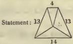
>
> The diagonal 15, multiplied by the side 13, is 195: divided by twice the perpendicular, the quotient is 8½; the length of the central line.
>
> Example: The tetragon with three equal sides before exhibited (§ 21).
>
> 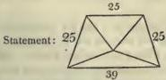
>
> Diagonal 40, multiplied by the side 25, makes 1000; which, divided by the perpendicular doubled, gives the central line 20½.
>
> Example: The trapezium of which the base is sixty, the summit twenty-five, and the sides fifty-two and thirty-nine.
>
> 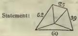
>
> The squares of the base and summit 60 and 25 are 3600 and 625. The sum is 4225; its root 65: the half of which 6½ is the central line. Or the squares of the flanks 52 and 39 are 2704 and 1521; the sum of which is 4225; and half the root, 6½. CH.
>
> Q Q 2

28. The sums of the products of the sides about both the diagonals being divided by each other, multiply the quotients by the sum of the products of opposite sides; the square-roots of the results are the diagonals in a trapezium.

> *Pṛthūdaka commentary:*
>
> ¹ Example: An isosceles triangle, the sides of which are thirteen, the base ten, and the perpendicular twelve.
>
> Statement:
>
> 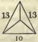
>
> Product of the sides 169; divided by twice the perpendicular, gives the central line 7¼.*
> CH.
>
> Let twice the perpendicular be a chord in a circle, the semidiameter of which is equal to the diagonal. Then this proportion is put: If the semidiameter be equal to the diagonal in a circle in which twice the perpendicular is a chord, what is the semidiameter in one wherein the like chord is equal to the flank? The result is the semidiameter of the circumscribed circle, provided the flanks be equal. But, if they be unequal, the central line is equal to half the diagonal of an oblong the sides of which are equal to the base and summit; or half the diagonal of one, the sides of which are equal to the flanks. It is alike both ways.
> Ib.
>
> For the triangle the demonstration is similar; since here the diagonal is the side.
> Ib.

> *Pṛthūdaka commentary:*
>
> ³ Example: A tetragon of which the base is sixty, the summit twenty-five, and the sides fifty-two and thirty-nine.
>
> Statement:
>
> 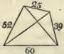
>
> The upper sides about the greater diagonal are 39 and 25; the
>
> product of which is 975. The lower sides about the same are 60 and 52; and the product 3120. The sum of both products 4095. The upper sides about the less diagonal are 25 and 52; the product of which is 1300. The lower sides about the same, 60 and 39; and the product 2340. The sum of both 3640. These sums divided by each other are 4025/3145 and 3650, or abridged 8/8 and 8/9. The product of opposite sides 60 and 25 is 1500; and of the two others 52 and 39 is 2028: the sum of both, 3528. The two foregoing fractions, multiplied by this quantity, make 3969 and 3136; the square-roots of which are 63 and 56, the two diagonals of the trapezium.
> CH.
>
> This method of finding the diagonals is founded on four oblongs.
> Ib.
>
> The brief hint of a demonstration here given is explained by GANĚŚA on LĺLĺCATĺ, § 191. Two triangles being assumed, the product of their uprights is one portion of a diagonal, and the product of their sides is the other; as before shown. (Dem. of § 191—2.) The two sides on the one part of the diagonal are deduced from the reciprocal multiplication of the hypotenuses of the assumed triangles by their uprights: and the product of the sides is consequently equal to the product of the uprights taken into the product of the hypotenuses. So the product of the two sides on the other part of the diagonal, resulting from the reciprocal multiplication of the hypotenuses by the sides of the assumed triangles, is equal to the product of the sides of the triangles taken into the product of their hypotenuses. Therefore the sum of those products of the sides of the trapezium is equal to the diagonal multiplied by the product of the hypotenuses. The sides about the other diagonal are formed by the upright of one triangle and side of the other reciprocally multiplied by the hypotenuses. Their product is equal to the product of the reciprocal upright and side taken into the product of both hypotenuses. Hence the sum of the products is equal to the diagonal multiplied by the product of the hypotenuses. Therefore dividing one by the other, and rejecting like dividend and divisor (i. e. the product of the hypotenuses), there remain the diagonals divided by each other. Now the sum of the products of the multiplication of opposite sides is equal to the product of the diagonals [as will be shown]. Multiplying this by the fractions above found, and rejecting equal dividends and divisors, there remain the squares of the diagonals: and by extraction of the roots the diagonals are found. Now to show, that the sum of the products of opposite sides is equal to the product of the diagonals: the three sides of each of the assumed triangles being multiplied by the hypotenuse of the other, two other rectangular triangles are formed: and duly adapting together the halves of these, a figure is constituted, the sides of which are equal to the uprights and sides of the two triangles. It is the very trapezium; and its area is the sum of the areas of the triangles.
>
> 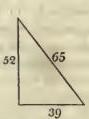
>
> 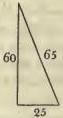
>
> 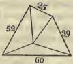
>
> Here half the product of the base and summit is the area of one triangle; and half the product of the flanks is so of the other. Therefore half the sum of the products of opposite sides is the area of the quadrangle. Now the four triangles before mentioned, with four others equal to them, being duly adapted together, these eight compose an oblong quadrilateral with sides equal to the diagonals
>
> of the trapezium. See
>
> 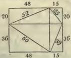
>
> Half the area of the oblong or product of the
>
> diagonals, as is apparent, will be the area of the trapezium. It is half the sum of the products of opposite sides. Therefore the sum of the products of the opposite sides is equal to the product of the diagonals.
> GAN.

29. Assuming two scalene triangles¹ within the trapezium, let the segments for both diagonals be separately found as before taught; and then the perpendiculars.²

30—31. Assuming two triangles within the trapezium, let the diagonals be the bases of them.³ Then the segments, separately found, are the upper and lower portions formed by the intersection of the diagonals.⁴ The lower portions of the two diagonals are taken for the sides of a triangle; and the base [of the tetragon] for its base. Its perpendicular is the lower portion of the [middle] perpendicular of the tetragon: the upper portion of it is the moiety of the sum of the [extreme] perpendiculars less the lower portion.¹

> *Pṛthūdaka commentary:*
>
> ¹ The first with the greater diagonal for one side, and the least flank for the other side; and the second having the least diagonal for one side, and the greater flank for the other: and the base of the tetragon being base of both triangles. Then the segments are to be separately found in both triangular figures, by the rule before taught (§ 22); and then find the two perpendiculars by the sequel of the rule. CH.

> *Pṛthūdaka commentary:*
>
> ² In the unequal tetragon just mentioned, one triangle will be this
>
> 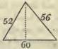
>
> and the other this
>
> 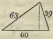
>
> In the one the difference of the squares of the sides 432, divided by the base, gives 7 ½, which subtracted from, and added to, the base, makes 52 ½ and 67 ½. These divided by two are 26 ½ and 33 ½ the two segments. Whence, taking the root of the difference of the squares of the side and its segment, the greater perpendicular is deduced 44 ½. In the other triangle, the two segments found by the rule are 9 ½ and 50 ½; whence the least perpendicular comes out 37 ½. CH.

> *Pṛthūdaka commentary:*
>
>  The greater diagonal is the base of one; and the summit and greater flank are its sides. The least diagonal is the base of the other; and the summit and least flank are the sides. CH.

> *Pṛthūdaka commentary:*
>
> ⁴ In the tetragon just now instanced, the scalene triangle with the greater diagonal for base is this
>
> 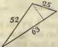
>
> The segments of its base as found by the rule (§ 22) are 48 and 15. These are respectively the lower and upper portions of the greater diagonal.
>
> The scalene triangle with the less diagonal for base is
>
> 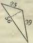
>
> Here the segments, by the
>
> same rule (§ 22), are 36 and 20. They are the lower and upper portions of the least diagonal.
>
> Or find the segments of one only: the perpendicular, found by the rule (§ 22) is the upper portion of the second diagonal: and subtracting that from the entire length, the remainder is the lower portion of it. Thus, in the foregoing example, the least segment in the first triangle is 15. Its square 225, subtracted from the square of the least side 625, leaves 400, the root of which is 20. It is the upper portion of the smaller diagonal, and subtracted from the whole length 56, leaves the lower portion 36. CH.

32.¹ At the intersection of the diagonals and perpendiculars, the lower segments of the diagonal and of the perpendicular are found by proportion: those lines less these segments are the upper segments of the same. So in the needle as well as in the (páta) intersection [of prolonged sides and perpendiculars].⁴

> *Pṛthūdaka commentary:*
>
> ¹ In the same figure, the scalene triangle composed of the two lower segments of the diagonals together with the base is this Here the perpendicular found by the rule
>
> 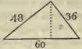
>
> (§ 22) is 28 ⅔. It is the lower portion of the mean perpendicular. The greatest and least perpendiculars being 44 ⅔ and 37 ⅔, the moiety of their sum is 41 ⅓. This is the length of the entire mean perpendicular. Subtracting from it its lower segment the residue is its upper segment 12 ⅓. CH.

> *Pṛthūdaka commentary:*
>
> ⁴ Example: In a trapezium the base of which is sixty; one side fifty-two; the other thirty-nine; and the summit twenty-five: the greater diagonal sixty-three; the less, fifty-six: the greater perpendicular forty-five less one fifth; its segments of the base, the greatest thirty-three and three-fifths, the least twenty-six and two-fifths: the least perpendicular thirty-seven and four-fifths; its segments of the base, greatest fifty and two-fifths, least nine and three-fifths: the perpendicular passing through the intersection of the diagonals, forty-one and three-tenths; its segments of the base, greatest thirty-eight and two-fifths, least twenty-one and three-fifths; tell the upper and lower portions of the perpendiculars, the intersections [of prolonged sides and perpendiculars] and the needle.
>
> Here at the intersection of the diagonals, the segments of the greater diagonal, found as before (§ 30), are 48 and 15; those of the less are 36 and 20.
>
> 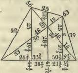
>
> At the junction of the greater diagonal and greater perpendicular; the proportion is as diagonal sixty-three to the complement* fifty and two fifths, so, to the segment twenty-six and two-fifths, what? or rendered homogeneous, 259/5 | 63 | 135/5 |. Answer: 33. It is the lower portion of the diagonal. Again, as the same complement is to the least perpendicular, so is the above mentioned segment to what? Statement: 228/5 | 180/5 | 132/5 | Answer: 19 3/5. It is the lower portion of the perpendicular. Subtracting these from the whole diagonal 63 and entire perpendicular 44 1/2, the remainders are the upper segments of the diagonal and perpendicular; 30 and 25.
>
> Next, at the junction of the less diagonal and less perpendicular: as the complement thirty-three and three-fifths is to the diagonal fifty-six, so is the segment nine and three-fifths to what? Statement: 33 3/5 | 56 | 9 3/5 |. Answer: 16, the lower portion of the diagonal. So, putting the perpendicular for the middle term, the lower portion of the less perpendicular comes out 12 3/5. By subtraction from the entire diagonal and perpendicular, their upper segments are obtained 40 and 25.
>
> In like manner, for any given question, the solution may be variously devised with the segment of the base for side, the segment of the perpendicular for upright, and the segment of the diagonal for hypotenuse.
>
> 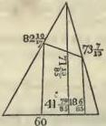
>
> The operation on the needle is next exhibited
>
> The segments of the base on either side of the perpendicular let fall from the top of the needle come out 41 75/25 and 18 6/25.† With either of these segments the mean perpendicular is found by proportion: if the least segment 9 3/5 give the least perpendicular 37 1/2, what does the segment 18 6/25 give? Answer: 71 13/25. It is the perpendicular let fall from the summit of the needle. In the same manner, with the greater segment, the same length of the perpendicular is deduced.
>
> Next, to find the sides of the needle: As the least perpendicular is to the side thirty-nine, so is the middle perpendicular to what? Statement: 37 4/5 | 39 | 71 13/25. Answer: 73 7/25. Or the side may be found from the segments: thus 9 3/5 | 39 | 18 6/25. Answer: 73 7/25 as before. To find the greater side: As the greater perpendicular is to the side fifty-two, so is the perpendicular of the needle to what? 44 3/4 | 52 | 71 1/2 1/2 |. Answer: 82 1/2 1/2. Or proportion may be taken with the segments of the base: 26 2/3 | 52 | 41 7/2 1/2 |. Answer: 82 1/2 1/2, as before. See figure [as above].
>
> Now to find the intersections [of the prolonged sides and perpendiculars]. If the segment of the base belonging to the greater perpendicular, or 26 2/3, answer to that perpendicular, 44 3/4, what will the segment 50 2/3 answer to? Answer: 85 2/3 2/3, the perpendicular prolonged to the intersection. Again: As the greater perpendicular 44 3/4 is to the side 52, so is the perpendicular of the intersection 85 2/3 2/3 to what? Answer: 99 3/4 1/2, the side of the figure. In like manner to find the perpendicular of the second figure of intersection: If the segment of the base appertaining to the less perpendicular answer to this perpendicular, what does the segment thirty-three and three-fifths correspond to? Answer: 132 3/4 1/2, the perpendicular of second figure. To find the side of the same: As the least perpendicular 37 3/4 is to the side 39, so is the perpendicular just found 132 3/4 1/2 to what? Answer: 136 1/2, the side. Or it may be found from the segments. Thus, as the segment answering to the least perpendicular, 9 3/4, is to the side 39, so is the segment 33 3/4 to what? Answer: the greater side 136 1/2 as before. See figure of the needle with the intersections and perpendiculars.
>
> 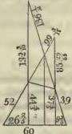
>
> In like manner, the flank intersections* are computed. If the segment appertaining to the greater perpendicular 26 2/3 answer to that perpendicular, what will the segment 60 correspond to? Answer: 101 2/4 1/2. To find the side of the same: As the segment of the base for the greater perpendicular is to the side fifty-two, so is the segment sixty to what? 26 2/3 | 52 | 60 |. Answer: 118 2/4 1/2. So, on the other part: If the segment of the base for the less perpendicular answer to that perpendicular, what will the segment sixty correspond to? 9 3/4 | 37 3/4 | 60 |. Answer: 236 1/4. To find the side: As the least segment is to the side thirty-nine, so is the segment sixty to what? 9 3/4 | 39 | 60. Answer: 242 3/4. See
>
> 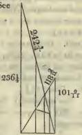
>
> In the top above the summit of the trapezium
>
> 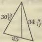
>
> a distribution of the figure is to
>
> be in like manner made by proportions selected at choice.
>
> Since every where the segment of the base is a side, the corresponding perpendicular an upright, and the flank an hypotenuse, the several lines above-stated may be found in various ways by the rule, that subtracting the square of the upright from the square of the hypotenuse, the square-root of the residue will be the side; or that subtracting the square of the side, the root of the remainder will be the upright.
>
> In the same manner, in tetragons with two or three equal sides, the perpendicular of the needle and its segments of the base are to be found. But there can be no needle to an equilateral tetragon, nor to an oblong. CH.

33.¹ The sum of the squares of two unalike quantities are the sides of an isosceles triangle; twice the product of the same two quantities is the perpendicular; and twice the difference of their squares is the base.²

34. The square of an assumed quantity being twice set down, and divided by two other assumed quantities, and the quotients being severally added to the quantity first put, the moieties of the sums are the sides of a scalene triangle: from the same quotients the two assumed quantities being subtracted, the sum of the moieties of the differences is the base.³

35.⁴ The square of the side assumed at pleasure, being divided and then lessened by an assumed quantity, the half of the remainder is the upright of an oblong tetragon; and this, added to the same assumed quantity, is the diagonal.¹

> *Pṛthūdaka commentary:*
>
> ¹ To find an equicrural triangle; preparatory to showing a rectangular one. The next following rule (§ 34) is for finding a scalene triangle. An equilateral one may consist of any quantity assumed at pleasure for the side; since all the sides are equal. CH.
> ² Example: Let the unalike quantities be put 2 and 3. Their squares are 4 and 9; the sum of which is 13; and the sides are of this length. Twice the product is 12; and is the perpendicular. Again, the squares of the same number are 4 and 9: the difference is 5; which multiplied by two makes 10, the base. [See § 22.] CH.
> ³ Example: Let 12 be assumed. Its square is 144. Put the two numbers 6 and 8; and severally divide: the quotients are 24 and 18: which, added to the number originally put, make 36 and 30, the moieties whereof are 15 and 13, the two sides. The same quotients, 24 and 18, less the assumed numbers 6 and 8, make 18 and 10; the moieties of which are 9 and 5: and the sum of these, 14, is the base.—CH. [See § 22.]
> ⁴ To find an oblong tetragon. The equilateral tetragon may be assumed with any quantity: since all the sides are alike.—CH. The subsequent rules, § 36—38, deduce tetragons with two and three equal sides or with all unequal.

36. Let the diagonals of an oblong be the flanks of a tetragon having two equal sides. The square of the side of the oblong, being divided by an assumed quantity and then lessened by it, and divided by two, the quotient increased by the upright of the oblong is the base; and lessened by it is the summit.²
37. The three equal sides of a tetragon, that has three sides equal, are the squares of the diagonal [of the oblong]. The fourth is found by subtracting the square of the upright from thrice the square of the [oblong's] side. If it be greatest, it is the base; if least, it is the summit.¹
38. The uprights and sides of two rectangular triangles reciprocally multiplied by the diagonals are four dissimilar sides of a trapezium. The greatest is the base; the least is the summit; and the two others are the flanks.⁴

> *Pṛthūdaka commentary:*
>
> ¹ Example: Let the side be put 5. Its square is 25, which divided by the assumed quantity one makes 25; and subtracting from this the same assumed quantity, half the remainder is 12, and is the upright. This added to the assumed divisor is the diagonal 13.—CH. [See § 21 and 23.]
> ² Example: If the diagonal of the oblong be thirteen, the side twelve and the upright five; what tetragon with two equal sides may be deduced from it? The diagonals 13 and 13 are the flanks. The square of the side 12 is 144. Divided by an assumed number 6, it gives 24; from which subtracting the number put 6, remains 18; the half whereof is 9. This with the upright 5 added, makes 14, the base. Again, the same moiety 9, with the upright 5 subtracted, leaves 4, the summit.—CH. [See § 21 and 23.]
> ³ Example: Find a tetragon with three equal sides from an oblong the diagonal of which is five, the side four, and upright three. Square of the diagonal 25; the length of the sides. Square of the side 16, tripled, is 48: from which subtracting 9, the square of the upright 3, the remainder 39 is the base. Or let the side be three and upright four. Square of the side tripled is 27; and subtracting from this the square 16 of the upright 4, the remainder 11 is the summit.—CH. [See § 21 and 26.]
> ⁴ Example: In one oblong the diagonal is five, the upright three, and the side four. In the second the diagonal is thirteen, the upright twelve, and the side five. The uprights and sides of each of the two rectangular triangles, viz. 12, 5, 3, and 4, being multiplied by the diagonal (hypotenuse) of the other, give 60, 25, 39 and 52. Here the greater number 60 is the base; the least 25 is the summit; the remaining two, 39 and 52, are the flanks.—CH. [See § 21 and 28.]
>
> 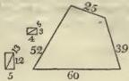
>
> R R 2
>
> Within an oblong tetragon, to describe a figure such, that the sum of the side and one portion of the upright may be equal to the diagonal and remaining portion of the upright: so as the journeys may be equal.-CII. See Lilaati, § 154, and Vja-gaiita, § 126; where the same problem is introduced: substituting, however, in the example, a tree, an ape and a pond, for a hill, a wizard and a town.
> Example: On the top of a certain hill live two ascetics. One of them, being a wizard, travels through the air. Springing from the summit of the mountain, he ascends to a certain elevation, and proceeds by an oblique descent, diagonally, to a neighbouring town. The other, walking down the hill, goes by land to the same town. Their journeys are equal. I desire to know the distance of the town from the hill, and how high the wizard rose.
>
> This being proposed, the rule applies; and its interpretation is this: any elevation of the mountain is put; and is multiplied by an arbitrarily assumed multiplier: the product is the distance of the town from the mountain. Then divide this reserved quantity by the multiplier added to two, the quotient is the number of yójanas of the wizard's ascent. The sum of the hill's elevation and wizard's ascent is the upright; the distance of the town from the mountain is the side: the square-root of the sum of their squares is the diagonal (hypotenuse): it is the oblique interval between the town and the summit of the rise.
>
> Thus, let the height of the mountain be twelve. This, multiplied by an arbitrarily assumed multiplier four, 12 by 4, makes 48. It is the distance of the town from the hill. This divided by the multiplier added to two, 48 by 6, gives 8. It is the ascent. Here the upright is 20: its square is 400. The side is 48; the square of which is 2304. The sum of these squares is 2704; and its square-root 52. The semirectangle is thus found. Here also the sum
>
> 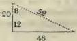
>
> of the side and lower portion of the upright is 60, the journey of one of the ascetics: and the upper portion added to the hypotenuse is that of the other, likewise 60.
>
> The author will treat of rectangular triangles and surd roots, in the chapter on Algebra (cuttacá-d'hyáyot) under the rule, which begins, "Be a surd the perpendicular. Its square, &c." We also shall there expound it. CII.
>
> Example: Of a circle, the diameter whereof is ten, what is the circumference? and how much the area?
>
> Aynardha, half an oblong.
> See Brahm. Alg. § 26.
>
> Statement:
>
> 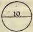
>
> Diameter 10, multiplied by three, 30; this is the gross circumference. Semidiameter 5: its square 25; tripled, 75; the gross area for practice.
>
> Diameter 10: its square 100, multiplied by ten, 1000. The surd root of this is the circumference of a circle the diameter whereof is ten. Square of the semidiameter 25: This again squared and decupled is 6250. Its surd-root is the area of the circle. CH.

39. The height of the mountain, taken into a multiplier arbitrarily put, is the distance of the town. That result being reserved, and divided by the multiplier added to two, is the height of the leap. The journey is equal.
40. The diameter and the square of the semidiameter, being severally multiplied by three, are the practical circumference and area. The square-roots extracted from ten times the squares of the same are the neat values.

41. In a circle the chord is the square-root of the diameter less the arrow taken into the arrow and multiplied by four.¹ The square of the chord divided by four times the arrow, and added to the arrow, is the diameter.²

> *Pṛthūdaka commentary:*
>
> ¹ Example: Within a circle, the diameter of which is ten, in the place where the arrow is two, what is the chord?
>
> Diameter 10: less the arrow 2; remains 8. This multiplied by the arrow makes 16; which multiplied by 4, gives 64: the square-root of which is 8. See figure
>
> 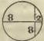
>
> The principle of the rule for finding the square of the chord (in the construction of tabular sines) is here to be applied. But the square is in this place multiplied by four, because the entire chord is required. CH.

> *Pṛthūdaka commentary:*
>
> ² Example: Chord 8. Its square 64, divided by four times the arrow 2, viz. 8; gives the quotient 8: to which adding the arrow, the sum is 10.
>
> Example 2d: A bambu, eighteen cubits high, was broken by the wind. Its tip touched the ground at six cubits from the root. Tell the length of the segments of the bambu.
>
> Statement: Length of the bambu 18. It is the diameter less the least arrow.* The ground from the root, to the point where the tip fell, is 6: it is the semichord. Its square is 36. This is equal to the diameter less the arrow multiplied by the arrow. Dividing it by the diameter less the arrow, viz. 18, the quotient is 2. It is the arrow. Adding this to the diameter less the arrow, the sum is the diameter, 20. Half of this, 10, is the semidiameter. It is the upper portion of the bambu and is the hypotenuse. Subtracted from eighteen, it leaves the upright, or lower portion of the bambu, 8. The side is the interval between the root and tip, 6. The point of fracture of
>
> the bambu is the centre of the circle. See figure
>
> 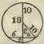
>
> Example 3d: In limpid water the stalk of a lotus eight fingers long was to be seen. ... That visible [portion of] stalk is the smaller arrow. The place of submersion, 24, is the semichord. From the square of this [semi-]chord 576 divided by the smaller arrow 8, the quotient 72 is obtained, which is the greater arrow. The sum of both arrows, viz. 80, is the diameter of the circle. Its half is 40, the semidiameter. It is the hypotenuse, and is the length of the stalk of lotus. Subtracting the smaller arrow, the remainder is the depth of water and is the upright 32.
>
> The side is the space to the place of submersion and is the semichord. See
>
> 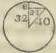
>
> Example 4th: A cat, sitting on a wall four cubits high, saw a rat prowling eight cubits from the foot of the wall. The rat too perceived the puss and hastened towards its abode at the foot of the wall; but was caught by the cat proceeding diagonally an equal distance. In what point within the eight cubits was the rat caught; and what was the distance they went? Tell me, if thou be conversant with computation concerning circles.
>
> Statement: Height of the wall 4. Distance to which the rat had gone forth 8. These are semichord and greater arrow. The square of the semichord, 16, being divided by the greater arrow 8, the quotient is the smaller arrow 2. The sum of both arrows is the diameter 10. Its half is the semidiameter 5. It is the rat's return. Subtracting it from the eight cubits, the remainder is the interval between the foot of the wall and point of capture, or upright 3. The side is 4. The root of the sum of their squares is the hypotenuse: it is the cat's progress, and is equal to the rat's progress homewards.*
>
> Let the figure be exhibited as before. In the centre of it is the place of capture.
>
> 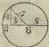
>
> In like manner other examples may be shown for the instruction of youth. Else all this is obvious, when the relation of side, upright and hypotenuse is understood. CH.

> *Pṛthūdaka commentary:*
>
>  What is termed by us "diameter less the arrow," is by ÁRYA-BHATTA denominated the greater arrow. For he says, 'In a circle the product of the arrows is equal to the square of the semichord of both arcs.' CH.

42.¹ Half the difference of the diameter and the root extracted from the difference of the squares of the diameter and the chord is the smaller arrow.² The erosion¹ being subtracted from both diameters, the remainders, multiplied by the erosion and divided by the sum of the remainders, are the arrows.²

> *Pṛthūdaka commentary:*
>
> ¹ The chord and diameter being given, to find the smaller arrow. And, when two circles, the diameters of which are known, cut each other, to find the two arrows. CH.

> *Pṛthūdaka commentary:*
>
> ² Example: Chord 8. Its square 64. Diameter 10. Its square 100. Difference 36. Its root 6. Subtracting this from the diameter 10, the moiety of the remainder is 2 and is the smaller arrow.
>
> The same figure is here contemplated. Within it let an oblong be inscribed, with the chord for its side, the difference between the diameter and twice the arrow for its upright, and the entire diameter for its diagonal. It is this Here, the square-root of the difference between
>
> 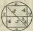
>
> the squares of the diameter and chord is equal to the root of the residue of subtracting the square of the side from the square of the diagonal, and is the upright: and, that being taken from the diameter, two portions remain equal to the smaller arrow, one at either extremity. Hence the rule § 42. Let all this be shown on the figure. CH.

43.³ The square of the semichord being divided severally by the given arrows, the quotients, added to the arrows respectively, are the diameters.⁴ The sum of the arrows is the erosion: and that of the quotients is the residue of subtracting the erosion.⁵

> *Pṛthūdaka commentary:*
>
> ² Example: The measure of Ráhu is fifty-two; that of the moon, twenty-five: the erosion is seven.
>
> Diameters 52 and 25. Remainders after subtracting the erosion 45 and 18. These multiplied by the erosion, make 315 and 126: which, divided by the sum of the residues 63, give 5 and 2, for the segments cut by a chord passing through the points of intersection of the circles. The arrow of Ráhu is two; that of the moon five. See
>
> 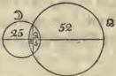
>
> Here the erosion is the profit; and the diameters less the erosion, are the contributions; and the segments are found by the rule, § 16. The greater quotient belongs to the least circle; and the less quotient, to the greater circle. CH.

> *Pṛthūdaka commentary:*
>
> ³ In the like case of the intersection of two circles, the chord and arrows being known, to find the diameters: And, the diameter and arrows being given, to deduce the quantity eclipsed and the residue. CH.

> *Pṛthūdaka commentary:*
>
> ⁴ Example: The intersection of the circles last mentioned.
>
> Chord 20. Its half 10: the square of which is 100. Divided by the two arrows severally, viz. 5 and 2; the quotients are 20 and 50: which, with the arrows respectively added, make 25 and 52. They are the diameters. See foregoing diagram.
>
> Demonstration: So much as is the square of the semichord, is the square of greater and less arrows multiplied together. The quotient of the division thereof by the less arrow is the greater arrow; and the sum of the greater and less arrows is the diameter, as even the ignorant know.
>
> CH.

> *Pṛthūdaka commentary:*
>
> ⁵ Example: The arrows just found, 5 and 2. Their sum is 7. It is the erosion or quantity eclipsed. The quotients 20 and 50. Their sum 70. It is the residue, subtracting the erosion [from the sum of the diameters].
>
> The principle is here obvious.
>
> CH.
>
> In an excavation having like sides [length and depth] at top and bottom, [but varying in depth,] the aggregates² [or products of length and depth of the portions] being divided by the common length, [and added together,] give the mean depth.³

## SECTION V.

### EXCAVATIONS.

44. THE area of the plane figure, multiplied by the depth, gives the content of the equal [or regular] excavation; and that, divided by three, is the content of the needle.¹

45—46. The area, deduced from the moieties of the sums of the sides at top and at bottom, being multiplied by the depth, is the practical measure of the content. Half the sum of the areas at top and at bottom, multiplied by the depth, gives the gross content. Subtracting the practical content from the other, divide the difference by three, and add the quotient to the practical content, the sum is the neat content.

## SECTION VI.

### STACKS.¹

47. THE area of the form [or section]² is half the sum of the breadth at bottom and at top multiplied by the height: and that multiplied by the length is the cubic content: which divided by the solid content of one brick, is the content in bricks.³

> *Pṛthūdaka commentary:*
>
> ¹ There is no difference in principle between the measure of excavations and of stacks; unless that what is there depth is here height. Every thing else is alike in both. CII.
> ² Acriti: the form or shape of the wall, as it appears in one cubit's length, according to its height and the thickness at bottom and top.—CII. Section of the wall.
> ³ Example 1st: Tell the content of a stack which is a hundred cubits in length; five in thickness at bottom, and three at top; and seven high.
>
> Statement:
>
> 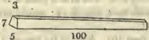
>
> Breadth at top 3; at bottom 5. Sum 8. Its half 4, multiplied by 7, is 28: which, multiplied by the length 100, makes 2800. So many are the cubic contents in the wall. The dimensions of a brick may be arbitrarily assumed. Say a cubit long; half of one broad; and a sixth part thick. Statement: ½ ¼ ⅛. Product ½. The whole cubic amount 2800, divided by that, gives 33600 for the number of bricks.
>
> Example 2d: A sovereign piously caused a quadrangle to be built for a college, the wall measuring a hundred cubits without and ninety-six within, and seven high, with a gate four by three, and wickets half as big on the sides. How many bricks did it contain?
>
> Statement:
>
> 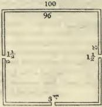
>
> Here the area of the exterior figure is 10,000: that of the interior one 9216. The difference is 784. It is the area of the figure covered by the walls. Multiplied by the height 7, it gives the content 5488; from which subtracting the gates 36, the remainder is the exact cubic content 5452. Dividing this by the content of a brick ½, the quotient is the number of bricks 65424.

## SECTION VII.

### SAW.

48—49. THE product of the length and thickness in fingers, being multiplied by the number of sections and divided by forty-two, is the measure in cishcangulas.¹ That quotient, divided by ninety-six, gives the work, if the timber be śáca or the like;³ but, if it be śálmalí, the divisor is two hundred; if vijaca, a hundred and twenty; if sála, saraṇa and the rest, one hundred; if sapta-vidáru, sixty-four.³

> *Pṛthūdaka commentary:*
>
> ¹ Áyáma, breadth, or rather (dairghya) length. Vistára, width, or rather (ghanatwa) thickness. Márga, the way or path of the saw; the section. Cishcangula, a technical term in use with artisans. Carman, the work; that is, the rate of the workman's pay: a technical use of the term.
>
> CH.

> *Pṛthūdaka commentary:*
>
>  Example: A seasoned timber of (Vijáca) citron wood, ten cubits in length and six fingers in width [thickness], is sawed in seven sections. Say what is the price of the labour, if the rate of work be eight pañas.
>
> 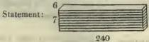
>
> Product of the thickness 6, by the length 240, is 1440.
>
> Multiplied by 7, it makes 10080; which, divided by forty-two (42), gives 240. These are cishcangulas. The timber being wood of the Vija tree, that is divided by one hundred and twenty. The quotient is the quantity of the work, 2. Multiplied by the rate of the pay, viz. 8, the product is the number of pañas 16. This amount is to be paid to the artisan. CH.

## SECTION VIII.

### MOUNDS OF GRAIN.

50. THE ninth part of the circumference is the depth [height] in the case of bearded corn; the tenth part, in that of coarse grain; and the eleventh, in that of fine grain.¹ The height, multiplied by the square of the sixth part of the circumference, is the content.²

51. The circumference of a mound resting against the side of a wall, or within or without a corner, is multiplied by two, by four, or by one and a third; and, proceeding as before, the content is found; and that is divided by the multiplier which was employed.

> *Pṛthūdaka commentary:*
>
> ¹ Súcin, bearded corn: viz. rice, as shashícá and the rest.
>
> Sí'hála, coarse grain: barley, &c.
>
> Añu, fine grain: mustard and the like.
>
> CH.

> *Pṛthūdaka commentary:*
>
> ² The content, as thus found, is the number of solid cubits; (the circumference having been taken with the cubit:) and thence the number of prast'has is to be deduced by the rule of three, according to the proportion of the cubit to the particular prast'ha in use.—CH. It is the content in solid cubits or c'hárís of Magad'ha.—Gan. sár. Ch. 12.

## SECTION IX.

### MEASURE BY SHADOW.

52.¹ The half day being divided by the shadow (measured in lengths of the gnomon) added to one, the quotient is the elapsed or the remaining portion of day, morning or evening. The half day divided by the elapsed or remaining portion of the day, being lessened by subtraction of one, the residue is the number of gnomons contained in the shadow.²

53.³ The distance between the foot of the light and the bottom of the gnomon, multiplied by the gnomon of given length, and divided by the difference between the height of the light and the gnomon, is the shadow.⁴

> *Pṛthūdaka commentary:*
>
> ² To find the time from the shadow; and the shadow from the time. CII.
> ³ This rule being useless, no example is given. It does not answer for finding either the shadow or the time, in a position even equatorial; but has been noticed by the author in this place, copying earlier writers of treatises on computation. CII.
>
> See the concluding chapter of ŚRÍD'HARA'S *Gánita-súra*, where the same rule is given, and examples of it subjoined.

> *Pṛthūdaka commentary:*
>
> ² Given the length of the gnomon standing at a known distance from the foot of a light in a known situation, to find the shadow. CII.
> ⁴ Example: The height of the light to the tip of the flame is a hundred fingers. [The distance a hundred and ten. The gnomon twelve.]
>
> 110, multiplied by the gnomon 12, is 1320. Subtracting the gnomon 12 from the height 100, the remainder is 88. Dividing by this, the quotient is 15, the shadow of a gnomon twelve fingers high.
>
> Here the rule of three terms is applicable: if an upright equal to the difference of the two heights answer to a side equal to the interval of ground between the foot of the light and the gnomon, what will answer to the given gnomon? See
>
> 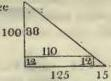
>
> The difference between two positions of the gnomon being known, to find the distance between the foot of the light and gnomon; and the elevation of the light: CH.
> The shadow of a gnomon twelve fingers high is in one place fifteen fingers. The gnomon being removed twenty-two fingers further, its shadow is eighteen. The distance between the tips of the shadows is twenty-five. The difference of the length of the shadows is three.
>
> Distance between the tips of the shadows 25. By this multiply the shadows 15 and 18: the products are 375 and 450; which, divided by the difference of the shadows 3, give the several quotients 125 and 150. They are the bases; that is, the distances of the tips of the shadows from the foot of the light.
>
> 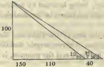
>
> The grounds or bases 125 and 150, multiplied by the gnomon 12, make 1500 and 1800; which, divided by the respective shadows, give the quotients 100 and 100; or the elevation of the light, alike both ways.
>
> Here also the operation of the rule of three is applicable: 'If to the difference of the shadows answers a side equal to the distance between the tips of the shadows, what will answer to the length of the shadow?' The answer is a side, which is the distance of the foot of the light to the tip of the shadow.
>
> So to find the upright, the proportion is: 'If an upright equal to the gnomon answer to a side equal to the shadow, what will answer to a side equal to the base?' The answer gives the height of the flame of the light.

54.¹ The shadow multiplied by the distance between the tips of the shadows and divided by the difference of the shadows, is the base. The base, multiplied by the gnomon, and divided by the shadow, is the height of the flame of the light.²

## SECTION X.

### SUPPLEMENT.

55.¹ THE multiplicand is repeated like a string for cattle, as often as there are integrant portions in the multiplier, and is severally multiplied by them, and the products are added together: it is multiplication. Or the multiplicand is repeated as many times as there are component parts in the multiplier.⁴

> *Pṛthūdaka commentary:*
>
> ¹ In the rule of multiplication (§ 3) it is said "The product of the numerators divided by the products of the denominators is multiplication." But how the product is obtained was not explained. On that account the author here adds a couplet to show the method of multiplication. CH.

> *Pṛthūdaka commentary:*
>
> ⁴ Example: Multiplicand two hundred and thirty-five. Multiplicator two hundred and eighty-eight.
>
> The Multiplicator is repeated as often as there are portions in the multiplicator: 235 | 2 |
> 235 | 8 |
> 235 | 8 |
>
> Multiplied by the portions of the multiplier in their order, there results 470 : which, added
> 1880
> 1880
>
> together according to their places, make 67680.
>
> Or the multiplicand is repeated as often as the parts 9, 8, 151, 120; and multiplied by them
> 235 9 2115 The sum is the quantity resulting from multiplication, as before, 67680.
> 235 8 1880
> 235 151 35485
> 235 120 28200
>
> Or the parts of the multiplier are taken otherwise: as thus 9, 8, 4; the continued multiplication of which is equal to the multiplier 288. So with others. And the multiplicand is successively multiplied by those divisors, which taken into each other equal the multiplicator. Thus the multiplicand 235, multiplied by 9, makes 2115; which, again, taken into 8, gives 16920; and this, multiplied by 4, yields 67680.
>
> This method by parts is taught by SCANDA-SÉNA and others. In like manner the other methods of multiplication, as tat-st'ha and capóta-sand'hi, taught by the same authors, may be inferred by the student's own ingenuity.
> CH.
>
> ŚRÍDHARA'S rule is as follows: ⁴ Placing the multiplicand under the multiplying quantity in the order of the foldings (capóta-sand'hi crama), multiply successively, in the direct or in the inverse order, repeating the multiplier each time. This method is termed capóta-sand'hi. The next is termed tat-st'ha, because the multiplier stands still therein (tasmin tisht'hati). By division of the form or separation of the digits (rúpa-st'hána-vibhága) that named from parts (c'handa) becomes two-fold. These are four methods for the operation of multiplication (pratyutpanna).⁵—Gan.-sár. § 15—17.
>
> When the quantity to be multiplied has by mistake been multiplied by a multiplicator too great or too small; to correct the error in such case, the author adds a couplet. CH.

56. If the multiplicator be too great or too small,¹ the multiplicand is to be multiplied by the excess or defect as put; and the product of the multiplicand by the quantity so put is added or subtracted.²
57. The quotient of a dividend by a divisor increased or diminished by an assumed quantity,³ is reserved; and is multiplied by the assumed quantity, and divided by the original divisor; and the quotient of this division, added to, or subtracted from, the reserved quantity, is the correct quotient.⁴
58. The product of quotient and divisor,⁵ being divided by the multiplicator, is the multiplicand; or divided by the multiplicand, is the multiplicator: the product of multiplicand and multiplier, divided by the divisor, is the quotient; or divided by the quotient, is the divisor.¹

> *Pṛthūdaka commentary:*
>
> ² Example: Multiplicand 15; multiplicator 20. This multiplicand has, by mistake, been multiplied by four more, viz. by 24. The product is 360. Here the number put is 4; and multiplicand 15: their product 60. It is subtracted from the number as multiplied: and, with a reproof to the blundering calculator, he is told "the true product is 300."
>
> Or the multiplicand has been multiplied by four less; viz. 16; and the product stated is 240. Here the product of the multiplicand and number put is 60; which is added, as the multiplication was short; and the correct result is 300. CH.

> *Pṛthūdaka commentary:*
>
> ³ When the dividend has been divided by a divisor increased or diminished by an assumed quantity; to correct the quotient. CH.

> *Pṛthūdaka commentary:*
>
> ⁴ Example: Dividend 300. Original divisor 20.
>
> The division being made with that increased by four, viz. 24, the quotient was 12½. This is reserved, and is multiplied by the assumed number 4: product 50: whence, by the original divisor, the quotient is had 2½. This, added to the reserved quantity 12½, makes 15.
>
> Or the same dividend 300, being divided by four less than the right divisor, viz. by 16, the quotient was 18¾. This multiplied by the assumed number 4, makes 75; which divided by the original divisor 20, yields 3¾: and this quotient, subtracted from the reserved quantity 18¾, leaves 15. CH.

> *Pṛthūdaka commentary:*
>
> ⁵ Of multiplicand, multiplicator, divisor and quotient, to find any one, the rest being known. CH.

59. If two of the quantities, whether multiplicand and multiplicator, or divisor and quotient, be wanting,² [the given quantities are to be changed for the others, and arbitrary quantities to be put in their places.³]⁴

60. Multiply the multiplicand or the multiplicator by the denominator of the divisor: and the divisor is to be multiplied by the denominator of the multiplicand, and by that of the multiplicator.⁵

61. Making unity denominator of an integer, let all the rest of the process be as above described.¹ The divisor and multiplicator, or divisor and multiplicand,² are to be abridged by a common measure.

> *Pṛthūdaka commentary:*
>
> ¹ Example: Divisor 20; multiplicand 32; multiplicator 5; quotient 8.
>
> First to find the multiplicand. The product of divisor and quotient, 20 and 8, is 160: which, divided by multiplicator 5, gives 32.
>
> Next for the multiplicator. The product of divisor and quotient is 160; which, divided by the multiplicand 32, yields 5.
>
> Then for the quotient. The product of the multiplicand and multiplier, 32 and 5, is 160: which, divided by the divisor 20, affords 8.
>
> Lastly, for the divisor. The product of the multiplicand and multiplier is 160: which, divided by the quotient 8, produces 20. CH.

> *Pṛthūdaka commentary:*
>
> ² If a couple of the quantities be wanting [that is, unknown], to find them. CH.

> *Pṛthūdaka commentary:*
>
> ⁴ Example: Divisor 20; multiplicand 32; multiplier 5; quotient 8.
>
> The multiplicator and multiplicand being wanting; the divisor and quotient are 20 and 8. These are put for multiplicand and multiplicator. Their product is 160. Hence, putting four for the quotient, the divisor is found 40; or putting eight, it is 20: and so on arbitrarily. Or the arbitrary number may be the divisor; whence the quotient is to be deduced: and so on variously.
>
> Or, the divisor and quotient being wanting, the multiplicand and multiplicator are 32 and 5. These are converted into divisor and quotient, or quotient and divisor. Their product is 160. Putting ten, an assumed quantity, either for the multiplicand or for the multiplicator; the other, namely multiplier or multiplicand, is deduced 16: or, putting five, the number deduced is 32. So, a hundred different ways. CH.

> *Pṛthūdaka commentary:*
>
> ⁵ To make the terms homogeneous in the rule of three.—CH. It is the same in effect with that before delivered and expounded. § 4. Ib.

62. The integer, multiplied by the sexagesimal parts of the fraction belonging thereto, and divided by thirty, is the square of the fractional portion, to be added to the square of the whole degrees.⁵ A square and a cube are the products of two, and of three, like quantities multiplied together.⁶

63.⁷ Twice the less portion⁸ of a quantity [added to the greater] being multiplied by the greater and added to the square of the less, is the entire square.¹⁰ Or, an arbitrary number being added to, and subtracted from, the quantity, the product of the sum and difference, added to the square of the assumed number, is the square required.¹

> *Pṛthūdaka commentary:*
>
> ¹ It has been so shown by us in preceding examples.—CH. See note on § 5.

> *Pṛthūdaka commentary:*
>
> ² Never the multiplicand and multiplicator. CH.

> *Pṛthūdaka commentary:*
>
> ⁵ To find the square of a quantity, that includes minutes of a degree. CH.
>
> The rule may be stated otherwise [and more generally]. The integer, multiplied by the numerator of its attendant fraction, which has a given denominator, being divided by [half] its denominator, is to be added to the square of the integer portion.—Ibid. This method gives the square grossly: being less than the truth by the product of the minutes by minutes, expressed in sexagesimal seconds. Ib.
>
> Example: What is the square of fifteen degrees and a half? Statement: 15° 30'. ⁶
>
> The integer 15, multiplied by the sexagesimal parts or minutes, 30, is 450: which, divided by thirty, gives 15, to be added to the square of the whole degrees, or 225; making in all 240.
>
> So square of twelve and a twelfth part? Statement: 12° 05'. Answer: 146.

> *Pṛthūdaka commentary:*
>
> ⁶ Definition of square and cube.—CH. The continued multiplication of four or more like quantities is termed tadgata, as the author afterwards notices in the chapter on Algebra (cuttacdi hyóya). Ib.

> *Pṛthūdaka commentary:*
>
> ⁷ To find the square of a quantity. CH.

> *Pṛthūdaka commentary:*
>
> ⁸ Or the greater may be taken; or any two portions of the proposed quantity may be employed; or a greater number of portions. CH.

> *Pṛthūdaka commentary:*
>
> ¹⁰ Example: Square of twenty-five.
>
> Here five is the less portion, and twenty the greater. The less portion of the quantity doubled
>
> [and added to the greater] is 30: which, being multiplied by the greater, makes 600. The square of the less 25. Their sum is 625, the square of twenty-five.
>
> Or the greater portion [added to the quantity] is 45: which, multiplied by the less is 225. Added to the square of the greater, viz. 400, the sum is 625.
>
> Or one portion of the quantity 20 [doubled and] multiplied by the second, makes 200: and this, added to the squares of the portions, 400 and 25, gives 625.
>
> Or one portion of the quantity 5, doubled, and multiplied by the other, makes 200; and this, added to the squares of the portions, produces 625.
>
> Or let there be three portions of twenty-five: as 5, 7 and 13. One portion of the quantity, 5, doubled, is 10: which, multiplied by the second 7, makes 70: and added to the squares of the portions, viz. 25 and 49, produces 144. Its root is 12: with which and with thirteen the operation proceeds. CH.

64—65.² To the square of the given least quantity add the square of the fractional portion of the other, and from it subtract the same: the sum and difference are divided by twice the other number, and in the second place by the same divisor together with the first quotient added and subtracted: the [last corrected] divisor with the same quotient [again] added and subtracted, being halved, is the root of the sum and of the difference of squares. Or the other number, with the quotient added and subtracted, is so.⁷

> *Pṛthūdaka commentary:*
>
> ¹ Example 25.
>
> Adding and subtracting the arbitrarily assumed number five, it becomes 30 and 20. The product of these is 600: which, added to the square of the assumed number 5, viz. 25, makes 625. CH.

> *Pṛthūdaka commentary:*
>
> ² To find a quantity such that its square shall be equal to the sum of the squares, or to the difference of the squares, of two quantities, of which the greater does not exceed the square of the fractional portion, nor the square of the less number. CH.

> *Signed note retained for review:*
>
> ⁷ Example for the sum: Let the greater number, termed the other quantity, together with its minutes, be 15° 40'; and the least be 14. The square of the latter is 196. The square of the fractional portion is 20. Added they make 216; which, divided by twice the other quantity 15, viz. 30, gives in the first place 6; and this, added to the divisor 30, makes 36; by which, in the second place, the correct quotient comes out 6. This again is added to the correct divisor; and the sum is 42: which halved yields 21, the number sought. For the square of the number thus found is
>
> 441: from which subtracting the square of the least number 196, the remainder is 245, the square of the greater number 15° 40'. Subtracting this square, the remainder is nought.
>
> Or, adding the quotient 6 to the other quantity 15, the sum 21 is a number equal to the square-root of the sum of the squares.
>
> Example of the difference: The other quantity or greater number is 12° 50'. The least 10. The square of this, 100. The square of the fractional portion is 20; which, subtracted, leaves 80. This, divided by the other quantity doubled, 24, yields in the first place 4; which, subtracted from the [first] divisor, leaves 20. The corrected quotient 4, subtracted from the corrected divisor 20, affords the remainder 16, the half of which 8 is equal to the difference of squares.
>
> Or, subtracting the quotient 4 from the other quantity 12, the residue 8 is a number equal to the square root of the difference of squares. Thus, its square is 64; and so much is the difference between the squares of the greater and least quantities 164⁴ and 100. Cn.

66. This is a portion only of the subject.¹ The rest will be delivered under the construction of sines,² and under the pulverizer.³ [End of] chapter twelfth [comprising] sixty-six couplets on addition, &c.

> *Signed note retained for review:*
>
> ¹ A portion only has been here shewn; and a portion only has been by us expounded. Else a hundred volumes would be requisite under a single head. But we have undertaken to interpret the whole astronomical course (sidd'hánta). Wherefore prolixity is to be shunned. Cn.

> *Signed note retained for review:*
>
> ² Jyótpatti (jyá-utpatti) derivation of [semi-]chords: taught in the chapter on Spherics, and to be there expounded (C. 21, § 15—21). Cn.

> *Signed note retained for review:*
>
> ³ In the Chapter on the Pulverizer (cuttacá'd'hyóya) the author will treat the undermentioned topics with other heads of computation: viz. Investigation of the pulverizer (cuttaca). Algorithm of symbols or colours (varña); of affirmative and negative quantities d'hanaría); of surd roots (carañí). Concurrence (sancramaría). Dissimilar operation (vishama-carman).‡ Equation of the unknown (avyacta-sámya). Equation of several unknown letters or colours (varña-sámya). Elimination of the middle term (mad'hyamá'haraña). Equation involving products of unknown quantities (bhávica). Affected square (varga-pracriti), &c. Cn.

> *Pṛthūdaka commentary:*
>
> ‡ See Ch. 18, § 25 and Lii, 55—57.

## CUTTACAD'HYAYA, ON ALGEBRA;

THE EIGHTEENTH CHAPTER OF THE

BRAHME-SPHUTA-SIDD'HÁNTA,

BY BRAHMEGUPTA:

WITH NOTES SELECTED FROM THE COMMENTARY.

# CHAPTER XVIII.

ALGEBRA.

## SECTION I.

1. SINCE questions can scarcely be solved without the pulverizer, there fore I will propound the investigation of it together with problems.
2. By the pulverizer, cipher, negative and affirmative quantities, unknown quantity, elimination of the middle term, colours [or symbols] and factum, well understood, a man becomes a teacher among the learned, and by the affected square.
3-6. Rule for investigation of the pulverizer: The divisor, which yields the greatest remainder, is divided by that which yields the least: the residue is reciprocally divided; and the quotients are severally set down one under the other. The residue [of the reciprocal division] is multiplied by an assumed number such, that the product having added to it the difference of the remainders may be exactly divisible [by the residue's divisor]. That multiplier is to be set down [underneath] and the quotient last. The penultimate is taken into the term next above it; and the product, added to the ultimate term, is the agránta. This is divided by the divisor yielding least remainder; and the residue, multiplied by the divisor yielding greatest remainder and added to the greater remainder, is a remainder of [division by] the product of the divisors. A twofold yuga is a product of divisors:² and the elapsed portion of the yuga is the remainder of the two. Thus may be found the lapsed part of a yuga of three or more planets by the method of the pulverizer.

7. Question 1. He, who finds the cycle (yuga) and so forth, for two, three, four or more planets, from the respective elapsed cycles of the several planets given, knows the method of the pulverizer.

8. Rule for deducing elapsed time from residue of revolutions, &c. § 7. Let residue of revolutions or the like, divided by the divisor, be a remainder; as also cipher divided by residue arising for one day.¹ The remainder deduced from these, being divided by residue of revolutions or the like as arising for one day,¹ is the number of [elapsed] days.

9. Question 2. He, who deduces the number of [elapsed] days from the residue of revolutions, signs, degrees, minutes, or seconds declared at choice, is acquainted with the method of the pulverizer.

10. Rule for finding elapsed time from given residue for hours: § 8. From the result, which is derived from residues of revolutions or the like for one day, and for the proposed hours or minutes, both reduced to like denominators,¹ the number of [elapsed] days and so forth may be deduced.

11—13. Rules for a constant pulverizer: § 9—11.² The multiplier and divisor being mutually divided, these quantities divided by the residue are [in least terms, being] irreducible by any [further common] divisor. The quotients of these reciprocally divided are to be set down one under the other. The residue is multiplied by a multiplier chosen such that the product less one⁴ may be exactly divisible. That multiplier is to be set down; and the quotient at the end: from which the agránta, being found by multiplying the next superior term by the penultimate and adding the ultimate to the product, is divided by the divisor in least terms. The residue of this division is the constant pulverizer.¹

> *Pṛthūdaka commentary:*
>
> ¹ That is, when the proposed residue of revolutions is calculated for elapsed time reduced to hours and minutes, then the residue of revolutions, &c. for one day must have its divisor multiplied by sixty or by three thousand six hundred; and thus the denominators are alike. Com.

> *Pṛthūdaka commentary:*
>
> ² St'hira-cultaca; dríd'ha-cultaca; the steady residue, by which the given remnant of revolutions or the like is to be multiplied; and the product being divided by the divisor, the quotient is elapsed time.—Com. From st'hira, steady; and dríd'ha, firm. Dríd'ha, which the commentator makes equivalent to st'hira in the compound term designating this multiplier, is by BHÁSCARA employed in the sense for which BRAHMEGUPTA employs nick'héda, &c. See Lil. § 248.

> *Pṛthūdaka commentary:*
>
> ⁴ It is so, if the quotients be even: but, if they be odd, one must be added instead of subtracted. Com. See § 13.
>
> Here to find a constant pulverizer from a residue of revolutions of the sun, the statement of revolutions and terrestrial days is 30 These are multi- 10960
>
> plier and divisor. Statement of them abridged by ten: 3 The quotient 1096
>
> of these mutually divided is 365, and remainder ½. Multiplied by an assumed multiplier, namely 2, the product is 2; to which one is added, since the quotient is an odd number [§ 13]; and the sum divided by the divisor gives the quotient 1; and the multiplier and quotient being set under the former quotient, the series is 365 Proceeding by the rule (§ 5) the agránta is deduced 2 1
>
> 731: from which divided by the divisor in least terms, the residue or constant pulverizer is 731 for a residue of revolutions.

14. Question 3. To deduce the number of days from the residue of revolutions, &c. of the sun, and the rest; tell a constant pulverizer, thou skilful mathematician who hast traversed the ocean of the pulverizer.

> *Pṛthūdaka commentary:*
>
> ¹ When a constant pulverizer is sought, to deduce elapsed time from remainder of revolutions, then revolutions of the planet are multiplier, and terrestrial days divisor. When it is so to deduce the time from remainder of signs; twelve times the revolutions are multiplier, and terrestrial days divisor. When it is investigated to conclude the time from residue of degrees; three hundred and sixty times the revolutions are multiplier, and terrestrial days divisor. When it is so to conclude the time from residue of minutes, &c. sixty times the foregoing multiple of revolutions are multiplier, and terrestrial days everywhere divisor. The multiplier and divisor, which are thus put to find the constant pulverizer, must be reciprocally divided, and by the residue remaining the same multiplier and divisor being divided are irreducible [or in least terms]; that is, they can be no further abridged by a common measure. The same irreducible multiplier and divisor are again mutually divided until the residue in the dividend be unity. Set down the quotients one under the other. Multiply the residual unity by a multiplier taken such that the product less one, (or, if the quotients be odd, having one added) may be exactly divisible by the residue's own divisor. The multiplier and the quotient of this operation are to be set down, in order, under the former quotients. Then the agránta is to be computed from the bottom: by taking the penultimate into the next superior term and adding the ultimate. The agránta so found is divided by the irreducible divisor, and the residue is the constant pulverizer. Com.
>
> Then the multiplier for a residue of signs is 36; and the abridged divisor 1096. From which, as before, the constant pulverizer comes out 61.
>
> Multiplier for a residue of degrees 1080. Divisor 1096. From these, as before, the constant pulverizer is found 68.
>
> For residue of minutes, pulverizer 129. For residue of seconds, pulverizer 9.
>
> In like manner, the constant pulverizer for the moon and the rest must be understood, as that for the sun.
>
> Example: Thou who hast traversed the ocean of the pulverizer! tell the number of elapsed days, when the remainder of degrees is four thousand and four hundred.
>
> Statement: This remainder of degrees 4400, being abridged by the common divisor 80, as before in the investigation of the constant pulverizer, is reduced to 55: which, multiplied by the constant pulverizer 68, becomes 3740. From this divided by the divisor reduced to least terms 137, the residue which is deduced is the number of [elapsed] days 41. To find the elapsed time intended by the question, this must have added to it a multiple of the divisor by the periods gone by. In this case they are [supposed] seven, and the divisor multiplied by that, 959, being added to the number as above found 41, the number of [elapsed] days comes out 1000.

15. Rule for finding elapsed time by constant pulverizers: § 12. The given residue of revolutions, or the like, being multiplied by its pulverizer and divided by its divisor, the residue which arises is the number of [past] days; there being added a multiple of the divisor by elapsed [periods] in least terms.¹

16. Rule special: § 13. So when the quotients are even. But if they be odd, what is propounded as negative, becomes affirmative; or as positive, becomes negative:¹ and the signs, negative or affirmative, of multiplicand and additive, must be reversed.²

> *Pṛthūdaka commentary:*
>
> ¹ Gata-nirapavarta: the quotient, which is obtained when the elapsed time from the beginning of the yuga is divided by the divisor reduced to least terms, is thus denominated. The divisor, multiplied by that, being added to the elapsed time found by the rule, the sum is the elapsed portion of the yuga. Com.
>
> Statement: 3—Div. 7—Root—8—Mult. 9—Add. 1—Giv. 100. The affirmative unity being made negative, when applied to a hundred, the result is 99. Nine, which was multiplier, becomes divisor. Dividing by that, the quotient is 11. Negative eight becomes affirmative: whence 19. The extraction of the root is converted into the raising of the square 361. The divisor seven becomes multiplier. Product 2527. The negative three becomes affirmative, and is added, 2530. This is residue of degrees; from which, the number of [elapsed] days is to be sought; until, with addition of the divisor, it come to Wednesday.

17. Rule of inverse operation: § 14. Multiplier must be made divisor; and divisor, multiplier; positive, negative; and negative, positive: root [is to be put] for square; and square, for root: and first as converse for last.

18. Question 4. The residue of degrees of the sun less three, being divided by seven, and the square-root of the quotient extracted, and the root less eight being multiplied by nine, and to the product one being added, the amount is a hundred. When does this take place on a Wednesday?

19. Question 5. He, who tells when a given residue of revolutions of the sun occurs on a Monday, or on a Thursday, or on a Wednesday, has knowledge of the pulverizer.

20. Question 6. A person, who can say when a residue of degrees or of seconds, which occurs on a Wednesday, will do so on a Monday, is conversant with the pulverizer.

21. Question 7. One, who tells when given positions of the planets, which occur on certain lunar days, or on days of other denomination of measure, will recur on a given day of the week, is versed in the pulverizer.

> *Pṛthūdaka commentary:*
>
>  If the multiplicand were negative, it must be made positive; and the additive must be made negative: and then the pulverizer is to be sought. Com.
>
> Example: Seeing past signs, degrees and minutes of Jupiter, nought, twenty-two and thirty, a person, who tells the number of [elapsed] days at that instant, is one conversant with the pulverizer.
>
> Statement: 0 Its minutes 1350, multiplied by Jupiter's divisor in least
> 22
> 30
>
> terms 10960, and divided by the minutes of a circle; the quotient is the

22. Rule 15: The number of [elapsed] days, deduced from the given residue of revolutions or the like by means of the pulverizer, receives an addition of days of a period in least terms, repeatedly, until the intended day of the week be reached.

23. Question 8. He, who tells the number of [elapsed] days, seeing the degrees, &c. of a given [planet's] mean [place], or does so from a conjunction of two or more planets, or from their difference, is conversant with the pulverizer.

24—25. Rule 16—17: The divisor in least terms, being multiplied by the minutes, &c. in the [given] signs, &c. and divided by the minutes in a revolution, the quotient is the residue of revolutions: whence the number of [elapsed] days [may be deduced]. In like manner residues of signs, degrees, minutes and seconds, are found, and the number of [elapsed] days as before. Putting arbitrary numbers in places deficient, proceed with the rest of the process as directed.

> *Pṛthūdaka commentary:*
>
>  As solar, or siderial, &c.—Com.

26. Question 9. From the residue of signs, degrees, minutes or seconds, told, or if lost assumed, he who finds the superior and intermediate terms, is a person conversant with the pulverizer.

27. Rule 18. The multiplier, by which the divisor being multiplied, and having the residue added to the product, becomes exactly divisible, is the [portion of orbit] past. The quotient is the residue. In like manner from the residue, [the place of] the planet and the number of [elapsed] days are [deduced].

28. Question 10. He, who knows the elapsed [portion of a] *yuga* from the residue of *exceeding* months told, or assumed, or from the residue of *fewer* days, or from the sum of them, is a person versed in the pulverizer.

29. Question 11. When does the square-root of three less than residue of exceeding months, being increased by two, and then divided and lessened by two, and squared, and augmented by nine, amount to ninety?

30. Question 12. When does the square of deficient days, being lessened by one, and divided by twenty, and augmented by two, and multiplied by eight, and divided by ten, and increased by two, amount to eighteen?

## SECTION II.

### ALGORITHM.¹

31. RULE for addition of affirmative and negative quantities and cipher: § 19. The sum of two affirmative quantities is affirmative; of two negative is negative; of an affirmative and a negative is their difference; or, if they be equal, nought. The sum of cipher and negative is negative; of affirmative and nought is positive; of two ciphers is cipher.

32—33. Rule for subtraction: § 20—21. The less is to be taken from the greater, positive from positive; negative from negative. When the greater, however, is subtracted from the less, the difference is reversed. Negative, taken from cipher, becomes positive; and affirmative, becomes negative. Negative, less cipher, is negative; positive, is positive; cipher, nought. When affirmative is to be subtracted from negative, and negative from affirmative, they must be thrown together.

34. Rule for multiplication: § 22. The product of a negative quantity and an affirmative is negative; of two negative, is positive; of two affirmative, is affirmative. The product of cipher and negative, or of cipher and affirmative, is nought; of two ciphers, is cipher.

35—36. Rule for division: § 23—24. Positive, divided by positive, or negative by negative, is affirmative. Cipher, divided by cipher, is nought. Positive, divided by negative, is negative. Negative, divided by affirmative, is negative. Positive, or negative, divided by cipher, is a fraction with that for denominator:¹ or cipher divided by negative or affirmative.

37. Rule of concurrence and dissimilar operation: § 25. The sum, with difference added and subtracted, being divided by two, is concurrence. The difference of squares divided by [simple] difference, having difference added and subtracted and being then divided by two, is dissimilar operation.

38. Rule for the construction of a rectangular figure with rational sides: § 26. Be a surd the perpendicular. Its square, divided by an assumed number, has the arbitrary quantity added and subtracted. The least is the base: and half the greater number is the flank. Those [surds⁶], the product whereof is a square, are to be abridged.

39. Rule for addition and subtraction of surds: § 27. The surds being divided by a quantity assumed, and the square-roots of the quotients being extracted, the square of the sum of the roots, being divided by the assumed quantity, [is the sum,] or the square of their difference, [so divided, is the difference of the surds].

> *Pṛthūdaka commentary:*
>
> ³ The root is to be taken either negative or affirmative, as best answers for the further operations. Com.

> *Pṛthūdaka commentary:*
>
> ⁶ Surd is understood from the preceding sentence. Those irrationals are to be abridged, the product of pairs of which is a square. Com.
>
> Example: Tell the sum and difference of surds two and eight, and three and twenty-seven, respectively.
>
> Statement: c 2 c 8. These surds, divided by an assumed number 2, give 1 and 4; the roots whereof 1 and 2. The squares of their sum and difference are 9 and 1; which, multiplied by the assumed number, become 18 and 2, the sum and difference of the surds,
>
> Statement of the second Example: c 3 c 27. Proceeding as above, the sum and difference are found 48 and 12.
>
> [39 Concluded.] Rule of multiplication: § 27. The multiplicand is put level with the [terms of the] multiplicator [placed] across, one under the other; and their products are added together.
>
> Example:¹ The multiplicator comprises the surds two, three and eight; and the multiplicand, three with the rational number five. Tell the product quickly. Or let the multiplicator consist of the surds three and twelve less the rational number five.
>
> Statement: Multiplicator c 2 c 3 c 8. Multiplicand c 3 ru 5.
>
> Here multiplicand is placed level with the terms of the multiplicator across, one under the other:
>
> |  Multiplier. | Multiplicand. | Product.  |
> | --- | --- | --- |
> |  c 2 | c 3 ru 5 | c 6 c 50  |
> |  c 3 | c 3 ru 5 | c 9 c 75  |
> |  c 8 | c 3 ru 5 | c 24 c 200  |
>
> Summing the products as directed by the rule, the answer comes out ru 3 c 450 c 75 c 54.
>
> Statement of the second Example: Multiplicand c 3 ru 5. Multiplier c 3 c 12 ru 5.
>
> Proceeding as before, the result of multiplication is ru 16 c 300.

40. Rule of division of surds: § 28. The dividend and divisor are multiplied by the divisor with a selected [term] made negative; and are severally summed: more than once [if occasion there be]. The dividend is then divided by the divisor reduced to a single term.

41. Rule of evolution: § 29. From the square of the absolute number take surds selected at choice. The square-root of the difference being added to and subtracted from the absolute number, the moieties are treated, the first as an absolute number, the second as a [radical] surd exclusive of the rest. More than once.⁴

> *Pṛthūdaka commentary:*
>
>  That is to say, among the surd terms, which compose the surd divisor, one is selected which though affirmative is to be put negative. Com.

> *Pṛthūdaka commentary:*
>
> ⁴ Repeat the operation so long as there remain surd terms of the square.
>
> Com.
>
> Com.
>
> Subtract the three surds c 120 c 72 c 48 from the square of the absolute number 256. Remainder 16. Its root 4. Added to and subtracted from the rational number, and halved, it gives 10 and 6 as two surd terms. The first is treated as rational; and the second as a radical surd. Again, subtracting two surd terms 60 and 24 from the square of the rational 100, the difference is 16; of which the square-root is 4; and the moieties of the sum and difference are 7 and 3. The first is here treated as absolute; and the second as a radical surd. Again, subtracting the surd 40 from the square of the absolute 49, the remainder is 9, of which the square-root is 3; and the moieties of sum and difference are 5 and 2.
>
> Statement of the radical surds in order as found: c 6 c 5 c 3 c 2.

42. Rule of addition and subtraction of unknown quantities, and their squares, &c. § 30. The sum and difference of like terms, whether unknown quantities, or squares, cubes, biquadrates, fifth, sixth, &c. powers, are taken; but if dissimilar are severally stated.
43. Rule of multiplication, &c. § 31. The product of two like quantities is a square; of three or more, is the power of that designation. The product of dissimilar quantities, the symbols being mutually multiplied, is a factum. The rest is as before.

## SECTION III.

### SIMPLE EQUATION.

44. RULE for a simple equation: § 32. The difference of absolute numbers, inverted and divided by the difference of the unknown, is the [value of the] unknown in an equation.²

45. Question 13. If four times the twelfth part of one more than the remainder of degrees, being augmented by eight, be equal to the remainder of degrees with one added thereto, tell the elapsed days.

> *Pṛthūdaka commentary:*
>
>  The four methods of analysis (vija-chatushtaya) are next explained; and in the first place equation of a single colour. Com.

> *Pṛthūdaka commentary:*
>
> ² The value of the unknown quantity, in the example, as proposed by the question, is to be put yávat-távat; and, upon that, performing multiplication, division, and other operations as requisite in the instance, two sides are to be carefully made equal. The equation being framed, the rule takes effect. Subtract the [term of the] unknown in the first of those two equal sides from the unknown of the second. The remainder is termed difference of the unknown. The absolute number on the other side is to be subtracted from the absolute number on the first side: and the residue is termed difference of the absolute. The residue of the absolute, divided by the remainder of the unknown, is the value of the unknown. Com.
>
> Remainder of exceeding months ya 1. Proceeding with this as said, there results ya 2 ru 38. This is equal to the remainder of exceeding months 3
>
> ya 1. Statement of both sides of equation tripled ya 2 ru 38 By the fore- ya 3 ru 0
>
> going rule (§ 32) the answer comes out, residue of exceeding months, 38. It must be understood to be in least terms; and from it elapsed time is to be deduced as before.
>
> Here the remainder of deficient days is put ya 1; from which, as before, results ya 1 ru 17. It is equal to remainder of deficient days divided by five, 6
>
> ya ½. The two sides of equation being reduced to a common denomination and the denominator dropped, the statement is ya 5 ru 85 Hence, as be- ya 6 ru 0
>
> fore, the residue of deficient days is found 85; from which elapsed days are deduced as before.
>
> The value of residue of revolutions is to be here put square of yávat-távat with two added: ya v 1 ru 2 is the residue of revolutions. This less two is ya v 1; the square root of which is ya 1. Less one, it is ya 1 ru 1; which multiplied by ten is ya 10 ru 10; and augmented by two ya 10 ru 8. It is equal to the residue of revolutions ya v 1 ru 2 less one: viz. ya v 1 ru 1. Statement of both sides ya v 0 ya 10 ru 8 Equal subtraction being made ya v 1 ya 0 ru 1

46. Question 14. When the residue of exceeding months, less two, being divided by three, having seven added to the quotient, and then multiplied by two, is equal to the residue of exceeding months, tell the elapsed days.

47. Question 15. If the residue of deficient days, less one, being divided by six and having three added to the quotient, be equal to the residue of deficient days divided by five, tell the elapsed period.

## SECTION IV.

### QUADRATIC EQUATION.

48. RULE for elimination of the middle term:² § 32, 33. Take absolute number from the side opposite to that from which the square and simple unknown are to be subtracted. To the absolute number multiplied by four times the [coefficient of the] square, add the square of the [coefficient of the] middle term; the square root of the same, less the [coefficient of the] middle term, being divided by twice the [coefficient of the] square, is the [value of the] middle term.

49. Question 16. When does the residue of revolutions of the sun, less one, fall, on a Wednesday, equal to the square root of two less than the residue of revolutions, less one, multiplied by ten and augmented by two?

> *Pṛthūdaka commentary:*
>
>  Mad'hyamáharana. See Vij.-gañ. Ch. 1.

> *Pṛthūdaka commentary:*
>
>  An equation of two sides being framed conformably to the enunciation of the instance, if there be a square or other [power] together with the unknown, then this rule takes effect. Subtract the absolute number from the side other than that from which the square and the unknown qualities are subtracted. Then equal subtraction having been so made, the numeral (anca) which belongs to the square of the unknown, is termed [coefficient of the] square; and that, which appertains to the unknown, is called [coefficient of the] middle term. The absolute number, which is on the second side, being multiplied by four times the square [i. e. its coefficient] and added to the square of the middle term [i. e. of its coefficient], the square-root of the sum, less the middle term [i. e. its coefficient], divided by the double of the square as it is termed [i. e. coefficient], is the middle term; that is to say, it is the value of the unknown. Com. conformably to rule (§ 32) there arises
>
> ru 9 Now, from the absolute number
>
> ya v 1 ya 10 (9), multiplied by four times the [coefficient of the] square (36), and added to (100) the square of the [coefficient of the] middle term, (making consequently 64), the square root being extracted (8), and lessened by the [coefficient of the] middle term (10), the remainder 18 divided by twice the [coefficient of the] square (2), yields the value of the middle term 9. Substituting with this in the expression put for the residue of revolutions, the answer comes out, residue of revolutions of the sun 83. Elapsed period of days deduced from this, 393, must have the denominator in least terms added so often until it fall on Wednesday.
>
> In the foregoing example, equal subtraction being made from the two sides, the result was ya v 1 ya 10 Here absolute number (9) multiplied ru 9
>
> by (1) the [coefficient of the] square (9), and added to the square of half the [coefficient of the] middle term, namely, 25, makes 16; of which the square root 4, less half the [coefficient of the] unknown (5), is 9; and divided by the [coefficient of the] square (1) yields the value of the unknown 9. Substituting with this, the residue of revolutions comes out 83: whence elapsed days are deduced, as before, 393.
>
> Remainder of exceeding months is here put ya 4. Its quarter less three is ya 1 ru 3; of which the square is ya v 1 ya 6 ru 9. It is equal to the remainder of exceeding months. The process being performed as before, the residue of exceeding months is found 4. Whence the elapsed period is deduced.
>
> In like manner the remainder of deficient days likewise is 4: whence the elapsed period comes out 1031.
>
> Example: The number of [elapsed] days together with past lunar revolutions is given equal to one hundred and thirty-nine. Tell me the number of days separately.
>
> Here the number of [elapsed] days is put *ya* 1. Multiplied by revolutions

50. Or another Rule: § 34. To the absolute number multiplied by the [coefficient of the] square, add the square of half the [coefficient of the] unknown, the square root of the sum, less half the [coefficient of the] unknown, being divided by the [coefficient of the] square, is the unknown.

51. Question 17. When is the square of three less than the quarter of the residue of exceeding months equal to the residue of exceeding months? or the like [function] of remainder of deficient days equal to remainder of deficient days?

## SECTION V.

### EQUATION OF SEVERAL COLOURS.

52. RULE: § 35. Subtracting the colours other than the first from the opposite side to that from which the first is subtracted, after reducing them to a common denomination, the value of the first is derived from [the residue] divided by this [coefficient of the] first. If more than one [value], two and two must be opposed. The pulverizer is employed, if many [colours] remain.$^{1}$

53. Question 18. He, who tells the number of [elapsed] days from the number of days added to past revolutions, or to the residue of them, or to the total of these, or from their sum, is a person versed in the pulverizer.

> *Pṛthūdaka commentary:*
>
> $^{1}$ In an example in which there are two or more unknown quantities, two or more colours, as *yávat-távat*, &c. must be put for their values: and upon those the requisite operations, conformably to the instance, being wrought, two or more sides of equation are to be carefully framed: and among them, taken two and two, equal subtraction is to be made; in this manner: the first colour being subtracted from one side, subtract the rest of the colours reduced to a like denomination, and absolute number, from the other side. The residue of another colour being divided by the residue of the first, the quotient is a value of the first colour. If many such values be obtained, they must be equated again in pairs reducing them to like denominators. But, that being done, if there be two colours in the value of another colour which is thence deduced, the coefficients (*anca*) of those two are reciprocally the values of such colours. But, if there be many colours in the value of another colour, the pulverizer must be applied to them; in this manner: excepting one colour, substitute arbitrary values for the rest, and, adding them to absolute number, form the addition. Make the coefficient of the selected colour, the dividend; and the coefficient of the colour in the denominator, the divisor. The multiplier, hence found by the method of the pulverizer, is the value of the colour in the dividend; and the quotient is the value of that in the divisor. Com. of the moon in least terms, and divided by the divisor also reduced to the least terms, there results ya 5/137; from which less the residue of revolutions, divided by the divisor, the quotient is the [complete] revolutions; wherefore the residue of revolutions is put ca 1. Less that, and divided by the divisor in least terms, it yields revolutions, ya 5 ca 1/137; which, added to the
>
> number of [elapsed] days, makes ya 142 ca 1/137. It is equal to the sum of
>
> [complete] revolutions and number of [elapsed] days, ru 139. Statement of both sides of equation reduced to the same denominator, ya 142 ca 1/13 ru 0/13. ya 0 ca 0 ru 19043
>
> Subtraction being made as prescribed by the rule (§ 35), the result is ca 1/13 ru 19043. Since there are several colours, the pulverizer must be ya 142
>
> employed. The coefficient of the colour in the dividend is dividend; that which stands with the colour in the divisor, is divisor. From these the constant pulverizer, as found by the rule (§ 9), is 141. Multiplying by this the additive 19043, divide by the divisor 142, the residue is here the multiplier sought, 127. It is the value of cálaca. The dividend being multiplied by the multiplier, and having the additive added, and being divided by its divisor, the quotient is the value of yácat-távat, 135. It is the number of [elapsed] days.
>
> Example: When the residue of lunar revolutions, with the number of [elapsed] days, is given equal to two hundred and sixty-two, tell me the number of days.
>
> The number of [elapsed] days is here put ya 1. This, multiplied by revolutions and divided by the divisor, becomes ya 5/137. Then cálaca is put for the
>
> value of quotient. If the divisor multiplied by the quotient be subtracted from the number of elapsed days multiplied by the [periodical] revolutions, the residue which remains is the residue of revolutions. So doing, the result

54. Question 19. He, who tells the number of [elapsed] days from the number of days less the past revolutions, or less the residue of them, or less the sum of these, or from their difference, is a person acquainted with the pulverizer.

55. Question 20. He, who tells the elapsed [portion of the] cycle from the signs, or the like; or the residues of them; or from past exceeding months; or fewer days; or their residues, is a person conversant with the pulverizer.

> *Pṛthūdaka commentary:*
>
>  Degrees, minutes, or seconds.
>
> Com.

56. Question 21. He, who tells the number of [elapsed] days, from the residue of minutes added to the residue of degrees of the luminary, on a Wednesday [or any given day], or from their difference, is a person acquainted with the pulverizer.

57. Question 22. When is the residue of degrees of the sun, with three added, equal to the residue of minutes, on a Wednesday? or with six, seven, or eight, subtracted? Solving [the problem] within a year [the proficient is] a mathematician.

58. Question 23. When is the residue of degrees of the sun equal to the [complete] degrees; or the residue of minutes, to the minutes, on a given day? Solving [this problem] within a year [the proficient is] a mathematician.

59. Question 24. Residue of fewer days, with a given quantity added or subtracted, or residue of more months, with the like, is equal to fewer days; or to more months. Solving [this problem] within a year [the proficient is] a mathematician.

60. Question 25. The sun's¹ divisor in least terms, multiplied by seventy, and lessened by the residue of degrees,² is exactly divisible by a myriad. Solving [this problem] within a year [the proficient is] a mathematician.

> *Pṛthūdaka commentary:*
>
> ¹ Sun (bhánu) is here indefinite; and intends planets generally.
>
> COM.

> *Pṛthūdaka commentary:*
>
> ² This is indefinite. Residue of revolutions, and the like, is intended.
>
> COM.
>
> Signs of the sun *ya* 1. Degrees *ca* 1. Their product *ya.ca bh* 1. Subtracting from this thrice the signs and four times the degrees, the result is *ya.ca bh* 1 *ya* 3 *ca* 4. It is equal to ninety. Subtraction being made, see the result: *ya* 3 *ca* 4 *ru* 30 Here the multiplication of the [coefficient of *ya.ca bh* 1
>
> the] factum and absolute number is 90. With the product [of the coefficients] of the unknown, namely 12, added, it becomes 102.
>
> The multiplication of absolute number by the coefficient of the factum is termed multiplication of the factum and absolute number. That, together with the product of the two unknowns, is to be divided by an arbitrary quantity. Between the arbitrary divisor and quotient, the greater is to be added to the less coefficient, and the less to the greater coefficient. The two sums, divided by the coefficient of the factum, being reversed, are values of the colours. The meaning is, that, to which the coefficient of *yávat-távat* is added, is the value of *cálaca*; and that, to which the coefficient of *cálaca* is added, is the value of *yávat-távat*.
>
> But, when a factum consisting of many colours occurs, then reserving two, and assuming arbitrary values for the rest of the colours, multiply by them the factum of the two reserved colours. Thence the rest is to be done as above directed. Con. Divided by the assumed number 17, the quotient is 6. It is "least;" and to it is added the greater coefficient 4, making 10. The "greater" is 17; to which the least coefficient 3 is added, making 20. These, divided by the [coefficient of the] factum [viz. 1], become values of yávat-távat and cálaca, 10 and 20. Signs of the sun 10; degrees 20. Its degrees [320], multiplied by the divisor in least terms, namely 1096, (making 350720,) and divided by the degrees in a revolution [360], yield as product the residue of revolutions. With unity added, that residue is 975. Whence, as before directed, the number of [elapsed] days is to be found, 325.
>
> Here the foregoing example (Qu. 26) serves. As before, having done as directed, the two sides of equation become ya 3 ca 4 ru 90 Reserving ya.ca bh 1
>
> yávat-távat, which is selected, an arbitrary value is put for cálaca 20. The coefficient of cálaca, multiplied by that, is 80; added to absolute number, this becomes 570. Now the coefficient of the factum (1), multiplied by cálaca, becomes coefficient of yávat-távat, 20. Statement of the two sides of equation thus prepared, ya 3 ru 170 Proceeding by a former rule (§ 32), ya 20
>
> the value of yávat-távat comes out 10.

## SECTION VI.

### *EQUATION INVOLVING A FACTUM.*

61. RULE: § 36. The [product of] multiplication of the factum and absolute number, added to the product of the [coefficients of the] unknown, is divided by an arbitrarily assumed quantity. Of the arbitrary divisor and the quotient, whichever is greatest is to be added to the least [coefficient], and the least to the greatest. The two [sums] divided by the [coefficient of the] factum are reversed.

62. Question 26. From the product of signs and degrees of the sun, subtracting thrice the signs and four times the degrees, and seeing ninety [for the remainder, find the place of] the sun. Solving [this problem] within a year [the proficient is] a mathematician.

63-64. Rule:¹ § 37-38. With the exception of one selected colour, put arbitrary values for the rest of those, the product of which is the factum. The sum of the products of the [coefficients of] colours by those [assumed values] is absolute number. The product of the assumed values of colours and [coefficient of] the factum is coefficient of the selected colour. Thus the solution is effected without an equation of the factum. What occasion then is there for it?

> *Pṛthūdaka commentary:*
>
> ¹ Having thus set forth the [solution of a] factum according to the doctrine of others, the author now delivers his own method with a censure on the other. Com.

## SECTION VII.

### SQUARE AFFECTED BY COEFFICIENT.

65—66. RULE: § 39—40. A root [is set down] two-fold: and [another, deduced] from the assumed square multiplied by the multiplier, and increased or diminished by a quantity assumed. The product of the first [pair], taken into the multiplier, with the product of the last [pair] added, is a "last" root.¹ The sum of the products of oblique multiplication is a "first" root. The additive is the product of the like additive or subtractive quantities. The roots [so found], divided by the [original] additive or subtractive quantity, are [roots answering] for additive unity.²

> *Pṛthūdaka commentary:*
>
> ¹ The terms familiarly used for the practice of solution of problems under this head are here explained: viz.
>
> Canisht'ha or ódya (pada or múla) least or first root; that quantity, of which the square multiplied by the given multiplicator and having the given addend added, or subtrahend subtracted, is capable of affording an exact square root.
>
> Jyésht'ha or antya (pada or múla) greatest or last root: the square-root which is extracted from the quantity so operated upon.
>
> Pracriti, the multiplier [the coefficient of the first square].
>
> Cshépa, cshipticó, chipti, additive, or addend: the quantity to be added to the square of the least root multiplied by the multiplicator, to render it capable of yielding an exact square-root.
>
> Sód'haca, subtractive, or subtrahend: the quantity to be subtracted for the like purpose.
>
> Udxartaca, the quantity assumed for the purpose of the operation.
>
> Apavarta, abridger, common measure: the divisor, which is assumed for both or either of the quantities.
>
> Vajra-bad'ha, forked or oblique [that is, cross] multiplication. See Vij-gañ. § 77. Com.

> *Pṛthūdaka commentary:*
>
> ² The root of any square quantity is to be set down twice; that is, being repeated, the second is to be put under the first. These two are "least" roots. Then multiplying by the multiplicator the square of the "least" root, consider what quantity, added or subtracted, will render it capable of yielding an exact root. The quantity, of which the addition effects that, is "additive." That, of which the subtraction effects it, is "subtractive." So doing, the root, which is afforded, is "greatest" root. This also is to be set down in two places, in front of the "least" roots. Being so arranged, the product of the two least roots multiplied by the multiplicator, with the product of the two greatest, is a "greatest" root. That is to say, it is so by composition. The product of multiplication crosswise, or obliquely, like forked or crossing lightning, is product of oblique multiplication. That is, the least and greatest roots are twice multiplied cornerwise. The
>
> Here the assumed square is put 1. Its root is "least" root. Set down twice, L 1 Again the same square, multiplied by ninety-two, and having L 1
>
> eight added [to make it yield a square-root], amounts to 100: the root of which is "greatest," 10. Statement of them in order L 1 G 10 A 8 Then, L 1 G 10 A 8
>
> proceeding by the rule (the product of the first taken into the multiplier, &c. § 39-40) the "least" and "greatest" roots for additive sixty-four are found L 20 G 192 A 64. By the concluding part of the rule (§ 40) the "least" and "greatest" roots for additive unity come out L 5/2 G 24 A 1. Again, from this, by the combination of like ones, other least and greatest roots are brought out L 120 G 1151 A 1. Here the "least" root is residue of degrees. Whence, as before, the number of [elapsed] days is deduced, 65.
>
> In the second example, the square assumed is 1. Its square-root is "least" root, 1. From the assumed square, multiplied by eighty-three, and lessened by subtraction of two, the square-root extracted is "greatest," 9. Proceeding by the rule (§ 39), the "greatest" root comes out, 164; and by the sequel of it (§ 40), the "least" root, 18; and these, divided by the subtractive, namely 2, become roots for additive unity, L 9 G 82 A 1. The "least" is residue of minutes: whence, as before, the number of [elapsed] days is found, 22.
>
> sum of these two products is a "least" root by composition. But the additive by composition amounts to the product of the two like additives or subtractives. Then the least and greatest roots, so derived from composition, being divided by the number of the [original] additive, or by that of the subtractive, are roots serving when unity is the additive. Com.

67. Question 27. Making the square of the residue of signs and minutes on a Wednesday, multiplied by ninety-two and eighty-three respectively, with one added to the product, [afford, in each instance] an exact square, [a person solving this problem] within a year [is] a mathematician.

68. Rule: § 41.¹ Putting severally the roots for additive unity under roots for the given additive or subtractive, "last" and "first" roots [thence deduced by composition] serve for the given additive or subtractive.²

> *Pṛthūdaka commentary:*
>
> 1 When the additive is many [i. e. more than unity]. Com.
> 2 Under least and greatest roots, which serve for the given additive or subtractive, are to be placed least and greatest roots serving for additive unity; then the roots, which are found by the foregoing rule (§ 39-40), are roots which also serve for the same given additive or subtractive.
>
> Com.
>
> An example will be given further on.
>
> Here the assumed square is put 4. Its root is a least root 2. Its square 4, multiplied by the coefficient 3, is 12; and with 4 added, 16. Its square-root is a greatest root, 4. L 2, G 4. From this are to be found roots for additive unity. Here the last root is 4: its square 16; less three, 13; halved, 1/2; multiplied by last root, 26; this is a last root for additive unity. Again, square of the last root, 16; less one, 15; divided by two, 1/2; multiplied by the first root, gives a first root, 15. The meaning of the rest of the question is shown [farther on].²

69. Rule: § 42. When the additive is four, the square of the last root, less three, being halved and multiplied by the last, is a last root; and the square of the last root, less one, being divided by two and multiplied by the first, is a first root, [for additive unity].
70. Question 28. Making the square of the residue of revolutions or the like, multiplied by three and having nine hundred added, an exact square; or having eight hundred subtracted; [a person solving this problem] within a year [is] a mathematician.

71. Rule:⁴ § 43. When four is subtractive, the square of the last root is twice set down, having three added in one instance and one in the other: half the product of these sums is set apart, and the same less one. This, multiplied by the former less one, is "last" root. The other, multiplied by the product of the roots, is "first" root answering to that "last."

> *Pṛthūdaka commentary:*
>
>  Under the rule "A root is set down twofold," &c. (§ 39), if four be the additive, then the [original] last root being squared, and lessened by three, the half of the remainder, multiplied by the last root, is a last root, answering, however, to additive unity. Again, the square of the [original] last root, lessened by one, divided by two, and multiplied by least root, is a least root, the additive being unity. Com.

> *Pṛthūdaka commentary:*
>
> ⁴ Rule to find roots answering for additive unity, from roots which serve when four is subtractive.
>
> Com.
>
> Of least and greatest roots serving when four is subtractive, the square of "last" root is twice set down, having three added in the one instance, and one added in the other. The moiety of the product of those reserved quantities is also to be twice set down, having one subtracted in the one instance, and as it stood in the other. That which is diminished by one, is next "multiplied by the former less one;" that is to say, multiplied by the square of "last" root [having three added] less one. So doing, the result is "greatest" root for unity additive. The moiety of the product, which was set down as it stood, being multiplied by the product of "least" and "greatest" roots, is "least" root for additive unity. Com.
>
> Here the assumed square is put 1. Its root is 1: it is a least root. The square of this multiplied by thirteen, and lessened by four, is 9. Root of the remainder 3: a greatest root is thus found. From these least and greatest roots, L 1 G 3, roots are to be found for additive unity. In this case, the last root is 3: its square twice, 9 and 9; with three and one added, 12 and 10. Again, half the product of those reserved quantities, 60: multiplied by the product of the least and greatest roots, namely, 3, makes 180. The least root is thus found. The purport of the rest of the question is shown further on.

72. Question 29. The square of residue of exceeding months, multiplied by thirteen, and having three hundred added, or the cube of three subtracted, affords an exact square. A person solving [this problem] is a mathematician.

73. Rule: § 44. If a square be the multiplier, the additive [or subtractive] divided by any [assumed] number, and having it added and subtracted, and being then [in both instances] halved; the first is a "last" root; and the last, divided by the square-root of the multiplier, is a "first."

74. Question 30. The square of a residue of revolutions, or the like, multiplied by four, and having sixty-five added, or having sixty subtracted, is a square. Solving [this problem] within a year [the proficient is] a mathematician.

> *Pṛthūdaka commentary:*
>
> ⁴ When a square number is the multiplier, the additive must be divided by any number arbitrarily put. The quotient must then have the same assumed number added in one place and subtracted in another. Having thus formed two terms, halve them both. The first of these moieties is "greatest" root. The second, divided by the square-root of the multiplier, is "least" root. Com.
>
> In one case, however, the first of the moieties, divided by the square-root of the coefficient, is "least" root, and the second is "greatest" root; as is remarked under the following example.
>
> Statement: Multiplier 4. Additive 65. Here the additive divided by an arbitrarily assumed number, 5, is 13. This, increased and lessened by the assumed number, becomes 18 and 8. The half of the first of these is "greatest" root, 9. The moiety of the second, divided by the root of the multiplier, 2, gives the "least" root, 2.
>
> Statement of the second example: Multiplier 4. Additive 60. "Additive" in the rule (§ 44) is indefinite and intends subtractive also. Here let the assumed number be 2. By this, the subtractive, namely, 60, being divided, makes 30. This, with the assumed number added and subtracted, gives 32 and 28: the moieties of which are 16 and 14. The text expresses "the first is a last root," (§ 44): but that is a part only of the rule. The second then is "greatest" root, 14. The first, divided by the square-root of the multiplier, is the "least" root, 8.
>
> Here multiplier 12, divided by the square 4, yields 3. Hence, least and greatest roots answering to additive a hundred are deduced, 10 and 20. The least root, 10, being divided by the square-root of that square, gives the "least" root for the multiplier twelve, viz. 5. Thence, as before, the elapsed [portion of] yuga is 793. The "greatest" root is the same, 20.
>
> In the second example, the least and greatest roots, as found for a multiplier divided by the square number, are 2 and 3; for subtractive three. The first, divided by the square-root of that square, is the "least" root, 1; the "greatest" is the same 3; for the multiplier twelve. Here the "least" root is the residue of deficient days.

75. Rule: § 45. If the multiplier be [exactly] divided by a square, the first root is [to be] divided by the square-root of the divisor.¹

76. Question 31. The square of a residue of deficient days, being multiplied by twelve, and having a hundred added, or having three subtracted, is a square. Solving [this problem] within a year [the proficient is] a mathematician. Rule: [45 completed.] If the additive be exactly divisible by a square, the roots must be multiplied by the square-root of the divisor.¹

> *Pṛthūdaka commentary:*
>
> ¹ If the multiplier can be abridged by a square, then reducing to its least term, let roots be found as before. But the first root so found being divided by the square-root of the abridging divisor, is "least" root. The "greatest" root remains the same.
>
> But, if the coefficient be multiplied by a square quantity, it of course follows, that the first root, multiplied by the square-root of that square, is the "least" root. Com.
>
> Statement: Multiplier 3. Additive 900. Here the additive is divided by the square number 900; and the quotient is 1: whence the "least" and "greatest" roots are deduced, 1 and 2. These, multiplied by the square-root of the abridging divisor, namely, 30, become the "least" and "greatest" roots for the additive nine hundred, 30 and 60.
>
> Statement for the second example: Multiplier 3. Subtractive 800. Here the subtractive, being divided by four hundred, becomes 2. Whence "least" and "greatest" roots are deduced, 1 and 1. These, multiplied by twenty, are 20 and 20, "least" and "greatest" roots serving for subtractive eight hundred.
>
> In any instance, where the additive is exactly divisible by a square, the least and greatest roots, which are thence deduced, being multiplied by the square-root of the abridging divisor, become roots adapted to that additive or subtractive. And further, by composition of the roots so found for the given additive, with roots serving for additive unity, other roots are derived for the same additive. For instance, L 30 G 60 A 900 By the preceding rules L 1 G 2 A 1
>
> (§ 39—40 and 41) other "least" and "greatest" roots are here found, 120 and 210. So in all similar cases.

77. Question 32. The square of residue of revolutions, or the like, multiplied by three, and having nine hundred added, or eight hundred subtracted, is a square. Solving [this problem] within a year [the proficient is] a mathematician.

78. Rule: To find a quantity such, that, being severally multiplied by two multipliers, and having unity added in each instance, both sums may afford square roots: § 46. The sum of the multiplier, being multiplied by eight, and divided by the square of their difference, is the quantity [sought]. The two multipliers, tripled and added to the opposite, and divided by the difference, are the roots.¹

> *Pṛthūdaka commentary:*
>
> ¹ If the additive can be abridged by any square, devising least and greatest roots as before, for the abridged additive, both being then multiplied by the square-root of the abridging divisor of the additive, become adapted to their proper additive.
>
> Of course, if the additive be raised by multiplication by any square multiplier, the least and greatest roots, which are thence deduced, must be divided by the square-root of the additive's multiplier, and thus become least and greatest roots adapted to their proper additive. Com.
>
> Here the multipliers are 17 and 13. Their sum 30: multiplied by eight, 240. Difference of the multipliers 4: its square 16. Quotient of the division, 15: it is the number [sought]; and it is the residue of the seconds of the moon.
>
> To find the roots: multipliers 17, 13; multiplied by three, 51, 39: added to the reciprocals, 56, 64. Divided by the difference of the multipliers 4, the roots come out 14, 16.
>
> Here let an assumed square be 16; with another square, as 4, added and

79. Question 33. The residue of seconds of the moon, severally multiplied by seventeen, and by thirteen, and having one added, [becomes in both instances] a square. Solving [this problem] within a year [the proficient is] a mathematician.

80. Rule: § 47. A square, with another square added and subtracted, being multiplied by the quotient of the sum of that sum and difference divided by the square of half their difference, produces numbers, of which both the sum and difference are squares; as also the product with one added to it.²

81. Question 34. The residue of minutes of the sun on Wednesday, having the residue of seconds on Thursday added and subtracted, yields in both instances an exact square; and so does the product with one added. A person solving [this problem] within a year is a mathematician.

> *Pṛthūdaka commentary:*
>
> ¹ The proposed multipliers are to be added together: and the sum, being multiplied by eight, and divided by the square of the difference of these multipliers, is the quantity [sought]. How are the roots found? The author proceeds to reply: multiplying the multipliers severally by three, add to the two products the opposite multiplier respectively. Then dividing by the difference of the multipliers, the quotients are the roots. Com.

> *Pṛthūdaka commentary:*
>
> ² Some square of an arbitrary number is to be set down; and the square of another arbitrary number is to be added in one place and subtracted in another. The sum of these two quantities is divided by the square of half their difference: the quotient is their multiplier. Multiplied by it, they are the numbers sought: of which if the sum be taken, it is a square; if the difference, it also is square; if the product with unity added, this again is square. Com. subtracted, 20 and 12: sum of these 32. Divided by the square of half the difference of these quantities, namely 16, the quotient is their multiplier, 2. Multiplied by it, the two quantities come out 40, 24. The first is residue of minutes of the sun, 40. Hence, as before, the number of [elapsed] days is deduced, 3385. The second is residue of seconds of the sun, 24: whence the number of days, 27. Adding five times the divisor, 5480, the number of [elapsed] days on Thursday comes out 5509. So, by virtue of suppositions, manifold answers may be obtained.
>
> Two questions are here proposed. The numbers, which are to be added to the quantity, are separated, 12, 63. Their difference, 51; divided by an arbitrary number, as 3, gives 17; with the same added, since addition is in question, the sum is 20: its moiety, 10; the square of which is 100. The greater of the two additive quantities is 63. Subtracting this, the result is

82. Rule: To find a quantity, such, that having two given numbers added, or else subtracted, the results may be exact squares: § 48. The difference of the numbers, by addition or subtraction of which the quantity becomes a square, is divided by an arbitrary number and has it added or subtracted: the square of half the result, having the greater number added or subtracted, is the quantity which answers in the case of addition or subtraction.¹

83. Question 35. Making the residue of minutes of the sun on a Wednesday, with the addition of twelve and of sixty-three, and with the subtraction of sixty and of eight, an exact square; [the proficient solving the problem] within a year is a mathematician.

> *Pṛthūdaka commentary:*
>
> ¹ Of the two quantities, the addition of which makes the quantity in question an exact square, or the subtraction of which does so, the difference is in every case to be taken. This step is common to both methods. Dividing the difference then by an arbitrary number; the quotient must have added to it the same arbitrary number; if addition were given by the question: but, if subtraction were so, the same quotient must have the arbitrary number subtracted. Then the quantity resulting in either case is to be halved; and the half, to be squared. [From which subtracting the greater number, the remainder is the quantity which answers] if the condition were addition: but, if it were subtraction, the square of the moiety appertaining to the case being added to the greater number, the sum is the quantity sought. COM. the quantity sought, 37. With either twelve or sixty-three added, it is an exact square.
>
> In the example of subtraction; the two numbers which are to be subtracted to make a square, are 60, 8. Their difference, divided by an arbitrary number, namely two, yields 26: less the arbitrary number, leaves 24: its moiety 12; the square of which is 144. Here the greater of the two subtractive quantities is 60. This added to the square is 204. It is the quantity, which lessened by sixty, affords a square root; or by eight. It is the residue of minutes of the sun. Hence, as before, the number of [clapsed] days on Wednesday, is to be deduced.
>
> In like manner, by virtue of suppositions, manifold answers may be obtained.
>
> Here the subtractive number is 67; the additive number, 93: their sum, 160: divided by an assumed number 4, makes 40: less the assumed number, leaves 36; the half of which is 18: its square, 324: added to the subtractive quantity 67, the quantity is found 391. It is the residue of seconds of the sun.

84. Rule: § 49. The sum of the numbers, the addition and subtraction of which makes the quantity a square, being divided by an arbitrarily assumed number, has that assumed number taken from the quotient: the square of half the remainder, with the subtractive number added to it, is the quantity [sought].¹

85. Question 36. Making the residue of seconds of the sun on Wednesday, with ninety-three added, or with sixty-seven subtracted, an exact square, [a proficient solving this problem] within a year [is] a mathematician.

86. Question 37. Making the residue of seconds of the sun on Thursday lessened and then multiplied by five, an exact square, or by ten, [the proficient solving this problem] within a year [is] a mathematician.

> *Pṛthūdaka commentary:*
>
> ¹ If a pair of quantities equal or unequal be given such, that a quantity, which lessened by the first, is an exact square, is also a square when increased by the second; then the two proposed quantities are to be added together; and their sum is to be divided by some arbitrary number. From the quotient subtracting the same arbitrary number, the half of the remainder is taken: and the square of that moiety, added to the number the subtraction of which renders the quantity in question a square, is in every case the quantity sought. Com.
>
> This comprises two examples. In the first, let residue of seconds be ya 1. This less five is ya 1 ru 5; and then multiplied by five, ya 5 ru 25. It is a square. Put it equal to the square of the arbitrary number ten; and from this equation a value of yávat-távat is obtained, 25. Or by equating it with the square of five, the value of yávat-távat comes out 10. This is a residue of seconds of the sun.
>
> In the second example, the value of residue of seconds is put yávat-távat, ya 1. This less ten, and multiplied by ten, becomes ya 10 ru 100. It is a square. Put it equal to the square of ten arbitrarily assumed. By this equation the value of yávat-távat is brought out 20. It is residue of seconds of the sun.
>
> By virtue of suppositions the answers are manifold.
>
> Since the residues of revolutions or the like are many, put yávat-távat for the value of such residue; ya 1. This less 92 is ya 1 ru 92. Multiplied by eighty-three, it is ya 83 ru 7636. With one added, it becomes ya 83 ru 7635. It is a square. Put it equal to the square of unity as an assumed number. By this equation the value of yávat távat comes out 92. Thus the residue of revolutions of some planet is found.
>
> This also, by means of suppositions, admits manifold solutions.
>
> Example: When the residue of degrees of the moon is equal to seven thousand five hundred and twenty, tell me the mean [place of the] sun, if thou be conversant with the pulverizer.
>
> Residue of degrees 7520. Abridged by the common divisor of revolutions of the moon and terrestrial days, namely 80, it is 94. For the residue of degrees of the moon, finding the constant pulverizer, the multiplier is 101. Whence the number of [elapsed] days 41. Here the number for the elapsed periods of the moon in least terms is 7. The days in the divisor 137, multiplied by that, are 959: which, added to the number of elapsed days by the pulverizer, 41, makes the elapsed [portion of the] yuga 1000. Hence the residue of revolutions of the sun, 8080; from which the sun's place is to be deduced, as before.
>
> It is to be in like manner understood in all [similar] examples.
>
> The divisors in least terms are inverted.¹ The result being added to the number of days, the residues [occur] again in that [time]. In the same manner for three or more [planets]. Proceed as before for the given days.
>
> Example: At the foregoing number of days, 41, the residues of revolutions of the sun and moon come out 123 and 68. When do the same residues of revolutions occur again? To find this, the divisors of sun and moon in least terms are taken 1096, and 137. Their greatest common measure is 137. Abridged by this, the quotients are 8, and 1: by which the divisors in least terms being multiplied become 1096 and 1096. With this, being the amount of the equal denominator, added to the number of days 41, the sum is 1137; at which the residues are again the same. With this addition, the number of elapsed days may be many ways [augmented].
>
> In the same manner for three or more. The divisor for two planets is 1096; that for a third, Mars, is 685. Their greatest common divisor 137;

87. Question 38. Making the residue of revolutions or the like of a given object, lessened by ninety-two, and multiplied by eighty-three, and with unity added, an exact square, [the proficient solving this problem] within a year [is] a mathematician.

## SECTION VIII.

### PROBLEMS.

88. QUESTION 39. From residue of seconds of the moon, finding residue of minutes of the sun, or residue of degrees, or the mean place of the proposed planet, [a proficient solving this problem] within a year [is] a mathematician.

89. Question 40. From residue of seconds of Jupiter, find Mars; or from residue of minutes of the moon, the sun; or from residue of revolutions of the moon; [a proficient solving this problem] within a year [is] a mathematician.

90. Rule: § 50. The number of [elapsed] days deduced from the given residue for the given planet, is added to a multiple of the divisor in days by the elapsed [periods] in least terms. From that the residue for another planet, or its place, [may be found].$^{1}$

91. Rule to find the time or number of days, after which the same residues of revolutions or the like of two planets, or of more, which occur on a given day, will recur: § 51.

> *Pṛthūdaka commentary:*
>
> ¹ Under the residues of revolutions relative to the two planets, as deduced from the number of [elapsed] days on the given day, their respective divisors in least terms stand. Some common measure of them is to be assumed by which they may be reduced to the lowest terms. Being divided by that common measure, the quotients serve to multiply reciprocally those same divisors of the planets in least terms. This being done the denominators are equal. Then add that result to the number of [elapsed] days; and the same residues of revolutions or the like are deduced from the sum. It is so for two planets; and the method is precisely the same for three or more. Thus the equal denominator arising from the divisors of three given planets is considered as one divisor; and the third divisor of a planet, as the second. From these, as before, an equal denominator is to be deduced. The same must be understood in regard to four or more. Com. with which finding the quotients [8 and 5] and proceeding as before, the result [5480] added to the number of days, 41, makes 5521, when the residues are similar.
>
> It must in like manner be understood for four or more planets.
>
> Other examples are now propounded.
>
> Here are five questions. The solution of them is delivered in four couplets.

92. Question 41. From residue of fewer days, making out the number of [elapsed] days, and the mean or the true [places of] sun and moon, and the lunar day and the planet, [a proficient solving these problems] within a year is a mathematician.

93—96. Rule: § 52—55. Residue of fewer days for a single day, being multiplied by some quantity and lessened by unity or by revolutions of sun or of moon, is exhausted being divided by terrestrial days; or lessened by unity [and divided] by lunar. The rule is as follows:

97. Question 42.¹ Knowing the sum of the residues of both degrees and minutes, and their difference, say what are the residues?

Rule: § 56.² The sum set down twice and having the difference added and subtracted and being in both instances halved, the moieties are the residues.

98. Rule: § 57. If the difference of their squares and their [simple] difference be given: the difference of the squares being divided by the [simple] difference and having the same added and subtracted and being divided by two, the quotients are the residues; whence the number of elapsed days [may be found].

> *Pṛthūdaka commentary:*
>
> 1 Example of the rule of concurrence.-Com. See § 25.
> Second half of the couplet. Its first half proposes a problem.
>
> For instance, the sum of the squares of the residues is 9365; and the sum of those residues is 117. The sum of the squares doubled is 18730; from which subtracting 13689 the square of 117, the remainder is 5041; of which the square-root is 71. This being added to and subtracted from the sum of residues and then halved, the residues are found 94 and 23.
>
> Example: Product of residues, 2162, multiplied by (4) square of two, 8648, added to square (5041) of the difference of residues 71, makes 13689: of which the root is 117. This, having the difference of residues added and subtracted, becomes 188 and 46; which halved are 94 and 23: and the residues are found.

99. Rule: § 58. From twice the sum of the squares subtract the square of the [simple] sum of the residues. The sum of residues, having the square-root of the remainder added and subtracted, and being divided by two, yields the residues severally.

100. Rule: § 59. From the square of the difference of residues added to four times the product of residues, extract the square-root, which added to, and subtracted from, the difference of residues, and halved, yields the residues severally.

101. These questions are stated merely for gratification. The proficient may devise a thousand others; or may resolve, by the rules taught, problems proposed by others.

102. As the sun obscures the stars, so does the proficient eclipse the glory of other astronomers in an assembly of people, by the recital of algebraic problems, and still more by their solution.

103. These questions recited under each rule, with the rules and their examples, amount to an hundred and three couplets: and this Chapter on the Pulverizer is the eighteenth. Rules, (sútra,) sixty-one and a half couplets: problems, (praśna,) forty-one and a half.

Interpretation of the Algebraic Pulverizer in the Brahma-sidd'hánta composed by BRAHMEGUPTA.

FINIS.