# Fibonacci's Liber Abaci

Leonardo Pisano's Book of Calculation

L.E. SIGLER

---

# Sources and Studies in the History of Mathematics and Physical Sciences

K. Andersen
Brook Taylor’s Work on Linear Perspective

H.J.M. Bos
Redefining Geometrical Exactness: Descartes’ Transformation of the Early Modern Concept of Construction

J. Cannon/S. Dostrovsky
The Evolution of Dynamics: Vibration Theory from 1687 to 1742

B. Chandler/W. Magnus
The History of Combinatorial Group Theory

A.I. Dale
A History of Inverse Probability: From Thomas Bayes to Karl Pearson, Second Edition

A.I. Dale
Most Honourable Remembrance: The Life and Work of Thomas Bayes

A.I. Dale
Pierre-Simon Laplace, Philosophical Essay on Probabilities, Translated from the fifth French edition of 1825, with Notes by the Translator

P.J. Federico
Descartes on Polyhedra: A Study of the De Solidorum Elementis

B.R. Goldstein
The Astronomy of Levi ben Gerson (1288–1344)

H.H. Goldstine
A History of Numerical Analysis from the 16th Through the 19th Century

H.H. Goldstine
A History of the Calculus of Variations from the 17th Through the 19th Century

G. Graßhoff
The History of Ptolemy’s Star Catalogue

A.W. Grootendorst
Jan de Witt’s Elementa Curvarum Linearum, Liber Primus

T. Hawkins
Emergence of the Theory of Lie Groups: An Essay in the History of Mathematics 1869–1926

A. Hermann/K. von Meyenn/V.F. Weisskopf (Eds.)
Wolfgang Pauli: Scientific Correspondence I: 1919–1929

Continued after Index

---

Fibonacci's Liber Abaci

A Translation into Modern English of Leonardo Pisano's Book of Calculation

Springer

---

Laurence Sigler (deceased)
Mathematics
Bucknell University
Lewisburg, PA 17837

Sources and Studies Editor:
Gerald J. Toomer
2800 South Ocean Boulevard, 21F
Boca Raton, FL 33432
USA

Library of Congress Cataloging-in-Publication Data
Fibonacci, Leonardo, ca. 1170-ca. 1240
[Liber abaci. English]
Fibonacci's Liber abaci : a translation into modern English of Leonardo Pisano's Book
of calculation / [translated by] Laurence Sigler
p. cm.—(Source and studies in the history of mathematics and physical sciences)
Includes bibliographical references.
1. Mathematics, Medieval. 2. Mathematics—Early Works to 1800. I. Sigler, L.E.
II. Title III. Sources and studies in the history of mathematics and physical sciences.
QA32.F4713 2002
510—dc21
2001057722
ISBN 0-387-40737-5
Printed on acid-free paper.

First softcover printing, 2003

© 2002 Springer-Verlag New York, Inc.
All rights reserved. This work may not be translated or copied in whole or in part without the written
permission of the publisher (Springer-Verlag New York, Inc., 175 Fifth Avenue, New York, NY 10010,
USA), except for brief excerpts in connection with reviews or scholarly analysis. Use in connection with
any form of information storage and retrieval, electronic adaptation, computer software, or by similar or
dissimilar methodology now known or hereafter developed is forbidden.
The use in this publication of trade names, trademarks, service marks, and similar terms, even if they are
not identified as such, is not to be taken as an expression of opinion as to whether or not they are subject to
proprietary rights.

Printed in the United States of America.

9 8 7 6 5 4 3 2 1
SPIN 10953310

Typesetting: Pages created by the author using a Springer $T_{E}X$ macro package.
www.springer-ny.com

Springer-Verlag New York Berlin Heidelberg
A member of BertelsmannSpringer Science+Business Media GmbH

---

# Contents

I Introduction 1
II Liber Abaci 13
1 Here Begins the First Chapter 17
2 On the Multiplication of Whole Numbers 23
3 On the Addition of Whole Numbers 39
4 On the Subtraction of Lesser Numbers from Greater Numbers 45
5 On the Divisions of Integral Numbers 49
6 On the Multiplication of Integral Numbers with Fractions 77
7 On the Addition and Subtraction and Division Of Numbers with Fractions and the Reduction of Several Parts to a Single Part 99
8 On Finding The Value of Merchandise by the Principal Method 127
9 On the Barter of Merchandise and Similar Things 179
10 On Companies and Their Members 213
11 On the Alloying of Monies 227

---

viii Contents

12 Here Begins Chapter Twelve 259
13 On the Method Elchataym and How with It Nearly All Problems of Mathematics Are Solved 447
14 On Finding Square and Cubic Roots, and on the Multiplication, Division, and Subtraction of Them, and On the Treatment of Binomials and Apotomes and their Roots 489
15 On Pertinent Geometric Rules And on Problems of Algebra and Almuchabala 531
16 Notes for Liber abaci 617
17 Bibliography 635

---

# Part I

# Introduction

---

الخارجية. وقدْ وجدنا أن هذه الأعداد التي لا يمكن أن تكون غير مألوفة، بل هي غير مألوفة، بل هي غير مألوفة، بل هي غير مألوفة، بل هي غير مألوفة، بل هي غير مألوفة، بل هي غير مألوفة، بل هي غير مألوفة، بل هي غير مألوفة، بل هي غير مألوفة، بل هي غير مألوفة، بل هي غير مألوفة، بل هي غير مألوفة،

---

Liber abaci is one of the most important books on mathematics of the Middle Ages. Its effect was enormous in disseminating the Hindu number system and the methods of algebra throughout Europe. This is the first translation of the Latin manuscript of Liber abaci into a modern language. It is hoped that its availability to historians, mathematicians, and the public in general will make a contribution to their knowledge of this part of our cultural heritage. Mathematics and science are, after all, as much a part of our culture as literature, art, and music. It is as important for a person to know about the classics of mathematics and science as it is to know about the classics of literature and art.

Leonardo Pisano, known today to mathematicians and scientists over the world by the name Fibonacci, was a citizen of the maritime city-state of Pisa from 1170 until after 1240. This was the time of the Crusades, of strong political conflicts between the Emperor Frederick II of the Holy Roman Empire and the Papacy; it was also the time of the religious fervor of St. Francis of Assisi. The Italian maritime states of Pisa, Genoa, Venice and Amalfi were locked in intense trade rivalry throughout the Mediterranean world, including Byzantium and the Muslim countries.

Leonardo was instructed in mathematics as a youth in Bugia, a trading enclave established by the city of Pisa and located on the Barbary Coast of Africa in the Western Muslim Empire. He continued to develop as a mathematician by traveling on business and studying in such places as Egypt, Syria, Provence, and Byzantium. He developed contacts with scientists throughout the Mediterranean world. He became proficient in Euclid’s Elements, and the Greek mathematical method of definition, theorem, and proof. He learned from the Arabic scientists the Hindu numbers and their place system, and the algorithms for the arithmetic operations. He also learned the method of algebra principally found in the work of al-Khwārizmī [K]. Through his study and travel and learned disputations with world scientists, he became a very superior creative mathematician. He participated in the academic court of Frederick II who sought out and recognized great scholars of the thirteenth century. Leonardo with his scientific knowledge saw clearly the advantages of the useful mathematics known to the Muslim scientists, principally their Hindu numerals and decimal place system, their calculating algorithms, and their algebra. Knowledge of the Hindu numerals began to reach Europe in the second half of the tenth century through the Arabs by way of Spain, however their usage was still not a general practice at Leonardo’s time. Leonardo resolved to write his encyclopedic work, Liber abaci, to bring to the Italian people the world’s best mathematics in a usable form.

Calculation has been an activity of mankind since ancient times. It was facilitated by various mechanical devices that by Greek and Roman times had developed into the abacus. The best known form consists of a wooden frame strung with wires on which are mounted beads for counters. The efficiency of this abacus is attested to by its survival and use in some parts of the world even today. There were also early forms of the abacus consisting of tables of wood

---

I. Introduction

or marble on which were engraved lines. On the lines were manipulated small counters of stone. Another form used dust or powder on the table on which marks were made with the finger. During the seventeenth century both Blaise Pascal and Gottfried Leibniz designed mechanical calculating machines. Today we have electronic calculators and elaborate computers to assist us with our calculations. The inexpensive electronic hand calculator is the abacus of today.

The Hindus and Arabs utilized written numbers with a place system and methods for the basic operations that did not require the abacus. Roman numerals and other similar systems of writing numbers did not facilitate calculation. The calculations were done with the abacus and the answers were written down in Roman numerals. The Hindu numerals with the place system are actually used both to make the calculation and to write down the result. These are the procedures that children are taught in school when they learn to do addition, multiplication, subtraction, and division with pencil and paper. In the Middle Ages in Europe these new written procedures were called algorithms to differentiate them from calculating with the abacus. Leonardo teaches these procedures in this book *Liber abaci*. These written procedures of calculation, algebra, and practical mathematics in general were known in Italy in the Middle Ages as *abaco*.

*Liber abaci,* or the Book of Calculation, appeared first in 1202, and then again in a second version in 1228. Leonardo’s stated intention was to introduce the Hindu number system and its operations to the Italian people. However, *Liber abaci* is much more than merely an introduction to the Hindu number system and the algorithms for working with it. *Liber abaci* is an encyclopedic work treating much of the known mathematics of the thirteenth century on arithmetic, algebra, and problem solving. It is, moreover, a theoretical as well as practical work; the methods employed in *Liber abaci* Leonardo firmly establishes with Euclidean geometric proofs. One must not be misled by the lack of modern mathematical symbolism into thinking that this work is not excellent or rigorous mathematics. One does not judge the quality of mathematics by the symbolism with which it is written. *Liber abaci* was good mathematics when it was written and it is good mathematics today. *Liber abaci* is a serious mathematical work written on arithmetic and applied mathematics by a superior creative mathematician.

One should here again make the point, that while derived from the word abacus the word *abaci* refers in the thirteenth century paradoxically to calculation without the abacus. Thus *Liber abaci* should not be translated as The Book of the Abacus. A *maestro d’abbaco* was a person who calculated directly with Hindu numerals without using the abacus, and *abaco* is the discipline of doing this. It was Leonardo’s purpose to replace Roman numerals with the Hindu numerals not only among scientists, but in commerce and among the common people. He achieved this goal perhaps more than he ever dreamed. Italian merchants carried the new mathematics and its methods wherever they went in the Mediterranean world. The new mathematics also spread into Germany where it was propagated by the cossists (a corruption of the Italian *cosa*, or thing, the unknown of algebra).

---

I. Introduction 5

For three centuries or so a curriculum based upon Leonardo’s *Liber abaci* was taught in Tuscany in schools of abaco normally attended by boys intending to be merchants or by others desiring to learn mathematics. Other instructors and some very good mathematicians also wrote books of abaco for use in the school. These books vary from primitive rule manuals up to mathematics books of quality, but none was so comprehensive, theoretical, and excellent as the *Liber abaci* of Leonardo Pisano.

Leonardo Pisano wrote other books on mathematics: *Liber quadratorum* (1225), *Practica geometriae* (1223), *Flos* and *Epistola ad Magistrum Theodorum* (1225). It is his *Liber quadratorum*, or *The Book of Squares* [Si], that offers best testimony to his power as a mathematician. This work can be said to stand between the work of Diophantus and the work of Pierre Fermat in the theory of numbers. It demonstrates Leonardo’s power as a creative mathematician.

*Liber abaci* is an impressive work on arithmetic, algebra, and applied mathematics based upon the theoretical foundation of Euclid’s mathematics. General methods are established by using the geometric algebra found principally in Book II of the *Elements*. Leonardo turns to Book X for a foundation of a theory of quadratic irrational numbers. Throughout *Liber abaci* proofs are given for old methods, methods acquired from the Arabic world, and for methods that are Leonardo’s original contributions. Leonardo also includes those commonplace non-algebraic methods established in the mediaeval world for problem solving, at the same time giving them mathematical legitimacy with his proofs. Among others they include checking operations by casting out nines, various rules of proportion, and methods called single and double false position.

In addition to teaching all of the necessary methods of arithmetic and algebra, Leonardo includes in *Liber abaci* a wealth of applications of mathematics to all kinds of situations in business and trade, conversion of units of money, weight, and content, methods of barter, business partnerships and allocation of profit, alloying of money, investment of money, simple and compound interest. The problems on trade give valuable insight into the mediaeval world. He also includes many problems purely to show the power and beauty of his mathematics; these problems are noteworthy for his choice of appealing vivid images and his ingenuity in solution.

In the preface to *Liber abaci* Leonardo states how in his travels and studies he has found the Hindu number system and its methods of calculation to be superior to all other methods, and that he wishes to bring these to the Italian people in this work. He stresses that he gives proofs for the validity of the methods he has used based upon Euclidean principles. He reminds the reader of the necessity for study and practice to achieve proficiency with his methods.

Leonardo gives a table of contents for his entire book. This table of contents is amplified at the head of each chapter with more detailed content lists.

In chapter 1 the ten numerals of the Hindu number system are presented, including zero, that is called zephir from the Arabic. The place system is explained whereby numbers of any size can be represented with only the ten numerals. This system is our familiar decimal place system in which any figure in the first

---

I. Introduction

place counts only for itself, but the figure in the second place to the left counts as so many tens. In sequence the third place from the right is valued in hundreds, the fourth in thousands, and so forth. The zero or zephir as Leonardo calls it counts for nothing and serves as a place holder. Large numbers are organized by triples to facilitate reading. Accustomed as we are to the use of our decimal system and our algorithms for addition and the other operations, it is easy to overlook that for Europe in the thirteenth century this book brought a new and revolutionary way to do arithmetic.

Leonardo supplements the written numbers with a system of remembering numbers by using various finger positions in the hands. When Leonardo says that a number is kept in the hand, he means it literally. This mediaeval memory system of keeping numbers in hand was widely used, but has fallen out of use today. This holding of numbers in the hands allowed one to perform the computational algorithms more efficiently and with less writing. Today we make small notations with pencil or pen of numbers to be carried or borrowed or we simply remember them as we perform the calculations. Addition and multiplication of small numbers are presented with tables to be memorized by the learner, just as children do today.

In chapter 2 an algorithm for multiplication is given beginning with numbers of two places by numbers of two places, and numbers of one place by those of many places. The algorithms of multiplication, addition, subtraction, and division differ so little in concept from those used today that it seems entirely unnecessary to dwell upon how the numbers are placed differently below, above, or to the side of where the reader learned to place them when he was in elementary school. We leave it to the reader to make such comparisons and to discover how Leonardo’s algorithms work. Many of the algorists did a lot of erasing and replacing of numerals and hand-held numbers as they worked along on a calculation.

Leonardo introduces and explains the method of checking by casting out nines. Casting out nines is a very old method and probably goes back to the Pythagoreans. Leonardo shows that the residue of a number modulo nine is equal to the residue of the sum of its digits. In this book Leonardo uses checks not only with residues modulo nine but also seven, eleven, and other primes. He also warns that any division by the modulus number invites errors in checking. Leonardo demonstrates a considerable elementary knowledge of modular arithmetic that Gauss so capably developed in Disquisitiones arithmeticae.

Building slowly to more complicated computational situations Leonardo next presents three places by three places and two places by three places multiplications. This is followed by multiplication of four places by four places, and two places by four places, and three places by four places. Multiplication of numbers with 000 at their head is discussed. He next presents five places by five places multiplication. Proportions and powers of ten are used to explain the place system and how the operations work. then five places by many places multiplication is treated. He next shows how to use hand memory to facilitate two places by two places multiplication. Also one place by many places multiplication with use of the hands is treated, and then three places by three places

---

I. Introduction

multiplication. Finally the multiplication of any numbers of any size is taught.

In chapter 3 an algorithm for addition of whole numbers for numbers of arbitrary size is given. A mediaeval system called chessboard multiplication is explained. A proof for casting out nines is given. He teaches adding by columns. A procedure for keeping expenses in a table with columns for pounds, soldi, and denari is presented.

In chapter 4 subtraction of whole numbers is explained.

In chapter 5 divisions of small numbers and simple fractions are presented. Beside common fractions as we know them, Leonardo also develops a form of composed fractions; usage of such fractions are treacable to the scientists writing in Arabic. These are sums of fractions in a compact notation in which successive fractions have denominators which are multiples of the previous ones. For example, the composed fraction $\frac{1}{2} - \frac{2}{3} - \frac{4}{5}$ means $\frac{1}{2 \times 3 \times 5} + \frac{2}{3 \times 5} + \frac{4}{5}$ which is equal to $\frac{29}{30}$. The division algorithm is presented as well as division using head and hand. Next follows division by primes with two figures. Division is checked by modular arithmetic as well as multiplication. Factorization of regular or composite numbers is treated. A composition rule for regular numbers in which numbers are expressed as the product of their factors is given. He uses the composition rule for division of regular numbers; a division of a number by a regular number can be accomplished by dividing successively by the factors. The presentation of the composed fractions is closely connected with the fundamental theorem of arithmetic, that is the unique factorization of any whole number into prime factors. Such factorizations Leonardo calls composition rules or simply the rule for the number. He also produces composition rules including factors such as 10, 20, 12, and others to fit applications which are based upon common measurements. Such factorizations are, of course, not prime factorizations, but derived from them.

The composed fractions as used by Leonardo include decimal fractions. For example, the decimal fraction 28.2429536481 occurs in chapter 12 in the problem entitled *A Man Who Travelled through Twelve Cities*, and is expressed by Leonardo with the composed fraction

$$
\begin{array}{c c c c c c c c c c} 1 & 8 & 4 & 6 & 3 & 5 & 9 & 2 & 4 & 2 \\ \hline 10 & 10 & 10 & 10 & 10 & 10 & 10 & 10 & 10 & 10 \end{array} \quad 28.
$$

In chapter 6 Leonardo treats mixed numbers or whole numbers with simple fractions. These procedures involve changing mixed numbers to improper fractions, performing the operations, and then reducing the answer again to a mixed number. The results are usually expressed in composed fractions. Results are checked by casting out nines or some other modulus. Operations for whole numbers with two or three fractional parts in one composed fraction are presented. He then presents operations in order for whole numbers with two fractional parts in two composed fractions, whole numbers with two fractions with many parts, three fractions, and pure fractions. Leonardo then presents another special notation: numbers and fractions terminating in a circle. Fractions of mixed numbers are treated.

---

I. Introduction

In chapter 7 practice on the operations is continued with the addition, subtraction, division of numbers with fractions and the reduction of several parts to a single part. Addition, subtraction, and division of one fraction to another are given. Then in order are treated addition and subtraction of two fractions from two fractions, division of integers by mixed numbers and vice versa, addition, subtraction, division of integers with fractions. Addition, subtraction, division of fractions of mixed numbers is treated. Leonardo discusses at length the separation of fractions into sums of unit fractions, that is, how any fraction can be written as the sum of fractions with unit numerators. This topic goes back to the Egyptian preference for unit fractions and for this reason the topic is often called Egyptian fractions.

In chapter 8 the value of merchandise is found by the principal method of proportion. Here Leonardo treats many simple business negotiations using proportions. There are problems such as, if 2 pounds of barley cost 5 soldi, then how much do 7 pounds cost? Leonardo systematizes these problems to simple diagrams of proportion which he calls the method of negotiation. In these problems one learns the weight and monetary systems prevalent in the thirteenth century as well as the products bought and sold. There are business problems on the sale of things by hundredweight, on monetary exchange, on the sale of canes, bales, and torcelli, on the conversion of units to Pisan rolls. The examples are drawn from the entire Mediterranean world. The monetary, volume, and weight units are referenced and further explained at their occurrence in the chapters. All names in the translation given in Italian are in Leonardo’s text in Latin.

In chapter 9 the business negotiations of the previous chapter are extended to more items through barter based upon some common monetary value. The systematic proportion based diagram method used before is extended. Also treated are the barter of common things, the sale of money already bartered, the purchase of money according to rule. There are problems on horses that eat barley in a number of days, men who plant trees, and men who eat corn.

In chapter 10 is found an analysis of investments and profits of companies and their members. The problems are solved using proportion. Fundamental concepts are developed on how profits are shared among shareholders in business ventures according to the size of their individual investments. These problems cast light upon the operation of business in the thirteenth century.

In chapter 11 Leonardo discusses at length the alloying of monies containing silver and copper to obtain a coin result with some fixed proportion of silver and copper. The problems are solved using proportions. There are often multiple solutions to the problems for they involve indeterminate linear equations. After problems with one, two, and more monies are solved, then analogous problems are introduced which are solved using the same principles. These include mixtures of fruit, gold, meat, grain, and birds.

Chapter 12 is principally on the method of false position. The problems given lead to one or more linear equations in one or many unknowns. The method of false position works by the posing of arguments which are approximations which are then corrected to give true solutions. The method of single false position solves problems which are equivalent to linear equations of the simple

---

I. Introduction

type $Ax=B$, and double false position which is used on problems leading to equations of the type $Ax+B=C.$ Double false position problems are found in chapter 13. Besides the method of false position Leonardo solves problems using what he calls the direct method. This method involves calling the sought quantity the thing and creating an equation containing the thing. The equation is stated in sentences and not written symbolically as we do today. The equation is then solved step by step for the thing. This is, of course, algebra as we know it, and is precisely the method described by al-Khwārizmī in his book on algebra.

Chapter 13 opens with some results on summing arithmetic series with applications to some not very realistic problems on travellers. Some more discussion of proportion occurs before the tree problem is introduced. The tree problem is the typical problem requiring the solution of the equation $Ax=B$. It is solved by the method of single false position. Many variations are given. Many ingenious and vivid problems are given on snakes, four-legged animals, eggs, business ventures, ships, vats full of liquids which empty through holes, and pure number problems. The imaginative nature of the problems makes stimulating reading. There is extensive presentation of the problems of men having denari. In these problems one man will give another or others some number of his denari which will produce a certain ratio or amount. From the giving and taking and set conditions the number of denari that each man has can generally be found. These problems lead to linear equations which must be solved in integers. There are often many solutions and sometimes none. Another problem slightly more elaborate is the found purse problem. Here men having denari find a purse or purses containing denari. Conditions are given and one must find the amount of each man’s denari and the amount of denari in each purse. Again these problems require solutions in integers. A similar problem presented is one in which men have denari and propose to buy a horse under certain conditions. From the described conditions one must find how many denari each man has and what is the cost of the horse. Generally one finds positive integral solutions, but there are several problems in which a negative integral solution, called a debit by Leonardo, is necessary. As there are usually many solutions to the problems one often seeks the minimal solutions. Sometimes an additional condition is imposed. Such equations are called Diophantine, although in truth Diophantus usually sought fractional solutions whereas Leonardo seeks integral solutions to these problems.

Leonardo makes frequent use of negative numbers in Liber abaci. We wish to emphasize that Leonardo was completely capable of conceiving of negative numbers for solutions to equations as reasonable ones in appropriate circumstances. Furthermore, there are given complete rules with proofs for the addition and multiplication of positive and negative numbers and these rules are used extensively, especially in chapter 13.

There are noteworthy business problems about travellers with periodic expenses and profits. There are also banking problems about investments, simple and compound rates of interest, and future value of investments. There are project-related problems with labor costs and profits. And there are problems which are contrived with birds, fruits, and animals which illustrate the clev

---

I. Introduction

erness of the author, and belong to the lore of mathematics; included is the famous rabbit problem which generates the Fibonacci sequence.

There are a number of divination problems, as Leonardo terms them. These involve recovering some unknown number after several operations are performed upon it and the result is given. The recovery of the given number generally involves some use of modular arithmetic. There are finally some problems involving summing series.

Chapter 13 uses $elchataym$*[4]*, the method of double false position which solves not only the tree problem, $Ax=B$, but solves also the more complicated equation, $Ax+B=C$. Both single and double false position are based upon proportion or linear extrapolation. In this chapter Leonardo solves rather complicated sets of linear equations by iterating the elchataym process several times for the finding of values of several unknowns. Sometimes he searches for rational solutions when appropriate and sometimes for integral solutions. He is perfectly aware that many problems have multiple solutions and generally gives us the minimal ones. There are problems with no numerical solutions. The problems range again over such subjects as money, workers, travellers with expenses and profits, men with money finding a purse, horse buying, and so forth.

In chapter 14 Leonardo collects information and techniques for handling roots. He uses the classifications found in Book X of Euclid’s $Elements$ for the sums and differences of unlike roots, namely binomials and apotomes. He presents the results of operations on binomials and apotomes and simplification of such expressions. Although he deals with higher roots than two, he presents here nothing significant not found in the $Elements$.

In chapter 15 we find a review of proportion and a collection of elementary geometric problems. The Pythagorean theorem is used and also simple areas and volumes are found. The techniques of algebra are again presented but this time for quadratic instead of linear equations. The presentation differs little from that found in al-Khwārizmī ’s book on the subject. This is not plagiarism, but rather follows the tradition of showing respect for earlier works. Book VII of the $Elements$ is, for example, a presentation of Pythagorean mathematics. Leonardo clearly labels the quadratic equation presentation in $Liber$ $abaci$ as that of al-Khwārizmī by writing $Maumeht$*[8]* on the margin [p406]. The six standard forms which result from postulating that all coefficients are non-negative are treated and solved and a number of applied problems are presented. The technique employed for solving the quadratic equation is completing the square. Generally only positive solutions are noted, but Leonardo is perfectly aware that two solutions are possible.

This English translation is prepared from Baldassarre Boncompagni’s Latin edition of 1857 [B]. The page notations throughout the English text, [p193] for example, refer to the approximate beginning of each new page of the Latin edition. The Latin edition contains many misprints, mostly numerical ones, and itself notes several mistakes (sic) without the obvious correction to them, but there is not one case where the misprint or mistake causes an irresoluble ambiguity. Context is always sufficient to restore correct values. The titles in parenthesis are added for clarity. This English edition is the first published

---

I. Introduction 11

translation of the Latin work into a modern language. I have tried in this translation to adhere as closely as possible to the Latin text and to present a very literal translation. There exist a number of manuscripts of *Liber abaci* in Europe which were examined by Boncompagni in preparing his definitive text. The Boncompagni text is complete and unambiguous.

One should not write about this era of mathematical history without making special mention of the work of Mr. Ettore Picutti. Some of his work is listed in the bibliography. His work stands as a model of clarity and precision for any person who wishes to write on early Italian mathematics.

---

الخارجية. وقدْ وجدنا أن هذه الأعداد التي لا يمكن أن تكون غير مألوفة، بل هي غير مألوفة، بل هي غير مألوفة، بل هي غير مألوفة، بل هي غير مألوفة، بل هي غير مألوفة، بل هي غير مألوفة، بل هي غير مألوفة، بل هي غير مألوفة، بل هي غير مألوفة، بل هي غير مألوفة، بل هي غير مألوفة، بل هي غير مألوفة،

---

# Part II

# Liber Abaci

---

# Dedication and Prologue

*Liber abbaci,* Leonardo Pisano
Codice Magliabechiano, C. I, 2626, *Badia Fiorentina,* n. 73
Baldassarre Boncompagni
Roma, Tipografia delle Scienze Matematiche e Fisiche
Via Lata Num. 211, MDCCCLVII.

*Here begins the Book of Calculation*
*Composed by Leonardo Pisano, Family Bonaci,*
*In the Year 1202.*

You, my Master Michael Scott [1], most great philosopher, wrote to my Lord [2] about the book on numbers which some time ago I composed and transcribed to you; whence complying with your criticism, your more subtle examining circumspection, to the honor of you and many others I with advantage corrected this work. In this rectification I added certain necessities, and I deleted certain superfluities. In it I presented a full instruction on numbers close to the method of the Indians,[3] whose outstanding method I chose for this science. And because arithmetic science and geometric science are connected, and support one another, the full knowledge of numbers cannot be presented without encountering some geometry, or without seeing that operating in this way on numbers is close to geometry; the method is full of many proofs and demonstrations which are made with geometric figures [4]. And truly in another book that I composed on the practice of geometry [5] I explained this and many other things pertinent to geometry, each subject to appropriate proof. To be sure, this book looks more to theory than to practice. Hence, whoever would wish to know well the practice of this science ought eagerly to busy himself with continuous use and enduring exercise in practice, for science by practice turns into habit; memory and even perception correlate with the hands and figures, which as an impulse and breath in one and the same instant, almost the same, go naturally together for all; and thus will be made a student of habit; following by degrees he will be able easily to attain this to perfection. And to reveal more easily the theory I separated this book into xv chapters, as whoever will wish to read this book can easily discover. Further, if in this work is found insufficiency or defect, I submit it to your correction.

As my father was a public official away from our homeland in the Bugia customshouse established for the Pisan merchants who frequently gathered there, he had me in my youth [6] brought to him, looking to find for me a useful and comfortable future; there he wanted me to be in the study of mathematics and to be taught for some days. There from a marvelous instruction in the art of the nine Indian figures, the introduction and knowledge of the art pleased me so much above all else, and I learnt from them, whoever was learned in it, from nearby Egypt, Syria, Greece, Sicily and Provence, and their various methods, to which locations of business I travelled considerably afterwards for much

---

II. Liber Abaci

study, and I learnt from the assembled disputations. But this, on the whole, the algorithm and even the Pythagorean arcs [7], I still reckoned almost an error compared to the Indian method. Therefore strictly embracing the Indian method, and attentive to the study of it, from mine own sense adding some, and some more still from the subtle Euclidean geometric art, applying the sum that I was able to perceive to this book, I worked to put it together in xv distinct chapters, showing certain proof for almost everything that I put in, so that further, this method perfected above the rest, this science is instructed to the eager, and to the Italian people above all others, who up to now are found without a minimum. If, by chance, something less or more proper or necessary I omitted, your indulgence for me is entreated, as there is no one who is without fault, and in all things is altogether circumspect. [p2]

Here Ends the Prologue and Begin the Chapters.

On the recognition of the nine Indian figures and how all numbers are written with them; and how the numbers must be held in the hands, and on the introduction to calculations.

On the multiplication of whole numbers.

On the addition of them, one to the other.

On the subtraction of lesser numbers from larger ones.

On the multiplication of whole numbers with fractions and also fractions alone.

On the addition, subtraction, and division of whole numbers with fractions and also the reduction of fractional parts into single parts.

On the buying and selling of commercial and similar things.

On the barter of commercial things and the buying of coin, and certain rules on the same.

On companies made among parties.

On the alloying of money and also the rules that are pertinent to alloying.

On the solutions to many posed problems that we call false position.

On the rule elchataym by which almost all problems of false position are solved.

On the finding of square and cube roots, and the multiplication, division, or subtraction of them, and on the handling of binomials and apotomes and their roots.

On the pertinent rules of geometric proportions; on problems of algebra and almuchabala.[8]

---

# Chapter 1 Here Begins the First Chapter.

The nine Indian figures are:

9 8 7 6 5 4 3 2 1.

With these nine figures, and with the sign 0 which the Arabs call zephir [1] any number whatsoever is written, as is demonstrated below. A number is a sum of units, or a collection of units, and through the addition of them the numbers increase by steps without end [2]. First, one composes from units those numbers which are from one to ten. Second, from the tens are made those numbers which are from ten up to one hundred. Third, from the hundreds are made those numbers which are from one hundred up to one thousand. Fourth, from the thousands are made those numbers from one thousand up to ten thousand, and thus by an unending sequence of steps, any number whatsoever is constructed by the joining of the preceding numbers. The first place in the writing of the numbers begins at the right. The second truly follows the first to the left. The third follows the second. The fourth, the third, and the fifth, the fourth, and thus ever to the left, place follows place. And therefore the figure that is found in the first place represents itself; that is, if in the first place will be the figure of the unit, it represents one; if the figure two, it represents two; if the figure three, three, and thus in order those that follow up to the figure nine; and indeed the nine figures that will be in the second place will represent as many tens as in the first place units; that is, if the unit figure occupies the second place, it denotes ten; if the figure two, twenty; if the figure three, thirty; if the figure nine, ninety.

And the figure that is in the third place denotes the number of hundreds, as that in the second place tens, or in the first units; and if the figure is one, one hundred; if the figure two, two hundred; if the figure three, [p3] three hundred, and if the figure nine, nine hundred. Therefore the figure which is in the fourth place denotes as many thousands as in the third, hundreds, and as in the second, tens, or in the first, units; and thus ever changing place, the number increases

---

18 II. Liber Abaci

by joining. And as this principle is clearly revealed, it is shown with figures. If the figure seven is in the first place and the figure three in the second, then both together denote 37; or permuted, the figure three in the first and the figure seven in the second will denote 73. Again if the figure four is in the first place, and the unit in the second, thus 14, undoubtedly xiiii will be denoted; or if the figure of the unit is in the first place, and the figure four in the second, thus 41, xli will be denoted. Again in the first 2, and in the second 7, make 72; the opposite indeed make 27. However if one will wish to write as much as seventy, then one puts in the first place 0, and after it one puts the figure seven, thus 70; if eighty, the figure zephir is followed by eight, thus 80; and therefore this demonstration shows how you can write any number from ten up to one hundred with two figures. With three from one hundred up to one thousand can truly be written; and if the figure eight is in the first place, and the figure five in the second, and the unit in the third, then 158, one hundred fifty-eight will be denoted; and permuted, if the unit is in the first place, and the figure five in the second, and the figure eight in the third, 851, eight hundred fifty-one will be denoted; or permuted, if the figure eight is in the first place, the unit in the second, and the figure five in the third, then 518 will be denoted. Again if permuted, the figure five is in the first place, the figure eight in the second, and the unit in the third, then 185 will be denoted. Also if the unit is in the first place, the figure eight in the second, and the figure five in the third, then 581 will be undoubtedly denoted; three units, in fact, make one hundred eleven. Truly if so much as five hundred you will wish to write, in the first and in the second place you will put the zephir, and in the third the figure five, in this way, 500; and thus you will be able to write any number of hundreds with two zephir. And if you will wish to write hundreds with tens or units, then you put in the first place the zephir, in the second tens, and in the third the hundreds that you will wish. For example, if in the first place is the zephir, and in the second the figure nine, and in the third the figure two, then 290 will be denoted. If indeed you will wish to write hundreds with units and without tens, you put in the second place, namely in the place of the tens, the zephir, and in the first the number of units that you will wish, and in the third, the figure two, 209; and thus according to the above demonstrated principle you write with three figures whatever number you will wish from one hundred up to one thousand. And with four, from one thousand up to ten thousand, and the numbers noted above are shown with figures in the following.

|  Mi | MMxxiii | MM Mxxii | MM Mxx | MMMMd  |
| --- | --- | --- | --- | --- |
|  1001 | 2023 | 3022 | 3020 | 5600  |
|  MMM | Mxxi | Mccxxxiii | MMMMccxxi  |
| --- | --- | --- | --- |
|  3000 | 1111 | 1234 | 4321  |

And thus it is continued with the remaining numbers. And with five figures are written all numbers beginning with ten thousand and up to one hundred

---

1. Here Begins the First Chapter 19

thousand. With six, truly from one hundred thousand up to one thousand thousand, and thus in steps adjoining figure to figure, the number increases by adjoining in steps. Whence if it will happen that one cannot read nor perceive some number of many figures by reason of the great number of figures, then I shall take care to show how it ought to be read and understood. [p4]

Therefore, for the first figure, that is the figure of the first place, one says one.

Of the second that is in the second place, one says ten.

Of the third that will be in the third place, one says one hundred, and adjoins it to the higher part.

Of the fourth figure of the number, one says thousand, and one adjoins it to the lower part.

Of the fifth truly one says ten thousand.

Therefore of the sixth one hundred thousand, and one adjoins it to the higher part.

Of the seventh one says one thousand thousand, and one adjoins it again to the lower part.

Of the eighth one says ten thousand thousand.

Of the ninth, one hundred thousand thousand, and one adjoins it to the higher part.

Of the tenth one says one thousand thousand thousand, and one adjoins it to the lower part; and thus ever for these three numbers, namely for the thousands, and ten thousands, and hundred thousands to the higher part, one strives to build up to the last place of the number. And thence one begins to read numbers from the last place by the aforesaid adjoinings saying ever of the lowest adjoining thousands of thousands, as many one adjoins is before it in the lower part towards the first place, and of the higher adjoined, saying as many hundred thousands that are adjoined before it in the lower part similarly towards the first place of the number; and of the figures that are only adjoined after the fourth place of the number one says as many ten thousands as are adjoined before it in the lower part; and thus one will be able to recognize and read whatever number of as many figures one will wish. And in order that this is better understood we propose a number of eight figures, 87654321. And for the figure one which is the first place, one says one; for the figure two, 2, which is in the second, I shall say tens; for the three, 3, which is in the third place in the higher part, one says hundreds. For the figure four, 4, which is in the fourth place adjoined in the lower part one says thousands, as is shown in the aforewritten number. For the figure five, 5, which is in the fifth place, one says ten thousand; for the figure six which is in the sixth place, adjoined in the higher part, one says hundred thousands; for the figure seven, 7, which is in the seventh place adjoined in the lower part one says thousand thousands; therefore eighty-seven thousand thousand is had in the abovesaid number by reason of the two adjoined lower, one of which is the lower 7 and the other is the lower 4, and further six hundred fifty-four thousand, and further CCCxxi. Again we propose another number of nine figures, 257604813, and by the adjoining order it is recognized that it contains in it two hundred fifty-seven thousand thousand, six hundred

---

II. Liber Abaci

four thousand, and eight hundred thirteen. Again another number of thirteen figures is proposed, 1007543289081; it is recognized that there is adjoined the one thousand thousand thousand thousand, seven thousand thousand thousand, five hundred forty-three thousand thousand, two hundred eighty-nine thousand, and further eighty-one. We can indeed teach another easy rule so that you most quickly will be able to read a number of many figures. For example, propose a number of 15 figures, 678 935 784 105 296; you detach the three first figures, namely 296, above every three you draw a virgula in the way of an arc as in the taken example [3]; and for any virgula you say: and the three figures that are at first are detached, you read as they stand, and thus you say six hundred seventy-eight thousand thousand thousand thousand, as there are four virgulas, and nine hundred thirty-five thousand thousand thousand, as above are three virgulas in number and [p5] seven hundred eighty-four thousand thousand, as above are two curves and 105 thousand, as there is one virgula, and 296 for the three that are detached at the beginning; and if for the last remains a figure or two, you put them under a last virgula, and you read them all four or all five together, and thus you will be able to read a number, no matter how many figures.

According to the material written above, with frequent use the aforesaid figures of the places are well recognized; those who wish to know the art of calculating, its subtleties and ingenuities, must know computing with hand figures, a most wise invention of antiquity, according to its use by the masters of mathematics. The signs are these. The curving of the little finger of the left hand over the middle of the palm of the hand signifies and denotes one, 1. Indeed by the curving of the same finger and the ring finger and the middle finger over the middle of the palm I shall mean 4. By the curving of the middle finger, 5. The ring finger, 6. Further by the positioning of the little finger upwards above the palm, I shall certainly signify 7, and above that place if are pointed the little and ring fingers, 8 is denoted; indeed the positioning of them with the middle finger above the same place, 9. With the ends of the forefinger and the thumb are made a circle in the joint of the thumb; this denotes 10. With the thumb and forefinger extended and touching, 20. With the ends of them making a circle, 30. With the thumb placed over the forefinger on the exterior part of the index finger, 40. The curving of the thumb over the beginning of the forefinger, 50. The curving of the forefinger over the curve of the thumb, 60. The curving of the forefinger over the end of the extended thumb, 70. Therefore the curving of the forefinger over the curve of the extended thumb, 80. Again the curving of the entire forefinger over itself, 90. Also, one hundred and one thousand are made in the right hand in the same order, namely the sign of the unit makes 100 in the right hand; two indeed 200; ten moreover one thousand, and the sign of ninety makes 9000, as in the following pages are shown the pictures of the hands [4]. All remaining numbers from ten up to ten thousand are therefore built in the hands with these signs in this way; from the sign of twenty and from the sign of three are built 23; and from the sign of three thousand and from the sign of five hundred are built in the right hand three thousand five hundred, and thus you understand the rest. [p6]

---

1. Here Begins the First Chapter 21

An Introduction to the Addition and Multiplication of Numbers.

|  2 | and | 2 | make | 4 |  | Key | for | Three |   |
| --- | --- | --- | --- | --- | --- | --- | --- | --- | --- |
|  2 |  | 3 |  | 5 | 3 | and | 3 | make | 6  |
|  2 |  | 4 |  | 6 | 3 |  | 4 |  | 7  |
|  2 |  | 5 |  | 7 | 3 |  | 5 |  | 8  |
|  2 |  | 6 |  | 8 | 3 |  | 6 |  | 9  |
|  2 |  | 7 |  | 9 | 3 |  | 7 |  | 10  |
|  2 |  | 8 |  | 10 | 3 |  | 8 |  | 11  |
|  2 |  | 9 |  | 11 | 3 |  | 9 |  | 12  |
|  2 |  | 10 |  | 12 | 3 |  | 10 |  | 13  |
|   | Key | for | Four |   |
| --- | --- | --- | --- | --- |
|  4 | and | 4 | make | 8  |
|  4 |  | 5 |  | 9  |
|  4 |  | 6 |  | 10  |
|  4 |  | 7 |  | 11  |
|  4 |  | 8 |  | 12  |
|  4 |  | 9 |  | 13  |
|  4 |  | 10 |  | 14  |
|   | Key | for | Five |   |
| --- | --- | --- | --- | --- |
|  5 | and | 5 | make | 10  |
|  5 |  | 6 |  | 11  |
|  5 |  | 7 |  | 12  |
|  5 |  | 8 |  | 13  |
|  5 |  | 9 |  | 14  |
|  5 |  | 10 |  | 15  |
|   | Key | for | Six |   |
| --- | --- | --- | --- | --- |
|  6 | and | 6 | make | 12  |
|  6 |  | 7 |  | 13  |
|  6 |  | 8 |  | 14  |
|  6 |  | 9 |  | 15  |
|  6 |  | 10 |  | 16  |
|   | Key | for | Seven |   |
| --- | --- | --- | --- | --- |
|  7 | and | 7 | make | 14  |
|  7 |  | 8 |  | 15  |
|  7 |  | 9 |  | 16  |
|  7 |  | 10 |  | 17  |
|   | Key | for | Eight |   |
| --- | --- | --- | --- | --- |
|  8 | and | 8 | make | 16  |
|  8 |  | 9 |  | 17  |
|  8 |  | 10 |  | 18  |
|   | Key | for | Nine |   |
| --- | --- | --- | --- | --- |
|  9 | and | 9 | make | 18  |
|  9 |  | 10 |  | 19  |
|   | Key | for | Ten |   |
| --- | --- | --- | --- | --- |
|  10 | and | 10 | make | 20  |
|  20 | and | 20 | make | 40  |
|  20 | and | 30 | make | 50  |
| --- | --- | --- | --- | --- |
|  20 |  | 40 |  | 60  |
|  20 |  | 50 |  | 70  |
|  20 |  | 60 |  | 80  |
|  20 |  | 70 |  | 90  |
|  20 |  | 80 |  | 100  |
|  20 |  | 90 |  | 110  |
|  30 | and | 30 | make | 60  |
| --- | --- | --- | --- | --- |
|  30 |  | 40 |  | 70  |
|  30 |  | 50 |  | 80  |
|  30 |  | 60 |  | 90  |
|  30 |  | 70 |  | 100  |
|  30 |  | 80 |  | 110  |
|  30 |  | 90 |  | 120  |
|  40 | and | 40 | make | 80  |
| --- | --- | --- | --- | --- |
|  40 |  | 50 |  | 90  |
|  40 |  | 60 |  | 100  |
|  40 |  | 70 |  | 110  |
|  40 |  | 80 |  | 120  |
|  40 |  | 90 |  | 130  |
|  50 | and | 50 | make | 100  |
| --- | --- | --- | --- | --- |
|  50 |  | 60 |  | 110  |
|  50 |  | 70 |  | 120  |
|  50 |  | 80 |  | 130  |
|  50 |  | 90 |  | 140  |
|  60 | and | 60 | make | 120  |
| --- | --- | --- | --- | --- |
|  60 |  | 70 |  | 130  |
|  60 |  | 80 |  | 140  |
|  60 |  | 90 |  | 150  |
|  70 | and | 70 | make | 140  |
| --- | --- | --- | --- | --- |
|  70 |  | 80 |  | 150  |
|  70 |  | 90 |  | 160  |
|  80 | and | 80 | make | 160  |
| --- | --- | --- | --- | --- |
|  80 |  | 90 |  | 170  |
|  90 | and | 90 | make | 180  |
| --- | --- | --- | --- | --- |

---

II. Liber Abaci

# Here End the Additions.

Here Begin the Multiplications.

|   | On | Two |  |   |
| --- | --- | --- | --- | --- |
|  2 | times | 2 | make | 4  |
|  2 |  | 3 |  | 6  |
|  2 |  | 4 |  | 8  |
|  2 |  | 5 |  | 10  |
|  2 |  | 6 |  | 12  |
|  2 |  | 7 |  | 14  |
|  2 |  | 8 |  | 16  |
|  2 |  | 9 |  | 18  |
|  2 |  | 10 |  | 20  |
|   | On | Three |  |   |
| --- | --- | --- | --- | --- |
|  3 | times | 3 | make | 9  |
|  3 |  | 4 |  | 12  |
|  3 |  | 5 |  | 15  |
|  3 |  | 6 |  | 18  |
|  3 |  | 7 |  | 21  |
|  3 |  | 8 |  | 24  |
|  3 |  | 9 |  | 27  |
|  3 |  | 10 |  | 30  |
|   | On | Four |  |   |
| --- | --- | --- | --- | --- |
|  4 | times | 4 | make | 16  |
|  4 |  | 5 |  | 20  |
|  4 |  | 6 |  | 24  |
|  4 |  | 7 |  | 28  |
|  4 |  | 8 |  | 32  |
|  4 |  | 9 |  | 36  |
|  4 |  | 10 |  | 40  |
|   | On | Five |  |   |
| --- | --- | --- | --- | --- |
|  5 | times | 5 | make | 25  |
|  5 |  | 6 |  | 30  |
|  5 |  | 7 |  | 35  |
|  5 |  | 8 |  | 40  |
|  5 |  | 9 |  | 45  |
|  5 |  | 10 |  | 50  |
|   | On | Six |  |   |
| --- | --- | --- | --- | --- |
|  6 | times | 6 | make | 36  |
|  6 |  | 7 |  | 42  |
|  6 |  | 8 |  | 48  |
|  6 |  | 9 |  | 54  |
|  6 |  | 10 |  | 60  |
|   | On | Seven |  |   |
| --- | --- | --- | --- | --- |
|  7 | times | 7 | make | 49  |
|  7 |  | 8 |  | 56  |
|  7 |  | 9 |  | 63  |
|  7 |  | 10 |  | 70  |
|   | On | Eight |  |   |
| --- | --- | --- | --- | --- |
|  8 | times | 8 | make | 64  |
|  8 |  | 9 |  | 72  |
|  8 |  | 10 |  | 80  |
|   | On | Nine |  |   |
| --- | --- | --- | --- | --- |
|  9 | times | 9 | make | 81  |
|  9 |  | 10 |  | 90  |
|   | On | Ten |  |   |
| --- | --- | --- | --- | --- |
|  10 | times | 10 | make | 100  |

# Here End the Multiplications.

[p7] You therefore write the additions and multiplications in tables, always making use of the hands to hold the numbers, and one alike spiritedly makes free use of the hands to carry out the additions and multiplications of any numbers.

---

# Chapter 2

## Here Begins Chapter Two on the Multiplication of Whole Numbers.

We divide chapter two on the multiplication of whole numbers into eight parts in order to understand better their properties and differences. The first part will be on the multiplication of two figures by two, and also one figure by many. The second, on the multiplication of three figures by three, and also two figures by three. The third, on the multiplication of four figures by four, and moreover two and three figures by four figures. The fourth, on the multiplication of five figures by five. The fifth, on the multiplication of many figures by five, or any number by itself. The sixth, on the multiplication of numbers of two places by numbers of the same number of places, that is two figures by two figures, and also one figure by many, multiplying whatever is held in the hands. The seventh, on the multiplication of three figures by three, similarly whatever is held in the hands is multiplied. The eighth, on the multiplication of any numbers in another way.

*Here Begins the First Part on the Multiplication of Two Figures by Two.*

A number is said to be multiplied by itself when like is multiplied by like, as 12 by 12, or 26 by 26. A number is said to be multiplied by another number when the numbers multiplied are unequal to each other as 12 by 37, and 46 by 59; finally, as we promised, we instruct how to multiply by itself our first number of two places, namely from 10 up to 100. When moreover you wish to multiply any number of two places by any number of the same number of places, whether the numbers are equal or unequal, you write the number beneath the number so that like places are below like places; and if the numbers are unequal, let the

---

II. Liber Abaci

|  Illustration  |   |
| --- | --- |
|  First | 4  |
|   | 12  |
|   | 12  |
|  Second | 44  |
|   | 12  |
|   | 12  |
|  Last | 144  |
|   | 12  |
|   | 12  |
|  First | 9  |
| --- | --- |
|   | 37  |
|   | 37  |
|  Second | 69  |
| --- | --- |
|   | 37  |
|   | 37  |
|  The residue | 37  |
| --- | --- |
|  is 1. | 37  |

greater be below the lesser, and one begins the multiplication in the first place of the numbers, as in the tables written before. Then one multiplies the figure in the first place of the upper number in the aforewritten table by the figure in the first place in the lower, and the units are written over the first place of the aforewritten numbers, and for each ten a one is held in the left hand; next one multiplies the figure in the first place of the upper number by the figure in the second place, namely by the last figure in the lower number, and vice versa; the figure in the first place in the lower is multiplied by the last figure in the upper, and all are added in hand with the kept tens; and again the units are written above the second place, and the tens are held in the hand. Also the last figure in the upper number is multiplied by the last in the lower, and whatever will result from the multiplication is added to the tens held in hand and the units in the third place, and the tens made above will be put in the fourth, and the multiplication of any numbers whatsoever from ten up to one hundred will be had. For example, if one will wish to find the multiplication of 12 by 12, then 12 is written in the chalk table in which the letters are easily deleted, as is shown written in this margin; the first place in the lower number is below the first place in the upper, that is the figure two below the figure two, and the second place in the lower below the second in the upper, namely the figure one below the figure one, and the two is multiplied by the two; there will be 4 that is put above both of the twos, as is placed in the first illustration. Again the upper 2 is multiplied by the one which is in the second place of the lower number; there will be 2 which is kept in hand, and again the 2 in the lower number [p8] is multiplied by the 1 in the upper; there will be 2 which one adds with the above held two; there will be 4 that is put over each unit which makes the 4 in the second place after the prior put figure 4 making the first place, as is written in the second illustration; and also the 1 in the upper number is multiplied by the one in the lower making 1; this is written in the third place, namely after the written 44, as is shown in the third and last illustration. And in this total results the multiplication of 12 by itself, namely 144.

Again the multiplication of 37 by 37 is clearly illustrated. Indeed the 37 is written beneath the 37, as we said above of the 12, and the 7 is multiplied by the 7; there will be 49; therefore the 9 is put above both 7, as is shown in the first illustration, and for the figure four in the tens place, that is in the 49, the 4 is kept in hand, and the 7 in the upper number is multiplied by the 3 in the lower, and the 7 in the lower by the 3 in the upper, and they are added together; there will be 42 which you add with the 4 kept above; there will be 46; the units of 46, which are 6, are written above both 3 as is shown in the second illustration. And the 4, for the four tens that are in the 46, is held in hand, and after this the 3 in the upper number is multiplied by the 3 in the lower; there will be 9 which one adds to the 4, by the way of its being in hand; there will be 13; the 3 in the 13 is put in the third place and the 1 in the fourth, as is contained in the third and last illustration.

And thus it will be known whether the multiplication is correct: indeed the figures that are in the upper 37, namely the 3 and the 7, are added; there will be 10 from which is subtracted 9; there will remain 1 which is kept. Again in

---

2. Here Begins Chapter Two

the same way the figures of the lower 37 are added, and thence 9 is subtracted; there will remain likewise 1; therefore the 1 which remains from the upper 37 and the 1 which remains from the lower are multiplied; 1 is made which is called the residue, and it is kept in the table above the multiplication, as is displayed in the third illustration; afterwards the figures that are in the product of the multiplication are added, and from the products as many multiples of 9 are subtracted as will be possible, and if 1 will remain for the kept residue certainly the multiplication will be correct. For example, if we add the figures that are in the product of the multiplication, namely the 1, 3, 6, and 9, they will make 19, from which you subtract twice nine; there will remain 1 for the residue as we said before must remain; or from the said 19 one takes 9 that is in the first place of it; there will remain likewise 1. And you note when the figures of 37, namely the 3 and the 7 are added, then if you divide the 37 by 9, from which division remains 1, the same results as there remains from the 10 that is produced from the addition of the 3 and the 7, and from this will be taken 9; for the remainder that is left from whatever the number divided by 9, that is the sum that is put from the addition of all the figures making that same number. And noting again, as any number is divided into parts, and any such parts are multiplied by another number, the multiplication in total is equal to the sum of all the products of the number separated into parts. Therefore the product of 36 and 37, added to the product of 1 by 37, is equal to the product of 37 by 37. But from the multiplication of 36 by 37 results the number that is created from a multiple of nine, as 36 is built from nines. Therefore the number arising from the 36 times the 37, if it is divided by 9, nothing from it will remain indivisible. Also the multiplication of 1 by 37 is equal to the sum of the multiplication of 1 by 36 and of 1 by 1. But the multiplication of 1 by 36 yields a number that is integrally divisible by 9; the multiplication therefore of 1 by 1, namely 1, remains indivisible by 9. Therefore of the product of 37 by 37 divided by 9 there remains 1 which is had from the addition of all the figures that are in the product of 37 by 37, as [p9] we found above; or if from the said product is deleted 9, then there will remain 136, from which is deleted 3 and 6, which make a sum of 9; there will likewise remain 1; 1369 is indivisible by 9.

|  The residue | 9604  |
| --- | --- |
|  is 1. | 98  |

Also if you wish to multiply 98 by 98, then the 98 is written below the 98 as I said before; the 8 is multiplied by the 8; there will be 64: the 4 is put over both 8, and the 6 is held in hand for the tens; and the 8 is multiplied by the 9; there will be 72; and again symmetrically the 8 in the lower is multiplied by the 9 in the upper; there will likewise be 72 which is added with the other 72 and added to the 6 kept in hand; there will be 150 in hand; and as there are no units in the 150, a zephir is put above both 9, and the 15 which is held in hand for the tens; and the 9 is multiplied by the 9; there will be 81 which is added to the 15 kept in hand; there will be 96 from which 96 the 6 is written in the third place and the 9 in the fourth, as is displayed in the illustration. We shall see in this way whether this multiplication is correct; the figures of the upper 98, namely the 9 and the 8, are added, and 9 is subtracted; there will remain 8. Again this same thing is done with the lower 98; there will remain likewise 8; and the 8 is multiplied by the 8; there will be 64 from which are subtracted all the nines that

---

II. Liber Abaci

are in the 64; there will remain 1 for the residue; or in another way, the figures that are in the aforesaid 64 are added, namely the 6 and the 4; there will be 10 from which 9 is subtracted; there will likewise remain 1; afterwards are added the figures that are in the product of the multiplication, namely the 9, 6, 0, and 4; however it is not necessary to add the figure nine in all such similar checks; with nines the subtraction will always be done in advance, whence the 6, 0, and 4 are added; there will be 10 from which 9 is subtracted; there will remain 1 for residue, as had to remain. And moreover if you will wish to multiply any number of two places not having units in them in the first place, as in 10 or 40 or 90, in which place the zephir is always necessary, then it will be done thus: you write the number as I said above, and the second place is multiplied by the second, and two zephir are put before the product, and thus we shall have the product of any such given multiplication. If you seek the multiplication 70 by 70, then both 70 are therefore written in the manner given above, and the figure seven that is in the second place in the upper number is multiplied by the 7 in the lower; there will be 49, before which number the two zephir are put, namely for those that are before each 7; 4900 is made which is the product of the sought multiplication. If the multiplication of 37 and 49 is sought, then the 49 is written beneath the 37, namely the larger number beneath the smaller, and the same places beneath the same places, as is displayed in the margin; and the 7 is multiplied by the 9; there will be 63; the 3 is put above the 7, and the 6 is kept in hand for the tens; and the 7 is crosswise multiplied by the 4; there will be 28 which is added to the 6 held in the hand; there will be 34. Also the 9 is multiplied by the 3; there will be 27 which is added to the 34; there will be 61; the 1 is put above the 3, and the 6 is kept in hand for the tens; the 3 is multiplied by the 4; there will be 12 which one adds to the 6; there will be 18 which is put after the 13 in the upper position; this yields 1813 for the product of the given multiplication, as is shown here.

And thus it will be known if the multiplication is correct: the 37 is divided by 9; that is, the figures in 37 are added, namely the 3 and the 7; there will be 10 from which 9 is subtracted; there will remain 1 which is kept; likewise the figures in 49 are added, namely the 4 and the 9; there will be 13 from which 9 is subtracted; there will remain 4 which is multiplied with the kept 1; there will be 4 which is kept for the residue, and the figures that are in the product of the multiplication are added, namely the 1, 8, 1, and 3; there will be 13 from which 9 is subtracted; there will remain 4, as ought to remain for the residue.

One proceeds in the manner I spoke of above, multiplying by separating numbers in parts, and so with the multiplication of all such large numbers. And the multiplication of 37 by 49, [p10] is equal to the sum of the multiplications of the 7 by the 49 and the 30 by the 49. But the multiplication of 7 by 49 is equal to the sum of the multiplications of the 7 by the 9 and of the 7 by the 40, and again the multiplication of 30 by 49 is equal to the multiplications of the 30 by the 9, and of the 30 by the 40. Therefore the multiplication of 37 by 49 is equal to sum of four multiplications that are 7 by 9, and 7 by 40, and 30 by 9, and 30 by 40. And the IIII multiplications above are taken in order: we shall multiply first the 7 by the 9, and we put the units above the first place because

|  4900  |
| --- |
|  70  |
|  70  |
|  The residue is 4. | 1813 37 49  |
| --- | --- |

---

2. Here Begins Chapter Two

when the first place multiplies any place it makes the same place or it ends in it. Second, we multiply the 7 by the 4; third, the 9 by the 3, and we take the sum of these products; we put the units in the second place because when the first place multiplies the second it makes the second place. And now are multiplied the 7 by the 40, and the 9 by the 30; afterwards at the end we multiply the 3 by the 4, namely the second place by the second. And to this product is added the kept tens; we put the units in the third place, and the tens we made above in the fourth; and this is how 30 is multiplied by 40 because with any second place one makes the second place after it that is multiplied. Similarly the third place of a number of any number of places that one multiplies, one makes the third place after it that one multiplies. And the fourth makes the fourth after it that one multiplies, and the fifth, the fifth, and so it is. Which is therefore to say, any first place whatsoever one multiplies, the same one makes, as makes a number ending in itself. And figure by figure is multiplied, and from the multiplication yields not the last. Also the multiplication makes the same place; and from the multiplication of it results a number of two places, as 20 or 30, or composed from the second and first as 15 and 28; then one makes the number end in the same place that the first place multiplies; and on that account when we multiply the first place by any place we put the units of that multiplication above the same place, and the tens we keep for the following place, here you learn the same of the multiplication of the remaining places.

## On the Multiplication of One Figure with Many.

Also if the multiplication of one figure with two, or with many, is sought, then the one figure is written above the first place in the number that one will wish to multiply, and the one figure alone is multiplied by the first place of the number, and the units are put over it, and the tens are kept in hand; and the one figure is multiplied by the second of the lower number, and it is added to the kept tens, and always the units are put, and the tens are kept; and the same figure is multiplied in order by the third and the fourth, and the others by steps. For example, if the multiplication of 8 with 49 is sought, the 8 is put above the 9, and the 8 is multiplied by the 9; there will be 72; the 2 is put above the 8 and the 7 is kept in hand; and the 8 is multiplied by the 4; there will be 32, and one adds the 7 kept above; there will be 39, and the 9 and the 3 are put; 392 is yielded for the said multiplication, as in the margin is shown. Also if the multiplication of 7 with 308 is sought, then the 7 is written above the 8, and the 7 is multiplied by the 8; there will be 56; the 6 is put, and the 5 is kept; and the 7 is multiplied by the 0 which makes 0, which one adds to the kept 5 making 5; and it is put after the put 6; and one multiplies the 7 by the 3 which makes 21, and one puts it after the put 56; and 2156 results which is the product of the said multiplication, and thus one figure by several is multiplied.

|  392  |
| --- |
|  8  |
|  49  |
|  2156  |
| --- |
|  7  |
|  308  |

---

II. Liber Abaci

# On the Same.

|  5670  |
| --- |
|  70  |
|  81  |

Also if one will wish to multiply 70 by 81, the 0 is deleted from the 7; there is left the 7, and the 7 is multiplied by the 81; [p11] there will be 567 which is put before the number 0 which we removed from the 70; there will be 5670.

# Here Begins the Second Part of the Second Chapter.

However when one will wish to multiply three figures by three figures, then we easily teach a universal rule for it. Namely, the place of one number is written again under the place of another, that is the units below the units, the tens below the tens, and the hundreds below the hundreds; the first in the upper number is multiplied by the first in the lower, and the units are put above the first places of the numbers, and the tens are kept in hand; and one multiplies the first in the upper by the second in the lower, and the first in the lower by the second in the upper, and the products and the kept units are added, and the units are put and the tens kept; and one multiplies the first in the upper by the third in the lower, and the first in the lower by the third in the upper, and the second by the second, and the three said products and the kept number are added; and the units are put above the third place, and any tens are kept in hand; and the second in the upper number is multiplied by the third in the lower, and the second in the lower by the third in the upper; and from the added products the units are put and the tens kept; and the third is multiplied by the third, and it is added to the kept tens; and the units are put, and the tens are put afterwards if they overflow the units; and thus will be had the multiplication of any numbers of three figures, whether they are equal or unequal.

Evidently in this category are the equal numbers 345 and 345, which are to be multiplied together, and are located next to each other as displayed on this page; and one multiplies the 5 by the 5; there will be 25; the 5 is put above both 5 as is displayed in the second illustration, and the 2 is kept in hand for the tens; and the 5 in the upper number is multiplied by the 4 in the lower, and the 5 below by the 4 above; the products are added to the kept 2; there will be 42; the 2 is put above both 4, as is contained in the third illustration, and the 4 is kept for the four tens; and the 5 in the upper is multiplied by the 3 in the lower, and the 5 in the lower by the 3 in the upper, and the 4 by the 44, and the products of the three multiplications are added with the 4 kept in hand; there will be 50; the 0 is put above both 3, as is shown in the fourth illustration, and the 5 is kept in hand; and one multiplies the 4 in the upper by the 3 in the lower, and the 4 in the lower by the 3 in the upper, and they are added with the 4; there will be 29; the 9 is put after the 0, as is evident in the fifth illustration, and the 2 is kept in hand; and the 3 is multiplied by the 3; there will be 9 which one adds with the 2; there will be 11 that is put, as is shown in the sixth and last illustration. And by the abovesaid methods it will be verified whether the multiplication is correct; namely the figures of the 345 above are

|  First | 345  |
| --- | --- |
|   | 345  |
|  Second | 5  |
| --- | --- |
|   | 345  |
|   | 345  |
|  Third | 25  |
| --- | --- |
|   | 345  |
|   | 345  |
|  Fourth | 025  |
| --- | --- |
|   | 345  |
|   | 345  |
|  Fifth | 9025  |
| --- | --- |
|   | 345  |
|   | 345  |
|  Last | 119025  |
| --- | --- |
|   | 345  |
|   | 345  |

---

2. Here Begins Chapter Two

added, and thence 9 is subtracted; there will remain 3; one does similarly with the 345 below and there will remain similarly 3; and the 3 is multiplied by the 3 from which 9 is subtracted; there remains 0 which one has for the residue; then the figures which are in the product of the multiplication are added, namely the 1, 1, 2, and 5; there will be 9, from which 9 is subtracted; 0 remains as ought to remain. Wherefore I shall declare, in fact, that the multiplication of the second figure by the second is added to the multiplication of the first figures by the thirds because, as was said, the first place multiplies any place to make the same place, and the second place multiplies any place to make the place after the place which is multiplied. And thus is this, when the first place is multiplied by the third, then the third place is made. And when the second is multiplied by the second, the same as before is made, namely the third, after the one that is multiplied. Therefore to the multiplication of the second place by the second place must be added [p12] the products of the firsts by the thirds. It is followed by the product of the second figures by the thirds, from which results the fourth place, namely the one that follows them that are multiplied. For the last the third place is multiplied by the third, from which multiplication results the fifth place, namely the third to that which the third place multiplies. And for this reason, from this that is created from the multiplication of firsts by thirds and second by second, we put the units in the third place, and we keep the tens for the fourth place. And from this that is created from the multiplication of the seconds by the thirds, and from the kept tens we put the units in the fourth place, and we keep the tens for the fifth place, and the tens are added to the product of the third place by the third, and it is put in the fifth place, and the tens in the sixth, and thus is had the above multiplication.

# On the Same.

|  368449  |
| --- |
|  607  |
|  607  |

Also if it will be wished to multiply 607 by 607, then the numbers are adjacently located; the 7 is multiplied by the 7; there will be 49; the 9 is put, and the 4 is kept; and the 7 is multiplied by the 0 and in crossing, the 0 by the 7; and the kept 4 is added; there will be 4 which one puts; and the 7 is multiplied by the 6, and the 7 by the 6, and the 0 by the 0; there will be 84; the 4 is put, and the 8 is kept; and the 0 is multiplied by the 6, and the 0 by the 6, and the zephir is added with 8; there will be 8, and the 8 is put, and the 6 is multiplied by the 6; there will be 36; the 6 is put, and the 3, and thus you will have 368449 for the product of the said multiplication.

# On the Same.

|  608400  |
| --- |
|  78  |
|  78  |

Also if it will be wished to multiply 780 by 780, then the zephir are deleted from both 780; there will remain 78 and 78; and the 78 is multiplied by the 78; there will be 6084 before which are put the two zephir, and 608400 will be had for the product of the said multiplication. Also if it will be wished to multiply 900 by 900, then the zephir are deleted from each number, and the 9 is multiplied by the 9; there will be 81 before which four zephir are put, namely for the four deleted zephir of both 900, and 810000 will be had for the product of the said multiplication.

|  810000  |
| --- |
|  9  |
|  9  |

---

II. Liber Abaci

# On the Same with Unequal Numbers.

|  The residue is 0. | 56088 123 456  |
| --- | --- |

However if it will be wished to multiply unequal numbers, then they will be multiplied in the same way and order; and if one will have 123 and 456 to multiply, then one number after the other is written, as was said above; and the 3 is multiplied by the 6; there will be 18; the 8 is put, and the 1 is kept; and the 3 is multiplied by the 5; there will be 15 which is added with the kept 1; there will be 16; and the 6 times the 2 is added with 16; there will be 28; the 8 is put, and the 2 is kept; and the 3 is multiplied by the 4, and the 6 by the 1, and the 2 by the 5, and the sum is added with the kept 2; there will be 30; the 0 is put and the 3 is kept; and the 2 is multiplied by the 4, and the 5 by the 1, and the sum is added with the kept 3; there will be 16; the 6 is put, and the 1 is kept, with which is added the product of 1 by 4; there will be 5 which is put, and 56088 will be had for the product of the said multiplication. However if it will be wished to check this, then the figures of 123 are added; there will be 6, and the figures of 456 are added; there will be 15 from which number 9 is subtracted; there will remain 6, which is multiplied by 6; there will be 36 which is divided by 9; there remains 0 which is had for the residue. Then the figures which are in the product of the said multiplication are added; there will be 27 which is divided by nine; there remains 0, as one expects to remain for the residue. Also if it is proposed to multiply 370 by 451, then they can be multiplied by the above said instruction; however since the zephir is in the first place of one of the numbers, namely of the 370, the multiplication is taught in another way, namely the same 0 is deleted from the 370; there will remain 37 which is multiplied by the 451; there will therefore be the multiplication of two figures by three, which multiplication is yet to be [p13] taught. The 37 is written above the 51 of the 451, and the 7 is multiplied by the 1; there will be 7 that is put. And the 7 is multiplied by the 5, and the 1 is multiplied by the 3; there will be 38; the 8 is put and the 3 is kept; and the 7 is multiplied by the 4, and the 3 by the 4, and the sum is added to the kept 3; there will be 46; the 6 is put and the 4 is kept; and the 3 is multiplied by the 4, and the product is added to the kept 4; there will be 16, and the 6 and the 1 are put, and we shall have 16687 for the product of the said multiplication of two figures by three; which is put before the 0, the 0 deleted from 370; there will be 166870; therefore in this way any two figures by any three figures are multiplied. Also if the multiplication of 320 by 570 is sought, then 0 is deleted from each number; there will remain 32 and 57; these numbers are multiplied together; there will be 1824 which is put before two zephir, and 182400 will be had for the product of the said multiplication.

# The Third Part on the Multiplication of Four Figures.

However when it will be wished to multiply four figures by four, then the numbers are written, and similar places are located below similar places; the

---

2. Here Begins Chapter Two 31

first is multiplied by the first and it is put, remembering then always to keep the tens, and the units are put, and the first is multiplied by the second, and the first by the second, and they are put; and the first by the third, and the first by the third, and the second by the second, and they are put; and the first by the fourth, and the first by the fourth, and the second by the third, and the second by the third, and they are put; and the second by the fourth, and the second by the fourth, and the third by the third, and they are put; and the third by the fourth, and the third by the fourth, and they are put; and the fourth by the fourth and it is put; and thus will be had the multiplication of any numbers of four figures, whether they will be equal or unequal.

Evidently in this category the multiplication of 1234 by itself is proposed, and I write down the number; again the first is multiplied by the first as we said before, namely the 4 by the 4; there will be 16; and the 6 is put over both 4, and the 1 is kept; and the 4 is multiplied by the 3, and the 4 by the 3, and they are added to the kept 1; there will be 25; the 5 is put above both 3, and the 2 is kept. Also the 4 of the upper number is multiplied by the 2 of the lower, and the 4 by the 2, and the 3 by the 3, and the products are added to the kept 2; there will be 27; the 7 is put above both 2, and the 2 is kept; the 4 is multiplied by the 1, and the 4 by the 1, and the 3 by the 2, and the 3 by the 2, and these four products are added to the kept 2; there will be 22; the 2 is put above both 1, and 2 is kept in hand; and the 3 is multiplied by the 1, and the 3 by the 1, and the 2 by the 2, and the products are added to the kept 2; there will be 12; the 2 is put, and the 1 is kept in hand; and the 2 is multiplied by the 1, and the 2 by the 1, and the products are added to the kept 1; there will be 5 which is put; and the 1 is multiplied by the 1; there will be 1 which is put; and thus 1522756 will be had for the product of the multiplication.

## On the Same.

Again as the information is understood, the multiplication of 2345 by 6789 is proposed; therefore the numbers are written down; the 5 is multiplied by the 9; there will be 45; the 5 is put, and the 4 is kept; and the 5 is multiplied by the 8, and the 9 by the 4, and the products are added to the kept 4; there will be 80; the 0 is put and the 8 is kept; and the 5 is multiplied by the 7, and the 9 by the 3, and the 4 by the 8, and the products are added to the kept 8; there will be 102; the 2 is put, and the 10 is kept in hand; and the 5 is multiplied by the 6, and the 9 by the 2, and the 4 by the 7, and the 8 by the 3, and the products are added with the kept 10; there will be 110; the 0 is put, and the 11 is kept; and the 4 is multiplied by the 6, and the 8 by the 2, and the 3 by the 7, and the products are added with the kept 11; there will be 72; the 2 is put, the 7 is kept; and the 3 is multiplied by the 6, and the 7 by the 2, and the products are added to the kept 7; there will be 39; the 9 is put, and the 3 is kept, which is added to the product [p14] of the 2 by the 6; there will be 15, and the 5 and the 1 are put, and thus will be had the multiplication of the said numbers, as here is shown.

|  1522756  |
| --- |
|  1234  |
|  1234  |
|  The residue is 6. | 15920205
2345
6789  |
| --- | --- |

---

II. Liber Abaci

# The Check.

And thus it is checked whether the multiplication is correct: the residue of 2345, which is 5, is multiplied by the residue of 6789, which is 3; there will be 15 from which is subtracted 9; there remains 6, and it is the residue of the product of the multiplication.

Although it is said all numbers of four figures are multiplied thus, there are however among them those which can be multiplied in another and easier way, namely those which have at their head zephir; and if the multiplication of 5000 and 7000 is sought, then the 5 is multiplied by the 7; there will be 35, before which is put as many zephir as are in the numbers, which are six, and thus 35000000 will be had for the product of the said multiplication.

Also if the multiplication of 5100 by 7430 is sought, then the 51 is multiplied by the 743; there will be 37893, before which are put the three zephir which are at the head of both numbers, and thus 37893000 will be had for the product of the said multiplication.

Also if the multiplication of 2500 and 3701 is sought, one deletes the two zephir that are at the head of 2500; there will remain 25 which one multiplies with 3701, namely the two figures with the four, which in turn is this; one writes the 25 above the 3701, as is displayed below, and one will multiply the 5 by the 1; there will be 5 which one puts, and the 5 by the 0, and the 1 by the 2; there will be 2 which one puts; and the 5 by the 7, and the 2 by the 0; there will be 35; one puts the 5, and keeps the 3; and one multiplies 5 by 3 and 2 by 7 and one adds the products with the kept 3; there will be 32; and the 2 is put, the 3 is kept, and the 2 by the 3; there will be 6 which one adds with the kept 3; there will be 9 which one puts. And thus 92525 is had for the multiplication of 25 by 3701, as is shown in the illustration, before which is put two zephir, and the product of the multiplication sought before will be had.

# The Fourth Part of the Second Chapter.

However when it will be wished to multiply any number of five figures by any number of the same number of places, namely five figures by five, one multiplies the located numbers first place by first, and one puts; and the first by the second, and the first by the second, and one puts; and the first by the third and the first by the third, and the second by the second, and one puts; and the first by the fourth, and the first by the fourth, and the second by the third, and the second by the third, and one puts; and the first by the fifth, and the first by the fifth, and the second by the fourth, and the second by the fourth, and the third by the third, and one puts; and the second by the fifth, and the second by the fifth, and the third by the fourth, and the third by the fourth, and one puts; and the third by the fifth, and the third by the fifth, and the fourth by the fourth, and one puts; and the fourth by the fifth, and the fourth by the fifth, and one puts;

|  9252500  |
| --- |
|  25  |
|  3701  |

---

2. Here Begins Chapter Two

and the fifth by the fifth, and one puts. And thus the multiplication of any numbers of five places; and as this is evidently demonstrated, a multiplication is proposed, and for those, equal or unequal multiplications of the same places are perceived: if one will wish to multiply 12345 by 12345, the numbers are written down, as is taught above; one multiplies the 5 by the 5; there will be 25; one puts the 5 and keeps the 2; and the 5 by the 4, and the 5 by the 4, and one adds the products to the kept 2; there will be 42; one puts the 2, and keeps the 4; and the 5 by the 3, and the 5 by the 3, and the 4 by the 4, and one adds the products to the kept 4; there will be 50; one puts the 0, and keeps the 5; and the 5 by the 2, and the 5 by the 2, and the 4 by the 3, and the 4 by the 3, and one adds the products to the kept 5; there will be 49; one puts the 9, and keeps the 4; and the 5 by the 1, and the 5 by the 1, and the 4 by the 2, and the 4 by the 2, and the 3 by the 3, and one adds the products to the kept 4; there will be 39; one puts the 9, and keeps the 3; and the 4 by the 1, and the [p15] 4 by the 1, and the 3 by the 2, and the 3 by the 2, and one adds them to the kept 3; there will be 23; one puts the 3, and keeps the 2; and the 3 by the 1, and the 3 by the 1, and the 2 by the 2, and one adds the products to the kept 2; there will be 12; one puts the 2, and keeps the 1; and the 2 by the 1, and the 3 by the 1, and one adds the products to the kept 1; there will be 5, that one puts; and the 1 by the 1 will be 1, which is put; and thus the product of the said multiplication will be had. Again I shall show this way of multiplying to proceed from that which occurs among numbers which are proportional. For if three numbers are proportional, as the first is to the second, so is the second to the third; then the product of the first by the third is equal to the product of the second by itself. And if four numbers are proportional, as the first is to the second, so is the third to the fourth. Then the product of the first by the fourth is equal to the product of the second by the third, as is found in Euclid. A number truly ascends through connected places without end; therefore as the first place is to the second, so the second is to the third, and the third to the fourth, and so each antecedent to its consequence. Therefore, the product of the second place by itself makes the same place made by the product of the first by the third. And the multiplication of the second by the third makes the place made by the multiplication of the first by the fourth. Indeed, the multiplication is begun by the figures of the first place, from which multiplication either results a number of the first place, or ends in itself. And for that reason from the multiplication of the first figure by the first the units are put above the first place, and the tens are kept for the second, to which are added the multiplications of the firsts by the seconds, and a number of the second place results, or terminating in the same place. Therefore the units are put above the second place, and for each ten that is had, 1 is kept for the third place. Next the first is multiplied by the third, and the product is added to the multiplication of the second by the second because the multiplication of the second place by the second makes the same place that is made by the multiplication of the first places by the thirds. And for that reason from the multiplication of the first figures by the thirds, and the seconds by the seconds, the units are put above the third place; after this, the first is multiplied by the fourth, and the seconds by the thirds, as are in the

---

II. Liber Abaci

four proportional places because as the first is to the second, so is the third to the fourth, and from the same multiplications results a number terminating in the fourth place. And for that reason the units are put above the fourth place, and afterwards the firsts by the fifths are multiplied, and the seconds by the fourths, and the thirds by the thirds because as is the first place to the second, so is the fourth to the fifth. Because the multiplication of the second place by the fourth makes the place made from the multiplication of the first by the fifth, namely the fifth place; and again as is second place to the third so is the third to the fourth. Therefore the multiplication of the third place by the third makes the place made by the multiplication of the seconds by the fourths, namely the fifth place. And for that reason the units are put over the fifth place, and thus, following proportionality, the product is effected for the multiplication of any numbers. And this can be manifestly understood by this that follows. And noting for that reason as the first place is to the second, so is the penultimate to the last; and as the first is to the third, so is the third from the last to the last; and as the first is to the fourth, so is the fourth from the last to the last, and so forth. In this following multiplication of five figures by five, after putting the five figures above the five, the seconds by the fifths are multiplied, and the thirds by the fourths; and the multiplications go to make the sixth place; and the second place multiplies the fifth, which helps make the sixth place, and one makes the multiplication of the thirds by the fourths, and as is the second [p16] place to the third, so the fourth to the fifth. Next the thirds are multiplied by the fifths, and the fourth by the fourth, and the seventh place results because with the third place one multiplies the fifth, one makes with the third place and the fifth, namely the seventh; next the fourths are multiplied by the fifths, which make the eighth place. To the last, the fifth is multiplied by the fifth, which makes the ninth place; and thus the product of the said multiplication is had. Indeed after this whatever is said about the multiplication, whatever ingenuity one can have for the abovesaid multiplication instruction, however unskilled is the completed instruction, I managed to show the multiplication of eight places.

The Fifth Part of the Second Chapter.

However when any one will wish to multiply any number of eight figures by any number of the same number of places, he multiplies the first by the first, and he puts the result; and the first by the second, and the first by the second, and he puts the sum; and the first by the third, and the first by the third, and the second by the second, and he puts the sum; and the first by the fourth, and the first by the fourth, and the second by the third, and the second by the third, and he puts the sum; and the first by the fifth, and the first by the fifth, and the second by the fourth, and the second by the fourth, and the third by the third, and he puts the sum; and the first by the sixth, and the first by the sixth, and the second by the fifth, and the second by the fifth, and the third

---

2. Here Begins Chapter Two 35

by the fourth, and the third by the fourth, and he puts the sum; and the first by the seventh, and the first by the seventh, and the second by the sixth, and the third by the fifth, and the third by the fifth, and the fourth by the fourth, and he puts the sum; and the first by the eighth, and the first by the eighth, the second by the seventh, and the second by the seventh, namely those that are with the first and the eighth, and the third by the sixth, and the third by the sixth, and those that are with the seconds and the sevenths, and the fourth by the fifth, and the fourth by the fifth; and so on with those that are with the third and the sixth, and he puts the sum. And thus always in all multiplications the figures that emerge from the interior parts are multiplied alternately from both parts; thus multiplying one by the other they are added together; and then the units are put and the tens kept in hand. And with the multiplication of the first figures, ascending in order in the rest of the places they are completed up to the last; then the first figures of both numbers are left completely behind, and the second by the last multiplied, that is, in this problem one multiplies the second by the eighth, and the second by the eighth, and the third by the seventh, and the third by the seventh; which are added with the second and the eighth; and the fourth by the sixth, and the fourth by the sixth which are added with the third and the seventh; and the fifth by the fifth which are between the fourth and the sixth, and one puts the sum; and then the seconds are left; and one multiplies the third by the eighth, and the third by the eighth, and the fourth by the seventh, and the fourth by the seventh, and the fifth by the sixth, and the fifth by the sixth, and one puts the sum; and the thirds are left, and one multiplies the fourth by the eighth, and the fourth by the eighth, and the fifth by the seventh, and the fifth by the seventh, and the sixth by the sixth, and one puts the sum; and the fourths are left, and one multiplies the fifth by the eighth, and the fifth by the eighth, and the sixth by the seventh, and the sixth by the seventh, and one puts the sum; and the fifths are left, and one multiplies the sixth by the eighth, and the sixth by the eighth, and the seventh by the seventh, and one puts the sum; and the seventh by the eighth, and the seventh by the eighth, and one puts the sum; and the eighth by the eighth, and one puts the result; and thus the multiplication of all numbers of eight figures will be had; and it will be clearly understood in numbers; let the numbers be 12345678 and 87654321, which are multiplied [p17] one by the other as is described following that which is said above; and one multiplies the 8 by the 1; there will be 8 that one puts; and the 8 by the 2, and the 1 by the 7; there will be 23; one puts the 3 and keeps the 2; and the 8 by the 3, and the 1 by the 6, and the 7 by the 2, and the products are added with the kept 2; there will be 46; the 6 is put, and the 4 is kept; and the 8 by the 4, and the 1 by the 5, and the 7 by the 3, and the 2 by the 6 added with the kept 4 will be 74; the 4 is put, and the 7 is kept; and the 8 by the 5, and the 1 by the 4, and the 7 by the 4, and the 2 by the 5, and the 6 by the 3 added with the kept 7 will be 107; the 7 is put, and the 10 is kept, and the 8 by the 6, and the 1 by the 3, and the 7 by the 5, and the 2 by the 4, and the 6 by the 4, and the 3 by the 5, added with the kept 10 will be 143; the 3 is put and the 14 is kept; and the 8 by the 7, and the 1 by the 2, and the 7 by the 6, and the

1082152022374638
12345678
87654321

---

II. Liber Abaci

2 by the 3, and the 6 by the 5, and the 3 by the 4, and the 5 by the 4 added with the kept 14 will be 182; the 2 is put, and the 18 is kept; and the 8 by the 8, and the 1 by the 1, and the 7 by the 7, and the 2 by the 2, and the 6 by the 6, and the 3 by the 3, and the 5 by the 5, and the 4 by the 4 added with the kept 18 will be 222; the 2 is put, and the 22 is kept; and the 7 by the 8, and the 2 by the 1, and the 6 by the 7, and the 3 by the 2, and the 5 by the 6, and the 4 by the 3, and the 4 by the 5 added to the kept 22 will be 190; the 0 is put, and the 19 is kept; and the 6 by the 8, and the 3 by the 1, and the 5 by the 7, and the 4 by the 2, and the 4 by the 6, and the 5 by the 3 added to the kept 19 will be 152; the 2 is put, and the 15 is kept, and the 5 by the 8, and the 4 by the 1, and the 4 by the 7, and the 5 by the 2, and the 3 by the 6 added to the kept 15 will be 115; the 5 is put, and the 11 is kept; and the 4 by the 8, and the 5 by the 1, and the 3 by the 7, and the 6 by the 2 added to the kept 11 will be 81; the 1 is put, and the 8 is kept; and the 3 by the 8, and the 6 by the 1, and the 2 by the 7 added to the kept 8 will be 52; the 2 is put, and the 5 is kept; and the 2 by the 8, and the 7 by the 1 added to the kept 5 will be 28; the 8 is put, and the 2 is kept; and the 1 by the 8 added to the kept 2 will be 10, that is put; thus the product of the said multiplication will be had.

Truly if there are zephir at the heads of any numbers, and all of the zephir that exist at the heads are deleted from the numbers, and the remaining figures are multiplied together, and the deleted zephir are put before the product without the zephir, then the product of the multiplication will be had, as we denoted in the multiplications in the second, third, and fourth places; and if it is not known how to multiply a few figures with many by the above demonstrations of multiplications, then the numbers are written down, greater below lower, that is the number of many figures below the number with few, locating in the first place of one below the first of the other, and one after the other, as we said above, every place properly located; and there are put after the number of few figures as many zephir as the figures of the greater number exceed the lesser, and thus one will have equally sized numbers in multiplication; and if one will seek to multiply three figures with six, one puts the number of six figures below the number of three figures, and one puts three zephir after the three figures, as are in the multiplication of six figures with six which one multiplies according to the aforesaid instruction. For example, when it follows to multiply 345 by 698541 one writes them in this order, namely, three zephir after 345. Truly what is said of the position of the zephir after the figures will be judged only a crude necessity, because subtly the position of such zephir is not needed.

## The Sixth Part of the Second Chapter.

Truly with the instruction written above for multiplying, one will know how to operate by frequent use of the table, and he will wish to know the same instruction by heart, and by hand, without the written table for numbers of two and three places; he will keep in memory the writing of the numbers that he will wish to multiply, and he will begin to multiply according to the prescribed

240996645

000345

698541

---

2. Here Begins Chapter Two

order, and he will put in the first position in the left hand the place of the units, and in the second position, namely in the same hand the place of the tens. The third he truly puts in the right hand the place of the hundreds. He truly strives to learn to put in the fourth the place of the thousands. He truly keeps the fifth and afterwards in memory; one cannot keep it in hand; and thus the multiplication of any numbers whatsoever will be had. For example, if it will be wished to multiply 12 by 12, then the writing of them is kept in memory, and the 2 is multiplied by the 2 making [p18] 4, and the 4 one puts in the left hand in the place of the units, and one multiplies the 2 from the upper 12 by the 1 from the lower, and the 2 of the lower by the 1 from the upper, and one adds them together; there will be 4 which one puts in the same left hand in the place of the tens, that is in the sign for forty; and one multiplies the 1 by the 1, namely the second figure by the second making 1 which one puts in the right hand in the place of the hundreds. And thus 144 will be had for the sought multiplication, as is displayed on this page.

Again if one will wish to multiply 48 by 48 without writing, one multiplies the 8 by the 8; there will be 64; therefore one puts the 4 in the left hand in the place of the units, and keeps the 6 in the right hand in the place of the hundreds. And one multiplies the 8 by the 4, and the 8 by the 4, and one adds the products together; there will be 64 which one adds with the 6 kept in the right hand; there will be 70; one puts the 0, that is nothing, in the left hand in the place of the tens, and the 7 one keeps in the right hand, to which one adds the multiplication of the 4 by the 4, namely 16; there will be 23; one puts the 3 in the right hand in the place of the hundreds. And one puts the 2 in the same hand in the place of the thousands, that is the sign of two thousand. And thus 2304 will be had for the sought multiplication. Also if one will wish to multiply 23 by 57, then one keeps the writing in memory, and one multiplies the 3 by the 7; there will be 21; one puts the 1 in the place of the units in the left hand, and one keeps the 2 in the right hand; and the 3 by the 5, and the 7 by the 2; and one adds the products to the kept 2; there will be 31; one puts the 1 in the place of the tens, and keeps the 3 in the right hand; and the 2 by the 5, and one adds the product to the kept 3; there will be 13; one puts the 3 in the place of the hundreds in the right hand, and the 1 in the place of the thousands and thus 1311 will be had for this multiplication.

# The VIIth Part of the Second Chapter.

Also if one will wish to multiply 347 by 347 without writing, then one multiplies the 7 by the 7; one keeps the writing of the numbers in memory; there will be 49; one puts the 9 in the left hand in the place of the units, and in the right keeps the 4; and twice the 7 by the 4, and one adds the products to the kept 4; there will be 60; one puts the 0 in the place of the tens in the tens in the left hand, that is nothing, and keeps the 6 in the right; and twice the 7 by the 3; and the 4 by the 4; and added together there will be 64; one plus the 4 in the right in the place of the hundreds, and the 6 one keeps in the place of the

|  144  |
| --- |
|  12  |
|  12  |
|  48  |
| --- |
|  48  |
|  1311  |
| --- |
|  23  |
|  57  |

---

II. Liber Abaci

thousands, or in memory; and twice the 4 by the 3, and one adds the products to the 6; there is kept 0, nothing in the place; one multiplies the 6 and one puts the same for the 0; and one keeps in memory the 3; and the 3 by the 3, and one adds the product to the 3 kept in memory; there will be 12 which again one keeps, as one cannot put it in the hand; and thus 120409 will be had for this multiplication. And thus if one knows how to keep the numbers in memory, in this way one is educated to produce results more easily than with the table. One will be able to find the multiplications of any numbers of two places and three places using memory and hands.

---

# Chapter 3

## Here Begins the Third Chapter on the Addition of Whole Numbers.

Moreover with any numbers, no matter how many one will wish to add, one writes them in a table according to that which we said before with the multiplication of numbers, that is the first places of all the numbers that one will wish to add below the first place of the numbers which one placed together for the addition. And the second below the second, and one after the other which follow. And then one begins to add in the hands the figures of the first places of all the numbers that were placed together for the addition, from the lower number up to the higher, ascending; one therefore puts the units above the first place of the numbers, and keeps the tens in hand; to these tens one adds above the numbers which exist in the second places, and one puts the units above the second place, and again one keeps the tens. With them one adds above the sum of the third places of the numbers, and thus putting the units, and keeping the tens, [p19] step by step adding the numbers, one can have the sum of all the numbers without end. And in order to perceive better the additions of two numbers, and even a third, and even more, are shown.

There is indeed another way of multiplication greatly praised, best for multiplying large numbers, which I shall show in the multiplication of 567 by 4321. A rectangle is constructed in the form of a chessboard having 5 points in length, namely one more than the number of figures of the greater number, and having 3 points in width, as there are three figures in the smaller number, and the greater number is put over the abovesaid rectangle, and the smaller is put before it, and this is displayed. And the first figure of the smaller number, namely the 7, is multiplied by the 1, namely by the first of the greater number; this makes 7 which is put in the first point of the upper line, namely under the 1, and the 7 is multiplied by the second figure of the greater number, namely by the 2; there will be 14; the 4 is put beneath the 2 after the put 7, namely in

|  2 | 4 | 5 | 0 | 0 | 0 | 7  |
| --- | --- | --- | --- | --- | --- | --- |
|   |  |  | 4 | 3 | 2 | 1  |
|   | 3 | 0 | 2 | 4 | 7 | 7  |
|   | 2 | 5 | 9 | 2 | 6 | 6  |
|   | 2 | 1 | 6 | 0 | 5 | 5  |

---

II. Liber Abaci

the second point of the upper line, and the 1 is kept; and added to it is the multiplication of the 7 by the 3; there will be 22; the 2 is put in the third point after the put 4, and the 2 is kept; to it is added the multiplication of the 7 by the 4, namely to the last figure of the longer number; there will be 30; the 0 is put in the fourth point, and the 3 in the fifth. Also in a similar way the 6 will be multiplied singly by the 1, and by the 2, and by the 3, and by the 4; there will be 6 in the first point of the second line, and 2 in the second, and 9 in the third, and 5 in the fourth, and 2 in the fifth; and again one does the multiplication with the five that is in the last place of the smaller number, and 5 will be had in the first point of the third line, and 0 in the second, and 6 in the third, and 1 in the fourth, and 2 in the fifth. Next for the 7 that is put in the first point, 7 is put above the 1, and the 6 and the 4 that are diagonally adjacent to one another after the 7 are added; there will be 10; the 0 is put above the 2, and the 1 is kept; and to it are added the 5, and the 2, and the 2, which again are located diagonally adjacent after the aforesaid 6 and 4; there will be 10; again the 0 is put over the third place, namely over the 3; and again the 1 is kept, and added with the 0, and the 9, and the 0, which again are located diagonally adjacent after the said 5 and 2 and 2; there will be 10; again the 0 is put over the 4, namely over the last place of the larger number, and again the 1 is kept; it is added to the 6, and the 5, and the 3, which are diagonally in sequence; there will be 15; the 5 is put in the fifth place, and the kept one is added with the 1 and 2 which are in diagonal sequence; there will be 4 which is put in the sixth place. Next for the 2 which is in the corner of the rectangle after the said diagonal of the 1 and 2, in the seventh place is put the 2, and you will have the aforementioned product [1].

And if you will seek to know the addition of 25 and 49, the 49 is located beneath the 25 just as if one had to multiply one by the other; and one adds the 9 with the 5; there will be 14; one puts the 4 over the first place, and keeps the 1 in hand for the tens; one adds it to the 4 and the 2; there will be 7 which one puts, and thus 74 will be had for the sum, and this is shown.

Also if one will wish to know the sum of 123 and 4567, one writes them down as is displayed; and one adds the 7 with the 3; there will be 10; one puts the 0, and keeps the 1 which one adds with the 6 and the 2; there will be 9 that one puts. Also one adds the 5 and the 1 which are in the third place; there will be 6 that one puts over the same place, and for the 4 that is in the fourth place of the lower number, one puts 4 in the fourth place of the exhibited sum as there is no other figure above it in the other number, namely in the 123; and thus 4690 will be had for the addition.

Also if one will wish to add 4321 and 506789, they are written down in the prescribed order; one adds the 9 to the 1; there will be 10; one puts the 0, and keeps the 1 which one adds to the 8 and the 2; there will be 11; one puts the 1, and keeps the 1 which one adds to the 7 and the 3; there will be 11. Again one puts the 1, and keeps the 1; one adds it to [p20] the 0 which is in the lower number; there will be 1 which one puts making the sum in the fifth place; and for the 5 that remains in the lower number, one puts 5 in the sum in the sixth place, and thus one will have the sum for the addition.

74
25
49

4690
123
4567

511110
4321
506789

---

3. Here Begins the Third Chapter 41

# The Check.

Moreover if one will wish to check this addition by casting out nines, one takes the residue by nines of 4321 which is 1, as we taught with the multiplications; and one adds it to the residue from 506789 which is 8; there will be 9 from which 9 is subtracted; 0 remains which is the residue; and thus if one will take the residue of the sum of the addition, namely of 511110, one finds it to be 0, as it ought to be. And lastly one shows how such a check proceeds [2]; let .ab. and .bg. be two numbers which we wish to add together; the sum of them will therefore be .ag. I indeed say that from the sum of the residue of the number .ab. and the residue of the number .bg. results .dg. First, let each of the numbers .ab. and .bg. be divided integrally by 9; there will be 9 as a common factor of the numbers .ab. and .bg. Because the number total .ag. is divided integrally by 9, there will therefore be the residue zephir which will be had also from the addition of the checks of the numbers .ab. and .bg. Also if one of them is divided integrally by 9, and the other is not, and .ab. appears as the one which is integrally divided by 9, and from the number .bg. divided by 9, there remains the number .dg.; .bd. and .ab. are divided integrally by 9. And therefore the total number .ad. is divided by 9. And because the number .ag. exceeds the number .ad. by the number .bd., and the number .ad. is divided integrally by 9, there will therefore remain from the total number .ag., the number .dg., indivisible by 9, which results from the addition of the check of the number .ab. which is zephir with the check of the number .bg. which is the number .dg. Again none of the numbers .ab. and .bg. is divided integrally by 9. But from the number .ab. remains the number .ae., and from the number .bg. remains the number .dg. The rest, in fact, namely the numbers .eb. and .bd. are divided integrally by 9. And because the total .ed. is divisible, and is built of a multitude of nines, the numbers .ae. and .dg., out of the total number .ag., therefore remain indivisible, and are the checks of the numbers .ab. and .bg., from which addition results the residue of the number .ag., as had to be shown.

Also if one will wish to add 25, 461, 6789, 58, 491, and 10718, then all the numbers are written down in order, as are shown placed, and one adds the numbers of the figures, the figures that are at the head of all the said numbers, beginning with the lowest, namely the 8, 1, 8, 9, 1, and 5, always adding in the left hand; there will be 32; one puts the 2, and keeps the 3, to which one adds the numbers of the figures which are in the second place of the numbers, namely the 1, 9, 5, 8, 6, and 2; there will be 34; one puts the 4, and keeps the 3, to which one continues adding the numbers of the figures of the third place of the numbers, namely the 7, 4, 7, and 4; there will be 25; one puts the 5, and keeps the 2, to which one adds the numbers of the figures of the fourth place of the numbers, namely the 0 and the 6; there will be 8 that one puts; after this one puts 1 for the 1 which stands in the fifth place of the lowest number, and in the remaining numbers there are no figures in the same place; and thus you

|  18542  |
| --- |
|  25  |
|  461  |
|  6789  |
|  58  |
|  491  |
|  10718  |

---

II. Liber Abaci

will have 18542 for the addition, as is shown here.

If one wishes to check this addition, one adds all the figures that are in all of the numbers, and adding always, casts out nines; and what is left over after deleting all of the nines will be had for the residue. With the addition of many numbers we do not need the check, for we can just as easily redo the sum instead of finding the residue. I next wish to demonstrate [p21] this way of doing addition: all figures that are in the first places of all the numbers which we wish to add are indeed added; from this addition, as all of the figures are units, the units of the numbers are added. Therefore the units are put in the first place, and the tens are kept for the second, as the tens are for the second place; therefore to the kept tens we add all the figures of the numbers which are in the second place of all the numbers; and as many units result from the addition, as many tens will be had in the sum of the addition; therefore the units are put in the second place, as these units are tens, and for one ten is kept one for the third place. From the tens, from ten tens are made the number one hundred; to these units are added the numbers in the third place of all of the numbers, and whatever is made from the sum is from the numbers of the third place, namely the hundreds. And on that account, the units are put in the third place, and the tens are kept for the fourth; and for that reason, continuing stepwise, place by place, adding figures in consecutive places, putting up to the end of the numbers, we produce the result.

Moreover following the aforewritten instruction of addition, one applies the numbers which one writes; one will wish to add the expenses of ships and similar things in which are contained pounds, soldi, and denari known by a waiter or scribe, or an announcer according to what is singly called expenses, or singly purchases of anything; and one writes the price of each thing in a column in tables, locating pounds beneath pounds, soldi beneath soldi, and denari beneath denari of the expenses or costs of each item; and then it is noted for each expense which is paid or announced, and not by chance will one write deceitfully in the table; and one correctly adds the expenses written in the table of all denari, and makes next the sum of the soldi; and in the squares that will be above one will keep the soldi and made soldi; one writes beneath the soldi in the table and one adds them, and from them makes the sum of the pounds which one puts beneath in the line of the pounds; and the soldi which exceed the made pounds above the soldi after the denari are kept; after this one takes the sum of the pounds, and thus one will have the sum of the page or column. For example, if one indeed announces certain expenses for which one subtracts such or such things, as in the following pages are denoted, one adjoins writing the number of the pounds, soldi, and denari, as are written in the pages, in which pages the denari which are in it are in sum 73 which are 6 soldi and 1 denaro; to which 6 soldi are added which are on the page; they make 122 which are 6 pounds, and 2 soldi; and with the 6 pounds one adds the pounds; one finds 368 pounds in the sum; therefore the sum of all the pounds, soldi, and denari together is 368 pounds, 2 soldi, and 1 denaro, which sum is kept on the last page on which are the added expenses; and thus in order one adds the expenses by pages, making the sum of each page; after this one writes in the table the sums of all pages,

---

3. Here Begins the Third Chapter

and one makes then the sum of the sums; and thus one will be able to add any expenses of bezants, and carats, and ounces of gold, and Genoan tareni, hundredweights, rolls, and any similar things of numbers [3]. [p22]

|   |  | 368 pounds | 2 soldi | 1 denari  |
| --- | --- | --- | --- | --- |
|  For things | lii pounds & iii soldi & ii denari | 52 | 4 | 2  |
|  For things | xii pounds & xv soldi & v denari | 12 | 15 | 5  |
|  For things | liii pounds | 53 |  |   |
|  For things | lxxx pounds | 80 |  |   |
|  For things | xv soldi |  | 15 |   |
|  For things | xviii soldi |  | 18 |   |
|  For things | viii soldi & x denari |  | 9 | 10  |
|  For things | xi denari |  |  | 11  |
|  For things | vii denari |  |  | 7  |
|  For things | v pounds & vi soldi & xi denari | 5 | 6 | 11  |
|  For things | viii pounds & vii soldi & v denari | 8 | 7 | 5  |
|  For things | lxxxvii pounds & viiii denari | 87 |  | 9  |
|  For things | viii pounds & vi soldi | 8 | 6 |   |
|  For things | xxvii pounds & xv soldi & vi denari | 27 | 15 | 6  |
|  For things | xiii soldi |  | 13 |   |
|  For things | vii denari |  |  | 7  |
|  For things | xxx pounds & viii soldi | 30 | 8 |   |

Sum cclxviii pounds & ii soldi & i denaro

---

الخارجية. وقدْ وجدنا أن هذه الأعداد التي لا يمكن أن تكون غير مألوفة، بل هي غير مألوفة، بل هي غير مألوفة، بل هي غير مألوفة، بل هي غير مألوفة، بل هي غير مألوفة، بل هي غير مألوفة، بل هي غير مألوفة، بل هي غير مألوفة، بل هي غير مألوفة، بل هي غير مألوفة، بل هي غير مألوفة، بل هي غير مألوفة،

---

# Chapter 4

# Here Begins the Fourth Chapter on the Subtraction of Lesser Numbers from Greater Numbers.

However when one will wish to subtract one number from another, then he writes the lesser number beneath the greater, locating similar places below similar, and he begins to subtract the first figure in the lesser number from the first in the greater; and he puts the excess of the number over the first figures. And next he subtracts from the second, and he puts the difference above the second, and the third above the third. And the differences of the others in order, always putting the differences. And when the subtraction is not valid for the figure of the lesser number from the figure of the same place of the greater number for the reason that the figure in the lesser number will be larger than the figure in the same place in the greater number, then the figure of the greater number is added with the tens, and from the sum of the numbers, the figure of the lesser number will be subtracted. And for the sum with the said tens the units will be kept in hand. And for the following figure of the lesser number above added and built quantities of the upper figure of the same place, if it is made possible, will be subtracted, but however from the added tens, as we said above, it is subtracted; and thus up to the last figure of the lesser number operating by steps; and if the greater number is less in the place above the figure showing in the same place, it will be put in the end. And thus will be had the difference of any subtracted numbers. For example, if one will wish to subtract 35 from 89 the 35 is put beneath the 89, as is shown here in the margin; therefore the 5 is subtracted from the 9; there remains 4 which is put above the 9; and the 3 is subtracted from the 8; the 5 remains which one puts above, and thus 54 is had for the difference of the posed subtraction. And if one will wish to subtract

|  54  |
| --- |
|  89  |
|  35  |

---

II. Liber Abaci

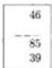

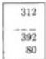

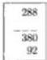

39 from 85, then the numbers are written down; one subtracts the 9 from the 5, which is impossible. Whence he adds the 10 to the 5; there will be 15 from which one subtracts the 9; there remains 6 which he puts; and for the added 10 he keeps in hand 1 which he adds to the 3; there will be 4 which subtracted from the 8 leaves 4 which he puts above the said 8, and thus he will have 46 for the difference of the posed subtraction.

Also if one will wish to subtract 80 from 392, then he puts the 80 beneath the 392, and takes the 0 from the 2; there remains [p23] 2 which he puts, and he takes the 8 from the 9; there remains 1 which he puts; after that he puts the 3 that is had in the greater number, and thus will be had 312 for the difference of the said subtraction.

Also if instead one will wish to subtract 92 from 380, then the 92 is written beneath the 380, and as it is impossible to subtract the 2 from the 0, to the same zephir is added 10; there will be 10 from which is subtracted the 2 which is in the lesser number; there remains 8 which one puts, and from the added 10 he keeps in the hand 1 which he adds to the 9; there will be 10 that is subtracted from the 8, if that be possible; but that is not possible; it is subtracted from 18; there remains 8 which he puts, and keeps 1 which he subtracts from the 3; there remains 2 which he puts, and thus he will have 288 for the difference of the said subtraction.

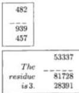

Also if the difference of the subtraction of 457 from 939 is sought, then the numbers are written down; one takes the 7 from the 9; there remains 2 that he puts, and he subtracts the 5 from the 13, as it is impossible to subtract 5 from 3; there remains 8 which he puts, and he keeps in hand 1 which he adds to the 4; there will be 5 which he subtracts from the 9; there remains 4 that he puts; and thus he will have 482 for the difference of the said subtraction.

Also if one will wish to subtract 841 from 15738, then he takes the 1 from the 8; there remains 7 which he puts; he takes the 4 from the 13, and 9 remains which he puts, and he keeps in hand 1 which he adds to the 8; there will be 9 which he subtracts from the 17; there remains 8 which he puts, and he keeps 1 which he takes from the 5, which is in the fourth place of the upper number; there remains 4 which he puts, and afterwards he puts the 1 which remains in the fifth place of the same number; and thus he will have 14897 for the difference of the said subtraction.

# Check.

However if one will wish to have the residue of the prescribed subtraction, or any other which he knows, then he takes the residue of each number according to that which we taught in multiplication. And he subtracts the residue of the smaller number, if it is possible, from the residue of the larger number; otherwise he adds to the residue of the larger number the modulus, namely 9, and the difference will be had for the residue of the same subtraction. For example, the residue of the larger number, namely 81728, is 8, and the smaller, namely

---

4. Here Begins the Fourth Chapter 47

28391, is 5; and the 5 subtracted from the 8 leaves 3 for the residue, as is found for the difference of the subtraction.

Also 4562 subtracted from 8383 leaves 3821. The residue of the larger number is 4, and the smaller number is 8; and as it is not possible to subtract the 8 from the 4, namely the residue of the smaller number from the residue of the larger number, 9 is added to the residue of the larger number; there will be 13 from which the 8 is subtracted, namely the residue of the smaller number; there remains 5 which is the residue of the difference of the said subtraction, namely of 3821, and this is done.

---

# Chapter 5

## Here Begins the Fifth Chapter on the Divisions of Integral Numbers.

When one wishes to know how to divide any number by any number, it is necessary, as in adding, first to divide all numbers by the numbers from two up to ten; and this is not possible to do until certain introductions to divisions of certain numbers are known by heart; these divisions are given in tables in the following pages. But it first is taught how the small fractions are written. [p24]

If over any number will be made a fraction line, and over the same line will be written another number, the upper number means the number of parts determined by the lower number; the lower is called the denominator and the upper is called the numerator [1]. And if over the number two will be made a fraction line, and over the fraction line the number one is written, then one of two parts of the whole is meant, that is, one half, thus $\frac{1}{2}$, and if over the number three the same one is put, thus $\frac{1}{3}$, it denotes one third; and if over seven, thus $\frac{1}{7}$, one seventh; and if over 10, one tenth; and if over 19, a nineteenth part of the whole is meant, and so on successively. Also if two over three will be shown, thus $\frac{2}{3}$, two of three parts of the whole is meant, that is two thirds. And if over 7, then two sevenths, thus $\frac{2}{7}$, and if over 23, then two twenty-thirds will be denoted, and so on successively. Also if seven is put over nine, thus $\frac{7}{6}$, seven ninths of the whole is meant; and if 7 is put over 97, seven ninety-sevenths will be denoted. Also 13 put over 29 means thirteen twenty-ninths. And if 13 is put over 347, thirteen three hundred forty-sevenths will be indicated, and thus it is understood for the remaining numbers.

Also if under a fraction line several numbers are put, and above each of them other numbers are written, then the number which will be put over at the head of the fraction line on the right part of it will denote the number of parts determined by the number placed under it, as we said before [2]. Truly that which is declared over the second is the number of parts determined by the second of the

---

II. Liber Abaci

parts determined by the first of the numbers put under. Moreover that which is meant by the number over the third is the number of parts determined by the third number under of the parts determined by the second number under of the parts determined by the first number under, and thus is denoted always the number of parts determined by all of the numbers that follow under the fraction line of the whole. If under a certain fraction line one puts 2 and 7, and over the 2 is 1, and over the 7 is 4, as here is displayed,  $\frac{1}{2}\frac{4}{7}$ , four sevenths plus one half of one seventh are denoted [3]. However if over the 7 is the zephir, thus  $\frac{1}{2}\frac{0}{7}$ , one half of one seventh is denoted. Also under another fraction line are 2, 6, and 10; and over the 2 is 1, and over the 6 is 5, and over the 10 is 7, as is here displayed,  $\frac{1}{2}\frac{5}{10}$ , the seven that is over the 10 at the head of the fraction line represents seven tenths, and the 5 that is over the 6 denotes five sixths of one tenth, and the 1 which is over the 2 denotes one half of one sixth of one tenth, and thus singly, one at a time, they are understood; however it is advised as always that the lesser numbers are towards the left under the fraction line, but if there will be made several fractions of the one fraction, they do not correspond to the other fractions, and the fraction that is the greater part of the whole is always put towards the right hand. It is in fact said that the fractions that are in one fraction line are in step, and it is the first place of the fraction that is at the head of the fraction line at the right part. The second is the fraction following towards the left. An example in the fraction line written above, namely in  $\frac{1}{2}\frac{5}{10}$  in the first place of the fraction line, and is the  $\frac{5}{6}$  in the second, and is the  $\frac{1}{2}$  in the third, that is in the last place of the same fraction line, and thus those numbers which are under the fraction line all are in their places. And if in the fraction line there will be made several fraction parts, and the fraction line will terminate in a circle, then the fractions of it will be denoted in another way than was said, as in this  $\frac{2}{3}\frac{4}{5}\frac{6}{7}$  in which the line denotes fractions, eight ninths of the whole, and six sevenths of eight ninths, and four fifths of six sevenths of eight ninths, and two thirds of four fifths of six sevenths of eight ninths of the whole [4]. And if this fraction line will terminate from another part in a circle thus,  $\frac{8}{9}\frac{6}{7}\frac{4}{5}\frac{2}{3}$ , it will denote two thirds of four fifths of six sevenths of eight ninths of the whole [5]. Also if fraction lines will be drawn above the fraction line in this manner,  $\frac{1}{5}\frac{1}{4}\frac{1}{9}$ , it denotes fractions of five ninths and a third and [p25] a fourth and a fifth of one ninth. This being therefore known, the aforesaid divisions, as are written and displayed below, are also most zealously to be learned by heart.

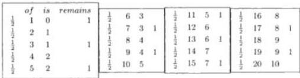
[TABLE OF DIVISION]

---

5. Here Begins the Fifth Chapter

|  1/3 | 1 | 0 | 1  |
| --- | --- | --- | --- |
|  1/3 | 2 | 0 | 2  |
|  1/3 | 3 | 1 |   |
|  1/3 | 4 | 1 | 1  |
|  1/3 | 5 | 1 | 2  |
|  1/3 | 6 | 2 |   |
|  1/3 | 7 | 2 | 1  |
|  1/3 | 8 | 2 | 2  |
| --- | --- | --- | --- |
|  1/3 | 9 | 3 |   |
|  1/3 | 10 | 3 | 1  |
|  1/3 | 11 | 3 | 2  |
|  1/3 | 12 | 4 |   |
|  1/3 | 13 | 4 | 1  |
|  1/3 | 14 | 4 | 2  |
|  1/3 | 15 | 5 |   |
| --- | --- | --- | --- |
|  1/3 | 16 | 5 | 1  |
|  1/3 | 17 | 5 | 2  |
|  1/3 | 18 | 6 |   |
|  1/3 | 19 | 6 | 1  |
|  1/3 | 20 | 6 | 2  |
|  1/3 | 21 | 7 |   |
| --- | --- | --- | --- |
|  1/3 | 22 | 7 | 1  |
|  1/3 | 23 | 7 | 2  |
|  1/3 | 24 | 8 |   |
|  1/3 | 25 | 8 | 1  |
|  1/3 | 26 | 8 | 2  |
|  1/4 | 1 | 0 | 1  |
| --- | --- | --- | --- |
|  1/4 | 2 | 0 | 2  |
|  1/4 | 3 | 0 | 3  |
|  1/4 | 4 | 1 |   |
|  1/4 | 5 | 1 | 1  |
|  1/4 | 6 | 1 | 2  |
|  1/4 | 7 | 1 | 3  |
|  1/4 | 8 | 2 |   |
|  1/4 | 9 | 2 | 1  |
|  1/4 | 10 | 2 | 2  |
|  1/4 | 11 | 2 | 3  |
| --- | --- | --- | --- |
|  1/4 | 12 | 3 |   |
|  1/4 | 13 | 3 | 1  |
|  1/4 | 14 | 3 | 2  |
|  1/4 | 15 | 3 | 3  |
|  1/4 | 16 | 4 |   |
|  1/4 | 17 | 4 | 1  |
|  1/4 | 18 | 4 | 2  |
|  1/4 | 19 | 4 | 3  |
|  1/4 | 20 | 5 |   |
|  1/4 | 21 | 5 | 1  |
| --- | --- | --- | --- |
|  1/4 | 22 | 5 | 2  |
|  1/4 | 23 | 5 | 3  |
|  1/4 | 24 | 6 |   |
|  1/4 | 25 | 6 | 1  |
|  1/4 | 26 | 6 | 2  |
|  1/4 | 27 | 6 | 3  |
|  1/4 | 28 | 7 |   |
|  1/4 | 29 | 7 | 1  |
|  1/4 | 30 | 7 | 2  |
|  1/4 | 31 | 7 | 3  |
| --- | --- | --- | --- |
|  1/4 | 32 | 8 |   |
|  1/4 | 33 | 8 | 1  |
|  1/4 | 34 | 8 | 2  |
|  1/4 | 35 | 8 | 3  |
|  1/4 | 36 | 9 |   |
|  1/4 | 37 | 9 | 1  |
|  1/4 | 38 | 9 | 2  |
|  1/4 | 39 | 9 | 3  |
|  1/4 | 40 | 10 |   |

[p26]

|  1/5 | 5 | 1  |
| --- | --- | --- |
|  1/5 | 10 | 2  |
|  1/5 | 15 | 3  |
|  1/5 | 20 | 4  |
|  1/5 | 25 | 5  |
|  1/5 | 30 | 6  |
|  1/5 | 40 | 8  |
|  1/5 | 45 | 9  |
|  1/5 | 50 | 10  |
|  1/6 | 6 | 1.  |
| --- | --- | --- |
|  1/6 | 12 | 2  |
|  1/6 | 18 | 3  |
|  1/6 | 24 | 4  |
|  1/6 | 30 | 5  |
|  1/6 | 36 | 6  |
|  1/6 | 42 | 7  |
|  1/6 | 48 | 8  |
|  1/6 | 54 | 9  |
|  1/6 | 60 | 10  |
|  1/7 | 7 | 1  |
| --- | --- | --- |
|  1/7 | 14 | 2  |
|  1/7 | 21 | 3  |
|  1/7 | 28 | 4  |
|  1/7 | 35 | 5  |
|  1/7 | 42 | 6  |
|  1/7 | 49 | 7  |
|  1/7 | 56 | 8  |
|  1/7 | 63 | 9  |
|  1/7 | 70 | 10  |
|  1/8 | 8 | 1  |
| --- | --- | --- |
|  1/8 | 16 | 2  |
|  1/8 | 24 | 3  |
|  1/8 | 32 | 4  |
|  1/8 | 40 | 5  |
|  1/8 | 48 | 6  |
|  1/8 | 56 | 7  |
|  1/8 | 64 | 8  |
|  1/8 | 72 | 9  |
|  1/8 | 80 | 10  |
|  1/9 | 9 | 1  |
| --- | --- | --- |
|  1/9 | 18 | 2  |
|  1/9 | 27 | 3  |
|  1/9 | 36 | 4  |
|  1/9 | 45 | 5  |
|  1/9 | 54 | 6  |
|  1/9 | 63 | 7  |
|  1/9 | 72 | 8  |
|  1/9 | 81 | 9  |
|  1/9 | 90 | 10  |

---

52 II. Liber Abaci

|  1/11 | 11 | 1 | 1/12 | 12 | 1 | 1/13 | 13 | 1  |
| --- | --- | --- | --- | --- | --- | --- | --- | --- |
|  1/11 | 22 | 2 | 1/12 | 24 | 2 | 1/13 | 26 | 2  |
|  1/11 | 33 | 3 | 1/12 | 36 | 3 | 1/13 | 39 | 3  |
|  1/11 | 44 | 4 | 1/12 | 48 | 4 | 1/13 | 52 | 4  |
|  1/11 | 55 | 5 | 1/12 | 60 | 5 | 1/13 | 65 | 5  |
|  1/11 | 66 | 6 | 1/12 | 72 | 6 | 1/13 | 78 | 6  |
|  1/11 | 77 | 7 | 1/12 | 84 | 7 | 1/13 | 91 | 7  |
|  1/11 | 88 | 8 | 1/12 | 96 | 8 | 1/13 | 104 | 8  |
|  1/11 | 99 | 9 | 1/12 | 108 | 9 | 1/13 | 117 | 9  |
|  1/11 | 110 | 10 | 1/12 | 120 | 10 | 1/13 | 130 | 10  |

[p27]

**A Universal Rule on the Division of Numbers by Numbers of One Place.**

|  2  |
| --- |
|  1  |
|  365  |
|  2  |
|  1  |
|  10  |
| --- |
|  365  |
|  18  |

The aforewritten instructions for division have therefore been noted, and also their best use has been frequently examined. And whoever will wish to divide a number of any number of places by any given numbers, namely by those which are from two up to ten, will write the number in a table, and he will put the figure of the number by which he will wish to divide beneath the first place of the number; and he begins the division at the last figure of the number, and he divides it, if it will be possible, by the number of the figure of that number by which he will wish to divide, putting the division in the table beneath the last place; and if the division is not exact, then he puts the excess above the last figure; and he couples the excess with the following figure so making a number of two figures, and he divides the two figures, and he puts the quotient under the following figure; and he writes the excess, if there is any, over the same. And thus always coupling in the prescribed order, the excess to the following figures, and putting the quotient number which will result from the division, and the excess described above, proceeding by steps, he shall reach the first figure of the number. It will often happen that some figures in some number are divided by a larger last figure than those the numbers will show; then as the division by those is not valid he begins the division from the last and next figure; and he divides the prescribed couple, and the quotient he puts below the penultimate, and the excess goes up to the end, operating as we said; if the excess will not be as great as five, then he divides the figure, and he will find any excess for which coupling is taught; and if he cannot divide it because it is smaller by that which is divided, then he puts the zephir under, and he joins them, just as he coupled all the consequent figures; and thus the division of any given quantities will be had.

And if one will wish to divide 365 by 2, then he writes 2 in a part of the table, and he draws a line above, and another 2 he puts beneath the 5, and he begins by dividing the 3 by the 2, namely the last figure, saying $\frac{1}{2}$ of 3 is

---

5. Here Begins the Fifth Chapter 53

1, and 1 remains; he writes the 1 beneath the 3, and the 1 which remains he writes above, as is displayed in the first illustration; and the remaining 1 couples with the 6 that is next to the last given figure, making 16; he takes $\frac{1}{2}$ of the 16 which is 8; he therefore puts the 8 beneath the 6 put before, the 1 under the 3, as is displayed in the second illustration; and as there is no remainder in the division of the 16, one divides the 5 by the 2; the quotient is 2 and the remainder 1; he writes the 2 under the 5, and the 1 which remains he writes over the put 2 we directed to keep for the denominator; and there will be one half of the whole; and before the $\frac{1}{2}$ he writes the quotient coming from the division, namely 182, as one shows in the last illustration. And the fractions are always put after the whole, thus first the integer is written, and then the fraction. And again it is noted that when any number is divided by another number, then the multiplication of the quotient and the divisor yields the number which is the dividend. Thus if 40 is divided by 4, then there results 10. Therefore if we multiply the 4 by the 10, then it makes forty, namely the divided number.

Similarly if $\frac{1}{2}182$ is multiplied by 2, namely the quotient by the divisor, then there results 365, namely the divided number or dividend.

Also if one will wish to divide the same 365 by 3, then he writes the 3 beneath the 5, and he divides the 3 by the 3; the quotient is 1 which he puts below the 3. Also he divides the 6 by the 3; the quotient is 2 which he puts below the 6; and he divides the 5 by the 3; the quotient is 1 and 2 remains; he puts the 1 below the 5, and the 2 over the fraction line over the 3, the kept parts, and he puts before it the quotient of the division, namely 121, and [p28] thus will be had $\frac{2}{3}121$ for the sought division, and this is shown. And it is noted that the number which is divided is called the dividend, and the number which divides it is called the divisor, and the number which results from the division is called the quotient [7].

*On the Division of 1346 by 4.*

Also if one will wish to divide 1346 by 4, then he puts the 4 beneath the 6, and he divides the 13 by the 4, as he cannot divide the 1 which is in the last place of the number; there results 3 for the quotient, and there remains 1; he puts the 3 beneath the 3, and the remaining 1 he puts beneath the 3, and he couples the 1 with the 4 that comes before the 3 in the number; there will be 14; he adds the quarters of 14 which are 3, and there remains 2; he puts the 3 beneath the 4, and the remaining 2 above, which coupled with 6, makes 26; this he divides by the 4; the quotient is 6, and the remainder is 2; he puts the 6 beneath the 6, and he puts the remainder 2 over the fraction line over the 4, the kept parts, and this denotes two fourths of the whole which is equal to one half of the whole; and before this fraction he puts the number which is the quotient of the division, namely 336; and thus will be had $\frac{1}{2}336$ for the sought division. For example, we divided first 13 by 4; 1346 terminates in the third place with 13. Therefore we knew it to be 13 hundreds, as the third place is hundreds. We therefore divided the thirteen hundred by the 4; there resulted three hundred, and there remained one indivisible hundred. Therefore we put the 3 in the third place,

|  101  |
| --- |
|  365  |
|  182  |
|  Division
Quotient
$\frac{1}{2}$182  |
| --- |

---

54 II. Liber Abaci

namely in the place of the hundreds, and the 1 which was the excess denoting one hundred we put over the 6; and we coupled the 1 with the 4; this made 14 which terminates in the second place, namely in the place of the tens. Therefore the hundreds are denoted by 14 tens, which we divided by the 4; there resulted three tens, and two tens remained indivisible; therefore we put the 3 beneath the 4, and the 2 over the 4, namely in the place of the tens, and we coupled the 2 with the 6 of the first place. From this coupling we had 26 units; and this coupling ends in the first place; and we divided the 26 units by the 4, and there resulted 6 units, and there remained 2. Therefore we put the 6 in the place of the unit, and the two we put over the fraction line over the 4; and thus it is understood in the similar remaining divisions.

## The Division of 5439 by 5.

Also if one will wish to divide 5439 by 5, then he puts the 5 beneath the 9, and he says $\frac{1}{5}$ of the 5 is 1 which he puts beneath the 5; and $\frac{1}{5}$ of the 4 is 0; there remains 4; he puts the 0 beneath the 4, and the remaining 4 he couples with the 3, and he says $\frac{1}{5}$ of 43 is 8, and there remains the 3; he puts the 8 under the 3, and takes a fifth of the 3 coupled with the 9, namely 39; the quotient is 7, and the remainder is 4; he puts the 7 beneath the 9, and the 4 over the fraction line over the 5, the kept parts, and he puts the fraction before the quotient of the division.

## The Division of 9000 by 7.

Also if one will wish to divide 9000 by 7, he puts the 7 beneath the first zephir, and he divides the 9 by the 7; the quotient is 1, and the remainder is 2; he therefore puts the 1 beneath the 9, and the 2 above; it coupled with the 0 which is after the 9 makes 20 which he divides by the 7; the quotient will be 2, and the remainder is 6; he puts the 2 beneath the zephir, and the 6 above, which coupled with the following zephir makes 60 that he divides by the 7; the quotient will be 8, and there remains 4; he puts the 8 beneath the zephir 0, and above he puts the 4 which coupled with the zephir in the first place makes 40, which he divides by the 7; the quotient is 5, and there remains 5; he puts the 5 beneath the 0, and the remainder 5 he puts over the fraction line over the 7, the given parts, and this fraction he puts before the quotient of the division: $\frac{5}{7}1285$.

## The Division of 10000 by 8.

Also if one will wish to divide 10000 by 8, then he puts the 8 beneath the 0 of the first place, and he says $\frac{1}{8}$ of 10 [p29] is 1, and there remains 2; he puts the 1 beneath the 0 in the [fourth] place, [and he puts the 2 above, and he takes $\frac{1}{8}$ of 20 which is 2 and there remains 4; he puts the 2 beneath in the third place] and the 4 above, and he takes $\frac{1}{8}$ of 40 which is 5, which he puts beneath the second place; and the row of places in the quotient is filled up by putting 0 beneath 0 in the first place, as is displayed in this illustration.

24
10000
8
1250

---

5. Here Begins the Fifth Chapter 55

## The Division of 120037 by 9.

Also if one will wish to divide 120037 by 9, then he writes the 9 below the 7, and he says $\frac{1}{9}$ of 12 is 1, and there remains 3; he puts the 1 below the 2, and above the 3; and $\frac{1}{9}$ of 30 is 3, and there remains 3; he puts the 3 below the 0 in the fourth place, and he puts the 3 above; and again he takes $\frac{1}{9}$ of 30 which is 3, and there remains 3; he puts the 3 below the 0 in the third place, and he puts the 3 above the same 0; and again $\frac{1}{9}$ of 33 is 3, and there remains 6; he puts the 3 below the 3 and above the 6, and $\frac{1}{9}$ of 67 is 7, and there remains 4; he puts the 7 below the 7, and the remainder 4 he puts over the fraction line over 9, the given parts. And so following this written ordered description of dividing one will know how to divide in all similar divisions; one will never deviate; all numbers can be divided in the same way, even by 11 and by 13; however one ought first to know the abovewritten introductions to divisions of all orders as contained in the tables above. The divisions for 11 ascend from one up to 11 tens, namely to 110. And the divisions for 13 ascend from 1 up to 13 tens, namely 130.

## The Division of Numbers by 11.

The said introductions are indeed noted, and if one will wish to divide 12532 by 11, then he puts the 11 under the 32. And he takes $\frac{1}{11}$ of 12 at the head of the dividend which is 1, and there remains 1. Truly $\frac{1}{11}$ of 11 is 1, as is shown in the abovewritten table; therefore $\frac{1}{11}$ of 12 is 1, and there remains 1. One therefore puts the 1 beneath the 2, and the remainder 1 he puts above the 2, and he couples the 1 with the preceding figure, namely with the 5, making 15, of which he takes $\frac{1}{11}$ which is 1, and 4 remains from the said calculation; and he puts the 1 below the 5, and the remainder 4 above the 5; he couples the 4 with the preceding figure, namely with the 3, making 43; of this again he takes $\frac{1}{11}$ which yields 3, and there remains 10, this because $\frac{1}{11}$ of 33 is 3; left in 43 is 10; therefore $\frac{1}{11}$ of 43 is 3, and 10 remains, as we said; he therefore puts the 3 below the 3, and he puts the 10 above the 43; that is, he puts the 1 above the 4 which was put above the 5, and he puts 0 above the 3; and he couples again the 10 with the preceding figure, namely with the 2 that is in the first place; there will be 102, of which again he takes $\frac{1}{11}$; the quotient will be 9, and there remains 3; he puts the 9 below the said 2, and the remainder 3 he puts over the fraction line over the 11, the kept parts; and $\frac{3}{11}1139$ will be had for the sought division.

## The Division of 123586 by 13.

Also if one will wish to divide 123586 by 13, then the 13 is put below the 86; he divides the 123 by the 13 because 12 is less than 13; the quotient will be 9, and there remains 6. And 9 times thirteen is 117, and the rest up to 123 is 6; he puts the 9 below the 3 of the 123, and the remainder 6 he puts above the 3, and he couples it with the 5; this will be 65, of which $\frac{1}{13}$ is 5; therefore he

---

II. Liber Abaci

puts the 5 beneath the 5, and above the 8 he puts 0 because the 8 is less than the 13, and he will couple the 8 with the 6 which is in the first place; there will be 86, of which $\frac{1}{13}$ is 6, and there remains 8; he puts the 6 in the first place of the quotient, and the 8 over the fraction line over the 13, and $\frac{8}{13}9506$ will be had for the sought division. By this method numbers can be divided by 17 and by 19; however one ought to know the introductions of the orders of all the abovewritten numbers. But seriously it is seen that these introductions can be learned by heart, although numbers are divided by 17 and 19 by another method; however division by other numbers of two figures we shall demonstrate in its place. [p30]

## On Division by Numbers in Head and Hand.

Truly if one will wish to work the material of similar divisions in head and hand, then he keeps the number in hand which he wishes to divide, and he always holds the quotient in hand, dividing by steps beginning with the last figure, always putting in hand the quotients, always holding in memory the remainders, and by steps deleting the dividend from the hand. For example, if one will propose to divide 7543 by 6, then he keeps the stated number in hand, and he divides the 7 by the 6, the 7 which is in the right hand in the place of the thousands, the quotient is 1, and there remains 1; he deletes the 7 from hand, and he puts the 1, and the remainder 1 he keeps in head, which he couples with the 5 which is in the right hand in the place of the hundreds; there will be 15 which he divides by 6; the quotient is 2, and there remains 3; he deletes the 5 from hand, and he puts the 2, and he keeps the 3 in head; this is coupled with the 4 which is in the left hand in the place of the tens making 34; this he divides by 6; the quotient is 5, and there remains 4; he deletes the 4 from hand, and he puts the 5, and he keeps the remainder 4 in head; he couples it with the 3 that is in hand in the place of the units; there will be 43 which he divides by the 6; the quotient will be 7, and there remains 1; he deletes the 3 from hand, and he puts the 7, and because of the remainder 1 he says one sixth; and thus he will have $\frac{1}{6}1257$ in hand for the sought division.

## The Division of 8059 by 5.

And if one will wish to divide 8059 by 5, then he keeps the number in hand, and he says $\frac{1}{5}$ of the 8 that is in the place of the thousands is 1, and there remains 3; he deletes the 8 from hand, and he puts the 1, and he keeps 3 in head; and because for this number there is nothing in hand in the place of the hundreds, it is said that zephir is there, which couples with the kept 3 making 30, of which $\frac{1}{5}$ is 6, which he puts in the remembered place, namely the hundreds; and he takes the division from the right hand to the left, saying $\frac{1}{5}$ of 5, namely of that in the place of the tens is 1; he deletes the 5, and he puts the 1, and he takes $\frac{1}{5}$ of 9, that is 1, and he keeps the 4, namely that which is in the place of the units; he deletes the 9 from hand, and he puts the 1, and because of the remainder 4, he says $\frac{4}{5}$; and thus he will have $\frac{4}{5}1611$ for the sought division, and this is understood in the similar remaining divisions.

---

5. Here Begins the Fifth Chapter 57

When one will wish to divide any number by 10, then he deletes from the number the figure in the first place, and he puts it over the 10 which is placed under the fraction line, and before it he puts the number which will remain after the deletion of the said first figure; and thus he will be able to divide any number by 10. For example, if one will wish to divide 167 by 10, then he deletes from the 167 the figure in the first place, namely the 7, and he puts it over the 10 as we said, over the fraction line over the kept parts, and before this he puts the remaining number, namely the 16; and thus is had $\frac{7}{10}16$ for the sought division. And if one will wish to divide 1673 by 10, then the 3 is deleted from the 1673; there remains $\frac{3}{10}167$ for the sought division.

## Here Begins the Division of Numbers by Incomposite Numbers of Two Places.

Certain numbers are incomposite, and they are those in arithmetic and in geometry which are called primes. This is because no smaller numbers exist, except the unit, which are factors [8]. The Arabs call them *hasam*. The Greeks call them linear; however we call them irregular; those which are less than one hundred are written down in sequence in the table. For other true primes which are greater than one hundred, I shall teach the rule for division. The rest are truly composites, or *epipedi*, that is areas, as they were called by the most skillful geometer Euclid [9]. For that reason all of these numbers are built by [p31] multiplication, as twelve which is composed by the multiplication of two by 6, or three by 4; however we call these regular numbers. And the teaching of division for primes and composites is not the same; we shall show how to divide by primes, namely those numbers which are irregular and less than one hundred, and by any appearing greater numbers.

However when one will wish to divide any number by any other given number which is irregular, then he writes the number in a table, and under it he puts the prime number by which he will wish to divide, indeed locating similar places below similar places, and he sees whether the two last figures of the dividend make a greater, equal, or smaller number than the prime number by which the given number is to be divided. And if a greater or equal number is made, then the last place of the quotient number begins following the last place of the dividend number, that is below the penultimate, and he puts the multiplier figure which multiplies by the divisor number to make the number of the aforesaid last two figures, or nearly so. And then it is multiplied by the last figure of the first number, namely the divisor, and he subtracts the product from the last figure. And if it will exceed, then he writes the excess above the figure. And he multiplies the same put figure by the first of the same first number, namely the divisor, and the multiplication of the said couple he subtracts from the penultimate figure, and the remainder if it makes a number of two figures that is greater than 10, then he puts the first place of the number above the penultimate figure, and the last above the last. However if the first place of the

|  Table of
Hasam
Numbers  |   |   |
| --- | --- | --- |
|  11 | 37 | 67  |
|  13 | 41 | 71  |
|  17 | 43 | 73  |
|  19 | 47 | 79  |
|  23 | 53 | 83  |
|  29 | 59 | 89  |
|  31 | 61 | 97  |

---

II. Liber Abaci

excess will be left off, namely that less than 10, then he puts the figure of it above the penultimate, and he couples the excess with the third figure from the last. And below the third figure he puts the multiplier, the figure that multiplied by the same divisor makes the number of the said couple, or nearly so; the multiplier will be had by experience; one will manage to show how in the succeeding divisions according to their differences. And then he multiplies the figure put below the third place by the last of the divisor, and the product he subtracts, if possible, from the last place of the said excess of the joined numbers. However if not, then he subtracts it from the couple of the last and following, and he puts the excess above the same place. And he again multiplies it by the first of the divisor, and the product he subtracts from the remaining number, and the excess he puts above. And thus ever coupling the excess with the figures of the following places, and beneath the figures of the places putting the multiplier; and he zealously proceeds, multiplying according to the prescribed order, to reach up to the end of the number. Truly it often happens that from the coupling of the excess and the preceding figure he cannot subtract the divisor number; then there will be written a zephir below the preceding figure, and one will couple it, namely the preceding with the following, and another excess, or the following preceding figure, and beneath it he puts the figure that multiplied by the divisor number makes the number of the said three figures, namely those that appear from the coupling of the exceeding figures and the two preceding, or the following figures. Whence if the two last figures of the dividend number are less than the divisor number, as we said before, then the beginning will be the last place of the quotient number below the third figure from the last, and thus any numbers can be divided by given prime numbers. And as the results that were said are now known, they are shown with numbers.

# The Division of 18456 by 17.

|  First | 1  |
| --- | --- |
|  Illustration | 18456  |
|   | 17  |
|   | 108  |

If one will wish to divide 18456 by 17, then he writes the 17 beneath the 56 of the 18456, and he takes  $\frac{1}{17}$  of the [p32] 18 which makes the last two figures of the dividend number. This is 1, and there remains 1; and he puts the 1 beneath the 8 of the 18, and the remaining 1 he puts over the 8, as is shown in the first illustration. And he couples the 1 with the preceding figure, namely with the 4; this makes 14, and as 14 is smaller than the divisor number, namely than the 17, he puts 0 below the 4, namely before the 1 put beneath the 8, and the 14 is coupled with the preceding figure, namely with the 5, making 145; therefore below the said 5 is put the figure of the multiplier of 17 which most nearly makes the said 145; the multiplier will be had by experience; it is seen from the divisor number; namely from the 17, to which tens the number is closest; it is closest to 20; therefore he divides the said 145 by 20, which one does thus: from the 20 one drops the first figure, namely the zephir; there will be left the 2 of the 20; and one drops also the first figure of the 145, namely the 5; there will remain 14 which one divides by the said 2; the quotient will be 7; and such must be the figure, or 1 greater, that he must put beneath the 5. He put the 8, and this happens because the 17 is less than the 20, whence  $\frac{1}{17}$  of 145 is greater than  $\frac{1}{20}$ .

---

5. Here Begins the Fifth Chapter

He therefore puts the 8 below the 5 of 145 because this must be the quotient. And he multiplies the 8 by the 17, and he subtracts the product from the 145, which is done thus: the 8 is multiplied by the last figure of the 17, namely by the one; the product will be 8 which he subtracts from the 14; there will remain 6 which he puts over the 4 of the 14, and he couples the 6 with preceding 5; this makes 65 from which he subtracts the product of the 8 by the other figure of the 17, namely the 7; the product is 56, and there remains 9 which is all that remains from the subtraction from the 145 of the product of the 8 by the 17, as is shown in the second illustration. He therefore puts the 9 over the 15, and he couples it with the preceding figure, namely with the 6, making 96 left to be divided by the 17, and he puts the result under the 6. Again one wishes to have a figure that when multiplied by 17 makes a product as near as possible to the 96. Whence in order to know what this figure is, one leaves off the 6 from the 96, and the 9 that is left he divides by the 2, as he did before with the 14; the quotient will be  $\frac{1}{2}4$ ; therefore he puts the 5 that is greater than the  $\frac{1}{2}4$  beneath the 6 that is the first place of the quotient number, and you will multiply the 5 by the 1 of the 17, namely by the last figure of it; this makes 5 which he subtracts from the 9 put over the 5; there remains 4, which he puts above the 9, and you will couple the 4 with the preceding 6, namely with those before we coupled with the 9; this makes 46 from which he subtracts the product of the 5 and the 7, that is 35; there will remain 11 which he puts over the fraction line over the 17, the kept parts under the fraction line, and the quotient number, namely 1085, he puts before it; and thus  $\frac{11}{17}1085$  will be had for the sought division, as is shown in this last illustration [10].

Again if one will wish to divide the same 18456 by 19, then he writes the 19 below the 56 of the 18456. And he puts below the 4 of the 184 the figure that multiplies the 19 to make a product almost 184, which is found by the same method we taught with 17, that is one removes the 4 from the 184 leaving 18, which he divides by the 2; the quotient will be 9, and such must be the figure put, namely 9; therefore he puts the 9 below the 4, namely below the third place, and he multiplies the 9 by the 1 of the 19; there will be 9 which he subtracts from the 18; there remains 9 which he puts above the 8, and he couples the 9 with the 4 from which he subtracts the product of the 9 and the 9 of the 19, which is 81; there remains 13; he puts the 13 above the 94, namely the 1 above the 9, and the 3 above the 4, as is shown in the first illustration. And the 13 is coupled with the preceding figure, namely with the 5; there will be 135. And he puts under the 5 the figure that makes a product with the 19 of 135 or less, and this will be 7; this because if the 5 is removed from the 135, then there will remain 13 which, if it be divided by 2, the quotient will be 6 or more; whence one puts 7 beneath the 5, and the 7 is multiplied by the 1 of the 19; there will be 7 which he subtracts from the 13; there remains 6 which he puts over the 3 of the 13, and you will couple the 6 with the 5 making 165 from which he subtracts the product of the 7 and the 9, namely [p33] 63; there will remain 2 which you put over the 5, as is shown in the second illustration. And you will couple the 2 with the preceding figure, namely with the 6 that is in the first place; this makes 26 which one divides by the 19, as we said; the quotient

|  Second | 6  |
| --- | --- |
|   | 149  |
|   | 18456  |
|   | 17  |
|   | 108  |
|  Last | 6  |
| --- | --- |
|  Illustration | 149  |
|   | 18456  |
|   | 17  |
|   | 1085  |
|  11/17 1085 |   |
|  First | 1  |
| --- | --- |
|  Illustration | 93  |
|   | 18456  |
|   | 19  |
|   | 9  |
|  Second | 16  |
| --- | --- |
|   | 932  |
|   | 18456  |
|   | 19  |
|   | 97  |

---

II. Liber Abaci

|  Last | 16  |
| --- | --- |
|   | 932  |
|   | 18456  |
|   | 19  |
|  7/19 971 | 971  |

is 1 and there remains 7; he puts the 1 in the first place of the quotient number, namely below the 6, and the remaining 7 he puts over the fraction line over the 19 that had to be kept for the parts; and the quotient number, namely the 971, he puts before the fraction; and thus he will have  $\frac{7}{19} 971$  for the sought division, as is shown in the last illustration.

Indeed the material was demonstrated by having the multiplier in the place of the figures, as we divided by the numbers 17 and 19; now we truly show how the multiplier is had in put figures; we wish to divide by the remaining primes that are less than one hundred. And this is the way: when we divide by 17 or by 19, we take half of the dividend number after the first figure is removed, or one more if the removed figure is five, because 17 and 19 are less than 20, as we said before; thus when we divide by 23, we take half, or if the first figure is five, one less, because 23 is more than 20; and thus as we divide by 29, we must take a third and if five, 1 more, because 29 is less than 30, which is the closer of the tens. And when we divide by 31, we must take a third, and as the first place is five, one less. And thus in the same way when we divide by 37 we must take a fourth, if five, one more. And when we divide by 41 or 43 we must take a fourth, if five, one less. And when we divide by 47 we must take a fifth, if five, 1 more. And when by 53, a fifth, if five, 1 less; and when by 59, a sixth, or more. And when by 61, a sixth or one less. And when by 79 we must take an eighth, or more. And when by 83, an eighth, or less. And when by 89 we must take a ninth, or more. And when we divide by 97 we must take a tenth of the dividend number with one figure deleted; if five, one more. When one will divide any numbers by any given numbers, and one will ignore whether one must give more or less, as we said, one puts the part that is declared above, and one multiplies the part by the divisor number; and if the product will be greater than the dividend number, one less is given. And if less than that which must make the multiplication, then one more is given; and thus one will be able to divide any number by any given numbers. However we shall say this again in certain divisions.

|  First Illustration  |
| --- |
|  11  |
|  13976  |
|  23  |
|  6  |

# The Division of 13976 by 23.

Also if one will wish to divide 13976 by 23, then he puts the 23 below the 76, and as the 23 is more than the 13, namely of the number of the last two figures of the dividend number, the last three figures are taken; the number is 139. Whence the last place of the quotient number is begun under the 9; one puts the 6, that is found by the given material on the multipliers, namely that we must leave off the first figure of 139, namely the 9, leaving the 13, which we must divide by the 2 because the 23 is closer to the 20 than any other number of tens; the quotient is 6 and a half. Whence we must put less, for the 23 is more than the 20; we leave off the half, and we put the 6 beneath the 9, as we said; and one multiplies the 6 by the 2 of the 23; there will be 12 which he subtracts from the 13; there remains 1 which he puts over the 3, and he couples it with the 9; there will be 19. And he multiplies the 6 by the 3 which is in the 23; there will be 18 which he subtracts from the 19; there remains 1 which he puts

---

5. Here Begins the Fifth Chapter 61

over the 9, as is shown in the first illustration. And he couples the 1 with the 7 that precedes it in the number; there will be 17; and as the 17 is less than the 23, the zephir is put under the 7, and the 6 that is in the first place of the number is coupled with the 17; there will be 176; after this one puts under the named [p34] 6 the figure that multiplies the 23 to make nearly 176; and there will be 7 from the prescribed calculation, that is less than half of 17; therefore he multiplies the 7 by the 2 that is in the 23; there will be 14 which he subtracts from the 17; there remains 3 which he puts over the 7, and he couples it with the 6 in the first place; there will be 36 from which he subtracts the product of the 7 by the 3 in the 23; there remains 15 which he puts over the fraction line over 23, the kept parts, as is shown in the last illustration.

*Checking the Division Written Above.*

|  Last | 3  |
| --- | --- |
|   | 117  |
|   | 13976  |
|   | 23  |
|  $$\frac{15}{23}$$607 | 607  |

Truly if one will wish to check the abovewritten division by casting out nines, then he takes the residue of 13976 which is 8, and he saves it apart. And again he takes the residue of the quotient number, namely of the 607, which is 4, and he multiplies it by the residue of the 23 which is 5; there will be 20; he takes the residue of it which is 2, and he adds it to the 15 which is over the fraction line over the 23; there will be 17; the residue of it is 8, as above we kept apart. For example, the divisor multiplied by the quotient number yields the dividend number; therefore if we multiply the residue of the divisor by the residue of the quotient, then there results the residue of the dividend number; but from the divisor number 23 there remained 15, which subtracted from the 13976 leaves 13961, which divided by the 23 yields 607. Therefore the multiplication of the 23 by the 607 yields 13961. Therefore if the residue of the 607, that is 4, is multiplied by the residue of the 23 which is 5, then there results 20, of which the residue is 2, which is namely the residue of the 13961, which is added to the residue of the 15, which is 6 as above; this makes 8, namely the residue of the 13976, and this we wished to demonstrate [11]. Truly multiplication, additions, subtractions, or divisions of numbers can be checked in another way by casting out other numbers, namely 7 and all other whole existing prime numbers, as 11 or 13, and so forth [12]. We shall demonstrate this in the following according to that doctrine which seems to us congruous.

Also if one will wish to divide 24059 by 31, then he writes the 31 beneath the 24059, and he puts the 7 below the zephir because the 31 is about 30 and a bit more. Whence if we take $$\frac{1}{3}$$ of 24, namely the 240 with the first figure left off, we shall have 8 which is more than 7, for a third part. Whence we put, as we said, the 7 beneath the zephir, and following the prescribed order one multiplies the 7 by the 3 of the 31; there will be 21 which he subtracts from the 24; there remains 3 which he puts above the 4, and he multiplies the 7 by the 1 of the 31; there will be 7 which he subtracts from the 30; there remains 23 which he puts above the 30, and if he wishes, he neglects the 3; or if not he keeps it in memory for deleting. Also he couples the 23 with the 5; there will be 235, and he puts again the prescribed calculated 7 under the 5, namely less than a third part of the 23, and he multiplies it by the 3; there will be 21

|   | 1  |
| --- | --- |
|   | 22  |
|   | 338  |
|   | 24059  |
|   | 31  |
|  $$\frac{3}{31}$$776 | 776  |

---

II. Liber Abaci

which he subtracts from the 23; there remains 2; he puts the 2 over the 3, then he disregards the 23, and couples the 2 with the 5; this makes 25; and always one knows to couple the preceding with the following; and he multiplies the 7 with the 1; there will be 7 which he subtracts from the 25; there remains 18; he puts it above the 25, and forgets the 25. After this he takes $\frac{1}{8}$ of the 18 by the above described calculation; there will be 6. Whence he puts the 6 below the 9, and under the 1 of the 31 which is put; he multiplies it by the 3 of the 31; there will be 18; because of this he forgets the 18 put above, and he multiplies the 6 by the 1; there will be 6 which he subtracts from the 9; there remains 3 which he puts over the fraction line over the 31, the given parts. And thus will be had $\frac{3}{31}776$ for the sought division, as is shown in the illustration. I wish to demonstrate how this method produces the quotient; therefore we put under the third place of the dividend number that which we multiply by the 3 which is in the last place of the divisor, and it occupies the second place, and is below the second place of the dividend number; and from this multiplication results a number terminating in the fourth place; therefore when one multiplies the third place by any place whatsoever, it makes the third place for that which one multiplies, or one makes a number ending in it. [p35] For the fourth place, the third is to the second. And because we subtract the product of the 7 by the 3, namely 21, from the 24 which terminates in the fourth place, and we put the 3 over the fourth place, namely over the 4, and we know to couple the 3 with the 0 which is in the third place of the dividend number, the couple is 30; and we multiply again the 7 by the 1 which is in the place of the divisor; and therefore we multiply in this multiplication the third place by the first, which is again to multiply the first by the third. And therefore the product of the 7 by the 1, namely 7, we subtract from the 30, which 30 terminates in the third place; therefore from the multiplication of the third place by the first, or the first by the third results a number of the third place, or it terminates in the same place; and we put the 23 above the 30 or in the place of it; and we couple the 23 with the 5 which is in the second place, and we have 235 which terminates in the second place; and we put another 7 in the second place, that we multiply again by the 3 of the divisor, that is the second place by the second; from this multiplication results a number of the third place, or it terminates in it; and therefore we subtract the 21 from the 23, as they both terminate in the third place; and the 2 that remains we put above the 3, and we know to couple it with the following 5, which couple is 25, and it terminates in the second place; from it we subtract the product of the 7 and the 1, namely the second place by the first; from this multiplication results a number of the second place, or terminating in it; there remains 18 in the same place in which there is 25, namely in the third place, and 8 in the second; and we couple the 18 with the 9 in the first place; there will be 189; and we put the 6 in the first place of the quotient number, and we multiply it by the 3, namely the first place by the second; from this multiplication results a number terminating in the second place; the product is 18 from which we subtract the 18 named above, as it terminates in the second place; and we multiply the 6 by the 1; there will be 6 in the same place, which we subtract from the 9 that is in the same place; there remains 3 which divided by

---

5. Here Begins the Fifth Chapter 63

the 31 yields $\frac{3}{31}$; and thus we have $\frac{\pi}{31}776$; and according to this method you will understand similar divisions. And if one desires to know how to check a given division by casting out sevens, then takes the residue modulo 7 of 24059, that is the excess or remainder of the number after dividing it by 7; this remainder will thus be taken: one says $\frac{1}{7}$ of the 24; there remains 3; of the 30, namely of it coupled, there remains 2; of the 25 there remains 4; of the 49 there remains 0 for the sought remainder which will be had for the residue. And in the same way one takes the residue of 776 which is 6; and he multiplies it by the residue of the 31 which is under the fraction line, that is 3; there will be 18 that he divides by the 7; there remains 4 which he adds to the 3 that is over the fraction line over the 31; there will be 7 which he divides by the 7; there remains 0 as should remain for the residue.

## The Division of 780005 by 59.

However if one will wish to divide 780005 by 59, then the numbers are written down, and one puts the 1 below the 8; if we remove the 8 from the 78, then 7 is left which we divide by the 6; because 59 is about 60 the quotient is 1 and more. Whence we must put the 1 below the 8, as we said before; and one multiplies it by the 5; there will be 5 which he subtracts from the 7; there remains 2 which he puts above the 7, and he multiplies the same 1 by the 9, and he subtracts the product from the 28; there remains 19, and one deletes or ignores the 2 put over the 7, and he puts or says 19 above the 78. And he puts the 3 under the 0 according to the prescribed calculation for this place, and he multiplies it by the 5; there will be 15 which he subtracts from the 19; there remains 4; he deletes the 19, and in the place of the nine he puts the 4. And he multiplies the same 3 by the 9, and he subtracts it from the 40; there remains 13; he deletes the 4 and he puts the 1, and above the 0 he puts the 3; after [p36] this the 130 is divided by the 59, and 2 is given for the abovesaid calculation for the division, and beneath the zephir of the third place the 2 is put; the 2 is multiplied by the 59 and the product is subtracted from the 130; there remains 12; again the said 2 is multiplied by the 5, and subtracted from the 13, and multiplied by the 9, and subtracted from the 30; therefore one deletes the 13 and puts the 1 there in the place of the 3 of the 13, and he puts the 2 above the 0 in the third place. After this he puts the 2 below the 0 is the second place, and he multiplies it by the 59, and he subtracts the product from the 120; there remains 2 above the 0; and he resolves to delete the 120 that is left over after the past division, and it is said that to delete figures or remove them is to understand them deleted or removed; after this one couples it with the 5 that is in the first place of the number; this makes 25; as this is less than the 59, he puts 0 under the 5 in the first place, and 25 over the fraction line over the given parts, as is clearly portrayed in the illustration.

And as the given divisions are lucidly explained, we will divide a certain number by 97; let 5917200 be written down, and the 97 be put under both the zephir; one divides the number of the last three figures of the dividend number, namely the 591 by the 97; for this division the quotient is 6 because the 97 is

|  1  |
| --- |
|  141  |
|  29322  |
|  780005  |
|  59  |
|  13220  |
|  59  |
| --- |
|  5917200  |
|  97  |
|  6  |

---

II. Liber Abaci

closer to 100 than to any other number of tens. Whence we must divide the 59, namely the number of the last two figures, by 10; from this division results almost 6, namely less than ten; and as the 97 is less than the 100, we must take more than five tens. Whence it happens to be 6; one puts the 6 beneath the first place of the number of the same three figures, that is below the 1 that is in the fifth place of the entire number; and he multiplies the 6 by the 9 of the 97; there will be 54 which he subtracts from the 59, namely from the number of the last two figures; there remains 5 which he puts over the 9; and he multiplies the 6 by the 7 of the 97; there will be 42 which he subtracts from the 51, namely from the coupling of the 5 put above with the preceding 1; there remains 9 which he puts over the 1 with the put 5, or erases, or in his head deletes. And the aforesaid 9 which is put above the 1 remains from the division of the 591 by the 97; the 9 is coupled with the figure preceding in place, namely with the 7 which is in the fourth place of the number; this makes 97 which he divides by 97, namely by the divisor; the quotient is 1; he puts the 1 below the 7, and he therefore multiplies by the 9 of the 97; there will be 9; for this he takes away 9 from the remainder, and he multiplies the 1 by the 7; there will be 7, for which 7 remains which was coupled with 9; and nothing remains of the 7 to the coupling with the preceding 2, and this 2 is less than the 97; he puts 0 beneath the 2, and he couples the 2 with the 0 preceding it, and there will be 20. Also as this 20 is less than the 97, 0 is put beneath the given 0 coupled with the 2, namely below that which is in the second place of the number; after this he couples the 20 with the 0 preceding it, namely with that which is in the first place; this makes 200 which is divided by the 97; for this division 2 is put below the 0 of the first place by the aforewritten reasoning; and one multiplies it by the 9, and he subtracts it from the above coupled 20; there remains 2 which he puts over the 0 of the second place; and one sees the coupling of it with the preceding 0 which is in the first place which is 20, from which he subtracts the product of the 2 by the 7; there will remain 6 which he puts over the fraction line over the 97, the given parts; and one will have $\frac{6}{97}61002$ for the sought division.

As the division of numbers by a number of two figures which is irregular, that is prime, is seen to be satisfied, now truly the same divisions are shown by those numbers which are composite, that is regular, and moreover how to divide all numbers by composite number just as by prime numbers; however we multiply easily and subtly, namely one shows in the following the doctrine how the composition rules of the numbers are found, namely the numbers of which they are composed [13]; and they are put under a certain fraction line, and always the lesser will follow the greater towards the left, as [p37] was taught previously in this chapter; after this, one divides the number by dividing by the smallest of the components of the divisor, that is by the smallest number; and the figure will be put below the fraction line; and if another will exceed it, then he puts it above the figure or the number, and the quotient number of the division is divided by the preceding number, or the figure in the fraction, and the remainder if there will be any, he puts over the preceding number or figure. And thus always in order, with the preceding component numbers appearing as quotients of divisions, one strives to divide to the end; and the

5927200

\frac{6}{97}61002

---

5. Here Begins the Fifth Chapter 65

remainders are put over them, and the quotient numbers from the division of the last component, that is the last number existing under the fraction line, one puts it before. And thus will be had the division of any number made by any composite number of any number of places. Before this is declared demonstrated, compositions of composite numbers are to be found, as well as those that are known to be irregular; we proceed to demonstrate the necessary. And as numbers of two figures which are irregular are shown in the table above, the composition rules for two figures are shown one by one below the fraction line; we show truly how to find the composition of regular numbers for other numbers of places.

## HERE ARE THE COMPOSITION RULES FOR NUMBERS OF TWO FIGURES.

|  12 | $\frac{10}{26}$ | 30 | $\frac{10}{310}$ | 46 | $\frac{10}{223}$ | 21 | $\frac{10}{37}$ | 38 | $\frac{10}{219}$ | 54 | $\frac{10}{69}$  |
| --- | --- | --- | --- | --- | --- | --- | --- | --- | --- | --- | --- |
|  14 | $\frac{10}{27}$ | 32 | $\frac{10}{48}$ | 48 | $\frac{10}{68}$ | 22 | $\frac{10}{211}$ | 39 | $\frac{10}{313}$ | 55 | $\frac{10}{511}$  |
|  15 | $\frac{10}{35}$ | 33 | $\frac{10}{311}$ | 49 | $\frac{10}{77}$ | 24 | $\frac{10}{38}$ | 40 | $\frac{10}{410}$ | 56 | $\frac{10}{78}$  |
|  16 | $\frac{10}{28}$ | 34 | $\frac{10}{217}$ | 50 | $\frac{10}{510}$ | 26 | $\frac{10}{213}$ | 42 | $\frac{10}{67}$ | 57 | $\frac{10}{319}$  |
|  18 | $\frac{10}{29}$ | 35 | $\frac{10}{57}$ | 51 | $\frac{10}{317}$ | 27 | $\frac{10}{39}$ | 44 | $\frac{10}{411}$ | 58 | $\frac{10}{229}$  |
|  20 | $\frac{10}{210}$ | 36 | $\frac{10}{49}$ | 52 | $\frac{10}{413}$ | 28 | $\frac{10}{47}$ | 45 | $\frac{10}{59}$ | 60 | $\frac{10}{610}$  |
|  62 | $\frac{10}{231}$ | 77 | $\frac{10}{711}$ | 92 | $\frac{10}{423}$ | 69 | $\frac{10}{323}$ | 85 | $\frac{10}{517}$ | 99 | $\frac{10}{911}$  |
| --- | --- | --- | --- | --- | --- | --- | --- | --- | --- | --- | --- |
|  63 | $\frac{10}{79}$ | 78 | $\frac{10}{613}$ | 93 | $\frac{10}{331}$ | 70 | $\frac{10}{710}$ | 86 | $\frac{10}{243}$ | 100 | $\frac{10}{1010}$  |
|  64 | $\frac{10}{88}$ | 80 | $\frac{10}{810}$ | 94 | $\frac{10}{247}$ | 72 | $\frac{10}{89}$ | 87 | $\frac{10}{329}$ |  |   |
|  65 | $\frac{10}{513}$ | 81 | $\frac{10}{99}$ | 95 | $\frac{10}{519}$ | 74 | $\frac{10}{237}$ | 88 | $\frac{10}{811}$ |  |   |
|  66 | $\frac{10}{611}$ | 82 | $\frac{10}{241}$ | 96 | $\frac{100}{268}$ | 75 | $\frac{100}{355}$ | 90 | $\frac{10}{910}$ |  |   |
|  68 | $\frac{10}{417}$ | 84 | $\frac{100}{267}$ | 98 | $\frac{100}{277}$ | 76 | $\frac{10}{419}$ | 91 | $\frac{10}{713}$ |  |   |

[p38]

A Universal Rule for Finding the Composition of Odd Numbers.

Moreover when anyone will frequently use the aforewritten rules for numbers, and will wish to find the rule, that is the composition of any number with three or more figures, and he will wish to know which prime number will exist according to the rule, then he writes down the number in the table, and he says whether the number will be even or odd. If it is even, then he recognizes its composition. However if odd, then it will be composite or prime. Even numbers are indeed composed from evens and odds, or from evens alone. Therefore the rules first investigated are for even numbers, and will be demonstrated in their place. Odd numbers truly are composed of odds alone. Whence the components of them by odds are investigated, for which we take the beginning. Therefore when in the figure of first place of any odd number there is the number 5, one will know 5

---

II. Liber Abaci

to be a factor, that is the number is divided integrally by 5. However if another odd figure will appear in the first place, then one indeed takes the residue of the entire number by casting out nines; and if a zephir results, then $\frac{1}{3}$, and if 3 or 6 will be the residue, then $\frac{1}{3}$ will be in the composition; however if the residue will show none of these, one divides by 7; and if there will be an excess, then one again divides the number by 11; and if there is an excess, then he divides again by 13, and always he goes on dividing in order by prime numbers according to what is written above in the table until he will find a prime number by which he can divide the proposed number, or without reaching a prime number by which he can divide, and thence he will come to the square root; if he will be able to divide by none of them, then one will judge the number to be prime. However if he will be able to divide it by some given prime number without reaching a prime number by which he cannot divide, that which will yield from division, he again divides by it; and the quotient number which appears from the division he again divides by the same prime number; this is that which one begins to seek, the components of the number in order by the rest of the prime numbers up to the square root; if none are found then it will not have components; and thus always making a result, so long as all of it will have components. After this is done, one strives zealously to collate them under a fraction line, lesser to greater. And thus one will have the rule that is the composition of any odd number. For example, let 805 be the number for which the composition rule is sought; as 5 is a prime factor of this figure, undoubtedly its composition will include $\frac{1}{5}$. Therefore one divides the number by 5; the quotient is 161, of which he takes the residue, which is 8; this shows that 161 can be divided integrally by neither 3 nor 9. Whence one divides it by 7; its quotient is 23, an irregular number; he fits the found components, namely the 5, 7, and 23 under a fraction line, and he will have $\frac{1}{6}\frac{0}{7}\frac{0}{23}$ for the composition of 805, that is a fifth of a seventh of a twenty-third part, which is an eight hundred fifth part; therefore the product of five by seven, namely XXXV, by XX three, yields 805 [14]. Again if one seeks to find the composition rule for 957, then he divides it by 3 because 3 is the residue of the number; the quotient is 319 which cannot be divided again by 3 as the residue of it is 4; and if one will divide it by 7, then the remainder is 4, and thus it is divisible by 11, and it is XI times 29 which is a prime number; therefore the found composition rule for 957 will be had and is collated under the fraction line, $\frac{1}{3}\frac{0}{11}\frac{0}{29}$, as is shown here.

## On Finding the Composition Rule for 951.

Truly if one will wish to find the rule of composition for 951, then he divides it by 3 because the residue of it is 6; the quotient is 317, and finding components for it is impossible, as one cannot divide integrally [p39] by 7, or by 11, or by 13, or by 17. And for components of it nothing more is sought, because if it will be divided by 19, then some prime number before 19 will divide; therefore the composition rule for 951 is $\frac{1}{3}\frac{0}{317}$. Also if one will wish to have it for 873, then as the residue of the number is 0, when one divides it by 9, the quotient will be 97; the number 97 is shown to be prime in the table above. The rule is found, and if it will be collated below the fraction line, then there will be $\frac{1}{9}$ of $\frac{1}{97}$.

---

5. Here Begins the Fifth Chapter 67

# Finding the Rule for 1469.

And if one will wish to have the composition rule for 1469, then he takes the residue of the number which is 2; he shows the composition of it to be without threes or nines. For if he will divide it by 17, the remainder is 6; if by 11 there remains similarly 6; if he truly divides it by 13, then the quotient is 113; because of this one ought not to seek further for more prime numbers, or even for the same 13, as 13 is greater than the square root; whence it is known to be from prime numbers. Therefore the composition rule of 1469 is known, as is here shown, $\frac{1}{13} \frac{0}{113}$.

## On Finding the Composition Rule for 2543.

Also if one will wish to have it for 2543, then he takes the residue of the number which is 5; this shows that it can have neither 3 nor 9 in its rule of composition. After division by seven there remains 2. And by 11; there remains 2; and by 13; the excess is 8. And thus he finds that he cannot divide by 17, or 19, or 23, or 29, or 31, or 37, or 41, not even by 47 or 53; and beyond 53 is not sought because 53 is greater than the square root. And if it were possible in the composition of 2543 to have some prime number greater than 53, then the greater number is multiplied by something to make 2543 which must be less than 53, which is impossible because up to 53 we did not find it while seeking the rule; therefore 2543 is irregular.

Also if one will wish to find it for 624481, then one recognizes that neither 3, nor 9, nor 7, are had for the said composition of the number; truly it is divided by 11 of which the part, namely an eleventh, is 56771, which one divides again by 11; namely one sees whether he will have $\frac{1}{11}$, for by the numbers which are less than 11, namely for 9 and for 7 and for 3, it cannot be divided because they were not found in 624481. But still in that, namely in 56771, one will be able to find another 11 in the composition. From that true division, namely by 11, the quotient is 5161 which again is divided by 11; there remains 2. Therefore again to have $\frac{1}{11}$ of it is impossible; after this it is seen whether $\frac{1}{13}$ is had; namely one divides it by 13; the quotient of the division is 397 of which neither $\frac{1}{13}$, nor $\frac{1}{17}$, nor $\frac{1}{19}$ can be found. Whence we know 397 to be prime; therefore between 19 and the square root there is no prime number; it is irregular, as we said before; no factor can be beyond the square root. Here is indeed the sought composition, that is the rule for 624481, and here it is shown: $\frac{1}{11} \frac{0}{11} \frac{0}{13} \frac{0}{397}$.

|   | 624481  |
| --- | --- |
|   | 11  |
|   | 56771  |
|   | 11  |
|  residue 2 | 5161  |
|   | 13  |
|  $\frac{1}{11} \frac{0}{13} \frac{0}{397}$ | 397  |

## A Check of the Abovewritten Composition Rule.

And if one will wish to check the composition rule by residues of 7, then he takes the residue of 624481 by 7 which is 4, and he keeps it aside; and he takes the residue of 11 in the first place under the fraction line which is 4; and he multiplies it by 4, namely the residue of the other eleven; there will be 16 which he divides by 7; there remains 2 which he multiplies by 6, namely by the residue of 13; there will be 12 from which he subtracts 7; there remains 5 which he multiplies by 5, namely by the residue of 397; there will be 25 which he divides by 7; there remains 4, which is kept for the residue.

---

II. Liber Abaci

# On a Universal Method for Finding the Composition Rule of Even Numbers.

If one truly will wish to find the composition rule for some even number, then he takes similarly the residue [p40] of it by 9; if it is 0, then he will have  $\frac{1}{9}$ . And if it is 3 or 6, then the rule will have  $\frac{1}{6}$  in its composition. However if there will show no residue of it, one checks what the remainder will be upon dividing by 8 the number of two figures which is in the first and second places, because if it is 0, and the figure of the third place appears even, 2 or 6 or 8 or 0, then one knows the entire number of any number of places can be divided by 8. However if the third figure will appear odd, 1 or 3 or 5 or 7 or 9, then the number has  $\frac{1}{4}$  in its composition. If it truly shows 4 as a remainder, and the figure of the third place is odd, then the entire number similarly is divided by 8. And if it shows even, it will have only  $\frac{1}{4}$  in its composition. However if the remainder shows 2 or 6, then the number is only divided by the 2 of the even number. And following this, one takes parts, compositions of even numbers, so long as he has the rule of it, or some odd number occurs, for which odd he strives to find the composition according to the previous ordered rule. And if in the first place of some even number a zephir shows, it is removed, and for it he will have  $\frac{1}{10}$  in the composition of the number. And if some 0 will remain at the head of the number, then it is again removed from the number, and again  $\frac{1}{10}$  will be had in the composition of the same number. And thus always, so long as 0 will appear at the head of the number, one must understand this. And what was said about finding the composition rule of even numbers is clearly discovered, as the demonstration for the number is shown.

# On Finding the Composition Rule for 126.

And if the composition rule is sought for 126, of which the residue is 0, then this shows nine to be an integral factor; therefore one divides 126 by 9; the quotient is 14 for which the rule  $\frac{1}{27}$  is certainly shown above in the table of the composition rules for numbers of two figures; whence one will have  $\frac{1}{29}$  for the rule for 126, as is here shown.

|   | 3  |
| --- | --- |
|   | 2112  |
|   | 6  |
|   | 3  |
|   | 352  |
|   | 8  |
|  1000/46811 | 44  |

Also if the rule for 156 is sought, then its residue is 3 and this shows that it can be divided by 6. If divided by 6, then the quotient is 26 for which the rule is  $\frac{1}{2}$ ; and thus will be had the rule for 156, as here is shown:  $\frac{1}{2}$ .

If one truly will wish to find it for 2112, then as its residue is 6, this shows that it can be divided by 6. Therefore 2112 is divided by 6; the quotient is 352 of which one takes the residue, which is 1; this shows that it can be divided by neither 6 nor 9; whence 52 is divided by 8, namely a number of two figures; from the division there remains 4; from the remainder, and from the figure in the third place of the number, namely the 3 which shows first, it is shown that 352 can be divided by 8; and it is divided by 8; the quotient will be 44 for which the rule is  $\frac{1}{4}$ ; whence the rule for 2112 is had, as is here displayed:  $\frac{1}{4}$ . As the  $\frac{1}{6}$  that is contained in the fraction is a rule for 24, a praiseworthy rule for 24 is found in the table of composition of numbers, namely  $\frac{1}{3}$ , because a

---

5. Here Begins the Fifth Chapter 69

greater figure is in it that is in $\frac{1}{4} \cdot \frac{0}{6}$, for 8 is greater than 6; therefore the extreme rule of numbers is always taken, which rules are composed from numbers which are from two up to 10, as is demonstrated in the following. Whence jointly attained is the found rule, namely $\frac{1}{3} \cdot \frac{0}{8} \cdot \frac{0}{8} \cdot \frac{0}{11}$.

## On Finding the Composition Rule for 4644.

Truly if one will wish to find the rule for 4644, then its residue is 2. This shows neither $\frac{1}{6}$ nor $\frac{1}{9}$ can be had in the rule. And because the number of two figures at the head, namely the 64, has 8 as a divisor with remainder 0, and the figure that is in the third place, namely 6, is even, one knows 4664 to have $\frac{1}{8}$; therefore if one will divide it by 8, undoubtedly 583 emerges as the quotient; [p41] if by the previous doctrine for odd numbers one will seek the rule, then one finds it to be $\frac{1}{11} \cdot \frac{0}{53}$; whence for 4664 one has the rule $\frac{1}{8} \cdot \frac{0}{11} \cdot \frac{0}{53}$.

If one will wish to find it for 13652, then the residue being 8 shows it lacks $\frac{1}{6}$ and $\frac{1}{9}$. For if the number of two figures appearing at the head will be divided by 8, then 4 will remain. Whence as the figure of the third place is 6, a divisor exists, and in the rule $\frac{1}{4}$ is indicated; therefore one will divide the 13652 by 4, and 3413 arises, and this lacks a rule; $\frac{1}{4} \cdot \frac{0}{3413}$ will be had for the rule for 13652, as is here denoted.

## On Finding the Composition Rule for 15560.

Therefore if one will wish to find it for 15560, then as there is the zephir in the first place, it is removed. For this $\frac{1}{10}$ will be had in the rule of the given number; by steps one strives to find the rule of the rest of the number, namely 1556, which has residue 8; this shows the rule to lack $\frac{1}{6}$ and $\frac{1}{9}$. And because the number of two figures at the head, that is the 56, is divisible by 8 with remainder 0, and because the figure of the third place that is 5 is odd, it is shown that no rule of even numbers can have a number greater than four. Finally 1556 is divided by 4; the quotient is 389 for which no rule is found. Whence the rule for 15560 is had, as is here noted, $\frac{1}{4} \cdot \frac{0}{10} \cdot \frac{0}{389}$.

Also if one will wish to find the rule for 32600, then as 0 is in its first place, it must have $\frac{1}{10}$ in its rule for the zephir. And if the 0 of the number is removed, there is left 3260. In the first place is similarly 0, for which is again had $\frac{1}{10}$. And removing the 0 from the number, there is left 326 of which the residue, that is 2, negates having $\frac{1}{6}$ or $\frac{1}{9}$ in its composition. And the 26 which is the last two figures at the head of 326, if divided by 8, leaves 2; therefore we know 326 cannot be divided by any even number, save for two. Whence 326 is divided by 2; the quotient is 163 that lacks a rule. $\frac{1}{2} \cdot \frac{0}{10} \cdot \frac{0}{10} \cdot \frac{0}{163}$ is had for a rule for 32600.

And if one will wish to find it for 7546000, then the three zephir are removed from the number, and $\frac{1}{10} \cdot \frac{0}{10} \cdot \frac{0}{10}$ is had; there is left 7546 of which the residue, that is 4, negates having $\frac{1}{6}$ or $\frac{1}{9}$ in its composition. For if the 46 which is at the head of 7546 will be divided by 8, there remains 6; therefore 7546 will have no other even number save 2 which afterwards it is recognized to have; that is 7546, if it will be divided by 2, then the quotient is 3773. One will strive to

|   | 33  |
| --- | --- |
|   | 1556  |
|   | 4  |
|  $\frac{1}{4} \cdot \frac{0}{10} \cdot \frac{0}{389}$ | 389  |

---

II. Liber Abaci

find the rule of it according to the doctrine for odd numbers; one finds it to be $\frac{1}{7} \frac{0}{7} \frac{0}{7} \frac{0}{11}$. If with the rule found above, namely $\frac{1}{2} \frac{0}{10} \frac{0}{10} \frac{0}{10}$, he will rearrange it better, then $\frac{1}{2} \frac{0}{7} \frac{0}{7} \frac{0}{10} \frac{0}{10} \frac{0}{10} \frac{0}{11}$ will be had for the rule of 7546000.

## The Division of 749 by 75.

Since one will wish to divide 749 by 75, he notes the rule for finding in numbers the factor 5, and he finds the rule for 75, that is $\frac{1}{3} \frac{0}{5} \frac{0}{5}$. He divides the 749 by 3; the quotient is 249, and there remains 2 which he puts over the 3 in the fraction, and he divides the 249 by 5, namely by that which precedes the 3 in the fraction; the quotient is 49, and there remains 4; this 4 he puts over the 5, and he divides again the 49 by the 5, that which is at the end of the fraction; the quotient is 9, and there remains 4; the 4 he puts over the 5, and the 9 he puts before the fraction; and thus one has for the sought division $\frac{2}{3} \frac{4}{5} \frac{4}{5} \frac{4}{9}$, as is shown here.

## The Division of 67898 by 1760.

Truly if one will wish to divide 67898 by 1760, then he finds the rule for the 1760 which is $\frac{1}{2} \frac{0}{8} \frac{0}{10} \frac{0}{11}$; he divides the 67898 by the 2; the quotient will be 33949, and there remains 0; the 0 he puts over the 2, and he divides the [p42] 33949 by the 8; the quotient is 4243, and there remains 5; the 5 he puts over the 8 of the fraction, and he divides the 4243 by the 10; the quotient is 424, and there remains 3; that is, the figure of the first place of 4243 is dropped; the 424 one divides by the 11; the quotient will be 38, and there remains 6; he puts the 6 over the 11 of the fraction, and the 38 he puts before the fraction; and thus will be had for the sought division, $\frac{0}{2} \frac{5}{8} \frac{3}{10} \frac{6}{11} 38$.

## Checking the Abovewritten Division.

If one wishes to check the division by casting out thirteen, then he divides the said 67898 by the 13; there remains 12 which is had for the residue. After this, one divides the 38 put before the fraction by the 13; there remains 12 which he multiplies by the 11 from the fraction, and he adds the 6 which is over the 11 to it; there will be 138 which he divides by the 13; there remains 8 which one multiplies by the 10 of the fraction, and he adds the 3 which is over the 10; there will be 83 which he divides by the 13; there remains 5 which he multiplies by the 8 of the fraction, and to it he adds the 5 which is over the 8; there will be 45 which he divides by the 13; there remains 6 which he multiplies by the 2 from the fraction; there will be 12, as was kept above for the residue. And one learns to take care in a division that he does not cast out a number that occurs in the denominator of the fraction because he can be easily deceived by this; therefore in this division it is prohibited to cast out 11 because the residue that remains from 38, or from whatever number which is multiplied by the 11 that is beneath the fraction line, and divided by the residue will not survive; whence if the 38 is not correct, then the error cannot be detected by casting out eleven [15]. And one knows that in the division of numbers there is another difficulty with the

---

5. Here Begins the Fifth Chapter 71

doctrine, namely when the dividend number has some commonality with the divisor, namely that the dividend number is integrally divided by some number or numbers which are in the composition rule of the divisor. Then first the number is divided by the number of the composition which in the fraction of the divisor will have itself in the dividend whether it is greater or less in the fraction because if something will be divided by itself nothing will remain from the division. And as here it is perceived fitting, it is demonstrated with numbers in the following proposition.

## The Division of 81540 by 8190.

And if one will wish to divide 81540 by 8190, then the composition rule of the divisor is found, which is $\frac{1}{7} \frac{0}{9} \frac{0}{10} \frac{0}{13}$, and as $\frac{1}{10}$ is in the rule of the 81540 by reason of the 0 which is in the first place of it, although $\frac{1}{10}$ is not at the head of the fraction; however the 81540 is first divided by the 10; that is the 0 is removed from the number; there is left 8154; extracting $\frac{1}{10}$ from the fraction the 8154 remains to be divided with $\frac{1}{7} \frac{0}{9} \frac{0}{13}$. Also 8154 is divided by 9 because 0 is its residue upon casting out nines. Whence one divides it by the 9 of the fraction; the quotient is 906 which remains to be divided with $\frac{1}{7} \frac{0}{13}$; truly the 906 is divided by the 7; the quotient is 129, and there remains 3; the 3 one puts over the 7. And he divides the 129 by the 13; the quotient is 9, and there remains 12; the 12 he puts over the 13, and the quotient 9 he puts before the fraction; and $\frac{3}{7} \frac{12}{13} 9$ will be had for the sought division.

And if one will wish to check the preceding division, the 10 is put, and the 9 which will be extracted from the fraction under the line following the 7, and over it is put the zephir, as is displayed in this fraction: $\frac{0}{10} \frac{0}{9} \frac{3}{7} \frac{12}{13}$; after this one will be able to check it according to the ordered checking procedure. Alternatively 906 is had for the divided number, and $\frac{1}{7} \frac{0}{13}$ for the divisor; and following this you try to check by the abovesaid method. It was indeed seen to be satisfied for the division of the numbers by given composite numbers, unless in their composition some number of three figures or more existed. But as the complete doctrine of division is contained in this work, [p43] how to divide by numbers which are of three figures or more is shown in the following.

## The Division of Numbers by Prime Numbers of Three Places.

Moreover, whoever will wish to divide a number with any number of places by a number of three figures, that is three places, he puts similar places of the number of three figures below similar places of the dividend number, and he will see that if the number of the last three figures of the dividend number will appear larger than the divisor number; if indeed it will be greater or equal, then the last place of the quotient number will begin under the third figure from the last, and if smaller it will begin under the preceding, that is under the fourth from the last. And the figure put under the aforesaid place that is chosen, it

---

II. Liber Abaci

is multiplied by the divisor number, namely it by which number the greater is divided makes a number of three figures or the last four, or almost so, as there will not remain then more of the divisor number. And thus one multiplies it by the last figure of the divisor number. And the multiplication of the number of the last figure, one subtracts, if possible. And if not, one subtracts it from the number of the last two figures, and one puts the excess over the place from which the product was subtracted. And one multiplies again the put figure by the preceding last divisor number, namely by that which is in the second place; and the found product one subtracts from the above excess coupled with the preceding figure in the greater number; and if there will be an excess, one puts the first place of it over the same preceding figure, and the rest, truly after these are deleted, or namely erasing the other first placed excess. And thus far one multiplies the same put figure by the figure of the first place of the divisor number, and the product of the multiplication one subtracts from the coupling of the second excess with the preceding figure of the greater number; and the first place of the excess one puts over the preceding figure; the rest truly after deleting it, or namely erasing another second said excess. After this one strives to put another such figure under another preceding figure of the greater number, that is before the first put figure that one multiplies in the prescribed divisor number; one makes a coupling of the third excess and the preceding figure or almost so, and this goes multiplying in order by the figures of the divisor number, as is taught with the first put figure, always putting the excess in order above; and similarly one strives to work by steps with the remaining figures, proceeding up to the end. If truly from some abovesaid excess and preceding figure will be produced a number smaller than the divisor, then one puts the zephir under the preceding figure, and one will couple the preceding figure, and the excess with another preceding figure; below that before the aforesaid zephir will certainly be the put figure; and if again the coupled excess and the two preceding figures are less than the divisor, again another of the aforesaid zephir will be put, and you will couple the said excess and the said two other figures to the preceding figure; below that one puts a figure that multiplies the divisor number making, or almost so, the coupled excess number and the three preceding figures; and you will have any similar division; and in order to expose clearly that which was said, it is shown with numbers.

And if one will wish to divide 1349 by 257, then one will write the 257 below the 349 of the 1349. And this number of the last three figures of the dividend number, that is the 134, is less than the 257, namely the divisor [p44] number; because of this the figure of the quotient number which occupies the first place will be put below the fourth figure of the dividend number, that is the 9; and the number which multiplied by the 257 will almost make the 1349 will be 5; it is put below the 9; one multiplies it by the last figure of the divisor number, namely by the 2; there will be 10 which one subtracts from 13, namely from the number of the last two figures of the dividend number, as one cannot subtract it from the number of the last figure; there remains 3 which is coupled with the preceding 4; this makes 34 from which one subtracts the product of the put 5 by the 5 of the divisor number; there remains 9 which one puts over the 4; and

|   | 64  |
| --- | --- |
|   | 1349  |
|   | 257  |
|  64/257 5 | 5  |

---

5. Here Begins the Fifth Chapter 73

one multiplies the put 5 by the 7; there will be 35 which one subtracts from the 99, namely from the coupling of the 9 in the first place of the dividend number; there remains 64 which one puts over the fraction line of the aforesaid 257. And the quotient 5 one puts before the fraction; and one will have $\frac{64}{257}5$ for the sought division.

## The Division of 30749 by 307.

Truly if one will wish to divide 30749 by 307, then one writes the 307 beneath the 749; and because the 307, which is the number of the last three figures of the dividend number, is equal to the divisor number, 1 is put under the first place of the said three figures, namely under the 7 that is in the third place of the dividend number; and one multiplies the 1 by the 3 of the divisor; this makes 3 which is subtracted from the 3 that is in the last place of the dividend; and one multiplies again the 1 by the 0 of the divisor making 0; for the 0 that is in the divisor number is left; and again one multiplies the 1 by the 7 making 7; one subtracts it from the 7 that is in the dividend number. For when the third place multiplies any place, one makes the third place beyond that which one multiplies. Therefore when one multiplies the third, one makes the fifth place; and when one multiplies the second, one makes the fourth; and when one multiplies the first, one makes the third. And the 4 which precedes the 7 in the dividend number is less than the 307, namely the divisor; 0 is put below the 4, and again the 49 of the dividend number is less than the 307; 0 will be put below the 9, namely in the first place of the quotient number; and the aforesaid 49 one puts above the fraction of the 307, the kept parts, and the quotient 100 one puts before the fraction; and you will have $\frac{49}{307}100$ for the sought division.

Also if one will propose to divide 574930 by 563, then one puts the 563 below the 930; one puts the aforewritten multiplier 1 beneath the 4, namely in the fourth place; and one multiplies it by the 5 of the divisor number making 5 which one subtracts from the 5 that is in the last place of the dividend number; when one multiplies the third place by the fourth place the sixth place is made; that is the fourth beyond that which one multiplies; and one multiplies the 1 by the 6 of the divisor making 6 which one subtracts from the 7; there remains 1 which one puts over the 7, for when one multiplies the fourth place by the second the fifth place is made; and again one multiplies the 1 by the 3 of the divisor making 3 which one subtracts from the 4, that is from 14, because of the 1 that remains over the 7, for as one multiplies the fourth place by the first the fourth place is made, or the number terminates in it. And because the said 3 is subtracted from the 4 which is in the fourth place, that is from the 14 that ends in it, there remains 11, namely 1 over the fifth place, and another over the fourth; one couples the 9 with this 11 making 119 which is less than the 563, namely the divisor; 0 is put under the 9, and one couples the 3 that is in the second place of the dividend number with the 119 making 1193. Therefore one puts in the second place such a multiplier that multiplied by the 563 makes most nearly 1193; that figure will be 2 which one multiplies by the 5 of the divisor making 10 which one subtracts from the written 11 leaving 1; one leaves

|   | 49  |
| --- | --- |
|   | 30749  |
|   | 307  |
|  $\frac{49}{307}100$ | 100  |
|   | 107  |
| --- | --- |
|   | 670  |
|   | 1193  |
|   | 574930  |
|   | 563  |
|  $\frac{107}{563}1021$ | 1021  |

---

II. Liber Abaci

behind the 1 which is put over the 4, and one removes the other 1 which is [p45] above the 7; and one multiplies the 2 by the 6 of the divisor making 12 which one subtracts from the 19; there remains 7 that one puts above the 9, and one removes the 1 that is above the 4; and one multiplies the 2 by the 3 of the divisor making 6 that one subtracts from the 73; there remains 67; one removes the 7 which is above the 9, and one puts 67 above the 93, as is had in the illustration. and one couples the 67 with the 0 making 670; for the multiplier one puts 1 under the 0, and one multiplies it by the 5 of the divisor making 5 which one subtracts from 6; there remains 1; one removes the 6, and one puts the 1; and one multiplies the 1 by the 6 making 6 which one subtracts from the 7; there remains 1; one removes the 7, and he puts there the 1; and one multiplies the 1 by the 3 of the divisor making 3 which one subtracts from the 110; there remains 107 which one puts over the fraction of 563, and before it one puts the quotient 1021, as is written in the illustration.

Checking the Abovewritten Division.

If one will wish to check the division by casting out elevens, then he divides the 574930 by 11; there remains 4 which he keeps for the residue; and he divides the quotient 1021 similarly by 11; there remains 9 which he multiplies by the 2 that remains from the division of the 563 by 11; there will be 18 to which he adds the residue of the remainder number over the fraction, namely 107, which has residue 8, because when 107 is divided by 11, then there remains 8; and thus one will have 26 which when divided by 11 leaves 4 for the residue, as ought remain. In finding therefore the multiplier in the put figure to multiply by the quotient number, when a number of three figures or more is divided by a number of three figures, of such we have taught the technique; one considers whether the divisor number was near to some hundreds, or whether it is more or less than it; and one investigates what figure in the quotient number is put against what figure, and from the figures one leaves two which are in the second and first place of it. One truly divides the rest of the numbers by the number of hundreds which will show nearer; and what is attained from the division, the figure will be put, or a little more if the divisor will be less than the predicted number of hundreds, or a little less, if the divisor will be more than the number of hundreds. For example, if we wish to divide 1247 by 421, we leave off the 4, and we divide the 12 that remains by the 4, as the 421 is nearer 400 than any other number of hundreds; there results 3, but if the multiplier will be less, because the 421 is more than 400, and if it was less than 379 the multiplier is more; and thus one understands the rest. And if the divisor number is one hundred and one half hundred, 150, or two hundred fifty, and similarly so forth; then of the remaining two predicted figures one doubles the number, and the doubled amount one divides by two hundred fifth, and one will have the put multiplier figure. For example, we wish to divide 2137 by 563; we divide the 21 by $\frac{1}{2}5$, that is the double of 21, namely 42, by the double of $\frac{1}{2}5$, that is 11; the quotient will be 3 and more; and in this way the multiplier is found in similar situations.

---

6. Here Begins the Sixth Chapter 75

Also if one will wish to divide 5950000 by 743, then the number is written down; the multiplier is chosen as above; one puts 8 below the 0 of the fourth place, namely because after the 50 is removed from the 5950, there is left 59; if the double of it is divided by the double of $\frac{1}{2}7$, because of the divisor which is near 750, there results 8 for the division; and one multiplies the 8 by the 7 of the divisor; there will be 56 that one subtracts from the 59; there remains 3 that he puts above the 9. And the 8 is multiplied by the 4 making 32 that he subtracts from 35; there remains 3 which he puts above the 5; and he erases the 3 that was put above the 9 and the 8 by the 3 of the divisor makes 24 that he subtracts from the 30; there remains 6 that he puts above the 0; and he erases the 3 that was above the 5; and thus always he multiplies the put figure, singly by figures of the divisor number, namely beginning from the last and going up to the first, always the division ought remain in the figure; below this the put figure is received in advance, as is demonstrated in the first illustration of this [p46] division. After this one puts the two zephir below the two zephir of the third and second places, but both zephir coupled with the 6 will make a smaller number than 743. Whence the dividend is 6 with three zephir, namely 6000; and this is divided by the 743; for this division 8 is put in the first place of the quotient number, namely below the 0 of the first place; this is because the division of the double of 60 by the double of $\frac{1}{2}7$ results in 8; this 8 is multiplied by 7 and subtracted from 60 leaving 4 that one puts over the 0 in the third place; and one removes the 6 that is above the 0 in the fourth place; and again the 8 is multiplied by the 4 in the divisor, and the product is subtracted from 40 leaving 8, for as the multiplication of the said 8 is changed in order from place to place in the divisor number, so the multiplication in the dividend number must be changed from place to place. One puts the remaining 8 over the 0 in the second place, and one removes the 4 that was put over the 0 in the third place; and one multiplies the 8 by the 3 making 24 which one subtracts from 80; there remains 56 which one puts over the fraction line over the 743, and before it he puts 8008; and one will have the proposed quantity of the division. And by that which was said of the given divisions one can have a full mastery in dividing numbers of IV or more figures; however the said divisions are better understood if they are demonstrated by some numbers of four figures.

## The Division of 17849 by 1973.

If it is proposed to divide 17849 by 1973, then the divisor is written below the dividend, namely the 1973 below the 7849 of the 17849; and as the number of the last four figures of the dividend number, that is the 1784, is less than the divisor, it is necessary that the figure of the quotient number be put under the first place of the dividend number. Whence one puts 9 beneath the first place of the both numbers because the multiplication of the nine by the divisor almost makes the dividend number, and because the divisor is near twenty hundreds, 17 is divided by 2, and the remaining three figures of the dividend number, namely the 849, are neglected; and then one multiplies the 9 by the 1 of the divisor, and one subtracts from 17 leaving 8 that one puts above the 7; and one multiplies

|   | 56  |
| --- | --- |
|   | 6000  |
|   | 5950000  |
|   | 743  |
|  $\frac{56}{743}8008$ | 8008  |
|   | 92  |
| --- | --- |
|   | 17849  |
|   | 1973  |
|  $\frac{92}{1973}9$ | 9  |

---

II. Liber Abaci

the 9 by the 8 of the divisor; and one subtracts from 88; there remains 7 that one puts above the 8; and one erases the 8. And again one multiplies the 9 by the 7 of the divisor; and one subtracts from 74; there remains 11 that one puts above the 74; and one multiplies the 9 by the 3 of the divisor number; and one subtracts from the 119; there remains 92 that one puts over the fraction line over the 1973; and before it one puts the 9, and one will have the proposed quantity of the division.

# The Division of 1235689 by 4007.

|   | 1533  |
| --- | --- |
|   | 33589  |
|   | 1235689  |
|   | 4007  |
|  1533/4007 308 | 308  |

Also if one will wish to divide 1235689 by 4007, then the number is written down; one puts 3 below the third place of the numbers; 3 is the prescribed multiplier; and one multiplies the 3 by the 4 making 12 which cancels the 12 which is the number of the last two figures of the dividend number. And one multiplies the 3 by the 0 which is in the third place of the divisor making 0; one subtracts it from the 3 that is in the dividend number leaving 3. And again one multiplies the 3 by the 0 in the second place of the divisor making 0 which one subtracts from the 35 leaving again the 35. And the 3 times the 7 makes 21 that one subtracts from the 356; there remains 335 which he puts above the 356. As 3358 is the couple of 335 with the remaining number, and as this figure is smaller than the 4007, before the put 3 is put 0, namely below the second place of the numbers. And the 3358 is coupled with the preceding figure, that is with the 9, below which one puts 8 in the quotient number. And one multiplies it by the 4, and he subtracts from 33 leaving 1 which one puts above the 3 in the first place of 33, and he erases the 33. And the 8 times the 0 in the third place is subtracted from the 15 leaving 15. And again one multiplies the 8 by the 0 in the second place of the divisor number; and he subtracts from 158 leaving 158. And the 8 times the 7 makes [p47] 56 that one subtracts from the 1589 leaving 1533 that he puts over the fraction line over the 4007, and before it he puts the 308, and one will have the sought quantity of the division as is shown in the illustration [16].

Truly if one will wish to check this or any other division by other than casting out some number, then one multiplies the quotient number by the divisor, and one adds the product to the remainder number from the division, namely to that which was put over the fraction line. And in this case, one multiplies the 308 by the 4007, and to the product he adds the 1533 that is over the fraction line, and if the sum will make the dividend number, then he knows the division to be correct.

---

# Chapter 6

## Here Ends the Fifth Chapter and Begins the Sixth Chapter on the Multiplication of Integral Numbers with Fractions.

Moreover if you [1] will wish to multiply a number of any number of places plus a fraction of one or several parts by a number plus a fraction of one or several parts, then you write the greater number and its fraction beneath the smaller number and its fraction, namely number beneath number, and fraction beneath fraction. And you take the upper number and its fraction, and make such a fraction which equals the given fraction plus its number. And similarly with the lower you make its fraction, and you will multiply the made fraction of the upper number by the made fraction of the lower. And in the product fraction you divide the numerator by both numbers under the fraction line, namely the ones arranged there; and you will have the product, a number plus a fraction. And this is clearly shown in demonstrations with numbers.

This chapter we divide into eight parts.

The first will be on the multiplication of integral numbers with one fraction part under the fraction line.

The second on the multiplication of numbers with two or three fraction parts under one fraction line.

The third on the multiplication of numbers with two fraction parts under two fraction lines.

The fourth on the multiplication of numbers with two fractions with many fraction parts.

The fifth on the multiplication of numbers with three fractions.

---

II. Liber Abaci

The sixth on the multiplication of fractions without integers.

The seventh on the multiplication of numbers and fraction parts for which the fraction line is terminated in a circle [2].

The eighth on the multiplication of parts of numbers with fractions.

Here Begins the First Part on the Multiplication of Integral Numbers with One Fraction Part under One Fraction Line.

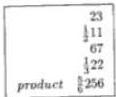

If one will wish to multiply 11 and one half by 22 and one third, then he writes the greater number beneath the lesser, namely  $\frac{1}{3}22$  beneath  $\frac{1}{2}11$ , as is shown here; next he makes halves of the  $\frac{1}{2}11$  because the fraction part with the 11 is halves, which one makes thus: you will multiply the 11 by the 2 that is under the fraction line after the 11, and to this product you add the 1 which is over the fraction line over the 2; there will be 23 halves, or the double of  $\frac{1}{2}11$  halves; there will be 23; you write the 23 above the  $\frac{1}{2}11$ , as is shown in the illustration; and for the same reason you multiply the 22 by the fraction part under the fraction line, that is the 3 that is under the fraction line after the 22; there will be 66 thirds to which you add the 1 which is over the 3; there will be 67 thirds that you keep above the  $\frac{1}{3}22$ , and the 67 is the triple of  $\frac{1}{3}22$ ; and you will multiply the 23 halves by the 67 thirds; there will be 1541 sixths which you divide by the fraction parts which are under the fraction lines of both numbers, namely the 2 and the 3; the division is made thus: you multiply the 2 by the 3; there will be 6 by which you divide the 1541; the entire quotient for the sought multiplication will be  $\frac{5}{6}256$ , as is demonstrated in the written illustration. Finding the product of halves and thirds therefore results in sixths; [p48] you respond that once a third is taken that is multiplied by a third, there results ninths. Therefore, as a half by a third is multiplied, namely as is taken a half of a third, a sixth necessarily results. And therefore from the multiplication of a half by a third results a sixth. Again according to another perception we multiplied the double of the  $\frac{1}{2}11$ , namely 23, by the triple of  $\frac{1}{3}22$ , namely 67; thus you have the sextuple of the product of the multiplication. I shall show indeed that from the multiplication of the  $\frac{1}{3}22$  by the  $\frac{1}{2}11$  results the sought product. Therefore if the  $\frac{1}{3}22$  is multiplied by the double of the  $\frac{1}{2}11$ , that is 23, then there results the double of the sought product. Therefore if the triple of the  $\frac{1}{3}22$ , that is 67, is multiplied by 23, namely by the double of the  $\frac{1}{2}11$ , undoubtedly the triple of the double, that is the sextuple of the sought product results. Therefore a sixth part of the product of the multiplication of them is the sought product, which we had to show. And you know that because we multiplied the 2 by the 3, then by the 2 and by the 3 we had to divide; therefore the multiplication of them does not rise beyond a tens number; and thus you must make of all numbers of which the multiplications do not rise beyond ten. For example, if you had to divide some number by 2 and by 2, then you divide it by 4 because 2 times makes 4; and if you had to divide the number by 2 and by 4, then you divide it by 8; and if by 2 and by 5, then you divide it by 10; and

---

6. Here Begins the Sixth Chapter

if by 3 and by 3, then you divide it by 9; and if you will wish to divide some number by 3 and by 5, then you divide it with  $\frac{1}{3}\frac{0}{5}$  because he multiplication of 3 by 5 yields 15, a number greater than 10. Whence it is better that you divide with  $\frac{1}{3}\frac{0}{5}$  than by 15.

# On the Same.

Also if you will wish to multiply  $\frac{1}{2} 12$  by  $\frac{3}{5} 23$ , then you write down the problem as here is shown, and you will multiply the 12 by the 2 that is under the fraction line, and you add the 1 which is over the 2; there will be 25 halves. Also you will multiply the 23 by the 5 that is under the fraction line, and you add the 3 that is over the 5; there will be 118 fifths; you will therefore multiply the 25 halves by the 118 fifths; there will be 2950 half fifths, namely 2950 tenths; therefore you divide by the 2 and the 5 that are under the fraction line, that is by 10; you must divide the 2950 by the 10 because from the double of  $\frac{1}{2} 12$  times the quintuple of  $\frac{3}{5} 23$ , namely from 25 times 118, results tenfold the product of the  $\frac{1}{2} 12$  by the  $\frac{3}{5} 23$ ; the quotient will be the integer 295 and nothing more, as is shown above in the problem. You can indeed find the product of the given multiplication in another way, namely you multiply the 25 by the 118; you divide the 25 by the 5 located under the fraction line as it can be divided integrally; the quotient will be 5 that you keep; and you divide the 118 by the 2 that is under the fraction line; as these halves are an integer, the quotient is 59 that you multiply by the 5 that was kept as a fifth part of the 25; there will be 295 that is the product of the given multiplication, as was found above; and this consideration of cancellation avoids much of the labor of multiplying and dividing; it is more difficult indeed to multiply the 25 by the 118 than the 5 by the 59; this product, namely the 5 by the 59, one need not divide by some part under the fraction line. Whence as you had to multiply some number by some other number, and you had to divide the product of it by some number or numbers, by them or by some numbers which you could divide integrally, you will strive always to divide by those that you will be able to divide integrally before you multiply; next you will multiply the rest of the numbers mutually, and you divide by the part or by the parts which remain after some are cancelled; we shall take care to show this in the following. But first I wish to show where such cancellation proceeds. From the multiplication of the 25 by the 118 results tenfold the product of the  $\frac{1}{2} 12$  by the  $\frac{3}{5} 23$ , as we had for the previous [p49] multiplication. Therefore from the multiplication of a fifth part of the 25 by the 118 results a fifth of tenfold the product of the  $\frac{1}{2} 12$  by the  $\frac{3}{5} 23$ , namely the division of the multiplication; therefore if a fifth of the 25, namely 5, is multiplied by half of the 118, namely by 59, then there results the product of the  $\frac{1}{2} 12$  by the  $\frac{3}{5} 23$ .

# On the Same.

Again if you will wish to multiply  $\frac{2}{3} 13$  by  $\frac{5}{7} 24$ , then the number is written down as is shown here; you multiply the 13 by the 3, and you add the 2 that is over the 3; there will be 41 thirds. Also you multiply the 24 by part of the rule,

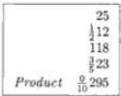

---

II. Liber Abaci

|  Residue | 41 | (5)  |
| --- | --- | --- |
|  Medulo | 2/313 |   |
|  9 | 173 | (2)  |
|   | 5/724 |   |
|   | 1/25337 | (1)  |

that is 7, and you add 5; there will be 173 sevenths that you multiply by the 41 thirds; there will be 7093 twenty-firsts. This 7093 you divide by the 3 and by the 7 that are under the fraction lines; you put them under the fraction line thus:  $\frac{1}{3}\frac{0}{7}$ ; the entire quotient will be  $\frac{1}{3}\frac{5}{7}337$ . For this multiplication you indeed cannot cancel anything because the 41 and the 173 are divided integrally by neither the 3 nor the 7. However if you will wish to know by casting out nines whether this multiplication is correct or not, then you take the residue of the 13 by nine, which is 4, and you multiply it by the 3 that is under the fraction line following the 13; there will be 12; and you add the 2 that is over the 3; there will be 14 of which you take the residue that is 5, and you keep it. And you see if the residue of the 41 is 5, as you saved in the way, because then you know the 41 to be correct if the residue of it will be 5. The residue of 41 is indeed 5, as it should be; therefore you will keep the 5 over the 41, or after it; afterwards you will see whether the residue of the 173 by nine is correct, namely you will multiply the residue of 24 that is 6, by the 7 that is under the fraction line, and you add the 5 that is over the 7; there will be 47, of which the residue, that is 2, you keep. Because such must be the residue of the 173, and it is, you therefore put the 2 after the 173; and you will multiply the residue of the 41 by the residue of the 173, namely 5 by 2; there will be 10 from which you subtract nine; there remains 1 which is the residue of the product of the multiplication; you indeed will keep the 1 after the product of the multiplication, namely by the  $\frac{1}{3}\frac{5}{7}337$ . And you will multiply the residue of the 337, that is 4, by the 7 that is under the fraction line after the 337; and to this you add the 5; there will be 33 of which the residue, that is 6, you multiply by the 3 that is under the fraction line after the 7, and you add the 1 which is over the 3; there will be 19 of which the residue is 1; and it is kept by the 337 in the problem for the residue of the product of the multiplication; therefore the given multiplication is correct; the order of checking is thus: as you will begin to multiply, you must begin to check. As you had in this multiplication 41 from the multiplication of the 13 by the 3 with the two added on, you must know immediately by the residue whether the 41 was correct; similarly as you had the 173, you had to know by the residue if it was correct. Again when you multiplied the 41 by the 173, you had to know by the residue whether the multiplication was correct. And when you had the product, namely the  $\frac{1}{3}\frac{5}{7}337$ , you had to know similarly, according to that which we demonstrated above, whether the division was correct.

# On the Same.

|  65 | (2)  |
| --- | --- |
|  1/416 |   |
|  137 | (4)  |
|  2/527 |   |
|  0/45445 | (1)  |

Again if you will wish to multiply  $\frac{1}{4} 16$  by  $\frac{2}{5} 27$ , then you write down the problem; you multiply the 16 by the part under its fraction line, namely the 4, and you add the 1; there will be 65 fourths which number you check by taking residues thus: if you will wish to check by casting out sevens, then you divide the 16 by 7; there will remain 2 that you multiply by the 4 from under the fraction line, and you add the 1 which is over the 4; there will be 9 that you divide by 7; there remains 2, and so much must remain of the 65 if it is divided by 7, and so much does remain. Therefore the residue of the 65 is 2 that you save by the

---

6. Here Begins the Sixth Chapter 81

65; next you multiply the 27 by the part under the fraction line; there will be 137 fifths which you put over the $\frac{2}{5}27$, and you see by casting out sevens if the 137 is correct, as you saw for the 165; and you find that the residue of the 137 must be 4 and it is because if you will divide the 137 [p50] by 7 undoubtedly 4 will remain. Therefore you will keep the 4 by the 137 for its residue; next you will multiply the 65 by the 137; there will be 8905 twentieths. And if the multiplication is correct, then you will know it by the same residue of seven; you will multiply the kept residue of the 65, namely 2, by the residue of the 137 that is 4; there will be 8 that you divide by 7; there remains 1, and such must remain from the 8905 if it is divided by 7, and so it does. Whence we know that the multiplication is correct. Afterwards you divide the 8905 by the parts which are under the fraction line, that is by the 4 and the 5 put under the fraction line. However you divide first by the 5 because the 8905 is integrally divisible by 5; the quotient will be $\frac{9 \cdot 1}{5 \cdot 4}445$ which is the product of the sought multiplication. And if the division is correct, then one must know it so: you divide the 445 by 7; there remains 4 which you multiply by the 4 that is under the line of the fraction after the 445, and you add the 1 which is over the 4; there will be 17 that you divide by 7; there remains 3 that you multiply by the 5 that is after the 4 under the fraction line; and you add the zephir which is over the 5; there will be 15 that you divide by the 7; there remains 1; as the 1 is the residue of the 8905 we know that the given division is correct. And you therefore know that the 5 which is after the 4 under the fraction line represents nothing because over the 5 is 0. Therefore the given multiplication has product $\frac{1}{4}445$. We put the 5 under the fraction line, and the residue is found. In another ready way, you can find this same multiplication by cancelling, namely you divide the found 65 by the 5 that is under the fraction line; the quotient is 13 that you multiply by the 137; and you divide by the other part 4 under the fraction line; the quotient will similarly be $\frac{1}{4}445$, as was found above. Always when we must divide some number by 4 and 5, that is with $\frac{1 \cdot 0}{4 \cdot 5}$; if the number will have $\frac{1}{5}$, we habituate ourselves to divide it first by the 5 and then by the 4, because of the integer of this division, as in this way we made the 8905. And if the number is divided integrally by the 4, then we habituate ourselves first to divide by the 4 and then by the 5. And if the number can be divided integrally neither by the 4, nor by the 5, then we habituate ourselves to divide with $\frac{1}{2} \cdot \frac{0}{10}$, because four fives make 20, for which the composition rule is $\frac{1}{2} \cdot \frac{0}{10}$. And this we make closer to a more elegant expression because it is more elegant to say $\frac{1}{2} \cdot \frac{0}{10}$ than $\frac{1}{4} \cdot \frac{0}{5}$, although they are equal. Similarly you must understand the same of other numbers, namely when you will have to divide some number by 3 and by 4, that is with $\frac{1}{3} \cdot \frac{0}{4}$; and the number is divided integrally by none of them, then you divide them with $\frac{1}{2} \cdot \frac{0}{6}$ which is more elegant. Again when you will have to divide by 4, and by 4, that is with $\frac{1}{4} \cdot \frac{0}{4}$, you divide it with $\frac{1}{2} \cdot \frac{0}{8}$. And when you will have to divide by 3 and by 6, that is with $\frac{1}{3} \cdot \frac{0}{6}$, you divide with $\frac{1}{2} \cdot \frac{0}{9}$ because the multiplication of the 2 by the 9 is the same as by the 3 and the 6. Again when you will have to divide by 4 and by 6, that is with $\frac{1}{4} \cdot \frac{0}{6}$, you divide with $\frac{1}{2} \cdot \frac{0}{8}$. And when you will have to divide with $\frac{1}{5} \cdot \frac{0}{6}$, you divide with $\frac{1}{3} \cdot \frac{0}{10}$. And when you will have to divide with $\frac{1}{5} \cdot \frac{0}{8}$, you divide with $\frac{1}{4} \cdot \frac{0}{10}$. And when you will have to divide with

---

II. Liber Abaci

|  Residue | 147 | (-1)  |
| --- | --- | --- |
|  modulo | 3/8 18 |   |
|  11 | 220 | (0)  |
|   | 3/8 24 |   |
|   | 4/8 9 449 | (0)  |

$\frac{10}{6} 6$ , you divide with  $\frac{10}{49}$ , because both of the fractions, namely  $\frac{10}{66}$  and  $\frac{10}{49}$ , are rules for 36. But we choose the most extreme numbers, with ten and less, in the composition of the numbers because  $\frac{10}{49}$  is more elegant than  $\frac{10}{66}$ . And this again you understand from the preceding. Truly if you will wish to divide a number by some other numbers smaller than ten, except those that we above taught how to fit together, by those which cannot fit together, then you divide it by them; and if you will have to divide by 5 and by 7, then you divide it with  $\frac{10}{57}$ , and thus you understand the rest.

Again if you will wish to multiply  $\frac{3}{8} 18$  by  $\frac{4}{9} 24$ , then you write the problem down; you multiply the 18 by the part under its fraction line, that is by the 8, and you add the 3; there will be 147. Also you multiply the 24 by the 9, and you add the 4; there will be 220. And you multiply it by the 147, and divide by the parts under the fraction line; the quotient will be  $\frac{4}{8} \frac{1}{9} 449$  for which the residue by casting out elevens is 0. And if you will wish to know what part of unity  $\frac{4}{8} \frac{1}{9}$  is, then you multiply the 1 which [p51] is over the 9 by the 8, and you add the 4; there will be 12 which you keep for the numerator; and you multiply the 9 by the 8 that is under the fraction line; there will be 72 for the denominator that you divide by kept 12; the quotient is 6; for this 6 you say  $\frac{1}{6}$ ; and this is the same as 12 of 72 parts; similarly  $\frac{4}{8} \frac{1}{9}$  is  $\frac{1}{6}$  of the whole. I shall say this is elegant because 72 is the product of 8 by 9; you make seventy-two parts of the whole; there will be 72, of which you take four eighths of one ninth; there will be 8 plus 4, namely 12 which is had from the multiplication of the 1 which is over the 9 by the 8 with the 4 that is over the 8 added. Therefore  $\frac{4}{8} \frac{1}{9}$  is  $\frac{12}{72}$ . Therefore the ratio of  $\frac{4}{8} \frac{1}{9}$  to the integer 1 is as 12 to 72. But the ratio of 12 to 72 is as the ratio of a twelfth part of 12 to a twelfth part of 72, that is as 1 to 6 because as is found in Euclid, as is the whole to the whole, so is the number of parts to the parts; it is indeed a sixth that is had for  $\frac{1}{6} 449$ , the product of the multiplication.

In another way we can find this same product by cancelling, but you must multiply the 147 by the 220, and afterwards divide by the 8 and the 9; you multiply a third part of the 149, that is 49, by a fourth part of the 220, that is 55; and you divide the product by a third part of the 9, that is 3, and by a fourth of the 8, that is 2. Therefore you divide the product by 6; the quotient will be  $\frac{1}{6} 449$ , as was found above. And you note that the numerator shares a number with the denominator, namely the number which is above the fraction line with the number which is below the fraction line; then one must divide them by the largest number which is common to both. For example, we have  $\frac{6}{9}$ ; the 6 and the 9 have a greatest common factor, and their greatest common factor is three. Therefore you divide both of them by the 3, and that which will result from the division of the upper, namely 2, you put over a fraction line; and that which results from the division of the lower you put under the fraction line; and you will have  $\frac{2}{3}$  for  $\frac{6}{9}$ . Also  $\frac{5}{10}$  has the number five as the greatest common factor of the numerator and the denominator. Therefore if both numbers are divided by the 5, namely the 5 and the 10, then there results  $\frac{1}{2}$  for a reduction of  $\frac{5}{10}$ ; and this you understand in similar situations. Indeed there is a method for finding the greatest common factor that two numbers have between them

---

6. Here Begins the Sixth Chapter 83

[3]; you divide the greater by the lesser, and if from this division there is no remainder, then the lesser number is the greatest common factor, as with $\frac{12}{72}$; and if from the division there is some remainder, then you keep it for the first remainder, and you divide the smaller number by it; if from this division there is no remainder, then the first remainder will be the greatest common factor of the numbers, as with $\frac{10}{22}$, which have greatest common factor 2; therefore the 22 is divided by the 10 leaving 2, by which the 10 is divided integrally; and if from the division of the smaller number by the first reminder there is some remainder, then you will call it the second remainder; if the greater number is integrally divided by the second remainder, then the second remainder will be the greatest common factor of the numbers, as in $\frac{12}{20}$, for which the greatest common factor is 4 because the 20 is divided by the 12 leaving 8, by which the 12 is divided; there remains 4 by which the 12 is integrally divided; and if from the division of the greater number there is some remainder, then you will say it is the third remainder, by which you divide the smaller number; and thus always you do this so long as some non-zero remainder results, by which is divided integrally the smaller, as long as there results some remainder by which is divided the greater; and the remainder will be the greatest common factor, as is stated with clear proof in Euclid.

Here Ends the First Part of the Sixth Chapter.

Here Begins the Second Part on the Multiplication of Numbers

with Several Parts under a Fraction Line.

Moreover if you will wish to multiply 13 and three eighths plus one half of one eighth which is written thus, $\frac{1}{2}\frac{3}{8}13$, by [p52] 24 and two ninths plus three fourths of one ninth that is written $\frac{3}{4}\frac{2}{9}24$, then you write the problem as is shown here. And you multiply the 13 by the 8, and you add the 3; there will be 107 eights that you multiply by the 2 which is under the fraction line, and you add the 1 which is over the 2; there will be 215 sixteenths because the 2 and the 8 that are under the fraction line are multiplied together making 16; you therefore write the 215 above the $\frac{1}{2}\frac{3}{8}13$. Similarly you multiply the 24 by the parts under its fraction line, namely by the 9, and you add the 2 that is over the 9 making 218 ninths; you multiply the 218 by the 4 that is after the 9 under the fraction line, and you add the 3 that is over the 4; there will be 875 thirty-sixths which you put above the $\frac{3}{4}\frac{2}{9}24$; and you multiply the 215 by the 875; and you divide by the numbers which are under both the fraction lines, that is with $\frac{1}{2}\frac{0}{4}\frac{0}{8}\frac{0}{9}$, or with $\frac{1}{2}\frac{0}{8}\frac{0}{9}$ which is more elegant; the quotient will be $\frac{5}{8}\frac{3}{8}\frac{5}{9}326$, and thus you can multiply any number with two parts under its fraction line by another number with two parts under its fraction line. Also if you will wish to multiply 14 and three elevenths, and three eighths of one eleventh, and one half of one eighth of one eleventh, that is written thus, $\frac{1}{2}\frac{3}{8}\frac{3}{11}14$, by 25 and four thirteenths, and two ninths of one thirteenth, and one third of one ninth of one thirteenth, that is written thus, $\frac{1}{3}\frac{2}{9}\frac{4}{13}25$, then you write down the problem as is

|  Residue | 215 | (6)  |
| --- | --- | --- |
|  modulo | $\frac{1}{2}\frac{3}{8}13$ |   |
|  11 | 875 | (6)  |
|   | $\frac{3}{4}\frac{2}{9}21$ |   |
|   | $\frac{5}{8}\frac{3}{8}\frac{5}{9}326$ | (3)  |

---

II. Liber Abaci

|  Residue | 2519 | {6}  |
| --- | --- | --- |
|  module | 1 3 8 14 |   |
|  7 | 8890 | {0}  |
|   | 1 2 4 25 |   |
|   | 2 5 4 6 362 | {0}  |

shown here; and you multiply the 14 by the parts under its fraction line, that is by the 11, and you add 3; and you multiply by the 8, and you add the 3 that is over the 8; and you multiply by the 2 and you add the 1; there will be 2519 one hundred seventy-sixths which you write above the  $\frac{1}{2} \frac{3}{8} \frac{3}{11} 14$ . Similarly you multiply the 25 by the parts under its fraction line; there will be 8890 three hundred fifty-firsts which you write above the  $\frac{1}{3} \frac{2}{9} \frac{4}{13} 25$ ; and you multiply the 2519 by the 8890; there will be 22393910 that you divide by the remaining parts which are under both fraction lines, namely  $\frac{1}{3} \frac{0}{8} \frac{0}{9} \frac{0}{13}$ ; the quotient will be  $\frac{2}{3} \frac{5}{8} \frac{4}{9} \frac{6}{13} 362$ ; because  $\frac{1}{2}$  is cancelled from the  $\frac{1}{6}$ , there remains  $\frac{1}{3}$ . If you will wish to check this multiplication by casting out sevens, then you take the residue of  $\frac{1}{2} \frac{3}{8} \frac{3}{11} 14$ , that is taken thus: you will multiply the residue of the 14 that is 0, by the residue of the 11 that is 4, and you add the 3 that is over the 11; there will be 3 that you multiply by the residue of the 8 that is 1, and you add the 3 that is over the 8; there will be 6 that you multiply by the 2 that is under the fraction line, and you add the 1 which is over the 2; there will be 13, of which the residue that is 6 is the residue of  $\frac{1}{2} \frac{3}{8} \frac{3}{11} 14$ . And in the same way and order you take the residue of the  $\frac{1}{3} \frac{2}{9} \frac{4}{13} 25$ , and you find it to be 0, that you multiply by the residue of  $\frac{1}{2} \frac{3}{8} \frac{3}{11} 14$  found already, namely the 6; there will be 0 which is the residue of the product of the multiplication. Whence you see if the residue of the  $\frac{2}{6} \frac{6}{8} \frac{5}{9} \frac{6}{11} \frac{6}{13} 362$  is 0; if so then the multiplication will be correct; and you know the residue of the 13 and its fractions, namely 6, to be the residue of the number, namely of the 2519, and the residue of the 25 and its fractions, namely 0, is the residue of the 8890; therefore the residue that results from multiplying the 6 by the 0, namely 0, is the residue of the multiplication of the 2519 by the 8890.

If you wish to multiply 15 and a third and a half, that is written with two separate fractions thus,  $\frac{1}{4} \frac{1}{3} 15$ , by 26 and a fifth and a sixth, that is written thus,  $\frac{1}{6} \frac{1}{5} 26$ , then you write down the problem as is shown here, and you multiply the 15 by the 3 that is under the first fraction line, and you add the 1 that is over the 3; there will be 46 thirds which you multiply the 4 that is under the other fraction line; there will be 184 twelfths to which you add the product of the 1 which is over the 4 by the 3 because one fourth is equal to three twelfths; there will be similarly 187 twelfths which you put in the problem above the  $\frac{1}{4} \frac{1}{3} 15$ . Similarly you multiply the 26 by the parts of its fractions, that is by the 5, and you add the 1 which is over the 5; there will be 791 XXths which you put above the  $\frac{1}{6} \frac{1}{5} 26$ ; and you multiply the 187 by the 791; there will be 147917 that you divide by every number which is under the fraction lines, namely with  $\frac{1}{4} \frac{0}{9} 10$ , the quotient will be  $\frac{1}{4} \frac{7}{9} 10$ , as is shown in the problem.

Also if you will wish to multiply  $\frac{2}{9} \frac{3}{5} 16$  by  $\frac{2}{11} \frac{5}{8} 27$ , then you write down the problem; you multiply the 16 by the 5, and you add the 3; and you multiply all by the 9, and you add the product of the 2 which is over the 9, and the [p53] 5; there will be 757 that you put above the  $\frac{2}{9} \frac{3}{5} 16$ . Also you multiply the 27 by the parts under its fraction lines; there will be 2442 by which you multiply the 757; and you divide the product by all of the parts of the fractions, namely with  $\frac{1}{5} \frac{0}{8} \frac{0}{9} 11$ , and you rearrange the parts; the quotient will be  $\frac{3}{4} \frac{8}{9} \frac{4}{10} \frac{8}{11} 467$ . If

---

6. Here Begins the Sixth Chapter 85

you will wish to check this multiplication by casting out sevens, then you take the residue of the $\frac{2}{9}\frac{3}{5}16$, which is taken thus: the residue of the 16 which is 2 is multiplied by the 5 under the fraction line, and to this is added the 3 that is over the 5; 13 is made; the residue of it which is 6 is multiplied by the residue of the 9 that is 2; 12 is made; to this is added the multiplication of the 2 that is over the 9 by the 5; there is made 22; the residue of it is 1 which is the residue of the $\frac{2}{9}\frac{3}{5}16$. And such must be the residue of the 757, and so it is. Also you take the residue of the $\frac{2}{11}\frac{5}{8}27$; it is taken as we took that of the $\frac{2}{9}\frac{3}{5}16$; and you find the residue of it to be 4, which is the residue of the 2447. You therefore multiply the 1 by the 4; there will be 4 which is the residue of the product, namely of the $\frac{3}{4}\frac{8}{9}\frac{4}{10}\frac{8}{11}467$. And if you look to reduce the $\frac{3}{4}\frac{8}{9}\frac{4}{10}\frac{8}{11}$, then you multiply the 11 by the 10, and their product you multiply by the 9, and this total you multiply by the 4; there will be 3960 which is the denominator number; therefore you put it under a fraction line; and you multiply the 8 that is over the 11 by the 10; and you add the 4 that is over the 10; and you multiply all by the 9, and you add the 8 that is over the 9; this you multiply by the 4, and you add the 3 that is over the 4; there will be 3059 which is the numerator number. Therefore you put it over the fraction line, and you will have $\frac{3059}{3960}$ for the sought quantity. Also if you wish to multiply $\frac{1}{9}\frac{1}{8}17$ by $\frac{1}{17}\frac{1}{3}28$, then you multiply the integer by the parts of its fractions in the order given above, and you will have for the upper number 1241, and for the lower number 1448; these numbers you must multiply together, and the product you must divide by all of the parts, namely with $\frac{1}{3}\frac{0}{8}\frac{0}{9}\frac{0}{17}$. And because there are common factors between the denominator and the numerator, that is between the multiplied numbers and the numbers which are under the fraction line you must reproduce the method of cancellation given above, namely you take $\frac{1}{17}$ of the 1241, namely 73, for one of the numbers from the multiplication; because of it we delete the 17 that is under the fraction line. Also you take $\frac{1}{8}$ of the 1448, namely 181, for the other, and you delete the $\frac{1}{8}$ from under the fraction line. Therefore you multiply the 73 by the 181, and you divide the product by the remaining numbers which are below the fraction line, namely with $\frac{1}{3}\frac{0}{9}$; the quotient for the sought multiplication will be $\frac{1}{3}\frac{3}{9}489$; you take the residue of the product from the residues of the 73 and the 181, as this is the product divided. For the $\frac{3}{9}$ you say one third; for the $\frac{1}{3}\frac{3}{9}$ you say one third and one third of one ninth. Also we shall have in a fraction this $\frac{2}{4}\frac{3}{6}\frac{2}{8}\frac{5}{10}$ which you will say thus: for the $\frac{5}{10}$ you say $\frac{1}{2}$; and for the $\frac{2}{8}$ you say one fourth of one tenth; and for the $\frac{3}{6}$ you say one half of one eighth of one tenth; and for the $\frac{2}{4}$ you say one half of one sixth of one eighth of one tenth; and this follows because the upper numbers have common factors with the lower. And it is noted that several parts that are under different fractions can be reduced to one fraction, namely by the parts of one number, as in this place will be demonstrated. But here I gave the necessary information to show how two fractions that are under two fraction lines are added; you multiply the number which will be under the first fraction line by the number which will be under the second, and that which results you put under a fraction line; next you multiply the number which is over the first fraction line by the number which is under the second; and the number which is over the second you multiply by the number which is under

---

II. Liber Abaci

the first; and you add these two products, and that which will result you put over the fraction line, and you will have the arrangement. For example, we wish to add $\frac{1}{2}$ and $\frac{2}{5}$; you multiply the 2 by the 5 which is under the fraction line; there will be 10 that you put under a fraction line; and you multiply the 1 which is over the 2 by the 5, and the 2 that is over the 5 by the 2 that is under the fraction line; there will be 5 plus 4, namely 9; you will have $\frac{9}{10}$ for the $\frac{2}{5}\frac{1}{2}$. In another way, you make of the integer one a fraction of tenths; there will be 10 tenths; therefore for the $\frac{1}{2}$ will be had $\frac{5}{10}$, and for the $\frac{2}{5}$ will be had $\frac{4}{10}$; and thus for the $\frac{1}{2}$ plus $\frac{2}{5}$ will be had $\frac{9}{10}$, as we said before. [p54] Although by the two methods any two fractions with two fraction lines can be reduced to one fraction, we shall teach how to proceed subtly when the fractions have under the fraction lines numbers with common factors. And if you will wish to reduce the $\frac{2}{9}\frac{1}{3}$ to one fraction because the 3 and the 9 that are under the fraction line have a common factor, and their common factor is 3, then you divide the 9 by this number, namely the 3, namely the greatest common factor; and that which results you multiply by the other number, and 9 results for the denominator number. For example, a third part of the 3 is multiplied, namely 1, by the 9, and a third part of the 9 is multiplied by the 3; undoubtedly from the multiplication the predicted 9 results; you put it under a fraction line, and you multiply the 1 which is over the 3 by one third of 9; there will be 3 that you keep in hand; and you multiply the 2 that is over the 9 by one third of 3, namely by 1; there will be 1 which you add to the kept 3; there will be 5 that you put over the fraction line under which the 9 is put; and you will have $\frac{5}{9}$ for the $\frac{2}{9}\frac{1}{3}$. Also we wish to add $\frac{5}{6}\frac{3}{4}$. Because the two is a common factor of the 4 and the 6, you multiply one half of the 4 by the 6, or one half of the 6 by the 4, or you take one half of the product of the 4 and the 6, and you will have 12 that you put under a fraction line; and you will multiply the 3 that is over the 4 by one half of the 6, and you will multiply the 5 that is over the 6 by one half of the 4; and you will have 9 and 10 that you add together; there will be 19; this 19 is put over the 12 which was put under the fraction line if it is less than 12; but because it is greater, you divide the 19 by the 12; the quotient will be $\frac{7}{12}1$ for the sum of $\frac{5}{6}\frac{3}{4}$. And you note that when numbers with a common factor are put under the two fraction lines, or when from their multiplication does not result a number exceeding ten, then because of the presented doctrine you must reduce these fractions to one fraction, and have it in the place of the two fractions, as we shall show in the following. But I shall put first in the tables written below pairs of fractions that you must reduce, and before them I shall put the rearrangements of them; and I shall begin with $\frac{1}{2}\frac{1}{2}$, which is 1; next follows $\frac{1}{3}\frac{1}{2}$, that is $\frac{5}{6}$, and so forth that are written in the following tables. [p55]

---

6. Here Begins the Sixth Chapter

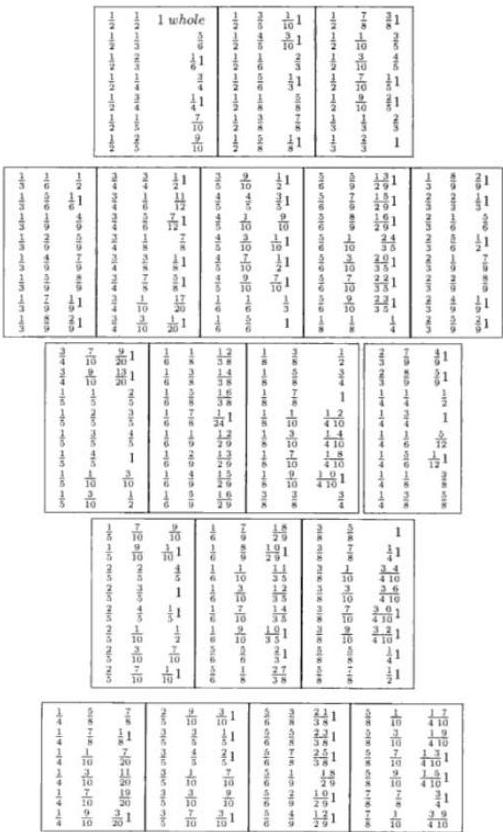

---

II. Liber Abaci

Therefore the rearrangements of the aforewritten fractions are noted, and it is proposed to multiply  $\frac{1}{3}\frac{1}{2}11$  by  $\frac{1}{5}\frac{1}{2}22$ ; then you will multiply  $\frac{5}{6}11$  by  $\frac{7}{10}22$ . And similarly if you wish to multiply  $\frac{5}{6}\frac{3}{4}12$  by  $\frac{1}{9}\frac{2}{3}23$ , you add first the  $\frac{3}{4}$  to the  $\frac{5}{6}$ ; there will be  $\frac{7}{12}1$  which you add to the 12; there will be  $\frac{1}{2}\frac{3}{6}13$ ; similarly you add the  $\frac{2}{3}$  and the  $\frac{1}{9}$ ; there will be  $\frac{7}{9}$ ; therefore you will multiply  $\frac{1}{2}\frac{3}{6}13$  by  $\frac{7}{9}23$  and thus you understand in similar problems.

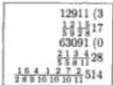

# Here Begins Part Four.

If you wish to multiply 17 and five eighths and one half of one eighth and two ninths and one fifth of one ninth by 28 and four elevenths and three eighths of one XIth, and one fifth and two fifths of one fifth, then you write down the numbers as they are displayed in the margin; and you multiply the 17 by the first part of its fraction, namely the 8, and you add the 5; and you multiply the total by the 2, and you add the 1; there will be 283 that you multiply by the numbers which are under the second fraction, namely by the 9; and this total by the 5; there will be 12735; now you check whether you multiplied correctly by casting out sevens. The residue of the 17, that is 3, you multiply by [p56] the residue of 8, that is 1; and you add the 5 that is over the 8; the residue of it, namely 1, you multiply by the 2, and you add the 1 which is over the 2; there will be 3 that is the residue of 183; you multiply it by the residue of the 9; there will be 6 that you multiply by the 5 that is under the fraction line; there will be 30 which has residue 2, namely the residue of the found number, namely the 12735; next you multiply the 2 that is over the 9 by the 5; and you add the 1 which is over the 5; and by 2; and by the 8 that is under the first fraction line; there will be 176, for which you take the residue thus: you multiply the 2 that is over the 9 by the 5, and you add the 1; there will be 11 which has residue 4; you multiply it by the 2; there will be 8, the residue of which is 1; you multiply it by the residue of the 8; there results 1, and such must be the residue of the 176; and because it is, we know the 176 to be correct; therefore you add it to the 12735; there will be 12911, for which the residue is 3, which results from the addition of the residues of the numbers; you therefore keep it above the 17; you continue in order to multiply the 28 by its parts, and there results 63091; you therefore keep it above the 28, and similarly the residue of it, that is 0; and you multiply the 12911 by the 63091; you divide by all of the numbers which are under the 4 fraction lines, and you rearrange the parts of the fraction; and you will have the sought product, as is shown in the problem; the residue is that which results from the multiplication of the kept residues of them.

Again if you wish to multiply  $\frac{1}{2}\frac{5}{6}\frac{1}{8}\frac{2}{7}\frac{2}{9}\frac{3}{10}19$  by  $\frac{1}{3}\frac{2}{5}\frac{1}{7}\frac{5}{6}\frac{3}{8}\frac{3}{9}23$ , then you multiply the 19 by the parts of its fraction, namely the 10, and you add the 3 that is over the 10; and by the 9, and you add the 2 that is over the 9; and by the 7, and you add the 2 that is over the 7; there will be 12175 that you multiply by the 8, and the 6, and by the 2 that is under the second fraction line; there will be 1168800; the residue of it by casting out elevens is 6; you keep it, and you multiply the 1 which is over the 8 by the 6, and you add the 5 that is over the 6; and by

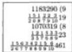

---

6. Here Begins the Sixth Chapter 89

the 2, and you add the 1 which is over the 2; there will be 23 that you multiply by the 7 and by the 9, and by the 10 that is under the first fraction line; there will be 14490; the residue of it by casting out elevens is 3; therefore you add the 14490 to the kept 1168800; there will be 1183290; the residue of it is 9, as is summed from 6 and 3, that are the residues of the said numbers. Therefore you multiply the 118329 by the 1070319 that results from the multiplication of the 23 by the parts in its fractions, and its residue by 11 is 4; and you divide the product by the numbers which are under all four fraction lines; and you wish to cancel the common factors that the product has with the dividing parts; you take $\frac{1}{10}$ of the 1183290; and of the tenth you take a third; there results 39443. Similarly you divide the 1064869 by the 3; there will be 354953 that you will multiply by the 39443, and you divide the product by all the aforesaid parts, deleting from them $\frac{1}{3}\frac{0}{3}\frac{0}{10}$, that is $\frac{1}{9}\frac{0}{10}$; and you will strive to arrange the parts in the abovewritten order, and you will have the sought product, as is shown in the problem. And if you will wish to check it, then you multiply the residue of the 39443 by the residue of the 354953, and you will have the residue of the sought product.

Here Begins Part Five.

If you wish to multiply 21 and $\frac{1}{3}$ and $\frac{1}{4}$ and $\frac{1}{5}$ by 32 and $\frac{3}{7}$ and $\frac{2}{9}$ and $\frac{1}{8}$, then you write down the numbers as are displayed in the margin; and you multiply the 21 by the 3, and you add the 1 which is over the 3; there will be 64 which you multiply by the 4, and by the 5; that are under the fraction line; that is, you multiply the 64 by the 20; there will be 1280 sixtieths; and the 1 which is over the 4, which is one fourth, you multiply by the 5 that is under the third fraction, and by the 3 that is under the first; there will be 15 sixtieths. Also the 1 which is over the 5, which is one fifth, you multiply by the 4 that is under the second fraction, and by the 3 that is under the first; there will be 12 sixtieths; you therefore add the 1280 and the 15 and 12 sixtieths; there will be 1307 sixtieths; and these sixtieths are in $\frac{1}{5}\frac{1}{4}\frac{1}{3}21$; casting out elevens, the residue of it is 9, that will be had when the numbers are multiplied in order. Similarly you make one fraction of $\frac{1}{8}\frac{2}{9}\frac{3}{7}32$; namely you multiply the 32 by the 7, and you add the 3 that is over the 7; and you multiply by the 9, and by the 8; there will be 16844 five hundred fourths. Also the 2 that is over the 9, you multiply by the 8, and by the 7; there will be similarly 112 five hundred fourths. [p57] Also the 1 that is over the 8, you multiply by the 9; there will be 9 seventy seconds which you multiply by the 7; there will be 63 five hundred fourths which are added to the 112 five hundred fourths, and to the 16344; there will be 16519 five hundred fourths, for which, casting out elevens, the residue is 8; next you multiply the 1307 by the 16519, and you divide the product by sixty times five hundred fourths, that is by all the numbers which are under the six fraction lines, namely with $\frac{1}{3}\frac{0}{4}\frac{0}{5}\frac{0}{7}\frac{0}{8}\frac{0}{9}$, and you rearrange them, namely of $\frac{1}{6}$ you make $\frac{1}{2}\frac{0}{10}$, and of $\frac{1}{23}$ you make 6, and thus you will have $\frac{1}{6}\frac{0}{7}\frac{0}{8}\frac{0}{9}\frac{0}{10}$ for the rearranged fraction; and the product of the sought multiplication is $\frac{5}{6}\frac{3}{7}\frac{7}{8}\frac{5}{9}\frac{9}{10}713$, as is shown in the problem. And

|  1307  |
| --- |
|  $\frac{1}{5}\frac{1}{4}\frac{1}{3}$21 (9  |
|  16519  |
|  $\frac{1}{8}\frac{2}{9}\frac{3}{7}$32 (8  |
|  $\frac{5}{6}\frac{3}{7}\frac{7}{8}\frac{5}{9}\frac{9}{10}$713  |

---

II. Liber Abaci

remember that in similar problems, you never put under the fraction beside each other numbers which have common factors; and if some were proposed to you, you add them; namely you redirect them to one fraction if you will be able, or to two, by the doctrine you learned above, and to those that are in the above tables; but in order to see this better, I shall propose certain rearrangements of the fractions; and if you wish to rearrange $\frac{1}{6}\frac{1}{4}\frac{1}{3}$, of $\frac{1}{6}\frac{1}{3}$ you make half, and of $\frac{1}{4}\frac{1}{2}$ you make $\frac{3}{4}$; and for $\frac{1}{6}\frac{1}{4}\frac{1}{3}$ you have $\frac{3}{4}$. Similarly you will have $\frac{2}{4}$ for $\frac{1}{10}\frac{1}{6}\frac{2}{5}$, since $\frac{1}{10}\frac{2}{5}$ is half and $\frac{1}{6}\frac{1}{2}$ will be $\frac{2}{3}$. Again for $\frac{1}{8}\frac{1}{4}\frac{1}{2}$ you will have $\frac{7}{8}$, and thus for $\frac{1}{9}\frac{1}{6}\frac{1}{2}$ is had $\frac{7}{9}$, and for the $\frac{1}{8}\frac{1}{5}\frac{1}{4}$ is had $\frac{3}{8}\frac{1}{5}$, and so is had $\frac{1}{10}\frac{4}{9}$ for $\frac{1}{10}\frac{1}{9}\frac{1}{8}$, and you will have $\frac{2}{3}\frac{1}{6}$ for $\frac{1}{8}\frac{1}{6}\frac{1}{4}$, and for $\frac{3}{8}\frac{1}{6}$ is had $\frac{13}{24}$, that is $\frac{1}{3}\frac{4}{8}$; and again if you wish to rearrange $\frac{1}{9}\frac{1}{8}\frac{1}{6}$, you add $\frac{1}{6}$ to the $\frac{1}{9}$ first, there will be $\frac{5}{18}$; next you add $\frac{5}{18}\frac{1}{8}$, namely you multiply half of the 8 by the 18, or half of the 18 by the 8, or you take half of the product of the 8 and the 18; and whichever way there results 72; and you save it under a fraction line for the denominator; next in order to have the numerator number, you multiply the 1 which is over the 8 by half of the 18, and the 5 that is over the 18 by half of the 8; there result 9 and 20, that is 29 for the numerator number; therefore you put it over the 72, and you will have $\frac{29}{72}$ for the $\frac{1}{9}\frac{1}{8}\frac{1}{6}$; or I find the denominator in another way which many call columns; and it is the smallest number divided integrally by the 6 and the 8 and the 9, namely 72; you take of it $\frac{1}{6}$ and $\frac{1}{8}$ and $\frac{1}{9}$; the quotients are 12 and 9 and 8, and there is 29 for the numerator. And if you wish to separate $\frac{29}{72}$ into parts with factors of 72, then you divide the 29 using the rule for the 72; the quotient will be $\frac{5}{8}\frac{3}{9}$, which fraction you have in place of the $\frac{1}{9}\frac{1}{8}\frac{1}{6}$.

Also if you wish to rearrange $\frac{1}{10}\frac{1}{8}\frac{1}{6}$, then you find the least common multiple of the 6 and the 8 and the 10, that is the smallest number which is integrally divided by all of them; and it will be 120; you put it under a fraction line, and you take $\frac{1}{10}$ and $\frac{1}{8}$ and $\frac{1}{6}$ of 120; there will be 20 and 15 and 12 that you add together; there will be 47 that you put over the fraction line thus, $\frac{47}{120}$; and if you look to separate it into parts by factors of 120, you divide the 47 using the rule for 120; the quotient will be $\frac{1}{2}\frac{5}{6}\frac{3}{10}$, which fraction you will have for $\frac{1}{10}\frac{1}{8}\frac{1}{6}$. You take care therefore to commit all of this to memory, and thus we return to the subject.

## On the Multiplication of Integers with Three Fractions with Two Parts.

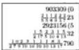

If you wish to multiply 23 and two sevenths and two thirds of one seventh, and two ninths and one eighth of one ninth, and one fifth and two fifths of one fifth, by 32 and five thirteenths and one fourth of one thirteenth, and three tenths and two fifths of one Xth, and five seventeenths and one half of one XVIIth, then you put the numbers as are displayed in the margin; and you multiply the 23 by the first part of its first fraction, namely by the 7, and you add the 2; and you multiply by the 3, and you add the 2 that is over the 3; there will be 491 that you multiply by the 9; and you multiply by the 8; and you multiply by the

---

6. Here Begins the Sixth Chapter 91

5, and by the 5 that are under the remaining two fraction lines; there will be 883800 of which the residue by casting out elevens is 5. Also you multiply the 2 that is over the 9 by the 8 that is under the same fraction line; and you add the 1 which is over the 8; there will be 17 that you multiply by the 5; and by the 5 that is under the third fraction; there will be 425; and by the 3 and by the 7 that is under the first fraction; there will be 8925 of which the residue is 4; after this you multiply the 1 which is over the 5, by the 5 that is under the other, and you add the 2; there will be 7 that you multiply [p58] by the 8; and you multiply by the 9, and by the 7; and by the 7 that is under the second and third fraction lines; there will be 10585, of which the residue is 2; you add the first three found residues, the 7 and the 4 and the 2; there will be 11, of which the residue is namely 0; you keep it, and afterwards you add the three found numbers; there will be 903309, of which the residue is 0, which you kept, which residue you look for in the aforesaid number thus; the 90 is divided first, namely the number of the two last figures, by 11; there remains 2 which is coupled with the three that is in the fourth place; this makes 23 which is divided by 11; there remains 1 which coupled with the 3 in the third place makes 13 which is divided by 11; there remains 2 which is coupled with the 0 of the second place; there will be 20 which is divided by 11; there remains 9 which coupled with the 9 of the first place makes 99 which is divided by 11; there remains 0, as there should; and this is the method of searching out the check by numbers; you therefore keep the 903309 and its residue above the 23; next you multiply the 32 by the parts under its accompanying fractions in the order that you multiplied the 23 by its accompanying parts; there results 2923156; you keep it with its residue that will be 5 above the 32; and you multiply the 903309 by the 2923156, and you divide by all of the numbers which are under the fraction lines; but first because of the cancellation that can be done, you divide the 903309 by 3; there results 301103, and you divide the 2923156 by 4; there results 730789 that you multiply by the 301103; and you delete from the division the 3 that is under the first fraction of the upper number, and the 4 that is under the first fraction of the lower number, and the rest of the numbers you arrange under one fraction line; the arrangement is $\frac{1}{2} \frac{0}{7} \frac{0}{9} \frac{0}{10} \frac{0}{10} \frac{0}{10} \frac{0}{10} \frac{0}{13} \frac{0}{17}$, and thus you will have the sought product, as is shown in the problem. And because you had this product from the division of a number produced from the multiplication of 301103 by 730789, you must have the residue of the product from the multiplication of the residue of the 301103, that is 0, by the residue of 730789, that is 4; therefore the residue of the above written product is 0 because the multiplication of the 0 by the 4 makes 0.

## On the Same with Three Parts under Each Fraction.

Also if you will wish to put three parts under each fraction line, then such is the multiplication of $\frac{1}{3} \frac{2}{5} \frac{1}{5} \frac{1}{2} \frac{2}{9} \frac{3}{10} \frac{1}{10} \frac{1}{2} \frac{1}{7} \frac{6}{17}$ 11 by $\frac{2}{3} \frac{5}{6} \frac{1}{7} \frac{1}{5} \frac{1}{7} \frac{2}{9} \frac{2}{8} \frac{1}{10} \frac{3}{10} \frac{3}{22}$; you write down the problem; you will multiply the 11 by the first of its fraction parts; there will be 2705 that you multiply by all the numbers which are under the other two fraction lines; there will be 36517500 that you keep; and you multiply the

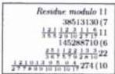

---

92 II. Liber Abaci

3 that is over the 10 of the second fraction by the 9 and you add the 2; and you multiply by the 2, and you add the 1; there will be 59 that you multiply by the numbers which are under the other two fractions, namely under the third and under the first; there will be 1053150 that you keep; next you take the numbers of the third fraction, namely you multiply the 1 which is over the 5 by the other 5 that is after it; and you add the 2; and you multiply by the 3, and you add the 1; there will be 22 that you multiply by all the numbers which are under the other two fraction lines, namely under the second, and under the first; there will be 942480; you therefore add the 942480 to the 1053150; there will be 38513130 that you put over the 11 and its fractions; next you multiply the 22 by the parts of its fractions in the same way that you multiplied the 11 by its parts; there will be 145288710 that you put above the 22 and its fractions; and you multiply the 38513130 by the 145288710; and you divide by all the parts which are under all the fraction lines; and you will have the product of the sought multiplication. However if you will wish to cancel those factors that can be cancelled, you divide the 38513130 by the 10 that is under the second fraction of the lower number; because you can divide integrally the quotient will be 3851313; and you divide by the 3 that is under the third fraction of the upper number; the quotient will be 1283771 that you will keep because it cannot be divided by any number showing under another of the six written fractions; and the others you divide by neither the 3 nor the 10 in the way you divided before; next one divides the 145288710 by the 10 that is in the first fraction line of the lower number; and by the 7 and 9 that are under the second fraction; because they can be divided integrally into the numerator the quotient will be 230617 that you multiply [p59] by the 1283771; there will be 296059416707 that you divide by all the other numbers which are under the written fraction, namely with $\frac{10000000000000}{2235566778917}$ which you arrange according to the given method of arrangement; for the sought multiplication the product will be $\frac{1210139504}{27789910101017}$ 274.

Here Ends the Fifth Part of the Sixth Chapter, and Begins the Sixth on the Multiplication of Fractions without Integers.

If you will wish to multiply $\frac{1}{3}$ by $\frac{1}{4}$, then you multiply the 1 which is over the 3 by the 1 which is over the 4; there will 1 which you divide by the 3 and the 4 that are under the fraction lines, that is with $\frac{10}{34}$, or $\frac{10}{26}$; the quotient will be $\frac{10}{34}$, or $\frac{10}{26}$, that is one twelfth, or one of XII parts of the unity; whence you are able to know how much it is when you multiplied $\frac{1}{3}$ by $\frac{1}{4}$; thus you know how much it is if you take $\frac{10}{34}$ or $\frac{10}{43}$; and this same thing you see from all the parts, because always the multiplication of any parts by any parts makes how much is taken by one of them of the other; because as 1 is multiplied by $\frac{1}{4}$, then $\frac{1}{3}$ is taken; therefore as one third by one fourth is multiplied, then one third of one fourth is taken; and thus from the multiplication of one third by one fourth results one XIIth.

---

6. Here Begins the Sixth Chapter 93

## On the Same.

Also if you will wish to multiply $\frac{2}{3}$ by $\frac{3}{4}$, then you multiply the 2 that is over the 3 by the 3 that is over the 4; there will be 6 that you divide by the 3 and the 4 that are under the fraction lines; the product will be $\frac{1}{2}$ of the unity.

## On the Same.

Also if you will wish to multiply $\frac{3}{7}$ by $\frac{4}{9}$, then you multiply the 3 by the 4 which are over the fraction lines; there will be 12 that you divide by the 7 and the 9 that are under the fraction lines; the product will be $\frac{5}{7}$ of the unity, that is XII sixty-thirds of the unity, that is four 21sts of the unity. And this you find in two ways. Indeed the first way you divide the 12 and the 63 by the 3, because this division of each of them is integrally taken; the quotients are 4 and 21; whence if you will divide the 4 by the 21, then the quotient will be $\frac{4}{21}$ of unity. Or in another way you had to divide 12 with $\frac{1}{7}$, you divide first the 12 by the 3; the quotient will be 4; similarly you divide the 9 by the 3; the quotient will be 3; and still you divide the 4 by the 7; the quotient will be $\frac{1}{3}$ that is one seventh of unity and in addition one third of one seventh, which is as much as four twenty-firsts.

## On the Same with Two Parts under a Fraction.

If you will wish to multiply $\frac{1}{2}$ by $\frac{2}{7}$, then you write down the problem as is shown here; and you will multiply the 4 that is over the 7 of the upper fraction by the 2 that is under the same fraction, and you add the 1 which is over the 2; there will be 9 that you write above the $\frac{1}{2}$; similarly you multiply the 3 that is over the 5 of the lower fraction by the 3 that is under the same fraction; and you add the 2 that is over the same 3; there will be 11 that you write above the $\frac{2}{5}$; and you will multiply the 9 by the 11; there will be 99 that you divide by the 2, and by the 7, and by the 3, and by the 5 that are under the fraction lines; the product will be $\frac{5}{7}$ of the unity.

## On the Same with Three Parts under One Fraction.

Also if you will wish to multiply one fraction with three parts under its line by another fraction with three parts under its line, we say $\frac{1}{2}$ by $\frac{1}{3}$; then you write down the problem, and you will multiply the 3 which is over the 11 by the other parts under its fraction, that is by the 8, and you add the 5, and by the 2, and you add the 1; there will be 59 that you write above the $\frac{1}{2}$; next you multiply the 7 that is over the 13 by the parts of its fraction, that is by the 9, and you add the 4, and by the 3, and you add the 1; there will be 202 that you write above the $\frac{1}{3}$; and you multiply the 59 by the 202, and you divide by all the numbers which are under each fraction, of which an arrangement is $\frac{1}{6}$; the product will be $\frac{2}{6}$; p60]

|  9  |
| --- |
|  $\frac{1}{2}$  |
|  $\frac{1}{2}$  |
|  11  |
|  $\frac{1}{2}$  |
|  $\frac{5}{7}$  |
|  $\frac{5}{7}$  |
|  59 (3)  |
| --- |
|  $\frac{1}{2}$  |
|  $\frac{1}{2}$  |
|  202 (6)  |
|  $\frac{1}{3}$  |
|  $\frac{1}{3}$  |
|  $\frac{1}{3}$  |

---

94 II. Liber Abaci

## On the Same with Two Fractions.

|  11 | (1)  |
| --- | --- |
|  $\frac{1}{3}$ |   |
|  23 | (2)  |
|  $\frac{1}{6}$ |   |
|  $\frac{10}{19}$ |   |
|  $\frac{100}{1000}$ |   |

If you will wish to multiply $\frac{1}{4}$ $\frac{2}{3}$ by $\frac{1}{6}$ $\frac{3}{5}$, then you write down the problem as is shown here; and you multiply the 2 that is over the 3 by the 4 that is under the second fraction; there will be 8. Also you multiply the 1 which is over the same 4 by the 3 that is under the first fraction; there will be 3 that you add to the 8; there will be 11 that you write above the $\frac{1}{4}$ $\frac{2}{3}$; next you come to $\frac{1}{6}$ $\frac{3}{5}$; and you multiply the 3 that is over the 5 by the 6, and the 1 which is over the 6 by the 5, and you add them together; there will be 23 that you write above the $\frac{1}{6}$ $\frac{3}{5}$; and you multiply the 11 by the 23; there will be 253 that you divide by all the numbers which are under the fractions.

## On the Same with Two Parts under Each.

And if you will wish to put two parts under each fraction, as with $\frac{1}{4}$ $\frac{3}{8}$ $\frac{1}{2}$ $\frac{4}{7}$ and $\frac{1}{2}$ $\frac{6}{11}$ $\frac{1}{3}$ $\frac{5}{9}$, then you write down the problem; and you multiply the 4 that is over the 7 by the parts of its fraction, that is by the 2, and you add the 1; there will be 9 that you multiply by the 8 and the 4 that are under the second fraction side by side; there will be 288 that you keep; and you multiply the 3 that is over the 8 by the parts of its fraction, namely by the 4, and you add the 1; there will be 13 that you multiply by the 2 and the 7 that are under the first fraction; there will be 182 that you add with the 288; there will be 470 that you write above the upper fractions; and similarly you multiply in the same way the two lower fractions, and you will have from this multiplication 1407 that you write above its fractions; and you multiply the 470 by the 1407, and you divide by all the numbers which are under the fractions; and you will have the sought multiplication; however if you wish to cancel where you can, namely you divide the 1407 by the 7; the quotient is 201 that you divide by the 3; the quotient is 67 that you multiply by the 470; there will be 31490 that you divide by all the numbers which are beneath the fractions, excepting the 7 and 3, by which you divided the 1407. And you will arrange the given parts under a fraction line; the product will be $\frac{1}{6}$ $\frac{0}{8}$ $\frac{0}{9}$ $\frac{1}{11}$; for this indeed is the way you can multiply if three or more parts are put under the fraction lines.

|  Residue | 47 (3)  |
| --- | --- |
|  modula | $\frac{1}{5}$ $\frac{1}{13}$  |
|  11 | 119 (6)  |
|   | $\frac{1}{7}$ $\frac{1}{6}$ $\frac{2}{5}$  |
|   | $\frac{1}{2}$ $\frac{5}{7}$ $\frac{5}{10}$  |

## On Three Fractions.

If you wish to multiply $\frac{1}{5}$ $\frac{1}{4}$ $\frac{1}{3}$ by $\frac{1}{7}$ $\frac{1}{6}$ $\frac{2}{5}$, then you write down the problem and you begin to multiply the upper fractions, namely the $\frac{1}{5}$ $\frac{1}{4}$ $\frac{1}{3}$ with themselves thus: you will multiply the 1 which is over the 3 by the 4 that is under the second fraction, and by the 5 that is under the third; there will be 20; and you will multiply the 1 which is over the 4 of the second fraction by the 5 that is under the third, and by the 3 that is under the first; there will be 15; and you will multiply the 1 which is over the 5 of the third fraction by the 4 that is under the second, and by the 3 that is under the first; there will be 12 that you add to the kept 15 and kept 20; there will be 47 that you write over the $\frac{1}{5}$ $\frac{1}{4}$ $\frac{1}{3}$ in the problem; after this you do similarly with the $\frac{1}{7}$ $\frac{1}{6}$ $\frac{2}{5}$, and you will have 149 for

---

6. Here Begins the Sixth Chapter 95

the sum of them which you write above the $\frac{1}{7} \frac{1}{6} \frac{2}{5}$; and you will multiply the 47 by the 149; there will be 7003 that you divide by all the parts; and you arrange them; the product will be $\frac{1}{2} \frac{1}{7} \frac{5}{9} \frac{5}{10} \frac{5}{10}$.

## On the Same with Two Parts under Each.

Also if you will wish to put two parts under each fraction, as $\frac{3}{4} \frac{2}{9} \frac{2}{3} \frac{3}{10} \frac{1}{2} \frac{6}{11}$ by $\frac{4}{5} \frac{1}{8} \frac{1}{3} \frac{3}{7} \frac{1}{2} \frac{7}{13}$, then you write down the problem, and you multiply the first of the upper three fractions among itself, which is the 6 that is over the 11, by the 2, and you add the 1; there will be 13 that you multiply by the 10 and the 3 that are under the second; and all by the 9 and the 4 that are under the third; there will be 14040 that you keep; and you multiply the 3 that is over the 10 of the second fraction by the 3 that is under the fraction after it; and you add the 2 that is over the same 3; there will 11 that you multiply by the 9 and the 4 that are under the third fraction, and by the 2 and the 11 that are under the first; there will be 8712 that you keep; and you multiply the 2 that is over the 9 of the third fraction by the 4, and you add [p61] the 3; there will be 11 that you multiply by the 3, and by the 10 that is under the second fraction, and by the 2 and the 11 that are under the first; there will be 260 that you add with the 8712, and to the kept 14040; there will be 30012 that you write above in the problem. Next you multiply the lower three fractions by themselves, and there will be for their sum 27914 that you write over the fractions; and you multiply the 30012 by the 27914, and you divide the product of the multiplication by all the parts which are under the fractions; and you will have the sought multiplication. Or if you will wish thence to cancel, you do so according to that we showed above, and you will have $\frac{2}{3} \frac{1}{7} \frac{4}{8} \frac{2}{9} \frac{6}{10} \frac{8}{10} \frac{10}{11} \frac{7}{13}1$ for the sought multiplication. If three parts are truly put under each fraction line, or if more fractions are similarly put with the integers, or following the integers, then you will be able subtly to work everything by mastery of the above.

## Here Begins the Seventh Part on the Multiplication of Numbers and Fractions Which Terminate in a Circle.

If you wish to multiply 11 and four ninths, and five eighths of four ninths, and two thirds of five eighths of four ninths, that is written thus, $\frac{2}{3} \frac{5}{8} \frac{4}{9} \alpha 11$, by 22 and six sevenths of eight ninths of nine tenths, that is written thus, $\alpha \frac{6}{7} \frac{8}{9} \frac{9}{10} 22$, then you write down the problem, and you multiply the 11 by its fraction, and the multiplication is thus: the 11 is multiplied by the 9, and the 4 is added, and this is 103 ninths which is multiplied by the 8, and there are 824 seventy-seconds, to which is added the product of the 5 by the 4 that is over the fraction; there will be 844 seventy seconds; because the 4 that is over the 9 is multiplied by the 8 there results a number for which the ratio of the sought number is to the product of the 9 by the 8, as the ratio of 4 to 9. Therefore 32 is $\frac{4}{9}$ of the 72. Also the ratio of the product of the 5 by the 4, namely 20, to the sought number is as the product of the 8 by the 4, namely 32, is to the ratio of the 5 to the 8. Therefore the 20 that is produced from the product of the 5 by

|  2572 | (9)  |
| --- | --- |
|  $\frac{2}{3} \frac{5}{8} \frac{4}{9} \alpha 11$ |   |
|  14292 | (3)  |
|  $\alpha \frac{6}{7} \frac{8}{9} \frac{9}{10} 22$ |   |
|  $\frac{1}{3} \frac{0}{5} \frac{1}{7} \frac{1}{9} 270$ |   |

---

II. Liber Abaci

the 4 is five eighths of four ninths of 72, and thus is 20 seventy-seconds; next the 844 is multiplied by the 3, and to it is added the 40 that results from the multiplication of the 2 by the 5, and the 4 that is over the fraction; there will be 2572 two hundred sixteenths; you keep it above the 11 with its residue that is taken in order, namely the residue 11 is multiplied by the residue 9, and then the 4 is added; the residue is multiplied by the 8, and the product of the 5 by the 4 is added; the residue of the sum is multiplied by the 3, and the product of the 2 by the 5 is added, and multiplied by the 4; the residue of the result is the residue of the 2572 by casting out elevens, and is 9; next you multiply the 22 by its fractions, which is done thus: the 22 is multiplied by the 10, and the product is multiplied by the 9, and by the 7; the quotient is 13860 six hundred thirtieths to which you add the product of the 6 by the 8, and by the 9 that is over the fraction, namely 432; there will be 14292 six hundred thirtieths; you write it above the 22 with its residue that is 3; and you multiply the 2572 by the 14292, and you divide the product by all of its parts which are under both fractions; however you will cancel that which can be cancelled, and you will have the product of the given multiplication  $\frac{1}{5} \frac{0}{7} \frac{1}{9} 270$ .

And if you look to separate again  $\frac{687}{910}$  into parts of unity, then I shall doubly demonstrate how to do it; you multiply first the 9 by the 8, and by the 3; there will be 216, of which you make columns; and you take  $\frac{4}{6}$  of it; there will be 96, of which you take  $\frac{5}{8}$ ; there will be 60, of which you take  $\frac{2}{3}$ ; there will be 40; you therefore add the 96, 60, and 40; there will be 196 that you divide by the 216; the quotient will be  $\frac{49}{54}$  that is  $\frac{18}{69}$ ; or otherwise you multiply the 4 that is over the 9 by the 8, and you add the product of the 5 by the 4; there will be 52 that you multiply by the 3, and you add the multiplication of the 2 by the 5, and by the 4, namely 40; there will be similarly 196 divided by 8, 3, and 27 that are under the fraction; the quotient similarly will be  $\frac{18}{69}$ . [p62] Also if you wish to separate  $\frac{687}{910}$  into parts of unity, then you multiply the 6 by the 8, and by the 9, namely those that are over the fraction; and you will cancel those which you can cancel; the quotient will be  $\frac{24}{35}$  that is  $\frac{44}{57}$ . And if you wish to multiply  $\frac{254}{389}$  by  $\frac{687}{910}$ , then you write them down as is displayed in the margin, and you multiply the found 196, namely the number of the upper fraction, by the 432, namely by the number of the lower; and you divide the product by all the numbers which are under both; and you cancel; the product will be  $\frac{35}{59}$ .

If you wish to multiply 11 and seven tenths, and four ninthsof seven tenths, and three eighths of four ninths of seven tenths, plus five elevenths, and five sixths of five XIths, and three fourths of five sixths of five XIths by 22 and three eighths of four ninths of seven tenths, plus three fourths of five sixths of five elevenths, then you write this down as it is displayed in the margin; and you multiply the 11 by the 10, and you add the 7; and you multiply by the 9, and you add four sevens; and you multiply by the 8, and you add three fours times 7; there will be 8732, and you multiply by the 11, and you multiply by the 6, and you multiply by the 4 that is under the other fraction; there will be 2305248. And you multiply the 5 that is over the 11 by the 6, and you add 5 fives; and you multiply by the 4, and you add three times 5 fives, namely the multiplication of the numbers which are over the fractions; there will be 295

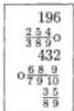

---

6. Here Begins the Sixth Chapter 97

that you multiply by the numbers which are under the first fraction, namely by the 8, and by the 9, and by the 10; there will be 212400 that you add to the other found number; there will be 2517648 that you write above the 11; the residue, casting out sevens, is 0; and you multiply the 22 by its fractions, namely by the 10, and by the 9, and by the 8, and you add the multiplication of the 3 by the 4 by the 7, namely 84; there will be 15924 that you multiply by the 11, and by the 6, and by the 4; there will be 4203936. And to this you add the multiplication of the numerator of the second fraction by the numbers which are under the first fraction, namely the 75 by the 8, and by the 9, and by the 10. And 75 results from the multiplication of three times 5, and by the 5 that is over the fraction; there will be 54000 that you add to the 4203936; there will be 4257936 that you keep above the 22; the residue is 4; next you multiply the number put above the 11 by the number put above the 22, and you divide the product by all the numbers which are under the fractions, and you make the cancellations; and you will have the sought product as is shown in the problem.

Check with 7
2517648 (0
$\frac{355}{4611}$ 0  $\frac{347}{8910}$  11
4257936 (4
$\frac{355}{4611}$  0  $\frac{347}{8910}$  22
$\frac{555}{68910}$  0  $\frac{087}{1011}$  11 (0

Here Begins the Seventh Part of the Sixth Chapter on the Multiplication of Parts of Numbers with Fractions.

If you will wish to multiply  $\frac{3}{5}$  of  $\frac{4}{7}29$ , that is written  $\frac{4}{7}29\frac{3}{5}$ , by  $\frac{6}{11}$  of  $\frac{2}{3}38$ , that is written thus,  $\frac{2}{3}38\frac{6}{11}$ , then you write down the problem as is shown here. And you multiply the 29 by its fraction that is after it, namely by the 7, and you add the 4; there will be 207 that you multiply by the 3 that is over the other fraction that is before it, namely over the 5; there will be 621 that you write above the  $\frac{4}{7}29\frac{3}{5}$ ; similarly you multiply the 38 by its fraction that is after it, namely by the 3, and you add the 2; there will be 116 that you multiply by the 16 that is over the 11; there will be 696 that you write above the  $\frac{2}{3}38\frac{6}{11}$ . And you multiply the 621 by one third of 696, and you divide by all the rest of the parts of both sides, namely with  $\frac{10}{5711}$ ; and you will have  $\frac{22}{5711}374$  for the product of the sought multiplication.

621
$\frac{4}{7}29\frac{3}{5}$
696
$\frac{2}{3}38\frac{6}{11}$
$\frac{222}{5711}374$

On the Same.

Also if  $\frac{1}{5}\frac{3}{4}$  of  $\frac{2}{7}\frac{5}{9}33$ , that is written thus,  $\frac{2}{7}\frac{5}{9}33\frac{1}{5}\frac{3}{4}$ , you will wish to multiply by  $\frac{1}{4}\frac{3}{7}$  of  $\frac{1}{11}\frac{5}{6}244\frac{1}{4}\frac{3}{7}$ , then you write them down as they are displayed in the margin; and you multiply the 33 by its fraction that is after it, namely by the 9, and you add the 5; and multiply by the 7, and you add the 2; there will be 2116; next you multiply the 3 that is over the 4 by the 5 and the 1 which is over the 5, by the 4; there will be 19 which is the number of the two fractions that are before the 33; and [p63] by the 19 you multiply the 2116; there will be 40204 that you write above the  $\frac{2}{7}\frac{5}{9}33\frac{1}{5}\frac{3}{4}$ ; you take the residue, casting out thirteen, in the order that we multiplied, which is 8; and you write the 8 above the 40204 in the problem. Also you multiply the 244 by its fractions that are after it, namely by the 6, and you add the 5, and by the 11, and you add the

40204 (8
$\frac{25}{79}33\frac{13}{54}$
21045 (0
$\frac{1}{116}244\frac{13}{47}$
$\frac{260144}{3778911}3628(0$

---

II. Liber Abaci

multiplication of the 1 which is over the 11 by the 6; there will be 16165 that you multiply by the number of the fraction that is before the 244, namely by the 13 that arises from the multiplication of the 3 that is over the 7 by the 4; added to it is the 1 which is over the 4; there will be 210145 that you write above the 244 and its fractions. And above it you write 0 which is the residue of it by 13; and you multiply the 40304 by the 210145, and you divide the product of the multiplication by all the parts which are under all the fractions. And thus you will have the sought multiplication. But if the cancellation method is used in this multiplication, then you divide the 40204 by the 4 that is under one of the given fractions; the quotient is 10051 that you keep, as there can be cancelled nothing further from it. Also you divide the 210145 by the 5 that is under the other fraction; the quotient is 42029, by which you multiply 10051; and you divide by all the other parts; the quotient will be  $\frac{260144}{3778911}3628$ .

# On the Same with Many Parts.

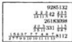

Also if you will wish to multiply  $\frac{235}{789}$  of  $\frac{223}{1311542}$  by  $\frac{115}{987}$  of  $\frac{203}{3511}331$ , then you write down the problem, and you begin to multiply the 42 by its fraction that is after it; there will be 30644; and you take  $\frac{235}{789}$ , and you find the numerator of the fraction; namely you multiply the 5 that is over the 9 by the 8, and you add the 3; and you multiply by the 7, and you add the 2; there will be 303, by which you multiply 30644; there will be 9285132; next you find the numerator of the lower fraction; you will multiply the 331 by its fraction that is after it, namely by the 11, and you add the 3 that is over the 11; and you multiply by the 5, and by the 3 which is under the same fraction, and to it you add the 2 that is over the 3; there will be 54662; and you find the numerator of  $\frac{115}{987}$  which is 479, by which you multiply the 54662; there will be 26183098 that you write over the 351 and its fractions; and you multiply the 9285132 by the 26183098; and you divide by all the parts which are under all the fractions, and you cancel thence those that can be cancelled; and you will have  $\frac{156377487}{27799101011113}8112$  for the sought multiplication, as is shown.

---

# Chapter 7

## Here Begins the Seventh Chapter on the Addition and Subtraction and Division Of Numbers with Fractions and the Reduction of Several Parts to a Single Part.

We therefore separate the seventh chapter into six parts.

In the first part we shall demonstrate the addition of one fraction with another, and also the subtraction of one fraction from another, and the division of one fraction by another.

In the second, the addition and subtraction of two fractions from two, and the division of one by the other.

In the third, the division of integral numbers by integers and fractions, and vice versa.

In the fourth, the addition and subtraction and division of integral numbers with fractions by integers with fractions.

In the fifth, however, we teach the addition, subtraction, and division of parts of numbers with fractions.

In the last we also show the reduction of several parts to a single part.

---

100 II. Liber Abaci

### On the Addition of $\frac{1}{3}$ and $\frac{1}{4}$.

If you will wish to add $\frac{1}{3}$ and $\frac{1}{4}$, then we teach you to do this in two ways, first indeed according to the common way. You find a number for which $\frac{1}{3}$ and $\frac{1}{4}$ of it are integers; the number is found thus: you multiply the 3 by the 4 that are under the fractions; there will be 12; $\frac{1}{4}$ and $\frac{1}{3}$ of it are found; and then you take a third of it that is 4, and a fourth of it that is 3, and you add them together; there will be 7 that you divide by the 12; the quotient will be $\frac{7}{12}$, that is seven of twelve parts of the unity. [p64]

Also you otherwise write down $\frac{1}{4}\frac{1}{3}$ in this way; and you multiply the 1 which is over the 3 by the 4; there will be 4 that you write above the $\frac{1}{3}$; and the 1 which is over the 4, you multiply by the 3; there will be 3 that you write above the $\frac{1}{4}$, and you add them together; there will be 7 that you divide by the 3 and the 4 that are under the fractions, that is by 12; the quotient similarly will be $\frac{7}{12}$ for the addition; and you know this is to add $\frac{1}{3}$ and $\frac{1}{4}$, which is $\frac{1}{4}\frac{1}{3}$, that are parts of the unity; they are indeed $\frac{7}{12}$ of the unity; and thus you understand for the addition of all fractions.

### On the Subtraction of $\frac{1}{4}$ from $\frac{1}{3}$.

And if you will wish to subtract $\frac{1}{4}$ from $\frac{1}{3}$, then the 3 that is written above the $\frac{1}{4}$ that is a quarter of 12, you subtract from the 4 that is written above the $\frac{1}{3}$ that is a third of 12; there will remain 1 which you divide by the found 12, or by the 3 and the 4 that are under the fractions; the difference for the said subtraction will be $\frac{1}{12}$, that is $\frac{1}{2}\frac{0}{6}$. And if you will wish to divide $\frac{1}{3}$ by $\frac{1}{4}$, then you divide by the 3 the 4 that is above the $\frac{1}{3}$, and you will have $\frac{1}{3}1$ for the fraction and integer. The ratio of $\frac{1}{3}$ to $\frac{1}{4}$ for example, is as the ratio of twelvefold $\frac{1}{3}$ to twelvefold $\frac{1}{4}$, that is as 4 is to 3, so is $\frac{1}{3}$ to $\frac{1}{4}$. Therefore the division of $\frac{1}{3}$ by $\frac{1}{4}$ results in the same which results from the division of 4 by 3; or in another way, as is said, if you divide $\frac{1}{3}$ by $\frac{1}{4}$, then it is understood to be four of three parts of the unity. Therefore quadruple the parts, namely quadruple one third, happens to be four thirds, namely $\frac{1}{3}1$, as I said before. And if you wish to divide $\frac{1}{4}$ by $\frac{1}{3}$, and you know how much happens to be one part of unity, then you divide the 3 put above the $\frac{1}{4}$, by the 4 put above the $\frac{1}{3}$; the quotient is $\frac{3}{4}$, as the ratio of $\frac{1}{4}$ to $\frac{1}{3}$ is as the ratio of 3 to 4, or as three times $\frac{1}{4}$ is to three times $\frac{1}{3}$, namely it happens to be $\frac{3}{4}$ of unity.

Also if you will wish to add $\frac{2}{3}$ and $\frac{4}{5}$, then you similarly find of what number a $\frac{4}{5}$ part and a $\frac{2}{3}$ part are integral, thus: you will multiply the 3 by the 5 that are under the fractions; there will be 15, and by this number is found $\frac{4}{5}\frac{2}{3}$; therefore you take $\frac{2}{3}$ of 15 that is 10, and $\frac{4}{5}$ of 15 that is 12, and you add them together; there will be 22 that you divide by the 15; the quotient will be $\frac{7}{15}1$ for the addition of $\frac{2}{3}$ and $\frac{4}{5}$.

Also you write the $\frac{4}{5}\frac{2}{3}$ in another way, as is shown in the margin, and you multiply the 2 that is over the 3 by the 5; there will be 10 that you write above the $\frac{2}{3}$, and you multiply the 4 that is over the 5 by the 3; there will be 12 that you write over the $\frac{4}{5}$ in the problem. You therefore add the 10 to the 12; there

|  12 | 10  |
| --- | --- |
|  $\frac{4}{5}$ | $\frac{2}{3}$  |
|  $\frac{1}{3}\frac{2}{5}1$ |   |

---

7. Here Begins the Seventh Chapter 101

will be 22 as above; and you divide by the parts which are under the fractions, namely with $\frac{1}{3}\frac{9}{5}$; the quotient will be $\frac{1}{3}\frac{2}{5}1$, as is shown in the problem, that is $\frac{7}{15}1$; and it is found in another way.

Truly if you will wish to subtract $\frac{2}{3}$ from $\frac{4}{5}$, then you find 10 and 12 as found above by either you wish of the two described ways; and you subtract the 10 from the 12; there remains 2 that you divide by the parts, namely with $\frac{1}{3}\frac{9}{5}$; the quotient will be $\frac{2}{3}\frac{9}{5}$ that is $\frac{2}{15}$ for the difference of the sought subtraction. And if you wish to divide $\frac{4}{5}$ by $\frac{2}{3}$, then you divide the 12 by the 10; the quotient will be $\frac{1}{5}1$, and the quotient from this division happens to be one and a fraction. And if you wish to divide $\frac{2}{3}$ by $\frac{4}{5}$, then you divide the 10 by the 12; the quotient will be $\frac{5}{6}$.

## The Addition of $\frac{5}{6}$ and $\frac{7}{10}$.

Also if you will wish to add $\frac{5}{6}$ and $\frac{7}{10}$, then you seek similarly a number for which $\frac{5}{6}$ and $\frac{7}{10}$ of it will be integers; you will therefore multiply the 6 by the 10; there will be 60; however there is found a smaller number than 60. And this happens because the 6 and the 10 have a common factor, namely with $\frac{1}{2}$, because both of the numbers are divided integrally by 2. Whence you divide the 60 by the 2; the quotient is 30, of which still is found $\frac{5}{6}$ and $\frac{7}{10}$; you can indeed find this 30 in another way, namely you multiply the 6 by half the 10, namely by 5, and there will be 30; or you multiply the 10 by half the 6, that is by 3, and there similarly will be 30; and you take $\frac{5}{6}$ of the 30 that is 25, and you add $\frac{7}{10}$ of the 30, that is 21; there will be 46 that you divide by the 30; the quotient is $\frac{16}{30}1$, that is $\frac{8}{15}1$. [p65]

## On the Same in Another Way.

Also in another way you write thus, $\frac{7}{10}\frac{5}{6}$; and because the 6 and the 10 that are under the fractions have a common factor, namely 2, you divide the 10 by the 2; the quotient is 5, by which you multiply the 5 that is over the 6; there will be 25, as was found above for $\frac{5}{6}$ of 30. Also you divide the 6 by the 2; the quotient will be 3 that you put under the 6 which you multiply by the 7 that is over the 10; the quotient will be 21 for $\frac{7}{10}$ of 30; you therefore add the 21 and the 25; there will be 46 that you divide by half the 10, and by the 6, that is with $\frac{1}{5}\frac{9}{6}$, or by half the 6 and by the 10, that is with $\frac{1}{3}\frac{9}{10}$; the quotient is $\frac{1}{3}\frac{5}{10}$ which is equal to $\frac{16}{30}1$, or $\frac{8}{15}1$.

## The Subtraction of $\frac{7}{10}$ from $\frac{5}{6}$.

Truly if you will wish to subtract $\frac{7}{10}$ from $\frac{5}{6}$, then you find 21 and 25, and you subtract the 21 from the 25; there remains 4 that you divide by the 30, or by its factors, that is with $\frac{1}{3}\frac{9}{10}$; the quotient is $\frac{1}{3}\frac{1}{10}$ for the difference of the subtraction. And if you wish to divide $\frac{5}{6}$ by $\frac{7}{10}$, then you divide the 25 by the 21; the quotient will be $\frac{1}{3}\frac{1}{7}1$. And if you wish to divide $\frac{7}{10}$ by $\frac{5}{6}$, then you divide the 21 by the 25; the quotient will be $\frac{1}{4}\frac{4}{5}$.

---

II. Liber Abaci

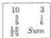

The Addition of  $\frac{1}{6}$  and  $\frac{5}{9}$ .

Again if you will wish to add  $\frac{1}{6}$  and  $\frac{5}{9}$ , then you find a number of which you can take integrally  $\frac{1}{6}$  and  $\frac{5}{9}$ , which thus is found; because 3 is a common factor of the 6 and the 9, you divide the 6 by the 3; the quotient will be 2 that you multiply by the 9; there will be similarly 18, of which is found  $\frac{5}{9}$  and  $\frac{1}{6}$ ; whence you take  $\frac{1}{6}$  of the 18 that is 3, and you add it to  $\frac{5}{9}$  of the 18 that is 10; there will be 13 which you divide by the factors of 18; the quotient will be  $\frac{1}{2} \frac{6}{9}$ ; or you write the parts in another way, as is shown here; and you multiply the 1 which is over the 6, by a third of the 9, because of their common factor; there will be 3 that you write above the  $\frac{1}{6}$ ; and you multiply the 5 that is over the 9, by a third of the 6, namely by 2; there will be 10 that you write above the  $\frac{5}{9}$ ; and you add the 3 and the 10; there will be 13 that you divide by a third of the product of the 6 and the 9, that is by 18; the quotient will be  $\frac{1}{2} \frac{6}{9}$  for the addition of them, as is shown in the problem.

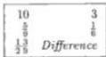

The Subtraction of  $\frac{1}{6}$  from  $\frac{5}{9}$ .

Truly if you will wish to subtract  $\frac{1}{6}$  from  $\frac{5}{9}$ , then you find the written 3 and 10, and you subtract the 3 from the 10; there will result 7 that according to the aforewritten rule you divide by 18, or with the rule that is  $\frac{1}{2} \frac{6}{9}$ , the quotient will be  $\frac{1}{2} \frac{3}{9}$  for the difference of the said subtraction. And if you wish to divide  $\frac{5}{9}$  by  $\frac{1}{6}$ , then you divide the 10 by the 3 that is written above the  $\frac{1}{6}$ ; the quotient will be  $\frac{1}{3} 3$ . And if you wish to divide  $\frac{1}{6}$  by  $\frac{5}{9}$ , then you divide the 3 by the 10; the quotient will be  $\frac{3}{10}$ .

# The Second Part on the Addition and Subtraction of Two Fractions Added Together and Their Division.

If you will wish to add  $\frac{1}{4}\frac{1}{3}$  and  $\frac{1}{7}\frac{1}{5}$ , then you see in what number  $\frac{1}{7}, \frac{1}{5}, \frac{1}{4}, \frac{1}{3}$ , have integral parts, which is seen thus; you multiply together all the numbers which are under the fractions, namely the 3 by the 4, and by the 5, and by the 7; there will be 420 that is the least common multiple of the stated numbers, that is, which is the smallest number in which the parts are found as factors; it is the product because they have no factors in common in their composition rules. Therefore you take  $\frac{1}{3}$  of the 420 that is 140, and you add it to a quarter of the 420 that is 105, and to a fifth that is 84, and to a seventh that is 60; there will be 389 which you divide by the 420; the quotient is  $\frac{389}{420}$  for the addition of the aforenamed fractions. And it is the same finding the number of which  $\frac{1}{7}, \frac{1}{5}, \frac{1}{4}, \frac{1}{3}$ , are integers. We could indeed add the numbers  $\frac{1}{4}\frac{1}{3}$  and  $\frac{1}{7}\frac{1}{5}$  according to the technique, namely that in which the fractions are written as displayed here; and you multiply the 1 which is over the 3 by the 4, and the 1 which is over the 4 by the 3; there will be 7 that you multiply by the 5, and by the 7, that are under the other two fractions on the other side; there will be 245 that is  $\frac{1}{4}\frac{1}{3}$  of the 420, as we found above; you therefore write the 245 above the  $\frac{1}{4}\frac{1}{3}$  in the problem; [p66] next you take the  $\frac{1}{7}\frac{1}{5}$ , and you multiply the 1 which is over the

---

7. Here Begins the Seventh Chapter 103

5 by the 7, and the 1 which is over the 7 by the 5; there will be 12 that you multiply by the 3 and the 4 that are under the fractions; there will be 144 that is $\frac{1}{7} \frac{1}{5}$ of the 420; you therefore write the 144 above the $\frac{1}{7} \frac{1}{5}$, and you add the 144 to the 245; there will be 389 that you divide by the parts, namely with $\frac{1}{3} \frac{0}{4} \frac{0}{5} \frac{0}{7}$; and you arrange the stated parts; the quotient will be $\frac{5}{6} \frac{1}{7} \frac{9}{10}$, that is $\frac{389}{420}$.

**The Subtraction of $\frac{1}{7} \frac{1}{5}$ from $\frac{1}{4} \frac{1}{3}$.**

Truly if you wish to subtract $\frac{1}{7} \frac{1}{5}$ from $\frac{1}{4} \frac{1}{3}$, then you find the aforementioned 245 and 144 by whichever you wish of the two equivalent described methods, and you subtract the 144 from the 245; there will remain 101 that, following the abovewritten rule, you divide with $\frac{1}{6} \frac{0}{7} \frac{0}{10}$; the quotient will be $\frac{5}{6} \frac{2}{7} \frac{2}{10}$ for the difference of the said subtraction. However if you will wish to divide the $\frac{1}{4} \frac{1}{3}$ by the $\frac{1}{7} \frac{1}{5}$, then you divide the 245 with the rule for the 144; $\frac{1}{2} \frac{2}{8} \frac{6}{9} 1$ will be the quotient. And if you divide the 144 for the rule for 245, then you will have $\frac{4}{5} \frac{0}{7} \frac{5}{7}$ for that which occurs from the division of $\frac{1}{7} \frac{1}{5}$ by $\frac{1}{4} \frac{1}{3}$, as is shown in the problem.

**The Addition of $\frac{2}{7} \frac{3}{5}$ and $\frac{2}{9} \frac{3}{8}$.**

Also if you will wish to add $\frac{2}{7} \frac{3}{5}$ and $\frac{2}{9} \frac{3}{8}$, then you find the number in which are found the factors of the denominators, and it will be 2520 which is the product of the four numbers which are under the fractions, and are not found in a smaller number, those four not having any common factors; and you take $\frac{2}{3}$ of the 2520 that is 1512, and you add it to $\frac{2}{7}$ of the 2520 that is 720; there will be 2232 that you keep. You take the $\frac{2}{9} \frac{3}{8}$ of the 2520 also, that is 1505, that you add to the kept 2232; there will be 3737 that you divide with the rule for the 2520 that is $\frac{1}{4} \frac{0}{7} \frac{0}{9} \frac{0}{10}$; the quotient is $\frac{1}{4} \frac{3}{7} \frac{7}{9} \frac{4}{10} 1$. Also you write the fractions in another way, as is displayed; and you begin with $\frac{2}{7} \frac{3}{5}$ thus: you will multiply the 3 that is over the 5 by the 7 that is under the fraction; there will be 21. Also you will multiply the 2 that is over the 7 by the 5; there will be 10 that you add to the 21; there will be 31 that you will multiply by the other parts, namely by the 8 and by the 9, that is by 72; the product will be 2232, and by $\frac{2}{7} \frac{3}{5}$ of the 2520 found above; you write therefore the 2232 above the $\frac{2}{7} \frac{3}{5}$, and you take $\frac{2}{9} \frac{3}{8}$ of it; and you multiply the 3 that is over the 8 by the 9, and the 2 that is over the 9 by the 8, and you add them together; there will be 43 that you multiply by the other parts, namely by the 5, and by the 7; there will be 1505, as we found above for $\frac{2}{9} \frac{3}{8}$ of the 2520; you write therefore the 1505 above the $\frac{2}{9} \frac{3}{8}$; next you add the 1505 to the 2232; there will be 3737 that you divide by all the numbers which are under the fractions, and you will arrange them; similarly the quotient is $\frac{1}{4} \frac{3}{7} \frac{7}{9} \frac{4}{10} 1$.

**The Subtraction of $\frac{2}{9} \frac{3}{8}$ from $\frac{2}{7} \frac{3}{5}$.**

However if you will wish to subtract $\frac{2}{9} \frac{3}{8}$ from $\frac{2}{7} \frac{3}{5}$, then you find the aforewritten 2232 and 1505, and you subtract the 1505 from the 2232; there will remain 727 that you divide with the aforewritten rule $\frac{1}{4} \frac{0}{7} \frac{0}{9} \frac{0}{10}$; the quotient will be $\frac{3}{4} \frac{6}{7} \frac{7}{9} \frac{2}{10}$;

|  144 | 245  |
| --- | --- |
|  $\frac{1}{7} \frac{1}{5}$ | $\frac{1}{4} \frac{1}{3}$  |
|  $\frac{5}{6} \frac{2}{7} \frac{2}{10}$ | Difference  |
|  1505 | 2232  |
| --- | --- |
|  $\frac{2}{9} \frac{3}{8}$ | $\frac{2}{9} \frac{3}{8}$  |
|  $\frac{1}{4} \frac{3}{7} \frac{7}{9} \frac{4}{10} 1$ | Sum  |
|  2232 | 1505  |
| --- | --- |
|  $\frac{2}{9} \frac{3}{5}$ | $\frac{2}{9} \frac{3}{8}$  |
|  $\frac{3}{4} \frac{6}{7} \frac{7}{9} \frac{2}{10}$ | Difference  |

---

II. Liber Abaci

as it is displayed here in another illustration. And so if you wish to divide  $\frac{2}{7} \frac{3}{5}$  by  $\frac{2}{9} \frac{3}{8}$ , then you divide the 2232 with the rule for 1505, but first you interchange the order; and you will have the order as is displayed in the problem.

# The Addition of  $\frac{1}{4} \frac{1}{3}$  and  $\frac{1}{6} \frac{1}{5}$ .

Also if you will wish to add  $\frac{1}{4} \frac{1}{3}$  and  $\frac{1}{6} \frac{1}{5}$ , then you find the number in which is found the aforewritten parts. And it will be 60, which number is found to be the product of the 3, the 4, and the 5; and it is not necessary to multiply the 60 by 6 because of the common factor that the 6 has with the 3 and the 4; the product has indeed the 3 in common with the 6; therefore it is not necessary to multiply the 60 by either a third of 6, that is 2, or by the 2 because the 2 is in the composition rule of 4, and I said this before, the composition rule for 6 is  $\frac{1}{2} \frac{9}{3}$ . We do not repeat the 3 or the 2 in the multiplication, that is the rule for 6, by reason of the 3 and the 4 that we multiplied the 4 we had with 60. Indeed in every number in which the  $\frac{1}{4} \frac{1}{3}$  is found,  $\frac{1}{6}$  is also found; you therefore take  $\frac{1}{6} \frac{1}{5}$  and [p67]  $\frac{1}{4} \frac{1}{3}$  of the 60, and you add them together; there will be 57 that you divide by the 60; the quotient is  $\frac{57}{60}$ , but because the 57 has with the 60 a common factor, namely 3, we can say  $\frac{57}{60}$  more elegantly, namely you divide the 57 by 3; the quotient is 19; similarly you divide the 60 by the same 3; the quotient is 20, by which you divide the 19; the quotient is  $\frac{19}{20}$ ; that is unity less one twentieth. Also you write the parts in another way as is shown here; and you begin with  $\frac{1}{4} \frac{1}{3}$ , and you will multiply the 1 that is over the 3 by the 4, and the 1 that is over the 4 by the 3; the sum will be 7 that you multiply by the 5 that is under the fraction; there will be 35 that you must multiply by the 6, not ignoring the common factor that the 6 has with the parts of  $\frac{1}{4} \frac{1}{3}$ ; you therefore write the 35 above the  $\frac{1}{4} \frac{1}{3}$ , that is  $\frac{1}{4} \frac{1}{3}$  of the 60; next you multiply the 1 which is over the 5 by the 6, and the 1 which is over the 6 by the 5; the sum will be 11 that you must multiply by the 3 and the 4; but the rest you will not multiply by the 3 because it is in the rule for 6, nor by the 2 that is in the rule for 4, and is similarly in the rule for 6; therefore you will multiply the aforewritten 11 by the 2 that remains of the 4; there will be 22 that is  $\frac{1}{6} \frac{1}{5}$ , and you add the 22 to the 35; the sum will be 57, as we found above; and you divide it with  $\frac{1}{3} \frac{9}{4} \frac{9}{5}$  because you need not divide it by the 6 because we deleted it in the multiplication of both sides; and you will arrange the aforewritten parts; the quotient will be  $\frac{1}{2} \frac{9}{10}$ , that is  $\frac{19}{20}$ , as is shown in the problem.

I shall say it in another way, and clearly so, with the aforewritten 35 and 22. You multiply the 3 and the 4 that are under the fractions of one part; there will be 12; you keep it in the right hand; and you multiply the 5 and the 6 that are under the two fractions on the other side; there will be 30 that you keep in the left; and you divide both of the numbers kept in hand by the greatest common factor of them that is 6; you show the quotient 2 in the right hand, and 5 in the left; you write the 2 below the  $\frac{1}{4}\frac{1}{3}$ , and the 5 below the  $\frac{1}{6}\frac{1}{5}$ , and the 11 by the 2 written below the  $\frac{1}{4}\frac{1}{3}$ ; and you will have 35 and 22, the sum of which, namely 57, you divide by the numbers which are under the fractions of one side, and by the number written below the others, namely by the 5, and by the 6, and by the 2, or by the 3, and by the 4, and by the 5, that is by the rule for 60.

|  22 | 35  |
| --- | --- |
|  1/6 1/5 | 1/4 1/3  |
|  1/9 10 | Sum  |

---

7. Here Begins the Seventh Chapter 105

## The Subtraction of $\frac{1}{6} \frac{1}{5}$ from $\frac{1}{4} \frac{1}{3}$.

However if you will wish to subtract $\frac{1}{6} \frac{1}{5}$ from $\frac{1}{4} \frac{1}{3}$, then you find the aforewritten 35 and 22, and you subtract the 22 from the 35; there will remain 13 that you divide with the abovewritten rule $\frac{1}{6} \frac{0}{10}$; the quotient will be $\frac{1}{6} \frac{2}{10}$ for the difference of the said subtraction.

|  22 | 35  |
| --- | --- |
|  $\frac{1}{6} \frac{1}{5}$ | $\frac{1}{4} \frac{1}{3}$  |
|  $\frac{1}{6} \frac{2}{10}$ | Difference  |

## The Addition of $\frac{1}{7} \frac{2}{3}$ and $\frac{1}{9} \frac{3}{5}$.

Also if you will wish to add $\frac{1}{7} \frac{2}{3}$ and $\frac{1}{9} \frac{3}{5}$, then you find the number in which are found as factors the aforewritten parts; and it will be 315 which number results from the multiplication of the parts, cancelling however the 3 that is a common factor of the 9 and the 3, and it must not be repeated in the multiplication, because $\frac{1}{3}$ and $\frac{1}{9}$ are found in the 9; whence any number which has $\frac{1}{9}$ similarly has $\frac{1}{3}$; you therefore take $\frac{2}{3}$ of the 315 that is 210, and you add to it $\frac{1}{7}$ of the same that is 45; the sum will be 255 that you keep; and you take $\frac{1}{9} \frac{3}{5}$ of the same 315 that is 234, and you add it to the 255; the sum will be 489 that you divide with the rule for 315 that is $\frac{1}{5} \frac{0}{7} \frac{0}{9}$; the quotient will be $\frac{4}{5} \frac{6}{7} \frac{4}{9} 1$.

In another way, according to the art, you write the parts as is shown here, and you begin with $\frac{1}{7} \frac{2}{3}$; you multiply the 2 that is over the 3 by the 7, and the 1 which is over the 7 by the 3, and you add them together; there will be 17 that you multiply by the 5; there will be 85 that you multiply by a third of the 9, that is by 3, because their common factor is the 3 that is under the fraction with the 9; and there will be the multiplication of the 255 that is $\frac{1}{7} \frac{2}{3}$ of 315, as we found above. You therefore write the 255 above the $\frac{1}{7} \frac{2}{3}$, and you consider the $\frac{1}{9} \frac{3}{5}$, multiplying the 3 that is over the 5 by the 9, and the 1 that is over the 9 by the 5; the sum will be 32 that you multiply by the 7; there will be 234, as was found above for $\frac{1}{9} \frac{3}{5}$ of the 315; and the 234 ought not to be multiplied by the 3 that is under the fraction because of the said common factor that the 3 has with the 9; you write therefore the 234 above the $\frac{1}{9} \frac{3}{5}$, [p68] and you add the 234 to the 255; there will be 489 that you divide with the $\frac{1}{5} \frac{0}{7} \frac{0}{9}$ that are under the fractions, and you leave the 3, by which you do not divide because in the multiplication by both parts you did not multiply by the 3; therefore for the sum of the addition of the fractions you need not divide by the 3; but you must divide the 489 by the other parts, those you multiplied; the quotient is $\frac{4}{5} \frac{6}{7} \frac{4}{9} 1$, as above.

## The Subtraction of $\frac{1}{9} \frac{3}{5}$ from $\frac{1}{7} \frac{2}{3}$.

However if you will wish to subtract $\frac{1}{9} \frac{3}{5}$ from $\frac{1}{7} \frac{2}{3}$, then you find the abovewritten 255 and 234; you subtract the 234 from the 255; there will remain 21 that you divide with the abovewritten rule $\frac{1}{5} \frac{0}{7} \frac{0}{9}$; to that end you divide first by the 9, then by the 7, and by the 5; because the 21 is integrally divided by the 7 and the 3 that is in the rule for the 9, the quotient will be $\frac{3}{9} \frac{0}{5}$ for the difference of the stated subtraction, that is $\frac{1}{3} \frac{0}{5}$, however in the division of the one by the other, you do as above.

|  Subtraction | $\frac{1}{9} \frac{3}{5}$ | $\frac{1}{7} \frac{2}{3}$  |
| --- | --- | --- |

---

II. Liber Abaci

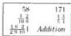

The Addition of  $\frac{1}{5}\frac{3}{4}$  and  $\frac{1}{10}\frac{2}{9}$ .

Again if you will wish to add  $\frac{1}{5}\frac{3}{4}$  and  $\frac{1}{10}\frac{2}{9}$ , then you multiply the numbers which are under the fractions, namely the 4 by the 5; the product will be 20, and you multiply it by the 9; there will be 180, and the 180 ought not be multiplied by the 10, as  $\frac{1}{10}$  is found in 180. Therefore you take  $\frac{1}{5}\frac{3}{4}$  of the 180, namely 171, and you add it to  $\frac{1}{10}\frac{2}{3}$  of 180, namely to 58; there will be 229 that you divide by the 180; the quotient is  $\frac{1}{2}\frac{6}{9}\frac{2}{10}1$ .

In another way you write down the fractions, and you multiply the 3 that is under the 4 by the 5, and the 1 which is over the 5 by the 4; the sum will be 19 that you multiply by the 9; there will be 171 that you leave off multiplying by the 10 because it is a factor of the 5 times the 4; you write therefore the 171 above the  $\frac{1}{5}\frac{3}{4}$  because 171 is  $\frac{1}{5}\frac{3}{4}$  of the 180; next you multiply the 2 that is over the 9 by the 10, and the 1 which is over the 10 by the 9; the sum is 19 that you multiply by the 2, and you leave off the common factor that the 10 has with the 4 times 5; there will be 58 that is  $\frac{1}{10}\frac{2}{9}$  of the 180; therefore you add the 58 to the 171; there will be 229 that you divide by the parts which are under one side, and by the parts under the other side which are multiplied in the multiplication, that is either by the 4 and the 5 that are on one side, or by the 9 that is in the other side, by which we multiply the 19 above; or you divide by the 9 and the 10 that are on the other side, and by the 2 that we choose from the first side in the multiplication by which we multiplied the 29; and  $\frac{1}{4}\frac{0}{5}\frac{0}{9}$  or  $\frac{1}{2}\frac{0}{9}\frac{0}{10}$ , one or the other of the fractions is a rule for the 180; and the quotient again is  $\frac{1}{2}\frac{6}{9}\frac{2}{10}1$ .

And if you will wish to subtract  $\frac{1}{10}\frac{2}{9}$  from  $\frac{1}{5}\frac{3}{4}$ , then you find the abovewritten 171 and 58, and you subtract the 58 from the 171; there will remain 113 that you divide with the abovewritten rule  $\frac{1}{2}\frac{0}{9}\frac{0}{10}$ ; the quotient will be  $\frac{1}{2}\frac{2}{9}\frac{6}{10}$  for the difference of the cited subtraction. And if you wish to divide one by the other, you do as above. I wish to show a method for finding the least common multiple of any given numbers; if you wish to find the number in which are found the factors  $\frac{1}{10}\frac{1}{9}\frac{1}{8}\frac{1}{7}\frac{1}{6}\frac{1}{5}\frac{1}{4}\frac{1}{3}\frac{1}{2}$ , then you multiply the largest number which is under the fractions by the next, namely the 10 by the 9; there is no common factor and the product is 90. And you multiply by that which the 8 has not in common with the 9 and the 10, namely by half of it, as their common factor is two; there will be 360 that you multiply by the 7, as no factor is in common between them; there will be 2520 that ought not be multiplied by the 6, as its rule is  $\frac{1}{2}\frac{0}{3}$ , of which the parts are already factors of the 2520, the product of the multiplications. Because  $\frac{1}{2}$  is in the rule for 10, which rule is  $\frac{1}{2}\frac{0}{5}$ ; and  $\frac{1}{3}$  is in the rule for 9, neither is the 2520 multiplied by the 5, as the 5 is in the rule for 10, or by the 4, or by the 2 is it multiplied, as they are in the rule for the 8. Similarly neither ought the 2520 be multiplied by the 3, as it is in the rule for the 9; therefore in the 2520 are found all the above-cited parts; and it is the least so of all the numbers which are multiples of all the numbers under the given fractions. [p69]

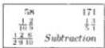

---

7. Here Begins the Seventh Chapter 107

# Here Begins Part Three on the Division of Integral Numbers by Integers with Added Fractions, and the Converse.

When you will wish to divide some integral number with one or several fractions, or conversely an integral number with fractions by another integral number, then you make a fraction of each number and the fraction, or those fractions, which were put with one number; next you divide the sum of the fractions of the number by the sum of the fractions of the other, and you will have the division you wish. And to see this better, we shall look to demonstrate several divisions of numbers in that which follows.

## The Division of 83 by $\frac{2}{3}5$.

If you will wish to divide 83 by $\frac{2}{3}5$, then you make thirds of one of the numbers thus: you will multiply the 5 by the 3 that is under the fraction, and you add the 2; there will be 17 thirds; and you multiply the 83 by the 3, as you make thirds out of it; there will be 249 thirds; you therefore divide the 249 by the 17; the quotient will be $\frac{11}{17}14$ for the sought division. From this it is therefore clear how the division of 83 by $\frac{2}{3}5$ is the same as that of 249 by 17; and this is what the most illustrious geometer Euclid declares in his book: whatever ratio has one number to another, the same ratio have identical multiples to each other; and you multiply therefore both the 83 and the $\frac{2}{3}5$ by three; therefore 249 to 17 will be in the same ratio; indeed the 17 is triple the $\frac{2}{3}5$, and the 249 is triple the 83. And if conversely you will wish to divide the $\frac{2}{3}5$ by the 83, then you divide the 17 with the rule for the 249, that is $\frac{1}{3}\frac{0}{83}$; the quotient will be $\frac{2}{3}\frac{5}{83}$ for the sought division.

## The Division of 94 by $\frac{2}{5}6$.

Also if you will wish to divide 94 by $\frac{2}{5}6$, and if you will wish to deal with the prescribed material according to this artful technique, then you will write down the numbers as is shown here, and you multiply the 6 by its fractions, that is by the 5, and you add the 2; there will be 32 fifths which you write above the $\frac{2}{5}6$; and you multiply the 94 by the same 5; there will be 470 fifths that you write above the 94; and you divide the 470 by the rule for 32, that is $\frac{1}{4}\frac{0}{8}$; the quotient will be $\frac{1}{2}\frac{5}{8}14$ for the sought division. And if you will divide the 32 with the rule for the 470, then you will have $\frac{2}{10}\frac{3}{47}$ for the division of the $\frac{2}{5}6$ by the 94, as is shown above in the illustration. Truly if you will wish to divide 113 by $\frac{1}{2}\frac{3}{8}11$, as is displayed here, then you write down the numbers; for that which is written, you multiply the 11 by its fractions; there will be 183 sixteenths that you write above the $\frac{1}{2}\frac{3}{8}11$; next you multiply the 113 by the 8, and by the 2 that are under the fraction, that is by 16; there will be likewise 1808 sixteenths which you write above the 113; you divide therefore the 1808 by the rule for the 183; the quotient will be $\frac{2}{3}\frac{53}{61}9$ for the sought division; and if you will wish to divide the 183 with the rule for the 1808, then you will have $\frac{1}{2}\frac{3}{8}\frac{11}{113}$ for the

|  Division of the Greater by the Lesser  |   |
| --- | --- |
|  17 | 249  |
|  $\frac{2}{3}5$ | 83  |
|  $\frac{11}{17}14$ |   |
|  Division of the Lesser by the Greater.  |   |
| --- | --- |
|  17 | 249  |
|  $\frac{2}{3}5$ | 83  |
|  $\frac{2}{3}\frac{5}{83}$ |   |
|  Division of the Greater by the Lesser  |   |
| --- | --- |
|  32 | 470  |
|  $\frac{2}{5}6$ | 94  |
|  $\frac{2}{10}\frac{3}{47}$ |   |
|  Division of the Lesser by the Greater  |   |
| --- | --- |
|  32 | 470  |
|  $\frac{2}{5}6$ | 94  |
|  $\frac{2}{10}\frac{3}{47}$ |   |
|  1808 | 183  |
| --- | --- |
|  113 | $\frac{1}{2}\frac{3}{8}11$  |
|  $\frac{2}{3}\frac{53}{61}9$ |   |

---

108 II. Liber Abaci

division of the $\frac{1}{2}$ $\frac{3}{8}$ 11 by the 113. Moreover if several parts were put under the same fraction line, you can operate similarly.

## The Division of 217 by $\frac{1}{4}$ $\frac{2}{3}$ 13.

|  167 | 2604  |
| --- | --- |
|  $\frac{1}{4}$ $\frac{2}{3}$ 13 | 217  |
|  $\frac{99}{167}$ 15 |   |
|  167 | 2604  |
| --- | --- |
|  $\frac{1}{4}$ $\frac{2}{3}$ 13 | 217  |
|  $\frac{1}{2}$ $\frac{5}{6}$ 7 31 |   |

If you will wish to divide 217 by $\frac{1}{4}$ $\frac{2}{3}$ 13, then you write down the numbers, and you multiply the 13 by its fractions; there will be 167 twelfths which you write above the $\frac{1}{4}$ $\frac{2}{3}$ 13; next you multiply the 217 by the numbers which are under the fractions, namely by the 3 and by the 4, or in one multiplication by 12; there will be similarly 2604 XIIths which you write above the 217; and you divide the 2604 by the 167; the quotient will be $\frac{99}{167}$ 15 for the sought division. And if you will wish to divide the 167 with the rule for 2604; the quotient will be $\frac{1}{2}$ $\frac{5}{6}$ $\frac{6}{7}$ 1 for the division of the $\frac{1}{4}$ $\frac{2}{3}$ 13 by the 217, as is shown above in the same illustration.

## The Division of 323 by $\frac{1}{9}$ $\frac{5}{6}$ 14.

|  269 | 5814  |
| --- | --- |
|  $\frac{1}{9}$ $\frac{5}{6}$ 14 | 323  |
|  $\frac{165}{269}$ 21 | Division of the Greater  |
|  $\frac{1}{2}$ $\frac{8}{17}$ $\frac{11}{19}$ | Division of the Lesser  |

Also if you will wish to divide 323 by $\frac{1}{9}$ $\frac{5}{6}$ 14, or any numbers, then you can do this division according to the [p70] demonstrated way; however we show how the cancellation of common factors must be made; first you write down the problem; next you multiply the 14 by its fractions, cancelling in this way; you will multiply the 14 by the 6, and you add the 5; there will be 89 sixths which you multiply by a third of the 9 because of the common factor that the 6 has with the 9. The 3 is indeed in both rules for them; there will be 267 eighteenths; to this you add the multiplication of the 1 which is over the 9 by a third of the 6 that is under the fraction, that is by 2; there will be 269 eighteenths; or in another way you add the $\frac{5}{6}$ to the $\frac{1}{9}$; there will be $\frac{17}{18}$; therefore you multiply the number 14 by the 18, and you add the 17; there will be similarly 269 eighteenths which you write above the $\frac{1}{9}$ $\frac{5}{6}$ 14; and you multiply the 323 either by the 6 and by a third of the 9, or by 9 and by a third of the 6 because of the common factor in their rules; therefore you will multiply again the 323 by the 18; there will be 5814 eighteenths that you write above the 323; next you divide the 5814 by the 269; the quotient will be $\frac{165}{269}$ 21 for the sought division. If you will divide the 269 with the rule for the 5814, then you will find $\frac{1}{2}$ $\frac{8}{17}$ $\frac{14}{19}$ 0 for the division of the $\frac{1}{9}$ $\frac{5}{6}$ 14 by the 323, as is shown above in the illustration.

## The Division of 1357 by $\frac{1}{5}$ $\frac{1}{4}$ $\frac{1}{3}$ 83.

However if you will wish to divide 1357 by $\frac{1}{5}$ $\frac{1}{4}$ $\frac{1}{3}$ 83, then you write down the numbers, and you multiply the 83 by its fractions; there will be 5027; you therefore write the 5027 above the $\frac{1}{5}$ $\frac{1}{4}$ $\frac{1}{3}$ 83, and you check it according to that which we shall show you in the multiplication by its parts. The residue of it by casting out sevens is indeed 1, as it ought to be; that residue you write above the 5027; next you multiply the 1357 by the numbers which are under the fractions after the 83, that is by the 3, and by the 4, and by the 5, or in one multiplication by 60; there will be 81420 sixtieths which you write over the 1357. And above them you write the residue of it by seven, that is 3; next you divide the 81420 with the rule for the 5027, that is $\frac{1}{11}$ $\frac{0}{457}$; the quotient for the sought division

---

7. Here Begins the Seventh Chapter 109

will be $\frac{9}{11} \frac{89}{457} 16$; therefore if you will multiply it by the $\frac{1}{5} \frac{1}{4} \frac{1}{3} 83$, then the same 1357 will result; and the residue by casting out sevens of the dividend is 3, as it is the residue of the 81420; and if you will divide the 5027 with the rule for the 81420, then you will have $\frac{5}{6} \frac{7}{10} \frac{14}{23} \frac{3}{59}$ for the division of $\frac{1}{5} \frac{1}{4} \frac{1}{3} 83$ by 1357; the residue by 7 of the dividend is 1, as it is of 5027; and thus you understand the residues of any similar divisions.

## The Division of 2456 by $\frac{1}{10} \frac{2}{9} \frac{5}{6} 15$.

Also we propose another of these ways of division with three fractions which have common factors in their rules; and in order that you understand better the method of cancellation we indeed propose to you that when you divide 2456 by $\frac{1}{10} \frac{2}{9} \frac{5}{6} 15$ you write down the problem, and you multiply the 15 by its fractions, cancelling thus: you will multiply the 15 by the 6, and you add the 5; there will be 95 sixths which you multiply by a third of the 9 that is under the fraction; because of the common factor that the 9 has with the 6, one need not multiply by the total; there will be therefore 285 eighteenths which you multiply by the 5 that is half of the 10 because of the 2 that is both in the rule of 20 and the rule of 6; there will be 1425 ninetieths. Also you multiply the 2 that is over the 9, that is nine, by the 10; there will be 20 ninetieths, which one need not multiply by the 6, because the total 6 is contained in the rules for the 9 and the 10. For the rule for 6 is $\frac{1}{2} \frac{0}{3}$ and the end $\frac{1}{2}$ in the rule is in the rule for the 10, that is $\frac{1}{2} \frac{0}{5}$. [p71] And the $\frac{1}{3}$ that remains in the 6 is in the rule for the 9, which is $\frac{1}{3}$ next you multiply the 1 which is over the 10 by the 9; there will be 9 ninetieths which you need not multiply by the 6 because of the aforesaid commonality. You add therefore the found 9 ninetieths to the 20 ninetieths, and to the 1425 ninetieths; there will be 1454 ninetieths, of which the residue by seven is 5; you write therefore the 1454 above the 15 and its fractions, and you write above that the 5 for the residue. You can indeed make ninetieths of $\frac{1}{10} \frac{2}{9} \frac{5}{6} 15$ in another way; however first it is noted why ninetieths must be made. They must indeed be made because the parts of $\frac{1}{10} \frac{2}{9} \frac{5}{6}$ are integrally found in 90, and it is the smallest number in which all of these fractions are found; therefore you multiply the 15 by the 90; there will be 1350 ninetieths to which you add $\frac{1}{10} \frac{2}{9} \frac{5}{6}$ of the 90, that is 104 ninetieths; there will be similarly 1454 ninetieths; after this you make ninetieths of the 2456; there will be 221040 ninetieths which you write over the 2456, and you divide the 221040 with the rule for 1454; the quotient will be $\frac{0}{2} \frac{16}{727} 152$ for the sought division. And if you will divide the 1454 with the rule for 221040, then you will have the division of the $\frac{1}{10} \frac{2}{9} \frac{5}{6} 15$ by the 2456. And the quotient is $\frac{6}{8} \frac{1}{9} \frac{0}{10} \frac{2}{307}$, as is shown in the problem above.

|  1454 | 221040  |
| --- | --- |
|  $\frac{1}{10} \frac{2}{9} \frac{5}{6} 15$ | 2456  |
|  $\frac{6}{8} \frac{1}{9} \frac{0}{10} \frac{2}{307}$ |   |

## Here Begins the Fourth Part on the Addition, Subtraction and Division of Integral Numbers with Fractions.

When you wish to add to some number with one fraction or several, any number similarly with one fraction or several, or when you will wish to subtract

---

110 II. Liber Abaci

the lesser of them with its fraction or fractions from the greater with its fraction or fractions, or to divide one of them by the other, then you write the lesser number with its fraction or fractions on the right part of the table, truly the greater with its fraction in the same line towards the left, as we demonstrated in the preceding parts; and you multiply the smaller number by the parts of its fractions, as we taught above; and you multiply the sum by all the numbers which are under the fraction or fractions of the greater number. And the total product that results you keep above the abovewritten lesser number. Next you multiply the greater number by the parts of its fraction or fractions, and by all the numbers which are under the fraction or fractions of the lesser number. And you write the total product above the greater number. And then if you will wish to add, you add together the found numbers, and you divide by the assembled product of all the parts which are in position, and you will have the sum of them. And if you will wish to subtract the lesser from the greater, then you subtract the found number written above the lesser number from the found number written above the greater, and you divide similarly the difference by all the parts, and you will have the difference which is between the greater and the lesser. And if you wish to divide the greater by the lesser, then you divide the greater found number by the lesser found number. And if you will wish to divide the lesser by the greater, then you divide the lesser found number by the greater found number; and thus you will have what you wished, their division. And as this is all clearly understood, we propose immediately to demonstrate it individually with posed numbers.

**The Addition of $\frac{1}{3}12$ and $\frac{3}{4}126$.**

|  1521 | 148  |
| --- | --- |
|  $\frac{3}{4}126$ | $\frac{1}{3}12$  |
|  Sum of the add. | $\frac{1}{12}139$  |
|  1521 | 148  |
| --- | --- |
|  $\frac{3}{4}126$ | $\frac{1}{3}12$  |
|  The difference of the subtraction | $\frac{5}{12}114$  |

If you will wish to add $\frac{1}{3}12$ and $\frac{3}{4}126$, then you write down the numbers as is shown here, and you multiply the 12 by the parts of its fraction; there will be 37 thirds, which you multiply by the 4 that is under the fraction after the 126; there will be 148 XIIths which you write above the $\frac{1}{3}12$; next you multiply the 126 by the parts of its fraction; there will be 507 quarters which you multiply by the 3 that is under the fraction after the 12; there will be 1521 twelfths which you write above the $\frac{3}{4}126$; you add therefore the 148 twelfths with the 1521 twelfths; there will be 1669 twelfths which you divide by each part, namely by the 3 and by the 4, or with one division by 12; the quotient will be $\frac{1}{12}139$, as is shown in the problem.

**On the Same.**

You can find indeed this same addition in another way when you add the integer and the integer, namely the 12 and the 126; there will be 138; next you add the fractions together, namely the $\frac{1}{3}$ and the $\frac{3}{4}$, as we demonstrated above in the first part of this chapter; there will be $\frac{1}{12}1$ that you add to the 138; there will be $\frac{1}{12}139$, as we already found in the addition written above. [p72]

---

7. Here Begins the Seventh Chapter 111

## The Subtraction of $\frac{1}{3}12$ from $\frac{3}{4}126$.

Truly if you will wish to subtract $\frac{1}{3}12$ from $\frac{3}{4}126$, then you write the problem as above, and you find the aforewritten 148 and 1521; and you subtract the 148 from the 1521; there will remain 1373 which you divide with the abovestated rule for 12; the quotient yields the total $\frac{5}{12}114$ for the difference of the said subtraction, as is shown in the problem.

Or otherwise you subtract the integer from the integer, namely the 12 from the 126; there remains 114; next you subtract the $\frac{1}{3}$ from the $\frac{3}{4}$; there remains $\frac{5}{12}$ which you add to the 114; there similarly will be $\frac{5}{12}114$. And if you will wish to divide the $\frac{3}{4}126$ by the $\frac{1}{3}12$, then first you divide the 1521 with the rule for the 148 that is $\frac{1}{4}\frac{0}{37}$; the quotient will be $\frac{1}{4}\frac{10}{37}10$ for the sought division, as is demonstrated in the description.

Also if you will wish to divide the lesser by the greater, namely the $\frac{1}{3}12$ by the $\frac{3}{4}126$, then you indeed find the 148 and the 1521; you divide the 148 with the rule for the 1521 that is $\frac{1}{9}\frac{0}{13}\frac{0}{13}$; the quotient is the fraction $\frac{4}{9}\frac{3}{13}\frac{1}{13}$ for the sought division.

|  1521 | 148  |
| --- | --- |
|  $\frac{3}{4}126$ | $\frac{1}{3}12$  |
|  Illustration of the division of the greater by the lesser | $\frac{1}{4}\frac{10}{37}10$  |
|  1521 | 148  |
| --- | --- |
|  $\frac{3}{4}126$ | $\frac{1}{3}12$  |
|  Division of the lesser by the greater. | $\frac{1}{9}\frac{3}{13}\frac{1}{13}$  |

## The Addition of $\frac{3}{4}13$ and $\frac{2}{5}171$.

Truly if you will wish to add $\frac{3}{4}13$ and $\frac{2}{5}171$, then you write down the numbers as we said, and you multiply the 13 by the 4, and you add the 3 that is over the 4; there will be 55 quarters which you multiply by the 5 that is under the fraction after the 171; there will be 275 twentieths which you write above the $\frac{3}{4}13$; and you multiply the 171 by the parts of its fraction, namely by the 5, and you add the 2; there will be 857 fifths which you multiply by the 4 that is under the fraction after the 13; there will be 3428 twentieths which you write above the $\frac{2}{5}171$; next you add the 275 with the 3428; there will be 3703 which you divide by the parts, namely by the 4 and the 5 which are under the fractions of both numbers; the quotient will be $\frac{1}{2}\frac{1}{10}185$ for the sought addition.

|  3428 | 275  |
| --- | --- |
|  $\frac{2}{5}171$ | $\frac{3}{13}$  |
|  Illustration of the addition. | $\frac{1}{4}\frac{1}{10}185$  |

## The Checking of the Previous Addition.

And if the addition is correct, then it will be known so by casting out sevens; the residue of 13, that is 6, you multiply by the 4, and to the product you add the 3 that is over the 4; there will be 27 of which the residue, that is 6, you again multiply by the 5 that is under the fraction; there will be 30 of which the residue, that is 2, is the residue of the 275. You similarly strive to find the residue of the 3428 through its origins thus. The residue by seven of the 171, that is 3, you multiply by the 5 that is under the fraction, and you add the 2 that is over the 5; there will be 17 of which the residue, that is 3, you multiply by the 4 that is under the fraction; there will be 12 of which the residue, that is 5, must be the residue of the 3428; and because we know the process correct, as we have the 3428 which is correct, the residue of it you write above the 3428; next you add the residue of the 275, namely 2, with the residue of the 3428, namely 5; there will be 7 of which the residue, that is 0, you have for the residue of the addition.

---

II. Liber Abaci

# On the Same Addition.

You can indeed find the aforewritten addition in another way, namely when you add the 13 to the 271; there will be 284; and you add the $\frac{3}{4}$ to the $\frac{2}{5}$; there will be $\frac{1}{2} \frac{1}{10} 1$ that you add to the 184; there will be $\frac{1}{2} \frac{1}{10} 185$ which is found for the addition.

## The Subtraction of $\frac{3}{4}13$ from $\frac{2}{5}171$.

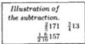

And if you will wish to subtract $\frac{3}{4}13$ from $\frac{2}{5}171$, then you subtract the 275 from the 3428; there remains 3153 that you divide by the parts; the quotient will be $\frac{1}{2} \frac{6}{10}157$ for the difference of the sought subtraction. Whether this difference is correct will be known by casting out sevens; you subtract the residue of the 275 that is 2 from the residue of the 3428 that is 5; the difference which is 3 you truly have for the residue of $\frac{1}{2} \frac{6}{10}157$. We can indeed subtract the $\frac{3}{4}13$ from the $\frac{2}{5}171$ in another way, namely when you subtract the $\frac{3}{4}$ and the 13 from the 171, there remains $\frac{1}{4}157$ to which you add $\frac{2}{5}$; there will be $\frac{1}{4} \frac{2}{5}157$ that is $\frac{1}{2} \frac{6}{10}157$.

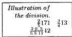

## The Division of $\frac{2}{5}171$ by $\frac{3}{4}13$.

And if you will wish to divide $\frac{2}{5}171$ by $\frac{3}{4}13$, then you divide the 3428 with the rule for 275, that is $\frac{1}{5} \frac{0}{5} \frac{0}{11}$; [p73] the quotient will be $\frac{3}{5} \frac{0}{5} \frac{5}{11}12$ for the sought division, of which the residue by 7 must be 5, as it is the residue of the 3428 that was divided. And if you will wish to divide the $\frac{3}{4}13$ by the $\frac{2}{5}171$, then you divide the 275 with the rule for the 3428 that is $\frac{1}{4} \frac{0}{857}$; the quotient will be the fraction $\frac{3}{4} \frac{67}{857}$, of which the residue by seven is 2, as it was of 275.

## The Addition of $\frac{5}{6}14$ and $\frac{2}{9}231$.

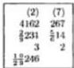

Also if you will wish to add $\frac{5}{6}14$ and $\frac{2}{9}231$, then you write the numbers as is shown here. And you can do this addition by whichever of the above methods you please. However because of the common factor that the 6 and the 9 have, we indicate how there must be cancellation with these. You will multiply therefore the 14 by the 6, and you add the 5; there will be 89 sixths which you multiply by 3, namely by a third part of the 9, because of the common factor which the 6 has with the 9; there will be 267 XVIIIths which you write above the $\frac{5}{6}14$, and you check it by any modulus; the residue of it by casting out thirteen is 7 which you write above the 267; next you multiply the 231 by the 9, and you add the 2; there will be 2081 ninths which you multiply by a third of the 6 that is by the 2; there will be similarly 4162 XVIIIths which you write above the $\frac{2}{9}231$, and you write similarly above them the residue by 13 of them that is 2; after this you add the 267 to the 4162; there will be 4429 that you divide by whichever of the parts from the fractions that you wish, and by non-common factors of the other, that is either you divide by the 6, and by a third of 9, namely by 3, or you divide by the 9, and by a third of the 6, namely by 2; the quotient will be $\frac{1}{2} \frac{0}{9}246$ for the sought addition of which the residue by 13 of the sum is 9, which comes out of the addition of the residue of the 267, that is 7,

---

7. Here Begins the Seventh Chapter 113

and that of the 4262, that is 2. And when this is understood, you divide the 6 and the 9 by their common factor, namely by 3; the quotients are 2 and 3; you write therefore the 2 below the 6, and the 3 below the 9, and you multiply the found 89 by the 3 written below the 9, and the 2081 written below the 6, and you will have the numbers written above, the sum of which you divide by one of the numbers which are under the fractions, and by the number written below the other, namely by the 6 and by the 3, or by the 9 and by the 2. You can indeed add the $\frac{5}{6}14$ and the $\frac{2}{9}231$ in another way, namely when you add the 14 and the 231 there will be 245; next you add the $\frac{5}{6}$ and the $\frac{2}{9}$; there will be $\frac{1}{18}1$ that you add to the 245; there will be $\frac{1}{2}\frac{9}{9}246$, as is found above by the prior method.

## The Subtraction of $\frac{5}{6}14$ from $\frac{2}{9}231$.

And if you will wish to subtract $\frac{5}{6}14$ from $\frac{2}{9}231$, then you subtract the 267 from the 4162; there will remain 3895 of which the residue by 13 is 8 that is found thus; namely since you cannot subtract 7 that is the residue of the 267 from the residue of the 4162 that is 2, you must add the number of the modulus, namely 13, to the said 2 making 15 from which you subtract the aforesaid 7; there remains 8 for the residue of the 3895, as we said; you therefore divide the 3895 with the abovementioned rule $\frac{1}{2}\frac{9}{9}$; the quotient will be $\frac{1}{2}\frac{3}{9}216$ for the difference of the said subtraction.

In another way, you subtract the 14 from the $\frac{2}{9}231$; there remains $\frac{2}{9}217$ from which you subtract $\frac{5}{6}$; as you cannot subtract $\frac{5}{6}$ from $\frac{2}{9}$, you subtract the $\frac{5}{6}$ from $\frac{2}{9}1$, and there will remain 216 of the 217. You make eighteenths of them; there will remain $\frac{7}{18}$ which you add to the 216 making $\frac{1}{2}\frac{3}{9}216$, as was found above.

## The Division of $\frac{2}{9}231$ by $\frac{5}{6}14$.

Truly if you will wish to divide $\frac{2}{9}231$ by $\frac{5}{6}14$, then you divide 4162 with the rule for 267; the quotient for the sought division will be $\frac{1}{3}\frac{52}{89}15$.

## The Division of $\frac{5}{6}14$ by $\frac{2}{9}231$.

Also if you will wish to divide $\frac{5}{6}14$ by $\frac{2}{9}231$, then you divide 267 with the rule for 4162; the quotient for the sought division will be $\frac{1}{2}\frac{133}{2081}$. [p74]

## The Addition of $\frac{1}{4}\frac{1}{3}15$ and $\frac{1}{7}\frac{3}{5}322$.

Also if you wish to add $\frac{1}{4}\frac{1}{3}15$ and $\frac{1}{7}\frac{3}{5}322$, then you write down the numbers, as is shown here; and you multiply the 15 by the parts of its fractions, namely by the 3, and you add the 1; and you multiply by the 4, and you add the multiplication of the 1 which is over the 4 by the 3; there will be 187 XIIths which you multiply by the numbers which are under the fractions after the 322, namely by the 5 and by the 7; there will be 6545 four hundred twentieths which you write above the $\frac{1}{4}\frac{1}{3}15$; next you multiply the 322 by the parts of its fractions; there will be 112296 thirty-fifths which you multiply by the numbers which are

---

114 II. Liber Abaci

under the fractions after the 15; there will be 135552 four hundred twentieths which you write above the $\frac{1}{7}$ $\frac{3}{5}$ 322; next you add the 6545 to the 135552; there will be 142097 CCCCXXths; you divide the 142097 by the 420, that is by all the numbers which are under the fractions, and you arrange them; the quotient is $\frac{5}{6}$ $\frac{1}{7}$ $\frac{3}{10}$ 388 for the sought addition for which the residue, casting out elevens, is 10.

In another way, you add the 15 and the 322; there will be 337; and you add the $\frac{1}{4}\frac{1}{3}$ and the $\frac{1}{7}\frac{3}{5}$, according to that which we taught in the second part of this chapter; there will be $\frac{5}{6}\frac{1}{7}\frac{3}{10}1$ that you add to the 337; there will be $\frac{5}{6}\frac{1}{7}\frac{3}{10}338$, as we said before.

**The Subtraction of $\frac{1}{4}\frac{1}{3}15$ from $\frac{1}{7}\frac{3}{5}322$.**

And if you will wish to subtract $\frac{1}{4}\frac{1}{3}15$ from $\frac{1}{7}\frac{3}{5}322$, then you subtract the 6545 from the 135552; there will remain 129007 that you divide with $\frac{1}{6}\frac{0}{7}\frac{0}{10}$ as in the illustration above; the quotient will be $\frac{1}{6}\frac{4}{7}\frac{1}{10}307$ for the difference of the sought subtraction.

In another way, you subtract the 15 from the 322; there remains 307; and you subtract the $\frac{1}{4}\frac{1}{3}$ from the $\frac{1}{7}\frac{3}{5}$; there will remain $\frac{1}{6}\frac{4}{7}\frac{1}{10}$ that you add to the 307; and there will be as we said, $\frac{1}{6}\frac{4}{7}\frac{1}{10}307$. Truly if you will wish to divide $\frac{1}{7}\frac{3}{5}322$ by $\frac{1}{4}\frac{1}{3}15$, then you divide the 13552 with the rule for 6545; the quotient for the sought division will be $\frac{2}{6}\frac{6}{7}\frac{0}{11}\frac{12}{17}20$.

**The Division of $\frac{1}{4}\frac{1}{3}15$ by $\frac{1}{7}\frac{3}{5}322$.**

Also if you will wish to divide $\frac{1}{4}\frac{1}{3}15$ by $\frac{1}{7}\frac{3}{5}322$, then you divide the 6545 with the rule for 135552; the quotient for the sought division will be $\frac{5}{6}\frac{2}{8}\frac{0}{8}\frac{17}{353}$; and thus according to the aforewritten method, you can add, subtract, and divide any numbers with two fractions; however we propose now to demonstrate some other problems in which we can cancel common factors from their composition rules.

**The Addition of $\frac{1}{5}\frac{3}{4}16$ and $\frac{1}{9}\frac{4}{5}422$.**

If you will wish to add $\frac{1}{5}\frac{3}{4}16$ and $\frac{1}{9}\frac{4}{5}422$, then you write down the numbers, and you multiply first the 16 by the parts of its fractions; there will be 339 XXths which you must multiply by the 9 because of the other 5 that is under the fraction after the $\frac{3}{4}16$; there will be 3051 CLXXXths which you keep above the $\frac{1}{5}\frac{3}{4}16$; next you multiply the 442 by the parts of its fractions; there will be 19931 XLVths which you multiply only by the 4 that is under the fraction after the 16 because you leave off multiplying by the 5 of the abovesaid rule; there will be similarly 79724 CLXXXths which you put above the $\frac{1}{9}\frac{4}{5}442$; next you add the 3051 and the 79724; there will be 82775 CLXXXths; you divide the 82775 by the 180, or by all the numbers which are under the fractions except for one of the two fives; therefore there is left one five in the multiplication of each of the two stated numbers; thus you leave one five out in the division of

---

7. Here Begins the Seventh Chapter 115

the sum of them; therefore you divide the 82775 with $\frac{1}{4} \frac{0}{5} \frac{0}{9}$, and then you will cancel the $\frac{1}{5}$; the quotient is $\frac{3}{4} \frac{7}{8} 459$ for the sought addition.

Or you can add the integer and the integer, and a fifth and a fifth, and $\frac{3}{4}$ and $\frac{1}{9}$, as we taught in the preceding; and you will have similarly the sum of the same addition.

The Subtraction of $\frac{1}{5} \frac{3}{4} 16$ from $\frac{1}{9} \frac{4}{5} 442$.

Again if you will wish to subtract $\frac{1}{5} \frac{3}{4} 16$ from $\frac{1}{9} \frac{4}{5} 442$, then you subtract the 3051 from the 79724; there will remain 76673; you divide with the sought rule $\frac{1}{2} \frac{0}{9} \frac{0}{10}$; the quotient will be $\frac{1}{2} \frac{5}{9} \frac{9}{10} 425$ for the difference of the sought subtraction; or you subtract the $\frac{1}{5} 16$ from the $\frac{1}{9} \frac{4}{5} 442$; [p75] there remains $\frac{1}{9} \frac{3}{5}$; and then you subtract the $\frac{3}{4}$ from the $\frac{1}{9} \frac{3}{5}$ if it is possible. But because it is not possible, first you subtract $\frac{1}{9} \frac{3}{5} 1$ from the $\frac{1}{9} \frac{3}{5} 426$; there remains 425; next you subtract the $\frac{3}{4}$ from the aforewritten $\frac{1}{9} \frac{3}{5} 1$; there will remain $\frac{1}{2} \frac{5}{9} \frac{9}{10}$ more than 425 for the difference.

Again if you will wish to divide $\frac{1}{9} \frac{4}{5} 442$ by $\frac{1}{5} \frac{3}{4} 16$, then you divide the 79724 with the rule for 3051; the quotient for the sought division is $\frac{2}{3} \frac{6}{9} \frac{14}{113} 26$. And if you will wish to divide $\frac{1}{5} \frac{3}{4} 16$ by the $\frac{1}{9} \frac{4}{5} 442$, then you divide the 3051 with the rule for 79724; the quotient for the sought division will be $\frac{3}{4} \frac{762}{19931}$.

The Addition of $\frac{1}{6} \frac{2}{5} 17$ and $\frac{1}{10} \frac{7}{9} 523$.

If you truly will wish to add $\frac{1}{6} \frac{2}{5} 17$ and $\frac{1}{10} \frac{7}{9} 523$, then you write down the numbers; you multiply the 5 by the 6 which are under the fractions; there will be 30; and by the 9 and the 10 that are under the fractions of the other side; there will be 90; you keep the 30 in the right hand, and the 90 in the left, and you divide them by the greatest common factor that they have between them, namely by 30; you show 1 in the right hand and 3 in the left. You write therefore the 1 below the $\frac{1}{6} \frac{2}{5}$ and the 3 below the $\frac{1}{10} \frac{7}{9}$, as in the presented problem; and you multiply the 17 by the parts of its fractions; there will be 527 XXXths which you multiply by the 3 put below the $\frac{1}{10} \frac{7}{9}$; there will be 1581 ninetieths which you write above the $\frac{1}{6} \frac{2}{5} 17$; next you multiply the 523 by the parts of its fractions; there will be similarly 47149 ninetieths which you multiply by the 1 put below the $\frac{1}{6} \frac{2}{5}$; there will be similarly 47149 ninetieths which you write above the $\frac{1}{10} \frac{7}{9} 523$; and you add it to the 1581; there will be 48730 that you divide by the numbers which are under the fractions of one side, and by the number put under the other fraction, that is by the 5, and by the 6, and by the 3; and by the 9, and by the 10, and by the 1; and thus occurs the division by 90 as it ought when the said sum is made into ninetieths; the quotient for the sought addition will be $\frac{4}{5} 541$; this method you indeed strive to use in all similar situations, as it is safer than the rest and better.

And if you will wish to subtract $\frac{1}{6} \frac{2}{5} 17$ from $\frac{1}{10} \frac{7}{9} 523$, then you indeed subtract the 1581 from the 47149; the difference that is truly 45568 you divide with the abovewritten rule $\frac{1}{9} \frac{0}{10}$; the quotient will be $\frac{4}{5} \frac{2}{9} 506$ for the difference of the sought subtraction. Or you subtract the 17 from the 523; there will remain 506; and you subtract the $\frac{1}{6} \frac{2}{5}$ from the $\frac{1}{10} \frac{7}{9}$; there will remain $\frac{4}{5} \frac{2}{9}$, as we said before.

---

116 II. Liber Abaci

## *The Division of* $\frac{1}{10}$ $\frac{7}{9}$ 523 *by* $\frac{1}{6}$ $\frac{2}{5}$ 17.

And if you will wish to divide $\frac{1}{10}$ $\frac{7}{9}$ 523 by $\frac{1}{6}$ $\frac{2}{5}$ 17, then you divide the 47149 by the 1581; and if you will divide the 1581 by the 47149, then you will have the division of the $\frac{1}{6}$ $\frac{2}{5}$ 17 by the $\frac{1}{10}$ $\frac{7}{9}$ 523, as we demonstrated separately in the preceding.

## *Here Begins the Fifth Part on the Addition, Subtraction, and Division of Parts of Integers and Fractions.*

|  (10) | (8)  |
| --- | --- |
|  115400 | 27783  |
|  $\frac{2}{5}$ 128$\frac{5}{7}$ | $\frac{2}{5}$ 29$\frac{3}{4}$  |
|  Addition | $\frac{1}{7}$ $\frac{2}{5}$ $\frac{3}{10}$ 113  |
|  Subtraction | $\frac{1}{7}$ $\frac{2}{5}$ $\frac{3}{10}$ 69  |

If you will wish to add $\frac{3}{4}$ of $\frac{2}{5}$ 29 and $\frac{5}{7}$ of $\frac{2}{9}$ 128, then you write down the numbers, as is shown here; and you multiply the 29 by the 5, and you add the 2; there will be 147 that you multiply by the 3 that is over the 4; there will be 441 that you multiply by the 7 and the 9 that are under the fractions of the other numbers; there will be 27783 that you write above the $\frac{2}{5}$ 29$\frac{3}{4}$, of which the residue by 11 is 8, that is found according to that which we multiplied; next you multiply the 128 by the 9, and you add the 2; and you multiply by the 5 that is over the 7; there will be 5770 that you multiply by the 5 and the 4 that are under the fractions of the first number; there will be 115400 that you write above the $\frac{2}{9}$ 128$\frac{5}{7}$, and the residue of it by 11 is 10; you add therefore the 27783 and the 115400; there will be 143183 that you divide by all the parts, namely with $\frac{1}{4}$ $\frac{0}{5}$ $\frac{0}{7}$ $\frac{0}{9}$; the quotient will be $\frac{1}{2}$ $\frac{2}{7}$ $\frac{3}{9}$ $\frac{6}{10}$ 113 for the sought addition.

## *The Subtraction of* $\frac{2}{5}$ 29$\frac{3}{4}$ *from* $\frac{2}{9}$ 128$\frac{5}{7}$.

And if you wish to subtract $\frac{2}{5}$ 29$\frac{3}{4}$ from $\frac{2}{9}$ 128$\frac{5}{7}$, then you subtract the 27783 from the 115400; there remains 87617 that you similarly divide with $\frac{1}{2}$ $\frac{0}{7}$ $\frac{0}{9}$ $\frac{0}{10}$; the quotient will be $\frac{1}{2}$ $\frac{2}{7}$ $\frac{3}{9}$ $\frac{5}{10}$ 69 for the difference of the sought subtraction. [p76]

## *The Division of* $\frac{2}{9}$ 128$\frac{5}{7}$ *by* $\frac{2}{5}$ 29$\frac{3}{4}$.

|  Division of the greater
by the lesser.
$\frac{1}{7}$ $\frac{8}{7}$ $\frac{3}{4}$ $\frac{3}{5}$ 4
Division of the lesser
by the greater.
$\frac{1}{4}$ $\frac{1}{10}$ $\frac{3}{10}$ $\frac{138}{577}$  |
| --- |
|  (0) | (7)  |
| --- | --- |
|  3152175 | 884488  |
|  $\frac{1}{11}$ $\frac{5}{6}$ 244$\frac{1}{4}$ $\frac{3}{7}$ $\frac{3}{9}$ $\frac{33}{5}$ $\frac{1}{4}$
Residue
modulo 13 | $\frac{2}{9}$ $\frac{3}{33}$ $\frac{1}{5}$ $\frac{3}{4}$
(7)  |
|  $\frac{3}{4}$ $\frac{3}{7}$ $\frac{8}{9}$ $\frac{6}{10}$ $\frac{11}{1}$ 145 |   |

Again if you will wish to divide $\frac{2}{9}$ 128$\frac{5}{7}$ by $\frac{2}{5}$ 29$\frac{3}{4}$, then you find the aforewritten numbers, namely the 115400 and the 27783; you strive to find the rule for the 27783 that is $\frac{1}{7}$ $\frac{0}{7}$ $\frac{0}{9}$ $\frac{0}{9}$; and you divide the 115400 with it; the quotient for the sought division will be $\frac{5}{7}$ $\frac{0}{7}$ $\frac{3}{7}$ $\frac{3}{9}$ $\frac{1}{9}$ 4. Also if you will wish to divide $\frac{3}{4}$ of $\frac{2}{5}$ 29 by $\frac{5}{7}$ of $\frac{2}{9}$ 128, then you divide the 27783 with the rule for 115400; the quotient will be $\frac{1}{2}$ $\frac{1}{10}$ $\frac{9}{10}$ $\frac{138}{577}$ for the sought division.

## *[The Addition of* $\frac{2}{7}$ $\frac{5}{9}$ 33$\frac{1}{5}$ $\frac{3}{4}$ *and* $\frac{1}{11}$ $\frac{5}{6}$ 244$\frac{1}{4}$ $\frac{3}{7}$.]

However if you will wish to add $\frac{1}{5}$ $\frac{3}{4}$ of $\frac{2}{7}$ $\frac{5}{9}$ 33 and $\frac{1}{4}$ $\frac{3}{7}$ of $\frac{1}{11}$ $\frac{5}{6}$ 244, then you write down the number, as is shown here; and you multiply the 33 by the 9, and you add the 5 that is over the 9; and you multiply by the 3, and add the 2; there will be 2116 LXIIrds. Also you multiply by the 3 that is over the 4 by the 5, and the 1 which is over the 5 by the 4; and you add them together; there will be 19 XXths which you multiply by the found 2116 LXIIrds; there will be 40204 MCCLXths; you take the residue of it by 13; it is 8, and you must

---

7. Here Begins the Seventh Chapter 117

multiply the number, namely the 40204, by all the parts which are under the fractions of the other side, namely by the 7 and the 4 that are under the first fraction of the side, and by the 6 and the 11; however first you leave off and you will not multiply by the 7, or the 4, because the 7 and the 4 are under the fractions of the first side. And again you leave off and you will not multiply by the 3 that is in the rule of the said 6, because the 3 is in the rule for the 9, and the 9 is under the last fraction of the first side. You will therefore multiply the 40204 by the 2 that remains of the said 6 from the fraction, and by the 11; that is one multiplies by 22; there will be 884488 XXVII.DCCXXths which you write above the $\frac{25}{7} \frac{5}{9} \frac{33}{5} \frac{3}{4}$, and above that you write the residue of it, which is 7. Next you multiply the 244 by the 6 that is under the fraction, and you add the 5 that is over the 6; there will be 1469 sixths which you multiply by the 11, and to this you add the multiplication of the 1 which is over the 11 by the 6; there will be 16165 LXVIths; the residue similarly by 13 is 6. Also you multiply the 3 that is over the 17 by the 4, and you add the 1 which is over the 4; there will be 13 XXVIIIths by which you multiply the 16165 LXVIths; there will be 21045 MDCCCXLths. This you must multiply by all the numbers which are under the fractions of the first side, leaving off the abovewritten common factors; you will multiply without them; only the 3 remains of the rule for 9; that is one multiplies by 15; there will be similarly 3152175 XXVII.DCCXXths; thus is made the other side. This you write again above the $\frac{1}{11} \frac{5}{6} 244 \frac{1}{4} \frac{3}{7}$, and above that you write the residue which is 0; next you add the 884488 and the 3152175; there will be 4036663 which you divide by all the parts of one of the sides, and by the parts that are taken in the multiplication from the other side. Whence you multiply by the 4, and by the 5, and by the 9, and by the 7 that are from the first side, and by the 2 that is in the rule for 6, and by the 11 of the other side that was taken in the multiplication of the first number, and by the 7, and by the 4, and by the 6, and by the 11 that is in the second side, and by the 3 that is in the rule for 9, and by the 5 that is from the other side; the quotient will be $\frac{3}{4} \frac{3}{7} \frac{4}{9} \frac{8}{10} \frac{6}{11} 145$ for the sought addition.

$$
\text{The Subtraction of } \frac{25}{7} \frac{33}{5} \frac{1}{4} \frac{3}{7} \text{ from } \frac{1}{11} \frac{5}{6} 244 \frac{1}{4} \frac{3}{7}.
$$

And if you will wish to subtract $\frac{1}{5} \frac{3}{4}$ of $\frac{25}{7} \frac{5}{9} 33$ from $\frac{1}{4} \frac{3}{7}$ of $\frac{1}{11} \frac{5}{6} 244$, or divide one of them by the other, then you find in the order and way as before the 884488 and the 3152175; and with them you will operate according to that which we taught before in this chapter on subtraction and division.

$$
[\text{The Addition of } \frac{1}{13} \frac{2}{11} \frac{3}{5} 42 \frac{2}{7} \frac{3}{8} \frac{5}{9} \text{ and } \frac{20}{3} \frac{3}{5} \frac{3}{11} 331 \frac{1}{9} \frac{3}{8} \frac{5}{7}.]
$$

And if you will wish to add $\frac{2}{7} \frac{3}{8} \frac{5}{9}$ of $\frac{1}{13} \frac{2}{11} \frac{3}{5} 42$ and $\frac{1}{9} \frac{3}{8} \frac{5}{7}$ of $\frac{20}{3} \frac{3}{5} \frac{3}{11} 331$, then you write down the numbers as is shown here. And you begin multiplying the 42 by the parts of its fractions that follow it; there will be 30644. And you take the $\frac{2}{7} \frac{3}{8} \frac{5}{9}$, and you multiply the 5 that is over the 9 by the 8, and you add the 3; and you multiply by the 7, and you add the 2; there will be 303 that you

|  $\frac{20}{3} \frac{3}{5} \frac{3}{11} \frac{3}{11} \frac{3}{5} \frac{5}{9} \frac{5}{8} \frac{7}{7}$  |
| --- |
|  $\frac{1}{13} \frac{2}{11} \frac{3}{5} 42 \frac{2}{7} \frac{3}{8} \frac{5}{9}$  |

---

118 II. Liber Abaci

multiply by the 30644; there will be 9285132 that you must multiply [p77] by all the numbers which are under all the fractions of the other side, namely by the 7, and by the 8, and by the 9 that are under the three fractions of that side, and by the 11, and by the 5, and by the 3 that are under one fraction; you allow those to remain which you do not repeat, multiplying only by those which are in the first side; therefore there are left those; you will leave off those which do not multiply the aforementioned 9285132, only multiplying it by the 3, and the multiplication increases it to 27855396; this number you write above the first side; next when you find the number of the other side, you will multiply the 331 by the parts of its fractions that are after it; there will be 54662. And you find the number for its remaining three fractions, namely $\frac{1}{9}$ $\frac{1}{8}$ $\frac{5}{7}$; this will make 479 by which you multiply the 54462; there will be 26183098 that you must multiply by all the numbers which are under all the fractions of the first side, namely by the 13, and by the 11, and by the 5 that are under the three fractions of the first side, and by the 7, and by the 8, and by the 9 that are under the other fraction; you leave off that which you did not multiply the aforewritten, you multiply only by the 13 because of the common factor that is between the fractions of both sides. The multiplication of the 26183098 by the 13 therefore increases it to 340380274 that you write above the second side. And you add it to the number written above the first side, namely to 27855396; there will be 368235670 that you divide by all the numbers which are under the fractions of the first side, and by the 3 that is under one fraction of the second side, that is with what we had multiplied the number of the first side. And you divide it by all the parts which are under the fractions of the second side, and by the 13 that is under one of the fractions of the first side, that is according to that which we multiplied when made the number of the second side; therefore you divide with $\frac{1}{3}$ $\frac{0}{5}$ $\frac{0}{7}$ $\frac{0}{8}$ $\frac{0}{9}$ $\frac{0}{11}$ $\frac{0}{13}$; after this fraction is rearranged the quotient will be $\frac{1}{2}$ $\frac{3}{6}$ $\frac{5}{7}$ $\frac{3}{9}$ $\frac{0}{11}$ $\frac{8}{13}$ 340 for the sought addition; the residue by 17 is 3.

## Another Subtraction.

And if you will wish to subtract $\frac{1}{13}$ $\frac{2}{11}$ $\frac{2}{5}$ $\frac{3}{7}$ $\frac{5}{8}$ $\frac{5}{9}$ from $\frac{2}{3}$ $\frac{0}{5}$ $\frac{3}{11}$ $\frac{3}{9}$ $\frac{5}{8}$ $\frac{5}{7}$, then you find in order the abovewritten 27855396 and 340380374; first you subtract the lesser number from the greater; there will remain 312524978 that you divide with the rule $\frac{1}{2}$ $\frac{0}{6}$ $\frac{0}{7}$ $\frac{0}{9}$ $\frac{0}{10}$ $\frac{0}{11}$ $\frac{0}{13}$ similarly to the abovewritten addition; the quotient for the difference of the sought subtraction will be $\frac{0}{2}$ $\frac{5}{6}$ $\frac{1}{7}$ $\frac{6}{9}$ $\frac{2}{10}$ $\frac{1}{11}$ $\frac{1}{13}$ 289. And if you will divide the 340380274 with the rule for 27855396, then you will have the division of the greater mentioned number by the lesser; on the contrary, dividing by the greater yields the inverse division. If you wish to add $o\frac{3}{5}$ $\frac{2}{9}$ and $\frac{2}{9}$, then you make the same fraction end in a circle from the other part; and you will have the sought, namely $o\frac{5}{5}$ $\frac{2}{9}$, that you give back to the part of the number by the doctrine above; there will be $\frac{10}{45}$, that is $\frac{1}{5}$ $\frac{3}{9}$. And if you wish to subtract $o\frac{3}{5}$ $\frac{2}{9}$ from the $\frac{2}{9}$, then you subtract $o\frac{3}{5}$ $\frac{2}{9}$ from $o\frac{5}{5}$ $\frac{2}{9}$; $o\frac{2}{5}$ $\frac{2}{9}$ remains, that is $\frac{4}{45}$; or you take $\frac{2}{9}$ of the 45; there will be 10 from which you subtract $\frac{3}{5}$ of it, namely 6; there will remain 4 which is divided by the 45; there will be had similarly $\frac{4}{45}$ for the difference of the said subtraction. Similarly if you wish to

---

7. Here Begins the Seventh Chapter 119

subtract $\frac{3}{4} \frac{0}{6}$ from $\frac{1}{6}$, then you subtract the $\frac{3}{4} \frac{0}{6}$ from the $\frac{4}{6}$, namely $\frac{1}{6}$; there will remain $\frac{1}{6}$. And if from whatever quantity the $\frac{3}{4}$ of it is subtracted, there necessarily remains the same $\frac{1}{4}$ of the quantity. And if from some quantity $\frac{3}{5}$ of it is subtracted, then there remains $\frac{2}{5}$ of the same quantity. Whence if you subtract $\mathrm{o} \frac{3}{5} \frac{4}{7}$ from $\frac{4}{7}$, then there will remain $\mathrm{o} \frac{2}{5} \frac{4}{7}$; and thus you understand of all similar problems. Similarly if you wish to subtract $\mathrm{o} \frac{4}{5} \frac{5}{7}$ from $\frac{5}{7}$, then there will remain $\mathrm{o} \frac{5}{7} \frac{5}{7}$, namely $\frac{25}{63}$, because if from the entire quantity is subtracted $\frac{4}{9}$ of it, then there necessarily remains $\frac{5}{9}$ of the quantity; this because $\frac{4}{9}$ and $\frac{5}{9}$ make the integer one.

Here Begins Part Six of the Seventh Chapter on the Separation of Fractions into Unit Fractions [1].

In the first and second part of this chapter we taught how to add together several fractions into a single fraction. In this part truly we teach how to separate fractions with several parts into the sum of unit fractions, and seeing the parts of any fraction, to know the values of the part or parts [p78] of the integer one. This work is indeed divided into seven distinctions, the first of which is when the greater number which is below the fraction is divisible by the lesser, namely by that which is over the fraction line. The rule for the first distinction is that you divide the greater by the lesser, and you will have the part that the lesser is of the greater [2]. For example, we wish to know what part $\frac{3}{12}$ is of the integer one; The 12 is indeed divided by the 3; this yields 4 for which you say $\frac{1}{4}$, and such is the part $\frac{3}{12}$ is of the integer one. And for the same reason, $\frac{4}{20}$ is $\frac{1}{5}$ of the integer one; $\frac{5}{100}$ is $\frac{1}{20}$ because 100 divided by 5 yields 20, which again you understand for similar situations.

These rules for this first distinction are indeed divided into three parts, of which the first is called simple, the second composite, and the third reversed composite. The simple is that way which I mentioned. The composite is when the simple is found from parts of another number, as with $\frac{2}{4} \frac{0}{9}$; indeed $\frac{2}{4}$ parts of 9 is found, that is from the simple of the first distinction; therefore for $\frac{2}{4} \frac{0}{9}$ is had $\frac{1}{2} \frac{0}{9}$, namely $\frac{1}{18}$, and for $\frac{2}{4} \frac{0}{9}$ is had $\frac{1}{2} \frac{0}{9}$; and for $\frac{3}{5} \frac{0}{10}$ is had $\frac{1}{3} \frac{0}{10}$, and because $\frac{3}{9}$ is simply $\frac{1}{3}$ composed with $\frac{1}{10}$, it will be $\frac{1}{3} \frac{0}{10}$; and you understand the same in similar problems; the first reversed composite is $\frac{3}{5} \frac{0}{9}$, which is from $\frac{3}{5} \frac{0}{9}$, that is $\frac{1}{3} \frac{0}{5}$; you understand similarly with $\frac{4}{7} \frac{0}{8}$ which is reversed to $\frac{4}{7} \frac{0}{7}$, namely $\frac{1}{2} \frac{0}{7}$; and for $\frac{5}{9} \frac{0}{10}$ which is reversed to $\frac{5}{9} \frac{0}{10}$, namely $\frac{1}{2} \frac{0}{9}$.

On the Second Distinction.

The second distinction [3] is when the greater number is not divisible by the lesser, but of the lesser can be made such parts which will divide integrally into the greater; in the rule for this distinction you make parts of the lesser by which you can divide the greater; and the greater is divided by each of the parts, and you will have unit fractions that the lesser makes from the greater. For example, we wish to separate $\frac{5}{6}$ into the sum of single parts of the integer one; because the 6 is not divisible by the 5, the $\frac{5}{6}$ is not from the first distinction, but because the

---

II. Liber Abaci

5 is separable into two parts, namely into 3 and 2, by which the greater, namely the 6 is divided, the  $\frac{5}{6}$  is affirmed to be from the second distinction. Whence the 6 is divided by the 3 and by the 2 yielding 2 and 3 for quotients; for the 2 is taken  $\frac{1}{2}$  and for the 3 one takes  $\frac{1}{3}$ ; therefore the  $\frac{5}{6}$  is  $\frac{1}{3} \frac{1}{2}$  of the integer one, the sum of  $\frac{1}{3}$  and  $\frac{1}{2}$ ; or in another way, the  $\frac{5}{6}$  is separated into  $\frac{3}{6}$  and  $\frac{2}{6}$ ; it will be the sum of these two fractions. The  $\frac{3}{6}$  is  $\frac{1}{2}$  from the first distinction, the  $\frac{2}{6}$  is  $\frac{1}{3}$ , and the  $\frac{1}{3} \frac{1}{2}$  is  $\frac{5}{6}$  of unity, as we said before. And if you resolve the  $\frac{7}{8}$  into parts of  $\frac{4}{8}$ ,  $\frac{2}{8}$  and  $\frac{1}{8}$ , then you will have  $\frac{1}{2}$  for the  $\frac{4}{8}$ ,  $\frac{1}{4}$  for the  $\frac{2}{8}$ , and  $\frac{1}{8}$  for the  $\frac{1}{8}$ , that is, you will have  $\frac{1}{8} \frac{1}{4} \frac{1}{2}$  for the  $\frac{7}{8}$ ; one has similarly in this both, second distinction composite fractions and reversed composite fractions; indeed  $\frac{3}{4} \frac{0}{10}$  is a composite fraction because the  $\frac{3}{4}$  will be  $\frac{1}{4} \frac{1}{2}$  in the second distinction; so for the  $\frac{3}{4} \frac{0}{10}$  the sum of  $\frac{1}{2} \frac{0}{10}$  and  $\frac{1}{4} \frac{0}{10}$  is had, that is  $\frac{1}{20}$  and  $\frac{1}{40}$ ; similarly for  $\frac{5}{8} \frac{0}{9}$  the sum of  $\frac{1}{2} \frac{0}{9}$  and  $\frac{1}{8}$ ; you do not resolve into the sum of  $\frac{1}{2} \frac{0}{10}$  and  $\frac{1}{8} \frac{0}{10}$  the  $\frac{5}{8} \frac{0}{10}$ , the reversed composite is in the first distinction, as reversed it will be namely  $\frac{5}{10} \frac{0}{8}$ , and by the first distinction it is  $\frac{1}{2} \frac{0}{8}$ ; and this happens because of the common factor the 5 is over the 8 has with the 10. Indeed  $\frac{3}{5} \frac{0}{10}$  is a reversed composite in this distinction, which is reversed into  $\frac{3}{10} \frac{0}{5}$ , and that is  $\frac{1}{5} \frac{0}{5}$  and  $\frac{1}{10} \frac{0}{5}$ , namely  $\frac{1}{25}$  and  $\frac{1}{50}$ , therefore the  $\frac{3}{10}$  will be reduced simply to  $\frac{1}{5}$  and  $\frac{1}{10}$ , and the  $\frac{3}{10} \frac{0}{5}$  composite is resolved into  $\frac{1}{5} \frac{0}{5}$  and  $\frac{1}{5} \frac{0}{10}$ ; and for  $\frac{5}{7} \frac{0}{8}$  is had  $\frac{5}{8} \frac{0}{7}$ , namely  $\frac{1}{27}$  and  $\frac{1}{87}$ ; and thus you understand with similar situations. But because we know that first and second distinctions are necessary above all in business, we look to show now separations of fractions of some numbers in tables which you strive to add to your memory so that you will understand what we wish to say in this part. [p79]

# TABLE OF SEPARATIONS

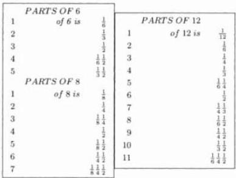

---

7. Here Begins the Seventh Chapter

|  PARTS OF 20 |   |   | 10 | 1/2  |
| --- | --- | --- | --- | --- |
|  1 | of 20 is | 1/20 | 11 | 1/20 1/2  |
|  2 |  | 1/10 | 12 | 1/10 1/2  |
|  3 |  | 1/20 1/10 | 13 | 1/20 1/10 1/2  |
|  4 |  | 1/5 | 14 | 1/5 1/2  |
|  5 |  | 1/4 | 15 | 1/4 1/2  |
|  6 |  | 1/10 1/5 | 16 | 1/10 1/5 1/2  |
|  7 |  | 1/10 1/4 | 17 | 1/10 1/4 1/2  |
|  8 |  | 2/5 | 18 | 1/15 1/3 1/2  |
|  9 |  | 1/5 1/4 | 19 | 1/5 1/4 1/2  |
|  PARTS OF 24 |   |   | 12 | 1/2  |
| --- | --- | --- | --- | --- |
|  1 | of 24 is | 1/24 | 13 | 1/20 1/2  |
|  2 |  | 1/12 | 14 | 1/12 1/2  |
|  3 |  | 1/8 | 15 | 1/8 1/2  |
|  4 |  | 1/6 | 16 | 1/6 1/2  |
|  5 |  | 1/12 1/8 | 17 | 1/12 1/8 1/2  |
|  6 |  | 1/4 | 18 | 1/4 1/2  |
|  7 |  | 1/8 1/6 | 19 | 1/8 1/2  |
|  8 |  | 1/3 | 20 | 1/3 1/2  |
|  9 |  | 1/8 1/4 | 21 | 1/8 1/2  |
|  10 |  | 1/6 1/4 | 22 | 1/6 1/2  |
|  11 |  | 1/8 1/3 | 23 | 1/8 1/2  |
|  PARTS OF 60 |   |   | 12 | 1/5 | 24 | 1/15 1/3  |
| --- | --- | --- | --- | --- | --- | --- |
|  1 | of 60 is | 1/60 | 13 | 1/20 1/6 | 25 | 1/12 1/3  |
|  2 |  | 1/30 | 14 | 1/15 1/6 | 26 | 1/10 1/3  |
|  3 |  | 1/20 | 15 | 1/4 | 27 | 1/5 1/4  |
|  4 |  | 1/15 | 16 | 1/10 1/6 | 28 | 1/10 1/6 1/5  |
|  5 |  | 1/12 | 17 | 1/30 1/4 | 29 | 1/20 1/10 1/3  |
|  6 |  | 1/10 | 18 | 1/10 1/5 | 30 | 1/2  |
|  7 |  | 1/60 1/10 | 19 | 1/15 1/4 | 31 | 1/60 1/2  |
|  8 |  | 1/30 1/10 | 20 | 1/3 | 35 | 1/5 1/3  |
|  9 |  | 1/20 1/10 | 21 | 1/10 1/4 | 40 | 1/6 1/2  |
|  10 |  | 1/6 | 22 | 1/30 1/3 | 50 | 1/3 1/2  |
|  11 |  | 1/60 1/6 | 23 | 1/20 1/3 | 55 | 1/6 1/2  |
|  PARTS OF 100 |   |   | 10 | 1/10 | 70 | 1/5 1/2  |
| --- | --- | --- | --- | --- | --- | --- |
|  1 | of 100 is | 1/100 | 15 | 1/20 1/10 | 75 | 3/4  |
|  2 |  | 1/50 | 20 | 1/5 | 80 | 4/5  |
|  3 |  | 1/100 1/50 | 25 | 1/2 | 85 | 1/10 3/4  |
|  4 |  | 1/25 | 30 | 1/10 1/5 | 95 | 1/5 1/2  |
|  5 |  | 1/20 | 35 | 1/10 1/4 | 96 | 1/100 1/5 1/2  |
|  6 |  | 1/50 1/25 | 40 | 2/5 | 97 | 1/50 1/2 1/2  |
|  7 |  | 1/50 1/20 | 45 | 1/5 1/4 | 98 | 1/100 1/50 1/2 1/2  |
|  8 |  | 2/25 | 50 | 1/2 | 99 | 1/25 1/5 1/2  |
|  9 |  | 1/25 1/20 | 60 | 3/5 |  | [p80]  |

The Third Distinction of Separation.

The third distinction [4] indeed is when one more than the greater number is divisible by the lesser; the rule for this distinction is, you divide the number

---

122 II. Liber Abaci

that is one more by the lesser, and the quotient of the division will be the part of the integer one, and will be less than the greater, and to this you add the same part of the part that is the greater number. For example, we wish to make unit fractions of $\frac{2}{11}$; that is from this distinction because one plus the 11, namely 12, is divisible by the 2 that is over the fraction; from this division comes the quotient 6 which yields $\frac{1}{6}$, and to this is added a sixth of an eleventh, namely $\frac{1}{6} \frac{0}{11}$, for the unit fraction parts of $\frac{2}{11}$; using the same rule for $\frac{3}{11}$ you will have a quarter and $\frac{1}{4} \frac{0}{11}$, that is $\frac{1}{44} \frac{1}{4}$. And for $\frac{4}{11}$ you will have a third and $\frac{1}{3} \frac{0}{11}$, that is $\frac{1}{33} \frac{1}{3}$; and so for the $\frac{6}{11}$ you will have half and $\frac{1}{2} \frac{0}{11}$, that is $\frac{1}{22} \frac{1}{2}$; and similarly for the $\frac{5}{19}$, as the 5 that is over the 19 is $\frac{1}{4}$ of 20, that is 1 plus the 19, you will have $\frac{1}{4} \frac{0}{19}$, that is $\frac{1}{76} \frac{1}{4}$; still by the third distinction there are those that are composed a second time, as $\frac{2}{3} \frac{0}{7}$, that is $\frac{1}{2} \frac{0}{7}$ and $\frac{1}{6} \frac{0}{7}$; as $\frac{2}{3}$ is $\frac{1}{6} \frac{1}{2}$; similarly $\frac{4}{7} \frac{0}{9}$ is $\frac{1}{2} \frac{0}{9}$ and $\frac{1}{14} \frac{0}{9}$, because $\frac{4}{7}$ is $\frac{1}{14} \frac{1}{2}$, and it will be reversed still by the same distinction, as the $\frac{3}{7} \frac{0}{11}$ or the $\frac{3}{7} \frac{0}{8}$ for example; the $\frac{3}{7} \frac{0}{11}$ is reversed to $\frac{3}{11} \frac{0}{7}$, and to $\frac{3}{11}$ by the third distinction, that is $\frac{1}{44} \frac{1}{4}$; therefore the $\frac{3}{11} \frac{0}{7}$ is $\frac{1}{44} \frac{0}{7}$ plus $\frac{1}{44} \frac{0}{7}$; similarly, the $\frac{3}{7} \frac{0}{8}$ is reversed to $\frac{3}{8} \frac{0}{7}$, that is from two composed distinctions, namely from the second and from the third. Indeed according to the second distinction, the composed $\frac{3}{8} \frac{0}{7}$ is $\frac{1}{8} \frac{1}{4} \frac{0}{7}$, namely $\frac{1}{4} \frac{0}{7}$ plus $\frac{1}{8} \frac{0}{7}$, and the composite $\frac{3}{8} \frac{0}{7}$ is $\frac{1}{24} \frac{1}{3} \frac{0}{7}$ according to the third distinction, as for $\frac{3}{8}$ is had $\frac{1}{24} \frac{1}{3}$; and this same thing you understand in similar problems.

## On the Same Distinction.

It is indeed from this same distinction, when from the lesser number which is over the fraction line can be made two parts, by which one plus the greater is integrally divided as $\frac{8}{11}$ and $\frac{9}{11}$; two parts can be made from $\frac{8}{11}$, namely $\frac{6}{11}$ and $\frac{2}{11}$; whence for $\frac{6}{11}$ we have, according to this rule two unit fraction parts, $\frac{1}{22} \frac{1}{2}$; and for $\frac{2}{11}$ we have $\frac{1}{66} \frac{1}{6}$; thus for the $\frac{8}{11}$ we will have $\frac{1}{66} \frac{1}{22} \frac{1}{6} \frac{1}{2}$; and similarly for the $\frac{9}{11}$ which will be resolved into $\frac{6}{11}$ and $\frac{3}{11}$, namely we will have $\frac{1}{44} \frac{1}{22} \frac{1}{4} \frac{1}{2}$; and because the 10 that is over the 11 is $\frac{1}{3} \frac{1}{2}$ of 12; and the 12 is one more than the 11 that is under the fraction, we will have $\frac{1}{33} \frac{1}{22} \frac{1}{3} \frac{1}{2}$ for the $\frac{10}{11}$.

## On the Fourth Distinction of Separation.

The fourth distinction is when the greater is a prime number, and the greater plus one is divisible by the lesser minus 1, as $\frac{5}{11}$ and $\frac{7}{11}$; this distinction rule is, you subtract 1 from the lesser, from which you make a unit fraction, namely with whatever is the number which is under the fraction, and then there will remain for you the parts using the third distinction; if you will subtract $\frac{1}{11}$ from $\frac{5}{11}$, then there will remain $\frac{4}{11}$, for which $\frac{4}{11}$ you will have the unit fractions $\frac{1}{33} \frac{1}{3}$ by the third distinction, and with the abovewritten $\frac{1}{11}$ added this will yield $\frac{1}{33} \frac{1}{11} \frac{1}{3}$; and by the same rule for $\frac{7}{11}$ you will have $\frac{1}{22} \frac{1}{11} \frac{1}{2}$, and for $\frac{3}{7}$ you will have

---

8. Here Begins Chapter Eight 123

$\frac{1}{28}\frac{1}{7}\frac{1}{4}$, for $\frac{6}{19}$ you will have $\frac{1}{76}\frac{1}{19}\frac{1}{4}$, and for $\frac{7}{29}$ you will have $\frac{1}{5}\frac{1}{29}\frac{1}{145}$; $\frac{1}{145}\frac{1}{29}\frac{1}{5}$, that is.

## On the Fifth Distinction.

The fifth distinction is when the greater number will be even, and divisible by the lesser number minus 2; this distinction rule is, when you subtract 2 from the lesser number, which 2 will give a fraction by the first distinction, and the difference truly will be in the third distinction; as $\frac{11}{26}$, from which if you will subtract $\frac{2}{26}$, that is $\frac{1}{13}$ according to the first distinction rule; there remains $\frac{9}{26}$, the $\frac{9}{26}$, also is $\frac{1}{3}\frac{0}{26}\frac{1}{3}$, that is $\frac{1}{78}\frac{1}{3}$, to which you add $\frac{1}{13}$; there will be $\frac{1}{78}\frac{1}{13}\frac{1}{3}$ for the unit fraction [p81] parts of $\frac{11}{26}$; and by the same rule for $\frac{11}{62}$, you will have $\frac{1}{7}\frac{0}{62}\frac{1}{31}\frac{1}{7}$.

## On the Sixth Distinction.

The sixth distinction is when the greater number is divided integrally by 3, and the greater plus one is divisible by the lesser minus 3, as with $\frac{17}{27}$, for which the rule is, when from the number you subtract three, that is when you subtract 3 from the lesser, and the three parts will be in the first distinction, there will be truly left the third distinction; as if from $\frac{17}{27}$ you subtract $\frac{3}{27}$, that is $\frac{1}{9}$ according to the first distinction, and $\frac{14}{27}$ by the third distinction is $\frac{1}{54}\frac{1}{2}$, to which is added the mentioned $\frac{1}{9}$; there will be $\frac{1}{54}\frac{1}{9}\frac{1}{2}$ for $\frac{17}{27}$. By the same rule for $\frac{20}{33}$ you will have $\frac{1}{66}\frac{1}{11}\frac{1}{2}$.

## On the Seventh Distinction [5].

The seventh distinction, the rule of which is of much utility, is when none of the abovewritten distinctions occur, indeed whenever the parts are better found by this rule than by certain of those abovewritten distinctions, namely of the second, third, and the fourth, and the fifth, and the sixth distinctions. Whence parts always are found of the four distinctions by this seventh rule, when you can find the more elegant parts by the rules, or by these subtleties; it is this distinction rule, when you divide the greater number by the lesser, and when the quotient is not integral, you consider the quotient between those two numbers; if it comes out to be between 3 and 4, then you know that the lesser number is less than $\frac{1}{3}$ and more than $\frac{1}{4}$ of the greater, and if it comes out between 4 and 5, the lesser will be less than $\frac{1}{4}$ and greater than $\frac{1}{5}$ of the greater; and thus you understand of any two numbers, between which integers the quotient comes out; next you take the unit fraction from the greater part that the lesser number is

---

II. Liber Abaci

of the greater; and you keep the difference which thence will remain, which itself from some abovewritten distinction, you can work with; and if the difference will not be in any of the above distinctions, then from the difference you take again the unit fraction of the greater part; and this you do until there will remain parts according to some of the abovewritten distinctions, or you will have all the unit fraction parts, that will be less than the greater. For example, we wish to make unit fraction parts of $\frac{4}{13}$; the quotient of the 13 by the 4 falls between 3 and 4; therefore $\frac{4}{13}$ of the integer one is less than $\frac{1}{3}$ of the integer one, and greater than $\frac{1}{4}$; therefore we know that $\frac{1}{4}$ is the largest unit fraction part that you can take of $\frac{4}{13}$. For $\frac{13}{13}$ makes the integer 1; therefore a quarter of it, namely $\frac{1}{4}\frac{3}{13}$, is $\frac{1}{4}$ of the integer one; therefore you subtract the $\frac{1}{4}\frac{3}{13}$ from the $\frac{4}{13}$; there remains $\frac{3}{4}\frac{0}{13}$ which by the second distinction is $\frac{1}{4}\frac{1}{2}\frac{0}{13}$ that is $\frac{1}{52}\frac{1}{26}$; or because $\frac{3}{4}\frac{0}{13}$ is also $\frac{3}{52}$ which by the second distinction rule is $\frac{1}{52}\frac{1}{26}$ also; therefore we have three unit fraction parts for the $\frac{4}{13}$, namely $\frac{1}{52}\frac{1}{26}\frac{1}{4}$. The unit fraction parts of the $\frac{3}{52}$ you can find in another way by this seventh distinction. Clearly when you divide by 3, there will be for the quotient 17 and more; therefore $\frac{1}{18}$ is the greatest unit fraction part that is in the $\frac{3}{52}$. Whence you divide the 52 by the 18; the quotient is $\frac{8}{9}2$ which you subtract from the 3; there remains $\frac{1}{9}\frac{0}{52}$, namely $\frac{1}{468}$; thus we have $\frac{1}{468}\frac{1}{18}$ for the $\frac{3}{52}$ and $\frac{1}{468}\frac{1}{18}\frac{1}{4}$ for the $\frac{4}{13}$.

Also you make thus unit fraction parts of $\frac{9}{61}$; you divide the 61 by the 9; the quotient will be 6 and more; therefore you will have $\frac{1}{7}$ for the largest unit fraction part of the $\frac{9}{61}$; you therefore divide the 61 by the 7; the quotient will be $\frac{5}{7}8$, that is sixty-firsts, which you subtract from the $\frac{9}{61}$; there will remain $\frac{2}{7}\frac{0}{61}$, that is $\frac{2}{427}$, which is $\frac{1}{214}\frac{1}{214}\frac{0}{427}$ according to the third distinction composit rule, therefore $\frac{9}{61}$ of integer one is had $\frac{1}{214}\frac{0}{427}\frac{1}{214}\frac{1}{7}$; and for $\frac{2}{7}\frac{0}{61}$ is had $\frac{10}{461}\frac{1}{28}\frac{0}{61}$ again by the third distinction composit rule; therefore for the $\frac{9}{61}$ we will have $\frac{1}{1708}\frac{1}{244}\frac{1}{7}$.

In this same way we can demonstrate unit fractions for $\frac{17}{29}$. You indeed divide the 29 by the 17; the quotient is 1 and more; therefore we know the $\frac{17}{29}$ is between one half and the integer one; and it is noted because three thirds, or four fourths, or $\frac{5}{5}$, or $\frac{8}{6}$, make the integer one, similarly $\frac{29}{29}$ makes the integer one, from which if we will take half, namely $\frac{1}{2}\frac{14}{29}$, and we will subtract it from the $\frac{17}{29}$, then there will remain $\frac{1}{2}\frac{2}{29}$ that is $\frac{5}{58}$; therefore the $\frac{17}{29}$ is $\frac{5}{58}\frac{1}{2}$, of which $\frac{5}{58}$ must be made into unit fraction parts, namely by this same distinction; therefore you divide the 58 by the 5; the quotient will be 11 and more. When it is known that $\frac{1}{12}$ is the largest unit fraction part that is in $\frac{5}{58}$; whence $\frac{1}{12}$ of $\frac{58}{58}$ is taken, namely of the integer one; there will be $\frac{5}{6}\frac{4}{58}$ which subtracted from the $\frac{5}{58}$ is $\frac{1}{6}\frac{0}{58}$, [p82] that is $\frac{1}{348}$; and thus you will have for $\frac{17}{29}$ three unit fraction parts, namely $\frac{1}{348}\frac{1}{12}\frac{1}{2}$.

## A Universal Rule for Separation into Unit Fractions.

There is indeed in similar situations another universal rule, namely when you find a number which has in itself many factors as 12, or 24, or 36, or 48, or 60, or any other number which is greater than half the number that is showing under the fraction line, and less than double it, as with the aforewritten $\frac{17}{29}$; we

---

8. Here Begins Chapter Eight 125

take 24 that is more than half of the 29; and you multiply therefore the 17 that is over the fraction line by the 24; there will be 408 that you divide by the 29 and also by the 24; the quotient will be $\frac{2}{29}\frac{14}{24}$; next you see what are the unit fraction parts of the $\frac{14}{24}$; they are $\frac{1}{4}\frac{1}{3}$ indeed or $\frac{1}{12}\frac{1}{2}$, which you keep for the parts of the $\frac{17}{29}$; and you see what are the unit fraction parts of $\frac{1}{24}$ of $\frac{2}{29}$; and truly they are indeed $\frac{1}{12}$ of $\frac{1}{29}$, for the part of $\frac{17}{29}$; you have $\frac{1}{12}\frac{0}{29}$ and because $\frac{2}{29}$ of $\frac{1}{24}$ is equal to $\frac{2}{24}$ of $\frac{1}{29}$, that will be also the same $\frac{1}{12}\frac{0}{29}$, namely $\frac{1}{348}$; therefore for the $\frac{17}{29}$ you will have $\frac{1}{348}\frac{1}{4}\frac{1}{3}$, or $\frac{1}{348}\frac{1}{12}\frac{1}{2}$, as we found above.

Also if you will multiply the 17 that is over the 29 by 36, as you multiplied it by the 24, and you will divide similarly by the 29, and by the 36, then the quotient is $\frac{3}{29}\frac{21}{36}$, and $\frac{21}{36}$ is $\frac{1}{4}\frac{1}{3}$, or $\frac{1}{12}\frac{1}{2}$; and the 3 that is over the 29 will be $\frac{1}{29}$ of $\frac{3}{36}$, and that is truly again $\frac{1}{29}$ of $\frac{1}{12}$, or $\frac{1}{12}\frac{0}{29}$, namely $\frac{1}{348}$; thus you will have the $\frac{1}{29}\frac{1}{348}\frac{1}{4}\frac{1}{3}$ or $\frac{1}{348}\frac{1}{12}\frac{1}{2}$ for the unit fraction parts. And if you wish to know why, then it is because we multiplied the 24 by the 17 that is over the 29, and we divided the product by the 29; you know that you made 24ths of the $\frac{17}{29}$ because 24 is the number chosen from many composite numbers where the parts of it fall into the first and second distinctions. It is indeed $\frac{2}{29}\frac{14}{24}$ that was found for the aforesaid $\frac{17}{29}$; for the $\frac{14}{29}$ that is at the head of the fraction are had $\frac{1}{4}\frac{1}{3}$, or $\frac{1}{12}\frac{1}{2}$, by the second distinction; and for the $\frac{2}{29}\frac{0}{24}$ that remains is had by the first distinction the reversed $\frac{2}{24}\frac{0}{29}$, that is, as we found above, also $\frac{1}{12}\frac{0}{29}$. Similarly when you multiplied the 17 by the 36, and you divided by the 29, next you made thirty-sixths of the $\frac{17}{29}$. Indeed $\frac{29}{29}$ equals $\frac{36}{36}$; therefore whatever ratio the 29 has to the 36, the same ratio will have 17 to one fourth the number; therefore we multiplied one third the number, namely the 17, by the second, namely the 36, and we divided the product by the first, because when the IIII numbers are proportional, the product of the second by the third is equal to the first by the fourth, as is demonstrated by Euclid.

Also if you wish to separate $\frac{19}{53}$ into unit fraction parts, then you may use the fourth distinction, as 53 plus one is divided by 19 minus one; whence for the $\frac{19}{53}$ you will have $\frac{1}{159}\frac{1}{53}\frac{1}{3}$; thence we show by the seventh distinction rule how it must be done; indeed the quotient of the division of the 53 by the 19 falls between 2 and 3; therefore we have $\frac{1}{3}$ for the greatest unit fraction part that can be taken of the $\frac{19}{53}$, and you subtract one third of the 53, namely $\frac{2}{3}17$ from the 19; there will remain $\frac{1}{3}1$, that is $\frac{1}{3}\frac{1}{53}$; therefore the unit fraction parts of the $\frac{19}{53}$ are $\frac{1}{159}\frac{1}{53}\frac{1}{3}$ which we found by the rule of the fourth distinction.

We cannot indeed easily make unit fraction parts for $\frac{20}{53}$ by this rule. Whence you find them by another rule, namely multiplying the 20 by a number which has many factors, as we said before; indeed the 20 is multiplied by 48, and the product is divided by the 53 and by the 48; the result is $\frac{6}{53}\frac{18}{48}$; and the $\frac{18}{48}$ is $\frac{1}{8}\frac{1}{4}$, or $\frac{1}{24}\frac{1}{3}$, and the 6 that is over the 53 is $\frac{1}{8}$ of the 48; therefore there will be $[p83]\frac{1}{8}\frac{0}{53}$, as the 6 is over the 53; therefore for the unit fraction parts of the $\frac{20}{53}$ you have $\frac{1}{8}\frac{0}{53}\frac{1}{8}\frac{1}{4}$ or $\frac{1}{8}\frac{0}{53}\frac{1}{24}\frac{1}{3}$; and thus you will strive to operate in all similar situations; and when you cannot have by one of the aforewritten rules suitable unit fractions parts in any similar way, then you strive to find them in another way; and it is noted that because there are many parts which are arranged before they are separated into unit fraction parts, namely when the

---

126 II. Liber Abaci

greater number is not divisible by the lesser, and yet they have some common factor between them, as with $\frac{6}{9}$ in which each number is integrally divided by 3; therefore you divide both of them by the 3: 2 is shown over the fraction line, and 3 under it, that is $\frac{2}{3}$, that is in the third distinction, as the 3 plus one is divisible by the 2; therefore there is $\frac{1}{6} \frac{1}{2}$; similarly there is $\frac{6}{8}$ for which each number is divisible by the 2. Whence it is reduced to $\frac{3}{4}$, and there is $\frac{1}{4} \frac{1}{2}$ by the second distinction; and thus you understand in similar situations. And if several parts are under one fraction, then it must be reduced to one part under the fraction, as with $\frac{1}{2} \frac{3}{8}$ which is $\frac{7}{16}$. And it is reduced thus: the 3 that is over the 8 is multiplied by the 2, and the 1 is added; and thus we have 7 which we keep; and we multiply the 2 by the 8 that is under the fraction line; this makes 16 that we put under the fraction line, and over it we put the 7.

Also $\frac{2}{3} \frac{3}{5} \frac{4}{9}$ is $\frac{71}{135}$, that is found according to the abovewritten method, namely multiplying the 4 that is over the 9 by the 5, and adding the 3, and multiplying by the 3, and adding the 2; and thus we have 71 over the fraction line, and from the multiplication of the 3 by the 5, and by the 9, we have 135 under the fraction line, and the $\frac{71}{135}$, according to the seventh distinction rule is separated into $\frac{1}{270} \frac{1}{45} \frac{1}{2}$.

And it is noted that when by the seventh distinction rule you take the greatest part that the smaller number is of the greater, and you leave the unit fraction parts, there will remain something less than elegant; you leave behind the greatest part, and you will operate by another following part that is less than it; and if the greatest part is $\frac{1}{5}$, you will operate with one sixth; and if it is $\frac{1}{7}$, then you operate with $\frac{1}{8}$. For example, in $\frac{4}{49}$ the greatest part is $\frac{1}{13}$, which you subtract from $\frac{4}{49}$; there remains $\frac{3}{13} \frac{6}{49}$, namely $\frac{3}{637}$ that by the fourth distinction rule is $\frac{1}{319} \frac{6}{637} \frac{1}{637} \frac{1}{319}$; therefore for the $\frac{4}{49}$ we have $\frac{1}{319} \frac{6}{637} \frac{1}{637} \frac{1}{319} \frac{1}{13}$, that is less than elegant [6]; therefore we leave off the $\frac{1}{13}$, and operate with $\frac{1}{14}$, which subtracted from the $\frac{4}{49}$ leaves $\frac{1}{2} \frac{6}{49}$, that is $\frac{1}{98}$; and thus for $\frac{4}{49}$ we have $\frac{1}{98} \frac{1}{14}$, which make more elegant parts; and they are found in another way, namely when you divide the 4 that is over the 49 by the rule for 49; the quotient will be $\frac{4}{7} \frac{6}{7}$ that by the third composite distinction is $\frac{1}{14} \frac{9}{7} \frac{1}{2} \frac{6}{7}$, and for the $\frac{1}{2} \frac{6}{7}$ we will have $\frac{1}{14}$, and for the $\frac{1}{14} \frac{9}{7}$ we will have $\frac{1}{98}$; thus for the $\frac{4}{49}$ we have similarly $\frac{1}{98} \frac{1}{14}$.

---

# Chapter 8 Here Begins Chapter Eight on Finding The Value of Merchandise by the Principal Method.

Therefore four proportional numbers are always found in all negotiations of which three are known and one is left truly unknown; the first indeed of these three known numbers is the number of the sale of any merchandise, or fixed number, or weight, or measure. It is indeed a number as a hundred hides, or a hundred goatskins, or similar things, also a weight such as hundredweight [1], or a hundredpound [2], or pounds [3], or ounces [4], or similar things, indeed a measure as a meter [5] of oil, or a sestario [6] of corn, or a cane [7] of cloth, or similar things. The second moreover is the price of the sale that is the first number, or it is the quantity of denari [8], or bezants [9], or tareni [10], or some other current money. Often a third truly will be some of the same sale of a quantity of merchandise for which the price, namely the fourth number, is unknown; and then there will be some similar quantity of a second price for which the merchandise, namely the fourth number, again is unknown. Therefore as the unknown number is found from the known, we teach in all these situations a universal rule, namely at the head of a table in the right part you write the first number, namely the merchandise; afterwards in the same line you put the value of the merchandise, namely the second number, the third also if it is the merchandise; [p84] then you write it below the merchandise, namely below the first; and if it is the price, then you write it below the price, namely below the second; however as it is from the same kind below that which it is written, still the number is of the same quality or quantity, as in weight or measure; that is, if the upper number below which it is written is the quantity of it, and it is similarly made rolls [11], if pounds, then pounds, if ounces, then ounces, if

---

II. Liber Abaci

canes, then canes. And if it is the number of soldi, then it is the number of soldi, if denari, then denari, if tareni, then tareni, and if bezants, then bezants. Thus written, it will evidently appear which two of the written numbers will always be diagonally opposite, and if they are multiplied together, and the product of the multiplication of them, if it is divided by the remaining third number, then the fourth unknown number will be undoubtedly found; and how this is clearly understood with different merchandise and prices we shall explain in the following examples. But I shall show first how this method proceeds, that there are indeed, as I said, III proportional numbers in negotiations; namely as the first is to the second, so is the third to the fourth, that is as the number of some quantity of merchandise is to the quantity number of its price, so is any other quantity of the same merchandise to the number of its price; or as any quantity of merchandise is to any quantity of the same merchandise, so is the price of one to the price of the other; and as there are III proportional quantities, the product of the second by the third will be equal to the product of the first by the fourth, as is in arithmetic or in geometrical proof; therefore if the fourth quantity is the only unknown, indeed the multiplication of the second quantity by the third you divide by the first, then certainly the fourth quantity results from the division; therefore as one number is divided by another number, and from the division some number results, if you will multiply the result from the division, surely the quotient number then results. Similarly if the third quantity is unknown, the first multiplied by the fourth is divided by the third; and so that the result is reached for the relevant negotiations; in this book we divide this chapter into four parts, of which the first part will be the sale of hundredweights, and expensive things that are sold by weight or number; the second is attained in those from tax or exchange, as soldi, pounds, or silver marks [12], ounces of gold, and similar coins; the third in the sale of canes, bales [13], torcelli [14], and similar quantities; the fourth part will be in the reduction of rolls of one hundredweight to rolls of any other hundredweights according to the variety.

# Part One, On a Pisan Hundredweight When the Price in Rolls is Sought.

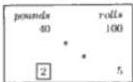

Pisan hundredweights moreover have in themselves one hundred parts, each of which is called a roll, and each roll contains 12 ounces, each of which weighs  $\frac{1}{2}39$  pennyweights [15]; and each pennyweight contains 6 carobs [16], and a carob is four grains [17] of corn. One hundredweight is sold for XL pounds, and it is sought how much 5 rolls are worth; the three known numbers are placed in the positions, as we said before is necessary, namely the 100 rolls, the 40 pounds, and the 5 rolls, of which two are of one kind, namely the 100 rolls and the 5 rolls that are merchandise. Truly the other, namely the 40, is of another kind, namely the price, and it is the price of the said 100 rolls; therefore, as we said before, the 100 rolls and the 40 pounds are written in one line, clearly writing the 100 after; next the 5 rolls are written beneath the 100 rolls, and this is shown above [18]; there will be two numbers of one kind, one under the other, as we

---

8. Here Begins Chapter Eight

said before, namely the 5 rolls below the 100 rolls; this thus written, you will multiply the numbers which are diagonally opposite, namely the 5 by the 40; there will be 200 that you divide by the 100; the quotient is 2 pounds for [p85] the price of the 5 rolls, and the 2 is written below the 40 because the number which results from the division always is of the kind which has but one number, which is the third said number; whence it is clear that from the four numbers which are used in business, two of them are merchandise, and two of them are prices, and they are proportional because as the 100, namely the merchandise, is to its price, namely to the 40, so the 5, namely the merchandise, will be to its price, namely the 2. For 100 to 40 is five halves; similarly 5 to 2 is five halves. Again as the 40, namely the price, is to the 100, namely to its merchandise, so the 2 will be to its merchandise, namely to the 5; for the 40 is two fifths of 100, and the 2 is two  $\frac{1}{5}$  of 5; also permuting, as the merchandise is to the merchandise, namely the 5 is to the 100, that is  $\frac{1}{20}$ , so is its price to the price, namely the 2 to the 40, or as the 100 is to the 5, which is twentyfold it, so is the 40 to the 2; and by these proportions you can find a multiplier; if the fourth unknown number is found correctly, then the check will be demonstrated in its place.

# On the Same When the Merchandise Is Sought in Pounds.

Also 100 rolls are worth 40 pounds; how many rolls will I have for 2 pounds? Of these three numbers two are the price kind, namely the 40 pounds and the 2 pounds, and the other is the merchandise kind; the 40 and the 100 are written in one line; because of that it is said 100 rolls for 40 pounds; next the 2 pounds are written below the 40 pounds, and they will be numbers of the same kind, one under the other, as displayed in the second illustration; and you multiply the numbers which are diagonally opposite, namely the 100 and the 2; there will be 200 that you divide by the 40; the quotient will be 5 rolls of merchandise for the 2 pounds which you write below the 100 rolls.

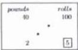

# On the Same When the Price of the Rolls Is Sought.

Also a hundredweight is sold for 13 pounds; how much are 27 rolls worth? The numbers are written down, as we said before, namely the 100 rolls, and the 13 pounds in one line, and the 27 rolls below the 100; the numbers showing diagonally opposite are multiplied, namely the 13 and the 27; there will be 351 that you divide by the 100, namely with  $\frac{1}{10} \frac{0}{10}$ ; the quotient will be  $\frac{1}{10} \frac{5}{10} 3$  that you write beneath the 13 pounds, as this illustration reveals. And if you will wish to know what part  $\frac{1}{10} \frac{5}{10}$  is of one pound, then you multiply the 5 that is over the 10 by another 10, and to the product you add the 1; there will be 51, and you multiply it by the total number of denari in one pound, namely 240; there will be 12240 which you divide with the  $\frac{1}{10} \frac{0}{10}$ ; the quotient will be  $\frac{0}{10} \frac{4}{10} 122$  denari, that is 10 soldi and  $\frac{2}{5} 2$  denari; in another way you double the 5 that is over the 10; there will be 10, which are soldi. Also you double the 1 which is over the other 10; there will be 2 that is had for the denari with the

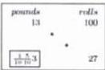

---

II. Liber Abaci

same total five. Therefore from this it is clear that for each pound of the denari that were divided by the 100, there results $\frac{2}{5}2$ denari; and of every ten pounds, 2 of soldi, and of the single 5, there results 1 soldo.

## On the Same.

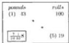

Also if 100 rolls are sold for 43 pounds, and it is sought what 19 rolls are worth, then following the aforewritten doctrine the numbers are written down; you multiply the numbers which are diagonally opposite, namely the 19 by the 43; there will be 817 that you divide with $\frac{1}{10} \frac{0}{10}$; the quotient will be $\frac{7}{10} \frac{1}{10} 8$ pounds that you write below the 43 pounds. And the $\frac{7}{10} \frac{1}{10}$ that is part of one pound, as we said before, is known. Clearly, when you double the one which is over the 10, there will be 2 soldi. Also if you will double the 7 that is over the other 10, then there will be 14 fifths soldi, which you will add with the 2 soldi which we just had; there will be 3 soldi and $\frac{4}{5} 4$ denari; and the 19 rolls are worth more than 8 pounds; we can indeed deal with the 7, as the 5 is taken from the 7 for [p86] which you keep 1 soldo that you add to the found 2 soldi; there will be 3 soldi. Therefore the difference which is from the 7 minus the 5, namely 2 fifths soldi, will be 4 denari and the same number of fifths, as was just found.

## On the Same.

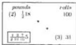

Also 100 rolls are worth $\frac{1}{2} 18$ pounds; how much will 31 rolls be worth? The numbers are therefore written down in order; you multiply the 18 by the 2 which is under the fraction following the 18, and to this you add the 1 which is over the 2; there will be 37 that you write above the $\frac{1}{2} 18$; and you multiply it by the 31 that is diagonally opposite; there will be 1147 that you divide by the 100, and by the 2 that is under the fraction with the 18, that is with $\frac{1}{2} \frac{0}{10} \frac{0}{10}$; the quotient will be $\frac{1}{2} \frac{3}{10} \frac{7}{10} 5$ pounds for the sought price of the 31 rolls.

If this is correct, then it will be known by casting out sevens; clearly if you divide the 18 by 7, then there remains 4 that you multiply by the 2; and to this you add the one which is over the 2; there will be 9 that you divide by the 7; there remains 2 for the residue of 37. Also you take the residue of the 31 by casting out sevens, which is 3; and you multiply it by the residue just found of the 37, namely by 2; there will be 6 that is kept for the residue of the price of the 31 rolls; next you multiply the 5 by the residue of the 10 that is after it in the fraction, namely the 3; to this you add the residue of the 7 that is over the 10, namely 0; there will be 15 that you divide by 7; there remains 1; which you multiply by the residue of the following 10 in the fraction, namely the 3; and to this you add the 3 that is over the 10; there will be 6 that you multiply by the 2 that is under the same fraction, and to this you add the 1 which is over the 2; there will be 13 from which you subtract 7; there remains 6, and it is kept for the residue. And if you will wish to know what part of one pound $\frac{1}{2} \frac{3}{10} \frac{7}{10}$ is, then you multiply the 7 that is over the 10 by the other 10, and to this you add the 3 that is over the 10; and you multiply by the 2 under the fraction; and

---

8. Here Begins Chapter Eight 131

you add the 1 which is over the 2; there will be 147 that you multiply by 240, namely the number of denari in one pound; there will be 35280 that you divide with $\frac{1}{2} \frac{0}{10} \frac{0}{10}$; however since in this product there is the zephir, the first place is divided by 10; the quotient is 3528 that you divide with the remaining $\frac{1}{2} \frac{0}{10}$; the quotient will be $\frac{4}{10} 176$ denari, which are 14 soldi, and $\frac{2}{5} 8$ denari.

## On a Hundredpound When the Price in Pounds Is Sought.

Again a hundredpound of pepper, which weighs 100 simple pounds, each of which contains 12 ounces, and any ounce weighs 25 pennyweights; and 158 pounds of it make one hundredweight; that is, 100 Pisan rolls are sold for $\frac{3}{4} 13$ pounds, and it is sought how much a weight of $\frac{1}{3} 46$ pounds is worth; the numbers are written down, as we said before, namely the $\frac{3}{4} 13$ pounds and the 100 pounds are in a line, and the $\frac{1}{3} 46$ pounds is below the 100 pounds, namely merchandise below merchandise, as we did above in the preceding problems; and you multiply the numbers which are diagonally opposite, namely the $\frac{3}{4} 13$ and the $\frac{1}{3} 46$; and you divide by the 100, that is you multiply the 13 by the 4, and to this you add the 3 that is over the 4; there will be 55 that you write above the $\frac{3}{4} 13$. Also you multiply the 46 by the 3, and to this you add the 1; there will be 139 that you write above the $\frac{1}{3} 46$; and you multiply the 55 by the 139; there will be 7645 that you divide by the 100 and the 3 that is under the fraction with the 46, and you divide by the 4 that is under the fraction with the 13, that is with $\frac{1}{2} \frac{0}{6} \frac{0}{10} \frac{0}{10}$; and the quotient which emerges will be the price of the $\frac{1}{3} 46$ pounds; but with the fractions, and what comes over the fractions, we cannot know what is the part, or what are the parts of one pound; thus we multiply the numerator by the number of denari in one pound, namely 240; because of this another fraction is divided, namely $\frac{1}{2} \frac{0}{6} \frac{0}{10} \frac{0}{10}$ is rearranged; clearly of the 100 by which the number is divided, [p87] we make $\frac{1}{5} \frac{0}{20}$; because that is $\frac{1}{10} \frac{0}{10}$; and of the written $\frac{1}{3}$ and $\frac{1}{4}$ we make $\frac{1}{12}$; and they are put into one fraction thus, $\frac{1}{5} \frac{0}{12} \frac{0}{20}$, which again is $\frac{1}{2} \frac{0}{6} \frac{0}{10} \frac{0}{10}$; you divide the 7645 with the $\frac{1}{5} \frac{0}{12} \frac{0}{20}$, and that which will remain over the 20 will be soldi because a pound of silver is 20 soldi, and that which is over the 12 will be denari because one soldo is 12 denari, and that which will remain over the rest will be a fractional part of one denaro; therefore if you will divide the 7645 with the $\frac{1}{5} \frac{0}{12} \frac{0}{20}$, then there will be $\frac{0}{5} \frac{5}{12} \frac{7}{20} 6$ pounds for the price of the said $\frac{1}{3} 46$ pounds, for which one will say 6 pounds, 7 soldi, and 5 denari. And if from the division results a number which cannot be rearranged to $\frac{1}{12} \frac{0}{20}$, then we shall declare in the following how it then must be done, but we shall take care to show how all numbers are easily divided by 12 and by 20. Indeed we shall teach how to divide in order all numbers integrally by 12, number by number, with quotient from two up to nine. Whence the divisions made by 2 ascend, as of 12 divided first by 12 yielding first 1; of 24 results 2, of 36 results 3, of 48 results 4, of 60 results 5, of 72 results 6, of 84 results 7, of 96 results 8, of 108 results 9, as are contained in the tables of division. However with any number which exceeds 120, it is that which we must in the division of a number write over the divisor which it exceeds, and couple it with the preceding figure that is in the dividend number. For example, if you will wish to divide 3479 by 12, you

|  pounds | rolls  |
| --- | --- |
|  (6) 55 |   |
|  $\frac{3}{4} 13$ | 100  |
|  d. s. l. | *  |
|  $\frac{1}{12} \cdot \frac{5}{20} 6$ | (3) $\frac{1}{3} 46$  |
|  Division of | 11  |
| --- | --- |
|  3479 by 12. | 119  |
|   | 107  |
|   | 3479  |
|   | 12  |
|   | 289  |
|  $\frac{11}{12} \cdot 289$ |   |

---

II. Liber Abaci

write the 12 under the 79 of the 3479, and the XII in 34 are taken, which are 2, and there remains 10, and this is the remainder which is the difference between 24 and 34; and you put the 2 under the 4 of the 34, and the 10 over the same 34, and with the 10 you couple the 7 that is the preceding figure; there will be 107 that you divide by 12; the quotient is 8, and there remains 11 that is the difference between 96 and 107; you therefore put the 8 below the 7, and the 11 over the 107, namely the 1 over the 0, and the 1 over the 7; and you will couple the 11 with the preceding 9; there will be 119 that you divide by the 12; there results 9, and there remains 11; you put the 9 under the 9, and the 11 in some other part of the table over the 12, and you will have for the sought division  $\frac{11}{12}289$ , as is displayed in this description. Therefore it is manifest that 3479 denari make 289 soldi and 11 denari, because when some quantity of denari are divided by 12, then from this division results soldi; and if this of the division by 12 is often said, studiously written in table, and kept in hand, then you will remember it, and you will be able to operate most easily.

# The Division of Numbers by 20.

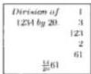

Indeed we can divide all numbers by 20 thus: you leave off the first place figure of the number that you wish to divide, and below the following, that is the second place figure of the same number you put 2, by which you divide the entire number up to the figure below which the 2 was put; and the quotient of the division will be  $\frac{1}{20}$  of the entire number that you will wish to divide; and if there is some remainder, then you couple it with the first place figure that we had you omit; and whatever from the joining emerges is that which will remain from the abovewritten division; and if over the second figure nothing results, then there will be only the first figure for the remainder. For example, if we shall wish to divide 1234 by 20, the 4 that is in the first place is left off; and below the following figure, namely below the 3, the 2 is put, by which the 123 is divided, namely that which remains of the 1234 when the 4 was deleted; the quotient is 61, and there remains 1 which is coupled with the 4 making 14; therefore the quotient is 61, and the remainder is 14 from the division of the 1234 by the 20, as here is shown; from this it is indeed manifest the 1234 soldi make 61 pounds and 14 soldi. The divisions by 12 and by 20 are therefore shown; now truly we return to the proposition. [p88]

# On One Hundred Massamutini.[19]

One hundred massamutini are worth  $\frac{1}{2} 53$  pounds; how much therefore are  $\frac{1}{9} 23$  massamutini worth? You write down the numbers in order, as was said above, and you multiply the numbers which are diagonally opposite, namely the  $\frac{1}{2} 53$  and the  $\frac{1}{9} 23$ , and you divide by the 100, that is you will multiply the 53 by the parts of its fraction; there will be 107 that you write over the  $\frac{1}{2} 53$ . Also you will multiply the 23 by the 9, and to this you add the 1; there will be 208 that you write above the  $\frac{1}{9} 23$ ; and you multiply the 107 by the 208; there will be 22256 that you divide by the 100, and by the 2, and by the 9, that are

---

8. Here Begins Chapter Eight

under the fractions, that is with  $\frac{1}{2} \frac{0}{9} \frac{0}{10} \frac{0}{10}$ ; and you will have the price of the  $\frac{1}{9} 23$  massamutini; and you rearrange the numbers of the division so that  $\frac{1}{12} \frac{0}{20}$  can be had at the head of the fraction; and in one multiplication you have pounds, and soldi, and denari, as we made work in the aforewritten problem, when you made  $\frac{1}{5} \frac{0}{20}$  from  $\frac{1}{10} \frac{0}{10}$ ; and when of the remaining smaller divisions, with  $\frac{1}{2}$  and  $\frac{1}{9}$ , namely, we could not arrange  $\frac{1}{12}$  because that which we could take from the composition of 12 we took, that is from the rule for 9 we must take  $\frac{1}{3}$ , and mix the  $\frac{1}{3}$  with the  $\frac{1}{2}$ , making  $\frac{1}{6}$ . The rest truly is that which is ours from the 12, namely the 2, we must multiply by the 22256; there will be 44512 that you divide with  $\frac{1}{3} \frac{0}{5} \frac{0}{12} \frac{0}{20}$ ; the quotient will be  $\frac{1}{2} \frac{2}{5} \frac{3}{12} \frac{7}{20} 12$  pounds for the value of the  $\frac{1}{9} 23$  massamutini; if you will wish to check by casting out sevens, then you take the residue of the 53 that is 4, and you multiply it by the 2 of the fraction, and to this you add the 1; there will be 9; you take the residue that is 2, and it must be the residue of the 107, and it is; next you take the residue of the 23, and you multiply it by the 9 of the fraction, and you add the 1; there will be 19; the residue, namely 5, is the residue of the 208; you multiply it by the residue of the 107, namely by 2; there will be 10 that you multiply by the 2, that for us lessens the rule for 12, namely by the 2 by which we multiplied the 22256; there will be 10; you take the residue of it that is 6, and you keep it for the residue of  $\frac{1}{2} \frac{2}{5} \frac{3}{12} \frac{7}{20} 12$ ; and if the total is made for all, then you know the process to be correct; and thus the residue of it is taken; the residue of the 12 that is outside of the fraction is multiplied by the residue of the 20 that is under the fraction, namely 5 by 6; it is 30 to which is added the 7 that is over the 20; there will be 37; the residue of it, namely 2, is multiplied by 5, namely the residue of the 12, and the 3 that is over the 12 is added; there will be 13; the residue of it, namely 6, is multiplied by the 5, and to this is added the 2 that is over the 5; there will be 32; the residue of it that is 4, you multiply by the 3 of the fraction, and to this is added the 1 which is over the 3, making 13 for which the residue is 6, and it is kept for the residue. And thus always with any similar problems you will wish to take the residue, accordingly you go multiplying; you strive to go with any modulo check; then you reach the last multiplication, and you take the residue of the last multiplication; you keep it for the residue of the result of the division; and this is said of the residue; we believe it sufficient to satisfy all problems.

|  lbs. (2) | 107 | mases.  |
| --- | --- | --- |
|   | 1/253 | 100  |
|   |  | .  |
|   |  | .  |
|  d. s. l. |  | (5)208  |
|  1/253 | 1/253 | 1/23  |

# On One Hundred Hides.

If 100 hides are worth  $\frac{1}{9} \frac{3}{5} 83$  pounds, then how much are 32 hides worth? You write down the numbers, and you multiply the  $\frac{1}{9} \frac{3}{5} 83$  and the 32 because they are put diagonally opposite, and you divide the product of them by the 100; that is, you multiply the 83 by its fractions; there will be 3767 that you write above the  $\frac{1}{9} \frac{3}{5} 83$ ; and you check with residues of any number except 9; next you multiply the 3767 by the 32; there will be 120544 that you divide by the 100, and with  $\frac{1}{5} \frac{0}{9}$ , and you rearrange them so that you have  $\frac{1}{12} \frac{0}{20}$  at the head of the fraction; thus you make  $\frac{1}{5} \frac{0}{20}$  of the 100, and of  $\frac{1}{9}$  you make  $\frac{1}{3} \frac{0}{3}$ ; and you remove  $\frac{1}{3}$  from it, and you will multiply it by the 4 because that makes 12,

|  pounds (1)3767 1/253 | hides 100  |
| --- | --- |
|  (2) d. s. l. 1/253 2/312 2/26 | (4)32  |

---

II. Liber Abaci

and you put the 12 after the 20, as we demonstrated above how to do; and you arrange the remaining fractions, and you put the  $\frac{1}{12} \frac{0}{20}$ , and you will have in the fraction [p89] of the division  $\frac{1}{3} \frac{0}{5} \frac{0}{5} \frac{0}{12} \frac{0}{20}$ ; and because we lack  $\frac{1}{4}$  of the 12, you put 4 over the 100, and you have it held safely in memory when you will take the residue; and you multiply it by the 120544; there will be 482176 that you divide with the  $\frac{1}{8} \frac{0}{5} \frac{0}{5} \frac{0}{12} \frac{0}{20}$ ; the quotient will be  $\frac{1}{8} \frac{0}{5} \frac{0}{5} \frac{9}{12} \frac{15}{20} 26$  pounds for the price of the 32 hides, as is displayed above in the illustration.

Again 100 rolls are worth  $\frac{1}{2} \frac{1}{4} 23$  pounds; how much are  $\frac{2}{5} \frac{3}{13} 64$  rolls worth? You write down the problem, and you multiply the 23 by its fractions; there will be 655 that you write above the 23; and you check with the residue whether it is correct; next you multiply the 64 by its fraction; there will be 4177; and you multiply it by the 655; there will be 2735935 that optimally you will not neglect to check; and you divide it by the number 100, and by the parts of the fractions of both numbers which are placed diagonally opposite, and optimally you will clearly arrange them together so that you will have  $\frac{1}{12} \frac{0}{20}$  at the head of the fraction; this you make thus: you make  $\frac{1}{5} \frac{0}{20}$  of the 100, and you see if you will be able to find 12 in the remaining parts of the fraction, or some of its parts; you can take  $\frac{1}{4}$  for part of the 12, that is from its composition rule; therefore we lack 3 for having 12 in the fraction after the 20; therefore you put the 3 over the 100 as is shown in the problem, and you keep it held in memory; and you arrange the numbers of the division after the  $\frac{1}{12} \frac{0}{20}$  thus,  $\frac{1}{5} \frac{0}{5} \frac{0}{7} \frac{0}{13} \frac{0}{12} \frac{0}{20}$ ; and you multiply the 2735935 by the 3 kept over the 100; there will be 8207805 that again you check with its residue, and you divide it with  $\frac{1}{5} \frac{0}{5} \frac{0}{7} \frac{0}{13} \frac{0}{12} \frac{0}{20}$ ; the quotient is  $\frac{0}{5} \frac{1}{5} \frac{5}{7} \frac{10}{13} \frac{7}{12} \frac{0}{20} 15$  pounds for the sought price of the rolls; and the residue of it multiplied by the residue of the 100 is 7, as is displayed in the above illustration.

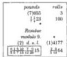

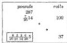

# On Hundredweights.

Also a hundredweight of some merchandise is worth 14 pounds and 7 soldi; how much are 37 rolls of the same merchandise worth? You make of the soldi the fraction  $\frac{7}{20}$  of a pound that you write down after the 14, thus,  $\frac{7}{20} 14$ ; and you write down the problem; and you multiply the  $\frac{7}{20} 14$  and the 37 that are diagonally opposite, and you divide by the 100; that is, you multiply the 14 by the 20, and to this you add the 7 that is over the 20; there will be 287 soldi which you write over the  $\frac{7}{20} 14$ ; and you multiply it by the 37; there will be 10619 that must be divided by the 100 and the 20 of the fraction; but as 12 ought be had in the fraction of the division so that we have pounds, soldi, and denari in one multiplication, you multiply the 10619 by the 12, and you divide by the 100, and with the  $\frac{1}{12} \frac{0}{20}$  that is with  $\frac{1}{10} \frac{0}{10} \frac{0}{12} \frac{0}{20}$ ; the quotient will be  $\frac{8}{10} \frac{2}{10} \frac{2}{10} \frac{6}{12} 5$  pounds for the price of the said 37 rolls, and the residue by nine is 6.

# On a Hundred Canes of Cloth.

Also 100 canes of cloth are worth  $\frac{11}{20} 15$  pounds; how much are  $\frac{5}{8} 27$  canes worth, that is 27 canes and  $\frac{1}{2} 2$  arms? [20] You therefore write down the problem; you multiply the 15 by the 20, and you add the 11 to the product; there will be

---

8. Here Begins Chapter Eight

311 soldi which you write above the 15. Also you multiply the 27 by the 8, and you add the 5; there will be 221 that you write above the 27; and you multiply the 311 by the 221; there will be 68731 that we must multiply by 12 in order to have it under the fraction, except we have 8 in the division, namely that which is under the fraction after the 27 canes, for which the rule of composition is $\frac{1}{2}\frac{0}{4}$; therefore we shall triple the 4, and we shall have 12 in the division. Whence the 68731 is multiplied by 3, because when the divisor is tripled, so also is the dividend number tripled; there will be 206193 that is divided by the 2 that remains of the rule for the 8; thence clearly there is left the 4, the 100, the 12 and the 20; that is, you divide with $\frac{1}{2}\frac{0}{10}\frac{0}{10}\frac{0}{12}\frac{0}{20}$; the quotient will be $\frac{1}{2}\frac{6}{10}\frac{9}{10}\frac{10}{12}\frac{5}{20}4$ pounds, for which the residue by seven is 1, as is displayed in the illustration.

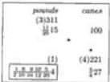

## On a Hundredpound of Pepper.

Also a hundredpound of pepper is worth $\frac{9}{20}11$; how much are $\frac{1}{4}\frac{5}{12}46$ pounds worth, that is 46 pounds and $\frac{1}{4}5$ ounces? You therefore write down the problem, and you multiply the 11 by the 20, and you add the 9; there will be 229 that you write above the 11. Also you multiply the 46 by the 12, and you add the 5; and you multiply by the 4, and you add the 1; there will be 2229 that you write above the 46, and you multiply the 229 by the 2229; there will be 510441 that you divide by the 100 and by the 20, and with $\frac{1}{4}\frac{0}{12}$, that is with $\frac{1}{4}\frac{0}{10}\frac{0}{10}\frac{0}{12}\frac{0}{20}$, and for the price of the $\frac{1}{4}\frac{5}{12}46$ pounds $\frac{1}{4}\frac{0}{10}\frac{1}{10}\frac{4}{12}\frac{6}{20}5$ pounds will be the quotient; [p90] and the residue by seven is 1.

## [Also on a Hundredpound.]

Also a hundredpound is worth 12 pounds, 13 soldi, and 5 denari, that is $\frac{5}{12}\frac{13}{20}12$ pounds; how much are $\frac{1}{9}\frac{3}{4}5$ ounces worth? Although in this problem 100 pounds and $\frac{1}{9}\frac{3}{4}5$ ounces are both of the same kind of merchandise, the numbers are not in the same units of weight because the 100 is in pounds and the $\frac{1}{9}\frac{3}{4}5$ is in ounces; therefore we make 1200 ounces of the 100 pounds, and then they both will be the same; and then the problem will clearly be: if 1200 ounces are worth $\frac{5}{12}\frac{13}{20}12$ pounds, then how much are $\frac{1}{9}\frac{3}{4}5$ ounces worth? You write down this problem as we taught; and you multiply the 12 by its fraction; there will be 3041 denari which you write above the 12 pounds. Also you multiply the 5 by its fractions; there will be 211 that you write above the $\frac{1}{9}\frac{3}{4}5$; and you multiply the 211 by the 3041; there will be 641651 that you divide by the 1200, and by the 4, and by the 9, and with the $\frac{1}{12}\frac{0}{20}$, and you arrange the fraction optimally; the quotient is $\frac{5}{6}\frac{5}{8}\frac{2}{9}\frac{5}{10}\frac{5}{10}\frac{8}{12}\frac{2}{20}$ pound for the sought price of the ounces, as is displayed in the illustration.

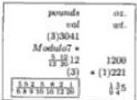

## On Hundredweights.

Also a hundredweight is worth $\frac{1}{4}\frac{7}{12}\frac{16}{20}21$ pounds, and the worth is sought of $\frac{1}{7}\frac{2}{5}\frac{7}{12}43$ rolls, that is 43 rolls and $\frac{1}{7}\frac{1}{5}7$ ounces. Therefore you multiply the

---

136 II. Liber Abaci

written 21 by its fraction; there will be 20957, also you multiply the 43 rolls by

|  pounds (2) 20957 |   | rolls  |
| --- | --- | --- |
|  $\frac{1\ 7\ 16}{4\ 12\ 20}\ 21$ |   | 100  |
|  The residue
is modulo 11. | * |   |
|   |   | * (9) 18324  |
|  $\frac{0\ 3\ 7\ 9\ 0\ 8\ 5\ 10}{3\ 7\ 8\ 10\ 10\ 10\ 12\ 20}\ 9$ |   | $\frac{1\ 2\ 7}{7\ 5\ 12}\ 43$  |

the 12, and you add the 7; and you multiply by the 5, and you add the 2; and you multiply by the 7, and you add the multiplication of the one which is over the 7 by the 5; there will be 18324 that you multiply by the 20957; there will be 384016068 that you divide by the 100, and by the fractional parts that are under the fractions of both numbers; you arrange the fraction optimally; the quotient will be $\frac{0\ 3\ 7\ 9\ 0\ 8\ 5\ 10}{3\ 7\ 8\ 10\ 10\ 10\ 12\ 20}\ 9$ pounds, as is displayed in the illustration; and the residue by 11 is 7.

### On a Hundredweight Sold for Pounds and Denari.

Also a hundredweight is worth 13 pounds and 7 denari, that is $\frac{7\ 0}{12\ 20}\ 13$ pounds; how much are 7 hundredweights and 43 rolls, that is 743 rolls, worth? You write down the problem, and you multiply the 13 by the 20, and you multiply by the 12 and add the 7; there will be 3127 that you multiply by the 743; there will be 2323361 that you divide by the 100, and with $\frac{1\ 0}{12\ 20}$, that is with $\frac{1\ 0\ 0\ 0}{10\ 10\ 12\ 20}$; the quotient will be $\frac{1\ 6\ 1\ 16}{10\ 10\ 12\ 20}\ 96$ pounds for the price of the 743 rolls.

### On One Thousand Sold for Pounds and Soldi.

Also one thousand various things are sold for 153 pounds and 9 soldi, that is for $\frac{9}{20}\ 153$ pounds; how much are 227 various things worth? You write down the problem, and you multiply the 153 by its fraction; there will be 3069 that you multiply by the 227; there will be 696663 that you multiply by the 12 in order to have 12 in the fraction of the division; there will be 8359956 that you divide with the rule for 1000 and with $\frac{1\ 0}{12\ 20}$, that is with $\frac{1\ 0\ 0\ 0\ 0}{10\ 10\ 10\ 12\ 20}$; the quotient will be $\frac{6\ 5\ 9\ 7\ 16}{10\ 10\ 10\ 12\ 20}\ 34$ pounds for the sought price of the various things.

### On the Same for Pounds and Soldi and Denari.

Also 1000 rolls are sold for $\frac{5\ 8}{12\ 20}\ 57$ pounds; how much are $\frac{5}{6}\ 87$ rolls worth?

|  pounds (9) 13781 |   | rolls  |
| --- | --- | --- |
|  $\frac{5\ 8}{12\ 20}\ 57$ |   | 1000  |
|  The residue
is modulo 11. | * |   |
|   |   | * (10) 527  |
|  $\frac{1\ 1\ 3\ 4\ 10\ 0\ 5}{6\ 10\ 10\ 10\ 12\ 20}\ 5$ |   | $\frac{5}{6}\ 87$  |

---

8. Here Begins Chapter Eight 137

You therefore write down the problem, and you the 57 by its fraction; there will be 13781 that you write above the 57. Also you multiply the 87 by the 6, and you add the 5; there will be 527 that you multiply by the 13781; there will be 7262587 that you divide by the 1000, and by the remaining parts of the fractions of the numbers, that is with $\frac{1}{6} \frac{0}{10} \frac{0}{10} \frac{0}{10} \frac{0}{12} \frac{0}{20}$; the quotient will be $\frac{1}{6} \frac{1}{10} \frac{3}{10} \frac{4}{10} \frac{10}{12} \frac{0}{20} 5$ pounds.

## On a Ton of Pisan Cheese.

A ton of cheese which weighs 22 hundred pounds, that is 2200 pounds, is sold for 24 pounds; it is asked how much 86 pounds are worth? You write down the problem, and you multiply the 24 by the 86; there will be 2064 [p91] that you divide with the rule for 2200, that is $\frac{1}{2} \frac{0}{10} \frac{0}{10} \frac{0}{11}$; however you make $\frac{1}{20}$ of the $\frac{1}{2} \frac{0}{10}$ so that we shall thus have it in the fraction, $\frac{1}{10} \frac{0}{11} \frac{0}{20}$; and as we do not have 12 in this division, the 2064 is multiplied by 12, and the 12 is put under the fraction of the division. Because the 12 is placed in the fraction of the division, then the divisor is multiplied by the 12; therefore similarly the dividend is multiplied by the 12 so that the ratio of the dividend to the divisor stays the same as before; from this results $\frac{8}{10} \frac{1}{11} \frac{9}{12} \frac{18}{20}$.

## On the Same.

Also a ton of cheese, that is 2200 pounds, is worth $\frac{11}{20} 18$ pounds; how much are 100 pounds worth? However this problem need not be written down because the 100 is $\frac{1}{22}$ of the 2200; therefore nothing more is needed than to divide the said value of the ton with the rule for 22, that is with $\frac{1}{2} \frac{0}{11}$, which you can do thus: you take $\frac{1}{2}$ of the 18 pounds and 11 soldi; there will be 9 pounds and $\frac{1}{2} 5$ soldi, of which you make soldi; there will be 185 soldi and 6 denari which you divide by the 11; the quotient will be 16 soldi, and there remain 9 soldi and 6 denari to be divided by the 11; you make denari of them; there will be 114 which you divide by the 11; the quotient will be $\frac{1}{11} 10$ denari, and the total worth of the hundred pound of cheese is clearly 16 soldi and $\frac{1}{11} 10$ denari.

## On the Same with Pounds.

Also one ton is worth $\frac{13}{20} 19$ pounds; how much are 783 pounds worth? You write down the problem, and you multiply the 19 by the 10, and you add the 13; there will be 303 soldi which you multiply by the 783; there will be 307719 that you must divide with the rule for 2200, and by the 20 that is under the fraction, that is with $\frac{1}{2} \frac{0}{10} \frac{0}{10} \frac{0}{11} \frac{0}{20}$; but in order to have 12 under the fraction, you multiply the 307719 by 6 which you arrange with the 2 that is already under the fraction, and you will thus have 12 in the fraction, $\frac{1}{10} \frac{0}{10} \frac{0}{11} \frac{0}{12} \frac{0}{20}$; the quotient will be $\frac{4}{10} \frac{1}{10} \frac{5}{10} \frac{10}{11} \frac{19}{12} \frac{20}{20} 6$ pounds.

|  pounds
value | pounds
wt.  |
| --- | --- |
|  (3)24 | 2200  |
|  Residue
module? |   |
|  $\frac{5}{10} \frac{1}{11} \frac{0}{12} \frac{10}{20}$ | *(2) 86  |
|  lbs.
val. | lbs.
wt.  |
| --- | --- |
|  (1)393 |   |
|  $\frac{13}{20} 19$ | 2200  |
|  $\bullet$ |   |
|  $\frac{4}{10} \frac{1}{11} \frac{393}{10} \frac{19}{12} \frac{19}{20}$ | (6)783  |

---

II. Liber Abaci

# On a Load of Provence. [21]

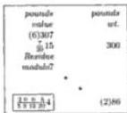

A load of Provence that weighs 300 pounds is sold for 14 pounds and 7 soldi, that is for  $\frac{7}{20}15$  pounds; it is sought how much 86 pounds are worth; you multiply the 15 by the 20, and you add the 7; there will be 307 that you write over the 15, and you multiply it by the 86; there will be 26402 that you divide by the 300, and by the 20, that is with  $\frac{1000}{551220}$ ; the quotient will be  $\frac{2008}{5512204}$  pounds for the sought price of the 86 pounds, as is shown here. Thus you must indeed strive to find the composition rules for the numbers by which the division is made, as we just did for the 300; although the rule is  $\frac{100}{31010}$ , we can have it be  $\frac{100}{5512}$ , and we have  $\frac{1}{12}$ ; we could have  $\frac{1}{20}$ , namely with 15.

# On the Same Load.

Also a load of pepper is worth 11 pounds, 7 soldi, and 5 denari, that is  $\frac{5}{12} \frac{7}{20} 11$  pounds; how much are 127 pounds and  $\frac{1}{5} \frac{1}{4} \frac{1}{3} 5$  ounces worth, that is  $\frac{1}{5} \frac{1}{4} \frac{1}{3} \frac{5}{12} 127$  pounds? You write down the problem, and you multiply the 11 by its fraction;

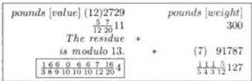

there will be 2729 that you write above the 11. Also you multiply the 127 by its fractions, that is by the 12, and you add the 5; and you multiply by the 3 and add the 1; you multiply by the 4, and by the 5; there will be 91760. Also you multiply the 1 which is over the 4 by the 5, and you multiply by the 3; there will be 12 that you add to the 15, and to the 91760; there will be 91787 that you write above the 127, and you multiply by the 2729; there will be 250486723 that you divide with the rule for 300, and by all the parts of the fractions; the quotient will be  $\frac{16606716}{3891010101220}4$  pounds for the sought price of the pounds.

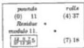

# On Rolls.

Thirty-seven rolls are worth 11 pounds; how much are 18 rolls worth? You multiply the 11 by the 18; [p92] there will be 198 that you multiply by 12 and by 20, that is by 240, in order that we have them in the fraction of the division; there here will be 47520 that you divide with  $\frac{100}{371220}$ ; the quotient will be  $\frac{1207}{3712205}$  pounds for the price of the 18 rolls.

# On the Same.

Also 42 rolls are worth  $\frac{1}{5} \frac{1}{4} 13$  pounds; how much are  $\frac{1}{2} 18$  rolls worth? You multiply the 13 by its fractions; there will be 269, and you multiply the 18 by the 2, and you add the 1; there will be 37 that you multiply by the 269; there

---

8. Here Begins Chapter Eight 139

will be 9953 that you divide with the rule for the 42, namely with $\frac{1}{6} \frac{0}{7}$; and you divide by the 2, 4, and 5 that are under both fractions of the numbers, arranging them thus: of the $\frac{1}{2}$ and the $\frac{1}{6}$ you make $\frac{1}{12}$, and of the $\frac{1}{4}$ and the $\frac{1}{5}$ you make $\frac{1}{20}$, and you will have for their rearrangement $\frac{1}{7} \frac{0}{12} \frac{0}{20}$; and the quotient for the price of the $\frac{1}{2} 18$ rolls will be $\frac{6}{7} \frac{5}{12} \frac{18}{20} 5$ pounds.

These problems are now completed on the sale of hundredweights and other diverse weights for pounds and denari in which we need to have in the fractions of division the $\frac{1}{12} \frac{0}{20}$ when we have pounds, soldi, and denari in one problem; now when a sale is made from soldi we shall need to have $\frac{1}{12}$ at the head of the fraction of division so that there will remain over the 12 after the division the number of denari, and the integer that remains with it outside of the fraction after the division is the number of soldi.

|  pounds
(5)269
$\frac{1}{4} \frac{1}{4} 13$
Residue
modulo 11
(9)
$\frac{8}{7} \frac{3}{12} \frac{18}{20} 5$
$\frac{1}{12} \frac{1}{20} 5$ | rolls
42
(4)37
$\frac{1}{4} 18$  |
| --- | --- |

## On Hundredweights Sold for Soldi and Fractions of Soldi.

Also a hundredweight is worth $\frac{1}{4} 27$ soldi, that is 27 soldi and 3 denari; how much are $\frac{1}{3} 42$ rolls worth? You multiply the 27 by the 4, and you add the 1; there will be 109. Also you multiply the 42 by the 3, and you add the 1; there will be 127 that you multiply by the 109; there will be 13843 that you divide by the 100, and by the 3 and the 4 that are with $\frac{1}{10} \frac{0}{10} \frac{1}{12}$; the quotient will be $\frac{3}{10} \frac{4}{10} \frac{6}{12} 11$ soldi.

|  soldi
(10) 109
$\frac{1}{4} 27$
Residue
modulo 11
d. s.
$\frac{3}{8} \frac{4}{10} \frac{6}{10} \frac{11}{12}$ | rolls
(1) 100
(4)27
$\frac{1}{4} 42$  |
| --- | --- |

## On the Same for Soldi and Denari.

Also a hundredweight is worth 26 soldi and 5 denari, that is $\frac{5}{12} 26$ soldi; how much are $\frac{5}{8} 31$ rolls worth? You multiply the 26 by the 12, and you add the 5; there will be 317 denari. Also you multiply the 31 by the 8, and you add the 5; there will be 253 that you multiply by the 317; there will be 80201 that you divide with $\frac{1}{8} \frac{0}{10} \frac{0}{10} \frac{0}{12}$; the quotient will be $\frac{1}{8} \frac{5}{10} \frac{2}{10} \frac{4}{12} 8$ soldi.

## On the Same for Soldi and Denari and Fractions of Them.

Also a hundredweight, that is 100 rolls, is worth $\frac{1}{4} \frac{1}{3} \frac{5}{12} 28$ soldi, that is 28 soldi and $\frac{1}{4} \frac{1}{3} 5$ denari; how much are $\frac{2}{7} 7$ pounds worth? Although 100 rolls and $\frac{2}{7} 7$ pounds are of the same kind, both weight, they however are not the same units of weight; and in order that both quantities are of the same kind and the same unit of weight, either both rolls or both pounds, we make of the 100 rolls 158 Pisan pounds; but some others are 150 pounds, and they would be put in the problem with the sale price; next you multiply the 28 by its fraction; there will be 4099. Also you multiply the 7 by the 7, and you add the 2; there will be 51 that you multiply by the 4099; there will be 209049 that you divide by the 158, and with the fractions that are rearranged to $\frac{1}{3} \frac{0}{7} \frac{0}{8} \frac{0}{79} \frac{0}{12}$; the quotient will be $\frac{0}{3} \frac{5}{7} \frac{2}{8} \frac{59}{79} \frac{3}{12} 1$ soldi; or you multiply a third of the 51, namely the 17, by the 4099, and you take away 3 from under the fraction because always in these problems in which multiplication and division occur you must observe the aforesaid method of cancellation.

|  soldi
(7) 4099
$\frac{1}{4} \frac{1}{3} \frac{5}{12} 28$
Residue
modulo 11
d.s.
$\frac{2}{7} \frac{59}{7} \frac{3}{12} 1$ | ths.
[wt.]
158
(7) 51
$\frac{5}{7} 7$  |
| --- | --- |

---

II. Liber Abaci

# On a Hundredweight Sold for Tareni.

A hundredweight of any merchandise is sold near Sicily for 26 tareni; it is sought how much 47 rolls are worth; you write down the problem, and you multiply the numbers which are diagonally opposite, namely the 26 and the 27; there will be 1222 that you divide with the rule for 100, arranging it so that we have [p93] $\frac{1}{20}$ at the head of the fraction because the tareno weight the same as 20 grains of corn; and that which will remain over the 20 will be the number of grains. Therefore the rule for the 100 is $\frac{1}{5} \frac{0}{20}$, with which you divide the 1222; the quotient will be $\frac{2}{5} \frac{4}{20} 12$ tareni, that is 12 tareni and $\frac{2}{5} 4$ grains; or in another way you have the product 1222; you take 12 tareni for the 1200 because 1200 is twelve hundredpound; next the 22 that remains you divide by 5, and that which results from the division, that is $\frac{2}{5} 4$, are the grains that we just found.

# On the Same.

|  tareni | rolls  |
| --- | --- |
|  (5) 229 | 100  |
|  $\frac{1}{5} 57$ |   |
|  Residue |   |
|  modulo 7 |   |
|  (4) |   |
|  $\frac{1}{5} \frac{2}{20} 12$ | (5)831  |
|  tareni | rolls  |
| --- | --- |
|  (3)2551 | 100  |
|  $\frac{1}{10} 127$ |   |
|  Residue |   |
|  modulo 7 |   |
|  (3) | *(1)169  |
|  $\frac{3}{4} \frac{8}{10} \frac{7}{10} \frac{17}{20} 53$ | $\frac{1}{4} 42$  |

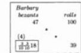

Also one hundredweight is sold for $\frac{1}{4} 57$ tareni; how much are 831 rolls worth, that is 8 hundredweight and 31 rolls? You therefore multiply the 57 by the 4, and you add the 1; there will be 229 that you multiply by the 831; there will be 190299 that you divide by the 100, and by the 4, that is with $\frac{1}{4} \frac{0}{5} \frac{0}{20}$, or with $\frac{1}{2} \frac{0}{10} \frac{0}{20}$ which is more elegant; the quotient will be $\frac{1}{2} \frac{9}{10} \frac{14}{20} 475$ tareni, which tareno is a weight of Messina; and if you will wish to know how many ounces there are you divide the 475 tareni by 30, because 30 tareni make there 1 ounce; the quotient will be $\frac{5}{6} 15$ ounces. Again if the 475 are weights of Palermo, then you divide the 475 by $\frac{1}{3} 27$, because one Palermitan ounce is $\frac{1}{3} 27$ tareni.

# On the Same.

Also one hundredweight is sold for $\frac{11}{20} 127$ tareni, that is 127 tareni and 11 grains; how much are $\frac{1}{4} 42$ rolls worth? You multiply the 127 by the 20, and you add the 11; there will be 2551. Also you multiply the 42 by the 4, and you add the 1; there will be 169 that you multiply by the 1551; there will be 431119 that you divide by the 100, and by the 4, and by the 20; the quotient will be $\frac{3}{4} \frac{8}{10} \frac{7}{10} \frac{17}{20} 53$ tareni.

The problems on the sales for the quoted tareni are now completed; now truly we shall teach the sale of thing for the bezants of Barbary [22], each of which is 10 mils; because this is so, we shall always have in these problems $\frac{1}{10}$ at the head of the fraction of division, and that which will remain over the 10 will make the number of mils.

# [On a Hundredweight Sold for Bezants of Barbary.]

If one hundredweight of some merchandise is sold nearby Barbary for 47 bezants, then how much are 29 rolls worth? You write down the problem, and you multiply the 47 by the 39 that are diagonally opposite; there will be 1833 that you divide by the 100, namely with $\frac{1}{10} \frac{0}{10}$; the quotient will be $\frac{3}{10} \frac{3}{10} 18$ bezants, that is 18 bezants and $\frac{3}{10} 3$ mils, and such is the worth of the 39 rolls.

---

8. Here Begins Chapter Eight

# [On Goatskins Sold for Bezants of Barbary.]

One hundred goatskins are worth  $\frac{3}{4} 42$  bezants; how much are 21 goatskins worth? You multiply the 42 by the 4, and you add the 3; there will be 171 that you multiply by the 21; there will be 3591 that you divide by the 100, and the 4, that is with  $\frac{1}{4} \frac{0}{10} \frac{0}{10}$ ; the quotient will be  $\frac{3}{4} \frac{4}{10} \frac{9}{10} 8$  bezants for the price of 21 goatskins.

|  bezants | goatskins  |
| --- | --- |
|  (0) 171 |   |
|  1/4 42 | 100  |
|  (0) |   |
|  3/4 8 10 | (3) 21  |

# On a Hundredweight Sold for Bezants and Mils.

Also one hundredweight is sold for 23 bezants and  $\frac{1}{2}4$  mils, that is for  $\frac{1}{2} \frac{4}{10}23$  bezants; how much are  $\frac{1}{4}31$  rolls worth?

You multiply the 23 by the 10, and you add the 4, and you multiply by the 2, and add the 1; there will be 469. Again you multiply the 31 by the 4, and add the 1; there will be 125; one twenty-fifth of it, namely 5, you multiply by the 469, and the product you divide by one twenty-fifth of the 100, namely by 4, and by all the numbers which are under the fractions; the quotient will be  $\frac{1}{4} \frac{2}{8} \frac{3}{10} 7$  bezants.

|  bezants | rolls  |
| --- | --- |
|  (0) 469 |   |
|  1/4 10 23 | 100  |
|  |   |
|   | (6) 125  |
|  1/4 3 7 10 | 1/4 31  |

# On Ten Cloths Sold in Barbary.

Ten cloths are worth  $\frac{1}{4} 34$  bezants; how much are 37 cloths worth? you multiply the 34 by the 4, and you add the 1; there will be 137 that you multiply by the 37; there will be 5069 that you divide by the 10, and by the 4 of the fraction, that is with  $\frac{1}{4} \frac{0}{10}$ ; the quotient will be  $\frac{1}{4} \frac{7}{10} 126$  bezants, that is 126 bezants and  $\frac{1}{4} 7$  mils.

|  bezants | cloths  |
| --- | --- |
|  (5) 137 |   |
|  1/4 34 | 10  |
|  residue |   |
|  module11 |   |
|  (9) |   |
|  1/4 7 10 127 | (4) 37  |

# On a Roll.

A roll of saffron or nutmeg, or any other merchandise is sold [p94] for 3 bezants and  $\frac{1}{4}7$  mils, that is for  $\frac{1}{4} \frac{7}{10}3$  bezants; how much are 17 rolls and  $\frac{1}{2}5$  ounces worth, that is  $\frac{1}{1} \frac{5}{12}17$  rolls? You write down the problem as is displayed here, and you multiply the 3 by the 10, and you add the 7; and you multiply by the 4, and you add the 1; there will be 149. Also you multiply the 17 by the 12, and you add the 5; and you multiply by the 2, and add the 1; there will be 419 that you multiply by the 149; and you divide the product with the fractions of both numbers; the quotient will be  $\frac{1}{2} \frac{3}{6} \frac{2}{8} \frac{0}{10}65$  bezants, as is shown above in the illustration.

|  bezants | rolls  |
| --- | --- |
|  (5) 149 |   |
|  1/4 10 3 | 1  |
|  residue |   |
|  module9 |   |
|  (7) | (5)419  |
|  1/4 10 10 65 | 1/2 13 17  |

# On the Same.

Truly if by the same rule it is sought how much  $\frac{1}{2}5$  ounces are worth, then you make ounces of 1 roll; there will be 12; next you pose the problem: if 12 ounces of saffron are worth 3 bezants and  $\frac{1}{4}7$  mils, that is  $\frac{1}{4}7$  bezants, then it is sought how much  $\frac{1}{2}$  ounce is worth? You will multiply as above the 3 by its fraction; there will be similarly 149, and you will multiply the 5 by the 2, and add the 1; there will be 11 that you will multiply by the 149; there will be 1639

---

II. Liber Abaci

that you divide by the 12, and by the remaining fractions, that is with  $\frac{1000}{26810}$ ; the quotient will be  $\frac{1307}{26810}1$  bezants.

The results on the bezants and mils that were mentioned in the first part of this chapter are now completed, and now we present the results that pertain to the Saracen and Cypriot bezants [23] we spoke of, in which we need to have 24 at the head of the fractions, that is  $\frac{10}{38}$ , because each of the bezants contains 24 carats, and that number which remains over the  $\frac{10}{38}$  after the division undoubtedly must be the number of carats.

# On a Hundredweight of Linen or Some Other Merchandise That Is Sold in Syria or Alexandria.

If one hundredweight of linen or some other merchandise is sold near Syria or Alexandria for 4 Saracen bezants, and you will wish to know how much 37 rolls are worth, then you write down the problem, and you multiply the 4 by the 37; there will be 148 that you divide by 100; the quotient will be  $\frac{84}{1010}1$  bezants; however if you wish to make carats of the  $\frac{84}{1010}$  of one bezant, then you multiply the 4 that is over the 10 by the other 10, and add the 8; there will be 48 that you multiply by the number of carats in one bezant, namely 24; there will be 1152 that you divide with  $\frac{10}{1010}$ ; the quotient will be  $\frac{25}{1010}11$  carats; and in order to have the product in one multiplication you multiply the 148 by one fourth of the 24, namely 6, and you divide the product by one fourth of the 100, and with the rule for 24; the quotient is similarly  $\frac{3223}{5538}1$  bezants, that is 1 bezant and  $\frac{35}{1010}11$  carats; and if you multiply the 3 that is over the 8 by the 3 that is under the fraction, and you add the 2, then there will be 11 carats and  $\frac{32}{55}$ , that is in the fraction after the  $\frac{10}{38}$ , part of one carat; and thus always making certain in all of these problems in which you put  $\frac{10}{38}$  at the head of the fraction, namely, to multiply this which will be over the 8 by the 3 that will be after the 8 in the fraction, and to add that which will be over the 3 which we just made, and you will have the fraction of a carat.

# On the Same.

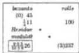

Also one hundredweight is worth  $\frac{1}{4} 11$  bezants; therefore how much are 2 hundredweight and 37 rolls worth, that is 237 rolls? You multiply the 11 by the 4, and add the 1; there will be 45, a fifth of which, namely 9, you multiply by the 237 which total you indeed multiply by the 3 so that we shall have the rule for 24 under the fraction; there will be 6399 that you divide by one fifth of the 100, and by the 4 that is under the fraction, and by the 3 that we included in the multiplication; this results in the arrangement  $\frac{100}{1038}$ ; the quotient will be  $\frac{905}{1038}26$  bezants, as is written in this problem.

# On a Migliaio of Oil of Constantinople.

A migliaio [24] of oil, which is  $\frac{1}{3} 33$  meters, from near Constantinople is sold for  $\frac{5}{24} 31$  bezants; [p95] how much are 13 meters worth? You write down the problem, and you multiply the 33 by the 3 that is after it in the fraction, and you

---

8. Here Begins Chapter Eight

add the 1; there will be 100 that you write above the 33, as you display below in the illustration; next you multiply the 31 by the 24, and you add the 5; there will be 749 carats which you write above the 31; and you multiply the 749 by 13; there will be 9737 that you multiply by the 3 that is under the fraction of the 33; there will be 29211 that you divide by the 100 that was written above the  $\frac{1}{3}33$ , and by the 24, that is with  $\frac{1}{10} \frac{0}{10} \frac{0}{3} \frac{0}{8}$ ; the quotient will be  $\frac{1}{10} \frac{1}{10} \frac{1}{10} \frac{1}{3} \frac{1}{8}12$  bezants.

# On a Palermitan Ounce That Is Exchanged for Pisan Money.

One Palermitan ounce [25], that is  $\frac{1}{3} 27$  tareni, is exchanged for Pisan pay at  $\frac{5}{12} 107$  soldi; it is sought how much  $\frac{1}{4} 7$  tareni are worth by the same rule; you multiply the 27 by the 3, and you add the 1 which is over the 3; there will be 82 that you keep above the  $\frac{1}{3} 27$ ; next you multiply the 107 by the 12, and you add the 5; there will be 1289 denari which you write above the 107. Also you multiply the 7 by the 4, and you add the 1; there will be 29 that you write above the  $\frac{1}{4} 7$ , and you multiply the numbers which are diagonally opposite, namely the 1289 by the 29; there will be 112143 that you divide with the rule for 82, and by the remaining numbers of the fractions, namely with the  $\frac{1}{4}$ , and with the  $\frac{1}{12}$ , which rearranged together make  $\frac{1}{8} \frac{0}{41} \frac{0}{12}$ ; the quotient will be  $\frac{7}{8} \frac{38}{41} \frac{5}{12} 28$  Pisan soldi.

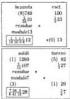

# [On the Same for Pounds.]

Also the same ounce, namely  $\frac{1}{3} 27$  tareni, is valued at  $\frac{17}{20} 4$  pounds, that is 4 pounds and 17 soldi; how much are  $\frac{1}{2} 635$  tareni worth? You multiply the  $\frac{17}{20} 4$  by the  $\frac{1}{2} 635$ , and you divide the product of them by  $\frac{1}{3} 27$ , which we demonstrate thus: namely when you multiply the 27 by the 3, and add the 1, then there will be 82 that you keep above the 27; next you multiply the 4 pounds by the 20, and add the 17; there will be 97 soldi which you write above the  $\frac{17}{20} 4$ ; after this you multiply the 635 by the 2, and add the 1; there will be 1271 that you write above the  $\frac{1}{2} 635$ . And you multiply the 97 by the  $\frac{1}{41}$  of the 1271, namely by 31, and you multiply by the 3 that is under the fraction after the 27; there will be 9021 that you divide by  $\frac{1}{41}$  of the 82, and by the 20 and the 2 that are under the fractions, that is with  $\frac{1}{4} \frac{0}{20}$ ; and one need only multiply by the 3 that is from the  $\frac{1}{12}$  as there remain no more fractions after the  $\frac{1}{4}$  and the  $\frac{1}{20}$ ; and the 4 is from the rule for 12; the quotient will be  $\frac{1}{4} \frac{15}{12}$ , that is 112 Pisan pounds and 15 soldi and 3 denari.

|  pounds | tareni  |
| --- | --- |
|  (6) 97 | (5) 82  |
|  1/264 | 1/227  |
|  residue |   |
|  modulo7 |   |
|   | (4)1271  |
|  1/26112 | 1/2635  |

# On Rolls Which Are Sold for Tareni.

$\frac{1}{9} \frac{3}{4} 22$  rolls are sold for  $\frac{1}{8} \frac{2}{5} 14$  tareni; how much are  $\frac{1}{2} \frac{2}{6} 17$  rolls worth? You write down the problem, and you multiply the 22 by its fractions; there will be 823 that you write above the  $\frac{1}{9} \frac{3}{4} 22$ ; next you multiply the 14 by its fractions; there will be 581 that you write above the  $\frac{1}{8} \frac{2}{5} 14$ . Also you multiply the 17 by its fractions; there will be 215 that you multiply by the 581; there will be 124915 that you must multiply by the numbers which are under the fractions of the 22, namely by the 4, and by the 9, and you must divide the product by the 823,

|  tareni | rolls  |
| --- | --- |
|  (5)581 | (4)823  |
|  1/2314 | 1/2122  |
|  residue |   |
|  modulo9 | (8)215  |
|  1/2311 | 1/2117  |

---

II. Liber Abaci

and by the 5, and the 8, and the 2, and the 6 that are under the fractions of the diagonally opposed numbers, namely of the 14 and the 17. But when we allow the simple cancelling, which we shall show in the multiplication of the numbers, we omit multiplying the 124915 by the 4, and by one of the 3 in the rule for the 9, and we omit dividing by the 4 and the 6 that give the same product. But if you will multiply the 124915 by the 3 that remains of the 9, then the quotient will be 374745 that remains to be divided with the  $\frac{10}{5} \frac{0}{8} \frac{0}{823}$ , that is with  $\frac{1}{2} \frac{0}{823} \frac{0}{20}$ , clearly so that we will have the 20 under the head of the fraction over which appears the number of grains; the quotient will be  $\frac{1}{2} \frac{551}{823} \frac{7}{20} 11$  tareni; we could observe indeed the stated cancellation method in certain of the abovewritten negotiations, but we shall leave them in order not to be hindered in that which we wish to demonstrate; however this same method is observed in all these problems.

# On Rolls and Their Fractions.

Also  $\frac{1}{2} \frac{3}{8} \frac{2}{11} 13$  rolls are sold for  $\frac{1}{5} \frac{1}{4} \frac{1}{3} 7$  bezants; how much are  $\frac{1}{7} \frac{3}{5}$  of one roll worth? You multiply the 13 by its fraction; there will be 2327 that you write

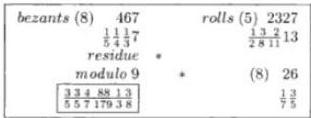

above the 13; next you multiply the [p96] 7 by its fractions; there will be 467 that you write above the 7; after this you multiply the 3 that is over the 5 by the 7, and the 1 which is over the 7 by the 5; there will be 26 that you write above the  $\frac{1}{7} \frac{3}{5}$ ; and you multiply one thirteenth of the 26 by the 467, and by the numbers which are under the fraction with the 13, namely by the 2 and the 8 and the 11; there will be 164384 that you divide by one thirteenth of the 2327, that is by 179, and by the numbers which are under the fractions of the numbers which are diagonally opposite; however we do not have the rule for 24 because we have only the 4 and the 3 from the  $\frac{1}{4} \frac{1}{3}$ ; whence we lack  $\frac{1}{2}$ ; the 2 is inserted into the division, and the 164385 is multiplied by the 2; there will be 328768, and you divide with  $\frac{1}{5} \frac{0}{5} \frac{0}{7} \frac{0}{179} \frac{0}{3} \frac{0}{8}$ ; the quotient will be  $\frac{3}{5} \frac{3}{5} \frac{4}{7} \frac{88}{179} \frac{1}{3} \frac{3}{8} 0$  bezants.

# On Fractions of Rolls for Fractions of Bezants.

Also  $\frac{1}{3}$  of one roll is worth  $\frac{1}{4}$  of one bezant; how much is  $\frac{1}{5}$  of one roll worth? You write down the problem, and you multiply the numbers which are located diagonally opposite, namely the  $\frac{1}{4}$  by the  $\frac{1}{5}$ , and you divide by the  $\frac{1}{3}$ , which you do thus: you multiply the 1 which is over the 4 by the 1 which is over the 5; there will be 1 which you multiply by the 3; there will be 3 that you divide by the 1 which is over the 3, and you divide by the 4 and the 5 that are under the fractions, namely with  $\frac{1}{2} \frac{0}{10}$ ; the quotient is  $\frac{1}{2} \frac{1}{10}$  of one bezant, that is  $\frac{3}{20}$ ; if you

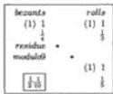

---

8. Here Begins Chapter Eight 145

will wish to make carats of this, then you multiply the 3 that is over the 20 by one fourth of 24; the quotient will be $\frac{3}{5}3$ carats.

## On Fractions of Rolls for Fractions of Soldi.

Also $\frac{2}{3}$ of one roll is sold for $\frac{3}{5}$ of one soldo; how much is $\frac{4}{7}$ of one roll worth? You multiply the 3 that is over the 5 by the 4 that is over the 7, and you multiply by the 3 that is under the fraction; there will be 36 that you divide by the 2 that is over the 3, and by the 5 and 7, that is with $\frac{1}{7} \frac{0}{10}$; the quotient is $\frac{1}{7} \frac{5}{10}$ of one soldo, that is $\frac{1}{5} \frac{1}{7} 6$ denari.

|  soldi | rolls  |
| --- | --- |
|  3 | 2  |
|  $\frac{3}{5}$ | $\frac{2}{3}$  |
|  * | *  |
|  $\frac{1}{7}$ | 4  |
|  $\frac{1}{7} \frac{5}{10}$ | $\frac{3}{7}$  |

## On Fractions of Rolls for Fractions of Bezants.

Also $\frac{1}{4} \frac{2}{3}$ of one roll is sold for $\frac{1}{6} \frac{1}{5}$ of one bezant; how much is $\frac{1}{2} \frac{5}{9}$ of one roll worth? First you multiply the $\frac{1}{6} \frac{1}{5}$ by the $\frac{1}{2} \frac{5}{9}$, and then you divide with the $\frac{1}{4} \frac{2}{3}$, which you do thus: you multiply the 2 that is over the 3 by the 4, and the 1 which is over the 4 by the 3, and you add the products together; there will be 11 that you write above the $\frac{1}{4} \frac{2}{3}$. Also you multiply the 1 which is over the 5 by the 6, and the 1 which is over the 6 by the 5, and you add the products together; there will be 11 that you write above the $\frac{1}{6} \frac{1}{5}$. Also you multiply the 5 that is over the 9 by the 2, and you add the 1; there will be 11 that you write above the $\frac{1}{5} \frac{2}{9}$, and you multiply the 11 that is written above the $\frac{1}{6} \frac{1}{5}$ by the 11 that is written above the $\frac{1}{2} \frac{5}{9}$; and you multiply by the 3 and the 4 that are under the fractions, and you divide the product by the 11 that is above the $\frac{1}{4} \frac{2}{3}$, and by the other fractional parts. But because you multiply by 11, and by 3, and by 4, and divide by 11, and by 2, and by 6, you leave off multiplying by the 11 that is above the $\frac{1}{6} \frac{1}{5}$, and by the 3 and the 4 that are under the fractions $\frac{1}{4} \frac{2}{3}$; neither do you divide by the 11 that is above the $\frac{1}{4} \frac{2}{3}$, nor by the 6 or the 2; you divide the 11 above the $\frac{1}{2} \frac{5}{9}$ with the $\frac{1}{5} \frac{0}{9}$; the quotient will be $\frac{1}{2} \frac{2}{9}$.

## [On Fractions of Rolls for Fractions of Tareni.]

Also $\frac{1}{5} \frac{1}{4} \frac{1}{3}$ of one roll is sold for $\frac{2}{7} \frac{3}{8} \frac{4}{9}$ of one tareno; how much is $\frac{1}{6} \frac{3}{10} \frac{7}{11}$ of one roll worth? You multiply the 1 which is over the 3 by the 4, and by the 5;

|  tareni (6) 431 | rolls 47  |
| --- | --- |
|  $\frac{2}{7} \frac{3}{8} \frac{4}{9}$ | $\frac{1}{5} \frac{1}{4} \frac{1}{3}$  |
|  residue * |   |
|  modulo 17 | * (14) 439  |
|  $\frac{2}{4} \frac{4}{7} \frac{2}{9} \frac{6}{11} \frac{24}{47} \frac{14}{20}$ | $\frac{1}{6} \frac{3}{10} \frac{7}{11}$  |

there will be 20, and you multiply the 1 which is over the 4 by the 5, and by the 3; there will be 15, and you multiply the 1 which is over the 5 by the 4, and by the 3; there will be 12, and you add the 20 to the 15 and the 12; there will be 47 that you write above the $\frac{1}{5} \frac{1}{4} \frac{1}{3}$; next you multiply the 4 that is over the 9 by the 8, and by the 7; there will be 224; and you multiply the 3 that is over

---

146 II. Liber Abaci

the 8 by the 7, and you add the 2; there will be 23; and you multiply by the 9; there will be 207 that you add to the 224; there will be 431 that you write above the $\frac{3}{7} \frac{3}{8} \frac{4}{9}$. Also you multiply the 7 that is over the 11 by the 10, and you add the 3, and you multiply by the 6, and add the 1; there will be 439 that you write above the $\frac{1}{6} \frac{3}{10} \frac{7}{11}$; and you multiply the 431 by the 439 that are diagonally opposite; there will be 189209 that you multiply by the fractional parts which are below the 47, namely by the 3 and the 4 and the 5, and you divide by the 47 and the fractional parts which are under the other fractions; but it is left off [p97] multiplying by the 3 and the 2 that are in the rule for 24; and the 189209 is multiplied by the 2 that remains from the 4, and by the 5, that is by 10; there will be 1892090; and it is left off dividing by the 6 which is under the fraction $\frac{1}{6} \frac{0}{10} \frac{0}{11}$; therefore it is divided with $\frac{1}{7} \frac{0}{8} \frac{0}{9} \frac{0}{11} \frac{0}{47}$; so that we shall have $\frac{1}{20}$ at the head of the fraction $\frac{1}{4} \frac{0}{7} \frac{0}{9} \frac{0}{11} \frac{0}{47} \frac{0}{20}$; the quotient will be $\frac{2}{4} \frac{4}{7} \frac{3}{9} \frac{6}{11} \frac{24}{11} \frac{14}{47} \frac{20}{20}$ grains.

*[On Finding the Price of One Roll When Pounds of Pepper Are Sold.]*

Also 100 pounds of pepper are sold for a price we put at $\frac{1}{4}$11 pounds, and it is sought how much 1 roll is worth. One hundred pounds and roll are of the same kind, but are not the same units because the 100 are pounds, and the 1 is a roll; they are changed so that they are both the same kind and the same units, as a quantity of rolls or a quantity of pounds; we demonstrate how to do this, namely when both are restated as fractions of hundredweights; that is, you see how many hundreds of pounds they are, that is what part of one hundredweight. Indeed any Pisan pound is $\frac{1}{158}$ of one hundredweight; therefore 100 pounds are $\frac{100}{158}$ of one hundredweight, and one roll is $\frac{1}{100}$ of the same hundredweight; from this it is determined that $\frac{100}{158}$ of one hundredweight is worth $\frac{1}{4}$11 pounds, and it is sought how much $\frac{1}{100}$ of one hundredweight is worth; you indeed write this problem thus, and you will operate according to that which was demonstrated above, and you will have $\frac{0}{10} \frac{6}{10} \frac{6}{10} \frac{6}{12} \frac{3}{20}$ for the price of the roll.

*[On Finding the Price of Rolls When the Price of Pounds Is Known.]*

Also $\frac{1}{2}$8 pounds are sold for $\frac{3}{4} \frac{2}{12}$11 soldi; how much money results from $\frac{1}{2}$89 rolls; you make of the $\frac{1}{2}$8 pounds a fraction of one hundredweight; there will be $\frac{1}{2} \frac{8}{158}$; and you make similarly of $\frac{1}{2}$89 rolls a part of one hundredweight, and

|  soldi (0) | 539 |  | hundredweight (3) | 17  |
| --- | --- | --- | --- | --- |
|   | $\frac{3}{4} \frac{2}{12}$11 |  | $\frac{1}{2} \frac{8}{158}$ |   |
|   | residue | * |  |   |
|   | modulo 7 | * | (4) | 151  |
|  (0) | $\frac{1}{2} \frac{1}{8} \frac{8}{10} \frac{5}{10} \frac{6}{10} \frac{8}{17} \frac{8}{12}$19 |  | $\frac{1}{2} \frac{3}{8} \frac{9}{100}$ |   |

there will be $\frac{1}{2} \frac{3}{8} \frac{9}{100}$; and you write down the problem, and you multiply the 8 that is over the 158 by the 2, and you add the 1; there will be 17 that you write

---

8. Here Begins Chapter Eight

above the  $\frac{1}{2} \frac{8}{158}$ ; and you multiply the 11 by the 12, and you add the 2; and you multiply by the 4, and add the 3; there will be 539 that you write above the  $\frac{1}{4} \frac{2}{12} 11$ ; also you multiply the 9 that is over the 100 by the 8, and you add the 3; and you multiply by the 2, and add the 1; there will be 151 that you write above the  $\frac{1}{2} \frac{3}{8} \frac{9}{11}$ ; and you multiply the 151 by the 539; there will be 81389 that you must multiply by the 2 and the 158 that are under the fraction written below the 17, and you divide by the same 17, and by the parts below the other fractions. But you leave off multiplying by the 2 that is after the 158 in the fraction, and multiplying by the 2 that is a factor of 158; but you multiply the 81389 by half 158, namely by 79; and for the 2, and the 2 by which you did not multiply you leave off multiplying by the 4 that is in the fraction after the 12; the multiplication of the 81389 by the 79 is indeed 6429731 which you divide with  $\frac{1}{2} \frac{0}{8} \frac{0}{10} \frac{0}{10} \frac{0}{17} \frac{0}{12}$ ; the quotient will be  $\frac{1}{2} \frac{1}{8} \frac{8}{10} \frac{5}{10} \frac{6}{17} \frac{8}{12} 19$  sold.

[On Finding the Price of Pounds When the Price of Rolls Is Known.]

Also if  $\frac{1}{9} \frac{3}{5} 11$  rolls, that is the  $\frac{1}{9} \frac{3}{5} \frac{11}{100}$  of one hundredweight, are sold for  $\frac{1}{2} \frac{3}{10} 19$

|  denari (2) | 387 |  | hundredweight | 527  |
| --- | --- | --- | --- | --- |
|   | 1/2 3/10 | 19 |  | 1/9 3/5 100  |
|   | residue | * |  |   |
|   | modulo 7 |  | * | (3) 2866  |
|  (2) | 0/2 7/2 10 21 25 8 | 8 |  | 1/1 3/7 10 9 4 158  |

denari; and it is sought how much are  $\frac{1}{10} \frac{1}{9} \frac{3}{4} 7$  pounds worth, that is the  $\frac{1}{10} \frac{1}{9} \frac{3}{4} \frac{7}{158}$  of one hundredweight? You write down the problem, and you multiply the 11 that is over the 100 by the 5, and you add the 3; and you multiply by the 9, and you add the multiplication of the 1 which is over the 9 by the 5; there will be 527 that you write above the  $\frac{1}{9} \frac{3}{5} \frac{11}{100}$ . Also you multiply the 19 by the 10, and you add the 3; and you multiply by the 2, and you add the 1; there will be 387 that you write above the  $\frac{1}{2} \frac{3}{10} 19$ ; and also you multiply the 7 that is over the 158 by the 4 and the 9 and the 10, and you add; there will be 2520; and to this you add the product of the 1 which is over the 10, and the 9 and the 4, to the product of the 1 which is over the 9 by the 10 and the 4, and the multiplication of the 3 which is over the 4 by the 10 and the 9; there will be 2866; and you multiply the 387 by the 2866; there will be 1109142; and [26] you must multiply by the 5, and by the 9 and by the 100 that are under the fraction written below the 527; and you must divide with the rule for 527, that is  $\frac{1}{17} \frac{0}{31}$ , and by the rest of the numbers which are under the remaining fractions of the two numbers; and you leave off multiplying by the 9 and the 100; and you leave off dividing by the 9 and the 10 that are in the fraction written below the 2866, and by the 10 that is under the fractions written below the 387; therefore you will multiply the 1109142 by the 5; there will be 5545710 that you divide with the  $\frac{1}{2} \frac{0}{4} \frac{0}{158} \frac{0}{527}$ , that is with  $\frac{1}{2} \frac{0}{8} \frac{0}{17} \frac{0}{31} \frac{0}{79}$ ; the quotient will be  $\frac{0}{2} \frac{7}{8} \frac{10}{17} \frac{21}{31} \frac{25}{79} 8$  denari.

---

148 II. Liber Abaci

[On Finding the Worth of Florentine Rolls When the Worth of Those of Genoa Is Known.]

|  carats | F. rolls  |
| --- | --- |
|  17 | 143  |
|  residue * | ½ 23  |
|  module 7 | *  |
|  ½ 3/11 13 6 | 9  |

Also 11 Genoese rolls are worth 17 carats in Alexandria; how much are 9 Florentine rolls worth? Because the 11 rolls and the 9 rolls are not the same units of weight, you make Florentine rolls of the 11 Genoese rolls, [p98] or you make Genoese rolls of the 9 Florentine rolls so that both will be either Florentine rolls or Genoese rolls; but because you can easily make Florentine rolls, each Genoese roll is $\frac{1}{6}$ 2 Florentine rolls, you will multiply the 11 Genoese rolls by $\frac{1}{6}$ 2 to make $\frac{5}{6}$ 23 Florentine rolls. Whence you write down that the $\frac{5}{6}$ 23 Florentine rolls are worth 17 carats. How much are 9 Florentine rolls worth? Therefore you will multiply the 17 by the 9 that is diagonally opposite, and you divide by the $\frac{5}{6}$ 23; the quotient will be $\frac{5}{11} \frac{5}{13} 6$ carats.

When the Price of Florentine Rolls Is Sought. The Contrary.

|  carats | F. rolls  |
| --- | --- |
|  39 | 13  |
|  3/4 9 | *  |
|  * | 91  |
|  ½ 11 | ½ 15  |

Also 13 Florentine rolls are worth $\frac{3}{4}$ 9 carats; how much are 7 Genoese rolls worth? You make Florentine rolls from the 7 Genoese rolls, that is you will multiply the 7 Genoese rolls by $\frac{1}{6}$ 2; there will be $\frac{1}{6}$ 15 Florentine rolls; you write down that 13 Florentine rolls are worth $\frac{3}{4}$ 9 carats; how much are $\frac{1}{6}$ 15 Florentine rolls worth? First you will multiply the $\frac{3}{4}$ 9 by the $\frac{1}{6}$ 15, and you will divide by the 13, and you will then cancel with the $\frac{1}{13}$, as it is possible, and similarly with the $\frac{1}{3}$: $\frac{3}{8}$ 11 carats will be the quotient.

|  carats | Flor. rolls  |
| --- | --- |
|  108 | 637  |
|  ½ 21 * | ½ 26  |
|  * | 91  |
|  ½ 9 11 | ½ 11  |

Also $\frac{1}{4}$ 12 Genoese rolls are sold for $\frac{3}{5}$ 21 carats; how much are $\frac{3}{8}$ 11 Florentine rolls worth? You make Florentine rolls of the $\frac{1}{4}$ 12 Genoese rolls; that is you multiply the $\frac{1}{4}$ 12 by $\frac{1}{6}$ 2; there will be $\frac{13}{24}$ 26 Florentine rolls; next you write down that the $\frac{13}{24}$ 26 Florentine rolls are worth $\frac{3}{5}$ 21 carats; how much are $\frac{3}{8}$ 11 Florentine rolls worth? You will multiply the $\frac{3}{5}$ 21 by the $\frac{3}{8}$ 11, and you will divide by the $\frac{13}{24}$ 26; as is displayed in this illustration, the quotient will be $\frac{0}{4} \frac{0}{7} \frac{3}{7} \frac{3}{10} \frac{3}{13} 9$ carats.

We could indeed work on this evading the actual multiplication of the $\frac{1}{4}$ 12 by the $\frac{1}{6}$ 2, which we multiplied above, namely as is written in the problem with the $\frac{3}{8}$ 11 Florentine rolls below the $\frac{1}{4}$ 12 Genoese rolls; next you see how many Florentine rolls are in 1 Genoese roll, namely $\frac{1}{6}$ 2; you write down the $\frac{1}{6}$ 2 before

|  carats | G. rolls  |
| --- | --- |
|  108 | 49 13  |
|  $\frac{3}{5}$ 21 * | $\frac{1}{4}$ 12 $\frac{1}{6}$ 2  |
|  * | 91  |
|   | $\frac{3}{8}$ 11  |

the $\frac{1}{4}$ 12, as is displayed in this illustration; and then there will be this question: if $\frac{1}{6}$ 2 times $\frac{1}{4}$ 12 Florentine rolls are worth $\frac{3}{5}$ 21 carats, then how much are $\frac{3}{8}$ 11 Florentine rolls worth? You will therefore multiply, as we have said before, the $\frac{3}{5}$ 21 by the $\frac{3}{8}$ 11, and you will divide by the $\frac{1}{4}$ 12 and the $\frac{1}{6}$ 2, which you do thus: namely you multiply the 2 by the 6, and you add the 1 which is over the 6; there will be 13 that you write above the $\frac{1}{6}$ 2, and you multiply the 12 by the 4, and

---

8. Here Begins Chapter Eight

you add the 1 which is over the 4; there will be 49 that you write above the  $\frac{1}{4} 12$ . Also you multiply the 21 by the 5, and you add the 3; there will be 108 that you write above the  $\frac{3}{5} 21$ ; and you also multiply the 11 by the 8, and you add the 3; there will be 91 that you write above the  $\frac{3}{8} 11$ , and you multiply the 108 by the 91, and by the fractional parts which are below the 49 and the 13, namely by the 4 and the 6; there will be 235872 that you divide by the 13 and the 49, and by the numbers which are under the fractions of the other two numbers, namely by the 5 and the 8, that is with  $\frac{100000}{477101013}$ ; there will be  $\frac{00333}{47710139}$  carats as we found above.

Or with another method, you write down the problem, namely the  $\frac{3}{8}11$  Florentine rolls below the  $\frac{1}{4}12$  Genoese rolls, and you see what part 1 Florentine roll is of one Genoese roll, namely  $\frac{6}{13}$ ; this is because 1 Genoese roll is  $\frac{1}{6}2$  Florentine rolls, and therefore 6 Genoese rolls are 12 Florentine rolls. Whence 1 Florentine rolls is  $\frac{6}{13}$  of one Genoese roll, as we said before; you therefore write down the  $\frac{6}{13}$  of  $\frac{3}{8}11$  Florentine rolls for the number of Genoese rolls, as above in the preceding illustration we could put  $\frac{1}{6}2$  before the  $\frac{1}{4}12$  Genoese rolls, as is shown in the illustration; and then there will be the problem,  $\frac{1}{4}12$  Genoese rolls are worth  $\frac{3}{5}21$  carats, and it is sought how much are  $\frac{6}{13}$  of  $\frac{3}{8}11$  Genoese rolls worth, thus you will multiply the  $\frac{3}{5}21$  by the  $\frac{3}{8}11\frac{6}{13}$ , and you will divide by the  $\frac{1}{4}12$  thus; you multiply the 12 by the 4, and you add the 1; there will be 49 that you write above the  $\frac{1}{4}12$ ; and you write the same calculated 108 above the  $\frac{3}{5}21$ , and the 91 above the  $\frac{3}{8}11$ ; and you multiply the 108 by the numbers which are diagonally opposite, namely by the 91, and the 6 and 4 which are under the [p99] 49; there similarly will be 235872 that you divide with the rule for 49, and by the fractional parts which are under the fractions of the remaining numbers, namely with  $\frac{100}{5813}$ , which is arranged again with the rule for the abovesaid 49, similarly it makes  $\frac{10000}{4771013}$  with which you will divide the 235872; as we found twice above, the quotient will be  $\frac{00333}{47710139}$  carats; and in this problem, in order not to complicate things, we did not avoid the labor of multiplying and dividing that we could have evaded, but in order not to abandon the technique of avoiding labor where it is possible, we shall show how much is evaded in this problem, and it is this: we should never multiply any quantity with any number when we afterwards divide with the same number, as in this problem where we multiplied the 108 by the 9, and by the 6 and the 4 that are under the fraction of 49; and we divided the product with  $\frac{10000}{4771013}$ ; we could indeed in this stated multiplication leave off and not multiply by the 91, or any part of it; and we leave off dividing by the 7 and 13 that are in the fraction of division, and have product 91, because 7 times the 13 makes 91, and because the two products are equal and the same; and this is what we said, that we should not multiply by the 91 in this stated multiplication because we must afterwards divide with  $\frac{10}{713}$ ; there remains indeed when the 108 is multiplied by the 6 and the 4, and is divided only with the  $\frac{100}{4710}$ , which we can still avoid; thus we do not multiply the product of the 6 times the 108 by the 4, and we do not divide by the 4 that is in the division. We shall therefore multiply the 6 by only half 108; there will be 324 that you divide with only  $\frac{10}{57}$ ; the quotient will be  $\frac{41}{579}$  carats, which total is the same as  $\frac{00333}{47710139}$ . And to know that this is true, you multiply the

|  carats | G. rolls  |
| --- | --- |
|  108 | 49  |
|  3/521 | 1/412  |
|  |   |
|   | 91  |
|   | 3/8118  |

---

II. Liber Abaci

3 that is over the 13 by the 10 that is after the 13 in the fraction; and you add the 2 that is over the 10; there will be 33 that you multiply by the 7, and you add the 3 that is over the 7; there will be 234 that you divide with  $\frac{1}{13} \frac{0}{0}$ ; the quotient will be  $\frac{4}{5} \frac{1}{7}$ ; it is more elegant to say  $\frac{4}{5} \frac{1}{7}$  than  $\frac{0}{4} \frac{0}{7} \frac{3}{7} \frac{3}{10} \frac{3}{13}$  indeed; therefore we ever strive to avoid that which we can avoid, as it requires less labor, and we also will have the more elegantly perceived fractions.

# When the Price of Genoese Rolls Is Sought from Florentine.

Also  $\frac{1}{5} \frac{1}{4} 13$  Florentine rolls are sold for  $\frac{1}{7} \frac{5}{6} 9$  carats; how much are  $\frac{1}{9} \frac{3}{8} 7$  Genoese rolls worth? You write down the problem just as though the rolls are of the same weight; next you put the ratio  $\frac{6}{13}$  in front of the Florentine rolls, or the ratio  $\frac{1}{6} 2$  in front of the Genoese rolls, as we demonstrated above; we therefore

|  carats 419 |  | G. rolls 269  |
| --- | --- | --- |
|  1/7 5/6 9 |  | 1/5 1/4 13 6/13  |
|  residue | * |   |
|  modulo 13 | * | 539  |
|  0 7 2 2 8/7 8 9 9 259 12 |  | 1/9 3/8 7  |

put the  $\frac{6}{13}$  in this problem before the  $\frac{1}{5} \frac{1}{4} 13$  Florentine rolls, as here is shown; and you will multiply the 13 by its fractions; there will be 269; and you multiply the 9 by its fractions; there will be 419. Also you multiply the 7 by its fractions; there will be 539, and you multiply the 419 by the 539 that are diagonally opposite; this you multiply by the fractional parts of the remaining number, namely by the 4 and 5 and 13, and the product that results you divide by the 16 that is over the 13, and the 269, and by the fractional parts of the remaining two numbers, namely by the 6 and the 7 and the 8 and the 9; and you cancel that which you can cancel, as we demonstrated in the preceding problem, and you will have  $\frac{0}{7} \frac{7}{8} \frac{2}{9} \frac{2}{9} \frac{8}{259} 12$  carats; and thus you can do the same in all similar situations in which you propose the sale in rolls of one weight, and you will seek the price of rolls of any other weight.

# [When the Price of Pisan Rolls is Sought from Messina Rolls.]

Also so that it is better understood:  $\frac{14}{27} 14$  Messina rolls are worth  $\frac{1}{9} \frac{2}{5} 7$  tareni; it is sought how much  $\frac{1}{7} \frac{3}{4} 17$  Pisan rolls are worth. First it is sought how many Pisan rolls one Messina roll weighs, namely  $\frac{1}{4} 2$ , which we put in front of where you write the Messina rolls, as above we taught to put  $\frac{1}{6} 2$  in front of the Genoese rolls; or you put  $\frac{4}{9}$  in front of the Pisan rolls because one Pisan roll is  $\frac{4}{9}$  of one Messina roll.

|  tareni 338 |  | P. rolls 205 | 9  |
| --- | --- | --- | --- |
|  1/9 2/5 7 | * | 1/2 4/7 14 | 1/4 2  |
|   | * | 501 |   |
|  2/3 8 23 1/3 5 9 41 20 4 |  | 1/7 3/4 17 |   |

---

8. Here Begins Chapter Eight 151

However in this problem we put $\frac{1}{4}2$ in front of the Messina rolls, as is here shown; and you multiply the 2 by [p100] the 4, and you add the 1; there will be 9 that you write above the $\frac{1}{4}2$; next you multiply the 14 by its fraction; there will be 205 that you write above the 14.

|  tareni 338 |  | P. rolls 205  |
| --- | --- | --- |
|  $\frac{1}{9} \frac{2}{5} 7$ | * | $\frac{1}{2} \frac{4}{7} 14$  |
|   | * | 501  |
|  $\frac{2}{3} \frac{2}{5} \frac{8}{9} \frac{23}{41} \frac{1}{20} 4$ |  | $\frac{1}{7} \frac{3}{4} 17$  |

Also you multiply the 7 by its fractions; there will be 338 that you write above the 7. Also you multiply the 17 by its fractional parts; there will be 501 that you write above the 17; and you multiply the 338 by the 501, and by the fractional parts which are above, namely by the remaining fractional parts, namely with $\frac{1}{4} \frac{0}{5} \frac{0}{7} \frac{0}{9}$; and you will cancel those that you will be able to cancel. And for the price of the rolls you will have $\frac{2}{3} \frac{2}{5} \frac{8}{9} \frac{23}{41} \frac{1}{20} 4$ tareni. It is indeed explained in this demonstration on the sale of merchandise how the price of the merchandise is found; now we shall truly return to the same sale in which are found the amount of merchandise at a posed price according to different sales of it, returning indeed to the sale of hundredweights.

## On Hundredweights Sold for Pounds; And It Is Sought How Many Rolls for Pounds.

If a hundredweight of some merchandise is sold for 13 pounds, then it is sought how many rolls will be had for 5 pounds; you write down, as we said before in the preceding proposition in the first sale, namely the 100 rolls; next in the same line to the left you write the price of the rolls, namely the 13 pounds; next you write the 5 pounds below the 13 because they are of the same kind and units, namely the price; and the number is written as is here shown; you will multiply the numbers which are diagonally opposite, namely the 5 by the 100; there will be 500 that you divide by the 13; the quotient will be $\frac{6}{13} 38$ rolls, as is displayed in the illustration; and the total in rolls will be had for the written 5 pounds; if you will wish to make ounces of the $\frac{6}{13}$ rolls, then you multiply the 6 that is over the 13 by 12 because each roll weighs 12 ounces; there will be 72 that you divide by the 13; the quotient will be $\frac{7}{13} 5$ ounces of one roll; of the $\frac{7}{13}$ of an ounce we can in the same way make parts of one ounce according to how many parts make one ounce, or Pisan roll, or pounds, or any other roll; and in order to perceive this better we put the problem of how much is this $\frac{7}{13}$ of an ounce of a Pisan pound; whence if we will wish to know from this how many pennyweights are in one hundredweight, then because an ounce of the same pound weighs 25 pennyweights of a hundredweight, you will multiply the 7 that is over the 13 by 25, and you divide by the 13, and thus you understand how with any ounce.

|  pounds | rolls  |
| --- | --- |
|  13 | 100  |
|  * |   |
|  * |   |
|  5 | $\frac{5}{13} : 28$  |

---

152 II. Liber Abaci

## On the Same with Fractions.

Also one hundredweight is worth $\frac{1}{4}16$ pounds, and it is sought how many rolls will be had for $\frac{7}{12}3$ pounds; you write down the problem in this way, and you multiply the 16 by the 4 and you add the 1; there will be 65 that you write above the $\frac{1}{4}16$; next you multiply the 3 by its fraction; there will be 823 that you write above the $\frac{7}{12}3$; and you multiply the 100 by the 823, and the 4 that is under the fraction of the 16; and you divide the product with the rule for 65, that is $\frac{1}{5}\frac{0}{13}$, and by the parts under the fractions, namely with $\frac{1}{12}\frac{0}{20}$; and you arrange the 12 at the head of the fraction because that number which lies over the 12 will be an ounce or ounces; there will therefore be the arrangement $\frac{1}{5}\frac{0}{13}\frac{0}{20}\frac{0}{12}$; but as we shall avoid the labor of multiplying and dividing, it is left off multiplying by 100, and it is left off dividing with the $\frac{1}{5}\frac{0}{20}$ that are in the fraction of division; therefore you will multiply the 823 by the 4, and you will divide only with $\frac{1}{13}\frac{0}{12}$; the quotient will be $\frac{3}{13}\frac{1}{12}21$ rolls; moreover the check of these things and others is the same that we demonstrated above, namely as you proceed with the numbers, multiplying and dividing, so you proceed operating with any residue. Therefore the residue of this number you find to be 2 by casting out sevens.

## On a Hundredpound of Pepper According to the Abovewritten Method.

|  pounds value | pounds weight  |
| --- | --- |
|  2969 |   |
|  $\frac{5}{12}\frac{7}{20}12$ | 100  |
|  141 |   |
|  $\frac{9}{11}\frac{11}{12}\frac{20}{20}$ | $\frac{2969}{2969}\frac{3}{12}$  |

Also a hundredpound of pepper is sold for 12 pounds, 7 soldi, and 5 denari, that is for $\frac{5}{12}12$ pounds; [p101] then how many pounds of pepper will I have for 11 soldi and 9 denari? The $\frac{5}{12}12$ pounds and the $\frac{9}{12}11$ soldi are of one kind, namely price, but are not in the same units, because the 12 pounds are in pounds and the $\frac{9}{12}11$ soldi are in soldi; therefore either the $\frac{5}{12}12$ pounds are made into soldi, or the $\frac{9}{12}11$ are made into pounds, that is they are a fraction of a pound, and then they will be in the same units, as they already are of the same kind; therefore of the $\frac{9}{12}11$ soldi we make a fraction of a pound, namely $\frac{9}{12}12$, and it is written below the $\frac{5}{12}12$ pounds, as is shown in this illustration; and the 12 is multiplied by its fraction; there will be 2969. Also you multiply the 11 by the 12, and you add the 9; there will be 141; and you multiply the 141 by the 100, and the 12 and the 20 that under the fraction of the 12, and you divide the product by the 2969, and with $\frac{1}{12}\frac{9}{20}$; but you evade labor and do not multiply by the 12 nor the 20, and you need not divide with the $\frac{1}{12}\frac{0}{20}$; therefore you will multiply the 141 by the 100; there will be 14100 that you divide by the 2969; and in order that we shall have twelfths or ounces in the fraction, you multiply the 14100 by 12, and divide with $\frac{1}{2969}\frac{0}{12}$; the quotient will be $\frac{2936}{2969}\frac{8}{12}4$ pounds.

## On a Hundredweight Sold for Pounds When It is Sought How Much Merchandise Will Be Sold for Denari.

Also one hundredweight is worth $\frac{1}{9}\frac{2}{5}13$ pounds, and it is sought how much one will have for $\frac{1}{4}9$ denari, and so that it is in the same units as are the $\frac{1}{9}\frac{2}{5}13$

---

8. Here Begins Chapter Eight

pounds, that is for  $\frac{1}{4} \frac{9}{12} \frac{0}{20}$  of one pound; you write down the problem as is shown here, and you multiply the 13 by its fractions; there will be 608. Also you multiply the 9 that is over the 12 by the 4, and you add the 1; there will be 37, and you multiply the 37 by the 100; and you multiply by the 5 and the 9 that are under the fractions after the 13; and you divide the product with the rule for 608, that is  $\frac{1}{4} \frac{0}{8} \frac{0}{19}$ , and with  $\frac{1}{4} \frac{0}{12} \frac{0}{20}$ ; and with  $\frac{1}{4} \frac{0}{8} \frac{0}{10} \frac{0}{19} \frac{0}{12}$ , they are the fractional parts rearranged together; and you will have the sought quantity; or if you will wish to cancel to evade labor, you do not wish to multiply the 37 by the total 100, but you leave off a 10 from the rule for 100, and you leave off the  $\frac{1}{10}$  that is in the fraction of the division; therefore you will multiply the 37 by the 10 that remains of the 100, and by the 5 and the 9; there will be 12750 that you divide with  $\frac{1}{4} \frac{0}{8} \frac{0}{19} \frac{0}{12}$ ; the quotient will be  $\frac{2}{4} \frac{2}{8} \frac{0}{19} \frac{8}{12}$  roll.

# [On Pounds Sold for Soldi.]

Also if a hundredpound is sold for  $\frac{1}{8} \frac{2}{3} 17$  sold, then it is sought how much of the merchandise for  $\frac{1}{7} \frac{3}{4} 17$  pounds one will have? You turn the  $\frac{1}{8} \frac{2}{3} 17$  sold into a fraction of one pound; that will be  $\frac{1}{8} \frac{2}{3} \frac{17}{20}$  of a pound; and this you do so that the two numbers are in the same units; next you write the problem in this way, and you will operate according to what was said above, and you will have  $\frac{5}{7} \frac{3}{7} \frac{30}{61} \frac{4}{12} 2011$  pounds for the quantity of the merchandise.

# A Universal Rule for Hundredpounds.

|  Lbs. | rolls  |
| --- | --- |
|  608 |   |
|  1/3 2/3 13 | 100  |
|  37 |   |
|  1/3 2/3 13 20 | 2/3 2/3 13 20 11  |

We wish indeed to demonstrate a rule that is produced from the avoidance of some multiplication and division of the numbers which are posed in such problems, and that is when it is proposed how much a hundredpound of pepper is worth in any number and fraction of pounds, which we put at 13 pounds, and it is sought how many pounds of merchandise will be had for any number of soldi, which we put at 3; always you multiply the number of soldi by 5, and you divide with the price of a hundredpound, as in this: you multiply the 3 denari by 5; there will be 15 that you divide by the 13; the quotient will be  $\frac{2}{13}1$ , and the total in ounces you will have for the 7 denari; truly if by the same rule is sought how much of the same will be had for 7 soldi, you will similarly multiply the 7 by the 5; there will be 35 that you similarly divide by the 13; the quotient will be  $\frac{8}{13}2$  pounds, and thus you understand in all similar problems.

Also if conversely you will seek by the same rule how much 7 ounces are worth, then you will multiply the 7 by the 13, and you divide by the 5; the quotient will be  $\frac{1}{5} 18$  denari. And if you will seek how much 7 pounds of the same merchandise are worth, then you will similarly multiply the 7 by the 13, and divide by the 5; the quotient will be  $\frac{1}{5} 18$  soldi that is 18 soldi and  $\frac{2}{5} 2$  denari; and thus you do in similar problems. [p102]

|  lbs. | lbs.  |
| --- | --- |
|  value | wt.  |
|  427 |   |
|  1/3 17 | 100  |
|  7 2/3 20 |   |
|  501 |   |
|  1/3 17 | 3/3 20 4/12 2011  |

# [On Rolls Sold for Tareni.]

Also 14 rolls are sold for  $\frac{5}{6} 5$  tareni; how many rolls will I have for  $\frac{2}{5} 17$  tareni? You write down the problem in this way, and you multiply the numbers which

|  tareni | rolls  |
| --- | --- |
|  35 |   |
|  5/6 | 14  |
|  |   |
|  87 |   |
|  2/5 17 | 3/5 13 41  |

---

II. Liber Abaci

are diagonally opposite, namely the 14 and the $\frac{2}{5}$17, and you divide by the $\frac{5}{6}$5; the quotient will be $\frac{3}{5} \frac{0}{5} \frac{9}{12}41$ rolls.

[On Rolls Sold for Tareni;
It is Sought How Many Rolls for Grains.]

Also $\frac{1}{2}$17 rolls are sold for $\frac{1}{3}$11 tareni; how many of them will I have for $\frac{1}{4}$7 grains, that is $\frac{1}{4} \frac{7}{20}$ of one tareno? The $\frac{1}{4}$7 grains are made into $\frac{1}{4} \frac{7}{20}$ tareni so that they are the same units as the abovewritten $\frac{1}{3}$11 tareni; you write down the problem thus, and you will multiply the $\frac{1}{2}$17 by the $\frac{1}{4} \frac{7}{20}$, and you divide by the $\frac{1}{3}$11; and you make the fraction so that you have 12 at the head and there will be ounces; and the quotient will be $\frac{7}{8} \frac{1}{10} \frac{12}{17}6$ ounces.

[On Rolls Sold for Grains;
It is Sought How Much Merchandise for Tareni.]

Also $\frac{1}{4} \frac{1}{3}$3 rolls are sold for $\frac{1}{6} \frac{2}{5}$13 grains; how many rolls will I have for $\frac{1}{8} \frac{2}{7}$11 tareni? First you make the $\frac{1}{6} \frac{2}{5}$13 grains into a fraction of one tareno; and that will be $\frac{1}{8} \frac{2}{5} \frac{13}{20}$, and you write down the problem as is displayed; and you will multiply the $\frac{1}{4} \frac{1}{3}$3 by the $\frac{1}{8} \frac{2}{7}$11, and you divide it by the $\frac{1}{6} \frac{2}{5} \frac{13}{20}$; and $\frac{3}{7} \frac{3}{11} \frac{12}{37} \frac{3}{12}60$ rolls will be the quotient.

[On Rolls Sold for Bezants.]

Also $\frac{3}{4}$ of one roll is sold for $\frac{4}{5}$ of one bezant; how many rolls will I have for $\frac{6}{7}$ of one bezant? You write down the problem, and you multiply the 3 that is over the 4 by the 6 that is over the 7; there will be 18 that you multiply by the 5 that is under the upper fraction; there will be 90 that you divide by the 4 that is over the 5, and by the 4 and 7 that are under the other fractions, that is with $\frac{1}{2} \frac{0}{7} \frac{0}{8}$; the quotient will be $\frac{3}{7} \frac{6}{8}$ of one roll.

On Fractions of Rolls.

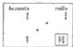

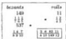

Also $\frac{1}{4} \frac{2}{3}$ of one roll is sold for $\frac{1}{7} \frac{1}{6} \frac{2}{5}$ of one bezant; how many rolls will I have for $\frac{1}{8} \frac{4}{9} \frac{7}{10}$ of one bezant? Therefore you again write down the problem, and you multiply the $\frac{1}{4} \frac{2}{3}$ by the $\frac{1}{8} \frac{4}{9} \frac{7}{10}$, and you divide by the $\frac{1}{7} \frac{1}{6} \frac{2}{5}$; thus: you take the $\frac{1}{4} \frac{2}{3}$ first, and you will multiply the 2 that is over the 3 by the 4, and the 1 which is over the 4 by the 3, and you add them together; there will be 11 that you write above the $\frac{1}{4} \frac{2}{3}$; and next you find the sum of the $\frac{1}{7} \frac{1}{6} \frac{2}{5}$, it will be 149 that you write above the $\frac{1}{7} \frac{1}{6} \frac{2}{5}$; you find the sum of $\frac{1}{8} \frac{4}{9} \frac{7}{10}$ also, it will be 537, and you will multiply the 11 by the 537, and by the fractional parts which are under the fraction written below the 149, namely the 5 and the 6 and the 7; and you divide the product by the 149, and by the fractional parts which are under the 11 and the 537, that is with $\frac{1}{3} \frac{0}{4} \frac{0}{8} \frac{0}{9} \frac{0}{10}$, which rearranged together is $\frac{1}{8} \frac{0}{9} \frac{0}{10} \frac{0}{149} \frac{0}{12}$; you cancel that which you can cancel; and $\frac{3}{4} \frac{8}{10} \frac{83}{149} \frac{11}{12}$ roll will be the quotient.

---

8. Here Begins Chapter Eight

# On Genoese and Florentine Rolls.

Also  $\frac{1}{6} \frac{2}{5} 13$  Genoese rolls are sold for  $\frac{1}{7} \frac{1}{5} 3$  bezants; how many Florentine rolls will I have for  $\frac{1}{4} 2$  bezants? Because the Genoese rolls are sold and the Florentine rolls are sought, and because the  $\frac{1}{6} \frac{2}{5} 13$  Genoese rolls are made into Florentine rolls, that is, you multiply them by  $\frac{1}{6} 2$ ; and you write down in the problem the found product for the sale. And so that we avoid the labor of the said multiplication, you put the  $\frac{1}{6} 2$  before the  $\frac{1}{6} \frac{2}{5} 13$  Genoese rolls, as we demonstrated above in a similar situation; and you write down the problem thus; and you multiply the 2 by the 6, and you add the 1; there will be 13 that you write above the  $\frac{1}{6} 2$ ; next you multiply the 13 by its fractions; there will be 407; and you multiply the 3 by its fraction; there will be 117; after this you multiply the 2 by the 4, and add 1; there will be 9 that you write above the  $\frac{1}{4} 2$ ; and you multiply the 9 by the numbers which are diagonally opposite, namely the 13, and the 407; there will be 47619 that you multiply by the fractional parts which are under the 117, namely by the 5 and the 7; and you divide the product with the rule for 117, that is with  $\frac{1}{9} \frac{0}{13}$ , and by the numbers which are under the fractions of the diagonally opposite numbers, namely the 6 that is under the 13, and the 5 and the 6 that are under the 407, and the 4 that is under the 9; if you truly will wish to avoid labor in the multiplication and division, then you take care as we said; you multiply the 9 by the 13, but you leave off the multiplication of them, and you do not divide by the 9 and the 13, which you left off multiplying, which are in the fraction of division; therefore there remains only that you multiply the 407 by the fractional parts which are under [p103] the 117, and there remains to divide with  $\frac{1}{2} \frac{0}{5} \frac{0}{8} \frac{0}{9}$ , of which again you leave off multiplying by the 5 that is under the fraction below the 117; and you do not divide by the 5 that is under the fraction of division; therefore you will multiply the 407 by the 7 that is under the fraction below the 117, and you divide with  $\frac{1}{2} \frac{0}{8} \frac{0}{9}$ , that is with  $\frac{1}{2} \frac{0}{6} \frac{0}{12}$  so that we have ounces over the 12; the quotient will be, as is shown in the illustration Florentine rolls,  $\frac{1}{2} \frac{2}{6} \frac{9}{12} 19$ .

# On the Contrary of the Same.

Also it is said that  $\frac{1}{9} \frac{2}{5} 12$  Florentine rolls are worth  $\frac{3}{4} 4$  bezants, and it is sought how many Genoese rolls will be had for  $\frac{2}{5} 17$  carats, that is for  $\frac{1}{5} \frac{17}{24}$  of one bezant; because each Florentine roll is  $\frac{6}{13}$  of one Genoese roll, the  $\frac{6}{13}$  is put before the  $\frac{1}{9} \frac{2}{5} 12$  Florentine rolls, as is shown in this illustration. And you take the  $\frac{1}{9} \frac{2}{5} 12$ , and you will multiply the 12 by its fractions; there will be 563; next you pass to the  $\frac{3}{4} 4$ , and you will multiply the 4 by the 4, and you add the 3; there will be 19; again you will multiply the 17 that is over the 24 by the 5, and add the 2; there will be 87; and you will multiply the 87 by the 6 that is diagonally opposite over the 13; and you will multiply by the 563; and you multiply by the 4 that is under the fraction below the 19; and you divide the product by the numbers which are under the fractions of the diagonally opposed numbers, namely by the 5 and the 9, and by the 13, and the 5, and the 24, that is with  $\frac{1}{5} \frac{1}{9} \frac{0}{10} \frac{0}{13} \frac{0}{19} \frac{0}{12}$ ; and you cancel that which you can cancel, and you will have for the sought quantity  $\frac{1}{5} \frac{3}{10} \frac{12}{13} \frac{10}{19} \frac{10}{12}$  of one Genoese roll.

|  bezants | F. rolls  |
| --- | --- |
|  117 | 407  |
|  1/5 13 | 1/5 13 1/5 2  |
|  9 |   |
|  1/4 2 | 1/2 3/5 10  |
|  bez. | G.rolls  |
| --- | --- |
|  19 | 363  |
|  3/4 | 1/9 12 8/10  |
|  87 |   |
|  2/4 7 | 1/2 13 10/10  |
|  5 10 | 1/13 12 12  |

---

156 II. Liber Abaci

## The Second Part of the Eighth Chapter on the Exchange of Money. [On Pisan Denari for Imperial Denari.] [27]

An Imperial soldo, namely 12 denari, or any other money, is sold for 31 Pisan denari, or for some other money, and it is sought how many Pisan denari will one have for 11 Imperial denari; you write down the problem, namely the first sale, namely the 12 Imperial denari; next in the same line to the left you write the price of them, namely 31 Pisan denari, and you put the 11 Imperial denari below the 12 Imperial denari, as is shown here; and you will multiply the numbers which are diagonally opposite, namely the 11 and the 31; there will be 341; and you divide by the 12; the quotient will be $\frac{5}{12}28$ Pisan denari.

|  Pisan
denari
31 | Imperial
denari
12  |
| --- | --- |
|  $\frac{5}{12}28$ | 11  |
|  Pisan
soldi
31 | Imperial
soldi
12  |
| --- | --- |
|  $\frac{5}{12}28$ | 11  |

## [On Pisan Soldi for Imperial Soldi.]

And because you know how many denari one Imperial soldo is worth, namely 12 Imperial denari, then you know the same number of Pisan soldi are worth 12 Imperial soldi, and the same number of Pisan pounds are worth 12 Imperial pounds; whence we shall say, 12 Imperial soldi are worth, as we said before, 31 Pisan soldi, and it is sought how much 11 Imperial soldi are worth; there will then be this problem: if twelve Imperial soldi are worth 31 Pisan soldi, then it is sought how much 11 Imperial soldi are worth; you writedown the problem as above, and you will multiply the 31 by the 11, as we said before; and you similarly divide by the 12; and thus the quotient will be $\frac{5}{12}28$, that is 28 Pisan soldi and 5 denari, as is displayed in this second illustration.

## On the Same.

|  Pisan
Ibs.
31 | Imperial
Ibs.  |
| --- | --- |
|  $\frac{5}{12}28$ | 11  |
|  Pisan
denari
31 | Imp.
denari
12  |
| --- | --- |
|  $\frac{5}{12}28$ | $\frac{5}{12}4$  |

Again if you seek by the same rule how much 11 Imperial pounds are worth, then there will be another such problem. Twelve Imperial pounds are worth 31 Pisan pounds; therefore the problem is written as above, and the 11 is multiplied by the 31, and the product is divided by the 12 as we said before; and you will have $\frac{5}{12}28$ Pisan pounds, as is shown in another illustration.

And if you will wish to make soldi of the $\frac{5}{12}$ of one pound, then you multiply the 5 that is over the 12 by 20; there will be 100 soldi that you divide by the 12 that is under the fraction; there will be 8 soldi and 4 denari; therefore the 11 Imperial pounds are worth 28 Pisan pounds and 8 soldi and 4 denari; or you multiply the 5 by the 341, which is 31 times 11, and you divide afterwards by the 5 that is $\frac{1}{4}$ of 20, and the 12, and you will have soldi and denari in the first division, and that which comes out over the 20 is the number of soldi, and that which comes out over the 3 is one third of a soldo, which is 3 denari. [p104]

## On the Same.

Again an Imperial soldo is worth 31 Pisan denari, as we said before; and it is sought how many Imperial soldi will be had for 11 Pisan denari; because the 11 denari are Pisan, you will note "denari" above the 31 and the 12; and you will put the 11 below the 31, namely the Pisan denari below the Pisan denari, as is

---

8. Here Begins Chapter Eight 157

shown in the illustration; you will therefore multiply the 11 by the 12; there will be 132 that you will divide by the 31; the quotient will be $\frac{8}{31}4$ Imperial denari.

## On the Same.

Also a Genoese soldo [28] is sold for $\frac{1}{2}21$ Pisan denari, and it is sought how much 7 Genoese soldi and 5 denari are worth, that is $\frac{5}{12}7$ Genoese soldi; you write down the problem thus, and you multiply the 21 by the 2, and you add the 1 that is over the 2; there will be 43 that you put above the $\frac{1}{2}21$. Also you multiply the 7 by the 12, and you add the 5 that is over the 12; there will be 89 that you put above the $\frac{5}{12}7$; and you multiply the 43 by the 89; there will be 3827 that you divide by the number of soldi, namely by the 12, and by the numbers which are under the fractions, namely by the 2, and by the 12, which numbers you arrange together making $\frac{1}{3}\frac{0}{8}\frac{0}{12}$; the quotient will be $\frac{2}{3}\frac{3}{8}\frac{3}{12}13$ Pisan soldi.

## On the Same.

Also conversely by the same rule it is sought how many Genoese soldi you will have for $\frac{5}{12}7$ soldi of Pisan money; you write the $\frac{5}{12}7$ below the $\frac{1}{2}21$ in the illustration because they are of the same kind, namely Pisan; and you will multiply the $\frac{5}{12}7$ and the 12 that are diagonally opposite; and you divide the product by the $\frac{1}{2}21$, which you do thus: you find the 43 and the 89, and you write the numbers above the $\frac{1}{2}21$ and the $\frac{5}{12}7$, and you will multiply the 89 and the 12 which are diagonally opposite, and you multiply by the 2 that is under the fraction after the 21; there will be 2136 that you divide by the 43, and by the 12 that is under the fraction after the 7; the quotient will be $\frac{29}{43}\frac{1}{12}4$ Genoese soldi, as is shown in the illustration.

## On the Same.

Also near Provence a Magalona soldo [29], namely 12 Magalona denari, is worth $\frac{1}{4}13$ Regal denari [30], and it is sought how much 5 pounds and 13 soldi, that is $\frac{13}{20}5$ Magalona pounds are worth; therefore, as pounds are sought, this is an exchange problem; 12 Magalona pounds are worth $\frac{1}{4}13$ Regal pounds; therefore you write down the problem thus, and you move to the $\frac{1}{4}13$, multiplying the 13 by the 4, and adding the 1; there will be 53; next you will multiply the 5 by its fraction; there will be 113; and you will multiply the 53 by the 113; there will be 5989 that you divide by the 12, and the 4, and the 20 that are under the fractions; the quotient will be $\frac{1}{4}\frac{9}{12}\frac{4}{20}6$ Regal pounds.

## [On the Same.]

And if you will pose 5 Regal pounds and 13 soldi, and you will wish to buy Magalona pounds with these, then you write down $\frac{13}{20}5$ and $\frac{1}{4}13$ because they are of the same kind, and you will multiply the 12 and the $\frac{13}{20}512$ which are diagonally opposite, and you divide by the $\frac{1}{4}13$; that is, you will multiply the

|  P. soldi | G. soldi  |
| --- | --- |
|  43 |   |
|  $\frac{1}{2}21$ | 12  |
|  |   |
|  89 |   |
|  $\frac{1}{12}7$ | $\frac{29}{43}\frac{1}{12}4$  |
|  Magal. lbs. | Regal lbs.  |
| --- | --- |
|  12 | 53  |
|   | $\frac{1}{4}13$  |
|  113 |   |
|  $\frac{13}{20}5$ | $\frac{1}{4}\frac{9}{12}\frac{4}{20}6$  |

---

II. Liber Abaci

113 by the 12, and by the 4 that is after the 13; there will be 5424 that you divide by the 53, and by the 20 of the fraction; but first you will multiply the 5424 by 12 so that you will have it below the fraction after the 10; the quotient will be  $\frac{4}{53} \frac{4}{12} \frac{2}{20} 5$  Magalona pounds.

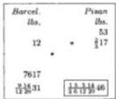

[On Barcelonan Pounds Sold for Paduan Pounds.]

Also a Barcelonan soldo [31], namely 12 denari, is worth  $\frac{2}{3} 17$  Paduan denari [32], and it is sought how many Paduan pounds will one have for 31 Barcelonan pounds and 14 soldi and 9 denari; you write down the problem as is shown here, and you will multiply the  $\frac{2}{3} 17$  and the  $\frac{9}{12} \frac{14}{20} 31$  that are diagonally opposite, and you divide by the 12; the quotient will be  $\frac{1}{2} \frac{5}{6} \frac{5}{12} \frac{14}{20} 46$  Paduan pounds.

# On the Same.

If you truly propose the same  $\frac{9}{12} \frac{14}{20} 31$  to be Paduan pounds, and you wish to obtain from these Barcelonan pounds, then you write the Paduan number below the Paduan number, as is shown in another problem; and you will multiply the 12 by the  $\frac{9}{12} \frac{14}{20} 31$ , and you divide by the  $\frac{2}{3} 17$ , that is you will multiply [p105] the said 12 and the 7617 that are diagonally opposite, and by the 3 that is under the fraction after the 17; and you divide by the 53 and with the  $\frac{1}{12} \frac{0}{20}$  that are under the fraction after the 31; the quotient will be  $\frac{43}{53} \frac{1}{12} \frac{11}{20} 21$  Barcelonan pounds.

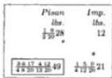

[On the Same.]

Also an Imperial soldo is worth  $\frac{1}{4} 28$  Pisan denari, plus  $\frac{1}{2} 1$  Pisan denari for each Imperial pound [33]; and it is sought how many Pisan pounds will be had for 21 Imperial pounds and  $\frac{1}{4} 5$  denari, that is for  $\frac{1}{4} \frac{5}{12} \frac{0}{20} 21$  Imperial pounds; because the soldo is one twentieth of a pound, you divide the  $\frac{1}{2} 1$  denari by 20; the quotient will be  $\frac{1}{2} \frac{1}{20}$  of one Pisan denaro that you add to the price of the soldo, and thus 12 Imperial denari are worth  $\frac{1}{2} \frac{6}{20} 28$  Pisan denari. Therefore 12 Imperial pounds are worth  $\frac{1}{2} \frac{6}{20} 28$  Pisan pounds; you therefore put the  $\frac{1}{4} \frac{5}{12} \frac{0}{20} 21$  Imperial pounds below the 12 Imperial pounds, and you will multiply them by the  $\frac{1}{2} \frac{6}{20} 28$ , and you divide the product by 12, and you will have the proposed result.

# [On the Same.]

And if one Imperial soldo is worth  $\frac{1}{4} 28$  Pisan denari minus  $\frac{1}{2} 1$  denari for each Imperial pound, then you divide again the  $\frac{1}{2} 1$  denari by 20; there results  $\frac{1}{2} \frac{1}{20}$  that you subtract from the  $\frac{1}{4} 28$  Pisan denari: there remain  $\frac{1}{2} \frac{3}{20} 28$  Pisan denari for the price of one Imperial soldo. Whence if you will have  $\frac{1}{4} \frac{5}{12} \frac{0}{20} 21$  Pisan pounds from which you wish Imperial pounds, then you multiply them by the 12, and you divide by the  $\frac{1}{2} \frac{3}{20} 28$ . And you note how many denari are given to the pound, plus or minus, from the price of the soldo; and you add a twentieth of it to, or subtract from, the price, and you will have the price of the soldo.

---

8. Here Begins Chapter Eight

Here Ends the Exchange of Money That Is Sold for Soldi.

Here Begins the Exchange of Money When It Is Sold for Pounds and Denari.

A Pisan pound, namely 20 soldi, is worth 1 Bolognese pound [34] plus 54 Bolognese denari, that is 20 Pisan soldi are worth $\frac{1}{2}$24 Bolognese soldi. Therefore 20 Pisan denari are worth $\frac{1}{2}$24 Bolognese denari, and 20 Pisan pounds are worth $\frac{1}{2}$24 Bolognese pounds; and it is sought how many Bolognese denari are had for $\frac{1}{4}$11 Pisan denari; you write down the problem as is displayed here, and you multiply the $\frac{1}{4}$11 by the $\frac{1}{2}$24, and you divide by the 20 Pisan denari; $\frac{1}{4}$$\frac{6}{8}$13 Bolognese denari will be the quotient; and if the exchange surcharge for a Pisan pound will be $\frac{1}{2}$56 Bolognese denari, that is 20 Pisan soldi are worth $\frac{1}{2}$8 denari and 24 Bolognese soldi, that is $\frac{1}{2}$$\frac{8}{12}$24 Bolognese soldi, and you wish to know how many Pisan soldi are worth 14 Bolognese soldi and 5 denari, then you put the $\frac{5}{12}$14 soldi below the $\frac{1}{2}$$\frac{8}{12}$24 Bolognese soldi, and you multiply the $\frac{5}{12}$14 by the 20, and you divide by the $\frac{1}{2}$$\frac{8}{12}$24, that is you will multiply the 173 by the 20, and by the 12, and the 20, and the 2 that are under the fractions; and you divide by the 593, and by the 12 that is under the fraction of the 14; the quotient will be $\frac{20}{593}\frac{8}{12}$11 Pisan soldi.

|  Pisan denari | Bologn. denari  |
| --- | --- |
|  20 | 49
$\frac{1}{2}$24  |
|  45 |   |
|  $\frac{1}{4}$11 | $\frac{1}{2}$$\frac{8}{12}$13  |
|  Pisan soldi | Bologn. soldi  |
| --- | --- |
|  20 | 593
$\frac{1}{2}$$\frac{8}{12}$24  |
|  20 | 173
$\frac{20}{593}$$\frac{8}{12}$11  |

[On the Same.]

Again the exchange surcharge for a Pisan pound is $\frac{3}{4}$57 Bolognese denari, that is 20 Pisan soldi are worth $\frac{3}{4}$$\frac{9}{12}$24 Bolognese soldi; and it sought how many Bolognese pounds are 17 Pisan pounds and 11 soldi and 5 denari worth; you write down the problem; you multiply the $\frac{5}{12}$11$\frac{11}{20}$17 by the $\frac{3}{4}$$\frac{9}{12}$24 Bolognese pounds, and you divide by the 20 Pisan pounds; the quotient will be $\frac{1}{4}$$\frac{7}{8}$$\frac{11}{10}$$\frac{15}{12}$2021 Bolognese pounds. And if you will have $\frac{5}{12}$11$\frac{11}{20}$17 Bolognese pounds, then you multiply them by the 20, and you divide by the $\frac{3}{4}$$\frac{9}{12}$24, and you will have the conclusion.

|  P.Ibs. | B.Ibs.  |
| --- | --- |
|  20 | 1959
$\frac{5}{8}$$\frac{9}{12}$24  |
|  4217 | $\frac{1}{4}$$\frac{7}{8}$$\frac{11}{10}$$\frac{15}{12}$21  |
|  $\frac{5}{12}$11 | $\frac{1}{4}$$\frac{7}{8}$$\frac{11}{10}$$\frac{15}{12}$20  |

[On the Same.]

An Imperial soldo is worth $\frac{1}{2}$28 Pisan denari; it is sought how many Bolognese denari will be the surcharge for 1 Pisan pound; an Imperial soldo is 36 Bolognese denari; therefore $\frac{1}{2}$28 Pisan soldi are worth 36 Bolognese soldi, and $\frac{1}{2}$28 Pisan pounds are worth 36 Bolognese pounds. Therefore $\frac{1}{2}$28 Pisan pounds will have an exchange surcharge of $\frac{1}{2}$7 pounds, that is 36 minus $\frac{1}{2}$28, and because you will seek the exchange surcharge for one, you put the 1 below the $\frac{1}{2}$28 Pisan pounds, as is displayed in this illustration, and you multiply the 1 by the $\frac{1}{2}$7, and you divide by the $\frac{1}{2}$28, that is you multiply the 1 by the 15, and you divide by 57; but so that you have $\frac{1}{12}$$\frac{0}{20}$ in the fraction, you multiply the said product of the 1 and the 15 by 80; there will be 1200 that you divide with $\frac{1}{19}$$\frac{0}{12}$$\frac{0}{20}$; the quotient will be $\frac{3}{19}$$\frac{3}{12}$$\frac{5}{20}$ pound, that is $\frac{3}{19}$63 Bolognese denari, and such is the exchange surcharge for one Pisan pound.

|  Pisan pounds | Bol. pounds  |
| --- | --- |
|  $\frac{1}{2}$28 | $\frac{1}{2}$7  |
|  1 | $\frac{3}{19}$$\frac{3}{12}$$\frac{5}{20}$  |

---

160 II. Liber Abaci

### [It Is Sought How Much One Imperial Soldo Is Worth in Pisan Soldi.]

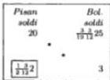

And it is said conversely that the exchange surcharge for one Pisan pound is 5 soldi and $\frac{3}{19}3$ denari, that is 20 Pisan soldi are worth $\frac{3}{19} \frac{3}{12}25$ Bolognese soldi, and it is sought how many Pisan soldi are worth one Imperial soldo; for the soldi you put 3 soldi below [p106] the $\frac{3}{19} \frac{3}{12}25$, as one Imperial soldo is worth 3 Bolognese soldi; and you will multiply the 3 and the 20 that are diagonally opposite, and you divide by the $\frac{3}{19} \frac{3}{12}25$, that is by $\frac{5}{19}25$ that is the same because $\frac{3}{19} \frac{3}{12}$ is $\frac{5}{19}$; the quotient is $\frac{1}{2} \frac{3}{12}2$ soldi, that is $\frac{1}{2}28$ denari for the price of one Imperial soldo.

### [The Exchange Surcharge in Bolognese Denari Is Sought for One Pisan Pound.]

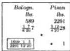

Again one Imperial soldo is worth $\frac{3}{4}28$ Pisan denari minus $\frac{1}{4}2$ Pisan denari for every Imperial pound, and it is sought how many Bolognese denari is the exchange rate for one Pisan pound; because of the aforesaid $\frac{1}{4}2$ denari, you subtract $\frac{1}{4} \frac{2}{20}$ of a Pisan denaro from the $\frac{3}{4}28$ Pisan denari; there will remain $\frac{3}{4} \frac{12}{20}28$ Pisan denari for the price of the Imperial soldo. Therefore $\frac{3}{4} \frac{12}{20}28$ Pisan pounds, namely 28 Pisan pounds and 12 soldi and 9 denari, are worth 36 Bolognese pounds. Therefore the exchange surcharge on 28 Pisan pounds and 12 soldi and 9 denari is 7 Bolognese pounds and 7 soldi and 3 denari, that is 36 pounds minus 28 pounds and 12 soldi and 9 denari. Therefore you write down the problem as is shown here, and you will multiply the 1 by the $\frac{1}{4} \frac{7}{20}7$, and you divide by the $\frac{3}{4} \frac{12}{20}28$; the quotient will be $\frac{1609}{2291} \frac{1}{12} \frac{5}{20}$ Bolognese pounds.

### [On the Same.]

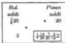

Also the exchange surcharge on one Pisan pound is $\frac{1}{2}64$ Bolognese denari, that is $\frac{3}{8}25$ Bolognese soldi are worth 20 Pisan soldi, and the price is sought for 3 Bolognese soldi, namely for 1 Imperial soldo; you therefore write down the problem; you multiply the 25 by its fraction; there will be 203; you will therefore multiply the 3 by the 20, and by the 8; there will be 480 that is divided by 203, namely with $\frac{1}{7} \frac{0}{29}$; but you multiply this by 20 and by 12; there will be 155200 that you divide with $\frac{1}{7} \frac{0}{29} \frac{0}{20} \frac{0}{12}$; the quotient will be $\frac{1}{7} \frac{14}{29} \frac{7}{20} \frac{2}{12}2$ Pisan soldi, that is $\frac{1}{7} \frac{14}{29} \frac{7}{20}28$ Pisan denari. And you will note that because you arrange the $\frac{1}{20}$ after the $\frac{1}{12}$ so that the number which lies over the $\frac{1}{20}$ is one twentieth of a denaro, which occurs for one Imperial soldo; and because there are twenty soldi in a pound, twenty times as many occur for one pound; therefore one Imperial soldo is worth 28 Pisan denari plus $\frac{1}{7} \frac{14}{29}7$ denari for each Imperial pound. But from five denari occurring for each pound there occurs for each soldo one fourth denaro, and for 10 denari there occurs $\frac{1}{2}$ denaro, and for 15 denari occurs $\frac{3}{4}$ denaro. Therefore one Imperial soldo is worth $\frac{1}{4}28$ Pisan soldi plus $\frac{1}{7} \frac{14}{29}2$ denari per pound, that is 2 plus $\frac{1}{4} \frac{14}{29}$ denaro. Whence one Imperial soldo is worth $\frac{1}{2}28$ Pisan denari minus $\frac{6}{7} \frac{14}{29}$ denaro for each Imperial pound; and thus you strive to work in similar problems.

---

8. Here Begins Chapter Eight 161

# On Venetian Money Sold for a Number of Pounds; And the Price of a Pound by Weight Is Sought.

One Venetian pound [35], namely 20 soldi, is sold for 12 Pisan pounds and 4 soldi, and it is sought how much one pound by weight of the same is worth, that we put to be 12 Venetian soldi and $\frac{1}{4}5$ denari; you will multiply the $\frac{1}{4} \frac{5}{12}12$ by the $\frac{1}{5}12$, and you divide by 20; and if one Venetian pound by weight is worth $\frac{1}{2}8$ pounds, and you wish to know the price of a pound, namely for 20 soldi, then you multiply the 20 by the $\frac{1}{2}8$, and you divide by the $\frac{1}{4} \frac{5}{12}12$, and thus you undoubtedly will have the proposition.

## On a Pound of Silver.

A pound by weight of silver, that is 12 ounces, is sold for 7 pounds; it is sought how much 2 ounces are worth; you write down in the problem ounces beneath ounces, namely the 2 beneath the 12, and you will multiply the 2 and the 7 that are diagonally opposite; there will be 14; and you divide by the 12; the quotient will be $\frac{1}{6}1$ pounds, that is 23 soldi and 4 denari, as is shown in the problem. Or in another way, because the 2 ounces are $\frac{1}{6}$ of one pound, you take $\frac{1}{6}$ of the 7 pounds, which is 23 soldi and 4 denari, as we said before.

### [On the Same.]

Also a pound by weight of silver is sold for 7 pounds and 9 soldi, that is $\frac{9}{20}7$ pounds, and it is sought how much $\frac{1}{4}2$ ounces are worth; you write down the problem, as is shown here, and you multiply the $\frac{1}{4}2$ by the $\frac{9}{20}7$, and you divide by the 12; the quotient will be $\frac{1}{4} \frac{11}{12} \frac{7}{20}1$ pounds. [p107]

### [On the Same.]

Also one pound by weight is worth 7 pounds and 11 soldi and 5 denari, that is $\frac{5}{12} \frac{11}{20}7$ pounds, and it is sought how much 7 ounces and 14 pennyweights are worth, that is $\frac{14}{25}7$ ounces because one ounce makes 25 pennyweights; you write down the problem as is shown here, and you will multiply the $\frac{5}{12} \frac{11}{20}7$ by the $\frac{14}{25}7$, and you divide by 12; the quotient will be $\frac{9}{3} \frac{1}{10} \frac{7}{16} \frac{4}{12} \frac{15}{20}4$ pounds.

### On the Same.

Also a pound by weight of silver is sold for $\frac{5}{12} \frac{7}{20}4$ Regal pounds; it is sought how much 4 pounds and $\frac{1}{4}7$ ounces, are worth, that is $\frac{1}{4} \frac{7}{12}4$ pounds by weight; because in this proposition the price of a pound by weight is sought, only 1 is written for the sale, namely one pound, and both are of the same kind and unit, and you multiply the $\frac{1}{4} \frac{7}{12}4$ by the $\frac{5}{12} \frac{7}{20}4$, and you divide by the 1, namely by the one pound; as is shown here, the quotient will be $\frac{1}{6} \frac{6}{8} \frac{5}{12} \frac{2}{20}20$ Regal pounds.

|  pounds
[value]
7 | ounces
[weight]
12  |
| --- | --- |
|  $\frac{1}{6}1$ | 2  |
|  pounds
[value]
3/207 | oz.
[wt.]
12  |
| --- | --- |
|  $\frac{1}{11} \frac{7}{4} \frac{1}{12} \frac{20}{1}$ | $\frac{1}{4}2$  |
|  pounds
value
1817
$\frac{8}{11} \frac{11}{20}7$ | oz.
[wt.]
12  |
| --- | --- |
|  $\frac{1}{11} \frac{7}{16} \frac{15}{10} \frac{12}{20}4$ | $\frac{14}{25}7$  |
|  Regal
lbs.
value
$\frac{5}{12} \frac{7}{20}4$ | lbs.
wt.
$\frac{1}{6} \frac{5}{8} \frac{4}{12} \frac{20}{20}$  |
| --- | --- |
|  $\frac{1}{6} \frac{5}{12} \frac{4}{20} \frac{20}{20}$ | $\frac{1}{4} \frac{7}{12}4$  |

---

II. Liber Abaci

# On the Same.

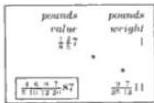

Also a pound of silver by weight is sold for  $\frac{1}{8} \frac{2}{5} 7$  pounds, and it is sought how much 11 pounds and 7 ounces and 9 pennyweights are worth, that is  $\frac{9}{25} \frac{7}{12} 11$  pounds by weight; you will therefore multiply the numbers that are diagonally opposite, namely the  $\frac{1}{8} \frac{2}{5} 7$  and the  $\frac{9}{25} \frac{7}{12} 11$ , and you divide the sale, namely by the 1; and  $\frac{4}{5} \frac{6}{10} \frac{9}{12} \frac{7}{20} 87$  pounds will be the quotient.

# [On Silver Sold for Saracen Bezants.]

Also  $\frac{1}{9} \frac{1}{4} 7$  pounds of silver by weight are sold for  $\frac{1}{8} \frac{2}{5} 63$  Saracen bezants, and it is sought how much 5 ounces and 11 pennyweights and 5 carobs are worth, that is  $\frac{5}{6} \frac{11}{25} 5$  ounces;  $\frac{1}{9} \frac{1}{4} 7$  pounds and  $\frac{5}{6} \frac{11}{25} 5$  ounces are of the same kind, namely weights of silver, but they are not the same units, because  $\frac{1}{9} \frac{1}{4} 7$  are pounds and  $\frac{5}{6} \frac{11}{25} 5$  are ounces; either the  $\frac{1}{9} \frac{1}{4} 7$  are made into ounces or the  $\frac{5}{6} \frac{11}{25} 5$  ounces are made into parts of one pound, which are  $\frac{5}{6} \frac{11}{25} \frac{5}{12}$  of a pound; and you write down

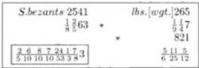

the problem as is shown here, and you will multiply the 7 by its fractions, there will be 265. Also you will multiply the 63 by its fractions; there will be 2541; and you will multiply the 5 that is over the 12 by its fractions; there will be 821 that you will multiply by the 2541, and by the 4, and by the 9 that are under the fractions written below the 265; and you divide with the rule for 265, and by all the other parts in order, so that you have  $\frac{1}{3} \frac{0}{8}$  in the fraction of division in order to show carats; and  $\frac{2}{5} \frac{6}{10} \frac{8}{10} \frac{7}{10} \frac{24}{53} \frac{1}{3} \frac{7}{8} 3$  bezants will be the quotient.

# On the Same.

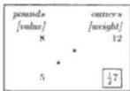

Again it is proposed that a pound of silver by weight, that is 12 ounces, is worth 8 pounds, and it is sought how much silver will be had for 5 pounds; you write down the 5 below the 8 in the problem, and you multiply the 5 by the 12; there will be 60 that you divide by the 8; the quotient will be  $\frac{1}{2}7$  ounces, as is shown in the problem.

# On the Same.

Also a pound of silver by weight is worth 7 pounds, and it is sought how much will then be had for 4 pounds; you therefore write down the problem; you will multiply the 4 by 12; there will be 48 that you divide by the 7; the quotient will be  $\frac{6}{7}6$  ounces. If you will wish to know how many pennyweights are  $\frac{6}{7}$  of an ounce, because each ounce weighs 25 pennyweights, then you will multiply the 6 that is over the 7 by the 25; there will be 150 that you divide by the 7;

---

8. Here Begins Chapter Eight 163

the quotient will be $\frac{3}{7}21$ pennyweights. Again if you will wish to make carobs of the $\frac{3}{7}$ of one pennyweight, then you will multiply the 3 that is over the 7 by 6, because each pennyweight is 6 carobs; there will be 18 that you divide by the 7; the quotient will be $\frac{4}{7}2$ carobs; therefore for the 4 pounds you will have 6 ounces and 21 pennyweights and $\frac{4}{7}2$ carobs. If you will wish to have this in only one multiplication and division using a better technique, then the abovementioned 48 you multiply by the number of parts of an ounce, namely by the number of pennyweights and the number of carobs, that is by 25 and by 6; there will be 7200 that you divide with $\frac{1}{7} \cdot \frac{0}{6} \cdot \frac{0}{25}$, that is with $\frac{1}{7} \cdot \frac{0}{6} \cdot \frac{0}{5}$, which is easier, and you will have the same quantity as is shown above in the problem; and [p108] that number which appears truly over the 7 is the fraction of one carob, and that which is over the 6 is the number of carobs, and that which is over the $\frac{1}{5} \cdot \frac{0}{5}$ is the number of pennyweights, and that which is outside the fraction is the number of ounces, as is the 12 of the sale beneath which it is written because always this number will be the same in kind and unit as that below which it is written in the illustration of the problem. And because from this number below which the total is put, namely the fourth and unknown number composing it, and at the head of the fraction of division you must have, it is pounds and denari, that which over the empty space are written, then you strive to have $\frac{1}{12} \cdot \frac{0}{20}$ because of the soldi and denari; and if they will be soldi, then you will strive to have $\frac{1}{13}$ because of the denari. However if they are tareni, then you will strive to have $\frac{1}{20}$ because of the grains. Similarly if they are Saracen or Cypriot bezants, then you will strive to have $\frac{1}{3} \cdot \frac{0}{8}$; and if Barbary bezants, then you will strive to have $\frac{1}{10}$; and if pounds or rolls of some not very expensive merchandise as pepper, then you will strive to have $\frac{1}{12}$ because of the ounces; and if they are Pisan pounds of some expensive merchandise such as saffron, then you will strive to have $\frac{1}{5} \cdot \frac{0}{12}$ because of the ounces and pennyweights; and if they are pounds of a precious thing as gold, then you will strive to have $\frac{1}{6} \cdot \frac{0}{5} \cdot \frac{0}{12}$ because of the ounces and pennyweights and carobs and grains; and if they are ounces of gold in Pisan pounds, then you will strive to have $\frac{1}{6} \cdot \frac{0}{5} \cdot \frac{0}{5}$ because of the pennyweights and carobs and grains; and if they are pennyweights of gold, then you will strive to have only $\frac{1}{6}$ because of the pennyweights and grains; and if they are carobs of gold, or some other precious thing, then you will strive to have only $\frac{1}{4}$ in the fraction because of the grains; and if they are ounces of silver, then it suffices to have only $\frac{1}{6} \cdot \frac{0}{5}$ because of the pennyweights and carobs, as we ordered in the aforewritten problem. And if they are pennyweights of silver, then it suffices to have only $\frac{1}{6}$ because of the carobs; and if they are marks of silver, then you will strive to have $\frac{1}{6} \cdot \frac{0}{5} \cdot \frac{0}{8}$ because of the ounces and pennyweights and carobs; and thus one must do with all things according to the diversity of weight and parts of them, and according to the custom and order of the provinces in which you will have to operate. Whence if you will consider well this which was said, then you will have in one multiplication and division all that is necessary for you in the sought things; and you teach, not forgetting to save them, that whenever you will have in the division a part, or parts of the aforewritten numbers which

|  pounds
[value] | ounces
[weight]  |
| --- | --- |
|  7 | 12  |
|  * |   |
|  4 | 36  |

---

II. Liber Abaci

you will need to put and arrange at the heads of the fractions, or those fractions where you lack the number, and to multiply by them. For example, we put it that one must have  $\frac{1}{12}$  at the head of the fraction because of denari or ounces, and you shall have of it  $\frac{1}{4}$  in the division; you lack therefore  $\frac{1}{3}$ , that you arrange together, making of them  $\frac{1}{12}$  that you will have at the head of the fraction; and you will multiply the total by 3 because of the  $\frac{1}{3}$  that you lack. And if from the division by which you will have to divide the total by that which you need at the head of the fraction, you are able to assemble it, then you strive to build it; and you put it at the head of the fraction. For example, we must have  $\frac{1}{12} \frac{0}{20}$  because of soldi and denari, and we must divide by  $\frac{1}{2} \frac{0}{6} \frac{0}{8} \frac{0}{9} \frac{0}{10}$  the total; we shall therefore arrange  $\frac{1}{2}$  with  $\frac{1}{10}$ , and we make  $\frac{1}{20}$  out of them; next we group  $\frac{1}{6}$  with  $\frac{1}{8}$ , that is  $\frac{1}{4} \frac{0}{12}$ , and thus we shall have in the fraction  $\frac{1}{4} \frac{0}{9} \frac{0}{12} \frac{0}{20}$ , and that will be only as much as  $\frac{1}{2} \frac{0}{6} \frac{0}{8} \frac{0}{9} \frac{0}{10}$ .

Again if you will have nothing from this division that you must have at the head of your fraction, then you will multiply the total by that which you must have at the head of the fraction, and join to the division that which you must have at the head of the fraction. For example, we put it that we must divide 321 with  $\frac{1}{7} \frac{0}{11}$ , and we must have  $\frac{1}{3} \frac{0}{8}$  at the head of the fraction [p109] because of the carats; you will multiply the 321 by the 3 and the 8, that is by 24, and this is to make carats from the 321 bezants; and you divide with  $\frac{1}{7} \frac{0}{11} \frac{0}{3} \frac{0}{8}$ ; and thus you understand the rest, and we explain it uniquely in the following one.

# On Marks of Silver. [36]


One mark of silver, that is 8 ounces, is sold for 5 pounds, and it is sought how much 2 ounces are worth; you write the ounces below the ounces in the problem, namely the 2 below the 8, as is shown here, and you will multiply the 2 and the 5 that are diagonally opposite; there will be 10 that you divide by the 8; the quotient is  $\frac{1}{2}1$  pounds, that is 25 soldi, as is shown in the problem; or in another way, because the 2 ounces are  $\frac{1}{4}$  of a mark, namely of the 8 ounces, you take  $\frac{1}{4}$  of the price of the mark, namely of the 5 pounds; there will be 25 soldi, as we said before.

# On the Same.

And if you seek by the same rule how much silver you will have for 2 pounds, then you write the price below the price, namely the 2 below the 5; and you will multiply the 2 by the 8; there will be 16; and you divide by the 5; the quotient will be  $\frac{1}{5}3$  ounces, that is 3 ounces and 5 pennyweights, because the same is for ounces of marks and pounds.

# [On the Same.]

Also one mark is sold for 4 pounds and 13 soldi, that is for  $\frac{13}{20}4$  pounds; how much are  $\frac{3}{4}3$  ounces worth? You write down the problem as is shown here, and you multiply the  $\frac{3}{4}3$  by the  $\frac{13}{20}4$ ; and you divide by the 8; that is you multiply the 15 by the 93, which makes 1395, and you divide with  $\frac{1}{4} \frac{0}{8} \frac{0}{20}$ ; but in order

---

8. Here Begins Chapter Eight 165

that you have 12 after the 20 in the fraction, you join the $\frac{1}{4}$ which is in the fraction with $\frac{1}{3}$, and you will have 12 under the fraction, and you multiply the 1395 by the 3, and you divide the product with $\frac{1}{8} \frac{0}{12} \frac{0}{20}$; and you write the 3 above the 8 in order to remember it better when checking; the quotient will be $\frac{1}{8} \frac{7}{12} \frac{3}{20} 2$ pounds.

## On the Same.

Also one mark of silver is sold for $\frac{5}{12} \frac{7}{20} 4$ pounds, and it is sought how much 5 ounces and 11 pennyweights, are worth, that is $\frac{11}{25} 5$ ounces; you write down the problem thus, and you multiply the 4 by its fractional parts; there will be 1049 denari which you write above; and you will multiply the 5 ounces by the 25, and add the 11; there will be 136 pennyweights; and you will multiply the 136 by the 1049, and divide by the 8 and all the fractional parts; and you will order $\frac{1}{12} \frac{0}{20}$ at the head of the fraction because the number which is over the space in which we must put the total is the number of pounds; the quotient will be $\frac{2}{10} \frac{3}{10} \frac{5}{12} \frac{19}{20} 2$ pounds.

|  pounds
/value/
1049 | oz.
/wt./  |
| --- | --- |
|  $\frac{5}{12} \frac{7}{20} 4$ | 8  |
|  d. s. l. | 136  |
|  $\frac{2}{10} \frac{3}{10} \frac{13}{12} \frac{19}{20} 2$ | $\frac{11}{25} 5$  |

## On the Same.

If one mark of silver is sold for 5 pounds and 7 soldi and 9 denari, that is $\frac{9}{12} \frac{7}{20} 5$ pounds, then it is sought how much 3 ounces and 13 pennyweights are 5 carobs are worth, that is $\frac{5}{6} \frac{13}{25} 3$ ounces; you write down the problem as is displayed here; and you will multiply the $\frac{5}{6} \frac{13}{25} 3$ by the $\frac{9}{12} \frac{7}{20} 5$, and you divide by the 8; and $\frac{3}{4} \frac{9}{10} \frac{3}{10} \frac{10}{12} \frac{7}{20} 2$ pounds will be the quotient.

|  pounds
/value/
1293 | oz.
/wt./  |
| --- | --- |
|  $\frac{5}{12} \frac{7}{20} 5$ | 8  |
|  d. s. l. | 533  |
|  $\frac{2}{4} \frac{9}{10} \frac{3}{10} \frac{19}{12} \frac{7}{20} 4$ | $\frac{5}{12} \frac{19}{3} \frac{3}{24}$  |

## On the Same.

Also one mark is sold for $\frac{1}{9} \frac{2}{5} 5$ pounds, and it is sought how much 7 pennyweights and 1 carob are worth, that is $\frac{1}{6} \frac{7}{25}$ ounces; therefore you write down the problem, and you multiply the $\frac{1}{6} \frac{7}{25}$ by the $\frac{1}{9} \frac{2}{5} 5$, and you divide by the 8; the quotient will be $\frac{4}{5} \frac{2}{9} \frac{3}{12} \frac{11}{20}$ of a pound.

|  pounds
value/
1293 | oz.
/wt./  |
| --- | --- |
|  $\frac{5}{12} \frac{7}{20} 5$ | 8  |
|  d. s. l. | 533  |
|  $\frac{2}{4} \frac{9}{10} \frac{3}{10} \frac{19}{12} \frac{7}{20} 4$ | $\frac{5}{12} \frac{19}{3} \frac{3}{24}$  |

[On the Same.]

|  pounds
value/
48 | oz.
wt.  |
| --- | --- |
|  $\frac{1}{9} \frac{2}{5} 5$ | 8  |
|  d. s. l. | 43  |
|  $\frac{4}{5} \frac{2}{9} \frac{3}{12} \frac{11}{20} \frac{7}{20} 0$ | $\frac{2}{6} \frac{7}{25}$  |

Also $\frac{1}{4} 7$ marks are sold for $\frac{1}{3} 31$ pounds; how much therefore are $\frac{2}{5} 9$ marks worth? You write down the problem thus; and you will multiply the 7 by the 4, and you add the 1; there will be 29; and you will multiply the 31 by the 3, and you add the 1; there will be 94; and you multiply the 9 by the 5, and you add the 2; there will be 47; and you will multiply the 47 by the 94 and the 4 that is under the 29; there will be 17672; and you divide by the 29, and by the other fractional parts, namely by the 3 and the 5 that are under the fractions; but because we know that the total that will result will be in [p110] pounds, the place in which we must write it is below the pounds, namely below the $\frac{1}{3} 31$; whence we ought to have $\frac{1}{12} \frac{0}{20}$ at the head of the fraction so that we will have soldi and denari after the pounds. But of the needed $\frac{1}{12}$, we have only the $\frac{1}{3}$; we know that we lack $\frac{1}{4}$, and of the needed $\frac{1}{20}$ we have only the $\frac{1}{5}$; we know that we

|  pounds
/value/ | marks  |
| --- | --- |
|  94 | 29  |
|  $\frac{1}{3} 31$ | $\frac{1}{4} 7$  |
|  d. s. l. | 49  |
|  $\frac{5}{12} \frac{8}{10} \frac{12}{10} \frac{19}{40}$ | $\frac{2}{5} 9$  |

---

II. Liber Abaci

lack another  $\frac{1}{4}$ ; therefore we lack 16 between them both, which you write above the 29; and you will multiply the 17672 by the 16, and divide the product with  $\frac{1}{29} \frac{0}{0} \frac{0}{12} \frac{0}{20}$ ; the quotient will be  $\frac{2}{29} \frac{6}{12} \frac{12}{20} 40$  pounds.

# On the Same.

And if by the same rule you seek how much silver will be had for  $\frac{2}{5} 9$  pounds, then you write down the problem thus; and you will multiply the 47 by the 29 and the 3; and you divide with the rule for 94, that is  $\frac{1}{2} \frac{0}{47}$ , and by all the fractional parts, namely only by the 4 and by the 5; you leave off multiplying and dividing by the 47; therefore you will multiply only the 29 by the 3 that is under the fraction after the 31; there will be 87 that you divide with the  $\frac{1}{4} \frac{0}{5}$  and  $\frac{1}{2}$  which remain from the rule for 94, that is with  $\frac{1}{5} \frac{0}{8}$ . But we know this which results from the division will be the number of marks because the place in which we must put it is below the marks, namely below the  $\frac{1}{4} 7$ ; whence we must have  $\frac{1}{6} \frac{0}{5} \frac{0}{8}$  at the head of the fraction because of the ounces and pennyweights and carobs; we have showing in the division  $\frac{1}{5} \frac{0}{8}$ ; therefore we lack  $\frac{1}{6} \frac{0}{5}$ , that is 30, by which we must multiply the 87, and we will have  $\frac{1}{6} \frac{0}{5} \frac{0}{8}$  in the division. But because in the said division the fractional parts are only parts of a mark, namely  $\frac{1}{5} \frac{0}{8}$ , one need only divide the 87 with  $\frac{1}{5} \frac{0}{8}$ ; the quotient will be  $\frac{2}{5} \frac{1}{8} 2$ , that is 2 marks and 1 ounce and 10 pennyweights.

# On Pisan Ounces of Gold.

One Pisan ounce, or one ounce of Taranto of gold that weighs 25 pennyweights is sold for 4 pounds, and it is sought how much 17 pennyweights of the same gold are worth; you write down in the problem the 17 below the 25 because they are of the same kind, namely gold, and the same units, namely pennyweights; and you will multiply the 4 pounds and the 17 because they are diagonally opposite; there will be 68 pounds; you multiply the 68 by the 48 which is what we lack of  $\frac{1}{12} \frac{0}{20}$  because we have only the fifth of it; and you divide it with  $\frac{1}{5} \frac{0}{12} \frac{0}{20}$ ; the quotient will be  $\frac{4}{5} \frac{4}{12} \frac{14}{20} 2$  pounds, as is shown in the problem.

# On the Same.

Also the same ounce is sold for  $\frac{3}{20} 4$  pounds, and it is sought how much 9 pennyweights and 5 carobs are worth, that is  $\frac{5}{6} 9$  pennyweights; you write down the problem, and you multiply the  $\frac{3}{20} 4$  by the  $\frac{5}{6} 9$ ; and you divide by the 25; that is, you multiply 83 by 59; there will be 4897 that you divide by the 25, and by the fractional parts, that is by 6 and 20; but so that you will have  $\frac{1}{12} \frac{0}{20}$  in the fraction you multiply the 4897 by 2 which we lack of the  $\frac{1}{12}$  because we have  $\frac{1}{6}$  from the division; there will be 9794 that you now divide with  $\frac{1}{5} \frac{0}{12} \frac{0}{20}$ ; the quotient is  $\frac{4}{5} \frac{3}{12} \frac{7}{20} 1$  pounds, that is 32 soldi and  $\frac{4}{5} 7$  denari, as is shown in the problem.


---

8. Here Begins Chapter Eight

# [On the Same.]

Also the same ounce is sold for  $\frac{5}{12} \frac{7}{20} 4$  pounds; how much therefore are 11 pennyweights and 4 carobs and 3 grains worth, that is  $\frac{3}{4} \frac{4}{6} 11$  pennyweights? You write down the problem as is shown here; and you will multiply the  $\frac{5}{12} \frac{7}{20} 4$  by the  $\frac{3}{4} \frac{4}{6} 11$ , and you divide by the 25;  $\frac{5}{6} \frac{7}{10} \frac{7}{10} \frac{2}{12} \frac{1}{20} 2$  pounds will be the quotient, as is shown here.

# On the Same.

Also the same ounce is sold for  $\frac{1}{3} 4$  pounds, and it is sought how much 13 ounces and 14 pennyweights and 5 carobs and 3 grains are worth, that is  $\frac{3}{4} \frac{5}{6} \frac{14}{25} 13$  ounces; because in this the price of ounces is sought, we must write 1 for the ounce sold, as is shown here; and you will multiply the  $\frac{1}{3} 4$  by the  $\frac{3}{4} \frac{5}{6} \frac{14}{25} 13$ , and you divide by the 1; the quotient will be  $\frac{1}{3} \frac{1}{5} \frac{6}{12} \frac{18}{20} 58$  pounds. [p111]

[On the Same.]

|  pounds /value/ | Pisan pnwt.  |
| --- | --- |
|  1049 1/2 1/2 20 4 | 25  |
|  d. s. l. | 283  |
|  1/2 7/6 1/10 1/10 7/12 20 2 | 3/4 1/4 6 11  |
|  pounds /value/ | ounces /wt./  |
| --- | --- |
|  13 | 1  |
|  1/2 4 | 1  |
|  d. s. l. | 8159  |
|  1/2 1/3 1/12 20 5 | 3/4 1/4 6 20 13  |

Also one ounce is sold for  $\frac{9}{20} 4$  pounds, and it is sought how many ounces of it will be had for 3 pounds; you write down the problem thus, and you will multiply the 3 by the 25; there will be 75 that you divide by the  $\frac{9}{20} 4$ , that is you will multiply the 75 by the 20 of the fraction that makes 1500, and you divide by the 89; the quotient will be  $\frac{76}{89} 16$  pennyweights; if you will wish to make carobs of the  $\frac{76}{89}$ , then you multiply the 76 by the number of carobs is one pennyweight, namely 6; there will be 456 that you divide by the 89; the quotient will be  $\frac{11}{89} 5$  carobs. And if you wish to do this according to the principal technique, then you multiply the 1500 by 6 because of the carobs, and by 4 because of the grains; there will be 36000 that you divide with  $\frac{1}{89} \frac{0}{4} \frac{0}{6}$ ; the quotient will be  $\frac{44}{89} \frac{0}{4} \frac{5}{6} 16$  pennyweights, as is shown in the problem.

# On the Same.

|  pounds /value/ | Pisan pnwt.  |
| --- | --- |
|  89 | 25  |
|  3/26 4 |   |
|  3 | 84 0 5 16  |

And if by the same rule you seek how much will be had for 3 sold, then you make sold of the  $\frac{9}{20} 4$  pounds; there will be 89 sold which you write below the 3 sold in the problem, and you will multiply the 3 by the 25; there will be 75 that you will multiply by 24 so that you have carobs and grains in the fraction; and you divide the product with  $\frac{1}{89} \frac{0}{4} \frac{0}{6}$ ; the quotient will be  $\frac{20}{89} \frac{0}{4} \frac{5}{6}$  of a pennyweight, that is 5 carobs and  $\frac{20}{89}$  of one grain, as is shown in the problem.

[On False Silver.]

|  soldi | Pisan pnwt.  |
| --- | --- |
|  89 | 25  |
|  3 | 20 0 5 89 4 6  |

A certain person wishes to buy silver mixed with tin, which is commonly called false silver. As one does not know how much pure silver there is in a pound of the mixed silver, one commences with one granule of it weighing 5 carobs and  $\frac{1}{2}2$  grains, that is  $\frac{5}{8}5$  carobs, and one puts it over a fire in order to purge the silver of the tin; and when this is done one finds there 2 carobs and  $\frac{1}{2}2$  grains, that is  $\frac{5}{8}2$  carobs, of the pure silver; it is sought how much pure silver there is

---

168 II. Liber Abaci

|  oz. of
pure
silver | oz. of
mixed
silver  |
| --- | --- |
|  21 | 45  |
|  5/82 | 5/85  |
|  * | *  |
|  3/85 | 12  |

in one pound of the mixed silver. First it is noted that $\frac{5}{8}5$ carobs are the same units as the $\frac{5}{8}2$ carobs; therefore in the $\frac{5}{8}5$ carobs of the mixed silver there are $\frac{5}{8}2$ carobs of pure silver, so in $\frac{5}{8}5$ pennyweights of mixed silver there will be $\frac{5}{8}2$ pennyweights of pure silver. And similarly in $\frac{5}{8}5$ ounces of mixed silver there will be $\frac{5}{8}2$ ounces of pure silver; and also, in $\frac{5}{8}5$ pounds of mixed silver there will be $\frac{5}{8}2$ pounds of pure silver. Because in this problem pounds are sought, that is 12 ounces, you write in the problem how much of the $\frac{5}{8}5$ ounces of mixed silver is pure silver, $\frac{5}{8}2$ ounces; next you write 12 ounces below the $\frac{5}{8}5$ ounces, that is mixed silver below mixed silver, as is shown here; and you will multiply the $\frac{5}{8}2$ by the 12, and you divide by the $\frac{5}{8}5$, and you leave off multiplying and dividing that which you can; the quotient will be $\frac{3}{8}5$ ounces, and that much pure silver will be in the abovewritten pound. And you know that by this material you can know how much pure silver there is in any quantity of any coin because you will know how much silver is in one of the same coin, or by the ounce, or in a pound, or in any other quantity.

## Here Begins the Third Part of the Eighth Chapter

## On Sales of Canes, First of Pisan Canes.

|  soldi | arms  |
| --- | --- |
|  7 | 4  |
|  * | *  |
|  3/81 | 1  |
|  soldi | palms  |
|  7 | 10  |
|  * | *  |
|  2/70 | 1  |

A Pisan cane [38] is 10 palms [39], or 4 arms [40]; however a Genoese cane is said to be 9 palms. And furthermore the canes of Provence and Sicily and Syria and Constantinople are the same measure, namely 8 palms; and we speak first of the sale by Pisan canes.

## On Canes.

A Pisan cane, that is 4 arms, of any cloth is sold for 7 soldi, and it is sought how much 1 arm is worth; you write downthe problem, as is shown here; you therefore multiply the 7 by the 1, and you divide by the 4; the quotient will be $\frac{3}{4}1$ soldi, that is 21 denari. If you seek the price of one palm, then the same rule is written in the problem in palms, namely 10 instead of 1 cane, as we just wrote 4 arms for the one cane; and you must always consider this in order that [p112] you write in the problem the same merchandise below the same merchandise, as you write the same units of measure below the same units, and the units of weight below the same units of weight, that is canes below canes, and arms below arms, and palms below palms, and hundredweights below hundredweights, and rolls below rolls, and thus you understand the rest.

## [On the Same.]

|  soldi | arms  |
| --- | --- |
|  557 | 4  |
|  5/7246 | 4  |
|  * | *  |
|  d. s. | *  |
|  3/434 | 3  |

Also one cane is sold for 46 soldi and 5 denari, that is $\frac{5}{12}46$ soldi; how much therefore are 3 arms worth? You will multiply the 46 by the 12, and you add the 5; there will be 557 denari which you will multiply by the 3, and you divide by the 4, and the 12 that is under the fraction, that is with $\frac{1}{4}\frac{0}{12}$; the quotient will be $\frac{3}{4}\frac{9}{12}34$ soldi.

---

8. Here Begins Chapter Eight 169

## On the Same.

Also one cane is sold for $\frac{9}{20}5$ pounds, and it is sought how much $\frac{1}{4}\frac{1}{2}2$ arms are worth, that is $\frac{3}{4}2$ arms; you write down the problem as is shown here, and you multiply the $\frac{3}{4}2$ by the $\frac{9}{20}5$, and you divide by the 4, that is you will multiply the 11 by the 109; there will be 1199 that you divide by the 4, and by the parts of the two remaining numbers, namely by the 4 and the 20; but as you must have $\frac{1}{12}$ after the $\frac{1}{20}$ under the fraction of division, you will multiply the 1199 by 3; there will be 3597 that you divide with $\frac{1}{4}\frac{0}{12}\frac{0}{20}$; the quotient will be $\frac{1}{4}\frac{11}{12}\frac{14}{20}3$ pounds.

|  pounds | arms  |
| --- | --- |
|  109 |   |
|  $\frac{3}{20}5$ | 4  |
|  * |   |
|  d. s. l. | 11  |
|  $\frac{1}{4}\frac{11}{12}\frac{14}{20}$ | $\frac{3}{4}2$  |

## On the Same.

Also the same cane is sold for $\frac{7}{12}\frac{9}{20}5$ pounds, and it is sought how much $\frac{1}{8}\frac{1}{4}3$ arms are worth, that is $\frac{3}{8}3$ arms; you write down the problem, and you will multiply the 5 by its fraction; there will be 1315. Also you will multiply the 3 by its fraction; there will be 27 that you will multiply by the 1315, and you divide by the sale, namely the 4, and by all the fractional parts; the quotient will be $\frac{1}{4}\frac{4}{8}\frac{5}{12}\frac{12}{20}4$ pounds.

|  pounds | arms  |
| --- | --- |
|  1315 |   |
|  $\frac{7}{12}\frac{8}{20}5$ | 4  |
|  * |   |
|  d. s. l. | 27  |
|  $\frac{1}{4}\frac{4}{8}\frac{13}{12}\frac{19}{20}4$ | $\frac{3}{4}3$  |

## [On the Same.]

Also one cane is sold for $\frac{7}{12}\frac{9}{20}5$ pounds and it is sought how much 11 canes and $\frac{1}{8}\frac{1}{2}3$ arms are worth, that is $\frac{5}{8}\frac{3}{4}11$ canes; and so that we say it better, we shall write $\frac{29}{32}11$ canes because in this problem the price of canes is sought; or of these canes you make arms, or of 4 arms you make 1 cane. However in this we write 4 arms for the sale of the canes, as is shown here; and of the 11 canes and $\frac{1}{8}\frac{1}{2}3$ arms you make arms, and there will be $\frac{5}{8}47$ arms that you write down in the problem below the 4 arms; and you will multiply the $\frac{5}{8}47$ by the $\frac{7}{12}\frac{9}{20}5$, and you divide by the 4; the quotient will be $\frac{3}{4}\frac{5}{8}\frac{8}{12}\frac{4}{20}65$ pounds, as is shown in the problem.

|  pounds | arms  |
| --- | --- |
|  1315 |   |
|  $\frac{1}{12}\frac{8}{20}5$ | 4  |
|  * |   |
|  d. s. l. | 27  |
|  $\frac{1}{4}\frac{4}{8}\frac{13}{12}\frac{19}{20}4$ | $\frac{3}{4}3$  |

## On Genoese Canes.

Also a Genoese cane, that is 9 palms, is sold for 11 soldi and 9 denari, that is $\frac{3}{4}11$ soldi, and it is sought how much $\frac{1}{2}2$ palms are worth; you write down the problem as is shown here; and you will multiply the $\frac{1}{2}2$ and the $\frac{3}{4}11$ that are diagonally opposite, and you divide by the 9; the quotient will be $\frac{1}{6}\frac{3}{12}3$ soldi. And if you know how many soldi one cane is worth, then the same number plus a third of it will be the worth of one palm in denari.

|  soldi | palms  |
| --- | --- |
|  47 |   |
|  $\frac{3}{4}11$ | 9  |
|  * |   |
|  d. s. | 5  |
|  $\frac{1}{8}\frac{3}{12}$ | $\frac{1}{2}2$  |

## On Canes of Provence.

One cane of Provence, that is 8 palms, is sold for $\frac{7}{12}\frac{5}{20}3$ pounds, and it is sought how much $\frac{1}{9}\frac{3}{4}3$ palms are worth; you again write down the problem, and you will multiply the $\frac{1}{9}\frac{3}{4}3$ by the $\frac{7}{12}\frac{5}{20}3$, and you divide by the 8; you place the $\frac{1}{12}\frac{0}{20}$ at the head of the fraction of division so that the place in which the

|  pounds | palms  |
| --- | --- |
|  787 |   |
|  $\frac{7}{12}\frac{5}{20}3$ | 8  |
|  * |   |
|  d. s. l. | 139  |
|  $\frac{1}{4}\frac{4}{8}\frac{7}{12}\frac{1}{20}1$ | $\frac{1}{9}\frac{3}{4}3$  |

---

II. Liber Abaci

result is put is below the pounds, namely below the  $\frac{7}{12} \frac{5}{20} 3$ ; the quotient will be  $\frac{1}{4} \frac{4}{8} \frac{7}{9} \frac{7}{12} \frac{11}{20} 1$  pounds. And if you know how many soldi one cane will be worth, then one palm will be worth the same number of denari. For example, as one cane is worth 14 soldi, one palm is worth 14 denari and a half more, that is 21 denari.

# On Sicilian Canes.


A Sicilian cane, which is 8 palms long, is sold for 19 tareni, and it is sought how much [p113] 2 palms are worth; you write down the problem as is shown here, and you will multiply the 2 by the 19; there will be 38 that you divide by the 8; the quotient will be  $\frac{3}{4} 4$  tareni. Or in another way, because 2 palms are one fourth of one cane, namely 8 palms, you take one fourth of the 19 tareni; the quotient will be  $\frac{3}{4} 4$  tareni, as we said before.

# On the Same.


Again the same cane is sold for 23 tareni and 7 grains, that is for  $\frac{7}{20} 23$  tareni, and it is sought how much  $\frac{1}{2} 3$  palms are worth; you write down the problem, and you will multiply the  $\frac{1}{2} 3$  by the  $\frac{7}{20} 23$ , and you divide the product by the 8; the quotient will be  $\frac{1}{2} \frac{2}{8} \frac{4}{20} 10$  tareni, that is 10 tareni and  $\frac{1}{2} \frac{2}{8} 4$  grains.

# On the Same.


Also the same cane is sold for  $\frac{1}{4} 25$  tareni, and it is sought how much 9 canes and  $\frac{1}{4} 5$  palms are worth, that is  $\frac{1}{4} \frac{5}{6} 9$  canes; you write down the problem thus, and you will multiply the 25 by its fraction; there will be 101; and you multiply the 9 by its fraction; there will be 309; next you multiply the 101 by the 309; there will be 31209 that you divide by the 1 and the fractional parts, that is with  $\frac{1}{4} \frac{0}{8}$ . But because of the place in which the quotient of the division is written, namely under the  $\frac{1}{4} 25$  tareni, we must have  $\frac{1}{20}$  at the head of the fraction because of the grains; this  $\frac{1}{20}$  we do not have in the aforewritten division, namely in the  $\frac{1}{4} \frac{9}{8}$ , because we lack  $\frac{1}{5}$  of the  $\frac{1}{20}$ ; whence you write in the problem 5 over the 1 in order better to remember while checking; and you will multiply the 31209 by the 5, and you divide with the  $\frac{1}{4} \frac{0}{8} \frac{0}{20}$ ; the quotient will be  $\frac{1}{4} \frac{3}{8} \frac{16}{20} 243$  tareni, that is 243 tareni and  $\frac{1}{4} \frac{3}{8} 16$  grains.

# On Barbary Canes.


A Barbary cane [41], that is similarly 8 palms, is sold for 4 bezants and 7 mils, that is for  $\frac{7}{10} 4$  bezants, and it is sought how much  $\frac{1}{4} 2$  palms are worth; you write down the problem thus, and you will multiply the  $\frac{1}{4} 2$  by the  $\frac{7}{10} 4$ , and you divide by the 8; the quotient will be  $\frac{3}{4} \frac{1}{8} \frac{3}{10} 1$  bezants, as is shown in the problem, that is 1 bezants and  $\frac{3}{4} \frac{1}{8} 3$  mils.

---

8. Here Begins Chapter Eight 171

## On the Same.

Also the same cane is sold for $\frac{3}{4}5$ bezants, and it is sought how much $\frac{1}{2}11$ canes are worth; you write down the problem thus, and you multiply the 5 by the 4, and you add the 3; there will be 23 that you write over the $\frac{3}{4}5$, and you will multiply also the 11 by its fraction; there will be 23, and you will multiply the 23 by the 23; there will be 529 that you divide by the fractional parts, namely with $\frac{1}{2}4$, that is by the 8 and the 1; in the division if nothing is done and it is not further completed, then the quotient will be $\frac{1}{8}66$ bezants; if you wish to make mils of the $\frac{1}{8}$, then you multiply the 1 which is over the 8 by 10 because 1 bezant is 10 mils; there will be 10 that you divide by the 8; the quotient is $\frac{1}{4}1$ mils; or in another way, because the place in which the quantity is written is below Barbary bezants, we must have $\frac{1}{10}$ at the head of the fraction because of the mils; therefore you multiply the 529 by 10; that is, you put 0 before the 529; there will be 5290 that you divide with $\frac{1}{8}10$; the quotient will be $\frac{1}{4}1066$ bezants, as is shown above in the problem. And following that which we said about Barbary canes, you can understand of all the units which are sold in the same region for the same bezants.

|  bezants | canes  |
| --- | --- |
|  23 |   |
|  $\frac{3}{4}5$ | 1  |
|  mil.bez. | 23  |
|  $\frac{1}{4}1066$ | $\frac{1}{4}11$  |

## On the Same.

Also the same cane is sold for 4 bezants and 13 carats, that is for $\frac{13}{24}4$ bezants, and it is sought how much 7 canes and 3 palms are worth, that is $\frac{3}{8}7$ canes; you writedown the problem thus, and you multiply the $\frac{13}{24}4$ by the $\frac{3}{8}7$, and you divide by the 1; the quotient will be $\frac{7}{8}3\frac{3}{8}33$ bezants.

|  bezants | canes  |
| --- | --- |
|  109 |   |
|  $\frac{13}{24}4$ | 1  |
|  59 |   |
|  $\frac{7}{8}3\frac{3}{8}33$ | $\frac{3}{8}7$  |

## On a Bale of Poles.

A bale [42] of poles, that is 40 bundles [43], is sold for 37 pounds, and it is sought how much one bundle is worth; you write down the problem thus, and you multiply the 1 by the 37; there will be 37 that you divide [p114] with the rule for 40, namely with $\frac{1}{4}\frac{0}{10}$, or with $\frac{1}{2}\frac{0}{20}$, which is better here because the place in which the result is written is below the pounds, namely below the 37; the quotient will be $\frac{1}{2}\frac{18}{20}$, that is $\frac{1}{2}18$ soldi, and from that which is indeed apparent, the worth of one bundle in soldi is equal to one half the price of a bale in pounds.

|  pounds | bundles  |
| --- | --- |
|  37 | 40  |
|  s.l. |   |
|  $\frac{1}{20}0$ | 1  |

## [On the Same.]

Also a bale is sold for $\frac{9}{20}38$ pounds, and it is sought how much 3 bundles are worth; you write down the problem thus, and you multiply the 38 by its fraction; there will be 769 that you multiply by the 3 that is diagonally opposite from it; there will be 2307 that you divide with the rule for 40, and by the 20 that is under the fraction, that is, with $\frac{1}{4}\frac{0}{20}$. But first you multiply the 2307 by 3 that we lack of the $\frac{1}{12}$ that we must have in the fraction after the 20; there will be 6921 that you divide with $\frac{1}{10}\frac{0}{12}\frac{0}{20}$; the quotient will be $\frac{1}{10}\frac{8}{12}\frac{17}{20}2$ pounds.

|  pounds | bund.  |
| --- | --- |
|  769 |   |
|  $\frac{9}{20}33$ | 40  |
|  d. s. l. |   |
|  $\frac{1}{10}\frac{8}{12}\frac{17}{20}2$ | 3  |

---

II. Liber Abaci

# On the Torcello. [43]


A torcello, which is 60 Provencal canes, one of which is 8 palms, is sold for 35 pounds, and it is sought how much one cane is worth; you write down the problem; you multiply the 1 by the 35, and you divide with the rule for 60, that is  $\frac{1}{6} \frac{0}{10}$  or  $\frac{1}{3} \frac{0}{20}$ , which is better here because we need to have  $\frac{1}{20}$  at the head of the fraction; the quotient will be  $\frac{2}{3} \frac{11}{20}$ , that is 11 soldi and 8 denari. And from this it is apparent that one third of the price of a torcello in pounds is equal to the value of one cane in soldi.

# On the Same.


Also if you seek by the same rule how much one palm is worth, then you make of the palm the equivalent in canes, and it will be  $\frac{1}{8}$ ; you therefore write down the problem thus, and you multiply the 1 which is over the 8 by the 35, and you divide by the 60 which is under the fraction; you arrange them thus,  $\frac{1}{2} \frac{0}{12} \frac{0}{20}$ ; the quotient is  $\frac{1}{2} \frac{5}{12} \frac{1}{20}$  pounds, that is  $\frac{1}{2} 17$  denari. From this it is therefore apparent that the worth of a torcello in pounds is equivalent to the worth of a palm in obols [44].

# [More on the Same.]


Also a torcello is sold for  $\frac{9}{20} 37$  pounds, and it is sought how much 9 canes and  $\frac{1}{4} 3$  palms are worth, that is  $\frac{1}{4} \frac{3}{8} 9$  canes; you write down the problem thus, and you will multiply the  $\frac{1}{4} \frac{3}{8} 9$  by the  $\frac{9}{20} 37$ , and you will divide by the 60; the quotient will be as is shown in the problem,  $\frac{1}{2} \frac{4}{8} \frac{0}{10} \frac{5}{12} \frac{17}{20} 5$  pounds.

# On Companies.

Whenever in the ten chapters of this book any profit of an association is divided among its members, we must show how the same must be done according to the abovewritten method of negotiation; we wish to demonstrate this now, and I show this twice; one obliges promptly, obediently, eagerly. We then propose this of a certain company which has in its association 152 pounds, for which the profit is 56 pounds, and it is sought how much of the same profit each of its members must be paid in pounds. First indeed, according to the Pisan custom, we must put aside one fourth of the abovewritten profit; after this is dealt with, there remain 42 pounds. Therefore you write down in the problem the 42, the number of pounds of the 152 pounds of capital that make the profit, and you write 1, namely below the 152 pounds, as is here demonstrated in the problem; and you will multiply the numbers which are diagonally opposite, namely the 1 and the 42; there will be 42 that you must divide with the rule for 152, that is  $\frac{1}{8} \frac{0}{19}$ ; but so that you have  $\frac{1}{12} \frac{0}{20}$  at the head of the fraction, you multiply the product, namely the 42, by 30 because we lack thirty for the  $\frac{1}{12} \frac{0}{20}$ ; there will be 1260 that you divide with  $\frac{1}{19} \frac{0}{12} \frac{0}{20}$ ; it will be  $\frac{6}{19} \frac{6}{12} \frac{5}{20}$  the quotient, that is 5 sold and 6 denari and almost one third of a denaro; or in another way, according to the popular method, you find the rule for 152, that is  $\frac{1}{8} \frac{0}{19}$ ; you divide the


---

8. Here Begins Chapter Eight

profit, namely the 42 pounds, by 8; the quotient will be 5 pounds and 5 soldi which are 105 soldi, which you divide by the 19; the quotient will be 5 soldi and  $\frac{6}{19}6$  denari, as we said before. If you wish to find by the aforewritten rule how much will result [p115] for profit from 13 pounds in the association, then you do this: you multiply the 13 by the profit portion in one pound, namely by 5 soldi and  $\frac{6}{19}6$  denari, and you do the multiplication according to the common method; you multiply first the 13 by the 5 soldi; there will be 65 soldi to which you add the product of 6 denari by 13, that is 6 soldi and 6 denari; there will be 3 pounds and 11 soldi and 6 denari. To this you add also the product of  $\frac{6}{19}$  by 13, that is  $\frac{2}{19}4$  denari; there will be 3 pounds and 11 soldi and  $\frac{2}{19}10$  denari.

Truly if you wish also to find this according to the art, then you write down the problem as is shown here; and you multiply the 13 and the 42 that are diagonally opposite; there will be 546 that you divide with  $\frac{1}{8} \frac{0}{19}$ . But in order to have  $\frac{1}{12} \frac{0}{20}$  at the head of the fraction, you multiply the 546 by 30, and you divide the product with  $\frac{1}{19} \frac{0}{12} \frac{0}{20}$ ; the quotient will be  $\frac{2}{19} \frac{10}{12} \frac{11}{20} 3$  pounds, as we found above with the popular method.

|  profit in lbs. |  | capital in lbs.  |
| --- | --- | --- |
|   | 30 |   |
|  42 | • | 152  |
|  d. s. l. |  | •  |
|  2 10 11 12 20 3 |  | 13  |

# On the Same.

Also one indeed has in the association  $\frac{1}{2} 253$  pounds, for which the profit beyond its one fourth of the gain is  $\frac{2}{20} 63$  pounds, and it is sought how much must be paid out in pounds to each of its members; you write down the problem, and you multiply the 1 by the  $\frac{11}{20} 63$ , and you divide by the  $\frac{1}{2} 253$ , that is you will multiply the 1 by the 1271, and by the 2 that is under the fraction after the 253; there will be 2542 that you divide by the 20; however you first multiply the 2542 by 4 so that you have  $\frac{1}{12}$  after the  $\frac{1}{20}$  in the division; the quotient will be  $\frac{2}{13} \frac{2}{13} \frac{0}{12} \frac{5}{20}$  pounds, that is 5 sold and not quite one sixth of one denaro.

|  profit in lbs. |  | capital in lbs.  |
| --- | --- | --- |
|  1271 |  | 507  |
|  11/20 63 | • | 1/2 253  |
|  d. s. l. |  | •  |
|  2 2 0 5 0 13 12 20 0 |  | 1  |

# On the Same.

And if you will wish to know how much one takes of the abovewritten gain when the aforesaid association has  $\frac{5}{12} \frac{7}{20} 13$  pounds, then you write down the problem, and you will multiply the 13 pounds by its fraction; there will be 3209 that you will multiply by 1271, and by the 2 that is under the fraction, and you divide the product by 507, and by all the fractional parts of the remaining two numbers; however you will thence leave off and you will not multiply by 2, nor divide by the 2 that is in the rule for 20; the quotient will be  $\frac{1}{3} \frac{6}{10} \frac{0}{13} \frac{6}{13} \frac{0}{12} \frac{7}{20} 3$  pounds.

|  profit | cap.  |
| --- | --- |
|  1271 | 507  |
|  11/20 63 • | 1/2 253  |
|  d. s. l. | • 3209  |
|  1 8 0 8 0 7 3 10 13 13 12 20 3 | 5 7 12 20 13  |

# On the Same.

Also if a certain person had  $\frac{11}{20} 713$  pounds in the association for which the profit beyond one fourth of the gain is  $\frac{7}{12} \frac{12}{20} 217$  pounds, then it is sought again how much of this same profit occurs for each pound; you write down the problem, and you multiply the 1 by the 52231, and by the 20 that is under the fraction after the 713; and you divide the product with the rule for the 14721 that is  $\frac{1}{3} \frac{0}{67} \frac{0}{71}$ , and by the 12 and the 20 that are under the fraction of the profit; the

|  profit | cap.  |
| --- | --- |
|  52231 | 14271  |
|  7 12 12 20 217 | • 11/20 713  |
|  d. s. l. | • l.  |
|  2 7 14 1 8 0 5 67 71 12 20 0 | 1  |

---

II. Liber Abaci

quotient will be  $\frac{271416}{367711220}$  of a pound, that is 6 soldi and nearly  $\frac{1}{5} 1$  denari; and thus you will be able to do it with any profit whether it is tareni or bezants. And still, if it is proposed that one indeed has any number of bezants from any number of pounds and denari, or vice versa, then he seeks how many denari come from each bezant.


Here Begins Part Four of the Eighth Chapter on the Conversion of One Unit to Rolls.

If you wish to know how many rolls a Pisan hundredweight is, and how many simple pounds we say there are in 1 roll, then you ask again in what proportion they are; they are indeed in such proportion, namely that 100 rolls, or one hundredweight, are 158 pounds; whence you write in the problem 100 rolls for a sale, and 158 pounds for the price of the 1 roll for which you wish to make pounds; you write down 1 roll below the rolls, namely below the 100 as is shown in this question; and you multiply the 1 by the 158, and you divide by the 100, that is the triple of the 158 you divide by the triple of the 100; and this you do so that you have  $\frac{1}{12}$  at the head of the fraction because of the ounces; the quotient is  $\frac{446}{5512}1$  pounds, that is 1 pounds and 7 ounces, less  $\frac{1}{25}$  ounce. [p116]

On the Conversion of Pisan Pounds to a Fraction of One Roll.

Again if you wish to make from one pound a fraction of a roll, then you write the 1 below the 158, as is written in this problem; and you will multiply the 1 by the 100, and you divide by the 158; there will be  $\frac{50}{79}$  of one roll from which, if you will wish to make ounces of the rolls, then you multiply the 50 by the number of ounces in one roll, namely 12; because a pound is 12 ounces, so also a roll is 12 ounces, only they are larger; there will be 600 that you divide by the 79; the quotient will be  $\frac{47}{79}7$  ounces of a roll.

[On Making Pounds from Rolls.]


Also if you will wish to make pounds from  $\frac{3}{4}87$  rolls, then you write the rolls below the rolls, that is the  $\frac{3}{4}87$  below the 100, and you multiply the 87 by the 4, and you add the 3; there will be 351 that you multiply by the 158; there will be 55458 that you divide by the 100, and by the 4 that is with the  $\frac{1}{4}\frac{0}{10}\frac{0}{10}$ ; and so that you have  $\frac{1}{12}$  in the fraction of division because of the ounces, you multiply the 55458 by 3, and you divide with  $\frac{1}{10}\frac{0}{10}\frac{0}{12}$ ; the quotient will be  $\frac{4}{10}\frac{7}{10}\frac{7}{10}\frac{7}{12}138$  pounds as is shown in the problem.

From Pounds to Rolls.


Also if you wish to make rolls from  $\frac{1}{2}748$  pounds, then you write the pounds below the pounds, that is the  $\frac{1}{2}748$  below the 158; and you multiply the  $\frac{1}{2}748$  by the 100, and you divide by the 158, only you multiply the said product by 3 so that you have  $\frac{1}{12}$  at the head of the fraction of division because of the ounces; the quotient will be  $\frac{64}{79}\frac{8}{12}473$  rolls, as is shown in the problem.

---

8. Here Begins Chapter Eight 175

## [Pisan Pounds from Messina Rolls.]

Also if you will wish to make Pisan pounds from 43 rolls of a Messina hundredweight, then you state first in what proportion are Messina rolls to Pisan pounds. The proportion is indeed, I believe, that 1 Messina roll is $\frac{1}{4}$2 Pisan pounds; therefore four Messina rolls are 9 Pisan pounds; next you write down the problem as is shown here, and you multiply the 9 and the 43 that are diagonally opposite, and you divide by the 4; the quotient is $\frac{9}{12}$96 pounds, or 96 Pisan pounds and 9 ounces.

|  Pisan
lbs. | Mess.
rolls  |
| --- | --- |
|  9 | 4  |
|  * |   |
|  * |   |
|  oz. lb. |   |
|  $\frac{2}{13}$96 | 43  |

## From Pisan Pounds to Messina Rolls.

Also conversely if you will wish to make Messina rolls from $\frac{3}{4}$96 Pisan pounds, then you write the pounds below the pounds, namely the $\frac{3}{4}$96 below the 9, as is shown in this illustration; and you multiply the $\frac{3}{4}$96 and the 4 that are diagonally opposite, and you divide by the 9; the quotient will be 43 Messina rolls, and thus you will be able to operate in all similar problems.

## From Genoese Rolls to Florentine Rolls.

Again, near Alexandria, if you will wish to make Florentine rolls from 347 Genoese rolls, then you state first in what proportion Genoese rolls are to Florentine rolls; they are indeed in the proportion that 1 Genoese roll is $\frac{1}{6}$2 Florentine rolls; therefore 6 Genoese rolls are 13 Florentine rolls; and thus you write them down in the problem,

and you write the 347 Genoese rolls below the 6 Genoese rolls, as is shown here, and you multiply the 13 by the 347, and you divide by the 6; the quotient will be $\frac{5}{6}$751 Florentine rolls, as is shown in the problem. However these are 7 Florentine hundredweight and 51 rolls and 10 ounces, because a Florentine roll is 12 ounces, each of which weighs 12 Alexandrian mils [46]; and each Genoese rolls is similarly 12 ounces, each of which weighs 26 of the said Alexandrian mils; each mil weighs 6 carats [47]; each carat weighs 3 abbas [48], namely grains.

|  Flor.
rolls | Gen.
rolls  |
| --- | --- |
|  13 | 6  |
|  * |   |
|  $\frac{5}{6}$751 | 347  |

## From Florentine Rolls to Genoese Rolls.

Also if you will wish to make Genoese rolls from 453 Florentine rolls, then you write the Florentine below the Florentine, that is the 453 below the 13; and you multiply the 6 and the 453 that are diagonally opposite, and you divide by the 13; the quotient will be $\frac{1}{13}$209 Genoese rolls, as is shown in the illustration. [p117]

|  Flor.
rolls | Gen.
rolls  |
| --- | --- |
|  13 | 6  |
|  * |   |
|  453 | $\frac{1}{13}$209  |

## [From Genoese Rolls to Florentine Rolls.]

Again if you will wish to make Florentine rolls of $\frac{1}{5}$$\frac{1}{4}$$\frac{1}{3}$23 Genoese rolls, then you write the Genoese rolls below the Genoese rolls, that is the $\frac{1}{5}$$\frac{1}{4}$$\frac{1}{3}$23 below the 6; and you multiply the 23 by its fractions; there will be 1427 that you multiply by the 13, and you divide by the 6, and by the fractional parts; however, if you

|  F.rolls | G.rolls  |
| --- | --- |
|  13 | 6  |
|  * |   |
|  m.oz. r. |   |
|  $\frac{2}{5}$$\frac{1}{4}$$\frac{1}{3}$$\frac{5}{12}$1251 | $\frac{1}{5}$$\frac{1}{4}$$\frac{1}{3}$23  |

---

176 II. Liber Abaci

wish, you multiply the product by 2 so that you have $\frac{1}{12} \frac{0}{12}$ in the fraction for the ounces and mils; the quotient will be $\frac{2}{5} \frac{4}{12} \frac{6}{12} \frac{51}{12}$ Florentine rolls, that is 51 rolls and 6 ounces and $\frac{2}{3} \frac{4}{3}$ mils.

## From Florentine Rolls to Genoese Rolls.

|  $F. rolls$ | $G. rolls$  |
| --- | --- |
|  13 | • 6  |
|  1427 |   |
|  $\frac{1}{5} \frac{1}{4} \frac{1}{12} \frac{23}{3}$ | $\frac{4}{5} \frac{2}{12} \frac{11}{12} \frac{13}{12} \frac{10}{12}$  |

Again if you will propose the aforewritten $\frac{1}{5} \frac{1}{4} \frac{1}{3} \frac{23}{3}$ as Florentine rolls, and you wish to make Genoese rolls of them, then you write the $\frac{1}{5} \frac{1}{4} \frac{1}{3} \frac{23}{3}$ below the 13, and you multiply the numerators of them, namely the 1427 by the 16, and you divide the product by the 13, and by the fractional parts, that is $\frac{1}{5} \frac{0}{13} \frac{0}{12}$, and you will have the conclusion. However if you wish to have mils after the ounces in the fraction, then you multiply the product by 2, and you divide with $\frac{1}{5} \frac{0}{2} \frac{0}{13} \frac{0}{12}$, and that which appears over the 12 will be ounces, and that which appears over the $\frac{1}{5} \frac{0}{13}$ will be mils, because an ounce, as we said, is 26 mils, for which the rule is $\frac{1}{2} \frac{0}{13}$; the quotient will be $\frac{4}{5} \frac{0}{2} \frac{9}{13} \frac{11}{12} \frac{10}{12}$ Genoese rolls, as is shown in the problem, that is 10 rolls and 11 ounces and $\frac{4}{5} 18$ mils because the 9 that is over the 13, and the 2 that is after the 13 are multiplied, and the zephir which is over the 2 is added; and thus 18 mils are had, as we already said; and thus according to the stated material you will be able to convert any rolls or hundredweights for any other rolls or hundredweights if you will have their known ratio, that is how many of one measure there is in the other.

And this method is much used in the loading of ships when diverse merchandise is loaded, and is had according to the diversity of weight, the lightness or heaviness of them, as when the ships that are loaded in Barbary, and are filled with loads of hides. Whence in these situations when the diverse merchandise is weighed heavier or lighter than hides, and when there are smaller or greater volumes; as when from ancient times such was the rule, as with alum which is carried in the bottom of the ships, which weighs two hundredweight for one of the hides; and of goatskins which are truly lighter than hides; they weigh two hundredweight for three; and of rabbits or of sugar; they weigh one hundredweight for two of hides. Similarly the ships that load in Sicily are loaded by pack [49]; the pack can itself be subdivided into 100 rolls; and one pack of palms weighs three hundredweights; and one pack of cotton weighs $\frac{1}{3} 1$ hundredweights; and the ships that are loaded near Alexandria that carry pepper, they carry similarly 100 rolls; those ship that carry the diverse merchandise are reduced according to certain rules, of which it is not necessary to speak because in each case when it is necessary one will be able to ask. For how much these reductions weigh, according to the diversity of the merchandise written before, is made by agreed rule, certain of these we propose the use of in this work.

## On the Conversion of Hundredweights of Cotton to Sicilian Packs Loaded in Barbary.

One has near Sicily a certain ship laden with 11 hundredweights and 47 rolls of cotton, and one wishes to convert them to packs; because $\frac{1}{3} 1$ hundredweights of cotton, as we said, is one pack, then four hundredweights of cotton are 3 packs, and four rolls of cotton are 3 rolls of a pack; you write down in the

---

8. Here Begins Chapter Eight 177

problem the 11 hundredweights and 47 rolls, that is 1147 rolls, below the 4 rolls of cotton; and you will multiply the 1147 by the 3, and you divide by the 4; the quotient will be $\frac{1}{4}860$ rolls of a pack, as is shown in the illustration; moreover this is 8 packs and $\frac{1}{4}60$ rolls of a Sicilian pack. [p118]

*On the Exchange of Goatskins by Hundredweight in Barbary.*

|  rolls of
a pack | rolls of
a hwt.  |
| --- | --- |
|  3 | 4  |
|  * | *  |
|  $\frac{1}{4}860$ | 1147  |

Again near Bugia [50] or Ceuta [51] one will have in a certain ship 31 hundredweights and 64 rolls of goatskins, and one will wish to exchange them for hundredweights of hides, and two hundredweights of goatskins are equivalent, as we said, to 3 hundredweights of hides; it follows that 2 rolls of goatskins are equivalent to 3 rolls of hides. Therefore you write down the 31 hundredweights and 64 rolls, that is 3164 rolls below the 2 rolls of goatskins, and you will multiply the 3 and the 3164 that are diagonally opposite, and you divide by the 2; the quotient will be 4746 rolls, as is shown in the illustration, that is 47 hundredweights and 46 rolls. Or in another way, you add one half of the 31 hundredweights and 64 rolls to itself, namely 31 hundredweights and 64 rolls; there will be similarly 47 hundredweights and 46 rolls, as we found already; and thus you will be able to understand how to operate in any similar problem. Whence we put the finish to chapter eight as we make the transition to nine.

|  rolls of
hides | rolls of
goatskin  |
| --- | --- |
|  3 | 2  |
|  * | *  |
|  4746 | 3164  |

---

# Chapter 9

## Here Begins Chapter Nine on the Barter of Merchandise and Similar Things.

I separated this chapter by dividing it into three parts so that any reader quickly finds that to which he wishes to attend and that which he values. The first part is on the barter of common things; the second is on the sale of money already bartered; the third is on the rules for feeding horses with barley in daily care.

*On a Universal Rule on Barter of Merchandise,*
*First from Cloth to Cotton.* [1]

Moreover when you will wish to exchange some merchandise for another merchandise, that is barter, you recall the price of each merchandise, which prices must always be in the same currency, and you write down one of the merchandise at the head of a table [2], and you write the price of the merchandise in the table afterwards towards the left in the same line, as we taught with the negotiations in the preceding chapter. Next in another line below the price of the merchandise you write the price of the other merchandise, and afterwards you write the quantity of the same merchandise. And the merchandise that you will wish to barter for the other merchandise that was first written in the table on the upper line, you then write the quantity of this merchandise that you have below the same merchandise. And if it is from the first merchandise, you write the quantity above the merchandise, as we said already when we write the price of one merchandise below the price of the other, so that the same merchandise are written below the same merchandise. And therefore five

---

II. Liber Abaci

numbers are written; then you multiply the last of them by the number of the price opposite, and that which then results, you strive to multiply by the other opposite number; the product of these numbers you divide by the remaining two numbers, and you will have the desired result. For example, 20 arms of cloth are worth 3 Pisan pounds, and 42 rolls of cotton are similarly worth 5 Pisan pounds; it is sought how many rolls of cotton will be had for 50 arms of cloth. You then write the 20 arms in the table, and afterwards you write the 3 pounds, namely its price, below which you write the 5 pounds; after this 5 you write the 42 rolls; next you write the 50 arms below the 20 arms, and you multiply the 50 and the 3 that are diagonally opposite; there will be 150 that you multiply by the 42, as it is diagonally opposite the same three, and that product which results you divide by the remaining numbers, namely by the 20 and the 5, that is by 100; the result is 63, and this is the total number of rolls of cotton that will be had for the 50 arms of cloth. One indeed proceeds in this way by proportion, the ratio of the first merchandise to the other that is shown to be composition of two proportions, namely the ratio that the number of the

|  rolls | Pisan pounds |   | arms  |
| --- | --- | --- | --- |
|  63 | 3 |   | 20  |
|   | * | * |   |
|   | * |  | *  |
|  42 | 5 |   | 50  |

sale of the first merchandise to the number of its price, and the other proportion, the ratio that the number of the price of the other merchandise to the number of the sale of its merchandise that is in the problem; I say the ratio of the arms of cloth to the rolls [p119] of cotton is composed with the other proportions, which are 20 to 3, and 5 to 42; as 20 is to 3 so is quintuple 20 to quintuple 3; I say quintuple because of the 5 that is the price of the aforesaid 42 rolls, that is 100 arms are worth 15 pounds; again as 5 is to 42, so triple 5 is to triple 42; I say triple because of the 3 that is the price of the said 20 arms, that is 15 to 126 rolls of cotton; and because 100 arms are worth 15 pounds, one has 126 rolls; therefore for 100 arms 126 rolls are had; and thus the proportion is composed of the first merchandise to the second from the two given proportions. And because as 100 is to 126, 50 arms is to the exchange that is had for the rolls; the 50 is multiplied by the 126, that is the 50 by the 3, and by the 42, as we did above, and the product of them is divided by the 100, and the 20, and the 5; the quotient will be 63 rolls which you write above the 42 rolls; it is indeed this proposed proportion that is shown in the rectangular figure, namely the sectors by which Ptolemy taught in the Almagest to find the proof of the rectification of the circle, and many other things; and Ametus the Younger [3] put eighteen combinations of it in the book which he composed on proportions.

Also it is proposed to barter 63 rolls of cotton for cloth; the proportion for this you found by the abovesaid to be composed of the proportions, 42 to 5, and 3 to 20, which ratio is 126 to 100, that is for 126 rolls are had 100 arms of

---

9. Here Begins Chapter Nine

the abovewritten cloth; therefore 63 is multiplied by the 100, and the product is divided by 126; that is, you multiply the 63 and the 5 that are diagonally opposite; the product you multiply by the 20, and by the same 5 diagonally opposite; you divide the total by the remaining two numbers, namely by the 3 and the 42; there result 50 arms that you write below the 20 arms.

# Pepper for Cinnamon.

A hundredpound of pepper is worth 13 pounds, and a hundredweight of cinnamon is worth 3 pounds; it is sought how many rolls of cinnamon are had for 342 pounds of pepper; you write down the problem as stated above; you find

|  rolls of cinnamon | pounds [value] | pounds of pepper  |
| --- | --- | --- |
|  1482 | 13 | 100  |
|   | * |   |
|   | * |   |
|  100 | 3 | 342  |

the ratio of the quantity of the first merchandise to the second, a hundredfold three to a hundredfold 13; and because as is total to total, so is part to part; there will be therefore a hundredth hundredfold three to a hundredth hundredfold 13, that is 3 to 13, as the first number is to the second number. And from this which is indeed apparent, that when the quantities of the two merchandise of the sale are the same, then as the number of the second price is to the number of the first price, so is the number of the first merchandise to the number of the

|  rolls of cinnamon | pounds [value] | pounds of pepper  |
| --- | --- | --- |
|  342 | 13 | 100  |
|   | * |   |
|   | * |   |
|  100 | 3 | 12/13 78  |

second. Therefore you will multiply the 342 in this problem by the 13, and you divide by the 3; the quotient will be 1482 rolls of cinnamon which you write in the problem above the 100 rolls; or in a second way of this art, the 342 and the 13 which are diagonally opposite are multiplied; the product is multiplied by the 100 rolls of cinnamon; the product of the three multiplied numbers is divided by the 3, and the 100. Whence if the 100 is left off from both parts, there will remain only the multiplication of the 342 by the 13, and the division by the 3, as we did above. And if you wish to have 342 rolls of cinnamon, then you put the 342 above the 100 rolls of cinnamon, and you multiply it by the 3, and the product by the 100 pounds of pepper, and you divide the product by the 100 rolls of cinnamon, and by the 13; however you omit the 100 from this, that is you multiply the 342 by the 3, and you divide by the 13; the quotient will be  $\frac{12}{13}78$  pounds of pepper that you write below the 100 pounds of pepper.

---

II. Liber Abaci

# [On Pepper for Mastic.]

Again a Genoese hundredweight of mastic is sold for  $\frac{11}{24}23$  Alexandrian bezants, and a load of pepper, that is 500 Florentine rolls, is worth in the same place  $\frac{1}{9}\frac{3}{4}51$  bezants; and if one indeed has  $\frac{3}{5}523$  rolls of pepper, that is one Florentine load and  $\frac{3}{5}23$  rolls, then for how much mastic will one wish to barter? [p120] And it will be sought how many Genoese rolls of pepper will one

|  Fl.rolls of pepp. | Alex.bez. | Gen.rolls of mastic  |
| --- | --- | --- |
|  2618 | 563 |   |
|  3/5 523 | 11/24 23 | 100  |
|  * | * |   |
|   | 1867 |   |
|  500 | 1/9 3/4 51 | 3/4 83/5 6/5 563/12 231  |

thence have; you write down the problem thus, and you will multiply the  $\frac{3}{5} 523$  by the  $\frac{1}{9} \frac{3}{4} 51$ , and by the 100, and you divide the product of them by the remaining two numbers, namely by the  $\frac{11}{24} 23$  and the 500; and all of this is done thus. You will multiply the 23 bezants by its fraction, namely by the 24, and you add the 11; there will be 563, and you multiply the 523 by its fraction; there will be 2618. Also you multiply the 51 by its fractions; there will be 1867 that you write above the  $\frac{1}{9} \frac{3}{4} 51$ ; next you multiply the 2618 by the 1867, and you multiply by the 100 and the fractional part which is under the fraction of 23, namely by 24, and you divide by the 563, and with the rule for 500, and by the fractional parts which are under the fraction of the 523 and the 51, that is by the 5, and the 4, and the 9; and you will leave off multiplying by the 100 which we mentioned in the multiplication, and dividing by the 100 that is in the rule for 500; and there will remain 5 of the 500 by which we must divide. Also you can leave off  $\frac{1}{3}$  of the division that is in the fraction if you will leave off the same from the rule for the 24 by which we must multiply; therefore you will multiply the 2618 by the 1867, and by the 8 which remains of the 24, and you divide the product with  $\frac{10}{5} \frac{0}{563} \frac{0}{12}$ ; the quotient will be  $\frac{3}{5} \frac{4}{563} \frac{83}{12} \frac{6}{231}$  Genoese rolls of mastic, as is shown in the problem.

# [Check by Casting Out Thirteen.]

If you will wish to check with the modulus 13, because you multiplied 2618 by 1867, and by 8, then you take the residue of the 2618 by 13, that is you must divide the 2618 by 13; and thus there remains 5 that you multiply by the residue of the 1867 that you take similarly by 13, and it is 8; and there will be 40 of which you take the residue, that is 1, which you multiply by the 8; there will be 8 that is kept for the residue of the product of the multiplication, so that you see whether the residue coming from the quotient of the division, namely from  $\frac{3}{5} \frac{4}{563} \frac{83}{12} \frac{6}{231}$ , will be similarly 8, which will be correct.

---

9. Here Begins Chapter Nine

# Pepper for Mastic.

Also if by the same rule one seeks to know how much pepper will be had for  $\frac{3}{5} 523$  rolls of mastic, then you write the  $\frac{3}{5} 523$  in the problem beneath the sale of the mastic, namely below the 100, as is written in the other illustration, and you find all of the numbers, as you did above in the preceding problem, and you

|  Fl.rolls of pepp. | Alex.bez. | Gen.rolls of mastic  |
| --- | --- | --- |
|  742 2/1867 12 1184 | 563 |   |
|   | 1/4 23 | 100  |
|   | * |   |
|   | * |   |
|   | 1867 | 2618  |
|  500 | 1/9 3/4 51 | 3/5 523  |

will multiply the 2618 by the 563 and the 500, and the product of them you multiply by the fractional parts which are with the 51, namely by the 4 and the 9, that is by 36; and the product you divide by the 100, and by the 1867, and by the fractional parts which are after the 523, and after the 23, that is by the 5 and the 24. If you will wish, you leave off multiplying by that which you will be able; you leave off multiplying by 500. You do not divide by the abovesaid 100, and the 5 that is under the fraction after the 523; also you leave off multiplying by the 2 that is in the rule for the 4 that is under the fraction after the 51; and you do not divide by the 2 that is in the rule for 24; and you will keep the 12 that remains of the 24, and put it at the head of the fraction for ounces; therefore you will multiply the 2618 by the 563, and by the 2 that remains from the 4 that is after the 51 under the fraction; and you will multiply by the 9 that is under the fraction after the same 51; and the product of them will be 26530812 that you divide by the 1867, and by the 2 that remains of the 24; the quotient will be  $\frac{742}{1867} \frac{2}{13} 1184$  Florentine rolls of pepper, and that is 2 Florentine loads and 184 rolls and  $\frac{742}{1867} 2$  ounces; and the residue of the problem by 9 or by 13 you can find according to the aforewritten way.

# Pepper for Saffron.

Also it is proposed that 7 rolls of pepper are worth 4 bezants, and 9 pounds of saffron are worth 11 bezants, and it is sought how much saffron will be had for 23 rolls of pepper; you write down the problem according to the abovewritten method, and you will multiply the 23 and the 4 which are diagonally opposite, and the total you multiply by the 9, as 9 is diagonally opposite the same 4, and we can also demonstrate this in another way; by this method you will further be able to know by which [p121] three numbers you must multiply. Indeed in this method in the problem five of the written numbers are known, and it is

---

184 II. Liber Abaci

necessary to find the unknown sixth number. Whence this method is called the

|  pounds of saffron | bezants | rolls of pepper  |
| --- | --- | --- |
|  $\frac{2.8}{711}10$ | 4 | 7  |
|  * | * | *  |
|  * | * | *  |
|  9 | 11 | 23  |

rule of six proportionals; of the five numbers, you will find three of them in the upper line and two in the lower, or you will find three in the lower and two in the upper line. The two numbers which are at the ends of the line in which are put three numbers, you multiply by the diagonally opposite numbers of the other line, and you divide the triple product by the remaining two numbers, and the quotient of the division will be the sixth number; and in this example there are two numbers, namely 4 bezants and 7 rolls in the upper line, and there are three numbers in the lower line, namely 9 and 11 and 23, of which the 9 and the 23 are at the ends of the line which you must multiply by the diagonally opposite number which is in the other line, namely the lower, that is the 4. The multiplication of the 23 by the 4 makes indeed 92, and if you will multiply by the 9, then there is 928 that you divide by the remaining two numbers, namely the 7 and the 11; the quotient will be $\frac{2.8}{711}10$ pounds of saffron, as is shown written in the problem.

## Saffron for Pepper.

And if you will wish to barter by the same rule 23 pounds of saffron for pepper, then you write down the problem as one teaches, that is the same merchandise is written below the same merchandise, and the price of one merchandise is written below the price of other so that there are here three numbers in the upper line, namely the 23 and the 4 and the 7, of which the 23 and the

|  lbs. of saffron | bezants | rolls of pepper  |
| --- | --- | --- |
|  23 | 4 | 7  |
|  * | * | *  |
|  * | * | *  |
|  9 | 11 | $\frac{1.2}{312}49$  |

7 are at the ends of the line, which you multiply by the diagonally opposite number, namely by the 11; there will be 1771 that you divide by the remaining two numbers, namely by the 4 and the 9, that is with $\frac{1}{3} \frac{0}{12}$; the quotient will be $\frac{1}{3} \frac{2}{12}49$ rolls of pepper, that is 49 rolls and $\frac{1}{3}2$ ounces.

---

9. Here Begins Chapter Nine 185

# Pepper for Cinnabar.

Also $\frac{1}{2}7$ rolls of pepper are worth $\frac{1}{3}4$ tareni, and $\frac{1}{5}9$ pounds of cinnabar are worth $\frac{1}{6}11$ tareni, and it is sought how much cinnabar will be had for $\frac{1}{7}23$ rolls of pepper; you write down the problem according to the abovewritten method,

|  lbs. of cinn. | tareni | rolls of pepp.  |
| --- | --- | --- |
|   | 13 | 15  |
|  $\frac{3}{5} \frac{3}{7} \frac{0}{67} \frac{1}{11}$ | $\frac{1}{3}4$ | $\frac{1}{4}7$  |
|  * | * |   |
|  46 | 67 | 162  |
|  $\frac{1}{5}9$ | $\frac{1}{6}11$ | $\frac{1}{7}23$  |

$\frac{1}{7}23$ and the $\frac{1}{3}4$ and the as shown here, and you will multiply the $\frac{1}{5}9$ by the abovewritten rule, and you divide the product of them by the remaining two numbers, namely by the $\frac{1}{2}7$ and the $\frac{1}{6}11$, which is done thus; you multiply the 7 by its fraction; there will be 15 that you write above the $\frac{1}{2}7$, and you multiply the 4 by its fraction; there will be 13 that you write above the $\frac{1}{3}4$, and you multiply the 9 by its fraction; there will be 46 that you write above the $\frac{1}{5}9$, and you multiply the 11 by its fraction; there will be 67 that you write above the $\frac{1}{6}11$, and you multiply the 23 by its fraction; there will be 162 that you write above the $\frac{1}{7}23$, and you multiply the 162 by the 13 that is diagonally opposite, and by the 46, and you multiply the product of them by the fractional parts of the remaining two numbers, namely by the 2 that is under the fraction after the 7, and by the 6 that is in the fraction after the 11; and you divide the total with the rule for 15 and by the 67, that is with $\frac{1}{3} \frac{0}{5} \frac{0}{67}$, and by the fractional parts of the remaining three numbers, namely by the 3 that is under the fraction after the 4, and by the 5 that is under the fraction after the 9, and by the 7 that is under the fraction after the 23; the quotient will be $\frac{3}{5} \frac{3}{7} \frac{0}{67} \frac{1}{11}$ pounds of cinnabar.

# Cinnabar for Pepper.

Also if it is sought by the same rule how many rolls of pepper one will have for $\frac{1}{7}23$ pounds of cinnabar, then you write down the problem as is shown here;

|  lbs of cinn. | tareni | rolls of pepper  |
| --- | --- | --- |
|  162 | 13 | 15  |
|  $\frac{1}{7}23$ | $\frac{1}{3}4$ | $\frac{1}{2}7$  |
|  * | * |   |
|  46 | 67 |   |
|  $\frac{1}{5}9$ | $\frac{1}{6}11$ | $\frac{0}{2} \frac{5}{7} \frac{9}{13} \frac{7}{23} \frac{48}{12}$  |

---

186 II. Liber Abaci

and you multiply the 163 by the 67 and the 15, and by the fractional parts which are under the 13 and the 46, that is the 3 and the 5; there will be 2442150 that you divide by the 13 and the 40 and the fractional parts which are from the remaining three numbers, namely by the 7 and the 6 and the 2, and you rearrange them so that you have at the head of the fraction $\frac{1}{12}$ because of the ounces; the quotient will be $\frac{9}{2} \frac{2}{7} \frac{5}{13} \frac{9}{23} \frac{7}{12} 48$ rolls of pepper. [p122]

*Imperial Soldi for Genoese Soldi.*

Also it is proposed that one Imperial soldo is worth 31 Pisan denari, and one Genoese soldo is worth 22 Pisan denari, and it is sought how many Genoese

|  Genoese denari | Pisan denari | Imperial denari  |
| --- | --- | --- |
|  $\frac{1}{2} \frac{9}{11} 9$ | 31 | 12  |
|  * | * | *  |
|  12 | 22 | 7  |

denari 7 Imperial denari are worth; you write down the problem, and you will multiply the 7 by the 31 and by the 12 Genoese denari, and you divide the product of them by the 12, and with the rule for 22; but you leave off multiplying by the 12 Genoese denari, and you do not divide by the 12 Imperial denari; therefore you will multiply the 7 by the 31, and you divide with the rule for 22; the quotient will be $\frac{1}{2} \frac{9}{11} 9$ Genoese denari, as is shown in the problem.

*On the Same.*

Also it is sought conversely how many Imperial denari 7 Genoese denari are worth; you write down the 7 Genoese denari above the 12 Genoese denari, as is

|  Genoese denari | Pisan denari | Imperial denari  |
| --- | --- | --- |
|  7 | 31 | 12  |
|  * | * | *  |
|  12 | 22 | $\frac{30}{31} 4$  |

shown here, and you multiply the 7 by the 22, and by the 12 Imperial denari, and you divide by the 31, and by the 12 Genoese denari; but you leave off and do not multiply by 12, nor do you divide by 12; the quotient will be $\frac{30}{31} 4$ Imperial denari, as is shown in the problem.

---

9. Here Begins Chapter Nine 187

# On the Same.

Also if it is sought by the same rule how many Genoese soldi will be had for 7 Imperial soldi, then because soldi are sought, all numbers which are in the problem are soldi; whence the question is restated, namely 31 Pisan soldi are worth 12 Imperial soldi, and 12 Genoese soldi are worth 22 Pisan soldi; how many Genoese soldi are 7 Imperial soldi worth? Whence you write down the problem, and you put the 7 Imperial soldi below the 12 Imperial soldi, as is

|  Genoese
soldi | Pisan
soldi | Imperial
soldi  |
| --- | --- | --- |
|  $\frac{4 \cdot 10}{11 \cdot 12}9$ | 31 | 12  |
|  * | * |   |
|  12 | 22 | 7  |

shown here, and you will multiply the 7 by the 31, and by the 12 Genoese soldi, and you divide the product of them by the 12 Imperial soldi, and with the rule for 22, but you will leave off the $\frac{1}{2}$; from this the quotient will be $\frac{4 \cdot 10}{11 \cdot 12}9$ Genoese soldi, as is shown in the problem.

# [On the Same.]

You will remember then always to know carefully the units of all of the numbers which are proposed in similar problems, and moreover in all negotiation problems, according to the answer you seek: that is above denari you write denari, and above soldi you write soldi, and above pounds you write pounds, and above hundredweights you write hundredweights, and above rolls you write rolls, and above ounces you write ounces, and above pennyweights you write pennyweights, and above carobs you write carobs, so that one can know of which units the answer is made; and moreover you know to write similar things below similar, as in this problem in which it is sought how many Imperial pounds will be had for 7 Genoese pounds; therefore because pounds are sought, all numbers will be pounds; therefore such is the answer; 12 Imperial pounds are worth 31 Pisan pounds, and 12 Genoese pounds are worth 22 Pisan pounds; you write down the problem and you will note above each number its unit, namely pounds; and you write 7 Genoese pounds above the 12 pounds of the same money, as

|  Genoese
pounds | Pisan
pounds | Imperial
pounds  |
| --- | --- | --- |
|  7 | 31 | 12  |
|  * | * |   |
|  * | * |   |
|  12 | 22 | $\frac{8 \cdot 4 \cdot 19}{31 \cdot 12 \cdot 20}4$  |

---

II. Liber Abaci

here is shown; and you will multiply the 7 by the 22, and by the 12 Imperial pounds, and you divide by the 31, and by the 12 Genoese pounds; the quotient will be  $\frac{8}{31} \frac{4}{12} \frac{19}{20} 4$  Imperial pounds.

# On the Same.

Also if an Imperial soldo is worth  $\frac{1}{4}32$  Pisan denari, and a Genoese soldo is worth  $\frac{1}{2}22$  Pisan denari, then how many Genoese soldi are 9 Imperial soldi and 5 denari worth, that is  $\frac{5}{12}9$  Imperial soldi? You write down the problem as is shown here, and you write it this way: 12 Imperial soldi are worth  $\frac{1}{4}32$  Pisan soldi, and 12 Genoese soldi are worth  $\frac{1}{2}22$  Pisan soldi; therefore soldi are noted above each number, as is shown in the problem; and you multiply the  $\frac{5}{12}9$  by the  $\frac{1}{4}32$ , and by the 12 Genoese, and you divide the product by the  $\frac{1}{2}22$  Imperials. But one leaves off multiplying by the 12 Genoese, and you leave off dividing by the 12 Imperials, and you multiply only the  $\frac{5}{12}9$  by the  $\frac{1}{4}32$ , and you divide [p123] by the  $\frac{1}{2}22$ , which one does this way: you multiply the 32 by the 4, and you add the 1; there will be 129 that you write above the  $\frac{1}{4}32$ . Also you multiply the 22 by its fraction; there will be 45 that you write above the  $\frac{1}{2}22$ , and you multiply the 9 by its fraction; there will be 113 soldi; next you multiply the 113 by the 129 and the 2 that is under the fraction after the 22, and you divide the product of them with the rule for 45, which is  $\frac{1}{5}\frac{0}{9}$ , and by the fractional parts which are after the 32 and the 9, namely by the 4 and the 12 which are arranged together in one fraction so that  $\frac{1}{12}$  is at the head of the fraction because of the denari; the fraction is transformed to  $\frac{1}{2}\frac{0}{9}\frac{0}{11}\frac{0}{12}$ . Whence from the said multiplication you can leave off multiplying by the abovesaid 2, and you leave off dividing by the 2 that is under the fraction; therefore you will multiply the 113 by the 129, and you divide with  $\frac{1}{9}\frac{0}{10}\frac{0}{12}$ , and you will have the quotient; or if you wish to use the aforesaid, you can also avoid some more operations, namely you take one third of 129, clearly 43, by which you multiply the 113; there will be 4859 that you divide with  $\frac{1}{3}\frac{0}{10}\frac{0}{12}$ ; the quotient will be  $\frac{2}{3}\frac{9}{10}\frac{5}{12}13$  Genoese soldi, as is shown in the problem.

# On the Same.

Again an Imperial soldo is worth  $\frac{3}{4}33$  Pisan denari, and a Genoese soldo is worth  $\frac{2}{3}21$  Pisan denari; you seek how many Imperial pounds you have for  $\frac{9}{20}13$  Genoese pounds; you write down the  $\frac{9}{20}13$  above the 12 Genoese pounds, as is

|  Gen.pounds | Pisan pounds | Imp.pounds  |
| --- | --- | --- |
|  269 | 135 |   |
|  9/2013 | 3/433 | 12  |
|  * | * |   |
|   | 65 |   |
|  12 | 2/321 | 2 2 8 12 9/3 9 12 20 8  |

shown here, and you will multiply the  $\frac{9}{20}13$  by the  $\frac{2}{3}21$ , and by the 12 Imperials, and you divide the product of them by the  $\frac{3}{4}33$ , and by the 12 Genoese; that is,

---

9. Here Begins Chapter Nine

you will multiply the 269 by the 65, and by the 12 Imperials, and by the 4 that is under the fraction after the 33, and you divide the product of them with the rule for 135, that is  $\frac{1}{3} \frac{0}{5} \frac{0}{9}$ , and by the 12 Genoese, and by the fractional parts of the other two numbers, namely by the 3 that is under the fraction after the 21, and by the 20 that is under the fraction after the 13; and you can observe that some cancellation is possible; you find that you need only multiply the 269 by one fifth of the 65, that is by 13, and by one third of 12, that is by 4, and by the 4 that is under the fraction after the 33, as we said before. The product of all of these is 55952, and you need divide it, because of the aforesaid cancellation, only by one fifth of the 135, that is with  $\frac{1}{3} \frac{0}{9}$ , and with  $\frac{1}{12} \frac{0}{20}$ , that is with  $\frac{1}{3} \frac{0}{9} \frac{0}{12} \frac{0}{20}$ ; the quotient will be  $\frac{2}{3} \frac{2}{9} \frac{8}{12} \frac{12}{20} 8$  Imperial pounds.

# Imperial Pounds for Genoese Pounds.

Again an Imperial soldo is sold for  $\frac{1}{2}31$  Pisan denari, and a Genoese soldo is worth  $\frac{3}{4}19$  Pisan denari, and it is sought how many Genoese pounds will one indeed have for 17 Imperial pounds and 11 soldi and 5 denari, that is for  $\frac{5}{12} \frac{11}{20}17$

|  Gen.lbs. | Pisan lbs. | Imp.lbs.  |
| --- | --- | --- |
|   | 63 |   |
|  67 5 0 28 | 1/231 | 12  |
|   | * | *  |
|   | * | *  |
|  12 | 79 | 4217  |
|   | 2/419 | 5 11/12 20 17  |

Imperial pounds; you write down the problem, as is shown here, and you will multiply the  $\frac{5}{12} \frac{11}{20} 17$  by the  $\frac{1}{2} 31$ , and by the 12 Genoese, and you divide the product of them by the  $\frac{3}{4} 19$ , and by the 12 Imperials; and you will avoid any operations that you can according to the above written method; the quotient will be  $\frac{67}{79} \frac{5}{12} \frac{0}{20} 28$  Genoese pounds, as is shown in the problem.

# Imperial Denari for Genoese Denari.

Also  $\frac{1}{2} 11$  Imperial denari are worth  $\frac{3}{4} 31$  Pisan denari, and  $\frac{1}{3} 13$  Genoese denari are worth  $\frac{5}{5} 23$  Pisan denari; it is sought how many Genoese denari you will have for  $\frac{1}{6} 8$  Imperial denari; you write down the problem, as is shown here,

|  Gen.den. | Pisan den. | Imp.den.  |
| --- | --- | --- |
|   | 127 | 23  |
|  1 13 43/9 23 59 12 | 3/4 31 | 1/2 11  |
|   | * | *  |
|   | * | *  |
|  40 | 118 | 49  |
|  1/3 13 | 3/5 23 | 1/6 8  |

---

190 II. Liber Abaci

and because that which is sought is denari, denari are denoted above each number; and you will multiply the $\frac{1}{6}8$ by the $\frac{3}{4}31$ and the $\frac{1}{3}13$, and you divide the product of them by the $\frac{1}{2}11$ and the $\frac{3}{5}23$, which you do thus: you multiply the 11 by its fraction; there will be 23 that you write above the $\frac{1}{2}11$, and thus you do with all the other numbers, and you will have 127 above the $\frac{3}{4}31$, and 40 above the $\frac{1}{3}13$, and 118 above the $\frac{3}{5}23$, and 49 above the $\frac{1}{6}8$. Whence you will multiply the 49 by the 127, and by the 40, and by the fractional parts of the other two numbers, namely by the 5 and the 2, and you divide the total product of them by the 23, and with the rule for 118, that is $\frac{1}{2}59$, and by the fractional parts which are under the other three numbers, namely by the 6 and the 4 and the 3 that are under their fractions, and all are arranged together making $\frac{1}{2}89\frac{0}{0}0\frac{0}{23}59$; [p124] and thus you will have the Genoese denari which result from the given $\frac{1}{6}8$ Imperial denari, and if you wish to cancel here that which you are able, then you leave off multiplying by the 2 that is under the fraction after the 11, and you do not divide by the 2 that is under the last fraction of the division. Also you leave off multiplying by the 40, and you rather divide by the 8; the quotient will be 5, and you leave off dividing by the 8 that is in the fraction of division; therefore you will multiply the 49 by the 127, and by the 5, namely by one eighth of the 40; this product you will multiply by the 5 that is under the fraction after the 23; there will be 155575 that you divide with $\frac{1}{9}23\frac{0}{0}0\frac{0}{59}$; the quotient will be $\frac{1}{9}23\frac{13}{59}12$ Genoese denari.

## Genoese Pounds for Imperial Pounds.

Again if you conversely will seek how many Imperial pounds will be had for $\frac{4}{7}8$ Genoese pounds, then you write down the problem, as is shown here, and

|  Gen.lbs. | Pisan lbs. | Imp.lbs.  |
| --- | --- | --- |
|  60 | 127 | 23  |
|  $\frac{4}{7}8$ | $\frac{3}{4}31$ | $\frac{1}{2}11$  |
|  * | * | *  |
|  40 | 118 |   |
|  $\frac{1}{2}13$ | $\frac{3}{5}23$ | $\frac{4}{7}127\frac{109}{12}\frac{10}{20}\frac{9}{5}$  |

you will multiply the $\frac{4}{7}8$ by the $\frac{3}{5}23$ and the $\frac{1}{2}11$, and you divide by the $\frac{1}{3}13$ and the $\frac{3}{4}31$, that is you will multiply 60 by 118 and 23, and by the 4 that is under the fraction after the 31, and by the 3 that is under the fraction after the 13, and you divide the product of them with the rule for 40, that is $\frac{1}{4}0$, and by the 127, and by the fractional parts of the three other numbers, namely by the 7 and the 5 and the 2, namely with $\frac{1}{5}7\frac{0}{7}\frac{0}{127}\frac{0}{4}\frac{0}{20}$; and because we put $\frac{1}{4}20$ at the head of the fraction, there we must have because the result is in pounds $\frac{1}{12}\frac{0}{20}$; we know that we lack 3 so that we can have the $\frac{1}{12}\frac{0}{20}$; therefore you write 3 above the $\frac{1}{3}13$, in order not to forget when you take the residue to check; and you will multiply the total product by the same 3, and you divide with $\frac{1}{5}7\frac{0}{7}\frac{0}{127}\frac{0}{12}\frac{0}{20}$, and you will avoid some operation, namely you multiply the 118 by

---

9. Here Begins Chapter Nine

one fifth of the 60, that is by 12, and by the 23; there will be 35508, and you multiply by the 3 and the 4 that are under the fractions; there will be 390816 that you will multiply by the 3 that you put above the $\frac{1}{3}13$, and you divide the product with $\frac{1}{7} \frac{0}{127} \frac{0}{12} \frac{0}{20}$; and $\frac{4}{7} \frac{106}{127} \frac{10}{12} \frac{9}{20}5$ Imperial pounds will be the quotient.

## Imperial Pounds for Pounds of Pepper.

Again an Imperial soldo is worth $\frac{1}{2}31$ Pisan denari, and a hundredpound of pepper is worth $\frac{11}{20}11$ Pisan pounds; you have $\frac{1}{4}57$ Imperial pounds for which you wish to have pepper. It is sought how much of the pepper you will have for the $\frac{1}{4}57$ Imperial pounds; you write down the problem, as is shown here, and because the price of the pepper, namely the $\frac{11}{20}11$, is in pounds, and the $\frac{1}{4}57$ is in pounds, namely that which we wish to buy of pepper, are both of the same kind, it is necessary that the numbers which are in the upper line, namely the 12 and the $\frac{1}{2}31$ are similarly pounds; whence you will note pounds above each of them, as is done in the problem; the 12 Imperial pounds are worth $\frac{1}{2}31$ Pisan pounds, and thus you will have Imperial pounds, namely the $\frac{1}{4}57$ below the 12 Imperial pounds, and the Pisan pounds below the Pisan pounds, namely the

|  lbs.of pepp. | Pisan lbs. | Imp.lbs.  |
| --- | --- | --- |
|   | 63 |   |
|  $\frac{7}{11} \frac{1}{12} 1301$ | $\frac{1}{2}31$ | 12  |
|  * | * |   |
|  * |  | *  |
|   | 231 | 229  |
|  100 | $\frac{11}{20}11$ | $\frac{1}{4}57$  |

$\frac{11}{20}11$ below the $\frac{1}{2}31$; this done you next multiply the $\frac{1}{4}57$ and the $\frac{1}{2}31$ that are diagonally opposite, and you multiply by the 100 that is diagonally opposite the same $\frac{1}{2}31$, and the product is divided by the other two numbers which remain in the problem, namely the 12 and the $\frac{11}{20}11$; the quotient will be $\frac{7}{11} \frac{1}{12}1301$ pounds of pepper, as is shown in the problem, that is 13 hundredpounds and 1 pound and $\frac{7}{11}1$ ounce.

## On the Same.

And if you seek by the aforewritten rule how much pepper you will have for $\frac{1}{4}57$ Imperial soldi, then in this problem you know the $\frac{1}{4}57$ soldi can be written in another way, namely you make pounds of the $\frac{1}{4}57$ soldi; and there will be 2 pounds and $\frac{1}{4}17$ soldi, that is $\frac{1}{4} \frac{17}{20}2$ pounds that you write under 12 Imperial pounds in the problem, and you will note pounds above the 12, and you similarly make a note above the price of the [p125] aforewritten 12, namely above the $\frac{1}{2}31$ that was written in the problem above the price of the hundredpound of pepper, namely above the $\frac{11}{20}11$ pounds; and there will be in the same place Pisan pounds below Pisan pounds, namely the $\frac{11}{20}11$ pounds below the $\frac{1}{2}31$ pounds,

---

II. Liber Abaci

and there will be Imperial pounds similarly below Imperial pounds, that is the  $\frac{1}{4} \frac{17}{20} 2$  pounds below the 12 pounds, as is shown in this problem; therefore you

|  lbs.of pepp. | Pisan lbs. |   | Imp.lbs.  |
| --- | --- | --- | --- |
|   | 63 |   |   |
|  1 7 0/2 11 12 65 | 1/2 31 |   | 12  |
|   | * | * |   |
|   | * | * |   |
|   |  | 231 | 229  |
|  100 |  | 11/20 11 | 1 17/4 20 2  |

will multiply the  $\frac{1}{4} \frac{17}{20} 2$  by the  $\frac{1}{2} 31$ , and by the 100, and you divide the product by the  $\frac{11}{20} 11$ , and by the 12, and by the 4; the quotient will be  $\frac{1}{2} \frac{7}{11} \frac{0}{12} 65$  pounds, this is one twentieth part of  $\frac{7}{11} \frac{1}{12} 1301$ , as is shown in this problem; as  $\frac{1}{4} 57$  soldi are  $\frac{1}{20}$  of  $\frac{1}{4} 57$  pounds.

We can indeed write this same problem in another way, namely if we write  $\frac{1}{4}57$  Imperial soldi below 12 Imperial soldi, and the soldi are noted above them; and because the  $\frac{1}{4}57$  Imperials are soldi, it is necessary that the 12 that is above them is similarly Imperial soldi, and therefore the  $\frac{1}{2}31$  will be similarly Pisan soldi; therefore you will note above the  $\frac{1}{2}31$  Pisan soldi and Imperial soldi above the 12, and because the price of a hundredpound of pepper, namely  $\frac{11}{20}11$  Pisan pounds, is put below the price of the Pisan soldi, namely the  $\frac{1}{2}31$  Pisan soldi, it is therefore necessary, as the  $\frac{1}{2}31$  are soldi, that we make Pisan soldi of the  $\frac{11}{20}11$  Pisan pounds; and there will be 231 Pisan soldi, which number you write in the problem below the  $\frac{1}{2}31$ , and you will note soldi above them, as is shown in this other illustration in which the problem is: if 12 Imperial soldi are worth  $\frac{1}{2}31$  Pisan soldi, and a hundredpound of pepper is worth 231 Pisan soldi, then it is sought how much pepper will be had for  $\frac{1}{4}57$  Imperial soldi.

|  lbs.of pepp. | Pisan soldi |   | Imp.soldi  |
| --- | --- | --- | --- |
|   | 63 |   |   |
|  1 7 0/2 11 12 65 | 1/2 31 |   | 12  |
|   | * | * |   |
|   | * | * |   |
|   |  |  | 229  |
|  100 | 231 |   | 1/4 57  |

You will then multiply the 229 that is over the  $\frac{1}{4}57$  by the 63 that is over the  $\frac{1}{2}31$ , and you multiply by the hundredpound of pepper, and you divide the product of them with the rule for 231, that is  $\frac{1}{3} \frac{0}{7} \frac{0}{11}$ , and by the 12, and by the 2 that is under the fraction after the 31, and by the 4 that is under the fraction after the 57, that is with  $\frac{1}{3} \frac{0}{7} \frac{0}{8} \frac{0}{11} \frac{0}{12}$ ; and you will cancel that which you can to avoid operations; the quotient will be similarly  $\frac{1}{2} \frac{7}{11} \frac{0}{12} 65$  pounds, as is shown in the preceding problem.

---

9. Here Begins Chapter Nine

# On the Same.

Again if you will seek by the same rule how much pepper you will have for  $\frac{1}{4}57$  Imperial denari, then you know that you will have as many ounces of pepper as you had pounds for  $\frac{1}{4}57$  Imperial soldi, that is  $\frac{1}{4} \frac{7}{11} \frac{0}{12} 65$  ounces, because  $\frac{1}{4}57$  denari are  $\frac{1}{12}$  of  $\frac{1}{4}57$  soldi, and the  $\frac{1}{2} \frac{7}{11} \frac{0}{12} 65$  ounces are  $\frac{1}{12}$  of  $\frac{1}{2} \frac{7}{11} \frac{0}{12} 65$  pounds; and however many this is, it is the same as we shall indicate how to find by the art; we can indeed write this problem in two ways, first indeed as the price of a hundredpound of pepper, namely the  $\frac{11}{20} 11$ , is Pisan pounds, therefore also the price of the Imperial pounds, namely the  $\frac{1}{2}31$ , is similarly Pisan pounds, and they can only be pounds, and similarly the 12 Imperial pounds can only be pounds. Thence you will note pounds above the 12, and above the  $\frac{1}{2}31$ ; next because one must write the  $\frac{1}{4}57$  Imperial denari below the said 12 Imperial pounds, it is necessary that you make the  $\frac{1}{4}57$  Imperial denari into pounds so that pounds are below pounds; and there will be  $\frac{1}{4} \frac{9}{12} \frac{4}{20}$  of an Imperial pound, which fraction you write below the 12, as is shown in the problem. And this is the problem: 12 Imperial pounds are worth  $\frac{1}{4}31$  Pisan pounds, and a hundredpound of pepper is worth  $\frac{11}{20}11$  Pisan pounds, and it is sought how much pepper will be had for  $\frac{1}{4} \frac{9}{12} \frac{4}{20}$  of an Imperial pound; you will multiply the 4 that is over the

|  lbs.of pepp. | Pisan lbs. | Imp.lbs.  |
| --- | --- | --- |
|  1 7 0 5 5 | 63 |   |
|  2 11 12 12 5 | 1/2 31 | 12  |
|  * | * |   |
|  * |  | *  |
|   | 231 | 229  |
|  100 | 11/20 11 | 1 9 4/4 12 20  |

20 by the 12, and you add the 9 that is over the 12, and you multiply by the 4, and add the 1; there will be 229, and you will multiply by the 63 and the 100, and the 20 that is under the fraction after the 11, and you divide the product of them with the rule for 231, that is  $\frac{1}{3} \frac{0}{7} \frac{0}{11}$ , and by the 12, and by the other fractional parts, namely by the 2, and with the  $\frac{1}{4} \frac{0}{12} \frac{0}{20}$ , that is with  $\frac{1}{3} \frac{0}{7} \frac{0}{8} \frac{0}{11} \frac{0}{12} \frac{0}{20} \frac{0}{12}$ ; and you will cancel here those that you can; as is shown in the problem, the quotient will be  $\frac{1}{2} \frac{7}{11} \frac{0}{12} \frac{5}{12} 5$  pounds of pepper; this is the same as  $\frac{1}{2} \frac{7}{11} \frac{1}{12} 65$  ounces, as we said before.

Also this problem written in another way is: you put the said  $\frac{1}{4}57$  Imperial denari below [p126] the 12 Imperial denari, and there will be  $\frac{1}{4}57$  denari and 12 denari and  $\frac{1}{3}31$  denari. Therefore denari are noted above each of the numbers, and because the price of a hundredpound of pepper, namely  $\frac{11}{20}11$  Pisan pounds, is written below the  $\frac{1}{3}31$  Pisan denari, it is necessary that you make denari of the  $\frac{11}{20}11$  Pisan pounds, which are 2772 Pisan denari, and you write them as is shown in this another problem, below the  $\frac{1}{2}31$ , so that denari are below denari, and you will multiply the 229 by the 63, and by the 100, and you divide the product with the rule for 2772, that is  $\frac{1}{4} \frac{0}{7} \frac{0}{9} \frac{0}{11}$ , and by the 12 Imperial denari,

---

II. Liber Abaci

and by the fractional parts, namely by the 2 and with the  $\frac{1}{4}$ ; and you cancel

|  lbs.of pepper | Pisan den. | Imp.den.  |
| --- | --- | --- |
|   | 63 |   |
|  1 7 0 5 5/2 11 12 12 5 | 1/2 31 | 12  |
|  * | * |   |
|  * | * |   |
|   |  | 229  |
|  100 | 2272 | 1/4 57  |

that which you can cancel; the quotient similarly will be  $\frac{1}{2} \frac{7}{11} \frac{0}{12} \frac{5}{12} 5$  pounds of pepper, as we found in the preceding problem.

# Pepper for Imperial Pounds.

And if you conversely will seek by the abovewritten rule how many Imperial pounds will be had for  $\frac{1}{4} 57$  pounds of pepper, then you will write indeed the  $\frac{1}{4} 57$  pounds above the hundredpounds of pepper, as is shown in this, another

|  lbs.of pepper | Pisan lbs. | Imp.lbs.  |
| --- | --- | --- |
|  229 | 63 |   |
|  1/457 | 1/231 | 12  |
|  * | * |   |
|  * | * |   |
|   | 231 |   |
|  100 | 11/2011 | 6 5 4 10 2/10 10 12 20 2  |

$\frac{11}{20} 11$ , and illustration. And you will multiply the  $\frac{1}{4} 57$  by the by the 12 Imperial pounds, and you divide the product by the 100, and by the  $\frac{1}{2} 31$ , which is according to that which we demonstrated above in a similar situation; and you will cancel the 7 and the 3 that are in the rule for 63, with the 7 and the 3 that are in the rule for 231; and you will arrange the fraction of division so that  $\frac{1}{12} \frac{0}{20}$  is at the head of it because the quotient must be put under the 12 Imperial pounds; the quotient will be  $\frac{6}{10} \frac{5}{10} \frac{4}{12} \frac{10}{20} 2$  Imperial pounds for the price of the said  $\frac{1}{4} 57$  pounds of pepper.

# On the Same.

If it is also sought how many Imperials you will have for  $\frac{1}{4} 57$  ounces of pepper, then either you make pounds of the  $\frac{1}{4} 57$  ounces, which are  $\frac{1}{4} \frac{9}{12} 4$  pounds, and you write them above the hundredpound of pepper, or you make ounces of the hundredpound, which is 1200 ounces, and above them you write the  $\frac{1}{4} 57$  ounces. And you note that it is more elegant to make ounces of the pounds in this and in similar problems than to make pounds of the ounces because when you make pounds of ounces whatever fractions there are in the problem have bigger denominators. Whence the solution is seen to be found. In order to have soldi

---

9. Here Begins Chapter Nine

and denari for pounds, or denari for pounds, one must pose another problem; it is more elegant to make soldi and denari from the pounds than to make pounds and fractions of pounds from the soldi and denari; and it is more elegant to make grains from tareni than to make tareni from grains. And the same here is understood about bezants, and of all monies; we demonstrated this in the preceding chapter in another way in several problems; therefore the $\frac{1}{4}57$ ounces are written above the 1200; you make soldi of the price of the hundredpound of pepper, namely of the $\frac{11}{20}11$ pounds; there will be 231 soldi which you write below the $\frac{1}{2}31$; and there will be then this problem: 12 Imperial soldi are worth $\frac{1}{2}31$ Pisan soldi, and 1200 ounces of pepper are worth 231 Pisan soldi, as is

|  oz.of pepp. | Pisan sol. | Imp.sol.  |
| --- | --- | --- |
|  229 | 63 |   |
|  $\frac{1}{4}57$ | $\frac{1}{2}31$ | 12  |
|  * | * |   |
|  1200 | 231 | $\frac{8}{10}$ $\frac{3}{10}$ $\frac{2}{4}$  |

shown in this problem. And you know that we made soldi of the $\frac{11}{20}11$ Pisan pounds, and soldi with the 12 Imperial soldi, below which is put the result, namely the price of the $\frac{1}{4}57$ ounces, which price does not come out a large quantity as is easily demonstrated with the problem altered from pounds to soldi; and you will multiply the 229 by the 231, and by the 12, and the 2 that is under the fraction, and you divide the product by the 63, and by the 1200, and by the 4; and you will cancel that which you can cancel, and you will arrange the $\frac{1}{12}$ at the head of the fraction because of denari; for the ounces of pepper the quotient will be $\frac{8}{10}$ $\frac{3}{10}$ $\frac{2}{12}$ 4 Imperial soldi; or in another way you take 100 in place of the 1200, and there will be 100 ounces because of the $\frac{1}{4}57$ ounces, and that which is below it, and the remaining numbers will be denari, namely the 231 and the $\frac{1}{2}31$ the 12; and you will operate as above.

## On the Barter of Monies with Several Monies.

Twelve Imperial denari are worth 31 Pisan denari, and one Genoese soldo is worth 23 Pisan denari; and one Turin soldo [p127] is worth 13 Genoese denari, and one Barcelona soldo is worth 11 Turin denari; it is sought how many Barcelona denari are 15 Imperial denari worth. Indeed according to the common method, first it is considered how many Pisan denari 15 Imperial denari are worth; they are indeed worth $\frac{3}{4}38$ Pisan denari; from this is considered how many Genoese denari they are worth; they are indeed worth $\frac{5}{23}20$ Genoese denari; from this it is considered how many Turin denari they are worth; they are indeed worth $\frac{3}{13}\frac{15}{23}18$ Turin denari, namely a little less than $\frac{2}{3}18$ Turin denari; from this it is still considered how many Barcelona denari they are worth; they are indeed worth a little more than $\frac{2}{3}20$ Barcelona denari, which is the price of the aforewritten 15 Imperial denari. But according to the art you write all of the aforewritten monies in two lines in order, namely in the upper line, 12

---

196 II. Liber Abaci

Imperial denari and 31 Pisan denari going from right to left, and in the lower line 12 Genoese denari and 23 Pisan denari so that Pisan denari are below Pisan denari, and in the upper line 12 Turin denari and 13 Genoese denari so that the 13 Genoese denari are above the 12 Genoese denari; next below the 12 Turin denari you write the 11 Turin denari, and afterwards on the same line you write the 12 Barcelona denari, and thus you have in the upper line 12 Imperial denari, and 31 Pisan denari, and 13 Genoese denari, and 12 Turin denari; in the lower line you have 23 Pisan denari, and 12 Genoese denari, and 11 Turin denari, and 12 Barcelona denari; and when you have the Imperial denari to exchange, namely 15 of them, you write them under the 12 Imperial denari, as is shown here; and you will multiply the 15 by the 31 Pisan denari, as they are diagonally

|  B. | T. | G. | P. | Imp.  |
| --- | --- | --- | --- | --- |
|  $\frac{3}{11} \frac{3}{13} \frac{8}{23} \frac{20}{23}$ | 12 | 13 | 31 | 12  |
|  * | * | * | * | *  |
|  * | * | * | * | *  |
|  12 | 11 | 12 | 23 | 15  |

opposite; the product you will multiply by the 12 Genoese denari which are diagonally opposite the same 31; and the product you will multiply again by the 12 Turin denari which are opposite the said 12 Genoese denari; and the product you will multiply again by the 12 Barcelona denari, as they are similarly diagonally opposite the said 12 Turin denari; the total product you divide by the 12 Imperial denari, and by the 23 Pisan denari, and by the 13 Genoese denari, and by the 11 Turin denari; and you will cancel that which you can cancel; the quotient will be $\frac{3}{11} \frac{3}{13} \frac{8}{23} \frac{20}{23}$ Barcelona denari for the price of the 15 Imperial denari, namely a little more than $\frac{1}{4} \frac{20}{20}$ Barcelona denari, as we said before.

[On the Same.]

And if you will have 15 Barcelona denari to exchange for Imperial denari, then you write the 15 Barcelona denari above the 12 Barcelona denari, as is shown in this another problem; and then you will multiply the 15 Barcelona

|  B. | T. | G. | P. | Imp.  |
| --- | --- | --- | --- | --- |
|  15 | 12 | 13 | 31 | 12  |
|  * | * | * | * | *  |
|  * | * | * | * | *  |
|  12 | 11 | 12 | 23 | $\frac{3}{6} \frac{4}{8} \frac{1}{31} \frac{11}{11}$  |

denari by the 11 Turin denari, which product you multiply by the 13 Genoese denari; next you multiply by the 23 Pisan denari, and the 12 Imperial denari, and you divide the product by the 12 Barcelona denari, and the 12 Turin denari, and the 12 Genoese denari, and the 31 Pisan denari; and you will have $\frac{5}{6} \frac{4}{8} \frac{1}{31} \frac{11}{11}$ Imperial denari for the given 15 Barcelona denari; and thus according to this method you will be able to operate on many monies. Indeed the proportion of

---

9. Here Begins Chapter Nine

Imperial denari to Barcelona denari is the composite of the III proportions of the above quantities, namely the number of Imperial denari to its price, namely 12 to 31; and from the Pisan denari to the number of its Genoese, one has 23 to 12; and from this one has the number of Genoese to its price in Turin denari, namely 13 to 12; and from this one has the number of Turin denari to the number of Barcelona denari, namely 11 to 12, that is the proportions of antecedents to consequents; and here one proceeds with the abovesaid method of multiplication and division.

## Here Begins the Second Part of the Ninth Chapter on The Purchase of Common Coins According to Rule.

Indeed the monies that will purchase only as much as the value of silver that is in them are called common coins; the compositions of all monies are determined by separating them in a vase over fire. Therefore we must find what the price is from the barter method, or from the weight in pounds, or from the face value, as we shall show.

## On the Purchase of Some Common Coins by Weight in Pounds.

Indeed one has 11 pounds by weight of common coinage that is with 2 ounces of silver; that is [p128] 2 ounces of silver are contained in one pound of it. And a pound of silver is worth 7 Pisan pounds. And it is sought how many Pisan pounds you must have for 11 pounds of coins. You therefore write at the head of the table 1 for the one pound of coins. And the silver which is in the one pound, namely the 2 ounces, you write afterwards in the same line; and below the 2 you write 12, namely the number of ounces in one pound of silver; in this line afterwards you write the price of one pound of silver, namely 7 Pisan pounds, and below the one for the coins you write the 11 pounds for the aforesaid coins so that coins are below coins, as silver is below silver, namely 12 ounces below

|  Pisan lbs. | oz.of silv. | lbs.of coin  |
| --- | --- | --- |
|  [value] |  |   |
|  $\frac{3}{5}12$ | 2 | 1  |
|  * | * |   |
|  * | * |   |
|  7 | 12 | 11  |

2 ounces, as is described in the illustration; and you will multiply the three numbers which are put diagonally opposite each other according to the barter method, that is the 11 by the 2, and the product by the 7; there will be 154 that you divide by the remaining two numbers, namely by the 1 and the 12; the quotient will be $\frac{5}{6}12$ Pisan pounds, that is 12 Pisan pounds and 16 soldi and 8 denari for the price of the said 11 pounds of common coin.

---

198 II. Liber Abaci

In another way the same can be done by the negotiation method, namely you see how much silver is in the 11 pounds of coin, as in one pound there are 2 ounces of silver; and you find there to be 22 ounces in the 12 pounds of coins, which price you find as one pound of silver is worth 7 pounds; this is shown here.

|  Pi.lbs.
[value] | oz.of
silver  |
| --- | --- |
|  7 | 12  |
|  * |   |
|  2 12 | 22  |

## On the Same.

Also it is sought how many Pisan pounds will be had for 11 ounces of the said common coins according to the abovewritten rule; as in this problem the price of ounces is sought, you must put the 12 ounces for the pound of coins

|  Pisan lbs.
[value] | oz.of
silver | oz.of
coin  |
| --- | --- | --- |
|  2 4 1
3 12 20 1 | 2 | 12  |
|  * | * |   |
|  * |  | *  |
|  7 | 12 | 11  |

so that the 11 ounces is below the 12 ounces, as is shown in this illustration; and you will multiply the 11 by the 2 and the 7; there will be 154 that you divide by the 12 and the 12, that is with $\frac{100}{3412}$. But because the place in which you write the quotient is above the pounds, namely above the 7, we ought multiply the 154 by the 5, and put the 5 under the fraction of division; and you arrange it with the 4 that is under the fraction; you make 20 of them; the quotient will be $\frac{241}{31220}1$ Pisan pounds for the price of the 11 ounces of coin.

## [On the Same.]

Also if it is sought how much 11 pennyweights of these common coins are worth, then you write the weight of one pound in pennyweights, namely put 300 above the 11 pennyweights, and pennyweights are below pennyweights, as

|  Pisan lbs.[value] | oz.of sil. | lbs.of coin  |
| --- | --- | --- |
|   | 9 |   |
|  $\frac{112}{21220}12$ | $\frac{1}{4}2$ | 1  |
|  * | * |   |
|  149 |  | 26  |
|  $\frac{9}{20}7$ | 12 | $\frac{28}{38}$  |

appear in this illustration; and you will multiply the 11 by the 2 and the 7; there will be 254 that you divide by the 12 and the 300, that is with $\frac{1000}{351220}$; the quotient will be $\frac{11100}{351220}$ Pisan pound, that is $\frac{11}{35}10$ Pisan denari for the price of the 11 pennyweights of coin.

---

9. Here Begins Chapter Nine

# [On the Same.]

Again one indeed has  $\frac{2}{3}8$  pounds of some common coin that is with  $\frac{1}{4}2$  ounces of silver, and one pound of silver is worth  $\frac{9}{20}7$  Pisan pounds, and it is sought

|  Pisan lbs.[value] | oz.of sil. | lbs.of coin  |
| --- | --- | --- |
|   | 9 |   |
|  1/2 12 20 12 | 1/4 2 | 1  |
|  * | * |   |
|  * |  | *  |
|  149 |  | 26  |
|  9/20 7 | 12 | 2/3 8  |

how many Pisan pounds will be had for the  $\frac{2}{3}8$  pounds of the coin; you write down the problem as is shown here, and you will multiply the  $\frac{2}{3}8$  and the  $\frac{1}{4}2$  which are diagonally opposite, and you will multiply their product by the  $\frac{9}{20}7$ , as it is diagonally opposite the  $\frac{1}{4}2$ ; and you divide the product by the remaining two numbers, namely the 1 and the 12, and you will cancel here what you can; the quotient will be  $\frac{1}{2} \frac{1}{12} \frac{2}{20}12$  Pisan pounds for the price of the  $\frac{2}{3}8$  pounds of the common coins.

# [On the Same.]

And if you will propose the said  $\frac{2}{3}8$  pounds of the said coins to be ounces, then you write the number of ounces in one pound of coins, namely 12, above

|  Pisan lbs.[value] | oz.of sil. | oz.of coin  |
| --- | --- | --- |
|  1/8 2/12 0/20 1 | 9 |   |
|   | 1/4 2 | 12  |
|  * | * |   |
|  * |  | *  |
|  149 |  | 26  |
|  9/20 7 | 12 | 2/3 8  |

the  $\frac{2}{3}8$  ounces, as is shown in the problem; and you will multiply the 26 that is above the  $\frac{2}{3}8$ , by the 9 that is above the  $\frac{1}{4}2$ , and by the 149 twentieths, and you divide the product by the 12, and the 12, and by all the fractional parts, namely by the 3 and the 4 and the 20; and you will cancel that which you are able to cancel; for the price of the  $\frac{2}{3}8$  ounces of coin the quotient will be  $\frac{1}{8} \frac{2}{12} \frac{0}{20}1$  Pisan pounds, that is 20 soldi and  $\frac{1}{8}2$  denari.

---

200 II. Liber Abaci

## On the Same.

Again if you will propose the abovewritten $\frac{2}{3}8$ ounces to be pennyweights, then you write the [p129] number of pennyweights in one pound; and you will

|  Pisan lbs.
[value] | oz.of sil.
9 | pennwt.
of coin
300  |
| --- | --- | --- |
|  $\frac{1\ 8\ 6\ 9\ 0}{2\ 10\ 10\ 12\ 20}$ | $\frac{1}{4}2$ |   |
|  * | * |   |
|  * | * |   |
|  149 |  | 26  |
|  $\frac{2}{20}7$ | 12 | $\frac{2}{3}8$  |

multiply the 26 by the 9 and the 149, and you divide by the 300 and the 12, and by all the fractional parts; and you will cancel that which you can cancel; $\frac{1\ 8\ 6\ 9\ 0}{2\ 10\ 10\ 12\ 20}$ of a Pisan pound will be the quotient, that is $\frac{1\ 8\ 6\ 9}{2\ 10\ 10}$ Pisan denari, namely a little more than $\frac{2}{3}9$ Pisan denari.

## On the Same.

Also a certain man has indeed by weight 11 pounds and 7 ounces and $\frac{1}{2}13$ pennyweights, that is $\frac{1\ 13\ 7}{2\ 25\ 12}11$ pounds of some common coins, in a pounds of which are 5 ounces and 17 pennyweights of silver, that is $\frac{7}{25}5$ ounces, and a pound of silver is worth $\frac{5\ 11}{12\ 20}7$ Pisan pounds; you make therefore ounces from the $\frac{1\ 13\ 7}{2\ 25\ 12}11$ pounds; there will be $\frac{1\ 13}{2\ 25}139$ ounces which you write below the ounces of coins, namely below the 12 so that ounces are below ounces, as is shown in the illustration; and you will multiply the 139 ounces of coin by its fraction, that is by 25, and you add the 13, and you multiply by the 2 and add the 1; there will be 6977 above which you write 5, the residue by modulus seven; next you multiply the 5 ounces of silver by its fraction, that is by the 25, and you add the 7; there will be 132 that you write above the $\frac{7}{25}5$, and above that

|  Pisan lbs. [value] | oz.of sil.
(6) 132 | oz.of coin
12  |
| --- | --- | --- |
|  $\frac{2\ 4\ 9\ 1\ 6\ 8\ 14}{3\ 5\ 10\ 10\ 10\ 12\ 20}38$ | $\frac{7}{25}5$ |   |
|  * | * |   |
|  * | * |   |
|  (4) 1817 |  | (5) 6977  |
|  $\frac{5\ 11}{12\ 20}7$ | 12 | $\frac{1\ 13}{2\ 25}139$  |

you write the residue, that is 6; you do similarly with the $\frac{5\ 11}{12\ 20}7$ Pisan pounds, and you will have the 1817 above it which has residue 4; next you multiply the 6977 by the 132, which product you multiply by the 1817, and you divide the total product by the 12 of the coins, and the 12 of the silver, and by all the numbers which are under the fractions; and you will cancel that which you can

---

9. Here Begins Chapter Nine

cancel; and you will arrange the fractional parts, and you will check the multiplications and divisions according to that which we demonstrated above, and you will have  $\frac{24916814}{351010101220}$  38 Pisan pounds for the price of the abovewritten  $\frac{113}{225}$  139 ounces of coins; and after cancellation the residue by seven of the price is 3.

# On Common Coins That Are Sold by Face Value.

Indeed a certain man has face value 13 pounds and 7 soldi of some common coins, for which 31 soldis face value of it weighs one pound, and in one pound of it are contained  $\frac{3}{4}$  4 ounces of silver, and one pound of silver is worth  $\frac{13}{20}$  7 Pisan pounds; it is sought how many Pisan pounds one will have for the abovewritten coins; you make soldis of the  $\frac{7}{20}$  13 pounds; there will be 267 soldis which you write below the 31 soldis so that soldis are below soldis, as is shown in this problem, and

|  Pisan lbs. [value] | oz.of sil. | coins soldi face value  |
| --- | --- | --- |
|  1 20 9 11 4 31 12 20 | 15 | 31  |
|   | 3/43 |   |
|   | * | *  |
|   |  | *  |
|  153 |  |   |
|  13/207 | 12 | 267  |

you will multiply the 267 by the number for the  $\frac{3}{4}3$ , namely by 15, and you multiply by the number for the  $\frac{13}{20}7$ , that is by 153; and you divide the product by the 31 and the 12, and by all the fractional parts, namely by the 4 and the 20; there will be  $\frac{1}{4} \frac{20}{31} \frac{9}{12} \frac{11}{20}20$  Pisan pounds for the price of the 13 pounds and 7 soldis face value of the aforesaid coins.

# [On the Same.]

And if you wish to know how much one soldo of the said coins are worth in Pisan pounds, then you write the 1 for the soldo below the 31 sold, as is shown

|  Pisan lbs. [value] | oz.of sil. | coins soldi face value  |
| --- | --- | --- |
|  3 15 6 1 4 31 12 20 | 15 | 31  |
|   | 3/43 |   |
|   | * | *  |
|   |  | *  |
|  153 |  |   |
|  13/207 | 12 | 1  |

here; and you will multiply the 1 by the  $\frac{3}{4}3$  and by the  $\frac{13}{20}7$ , and you divide by the 12 and the 31; that is, you will multiply the said 1 by the 15 and the 153; there will be 2295 that you divide with  $\frac{1}{4} \frac{0}{31} \frac{0}{12} \frac{0}{20}$ ; will be  $\frac{3}{4} \frac{15}{31} \frac{6}{12} \frac{1}{20}$  of a Pisan pound will be the quotient, that is  $\frac{3}{4} \frac{15}{31}18$  Pisan denari, which are  $\frac{1}{2}18$

---

II. Liber Abaci

denari plus  $\frac{1}{124}$  of a denaro. Therefore the price of one soldo face value of the aforesaid coin is had; using it we can find the price of any number of pounds or soldi or denari face value according to that which we demonstrated above in the preceding chapter.

# On the Same.

And if of the abovewritten coins you will have 9 denari face value to exchange, then either you make denari of the 31 soldi, which are 372, and you write them above the 9 denari written above, as is shown in this illustration, or you make

|  Pisan lbs. | oz.of sil. | coins den.  |
| --- | --- | --- |
|  [value] | 15 | [face value]  |
|  1 2 27 1 1 | 3/43 | 372  |
|  2 8 31 12 20 |  |   |
|   | * | *  |
|   | * | *  |
|  153 |  |   |
|  13/207 | 12 | 9  |

a fraction of one soldo of the 9 denari, namely  $\frac{3}{4}$ , and you write it below the 31, as is shown below in another illustration. In the first description you will multiply the 9 denari by the 15 and the 153, and you divide with the rule for 372, [p130] that is  $\frac{100}{3431}$ , and by the 12, and by the fractional parts, that is with  $\frac{100000}{344311220}$ ; you will leave off multiplying by the 3 of the 15, that is you will multiply the 9 by one third of the 15, namely by 5, and by the 153; there will be 6885 that you divide with  $\frac{10000}{44311220}$ ; the quotient is  $\frac{1227}{28311220}$  of a Pisan pound.

|  Pisan lbs. | oz.of sil. | coins denari  |
| --- | --- | --- |
|  [value] | 15 | [face value]  |
|  1 2 27 1 1 | 3/43 | 31  |
|  2 8 31 12 20 |  |   |
|   | * | *  |
|   | * | *  |
|  153 |  |   |
|  13/277 | 12 | 3/4  |

In the other description you will truly multiply the 3 that is over the 4, by the 15 and the 153; there will be similarly 6885 that you divide by the 31 and the 12, and by all the fractional parts, that is with  $\frac{10000}{44311220}$ ; the quotient will be  $\frac{1227}{28311220}$  of a Pisan pound, that is  $\frac{1227}{283113}$  Pisan denari.

# On the Same.

Also there are  $\frac{5}{12} \frac{9}{20} 13$  pounds face value of some common coins that are with  $\frac{1}{8} 5$  ounces of silver, and 31 soldi and 3 denari face value, that is  $\frac{1}{4} 31$  soldi, are one pound by weight; and one pound by weight of silver is worth 8 Pisan

---

9. Here Begins Chapter Nine

pounds and 7 soldi and 6 denari, that is $\frac{3}{8}$8 Pisan pounds; you make soldi of the $\frac{5}{12}$ $\frac{9}{20}$13 pounds; there will be $\frac{5}{12}$269 soldi which you write below the $\frac{1}{4}$31 soldi,

|  Pisan lbs.
[value] | oz.of sil.
41 (8) | soldi f.val.coin
125 (4)  |
| --- | --- | --- |
|  $\frac{1378816}{2610101226}$30 | $\frac{1}{8}$5 | $\frac{1}{4}$31  |
|  * | * |   |
|  * | * |   |
|  (1) 67 | (1) | 3233 (10)  |
|  $\frac{3}{8}$8 | 12 | $\frac{5}{12}$269  |

as is shown here; and you will multiply the 269 by its fractions; there will be 3233 that you write above the $\frac{5}{12}$269, and above this you write the residue of it by 11, that is 10; you do the $\frac{1}{8}$5 similarly, and you will have 41 above the $\frac{1}{8}$5; the residue is 8; you do the same with the $\frac{3}{8}$8, and you will have 67, and 1 for the residue, and above the $\frac{1}{4}$31 you will have 125; next you will multiply the 3233 by the 41 and the 67, and by the 4 that is under the fraction with the 31, and you divide the product with the rule for 125, that is $\frac{100}{555}$, and by the 12, and by the fractional parts of the three remaining numbers, namely by the 12 and the 8 and the 8; and you will arrange the fractional parts, and you will cancel, and you will check as always; the quotient will be $\frac{1378816}{2610101220}$30 Pisan pounds for the price of the 13 pounds and 9 soldi and 5 denari face value of the said coins.

## On the Same.

And if you will wish to find the price of one soldo face value of the above coins, then you write the 1 below the $\frac{1}{4}$31; and you will multiply the 1 by the

|  Pisan lbs.
[value] | oz.of sil. | f.val.coin sol.  |
| --- | --- | --- |
|  $\frac{7432}{10101220}$ | 41 | 125  |
|   | $\frac{1}{8}$5 | $\frac{1}{4}$31  |
|  * | * |   |
|  67 | * |   |
|  $\frac{3}{8}$8 | 12 | 1  |

41; there will be 41 that you will multiply by the 67; there will be 2747, and you leave off multiplying by the 4 that is under the fraction after the 31; and you do not divide by the 4 that is in the rule for 8, that is below the 41; then you divide the 2747 by the 125 and the 12 and the 2 that remains of the 8 that is under the fraction below the 41, and by the 8 that is under the fraction below the 67; and you will arrange the fractional parts; $\frac{7432}{10101220}$ of a Pisan pound will be the quotient, that is a little less than $\frac{1}{2}$27 Pisan denari, namely $\frac{3}{8}$ of one denaro for each pound, as is shown in this illustration; and this is known: the price of one soldo is $\frac{74}{1010}$27 denari, that is $\frac{47}{100}$27 denari, which is $\frac{1}{2}$27 denari less

---

II. Liber Abaci

$\frac{3}{100}$  of a denaro; therefore each soldo is  $\frac{1}{2} 27$  denari less  $\frac{3}{100}$  of one denaro, and one pound, namely 20 soldi, lacks  $\frac{60}{100}$  of one denaro, that is  $\frac{3}{5}$  of one denaro, of being  $\frac{1}{2} 27$  Pisan soldi, as we said before.

# On the Same.

Also the price of  $\frac{1}{2} 8$  denari face value of the same coin is sought; either you make denari of the  $\frac{1}{4} 31$  soldi which are 375, and you write them below the said  $\frac{1}{2} 8$  denari, or you make soldi of the  $\frac{1}{2} 8$  denari, namely  $\frac{1}{2} \frac{8}{12}$  of one soldo, and

|  Pisan lbs. | oz.of sil. | f.val.coin sol.  |
| --- | --- | --- |
|  [value] | 41 | 125  |
|  16 5 4 7 1 | 1/85 | 1/431  |
|  3 8 10 10 12 20 |  |   |
|  * | * |   |
|  67 |  | 17  |
|  3/88 | 12 | 1/212  |

you write it below the  $\frac{1}{4}31$  soldi so that soldi are below soldi, as is shown in the illustration; and you will multiply the 8 denari by its fraction; there will be 17 that you will multiply by the 41 and the 67, and by the 4 that is under the fraction after the 31, and you divide by the 125 and the 12, and by the fractional parts, namely with  $\frac{1}{2}\frac{0}{12}$ , and by the 8, and by the 8; and you will cancel and arrange the parts; and the quotient will be  $\frac{1}{3}\frac{6}{8}\frac{5}{10}\frac{4}{10}\frac{7}{12}\frac{1}{20}$  of a Pisan pound, that is  $\frac{1}{3}\frac{6}{8}\frac{5}{10}\frac{4}{10}19$  Pisan denari.

# [On the Same.]

Also a certain man has 11 soldi and 7 denari, that is  $\frac{7}{12}11$  soldi face value of some coins that contain  $\frac{1}{4}3$  ounces of silver in one pound by weight; and 28 soldi and  $\frac{1}{2}5$  denari face value of these coins weigh one pound, that is  $\frac{1}{2}\frac{5}{12}28$  soldi; and one pound by weight of silver is worth  $\frac{7}{20}8$  Pisan pounds; you write

|  Pisan lbs. | oz.of sil. | f.val.coin sol.  |
| --- | --- | --- |
|  [value] | 13 | 683  |
|  1 624 4 18 | 1/43 | 1/2 5 28  |
|  2 683 12 20 |  |   |
|  * | * |   |
|  167 |  | 139  |
|  7/208 | 12 | 7/12 11  |

down the problem, as is shown here, and you multiply the 28 by its fraction; there will be 683; similarly you multiply all the numbers by their fractions, and you will have 13 above the  $\frac{1}{4}3$ , and 167 above the  $\frac{7}{20}8$ , and 139 above the  $\frac{7}{12}11$ . [p131] Therefore you will multiply the 139 by the 13 and the 167, and by the fractional parts which are with the 28, namely by the 2 and the 12, and you

---

9. Here Begins Chapter Nine

divide the product by the 683 and the 12, and by the fractional parts of the three multiplied numbers, namely by the 11 and 4 and 20; and you will cancel and rearrange the fractional parts, and thus you will have  $\frac{1}{2} \frac{624}{683} \frac{4}{12} \frac{18}{20}$  of a Pisan pound for the price of the  $\frac{7}{12} 11$  soldi of the said coin. And thus you will be able to find the price of any amount of coin by the demonstrated method of the six proportionals; the proportion is composed from the two given proportions. And as any such proportion is composed from a number of proportions, it is then called a proportion of proportions, and I demonstrate clearly how the composition is done. Let there be a number from which results a second number by a given proportion of two numbers, and from the second number one makes a third by a proportion of any two numbers, and from the third number the same number yields a fourth, and thus by steps; then the proportion of the first number to the last number is said to be composed from all the given proportions, namely the composed proportion is made from all the antecedent numbers to the consequent numbers, from the first number to the last number. For example, one has a first number, 100 bezants, for which the first proportion is two to three, and the second is four to five, and the third is six to seven; you put these proportions in one fraction thus,  $\frac{2}{3} \frac{4}{5} \frac{6}{7}$ , and all the antecedents are over the fraction line, and the consequents are under it, and because in the first column is two to three, the first number is to the second as 2 is to 3; therefore the first number is  $\frac{2}{3}$  the second, and the proportion of the second number to the third is as 4 to 5; therefore the second number is  $\frac{4}{5}$  the third, and thus the first number is  $\frac{2}{3}$  of  $\frac{4}{5}$  the third number, and the proportion of the third number to the fourth is as 6 to 7; the third number is  $\frac{6}{7}$  the fourth number. Therefore the first number is  $\frac{2}{3}$  of  $\frac{4}{5}$  of  $\frac{6}{7}$  of the sought last number; the proportion of it is as the first number, the antecedent, to the last number, the consequent. And it is antecedent 48, which is the first number, which results from the multiplication of the antecedents by themselves, namely the 2 times the 4 times the 6, and the consequent is 105 which is three times the five times the 7, making 105, and so for the last number. Therefore, from the beginning, for the first number is had 48, and for the fourth will be had 105; because of the 105 you will take  $\frac{6}{7}$ ; there results 90 for the third number, of which you will take  $\frac{4}{5}$ ; there results 72 for the second number, of which you will take  $\frac{2}{3}$ ; there results 48 for the first number.


And again if of 48 you will take three halves, there results 72, of which if you take  $\frac{5}{4}$ , there results 90, of which you will make  $\frac{7}{6}$ , that is  $\frac{1}{6}$  of the 90 multiplied by the 7; there results 105. Therefore the proportion of 48 to 105 is composed from three given proportions, namely from these: 2 to 3, and 4 to 5, and 6 to 7. And because this is 48 to 105, so is the first number to the sought number. Therefore if the first number is 100, then it is multiplied by the 105, and divided by the 48. Or if you wish to operate on this according to the barter method,

---

II. Liber Abaci

then you write the first proportion in one line, namely the 2 and the 3; and below the 3 you write the antecedent of the second proportion, namely the 4; after this you write the 5, and above the 5 in the upper line you write the antecedent of the third proportion, namely the 6; after this you write the 7, and you put the 100 below the 2; then you multiply the 100 by the 3 and the 5 and the 7; the resultant product is made from the consequents and the 100; and then you divide the product by the product of the antecedents, namely with  $\frac{100}{246}$ , that is  $\frac{10}{68}$ ; the quotient will be  $\frac{3}{4}218$  for the last number. And if it is proposed that the last number be 100, and you wish to find the first, then you write the 100


below the 7, as appears in this other illustration; and you multiply the 100 by the antecedents, that is by the 6 and 4 and 2; and you divide by the product [p132] of the consequents, namely with  $\frac{100}{357}$ ; the quotient will be  $\frac{5}{7}45$  for the first number; from this it indeed is manifest that the composed proportion of any given proportions is as the product of the antecedents to the product of the consequents. And if you wish to find the quotient of two proportions, then you multiply the antecedent of the dividend proportion by the consequent of the divisor proportion and you will have the antecedent of the quotient proportion; and from the multiplication of the other two numbers you will have the consequent of the quotient. For example, we wish to divide the proportion of 3 to 4 by the proportion of 2 to 5; for the first proportion you put  $\frac{3}{4}$ , and for the second you put  $\frac{2}{5}$ ; and you multiply the 2 by the 4; there will be 8, and you multiply the 3 by the 5; there will be 15 that you put under the 8, and you will have the  $\frac{8}{15}$  quotient proportion, that if you compose with the proportion 3 to 4, undoubtedly there results the proportion 24 to 60, namely 2 to 5.

Here Ends the Second Part of the Ninth Chapter.

Here Begins the Third Part on Horses

That Eat Barley in a Number of Days.

Five horses eat 6 sestari of barley in 9 days; it is sought by the same rule how many days will it take ten horses to eat 16 sestari; you write the 5 on the upper line for horses, and afterwards the 6 for the barley, and the 9 for the days; and below the 5 you put the 10 horses, and you put 16 sestari below the 6, and you multiply the 5 by 16 and by the 9; there will be 720 that you divide by the 6 and the 10; the quotient will be 12 days; or in another way, if 5 horses eat 6 sestari in 9 days, then ten horses eat double 6 sestari in 9 days, as 10 horses are double 5 horses. Again because 10 horses eat 12 sestari in 9 days, then they eat 16 sestari in 12 days, which results from multiplying the 16 by the 9 and dividing by the 12. We can show in this problem 18 combinations of proportions that are illustrated in six lines in the first rectangular figure. Let

---

9. Here Begins Chapter Nine

therefore .e. be the first number, and .f. be the second, and .d. be the third, and .a. be the fourth, and .b. be the fifth, and also .c. be the sixth number; and let .a.e.c. be a conjunction of the numbers, that is called the first; .d.b.f. is the second conjunction. The proportion of any number from the first conjunction to any number from the second conjunction is composed from the remaining four numbers, two of them are antecedents and two of them consequents. Therefore any proportion of the composed proportions that are 9 are composed according to one combination of proportions because any proportion is composed from the first antecedent, and the first consequent, and from the second antecedent and the second consequent, the proportion still composed of the same proportion that the first antecedent has to the second consequent, and from the proportion that the second antecedent has to the first consequent. There is a change of the

|  .c. | .b. | .a.  |
| --- | --- | --- |
|  days | barley | horses  |
|  9 | 6 | 5  |
|  * | * | *  |
|  .f. | .e. | .d.  |
|  12 | 16 | 10  |

antecedent and the consequent and with it the composite proportion that is composed from two aforesaid antecedents and from two consequents. Similarly the proportion of any number of the second conjunction to any number of the first conjunction is composed from the remaining four numbers, of which two are antecedents and two are consequents. Whence there are 9 combinations. And we show the composition of the proportion of the first number .e. to the second number .f. to be composed from the four remaining numbers, of which the numbers .d. and .b. are antecedents and the remaining .a. and .c. truly are consequents; they are checked so because from the multiplication of the number .e. by the numbers .a. and .c., namely 16 times 9 times 5, divided by the product of the numbers .d. and .b., results the number .f. Therefore if [p133] the product of the numbers .d. and .b. and .f. is equal to the product of the numbers .e. and .a. and .c., then the proportion of .d. times .b. to .a. times .c. is the same as the proportion of .e. to .f.; therefore the numbers .d. and .b., as we said, are antecedents, and the numbers .a. and .c. are consequents. Therefore the proportion of .e. to .f. is composed from the proportion of antecedent .d. to consequent .a. and the proportion of antecedent .b. to consequent .c.; and the proportion of .e. to .f. is composed from permutations of the proportions, namely from that which is from number .d. to number .c., and from that which is from the number .b. to the number .a.; this I still demonstrate in another way in numbers. Because as 10 is to 5, that is as the number .d. is to the number .a., so is the number .b. times .d. to the number .b. times .a., that is as the 10 horses are to the 5 horses, so are the 60 horses to the 30 horses, and as the 60 horses are to the 30 horses, so are the 60 sestari to the 30 sestari. Again as the 6 sestari are to the 9 days, that is, as .b. is to .c., so is the number .a. times .b. to the number .a. times .c., that is the 6 sestari are to the 9 days, so are the 30 sestari

---

II. Liber Abaci

to the 45 days; therefore as .d. is to .a., so are the 60 sestari to the 30 sestari; as .b. is to .e., so are the 30 sestari to the 45 days; therefore the proportion of barley to days is 60 to 45; this proportion is shown to be composed of that which is the number .d. to the number .a., and the number .b. to the number .c.; therefore as the 60 sestari are to the 45 days, so are the 16 sestari to the sought number of days, namely the number .e. to the number .f.; and thus the proportion .c. to .f. is shown to be composed of the proportion .d. to .a., and .b. to .c., as must be.

|  .c. | .b. | .a.  |
| --- | --- | --- |
|  days | barley | horses  |
|  9 | 6 | 5  |
|  * | * | *  |
|  .f. | .e. | .d.  |
|  12 | 16 | 10  |

Similarly I shall show .e. to .f. to be composed from .d. to .c. and .b. to .a., and thus we have one combination. Similarly one can show that .c. to .f. is composed from the remaining four numbers. From this again the numbers .d. and .b. are antecedents, and the remaining .e. and .a. are consequents; and the multiplication of the numbers .a. and .e. by the number .c., namely 720, is equal to the product of the antecedent numbers .d. and .b. and the number .f.; and thus is had the second combination. And in the same way it is shown that .a. which comes from the first conjunction, you put to .f.; and of the four remaining numbers, the numbers .d. and .b. are antecedents, and the remaining, namely .e. and .c., are consequents; and thus is had the third combination. And thus it is shown that the proportion of any of the three numbers of the first conjunction to the number .f., which is one of the three numbers of the second conjunction, is composed of two proportions from the remaining four numbers. Again, by the above rule, it is sought how many horses eat 16 sestari in 12 days; you write down the problem, barley below barley, and days below days, and you divide the product of the first three numbers, namely the 720, by the remaining two numbers, namely by the 12 and the 6; the quotient will be 10 for the sought number of horses. However one can show by the above method in this problem that the proportion of any of the numbers of the first conjunction to 10, which is one of the numbers of the second conjunction, is composed from two proportions of the remaining four numbers, which antecedents are 12 and 6, namely the numbers .f. and .b.; and thus is had three other combinations in this problem.

[On the Same.]

And it is proposed that 10 horses eat 16 sestari in 12 days, and it is sought how many sestari 5 horses will eat in 9 days; already in this problem the third number in the second conjunction is chosen; therefore the remaining two numbers of the same conjunction, namely the 10 and the 12, will be the divisors;

---

9. Here Begins Chapter Nine

you divide them into 720, which results from the 5 times the 16 times the 9; the quotient will be 6 sestari of barley, as is shown in this third illustration; one can certainly know in this that the proportion of any number of the first conjunction is to 6, which is third [p134] of the second numbers, is composed from the two proportions of the four remaining numbers of which the antecedents are the 10 and the 12, and the remaining two are the consequents; and thus there are nine combinations. You truly find the remaining 9 combinations from the composition of proportions from any of the three numbers of the second conjunction to any of the three numbers of the first conjunction, and the composition of the two proportions that are made from the remaining four numbers, from which there are always the combinations of the two antecedents and the two consequents. And it is noted that none of the aforesaid six numbers have proportions composed of the same number of its conjunction in the two remaining proportions; and there are twelve proportions.

And if in the above problems the days will be put between the horses and the barley, as is shown in another problem, then the numbers of the first conjunction

|  days | barley | horses  |
| --- | --- | --- |
|  9 | 6 | 5  |
|  * | * | *  |
|  12 | 16 | 10  |

will be the 5 and the 9 and the 16; the remaining numbers are in the second conjunction which you know; they are put so that the unknown number is in the lower line, and because the 5 horses eat some given measure of barley, namely 6 sestari, in a given number of days, namely 9, ten horses eat the same amount of barley in  $\frac{1}{2}4$  days, which result from multiplying the 5 by the 9, and dividing by the 10. Again as 10 horses eat 6 sestari in  $\frac{1}{2}4$  days, it is sought how many sestari they eat in 12 days; therefore as the  $\frac{1}{2}4$  is to the 6, so is the 12 to the sought amount of barley. Therefore the 12 is multiplied by the 6, and the product is divided by the  $\frac{1}{2}4$ ; and as one number is to another, so is the double of the first to the double of the other. Therefore if we multiply the product of the 12 and the 6 by the 10, that is we multiply the 10 times the 12 times the 6, and the product, that is 720, we divide by the double of the  $\frac{1}{2}4$ , namely 9, and the 5 which are in the upper line; the result is 60 for the unknown amount of barley; therefore if we multiply the 5 times the 9 times the 16, then the product will equal the 10 times the 12 times the 6; and thus the 5 and the 9 and the 16 are in the first conjunction. The remaining, namely the 10 and the 12 and 6, are truly in the second conjunction. When another of the aforesaid six numbers is unknown, which you will wish to find, you see from which conjunction the unknown number came; then the remaining two numbers of the same conjunction you divide into the product of the three numbers of the other conjunction, and you find the sought number.

---

210 II. Liber Abaci

## On Men Who Plant Trees in a Given Number of Days.

A certain king sent indeed 30 men to plant trees in a certain plantation where they planted 1000 trees in 9 days, and it is sought how many days it will take for 36 men to plant 4400 trees; you then write the 36 men below the 20 men, and the 4400 trees below the 1000 trees, as is displayed in this illustration;

|  days | trees | men  |
| --- | --- | --- |
|  9 | 1000 | 30  |
|  * |  | *  |
|   | * |   |
|  33 | 4400 | 36  |

you will multiply the 30 men by the 4400 trees, and their product by the 9 days, and you divide the total product by the 36 men, and the 1000 trees; the quotient will be 33 which is the total number of days in which the men will plant the 4400 trees.

## On the Same.

Conversely, it is again sought by the above rule how many trees 36 men can plant in 33 days; you write down the problem, as is shown here; you will

|  days | trees | men  |
| --- | --- | --- |
|  9 | 1000 | 30  |
|  * |  | *  |
|  * |  | *  |
|  33 | 4400 | 36  |

multiply the 36 men, and the 1000 trees, and the 33 days together, and you divide by the 30 men, and the 9 days; the quotient will be 4400 trees.

## [On the Same.]

Also it is sought by the above rule how many men will plant 4400 trees in 33 days; you write down the problem as is shown here, and you will multiply

|  days | trees | men  |
| --- | --- | --- |
|  9 | 1000 | 30  |
|  * |  | *  |
|  * |  | *  |
|  33 | 4400 | 36  |

the 30 men and the 4400 trees, and the 9 days together, and you divide the product by the 1000 and by the 33; the quotient will be 36 men, as it should be. [p135]

---

9. Here Begins Chapter Nine

# On Men Who Eat Corn.

Five men eat 4 modia [4] of corn in one month, namely in 30 days. Whence another 7 men seek to know by the same rule how many modia will suffice for

|  days |  | modia |  | men  |
| --- | --- | --- | --- | --- |
|  30 |  | 4 |  | 5  |
|   | * |  | * |   |
|   | * |  |  | *  |
|  30 |  | 35 |  | 7  |

the same 30 days; then you write down the problem as is shown here, and you will multiply the 7 men by the 4 modia, and by the 30 days which is in the lower line, and you divide the product by the 5 men and the 30 days which are in the upper line. Whence one leaves off and neither multiplies nor divides by the 30; therefore you will multiply only by the 7 and 4, and divide by the 5; the quotient will be  $\frac{3}{5}5$  modia. And you know how this problem arises because we posed this problem, and even those with wine which is drunk frequently by merchants; therefore it is recommended to memorize it so that you know how to operate in similar problems.

---

^{}[]

---

# Chapter 10

## Here Begins Chapter Ten on Companies and Their Members.

It is proposed that certain men together are members sharing unequally in a company which will make some quantity of profit they will wish to divide moreover among themselves according to their shares. And if one will wish to know how much of the profit each should have, then you write the number of shares of the first member at the head of a table in the right part; next in the same line in order towards the left you strive to write the number of shares of the other members, and the profit which they will make you put at the head of the table in the same line, namely in the left part. Then you add the number of shares of all the members, and you keep the total. You divide each of the members’ share by the total number of shares, and then you multiply each by the total profit, and thus you will have each member’s share of the profit. And so that this is clearly stated, first we demonstrate it with various posed shares for a company of two men in the first part, and three men in the second part, and four in the third; next in the fifth part we finish with the division of some numbers into fractional shares according to the company method [1].

### On Companies of Two Men.

It is proposed that two men who together make a company in which the first puts into the aforewritten society 18 pounds of some money, and the other puts into the same company 25 pounds, and then the company makes a profit of 7 pounds, and it is sought how much of the 7 pounds each will hold; you do thus: you write the shares of the first member, that is 18 pounds, at the head of a table in the right part; next towards to the left in the same line you write 25 pounds, the shares of the second member; also towards the left, separate from them if you wish, you write the 7 pounds profit, as is shown here below.

---

214 II. Liber Abaci

And you add together the shares of both members, that is the 18 and the 25; there will be 43 that you put in the problem below the 18 as a fraction with denominator 43; another 43 you put below the 25 as a fraction, as is shown in the problem.

|  profit
in lbs. | second’s
sh. in lbs. | first’s
sh. in lbs.  |
| --- | --- | --- |
|  (7) 7 | (3) 25 | (7) 18  |
|  residue | 25/43 | 18/43  |
|  mod. 11 |  |   |
|   | (10) $\frac{3}{43}4$ | (5) $\frac{40}{43}2$  |

Next you multiply the shares of the first member, namely the 18, by the profit, namely by the 7; there will be 126 that you divide by the 43 that is under the 18; the quotient will be $\frac{40}{43}2$ pounds, and such is the share of the profit held by the first member, that is 2 pounds and 18 soldi and $\frac{11}{43}7$ denari. The rest of the profit is truly held by the other member; however so that you operate according to the art, you multiply the shares of the other member by the profit, namely the 25 by the 7; there will be 175 that you divide by the 43 that is under the

|  profit in lbs. | second’s
sh. in lbs. | first’s
sh. in lbs.  |
| --- | --- | --- |
|  1680 |  |   |
|  7 | 25 | 18  |
|  1 | 25/43 | 18/43  |
|  $\frac{0\ 0\ 0}{43\ 12\ 20}7$ | $\frac{32\ 4\ 1}{43\ 12\ 20}4$ | $\frac{11\ 7\ 18}{43\ 12\ 20}2$  |

fraction below the 25; the quotient will be $\frac{3}{43}4$ pounds, and such is held by the second member, namely 4 pounds and 1 soldo and $\frac{32}{43}4$ denari; if to it you add the 2 pounds and 18 soldi and $\frac{11}{43}7$ denari that the first member holds, then the identical 7 pounds results. [p136]

*On the Same.*

We can make this total in another way, namely in soldi and denari which are contained in each in proportion to their profits; you have it in one multiplication, and in one division, as we taught how to do in the preceding negotiations, and this is it: you must multiply the profit by the shares of each, and divide by the 43; you multiply the first profit, namely the 7, by the 12 and the 20, that is by 240, because there are so many denari in a pound, and thus we make denari; there will be 1680 denari which you write above the 7, as is shown in this illustration. And you multiply the denari, namely the 1680 by the 18, and you divide the product of them with $\frac{1\ 0\ 0}{43\ 12\ 20}$; the quotient will be $\frac{11\ 7\ 18}{43\ 12\ 20}2$ pounds for the share of the first man which you write in the problem below the 18, as is shown in the same place; next you multiply the 1680 by the 25, and you divide the product with $\frac{1\ 0\ 0}{43\ 12\ 20}$; the quotient will be $\frac{32\ 4\ 1}{43\ 12\ 20}4$ pounds, and this much is held by the second man, which you write in the problem below the 25; and so that this is checked, it is found in two ways. The first way is the same that we

---

10. Here Begins Chapter Ten 215

demonstrated in the preceding negotiation, namely you take the residue of the multiplication that is multiplied with the first member, and you keep it; and you know by it if the share of the profit will stand, and you do the same with the other member. The other method is that you add together the profit shares of each, and if it makes the total profit, then you know that you are correct in both. And just as they must be added together, for the best and most subtle rule, you add; namely below the profit in the problem you make a fraction line under which you put the parts, which are $\frac{1}{43} \frac{0}{12} \frac{0}{20}$; next you take the 11 that is over the 43 in the fraction of the first member, and you add it to the 32 that is over the 43 in the fraction of the second member; there will be 43 that you divide by 43; the quotient is 1, and the remainder is zephir; you put therefore the zephir over the 43 that is in the fraction put below the profit, and you keep in hand the 1 which you add to the 7 that is over the 12 in the first fraction, and to the 4 that is over the 12 in the second fraction; there will be 12 denari that you divide by 12; the quotient is 1 soldo, and 0 remains; you put the 0 over the 12, and you keep the 1 in hand, which you add to the 18 soldi which are over the 20 in the first fraction, and to the 1 which is over the 20 in the second fraction; there will be 20 soldi which you divide by 20; the quotient is 1 pound, and 0 remains; you put the 0 over the 20, and you keep the 1 in hand which you add to the 2 pounds that are before the first fraction, and to the 4 that is before the second fraction; there will be 7 pounds which you put before the fraction of the profit, and we have there 7 pounds as we wish, and nothing remains over the fraction.

## On the Same.

Also two men make a company in which one puts 15 pounds and 7 soldi, that is $\frac{7}{20}$ 15 pounds, and the other puts in 19 pounds, and their profit together makes 14 pounds and 14 soldi and 5 denari, that is $\frac{5}{12} \frac{14}{20}$ 14 pounds. It is sought

|  profit
in lbs. | second's
sh.in lbs. | first's
sh.in lbs.  |
| --- | --- | --- |
|  (5) 3533
$\frac{5}{12} \frac{14}{20}$ | (3) 380
19 | (2) 307
$\frac{7}{20}$  |
|  $\frac{0}{3} \frac{0}{229} \frac{5}{12} \frac{14}{20}$ | $\frac{1}{3} \frac{47}{229} \frac{10}{12} \frac{2}{20}$ | $\frac{1}{8} \frac{181}{229} \frac{6}{12} \frac{11}{20}$  |

how much of the aforewritten profit belongs to each; you write down the problem as is shown here, and you multiply the 15 by the 20 that is under the fraction, and you add the 7 that is over the 20; there will be 307 soldi that you write above the $\frac{7}{20}$ 15 in the problem. Also you multiply the 19 pounds of the other member by 20 so that you make soldi of the 19 pounds, as you made of the $\frac{7}{20}$ 15 pounds; there will be 380 soldi which you write above the 19 in the problem. Then it will appear that the first member put 307 soldi in the aforesaid company, and the other similarly put in 380 soldi. Whence you add the 307 and the 380; there will be 687. Also you multiply the 11 pounds, namely the profit, by its fraction; there will be 3533 denari which you write above the profit; and you multiply the

---

II. Liber Abaci

307 by the 3533, and you divide the product with the rule for 687, that is  $\frac{1}{3} \frac{0}{229}$ , and also by the parts which are under the profit fraction, [p137] namely with  $\frac{1}{12} \frac{0}{20}$ ; the quotient will be  $\frac{1}{3} \frac{181}{229} \frac{6}{12} \frac{11}{20} 6$  pounds which is the first member's share of the profit that you write in the problem below the same. Also you multiply the 380 by the 3533, and you divide the product of them with  $\frac{1}{3} \frac{0}{229} \frac{0}{12} \frac{0}{20}$ ; the quotient will be  $\frac{1}{3} \frac{47}{229} \frac{10}{12} \frac{2}{20} 8$  pounds for the second member's share of the profit which you write below the same member.

# On the Same.

Also two men made a company in which one put 24 pounds and 11 soldi and 8 denari, that is  $\frac{8}{12} \frac{11}{20} 24$  pounds, and the other put in 41 pounds and 9 soldi, that is  $\frac{9}{20} 41$  pounds, and the profit is  $\frac{3}{8} 31$  pounds, and it is sought how much of the abovewritten profit accrues to each; you write down the problem as is shown here, and you multiply the 24 by its fraction; there will be 5900 denari which you write above the  $\frac{8}{12} \frac{11}{20} 24$ . Also you make denari of the  $\frac{9}{20} 41$  pounds thus; you multiply the 41 by its fraction, that is by the 20, and you add the 9; there will be 829 soldi, which you make denari, that is you multiply them by the 12 that is under the fraction of the other member. More than in its fraction, there will be 9948 denari which you write in the problem above the  $\frac{9}{20} 41$ ; whence it will

|  profit in lbs. | second's sh.in lbs. | first's sh.in lbs.  |
| --- | --- | --- |
|  15 3765 |  |   |
|  (3) 251 | (4) 9948 | (4) 5900  |
|  3/8 31 | 9/20 41 | 8/11 24  |
|  6/7 31 | 5/192 10/13 19 | 2/90 7/13 11  |

appear that the first puts in 5900 denari, and the other puts in 9948 denari, and thus you strive always to reduce the shares of the company to the same units; next you multiply the 31 by the 8, and you add the 3; there will be 251 that you write above the  $\frac{3}{8}31$ , and you add the 5900 to the 9948; there will be 15848, for which you find the rule, that is  $\frac{1}{7} \frac{0}{8} \frac{0}{283}$ , with which you join the part which is in the profit, namely the 8, it will make  $\frac{1}{7} \frac{0}{8} \frac{0}{8} \frac{0}{283}$ ; this fraction you strive to arrange so that you have  $\frac{1}{12} \frac{0}{20}$  at the head of the fraction because the profit is put in pounds; if it is put with soldi and denari, then we must have  $\frac{1}{12} \frac{0}{20}$  at the head; and if it is put in Cypriote or Saracen bezants, then we must have  $\frac{1}{10}$  at the head of the fraction, as we said often before in negotiations. Whence as we do not have  $\frac{1}{12} \frac{0}{20}$  in the aforewritten fraction, but only  $\frac{1}{4}$  of the  $\frac{1}{12}$ , and  $\frac{1}{4}$  of the  $\frac{1}{20}$ , which two fours we take from the two eights which are under the fractions, and another  $\frac{1}{4}$  remains for us in the fraction; and thus we lack  $\frac{1}{3}$  of the  $\frac{1}{12}$ , and  $\frac{1}{5}$  of the  $\frac{1}{20}$ , that is  $\frac{1}{15}$  between them. Whence you write 15 above the 251, and you multiply the 251 by the 15; there will be 3765 that you write above the 251, and next you will have  $\frac{1}{4} \frac{0}{7} \frac{0}{283} \frac{0}{12} \frac{0}{20}$  in the arranged fraction of division; next you multiply the 3765 by the 5900, and you divide the product

---

10. Here Begins Chapter Ten 217

with $\frac{10}{47} \frac{0}{283} \frac{0}{12} \frac{0}{20}$, and you will have the first member’s share of the profit. Also you multiply the 3765 by the 9948, and you divide with the same fraction, and you will have the other member’s share of the profit, as is shown above in the problem.

*On the Same.*

Again two men made a company in which the first put in $\frac{1}{2}112$ pounds, and the other $\frac{1}{5}237$ pounds, and they made a profit of $\frac{1}{8} \frac{2}{3}328$; it is sought how much

|  profit
in lbs. | second’s
sh.in lbs. | first’s
sh.in lbs.  |
| --- | --- | --- |
|  10 78910 |  |   |
|  (1) 7891 | (6) 2372 | (5) 1125  |
|  $\frac{1}{8} \frac{2}{3}328$ | $\frac{1}{5}237$ | $\frac{1}{2}112$  |
|  $\frac{10}{12} \frac{15}{20}328$ | $\frac{84}{269} \frac{4}{12} \frac{0}{20}223$ | $\frac{185}{269} \frac{5}{12} \frac{15}{20}105$  |

of the aforewritten profit each one holds; you write down the problem as is shown here; next you multiply the 112 by the 2, and you add the 1; there will be 225 afterwards; and you multiply the 5 that is under the fraction of the other member; there will be 1125 tenths; and this is the art that we taught in the addition of numbers with fractions; you put therefore the 1125 above the $\frac{1}{2}112$. Also you make tenths of the other member’s share thus: you will multiply the 237 by the 5, and you add the 1 which is over the 5; there will be 1186 tenths which you multiply by the 2 that is under the fraction of the first member; there similarly will be 2372 tenths which you write above the $\frac{1}{5}237$; therefore the first member puts in 1125 tenths of one unit, namely one pound, and the other puts in 2372 tenths of the same pound. Afterwards you multiply the profit, namely the 328, by its fractions; there will be 7891 twenty-fourths; next you add the 1125 and the 2372; there will be 3497, and you divide with the rule, that is $\frac{1}{13} \frac{0}{269}$, and by the parts which are in the profit, namely with $\frac{1}{3} \frac{0}{8}$, the product of 7891 and 1125, and you will have the share of the profit that the first member holds; thence you arrange the parts of the fraction of division so that you have $\frac{1}{12} \frac{0}{20}$ at the head; but there you do not have $\frac{1}{12} \frac{0}{20}$; you have only $\frac{1}{3} \frac{0}{8}$, [p138] and that is $\frac{1}{2} \frac{0}{12}$; and we know that we lack $\frac{1}{10}$; therefore you will multiply the 7891 by the 10; there will be 78910 that you will multiply, as we said, by the 1125, and you divide with $\frac{1}{13} \frac{0}{269} \frac{0}{12} \frac{0}{20}$, but before you multiply you can cancel the 13 in the multiplication and division because the 78910 can be divided integrally by the 13; whence if we will divide the 78910 by the 13, then the quotient will be 6070; if we will multiply the 6070 by the 1125, and we will divide with $\frac{1}{269} \frac{0}{12} \frac{0}{20}$, then you will have the other member’s share of the profit, as is shown in the problem, that is $\frac{84}{269} \frac{4}{12} \frac{0}{20}223$ pounds.

*Checking the Same.*

And we will wish to know by the addition of the shares of the profit of each whether that which we made is correct or not; you see how many denari are

---

II. Liber Abaci

$\frac{1}{8}\frac{2}{3}$  of one pound; there are indeed 15 soldi and 10 denari which is made into one fraction; there will be  $\frac{10}{12}\frac{15}{20}$  which you keep; next you draw a fraction line below the profit under which you put the 269, 12, and 20, and you add the 185 that is over the 269 in the share of the first member to the 84 that is over the 269 in the fraction of the second member; there will be 269 that you divide by 269; the quotient is 1, and 0 remains; you put the 0 over the 269 that is under the fraction placed below the profit, and you keep the 1 which you add to the 6 denari which are over the 12 in the first fraction with the 4 denari which are over the 12 of the second fraction; there will be 10 denari which you put over the 12, and you add the 15 soldi which are over the 20 in the first fraction with the 0 which is over the 20 of the second fraction; there will be 15 soldi that you put over the 20 which is at the head of the fraction placed below the profit fractions; next you add the 105 pounds to the 223 pounds; there will be 328 pounds which you put before the fraction below the profit, and thus you will have for the sum  $\frac{10}{12}\frac{15}{20}328$  pounds, that is  $\frac{1}{8}\frac{2}{3}328$  pounds, as was the proposed profit.

# [Another Company of Two Men.]

Also two men made a company into which the first put  $\frac{1}{4}23$  bezants, and the other truly put in  $\frac{5}{8}31$  bezants, and the profit is 47 bezants and 11 carats, that is  $\frac{11}{24}47$  bezants; it is sought how much of the aforewritten profit belongs

|  profit in bez. | second's sh.in bez. | first's sh.in bez.  |
| --- | --- | --- |
|  (5) 1139 | (1) 253 | (4) 186  |
|  11/24 47 | 5/8 31 | 1/4 23  |
|  car.bez. | (5) car.bez. | (6) car.bez.  |
|  0 2 3/439 3 8 47 | 183 2 2/439 3 8 27 | 256 2 0/439 3 8 20  |

to each; you write down the problem as is shown here, and you multiply the 23 bezants by its fraction; there will be 93 fourths which you must multiply by the fractional part of the other member, namely by the 8, but because an eight is found as a part in each member it is only necessary to multiply the 93 by a quarter of the eight, namely by 2; there will be 186 eighths of one bezant that you write in the problem above the  $\frac{1}{4}23$ . Also you multiply the 31 by its fraction; there will be similarly 253 eighths of one bezant, and as they are eighths as are the 186 of the other member, one need not multiply by the fractional part of the first member, or by any factor of it. Whence you write the 253 above the  $\frac{5}{8}31$ , and then there will be the problem that one puts in the 186, and the other puts in the 253; we can also find the 186 and the 253, namely as you see of the  $\frac{1}{4}$  and the  $\frac{5}{8}$  what is the least common denominator, namely eight, by which you multiply the  $\frac{1}{4}23$ ; there will be, as we said before, 186. Also you multiply the  $\frac{5}{8}31$  by the 8; there will be, as we said before, 253; therefore you add the 186 and the 253; there will be 439 which is without factors by which you divide the product of the 186 and the total profit, and you will have the first member's

---

10. Here Begins Chapter Ten

share of the profit; one does thus: you multiply the profit in bezants, namely the 47, by its fractional part that is 24, and you add the 11; there will be 1139 carats which you multiply by the 186; there will be 211854 that you divide by the 439 and the 24, that is with  $\frac{1}{439} \frac{0}{3} \frac{0}{8}$ ; the quotient will be  $\frac{256}{439} \frac{2}{3} \frac{0}{8} 20$  bezants, as is shown in the problem. Also, in the same way, you multiply the 253 by the 1139, and divide the product of them with  $\frac{1}{439} \frac{0}{3} \frac{0}{8}$ , and you will have the other member's share of the profit, as is shown under the same in the problem. [p139]

# On the Same.

Also two men make a company in which one puts  $\frac{1}{7} \frac{1}{2} 82$  tareni, and the other puts in  $\frac{1}{5} \frac{2}{3} 97$  tareni, and the profit is  $\frac{1}{9} \frac{3}{4} 112$  tareni; you write down the problem,

|  profit | second's | first's  |
| --- | --- | --- |
|  in | sh. in | sh. in  |
|  tareni | tareni | tareni  |
|  4063 | 20552 | 17355  |
|  1/9 3/4 112 | 1/5 3/97 | 1/7 1/2 82  |
|  2/17 112 | 1/30170 3/9 37907 20 61 | 6/16160 13/9 37907 20 51  |

as is shown here, and you will multiply the profit, namely the 112, by its fractions; there will be 4063 that you write above the profit; next you multiply the share of the first member by its fractions; there will be 1157 fourteenths that you multiply by the fractional parts which are under the other member's fraction, that is by the 3 and the 5, that is 15; there will be 17355 two hundred tenths. And in this same way you multiply the second member's share, namely the 97, by its fractions; there will be 1467 fifteenths which you multiply by the fractional parts which are under the fraction of the first member, that is by the 2 and the 7, that is 14; there will be similarly 20552 two hundred tenths which you write above the  $\frac{1}{5} \frac{2}{3} 97$ , and you know we made two hundred tenths of the shares of both because in the 210 is found all fractional parts of them, and there cannot be found a smaller number in which the rule contains every such part. Therefore the first member puts in 17355, and the other member puts in 20552. Therefore you add the 17355 and the 20552; there will be 37907 by which number, and by the fractional parts which are in the profit, you must divide; all of these, if they are put in one fraction, make  $\frac{1}{4} \frac{0}{9} \frac{0}{37907}$ . But because the profit is in tareni it is necessary to have  $\frac{1}{20}$  at the head of its fraction of the division. Because you do not have the total in the fraction, you have of it only  $\frac{1}{4}$ , you will multiply the profit number, namely the 4063, by 5; there will be 20315 that you write above the 4063, and you put  $\frac{1}{5}$  in the fraction of division, and you make  $\frac{1}{20}$  of it and the  $\frac{1}{4}$  that is in the fraction. You put this  $\frac{1}{20}$  at the head of the fraction, and thus you will have in the fraction  $\frac{1}{9} \frac{0}{37907} \frac{0}{20}$  that you put under the fraction of the first member, and another similarly below the second; next you will multiply the 20315 by the 17355, and you divide with the rule under the first, and you will have the first member's share of the profit. Also you will multiply the same 20315 by the number of the second member,

---

II. Liber Abaci

namely by the 20552, and you divide with the rule put under the same share of the profit, as is shown in the problem.

# On a Company of Three Men.

Three men made a company in which the first man put 17 pounds, the second 29 pounds, the third 42 pounds, and the profit was 100 pounds; first you

|  profit in lbs. | third's sh.in lbs. | second's sh.in lbs. | first's sh.in lbs.  |
| --- | --- | --- | --- |
|  3000 100 | 42 | 29 | 17  |
|  0 0 0 11 12 20 100 | 6 6 14 11 12 20 47 | 1 1 19 11 12 20 32 | 4 4 6 11 12 20 19  |

write down the problem as is shown here; next you add together the shares, namely the 17 and the 29 pounds, and the 42 pounds; there will be 88 pounds; you find the rule for the 88, that is  $\frac{1}{8} \frac{0}{11}$ , and you will multiply the share of each member in the profit, and you divide with the  $\frac{1}{8} \frac{0}{11}$ , and you will have the share of the profit belonging to each. If the pounds and soldi and denari of the profit are contained in a multiplication, and you will wish to find them in a division, you find that which you lack of  $\frac{1}{12} \frac{0}{20}$  in the aforesaid fraction of division, namely in  $\frac{1}{8} \frac{0}{11}$ , in which of the aforesaid  $\frac{1}{12} \frac{0}{20}$  you have only  $\frac{1}{8}$ ; you lack  $\frac{1}{30}$  between them. Because  $\frac{1}{12} \frac{0}{20}$  is the rule for denari in a pound, namely for 240, you divide the 240 by the 8; the quotient will be 30, which is what you lack of the  $\frac{1}{12} \frac{0}{20}$ , as we said before; if we join this with the  $\frac{1}{8} \frac{0}{11}$ , we shall have  $\frac{1}{11} \frac{0}{12} \frac{0}{20}$ . Therefore you will multiply the profit, namely the 100, by the 30, and the divisor is augmented by the 30, as was the multiplication; there will be 3000 that you write above the 100 in the problem, and you will multiply the 17 pounds of the first member, and you divide with the  $\frac{1}{11} \frac{0}{12} \frac{0}{20}$ ; the quotient will be  $\frac{4}{11} \frac{4}{12} \frac{6}{20} 19$  pounds. Also you multiply the 29 pounds of the second member by the 3000, and you divide with the  $\frac{1}{11} \frac{0}{12} \frac{0}{20}$ ; the quotient will be  $\frac{1}{11} \frac{1}{12} \frac{19}{20} 32$  pounds that you write in the problem below the second, namely below the 29; next you multiply the 42, namely the third member's share, by the 3000; there will be 126000 that [p140] you divide with the  $\frac{1}{11} \frac{0}{12} \frac{0}{20}$ ; the quotient will be  $\frac{6}{11} \frac{6}{12} \frac{14}{20} 47$  pounds that you write in the problem below the 42, namely below the third member. If you wish to add together the shares of the profit of all three, then you do so according to that which we demonstrated above in the company of two members; namely you put the  $\frac{1}{11} \frac{0}{12} \frac{0}{20}$  under the 100, namely the profit; next you add the 6 that is over the 11 in the fraction of the third member's profit, and the one which is over the 11 in the fraction of the profit of the second, and the 4 that is over the 11 in the fraction of the first member's profit; there will be 11, and you divide by the 11 that is under the fraction put below the 100; the quotient is then 1 and 0 remains; you put the 0 over the 11, and you keep 1 in hand, to which you add the 6 and the 1 and the 4 that are over the twelves in all three fractions making 12 denari; this you divide by the 12 that is under the fraction placed

---

10. Here Begins Chapter Ten 221

beneath the 100; the result is 1 soldo, and 0 remains; you put the 0 over the 12, and you keep the 1 soldo in hand; to it you add the 14 and the 19 and the 6 soldi which are over the twenties of all three fractions; there will be 40 that you divide by the 20; the quotient will be 2 pounds, and 0 remains; you put the 0 over the 20, and the 2 pounds you keep in hand; to them you add the 47 and 32 and 19 pounds that are before the aforewritten three fractions; there will be 100 pounds, as there should be.

*On the Same.*

Also three men made a company in which one puts $\frac{7}{20}69$ pounds, and another puts $\frac{11}{20}83$ pounds, and the third also put 91 pounds, and the profit is 112 pounds;

|  profit
in lbs. | third’s sh.
in lbs. | second’s sh.
in lbs. | first’s sh.
in lbs.  |
| --- | --- | --- | --- |
|  (3) 4480 | (5) 1820 | (10) 1671 | (1) 1287  |
|  40 112 | 91 | $\frac{11}{20}83$ | $\frac{7}{20}69$  |
|  Res.mod. 11 |  |  |   |
|   | (4) $\frac{2 \cdot 7 \cdot 9 \cdot 15}{3 \cdot 271 \cdot 12 \cdot 20}41$ | (8) $\frac{0 \cdot 263 \cdot 3 \cdot 7}{3 \cdot 271 \cdot 12 \cdot 20}38$ | (3) $\frac{1 \cdot 0 \cdot 11 \cdot 16}{3 \cdot 271 \cdot 12 \cdot 20}31$  |

you write down the problem as is shown here, and then you make the shares of each of the members into soldi; you multiply the 69, namely the share of the first member, by its fraction, that is by the 20, and to the product you add the 7; there will be 1387 soldi which you write above the $\frac{7}{20}69$ pounds. If you do the same with the second share, then you will have 1671 soldi above it. You similarly multiply the 91 pounds by the 20 so that you make the soldi of it; there will be 1820 soldi that you write above the 91 pounds. And you note that if denari will be put for the pounds in the shares of the capital of each, then one will have to make denari of the shares of each member, as in this we made soldi from the pounds of each share. Therefore one puts in 1387 soldi, another puts in 1671 soldi, and the third 1820 soldi. Therefore you add the aforewritten soldi together; there will be 4878 soldi for which the rule is $\frac{1}{3} \frac{0}{6} \frac{0}{271}$. As one must have $\frac{1}{12} \frac{0}{20}$ at the head of the fraction of division, and of it we have only $\frac{1}{6}$ in the fraction of division, we know that we lack $\frac{1}{2} \frac{0}{20}$, that is 40, of the $\frac{1}{12} \frac{0}{20}$; you put therefore 40 above the profit, and you will multiply the 40 by the profit, namely by the 112; there will be 4480 that you put above the 40, and you rearrange the $\frac{1}{2} \frac{0}{20}$ in the fraction of division thus: $\frac{1}{3} \frac{0}{271} \frac{0}{12} \frac{0}{20}$; this fraction you put below each member, and you will multiply the 4480 by the 1387, and you divide with the $\frac{1}{3} \frac{0}{271} \frac{0}{12} \frac{0}{20}$; the quotient will be $\frac{1}{3} \frac{0}{271} \frac{11}{12} \frac{16}{20}31$ pounds for the share of the first member. And you multiply the 4480 by the 1681, and you divide with the $\frac{1}{3} \frac{0}{271} \frac{0}{12} \frac{0}{20}$; the quotient will be $\frac{0}{3} \frac{263}{3} \frac{3}{271} \frac{7}{12} \frac{20}{20}38$ pounds for the share of the profit of the second member. Similarly if you will multiply the 4480 by the 1820, and you will divide with the $\frac{1}{3} \frac{0}{271} \frac{0}{12} \frac{0}{20}$, then you will have the share of the profit of the third member.

We can indeed in another way find again the third man’s share of the profit from the other two shares, namely you add the 1 which is over the 3 in the

---

II. Liber Abaci

fraction of the first member to the 0 which is over the 3 of the fraction of the second member; there will be 1 which you subtract from the 3 that is in the third fraction; the difference is 2 that you put over the 3, and for the three thirds, you keep 1 in hand; this 1 is  $\frac{1}{271} \frac{0}{12} \frac{0}{20}$  of a pound; therefore you add the 1 with the 0 which is over the 271 in the fraction of the first member, and with the 263 that is over the 271 of the fraction of the third member, and for the filled 271 two hundred seventy-firsts, you keep 1 in hand, [p141] which is  $\frac{1}{12} \frac{0}{20}$  of one pound; this you add to the 11 denari which are over the 12 of the first member's fraction, and to the 3 denari which are over the 12 of the second; there will be 15 denari, which subtracted from double 12, namely from 24, leaves 9 denari which you put over the 12 of the third member's fraction; and for the filled two of the twelfths, you will keep 2 in hand, that is  $\frac{2}{20}$  of one pound, that is 2 soldi, to which you add the 16 soldi which are over the 20 of the first member's fraction, and the 7 soldi which are over the 20 of the second fraction; there will be 25 soldi which you subtract from 40, namely double the 20; the difference is 15 soldi. And you note that we said 25 from 40 because the 25 is more than the 20; if it were more than 40, then we would seek the difference of it from he triple of the 20, and thus you understand how to operate in all similar problems. You put therefore the 15 over the 20 of the third member's fraction, and for the filled up double 20 you keep in hand 2 pounds to which you add the 31 pounds of the first member, and the 38 pounds of the second member; there will be 71 pounds which you subtract from the total profit, namely the 112 pounds; there will be 41 pounds which you write before the fraction of the third member, and you will have  $\frac{2}{3} \frac{7}{271} \frac{9}{12} \frac{15}{20} 41$  pounds for his share of the profit, as is shown in the problem. If you wish to check all of this, then you check it by the prior method of residues, which you will find for the last share of the profit with the remaining shares of the profit; you can check similar problems by the residue method. Indeed the residue modulo 11 of the profit of the first is 3, the second is 8, the third is 4, as is found above the shares of the profit in the problem.

On the Same.

And it is proposed that the first of them of a company puts in  $\frac{1}{3} 69$  pounds,

|  profit in lbs. | third's sh. in lbs. | second's sh. in lbs. | first's sh. in lbs.  |
| --- | --- | --- | --- |
|  (3) 2547 | (5) 5472 | (4) 4995 | (2) 4160  |
|  30564 12 |  |  |   |
|  7/20 127 | 1/5 91 | 1/4 83 | 1/3 69  |
|  9/12 7/20 127 | 1090 10 12/14627 12 20 47 | 5181 9 9/14627 12 20 43 | 8356 4 4/14627 12 20 36  |

the second  $\frac{1}{4} 83$  pounds, the third  $\frac{1}{5} 91$  pounds, and the profit is  $\frac{7}{20} 127$  pounds; you write down the problem, as is shown here; you can proceed in two ways. For the first member indeed the least common denominator of all the fractional parts which are in the shares of the capital, namely the 5, 4, and 3, is found to

---

10. Here Begins Chapter Ten 223

be 60; you multiply each share by 60, namely the $\frac{1}{3}69$, and you will have above it 4160; and you will have 4995 above the $\frac{1}{4}83$, and you will have 5472 above the $\frac{1}{5}91$. Or in another way you multiply the 69 by its fraction, that is by the 3, and you add the 1; there will be 208 that you multiply by the 4 and the 5 that are under the fractions; there will be similarly 4160. Also you multiply the 83 by the 4, and you add the 1; there will be 333 that you multiply by the 5 that is under the third member’s fraction; there will be 1645 that you multiply by the 3 that is under the first fraction; there will be similarly 4995. Again you multiply the 91 by the 5, and you add the 1; there will be 456 that you multiply by the 4 and the 3 that are under the remaining fractions; there will be similarly 5472 that you add to the 4995 and the 4160; there will be 14627. By this you divide the product of the profit of the aforewritten three numbers, which is done thus; you will multiply the 127 pounds by its fraction; there will be 2547 soldi which you write above the $\frac{7}{20}127$ pounds, and you will multiply by 12 so that you have it under the fraction of division after the 20 that is under the fraction of the profit; there will be 30564 that you will multiply by the 4160, and you divide with $\frac{1}{14627}\frac{0}{12}\frac{0}{20}$; the quotient will be $\frac{8356}{14627}\frac{4}{12}\frac{4}{20}36$ pounds for the first member’s share of the profit. And you will multiply the 30564 by the 4995, and you divide similarly with the $\frac{1}{14627}\frac{0}{12}\frac{0}{20}$; the quotient will be $\frac{5181}{14627}\frac{9}{12}\frac{9}{20}43$ pounds for the second member’s share of the profit. Also if you will multiply the 30546 by the 5472, and you will divide with the $\frac{1}{14627}\frac{0}{12}\frac{0}{20}$, then you will have the third member’s share of the profit. If you will wish to find the share of the remaining member, then you add the 8356 that is over the 14627 of the first member’s fraction to the 5181 which is over the 14627 of the second member’s fraction; there will be 13537 which you subtract from the 14627 leaving 1090 that you put over the 14627 in the fraction of the third member; and for the used 14627 you keep 1, to which you add the 4 that is over the 12 in the first fraction, and [p142] the 9 that is over the 12 of the second; there will be 14 denari which you subtract from double 12, namely 24, leaving 10 denari which you put over the 12 of the third member’s fraction; and for the used 24 denari you will keep 2 soldi in hand, to which you add the 4 soldi which are over the 20 of the first fraction, and the 9 soldi of the second; there will be 15 soldi which you subtract from the 27 soldi, that is one pound and 7 soldi, which are over the fraction of the profit, leaving 12 soldi which you put over the 20 in the third member’s fraction, and you will keep 1 for the used pound. To it you add the 36 pounds of the first member, and the 43 pounds of the second member; there will be 80 pounds which you subtract from the 127 pounds, namely the profit, leaving 47 pounds which you put before the third member’s fraction, and you will have for his share of the profit $\frac{1090}{14627}\frac{10}{12}\frac{12}{20}47$ pounds, as is shown above in the problem.

## On a Company of IIII Men.

Four men made a company into which the first man put $\frac{1}{3}31$ pounds, the second $\frac{3}{4}43$ pounds, the third $\frac{4}{5}56$ pounds, the fourth $\frac{5}{6}86$ pounds, and the profit was $\frac{7}{12}\frac{9}{20}126$ pounds; you write down the problem, as is shown here;

---

II. Liber Abaci

you multiply the profit by its fraction; there will be 30355 denari which you write above the profit; next in order to find the proportional integral shares of the members that you must multiply by the prescribed 30355 denari you can proceed in two ways. First indeed so that you find the integral shares of those which contain fractions, using the cancellation method you find the least common denominator, namely 60. You multiply it by each share, and you will have above the first member 1880, above the second 2625, above the third 3408, above the fourth 5210. Otherwise according to this artistic technique you multiply the 31 by its fraction; there will be 94 that you multiply by the 4 and the 5 that are under the fractions of the second and third members; there will

|  profit in lbs. | second's sh.in lbs. | first's sh.in lbs.  |
| --- | --- | --- |
|  2547 | 2625 | 1880  |
|  7 9/12 20 126 | 3/4 43 | 1/3 31  |
|  7 9/12 20 126 | 9 1103 11 5/11 1193 12 20 25 | 5 781 4 2/11 1193 12 20 18  |
|  profit in lbs. | fourth's sh.in lbs. | third's sh.in lbs.  |
| --- | --- | --- |
|  2547 | 5210 | 3408  |
|  7 9/12 20 126 | 5/6 86 | 4/5 56  |
|  7 9/12 20 126 | 9 388 3 4/11 1193 12 20 50 | 10 111 11 16/11 1193 12 20 32  |

be 1880 sixtieths, as we found by another method above the first member, which number one need not multiply by the 6 that is under the fraction of the fourth member because of the  $\frac{1}{4}\frac{0}{3}$  that is under the first and second fraction in which we know the total 6 to be contained. Also you multiply the 43 of the second member by its fraction; there will be 175 fourths which you multiply by the 5 and the 3 that are under the fractions of the third and first members; there will be similarly 2625 sixtieths as we found above the second member; one need not multiply it by the 6 of the fourth member for the abovewritten reason. Also so that you will have the share of the third man, you multiply the 56 by its fraction; there will be 284 fifths which you multiply by the 6 that is under the fourth member's fraction; there will be 1704 thirtieths which you multiply by the 2 that is in the rule for 4 that is under the second fraction; there will be 3408 sixtieths which one need not multiply by the 2 that remains in the rule for the same 4, nor by the 3 that is under the fraction of the first member. Again so that you have the share of the fourth member, which you multiply by the 5 and the 2 of the abovewritten demonstration; there will be 5210 sixtieths, so that it is found again by another way; next you add the four found shares together, and you will operate according to that which we taught above, and thus you will have the shares that they hold of the profit, as is shown in the problem.

---

10. Here Begins Chapter Ten

# On the Same.

Four men made a company in which the first man put  $\frac{1}{3}$  of a whole, another put  $\frac{1}{4}$ , a third put  $\frac{1}{5}$ , and a fourth truly put  $\frac{1}{6}$ , and they had together a profit of 60 soldi; it is sought how much each held of it. The problem truly is the same as was said about four men who buy a pig for 60 soldi, of which the first wishes to have one third of the pig, the second [p143] one fourth, the third one fifth, and the fourth one sixth. Whence the share for the first, a third part of the pig, is 20 soldi, and for the second, a fourth part, is 5 soldi, and for the third, a fifth part, is 12 soldi, and for the fourth, a sixth part, is 10 soldi, and added all together the shares make only 57 soldi; it is seen how there remains to the solution 3 soldi of the 60 soldi, and one seeks what he must do with the 3 soldi. In truth he considers how the four men do not buy the entire pig, as the sum of  $\frac{1}{6}$ ,  $\frac{1}{5}$ ,  $\frac{1}{4}$ ,  $\frac{1}{3}$ , does not make the whole; on the contrary, there remains  $\frac{1}{20}$  of it. Therefore of the 60 soldi there remains similarly a twentieth part, namely the 3 soldi. Suppose there were three men, and the first buys half of the pig, and 30 soldi result, and another buys a third, and 20 soldi result, and the third buys a fourth, and 15 soldi result, and thus is had in total 65 soldi, that is 5 soldi more than 60 soldi, which 5 soldi are a twelfth part of 60 soldi. And it holds that the sum of  $\frac{1}{4}$ ,  $\frac{1}{3}$ ,  $\frac{1}{2}$ , is more than the whole. When there is found more or less than 60 soldi, then one must find how much each buys in shares, and add them together making the entire whole; for example, when there are two buyers, one buys one half, and the other buys one half, or one  $\frac{2}{3}$  and the other  $\frac{1}{3}$ , and so on. And if there are three, each buys one third part, or one buys  $\frac{1}{2}$ , the second  $\frac{1}{3}$ , the third  $\frac{1}{6}$ . And if there are four, each buys a fourth part, or the first of them buys  $\frac{1}{2}$ , the second  $\frac{1}{4}$ , the third  $\frac{1}{5}$ , the fourth  $\frac{1}{20}$ , and thus you can understand for more. In order that the aforewritten 60 soldi are divided among the four

|  profit soldi | second's share | first's share  |
| --- | --- | --- |
|  60 | 15 | 20  |
|   |  1/4 | 1/3  |
|   | 9 9/19 12 15 | 12 9/19 12 21  |
|  profit in soldi | fourth's share | third's share  |
| --- | --- | --- |
|  60 | 10 | 12  |
|   |  1/6 | 1/5  |
|   | 6 6/19 12 10 | 11 7/19 12 12  |

above written men so that nothing remains, you write down the problem, as is shown here, and you see of what number you can find  $\frac{1}{6}$ ,  $\frac{1}{5}$ ,  $\frac{1}{4}$ ,  $\frac{1}{3}$ , with integral results. It is found indeed in 60, of which  $\frac{1}{3}$  is 20, which you write above the  $\frac{1}{3}$  in the problem, and a fourth, namely 15, you write above the  $\frac{1}{4}$ , and a fifth,

---

226 II. Liber Abaci

namely 12, you write above the $\frac{1}{5}$, and a sixth, namely 10, you write above the $\frac{1}{6}$. Whence you say that the first puts in 20, the second 15, the third 12, the fourth 10. Whence you add them together; there will be 57, by which you divide the product of each of the four abovewritten shares by 60 soldi, and thus you will have for the share of the first man $\frac{1}{19}21$ soldi, that is 21 soldi and $\frac{12}{19}$ of a denaro, and $\frac{15}{19}15$ soldi for the second share, and that is 15 soldi and $\frac{9}{19}9$ denari, and for the third share $\frac{12}{19}12$ soldi, that is 12 soldi and $\frac{11}{19}7$ denari. Similarly for the fourth share you will have $\frac{10}{19}10$ soldi, as is shown in the problem, which are 10 soldi and $\frac{6}{19}6$ denari. The four shares are found and if they are added together, then you find the abovewritten 60 soldi.

---

Chapter 11 Here Begins Chapter Eleven on the Alloying of Monies.

When it is made up from mixed silver and copper, no matter what is the face value, it indeed is called money. However money is called major when a pound of it contains more silver than copper, and it is the more desired. Minor money truly is when there is less silver. It is called alloying money when some given quantity of silver is put in a pound of money. And when we say, I have money with any number of ounces, as when we say with 2, we understand that in a pound of the money are had 2 ounces of silver. Money is alloyed indeed in three ways. The first way is when it is alloyed from a given quantity of silver or copper. The second is when it is alloyed from any given monies with the addition of silver, or copper, or both. The third is when it is alloyed only from given monies. And all are contained in this complete chapter which we separate into seven distinctions. The first will be on the alloying of money from a given quantity of silver or copper, the second will be on alloying [p144] when a given amount of money is put in, and another money is made with a pound having less silver than the original money; this alloy cannot be made without the addition of copper. The third similarly is when an amount of money is put in, and you will wish to make from it a money with a pound having more silver in it than in the original, and it cannot be made without the addition of silver. The fourth is when an unknown amount of money is put in, and from it you will wish to make some posed amount of any lesser money by the addition of copper. The fifth similarly is when an unknown amount of money is put in, and from it you will wish to make some amount of any greater money with the addition of silver. The sixth distinction is indeed about monies that are less or greater than the money that you will wish to make; the alloying is without the addition of copper or silver. The seventh distinction truly will be on the rules for the mixing of analogous things.

---

228 II. Liber Abaci

## The First Distinction.

A certain man has 7 pounds of silver from which he wishes to make money with 2 ounces of silver in a pound, and he wishes to know what the total amount of the alloy will be, and the amount of copper to adjoin. Of the 7 pounds of silver you indeed make ounces; there will be 84 ounces which you divide by the abovewritten 2 ounces; the quotient will be 42, and that will be the number of pounds in the total prescribed alloy. For example, when in every pound of money one must have 2 ounces of silver, then how many times does 2 ounces go into 84 ounces? This is the total number of pounds that you can make from the 84 ounces of silver. Indeed there are forty-two times the 2 ounces in the 84 ounces. Then the total alloy is 42 pounds, as we said before. From this, if the aforewritten 7 pounds of silver is extracted, then there remains of the alloy 35 pounds of copper. In another way, if 2 ounces of silver must be in every pound, then there is left in a pound 12 ounces minus the 2 ounces, namely 10 ounces of copper in the same pound. Whence for any 2 ounces of silver that one has, one must put in the alloy 10 ounces of copper because in every pound there are 2 ounces of silver and 10 of copper. Whence this problem is reduced to the method of negotiations, namely when you write 2 pounds of silver, and 10 pounds of copper in one line, and the 7 pounds of silver that he has you write below the 2 pounds of silver so that there is the silver below the silver, as is shown here; and you will multiply the 7 and the 10 that are diagonally opposite, and you divide by the 2; the quotient will be 35 pounds of copper to which you add the 7 pounds of silver; the result is 42 pounds for the total alloy.

If the abovewritten 7 pounds are of copper, then you will write the 7 pounds below the 10 pounds, namely the copper below the copper, as appears in this other illustration, and you multiply the 7 by the 2, and you divide by the 10; the quotient is $\frac{2}{5}1$ pounds of silver, to which is added 7 pounds of copper; the result is $\frac{2}{5}8$ pounds for the total alloy. In another way, if in a pound of the said money are 10 ounces of copper, then how many times does the 10 ounces go into the 7 pounds, namely into the 84 ounces; the quotient in pounds is the total of the mixture; therefore you divide the 84 by the 10; the quotient will be $\frac{2}{5}8$ pounds, as we said before; if 7 pounds of copper are extracted from this, then there remains $\frac{2}{5}1$ pounds of silver.

## On the Same.

|  lbs.of copper | lbs.of silver  |
| --- | --- |
|  10 | 2  |
|  * |   |
|  $\overline{35}$ | 7  |
|  lbs.of copper | lbs.of silver  |
| --- | --- |
|  10 | 2  |
|  * |   |
|  7 | $\frac{2}{5}1$  |
|  oz.of copper | oz.of silver  |
| --- | --- |
|  $\frac{2}{5}9$ | $\frac{1}{3}2$  |
|  * |   |
|  $\frac{3}{4}427$ | $\frac{1}{4}103$  |

Also it is proposed that a certain man has 8 pounds and $\frac{1}{4}7$ ounces of silver from which he wishes to make money with $\frac{1}{3}2$ ounces in a pound; the total of the alloy, and the amount of adjoined copper are sought; you use the abovewritten rule on the 8 pounds and $\frac{1}{4}7$ ounces; there will be $\frac{1}{4}103$ ounces which you divide by the $\frac{1}{3}2$ ounces; that is you multiply the $\frac{1}{4}103$ by 12, because in 12 is found both the 4 and the 3; there will be 1239, and you will multiply again the $\frac{1}{3}2$ by the 12; there will be 28 by which you divide the 1239; the quotient will be $\frac{1}{4}44$ pounds, namely 44 pounds and 3 ounces for the said alloy; from this [p145] if you subtract the 8 pounds and $\frac{1}{4}7$ ounces of silver, then there will remain 35 pounds and $\frac{3}{4}7$ ounces of copper.

---

11. Here Begins Chapter Eleven 229

In another way, if you subtract the $\frac{1}{3}2$ ounces of silver from the number of ounces in one pound, namely from 12, then there will remain $\frac{2}{3}9$ ounces, and you write the $\frac{2}{3}9$ ounces of copper with the $\frac{1}{3}2$ ounces of silver, and below the $\frac{1}{3}2$ ounces you write the $\frac{1}{4}103$ ounces, namely the silver below the silver; and you will multiply the $\frac{2}{3}9$ by the $\frac{1}{4}103$, and you divide by the $\frac{1}{3}2$; the quotient will be $\frac{3}{4}427$ ounces of copper, that are 35 pounds and $\frac{3}{4}7$ ounces, as we found by the other method; to this you add the 8 pounds and $\frac{3}{4}7$ ounces of silver; there will be in the total alloy 44 pounds and 3 ounces.

## On the Same.

If the prescribed 8 pounds and $\frac{1}{4}7$ ounces are made from copper, and you will wish to know the amount of the alloy and silver adjoined, then you will multiply the $\frac{1}{4}103$ by the $\frac{1}{3}2$, and you divide by the $\frac{2}{3}9$; the quotient will be $\frac{3}{4}2624$ ounces of silver to which you add the $\frac{1}{4}103$ ounces of copper; there will be $\frac{5}{29}128$ ounces, that are 10 pounds and $\frac{5}{29}8$ ounces that is the amount of the total alloy. Or in another way, you divide the $\frac{1}{4}103$ by the $\frac{2}{3}9$; the quotient will be $\frac{3}{4}109$ pounds; if you wish to make ounces of the $\frac{3}{4}109$ of an pound, then you multiply the 19 by the 4, and you add the 3; there will be 79 that you multiply by the 3, and you divide by the 29; the quotient will be $\frac{5}{29}8$ ounces, and thus we will have for the total alloy 10 pounds and $\frac{5}{29}8$ ounces, as we said before.

## Here Begins the Second Distinction.

A certain man has 7 pounds of money that is with 5 ounces from which he wishes to make money with 2 ounces, and it is sought how much copper is adjoined, and the total amount of the alloy. You write down indeed the 5 ounces of silver that are in each pound below the 7 pounds, and you find how many ounces of silver there are in the 7 pounds, namely you will multiply the 5 by the 7; there will be 35 ounces, and this is the silver in the aforewritten 7 pounds; this 35 ounces truly can be alloyed to product money with 2 ounces to the pound. How many 2 ounces are there in 35 ounces? Therefore you divide the 35 by the 2; the quotient will be $\frac{1}{2}17$ pounds for the amount of the said alloy; from it you subtract the abovewritten 7 pounds; there will remain $\frac{1}{2}10$ pounds for the amount of the added copper.

## On the Same Distinction.

Also if you will have 7 pounds of one money with 5 ounces, and 9 pounds of another with 4 ounces, and you will wish to make of them money with 3 ounces by adjoining copper, and you will seek the amount of adjoined copper and the total amount of the alloy, then you do thus; you order the said problem in this manner, and you multiply the 7 pounds by the 5; there will be 35, and you multiply the 9 pounds by the 4; there will be 36 that you add to the 35; there will be 71, and this is the number of ounces of silver that is in the said pounds of both monies; this you divide by the 3 ounces of the money that you wish to make; the quotient will be $\frac{2}{3}23$ pounds that is the amount of the total

|  oz.of copper | oz.of silver  |
| --- | --- |
|  $\frac{2}{3}9$ | $\frac{1}{3}2$  |
|  $\frac{1}{4}103$ | $\frac{3}{4}2624$  |
|  lbs.of copper | oz.of silver  |
| --- | --- |
|  $\frac{1}{2}10$ alloy | $\frac{1}{2}17$  |
|  amount | $\frac{1}{2}17$ ounces  |
|  2 | 5  |
|  lb. of
cop. | oz. of
silver | oz. of
silver  |
| --- | --- | --- |
|  $\frac{1}{2}7$ alloy | 36 | 35  |
|  amount | lbs. | lbs.  |
|  $\frac{1}{2}23$ oz. | 9 | 7  |
|  oz. 3 | oz. 4 | oz. 5  |

---

II. Liber Abaci

alloy; from this you subtract the abovewritten 7 and 9 pounds; there remain $\frac{2}{3}7$ pounds that are the amount of adjoined copper.

## On the Same Universal Rule.

|  quantity
of copper | ounces
of silver  |
| --- | --- |
|  $\frac{13}{4}$$\frac{2}{19}$$\frac{24}{19}$ | $\frac{1}{4}$47  |
|  alloy amt. | pounds  |
|  $\frac{13}{4}$$\frac{19}{19}$ | $\frac{1}{4}$11  |
|  ounces | ounces  |
|  $\frac{1}{6}$3 | $\frac{1}{6}$4  |

Truly if it is proposed to alloy together three or four or more different monies, then you add together the ounces of silver that are in all of the posed monies; you divide it by the ounces of silver that are in one pound of the money that you wish to make; you find the amount of the total alloy. From this sum you subtract the pounds of money that are put in the alloy; the adjoined copper is left. For example, four monies are had in an alloy; one of them is 8 pounds with $\frac{1}{2}$7 ounces, and another is 6 pounds with $\frac{1}{3}$6 ounces; a third truly is $\frac{1}{3}$5 pounds with $\frac{1}{4}$5 ounces; the fourth truly is $\frac{1}{4}$11 pounds with $\frac{1}{5}$4 ounces, and you will wish to make money with $\frac{1}{6}$3 ounces from them, and you seek the amount of the alloy and the amount of adjoined copper; you write down the problem, as we taught above, [p146] and you multiply the pounds of each money by the ounces of silver that are put in a pound of money, and you do the multiplication thus: namely you multiply the 8 pounds by the $\frac{1}{2}$7 ounces; there will be 60 ounces. Also you multiply the 6 pounds of the second money by the $\frac{1}{3}$6; there will be 38 ounces. Again, you multiply the $\frac{1}{3}$5 pounds of the third money by the $\frac{1}{4}$5 ounces; there will be 28 ounces. And also you multiply the $\frac{1}{4}$11 ounces by the $\frac{1}{5}$4; there will be $\frac{1}{4}$47; you add therefore the aforewritten products, namely the 60, 38, 28 and $\frac{1}{4}$47; there will be $\frac{1}{4}$143 which is the amount of ounces of silver that are in the said four monies; these ounces you divide by the $\frac{1}{6}$3 ounces of silver in the alloy money that you wish to mix; the quotient will be $\frac{1}{2}$$\frac{13}{19}$54 pounds that are the amount of the total alloy; from this total you subtract the sum of the posed pounds, namely the 8, 6, $\frac{1}{3}$5 and $\frac{1}{4}$11 that are $\frac{7}{12}$30 pounds; there remains $\frac{10}{19}$$\frac{1}{12}$24 pounds for the amount of copper adjoined, that is 24 pounds and $\frac{10}{19}$1 ounces. And if of the said alloy you wish to make 60 pounds, then you multiply the 60 by the $\frac{1}{6}$3; there will be 190 ounces of silver that must be in the aforewritten 60 pounds of the made money; from it you subtract the $\frac{1}{4}$173 ounces of silver that are in the aforewritten four monies; remains $\frac{3}{4}$16 ounces of silver which you add to the aforewritten alloy; to it is added the aforewritten monies, namely to the $\frac{7}{12}$30 pounds; there will be 32 pounds less a quarter of an ounce. The difference between them and the 60 pounds, namely 28 pounds and a quarter of an ounce, you adjoin of copper. And this is the method that is used to make greater money.

[More on the Same.]

Also another alloying of the same kind is proposed which is shown with a demonstration of the art of figures so that what was said is clearly understood; if $\frac{1}{3}$7 pounds of one money with $\frac{1}{5}$5 ounces are had, and $\frac{1}{3}$8 pounds of another with $\frac{1}{4}$4 ounces are had, and $\frac{1}{6}$9 pounds of another with $\frac{1}{7}$3 ounces are had, and you will wish by adding copper to make of them a money with $\frac{1}{8}$2 ounces, then you write down the problem in this manner. And you find the number which is the least common denominator of the fractions $\frac{1}{6}, \frac{1}{3}, \frac{1}{2}$, that are with the

---

11. Here Begins Chapter Eleven

pounds of the three monies, and it will be 6. You multiply by it the  $\frac{1}{2}7$ ,  $\frac{1}{3}8$ , and  $\frac{1}{6}9$  pounds; there will be 45 sixths above the  $\frac{1}{2}7$ , above the  $\frac{1}{3}8$  50 sixths, and 55 sixths above the  $\frac{1}{6}9$ . After this you reduce similarly the ounces of silver of the aforesaid three monies, namely you multiply the 5 ounces by its fraction; there will be 26 that you multiply by the 4 and the 7 that are under the other two fractions; there will be 728 one hundred fortieths that you write above the  $\frac{1}{5}$  ounces. Also you multiply the 4 ounces by its fraction; there will be 17 that you multiply by the 7 and 5 that are under the other fractions; there will be 595 that you write above the  $\frac{1}{4}4$ . Similarly you multiply the 3 ounces by its fraction; there will be 22 that you multiply by the 4 and 5; there will be 440 that you write above the  $\frac{1}{7}3$ . And you multiply the 728 by the 45, and the 595 by the 50, and the 440 by the 55; there will be 32760, 29750, and 24200 eight hundred fortieths that you add together; there will be 86710 eight hundred fortieths that you must divide by the  $\frac{1}{8}2$ , and by the fractions of the ounces, and by the 6 by which you multiplied the pounds of the aforesaid monies. That is, you will multiply the 2 ounces by its fraction, namely by the 8, and you add the 1; there will be 17. With this 17, and with  $\frac{1}{4}5$  6 7, you divide eight times the 86710, but so that you have ounces and pennyweights occurring in the division, you rearrange the  $\frac{1}{4}6$  to  $\frac{1}{2}12$ , and you adjoin  $\frac{1}{5}$  to the fraction, and you will have

|  adj.cop. | 24200 | 29750 | 32760  |
| --- | --- | --- | --- |
|  6 1 3 4 6 23 | 55 | 50 | 45  |
|  alloy amount | lbs. | lbs. | lbs.  |
|  6 1 3 4 6 48 | 1/6 9 | 1/3 8 | 1/2 7  |
|  17 | 440 | 595 | 728  |
|  oz. | oz. | oz. | oz.  |
|  1/8 2 | 1/7 3 | 1/4 4 | 1/5 5  |

the arrangement of it,  $\frac{1}{2} \frac{0}{7} \frac{0}{17} \frac{0}{5} \frac{0}{5} \frac{0}{12}$ , with which you divide the product of eight times the 86710 by 5, because of the  $\frac{1}{5}$  that is adjoined to the fraction; however you will cancel then the  $\frac{1}{2}$ , namely you multiply half of the 5 by the 8, namely 20, by the 86710; there will be 1734200 which you divide with  $\frac{1}{7} \frac{0}{17} \frac{0}{5} \frac{0}{5} \frac{0}{12}$ ; the quotient will be  $\frac{6}{7} \frac{1}{17} \frac{3}{5} \frac{4}{5} \frac{6}{12} 48$  pounds for the amount of the total alloy; from this you subtract the pounds of all three posed monies, namely the  $\frac{1}{2} 7$ ,  $\frac{1}{3} 8$ , and  $\frac{1}{6} 9$  pounds, that is 25 pounds; there remains  $\frac{6}{7} \frac{1}{17} \frac{3}{5} \frac{4}{5} \frac{6}{12} 23$  pounds for the amount of adjoined copper. And if the aforewritten pounds are all fractions which cannot be easily subtracted from the [p147] said total alloy, then you take 45, 50, and 55 sixths that we found above; there will be 150 sixths, and so that they are reduced to a fraction common to the aforesaid sum, you multiply the 150 by 2; there will be 300 twelfths that you multiply by the remaining numbers which are under the fraction, namely by the 5 and 5 and 17 and 7; there will be 892500 that you subtract from the 1734200; there remains 841700 that you divide with  $\frac{1}{7} \frac{0}{17} \frac{0}{5} \frac{0}{5} \frac{0}{12}$ ; the quotient will be  $\frac{6}{7} \frac{1}{17} \frac{3}{5} \frac{4}{5} \frac{6}{12} 23$  pounds for the adjoined copper, as above.

Truly if of the abovesaid 60 pound alloy you will wish to alloy an adjoining of silver and copper, then you multiply the 60 by the  $\frac{1}{8}2$  so that you have the silver

---

232 II. Liber Abaci

which will be necessarily in the 60 pounds; there will be 1020 eighths ounces that you multiply by the 840 eighths, namely by 105; there will be 107100 eight hundred fortieths, from which you subtract the 86710 eight hundred fortieths ounces that are the silver in the aforewritten monies; there remain 20390 eight hundred fortieths ounces of the silver that must be divided by the 840 to be completed. But in order that you have the pennyweights that are in it, you multiply the 20390 by 5; there will be 101950 that you divide by the 840, and by the 5, that is with $\frac{10000}{74655}$, and so that there will be ounces you put 12 under the fraction; the quotient will be $\frac{205110}{7465512}2$ pounds, that are 2 pounds, 1 pennyweight, 5 carobs and $\frac{2}{7}$ grains, and this much silver you must add to the aforewritten monies; there will be $\frac{205110}{7465512}27$ pounds; you subtract this from the 60, and you add the difference in copper, which difference you find to be $\frac{5303411}{7465512}32$ by the demonstrated method of companies in which by the profit share of one member is found that of another.

## Here Begins the Third Distinction.

|  lbs.of
adjoined
silver | oz. of
copper  |
| --- | --- |
|  $\frac{5}{7}3$
alloy | 90  |
|  amount | pounds  |
|  $\frac{6}{7}12$ | 9  |
|  cop. oz. | cop. oz.  |
|  7 | 10  |

A certain man has 9 pounds of a money that is with 2 ounces of silver from which he wishes to make money with 5 ounces, and therefore to the alloy he adjoins silver. However in this distinction the copper which is in the posed money is considered; therefore you subtract the 2 ounces from one pound; there will remain 10 ounces, and this number of ounces of copper is in every pound of the said money; therefore you write the 10 below the 9 pounds, and you will multiply the 10 by the 9; there will be 90, and this amount of ounces of copper is in the 9 pounds; and the 90 ounces you divide by the ounces of copper that are in the pounds of money that you wish to alloy, namely by the 7 because however many times the 7 ounces goes into the 90 ounces, such is the total number of pounds you can alloy from the 90 ounces; the quotient will be $\frac{6}{7}12$ pounds for the total amount of the alloy; from it you subtract the 9 pounds; there remains $\frac{6}{7}3$ pounds for the added silver.

## On the Same.

|  lbs.
of sil. | oz.
of cop. | oz.
of cop.  |
| --- | --- | --- |
|  $\frac{1}{4}6$
all.amt | 45
lbs. | 48
lbs.  |
|  $\frac{1}{4}23$
sil.oz. | 9
sil.oz. | 8
sil.oz.  |
|  8 | 7 | 6  |

Also if you will have 8 pounds of any money that is with 6 ounces, and 9 pounds of another that is with 7 ounces, and adjoining silver you will wish to alloy from them money with 8 ounces, and if you will seek the total amount of the alloy, and the amount of the added silver, then you take the ounces of copper that are in each money, and you add them together; the total you divide by the ounces of copper in the money to be made, and the quotient that will result from the division will be the amount of the alloy, and thus it is done. You see from the 6 ounces of silver that is contained in a pound of the first posed money that there are 12, the number of ounces in a pound, minus 6, namely 6 ounces of copper in a pound of the said money; this you multiply by the 8 pounds; there will be 48 ounces, and you know the number of ounces of copper contained in the aforewritten 8 pounds. Also you do the same with the other money, and you find 45 ounces of copper to be in it; and if you join it with

---

11. Here Begins Chapter Eleven

the 48 ounces, then there will be 93 ounces that you divide by the 4 ounces of copper that are in the money that you wish to make; the quotient will be $\frac{1}{4}23$ pounds that are the total amount of the alloy; from it you subtract the sum of the 8 and the 9 pounds, namely 17 pounds, for the amount of silver adjoined; there will remain $\frac{1}{4}6$ pounds. [p148]

On the Same.

Also you have $\frac{1}{2}5$ pounds of one money that is with $\frac{2}{3}3$ ounces of silver, and $\frac{1}{3}6$ pounds with $\frac{1}{2}4$ ounces, and $\frac{1}{3}7$ pounds that is with $\frac{1}{4}5$ ounces, and adjoining silver you wish to make from them money with $\frac{3}{5}6$ ounces; you see the copper which is in a pound of each money; and in a pound of the first money there are $\frac{1}{3}8$ ounces, the second truly, $\frac{1}{2}7$ ounces, and the third, $\frac{3}{4}6$ ounces.

|  lbs.of | oz.of | oz.of | oz.of  |
| --- | --- | --- | --- |
|  silver | copper | copper | copper  |
|  $\frac{5}{9} \frac{2}{9}7$ | $\frac{1}{2}49$ | $\frac{1}{2}47$ | $\frac{5}{6}45$  |
|  alloy amt. | pounds | pounds | pounds  |
|  $\frac{1}{2} \frac{9}{9} \frac{4}{9}26$ | $\frac{1}{3}7$ | $\frac{1}{3}6$ | $\frac{1}{2}5$  |
|  silver oz. | silver oz. | silver oz. | silver oz.  |
|  $\frac{3}{5}6$ | $\frac{1}{4}5$ | $\frac{1}{2}1$ | $\frac{2}{3}3$  |

You therefore multiply the $\frac{1}{2}5$ pounds by the $\frac{1}{3}8$ ounces; there will be $\frac{5}{8}45$ ounces. Also you multiply the $\frac{1}{3}6$ pounds of the second money by the $\frac{1}{2}7$ ounces; there will be $\frac{1}{2}47$ ounces. Also you multiply the $\frac{1}{3}7$ pounds of the third money by the $\frac{3}{4}6$ ounces; there will be $\frac{1}{2}49$ ounces, and you add the three aforewritten products together; there will be $\frac{5}{6}142$ ounces which you divide by the ounces of copper that are in a pound of the money that you wish to make, namely by the $\frac{2}{3}5$; for the total amount of the alloy the quotient will be $\frac{1}{2} \frac{9}{9} \frac{4}{9}26$ pounds. From it you subtract the $\frac{1}{2}5$, $\frac{1}{3}6$, $\frac{1}{3}7$ pounds; there remains $\frac{5}{9} \frac{2}{9}7$ pounds for the added silver.

Knowing Whether Silver or Copper Must Be Adjoined to Any Alloy.

Also if it is proposed to alloy three or more amounts of any monies, pounds or ounces, and if you will wish to make greater or lesser monies, and if you will wish to know whether you must adjoin silver or copper, then you take all of the ounces of silver, and you divide them by the ounces of silver in one pound of the money that you wish to alloy, and if the quotient that results will be greater than the sum of all the monies, then one must adjoin copper, and if it will be less, then one must adjoin silver, and if it is neither less nor greater, then neither copper nor silver must be adjoined. For example, I have 7 pounds of a money with 2 ounces, and 8 pounds of another with 3 ounces, and 10 pounds of another with 6 ounces, and 13 pounds of a fourth that is with 9 ounces, and I wish to make of them money with 5 ounces. And in these four monies there

---

234 II. Liber Abaci

are 215 ounces of silver that you divide by the 5 ounces that are in a pound of the money that you will wish to alloy; the quotient will be 43 pounds; you then

|   | lbs. | lbs. | lbs. | lbs.  |
| --- | --- | --- | --- | --- |
|   | 13 | 10 | 8 | 7  |
|  alloy amount | sil.oz. | sil.oz. | sil.oz. | sil.oz.  |
|  43 | 9 | 6 | 3 | 2  |
|  silver oz. |  |  |  |   |
|  5 |  |  |  |   |

add the 7, 8, 10, and 13 pounds; there will be 38 pounds which is less than 43 pounds; therefore you adjoin copper to the said alloy; and if it were more, then you would adjoin silver, and if 38 were equal to 43, then you would adjoin neither copper nor silver, as we said above.

## The Fourth Distinction.

If you will have money with 5 ounces from which you will wish to make 30 pounds of money with 2 ounces, namely by adjoining copper, and you will wish

|   | lbs. | lbs. | lbs. | lbs.  |
| --- | --- | --- | --- | --- |
|   | 13 | 10 | 8 | 7  |
|  alloy amt. | silver oz. | silver oz. | silver oz. | silver oz.  |
|  43 | 9 | 6 | 3 | 2  |
|  silver oz. |  |  |  |   |
|  5 |  |  |  |   |

to know how much to put in of the money and of the copper, then you see how much silver must be in the 30 pounds of the money to be made, namely 60 ounces, because in each pound must be 2 ounces of silver, and twice thirty make 60, and 60 ounces of silver are in 12 pounds of the money that you have with 5 ounces because the 60 divided by the 5 results in 12, and you put in that amount of the said money. Truly the rest of the 30 pounds, namely 28 pounds, you put in of copper.

## On the Same.

|  48 | oz. | oz. | oz.  |
| --- | --- | --- | --- |
|  12 | $\frac{2}{13}$ | $\frac{2}{13}$ | $\frac{2}{13}$  |
|  silver | silver | silver | silver  |
|  in oz. | in oz. | in oz. | in oz.  |
|  4 | 6 | 7 |   |
|  copper |  |  |   |
|  adj |  |  |   |
|  $\frac{2}{13}$ |  |  |   |

And if you will have two major monies of which one is with 7 ounces, and the other is with 6 ounces from which you wish to make one pound of money in which there are 4 ounces of silver, then you will wish to know how many ounces of each money, and how much copper are to be adjoined. However this and the following distinctions can be done in three ways [1]. The first indeed is to put in equally from all three of each of the posed monies. The second, unequally. The third, proportionally. Whence if in the proposed mixture you wish to put in equally from each of the posed monies, then you add the ounces of silver that are in both monies, namely the 7 and the 6; there will be 13, and you multiply

---

11. Here Begins Chapter Eleven

the silver of the money [p149] that you wish to alloy by the 12 ounces, namely by one pound that you wish to alloy; there will be 48 ounces that you divide by the said 13; the quotient will be  $\frac{9}{13}3$  ounces, and this amount you put in of both monies. The remainder truly, up to 12 ounces, namely in one pound, you put in of copper, namely  $\frac{8}{13}4$  ounces.

# On the Same, Putting in Unequally of Each.

And if you wish to put in the aforewritten alloy unequally of each money, then you put arbitrarily so that you have one pound of the money with 6 ounces, and 2 pounds of the other which is with 7 ounces, and you write down in the problem the one above the 6, and the 2 above the 7, according to the method of the second distinction, and you will multiply the 1 by the 6; there will be 6, and the 2 by the 7; there will be 14, and you write the 6 above the 1, and the 14 above the 2, and you add them together; there will be 20; next you multiply the 4 by the 12, namely the ounces of silver that you wish to put in a pound by the ounces that you wish to alloy; there will be 48, and you multiply by the 1 which is written above the 6; there will be 48 that you divide by the abovewritten 20; the quotient will be  $\frac{2}{5}2$  ounces, and that amount you put in of the money that is with 6 ounces. Also you multiply the 48 by the 2 that is above the 7, and you divide by the 20; the quotient will be  $\frac{4}{5}4$  ounces, and this amount you put in of the money that is with the 7, which you add to the abovewritten  $\frac{2}{5}2$  ounces; there will be  $\frac{1}{5}7$  ounces; you subtract this from 12 ounces, namely one pound; the difference,  $\frac{4}{5}4$  ounces, you put in of copper into that you wish to alloy.

# [On the Same, In a Given Proportion.]

And if the abovewritten alloy you wish to make proportionally, namely as some given number to some other given number, so what you put in from one money will be to that which you put in from the other, and we shall say, as 3 is to 4, so will be that which you put in of one money that is with 6, to the other money which is with 7; and we put it that you the wish to alloy 23 pounds with 5 ounces. You write therefore the 3 above the 6, and the 4 above the 7, which are the given numbers of proportion, and you will multiply the 3 by the 6; there will be 18, and the 4 by the 7; there will be 28; you write the 18 above the 3, and the 28 above the 4, and you add them together; there will be 46, and you multiply the 5 by the 23; there will be 115, and you multiply by the 3 that is above the 6, and you divide by the 46; the quotient will be  $\frac{1}{2}7$  pounds of the money that is with 6; similarly you multiply the 115 by the 4, and you divide by the 46; the quotient will be 10 pounds of the money that is with 7; you subtract the sum of the  $\frac{1}{2}7$  and the 10, namely  $\frac{1}{2}17$  pounds, from the total amount of the alloy, namely from the 23 pounds; there remain  $\frac{1}{2}5$  pounds for the amount of the copper adjoined.

|  48 | 14 | 6  |
| --- | --- | --- |
|  oz. | lbs. | lbs.  |
|  12 | 2 | 1  |
|  sil.oz. | sil.oz. | sil.oz.  |
|  4 | 7 | 6  |
|  oz.cop. | oz.put | oz.put  |
|  4/54 | 4/54 | 2/52  |
|  46 | 28 | 18  |
| --- | --- | --- |
|   | 4 | 3  |
|  alloy |  |   |
|  lbs. | lbs. | lbs.  |
|  23 | 1/27 | 10  |
|  silver | silver | silver  |
|  oz. | oz. | oz.  |
|  5 | 7 | 6  |

---

236 II. Liber Abaci

## On Three Monies, Each Put In Equally.

And if you have three monies, one of which is with $\frac{1}{2}3$ ounces, another is with $\frac{1}{3}4$ ounces, and another is with $\frac{3}{4}5$ ounces, and you will wish to put in

|  oz.silver | lbs.alloy |  |   |
| --- | --- | --- | --- |
|  22 | 10 |  |   |
|  silver oz. | silver oz. | silver oz. | silver oz.  |
|  $\frac{1}{5}2$ | $\frac{3}{4}5$ | $\frac{1}{3}4$ | $\frac{1}{3}3$  |
|  copper | lbs. | lbs. | lbs.  |
|  $\frac{23}{163}5$ | $\frac{101}{163}1$ | $\frac{101}{163}1$ | $\frac{101}{163}1$  |

equally from each, and to alloy 10 pounds of money with $\frac{1}{5}2$ ounces, then you add the silver which is in each money; there will be $\frac{7}{12}13$ ounces, and you multiply the silver of the money that you wish to make, namely the $\frac{1}{5}2$ ounces by the 10 pounds; there will be 22 that you divide by the $\frac{7}{12}13$; the quotient will be $\frac{101}{163}1$ pounds, and that much you put in of each money. Truly the remaining part of the 10 pounds you put in of copper, which is $\frac{23}{163}5$ pounds.

## On the Same, Putting In Unequally or Proportionally.

|  third
portion
pounds | second
portion
pounds | first
portion
pounds  |
| --- | --- | --- |
|  15 | 12 | 8  |
|  5 | 4 |   |
|  3 | 2 |   |

You wish to put in monies unequally, or proportionally as we say; the first money which is put in, that is with $\frac{1}{3}3$, is to the second money which is put in, that is with $\frac{1}{3}4$, as 2 is to 3, and the second money is to the third money which is put in, that is with $\frac{3}{4}5$, is as 4 is to 5. You find indeed there whole numbers of which the first is to the second as 2 to 3, and the second is to the third as 4 is to 5; they are found in this way: you write in one line the 2 and the 3, and you write the 4 above the 3 and the 5 after the 3, and you multiply the 4 by the 2 that is diagonally above; there will be 8 for the first number, and you multiply the 4 by the 3; there will be 12 for the second number; and you multiply the 3 by the 5 which is diagonally above; there will be 15 for the third number. Or in another way, because 2 to 3 is the ratio $\frac{2}{3}$, [p150] and 4 to 5 is the ratio $\frac{4}{5}$, you see what number multiplied by both $\frac{4}{5}$ and $\frac{2}{3}$ yields integral results, namely 15, which is had for the last number, and $\frac{4}{5}$ of it, namely 12, is had for the second, and $\frac{2}{3}$ of it, namely 8, is had for the first. Indeed, 8 is to 12 as 2 is to 3, and 12 is to 15 as 4 is to 5; next you write the 8 above the $\frac{1}{2}3$, and the 12 above the

|   | 345 | 208 | 112  |
| --- | --- | --- | --- |
|   | 60 | 48 | 32  |
|   | pounds | pounds | pounds  |
|  22 | 15 | 12 | 8  |
|  silver oz. | silver oz. | silver oz. | silver oz.  |
|  $\frac{1}{5}2$ | $\frac{3}{4}5$ | $\frac{1}{3}4$ | $\frac{1}{3}3$  |
|  copper | lbs. | lbs. | lbs.  |
|  $\frac{007}{5719}5$ | $\frac{0518}{5719}1$ | $\frac{1111}{5719}1$ | $\frac{401}{5719}1$  |

---

11. Here Begins Chapter Eleven

$\frac{3}{4}$ 4, and the 15 above the  $\frac{3}{4}5$ , as is shown in the problem, and you see if the fraction which is in each money is found in its superposed numbers as an integer. For  $\frac{1}{2}$  of the 8 is the integer 4, and  $\frac{1}{3}$  of the 12 is the integer 4, but  $\frac{1}{4}$  of the 15 is not an integer, only a fraction. Whence in order that the number you wish for is an integer, each of the above posed numbers must be multiplied by 4; there will be 32, 48, and 60, and you will multiply the  $\frac{1}{3}3$  by the 32; there will be 112 that you write above the 32. And the  $\frac{1}{3}4$  times the 48 will be 208 that you write above the 48, and the  $\frac{3}{4}5$  times the 60 will be 345 that you write above the 60, and you add the 112, 208, and 345; there will be 665. And you multiply the 10 pounds that you wish to alloy by the  $\frac{1}{5}2$  ounces; there will be 22 that you multiply by the 32, and you divide by the 665; the quotient will be  $\frac{4}{5}\frac{0}{7}\frac{1}{19}1$  pounds of money that is with  $\frac{1}{2}3$ . Also you will multiply the 22 by the 48, and you divide by the 665; the quotient will be  $\frac{1}{5}\frac{1}{7}\frac{11}{19}1$  pounds of money that is with  $\frac{1}{3}4$ . Also you will multiply the same 22 by the 60, and you divide by the 665; the quotient will be  $\frac{5}{7}\frac{18}{19}1$  pounds of it that is with  $\frac{3}{4}5$ . The rest you truly put in of copper, and that is  $\frac{0}{5}\frac{0}{7}\frac{7}{19}5$  pounds; it is found using the method of finding the share of the last member of a company by finding the shares of the rest. The abovewritten fractions of ounces, and parts of ounces, you will be able to make according to that which we demonstrated in the negotiations.

# The Fifth Distinction.

Moreover if you will propose minor monies, as a money with 4, and another money with 3 ounces of silver in a pound, and adjoining silver you will wish to alloy these monies to make 1 pound of money with 7 ounces, then you will seek how much of each money, and how much silver to adjoin. However in this alloying, and in similar ones, you will operate with the copper which is in the posed monies as you operated with silver in the preceding distinctions. For example, you add together the ounces of copper that are in each money. In the money that is with 4 there are 8 ounces of copper, that is 12 minus 4, and in the money that is with 3, there are 9 ounces of copper; there will be 17. And you multiply the ounces of copper in the money to be made, namely 5, by the total amount of the alloy, namely by 12 ounces; there will be 60 that you divide by the 17; the quotient will be  $\frac{9}{17}3$  ounces, and the total you put in of each money. The rest which is the balance of the 12 ounces, you put in of silver, which is  $\frac{16}{17}4$  ounces.

However if you will wish to make 7 pounds of the aforesaid alloy, then the copper that is in the mixture that you wish to make, namely the 5, you multiply by the 7 pounds; there will be 35 pounds that you divide by the 17; the quotient will be  $\frac{1}{17}2$  pounds, and this amount you put in of each money. The rest of the 7 pounds, which is  $\frac{15}{17}2$  pounds, you put in of silver. If you will wish to check all the aforesaid, and whether it is correct, then you see what are the ounces of copper or silver that are in any said alloy, and you divide them by the amount of the total alloy; if indeed from the division of the ounces of copper or silver that are in a pound of the alloy you confirm that what it was proposed to be correct, then you will know the procedure to be without doubt.

|  oz. | oz. | oz.  |
| --- | --- | --- |
|  copper | copper | copper  |
|  5 | 9 | 8  |
|  oz. | oz. | oz.  |
|  silver | money | money  |
|  15/174 | 15/173 | 15/173  |

---

II. Liber Abaci

# On the Same.


|  cop.oz. | cop.oz.  |
| --- | --- |
|  1/28 | 1/29  |
|  lbs.mon. | lbs.mon.  |
|  259/18773 | 259/18773  |

Also there are proposed money with  $\frac{1}{2} 2$  ounces, and money with  $\frac{3}{4} 3$  ounces, and money with  $\frac{4}{5} 5$  ounces, and you will wish by adjoining silver to alloy from them 19 pounds of money with  $\frac{5}{6} 6$  ounces. You subtract the number of ounces of the aforesaid silver from the number of ounces in a pound, namely 12; [p151] there will remain for the number of copper in one pound,  $\frac{1}{2} 9$ ,  $\frac{1}{3} 8$ ,  $\frac{1}{4} 7$ , and  $\frac{1}{5} 6$ ; these added together make  $\frac{17}{60} 31$  ounces which you divide into the product of the copper in the money to be made by the amount of the alloy, namely the  $\frac{1}{6} 5$  by the 19; the quotient will be  $\frac{259}{1877} 3$  pounds, and this amount you put in of each money. The rest of the 19 pounds you truly put in of silver which is, namely,  $\frac{841}{1877} 6$  pounds. However if you will wish to know  $\frac{259}{1877}$  of a pound in ounces, then you multiply the 259 by 12, namely by the number of ounces in one pound; there will be 3108 that you divide with  $\frac{1}{1877}$ ; the quotient will be  $\frac{1231}{1877} 1$  ounces. And then if you will wish to know parts of  $\frac{1231}{1877}$  of an ounce, then you multiply the 1231 by 25, namely by the number of pennyweights in one ounces; there will be 30775 that you divide with  $\frac{1}{1877}$ ; the quotient will be  $\frac{743}{1877} 16$  pennyweights. And you can do with the  $\frac{841}{1877}$  indeed that which you did with the  $\frac{259}{1877}$ , but you can do this in another way expeditiously; you multiply the 841 by 300, namely by the number of pennyweights in one pound; there will be 252300 that you divide by the 1877; the quotient will be  $\frac{783}{1877} 134$  pennyweights, that are 5 ounces and  $\frac{783}{1877} 9$  pennyweights. You can indeed still mix the aforewritten alloy unequally and proportionally from the aforewritten monies if you will do as we did in the preceding distinction.

# The Sixth Distinction of the XIth Chapter.

If one will have two monies, one of which is greater, and the other of which is less than the money that he wishes to make, then he will be able to make it without the adjoining of copper or silver, if from the two monies he will write down in reversed order the differences between the ounces of silver in the money to be made, and the ounces of silver in the two monies. For example, he has money with 2 ounces, and money with 9 ounces from which he wishes to make money with 5 ounces. You then write the 2 and the 9 in one line, and below and between them you write the 5, as is displayed; next the difference between the 2 and the 5, namely 3, you write down above the 9; and in reverse order, the difference between the 5 and the 9, namely 4, you write above the 2, and you will have the proposition; that is of the lesser money he puts in 4 parts, and of the greater 3. As much as the silver in 3 pounds of the greater money exceeds, as much that in 4 pounds of the lesser falls short. For example, indeed in each pound of the greater money the silver exceeds by 4 ounces, namely the difference that is between the 5 and the 9; therefore in three pounds the silver exceeds by triple 4 ounces, namely 12 ounces, and 12 results from the 3 put above the 9, multiplied by the 4 placed above the 2; and indeed in one pound of the lesser money the silver falls short by 3 ounces, namely the difference that is between the 2 and the 5; therefore in 4 pounds of the lesser money the silver falls short by quadruple three ounces, namely 12, that still results from

---

11. Here Begins Chapter Eleven

multiplying the 4 that is above the 2 by the 3 that is above the 9. Therefore you put in 4 pounds of the lesser money to every 3 pounds put in of the greater money. Similarly with any part or parts you put in of the 4 pounds of the lesser money, you put in the same part or parts of the three pounds of the greater. The proportion is indeed 4 to 3 of the lesser money put in to the greater money put in. Whence if you will wish to mix only 12 ounces of the alloy, you add together the proportional numbers, namely the 4 and the 3; there will be 7 by which you divide the product of the 4 and the 12, and of the 3 and the 12; the quotient for the lesser money will be  $\frac{6}{7}6$  ounces, and for the greater money  $\frac{1}{7}5$  ounces. Again if of the lesser money you will have 10 pounds, then you multiply them by the 3 that is above the 9, and you divide by the 4 that is above the 2; the quotient will be  $\frac{1}{2}7$  pounds for the greater money; or if you will have 10 pounds of the greater money, then you multiply them by the 4 written above the 2, and you divide by the 3 written above the 9; the quotient will be  $\frac{1}{3}13$  pounds for the lesser money. And if the alloy is written in fractions, you reduce them to whole numbers; and you operate in the same order [p152] with the integers.

# [On the Same.]

And if you have money with  $\frac{1}{2}4$  and money with  $\frac{1}{4}6$  of which you wish to make money with  $\frac{1}{8}5$ , then you multiply them all by 8 to change them all to integers, and you will have money with 36 and money with 50, of which you wish to make money with 41. You indeed write down the problem as is displayed; you subtract the 36 from the 41; the difference is 5 which you write above the 50, because the written pounds are of the greater money. And in the same way of differences, that is 50 minus 41, namely 9, you write above the 36 because the pounds put in are of the lesser money; you find the sum of the 9 pounds and the 5 pounds; the result is 14 pounds for the sum of the entire alloy. For this the check is that you multiply the 9 by the  $\frac{1}{2}4$ , and the 5 by the  $\frac{1}{4}6$ , and you will have  $\frac{1}{2}40$  ounces for the silver which is in the 9 pounds; and for that which is in the 5 pounds of the greater money you will have  $\frac{1}{4}31$  ounces; both of these ounces are added; the result is  $\frac{3}{4}71$  ounces for the silver which is in the 14 pounds; therefore if the  $\frac{3}{4}71$  is divided by the 14, then the quotient will be  $\frac{1}{8}5$  ounces, as it should be. And if you wish to make only 10 pounds of the alloy, then you will multiply the 10 by the 9, and the 10 by the 5, and you divide these products by the 14, and you will have  $\frac{3}{2}6$  pounds of the lesser money, and  $\frac{4}{7}3$  pounds of the greater. And if you will have 10 pounds of the lesser money, then you multiply them by the 5, and you divide by the 9; the quotient will be  $\frac{5}{3}5$  pounds for the greater money. Or if you will have 10 pounds of the greater money, then you multiply them by the 9, and you divide by the 5, because as 5 is to 9, so is 10 to the sought number; the quotient will be 18 pounds, as is shown in the problem.

Indeed from this rule follows a certain valid pattern often useful in this method of monies. Indeed the money that is made sometimes comes out with an excess, sometimes with a deficit, that is sometimes with too much silver, sometimes too little silver; sometimes it is too weak because of lack of knowledge

|  5 | 9  |
| --- | --- |
|  50 | 36  |
|  1/46 | 1/24  |
|  41  |   |
|  1/85 |   |
|  3/73 | 3/76  |
| --- | --- |
|  5/95 | 10  |
|  10 | 18  |

---

II. Liber Abaci

in alloying, or the copper is deficient or excessive because of boiling. Whence before it is signed one ought to know how one of the given amounts is added to the other, and how it is reduced to the debit method, and of this we shall propose such a problem.

# On the Comparison of Deficit Money with Excess Money.

A certain man has 30 pounds of money in which there is an amount of silver, 1 ounce less  $\frac{1}{2} 1$  grains, we say, and he has another money in which there is one ounce of silver plus  $\frac{1}{4} 2$  grains; it is sought how much of the greater money must be mixed with the 30 pounds of the lesser money; it is reduced to the deficit method. You write the  $\frac{1}{2} 1$  and the  $\frac{1}{4} 2$  in one line, and above the larger you write the deficit because conversely the deficit money is the lesser money that is put into the alloy, and the excess money is the greater money. Whence the deficit, namely  $\frac{1}{2} 1$ , is the difference between the lesser money and the money that he wishes to make; this difference is written above the greater money, as we show above, and the excess, namely  $\frac{1}{4} 2$ , is the difference between the lesser money and the money that he wishes to make, and the difference is written above the lesser money. And there will be the proportion  $\frac{1}{2} 1$  to  $\frac{1}{4} 2$  that you will wish to be the amount of the excess money to the amount of the deficit money, and conversely. Therefore you write the 30 pounds below the  $\frac{1}{2} 2$ , namely the amount of the deficit money below the deficit number, as is shown here, and you multiply the 30 by the  $\frac{1}{2} 1$ , and you divide by the  $\frac{1}{4} 2$ ; the quotient will be 20 pounds, and this amount you mix of the greater money with the 30 pounds of the lesser. However if the aforesaid 30 pounds will be of the greater, you put it below the  $\frac{1}{2} 1$ , namely the excess amount below the excess number, and you multiply the 30 by the  $\frac{1}{4} 2$ , and you divide by the  $\frac{1}{2} 1$ ; the quotient for the lesser money will be 45 pounds.

# On the Alloying of Three Monies.


However if three monies are proposed of which two are lesser, and the other is greater, or [p153] two are greater, and the other is less than the money to be made, then you make one money from two monies, and thus you will have two monies to alloy of which one will be greater, and the other less than the money to be made. One makes a money from the two monies in three ways, namely mixing them equally, or unequally, or proportionally according to some given proportion, and whatever is done, we indicate all in this alloy in which it is proposed indeed to have money with 3 ounces, another with 4, and another with 6, from which he wishes to make money with 5. You write then the three aforesaid monies in one line; next from the two lesser monies we make one money; you add the 3 and the 4; there will be 7, and this many ounces of silver are in 2 pounds of the aforesaid mixture. Therefore you divide the 7 by the 2, and you will have  $\frac{1}{2}3$  ounces of silver that is in one pound of the mixture. Therefore you say, I have money with  $\frac{1}{2}3$ , and money with 6, and I wish to make money with 5. Or in integers you say, I have money with 7, and money


---

11. Here Begins Chapter Eleven

with 12, from which I wish to make money with 10. Therefore the difference between the 7 and the 10, namely 3, you put in of the greater money, and the difference between the 10 and the 12, namely 2, you put in of the lesser money, that you divide into two equal parts, as the one money is equally made up to two monies; you write 1 pounds above each of the monies, and 5 pounds will be in the alloy from the three monies in which there are 25 ounces of silver, as should be.

And if you wish to make one money of the two monies by mixing them unequally, or according to some given proportion, as we say 2 to 5, so that what is put in of the money with 3, is to what is put in of the other money with 4, is as 2 to 5. You mix therefore 2 pounds of the money that is with 3, and 5 pounds of the money that is with 4, and the ounces of silver that are in it, namely 26, you divide by the sum of the pounds, namely 7 the quotient will be  $\frac{5}{7}3$  ounces, and this much silver will be in one pound of the mixture. Therefore you say, I have money with  $\frac{5}{7}3$ , and money with 6, and I wish to make money with 5; that is, I have money with 26, and money with 42, and I wish to make money with 35; You write therefore the 9 above the 6, namely the difference between the 26 and the 35, and the difference between the 35 and the 42, namely 7, you divide into two other monies according to the proportion of the pounds mixed from them; that is, from the 7 you put in 5 parts of the money that is with 4, and 2 parts of the money that is with 3, which is  $\frac{5}{7}$  of the aforesaid 7, namely you put in 5 pounds of the money that is with 4, and  $\frac{2}{7}$  of the same, namely 2 pounds, you put in of the money that is with 3. Therefore you write the 5 above the 4, and the 2 above the 3 in the problem, and there will be in the alloy 16 pounds from the three monies in which there are 80 ounces of silver; of this each pound contains 5 ounces, as had to be.

And if you will wish to make 20 pounds of this alloy, then you reduce this problem to the method of companies in which the first puts in 2, and the second puts in 5, and the third puts in 9, and the profit is 20 pounds. You will multiply therefore the 20 by the 2, and the 20 by the 5, and you divide each product by the 16, and thus you find what you must put in of the money that is with 3, namely  $\frac{1}{2}2$  pounds, and  $\frac{1}{4}6$  pounds of the money that is with 4. The balance of the 20 pounds, namely  $\frac{1}{4}11$  pounds, you put in of the money that is with 6 that you also will have if you will multiply the 20 by the 9, and divide by the 16. And if you will have 10 pounds of the money that is with 3, and you wish to know how much of the remaining monies you must mix so that you have money with 5, as we said, then you will multiply the 10 by the 5 that is placed above the 4, and by the 9 that is placed above the 6, and you divide both products by the 2 written above the 3. Or because the 10 is quintuple 2, you take quintuple 5 pounds, and 9 pounds, and you will have 25 pounds of the money that is with 4, and 45 pounds of the money that is with 6, as is shown in the problem. [p154]

|  pounds | pounds | pounds  |
| --- | --- | --- |
|  9 | 5 | 2  |
|  silver | silver | silver  |
|  oz. | oz. | oz.  |
|  6 | 4 | 3  |
|  42 |  | 26  |
|   | 35 |   |

[Another Means of Alloying.]

There is indeed another means of alloying that we teach in this book; we can have integral sums for any alloy of three or more monies in this manner.

---

II. Liber Abaci

If you will wish to make 20 pounds of the alloy, then you make money with 5 from that which is with 3, and from that which is with 6; there will result 3 pounds in which there are 2 pounds of the money that is with 6, and 1 pound of the money that is with 3. Also of the money that is with 4, and that which is with 6, you make another mixture with 5, and there will be in the sum 2 pounds, namely 1 pounds of that which is with 4, and 1 pounds of that which is with 6; next for making the 20 pounds, you put in the first alloy once, or twice, or more times, until there remains of the 20 a number which, if possible, is divided integrally by the amount of the second alloy, and the quotient from this second is how many times you put in the second alloy, and you will have the proposition. For example, we put in twice the first alloy in which there are 2 pounds of the money that is with 3, and 4 pounds of the money that is with 6; this you subtract from the 20; there remains 14 which you divide by the amount of the second alloy, namely by the 2; the quotient is 7. Therefore you put in seven times the second alloy in which there will be 7 pounds of the money that is with 4, and 7 pounds of the money that is with 6, and thus of the prescribed 20 pounds, there will be 2 pounds of the money that is with 3, and 7 pounds of the money that is with 4, and 11 pounds of the money that is with 6; in the 20 pounds there are 100 ounces of silver, as there should be, and this is called the method of alloys.

# On the Alloying of Three Monies with Fractional Parts.

A certain man has monies with  $\frac{1}{2} 2$ ,  $\frac{1}{3} 6$ , and  $\frac{1}{4} 7$ , from which he wishes to

|  102 |  | 102 | 311  |
| --- | --- | --- | --- |
|  1/47 |  | 1/36 | 1/22  |
|   |  | 1/54 |   |
|   | 3 22 2 3 3 |  | 4 57 4 11 9  |
|   | 5 103 25 12 3 |  | 5 103 25 12 9  |
|   | 300 |  | 815  |
|   |  | 504 |   |

make money with  $\frac{1}{5} 4$ ; you multiply first the four aforewritten numbers by 60, as this is found to be the least common denominator of all the fractions, and you will have 150 for the first money, 380 for the second, 435 for the third, and 252 for the money to be made; next you add the two lesser monies together, namely the 380 and the 435; there will be 815 that you must divide by 2, as you made one of the two monies, but because the division will result in a fraction, you double the number of the lesser money and the money to be made, namely the 150 and the 252, and thus you will have monies with 300, and with 815, from which he wishes to make money with 504 by differences; and you will have for the lesser money 311 parts, and for the greater monies 204 parts, namely 102 parts of each, which you write above the monies, as is shown in the problem.

And if you wish to mix 16 pounds and 5 ounces and 9 pennyweights of alloy, that is  $\frac{9}{25} \frac{5}{12} 16$  pounds, then you do as we taught with companies, namely you add the 311 and the 102 and the 102; there will be 515, and you multiply the

---

11. Here Begins Chapter Eleven

16 by its fraction; there will be 4934 pennyweights that you will multiply by the 311, and the 102, and you divide these products by the 515, and with the  $\frac{1}{25} \frac{0}{12}$ ; the quotient will be  $\frac{4}{5} \frac{57}{103} \frac{4}{25} \frac{11}{12} 9$  pounds of money that is with  $\frac{1}{3} 2$ ; and in this way we can still by finding shares of the first money find the shares of the remaining, namely for the remaining  $\frac{3}{5} \frac{22}{103} \frac{2}{25} \frac{3}{12} 3$  pounds; you subtract the 4 that is over the 5 from the 5; there remains 1 which, because 1 is not divisible by 2, you subtract the 4 from double 5; then 6 remains, of which half, namely 3, you put over the 5 of another fraction which has denominators  $\frac{5}{103} \frac{25}{12}$ , and for the double five you keep the 2 that you add to the 57 that is over the 103; there will be 59 that you subtract from the 103; there remains 44. You take half the 44 which is 22, which you put over the 103. And you add to the 4 that is over the 15; there will be 5 pennyweights which you subtract from the 9 pennyweights which are in the total alloy; there remains 4, of which you take half, namely 2; you put it over the 25, and you subtract the 11 that is over the 12 from the 12; there remains 1 which you add to the 5 ounces that are in the total alloy; there will be 6 of which [p155] half, namely 3, you put over the 12, and you keep the 1 which you add to the 9 pounds that are with the fraction; there will be 10 that you subtract from the 16 pounds; there remain 6 pounds, of which half, namely 3 pounds, you put before the fraction, and you will similarly have  $\frac{3}{5} \frac{22}{103} \frac{2}{25} \frac{3}{12} 3$ . And you note how we did it: we took half the difference between the total of the alloy and the  $\frac{4}{5} \frac{57}{103} \frac{4}{25} \frac{11}{12} 9$  pounds, namely the  $\frac{9}{25} \frac{5}{12} 16$  pounds; according to the above method you can still put in unequally from the two greater monies, and in whatever proportion you will wish.

# On Four Monies by the Method of Alloys.

Also I have monies with 2 ounces, and 3, and 6, and 7, from which I wish to make money with 4; indeed according to the prior method you make one money of the two lesser monies, and another one of the two greater monies, adding them equally or proportionally, and operate afterwards in the order written above. And if you wish to do this by the method of alloys, then from one of the lesser monies and from another of the greater you make one alloy, and from the two remaining you make another; we therefore make from that which is with 2, and from that which is with 7, one alloy, and there will be 5 pounds in the total, namely 3 pounds of that which is with the 2, and 2 pounds of that which is with the 7. Similarly from the remaining you make another alloy, and there will be 3 pounds in this total, namely 2 pounds of that which is with the 3, and one pound of that which is with the 6, and thus 8 pounds are mixed with 4 ounces; if you wish to reduce that sum to another, we say 19, then you multiply the 19 by each of the aforesaid numbers, and you divide each product by the 8; the quotients will be  $\frac{1}{8} 7$  pounds of the money that is with the 2, and  $\frac{3}{4} 4$  pounds of that which is with the 3, and  $\frac{3}{8} 2$  pounds of that which is with the 6, and  $\frac{3}{4} 4$  pounds of that which is with the 7. But if you look to have pounds without fractions, then you put in the first alloy twice, and the second alloy three times, and you will have 6 pounds of the money that is with the 2, and 4 pounds of the money that is with the 7, and 6 pounds of it that is with the 3, and 3 pounds of it that is with the 6, and thus there will be alloyed 19 pounds.

|  first pounds | pounds  |
| --- | --- |
|  2 | 3  |
|  silver | silver  |
|  ounces | ounces  |
|  7 | 2  |
|  4 |   |
|  second pounds | pounds  |
| --- | --- |
|  1 | 2  |
|  silver | silver  |
|  ounces | ounces  |
|  6 | 3  |
|  4 |   |
|  third pounds | pounds  |
| --- | --- |
|  1 | 1  |
|  silver | silver  |
|  ounces | ounces  |
|  6 | 2  |
|  4 |   |

---

II. Liber Abaci

|  fourth pounds | pounds  |
| --- | --- |
|  1 silver | 3 silver  |
|  ounces | ounces  |
|  7 | 3  |
|  4 |   |

If you wish to alloy only 12 pounds without fractions, then you cannot do this with this alloy; you change the alloys, namely of the money that is with the 2, and that which is with the 6; you make the third alloy, and will be in the sum 2 pounds, namely 1 pound of each of them, and of the remaining two you make a fourth alloy, and there will be in the sum of them 4 pounds, namely 3 pounds of it that is with the 3, and 1 pound of it that is with the 7; next in the prescribed 12 pounds occur once the first alloy, and the second and the fourth, and thus there will be 3 pounds of the money that is with the 2, and 5 pounds of that which is with the 3, and 1 pound of that which is with the 6, and 3 pounds of it that is with the 7; or in the 12 pounds you put twice the third alloy and the fourth, and thus there will be 6 pounds of it that is with the 3, and 2 pounds of each of the remaining, and thus by this method we can alloy different integral pound sums.

# On Four Monies When Three Are Less, And the Other Is Greater Than the Money To Be Made.

|  first pounds | pounds  |
| --- | --- |
|  3 silver | 1 silver  |
|  ounces | ounces  |
|  7 | 3  |
|  6 |   |
|  second  |
| --- |
|  2 1  |
|  7 4  |
|  6  |
|  third  |   |
| --- | --- |
|  1 | 1  |
|  7 | 5  |
|  6 |   |
|  lbs. | lbs.  |
| --- | --- |
|  6 | 1  |
|  silver oz. | silver oz.  |
|  7 | 5  |
|  lbs. | lbs.  |
|  1 | 1  |
|  silver oz. | silver oz.  |
|  4 | 3  |

And if from four monies three are in one part of the alloy, namely those which are greater, or less than the money to be made, and if it is said, I have money with 3 ounces, and 4, and 5, and 7, from which I wish to make money with 6, and if you wish to proceed by the alloy method, then you make one alloy from each of the three lesser monies and the greater, namely from that which is with 7; and there will be in the first mixture 4 pounds, namely 1 pound of that which is with the 3, and 3 pounds of that which is with the 7. Also in the second alloy there will be 3 pounds, namely 1 pound of that which is with the 4, and 2 pounds of that [p156] which is with the 7. Similarly in the third alloy there will be 2 pounds, namely 1 pound of it that is with the 4, and 1 pound of it that is with the 7. You therefore add the amounts of the three alloys; there will be 9 pounds in the total alloy, from which 6 pounds are of the money that is with the 7, and there is 1 pound of each of the three remaining monies. And if you put in unequally of each of the lesser monies, then you put in the first alloy once, and the second twice, and the third thrice, and then you will have in the aforewritten alloy 1 pound of the money that is with the 3, and 2 pounds of it that is with the 4, and 3 pounds of it that is with the 4, and 10 pounds of it that is with the 7. Again if you wish to make the products of them, which you will put in of that with the 3, and that which you put in with the 5, equal to the product of that you put in with the 4, times itself, and there are 20 pounds in the total mixture, then you put in the first alloy once, and the second twice, and the third quadruple, and you will have the sought proportion in which there are 18 pounds of which 11 pounds are of it that is with the 7, and 4 pounds are of it that is with the 5, and 2 pounds are of it that is with the 4, and one pound of it that is with the 3; and the aforesaid pounds of the lesser monies are in geometric proportion, namely as the 4 is to the 2, so is the 2 to the 1; or as the 1 is to the 2, so is the 2 to the 4. Therefore the product of the 1 by the 4 is equal to the product of the 2 by itself. In order that the amount of the alloy is

---

11. Here Begins Chapter Eleven

reduced to 20 pounds in this same proportion using the method of companies you multiply by the 1, and the 2, and the 4, and the 11, and each product you divide by the 18; the quotients will be  $\frac{1}{9}1$  pounds of the money that is with the 3, and  $\frac{2}{9}2$  pounds of it that is with the 4, with the 5 it will be  $\frac{4}{9}4$  pounds of it, and  $\frac{2}{9}12$  pounds of it with the 7.

# On an Alloy of Seven Monies.

And if in an alloy are put seven monies, of which three are less, and four are greater than the money to be made, and the monies are with 1, 2, and 3, and with 5, 6, 7, and 8, and you wish to make money with 4 from them, and you desire to proceed by the alloy method, then you make from them four alloys. And with the monies four alloys will be made: three indeed of the alloys you make freely from three of the greater, and the three lesser; you truly make a fourth from the greater money with one of the lesser, whichever one you will wish, and you join the four alloys into one, and you will have the amount of the total alloy; next you will be able to proceed according to what was said above about this that can be proposed in the alloying of money.

But so that the first method is better understood, I shall indicate how you must operate. You take indeed 1 pound of each lesser money, and you mix them together; there will be 3 pounds, of which you make one money, namely you divide the ounces of silver in it by 3; there results a money with 2 ounces; you keep it, and you make another money from the four greater monies, mixing them equally as we did the lesser ones; there will be a money with  $\frac{1}{2}6$  ounces that results from the sum of the 5, 6, 7, and 8, divided by 4, namely by the number of the greater monies. Therefore you say, I have monies with 2, and with  $\frac{1}{2}6$ , and I wish to make money with 4; that is, I have monies with 4 and with 13, and I wish to make money with 8; you indeed subtract the 4 from the 8; there remains 4, and this much you put in of the greater money; you subtract the 8 from the 13; there remains 5, and that much you put in of the lesser money, namely a third part of each. But because the 5 is not integrally divisible by the 3, you put in 5 pounds of each of the lesser monies, namely triple a third part of the 5, and you will triple the 4 that [p157] must be put in from the greater; there will be 12, of which a fourth part, namely 3 you put in of each of the greater monies, as is shown in the problem, and there will be 27 pounds in the said total alloy. If truly you will wish to alloy from any pounds of monies, then you do as above according to the rule that we showed about companies.


# Otherwise As Money Is Put In Unequally or Proportionally.

Also if you will wish to make another money of the aforesaid monies so that no two are put in equally, then you do thus: you write down the problem, as is shown here. After this you write above each money the arbitrary unequal amounts you will wish; however you write such numbers above the lesser monies

---

II. Liber Abaci

so that they will make unequal sums; there results some integral composite

|  66/72 | 33/72 | 22/72 | 11/72 |  | 95/72 | 76/72 | 57/72  |
| --- | --- | --- | --- | --- | --- | --- | --- |
|  6 | 3 | 2 | 1 |  | 5 | 4 | 3  |
|   | greater | monies |  |  |  | lesser | monies  |
|  8 | 7 | 6 | 5 |  | 3 | 2 | 1  |
|   |  |  |  | money that you wish to alloy |  |  |   |
|   |  |  |  | 4 |  |  |   |

number which has parts by which you can easily divide. You put therefore 12 above which has three unequal parts, as you can separate it into 3, 4, and 5, as is shown above in the problem; twelve is necessary in the alloy of the monies, and also 12 is found because of the pound that is 12 ounces. Whence the number of pounds are divided by the 12, and above the 12 that which will remain will be ounces. Truly the same we taught of the lesser monies, you do with the greater. You still put above the given III greater monies 12 in four unequal factors, namely 1, 2, 3, and 6, so that they are above it in the problem. After this you multiply the number above the put lesser monies by the lesser monies, namely the 3 by the 1; there will be 3 that you keep. Also you multiply the following put number by the following money, namely the 4 by the 2; there will be 8 that you keep. Also you multiply the third put number by the third lesser money, namely the 5, by the 3; there will be 15 that you add to the 8 and the 3 kept above; there will be 26 ounces of silver. You add therefore the three numbers above the put numbers, namely the 3, 4, and 5; there will be 12, by which you divide the 16; the quotient will be  $\frac{1}{6}2$  ounces that you will have for one part of the alloy. Also the number put above the smallest number of the greater monies, you multiply by its money, namely the 1 by the 5, that you keep. Also you multiply the following put number by the following money, namely the 2 by the 6; there will be 12 that you keep. Also you multiply the 3 by the 7; there will be 21, that you keep. Also you multiply the last put number, namely the 6, by the last greater money, namely the 8; there will be 48 that you add to the 5, the 12, and the 21; there will be 86 that you divide by the sum of the numbers above the put numbers, which are above the greater monies, namely by the 12; the quotient will be  $\frac{1}{6}7$  ounces, which you will have for the other part of the alloy. After this you reduce the said 7 monies to an alloy. To the alloy of the two monies, namely if you say, I have money with  $\frac{1}{6}2$  ounces, and money with  $\frac{1}{6}7$  ounces, and I wish thence to make money with 4 ounces for the lesser; therefore the difference between it and that which you wish to make, namely the 4 minus the  $\frac{1}{6}2$ , is  $\frac{5}{6}11$ , and this much you put in unequally of the greater money according to the proportion of numbers put above them, namely of the money that is with 5, you put in one part from the  $\frac{5}{6}1$ , and of that which is with 6, you put in two parts. And of that which is with 7, you put in three parts, and of that which is with 8, you put in six parts; therefore you add according to the company method the 1, 2, 3, and 6; there will be 12. And you will multiply the  $\frac{5}{6}1$  by the 1, and you divide by the 12; the quotient will be  $\frac{11}{72}$ , that you

|  5/6 1 | 1/6 3  |
| --- | --- |
|  1/6 7 | 1/6 2  |
|  4  |   |

---

11. Here Begins Chapter Eleven

put above the money that is with 5 ounces because this share of the money will be put into the alloy. Similarly you will multiply individually the 2, 3, and 6, by the $\frac{5}{6}1$, and you divide each by the 12; the quotient will be $\frac{22}{72}$, $\frac{33}{72}$, and $\frac{66}{72}$, that you put in order above the remaining three monies, as is shown above in the problem. [p158] Again you take the difference between the $\frac{1}{6}3$ and the 4, and one has the proportion that will be put in the aforewritten alloy of the three lesser monies; you divide the $\frac{1}{6}3$ into XII parts, making three parts lesser monies, and another IIII parts, and a third V parts, and in order to do this, you multiply the 3 that was put above the lesser money by the $\frac{1}{6}3$, and you divide by the 12; the quotient will be $\frac{57}{72}$ that you put above the lesser money because such a share will be put into the alloy of the lesser monies. Similarly you multiply the 4 that is put above the money that is with 2 ounces by the $\frac{1}{6}3$, and you divide by the 12; the quotient will be $\frac{76}{72}$ that you put above the money. Again you multiply the 5 that was put above the money that is with 3 by the $\frac{1}{6}3$; the quotient is $\frac{95}{72}$, which you put above the money, as is shown above in the problem.

And you note that because we made seventy-seconds of the VII shares that were put of the aforesaid 7 monies, and because the shares are of the same fractions, namely of seventy-seconds, there can be an integer number of pounds made of these same number; that is, you put in 57 pounds of the lesser money, as of it we must put in $\frac{57}{72}$, and for the same reason of the money that is with 2 ounces, you put in 76 pounds, and of it that is with 3 ounces, you put in 95 pounds, and of the money that is with 5 ounces, you put in 11 pounds, and of it that is with 6 ounces, you put in 22 pounds, and of it that is with 7 ounces, you put in 33 pounds, and of the greatest money, you put in 66 pounds, and thus you will have the proposition.

If, of the aforesaid alloy, you will wish to mix 30 pounds, then you add the aforewritten pounds that you must put in of the aforewritten monies, namely the 57, 76, 95, 11, 22, 33, and 66; there will be 360 pounds, by which you divide the product of the 30, by this you effect the mixture in the aforenamed 57 pounds, and by the 76, and by the 95, and by the 11, and by the 22, and by the 33, and by the 66, and you find that of the least money, you put in 4 pounds and 9 ounces, and of that which is with the two ounces, you put in 6 pounds and 4 ounces, and of the which is with 3 ounces, you put in 7 pounds and 11 ounces, and of the money that is with the 6 ounces, you put in 1 pound and 10 ounces, and of it that is with 7, you put in 2 pounds and 9 ounces, and of it that is with 8, you put in 5 pounds and 6 ounces.

[On a Man with Two Hundred Forty Monies.]

A certain man has two hundred forty monies, of which the first is with $\frac{1}{20}$ of one ounce of silver in one pound, the second with $\frac{2}{20}$, namely $\frac{1}{10}$, the third with $\frac{3}{20}$, the fourth with $\frac{4}{20}$, and so on always in order for the remaining monies; there will be $\frac{1}{20}$ more up to the last money which will be with $\frac{240}{20}$, namely 12 ounces of silver; that is how much of the monies will be silver; from these he will wish to make a money with $\frac{1}{2}2$ ounces; it is sought how much he puts in

---

II. Liber Abaci

of each money which is defined above, how much in one part must he put in of the lesser monies, and how much in another of the greater monies; moreover we shall indicate how he must do it, because in the mixture there are put many monies; they that yield the money are summed arbitrarily in order from the least up to that one of them that is less than  $\frac{1}{2} 2$  ounces. And there is the sum of the eighty monies, that last of which is  $\frac{80}{20}$  of one ounce of silver, and the silver which is in the 80 monies is added in order, namely we add 1 twentieth of the first money, and 2 twentieths of the second, and 3 twentieths of the third, and 4, and 5, and so forth in order up to 80; the sum of the twentieths is found from the multiplication of 40 times 81, as in the first part of the twelfth chapter will be demonstrated; the multiplication indeed of the 40 times the 81 twentieths, is namely 2 times the 81 ounces, which make 162 ounces, and this much silver is in the 80 pounds; therefore you divide the 162 ounces by the 80 pounds of money, which yields [p159]  $\frac{1}{40} 2$  ounces of silver in each pound of the 80 pounds of money; this  $\frac{1}{40} 2$  ounces you put in one part of the alloy, and you see how much silver there is in the remaining one hundred sixty monies; you see how much when you multiply 1 plus the 240 twentieths, namely 241, by half the 240, namely by 120; and from the product you subtract the 162 ounces you found in the 80 pounds of the lesser monies; the product of the 120 twentieths, namely 6 times the 241 ounces, makes 1446 ounces, and the amount of ounces of silver in the 240 monies is put down; from it you subtract the 162 ounces; there remain 1284 ounces, and this much silver is in the 160 pounds of the greater; therefore the 1284 is divided by the 160 yielding  $\frac{1}{40} 8$  ounces, and this much silver is in each pound of the greater monies. Therefore you put the  $\frac{1}{40} 8$  for the other part of the alloy, and you put the  $\frac{1}{2} 2$  between the  $\frac{1}{40} 2$  and the  $\frac{1}{40} 8$ , as is shown in the diagram. And you put above the  $\frac{1}{40} 8$  the difference between the  $\frac{1}{40} 2$  and the  $\frac{1}{2} 2$ , namely  $\frac{19}{40}$ . And you put above the  $\frac{1}{20} 2$  the difference between the  $\frac{1}{2} 2$  and the  $\frac{1}{40} 8$ , namely  $\frac{21}{40} 5$ , which is 221 fortieiths; you put the 221 above the  $\frac{1}{40} 2$ ; therefore of the lesser monies you put in 221, that is  $\frac{221}{80}$  of each, as there are 80 of these monies, and of the greater monies you put in 19, that is  $\frac{19}{160}$  of each, as there are 160 of these monies; next so that you know how much of each he must put in integers, you reduce  $\frac{221}{80}$  and  $\frac{19}{160}$  to the same parts; you therefore double the 221 making 442, which is put over double 80, making  $\frac{442}{160}$ ; therefore of each lesser money you put in 442, and of each greater money you put in 19.


Here Begins the Seventh Distinction

on Rules for Mixing Analogous Things.

[On a Man Who Sells Two Pieces of Gold.]


A certain man parts with two pieces of gold which together weigh one pound; he sells one piece for the price of 67 bezants per pound; he truly sells the other for 50 bezants per pound; he has however from both pieces 56 bezants; it is sought how much is the weight of each piece. We reduce the problem to the rule for the alloying of money. And it is said, I have one money with 67 ounces, and another with 50 ounces, and I wish one pound of money from them with

---

11. Here Begins Chapter Eleven

56; by the money rule the demonstration is thus: namely, the difference that is between the 50 and the 56 that is 6 is put above the 67, and the difference that is between the 56 and the 67, namely 11, is put above the 50; and the 6 and the 11 are added; there will be 17, and the 6 and the 11 are multiplied by the 17; the quotients for the amount of the more expensive piece will be $\frac{4}{17}4$ ounces, and $\frac{13}{17}7$ ounces for the amount of the less expensive piece.

## Also on the Man Who Sells Two Pieces of Gold.

However if it is said that his two pieces weigh 11 ounces, and they are similarly sold for 56 bezants, then it will be done thus: namely, as is said, the 11 ounces are worth 56 bezants; how much therefore are 12 ounces, namely one pound, worth? The 12 is multiplied by the 56; there will be 672, that is divided by the 11; the quotient will be $\frac{1}{11}61$. It is now said, I have money with 67 ounces, and money with 50 ounces, and you wish to make money with $\frac{1}{11}61$ ounces, and he operates afterwards according to the said doctrine.

## [On the Same.]

Also if the piece will weigh 13 ounces, then the 12 is similarly multiplied by the 56, and divided by the 13; the quotient will be $\frac{9}{13}51$, and it is said thus, I have money with 50, and money with 67, and I wish to make money with $\frac{9}{13}51$, and thus you can do with three or more pieces. However you always provide that the prices of all pieces are reduced to the same sale amounts, as we did with the preceding pieces. Namely, as we put it that the two pieces were both 11 ounces, or 13, and we reduced them to the price of one pound because it was said that a pound is worth 50 or 67 bezants. [p160]

## On a Man Who Buys 7 Pounds of Three Meats for 7 Denari. [2]

A certain man buys a pound of pork for 3 denari, and a pound of beef for 2 denari, and truly a pound of goatmeat for $\frac{1}{2}$ denaro, and of the three meats he has 7 pounds for 7 denari; it is sought how much of each he has when for 7 denari he has 7 pounds of meat; therefore one pound of meat is worth 1 denaro; therefore I have money with 3, and money with 2, and money with $\frac{1}{2}$, and I wish to make money with 1; this is done according to the abovesaid doctrine, namely you add the 2 and the 3; there will be 5; you put the difference between the one and the half of 5 above the $\frac{1}{2}$, and the difference that is between the $\frac{1}{2}$ and the 1, namely $\frac{1}{2}$, you divide by the 2; the quotient will be $\frac{1}{4}$ which you put above the 2, and another $\frac{1}{4}$ you put above the 3, and you add the two fourths with the abovewritten $\frac{1}{2}1$; there will be 2, and you multiply the 7 by the $\frac{1}{2}1$; there will be $\frac{1}{2}10$ that you divide by the 2; the quotient will be $\frac{1}{4}5$, and this many pounds he buys of the goatmeat. Also the $\frac{1}{4}$ that is put above the 2, and that which is put above the 3, you multiply by the 7, and you divide by the 2; the quotient will be $\frac{7}{8}$ of one pound, and this amount he buys of each of the remaining meats. And if you will wish to have each meat in the prescription unequally bought, then you put it arbitrarily so that he buys 1 pound of pork for 3 denari; there

|  $\frac{1}{11}1$ | $\frac{10}{11}5$  |
| --- | --- |
|  $bez.$ | $bez.$  |
|  $67$ | $50$  |
|  $\frac{1}{11}61$ |   |
|  $\frac{2}{13}1$ | $\frac{4}{13}15$  |
| --- | --- |
|  $bez.$ | $bez.$  |
|  $67$ | $50$  |
|  $\frac{2}{13}51$ |   |
|  $\frac{1}{2}1$ | $\frac{1}{4}$ | $\frac{1}{4}$  |
| --- | --- | --- |
|  $\frac{1}{2}$ | $\frac{2}{3}$ | $\frac{3}{4}$  |
|  $1$  |   |   |

---

II. Liber Abaci

remains 6 pounds for the remaining two meats for 4 denari, both of which are worth $\frac{2}{3}$ of one denaro per pound. Therefore you say, I have money with 2, and money with $\frac{1}{2}$, and I wish to make 6 pounds of money with $\frac{2}{3}$; if you know how to do it by the previous technique, you find that of the bovine meat he buys $\frac{2}{3}$ of one pound for $\frac{1}{3}$ of one denaro, and $\frac{1}{3}5$ pounds of goatmeat for $\frac{2}{3}2$ denari, and thus he has 7 pounds of meat for 7 denari, as was sought.

## On a Merchant Woman Who Buys Apples and Pears.


Also a merchant woman buys 7 apples for 1 denaro, and she sells 6 for 1 denaro, and she buys 8 pears for 1 denaro, and she sells 9 for 1 denaro, and she invests 10 denari, and the profit is 1 denaro; it is sought how much she invests in apples and how much in pears; it is done thus: if it is put that she invests the 10 denari in apples, namely you multiply the 7 by the 10; there will be 70 apples which she sells six for 1 denaro; you divide it by the 6; the quotient will be $\frac{2}{3}11$; you do similarly for the pears, for which you put it that she invests in them the 10 denari, and you will see how much thence she will have for the pears; you will multiply therefore the 8 by the 10, and you divide by the 9; the quotient will be $\frac{8}{9}8$ denari, and you say, I have money with $\frac{2}{3}11$, and money with $\frac{8}{9}8$, and you will wish to make money with 11; that is, adding the profits and capital, you put above the $\frac{2}{3}11$, according to the abovewritten doctrine, the difference between the $\frac{8}{9}8$ and the 11, namely 19 ninths. Alternately you put above the $\frac{8}{9}8$ the difference between the 11 and the $\frac{2}{3}11$, namely $\frac{2}{3}$, and you add the 6 and the 19; there will be 25, and you multiply the 10 by the 19, and you divide by the 25; the quotient will be $\frac{3}{5}7$ denari, and this is the amount she invests in pears.

## On the Work of a Laborer on a Certain Job.


A certain man receives 7 bezants in a month for his labor, and if some of the time he does not labor, he pays back 4 bezants by a monthly rule; he stays for a month, sometimes he labors, sometimes he does not; thus he has 1 bezant for when he labored, discounting when he did not labor. It is sought how much in the month he labored, and how much not; you do thus: you add the days of the month which are 30, and the 7 bezants, which will be profits; there will be 37, and from the 30 you subtract the 4, by which it will be reduced if he does not labor; there remains 26 [3]. Also to the 30 you add the profit that he makes, namely the 1; there will be 31, and you say, I have money with 26, and money with 37, and I wish to make from them 30 pounds, namely the days of the month, which are 30 to 31; this is done by the abovesaid doctrine; the difference between the 31 and the 37, namely 6, you put above the 26, and the difference between the [p161] 26 and the 31, namely 5, you put above the 37; therefore it evidently appears that five parts of the month he labored, and six parts he did not labor. When the days of the month, namely 30, are divided by the parts according to the method of companies, that is you add the 5 and the 6, there will be 11 by which you divide the product of the 5 times the 30; the

---

11. Here Begins Chapter Eleven

quotient will be  $\frac{7}{11} 13$  days, and this amount of days the man worked; similarly you will multiply the 6 by the 30, and you divide by the 11; the quotient will be  $\frac{4}{11} 16$  days in which the named man did not work.

[On the Separation of 20 into Two Parts.]

I separated twenty into two parts, and I took  $\frac{1}{3}$  of one, and  $\frac{1}{8}$  of the other, and I added them to 20, and of the total sum I took away a fifth, and there remained 20. If, from any sum  $\frac{1}{5}$  of it is subtracted, then there remains  $\frac{4}{5}$  of it; therefore  $\frac{4}{5}$  of the same sum is 20, because  $\frac{1}{5}$  of any sum is one fourth of  $\frac{4}{5}$  of the same sum; therefore  $\frac{1}{5}$  of the fixed sum is  $\frac{1}{4}$  of  $\frac{4}{5}$  of it, and  $\frac{1}{4}$  of it makes  $\frac{1}{3}$  of the first part, and  $\frac{1}{8}$  of the second part; this therefore understood, if you separate 20 into the two parts, 20 and 0, and if you will take  $\frac{1}{3}$  of the first part, and  $\frac{1}{8}$  of the second, there results more than  $\frac{1}{5}$  of 20. Again if you will take  $\frac{1}{3}$  of the second part, namely of 0, and  $\frac{1}{8}$  of the first, then there results  $\frac{1}{8}$  of 20, but when you will take  $\frac{1}{3}$  of the first of the sought partition, and  $\frac{1}{8}$  of the other, there will result  $\frac{1}{4}$  of 20; therefore I have money with  $\frac{1}{3}$  of 20, and money with  $\frac{1}{8}$  of 20, and I wish to make money with  $\frac{1}{4}$  of 20, and as they are parts of one and the same number, namely of the 20, we can indifferently say, I have money with  $\frac{1}{3}$ , and money with  $\frac{1}{8}$ , and I wish to make money with  $\frac{1}{4}$ ; that is, I have money with 8, and money with 3, and I wish to make 20 pounds of money with 6 using the difference method; and you find the first part to be  $\frac{3}{5}$  of 20, namely 12, and the second part to be  $\frac{7}{10}$ , namely 14.

|  7 | 3  |
| --- | --- |
|  16 | 6  |
|  9  |   |

[On the Same.]

Also I separated 20 into three parts, and to 20 I added  $\frac{1}{3}$  of the first part, and  $\frac{1}{7}$  of the second, and  $\frac{1}{8}$  of the third, and from the fixed sum I took away one sixth of it, and there remained 20; the abovesaid is therefore found in the demonstration, that  $\frac{1}{6}$  of the fixed sum is  $\frac{1}{5}$  of  $\frac{5}{6}$  of it, namely of the 20; therefore I have money with  $\frac{1}{2}$ , and money with  $\frac{1}{7}$ , and money with  $\frac{1}{8}$ , and you wish to make money with  $\frac{1}{5}$ ; you will be able in the posed problem to find the aforewritten parts by the aforesaid doctrine, and the second part will be in any proportion you wish to the third part.

|  1/8 | 1/7 | 1/3  |
| --- | --- | --- |
|   | 1/5 |   |
|  2 | 3  |
| --- | --- |
|  3 | 8  |
|  6  |   |

---

252 II. Liber Abaci

## On a Man Who Buys 90 Modia of Five Grains.

A certain man buys in Constantinople 90 modia of corn, millet, beans, barley, and lentils for $\frac{1}{4}21$ bezants. Namely by the rule that one hundred modia of corn is sold for 29 bezants, barley truly for 25 bezants, millet however for 22 bezants, and beans for 18 bezants. And lentils for 16 bezants. It is sought how much he buys of each grain; you do thus: you see how much 100 modia of mixed grains are worth when 90 modia of them are worth $\frac{1}{4}21$ bezants. As you know this, you multiply the 100 modia by the $\frac{1}{4}21$ bezants, and you divide by the 90; the quotient will be $\frac{11}{18}23$ bezants for the price of one hundred modia. Whence in order that this problem is reduced to alloying money it is said, I have money with 29 ounces, and with 25 ounces, and with 22, and with 18, and with 16, and from these I wish to make money with $\frac{11}{18}23$ ounces, and to mix 90 pounds of it; therefore you write the problem in this manner, and you add together the

|   | 122 | 122 | 122 | 267 | 267  |
| --- | --- | --- | --- | --- | --- |
|   | $\frac{7}{54}1$ | $\frac{7}{54}1$ | $\frac{7}{54}1$ | $\frac{17}{36}2$ | $\frac{17}{36}2$  |
|   | 16 | 18 | 22 | 25 | 29  |
|   | money | money | money | money | money  |
|   | $\frac{2}{10}12$ | $\frac{2}{10}12$ | $\frac{2}{10}12$ | $\frac{7}{10}26$ | $\frac{7}{10}26$  |
|   |  |  | $\frac{11}{18}23$ |  |   |

prices of the more costly grains, namely the 29 bezants and [p162] the 25 bezants; there will be 54, and because the two grains are added together, you divide the 54 by the 2; the quotient is 27 from which you subtract the $\frac{11}{18}23$ bezants; there remains $\frac{7}{18}3$ bezants which is the portion of the three other grains; therefore you divide the $\frac{7}{18}3$ by the three grains; the quotient is $\frac{7}{54}1$ that you write above the 22 bezants, and the 18 bezants, and the 16 bezants, as is shown in the illustration, and you add together the prices of the other three grains, namely the 22, 18, and 17; there will be 56 that you divide by 3; the quotient will be $\frac{2}{3}18$ which you subtract from $\frac{11}{18}23$ leaving $\frac{17}{18}4$ which is the portion of the more costly grains; therefore you will divide the $\frac{17}{18}4$ by 2; the quotient will be $\frac{17}{36}2$ that you write above the 29, and above the 25; from this description the problem is reduced to a company problem; namely that one puts in $\frac{17}{36}2$, and another the same, and the third puts in $\frac{7}{54}1$, and the fourth and fifth the same, and the profit is 90 modia. Whence one hundred eighths must be made of each number because in 108 is found the least common denominator of the aforesaid fractions; and you write each of them above its number, and thus you will have 267 above the 29, and above the 25, and 122 above the 22, and the 18, and the 16; these are added together, namely the 267, the 267, the 122, the 122, and the 122; there will be 900; you make the multiplication of the 90 modia by each of the prescribed numbers, and you divide each with the rule for 900. And because 90 is $\frac{1}{10}$ of 900, you take $\frac{1}{10}$ of the abovewritten numbers; for the $\frac{7}{10}26$ modia of corn the quotient will be $\frac{3}{10} \frac{4}{10} \frac{7}{10}7$ bezants, and for the $\frac{7}{10}26$ modia of barley will $\frac{5}{10} \frac{7}{10} \frac{6}{10}6$ bezants, and for the $\frac{2}{10}12$ modia of millet will be $\frac{4}{10} \frac{8}{10} \frac{6}{10}2$ bezants, and for the $\frac{2}{10}12$ modia of beans will be $\frac{6}{10} \frac{9}{10} \frac{1}{10}2$ bezants, and for the $\frac{2}{10}12$ modia of lentils will be $\frac{2}{10} \frac{5}{10} \frac{9}{10}1$ bezants.

---

11. Here Begins Chapter Eleven

# More on the Purchase of Grains.

Truly if you will propose to buy unequally of each of the aforesaid grains otherwise than we said above in mixing money unequally, then we wish to say this: it is worthwhile to solve the same problem triply; therefore you put it that he buys of one of them however much you wish. In order better to complete the result, you put it that 5 modia are sold from the grain which is worth 25 bezants for one hundred modia because the 5 modia are worth $\frac{1}{4}1$ bezants, and the 5 modia are subtracted from the 90; there remain 85 modia, and the $\frac{1}{4}1$ is subtracted from the $\frac{1}{4}21$; there remain 20 bezants. It only remains for us to mix the 85 modia among the remaining four grains for 20 bezants. Whence you put arbitrarily of it that is worth 16 bezants per hundred modia; he buys 25 modia that are worth 4 bezants; there remain 60 modia to alloy with the remaining three grains for 16 bezants. Again you make arbitrarily so that he buys 10 modia of it that is worth 18 bezants for one hundred modia, and 10 modia are worth $\frac{4}{5}1$ bezant; whence the 10 is subtracted from the 60, and the $\frac{1}{4}1$ bezant from the 16; there remain 50 modia for the alloy and $\frac{1}{5}14$ bezants for the alloy of two grains; one hundred of one of them are worth 22 bezants, and one hundred of the other are worth 29 bezants; therefore it is said, if 50 modia of two mixed grains are worth $\frac{1}{5}14$ bezants, then how much are 100 modia worth? You will multiply then the 100 by the $\frac{1}{5}14$, and you divide by the 50, that is you will double it, $\frac{2}{5}28$ bezants will be the quotient; therefore you say, I have money with 29, and money with 22, and I wish to make from them 50 pounds of money with $\frac{2}{5}28$; the aforewritten alloy is described as is brought forth above; you take the difference between the 22 and the $\frac{2}{5}28$, namely $\frac{2}{5}6$, and you write it above the 29, and you take the difference between the $\frac{2}{5}28$ and the 29, which is $\frac{3}{5}$, you put it above the 22, and you make members' shares of the $\frac{2}{5}6$ and of the $\frac{3}{5}$, which have sum 7; you divide the multiplication of the $\frac{2}{5}6$ by the 50; the quotient will be $\frac{5}{7}45$ modia, and this much he buys of that which is worth 29 bezants, and again you divide by the same 7 the multiplication of the $\frac{3}{5}$ by the 50; the quotient will be $\frac{2}{5}4$ modia, and this much he buys of that which is worth 22 bezants. [p163]

# More on the Same Grains.

Truly if it will be proposed that he buys arbitrarily of the grain that is 29, and of that which is 25, one fourth part of that which is 29, and he buys arbitrarily of that which is 22, and of that which is 28, one fourth part of the same 22, and of that which is 16, one fifth of that which is 18, and thus is had according to the abovewritten conditions 90 modia from the five grains for $\frac{1}{4}21$ bezants; it is done thus as is written in the problem that is displayed below; and because he buys of that with 25 one fourth part of that with 29, he therefore buys only one fourth of that with 29 that he buys of that with 25. Whence 4 is put above the 29, and 1 above the 25, and the 4 is multiplied by the 29; there will be 116, and the 1 by the 25; there will be 25 that you add to the 116; there will be 141 that you divide by the sum of the 4 and the 1, namely 5; the

|  $\frac{2}{5}$ | $\frac{2}{6}$  |
| --- | --- |
|  22 | 29  |
|  $\frac{2}{5}$ | 28  |
|  1 | 5 | 20 | 1 | 4  |
| --- | --- | --- | --- | --- |
|  16 | 18 | 22 | 25 | 29  |
|   | 21 |  | $\frac{1}{4}$ | 28  |

---

II. Liber Abaci


quotient will be  $\frac{1}{5} 28$  bezants, and there are a hundred modia of the aforesaid mixture of the two grains. Also by the same rule, he will buy arbitrarily with 22, and from that with 18 a fourth part of it, and from that with 16 a fifth of that he buys with 18; it is sought what is the least common denominator of the  $\frac{1}{5}$  and  $\frac{1}{4}$ ; it is namely 20 that is written above the 22, and you take one fourth part of it that is 5, and you write it above the 18, and again you take  $\frac{1}{5}$  of it that is 1, and you put it above the 16, and you multiply the 20 by the 22; there will be 440, and 5 times 18; there will be 90, and one times 16; there will be 16 that you add to the 90, and the 440; there will be 546 that you divide by the sum of the 20 and the 5 and the 1, namely by 26; the quotient will be 21, and a hundred modia of the three remaining grains are worth this much mixed in the said proportion. Because of that, when this problem is reduced to the alloying of money, you say, I have money with  $\frac{1}{5} 28$ , and money with 21, and I wish thence to make 90 pounds of money with  $\frac{1}{5} 28$  ounces; this alloy you desire to make; the alloy is described according to the art with the technique; you multiply the 28 by the 5, and you add the 1; there will be 141 that you multiply by the 9 and the 2 that are under the fraction with the 23; there will be 2538 that you put above the 28. Also you multiply the 21 by the 2 and the 9 of the fraction with 23, and by the 5 of the fraction with 28; there will be 1890 that you put above the 21. Also you multiply the 23 by the 9, and add the 5, and you multiply by the 2, and add the 1; there will be 425, and you multiply by the 5 that is under the fraction that is with the 28; there will be 2125 that you put above the  $\frac{15}{29} 23$ , and again you say, I have money with 2538, and money with 1890, and I wish to make thence 90 pounds with 2125 ounces; whence the difference between the 1890 and the 2125, namely 235, is put above the  $\frac{1}{5} 28$ , and the difference between the 2125 and the 2538, namely 413, is put above the 21, as is shown above. You add then the 413 and the 235; there will be 648 for which the rule is  $\frac{1}{8} 9$ ; with it the product of the abovesaid 90 modia by the 235 is divided, and the quotient will be the sum of the two modia of the grains added above, namely of 29 and 25; but as one part is divided by the other, you multiply the aforewritten product, namely of the 235 and the 90, by the 4 that is above the 29 in the illustration, and you divide by the sum of the same 4 and the 1, which is put above the 25, that is by 5, and with the aforewritten fraction, namely with the  $\frac{1}{9} 9$ ; so one need not then multiply the 235 by the 90, but rather you avoid the labor, as in the same place you leave off the labor of the division of the same 90, and there will remain only the 235 to multiply by the 4. And dividing with the  $\frac{1}{9}$ , from which still you will cancel the  $\frac{1}{4}$ , there will remain the 235 divided by the 9; the quotient will be  $\frac{1}{9} 26$  modia, and this much he buys of that with 29. Also in the same way and order you multiply the 235 by the 1 which is above the 25; there will be 235 that you similarly divide with  $\frac{1}{9}$ ; the quotient will be  $\frac{1}{9} 6$ , and he buys this much of that with 25. Again as will be had amounts of the remaining three [p164] grains added together, the 413 is multiplied by the 90 modia, and is divided with the  $\frac{1}{8} 9$ , but as they are separated from each other, the product of the 413 and the 90 is multiplied by the 220 that is put above the 22, and is divided with the same rule, namely with  $\frac{1}{8} 9$ , and by the

---

11. Here Begins Chapter Eleven

26 that is the sum of the same 20, and the 5 that is above the 18, and the 1 which is above the 16, and thus they are all arranged optimally in the fraction  $\frac{1000}{289913}$ , and thus is had the amount of it that he buys by the rule of 22; but again as it is clearly seen with the aforewritten 90, there will be  $\frac{1}{9}$  under the fraction of division; you take  $\frac{1}{9}$  of the 90, that is 10, and you multiply it by the 413; there will be 4130, that you multiply again by half of the 20 because you can leave off the  $\frac{1}{2}$  which is in the fraction; there will be 41300 that you divide

|  1 | 5 | 20 | 1 | 4  |
| --- | --- | --- | --- | --- |
|  16 | 18 | 22 | 25 | 29  |
|  16/89132 | 53/891311 | 45/891344 | 34/496 | 1/926  |

with  $\frac{100}{8913}$  only; there will be  $\frac{45}{8913} 44$  modia, and this much he buys of that of 22. Again, as you have that which he buys of 18, you multiply the 413 by the 5, namely by eighteen parts of 90, because it is possible to omit from the said division, namely from  $\frac{100}{28913}$ , the rule for 18, that is  $\frac{10}{29}$ , that you remove from the fraction; there will remain  $\frac{100}{8913}$ , and you divide the product of the 413 and the 5 only with it, and then you multiply by the other 5 that was put above the 18; the total product is 10325 that you divide with  $\frac{100}{8913}$ ; the quotient will be  $\frac{53}{8913} 11$  modia, and this much he buys of 18. Also as you will have the amount of it that he buys of 16, you multiply the 413 by the 5, namely by 90 eighteenths; there will be 2065 that you multiply by the 1 that is of 16; there will be similarly 2065 that you divide with the  $\frac{100}{8913}$ ; the quotient will be  $\frac{16}{8913} 2$  modia, and this much he buys of that of 16, as is shown in the illustration.

# On a Bell Made from Five Metals.

A certain man wishes to make a bell with five metals, of which a hundred-weight of one metal is worth 16 pounds, another truly 18 pounds, and another 20 pounds, another truly 27 pounds, and another indeed 31 pounds; he therefore makes a bell from them that weighs 775 rolls and costs  $\frac{3}{4}162$  pounds; it is sought how much he puts in of each metal, and you can do all of this by the aforesaid rule of grains. But in order to understand it clearly, we see it with 775 rolls of mixed metal worth  $\frac{3}{4}162$  pounds; how much 100 rolls, namely one hundredweight, are worth is seen thus: when you multiply the  $\frac{3}{4}162$  by the 100, there will be 16275 that you divide with the rule for 775 which is  $\frac{100}{5531}$ ; the quotient is 21. As this problem is reduced to the alloying of monies, it is said, I have money with 31, and money with 27, and money with 20, and money with

|  1/21 | 1/21 | 1/21 | 1/21 | 1/21  |
| --- | --- | --- | --- | --- |
|  16 | 18 | 20 | 27 | 31  |
|  29/311 | 29/311 | 29/311 | 21 | 17/211  |

18, and money with 16, and I wish to make of them 775 pounds of money with 21; not forgetting all similar demonstrations of alloying, you find out how much he puts in the aforesaid bell from the same 16:  $\frac{29}{311} 187$  rolls for 30 pounds and

---

256 II. Liber Abaci

|  partr. | pig. | spar.  |
| --- | --- | --- |
|  3 | 2 | 1/2  |
|  6 | 4 | 1/4  |

1 soldo and $\frac{6}{11}2$ denari, and $\frac{2}{3}\frac{9}{11}187$ rolls of the same 18 for 33 pounds, 16 soldi and $\frac{4}{11}4$ denari, also $\frac{2}{3}\frac{9}{11}187$ rolls of the same 20 for 37 pounds, 11 soldi and $\frac{2}{11}6$ denari, similarly he puts $\frac{1}{2}\frac{7}{11}105$ rolls of the same 27 for 28 pounds, 10 soldi and $\frac{2}{11}8$ denari, and $\frac{1}{2}\frac{7}{11}105$ rolls of the same 31 for 32 pounds, 15 soldi and $\frac{8}{11}2$ denari. And if you will wish to put in the aforewritten bell unequally of each metal, then you do according to that which was done in the purchase of the 90 modia of five grains we demonstrated above. But if you wish to have all of this in an integral number of rolls, then you operate by the method of alloys, and you will have 60 rolls of the cheapest metal, 150 of the second, 400 of the third, 125 of the fourth, 40 of the most costly, and this can yet be varied by the alloying of diverse integral numbers, and the price of the first metal is 9 pounds and 12 soldi, the second 27 pounds, the third 80 pounds, the fourth 33 pounds and 15 soldi, the most expensive 12 pounds and 8 soldi. [p165]

*On a Man Who Buys Thirty Birds of Three Kinds for 30 Denari.*

|  partridges | sparrows  |
| --- | --- |
|  1 | 4  |
|  first mixture |   |
|  1 | 4  |
|  6 | 1  |
|   | 2  |
|  pigeons | sparrows  |
| --- | --- |
|  1 | 1  |
|  second mixture |   |
|  1 | 2  |
|  4 | 1  |
|   | 2  |
|  partr. | pig. | spar.  |
| --- | --- | --- |
|  2 | 1/2 | 1/4  |
|  partridges | sparrows  |
| --- | --- |
|  3 | 4  |
|  first mixture |   |
|  2 | 1/4  |
|   | 1  |

A certain man buys 30 birds which are partridges, pigeons and sparrows, for 30 denari. A partridge he buys for 3 denari, a pigeon for 2 denari, and 2 sparrows for 1 denaro, namely 1 sparrow for $\frac{1}{2}$ denaro. It is sought how many birds he buys of each kind; you divide the 30 denari by the 30 birds; the quotient will be 1 denaro. You therefore say, I have money with $\frac{1}{2}$, and money with 2, and money with 3, and I wish to make money with 1. Indeed in similar problems the proceeding is by the method of alloys, as we have an integral number of birds. Therefore, so that the cheapest kind of bird is equal in number to the most expensive kind, you say, I have money with $\frac{1}{2}$, and money with 2, and money with 3, and I wish to make money with 1; that is, I have money with 1, and money with 4, and money with 6, and I wish to make money with 2; you make of the sparrows and the partridges the first alloy, and there will be 5 birds for 5 denari, namely 4 sparrows and 1 partridge, and you make a second alloy of the sparrows and the pigeons, and you will have 3 birds for 3 denari, namely 2 sparrows and 1 pigeon; next so that you have 30 birds in the alloy, you put in the first alloy three times, in which there will be 12 sparrows and 3 partridges, and there will remains 15 birds to alloy, for which you put in the second alloy five times, and you will have 10 sparrows and 5 pigeons, and thus of the aforesaid 30 birds there will be 22 sparrows and 5 pigeons and 3 partridges, as is shown in the problem. And you know that because of the above written you can have an integral number of birds in any amounts that he will wish for with 15 denari and higher, but below 15 denari he can have only 13 or 11 or 8 birds. For with 13 birds the first alloy occurs twice, and the second once, and for 11 birds the second alloy occurs twice and the first once, and for 8 birds each alloy occurs once.

*On the Same.*

Again a partridge is worth 2 denari, and 2 pigeons are sold for 1 denaro, and 4 sparrows for 1 denaro, and I wish 12 birds for 12 denari; therefore you

---

11. Here Begins Chapter Eleven

have money with  $\frac{1}{4}$ , and money with  $\frac{1}{2}$ , and money with 2, and I wish to make money with 1; you make the first alloy of the partridges and the sparrows, and there will be 7 birds for 7 denari, namely 4 sparrow and 3 partridges, and of the partridges and pigeons you make a second alloy, and there will be 3 birds for 3 denari, namely 2 pigeons and 1 partridge.

And because with the two alloys we have only 12 birds in all for 12 denari to alloy, we shall alloy with them 24 birds, namely double 12 birds, in which the first alloy occurs thrice, and the second alloy once. Therefore in the 24 birds there will be 10 partridges and 2 pigeons and 12 sparrows, which numbers can be integrally halved because they are even. Therefore halve them, and you will have 5 partridges and 1 pigeon and 6 sparrows, that is 12 birds for 12 denari. And if it is proposed that a pigeon is worth only 1 denaro, then you need only the first alloy in which there are 3 partridges and 4 sparrows for 7 denari. The remaining 5 birds will be pigeons, and if from them you wish to alloy 100 birds for 100 denari, then you can put in the first alloy as many times as you will wish, provided 100 exceeds the amount of the alloy, and of those of the 100 that will remain, they will be pigeons.

|  partridges | pigeons  |
| --- | --- |
|  1 | 4  |
|  second mixture |   |
|  2 | 1/2  |
|  1 |   |
|  prt. | pig. | td. | spar.  |
| --- | --- | --- | --- |
|  7 | 1 | 6 | 16  |
|  3 | 2 | 1/2 | 1/4  |
|   |  | 1 |   |
|  partridges | sparrows  |
| --- | --- |
|  3 | 8  |
|  first mixture |   |
|  3 | 1/4  |
|  1 |   |
|  pigeons | turtledoves  |
| --- | --- |
|  1 | 2  |
|  second mixture |   |
|  2 | 1/2  |
|  1 |   |
|  pigeons | sparrows  |
| --- | --- |
|  3 | 4  |
|  third mixture |   |
|  2 | 1/4  |
|  1 |   |

# On the Same When There Are Four Kinds of Birds.

Also a partridge is worth 3 denari, a pigeon 2, a turtledove  $\frac{1}{2}$  denaro, a sparrow  $\frac{1}{4}$  denaro, and I wish from them 30 birds for 30 denari; you make a first alloy from the partridges and the sparrows, and you will have 11 birds, namely 3 partridges and 8 sparrows, and in a second alloy there will be 2 turtledoves and 1 pigeon, that is 3 birds. And because from these two alloys he cannot alloy 30 birds, as when one subtracts the first alloy from 30 once, [p166] or twice, there does not remain a number integrally divisible by 3, namely for the amount of the second alloy. Therefore one must change the alloy; you therefore make a third alloy from the pigeons and the sparrows, and you will have 7 birds, namely 3 pigeons and 4 sparrows; there will remain for a fourth alloy 5 birds, namely 4 turtledoves and 1 partridge; next as in all similar problems you must put in the first alloy, and the second or third, and the fourth once, and then you strive to complete the sought sum according to that which will happen by chance with another, or some others of them. For example, we put in the amount of the first alloy and the second once; there will be 14 birds which subtracted from 30 leaves 16 to alloy, in which occur the first and the fourth mixtures once, or thrice the second alloy and the third once; therefore in the 30 birds occur the first alloy twice, and the second twice, and the fourth once, and thus you will have 7 partridges and 1 pigeon and 6 turtledoves and 16 sparrows. Or we put in the third and fourth alloys once in the 30 birds, and there will be 2 birds, which subtracted from the 30 leave 18 birds in which the first and third alloys occur once, or the fourth alloy thrice and the second once, and thus you will have 4 partridges and 6 pigeons and 4 turtledoves and 16 sparrows, and thus you can alloy in diverse ways when there are 4 or more kinds. And you note that when from any kind of bird 1 bird is put for 1 denaro, then the problem is very easy because you leave this kind, and you make an alloy of the remaining kinds, and you put in from the left kind to complete the sum.

---

# Chapter 12

# Here Begins Chapter Twelve.

We therefore divide chapter twelve on problems of abaci into nine parts.

Of which the first is on summing series of number, and certain other similar problems.

The second is on proportions of numbers by the rule of four proportions.

The third is on problems of trees, and other similar problems which have solutions.

The fourth is on the finding of purses.

The fifth is on the buying of horses among company members according to given proportions.

The sixth is on travellers, and the problems that have resemblance to the problems of travellers.

The seventh is on false position and rules of variation.

The eighth is on certain problems of divination.

The ninth is on the doubling of squares and certain other problems.

Here Ends the Table of Contents for the XIIth Chapter.

Here Begins the First Part on Summing Series of Numbers.

When you wish to sum a given series of numbers which increases by some given number, as increasing by ones, or twos, or threes, or any other numbers, then you multiply half the number of numbers in the series times the sum of the first and last numbers in the series, or you multiply half the sum of the first and last numbers in the series by the number of numbers in the series, and you will have the proposition. For example, I wish to sum 7 numbers that increase by threes

---

II. Liber Abaci

from seven up to 31, namely 7, 10, 13, and so forth up to 31. The number of


the aforesaid numbers is indeed 9, that is there are nine numbers in the aforesaid series, of which the first is the seven. The remaining number of numbers is however eight, which is had for a third of 24 which remains of 31 when 7 is subtracted. Therefore the sum of the extremes, namely the 7 and the 31 is 38; therefore if you multiply half the [p167] 9 by the 38, or half the 38 by the 9, then the result is 171 for the sum of the posed series of nine numbers; indeed by this rule can be found the sums of the series written below that we shall demonstrate in yet another way.

# On the Same in Another Way.

If you wish to sum a series of numbers which ascends in order by ones beginning with one, or increases by twos beginning with 2, or increases by any other number beginning with that number, then you divide the last number by the first number, and you add one to the quotient, and you will keep the result; you multiply it by half the last number, or you multiply the last number by half the kept number. For example, I wish to sum all of the numbers which run from 1 to 60; I therefore shall divide the 60 by the 1, and to the quotient I add 1; there will be 61 that I shall multiply by half the 60, or I shall multiply the 60 by half of the 61; there results 1830 for the sum of the said series. Similarly if you wish to sum the series that runs from two to 60 by twos, that is the even numbers, then you divide the 60 by the 2, and you add 1 to the quotient; there will be 31 that you multiply by half of the 60. Similarly if you wish to sum the series from 3 to 60, increasing by threes, namely 3, 6, 9, and so forth, then you multiply one plus one third of the 60, namely 21, by half of the 60; there will be 630, and you understand how to proceed in any remaining similar problems.

And if you wish to sum only some of the numbers running from 1 up to any number, then you can proceed by the prior rule. Or by what is the same thing, you multiply half the sum of the extremes by the number of numbers, and you will have the proposition. For example, if you wish to sum the odd numbers that run from 1 up to 19, then you multiply half the sum of the extremes, namely 10, by the number of odd numbers in the series. There are ten odd numbers which run from 1 up to 19; the product will be 100 for the said sum.

# [On the Sum of Squares.]

However if you wish to have the sum of the squares of all numbers in order from the square of the unit, namely from one up to the square of any number, we say up to the square of ten, of which the square is 100, then you put the 10

---

12. Here Begins Chapter Twelve

aside, and before it you put the succeeding number, namely 11, and the sum of them both, namely 21, you put below them, and you multiply the 10 by the 11 and by the 21, and you divide the triple product by 6, and by the 1 which is the difference between the 10 and the 11, and you will have 285 for the said sum; and it will always be possible to cancel the 6 by which the product is divided. And if you wish to have the sum of squares which are made from the odd numbers up to the square of nine, then you put before the 9 the successor of the 9, that is 11, and the sum of them, namely 20, you put below them, and you multiply the three numbers together, and you divide the triple product by 12, that is by 6, and by the 2 that is the difference between the 9 and the 11, and you cancel, namely a third of the 9 you multiply by a fourth of the 20; there will be 15 that you multiply by the 11; there will be 165, and this is the sum. And if you wish to have the sum of the squares which are made from the even numbers in order from the square of the two, which is 4, up to the square of the ten, which is 100, then you put the 10 and the succeeding even number, namely the 12, and the sum of them, namely 22, aside. And from the abovesaid rule you take a twelfth of the triple product of the numbers which will be the sought sum, but you will cancel the $\frac{1}{12}$, and you will have 220. Similarly you can have the sum of all the squares which are made from numbers increasing by threes, or fours, or any other number. And if you wish to have the sum of the squares [p168] which are made from numbers increasing by fours beginning with the square of four, which is 16, up to the square of any number, and we say up to the square of 20, that is 400, then you put first the 20, and you write the succeeding number in the series, namely the 24; below them indeed you put 44, namely the sum of them, and you will multiply the 20 and the 24 and the 44, and you divide the triple product by 6, and by the increase number, that is 4; you will multiply the 20 by a fourth of fourth of a sixth of 24, namely by 1, and by the 44; the quotient will be 880 for the sum, and thus one goes on. I proved indeed geometrically that this is the said sum of squares in the book I composed upon squares.

On Two Travellers, One of Whom
Goes after the Other with an Increasing Pace.

The rules for the summing of series were indeed shown; now truly applications of them are shown, namely as was said. There are two men who propose to go on a long journey, and one will go 20 miles daily. The other truly goes 1 mile the first day, 2 the second, 3 the third, and so on always one more mile daily to the end when they meet; it is sought for how many days the first is followed, which is found thus: namely, when the 20 is doubled there results 40 from which you subtract 1; there remains 39, and this amount of days he is followed; he who goes daily 20 miles goes in these 39 days 20 times 39 miles, which make 780 miles. The other man truly in the same 39 days goes as many miles as are in the sum of the numbers which run from one up to 39, which sum is found similarly from the multiplication of the 20 by the 39.

---

262 II. Liber Abaci

> *More on Two Travellers, One of Whom Follows the Other with Increasing Numbers.*

Also if it is proposed that one man goes daily 21 miles, and the other truly goes with increasing odd numbers of miles beginning with one, and with continuing successive odd numbers, then it will be clear that he follows for 21 days. If we take 21 odd numbers in order, then there will be the sum of them from one up to 41; whence the sum of the odd numbers which increase from one up to 41 is the product of the 21 by itself.

> *On Two Travellers, One of Whom Goes after the Other by Even Numbers.*

Truly if it is proposed that one goes daily 30 miles, and the other truly goes after by increasing even numbers, then it is done thus. You subtract 1 from the 30; there remains 29, and a total of 29 days he follows. Because there are 29 even numbers increasing from two up to 58, and because the sum of the even numbers up to 58 results from the multiplication of the 29 times the 30, it will not be doubted that he follows for 870 days.

> *When One Man Goes after Another by Increasing Threes or Some Other Number.*

Truly if it is proposed that one goes daily some number of miles, that can be integrally divided by the increase number of the series by which the other follows, which increases by threes, or fours, or fives, or any other number, then it is done thus: the number of miles that the first man goes daily you divide by the increase number of the other, and the quotient is doubled, and from the doubled sum is subtracted 1; the residue will be the amount of days for which he follows. For example, it is put that one goes daily [p169] 60 miles, and the other truly goes with an increase of threes, that is in the first day 3 miles, in the second 6, in the third 9, and so forth; you divide the 60 by the 3; there will be 20 that you double; there will be 40, from which you subtract one; there remains 39, and for this amount of days he will follow; 39 is the number of numbers which increase by threes up to the triple of 39, that is 117. The sum of the numbers which increase by threes, from 3 up to 117, indeed results from the multiplication of the 39 times the 60, as is found by the first rule. And he who daily goes 60 miles, goes similarly for 39 times 60 miles in the 39 days.

> *On the Same for an Increase by Fives.*

Also if the other is gone after by an increase of fives, then you double a fifth of the 60, and thence subtract one, then you find 23 for the number of days, and thus it can be done for any number of increases.

---

12. Here Begins Chapter Twelve 263

## Another When the Number of Miles That He Who Goes Equally Daily Is Not Integrally Divisible by the Increase Number of the Other.

And if the number of days which he always goes equally cannot be divided by the increase of the other, then it will be done otherwise than it was said before; namely, if it is put that he goes equally each day 10 miles, and the other truly goes after him with an increase of three, then you take one third of 10, that is $\frac{1}{3}3$, and you double it; there will be $\frac{2}{3}6$, from which you subtract 1; there remains $\frac{2}{3}5$, and you take away the fraction, namely the $\frac{2}{3}$, leaving 5, and in this amount of days he almost overtakes the first. But as you added the true sum of them, you see how far he who goes equally goes in 5 days. He goes indeed 50 miles. The other truly goes after him in the 5 days the amount which is the sum of the numbers from 3 up to 15, namely by the increase of threes; there is had in the series 45 miles, which is 5 short of the 50 miles, that you keep. And it is clear that in the 5 days the second man does not catch up with the first; for six days there will be a sum of the series that increases by threes; he that goes by the series goes 18 miles, while the other who goes equally goes another 10 miles; the 10 subtracted from the 18 leaves 8, by which you divided the kept 5; the quotient will be $\frac{5}{8}$, which you add with the 5 days found above; there will be $\frac{5}{8}5$, and in this amount of days the second man catches up with the first. Otherwise the sum of the miles of the one who goes by the series goes in the 5 aforesaid days, namely 45 miles; you divide by the 8 just found; the quotient will be similarly $\frac{5}{8}5$, as we said before, and thus you can do with all similar problems.

### Here Begins the Second Part on Proportions of Numbers.

One number has to make with another number an equal or a greater or a lesser proportion. The proportion is equal when the numbers themselves are equal, as 3 and 3. Numbers which are in greater proportion have proportion according to that which comes out of the division of the greater number by the lesser, as 8 to 4, that are in double proportion because the 8 divided by the 4 has quotient 2, or because the 8 is double the 4. Also 9 to 3 is in triple proportion because the 9 is triple the 3. And 16 to 5 is in triple and a fifth proportion because the 16 divided by the 5 has quotient $\frac{1}{5}3$. And thus is understood of the remaining greater proportions. Numbers which have lesser proportion are in the proportion that results from the division of the lesser by the greater, as with 4 to 8, that are in half proportion because the 4 divided by the 8 results in one half, or because the 4 is half of the 8. [p170] Also 3 to 9 is in one third proportion because the 3 is one third of the 9, and 5 to 16 is in $\frac{5}{16}$ proportion because the 5 divided by the 16 undoubtedly results in $\frac{5}{16}$.

If a number is sought so that from 6 to that number will have the same proportion as 3 to 5, then you do thus. You multiply the 5 by the 6; there will be 30 that you divide by the 3; there will be 10 that is the sought number

---

264 II. Liber Abaci

proportion 10

proportion 5 19

because as 3 is to 5, so is 6 to 10. One is accustomed from our common usage to propose this same problem in another way, 6 will be to what number as 3 is to 5? And as it is proposed, the 5 is similarly multiplied by the 6, and the product is divided by the 3.

Also a number is sought so that 11 to that number has the same proportion that 5 has to 9; that is, according to the common way, 11 will be to what number as 5 is to 9? Therefore you will multiply the 9 by the 11, and you divide by the 5; the quotient will be $\frac{4}{5}19$ for the sought number.

## Other Ways of Proportions.

If you propose to find what is to half of 10 as 7 is to half of 12, then you can perceive this indeed put in double mode, namely as is said, if 7 is to half of 12, you understand half of twelve, that is 6, increases to 7, or 7 is diminished to half of 12, that is 6. Whence if 6, that is half of 12, increases to 7, therefore to what does half of the 10 increase? And then you will need such a rule; you will multiply the 7 by the 10, and divide by the 12; the quotient will be $\frac{5}{6}5$ for the proportion with half of 10. And if we wish to understand that the 7 is decreased to 6, that is to half of 12, then we wish to know to what half of ten is decreased, and then you will multiply the aforewritten 6 by half of the 10, namely by the 5; there will be 30 that you divide by the 7; the quotient will be $\frac{2}{7}4$, and this is the amount in the proportion with half of 10. And thus in similar problems by whichever way you wish of the two aforewritten ways, you will be able to solve them. However we are always last to use the first way to answer problems.

proportion 5 4

|  bezants | rolls  |
| --- | --- |
|  $\frac{1}{4}$ | $\frac{1}{3}$  |
|  $\frac{1}{2}$ | $\frac{1}{2}$  |
|  $\frac{1}{2}$ | $\frac{1}{2}$  |

## [On the Same.]

A number is sought so that $\frac{1}{5}$ will be to it as $\frac{1}{3}$ is to $\frac{1}{4}$; this problem is said in this: if $\frac{1}{3}$ of one roll is worth $\frac{1}{4}$ of one bezant, then how much is $\frac{1}{5}$ of one roll worth? Therefore this question is written in the negotiation method, and operated on according to that which we taught in similar problems in the eighth chapter.

## [On Four Proportional Numbers.]

It is sought how to find four proportional integral numbers, of which the first is to the second, as the third to the fourth, that is the ratio of the first number to the second is the same as the ratio of the third number to the fourth, or whatever multiple the first is of the second, the third is the same multiple of the fourth number; you put arbitrarily two numbers for the first and second numbers. And let the first be 3 and the second 7, and for the third number you put any number which can be integrally divided by the first number. And let it be 6, and you divide the 6 by the first number, namely by the 3; the quotient will be 2, and you multiply the 2 by the second number, namely the 7; there will be 14 that is the fourth number. For example, indeed there is 3 divided by 7, namely three sevenths. Similarly 6 divided by the 14 is $\frac{3}{7}$; you can also have 14 for the first number, 6 for the second, 7 for the third, and 3 for the fourth;

---

12. Here Begins Chapter Twelve 265

therefore the 14 divided by the 6 is equal to the 7 divided by the 3; indeed the 14 is twice seven the 6 is twice 3, and it is noted that when the four given numbers are already proportional, the permuted proportion will be the first to the third as the second to the fourth; indeed the first 3 is to the third 6, as the second 7 is to the fourth 14; each antecedent to its consequent has the ratio one half, and also it is noted that for four proportional numbers the product of the first number by the [p171] fourth number is always equal to the product of the second number by the third number, as here the product of the 3 and the 4 is equal to the product of the 6 and the 7.

Also as the first number is to the second, and the third is to the fourth, so is the fifth to the sixth. With the first four numbers found proportional as above, you can put the fifth number to be any number which is integrally divisible by the first number. Let 15 be the fifth number which is divisible by 3 with quotient 5; you multiply it by the second number 7; there will be 35 that will be the sixth number.

[On Separating 10 into Four Proportional Parts.]

And if it is proposed to separate 10 into four unequal proportional parts, namely so that the multiplication of the first by the fourth equals the multiplication of the second by the third, then you find first any four proportional numbers; let them be 3, 7, 6, and 14, and you add them together; there will be 30; of this the 10 is one third part. Therefore you take one third of the four posed numbers, and you will have for the first part 1, for the second $\frac{1}{2}2$, for the third 2, and for the fourth $\frac{2}{3}4$, and you know that such a sequence is called proportional.

[On Continued Proportion.]

There is indeed a certain other proportion that is called a continued proportion in which all numbers are in the same order and proportion, namely as the first number is to the second, so is the second to the third, and the third to the fourth, and the fourth to the fifth, and so forth by steps is each to the next. If you will wish to find some numbers in continued proportion, then you put what you wish for the first number; for the second you put some multiple of the first, as the double, or triple, or some arbitrary multiple, and you put for the third the same multiple of the second that the second is of the first number. Similarly you make the third the same multiple of the second, and the fourth the same multiple of the third, and the fifth of the fourth, and each the same multiple of its antecedent. For example, we wish to find five numbers in continued proportion. Let indeed the first be 1, the second 2, namely double the first, the third double the second, namely 4, the fourth double the third, namely 8, the fifth double the fourth, namely 16; 1 is indeed half of 2; 2 is also half of 4, and 4 of 8, and 8 of 16. Similarly as the 16 is double the 8, so is the 8 double the 4, and the 4 double the 2, and the 2 double the 1, and then you can put each number triple the previous number, or any other multiple you

---

II. Liber Abaci

wish. And it is noted that when three numbers are in continued proportion, the product of the first by the third will be equal to the product of the second by itself. For example, 3, 9, 27, are in continued proportion, and indeed the 3 times the 27 is equal to the 9 times itself, namely 81, and when four numbers are in continued proportion, the first times the fourth equals the second times the third, and the first times the third equals the second times itself, and the multiplication of the second by the fourth is equal to the multiplication of the third by itself. And if the first number is 1, the second 2, the third 4, the fourth 8, you can recognize in them what we said. Similarly when several numbers are in continued proportion, the product of the extremes equals the product of the extremes remaining, and this is true up to when there will remain only the number in the middle of the proportion. For example, if nine numbers are in continued proportion, there will be the multiplication of the first number by the ninth, which will equal the multiplication of the second by the eighth, which will equal the multiplication of the third by the seventh, and the fourth by the sixth, and the fifth, which is in the middle of the proportion, by itself. To make this evident there are nine numbers in the continued proportion, [p172] 1, 2, 4, 8, 16, 32, 64, 128, 256; the multiplication of the 1 by the 256, the 2 times the 128, the 4 times the 64, the 8 times the 32, and the 16 times itself, are all equal. From this indeed follows material on the multiplication of figures that we taught in the second chapter and is contained in the same chapter.

[On Finding Two Numbers, $\frac{2}{7}$ of One Which Is $\frac{3}{8}$ of the Other.]

If two numbers are sought for which $\frac{2}{7}$ of one is $\frac{3}{8}$ of the other, then you will cross multiply the 7 by the 3, and the 8 by the 2, and you will have 21 for the first number, and 16 for the second; 6 is $\frac{2}{7}$ of the 21 and $\frac{3}{8}$ of the 16; one indeed proceeds by this rule and it follows that $\frac{2}{7}$ of $\frac{3}{8}$ of any number is $\frac{3}{8}$ of $\frac{2}{7}$ of the same number [1]. Whence when we multiply the 7 by the 3, then we take $\frac{3}{8}$ of 56, and the 56 arises from the multiplication of the same 7 and 8 which are under the fractions because the proportion is 3 to 8, the same proportion as septuple 3 is to septuple 8, and when we multiply the 8 by the 2, then we take $\frac{2}{7}$ of the same 56. Whence $\frac{2}{7}$ of the 21, namely $\frac{3}{8}$ of the 56, is equal to $\frac{3}{8}$ of the 16, namely $\frac{2}{7}$ of the 56.

[On the Same.]

Also $\frac{1}{4}\frac{1}{3}$ of one number is $\frac{1}{5}\frac{1}{4}$ of another; you simplify $\frac{1}{4}\frac{1}{3}$; there will be $\frac{7}{12}$, and with the $\frac{1}{5}\frac{1}{4}$ you do the same; there will be $\frac{9}{20}$. Therefore $\frac{7}{12}$ of one numbers is $\frac{9}{20}$ of the second. For the reason written above you will multiply the 12 by the 9, and the 20 by the 7, and you will have 108 for the first number, and 140 for the second, and we can still have the answer in smaller integers because both of the numbers can be integrally divided by 4. Therefore if we take one fourth part of each, then we shall have 27 for the first number, and 35 for the second, or otherwise because in each of the two above written multiplications a number is multiplied which is a multiple of four, the first is 12, and the second

---

12. Here Begins Chapter Twelve 267

20. Therefore you multiply only a fourth part of the 12 by the 9, and a fourth part of the 20 by the 7, and you will similarly have 27 and 35.

[On the Same.]

Again $\frac{1}{5}\frac{1}{4}\frac{1}{3}$ of the first number is equal to $\frac{1}{6}\frac{1}{5}\frac{1}{4}$ of the second; you simplify the $\frac{1}{5}\frac{1}{4}\frac{1}{3}$; there will be $\frac{47}{50}$. You do similarly with the $\frac{1}{6}\frac{1}{5}\frac{1}{4}$; there will be $\frac{37}{60}$, and you will multiply the 60 that is under the 47 by the 37, and the 60 that is under the 37 by the 47, and so that you have smallest numbers, you will multiply only one sixtieth of 60 by the number diagonally opposite, and you will have 37 for the first number, and 47 for the second, and thus you can proceed in similar problems.

[On Three Numbers, for which $\frac{2}{5}$ of the First Is $\frac{3}{7}$ of the Second and $\frac{4}{9}$ of the Third.]

Again there are three numbers, for which $\frac{2}{5}$ of the first is $\frac{3}{7}$ of the second, and $\frac{4}{9}$ of the third; you put the aforewritten fractions in order thus: $\frac{4}{9}\frac{3}{7}\frac{2}{5}$. And you will multiply each number under the fraction line by the number existing over one of the two remaining fractions, and that product you will multiply by the number which is over the other fraction, and you will have the two sought numbers. For example, the 5 that is under the first fraction is multiplied by the 3 that is over the 7, and by the 4 that is over the 9, and we shall have the first number 60. Also you will multiply the 7 by the 4 and by the 2; there results 56 for the second number. Again you multiply the 9 that is under the third fraction by the 3 and the 2; there results 54 for the third number.

If you wish to inquire further how this rule proceeds, then you consider that $\frac{2}{5}$ of $\frac{3}{7}$ of $\frac{4}{9}$ of any number is $\frac{3}{7}$ of $\frac{4}{9}$ of $\frac{2}{5}$ of the same number, and $\frac{4}{9}$ of $\frac{3}{7}$ of $\frac{2}{5}$ of the same number; knowing this, you took above $\frac{4}{9}$ of $\frac{3}{7}$ of the number which was the triple product of the 9 and the 7 and the 5, namely of 315, and we multiplied the 5 by the 3 and the 4, and we had 60; similarly we had 56; we took $\frac{4}{9}$ of $\frac{2}{5}$ of the 315, and then we had 54; we took $\frac{3}{7}$ of $\frac{2}{5}$ of the 315. Whence $\frac{2}{5}$ of the 60, that is $\frac{3}{7}$ of $\frac{4}{9}$ of 315 is $\frac{3}{7}$ of 56, that is $\frac{4}{9}$ of $\frac{2}{5}$ of 315, and $\frac{4}{9}$ of 54, that is $\frac{3}{7}$ of $\frac{2}{5}$ of the same 315. It is indeed the aforesaid amount [p173] 24 that is the triple product of 2 and 3 and 4; they can indeed be found in smaller numbers if the three found numbers, namely the 60, 56, and 54, are divided by 2 that is a common factor of them, and there will be 30 for the first number, 28 for the second, and 27 for the third.

[On the Same.]

And if it is proposed that $\frac{1}{4}\frac{1}{3}$, namely $\frac{7}{12}$, of the first number is $\frac{1}{5}\frac{1}{4}$, namely $\frac{9}{20}$, of the second, and is $\frac{1}{6}\frac{1}{5}$, namely $\frac{11}{30}$, of the third; you put in order the fractions, $\frac{11}{30}$, $\frac{9}{20}$, $\frac{7}{12}$, and you will multiply the 12 by the 9 and the 11, and the 20 by the 11 and the 7, and the 30 by the 9 and the 7, and you will cancel by taking $\frac{1}{2}$ of each product, and you will have 594 for the first number, 770 for the second, and 945 for the third.

---

268 II. Liber Abaci

### [On the Same.]

|  15 | 20 | 24  |
| --- | --- | --- |
|   | 5 | 6  |
|  3 | 4 |   |

Also there are three numbers, for which $\frac{1}{3}$ of the first is $\frac{1}{4}$ of the second, and $\frac{1}{5}$ of the second is $\frac{1}{6}$ of the third number; first you find the first two numbers for which $\frac{1}{3}$ of one is $\frac{1}{4}$ of the other; there will be 3 and 4; after this you find two other numbers, for which $\frac{1}{5}$ of one is $\frac{1}{6}$ of the other, and there will be 5 and 6; therefore the first number is to the second as 3 is to 4, and the second is to the third as 5 is to 6; therefore you put the 3 and the 4 in one line, and the 5 and the 6 in another, so that the 5 is above the 4, as is shown here; and you will multiply the 5 by the 3, and the 5 by the 4, and the 4 by the 6, and you will have 15 for the first number, 20 for the second, and 24 for the third. For example, as the 3 is to the 4, so is any multiple of 3 to the same multiple of 4, and as the 3 is to the 4, so quintuple 3, namely 15, is to quintuple 4, namely 20. Also as the 5 is to the 6, so is any multiple of 5 to the same multiple of 6; therefore as the 5 is to the 6, so is quadruple 5, namely 20, to quadruple 6, namely 24; the first number is found to be 15, and the second 20, and the third 24, and 15 is to 20 as 3 is to 4, and 20 is to 24 as 5 is to 6, as we sought.

### [On the Same.]

|  first | sec. | third | fourth  |
| --- | --- | --- | --- |
|  225 | 300 | 360 | 336  |
|   |  | 15 | 14  |
|  15 | 20 | 24 |   |

And if it is proposed that there are four numbers, and the first, second and third of them are as the abovewritten proportion, and $\frac{2}{5}$ of the third number is $\frac{3}{7}$ of the fourth number; the first three numbers are those found above, namely the 15, 20, and 24; next you find two numbers for which $\frac{2}{5}$ of one is $\frac{3}{7}$ of the other, and they will be 15 and 14, and you write them above the other three numbers, as is shown here, and you will multiply the 15 that is above the 24, by the 15, and by the 20, and by the 24; you will multiply the 14 by the 24, and you will have 225 for the third, and 336 for the fourth, and the third number is to the fourth as 15 is to 14; $\frac{2}{5}$ of the third number is $\frac{3}{7}$ of the fourth, and thus you can find several numbers in any proportion.

### Here Begins the Third Part on Problems of Trees and Other Similar Problems, for Which Solutions Are Found.

|  palms | parts  |
| --- | --- |
|  21 | 7  |
|  * |   |
|  36 | 12  |

There is a tree $\frac{1}{4}\frac{1}{3}$ of which lies underground, and it is 21 palms [2]; it is sought what is the length of the tree; because the least common denominator of $\frac{1}{4}$ and $\frac{1}{3}$ is 12, you see that the tree is divisible into 12 equal parts; three plus four parts are 7 parts, and 21 palms; therefore as the 7 is to the 21, so proportionally the 12 is to the length of the tree. And because the four numbers are proportional, the product of the first times the fourth is equal to the second by the third; therefore if you multiply the second 21 times the third 12, and you divide by the first number, namely by the 7, then the quotient will be 36 for the fourth unknown number, namely for the length of the tree; or because the 21 is triple the 7, you take triple the 12, and you will have similarly 36.

There is indeed another method [3] that is used, namely you put for the unknown number some arbitrary number which is integrally divisible by the

---

12. Here Begins Chapter Twelve

denominators in the fractions that are posed in the problem, and according to the posing of the problem, with the posed number you strive to find the proportion occurring in the solution of the problem. For example, the [p174] sought number of this problem is the length of the tree; therefore you put it to be 12, which is divided integrally by the 3 and the 4 which are under the fractions, and because it is said the  $\frac{1}{4}\frac{1}{3}$  of the tree is 21, you take  $\frac{1}{4}\frac{1}{3}$  of the put 12; there will be 7, and if it would be 21 we would fortuitously have the proposition, namely that the tree is 12 palms. But because 7 is not 21, it therefore happens proportionally that as the 7 is to the 21, so is the put tree to the sought value, namely as the 12 is to the 36; therefore one says according to custom, I put 12, and there results 7; what shall I put so that 21 results? And as it is said, the extreme numbers are multiplied together, namely the 12 and the 21, and their product is divided by the remaining number.


On a Tree from Which, When  $\frac{1}{4}\frac{1}{3}$  of It Is Subtracted, There Remains 21. [4]

Also there is a tree;  $\frac{1}{4}\frac{1}{3}$  of it lies underground. The rest which is truly above ground is 21 palms; you make twelfths of the tree; there will be 12 equal parts from which you take away  $\frac{1}{4}\frac{1}{3}$  of them, namely seven parts; there will remain 5 parts that are put to be the 21 palms; therefore as the 5 parts is to the 21, so the 12 parts will be to the length of the tree; therefore you divide the product of the 12 and the 21 by the 5; the quotient will be  $\frac{2}{5}50$  palms. Or in the second way you put the tree to be 12 palms from which you delete  $\frac{1}{4}\frac{1}{3}$  of them, namely 7; there will remain 5 palms above the ground; therefore you say, I put 12 and 5 results; what shall I put so that 21 results? You therefore multiply the extremes, namely the 12 and the 21, and you divide by the mean number; there similarly results  $\frac{2}{5}50$ , and if you wish to check this, because  $\frac{7}{12}$  is subtracted from it, there remains  $\frac{5}{12}$  of the same thing; therefore you will take  $\frac{5}{12}$  of  $\frac{2}{5}50$ , which you can doubly take; you take first  $\frac{5}{12}$  of 48, namely  $\frac{1}{12}$  of 48 that is 4; you quintuple; there will be 20; after this, you subtract the 48 from the  $\frac{2}{5}50$ ; there remains  $\frac{2}{5}2$  which you make into fifths; there will be  $\frac{12}{5}$ , to which you add again  $\frac{5}{12}$ ; there will be 5 fifths, namely 1; you add it to the found 20; there will be 21, and this we wish, when  $\frac{1}{4}\frac{1}{3}$  of  $\frac{2}{5}50$  is subtracted, that there remains 21; or in another way, you multiply the  $\frac{2}{5}50$  with the 5 that is over the 12; there will be 252, which divided by the 12, yields 21, and you make fifths of the  $\frac{2}{5}50$ ; there will be 252 fifths from which you take away  $\frac{1}{4}\frac{1}{3}$  of it, namely 84 plus 63; there remains 105 fifths of a palm that is above the ground, that is 21 palms.

On a Tree or Number to Which, When  $\frac{1}{4}\frac{1}{3}$  of It Is Added, There Results 38.

Also if you will say that when  $\frac{1}{4}\frac{1}{3}$  of the length of the tree is added to the length of the tree, there results 38, then still by the abovesaid second rule demonstration, you put it that the tree is 12, from which you take  $\frac{1}{4}\frac{1}{3}$ , namely 7, and you add this to the 12; there will be 19 that should be 38; you say, I put

|  results | put  |
| --- | --- |
|  7 | 12  |
|  * |   |
|  * |   |
|  21 | 36  |
|  palms | parts  |
| --- | --- |
|  21 | 5  |
|  * |   |
|  |   |
|  250 | 12  |

---

270 II. Liber Abaci

12 for the length of the tree, and there results 19; what shall I put so that there results 38? You will multiply indeed the 12 by the 38, namely the first number by the last, and you divide by the 19, namely by the second number, but first you divide the 38 by the 19; the quotient will be 2 that you multiply by the 12; the quotient will be 24 for the length of the tree. For example, $\frac{1}{4}\frac{1}{3}$ of 24 is 14 which is added to the 24 making 38, and this is what we wish. It indeed is the same if you say, there is a number, to which if $\frac{1}{4}\frac{1}{3}$ of it is added, makes 38.

*On a Tree or Number, Which If the Difference between It and $\frac{1}{4}\frac{1}{3}$ of It Is Added to It, There Results 51.*

Again there is a tree from which you subtract $\frac{1}{4}\frac{1}{3}$ of it; if the difference is added to the tree, then there results 51; the length of the tree is sought; therefore as the length of it is sought, it is put to be 12, and then $\frac{1}{4}\frac{1}{3}$ of it is subtracted from it, namely 7; there remains 5 which is added the 12 making 17 that should be 51; you say, I put 12 and 17 results. What shall I put so that 51 results? You multiply the 12 by the 51, and you divide by the 17, or you divide the 51 by the 17; the quotient will be [p175] 3 that you multiply by the 12; there results 36 for the length of the tree. For example, you subtract $\frac{1}{4}\frac{1}{3}$ of 36, that is 21, from the 36; there remains 15 which added to 36 yields 51, as was sought. It is indeed the same if you say, there is a number to which if you add the difference between it and $\frac{1}{4}\frac{1}{3}$ of it, the 51 results.

|  result | put  |
| --- | --- |
|  11 | 20  |
|  * |   |
|  33 | 60  |

*On the Tree or the Number for Which $\frac{4}{5}\frac{3}{4}$ of It Is 33 plus the Tree or the Number.*

Again there is a tree of which you take $\frac{4}{5}\frac{3}{4}$, and if you will subtract the tree length from it, then there will remain 33; it is sought again what is the length of the tree, and you put the sought length of the tree to be 20, because $\frac{4}{5}\frac{3}{4}$ of 20 is an integer, namely 31; from it you subtract the number put for the length of the tree, namely the 20; there remains 11 that should be 33; you say, I put 20 for the length of the tree, and 11 results; what shall I put so that 33 results? You will multiply the 20 by the 33, and you divide by the 11; therefore you divide the 33 by the 11; the quotient will be 3 that you multiply by the 20; the product will be 60, and this is the length of the tree in palms. For example, $\frac{3}{4}$ of the 60 is 45, and $\frac{4}{5}$ of the 60 is 48, which added together make 93, from which if you will subtract the length of the tree, that is 60, then there remains 33, as was sought. It is indeed the same if you say, there is a number which if you take $\frac{4}{5}\frac{3}{4}$ of it, and subtract the number 33, yields 60. The tree rule now explained, we freely turn to analogous problems.

*On Finding a Certain Number for Which $\frac{1}{6}\frac{1}{5}\frac{1}{4}\frac{1}{3}$ of It Is the Root of the Same Number.*

There is a number which if you will take $\frac{1}{6}\frac{1}{5}\frac{1}{4}\frac{1}{3}$ of it, then the result, if multiplied by itself, makes the same number, that is the part will be the root of the number; it is sought what is the number. Therefore you put again 60

|  result | put  |
| --- | --- |
|  3249 | 60  |
|  * |   |
|  60 | $\frac{1}{19}\frac{1}{19}\frac{1}{1}$  |

---

12. Here Begins Chapter Twelve

for the number; you take  $\frac{1}{6} \frac{1}{5} \frac{1}{4} \frac{1}{3}$  of the 60 that is 57, and you multiply it by itself; there will be 3249 that should be 60; therefore you say, I put 60 for the number and 3249 results. What shall I put so that 60 results? You will therefore multiply the 60 by the 60 making 3600, and you divide with the rule for 3249 that is  $\frac{1}{9} \frac{0}{19} \frac{0}{19}$ ; the quotient will be  $\frac{1}{19} \frac{2}{19} 1$ , and this amount is the number. For example, you multiply the 1 by the 29, and to this you add the 2 that is over the 19, and you multiply by the other 19, and to this you add 1; there will be 400 that is divided with  $\frac{1}{19} \frac{0}{19}$ , that is 400 three hundred sixty-firsts, and in order to understand it better, it is written thus,  $\frac{400}{361}$ ; of this you take  $\frac{1}{6} \frac{1}{5} \frac{1}{4} \frac{1}{3}$ , that is  $\frac{380}{361}$ , that is  $\frac{20}{19}$ , which is when multiplied by itself makes the aforewritten  $\frac{400}{361}$ , that is  $\frac{1}{19} \frac{2}{19} 1$ , as we sought. In another way, because  $\frac{1}{6} \frac{1}{5} \frac{1}{4} \frac{1}{3}$ , namely  $\frac{19}{20}$ , of the number multiplied by itself makes the same number, you find the number which multiplied by  $\frac{19}{20}$  makes 1; this you find if you will divide the 1 by the  $\frac{19}{20}$ , namely the 20 by the 19, from which division results  $\frac{20}{15}$ , that is the root of the sought number, as we said; this multiplied by itself makes  $\frac{400}{361}$  for the sought number; this I shall moreover demonstrate with geometric figure [5]. One takes indeed the line segment .ab. for the sought number; with it is constructed a rectangular area .ad., the side being made by the line segment .at., that is 1; therefore the area .ad. is the sought number because the product of .ta. and .ab. is the number .ab. which is the sought number; and the number .ae. is constructed on the number .ab., and is  $\frac{19}{20}$  of the number .ab. And because the product of the .ae. with itself is proposed to be the number .ab., it is clear that the number .ae. is greater than one, as the number .ab. is the greater than the number .ae.; therefore the number .ae. is greater than the unit .at., and the rectangle .ez. is constructed with the line segment .ae. And from the multiplication of  $\frac{19}{20}$  of the sought number by itself results the sought number; therefore .ae. times itself is the number .ad. But from the multiplication of [p176] .ae. by itself results the rectangle .ez.; therefore .ez. is equal to the number .ad.; therefore the number .ez. is the sought number; if the number .ai. is subtracted, then there will remain the number .ib. equal to the number .tk. The .bi. is made of the multiplication of .ei. by .id., because .bi. is the area of the rectangle. And indeed from the multiplication of .ti. by .ik. results the rectangle area .tk.; the numbers .ti., .id., .ei., .ik., are therefore proportional, and .ei. is one, and it is equal to the unit .at., and the first number .ti. is to the second .id., as the third .ei. is to the fourth .ik.; therefore as .ti. is to .td., that is as .ae. is to .ab., so will be the unit .ei. to the number .ek., that is to the number .ae. But .ae. is to .ab. as 19 is to 20. And therefore .ei. is to .ek. as 19 is to 20; therefore the unit .ei. is multiplied by the 20, and the product is divided by the 19, and there results  $\frac{20}{19}$  for the number .ek., that is for the number .ae., as had to be shown.

On the Finding of a Number for Which the Root is the Difference Between the Number and  $\frac{1}{6} \frac{1}{5} \frac{1}{4} \frac{1}{3}$  of  $It$ .

There is a number from which if you will subtract  $\frac{1}{6} \frac{1}{5} \frac{1}{4} \frac{1}{3}$  of it, then the difference multiplied by itself will make the same number; that is, the difference will be the root of the number. It is sought what is the number; you therefore


---

272 II. Liber Abaci

put it to be 60 because 60 is the least common multiple of the 6, 5, 4, and 3; next you take $\frac{1}{3}$ of the 60, namely 20, and $\frac{1}{4}$ of the 60, namely 15, and $\frac{1}{5}$ of the 60, namely 12, and $\frac{1}{6}$ of the 60, namely 10, and you add them together; there will be 57 that you subtract from 60 leaving 3, that multiplied by itself makes 9 which should be 60. Therefore you say, I put 60 and 9 results. What shall I put so that 60 results? You will multiply therefore the 60 by the 60, and you divide by the 9; the quotient will be 400, but as the rule for the 9 is $\frac{1}{3}$ of $\frac{1}{3}$, you divide one of the 60 by the 3; the quotient will be 20. Also you divide the other 60 by the other 3 that remains in the rule for 9; the quotient will be similarly 20, and they multiplied together yield similarly 400. And this amount is the number. For example, you subtract $\frac{1}{6} \frac{1}{5} \frac{1}{4} \frac{1}{3}$ of 400, namely 380, from 400; there will remain 20, and if you will multiply it by itself, the same 400 is made as had to be. Otherwise if $\frac{1}{6} \frac{1}{5} \frac{1}{4} \frac{1}{3}$ of the sought number is subtracted from it, there remains $\frac{1}{20}$ of the number that is the root of the number. Therefore from the multiplication of $\frac{1}{20}$ of the number by itself results the same number. Therefore you find the number which multiplied by $\frac{1}{20}$ yields 1; this you find if you will divide the 1 by the $\frac{1}{20}$; from the division comes 20 that is the root of the aforesaid number which multiplied by itself makes 400 for the entire number; this was shown in the abovesaid geometric figure.

*Finding Another Number to Which Adding $\frac{1}{6} \frac{1}{5} \frac{1}{4} \frac{1}{3}$ of It Gives the Root of the Number.*

Also it is said, there is a number to which if you will add $\frac{1}{6} \frac{1}{5} \frac{1}{4} \frac{1}{3}$ of it, and you will multiply the sum by itself, then the same number is made. Namely the sum will be the root of the number. You therefore put it that the number is 60, and you add to it $\frac{1}{6} \frac{1}{5} \frac{1}{4} \frac{1}{3}$ of it, that is 57; there will be 117 that you multiply by itself; there will be 13689 that should be 60; therefore you say, I put 60 for the number and 13689 results; what shall I put so that 60 results? You will multiply the 60 by the 60; there will be 3600 that you divide with the rule for 13689; the quotient will be $\frac{400}{1521}$, and this amount will be the number; thence $\frac{29}{39}$ results for the root of the sought number; and as above, the root multiplied by itself yield $\frac{400}{1521}$.

*On a Number to Which, When Is Added the Difference between It and $\frac{1}{6} \frac{1}{5} \frac{1}{4} \frac{1}{3}$ of It, the Root of the Number Results.*

Also it is said, there is a number to which if is added the difference between it and $\frac{1}{6} \frac{1}{5} \frac{1}{4} \frac{1}{3}$ of it, [p177] and you will multiply the sum by itself, then the same number is again made, namely the sum will be the root of the number; you therefore put it to be 60, from which you subtract $\frac{1}{6} \frac{1}{5} \frac{1}{4} \frac{1}{3}$ of 60; there remains 3 that you add to the 60; there will be 63 that you multiply by itself; there will be 3969 that should be 60; therefore you multiply the 60 by the 60; there will be 3600 that you divide by the 3969; the quotient will be $\frac{400}{441}$, and this will be the number. Or you add $\frac{1}{20}$ to the 1, namely the difference between the 1 and the $\frac{1}{6} \frac{1}{5} \frac{1}{4} \frac{1}{3}$; there will be $\frac{1}{20} 1$ by which you divide the 1; there results $\frac{20}{21}$ that is

---

12. Here Begins Chapter Twelve 273

the root of the aforesaid number, which multiplied by itself yields for the sought number similarly $\frac{400}{441}$.

[On a Number Which When Subtracted from $\frac{4}{5}\frac{3}{4}\frac{2}{3}$ of It Yields a Difference Which When Squared Gives the Number.]

Again there is a number; if you will take $\frac{4}{5}\frac{3}{4}\frac{2}{3}$ of it, and from this you will subtract the number, and you will multiply the difference by itself, the same number is undoubtedly made; that is, the difference will be the root of the number; you put 60 for the number; of it you take $\frac{2}{3}$ that is 40, and $\frac{3}{4}$ that is 45, and $\frac{5}{6}$ that is 50, and you add them together; there will be 183 from which you subtract the 60; there remains 123 that you multiply by itself; there will be 15129. Therefore you say, I put 60 for the number and 15129 results; what shall I put so that 60 results? You will therefore multiply the 60 by the 60, and you divide with the rule for the 15129; the quotient will be $\frac{31}{41}\frac{9}{41}$, and this amount will be the number.

On Finding the Life of a Young Man.

A certain young man lived for some years; if he lived on as much as he had lived, and again the same amount of years, and $\frac{1}{4}\frac{1}{3}$ of those years he had lived, and one more year, he would have lived 100 years. It is sought how many years he lived. This indeed is posed similarly to the rule of the trees; if you will add again twice the length of the same tree and $\frac{1}{4}\frac{1}{3}$ of it, and 1, then 100 is made; it is done thus: you subtract the 1 from the 100, namely from that which is the sum of the years; there remains 99; afterwards you put it that he lived 12 years, and as he lived this much, and again as much, and again the same amount, and $\frac{1}{4}\frac{1}{3}$ of it, 43 years will be had. Therefore, you say, I put 12 years for the life of the young man and 43 years resulted; what shall I put so that 99 years result? You multiply the 12 by the 99; there will be 1188 that you divide by the 43; there will be $\frac{27}{43}27$ years, and this many the young man lived. The same results from dividing the 99 by $\frac{1}{4}\frac{1}{3}3$.

On the Lion Who Was in a Pit.

A certain lion is in a certain pit, the depth of which is 50 palms, and he ascends daily $\frac{1}{7}$ of a palm, and descends $\frac{1}{9}$. It is sought in how many days will he leave the pit. You put it that he will leave the pit in 63 days because 63 is the least common multiple of the 9 and the 7, and you see how far the lion ascends and descends in the 63 days; he ascends indeed 63 sevenths palms that are 9 palms, and he descends 63 ninths that are 7 palms which you subtract from the 9, and there remain 2 palms, and this amount he ascends more than he descends in the 63 days. Thence you say, for the 63 days that I put, he ascends 2 palms; what shall I put so that he ascends 50 palms? You multiply the 63 by the 50, and you divide by the 2; the quotient will be 1575 days, and in this amount of days the lion will leave the pit.

number
$\frac{31}{41}\frac{9}{41}$

years
$\frac{27}{43}27$

days
1575

---

274 II. Liber Abaci

## On Two Serpents.

Also there is a serpent at the base of a tower that is 100 palms high, and he ascends daily $\frac{1}{3}$ of a palm, and he descends daily $\frac{1}{4}$. At the top of the tower there truly is another serpent who descends daily $\frac{1}{5}$ of a palm, and ascends $\frac{1}{6}$; it is sought in how many days will they meet in the tower; you put it that they will meet in 60 days because 60 is the least common multiple of the 6 and 5 and 4 and 3; you see therefore how much the serpents approach each other in the 60 days. The lower serpent truly ascends 5 palms more than he descends in the 60 days. The upper serpent truly descends 2 palms more than he ascends in the 60 days. Therefore they are closer by 7 palms. Therefore it is said, for the 60 days that I put, they are closer by 7 palms; what shall I put so that they are [p178] 100 palms closer; you multiply the 60 by the 100; there will be 6000 that you divide by the 7; the quotient will be $\frac{1}{7}$857 days, and in this amount of time they meet each other. If you will seek in what part of the tower they meet, you do thus: you multiply the 5, namely the ascent of the lower serpent, by the 100; there will be 500 that you divide by the 7; the quotient will be $\frac{3}{7}$71, and this is the amount the lower serpent ascends. And if you wish the descent of the upper serpent you will multiply the 2 by the same 100, and you will divide by the 7, then the quotient will be $\frac{4}{7}$28 palms from the summit for the place of the meeting.

## On Four Pieces of Cloth.

A certain man buys 4 pieces of cloth for 80 bezants. He buys the first for a certain price, and he buys another for $\frac{2}{3}$ the price of the first. He truly buys the third for $\frac{3}{4}$ the price of the second. Moreover the fourth he buys for $\frac{4}{5}$ the price of the third. It is sought how much each piece is worth. You put it that the first piece is worth 60 bezants, because 60 is the least common multiple of the 5 and 4 and 3. Therefore if the first is worth 60, then the second, worth $\frac{2}{3}$ of it, is worth 40 bezants, and the third is worth 30 bezants, that is $\frac{3}{4}$ the price of the second. The fourth truly is worth 24 bezants, that is $\frac{4}{5}$ of 30. Afterwards you add the 60, and the 40, and the 30, and the 24, namely the put prices of the abovesaid four pieces; there will be 154 that should be 80; you say, I put 60 for the price of the first piece and 154 bezants result as the sum of the four pieces; what shall I put so that the sum of the pieces is 80 bezants? You multiply the 60 by the 80; there will be 4800 that you divide with the rule for 154, that is $\frac{1}{2}$$\frac{0}{7}$$\frac{0}{11}$; the quotient will be $\frac{6}{7}$$\frac{1}{11}$31 bezants. And this is the value of the first piece. Also in order to have the price of the second, you multiply the 40 by the 80, and you divide again with the $\frac{1}{2}$$\frac{0}{7}$$\frac{0}{11}$; the quotient will be $\frac{4}{7}$$\frac{8}{11}$20 for the price of the second piece. Also so that you know the price of the third, you multiply the 30 by the 80, and you divide with the $\frac{1}{2}$$\frac{0}{7}$$\frac{0}{11}$; the quotient will be $\frac{3}{7}$$\frac{6}{11}$15 bezants for the price; at last, so that you know the price of the fourth, you multiply the 24 by the 80, and you divide with the $\frac{1}{2}$$\frac{0}{7}$$\frac{0}{11}$; the quotient will be $\frac{1}{7}$$\frac{6}{11}$12 bezants for the price, and you realize that in each of the abovewritten four products a $\frac{1}{2}$ is cancelled.

|  days until meeting  |
| --- |
|  $\frac{1}{7}$857  |
|  ascent of the lower  |
|  $\frac{1}{7}$71  |
|  descent of the upper  |
|  $\frac{4}{7}$28  |
|  price of first  |
| --- |
|  $\frac{6}{7}$$\frac{1}{11}$31  |
|  price of second  |
|  $\frac{4}{7}$$\frac{8}{11}$20  |
|  price of third  |
|  $\frac{3}{7}$$\frac{6}{7}$$\frac{1}{11}$15  |
|  price of fourth  |
|  $\frac{1}{7}$$\frac{5}{11}$12  |

---

12. Here Begins Chapter Twelve 275

## More on the Same.

Alternatively so that this problem is reduced to the rule of companies, you write the fractions in order thus: $\frac{4}{5}\frac{3}{4}\frac{2}{3}1$; and you multiply by the 3 and the 4 and the 5 that are under the fractions; there will be 60 that you keep. Also you multiply the 2 that is over the 3 by the 4 that is under the 3; there will be 8, and you multiply by the 5; there will be 40 that you keep. Again you multiply the 2 that is over the 3 by the 3 that is over the 4; there will be 6 that you multiply by the 4 that is over the 5; there will be 24; you therefore add together the four kept numbers, namely the 60, and the 40, and the 30, and the 24; there will be 154. And you find the rule for it, that is $\frac{1}{2}\frac{0}{7}\frac{0}{11}$, and you multiply singly each of the aforewritten four numbers, and you divide each of the products with $\frac{1}{2}\frac{0}{7}\frac{0}{11}$, and after cancelling $\frac{1}{2}$ for each, you will have the price of each of the pieces.

|  24 | 30 | 40 | 60  |
| --- | --- | --- | --- |
|  $\frac{4}{5}$ | $\frac{3}{4}$ | $\frac{2}{3}$ | 1  |

## On a Third of a Number, Which Is a Fourth of It Times a Fifth of It.

There is sought a number for which a fourth of it times a fifth of it is a third of it; therefore you put it that the number is 60, of which $\frac{1}{4}$ of it is 15; you take $\frac{1}{5}$ of this, which is 3, and this ought to be the amount $\frac{1}{3}$; you multiply the 60 by the $\frac{1}{3}$; there will be 20 that you divide by 3; the quotient will be $\frac{2}{3}6$ for the number.

Alternatively you write the fractions in order; they are $\frac{1}{5}\frac{1}{4}\frac{1}{3}$; next you multiply the one which is over the 3 by the 4, and by the 5; there will be 20 that you divide by the multiplication of the 1 which is over the 5 by the 1 which is over the 4, and by the 3; the product is 3; the quotient will be similarly $\frac{2}{3}6$. [p179]

|  60 | 3  |
| --- | --- |
|  * | *  |
|  $\frac{2}{3}6$ | $\frac{1}{3}$  |

## On Eggs.

A certain man buys 7 eggs for one denaro, and he sells 5 eggs for one denaro, and his profit is 19 denari; it is sought what he invests in eggs; you put it that he invests 5 denari, for which he has 35 eggs that he sells for 7 denari; therefore the profit is 2 denari for the 5 denari invested; but the 2 denari should be 19 denari. You multiply the 19 by the 4, and you divide by the 2; the quotient will be $\frac{1}{2}47$ denari, and this is the amount the man invests. For the found matter the rule is this. You say, the 7 minus the 5 is 2, by which you divide the multiplication of the 5 by the 19, as we said above.

|  number | $\frac{2}{3}6$  |
| --- | --- |
|  5 | 2  |
| --- | --- |
|  * | *  |
|  $\frac{1}{2}47$ | 19  |

## On the Same Eggs.

Also it is said that he buys 7 eggs for 2 denari, and he sells 19 eggs for 6 denari, and the profit is 21 denari; it is sought how much he invests; you write the problem thus, and you multiply the 7 by the 6; there will be 42 that you write above the 7, and you multiply the 19 by the 2; there will be 38 that you write above the 19; after this you subtract the 38 from the 42; there remains 4; you multiply the 38 by the 21; there will be 798 that you divide by the 4; the quotient will be $\frac{1}{2}199$ denari, and the profit is sought; you will multiply the

|  38 | 42  |
| --- | --- |
|  6 | 2  |
|  19 | 7  |
|  $\frac{1}{2}199$ |   |

---

276 II. Liber Abaci

$\frac{1}{2}199$ by the 4, and you divide by the 38, and you will have 21 denari for the profit.

## On Rolls According to the Rule for Eggs.

|  887733 | 815360  |
| --- | --- |
|  14091 | 50960  |
|  183 | 784  |
|  rolls |   |
|  $\frac{1.5}{2.8}11$ | $\frac{2}{3.5}17$  |
|  denari |   |
|  65 | 77  |
|  $\frac{1.1}{2.4}$ | $\frac{7}{10.7}$  |

**investment**
$\frac{6.38}{7.211}304$

truly it is proposed that $\frac{1}{2} \frac{3}{8}11$ rolls are bought for $\frac{1}{2} \frac{1}{2}4$ denari, and $\frac{2}{9} \frac{1}{5}17$ rolls are sold for $\frac{7}{10}7$ denari, and the profit is 27 denari; you write down the problem according to that shown on this page, and you multiply the 11 rolls by the 8 of its fraction, and to this you add the 3; there will be 91, and you multiply by the 2, and you add the one; there will be 183 that you write above the $\frac{1}{2} \frac{3}{8}11$. Also you multiply the 4 denari by the 2, and you add the 1; there will be 9, and you multiply by the 7 of the other fraction; there will be 63 to which you add the multiplication of the 1 that is over the 7 by the 2; there will be 65 that you write above the $\frac{1}{2} \frac{1}{2}4$. Again you multiply the 17 rolls by the 5, and to this you add the 1, and you multiply by the 9, and you add the multiplication of the 2 that is over the 9 by the 5; there will be 784 that you write above the $\frac{2}{9} \frac{1}{5}17$. Again you multiply the 7 denari by the 10, and you add the 7; there will be 77 that you write above the $\frac{7}{10}7$; after this you multiply the number put above the $\frac{2}{9} \frac{1}{5}17$, namely the 784, by the number put above the $\frac{1}{2} \frac{1}{2}4$, that is by the 65; there will be 50960 that you write above the 784. Also you multiply the number put above the $\frac{1}{2} \frac{3}{8}11$, namely the 183, by the number put above the $\frac{7}{10}7$, that is by the 77; there will 14091 that you write above the 183; afterwards one must multiply the 50960 by the parts that are under the fractions with the 11 and the 7, namely by the 2 and the 8 and the 10, and then one must multiply the 14091 by the parts that are under the fractions with the 17 and the 4, namely by the 5, and the 9, and the 2, and the 7; whence the number 50960 is multiplied by the 2, and the 8 that is by 16; there will be 815360, and we leave off multiplying the 14091 by 10, that is by the 5 and the 2, by which it should be multiplied; and the number is multiplied by the 7, and the 9, that is 63; there will be 887733 from which you subtract the 815360; there remains 72373 for which you strive to find the rule, that is $\frac{1}{7} \frac{0}{7} \frac{0}{211}$; with which you divide the multiplication of the 815360 by the 27, namely by the profit; the product is 22014720; the quotient will be $\frac{0}{7} \frac{0}{7} \frac{6}{211}304$ denari, and this amount he invests in the rolls.

Alternatively you divide the $\frac{1}{2} \frac{3}{8}11$ by the $\frac{1}{2} \frac{1}{2}4$; the quotient will be $\frac{1}{4} \frac{0}{10} \frac{6}{13}2$. Again you divide the $\frac{2}{9} \frac{1}{5}17$ by the $\frac{7}{10}7$; the quotient will be $\frac{8}{9} \frac{2}{11}2$ that you subtract from $\frac{1}{4} \frac{0}{10} \frac{6}{13}2$, and that which will remain you divide into the product of the $\frac{8}{9} \frac{2}{11}2$ and the 27, and you will have the proposition.

## On a Dog and a Fox.

**days**
100
**distance**
50

Also a fleeing fox that is 50 paces ahead of a dog goes 6 paces for every 9 paces [p180] of the following dog. Indeed this problem uses the rule of the eggs; namely you subtract the 6 from the 9; there remains 3 by which you divide the product of the 6 and the 50; the quotient will be 100 paces, and in a number of days the dog and the fox will be at the same point. Truly if you will ignore their distance, and it is proposed that the dog catches the fox after the fox makes 100 paces, then you will multiply the 3 by the 100, and divide by the aforesaid 6.

---

12. Here Begins Chapter Twelve 277

# On a Man Who Sends His Son to Alexandria.

A certain man sent his son to Alexandria; he gave him 100 bezants beforehand in order to buy pepper and also brazilin. A hundredweight of pepper costs indeed 50 bezants, and a hundredweight of brazilin costs 30 bezants, and the weight of the pepper is $\frac{2}{9} \frac{3}{7}$ of the weight of the brazilin. It is sought how much he buys of the pepper, and how much of the brazilin. You put it that he buys 63 hundredweights of the brazilin because 63 is the least common multiple of the 9 and the 7, and you see how much 63 hundredweight is worth; they are worth indeed 1890 bezants; you take $\frac{2}{9} \frac{3}{7}$ of the 63 that is 41, and for the total hundredweight that is bought of pepper, you put that it is worth 2050 bezants to which you add the 1890 bezants; there will be 3940 bezants. Therefore you say, I put 63 hundredweights for the amount bought of brazilin and 3940 bezants result; what shall I put so that 100 bezants result? You multiply the 63 by the 100, and you divide by the 3940, which has rule $\frac{1}{2} \frac{0}{10} \frac{0}{197}$; however the product of the 63 hundredweights and the 100 yields 6300 hundredweights, that is 630000 rolls, which you divide with the $\frac{1}{2} \frac{0}{10} \frac{0}{197}$; the quotient will be $\frac{177}{197} 159$ rolls, and this amount he buys of the brazilin. Also you multiply the 41 hundredweights by the 100; there will be 410000 rolls which you divide with the $\frac{1}{2} \frac{0}{10} \frac{0}{197}$; the quotient will be $\frac{0}{2} \frac{0}{10} \frac{12}{197} 104$ rolls, and this amount he buys of the pepper. However if you will wish to know how many bezants the pepper is worth, and how many the brazilin is worth, then you multiply the 2050 by the 100, and you divide with the $\frac{1}{2} \frac{0}{10} \frac{0}{197}$, and you will have $\frac{6}{197} 52$ bezants for the price of the pepper. Also you multiply the 1890 by the 100, and you divide with the $\frac{1}{2} \frac{0}{10} \frac{0}{197}$; the quotient will be $\frac{191}{197} 47$ bezants for the price of the brazilin.

And if the abovewritten father beforehand directs his son so that $\frac{3}{7}$ of the weight of the pepper is $\frac{2}{9}$ of the weight of the brazilin, then you find first two numbers for which $\frac{3}{7}$ of one is $\frac{2}{9}$ of the other; they will be 14 and 27. And $\frac{3}{7}$ of 14 makes $\frac{2}{3}$ of 27; therefore you put it that he buys 14 hundredweights of pepper, and 27 hundredweights of brazilin, and you will operate according to that we did above, and you will find the amounts of both merchandises.

|  brazilin  |
| --- |
|  $\frac{177}{197} 157$  |
|  pepper  |
|  $\frac{0}{2} \frac{0}{10} \frac{12}{197} 104$  |
|  14 | 27  |
| --- | --- |
|  $\frac{3}{7}$ | $\frac{2}{9}$  |

# [On the Same.]

Also if $\frac{1}{4} \frac{1}{3}$ of the weight of the pepper is $\frac{1}{5} \frac{1}{4}$ of the weight of the brazilin, then you find two numbers for which $\frac{1}{4} \frac{1}{3}$ of one is $\frac{1}{5} \frac{1}{4}$ of the other; they will be 27 and 35. And $\frac{1}{4} \frac{1}{3}$ of the 27 is $\frac{1}{5} \frac{1}{4}$ of the 35; therefore you put it that he buys 27 hundredweights of pepper, and 35 hundredweights of the brazilin; and you will operate according to the abovewritten method.

|  35 | 27  |
| --- | --- |
|  $\frac{9}{20}$ | $\frac{7}{12}$  |

# [On the Same.]

Again it is proposed that he buys with the 100 aforewritten bezants pepper by the rule of 50 bezants, and latex by the rule of 40 bezants, and brazilin by the rule of 30 bezants, and linen by the rule of 20 bezants. And $\frac{2}{3}$ of the weight of the pepper is $\frac{4}{5}$ of the weight of the latex, and $\frac{6}{7}$ of the weight of the brazilin,

---

278 II. Liber Abaci

|  27 | 28 | 30 | 36  |
| --- | --- | --- | --- |
|  432 | 448 | 480 | 576  |
|  6/7 | 6/7 | 1/5 | 2/5  |

and $\frac{8}{9}$ of the weight of the linen. First, four numbers are found, of which $\frac{2}{3}$ of the first number is $\frac{4}{5}$ of the second, and $\frac{6}{7}$ of the third, and $\frac{8}{9}$ of the fourth, and you will have 36 for the first number, and 30 for the second, and 28 for the third, and 27 for the fourth; therefore you put it that he buys 36 hundredweights of pepper that are worth 1800 bezants, and 30 hundredweights of the latex that are worth 1200 bezants, and 28 hundredweights of the brazilin that are worth 840 bezants, and 27 hundredweights of the linen that are worth 540 bezants; and the bezants of the four merchandises added together make 4380 bezants which should be 100 bezants; therefore singly 36 hundredweights of pepper, namely 3600 rolls, and 30 hundredweights of latex, namely 3000 rolls, and 28 hundredweights of brazilin, namely 2800 rolls, and 27 hundredweights of linen, namely [p181] 2700 rolls, you will multiply by the 100 bezants, and you divide each product with the rule for 4380, that is $\frac{1}{6} \frac{0}{10} \frac{0}{73}$, and you will have $\frac{14}{73} 82$ rolls for the weight of the pepper, and $\frac{36}{73} 68$ rolls for the weight of the latex, and $\frac{4}{6} \frac{67}{73} 63$ rolls for the weight of the brazilin, and $\frac{47}{73} 61$ rolls for the weight of the linen, and thus we can in this way propose various problems that are solved in the abovewritten order.

## On the Partition of 10 into Three Unequal Parts According to a Continued Proportion.

If it is proposed that you partition 10 into three unequal parts so that the product of the smallest by the largest is equal to the product of the second by itself, then you do thus: you put it that the first is some number, such as 1, and next you put it so that the second part is another number, we say 2, that multiplied by itself makes 4. You have three numbers, namely 1 and 2 and 4, of which the first multiplied by the third, namely the 1 by the 4, equals the second times itself, namely 2 by 2. Whence you add together the 1 and the 2 and the 4 which makes 7, but should be 10; you say, I put 1 for the first number of the partition, and 7 results for their sum; what shall I put for the same first number so that 10 will result for the sum? You therefore multiply the 1 by the 10, and you divide by the 7; the quotient will be $\frac{2}{7} 1$ for the first part. Also by the same rule you will multiply according to the part, namely the 2 by the 20; there will be 20 that you divide again by the 7; the quotient will be $\frac{6}{7} 2$, and this amount is the second part. Again you will multiply the 4 that is the third part by the 10; there will be 40 that you divide by the 7; the quotient will be $\frac{5}{7} 5$ for the third part. Therefore the product of the $\frac{3}{7} 1$ and the $\frac{5}{7} 5$ is the same as the product of $\frac{6}{7} 2$ by itself, and the $\frac{3}{7} 1$ and the $\frac{6}{7} 2$ and the $\frac{5}{7} 5$ added together make 10, as was sought. Indeed ten, according to the aforewritten condition, can be partitioned into three or more parts; therefore if at the beginning we shall put numbers in continued proportion as 1 and 2 and 4, then division will yield the parts of ten of which the first multiplied by the third always is equal to the second multiplied by itself.

|  first  |
| --- |
|  $\frac{3}{7} 1$  |
|  second  |
|  $\frac{6}{7} 2$  |
|  third  |
|  $\frac{5}{7} 5$  |

---

12. Here Begins Chapter Twelve 279

## On the Same for IIII Parts.

Also you will wish to partition 10 into four parts so that the first multiplied by the fourth equals the second multiplied by the third. And again the first multiplied by the third equals the second multiplied by itself. And again the second multiplied by the fourth equals the third multiplied by the itself. This partition we can find in various ways. Therefore we shall show one demonstration out of many. You put it that the first part is one, and the second is twice that, namely 2. The third is twice the second, namely 4, and the fourth is twice the third, namely 8. These four numbers are in continued proportion. Whence you add together the four parts, namely the 1 and the 2 and the 4 and the 8 making 15 that should be 10. Whence you say, I put 1 for the first part, and 15 results for the sum of the four parts; what shall I put for the first part so that 10 results for their sum? You will multiply indeed the one by the 10, and you divide by the 15; the quotient will be $\frac{2}{3}$ for the first part. Also you will multiply singly the 2 and the 4 and the 8 by the 10, and singly you divide by the 15, and you will have $\frac{1}{2}1$ for the second part, $\frac{2}{3}2$ for the third part, and $\frac{1}{3}5$ for the fourth part, and whatever is had for the first part, you will double it, and you will have the second part, and you double this and you will have the third part, and you double this and you will have the fourth part. And because the 10 is $\frac{2}{3}$ of the 15, you take $\frac{2}{3}$ of the aforewritten four numbers, and you will have the sought parts.

|  first  |
| --- |
|  $\frac{2}{3}$  |
|  second  |
|  $\frac{1}{3}1$  |
|  third  |
|  $\frac{2}{3}2$  |
|  fourth  |
|  $\frac{1}{3}5$  |

## On the Same for Five Parts.

Again if you will wish to partition 10 into more parts than four, as into 5 parts according to continued proportion, [p182] that is, the first multiplied by the fifth equals the second multiplied by the fourth, and the third multiplied by itself. And again the first multiplied by the fourth equals the second multiplied by the third. And again the first multiplied by the third equals the second multiplied by itself. And again the second multiplied by the fifth equals the third multiplied by the fourth. And then the third multiplied by the fifth equals the fourth multiplied by itself. You put, according to that which you did above, 1 for the first part, 2 for the second, 4 for the third, 8 for the fourth, and 16 for the fifth part; you therefore add the 1 and the 2 and the 4 and the 8 and the 16; there will be 31 which should be 10; you will multiply the 1 by the 10, and you divide by the 31; the quotient will be $\frac{10}{31}$ for the amount of the first part; next you will multiply the 2 by the 10, and you divide by the 31; the quotient will be $\frac{20}{31}$ for the second part, and thus you do with the remaining three parts: $\frac{40}{31}$ for the third that is $\frac{9}{31}1$, and $\frac{80}{31}$ for the fourth that is $\frac{18}{31}2$, and $\frac{180}{31}$ for the fifth part that is $\frac{5}{31}5$; these added together make 10, as was sought.

|  first  |
| --- |
|  $\frac{10}{31}$  |
|  second  |
|  $\frac{20}{31}$  |
|  third  |
|  $\frac{9}{31}1$  |
|  fourth  |
| --- |
|  $\frac{18}{31}2$  |
|  fifth  |
|  $\frac{5}{31}5$  |

## On the Lion and the Leopard and the Bear.

A certain lion eats one sheep in IIII hours, and a leopard eats one sheep in 5 hours, and a bear eats one sheep in 6 hours; it is sought, if one sheep is thrown

---

280 II. Liber Abaci

to them, how many hours it will take them together to devour it? You do thus: as it takes the lion four hours to eat the sheep, you put $\frac{1}{4}$, and for the 5 hours it takes the leopard, you put $\frac{1}{5}$, and for the 6 hours it takes the bear, you put $\frac{1}{6}$, and because the least common multiple of the 6, 5, and 4 is 60, you put it that they devour the sheep in 60 hours. You consider therefore how many sheep the lion eats in the 60 hours; as the lion devours one sheep in four hours, it is clear that he devours 15 sheep in the 60 hours, and the leopard devours a fifth of the 60, that is 12 sheep, in 60 hours. Similarly the bear devours 10 sheep, as 10 is $\frac{1}{6}$ of the 60. Therefore in the 60 hours they eat 15, and 12, and 10, that is 37 sheep. Therefore you say, I put 60 hours, and they eat 37 sheep. What shall I put so that they eat one sheep? You multiply therefore the one by the 60, and you divide by the 37; there is $\frac{23}{37}1$ hours. And in this time they will devour the sheep.

## *On Two Ants, One of Which Follows the Other.*

Two ants are on the ground 100 paces apart, and they move in the same direction towards a single point; the first of them advances daily $\frac{1}{3}$ of a pace and retreats $\frac{1}{4}$; the other advances $\frac{1}{5}$ and retreats $\frac{1}{6}$; it is sought in how many days they will meet; you put it that they will meet in 60 days during which the first advances one third of the 60 paces, namely 20 paces, and retreats 15 paces, namely $\frac{1}{4}$ of the 60, and thus in the 60 days it advances 5 paces more than it retreats, and the other in the same number of days advances $\frac{1}{5}$ of the 60, namely 12 paces, and it retreats $\frac{1}{6}$, namely 10 paces, and thus it advances 2 paces more than it retreats, which is subtracted from the 5 paces leaving 3 paces, and in this amount they are closer together in the 60 days; the 3 paces should be 100 paces. You will multiply the $\frac{1}{3}$ of the 60 by the 100, and you will have 2000 days for their meeting.

## *On Two Ships That Meet.*

Two ships are some distance apart, which journey the first can complete in 5 days, the other in 7 days; it is sought in how many days they will meet if they begin the journey at the same time. You multiply the 5 by the 7; there will be 35, and you put 35 for the number of days; the first ship makes in these days seven times the journey. And the other ship truly goes five times the journey; therefore you add the 7 and the 5; there will be 12, and between the two ships they travel the journey twelvefold. You multiply the 1 by the 35, and you divide by the 12; the quotient will be $\frac{11}{12}2$, and in this number of days they will meet, and if you wish to know where they meet, then you divide the 7 and the 5 by the 12; there results $\frac{7}{12}$ of the total journey for the first ship, and $\frac{5}{12}$ for the second. And if it is proposed that the first ship travels one seventh in one day to the place of the other ship, and the other travels one fifth in one day, you divide the 1 by the 12; the quotient will be the time for their meeting, which meeting will be in the aforesaid place. [p183]

---

12. Here Begins Chapter Twelve 281

# On a Vat Which Has Four Holes at the Bottom.

There is a vat that has four holes, and by the first hole the vat can be emptied in 1 day, by the second in 2, by the third in 3, and by the fourth in 4; it is sought in how any hours the vat will be emptied if the said four holes are opened together; you put 12 days for the emptying. In this amount of days the first hole empties the vat twelve times, as 12 days are twelvefold one day; similarly in the put 12 days the vat is emptied seven times by the second hole, by the third four times, by the fourth three times, and thus in the 12 days the vat is emptied twenty-five times, that is 25 vatfuls are emptied in 12 days, and it is sought in how many days 1 vat is emptied. You multiply therefore the extremes, namely the 12 by the 1, and you divide by the mean; the quotient will be $\frac{12}{25}$ of one day; if you wish to make hours of it, then you multiply the 12 that is over the fraction by the hours of one day, namely by 12; there will be 144 that you divide by the 25; the quotient will be $\frac{19}{25}5$ hours for the time of emptying.

# On the Same Vat over Which There Are III Pipes.

And if it is proposed that above the vat there will be 4 pipes bringing water, by the first of which the vat is filled in 6 hours, by the second in 9, by the third in 24, and by the fourth in 27, then it is sought, if the vat is empty, and by the pipes simultaneously nearby water flows in, and the holes are open, in how many hours the vat will be filled; you put it that the vat is filled in 12 days, in which time the vat is emptied 25 times by the holes; next you make hours from the 12 days; there will be 144 hours that you divide by the hours of the first pipe, namely by the 6; the quotient will be 24, and in this time the vat will be filled by the first pipe because you divide 144 hours by the 6 hours; so you divide the 24 vats by the 1 vat; therefore by the same rule you divide the 144 hours by the hours of the remaining pipes, namely the 9, and the 24, and the 27; there will be 16, and 6, and $\frac{1}{3}5$ vats, which added to the 24 vats of the first pipe, are $\frac{1}{3}51$ vats, and this number of vats are filled by the 4 pipes in the put 12 days, from which is subtracted the 25 vats that are emptied by the holes; there remain $\frac{1}{3}26$ vats that should be 1 vat. Therefore you multiply the hours of the 12 days, namely 144 by 1, and you divide by the second number, namely the $\frac{1}{3}26$; the quotient will be $\frac{37}{79}5$ hours, and in this amount of time the vat is filled.

# On a Butt That Has III Holes, One above the Other.

Also there is a butt having 4 holes, one above the other, dividing the capacity of the butt into fourths; if the first hole is opened then the one fourth part of the capacity of the butt above the hole is emptied in 1 day; that part emptied, if you will open the second hole, then the butt will be emptied from the first hole down to the second, namely another quarter part in two days. Again after two quarters are emptied, if you will open the third hole, then another quarter

---

II. Liber Abaci

part of the butt from the second hole down to the third will be emptied in three days. Again if you will open the fourth hole, then another quarter part of the butt will be emptied in 4 days. It is sought, if all four holes are opened, in how many days with the entire butt be emptied. Because some of the holes can offer no help to the others, it is necessary that we find singly the emptying by each hole. First we put it that the butt holds some number of barrels, we say 48. You take one quarter of 48, that is 12, and this is had for the capacity above each hole; next we consider the first emptying that is of the highest hole; we put it that with all 4 holes emptying the butt above the highest hole, it takes one day, namely 12 hours; next we see how many barrels are emptied in the 12 hours by each of the four holes; for the first indeed 2 barrels are emptied [p184] in the 12 hours, because it was put that it emptied a fourth part of the entire butt in one day, and because by the second hole another fourth part in two days. Therefore in the 12 hours 6 barrels are emptied by it, and by the same rule 4 barrels are emptied by the third hole in 12 hours. And by the fourth hole 3 barrels are emptied in the 12 hours. Therefore the 12, and the 6, and the 4, and the 3 barrels are added together making 25 barrels, and this amount of barrels is emptied by the four holes in the 12 hours. Therefore you multiply the 12 by the 12, making 144 that you divide by the 25; the quotient will be  $\frac{435}{55}$  hours, and in this many hours the butt will be emptied down to the highest hole; next we consider the emptying of the second quarter, and you put again that it is similarly emptied in another 12 hours during which, as we said, 6 barrels are emptied by the second hole, 4 barrels by the third, 3 barrels truly by the fourth hole. Therefore by the three holes 13 barrels are emptied; for this you will multiply the 12 by the 12, and divide by the 13; the quotient will be  $\frac{1}{13}11$  for the emptying of the same second part; next you put it that the third quarter is emptied again in 12 hours during which by the third hole 4 barrels are emptied, 3 by the fourth, that is 7 barrels are emptied by both. Therefore you multiply the 12 again by the 12, and you divide by the 7; the quotient will be  $\frac{4}{7}20$  hours for the emptying of the third quarter; by the fourth hole truly the remaining quarter is emptied in four days. Therefore you add the 4 days, the  $\frac{435}{55}$ , and the  $\frac{1}{13}11$ , and the  $\frac{4}{7}20$  hours; there will be 7 days, and  $\frac{4925}{55713}$  hours, and in this time the butt will be emptied.

# More on a Butt.

And if you will say that an entire butt is emptied by one of each of the holes in the proposed number of days, then you similarly put it that the butt holds 48 barrels; next you see how many times the butt is emptied down to the first hole, namely with all the holes opened. You put it therefore that it is emptied in 12 hours, in which time 12 barrels is emptied by the first hole; by the second hole truly the same amount is emptied in two days; 24 barrels are emptied in 12 hours; by the third another 12 barrels are emptied in the put 12 hours, as in three days are 36 barrels are emptied by the same hole; however by the fourth another 12 barrels are emptied in 12 hours; these added to the barrels emptied by the three other holes will make 48 barrels, that should be 12 barrels.


days 7 hours  $\frac{1925}{65713}$

---

12. Here Begins Chapter Twelve 283

Therefore you multiply the 12 by the 12, and you divide by the 48; the quotient will be 3 hours, and in this time the butt is emptied down to the first hole. Also if you will put another 2 hours for the emptying of the second quarter, then you find that 36 barrels are emptied by the remaining three holes; therefore you will multiply the 12 by the 12, and you divide by the 36; the quotient will be 4 hours, and in this amount of time the second quarter is emptied. Also if you will put 12 hours for the emptying of the third quarter, then you find that 24 barrels are emptied by both holes. Therefore you multiply the 12 by the 12, and you divide by the 24; the quotient will be 6 hours for the emptying of the third quarter. About the fourth hole little is said; it is now clear that by it the rest of the butt, namely 12 barrels, is emptied in 12 hours. Therefore you add the hours of emptying of the four said quarters, namely the 3, and the 4, and the 6, and the 12; there will be 25 hours, and in this time the butt is emptied.

*emptying to the first hole 3 hours second hole 4 hours third hole 6 hours fourth hole 12 hours*

*More on a Butt.*

And it is proposed that from the top of a butt down to the highest hole is $\frac{1}{3}$ of the entire capacity of the butt, and from this hole down to the second hole is $\frac{1}{4}$ of the same capacity, and from it down to the third is $\frac{1}{5}$, and from it down to the lowest hole is the remainder of the capacity of the butt. And by the highest hole the butt is emptied down to it in 1 day. By [p185] the second hole from the highest down to it in 2 days, by the third hole from the second down to the same third in 3 days, by the lowest hole the part of the butt from the third hole down to it is emptied in 4 days. You put it that the butt holds 60 barrels; therefore down to the highest hole there are 20 barrels, namely a third of the 60, and from the highest hole down to the second hole there are 15 barrels, namely one fourth of the 60, and from the second hole down to the third hole there are 12 barrels, namely a fifth of the 60. The 12, and the 15, and the 20 barrels are added together yielding 47 barrels for the capacity of the butt down to the third hole; the difference between the 47 and the 60 is 13 barrels from the third down to the lowest hole; next you put 1 day for the emptying of the butt from the top down to the highest hole, and in this one day there are 20 barrels by the first hole, and $\frac{1}{2}7$ by the second, namely $\frac{1}{2}$ of the 15, and four by the third, namely one third of the 12, and $\frac{1}{4}3$ by the fourth, namely one fourth of the 13; therefore there are emptied in 1 day by the four holes 20, and $\frac{1}{2}7$ and 4, and $\frac{1}{4}3$ barrels, that is $\frac{3}{4}34$ barrels in all, that should be 20, namely the capacity above the highest hole; therefore you will multiply the 1 day by the 20 barrels, and you divide by the $\frac{3}{4}34$; there will be $\frac{80}{139}$ of one day for the emptying above the holes. Also you put one day for the emptying of the 15 barrels above the second hole, of which by the second hole are emptied $\frac{1}{2}7$ barrels, as we said, 4 by the third, $\frac{1}{4}3$ by the lowest, that is $\frac{3}{4}14$ barrels in all, that should be 15; therefore you will multiply the 1 by the 15, and you divide by the $\frac{3}{4}14$; the quotient is $\frac{1}{59}1$ days for the emptying of the 15 barrels. Again you put one day for the emptying of the 12 barrels just above the third hole, by which hole are emptied 4 barrels in the one day, and by the lowest hole $\frac{1}{4}3$ barrels, that is $\frac{1}{4}7$ barrels by both holes which should be 12; therefore you multiply the 1 by the 12, and you

|  emptying above  |
| --- |
|  first hole $\frac{80}{139}$  |
|  second hole $\frac{1}{59}1$  |
|  third hole $\frac{12}{24}1$  |
|  fourth hole $\frac{1}{1}$  |
|  total: 7 days and $\frac{24.5 \cdot 25}{24.5 \cdot 139}2$ hours  |

---

II. Liber Abaci

divide by the  $\frac{1}{4}7$ ; the quotient is  $\frac{19}{29}1$  days for the emptying above the third hole. By the lowest hole truly there is emptied the rest in 4 days, as was proposed. Therefore you add the 4, and the  $\frac{19}{29}1$ , and the  $\frac{1}{59}1$ , and the  $\frac{80}{139}$  days, and you will have 7 days and  $\frac{24}{29} \frac{5}{59} \frac{135}{139}2$  hours for the emptying of the entire butt.

# Another Method on a Butt.


And if by each hole down to that hole an entire butt is proposed to be emptied in some given number of days, you put it similarly that the butt holds 60 barrels; therefore 20 barrels are emptied by the first hole in one day. By the second, 20 and 15 barrels, namely 35 barrels in two days. By the third hole, 20 and 15 and 12, namely 47 barrels in 3 days. By the lowest hole 60 barrels are emptied, namely the entire butt, in 4 days. Therefore you put it that the 20 barrels above the first hole are emptied in 1 day. Twenty barrels are emptied by the first hole,  $\frac{1}{2}17$  barrels by the second hole, namely one half of 35, by the third  $\frac{2}{3}15$ , namely  $\frac{1}{3}$  of 47, by the lowest hole 15 barrels, namely a quarter of the 60, and thus in all  $\frac{1}{6}68$  barrels, which should be 20 barrels; therefore you multiply the 1 by the 20, and you divide by the  $\frac{1}{6}68$ ; the quotient will be  $\frac{120}{409}$  of one day. Also for the emptying of the 15 barrels just above the second hole you put 1 day, in which time  $\frac{1}{2}17$  barrels are emptied by the second hole,  $\frac{2}{3}15$  by the third, 15 by the fourth, that is  $\frac{1}{6}48$  barrels in all that should be 15; therefore you will multiply the 1 by the 15, and you divide by the  $\frac{1}{6}48$ ; the quotient will be  $\frac{90}{289}$  of one day. Again for the emptying of the 12 barrels just above the third hole you put 1 day, during which time  $\frac{2}{3}15$  barrels are emptied by it, 15 by the last, that is  $\frac{2}{3}30$  by both of them which should be 12; therefore you multiply the 1 by the 12, and you divide by the  $\frac{2}{3}30$ ; the quotient will be  $\frac{9}{23}$  of one day. Also you put 1 day for the emptying of 13 barrels just above the lowest hole in which time 15 barrels are emptied which should be 13; therefore you multiply the 1 by the 13, and you divide by the 15; the quotient will be  $\frac{13}{15}$  of one day which added to  $\frac{9}{23}$  and  $\frac{120}{409}$  yields 1 day and  $\frac{1}{5} \frac{13}{17} \frac{16}{17} \frac{12}{23} \frac{144}{409} 10$  hours for the emptying of the entire butt. [p186]

# [Also on a Butt.]

Also there is a butt having 10 holes that is emptied by the first in 1 day, by the second in  $\frac{1}{2}$  of one day, by the third in  $\frac{1}{4}$ , by the fourth in  $\frac{1}{4}$ , and thus by steps in order to the tenth hole, which empties the butt in  $\frac{1}{10}$  of one day. It is sought, if the holes are all open, in how many days will all of the butt be emptied. You put it that the butt will be emptied in one day, during which time the butt is emptied once by the first hole, twice by the second hole, because in a half day it is emptied once; therefore by the third hole it is emptied thrice, by the fourth four times, by the fifth five, that is 5 butts, by the sixth hole 6 butts are empties, by the seventh 7, by the eighth 8, by the ninth 9, by the tenth 10; therefore in 1 day the total emptied by all of the holes is the sum of the numbers from 1 up to 10, namely 55 butts; therefore you say, I put 1 day and 55 butts were emptied; what shall I put so that 1 butt is emptied? You

---

12. Here Begins Chapter Twelve 285

multiply the 1 by the 1, and you divide by the 55; the quotient is $\frac{1}{55}$ of one day for the emptying of the entire butt.

## On Four Men on a Ship.

Four men take passage on a ship loaded with corn, and each of them loads one fourth, and the first gave the master of the ship $\frac{1}{3}$ of the corn for passage, the second $\frac{1}{4}$, the third $\frac{1}{5}$, the fourth $\frac{1}{6}$, from which the master of the ship had for the passage 1000 modia; you seek the total load of the ship; you put it that a fourth part of the entire load of the ship, namely each share, is 60 modia; therefore the entire load of the ship will be 240 modia. And because the first gave $\frac{1}{3}$ of the load, and the second $\frac{1}{4}$, the third $\frac{1}{5}$, the fourth $\frac{1}{6}$, you take $\frac{1}{6} \frac{1}{5} \frac{1}{4} \frac{1}{3}$ of the 60 which will be 57 modia that should be 1000. Therefore you say, I put 240 modia for the entire load of the ship, and there results 57 modia for the passage; what shall I put so that 1000 modia results? You multiply the 240 by the 1000, and you divide by the 57; the quotient will be $\frac{10}{19} 4210$ modia for the total load of the ship.

|  The load of the ship  |
| --- |
|  $\frac{10}{19} 4210$  |
|  The load of the ship  |
| --- |
|  $\frac{29}{61} 1311$  |

## On the Same.

And it is proposed that after giving the passage to the master of the ship, there remains 1000 modia. You subtract the 57 from the 240; there remains for him 183 modia that should be 1000; therefore you multiply the 240 by the 1000, and you divide by the 183; the quotient will be $\frac{29}{61} 1311$ for the load of the ship.

## On a Man Retained in Service.

A certain man was retained for some time in service. He was to be given in a month three payments of denari, of which the second was to be 2 denari more than the first, and the third 2 denari more than the second, that is 4 denari more than the first. And further he was to be given 10 denari. However it happened that he labored only 6 days for which the master of the work gave him half the first payment, and one third the second, and one fourth the third, and it was reckoned according to that which happened those days that he worked. It is sought what were those payments. Because the 6 days that he labored are one fifth of a month, namely of the 30 days that he should have labored, he should receive $\frac{1}{5}$ of all three mentioned numbers and 10 denari, and for that $\frac{1}{5}$, the master of the work gave him half the first number, one third the second, and 4 from the third; each of them will be equal to the first number. Thence 2 is subtracted from the second, and 4 from the third; if we shall take half of the first, and a third of the second, and a fourth of the third, then we take $\frac{1}{4} \frac{1}{3} \frac{1}{2}$ of the first number, and therefore we take $\frac{1}{3}$ of the 2 denari by which the second exceeds the first, and $\frac{1}{4}$ of the 4 by which the third exceeds the first; there will be $\frac{2}{3} 1$; therefore the master of the work gave him $\frac{1}{4} \frac{1}{3} \frac{1}{2}$ of the first number, and added to this $\frac{2}{3} 1$ denari, and this was just as though he gave him [p187] $\frac{1}{5}$ of all three numbers and 10 denari; and again 2 is subtracted from the second number, and 4 from the third, and I take $\frac{1}{5}$ of the first number, and the second,

---

286 II. Liber Abaci

and the third; this amount is the same as if we take $\frac{3}{5}$ of the first number; next it remains to take $\frac{1}{5}$ of the prescribed 2 denari which was subtracted from the second number, and of the 4 which was subtracted from the third, and of the 10, that is of 16 in all; there will be $\frac{1}{5}3$; therefore the worker received $\frac{3}{5}$ of the first number and moreover $\frac{1}{5}3$ denari for which he receives $\frac{1}{4}\frac{1}{3}\frac{1}{2}$ of the same first number, and moreover $\frac{3}{3}1$ denari; therefore you subtract the $\frac{2}{3}1$ from the $\frac{1}{5}3$; there remains $\frac{8}{15}1$; therefore $\frac{1}{4}\frac{1}{3}\frac{1}{2}$ of the first number is $\frac{8}{15}1$ more than $\frac{3}{5}$ of the same number. Whence a number is found so that when $\frac{3}{5}$ of it is subtracted from $\frac{1}{4}\frac{1}{3}\frac{1}{2}$ of the same number, there remains $\frac{8}{15}1$. You put it that the number is 60; of this you take $\frac{3}{5}$, that is 36; you subtract it from $\frac{1}{4}\frac{1}{3}\frac{1}{2}$ of the 60, namely 65; there remains 29 that should be $\frac{8}{15}1$; you will multiply therefore the 60 by the $\frac{8}{15}1$; there will be 92 that you divide by the 29; the quotient will be $\frac{5}{29}3$ denari for the first number to which is added 2; for the second number you will have $\frac{5}{29}5$ to which also is added 2; you will have $\frac{5}{29}7$ denari for the third number.

On a Number to Which is Added $\frac{1}{4}\frac{1}{3}$ of It, and 12, And from This Is Subtracted $\frac{1}{6}\frac{2}{5}$ of It, and 12, and Nothing Remains.

There is a number to which if you will add $\frac{1}{4}\frac{1}{3}$ of it and 12, and from the sum you subtract $\frac{1}{6}\frac{2}{5}$ of it and 12, then nothing will remain. It is sought what is the number; first it is sought what is the number from which if you will subtract $\frac{1}{6}\frac{2}{5}$ of it and 12, then nothing remains. You put it to be 30 from which you subtract $\frac{1}{6}\frac{5}{5}$ of it, namely 17, and there remains 13 that should be 12; you multiply the 12 by the 30; there will be 360 that you divide by the 13; the quotient will be $\frac{9}{13}27$; for this number, again you say, there is a number to which if you will add $\frac{1}{4}\frac{1}{3}$ of it and 12, then there is made $\frac{9}{13}27$; therefore if you subtract the 12 from the $\frac{9}{13}27$, then there will remain $\frac{9}{13}15$; next you put it that the number is 12 to which you add $\frac{1}{4}\frac{1}{3}$ of it; there will be 19 which should be $\frac{9}{13}15$; you will therefore multiply the 12 by the $\frac{9}{13}15$, and you divide by the 19; the quotient will be $\frac{4}{13}\frac{17}{19}9$, and this will be the number. For example, you take $\frac{1}{4}\frac{1}{3}$ of the $\frac{4}{13}\frac{17}{19}9$, which we demonstrate thus; namely you multiply the 9 by the 19, and you add the 17, and you multiply by the 13, and you add the 4; there will be 1448 to which you add $\frac{1}{4}\frac{1}{3}$ of it that is 1428; there will be 3876 that you divide with the $\frac{1}{19}\frac{0}{13}$. And you divide first by the 19, then by the 13 because the 3876 is integrally divisible by the 19; $\frac{9}{13}15$ will be the quotient to which you add the 12; there will be $\frac{9}{13}27$ from which you subtract $\frac{1}{6}\frac{2}{5}$ of it that is $\frac{9}{13}15$; there remains 12 from which if you will subtract 12, then nothing will remain, and this is the proposition.

On a Number to Which Is Added $\frac{1}{9}\frac{3}{7}$ of It and 60.

Also there is a number to which if you will add $\frac{1}{9}\frac{3}{7}$ of it and 60 denari, and you will subtract from the sum $\frac{1}{8}\frac{1}{5}\frac{1}{3}$ of it and 60 denari, then nothing will remain; you find the number from which if $\frac{1}{8}\frac{1}{5}\frac{1}{3}$ of it is subtracted, then there remains 60; this number will be $\frac{25}{41}175$ from which if you subtract 60, then remains $\frac{25}{41}115$; from this is found the number to which if $\frac{1}{9}\frac{3}{7}$ of it is added, then

first $\frac{5}{29}3$
second $\frac{5}{29}5$
third $\frac{5}{29}7$

number $\frac{4}{13}\frac{17}{19}$

4 17 9

---

12. Here Begins Chapter Twelve

$\frac{25}{41} 115$  is made, that you find thus. You therefore put it that the number is 63 of which you take  $\frac{3}{7}$  that is 27, and  $\frac{1}{9}$  that is 7; there will be 34 that you add to the 63; there will be 97 that should be  $\frac{25}{41} 115$ . Whence the 63 is multiplied by the  $\frac{25}{41} 115$ , and divided by the 97; the quotient will be  $\frac{17}{41} \frac{8}{97} 75$  for the sought number.

# Also Another Similar Problem.

Also there is a number to which if you will add  $\frac{4}{9} \frac{3}{7} \frac{2}{5}$  of the number, and  $\frac{1}{5} \frac{1}{3}$  of the second number, and twice any number whatsoever you will wish, and from the sum you will subtract  $\frac{3}{11} \frac{2}{9} \frac{2}{7}$  of the sum and three times the second number and  $\frac{1}{9} \frac{1}{5}$  of the second number, then nothing will remain; first indeed the number is found which must be added at the first, and subtracted at the [p188] finish, which you find thus: you will see what is a number which is the least common denominator of  $\frac{1}{5} \frac{1}{3}$ , and  $\frac{1}{9} \frac{1}{5}$ ; it is 45, and you put it for the number that was proposed at the end, which was subtracted thrice and  $\frac{1}{9} \frac{1}{5}$  of it; you will multiply the 45 by the 3, that is 135; to which you add  $\frac{1}{9} \frac{1}{5}$  of the 45, namely 14; there will be 149; next you find by the second rule of the tree what is the number from which when  $\frac{3}{11} \frac{2}{9} \frac{2}{7}$  of it is subtracted, there remains 149, and according to the consideration of the tree rule you will know how to find; you find it to be  $\frac{16}{819} 679$  from which you subtract twice 45, and  $\frac{1}{5} \frac{1}{3}$  of 45, that is 114; there will remain  $\frac{1}{8} \frac{6}{19} 565$  for which you see by the third rule of trees what is the number to which, if you will add  $\frac{4}{9} \frac{3}{7} \frac{2}{5}$  of it will make  $\frac{1}{8} \frac{6}{19} 565$ , and there will be the number  $\frac{3}{4} \frac{4}{8} \frac{2}{19} 179 248$ , and thus in this way you will operate with all the rules.

# A Problem Proposed by a Certain Constantinople Master.

You take  $\frac{1}{9} \frac{1}{3}$  of a number, and then you subtract  $\frac{1}{9} \frac{1}{3}$  of this number from it, and you separate that which remains into two parts, and you multiply one part by  $\frac{1}{7} \frac{1}{2}$ , and the other by  $\frac{4}{9} \frac{1}{2}$ , and the products are equal. You do it thus: you put some number so that you can integrally take  $\frac{1}{9} \frac{1}{3}$  of it and also subtract  $\frac{1}{9} \frac{1}{3}$  integrally, and such a number will be 81 from which you take  $\frac{1}{9} \frac{1}{3}$  of it, namely 36, and you subtract again  $\frac{1}{9} \frac{1}{3}$  of it, namely 16; there will remain 20 that must be separated into two parts so that one of them multiplied by  $\frac{4}{9} \frac{1}{2}$ , and the other by  $\frac{1}{7} \frac{1}{2}$ , will be equal. Therefore so that the rule of the tree is used in this place you put it that one part is 18 which you multiply by  $\frac{4}{9} \frac{1}{2}$  making 17; next you see by the first rule of trees what is the number for which 17 is  $\frac{1}{7} \frac{1}{2}$  of it, and it will be the number  $\frac{4}{9} 26$  that you add to the 18; there will be  $\frac{4}{9} 44$  which should be 20. Thus you will multiply the 18 by the 20, and you divide by the  $\frac{4}{9} 44$ ; the quotient will be  $\frac{1}{10} 8$  for the first part, which you subtract from 20 leaves  $\frac{9}{10} 11$  that is the other part.

# On a Cup of Which the Base Is a Third Part of the Entire Cup, and the Top is the Fourth.

A certain cup's base weighs one third of the entire cup; the top truly weighs a fourth; the rest truly weighs 15 pounds; it is sought what is the weight of the

number 34 2 27 248
48 19 179

number 81

first part  $\frac{1}{10} 8$  second part  $\frac{9}{10} 11$

---

II. Liber Abaci


whole cup; this problem is similar to the tree problem when  $\frac{1}{4}\frac{1}{3}$  of it lay beneath the ground, and there were 15 palms above the ground. In this example the base of the cup is  $\frac{1}{3}$ , and the top is  $\frac{1}{4}$  of the whole cup, therefore the base and the top are  $\frac{1}{4}\frac{1}{3}$  of the entire cup. And that which remains weighs 15 pounds. Therefore as the weight of the entire cup is sought, it is put according to the same tree rule that it weighs some number, namely a number for which the fractions  $\frac{1}{4}\frac{1}{3}$  of it are integral; this number will be 12. Therefore you put it that the cup weighs 12 pounds; by the reason that it is a third, the base weighs 4 pounds, and the top, as it is  $\frac{1}{4}$ , weighs 3 pounds. Therefore the base and the top together weigh 7 pounds which subtracted from the 12 leaves 5 pounds for the rest of the cup that should be 15 pounds, but is not. You will multiply the 12 by the 15, and you divide by the 5, and thus 36 pounds result for the weight of the entire cup.

# More on the Cup.

Now you will say that the base weighs  $\frac{1}{3}$  of the middle and the top, and the top weighs the same as the middle and the base; the middle truly weighs 15 pounds; that posed, if you will wish to reduce this to the same rule of trees, you do thus: the base weighs  $\frac{1}{3}$  of the middle and the top. And if the top and the middle together weigh 3 pounds, then the base weighs 1 pound; therefore the base is  $\frac{1}{4}$  of the entire cup. And for the same reason with the top and  $\frac{1}{4}$  of the middle and the base, if the middle and the base weigh 4 pounds, then the top weighs 1 pound; therefore the top is  $\frac{1}{9}$  of the [p189] total cup, and so the base and the top are  $\frac{1}{5}\frac{1}{4}$  of the entire cup; therefore a number is found which is the least common denominator of  $\frac{1}{5}\frac{1}{4}$ , and there will be 20 which results from the multiplication of the 4 and the 5, from which you subtract  $\frac{1}{5}\frac{1}{4}$  of it, namely 9; there results 11. Therefore you multiply the 20 by the 15; there will be 300 that you divide by the 11; the quotient will be  $\frac{3}{11}27$  pounds for the weight of the entire cup. Truly, if you will wish to find each of the parts, as the base is  $\frac{1}{4}$  of the entire cup, you take  $\frac{1}{4}$  of 20 that is 5 which you multiply by the 15; there will be 75 that you divide by the 11; the quotient will be  $\frac{9}{11}6$  pounds for the weight of the base. Also as the top is  $\frac{1}{5}$  of the whole cup, you take  $\frac{1}{5}$  of the 20, that is 4, which you multiply by the 15; there will be 60 that you divide by the 11; the quotient is  $\frac{5}{11}5$  pounds for the weight of the top.

# More on a Cup.

Also there is a cup of which the base is  $\frac{1}{4}\frac{1}{3}$  of the top and middle. The top truly is  $\frac{1}{6}\frac{1}{5}$  of the middle and base; the middle of the cup weighs 6 pounds. It is sought what is the weight of the base and the top; the base is  $\frac{1}{4}\frac{1}{3}$  of the rest; therefore if the rest weighs 12 pounds, and the base weighs 7 pounds, then the entire cup weight 19 pounds; therefore the base weighs  $\frac{7}{19}$  of the total cup; the top is  $\frac{1}{6}\frac{1}{5}$  of the rest for the same reason; and it will be  $\frac{11}{41}$  of the whole cup. Whence you write in order  $\frac{11}{41}\frac{7}{19}$ , and you will multiply the 7 that is over the 19 by the 41; there will be 287. Also you will multiply the 11 that is over the 41

---

12. Here Begins Chapter Twelve 289

by the 19; there will be 209 that you add to the 287; there will be 496, and you will multiply the 19 by the 41; there will be 779 from which you subtract the 496; there remains 283; you multiply the 779 by the 6; there will be 4674 that you divide by the 283; the quotient will be $\frac{146}{283}16$ pounds for the weight of the entire cup, and if you multiply the 287 by the 6, and you will divide by the 283, you will find $\frac{24}{283}6$ pounds for the weight of the base. Again if you will multiply the 209 by the 6, and you will divide by the 283, then you will find $\frac{123}{283}4$ pounds for the weight of the top.

|  $\frac{146}{283}16$  |
| --- |
|  $\frac{24}{283}6$  |
|  $\frac{123}{283}4$  |

## On IIII Men Who Have Some Denari.

Four men have some denari; however the denari of the first are $\frac{1}{4}\frac{1}{3}$ of the denari of the other three; moreover the denari of the second are $\frac{1}{6}\frac{1}{5}$ of the other three; the denari, however, of the third are $\frac{1}{8}\frac{1}{7}$ of the other three; however the denari of the fourth are 27. It is sought how many denari have each of the three remaining men; this problem used the same rule of the cup thus: as the denari of the first man are $\frac{1}{4}\frac{1}{3}$ of the denari of the remaining three men, he therefore has $\frac{7}{19}$ of the sum of all four men. For the same reason the second has $\frac{11}{41}$ of the same total. And the third has $\frac{1}{8}\frac{1}{7}$ of the remaining three; therefore if the three have 56 denari, and he has $\frac{1}{8}\frac{1}{7}$ of them, then he has 15 denari; therefore there are 71 denari among all of them of which he has $\frac{15}{71}$; therefore this problem of trees or numbers is understood; $\frac{15}{71}\frac{11}{41}\frac{7}{19}$ is subtracted from 1; there remains 27; you do thus: you multiply the 7 that is over the 19 by the 41 and the 71; there will be 20377 that you write above the $\frac{7}{19}$. Again you multiply the 11 that is over the 41 by the 71, and the 19; there will be 14839 that you write above the $\frac{11}{41}$. Again you multiply the 15 that is over the 71 by the 41, and the 19; there will be 11685 that you write above the $\frac{15}{71}$; you add therefore the 20377, and the 14839, and the 11685; there will be 46901 that you subtract from the product of the 19, and the 41, and the 71, namely 55309; there will remain 8408 for which you find the rule, that is $\frac{1}{8}\frac{0}{1051}$. And you multiply the 20377 by the 27; there will be 550179 that you divide with the $\frac{1}{8}\frac{0}{1051}$; the quotient will be $\frac{3}{8}\frac{457}{1051}65$ denari, and the first man has this much. Also you multiply the 14839 by the 27; there will be 400653 that you divide with the $\frac{1}{8}\frac{0}{1051}$; the quotient will be $\frac{5}{8}\frac{684}{1051}47$ denari, and the second man has this much. Also you multiply the 11685 by the 27; there will be 315495 that you divide with the $\frac{1}{8}\frac{0}{1051}$; the quotient will be $\frac{7}{8}\frac{549}{1051}37$ denari, and the third has this much. [p190]

|  first  |
| --- |
|  $\frac{3}{8}\frac{457}{1051}65$  |
|  second  |
|  $\frac{5}{8}\frac{684}{1051}47$  |
|  third  |
|  $\frac{7}{8}\frac{549}{1051}37$  |

## On Two Men Who Have Some Denari, One of Whom Takes Some Amount from the Other So That One Exceeds the Other in Some Proportion.

Two men have some denari, and one said to the other, If you will give me one of your denari, then mine will equal yours. The other responded, And if you will give me one of your denari, then I will have ten times as many as you. It is sought how many each will have. This can be reduced to the tree method, as is seen thus: because the first, having a number of denari of the

---

290 II. Liber Abaci

other, proposes that they have an equal number of denari, and therefore that he, having the 1 denaro, has half the total sum of denari, as is had with trees, is not doubted. Therefore you write $\frac{1}{2}$. Also because the other man, having 1 of the first’s denari, pronounces that he has ten times as many as the first, one therefore puts it that he has 10, and the first has 1; therefore between them both they have 11 of which the second has 10; undoubtedly it is affirmed that of the total sum of both of them he has $\frac{10}{11}$. Therefore one has $\frac{1}{2}$ of the total sum, and the other has $\frac{10}{11}$, having namely the sought denaro. Therefore you say, There is a tree for which $\frac{1}{2}$ of it, and $\frac{10}{11}$ of it, exceeds the length of the tree by 2 palms, namely those that each seeks of the other. According to the tree method one must multiply the 1 which is over the 2 by the 11; there will be 11, and you multiply the 10 that is over the 11 by the 2; there will be 20 that you add to the 11; there will be 31, and you multiply the 2 by the 11 making 22 that you subtract from the 31; there remains 9 that should be 2; therefore you multiply the 2, namely the sum of both denari, by the 11; there will be 22 that you divide by the 9; the quotient will be $\frac{4}{9}2$, and the first has this total after taking a denaro from the other man. Therefore the first has $\frac{4}{9}1$ denari. Again you multiply the same 2 by the 20; there will be 40 that you divide by the 9; the quotient will be $\frac{4}{9}4$ denari, and the other man has this total after having a denaro from the other; therefore he has $\frac{4}{9}3$ denari.

## On the Same Thing.

The same thing is found in another way. The second man, having 1 of the denari of the first man, proposes to have ten times as much as the first; you subtract the 1 from the 10; there remains 9; the first man has $\frac{4}{9}1$ denari, and the other has $\frac{4}{9}3$ denari, and if you will say that he has twelve times the first, then similarly you subtract the 1 from the 12; there remains 11, and thus one man has $\frac{4}{11}1$, and the other has $\frac{4}{11}3$. And thus you can do with any similar question.

## A Problem on the Same Thing Proposed to Us by A Master near Constantinople.

Also it is proposed that one man takes 7 denari from the other, and he will have five times the second man. And the second man takes 5 denari from the first, and he will have seven times the denari of the first. The solution of this problem is reduced to the second method of trees, and so that it is seen still more clearly [6], let the sum of the denari of both be the segment .ab., of which .ag. is the first’s portion; therefore .gb. will be the second’s portion, and the point .d. is marked on the segment .gb. so that .gd. is 7, and the point .e. is marked on the segment .ag. so that .eg. is 5. And because the first takes 7 from the second, namely the number .gd., and his portion is the number .ag., if the 7 is added to it, then he will have the number .ad. which is proposed to be five times the remaining denari of the second man, namely the number .db.; therefore if the number .ad. is divided into five equal parts, then each part will equal the number .db.; therefore .db. is a sixth part of the entire number .ab., namely the sum of the denari of both men. Again if 5 denari from the first


a e g d b

---

12. Here Begins Chapter Twelve 291

man's denari, namely .ge., are added to the second man's denari, namely to the number .bg., then the second man will have the number .be., and the number .ea. will remain for the first. And because the second, having 5 denari of the first, has seven times the denari of the first, the number .be. will be seven times the number .ea.; therefore .ea. is $\frac{1}{8}$ of the entire [p191] number .ab.; it was shown already that the number .bd. is $\frac{1}{6}$ of the number .ab.; therefore the number .bd. and .ea. added together are $\frac{1}{8} \cdot \frac{1}{6}$ of the entire number .ab.; therefore if from the number .ab., $\frac{1}{8} \cdot \frac{1}{6}$ of it is subtracted, namely the numbers .bd. and .ea., then there will remain the number .ed. which is 12 because .eg. is 5, and .gd. is 7, and therefore, according to the tree method, you put it that the number .ab. is 24 of which $\frac{1}{6}$, namely 4, will be the number .bd., and of which $\frac{1}{8}$, namely 3, will be the number .ea.; therefore if from the number put for .ba., namely 24, are subtracted the numbers put for the numbers .bd. and .ea., namely the 4 and the 3, then there will remain 17 for the number .ed. which should be 12; therefore as the 17 is to .de., namely 12, so is the 24 to the number .ab., and the 4 is to the number .bd., and the 3 to the number .ea.; therefore if we shall multiply the 24 by the 12, and we shall divide by the 17, we shall have the number .ab.; similarly if we multiply the 4 by the 12, and we divide by the 17, then $\frac{14}{17} \cdot 2$ results for the number .bd.; to this is added 7, namely .dg.; there will be .bg., namely $\frac{14}{17} \cdot 9$ denari for the second man. Also if the product of the 12 by the 3 is divided by the 17, then there will result $\frac{2}{17} \cdot 2$ for the number .ae.; to this, if 5, namely .eg. is added, then there results $\frac{2}{17} \cdot 7$ for the number .ag., and this much the first man has.

## On the Same According to the Direct Method.

In solving problems there is a certain method [7] called direct that is used by the Arabs, and the method is a laudable and valuable method, for by it many problems are solved; if you wish to use the method in this problem, then you put it that the second man has the thing and the 7 denari which the first man takes, and you understand that the thing is unknown, and you wish to find it, and because the first man, having the 7 denari, has five times as much as the second man, it follows necessarily that the first man has five things minus 7 denari because he will have 7 of the denari of the second; thus he will have five whole things, and to the second will remain one thing, and thus the first will have five times it; therefore if from the first man's portion is added 5 to the second's that he takes, then the second will certainly have 12 denari and the thing, and to the first will remain five things minus 12 denari, and thus the second has sevenfold the first; that is because one thing and 12 denari are sevenfold five things minus 12 denari; therefore five things minus 12 denari are multiplied by the 7, yielding 35 things less 7 soldi that is equal to one thing and one soldi; therefore if to both parts are added 7 soldi, then there will be thirty-five things equal to one thing and 8 soldi because if equals are added to equals, then the results will be equal. Again if equals are subtracted from equals, then those which remain will be equal; if from the abovewritten two parts are subtracted one thing, then there will remain 34 things equal to 8 soldi; therefore if you

---

II. Liber Abaci

will divide the 8 soldi by the 34, then you will have $\frac{14}{17}2$ denari for each thing; therefore the second has $\frac{14}{17}9$ denari, as he has one thing and 7 denari. Similarly if from five things, namely from the product of the $\frac{14}{17}2$ by 5, are subtracted 7 denari, then there will remain $\frac{2}{17}7$ denari for the denari of the second man, as we found above; you can solve all of the following two men problems by this third method.

## On the Same Thing.

Also it is proposed that one man takes 6 denari from another man, and he says he has five and a quarter times as much as the other, and the other takes 4 denari from the first, and the other has seven and two thirds times as much as the first; because the first proposes he will have five and a quarter of the other, then if the first will have $\frac{1}{4}5$, the other has 1; therefore between them both they have $\frac{1}{4}6$ of which the second has one part and the first has the other part; you make fourths of $\frac{1}{4}6$; [p192] there will be $\frac{25}{4}$; similarly you make fourths of 1; there will be 4; therefore when the second man gives 6 denari to the first, there remains $\frac{4}{25}$ of the sum of their denari. For the same reason, the first giving 4 denari to the second has $\frac{3}{26}$ remaining; thus you say, there is a 3 from which if you will subtract $\frac{3}{26} \frac{1}{25}$, then there will remain 6 and 4, that is 10. You therefore multiply the 4 by the 26; there will be 104, and you multiply the 3 by the 25; there will be 75 that you add to the 104; there will be 179 that you subtract from the product of the 25 and the 26, that is 650; there remains 471; you divide the product of the 104 times the 10 with the rule for 471, and you will have $\frac{2}{3} \frac{32}{157}2$ denari, and this many remains for the second man; given the 6 denari of the first; these added together make $\frac{2}{3} \frac{32}{157}8$ denari, and this many the second man has. Also you multiply the 10 by the 75, and you divide with the $\frac{1}{3} \frac{9}{157}$; the quotient will be $\frac{9}{3} \frac{93}{157}1$ denari which added to the 4 denari that the second man takes from the first will be $\frac{93}{157}5$ denari, and this many the first has.

## Another Method on Two Men.

Again the first man, having 7 denari from the second, has five times as many as the second, and 1 denaro more. And the second, having 5 from the denari of the first, has seven times as many as the first, and 1 denaro more; the sum of all the denari of both men you call the greater sum, from which subtracting the denaro by which each exceeds the other leaves what you call the lesser sum, and because the first, having 7 denari from the second, has one more than five times as many as the second, this denaro is therefore subtracted from the 7 denari, and keeping it aside, the first man will have with the remaining 6 denari five times as many as the second; they have indeed between them both, subtracting the abovewritten denaro, the said lesser sum, of which the first, having the abovewritten 6 denari, has five times as many as the second, that is the first has five parts of the same lesser sum, and second has one part; therefore the first has $\frac{5}{6}$ of the lesser sum minus the 6 denari, and the second has $\frac{1}{6}$ of the lesser sum, and 7 denari more that he gives the first; similarly if you will operate with the acquisition of the second, you find the second man to have $\frac{7}{8}$ the lesser sum

---

12. Here Begins Chapter Twelve 293

minus 4 denari, and the first has 5 denari more than $\frac{1}{8}$ the same sum; the first has indeed 6 denari less than $\frac{5}{6}$ the same lesser sum. Therefore between them both they have $\frac{7}{8} \frac{5}{6}$ the lesser sum minus 6 and 4 denari, namely 10 denari, and they have still the greater sum; therefore $\frac{7}{8} \frac{5}{6}$ the lesser sum minus 10 denari are as many as the greater sum. Whence if 1 is subtracted from both said equal portions, of which one is $\frac{7}{8} \frac{5}{6}$ the lesser sum minus 10 denari, and the other is the greater sum, then there will remain $\frac{7}{8} \frac{5}{6}$ the lesser sum minus 11 denari equal to the lesser sum, for the lesser sum is the greater minus 1; therefore the lesser sum and 11 denari are as many as $\frac{7}{8} \frac{5}{6}$ the same sum. Therefore the amount is found for which if you subtract it from $\frac{7}{8} \frac{5}{6}$ of it, there remains 11; you put it to be 24, of which $\frac{7}{8} \frac{5}{6}$, is 20 plus 21, namely 41; the 24 is subtracted leaving 17, and the 17 which should be 11; you will multiply by $\frac{5}{6}$ of the 24, namely 20, by the 11, and you divide by the 17; the quotient will be $\frac{16}{17}12$ for $\frac{5}{6}$ the lesser sum from which you subtract the 6 that the first has; there will remain $\frac{16}{17}6$ denari, and this many the first man has. Also you multiply $\frac{7}{8}$ of the 24, namely 21, by the 11, and you divide by the 17, and you will have $\frac{10}{17}13$ for $\frac{7}{8}$ the lesser sum from which the 4 that the second man has is subtracted; there will remain $\frac{10}{17}9$ denari, and the second man has this many.

## On the Same.

We found above in another way the first man to have $\frac{1}{8}$ the lesser sum, and 5 denari more, the second 7 denari more than $\frac{1}{6}$ the same sum; therefore they have between them both $\frac{1}{8} \frac{1}{6}$ [p193] the lesser sum, and 12 denari more, and they have still the greater sum; therefore $\frac{1}{8} \frac{1}{6}$ the lesser sum with 12 denari make the greater sum, and $\frac{1}{8} \frac{1}{6}$ the lesser sum with 11 denari make the lesser sum. Whence if $\frac{1}{8} \frac{1}{6}$ the lesser sum is subtracted from the same sum, then there will remain 11. Therefore you put it that the sum is 24 from which is subtracted $\frac{1}{8} \frac{1}{6}$ of it; 17 remains that should be 11; you will multiply $\frac{1}{8}$ of 24, namely 3 by the 11, and you divide by the 17; the quotient will be $\frac{16}{17}1$ for $\frac{1}{8}$ the lesser sum; because this is a part of the 24, you multiply by the 11, and you divide by the 17, and you find this part of the lesser sum; to this $\frac{16}{17}1$ are added the 5 denari that the first has plus the said $\frac{1}{8}$, yielding $\frac{16}{17}6$ denari for the first, as we found above by another method. Similarly you will multiply the 3, namely $\frac{1}{8}$ of 24, by the 11, and you divide by the 17, and to this you add the 7, and you will have $\frac{16}{17}9$, namely the second man's denari.

## On the Same.

Also it was found above in another way that the first man has $\frac{5}{6}$ the lesser sum minus 6 denari, or $\frac{1}{8}$ the same sum plus 5 denari; whence $\frac{5}{6}$ the lesser sum minus 6 denari are as many as $\frac{1}{8}$ the same sum plus 5 denari. Therefore if 6 denari are added to each portion, then $\frac{5}{6}$ the lesser sum will be as many as $\frac{1}{8}$ the same sum plus 11 denari; thus $\frac{1}{8}$ the lesser sum is subtracted from $\frac{5}{6}$ the lesser sum, and 11 remains; you therefore put it that the sum is 24, from which $\frac{5}{6}$, namely of 24, you subtract $\frac{1}{8}$, namely 3; there remains 17 that should be

---

294 II. Liber Abaci

11, and you will multiply $\frac{5}{6}$ of 24, namely 20, by the 11, and divide by the 17, and you subtract the 6, or you will multiply $\frac{1}{8}$ of 24 by the 11, and you divide by the 17, and you add the 5, and you will have the denari of the first man. Similarly the second man has $\frac{7}{8}$ the lesser sum minus 4 denari, or 7 denari more than $\frac{1}{6}$ the same sum; if commonly to both portions is added 4, then there will be $\frac{7}{8}$ the lesser sum equal to 11 denari plus $\frac{1}{6}$ the same sum. Therefore if you subtract $\frac{1}{6}$ the lesser sum from $\frac{7}{8}$ the lesser sum, there remains 11 denari; you similarly put it that this sum is 24, from $\frac{7}{8}$ of which, namely 21, you subtract $\frac{1}{6}$, namely 4; there remains 17 that should be 11, and you multiply the 21 by the 11, and you divide by the 17, and you then subtract the 4 that the second has less, or you will multiply the 4, namely $\frac{1}{6}$ of 24, by the 11, and you divide by the 17, and to this you add the 7, and you will have the second man’s denari; you can indeed find by that which we said that similar problems are solvable or unsolvable according to whether the aforesaid products can be solved when each said man equally will exceed its product by the one aforesaid denaro up to 11 denari; after eleven denari we showed them truly to be unsolvable. As an example, the first takes 7 denari from the second, and he has 12 more than five times as many as the second. The second similarly seeks 5 from the first, and he has seven times as many as the first, and 12 denari more. As we said before, all of the denari of both are called the greater sum. Twelve denari less are truly called the lesser sum as one exceeds the other by 12. And because the first, having 7 from the second, has five times as many as the second, and 12 denari more, it is necessary that the first have $\frac{5}{6}$ the lesser sum plus 12 denari, from which 12, together with the 7 denari from the second, remain the portion of the first man, $\frac{5}{6}$ the lesser sum plus 5. Similarly you find the second man’s portion to be 7 denari plus $\frac{7}{8}$ the lesser sum; therefore between them both they have $\frac{7}{8}$ $\frac{5}{6}$ the lesser sum, and 12 denari, and they still have similarly 12 denari plus the lesser sum; therefore $\frac{7}{8}$ $\frac{5}{6}$ the lesser sum plus 12 denari are as many as the greater sum, and because if equals are taken from equals those which remain are equal. If 12 is taken from both portions, then there will remain $\frac{7}{8}$ $\frac{5}{6}$ the lesser sum equal to the same lesser sum, which is impossible; or in another way, the second gives 7 denari to the first, and there remains for him $\frac{1}{6}$ the lesser sum; therefore his portion is 7 denari more than $\frac{1}{6}$ the lesser sum. We found above his portion to be 7 denari plus $\frac{7}{8}$ the lesser sum indeed. [p194] Therefore $\frac{1}{6}$ of the lesser sum and 7 denari are as many as $\frac{7}{8}$ the same sum plus 7 denari; the 7 are indeed equal; there remains therefore $\frac{1}{6}$ the lesser sum equal to $\frac{7}{8}$ the same sum, which is again impossible. You find moreover in the first man’s portion $\frac{1}{6}$ the lesser sum to be equal to $\frac{5}{6}$ the same sum, which is impossible. Similarly many problems are shown inconsistent; for consistent problems one cannot exceed 12 denari.

## A Third Method for the Problem of Two Men.

Again the first seeks 7 from the second, and he has 1 more than five times as many as the second. The second takes 5 from the first, and he has 2 more than seven times the first. In this problem three sums are considered, of which the

---

12. Here Begins Chapter Twelve 295

greatest is the amount of all the denari of both the men; the intermediate sum is 1 less then the greatest. Also the least sum is 2 less than the greatest sum, or 1 less than the intermediate sum. And because the first man with 7 denari of the second has five times as many as the second and 1 more, the first has $\frac{5}{6}$ the intermediate sum minus 6 denari, and the second man must have $\frac{1}{6}$ the same sum, and 7 denari more. Similarly because the second with 5 denari of the first, has seven times as many as the first and 2 more, the 2 denari are subtracted from the greatest sum there remains the least sum, of which the second with 3 denari of the first, has seven times as many as the first, that is $\frac{7}{8}$ the least sum minus 3 denari; therefore the first has $\frac{1}{8}$ of the same least sum and 7 denari more, namely those he gives the second; this all completed, both portions can be reduced to parts of any of the three said sums; we therefore reduce the first to parts of the least sum. Because the intermediate sum is 1 more than the least sum, $\frac{5}{6}$ the intermediate sum is $\frac{5}{6}$ of a denaro plus $\frac{5}{6}$ the least sum; therefore $\frac{5}{6}$ the least sum and $\frac{5}{6}$ of a denaro are as many as $\frac{5}{6}$ the intermediate sum, and the first has $\frac{5}{6}$ the intermediate sum minus 6 denari; therefore he has $\frac{5}{6}$ the least sum minus 6 denari plus $\frac{5}{6}$ of a denaro. Therefore $\frac{5}{6}$ of a denaro is subtracted from 6 denari; there remain $\frac{1}{6}5$ denari; therefore the first has $\frac{5}{6}$ the least sum minus $\frac{1}{6}5$ denari; from this the second has $\frac{7}{8}$, the least sum minus 3 denari, as we found; therefore between them both they have $\frac{7}{8}\frac{5}{6}$ the same least sum minus $\frac{1}{6}8$ denari. And they still have the greatest sum, namely 2 plus the least sum. Whence it is clear that $\frac{7}{8}\frac{5}{6}$ the least sum minus $\frac{1}{6}8$ denari are as many as the least sum plus 2 denari. The 2 is subtracted from both portions; there remains the least sum equal to $\frac{7}{8}\frac{5}{6}$ itself minus $\frac{1}{6}10$ denari; and the amount $\frac{1}{6}10$ is found, by which $\frac{7}{8}\frac{5}{6}$ of the sum exceed the sum. You therefore put it that the sum is 24, of which $\frac{7}{8}\frac{5}{6}$, namely 41, exceed the 24 by 17; the 17 should be $\frac{1}{6}10$. You will multiply the $\frac{1}{6}10$ by $\frac{5}{6}$ of the 24, namely by 20, and you divide by the 17; for $\frac{5}{6}$ the least sum the quotient will be $\frac{1}{3}\frac{16}{17}11$, from which you subtract the $\frac{1}{6}5$ that the first has, minus $\frac{5}{6}$ the least sum; there will remain $\frac{27}{34}6$, and this many the first has. Also you multiply the $\frac{1}{6}10$ by $\frac{7}{8}$ of the 24, namely by 21, and you divide by the 17, and from the quotient you subtract the 3 that the second has, minus $\frac{7}{8}$ the lesser sum; the result will be $\frac{19}{34}9$.

Also if you wish to reduce them to portions of the intermediate sum, of which the first has $\frac{5}{6}$ minus 6 denari, and the second has $\frac{7}{8}$ minus the least sum minus 3 denari, then he will have $\frac{7}{8}$ the intermediate [p195] sum minus 3 denari, and minus $\frac{7}{8}$ of a denaro; because one denaro is the difference between the intermediate and least sums, $\frac{7}{8}$ the intermediate sum less one is $\frac{7}{8}$ the intermediate sum minus $\frac{7}{8}$ of one denaro; therefore as the first has $\frac{5}{6}$ the intermediate sum minus 6, and the second has $\frac{7}{8}$ the same intermediate sum minus $\frac{7}{8}3$ denari, they will both between themselves have $\frac{7}{8}\frac{5}{6}$ the same intermediate sum minus $\frac{7}{8}9$ denari, and because they have the intermediate sum plus 1, namely the greatest sum, $\frac{7}{8}\frac{5}{6}$ the intermediate sum minus $\frac{7}{8}9$ denari are as many as the intermediate sum and 1 denaro; when the denaro is subtracted from both portions, there remains the intermediate sum equal to $\frac{7}{8}\frac{5}{6}$ of it minus $\frac{7}{8}10$ denari. Therefore the $\frac{7}{8}10$ is multiplied by the 20, and divided by the 17, and from the quotient the 6 that the first has is subtracted, and $\frac{5}{6}$ the intermediate sum, and you will have

---

296 II. Liber Abaci

$\frac{27}{34}6$ denari for the first. Similarly again the $\frac{7}{8}10$ is multiplied by the 21, and divided by the 17, and $\frac{7}{8}3$ is subtracted, and you will have $\frac{19}{34}9$ denari. Again alternatively you reduce their denari to portions of the greatest sum; because the first has $\frac{5}{6}$ the intermediate sum minus 6 denari, you certainly will have $\frac{5}{6}$ the greatest sum minus 6, and minus $\frac{5}{6}$ of the denaro by which the greatest sum exceeds the intermediate sum, that is $\frac{5}{6}$ of a denaro, plus $\frac{5}{6}$ of the intermediate sum. Therefore the first has $\frac{5}{6}$ the greatest sum minus $\frac{5}{6}6$ denari. Similarly as the second has $\frac{7}{8}$ the least sum minus 3 denari, you will have $\frac{7}{8}$ of the greatest sum minus 3 denari, and minus $\frac{7}{8}$ of 2 denari, by which the greatest sum exceeds the least sum; because $\frac{7}{8}$ of 2 is $\frac{3}{4}1$, the second man has $\frac{7}{8}$ the greatest sum minus 3 denari and $\frac{3}{4}1$, that is $\frac{3}{4}4$ denari, and as we said, the first has indeed $\frac{5}{6}$ the greatest sum minus $\frac{5}{6}6$; therefore between them they have $\frac{7}{8}\frac{5}{6}$ the greatest sum minus $\frac{5}{6}6$ denari and $\frac{3}{4}4$, namely $\frac{7}{12}11$ denari, and they indeed have as many as the greatest sum. Thus $\frac{7}{8}\frac{5}{6}$ the greatest sum are more than the greatest sum by the amount $\frac{7}{12}11$. You will therefore multiply the $\frac{7}{12}11$ by the 20, and by the 21, and you divide each product by the 17, and from the first quotient you subtract the $\frac{5}{6}6$, and from the second quotient you subtract the $\frac{3}{4}4$, and you will have their denari. We proceed as above with $\frac{7}{8}\frac{5}{6}$ indeed triply; we can again proceed thrice with $\frac{1}{8}\frac{1}{6}$ thus. It was found above that the first has $\frac{1}{8}$ the least sum and 5 denari more, and the second has $\frac{1}{6}$ the intermediate sum and 7 more; whence you can reduce their denari accordingly to portions of any of the said three sum, and we reduce them first to portions of the least sum, of which the first has $\frac{1}{8}$ and 5 denari more, and because the second has $\frac{1}{6}$ the intermediate sum and 7 more, he will have of the least sum similarly $\frac{1}{6}$ and 7 denari, and further $\frac{1}{6}$ of the denaro which is the difference between the least sum and the intermediate sum; therefore the second has $\frac{1}{6}7$ denari plus $\frac{1}{6}$ the least sum. Therefore between them they have $\frac{1}{8}\frac{1}{6}$ the least sum and $\frac{1}{6}12$ denari, which amount, as it is the total of both of them, is the greatest sum, and the greatest sum is 2 plus the least sum; therefore $\frac{1}{8}\frac{1}{6}$ the least sum with $\frac{1}{6}12$ denari are as many as the least sum with 2 denari. Therefore if 2 is subtracted from both portions, then there will be left $\frac{1}{8}\frac{1}{6}$ the least sum with $\frac{1}{6}10$ denari, as many as the least sum. And $\frac{1}{8}\frac{1}{6}$ the least sum is subtracted leaving $\frac{1}{6}10$; we put the least sum to be 24, and we subtract $\frac{1}{8}\frac{1}{6}$ of it; there will remain 17, which 17 should be $\frac{1}{6}10$. You multiply $\frac{1}{8}$ of 24, namely 3, by the $\frac{1}{6}10$, and you divide by the 17; for $\frac{1}{8}$ the least sum the quotient is $\frac{27}{34}1$, to which 5 is added, which the first has more than $\frac{1}{8}$ the least sum; there will be $\frac{27}{34}6$, and the first was found above to have this many. And for the same reason, you will multiply $\frac{1}{6}$ of the 24, namely 4, by the $\frac{1}{6}10$, and you divide by the 17, and you afterwards add to the quotient of the division, the number $\frac{1}{6}7$ that the second has more than $\frac{1}{6}$ the least sum, and you will have $\frac{17}{34}9$ denari for the second, as above. [p196]

However if you would know how to reduce their denari to portions of the intermediate sum, then you find the first to have $\frac{1}{8}$ the same intermediate sum and $\frac{7}{8}4$ denari more, and the second has $\frac{1}{6}$ the same sum and 7 denari more, that is, between them they have $\frac{1}{8}\frac{1}{6}$ the intermediate sum and $\frac{7}{8}11$ denari. And because between them both they have 1 denaro plus the intermediate sum, namely the greatest sum, if 1 is subtracted from both portions, then there will

---

12. Here Begins Chapter Twelve 297

remain $\frac{1}{8}\frac{1}{6}$ the intermediate sum and $\frac{7}{8}10$ denari equal to the intermediate sum; you will operate according to what we did with the least sum, and you will find their denari. Similarly you can find their denari if you will reduce them to portions of the greatest sum, of which the first has $\frac{1}{8}$ and $\frac{3}{4}4$ denari more, the second $\frac{1}{6}$ and $\frac{5}{6}6$ denari more. And if their denari are reduced to portions of another of the said three sums, then we can find their amounts in another way, namely because the first was found above to have $\frac{1}{8}$ the least sum and 5 denari more, or $\frac{5}{6}$ the same sum minus $\frac{1}{6}5$ denari; therefore $\frac{1}{8}$ the least sum plus 5 denari are as many as $\frac{5}{6}$ the same sum minus $\frac{1}{6}5$. And if we shall add $\frac{1}{6}5$ to both, then $\frac{1}{8}$ the least sum plus $\frac{1}{6}10$ denari will be as many as $\frac{5}{6}$ the same sum; whence if from 20, that is $\frac{5}{6}$ of 24, you will subtract $\frac{1}{8}$ of it, then there will remain 17. You will multiply the $\frac{1}{6}10$ by the 3, and you will divide by the 17, and you add the 5 that the first has more than $\frac{1}{8}$ the least sum. Or you will multiply the $\frac{1}{6}10$ by the 20, and you will divide by the 17, and you subtract then the $\frac{1}{6}5$ that the same first has, minus $\frac{5}{6}$ the same sum, and thus you will have the first man's denari.

Similarly if according to this we shall consider in two portions that which the first has in any of the remaining two sums, one will be able to find the first's denari, and you can in the same way know the second's denari. And it is noticed that some of the similar problems are unsolvable, and because of having noted it, there is proposed an unsolvable problem.

## A Fourth Method for Similar Problems of Two Men.

There are again two men, and the first takes 7 from the second, and he has similarly five times as many as the second and one more. The second also takes 5 from the first, and he has seven times as many as the first and 15 more. In this problem the greatest sum is the amount of both men, and the intermediate sum is 1 less. The least sum is the same greatest sum minus 15, and because the first, having 7 from the second's denari, has five times as many as the second and 1 more, it is necessary for the second man to have $\frac{1}{6}$ the intermediate sum and 7 more. Similarly, the first has $\frac{1}{8}$ the least sum and 5 more, as we said above. And because the second has $\frac{1}{6}$ the intermediate sum and 7 more, it is necessary for $\frac{1}{6}$ the intermediate sum that he has $\frac{1}{6}$ the least sum, and moreover a sixth part of the 14 denari by which the intermediate sum exceeds the least sum; therefore the second has $\frac{1}{6}$ the least sum and a sixth part or 14, namely $\frac{1}{3}2$, and 7 more; this is $\frac{1}{3}9$ more than $\frac{1}{6}$ the least sum; from which sum, as the first has $\frac{1}{8}$ and 5 more, they both will have $\frac{1}{8}\frac{1}{6}$ the least sum and $\frac{1}{3}14$ denari, and they have still the least sum and 15 denari, namely the greatest sum. If from both portions $\frac{1}{3}14$ denari are subtracted, there will remain the least sum with $\frac{2}{3}$ of a denaro equal to $\frac{1}{8}\frac{1}{6}$ of the sum, which is impossible. Similarly if you will reduce their portions to portions of the intermediate sum, then you will find the first to have $\frac{1}{8}$ the intermediate sum minus an eighth part of 14 denari, that is the difference between the least sum and the intermediate sum and 5 denari more; from this 5, you subtract $\frac{1}{8}$ of 14, namely $\frac{3}{4}1$; there remains $\frac{1}{4}3$; the first has $\frac{1}{8}$ the intermediate sum and $\frac{1}{4}3$ more; therefore between them both they have

---

298 II. Liber Abaci

$\frac{1}{4}10$ denari more [p197] than $\frac{1}{8}\frac{1}{6}$ the intermediate sum; they have indeed 1 plus the intermediate sum, namely the greatest sum; when 1 is subtracted from both portions, there remains $\frac{1}{8}\frac{1}{6}$ the intermediate sum and $\frac{1}{4}9$ denari equal to the intermediate sum. Therefore as in the abovesaid demonstration for finding the denari of the first, $\frac{1}{8}$ of 24 is multiplied, namely 3, by the $\frac{1}{4}9$, and the product is divided by the 17, and afterwards $\frac{1}{4}3$ denari are added, which the first has more than $\frac{1}{8}$ the intermediate sum, and you will have $\frac{15}{17}4$ for the denari of the first, which is not possible as it is less than the 5 which the second takes from the first man; the same will be found if you will reduce their portions to portions of the greatest sum.

## The Fifth Method, Also on Two Men.

Also the first takes 7 from the second, and he has 1 less than five times as many as the second. The second takes 5 from the first, and he has 3 less than seven times as many as the first. However many of these problems are solvable, and they are solved in this order; the amount of denari of both is called the least sum; one plus the least sum is called the intermediate sum; two plus the intermediate sum, or 3, namely the 3 that the second lacks, plus the least sum is called the greatest sum; and because the first, having the 7 denari of the second, has 1 less than five times as many as the second, if the denaro is added to the denari of the first, and to the 7 denari that is sought of the second, then the first will have $\frac{5}{6}$ the intermediate sum. Therefore the portion of the first man is $\frac{5}{6}$ the intermediate sum minus the 7 denari that the second gives him, and minus 1 denaro, which is added to his, namely minus 8 denari, for the second truly is $\frac{1}{6}$ the same intermediate sum, and the 7 abovesaid denari. Similarly you will find after the taking by the second, the first to have $\frac{1}{8}$ the greatest sum and the 5 denari that he gives the second. And the second has $\frac{7}{8}$ the same greatest sum, minus the 5, and the 3 that he lacks from having sevenfold the first’s denari; from this therefore if given, you can reduce their portions to portions of any of the three said sums, and according to what we did above we can operate triply one after the other. But so that this is shown clearly, we reduce them to portions of the intermediate sum according to one of the three methods; the second has indeed $\frac{1}{6}$ the intermediate sum and 7 denari more; the first however has $\frac{1}{8}$ the greatest sum and 5 denari. And because the greatest sum is 2 plus the intermediate sum, there will be $\frac{1}{8}$ the greatest sum plus $\frac{1}{8}$ part of 2 denari, namely $\frac{1}{4}$ of one denaro more than $\frac{1}{8}$ the intermediate sum. Therefore $\frac{1}{8}$ the intermediate sum and $\frac{1}{4}$ of one denaro is as many as $\frac{1}{8}$ the greatest sum. And because the first has $\frac{1}{8}$ the greatest sum and 5 denari, he will have $\frac{1}{12}5$ denari and $\frac{1}{8}$ the intermediate sum; therefore between them both they have $\frac{1}{8}\frac{1}{6}$ the intermediate sum and 7 denari, and 5, and $\frac{1}{4}$, namely $\frac{1}{4}12$, and they have still as many as the least sum; therefore $\frac{1}{8}\frac{1}{6}$ the intermediate sum and $\frac{1}{4}12$ denari are as many as the least sum. Therefore if to both portions is added 1, then $\frac{1}{8}\frac{1}{6}$ the intermediate sum and $\frac{1}{4}13$ denari will be as many as the intermediate sum, as it is 1 plus the least sum. Therefore $\frac{1}{8}\frac{1}{6}$ the intermediate sum is subtracted from the sum; remains $\frac{1}{4}13$, and $\frac{1}{8}\frac{1}{6}$ the same sum is sought; therefore you will

---

12. Here Begins Chapter Twelve 299

multiply $\frac{1}{8}$ of the 24, namely 3, by the $\frac{1}{4}13$, and you divide the sum by the 17, and you will have $\frac{3}{4}\frac{5}{17}2$ for $\frac{1}{8}$ the intermediate sum; to this is added $\frac{1}{4}5$ denari, yielding $\frac{10}{17}7$ denari for the first man. Also you will multiply $\frac{1}{6}$ of the 24, namely 4, by the $\frac{1}{4}13$, and you divide by the 17; the quotient will be $\frac{2}{17}3$ for $\frac{1}{6}$ the intermediate sum; to this is added the 7 that the second has plus $\frac{1}{6}$ the intermediate sum; this yields $\frac{2}{17}10$ for his portion.

However from that which was said you can investigate fully if it is proposed that one of them exceeds the sum, and the other truly falls short; however in order to understand better, a similar problem is proposed in which the first, having 7 of the denari from the second, has 6 more than five times the second, and the second, having 5 denari of the first, has sevenfold the first minus 8 denari. However in this problem the least sum is the total of their denari minus 6, [p198] from which, if one does not forget how it was done above, you find the first to have $\frac{5}{6}$ minus 1 denaro, the second $\frac{1}{6}$ the same sum plus 7 denari; the intermediate sum certainly is the quantity of their denari. The greatest sum surely is the intermediate sum plus 8, of which the first has $\frac{1}{8}$ of it and 5 denari more; the second of the same greatest sum has $\frac{7}{8}$ minus the said 5 denari, and further minus the 8 denari, the shortfall, so that he has sevenfold the first man's denari; this known we reduce them to parts of the intermediate sum which can be reduced to portions of the remaining sums. And we do this according to one of the three methods by which this can be done. Because the greatest sum is 8 plus the intermediate sum, an eighth part of the greatest sum will be $\frac{1}{8}$ of 8 denari, namely 1, plus an eighth part of the intermediate sum. Whence the first has $\frac{1}{8}$ the greatest sum plus 5 denari; he has similarly $\frac{1}{8}$ the intermediate sum plus 6 denari. Also because the least sum is the intermediate sum minus 6, then $\frac{1}{8}$ the least sum will be $\frac{1}{6}$ the intermediate sum minus a sixth part of 6 denari, namely 1; whence the second man has $\frac{1}{6}$ the least sum plus 7 denari; he will have similarly $\frac{1}{6}$ the intermediate sum minus 1 denaro plus 7 denari more, that is 6 denari more; therefore between the second and first they have $\frac{1}{8}\frac{1}{6}$ the intermediate sum, and they still have 12 and the intermediate sum. Therefore $\frac{1}{8}\frac{1}{6}$ the intermediate sum plus 12 denari are as many as the intermediate sum; therefore if $\frac{1}{8}\frac{1}{6}$ of the intermediate sum are subtracted from itself, then there remains 12. Whence in order that you have $\frac{1}{8}$ the same intermediate sum, you will multiply $\frac{1}{8}$ of the 24, namely 3, by the 12, and you divide by the 17; the quotient will be $\frac{2}{17}2$, to which you add the 6 that the first has more than $\frac{1}{8}$ the intermediate sum; there will be $\frac{2}{17}8$, and the first has this many. Also in order that he has $\frac{1}{6}$ the intermediate sum, you will multiply the 4 by the 12, and you divide by the 17, and you add the 6 that the second has more than $\frac{1}{6}$ the intermediate sum; the quotient will be $\frac{14}{17}8$ denari for the second man.

[Again, by the Direct Method.]

You can also find how many each has by the direct method if you put the second to have the thing plus 7 denari [8]. The first has five things minus 1 denaro because when the first has the 7 from the second, there will remain for the second one thing, and the first will have five things minus 1 denaro,

---

II. Liber Abaci

counting the 6 denari that he has, plus fivefold the thing, less the 7 denari that the second gives him. Similarly if the second will have 5 from the first, then there will remain for the first five things minus 6 denari, and the second will have one thing plus 12 denari that with the 8 denari is equal to sevenfold the second's denari, namely thirty-five things minus 42 denari; adding 42 denari to each part, 35 things will be equal to one thing plus 62 denari; therefore you subtract one thing from each part and there will remain 34 things equal to 62 denari, that is 17 things equal to 31 denari; therefore you divide the 31 by the 17; there results $\frac{14}{17}1$ denari for the one thing. And because the second has one thing plus 7 denari, he has $\frac{14}{17}8$ denari; similarly because the first has five things minus 1 denaro, you multiply the $\frac{14}{17}1$ by the 5; there will be $\frac{2}{17}9$, from which you take 1; there will remain $\frac{2}{17}8$ denari, and the first has this much. Therefore by this method solutions can be found for all the abovewritten two men problems; there are indeed without end similar problems for which the solutions cannot be found, which you know about by the abovewritten method.

## A Similar Problem among Three Men.

Also three men have denari, one of whom said to the two other. If you will give me 7 of your denari, then I shall have five times as many as you. The second said to the others. If you will give me 9 of your denari, then I shall have six times as many as you; the third takes 11 denari, and he proposes to have seven times as many as the others; it is sought how many each will have; here indeed the problem is done by the fifth tree method thus: [p199] you see of each what part he will have of their entire denari sum, having the denari that he takes from the others; it is seen thus: the first, taking 7 denari from the others, proposes to have five times as many as they; then he has five of any quantity, and the other two have one of the same quantity; therefore the first has $\frac{5}{6}$ the total denari minus 7 denari, and by the same reason, the second has $\frac{6}{7}$ the entire sum less the 9 denari that he takes from the others. And similarly the third has $\frac{7}{8}$ the entire sum minus the 11 denari that he takes from the others; therefore they have $\frac{7}{8} \frac{6}{7} \frac{5}{6}$ the entire sum minus 7, 9, and 11 denari, that is 27 denari among them all; therefore $\frac{7}{8} \frac{6}{7} \frac{5}{6}$ of their added denari exceed the sum of them by 27 denari; whence this problem is cast as a tree problem: $\frac{7}{8} \frac{6}{7} \frac{5}{6}$ of the tree exceed the length of the tree by 27 palms; therefore the number is found which is the least common multiple, namely 168; of it you take $\frac{5}{6}$ that is 140, and $\frac{6}{7}$ that is 144, and $\frac{7}{8}$ that is 147, and you add them together; there will be 431 from which you subtract 168; there will remain 263 that should be 27; therefore you will multiply the 140 by the 27, and you divide by the 263; the quotient will be $\frac{98}{263}14$ denari, and the first man has this many, having 7 denari that he takes from the others; therefore you subtract the 7 from the $\frac{98}{263}14$; there will remain $\frac{98}{263}7$ denari, and the first has this many. Again so that you have the second's denari, you multiply the 144 by the 27, and you divide by the 263; the quotient will be $\frac{206}{263}14$ from which you subtract the 9 denari that the second takes from the others; there will remain $\frac{206}{263}5$ denari, and the second has this many. Also so that you have the third man's denari, you multiply the 147 by the 27, and you


---

12. Here Begins Chapter Twelve 301

divide again by the 263; the quotient will be $\frac{24}{263}15$ from which you subtract the 11 denari which the third takes; there will remain $\frac{24}{263}4$ denari, and the third has this many, when truly the third takes from the second, and the second takes from the first, and the first from the third, you will find the method of solution in the fourth part of this chapter, and again in the second part of elchataym [9].

## On the Same According to Another Method.

Also there are three men, and the first, having 7 denari of the others, has five times as many as they, and one more. The second, having 9 from the others, has six times as many as they, and one more; the third, having 11 from the others, has seven times as many as they, and similarly one more. In this problem, however, two sum are considered, of which the greater is the amount of denari of all three men, the lesser is the greater minus 1. And because the first, with 7 denari of the others, has five times as many as they, and 1 more, it is necessary for him to have $\frac{5}{6}$ the lesser sum minus 6 denari, and therefore for the same reason, you find the second, with 9 denari of the others, to have $\frac{6}{7}$ the same lesser sum, minus 8 denari, as he with 9 denari, has six times as many as the others, and 1 more. Again the third, having 11 denari of the others, he is not doubted to have seven times as many as they, that is $\frac{7}{8}$ the lesser sum minus 10 denari; therefore among them all they have $\frac{7}{8} \cdot \frac{6}{7} \cdot \frac{5}{6}$ the lesser sum minus 6, 8, and 10 denari, namely 24 denari, and yet they have among them the greater sum; therefore $\frac{7}{8} \cdot \frac{6}{7} \cdot \frac{5}{6}$ the lesser sum minus 24 denari make the greater sum. Therefore if the 1 by which the greater sum exceeds the lesser sum is then subtracted, there will remain $\frac{7}{8} \cdot \frac{6}{7} \cdot \frac{5}{6}$ the lesser sum minus 25 denari equal to the lesser sum. And $\frac{7}{8} \cdot \frac{6}{7} \cdot \frac{5}{6}$ of the lesser sum exceed the sum by 25; therefore as we did in the preceding problem, you will multiply the 104 by the 25, and you divide by the 263, and you will have $\frac{81}{263}13$ for the lesser sum from which you subtract the 6 that the first man has minus $\frac{5}{6}$ the lesser sum; there will remain $\frac{81}{263}7$ denari, and the first has this many. Also you will multiply the 144 by the 25, and you divide by the 263, and you will have $\frac{181}{263}13$ for $\frac{6}{7}$ the lesser sum from which you subtract 8 that the second man has minus $\frac{6}{7}$ the lesser sum; [p200] there will remain $\frac{181}{263}5$ denari, and the second has this many. Also you will multiply the 147 by the 25, and you divide by the 263, and you will have $\frac{256}{263}13$ for $\frac{7}{8}$ the lesser sum from which 10 is subtracted that the third has; there will remain $\frac{256}{263}3$ denari, and the third has this many.

## [Another Method on Three Men with Denari.]

Also the first takes 7 from the others, and he has 1 more than five times what they have; the second takes 9, and he has 2 more than six times theirs. The third takes 11 from the others, and he has 3 more than seven times theirs. However in this problem four sums are considered of which the first and the greatest is the amount of all of their denari. The second is 1 less. The third is the first minus 2, or the second minus 1. The fourth is the least and is the first minus 3, or the second minus 2, or the third minus 1. And because the first

---

302 II. Liber Abaci

man, having 7 denari of the others, has five times as many as they have and 1 more, it is necessary for him to have $\frac{5}{6}$ the second sum minus 6 denari because there remains 1 from the aforesaid 7 denari, without which is made the second sum. However from this you will be able to understand that the second has $\frac{6}{7}$ the third sum minus 7, as it exceeds by 2 the 9 which he takes from the others. And the third has 3, less 11, namely 8 less than $\frac{7}{8}$ the least sum; this therefore known, you can reduce the denari of each to portions of any of the four said sums; they are indeed reduced to the least sum thus. Because the second sum is the least sum plus 2, then $\frac{5}{6}$ the second sum will be $\frac{5}{6}$ the least sum plus $\frac{5}{6}$ of 2 denari, namely $\frac{5}{6}$ the least sum plus $\frac{2}{3}1$ denari. Whence as the first man has $\frac{5}{6}$ the second's sum minus 6, he will have $\frac{5}{6}$ the least sum minus $\frac{1}{3}4$, because when $\frac{2}{3}1$ is subtracted from 6 there remains $\frac{1}{3}4$. Also because the third sum is the least sum plus 1, then $\frac{6}{7}$ the third sum will be $\frac{6}{7}$ the least sum plus $\frac{6}{7}$ of a denaro. Whence as the second man has $\frac{6}{7}$ the third sum minus 7, he will have $\frac{6}{7}$ the least sum minus $\frac{1}{7}6$ denari, and the third man still has $\frac{7}{8}$ the least sum minus 8 denari; therefore among them all they have $\frac{7}{8}\frac{6}{7}\frac{5}{6}$ the least sum minus $\frac{1}{3}4$, $\frac{1}{7}6$, and 8 denari, namely minus $\frac{1}{7}\frac{1}{3}18$ denari; they still have together the least sum plus 3, namely the greatest sum. Therefore subtracting the 3 from both equal portions, there will remain $\frac{7}{8}\frac{6}{7}\frac{5}{6}$ the least sum minus $\frac{1}{7}\frac{1}{3}21$ denari equal to the least sum; therefore according to that which we said above, you will multiply $\frac{3}{6}$ of 168, namely 140, by $\frac{1}{7}\frac{1}{3}21$, and you divide the sum by the 263, and you then subtract the $\frac{1}{3}4$, and you find the first to have $\frac{26}{263}7$ denari. And you will multiply the $\frac{1}{7}\frac{1}{3}21$ by the 144, that is $\frac{6}{7}$ of 168, and you divide the product by the 163, and then you subtract the $\frac{1}{7}6$, and you will have $\frac{162}{263}5$ denari for the second man. Again you will multiply the $\frac{1}{7}\frac{1}{3}21$ by the 147, that is $\frac{7}{8}$ of 168, and you divide by the 263, and you then subtract the 8, and you will have $\frac{1}{263}4$ denari for the third man; you can indeed understand clearly and completely from the aforesaid material if something is subtracted from sums, and if you will operate with more men when one of them takes from the others.

## Another Method among Three Men.

Again there are three men, and the first and the second of them take 7 denari from the third, and they have five times as many as he. The second and third also take 9 denari for the first, and they have six times as many as he. The third and the first take 11 from the second, and they have seven times as many as he. Because the first and the second, having 7 denari from the third, have five times as many as he, it is necessary for the third man to have $\frac{1}{6}$ the entire sum and 7 denari more. Similarly because of the taking from the portions of the other men, then first is understood to have $\frac{1}{7}$ the entire sum and 9 denari more, the second $\frac{1}{8}$ the same sum and 11 denari more; therefore among them all they have $\frac{1}{8}\frac{1}{7}\frac{1}{6}$ the sum plus 27 denari. Therefore you put it that all of them have 168, of which $\frac{1}{6}$, namely 28, and $\frac{1}{7}$, namely 24, and $\frac{1}{8}$, namely 21, added together make 73 which subtracted from 168 yields 95 which should be 27 in order to have $\frac{1}{6}$ their entire sum; [p201] you will multiply the 27 by the 28, and you divide by the 95; the quotient will be $\frac{91}{95}7$ to which you add the 7 which

---

12. Here Begins Chapter Twelve 303

the third man has plus $\frac{1}{6}$ the entire sum; there will be $\frac{91}{95}14$ denari, and this many the third man has. Also you multiply the 27 by the 24, and you divide by the 95, and add 9 to the quotient; there will be $\frac{78}{95}15$, and the first has this many denari. Again you will multiply the 27 by the 21, and you divide by the 95, and you add 11 to the quotient; there will be $\frac{92}{95}16$, and the second has this many denari; you can indeed operate with many men according to this method when the others in order take from one of them some quantity, and they make some multiple of him. Still if the abovesaid is not forgotten, you will be able to operate with an excess or a shortfall of the quantity.

## On the Same with Four Men, an Unsolvable Problem.

Four men have denari; the first and second of them take 7 denari from the others, and the first and second propose to have three times as many as the others. The second and third take 8 from the others, and have four times as many as the others. The third and fourth take 9 from the others, and have five times as many as the others. The fourth and first take 11, and have six times as many; it is sought how many each man has. This problem is unsolvable, and it is recognized thus. As the first and the second with 7 denari of the others have three times as many as they, then this will be $\frac{3}{4}$ the entire sum of denari, and there will remain $\frac{1}{4}$ the same sum for the third and fourth men; therefore between the third and fourth men they have $\frac{1}{4}$ the entire sum and 7 more which they gave the first and second men. Similarly from the takings and proposals, you find the fourth and first men to have $\frac{1}{5}$ the entire sum, and 8 denari more, and between the first and second $\frac{1}{6}$ the said sum and 9 denari, and between the second and third $\frac{1}{7}$ the same sum and 11 denari more. And because the first and second have between them $\frac{1}{6}$ the entire sum and 9 denari, and the third and fourth have $\frac{1}{4}$ the same sum and 7 denari between them, then among all four they will have $\frac{1}{6}\frac{1}{4}$ the said sum and 16 denari. Therefore the sum minus $\frac{1}{6}\frac{1}{4}$ the same sum leaves 16; you find this number by the second tree method to be $\frac{3}{7}27$. Also because the fourth and first has $\frac{1}{5}$ the entire sum and 8 denari and the second and third has $\frac{1}{7}$ and 11 denari, then the sum of all four men's denari will be $\frac{1}{7}\frac{1}{5}$ the same sum and 19 denari. Therefore the entire sum minus $\frac{1}{7}\frac{1}{5}$ the same sum leaves 19; you find by the same tree method the sum to be $\frac{21}{23}82$ which is inconsistent with that which we found by the first investigation, which was otherwise, namely $\frac{3}{7}27$; whence this problem is not solvable. If we wish to propose a solvable problem, the first and the second take from the others 100 denari, the second and the third, 106 denari, the third and the fourth, 145 denari, the fourth and the first, 170, and you will find by both investigations the sum of all the denari to be 420 of which the first and the second have between them $\frac{1}{6}$ the sum plus 145, namely 215 denari; the second and the third have between them $\frac{1}{7}$ the same 420 plus 170, namely 230, and the third and the fourth have between them $\frac{1}{4}$ of the 420 plus 100 more, namely 205, and the fourth and the first have between them $\frac{1}{5}$ of the 420 plus 106 denari, that is 190, which you allot between them as you please, that is, as the first and the second have 215, let then the first have 100, and the second 115; the second, as

---

304 II. Liber Abaci

he has with the third man 230, you subtract then the 115 which the second has; there will remain 115 denari for the third; the third, as he has with the fourth man 205, you subtract then the 115 which the third has; there will remain 90 for the fourth man. [p202]

## A Similar Problem on Five Men.

Also there are five men, and the first, second, and third take 7 denari from the fourth and fifth men, and have twice as many as they have. The second, third, and fourth take 8 denari from the fifth and first, and have three times as many as they. The third, fourth, and fifth take 9 denari from the first and second, and have four times as many as they. The fourth, fifth, and first take 10 denari from the second and third, and have five times as many as they. The fifth, first, and second take 11 denari from the third and fourth, and have six times as many as they. Because the first, second, and third with the 7 denari from the fourth and fifth have twice as many as they, it is necessary that the first, second, and third have $\frac{2}{3}$ the entire sum minus the 7, and the fourth and fifth have $\frac{1}{3}$ the same sum plus 7 more. Similarly the takings and proposings of all are known, and the fifth and first have between them $\frac{1}{4}$ the entire sum plus 8 denari. And the first and second have between them $\frac{1}{5}$ the entire sum plus 9 denari. The second and third have between them $\frac{1}{6}$ the entire sum plus 10 denari. And the third and fourth have between them $\frac{1}{7}$ of the entire sum plus one denari; whence they have among them all one half of $\frac{1}{7}\frac{1}{6}\frac{1}{5}\frac{1}{4}\frac{1}{3}$ of the sum, and half of the 7, 8, 9, 10, and 11 denari, that is 45 denari, as each part and the numbers were counted twice. Therefore you find the least common multiple of the parts of $\frac{1}{7}\frac{1}{6}\frac{1}{5}\frac{1}{4}\frac{1}{3}$; it will be 420 that you double because of the multiplying by two; there will be 840, and you take $\frac{1}{7}\frac{1}{6}\frac{1}{5}\frac{1}{4}\frac{1}{3}$ of 420, and you subtract it from 840; there remains 381 that should be 45. Therefore you will multiply the 45 by the 420, and you divide by the 381, and you will have $\frac{77}{127}49$ for the entire sum; the fourth and fifth have between them a third part and 7 more, that is $\frac{68}{127}23$. And the fifth and first have between them a fourth part and 8 more, namely $\frac{51}{127}20$. And the first and second have between them a fifth part and 9 more, namely $\frac{117}{127}18$. And the second and third have between them a sixth part and 10 more, namely $\frac{34}{127}18$. And the third and fourth have between them a seventh part of the same sum and 11 more, namely $\frac{11}{127}18$. Next, in order that the denari of one is separated from the denari of the others, you add the denari of the first and the second, namely $\frac{117}{127}18$, to the denari of the third and the fourth, namely $\frac{11}{127}18$; there will be $\frac{1}{127}37$; the fifth man has the difference between this and the entire sum, namely $\frac{77}{127}49$; the difference is $\frac{76}{127}12$; this is subtracted from the denari of the fifth and the first; there will remain $\frac{12}{127}7$ for the first; this is subtracted from the denari of the first and the second; there will remain $\frac{15}{127}11$ for the second; this is subtracted from the denari of the second and the third; there will remain $\frac{19}{127}7$ for the third man; this is subtracted from the denari of the third and fourth; there will remain $\frac{119}{127}10$ for the fourth man.

For another way, because the second and third, as was shown above, have $\frac{1}{6}$ the entire sum of the five men plus 10 denari, and the fourth and fifth have

---

12. Here Begins Chapter Twelve 305

between them $\frac{1}{3}$ the same sum plus 7 denari, the four have among them $\frac{1}{6}$ and $\frac{1}{3}$, namely $\frac{1}{2}$ the sum, plus 17 denari. Therefore for the first there remains $\frac{1}{2}$ the same sum minus the 17. Similarly the third and fourth have between them $\frac{1}{7}$ the sum plus 11 denari, and the fifth and first have between them $\frac{1}{4}$ the sum plus 8 denari; therefore the four have $\frac{1}{7}\frac{1}{4}$, namely $\frac{11}{28}$, the sum plus 19 denari; therefore for the second man remains the difference, namely $\frac{17}{28}$ the sum minus 19. Similarly if you will add the portion of the fourth and fifth with the portion of the first and second, namely $\frac{1}{3}$ the sum and 7 denari with $\frac{1}{5}$ the sum and 9 denari, then there will be $\frac{8}{15}$ the sum plus 16 denari which subtracted from the sum leaves $\frac{7}{15}$ the sum minus 16 denari. Also you add [p203] the portion of the fifth and the first to the portion of the second and the third, namely $\frac{1}{4}$ the sum and 8 denari to $\frac{1}{6}$ the sum and 10 denari making $\frac{5}{12}$ the sum and 18 denari. Therefore there remains for the fourth man $\frac{7}{12}$ the sum minus 18 denari. Again you add the portion of the first and the second to the portion of the third and the fourth, namely $\frac{1}{5}$ the sum and 9 denari to $\frac{1}{7}$ the sum and 11 denari making $\frac{12}{35}$ the sum and 20 denari; therefore there remains for the fifth man $\frac{23}{35}$ the sum minus 20 denari. Moreover if you find the portion of each in order, then you can operate by the first method on three men.

## On a Man Who Hastened to Constantinople to Sell Three Pearls.

A certain merchant took three pearls to Constantinople to sell. One of is worth a certain amount, and the second double the first, and the third in turn double the second minus one third of a bezant. The commercial fee of Constantinople truly demands a tenth of the aforesaid pearls for the care and arrangements. The merchant indeed sold the first pearl, namely the least valuable, and paid the demanded tenth of all the aforesaid pearls, and that which was left over made $\frac{1}{8}$ the price of the second pearl, and $\frac{1}{10}\frac{1}{3}21$ bezants more. The price of each pearl is sought; it is indeed done thus: we put any number whatsoever for the price of the first pearl; let us say 10; the second will indeed be 20, and the third will also be $\frac{2}{3}39$, that is double the price of the second pearl minus $\frac{1}{3}$ of one bezant; adding all together there result $\frac{2}{3}69$ bezants; you take $\frac{1}{10}$ of it, that is $\frac{2}{3}\frac{9}{10}6$; the difference between this and the 10, that is $\frac{1}{3}\frac{9}{10}3$, namely the price of the first pearl; from this you subtract $\frac{1}{8}$ of 20, namely the price of the second pearl, that is $\frac{1}{3}2$; there remains $\frac{16}{20}$ which you subtract from the $\frac{1}{10}\frac{1}{3}21$; the result is $\frac{9}{10}20$ that you keep. And you put this problem: the first pearl is worth some amount, and the second twice as much, and the third is worth quadruple the first. And the commercial fee for them is subtracted from the price of the first pearl, and there remains $\frac{1}{8}$ the price of the second, and $\frac{9}{10}20$ bezants. Next you put arbitrarily 20 for the price of the first pearl, and 40 for the second, and 80 for the third, which added together make 140; of this $\frac{1}{10}$, namely 14, you subtract from the 20, namely the price of the first pearl; there remains 6 from which you subtract $\frac{1}{8}$ the price of the second pearl, namely $\frac{1}{8}$ of 40, namely 5; there remains 1 which should be $\frac{9}{10}20$; you multiply the $\frac{9}{10}20$ by the 20, and you divide by the 1; the quotient will be 418 to which you add 10

---

306 II. Liber Abaci

bezants which we put for the first pearl; there will be 428 bezants for the price of the first pearl. Therefore the price of the second is 856, and the third $\frac{2}{3}1711$.

## On the Same by the Direct Method.

You put the thing for the price of the first pearl. Therefore the price of the second will be two things; the third will be four things minus $\frac{1}{3}$ of a bezant; all added together are seven things minus $\frac{1}{3}$ of a bezant; of this $\frac{1}{16}$, namely $\frac{7}{10}$ of a thing minus $\frac{1}{30}$ bezant, you subtract from one thing, namely the price of the first pearl; there will remain $\frac{3}{10}$ of the thing and $\frac{1}{30}$ of one bezant that are equal to $\frac{1}{8}$ the price of the second pearl and $\frac{1}{10}\frac{1}{3}21$ bezants, that is fourth of the first pearl and $\frac{1}{10}\frac{1}{3}21$ bezants. And if $\frac{1}{30}$ of a bezant is subtracted from both portions; there will remain $\frac{3}{10}$ of the thing that are equal to $\frac{1}{4}$ of the thing plus $\frac{2}{5}21$ bezants. Again $\frac{1}{4}$ thing is subtracted from both; there will remain $\frac{1}{30}$ thing equal to $\frac{2}{5}21$ bezants. Therefore one thing is equal to 428 bezants; therefore the price of the first pearl is 428, as we said before. There is indeed another method, called the indirect method, by which many problems can be solved; by the direct method we go from the beginning to the end of the problem, and by the indirect method we do the contrary, which we wish to demonstrate in this problem where it is put that $\frac{1}{10}$ the price [p204] of the three pearls is exceeded by the price of the first pearl by $\frac{1}{8}$ the price of the second plus $\frac{1}{10}\frac{1}{3}21$ bezants; from this we begin: because the price of the second pearl is double the price of the first, $\frac{1}{8}$ the price of the second is as much as $\frac{1}{4}$ the price of the first. Therefore of the price of the first pearl which you put to be the thing, there will remain the fourth of it and $\frac{1}{10}\frac{1}{3}21$ bezants more after the deletion of the aforesaid $\frac{1}{10}$ fee; and $\frac{1}{10}$, as we said above, makes $\frac{7}{10}$ of the thing minus $\frac{1}{30}$ of a bezant. But as from the thing is subtracted fourth of it and $\frac{1}{10}\frac{1}{3}21$ bezants, there will remain $\frac{3}{4}$ thing minus $\frac{1}{10}\frac{1}{3}21$ bezants, and that are equal to $\frac{7}{10}$ thing minus $\frac{1}{30}$ of a bezant. And if to both portions $\frac{1}{10}\frac{1}{3}21$ bezants are added, then $\frac{3}{4}$ of the thing will be equal to $\frac{7}{10}$ of the thing plus $\frac{2}{5}21$ bezants. Therefore if $\frac{1}{10}$ of the thing is subtracted from both portions, there will remain $\frac{3}{20}$ of the thing equal to $\frac{2}{5}21$ bezants, as we found by the direct method.

## More on Three Pearls.

The second pearl is indeed worth a fourth of a bezant plus double the price of the first. The third truly is worth double the second minus a third of a bezant. If you wish to find the solution of this problem by the direct method, then you put the first to be worth the thing. Therefore the second will be worth two things plus a fourth of a bezant. And the third will be worth IIII things plus a sixth of a bezant; the three added together will make seven things plus a fourth and a sixth of a bezant; you subtract a tenth of the total, that is $\frac{7}{10}$ of the thing plus $\frac{1}{24}$ of a bezant, from one thing, namely the price of the first pearl; there remain $\frac{3}{10}$ of the thing minus $\frac{1}{24}$ of a bezant that is equal to $\frac{1}{8}$ the price of the second plus $\frac{1}{10}\frac{1}{3}21$ bezants. But $\frac{1}{8}$ the second is equal to fourth the first plus $\frac{1}{32}$ of a bezant; therefore $\frac{3}{10}$ of the thing minus $\frac{1}{24}$ bezant are equal to $\frac{1}{4}$ the

---

12. Here Begins Chapter Twelve

thing plus  $\frac{1}{32} \frac{1}{10} \frac{1}{3} 21$  bezants. If  $\frac{1}{24}$  of a bezant is added to both portions, then  $\frac{3}{10}$  of the thing will be equal to fourth the thing plus  $\frac{1}{32} \frac{1}{24} \frac{1}{10} \frac{1}{3} 21$  bezants; and if  $\frac{1}{4}$  the thing is subtracted from both portions, there remains  $\frac{1}{20}$  of the thing equal to  $\frac{1}{32} \frac{1}{24} \frac{1}{10} \frac{1}{3} 21$ ; and you multiply the  $\frac{1}{32} \frac{1}{24} \frac{1}{10} \frac{1}{3} 21$  by the 20 making your thing be whole; the product is commonly made thus: first the 21 is multiplied by the 20 making 420, and the  $\frac{1}{3}$  by the 20, making  $\frac{2}{3} 6$ , and the  $\frac{1}{10}$  by the 20 making 2, and the  $\frac{1}{24}$  by the 20 making  $\frac{5}{6}$ , and the  $\frac{1}{32}$  by the 20 making  $\frac{5}{8}$ ; these are all added together making  $\frac{1}{8} 430$  for the first price. Therefore the price of the second is  $\frac{1}{2} 860$ , the third  $\frac{2}{3} 1720$ ; this problem and similar ones are indeed solved by the first method, and moreover by the indirect method.

# On Three Men Who Take Unequally from a Purse.

Three men found a collection of bezants from which each took unequally so that the multiplication of the first's bezants by a third of the sum makes as many as the multiplication of the second's bezants by a fourth of the sum, and as many as the multiplication of the third's bezants by a fifth of the same sum. And these three products added together make the same sum of bezants that the three men found. It is sought how much is the sum, and how much each takes from it. Therefore you put it that the first takes 3 bezants, and the second 4, and the third 5; the multiplication of any number by a third part of 3 is as much as the multiplication of the same number by a fourth part of 4, or a fifth part of 5, and therefore the multiplication of a third of any number by 3 is as much as the multiplication of a fourth of the same number by 4, and as much as the multiplication of a fifth of the same number by 5; you add the 3, the 4, and the 5; there will be 12 for the sum of the found bezants; you therefore multiply the 3, namely the bezants of the first, by a third of the sum, namely by 4; there will be 12 that you keep, and you multiply the bezants of the second, namely 4, by a fourth part of the sum, namely 3; there will be similarly 12 that you keep, and you again multiply the bezants of the third, namely 5, by a fifth of the sum, namely  $\frac{2}{5}2$ ; there will be similarly 12. You add therefore the three [p205] products; there will be 36 that should be 12; therefore you say: when I put 3 for the quantity of the first's bezants, there results 36; what shall I put so that the total 12 results? You will multiply therefore the 3 by the 12, and you divide by the 36; the quotient is 1, and this many the first man takes of the found bezants. Also for the same reason you multiply the 4, namely the second's bezants, by the 12, and you divide by the 36; the quotient is  $\frac{1}{3}1$  bezants, and this many the second man takes of the bezants. Again for the abovewritten reason, you multiply the 5 bezants of the third man by the 12, and you divide again by the 36; the quotient is  $\frac{2}{3}1$  bezants for the amount that the third man takes.

In another way, for the aforewritten  $\frac{1}{5} \frac{1}{4} \frac{1}{3}$  you put 3, 4, 5, and add them together; there will be 12 that you divide by the number of men, namely by 3; the quotient will be 4, and this many bezants they found; of this the first takes  $\frac{3}{3}$ , that is 1 bezant, the second  $\frac{4}{3}$ , that is  $\frac{1}{2} 1$  bezants, the third takes  $\frac{5}{3}$  of one bezant, that is  $\frac{2}{3} 1$  bezants, as we said before.


---

II. Liber Abaci

# On the Same for Five Men.

Also five men found a sum of bezants; again each takes unequally of them so that the multiplication of the first's bezants by a third of the sum makes as many as the multiplication of the second's bezants by a fourth of the sum, and as many as the multiplication of the third's bezants by a fifth of the same sum, and as many as the multiplication of the fourth's bezants by a sixth of the sum. And moreover as many as the multiplication of the fifth's bezants by a seventh of the same sum, and these five products you add together making the same found sum. This problem can be solved by the first method, that is by the tree method; however we desire to demonstrate how to solve it in another way. For the aforesaid  $\frac{1}{3}$ , and  $\frac{1}{4}$ , and  $\frac{1}{5}$ , and  $\frac{1}{6}$ , and  $\frac{1}{7}$ , you put in order 3, and 4, and 5, and 6, and 7, and you add them together; there will be 25, and this many the five found; on this account there will be 5 products of which the first of the five takes  $\frac{3}{5}$  of one bezant, the second  $\frac{4}{5}$ , the third  $\frac{5}{5}$ , that is 1 bezant, the fourth  $\frac{6}{5}$ , that is  $\frac{1}{5}1$ , the fifth  $\frac{7}{5}$ , that is  $\frac{2}{5}1$  bezants.

# More on Five Men.

Again five men find some bezants; each takes unequally of them so that the multiplication of the first's bezants by a third of the sum, that is the multiplication of the entire sum by a third part of the first man's bezants makes some number. And the multiplication of a fourth part of the entire sum by the second man's bezants, and vice versa, makes double the multiplication made by the aforesaid first man's bezants. And the multiplication of the third's bezants by a fifth part of the sum, and vice versa, makes triple the multiplication made by the second man's bezants, that is sextuple the multiplication made by the first. And the multiplication of the fourth's bezants by a sixth part of the sum, and vice versa, makes quadruple the multiplication made by the third man, that is twenty-four times the multiplication made by the first man. And also the multiplication of the fifth man's bezants by a seventh part of the sum, and a seventh part of the fifth man's bezants by the entire sum makes quintuple the multiplication made by the fourth man, that is one hundred twenty times the multiplication made by the first man. And these five products added together make the same found sum. This sum is sought, and how much each man takes of it. Because it was proposed that the multiplication of the entire sum by a third part of the first man's bezants made some number, it was put that the first man takes some number of bezants, of which  $\frac{1}{3}$  is had. It is therefore put that he takes 3 bezants. Because a third part is 1 bezant, which multiplied by the sum of the bezants makes some number, namely the [p206] same sum. And because it is proposed that the multiplication of the fourth part of the second man's bezants by the entire sum makes double the multiplication of the third part of the first's bezants by the same sum, it was put that the second takes such a number of bezants that the fourth part is double a third part of the first's bezants; and there will be the number 8, of which a fourth part is 2, that is double the third part of the first's bezants, namely 1. Also because the

|  25 | 7 | 6 | 5 | 4 | 3  |
| --- | --- | --- | --- | --- | --- |
|   |  | 5 |  |  |   |
|  sum | third  |
| --- | --- |
|  5 | 1  |
|  first |   |
|  portion | fourth  |
|  1/5 | 1/51  |
|  second | fifth  |
|  1/5 | 1/51  |

---

12. Here Begins Chapter Twelve

multiplication of the fifth part of the third man's bezants by the entire sum is proposed to make triple the multiplication of a fourth part of the bezants of the second by the same sum, it must therefore be that the third man takes so many bezants that a fifth part is triple a fourth part of the second's bezants; therefore you put it that he takes 30 bezants, of which a fifth part, namely 6 bezants is triple the fourth part of the second's bezants, namely 2. Then because the multiplication of a sixth part of the fourth man's bezants by the abovewritten sum is proposed to make quadruple the multiplication of a fifth part of the third's bezants by the sum, it is put that the fourth man takes so many bezants that a sixth part makes quadruple a fifth part of the third man's bezants; there will be 144 bezants of which a sixth part is 24 bezants, which are quadruple a fifth part of the third man's bezants, namely 6. Again because the multiplication of a seventh part of the fifth man's bezants by the entire sum is proposed to make quintuple the multiplication of a sixth part of the fourth man's bezants by the sum, it must be put that the fifth man takes 840 bezants. On this account, a seventh part of it is 120 bezants which are quintuple 24 bezants, namely a sixth part of the fourth man's bezants. This done, you add together the aforewritten posed bezants, namely the 3 bezants of the first man, and the 8 bezants of the second, and the 30 bezants of the third, and the 144 bezants of the fourth, and the 840 bezants of the fifth; there will be 1025 bezants which are the number of bezants put for the found sum; next you see how much the multiplication by the sum increases the abovewritten five products. The product indeed of a third part of the first's bezants by the sum, namely the 1 by the 1025, makes once 1025; therefore you will keep the 1 aside. Also the multiplication of a fourth part of the second's bezants, namely 2, by the total sum, namely by the 1025, makes twice 1025; therefore you will keep the 2. Again a fifth part of the third man's bezants, namely 6, multiplied by the aforewritten 1025, makes six times 1025; therefore you will again keep the 6. Again a sixth part of the fourth man's bezants, namely 24, multiplied by the 1025 makes twenty-four times 1025; therefore you will keep the 24; then a seventh part of the fifth man's bezants, namely 120 bezants, multiplied by the aforewritten sum, namely by the 1025, makes one hundred twenty times 1025; therefore you will keep the 120 which you add with the kept 24, and 6, and 2, and 1; there will be 153; therefore the total of the aforewritten five products will be one hundred fifty-three times 1025, and as the added five products must make only as much as one times the sum, you say: when I put 3 for the first man's taking of bezants, there results one hundred fifty-three times the sum; what shall I put so that only one times the sum results? You will therefore multiply the 3 by the 1, and you divide by the 153; the quotient will be  $\frac{3}{153}$  of a bezant, and this many the first man takes of the found sum. Similarly you will do this for the put bezants of the remaining four men, namely the 8 bezants of the second man, and the 30 bezants of the third man, and the 144 bezants of the fourth man, and the 840 bezants of the fifth man. You find that the second man takes  $\frac{8}{153}$  of a bezant from the found sum, and the third man takes  $\frac{30}{153}$ , and the fourth takes  $\frac{144}{153}$ , and the fifth takes  $\frac{840}{153}$ , that is  $\frac{75}{153}5$  bezants; therefore the five men together take  $\frac{1025}{153}$ , that is  $\frac{107}{153}6$  bezants, and this many they found. [p207]

|  153 | 840 | 144 | 30 | 8 | 3  |
| --- | --- | --- | --- | --- | --- |
|   |  | 1 |  |  |   |

---

II. Liber Abaci

# On Two Men Who Find Bezants.

|  sum | second | first  |
| --- | --- | --- |
|  5/11 59 | 39 | 16  |
|   | 100 |   |


Two men find some bezants from which each takes unequally, and that which the first takes make  $\frac{1}{13}\frac{1}{3}$  of those that the second takes, and the first, profiting from his portion, makes 12 bezants from each 11 bezants. The other truly makes 14 bezants from every 13 bezants, and thus between them both they have 100 bezants. It is sought how much is the found sum, and how much each takes from it. You indeed find first the number which is the least common denominator of  $\frac{1}{13}\frac{1}{3}$ , and it will be 39, and this many you put it that the second man takes, of which you take  $\frac{1}{13}\frac{1}{3}$ , namely 16, and this many bezants you put for the first man's acquisition; as he made 12 bezants of every 11, you multiply the 16 bezants by the 12, and you divide by the 11; the quotient will be  $\frac{5}{11}17$  bezants which you keep; next because the second makes 14 from every 13, you multiply the 39 by the 14, and you divide by the 13; the quotient will be 42 bezants that you add to the  $\frac{5}{11}17$  bezants; there will be  $\frac{5}{11}57$  bezants that should be 100 bezants; therefore you will multiply the 16 by the 100, and you divide by the  $\frac{5}{11}59$ ; the quotient will be  $\frac{1}{3}\frac{99}{109}26$  bezants for the first man's portion. Also for the same reason you multiply the 39 bezants by the 100, and you divide by the  $\frac{5}{11}59$ ; the quotient will be  $\frac{65}{109}65$  bezants for the second man's portion, which added to the  $\frac{1}{3}\frac{99}{109}26$  bezants of the first man yields  $\frac{1}{3}\frac{55}{109}92$  bezants for the total sum.

# The Partitioning of 11 into Two Parts.

You partition 11 into two parts so that one part multiplied by 9 is as much as the other part multiplied by 10; first it is taken that the multiplication of any part of a number by the number from which the part originates makes as much as the multiplication of the other part of the same number by the part number. Whence the part is derived. For example, the multiplication indeed of a third of a number by 3, from which  $\frac{1}{3}$  originates, makes as much as the multiplication of a fourth of the same number by 4, from which the  $\frac{1}{4}$  originates; therefore a ninth of a number multiplied by 9 makes as much as  $\frac{1}{10}$  of the same number multiplied by 10. Whence there is a proportion having a tenth of a number to a ninth of the same number, the same as one part of 11 to the other part. Whence a number is found which is the least common denominator of  $\frac{1}{10} \frac{1}{9}$ , and there will be 90 of which  $\frac{1}{9}$  and  $\frac{1}{10}$  are 10 and 9; therefore the multiplication of the 9, namely a tenth of the 90, and the 10 makes as much as the product of the 10, namely  $\frac{1}{9}$  of 90, and the 9; whence you add the 9 and the 10; there will be 19 that should be 11; you therefore multiply the 10 by the 11, and you divide by the 19; the quotient will be  $\frac{15}{19} 5$ , and this will be one part; the difference between this and 11 will truly be the other part, namely  $\frac{4}{19} 5$ ; this number will be the product of the 9 and the 11, divided by the 19. Otherwise because the product of the first part and the 9 is equal to the product of the second part and the 10, proportionally 10 is to 9 as the first part is to the second. Whence 9 plus 10, namely 19, will be as 9 to the total of the parts, namely 11, as is 10 to the first part, and 9 to the second. Therefore the 11 is multiplied by the 10, and by the 9, and both products are divided by the 19.

|   | second | first  |
| --- | --- | --- |
|  19 | 9 | 10  |
|   | 11 |   |

---

12. Here Begins Chapter Twelve 311

[On the Same by the Direct Method.]

If truly you wish to proceed by the direct method, then you put the thing for the first part; therefore the second will be 11 minus the thing, and you multiply the thing, namely the first part, by the 9; there results nine things. Also you multiply 11 minus the thing, namely the second part, by the 10; there will be 110 minus ten things that are equal to nine things; therefore if ten things are added to both portions, then there will be 19 things equal to 110; you divide therefore the 110 by the 19; there will be $\frac{15}{19}5$ for the first part which subtracted from the 11 yields $\frac{4}{19}5$ for the second part, as we found above.

The Partitioning of 11 into Three Parts.

Also if you will wish to partition 11 into three parts, the first of which multiplied by 4 makes [p208] as much as another multiplied by 5, and as much as still another multiplied by 6, then because the multiplication of a fourth of a number by 4 makes as much as the multiplication of a fifth of the same number by 5, and as much as the multiplication of a sixth of the same number by 6, you find the least common denominator of $\frac{1}{6} \frac{1}{5} \frac{1}{4}$, and it will be 60, of which one fourth is 15, a fifth is 12, a sixth is 10; therefore you add the 15, 12, and 10, and there will be 37 that should be 11; therefore you will multiply the 15, 12, and 10, singly by the 11, and you divide each product by the 37, and thus you will have $\frac{17}{37}4$ for the first part, $\frac{21}{37}3$ for the second, $\frac{36}{37}2$ for the third, and thus we can partition 11, and furthermore any other number into many parts.

The Partitioning of 11 into Two Parts by Another Method.

Also if it is proposed to partition 11 into two parts so that you multiply the first part by 9 to make $\frac{1}{4}30$ more than the other part similarly multiplied by 9, then because the greater part multiplied by 9 makes $\frac{1}{4}30$ more than the other product, you divide the $\frac{1}{4}30$ by the 9; $\frac{1}{4}3\frac{3}{9}3$ will be the quotient, and by this much the greater part exceeds the lesser; on this account $\frac{1}{4}3\frac{3}{9}3$ multiplied by 9 makes $\frac{1}{4}30$; therefore you subtract the $\frac{1}{4}3\frac{3}{9}3$ from the 11; there will be $\frac{3}{4}7\frac{5}{9}$, that is $\frac{23}{36}7$, that you divide into two equal parts; the quotient will be $\frac{59}{72}3$ for either part, and this much makes the lesser part; the difference between this and the 11, namely $\frac{13}{72}7$, makes the other.

|  first part  |
| --- |
|  $\frac{59}{72}3$  |
|  second  |
|  $\frac{13}{72}7$  |

More on the Same.

If it is proposed to partition 11 into two parts so that the second part multiplied by 10 makes $\frac{1}{4}30$ more than the first part multiplied by 9, then you subtract from the 11 the number which when multiplied by 10 makes $\frac{1}{4}30$; this number is found when the $\frac{1}{4}30$ is divided by the 10, and the number will be $\frac{1}{40}3$, which subtracted from the 11, leaves $\frac{39}{40}7$ that you divide into two parts by the abovewritten rule so that the multiplication of the first part by the 9 makes as much as the other part multiplied by the 10; the first part will be $\frac{3}{4} \frac{7}{10} \frac{14}{19}3$; this found, it is subtracted from the 11, which you do by the method

|  first part  |
| --- |
|  $\frac{3}{4} \frac{7}{10} \frac{14}{19}3$  |
|  second  |
|  $\frac{1}{4} \frac{2}{10} \frac{4}{19}7$  |

---

II. Liber Abaci

that I demonstrated in the tenth chapter; namely, you take the 3 that is over the 4, and you subtract it from the 4, and the remaining you put over the 4 of a certain extended fraction line under which are in order the abovewritten fractional parts, namely  $\frac{1}{4} \frac{0}{10} \frac{0}{19}$ ; and for the completed 4, one is kept in hand, and you add it to the 7 that is over the 10; there will be 8 which subtracted from the 10 leaves 2 that you put over the 10, and for the completed ten you keep 1 that you add to the 14 that is over the 19; there will be 15 which you subtract from the 19 leaving 4 that you put over the 19 over the extended fraction line, and for the completed 19 you keep 1 which you add to the 3 that is before the fraction, and you subtract the 4 from the 11; there will remain 7 that you put before the extended fraction, and thus you will have  $\frac{1}{4} \frac{2}{10} \frac{4}{19} 7$  for the second part.

[More on the Same.]

Also it is proposed to partition 11 into three parts so that the second part multiplied by 5 makes 10 more than the multiplication of the first part by 4, and the multiplication of the third part by 6 makes 11 more than the multiplication of the second part by 5, that is 21, plus the multiplication of the first part by 4. Therefore the last part multiplied by 6 makes 21 plus the multiplication of the first part by 4; therefore if from the last part is subtracted the number which multiplied by 6 makes 21, namely  $\frac{1}{2}3$  that results from dividing 21 by 6, then there remains from the last part a number which when multiplied by 6 makes as much as the first part multiplied by 4. Also because the second part multiplied by 5 makes 10 more than the first part multiplied by 4, if from the second part is subtracted the number which multiplied by 5 makes 10, namely 2, then there will remain from the second part a number which multiplied by 5 makes as much as the first multiplied by 4; therefore 2 and  $\frac{1}{2}3$  are subtracted from the 11; there will remain  $\frac{1}{2}5$  that you partition by the abovewritten rule into three parts so that the second multiplied by 5, and the third multiplied by 6 make as much as the first multiplied by 4, and the first part will be  $\frac{1}{2} \frac{8}{37}2$ , the second  $\frac{0}{2} \frac{29}{37}1$ , the third  $\frac{0}{2} \frac{18}{37}1$ ; [p209] you therefore add the 2 to the second part; there will be  $\frac{29}{37}3$ ; similarly you add the  $\frac{1}{2}3$  to the third part; there will be  $\frac{1}{2} \frac{36}{37}4$ , and thus you can do with similar problems.


On Two Numbers Found According to a Certain Given Proportion.

There are two numbers, one is  $\frac{1}{7}$  of the other, and their product is as much as their sum. You first find two numbers so that  $\frac{1}{5}$  of one is  $\frac{1}{7}$  of the other, and they will be 5 and 7 which you put for the sought numbers, and you add the 5 and the 7; there will be 12. But the 5 multiplied by the 7 makes 35 that should be 12; and you multiply the 12 by the 5, and the 12 by the 7, and you divide both products by the 35, and you will have  $\frac{5}{7}1$  for the first number,  $\frac{2}{5}2$  for the second; or otherwise you divide the above written 12 by the 7, and by the 5.

---

12. Here Begins Chapter Twelve 313

## More.

And it is proposed that a fifth part of one number is added to a seventh part of another making as much as the product of the two numbers; you add a fifth of 5, namely 1, to $\frac{1}{7}$ of the 7; there will be 2 that you multiply by the 5, and by the 7, and you divide both products by the 35; or you divide the 2 by the 7, and by the 5, and you will have $\frac{2}{7}$ for the first number, and $\frac{3}{5}$ for the second [10].

|  1 | 7 | 5  |
| --- | --- | --- |
|   | * | *  |
|   | * | *  |
|   | 12 |   |

## More.

Again it is proposed that a fifth part of one number multiplied by a seventh part of the other makes as much as the addition of one with the other; you will multiply a fifth of 5 by $\frac{1}{7}$ of 7, namely 1 by 1; there will be 1, and you add the 5 to the 7 as above; there will be 12 that you will multiply by the 5, and by the 7, and you divide both products by the 1 which was the product of the abovesaid one and one, and you will have 60 for the first number, of which a fifth is 12; the second is 84, of which a seventh is similarly 12, as it should be because the product of 12 by 12 makes as much as the sum of 60 and 84 [11].

## Another Method on Finding Two Numbers.

Also a fifth of one number is a seventh of another, and a fifth part of one multiplied by a seventh part of the other makes as much as a fifth part of one added to a seventh part of the other; you will multiply the 1 by the 1 as above; there will be one, and you add the ones together; there will be 2 by which you will multiply the 5 and the 7, and you divide both products by one, and you will have 10 for the first number, and 14 for the second.

## Another Problem on Two Numbers.

Also it is proposed that one number multiplied by another makes some multiple of their sum, and we shall say, double; you add then the 5 to the 7; there will be 12 that you will double; there will be 24; you will therefore multiply the 24 by the 5, and the 24 by the 7, and you divide both products by the 5 times the 7, namely 35, and you will have $\frac{3}{7}3$ for the first number, and $\frac{4}{5}4$ for the second, and you note that in all the abovewritten problems, and moreover in the following problems, that we always give the division of the number which results from the multiple of the sum of the numbers.

## Another Problem on Two Numbers.

Again it is proposed that the sum of two numbers makes some multiple of the product of them, and we shall say triple; you will multiply the 12 that is the sum of 5 and 7 by the same numbers; there will be 60 and 84 which you divide by the said multiple of the product of the 5 and the 7, namely by the triple of 35, that is 105, and you will have $\frac{4}{7}$ for the first number, and $\frac{4}{5}$ for the second. [p210]

|  105 | 7 | 5  |
| --- | --- | --- |
|   | * | *  |
|   | * | *  |
|   | 12 |   |

---

II. Liber Abaci

# More on Another Problem.


Again the product of two numbers makes some multiple, we shall say quadruple the sum of a fifth part of one number and a seventh part of the other; the quadruple of 2, the sum of a fifth part of 5 and a seventh part of 7, is namely 8; you multiply it by the 5 and by the 7; there will be 40 and 56 that you divide by the product of the 5 and the 7, namely 35, and you will have  $\frac{1}{7}1$  for the first number, and  $\frac{3}{5}1$  for the second [12].

# [On the Same.]

Also the sum of a fifth part of one and a seventh part of the other makes quintuple the product of one number and the other; you will multiply the abovewritten 2 by the 5, and by the 7; there will be 10 and 14 that you divide by quintuple 35, namely 175, and you will have  $\frac{2}{35}$  for the first number, and  $\frac{2}{25}$  for the second.

# Also Another Problem on Two Numbers.


Also the product of a fifth part of one number and a seventh part of another is sextuple the sum of the same parts; you add  $\frac{1}{5}$  of 5 to  $\frac{1}{7}$  of 7; there will be 2 of which the sextuple, namely 12, you multiply by the 5, and by the 7; there will be 60 and 84 that you divide by the product of a fifth part of the 5 and a seventh part of the 7, namely by one, and you will have 60 for the first number, and 84 for the second [13].

# On the Same According to Another Partition.


Also the sum of a fifth part of one number and a seventh part of another makes septuple the product of the same parts; you will multiply 2 by the 5, and by the 7; there will be 10 and 14 that you divide by septuple the product of a fifth part of the 5 and a seventh part of the 7, namely by 7, and you will have  $\frac{3}{7}1$  for the first number, and 2 for the second; we can indeed propose many other varied problems from the abovewritten for which the solutions can be found by the abovewritten methods.

# Another Partition into Two Numbers.


Also there are two numbers such that  $\frac{1}{4}\frac{1}{3}$  of one is  $\frac{1}{5}\frac{1}{4}$  of the other, and the product of them equals the sum of them; first indeed you find the abovewritten two numbers for which  $\frac{1}{4}\frac{1}{3}$  of one is  $\frac{1}{5}\frac{1}{4}$  of the other, and they are 27 and 35, and you add the 27 to the 35; there will be 62 by which you multiply the 27 and the 35, and you divide both products by the 27 times the 35, or you divide the 62 by the 35, and by the 27, and you will have  $\frac{27}{35}1$  for the first number, and  $\frac{8}{27}2$  for the second.

---

12. Here Begins Chapter Twelve 315

## On the Same.

And it is proposed that the product of one of the said numbers by the other is double their sum; the double of 62, namely 124, you multiply by the 27, and by the 35, and you divide both products by 27 times 35, or you divide the 124 by the 35, and by the 27, and you will have $\frac{19}{35}3$ for the first number, and $\frac{16}{27}4$ for the second.

|  945 | 35 |  | 27  |
| --- | --- | --- | --- |
|   | * | * |   |
|   | * | * |   |
|   | 124 |  |   |

## On the Same.

And if the sum of the two numbers is double the product of the same number, then the products of the 62 by the 27, and the 62 by the 35, you divide by the double of the 27 times the 35, or you divide the 62 by the double of the 35, and the double of the 27, and you will have $\frac{31}{35}$ for the first number, and $\frac{1}{27}1$ for the second.

## On the Same.

Also $\frac{1}{4}\frac{1}{3}$ of the first number is $\frac{1}{5}\frac{1}{4}$ of the second, and the product of the first and the second makes as much as the sum of the parts, or of whatever part of the first and second that you wish; the sum of $\frac{1}{4}\frac{1}{3}$ of the first and $\frac{1}{5}\frac{1}{4}$ of the other, we shall say, is as much as the product of one number by the other; you take $\frac{1}{4}\frac{1}{3}$ of the 27, that is $\frac{3}{4}15$, and you add it to [p211] $\frac{1}{5}\frac{1}{4}$ of the 35, namely $\frac{3}{4}15$; there will be $\frac{1}{2}31$; you will multiply the $\frac{1}{2}31$ by the 27, and the $\frac{1}{2}31$ by the 35, and you divide both products by the 27 times the 35, or you divide the $\frac{1}{2}31$ by the 35, and by the 27, and you will have $\frac{9}{10}$ for the first number, and $\frac{1}{6}1$ for the second.

|  945 | 35 |  | 27  |
| --- | --- | --- | --- |
|   | * | * |   |
|   | * | * |   |
|   | $\frac{1}{2}31$ |  |   |

## On the Same.

And if the product of the numbers is quadruple the sum of $\frac{1}{4}\frac{1}{3}$ of one and $\frac{1}{5}\frac{1}{4}$ of the other, then quadruple the $\frac{1}{2}31$, namely 126, you multiply by the 27, and by the 35, and you divide both products by the 27 times the 35, or you divide the 126 by the 35, and by the 27, and you will have $\frac{3}{5}3$ for the first number, and $\frac{2}{3}4$ for the second.

## [On the Same.]

And if the multiplication of $\frac{1}{4}\frac{1}{3}$ of the first number by $\frac{1}{5}\frac{1}{4}$ of the second is as much as the sum of the first and second numbers, then because $\frac{1}{4}\frac{1}{3}$ of the 27 and $\frac{1}{5}\frac{1}{4}$ of the 35 are not integers, as they are $\frac{3}{4}15$, the 27 and the 35 must be multiplied by 4; there will be 108, and 140, and you take $\frac{1}{4}\frac{1}{3}$ of the 108, that is 63, and you multiply it by the 63, that is $\frac{1}{5}\frac{1}{4}$ of the 140; there will be 3969, and you add the 108 and the 140; there will be 248 that you multiply by the 108, and by the 140, and you divide both products with the rule for 3969, and you will cancel that which you will be able to cancel, and you will have $\frac{2}{3}\frac{1}{7}56$ for the first number, and $\frac{4}{7}\frac{6}{9}8$ for the second number [14].

|  3969 | 140 |  | 108  |
| --- | --- | --- | --- |
|   | * | * |   |
|   | * | * |   |
|   | 248 |  |   |

---

II. Liber Abaci

# On the Same.

And if the product of  $\frac{1}{4}\frac{1}{3}$  of the first and  $\frac{1}{5}\frac{1}{4}$  the second is quintuple the sum of the numbers, then quintuple 248, namely 1240, you multiply by the 108, and by the 140, and you divide both products with the rule for 3969, and you will cancel, and you will have  $\frac{1}{3}\frac{1}{7}\frac{5}{7}33$  for the first number, and  $\frac{6}{7}\frac{5}{9}\frac{6}{9}43$  for the second.

# [On the Same.]


Again we shall say  $\frac{1}{4}\frac{1}{3}$  of the first number is  $\frac{1}{5}\frac{1}{4}$  of the second, and the product of  $\frac{1}{4}\frac{1}{3}$  of the first and  $\frac{1}{5}\frac{1}{4}$  of the second is equal to the sum of  $\frac{1}{4}\frac{1}{3}$  of the first number and  $\frac{1}{5}\frac{1}{4}$  of the second; you add 63 to 63, namely  $\frac{1}{4}\frac{1}{3}$  of 108 and  $\frac{1}{5}\frac{1}{4}$  of 140; there will be 126 by which you multiply 108 and 140, and you divide both products by the 2969, and you will cancel, and you will have  $\frac{3}{7}3$  for the first number, and  $\frac{4}{9}4$  for the second.

# On the Same.


And if the product of  $\frac{1}{4}\frac{1}{3}$  of one and  $\frac{1}{5}\frac{1}{4}$  of the other is sextuple the sum of  $\frac{1}{4}\frac{1}{3}$  of one and  $\frac{1}{5}\frac{1}{4}$  of the other, then you will multiply the sextuple of 126 by 108, and by 140, and you divide both products by the 3969, and you will cancel that which you are able to cancel, and you will have  $\frac{4}{7}20$  for the first number, and  $\frac{2}{3}26$  for the second.

# [On the Same.]

And if the sum of  $\frac{1}{4}\frac{1}{3}$  of one and  $\frac{1}{5}\frac{1}{4}$  of the other is septuple the product of  $\frac{1}{4}\frac{1}{3}$  of one and  $\frac{1}{5}\frac{1}{4}$  of the other, then you multiply 126 by 108, and by 140; you divide the septuple by the 3969, and you will cancel, and you will have  $\frac{3}{7}\frac{3}{7}$  for the first number, and  $\frac{5}{7}\frac{5}{9}$  for the second.

# On Finding Two Numbers Which Are in a Given Proportion.

I subtracted  $\frac{1}{6}\frac{1}{5}$  of one number from  $\frac{1}{4}\frac{1}{3}$  of another, and I multiplied the difference by  $\frac{1}{4}9$ , and I had 100; you therefore will divide the 100 by the  $\frac{1}{4}9$ , and  $\frac{30}{37}10$  will be the quotient. The two numbers are sought for which  $\frac{1}{4}\frac{1}{3}$  of one exceeds  $\frac{1}{6}\frac{1}{5}$  of the other by  $\frac{30}{37}10$ ; you put 30 for the first number and 24 for the second; then you subtract the  $\frac{1}{6}\frac{1}{5}$  of the 30, namely 11, and  $\frac{1}{4}\frac{1}{3}$  of the 24, namely 14; there remains 3 that should be  $\frac{30}{37}10$ . You will multiply the  $\frac{30}{37}10$  by the 30, and by the 24, and you divide both products by the 3; the quotients will be  $\frac{4}{37}108$  for the first number, and  $\frac{18}{37}86$  for the second, or you have 30 for the first number, and to  $\frac{1}{6}\frac{1}{5}$  of it you add  $\frac{30}{37}10$ ; there will be  $\frac{30}{37}21$  that is  $\frac{1}{4}\frac{1}{3}$  of the second number. Therefore you will multiply the 12 by the  $\frac{30}{37}21$ , and you divide by 7. And if you wish, let the second number be 24; from  $\frac{1}{4}\frac{1}{3}$  of it you subtract  $\frac{30}{37}10$ ; there will be  $\frac{7}{37}3$  that is  $\frac{1}{6}\frac{1}{5}$  of the first number. And let it be proposed that  $\frac{2}{3}$  of the first is  $\frac{3}{5}$  of the other; there will be 9 and 10, which

---

12. Here Begins Chapter Twelve 317

[p212] you multiply by 30 because it is necessary to have integers, and there will be 270 for the first number, and 300 for the second; you therefore subtract $\frac{1}{6} \frac{1}{5}$ of the 270, namely 99, from $\frac{1}{4} \frac{1}{3}$ of the 300, namely 175; there remains 76 that should be $\frac{30}{37} 10$; you will multiply the $\frac{30}{37} 10$ by the 270, and by the 300, and you divide both products by the 76; the quotients will be $\frac{1}{19} \frac{15}{37} 38$ for the first number, and $\frac{18}{19} \frac{24}{37} 42$ for the second. And if you wish, the multiplication by itself of the difference which is between $\frac{1}{6} \frac{1}{5}$ of the first number and $\frac{1}{4} \frac{1}{3}$ of the second number makes whichever one of the two numbers that you wish, and we shall say the first; you put for the first number a number having a root for which $\frac{1}{6} \frac{1}{5}$ of it is integral, and to $\frac{1}{6} \frac{1}{5}$ of 900, you add the root of it, namely 30; there will be 360; therefore you find a number for which $\frac{1}{4} \frac{1}{3}$ of it is 360, namely the product of 12 and 360; you divide by 7; the quotient will be $\frac{1}{7} 617$ for the second number. Again if you wish that the multiplication of the aforesaid difference by itself makes the second number, then you put the second number to be 144; from $\frac{1}{4} \frac{1}{3}$ of it, namely 84, you subtract the root, namely 12; there will remain 72. You therefore find the number for which $\frac{1}{6} \frac{1}{5}$ of it is 72, and there will be for the second number $\frac{4}{11} 196$. Also when I multiplied $\frac{1}{6} \frac{1}{5}$ of the first number by $\frac{1}{4} \frac{1}{3}$ of the second, it yielded 100. You find two numbers which multiplied together make 100; let them be 5 and 20; therefore for the first number you will have the number for which $\frac{1}{6} \frac{1}{5}$ of it is 5, and you will have the number of which $\frac{1}{4} \frac{1}{3}$ and $\frac{1}{4}$ are 20, for the second number. Therefore you multiply the 30 by the 5, and you divide by the 11, and you multiply the 12 by the 20, and you divide by the 7, and you will have $\frac{7}{11} 13$ for the first number, and $\frac{2}{7} 34$ for the second. Moreover because 10 multiplied by itself yields 100, you find for the first number the number for which $\frac{1}{5} \frac{1}{6}$ of it is 10, and it will be $\frac{3}{11} 27$, and for the second you find the number for which $\frac{1}{4} \frac{1}{3}$ of it is 10, and it will be $\frac{1}{7} 17$, and thus we can solve without end problems with the tree methods.

## Here Begins Part Four of the Twelfth Chapter on the Finding of a Purse.

Two men who had denari found a purse with denari in it; thus found, the first man said to the second, If I take these denari of the purse, then with the denari I have I shall have three times as many as you have. Alternately the other man responded, And if I shall have the denari of the purse with my denari, then I shall have four times as many as you have. It is sought how many denari each has, and how many denari they found in the purse. It is indeed noted that because the first, having the purse, has three times as many as the second, that if he has with the purse 3, then the second has 1; therefore among them both and the purse they have 4; therefore as the first with the purse has 3, he has $\frac{3}{4}$ the entire sum of their denari and the purse. And for the same reason, as the second with the purse has four times as many as the first, it is necessary for him to have $\frac{4}{5}$ of the same sum. Therefore you find the least common denominator of $\frac{4}{5}$ and $\frac{3}{4}$, and it will be 20. Therefore you put the sum of the denari to be 20, of which the first with the purse has $\frac{3}{4}$, namely 15. And the second with the purse has $\frac{4}{5}$, namely 16; therefore among them both with the purse counted twice

---

318 II. Liber Abaci

they have 31; the difference between 31 and 20, namely 11, is truly the denari of the purse. Because the purse is counted twice, and as one should only count it once, the purse is therefore counted once more than it should be. Whence the denari difference between the 20 and the 31, namely 11, is one times that which is found in the purse. Therefore you subtract the 11 from the 15; there remains 4, and this many the first man has; next you subtract the 11 from the 16; there remains 5, and this many the second has; therefore the first has 4, and the second 5, which added to the 11 of the purse makes 20 which we can put for the sum. Otherwise, because the first has with the purse $\frac{3}{4}$ of the entire sum of denari of them both and the purse, [p213] the second therefore has $\frac{1}{4}$ the entire sum. And the first has $\frac{1}{5}$ of the entire sum because the second with the purse has $\frac{4}{5}$ of the sum. Therefore you take $\frac{1}{5}$ of the 20 that is 4, and this many the first has. Also you take $\frac{1}{4}$ of the 20 that is 5, and this many the second has; therefore between them both they have 9, which subtracted from 20, leaves 11 for the amount of the purse, as we said before.

[On the Same by the Direct Method.]

Also in another way, you put the first to have the thing; therefore with the purse he has the thing and the purse, which are triple the denari of the second; therefore the second has one third of the thing and one third of the purse. Therefore if he has the purse, he will have the purse and a third of a purse, and a third of the thing, which equal IIII things, namely quadruple the denari of the first, as the second with the purse has four times as many as the first. You therefore subtract from both parts one third thing; there will remain the purse, and a third of the purse, that are equal to IIII things minus one third thing. Therefore triple one and one third of a purse, namely 4 purses, are equal to triple IIII things minus triple one third of a thing, namely 11 things, and because four times 11 is equal to eleven times IIII, the proportion of denari of the purse to denari of the first man will be as 11 to 4. Whence if there are 11 denari in the purse, the first man has 4 denari, of which a number of thirds, namely 5, the second necessarily has, as the first with the purse has triple it.

On a Purse Found by Three Men.

Also three men having denari found a purse of denari of which the first said this, If you will give me the denari of the purse, then with the denari that I have, I shall have twice as many as you. The second man, having the denari of the purse, proposes to have three times as many as the others. The third, if he will have the purse, affirms that he will have four times as many as the others. It is sought how many denari each will have, and how many were found in the purse. The first, having the purse, proposes to have twice as many as the others; therefore if the first has 2 denari, with the purse the others have 1; therefore among all three they have 3; therefore the first, having the purse, has $\frac{2}{3}$ the entire sum of denari of all three men and the purse. And for the same reason, the second man has $\frac{3}{4}$ the same sum, and the third has $\frac{4}{5}$; therefore it is

first
4
second
5
purse
11

---

12. Here Begins Chapter Twelve

seen that the least common denominator of  $\frac{4}{5} \frac{3}{4} \frac{2}{3}$  will be some number, namely 60; you take therefore  $\frac{2}{3}$  of the 60 that is 40, and  $\frac{3}{4}$  that is 45, and  $\frac{1}{5}$  that is 48, and you add them together; there will be 133; this number is greater than the denominator, namely 60, and this happens because of the denari in the purse which are counted thrice in the aforewritten sum, namely with each of the men. And as it should be counted only once, it is manifest that it is counted twice more than it should be; therefore the difference between the 60 and the 133, which is 73, is double the denari in the purse. Therefore the 73 if divided by 2, and the 60 is multiplied by 2. But in order that the 60 is multiplied by 2, it is better than the 73 be divided by 2. Because the 73 cannot be divided by 2 without fractions, one increases indeed to the product of 2 by 60, to 120 that will be the sum of the denari and the purse. And the 73 will be for the amount of denari in the purse. And because the first man embraces  $\frac{2}{3}$  the entire sum with the purse, namely the 120, it is not doubted that he has 80 denari; from it is subtracted the denari of the purse, namely the 73; there remains 7, and this many the first has. Also you take  $\frac{3}{4}$  of the 120; there will be 90 from which you subtract the 73; there remains 17, and this many has another. Again you take  $\frac{4}{5}$  of the 120, that is 96, and you then subtract the 73; there remains 23, and this many the third has.

Otherwise because the first with the purse has  $\frac{2}{3}$  of the entire sum, it is necessary that the other two have  $\frac{1}{3}$  of the same sum. Again as the second with the purse holds  $\frac{3}{4}$  of the entire sum, it cannot be doubted that  $\frac{1}{4}$  of the same sum remains with the others. Again as the third man has [p214]  $\frac{4}{5}$ , the others have  $\frac{1}{5}$ . Therefore the least common denominator of  $\frac{1}{5} \frac{1}{4} \frac{1}{3}$  is found that is 60. Therefore you put it that the sum of the denari of the three men and the purse is 60, of which  $\frac{1}{3}$ , namely 20, the second and the third have between them. And  $\frac{1}{4}$ , namely 15, the third and the first have between them. And  $\frac{1}{5}$  of the same sum, namely 12, the first and second have between them, and thus each counted twice they have among them all 47 denari. Therefore let the sum of their denari and the purse be the double of 60, and their sum will be 47. And because the second and third men have  $\frac{1}{3}$  of the 120, namely 40, and among them all they have 47, the difference between the 40 and the 47, namely 7, the first man has. Similarly if  $\frac{1}{4}$  and  $\frac{1}{5}$  of the 120 are 47, then there will remain 17 for the denari of the second, and 23 for the denari of the third, as we found above. Added, the 7, 17, and 23 yield 47, as we found for the sum.

# On a Purse in Which Some Named Amount Is Found.

It is said that in a found purse there is some amount of denari; we shall say 23; because the denari in the previously found purse were 73 that you wish to be 23, you put the 23 below the 73, namely the purse below the purse, and after the 73 you put the denari of the three men, as is displayed in the margin, and you will multiply the 23, namely the purse, by the 7 of the first man, and you divide by the 73, and you will have the denari of the first man. Also you multiply the 17 by the 23, and you divide by the 73, and you will have the denari of the second. Again you multiply the 23 by the 23, and you divide by the 73, and you will have the denari of the third man.


---

320 II. Liber Abaci

## On a Purse Found by Four Men.

Also it is proposed that there are 4 men, and the first, having the purse, proposes to have three times as many as the others; the second, four times as many; the third, five times as many. And the fourth, having the purse, affirms that he has six times as many as the others; you find by the above method that the first with the purse has $\frac{3}{4}$ the entire sum, and for the others there remains $\frac{1}{4}$, the second with the purse has $\frac{4}{3}$, and for the others there remains $\frac{1}{5}$, the third with the purse has $\frac{5}{6}$, and for the others remain $\frac{1}{6}$, the fourth with the same purse $\frac{6}{7}$, and for the others there remains $\frac{1}{7}$. Whence according to the first method considered, it is seen in $\frac{1}{7} \frac{1}{6} \frac{1}{5} \frac{1}{4}$ which has the least common denominator 420 that you put for the sum of their denari and the purse, of which you take $\frac{3}{4}$, namely 315, and $\frac{4}{5}$ that is 350, and $\frac{6}{7}$ that is 360. And you add them together; there will be 1361 from which you subtract the 420; there remains 941. And because there are 5 men, and always with each of them the purse is counted, the purse is therefore counted four times in the aforewritten 1361; as it should be counted only once, it is therefore counted three times more than it should be. Whence you multiply the 420 by 3; there will be 1260 that is the sum of III men’s denari and the purse, and 941 will be the denari of the purse; you therefore take $\frac{3}{4}$ of the 1260; there will be 945, and this the first man has with the purse; of this you take $\frac{3}{4}$ that is 945, and then you subtract the 941; there remains 4, and the first has this many. Also you take $\frac{4}{5}$ of the 1260 that is 1008, and you then subtract the 941; there remains 67, and the other has this many. Again you subtract $\frac{5}{6}$ of the 1260 that is 1050; you then subtract the 941; there remains 109, and the third man has this many. And also you take $\frac{6}{7}$ of the 1260 that is 1080, and then you subtract the 941; there remains 139, and the fourth has this many. You will find the same if you will do it according to the other rule, namely with the $\frac{1}{7} \frac{1}{6} \frac{1}{5} \frac{1}{4}$ that remains from the three men; you take $\frac{1}{7} \frac{1}{6} \frac{1}{5} \frac{1}{4}$ of the 420 in order; there will be 319 that is the sum of the denari of the III men which you subtract from the 1260 found above; there remains 941 that is the purse. And you take one fourth of the 1260 that is 315, and you subtract it from the 319; there remains 4, and the first has this many. Also you take $\frac{1}{5}$ of the 1260 that is 252, and you subtract it from the 319; there remains 67, and the second has this many. [p215] Again you take $\frac{1}{6}$ of the 1260 that is 210, and you subtract it from the 319; there remains 109, and the third has this many. Again you take $\frac{1}{7}$ of the 1260, and you subtract it from the 319; there remains 139, and the fourth has this many, as you found above with the first method.

## On a Purse Found by Five Men.

Also it is proposed that there are 5 men, and the first having the purse proposes to have two and one half times as many as the others, and another, if he has the purse, proposes to have three and one third times the others. Also the third with the purse has four and one fourth times as many as the others; the fourth with the purse truly has five and one fifth times as many as the others; the fifth moreover with the same purse affirms that he has six and one sixth

|  purse |   |
| --- | --- |
|  941 |   |
|  first | third  |
|  4 | 109  |
|  second | fourth  |
|  67 | 139  |

---

12. Here Begins Chapter Twelve

times as many as the others. According to the abovewritten material the first with the purse has two and one half times as many as the others; therefore if he with the purse has $\frac{1}{2}2$, then all the others have 1; therefore if he has 5, then the others will have 2; therefore among them all they have 7; from this, as the first with the purse has 5, he is undoubtedly demonstrated to have $\frac{5}{7}$ of the total sum of them all and the purse. Therefore undoubtedly there remains $\frac{3}{7}$ of the same sum for the other IIII men. Therefore for the same reason you see the second man with the purse to have $\frac{10}{13}$ the entire sum, and you find $\frac{3}{13}$ to remain for the others. For the same reason you show the third man to have with the purse $\frac{17}{21}$ of the entire sum, and you know $\frac{4}{21}$ of the same sum remains for the others. And you see the fourth man with the purse to have $\frac{26}{31}$ and you do not doubt $\frac{5}{31}$ to remain for the rest. By the same method you will take care to see the fifth man with the purse to have $\frac{37}{43}$ the entire sum, and you find there remains $\frac{6}{43}$ the same sum for the other IIII men. Therefore it is seen that the number to be found is in $\frac{37}{43} \frac{26}{31} \frac{17}{21} \frac{10}{13} \frac{5}{7}$. If you wish to find our figures, namely according to our teaching, then you multiply the 7 that is under the 5 by the 13; there will be 91 that you must multiply by the 21, and leave off the 7 that is in the rule for 21 because the 7 you already multiplied by the 13, and you will multiply the 91 by the 3 that remains in the rule for 21; there will be 273, and you multiply by the 31, and the 43; there will be 363909 of which you take $\frac{5}{7}$, and $\frac{10}{13}$, and $\frac{17}{21}$, and $\frac{26}{31}$, and $\frac{37}{43}$. If again you work with the technique according to the same art, you write the abovewritten details in order thus: and you multiply the 5 that is over the 7 by the 13; there will be 65 that you multiply by the 3 that is in the rule for 21, and one need not repeat the 7 that is in the rule for 21 because of the 7 that is under the 5, which you began already to multiply, and thus the 5 multiplied by the 3 yields 195, and you multiply by the 31, and the 43; there will be 259935, that is $\frac{5}{7}$ of the aforewritten number, and it is written above the $\frac{5}{7}$, as is displayed written above. Again you multiply the 10 that is over the 13 by the 21, and by the 31, and by the 43; there will be 279930 that is left and not multiplied by the 7 that is under the 5 because of the 7 that is in the rule for 21, and the 279930 is written above the $\frac{10}{31}$. Again you multiply the 17 that is over the 21 by the 31, and by the 43, and by the 13. And multiplying by the 7 that is under the 5 is left off; there will be 294593 that you write above the $\frac{17}{21}$. Also you multiply the 26 that is over the 31 by the 43, and by the 21, and by the 13; there will be 305214 that you write above the $\frac{26}{31}$. Also you multiply the 37 that is over the 43 by the 31, and by the 21, and by the 13; there will be 313131 that you write above the $\frac{37}{43}$, and you add the 259935 to the 279930, and to the 294593, and to the 305214, and to the 313131; there will be 1452803 from which you subtract the 363909; there remains 1088894 that is the amount of denari in the purse. And because there are 5 men, the purse is counted four times more than it should be. Therefore the 363909 is multiplied by 4; there will be 1455636 [p216] that is the amount of the purse and the denari of the five men, and because the first has $\frac{5}{7}$ of the entire sum, you take $\frac{5}{7}$ of the 1455636 that is 1039740, and this many the first has with the purse. But because above more is found in the purse than is had between the purse and the first man, this posed problem will not be solvable unless the first man has a debit, namely

|  313131  |
| --- |
|  $\frac{37}{43}$  |
|  305214  |
|  $\frac{26}{31}$  |
|  294593  |
|  $\frac{17}{21}$  |
|  279930  |
|  $\frac{10}{31}$  |
|  259935  |
|  $\frac{5}{7}$  |
|  purse | third  |
| --- | --- |
|  1088894 | 89478  |
|  debit of |   |
|  the first | fourth  |
|  49194 | 131962  |
|  denari of |   |
|  the second | fifth  |
|  30826 | 163630  |

---

II. Liber Abaci

that which is the difference between his amount plus the purse, and the entire amount of the purse, namely that which is the 1088894 minus the 1039740, that is 49154 [15]. Also you take  $\frac{10}{13}$  of 1455636 that is 1119720, and the second man has this many between him and the purse; from this is subtracted the denari of the purse, namely 1088894; there remains 30826, and the second man has this many. Again you take  $\frac{17}{21}$  of the 1455636 that is 1178372 from which you subtract the denari of the purse; there remains 89478, and the third man has this many. Again you take  $\frac{26}{31}$  of the 1455636 that is 1220856 from which you subtract the denari of the purse, namely 1088894; there remains 131962, and the fourth has this many. And also you take  $\frac{37}{43}$  of the 1455636 that is 1252524 from which you subtract the 1088894; there remains 163630, and the fifth has this many.

# Another Method for a Purse Found by Three Men.

Three men having denari find a purse of denari. The first man said to the second, If I shall have the denari of the purse, then I shall have two times more than you. The second said to the third that if he will have the purse, then he will have three times more than the third. The third said that if he has the purse he proposes to have four times as many as the first. It is sought how many denari are found in the purse, and how many each man has. For double, you say  $\frac{1}{2}$ . The denari of the second man are  $\frac{1}{2}$  the denari of the first and the purse because the first with the purse has double the second, and for triple you use  $\frac{1}{3}$ , and for quadruple you use  $\frac{1}{4}$ , and you write them in order thus:  $\frac{1}{4} \frac{1}{3} \frac{1}{2}$ , and you multiply the 2 by the 3; there will be 6, and you multiply by the 4; there will be 24 from which you subtract the multiplication of the 1 which is over the 2 by the 1 which is over the 3 by the 1 which is over the 4; the product is 1; there remains 23, and this many denari are found in the purse. After this you decrease the  $\frac{1}{2}$  to  $\frac{1}{3}$  because the second man has  $\frac{1}{3}$  the sum of the denari of himself, the first, and the purse. Similarly for the same reason you decrease  $\frac{1}{3}$  to  $\frac{1}{4}$ ,  $\frac{1}{4}$  to  $\frac{1}{5}$ , and you put them aside thus:  $\frac{1}{5} \frac{1}{4} \frac{1}{3}$ , and you multiply the 3 by the 4, and by the 5; there will be 60 to which you add 1 which is the product of the 1 which is over the 3, and the 1 which is over the 4, and the 1 which is over the 5; there will be 61 that is the sum of the denari of the three men and the purse. After this you subtract the 1 which is over the 3 from the same 3; there remains 2 that you multiply by the 4; there will be 8 which you add to the product of the 1 which is over the 3 and the 1 which is over the 4, and there will be 9 that you multiply by the 1 which is over the 5; there will be 9, and the first man has this many. Also you subtract the 1 which is over the 4 from the same 4; there remains 3 that you multiply by the 5, and you add the product of the 1 which is over the 4 and the 1 which is over the 5; there will be 16 that you multiply by the 1 that is over the 3, and there will be 16, and another has this many. Again you subtract the 1 which is over the 5 from the 5; there remains 4 that you multiply by the 3; there will be 12, and you multiply the 1 which is over the 5 by the 1 which is over the 3, and you add it to 12; there will be 13 that you multiply by the 1 which is over the 4; there will be similarly 13, and the third

|  purse | second  |
| --- | --- |
|  23 | 16  |
|  first | third  |
|  9 | 13  |

---

12. Here Begins Chapter Twelve

man has this many. You can indeed evidently find the denari of each man; you put  $\frac{1}{4}\frac{1}{3}\frac{1}{2}$  in order as above, and of the abovewritten 24 you retain one fourth, namely 6, to which 6, to which 6 you add one third of it, namely 2; there will be 8; to this 8 you add one half of the 2 which already you added to 6; there will be 9, and the first man has this many. To this 9 you add the denari of the purse, namely 23; there will be 32 of which one half, namely 16, the second man has. To this, if the purse is added, then there will be 39 of which the third man has one third part. [p217]

# On a Purse Found by Men, According to This Method.

Again it is proposed that one of the men having the purse has two and one half times as many as the second man. And the second man having the purse has three and one third times the third man. And the third man having the purse has four and one fourth times as many as the first man. Because the first man having the purse has two and one half times the second, if the first has  $\frac{1}{2}2$ , then the second has 1; therefore if the first has 5, then the second has 2; therefore the second has  $\frac{2}{5}$  the first and the purse, and he has  $\frac{2}{7}$  the sum of his denari, the first's, and the purse. You therefore put  $\frac{2}{5}$  in one part, and  $\frac{2}{7}$  in the other. Also because the second having the purse has three and one third times as many as the third, if the second has 10, then the third has 3; therefore the third has  $\frac{3}{10}$  the second and the purse, and he has  $\frac{3}{13}$  of the total of his denari, the second's denari, and the purse. You put the  $\frac{3}{10}$  with the  $\frac{2}{5}$  found above, and the  $\frac{3}{13}$  you put with the  $\frac{2}{7}$ . Also because the third man having the purse has four and one fourth times as many as the first, the first has  $\frac{4}{17}$  of the third and the purse and he has  $\frac{4}{21}$  the total of his denari, the third's, and the purse. You, as is shown in the margin, put the  $\frac{4}{17}$  with the  $\frac{3}{10}\frac{2}{5}$ , and the  $\frac{4}{21}$  with the  $\frac{3}{13}\frac{2}{7}$ , and you operate as above.

# [On Three Men Who Find a Purse.]

Three men have denari, and they find a purse of denari, and the first man with the purse has double the denari of the second. The second man with the purse has triple the denari of the third man; the third man with the purse has quadruple the denari of the first man. It is sought how many denari each man has, and how many denari are found in the purse; for double you put  $\frac{1}{2}$ , namely the part that the second man has of the first man's denari and the purse. And for triple you put  $\frac{1}{4}$ , the part that the third man has of the second man's denari and the purse. Similarly for quadruple you put  $\frac{1}{4}$  after the  $\frac{1}{3}\frac{1}{2}$  thus:  $\frac{1}{4}\frac{1}{3}\frac{1}{2}$ . One fourth is the part that the first man has of the third man's denari and the purse. Next you multiply the 2 by the 3, and by the 4; there will be 24 from which you subtract the 1 which arises from the product of the 1 which is over the 2, and the 1 which is over the 3, and the 1 which is over the 4; there will remain 23 for the denari of the purse. Next you take  $\frac{1}{4}$  of the 24, that is 6, to which you add one third of it, namely 2; there will be 8 to which you add  $\frac{1}{2}$  of the 2, namely 1, and the first man has this many denari; this you add to the denari

|  4 | 3 | 2  |
| --- | --- | --- |
|  17 | 10 | 5  |
|  4/21 | 3/13 | 2/7  |

---

324 II. Liber Abaci

of the purse, namely to the 23; there will be 32 of which $\frac{1}{2}$, namely 16 denari, the second man has; to this the purse is added, and there will be 39; of this $\frac{1}{3}$, namely 13, the third man has.

Otherwise from the put $\frac{1}{4}\frac{1}{3}\frac{1}{2}$, you multiply the 1 which is over the 4 by the 3 that is under the fraction line, and by the 2; there will be 6, and this is the taken one fourth of 24. Also the 1 which is over the 4, you multiply by the 1 which is over the 3, and by the 2 that is under the fraction line; there will be 2, that is the $\frac{1}{3}$ of 6 that we took above, which was the $\frac{1}{4}$ of 24. Again you multiply the 1 which is over the 4 by the 1 which is over the 3, and by the 1 which is over the 2; there will be 1, and this is the taken $\frac{1}{2}$ of 2, which is the $\frac{1}{3}$ of 6; you add therefore the 6, and the 2, and the 1; there will be 9, namely the first man's denari. We can still evidently find this; namely the 1 which is over the 4, you multiply by the 3, and to this you add the product of the same 1 with the 1 which is over the 3, that is you multiply the 1 which is over the 4 by the 3, and you add the 1; there will be 4 that you multiply by the 2 that is under the fraction line; there will be 8 to which you add the product of the 1 which is over the 4, and the 1 which is over the 3, and the 1 which is over the 2; there will be similarly 9; next, according to this method, when you find the denari of the others, you arrange the $\frac{1}{2}$ to the left thus: $\frac{1}{2}\frac{1}{4}\frac{1}{3}$; and you multiply the 1 which is over the 2 by the 5, namely the addition of the 4 and the 1 which is over the 4; there will be 5 that you multiply by the 3; there will be 15 to which you add the 1 which results from the multiplication of the 1 which is over the 2 by the 1 which is over the 4, and by the 1 which is over the 3; there will be 16 that we find for the second man's denari. Or you take $\frac{1}{2}$ of the 24, and $\frac{1}{4}$ of the half, and $\frac{1}{3}$ of the quarter, and you will have similarly 16. Also you arrange $\frac{1}{3}$ at the head of [p218] the others: $\frac{1}{3}\frac{1}{2}\frac{1}{4}$, and you do as we did in the finding of the denari of the other men, and you will have 13 for the denari of the third man.

And let the first man's denari with the purse be two and one half times greater than the second man's denari, and the second man's denari with the purse be three and one third times greater than the third man's denari, and the third man's denari with the purse be four and one fourth times greater than the first man's denari. Because the first man with the purse is two and one half times greater than the second, if the first with the purse has $\frac{1}{2}2$, then the second indeed has 1; therefore if the first with the purse has the double of $\frac{1}{2}2$, namely 5, then the second will have 2 denari; therefore the denari of the second are $\frac{2}{5}$ of the denari of the first and the purse. Similarly you find the third man to have $\frac{3}{10}$ the denari of the second and the purse, and the first man to have $\frac{4}{17}$ the denari of the third man and the purse. Therefore you put the fractions in order, and you will multiply the 5 by the 10, and by the 17; there will be 850, and you multiply the 2 by the 3, and by the 4; there will be 24 that you subtract from the 850; there remains 826 for the denari of the purse; after this you multiply the 4 by the 10, and by the 3, that is by 13 in one multiplication; there will be 52 that you multiply by the 5, and you add the product of the 4, and the 3, and the 2; there will be 284, and the first man has this many denari. Next you arrange the $\frac{2}{5}$ after the $\frac{4}{17}$ thus: $\frac{2}{5}\frac{4}{17}\frac{3}{10}$, and you multiply the 2 by the

---

12. Here Begins Chapter Twelve 325

21, namely by the sum of the 17 and the 4; there will be 42 that you multiply by the 10, and you add the 24, namely twice 4 times 3, for the 2 and the 4 and the 3 that are over the fraction line; there will be 444, and the second man has this many denari. Or you take $\frac{2}{5}$ of the first's denari and the purse; next you arrange the $\frac{3}{10}$ after the $\frac{2}{5}$ thus: $\frac{3}{10} \frac{2}{5} \frac{4}{17}$, and you operate as above, and you will have 381 for the third.

[On the Same.]

Also there are IIII men, and the denari of the first man and the purse are double the denari of the second man; also the denari of the second man and the purse are triple the denari of the third man; moreover the denari of the third man and the purse are quadruple the denari of the fourth man; and indeed the denari of the fourth man and the purse are quintuple the denari of the first man; because the first man's denari with the purse are two times greater than the second, the second man's denari will be $\frac{1}{2}$ the first man's denari and the purse. Similarly from that which was posed, the third man's denari are $\frac{1}{3}$ the second man's denari and the purse. And the fourth man's denari are $\frac{1}{4}$ the third man's denari and the purse. And the first man's denari are $\frac{1}{5}$ the fourth man's denari and the purse. You put in order the $\frac{1}{5} \frac{1}{4} \frac{1}{3} \frac{1}{2}$, and you multiply the numbers which are under the fractions; there will be 120 from which you subtract the 1 which results from the multiplication of the units that are over the fraction lines; there will be 119 for the denari of the purse. After this you take $\frac{1}{5}$ of the 120; there will be 24 of which you take $\frac{1}{4}$; there will be 6 of which you take $\frac{1}{3}$; there will be 2 of which you take $\frac{1}{2}$; there will be 1; the IIII numbers are added together yielding 33 for the first man's denari. Or you multiply the 1 which is over the 5 by the 4, and by the 3, and by the 2; there will be 24 which is the same as the taken fifth of the said 120. Also you will multiply the 1 which is over the by the 1 which is over the 4, and by the 3, and by the 2; there will be 6 which is the same as the taken one fourth of the said 24. Again the 1 which is over the 5 by the 1 which is over the 4 is multiplied by the 1 which is over the 3, and by the 2; there will be 2 which is the same as the taken $\frac{1}{3}$ of the said 6. And also the 1 which is over the 5 is multiplied by the 1 which is over the 4, and by the 1 which is over the 3, and by the 1 which is over the 2; and there will be 1 which is the same as the taken $\frac{1}{2}$ of the said 2 which is $\frac{1}{3}$ of the 6. You add the 24 and the 6, and the 2, and the 1; there will be similarly 33 that you can evidently find; namely you multiply the 1 which is over the 5 by the 4, and you add the product of the same 1 and the 1 which is over the 4. And this is the same as multiplying the 1 which is over the 5 by the 4 and the 1, namely by 5 in one multiplication; there will be 5 that you multiply by the 3, and you add [p219] the product of the 1 which is over the 5 and the 1 which is over the 4, and the 1 which is over the 3; there will be 16 that you multiply by the 2, and you add the product of the IIII units that are over the fraction lines; there will be similarly 33; next you arrange the $\frac{1}{2}$ at the head of the line of the fractions thus: $\frac{1}{2} \frac{1}{5} \frac{1}{4} \frac{1}{3}$, and you will operate with the fractions beginning with the $\frac{1}{2}$ as we did above beginning with the $\frac{1}{5}$; you take $\frac{1}{2}$ of the 120, namely 60; you take

---

326 II. Liber Abaci

$\frac{1}{5}$ of this, namely 12; you take $\frac{1}{4}$ of this, namely 3; of this you take $\frac{1}{3}$, namely 1, and you add them together; there will be 76, and the second man has this many. Or in another way, the first man’s denari, namely the 33, added to the denari of the purse, namely the 119, will be 152; of this one half, namely 76, the second man has. Again you put $\frac{1}{3}$ at the beginning of the line thus: $\frac{1}{3} \frac{1}{2} \frac{1}{5} \frac{1}{4}$, and you will operate as above beginning with $\frac{1}{3}$ of the 120, and you will have 65 for the third man’s denari, or of the second’s denari, and the purse; you take a third part. Again you put $\frac{1}{3}$ at the beginning of the line thus: $\frac{1}{4} \frac{1}{3} \frac{1}{2} \frac{1}{5}$, and you find in the order taken above the fourth’s denari to be 46 which is one fourth of the third man’s denari and the purse; one proceeds indeed as written above to the finding of the first man’s denari and the purse from the proportion they have with one another; the proportion is found thus. Because the first with the purse has twice as many as the second, then half the first’s and the purse is as many as the second’s denari. According to this similar consideration, you find $\frac{1}{3}$ the second man’s denari and the purse to be as many as the third man’s denari, and $\frac{1}{4}$ the third man’s denari and the purse to be as many as the fourth man’s denari, and $\frac{1}{5}$ the fourth man’s denari and the purse to be as many as the first man’s denari. And because half the first’s denari and the purse are as many as the second’s denari, a third part of half the first’s denari and the purse, namely $\frac{1}{6}$ of them, are $\frac{1}{3}$ the second man’s denari. One third the purse is commonly added: $\frac{1}{6}$ the first’s denari with $\frac{1}{6}$ and $\frac{1}{3}$ the purse, namely $\frac{1}{3}$ the purse, are as many as $\frac{1}{3}$ the second’s denari with $\frac{1}{3}$ the denari of the purse, and $\frac{1}{4}$ the second’s denari with $\frac{1}{3}$ the denari of the purse are as many as the third man’s denari. Therefore $\frac{1}{6}$ the first’s denari with $\frac{1}{2}$ the denari of the purse are as many as the third man’s denari. Therefore $\frac{1}{4}$ of a sixth part of the first man’s denari, namely $\frac{1}{24}$, with $\frac{1}{4}$ of one half the purse, namely $\frac{1}{8}$, are as many as one fourth of the third man’s denari. One fourth the denari of the purse are commonly added: $\frac{1}{24}$ the first man’s denari with $\frac{1}{8}$ and $\frac{1}{4}$, namely $\frac{3}{8}$ the denari of the purse, will be as many as $\frac{1}{4}$ the third man’s denari with $\frac{1}{4}$ the denari of the purse, and $\frac{1}{4}$ the third man’s denari and the purse are as many as the fourth man’s denari; therefore $\frac{1}{24}$ the first man’s denari with $\frac{3}{8}$ the denari of the purse are as many as the fourth man’s denari. Therefore $\frac{1}{5}$ of $\frac{1}{24}$, namely $\frac{1}{120}$ of the first man’s denari with $\frac{1}{5}$ of $\frac{3}{8}$, namely with $\frac{3}{40}$ the denari of the purse, are as many as $\frac{1}{5}$ the fourth man’s denari. One fifth of the denari of the purse are commonly added: $\frac{1}{120}$ the first’s denari with $\frac{3}{40}$ and $\frac{1}{5}$, namely with $\frac{11}{40}$ the denari of the purse, will be as many as $\frac{1}{5}$ the fourth man’s denari and the purse, and $\frac{1}{5}$ the fourth man’s denari and the purse are as many as the first man’s denari. Therefore $\frac{1}{120}$ the first man’s denari with $\frac{11}{40}$ the denari of the purse are as many as the first man’s denari. If $\frac{1}{120}$ of the first man’s denari are commonly subtracted, $\frac{11}{40}$ the denari of the purse will remain as many as $\frac{119}{120}$ the first man’s denari. Two numbers are found, 119 and 33, for which $\frac{11}{40}$ of the 119 is $\frac{119}{120}$ of the 33. Therefore in this way two numbers are found for which $\frac{11}{40}$ of one is $\frac{119}{120}$ of the other; that is, the number is found which is integrally divisible by 40, and by 120; this number is 120, of which $\frac{11}{40}$ is taken that is 33, and $\frac{119}{120}$ that is 119, and afterwards $\frac{119}{120}$ of the 33 is as much as $\frac{11}{40}$ of the 119, because $\frac{11}{40}$ of $\frac{119}{120}$ of one number is as much as $\frac{119}{120}$ of $\frac{11}{40}$ of the same number. We indeed took above $\frac{119}{120}$ of the 129 when

---

12. Here Begins Chapter Twelve 327

from the product of the numbers which are under the fractions of $\frac{1}{5}\frac{1}{4}\frac{1}{3}\frac{1}{2}$ we subtracted the product of the units [p220] that are over the fractions. Similarly we took $\frac{11}{40}$ of the 120, and we added the 24 that is $\frac{1}{5}$ of the 120 to the 6 that is $\frac{1}{20}$ of the same 120, and to the 2 that is $\frac{1}{60}$ of the 120, and to the 1 which is $\frac{1}{120}$ of the 120. Then $\frac{1}{120}\frac{1}{60}\frac{1}{20}\frac{1}{5}$ added together make $\frac{11}{40}$. And the first man's denari and the purse are two and one half as many as the second man's denari. And the second man's denari and the purse are three and one third times as many as the third man's denari. And similarly the third man's denari and the purse are four and one fourth times as many as the fourth man's denari. And the fourth man's denari and the purse are five and one fifth times as many as the first man's denari. You find indeed for those that we mentioned above, the second's denari are $\frac{2}{5}$ the first man's denari and the purse, and the third man's denari are $\frac{3}{10}$ the second man's denari and the purse, and the fourth man's denari are $\frac{4}{17}$ the third man's denari and the purse. And also you find the first's denari to be $\frac{5}{26}$ the fourth man's denari and the purse. Therefore you put $\frac{5}{26}\frac{4}{17}\frac{3}{10}\frac{2}{5}$ aside, and you multiply the 26 by the 17, and by the 10, and by the 5 that are under the fractions; there will be 22100 from which you subtract the product of the 5 and the 4 and the 3 and the 2 that are over the fractions which will be namely 120; there will remain 21980 for the denari of the purse; after this you multiply the 5 that is over the 27 by both the 17 and the 4, that is by 21; there will be 105 that you multiply by the 10, and you add the 5 times the 4 times the 3, namely 60; there will be 1110 that you multiply by the 5 that is under the first fraction, and to this you add the product of the 5 that is over the 26 and the 4 and the 3 and the 2, namely 120; there will be 5670 denari, and the first man has this many; next you arrange the $\frac{2}{5}$ after the $\frac{5}{26}$ thus: $\frac{2}{5}\frac{5}{26}\frac{4}{17}\frac{3}{10}$, and you begin with the $\frac{2}{5}$, proceeding in the abovewritten order, and you find the second man's denari to be 11060; afterwards you arrange the $\frac{3}{10}$ after the $\frac{2}{5}$ thus: $\frac{3}{10}\frac{2}{5}\frac{5}{26}\frac{4}{17}$, and operate as above, and for the third man's denari you will have 9912; lastly you arrange the $\frac{4}{17}$ after the $\frac{3}{10}$ thus: $\frac{4}{17}\frac{3}{10}\frac{2}{5}\frac{5}{26}$, and you do as above, namely you multiply the 4 that is over the 17 by the 13 and by the 5, and you add the 4 times the 3 times the 2, and you multiply all by the 26, and you add the abovewritten 120; there will be 7504, and the fourth man has this many, and thus you proceed according to this method if the men are more than 4.

[On Four Men with Denari Who Find Four Purses of Denari.]

Also IIII men with denari find IIII purses of denari, in the second of which are 3 denari more than in the first. In the third purse, 7. In the fourth purse 13, and the first man with the first purse has twice as many denari as the second man. And the second man with the second purse has three times as many as the third man, and the third man with the third purse has four times as many denari as the fourth man, and the fourth man with the fourth purse has five times as many as the first man. It is sought how many denari each man has, and how many denari are in each found purse, and all numbers are to be integral; you put, for the same reason, the abovewritten $\frac{1}{5}\frac{1}{4}\frac{1}{3}\frac{1}{2}$, and above the $\frac{1}{2}$ you

---

328 II. Liber Abaci

write 0, the amount by which the first purse exceeds itself. Above the $\frac{1}{3}$ you put 3; above the $\frac{1}{4}$ you put 7; above the $\frac{1}{5}$ you put 13; these are the amounts by which the remaining purses exceed the first purse. Next to one half of 0 you add the 3 that is above the $\frac{1}{3}$; there will be 3, a third part of which you add to the 7 which is above the $\frac{1}{4}$; there will be 8, a $\frac{1}{4}$ of which you add to 13 that is above the $\frac{1}{5}$; there will be 15, a fifth of which, namely 3, you keep aside, and you find the abovewritten 120, and 119, and 33, as we did in the other preceding problem, and you divide the 119, and the 33, by the 120; the quotients will be $\frac{119}{120}$, and $\frac{11}{40}$. Then you find two numbers for which $\frac{119}{120}$ of one is 3 plus $\frac{11}{40}$ of the other, namely the 3 that was kept above, and if you will find the two numbers in integers, you will have the denari of the men and the purses, and they are found in integers thus; you put the first number to be 120, from $\frac{119}{120}$ of which, namely 119, you subtract the 3; there remains 116, and you consider if $\frac{11}{40}$ of the other number is integral, and it is not because of the 116 that is not integrally divisible by the 11 that is over the 40. And the 116 is $\frac{11}{40}$ of the number that comes out of the multiplication [p221] of the 40 by the 116, and the division by the 11. Therefore you put for the first number the double of the 120, or triple of the 120, or some other multiple, and when the abovewritten 3 is subtracted from $\frac{119}{120}$ of it, there remains a number which is divided integrally by the 11. Therefore you put for the first number 480, namely the quadruple of the 120, for which $\frac{119}{120}$ is quadruple 119, namely 476, from which 3 is subtracted; there remains 473 of which $\frac{1}{11}$, namely 43, you multiply by the 40; there will be 1720 which is the other number; therefore the first has 480, and in the first purse 1720 is found. Therefore in the second will be 1723, and in the third 1727. In the fourth 1733; with the purses and with the denari of the first man you find the second man to have 1100, the third 941, and the fourth 667. This rule indeed proceeds from the finding of the proportion that the first's denari have to the denari of the first purse thus. Because the first with the first purse has twice as many as the second, one half the denari of the first and the first purse are as many as the second's denari. Similarly you find $\frac{1}{3}$ the second's denari and the second purse to be as many as the third man's denari, and $\frac{1}{4}$ the third man's denari and the third purse to be as many as the fourth man's denari, and $\frac{1}{5}$ the fourth man's denari and the fourth purse to be as many as the first's denari. And because $\frac{1}{2}$ the first's denari and the first purse are as many as the second's denari, then $\frac{1}{3}$ of one half of the first and the first purse are as many as $\frac{1}{3}$ the second's denari. One third of the second purse, that is 1 denaro, is commonly added, plus one third part of the first purse; the 1 is that which we had above when we took $\frac{1}{3}$ of the 39 that is above the $\frac{1}{3}$ in the problem; then $\frac{1}{6}$ the first's denari with $\frac{1}{6}$ and $\frac{1}{3}$, namely $\frac{1}{2}$ the first purse and 1 denaro are as many as $\frac{1}{3}$ the second and the second purse. Then $\frac{1}{3}$ of the second and the second purse are as many as the third man's denari. Therefore $\frac{1}{6}$ the first's denari with $\frac{1}{2}$ the first's purse and 1 denaro are as many as the third man's denari. Therefore $\frac{1}{4}$ of $\frac{1}{6}$, namely $\frac{1}{24}$, of the first's denari and $\frac{1}{4}$ of $\frac{1}{2}$, namely $\frac{1}{8}$, the first purse and $\frac{1}{4}$ of 1 denaro are as many as $\frac{1}{4}$ the third man's denari. $\frac{1}{4}$ of the third purse is commonly added, that is $\frac{3}{4}1$ denari, plus a fourth part of the first purse; then $\frac{1}{24}$ the first, and $\frac{1}{8}$ and $\frac{1}{4}$, namely $\frac{3}{8}$ of the first purse, and $\frac{1}{4}$ of a denaro, and

---

12. Here Begins Chapter Twelve 329

$\frac{3}{4}1$ denari, namely 2 denari, will be as many as $\frac{1}{4}$ the third man's denari, and the third purse. One fourth of the third man's denari and the third purse are as many as the fourth man's denari; therefore $\frac{1}{24}$ the first's denari, and $\frac{3}{8}$ the first purse, and 2 denari are as many as the fourth man's denari. The 2 denari are indeed those that we had above when we took the 4 from the 8 we had from the addition of the 1, which was third of 3, and the 7 by which the third purse exceeded the first. And because $\frac{1}{24}$ of the first, and $\frac{3}{8}$ of the first purse, and 2 denari are as many as the fourth man's denari; the fifth of $\frac{1}{24}$, namely $\frac{1}{120}$ the first's denari and $\frac{1}{5}$ of $\frac{3}{8}$, namely $\frac{3}{40}$ of the first purse, and fifth of the 2 denari, namely $\frac{2}{5}$ of one denaro, are as many as fifth of the fourth man's denari. $\frac{1}{5}$ of the fourth purse, that is fifth of 13 denari, namely $\frac{3}{5}2$, plus fifth of the first purse are commonly added; then $\frac{1}{120}$ of the first, and $\frac{3}{40}$, and fifth, namely $\frac{11}{40}$ of the first purse, and $\frac{2}{5}$ of one denaro, and $\frac{3}{5}2$ denari will be as many as $\frac{1}{5}$ the fourth man's denari and the fourth purse. One fifth the fourth man's denari and the fourth purse are as many as the first's denari; therefore $\frac{1}{120}$ the first's denari, and $\frac{11}{40}$ of the first purse, and 3 denari are as many as the first man's denari. One hundred twentieth of the first man's denari is commonly subtracted; there will remain $\frac{11}{40}$ of the first's purse, and 3 denari as many as $\frac{119}{120}$ the first's denari. Whence we found above two numbers so that $\frac{119}{120}$ of the first is 3 plus $\frac{11}{40}$ of the other. And it is noted, if in the second found purse there are 3 denari, then there are 7 denari in the third. And in the fourth purse there are 13 denari minus those in the first, as we found in this problem with the same demonstrations; you will find that two numbers must be found [p222] of which $\frac{119}{120}$ of one will be 3 minus $\frac{11}{40}$ of the other, and thus the first will have 840 denari which are seven times 120 denari, and there will be 3400 denari in the first purse, 3037 denari in the second, 3033 denari in the third, and 3027 in the fourth. The second man will have 1940 denari, the third man 1659 denari, and the fourth 1173 denari; these and similar problems can be solved in integers by elchataym only when it luckily occurs that the posed numbers which are put in elchataym are numbers which result in integers.

And if it is proposed that they found 26 denari in the first purse, 29 in the second, 34 in the third, and 39 in the fourth, then you put the 26 above the $\frac{1}{2}$, and the 29 above the $\frac{1}{3}$, and the 34 above the $\frac{1}{4}$, and the 39 above the $\frac{1}{5}$, and you add $\frac{1}{2}$ of the 26 to the 29; there will be 42 of which $\frac{1}{3}$, namely 14, you add to the 34; there will be 48 of which $\frac{1}{4}$, namely 12, you add to the 39 of which $\frac{1}{5}$ of the sum, namely $\frac{1}{5}10$; you multiply by the 120, and you divide by the 119 found above; the quotient will be $\frac{2}{7}10$, and the first man has this many; to this is added the 26 of the first purse making $\frac{2}{7}36$ of which $\frac{1}{2}$, namely $\frac{1}{7}18$, the second man has; to it is added the 29 of the second purse; there will be $\frac{1}{7}47$ of which $\frac{1}{3}$, namely $\frac{5}{7}15$, the third man has; to it is added the 34 of the third purse making $\frac{5}{7}49$ of which $\frac{1}{4}$, namely $\frac{3}{7}12$, the fourth man has; indeed one proceeds by this method to find the proportion of the denari of the purse to the denari of the first man thus; it is indeed clear that half the first man's denari with 13 denari, which are $\frac{1}{2}$ the first purse, are as many as the second man's denari. Similarly $\frac{1}{3}$ the second man's denari with $\frac{1}{3}$ the second purse, namely $\frac{2}{3}9$, are as many as the third man's denari. Again $\frac{1}{4}$ the third man's denari with $\frac{1}{2}8$ denari,

---

330 II. Liber Abaci

namely with $\frac{1}{4}$ the third purse, are as many as the fourth man's denari. Also $\frac{1}{5}$ the fourth man's denari with $\frac{4}{5}7$ denari, namely with $\frac{1}{5}$ the fourth purse, are as many as the first man's denari. And because $\frac{1}{2}$ the first man's denari with 13 denari are as many as the second man's denari, then $\frac{1}{3}$ of $\frac{1}{2}$, namely $\frac{1}{6}$, the first man's denari with third of 13 denari, namely $\frac{1}{3}4$, are as many as third the second man's denari. And the $\frac{1}{3}9$ denari are commonly added; $\frac{1}{6}$ the first man's denari with $\frac{1}{3}4$ and $\frac{2}{3}9$ denari, namely 14 denari, will be as many as third the second man's denari plus $\frac{2}{3}9$ denari. Truly third the second man's denari with $\frac{2}{3}9$ denari are as many as the third man's denari; therefore $\frac{1}{6}$ the first man's denari with 14 denari are as many as the third man's denari. Therefore fourth of $\frac{1}{6}$, namely $\frac{1}{24}$, of the first man's denari with fourth of 14 denari, namely $\frac{1}{2}3$, are as many as the third man's denari. And $\frac{1}{2}8$ denari are commonly added; $\frac{1}{24}$ the first man's denari with $\frac{1}{2}3$ and $\frac{1}{2}8$ denari, namely 12 denari, will be as many as fourth the third man's denari with $\frac{1}{2}8$ denari. Truly $\frac{1}{4}$ the third man's denari with $\frac{1}{2}8$ denari are as many as the fourth man's denari. And $\frac{4}{5}7$ denari are commonly added; $\frac{1}{120}$ the first man's denari with $\frac{2}{5}2$, and $\frac{4}{5}7$ denari, namely $\frac{1}{5}10$ denari, will be as many as fifth the fourth man's denari with $\frac{4}{5}7$ denari. Truly fifth the fourth man's denari with $\frac{4}{5}7$ denari are as many as the first man's denari. And similarly $\frac{1}{120}$ the first man's denari with $\frac{1}{5}10$ denari are as many as the first man's denari. And if $\frac{1}{120}$ of the first man's denari is commonly added, then there remains $\frac{119}{120}$ of the first man's denari as many as $\frac{1}{5}10$. Therefore a number is found for which $\frac{1}{5}10$ is $\frac{119}{120}$ of it; it is found from the multiplication of $\frac{1}{5}10$ by 120, and division by 119, as we did above. And let it be proposed that the denari of the first purse multiplied by the denari of the fourth purse are equal to the product of the second man's denari and the third man's denari, and the first man's denari multiplied by the third man's denari are equal to the product of the second man's denari and themselves, and also the second man's denari multiplied by the fourth man's denari are equal to the product of the third man's denari and themselves. For the denari of the IIII purses you put IIII numbers in continued proportion; for this let the first purse be 6, and the second 12, the third 24, and the fourth 48, as is shown here, and you will operate as above, [p223] and you will have $\frac{1}{7}11$ for the amount of the first man; if you wish to have these in integers, then you multiply them by 7; there will be 78. Therefore you will multiply the denari of the first purse, namely 6, by the 7; there will be 42. As 78 and 42 have an integral common divisor 6, you divide them by the 6 so that you have smaller numbers, and you will have 13 for the first man, and in the first purse there will be 7 denari. Therefore in the second there will be 14, the third 28, and the fourth 56. With these you find the second man to have 10 denari, the third man 8, and the fourth man 9.

## On Two Men Who Find Two Purses of Bezants.

Also two men having bezants found two purses of bezants. In the second purse there were 13 bezants more than in the first. Whence the first man said to the second man, If I shall have the first purse, then I shall have twice as many as you. To this the other man responded, And if I shall have the second purse,

---

12. Here Begins Chapter Twelve 331

then I shall have three times as many as you. It is sought what are the amounts of their bezants and the purses. Because the first man with the first purse has twice as many as the second man, the first man has $\frac{2}{3}$ of the sum of their bezants and the same first purse, and therefore for the same reason the second man with the second purse has $\frac{3}{4}$ the bezants of the two men and the greater purse, and because in the first purse there are 13 bezants minus those in the greater, the sum of the bezants of the two men and the lesser purse is similarly less than the sum of the 13 bezants, the same two men, and the greater purse. Therefore you find two numbers for which one is 13 greater than the other. And the lesser of them is integrally divided by 3 and the greater by 4, and there are 15 and 28; therefore you put 15 for the sum of their bezants and the lesser purse, and you put 28 for the same sum and the greater purse. And because the first man with the lesser purse has $\frac{2}{3}$ the sum of them and the lesser purse, you take $\frac{2}{3}$ of 15 that is 10, and you subtract it from 15; there remains 5, and the second man has this many. And for the same reason you take $\frac{3}{4}$ of the 28, that is 21, and you subtract it from 28; there remains 7, and the first man has this many; these subtracted from the aforewritten 10 leaves 3, and this many are found in the lesser purse, and to this you add 13; there will be 16 in the greater purse. Or in another way you add 10 to the abovewritten 21; there will be 31 from which you subtract the aforewritten 28 and 15; there remains 3 and 16 for the the amounts of the same purses.

## On Three Men and Three Purses Found by Them.

Also the men are three, and they found three purses of bezants. In the second purse there are 10 bezants more than in the first purse. And in the third purse there are 13 bezants more than in the second purse, that is 23 more than in the first purse. And the first man with the least purse has twice as many as the others. And the second man with the second purse has three times as many as the others, and the third man with the greatest purse has four times as many as the others. And similarly it is sought how many are found in each purse; because the first man with the least purse has twice as many as the rest, the first man has with the same purse $\frac{2}{3}$ the sum of their bezants and the same purse, and for the same reason the second man with the purse has $\frac{3}{4}$ their bezants and the second purse. And the third man with the greatest purse has $\frac{4}{5}$ the bezants of the three men and the greatest purse. Therefore you put in order $\frac{4}{5}, \frac{3}{4}, \frac{2}{3}$, and you find three numbers for which the second is 10 more than the first, and the third is 13 more than the second, and the least of them is divided integrally by 3, and the second by 4, and the third by 5, and there will be 42, 52, and 65, of which the least, namely 42, is had for the sum of their bezants and the least purse. Another, namely 52, is had for the same sum and the second purse. The greatest, namely 65, is truly had for the same sum and the greatest purse; next you take [p224] $\frac{2}{3}$ of the 42; there will be 28 that is the sum of the first man's bezants and the first purse. Also you take $\frac{3}{4}$ of the 52; there will be 39 that is the sum of the second man's bezants and the second purse. Again you take $\frac{4}{5}$ of the 65; there will be 52 that is the sum of the third man's bezants and the

---

II. Liber Abaci

greatest purse. You therefore add together the 28 bezants, the 39 bezants, and the 52 bezants; there will be 119 bezants that are the sum of all the bezants of the men and moreover the three purses. When they are separated from one another, you again add together the three posed numbers, namely the 42, 52, and 65; there will be 159 that is the sum of the three men and the purses. In it each is counted three times which should be counted only once; therefore each of them is counted two times more than it should be, and because of this the aforewritten 150 is more than the 119. Whence you subtract the 119 from the 159; there remains 40 that is double the bezants of the three men because of the twice over-counted amount; therefore the 40 is divided by 2; the quotient is 20 that is the sum of the bezants of the three men. It, subtracted from the 119, leaves 99 bezants for the sum of the three purses from which you subtract 10 bezants and 23 bezants which are found in the second and third purses more than in the first; there remains 66 bezants which you divide by the number of purse, namely by 3; the quotient will be 22 bezants for the amount of the least purse. To it is added 10 bezants; there will be 32 bezants, and this many are found in the second purse. To it you add 13 bezants which are found in the greatest purse more than in the second; there will be 45 bezants which are the bezants of the greatest purse. Next so that you have the bezants of each man you subtract the bezants of the least purse, namely the 22, from the sum of the first man's bezants and the first purse, namely from the 28; there remain 6 bezants, and the first man has this many bezants. Also you subtract the second purse, namely 32 bezants, from the sum of the second man's bezants and the second purse, namely from the 39 bezants; there remain 7 bezants, and the second man has this many. Similarly you subtract the bezants of the greatest purse, namely the 45, from the sum of the same purse and the third man, namely from 52; there remain 7 bezants, and the third man has this many. Indeed by this method you can do the preceding problem on two men, and several of these problems.

[On Four Men and Four Purses.]

Also there are 4 men and 4 purses; the second purse is 10 more than the first, and the third is 13 more than the second, and the fourth is 19 bezants more than the third. And the first man has with the least purse twice as many as the others. And the second man with the second purse has three times as many as the others. Also the third man with the third purse has four times as many as the others; the fourth man with the fourth purse truly has similarly five times as many as the others. Therefore by the abovewritten demonstration $\frac{5}{6} \frac{4}{5} \frac{3}{4} \frac{2}{3}$ are found; you find next IIII numbers of which the second is 10 more than the first, the third is 13 more than the second, that is 23 more than the first. And the fourth is 19 more than the third, that is 42 more than the first. And we do this so that we have the bezants of them and the purses in integers, and there will be 42, 52, 65, and 84, which numbers you add together; there will be 243 that you keep, and you take $\frac{2}{3}$ of the first number, namely 42; there will be 28, and you take $\frac{3}{4}$ of the 52; there will be 39, and $\frac{4}{5}$ of 65; there will be 52, and also you

---

12. Here Begins Chapter Twelve 333

take $\frac{5}{6}$ of the 84; there will be 70, and you add them together; there will be 189 that you subtract from the kept 243; there remains 54. This number is triple all their bezants; in the sum 54 each is counted three times more than it should be. Therefore you divide the 54 by the 3; the quotient will be 18, and this many they have among them; it, subtracted from 189, will leave 171 for the sum of the bezants of the IIII purses from which you subtract the 10, 23, and 42 bezants which were found in the second, third, and fourth purses [p225] more than in the first; there remains 96 which you divide by the number of purses, namely by 4; the quotient will be 24 which is the amount of the least purse. Therefore the bezants of the second purse are 34, the third are 47. And the fourth are 66 bezants that are 29 more than the third. Next you subtract the bezants of the least purse, namely 24, from the abovewritten 28; there remain 4 bezants, and the first man has this many. Also you subtract the bezants of the second purse, namely 34, from the 39, namely from the second man's bezants and the second purse; there remains 5, and the second man has this many. Again you subtract the bezants of the third purse, namely 47, from the sum of the third man and the same purse, namely 52; there remains 5 bezants, and the third man has this many; also you subtract the bezants of the least purse, namely 66, from the sum of the same purse and the fourth man, namely from the 70; there remains 4 bezants, and the fourth man has this many. And thus you strive to operate in all similar problems.

Or in another way, from the sum of the three men and the first purse, namely 42, you subtract $\frac{3}{4}$ of it, namely the sum of the first man's bezants and the first purse; there remain 14 for the bezants of the second, and the third, and the fourth men. Similarly you subtract $\frac{3}{4}$ of the second sum, namely of 52; there remains $\frac{1}{4}$ of it, namely 13, for the sum of the third, fourth, and first men. Also from the third sum, namely from the 65, you subtract $\frac{4}{5}$ of it which the third man has with the third purse; there will remain $\frac{1}{5}$ of it, namely 13, for the bezants of the fourth, first, and second men. Again from the greatest sum, namely the 84, you subtract $\frac{5}{6}$ of it; there will remain $\frac{1}{6}$ of it, namely 14, for the bezants of the first, second, and third men. Therefore you add these IIII found numbers; there will be 54 in which each man is counted three times. Therefore the sum of them is $\frac{1}{3}$ of the 54, namely 18, as we said before; it is subtracted from the first purse, namely 42; there will remain 24 for the bezants of the first purse. Similarly the bezants of the second, third, and fourth men, namely 14, you subtract from the sum of them, namely from the 18; there remain 4 for the bezants of the first. Also the bezants of the third, fourth, and first men, namely the 13, you subtract from the 18; there remain 5 for the bezants of the second man. And by the same way you subtract the bezants of the fourth, first, and second men, namely the 13, and the bezants of the first, second, and third men, namely the 14; there will remain 5 for the third man's bezants, and 4 for the fourth man's bezants.

On Four Men and One Purse.

The first and second men with the purse have double the third man's denari. The second and third men with the purse indeed have triple the denari of the

---

II. Liber Abaci

fourth man; also the third and fourth men with the purse have quadruple the first; moreover the fourth and first men similarly have with the purse quintuple the second man's denari. Indeed you find the solution of this problem by finding the proportion of denari in the purse to the first man's denari thus. Because the first and second men with the purse have double the third man's denari, one half the denari of the first and second man and the purse are as many as the third man's denari. Similarly from the remaining proposals it is had that $\frac{1}{3}$ the second and third men and the purse are as many as the fourth man's denari, and $\frac{1}{4}$ the denari of the third and fourth men and the purse are as many as the first man's denari, and $\frac{1}{5}$ the denari of the fourth and first men and the purse are as many as the second man's denari. And because $\frac{1}{2}$ the first and second men and the purse are as many as the third, a third part of one half the first and second men and the purse, namely $\frac{1}{6}$ of them, are $\frac{1}{3}$ the third man. And $\frac{1}{3}$ the second man's denari and the purse are commonly added; $\frac{1}{6}$ the first and half the second and the purse will be as many as third the second and the third and the purse.

But $\frac{1}{3}$ the second and the third and the purse are as many as the fourth; therefore, $\frac{1}{6}$ the first and $\frac{1}{2}$ the second and the purse are as many as the fourth man's denari. Therefore $\frac{1}{4}$ of $\frac{1}{6}$ the first's denari, that is $\frac{1}{24}$, and fourth of $\frac{1}{2}$, namely $\frac{1}{8}$ the second's denari and the purse are $\frac{1}{4}$ the fourth man's denari. [p226] And fourth of the third and the purse are commonly added; $\frac{1}{24}$ of the first, and $\frac{1}{8}$ of the second, and $\frac{1}{4}$ of the third, and $\frac{1}{8}$ of the purse, are as many as $\frac{1}{4}$ of the third's denari, and the fourth, and the purse. But $\frac{1}{4}$ of the third man, and the fourth, and the purse, are as many as the first; therefore $\frac{1}{24}$ of the first, and $\frac{1}{8}$ of the second, and $\frac{1}{4}$ of the third, and $\frac{3}{8}$ of the purse, are as many as the first's denari. Therefore a fifth part of them, namely $\frac{1}{120}$ of the first man, and $\frac{1}{40}$ of the second, and $\frac{1}{30}$ of the third, and $\frac{3}{40}$ of the purse, are fifth of the first's denari. And fifth of the fourth man and the purse are commonly added; $\frac{1}{120}$ of the first, and $\frac{1}{40}$ of the second, and $\frac{1}{20}$ of the third, and fifth of the fourth, and $\frac{11}{40}$ of the purse, are as many as fifth of the fourth man, and the first, and the purse. But $\frac{1}{8}$ of the fourth, and the first, and the purse, are also the amount of the second's denari; therefore $\frac{1}{120}$ of the first, and $\frac{1}{40}$ of the second, and $\frac{1}{20}$ of the third, and fifth of the fourth, and $\frac{11}{40}$ of the purse, are the amount of the second. And $\frac{1}{40}$ of the second is commonly subtracted; $\frac{1}{120}$ of the first, and $\frac{1}{20}$ of the third, and fifth of the fourth, and $\frac{11}{40}$ of the purse, will remain as many as $\frac{39}{40}$ of the second's denari. Indeed the fourth man's denari are third the second's denari, and the third, and the purse. And fifth of the fourth man is $\frac{1}{15}$ the second, and the third, and the purse; therefore $\frac{1}{120}$ of the first man, and $\frac{1}{15}$ of the second, and $\frac{1}{15}$ and $\frac{1}{20}$, namely $\frac{7}{60}$ of the third, and $\frac{11}{40}$ and $\frac{1}{15}$, namely $\frac{41}{120}$ of the purse, will be $\frac{39}{40}$ of the second. And if the $\frac{1}{15}$ of the second is commonly subtracted then $\frac{1}{120}$ of the first, and $\frac{7}{60}$ of the third, and $\frac{41}{120}$ of the purse will remain as many as $\frac{109}{120}$, because if $\frac{1}{15}$ of anything is subtracted from $\frac{39}{40}$ of the same thing, undoubtedly $\frac{109}{120}$ of it will remain. And because the third man's denari are half the denari of the first, and the second, and the purse, then $\frac{7}{60}$ of the third will be $\frac{7}{120}$ of the first, and the second, and also the purse; therefore $\frac{1}{120}$ and $\frac{7}{120}$, that is $\frac{1}{15}$, and $\frac{7}{120}$ of the second, and $\frac{41}{120}$, and $\frac{7}{120}$, that

---

12. Here Begins Chapter Twelve 335

is $\frac{2}{5}$ of the purse, are $\frac{109}{120}$ of the second’s denari. And commonly subtracted $\frac{7}{60}$ of the second; but fifteenth of the first and $\frac{2}{5}$ the purse will remain $\frac{17}{20}$ of the second’s denari, because $\frac{7}{120}$ subtracted from $\frac{109}{120}$ leaves, as it was said $\frac{102}{120}$, that is $\frac{17}{20}$. And because the denari of the second are fifth the first, and the fourth, and the purse; $\frac{17}{20}$ of the second are $\frac{17}{100}$ of the first, and the fourth, and the purse. Therefore fifteenth of the first, and $\frac{2}{5}$ of the purse, are $\frac{17}{100}$ of the first, and the fourth, and the purse. And commonly subtracted, the fifteenth of the first, and $\frac{17}{100}$ of the purse; $\frac{31}{300}$ of the first and $\frac{17}{100}$ of the fourth will remain as $\frac{23}{100}$ of the purse. Indeed all of the fourth man’s denari are third of the denari of the second, and third, and the purse. Therefore $\frac{17}{100}$ of the fourth are $\frac{17}{300}$ of the second, and the third, and the purse; thus $\frac{31}{300}$ of the first, and $\frac{17}{300}$ of the second, and the third, and the purse, are $\frac{23}{100}$ of the purse. Next $\frac{17}{300}$ of the purse are commonly subtracted; and $\frac{31}{300}$ of the first, and $\frac{17}{300}$ of the second, and the third, will remain as many as $\frac{13}{75}$ of the purse. And because all of the denari of the third man are half of the first, and the second, and the purse, $\frac{17}{300}$ of the third man are $\frac{17}{600}$ of the first, and the second, and the purse. Therefore $\frac{31}{300}$, and $\frac{17}{600}$ of the first, and $\frac{17}{300}$ and $\frac{17}{600}$ of the second, and $\frac{17}{600}$ of the purse, are as many as $\frac{13}{75}$ of the purse. And commonly subtracted $\frac{17}{600}$ of the purse; $\frac{79}{600}$ of the first along with $\frac{17}{200}$ of the second will remain as many as $\frac{29}{200}$ of the purse. And because $\frac{17}{20}$ of the second, as was found above, are fifteenth of the first, and $\frac{2}{5}$ of the purse, and a tenth part of $\frac{17}{20}$ of the second, namely $\frac{17}{200}$ of it, will be $\frac{1}{150}$ of the first, and twenty-fifth of the purse; therefore $\frac{17}{600}$ and $\frac{1}{150}$, namely $\frac{83}{600}$ of the same, with twenty-fifth of the purse, are $\frac{29}{200}$ of the purse. And twenty-fifth of the purse is commonly subtracted; $\frac{83}{600}$ of the first will remain as many as $\frac{21}{200}$ of the purse.

Therefore two numbers are found for which $\frac{83}{600}$ of the first is $\frac{21}{200}$ of the second; they will be 63 and 83. Therefore if the first man has 63, then the purse is 83. And because $\frac{1}{15}$ of the first and $\frac{2}{5}$ of the purse are $\frac{17}{20}$ of the second, you take $\frac{1}{15}$ of the 63, and $\frac{2}{5}$ of the 83, and for $\frac{17}{20}$ of the denari of the second you will have $\frac{2}{5}$37. Therefore as 17 is to 20, so is $\frac{2}{5}$37 to the denari of the second; you therefore multiply the $\frac{2}{5}$37 by the 20, and you divide by the 17; the quotient will be 44, and the second has this many; these are added to the denari of the second and the purse, namely to 63 and 83; there will be 190 of which one half, namely 95, you have for the denari of the third, as the first, and the second, and the purse, have double the third’s denari; the 95 is added to the denari of the second and the purse; there will be 222 of which a third part, namely 74, is the amount of the fourth man’s denari. [p227]

Another Method for Three Men and a Purse.

Therefore the denari of the first and the second with the purse are double the denari of the third. Also the second and third with the purse are triple the first; the third and the first are truly quadruple the second. You find from the aforesaid proposals the denari of the third man to be $\frac{1}{3}$ the sum of the denari of the three men and the purse, the denari of the first man to be $\frac{1}{4}$, the second $\frac{1}{5}$. Therefore you put the total to be 60 of which the first has $\frac{1}{4}$, namely 15, the

---

II. Liber Abaci

second $\frac{1}{5}$, namely 12, the third $\frac{1}{3}$, namely 20; all of these subtracted from the 60 leaves 13 for the denari of the purse.

## On Four Men and a Purse When Two of Them
### Petition to the Rest; an Unsolvable Problem.

Indeed the denari of the first and the second with the purse are double the denari of the third and the fourth. The second and the third with the purse are truly triple the fourth and the first; moreover the third and the fourth with the purse are quadruple the first and the second; also the fourth and the first with the purse are similarly quintuple the denari of the second and third; this problem is unsolvable, and this is recognized thus [16]. Because the first and the second with the purse have double the third and fourth, the denari of the third and fourth men are $\frac{1}{3}$ the sum of the denari of the IIII men and the purse. Similarly from the preceding it is had that the denari of the fourth and the first are $\frac{1}{4}$ of the same sum; and the denari of the first and second are $\frac{1}{5}$ of the same sum, and the denari of the second and third are $\frac{1}{6}$; because the first and the second have between them one fifth of the aforesaid sum, and the third and fourth between them have one third, all IIII men have among them $\frac{1}{5}\frac{1}{3}$ that is $\frac{32}{60}$; also the first and fourth have between them one fourth, and the second and third between them one sixth; therefore all IIII men have $\frac{1}{6}\frac{1}{4}$, namely $\frac{25}{60}$ of the aforesaid sum. Indeed it was shown by the first computation that they had $\frac{32}{60}$ of the aforesaid sum; therefore $\frac{25}{60}$ of the sum is $\frac{32}{60}$ of the same sum, which is inconsistent, and this is what we wished to demonstrate.

## [On Five Men and a Purse.]

Indeed the first and second with the purse have double the three other men, the second and third, triple, the third and fourth, quadruple, the fourth and fifth quintuple. The fifth and the first have similarly sextuple the three other men. From these proposals it is indeed known that the third, fourth, and fifth men have $\frac{1}{3}$ of the sum of the denari of the five men and the purse; also the fourth, fifth, and the first, $\frac{1}{4}$. The fifth, first, and second, $\frac{1}{5}$; the first, second, and third, $\frac{1}{6}$; the second, third, and fourth, $\frac{1}{7}$; you put 420 for their sum and the purse which number is divided integrally by the aforesaid parts. And you take in order $\frac{1}{7}\frac{1}{6}\frac{1}{5}\frac{1}{4}\frac{1}{3}$ of it, and you will have 140 denari for the third, fourth, and fifth men, also 105 denari for the fourth, fifth, and first, 84 denari for the fifth, first, and second, 70 denari for the first, second, and third, and similarly there will be 60 denari for the second, third, and fourth; added together the five numbers yield 459 for triple the denari of the five men, as each is counted three times in the aforewritten number. Therefore you take $\frac{1}{3}$ of the 459 which is an integer; the quotient will be 153 for the amount of the denari of the men; this subtracted from the 420 leaves 267 for the denari of the purse. After this you add the denari of the first, second, and third to the denari of the fourth, fifth, and first, namely the 70 to the 105; there will be 175, and this many they have among them, the first counted twice. Therefore you subtract the 153, namely

---

12. Here Begins Chapter Twelve 337

the sum of the them, from the 175; there remains 22, and the first has this many which you add to the denari of the third, and fourth, and fifth; there will be 162, and this many the first, third, and fourth have among them. But among all [p228] five they have 153; therefore this problem is unsolvable [17] unless we put the second man to have a debit of 9, that is the 162 minus the 153; you therefore add the 22 denari to the debit of the second, namely you subtract the 9 from the 22; there remains 13 which you subtract from the 70; there remains 57 from which you subtract the 9, namely the debit of the second; there remains 48 which you subtract from the denari of the second, third, and fourth, namely 60; there remains 12, and the fourth has this many; you add it to the 57; there will be 69 which you subtract from the 140; there remains 71, and the fifth has this many.

## Here Begins the Fifth Part on the Purchase of Horses among Partners According to Some Given Proportion.

Two men having bezants found a horse for sale; as they wished to buy him, the first said to the second, If you will give me $\frac{1}{3}$ of your bezants, then I shall have the price of the horse. And the other man proposed to have similarly the price of the horse if he takes $\frac{1}{4}$ of the first's bezants. The price of the horse and the bezants of each man are sought; you put $\frac{1}{4}\frac{1}{3}$ in order, and you subtract the 1 which is over the 3 from the 3 itself; there remains 2 that you multiply by the 4; there will be 8 bezants, and the first has this many. Also the 1 which is over the 4 is subtracted from the 4; there remains 3 that you multiply by the 3; there remain 9 bezants, and the other man has this many. Again you multiply the 3 by the 4; there will be 12 from which you take the 1 that comes out of the multiplication of the 1 which is over the 3 by the 1 which is over the 4; there remain 11 bezants for the price of the horse; this method proceeds from the rule of proportion, namely from the finding of the proportion of the bezants of one man to the bezants of the other; the proportion is found thus.

## The Finding of the Proportion of the Bezants of One Man to the Bezants of Another, from Which Proportion Proceeds the Abovewritten Method.

Because the first with $\frac{1}{3}$ of the bezants of the second has as many as the second with $\frac{1}{4}$ of the bezants of the first, if $\frac{1}{3}$ of the second's bezants is commonly subtracted, then there will remain the first equal to two thirds of the second's bezants and $\frac{1}{4}$ of the first's bezants. Also if $\frac{1}{4}$ of the first's bezants is commonly subtracted, then $\frac{3}{4}$ of the first's bezants will remain as many as $\frac{2}{3}$ of the second's bezants. Whence two numbers are found for which $\frac{3}{4}$ of one is $\frac{2}{3}$ of the other. You will therefore multiply the 4 that is under the fraction $\frac{3}{4}$ by the 2 that is over the fraction $\frac{2}{3}$; there will be 8, and this is that which we above multiplied: the 2, namely the 3 minus the 1, times the 4, and we have 8 bezants for the first man. Also so that you have another number, the 3 that is under the fraction $\frac{2}{3}$ is multiplied by the 3 that is over the fraction $\frac{3}{4}$; there will be 9, and this is

9 3 4

---

II. Liber Abaci

what we did above when we subtracted the 1 from the 4, and the difference, namely 3, we multiplied by the 3, and we had 9 bezants for the second man.

Or in another way, we can demonstrate the finding of the price of the horse; because the 8 and the 9 are numbers for which $\frac{3}{4}$ of one is $\frac{2}{3}$ of the other, the 8 and the 9 are reduced to parts of some number so that when the parts are taken from the number we have the bezants of each; indeed they are reduced to parts of 12, as it is the least common denominator of $\frac{1}{4} \frac{1}{3}$. Indeed the 8 is two thirds of the 12, and the 9 is three fourths. When the first man has $\frac{2}{3}$ of any number, and the second will have $\frac{3}{4}$ of the same number, and the number is 12, if you take $\frac{3}{4} \frac{2}{3}$ of the 12, then we shall have the bezants for them. We indeed took above two third of the 12, when the 1 subtracted from the 3, namely the 2, we multiplied by the 4. Indeed the 2 is two thirds of the 3; indeed the 2 is multiplied by some number, the number which is the result of the multiplication, will be $\frac{2}{3}$ of the number which results from the multiplication of the 3 by the number by which 2 was multiplied. Whence the product of the 2 and the 4, namely the 8, is $\frac{2}{3}$ of the product of the 3 and the 4, namely the 12. Similarly we took $\frac{3}{4}$ of the 12 when the 1 subtracted from the 4, namely the 3, we multiplied by the 3; next because the first has $[p229] \frac{2}{3}$ of some number of which the other has $\frac{3}{4}$, and for the bought horse the first takes from the second $\frac{1}{3}$ of his bezants, he takes $\frac{1}{3}$ of $\frac{3}{4}$ of the number of which the second man has $\frac{3}{4}$. And $\frac{1}{3}$ of $\frac{3}{4}$ of the number is fourth of the same number; therefore the first takes from the second fourth of the same number of which he has two third; having this, he will have $\frac{1}{4} \frac{2}{3}$ of the number of which he has $\frac{2}{3}$. And because $\frac{1}{4} \frac{2}{3}$ is $\frac{11}{12}$ of the same number of which he has two third, and he has the price of the horse; $\frac{11}{12}$ of the number is therefore the price of the horse; the first has two third of the 12, namely 8, and the second $\frac{3}{4}$, namely 9, and the price of the horse is $\frac{11}{12}$ of the 12, namely 11. Whence as above from the multiplication of the 3 by the 4, we subtract the multiplication of 1 by 1, then there will remain $\frac{11}{12}$ of the number of which the first has $\frac{2}{3}$, and the second $\frac{3}{4}$, namely of the 12; indeed by this proportion method, many other diverse problems can be solved, as we shall demonstrate in the following.

Otherwise When the Price of the Horse Is a Certain Amount.

And if it is proposed that the price of the horse is 15 bezants, then you find first the 8 bezants of the first man, and the 9 of the second, and the 11 of the horse, and you will multiply singularly the 8 and the 9 by the 15, and will divide each individually by the 11, and you find the first man to have $\frac{10}{11} 10$, and the second $\frac{3}{11} 12$ bezants.

On the Purchase of a Horse by Three Men, When Each One Takes Some Bezants from the Others.

Also there are three men, and the first takes from the second $\frac{1}{3}$ of his bezants. And the second takes from the third one fourth, and the third takes from the first one fifth. And it is proposed that each of them buys the horse; the proposed


---

12. Here Begins Chapter Twelve 339

takings of each are thus: $\frac{1}{5} \frac{1}{4} \frac{1}{3}$; you subtract the 1 from the 3; there remains 2, and the 2 you multiply by the 4 that is under the other fraction; there will be 8 to which you add the product of the 1 which is over the 3, and the one which is over the 4; there will be 9 that you multiply by the 5 that is under the other fraction; there will be 45 bezants, and the first has this many. Also you subtract the 1 which is over the 4 from the same 4; there remains 3 that you multiply by the 4, and to this you add the product of the 1 which is over the 4, and the 1 which is over the 5; there will be 16 that you multiply by the 3 of the first fraction; there will be 48, and the second has this many. Again you subtract the 1 which is over the 5 from the same 5; there remains 4 that you multiply by the 3 of the first fraction, and to this you add the product of the 1 which is over the 5 and the 1 which is over the 3; there will be 13 that you multiply by the 4; there will be 52, and the third has this many bezants. Also you multiply the numbers which are under the fractions, namely the 3, 4, and 5; there will be 60 to which, as the number of men is odd, you add the product of the 1 which is over the 3 and the 1 which is over the 4 and the 1 which is over the 5; the product is 1; there will be 61, and the horse is worth this many bezants. If the number of men is even, then you subtract the product of the numbers which are over the fractions from the product of the numbers which are under the fractions, as we did in the preceding problem; one indeed proceeds with the proportion method thus.

**The Finding of the Proportion That the First Has to the Second from Which the Abovewritten Method Proceeds.**

Because the first with $\frac{1}{3}$ of the second's bezants, and the second with $\frac{1}{4}$ of the third's bezants, and the third with $\frac{1}{5}$ of the first's bezants, all have the price of the horse, the first with $\frac{1}{3}$ of the second's bezants therefore has as many as the second with $\frac{1}{4}$ of the third's bezants, and as many as the third with $\frac{1}{5}$ of the first's bezants; and because the first with $\frac{1}{3}$ of the second's bezants has [p230] as many as the second with $\frac{1}{4}$ of the third's bezants, if $\frac{1}{3}$ of the second's bezants are commonly subtracted, then the first will have as many as $\frac{2}{3}$ of the second's bezants, and as many as $\frac{1}{4}$ of the third's bezants. Also because the second with $\frac{1}{4}$ of the third's bezants has as many as the third with $\frac{1}{5}$ of the first's bezants, if $\frac{1}{4}$ of the third's bezants is commonly subtracted, then the second man will have as many as $\frac{3}{4}$ of the third's bezants, and as many as $\frac{1}{5}$ of the first's bezants. Again because the third man with $\frac{1}{5}$ of the first's bezants has as many as the first with $\frac{1}{3}$ of the second's bezants, if $\frac{1}{5}$ of the first's bezants is commonly subtracted, then the third man remains equal to $\frac{4}{5}$ of the first's bezants and $\frac{1}{3}$ of the second's bezants. But it was demonstrated that the first has $\frac{2}{3}$ of the second's bezants, and one fourth of the third's bezants. Now it is shown what part the first's bezants are of the second's bezants, and it is shown thus: because the third man has $\frac{4}{5}$ of the first's bezants, and $\frac{1}{3}$ of the second's bezants, a fourth part of the third's bezants is $\frac{1}{4}$ of $\frac{4}{5}$ of the first's bezants, and $\frac{1}{4}$ of $\frac{1}{3}$ of the second's bezants. A fourth part of $\frac{4}{5}$ of the first's bezants is truly $\frac{1}{5}$ of the first's, and a fourth part of $\frac{1}{3}$ of the second's bezants is $\frac{1}{12}$ of

|  $\frac{1}{5}$ | $\frac{1}{4}$ | $\frac{1}{3}$  |
| --- | --- | --- |
|  first | third |   |
|  45 | 52 |   |
|  second | horse |   |
|  48 | 61 |   |

---

II. Liber Abaci

the second's bezants; and a fourth part of the third's bezants is $\frac{1}{5}$ of the first's bezants, and $\frac{1}{12}$ of the second's bezants; therefore the first has $\frac{1}{12}\frac{2}{3}$, namely $\frac{3}{4}$, of the second's, and $\frac{1}{5}$ of his own bezants, as he has $\frac{2}{3}$ of the second's bezants, and $\frac{1}{4}$ of the third's bezants. And because the first man's bezants are $\frac{3}{4}$ of the second's bezants, and $\frac{1}{5}$ of his own bezants, if $\frac{1}{5}$ of the first's bezants are commonly subtracted, then $\frac{4}{5}$ of the first's bezants will remain as many as $\frac{3}{4}$ of the second's bezants. Therefore two numbers are found for which $\frac{4}{5}$ of one is $\frac{3}{4}$ of the other; they will be 15 and 16. For $\frac{4}{5}$ of the 15 is as much as $\frac{3}{4}$ of the 16; therefore in the same proportion, the proportion of the 15 to the 16, is the first man's bezants to the second's bezants. Next is found the proportion of the first's bezants to the third's bezants, which proportion you find thus. Because the first, as we said, has $\frac{2}{3}$ of the second's bezants, and $\frac{1}{4}$ of the third's bezants, you see what parts of the bezants of the third and first men are $\frac{2}{3}$ of the second's bezants. Indeed all of the second man's bezants are $\frac{3}{4}$ of the third's bezants, and $\frac{1}{5}$ of the first's bezants. Therefore $\frac{2}{3}$ of the second's bezants are $\frac{1}{2}$ of the third's bezants, and $\frac{1}{15}$ of the first's bezants. Therefore the first man's bezants are $\frac{1}{4}\frac{1}{2}$, namely $\frac{3}{4}$ of the third's bezants, and $\frac{2}{15}$ of his own bezants. Therefore if $\frac{2}{15}$ of the first's bezants are commonly subtracted, then $\frac{13}{15}$, namely of the first's bezants, will remain as many as $\frac{3}{4}$ of the third's bezants; therefore two numbers are found for which $\frac{13}{15}$ of one is $\frac{3}{4}$ of the other; they will be 45 and 52; therefore in the proportion that is 45 to 52, in the same proportion are the first man's bezants to the third's bezants. And because the proportion of the first's bezants to the second's bezants is as 15 to 16, similarly the proportion of the first man to the second will be as the triple of 15, namely 45, to the triple of 16, namely 48; therefore if the first has 45, and the second has 48, and the third 52, and the first man's bezants, namely 45, are $\frac{3}{4}$ of 60, in which is found the least common denominator of all the takings, namely $\frac{1}{5}\frac{1}{4}\frac{1}{3}$. We took above $\frac{3}{4}$ of the 60 when we had the first man's bezants which we took thus: we subtracted the 1 from the 3, and the 2 that remained we multiplied by the 4, and we had 8; therefore we took then $\frac{2}{3}$ of the 12 that arises from the multiplication of the 3 by the 4. And to the 8 we added the product of the $\frac{1}{3}$ and the $\frac{1}{4}$, namely when we multiplied the 1 which is over the 3 by the 1 which is over the 4; then we had $\frac{1}{12}\frac{2}{3}$, namely $\frac{3}{4}$ of the 12, and this $\frac{3}{4}$ is 9, and when we multiplied the 9 by the 5, we had $\frac{3}{4}$ of the 60, namely 45, namely from the number which results from the multiplication of the 12 by the 5; from the 12 is made 9, as we said, $\frac{3}{4}$ of it. Similarly as [p231] we had above with the second man's bezants, we multiplied the 4 minus the 1, namely the 3, by the 5, and we added it to the product of the 1 which is over the 4, and the 1 which is over the 5, and thus we had 16 for $\frac{4}{5}$ of 20, which 20 arises from the multiplication of the 4 by the 5 which are under the fractions, and the 16, when we multiplied by the 3, we took $\frac{4}{5}$ of the number which arises from the above written 20 times 3, namely from the 60, because the second man's bezants are $\frac{4}{5}$ of the same 60. And for the same reason, when we found above the third man's bezants, we took $\frac{13}{15}$ of the 60, and the 52 bezants are $\frac{13}{15}$ of the same 60. And because the first has $\frac{3}{4}$ of the 60, and the second has $\frac{4}{5}$ of the 60, and the first takes from the second $\frac{1}{3}$ of his bezants, then he takes from him $\frac{1}{3}$ of $\frac{4}{5}$ of 60, namely $\frac{1}{15}\frac{1}{5}$ of 60; this

---

12. Here Begins Chapter Twelve 341

taking, namely $\frac{1}{15}\frac{1}{5}$, added to $\frac{3}{4}$ of 60 of the first man, yields for the first horse $\frac{1}{15}\frac{1}{5}\frac{3}{4}$ of 60, and the parts are $\frac{1}{60}$ of 60 more from the 60, and because above the 60 that comes out of the multiplication of the numbers which are under the fractions, namely the 3 and the 4 and the 4, we added the multiplication of the numbers that are over the fractions, namely the 1 by the 1 and the 1; from the multiplication comes the amount 1, namely $\frac{1}{60}$ of 60, and thus we had the price of the horse, as we said before.

Out of this method of consideration another problem arises, namely on 3 men who have silos [18], and the first holds $\frac{2}{3}$ of the second’s, and $\frac{1}{4}$ of the third’s, as above we found the first man to have. And the second holds $\frac{3}{4}$ of the silos of the third, and $\frac{1}{5}$ of the first’s, as the second man has, and the third holds $\frac{4}{5}$ of the silos of the first, and $\frac{1}{3}$ of the second, as the third man has. Whence the first clearly holds 45 silos, the second 48, the third 52, and the silos [19] of the three men are found.

## Another Problem on Three Men According to the Abovewritten Method.

Also let the first take from the second $\frac{2}{3}$ of his bezants. And the second takes from the third man $\frac{4}{7}$ of his bezants, and the third seeks from the first $\frac{5}{9}$; indeed one operates similarly in this proposition, namely the takings are written in order as is displayed in the margin. Next the 2 that is over the 3 is subtracted from the 3; there remains 1 which is multiplied by the 7, and the product of the same 2 by the 4 is added; there will be 15 that is multiplied by the 9; there will be 135, and the first has this many bezants. Also the 4 is subtracted from the 7; there remains 3 which is multiplied by the 9, and is added to the product of the 4 and the 5 that is 20; there will be 47 that is multiplied by the 3; there will be 141, and the second has this many bezants. Again you subtract the 5 from the 9; there remains 4 that is multiplied by the 3; there will be 12 which is added to the product of the 5 and the 2; there will be 22 that is multiplied by the 7; there will be 154, and the third has this many bezants. And the 3 is multiplied by the 7 and the 9; there will be 189 which is added to the 40 that comes out of the multiplication of the numbers which are over the fractions, namely the 2 and the 4 and the 5; there will be 229 that is had for the price of the horse. The origin of this method was not spoken of as this material is demonstrated clearly in the preceding problem by the method of proportion.

## On the Same with Four Men.

Truly let there be III men, and the first takes from the second a third of his bezants, and the second takes from the third $\frac{1}{4}$ of his. And the third takes from the fourth $\frac{1}{5}$ of his. And the fourth takes from the first $\frac{1}{6}$, and thus each proposes to buy a horse; you write in order the $\frac{1}{6}\frac{1}{5}\frac{1}{4}\frac{1}{3}$; next you subtract the 1 which is over the 3 from the same 3, remains 2 that you multiply by the 4; there will be 8 which you add to the product of the 1 which is over the 3, and the 1 which is over the 4; there will be 9 that you multiply by the 4, and then you

|  $\frac{5}{9}$ | $\frac{4}{7}$ | $\frac{2}{3}$  |
| --- | --- | --- |
|  first | price |   |
|  135 | of the |   |
|  second | horse |   |
|  141 | 229 |   |
|  third |  |   |
|  159 |  |   |
|  $\frac{1}{6}$ | $\frac{1}{5}$ | $\frac{1}{4}$ | $\frac{1}{3}$  |
| --- | --- | --- | --- |

---

342 II. Liber Abaci

```html
|  second | price of  |
| --- | --- |
|  285 | the horse  |
|  third | 359  |
|  296 |   |
|  fourth |   |
|  315 |   |
```

subtract from this the product of the 1 which is over the 3, and the 1 which is over the 4, and the 1 which is over the 5; remains 44 that you multiply [p232] by the 6; there will be 264, and the first has this many. And thus always at the beginning the number which is over the fraction is subtracted from the number which is under the fraction that is sought from the man; this sum we then find according to the method we did with the first man; next it is multiplied by the number which is under the following fraction, and then will be added the product of the upper numbers, and thus always up to the end, for all the men there are, subtracting once, and adding once you move stepwise. But at the end you must not add nor subtract. And when the bezants of the second man are sought, there is subtracted the 1 which is over the 4 from the 4; this 4 is because he takes $\frac{1}{4}$; remains 3 that you multiply by the 4; there will be 15 that you add to the 1 which comes out of the multiplication of the 1 which is over the 4 by the 1 which is over the 5; there will be 16 that you multiply by the 6; there will be 96 from which you subtract the product of the 1 which is over the 4 and the 1 which is over the 5 and the 1 which is over the 6; as the product is only 1, remains 95 that you multiply by the 3; there will be 285, and the second has this many. Also for the third man, you subtract the 1 which is over the 5 from the 5; remains 4 that you multiply by the 6; there will be 24 that you add to the which results from the multiplication of the one which is over the 5 by the 1 which is over the 6; there will be 25 that you multiply by the 3; there will be 75 from which you subtract the product of the 1 which is over the 5 and the 1 which is over the 6 and the 1 which is over the 3; remains 74 that you multiply by the 4; there will be 296, and the third has this many. Also you subtract the 1 from the 6; remains 5 that you multiply by the 3; there will be 15 to which you add the 1; there will be 16 that you multiply by the 4; there will be 64 from which you subtract the 1 that comes out of the multiplication of the one which is over the 6 by the 1 which is over the 3 and by the which is over the 4; remains 63 that you multiply by the 5; there will be 315, and the fourth man has this many. And you multiply the 3 by the 4, and by the 5, and by the 6; there will be 360. Also you multiply the 1 which is over the 3 by the 1 which is over the 4, and by the 1 which is over the 4, and by the 1 which is over the 6; there will be 1 which you subtract from the 360. Because the number of men is even, there remains 359 that is the price of the horse.

*How the Abovewritten Method Proceeds from the Rule of Proportion.*

The result of this method according to the rule of proportion is thus: because the first with $\frac{1}{3}$ of the second’s bezants has the price of horse, as the second with $\frac{1}{4}$ of the third’s bezants, and as the third with $\frac{1}{5}$ of the fourth’s bezants, and as the fourth with $\frac{1}{6}$ of the first’s bezants, therefore the first with $\frac{1}{3}$ of the second’s bezants has as many as the second with $\frac{1}{4}$ of the third’s bezants, and as many as the third with $\frac{1}{5}$ of the fourth’s bezants, and as many as the fourth with $\frac{1}{6}$ of the first’s bezants. And because the first with $\frac{1}{3}$ of the second’s bezants has as many as the second with $\frac{1}{4}$ of the third’s bezants, if $\frac{1}{3}$ of the second’s bezants is commonly subtracted, then you find the first man to have $\frac{2}{3}$ of the second’s

---

12. Here Begins Chapter Twelve 343

bezants, and $\frac{1}{4}$ of the third’s bezants. Similarly as the second with $\frac{1}{4}$ of the third man’s bezants has as many as the third with $\frac{1}{5}$ of the fourth’s bezants, if $\frac{1}{4}$ of the third man’s bezants is commonly subtracted, then the second will have $\frac{3}{4}$ of the third’s bezants, and $\frac{1}{5}$ of the fourth’s bezants. Similarly if you know how to proceed by the abovesaid method, then you find that the third man has $\frac{4}{5}$ of the fourth man’s bezants, and $\frac{1}{6}$ of the first’s bezants, and the fourth man has $\frac{5}{6}$ of the first’s bezants, and $\frac{1}{3}$ of the second’s bezants; by the known order the proportion is found of the first man’s bezants to the second’s bezants, which we find thus: the first has $\frac{2}{3}$ of the second’s bezants and $\frac{1}{4}$ of the third’s bezants. We reduce this $\frac{1}{4}$ into fractions of the bezants of the first and the second, but we can only reduce first the $\frac{1}{4}$ into parts of the bezants of the fourth man and the first which you do [p233] thus: because the third man’s bezants are $\frac{4}{5}$ of the fourth’s bezants and $\frac{1}{6}$ of the first’s bezants, then $\frac{1}{4}$ of the third’s bezants is $\frac{1}{5}$ of the fourth’s bezants and $\frac{1}{24}$ of the first man’s bezants; therefore the first man’s bezants are $\frac{2}{3}$ of the second’s bezants and $\frac{1}{5}$ of the fourth’s bezants and $\frac{1}{24}$ of his own bezants. If twenty-fourth of the first’s bezants is commonly subtracted, then $\frac{23}{24}$ of the first’s bezants will be $\frac{2}{3}$ of the second’s bezants and $\frac{1}{5}$ of the fourth’s bezants. And because the fourth man’s bezants are $\frac{5}{6}$ of the first’s bezants, and $\frac{2}{3}$ of the second’s bezants, then $\frac{1}{5}$ of the fourth man’s bezants is $\frac{1}{6}$ of the first’s bezants, and fifteenth of the second’s bezants; therefore $\frac{23}{24}$ of the first’s bezants are $\frac{1}{15}\frac{2}{3}$, namely $\frac{11}{15}$, of the second’s, and $\frac{1}{6}$ of his own bezants. If sixth of the first’s bezants is commonly subtracted, then $\frac{19}{24}$ of the first’s bezants will be $\frac{11}{15}$ of the second’s bezants. Therefore two numbers are found for which $\frac{19}{24}$ of one is $\frac{11}{15}$ of the other, and they will be 265 and 285 which are the bezants of the first and second men, as we found in the method written above. Therefore if we multiply the second man’s bezants by the fraction of the third’s bezants, as we reduced the first man’s bezants into fractions of the second, then you will find that $\frac{37}{45}$ of the second’s bezants are $\frac{19}{24}$ of the third’s bezants. Now you find two numbers for which $\frac{37}{45}$ of one is $\frac{19}{24}$ of the other, and they will be 855 and 888. Indeed they are in a proportion with 855 for the second man. In the other we found 285 for the second man’s bezants; therefore the abovewritten 855 is reduced to 285; therefore 285 is a third part of 855; therefore you divide the 888 by 3, and 296 results for the third man’s bezants. Again you reduce in the abovewritten order the third man’s bezants in proportion to the fourth’s bezants, and $\frac{7}{8}$ of the third’s bezants will be $\frac{37}{45}$ of the fourth’s bezants. Therefore you will find two numbers for which $\frac{7}{8}$ of one is $\frac{37}{45}$ of the other, and they will be 296 and 315, as we found above for the fourth man’s bezants; truly the bezants of the first man, namely 264, are $\frac{11}{15}$ of 360, and 360 results from the multiplication of the numbers which are under the fraction, namely the 3, and the 4, and the 5, and the 6. Whence as above in the finding of the bezants of the first man we subtracted the 1 from the 3, there remained 2; and the 2 is $\frac{2}{3}$ of 3. And the 2 is multiplied by the 4, as we did above; we have 8 for $\frac{2}{3}$ of this 12 that results from the multiplication of the 3 by the 4 to which 8 we added 1, namely the product of the 1 which is over the 3 and the 1 which is over the 4; we had 9, namely $\frac{3}{4}$ of the same 12; the 9 we multiplied by the 5; we had 45 for $\frac{3}{4}$ of the 60 that results from the multiplication of the said 12 by the

---

II. Liber Abaci

said 5; from the 45 we subtracted the 1 which results from the multiplication of the three units that are over the fractions for the 3, the 4, and the 5; there remains 44; this 44 is $\frac{11}{15}$ of the 60. And $\frac{1}{60}$ subtracted from $\frac{3}{4}$ leaves $\frac{11}{15}$; indeed the 1 is the abovewritten $\frac{1}{60}$ of 60, because when the 1 which is over the 3 and the 1 which is over the 4 and the 1 which is over the 5 are multiplied, then $\frac{1}{3}$ of $\frac{1}{4}$ of $\frac{1}{5}$ is taken; it is also $\frac{1}{60}$. Also when we multiply the 44 by the 6, we have 264 for $\frac{11}{15}$ of the 360 bezants, as we said before. Whence if this material is looked at for the remaining three men, then you discover in the finding of the bezants of each that we take the parts of 360. And the second man's bezants, namely the 285, are $\frac{19}{24}$ of the 360. And the third man's bezants, namely 296, are $\frac{37}{45}$ of the 360. And the fourth man's bezants, namely 315, are $\frac{7}{8}$ of the 360. And thus you find we took the parts by the abovewritten method. And because the first has $\frac{11}{15}$ of the 360, and towards having the price of the horse he takes from the second $\frac{1}{3}$ of his bezants, he takes from him $\frac{1}{3}$ of $\frac{19}{14}$ of the 360, and $\frac{1}{3}$ of $\frac{19}{24}$ is $\frac{1}{72} \frac{1}{4}$ of the 360; this $\frac{1}{4} \frac{1}{72}$ added with $\frac{11}{15}$ makes $\frac{1}{360}$ of 360 subtracted from 360, and because in the finding the bezants of the horse the product of the numbers which are over the fractions, namely 1, is subtracted from the product of the numbers which are under the fractions, 359 bezants are had for the price of the horse. [p234]

|  first vase | third  |
| --- | --- |
|  264 | 296  |
|  second | fourth  |
|  285 | 315  |

# [On Four Vases.]

This problem is now presented in which one has 4 vases, the first of which holds $\frac{2}{3}$ of the second and $\frac{1}{4}$ of the third. The second holds $\frac{3}{4}$ of the third and $\frac{1}{5}$ of the fourth. The third holds $\frac{4}{5}$ of the fourth and $\frac{1}{6}$ of the first. The fourth holds $\frac{5}{6}$ of the first and $\frac{1}{3}$ of the second. The first vase holds 264 meters, the second 285, the third 296, and the fourth 315.

# The Finding of the Proportion of the First To the Second in a 5 Man Problem.

And let there be five men, the first of whom towards the purchase of a horse takes from the second man $\frac{1}{3}$ of his bezants. The second takes from the third $\frac{1}{4}$. The third man takes from the fourth $\frac{1}{5}$. The fourth takes from the fifth $\frac{1}{6}$. And the fifth takes from the first $\frac{1}{7}$. And you wish to know in what proportion the bezants of one of them are to the bezants of the following. Indeed you see in order by the abovewritten method what parts the bezants of each are of the bezants of the two following. The first man's bezants are $\frac{2}{3}$ of the second's and $\frac{1}{4}$ of the third's bezants. The second man's are $\frac{3}{4}$ of the third's and $\frac{1}{5}$ of the fourth's bezants. The third man's are $\frac{4}{5}$ of the fourth's and $\frac{1}{6}$ of the fifth's bezants. The fourth's are $\frac{5}{6}$ of the fifth's bezants and $\frac{1}{7}$ of the first's bezants. And the fifth man's bezants are $\frac{6}{7}$ of the first's bezants and $\frac{1}{6}$ of the second's bezants. Indeed as we said, the first's bezants are $\frac{2}{3}$ of the second's bezants and $\frac{1}{4}$ of the third's bezants. Truly the third's bezants are $\frac{4}{5}$ of the fourth's bezants and $\frac{1}{6}$ of the fifth's bezants; therefore $\frac{1}{4}$ of the third's bezants is $\frac{1}{5}$ of the fourth's bezants and $\frac{1}{24}$ of the fifth's bezants; therefore the first man's bezants are $\frac{2}{3}$ of the second's bezants and $\frac{1}{5}$ of the fourth's bezants and $\frac{1}{24}$ of the fifth's bezants.

---

12. Here Begins Chapter Twelve

Indeed all of the fourth man's bezants are  $\frac{5}{6}$  of the fifth's bezants and  $\frac{1}{7}$  of the first's bezants. Therefore  $\frac{1}{5}$  of the fourth's bezants is  $\frac{1}{6}$  of the fifth's bezants and  $\frac{1}{35}$  of the first's bezants. Therefore the first man's bezants are  $\frac{2}{3}$  of the second man's bezants and  $\frac{1}{24} \frac{1}{6}$ , namely  $\frac{5}{24}$ , of the fifth man's bezants and  $\frac{1}{35}$  of his own bezants. If  $\frac{1}{35}$  of the first's bezants is commonly subtracted, then  $\frac{34}{35}$  of the first's bezants will be  $\frac{2}{3}$  of the second's and  $\frac{5}{24}$  of the fifth's bezants. Indeed all of the fifth man's bezants are  $\frac{6}{7}$  of the first's bezants and  $\frac{1}{3}$  of the second's bezants. Therefore  $\frac{5}{24}$  of the fifth's bezants are  $\frac{5}{28}$  of the first's bezants and  $\frac{5}{72}$  of the second's bezants; therefore  $\frac{34}{35}$  of the first man's bezants are  $\frac{5}{72} \frac{2}{3}$ , namely  $\frac{53}{72}$ , of the second's and  $\frac{5}{28}$  of his own bezants. If the  $\frac{5}{28}$  of the first man's bezants are commonly subtracted, then  $\frac{111}{140}$  of the first's bezants will be  $\frac{53}{72}$  of the second's bezants. And in the same way you can find in order the proportion of the others with which you will be able to use the original abovewritten method, which method in five other men we shall recite below; the first of the abovewritten men has indeed 1855 bezants. The second has 1998 bezants. The third 2092 bezants. The fourth 2145 bezants. The fifth 2156 bezants. And the price of the horse is 2521 bezants.

|  first | fourth  |
| --- | --- |
|  1855 | 2145  |
|  second | fifth  |
|  1998 | 2256  |
|  third | horse  |
|  2092 | 2521  |

# Another Problem on Five Men.

Also there are five men, and the first takes from the second  $\frac{2}{3}$  of his bezants. And the second takes from the third  $\frac{4}{7}$ . The third takes from the fourth  $\frac{5}{11}$ . The fourth takes from the fifth  $\frac{6}{13}$ . And the fifth takes from the first  $\frac{8}{19}$ . The details of the taking are written in order thus:  $\frac{8}{19} \frac{6}{13} \frac{5}{11} \frac{4}{7} \frac{2}{3}$ . And all of the number which are under the fraction are multiplied together; there will be 57057. As the number of men is odd, the product of the numbers which are over the fractions is added to this, that is the 2 times the 4 times the 5 times the 6; there will be 58977 which is had for the price of the horse. And as the first man's bezants are had, the upper number of the fraction of the takings is subtracted from the lower number of the same fraction, that is the 2 from the 3; there remains 1, and it is multiplied by the 7; there will be 7 to which you add the product of the 2 and the 4; there will be 15 which you multiply by the 11; there will be 165 from which you subtract the product of the 2 and the 4 and the 5; there remains 125 that you multiply by the 13; there will be 1625 to which you add [p235] the product of the 2 and the 4 and the 5 and the 6; there will be 1865 that is multiplied by the 19; there will be 35435, and the first man has this many. Also you subtract the 4 that is over the 7 from the 7; there remains 3 that you multiply by the 11; there will be 33 to which you add the product of the 4 and the 5; there will be 53 that you multiply by the 13; there will be 689 from which you subtract the product of the 4 and the 5 and the 6, that is 120; there remains 569 that you multiply by the 18; there will be 10811 to which you add the product of the 4 and the 5 and the 6 and the 8, that is 960; there will be 11771 that you multiply by the 3; there will be 35313, and the second has this many. Also you subtract the 5 from the 11; there remains 6 that you multiply by the 13; there will be 78 to which you add the product of the 5 and the 6; there will be 108 that you multiply by the 19; there will be 2052 from

|  first | fourth  |
| --- | --- |
|  35435 | 38643  |
|  second | fifth  |
|  35313 | 44057  |
|  third | horse  |
|  41412 | 58977  |

---

II. Liber Abaci

which you subtract the product of the 5 and the 6 and the 8, that is 240; there remains 1812 that you multiply by the 3; there will be 5436 to which you add the product of the 5 and the 6 and the 8, that is 480; there will be 5916 that you multiply by the 7; there will be 41412, and the third has this many. And if from the fourth and the fifth according to the given and shown material you will strive to solve, then you will find that the fourth man has 38643 bezants, and the fifth has 44057, and thus you will be able to do for many.

# Another Problem on III Men.

Truly let there be 4 men, and the first man takes from the second  $\frac{1}{4}\frac{1}{3}$ ; the second man takes from the third  $\frac{1}{5}\frac{1}{4}$ ; the third man takes from the fourth  $\frac{1}{6}\frac{1}{5}$ ; and the fourth man from the first takes  $\frac{1}{7}\frac{1}{6}$ ; of the  $\frac{1}{4}\frac{1}{3}$  you make  $\frac{7}{12}$ ; and of the  $\frac{1}{5}\frac{1}{4}$  you make  $\frac{9}{20}$ ; and out of the  $\frac{1}{6}\frac{1}{5}$  you make  $\frac{11}{30}$  also of the  $\frac{1}{7}\frac{1}{6}$  you make  $\frac{13}{42}$ , and you will operate afterwards according to that which we taught above, and you find the first to have 17674, the second 200772, the third 205820, the fourth 238830, and the price of the horse to be 293391.

# On Two Men and Two Horses by the Proportion Method.

Two men having bezants find two horses for sale, the second of which is worth 2 bezants more than the price of the first. And the first man with his bezants, and having  $\frac{1}{3}$  of the second man's bezants, proposes to buy the first horse. Truly the second man, having fourth of the first's bezants, proposes to buy the second horse, and all of these are made with integral numbers. The price of each horse is sought and how many bezants each man has. Because the first with  $\frac{1}{3}$  of the second's bezants has the price of the first horse, and the second with fourth of the first's bezants has the price of the second horse, then the first with  $\frac{1}{3}$  of the second's bezants has 2 fewer than the second with  $\frac{1}{4}$  of the first's bezants. Whence if  $\frac{1}{3}$  of the second's bezants are subtracted from both amounts, then the first will have 2 bezants less than  $\frac{2}{3}$  of the second's bezants and  $\frac{1}{4}$  of his own bezants. Therefore if also from both is subtracted fourth of the first's bezants, then  $\frac{3}{4}$  of the first's bezants will remain 2 fewer than  $\frac{2}{3}$  of the second's bezants. Therefore you will find two numbers for which  $\frac{3}{4}$  of one is 2 less than  $\frac{2}{3}$  of the other; this is indeed the method to find them: you take  $\frac{3}{4}$  of any number which is integrally divided by 4 to which you will add the 2; there results a number which is integrally divided by the 2 that is over the 3 of the  $\frac{2}{3}$ , and this number is 8; to  $\frac{3}{4}$  of this, namely 6, you add the 2 by which two third of the second's bezants exceed  $\frac{3}{4}$  of the first's bezants; there will be 8, and this 8 is  $\frac{2}{3}$  of another integral number that you find when you multiply half of the 8, namely 4, by the 3; therefore the number is 12, and because  $\frac{3}{4}$  of the 8 is 2 less than  $\frac{2}{3}$  of the 12, the first man has 8 bezants, and the second 12, of which  $\frac{1}{3}$ , namely 4, added to the 8 yields 12 for the price of the first horse; to it the 2 is added yielding 14 for the price of the second. Also because  $\frac{3}{4}$  of 16, namely 12, is 2 less than  $\frac{2}{3}$  of 21, the first man can have 16 bezants, and the second 21 bezants. And the first horse is worth 23, the second 25. And thus

|  first man | first horse  |
| --- | --- |
|  8 | 12  |
|  second | second  |
|  12 | 14  |
|  first man | first horse  |
| --- | --- |
|  16 | 23  |
|  second | second  |
|  21 | 25  |

---

12. Here Begins Chapter Twelve 347

we can have many numbers [p236] for the bezants of each as there are numbers without end which are in the said proportion, namely with $\frac{3}{4}$ of one 2 less than $\frac{2}{3}$ of the other [20]. And if the price of the second horse is 3 plus the price of the first, then you can find two numbers for which $\frac{3}{4}$ of one is 3 less than $\frac{2}{3}$ of the other; these numbers are similarly without end, of which one is 20 and the other 27; therefore the first has 20 bezants and the other 27. And the price of the first horse is 29, and the second 32.

|  first man | first horse  |
| --- | --- |
|  20 | 29  |
|  second | second  |
|  27 | 32  |

On Three Men and Three Horses,
When One Takes from Another in Order
According to a Rule of Proportion.

Also there are three men and similarly three horses for which the second is worth 2 more than the first. And the third is worth 3 more than the second, namely 5 more than the first. And the first man with $\frac{1}{3}$ of the second’s bezants has the price of the first horse. And the second with $\frac{1}{4}$ of the third’s bezants has the price of the second horse. And the third with $\frac{1}{5}$ of the first’s bezants has the price of the third horse. The bezants of each man and each horse will be sought in integers; because the first with $\frac{1}{3}$ of the second’s bezants has the price of the first horse, and the second with fourth of the third’s bezants has the price of the second horse, then the first man’s bezants with $\frac{1}{3}$ of the second’s bezants are 2 fewer than $\frac{1}{4}$ of the third’s bezants with the second man’s bezants. Therefore the first man’s bezants are 2 fewer than $\frac{2}{3}$ of the second’s bezants and $\frac{1}{4}$ of the third’s bezants. Also because the second with $\frac{1}{4}$ of the third’s bezants has the price of the second horse, and the third man with $\frac{1}{5}$ of the first’s bezants has the price of the third horse, then the second man with $\frac{1}{4}$ of the third’s bezants has 3 fewer than the third man with $\frac{1}{5}$ of the first’s bezants. Thus the second man’s bezants are 3 fewer than $\frac{3}{4}$ of the third’s bezants and $\frac{1}{5}$ of the first’s bezants. That is, there are 3 fewer than $\frac{3}{4}$ of the third’s bezants and $\frac{1}{5}$ of the first’s bezants. Again the third man with $\frac{1}{5}$ of the first’s bezants has the price of the third horse, and the first man with $\frac{1}{3}$ of the second’s bezants has the price of the first horse; therefore the third man with $\frac{1}{5}$ of the first’s bezants has 5 more than the first with $\frac{1}{3}$ of the second’s bezants. Whence the third man’s bezants are 5 more than $\frac{4}{5}$ of the first’s bezants and $\frac{1}{3}$ of the second’s bezants; this known, you therefore strive to find the proportion that the first man’s bezants have to the second’s bezants. Indeed the first’s bezants are 2 fewer than $\frac{2}{3}$ of the second’s bezants and $\frac{1}{4}$ of the third man’s bezants. And because the third man’s bezants are 5 more than $\frac{4}{5}$ of the first’s bezants and third of the second’s bezants, then $\frac{1}{4}$ of the third man’s bezants is $\frac{1}{4}1$ more than $\frac{1}{12}$ of the second’s bezants and $\frac{1}{5}$ of the first’s bezants; thus the first man’s bezants are 2 fewer than $\frac{2}{3}$ of the second man’s bezants and $\frac{1}{4}1$ more than $\frac{1}{5}$ of his own and $\frac{1}{12}$ of the second’s bezants. Therefore from the 2 the $\frac{1}{4}1$ is subtracted; the first man’s bezants will remain $\frac{3}{4}$ of a bezant less than $\frac{2}{3}$ and $\frac{1}{12}$ of the second man, and $\frac{1}{4}$ of his own bezants; thus $\frac{4}{5}$ of the first man’s bezants are $\frac{3}{4}$ of a bezant less than $\frac{2}{3}$ and $\frac{1}{12}$, namely $\frac{3}{4}$, of the second’s bezants. Whence if two numbers are found for which $\frac{4}{5}$ of one is $\frac{3}{4}$ less than $\frac{3}{4}$ of the bezants of the other, you will

---

II. Liber Abaci

|  first man | first horse  |
| --- | --- |
|  30 | 41  |
|  second | second  |
|  33 | 43  |
|  third | third  |
|  40 | 45  |

The third horse is worth 8 more than the first.

|  first man | first horse  |
| --- | --- |
|  45 | 61  |
|  second | second  |
|  18 | 63  |
|  third | third  |
|  60 | 69  |

The third horse is worth 10 more than the first.

|  first man | first horse  |
| --- | --- |
|  40 | 54  |
|  second | second  |
|  42 | 56  |
|  third | third  |
|  56 | 64  |

have the bezants of the first and second men which numbers you find thus:  $\frac{3}{4}$  of the abovewritten bezants are divided by 3 so that another fraction is not made from the three quarters; you find a number for which  $\frac{4}{5}$  is integrally divided by 3, and the number will be 15 of which  $\frac{4}{5}$  is 12; to this you add the  $\frac{3}{4}$ ; there will be  $\frac{3}{4}12$ , and  $\frac{3}{4}12$  is  $\frac{3}{4}$  of another integral number which you find to be 17; then you multiply the  $\frac{3}{4}12$  by 4, and divide by 3; therefore the first man has 15 bezants, and the second 17. The third will have 17, an integer that he takes from the first. Whence you find another two numbers [p237] for which  $\frac{4}{5}$  of one is  $\frac{3}{4}$  less than  $\frac{3}{4}$  of the other, and the second number is integrally divided by 3, and there will be 30 and 33; therefore the first has 30 and the second 33 of which  $\frac{1}{3}$ , namely 11, you add to the 30 yielding 41 bezants for the price of the first horse; to it you add 2 bezants; there will be 43 bezants for the price of the second horse. And because the second man with  $\frac{1}{4}$  of the third man's bezants has the price of the second horse, namely 43, then the difference between the 33 and the 43, namely 10, will be  $\frac{1}{4}$  of the third man's bezants. Therefore the third man has 40 bezants to which is added  $\frac{1}{5}$  of the bezants of the first man, namely 30, yielding 46 bezants for the price of the third horse. You can indeed have many numbers for their bezants as there are numbers without end for which  $\frac{4}{5}$  of one is  $\frac{3}{4}$  less than  $\frac{2}{3}$  of the other. And the second horse is worth 2 more than the first, as we said, and the third is worth 4 plus the second, namely 6 plus the first. You will find with the abovewritten disposed of, that  $\frac{1}{5}$  of the bezants of the first is  $\frac{1}{3}$  less than  $\frac{3}{4}$  of the bezants of the other; if you wish to have the rule of this thing, the third horse is worth 6 more than the first, the first man 5, the second 6, the third 12, the first horse 7, the second 9, the third 13. You consider how much the second man takes from the third; he takes indeed  $\frac{1}{4}$  from him; for this  $\frac{1}{4}$  you take  $\frac{1}{4}$  of the 6 by which the price of the third horse exceeds the price of the first; there will be  $\frac{1}{2}1$  which you subtract from the 2 by which the price of the second horse exceeds the price of the first; there will remain the  $\frac{1}{2}$  by which  $\frac{3}{4}$  of the second' bezants exceed  $\frac{4}{5}$  of the bezants of the first. In this proportion you can find many integral numbers of which the first are 5 and 6 from which you find that the third man has 12 bezants, and the price of the first horse is 7, the second 9, the third 13. And the price of the third horse will exceed the price of the first by 8 bezants, as  $\frac{1}{4}$  of the 8, namely 2, will be subtracted from the 2 by which the price of the second horse exceeds the price of the first;  $\frac{4}{5}$  of the bezants of the first man will remain as many as  $\frac{3}{4}$  of the bezants of the second. Therefore the first will have 45, the second 48, and the price of the first horse is 61, and the third man will have 60, and the price of the second horse is 63, and the third is 69.

Again if the price of the third horse will exceed the price of the first horse by 10 bezants, then as  $\frac{1}{4}$  of it, namely  $\frac{1}{2}2$ , is  $\frac{1}{2}$  more than the 2 by which the second horse exceeds the first,  $\frac{4}{5}$  of the bezants of the first will be  $\frac{1}{2}$  of a bezant more than  $\frac{3}{4}$  of the bezants of the second. You can find many integral numbers in this proportion of which 40 and 42 are some; therefore the first man has 40, the second 42, the third 56. And the first horse will be worth 54, the second 56, the third 64. Indeed in this problem if you will ask how the solution can be hindered, then you will be able to add that if the third man has the price of the

---

12. Here Begins Chapter Twelve 349

second horse, then this problem cannot be solved by numbers other than the abovewritten ones.

## On Four Men and Four Horses by the Same Method of Proportion.

Also there are 4 men and 4 horses, and the first man with $\frac{1}{3}$ of the second's bezants buys the first horse, and the second with $\frac{1}{4}$ of the third's bezants buys the second horse. And the third with $\frac{1}{5}$ of the fourth's bezants buys the third horse. And the fourth with $\frac{1}{6}$ of the first's bezants buys the fourth horse, and the second horse is worth 2 bezants more than the first; the third is worth 3 bezants more than the second, namely 5 plus the first. The fourth 5 bezants more than the third, namely 10 bezants plus the first. If according to the posings of the takings, and according to the price of the horses, you know how to consider by the abovewritten method, then you find that the first has 2 bezants fewer than $\frac{2}{3}$ of the second's, and $\frac{1}{4}$ of the third's bezants. And the second has $\frac{3}{4}$ of the third's bezants, and $\frac{1}{5}$ of the fourth's bezants minus 3 bezants, and the third has $\frac{4}{5}$ of the fourth's bezants, and $\frac{1}{6}$ of the first's bezants minus 5 bezants. And the fourth has 10 bezants more than $\frac{5}{6}$ [p238] of the first man, and $\frac{1}{3}$ of the second, and because the first has 2 less than $\frac{2}{3}$ of the second, and $\frac{1}{4}$ of the third's bezants, we reduce the $\frac{1}{4}$ of the third's bezants into portions of the fourth and first man. Indeed all of the bezants of the third man are 5 bezants fewer than $\frac{4}{5}$ of the fourth's and sixth of the first's bezants; thus $\frac{1}{4}$ of the third's bezants is a fourth part of the bezants, namely 5, that is $\frac{1}{4}1$ fewer than a fourth part of $\frac{4}{5}$ of the fourth's bezants, and a fourth part of sixth of the first's bezants; therefore the first man's bezants are 2 bezants fewer than $\frac{2}{3}$ of the second's bezants, and $\frac{1}{4}1$ fewer than $\frac{1}{5}$ of the fourth's bezants, and $\frac{1}{24}$ of his own bezants; therefore if $\frac{1}{24}$ of the first's bezants is common subtracted, then $\frac{23}{24}$ of the first's bezants will be $\frac{1}{4}3$ fewer than $\frac{2}{3}$ of the second's bezants, and $\frac{1}{5}$ of the fourth's bezants; you reduce $\frac{1}{5}$ of the bezants into parts of the first and the second again. Indeed the fourth man's bezants are 10 bezants more than $\frac{5}{6}$ of the first's bezants, and $\frac{1}{3}$ of the second's bezants; therefore $\frac{1}{6}$ of the fourth's bezants is 2 bezants more than $\frac{1}{6}$ of the first's bezants, and $\frac{1}{15}$ of the second's bezants; therefore $\frac{23}{24}$ of the first man's bezants are $\frac{1}{4}3$ fewer and 2 bezants more than $\frac{1}{15}\frac{2}{3}$, namely $\frac{11}{15}$, of the second's bezants, and $\frac{1}{6}$ of his own bezants. Whence the 2 bezants are subtracted from the $\frac{1}{4}3$ bezants, and $\frac{1}{6}$ of the first's bezants from the $\frac{23}{24}$ of the bezants of it; and the $\frac{19}{24}$ of the first man's bezants will remain as many as $\frac{11}{15}$ of the second's bezants minus $\frac{1}{4}1$ bezants. Thus you find two numbers for which $\frac{19}{24}$ of one is $\frac{1}{4}1$ less than $\frac{11}{15}$ of the other; first you find a number of which you take $\frac{19}{24}$, and to it you will add $\frac{1}{4}1$ making an integral number which is integrally divided by 11, and this number will be 54 of which $\frac{19}{24}$ is $\frac{3}{4}42$ to which $\frac{1}{4}1$ is added making 44 of which $\frac{1}{11}$ is 4; you multiply by the 15 yielding 60 for the other number; therefore the first man has 54 bezants and the second 60; of it one third, namely 20, added to the 54 yields 74 for the price of the first horse; by this search you find the third man's bezants to be 64, and the fourth 75, the price of the second horse 76, the third 79, the fourth 84. And you note that if $\frac{1}{5}$ of the 10 bezants by which the price of the fourth horse exceeds the price

|  man first | horse first  |
| --- | --- |
|  54 | 74  |
|  second | second  |
|  60 | 76  |
|  third | third  |
|  64 | 79  |
|  fourth | fourth  |
|  75 | 84  |

---

350 II. Liber Abaci

of the first horse is equal to the $\frac{1}{4}3$ abovewritten bezants, then $\frac{19}{24}$ of the first man's bezants remain as many as $\frac{11}{15}$ of the second man's bezants, and if $\frac{1}{5}$ of it is more than the said $\frac{1}{4}3$, that is in the posing of some other similar problem some number greater than 10 will fall in the place of the 10, of which $\frac{1}{5}$ of it is more than the $\frac{1}{4}3$, then $\frac{19}{24}$ of the bezants of the first will remain as many as $\frac{11}{15}$ of the bezants of the second, and plus this number which has $\frac{1}{5}$ of it greater than the aforesaid $\frac{1}{4}3$ bezants.

## On Five Men and the Same Number of Horses According to the Same Rule.

Also there are five men and similarly five horses. And the first man takes from the second $\frac{1}{3}$ of his bezants, the second man from the third $\frac{1}{4}$, the third man from the fourth $\frac{1}{5}$, the fourth man from the fifth $\frac{1}{6}$, and the fifth man from the first $\frac{1}{7}$. And thus the first man buys the first horse, the second man, the second horse which is worth 2 bezants more than the first. And the third man, the third horse which is worth 3 bezants plus the price of the second. And the fourth buys the fourth horse which is worth 5 bezants plus the third. And the fifth man buys the fifth horse which is worth 7 bezants plus the fourth, namely 17 bezants plus the first. You indeed find in the demonstrated order how the first's bezants are 2 bezants fewer than $\frac{2}{3}$ of the second's, and $\frac{1}{4}$ of the third's bezants. And how the second's are 3 fewer than $\frac{3}{4}$ of the third's, and $\frac{1}{5}$ of the fourth's bezants, and how the third man's bezants are still 5 bezants fewer than $\frac{4}{5}$ of the fourth's bezants and $\frac{1}{6}$ of the fifth's bezants, and how the fourth man's bezants are still 7 bezants fewer than $\frac{5}{6}$ of the fifth's bezants and $\frac{1}{7}$ of the first's bezants. And how the fifth man's bezants are 17 bezants more [p239] than $\frac{6}{7}$ of the first's bezants and $\frac{1}{3}$ of the second's bezants; then you will strive to reduce $\frac{1}{4}$ of the third's bezants into fractions of the bezants of the first and second. Indeed all of the third man's bezants are 5 fewer than $\frac{4}{5}$ of the fourth's bezants and $\frac{1}{6}$ of the fifth's bezants. Thus $\frac{1}{4}$ of the third's bezants are $\frac{1}{4}1$ fewer than $\frac{1}{4}$ of the fourth's and $\frac{1}{24}$ of the fifth's bezants; therefore the first man's bezants are 2 and $\frac{1}{4}1$ fewer than $\frac{2}{3}$ of the second's and $\frac{1}{5}$ of the fourth's and $\frac{1}{24}$ of the fifth's; that is, the first man's bezants are $\frac{1}{4}3$ fewer than $\frac{2}{3}$ of the second, and $\frac{1}{5}$ of the fourth, and $\frac{1}{24}$ of the fifth. Indeed all of the fourth man's bezants are 7 fewer than $\frac{5}{6}$ of the fifth's bezants and $\frac{1}{7}$ of the first's bezants; therefore $\frac{1}{5}$ of the fourth's bezants are $\frac{2}{5}1$ fewer than $\frac{1}{6}$ of the fifth man's and $\frac{1}{35}$ of the first man's bezants; therefore the first man's bezants are $\frac{1}{4}3$ and $\frac{2}{5}1$, namely $\frac{13}{20}4$ fewer than $\frac{2}{3}$ of the second man's bezants and $\frac{1}{24}$ and $\frac{1}{6}$ of the fifth man's bezants and $\frac{1}{35}$ of his own bezants. Therefore if $\frac{1}{35}$ of the first's bezants is commonly subtracted, then $\frac{34}{35}$ of the first's bezants will be $\frac{13}{20}4$ bezants fewer than $\frac{2}{3}$ of the second's bezants and $\frac{5}{24}$ of the fifth's bezants. And because all of the fifth man's bezants are 17 more than $\frac{6}{7}$ of the first man's bezants and $\frac{1}{3}$ of the second man's bezants, the fifth man's bezants will be $\frac{5}{24}$ of 17 bezants, namely $\frac{13}{24}3$, more than $\frac{5}{24}$ of $\frac{6}{7}$ of the first's and $\frac{5}{24}$ of third of the second man's bezants. And $\frac{5}{24}$ of $\frac{6}{7}$ of the first man's bezants are $\frac{5}{28}$ of it, and $\frac{5}{24}$ of $\frac{1}{3}$ of the second man's bezants are $\frac{5}{72}$ of it. Thus $\frac{34}{35}$ of the first man's bezants are $\frac{13}{20}4$ fewer than $\frac{2}{3}$ of the second

---

12. Here Begins Chapter Twelve

man's bezants and  $\frac{13}{24} 3$  more than  $\frac{5}{28}$  of the bezants of itself added to  $\frac{5}{72}$  of the second man's bezants; therefore  $\frac{5}{28}$  of the first's bezants are subtracted from  $\frac{34}{35}$  of the bezants of itself; there will remain  $\frac{111}{140}$  of it, which  $\frac{111}{140}$  is  $\frac{13}{20}$  fewer than and  $\frac{13}{24} 3$  more than  $\frac{53}{72}$  of the second'. Thus  $\frac{13}{24} 3$  is subtracted from  $\frac{13}{20} 4$ ; there remains  $\frac{13}{120} 1$ ; therefore  $\frac{111}{140}$  of the first man's bezants are  $\frac{13}{120} 1$  fewer than  $\frac{53}{72}$  of the second's bezants. Therefore for the bezants of the first and second men two numbers are found for which  $\frac{111}{140}$  of one is  $\frac{13}{120} 1$  less than  $\frac{53}{72}$  of the other, and they will be 1589 and 1713 which are found thus: and because  $\frac{111}{140}$  of one is  $\frac{13}{120} 1$  less than  $\frac{53}{72}$  of the other, the number of which  $\frac{111}{140}$  is taken and  $\frac{13}{120} 1$  is added to, must be a number which is integrally divided by the 53; you can find this number only by seeking numbers which are even integers and parts of the 140, and because to  $\frac{111}{140}$  of it one must add  $\frac{13}{120} 1$ , the greatest number was found by which the 140 and the 120 are integrally divided; this number is 20 which you divide into the 140; the quotient will be 7 with which you begin to find the abovewritten numbers; namely you put the first number to be 7,  $\frac{111}{140}$  of which is one twentieth of 111, as the 7 is a twentieth part of the 140; indeed the twentieth part of the 111 is  $\frac{111}{20}$  from which you make a multiple of the  $\frac{1}{120}$ . And  $\frac{6}{120}$  is such a twentieth; therefore  $\frac{111}{20}$  is  $\frac{666}{120}$ ; next you divide  $\frac{13}{120} 1$ , namely  $\frac{133}{120}$ , by the 53 so that you know that which remains from this division; the 133 is divided by the 53; there remains 27 which you subtract from the 53 leaving 26, and the total must exceed  $\frac{111}{140}$  of the number which you will put in portions of the first. Whence you divide the posed  $\frac{111}{140}$  by the 7 for the first number, namely the  $\frac{666}{120}$  by the 53, seeing what remains from the division. Indeed 30 remains, and this 30, as it is not the 26 as it must be, you put in portions of the first man another 7 in addition to the prior 7, of which you take  $\frac{111}{140}$ ; there will be double the  $\frac{666}{120}$  which divided by the 53 leaves double the 30, namely 60; this 60 divided by the 53 leaves 7, and as it is not 26, you will triple the 30, or you will quadruple it, or you will multiply it by 5, or by some other number up to the 53 until 26 remains; therefore you will multiply the 30 by 15; there will be 450 which divided by the 53 leaves 26 [p240] as it should; therefore you put for the amount of the first number fifteen times the 7, namely 105 of which you take  $\frac{111}{140}$ , namely fifteen times  $\frac{11}{20} 5$  that is  $\frac{1}{4} 83$ , and you add it to the  $\frac{13}{120} 1$ ; there will be  $\frac{43}{120} 84$  that you divide by the 53;  $\frac{71}{120}$  results which you multiply by 72 thus: the product of the 1 and the 72 is 72, and the product of the  $\frac{1}{120}$  and the 72 is  $\frac{3}{5}$ , as 72 is  $\frac{3}{5}$  of 120; therefore the product of  $\frac{71}{120}$  and the 72 is seventy-one times  $\frac{3}{5}$ , namely 213 fifths, that is  $\frac{3}{5} 42$  which is added to the 72 yielding  $\frac{3}{5} 114$  for the second number; as this number is not an integer as it must be, we put 7 and 7 up to when we have the second number an integer. Whence if we add 7 once to the 105, then there will remain from  $\frac{111}{140}$  of the 7, as we said before,  $\frac{30}{120}$  when divided by the 53. Therefore if to the aforesaid 105 we put twice 7, then there will remain twice 30 from the division of  $\frac{111}{140}$  of the 14 by the 53. Therefore from triple seven there will remain three times 30, and as one needs something else to remain from the division, to the 105 you put fifth-three times the 7, namely 371, and thus you will have for the first number 476. And as  $\frac{111}{140}$  of the 476 will be added to the  $\frac{19}{120} 1$ , and  $\frac{1}{53}$  of it multiplied by the 72, and as this does not make an integral number, again one must add to the 476 the 371

|  man | horse  |
| --- | --- |
|  first | first  |
|  1589 | 2160  |
|  second | second  |
|  1713 | 2162  |
|  third | third  |
|  1796 | 2165  |
|  fourth | fourth  |
|  1845 | 2170  |
|  fifth | fifth  |
|  1950 | 2177  |

---

II. Liber Abaci

once and twice and up to the number for which $\frac{111}{140}$ of it added to $\frac{13}{120}1$, and $\frac{1}{53}$ of it multiplied by the 72 makes the integral number. Whence if to the 476 you will add three times the 371, namely 1113, there results 1589 of which $\frac{111}{140}$ of it added to $\frac{13}{120}1$, and $\frac{1}{53}$ of it you multiply by 72, there results for the second number 1713; therefore the first man has 1589 and the second 1713 of which a third part, namely 571, added to the first man's bezants, namely to the 1589, results in 2160 for the price of the first horse; therefore the price of the second horse will be 2162, also the price of the third 2165; the price of the fourth 2170, the price of the fifth 2177. And the third man will have 1796, the fourth 1845, the fifth 1950.

Another Method in Which Each Man Takes in Order from Two Men; a Problem of Four Men and One Horse.

Four men having bezants wish to buy a horse; the first takes from the second and third $\frac{1}{3}$. The second takes from the third and fourth $\frac{1}{4}$. The third seeks from the fourth and first $\frac{1}{5}$. Also the fourth seeks from the first and second $\frac{1}{6}$ of their bezants, and thus each man proposes to buy the horse. Because the first with $\frac{1}{3}$ of the bezants of the second and third men proposes to buy the horse, as the second with $\frac{1}{4}$ of the bezants of the third and the fourth, and as the third man with $\frac{1}{5}$ of the bezants of the fourth and the first, and as the fourth with $\frac{1}{5}$ of the bezants of the second and the third has as many bezants as the second with $\frac{1}{4}$ of the bezants of the third and the fourth, and as many bezants as the third with $\frac{1}{5}$ of the bezants of the fourth and the first, and as many as the fourth with $\frac{1}{6}$ of the bezants of the first and the second. And also, because the first with third of the bezants of the second and the third has as many as the second with $\frac{1}{4}$ of the bezants of the third and fourth, if from the second is subtracted $\frac{1}{3}$ of his bezants, then the first with $\frac{1}{3}$ of the bezants of the third will remain equal to $\frac{2}{3}$ of the bezants of the second with $\frac{1}{4}$ of the bezants of the third and fourth. Whence if $\frac{1}{4}$ of the bezants of the third are subtracted, then the first with $\frac{1}{12}$ of the bezants of the third will remain equal to $\frac{2}{3}$ of the bezants of the third with $\frac{1}{4}$ of the bezants of the fourth. Similarly by the same means you find the second man with $\frac{1}{20}$ of the bezants of the fourth to have as many as $\frac{3}{4}$ of the third with $\frac{1}{5}$ of the bezants of the first. And still you find the third man with $\frac{1}{20}$ of the bezants of the first to have as many as $\frac{4}{5}$ of the fourth man with $\frac{1}{6}$ of the bezants of the second. Also because the fourth with $\frac{1}{6}$ of the bezants [p241] of the first and the second has as many as the first with $\frac{1}{3}$ of the bezants of the second and third. If from the first are subtracted $\frac{1}{6}$ of its bezants, then the fourth with $\frac{1}{6}$ of the bezants of the second will remain equal to $\frac{5}{6}$ of the bezants of the first and $\frac{1}{3}$ of the bezants of the second and third. Therefore if from $\frac{1}{3}$ of the bezants of the second are subtracted $\frac{1}{6}$ of its bezants, then the fourth man will remains equal to $\frac{5}{6}$ of the bezants of the first and $\frac{1}{6}$ of the bezants of the second and $\frac{1}{3}$ of the bezants of the third. Again because the first with $\frac{1}{12}$ of the third's bezants has as many as $\frac{2}{3}$ of the second's bezants and $\frac{1}{4}$ of the fourth's bezants, this $\frac{1}{4}$ of the fourth's bezants reduce into parts of the first and second

---

12. Here Begins Chapter Twelve 353

thus: because all of the bezants of the fourth man are $\frac{5}{6}$ of the first's bezants and $\frac{1}{6}$ of the second's bezants and third of the third's bezants, then fourth of the fourth man's bezants is fourth of $\frac{5}{6}$, namely $\frac{5}{24}$, of the first's bezants and $\frac{1}{4}\frac{9}{6}$ of the second's bezants, namely $\frac{1}{24}$, and fourth of third, namely $\frac{1}{12}$, of the third's bezants; therefore, the first man's bezants with $\frac{1}{12}$ of the third's bezants are $\frac{2}{3}$ and $\frac{1}{24}$ of the second's bezants and $\frac{1}{12}$ of the third's bezants and $\frac{5}{24}$ of his own bezants; whence, if from both parts is subtracted $\frac{1}{12}$ of the third's bezants and $\frac{5}{24}$ of the first's bezants, then $\frac{19}{24}$ of the first's bezants will remain equal to $\frac{1}{24}\frac{2}{3}$, namely $\frac{17}{24}$, of the second's bezants. Therefore two numbers are found so that $\frac{19}{24}$ of one is $\frac{17}{24}$ of the other, and they will be 17 and 19; therefore the first man's bezants are to the second's bezants in the proportion 17 to 19; next in order that you find the proportion that the first or second has to the third's bezants, you will consider how the first with $\frac{1}{3}$ of the bezants of the second and third man are as many as the third man's bezants with $\frac{1}{5}$ of the bezants of the fourth and first, as we demonstrated above; therefore if third of the third's bezants and fifth of the first's bezants are commonly subtracted, then $\frac{4}{5}$ of the first's bezants with $\frac{1}{3}$ of the second's bezants will remain equal to $\frac{2}{3}$ of the bezants of the third and $\frac{1}{5}$ of the fourth's bezants. Moreover it is shown that the fourth man's bezants are $\frac{5}{6}$ of the first's bezants and $\frac{1}{6}$ of the second's bezants and $\frac{1}{5}$ of the third's bezants; therefore $\frac{1}{5}$ of the fourth's bezants are $\frac{1}{5}$ of $\frac{5}{6}$, namely $\frac{1}{6}$, of the first's, and $\frac{1}{5}\frac{9}{6}$, namely $\frac{1}{30}$, of the second's bezants, and fifth of third, namely $\frac{1}{15}$, of the third's bezants. And because $\frac{2}{3}$ of the third's bezants with $\frac{1}{5}$ of the fourth's bezants are as many as $\frac{4}{5}$ of the first's bezants with $\frac{1}{3}$ of the second's bezants, $\frac{2}{3}$ of the third's bezants and $\frac{1}{6}$ of the first's bezants and $\frac{1}{30}$ of the second's bezants and $\frac{1}{15}$ of his own bezants, namely the third's, are as many as $\frac{4}{5}$ of the first's bezants and $\frac{1}{3}$ of the second's bezants. Truly $\frac{1}{15}\frac{2}{3}$ of the third's bezants are $\frac{11}{15}$ of the third's bezants. Thus $\frac{11}{15}$ of the third's bezants and $\frac{1}{6}$ of the first's bezants and $\frac{1}{30}$ of the second's bezants are as many as $\frac{4}{5}$ of the first's bezants and $\frac{1}{3}$ of the second's bezants. Therefore if $\frac{1}{6}$ of the first's bezants are subtracted from $\frac{4}{5}$ of the first's bezants, then $\frac{19}{30}$ will remain. Similarly if $\frac{1}{30}$ of the second's bezants are subtracted from third of the second's bezants, then $\frac{9}{30}$ will remain. Whence $\frac{11}{15}$ of the third's bezants are $\frac{19}{30}$ of the first's bezants and $\frac{9}{30}$ of the second's bezants. Therefore it is demonstrated that $\frac{19}{24}$ of the first's bezants are $\frac{17}{24}$ of the second's bezants. And because their fractions are over the same number, namely 24, there will similarly be 19 parts of the first's bezants to 17 parts of the second's bezants. Therefore $\frac{19}{30}$ of the first's bezants are $\frac{17}{30}$ of the second's bezants; and because $\frac{11}{15}$ of the third's bezants are $\frac{19}{30}$ of the first's bezants, and $\frac{9}{30}$ of the second's bezants, similarly $\frac{11}{15}$ of the third's bezants will be $\frac{17}{30}$ of the second's bezants, and $\frac{9}{30}$ of the second's bezants. Truly $\frac{17}{30}$ and $\frac{9}{30}$ of the second's bezants are $\frac{26}{30}$, namely $\frac{13}{15}$, of the second's bezants; thus $\frac{13}{15}$ of the second's bezants are $\frac{11}{15}$ of the third's bezants. Two numbers are found so that $\frac{13}{15}$ of one is $\frac{11}{15}$ of the other, and they will be 11 and 13; therefore as 11 is to 13 so are the second man's bezants to [p242] the third's bezants. Indeed the second man's bezants to the first's bezants are indeed as 19 is to 17. Therefore three numbers are found such that the first is to the second as the 17 is to the 19, and the second is to the third as 11 is to 13; these three numbers you will

---

354 II. Liber Abaci

|  first | 187  |
| --- | --- |
|  second | 209  |
|  third | 247  |
|  fourth | 273  |
|  horse | 233  |

find if you will multiply the first number from the proportion that the second has to the third, and the first number of the proportion that the first has to the second, namely the 11 by the 17; there will be 187 which is the first number; next you will multiply the numbers from the proportions, namely the 19 and the 11; there will be 209 which is the second number. Again you will multiply the numbers from the proportions, namely the 19 and the 13; there will be 247; therefore the first man has 187, the second 209, and the third 247. And because the first man takes from the second and third men $\frac{1}{3}$ of their bezants, you add the bezants of the second an third together, namely the 209 and the 247; there will be 456 bezants of which a third part, namely 152, you add to the first man’s bezants, namely to the 187; there will be 339 bezants, and the horse is worth this many bezants. Again because the second with $\frac{1}{4}$ of the bezants of the third and fourth men proposes to have 339 bezants, namely the price of the horse, you subtract the second man’s bezants from the 339; there remains 130 which is one fourth of the bezants of the third and fourth men; therefore quadruple the 130, namely 520, is had between the third and fourth men; as the third man has 247 of the 520, the fourth man will have 273 bezants which is the difference between the 247 and the 520 bezants.

## Another Way of Buying a Horse among Three Men According to the Method of Proportion.

Three men wish to buy a horse; the first and second men take from the third man $\frac{1}{3}$, and they propose to buy the horse. Also the second and third take from the first $\frac{1}{4}$. The third and first take from the second $\frac{1}{5}$. Because the first and second with $\frac{1}{3}$ of the third’s bezants have as many as the second and third with $\frac{1}{4}$ of the first’s bezants, namely the price of the horse, if $\frac{1}{4}$ of the first’s bezants and $\frac{1}{3}$ of the third’s bezants are commonly subtracted, then $\frac{3}{4}$ of the first’s bezants and the bezants of the second will remain as many as the second’s bezants and $\frac{2}{3}$ of the third’s bezants. Therefore if the second’s bezants are commonly subtracted, then $\frac{3}{4}$ of the first’s bezants will remain as many as $\frac{2}{3}$ of the third’s bezants. Again because the second and third with $\frac{1}{4}$ of the first’s bezants have as many as the third and first with $\frac{1}{5}$ of the second’s bezants, if $\frac{1}{5}$ of the bezants of the second and third and $\frac{1}{4}$ of the first’s bezants are commonly subtracted, then $\frac{3}{4}$ of the first’s bezants will remain as many as $\frac{4}{5}$ of the second’s bezants. And $\frac{3}{4}$ of the first’s bezants are $\frac{2}{3}$ of the third’s bezants. Or in another way, as the third gives $\frac{1}{3}$ to the first and the second, there will remain for him $\frac{2}{3}$ which is the difference between the sum of the bezants of the three men and the price of the horse; this difference still remains for the first as he gives the others $\frac{1}{4}$; the remainder is $\frac{3}{4}$ of his own bezants. Similarly as the second gives $\frac{1}{5}$ to the first and third, there are left $\frac{4}{5}$ of his own bezants for the same remainder; therefore $\frac{3}{4}$ of the first’s bezants are as many as $\frac{4}{5}$ of the second’s bezants, and as many as $\frac{2}{3}$ of the third’s bezants, as we said before. Therefore you find three numbers such that $\frac{3}{4}$ of one is $\frac{4}{5}$ of the other, and $\frac{2}{3}$ of a third number. The $\frac{3}{4}$, $\frac{4}{5}$, and $\frac{2}{3}$ posed, you will multiply the 4 that is under the 3 by the 4 that is over the 5, and by the 2 that is over the 3; there will be 32. Also you will multiply

---

12. Here Begins Chapter Twelve 355

the 5 by the 3 that is over the 4, and by the 2 that is over the 3; there will be 30. Also you will multiply the 3 that is under the 2 by the 4 that is over the 4, and by the 3 that is over the 4; there will be 36. And because the 32, [p243] the 30, and the 36 are integrally divisible by 2, you divide them by the 2 in order that you have them in the smallest numbers, and you will have 16 bezants for the first, 15 bezants for the second, and 28 bezants for the third. Therefore $\frac{1}{3}$ of the 18 bezants, namely 6, are added to the bezants of the first and second; you will have 37 bezants for the price of the horse.

## On Four Men When Two Take from One in Order According to the Same Method.

Also there are IIII men, and the first and second take from the third $\frac{1}{3}$, the second and the third take from the fourth $\frac{1}{4}$. The third and fourth take from the first $\frac{1}{5}$; the fourth and the first take from the second $\frac{1}{6}$. Because the first and the second with $\frac{1}{3}$ of the third's bezants have as many as the second and the third have with $\frac{1}{4}$ of the fourth's bezants, namely the price of the horse, if the second man's bezants and $\frac{1}{3}$ of the third's bezants are commonly subtracted, then you find the first's bezants to be $\frac{2}{3}$ of the third's bezants and $\frac{1}{4}$ of the fourth's bezants. Similarly if you will inspect the others, you find the second's bezants to be $\frac{3}{4}$ of the fourth's bezants and $\frac{1}{5}$ of the first's bezants, and the third's bezants to be $\frac{4}{5}$ of the first's bezants and $\frac{1}{6}$ of the second's bezants, and the fourth's bezants to be $\frac{5}{6}$ of the second's bezants, and $\frac{1}{3}$ of the third's bezants. Therefore the first's bezants are, as we said, $\frac{2}{3}$ of the third's bezants and $\frac{1}{4}$ of the fourth's bezants. Truly the third's bezants are $\frac{4}{5}$ of the first's bezants and $\frac{1}{6}$ of the second's bezants. Therefore $\frac{2}{3}$ of the third's bezants are $\frac{7}{3}$ of $\frac{4}{5}$ of the first's bezants, namely $\frac{8}{15}$, and $\frac{2}{18}$, namely $\frac{1}{9}$, of the second's bezants; therefore the first man's bezants are $\frac{8}{15}$ of his own bezants and $\frac{1}{9}$ of the second's bezants and $\frac{1}{4}$ of the fourth's bezants. Therefore if $\frac{8}{15}$ of the first's bezants are commonly subtracted, then $\frac{7}{15}$ of the first's bezants will remain equal to $\frac{1}{9}$ of the second's bezants and $\frac{1}{4}$ of the fourth's bezants, and because the second man's bezants are $\frac{3}{4}$ of the fourth's bezants and $\frac{1}{5}$ of the first's bezants, and $\frac{1}{9}$ of the second's bezants will be ninths of $\frac{3}{4}$, namely $\frac{1}{12}$, of the fourth's bezants and $\frac{1}{9}$ of $\frac{1}{5}$ of the first's bezants, namely $\frac{1}{45}$. Therefore $\frac{7}{15}$ of the first man's bezants indeed are $\frac{1}{4}\frac{1}{12}$, namely third, of the fourth's bezants and $\frac{1}{45}$ of the first's bezants. Whence if the $\frac{1}{45}$ of the first's bezants are commonly subtracted, then $\frac{20}{45}$ of the first's bezants will remain as many as third of the fourth's bezants. Therefore you find two numbers so that $\frac{20}{45}$, namely $\frac{4}{9}$, of one is $\frac{1}{3}$ of the other, and they will be 15 and 20; therefore the first has 15 and the fourth 20. And because the first has $\frac{2}{3}$ of the third's bezants and $\frac{1}{4}$ of the fourth's bezants, if from the 15 bezants of the first man is subtracted $\frac{1}{4}$ of the 20 bezants of the fourth man, then there will remain 10 for $\frac{2}{3}$ of the bezants of the third. Therefore the third man has 15 bezants. And because the second has as many as $\frac{3}{4}$ of the fourth's bezants and $\frac{1}{5}$ of the first's bezants, you take $\frac{3}{4}$ of the 20 bezants of the fourth man, namely 15, and you add it to $\frac{1}{5}$ of the 15 bezants of the first and you will have 18 bezants for the second; therefore the 15 bezants of the first are added to the

|  first 15  |
| --- |
|  second 18  |
|  third 15  |
|  fourth 20  |
|  horse 28  |

---

356 II. Liber Abaci

18 bezants of the second; there will be 33 to which you add $\frac{1}{3}$ of the bezants of the third, namely 5; you will have 38 for the price of the horse.

## On Five Men and One Horse When Three Take from One According to a Rule of Proportion.

Again there are five men. And the first, second, and third take from the fourth man $\frac{1}{4}$. The second, third and fourth truly take from the fifth $\frac{1}{5}$. And the third, fourth, and fifth take from the first $\frac{1}{7}$. The fourth, fifth and first indeed take from the second $\frac{1}{7}$. The fifth, first and second truly take from the third $\frac{1}{8}$, and they propose to buy a horse. Because the first, second, and third with $\frac{1}{4}$ of the fourth's bezants have as many as the second, third, and fourth with $\frac{1}{5}$ of the fifth's bezants, if the second, third, and $\frac{1}{4}$ of the fourth's bezants are commonly subtracted, then the first will remain equal to [p244] of the fourth's bezants with fifth of the fifth's bezants. If you will inspect the others, then you will find the second man to have $\frac{4}{5}$ of the fifth's bezants, and sixth of the first man's bezants, and the third to have $\frac{5}{6}$ of the first's bezants and seventh of the second's bezants, and the fourth $\frac{6}{7}$ of the second's bezants and eighth of the third's bezants. And you find similarly the fifth man to have $\frac{7}{8}$ of the third's bezants and $\frac{1}{4}$ of the fourth's bezants. And because the first man has $\frac{3}{4}$ of the fourth's bezants and fifth of the fifth's bezants, and the fourth has $\frac{6}{7}$ of the second's bezants and eighth of the third's bezants, then $\frac{3}{4}$ of the fourth's bezants will be $\frac{3}{4}$ of $\frac{6}{7}$ of the second and $\frac{3}{4}\frac{0}{8}$, namely $\frac{3}{32}$, of the third man's bezants. And because $\frac{3}{4}$ of $\frac{6}{7}$ of the second man's bezants are $\frac{9}{14}$ of his own bezants; therefore the first man has $\frac{9}{14}$ of the second's and $\frac{3}{32}$ of the third's and fifth of the fifth's bezants. And because the third man's bezants are $\frac{5}{6}$ of the first's bezants and $\frac{1}{7}$ of the second's bezants, then $\frac{9}{32}$ of the third's bezants will be $\frac{3}{32}$ of $\frac{5}{6}$ of the first's bezants and $\frac{3}{32}$ of $\frac{1}{7}$ of the second's bezants. And $\frac{3}{32}$ of $\frac{5}{6}$ of the first's bezants are $\frac{5}{64}$ of the first's bezants, and $\frac{3}{32}$ of $\frac{1}{7}$ of the second's bezants, namely $\frac{3}{224}$ of the second's bezants; therefore the first has $\frac{9}{14}$ and $\frac{3}{224}$ of the second's bezants and $\frac{5}{64}$ of his own bezants and $\frac{1}{5}$ of the fifth's bezants. Therefore if $\frac{5}{64}$ of the first's bezants are commonly subtracted, then $\frac{59}{64}$ of the first's bezants will remain equal to $\frac{9}{14}$ and $\frac{3}{224}$ of the second's bezants and $\frac{1}{5}$ of the fifth's bezants. But $\frac{9}{14}$ and $\frac{3}{224}$ of the second's bezants are $\frac{21}{32}$ of the second's bezants; therefore $\frac{59}{64}$ of the first's bezants are $\frac{21}{32}$ of the second's bezants and $\frac{1}{5}$ of the fifth's bezants. Again because the second man's bezants are $\frac{4}{5}$ of the fifth's bezants and $\frac{1}{6}$ of the first's bezants, then $\frac{21}{32}$ of the second's bezants are $\frac{21}{32}$ of $\frac{1}{5}$ of the fifth's bezants and $\frac{1}{6}$ of the first's bezants. And $\frac{21}{32}$ of $\frac{4}{5}$ of the fifth's bezants are $\frac{21}{40}$ of the fifth's bezants, and $\frac{21}{32}$ of $\frac{1}{6}$ of the first's bezants are $\frac{7}{64}$ of the first's bezants; therefore $\frac{59}{64}$ of the first's bezants are $\frac{21}{40}$ and fifth of the fifth's, and $\frac{7}{64}$ of the first man's bezants; the $\frac{7}{64}$ subtracted from $\frac{59}{64}$ of the first's bezants will leave $\frac{52}{64}$, namely $\frac{13}{16}$, of the first man's bezants equal to $\frac{21}{40}$ and fifth, namely $\frac{29}{40}$, of the fifth's bezants. Therefore you will find two numbers so that $\frac{13}{16}$ of one is $\frac{29}{40}$ of the other; you will therefore multiply the 16 by the 29 and the 40 by the 13, and you will cancel the 8 from both products as is possible, and you will have 58 for the first number and 65 for the second,

---

12. Here Begins Chapter Twelve 357

namely for the fifth man's bezants. But because from the first man is taken $\frac{1}{6}$, but in 58 there is only the factor 2, you will multiply both numbers by 3, and you will have 174 for the first man's bezants and 195 for the fifth man's bezants. And because the first man's bezants are $\frac{3}{4}$ of the fourth's bezants and $\frac{1}{5}$ of the fifth's bezants, if $\frac{1}{5}$ of the fifth's bezants, namely 39, is subtracted from the first's bezants, namely the 174, there will remains 135 for $\frac{3}{4}$ of the fourth's bezants. Therefore you will multiply the 135 by the 4, and you will divide by the 3; the quotient will be 180 bezants for the fourth man. Also because the second has $\frac{4}{5}$ of the fifth's bezants and $\frac{1}{6}$ of the first's bezants, you take $\frac{4}{5}$ of the 195, namely 156, and you add it to $\frac{1}{6}$ of 174, namely 29, and you will have 185 bezants for the second man. Again because the third man has $\frac{5}{6}$ of the first's bezants and $\frac{1}{7}$ of the second's bezants, you take $\frac{5}{6}$ of 174, that is 145, and you add $\frac{1}{7}$ of the 185 to it, and you will have $\frac{3}{7}171$ for the third's bezants; as it is not an integer, you will multiply all of the found numbers by 7, and you will have 1218 for the first man's bezants, and 1295 for the second, and 1200 bezants for the third, and 1260 for the bezants of the fourth, and 1365 for the bezants of the fifth. Next in order that you have the price of the horse, you add the bezants of the first to the bezants of the second and third; there will be 3713 to which you add $\frac{1}{4}$ of the fourth man's bezants, namely 315; there will be 4028 bezants which is the price of the horse. [p245]

Another Method for Three Men and One Horse
When Each Takes from the Others in Order.

Again there are three men having bezants who desire to buy a horse. And as none of them can buy it, the first proposes to take from the other two men $\frac{1}{3}$ of their bezants. And the second proposes to take $\frac{1}{4}$ of the bezants of the other two men. And similarly the third proposes to take $\frac{1}{5}$ of the others, and thus each proposes to buy the horse. The $\frac{1}{5}, \frac{1}{4}, \frac{1}{3}$ are written in the first position, and the 1 that is over the 3 is subtracted from the 3; there remains 2 over which you put the 1 making the fraction $\frac{1}{2}$. Also the 1 which is over the 4 is subtracted from the 4; there remains 3 over which you put the 1, making the fraction $\frac{1}{3}$. Again you subtract the 1 which is over the 5 from the 5; there remains 4 over which you put the 1, making the fraction $\frac{1}{4}$. After this you put in order $\frac{1}{4}, \frac{1}{3}, \frac{1}{2}$, and this is called the second position. And you see what number is the least common denominator, namely 12, that you multiply by the 3 of the first position; there will be 36 that you divide by the 2 of the second position; the quotient will be 18 that you keep. Also you multiply the same 12 by the 4 of the first position, and you divide by the 3 of the second position; the quotient will be 16. Also you multiply the aforewritten 12 by the 5 of the first position, and you divide by the 4 of the second; the quotient will be 15 that you add to the 18, and the 16; there will be 49 that is the sum of the bezants of the three men. Next one man of the three is subtracted; there remains 2 which you multiply by the same 12; there will be 24 that you subtract from the 49; there remains 25 that is the price of the horse. After this you multiply the aforewritten 24 by the 1 which is over the 2 in the second position, and you divide by the 2; the quotient

|  first | 1218  |
| --- | --- |
|  second | 1295  |
|  third | 1200  |
|  fourth | 1260  |
|  fifth | 1365  |
|  horse | 4028  |
|  first position | $\frac{1}{5}$ | $\frac{1}{4}$ | $\frac{1}{3}$  |
| --- | --- | --- | --- |
|  second position | $\frac{1}{4}$ | $\frac{1}{3}$ | $\frac{1}{2}$  |
|  first | 13  |
| --- | --- |
|  second | 17  |
|  third | 19  |
|  horse | 25  |

---

358 I. Liber Abaci

will be 12 that you subtract from the 25, namely the price of the horse; there remains 13, and the first has this many. Also you multiply the same 24 by the 1 which is over the 3, of the same second position, and you divide by the same 3; the quotient will be 8 which subtracted from the said 25 leaves 17, and the second has this many; also you multiply the 24 by the 1 which is over the 4 of the second position, and you divide by the 4; the quotient will be 6 which subtracted from the 25 leaves 19, and the third has this many.

|  first position  |
| --- |
|  $\frac{1}{5}$ $\frac{1}{4}$ $\frac{1}{3}$ $\frac{1}{2}$  |
|  second position  |
|  $\frac{1}{4}$ $\frac{1}{3}$ $\frac{1}{2}$ 1  |
|  first | 1  |
| --- | --- |
|  second | 19  |
|  third | 25  |
|  fourth | 28  |
|  horse | 37  |

## On the Same among IIII Men.

And let there be IIII men, and let the first of them take from the other three half of their bezants, and the second take a third from the others, and the third take a fourth from the others, and the fourth take a fifth from the others; you indeed find the positions by the abovewritten method, namely as you write in order $\frac{1}{5}$ $\frac{1}{4}$ $\frac{1}{3}$ $\frac{1}{2}$, and you call them the first position. Next you subtract the figure that is over each fraction from the figure that is under the same fraction, making from them the second position thus: $\frac{1}{4}$ $\frac{1}{3}$ $\frac{1}{2}$ 1. Next you see what is the least common denominator of $\frac{1}{4}$ $\frac{1}{3}$ $\frac{1}{2}$ 1, namely 12. You will therefore multiply the 12 by the 2 of the first position: there will be 24 that you divide by the 1 of the second; the quotient will be 24 that you keep, and you multiply the same 12 by the 3 of the first position, and you divide by the 2 of the second; the quotient will be 18 that you keep, multiplying the 12 by the 4 of the first position, and dividing by the 3 of the second; the quotient will be 16 that you keep, and again you multiply the 12 by the 5 of the first position, and you divide by the 4 of the second; the quotient will be 15. You therefore add the 24, 18, 16, and 15: there will be 73 that is the sum of the bezants of the IIII men; next you subtract the 1 of the IIII men; there remains 3 which you multiply by the aforewritten 12; there will be 36 that you subtract from the 73; there remains 37, and the horse is worth this many. Next you divide the aforewritten 36 by the 1 of the second position; the quotient will be 36 that you subtract from the 37; there remains 1, and the first has this many. Afterwards you truly take half of the 36 because of the $\frac{1}{2}$ of the second position, namely 18, and you subtract it from 37; there remains 19, and the second has this many. [p246] Similarly you take $\frac{1}{3}$ of the 36 for the $\frac{1}{3}$ that is in the second position. And you subtract this from the 37; there remains 25, and the third has this many. Again for the $\frac{1}{4}$ that is the second position, you take $\frac{1}{4}$ of the 36, namely 9 that you subtract from the 37; there remains 28, and the fourth has this many. And if you will wish to know how this method proceeds, then you therefore consider how the first man takes from the others $\frac{1}{2}$ of their bezants; as he has one half of them he does not have more than the price of the horse; therefore there remains for the other three, namely the second, third, and fourth, the difference between the price of the horse and the sum of all IIII men’s bezants. And as the second has $\frac{1}{3}$ of the other three men’s bezants, and has only as many as the price of the horse, then the other three, namely the first, third, and fourth remain the same as the difference between the price of the horse and the sum of the bezants of the IIII men. Similarly as the third man will have $\frac{1}{4}$ of the bezants of the other three men, he will have as

---

12. Here Begins Chapter Twelve 359

many as the price of the horse and the other three, namely the fourth, first, and second remain the same as the difference between the sum of the bezants of the IIII men and the price of the horse. Because of the same, the first, second, and third remain the same as the difference between the abovewritten sum and the price of the horse, namely he gives a fifth of the four men's bezants; therefore as any of them take, and their taking he receives, there remains for them one and the same amount, namely that which is the difference between the price of the horse and the sum of all the IIII men's bezants. After this consideration you therefore write the takings of them in order thus: $\frac{1}{5} \frac{1}{4} \frac{1}{3} \frac{1}{2}$, from which we above made the first position. Next you consider what part any three of them assigns to the taker of that which remains for them, which is considered thus. As the second, third, and fourth assign to the taker, namely the first, half of their bezants, if they therefore have two bezants, then they give him 1, and there remains for them the other one; therefore as many as they give, as many remain for them. Therefore the 1 is written above at the beginning of the second position. Also as the third, fourth, and first assign to the second man $\frac{1}{3}$ of their bezants and he takes them, then if they have 3 bezants, they give him 1 of their three bezants, and 2 remain for them; therefore they give half to him of that which remains for them. Therefore $\frac{1}{2}$ is written in the second position below the $\frac{1}{3}$ of the first position, as is shown in the illustration. Also as the fourth, first, and second assign to the third man $\frac{1}{4}$ of their bezants, as he takes from them, if the three have 4 bezants, then they give him 1 of theirs for a fourth part, and the 3 bezants are left for them; therefore they give him a third of that which is left for them. Therefore the $\frac{1}{3}$ is written in the second position below the $\frac{1}{4}$ of the first position. Again as the first, second, and third assign to the fourth man $\frac{1}{5}$ of their bezants, and he takes it from them, if the three have 5 bezants, then they give him one of theirs for a fifth part, and 4 bezants remain for them; therefore they give him $\frac{1}{4}$ of those which remain for them. And because of this the $\frac{1}{4}$ is written at the end of the second position, as is demonstrated is in the aforewritten illustration. Next it is clear that the residue that remains of any three men after the giving of the taking sought of them by the taker is always the same. We put the residue to be 12 because 12 is the least common denominator of the fractions in the second position, namely $\frac{1}{4} \frac{1}{3} \frac{1}{2}$ 1. And again because it is clear that the second, third, and fourth men give to the first man as many as remain for them, if the 12 remains for them, as for any other three men we pose, it is necessary they give 12; therefore the three will have at the beginning 24 bezants, and this is why by the preceding method we multiplied the 12 by the 2 of the first position, and we divided [p247] by the 1 of the second, and thus we had 24. Also because the third, fourth, and first men give the second man half of their bezants which are left for them, if 12 bezants remain for them, as is put, they gave to him 6 bezants, namely half of 12; therefore the three will have at the beginning 18 bezants, and this is why we multiplied by the abovewritten method the 12 by the 3 of the first position, and we divided by the 2 of the second, and we had 18. Again because the fourth, first, and second give to the third man a third of their bezants which remain for them, if 12 remain for them, as we said, they gave him 4 bezants, namely

---

II. Liber Abaci

one third of the 12; therefore the three have 16 bezants, as we had above when we multiplied the 12 by the 4 of the first position, and we divided by the 3 of the second; also because the first, second, and third give to the fourth man a fourth of the bezants that remain for them, if 12 bezants remain for them as for any other three, and they give him 3 bezants, namely $\frac{1}{4}$ of the 12, then the three have the 15 bezants that we found above at the beginning when we multiplied the 12 by the 5 of the first position, and we divided by the 4 of the second; therefore we added the 24 bezants that the second, third, and fourth men have among them to the 18 bezants which the third, fourth, and first men have among them, and to the 16 bezants which the fourth, first, and second men have among them, and to the 15 bezants which the first, second, and third men have among them; we have for the total 73 bezants. In this sum, as each of them is counted three times, for the sum of their bezants it is necessary to take a third of the 73 bezants because this 73 is triple the sum of them. But because $\frac{1}{2}$ of the 73 cannot be expressed without fractions, we subtract the 73 from their sum, as we said before, and we triple the remainder, namely the 12 which triple is 36, according to that which we found above when we multiplied the 12 by the 3, namely by the number III of the abovewritten men minus one; therefore their sum is 73, and the residue which remains for any three of them is 36. And the abovewritten remainder, namely 36, is the difference between the price of the horse and the sum of their bezants, namely 73, as we demonstrated above; therefore the difference between the 36 and the 73 is 37, and the horse is worth this many. Whence because the first takes from the others as many as remains for them for which the 1 is written in the second position, then 36 bezants is sought which is the difference between the price of the horse, namely 37, and the 1; therefore the first has this many because this bezant is added to the 36 bezants which the others seek; undoubtedly it raises it to 37, the price of the horse. Also because the second man is given half of the aforesaid remainder, namely 18, he must have 19 bezants, namely the difference between the 18 and the 37. And this is as before when we took $\frac{1}{2}$ of the 36 for the $\frac{1}{2}$ in the second position; we subtracted the half, namely the 18, from the price of the horse, namely 37, and thus we had 19 for the second's bezants. Again because the other three give to the third man a third of their remainder, namely of the 36, they give him 12 which subtracted from the 37 leave 25 bezants, and he must have this many, and this is what we did above when we took $\frac{1}{2}$ of the 36, namely 12, and we subtracted it from the 37. And thus we had 25 for the third man's bezants. Also because the other three give to the fourth man a fourth of their residue, namely of the 36, they give him 9 which subtracted from the 37 bezants leave 28 bezants, and the fourth man must have this many. And this is as above when we took $\frac{1}{4}$ of the 36, namely 9, and we subtracted it from the 37; and then we similarly had 28 for the fourth man's bezants. And thus [p248] by the same consideration you will be able easily to analyze any similar problems on three or more men. But because for us it is more important to demonstrate other following problems by prior given methods we shall teach you how to analyze them.

---

12. Here Begins Chapter Twelve 361

Another Problem on IIII Men.

Indeed we propose another four men problem in order that it will be clearly understood what was said in the abovewritten method. Let it be said that there are IIII men wishing to buy a horse. And the first takes from the other three men $\frac{2}{5}$ of their bezants. And another takes $\frac{3}{8}$ from the other three. And the third takes $\frac{4}{11}$. The fourth seeks from the others $\frac{6}{19}$. Therefore $\frac{6}{19} \cdot \frac{4}{11} \cdot \frac{3}{8} \cdot \frac{2}{5}$ are written in order, and constitute the first position. And each of the numbers which is over the fractions is subtracted from the number existing under the same fraction line, that is the 2 from the 5, the 3 from the 8, the 4 from the 11, and the 6 from the 19; there will remain 3, 5, 7, and 13 over which are put the same numbers as before; over the 3 is put 2, over the 5 is put 3, over the 7 is put 4, and over the 13 is put 6; and $\frac{6}{13} \cdot \frac{4}{7} \cdot \frac{3}{5} \cdot \frac{2}{3}$ are had for the second position which are in order the parts that the three men give to the taker of that which remains with them, as we demonstrated in the preceding proof. And you put the second position below the first, as is shown above. Next you see what is the least common denominator of the fraction in the second position; it is indeed found to be 1365; next you multiply the 1365 by the 5 that is under the first fraction in the first position, and you divide this by the 3 that is under the first fraction in the second position; the quotient will be 2275 that you keep. Again you multiply the 1365 by the 8 of the first position; this you divide by the 5; the quotient will be 2184. Again you multiply the 1365 by the 11 of the first position, and you divide this by the 7 of the second position; the quotient will be 2145. Also you multiply the 1305 by the 19, and you divide this by the 13; the quotient will be 1995 that you add to the 2275, the 2184, and the 2145; there will be 8599 that is the sum of their bezants. Afterwards because there are IIII men, and one of them always takes from the others, you subtract the 1 from the 4; there remains 3 which is multiplied by the 1365; there will be 4095; this number is the residue which always is left with any three of them. After buying the horse, and the 4095 is subtracted from the 8599, there remains 4504 for the price of the horse. Next in order for you to have the first man's bezants, for the $\frac{2}{3}$ that is in the second position you take $\frac{2}{3}$ of the 4095; the quotient will be 2730 that you subtract from the price of the horse, namely the 4504; there remains 1774, and the first has this many. Also in order for you to have the second's bezants, for the $\frac{3}{5}$ in the second position you take $\frac{3}{5}$ of the 4095; there will be 2457 that you subtract from the 4504; there remains 2047, and the second has this many. Again for the $\frac{4}{7}$ of the second position you take $\frac{4}{7}$ of the 4095 that is 2340, and you subtract it from the 4504; there remains 2164, and the third has this many. Again you take $\frac{6}{13}$ of the 4095 that is 1890, and you subtract it from the 4504; there remains 2614, and the fourth has this many.

We can readily operate by another method on the same, namely when the second, third, and fourth men give to the first man $\frac{2}{5}$; there remain for them $\frac{3}{5}$ of their bezants, and the $\frac{3}{5}$ are the difference between the price of the horse and the sum of the bezants of the IIII men. Also as the others give the second $\frac{3}{8}$, there remain for them $\frac{5}{8}$ of the bezants, and they are the same residue. Again as the others give the third $\frac{4}{11}$, there remains for them $\frac{7}{11}$ for the same residue.

|  first position  |
| --- |
|  $\frac{6}{19} \cdot \frac{4}{11} \cdot \frac{3}{8} \cdot \frac{2}{5}$  |
|  second  |
|  $\frac{6}{13} \cdot \frac{4}{7} \cdot \frac{3}{5} \cdot \frac{2}{3}$  |
|  horse | 4504  |
| --- | --- |
|  first | 1774  |
|  second | 2047  |
|  third | 2164  |
|  fourth | 2614  |

---

II. Liber Abaci

Also as the others give the fourth man $\frac{6}{19}$, there remain $\frac{13}{19}$ for them for the abovewritten residue; therefore $\frac{3}{5}$ of the bezants of the second, third, and fourth men are as many as $\frac{5}{8}$ of the bezants of the third, fourth, and first men, and as many as $\frac{7}{11}$ of the fourth, first, and second, and as many as $\frac{13}{19}$ of the bezants of the first, second, and third men. Therefore IIII numbers are found so that $\frac{3}{5}$ of one is as many as $\frac{5}{8}$ of the second, and as many as $\frac{7}{11}$ of the third, and as many [p249] as $\frac{13}{19}$ of the fourth number. There will be 2275, 2184, 2145, and 1995, as we taught you how to find similar proportions in the second part of this chapter. Of these IIII numbers the first number is the sum of the bezants of the second, third, and fourth men. The second number is the sum of the third, fourth, and first men; the third number is the sum of the fourth, first, and second men; the fourth number is the sum of the bezants of the first, second, and third men. Therefore the IIII numbers added together yield 8599; this number is triple the sum of the bezants of the IIII, as any of them is counted thrice in it. Therefore the sum of the IIII is a third part of the number. But this number is not integrally divisible by three, and we wish to have all numbers be integers; we retain the 8599 for the sum of the IIII. Therefore three of them in order will have triple the said numbers, namely 6825 for the second, third, and fourth men, 6552 for the third, fourth, and first men, 6435 for the fourth, first, and second, 5985 for the first, second, and third. And because the sum of the IIII is the 8599, and the second, third, and fourth men have 6825 of it, then the first has the difference between them, namely 1774; because of this if we subtract the 6552 from the 8599, then there remain 2047 for the second man's bezants. Similarly subtracting the third and fourth numbers from the 8599 leaves the third man with 2164, the fourth with 2614. And in order for us to have the price of the horse you multiply the 3 that is over the 5 by the 5 that is over the 8, and this product you multiply by the 7 that is over the 11, and by the 13 that is over the 19; there will be 1365 that you triple, as all other numbers you tripled; there will be 4095 that is the sum of the aforesaid remainder which subtracted from the 8599 leaves 4504 for the price of the horse as we found by another method. And you note that by this method you will be able to solve all of these problems in which one takes from all of the others some part or parts of their bezants.

And if the first will take from the others $\frac{1}{4}\frac{1}{3}$, namely $\frac{7}{12}$, and the second $\frac{1}{5}\frac{1}{4}$, namely $\frac{9}{20}$, and the third $\frac{1}{6}\frac{1}{5}$, namely $\frac{11}{20}$, and the fourth $\frac{1}{7}\frac{1}{6}$, namely $\frac{13}{42}$, then you find in the abovewritten order the first to have 1376, the second 54272, the third 76022, the fourth 87902, and the price of the horse to be 128657.

## A Problem Proposed to Us by a Most Learned Master of a Constantinople Mosque.

Also five men having bezants wish to buy a ship; the first takes $\frac{1}{5}\frac{2}{3}$ of the bezants of the other IIII. The second takes $\frac{1}{480}\frac{1}{6}\frac{2}{3}$ and the third man takes $\frac{1}{638}\frac{1}{6}\frac{2}{3}$ from the others; the fourth takes $\frac{1}{420}\frac{1}{7}\frac{2}{3}$ and the fifth takes $\frac{1}{810}\frac{1}{27}\frac{1}{10}\frac{2}{3}$ from the others. I strove to reduce this problem to the abovewritten method. Because the first takes $\frac{1}{5}\frac{2}{3}$, I reduced the two fractions to one fraction thus: I saw what

---

12. Here Begins Chapter Twelve

is the least common denominator, namely 15, and I took  $\frac{2}{3}$  of the 15 that is 10, and  $\frac{1}{5}$  of the 15 that is 3, and I added them together, and they made  $\frac{13}{15}$ . Also for the same reason, of the  $\frac{1}{480} \frac{1}{6} \frac{2}{3}$  that the second took I made another fraction, that is  $\frac{401}{480}$ . And I made another fraction of the  $\frac{1}{638} \frac{1}{6} \frac{2}{3}$ , namely  $\frac{799}{957}$ . Also I reduced to one fraction the  $\frac{1}{420} \frac{1}{7} \frac{2}{3}$ , of the fourth's taking, namely to  $\frac{341}{420}$ . And the taking of the fifth man, namely  $\frac{1}{810} \frac{1}{27} \frac{1}{10} \frac{2}{3}$ , I also reduced to another fraction, namely to  $\frac{326}{405}$ , and then I put them in order,  $\frac{326}{405} \frac{341}{420} \frac{799}{957} \frac{401}{430} \frac{13}{15}$ ; and I had them for the first position. Next I subtracted the 13 from the 15; there remained 2 over which I put the 13 with the fraction line thus:  $\frac{13}{2}$ ; whatever is the greater number is put over the fraction line. Also I subtracted the 401 from the 480; there remained 79 over which I put the 401 with the fraction line thus:  $\frac{401}{79}$ . Also I subtracted the 799 from the 957; there remained 158 over [p250] which I put the 799 with the fraction  $\frac{799}{158}$ . Again I subtracted the 341 from the 420; there remained 79 over which I put the 341 thus:  $\frac{341}{79}$ . Also I subtracted the 326 from the 405; there remained 79 over which I put the 326 thus:  $\frac{326}{79}$ . Afterwards I put these below the first position,  $\frac{326}{79} \frac{341}{79} \frac{799}{158} \frac{401}{79} \frac{13}{2}$ , and I had them for the second position as is shown here. Next I found 158 to be the least common denominator of all the fractions in the second position, and I multiplied the 158 by the 13 of the first position, and I divided this by the 2 that is under the first fraction in the second position; the quotient was 1185; also I multiplied the 158 by the 480, and I divided this by the 79, that is I duplicated the 480, and I had 960. Also I multiplied the aforewritten 158 by the 957 of the first position, and I divided this by the 158; there resulted 957. Again I multiplied the same 158 by the 420, and I divided this by the 79 that is under the 341; there resulted 840. And also I multiplied the 158 by the 405 of the first position, and I divided this by the 79 that is under the 326 of the second; there resulted 810 to which I added the 1185, 960, 957, and 840, I already found; this made 4752 which I had to have for the sum of the bezants of the five men, and I had to multiply the 158 by the number of men minus one, namely by 4; I left off multiplying the 158 by the 4, but I kept it for the residue that is always left for the IIII men. After the purchase of the ship, because the 4752 bezants can be integrally divided by 4, I divided the 4752 by the 4; there resulted 1188 bezants which I had for the sum of the bezants of the five men; from it I subtracted the kept residue, namely the 158; there remained 1030 bezants for the price of the ship; next so that I should have the first man's bezants, I took  $\frac{13}{2}$  of the 158; that is, I multiplied the 158 by 13, and I divided by the 2; there resulted 1027 that I subtracted from the price of the ship, namely the 1030; there remained 3 bezants, and the first had this many. Next so that I should have the second's bezants, I multiplied the 158 by the 401 that is over the 79, and I divided this by the 79, and this is how I took  $\frac{401}{79}$  of the 158, that is the 802 that I subtracted from the 1030; there remained 228 bezants, and the second has this many. Also so that I should have the third man's bezants, I took  $\frac{799}{158}$  of the 158, namely of the aforewritten residue, making therefore 799 that I subtracted from the 1030; there remained 231 bezants, and the third has this many. Again I took  $\frac{341}{79}$  of the 158 thus; I divided the 158 by the 79; there resulted 2, and this 2 I multiplied by the 341, and I had 682 that I subtracted from the aforesaid 1030; there remained 348,

|  first position  |   |   |
| --- | --- | --- |
|  326 | 341 | 799  |
|  957 | 120 | 957  |
|   | 130 | 15  |
|  first | 3  |
| --- | --- |
|  second | 228  |
|  third | 231  |
|  fourth | 348  |
|  fifth | 378  |

---

II. Liber Abaci

and the fourth has that many. Similarly I took  $\frac{326}{79}$ , namely the fifth fraction of the second position, of the 158, and it was 652 which I subtracted from the 1030; there remained 378, and the fifth has that many.

# Another Method on Five Men and the Purchase of One Horse.


Also there are five men, the first and second of whom take from the other three  $\frac{1}{2}$  of their bezants. The second and third truly take from the others  $\frac{1}{3}$ . The third and fourth take from the others  $\frac{1}{4}$ . The fourth and fifth take from the others  $\frac{1}{5}$ . The fifth and the first take from the others  $\frac{1}{6}$ , and thus they propose to buy a horse. Whatever two of them together take, this problem is not dissimilar to the abovewritten problem in which one of them takes from all of the others; therefore you put in order their takings as is shown in the margin, and you will call these the first position; you write the second position below them, and you will multiply them singly by the 60 which is found to be the least common denominator of the fractions in the second position by the fractions in the first position, namely you multiply by the 2, the 3, the 4, the 5, and the 6, and you divide the first product by the 1 of the second position, the second product by the 2, the third by the 3, the fourth by the 4, and the fifth by the 5, as we did above in the problems of III and three men, and you will have 120, 90, 80, 75, and 72, which added all together make 437; in this sum each of them is counted three times as two of them always take [p251] in order from the others; therefore as the 437 is not integrally divisible by 3, you will triple the residue after the giving that is left in order to three of them, that is after the gift to the takers; this remainder is 60 which tripled makes 180, that is the residue that is left to three of them in order after the purchase of the horse. As the sum of the five men makes 437, the abovewritten residue is subtracted from the sum, namely the 180 from the 437, and 257 bezants remain for the price of the horse. And because the third, fourth, and fifth give to their takers, namely the first and second, as many as remain for them, namely 180, you subtract the 180 from the price of the horse; there will remain 77, and the first and the second men have this many bezants between them. Also because the fourth, fifth, and first men give to the second and third half of their said residue as is shown in the second position, you subtract half of their residue, namely the 90, from the price of the horse; there will remain 167 bezants for the second and third; for the same reason you subtract  $\frac{1}{3}$ ,  $\frac{1}{4}$ , and  $\frac{1}{5}$ , of the same residue, namely 60, 45, and 36 from the price of the horse; there will remain 197 bezants for the third and fourth, 212 bezants for the fourth and fifth, 221 bezants for the fifth and first, and in order to separate the bezants of each from the others, you add the 77 of the first and second to the 197 bezants of the third and fourth, and to the 221 of the fifth and first; there will be 495 in which the first is counted twice. And indeed the sum of the five men is 437; therefore the first man has the difference between the 437 and the 495, namely 58; this 58 subtracted from the bezants of the first and second men, namely 77, will leave 19 bezants for the second man; this subtracted from the second and third's bezants, namely the 167, leaves 148 for the third man's bezants; the 148 subtracted from the


first 58

second 19

third 148

fourth 49

fifth 163

---

12. Here Begins Chapter Twelve 365

third and fourth men's bezants, namely the 197, leaves 49 for the fourth man; this 49 subtracted from the fourth and fifth men's bezants, namely the 212, will leave 163 for the fifth man; this added to the found 58 bezants of the first man yields 221, as we found for the bezants of the fifth and first men. Whence this problem is solvable; we can indeed put similar problems in which more than two will take from the others, which you will solve in the abovewritten order, and you know that if the number of men is even, and two or more take in order from the others, there will be problems sometimes solvable, sometimes not; therefore we put one unsolvable and one solvable problem for IIII men so that you will have a better notion of how to recognize the solvable from the unsolvable.

## An Unsolvable Problem.

There are then IIII men, the first and second of whom take from the others $\frac{1}{2}$, the second and third from the others $\frac{1}{3}$, the third and fourth $\frac{1}{4}$, the fifth and first take from the others $\frac{1}{5}$. You find by means of the first and second positions that their sum is 73, and the residue that is left in order to two of them is 24; it subtracted from the 73 leaves 49 for the price of the horse, and because the third and fourth give to the first and second as many as are left for them, namely the 24, with the 24 the first and second have 49; therefore the first and second have 25; similarly because the first and fourth give to the third and second half of the residue, namely 12, you subtract the 12 from the 49; there remain 37 bezants for the second and third. Also you subtract 8, namely $\frac{1}{4}$ of 24, from 49; there remain 41 bezants for the third and fourth, which is impossible; indeed 73 is the sum of them all, of which the first and second have 25; therefore the third and fourth must have 48, namely the difference between the 25 and the 73; or in another way, the first and second take from the third and fourth $\frac{1}{2}$, [p252] and the third and fourth take from the first and second $\frac{1}{4}$. Because of this you find what part the price of the horse is of the sum of the IIII men; you find the bezants of the first, second, third, and fourth just as were found the bezants of the two men that we demonstrated with the method of two men; namely you put it that the first and second are as one man, and the third and fourth are as another, and then the first takes from the second $\frac{1}{2}$, and the second takes from the first $\frac{1}{4}$; therefore the first, namely between the first and second, has 4, and the second, namely between the third and fourth, has 6, and the price of the horse is 7; because half of the 6 is added to the 4, or $\frac{1}{4}$ of 4 to the 6, there is made 7, and the 7 is of the 4 and the 6 added together $\frac{7}{10}$; therefore the price of the horse is $\frac{7}{10}$ of the sum of the IIII men; next you see what part the price of the horse is of the same amounts according to the takings which the second and third take from the fourth and first, and the fourth and first take from the second and third. For the second and third take from the fourth and first $\frac{1}{3}$, and the fourth and first take from the second and third $\frac{1}{5}$. Whence by the aforesaid method of two men you find that the second and third have 5, and the fourth and first have 6; the price of the horse is 7, which price, namely 7, is $\frac{7}{11}$ of the sum of the 5 and the 6, namely 11; therefore the price of the horse is also $\frac{7}{11}$ of the sum of the IIII men. But we indeed found first $\frac{7}{10}$ of the same sum to be the price of the horse, which is inconsistent; the problem is therefore unsolvable.

---

II. Liber Abaci

We therefore put another solvable problem in which the first and second take from the others  $\frac{1}{2}$ , the second and third  $\frac{3}{7}$ , the third and fourth  $\frac{3}{11}$ ; the fourth and first take from the others  $\frac{5}{13}$ ; indeed, whichever of the two methods you will consider, you will find his problem to be solvable. Whence if you will proceed according to what is the teaching, then you will have the bezants of every pair of them in order; you find that the first and second have 11, the second and third 13 between them, the third and fourth 16 between them, the fourth and first 14 between them, and the price of the horse is 19. Of the separation of one from the other nothing more is said, only that of the 11 bezants that the first and second have between them, you see how many the first man has, we say 5; therefore the second has 6, the third 7, as he has 13 with the second, and the fourth 9, as he has 16 with the third; the 9 added to the 5 of the first man makes 14, as the sum of the fourth and first man was found to be.

# A Solvable Problem with 7 Men.


And let there be 7 men, and let the first, second, and third seek of the others  $\frac{1}{2}$ ; the second, third, and fourth truly take of the others  $\frac{1}{3}$ , the third, fourth, and fifth take  $\frac{1}{4}$ ; the fourth, fifth, and sixth  $\frac{1}{5}$ ; the fifth, sixth, and seventh  $\frac{1}{6}$ , the sixth, seventh, and first  $\frac{1}{7}$ ; the seventh, first, and second from the other III men  $\frac{1}{8}$  of their bezants, and they propose to buy the horse; the second position is put below the first. Then 420 is found to be the least common denominator of the fractions in the second position; you multiply it by the 2 of the first, and you divide by the 1 of the second; there will be 840. Also you multiply the 420 by the 3 of the first position, and you divide by the 2 of the second, that is  $\frac{1}{2}$  of the 420 you multiply by the 3; there will be 630. Similarly you multiply one third of the 420 by the 4, and one fourth by the 5, and one fifth by the 6, and one sixth by the 7, and one seventh by the 8; there will be 560, 525, 504, 490, and 480, which added to the 630 and the 840 make 4029 bezants for the sum of them. And because the takings are always from four of them, each is counted four times in the said sum. Whence you multiply the 420 by the 4; there will be 1680 for the other III, which subtracted from the 4029 leaves 2349 bezants for the price of the horse; next you divide the 1680 by the 1 of the first position, and you subtract this from the 2349; there remains 669 for the [p253] first, second, and third. Also you subtract from the 2349, a half, a third, a fourth, a fifth, a sixth, and a seventh of the 1680, namely 840, 560, 420, 336, 280, and 240; there will remain 1509 bezants for the second, third, and fourth, 1789 for the third, fourth, and fifth, 1929 for the fourth, fifth, and sixth, 2013 for the fifth, sixth, and seventh, 2069 for the sixth, seventh, and first, 2109 for the seventh, first, and second; next in order to separate them from each other, you add the bezants of the second, third, and fourth to the bezants of the fifth, sixth, and seventh, namely the 1509 to the 2013; there will be 3523 which you subtract from the sum of all of them, namely the 4029; the difference is 507 bezants for the first man. Also the bezants of the third, fourth, and fifth are added to the bezants of the sixth, seventh, and first, and you subtract the sum of them from the 4029 leaving 171 bezants for the second man, which added to

---

12. Here Begins Chapter Twelve 367

the 507 of the first yield 678 bezants for the first and second which are 9 more than the bezants of the first, second, and third; therefore the third man has a debit of 9 bezants, or this problem is unsolvable; it is therefore solvable with a debit for the third man; next in order for us to have the fourth’s bezants, you subtract the debit of the third, namely the 9, from the second’s bezants, namely the 171 leaving 162; therefore the second and third have 162, which subtracted from the second, third, and fourth’s bezants, namely from the 1509, leaves 1347 for the fourth; subtracting 9, namely the debit of the third, from this, 1338 will be had between the third and fourth; it subtracted from the third, fourth, and fifth’s bezants, namely the 1789, leaves 451, and the fifth has this many; this added to the fourth’s bezants, and this subtracted from the fourth, fifth, and sixth bezants, namely the 1929, leaves 131 for the sixth man; if moreover the fifth and sixth’s bezants are subtracted from the 2013 of the fifth, sixth, and seventh, then the seventh will have 1431 bezants.

Indeed another problem without the debit is solved in order by the abovewritten method, with the first three taking from the others one third, the second $\frac{1}{4}$, the third $\frac{1}{5}$, another $\frac{1}{6}$, another $\frac{1}{7}$, and another $\frac{1}{8}$; the first indeed has 1077, the second 717, the third 489, the fourth 1637, the fifth 997, the sixth 657, the seventh 1749, and the horse is worth 3963.

## On Two Men and Two Horses.

Also two men having bezants wish to buy two horses, the second of which is worth 2 bezants more than the first. Whence the first says thus to the second, If you will give me one third of your bezants, then I shall buy the first horse. And the other responds, And if you will give me $\frac{1}{4}$ of your bezants, then I shall buy the second horse, namely the more costly. The amounts of their bezants are sought as well as the price of each horse; indeed this problem is solved by the above written one horse method, namely, you put first their taking in order thus: $\frac{1}{4} \frac{1}{3}$; this is called the first position, as we said above; next you subtract the 1 which is over the 3 from the 3; there remains 2 over which you put the fraction line and the 1 thus: $\frac{1}{2}$; this is what the second man gives the first, one half of that which remains for him. You do similarly with the $\frac{1}{4}$, and you will have $\frac{1}{3}$ because the first gives to the second that much of that which remains for him. Therefore you write $\frac{1}{3} \frac{1}{2}$, namely the second position below the first as is shown here; next you find two numbers so that the second is 2 more than the first as the first horse is worth 2 less than the second. And the first number is integrally divided by the 2 of the second position. And the other is divided by the 3 of the same position. And the numbers are 8 and 6; there will be 8 for the residue that is left for the second man after he gave a third part of his bezants to the first, and the 6 will be the residue for the first man; therefore you will multiply the aforesaid 8 by the 3 of the first position, and you will divide this by the 2 of the second; the quotient will be 12 bezants, and the second will have this many. Also you multiply the remainder of the first man, namely [p254] the 6 by the 4 of the first position, and you divide this by the 3 of the second; the quotient will be 8 bezants, and the first has this many. And so that you will

|  first position  |
| --- |
|  $\frac{1}{4}$ $\frac{1}{3}$  |
|  second  |
|  $\frac{1}{3}$ $\frac{1}{2}$  |

---

II. Liber Abaci

have the price of the horse you add their bezants, namely the 8 and the 12; there will be 20 from which you subtract the residue of the second man, namely the 8; there remains 12 for the price of the first horse. Also you subtract from the same 20 the residue of the first man, namely the 6; there remains 14 for the price of the second horse.

## On Three Men and the Same Number of Horses.


Also there are 3 men, and similarly there are 3 horses, and the second horse is worth 2 more than the first. And the third is worth 2 bezants more than the second. And the first man takes from the other two $\frac{1}{3}$ of their bezants, and he proposes to buy the first horse. Then the second man takes $\frac{1}{4}$, and he proposes to buy the second horse. The third man truly takes from the others $\frac{1}{5}$, and he proposes to buy the third horse; you write down $\frac{1}{5} \frac{1}{4} \frac{1}{3}$ for the first position, and $\frac{1}{4} \frac{1}{3} \frac{1}{2}$ for the second, as is shown; then you find three numbers so that the second is 2 less than the first and the third is 2 less than the second because the difference in the prices of the horses. And the greatest of them, if it is possible, is integrally divided by the 2 of the second position. The second truly by the 3, and the least truly by the 4. And they are 20, 18, and 16, the first of which, namely the 20, will be the residue of the second and third. The second, namely the 18, will truly be the residue of the third and the first. The least, namely the 16, will be therefore that which remains for the first and second men. Next you multiply the residue of the second and third men, namely the 20, by the 3 of the first position, and you divide by the 2 of the second; there will result 30, and this much the second and third have between them. Also you multiply the residue of the third and first men, namely the 18, by the 4 of the first position, and you divide by the 3 of the second; the quotient will be 24 bezants, and the third and first men have this many between them. Also you multiply the 16 that is the residue of the second and first men by the 5 of the first position, and you divide by the 4 of the second; the quotient will be 20 bezants, and the second and first men have this many between them; this is added to the 24 bezants that the third and first men have between them, and to the 30 bezants that the third and second have between them; there will be 74 bezants in which each of them is counted twice; therefore half of the 74, namely 37, will be the sum of the bezants of the three men; from it the 30 bezants that the second and third men have between them is subtracted leaving 7 bezants for the first man. Similarly subtracting the 24 bezants from the 37 that the third and first men have between them leaves 13 bezants for the second. Again subtracting the 20 bezants which the second and first men have between them from the 37 bezants will leave 17 bezants for the third man. After this you add to the 7 bezants of the first man one third of the other two men, namely 30; you will have 17 bezants for the price of the first horse. Therefore the price of the second will be 19 bezants that is 2 bezants more than the price of the first. And the price of the third will be 21 bezants.


---

12. Here Begins Chapter Twelve 369

# On Four Men and the Same Number of Horses
## When Each Man Takes from the Others.

Also there are 4 men and similarly 4 horses. And the second horse is worth 3 bezants more than the first; the third is worth 4 bezants more than the second; the fourth is then worth 5 bezants more than the third. Whence the first man takes from the three others one third of their bezants, and he proposes to buy the first horse. Then the second takes from the others $\frac{1}{4}$, and he proposes to buy the second horse. The third also takes $\frac{1}{5}$, and he proposes to buy the third horse. And the fourth takes from the others $\frac{1}{6}$, and he proposes to buy the fourth horse. And to understand better about the said horses I propose to demonstrate each position individually. [p255] Because the first, having $\frac{1}{3}$ of the bezants of the other three, has as many as the price of the first horse, then the price of the first horse with the residue of the three, namely the second, third, and fourth men, is the amount of all of the bezants of the IIII men, which residue you will call the first. For the same reason as the second takes from the others $\frac{1}{4}$, and he has then as many as the price of the second horse, then the price of the second horse with the residue of the other three, namely the third, fourth, and first men, is the same amount of bezants of all IIII men, which residue you will call the second. And because the second horse is worth 3 bezants more than the first, then the second residue is 3 bezants less than the first residue. Also because the third man takes from the others $\frac{1}{5}$, and with that he has the price of the third horse, then the price of the third horse with the residue of the fourth, first, and second men is the same abovewritten amount of the bezants which you will call the third. And because the third horse is worth 4 bezants more than the second, then the third residue is 4 bezants less than the second residue, and for the same reason, the fourth residue, namely the first, second, and third men, is 5 bezants less than the third residue because the price of the fourth horse is 5 bezants more than the price of the third; this therefore known, you write down their takings in order thus: $\frac{1}{6} \frac{1}{5} \frac{1}{4} \frac{1}{3}$, this is the first position; next you strive to find the fractions of the second position that are $\frac{1}{5} \frac{1}{4} \frac{1}{3} \frac{1}{2}$, and you write them below the fractions of the first position. These are the parts of their residues put in order that three of them give to their taker. For example, if the first has $\frac{1}{3}$ of the bezants of the second, third, and fourth men, and they have 3 bezants, then they give him 1 bezant, and there will remain for the three of them 2 bezants; therefore they give him $\frac{1}{2}$ of their residue. Therefore the at the head of the second position $\frac{1}{2}$ is written, and thus you understand the $\frac{1}{5} \frac{1}{4} \frac{1}{3}$ that are written in the same position. After this you put IIII unequal numbers for the IIII unequal residues according to their differences; that is that the second is 3 less than the first, and the third is 4 less than the second, and the fourth is 5 less than the third. And the greatest of them, if possible, is integrally divisible by the 2, and the second by the 3, the third by the 4, and the fourth by the 5, namely according to the position. But when it is not possible, you put them according to what looks good to you. And the first of the numbers is 27 which fails to be integrally divisible by the 2, the second is 24 which can be integrally divided by the 3. The third

---

II. Liber Abaci


is 20 which has the 4 as an integral divisor. The fourth moreover, as it is 5 less than the third, namely than the 20, is necessarily 15. These are written in order below the second position, as here is shown. It will be considered how the second, third, and fourth men give the first man  $\frac{1}{2}$  of their residue; this residue we above determined first; we put 27 for it; therefore they give him  $\frac{1}{2}13$  which added to 27 yields  $\frac{1}{2}40$  bezants for the amount of the second, third, and fourth men's bezants. Or in another way, you multiply the 27 by the 3 of the first position, and you divide this by the 2 of the second; the quotient will similarly be  $\frac{1}{2}40$  bezants for their amount. Also because the third, fourth, and first men give to the second man  $\frac{1}{3}$  of their residue, namely the second, for which we put 24, namely 3 less than the first remainder, then they give him 8 bezants which added to the 24 bezants will be 32 bezants which is the amount of the third, fourth, and first man's bezants. Or in another way, you multiply the 24 by the 4 of the first position, and you divide this by the 3 of the second; the quotient will be similarly 32 bezants. And for the same reason, the third residue, namely that of the fourth, first, and second men, that is 20, you multiply by the 4 of the first position, and you divide this product [p256] by the 4 of the second position; the quotient will be 25 bezants for the amount of the fourth, first, and second men's bezants. And still for the same reason the fourth residue, namely of the first, second, and third men, that is 15, you multiply by the 6 of the first position, and you divide this by the 5 of the second; the quotient will be 18 bezants for the amount of the first, second, and third men; this added to the 25, 32, and  $\frac{1}{2}40$  bezants will be  $\frac{1}{2}115$  bezants which are triple the bezants of the IIII men because each is counted in it three times. Therefore you divide the  $\frac{1}{2}115$  bezants by 3; the quotient will be  $\frac{1}{2}38$  bezants for the amount of the bezants of the IIII men, which is less than the amount of the second, third, and fourth men's bezants. Whence this problem with these IIII posed residues can be solved with the first man having a debit. Whence if you will wish to solve in steps from this position with a debit for the first man, then you subtract the  $\frac{1}{2}38$  bezants from the  $\frac{1}{2}40$  bezants; there remain 2 bezants, and the first man has this debit. Next you subtract the 32 bezants, namely the amount of the third, fourth, and first men's bezants, from the amount of bezants of the IIII men, namely from the  $\frac{1}{2}38$ ; there remain for the second man  $\frac{1}{2}6$  bezants. Also you subtract the fourth, first, and second men's bezants, namely 25, from the abovewritten  $\frac{1}{2}38$  bezants; there remain  $\frac{1}{2}13$  bezants for the third man. Again subtracting the first, second, and third men's bezants, namely the 18, from the same  $\frac{1}{2}38$  bezants, there remain  $\frac{1}{2}20$  bezants for the fourth man. At last so that you find the price of the first horse, you take one third of the second, third, and fourth men's bezants, namely  $\frac{1}{2}40$ , because the first man takes this many; there will be  $\frac{1}{2}13$  from which you subtract the debit of the first man, namely the 2; there will remain  $\frac{1}{2}11$  bezants for the price of the first horse. Therefore the price of the second horse will be  $\frac{1}{2}14$  bezants that are 3 bezants more than the price of the first. The third will truly be  $\frac{1}{2}18$  bezants. Also the fourth will be  $\frac{1}{2}23$  bezants, namely 5 more than the price of the third, horse, as was proposed.

And if you will wish to solve this same problem without the debit of the first man, then you put four larger numbers for the abovewritten four unequal


---

12. Here Begins Chapter Twelve 371

numbers which have the same differences. And let the first of them be 87, the second 84, the third 80, and the fourth 75. Next you multiply the first residue, namely the 87, by the 3 of the first position, and you divide this by the 2 of the second; the quotient will be $\frac{1}{2}130$ bezants for the amount of the second, third, and fourth men’s bezants. Also you multiply the second residue, namely the 84, by the 4 of the first position, and you divide this by the 3 of the second; the quotient will be 112 bezants for the amount of bezants of the third, fourth, and first men. Again you multiply the third residue, namely the 80, by the 5 of the first position, and you divide this by the 4 of the second; the quotient will be 100 bezants for the amount of the fourth, first, and second men’s bezants. Also the 75, namely the fourth residue, you multiply by the 6 of the first position, and you divide this by the 5 of the second; the quotient will be 90 bezants that is the amount of the first, second, and third men’s bezants. This is added to the 100, 112, and $\frac{1}{2}130$ bezants just found: there will be $\frac{1}{2}432$ bezants which are triple their bezants; you divide then by the 3; the quotient will be $\frac{1}{6}144$ bezants which are the sum of the bezants of the four men; you subtract this from the second, third, and fourth men’s bezants, namely $\frac{1}{2}130$; there will remain $\frac{2}{3}13$ bezants for the first man. Also you subtract the third, fourth, and first men’s bezants, namely 112, from the $\frac{1}{6}144$; there will remain $\frac{1}{6}32$ bezants for the second man. Again you subtract the 100 bezants which the fourth, first, and second men have among them from the aforewritten $\frac{1}{6}144$ bezants; there remain $\frac{1}{6}44$ bezants for the third man. [p257] Again you subtract the first, second, and third men’s bezants, namely the 90, from the $\frac{1}{6}144$ bezants; there remain for the fourth man $\frac{1}{6}54$ bezants. And because it was demonstrated above that between the price of the first horse and the first residue there is the amount of the III men’s bezants, if you will subtract the first residue, namely the 87, from the quantity, namely the $\frac{1}{6}144$, then there will remain $\frac{1}{6}57$ bezants for the price of the first horse. Therefore if you will subtract the second residue, namely the 84, from the $\frac{1}{6}144$, then there will remain similarly $\frac{1}{6}60$ bezants for the price of the second horse. Also if the third residue, namely the 80, is subtracted from the same $\frac{1}{6}144$, then there will remain $\frac{1}{6}64$ bezants for the price of the third horse. Similarly if the fourth remainder, namely the 85, is subtracted from the $\frac{1}{6}144$, then there will be $\frac{1}{6}60$ bezants for the price of the fourth horse.

|  residues  |
| --- |
|  fourth 75  |
|  third 80  |
|  second 84  |
|  first 87  |
|  first man  |
| --- |
|  $\frac{2}{3}13$  |
|  second | $\frac{1}{6}32$  |
| --- | --- |
|  third | $\frac{1}{6}44$  |
|  fourth | $\frac{1}{6}54$  |
|  first horse | $\frac{1}{6}57$  |
| --- | --- |
|  second | $\frac{1}{6}60$  |
|  third | $\frac{1}{6}64$  |
|  fourth | $\frac{1}{6}69$  |

## On Four Men and One Horse
## When Each Takes Unequally from the Others.

Four men having bezants wish to buy one horse, and as none of them can buy it, the first said, If the second man will give me half of his bezants, and the third will give me one third of his, and the fourth similarly will give me one fourth of his, then I shall be able to buy this horse. To this the second responded, And if the third man will give me one third, and the fourth will give one fourth, as you took from them, and you give me one fifth of your bezants, then I shall similarly buy this horse; also the third takes from the fourth man one fourth of his bezants, and from the first one fifth, and from the second one sixth, and he proposes to buy the horse. And the fourth takes from the first

---

II. Liber Abaci


one fifth, and from the second one sixth, and from the third one seventh, and he similarly proposes to buy the horse. The amount of each's bezants and the price of the horse are sought. You write down the fractions that the first man takes from the second, third, and fourth men in order thus:  $\frac{1}{4} \frac{1}{3} \frac{1}{2}$ ; under them you put the takings of the last, namely the fourth man, namely the  $\frac{1}{7} \frac{1}{6} \frac{1}{5}$ , as is displayed in the margin. And you subtract the 1 that is over the 2 from the 2; there will remain 1 which you multiply by the 5 that is under the first fraction of the lower line; there will be 5 that you write above the  $\frac{1}{2}$ . And alternatively you subtract the 1 which is over the 5 from the 5; there will remain 4 that you multiply by the 2 that is under the first fraction of the upper line; there will be 8 that you write above the  $\frac{1}{5}$ . Also you subtract the 1 which is over the 3 from the 3; there will remain 2 that you multiply by the 6 that is under the second fraction of the lower line; there will be 12 that you write above the  $\frac{1}{3}$ . Similarly you subtract the 1 which is over the 6 from the 6; there remains 5 that you multiply by the 3; there will be 15 that you write above the  $\frac{1}{6}$ . Again you subtract the 1 which is over the 4 from the 4; there remains 3 that you multiply by the 7; there will be 21 that you write above the  $\frac{1}{4}$ . And you subtract the 1 which is over the 7 from the 7; there remains 6 that you multiply by the 4; there will be 24 that you write above the  $\frac{1}{7}$ . These numbers now found, you will multiply the 5 by the 12 and the 21 that are above the first line; there will be 1260, and the first man has this many. Also you will multiply the 8 that is above the  $\frac{1}{5}$  of the second line by the 12 and by the 21 of the upper line; there will be 2016, and the second has this many. Again you will multiply the 8 that is above the  $\frac{1}{5}$  by the 15 that is above the  $\frac{1}{6}$ , and by the 21 that is above the  $\frac{1}{4}$ ; there will be 2520, and the third has this many. Again you multiply the abovewritten 8 by the 15 and the 24 that is above the  $\frac{1}{7}$ ; there will be 2880, and the fourth has this many. But in order that you have the bezants of each in the least amount, you divide each found number by 12 which can be done integrally; the quotient for the first man's bezants will be 105, and for the second's bezants 168, and for the third's bezants 210, and for the fourth 240. Next in order that you have the price of the horse, you take half of the 168 bezants, namely 84, and one third of [p258] 210, namely 70, and one fourth of the 240, namely 60, because they are the takings of the first man, and you add them to the 105 bezants, an you will have 319 bezants for the price of the horse, and thus you will be able to operate with several men.

# Here Begins Part VI on Problems of Travellers and also Similar Problems.

A certain man proceeding to Lucca on business to make a profit doubled his money, and he spent there 12 denari. He then left and went through Florence; he there doubled his money, and he spent 12 denari. Then he returned to Pisa, doubled his money, and spent 12 denari, and it is proposed that he had nothing left. It is sought how much he had at the beginning. Because it is proposed that he always doubled his money, it is clear that 2 will be made from one. Whence it is seen what fraction 1 is of 2, namely  $\frac{1}{2}$ , which thus is written three

---

12. Here Begins Chapter Twelve 373

times because of the three trips that he made: $\frac{1}{2}$ $\frac{1}{2}$ $\frac{1}{2}$, and the 2 is multiplied by the 2 and the other twos that are under the fraction; there will be 8 of which you take $\frac{1}{2}$, namely 4, of which you take $\frac{1}{2}$, namely 2, and of the 2 you take $\frac{1}{2}$, namely 1. After this you add the 4 to the 2 and the 1; there will be 7 that you multiply by the 12 denari which he spent; there will be 84 that you divide by the 8; the quotient will be $\frac{1}{2}10$ denari, and the man had this many. For example, he doubled the $\frac{1}{2}10$ denari making 21, of which he spent 12 leaving 9; this he doubled making 18 of which he spent 12 leaving 6; it again he doubled making 12, from which subtracting the expense, namely the 12, nothing remains, as was proposed, and thus you will be able to operate with IIII or more trips.

However if it is proposed that in the last of the aforewritten trips some denari remain after the expenditures, we say 9, then the 9 is added to the 84 found above; there will be 93 denari which is divided by the 8, as we said before; the quotient will be $\frac{5}{8}11$, and he had this many.

## On the Same.

Truly it will be said that at the end of the said three trips after the expenses there will be 9 denari, and it will be done in another way than was said before, namely it is found how many denari he must have when he keeps his capital after the expenses. We demonstrate how it is to be found. Because he doubled his money, he gains another denaro for each he had; therefore from 12 denari the profit is 12 denari, namely the expense; this 12 is kept aside. And now it will be seen what is necessary for him, always doubling, in order that he have 9 denari, and subtracting nothing thence for the expense; this is seen by putting some number, as in the tree method, and we demonstrated this in similar problems. Whence we put it that he will have 1 denaro beyond the 12 denari put aside; from this 1 denaro he made in the first trip two denari; from this he made 4 in the second trip; and from this he made 8 denari in the third trip; therefore in the three trips he made 8 denari from the 1 denaro; from this the 1 is subtracted, namely the capital, and there remain 7; therefore from 1 denaro the profit is 7. Therefore you say, for the 1 denaro that I put in the capital, the profit is 7; how many shall I put so that the profit is 9 denari? You multiply the 1 by the 9, and you divide by the 7; the quotient is $\frac{2}{7}1$ which is added to the 12 denari with which he gained the expense; there will be $\frac{2}{7}13$, and the capital is this many.

And if you wish to have this solution by the direct method, you put the capital of this man to be the thing which is doubled in the first trip, and he spent 12 denari, and thus he had two things minus 12 denari which he doubled in the second trip, and he had 4 things minus 24 denari from which he spent 12 denari; therefore there [p259] remained for him 4 things minus 36 denari which again he doubled in the third trip; this made 8 things minus 72 denari from which he spent 12 denari; there remained for him at the end of the three trips IIII things minus 84 denari that are equal to one thing and 9 denari, namely his capital and profit. Therefore you add the 84 denari to both parts; it results that 8 things are equal to one thing and 93 denari. You take therefore the thing from both parts; there will remain 7 things equal to 93 denari; therefore the 93

---

374 II. Liber Abaci

divided by the 7 yields $\frac{2}{7}13$ for the amount of each thing. And this much is his capital; all similar problems of trips are solved by this rule.

## On the Same.

Again he made three trips, and he carried with himself $\frac{1}{2}10$ denari with which, as we said before, in each trip he made double, and in each he spent one and the same amount, and nothing remained for him. The amount of his expenses is sought. For the abovesaid reason, you write down the $\frac{1}{2} \frac{1}{2} \frac{1}{2}$, and you multiply the 2 by the 2 and by the 2; there will be 8 that you keep, and you thence take $\frac{1}{2}$ of it, namely 4, of which you take $\frac{1}{2}$, namely 2, of which you take $\frac{1}{2}$, namely 1, and you add them together; there will be 7 as we found above, and you multiply the 8 by the capital, namely by the $\frac{1}{2}10$; there will be 84 that you divide by the 7; the quotient will be 12 denari, and this many is the expense.

## On the Same.

Again the capital is $\frac{5}{8}11$ denari, and upon completion of the three aforewritten trips there remained 9 denari for him, and how much he spent after each trip is not known. You find indeed the abovewritten 8 and 7, and you will multiply the $\frac{5}{8}11$ by the 8; there will be 93 from which you subtract the 9 denari that is proposed to remain for him; there remain 84 denari which you divide by the 7; the quotient will again be 12 for the expense.

Also the capital is $\frac{2}{7}13$, and at the end 9 denari will remain beyond his capital, and again the expenses are sought. You therefore add the $\frac{2}{7}13$, namely his capital, to the 9, namely the profit; there will be $\frac{2}{7}22$ which you subtract from the multiplication of the $\frac{2}{7}13$ by the 8, that is $\frac{2}{7}106$; there remains 84 that you divide by the 7; the quotient will be 12 denari for the expense, as we said before.

## On the Same with Four Trips.

And if you will propose that he made III trips in which he always tripled his capital, and he spent 18 denari in each trip, and, as we said before, nothing remains for him at the end, then according to the abovewritten method you write one third four times for the III trips thus: $\frac{1}{3} \frac{1}{3} \frac{1}{3} \frac{1}{3}$, because it is proposed that he made 3 from 1. Whence the capital is one-third of itself and the profit, and you multiply the numbers which are under the fractions, namely the 3, 3, 3, and the 3; there will be 81 that you have in place of the expense; of this you take a third part, that is 27, that you have in place of the capital of the first expense because when it is once tripled it makes 81; of this you take again one third, that is 9, that you have in place of the capital from which is made the second expense because the 9 tripled in the first rip makes 27, and tripled in the second makes 81, namely the expense; moreover of the 9 you take $\frac{1}{3}$: there will be 3 for the capital of the third expense. And of this you again take $\frac{1}{3}$ yielding 1 for the capital of the first expense. You therefore add the 27, 9, 3, and 1; there will be 40 that is had in place of the capital of the III expenses if each expense of

---

12. Here Begins Chapter Twelve 375

the capital is 81. Therefore the capital would be 40, and because the expense is actually 18, it follows proportionally that as the 81 is to the 40, so the 18 is to the sought capital. Therefore you will multiply the 18 by the 40, and you divide this by the 81, and you will cancel the $\frac{1}{9}$; the quotient will be $\frac{8}{9}8$ denari, and this many is the capital of the man. [p260]

On the Same.

And if it is said that he will have in his capital at the beginning of his IIII trips $\frac{8}{9}8$ denari, and you will seek how much he spent in each trip, and it is put that at the end nothing remained for him, and his expenses were all equal, then the proportion of the $\frac{8}{9}8$ to the sought expense will be as the 40 to the 81; the $\frac{8}{9}8$ is multiplied by the 81; there will be 720 that you divide by the 40; the quotient will be 18, and this many he spent in each trip.

On the Same.

And if you will propose that 12 denari remain for him at the end, and his expense will be 18, then you add the 12 to the product of the 18 and the 40, namely 720; there will be 732 that you divide by the 81; the quotient will be $\frac{1}{27}9$, and the capital is this much.

and conversely if it is said that his capital makes $\frac{1}{27}9$ denari, and at the end 12 denari remain for him, and how much will he spend in each trip is not known, then you multiply the $\frac{1}{27}9$ by the 81; there will be 732 from which you subtract 12 leaving 720 that you divide by the 40; the quotient will be 18, and this much is the expense.

On the Same.

Truly if you will say that at the end of the IIII trips as much as his capital remains, then you do thus. Because he made in each trip three for 1, the profit for each 1 will be 2. Therefore you will multiply the 1, namely the capital, by the expense 18. And you divide by the 2, namely the profit; the quotient will be 9, and the capital is this much.

On the Same.

And if you will propose that at the end of the said trips there will remain for him 20 denari beyond his capital, and his expense is always 18, then you find the aforewritten 9 when his profit was his expense, and you see how much he profits from one denaro in his IIII trips spending nothing. Because in the first trip he makes three from 1 denaro, then in the second from the three he makes 9. In the third he makes 27 from the 9, and in the 4th trip he makes 81 from the 27; therefore in the IIII trips he makes 81 denari from the 1 denaro; therefore from the 1 denaro the profit is 80. Therefore you say, for the 1 denaro that I put in the capital the profit is 80 denari; how much shall I put in so that the profit is 20 denari? You will therefore multiply the 1 by the 20, and you divide this by the 80; the quotient is $\frac{1}{4}$ of one denaro which added to the 9 denari will be $\frac{1}{4}9$ denari, and the capital is this much.

capital
$\frac{1}{27}9$

expense
18

---

376 II. Liber Abaci

[On the Same by the Direct Method.]

Also let his capital be $\frac{1}{4}9$, and the expense be unknown, and let the profit at the end be 20. I shall indeed teach how to find this solution by the direct method. You put for the unknown expense the thing, and you triple the $\frac{1}{4}9$; there will be $\frac{3}{4}27$ from which you subtract the thing for the expense of the first trip; there remains $\frac{3}{4}27$ minus the thing, which again tripled makes $\frac{1}{4}83$ less three things from which you take the second expense, namely the thing; there remains $\frac{1}{4}83$ minus IIII things, which is tripled; there will be $\frac{3}{4}249$ minus 12 things from which is subtracted the thing, namely the third expense; there will be $\frac{3}{4}249$ minus 13 things which is finally tripled making $\frac{1}{4}749$ minus 39 things; and from it one thing is subtracted; and there will remain $\frac{1}{4}749$ less 40 things that is equal to $\frac{1}{4}9$ plus 20 denari, namely the capital and profit. You therefore restore the 40 things to both; there will remain $\frac{1}{4}749$ equal to 40 things plus $\frac{1}{4}29$ denari. You therefore subtract the $\frac{1}{4}29$ denari from the $\frac{1}{4}749$; there remain 720 denari equal to 40 things. Therefore you divide the 720 by the 40; the quotient will be 18 for the sought expense.

This is moreover found by an indirect procedure thus. You put again the thing for the expense which added to the capital and the profit will be the thing plus $\frac{1}{4}29$ denari that the man has in the fourth trip from tripling the denari [p261] which remain after the expense of the third trip. Therefore you take $\frac{1}{3}$ of it; there results one third of a thing plus $\frac{3}{4}9$ denari to which you add the expense of the third trip, namely the thing; there will be IIII thirds of a thing plus $\frac{3}{4}9$ denari that he has in the third trip from the tripling of the denari which remain after the expense of the second trip. Therefore you take one third of them, namely $\frac{4}{9}$ thing and $\frac{1}{4}3$ denari, to which you add the thing, namely the expense of the second trip; there will be $\frac{13}{9}$ thing and $\frac{1}{4}3$ denari that he had in the second trip after the tripling of the denari which remained after the expense of the first trip. Therefore you take one third of them; there will be $\frac{13}{27}$ thing and $\frac{1}{12}1$ denari to which you add the one thing that he spends in the first trip; there will be $\frac{40}{27}$ things and $\frac{1}{12}1$ denari that are equal to triple his capital, namely $\frac{3}{4}27$. Therefore you subtract the $\frac{1}{12}1$ denari from the $\frac{3}{4}27$ denari, and there will remain $\frac{7}{3}26$ denari which equal $\frac{40}{27}$ things. Therefore as the 40 is to the 27, so is the $\frac{7}{3}26$ to the sought expense. You will therefore multiply the 27 by the $\frac{7}{3}26$; there will be 720 that you divide by the 40; there results 18 as there should.

Another Problem on Three Trips.

Also another problem of this kind is proposed in order that his is better understood, namely of a certain man who made three trips, making three denari of two in the first trip, V of IIII in the second, and 7 of 6 in the third, and he spent 15 denari in each trip; because in the first trip he made three from two, the proportion of his capital to the capital and profit of the same trip is as 2 to 3; therefore his capital makes $\frac{2}{3}$ of the same capital and profit; therefore you write down $\frac{2}{3}$. For the same reason for IIII to five you write down $\frac{4}{5}$, and for VI to VII you write down $\frac{6}{7}$, and you locate them thus: $\frac{6}{7} \frac{4}{5} \frac{2}{3}$. And you multiply

---

12. Here Begins Chapter Twelve 377

the numbers which are under the fractions in turn, namely the 3 by the 5 and by the 7; there will be 105 of which you take $\frac{2}{3}$ that is 70, and you take $\frac{4}{5}$ of this that is 56, of which you take $\frac{6}{7}$ that is 48, that you add to the 56 and the 70; there will be 174 that you keep; the same 174 can be immediately found, namely as you multiply the 2 that is over the 3 by the 5 and the 7 that are under the fractions; there will be 70. Also you multiply the same 2 by the 4 that is over the 5, and by the 7; there will be 56. Again you multiply the same 2 by the same 4 and the 6 that is over the 7; there will be 48, all which added together yield the same 174 which you multiply by the expense, namely by the 15, and you divide by the 105; the quotient will be $\frac{6}{7}24$, and the capital is this much.

## On the Same.

And if you will propose that his capital is $\frac{6}{7}24$ denari, then it is sought how much is his expense. You will multiply the $\frac{6}{7}24$ by the 105, and you divide this by the 174; the quotient will be 15 denari for his expense.

## On the Same.

Again the expense is 15 denari, and it is proposed that he remains with 21 denari at the end. You add the product of the 21 and 48 found above, that is 1008, to the product of the 15 and the 174; there will be 3618 that you divide by the 105; the quotient will be $\frac{16}{35}34$ for his capital.

And let it be said otherwise that his capital is $\frac{16}{35}34$, and at the end 21 denari remained for him. And it is sought how much he spent; you must multiply the $\frac{16}{35}34$ by the 105; there will be 3618 from which you subtract the 1008 that arises from the multiplication of the 21 by the 48; there remains 2610 that you divide by the 174; the quotient will be 15 denari for the expense.

|  capital  |
| --- |
|  $\frac{16}{35}34$  |
|  expense  |
| --- |
|  15  |

## On the Same.

Truly if it is said that at the end of his three trips there will remain for him his capital, then you subtract [p262] the found 48 from the 105 found above; there remains 57 by which you divide the multiplication of the expense, namely 15, by the 174 found above; the quotient will be $\frac{15}{19}45$ denari for his capital.

|  capital  |
| --- |
|  $\frac{15}{19}45$  |

## On the Same.

Again if you will say that the capital is $\frac{15}{19}45$, and you will propose that at the end of the said three trips the capital will remain for him, and you will seek how much he will spend for each trip, then you will find the aforewritten 57 by which you multiply the $\frac{15}{19}45$, and you divide this by the 174; the quotient will be 15 for the expense.

|  capital  |
| --- |
|  $\frac{13}{19}83$  |

Again if it will be proposed that the expense is 15, and at the end of the trips there will remain 45 denari beyond his capital, then you multiply the 15 by the 174; there will be 2610 to which you add the 45 times the 48, namely 2160; there will be 4770 that you divide by the 57; the quotient will be $\frac{13}{19}83$ for the capital.

---

378 II. Liber Abaci

# On a Man Who Made IIII Trips; Another Method.

Again it is proposed that he made IIII trips, and in the first he made double his money, and he spent on it 13 denari. And in the second he made three from two, and he spent on it 16 denari. And in the third he made IIII from three, and on it he spent 18 denari. And in the fourth he made V from IIII, and in the same trip he spent 20 denari, and nothing remained for him. Therefore by the abovewritten demonstrations, for the doubling of the first trip you write down $\frac{1}{2}$. And for the three from two of the second you write $\frac{2}{3}$. And from the IIII from three of the third you write $\frac{3}{4}$. And from the five from IIII of the fourth trip you write $\frac{4}{5}$. And they are put down in order, $\frac{4}{5} \frac{3}{4} \frac{2}{3} \frac{1}{2}$; you multiply the 2 by the 3, 4, and 5 that are under the fractions; there will be 120 that is had in place of the expense of each trip. Therefore you take half of it; the half will be 60 that is had in place of the capital used for the first expense. And when the 60 is doubled 120 results, namely the first expense. Again $\frac{2}{3}$ of the 60, namely 40, is had in place of the capital for the second trip. And this doubled makes 80 from which if three is made of two, that is half of the 80 is added to the 80, there results 120, namely the second expense; moreover if $\frac{3}{4}$ is taken of 40 than there results 30 that is had in place of the capital for the third trip. Because this is doubled in the first trip 60 is made; as three from two is made of it 90 results, from which 4 from 3 is made, namely a third part of it is added to it making 120, namely the third expense. Next $\frac{4}{5}$ of 30 is taken yielding 24 that is in place of the capital for the last expense; from the 24 is made 48 in the first trip, and 72 is made in the second, namely three from two, from which in the third trip 96 is made, namely IIII from three, which finally makes 120 in the fourth trip, namely with five from IIII, that is the expense of the fourth trip. These numbers can moreover be found in another way; you put in order $\frac{4}{5} \frac{3}{4} \frac{2}{3} \frac{1}{2}$. You multiply the 1 which is over the 2 by the 3, 4, and 5 that are under the fractions; there will be 60, namely half of the 120. Also you multiply the same 1 by the 2 that is over the 3, and by the 4 and 5 that are under the fractions; there will be 40, namely $\frac{2}{3}$ of the aforesaid 60; next you multiply the 1 by the 2, and by the 3 that is over the fractions; there will be 60 that you multiply by the 5; there will be 30 for $\frac{3}{4}$ of 40. At last you multiply the 1 by the 2, and by the 3 and 4 that are over the fractions; there will be 24, namely $\frac{4}{5}$ of 30. And because the expense of the first trip is 13, proportionally as the 120 is to the 60, so is the 13 to the capital for the first expense. Therefore you will multiply the 13 by the 60; there will be 780 that you divide by the 120, and you will have the capital for the first trip. Similarly because the expense of the second trip is 16, proportionally the 120 will be to the 40 as the 16 is [p263] to the capital for the second trip. Therefore you will multiply the 16 by the 40, and you divide this by the 120, and you will have the capital for the second expense; therefore for the same reason you will multiply the 18 by the 30, and the 20 by the 24; there will be 540 and 480, and you divide each by the 120, and you will have the capital for the third and fourth expenses. And because each of the found IIII numbers, namely the 780, 640, 540, and 480 are divided by the 120, you add them together; there will be 2440 that you divide one by

|  20 | 18 | 16 | 13  |
| --- | --- | --- | --- |
|  $\frac{1}{5}$ | $\frac{2}{1}$ | $\frac{2}{3}$ | $\frac{1}{2}$  |
|  24 | 30 | 40 | 60  |

---

12. Here Begins Chapter Twelve 379

the 120; the quotient will be $\frac{1}{3}20$ denari for the capital.

If you wish to investigate this in the reverse way, then because in the fourth trip five is made from IIII, and he has the last expense, namely the 20, IIII parts of the 20 are capital and the fifth part is profit. Therefore if of 20 is taken $\frac{4}{5}$, then there will be 16 that he has after the third expense, which expense added to the 18 makes 34, and he has this many denari, as from three were made IIII. Therefore you take $\frac{3}{4}$ of the 34, namely you multiply the 3 by the 34, and you divide this by the 4; there will be $\frac{1}{2}25$, and this many he has after the second expense which is 16 denari; you add these together and there will be $\frac{1}{3}41$, and this many he has after three is made from two. Therefore you take $\frac{2}{3}$ of them; there will be $\frac{2}{3}27$, and this many he has after the first expense which is 13 denari; these added together make $\frac{1}{3}41$, and this many he has after the doubling that he makes in the first trip. Therefore half of them, namely $\frac{1}{3}20$, is the capital, as was found above.

And it is proposed that he continues with IIII trips, and there remains for him 12 denari; because the abovewritten 24 is the capital of the fourth expense, from the 24 that he has at the beginning he makes at the end 120; therefore as the 120 is to the 24, so the 12 that is proposed to remain will be to the capital. Therefore you will multiply the 12 by the 24; there will be 288, and you divide this by the 120; here you take $\frac{1}{5}$ of 12; there will be $\frac{2}{5}2$ that you add to the found capital $\frac{1}{3}20$; there will be $\frac{11}{15}22$, or the 288 you add with the aforesaid 2440; there will be 2728 that you divide by 120; the quotient will be similarly $\frac{11}{15}22$ for the capital. Moreover you will find the same by the reverse method if you know how to alter the argument.

And at the end of the IIII aforesaid trips there will remain for him his capital, found as above, the 120, 24, 2440; you subtract the 24 from the 120; there remains 96 by which you divide the 2440; the quotient will be $\frac{5}{12}25$ for the capital. And we did this because 24 is the number which from trip to trip by the profit increases to 120 in the fourth trip. And because it is proposed at the end there remains his capital, when the 24 is subtracted from the 120 there remains 96; this 96 is had in place of the number from which is made the expense, and the 120 is had for the same number and for the capital, namely in place of them. And because from the $\frac{1}{3}20$ and its profit result all the expense, because when the capital is $\frac{1}{3}20$ nothing remains for him after the expense, because the $\frac{1}{3}20$ is similar to the 96, then as the 96 is to the 120, so the $\frac{1}{3}20$ is to the number of kept capital and expenses. Therefore the $\frac{1}{3}20$ is multiplied by the 120, and the product is 2440 which is divided by the 96, as we did above. Again if it is proposed that the profit is 20 denari because it is said from the 24 the profit is 96, therefore as the 96 is to the 24, so the 20 is to the capital. Therefore you will multiply the 20 by the 24, and you divide this by the 96; that is, you take $\frac{1}{4}$ of the 20; the quotient will be 5 that you add to the $\frac{5}{12}25$; there will be $\frac{5}{12}30$.

[On the Same.]

Also the profit is the same from trip to trip, and the capital is $\frac{1}{3}20$, and the second expense is 3 plus the first. Also the third expense is 2 plus the second;

---

the fourth expense is truly 2 plus the third. And the expense of each trip is sought. You find in the abovesaid way the 120, 60, 40, 30, and 24. After this you multiply the $\frac{1}{3}$20 by the 120; there will be 2440 that you keep, and the 3 by which the second expense exceeds the first you multiply [p264] by the 40 that is had in place of the capital for the second expense; there will be 120, and the 5 by which the third expense exceeds the first you multiply by the 30; there will be 150. Also the 7 by which the last expense exceeds the first you multiply by the 24; this 24 is had in place of the capital for the same expense; there will be 168 that you add to the 150 and the 120 just found; there will be 438 that you subtract from the 2440; there will remain 2002 that you divide by the 154 that results from the addition of the 60, 40, 30, and 24; the quotient will be 13 for the first expense.

[On the Same.]

Again the capital is $\frac{11}{15}$22, and at the end after the aforesaid expense 12 denari will remain for him. You multiply the 12 by the 24; there will be 288 that you add to the 438; there will be 626 that you subtract from the product of the $\frac{11}{15}$22 and the 120, namely 2728; there will remain 2002 that you divide by the 154; the quotient will be similarly 13 denari for the first expense.

[On the Same.]

Again if it is proposed that the capital is $\frac{5}{12}$25, and at the end the capital remains for him, and the expense is sought, then you subtract the 24 from the 120; 96 will remain by which you multiply the $\frac{5}{12}$25; there will be 2440 from which you subtract the abovesaid 438; there remains 2002 that you divide by the 154; there result 13 denari for the first expense. Also the capital is $\frac{5}{12}$30, and at the end the profit is 20 denari; you multiply the $\frac{5}{12}$30 by the 96; there will be 2920 that you keep, and you multiply the 20 by the 24; there will be 480 that you add to the abovesaid 438; there will be 918 that you subtract from the kept 2920; there remains 2002 which divided by the 154 yields 13 for the first expense; therefore the second expense is 16; the third is 18; the fourth is 20.

[On a Man Who Made Four Trips with Different Profits.]

Again a certain man made in the first trip double, in the second trip three of two, in the third trip IIII of three, in the fourth trip V of IIII, and he spent in the first trip I know not what, in the second he spent 3 more than in the first, in the third 2 more than in the second, in the fourth 2 more than in the third, and it is proposed that in the end nothing remained, and the expenses and capital are to be found in integral numbers. We put indeed by the direct method the capital to the sum, and the first expense to be the thing [21]; therefore in the first trip he has two sums because he doubled his money; he then spent one thing; there remained for him two sums minus one thing; in the second trip making three of two he had three sums less one and one half things from which he spent one thing and three denari; there remained three sums minus

---

12. Here Begins Chapter Twelve 381

two and one half things and three denari; making IIII of three in the third trip he had IIII sums minus three and one third things and IIII denari from which he spend one thing and V denari, the amount that the third expense exceed the first; there remained IIII sums minus IIII and one third things and IX denari. Making V of IIII in the fourth trip he had V sums minus V and one fourth and one sixth things and minus $\frac{1}{4}11$ denari; he spent one thing and 7 denari, namely the fourth expense; there remained V sums minus $\frac{5}{12}6$ things and $\frac{1}{4}18$ denari which are equal to the 0 which was left for him after the last trip; therefore if $\frac{5}{12}6$ things and $\frac{1}{4}18$ denari are commonly added, then there will be V sums equal to VI and $\frac{5}{12}$ things and $\frac{1}{4}18$ denari. Then a number is found for one of the abovesaid things which multiplied by the $\frac{5}{12}6$ results in a number which added to the $\frac{1}{4}18$ makes a whole number for which $\frac{1}{5}$ of it is integral; it is found thus; first a number is found which when multiplied by the $\frac{5}{12}6$ makes $\frac{3}{4}$ plus a whole number, and 9 will be a number which multiplied by the $\frac{5}{12}6$ makes $\frac{3}{4}57$ which added to the $\frac{1}{4}18$ yields 76 which is an integer and is equal to five sums; therefore $\frac{1}{5}$ of it is the sum; and because $\frac{1}{5}$ of it is not integral you multiply the $\frac{5}{12}6$ by 12 resulting in a whole number 77; therefore you add the 77 to the found 76; there results a number not having fifth of it integral; therefore you add twice 77 to the 76; there will be 230 of which $\frac{1}{5}$, namely 46, [p265] is the sought sum, namely the capital that he had at the beginning, and because to the 76 was added double the 77, you add similarly the double of the 12 to the 9; there will be 33 for the first expense; therefore the second expense is 36, the third 38, and the fourth 40.

And if you wish to find this in other integral numbers, then the found sum number and the found thing number, namely the 5 and the $\frac{5}{12}6$, you multiply by 12 because of the 12 that is under the fraction; there results 60 and 77. And the 60 is had in place of the expense of which the capital is the 77, as the expense is always the same in each trip; therefore you wish to add the 60 to the first expense, namely to the 33, and you add the 77 to the found capital, namely to the 46, and you will have the sought values many ways.

And if it is proposed that 12 remains you find by the abovesaid that V sums minus six and $\frac{5}{12}$ things and $\frac{1}{4}18$ denari are equal to 12 denari; therefore after making the restoration of the subtracted things and denari, there result V sums equal to $\frac{5}{12}6$ things and $\frac{1}{4}30$ denari; therefore for the first expense, namely for one of the abovesaid things, you put 9 and one times 12, that is 21; therefore $\frac{5}{12}6$ things will be $\frac{3}{4}134$ to which is added the $\frac{1}{4}30$; there will be 165 that is equal to five sums; therefore one sum, namely the capital, is 33, and the second expense is 24, the third 26, and the fourth 28.

Again if it is proposed that at the end his capital remains, then you find by the abovesaid method that five sums less $\frac{5}{12}6$ things and $\frac{1}{4}18$ denari are equal to one sum; therefore IIII sums are equal to $\frac{5}{12}6$ things and $\frac{1}{4}18$ denari. You therefore put 9 for the thing; thus $\frac{5}{12}6$ things and $\frac{1}{4}18$ denari are 76, that is equal to IIII sums; therefore one sum is 19, namely the capital.

And if it is proposed that the profit will be 12 denari, then you find that IIII sums are equal to $\frac{5}{12}6$ things and $\frac{1}{4}30$ denari. You therefore put one thing to be 9; thus $\frac{5}{12}6$ things and $\frac{1}{4}30$ denari are 88 of which $\frac{1}{4}$, namely 22, is the capital.

---

382 II. Liber Abaci

If you truly wish to solve this last problem by the reverse method, then because at the end it is proposed there remain the capital and 12 denari, the sum and 12 denari remain for him. After the last expense that he made which is the thing and 7 denari, they added together will be the sum and the thing and 19 denari that he had when he made 5 from 4; therefore you take $\frac{4}{5}$ of one sum and $\frac{4}{5}$ of one thing and $\frac{1}{5}15$ denari, and he had this many at the end of the third trip; to it he added the expense of the trip, namely the thing and 5 denari; there will be $\frac{4}{5}$ sum plus $\frac{9}{5}$ things plus $\frac{1}{5}20$ denari, and this many he had after he made 4 of 3; thus you take $\frac{3}{4}$ of them; there will be $\frac{3}{5}$ sum plus $\frac{27}{20}$ things plus $\frac{3}{20}15$ denari, and he had this many at the end of the second trip; to this you add the expense of the same trip, namely the thing and 3 denari; there will be $\frac{3}{5}$ sum plus $\frac{47}{20}$ things plus $\frac{3}{20}18$ denari, and he had this many when he made 3 from 2; therefore you take two third of them; there will be $\frac{2}{5}$ sum plus $\frac{47}{30}$ things plus $\frac{1}{10}12$ denari, and this many he had at the end of the first trip; to this you add the expense, namely the thing; there will be $\frac{2}{5}$ sum plus $\frac{77}{30}$ things plus $\frac{1}{10}12$ denari, and this many he had after the doubling of the first trip; therefore you take half yielding $\frac{1}{5}$ sum plus $\frac{77}{60}$ things plus $\frac{1}{20}6$ denari that are equal to the sum, namely the capital; therefore you subtract $\frac{1}{5}$ sum; there will remain $\frac{4}{5}$ sum that is equal to $\frac{77}{60}$ things plus $\frac{1}{20}6$ denari; therefore quintuple $\frac{4}{5}$ of one sum, namely IIII sums, are equal to quintuple $\frac{77}{60}$ things and $\frac{1}{20}6$, namely $\frac{77}{12}$ things plus $\frac{1}{4}30$ denari as we found above by the direct method; you will operate as above by steps.

And if you wish to find solutions to these IIII problems by another method, you put in order as above $\frac{4}{5}$ $\frac{3}{4}$ $\frac{2}{3}$ $\frac{1}{2}$; from this you find as above the 120, 60, 40, 30, 24, 154, and 438; you add the 438 to the total 154 until there results a number which is integrally divisible by the 120, and this will be thirty-three times because [p266] the 154 multiplied by the 33 makes 5082 which added with 438 yields 5520; this divided by the 120 yields 46 for the capital, and the first expense will be 33.

And if you wish to see that there remain 12 denari at the end of the trips, as was said, you multiply the 12 by the aforesaid 24; there will be 288 which added to the 438 will be 726 which you add to the total 254 until there results a number which is integrally divisible by the 120, and this will be twenty-one times. And from the 21 times the 154 results 3234 to which the 726 is added; there will be 3960 which divided by the 120 yields 33 for the capital, and the first expense will be 21, as was found above.

Again if you wish the capital that will remain at the end of the trips, then you subtract the 24 from the 120, namely the product of the numbers which are over the fractions from the product of the numbers which are under them; there will remain 96; next you add to the 438 the amount 154 until there results a number of which a ninety-sixth part is integral, and this will be nine times because the product of the 9 and the 154 is 1386 which added to the 438 makes 1824 which divided by the 96 yields 19 for the capital, and the first expense will be 9 as above.

Similarly if the profit was 12 denari at the end, then you add the 154 to the 726 until there results a number which is integrally divisible by the 96, and this

---

12. Here Begins Chapter Twelve 383

will be nine times because the 9 times the 154 makes 1386; this added to the 726 yields 2712 that you divide by the 96 yielding 22 for the capital, and the first expense is 9, as we found above.

## Another Method for Trips.

Also a certain man had 13 bezants, and with it he made trips, I know not how many, and in each trip he made double, and he spent 14 bezants. It is sought how many were his trips. Because he made double, you double the 13; there will be 26 from which you subtract the 14; there remains 12, and we have one trip. Also you double the 12; there will be 24 from which you subtract the 14; there remain 10, and we have two trips. From this you can provide the reductions of his capital from trip to trip. In the first trip there remain 12 for him; therefore his capital decreased by 1. In the second it decreased by 2. Because there remained 10 for him, the reduction from trip to trip is doubled; therefore you double the 2 that is the reduction of the second trip; there will be 4, and we have the reduction of the third trip; you just add the three found reductions of the three trips, namely the 1, 2, and 4; there will be 7 which subtracted from the 13 leaves 6, and there remains double 4, namely 8, for the reduction of the fourth trip. You divide the 6 by the 8, yielding $\frac{3}{4}$ of one trip; therefore he made with the 13 bezants $\frac{3}{4}3$ trips. But because it is seen to be incongruous to say that he made $\frac{3}{4}$ of one trip, we teach thus how to amend this. Namely as in the trip he made double for each bezant the profit is another one; therefore in $\frac{3}{4}$ of one trip the profit from the 1 is $\frac{3}{4}$ of one bezant; therefore he made seven from the 4, and there will be III trips; in the first and second and third he made double, and he spent 14 in each, and in the fourth he made VII bezants of III, and he spent three quarters of the 14, namely $\frac{1}{2}10$.

However if it is proposed that at the end of the unknown number of trips he will have 4 bezants, then it will be thus done; namely you subtract the 4 from the reduction beyond the three trips, and you divide that which remains of his capital by the 8, as above the 6 was divided by the 8; there remains 2 that you divide again by the same 8, namely by the reduction of the fourth trip; the quotient is $\frac{1}{4}$; therefore he makes $\frac{1}{4}3$ trips. Again if from one fourth of one trip you will wish to build one trip, as in each trip the profit from 1 bezant is another bezant, the profit from 1 bezant in $\frac{1}{4}$ of a trip is one fourth of a bezant; therefore from the 1 he makes $\frac{1}{4}1$, that is from III he makes five, and he spends in it one fourth part of 14, that is $\frac{1}{2}3$. [p267]

If however the sought number remaining at the end of the trips, that is 4, is greater than the said capital remaining at the end of the third trip, namely 6, so that it is not possible to subtract it from the same, then one must subtract it from the reduction of the second trip which is taken from that which remains for him of his capital, that is 10. And if also you cannot subtract it from the 10, then you subtract it from the 12 that is the fraction remainder of the first trip. And thus you will be able to find the solution for any proposed remainders.

|  trips  |
| --- |
|  $\frac{3}{4}3$  |
|  trips  |
| --- |
|  $\frac{1}{4}3$  |

---

384 II. Liber Abaci

# A Noteworthy Problem on a Man Exchanging One Hundred Pounds at Some Banking House for Interest.

A certain man placed 100 pounds at a certain house for IIII denari per pound per month interest, and he took back in each year a payment of 30 pounds; one must compute in each year the 30 pounds reduction of capital and the profit on the said 100 pounds. It is sought how many years, months, days, and hours he will hold money in the house; because the profit will be 4 denari per pound per month, the profit will be 4 soldi per pound in one year; the 4 soldi are $\frac{1}{5}$ of one pound; therefore he makes 6 from 5. And because the dividend is computed from the capital and profit of one year, this problem is incorporated under the problems of trips; a certain man had 100 pounds from which he made 6 from 5 in each trip, and he spent 30 pounds in each trip; it is sought how many trips he made. The method, if you will not forget, by steps reduces his capital from year to year and is found thus: because 6 is made from 5, you take $\frac{1}{5}$ of the 100 which is 20, and you add it to the 100; there will be 120, and he has this much between the capital and the profit at the end of the first year; the dividend, namely the 30, you subtract from this; there remain 90 pounds which subtracted from the 100 pounds leaves 10 pounds for the reduction of the first year. Also you take $\frac{1}{5}$ of the 90 pounds that remain at the end of the first year; there will be 18 that you add to the 90; there will be 108 from which you subtract the dividend of the second year; there remain 78 pounds; the 90 pounds minus the 78 pounds leave 12 pounds which is the reduction of the second year. His capital was indeed reduced 10 pounds in the first year. In the second year it was reduced 12 pounds; therefore the reduction, namely from the 10 to the 12, happens proportionally, that is, as the 10 is to the 12, namely as 5 is to 6, so the 12, the reduction of the second year, will be to the reduction of the third year. Therefore you will multiply the 6 by the 12, and you divide by the 5; the quotient will be $\frac{2}{5}$14 that is the reduction of the third year, and you multiply by the 6 and divide by the 5; the quotient will be $\frac{21}{55}$17 that is the reduction of the fourth year; and again you multiply by the 6 and divide by the 5; the quotient will be $\frac{2}{5}\frac{3}{5}\frac{3}{5}$20 that is the reduction of the fifth year; and again you multiply by the 6 and divide by the 5, that is done thus: you extend the fraction under which you put 5 four times; there are three below the fraction that you wish to multiply, and you multiply the 6 by the 2 that is over the 5; there will be 12 that you divide by the 5 because of the 5 that is at the head of the extended fraction at the left part; the quotient will be 2, and there remains 2; therefore you put 2 above the 5, and 2 you keep in hand; to this you add the product of the 6 and the 3 that is over the following 5; there will be 20 that you divide by the 5; the quotient will be 4, and 0 remains; you put the 0 above the following 5, and you keep 4 to which you add the product of the 6 and the 3 that are over the 5 at the head of the fraction on the right side; there will be 22 that you divide by the 5; the quotient will be 4, and 2 remains; the 2 you put over the third 5, and to the 4 you add the product of the 6 and the 20; there will be 124 that you divide by the last 5 of the extended fraction; the quotient will be 24, and 4 remains; the 4 you put over the 5, and before the fraction you put the

---

12. Here Begins Chapter Twelve

24, and you will have  $\frac{2024}{5555}$  for the reduction of the sixth year. You indeed add the six abovewritten reductions in this way; you put the integer below the integers, and similar fractions [p268] below similar fraction, namely the fifths below the fifths, and the fifths of fifths below the fifths of fifths, and so forth; and you extend the fraction under which there are four fives, namely according to the number of the fives that are under the greatest fraction of the aforesaid reductions, and for the 2 that is over the 5 that is in the fourth place of the fraction with the 24, you put the 5 that is in the same place of the extended fraction, and you add the 0 that is over the 5 of the third place of the fraction with 24 to the 2 that is in the same place of the fraction with the 20; there will be 2 that you put over the 5 of the third place of the extended fraction, and you add the 2 that is over the 5 of the second place of the fraction with the 24 to the 3 that is over the 5 of the second place of the fraction with the 20, and to the 2 that is over the 5 of the same second place in the fraction with the 17; there will be 7 that you divide by the 5 of the second place of the extended fraction; the quotient is 1, and 2 remains; you put the 2 over the 5, and the 1 you keep in hand; you add it to the 4 that is over the 5 of the first place of the fraction with the 24, and to the 3 that is over the 5 of the same place in the fraction with the 20, and to the 1 which is in the first place of the fraction with the 17, and to the 2 that is over the 5 after the 14; there will be 11 that you divide by the 5 of the first place of the extended fraction; the quotient will be 2, and 1 remains; you indeed put the 1 over the 5, and you keep the 2; you add it to the integer; there will be 99 that you put before the extended fraction, and thus you will have  $\frac{2221}{5555}$  99, and if you wish to subtract it from one hundred you extend another fraction under which you put similarly four fives, and you take the 2 that is over the 5 of the fourth place of the fraction with the 99, and you subtract it from the 5 that is under the 2; there remains 3 that you put over the 5 of the fourth place of the extended fraction, and you keep the 1 in hand; you add it to the 2 that is over the 5 of the third place; you subtract from the same 5; there remains 2 that you put over the 5 in the third place of the extended fraction, and you keep the 1; you add it to the 2 that is over the 5 in the second place of the fraction of the 99; there will be 3 that you subtract from the same 5; there remains 2 that you put over the 5 of the second place, and you keep the 1; you add it to the 1 which is over the 5 that is in the first place of the fraction of the 99; there will be 2 which you subtract from the 5 leaving 3 that you put over the 5 in the first place of the extended fraction, and for the completed five you keep the 1 which you add to the 99 making 100 which you subtract from the 100; 0 remains before the extended fraction, namely nothing, and thus you have  $\frac{3223}{5555}$  for the sought remainder of one pound that is the reduction of the seventh year. Therefore the reduction of the seventh year is found if you will multiply the  $\frac{2024}{5555}$  24, which is the reduction of the sixth year, by the 6, and divide by the 5; the quotient will be  $\frac{2221}{5555}$  29 pounds which is divided by  $\frac{438}{625}$ , and that which comes out of the division is how long he will hold money in the house beyond the six years. But in order that we have then the days and the hours you multiply the 438 by the days of the year, namely by 360, yielding 157680, as it is so put, and there will be in each month XXX days, and you

|  10  |
| --- |
|  12  |
|  2/514  |
|  2/517  |
|  2/520  |
|  2/52199  |

---

II. Liber Abaci

multiply by 12, namely the number of hours per day; there will be 1892160 that you keep. And you multiply the 29 by the parts of its fraction, that is by the 5, and you add the 4, and you multiply by the 5 and you add the 1, and you multiply by the 5, and you add the 2, and you multiply by the 5, and you add the 2, and you multiply by the 5, and you add the 2; there will be 93312 for which you find  $\frac{100000}{288999}$  to be the rule. You must divide with this rule and the rule for the 625, which is  $\frac{1000}{5555}$ , the product of the 1892160 and the 5 and 5 and 5 and 5 and 5 because of the five fives which are under the fraction after the 29. But you will leave off multiplying by the IIII fives because of the IIII fives which are in the rule for the 625. Similarly you will cancel that which will be cancelled, and there results  $\frac{13}{29}101$  hours, that is 8 days and  $\frac{13}{29}5$  hours, and this long he holds money in the house beyond the 6 found years. And if you wish to check this, then you see if from the  $\frac{438}{625}$  of one pound, that is  $\frac{2}{125}14$  soldi and from the interest of the found additional  $\frac{13}{29}8$  days result the dividend of the days which is seen by the barter method in this way: because 4 denari are given in interest from 1 pound, from 60 soldi is given 1 soldo [p269] in one month.


Therefore you put in a line 60 soldi and 1 soldo and 30 days. And below the 60 soldi you put the  $\frac{2}{125}14$  soldi, and below the 30 days you put the  $\frac{13}{29}8$  days, and you will multiply the  $\frac{2}{125}14$  by the 1 which is diagonally across, which you multiply by the  $\frac{13}{29}8$ , and the product you divide by the other two numbers, namely by the 60 and the 30; therefore you multiply the 1752 by the 1825, and you divide by the 60 and the 30 and by the parts that are under both fractions, and you will have for the interest  $\frac{2}{125}14$  soldi to which you must add the capital; how you have the sum I shall indicate; because to the multiplication of the 14 and the 125 is added the 2, there results 1752; therefore if the 1752 is divided by the 125 undoubtedly the  $\frac{2}{125}14$  results. Similarly if the 388800 that result from the 60 times the 30 times the 12 times the 9 times the 2 you multiply by the 1752, and you will divide the product by the 60 and 30 and 12 and 9 and 2 and 125, then the same  $\frac{2}{125}14$  results. But if you divide the product of the 1752 and the 1825 by the same numbers there results the interest  $\frac{2}{125}14$  soldi; therefore if the 388800 added to the 1825, namely 390625, you multiply by the 1752, and you divide by the same numbers, then  $\frac{2}{125}$  soldo results, and this is the interest; if by this method you will keep the cancellation, then there will remain the product of the 73 by the 125 divided with  $\frac{100}{6912}$ , namely  $\frac{580}{6912}14$  soldi which are the dividend for the additional  $\frac{13}{2912}8$  days, because if you multiply the  $\frac{13}{2912}8$  by the 20 denari, which are the dividend for one day, the  $\frac{580}{6912}14$  soldi result undoubtedly.


---

12. Here Begins Chapter Twelve 387

# More on the Same House.

Again it is said that he who held money in the house collected 20 pounds from the house when exactly this much remained for him in the house of the aforesaid 100 pounds. And it is sought how long he whose denari were invested held his money in the house. You do thus: you add the abovewritten reductions that we found above until only so much remains of the 100 pounds that he can hold in the house for one year; the 20 pounds are subtracted from that which must remain. Indeed the reduction of the first year is 10; the 12 of the second are added making 22; to this the reduction of the third year, namely the $\frac{2}{5}$14 is added, making $\frac{2}{5}$36; to this you add the $\frac{2}{5}$17 of the fourth year; there will be $\frac{2}{5}$53; again to this you add the reduction of the fifth year, namely $\frac{2}{5}$20; there will be $\frac{2}{5}$74; subtracting this from the 100 leaves $\frac{3}{5}$25; if you will subtract the 20 pounds from this which must be larger, then there will remain in the house only that which he can hold for one year. Therefore the 20 are subtracted from it; there remain $\frac{2}{5}$5 which you multiply by 360, namely by the number of days in the year, and you multiply by 12 hours, and you divide the said product by the reduction of the sixth year, namely by $\frac{2}{5}$24. However you take care that you not multiply by any of the said numbers when you must afterwards divide by them as we demonstrated in the preceding method; the quotient will be $\frac{4}{9}$969 hours that are 80 days and $\frac{4}{9}$9 hours, and this long he held money in the house beyond the 5 years.

Whether this is correct is known thus: the interest on the 100 pounds for the first year is 20 pounds which added to the 100 will make 120 from which the dividend is subtracted; there remain 90 pounds to which the interest is added, namely for the second year, making 108 from which the dividend of the same year is subtracted; there remain 78 pounds to which the interest of the third year is added making $\frac{3}{5}$93 pounds from which the dividend of the same year is subtracted; there remain $\frac{3}{5}$63, and this is done with the fourth and fifth year; there will remain the amount $\frac{3}{5}$25 pounds which he holds in the house for $\frac{4}{9}$80 days, that are 80 days and $\frac{4}{9}$9 hours, and there will remain the 20 pounds that he holds invested in the house. Next you take the amount of interest that is given for one pound in these $\frac{4}{9}$80 days which will be seen thus. You multiply [p270] the 4 denari, namely the interest on one pound in one month by $\frac{4}{9}$80 days, and you divide by the 30 days, namely by one month; $\frac{2}{9}$10 denari will be the quotient, which you add to the 1 pound, that will be 20 soldi and $\frac{1}{2}$10 denari, and the capital and interest for one pound increase in the $\frac{4}{9}$80 days this many, and you multiply the $\frac{1}{2}$25 pounds yielding $\frac{2}{9}$25 pounds, and the $\frac{3}{5}$25 pounds of capital and profit increase this many in the $\frac{4}{9}$80 days; if you will subtract the fraction of the 30 pounds dividend from this, that which results from these $\frac{4}{9}$80 days, that is the $\frac{2}{9}$6 pounds, then there will remain the amount 20 pounds, according to that which was proposed.

|  years | days | hours  |
| --- | --- | --- |
|  5 | 80 | $\frac{4}{9}$  |

---

388 II. Liber Abaci

## On the Same House.

And let it be proposed that a certain man invests in the same house for the same interest and he has 6 pounds at the end of the first year, and it is sought how long he holds money in the house; you do thus: you add the 6 pounds to the dividend of the first year, namely to the 30; there will be 36 pounds that you multiply by the 5, and divide by the 6; the quotient will be 30, and this much he must have in order to hold 6 pounds in the house at the end of 1 year, and successively there will remain the proposed 6 pounds, and you subtract the 6 from the 30; there remains 24 that is the reduction of the first year, and you multiply by the 6 of the proportion found above, and you divide by the 5; the quotient will be $\frac{4}{5}28$ that is the reduction of another year, namely of that in which he holds the 6 pounds; therefore you multiply the 6 by 360 days, namely by one year, and you divide by the $\frac{4}{5}28$; the quotient will be 75, that is $\frac{1}{2}2$ months, and he will hold the aforewritten 6 pounds this long in the house, and thus you will be able to operate on many other similar problems.

## On a Man Who Invests for Interest without Notice.

Also a certain man invests denari, I know not how many, at the same interest, and how many must he give for a dividend of 30 pounds per year in the same house. He indeed holds in the house the denari for 5 years and 70 days. The amount of denari is sought. Beginning first with the 70 days, namely in order that you see how many denari he must hold 70 days in the house. And it will be seen so: because the interest of the first year is $\frac{1}{5}$ of the total capital one must multiply the days of the year by 5; there will be 1800 to which you add the 70 aforewritten days; there will be 1870; therefore in the 70 days 1870 is made from 1800, that is 187 is made from 180; therefore you put the 180 over the 187 thus, $\frac{180}{187}$; next you see how much is the dividend of the 70 days thus: you multiply the 30 by the 70, and you divide by 360; there result $\frac{5}{8}5$ pounds for the dividend of the 70 days; you multiply this by the 180, and divide by the 187; the quotient will be $\frac{115}{187}5$ pounds; all of this is explained thus: you will be able to include this under the trip method, namely for the 5 years you say five trips. In each of them 6 is made from 5, and 30 pounds are spent in each trip, namely the dividend; and at the end of the 5 trips, that are 5 years, there remain $\frac{115}{187}5$ pounds which he holds in the house 70 days; therefore as we taught above, the $\frac{5}{6}$ is written down five times in order thus: $\frac{5}{6} \frac{5}{6} \frac{5}{6} \frac{5}{6}$; next you will multiply the 6 by the 6, and the 6, and the 6, and the 6; namely by all of the numbers which are under the fractions; there will be 7776 of which you take $\frac{5}{6}$ that is 6480; of it you take $\frac{5}{6}$ that is 5400; of this you take $\frac{5}{6}$ that is 4500; of this you take $\frac{5}{6}$ that is 3750; of this you take $\frac{5}{6}$ that is 3125; next you add the 6480, 5400, 4500, 3750, and 3125; there will be 23255 that you multiply by the 30 pounds dividend; there will be 697650. Also you multiply the 3125 by the $\frac{115}{187}5$, and the product that results you add to the 697650, and you divide the sum with the rule for the 7776 that is $\frac{10000}{66666}$; the quotient will be $\frac{5161117}{661117}91$ pounds, and this many are the amount of the denari [p271] that he invested. In

pounds invested $\frac{51616}{661117}91$

---

12. Here Begins Chapter Twelve 389

another way, you find this same quantity by the reverse method. For example, the dividend of the fifth year, namely the 30, you add to the $\frac{115}{187}5$; there will be $\frac{115}{187}35$ that you multiply by 5, and you divided by 6. Because he makes 6 from 5 in each year, the quotient will be $\frac{6}{11} \frac{11}{17}29$. And this is because that which will remain he will hold in the house 4 years. To this you add the dividend of the fourth year; there will be $\frac{6}{11} \frac{11}{17}59$ that you multiply by the 5, and divide by the 6; $\frac{5}{11} \frac{12}{17}49$ will be the quotient, and this much will remain for him as he holds it in the house the third year. And you add this to the 30, namely to the dividend of the third year; there will be $\frac{5}{11} \frac{12}{17}79$ that you multiply by the 5, and divide by the 6; $\frac{6}{11} \frac{7}{17}66$ will be the quotient, and this much remains for him after he held it in the house the second year. To this you add the 30, namely the dividend of the second year; there will be $\frac{6}{11} \frac{7}{17}96$ that you multiply by the 5 and divide by the 6; $\frac{1}{6} \frac{3}{11} \frac{6}{17}80$ will be the quotient, and this much remains for him as he held it in the house one year. And you add it to the dividend of the first year; there will be $\frac{1}{6} \frac{3}{11} \frac{6}{17}110$ that you multiply by the 5 and divide by the 6; $\frac{5}{6} \frac{1}{11} \frac{6}{17}91$ will be the quotient, that is 91 pounds, 19 soldi, and $\frac{1}{3} \frac{6}{11} \frac{10}{17}5$ denari, and this much he held in the house, as we found above by another method.

|  similarly
pounds invested  |   |   |
| --- | --- | --- |
|  pounds | soldi | denari  |
|  91 | 19 | $\frac{1}{3} \frac{6}{11} \frac{10}{17}5$  |

## On the Same.

And let it be proposed that the capital is $\frac{5}{6} \frac{1}{6} \frac{6}{11} \frac{16}{17}91$ pounds, and he holds it in the house at the same interest for 5 years and 70 days, and it is sought what is the annual dividend. You do thus: you put any number for the dividend, and we shall say 36. Next you see according to the aforewritten order, and making the dividend be 36 pounds in every year, how much he will have in order that he will hold money in the house for the aforewritten 5 years and 70 days; this you know well how to find; you find that he will have to have $\frac{1}{6} \frac{3}{11} \frac{6}{17}110$ pounds, and if it is $\frac{5}{6} \frac{1}{6} \frac{6}{11} \frac{16}{17}91$ we will certainly find the proposition, that is that the annual dividend is 36 pounds; as this is not the annual dividend the method of proportion is used, that is as $\frac{1}{6} \frac{3}{11} \frac{6}{17}110$ are to the $\frac{5}{6} \frac{1}{6} \frac{6}{11} \frac{16}{17}91$ pounds, so will be the 36 to the sought dividend. You will therefore multiply the 36 by the $\frac{5}{6} \frac{1}{6} \frac{6}{11} \frac{16}{17}91$, and divide by the $\frac{1}{6} \frac{3}{11} \frac{6}{17}110$; the quotient will be 30 pounds for the sought dividend, as was said above.

dividend 30

## On the Same House.

Also let it be proposed that the dividend is 30 pounds and he holds his money in the house 5 years and 70 days, and there remained for him 20 pounds of that which was invested, and it is sought how many denari he invested; first indeed you add the 20 pounds to the dividend that he has for the 70 days, namely to $\frac{5}{6}5$ pounds; there will be $\frac{5}{6}25$ pounds; next you see how much the interest increases in the 70 days. Indeed in one year it increases from 5 to 6; therefore in 5 pounds the profit is 1 pound per year, and as the 70 days are $\frac{7}{36}$ of one year, in the 70 days the 5 pounds increase to $\frac{7}{36}5$ pounds, that is 180 increases to 187, as we said before. Therefore you write down the $\frac{180}{187}$, and you multiply the $\frac{5}{6}25$ by the 180, and you divide by the 187; the quotient will be $\frac{8}{11} \frac{14}{17}24$ pounds to

---

390 II. Liber Abaci

which you add the 30 pounds, namely the dividend of the fifth year; there will be $\frac{8}{11}$ 14 54 pounds that you multiply by the 5 and divide by the 6; the quotient will be $\frac{135}{187}$ 45 to which you add the 30, namely the dividend of the fourth year; there will be $\frac{135}{187}$ 75 pounds which you multiply by the 5 and divide by the 6; the quotient will be $\frac{118}{187}$ 63 pounds to which you add the dividend of the third year; there will be $\frac{118}{187}$ 93 pounds that you multiply by the 5 and divide by the 6; the quotient will be $\frac{1}{3}$ 109 77 pounds which you add to the dividend of the second year; namely the 30, and you multiply the sum by the 5 and divide by the 6; the quotient will be $\frac{2}{3}$ 1 127 89 pounds to which you add the dividend of the first year, namely the 30; and you multiply the sum by the 5 and divide by the 6; the quotient will be $\frac{1}{3}$ 2 0 1 12 99, and this many pounds he invested [p272] in the abovewritten house. You can indeed find in another way this same thing, namely finding the abovewritten $\frac{8}{11}$ 14 24 pounds; you reduce this problem to the method of trips; you indeed say that he makes 5 trips, that is that he holds his money in the house 5 years, and in each trip he makes 6 from 5, that is in each year, and then he makes 30 pounds expenses, that is they give a dividend of 30 pounds. And at the end of the five trips, namely the 5 years, there remain for him $\frac{8}{11}$ 14 24 pounds; therefore $\frac{5}{6}$ 5 5 5 5 5 5 are written in order, and indeed you will operate as above was operated, and you find the aforewritten $\frac{1}{3}$ 2 0 1 12 99 pounds.

## On the Same House.

Again the capital that he invests in the house is $\frac{1}{3}$ 2 0 1 12 99 pounds, and he holds it in the house 5 years and 70 days, and there remain for him 20 pounds, and you do not know how much the dividend is; you do thus: you see how much will be the amount of capital making the said profit from year to year, and at the end of the said five years and 70 days there will be 20 pounds remaining; this will be seen thus. Because in the 70 days 187 is made from 180, you write down $\frac{180}{187}$; and for the 5 years 5 times the $\frac{5}{6}$ before this: $\frac{180}{187} \frac{5}{6} \frac{5}{6} \frac{5}{6} \frac{5}{6}$, and you multiply the 5 by the 5 by the 5 by the 5 by the 5, and by the 180 that are over the fractions, and by the 20 pounds, and the product that will result you divide with $\frac{1}{6}$ 0 0 0 0 0 0; $\frac{1}{3}$ 4 5 12 7 will be the quotient, and this much will be the amount. You subtract the number from the $\frac{1}{3}$ 2 0 1 12 99; there remains $\frac{5}{6}$ 1 6 16 01, and this is the amount with the interest from which the dividend is found so that nothing remains at the end; this done, you put it that the dividend is 36, as we did above, and you see when the dividend is 36, how much will be the capital that he must hold in the house for the aforewritten 5 years and 70 days, and it will be $\frac{1}{6}$ 3 6 11 17 110; but as it should be $\frac{5}{6}$ 1 6 16 91, you take the $\frac{5}{6}$ 1 6 16 91 and first multiply it by 36 then you divide it by the $\frac{1}{6}$ 3 6 11 17 110; the quotient will be 30 pounds for the sought dividend, as we demonstrated in the third preceding problem.

## More on the House.

Again the dividend is 30 pounds, and a certain man invests in the same house at the same interest an amount that he holds in the house 5 years and 70

---

12. Here Begins Chapter Twelve 391

days, and at the end his capital remains for him; because every 5 that he has in his capital makes 6 in a single year, the profit in every 5 is 1; therefore in five times the 30, namely in 150, the profit is 30, namely the dividend, and he has this amount.

Truly if it is proposed that the profit varies from year to year, then another method is needed, namely first for the 70 days in which 187 is made from 180, the $\frac{180}{187}$ is put; next before this are put in order five times the $\frac{5}{6}$, as we said above; next you will multiply the 5 by the 5 by the 5 by the 5 by the 5, and by the 180 that are over the fractions, and the product that results you subtract from the product of all of the numbers that are under the fractions, and the amount that remains you divide by the product of the $\frac{5}{6} \frac{1}{6} \frac{6}{11} \frac{16}{17} 91$ and the number that results from the multiplication together of all the numbers existing below the fractions, and similarly you will have 150 pounds.

On a House.

Again the capital is 150, and the profit is as above, and the amount of the dividend is sought, and it is proposed that his capital will remain for him at the end of the said years. Always $\frac{1}{5}$ of his capital is the profit; you take one fifth of the 150, that is 30, and you have it for the sought dividend. [p273]

More on the Same House.

Again the profit is the same, and the dividend is the same, and at the end of the said years and 70 days we propose that 36 pounds remain for him beyond his capital; first indeed are found the abovewritten 150 pounds for which the dividend is the profit; this found you see from what added capital he can have 36 pounds of profit; the $\frac{180}{187} \frac{5}{6} \frac{5}{6} \frac{5}{6} \frac{5}{6} \frac{5}{6}$ are written down in order, and all of the numbers which are over the fractions are multiplied; there will be 562500 that you subtract from the product of all the numbers which are under the fractions, namely from 1454112; there remains 891612; you divide the product of the 562500 and the 36 which must exceed his capital with the rule for the 891612; the quotient will be $\frac{17626}{24767} 22$ that you add to the 150; there will be $\frac{17626}{24767} 172$, and he has this much.

[On the Same.]

Again it is put that the capital is $\frac{17626}{24767} 172$, and the profit is the same, and at the end the profit is 36 pound, and it is not known how much the dividend is. You indeed find, according to the method we taught, it to be $\frac{17626}{24767} 22$ for which the profit in the 5 years and 70 days is the 36 pounds that is proposed to remain for him beyond his capital at the end; and subtracting from the $\frac{17626}{24767} 172$ there remains 150 of which a fifth part is taken because in a single year one fifth of his capital is proposed to be the profit; the quotient will be 30 for the sought dividend.

dividend 30

pounds invested 150

dividend 30

capital invested $\frac{17626}{24767} 172$

dividend 30

---

392 II. Liber Abaci

# On a Soldier Receiving Three Hundred Bezants for His Fief.

A certain soldier because of his fief received from a certain king 300 bezants each year, and it is satisfied in IIII payments, and in each payment he takes 75 bezants; this is a payment for three months which by necessity is collected together; he asks for a certain compensation in order to accommodate himself for interest because he accepts the 300 bezants instead of the 75 bezants of each payment, namely from payment to payment, of the capital and profit. Voluntarily acquiescing to this he invests the bezants at a profit of two bezants per hundred in each month. It is sought how many bezants he makes in his investment. First indeed you strive to reduce this problem to the method of trips, and it is reduced thus; because in each month the profit from the 100 bezants is 2 bezants the profit for the one hundred is 6 bezants in the three months, namely at the time of each payment; therefore from each payment of 100 bezants is made 106, that is 53 is made from 50, and because there are IIII payments, IIII trips are similarly carried, and because the payment is 75 bezants, this is had for the expense of each trip. Next because 53 is made from 50, you put $\frac{50}{53}$ four times for the four payments thus, $\frac{50}{53} \cdot \frac{50}{53} \cdot \frac{50}{53} \cdot \frac{50}{53}$, and you multiply the 50 that is over the first fraction by the 53 that is under the second, and by the 53 that is under the third, and by the 53 that is under the fourth; there will be 7443850. Also you multiply the same 50 by the 50 of the second fraction, and by the 53 of the third, and the 53 of the fourth; there will be 7022500. Again you multiply the first 50 by the second, and by the third; there will be 125000, and you multiply by the 53 that is under the fourth fraction; there will be 6625000. Again you multiply the 50 by the 50, and by the 50, and by the 50, namely those that are over the fractions; there will be 6250000 that you add to the other three just found numbers; there will be 27341350 that you multiply by the 75; there will be 2050601250 that you divide with the $\frac{1}{53} \cdot \frac{0}{53} \cdot \frac{0}{53} \cdot \frac{0}{53} \cdot \frac{0}{53}$; the quotient will be $\frac{33}{53} \cdot \frac{6}{53} \cdot \frac{42}{53} \cdot \frac{46}{53} \cdot 259$, and this is the amount of bezants that he makes in his investment.

# On Him Who Built a Palace.

A certain man wishing to build palace hired a master workman with whom he made a contract [p274] for seven bezants per month; he must indeed be paid for a complete month. The aforesaid master was poor; he begged the director of the work to give him 11 bezants for his necessities. The director responded, Gladly, but with the proviso that 61 is made from 60 in a month in the 11 bezants which you take, and at the end of the month you subtract your price, namely the 7 bezants, and that which will remain continues at the same interest until you will earn the rest. The master truly agreed to that which the director said, and he labored on the work two months. It is sought how much the director of the work had to add to that he already gave to the master; this method following the first method of the house was used, namely the 11 bezants are added to the interest of the one month; there will be $\frac{11}{60} \cdot 11$ from which is discounted the 7 bezants, namely the price of the master for one month; there remains $\frac{11}{60} \cdot 4$ bezants which

---

12. Here Begins Chapter Twelve 393

subtracted from the 11 leave $\frac{49}{60}6$ which is the reduction of capital for the first month which you multiply by the 61 and divide by the 60 because 61 is made from 60; the quotient will be $\frac{1}{6} \frac{0}{6} \frac{3}{10} \frac{9}{10}6$ which is the reduction of the second month. You strive to divide the product of this and the $\frac{11}{60}4$ by 30, namely by the days of the month; the quotient will be $\frac{34}{61} \frac{44}{409}18$ days. In these days and in one month he completed the work necessary to repay the 11 bezants; therefore these are subtracted from the two months; there remain $\frac{27}{61} \frac{364}{409}11$ days for which the master received his price for the days he was held, which if you will wish to find, you multiply the $\frac{27}{61} \frac{364}{409}11$ days by the price of one month, namely by 7, and you divide by 30, namely by the days of the month; the quotient will be $\frac{49}{61} \frac{316}{409}2$ bezants, and this many he received in the two months beyond the 11 bezants which first he had.

If it is said that the master workman labored so much over the 11 bezants that the director of the work gave him 4 bezants, then you multiply the 4 by the 30 days; there will be 120 that you divide by 7; $\frac{1}{7}17$ days will be the quotient, that you add to the 1 month and $\frac{34}{61} \frac{44}{409}18$ days; there will be $\frac{1}{7} \frac{60}{61} \frac{102}{409}65$ days, and he labored this many days.

bezants
$\frac{49}{61} \frac{316}{409}2$

days
$\frac{1}{7} \frac{60}{61} \frac{102}{409}65$

On Two Men Who Had a Company in Constantinople.

Two men, partners in Constantinople, had together a company; one of the men went to Alexandria on business, and took with him from the common capital as much as he wished; he stayed there 5 years and 70 days, and his profit was a fifth of his capital each year, and his expense per year was 25 bezants. The other who remained in Constantinople had a profit in each year one seventh of his capital, and he spent 37 bezants per year. Moreover, at the end of the said 5 years and 70 days when he who went to Alexandria returned to his partner nothing remained for him. And how much did his partner who stayed make from the beginning to the abovewritten time? It is sought how much each had of their common capital. In this problem the methods of two trips or the house can be understood to be useful; indeed first he who remained in Constantinople profited in each year one seventh of his capital so that it is said that from 7 he made 8 indeed for 5 years and 70 days; 5 trips and $\frac{70}{360}$ of one trip are understood. And the expense of each year that he had, namely the 37 bezants, is the amount that you will say that he spent in each trip, or that is counted in each year for the dividend of the house, and as it is proposed that nothing remains, the problem is begun according to the method of the house from the 70 days, namely that you find from how capital can be made the expense that he had in the 70 days which we teach how to find [p275] by the method of the house; namely because in one year 8 is made from 7, from 7 in 70 days is made $\frac{7}{36}7$ bezants, as the 70 days are $\frac{7}{36}$ of one year; therefore from 252 is made 259, that is from 36 is made 37. Therefore the $\frac{36}{37}$ is written down; next you see how much expense occurs in the 70 days. You indeed multiply the expense of the year, namely the 37, by the 70 days, and you divide this by the 360; the quotient will be $\frac{3}{4} \frac{1}{9}7$ bezants, and the expense of the 70 days is this many, which you multiply by the 36 which is over the 37, and you divide by

# On Two Men Who Had a Company in Constantinople.

---

394 II. Liber Abaci

the 37; the quotient will be 7 bezants, and this many he had after continuing five years. You find next the capital from year to year up to the head of the first year; you strive to operate as we did in the method of the house, namely to the just found seven bezants you add the expense of the fifth year, namely the 37; there will be 44 that you multiply by the 7, and you divide by the 8 because from 7 he made 8; the quotient will be $\frac{1}{2}38$, and this much remained for him after the IIII passed years; to this you add the expense of the fourth year, namely the 37; there will be $\frac{1}{2}75$ bezants that you multiply by the 7, and divide by the 8; the quotient will be $\frac{1}{2}66$ bezants, and this many remained for him after three years; to this you add the expense of the third year, namely the 37; there will be $\frac{1}{2}103$ that you multiply by the 7, and divide by the 8; $\frac{1}{2}90$ bezants will be the quotient, and this many remained for him after two years; to this are added the 37 bezants that he spent in the second year; there will be $\frac{1}{2}111$ bezants will be the quotient, and these remained for him after the first expense; to this 37 bezants are added, namely the year’s expense; there will be $\frac{1}{2}148$ bezants which you multiply by the 7, and divide by the 8; the multiplication is done thus: you extend the fraction under which are the 2, 8, 8, and 8 that are the numbers under the fraction that you wish to multiply by the 7; you put another 8 under the fraction on the right part, and you will multiply the 7 by the 1 that is over the 2, and there will be 7 that you divide by the same 2; the quotient will be 3, and 1 remains; you put the remaining 1 over the 2, and you keep 3 in hand, and you multiply the 7 by the 0 which is over the 8; there results 0 which you add to the kept 3; there will be 3 that you divide by the 8 which is the first divisor among the dividing eights; the quotient is 0, and 3 remains; you put the 3 over the 8, and you multiply the 7 by the 2 that is over the second eight; there will be 14 which divided by the same 8 yields 1 and 6 remains; you put the 6 over the 8 which is the second among the dividing eights, and you keep the 1, and you multiply the 7 by the 2 that is over the 8 in the last fraction; there will be 14 to which you add the kept one; there will be 15 that you divide by the penultimate 8 of the kept fraction; the quotient is 1, and 7 remains; you put the 7 over the 8, and you keep the 1; this you add to the product of the 7 and the 148; there will be 1037 that you divide by the 8 that is last under the extended fraction; the quotient will be $\frac{1}{2}129$ bezants, and he who remained in Constantinople had this much of the common capital. Next we turn to him who went to Alexandria; one must work according to the method of the trip or the house, namely by it in which it is proposed that he holds money in the house 5 years and 70 days, and the profit beyond the capital at the end is $\frac{1}{2}129$ bezants, namely that which will remain for him who stayed at Constantinople; we demonstrated above how to do this, namely first there is found from how many bezants can one have such a profit; whence one can make of the profit an expense, and at the end it is not lessened; it is found thus. You take the 25 bezants which are the expense, and you multiply them by 5. Because his profit is $\frac{1}{5}$ of his capital there will be 125 from which you can make an expense of the profit, and at the end it is not lessened. Next because from 5 is made 6, $\frac{5}{6}$ is written five times for the 5 years thus: $\frac{5}{6}$ $\frac{5}{6}$ $\frac{5}{6}$ $\frac{5}{6}$. Again

---

12. Here Begins Chapter Twelve 395

because [p276] in each year 6 is made from 5, in 70 days from 5 is made $\frac{7}{36}5$, that is 187 is made from 180; therefore the 180 is put over the 187, and you write it in order with the other $\frac{5}{6}$ thus: $\frac{180}{187} \frac{5}{6} \frac{5}{6} \frac{5}{6} \frac{5}{6} \frac{5}{6}$; next you multiply all of the numbers which are over the fractions; there will be 562500 that is had in place of the capital; you subtract it from the product of the numbers which are under the fractions, that is 1454112 that is had in place of the capital and profit; there remains 891612 for the profit; you divide the product of the 562500 and the $\frac{1.3675}{28888129}$, namely by the capital of him who stayed at Constantinople, with the rule for the 897612; the quotient will be $\frac{1714021169}{288882476781}$ bezants which are the bezants from which he made a profit without the expense of him who stayed at Constantinople; to it you add the 125, the amount of the expense as profit; there will be $\frac{1714021169}{2888824767206}$ bezants, and this many he who went to Alexandria carried off.

## Here Begins Part VII on the Method of False Position for Two Man Who Ship Wool for a Fee.

A certain man loaded in a certain ship 13 equally priced bundles of wool, and another man 17 bundles of the same price; when he came to the place where he had to land the boatman asked him to settle the freight fee; as he did not have the money to satisfy the freight the first said to him, Take one of my bundles for the freight for my 13 bundles and give me change for the excess. The boatman took the bundle and gave back 10 soldi which together with the freight of the 13 bundles the bundle was worth. Moreover for the freight of the other man's 17 bundles he took one bundle from him, and gave back 3 soldi. It is sought what the bundle was worth, and how much was given for the freight of each bundle. You take the difference between the 13 and the 17 bundles which is 4. Also you take the difference between the 3 and the 10 soldi that is 7 soldi; therefore for the 4 bundles that the one man had more than the other, he was given back 7 fewer soldi; therefore it is very evidently seen that the boatman retained 7 soldi for the 4 bundles; therefore for all IIII bundles a freight of 7 soldi is given; therefore if the 7 soldi which are 84 denari we will divide by the 4 bundles, then the quotient will be 21 denari for the freight of each bundle; therefore for the 13 bundles he gave for the freight 13 times 21 denari which are 22 soldi and 9 denari; these are added to the 10 soldi which the boatman gave him back; there will be 32 soldi and 9 denari, and each bundle was worth this many. And if you will take the freight of the 17 bundles of the other man, it is 29 soldi and 9 denari which results from the multiplication of the 17 by the 21 denari, and to this you add the 3 soldi that the boatman gave back to him, and you find the same 32 soldi and 9 denari.

## On a Merchant Carrying Precious Stones to Constantinople.

A certain merchant carrying indeed 4 precious stones of equal price to Constantinople to sell, first passed by 3 customs houses, and when he arrived at the first customs house the agent, because of friendship, remitted to him the entire fee; the second and third customs houses did not accept the first customs house

|  one bundle
soldi denari  |
| --- |
|  32 9  |

---

396 II. Liber Abaci

decision; when he arrived at the second customs house the agent took from him one of the 4 stones, returning to him 100 bezants. When he arrived at the third customs house the agent took from him one of the three stones, and gave him back 150 bezants. The value of each stone and how much was given in customs fee for each stone are sought; that which was said of the first customs house is said only in jest to impede the untutored. But of the other two customs houses it is just as with the boatman who received the freight for IIII and three stones; [p277] therefore the 3 is subtracted from the 4; there remains 1 by which you divide the 50 which is the difference between the 100 and the 150; the quotient will be 50, and this much is given to the customs house for each stone; this you multiply by the 4 stones; there will be 200 bezants which are added to the 100 bezants which was given back at the second customs house; there will be 300 bezants, and each stone is worth this many. And if you will multiply the same 50 by 3 stones, and you will add it to the 150 bezants, you will find the 300 bezants.

[On Two Men with Fish and the Customs Agent.]

One of two men had 12 fish, and the other had 13 fish, and all of the fish were of one price. The customs agent took away one fish and 12 denari for the office of the director. And from the other he took 2 fish and gave him back 7 denari; the customs fee and the price of each fish are sought. Because for 12 fish there are given for the office of the director one fish and 12 denari, for each fish there are given $\frac{1}{12}$ of one fish and 1 denaro. Therefore the second man must have given for the thirteen fish $\frac{13}{12}$ of one fish and 13 denari for which he actually gave 2 fish minus 7 denari; therefore $\frac{13}{12}$ of one fish and 13 denari are equal to two fish minus 7 denari. Therefore if 7 denari are commonly added, then there will be two fish equal to $\frac{13}{12}$ fish plus 20 denari; there will remain $\frac{11}{12}$ of one fish equal to 20 denari, that is $\frac{11}{12}$ fish are worth 20 denari; therefore proportionally just as the 11 is to the 12, so is the 20 to the price of one fish. Therefore you divide the product of the 12 and the 20 by the 11; the quotient will be $\frac{9}{11}21$ denari for the price of one fish; $\frac{1}{12}$ of this, namely $\frac{9}{11}1$, you add to one denaro; there will be $\frac{9}{11}2$ which is the customs fee for one fish. For example, the customs fee for 12 fish is $\frac{9}{11}33$ denari which result from the multiplication of the $\frac{9}{11}2$ and the 12 which is equal to the price of one fish and 12 denari. Similarly the customs fee for the 13 fish is $\frac{7}{11}36$ denari which is equal to the price of two fish minus 7 denari, as it must be.

And if it is proposed that for 12 fish the customs agent takes one fish, and gives back 13 denari, and for 13 fish he takes 2 fish minus 7 denari, then this problem is not solvable. You find indeed by a similar investigation that $\frac{13}{12}$ of one fish minus 13 denari are equal to two fish minus 7 denari; therefore if the 13 denari are commonly added, then it results that $\frac{13}{12}$ of one fish are equal to two fish and 6 denari which is inconsistent. And if for 12 fish one fish is taken minus 7 denari, and for 13 fish is taken 2 fish minus 12 denari, then $\frac{13}{12}$ of one fish minus $\frac{7}{12}7$ denari are equal to 2 fish minus 12 denari. Therefore if commonly the 12 denari are added and the $\frac{13}{12}$ fish are subtracted, then there will remain

---

12. Here Begins Chapter Twelve 397

$\frac{11}{12}$ of one fish equal to $\frac{5}{12}4$ denari. Therefore you multiply the $\frac{5}{12}4$ and the 12, and you divide this by the 11; the quotient will be $\frac{9}{11}4$ for the price of each fish. And because the 7 denari are minus, and they are given back to him by the customs agent who took the fish, it is seen that this problem is not solvable as the customs agent gives back more to him than he takes from him. But if it will be proposed that the excess that was given back to the first man is added to the excess that is returned to the second, just as the fish of one to the fish of the other, that is just as the 12 is to the 13, then each fish is worth the found $\frac{9}{11}4$ denari.

[On a Man Who Buys and Sells Parts.]

A certain man buys 5 parts for 1 denaro, and invests in them 10 denari, and he sells another 7 parts for 1 denaro, and the profit was 11 denari for the 10 denari; it is sought what parts was it that he bought, and that he sold; you do thus: you multiply the 5 by the 10; there will be 50; next you put the 5 over the 50 thus, $\frac{5}{50}$, and such were the parts that he bought for one denaro; therefore for the 10 denari he bought $\frac{50}{50}$, that is the integer one, that he sold [p278] in such parts. Whence he had of the 21 denari, 10 that he invested and 11 that were profit; therefore you multiply the 21 by the 7; there will be 147 over which you put the 7 thus, $\frac{7}{147}$, and such were the parts that he sold.

On Him Who Went into the Pleasure Garden to Collect Apples.

A certain man entered a certain pleasure garden through 7 doors, and he took from there a number of apples; when he wished to leave he had to give the first doorkeeper half of all the apples and one more; to the second doorkeeper he gave half of the remaining apples and one more. He gave to the other 5 doorkeepers similarly, and there was one apple left for him. It is sought how many apples there were that he collected; you do thus: for the one apple which remained for him you keep 1 to which you add the one apple that he gave to the last doorkeeper; there will be 2 that you double; there will be 4, and he had this many when he came to the last doorkeeper; to this you add the apple that he gave to the sixth doorkeeper; there will be 5 that you double; there will be 10, and this many remained after he left 5 doors; to this you add the one apple of the fifth doorkeeper; there will be 11 that you double; there will be 22 to which you add 1 for the apple that he gave the fourth doorkeeper; there will be 23 that you double; there will be 46 to which you add 1 for the apple that he gave to the third doorkeeper; there will be 47 that you double; there will 94; to his you add 1 for the apple that he gave the second doorkeeper; there will be 95 that you double; there will be 190 to which you add the 1 that he gave at the first door, and you double this amount; there will be 382, and this total is the number of apples; and thus reversing the order that was proposed you will be able to solve any similar problem.

In another way you put the number of collected apples to be the thing from which he gave at the first door $\frac{1}{2}$ of it and 1 apple. There remained therefore

---

II. Liber Abaci

$\frac{1}{2}$ thing minus 1 from which he gave one half and one apple at the second door; therefore there remained for him one quarter thing minus $\frac{1}{2}1$ apples from which he gave at the third door one half and 1 apple. Therefore there remained for him $\frac{1}{8}$ thing minus $\frac{3}{4}1$ apples, half of which and one apple, he gave at the fourth door, and thus there remained for him $\frac{1}{16}$ thing minus $\frac{7}{8}1$ apples; of this half and one apple more he gave at the fifth door; there remained for him $\frac{1}{32}$ thing minus $\frac{15}{16}1$ apples of which half and one apple more he gave at the sixth door; there remained for him $\frac{1}{64}$ thing minus $\frac{31}{32}1$ apples; of this still he gave at the seventh door half and one apple more; there remained for him $\frac{1}{128}$ thing minus $\frac{63}{64}1$ apples which is equal to one apple; this is namely the one which remained after his passing the seven doors. If $\frac{63}{64}1$ apples are commonly added, then it will result that $\frac{1}{128}$ thing is equal to $\frac{63}{64}2$ apples. Therefore you multiply the $\frac{63}{64}2$ by the 128; there will be similarly 382 apples.

## On Integers Mixed with Fractions.

It is proposed to mix the integer 2 with a fraction of three parts, we say $\frac{3}{5}$, that is with the 2 and the 3 making 5; next the 5 is multiplied by 5 making 25, and it is sought of this 25 how many twenty-fifths are made. You do thus: you write down the $\frac{3}{5}2$ twice just as you do for multiplication; next you multiply the integer 2 by the integer 2; there will be the integer 4 that is kept. Afterwards you multiply the integer 2 that is in the upper line by the 3 that is over the 5 of the lower line; there will be $\frac{6}{5}$, and alternately you multiply the lower integer 2 by the 3 that is over the 5 of the upper line; there will similarly be $\frac{6}{5}$; both added together make $\frac{12}{5}$. After this you multiply the $\frac{3}{5}$ by the $\frac{3}{5}$ making $\frac{9}{25}$, and such are the 25, that is III of them are integral and 12 are fifths, and the remaining 9 truly are twenty-fifths, and if you will add them all together making integers of fractions, then you find the product of $\frac{3}{5}2$ and $\frac{3}{5}2$. For example when $\frac{3}{5}2$ and $\frac{3}{5}2$ were multiplied, then $\frac{19}{25}6$ was made; if the integer four is added to the $\frac{12}{5}$, then there will be $\frac{2}{5}6$; if the $\frac{9}{25}$ is added to this, then $\frac{19}{25}6$ is made, as we said before. [p279]

Also if it was said that the integer 2 is added with $\frac{2}{5}\frac{3}{4}$, and 5 is added with $\frac{8}{9}\frac{6}{7}$, noting the sum of the 2, 2, and 3 is 7, and the sum of the 5, 8, and 6 is 19, and the 7 is multiplied by the 29 making 133, then it is sought what is the product; you therefore write the $\frac{2}{5}\frac{3}{4}2$ and the $\frac{8}{9}\frac{6}{7}5$ just as for multiplication, and you begin the multiplication with the integers, namely you multiply the 2 by the 5 making 10 that is an integer; next you multiply the 2 by the $\frac{6}{7}$; there will be $\frac{12}{7}$ that you keep, and the integer 5 you multiply by the $\frac{3}{4}$; there will be $\frac{15}{4}$. Again you multiply the 2 by the $\frac{8}{9}$; there will be $\frac{18}{9}$, and the 5 by the $\frac{2}{7}$; there will be $\frac{10}{5}$, next you multiply the $\frac{3}{4}$ by the $\frac{6}{7}$; there will be $\frac{18}{28}$. Then again you multiply the $\frac{3}{4}$ by the $\frac{8}{9}$, there will be $\frac{24}{36}$, also the $\frac{6}{7}$ by the $\frac{2}{5}$, and there will be $\frac{12}{35}$. And then the $\frac{2}{5}$ by the $\frac{8}{9}$; there will be $\frac{16}{45}$, and the total number of parts are 133, namely 10 of them are integers, 12 of them are sevenths, and 15 of them are fourths, and the rest of them are just as we found above, that all together are 133 parts that if you will add them they yield the product of the $\frac{2}{5}\frac{3}{4}2$ and the $\frac{8}{9}\frac{6}{7}5$, and thus you will strive to operate in similar problems.

$\frac{3}{5}2$

$\frac{3}{5}2$

$\frac{8}{9}5$

---

12. Here Begins Chapter Twelve 399

[The Bequest of a Man’s Fortune.]

A certain man coming to the end of his life said beforehand to his eldest child, My movable goods you will divide among you thus: you will take one bezant and one seventh of all remaining; to another child he truly said, And you will take 2 bezants and a seventh part of the remaining. And truly to another he ordered him to take 3 bezants and $\frac{1}{7}$ of that remaining. And thus he said to all his children in order, giving each one more than the preceding, and by steps always $\frac{1}{7}$ of that remaining; the last child however had that which was left. It happened however that each child had of his father’s property equally under the aforesaid conditions. It is sought how many children there were and how much was the fortune. You indeed do thus: for the seventh that he gave each child you keep 7 from which you subtract 1; there remains 6 and this many were his children, and the 6 multiplied by itself makes 36, and this was the number of bezants.

And if the first of his children had $\frac{1}{7}$ of his father’s property and afterwards 1 bezants, and the second had $\frac{1}{7}$ of that remaining and 2 bezants, and this rule proceeded for the other children, adding for each in order 1 bezant, then there are similarly 6 children, and the bezants are seven times the 6, namely 42. And if in the problem the first had 3 bezants, the second 6, and the other had similarly their bezants in an increasing sequence of threes, then there are similarly 6 children and the amount of bezants is three times the aforesaid amount, namely 36 and 42.

[On the Separation of a Number into Parts.]

Also I separated a number into parts, and to the first part I gave one and $\frac{2}{11}$ of that remaining; to the second part I gave 2 and $\frac{2}{11}$ of that remaining, and thus I indeed increased each part by the one and similarly $\frac{2}{11}$ of that remaining, and the parts were equal; it is sought how much were the parts and what was the amount; you divide the 11 by the 2 that is over the 11 yielding $\frac{1}{2}5$ from which you take 1; there remains $\frac{1}{2}4$, and this many are the parts, and multiplied together they will be $\frac{1}{4}20$ for the separated number [22].

And if I shall give 4 to the first part from a number, and 8 to the second, and I shall give in order to the others numbers increasing by 4, then the amount will be 81, namely quadruple $\frac{1}{4}20$. And if to the first part I shall give $\frac{3}{11}$, and 1 from that which remains, and so forth as above, then similarly the parts will be $\frac{1}{2}4$, and the amount $\frac{3}{4}24$, resulting from $\frac{1}{2}4$ times $\frac{1}{2}5$, and if the number in the first part is 5, the second 10, and so forth, you multiply the $\frac{3}{4}24$ by the 5, and if in place of $\frac{2}{11}$ will be put $\frac{3}{11}$, then you divide the 11 by the 3, and you do as above by steps.

[On the Same.]

Again I separated a number of drachma into parts, and I gave to the first part 2 drachma and $\frac{6}{31}$ of that remaining; I truly gave to the second part 3

---

II. Liber Abaci

more, namely 5, and of that remaining I gave the same  $\frac{6}{31}$ ; I indeed gave to the third part 3 more, namely 8, and one after another in order I gave in the same way to the [p280] remaining parts, giving each 3 more than the preceding part and  $\frac{6}{31}$  of that remaining, and all of the parts were equal; it is sought how many parts there were and what was the separated number. I therefore shall solve this problem by the direct method in this way; I shall put the thing for the number from which I gave to the first part 2; there remained the thing minus 2 drachma from which I gave to the same first part  $\frac{6}{31}$ , namely  $\frac{6}{31}$  thing minus  $\frac{12}{31}$  drachma which is added to the 2 drachma making  $\frac{6}{31}$  thing plus  $\frac{19}{31}1$  drachma; this is the amount of the first part which is subtracted from the thing; there remains  $\frac{25}{31}$  thing minus  $\frac{19}{31}1$  drachma from which I gave 5 to the second part; there remained  $\frac{25}{31}$  thing minus  $\frac{19}{31}6$  drachma from which I gave to the second part  $\frac{6}{31}$  of it, namely  $\frac{150}{961}$  thing minus  $\frac{6}{31}$  of  $\frac{19}{31}6$  drachma that you take thus: you will multiply the 6 by the 31 and you add the 19; there will be  $\frac{205}{31}$  of which you take  $\frac{6}{31}$ , namely you multiply the 6 by the 205, and you divide by the 961, namely with  $\frac{1}{31}\frac{0}{31}$ ; the quotient is  $\frac{269}{961}1$ ; you therefore add  $\frac{150}{961}$  thing minus  $\frac{269}{961}1$  drachma to the 5 drachma that I said I gave to the second part; there will be  $\frac{150}{961}$  thing plus  $\frac{692}{961}3$  drachma, and the second part is this much; this is equal to the first part, namely the  $\frac{6}{31}$  thing plus  $\frac{19}{31}1$  drachma; and if the  $\frac{19}{31}1$  drachma are commonly subtracted; there remains  $\frac{150}{961}$  thing plus  $\frac{2025}{961}$  drachma that is equal to  $\frac{6}{31}$  thing. And  $\frac{150}{961}$  thing is commonly subtracted; there will remain  $\frac{36}{961}$  thing and that is equal to  $\frac{2025}{961}$  drachma; thus, 36 things are equal to 2025 drachma. Therefore you divide the 2025 by the 36; the quotient will be  $\frac{1}{4}56$  for the sought number from which you subtract the 2 that I gave to the first part; there remains  $\frac{1}{4}54$  of which  $\frac{6}{31}$  is  $\frac{1}{2}10$  that you add to the 2; there will be  $\frac{1}{2}12$ , and each part comes to this amount; and the sought number of parts is  $\frac{1}{2}4$  that results from the division of the  $\frac{1}{4}56$  by the  $\frac{1}{2}12$ ; you subtract  $\frac{1}{2}12$  from the  $\frac{1}{4}56$ ; there remains  $\frac{3}{4}43$  from which I gave 5 to the second part; there remained  $\frac{3}{4}38$  of which  $\frac{6}{31}$  is  $\frac{1}{2}7$ , and thus the second part is equal to the first. Therefore the  $\frac{1}{2}7$  is subtracted from the  $\frac{3}{4}38$ ; there remained  $\frac{1}{4}31$  from which I gave 8 to the third part; there remains  $\frac{1}{4}23$  of which  $\frac{6}{31}$  is  $\frac{1}{2}4$ , and thus the third part is equal to the first and second. Again  $\frac{1}{2}4$  is subtracted from the  $\frac{1}{4}23$ ; there remains  $\frac{3}{4}18$  from which I gave 11 to the fourth part; and there remained  $\frac{3}{4}7$  of which I gave  $\frac{6}{31}$  to the same part, namely  $\frac{1}{2}1$ , and thus the fourth part is equal to the other parts; the  $\frac{1}{2}1$  is subtracted from the  $\frac{3}{4}7$ ; there remains  $\frac{1}{4}6$ , namely a portion which is a half part residue because there are  $\frac{1}{2}4$  parts. I indeed extract a method from this investigation; I put  $\frac{6}{31}$  of the part and I subtracted the 2 that I gave to the first part from the addition of the other parts, namely of 3; there remained 1 that I multiplied by the 31, and I added it to the 50 that resulted from the multiplication of the aforesaid 2 by the 25, which 25 is left from 31 when the 6 that is over the fraction is subtracted, and the 81 I multiplied by the same 25 making 2025, and I multiplied the aforesaid 6 by itself; there was 36 by which the 2025 was divided as above, and I had  $\frac{1}{4}56$  for the sought number. Also I multiplied the increase, namely the 3, by the 6 that is over the 31; there was 18 by which I divided the 81, and I had  $\frac{1}{2}4$  for the number of parts. Again I multiplied the increase by the found 25, and I divided the product by 6, and

---

12. Here Begins Chapter Twelve

I had  $\frac{1}{2} 12$  for the number contained in each part. And if first  $\frac{6}{31}$  was given to each part, and afterwards the aforesaid numbers were given in order, then I multiplied the aforesaid 81 by the 31, and I divided the product by the 36 as above; the quotient will be  $\frac{3}{4} 69$  for the amount of the sought number, and you divide again the 81 by the 18; the quotient similarly will be  $\frac{1}{2} 4$  for the number of parts. Also the increase, namely the 3, you multiply by the 31, and you divide the product by the 6 that is over the 31; the quotient will be  $\frac{1}{2} 15$ , and each part has this much.

Also I gave 3 to the first part, and I gave  $\frac{5}{19}$  of that remaining to the same part, and I increased the numbers by twos, and I gave  $\frac{5}{19}$  of that remaining to each part; you put  $\frac{5}{19}$  of the part and the increase, and the first number, namely to 2 and 3. And because the 3 cannot be subtracted from the 2, [p281] namely the first number from the increase, then you subtract the 2 from the 3 and there remains 1 which you multiply by the 19; there will be 19 that you keep, and you subtract the 5 that is over the 119 from the 19; there remains 14 that you multiply by the 3; there will be 42 from which you subtract the kept 19; there remains 23 that you multiply by the 14; there will be 322 that you divide by the product of the 5 by itself; the quotient will be  $\frac{22}{25} 12$  for the number divided. Also you multiply the 2, namely the increase, by the 5; the product will be 10 by which you divide the 23 yielding  $\frac{3}{10} 2$  for the number of parts. Also you multiply the increase by the 14; there will be 28 that you divide by the 5; the quotient will be  $\frac{3}{5} 5$ , and this much is contained in each part. And if the first is given  $\frac{5}{19}$ , and afterwards the said numbers are given in order, then the number of parts will be the same, and you will multiply the increase by the 29; there will be 38 that you divide by the 5; the quotient will be  $\frac{2}{5} 7$ , and this much is contained in each part. And you multiply the 29 by the 23, and you divide by the 25, and you will have the amount of the divided number, that is  $\frac{12}{25} 17$ , which if you will divide by the  $\frac{3}{5} 7$ , namely the number contained in each part, it makes the number of parts  $\frac{3}{10} 2$ , as we said before [23].

# On Three Men Having Money.

There are three men having denari; if you will multiply the first's denari by the second's denari, it will make some number. Also if you will multiply the second's denari by the third's denari, it will make double the first made number. Again if you will multiply the third's denari by the first's denari, it will make triple the product of the first and second's denari. It is sought how much each has. Because the product of the second and third's denari is double the product of the same second and first's denari, it is manifest that the third man has double the denari of the first. Again because the product of the third and the first's denari is triple the respective product of the same first's denari by the second's, the third man must have triple the second man's denari; therefore the least common denominator of  $\frac{1}{2}\frac{1}{2}$  is found, namely 6, and the third man has this many; you take  $\frac{1}{2}$  of this, which is 3, and the first had this many, and of the 6 you take  $\frac{1}{3}$ , that is 2, and the second has this many. For example, the product of 3 and 2 is 6, and the product of 2 and 6 is 12, that is double 6; and

|  14 | 1  |
| --- | --- |
|  5/19 | 3  |
|   | 2  |

---

402 II. Liber Abaci

the product of 6 and 3 is 18, that is triple the product of the first and second, namely 6.

## On a Man Who Buys 100 Sestari of Corn.

A certain man buys 100 sestari of corn for 100 bezants; he sold 50 sestari at the rate of $\frac{1}{4}1$ sestari for 1 bezant, and he sold the other 50 at the rate of $\frac{3}{4}$ of one sestaro for 1 bezant; it is sought how much profit there was in the 100 sestari. Because he sold 50 sestari at the rate of $\frac{1}{4}1$ for one bezant, you make fourths of $\frac{1}{4}1$; there will be 5, and of the 50 sestari you make fourths; there will be 200 which you divide by the 5; the quotient will be 40 bezants, and for this many he sold the 50 sestari. Also because he sold the other 50 sestari at the rate of $\frac{3}{4}$ of one sestaro for 1 bezant, you make fourths of the 50 sestari; there will be 200 that you divide by the 3; the quotient will be $\frac{2}{3}66$ bezants, and he sold the other 50 sestari for this many; this is added to the 40 bezants, namely with the price of the first 50 sestari; there will be $\frac{2}{3}106$ bezants, and he sold all the corn for this many; from this is subtracted the 100 bezants of capital leaving for the profit $\frac{2}{3}6$ bezants. In another way, because he sold 3 quarters and 5 quarters for 1 bezant, you divide the 100 with $\frac{1}{3}\frac{0}{5}$; the quotient will similarly be $\frac{2}{3}6$ bezants for the profit; indeed this method will suffice for you in many other similar problems.

## [On Finding a Number Which is a Multiple of 7.]

There is a number which when divided by 2, or 3, or 4, or 5, or 6, always has a remainder 1, and it is truly integrally divisible by 7. It is sought what is the number; because it is proposed that the remainder is always 1 when it is divided by 2, or 3, [p282] or 4, or 5, or 6, when 1 is subtracted from the number the difference is integrally divisible by each of the abovewritten numbers; therefore you find the least common denominator of $\frac{1}{2} \cdot \frac{1}{4} \cdot \frac{1}{5} \cdot \frac{1}{6}$; this number will be 60 which you divide by the 7; the remainder is 4 which should be 6 because the entire number is divisible by the 7; therefore the number which is one less than it when divided by 7 must of necessity have remainder 6 that is 1 less than seven; therefore 60 is doubled, or tripled, or any multiple is taken up to when the number divided by 7 has remainder 6; the multiple will be 5 by which the 60 is multiplied; the result is 300 to which is added 1; there will be 301, and this is the number. Similarly if 420 that is integrally divisible by all of the aforesaid numbers, you will add to the 301 once, or however many times you will wish, then the sought number will always result, namely a number which is integrally divisible by 7, and the remainders are always 1 when it is divided by the others.

## [On the Same.]

By this method we indeed find another number which when divided by any number from two up to ten always has remainder 1, and is integrally divisible by 11; the number is 25201. Also if 698377681 is divided by any number from 2 up to 23, you will always find that the remainder is 1, and it is truly integrally divisible by 23; this number is found similarly by the abovewritten method.

|  number  |
| --- |
|  25201  |
|  number  |
|  698377681  |

---

12. Here Begins Chapter Twelve 403

## On the Same.

Again there is a number which when divided by 2 has a remainder 1, and when divided by 3 has a remainder 2, when divided by 4 has a remainder 3, when divided by 5 has a remainder 4, when divided by 6 has a remainder 5, and is truly integrally divisible by 7; therefore the least common denominator of $\frac{1}{6}$ $\frac{1}{5}$ $\frac{1}{4}$ $\frac{1}{3}$ $\frac{1}{2}$ is found, and it will be 60 from which you take 1; there remains 59. As this is not integrally divisible by 7, you will double the 60, or you will triple it, or you will take another multiple of it until the product is a number which has remainder 1 when divided by 7; indeed the double of 60, namely 120, when divided by 7 has a remainder 1; when the 1 is subtracted from the 120, there remains 119 for the sought number.

## On the Same.

Also there is a number which when divided by 2 has a remainder 1, when divided by 3 has a remainder 2, when divided by 4 has a remainder 3, and thus so on up to 10; when the number is divided by 10 it has a remainder 9; truly the number is integrally divisible by 11. First indeed you find the least common denominator of $\frac{1}{10}$ $\frac{1}{9}$ $\frac{1}{8}$ $\frac{1}{7}$ $\frac{1}{6}$ $\frac{1}{5}$ $\frac{1}{4}$ which we thus demonstrate to you how to find. First you take 160 which is the least common denominator of the aforesaid fractions $\frac{1}{10}$ $\frac{1}{6}$ $\frac{1}{5}$ $\frac{1}{4}$ $\frac{1}{3}$ $\frac{1}{2}$, and you multiply it by 7; there will be 420 that you must multiply by 8 and 9; however you leave off multiplying by the 4 that is in the rule for 8, and the 3 which is in the rule for 9 because the least common denominator of $\frac{1}{4}$ $\frac{1}{3}$ is found in the abovewritten 60; therefore you will multiply the 420 by the 2 remaining in the rule for 8; there will be 840 that you will multiply by the 3 remaining in the rule for 9; there will be 2520 which is the least number in which are found all the abovewritten factors, and in geometry it is called the least common multiple of all the numbers which are less than or equal to 10; next you subtract 1 from the 2520; there remains 2519 that is integrally divisible by 11; we have our number without labor; that is, 2519 is the sought number. And when 4655851199 is divided by any number which is less than 23 there will always be remainder 1 less than the number by [p283] which it was divided, and it is integrally divisible by 23. And when 698377681 is divided by all the abovewritten numbers up to 22 it always has remainder 1; it is truly integrally divisible by 23.

|  number  |
| --- |
|  119  |
|  number  |
| --- |
|  2519  |
|  number  |
|  4655851199  |

## On Two Men Having Bread.

There were two men, the first of whom had 3 loaves of bread and the other 2 loaves, and they took a walk to a certain fountain where they met together sitting and eating, and a soldier passed by; they invited him to join them, and he sat down and ate with them, and when they had eaten all the bread the soldier departed leaving them 5 bezants for his share. Of this the first took 3 bezants as he had 3 loaves; the other truly took the other two bezants for his two loaves. It is sought whether the division was just or not. A certain person

---

404 II. Liber Abaci

asserted that the division was correct as each had one bezant, for each loaf, but this is false because the three ate all five loaves. Whence each took $\frac{2}{3}1$ loaves; the soldier ate $\frac{1}{3}1$ loaves, that is $\frac{4}{3}$, from the loaves which the three had. Of the loaves truly the other ate only so much as $\frac{1}{3}$ of one loaf. Therefore the first man took 4 bezants and the other 1 bezant [24].

## On the Finding of Perfect Numbers. [25]

A number is perfect when the sum of its integral factors is the same number; as 6 which has factor $\frac{1}{6} \cdot \frac{1}{3} \cdot \frac{1}{2}$ of 6, and no other integral factors. And taking $\frac{1}{2}$ and $\frac{1}{3}$ and $\frac{1}{6}$ of 6, namely 3 and 2 and 1, undoubtedly their sum is 6, and the 6 is found thus: you double 1; there will be 2, and you double the 2; there will be 4 from which you take 1; there remains 3 which is a prime number, that is it has only the factor 1; you multiply it by half of the abovewritten 4, and thus you will have 6. Whence if you will wish to find another perfect number, then you will double again 4; there will be 8 from which you take 1; there will remain 7 which is a prime number; you will multiply it by half of the 8, namely by 4; there will be 28 which is a perfect number because it is equal to the sum of its factors. The factors are indeed $\frac{1}{28} \cdot \frac{1}{14} \cdot \frac{1}{7} \cdot \frac{1}{4} \cdot \frac{1}{2}$ of 28. Again doubled 8 makes 16, from which is subtracted 1; there remains 15 which is not a prime number; you will double again 16; there will be 32 from which you take 1; there will remain 31 which is a prime number; you will multiply it by the 16, and you will have another perfect number, namely 496, and always doing thus you will be able to find perfect numbers without end.

|  beginning | 1  |
| --- | --- |
|  first | 2  |
|  second | 3  |
|  third | 5  |
|  fourth | 8  |
|  fifth | 13  |
|  sixth | 21  |
|  seventh | 34  |
|  eighth | 55  |
|  ninth | 89  |
|  tenth | 144  |
|  eleventh | 233  |
|  end | 377  |

## How Many Pairs of Rabbits Are Created by One Pair in One Year. [26]

A certain man had one pair of rabbits together in a certain enclosed place, and one wishes to know how many are created from the pair in one year when it is the nature of them in a single month to bear another pair, and in the second month those born to bear also. Because the abovewritten pair in the first month bore, you will double it; there will be two pairs in one month. One of these, namely the first, bears in the second month, and thus there are in the second month 3 pairs; of these in one month two are pregnant, and in the third month 2 pairs of rabbits are born, and thus there are 5 pairs in the month; in this month 3 pairs are pregnant, and in the fourth month there are 8 pairs, of which 5 pairs bear another 5 pairs; these are added to the 8 pairs making 13 pairs in the fifth month; these 5 pairs that are born in this month do not mate in this month, but another 8 pairs are pregnant, and thus there are in the sixth month 21 pairs; [p284] to these are added the 13 pairs that are born in the seventh month; there will be 34 pairs in this month; to this are added the 21 pairs that are born in the eighth month; there will be 55 pairs in this month; to these are added the 34 pairs that are born in the ninth month; there will be 89 pairs in this month; to these are added again the 55 pairs that are born in the tenth month; there will be 144 pairs in this month; to these are added again the 89 pairs that are born in the eleventh month; there will be 233 pairs in this month.

---

12. Here Begins Chapter Twelve 405

To these are still added the 144 pairs that are born in the last month; there will be 377 pairs, and this many pairs are produced from the abovewritten pair in the mentioned place at the end of the one year.

You can indeed see in the margin how we operated, namely that we added the first number to the second, namely the 1 to the 2, and the second to the third, and the third to the fourth, and the fourth to the fifth, and thus one after another until we added the tenth to the eleventh, namely the 144 to the 233, and we had the abovewritten sum of rabbits, namely 377, and thus you can in order find it for an unending number of months.

[On Four Men with Denari.]

There are four men; the first, second, and third have 27 denari. Further the second, third, and fourth have 31 denari; the third, fourth, and first have 34 denari; the fourth, first, and second truly have 37 denari. It is sought how many each man has. You add the III numbers together; there will be 129 which number is triple the entire sum of the denari of the III men because in the sum each of them is counted three times; therefore it is divided by 3 yielding 43 for their sum from which if you will subtract the denari of the first, second, and third men, namely 27, then there will remain 16 denari for the fourth man. Also if from the 43 denari you will subtract the 31 denari of the second, third, and fourth men, then there will remain 12 for the first man. Again if from the 43 denari you will subtract 34, namely the denari of the third, fourth, and first men, then there will remain 9 denari for the second man. And then if you will subtract from the 43 denari the 37 denari of the fourth, first, and second men, there will remain 6 denari for the third man. Therefore the 12 denari of the first man are added to the 9 of the second, and to the 6 of the third, and to the 16 of the fourth; undoubtedly this yields the abovementioned 43.

[On the Same.]

Also if it is proposed that the first and second men have 27 denari between them, and the second and third have 31 denari between them, and the third and fourth have 34 denari between them, and the fourth and first have 37 denari between them, then it is sought whether this similar problem can be solved or not. This is known, for we clearly taught such to you when the problem can be solved from what is given and when it cannot be solved; namely you add the number of the first and second to the number of the third and fourth, and if their sum is equal to the sum of the number of the second and third with the fourth and first, then the problem will be solvable; if however they are not equal, then you will know that it cannot be solved, as in this problem in which the first and second have sum 27, and the third and fourth have sum 34; therefore among all III there are 61 denari. And the second and third have 31 denari, and the fourth and first have 37 denari; therefore all III have among them 31 plus 37, that is 68 denari which is impossible, as we found them to have 61 by the other computation; therefore this problem is unsolvable; but in order that

|  first | third  |
| --- | --- |
|  12 | 6  |
|  second | fourth  |
|  9 | 16  |

---

406 II. Liber Abaci

|  first | third  |
| --- | --- |
|  10 | 14  |
|  second | fourth  |
|  17 | 20  |

we propose a solvable problem, let the fourth and first men have 30 between them; the other truly have in order as we said above. Whence as the first and second have 27, and the third and fourth have 34, all four have among them 61, and as the second and third have 31, and the fourth and first have 30, all four similarly have among them [p285] 61; therefore the problem is solvable, and it is solved thus: let the first have any number you will wish from the 27 that he has with the second. Put it therefore that he has 10; therefore the second will have the rest, namely 17, and because the second and third men have 31 between them, and the second has 17, the third truly has the rest, namely 14; as he has with the fourth man 34, the fourth man has 20 denari.

[On Five Men with Denari.]

Also there are five men; IIII of them without the fifth have 27; without the first the others have 31; without the second the others truly have 34; without the third the others have 37; without the fourth the others have 39, and it is sought how many each has. You add the five numbers together; there will be 168; this number is quadruple the sum of the denari of all five because if you will consider well you know each of them to be counted four times in the aforewritten 168; therefore you divide the 168 by 4; the quotient will be 42 for the sum of the denari. If you will subtract the 27 denari that the IIII men have in order, then there will remain 15 denari for the fifth man; for the same reason if you will subtract the 31, 34, 37, and 39 from the 42, then there will remain 11 denari for the first man, 8 denari for the second, 5 denari for the third, and 3 denari for the fourth.

[On the Same.]

And let it be proposed that the first, second, and third have 27 denari, the second, third, and fourth 31 denari, the third, fourth, and fifth 34 denari, also the fourth, fifth, and first 37 denari, and moreover the fifth, first, and second have 39 denari; these numbers are added together making 168, as we found above; this number you divide by 3 because each is counted three times in this number; the quotient will be 56 denari for the sum of them, and in order that we have the denari of each we twice demonstrate doing it. First indeed you add the amount of the first, second, and third men, namely he 27, to the amount of the denari of the fourth, fifth, and first, namely the 37; there will be 64 in which number the first is counted twice; it necessarily follows that the difference between the sum of the 5 men and the 64, namely 8, is the amount of denari of the first man; this found, you add the denari of the second, third, and fourth men, namely the 31, to the denari of the fifth, second, and first men, namely the 39; there will be 70 in which amount the second man is counted twice; therefore you subtract the 56 from the 70; there remains 14 denari for the second man which added to the denari of the first man, namely the 8, will give 22 that you subtract from the 27 denari that the first, second, and third men have among them; there remain 5 denari for the third man that you add to the 14 denari of

|  first | 8  |
| --- | --- |
|  second | 11  |
|  third | 5  |
|  fourth | 12  |
|  fifth | 17  |

---

12. Here Begins Chapter Twelve 407

the second man, and you subtract the sum from the amount of the denari of the second, third, and fourth men, namely the 31; there will remain 12 denari for the fourth man which you add to the denari of the third man, namely the 5, and you subtract the sum from the 34 denari that the third, fourth, and fifth men have among them; there will remain 17 denari for the fifth man. Or in another way, you subtract in order from the sum of all of them, namely the 56 denari, the abovewritten numbers which 3 of them have in order, namely the 27, 31, 34, 37, and 39, and thus there will remain 29 denari for the fourth and fifth men, 25 denari for the fifth and first men, 22 denari for the first and second men, 19 denari for the second and third men, 17 denari for the third and fourth men; therefore you add the denari of the first and second men, namely the 22, to the denari of the third and fourth men, namely the 17, and to the denari of the fifth and first men, namely the 25; there will be 64 denari in which sum the first is counted twice [p286] and all others once. Whence they have 56, namely the 64 minus the 8 that the first has; this found, all of the others you can easily find, namely when you subtract the 8 denari of the first man from the denari of the first and second, namely 22; there will 14 for the denari of the second man. This subtracted from the 19 denari of the second and third men will leave 5 denari for the third man; this subtracted from the denari of the third and fourth men, namely 17 denari, will leave 12 denari for the fourth man; this subtracted from the denari of the fourth and fifth men, namely 29, will leave 17 denari of the fifth man, as we found in another way. In another way, you add the denari of the second and third men to the denari of the fourth and fifth men, namely the 19 and the 29; there will be 48 which subtracted from the amount of all of them, namely 56, leaves 8, and the first has this many, as we said before. You can indeed, from this that was said, have the doctrine for when two or three or more of them in number are proposed. And you note when the number of men is even whether the posed problem is unsolvable; we demonstrated the criterion above in the rule for 4 men.

[On a Man Having Three Vases.]

A certain man had 3 vases, the first of which held an eighteenth part of the second and a third part of the third. The second vase held as many as the third minus a fifth part of the first; also the third held as many as the second and a fifth part of the first. It is sought how many each held. Because the second holds as many as the third minus a fifth part of the first, and the first holds $\frac{1}{18}$ of the second and $\frac{1}{3}$ of the third, a fifth part of the same first holds $\frac{1}{5}\frac{0}{18}$ of the same second, namely $\frac{1}{90}$, and a fifth part of a third part of the third vase, namely $\frac{1}{15}$; therefore the second holds the amount of the third minus $\frac{1}{90}$ of the second and $\frac{1}{15}$ of the third; therefore the second holds $\frac{14}{15}$ of the third minus $\frac{1}{90}$ of itself; therefore $\frac{14}{15}$ of the third will hold as many as the second and $\frac{1}{90}$ more of the same second, namely $\frac{91}{90}$. Otherwise the third vase holds as many as the second and a fifth of the first, that is $\frac{1}{5}$, as we said before, $\frac{1}{90}$ of the second and $\frac{1}{15}$ of the third; therefore the third holds as many as the second and $\frac{1}{90}$ of the same and $\frac{1}{15}$ of the third; one fifteenth of the third vase is commonly

---

408 II. Liber Abaci

|  first | 15  |
| --- | --- |
|  second | 36  |
|  third | 39  |

subtracted; $\frac{14}{15}$ of the third vase will be $\frac{91}{90}$ of the second, as we found above by investigation of the second vase. Whence we know this problem to be solvable, and it is solved thus. You find two numbers so that $\frac{14}{15}$ of one is $\frac{91}{90}$ of the other; you will therefore multiply the 91 that is over the 90 by the 15 that is under the 14; there will be 1365 which is the greater number. Also you will multiply the 14 by the 90; there will be 1260 which is the other number; these two numbers have a common factor in their rules; we can reduce them to smaller numbers if we divide them by 35, namely with $\frac{1}{5}\frac{0}{7}$, that is common in their rules; the quotient will be 36 for the holding of the second vase, and 39 for the holding of the third; these found, you add $\frac{1}{18}$ of the 36, namely 2, to $\frac{1}{3}$ of the 39, namely 13; there will be 15, and the first vase holds this many.

[On Four Vases.]

And let there be 4 vases, the first of which holds $\frac{1}{3}$ of the second, $\frac{1}{4}$ of the third, and $\frac{1}{5}$ of the fourth; the second holds $\frac{1}{4}$ of the third, $\frac{1}{5}$ of the fourth, and $\frac{1}{6}$ of the first; also the third holds $\frac{1}{5}$ of the fourth, $\frac{1}{6}$ of the first, and $\frac{1}{7}$ of the second. The fourth vase truly holds as many as you wish. Because the first and second vases hold the same amount of the third and fourth vases you should reduce everything in the holdings of the first and second vases in part of the third and fourth vases so that you find the proportion that the first and second vases have to each other; this is done thus. Because the first vase holds $\frac{1}{4}$ of the third and $\frac{1}{5}$ of the fourth, and a third of the second, which second holds one fourth of the third and one fifth of the fourth and one sixth of the first, a third part of it is a third part of a fourth part of the third, that is $\frac{1}{12}$, and $\frac{1}{3}$ of a fifth part, namely $\frac{1}{15}$ of the fourth, and it is a third part of a sixth part of the first, namely $\frac{1}{18}$; [p287] thus the first vase holds $\frac{1}{12}\frac{1}{4}$, namely $\frac{1}{3}$, of the third vase, and $\frac{1}{15}\frac{1}{5}$, namely $\frac{4}{15}$, of the fourth, and $\frac{1}{18}$ of itself; and this $\frac{1}{18}$ you subtract from the same first; there remains $\frac{17}{18}$ of it; therefore $\frac{17}{18}$ of the first vase holds $\frac{1}{3}$ of the third vase and $\frac{4}{15}$ of the fourth; therefore in order that you have the parts that the first vase holds of the third and fourth vases, you multiply the $\frac{1}{3}$ that $\frac{17}{18}$ of the first vase holds of the third by the 18 which is under the fraction $\frac{17}{18}$; there will be 6 which you divide by the 17 which is over the fraction; the quotient will be $\frac{6}{17}$, and this is the part of the third vase that the first vase holds. Similarly you multiply the $\frac{4}{15}$ by the 18, and divide by the 17; the quotient will be $\frac{24}{85}$, and this is the part of the fourth vase that the first vase holds; therefore the first vase holds $\frac{6}{17}$ of the third vase and $\frac{24}{85}$ of the fourth. Also the second vase holds fourth of the third and fifth of the fourth and a sixth of the first. The first vase holds $\frac{6}{17}$ of the third and $\frac{24}{85}$ of the fourth. Therefore a sixth part of the first holds a sixth of $\frac{6}{17}$ of the third, namely $\frac{1}{17}$, and a sixth of $\frac{24}{85}$ of the fourth, namely $\frac{4}{85}$. Whence the second vase holds fourth and $\frac{1}{17}$ of the third vase, that is $\frac{21}{68}$, and fifth and $\frac{4}{85}$, that is $\frac{21}{85}$, of the fourth vase. We indeed find that he first vase holds $\frac{6}{17}$ of the third vase, namely $\frac{24}{68}$, and the second vase holds $\frac{21}{68}$ of the same third vase; therefore in the proportion of $\frac{24}{68}$ to $\frac{21}{68}$, that is 24 to 21, in the same proportion will be the first vase to the second; therefore you subtract the 21 from the 24; there remains 3; this 3 is $\frac{1}{8}$ of the 24; therefore

|  first | 120  |
| --- | --- |
|  second | 105  |
|  third | 96  |
|  fourth | 305  |

---

12. Here Begins Chapter Twelve 409

the first vase holds an eighth part more than the second; this proportion you can similarly find in the fourth vase, as the first holds $\frac{24}{65}$ of the fourth vase, and the second holds $\frac{21}{65}$; next so that you find in what proportion are the second and third vases, you must reduce the holdings of them to parts of the fourth and first vases; you will operate as we did with the first and second vases, and you find that the second vase holds $\frac{3}{35}$ more than the third; and because we found that the first holds one eighth more than the second, you put it that the first vase holds some number which, when you will subtract an eighth part of it, there will remain a number that is integrally divisible by 35; therefore the first holds 120 from which you subtract an eighth part, namely 15, and there remains 105 for the holding of the second vase; from this 105 you subtract $\frac{3}{35}$, namely 9; there remains 96 for the holding of the third vase; next so that you have the holding of the fourth vase you take a third part of the holding of the second vase, namely 35, and a fifth part of the first, namely 24, and you add them together; there will be 59 which you subtract from the holding of the first vase, namely 120; there remains 61 for a fifth part of the fourth vase; therefore you multiply the 61 by the 5; there will be 305, and the fourth vase holds this many. And if it is proposed that the fourth vase holds a certain number, we say 100, you will singly multiply 100 times the numbers for the first, second, and third vases, namely the 120, 105, and 96, and you divide each by the 305, and you will have $\frac{21}{61}39$ for the first vase, $\frac{21}{64}34$ for the second vase, and $\frac{29}{61}31$ for the third vase.

[Four Men with Denari.]

Four men have some denari; the first man gives to the second as many as the second has, and one half more. The second gives to the third as many as the third has, and one third more; the third gives to the fourth man as many as the fourth has and one fourth more. The fourth man indeed gives to the first as many as he has after the gift that he made to the second man, and one fifth more, and all have equal amounts. Because the first gives to the second as many as the second has and one half more, if the second has 2, then the first gives him 3, and thus he has 5. Therefore that which the second had [p288] before was $\frac{2}{5}$ of that which he had afterwards. Similarly according to this observation the third man had before $\frac{3}{7}$ of that which had afterwards. And the fourth man had $\frac{4}{9}$, and the first man had $\frac{5}{11}$ of that which he had making the gifts among them, had a fourth part of the entire amount of denari of the IIII men: $\frac{1}{4} \cdot \frac{5}{11} \cdot \frac{4}{9} \cdot \frac{3}{7} \cdot \frac{2}{5}$; next you subtract the 5 from the 11 that is under the 5; there remains 6 that you multiply by the 1 which is over the 4; there will be 6 that you add to the product of the 1 that is over the 4 by the 11; there will be 17 that you multiply by the 4 that is over the 9; there will be 68 that you multiply by the 7 and the 5 that are under the fractions; there will be 2380, and the fourth man has this many. Again you take the $\frac{4}{9}$, and you subtract the 4 from the 9; there remains 5 by which you multiply the found 17; there will be 85 that you add to the product of the 1 which is over the 4 and the 11 and 9, namely 99; there will be 184 that you multiply by the 3 that is over the 7, and the 5 of the first fraction;

---

II. Liber Abaci

there will be 2760, and the third man has this many. Again you take the  $\frac{3}{7}$ , and you subtract the 3 from the 7; there remains 4 by which you multiply the found 184; there will be 736 to which you add the product of the 1 which is over the 4 and the 11, 9, and 7, that is 693; there will be 1429 that you multiply by the 2 that is over the 5 of the first fraction; there will be 2858, and the second man has this many. Again you take the  $\frac{2}{5}$ , and you subtract the 2 from the 5; there remains 3 that you multiply by the found 1429; there will be 4287 to which you add the product of the 1 which is over the 4 by the 5 that is over the 11, and the 9, 7, and 5 that are under the fractions, namely 1575; there will be 5862, and the first man has this many; therefore the found amounts of the III men are added yielding 13860 for the entire sum of them, and the amount is moreover found from the product of all the numbers which are under the fractions, namely the 4 times the 11 times the 9 times the 7 times the 5. You therefore reduce the found numbers to pounds and soldi; the sum of them will be 57 pounds and 15 sold. And the first man's denari are 24 pounds, 8 sold, and 6 denari. The second man's denari are indeed 11 pounds, 18 sold, and 6 denari. Further the third man's denari are 11 pounds and 10 sold. Also the fourth man's denari are 9 pounds, 18 sold, and 4 denari. And let it be proposed that after the aforesaid gifts of the III men they remained unequal in some given proportion; we say that which remained to the first man was as much as and one fourth more than that which remained to the second man, and that which remained to the second man was as much as and one third more than that which remained to the third man. Also that which remained to the third man was as much as and one half more than that which remained to the fourth man. You indeed find III numbers which are in the said proportion; they are 5, 4, 3, and 2. For the 5 is as much as the 4 and one fourth of it, and the 4 is as much as the 3 and one third of it, and the 3 is as much as the 2 and one half of it. You therefore add the III numbers together; there will be 14 that divides the abovewritten numbers yielding  $\frac{2}{14}$ ,  $\frac{3}{14}$ ,  $\frac{4}{14}$ , and  $\frac{5}{14}$  that are the parts of the total the III men had after the aforesaid gifts, namely the first had  $\frac{5}{14}$  of the total, the second had  $\frac{4}{14}$ , and so forth. You therefore put the III fractions after the others found above, namely after the  $\frac{5}{11}$ ,  $\frac{4}{9}$ ,  $\frac{3}{7}$ , therefore these are placed in order; you begin with the  $\frac{5}{11}$ ; you subtract the 5 from the 11; there remains 6 that you multiply by the 5 that is over the 14 making 30 that you add to the product of the 2 that is over the 14, and the 11; there will be 52 that you write below the  $\frac{5}{11}$ , and you multiply it by the 4 that is over the 9, and the 7, and the 5, that are under the fractions; there will be 7280, and the fourth man had this many; next you move to the  $\frac{4}{9}$ ; you subtract the 4 from the 9; there remains 5 by which you multiply the found 52; there will be 260 which you add to the product of the 3 that is over the 14 and the 11 and the 9; there will be 557 that you write below the  $\frac{4}{9}$ , and you multiply by the 3 that is over the 7, and the 5 that is under the first fraction; there will be 8355, and the third man had this many. Now you move to the  $\frac{3}{7}$ ; you subtract the 3 from the 7; there will remain 4 by which you multiply the found 557, and to it you add the product of the 4 that is over the 14, and the 11, 9, and 7; there will be 5000 that you write below the  $\frac{3}{7}$ , and you multiply it by the 2 that is over the 5 of the first fraction; there

---

12. Here Begins Chapter Twelve

will be 10000, and the second man had this many; next you take the $\frac{2}{5}$; you subtract the 2 from the 5; there remains 3 that you multiply by the 5000, and you add the multiplication of the 5 that is over the 14 by the 5 that is over the 11, and the 9, 7, and 5; there will be 22875, and the first man had this many. Also you multiply the 14 by the 11, 9, 7, and 5, and you will have the sum of them. And because each found number can be integrally divided by 5, a fifth part of each is taken so that we have the denari of each in the smallest numbers, and there will be 4575 for the denari of the first man, that are 19 pounds, 1 soldo, and 3 denari. For the second 2000 denari, which are 8 pounds, 6 soldi, and 8 denari. For the third 1671, which are 6 pounds, 19 soldi, and 3 denari. Indeed the fourth man will have 1456, namely 6 pounds, 1 soldo, and 4 denari. The sum of all of them is 40 pounds, 8 soldi, and 6 denari. And if you will wish to know how this rule proceeds, then you consider the part that the first man had of the entire sum of them after the gifts among them are finished; indeed it was proposed that he had $\frac{5}{14}$ of the entire sum. You therefore consider that when he had the $\frac{5}{14}$, he indeed gave his donation to the second man, and there remained for him some amount, and he took from the fourth man as many as there remained for the first man and one fifth more. Therefore the first had 5 after the giving to the second man, and the fourth man gave 6 to him, namely the 5 and one fifth of it, and thus he had 11; this 11 was $\frac{5}{14}$ of the entire sum; thus it is $\frac{5}{14}$ of $\frac{5}{11}$ of the denari of the first and $\frac{6}{11}$ of the denari of the fourth man. And it is written: $\frac{5}{14}$ of $\frac{5}{11}$, namely $\frac{25}{154}$, of the same sum, and $\frac{6}{11}$ of $\frac{5}{14}$, that is $\frac{30}{154}$, of the entire amount that the fourth man gave to the first man; that is, the proportion of denari that the fourth man gave to the first man to the entire amount is as 30 to 154, and that is that which we multiplied above by the 5 that is over the 14 by the 6 which is left from the 11 minus the 5 that is over the 11, and we had 30; it is also proposed that to the fourth man remained $\frac{2}{11}$ of the entire amount; therefore the proportion of that which remained for him to the entire sum was as 2 to 14. And as the 2 is to the 14 so the 11 times the 2 will be to the 11 times the 14 that is 22 to 154; that is, we multiplied the 2 that is over the 14 by the 11, and we had 22; therefore the proportion that the fourth man gave to the first man with the proportion that remained for him will be the total that the fourth man had with the gift that the third man made to him to the entire amount; it is as the 52 to the 154, namely to the number which results from the multiplication of the 14 and the 11, and this we did above when we added the 30 to the 22. And in this proportion $\frac{5}{9}$ were from the denari of the third man, and the remaining $\frac{4}{9}$ were from the denari of the fourth man, and the third man gave to the fourth as many as the fourth had and one fourth part more. Whence if from the said proportion, namely from the $\frac{52}{154}$, we take $\frac{4}{9}$, then we have the denari of the fourth man. And $\frac{4}{9}$ of the $\frac{52}{154}$ is taken thus: the 4 is multiplied by the 52 making 208 that is divided by the number which results from the multiplication of the 154 by the 9 that is the number which results from the 14 times the 11 times the 9, namely 1386; therefore the proportion of the denari of the fourth man to the entire amount [p290] is as 208 to 1386, and because above we multiplied the 52 by the 4 that is over the 9, and because the denari of the fourth man to the entire amount is

---

II. Liber Abaci

as the 208 to the 1386, the denari of the fourth man to the entire amount will therefore be as five times septuple the 208 to five times septuple the 1386. And five times septuple the 208 is that which we made above when we multiplied the 52 by the 4 which is under the 9, namely the 208 times the 7 times the 5, and we had 7280 for the denari of the fourth man. Similarly five times septuple the 1386 is that which results from the multiplication of the 14 times the 11, times the 9, times the 7, and that is what we did when we had the entire amount, namely 48510. And as the 728 is to the 48510, so is the denari of the fourth man to the entire sum, and if the amount is 48510, then the fourth man has 7280, as was found above. Now truly we move to the finding of the denari of the third man. We indeed above found him to have $\frac{5}{9}$ of the abovewritten $\frac{52}{154}$. Therefore we above multiplied the 5 by the 52, namely by the 9 minus the 4 that is over the 9; therefore the proportion of denari that the third man gave to the fourth man is as 260 to the number which results from the multiplication of the 154 by the 9, namely to that which results from the multiplication of the 14 by the 11 times the 9, and because the proportion that remained to the same third man after the giving of $\frac{3}{14}$ of the entire sum to the entire sum was as 3 to 14. For as is the 3 to the 14 so the multiplication of the 3 by the 11 times the 9 is to the multiplication of the 14 by the 11 times the 9; indeed the multiplication of the 3 by the 11 times the 9 is 297; therefore the proportion of denari which remained to the third man after the gift that he made to the fourth man is to the entire sum as the 297 is to the number which results from the multiplication of the 14 by the 11 times the 9; therefore this proportion with the gift that he made to the fourth man is to the entire amount as the 297 is to the number which results from the multiplication of the 4 by the 11 times the 9, and this we made above when we added the 297 to the 260, and we put the sum of them, namely the 557, below the $\frac{4}{9}$. Indeed in this proportion, namely the 557 to the number which results from the multiplication of the 14 by the 11 times the 9, is that which the third man had when he received the gift that the second man made to him; the gift that the second made to the third was as many as the third man had and one third more; therefore if the third man had 3, then the second gave him 4. Therefore from the aforesaid proportion $\frac{4}{7}$ were from the denari of the second and $\frac{3}{7}$ were from the denari of the third. And because the taking was $\frac{5}{7}$ of the said proportion, namely the 557 was multiplied by the 3; there will be 1671, and the number which results from the multiplication of the 14 by the 11 times the 9 is multiplied by 7, and the proportion of the denari of the third man to the entire sum is had; it is the 1671 to the number which results from the multiplication of the 14 by the 11, times the 9, times the 7, times the 5. We multiplied the product 1671 by the 5, and we had 5 for the denari of the third man. Now truly we move to the finding of the denari of the second man. Indeed it was found that he had $\frac{4}{7}$ of the proportion that the 557 had to the number which results from the 14 times the 11 times the 9 because of the gift that he made to the third man; therefore the proportion of his gift to the entire sum is as one fourth 557 to the number which results from the 14 times the 11, times the 9, times the 7, and because we above multiplied the 557 by the 4 that remains from the 7 minus the 3 that is over the 7, and we had 2228; the

---

12. Here Begins Chapter Twelve

gift that the second made to the third is to the entire amount as the 2228 is to the number which results from the 14 times the 14, times the 11, times the 9, times the 7. [p291] And because after this gift to the second $\frac{4}{14}$ remained, the remaining was to the entire amount as the 4 is to the 14. For as the 4 is to the 14, so is the 4 times the 11 times the 9 times the 7, namely the 2772, to the 14 times the 11 times the 9 times the 7; therefore the proportion of denari which remained for the second man with that which he gave to the third is to the total amount as the 2228, and the 2772, that is 5000, is to the number which results from the 14 times the 11, times the 9, times the 7, and because of this we above wrote the 5000 below the $\frac{3}{7}$; the second had indeed this proportion with the gift that the first made to him; this gift was as many as the second had and one half more. Therefore from the said proportion $\frac{3}{5}$ were from the denari of the first man, and $\frac{3}{5}$ were from the denari of the second; therefore $\frac{2}{5}$ was taken from the said proportion, that is 5000 was multiplied by the 2 that is over the 5; there will be 10000; therefore the denari of the second man will be to the entire sum as the 10000 is to the number which results from the 14 times the 11, times the 9, times the 7, times the 5, and the number which results from this amount is the 10000, and will be the denari of the second man. And because, as it was said, the first had $\frac{3}{5}$ in the proportion that the 5000 had to the 14 times the 11, times the 9, times the 7, because of the gift that he made to the second man; therefore the 5000 is multiplied by the 3; there will be 15000; therefore the gift that the first made to the second is to the entire amount as the 15000 is to the number which results from the 14 times the 11, times the 9, times the 7, times the 5. Therefore that which the first gave to the second was 15000, and it was added to that which remains to the same first after the gift. We above found the remainder to be $\frac{5}{11}$ of $\frac{5}{14}$ of the entire amount, that is as the five times the five is to the 14 times the 11, so the remainder is to the entire amount. For as the five times the five is to the 14 times the 11, so the five times the five, times the 9, times the 7, times the 5 is to the 14 times the 11, times the 9, times the 7, times the 5, namely to the entire amount; and we above multiplied the 5 that is over the 14 by the 5 that is over the 11 times the 9, times the 7, times the 5, and we had 7875 for it that remained for the first after the gift to the second; this is added to the 15000 that he gave to the second yielding 22875 for the denari of the first man.

Again let it be proposed that each of the IIII men made his donation to the other three in order, and at the end of the IIII donations they had equally; the first gave to the other three as many as they had and one half more; therefore if the three had 2 then the first gave 3 to them, and thus that which they had before was $\frac{2}{5}$ of that which they had afterwards. Therefore you will keep the $\frac{2}{5}$, and you find in the same way $\frac{3}{7}$, $\frac{4}{9}$, and $\frac{5}{11}$, and you put them with the fourth because of the fourth that at the end each is proposed to have, $\frac{1}{4} \cdot \frac{5}{11} \cdot \frac{4}{9} \cdot \frac{3}{7} \cdot \frac{2}{5}$, and you begin with the $\frac{5}{11}$, subtracting the 5 from the 11 leaving 6 that you multiply by the 4 that is under the fraction, and you add the product of the 1 which is over the 4, and the 5 that is over the 11; there will be 29; therefore you multiply the 29 by the 4 that is over the 9, and by the 3 that is over the 7, and by the 2 that is over the 5; there will be 696, and this many the fourth

---

II. Liber Abaci

man had. Also you subtract the 4 from the 9 leaving 5 that you keep, and you multiply the 4 that is under the fraction by the 11, and by the kept 5; there will be 220 which you add to the product of the 1 which is over the 4, ad the 5 that is over the 11, and the 4 that is over the 9; there will be 240, and you multiply by the 3 and the 2 that are over the remaining fractions; there will be 1440, and the third man has this many. Again you begin with the 4 that is at the head of the fractions, multiplying it by the 11 times the 9, times the [p292] 4, namely by the 4 that remains from the 7 minus the 3 that is over the 7; there will be 1584 to which you add the multiplication of the 1 times the 5, times the 4, times the 3, that are over the fractions; there will be 1644 that you multiply by the 2 that is over the 5; there will be 3288, and the second man had this many. Then you take the 4 times the 11, times the 9, times the 7, times the 3 that is left from the 5 minus the 2; there will be 8316 which you add to the 120 that results from the multiplication of all the numbers which are over the fractions; there will be 8436, and the first man had this many.

And if at the end of the abovewritten gifts there remained for the first man $\frac{5}{14}$ of the entire amount, for the second $\frac{4}{14}$, for the third $\frac{3}{14}$, for the fourth $\frac{2}{14}$, then you write the problem in this way.

|  2 | 3 | 4 | 5 | 5 | 4 | 3 | 5  |
| --- | --- | --- | --- | --- | --- | --- | --- |
|  14 | 14 | 14 | 14 | 11 | 9 | 7 | 5  |

After this you subtract the 5 from the 11 leaving 6 that you multiply by the 14, and you add the multiplication of the 2 that is over the 14, by the 5 that is over the 11; there will be 94 that you multiply by the 4 that is over the 9, and by the 3 and the 2 that are over the fractions; there will be 2256, and the fourth man had this many. Again you begin with the $\frac{3}{14}$ multiplying the 14 by the 11 times the 5; the 5 remains from the 9 minus the 4 that is over the 9; there will be 770 to which you add the product of the 3 that is over the 14, and the 5 that is over the 11 times the 4 that is over the 9; there will be 830 that you multiply by the 3 that is over the 7, and by the 2 that is over the 5; there will be 4980, and the third man had this many. Now you begin with the $\frac{4}{14}$ multiplying the 14 by the 11, times the 9, times the 4; the 4 remains from the 7 minus the 3 that is over the 7; there will be 5544 to which you add the multiplication of the 4 that is over the 14 by the 5 that is over the 11 times the 4 that is over the 9 times the 3 that is over the 7, namely 240; there will be 5784 that you multiply by the 2 that is over the 5; there will be 11568, and the second man had this many; next you begin with the $\frac{5}{14}$ multiplying the 14 by the 11, times the 9, times the 7, times the 3; the 3 is the 5 minus the 2; there will be 29106 which you add to the 5 that is over the 14, times the 5 that is over the 11, times the 4 that is over the 9, times the 3 that is over the 7, times the 2 that is over the 5; there will be 29826, and the first man had this many.

This rule is investigated thus: because the fourth man to which the last man made a gift gave to the other three as many as they had and one fifth more, and for him remained $\frac{2}{14}$ of the entire amount as was proposed, then of the $\frac{12}{14}$, namely from that which the three men had, the fourth man gave $\frac{6}{11}$; but $\frac{6}{11}$ of $\frac{12}{14}$ of the entire sum is as 12 times 6 to the number which results from 14 times

---

12. Here Begins Chapter Twelve

11. And the $\frac{12}{14}$ of the entire amount that remained for the fourth man after his gift is to the total amount as the product of the 2 and the 11 is to the product of the 14 and the 11; therefore that which the fourth man had when he made his gift to the others was to the entire amount as the 12 times the 6 plus the 2 times the 11 is to the 14 times the 11. But the 2 times the 11 is as much as the 2 times the 6 plus the 2 times the 4. And the 12 times the 6 plus the 2 times the 6 is as much as the 14 times the 6; therefore that which the fourth man had when he made his gift was to the entire amount as the 14 times the 6 plus the 2 times the 4 is to the 14 times the 11, and we did this above when we multiplied the 14 times the 6, and we added the product of the 2 that is over the 14, and the 5 that is over the 11, and thus we had 94; therefore that which the fourth man had when he made his gift was to the entire amount as the 94 is to the number which results from the 14 times the 11. But this he had when he received the three gifts from the others. Whence we begin with the last gift the third man made to him when he gave to him as many as he had and one fourth more; that is, if the fourth man had 4 and the third gave 5 to him, then the fourth man had $\frac{4}{9}$ of the said proportion, namely from it he had the 94 to the 14 times the 11 when he took the gift from the third [p293] man. For the proportion of the said $\frac{4}{9}$ of the proportion is to the entire amount as 94 times the 4 is to the 14 times the 11 times the 9, and this is that which above we did when we multiplied the 94 by the 4 and we had 376; therefore the proportion of denari that the fourth man had before he received the gift of the second man is to the entire amount as the 376 is to the 14 times the 11 times the 9; of this proportion the second man made $\frac{4}{7}$; because he gave to the same fourth man as many as he had and one third more, the remaining $\frac{3}{7}$ was for the fourth that he had until he had the gift that the first man made to him; the gift was $\frac{3}{5}$ of the $\frac{3}{7}$; therefore the remaining $\frac{2}{5}$ of the three sevenths of the said proportion, namely from it that had the 376 to the 14 times the 11 times the 9, was the denari of the fourth man. And $\frac{2}{5}$ of $\frac{3}{7}$ of the 376 is to the entire amount as the number which results from the 376 times the 3 times the 2 is to the number which results from the 14 times the 11, times the 9, times the 7, times the 5. But because the amount I wish to be the number results from the 14 times the 11, times the 9, times the 7, times the 5, the number of the fourth man will be 2256 which results from the multiplication of the 94 times the 4, times the 3, times the 2, namely from the 376 times the 3, times the 2, as we did above. Also in a similar way the denari of the other three men can be investigated, and moreover all similar questions.

[On Three Men with Sterling.]

Three men had pounds of sterling, I know not how many, of which one half was the first’s, one third was the second’s, and one sixth was the third’s; as they wished to have it in a place of security, every one of them took from the sterling some amount, and of the amount that the first took he put in common one half, and of it that the second took, he put in common a third part, and of that which the third took, he put in common a sixth part, and from that

---

416 II. Liber Abaci

which they put in common every one received a third part, and thus each had his portion. Because the first put in common $\frac{1}{2}$ of that which he took, from that $\frac{1}{2}$ he had again a third part, namely $\frac{1}{6}$ of the total which he took; therefore there remained for him of that which he took $\frac{1}{6}\frac{1}{2}$, namely $\frac{2}{3}$; and of that which the second put, the first had $\frac{1}{9}$, as the second put a third of that which he took a part, and from the $\frac{1}{3}$ the first had $\frac{1}{3}$, namely $\frac{1}{9}$; and from that which the third put he had a third of a sixth part that the third put, namely $\frac{1}{18}$; therefore half of the sum of all the sterling, namely the portion of the first man, was $\frac{2}{3}$ of that which the first took, and $\frac{1}{9}$ of that which the second took, and $\frac{1}{18}$ of that which the third took. Also as the second man put in common $\frac{1}{3}$ of that which he took, there remained for him $\frac{2}{3}$, and of the third he had again $\frac{1}{3}$, namely $\frac{1}{9}$ of the total that he took; therefore in his portion he had from that which he took $\frac{1}{9}\frac{2}{3}$, namely $\frac{7}{9}$ of that which the first took, he had a sixth part, namely third of half that the first put in common, and of that which the third took he had $\frac{1}{18}$, as the first man had. Therefore $\frac{7}{9}$ of the acquisition of the second with sixth of the acquisition of the first, and with $\frac{1}{18}$ of the third man make a third part of the sum; therefore $\frac{7}{9}$ and $\frac{1}{2}\frac{3}{9}$, namely $\frac{1}{2}\frac{10}{9}$ of the taking of the second, and $\frac{1}{2}\frac{1}{6}$, namely $\frac{1}{4}$ of the taking of the first, and $\frac{1}{2}\frac{1}{18}$, namely $\frac{1}{12}$ of the taking of the third make a third part of the sum, and half of the third that is one half of the entire sum. We found above that $\frac{2}{3}$ of the acquisition of the first with $\frac{1}{9}$ the acquisition of the second and with $\frac{1}{18}$ the acquisition of the third is half the same sum; therefore $\frac{2}{3}$ of the first number, namely the acquisition of the first, with $\frac{1}{9}$ of the second number, and with $\frac{1}{18}$ of the third is as much as fourth of the first number and $\frac{1}{2}\frac{10}{9}$ of the second and $\frac{1}{12}$ of the third; therefore if from both portions fourth of the first number and $\frac{1}{9}$ of the second and $\frac{1}{18}$ of the third are subtracted; $\frac{5}{12}$ of the first number will remain as much as $\frac{19}{18}$ of the second and $\frac{1}{36}$ of the third number. Again we investigate [p294] the acquisition of the third man and the acquisition of the first man; because a third of that which he took he put in common $\frac{1}{6}$, there remained for him $\frac{5}{6}$, and of this $\frac{1}{6}$ he had again $\frac{1}{3}$, namely $\frac{1}{18}$; thus in his portion, namely for the one-sixth of the entire amount, he had $\frac{5}{6}$ and $\frac{1}{18}$ of his acquisition, namely $\frac{8}{9}$ and $\frac{1}{9}$ of the second and $\frac{1}{6}$ of the first; therefore triple $\frac{8}{9}$ of the acquisition of the third, namely $\frac{24}{9}$ and triple $\frac{1}{9}$, namely $\frac{1}{3}$ of the taking of the second, and triple $\frac{1}{6}$, namely $\frac{1}{2}$, of the taking of the first make $\frac{3}{6}$, namely $\frac{1}{2}$ of the entire amount. We indeed found above that $\frac{2}{3}$ of the first number with $\frac{1}{9}$ of the second and $\frac{1}{18}$ of the third are half the entire amount, and we just found that $\frac{1}{2}$ of the first number and $\frac{1}{3}$ of the second and $\frac{24}{9}$ of the third are the same half. Therefore if commonly are subtracted half of the first number and $\frac{1}{9}$ of the second and $\frac{1}{18}$ of the third from both portions, then $\frac{1}{6}$ of the first number, namely $\frac{2}{12}$; will be equal to $\frac{2}{9}$ of the second number plus $\frac{47}{18}$; of the third. Therefore it is investigated by the rule of four proportionals; as $\frac{2}{12}$ of the first number is $\frac{2}{9}$ of the second plus $\frac{46}{18}$ of the third, $\frac{5}{12}$ of the first of them will be as much as have the other two; therefore they will be $\frac{5}{9}$ of the second number plus $\frac{235}{26}$ of the third. We found above that $\frac{5}{12}$ of the first is $\frac{19}{18}$ of the second and $\frac{1}{36}$ of the third, and as we just found, the same $\frac{5}{12}$ of the first is $\frac{5}{6}$ of the second and $\frac{235}{26}$ of the third. And because they have the same proportion they are equal to each other; therefore $\frac{19}{18}$ of the

---

12. Here Begins Chapter Twelve 417

second number plus $\frac{1}{36}$ of the third are as much as $\frac{5}{9}$ of the second plus $\frac{235}{36}$ of the third. Whence if commonly $\frac{5}{9}$ of the second number and $\frac{36}{36}$ are subtracted from both parts, then there will remain $\frac{1}{2}$ of the second number equal to $\frac{234}{36}$ of the third, namely sextuple and one half of it; therefore half the taking of the second man was six and one half times the taking of the third; therefore the total taking of the second man is thirteen times the taking of the third man; that is, if the third man took 1, then the second took 13. And in order that we have the taking of the first man, you take six times $\frac{2}{9}$ the second number, namely 13, and six times $\frac{47}{18}$ of the third, namely of 1; and $\frac{1}{6}$ of the first number is $\frac{2}{9}$ of the second and $\frac{47}{18}$ of the third, as was found above, and you reduce it to a single number, and you will have 33 for the taking of the first man from which you find the sum to be 47. In another way, we can find the taking of the first man, namely as it was found that $\frac{8}{9}$ of the third number and $\frac{1}{9}$ of the second and $\frac{1}{6}$ of the first are $\frac{1}{6}$, the entire sum. Therefore the double of the part, namely $\frac{16}{9}$ of the third number and $\frac{2}{9}$ of the second and $\frac{1}{2}$ of the first will also make double $\frac{1}{6}$ of the entire sum, namely $\frac{1}{3}$. We indeed found above that $\frac{7}{9}$ of the second number and $\frac{1}{6}$ of the first and $\frac{1}{18}$ of the third are similarly a third part of the sum; therefore $\frac{1}{6}$ of the first number with $\frac{7}{9}$ of the second and with $\frac{1}{18}$ of the third are $\frac{1}{2}$ of the first number and $\frac{2}{9}$ of the second and $\frac{16}{9}$ of the third. If $\frac{1}{6}$ of the first number and $\frac{2}{9}$ of the second and $\frac{1}{18}$ of the third are commonly subtracted, then $\frac{5}{6}$ of the second will remain equal to $\frac{1}{6}$ of the first and $\frac{31}{18}$ of the third. Still we found above the entire second number to be thirteen times the third number. Therefore $\frac{5}{9}$ of the second will be $\frac{65}{9}$ of the third, and indeed $\frac{5}{9}$ of the second, will be $\frac{1}{6}$ of the first number and $\frac{31}{18}$ of the third, as was shown above. Therefore if $\frac{31}{18}$ of the third is commonly subtracted, then $\frac{11}{2}$ of the third number will remain as much as $\frac{1}{6}$ of the first number. Therefore the entire first number will be thirty-three times the third number. Whence as the third number is one the first will be 33, as was said. And if from that which they put in common the first will take half, the second one third, the third one sixth, and each will hold himself a contingency portion of the aforesaid sterling, then the amount of the money is 51; from this you find by investigation their portions by the following rule, the first took 30, the second 15, and the third 6.

It is again proposed that the first put in common $\frac{1}{3}$ of that which he took, the second $\frac{1}{4}$, and the third $\frac{1}{5}$, thus the first had $\frac{1}{2}$ of the entire sum, the second $\frac{1}{3}$, and the third $\frac{1}{6}$, [p295] that is each had that which was his. You therefore put in order the portions that the three men had from the aforewritten money, namely $\frac{1}{6} \frac{1}{3} \frac{1}{2}$, and you call them the first position. And because the first man put in common $\frac{1}{3}$ of that which he took, there remained for him $\frac{2}{3}$; therefore the $\frac{1}{3}$ that he put was $\frac{1}{2}$ of that which remained for him; similarly that which the second put was $\frac{1}{3}$ of his residue, and that which the third put was the fourth of that which remained for him. Therefore you put below the first position $\frac{1}{4} \frac{1}{3} \frac{1}{2}$, in order, as is displayed in the margin, and these parts will be the second position beneath which you yet put the $\frac{1}{3}$ three times because of the $\frac{1}{3}$ that each had again from that which was put in common, and these will be the third position; next you multiply the 6, the least common denominator of the first position by the 12 which is the least common denominator of the second position; there will

---

II. Liber Abaci


be 72, and still you multiply by the 3, as 3 is the least common denominator of the third position; there will be 216, and this total you put for the sum of all the money, $\frac{1}{2}$ of which you write above the $\frac{1}{2}$ of the first position, namely 108, and one third of it, namely 72, you write above the $\frac{1}{4}$, and one sixth, that is 36, above the $\frac{1}{6}$. After this you take the second position parts of the aforesaid numbers in order, namely $\frac{1}{2}$ of the 108, and $\frac{1}{3}$ of the 72, and $\frac{1}{4}$ of the 36; there will be 54, 24, and 9, and the total 87 they put in common. Next you divide the aforesaid 216 by the parts of the third position; the quotients will be 72 above each $\frac{1}{3}$. First you subtract the 72 from the 108 leaving 36, of which you take $\frac{1}{2}$ for the $\frac{1}{2}$ of the second position; there will be plus 18 that you keep in hand, and you subtract the second 72 from the 72 that is above the $\frac{1}{3}$ leaving 0 of which you take $\frac{1}{3}$ for the $\frac{1}{3}$ that is in the second position; there will be 0 which you add to the saved 18; there will be 18. And because the 72 that is in the third place, namely above the $\frac{1}{3}$ in the third position, cannot be subtracted from the 36, you subtract the 36 from the 72; there will remain minus 36 of which you take $\frac{1}{4}$ for the $\frac{1}{4}$ that is in the second position; there will be minus 9 that you subtract from the kept 18; there remains plus 9. Therefore as it is plus you must subtract it from the 216. And if it were minus, then you would add it; there will remain 207 that is the amount that remained for him after the 87 put in common; therefore you add them together; there will be 294 for the total amount of their money, from half of which, namely 147, you subtract one third of the 87 that the first had again, namely 29; there remains 118 to which you add $\frac{1}{2}$ of it for the $\frac{1}{2}$ of the second position; there will be 177, and the first had this much of the aforewritten money. There again from the portion of the second man, namely $\frac{1}{3}$ of 294, you subtract the 29 that he had again from the aforesaid 87; will remain 69 above which you write $\frac{1}{3}$ of it because of the $\frac{1}{4}$ of the second position; there will be 92, and the second had this much; also from the 49, that is $\frac{1}{6}$ of 294, namely the portion of the third man, you subtract the 29; there will remain 20 to which you add $\frac{1}{4}$ of it for the $\frac{1}{4}$ of the second position; there will be 25, and the third man had this many. And let it be proposed that the first man had again $\frac{1}{2}$ of that which he put in common, the second $\frac{1}{3}$, and the third $\frac{1}{6}$; you will operate as above until you have 87; next beneath the second position you write in the third position $\frac{1}{6} \frac{1}{3} \frac{1}{2}$, namely the parts that they had again from that which they put in common; these parts you take of the 216, and you will have 108 above the $\frac{1}{2}$, 72 above the $\frac{1}{3}$, and 36 above the $\frac{1}{6}$, as is displayed in this other description. And subtracting the numbers in order from the numbers which are above the first, position, because nothing remains we must add or subtract nothing from the 216. Therefore the 216 will be the residue that is left for them who put the 87 in common. Therefore you add the 87 and the 216; there will be 303 for the amount of all the money that you divide among them in the order that you divided the 294, and you find the first had 162, the second 96, and the third 45. Again that which they had in common is divided so that [p296] the first had again $\frac{1}{2}$, the second $\frac{1}{5}$, the third $\frac{1}{10}$; indeed the parts are put in the three positions, as is shown here; you multiply the 6 by the 12 and by the 10 which are the denominators of the three positions; there will be 720; it divided by the parts of the first and third positions you write down, and you

---

12. Here Begins Chapter Twelve

will have 360 above the  $\frac{1}{2}$ , 240 above the  $\frac{1}{3}$ , and 120 above the  $\frac{1}{6}$ , and above the parts of the third position you will have 360, 288, and 72; next you take in order  $\frac{1}{2}$  of the 360,  $\frac{1}{3}$  of the 240, and  $\frac{1}{4}$  of the 120, namely the parts of the second position will be 180, 80, and 30 which sum to 290, and this many they put in common; next from the 360 of the first position you subtract the 360 of the third position leaving 0, half of which is 0; you leave it, and from the 240 you subtract the 288 leaving minus 48, and this I say because the 288 cannot be subtracted from the 240 [27]; from this 48 you take  $\frac{1}{3}$  for the  $\frac{1}{3}$  of the second position; there will be minus 16 that you save and you subtract the 72 from the 120 leaving plus 48 for which  $\frac{1}{4}$  is had similarly plus 12. Therefore you oppose the pluses and the minuses, namely the 12 with the 16; there will remain minus 4 that you add to the 720; there will be 724, and this many remained for them of the aforewritten posed 290 which added together yield 1014 for the total of all their money; next you divide the 290 by the parts of the third position, and you will have 145 below the  $\frac{1}{2}$ , 116 below the  $\frac{1}{5}$ , and 29 below the  $\frac{1}{10}$ , and you divide the 1014 by the parts of the first position yielding 507, 338, and 169. Next from the 507 you subtract the 45 leaving 362 to which you add half of it because of the  $\frac{1}{2}$  that is in the second position; there will be 543, and the first man took this many of the common money. Similarly from the 338 you subtract the 116 leaving 222 to which you add one third of it; there will be 296, and the second took this many. Also you subtract the 29 from the 169 leaving 140 to which you add one fourth of it; there will be 175, and the third took this many of the aforesaid money. And let it be said that the total amount of money was 100; you multiply the 543, 296, and 175 by the 100, and you divide each of the products by the 1014.

# [On The Same.]

Also three men have money in common,  $\frac{1}{2}$  of which is the first's,  $\frac{2}{5}$  of which is the second's and  $\frac{1}{10}$  of which is the third's; when they took it among themselves fortuitously, the first from that which he took put  $\frac{1}{2}$  in common, the second  $\frac{1}{3}$ , the third  $\frac{1}{6}$ ; from this putting each took a third, and thus every one of them had his portion; indeed for the first position you write  $\frac{1}{10} \frac{2}{5} \frac{1}{2}$ , for the third  $\frac{1}{3}$  three times, and for the second one must put  $\frac{1}{5} \frac{1}{2} 1$ , as that which the first put in common made as much as that which remained for him, and that which the second put in common made  $\frac{1}{2}$  as that which remained, and the putting of the third made  $\frac{1}{5}$  of his residue; first position you write then what they put in order, and you multiply the 10 by the 10, and by the 3, and you will have 300 which is the least common denominator of all the fractions in the third position; therefore you place parts of the 300 in the first and third positions; you write them above the positions, and you will have above the first positions 150, 120, and 30, and above the third position you will have 100 three times; next you take the parts of the second position of the above numbers yielding 150, 60, and 6, that is in total 216 that is had for those that are put in common. Also you subtract the 100 from the 150 leaving 50 that you divide by the 1 of the second position; the quotient will be plus 50; also you subtract the 100 from the 120

|  third position  |
| --- |
|  1/10 2/5 1/2 29 116 145  |
|  first position  |
| --- |
|  30 120 150  |
|  1/10 2/5 1/2  |
|  second  |
|  6 60 150  |
|  1/5 1/2 1  |
|  third position  |
| --- |
|  100 100 100  |
|  1/3 1/3 1/3  |

---

II. Liber Abaci

leaving 20, half of which is plus 10, and you add this to the plus 50; there will be plus 60. Also subtracting the 100 from the 30 leaves minus 70, a fifth of which is minus 14; this subtracted from plus 60 leaves plus 46 that you subtract from the 300 leaving 254 that is the residue. Therefore you add it to the 216; there will be 470 for the total amount of their money that you will divide in the demonstrated order; you will find that the first took 326, the second 174, which added together makes more than 470. Therefore this problem can only be solved with some smaller amount of money for the third man, and then there will be [p297] a problem for the money that the three had in common only if the proper money of the third man is taken arbitrarily from the first and second man. After this the first put in common  $\frac{1}{2}$  of that which he takes, and the second  $\frac{1}{3}$ ; from these placing the third man takes  $\frac{1}{6}$  of the proper money that his comrades had. After this from the residue each takes a third part, and thus he had whatever of that which was his, and then as we said, the first will take 326, the second 174, and the proper money of the third man was 30, that if you wish to be 20, there will be thus: the 30 is to the 20 as the 326 is to that which the first takes, and thus 174 is to that which the second will take. Therefore you will multiply the 326 and the 174 by the 20, and you divide them by the 30, namely you take  $\frac{1}{3}$  of them; the quotients will be  $\frac{2}{3}217$  and 116 for their takings; from the sum of them you subtract the aforesaid 20 leaving  $\frac{1}{3}313$  for the sum of their common money. And if you wish that their common money be 100, and you seek the amount of the proper money of the third man, and not how much he took from each of the others, as the 470 will be to the 100, namely as the found amount to the sought, so is the 30 to the money of the third man. Therefore you will multiply the 10 by the 30, and you divide by the 47; there will be  $\frac{18}{47}6$ , for the proper money of the third man, and you add it to the 100; there will be  $\frac{18}{47}106$  that you multiply by the 326, and by the 174, and you divide each product by the sum of them, namely by the 500.


# On the same among III Men.

Again III men have money in common, one third of which is the first's,  $\frac{3}{10}$  is the second's,  $\frac{1}{5}$  is the third's, and  $\frac{1}{6}$  is the fourth's, and they arbitrarily divide among themselves the total amount of money; the first from that which he took put half in common, the second  $\frac{1}{3}$ , the third  $\frac{1}{4}$ , the fourth  $\frac{1}{5}$ ; from the four placing each one took  $\frac{1}{4}$ , every one of them had his portion; you therefore write  $\frac{1}{6} \frac{1}{5} \frac{1}{10} \frac{1}{3}$  in the first position, and  $\frac{1}{4} \frac{1}{3} \frac{1}{2} 1$  in the second, and in the third position you write  $\frac{1}{4}$  four times, and you will operate as above, and you find the amount of money to be 2190 from which the first took 1034, the second 666, the third 300, and the fourth 190.

# On III Weights Weighing Forty Pounds.

A certain man in his trade had III weights with which he could weigh integral pounds from one up to 40; it is sought how many pounds was each weight; the first weight indeed must be one pound so that one pound can be

---

12. Here Begins Chapter Twelve 421

weighed. The second is double it with 1 added, namely 3, or triple the first weight; with these two weights any number of pounds from one up to 4 can be weighed; moreover the third weight is 1 plus double the sum of the first two, that is triple the second, namely 9; moreover the fourth weight is 1 plus the sum of the other three, that is triple the third, namely 27; these four weights added together make 40. If you wish to know how any amount from 1 pound up to 40 pounds can be weighed with these four weights, we say 14, then the fourth weight is put in one balance pan and the rest put in the other, and when the fourth weight is put with the first and in the other pan the others are put, namely the 9 and the 3, then 16 can be weighed, and when the fourth, second, and first are put in one pan, namely the 27, 3, and 1, the amount is 31, and when in the other the third is put, namely 9, then 22 pounds can be weighed, and from 9 up to 31, and thus you understand the rest. And if a fifth weight is added which is triple the fourth, namely 81, then any amount from one pound up to 121 pounds can be weighed with the five weights, and thus in the same order weights can be added without end. [p298]

On a Man Who Had Five Vases of Silver.

A certain man gave to another man for his daily work 1 mark of silver which he paid with five vases that he had in such a manner that none of them were broken, and this he did for 30 days; the first vase weighed one mark and the second weighed two marks, namely double the first; indeed the third weighed 4 marks, namely double the second. Moreover the fourth weighed double the third, namely 8; the IIII vases weighed together 15 marks, which subtracted from 30 marks leaves 15 marks that the fifth vase weighed. The first day he indeed gave to him the first vase. The second day he took back from him the first, and gave to him the second. The third day the master gave again to the worker the first. The fourth day the master took back from the worker the first and second and gave to him the third, and thus in the aforesaid order he paid him daily for 30 days.

On Two Men Who Had Apples.

One of two men had 10 apples, the other 30, and when they were together in a marketplace each sold of his apples I know not how many. But the price of them was the same, and when they went to another marketplace they similarly sold at an equal price, and that which the first had from his 10 apples was as much as that which the second had; it is sought what is the price of an apple in each market, and how many apple each one sold in each market. Indeed the number of the first man's apples, namely 10, you separate into two parts, and you subtract the first part from the number of the other's apples, namely 30, leaving a number which is integrally divisible by the second part, and that which results from the division will be the price of an apple sold in the second market. And because from one times 30 is subtracted one times the first part, there will be one denaro for the price of an apple sold in the first market. For example,

---

II. Liber Abaci

separate the 10 into 6 and 4; the 6 is subtracted from the 30 leaving 24 that you divide by the second part, namely the 4, yielding 6 for the price of an apple sold in the second market, and thus you have it that the price of an apple in the first market was 1 denaro, and in the second market was 6 denari. But in order that you have the number of apples sold in both markets, you take whatever you wish from the aforesaid 6 part for the number of apples the first man sold in the first market, and the other part, namely the residue, you subtract from the 30, and that which will remain will be the number of apple that the second man sold in the first market. Thus if you wish that the first man sold one apple in the first market, then you subtract it from the 6 leaving 5, and this many apples the second man sold in the second market; this subtracted from the 30 leaves 25 for the number of apples sold in the first market by the second man, and thus each had 55 denari. And if you put it that the first man sold 5 apples in the first market, then you subtract it from the abovesaid 6 leaving 1 for that which the second sold in the second market; the rest, namely 29, he sold in the first market, and thus each had 35 denari; and if you wish that each had 45 denari, then you subtract the 35 from the 55 leaving 20 that you divide by the 4 that is the difference between one apple of the first man and the same 5; the quotient is 5, and this many denari is subtracted from the 55; you will add the one apple to it that we put that the first man sold at the first market. Therefore you divide the 5 apples into the difference between the 45 and the 55 apples; the quotient will be 2 which is added to the aforesaid 1 that we subtracted from the 6 yielding 3, and this many apples the first man sold at the first market; from these he had 3 denari; from the other apples, namely the 7 he sold in the second market he had 42 denari, and thus he had 45 denari. You indeed subtract the 3 from the 6 leaving 3, and this many apples [p299] the second man sold at the second market from which he had 18 denari; from the rest, namely 27, he sold in the first market he had 27 denari, and similarly he had in all 45 denari.

And if it is put that the amount of denari of each is less than the number of apples of the second, then you will double it, or you will multiply it by some other number yielding a number which is greater than the number of apples of the second, and less than the amount of the greater definition. And the greater definition we say when the first man sold one such apple in the cheaper market. In the amount above we had 55 denari, and then according to what we said, you will consolidate the sale of them in the number that is made when you divide the prices of both markets by the number by which you will multiply the sought sum, and you will have the proposition. For example, you put it that each one had 20 denari from his apples; this doubled makes 40; therefore I wish to consolidate the abovewritten apples so that each one has 40 denari from his apples. Therefore you divide the difference between the 40 and the 55, namely 15, by that difference between the price of an apple in the first market and the price in the second, namely by 5: the quotient will be 3 which added to the greater apple definition, namely 1, makes 4, and this many apples the first man sold in the first market, which subtracted from the first part of the separation of the ten, namely the 6, leaves 2, and this many apples the second man sold in the second market. And because you doubled 20, you divide the prices of one apple

---

12. Here Begins Chapter Twelve 423

in both markets by 2, namely 1 and 6; the quotient for the price in the first market will be $\frac{1}{2}$ denaro, and 3 denari for the price in the second market. And if you wish the amount of their denari to increase beyond the greater definition, namely beyond the 55, you will double the definition, or triple it, or multiply it by some number until there results a number greater than the sought amount, and then the excess between them you divide by the difference between the prices, and that which will result you will divide by the number by which you multiplied the said definition, and you will have that which you must add to the number of apples of the first man in the first market; and you will multiply the price in both markets by the same number, by which you multiplied the greater definition. For example, we put it that both of them have 100 denari from their apples. Therefore you will multiply the 55 by 2; there will be 110 from which you subtract the 100 leaving 10 that you divide by the difference between the prices, namely by the 5; the quotient will be 2 that you divide by the 2 by which you multiplied the 55; the quotient is 1 that you add to the one apple that the first man sold in the first market; there will be 2 apples sold in the market. The remaining 8 will be sold in the second market. And because you multiplied the 55 by the 2, you multiply the price in both markets by the 2, and you will have 2 denari for the price in the first market, and 12 denari for the price in the second market. For example, from the two apples in the first market the first man had 4 denari, and from the remaining 8 in the second market he had 96 denari, and thus he had 100 denari from his ten apples. Next in order that you have the separation of apples for the second man in both markets, you subtract the 2 apples of the first man from the 6 apples, namely from the first part of the 10 that we made above. For the first part is the amount of apples sold by the first man in the first market, and for the second man in the second market there will remain 4 apples; from these the second man had in the second market 48 denari, and from the remaining 26 apples in the first market he had 52 denari, and thus he had 100 denari from all of his apples.

You can still proceed in another way in having any amount of denari; there will be with certainty apples of both in any number of denari because as the number will be to the sought amount so will be the found price in each market to the same sought price. [p300] For example, we put it that each had 70 denari from his apples; because above in the lesser definition I had 35 denari and the apples of the first man were divided by the 5 and the 5, the second by the 29 and the 1, as the 35 is to the 70, so will be the 1, namely the found price in the first market, to the same sought price, and as the 35 is to the 70, so is the 6, namely the sought price in the second market, to the sought same price; therefore you will multiply the 70 by the sought price, namely by the 1, and by the 6, and you divide both products by the 35, and you will have 2 denari for the price in the first market, and 12 denari for the price in the second market, and the separation of apples will be the same. And the first man in the first market had 10 denari from his 5 apples, and from the other 5 in the second market he had 60 denari, and thus he had 70 denari from his apples, as was sought; moreover the second man had the same amount from his 29 apples sold in the first market and 1 apple sold in the second market. And so that this which was

---

II. Liber Abaci

said is better explained, let the first man have 12 apples and the second 32, and have, as was said, equally after the sale of apples in both markets, and I wish again that the price in the first market be 1 denaro; you separate the 12 into two parts in any way, and you have the first part for the amount of apples that the first man sold in the first market, and the second man in the second market, and you subtract it from the number of apples of the second man, namely 32; the residue that remains you divide by the second part, and that which will result will be the price of one apple sold in the second market. Next you take as many apples as you wish from the aforesaid first part, and you have them for the apples sold by the first man in the first market, and that which will remain from the part you have for the apples sold by the second man in the second market. For example, let the first part be 8 and the second 4, and the 8 is subtracted from the 32 leaving 24 which divided by the second part results in 6 denari for the price in the second market; next you separate the 8 into any two parts you wish, we say 5 and 3, and you have 5 apples for those that the first sold in the first market; the remaining 3 the second man sold in the second market; the 5 subtracted from the first's apples leaves 7 for those that the first sold in the second market, and the 3 subtracted from the second's apples leaves 29 for those that the second man sold in the first market, and thus the first man had 5 denari from the 5 apples, and 42 denari from the 7 apples, and thus he had in all 47 denari, and the second had the same amount from the 29 and 3 apples, and the 12 is divided by the 7 and the 5, and the 7 is subtracted from the 32, and the remaining 25 you divide by 5, and you will have 5 denari for the price in the first market, and you separate the 7 into whatever parts you wish, and you will have one part for the portion of the first man in the first market, and the other for the apples of the second man in the second market; and if you wish that the price in the first market to be another number of denari, there will be any other separation of the same apples you wish. But the price in the second market falls proportionally, namely as 1 is to the number, so is the found price in the second market to the price in the sought same market. For example, if you wish the price of an apple in the first market to be 3 denari, because 3 is triple 1, you triple the price in the second market, and thus you will have in the first definition 18 denari for the price in the second market, and 15 denari for the second definition. And if it is proposed that the first man had from his 12 apples some multiple of the second's denari, we say double, then you find the amount that you will wish equal to that each has from his apples according to the aforesaid method, so that the apples in the second market exceed double the apples of the second man in the second market, and then from the apples of the first man in the second market you subtract double the apples of the second man in the second market, and that which remains you keep; and for the aforesaid double you double the aforesaid amount, for which doubling you subtract the amount; that is, you multiply the amount by the 1, namely [p30l] 2 minus one, because of the aforesaid double, and that which will result you divide by the kept residue; and that which results from the division you add to the price in the second market, and you will have the proposition. For example, let there be 6 of the apples of the first man in the first market, and the remaining 6 in the

---

12. Here Begins Chapter Twelve 425

second, and let the price in the first market be 1, and in the second 5, and thus the second man will have 36 denari in all from the 31 apples in the first market and the 1 apple in the second market; therefore you subtract double the apples from the apples of the first man in the second market, namely from the 6; there remain 4 by which you divide the product of the 1 and the 36; the quotient will be 9 that you add to the price in the second market; there will be 14, and this many apples they sold in the second market, and thus the first man had 90 denari and the second man 45. And if you wish the first to have triple the denari of the second, then you subtract from the aforesaid 6 triple the one apple that the second man sold in the second market leaving 3, by which you divide the product of the 2 and the 36; the 1 is subtracted from the 3 because of the triple leaving 2; the quotient will be 24 which is added to the 5, namely to the price in the second market; there will be 29, and an apple in the second market is worth this much, and thus the first man had 6 denari from the 6 apples and 174 denari from the remaining, that is in all 180 denari, a third part of which the second had from the 31 apples in the first market and from one apple in the second. And if you wish the price in the second market to exceed the price in the first market by some multiple, we say to be quadruple, you find in order the same amount of them equal according to some partition of their apples, and then for the quadruple you take $\frac{1}{4}$ of the number of apples of the second man in the second market which you subtract from the number of apples of the first man in the same market, and you keep the remainder: you divide the amount of their denari by this, one fourth of it you then subtract; that is, you divide $\frac{3}{4}$ of the amount by the said remainder, and that which results from the division you subtract from the found price in the second market, and whatever difference results will be the sought price in the same market. For example, let for the first man 6 apples be in the first market and 6 apples be in the second market, and let the price of one apple in the first market be 1, and in the second market be 11. Therefore the second man's apples in the first market are 18, and 4 in the second market, and the amount of denari of each is 72. You therefore take $\frac{1}{4}$ of the 4, namely 1, and you subtract it from the 6 apples of the first man in the second market leaving 5 by which you divide $\frac{3}{4}$ of the 72, namely 54; the quotient will be $\frac{4}{5}10$ that you subtract from the 11, namely from the price in the second market, leaving $\frac{1}{5}$, and an apple is worth this much in the second market with the price in the first market being 1. Therefore in order that you have this in integers, you multiply both prices by 5, and you will have 5 for the price in the first market and 1 for the price in the second market, and thus the first man had 3 soldi from his apples, and the second had 12 soldi, namely quadruple the denari of the first, as was sought.

## Another Method on the Apples Problem.

Again each one had equally after the sale of apples in both markets, and let the price in both markets be named or given in some proportion; then you know whether the problem will be able to be solved; you multiply the lesser price by the greater number of apples, and the greater price by the lesser number.

---

II. Liber Abaci

And if the last product will be greater than the first, then the problem will be solvable, and then you subtract the lesser product from the greater, and from the remainder you subtract once the difference that is between the prices of both markets, or twice, or however many times you will wish, until something remains that you can divide by the aforesaid difference, and that which results you have for the apples sold by the second man in the second market, and however many times you subtracted the said difference from the aforesaid residue is the number of apples sold by the first man in the first market. For example, let again the first man have 12 apples [p302] and the second 33, and the price in the second market be quadruple the price in the first; if the price in the first is 1, then the price in the second is 4, and because from four times 12, namely 48, the 33 can be subtracted once, we know this problem to be solvable. Therefore the 33 is subtracted from the 48 leaving 15 from which you subtract twice the difference between the prices, namely double 3; there will remain 9 which divided by the 3, namely by the same difference, will make 3, and the first man sold this many apples in the first market because you subtracted twice the aforesaid difference from the 15, and thus each one had 42 denari. In another way, the first man sold 3 apples in the first market from which he had 3 denari, and 36 denari in the second market, that is a total 39 denari from which you subtract the product of the 1 and the 33; there will remain 6 that you divide by the 3; the quotient will be 2, and the second man sold this many apples in the second market.

## A Notable Method on Finding 5 Unknown Numbers.

Indeed the first added to the second and third is equal to one and one half times the fourth, and added to the third and fourth is equal to two and one fourth times the fifth. Indeed added to the fourth and fifth is three and one half times the second. Also added to the fifth and second it is four and one sixth times the third. Because the first plus the second and third is one and one half times the fourth, if the sum of the three numbers is $\frac{1}{2}1$, then the fourth will be 1. Therefore if the said sum is 3, then the fourth will be 2, and thus the fourth is $\frac{2}{3}$ of the sum of the first, second, and third. Similarly, you find from the rest the fifth to be $\frac{4}{9}$ of the sum of the first, third, and fourth. The second is $\frac{5}{16}$ of the sum of the first, fourth, and fifth. The third is $\frac{6}{25}$ of the first, fifth, and second. Therefore you put $\frac{2}{3} \frac{4}{9} \frac{5}{16} \frac{6}{25}$, and you add the 3 to the 2 that is over the 3 of the aforewritten fraction; there will be 5 that you multiply by the 4, and you add three times 9; there will be 47 that you multiply by the 5 that is over the 16, and you add three times nine times sixteen; there will be 667 that you multiply by the 6 that is over the 25; there will be 4002. Or in another way, you multiply the 6 by the 16, and you add five times the 6, and you multiply this by 9, and you add the 4 times the 5 times the 6, and you multiply the total by the 3, and you add the 2 times the 4 times the 5 times the 6, namely 240; there will be similarly 4002; next you multiply the 3 by the 16 that is under the fraction, and you multiply this by the 4, and by the 6; there will be 1152. Also you multiply the 4 by the 16, and you add the 5 times the 9; there will be 109, and you multiply this by the 2 and the 6 which are over the fraction; there

---

12. Here Begins Chapter Twelve

will be 1308 that you add to the 1152 and the 4002; there will be 6462 that you keep, and you add the found 240 to the 1308; there will be 1548 that you keep, and you multiply the 3 by the 9, and by the 16, and by the 25; there will be 10800 from which you subtract the found 1152, 1308, and 240, as well as the product of the 3 that is under the fraction, and the 4, 5, and 6 that are over the fraction, namely 360; there will remain 7740 that you keep, and because each of the kept numbers, namely the 6462, 1548, and 7740, are integrally divided by 18, you take $\frac{1}{18}$ of each, and you will have 359, 86, and 430 which you keep near the $\frac{2}{3}$, and you adjoin the fraction to the right, repeating the $\frac{6}{25}$, $\frac{4}{6}$, and $\frac{2}{3}$, as is shown here. And the $\frac{5}{16}$ is not repeated as it is next to the last on the right, and you begin with the 86, multiplying it by the plus 25 yielding 2150, and you subtract it from the 430 times the 6 which is over the 25, namely from 2580, leaving 430 that you multiply by the plus 9; there will be 3870, and you moreover similarly multiply by the 3 in the fraction; there will be 11610 to which you add the product of the found 2580 and the 4 that is over the 9, and the 2 that is over the 3, namely 20640; there will be 32250 to which you add the product of the aforesaid 86, and the 6 that is over the 25, and the 4, and the 5, namely the sum of the 3 that is under the fraction to the right, and the 2 that is over it, and the product is 10320; there will be 42570 that is the first number; next you multiply the 359 [p303] placed above the $\frac{2}{3}$ by the same 25; there will be 8975 from which you subtract the product of the 430 kept below the $\frac{2}{3}$, and the 6 that is over the 25, namely 2580; there remains 6395 that you multiply by the 9; there will be 57555 from which you subtract the product of the 2580 and the 4 that is over the 9, namely 10320, leaving 47235 that you multiply by the 3; there will be 141705 from which you subtract the product of the 10320 and the 2 that is over the 3, namely 20640, leaving 121065 from which you still subtract the product of the 359 and the 6 that is over the 25, and the 4 that is over the 9, and the 5, namely the sum of the 3 and the 2; because the product is 43080 there remains 77985 that is the second number. But in order to have it and the first number as small as possible, you divide both by 9, and you will have 4730 for the first number, and 8665 for the second. Next in order that we find the third number you multiply the first number, namely the 4730, by the 359 and the second by the 86, and the sum of these two products you divide by the 430; the quotient will be 5682 for the third number; you take $\frac{2}{3}$ of the sum of the three numbers and you will have 12718 for the fourth number; $\frac{4}{9}$ of the sum of the fourth, third, and first numbers yields 10280 for the fifth number.

## Here Begins the 8th Part of the Twelfth Chapter on Certain Divinations.

A certain person keeps some number in his memory and wishes for you to discover it; you prescribe that he put half of his number above the number and if the fraction one half occurs, you prescribe that he take the next larger whole number. Of the total of the two numbers you prescribe that he again put half above, and if some fraction one half occur, then again he take the next larger whole number. Next you ask him to give the number of nines that are contained

---

428 II. Liber Abaci

in the sum of his three numbers. And for each 9 you hold one 4 in your memory, and you consider whether in the first position when he put one half of the given number above the number there was the fraction one half, and if so you hold in hand 1. If in the second position, then you hold in hand 2. And if in both positions there were fractions, you hold 3 in hand. And to the total of the fours you add the said one, two, or three, and you will have the proposed number [28]. For example, let it be that he put 1 in his memory; above this 1 he put one half of it, and there will be one and one half; from the half is made one and there will be 2. And you hold in hand 1 for the one half. Again he put half of the 2 above the 2 and there will be 3. As there was no fraction the second time, and because there are no 9 in the 3, it is known that he put one in his memory. If there would have been a fraction in each position, and there would have been no 9 in the total, you would know that he put 3 in his memory.

## On the same.

Also it is put that he put 10 in his memory to which he added half of it making 15. This number has no one half as a fraction. If he add to it half of it, that is $\frac{1}{2}7$, then there will be $\frac{1}{2}22$; from this $\frac{1}{2}$, you will make 1 resulting in 23. And for the $\frac{1}{2}$ in the second place you keep 2 in hand, and the 23 gives only two nines, therefore you hold in hand twice 4 for the two nines, and thus you know that he put 10 in his memory.

Also it is put that in both positions are numbers with fractions; for the fractions you will keep 3; and it is put that at the end he has given you four nines that are in the last number; for this you will keep four fours, that is 16, and then you know that he put, 19 in his memory.

## Also Another Method on the Same.

He multiplies the number that he put in his memory by 3, and the product he divides [p304] by 2, and if in the quotient the fraction one half occurs, he throws it away, and that which remains he again triples, and the amount he divides by 2. And if the fraction one half is there, then he throws it away, and however many nines are in the quotient, for each one you keep a 4, and if in the first division a one half appeared you keep 3 in hand, and if in the second you keep 2, and if in both you keep 1, and you will have the chosen number.

## On the Same when the Chosen Number Is Not beyond 105.

He divides the chosen number by 3, and by 5, and by 7, and always you ask what are the remainders from each division. You truly for each unit of the remainder upon division by 3 keep 70, and for each unit of the remainder upon division by five you keep 21, and for each unit of the remainder upon division by seven you keep 15. And whenever the total exceeds 105, you throw away 105, and that which remains for you after all the 105 are thrown away will be the chosen number [29]. For example, it is put that after division by 3 there remains 2 for which you keep twice seventy, that is 140; from this you take away

chosen number 19

chosen 53

---

12. Here Begins Chapter Twelve 429

the 105 leaving 35 for you. And after division by the five there remains 3 for which you keep three times 21, that is 63, which you add to the aforesaid 35; there will be 98. After the division by the seven there remains 4 for which you retain quadruple 15 that is 60 which you add to the aforesaid 98; there will be 158 from which you throw away 105; there will remain for you 53 which is the chosen number.

From this method follows a more elegant divination, namely knowing the method, if anyone privately tells some number then it will be known to you, your asking only that the said held number be divided by 3, by 5, and by 7, for the aforesaid reason, and whatever will remain from the divisions be told you in order, and thus you will be able to know the number which was privately told.

*More on the Same When the Number Is Not beyond 315.*

You prescribe that the number which he put in his memory be divided by 5, and by 7, and by 9, in the way of the preceding method, and you ask singularly what remains after each division, and for each unit that remains from the division by the five you keep 126, and for each unit that remains from the division by the seven you keep 225, and for each unit that remains from the division by the nine you keep 280, and always from the sum you subtract 315, throwing away the 315 when you will be able, and that which will remain for you at the end will be the sought number.

*More on the Same.*

You prescribe that he double the chosen number, and to the double he add 5, and that he multiply the total by 5, and that he add 10 to the product; that he multiply the sum that he has by 10, and you ask him how much he has, and this that he has you hold in your memory; you subtract 350, and however many hundreds are left for you are the number of units in his memory; and if some number has left something which is less than 100 you consider what part it is of one hundred, such a part it will be of the unit you add to the integer that you found from the hundreds that he put before in his memory; and while we can give instructions on this method for others, these are sufficient for the present.

*On Finding the Points of Three Dice.*

Moreover he will throw three dice and you will wish to know and tell how many points each die holds; you prescribe that he double the number of points of one die, and to the doubled quantity add 5, that he multiply the total by 5 and add 10 as well as the points of the second die to the product, that he multiply the total by 10, and to the product add the [p305] points of the third die, and then tell you how much he has; in order that you know the results, you thence subtract 350, and how many hundreds will remain for you, this many points the first die will contain, and how many tens, this many points will be on the second die, and how many units, this many on the third die [30].

---

II. Liber Abaci

# On Finding a Ring.

A number of men are gathered together, and one of them has a ring hidden on a part of a finger of one of his hands, and you will wish to know which of them has the ring; I demonstrate to you by the said method of dice how to find this. First indeed you direct them all to be seated in order, and you direct one of them who knows more of numbers to tell how many numbers are between him and him who has the ring, namely counting both; this number is doubled and 5 is added to it, and the sum multiplied by 5; next he adds the number of the finger, that is if it is had on the little finger of the left hand, then he adds 1, if one the ring finger 2, if on the middle finger 3, if on the index finger 4, if on the thumb of the same hand 5, if on the little finger of the right hand 6, if on the ring finger 7, if on the middle finger 8, if on the index finger 9, if on the thumb 10; he multiplies the sum by 10, and to the product he adds the number of the joint, that is if it is between the first knuckle and the second then he adds 1. If it is between the second and the third 2, if it is between the third and the end of the nail 3. And then he tells you the total from which you subtract 350; the hundreds that remain when added to the number of the man who multiplies will give you the number of the man who has the ring; truly the tens that remain give to you the number of the finger, namely counting from the little finger of the left hand, as was said above. Truly the units give you the number of the joint of the finger where the ring is.

[On Finding a Circle Marked on Some Part of the Body.]

If on some part of a body a circle is marked, and you wish to find out who of them has it, and on what part of his body it is, then one must first separate a man into 100 parts; ten parts are then the fingers of the hands as we determined above; truly the toes of the feet are in the same way another 10, and thus there are 20. Truly the twenty-first part is the upper part of the left foot joining the toes. The sole of the same foot is the twenty-second part. The upper part of the right foot near the toes is the twenty-third part; the sole of the same foot is the twenty-fourth part. The upper part of the left foot where the foot is joined to the shin is twenty-five. Under the heel of the same foot, twenty-six. The upper part of the right foot where the foot is joined to the shin, twenty-seven. Under the right heel, twenty-eight. The outside of the ankle of the left foot, twenty-nine. The inside of the ankle, thirty; outside of the ankle of the right foot, thirty-one. The inside of the ankle, thirty-two; the outside part of the left shin, thirty-three. The inside part of the left shin, thirty-four. The outside part of the right shin, 35. The inside, 36. The outside part of the left knee, 37. The inside part, 38. The outside of the right knee, 39. The inside, 40. The outside part of the left thigh, 41. The inside, 42. The outside part of the right thigh, 43. The inside, 44. On the left hip below or above the arm, 45; above the chest, 46. On the right hip about the arm, 47. On the back near the arm, 48. On the posterior, 49. About the genitalia, 50. On the left side below or about the belt, 51. The navel, 52; on the right side below or about the belt, 53. On the

---

12. Here Begins Chapter Twelve 431

back about the belt, 54. Below the left armpit, 55; chest, 56; right armpit, 57. Between the shoulder blades, 58. Between the neck and left humerus or around the left part of the neck, 59; the wishbone of the chest below the windpipe, 60. On the right side near the neck or humerus, 61. Behind near the neck joint, 62. Between the elbow and the shoulder on the outside of the left arm, 63. The inside, 64. [p306] The outside of the right arm, 65. The inside, 66. The outside of the left elbow, 67. The inside, 68. The outside of the right elbow, 69. The inside, 70. The outside part of the left arm between the elbow and the hand, 71. The inside, 72. The outside part of the right, 73; the inside 74. The outside of the left wrist, 75. The inside, 76. The outside of the right wrist, 77. The inside, 78. On the back of the left hand, 79. On the palm of the same hand, 80. On the back of the right hand, 81. On the palm of the same hand, 82. On the mouth, 83. On the left side of the nose, 84; the right 85. On the left ear, 86; right, 87. Behind the left ear, 88. Behind the right ear, 89. On the forehead, 90. On the concavity of the neck, 91; on the top of the head, 92. Behind the left temple, 93; behind the right, 94. On the left cheek, 95; below, 96; on the right 97; below, 98. Below the left nostril, 99; below the right, 100; indeed these parts known, you do as with all sitting in order, and to one of them who knows more of calculation, and who knows the aforesaid sign, you ask how many are between him who has the circle and himself, counting both; you tell him to double this number, and to the doubled number add 10, and to multiply the sum by 10, and to add 5, and to multiply this sum by 5. Afterwards you tell him to add the number where the circle is hidden according to what we showed above, and to multiply the total by 10; when you know the product from him you subtract 5250 from it, and the thousands that remain are the number of the man and that which remains you divide by 10, and the quotient that results from the division will be the number of the place where the circle is hidden. We can find indeed by this method any one of one hundred things, and pick out that thing if the numbers of the things are put in order from one up to 100.

## On the Separation of any Number into Two Parts.

When someone separates an arbitrary unknown number into two parts that you desire to find, you prescribe that he double one of the parts, and the other he multiply by the whole number that he put in his memory, and he add, and then you ask him what is the difference between the sum that he has and the number that you picked out of your memory which is the product of the original number and one plus it; this difference you divide by the original number minus one, and the quotient of the division will be the part that he doubled. And truly the remainder of the division will be the other part. For example, let 10 be separated into 3 and 7, and the 3 doubled added to the 7 multiplied by 10 gives 76, which subtracted from the 110 resulting from the multiplication of the 10 and 11 leaves 34; if you divide it by the 10 minus 1, namely 9, the quotient will be 3 and the remainder 7, as the aforewritten 10 was separated.

---

432 II. Liber Abaci

# More on the Same.

You prescribe that he double, or triple, or multiply the first part by any number whatsoever which is less than the given number; the other part truly he multiply by any number that he wish which is greater than the given number; he add together the two products and tell you the difference between the number that he has and the number that you hold in your memory from the multiplication of the given number by the number one greater than the number he used to multiply the second part; this difference, if he doubled the first part, you divide by the number which he used to multiply the second part minus one. And if he tripled the first part, then you divide by the number he used to multiply the second part minus 2, and if he multiplied by 4, then you divide by the number he used to multiply the second part minus 3, and thus you know the remaining number by which you made him multiply the first part, and you will be able from this to pick out in [p307] the right hand any denari from which he put arbitrarily in the left hand, how many denari of the right he put into the left.

# On the Separation of Some Number into Three Parts.

If someone separates some number into three parts, and you will wish to find the part, then you make him multiply any part he wishes by 2, another part truly multiply by the separated number minus 1, and moreover the third part multiply by the separated number, and add the products together. Meanwhile silently you multiply the separated number by itself, and to this product you add any number you wish, and you tell him to subtract the sum that he has from the sum that you have, and to tell you the difference; from this difference you silently subtract the arbitrary number that you added to the product; you truly divide the result by the separated number minus 2, and the quotient will be the first part, and truly the remainder of the division will be the second; you add the two found parts; if you subtract the sum from the separated number, then the third part will be demonstrated. In another way, he multiplies one part, as we said before, by 2; another part he truly multiplies by any number you will wish which is greater than the partitioned number; the third part he truly multiplies by the number by which he multiplied the second part plus one; from these three products he makes one sum which you tell him to subtract from the number that you obtain from multiplying the partitioned number by the number by which he multiplied the third part; the difference which he tells you, you divide secretly by the number by which he multiplied the third part minus two, and this is done when the first part is multiplied by 2. If it was multiplied by 3, then you will divide the difference by the abovewritten number minus 3, and you know what to do if it was multiplied by any other number; the quotient of the division will be the first part, and the remainder of he division will be the second part; the third part you can truly find. You can indeed by these two rules find the points of three dice when you know the sum of the points.

---

12. Here Begins Chapter Twelve 433

[On the Separation of a Number into IIII Parts.]

Also if someone will partition a number into IIII parts, and you will desire to find the parts, then you add the first of the numbers to it, and you prescribe that, he add the amounts of the first, second, and third parts to the amounts of the second, third, and fourth parts, and to the amounts of the third, fourth, and first parts, and that he tell you the sum which secretly you subtract from the product of the partitioned number and 3, and the difference you subtract from the partitioned number; the remainder will truly be one part, namely the third. This found you strive to find the other three parts by the abovewritten methods.

[On the Separation of a Number into Five Parts.]

Also if some number is partitioned into five parts, you prescribe that he add the IIII parts in order, namely the first, second, third, and fourth parts to the second, third, fourth, and fifth parts, and to the third, fourth, fifth, and first parts, and to the fourth, fifth, first, and second parts, and that he tell you the sum which you subtract secretly from quadruple the partitioned number; the difference you truly subtract from the partitioned number, and you will have one part, namely the fourth part. The other IIII parts you truly strive to find by the abovewritten rule; thus you indeed can operate on many parts.

[On Three Men with Gold, Silver, and Tin.]

There were three men, one of whom had gold, another silver, another tin, and you wish to know who of them had which. Let one or another of them do according to what you tell him, and then you assign one of them the number 1, another 2, and the [p308] other 3, and you prescribe that he double any number that you gave him who had gold, and he multiply the number that you gave him who had silver by 9, and he truly multiply the other by 10, and that he add the two products to the abovewritten double, and you tell him to subtract the sum from 60, and to tell you the difference, and you divide the difference by 8; the quotient of the division is the number you gave to him who has the gold, and the remainder of the division is the number of whoever has the silver; the other man truly has the tin. In another way, you assign one of them the number two, another three, and the other 4; you prescribe that the number of him who has the gold be doubled, and also the number of him who has the silver be multiplied by 9, and the number of him who has the tin be multiplied by 10, and you ask what is the difference between the sum of the products and 90; when you know this difference you divide it by 8, and the quotient of the division will be the number you gave to him who has the gold; the remainder of the division will be the number you gave to him who has the silver. The other man truly has the tin. And you know that in this problem the difference between the sum and 90 is sought because the three numbers that we made him give, namely 2, 3, and 4, make 9 which when you multiplied by 10, namely by it

---

434 II. Liber Abaci

by which he multiplied the number of him who had the tin, made 90; truly for the same reason in the preceding problem the difference between the sum and 60 is sought, because six times 10 makes 60, which 60 comes from the addition of the three given numbers, namely from the one, 2, and 3. And therefore you will be able to give the three men numbers other than these if you know how to remember the method taught above. And you note that each of the given numbers must be less than 8, as one must divide by 8.

For another way, he who did this with you gives one of them any number, and the second he gives one more than he gave the first; the third he gives one plus the second, and he adds these three numbers together, and he tells you the sum which you note, and you prescribe that the number that he gives him who had the gold be doubled, the number of him who had the silver truly be multiplied by the sum of the three given numbers minus one; this number you must tell him as he does not know how you do this. And the number that he gave him who had the tin he multiplies by the same sum, which sum you must similarly tell him. Meanwhile you multiply the sum by itself, and to the number which results from the multiplication you add some arbitrary number, and you ask him what is the difference between your amount and his, and from that which he tells to you, you subtract the arbitrary number which you added. The difference you truly divide by the number which resulted from the sum of the three given numbers minus 2, and the quotient of the division will be the number of him who has the gold, and the remainder of the division will be the number of him who has the silver; these two numbers found, you add them together and subtract the sum of them from the sum of the three abovesaid given numbers, and the remainder will be the number of him who has the tin; these three numbers found, you consider to whom of the three men you gave the greatest, the middle, and the least number, and according to this you will be able to know who of them has the gold, who has the silver, and who had the tin; from this method if you will remember, and from the finding of the 4 and 5 parts of a number, if you did not forget, you will be able to know how to work with 4 or 5 things.

*[Finding a Number Committed to Memory.]*

If someone commits to memory some number, then you make him double it once, twice, [p309] and three times, or however many times you wish, or moreover triple it, or multiply it by any number, with some other subtractions or additions, according to what we shall demonstrate below, and you will wish to find the amount which will arise, then you keep 1 in hand, and whatever you prescribe for him to do, you do the same to the unit; if you prescribe him to double, or triple, you double or triple the unit, and so that you make count together, you equally prescribe that he adds or subtracts an amount to the number which he committed to memory once or twice or however many times you wish, and you do similarly with your unit, and then you prescribe to him that he divide the total amount that he has by the number which he committed to memory, and then you know that he has as many as you have in your hand.

---

12. Here Begins Chapter Twelve 435

For example, it is put that he chooses 6, which if he doubles it, then there will be 12, and you from the doubling of the unit will have 2. Whence if he doubles the 12 twice he will have 48, and if you double twice the two which you have from doubling 1, then you will have 8, and if he triples his 48 he will have 144, and if you triple the 8 you will have 24, and thus we can proceed without end doubling or tripling or quadrupling, and if he added to the 144 three times the number he committed to memory, namely three times the 6, then he will have 162, and if to the 24 you add three times the unit, then you will have 27, and thus if he divides the amount, namely the 162, by the number which he committed to memory, namely the 6, he will have 27, as you have. Whence if you will tell him that he has 27 you will see this called a miracle.

[On the Same.]

Therefore from this method follows another one that is not less astonishing. Namely when you will wish for someone to find a number that you commit to your memory without any questioning, you must say to him to take a number from anyone, and you keep in your hand 1, and you prescribe that he double the number that he took, or triple, or multiply it by any number, or divide it, and to the amount add or subtract the number that he took, and you always do with your unit the same thing that you prescribe for him, and if this done you will have the number from the unit that you put in memory, and then you say to him to divide the number that he has by the number that he took, and that which will result from the division will be the number that you put in your memory.

Here Begins Part 9 on a Series of Powers of Twos
on Chessboard Squares and Some Other Methods.

Indeed it is proposed to sum a sequence of powers of two on chessboard squares using the doubling method, one of which is with a sequence of places with each number the double of its antecedent; with the other a sequence of places with numbers the sum of all the preceding doubled places is proposed. Whence we now manage to show how one must sum the sequence of powers of two. For the first one can do it by doubling, namely if from place to place one will operate by doubling up to the last place; the other way is that you double the amount of the first place, and you will have two, and the two you multiply by itself; there will be 4, and the 4 is 1 greater than the total of the two places. For example, in the first point you put 1, in the second 2, which added to the first makes 3; this three plus 1 is the abovewritten 4; the 4 multiplied by itself makes 16 which number is one greater than the sum with two more points, namely of 4 points. For example, in the first there is 1, in the second there is 2, in the third 4, in the fourth 8, which added together make 15 that is 1 less than 16. Also you multiply the 16 by itself making 256 which is 1 more than the sum of the powers of two of double the abovewritten IIII places, namely [p310] of 8 places; they make up the first row of the chessboard. For

---

436 II. Liber Abaci

example, in the first is 1, in the second 2, in the third 4, in the fourth 8, in the fifth 16, in the sixth 32, in the seventh 64, in the eighth 128, which added together make 255 which is the abovewritten 256 minus 1, as we said before; therefore 256 multiplied by itself makes 65536 that is 1 more than the sum of the powers of two on double the first row, namely of 16 places; therefore for the same reason you multiply the 65536 by itself making 4294967296 that is similarly one more than the sum of the powers of two on double two rows, namely on 32 places, making up half of the chessboard. Whence you multiply the 4294967296 by itself yielding 18446744073709551616 that is 1 more than the sum of the powers of two on the entire chessboard; this number multiplied by itself yields 1 more than the sum of the powers of two on two chessboards, namely $\overline{340} \overline{282} \overline{366} \overline{920} \overline{938} \overline{463} \overline{463} \overline{374} \overline{607} \overline{431} \overline{768} \overline{211} \overline{456}$, and thus multiplying we can proceed without end. But when the sum of the numbers of doubling exceed multitudes one is not able to recognize, we manage to show how one can understand clearly. From the sum of two rows of the chessboard 65536 is summed, namely from 16 places, and from these one coffer is filled, and then in order this coffer is doubled, and thus we shall have in the seventeenth place, namely in the first place of the third row two coffers; in the second place of the same row there are 4 coffers, in the third 8, in the fourth 16, in the fifth 32, in the sixth 64, in the seventh 128, in the last place of the same row 256. In the first place of the fourth row 512. In the second place 1024, in the third 2048, in the fourth 4096, in the fifth 8192, in the sixth 16384, in the seventh 32768, and in the last place you will have 65536 coffers; from this if we shall fill one house, then we shall have in the first place of the fifth row 2 houses. In the second 4, in the third 8, and thus doubling in order we shall have in the last place of the sixth row 65536 houses. From these if one shall make one city, and the remaining places we continue doubling, then we shall have in the last place of the chessboard 65536 cities; therefore the sum of all the numbers on the chessboard reaches 65536 cities; each city has 65536 houses, and in each house there are 65536 coffers, and in each coffer there are 65536 bezants; because of the abovesaid demonstration one must have in one coffer 1 bezant less.

*[On Doubling Grains of Corn.]*

And you will wish to double beginning with one grain of corn on the first place, and you wish to know how many ships are needed to carry the corn if each ship will carry 500 Pisan modia, each of which is 24 sestari, each of which weighs 140 pounds, each of which weighs 12 ounces, and each ounce weighs 25 pennyweights; each pennyweight weighs 6 carobs; each carob weights 4 grains of corn; all of these are disposed under a fraction in order thus: $\frac{10}{46} \frac{0}{25} \frac{0}{12} \frac{0}{140} \frac{0}{500}$, that is 18446744073709551615 and is the sum of the grains of corn on the chessboard, you divide by the abovewritten parts that are under the fraction, and whatever will remain over the 4 that is at the head of the fraction will be grains, and whatever will remain over the 6 will be carobs, and whatever is over the 25 will be pennyweights, and whatever is over the 12 will be ounces, and whatever is over the 140 will be pounds, and whatever is over the 24 will be sestari, and

---

12. Here Begins Chapter Twelve

whatever will remain over the 500 will be modia; truly the integer which remains after the division will be the number of ships to be loaded, as here is shown: $\frac{3\ 3\ 0\ 6\ 115\ 13\ 123}{4\ 6\ 25\ 12\ 140\ 24\ 500}$; that the number of ships is effectively infinite and uncountable is here easily observed. And you note that the 500 modia of each ship are seagoing modia, namely 16000 Roman modia, or 8000 Syrian modia, or 4000 Sicilian salme.

Truly in the second of the doubling of the chessboard squares, namely when any place in the sequence of places is proposed to be the sum of all the preceding doubles, one can find them in two ways; the first is indeed [p311] from place to place up to the last number. The second truly is the way in which you take the 1 which is proposed for the first place, and you add it to the 2 that is put in the second place; there will be 3 which you multiply by itself; there will be 9 which is the number of the sum of the first and second places, namely three. For example, if in the first place 1 is put, in the second two, and in the third 6, namely double the sum of the two preceding places, the sum of them will be 9, as we said before; this 9, if it is multiplied by itself makes 81 which number is the sum of the first place and double the two following places, namely 5 places. For example, if at the first place 1 is put, at the second 2, at the third 6, at the fourth 18, at the fifth 54, undoubtedly they add to 81; if you multiply this 81 by itself, then it makes 6561; this number is the sum of the first place and double the IIII following places, namely 9 places. For example, the number at the first place is 1, the second 2, the third 6, the fourth 18, the fifth 54, the sixth 162, the seventh 486, the eighth 1458, the ninth 4374; all added together they make 6561, which 6561 you multiply by itself making 43046721; this abovewritten number disposed is the sum of the doubles of the first place and double eight following places, namely 17 places. Whence if you multiply the 43046721 by itself, then 1853020188851841 will result for the sum of the doubles of the first place and double 16 places, namely 33 places; this number multiplied by itself yields 3433683820292512484657849089281 for the doubles of the entire chessboard and one place more; this place is double the entire chessboard; therefore it must be that a third part of the abovewritten number is the sum of the doubles of all the chessboard squares; therefore this number divided by 3 yields for the sum of all the doubles on the chessboard squares $\overline{1144\ 561\ 273\ 430\ 837\ 494\ 885\ 949\ 696\ 427}$.

[ On a Man Who Gave One Denaro at Interest.]

A certain man gave one denaro at interest so that in five years he must receive double the denari, and in another five he must have double two of the denari, and thus forever from 5 to 5 years the capital and interest are doubled; it is sought how many denari from this one denaro he must have in 100 years; you divide the 100 years by the 5; the quotient will be 20; therefore the denaro is doubled twenty times. Whence 20 places of the chessboard carries a similarity; therefore if we shall double the denaro twenty times we shall have the amount to which the denaro increases in 100 years; or in another way you double the denaro; there will be 2 which is the number to which the denaro grows in the

---

438 II. Liber Abaci

first five years; and the 2 again you multiply by itself; there will be 4 which is the number to which the denaro increases in the second five years; this 4 you again multiply by itself; there will be 16 which is the amount to which the denaro increases in four times five years; this 16 you double; there will be 32 for the amount after five times five years; this 32 you multiply by itself; there will be 1024 for the amount after ten times five years; this 1024 you multiply by itself yielding 1048576 denari for the amount after twenty times five years, namely the 100 years; this is 4369 pounds and 16 denari. The same method works for a man who sold 20 pairs of hides; from the first he had 1 denaro; for the second 2, for the third 4, and thus forever doubling up to the last pair; the sum is the aforesaid amount minus 1 denaro.

[Seven Old Men Go to Rome].

Seven old men go to Rome; each of them has 7 mules, and on each mule there are 7 sacks, and in each sack there are 7 loaves of bread, and for each 49 loaf of bread there are 7 knives, and each knife has seven scabbards. The sum of all the aforesaid is sought. First indeed you multiply the number of old men, namely 7, by the number of mules, [p312] namely 7; there will be 49 mules; this you multiply by the number of bags, namely 7; there will be 343 bags; this you multiply by the number of loaves of bread in one bag, namely 7; there will be 2401 loaves of bread; this you multiply by the number of knives per loaf, namely 7; there will be 16807 knives; this you multiply by the number of scabbards for one knife, namely 7; there will be 117649 scabbards; this added to the 16807 knives, the 2401 loaves, the 343 sacks, the 49 mules, and the 7 old men make 137256 for the sum, as is shown in the illustration. For another way, how many things will be carried by each old man; you put all the sevens in a fraction as the things that he will carry increases by sevens, and before the fraction you put 1 for one old man, and behind the fraction you put 7, namely the number of old men: $7\frac{1}{7}\frac{1}{7}\frac{1}{7}\frac{1}{7}1$, and you multiply the 1 by the first 7 and you add the one which is over it, and there will be 8, and you multiply by another $\frac{1}{7}$; there will be 57, and you multiply by the third $\frac{1}{7}$, and by the remaining sevens, and you have for the number of one old man’s things 19608, and you multiply by the 7 that was put after the fraction; there will be 137256, as we found by the other method.

[On a Tree with 100 Branches.]

There is a tree that has 100 branches, and in every branch there are 100 nests, and in every nest there are 100 eggs, and in every egg there are 100 birds. You indeed can find the number of things by the abovewritten methods of the old men, but we show here how you can do it in another way; first you write the 100 branches; before this you put two zephir because of the 100 nests which are in every branch; there will be 10000; before this you put still two other 00 because of the 100 eggs that are in every nest; there will be 1000000; before this you still adjoin two 00 for the 100 birds that are in every egg; there will

sum
100 100 100 100

---

12. Here Begins Chapter Twelve

be 100000000; next you delete the zephyr that are in the first, third, fifth, and seventh places of the number, and you put in the same places 1, and thus you will have 101010100 for the sought amount. And thus you know if the species of branches, namely nests, eggs, and birds grow by thousands you will put in the first 1000 branches before which you will put three zephyr for the nests, and three other for the eggs, and three other for the birds thus: 1000000000000; from this number you must delete the first, fourth, seventh, and tenth zephyr, and you put units in the same places, and you will have the amount of them, as here is shown: 1001001001000, and thus you will understand if the abovewritten species increase by ten thousand, or by hundred thousand, or by any other number having a unit in the last place and zephyr in the remaining.

[An Eighteen Year Investment.]

A certain man had 100 pounds, and every year he made with profit 5 pounds from 4 pounds of capital [31]; it is sought how much he will have from it in eighteen years; for the 18 years you write under a fraction ending in a circle to the left 4 eighteen times, and over every 4 you put a 5, and this is shown here: here: 100 o $\frac{5}{4}$ $\frac{5}{4}$ $\frac{5}{4}$ $\frac{5}{4}$ $\frac{5}{4}$ $\frac{5}{4}$ $\frac{5}{4}$ $\frac{5}{4}$ $\frac{5}{4}$ $\frac{5}{4}$ $\frac{5}{4}$ $\frac{5}{4}$ $\frac{5}{4}$ $\frac{5}{4}$ $\frac{5}{4}$ $\frac{5}{4}$ $\frac{5}{4}$ $\frac{5}{4}$  of the 100 pounds in the first year, and in the second he made $\frac{5}{4}$ of $\frac{5}{4}$ of it, and in the third year he made $\frac{5}{4}$ $\frac{5}{4}$ $\frac{5}{4}$ of the 100, and moreover you understand the result for the remaining years, and the 100 is put after the fraction so that parts of the fraction denote parts of the 100; next you multiply all the numbers which are over the fraction by themselves; this product you multiply by the 100 pounds, and you divide by all the fours that are under the fraction; all is thus made clear, namely so that you multiply the first 5 by the following; there will be 25 that you multiply by itself; there will be 625 which is the product of IIII fives, and the 625 you multiply by itself; there will be 390625 that is the product of eight [p313] fives, and you multiply by 5; there will be 2953125; this number you multiply by itself yielding for the product of all the fives 3814697265625, and you multiply this by 100, and afterwards you divide the product by all the fours that are under the fraction optimally arranged; the quotient will be $\frac{4}{8}$ $\frac{0}{8}$ $\frac{3}{8}$ $\frac{4}{8}$ $\frac{5}{8}$ $\frac{6}{8}$ $\frac{2}{8}$ $\frac{4}{8}$ $\frac{7}{8}$ $\frac{2}{8}$ $\frac{7}{8}$ $\frac{0}{10}$ $\frac{9}{10}$ $\frac{9}{10}$ $\frac{9}{10}$ $\frac{9}{10}$ $\frac{9}{10}$ $\frac{9}{10}$ $\frac{9}{10}$ $\frac{9}{10}$ $\frac{9}{10}$ $\frac{9}{10}$ $\frac{9}{10}$ $\frac{9}{10}$ 5551 for the sought amount.

[A Man Who Travelled through Twelve Cities.]

A certain man had 100 bezants, and he travelled through XII cities, and he had to give in each of the cities one tenth of his bezants which he carried with him; it is sought how many bezants remained for him after leaving the XIIth city; because he gave a tenth in each city it follows necessarily that there remained for him 9 tenths of all the bezants that he carried into the city; therefore you put 9 tenths twelve times in order in a fraction ending in a circle to the left, thus: 100 o $\frac{9}{10}$ $\frac{9}{10}$ $\frac{9}{10}$ $\frac{9}{10}$ $\frac{9}{10}$ $\frac{9}{10}$ $\frac{9}{10}$ $\frac{9}{10}$ $\frac{9}{9}$ $\frac{9}{9}$ $\frac{9}{9}$ $\frac{9}{9}$ $\frac{9}{9}$ $\frac{9}{9}$ $\frac{9}{9}$ 5551 for the product of


---

II. Liber Abaci


of all the nines, and you multiply by the 100, and divide by all the 10 that are under the fraction; the quotient will be  $\frac{1}{10} \frac{8}{10} \frac{4}{10} \frac{6}{10} \frac{3}{10} \frac{5}{10} \frac{9}{10} \frac{2}{10} \frac{4}{10} \frac{2}{10} 28$  bezants for that which remained at the end. Whence if you will wish to know how many bezants he gave to all the cities, then from the 100 bezants you indeed subtract the 28 and its fraction; whatever is left will be the sought amount. This you find thus: you produce another fraction under which are ten 10 in order for the ten tens that are under the abovewritten fraction of the remainder, and you take the 1 which is over the first 10 at the left end and you subtract it from the 10, and 9 remains that you put over the first 10 of the produced fraction, and you keep 1 in hand, and because from the 1 which is over the 10, and from the nine the number ten is made once; to the 1 kept in hand you add the 8 that is over the following 10; there will be 9 that you subtract from the 10; there remains 1 which you put over the 10 in the ninth place of the produced fraction, and you keep 1 in hand to which you add the 4 that is over the 10 in the eighth place; there will be 5 that you subtract from the 10; there remains 5 that you put over the 10 of the eighth place, and you keep 1 in hand to which you add the 6 that is over the 10 in the seventh place; there will be 7 that you subtract from 10; there remains 3 that you put over the 10 in the seventh place, and you keep 1 which you add to the 3 that is over the 10 in the sixth place of the fraction; there will be 4 that you subtract from the 10; there remains 6 that you put over the 10 in the sixth place, and you keep 1 which you add to the 5 that is over the 10 in the fifth place, and you subtract from the 10 leaving 4 over the 10 in the fifth place, and you keep 1 in hand which you add to the 9 that is over the 10 of the fourth place, and you subtract from the 10 leaving 0 over the 10 in the fourth place, and you keep 1 in hand which you add to the 2 that is over the 10 in the third place, and you subtract from the 10 leaving 7 over the eighth 10 in the third place, and you keep 1; this you add to the 4 that is over the 10 in the second place, and you subtract from the 10 leaving 5 over the 10 in the second place, and you keep 1; this you add to the 2 that is over the 10 in the first place, and you subtract from the 10 leaving 7 over the 10 in the first place of the produced fraction, and you keep 1; this you add to the 68 bezants; you subtract from 100 bezants leaving 71 bezants before the fraction, as here is shown: o  $\frac{9}{10} \frac{1}{10} \frac{5}{10} \frac{3}{10} \frac{6}{10} \frac{4}{10} \frac{0}{10} \frac{7}{10} \frac{5}{10} \frac{7}{10} 1$ , for that which he gave to all the cities. And if you will wish to know how much he gave or how much remained from city to city, then you subtract one tenth of the 100 bezants, namely that which he gave in the first city, 10 bezants; there remained 90 bezants for him; from this 90 bezants you subtract one tenth, namely 9 bezants which he gave in the second city; there remained for him 81 bezants; from this 81 bezants you subtract, one tenth, namely  $\frac{1}{10} 8$  which he gave in the third city, [p314] leaving  $\frac{9}{10} 72$  bezants; you take of this the one tenth that he gave in the fourth city which is taken in two ways; the first method is that you multiply the 72 by its fraction, namely by the 10, and you add the 9; there will be 729 that you divide by the 10; the quotient will be  $\frac{9}{10} \frac{2}{10} 7$  for a tenth part of  $\frac{9}{10} 72$ . Or in another way, you put two tens under a fraction, and over the first you put the 9 that is over the 10 in the fraction with the 72, and over the other 10 you put the 2 that is in the first place of the 72, and the remaining 7 you put before the fraction, and you

---

12. Here Begins Chapter Twelve 441

will similarly have $\frac{9}{10} \frac{2}{10} 7$ that you subtract from the $\frac{9}{10} 72$ in both methods; in common in both methods you multiply the 7 by its fraction; there will be 729 hundredths; next you multiply the 72 by its fraction; there will be 729 tenths which you multiply by 10 so that it will be hundredths as are those that you must subtract; there will be 7290 hundredths; from this you subtract the 729 hundredths leaving 6561 hundredths that you divide by the 100, namely with $\frac{1}{10} \frac{0}{10}$; the quotient will be $\frac{1}{10} \frac{6}{10} 65$ bezants for the abovewritten residue. Or in another way, you extend the fraction that is after the 72, and you put the same 10 below, and over it you put 0 so that there are two tens under the fraction as are under the fraction that is after the 7, as here is shown: $\frac{0}{10} \frac{9}{10} 72$; next you take the 9 that is over the 10 in the fraction $\frac{9}{10} \frac{2}{10} 7$, and you subtract it from the 0 which is over the 10 in the $\frac{0}{10} \frac{9}{10} 72$ fraction; as that is not possible, you add 10 to the 0, namely the number which is in the fraction under the 0; there will be 10 from which, as it is now possible, you subtract the 9; there remains 1 which you put over the first 10 of the same fraction under which are similarly two tens, and for the added ten you keep 1 in hand; this you add to the 2 that is over the last 10 in the fraction $\frac{9}{10} \frac{2}{10} 7$; there will be 3 that you subtract, as it is possible, from the 9 that is over the last 10 in the fraction $\frac{0}{10} \frac{9}{10}$; there will remain 6 that you put over the last 10 of the fraction line, and you subtract the 7 from the 72 bezants; there remain 65 bezants that you put before the produced fractions, and you will have similarly $\frac{1}{10} \frac{6}{10} 65$ bezants for the abovewritten residue; of this you take the tenth that he gave to the fifth city, and one can take this twice by the abovewritten methods; namely you multiply the 65 by its fraction, namely by the 10, and you add the 6, and you multiply by the 10, and you add the 1; that is, before the 65 you put the 6 and the 1 that are over the fraction, and thus you will have the abovewritten 6561 hundredths which you divide by the 10, and by the parts which are under the fraction, namely with $\frac{1}{10} \frac{0}{10} \frac{0}{10}$; the quotient will be $\frac{1}{10} \frac{6}{10} \frac{5}{10} 6$ for a tenth part of it. Or in another way, you produce a fraction under which you put three tens, and over the first you put the 1 which is over the first 10 in the fraction with the 65, and over the other you put the 6 that is over the other 10, and over the third you put the figure in the first place in 65, namely the 5; and the remaining 6 you put before the fraction, and thus you will have $\frac{1}{10} \frac{6}{10} \frac{5}{10} 6$ for a tenth part of the abovewritten $\frac{1}{10} \frac{6}{10} 65$ bezants; therefore you subtract one from the other which was twice above; these methods we shall reiterate here for the remaining cities in order that you will understand better how to proceed; you multiply the 6 bezants by the parts of its fraction, and you will have 6561 thousandths. Similarly you multiply the 65 by its fraction, and you put them before the figures that are over the fraction; similarly proceeding in order there will be 6561 hundredths that you multiply by 10 so that there are thousandths, as with the other which you must here subtract; there will be 65610 thousandths from which you subtract the 6561 thousandths leaving 59049 that you divide by the 1000, that is with $\frac{1}{10} \frac{0}{10} \frac{0}{10}$; the quotient will be $\frac{9}{10} \frac{4}{10} \frac{0}{10} 59$ for the sought residue. Or in another way, you extend the fraction with the 65, and you put a ten under it, and over the ten you put 0, as here is shown: $\frac{0}{10} \frac{1}{10} \frac{6}{10} 65$; next the 1 which is over the 10 in the fraction $\frac{1}{10} \frac{6}{10} \frac{5}{10} 6$ you subtract from the 0 which is over the 10 in the fraction with the 65; as

---

II. Liber Abaci

this is not possible, you add [p315] to the 0 the number under it, namely the 10; there will be 10 from which you subtract the abovewritten 1 leaving 9 that you put over the first 10 of the extended fraction under which there are three tens, and for the added tens you keep 1 in hand which you add to the 6 that is over the 10 in the fraction  $\frac{1}{10} \frac{6}{10} \frac{5}{10}$ ; there will be 7 that you subtract from the 1 which is over the second 10 in the fraction  $\frac{0}{10} \frac{1}{10} \frac{6}{10}$ ; as this is not possible you add to the 1 the number under it, namely the 10; there will be 11 from which you subtract the abovewritten 7 leaving 4 that you put over the second 10 of the produced fraction, and for the 10 that you added to the 1 you keep 1 in hand; this you add to the 5 that is over the last 10 in the fraction  $\frac{1}{10} \frac{6}{10} \frac{5}{10}$ ; there will be 6 that you subtract from the 6 that is over the last 10 in the fraction  $\frac{0}{10} \frac{1}{10} \frac{6}{10}$ ; there remains 0 which you put over the last 10 of the produced fraction; next you subtract the 6 bezants from the 65 bezants; there will remain 59 bezants that you put before the produced fraction, and you will have similarly  $\frac{9}{10} \frac{4}{10} \frac{0}{10}$  59 bezants for the sought residue; from this you subtract a tenth by which ever of the two abovewritten methods you wish, and it is  $\frac{9}{10} \frac{4}{10} \frac{0}{10} \frac{9}{10} \frac{5}{10}$  5 bezants that he gave in the sixth city; there remains  $\frac{1}{10} \frac{4}{10} \frac{4}{10} \frac{1}{10} \frac{1}{53}$  53 bezants from which you subtract the tenth that he gave in the seventh city, and it is  $\frac{1}{10} \frac{4}{10} \frac{4}{10} \frac{1}{10} \frac{3}{5}$  5 bezants; there will remain  $\frac{9}{10} \frac{6}{10} \frac{9}{10} \frac{2}{10} \frac{8}{47}$  47 bezants from which you subtract the one tenth that he gave in the eighth city and it is  $\frac{9}{10} \frac{6}{10} \frac{9}{10} \frac{2}{10} \frac{8}{7}$  4 bezants; there will remain  $\frac{1}{10} \frac{2}{10} \frac{7}{10} \frac{6}{10} \frac{4}{10} \frac{0}{10} \frac{4}{3}$  34 bezants from which you subtract the one tenth that he gave in the ninth city, namely  $\frac{1}{10} \frac{2}{10} \frac{7}{10} \frac{6}{10} \frac{4}{10} \frac{0}{10} \frac{3}{4}$  4 bezants; there will remain  $\frac{9}{10} \frac{8}{10} \frac{4}{10} \frac{0}{10} \frac{2}{10} \frac{4}{7}$  38 bezants; from this you subtract the one tenth that he gave in the tenth city, namely  $\frac{9}{10} \frac{8}{10} \frac{4}{10} \frac{0}{10} \frac{2}{10} \frac{4}{7}$  7 38 bezants; there will remain  $\frac{1}{10} \frac{0}{10} \frac{4}{10} \frac{4}{10} \frac{8}{7} \frac{7}{10} \frac{6}{10} \frac{8}{34}$  34 bezants from which you subtract the one tenth that he gave in the eleventh city, namely  $\frac{1}{10} \frac{0}{10} \frac{4}{10} \frac{4}{10} \frac{8}{7} \frac{7}{10} \frac{6}{10} \frac{8}{34}$  34 bezants; there will remain  $\frac{9}{10} \frac{0}{10} \frac{6}{10} \frac{9}{10} \frac{5}{10} \frac{0}{10} \frac{1}{10} \frac{8}{33}$  31 bezants from which you subtract the one tenth that he gave in the last city, namely  $\frac{9}{10} \frac{0}{10} \frac{6}{10} \frac{9}{10} \frac{5}{10} \frac{0}{10} \frac{1}{10} \frac{8}{33}$  31 bezants;  $\frac{1}{10} \frac{8}{10} \frac{4}{10} \frac{6}{10} \frac{3}{5} \frac{5}{9} \frac{9}{2} \frac{4}{2} \frac{2}{28}$  28 bezants will remain which we found above by another method, and in order that what was said be better inspected we write in order the lesser amount of bezants that he gave in each city on one hand, and on the other the amount of bezants that remained. [p316]

The same problem occurs when there is a wine butt in which there are 100 barrels of wine from which each month is removed one tenth of the residue, and it is sought how many barrels will remain at the end of the year, namely after 12 months. And conversely, it is proposed that a certain man having bezants passed through 12 cities, and he gave in each city one tenth of his residue of bezants, and there remain for him  $\frac{1}{10} \frac{8}{10} \frac{4}{10} \frac{6}{10} \frac{3}{5} \frac{5}{9} \frac{9}{2} \frac{4}{2} \frac{2}{28}$  bezants; it is sought how many bezants he began with; you write in order  $\frac{9}{10}$  as a fraction twelve times for the abovewritten reasons as is shown here: o  $\frac{9}{10} \frac{9}{10} \frac{9}{10} \frac{9}{9} \frac{9}{9} \frac{9}{9} \frac{9}{9} \frac{9}{9} \frac{9}{9} \frac{9}{9}$ , and you multiply the 28 bezants with its fraction by all the 10 that are under the twelve nines of the aforewritten fraction, and you divide the product by the twelve nines which were put under the fraction, and you will have 100 bezants for the amount.

bezants

---

12. Here Begins Chapter Twelve


[On a Man Who Leaves a City with Ten Doors.]


A certain man having bezants wished to leave a certain city having 10 doors, and he must give  $\frac{2}{3}$  of his bezants and  $\frac{2}{3}$  of one bezant more at the first door, and at the second door half of the bezants that he carried and  $\frac{1}{2}$  of one bezant more. At the third door one third and  $\frac{1}{3}$  of a bezant. At the fourth door one fourth and  $\frac{1}{4}$  of one bezant, and so on in order up to the tenth door where he gave one tenth of his bezants which he carried and  $\frac{1}{10}$  of one bezant, and he had one bezant left; it is sought how many bezants he had. This problem can be solved in two ways; the first indeed is from door to door beginning with the last; you will work it out thus. And at the end there remained for him 1 bezant, and he gave at the last door one tenth of one bezant; therefore when he gave the one tenth of a bezant he had  $\frac{1}{10}1$  bezants, and this is after he gave one tenth of all the bezants that he carried, and there remained for him  $\frac{1}{10}1$  bezants; the number must be found from which when  $\frac{1}{10}$  of it is taken away there remain  $\frac{1}{10}1$  bezants; that number is put to be 10, as with the tree method, from which the  $\frac{1}{10}$  is taken leaving 9; but 9 should be  $\frac{1}{10}1$ ; therefore you multiply the 10 by  $\frac{1}{10}1$ , and you divide by the 9; the quotient will be  $\frac{2}{9}1$ , and this much remained for him after the ninth door; to this you add the  $\frac{1}{9}$  of one bezant that he gave at the ninth door; there will be  $\frac{1}{3}1$  bezants. Therefore you find the number from which when  $\frac{1}{9}$  of it is taken away there remain  $\frac{1}{3}1$  bezants. Therefore you put it that the number is 9; subtracting  $\frac{1}{9}$  of it, there remains 8; this should be  $\frac{1}{3}1$ ; therefore if you multiply the  $\frac{1}{3}1$  by the 9, and you divide by the 8, then the quotient is  $\frac{1}{3}1$  bezants, and this many remained for him after the eighth door; you add to it the  $\frac{1}{8}$  of one bezant that he gave at the door; there will be  $\frac{5}{8}1$  bezants; for the demonstrated reason you multiply by 8, and divide by 7; the quotient is  $\frac{6}{7}1$  bezants; to it you add the  $\frac{1}{7}$  of one bezant that he gave at the seventh door; there will be 2 bezants that you multiply by 7, and divide by 6; the quotient will be  $\frac{1}{3}2$  bezants to which you add the  $\frac{1}{6}$  of one bezant that he

---

444 II. Liber Abaci

gave at the sixth door; there will be $\frac{1}{2}2$ bezants that you multiply by 6, and divide by 5; the quotient will be 3 bezants to which you add the $\frac{1}{5}$ of one bezant that he gave at the fifth door; there will be $\frac{1}{5}3$ bezants that you multiply by 5, and divide by 4; the quotient will be 4 bezants to which you add the $\frac{1}{4}$ of one bezant that he gave at the fourth door; there will be $\frac{1}{4}4$ bezants that you multiply by 4, and divide by 3; $\frac{2}{3}5$ bezants will be the quotient to which you add the $\frac{1}{3}$ of one bezant that he gave at the third door; there will be 6 bezants that you multiply by 3, and divide by 2; the quotient will be 9 bezants, and this many remained for him after the second door; to this you add the $\frac{1}{2}$ of one bezant that he gave at the second door; there will be $\frac{1}{2}9$ bezants; for this you find the number from which after half of it is taken there remain $\frac{1}{2}9$ bezants; for this number you put 2; subtracting one half there remains 1 that should be $\frac{1}{2}9$; therefore you multiply the $\frac{1}{2}9$ by [p317] the 2, and you divide by the 1; the quotient will be 19 bezants, and this many remained for him after the first door; to this you add the $\frac{2}{3}$ of bezants one bezant that he gave at the first door; there will be $\frac{2}{3}19$ bezants; the number is found which if $\frac{2}{3}$ of it is subtracted from it, then there remain $\frac{2}{3}19$ bezants; you put it that the number is 3 from which, subtracting $\frac{2}{3}$ of it, leaves 1; this should be $\frac{2}{3}19$; therefore you multiply the $\frac{2}{3}19$ by the 3, and you divide by the 1 according to the abovewritten tree methods; the quotient will be 59 bezants, and this many he had.

In another way, we find first the amount of bezants from which he could give the aforewritten parts at the ten doors without the fractions of one bezant that are added at the same doors; you find it thus: because from the amount he gave $\frac{2}{3}$ at the first door afterwards there remained for him a third part of the amount; from that third he gave half at the second door, and thus there remained for him one half of one third part of the same amount: from this he gave at the third door a third part, and thus there remained for him two thirds of a half of a third part of the same amount; if from door to door you proceed in order with this method then you will find there remained for him at the end after X doors $0\frac{9}{10}\frac{8}{9}\frac{7}{8}\frac{6}{7}\frac{5}{6}\frac{4}{5}\frac{3}{4}\frac{2}{3}\frac{1}{2}\frac{1}{3}$ of the aforesaid amount; this remaining amount is put to be 1 bezant. Therefore whatever proportion the numerator of this fraction has to the denominator the same proportion has the 1 to the aforesaid amount. Therefore you will multiply all the numbers which are under the fraction by 1, and divide by all the numbers which are over the fraction, canceling as much as possible; one need only multiply by the 3 and the 10, namely the extreme numbers, and divide by the 1, and you will have 30 for the amount that he had to have so that one could take the abovewritten parts and have 1 bezant remain for him. Whence in order that we have the bezants from which he found the fractions of one bezants at each door, you multiply the $\frac{2}{3}$ of one bezant that he gave at the first door by the 3 that was first put under the fraction, and you divide by the 1 which is over the 3; there will be 2 bezants which you add to the found 30; there will be 32 bezants. And the 2 bezants are those from which he gave two parts of three and there remained $\frac{2}{3}$ of one bezant that he gave at the first door. Also you multiply the $\frac{1}{2}$ of one bezant that he gave at the second door by the 3 and the 1 which is over the 2; there will be 3 bezants from which he gave at the first door $\frac{2}{3}$ of it, and at the second door one half of the residue, and one

---

12. Here Begins Chapter Twelve 445

half of one bezant that he gave at the second door; these 3 bezants added to the 32 bezant already found make 35. Also you multiply $\frac{1}{3}$ of one bezant that he gave at the third door by the numbers of the three doors which are placed under the fraction, namely by the 3, 2, and 3, and you divide by the numbers which are placed over the three numbers, namely by the 1 which is over the 3, and the 1 which is over the 2, and the 2 that is over the other 3; there will be similarly 3 bezants that he had to have in order to give all the preceding parts and moreover give $\frac{1}{3}$ of one bezant at the third door; this added to the already found 35 bezants will be 38 bezants. Again you multiply the $\frac{1}{4}$ of one bezant by the numbers of the III doors which are under the fraction, namely by the 4, 3, 2, and 3, and you divide by the numbers of the same doors which are over the fraction, namely by the 3 that is over the 4, and the 2 that is over the 3, and the 1 which is over the 2, and the 1 which is over the 3, and you will cancel when you are able; the quotient will be similarly 3 bezants; if we do also the remaining doors, then we shall have similarly 3 bezants for each; all of these threes, namely for the VII doors that remain, added together make 21 bezants [p318] which added to the found 38 bezants yield similarly 59 for the amount of the bezants.

---

الخارجية. وقدْ وجدنا أن هذه الأعداد التي لا يمكن أن تكون غير مألوفة، بل هي غير مألوفة، بل هي غير مألوفة، بل هي غير مألوفة، بل هي غير مألوفة، بل هي غير مألوفة، بل هي غير مألوفة، بل هي غير مألوفة، بل هي غير مألوفة، بل هي غير مألوفة، بل هي غير مألوفة، بل هي غير مألوفة، بل هي غير مألوفة،

---

# Chapter 13

## Here Begins Chapter Thirteen on the Method Elchataym and How with It Nearly All Problems of Mathematics Are Solved.

Indeed the Arabic elchataym [l] by which the solutions to nearly all problems are found is translated as the method of double false position; one of these problems solved by the method of trees is in the third part of the twelfth chapter; we shall show how to solve this and similar problems in which one need not use the entire elchataym, namely two positions, as these problems can be solved by one of them; and we wish moreover to demonstrate how they and many other problems can be solved by elchataym. Indeed the two false positions are put arbitrarily, when sometimes they both occur smaller than the true argument, sometimes greater, or sometimes one is greater and the other is smaller, and the true argument is found according to the proportion of the difference of one position to the other which is what occurs in the method of four proportionals in which three numbers are known and the fourth unknown, namely the true argument, is found; the first number is the difference between one false position and the other. The second is the difference between the approximations to the true value. The third is the difference which is between the second approximation and the true value. And we will first demonstrate how it is done with the method on hundredweights, so that the three differences are demonstrated subtly with hundredweights, and you will know how to understand the subtle solutions to other problems by elchataym.

Indeed the value of one hundredweight, namely 100 rolls, is 13 pounds, and it is sought how much 1 roll is worth; we put arbitrarily that one roll is worth 1


---

448 II. Liber Abaci

soldo; therefore 100 rolls, namely one hundredweight, will be worth by the same rule 100 soldi, namely 5 pounds; but because the price of one hundredweight is 13 pounds, the first false position yields 5, and it differs from the true value by 8 pounds, namely the difference between the 5 pounds and the 13 pounds. Whence for the price of one roll we put 2, namely 1 soldo more than the first position; by the hundredweight rule it will be worth 200 soldi, namely 10 pounds; and this value similarly is false, and falls short of the true value by 3 pounds, namely the difference between the 10 pounds and the 13 pounds. And with the first position we fell short of the true value by 8 pounds, the second 3 pounds. Therefore with the difference between the first position and the second, namely 1 soldo, we approximated the true value more closely by 5 pounds, namely the difference from 8 to 13 pounds, and the approximation falls short by 3 pounds; therefore you say: for the 12 denari that I added to the price of one roll, I approached the price of the hundredweight more closely by 5 pounds; therefore what shall I add to the price of the same roll in order to decrease the difference of 3 pounds that resulted from the second position to the true price of the same hundredweight? You therefore multiply the extreme numbers, and divide by the middle one, as we demonstrated in the tree method and similar methods, namely the 12 by the 3, and you divide by the 5 which is the middle number; the quotient is $\frac{1}{5}7$ denari which is added to the 2 soldi which were put in the second position; you will have 2 soldi and $\frac{1}{5}7$ denari for the price of one roll [2]; indeed these two positions were smaller than the true argument. Therefore we now propose that they are both greater; therefore it is put arbitrarily that 1 roll is worth 4 soldi; by rule, one hundredweight is worth 20 pounds, namely 7 pounds more than it should be; therefore this is one false position; therefore 3 soldi is put in the second position for the price of the roll, namely 12 denari less than in the first position; by the rule one hundredweight [p319] is worth 15 pounds, namely 2 pounds more than it should be. And this is similarly false. And for the 12 denari that we decreased in the second position, the price of one roll we decreased 5 pounds, namely the difference between the 7 pounds and the 2 pounds; there remains the two pounds from which to approximate. Whence you say: for the 12 denari that I decreased the price of one roll I approximated more closely to the true value by 5 pounds; I shall therefore decrease from the second position, the 2 pounds; you therefore multiply the extremes, namely the 12 and the 2, and you divide by the middle, namely by the 5; the quotient will be $\frac{4}{5}4$ denari which subtracted from the 3 soldi of the second position will similarly leave 2 soldi and $\frac{1}{5}7$ denari for the price of the roll. Also when one position is greater and the other is less, then we put for the price of the roll 3 soldi; by the rule one hundredweight is worth 15 pounds, namely 2 pounds more than it should be, and we put in the second position 2 soldi for the price of the roll; by the rule one hundredweight, is worth 10 pounds which is 3 less than it should be: therefore for the 12 denari that we reduced in the second position we reduced 2 pounds which was the excess in the first position and 3 pounds which in the second position was the shortfall; therefore for the 12 denari we decreased 5 pounds from the first to the second position, with 2 pounds only left for the smaller, or we increase 5 pounds from the second position to the

---

13. Here Begins Chapter Thirteen

first, with only 3 pounds left for the increase; therefore this you can know in two ways; first indeed you say: for the 12 denari that we decreased from the first position we decreased the value 5 pounds. What shall we decrease from the same so that we decrease an amount of 2 pounds? You multiply the 12 by the 2, and you divide by the 5; the quotient will be  $\frac{4}{5}4$  denari which subtracted from the 3 soldi of the first position leaves 2 soldi and  $\frac{1}{5}7$  denari for the price of one roll. Or you say: for the 12 denari that I increased from the second position to the first, I increased 5 pounds. What shall I increase over the second position in order that it is increased 3 pounds? You therefore multiply the 12 by the 3, and you divide by the 5; the quotient will be  $\frac{1}{5}7$  denari which is added to the 2 soldi of the second position; you will similarly have 2 soldi and  $\frac{1}{5}7$  denari for the price of the roll.

There is indeed another elchataym method which is called the augmented and diminished method in which the errors are put below their positions; the first error is multiplied by the second position, and the second error is multiplied by the first position. And if both the errors are minus, or both are plus, the lesser product is subtracted from the aforesaid greater product, and the difference is divided by the difference of the errors, and thus the solution of the problem is found; and if one of the errors is plus, and the other is minus, then their products are added together, and the sum is divided by the sum of their errors [3]. For example, we put above the proportion of one roll to be 1 soldo with which we erred by minus 8 pounds; therefore you put the 8 below the 1, and you will note minus above the 8, as it is minus; next because we put 2 soldi in the second position for the price of the same roll, and we erred then by minus 3 pounds, you put the 2 soldi before the first position, and below this you put the error, namely the 3 pounds, above which you will note again minus as it is again deficient, and you will multiply the two soldi by the number of the first error; there will be 16 soldi, and you multiply the 1 soldo by the second error; there will be 3 soldi.

And because both errors were minus you subtract the lesser product from the greater, namely the 3 from the 16 leaving 13 soldi which is divided by the error difference, namely by the 5, yielding  $\frac{3}{5}2$  soldi, as we found above. Again as we did above when we found both errors plus, we put 4 soldi in the first position, and we erred by plus 7 pounds, and we put 3 soldi in the second position, and we erred again by plus 2 pounds, as in [p320] this other obvious illustration. Therefore you will multiply the second position by the number of the first error, namely by the 3; there will be 21 soldi, and you multiply the 2 by the 4; there will be 8 soldi, and because both errors were plus, you divide the difference of the products by the difference in the errors, namely the 13 by the 5, and you will have similarly  $\frac{3}{5}2$  soldi. Again when we made the first of them deficient, and the other excessive, we put the price of one roll in the first position to be 2 soldi, and 3 soldi in the second, and the first error was minus 3, and the second plus 2, as is displayed in the other illustration. Therefore you will multiply the 3 by the 3, and the 2 by the 2; there will be 9 soldi and 4 soldi which you add together as one of the errors is minus and the other is plus; there will be 13 soldi which you divide by the sum of the errors that is 5; the quotient will similarly

|   | 13 |   |
| --- | --- | --- |
|  3 |  | 16  |
|  soldi |  | soldi  |
|  1 |  | 2  |
|  minus |  | minus  |
|  8 |  | 3  |
|   | error |   |
|   | diff. 5 |   |

---

450 II. Liber Abaci

$$ \frac{a \ b \ e \ f}{g \ k \ i} $$

be $ \frac{3}{5}2 $ soldi, and that is 2 soldi and $ \frac{1}{5}7 $ denari, as we found above.

It is now demonstrated how this results [4]. You take $.ab.$ as the unknown number, namely the true solution to some problem that can be solved by elchataym; from this is taken the known number $.ag.$ of the first position, for which the error is the number minus $.ez.$, and for the second position the number $.ad.$, similarly known, is taken again from the number $.ab.$; the error is the number $.iz.$, similarly minus, and thus each of the numbers $.ez.$ and $.iz.$ are known. Therefore the difference between both errors, namely the number $.ei.$ is known; similarly the number $.gd.$ which is the difference between both positions is known, as the position numbers, namely $.ag.$ and $.ad.$ are known, but the number $.bd.$ remains unknown, as the total $.ab.$ is unknown; it must therefore be that if the problem is to be solved by elchataym, then as the known $.ei.$ is to the known $.iz.$, so is the known $.gd.$ to the unknown $.ab.$ Therefore according to the first method we multiplied the $.iz.$ by the $.gd.$, and we divided by the $.ei.$, namely we multiplied the second error by the difference of the positions, and we had the known number $.db.$ that we added to the second position, namely to the $.ad.$, and thus we had the known number $.ab.$, namely the solution to the posed problem. But according to the other method we multiply the first error by the second position, namely the $.ez.$ by the $.ad.$, and we subtract the product of the second error by the first position, namely the number $.iz.$ by the number $.ag.$, and we divide the residue by the number $.ei.$, and we have the entire number $.ab.$, and this results because as the number $.ez.$ is multiplied by the number $.ad.$, the numbers $.ei.$ and $.iz.$ are multiplied by the number $.ad.$; but as the number $.iz.$ is multiplied by the number $.ad.$, the number $.iz.$ is multiplied by the numbers $.ag.$ and $.gd.$; therefore the number $.ez.$ is multiplied by the number $.ad.$; the number $.ei.$ is multiplied by the number $.ad.$, and the number $.iz.$ by the numbers $.ag.$ and $.gd.$, but the product $.iz.$ times $.gd.$ is equal to the product $.ei.$ times $.db.$; therefore as $.ei.$ is to $.iz.$, so is $.gd.$ to $.db.$ Therefore as $.ez.$ is multiplied by $.ad.$, then $.ei.$ is multiplied by the numbers $.ad.$ and $.db.$, that is by the entire number $.ab.$, and the number $.iz.$ by the number $.ag.$ Whence if from the product of the numbers $.ez.$ and $.ad.$, namely the first error by the second position, is subtracted the product of the numbers $.iz.$ and $.ag.$, namely the second error by the first position, there remains the product of the numbers $.ei.$ and $.ab.$, and if the product is divided by the same $.ei.$, namely by the difference in the errors, undoubtedly it is necessary that the number $.ab.$ result, which had to be shown.

Again let the unknown number $.ab.$ be the true solution of some problem which can be solved by elchataym, and let the number $.af.$ be the first position, and the number $.ae.$ [p321] be the second, and both positions be greater than the number $.ab.$; therefore the errors will be plus, and let the number $.gi.$ be the error from the first position and $.gk.$ the error from the second. It must therefore be that as $.ik.$ is to $.kg.$, so is the known $.ef.$ to the unknown $.eb.$ Therefore as above in the first method we multiply the $.kg.$, namely the second error, by the $.ef.$, namely by the difference in positions, and we divide the sum by the number $.ik.$, namely by the difference in errors, and we have the number $.be.$ which we subtract from $.ae.$, namely from the second position, and

---

13. Here Begins Chapter Thirteen 451

there remains the number .ab.; but according to the other method we multiply the number .gi. by the number .ae., namely the first error by the second position, and we subtract the product of the numbers .kg. and .af., namely the second error and the first position, and that which remains we divide by the number .ik., namely by the difference in errors, and we similarly have the number .ab. known which was unknown, and this is because when the number .gi. is multiplied by the number .ae., namely the first error by the second position, then the numbers .gk. and .ki. are multiplied by the number .ae., but when the number .ki. is multiplied by the number .ae., then the number .ki. is multiplied by the numbers .ab. and .be. And the product of .ki. and .be. is equal to the product of .gk. and .ef.; as .ik. is to .kg., so is .fe. to .eb.; therefore as the number .gi. is multiplied by the number .ae., the number .gk. is multiplied by the numbers .ae. and .ef., that is the entire number .af., and the number .ki. is multiplied by the number .ab. Therefore if from the product of .gi. and .ae., namely from the first error and the second position, is subtracted the product of .gk. and .af., namely the second error and the first position, there will remain the product of the numbers .ki. and .ab., and this product, when divided by .ki., namely by the difference in errors, results in the number .ab., namely the solution to the problem, and this I wished to demonstrate.

Again the number .ab. is taken unknown and to be the solution to some problem that, can be solved by elchataym, and from it is taken the known number .ag. for the first position for which the error is the number minus .ez., and for the second position is had the known number .ad. which is greater than the number .ab. and for which the error is the number .zi. If the problem is able to be solved by elchataym, then it must be that as .gd. is to .bg., so is .ei. to .ez., that is as the difference between the positions is to the difference between the first position and the sought number, and so is the sum of the errors to the first error. And as above when we operated with the first method, we multiplied the first error by the difference in positions, namely .ez. by .gd., and we divided the product by the sum of the errors, namely by the number .gb., which we added to the first position, namely to .ag., and the number .ab. which was unknown, is known. And as .gd. is to .bd., so is .ei. to .zi. We multiplied .zi. by .gd., namely the second error by the difference in positions, and we divided the product by the number .ei., namely by the sum of the errors, and we had .bd. which we subtracted from the number .ad., namely the second position, and there remained the number .ab., namely the solution; also by the second method we multiplied the first error by the second position, namely .ez. by .ad. and the second error by the first position, namely .zi. by .ag.; we added the products and we divided their sum by the sum of the errors, namely by .ei., and we had the sought solution, namely the number .ab., and this was done because when the number .ez. is multiplied by the number .ad., then .ez. is multiplied by [p322] the numbers .ag. and .gd.; these products, when added to the product of .zi. and .ag., yield the products of the numbers .ez. and .zi. by the number .ag. and the product of .ez. and .gd. But the sum of the product of .ez. and .ag. and the product of .zi. and .ag. is equal to the product of the

|  a | g | b | d  |
| --- | --- | --- | --- |
|  e | z | i |   |

---

II. Liber Abaci

entire .ei. by the number .ag.; therefore when .ez. is multiplied by .ad. and .zi. is multiplied by .ag., then .ei. is multiplied by .ag., and .ez. is multiplied by .gd. But the product of .ez. and .gd. is as much as the product of .ei. and .gb. because as .ie. is to .ze. so is .dg. to .bg. When .ez. is multiplied by .ad., and .zi. is multiplied by .ag., then .ei. is multiplied by the numbers .ag. and .gb., that is the entire number .ab.; therefore when .ez. is multiplied by .ad., that is the first error by the second position, and .zi. is multiplied by .ag., that is the second error by the first position, then the sum of their products is four times the product of the number .ei. by the number .ab.; therefore when their sum is divided by .ei. which is the sum of the errors, then there results the number .ab., which had to be shown; this therefore demonstrated it remains to show how the positions must be put and the errors found in diverse problems, and so that this is clearly demonstrated this chapter is separated into two parts. In the first I shall show how to solve some of the problems that are solved by the first methods in the preceding chapters. In the second the solution of certain other problems is treated, nothing of which was mentioned before in this book.

# Here Begins Part One.


A certain man had money that was with 3 ounces of silver, and another money that was with 6 ounces, and he wished to make these into 15 pounds of money that is with 5 ounces, and it is sought how much of each money must be put into the aforesaid alloy. Because in a pound of the money that he wished to make there had to be 5 ounces of silver, there had to be in 15 pounds fifteen times as many in one pound, namely 75 ounces which is kept aside; you put arbitrarily of the lesser money so that there are in the mixture 3 pounds which contain 9 ounces of silver. Truly the remaining 12 pounds that are the difference between the three and the 15 pounds you put from the greater money in which there are 72 ounces of silver. These added to the found 9 ounces yield 81 ounces of silver in the alloy which exceeds 6 ounces; as this should be only 75 we thus erred by plus 6 ounces; therefore you put in the second position 4 pounds of the lesser money, namely 1 pound more than in the first position; in the 4 pounds there are 12 ounces. Truly in the remaining 11 pounds that are the difference between the 4 and the 15 there are 66 ounces of silver which added to the 12 ounces of silver that are in the 4 pounds of the lesser money make 78 ounces of silver in the entire alloy. This exceeds by 3 ounces as there should be only 75, and thus we then erred by plus 3 ounces. Indeed the value from the first position is excessive by 6 ounces, and the second by 3; therefore for the 1 pound that we increased the lesser money in the second position we approached more closely the true value by 3 ounces, namely the difference between the 6 ounces and the 3 ounces that are for the second position; therefore according to the first method you say, For the one pound that I increased in the second position I approached more closely to the true value by 3 ounces; how much shall I increase the second position so that I approximate more closely by another 3 ounces? You therefore multiply the 1 by the 3, and you divide by the 3; the quotient is 1 pound which added to the 4 pounds of the second position makes 5 pounds, and this much


---

13. Here Begins Chapter Thirteen

he had to put in of [p323] the lesser money. Truly the remaining, namely the 10 pounds, is the greater money; between both monies there are 75 ounces of silver, as there should be.

# On the Same.

Again a certain man has money in which there are 2 ounces of silver per pound, and a money in which there are 3 ounces of silver per pound, and a money in which there are 6 ounces of silver per pound, and a money in which there are 7 ounces of silver per pound, and he wishes from these four monies to mix 20 pounds with  $\frac{1}{2}4$  ounces per pound; you first multiply the 20 pounds by the  $\frac{1}{2}4$  ounces, and you will have 90 ounces that must be in the 20 pounds; next you put into the aforewritten mixture as much as you wish of the least money; we put it at 4 pounds in which there are 8 ounces of silver, and you subtract the 4 pounds from the 20 pounds, and the 8 ounces from the abovewritten 90 ounces which will leave 16 pounds for the alloy of the other three monies in which there must be 82 ounces of silver, namely 8 less than the 90 ounces; after this you put into the mixture freely of the greatest money, we say 1 pound in which there are 7 ounces of silver leaving 15 pounds of the other two monies for a mixture with 75 ounces of silver between them both, that is with ounces of silver per pound, and the alloy is formed using elchataym as in the preceding problem; you will find the mixture by the second method; if you multiply the first error by the second position, namely the 6 by the 4 pounds, and from this product that is 24, you will subtract the product of the second error by the first position, namely the 9, and the difference, namely 15, you will divide by the difference of the errors, that is 3, the quotient will similarly be 5 pounds of the lesser money. The remaining 10 pounds contains the greater, as we said before.

# Notable Problem on a Worker.

A certain worker received 7 bezants per month if he worked, and if he did not work he had to pay 4 bezants per month to the foreman; for whatever he worked or did not work he received at the end of the month 1 bezant from the foreman; it is sought how many days of the month he worked. Indeed you put it that he worked 20 days, and that in the remaining 10 days he did not work. Whence for the 20 days he had to receive two thirds of 7 bezants, namely  $\frac{2}{3}4$  bezants, as 20 days are  $\frac{2}{3}$  of an entire month, and for the 10 days in which he did not work he had to refund to the foreman  $\frac{1}{3}1$  bezant, namely a third part of 4 bezants; these  $\frac{1}{3}1$  bezants subtracted from the  $\frac{2}{3}4$  bezants gain leave for the profit  $\frac{1}{3}3$  bezants which should be 1 bezant, namely that which was the profit. Whence in this first position we erred by plus  $\frac{1}{3}2$  bezants. Therefore you will change to another position in which you put it arbitrarily that he works 15 days, namely 5 less than in the first position, and there will remain another 15 days in which he does not work. Whence for the 15 days in which he works he must, have  $\frac{1}{3}3$  bezants, namely half of the 7 bezants, as the 15 days are half of one month, and for the remaining 15 days in which he does not work he must


---

454 II. Liber Abaci

pay 2 bezants; therefore he must receive the amount $\frac{1}{2}1$ bezants; therefore in this second position the increase is $\frac{1}{2}$ bezant, and in the first the increase is $\frac{1}{3}2$ bezants. Therefore if you wish to operate by the second method, you multiply the first error by the second position, namely the $\frac{1}{2}2$ by the 15; there will be 35 days. Similarly you multiply the second error by the first position, namely the $\frac{1}{2}$ by the 20; there will be 10 days which you subtract from the 35 leaving 25 days which you divide by the $\frac{5}{6}1$, namely the error difference which is the difference between the $\frac{1}{2}$ and the $\frac{1}{3}2$; the quotient will be $\frac{7}{11}13$ days [p324] in which he worked; this you subtract from the 30 days, namely the month, leaving $\frac{4}{11}16$ days in which he did not work. And thus you can solve all the problems of the eleventh chapter by elchataym.

## On a Tree.

There is a tree $\frac{1}{4} \frac{1}{3}$ of which lies underground, and above the ground there are 20 cubits of it. Indeed you put for the length of the tree some number arbitrarily; you can put any number; however you should consider in order that whatever you put $\frac{1}{4} \frac{1}{3}$ of it will be integral. And this same thing you know for all positions of all problems; you put always in any problem numbers so that all fractional parts are found to be integral. We shall demonstrate this in putting the numbers in the following problems. You therefore put it that the tree is of length twelve cubits, of which $\frac{1}{4} \frac{1}{3}$ of it is underground, namely 7 cubits; there remain above the ground 5 cubits that should be 20; therefore for this position we deviate from the true value by 15 cubits; therefore in the second position you put 24 cubits for the length of the tree, namely 12 cubits more than in the first position. From this you subtract $\frac{1}{4} \frac{1}{3}$ of it, namely 14, which are underground leaving 10 cubits above the ground which should be 20; the true value is 10 cubits longer. Indeed in the first position the true value was long by 15 cubits, in the second 10; therefore for the 12 cubits that we increased in the second position we approached closer by 5 cubits, and we approximated with 10 cubits. Therefore you will multiply the 10 by the 12, and you divide by the 5; the quotient will be 24 cubits which you add to the 24 cubits of the second position yielding 48 cubits for the length of the entire tree. You can indeed write proportions for similar problems according to the method of negotiation that we demonstrated in the eighth chapter; in order that you know better what numbers to multiply and by what you must divide, we offer this example. You put in one line the 12 cubits by which we increased the length of the tree in the second position, and the 5 cubits by which the 12 cubits approximated the true value, and the 10 cubits that remains as the approximation you put below the 5 cubits, namely the approximation below the approximation so that similar things are below similar thing, as is shown here. Whence it is known that you must multiply the 12 by the 10 because they are diagonally opposite, and you must divide by the 5, as we said before; and we always put in that which follows the proportions in this manner so that you cannot deviate in the finding of the true value.

|  cubits  |   |
| --- | --- |
|  5 | 12  |
|  * |   |
|  10 | 24  |

---

13. Here Begins Chapter Thirteen

# On a Man Retained in Service.

A certain man retained a certain other man in service to whom he must give every month three numbers, one of which is in order greater than the other 2, and in addition 10 denari for gratuity; when he labored 6 days the foreman gave him half of the first number, a third of the second, and a fourth of the third, and thus it was correctly solved. It is sought what were the numbers; you strive indeed to put three numbers in order for which one is greater than the other 2, and so that you can divide the first integrally by 2, the second by 3, and the third by 4, according to the fractions the foreman used. And there are 16, 18, and 20, and you take half of the first number, namely the 8, and a third of the second, namely 6, and a fourth of the third, namely 5, and you add them together; there will be 19 denari, and he received this many if 16, 18, and 20 were the numbers that the foreman promised to give them; therefore you see how many denari occur for the three numbers and 10 denari in the 6 days; it is seen thus: because the 6 days are one fifth part of a month you take one fifth of 64 which is the sum of the IIII numbers; [p325] the quotient will be  $\frac{4}{5}12$  for which we had 19 denari, and thus we erred in the value at the first position with plus  $\frac{1}{5}6$ , that is with 31 fifths; therefore the second position is put smaller; you strive to put three other numbers arranged so that one is greater than the other two; and there will be 4, 6, and 8; next you take half the first number, namely 2, a third of the second, namely 2, and a fourth of the third, namely 2, and there will be 6, and this many he received for a fifth part of 28 which is the sum of 4, 8, 6, and 10; and a fifth part is  $\frac{3}{5}5$  which subtracted from the 6 leaves plus 5 for the second error. Therefore you multiply the 31, namely the first error, by 4, namely by the first number of the second position; there will be 124, and you multiply the 2 for the second error by the 16, namely by the first number of the first position; there will be 32 which subtracted from 124 leaves 92, and this you divide by the error difference, namely by the 29 that is 31 minus 2, and you will have  $\frac{5}{29}3$  for the first number. Therefore the second is  $\frac{5}{29}5$ , the third  $\frac{5}{29}7$ .

# On Two Men Having Denari.

Two men have denari, the first of whom asks for 7 from the second, and proposes to have five times as many as the second. And the second asks for 5 from the first, and proposes to have seven times as many as the first. It is sought how many denari each has; indeed you put it that the first has 8 to which is added the 7 that he asked of the second making 15, and the 15 must be five times as many denari as remain for the second; therefore the second is left with 3 after giving 7 denari to the first; therefore it must be that he had 10; when he takes the 5 denari from the first who has 8, the second will have 15, and the first will be left with 3; the 15 should be 21, namely septuple the 3 denari which remain for the first man; therefore in the position the second man has 6 denari less than he should; therefore you put in the second position another such number to which when the 7 denari are added makes a number which is


---

456 II. Liber Abaci


integrally divisible by 5, and there is 13 that is 5 more than the first position; to this is added the 1 denari which he took from the second; there will be 20; a fifth part, namely 4, must remain for the second to which are added the 7 denari which he gave to the first yielding 11 for the denari of the second man; to it are added 5 denari which he took from the first who has 13, and for the first will remain 8, and the second will have 16; this 16 should be 56, namely septuple the 8 denari which remain for the first man. Whence in the second position the second has 40 less than he should, and because the first position was closer to the true value than the second you make the second position first and the first position second in order that the second position is always closer to the true value, and then in the first position the second will have 40 less than he should, and in the second position 6 less; therefore when I reduced to the second position by 5, I approximated more closely the true value by 34, and 6 is the approximation: therefore you multiply the 6 by the 5, and you divide by the 34, that is using cancellation you multiply 3 by 5, and divide by 17; the quotient will be $\frac{15}{17}$ which you subtract from the 8 denari of the second position leaving $\frac{2}{17}7$ denari for the first man; next in order that you have the second’s denari, you add the 7 which the first takes from the second to the $\frac{2}{17}7$; there will be $\frac{2}{17}14$ denari, and then to a fifth part of it which is $\frac{14}{17}2$ you add the 7 denari; there will be $\frac{14}{17}9$ denari, and the second had this many. If you do not know how to take a fifth of the aforewritten $\frac{2}{17}14$ denari, then I will teach you how to do it in two ways; indeed in the first way you make seventeenths of the $\frac{2}{17}14$ denari, that is you multiply the 14 by its fraction, namely by the 17, and you add the 2; there will be 240 seventeenths of which you take a fifth; there will be [p326] 48 seventeenths which make $\frac{14}{17}2$. Or in the other way, you take a fifth of the 10; there will be 2, and a fifth of the $\frac{2}{17}4$ that remains; you make seventeenths; there will be 70 of which a fifth part is 14, and thus you will have $\frac{14}{17}2$ for a fifth part of the $\frac{2}{17}14$, and thus you can solve the problems that are in the third part of the twelfth chapter by the abovewritten method.

## On Four Men Who Found a Purse [4].

Four men having denari found a purse of denari; the first man said that if he would have the denari of the purse, then he would have twice as many as the second. The second, if he would have the purse, then he would have three times as many as the third, and the third, if he would have it, then he would have four times as many as the fourth. The fourth, five times as many as the first; it is sought how many denari each has. Indeed you put it that the first has 9 denari, and that in the purse there are 21 denari; therefore if the first has the purse, then he will have 30. Whence, as he has double the second, it must be that the second has half of it, namely 15, to which are added the denari of the purse, namely the 21, making 36 of which a third part, namely 12, the third will have; as the second with the purse has triple this, to this is added the purse making 33 of which a fourth part, namely $\frac{1}{4}8$, the fourth has; having the purse, namely the 21, there are $\frac{1}{4}29$ denari; this should be 45, namely quintuple the denari of the first man; therefore the fourth man is $\frac{3}{4}15$ short, namely the difference


---

13. Here Begins Chapter Thirteen

between the  $\frac{1}{4}29$  and the 45; therefore in the second position you will augment the denari of the purse or decrease the denari of the first man; we therefore augment the denari of the purse; we put it that in it is found 27 denari, namely 6 more than the first position which added to the first man's denari, namely 9, make 36 of which half, namely 18, the second has; to this is added the purse making 45, a third part of which, namely 15, the third has; to this is added the purse making 42 of which a fourth part the fourth has, namely  $\frac{1}{2}10$ ; to this is added the purse; there will be  $\frac{1}{2}37$ ; denari which should be 45, namely quintuple the first man's. When in this second position quintuple the fourth is short  $\frac{1}{2}7$ , namely the difference between the  $\frac{1}{2}37$  and the 45; truly in the first position it is short  $\frac{3}{4}15$ ; therefore for the six that we increased the purse in the second position we approach more closely the true value by  $\frac{1}{4}8$ , namely the difference between the  $\frac{3}{4}15$  and the  $\frac{1}{2}7$ , and there is for the approximation the  $\frac{1}{2}7$  denari; therefore you multiply the  $\frac{1}{2}7$  by the 6, and divide by the  $\frac{1}{4}8$ ; as is shown in the illustration; the quotient will be  $\frac{5}{17}5$  which added to the 27 denari, namely to the second position, it will yield  $\frac{5}{11}32$ , and this many was found in the purse if the first has 9; in order that we have the denari of the purse and the men in integers you multiply the purse third denari of the purse and the first man by 11, and you will have 357 denari for the purse, and for the first man you will have 99 denari; as the 357 and the 99 have a common factor, namely three, each of them is divided by the 3 so that you have their numbers in smallest integers; you must always strive to do this in all similar problems, and thus you will have 119 denari for the purse, and 33 for the first man's denari; these added together make 152 of which half, namely 76, are the second man's denari; these added to the denari of the purse, namely to the 119, make 195 of which a third part is the denari of the third man, namely 65; to these are added again the denari of the purse making 184; a fourth part of this, namely 46, are the denari of the fourth man; to these are added the denari of the purse making 155 which is quintuple the denari of the first man, as must be.

If for a decrease in the first man's denari you wish to find the same, you put it that there are [p327] 21 denari in the second position for the found purse, as you put in the first position; and you put it that the first man has 7 denari, namely 2 denari less than in the first position which added to the denari of the purse, namely to the 21 make 38; half of these, namely 14, the second has; these added to the denari of the purse, namely the 21, make 35 of which a third, namely  $\frac{2}{3}11$ , the third has; to these are added the 21; there will be  $\frac{2}{3}32$  of which a fourth, namely  $\frac{1}{6}8$ , the fourth man has; these added to the 21 make  $\frac{1}{6}29$  which should be 35, namely quintuple the 7 denari of the first man. Whence the fourth man has  $\frac{5}{6}5$  denari fewer than he should have, namely the difference between the  $\frac{1}{6}29$  and the 35, and in the first position the fourth man had  $\frac{3}{4}15$  fewer; therefore for the 2 that we decreased the first's denari, we approached more closely the true value by  $\frac{11}{12}9$ , namely the difference between the  $\frac{3}{4}15$  and the  $\frac{5}{6}5$ , and there remain  $\frac{5}{6}5$ ; thus you multiply the  $\frac{5}{6}5$  by the 2, and divide it by the  $\frac{11}{12}9$ ; the quotient is  $\frac{3}{17}1$  denari, which if subtracted from the 7 denari will leave  $\frac{14}{17}5$  denari, and the first had this many. Or if you wish to operate by the second method you similarly reduce the errors, namely the  $\frac{3}{4}15$  and the

|  purse | third  |
| --- | --- |
|  119 | 65  |
|  first | fourth  |
|  33 | 46  |
|  second |   |
|  76 |   |


---

458 II. Liber Abaci

$\frac{5}{6}5$, namely you multiply them by 12, as 12 is the least common denominator of the fractions, and you will have minus 189 for the first error, and for the second similarly minus 70. Therefore the product of the 70 and the 9, namely the second error by the first position you subtract from the product of the first error by the second position, namely the 189 by the 7. And the difference you divide by the error difference, namely by the 119; the quotient similarly will be $\frac{14}{17}5$ denari for the first man. And if you will wish to obtain the first man’s denari in integers, you multiply the $\frac{14}{17}5$ by the part of its fraction, namely by the 17; there will be 99, and you multiply the 21 denari, namely the purse, by the same 17; there will be 357 as we found above; the 99 and the 357 are divided by 3 for the abovewritten reason yielding similarly 33 for the first man’s denari, and 119 for the denari of the purse.

## On Five Man Who Bought a Horse.

Five men having bezants wished to buy a horse; the first man takes from the second half of his bezants, and the second takes from the third a third, and the third takes from the fourth one fourth, and the fourth takes from the fifth one fifth, and the fifth similarly takes from the first one sixth of his bezants. And thus each of them proposes to buy the horse. It is sought how many bezants each of them had, and what was the price of the horse; indeed you put it that the first has 13 bezants, and that the horse is worth 20 bezants. Therefore the second will have 14 bezants, namely double the difference between the 13 and the 20; because of the 14 the first will have half, namely 7, that he takes from the second, added to his 13 bezants; he will have the price of the horse, namely 20 bezants; for the same reason the third therefore will have 18, namely triple the difference between the 14 and the 20, and the fourth will have 8, namely quadruple the difference between the 18 and the 20, and the fifth will have 60, namely quintuple the difference between the 8 and the 20; if you add a sixth part of the first man’s bezants to this 60 bezants, namely 13, then you will have $\frac{1}{6}62$ bezants which should be 20, namely the price of the horse. Therefore in the value of the first position there is an excess of $\frac{1}{6}42$ over the fifth man’s bezants. Whence one must in the second position either change the price of the horse or the first man’s bezants. We change first the price of the horse, and we put it to be 21, namely 1 bezant more than in the first position. Whence as the first has 13 bezants, the second will have 16. And therefore the third will have 15, and the fourth will have 24, namely 3 more than the price of the horse. [p328] Therefore it must be that the fifth man has a debit from which the fourth man takes a fifth, that is in order that he will be able to buy the horse and pay the fifth man 3 bezants for a fifth part of his debit; therefore the fifth has a debit of 15 bezants from which are subtracted $\frac{1}{6}2$ bezants, namely a sixth part of the first man’s bezants leaving for the same fourth man a debit of $\frac{5}{6}12$ bezants; therefore for the price of the horse he lacks $\frac{5}{6}12$ bezants, and moreover the price of the horse is in all $\frac{5}{6}33$ bezants. Therefore in the first position the fifth man exceeds by $\frac{1}{6}42$ bezants. In the second he falls short $\frac{5}{6}33$ bezants. Whence it is known that the price of the horse truly is between both positions, namely

---

13. Here Begins Chapter Thirteen 459

between the 20 and the 21. Therefore you say: for the 1 that I increased the price of the horse I decreased the fifth man's bezants $\frac{1}{6}42$, which exceeded in the first position, and $\frac{5}{6}33$ bezants which exceed in the second position, that is in the amount 76 bezants; these I add to the first position so that it is reduced $\frac{1}{6}42$ bezants. Or which I subtract from the second position so that the fifth man's bezants are augmented by $\frac{5}{6}33$ which reduce him in the second position. Therefore if you multiply the $\frac{1}{6}42$ by the 1, and you divide by the 76, it will have to be that which you pick and you add to the 20 bezants of the first position, and if you multiply the $\frac{5}{6}33$ bezants by the same 1, and divide by the 76, it will have to be that which results and is subtracted from the 21 bezants of the second position. And you multiply the first error, namely the $\frac{1}{6}42$, by the 21 of the second position, and the second error by the first position, namely the $\frac{5}{6}33$ by the 20, and you add these products together; there will be $\frac{1}{6}1572$ which you divide by the sum of the errors, namely by the 76, and thus you will have the price of the horse by whichever method you wish; this price is $\frac{1}{6}7620$ bezants; if you wish to have this price in integers, then you multiply the 20 by its fraction, namely the 76, and you add the 42, and you multiply the 6 and add the I; there will be 9373, and the horse is worth this many; therefore if you will multiply the 13 bezants of the first man by its fraction, namely by the 76, and the 6, you will have the first man's bezants. But as 9373 is integrally divisible by 13, you divide it by the 13; the quotient will be 721 bezants for the price of the horse, and you multiply a thirteenth part of the 13 bezants, namely 1, by the abovewritten 76, and by the 6, and you will have 456 for the first man's bezants. Whence the second man has 530 bezants, the third 573, the fourth 529, the fifth 645.

And if by a change in the first man you will wish to find the same, you keep the $\frac{1}{6}42$ which exceeds the fifth man in the first position, and you put it that the first has 12 bezants, namely 1 less than in the first position; these subtracted from the price of the horse, namely 20, leave 8; the second has double these, namely 16; therefore the third has 12, and the fourth has 32; as he has 12 plus the price of the horse it must be that 12 bezants are a fifth of the debit of the fifth man; therefore the fifth man has a debit of 60 bezants; from these 2 bezants are subtracted, namely a sixth part of the first man's bezants, which he seeks; there remains for him a debit of 58 bezants; therefore in the second position the fifth man lacks 58 bezants, and exceeds the price of the horse, namely in the amount 78 bezants; therefore for the one that we decrease in the second position for the first man, we lack for the fifth man $\frac{1}{6}42$ bezants, which exceed him in the first position and in addition he lacks 78 bezants in the second position, that is in amount $\frac{1}{6}120$ bezants; therefore you say, For the one which I diminished in the second position for the first man, the fifth man was diminished $\frac{1}{6}120$; how many shall I diminish the first position so that the fifth man is diminished $\frac{1}{6}42$? You multiply the $\frac{1}{6}42$ by the 1, and you divide by the $\frac{1}{6}120$, and that which is the quotient you subtract from the 13 bezants of the first position; [p329] the difference truly will be the first man's bezants; and you say: for the one that I increased in the second position, the fifth man's bezants increased $\frac{1}{6}120$; how many shall I increase over the second position so that the fifth man's bezants

|  first | fourth  |
| --- | --- |
|  456 | 529  |
|  second | fifth  |
|  530 | 645  |
|  third | horse  |
|  573 | 721  |
|  decrease  |   |
| --- | --- |
|  $\frac{1}{6}120$ | 1  |
|  $\cdot$ |   |
|  $\cdot$ |   |
|  $\frac{1}{6}42$ |   |
|  $\frac{1}{6}120$ | increase  |
| --- | --- |
|   | 1  |
|  78 | 459  |

---

II. Liber Abaci

are augmented by the 78 which he lacks in the second position? You therefore multiply the 78 by the 1, and you divide by the $\frac{1}{6}120$; the quotient will be $\frac{468}{721}$ which added to the 12 bezants in the second position yields $\frac{468}{721}12$ bezants for the amount of the first man's bezants, and the price of the horse is 20 bezants. In order to reduce these to integers you multiply the first man's bezants by the 721, and thus you will have 921 for the amount of the first man's bezants which results from the multiplication of the 12 and the 721 and the addition of the 468 that is over the fraction, and for the price of the horse you will have 14420 bezants; the numbers, namely 9120 and 14420, as they have in common twenty, both are divided by 20, and thus you will have 456 for the amount of the first man's bezants, and 721 bezants for the price of the horse, as was found above.

## On a Man Who Went on Business to Lucca.

A certain man went on business to Lucca, next to Florence, and then back to Pisa, and he made double in each city, and in each city he spent 12 denari, and in the end nothing was left for him. It is sought how much he had at the beginning. You indeed put it that he has 12 denari of which he made double in the first trip, and thus he had 24 denari from which he spent 12 denari and there remained for him another 12 denari, of this he made double in the remaining two trips and he spent in each 12 denari; there remained for him at the end 12 denari. Therefore in the position I erred in value by plus 12; therefore you put it that he had 11 denari from which, as he made double in the three trips and spent in each 12 denari, there remained for him at the end 4 denari, namely 8 fewer than in the first position. And therefore this position is too large. Whence you say: for the 1 which I decreased in the capital I approximated more closely by 8; how many shall I decrease again so that the approximation is decreased 4 further? You therefore multiply the 4 by the 1, and you divide by the 8; the quotient will be $\frac{1}{2}$ of one denaro; this subtracted from the 11 denari leaves $\frac{1}{2}10$ denari for the capital. Or from the multiplication of the first error by the second position, namely 132, you subtract the 48 that results from multiplying the second error by the first position leaving 84 which divided by the difference in errors leaves $\frac{1}{2}10$.

Let it be proposed that he has 12 denari with which he makes the three trips, and it is sought how many denari he spent in each trip so that at the end nothing remains. You put it that the expense is 10 denari, and you double the three abovewritten 12, subtracting always 10 denari, and thus there will remain 26 denari; therefore the position gives 26 greater than the true value. Whence for the expense you put 11 in the second position, and when you will operate as taught you will find that there will remain 19 denari for him, namely 7 less than the value of the first position. Whence you say: for the 1 which I increased the expense, I approached the true value more closely by 7. How much shall I increase so that I improve the approximation of 19 denari which is left for the second position? You therefore multiply the 1 by the 19 and you divide by the 7; the quotient will be $\frac{5}{7}2$ denari which added to the 11 denari in the second position yields $\frac{5}{7}13$ denari for the expense, and if from the product of the 26


---

13. Here Begins Chapter Thirteen

and the 11 you subtract the product of the 19 and the 10, then 96 is left which divided by the error difference will give similarly the $\frac{5}{7}13$ denari.

## On a Man Who Invested.

A certain man invests 30 pounds a year, that is 50 soldi per month, and meanwhile he borrowed 6 pounds from the house on his investment at interest 4 denari per [p330] month. It is sought how many months he will be indebted to the house for the 6 pounds and its interest; you put it that he is indebted to the house for 4 months in which he gives to the house 10 pounds in investment, and the interest on the 6 pounds in the 4 months is 8 soldi. Therefore the house must receive 6 pounds and 2 soldi in the 4 months, and he must give for the investment 10 pounds, namely 72 soldi more than he owes; therefore you put in the second position that he is indebted to the house for 3 months in which he must pay 6 pounds and 6 soldi between the capital and interest, and he must give for the investment $\frac{1}{2}7$ pounds, namely 24 soldi more than he owes. In the first position the value is plus 72 soldi. Therefore for the one month that we decrease we approximate more closely by 48 soldi, namely the difference between the 72 soldi and the 24 soldi, and there remains for us the approximation 24 soldi. Therefore you multiply the 1 by the 24, and you divide by the 48; the quotient will be $\frac{1}{2}$ of one month which is subtracted from the 3 months in the second position leaving $\frac{1}{2}2$ months, and he is indebted to the house for the 6 pounds this long. For example, the interest on the 6 pounds in the $\frac{1}{2}2$ months is 5 soldi which added to the 6 pounds make 6 pounds and 5 soldi, namely the amount of the investment for the $\frac{1}{2}2$ months, and this is what we wanted.


## [On a Man Who Went on a Ship with Freight.]

certain man carried on a certain ship as freight 11 bundles of equal price; he gave the shipmaster 1 bundle of them for the purpose of the freight charge, and the shipmaster returned to him 14 soldi because the bundle was worth more than the freight charge. Another man who also carried on the same ship 15 bundles of the same price gave similarly to the shipmaster for his freight charge 1 bundle, and the shipmaster refunded to him 6 soldi. The price of each bundle and the freight charge on one bundle are sought. You therefore put it that the freight charge on one bundle is 6 soldi. Therefore the first man must give 66 soldi for the freight charge on his 11 bundles to which are added the 14 soldi which the shipmaster repaid him yielding 80 soldi for the price of each bundle. Truly the second man must give 90 soldi for the freight charge on his 15 bundles by the abovewritten rule; these added to the 6 soldi which the shipmaster gave back to him yield 96 soldi for the price of each of his bundles which is 16 soldi plus the price of the bundles of the first man. Therefore in the second position the freight charge is reduced and it is put that it is 4 soldi; by the rule the freight charge on the 11 bundles of the first man is 44 soldi which added to the abovewritten 14 soldi yield 58 soldi for the price of a bundle. Truly the freight charge on the 15 bundles of the second man is 60 soldi, to which are added


---

II. Liber Abaci


the 6 soldi which the shipmaster returned to him yielding 66 soldi for the price of the bundles, namely 8 soldi more than the price of the first man's bundles; therefore in the second position for the 2 soldi that we reduced the freight charge on any bundle we approached more closely by the difference between 16 and 8 soldi, namely 8 soldi, and there remains for us to approximate from the 8 soldi. Therefore you will multiply the abovewritten 2 soldi by the 8 soldi that remain as an approximation, and you divide by the 8 soldi; the quotient will be 2 soldi which subtracted from the 4 soldi in the second position leave 2 soldi for the freight charge on each bundle; this you multiply by the 11 bundles of the first man, and you add to it the 14 soldi which the shipmaster returned to him yielding 36 soldi for the price of each bundle. For example, the freight charge on the 15 bundles of the second man is 30 soldi; to this are added the 6 soldi that the shipmaster returned, and similarly 36 soldi are yielded for the price of each of his bundles as should be.

[On Six Men Having Denari.]


|  first | fourth  |
| --- | --- |
|  5 | 12  |
|  second | fifth  |
|  6 | 22  |
|  third | sixth  |
|  9 | 26  |

Six men have denari; five of them excluding the first have 75 denari; five without [p331] the second have 70 denari; without the third they have 64 denari; without the fifth they have 54 denari; without the last they have 50 denari; it is sought how many each had; you put it that they have 80 denari from which is subtracted the aforewritten six numbers in order leaving 5 denari for the first man, 10 for the second. 13 for the third, 16 for the fourth, 26 for the fifth, and 30 for the sixth; these added together make 100 denari, namely 20 denari more than the posed amount. Whence we know the amount to be much too large; therefore we put 1 less in the second position, namely 79; from this are subtracted the aforewritten six numbers, namely the 75, the 70, and the rest; there will remain for the first man 4, for the second 9, for the third 13, for the fourth 15, for the fifth 25, for the sixth 29; as these added together make 94, namely 15 more than the posed amount in the second position we know again the amount to be greater than the true value. For the first position we were long by 20, and in the second long by 15; therefore for the one denaro that we decreased we approached more closely the true value by 5 denari; we wish to approximate with the rule the 15 denari which remain in the second position. Whence you multiply the 1 by the 15, and you divide by the 5; the quotient will be 3 denari; when the 79 denari of the second position are decreased by 3 there remain 76 denari for the amount of the 6 men; from this are subtracted in order the six abovewritten numbers leaving 1 denaro for the first man, 6 denari for the second. 9 for the third. 12 for the fourth. 22 for the fifth, and 26 for the sixth which added together yield the same amount 76, as ought to be.

On Two Birds.

Two birds were above the height of two towers; one tower was 40 paces in height and the other 30, and they were 50 paces apart; at an instant the pair

---

13. Here Begins Chapter Thirteen

of birds descended flying to the center where there was a fountain, and they arrived at the same moment at the fountain which was between both towers. From the moment they left until the moment they arrived they flew in straight lines from the tops of the towers to the center of the fountain; the flights were of equal lengths; in geometry [6] it is clearly demonstrated that the height of either tower multiplied by itself added to the distance from the tower to the center of the fountain multiplied by itself is the same as the straight line from the center of the fountain to the top of the tower multiplied by itself; this therefore known, you put it that the distance from the center of the fountain to the higher tower is any number of paces, we say 10, and you multiply the 10 by itself; there will be 100 that you add to the height of the higher tower multiplied by itself, namely to 1600; there will be 1700 that you keep, and you multiply by itself the remaining distance, namely the 40 which is the distance from the center to the lower tower; there will be 1600 which you add to the height of the lower tower multiplied by itself, namely 900; this makes 2500 that should be 1700 as was the sum of the other two products; therefore this position is long of the true value by 800, namely the difference between 1700 and 2500; therefore you lengthen the distance from the center of the fountain to the higher tower; indeed it is lengthened 5 paces from the first position, namely 15 paces from the center to the higher tower, and you multiply the 15 by itself; there will be 225 which you add to the height of the higher tower multiplied by itself, namely 1600; there will be 1825. Similarly you multiply by itself the 35 which is the distance from the center of the fountain to the lower tower making 12225; this added to the 900, namely the height of the higher tower multiplied by itself, makes 2125 that should be 1825 by the abovewritten rule. Therefore the value of the second position is an amount long of the true value by 300; the first was long indeed by 800; therefore you say: for the five paces which we lengthened the distance from the center of the fountain to the higher tower [p332] we approximated more closely to the true value by 500; how much indeed shall we lengthen the distance from the center of the fountain to the same higher tower in order to improve the approximation by 300? You multiply the 5 by the 300, and you divide by the 500; the quotient will be 3 paces which added to the 15 paces yields 18 paces, and this will be the distance from the fountain to the higher tower. Truly the remaining distance, namely the 32, is the distance to the lower tower. For example, the product of the 18 by itself added to the product of the 40 by itself makes as much as the product of the 32 by itself added to the product of the 30 by itself, as had to be.


# On Three Men Having Denari.

Three men have denari; the first said to the others, If you give me 7 of your denari, then I shall certainly have four times as many as you; the second takes from the others 9 denari and proposes to have five times as many as they; the third also asks the others for 11 denari and proposes to have six times as many as they. It is sought how many denari each has; you indeed put it that the first has 13 denari to which you add the 7 denari that he took from the others

---

II. Liber Abaci

making 20 denari; a fourth part of this, namely 5, remains between the second and third men after giving the 7 denari to the first; therefore they have between them 12 denari which added to the 13 of the first man, yield 25 denari for the amount of the three men; it must be that the second has  $\frac{5}{6}$  with the 9 denari that he takes from the others, and another sixth part remains for the others, and thus he will have five times as many as they have. Therefore you take  $\frac{5}{6}$  of the 25 denari; there will be  $\frac{5}{6}20$ . The remainder, namely  $\frac{1}{6}4$ , truly is left for the first and third men; to it you add the 9 that they gave the second man leaving  $\frac{1}{6}13$  for the amount of the third and first men; as the first man has 13 there remains for the third man  $\frac{1}{6}$  of one denaro; therefore the other two have  $\frac{5}{6}24$ , namely the difference between one sixth and 25. If he gave the third man 11 of these, then there will remain  $\frac{5}{6}13$  denari for him, and the third man will have  $\frac{1}{6}11$  denari which should be 83, namely sextuple the  $\frac{5}{6}13$  denari which remain for the first and second men; therefore in the first position the third man lacks  $\frac{5}{6}71$ , namely the difference between the  $\frac{1}{6}11$  and the 83. Therefore you put in the second position that the first man has 9 denari, namely 4 fewer than in the first position; to these are added the 7 denari that he took from the others making 16; as he then had four times as many as the others it must be that they had a fourth part of it, namely 4; to these are added the 7 denari that they gave the first making 11 denari, and this many the second and third men have between them; these added to the 9 denari of the first man make 20 denari for the amount of the three men; it must be that the second man has  $\frac{5}{6}$  of these, namely  $\frac{2}{3}16$ , with the 9 denari that the others give him; truly the remaining part, namely one sixth, is left for the third and first men, that is  $\frac{1}{3}3$ ; to these are added the 9 denari that they gave the second yielding  $\frac{1}{3}12$  for the amount of their denari; as the first has 9 there remain  $\frac{1}{3}3$  denari for the third; these subtracted from the 20 leave  $\frac{2}{3}16$  for the second and third men; from these the 11 that they gave the third are subtracted leaving him  $\frac{2}{3}5$ , and the third man has with the 11 denari,  $\frac{1}{3}14$ , which should be 34 denari, namely sextuple the  $\frac{2}{3}5$  denari which remain for the first and second men. Therefore in the value of the second position the third man lacks  $\frac{2}{3}19$  denari, namely the difference between the  $\frac{1}{3}14$  and the 34; indeed in the value of the first position he lacks  $\frac{5}{6}71$  denari; therefore for the 4 denari that we decreased the first man in the second position we approximated more closely by  $\frac{1}{6}52$ , namely the difference between the  $\frac{5}{6}71$  and the  $\frac{1}{3}19$ , and [p333] it remains to approximate from the  $\frac{2}{3}19$  denari; therefore you multiply the  $\frac{2}{3}19$  by the 4, and you divide by the  $\frac{1}{6}52$ ; the quotient will be  $\frac{159}{313}1$  which subtracted from the 9 denari of the second position leave  $\frac{154}{313}7$  denari for the first man; to these you add the 7 that he took from the others; there will be  $\frac{154}{313}14$ . A fourth part of these, namely  $\frac{195}{313}3$ , is left for the others to which are added the 7 denari that they gave the first man leaving  $\frac{195}{313}10$  denari for their amount; to these are added the  $\frac{154}{313}7$  denari of the first man yielding  $\frac{36}{313}18$  denari for the sum of all three men. As the second man has five sixths of this when he has the 9 denari he took from the others, he took  $\frac{5}{6}$  of  $\frac{36}{313}18$  denari which are  $\frac{30}{313}15$  denari, and you then subtract the 9 denari which the second took from the others; there will remain  $\frac{30}{313}6$  denari for the second man. You add these to the  $\frac{154}{313}7$  denari that the first man has; there


---

13. Here Begins Chapter Thirteen

will be  $\frac{84}{313} 13$  denari; and subtracting these from the amount of the three men will leave  $\frac{165}{313} 4$  denari, and the third man has this many.

# On Four Men Who Find a Purse.

Four men having denari find a purse of denari; the first man says to the others that if he will have the purse, then he will have with his denari three times as many as the others, the second four times as many, the third five times as many. Also the fourth affirms that he will have with the purse six times as many. It is sought how many denari each man had, and how many denari there were in the purse they found. You indeed consider first what part each with the purse has of the sum of the denari of the four men and purse. As the first has with the purse three times as many as the others, it must be that if the first with the purse has 3, then the other three have 1; therefore there are 4 among them and the purse; of these the first with the purse has 3, namely  $\frac{3}{4}$  of the entire abovewritten sum; therefore for the same reason the second with the purse has  $\frac{4}{5}$  of the same sum; the third also with the purse  $\frac{5}{6}$ ; truly the fourth with the purse has  $\frac{6}{7}$  of the same sum, namely the 4 men and the purse; it is necessary that the sum be 420 as in this are found all the abovewritten parts as factors; you take the parts in order and you find that the first with the purse has 315 denari, the second with the purse 336 denari, the third 350, the fourth with the purse 360, namely  $\frac{6}{7}$  of 420; this therefore done, you put it that there are 100 denari in the found purse; you subtract these in order from the abovewritten numbers leaving 215 denari for the first man, 236 denari for the second, 250 denari for the third, 260 denari for the fourth; you add the sum of the four numbers to the denari of the purse, namely 100; there will be 1061 which should be 420; therefore for the first position is put the excess, namely the difference between the 420 and the 1061, namely 641; therefore you put it in the second position that 200 denari are found in the purse, namely 100 more than in the first position; you subtract the 200 denari from those abovewritten 315, 336, 350, and 360, leaving 115 denari for the first, 136 denari for the second, 150 denari for the 160 third, and denari for the fourth; these added together and to the 200 denari of the purse yield 761 denari, which should be 420. Therefore in the value for the second position the excess is 341; in the first it was 641; therefore for the 100 denari that we increased the purse, we approximated more closely by 300 denari, and there remains for us the approximation 341; therefore you multiply the 100 by the 341, and you divide by the 300; the quotient will be  $\frac{2}{3}113$  which added to the 200 denari of the purse yield  $\frac{2}{3}313$  denari for the amount of the purse; these subtracted in order from the abovewritten III numbers leave  $\frac{1}{3}1$  denari for the first man,  $\frac{1}{3}22$  denari for the second,  $\frac{1}{3}36$  for the third,  $\frac{1}{3}46$  for the fourth; if you will wish to have the numbers in integers, then you multiply each of them by 3, and you will have 941 denari for the purse, and the first will have 4, the second 67, the third 109, the fourth 239. as we found in the twelfth chapter by the special rule. [p334]


---

466 II. Liber Abaci

# On Four Men Who Wish to Buy a Horse.

Four men having bezants wished to buy a horse; the first takes from the others $\frac{1}{2}$ of their bezants, and with the bezants which he has he proposes to buy the horse; the second man takes from the others $\frac{1}{3}$; the third $\frac{1}{4}$. The fourth similarly takes from the others $\frac{1}{5}$ of their bezants and he is able to buy the horse. It is sought how many bezants each had, and for how many bezants the horse will be sold. You indeed put it that the first has 6 bezants, and the horse is worth 30 bezants, and thus it will have to be that the other three have 48 bezants; because the first takes from the others $\frac{1}{2}$ of their bezants, namely 24, he will have the price of the horse, namely 30, as he has himself 6 bezants; therefore the sum of the bezants of the four men will be 54; from this it will have to be that they give the second a third of the residue so that he has 30. With another position one can find the solution by elchataym. Whence in this problem and again in other similar ones in which elchataym is not ordinarily considered elchataym is necessary. Indeed in this one and similar problems you will call the first position the first universal position. Truly the second, as this problem is solved, will be called the second universal position; truly the remaining elchataym position by which the bezant positions of each man are found are named particular positions; next you put it that from the 54 bezants the second has 12 bezants in this first particular position and there remain 42 bezants for the other three; from these, as he takes from them a third part, namely 14, with his 12 bezants he will have 26 bezants which should be 30 bezants, namely the price of the horse; therefore in the value of the first particular position the second man lacks 4 bezants; therefore in the second particular position you put it that the second has 15 bezants of the abovewritten 54 bezants, namely 3 bezants more than in the first particular position; to this you add a third part of the remainder, namely of the 39 bezants. making 28 bezants which should be 30; therefore in the value of the second particular position the second man lacks 2 bezants; indeed in the first position he lacks 4 bezants; therefore when we increased by 3 the true value was approached more closely by 2 bezants, and there remain another 2 bezants to approach; therefore you will multiply the 2 by the 3, and you divide by the 2; the quotient will be another 3 bezants which you add to the abovewritten 15 bezants; there will be 18, and the second has this many; you can find the second man’s bezants in another way without elchataym; indeed the sum of the bezants of the 4 men is 54; of these the second man has 30 bezants, having a third part of the bezants of the other three men; therefore there retrains for the other three the difference between 30 bezants and 54 bezants, namely 24 bezants; these 24 bezants are necessarily two thirds of the amount of the three men as the three men gave to the second a third part; therefore the number is found for which $\frac{2}{3}$ is 24; this number is found thus. You multiply the 3 by the 24, and you divide by the 2; the quotient will be 36 bezants for sought number; therefore the three have this total; truly the second has the remainder which is the difference between the 36 bezants and the 54 bezants, namely 18 bezants, which we just found by elchataym; next you move to the third man who must give of the abovewritten 54 bezants so that as above he has with his bezants

---

13. Here Begins Chapter Thirteen

and a fourth part of the residue similarly 30 bezants, namely the price of the horse; you can find this by elchataym or the other method as we just found the second man's bezants. However you do this you find that the third man will have 22 bezants of the 54 bezants; these 22 bezants added to the 18 bezants of the second man, [p335] and to the 6 bezants of the first, make 46 bezants; these subtracted from the 54 bezants leave 8 bezants, and the fourth man has this many; if you will add these 8 bezants to a fifth part of the 46 bezants which the other three men have, then they make  $\frac{1}{5}17$  bezants which should be 30 bezants; therefore the first universal position is false, and for it the fourth man lacks the  $\frac{4}{5}12$  bezants which are left when the  $\frac{1}{5}17$  bezants are subtracted from the 30; therefore in the second universal position you will augment the price of the horse or diminish the first man's bezants; indeed the price of the horse is augmented, and it is 36 bezants of which the first has 6 bezants; therefore this leaves him 30 bezants so that he has the price of the horse; the 30 bezants are necessarily half of the bezants of the other three men. Therefore the other three men have double the 30 bezants, namely 60; these added to the 6 bezants of the first man yield 66 bezants for the amount, of the IIII men; from this it must be that the second has 21 and the third 36 so that each of them can satisfy the proposal; each is found by elchataym or by the other method demonstrated above; you know how to find them easily by elchataym; these numbers now found, you add them to the bezants of the first man; there will be 53 bezants, and this many are had among the first, third, and second; the difference between the 53 bezants and the 66 bezants, namely the amount of the IIII men, is 13 bezants, and this many the fourth man has; to this you add a fifth part of the 53 bezants; there will be  $\frac{3}{5}23$  bezants which should be 36, namely the price of the horse; therefore for the second universal position the fourth man lacks  $\frac{2}{5}12$  bezants, which are 62 fifths. Truly in the first universal position he lacks  $\frac{4}{5}12$  bezants, namely 64 fifths; therefore for the 6 bezants that we increased the price of the horse, we approached the true value more closely by 2 fifths, and there remained as approximation 62 fifths; therefore you will multiply the 6 by the 62, and you divide by the 2, that is you multiply by the 62 by 3 and divide it by 1; the quotient will be 186 bezants which you add to the 36 bezants, namely to the price of the horse in the second position; there will be 222 bezants. Or according to the method of augmentation and diminution you multiply the 64 by the 36; you then subtract the 62 times the 30, and the excess you divide by the difference of the errors, namely by the 2; the quotient similarly will be 222 bezants which are the price of the horse; as these 222 bezants have a common factor 6 with the first man's 6 bezants you divide each of the numbers by the 6, and thus you will have 1 for the first man's bezants, and 37 for the price of the horse; if you will know how to find the bezants of the other three men by elchataym or the other method which we demonstrated above, then you find that the second has 19 bezants, the third 25 bezants, and the fourth 28 bezants, as we demonstrated in the fifth part of the twelfth chapter by the first method.


---

II. Liber Abaci

[On Three Men with Marks of Sterling.]

Three men have marks [7] of sterling, I know not how many; as they wished to have them in a secure place each took arbitrarily of them; the first put in common $\frac{1}{2}$ of that which he took, the second $\frac{1}{3}$, and the third $\frac{1}{6}$; from this amount that had been put in common each then took a third part to complete his portion; now it is proposed that half of them are the first's, a third of them the second's, and a sixth of them are the third's, therefore you put the total amount of sterling to be 12, and that they put in common 3; each had 1 for a third part of that in common; with this 1, because the first has $\frac{1}{2}$ of the entire sum, namely 6, he therefore had 5, and the 5 remained for him after he put $\frac{1}{2}$ in common from that which he took at the [p336] beginning. Therefore at the beginning he took 10, half of which he put in common; there remained 5 for him. Also similarly the second with the 1 which came to him from the 3 put in common, he had third of the amount, namely 4; subtracting the 1 from it leaves 3, and this many the second had after he put $\frac{1}{3}$ of that which he took at the beginning; therefore the 3 was $\frac{2}{3}$ of the second's taking. Therefore the total that he took was $\frac{1}{2}4$ which results from the addition of half of the 3 to the 3, or from the multiplication of the 3 by 3 divided by 2. Again from $\frac{1}{6}$ of the 12, namely 2, you subtract the 1 which the third has from the aforesaid 3: there remains 1; you find a number so that when $\frac{1}{6}$ is subtracted from it then 1 is left; and this will be $\frac{1}{6}1$ that you add to the $\frac{1}{2}4$ and the found 10; there will be $\frac{7}{10}15$ that should be 12, and thus we erred by plus $\frac{7}{10}3$, namely by 37 tenths; therefore you put the plus 37 below the 12, namely below the first position. And you put 6 in the second position for the amount of all the sterling, and the first has 3, the second 2, and the third 1; therefore the 1 which the first had of the abovesaid 3 put in common you subtract from the 3, namely the portion of the first; there remain 2 which you double; there will be 4. Similarly 1 is subtracted from the second's portion; there remains 1; you add half of it to itself; there will be $\frac{1}{2}1$ that you add to the 4; there will be $\frac{1}{2}5$. After this you subtract 1 from the third man's portion leaving 0; to this you add a fifth; there results 0 which you add to the $\frac{1}{2}5$; there will be $\frac{1}{2}5$ that should be 6; we know that in the second position the error was minus $\frac{5}{10}$. Therefore you put the minus 5 below the second position, namely below the 6, and you multiply the first error by the second position, namely the 37 by the 6, and the second error by the first position, namely the 5 by the 12, and you divide the sum of the two products by the sum of the errors, namely 42. And so that you can cancel, you multiply the 37 by $\frac{1}{6}$ of the 6, and the 5 by $\frac{1}{6}$ of the 12; there will be 47 that you divide by $\frac{1}{6}$ of the 42, namely by 7; the quotient will be $\frac{5}{7}6$ for the amount of all the sterling. But so that you have this in integers you multiply the $\frac{5}{7}6$ and the 3 that they put in common by 7, and you will have 47 marks for the amount of all the sterling and 21 marks for that which they put in common; a third part of this, namely 7, you subtract from half the amount, namely $\frac{1}{2}23$; there remains $\frac{1}{2}16$ which doubled yields 33 for that which the first man took. Also you subtract the 7 from a third part of the total, namely $\frac{2}{3}15$; there remains $\frac{2}{3}8$ for $\frac{2}{3}$ of the second's taking; this added to half of itself yields 13 marks for the

---

13. Here Begins Chapter Thirteen

second's taking; these added to 33 marks make 46 which subtracted from the entire sum, namely the 47, leave one mark for that which the first man took. Or you subtract the 7 from $\frac{1}{6}$ of the 47; there remains $\frac{5}{6}$ to which you add a fifth of itself yielding 1 for the third man's taking, as we said before; therefore we were able to have the 3 that he put in common in the first position, and to interchange them, holding 12 for the amount in the other position.

Here Begins the Second Part on the Solution of Certain Problems by Elchataym Not Demonstrated in this Book by Special Methods.

Two men had denari; the first of them said to the second, If you give to me a third part of your denari, then I shall have 14 denari. The second responded to him, and he said: and if you will give to me a fourth part of your denari, then I shall have 17 denari. It is sought how many each one had. You put it that the first has 4 denari. Therefore the second will have 30 denari so that from a third part of them, namely 10 denari, and the 4 denari that the first has, the first has 14 denari, as is proposed. Truly if a fourth part of the 4 denari of the first man is added to the 30 denari of the second, then the second will have 31 denari, [p337] namely 14 more than he should have. Therefore you put in the second position that the first man had 8 denari. Therefore the second will have 18 denari to which is added a fourth part of the first man's 8 denari; the second man will have 20 denari, namely 3 more than he should have. Indeed the first exceeds the second man by 14 and in the second position value by 3; therefore for the 4 denari that we increased the first man we approached more closely the true value in the second by 11, and the approximation is 3. Therefore you will multiply the 3 by the 4, and you divide by the 11; the quotient is $\frac{1}{11}1$ which added to the 8 denari make $\frac{1}{11}9$ denari; these subtracted from 14 leave $\frac{10}{11}4$ denari which is a third part of the second man's denari; therefore you multiply them, namely the $\frac{10}{11}4$, by the 3 yielding $\frac{8}{11}14$ for the second man's denari.

In another way by the proportion method, because the first's denari with $\frac{1}{3}$ of the second's denari are 14, then $\frac{1}{14}$ of the first's denari with $\frac{1}{14}$ of $\frac{1}{3}$ of the second's denari makes 1 denaro. Therefore $\frac{3}{14}$ of the first's denari with $\frac{3}{14}$ of $\frac{1}{3}$ of the second's denari are 3 denari; therefore the first man's denari with $\frac{3}{14}$ of themselves, and with $\frac{1}{3}$ of the second's, and with $\frac{3}{14}$ of $\frac{1}{3}$ of the second's denari are 17 denari, as are all of the second man's denari with fourth of the first's denari. And the first man's denari with $\frac{3}{14}$ of them are $\frac{17}{24}$ of the same; and third of the second's denari with $\frac{3}{14}$ of the third's are $\frac{17}{42}$ of the second man's denari; therefore $\frac{17}{14}$ of the first's denari with $\frac{17}{42}$ of the second's denari are as many as the second man's denari with fourth of the first's denari. Whence if from the second man's denari are subtracted $\frac{17}{42}$ of them, then there will remain indeed $\frac{25}{42}$ of the same; therefore $\frac{17}{14}$ of the first's denari are $\frac{25}{42}$ of the second's, and fourth of the first's denari. Whence if from $\frac{17}{14}$ of the first man's denari are subtracted $\frac{1}{4}$ of his denari, then there will remain $\frac{27}{28}$ of his denari equal to $\frac{25}{42}$ of the second's denari; therefore there are found two numbers for which $\frac{27}{28}$ of one is $\frac{25}{42}$ of the other; these are found thus: the 28 is multiplied by the 25, and the 42 is multiplied by the 27; but since the 28 and the 42 are integrally divisible


---

470 II. Liber Abaci

by 7, you multiply $\frac{1}{7}$ of the 28, namely 4, by the 25, and $\frac{1}{7}$ of the 42, namely 6, by the 27; there will be 100 and 162; you indeed add to the taken 100 that the first takes from the second, namely $\frac{1}{3}$ of 162, that is 54; there will be 154 which should be 14; you divide the 154 by the 14; there will be 11, by which you divide the 100 and the 162; the quotient will be $\frac{1}{11}9$ denari for the first man, and $\frac{8}{11}14$ denari for the second, as we found above by elchataym.

Also in another way, you put the 14 above the $\frac{1}{3}$, and the 17 above the $\frac{1}{4}$ and you multiply the 3 by the 4, and you subtract then once the one that is over the fraction, and as the number of men are even, as we said in the method of buying horses, there remains 11 which you keep; and you subtract the 1 which is over the 3 from the 3 leaving 2 which you multiply by the 14 making 28 from which you take the 3, namely the 17 minus the 14, multiplied by the one which is over the 3, as the 17 is more than the 14; if it is minus, then you will add; there remains 25 which you multiply by the 4 that is under the fraction; there will be 100 that you divide by the 11; the quotient will be $\frac{1}{11}9$ for the first man’s denari. Again you subtract the 1 which is over the 4 from the 4; there remains 3 that you multiply by the 17, and you add the 3 multiplied by the 1 which is over the 4 because of the 17 minus the 14; there will be 54 that you multiply by the 3; there will be 162 that you divide by the 11; the quotient will be $\frac{8}{11}14$ for the second man’s denari.

In another way, you put the second man to have the thing that he sought from the second; the second takes from the first one fourth, namely $\frac{1}{2}3$ denari minus one fourth of one third of the thing, and thus he will have the thing minus $\frac{1}{12}$ thing plus $\frac{1}{2}3$ denari that is equal to 17. Therefore you subtract the $\frac{1}{2}3$ from the 17 leaving $\frac{1}{2}13$ that is equal to $\frac{11}{12}$ of one thing. Therefore you multiply the 12 by [p338] the $\frac{1}{2}13$, and you divide by the 11 to make one integral thing; $\frac{8}{11}14$ will be the quotient, and the second has this many; a third of these, namely $\frac{10}{11}4$, you subtract from the 14 leaving $\frac{1}{11}9$ for the first’s denari.

## On Three Men Having Denari.

Similarly three men have denari, and the first seeks $\frac{1}{3}$ from the second, and he proposes to have 14 denari; the second asks for $\frac{1}{4}$ of the third’s denari, and he proposes to have 17 denari; the third indeed seeks $\frac{1}{5}$ of the first’s denari, and he proposes to have 19 denari. It is sought how many denari each has; you put it that the first has 10 denari; therefore the second will have 12, and the third 20; to this third is added a fifth part of the 10 denari of the first man; the third man will have 22 denari, namely 3 more than he should. Therefore you put in the second position that the first has 9 denari, namely 1 fewer than in the first, and thus it ought to be that the second has 15, namely triple the difference between the aforesaid 9 and 14, and the third will have 8, namely quadruple the difference between the aforewritten 15 and 17; to this 8 is added a fifth part of the 9 denari of the first man, namely $\frac{4}{5}1$, making $\frac{4}{5}9$ which should be 19; therefore the third man lacks in the value for the second position $\frac{1}{5}9$, and he exceeds by 3 for the first; therefore you add the differences together, namely the $\frac{1}{5}9$ and the 3; there will be $\frac{1}{5}12$, and you say: for the 1 which I decreased

---

13. Here Begins Chapter Thirteen

the first man in the second position the third man decreased  $\frac{1}{5} 12$ ; how many shall I decrease the first position so that the same third man decreases by the 3 he exceeds in the second position? You therefore will multiply the 1 by the 3, and you divide by the  $\frac{1}{5} 12$ ; the quotient will be  $\frac{15}{61}$  which subtracted from the 10 denari of the first position yields  $\frac{46}{61} 9$  for the first man's denari; therefore the second will have  $\frac{45}{61} 12$ , and the third  $\frac{3}{61} 17$ , and thus we can do for many men when each takes from another in order.

# [On the Same.]

Also the first takes  $\frac{1}{3}$  from the other two, and he proposes that he has 14; and the second seeks  $\frac{1}{4}$  from the others and has 17; and the third takes  $\frac{1}{5}$  from the others, and has 19; you put it that the first has 8; therefore the others will have 18; the 18 must be allocated between both by elchataym so that the second with his denari and with a fourth part of the denari of the third and first has 17. Therefore it must be that the abovewritten first position is has as universal, and we put another first position as particular in which it is put that the second has 6; therefore of the 18 there will remain 12 for the third man; this added to the 8 of the first man makes 20; a fourth part of this, namely 5, is added to the 6 denari of the second making 11 which should be 17; therefore the second man lacks 6 in the first particular position. Whence you put it in the second particular position that the second has 10, namely 4 more than in the first position; therefore there will remain 8 for the third man; this added to the 8 of the first makes 16; a fourth part of this, namely 4 is added to the 10 of the second making 14, namely 3 less than it should be. Indeed in the first particular position the second lacks 6. In the second 3; therefore for the 4 that we increased the second we approximated more closely to the true value by 3, and the approximation is 3. You will therefore multiply the 3 by the 4, and you divide by the 3; the quotient will be 4; this added to the 10 will be 14, and the second man has this much; therefore there will remain 4 for the third man of the abovewritten 18; to this you add a fifth part of the first man's 8 denari, and the second's 14 denari; there will be  $\frac{2}{5} 8$  which should be 19; therefore in the first universal position the third man lacks  $\frac{3}{5} 10$ . part is  $\frac{11}{15} 3$ ; there will be  $\frac{1}{15} 15$  which should be 19; therefore in the second universal position the third man lacks  $\frac{14}{15} 3$ , that is 59 fifteenths, and in the first he lacks  $\frac{3}{5} 10$ , that is 159 fifteenths; therefore for the 2 that we decreased the first in the second position we approximated the true value more closely by 100 fifteenths, and the approximation is 59 fifteenths; therefore you multiply the 59 by the 2, and you divide by the 100; the quotient is  $\frac{9}{50} 1$  that you subtract from the 6 in the second position leaving  $\frac{41}{50} 4$ , and the first man has this many; this subtracted from the 14 denari which he proposes to have for himself, having a third part of the others, leaves  $\frac{9}{50} 9$ ; the triple of these, namely  $\frac{27}{50} 27$  the second and third have between them, and which you part between them by elchataym according to that which we did above, and you find the second man will have  $\frac{44}{50} 11$ , and the third  $\frac{33}{50} 15$ .

And if you wish to find these according to an investigation of proportion, then you put the second and third men to have the thing. Therefore the first


---

II. Liber Abaci


has 15 minus one third of the thing; next you put it that the third man has a part of the thing [8]. Therefore the second has a thing minus the part; if to it is added a fourth of the part and a fourth of the first's denari that the second takes from the others, then he will have 17. But a fourth of the first's denari is $\frac{1}{2}3$ minus $\frac{1}{12}$ thing; therefore the thing minus the part, namely the second's portion with a fourth of the part plus $\frac{1}{2}3$ denari minus a twelfth of the thing is 17; when $\frac{1}{2}3$ denari are subtracted from this, there will remain $\frac{11}{12}$ of the thing less $\frac{3}{4}$ of the part that equal to $\frac{1}{2}13$ denari. Again because the third takes a fifth from the first and second, and he has 19, and he has the part, then the part with a fifth of the 14 denari, namely $\frac{4}{52}$, less a fifth of a third of the thing, namely $\frac{1}{15}$, and with a fifth of the thing, minus a fifth of the part, are 19; but if from the fifth of the thing is subtracted $\frac{1}{15}$ of the thing, then there will remain $\frac{2}{15}$ of the thing; similarly if from the 19 is subtracted the $\frac{1}{5}2$, then there will remain $\frac{1}{5}16$. Again if from the part is subtracted $\frac{1}{5}$ of it, then $\frac{4}{5}$ of it will remain; therefore $\frac{4}{5}$ of the part with $\frac{2}{15}$ of the thing are $\frac{1}{5}16$ denari. Therefore $\frac{5}{6}\frac{4}{5}$ of the part, namely $\frac{2}{15}$ of it, with $\frac{5}{6}\frac{2}{15}$, namely ninth of the thing, are $\frac{1}{2}13$, namely $\frac{5}{6}$ of the $\frac{1}{2}16$ denari. We indeed found the $\frac{11}{12}$ of the thing minus $\frac{3}{4}$ of the part to be $\frac{1}{2}13$ also. Therefore $\frac{11}{12}$ of the thing minus $\frac{3}{4}$ of the part are equal to two thirds of the part and $\frac{1}{6}$ of the thing; if commonly is added $\frac{3}{4}$ of the part, and commonly is subtracted $\frac{1}{9}$ of the thing, then there will be $\frac{29}{36}$ of the thing equal to $\frac{17}{12}$ of the part. Therefore there are found two numbers for which $\frac{29}{36}$ of one is $\frac{51}{36}$, that is $\frac{17}{12}$, of the other; they will be 51 and 29; therefore the proportion of the thing to the part is as 51 to 29. Therefore subtracting the 29 from the 51, there remains 22 to 29 for the proportion of the second's denari to the third's denari. And because $\frac{11}{12}$ of the thing minus $\frac{3}{4}$ of the part is $\frac{1}{2}13$ denari, if from the 51, namely the portion of the thing $\frac{11}{12}$ is taken, namely $\frac{3}{4}46$, and then $\frac{3}{4}$ of the 29 is subtracted, namely the portion of the part, there will remain 25. Therefore as the 25 is to the $\frac{1}{2}13$, that is as 50 is to 27, so is the 22 to the second's denari, and the 29 to the third's denari. Therefore you will multiply the 27 by the 22, and the 27 by the 29, and you divide both products by the 50, and you find the second to have $\frac{44}{50}11$ and the third $\frac{33}{50}15$; a third of both, namely $\frac{9}{50}9$, is subtracted from the 14; there will remain $\frac{41}{50}4$ for the first's denari.

## More by the Method of Proportion.

Because the first man's denari plus $\frac{1}{3}$ of the second's denari make 14, then $\frac{5}{14}$ of the first's denari plus $\frac{5}{14}$ of a third part of the second's denari are 5 denari. Whence the first's denari plus $\frac{1}{3}$ of the second's denari, and plus $\frac{5}{14}$ of the first's, and plus $\frac{5}{14}$ of a third part of the [p340] second's denari, namely plus $\frac{5}{32}$ of the second's denari, are 19 denari; however $\frac{5}{14}$ of the first's denari added to his denari make $\frac{19}{14}$; similarly $\frac{5}{42}$ of the second's denari added to $\frac{1}{3}$ of his own denari make $\frac{19}{42}$ of the second's denari; therefore $\frac{19}{14}$ of the first's denari plus $\frac{19}{42}$ of the second's denari are 19 denari as are the third man's denari plus $\frac{1}{5}$ of the first's denari. Also because the second's denari plus fourth of the third's denari are 17 denari, then $\frac{2}{17}$ of the second man's denari plus $\frac{2}{17}$ of a fourth part of the third's denari, namely plus $\frac{2}{68}$ of the third's denari, are 2 denari. Whence the

---

13. Here Begins Chapter Thirteen 473

second's denari plus $\frac{2}{17}$ of it, namely $\frac{19}{17}$ of it, plus $\frac{1}{4}$ and $\frac{2}{68}$, namely plus $\frac{19}{68}$ of the third's denari, are 19 denari, as are the third man's denari plus fifth of the first's denari; and because $\frac{19}{14}$ of the first's denari plus $\frac{19}{42}$ of the second's denari are as many as $\frac{19}{17}$ of the second's denari plus $\frac{19}{68}$ of the third's denari, namely 19, then if from $\frac{19}{17}$ of the second's denari are subtracted $\frac{19}{42}$ of the second's denari, there will indeed remain $\frac{23}{42}$ of it and $\frac{2}{17}$; therefore the $\frac{2}{17}$ and $\frac{23}{42}$ are added together making $\frac{475}{714}$; therefore $\frac{19}{14}$ of the first's denari are as many as $\frac{475}{714}$ of the second's denari plus $\frac{19}{68}$ of the third's denari; and $\frac{19}{68}$ of the third's denari are put into parts of the first and second thus: because the third man's denari plus $\frac{1}{5}$ of the first's denari are 19, as are $\frac{19}{14}$ of the first's denari plus $\frac{19}{42}$ of the second's denari, then if from $\frac{19}{14}$ of the first's denari is subtracted fifth of the first's denari, there will remain $\frac{5}{14}$ plus $\frac{4}{5}$ of the first's denari plus $\frac{19}{42}$ of the second's denari equal to the third man's denari. Indeed $\frac{5}{14} \frac{4}{5}$ of the first's denari are $\frac{81}{70}$ of his denari; therefore the third man's denari are as many as $\frac{81}{70}$ of the first's denari plus $\frac{19}{42}$ of the second's denari; therefore $\frac{19}{68}$ of the third's denari are $\frac{19}{68}$ of $\frac{81}{70}$ of the first's denari, and are $\frac{19}{68}$ of $\frac{81}{70}$ also of the second's denari. Truly indeed $\frac{19}{68}$ of $\frac{81}{70}$ of the first man's denari are $\frac{1539}{4760}$ of the first's denari which results from the multiplication of the 19 by the 81, and division by the 68 and the 70. Also $\frac{19}{68}$ of $\frac{19}{42}$ of the second's denari are $\frac{361}{2856}$ of the second's denari; thus $\frac{19}{14}$ of the first's denari are $\frac{475}{714}$ and $\frac{361}{2856}$ of the second's denari, and $\frac{1529}{4760}$ of his own denari; thus if from $\frac{19}{14}$ of the first man's denari $\frac{1529}{4760}$ of his own denari are subtracted, then there will remain $\frac{703}{680}$ of the first man's denari equal to $\frac{475}{714}$ and $\frac{361}{2856}$ of the second's denari, namely $\frac{2261}{2856}$, therefore there are found two numbers for which $\frac{703}{680}$ of one are $\frac{2261}{2856}$ of the other; these are found from the multiplication of the 680 by the 2261, and the 2856 by the 703. And because the 680 and the 2856 are integrally divisible by 136, you will multiply $\frac{1}{136}$ of the 680, namely 5, by the 2261, and $\frac{1}{136}$ of the 2856, namely 21 by the 703; but because the 2261 and the 703 are integrally divisible by 19 you will multiply the 5 by a 19th part of the 2261, namely by 119, and the 21 you will multiply by $\frac{1}{19}$ of the 703, namely by 37, and you will have 595 for the first number, and 777 for the second; that is the proportion of the first's denari to the second's denari is as 595 to 777, and because the first man asks of the second $\frac{1}{3}$ of his denari, you add $\frac{1}{3}$ of the 777, namely 259, to the 595; there will be 854 which should be 14; you divide the 854 by the 14; the quotient will be 61; by this 61 you divide the found 595 and 777, and you will have $\frac{46}{61}9$ for the first's denari, and $\frac{45}{61}12$ for the second's denari, as we found above by elchataym; truly the third man's denari you find in the abovewritten order.

On Five Men.

Also there are 5 men, and the first, having $\frac{1}{3}$ of the second and third men's denari, has 14; the second, having $\frac{1}{4}$ of the third and fourth's denari, truly has 17; also the third, having $\frac{1}{5}$ of the fourth and fifth men's denari, has 19. And the fourth, having $\frac{1}{6}$ of the fifth and first men's denari, has 21. The fifth therefore, having $\frac{1}{7}$ of the first and second men's [p341] denari, has 23. It is sought how many denari each one has; you put it that the first has 8 denari.

---

II. Liber Abaci


Truly the residue that is the difference between the 8 and the 14 denari, namely 6, must be one third of the second and third men's denari. Therefore the second and third men have between them 18 denari, namely triple the abovewritten 6. These 18 denari must be parted between the second and third men by particular elchataym so that the second with his taking from the third and fourth men has 17 denari, and the third with his taking from the fourth and fifth has 19 denari, and the fourth with his taking from the fifth and first men has 21 denari. Whence we put in the first particular position that the first has 9 of the abovewritten 18; the 9 subtracted from the 17 leave 8 which is  $\frac{1}{4}$  of the third and fourth men's denari; therefore the third and fourth men have 32 between them; from these you subtract the 9 which remain for the third man of the abovewritten 18 denari; next you subtract the 9 that the third has of the 19 denari, which he proposes to have; there remain 10 which is  $\frac{1}{5}$  of the fourth and fifth men's denari; therefore the fourth and fifth men have 50 between them; of these the fourth has 23; therefore there remain 27 for the fifth man; these added to the 8 denari of the first man make 35; of these, a sixth part, namely  $\frac{5}{6}5$ , added to the fourth man's 23 denari make  $\frac{5}{6}28$  denari which should be 21; therefore in the first particular position the fourth man's value exceeds by  $\frac{5}{6}7$  denari. Whence you put in the second particular position that the second has 10 of the aforesaid denari, namely 1 more than in the first particular position; these 10 subtracted from the 17 leave 7 that is one fourth of the third and fourth men's denari; therefore the third and fourth men have 28 denari between them; from these you subtract the 8 that remain for the third man of the abovewritten 28 denari leaving 20 denari for the fourth man; next you subtract the 8 that the third has of the 19 denari that he proposes to have; there remain 11 that is  $\frac{1}{5}$  of the fourth and fifth men's denari; therefore the fourth and fifth men have 55 between them; of these the fourth has 20. Therefore there remain 35 for the fifth man which added to the first man's 8 denari make 43; a sixth part of these, namely  $\frac{1}{6}7$ , is added to the fourth man's 20 denari making  $\frac{1}{6}27$  denari which should be 21; therefore in the second particular position the fourth man's value exceeds by  $\frac{1}{6}6$ , that is 37 sixths, namely 10 sixths fewer than in the first particular position, namely 47 sixths. Therefore for the 1 that we increased the second man we approximated more closely by 10 sixths, and the approximation is 37 sixths; therefore you multiply the 1 by the 37, and you divide by the 10; the quotient will be  $\frac{7}{10}3$  denari which you add to the 10 in the second particular position yielding  $\frac{7}{10}13$  for the second man's denari. Truly the third has the difference between it and the 18, namely  $\frac{3}{10}4$ ; this found, you subtract the second man's  $\frac{7}{10}13$  from the abovewritten 17; there remain  $\frac{3}{10}3$  which are one fourth of the third and fourth men's denari; therefore the third and fourth men have  $\frac{1}{5}13$  denari between them; from these you subtract the third man's  $\frac{3}{10}4$ ; there remain the fourth man's  $\frac{9}{10}8$  denari; next you subtract the  $\frac{3}{10}4$  which the third man has from the 19 denari which he proposes to have; there remain  $\frac{7}{10}4$  which are fifth of the fourth and fifth men's denari; therefore the fourth and fifth men have  $\frac{1}{2}73$  denari between them of which the fourth has  $\frac{9}{10}8$ . Therefore there remain  $\frac{3}{5}64$  for the fifth man which added to the first man's 8 denari make  $\frac{6}{10}72$ ; a sixth part of these, namely  $\frac{1}{10}12$ , added to the  $\frac{9}{10}8$  denari [p342]

---

13. Here Begins Chapter Thirteen

yields 21 denari as it should; and  $\frac{1}{7}$  of the first and second men's denari, namely  $\frac{1}{10}3$  added to the  $\frac{3}{5}64$  denari of the fifth man make  $\frac{7}{10}67$  which should be 23. Therefore you subtract the 23 from the  $\frac{7}{10}67$  denari leaving  $\frac{7}{10}44$ , and the fifth man exceeds by this many in the first universal position. Therefore in the second universal position you put it that the first has 7. Therefore the second and third men will have 21 between them; you find by elchataym the separation according to the abovewritten order that the second has  $\frac{3}{5}10$  of the 21, and to the third remain  $\frac{2}{5}10$ ; with the two portions you similarly find that the fourth man has  $\frac{1}{5}15$ , and the fifth  $\frac{4}{5}27$ ; if you will add to these a seventh of the first man's 7 denari and of the second's  $\frac{3}{5}17$  denari, of which  $\frac{1}{7}$  is  $\frac{18}{35}2$ , then there will be  $\frac{11}{35}30$  that should be 23; therefore in the second universal position the fifth man exceeds by  $\frac{11}{35}7$ , namely the difference between the 23 and the  $\frac{11}{35}30$ . In the first universal position he indeed exceeded the value by  $\frac{7}{10}44$ ; therefore for the 1 that we decreased the first man in the second universal position we approximated the true value more closely by  $\frac{27}{70}37$ , namely the difference between the  $\frac{11}{35}7$  and the  $\frac{7}{10}44$ , and the approximation is  $\frac{11}{35}7$  denari. You multiply the  $\frac{11}{35}7$  by the one, and you will divide it by the  $\frac{27}{70}37$ ;  $\frac{512}{2617}$  will be the quotient which you subtract from the 7 denari of the second universal position; there remain  $\frac{2105}{2617}6$  and the first man has this many; subtracted from the 14 leave  $\frac{512}{2617}$  which are a third of the second and third men's denari; therefore you multiply it by 3; there will be  $\frac{1536}{2617}21$ , and the second and third have this many between them; if you will strive to part these between them according to that which we did above with the 18, you will find that the second man has  $\frac{2600}{2617}9$ , and the third  $\frac{1553}{2617}11$ ; with this you find that  $\frac{1132}{2617}16$  is what the fourth man has, and the fifth has  $\frac{1571}{2617}20$ .

|  first | fourth  |
| --- | --- |
|  2105/26176 | 1132/261716  |
|  second | fifth  |
|  2600/26179 | 1571/261720  |
|  third |   |
|  1553/261711 |   |

# On the Same.

Also there are 5 men, and the first. of them asks from the second, third, and fourth a third of their denari, and he proposes to have 14 denari; the second asks for  $\frac{1}{4}$  of the denari of the third, fourth, and fifth then, and he will have 17; also the third asks for  $\frac{1}{5}$  of the denari of the fourth, fifth, and first men, and he will have 19. And the fourth man asks for  $\frac{1}{6}$  of the denari of the fifth, first, and second men, and he will have 21. The fourth also asks for  $\frac{1}{7}$  of the denari of the first, second, and third men, and he will have 23. It is sought how many each has; you put it that the first has 8; therefore the second, third, and fourth will have 18 among them, namely triple the difference between the 8 and the 14, and the 18 must be parted among the three by elchataym; you put arbitrarily that the second has 6 of the 18; therefore there remain 12 for the third and fourth; again the 12 must be parted between them by elchataym, and because the positions of the first and second men are false, another false position must be put for the third man. You will call the position of the first man the first elchataym for the first man. Truly you will name the second position the first elchataym for the second man; next because in the first position for the second elchataym we put it that the second has 6, one must have 44 among the third, fourth, and fifth men, namely quadruple the difference between the 6 and the 17; therefore of these 44, as the third and fourth have 12, the fifth has 32; next

---

II. Liber Abaci

it must be that by the third elchataym you part the abovewritten 12 between the third and fourth men so that the third with his taking from the fourth, fifth, and first men can have as he proposed, namely 19; this partition is doubly done; first indeed you put it of the 12 that the third and fourth between them that the third man has another quantity; you will establish it by elchataym according to that [p343] which was multiplied and demonstrated above. Or in another way, you add the 44 that the third, fourth, and fifth men have among them to the first man's 8; there will be 52 from which one must give an amount to the third man so that he will have a fifth of the residue, having the abovewritten 19; therefore you put in the first position of the third elchataym that the third man has 2 from the 52; therefore there remains 50 for the fourth, fifth, and first men; a fifth part of this, namely 10, is added to the third man's 2 making 12 which should be 19; therefore the third man lacks 7. Whence you put in the second position of the third elchataym that the third has 7 of the abovewritten 52; therefore there remains 45 for the other three; a fifth part of these, namely 9, is added to the third's 7 making 16 which should be 19; therefore in the second position the third lacks 3, and in the first he lacks 7; therefore for the 5 that we increase the same third we approximate more closely the true value by 4, and the approximation is 3. Therefore you will multiply the 3 by the 5, and you divide by the 4; the quotient will be  $\frac{3}{4}3$  which added to the 7 in the second position makes  $\frac{3}{4}10$ , and the third man has this many; or in another way, because the third man, having a fifth part of the fourth, fifth, and first men's denari, has 19, and the four have in all 52, namely if the 19 are subtracted from the 52, there remains 33 for the fourth, fifth, and first men after the giving of a fifth of their denari to the third man; therefore the fifth part is  $\frac{1}{4}$  of the residue, namely 33; therefore  $\frac{1}{4}$  of the 33 which are  $\frac{1}{4}8$  is that which they gave to the third man; these  $\frac{1}{4}8$  added to the 33 yield  $\frac{1}{4}41$  for the fourth, fifth, and first men's denari; these subtracted from the abovewritten 52 leave  $\frac{3}{4}10$  for the third man as is found by elchataym. Truly the fourth has the residue of this in the 12, namely  $\frac{1}{4}1$ , as they have 12 between them both; to the  $\frac{1}{4}1$  you add  $\frac{2}{3}7$ , namely a sixth part of the fifth man's 32, the first's 8, and the second's 6, making  $\frac{11}{12}8$  which should be 21; therefore in the first position of the second elchataym the fourth man lacks  $\frac{1}{12}12$ . Therefore you put in the second position of the same second elchataym that the second man has 5 of the abovewritten 18 that he has with the third and fourth men, and thus there will remain 13 for the third and fourth which must have 48 with the fifth man, namely quadruple the difference between the 5 and the 17; therefore the fifth has 35; next you part the 13 of the third and fourth men between them so that the third with his taking has 19; this partition you make with two other positions, namely by a fourth elchataym, or by another of the abovewritten methods which is more elegant, and you find that the third has  $\frac{3}{4}9$  and the fourth has  $\frac{1}{4}3$  of the 13; to the  $\frac{1}{4}3$  you add 8, namely a sixth of the sum of the fifth man's 35, the first's 8, and the second's 5; there will be  $\frac{1}{4}11$  which should be 21; therefore in the second position of the second elchataym the fourth man lacks  $\frac{3}{4}9$ . Indeed in the first he lacked  $\frac{1}{12}12$ ; therefore for the 1 that we decreased the second we approximated the true value of the fourth more closely by  $\frac{1}{3}2$ , namely the difference between the  $\frac{1}{12}12$  and


---

13. Here Begins Chapter Thirteen

the  $\frac{3}{4} 9$ , and the approximation is the  $\frac{3}{4} 9$  thus you multiply the 1 by the  $\frac{3}{4} 9$ , and you divide by the  $\frac{1}{3} 2$ ; the quotient will be  $\frac{5}{28} 4$  that you subtract from the 5 of the second position leaving  $\frac{23}{28}$ ; and the second has this many, as the first has 8; next you strive to find the quantities of the third, fourth and fifth men by a fifth elchataym or by another of the abovewritten methods, and you find that the third has  $\frac{4}{7} 5$ , the fourth  $\frac{17}{28} 11$ , and the fifth  $\frac{15}{28} 47$ ; to these you add  $\frac{1}{7}$  of the sum of the first's 8 denari, the second's  $\frac{23}{28}$ , and the third's  $\frac{1}{7} 5$ ; a seventh of it is  $\frac{11}{196} 2$ ; there will be  $\frac{29}{49}$  which should be 23; therefore in the first position of the first elchataym the fifth man exceeds by  $\frac{29}{49} 26$ ; therefore you put it in the second position of the first elchataym that [p344] the first has 7, namely one less than in the first, and thus it must be that the second, third, and fourth men have 21 among them, and you strive to part it by elchataym; each with his taking has his proposed number, namely the second has 17, the third has 19, and the fourth has 21, and you find that of the 21 the second has  $\frac{5}{7} 1$ , the third  $\frac{5}{7} 6$ , the fourth  $\frac{4}{7} 12$ ; from this you find that the fifth has  $\frac{6}{7} 41$ ; to these  $\frac{6}{7} 41$  you add a seventh of the sum of the first's 7, the second's  $\frac{5}{7} 1$ , and the third's  $\frac{5}{7} 6$ , that is  $\frac{10}{49} 2$ ; there will be  $\frac{3}{49} 44$  which should be 23; therefore in the second position by of the first elchataym the fifth man exceeds by  $\frac{3}{49} 21$ , and in the first position he exceeded  $\frac{29}{49} 26$ ;s whence for the 1 which we decreased the first man we approximated more closely by  $\frac{26}{49} 5$ , namely the difference between the  $\frac{29}{49} 26$  and the  $\frac{3}{49} 21$ , and the approximation is  $\frac{3}{49} 21$ ; therefore you will multiply the  $\frac{3}{49} 21$  by the 1, and you divide by the  $\frac{26}{49} 5$ ; the quotient will be  $\frac{219}{271} 3$  which you subtract from the 7 of the second position leaving  $\frac{52}{271} 3$ , and the first truly has this many; this found, you strive to find the other denari by elchataym according to the abovewritten method; and you find that the second has  $\frac{31}{271} 5$ , the third  $\frac{18}{271} 11$ , the fourth  $\frac{66}{271} 16$ , and the fifth  $\frac{13}{271} 20$ , and thus you strive to operate in similar problems, and all are solved miraculously by elchataym.

# On Three Men Who Have Denari.

Three men have denari, and the first asks for 7 from the second, and he proposes to have three times as many as the second; the second also asks for 9 from the third man, and he will have four times as many as the third; the third asks for 11 from the first man, and he will have five times as many as the first. You indeed put it that the first has 17 to which you add the 7 that he asks from the second; there will be 24 of which a third part, namely 8, is the residue that remains for the second man, as he gave the 7 to the first; therefore the second has 15 to which you add the 9 that he asks from the third man; there will be 24 of which a  $\frac{1}{4}$  part, namely 6, is the residue that remains to the third after giving the 9 to the second marl; therefore the third has similarly 15 to which you add the 11 that he asks from the first; there will be 26. And for the first there remain 6 which should be 30, namely quintuple the 6 that remain for the first; therefore in the first position the third man lacks 4 that is the difference between the 26 and the 30; therefore you put in the second position that the first man has 14, namely 3 fewer than in the first position. Therefore the second has 14, and the third  $\frac{3}{4} 14$  to which you add the 11 that he takes from the first;

|  first | fourth  |
| --- | --- |
|  52/2713 | 66/27116  |
|  second | fifth  |
|  31/2715 | 13/27120  |
|  third |   |
|  18/27111 |   |
|  3/4 14 | 3  |
| --- | --- |
|  * |   |
|  * |   |
|  4 | 48/59  |
|  first  |
| --- |
|  11/59 16  |
|  second  |
|  43/59 14  |
|  third  |
|  55/59 14  |

---

II. Liber Abaci

there will remain 3 for the first, and the third will have $\frac{3}{4}25$, and the $\frac{3}{4}25$ should be 15, namely quintuple the 3, that remain for the first; therefore in the second position the third man exceeds by $\frac{5}{4}10$. In the first he indeed lacked 4, therefore you add the $\frac{3}{4}10$ to the 4; there will be $\frac{3}{4}14$; therefore for the 3 that we decreased the position, the result increased $\frac{3}{4}14$; therefore how many shall we decrease in order that the result increase 4? You therefore multiply the 4 by the 3, and you divide by the $\frac{3}{4}14$; the quotient will be $\frac{48}{59}$; you subtract this from the 17 of the first position; there will remain $\frac{11}{59}16$, and the first has this many; to these you add the 7 that he takes from the second; there will be $\frac{11}{59}23$, a third part of which you add to the same 7; there will be $\frac{43}{59}14$, and the second had this many; to these you add the 9 that he takes from the third; there will be $\frac{48}{59}23$, a fourth part of which you add to the 9; there will be $\frac{55}{59}14$, and the third had this many; and indeed in this manner many various problems can be proposed.

More.

Indeed the 11 denari which the third asks from the first are subtracted from his denari, and the 7 denari that the first asks from the second are subtracted from his denari, and the 9 denari that the second asks from the third are subtracted from his denari, and that which will remain for each is called his residue; next because the first with the 7 denari of the second [p345] has triple the second's residue, the first's residue with the abovewritten 11 denari and with the 7, namely with 18, is similarly triple the second man's residue: similarly you find that the second man's residue with the 7 denari, and with the abovewritten 9 denari, namely with 16, is quadruple the third man's residue. And the third man's residue with the 9 denari, and with the 11 denari, namely with 20 denari, is quintuple the first man's residue. And because the first's residue with the 18 denari is triple the second's residue, then a third part of the first's residue with $\frac{1}{3}$ of the 18 denari, namely with 6, is as many as the second's residue. Also because the second's residue with the 16 denari is quadruple the third's residue, then a fourth part of the second's residue with $\frac{1}{4}$ of the 16, namely with 4, is as many as the third's residue. Again because the third's residue with the 20 denari is quintuple the first man's residue, then a fifth part of the third's residue with $\frac{1}{5}$ of the 20, namely with 4, is as many as the first's residue. And because third of the first's residue with 6 denari is as many as the second's residue, and $\frac{1}{4}$ the second's residue with the 4 denari is as many as the third man's residue, then if $\frac{1}{4}$ of the second man's residue and the 4 denari are subtracted from the second man's residue, then $\frac{1}{3}$ of the first man's residue with 6 denari will remain equal to $\frac{3}{4}$ of the second's residue minus 4 denari plus the third man's residue. Therefore if to each portion are added 4 denari, then $\frac{1}{3}$ of the first's residue with 10 denari will be as many as $\frac{3}{4}$ of the second's residue with the third's residue. Similarly because $\frac{1}{4}$ of the second's residue with 4 denari is as many as the third man's residue, and $\frac{1}{5}$ of the third's residue with 4 denari is as many as the first man's residue, if from both portions are subtracted $\frac{1}{5}$ of the third's residue and 4 denari, then $\frac{1}{4}$ of the second's residue with 4 denari will remain as many as $\frac{4}{5}$ of the third's residue minus 4 denari plus the first man's residue. Whence if to

---

13. Here Begins Chapter Thirteen 479

both portions are added 4 denari, then $\frac{1}{4}$ of the second’s residue with 8 denari will be as many as $\frac{4}{5}$ of the third’s residue plus the first’s residue. And because $\frac{1}{5}$ of the third’s residue plus 4 denari is as many as the first man’s residue, and third of the first’s residue plus 6 denari is as many as the second’s residue, then if from both portions are subtracted $\frac{1}{3}$ of the first’s residue and 6 denari, then $\frac{1}{5}$ of the first’s residue will remain as many as $\frac{2}{3}$ of the second’s residue minus 6 denari plus the second’s residue; whence if to both portions are added 6 denari, then $\frac{1}{5}$ of the third’s residue plus 10 denari will be as many as $\frac{2}{3}$ of the first’s residue plus the second’s residue. And because $\frac{1}{3}$ of the first’s residue plus 10 denari is as many as $\frac{3}{4}$ of the second’s residue plus the third’s residue, if to both portions are added 20, then $\frac{1}{3}$ of the first’s residue plus 30 denari will be as many as $\frac{3}{4}$ of the second residue plus the third’s residue plus 20 denari. It is moreover shown that the third’s residue plus 20 denari is five times as many as the first man’s residue; therefore the first’s residue plus 30 denari is $\frac{3}{4}$ of the second’s residue plus five times the first’s residue, namely with $\frac{1}{5}$. Whence if from both portions is subtracted $\frac{1}{4}$ of the first’s residue, then 30 denari will be $\frac{3}{4}$ of the second’s residue, and $\frac{14}{3}$ of the first’s residue. Again because fourth of the second’s residue plus 8 denari is $\frac{4}{5}$ of the third’s residue plus the first’s denari, if to both portions are added 18 denari, then $\frac{1}{4}$ of the second’s residue plus 8 and 18 denari, namely 26, will be as many as $\frac{4}{5}$ of the third’s residue plus the first’s residue plus 18 denari. It is moreover shown that the first’s residue plus 18 denari is triple the second’s residue; therefore, $\frac{1}{4}$ of the second’s residue plus 26 denari is $\frac{4}{5}$ of the third’s residue plus triple, namely $\frac{12}{4}$ its residue; therefore if from both portions is subtracted $\frac{1}{4}$ of the second’s residue, then $\frac{4}{5}$ of the third’s residue plus $\frac{11}{4}$ of the second’s residue will remain 26 denari. Because $\frac{1}{5}$ of the third’s residue plus 10 denari is as many as $\frac{2}{3}$ of the first’s residue plus the second’s residue, if to [p346] both portions are added 16 denari, then $\frac{1}{5}$ of the third’s residue plus 10 and 16 denari, namely 26, will be as many as $\frac{2}{3}$ of the first’s residue plus the second’s residue plus 16 denari; the second’s residue plus 16 denari is indeed quadruple the third’s residue; therefore $\frac{1}{5}$ the third’s residue plus 26 denari is $\frac{2}{3}$ of the first’s residue plus quadruple, namely $\frac{20}{5}$, its residue. Therefore if from both portions fifth of the third’s residue is subtracted, then $\frac{2}{3}$ of the first’s residue with $\frac{19}{5}$ of the third’s residue will retrain 26 denari; and because $\frac{14}{3}$ of the first’s with $\frac{3}{4}$ of the second’s residue are 30 denari, and $\frac{11}{4}$ of the second’s with $\frac{4}{5}$ of the third’s residue are 26 denari, and $\frac{19}{5}$ of the third’s with $\frac{2}{3}$ of the first’s residue are similarly 26 denari, it must be that you have equal portions in all, and the first and second parts are rearranged so that they are all 26 denari; you do it thus: you divide the 4, by which the 30 exceeds the 26, by the 30; the quotient will be $\frac{2}{15}$, and because $\frac{14}{3}$ of the first’s with $\frac{3}{4}$ of the second’s residue are 30 denari, then $\frac{2}{15}$ of $\frac{14}{3}$ of the first’s residue, namely $\frac{28}{45}$, and $\frac{2}{15}$ of $\frac{3}{4}$ of the second’s residue, namely 10, will be $\frac{2}{15}$ of the 30 denari, namely 4 denari; therefore if $\frac{28}{45}$ of the first’s residue are subtracted from $\frac{14}{3}$ of itself, and from $\frac{3}{4}$ of the second’s residue is subtracted $\frac{1}{10}$ of its residue, $\frac{182}{45}$ of the first’s residue with $\frac{13}{20}$ of the second’s is 26 denari; therefore $\frac{182}{45}$ of the first’s residue with $\frac{13}{20}$ of the second’s residue are as many as $\frac{11}{4}$ of the second’s residue with $\frac{4}{5}$ of the third’s residue. Therefore if from $\frac{11}{4}$ of the second’s residue are

---

480 II. Liber Abaci

subtracted $\frac{13}{20}$ of its residue, then $\frac{182}{45}$ of the first’s residue will remain as many as $\frac{21}{10}$ of the second’s residue with $\frac{4}{5}$ of the third’s residue. From $\frac{11}{4}$ of the second’s residue $\frac{13}{20}$ are subtracted, thus: of the $\frac{11}{4}$ make twentieths, and they are $\frac{55}{20}$; subtract the $\frac{12}{20}$ will remain $\frac{42}{20}$, namely $\frac{21}{10}$. And because $\frac{11}{4}$ of the second’s residue with $\frac{4}{5}$ of the third’s residue are as many as $\frac{19}{5}$ of the third’s residue with $\frac{2}{3}$ of the second’s residue, namely 26, if from $\frac{19}{5}$ of the third’s residue are subtracted $\frac{4}{5}$ of its residue, then $\frac{11}{4}$ of the second’s residue are as many as triple the third’s residue with $\frac{2}{3}$ of the first’s residue; for that reason $\frac{21}{10}$ of the second’s residue are found in parts of the third and first’s residue. As we said, $\frac{11}{4}$ of the second’s residue are as many as triple the third’s residue with $\frac{2}{3}$ of the first’s residue indeed. Therefore $\frac{21}{10}$ of the second’s residue, $\frac{42}{20}$ that is, are $\frac{42}{55}$ of $\frac{11}{4}$ of the second’s residue, namely $\frac{55}{20}$; thus $\frac{42}{55}$ of triple the third man’s residue, and two third of the third’s residue will be $\frac{42}{55}$ of triple the third’s residue, that is $\frac{126}{55}$, and $\frac{42}{55}$ of $\frac{2}{3}$ of the first’s residue are $\frac{28}{55}$ of its residue; and because $\frac{182}{45}$ of the first’s residue are as many as $\frac{21}{10}$ of the second’s residue with $\frac{4}{5}$ of the third man’s residue, similarly $\frac{182}{45}$ of the first’s residue will be as many as $\frac{126}{55}$ of the third man’s residue along with $\frac{28}{45}$ of its residue, and with $\frac{4}{5}$ of the third’s residue. The $\frac{126}{55}$ and $\frac{4}{5}$ of the third’s residue are $\frac{34}{11}$ of the third’s residue with $\frac{28}{55}$ of his residue. Therefore if from the $\frac{182}{45}$ are subtracted the $\frac{28}{45}$, then $\frac{350}{99}$ of the first man’s residue will remain as many as $\frac{34}{11}$ of the third’s residue. Therefore two numbers are found for which $\frac{350}{99}$ of one are $\frac{34}{11}$ of the other; you find them thus: because the 99 and the 11 which are under the fractions are integrally divisible by 11, you multiply $\frac{1}{11}$ of the 99, namely 9, by the 34, and $\frac{1}{11}$ of the 11, namely 1, by the 350, and you will have 306 for the first number, and 350 for the second, namely for the third man’s residue. And because the third’s residue with 20 denari is quintuple the first’s residue, you multiply the 306 by 5; there will be 1530 from which you subtract the 350; there remain 1118 which you divide by the 20 abovewritten denari; the quotient will be 59; you divide the 306 and the 350 by the 59; the quotient for the first man’s residue will be $\frac{11}{59}5$ denari; to these you add 11 denari that the first gives to the third; there will be $\frac{11}{59}16$, and thus $\frac{55}{59}5$ are had for the third’s residue; to these you add the 9 denari which he gives to the second; there will be $\frac{55}{59}14$, and the third has this many; and because the first with the 7 denari of the second has three times as many as the second, you add the 7 to the $\frac{11}{59}16$; there will be $\frac{11}{59}23$ more than a third part of it, namely $\frac{43}{59}7$; if you will add the 7, then you will have $\frac{43}{59}14$ for the second’s denari.

[On Three Men Who Find Three Purses of Denari.]

Indeed there is the same problem [p347] on three men who find three purses of denari. In the first of these are 18 denari, in the second 15 denari, in the third 20 denari, and the first with the first purse has three times as many as the second. The second with the second purse has four times as many as the third, the third with the third purse five times as many as the first. The first has, as we said before, $\frac{11}{59}5$ denari, the second $\frac{43}{59}7$, the third $\frac{55}{59}5$; in another way readily, because it was shown above that $\frac{1}{3}$ of the first’s residue with 6 denari

---

13. Here Begins Chapter Thirteen 481

is as many as the second’s residue, a fourth part of a third part of the first’s residue, namely $\frac{1}{12}$ of the first’s residue with $\frac{1}{4}$ of 6 denari, namely $\frac{1}{2}1$, is as many as a fourth part of the second’s residue. Whence if to both portions are added 4 denari, then $\frac{1}{12}$ of the first’s residue with $\frac{1}{2}5$ denari will be as many as $\frac{1}{4}$ of the second’s residue with 4 denari. Truly $\frac{1}{4}$ of the second’s residue with 4 denari was shown to be equal to the third man’s residue. Therefore $\frac{1}{12}$ of the first’s residue with $\frac{1}{2}5$ denari is as many as the third’s residue. Therefore $\frac{1}{5}$ of $\frac{1}{12}$, namely $\frac{1}{60}$ of the first’s residue with $\frac{1}{5}$ of $\frac{1}{2}5$ denari, namely $\frac{1}{10}1$ is as many as $\frac{1}{5}$ of the third’s residue; therefore if 4 denari are added to both portions, then $\frac{1}{60}$ of the first’s residue with $\frac{1}{10}5$ denari will be as many as $\frac{1}{5}$ of the thirds residue with 4 denari. And truly $\frac{1}{5}$ of the third’s residue with 4 denari is as many as the first man’s residue. Therefore $\frac{1}{60}$ of the first’s residue with $\frac{1}{10}5$ denari is as many as the same first’s residue. Therefore if $\frac{1}{60}$ of the first’s residue is commonly subtracted, then $\frac{59}{60}$ of the first’s residue will be as many as $\frac{1}{10}5$ denari. Therefore you find a number for which $\frac{59}{60}$ of it is $\frac{1}{10}5$. You will therefore multiply the 60 by the $\frac{1}{10}5$, and you divide by the 59; there will be $\frac{11}{59}5$ for the first man’s residue. And you note that the three men find three purses, in the first of which are 18 denari, in the second 16, and in the third 20, and the first with the first purse has triple the second; the second with the second purse has quadruple the third; the third with the third purse has quintuple the first; then the first’s residue is the same quantity as the first’s denari, the second as the second’s, the third as the third man’s. You will find the solutions demonstrated in this manner by special methods in the fourth part of the twelfth chapter.

## On Three Men.

Three men wish to buy a horse, and the first asks for $\frac{1}{2}$ of the second’s bezants and $\frac{1}{3}$ of the third’s, and he proposes to buy the horse. The second asks for $\frac{1}{4}$ of the third’s bezants and $\frac{1}{5}$ of the first’s; and the third asks for $\frac{1}{6}$ of the first’s and $\frac{1}{7}$ of the second’s; indeed you put it that the first has 30 which is a common denominator for the $\frac{1}{5}$ that he asks from the second, and the $\frac{1}{6}$ that he asks from the third; because it is always necessary to have the position fixed, you next put in the first position that the second has 70, as it is a common denominator of the $\frac{1}{2}$ that the first asks from him, and the $\frac{1}{7}$ that the third asks from him; next you consider how many the first and second ask from the third. And the first asks for $\frac{1}{3}$ from him and the second $\frac{1}{4}$; therefore the first asks from him $\frac{1}{12}$ more than the second, namely the difference between the $\frac{1}{4}$ and the $\frac{1}{3}$; this known, you add the taking to the 30 because the first asks 35 from the second, namely $\frac{1}{3}$ of the 70. And you add to the 70, the taking of the second from the first, namely $\frac{1}{5}$; there will be 76 which is 11 more than the 65, and the 11 is $\frac{1}{12}$ of the third man’s bezants; therefore the third man has twelve times 11, namely 132, and thus the first and second can buy the horse, that is with their takings they have one and the same number. For example, the first who with the 30 and $\frac{1}{2}$ of the second’s 70, and $\frac{1}{3}$ of the third’s 132, has 109. Also the second who with the 70 and $\frac{1}{4}$ of the third’s 132 and $\frac{1}{5}$ of the first’s 30 has similarly 109, and it is put to be the price of the horse; next you add to the 132 of the third $\frac{1}{6}$ of the

---

482 II. Liber Abaci

first's bezants and $\frac{1}{7}$ of the second's 70 bezants; there will be 147, namely 38 more than the price of the horse; therefore in the first position [p348] the third man exceeds by 38; therefore you put in the second position that the second has 56, namely 14 fewer than in the first, and you find by the abovewritten reason that the third will have 48, and the price of the horse is 74, and he lacks 13 for the second position; therefore for the 14 that we decrease the third man he lacks 38 for the first position, and for the 13 that we decrease him in the second he lacks 51; therefore you will multiply the 14 by the 38, and you divide by the 51, and you subtract the result from the 70 of the first position, and you multiply the 14 by the 13, and you divide by the 51, and the result you add to the 56 of the second position which is more elegant; there will be $\frac{29}{51}59$, and the second has this many; by this you find for the abovewritten reason the third has $\frac{21}{51}69$, and the price of the horse is $\frac{47}{51}82$; if you will wish to have these numbers in integers, then you multiply each of them by the 51, and the first has 1530, the second 3038, the third 3540, and the horse is 4229.

## More by the Proportion Method.

Because the first with $\frac{1}{2}$ of the second's bezants, and with $\frac{1}{3}$ of the third's bezants has as many as the second with $\frac{1}{4}$ of the third's bezants and $\frac{1}{5}$ of the first's bezants, namely the price of the horse, if from both parts $\frac{1}{2}$ of the second's bezants is subtracted, then the first with $\frac{1}{4}$ of the third's bezants will remain equal to half of the second's bezants with $\frac{1}{4}$ of the third's bezants and with $\frac{1}{6}$ of the first's bezants. Also if from both parts $\frac{1}{5}$ of the first's bezants is subtracted, then $\frac{4}{5}$ of the first's bezants with $\frac{1}{3}$ of the third's bezants will remain as many as $\frac{1}{2}$ of the second's bezants with $\frac{1}{4}$ of the third's bezants. Whence if from both parts $\frac{1}{4}$ of the third's bezants is subtracted, then $\frac{1}{5}$ of the first's bezants with $\frac{1}{12}$ of the third's bezants will remain as many as $\frac{1}{2}$ of the second's bezants. Again because the third man with $\frac{1}{6}$ of the first's bezants and with $\frac{1}{7}$ of the second's bezants has as many as the first with $\frac{1}{2}$ of the second's bezants and with, $\frac{1}{3}$ of the third's bezants, if third of the third's bezants is commonly subtracted, then $\frac{2}{3}$ of the third man's bezants with $\frac{1}{6}$ of the first's bezants and with $\frac{1}{7}$ of the second's bezants will be equal to the first's bezants with $\frac{1}{2}$ of the second's bezants. If $\frac{1}{6}$ of the first's bezants and $\frac{1}{7}$ of the second's bezants are commonly subtracted. then $\frac{2}{3}$ of the third's bezants will remain as many as $\frac{5}{6}$ of the first's bezants with $\frac{5}{14}$ of the second's bezants; and subtracting the $\frac{1}{7}$ from the half leaves $\frac{5}{14}$. And because $\frac{2}{3}$ of the third man's bezants are $\frac{5}{6}$ of the first's and $\frac{5}{14}$ of the second's bezants, then $\frac{1}{8}$ of $\frac{2}{3}$, namely half of the third's bezants will be $\frac{1}{8}$ of $\frac{5}{6}$ of the first's bezants, namely $\frac{5}{48}$, and $\frac{1}{8}$ of $\frac{5}{14}$ of the second's bezants, namely $\frac{5}{112}$. It was shown that $\frac{4}{5}$ of the first's bezants with $\frac{1}{12}$ of the third's bezants indeed are as many as half of the second's; but $\frac{1}{12}$ of the third's bezants is $\frac{5}{48}$ of the first's bezants and $\frac{5}{112}$ of the second's bezants. Therefore $\frac{4}{5}$ and $\frac{5}{48}$ of the first's bezants, $\frac{217}{240}$ that is, with $\frac{5}{112}$ of the second's bezants are as many as half of the second's bezants. Therefore $\frac{5}{112}$ of the second's bezants are subtracted from $\frac{1}{2}$ of his bezants; $\frac{217}{240}$, 240 of the first's bezants will remain as many as $\frac{51}{112}$ of the second's bezants. Therefore for the first and second's bezants

---

13. Here Begins Chapter Thirteen 483

are found two numbers for which $\frac{217}{240}$ of one is $\frac{51}{112}$, of the other; you find them thus: because the 240 and the 112 that are under the fractions are integrally divisible by 8, you multiply $\frac{1}{8}$ of the 240, namely 30 by the 51, and $\frac{1}{8}$ of the 112, namely 14 by the 217, and you will have 1530 and 3038. Again because it was demonstrated that $\frac{1}{2}$ of the second's bezants is $\frac{1}{5}$ of the first's bezants and $\frac{1}{12}$ of the third's bezants, then $\frac{5}{14}$ of the second's bezants which are $\frac{5}{7}$ of half the second's bezants will be $\frac{5}{7}$ of $\frac{3}{5}$ of the first's bezants and $\frac{5}{7}$ of $\frac{1}{12}$ of the third's bezants, that are $\frac{4}{7}$ of the first's bezants, and $\frac{5}{84}$ of the third's bezants; but $\frac{2}{3}$ of the third's bezants are $\frac{5}{6}$ of the first's bezants and $\frac{5}{14}$ of the second's bezants, and therefore $\frac{5}{14}$ of the second's bezants are $\frac{4}{7}$ of the first's bezants and $\frac{5}{84}$ of the third's bezants; [p349] then $\frac{2}{3}$ of the third's bezants will be $\frac{4}{7}$ $\frac{5}{6}$, namely $\frac{59}{42}$ of the first's bezants and $\frac{5}{84}$ of the third's bezants. Therefore if from $\frac{2}{3}$ of the third's bezants are subtracted $\frac{5}{84}$ of his bezants, then $\frac{59}{42}$ of the first's bezants will remain $\frac{17}{28}$ of the third's bezants; therefore for the first's bezants and the third's bezants are found two numbers for which $\frac{19}{42}$ of one are $\frac{17}{28}$ of the other. Therefore you will multiply $\frac{1}{14}$ of the 42, namely 3, by the 117, and $\frac{1}{14}$ of the 28, namely 2, by the 59, and you will have 51 for the first number, and 118 for the number of the third man, and because we found above 1530 for the number of the first man, as the 51 is to the 118, so is the 1530, namely the first's, to the third's bezants. Therefore in order that you have the third's bezants you will multiply the 118 by the 1530, and divide by the 51; actually you multiply $\frac{1}{51}$ of the 1530, namely 30, by the 118, and you will have 3540 for the third man's bezants. And if the second man's bezants, namely 3038, you wish to have in the found proportion that the first has to the third, namely as the first has 51, and the third has 118, you multiply the 51 by the 3038, and divide by the 1530, that is, you divide the 3038 by $\frac{1}{51}$ of the 1530, namely by 30; the quotient will be $\frac{4}{15}101$ for the second man's bezants; and as these are not integers, 1530 is had for the first man's bezants, 3038 for the second's bezants, and 3540 for the third's bezants; next so that you find the price of the horse with respect to the first man's bezants, namely the 1530, you add $\frac{1}{2}$ of the second's bezants, namely 1519. and $\frac{1}{3}$ of the third's bezants, namely 1180, and you will have 4229 bezants for the price of the horse as we found by elchataym. Indeed 1530 bezants were found for the first man and 3038 for the second; we can find the third's bezants in another way, namely as $\frac{4}{5}$ of the first's bezants plus $\frac{1}{12}$ of the third's bezants are $\frac{1}{2}$ of the second's bezants, if from $\frac{1}{2}$ of the second's bezants, namely 1519, are subtracted $\frac{4}{5}$ of the first's bezants, namely 1224, then there remain 295 for $\frac{1}{12}$ of the third's bezants; therefore the 295 multiplied by the 12 yield 3540 bezants, as was found for the third's bezants. Fortified by that which was said on elchataym, and on the method of augmentation and diminution, as well as the proposed material, one can have the solution to all problems. Whence we arranged one after another certain solutions of posed problems.

On Four Men.

There were 4 men, and the first asked for $\frac{1}{2}$ from the second, $\frac{1}{3}$ from the third, and $\frac{1}{4}$ from the fourth, and he could buy a horse; the second asked for $\frac{1}{4}$ from

---

II. Liber Abaci

the third $\frac{1}{5}$ from the fourth and $\frac{1}{6}$ from the first; and the third $\frac{1}{6}$ from the fourth, $\frac{1}{7}$ from the first, and $\frac{1}{8}$ from the second. Also the fourth asked for $\frac{1}{8}$ from the first, $\frac{1}{9}$ from the second, and $\frac{1}{10}$ from the third; the first has 8569848, the second 21741336, the third 26955060, the fourth 29657460, and the price of the horse was 35839901.

[On Five Man Who Wish to Buy a Horse.]

Of five men wishing to buy a horse, the first and second ask from the third and fourth $\frac{1}{3}$ of their bezants, and they propose to buy the horse. Also the second and third ask $\frac{1}{4}$ from the fourth and fifth; also the third and fourth ask $\frac{1}{5}$ from the fifth and first. And the fourth and fifth ask $\frac{1}{6}$ from the first and second. Moreover the fifth and first ask $\frac{1}{7}$ from the second and third; the first has 980, the second 850, the third 1117, the fourth 956, and the fifth 1260; the price of the horse is 2521.

[On Five Men Who Found a Purse.]

Five men having denari found a purse of denari; the first of them with the purse has double the second and third, the second triple the third and fourth, the third quadruple the fourth and fifth, and the fourth quintuple the fifth and first. The fifth with the purse has sextuple the first and second; the first has 1, the second 561, the third 821, the fourth 287, and the fifth 609; the purse has 2763.

On Four Men and a Purse.

Also there are four men; the first with the purse has double the second and third, the second with the purse has triple the third and fourth; the third with the purse has quadruple the fourth and first. The fourth similarly [p350] with the purse has quintuple the first and second; this problem is not solvable unless it is conceded that the first man can have a debit [9], and thus in smallest numbers the second has 4, the third 1, the fourth 4, and the purse 11, and the debit of the first man is 1; and thus the first with the purse has 10, namely double the second and third; also the second with the purse has 15, namely triple the third and fourth; and the third with the purse has quadruple the fourth and the first, because if from the 4 that the fourth has is subtracted the debit of the first, then there will remain 3, and this many is said to be had between the fourth and first men. Moreover the fourth with the purse has 15 that is quintuple the first and the second as it should be. And if you wish to recognize that this problem is not solvable without the debit of the first, you will be able to know this by an investigation of the proportions that they have among themselves.

And because the first with the purse has double the second and third, then half of the first and the purse are as many as the second and third. It is had similarly from the next that a third of the second and the purse are as many as the third and fourth. And next a fourth of the third and the purse are as many

---

13. Here Begins Chapter Thirteen

as the fourth and the first; and also a fifth of the fourth and the purse are as many as the first and the second. And because half of the first and the purse are as many as the second and third, if commonly are added the amounts of the fourth and first, then the amount of denari of the four men will be equal to  $\frac{3}{2}$  of the first's denari with  $\frac{1}{2}$  of the purse, and the fourth man's denari. Again because  $\frac{1}{3}$  of the second and the purse are as many as the third and fourth, if commonly are added the second and third's denari, then the denari of the four men will be equal to  $\frac{4}{3}$  of the second's denari plus  $\frac{1}{3}$  of the purse and the first's denari. And the denari of the four men are found to be  $\frac{3}{2}$  of the first plus half of the purse and the denari of the fourth man. Therefore  $\frac{1}{2}$  of the purse plus  $\frac{2}{3}$  of the first's plus the fourth's denari is as many as  $\frac{4}{3}$  of the second's plus third of the purse plus  $\frac{3}{2}$  of the first's. If commonly are subtracted  $\frac{1}{3}$  of the purse and  $\frac{3}{4}$  of the first's, namely the first's denari, then  $\frac{4}{3}$  of the second's denari will remain equal to  $\frac{1}{6}$  of the purse and  $\frac{1}{2}$  of the first's, plus the fourth's denari.

Therefore  $\frac{3}{4}$  of  $\frac{4}{3}$  of the second's denari, namely the second's denari, are  $\frac{3}{4}$  of sixth, namely one-eight of the purse, and  $\frac{3}{4}$  of half, namely  $\frac{3}{8}$  of the first's, and  $\frac{3}{4}$  of the fourth's denari; you keep this until you find the proportion of the third's denari to the denari of the purse and the first and fourth men; you take  $\frac{1}{4}$  of the third man's denari and the purse which are equal to the fourth and first's denari, and you add to both parts the second and third's denari, and the denari of all four men will be equal to  $\frac{5}{4}$  of the third's denari, and  $\frac{1}{4}$  of the purse, and the second man's denari. But the second man's denari are added to  $\frac{1}{8}$  of the purse, and  $\frac{3}{8}$  of the first's denari, and  $\frac{3}{4}$  of the fourth's denari. Therefore  $\frac{5}{4}$  of the third's denari with  $\frac{3}{8}$  of the purse, and with  $\frac{3}{8}$  of the first's denari, and with  $\frac{3}{4}$  of the fourth's denari are as many as the sum of the denari of the four men. We found that sum to be  $\frac{3}{2}$  of the first's denari with half of the purse, and with the fourth man's denari; therefore  $\frac{5}{4}$  of the third's denari with  $\frac{3}{8}$  of the first's denari and the purse with  $\frac{3}{4}$  of the fourth's denari are as many as  $\frac{3}{2}$  of the first's denari and half of the purse with the fourth's denari. Therefore if commonly are subtracted  $\frac{3}{8}$  of the purse and the first's denari and  $\frac{3}{4}$  of the fourth's denari, then  $\frac{5}{4}$  of the third's denari will remain equal to the sum of  $\frac{9}{8}$  of the first's denari and fourth of the fourth's denari and  $\frac{1}{8}$  of the purse. Therefore  $\frac{4}{5}$  of  $\frac{5}{4}$  of the third's denari, namely the third's denari, are  $\frac{4}{5}$  of the sum of  $\frac{1}{8}$  of the purse and  $\frac{9}{8}$  of the first's denari and  $\frac{1}{4}$  of the fourth's denari, that is the third man's denari are  $\frac{1}{10}$  of the purse and  $\frac{9}{10}$  of the first's denari and  $\frac{1}{5}$  of the fourth's denari; you keep this, and proceed to the finding of the fourth's portion;  $\frac{1}{5}$  of the fourth's and the purse are as many as the first's and the second's denari; if commonly are added the third's and fourth's denari, then  $\frac{6}{5}$  of the fourth's denari with  $\frac{1}{5}$  of the purse and with the third's denari will be as many as the sum of the denari of the four men, that is as many as  $\frac{3}{2}$  of the [p351] first's denari and  $\frac{1}{2}$  of the purse with the fourth's denari. Therefore if  $\frac{1}{5}$  of the purse and the fourth's denari are commonly subtracted, then  $\frac{1}{5}$  of the fourth's denari with the third's denari remains as many as  $\frac{3}{2}$  of the first's denari and  $\frac{3}{10}$  of the purse. But the third's denari are  $\frac{9}{10}$  of the first's denari and  $\frac{1}{10}$  of the purse and  $\frac{1}{5}$  of the fourth man's denari; therefore  $\frac{2}{5}$  of the fourth's denari with  $\frac{9}{10}$  of the first's denari and with  $\frac{1}{10}$  of the purse are as many as  $\frac{1}{2}$  of the

|  first | purse | fourth  |
| --- | --- | --- |
|  3/8 | 1/4 | 1  |
|  1 | 1/2 |   |
|  second has  |
| --- |
|  purse  |
|  1/8  |
|  first  |
|  3/8  |
|  fourth  |
|  3/2  |
|  third | purse | first | fourth  |
| --- | --- | --- | --- |
|  has | 1/10 | 1/10 | 1/5  |

---

486 II. Liber Abaci

first's denari and $\frac{3}{10}$ of the purse. And if commonly are subtracted $\frac{9}{10}$ of the first man's denari and $\frac{1}{10}$ of the purse, then $\frac{3}{5}$ of the first's denari with fifth of the purse will remain as many as $\frac{2}{5}$ of the fourth's denari. Therefore $\frac{5}{2}$ of $\frac{2}{5}$ of the fourth's denari, namely his denari, are $\frac{5}{2}$ of $\frac{3}{5}$ of the first's denari, namely $\frac{3}{2}$ of his denari and $\frac{5}{2}$ of $\frac{1}{5}$, namely $\frac{1}{2}$ of the denari of the purse. Therefore the fourth man's denari are $\frac{3}{2}$ of the first's denari and $\frac{1}{2}$ of the purse. If commonly are add the fourth's denari, then $\frac{3}{2}$ of the first's denari with $\frac{1}{2}$ of the purse, and with the fourth's denari will be as many as double the fourth's denari. But $\frac{3}{2}$ of the first's denari with $\frac{1}{2}$ of the purse and with the fourth's denari are as many as the sum of the four men's denari. Therefore the double of the fourth's denari are as many as the same sum; therefore the fourth man's denari are half of the same sum. Again it is shown that the second man has another half of the same sum thus: indeed all of the denari of the second are $\frac{1}{8}$ of the purse and $\frac{3}{8}$ of the first's denari and $\frac{3}{4}$ of the fourth's denari. The denari of all four men are $\frac{3}{2}$ of the first's denari and $\frac{1}{2}$ of the purse. Therefore $\frac{3}{4}$ of the fourth's denari are $\frac{3}{4}$ of $\frac{3}{4}$, namely $\frac{9}{8}$ of the first's denari and $\frac{3}{4}$ of $\frac{1}{2}$, namely $\frac{3}{8}$ of the purse; therefore the second's denari are $\frac{3}{8}$ and $\frac{9}{8}$, namely $\frac{3}{2}$ of the first's denari, and $\frac{3}{8}$ and $\frac{1}{8}$, namely $\frac{1}{2}$ of the purse, as are the fourth man's denari. Therefore the second's denari and the fourth's denari are the sum of the denari of the four men; this is inconsistent unless one of the others, namely the first or the third has a debit which will be equal to the capital of the other, because their capital is added to the second and fourth's denari; and from this sum is subtracted the debit of the other, undoubtedly there will remain the sum of the second and fourth's denari, that is the sum of the denari of the four men. And because it is seen that the second has a greater portion to the same than the second and third, it is again known that his problem is not solvable without a debit for another of them. And the second man's denari are added to $\frac{2}{2}$ of the first's denari and $\frac{1}{2}$ of the purse; but the second and third's denari are as many as $\frac{1}{2}$ of the first's denari and the purse; this is seen to be inconsistent, as I said before. But this is solved thus: if $\frac{3}{2}$ of the first's debit are subtracted from $\frac{1}{2}$ of the purse, then the second's denari will remain. Also if $\frac{1}{2}$ of the first's denari is subtracted from $\frac{1}{2}$ of the purse, then the second and third men's denari will remain. And as $\frac{3}{2}$ of the first's denari are one times its denari plus $\frac{1}{2}$ of the first's denari, then the third man is known to have as many as the debit of the first man. But so that you find the solution of this problem you add $\frac{1}{8}$ of the purse and $\frac{3}{8}$ of the first's denari and $\frac{3}{4}$ of the fourth's denari with $\frac{1}{10}$ of the purse, and with $\frac{9}{10}$ of the first's denari, and with $\frac{1}{5}$ of the fourth man's denari, namely the second and third's denari; $\frac{9}{40}$ of the purse and $\frac{51}{40}$ of the first's denari and $\frac{19}{20}$ of the fourth's denari will be the second and third's denari. But the second and third's denari are $\frac{1}{2}$ of the first's denari and the purse; therefore $\frac{9}{40}$ of the purse and $\frac{51}{40}$ of the first's denari with $\frac{19}{20}$ of the fourth's denari are half of the first's denari and the purse. And because the fourth man's denari are $\frac{2}{3}$ of the first man's denari and half of the purse, then $\frac{19}{20}$ of the fourth man's denari will be equal to $\frac{19}{20}$ of $\frac{2}{3}$ of the first man's denari and $\frac{19}{20}$ of $\frac{1}{2}$ of the first's denari and $\frac{19}{20}$ of $\frac{1}{2}$ of the purse; therefore $\frac{9}{40}$ and $\frac{19}{20}$ of $\frac{1}{2}$, namely $\frac{7}{10}$, with $\frac{51}{40}$ and $\frac{19}{20}$ of $\frac{3}{2}$, namely with $\frac{27}{10}$ of the first's denari are as many as $\frac{1}{2}$ of the first's denari and the purse; this is still

---

13. Here Begins Chapter Thirteen 487

seen to be inconsistent, as $\frac{7}{10}$ of the purse are greater than half of the same, and $\frac{37}{10}$ of the first's denari are similarly more than half of it. But because I wish the first man to have a debit, those which remain when $\frac{7}{10}$ of the purse are subtracted from $\frac{37}{10}$ of the first's debit will be equal to those which remain when from half of the purse is subtracted half of the first's debit. Therefore if from $\frac{37}{10}$ of the first man's debit is subtracted half of the same, and from [p352] $\frac{7}{10}$ of the purse is subtracted $\frac{1}{2}$ of the same, then $\frac{11}{5}$ of the first man's debit remains equal to fifth of the denari of the purse. Therefore the two numbers are found for which $\frac{11}{5}$ of one are fifth of the other, and there will be 1 for the first's debit and 11 for the denari of the purse, as I said before. Therefore if the debit of the first is added to the purse, then there will be 10, of which half, namely 5, the second and third have between them; of these the third has 1, as he has the same amount as the first's debit. Therefore the second has 4, and the fourth has the same amount as his denari are equal to the third's denari, as we found above.

---

الخارجية. وقدْ وجدنا أن هذه الأعداد التي لا يمكن أن تكون غير مألوفة، بل هي غير مألوفة، بل هي غير مألوفة، بل هي غير مألوفة، بل هي غير مألوفة، بل هي غير مألوفة، بل هي غير مألوفة، بل هي غير مألوفة، بل هي غير مألوفة، بل هي غير مألوفة، بل هي غير مألوفة، بل هي غير مألوفة، بل هي غير مألوفة،

---

# Chapter 14

## Here Begins the Fourteenth Chapter, On Finding Square and Cubic Roots, and on the Multiplication, Division, and Subtraction of Them, and On the Treatment of Binomials and Apotomes and their Roots.

Let me insert in this chapter on roots certain necessary results that are said to be key, and they are clearly demonstrated in Euclid’s second book; it suffices to proceed to the definitions of them according to arithmetic [1]. The first of them is with the number separated into parts; the products of the parts by the entire separated number added together are equal to the separated number squared, namely the product of the number by itself. For example, let 10 be parted into 2, 3, and 5. I say that the sum of the products of the two, the three, and the five by the 10, namely 20, 30, and 50, is equal to the product of 10 by itself, that is 100. Also if some number is separated into parts, and each part is multiplied by some other number, and all of the products are added together, they will equal the product of the separated number by the other number; for example, if 10 is separated into the abovesaid parts, and each part is multiplied by some other number, we say 12, and the products are added together, namely

---

II. Liber Abaci

the 24, the 36, and the 60, then undoubtedly the resulting 120 will be equal to the product of the 10 and the 12. Also if a number is separated into any two parts, then the product of each part by itself plus double the product of one part by the other equals the square of the entire number; for example, if 12 is separated into 5 and 7, the product of 5 by itself will be 25, and the 7 by itself will be 49, and the double of 5 times 7 will be 70; these numbers added together make 144, namely the product of the entire number by itself. Again if a number is separated into two parts, then double the product of one part by the entire number with the square of the other part will equal the product of the same first part by itself plus the square of the entire number. For exaniple, if 12 is separated into 4 and 8, then double the product of 4 times 12 plus eight times eight, namely 96 plus 64 making 160, is equal to the product of 4 by itself, that is 16, and the 12 by itself that is 144. If a number is separated into two equal parts, and into two unequal parts, then the product of the lesser part by the greater part plus the square of the difference between the lesser part and half of the entire separated number is equal to the square of the said half. For example, if 12 is separated into 2 and 10, and 6 and 6, then the product of the 2 and the 10 with the square of the four which is the difference between the 2 and the 6, namely 20 with 16, is equal to the product of the 6 with itself, that is 36. Also if a number is separated into two equal parts, and any number is added to it, then the product of the number and half the separated number plus the number squared will be equal to the square of half the separated number plus the second number. For example, let 10 be separated into 5 and 5, and let two be added to it; indeed the product of the 2 by 10 plus 2, [p353] that is 12, namely 24, plus the square of 5, namely 25, is equal to the square of the 5 plus the 2, that is 7; this square is 49. Indeed to these last two definitions are reduced all the problems in algebra almuchabala, namely in the contemplated and composed book; this finally ended, this chapter is separated into five parts, the first of which is on the finding of roots. The second is on the multiplication of the roots among themselves and binomials. The third is on the addition of them. The fourth is on the subtraction of one from another. The fifth is on the division of roots and binomials.

Here Begins the First Part of the Fourteenth Chapter.

Therefore in the treatment of the finding of roots, one must first say what is a root. A root of any number is indeed a number which when it is multiplied by itself, this makes the number, as 3 is the root of 9, and 6 is the root of 36 because three threes make 9, and six times 6 make 36. And indeed a number having a root which is a number is called a square, and certain ones are not, which are called surds when it is impossible to find them in numbers, however much we can try; we demonstrate the finding of roots; it is put that we wish to find the root of 10. You indeed find the largest integer in the 10 that can be found which is the root of 9, and the 9 you subtract from the 10 leaving 1; you divide the 1 by double the found root, namely 6; the quotient is $\frac{1}{6}$ which

---

14. Here Begins the Fourteenth Chapter 491

you add to the found 3; there will be $\frac{1}{6}3$ that is slightly larger than the root of 10, because when $\frac{1}{6}3$ is multiplied by itself this makes $\frac{1}{36}$ plus the number ten. Whence if you will wish to find something closer to the root of the 10, then you divide the $\frac{1}{36}$ by double the $\frac{1}{6}3$ yielding $\frac{1}{228}$ which you subtract from the $\frac{1}{6}3$, and you will have the proposed closer number. And it is noted that the root of a number of one or two figures is a number of one figure. And truly the root of three or four figures is a number of two figures. Truly the root of a number of five or six figures is a number of three figures, and thus adding one or two figures adds one figure to the root. Truly according to geometry, and not arithmetic, the measure of any root of any number is found, and it is found in this manner. Two numbers are found which multiplied together make the number of which you wish to find the root, and we say 10; the two numbers will be 2 and 5; these you add together to make 7; you will order this to be the measure of the line; let it be .abc., namely two cubits for .ab. and five cubits for .bc., and the entire line .ac. will be 7 cubits; you divide the line into two equal parts with the point .d.; through the points .a. and .c. there is a semicircle .aec., and at point .b. a line is extended perpendicularly; the line segment is .be., that is the root of 10, as is clearly shown in geometry.

And if, following the abaci material, you will wish to find the root of 743, you will find the largest root that 743 has in integers, and according to this art, it is found thus: namely as the 743 is a number of three figures, we know that its root is a number of two figures. Whence the last place of the root is taken below the second place, namely below the 4; below this 4 you twice put the largest root that the 7, namely the last figure of the 743, has in integers; the figure will be 2 which is twice put below the 4; you will multiply one of the two by the other; there will be 4 which you subtract from the 7 leaving 3, and you put the 3 above the 7, as is shown in the first illustration, and you will couple the 3 with the preceding figure, namely with the 4, making 34; for this you put twice some figure before the put ones, namely below the first place of the 743, and when it is multiplied by double the two and the product is subtracted from the abovewritten 34, [p354] there remains a number which coupled with the first figure of 743, namely with the 3, can then be subtracted from the product of the figure put under the first place by itself, and there remains then a number which does not exceed double the total of the found root, and this will be the figure 7, and the 7 is twice put below the 3; you multiply the upper 7 by the lower two, and the lower 7 by the upper two; you thus will have 28, which subtracted from the 34 leaves 6, which you put above the 4 of the 34, and you will couple it with the preceding figure, namely the 3; there will be 63 from which you subtract the product of the 7 by the 7, namely 49; there remains 14, and thus you will have 27 for the root of the 743; there remains 14, as is shown in the last illustration, and the 14 you divide by double the 27, or you divide half of 14, namely 7, by the 27; the quotient will be $\frac{7}{27}$ which you add to the found 27; there will be $\frac{7}{27}27$ for the root of 743, and if you will wish to approximate more closely to this root, you do according to that which we demonstrated above.


|  3  |
| --- |
|  743  |
|  2  |
|  2  |
|  3 | 6 | 14  |
| --- | --- | --- |
|  7 | 4 | 3  |
|   | 2 | 7  |
|   | 2 | 7  |

---

492 II. Liber Abaci

## Finding the Root of 8754.

Also if you will wish to find the root of 8754 that is a number of four figures, then we know similarly that the root of it is a number of two figures; therefore you put below the second place of the number, namely below the 5, the largest root that 87 has, namely the number made of the two last figures of 8754, and the root will be 9 which you twice put below the 5, and you multiply the 9 by the 9, and subtract the product from the 87 leaving 6 above the 7; this coupled with the preceding figure, namely the 5, makes 65 for which you put twice before the put nines some figure, that when multiplied by double the 9, and the product subtracted from the 65 leaves a number which when coupled with the figure of the first place, namely the 4, can then be subtracted from the product of the figure below the first place by itself and does not leave more than double the entire found root, and the figure will be 3; this is twice put below the 4 before the put nines; you will multiply crosswise the 3 by the 9 and the 3 by the 9; there will be 54 that you subtract from the 65 leaving 11 that you put above the 65, and you will couple the 11 with the 4 that is in the first place; there will be 114 from which you subtract the product of the 3 by the 3, namely 9; there will remain 105; therefore the root of 8754 is in integers 93, and 105 remains; this you divide by the double of the 93; the quotient will be $\frac{35}{62}$ which you add to the found 93; there will be $\frac{35}{62}93$ for the root of 8754.

## Finding the Root of 12345.

Again if you wish to find the root of a number of five figures, we say 12345, you indeed find in the abovewritten order the root of the number made of the last three figures, namely the 123, and it will be 11, and 2 remains; you therefore twice put the 11 below the third and second places, and there remains 2 that you put above the 3, and you will couple it with the preceding figure, namely the 4; there will be 24 which you put in the first place above the root, namely before the put 11; you twice put a figure that when multiplied crosswise by the 11, and the products are subtracted from the 24, leaves a number which when coupled with the figure of the first place, namely the 5, you subtract from it the product of the figure and itself, and there does not remain more than double the found root, and it will be 1 that is put before both of the 11; you will multiply it crosswise by the 11; there will be 22 that you subtract from the 24; there remains 2 above the 4; this coupled with the 5 of the first place makes 25 from which you subtract the product of the upper 1 and the lower 1; there remains 24, and thus you will have a number of three figures, namely 111, for the root of 12345, as should be, and there remains the 24 beyond the root; [p355] half of this, namely 12, you divide by the 111; the quotient will be $\frac{4}{37}$ which added to the 111 yields $\frac{4}{37}111$ for the root of 12345.

## Finding the Root of 927435.

Again if you wish to find the root of a number of six figures, as 927435, which must have a root similarly of three figures, then the last place figure is

|   | 2 | 2 | 24  |
| --- | --- | --- | --- |
|  1 | 2 | 3 | 4  |
|   |  | 1 | 1  |
|   |  | 1 | 1  |

---

14. Here Begins the Fourteenth Chapter 493

put below the figure of the third place, namely below the 4; you find therefore the root of the number made of the last four figures, namely the 9274, and this you do according to that we demonstrated above in the finding of a root of a number of four figures, and the root will be the number 96, and 58 remains; you therefore twice put the 96 below the third and second places, and you put the 58 above the 74 of the 9274, and you will couple the 58 with the preceding figure, namely the 3 that is in the second place; there will be 583 for which you put in the first place of the root, namely before the 96, twice such a figure when multiplied crosswise by the 96, and the products subtracted from the 583 leave a number which when coupled with the first figure, namely the 5, and subtracted from this is the figure multiplied by itself, there is not left a number greater than double the found root, and it will be 3 that is put before both of the 96; you multiply the 3 by the 96 crosswise; there will be 576 that you subtract from the 583; there remains 7 above the 3, which coupled with the 5 of the first place makes 75; from this you subtract the product of the 3 and the 3, namely 9; there remains 66 of which half, namely 33, you divide by the 963; the quotient will be $\frac{11}{321}$, and thus you will have $\frac{11}{321}963$ for the sought root, and the product of it by itself yields a result greater than the sought number by the amount of the multiplication of the fraction by itself, namely $\frac{11}{321}$. Therefore if you wish to find a number closer to the root of 927435, then you multiply the $\frac{11}{321}$ by itself, and that which will result you divide by double the $\frac{11}{321}963$; the quotient will be less than the abovewritten, and you understand this about the preceding and all other similar roots. Indeed there is another way by which we can come closer to the roots of non-square numbers, namely as we multiply them by another square number, and you find the root of the product, and you divide by the root of the square and you will have the proposition.

[Finding the Root of 7234.]

I wish to find the root of 7234; I shall indeed multiply it by 10000 for which the root is 100; the greater the multiplied square the closer will be the approximation to the sought root, and when I multiply the number by the 10000, then I add four zephir before it, as one should. And thus for the aforesaid multiplication I have 72340000; I shall show how to find the root by another method; because, as it was said, the root of a number of eight figures is a number of four figures, you therefore put the 8 below the 0 of the fourth place, as it is the largest root smaller than the 72, namely the last two figures of the number in integers, and you multiply the 8 by itself; there will be 64; this subtracted from the 72 leaves 8 which you put above the 2, and you know to couple them and make 83, and you double the 8 put below the 0; there will be 16; the 6 of it you put below the 8, and the 1 of it you put afterwards; you find a figure that multiplied by the 16 almost makes 83 but leaves a number which coupled with the 4 of the following place, having subtracted from it the square of the figure, namely it multiplied by itself, and there is not left more than double the found root, and the figure will be 5 that is put below the third place before the 8; you multiply the 5 by the 1, namely by the last place of the 16; there will be 5 that

|   | 5 | 8 | 7 |   |
| --- | --- | --- | --- | --- |
|  9 | 2 | 7 | 4 | 3 5  |
|   |  | 9 | 6 | 3  |
|   |  | 9 | 6 | 3  |
|   | 3 | 4 |  |   |
| --- | --- | --- | --- | --- |
|  8 | 3 | 9 | 5 |   |
|  7 | 2 | 3 | 4 | 0 0 0 0  |
|   |  |  | 8 | 5 0 5  |
|   |  | 1 | 6 |   |
|   |  | 1 | 7 0 0 |   |
|   |  | 1 | 7 0 1 0 |   |
|   |  | 1 | 6 |   |

---

II. Liber Abaci


you subtract from the 8 that is above the 2; there remains 3 above the 8; this coupled with the following 3 makes 33 from which you take the multiplication of the 5 by the 6; there will remain 3, namely that which is [p356] in the sixth place; this coupled with the following 4 makes 34 from which you subtract the square of the five, namely 25; there remains 9 above the 4; and you still double the 5; there will be 10; you put of it the 0 below the 5, and the 1 you add to the 6 that is below the 8, and thus you will have 170 for the double of the 85; next the 0 is put below the 0 of the second place before the put 85; the multiplication of the second place by the fifth, namely by the 1, makes the sixth place; this place is not there as the last figure of the remaining number, namely the 9, is in the fifth place; this 0 put, you double it making 0 which you put below it, namely before the 170, and you will have 1700 for double the found root by which the put figure is multiplied. Therefore you put the 5 below the 0 in the first place, and you multiply it by the 1, and you subtract the product from the 9; there remains 4 above it, and you multiply the 5 by the 7, and you subtract the product from the 40; there remains 5 above the 0 in the fourth place, and you multiply the 5 by the 0 which is below the 5, and you subtract the product from the 50; there remains 50, and you multiply the 5 by the 0 which is below the 0 in the number 1700, and you subtract from the 500; there remains 500 ending above the second place, and you multiply the 5 by itself, and you subtract the product from the 5000; there remains 4975 above the 5000, and you double the 5, namely that which is in the first place of the found root; there will be 10; from the 10 you put the 0 below the 5, and you put the 1 after it, deleting the 0 which is in the place, and thus you will have 17010 for double the found root, as clearly shown in the third illustration, and the root is 8505 and there remains 4975. And if you will wish to check the result, then you keep the residue modulo seven of 72340000 which is 5, and the residue of the 8505 is 0; you multiply it by itself yielding 0; this you add to the residue of the 4975 which is 5, making 5 that you kept for the residue; in the generated order you divide the 4975 by the 17010 yielding about one fourth; and thus for the root of 72340000 you have  $\frac{1}{4}8505$  which you divide by the 100; the quotient will be  $\frac{1}{400}\frac{1}{20}85$  for the root of 7234 [2]. And you note when the number of figures of any number is odd, then you begin the finding of the root with the root of the last figure, and in the rest you proceed as was said.

# Here Begins the Second Part of the Fourteenth Chapter On the Multiplication of Roots and Binomials.

The doctrine for finding the roots of numbers is indeed shown, and it is easily demonstrated by arithmetic; I manage to give the definitions of two rational line segments which are treated by geometry in the tenth book of Euclid. First indeed a line is said to be rational when it is rational in length and in square; a number is known to be rational when it is 1, 2, 3, and so forth. When they are roots then their squares are similarly rational, because from the multiplication of any number by itself a number necessarily results. Secondly it is truly said it is

---

14. Here Begins the Fourteenth Chapter 495

rational in square only when it is known to be the root of a non-square number, and the root is said to be a surd when it is not a number and its square is a number. From thirteen moreover the first irrational line segment is simple, that is called medial, for which the square is irrational, and is called the area medial, because the medial is in the proportion between two areas commensurable in square only; indeed because of this the line segment is known as the root of a root of a number for which the square is the root of a non-square number, and they all are roots of non-square numbers intermediate between two dissimilar numbers, that is which do not have a proportion between them, as with a square number to a square number, and if one of the numbers is 10 and the other 12, the medial between them is the root of 120 because as the 10 is to the root of 120, so is the root of 120 to the 12, as the multiplication of the first by the third equals the multiplication of the second by itself. Of the remaining twelve line segments six are roots of numbers composed of two [p357] terms. The six remaining are roots of the differences of the same terms. However the numbers which are from the two terms are separated into six kinds. The first binomial is the sum of a number and a root, and the square of the number exceeds the square of the root by some square number; if the first term is 4 and the second is the root of 7, then 16 is indeed the square of 4, which exceeds 7 by 9. Also the second binomial is the sum of a root and a number, and the square of the root exceeds the square of the lesser term. If the major term is the root of 112 and the minor term is 7, then the square of the root of 112 exceeds 49 by 63, and the number 63 is similar to the 112 as their proportion is as the square number 16 to the square number 9; moreover the third binomial is the sum of two roots commensurable in square only, that is the squares of them have only the proportion as square number to square number. And the major term is greater than the minor by a number similar to the squares of their terms; if the major term is the root of 112, and the minor is the root of 84, then the greater term in square exceeds the lesser term in square by 28; this proportion, namely the 112 to the 28 is as square number to square number. Indeed the fourth binomial is the sum of two terms, but the greater term, namely the number, cannot exceed the smaller term by a square number, as with 4 and the root of 10. And 16, namely the square of 4, exceeds 10 by 6, a non-square number. Indeed the fifth binomial is the sum of two terms from the terms of the second binomial, and the square of the root exceeds the number itself by a square number. Let the first term be the root of 20, and the second be 3. And the 20 exceeds the square of three by 11, and the proportion of the 20 to the 11 is not as a square number to a square number. Indeed the sixth binomial is from the terms of the third, but the square of the major term exceeds the square of the lesser term by a number dissimilar to the square of the major term, as with the root of 20 and the root of 8; the 20 exceeds the 8 by 12, and the proportion of the 20 to the 12 is not as a square number to a square number.

The root of the first binomial is indeed one of the abovewritten six binomials because when any binomial is multiplied by itself, there arises a first binomial. Also the root of the second binomial is a line segment composed of two medial line segments, commensurable in square only, that is composed of two roots of

---

II. Liber Abaci

roots communicating in square only. From this if one is still multiplied by the other, then there results a rational number, as with the root of the root of three and the root of the root of 27. Also the root of the third binomial is a line segment which is called bimedial made of two medials which is known the sum of two root of roots not communicating in their squares; from these when one is multiplied by the other there results a medial, namely the root of a non-square number. Also the root of a fourth binomial is a line segment which is called major, that is the sum of two irrational numbers incommensurable in square; if the squares are added together they make a rational number. And from the multiplication of one by the other arises the root of a rational number, as when the first is the root of 4 plus the root of 13, and the other is the root of 4 minus the root of 13. Moreover the root of the fifth binomial is a line segment that is said to be rational and the medial greater than a rational or irrational number that is composed of two line segments incommensurable in square which [p358] added together make the root of the number, and the multiplication of one by the other yields a rational number. And the first is the root of the root of 20 plus 2, and the other is the root of 20 minus 2. However the root of the sixth binomial is the line segment that is said to be of two medial squares, or squares of two irrational numbers that are the sum of two line segments incommensurable in square; the squares of these added together make the root of a number, and from the multiplication of one by the other arises similarly the root of a non-square number; and let the first be the root of the root of 24 plus the root of 7, and the other be the root of the root of 24 minus the root of 7. Moreover the number which is the difference of the aforesaid terms of the sixth binomial is called the apotome or recision, and they are in the order which is between both the terms of the aforesaid sixth binomial, as 4 minus the root of 7 that is the first apotome, and the root of 112 minus 7 that is the second apotome, and the root of 112 minus the root of 84 which is the third apotome, and thus you will know of the fourth, fifth, and sixth apotomes. And the root of the first apotome is one of the six abovewritten apotomes. Truly the root of the second is the first bimedial apotome, that is the root of the root minus the root of the root; from their multiplication results a rational number; moreover the root of the third is the second bimedial apotome, that is the root of the root minus the root of the root, and from their multiplication results an irrational number. Also the root of the fourth apotome is composed of the difference between two line segments that are incommensurable in square from which is composed a major line segment. Therefore the root of the fifth apotome is composed of the difference between two line segments incommensurable in square with the squares differing by both rationals and irrationals. And the root of the sixth apotome is composed of the difference between two line segments incommensurable in square and their squares differ by irrationals and rationals; in order this is therefore finished, no matter how they should be multiplied, added, subtracted, and divided together, in the demonstrated order.

---

14. Here Begins the Fourteenth Chapter 497

# Part Two on the Multiplication of Roots by Roots and Numbers.

If you wish to multiply the root of a surd or any rational number by the root of another surd, then you multiply one of the numbers by the other, and whatever will result will be the square of the product of the roots. For example, if you wish to multiply the root of 10 by the root of 20, then you multiply the 10 by the 20; there will be 200 of which the root is the sought product of the multiplication. For example, let .a. be the root of 10, and let .b. be the root of 20, and take .g. equal to .a. and .d. equal to .b.; then .g. is the root of 10, and .d. is the root of 20; therefore from the multiplication of .g. by .a., that is .a. by itself, results 10, and from the multiplication of .d. times .b., that is .b. times itself, results 20; therefore from the multiplication of the 10 times the 20, made from .g. and .a. by that made from .d. and .b. is 200. But the multiplication made from .g. and .a. by that made from .d. and .b. is equal to the multiplication made from .a. and .b. by that made from .g. and .d.; therefore the multiplication made from .a. and .b. by that made from .g. and .d. is 200. But that made from .a. times .b. is equal to that made from .g. by .d.; therefore the multiplication made from .a. times .b. times that made from .g. times .d. is equal to the multiplication made from .a. and .b. times itself; therefore the multiplication made from .a. times .b. times itself is 200. Therefore that made from .a. times .b., namely from the root of 10 times the root of 20 is the root of two hundred, which was to be shown.

|  10 | 20  |
| --- | --- |
|  a | b  |
|  g | d  |

Also if you wish to multiply the root of 30 by the root of 40, then you multiply the 30 by the 40; [p359] there will be 1200 of which the root, which is a surd that is irrational, is the product of the sought multiplication. And you note that when the numbers of which you multiply the roots are similar, that is they have a proportion between them as a square number to a square number, from their multiplication results a rational number. For example, if you wish to multiply the root of 40 by the root of 90, then you multiply the 40 by the 90; there will be 3600 of which the root is 60, and as in the multiplication the aforewritten 60 is medial in the proportion between the 40 and the 90, that is as the 40 is to the 60, so is the 60 to the 90, and conversely as the 90 is to the 60, so is the 60 to the 40, and this is what Euclid shows when he said that between two similar numbers falls one intermediate number. And if you wish to notice similar numbers, then you divide both of them by the greater; if there results a square number from this division, then they will be similar. And when one of them is divided by another from this division there always results a square number; 10 is indeed a common divisor and the greatest one between the 40 and the 90, and if they are divided by 10, then 4 and 9 result; these numbers are square. And if we divide the 40 by the 90, then $\frac{1}{4}2$ results which is a square number for which the root is $\frac{1}{2}1$, which is found thus: you make fourths from $\frac{1}{4}2$; there will be $\frac{9}{4}$; you take the roots of these and you will have 3 and 2, and the 3 is divided by the 2 yielding $\frac{1}{2}1$. Similarly if you divide the 40 by the 90, then $\frac{4}{9}$ results which is still square, and its root is $\frac{2}{3}$ because 2 is the root of 4, and 3 is the root of 9. And if you wish to multiply three roots of 10 by four roots of 20, then you reduce this to the multiplication of the root of one of

---

II. Liber Abaci


these numbers by the root of the other in this way: for the three roots of 20 you multiply the square of three, namely 9, by the 20; there will be 90 which has root equal to three roots of 10. In the same way the square of 4, namely 16, is multiplied by the 20 yielding the root of 320 for the four roots of 20. Therefore if you will take the root of the product of the 90 by the 320, namely 28800, then you will have the multiplication of the three roots of 10 by the four roots of 20.

And if you wish to make this clearer, as four roots of 20 are the root of 320, then you take four line segments at right angles so that the square .abgd. has area 20 cubits. Therefore any side of it is the root of 20; as this root is greater than four the point .e. is taken on the segment .bg. so that the segment .be. is four cubits which is equal to the segment .ac.; and the segment .ec. is connected. Therefore the area of .abec. is four roots of 20; this area results from the multiplication of .bg. by .ab.; indeed .ab. is the root of 20, and .be. is the root of 16; therefore the area .abec. results from the multiplication of the root of 20 by the root of 16; from this multiplication results the root of 320, as I said before. Indeed from this you will be able to have the doctrine on reducing multiples of roots of one number to the root of one number. And if you wish to reduce six roots of 20 to the root of one number, then you multiply the square of the 6, namely 36, by the 20 yielding 720; the root of it is that which is sought. And if you wish to multiply any number by the root of another number, then whatever will be the number you have as many roots as the first number. For example, if you wish to multiply 6 by the root of 20, undoubtedly six roots of 20 result, which are the root of 720, as we said before. Therefore from the multiplication of the 6 by the root of 20 arises the root of 720, and thus you strive to do in similar problems.

## On the Multiplication of Roots of Roots by Roots of Roots.

If you wish to multiply the root of the root of any number by the root of the root of another, then [p360] you multiply one of the numbers by the other, and you take the root of the root of that which results, and then you will have the sought product of the multiplication. And you note that when the root of the root of a number is multiplied by the root of the root of another, then from the multiplication results a number, or the root of a number, or the root of the root of a number. For example, you multiply the root of the root of 27 by the root of the root of 3; there results the root of the root of 81, that results from the multiplication of the 3 by the 27. And the root of the 81 is 9; of this the root, namely 3, is the sought product of the multiplication. Similarly if you multiply the root of the root of 96 by the root of the root of 216, then there results a rational number because from the multiplication of the 96 and the 216 arises 20736 which has root 144; the root of this, namely of the 144, is 12 that is the sought product of the multiplication. Indeed from the multiplication of the root of the root of two by the root of the root of 18 results the root of a number because from the 2 times the 18 results 36; the root of it is 6, for which one lacks a root; therefore from the said multiplication arises the root of 6. Similarly from the multiplication of the root of the root of 8 by the root of the root of 18

---

14. Here Begins the Fourteenth Chapter 499

results the root of 12 because from the multiplication of the 8 by the 18 results 144 which is a square number which has root 12; the root of it, that is a surd, is the sought product, as I said before. Also if you multiply the root of the root of 10 by the root of the root of 12, then there results from the multiplication the root of the root of a non-square number, namely 120. Similarly from the multiplication of the root of the root of 20 by the root of the root of 30 arises the root of the root of 600.

## On the Finding of Two Roots of Roots That Multiplied Together Make a Given Rational Number.

Suppose you wish to find two roots of roots of non-square numbers which have a given number as their product, that is from their multiplication with each other results some given number. Let the given number be .a.; multiplied by itself it makes the number .b., and let .b. also multiplied by itself make the number .g. Therefore the number .a. is the root of the root of the number .g.; let .d. be another non-square number; let .g. be divided by .d. resulting in the number .e. Because the number .g. is divided by the number .d., and from the division results the number .e., if .d. is multiplied by .e., undoubtedly .g. results; the root of it is the number .a.; but from the root of the root of the number .d. multiplied by the root of the root of the number .e. results the root of the root of .d. times .e. But the number .g. is made from .d. times .e. of which the root of the root is the number .a. Therefore there are found two roots of roots of non-square numbers that multiply to make the given number .a. The number .e. is not square as the number .d. is not square, and from .d. times .e. results the square number .g. Whence the proportion of .g. to .e. is not as the proportion of a square number to a square number. And this is shown in numbers: let the number .a. be 12. Therefore the number .b. is 144, and the number .g. will be 20736; and let the number .d. be 96, and the 20736 is divided by the 96 yielding 216 for the number .e. Therefore the root of the root of 96 is multiplied by the root of the root of 216 yielding the given number .a.

|   | 12 | 144 | 20736  |
| --- | --- | --- | --- |
|  given number | a | b | g  |
|   | 96 | 216 |   |
|  another number | d | e |   |

And if you wish to find two roots of roots of two non-square number so that their multiplication yields the root of a non-square number, as the root of 10, then you multiply the 10 by itself; there will be 100, and a non-square number is taken, and let it be 5, by which the 100 is divided yielding 20. Therefore from the 5 times the 20 is made 100, namely the square of the 10; therefore if you multiply the root of the 5 by the root of the 20, then the root of 100 is made, namely 10. In the same way if you multiply the root of the root of 5 by the root of the root of 20, then the root of the root of 100 results that is the root of 10, and this we wished. [p361]

Also if you multiply the root of the root of 20 by the root of 10 then you multiply the square of the 10, namely 100, by the 20; there will be 2000; the root of the root of this is the said product because the root of 10 is the root of the root of 100. And if you wish to multiply the root of the root of a number by another number such as the root of the root of 12 by 7, then you multiply the square of the square of 7, namely 2401, by the 12; there will be 28812; the root of the root of this is that which is sought.

---

500 II. Liber Abaci

# Here Ends the Second Part.

## Here Begins the Third on the Addition and Subtraction of Roots Between Themselves and Two Other Simple Numbers.

If you wish to add a number to a root of a surd, namely to the root of a non-square number, or the root to a number, then I shall demonstrate how only a binomial can come out of this; let therefore the line segment .ab. be the number and .bc. be the root; therefore the entire .ac. is the sum of them. And because the line segment .ac. is separated into two parts by the point .b. the squares of the two line segments .ab. and .bc. plus double the product of .ab. and .bc. will be equal to the square of the entire line segment .ac., and indeed the square of the sum of both of the line segments ab. and .bc. Therefore from their addition results a number, but from double the product of .ab. and .bc. results double the number times the root .bc. according to the number of units that are in double the number .ab. Therefore the roots will be one root of a non-square number because the proportion of the square of the line segment .ab. to the square of the line segment .bc. is not as a square number to a square number. Therefore from the multiplication of the line segment .ac. results a binomial that I shall next demonstrate in the following to be the first binomial. Therefore the line segment .ac. is the root of a binomial composed of a number and a root. And in order to demonstrate this clearly let .ab. be 4, and .bc. be the root of 7, and the squares of the line segments .ab. and .bc. are added, namely 16 and 7; there will be 23, and double the product of .ab. and .bc. is taken resulting in eight roots of 7, that is one root of 448 which is the square of eight times 7. Therefore if the sum of the 4 plus the root of 7 is multiplied by itself, then there results 23 plus the root of 448. Therefore the root of it is 4 plus the root of 7. Whence 4 plus the root of 7 can be found in another way; we take the root of 448 as closely as possible, and add it to the 23, and the root is taken of that which results; or the root of 7 is taken and it is added to the 4, and you will have from the addition that which can be had in numbers. For example, the root of 448 is a little less than $\frac{1}{8}21$; this added to the 23 makes almost $\frac{1}{6}44$ which has root a little less than $\frac{2}{3}6$; or because the root of 7 is a little less than $\frac{2}{3}2$, if it is added to the 4, then there similarly results something a little less than $\frac{2}{3}6$ for the addition of the 4 with the root of 7. And you note that when you wish to multiply a binomial of which the terms are a number and a root, then you do as we did already with the 4 and the root of 7, which multiplied by itself makes 23 plus the root of 448. Still the sum of the roots cannot have a proportion as a square number to a square number. For example, let one of the roots that you wish to add be the line segment .de., and the other .ez., for which the squares are not in the proportion of a square number to a square number. Therefore the entire segment .dz. will be from double the third or sixth terms. And because the line segment is separated into two parts by the point .e. the two squares of the line segments .de. and .ez. with double the product of .de. and .ez. are equal to the square of the entire line segment .dz. And from the addition of the squares of the line segments .de. and .ez. results a number. But from the

---

14. Here Begins the Fourteenth Chapter 501

double of .de. [p362] times .ez. results the root of the number. Therefore from the multiplication of the segment .dz. times itself results a number plus the root of a number. Therefore the sum of the roots .de. and .ez., namely .dz., is the root of a number plus a root. And so that this is demonstrated in numbers, let .de. be the root of 12, and .ez. be the root of 10; the squares added together make 22, and double the product of the root of 12 and the root of 10 make two roots of 120 that is one root of 480; therefore from the multiplication of the root of 12 and the root of 10 results 22 plus the root of 480; the root of the binomial is the sum of the roots. Whence it sounds more elegant to say the sum of the root of 12 and the root of 10, than to say the root of the sum of 22 and the root of 480.

Therefore I shall demonstrate in this way that any binomial multiplied by itself yields the first binomial; let the line segment .ab. be any binomial and let the greater term be .ag., and the square be the number .dz.; and the square of .gb. is the number .ze., and from double the product of .ag. and .gb. results the root .ei.; I say that the total .di. is the first binomial because from double .ag. times .bg. results .ei.; therefore .ag. times .bg. is half .ei. and the half is .et. and the number .de. is separated into equal parts by the point .k.; this point falls in .dz. as it is the square of the greater term of the binomial .ag.; therefore it is demonstrated that it is the first binomial, and half of the square of the quantity .ag. plus .gb. exceeds the product of .ag. and .bg. because .ag. is greater than the quantity .gb.; the quantity .l. is taken equal to the quantity by which .ag. exceeds .gb.; therefore .gb. plus .l. will be equal to the number .ag.; indeed from the multiplication of .ag. by itself results the product of .ag. and .gbl. Therefore the square of the number .ag. exceeds the product of .ag. and .bg. by the product of .ag. and .lg., that is by .gbl. But the square of .bg. exceeds the area made by .gb. times .ga., that is by .gbl., by that which is the product of .gb. times .l.; therefore the square of the area .ag., that is .ag. times .gb., is that by which this area exceeds the square of .gb. Therefore the sum of the two squares of the line segments .ag. and .gb., namely the number .de., exceeds double the area .ag. times .gb., namely the quantity .ei. Therefore half of the number .de., namely .dk., exceeds half of .ei., namely the quantity .et., which had to be demonstrated. And because the product of .ag. times .bg. yields .et., the square of .ag. times the square of .gb., namely the number .dz. times .ze. yields similarly the square of the root .et. And because the rational number .de. is separated into two equal parts by the point .k., and into unequal parts by the point .z., the product of the number .dz. and the number .ze. plus the square of the rational number .kz. will be equal to the square of the number .dk. Indeed the number .dk. is half of the number .de.; therefore quadruple the product of .dz. and .ze., namely quadruple the square of the root .et. plus quadruple the square of the number .kz., is equal to quadruple the product of .dk. times itself; but quadruple the product of .dk. by itself is equal to the product of the number .de. times itself. And similarly quadruple the square of .et. is equal to the square of the entire root .ei. Therefore the square of .ei. plus quadruple the square of the number .kz. is equal to the square of the number .de. Therefore the square of the number .de. added to the square of .ei. is equal to quadruple

---

502 II. Liber Abaci

the square of the number $.kz$. But quadruple the square of $.kz$. is equal to the square of double the number $.kz$.; indeed the number $.kz$. is rational because when from the rational $.dz$. is subtracted the rational $.dk$., [p363] namely half of the rational $.de$., there remains the rational $.kz$. And therefore double it is rational. Therefore the square of the number $.de$. exceeds quadruple the root $.ei$. by a square number. Therefore the entire $.di$. is the first binomial, which had to be shown.

## On the Subtraction of Roots.

If you wish to subtract the root of a surd from a rational number, or a number from the root of a surd, or a root from a root and they are commensurable only in square, that is which does not have proportion a square number to a square number, then you will not be able to do this so that there remains a rational number. Indeed the square of this difference is the first apotome, and if you wish to have this in numbers, then take 4 from which if you subtract the root of 7, there will remain 4 minus the root of 7 that is an apotome. If you wish to multiply this by itself, then you add the square of 4 to the square of the root of 7; there will be 23 from which you subtract double the product of the 4 and the root of 7; there will remain 23 minus the root of 448; for example, let the line segment $.ab$. be 4 and the line segment $.bg$. be the root of 7: you subtract it from the 4, namely from the $.ba$.; there remains the apotome $.ga$., which we wish to multiply by itself. Because the line segment $.ab$. is separated in two by the point $.g$., the sum of the two squares of the line segments $.ab$. and $.bg$. plus double the product of $.bg$. times $.ab$. will be equal to the square of the line segment $.ga$. Therefore if from the sum of the squares of the line segments $.ab$. and $.gb$., that is 23, is subtracted double the area made by $.gb$. times $.ab$., that is the root of 448, then there will remain 23 minus the root of 448 for the square of the apotome $.ga$. which is the first apotome as the square of 23 exceeds 448 by the square 81. Similarly if you wish to subtract 7 from the root of 112, then there will remain the root of 112 minus 7 for the sought difference, and if you wish to multiply this by itself, then you add together the squares of the aforesaid terms, namely 112 and 49: there will be 161 from which you subtract double the product of 7 times the root of 112; there will remain 161 minus the root of 21952. Also if you wish to subtract the root of 10 from the root of 20, then you add 10 to 20; there will be 30 from which you subtract double the product of the root of 10 and the root of 20: there will remains 30 minus the root of eighty of which you take the root, and you will have the sought quantity. Or the root of 20 minus the root of 10 is had for the sought difference.

If moreover you wish to add or subtract roots to roots which are commensurable with each other, then this can be done, and there will always result a root of a rational number. And if you wish to add the root of 18 to the root of 32, then because the proportion of the numbers is as the square number 9 to the square number 16, you indeed do this according to the aforegiven doctrine, namely you add the 18 to the 32; there will be 50, and you multiply the root of 18 by the root of 32 which yields 24; you add double this to 50; there will be

---

14. Here Begins the Fourteenth Chapter 503

98 of which the root is the sought sum; in another way, the roots of the square numbers which have proportion 18 to 32, namely 9 to 16, added together make 7, and you multiply this by itself; there will be 49 that you multiply by the 2 that results from the 18 divided by the 9, or from the 32 divided by the 16; there will be 98, and the root of it is the amount of the aforesaid sum. And you note that because the two aforewritten roots, the root of 18 and the root of 32, have a common factor, they are indeed three times the root of two and four times the root of two. Therefore in the addition is put three roots of two and four roots of two that are in sum seven roots of 2 that is the root of 98. Therefore if you wish subtract the root of 18 from the root of 32, then you subtract three roots of two from four roots of the same two; there will remain one root of two for [p364] the aforesaid difference. Or you subtract the found 48 from 50; there will remain 2; the root of this is the sought difference.

Also if you wish to add the root of 48 to the root of 108, which numbers have proportion 16 to 36, and each antecedent is triple its consequent because as the 48 is triple the 16, so the 108 is triple the 36; you therefore add the root of 16 to the root of 36, namely 4 to 6; there will be 10; you multiply the square by 3 because of the aforesaid triples; there will be 300; the root of this is the aforesaid sum. Or you add the 108 to the 48; there will be 156 which you add to double the product of the root of 48 by the root of 108, namely 144; there will be 300, the root of which is the sought quantity. And if you wish to subtract the root of 48 from the root of 108, then you subtract the root of 16 from the root of 36; there will remain 2; the square is multiplied by 3 because of the aforesaid triple making 12; the root of this is the sought difference; or the found 144 you subtract from 156; there will remain similarly 12, the root of which is the aforewritten difference, as I said before.

And if you wish to add 4 to the root of the root of 10 in the common way, then you take the root of the root of 10 that is a little less than $\frac{4}{5}1$, and you add it to the 4; there will be a little less than $\frac{4}{5}5$, and if you will subtract the $\frac{4}{5}1$ from the 4, then you will have the difference between the 4 and the root of the root of 10. And if you wish to do this masterfully, then you multiply the 4 plus the root of the root of 10 by itself, which is demonstrated by line segments thus: let .ab. be 4, and .bc. be the root of the root of 10. Therefore the line segment .ac. will be separated in two. Therefore the squares of the portions .ab. and .bc. plus double .ab. times .bc. make the sought sum, namely the square of the composite .ac. Indeed the square of the portion .ab. is 16, and the square of the portion .bc. is the root of 10, and double the area .ab. times .bc. is eight roots of the root of 10; and this is reduced to one root of a root thus; the eight is multiplied by itself making 64 which multiplied by itself makes 4096; this multiplied by 10 makes 40960; the root of it is equal to eight roots of the root of 10, and thus 16 plus the root of 10 plus the root of the root of 40960 are had for the sought product. Therefore the root of the three terms is the sum of 4 and the root of the root of 10, and you will have an approximation to that root if you will add the 16 to the root of 10 which is about $\frac{1}{5}3$, and the root of the root of 40960 which is about $\frac{1}{4}14$; there will be 33 and more; the root of this is about $\frac{4}{5}5$, as we found above. And if you wish to subtract the root of the root of 10 from the

---

504 II. Liber Abaci

4, then you subtract the root of the root of 40960 from 16 plus the root of 10; there will remain 16 plus the root of 10 minus the root of the root of 40960 for the amount of the said difference multiplied by itself. Therefore the root of it is the sought difference; the root you take thus: you add the 16 to the root of 10; there will be a little less than $\frac{1}{6}19$ from which you subtract the root of the root of 40960; there will remain $\frac{5}{6}4$; the root of this, about $\frac{1}{5}2$, is the sought difference as we found in the common way.

Also if you wish to add the root of 12 to the root of the root of 10 in the common way, namely with approximations, then the root of 12 that is about $\frac{13}{28}3$ you add to the root of the root of 10 that is about $\frac{4}{5}1$, and you have the said sum. And if you will subtract the $\frac{4}{5}1$ from the $\frac{13}{28}3$, then that which will remain will be the difference by which the root of 12 exceeds the root of the root of 10. And if you wish to have this according to the art, then let .de. be the root of 12 and .ef. be the root of the root of 10. And the sum of the squares of the portions .de. and .ef. will be 12 plus the root of 10. And double the area .de. times .ef. is taken, that is the root of the root of 23040, and you will have for the square of the said sum 12 plus the root of 10 plus the root of the root of 23040; [p365] the root of the sum of the three terms is the sought sum. And if you wish to subtract the root of the root of 10 from the root of 12, then you subtract the root of the root of 23040 from 12 plus the root of 10, and you will have 12 plus the root of 10 minus the root of the root of 23040 for the square of the sought difference. For example, let the line segment .it. be the root of 12 and .tk. be the root of the root of 12. Therefore the difference, denoted .ki., is sought. Because the line segment .it. is separated in two by the point .k., the sum of the two squares of the line segments .it. and .tk. is equal to the square of the difference .ki. plus double the area .tk. times .ti. Therefore if from the squares of the quantities .it. and .tk., namely 12 plus the root of 10 is subtracted double the area .tk. times .it., namely the root of the root of 23040, then there will remain 12 plus the root of 10 minus the root of the root of 23040 for the square of the difference .kl., which had to be shown.

Indeed the addition of a root of a root and a root of a root sometimes results in the root of three terms, sometimes two terms of the second or third binomial; when the medial numbers are incommensurable in square, then from their addition results the root of three terms, as continued in the preceding. And when the sum of them make the first bimedial, then from the multiplication of them by themselves results a root plus a number, namely the second binomial. And when the sum of them makes the first bimedial, then from the multiplication of them by themselves results a root and a number, namely the second binomial. And when the sum of them makes the second bimedial, then the square of them is the third binomial, which is the sum of two different roots, and from the aforesaid apotome results the square of the same terms. And in order to demonstrate this clearly, we add the root of the root of 12 to the root of the root of 10, which has square the root of 12 plus the root of 10 plus double the product of one by the other, namely the root of the root of 1920; the root of the three terms is the sought sum. And if the root of the root of 10 is subtracted from the root of the root of 12, then there will remain therefore for the square

---

14. Here Begins the Fourteenth Chapter 505

of the difference the root of 12 plus the root of 10 minus the root of the root of 1920. Also if you wish to add the root of the root of 8 to the root of the root of two, then the square of the sum is the root of 8 plus the root of 2, namely the root of 18, as the roots are similar, plus double the product of the root of the root of 8 and the root of the root of 2, and thus we have the root of 18 plus 4, that is the second binomial for the square of the sought addition. And if you will wish to subtract the root of the root of two from the root of the root of 8, then there will remain the root of 18 minus 4 for the square of the sought difference; therefore the root of it will be the difference. Again if you wish to add the root of the root of 32 to the root of the root of 18, then you multiply the root of the root of 32 by itself giving the root of 32, and the root of the root of 18 by itself giving the root of 18; these squares added together make the root of 98, and double the product of the root of the root of 32 by the root of the root of 18 yields the root of 96, and thus the root of 98 plus the root of 96 is had for the square of the addition. And if the root of the root of 18 is subtracted from the root of the root of 32, then there will remain the root of 98 minus the root of 96 for the square of the sought difference. And you note that when many roots of the root of one number are proposed, then you reduce them to one root of a root as I did above with eight roots of 10.

Here Begins Part Eight on the Division of
Three Simple Numbers among Themselves.

However when you will wish to divide a number by a root or a root by a number, or a root by a root, then you divide the square of the dividend by the square of the divisor, and you will have what is sought. For example, if you wish to divide 30 by the root of 10, then you divide the square of the dividend, namely [p366] 900 by 10 yielding 90; the result of the said division is the root of 90. And if you wish to divide the root of 10 by 30, then you divide the 10 by 900; the quotient is $\frac{1}{90}$ of one; the root of it is that which you seek. Also if you wish to divide the root of 80 by the root of 20, then a rational number results from this as the 20 to the 80 has the proportion of a square number to a square number. And from the division of the 80 by the 20 results 4, the root of which, namely 2, is the quotient of the division; therefore from 2 times the root of 20 necessarily the root of 80 results. And if you wish to divide ten roots of 20 by four roots of 11, then you reduce the roots to roots of one number; the square of the 10, namely 100, you multiply by the 20, and the square of 4, namely 16, you multiply by the 11, and thus the root of 2000 is divided by the root of 176; the root of $\frac{4}{11}11$ results from this division. And if you wish to divide IIII roots of 11 by ten roots of 20, then you divide the 176 by the 2000, and using the cancellation method in this, namely $\frac{1}{16}$ of the 176, namely 11, you divide by $\frac{1}{16}$ of the 2000, namely 125; the quotient will be $\frac{11}{125}$; the root of it is that which you seek.

---

506 II. Liber Abaci

On the Division of Numbers and Roots by Roots of Roots,
and Conversely.

If you wish to divide a number or a root of a root by a root of a root, then you divide the square of the square of the dividend by the square of the square of the divisor, and the root of the root of that which will result will be the sought quotient. For example, if you wish to divide 5 by the root of the root of 10, then the square of the square of the 5, namely 625, you divide by the square of the square of the root of the root of 10, namely 10; the quotient will be $\frac{1}{2}62$; the root of the root of this is that which you seek. And if you will divide the 10 by the 625, then the quotient will be $\frac{2}{125}$; the root of the root of it is the quotient of the division of the root of the root of 10 by 5. Also if you wish to divide the root of 20 by the root of the root of 8, then you multiply the root of 20 by itself yielding 20, and you multiply this yet by itself; there will be 400 of which the root of the root is the root of 20. Therefore if you wish to divide the root of the root of 400 by the root of the root of 8, then you divide the 400 by the 8; the quotient will be 50; the root of the root of it is the quotient of the sought division. And if you wish to divide the root of the root of 8 by the root of 20, then you divide the 8 by the 400; the quotient will be $\frac{1}{50}$; the root of the root of it is that which results from the division. Similarly if you wish to divide the root of the root of 90 by the root of the root of 10, then you divide the 90 by the 10; the quotient will be 9; the root of the root of this, namely the root of three, results from the division. Also if you wish to divide the root of the root of 10 by the root of the root of 90, then you divide the 10 by the 90; the quotient will be $\frac{1}{9}$; the root of the root of it, namely the root of $\frac{1}{3}$, is that which you seek. Also if you wish to divide the root of the root of 243 by the root of the root of three, then you divide the 243 by the 3 yielding 81; the root of the root of it, that is 3, is that which results for the division. And if the root of the root of three is divided by the root of the root of 243, then you divide the 3 by the 243; the quotient is $\frac{1}{81}$; the root of it is $\frac{1}{9}$, and the root of this is $\frac{1}{3}$, and this much results from the said division. And if you wish to divide ten roots of the root of 20 by IIII roots of the root of 11, then you reduce them to one root, namely you multiply the 10 by itself, making 100, which is multiplied by itself making 10000, and this multiplied by the 20 makes 200000; the root of the root of this is equal to ten roots of the root of 20. Similarly for the IIII roots of the root of 11, you multiply the square of the square of 4, namely 256, by the 11 yielding the root of the root of 2816; you divide the 200000 with it, and the root of the root of the resulting number will be the sought one. And if you wish to divide four roots of the root of 11 by ten roots of the root of 20, then you divide the 2816 by the 200000, and the root of the root of that which results will be the sought quotient. Explanations are therefore [p367] given of the multiplications, additions, subtractions, and also divisions of simple numbers, namely of those which are denoted by simple line segments, and moreover the multiplication of the roots of three binomials together are shown; it is even shown how the fourth, fifth, and sixth binomials must be multiplied.

---

14. Here Begins the Fourteenth Chapter 507

Indeed the root of the fourth binomial is the sum of two line segments of which one is the root of the fourth binomial, and the other is the root of the apotome of the same binomial having the same terms. Of the line segment the first term is said to be major and the second minor, and the sum of them, namely the root of the fourth binomial is similarly major, and it is said to be major because it is the greater term and is a number. And the root of the fourth binomial can similarly be greater than the number and the root, but the lesser term of them is the number; whence it is called rational and medial square, as was said above, and it is the sum of the root of the fifth binomial or sixth from the root of their apotome. Also the root of the sixth binomial, in the same way, is the sum of the root of the sixth binomial and the fifth from its apotome. Whence when you wish to multiply a root of the binomial by itself, then you add the square of a term of it to double the product of one term by the other; if you wish to multiply the root of 4 plus the root of 6, and the root of 4 minus the root of 6 together, then this is demonstrated with line segments. Let therefore the line segment .ab. be the root of 4 plus the root of 6, and .bg. be the root of 4 minus the root of 6, and .ab. is multiplied by itself; there will be 4 plus the root of 6, that is .dez., namely .de. is 4 and .ez. is the root of 6, and also .bg. is multiplied by itself yielding 4 minus the root of 6; let therefore .ei. be 4. Therefore .zi. is 4 minus the root of 6. And because we must multiply the unknown .ab. by the unknown .bg., we shall multiply the square of the line segment .ab. by the square of the line segment .bg., namely .dz. by .zi. Indeed the sum .di. is 8, and it is divided into two equal parts by the point .e., and into two unequal parts by the point .z.; therefore the product of .dz. and .zi. plus the square of the line segment .ez. is equal to that made by half the line segment .di., namely the square of the line segment .de., that is 4; therefore the square of it is 16. Therefore the multiplication of .iz. by .zd. plus the square of the line segment .ze. yields 16. But the square of the line segment .ez. is 6. Therefore the multiplication of .iz. by .zd. yields 10. Indeed from this it is clear that when any binomial is multiplied by its apotome from this multiplication results the difference between the square of the major term and the square of the minor term. In this way from the product of 4 plus the root of 6 and 4 minus the root of 6 results 10 that is the difference between 16 and 6, and because the square of the line segment .ab. multiplied by the square of the line segment .bg. is 10, from the multiplication of .ab. and .bg. results the root of 10. Therefore double .ab. times .bg. yields the root of 40, and thus 8 plus the root of 40 is had for the square of the entire line segment .ag., and this is the fourth binomial; as the difference between 64 and 40 is not a square number, you will operate the same way on the roots of the fifth and sixth binomials. And if you will wish to multiply the root of 6 plus the root of 40 and the root of 6 minus the root of 40 together, then you add the squares of the terms similarly; there will be two roots of 40, that is one root of 160, which you add to double the product of one square by the other, from which multiplication results 16; the root of this, namely 4, is that which you wished, and thus you will have the root of 160 plus 4. Also if you wish to multiply together the root of the sum of the root of 40 and the root of 15, and the root of the difference of the root of 40 and

---

II. Liber Abaci

the root of 15, then you multiply each part by itself, and there results the root of 40 plus the root of 15 plus the root of 40 minus the root of [p368] 15; these you add together yielding the root of 160, and you multiply the root of 40 plus the root of 15 by the root of 40 minus the root of 15; there results 25 that is the difference between 50 and 15; the root of 25, that is 5, you double giving 10 which you add to the root of 160 yielding the root of 160 plus 10, and these terms make the fifth binomial.

Again if you wish to multiply by itself the root of the sum of the root of 40 plus 5 and the root of the difference of the same terms, namely the root of 40 minus 5, then you multiply similarly each party by itself yielding the root of 40 plus 5 and the root of 40 minus 5, which added together yield the root of 160, and from the multiplication of the square of one part by the other comes 15; the double of the root of this makes the root of 60, and thus you will have the terms of the sixth binomial that are the root of 160 and the root of 60. Similarly if we put the root of the sum of the root of 40 plus the root of 18 and the root of the root of 40 minus the root of 18, then there results from its multiplication by itself the terms of the sixth binomial; the greater term of these is the root of quadruple 40, namely 160, and the lesser term is the root of quadruple the difference between 40 and 18, namely 88, and so it is contained among all the roots of the fifth and sixth binomials. And it is noted that the sum of the roots of the first binomial and its apotome is the root of a number, so that if we add the root of 4 plus the root of 7 and the root of 4 minus the root of 7, then indeed there results eight from the addition of the squares of the parts, and from double the multiplication of one square by the other results 6, namely the root of quadruple the square of the difference between the square of 4 and 7. Therefore the sum of the roots of the aforesaid binomial and its apotome is the root of 14, and still it is shown in a figure so that what we said on the remaining binomials is clearly indicated; let the area of the square .ak. be 4 plus the root of 7, and the area of the square .zt. be 4 minus the root of 7, and the line segment .ae. is extended to the point .b., and thus the line segment .eb. is equal to the line segment .kt., and similarly the line segment .ai. is extended up to .d.; and let the line segment .id. be equal to the line segment .zk., and .bt. and .zd. are connected; therefore there is constructed a square .abgd., and its side, namely a root of the square, is the line segment .bg. that is the sum of the line segments .bt. and .tg. But .bt. is the root of the square .ak., as it is equal to the line segment .ek. And .tg. is the root of the square .zt., and from the multiplication of .kt., that is .gt., by .tb. results the area .bk., and from the multiplication of .kz. by .ki., that is .gt. by .tb., results the area .kd.; therefore from the squares of the line segments .bt. and .tg. plus double .gt. times .tb. results the square .abgd.; indeed the area of the squares .ak. and .kg. make 8, and the area of .bk. and .kd. make 3. Therefore the area of the square .bd. is 14; the root of it is the line segment .bg. that is composed of the root of the first binomial, namely of .bt. and .tg., and the root of the apotome, that is .tg., which had to be shown. Similarly in the same way it is shown that the sum of the roots of the second and third binomials and their apotomes are always roots of roots of a number; this therefore explained, we show how to multiply together the sum of numbers


---

14. Here Begins the Fourteenth Chapter 509

and roots, and roots of roots. If you wish to multiply 4 plus the root of 7 by 5 plus the root of 20, then you put the number below the number, and the square of the root below the square of the root, as is displayed in the margin, and you multiply the 4 by the 5, namely the number by the number, and the root by the root, namely the 7 by the 20; the products will be 20 and the root of 140, and you multiply diagonally the 4 by the root of 20, and the 5 by the root of 7; the products will be four roots of 20 and five roots of 7, that is the root of 320 and the root of 275, and thus 20 plus the root of 320 plus the root of 175 plus the root of 1140 [p369] is had for the sought multiplication. And because the squares of the abovewritten roots do not communicate in the proportion of squares, they cannot be reduced to smaller terms, as we shall do in another multiplication in which we wish to multiply 5 plus the root of 8 by 6 plus the root of 32; because the 8 and the 32 are to each other as a square number to a square number you divide the 32 by the 8 yielding 4 of which the root is 2; and two roots of 8 are one root of 32. Therefore if you wish to multiply 5 plus one root of 8 by 6 plus two roots of 8, then you will multiply the 5 by the 6, and the one root by the two roots; there will be 30 plus two squares of the root of 8, namely 16, and still you will multiply the 8 by the 32, and of the product you will take the root; you therefore add the 20 to the 16; there will be 46, and you multiply the 5 by the two roots of 8 and the 6 by the one root of 8; there results from the two multiplications sixteen roots of 8; these are added to the 46 which will make 46 plus one root of 2048 for the product of the sought multiplication.

Also if you wish to multiply 7 plus the root of the root of 10 by 8 plus the root of the root of 12, then indeed the 7 is multiplied by the 8, and the root of the root of 10 is multiplied by the root of the root of 12, and the 7 by the root of the root of 12, and the 8 by the root of the root of 10 yielding the integer 56 plus eight roots of the root of 10 plus vii roots of 12 plus one root of the root of 120, and they cannot be said in fewer terms, as the proportion of 10 to 12 is not as a square number to a square number; as well they do not contain intermediate numbers. Whence if you wish to multiply 8 plus the root of the root of 3 by 9 plus the root of the root of 27, then you multiply the 8 by the 9 and by the root of the root of 27, and you multiply by the root of the root of three by the 9, and the root of the root of three you multiply by the root of the root of 27 yielding 72 plus 8 roots of the root of 27 plus nine roots of the root of 3 plus one root of the root of 81, namely 3; this 3 added to the 72 makes 75, and 75 plus the root of the root of 19683 plus the root of the root of 110592 is had for the product of the sought multiplication. Indeed nine roots of the root of three are one root of 19683. And eight roots of the root of 27 are one root of the root of 110592, and two roots of the root can only be consolidated in the root of the second binomial. From the addition of the squares of them results the root of 223587, and from double the product of one and the other results 432 of which the root of the binomial is the aforewritten sum, and thus is had for the sought multiplication the integer 75 plus one root of the root of 223587 plus the root of 432. Also if you wish to multiply the root of 5 plus the root of the root of 10 by the root of 6 plus the root of the root of 12, then you multiply the terms in the abovewritten order, and you will have the root of 30 plus the

|  4 | 7  |
| --- | --- |
|  5 | 20  |
|  5 | 8  |
| --- | --- |
|  6 | 32  |
|  7 | 10  |
| --- | --- |
|  8 | 12  |
|  5 | 10  |
| --- | --- |
|  6 | 12  |

---

II. Liber Abaci

root of the root of 360 plus the root of the root of 300 plus the root of the root of 120.

Again if you wish to multiply 3 minus the root of 5 by 6 minus the root of 20, then you multiply the 3 by the 6; there will be 18 from which you subtract the multiplication of 3 by the root of 20 and 6 times the root of 5; there will remain 18 minus two roots of 180 to which you add the multiplication of the root of 5 by the root of 20; there will be 28 minus the root of 720 for the sought multiplication. And it is noted that when a minus is multiplied by a minus then the product is plus, and when a plus is multiplied by itself, then the product is also plus, but when a plus is multiplied by a minus, then their product is minus, as is shown in the following [3]. And because from this multiplication results a number minus a root, it is known that the terms of the abovewritten apotomes are proportional to each other. For example, indeed [p370] 6 is double 3. In the same way the root of 20 is double the root of 5. And as 3 is to the root of 5, so is 6 to the root of 20; this proportion is found in the squares of the terms, that is as the square of 3 is to 5, so is the square of 6 to 20. And in order to show that the multiplication of two minus things is plus, a square .abcd. is taken, and the parts that you wish are subtracted from .ad. and .ab., and they are .de. and .bf., and the line segment .eg. is extended from the point .e. parallel to the line segments .ab. and .dc. Similarly from the point .f. the line segment .fh. is extended parallel to the line segments .ad. and .bc. From the multiplication of .da. by .ab. results indeed the area .bd., and from the multiplication of .hi. by .ig., that is .de. times .fb., results the area .gh. From these two areas are subtracted the two areas .bh. and .gd.; one of these results from .fb. times .bc., that is .da. times .fb., and the other results from .eg. times .ed., that is .ab. times .ed.; there will remain the area .fe. that results from .ea. times .af., which had to be shown. And in order to have this in numbers, let the line segment .ad. be 6, from which is subtracted .de., that is the root of 20, and let .ab. be 3, and .bf. be the root of 5, and I wish to multiply 6 minus the root of 20 by 3 minus the root of 5, that is .ea. times .af., from which results the area .fe.; I therefore multiply .da. by .ab.; there will be 18 for the area .abcd.; to this I shall add the multiplication of the root of 20 by the root of 5, namely minus .de. by minus .bf., that is .hi. times .ig.; from this results the area .gh.; there will be 28 for the areas .bd. and .gh.; from this I shall subtract the multiplication of .da. by .fb., that is .hf. times .fb., namely the area .bh. that results from 6 times the root of 5; there will remain 28 minus six roots of 5 for the two areas .gd. and .fe.; from these is subtracted the product of 3 times the root of 20, namely .ge. times .ed.; from this multiplication results the area .gd.; there will remain 28 minus four roots of 5 plus three roots of 20 for the area .fe., as we found above. And six roots of 5 plus three roots of 20 make one root of 720.

And if you wish to multiply 4 minus the root of the root of two by 5 minus the root of the root of 8, then you will indeed multiply the 4 by the 5, and the root of the root of two by the root of the root of 8: there will be plus 22 from which you subtract those which result from the multiplication of 4 by the root of the root of 8 and 5 by the root of the root of 2; there will remain 22 minus four roots of the root of 8 minus five roots of the root of 2 for the sought


---

14. Here Begins the Fourteenth Chapter 511

# multiplication.

Also if you wish to multiply the root of 8 minus the root of the root of two by the root of 18 minus the root of the root of 128, then indeed from the multiplication of the root of 8 by the root of 18 results plus 12, and from the multiplication of the root of the root of two by the root of the root of 128 results plus III, and from the multiplication of the root of 8 by the root of the root of 128 results minus one root of the root of 8192, and from the multiplication of the root of plus 18 by minus the root of the root of 2 results minus one root of the root of 648, and thus 16 minus the root of the root of 8192 plus the root of the root of 648 is had for the sought multiplication.

Similarly if you wish to multiply the root of the root of 20 minus the root of the root of 10 by the root of the root of 30 minus the root of the root of 15, then you find according to the abovewritten method the amount of the multiplication to be the root of the root of 600 plus the root of the root of 150 minus two roots of the root of 300. And because the root of the root of 600 and the root of the root of 150 communicate in squares they can be consolidated into [p371] the root of the third binomial, and from the consolidation results the root of the sum of the root of 1350 and the root of 1200; all this explained, we teach how to multiply binomial numbers by their apotomes.

When you will wish to multiply a binomial by its apotome, then you subtract the square of the minor term from the square of the major term, and that which will remain will be the product of the sought multiplication; to make this thing evident the binomial .abg. is taken in which the major term is .ab.; from it is subtracted a term equal to .bg.; let it be .bd. The apotome is therefore .da. which I wish to multiply by the binomial .ag. And because the line segment .dg. is separated into two equal parts by the point .b., and to it is adjoined the line segment .da., the product of .ad. times .ag. plus the square of the line segment .db. will be equal to the square of the line segment .ab. Therefore if from the square of the term .ab. is subtracted the square of the term .bd., that is the term .bg., then there will remain the product of the multiplication of .ad. by .ag., which had to be shown. And in order to show this in numbers, let .ab. be 4, and .bg. be the root of 7, and I wish to multiply it by 4 minus the root of 7, that is by .ad.; I shall therefore subtract the square of the line segment .db., namely 7, from the square of the line segment .ab., namely 16; there will remain 9 for the product of the multiplication of .ag. by .ad. Or if you wish to do this with the numbers, then you write down the 4 plus the root of 7, and the 4 minus the root of 7, as is displayed in the margin, and you multiply the 4 that is in the apotome by both of the terms of the binomial, namely by the 4, and by the root of 7; there will be plus 16 and plus four roots of 7, and you multiply the minus root of 7 by each of the terms of the binomial yielding minus 7 and similarly minus four roots of 7; these are subtracted from the 16 and the four roots of 7, namely from the plus terms; there will remain 9 for the product of the sought multiplication.

Also if you wish to multiply the third or the sixth binomial by its apotome, then similarly from the multiplication will result a rational number, and if you will wish to multiply the root of 40 plus the root of 30 by the root of 40 minus

|  8 | 2  |
| --- | --- |
|  18 | 128  |
|  20 | 10  |
| --- | --- |
|  30 | 15  |
|  a | d | b | g  |
| --- | --- | --- | --- |
|   |  | plus  |
| --- | --- | --- |
|   | 4 | 7  |
|  minus |  |   |
|  7 | 4 |   |

---

II. Liber Abaci


the root of 30, then you subtract the square of the minor term from the square of the major term, namely the 30 from the 40; there remains 10 for the product of the sought multiplication, and thus in the multiplication of the second or fifth binomial by its apotome one operates in the same way. It is noted that when from the multiplication of an apotome by a binomial there results such a number, then the terms of the apotome are proportional to the terms of the binomial, and they occur in the same order to each other, and if you wish to multiply 6 plus the root of 10 by 18 minus the root of 90, then because the terms of the apotome are triple those of the binomial, you take triple the difference that is between the square of the major term of the binomial and the square of the minor term, and that which will result will be the sought product; for example, the 10 is subtracted from the 36 leaving 26 which tripled yields 78 for the sought multiplication; you will also have this if you will operate with the numbers method, because the 18 multiplied by the 6 plus the root of 10 yields 108 plus eighteen roots of 10; if you will subtract from this the product of the root of 90 by the 6 plus the root of 10, then there will remain 78 as we said before, and the procedure is the same in the multiplication of binomials and different apotomes. Or if you will wish to multiply 5 plus the root of 10 by 7 minus the root of 30, then indeed the 7 is multiplied by the 5 plus the root of 10 yielding 35 plus the root of 490 from which if the multiplication of the 30 by the 5 plus the root of 10 is subtracted, then there will remain 35 plus the root of 490 minus the root of 750 minus the root of 300, and it cannot be said another way in surds as the aforesaid roots do not communicate. And if you wish to multiply the root of 40 [p372] plus 5 by the root of 50 minus 6, then indeed the root of 50 is multiplied by the root of 40 plus the 5 yielding the root of 2000 plus the root of 1250; from this if the multiplication of the 6 by the root of 40 plus 5 is subtracted, then there will remain the root of 2000 plus the root of 1250 minus 30 minus the root of 1440.

If you wish to multiply a number plus the root of a root by its apotome, then you will operate as we said with the multiplication of the binomial by its apotome. And if you wish to multiply 4 plus the root of the root of 10 by 4 minus the root of the root of 10, then you subtract the square of the minor term, namely the root of 10, from the square of the major term, namely 16; there will remain 16 minus the root of 10 for the sought multiplication. And if 4 plus the root of the root of 10 is multiplied by double its apotome, namely by 8 minus the root of the root of 160, there certainly results double the abovewritten multiplication, namely 32 minus the root of 40.

Again if you wish to multiply the root of 20 plus the root of the root of 10 by its apotome, namely by the root of 20 minus the root of the root of 10, then you subtract similarly the square of the minor term from the square of the major term; there will remain 20 minus the root of 10. Similarly if you wish to multiply the root of the root of 60 plus the root of the root of 15 by its apotome, namely by the root of the root of 60 minus the root of the root of 15, then you subtract the square of the minor term from the square of the major term, namely the root of 15 from the root of 60; there will remain the root of 15 for the sought multiplication. And if you wish to multiply 4 plus the root of the

---

14. Here Begins the Fourteenth Chapter 513

root of 10 by 5 minus the root of the root of 12, then you write them down as is displayed here. And you multiply in the abovewritten order the major term of the apotome by both of the terms of the binomial, namely the 5 by the 4 plus the root of the root of 10; there will be 20 plus five root of the root of 10; from these you subtract the multiplication of minus the root of the root of 12 by the 5 plus the root of the root of 10; there will remain 20 plus five roots of the root of 10 minus four roots of the root of 12 plus one root of the root of 120, and thus you strive to do in similar multiplications; and when there occur communicating terms, minus and plus, you reduce them to smaller numbers. And if you wish to multiply 4 plus the root of the root of 27 by 5 minus the root of the root of 3, then indeed there results from their multiplication 20 plus five root of the root of 27 minus four roots of the root of three plus the root of the root of 81; this root of the root of 81 is rational and is 3, which subtracted from the 20 leaves 17, and thus 17 plus five roots of the root of 27 minus four roots of the root of three is had for the sought multiplication.

## Here Begins Part Four
on the Division of Binomials and Apotomes
by Rational and Irrational Numbers and Conversely.

Moreover when you will wish to divide a binomial or apotome or some other number of several terms by a given number or by a root of a root of some rational number, then you divide each term by the divisor, and the terms that result, whether they are plus or minus, will be those which will result from the division. And if you wish to divide 20 plus the root of 96 by 4, then you divide first the 20 by the 4; the quotient will be 5; you divide the root of 96 by the 4, that is you divide 96 by 16; the quotient is one root of 6, and thus 5 plus the root of 6 is had for the sought division. Similarly 20 minus the root of 96 is divided by 4; the quotient will be in the same order, 5 minus the root of 6. Also to divide 20 plus the root of 96 by the root of 8, I divided both terms singly by the root of 8 yielding the root of 50 plus the root of 12. Similarly 20 minus the root of 96 is divided [p373] by the root of 8 yielding the root of 50 minus the root of 12. And if you will wish to divide the same terms by the root of the root of 10, then you will multiply the 20 by itself yielding 400 which is multiplied by itself making 160000; this is divided by 10 making 16000; the root of the root of this is one of the terms coming out of the division. Therefore if in the same way you will divide the root of 96 by the root of the root of 10, namely the square of the 96 by the 10, then the quotient is the root of the root of $\frac{3}{5}921$ for the remaining term coming out of the division; similarly 20 minus the root of the root of 96 divided by the root of the root of 10 yields the root of 16000 minus the root of the root of $\frac{3}{5}921$. Also if you wish to divide the root of 80 plus the root of 48 by 4, then you divide both terms by 4, namely the 80 and the 48 by 16, yielding the root of 5 plus the root of 3; and if the root of 80 minus the root of 48 is divided by 4, then the quotient is the root of 5 minus the root of three. Again if you wish to divide the root of 80 plus the root of 48 by the root of 8,

|   | root of the root  |
| --- | --- |
|  4 | 10  |
|  root of the root |   |
|  12 | 5  |

---

514 II. Liber Abaci

then the root of 10 plus the root of 6 results. And if you will wish to divide the root of 80 minus the root of 48 by the root of 8, then certainly the root of 10 minus the root of 6 results. Similarly if you wish to divide the terms by the root of the root of any number, then you strive to operate according to that which was said.

*On the Division of a Number or a Root or a Root of a Root by a Binomial or an Apotome.*

$$ \frac{a}{b} \div \frac{z}{f} $$

*division of a number by a binomial*

When you wish to divide a number or the root of a number or the root of the root of a number by a binomial, then you multiply the binomial by its apotome, and that which will result will be a number, as is shown; you divide the product of the dividend number by the apotome of the divisor, and you will have the sought division. For example, let $.a.$ be a number or the root of a number or the root of the root of a number that you wish to divide by the binomial $.bgd.$ with major term $.bg.$, and there results from the division the quotient $.z.$, and $.eg.$ is taken equal to the term $.gd.$ The apotome is therefore $.be.$; it multiplied by the binomial $.bd.$ yields the number $.f.$ which is rational; from $.be.$ times $.bd.$ results the difference between the square of the term $.ge.$ and the square of the term $.bg.$, as is demonstrated above. Therefore the number $.f.$ is divided by the binomial $.bd.$ yielding certainly the apotome $.be.$ Therefore if any multiple or any part of the number $.f.$ is divided by the binomial $.bd.$, then there certainly results from the division the same multiple or the same part of the apotome $.be.$; therefore if the number $.a.$ is equal to the number $.f.$, then the quantity $.z.$ is equal to the apotome $.be.$, if greater, greater, and if lesser, lesser; therefore proportionally as the first $.f.$ is to the second $.a.$ so is the third $.be.$ to the fourth $.z.$ Therefore the product of the second by the third, namely $.a.$ times $.be.$, is equal to the product of the first by the fourth. And thus the division of the product $.a.$ times $.be.$ by the number $.f.$ yields $.z.$, namely that which results from $.a.$ divided by the binomial $.bd.$, which had to be shown. In the same way, if you wish to divide .a. by the apotome $.be.$, then you find that the multiplication of .a. by the binomial $.bd.$ divided by the number $.f.$ yields the sought quantity because if the number $.f.$ is divided by the apotome $.be.$, then there results certainly the binomial $.bd.$, and as $.f.$ is to .a. so will be the binomial $.bd.$ to that which results from .a. divided by the apotome $.be.$ And so that this is had in numbers, let .a. be 100 that you wish to divide by the binomial $.bd.$ of which the major term, namely $.bg.$ is 4 minus however $.gd.$; let it be the root of 7. Therefore the apotome $.be.$ is 4 minus the root of 7, which multiplied by 4 plus the root of 7, namely by the binomial $.bd.$, yields 9 for the number $.f.$ Therefore if 9 is divided by 4 plus the root of 7, then there results from this division [p374] 4 minus the root of 7, namely the apotome $.be.$; therefore as the 9 is to the 100, so is 4 minus the root of 7 to the sought quantity. Therefore the 100 is multiplied by 4 minus the root of 7, and divided by the 9; indeed from this multiplication results 400 minus one hundred root of 7; this divided by the 9 yields $\frac{4}{9}$44 minus XI and one ninth roots of 7. And if you will divide the 100 by 4 minus the root of 7, then there results the same quotient $\frac{4}{9}$44, but plus XI and one ninth roots of 7 for the

---

14. Here Begins the Fourteenth Chapter 515

sought division, and these are the terms coming out of the amount proportional to the terms of the divisor because as 4 is to one root of 7 so is $\frac{4}{9}44$ to eleven and one ninth roots of 7.

Also if you wish to divide the root of 80 by the root of 8 plus the root of 6, then you multiply the root of 8 plus the root of 6 by its apotome, namely by the root of 8 minus the root of 6; the quotient will be 2 by which you divide the product of the root of 80 and the root of 8 minus the root of 6; or you multiply half the root of 80, namely the root of 20, by the root of 8 minus the root of 6; the quotient is the root of 160 minus the root of 120. And if you will divide the root of 80 by the root of 8 minus the root of 6, then certainly the root of 160 plus the root of 120 results.

Again if you wish to divide the root of the root of two hundred by a binomial, as by 3 plus the root of two, then you multiply the 3 plus the root of 2 by 3 minus the root of 2 yielding 7. Therefore if the 7 is divided by the 3 plus the root of 2, then there certainly results 3 minus the root of two; by the abovesaid shown apotome you multiply the root of the root of two hundred yielding the root of the root of 16200 minus the root of the root of eighty; this divided by the 7 yields the root of the root of $\frac{2}{7} \frac{4}{7} \frac{1}{7} \frac{5}{7}6$ minus the root of the root of $\frac{800}{2401}$. And if the root of the root of two hundred is divided by 3 minus the root of 2, then it is multiplied by 3 plus the root of 2, and that which will result you divide by the 7; the quotient is the root of the root of $\frac{2}{7} \frac{4}{7} \frac{1}{7} \frac{5}{7}6$ plus the root of the root of $\frac{800}{2401}$, and thus you strive to do with similar problems.

On the Division of Numbers or Numbers plus Roots by Sums of Numbers plus Roots of Roots or by Roots plus Roots of Roots, Or by the Sum of Two Different Roots of Roots.

If you wish to divide 10 by 2 plus the root of the root of three, then first you know that when a number plus the root of a root is multiplied by its apotome, then there results from the multiplication the difference between the square of the major term and the square of the minor term; the difference is either a number minus a root, or a root minus a number; the same results from the multiplication of a root plus the root of a root by its apotome. But when the sum of two different roots of roots is multiplied by its apotome, then I shall demonstrate that a root minus a root, or a root results. Therefore let .ac. be the sum of a number and the root of a root, and let the major term be .ab., and let .bd. be taken equal to the term .bc., and let the line segment .dc. be separated into two equal parts by the point .b., and let the line segment .ad. be adjoined; the product of .ad. times .ac. plus the square of the line segment .db. will be equal to the square of the line segment .ab.; therefore if the square of the line segment .bd. is subtracted from the square of the line segment .ab., then there will remain the product .ad. times .ac. Therefore let first .ab. be the number and .bc., that is .bd., be the root of the root of a number; therefore .ad. will remain the number .ab. minus the root of the root .bd. And because the multiplication of .ad. by .ac. yields the square of the number .ab. minus the square of the root of the root .bd., the square of the number .ab. is the number, and the square of

a   d   b   c

---

516 II. Liber Abaci

the root of the root .bd. is the root of the number; therefore the multiplication of .ac. by .ad. yields the number [p375] minus the root. And if the major term .ab. is the root of the root of the number, and minus .bc. is a number, then there results from multiplying .ab. by itself the root of a number. And from .bd. times itself results a number; therefore from .ac. times .ad. results the root of a number minus a number, as I said before. Similarly it is shown that the same will result if one of the terms .ab. and .bc. is the root of a number, and the other is the root of the root of a number. But if both terms are the roots of the roots of a number, then the product of .ab. times itself yields the root of a number, and that of .db. similarly. Therefore that which results from .ac. times .ad., namely from two different roots of the root by its apotome, yields the root of a number minus a root, and if they communicate then they can be reduced to one root, as I said before. And if you wish to divide 10 by 2 plus the root of the root of three, then you multiply it by its apotome, namely 2 minus the root of the root of three yielding 4 minus the root of three, and if it is divided by 2 plus the root of the root of three, then certainly its apotome, namely 2 minus the root of the root of three results; therefore proportionally as 4 minus the root of three is to 10 so 2 minus the root of the root of three is to the sought quantity. Therefore the 10 is multiplied by 2 minus the root of the root of three and divided by 4 minus the root of three; or the 10 is divided by 4 minus the root of three, and that which will result will be multiplied by 2 minus the root of the root of three. And the result of dividing the 10 by 4 minus the root of three was shown above, and that which results from the division is $\frac{40}{13}$ plus $\frac{1}{13}$ the root of 300, and multiplication by 2 minus the root of the root of three yields that which results from the 10 divided by the root of the root of three. And if you wish to divide the 10 by 2 minus the root of the root of three, then you will multiply the abovewritten $\frac{40}{13}$ plus $\frac{1}{13}$ the root of 300 by 2 plus the root of the root of three, and you will have the sought quantity. Also if you wish to divide the 10 by the root of 6 plus the root of the root of two, then you multiply the root of 6 plus the root of the root of two by the root of 6 minus the root of the root of two; there results 6 minus the root of two, by which you divide the 10, and that which will result you multiply by the root of 6 minus the root of the root of two, and you will have the proposition. And if you will wish to divide the 10 by the root of 6 minus the root of the root of two, then that which results from the division of the 10 by 6 minus the root of two, you multiply by the root of 6 plus the root of the root of two, and you will have the proposition.

Again if you wish to divide the root of 120 by the root of the root of 18 plus the root of the root of 8, then you multiply by the root of the root of 18 minus the root of the root of 8 yielding a number rational in square, that is the root of two; by this you divide the root of 120 yielding the root of 60 that you multiply by the root of the root of 18 minus the root of the root of 8, and you will have the proposition. And if you wish to divide the root of 120 by the root of the root of 18 minus the root of the root of 8, then you will multiply the root of 60 found above by the root of the root of 18 plus the root of the root of 8.

---

14. Here Begins the Fourteenth Chapter 517

Also if you wish to divide the root of the root of 5000 by the root of the root of 40 plus the root of the root of 20, then you multiply the binomial by its apotome, namely by the root of the root of 40 minus the root of the root of 20 yielding the root of 40 minus the root of 20, by which you divide the root of the root of 5000; that is, you multiply the root of 40 minus the root of 20 by its binomial, namely by the root of 40 plus the root of 20 yielding 20. By this you divide the root of the root of 5000 yielding the root of the root of $\frac{1}{32}$, that you multiply by the root of 40 plus the root of 20, and that which will result you multiply by the root of the root of 40 minus the root of the root of 20, and you will have the proposition. [p376]

And if you will wish to divide a simple number or a binomial or an apotome by a trinomial, then you subtract one of the three terms from the other two, and that which will remain you multiply by the trinomial, and by that which will remain you divide the product of the dividend term by the rest of the trinomial, and you will have that which you seek. Also when one term is subtracted from the three terms, and the difference is multiplied by the trinomial, and from that multiplication which results there will be either an apotome or a binomial or the root of a rational number, which I demonstrate with line segments. Therefore let the line segment .ad. be a trinomial with terms .ab., .bc., .cd., and from the binomial line segment .ac. is subtracted a line segment .ce. equal to the line segment .cd. And because the line segment .ed. is separated into two equal parts by the point .c., and to it is adjoined the line segment .ea., the multiplication of .ac. by itself will be equal to .ae. times .ad. plus the square of the line segment .ec.; this is equal to the square of the line segment .ac. Therefore when you wish to multiply the difference .ae. by the trinomial .ad., then the binomial .ac. is multiplied by itself, and from that multiplication the square of the term .ec., that is the term .cd., is subtracted, and there will remain that which is made from .ad. times .ae. However we know that the multiplication of the binomial .ac. by itself yields the first binomial, as was shown. Indeed from all binomials, when they are multiplied by themselves, results the first binomial; moreover the first binomial is a number plus the root of a number. Still more we know that from the multiplication of .ec. by itself results a number decreased by a number from the first binomial which is a number and the root of a number. However if the number which is subtracted is less than the number which is in the first binomial, then that which remains is a number plus the root of a number, which is a binomial. Truly if the number which is subtracted is greater than the number which is in the first number, then that which remains will be the root of a number minus a number, which is an apotome. However if they are equal, then there will remain the root of a number, as I said before. Whence if you wish to divide 10 by 2 plus the root of 3 plus the root of 5, then the 2 plus the root of 3 is multiplied by itself yielding 7 plus the root of 48, from which you subtract 5, namely the square of the third term of the divisor; there will remain 2 plus the root of 48; by the binomial you divide the multiplication of the 10 by the 2 plus the root of 3 minus the root of 5 with the method demonstrated above; and if you wish to divide the 10 by the 2 plus the root of 3 minus the root of 5, then you multiply the 10 by the 2 plus the root of 3 plus the root of

---

518 II. Liber Abaci

5, and that which results you divide by the 2 plus the root of 48. Similarly if you will wish to divide the root of 10 by the root of 6 plus the root of 7 plus the root of 8, then you will multiply the root of 6 plus the root of 7 plus the root of 8 by the root of 6 plus the root of 7 minus the root of 8, and there results 5 plus the root of 168 which is a binomial; by this you divide the multiplication of the root of 10 by the root of 6 plus the root of 7 minus the root of 8. And if you wish to divide the root of the root of 200 by the root of 6 plus the root of 7 minus the root of 8, then you will multiply the root of 200 by the root of 6 plus the root of 7 plus the root of 8, and that which results you divide by the 5 plus the root of 168, and thus you strive to do in similar problems.

## Here Begins the Part on the Finding of the Roots of Binomials and Apotomes.

If you wish to find the root of a binomial, then you strive to separate the major term into two parts so that one multiplied by the other makes a fourth part of the square of the minor term; the root of the two parts added together will be the root of the sought binomial. And how these parts must be found we shall show with line segments: a binomial is taken, as .ag., which has major term .ab. which is larger than the number .bg., equal to the number .d.; and .ab. is separated into two parts by the point .e., and a fourth part of the number .d. [p377] is added to the line segment .ae., and let it be .ef.; I say that the line segment .ab. is made of two parts which are .af. and .fb.; one of these multiplied by the other is equal to a fourth part of the square of the line .bg. Because the line segment .ab. is the number .d. plus the square of the term .bg., half of the term .ab., namely .ae., will be a fourth part of the number .d. plus the square of the term .bg. And because the line segment .ab. is separated into two equal parts by the point .e., and into two unequal parts by the point .f., the multiplication of .bg. by .fa. plus the square of the line segment .ef. will be equal to the square of the line segment .ae.; therefore that which is made from .bf. times .fa. plus the square of the line segment .ef. will be equal to a fourth part of the term .d. plus the square of the term .bg.; but the square of the line segment .ef. is a fourth part of the number .d.; therefore that which is made from the multiplication of .bf. by .fa. is equal to the square made from half the line segment .bg., that is a fourth part of the square of the entire term .bg., and this we wished. And it is noted that if .ag. is the first binomial, then .ef. will be a number; therefore the entire .af. will be similarly a number when .ae. is a number; indeed the entire .ab. is a number, namely the major term of the first binomial. Whence .fb. will be a number because the number .af. subtracted from the number .ab. leaves .fb., similarly a rational number. And if the binomial .ag. is the second or third, then the line segment .ae. will be the root of a number communicating with the line segment .ef. Therefore the line segments .af. and .fb. will be roots of two different numbers. And if the binomial .ag. is any of the three remaining binomials, then line segment .af. will be a binomial and line segment .fb. will be an apotome, as is had in the tenth book of Euclid. Therefore it remains to show that the roots of the parts .af. and

a e f b g
d

---

14. Here Begins the Fourteenth Chapter 519

*.fb.* added together are the root of the entire binomial *.ag.*; and let the root of the portion *.af.* be the line segment *.iz.*, and the root of the portion *.fb.* be *.zt.*; I say that *.it.* is the root of the binomial *.ag.* Because *.it.* is separated into two parts by the point *.z.*, the sum of the squares of the portions *.iz.* and *.zt.* plus double *.iz.* times *.zt.* will be equal to the square of the entire line segment *.it.*; indeed the sum of the squares of *.iz.* and *.zt.* will be the sum of the numbers *.af.* and *.fb.*, that is the number *.ab.*; but from the multiplication of *.iz.* by *.zt.* results the root of that which is made from the multiplication of *.af.* by *.fb.*, as *.af.* and *.fb.* are the squares of the portions *.iz.* and *.zt.* But from the multiplication of *.af.* by *.fb.* results the square of half the term *.bg.* Therefore from *.iz.* times *.zt.* results half the term *.bg.*; therefore from double *.iz.* times *.zt.* results the term *.gb.*; therefore from *.it.* times itself results the binomial *.ag.*, as had to be shown, and in order that this be had in numbers, let *.ag.* be the first binomial with major part *.ab.* equal to 23, and the minor part *.bg.* be the root of 448. And the square of the minor term is subtracted from the square of the major term, namely the 448 from the 529; there remains 81, and *.ab.* is divided into half yielding $\frac{1}{2}11$ for *.ae.* to which is added the root of a fourth part of the 81, $\frac{1}{2}4$ namely, and it is half the root of 81; *.af.* will be 16, which subtracted from the 23 leaves 7 for the number *.fb.* And the multiplication of the 7 by the 16, namely *.bf.* by *.fa.*, undoubtedly yields 112, namely a fourth part of the square of the term *.bg.*, as we wished; therefore the roots of the numbers *.af.* and *.fb.* are taken yielding 4 plus the root of 7 for the root of 23 plus the root of 448. And if you wish to have the root of 23 minus the root of 448, then you will be able to find it to be 4 minus the root of 7 by the same demonstration.

Also let *.ag.* be the second binomial with major term the root of 448 and the minor term truly 14. The square of the major term is 252 greater than the square of the minor term; the root of the fourth part, namely 63, is added to the square of half the major term, namely the root of the fourth part of 448; there will be the root of 112 plus the root of 63; this makes the root of 343 for the line segment *.af.*, and indeed the root of 63 is subtracted from the root of 112, [p378] namely *.ef.* from *.eb.*; there remains the root of 7 for the line segment *.fb.*, and thus for the root of the root of 448 and 14 added together is had the root of the root of 353 plus the root of the root of 7. Therefore for the root of the root of 448 minus 14 is had the root of the root of 343 minus the root of the root of 7. In the same way you find the root of the third binomial and its apotome.

Also if you wish to find the root of the fourth binomial, then again the binomial is taken to be *.bg.* and *.ab.*; the major term of it, is 20; also the minor term *.bg.* is the root of 240; from these terms the major term is 160 plus the minor. The root of a fourth part of it, namely 40, is added to half the major term, namely the line segment *.ae.*; 10 plus the root of 40 will be had for the line segment *.af.*, and as the sum of them is not integral the entire line segment *.af.* is a binomial. Therefore the difference *.fb.* is the apotome consisting of the 10 minus the root of 40; therefore the roots of these two quantities *.af.* and *.fb.* added together make the root of 20 plus the root of 240. Also the root of the difference by which *.af.* exceeds *.fb.* is the root of 20 minus the root of 240.

a   e   f   b   g

a   e   f   b   g

---

520 II. Liber Abaci

And if you will proceed in this method by finding the roots of the fifth and sixth binomials and their apotomes, then you will not have to deviate from before.

Here Ends the Treatise on Square Roots.
Here Begins Part Five of the Finding of Cubic Roots, and
On the Addition, Multiplication, Subtraction and Division of Them.

|  a | g | b  |
| --- | --- | --- |
|  22848 |  |   |
|  12 |  |   |
|  31 |  |   |
|  56 |  |   |

A cubic number is indeed that which arises from the multiplication of three equal numbers, or from a square number by its root, as in 8 or 27; and the 8 arises from the multiplication of 2 by 2 by 2, or from the multiplication of four by its root, namely 2; and the 27 arises from the three threes, or from nine multiplied by its root, that is 3. And the cubic root of eight is 2, and the cubic root of 27 is 3, and thus you understand for the other cubic numbers and their roots. Moreover the remaining numbers which are not cubic cannot have cubic roots in integral numbers. Whence the cubic roots of them are said to be surds. And I shall demonstrate how to find the approximation of any cubic root you wish. But first before the method of finding the root proceeds, I wish now to prove it. Therefore when a line segment is divided into two parts, the cubes of the portions plus triple the products of the square of one section by the other will be equal to the cube of the entire line segment. For example, let the line segment be .ab., and let it be separated by the point .g.; I say that the cubes of the portions .ag. and .gb. plus triple the square of the portion .ag. times .ga. will be the cube of the line segment .ab.; this is seen in numbers: let the total .ab. be 5, and let .ag. be 3; .gb. will remain 2; the portions cubed are 27 and 8; these added together make 35, and the triple of the square of 3 by 2 makes 54, and the triple of the square of 2 by 3 makes 36, and thus 125 is had for the sum, namely the cube of five, namely the line segment .ab. And 5 is the cubic root of 125; it multiplied by itself makes 25, which multiplied by 5 makes 125. And I thought longer on this definition finding roots in this way, as I shall explain below, but first I wish to demonstrate how, according to this definition, any number must be cubed; and if you wish to cube 12, then you take the cube of 10, and the cube of 2, into which portions 12 is separated; there will be 1008 to which you add triple the square of 10 multiplied by 2, and triple the square of 2 multiplied by 20, namely 600 and 120; there will be in sum 1728 which is the cube of 12, and thus you can operate [p379] in the cubing of any number you wish. Now we shall demonstrate the way in which three equal or different numbers are multiplied in one multiplication; in this method all numbers are also cubed; three different numbers are taken of which the first is 12, the second 34, and the third 56; they must be multiplied together; they are written down in order as is illustrated in the margin; the 2 is multiplied by the 4; there will be 8, and this is multiplied by 6; there will be 48 units; the 8 is put in the place of the units, and the 4 is kept; to it you add the multiplication of the same 8 by the 5; there will be 44 tens, and the 2 is multiplied by the 3, and the 4 by the 1; there will be 10, and this is multiplied by the 6; there will be 60 tens which you add to the 44 tens; there will be 104 tens; you put the 4 in the tens place, and you keep the 10, and

---

14. Here Begins the Fourteenth Chapter 521

the 10 is multiplied by the 6, and the 10, which is the 4 times the 1 plus the 3 times the 2; you multiply by the 5, and you add it to the kept 10; there will be 60 hundreds, and the 1 you multiply by the 3; there will be 3 hundreds, and the 3 you multiply by the 6; there will be 18 hundreds that you add to the 60; there will be 78 hundreds; you put the 8 in the place of the hundreds, and you keep the 7 to which you add the multiplication of the 1 by the 3, and you multiply by the 5; there will be 22 thousands; you put the 2 in the fourth place, and you keep the 2, which you put in the fifth place, and you will have 22848 for the sought multiplication; this multiplication is checked; you multiply the residue of the 12 by the residue of the 34, and the residue that will result you multiply by the residue of the 56, and the residue that will result will be the residue of the 22848; this product you also will be able to find if you multiply the 12 by the 34, and the total by the 56.

Also if you wish to multiply 123 by 456, and the result by 789 in one multiplication, then you write down the numbers as is illustrated in the margin, and you multiply the first and second numbers in the order demonstrated in the second chapter, and the products which result, you multiply by the figures of the third number as is shown below; first indeed in the multiplication of the 123 by the 456, the 3 is multiplied by the 6 making 18 that you multiply by the first figure of the third number, namely by the 9; there will be 162 units. Therefore you put the 2 in the first place, and you will keep the 16 tens; and you will multiply the same 18 by the second figure of the third number, namely by the 8; there will be 144 tens, and you take the product of the placed second figures of the two upper numbers, namely the 3 by the 5, and the 6 by the 2; there will be 27 that you multiply by the first figure of the third number, namely by the 9; there will be 243 tens which are added to the 16 tens, and the 144 kept tens, namely to 160 tens; there will be 403 tens; you put the 3 in the second place, and you keep the 40 hundreds, and you take the product of the placed third figures of the two upper numbers, namely the 3 by the 4, and the 6 by the 1, and the 2 by the 5; there will be 28, and you add to the kept 40 the product of the placed first figures of the upper numbers, namely 18, by the last figure of the third number, namely 7; there will be 160 hundreds to which you add the product of the found 27 by the second figure of the third number, namely the 8; there will be similarly 382 hundreds to which you add the product of the found 28 by the first figure of the third number, namely the 9; there will be similarly 634 tens; you put the 4 in the third place, and you will keep the 63 thousands. To this you add the products of the abovesaid 27 by the 7 of the third number, and the 28 by the 8 of the same number; there will be 476 thousands, and you take the product of the placed fourth figures in the multiplication of the two upper numbers, namely the 2 by the 4, and the 5 by the 1; there will be 13 that you multiply by the 9 of the third number; there will be 117 thousands which are added to the 476 thousands; there will be 593 thousands; you put the 3 in the fourth place, and you keep 59 ten thousands to which you add the product of the abovewritten 28 by the 7, and the 13 by the 8; there will be 359 thousands to which you add the product of the 1, the 4, and the 9; there will be 395 ten thousands; you put the 5 in the fifth place,

|  44253432  |
| --- |
|  123  |
|  456  |
|  789  |

---

522 II. Liber Abaci

and you keep 39 hundred [p380] thousands to which you add the product of the aforesaid 13 by the 7, as well as the product of the 1 by the 4 times the 8; there will be 162 hundred thousands; you put the 2 in the sixth place, and you keep the 16, that are thousand thousands, to which you add the product of the 1 by the 4 times the 7, namely 28; there will be 44 thousand thousands; you put the 4 in the seventh place, and the 4 in the eighth, and thus you will have 44253432 for the sought product, and thus you can do this in similar problems, as well as in the cubing of any number of three figures.

Whence we turn back to the finding of the cubic roots of any numbers. But first the cubes of numbers of one place are known. And the cube of the unit is 1, of two 8, of three 27, of four 64, of five 125, of six 216, of seven 343, of eight 512, of nine 729. And therefore the cube of 10 is 1000, all of which are known by heart in order; it is therefore known that the cubic root of a number of one, two, and three figures is of one figure. The cubic root of a number of four, five, and six figures is a number of two figures; moreover the root of a number of seven, eight, and nine figures is a number of three figures, and thus always in steps increasing by one, two, or three figures of the number its root increases by one figure; this therefore known, one must teach how to find the difference between any cubic number and its successor; you will therefore multiply the root of one by the root of the other, and you will triple that which will result, and to the amount you add 1, which is the cube of the unit, by which the root of the greater cube exceeds the root of the smaller. For example, I wish to know how much the cube of three exceeds the cube of 2; therefore you triple the product of the 2 and the 3; there will be 18 to which you add 1; there will be 19 for the sought difference; if this 19 is added to the cube of two, namely to 8, then there results 27, namely the cube of three.

This explained, the root of 47 is found by approximation; first indeed you take the greatest root in integers contained in 47, and it is 3; the cube of it, namely 27, you subtract from the 47 leaving 20; therefore the cubic root of 47 is 3 with 20 remaining, and let the line segment .ab. be 3, and you will proportion the 20 to the difference between the cube of 3 and the cube of 4; that difference you find from the triple of the product of the 3 and the 4, plus one, or from the subtraction of the 27 from the 64; the difference is 37 of which the 20 is more than half of it. Therefore you add $\frac{1}{2}$ to the line segment .ab., and let this be .bg., and the cube of the number .ag. is found; it is found thus: I shall cube the line segments .ab. and .bg.; their sum will be $\frac{1}{8}27$ which I shall add to the triple of the square of the number .ab. times .bg., as well as the triple of the square of the number .gb. times .ba., that is $\frac{1}{2}13$ and $\frac{1}{4}2$; the sum will be $\frac{7}{8}42$; the difference between this and 47 is $\frac{1}{8}4$; therefore the cubic root of the 47 is $\frac{1}{2}3$, and the remainder is $\frac{1}{8}4$, and still I shall proportion to the number that results from triple .ag. times 4, that is the root of the following cube; this number is 42 that is triple $\frac{1}{2}3$ times 4; from this the aforesaid $\frac{1}{8}4$ is almost a tenth part; therefore you add $\frac{3}{10}$ to the number .bg., and let it be .gd. The cube of this, which is $\frac{1}{1000}$ plus the triple the square of .ag. times .gd., namely $\frac{3}{4}\frac{6}{10}3$, as well as plus triple the square of .gd. times .ga., namely $\frac{1}{2}\frac{10}{100}$, you subtract from the $\frac{1}{8}4$; there will remain $\frac{344}{1000}$ that is $\frac{43}{125}$. Therefore the cubic root of 47 is $\frac{1}{10}\frac{1}{2}3$, namely $\frac{3}{5}3$, and

---

14. Here Begins the Fourteenth Chapter 523

thence there remains a little more than $\frac{1}{3}$ of a unit; if you proportion one third to the number that results from the triple of .ad. times 4, then you certainly will find a closer approximation to the root of 47.

Also suppose that you wish to find the cubic root of 900. Now you know that the largest integral root contained in it has one figure because it is a number of three places; you take the integral root and it is 9; [p381] the cube of 9 is 729 which subtracted from 900 leaves 171, and you find the difference between the cube of nine and the cube of ten, and the difference is 271; you therefore proportion the difference 171 with the 271 yielding a little less than $\frac{2}{3}$. The two thirds cubed, namely $\frac{8}{27}$, you subtract from the 171 leaving $\frac{19}{27}170$; next you multiply triple the square of 9, namely 243 by the $\frac{2}{3}$, that is you take $\frac{2}{3}$ of the 243; there will be 162 which you subtract from the $\frac{19}{27}8$; next you take the square of the $\frac{2}{3}$; it will be $\frac{4}{9}$ which you triple yielding $\frac{1}{3}1$, which you multiply by the 9 yielding 12; this cannot be subtracted from the $\frac{19}{27}8$; you then subtract the $\frac{19}{27}8$ from the 12 leaving minus $\frac{8}{27}3$. Therefore the root of 900 is $\frac{2}{3}9$ with a remainder of minus $\frac{8}{27}3$, that is the cube of $\frac{2}{3}9$ is $\frac{8}{27}903$; and you will find it if you make thirds of the $\frac{2}{3}9$, namely 29, and you will cube the 29, and you will divide it by 27, namely by the cube of three. And if you wish to come closer to the root of 900, then you multiply the $\frac{2}{3}9$ by the 10, and that which will result you triple; or you multiply the triple of the $\frac{2}{3}9$ by the 10; the result will be 290. Then you divide $\frac{8}{27}3$ by it, and that which will result you subtract from the $\frac{2}{3}9$, and you will have the proposition.

Again if you wish to find the root of 2345, then you know already that the integral cube root contained in it is a number of two figures. Therefore the last figure of the root is put under the second place. And I shall indicate what that figure must be. You therefore leave from the 2345 the three figures that make the third, second, and first places; there remains the 2 of which you take the greatest root in integers that it has in it, which is 1; there remains 1, and the root, namely 1, you put below the 4, and the 1 that remained, you put this 1 above the 2, and you couple it with the 345; there will be 1345, and thus for the root of 2345 you will have 10, namely the 1 in the second place, and 1345 remains; for this before the placed 1 there must be put a figure below the 5 so that it multiplied by triple the square of the figure placed below the 4, plus as well the same placed figure multiplied by triple the square of the placed figure, and plus the cube of the placed figure, all subtracted from the 1345, there will not remain more than triple the total of the found root in the number, following the numbers in order; this figure you will only be able to find through arbitrary choice. It will be indeed the figure 3 which is put below the 5; you will triple the square of the put figure; it will be 3 that you put below the third place which with the second place multiplied by itself makes the third place, and you will multiply the 3 put below the 5 by the 3 put below the 3; there will be 9 which you subtract from the coupling of the 1 put above the 2 with the following 3, namely 13; there remains 4 that you put above the 3 in the third place, and you will triple the square of the three put below the 5; there will be 27 that you put below the second and first places; this with the first place multiplied by itself makes the first place, or ends in it; and you will multiply the 27 by the 1 put

|  148  |
| --- |
|  147  |
|  2345  |
|  13  |
|  327  |

---

II. Liber Abaci

below the 4, and you subtract the multiplication from the coupling of the square put above the 3, and the following square, namely 44; there remains 17 above the 44 that you will couple with the 5 in the first place; there will be 175 from which you subtract the cube of the three put below the 5, namely the 27; there will remain 148 that does not exceed triple the multiplication of the found root, namely 13, by the number following, namely the 14; therefore the cubic root of 2345 is 13 with 148 remaining; you therefore take triple the multiplication of the 13 and the 14, and you add 1; there will be 547 of which 148 is a little more than a fourth part. Therefore you add the  $\frac{1}{4}$  to the found root; there will be  $\frac{1}{4}13$ , and you therefore subtract the cube of the  $\frac{1}{4}$ , namely  $\frac{1}{64}$ , from the 148; there remains  $\frac{63}{64}147$ . And you take triple the square of the 13; there will be 507 that you multiply by the  $\frac{1}{4}$  yielding  $\frac{3}{4}126$  that you subtract from the  $\frac{63}{64}147$  leaving  $\frac{13}{64}21$ . Also you take triple the square of  $\frac{1}{4}$ , namely  $\frac{3}{16}$ , and you multiply it by the 13 yielding  $\frac{7}{16}2$  that you subtract from the  $\frac{15}{64}21$  leaving  $\frac{15}{64}18$ , and therefore for the root of 2345 is had  $\frac{1}{4}13$ , [p382] and the root exceeds it by  $\frac{15}{64}18$ . Therefore you multiply the  $\frac{1}{4}13$  by the first following number, namely by 14; there will be  $\frac{1}{2}185$  by which you divide a third of the  $\frac{15}{64}18$ ; the quotient is about  $\frac{1}{30}$  which added to the  $\frac{1}{4}13$  yields  $\frac{17}{60}13$  for the cube root, and thus you strive to do in similar problems.

And if you desire to have the cubic root of 56789, then you already know that the root of it is a number of two figures. Therefore dismissing the first three figures, you take the root of the rest, namely the 56, and it will be 3 with 29 remaining; you therefore put the 3 below the second place, and the 29 above the 56, and you triple the square of the put three; there will be 27 that you put below the fourth and third places because when the second figure is multiplied by itself the third place is made or it ends with it; and you strive to put before the third place such a figure that when it is multiplied by the 27 that is in the fourth and third places, and when you subtract the product from the 297, namely the coupling of the aforesaid 29 and the following 7, there remains a number which coupled with the following figure, namely the 8, can be subtracted from the coupling the multiplication of triple the square of the put figure by the 3, namely by the put figure, and thence there remains a number when coupled with the 9 of the first place, from which you subtract the cube of this put figure, and there thence does not remain more than triple the multiplication of the entire found root by the following number; and you have this consideration in all put figures; and there will be the figure 8 which is put below the first place; you will multiply it by the 27, that is first by the 2, and then afterwards by the 7. And from the 8 times the 2 results 16 which subtracted from the 29 leaves 13 above it, and from the 8 times the 7 results 56 which subtracted from the 137 leaves 81 above it; after this you multiply the 8 by itself; there will be 64 ending in the first place; this you triple yielding 192, similarly ending in the first place. Therefore you put it below its place, namely below the third, second, and first places; you multiply the last figure by the 3 put below the second place making 3 in the fourth place. Therefore you subtract the same 8, namely the last figure of the 81, leaving 5 above the 8, and you multiply the following figure of the 192, namely the 9, by the same 3; there

---

14. Here Begins the Fourteenth Chapter

will be 27 ending in the third place because when the second place multiplies the second, then the third place is made. Therefore you subtract the 27 from the 51 that is in the third place leaving in the same place 24 which coupled with the following 8 will make 248; from this you subtract the multiplication of the first figure of the 192 by the aforesaid 3; 242 will remain which coupled with the following 9 will make 2429, and from this you subtract the cube of eight, namely 512; there will remain 1917, or in another way you multiply the 8 by itself making 64 that you put below the second and third places; multiplying the 6 by the 8, subtracting it from the 242, leaves 194 above the 242; this coupled with the following 9 makes 1949; from this you subtract the multiplication of the first figures of the 64 by the 3, namely the 32; there will remain similarly 1917 that does not exceed triple the product of the 38 and the 39. Therefore the cubic root of 56789 is 38 with a remainder of 1937; the difference is added to the aforesaid 38.

Again if you wish to find the root of 456789, then you separate off the three first figures; the root of the remaining three, namely the 456, which is 7, you put below the second place, and the remainder which is 113 you put above it, and triple the square of the 7, namely 147, you put so that it ends below the third place, and you strive to find the figure which is put below the first place before the put 7 by the demonstrated method, and it will be 7 that you put below the first place; [p383] and you multiply it by the 1 of the 147; there will be 7 that you subtract from the 11 that is above the 45 leaving 4 above the fifth place, and you couple it with the following 3 making 43 from which you take away the multiplication of the same 7 by the 4 of the 147 leaving 15 above the 43; this is coupled with the 7; there will be 157 from which you take away the multiplication of the same 7 in the first place by the 7 that is in the 147; there will remain 108 above the 157; next you triple the square of the seven in the first place; there will be 147 ending in the third place, and you order by its differences by the 7 that is put below the second place; you multiply according to that which we taught in the division of numbers. And from the one multiplied by the 7 results 7 which subtracted from the 10 leaves 3 above the 0, and from the 4 multiplied by the 7 results 28 which subtracted from the 38 leaves 10 above the 38, and from the 7 multiplied by itself results 49 which subtracted from the 108 leaves 59 above the third and second places; this coupled with the 9 in the first place makes 599 from which you subtract the cube of the seven, namely 343, leaving 256, and thus the found cube root is 77 with a remainder of 256.

|  6  |
| --- |
|  77  |
|  782  |
|  863  |
|  2979  |
|  61536  |
|  9876543  |
|  214  |
|  1323  |
|  48  |

Also if you wish to find the root of 9876543, then you indeed separate off the three first figures leaving 9876; this is set apart; you find its root in the way I demonstrated, and it will be 21, and there will thence remain 615; you therefore put the 21 below the third and the second places as the root of a number of seven figures is a number of three figures, and the remainder 615 you put above the 876 as is shown here, and you triple the square of the 21; it will be 1323 that is put ending in the third place by which is ended the multiplication of the unit by itself which is put below the second place. This so put, the last figure of it falls below the sixth place; next you put the 4 before the 21; the

---

526 II. Liber Abaci

figures are found with the technique demonstrated above, and you will multiply the 4 by each figure of the 1323 in order; and you begin to subtract from the 6 that is above the sixth place because when the first place multiplies the sixth place then it makes the sixth place; therefore you will multiply the 4 by the 1, and you subtract it from the 6; there will remain 2 above the 6, and you will multiply the 4 by the 3, and subtract from the 21; there will remain 9 above the 1, and you will multiply the 4 by the 2 and subtract from the 95; there will remain 87 above the fifth and fourth places, and you will multiply the 4 by the 3 and subtract from the 875; there will remain 863 above the fifth, fourth, and third places; next you take triple the square of the 4, namely 48, and you put it below the second and first places, and you will multiply the 4 from the 48 by the 2 from the 21 put in the root; there will be 8 that is subtracted from the number ending in the fourth place, namely the 86, because when the second place multiplies the third it makes the fourth place; there will remain 78 from the 86 above the fifth and fourth places, and you will multiply the same 4 by the 1 from the 21; there will be 4 that is subtracted from the number ending in the third place, namely the 783, because when the second place multiplies the second place then it makes the third place; there will remain 779 above the fifth, fourth, and third places; next the 8 that remains from the 48 is multiplied stepwise by the same 21. Therefore you will multiply the 8 by the 2 making 16 that you subtract from the number ending in the third place because when the first place multiplies the third then it makes the third place; there will remain 763 above the fifth, fourth, and third places, and you will multiply the 8 by the 1 making 8 that you subtract from the number ending in the second place, namely the 7634, because when the first place multiplies the second it makes the second place; there will thence remain 7626 above the fifth, fourth, third and second places, which you couple with the 3 that is in the first place; there will be 76263 from which you subtract the cube of the 4, namely 64; there will remain 76199 above the found root which is 214; in the same way, if you wish to find the root of a number of eight or nine figures, then [p384] separating off the first figures you strive to find the rest of the root by the demonstrated way, and next you couple the remainder with the three separated figures; you do as we did already, and you find, God willing, the sought thing; and in the same way and order you will be able to operate in the finding of cube roots of numbers of ten or more figures.

## Here Ends the Finding of Cube Roots.

## Here Begins the Multiplication of Them.

If you wish to multiply the cube root of 40 by the cube root of 60, then you multiply the 40 by the 60; there will be 2400; the cube root of it is that which you seek, and if you wish to multiply 5 by the cube root of 90, then you cube the 5; there will be 125. Therefore you wish to multiply the cube root of the 125 by the cube root of the 90. Therefore you will multiply the 125 by the 90, and the cube root of that which will result will be that which you seek. And if you wish to multiply two cube roots of 20 by three cube roots of 40, then you

---

14. Here Begins the Fourteenth Chapter 527

reduce them to the cube root of a single number thus; for the two roots of 20 you cube the 2; there will be 8 which you multiply by the 20; there will be 160; the cube root of it will be equal to the two roots of 20. Similarly for the three roots of 40 you cube the 3; there will be 27 that you multiply by the 40; there will be 1080; the cube root of it is had for the three roots of 40. You therefore multiply the 160 by the 1080, and the cube root of the product that will result will be that which you seek. Also if you wish to multiply the cube root of 20 by some given number, we shall say 10, then you cube the 10; there will be 1000 which you multiply by the 20; the cube root of 2000 is that which you seek.

And if you wish to find two cube roots of numbers not cubes, which multiplied together make a rational number, then you cube one number, any you wish, and you find two numbers which multiplied together make the cubic number. However the cube roots of the two numbers are sought. For example, 6 is cubed; there will be 216, and you find two numbers which multiplied together make 216, and they will be 9 and 24; the cube roots of these are sought. In another way two square numbers, any you wish, are taken, and they are 4 and 9, and you multiply each of them by the root of the other; the products are 12 and 18; their roots multiplied together make the root of a cube, as was sought.

If you wish to divide the cube root of 100 by the cube root of 5, then you divide the 100 by the 5 yielding 20; the cube root of it is that which you seek. And if you will divide the 5 by the 100, then $\frac{1}{20}$ results; the cube root of it is that which results when you divide the cube root of 5 by the root of 100. And if you wish to divide 8 by the root of 32, then you divide the cube of 8, namely 512, by the 32 yielding 16; the cube root of it is that which you seek. And if you wish to divide the root of 80 by 2, then you divide the 80 by the cube of two yielding 10; the cube root of it is that which you seek.

Also if you wish to divide eight cube roots of 10 by three cube roots of 5, then you reduce the many roots to one root, and you will have the root of 5120 for the eight roots of 10, and for the three roots of 5 will be had the root of 135.

## Here Ends the Multiplication of Cube Roots.

## Here Begins the Division of Them.

You know how to find the sums and differences of cube roots, and how some of them can be simplified, [p385] and some not. Therefore when the cube roots have proportions between them as a cubic number to a cubic number, then between them in addition and subtraction simplification is possible. When the numbers have the proportion as cubic number to cubic number, then you add the roots of the numbers together, and that which will result you cube, and the cubed amount you multiply by the multiple that the numbers are of the cubic proportion. For example, you wish to add the cubic root of 16 to the cubic root of 54; the proportion of the numbers is as the cubic number 8 to the cubic number 27; each of them is double the cube; you therefore add the root of 8 to the root of 27, namely 2 to 3; there will be 5, and you cube it; there will be 125 that you multiply by the 2 because of the 16 and the 54 that are double the 8 and the 27; there will be 250; the cubic root of it is the sought sum, and if you

---

528 II. Liber Abaci

wish to subtract the roots, then you subtract the root of 8 from the root of 27; there will remain 1; the cube of this, namely 1, you multiply by the aforesaid multiple, namely the 2, and you will have the root of 2 for the sought difference of the subtraction. Also suppose you wish to add the cube root of 4 to the cube root of 32, which numbers have proportion as 1 to 8 so that each number is quadruple its cube. Therefore you add the cube root of 1 to the cube root of 8; there will be 3; the cube of 3, namely 27, you quadruple; there will be 108; the cube root of it is the sought sum. And if you wish to subtract the root of 4 from the root of 32, then you subtract the root of 1 from the root of 8 leaving 1; the cube of it, namely 1, you quadruple; there will be 4; the cube root of it is the sought difference. In another way, let the line segment .ab. be the cube root of 32, and .bc. be the root of 4, and I wish to know the amount of the total .ac. Because the line segment .ac. is separated into two parts by the point .b., the cubes of the two portions .ab. and .bc. added with triple the square of .ab. times .bc., as well as triple the square of .bc. times .ab., will be equal to the cube of the entire line segment .ac. Therefore the cubes of the portions .ab. and .bc. are added, namely the 32 and the 4; there will be 36, and .ab. is multiplied by itself, namely the cube root of 32 times the cube root of 32, yielding the cube root of 1024; this root you triple, namely you multiply the 1024 by 27 yielding the cube root of 27648; this root you multiply by .bc., namely by the cube root of 4 yielding the cube root of 110592 that is 48; or in another way, from the square of the line segment .ab. times .bc. results always a cube number in similar problems. Therefore you multiply the 1024 by the 4; there will be 4096 of which the cube root is 16, and you multiply it by 3; there will be 48 that you add to the 36; there will be 84. Also the square of the line segment .bc., namely the cube root of 16, you multiply by the .ab., namely by the root of 32, yielding the cube root of 512 that is 8, and you multiply by 3; there will be 24 that you add to the 84; there will be 108 for the cube of the entire line segment .ac.; therefore .ac., namely the sum of the root of 32 and the root of 4 is the cube root of 108, as we found by the other method. And if you wish to subtract the root of 4 from the root of 32 by another method, then some definitions on separating line segments that you will find necessary must be said before in this work. Namely when any line segment is separated into two parts, then the cube of the entire line segment added to the solid made from the square of one part times the entire line segment is equal to double the solid made from the square of the entire line segment times the same part plus the solid made from the square of the other part times the entire line segment. For example, let the line segment .ab. be 5 and be separated by the point .g., and let .ag. be 3; therefore .gb. is 2. Therefore the cube of the line segment .ab. will be 125, and the solid which is made from the square of the line segment .gb. times the line segment .ab. will be 20; this added to the 125 will be 145; this is equal to double the solid which is made from the square of the line segment .ab. times the line segment .bg. [p386] plus the solid made from the square of the line segment .ga. times the line segment .ab. Because .ab. times itself yields 25, and this multiplied by .gb. will be 50, the double is 100; this added to the multiplication of the square of the line segment .ga. times .ab., namely to 45 makes 145, as it should be. This

---

14. Here Begins the Fourteenth Chapter 529

definition therefore known, the line segment .de. is taken for the cube root of 32, and the part .ez. which is the cube root of 4 is subtracted from it leaving the unknown .zd. that we wished to find. Therefore I shall build on the line segment .de. a square .cdef., and I shall mark the point .b. on the line segment .ef. so that .eb. is equal to the line segment .ez., and from the point .b. I shall extend the line segment .ba.; and let .ad. be equal to the line segment .be. Also I shall extend from the point .z. the line segment .zg.; and let .gf. be equal to .ze.; this explained I shall take the cube of the line segment .de. which is 32, and I shall multiply .ze. by itself yielding the cube root of 16 for the square .hzeb., and this area is multiplied by a height, the quantity of the line segment .de.; that is, I shall multiply the area .zb. that is in the plane by a line segment equal to .de. that I know to be elevated in height, namely the root of 16 by the root of 32, yielding the cube root of the number which results from the 16 times the 32; but from the 16 times the 32 results the same as from half of the 16 times double the 32, namely from 8 times 64; but from the 8 times the 64 results a cubic number as the 8 and the 64 are cubes. The cube root is that which results from the root of 8 times the root of 64, namely from 2 times 4; thus 8 is had for the solid which is made from the square of the line segment .ez. times the line segment .ed.; this 8 added to the 32, namely to the cube of the line segment .ed., will be 40; from this if is subtracted the double of the solid which is made from the area .adeb. times the line segment .ed., that is the two solids which make the aforesaid area and the area .zefg. elevated in height by the line segment .ed., then there will remain the solid which is elevated in height by the line segment .de. above the square of the unknown line .za., namely over the square .cahg. And the solid which is made by the area .adh. elevated by .de. is had from the multiplication of .be. by .ed. times .ed., that is by the square of the line segment .ed. times .ez.; therefore you will multiply the root of 32 by itself yielding the root of 1024 which you will multiply by .be., that is by .ez., namely by the root of 4, yielding the root of that which results from the double of the 4 times half of the 1024, namely from 8 times 512; but the root of the 8 times the 512 is that which results from 2 times 8, namely from the root of 8 times the root of 512; therefore the solid which is made from .de. times .ez. times .de. will be 16; you subtract double it from 40 leaving 8 for the solid that is made from the square of the line segment .zd. times the line segment .de. Therefore if you will divide the 8 by the line segment .de., namely by the cube root of 32, then there results the cube root of 16 for the square of the line segment .zd., that is for the area of the square .ag. Therefore the root of the square of the cube root of 16, namely the cube root of 4, is the line segment .ha., that is the line segment .zd.; therefore if from the cube root of 32 is subtracted the cube root of 4, then there remains the cube root of 4, as we found by another method. And because it is found that the line segment .zd. is equal to the line segment .ze., the entire line segment .de. will be double the line segment .ez. Whence from this it is manifest that when any number is octuple the other, then the cube root of the greater will be double the cube root of the lesser. Whence the cube root of 32 is found to be double the cube root of 4. Therefore when you wish to add the root of 32 to the root of 4, then you wish to add two roots of 4 to one root of 4,


---

530 II. Liber Abaci

|  a | b | c  |
| --- | --- | --- |
|  a | g | b  |

and from the addition results three roots of 4, that is the root of that which is 27 times 4. Similarly when you wish to subtract the root of 4 from the root of 32, then from two roots of 4 you subtract one root of 4; there will remain one root of 4, as we already found. And [p387] to say this better, the cube root of 135 is added to the root of 1715; because the proportion is as the cube 27 to the cube 343, each of them is quintuple its cube. Therefore you take the roots of the cubes; they will be 3 and 7. You therefore say, you wish to add the three roots of 5 to the seven roots of 5. From this sum results ten cube roots of 5, that is one cube root of 5000. And if you wish to subtract the root of 135 from the root of 1715, then you subtract three roots of 5 from seven roots of 5; there will remain four roots of 5, namely one root of 320. And thus you know how to add and

|  a | b | c  |
| --- | --- | --- |

subtract cubic roots which communicate; truly with the remaining roots that do not have the proportion their sums and differences cannot be simplified. Whence if you wish to add the cube root of 5 to the cube root of 3, then there results only the cube root of 5 plus the cube root of 3. And if you wish to subtract them, then you will have the root of 5 minus the root of 3, and you cannot say it more elegantly in another manner. Whence we put an end to this chapter.

---

# Chapter 15

# Here Begins Chapter Fifteen on Pertinent Geometric Rules And on Problems of Algebra and Almuchabala.

This last chapter has three parts: the first of them will be on proportions of three and four quantities to which are reduced many solutions of pertinent geometric problems; the second will be on the solution of certain geometric problems; the third will be on the method of algebra and almuchabala.

*Here Begins the First Part.*

First let $.ab$, $.bc$, $.cd$, be three numbers in continued proportion, namely as $.ab$ is to $.bc$, so is $.bd$ to $.cd$, and let the sum of the numbers $.ab$ and $.bc$ be 10, and let the number $.cd$ be 9, and the difference of the numbers $.ab$ and $.bc$ is sought; because $.ab$ is to $.bc$ as $.bc$ is to $.cd$, the sum of the two antecedents is to one of them as the sum of the remaining antecedents is to its consequent; that is, as first $.ac$ is to second $.bc$, so is third $.bd$ to fourth $.cd$, and the first and the fourth are known, and because when four numbers are proportional the product of the first and fourth is equal to the product of the second and third; indeed the first $.ac$ is 10, and the fourth $.cd$ is 9; the product which is 90 is equal to the product of the second $.bc$ and the third $.bd$; therefore the number $.cd$ is separated into two equal parts by the point $.e$; each portion of it will $\frac{1}{2}4$. And because the number $.cd$ is separated into two equal parts by the point $.e$, and to them is added the number $.bc$ the added $.bc$ multiplied by the entire

$$
\begin{array}{c}
a \quad b \quad c \quad e \quad d \\
\text{by proposition 7,} \\
\text{Book II, of Euclid}
\end{array}
$$

---

532 II. Liber Abaci

*.bd.* plus the square of the number *.ce.* is equal to the square of the number *.be.*; indeed the product of *.bc.* and *.bd.* is 90, and the square of the number *.ce.* is $\frac{1}{4}20$; these similarly added make $\frac{1}{4}110$ for the square of the number *.be.*; the root of it, namely $\frac{1}{2}10$ is the number *.be.* from which is subtracted the number *.ce.*, namely $\frac{1}{2}4$; *.bc.* will be the number 6; this is subtracted from the number *.ac.*, namely from the 10; *.ab.* will remain the number 4. Also as the number *.ab.* is to *.bc.*, so is *.bc.* to *.cd.*, and let *.ab.* be 4, and the sum of the numbers *.bc.* and *.cd.* be 15; therefore as the first *.ab.* is to the second *.ac.*, so the third *.bc.* will be to the fourth *.bd.*; you will indeed multiply the first of them by the fourth, namely the 4 by the 15; there will be 60; this is equal to the multiplication of the second *.ac.* by the third *.bc.*; therefore half the number *.ab.* multiplied by itself is added to the 60; there will be 64; from the root of it is subtracted half of the number *.ab.*; there will remain 6 for the number *.bc.*; this is subtracted from the number *.bd.*; there will remain 9 for the number *.cd.* Again as *.ab.* is to *.bc.*, so is *.bc.* to *.cd.*, and let *.bc.* be 6; therefore the sum of the numbers [p388] *.ab.* and *.cd.* is 13; because the multiplication of the first by the third is equal to the multiplication of the second by itself when the three numbers are in proportion, you multiply the second number by itself; there will be 36 which is equal to the multiplication of *.ab.* by *.cd.*; you therefore take the number *.de.* equal to the number *.ab.*; therefore the entire *.ce.* is 13; this is separated into two equal parts by the point *.f.*; each of the portions will be $\frac{1}{2}6$, and because the number *.ce.* is separated into two equal parts by the point *.f.*, and into two unequal parts by the point *.d.*, the areas of the rectangles will be in equal portions, namely *.ed.* multiplied by *.dc.*, plus the square of the number *.df.*, will be equal to the square of the number *.ef.*; therefore *.ef.*, namely $\frac{1}{2}6$, is multiplied by itself; there will be $\frac{1}{4}42$ from which is subtracted the multiplication of *.ab.*, that is *.ed.*, by *.dc.*, and the product is 36; there will remain $\frac{1}{4}6$ for the square of the number *.fd.*; the root of it, namely $\frac{1}{2}2$, is the number *.fd.*; this added to the number *.cf.* will make 9 for the entire *.cd.*; this is subtracted from *.ce.*, namely from 13; there will remain 4 for the number *.de.*, that is for the number *.ab.* Also the sum of the numbers *.ab.*, *.bc.*, and *.cd.* is 19, and each quantity is sought; this can be done in many ways; I shall put one way: three numbers in continued proportion are summed, and let them be 1, 2, and 4; you add them together; there will be 7 by which you divide the 1, 2, and 4 multiples of 19.

Again as *.a.* is to *.bg.*, so is *.bg.* to *.ed.*, and let the number *.bc.* be the 2 by which the number *.bg.* exceeds the number *.a.*, and as well the number *.ed.* is 9; the number *.ef.* is summed from the number *.ed.*, equal to the amount by which the number *.ed.* exceeds the number *.bg.*; therefore the first number *.ed.* is to the second *.bg.* as the third *.ef.* is to the fourth *.bc.*; therefore you will multiply *.ed.* by *.bc.*, which are known; there will be 18 which is equal to the multiplication of *.bg.* by *.ef.*; indeed *.fd.* is equal to the number *.bg.*; therefore from the multiplication of *.ef.* by *.fd.* results 18 which is subtracted from the square of half the number *.ed.*, and half is *.ez.*; there will remain $\frac{1}{4}2$, the root of which is $\frac{1}{2}1$, that is the quantity *.fz.*; this is subtracted from *.ze.*; there will remain 3 for *.fe.*; this 3 is subtracted from *.ed.*; there will remain 6 for *.fd.*, that is for *.bg.*; from this is subtracted 2, namely *.bc.*; there will remain *.cg.*,

a b c d

a b e f d e

by proposition 6 of Book II

$$
\frac{b}{c} \quad \frac{a}{g}
$$

$$
\frac{e}{f} \quad \frac{z}{d}
$$

---

15. Here Begins Chapter Fifteen 533

that is .a., 4. But as .a. is to .bg., so is .bc. to .ef., and .a. is 4 and .ef. is 3; therefore you will multiply the known first number .a. by the fourth .ef.; there will be 12 which is equal to the multiplication of the second .bg. by the third .bc., and .cg. is known, as it is equal to the known .a.; therefore half of .cg., namely 2, you multiply by itself; there will be 4 that you add to the 12 that results from .bc. times .bg.; there will be 16; from the root of it you take away 2, namely half of .cg.; there will remain 2 for the number .cb., which is added to .cg.; there will be 6 for the number .bg., that is for the number .fd.; if this is added to the number .ef., then 9 is had for the number .ed. Still the number .bg. is known; it is 6, and the numbers .a. and .ed. are unknown, and .ez. is 5, by which the number .ed. exceeds the number .a.; because as .a. is to .bg. so .bg. is to .ed., the multiplication of .a. by .ed. will be equal to the square of the number .bg.; this square is 36; therefore from .zd., which is equal to .a. times .de. results 36; if to this is added the square of the half the number .ze., namely $\frac{1}{4}6$, then there will be $\frac{1}{4}42$; from the root of this, namely $\frac{1}{2}6$, you take away $\frac{1}{2}2$, namely half of .ze.; there will remain 4 for .zd., that is for the number .a.; this is added to 5; there will be 9 for the entire number .ed. And if we shall propose the aforesaid differences in squares or cubes, any three numbers in continued proportion, then there will result certainly all that we said on the same, because as the first number is to the second, [p389] so is the second to the third; equivalently as the square of the first is to the square of the second, so is the square of the second to the square of the third; as well if they are added, then the sum of the squares of the first and the second to the square of the second will be as the sum of the squares of the second and third to the square of the third and conversely; and similarly as the square of the first is to the square of the second, so is the square of the second minus the square of the first to the square of the third minus the square of the second, and all of this occurs in cubes.

Another Method of Proportion among Three Numbers.

There are three numbers, the first and third of which are known; however the second is unknown, but the proportion of the greatest minus the middle to the middle minus the smallest is as the greatest number to the smallest; you put any distinct numbers you wish for the greatest and least numbers. And let them be 20 and 12, and the 12 is subtracted from the 20; there will remain 8 that is the amount of the abovewritten difference that must be divided in the proportion that the 20 has to the 12; therefore you add the 20 to the 12; there will be 32; therefore as the 32 is to the 12, so will be the 8 to the difference between the middle and the smallest; therefore you will multiply the 8 by the 12 yielding 96, and you divide by the 32 yielding 3 for the difference between the middle and the smallest; therefore if the 3 is added to the 12, then the middle number will be 15. Therefore let it all be as we said between the aforesaid three numbers, but let the greatest number be unknown and the other two be known. And because as the unknown third is to the known first, so is the difference between the unknown third and the known first to the difference between the

|  a | b | c | g  |
| --- | --- | --- | --- |
|  e | f | d |   |
|  a | b | c | g  |
| --- | --- | --- | --- |
|  e | f | d |   |

---

534 II. Liber Abaci

known second and the known first; therefore if we permute, then the proportion of the third to the excess of the third over the second will be as the first to the excess of the second over the first, and because the first and second are known these excesses will be known; you therefore put for the second and first numbers any numbers you wish, and let them be 15 and 12, and the third number is .ab. from which is subtracted the number .ag. which is the 15, namely the equal of the second number; therefore .gb. is the excess of the number .ab. over the second number; it was demonstrated that the proportion of .ab. to .gb. is that which the smallest number 12 has to the excess of the second, namely 3, and the proportion to the smallest is as 4 to 1; therefore as 4 is to 1, so is .ab. to .gb.; therefore the proportion .ag. to .gb. will be as 3 to 1; therefore the number .ag., namely 15, is multiplied by the 1, and the amount is divided by 3 yielding 5 for the number .gb.; therefore the entire .ab., namely the greatest number, is 20. Let indeed the smallest of the three numbers be unknown; the other two are known; the middle is 15, the greatest is 20; therefore the excess of it over the second is 5, and the 20 is to the unknown smallest number as the 5 is to the excess of the second over the first; therefore permuting, as the 20 is to the 5, that is as 4 to 1, so is the unknown first to the excess of the second; let therefore the second number be .de. to which is added the number .dz., which is equal to the smallest unknown number, and as 4 is to 1, so is the unknown first to the excess of the second; therefore as 4 is to 1, so is .dz. to .ze.; therefore adding, as 5 is to 4, so is .de. to .ze., and because .de. is 15 you multiply it by the 4, and you divide the product by the 5 yielding 12 for the number .dz.; as it is equal to the first, the first will be 12.

## Another Method on a Proportion among Three Numbers.

Again let there be three distinct numbers, of which the greatest and smallest are known, namely given, [p390] however the middle is unknown; and let the excess of the middle over the smallest to the excess of the greatest over the middle be as the greatest number to the least; you therefore put for the least and greatest numbers any given numbers, and let them be 12 and 4, and you subtract the 4 from the 12 leaving 8 for the amount of the abovewritten difference; and because as the 12 is to the 4, so is the excess of the first to the excess of the second. Therefore as is the sum of the 12 and the 4 to the 4, so is the amount of the difference, namely 8, to the second difference; therefore the 4, namely the least number, is multiplied by the 8, and the product is divided by the 16; the quotient will be 2 for the excess of the greatest number over the second; therefore subtracting the 2 from the greatest number leaves 10 for the middle number. But the first and second numbers were given, the first is 4, the second 10; the third however is unknown, and because as the third is to the first as the first excess is to the second excess, the multiplication of the third by the second excess will therefore be equal to the multiplication of the first by the excess, namely the 4 by the six, and the product is 24; therefore let it be the number .ab. from which is subtracted the second number, which is .ag.; there will remain .gb. for the excess by which the number .ab. exceeds the second

---

15. Here Begins Chapter Fifteen 535

number; therefore from the multiplication results 24, and the number .ag. is known, half of which is .gd., which will be 5; if you will thus add the square of it to the 24, then there will be 49; the root of this, namely 7, is the number .db.; if to this is added the number .ad., then the entire .ab. will be 12; if from this the number .ag. is subtracted, then there will remain 2 for the number .dg. But the second and third numbers are given; the second is 10 and the third is 12, and the first number is unknown; and as the 12 is to the unknown first number, so is the excess of the second over the first, that is unknown, to the excess of the third over the second, that is 2; therefore the multiplication of the 12 by the 2 is equal to the multiplication of the first number by the excess of the second over the first; you therefore take the number .de. which is 10 to be the amount of the second number, and subtracted from it is the least number which is .dz.; there will therefore remain .ze. for the excess that the second has over the first; therefore the 10 is separated into two parts; one multiplied by the other makes 24, and the parts are .dz. and .ze.; .de. is therefore separated into two equal parts by the point .i., and .ei. is multiplied by itself; there will be 25 from which you subtract the 24 leaving 1; the root of 1 which is 1 is the number .iz.; therefore .ze. is 6 and .zd. which is equal to the first number is 4.

Another Method on Proportion for Three Numbers.

Let therefore the proportion of the greatest to the least, that is known, be as the first excess plus the second to the second, and let the middle number be unknown; we put for the greatest and least numbers 12 and 6 which are given, and the 6 is subtracted from the 12; there will remain 6 that is the amount of both of the excesses; and because as the 12 is to the 6, namely as the greatest number to the least, so is the 6, namely the amount of both excesses, to the second excess; that is, you will multiply the 6 by the 6, and divide the product by the 12; the quotient will be 3 for the second excess; this subtracted from the greatest number leaves 9 for the middle number. Let therefore the third number be unknown, and the second be 9, and the first 6, and the unknown number .ab. is taken for the greatest, and the second number which is .ag. is thence subtracted; from this is still subtracted the least which is .ad.; there will remain .db. equal to the sum of the two excesses, and .gb. is the second excess; and because as the number .ab. is to the number .ad. so is .db. to .gb.; when we divide .bd. will be to .da. as .dg. is to .gb.; therefore the first .bd. multiplied by the fourth .gb. is the same [p391] as the second .ad. multiplied by the third .dg.; indeed .ad. is 6 and .ag. is 9; therefore .dg. is 3; this multiplied by .da. makes 18 which is equal to the multiplication of .db. by .gb.; but .dg. is known, to which is added the number .gb.; therefore .db. times .gb. plus the square of half of .dg. is equal to the square of the sum of .gb. and half of .gd.; the half is $\frac{1}{2}1$; the square of this, namely $\frac{1}{4}2$, if added to the 18, will make $\frac{1}{4}20$; the root of this, namely of $\frac{1}{2}4$, if $\frac{1}{2}2$ is subtracted from it, namely one half of .gd., leaves 3 for .gd.; by this the greatest .ba. exceeds the middle number .ag. which is 9; this added to the 3 makes 12 for the greatest number .ab. And if the least number .ad. is unknown, then the remaining .ag. and .ab. are truly known; because as

---

536 II. Liber Abaci

the first .ab. is to the second .ad., so is the sum of the two excesses, namely .db. to the second excess, namely to .gb., the multiplication of the first .ab. by the fourth .gb. will be equal to the multiplication of .ad. by .db., and because .ab. times .gb. yields 36, which is the square of half of the entire .ab., for that reason the root of it, namely 6, is the least number .ad., which was unknown.

## Another Method of Proportion.

Let therefore .ab. to .ad. be as the amount of the two excesses to the first excess, namely as .bd. to .gd., and let .ag. be the unknown number; the numbers .ad. and .ab. are known; .ab. is 25 and .ad. is 10; therefore .db. is 15, and because .ba. to .da. is as .bd. to .gd., if we therefore multiply the second .ad. by the third .db., namely the 10 by the 15, and we divide the product by .ab., namely by the 25, then 6 results for the excess .gd.; if the number .da. is added to this, then the number .ag. will be 16, which was unknown. And if the least number .ad. is unknown, then truly the remaining .ag. and .ab. are known; because as .ab. is to .ad., so is .db. to .gd., when you will divide then .bd. will be to .da. as .bg. is to .gd.; therefore when you will permute them, .bd. will be to .bg. as .da. is to .dg.; indeed from the putting .da. is 10 and .ga. is 16; therefore if .ad. is subtracted from .ag., then .dg. will remain 6; therefore the proportion .ad. to .dg. is 5 to 3 in lowest terms, and therefore the proportion .bd. to .gb. is as the 5 to 3; therefore when you will divide, then as the 2 is to the 3, so will be .dg., namely 6, to the unknown .gb.; therefore the multiplication of the 3 by the 6 is divided by the 2, and 9 will be had for the number .gb.; if to it is added the number .ga., then the total .ab. which was unknown will be 25. But if the unknown number is .ad., then truly the others .ab. and .ag. are known, and because as .ab. is to .ad. so is .db. to .dg. And when you will permute, as .ab. is to .db., so is .db. to .gb.; therefore the numbers .ab. and .db. are in continued proportion; therefore if you will take the root of .ab. times .gb., then certainly the number .db. is known; indeed the number .ab. is 25 and .gb. is 9, as .ag. is 16; these multiplied together make 225; the root of it, namely 15, is the number .bd.; if this is subtracted from the number .ba., then there will remain for the number .da. 10.

## Here Begins the Third Difference of Proportion of Three Numbers.

And let it be proposed that the proportion .ba. to .ga. is as the excess of the greatest number over the middle to the middle over the least, that is as .bg. to .gd.; and let the unknown be any of the numbers .ab., .ag., .ad.; I say that the numbers .ab., .ag., and .ad. are in continued proportion; it is checked in this way; because as .ab. is to .ag., so is .bg. to .gd., that is as the whole is to the whole, so is the part to the part; therefore as the part is to the part, so is the difference to the difference, as is shown in the fifth book of Euclid; [p392] therefore as .bg. is to .gd., so is .ag. to .ad.; but as .bg. is to .gd., so is .ab. to .ag.; therefore as .ab. is to .ag., so is .ag. to .ad.; therefore the numbers .ab., .ag., and .ad. are in continued proportion; whence if any of them will be

---

15. Here Begins Chapter Fifteen 537

unknown, you will be able to find them by the method demonstrated for three numbers in continued proportion. But as .ba. is to .ga., so is .dg. to .gb., and let the unknown first number be .ga.; the others .ab. and .ad. are truly known; let .ab. be 12 and .ad. be 2, and because as .ab. is to .ag., so is .dg. to .gb., then when you will permute, .ag. will be to .ab. as .bg. is to .gd., and when you will add, the sum of the numbers .ag. and .ab., first, is to .ab. second, as .bd. third, is to .gd. fourth; the multiplication of the second .ab. by the third .bd. is known because it arises from the 12 times 10; this multiplied amount is 120 to which is equal the multiplication of the sum of .ag. and .ab. by .bd.; therefore the number .ab. is added to the number .be., which is equal to the number .ag., and the number .ez. which is equal to the number .gd. is subtracted from the number .be.; the number .zb. will remain equal to the number .ad. which is 2; therefore the entire number .az. is 14 to which is added the number .ze.; therefore the number .az. is separated into two parts by the point .i.; therefore the multiplication of .ae. by .ez., that is 49, plus the square of the number .zi., that is 49, will be equal to the square of the number .ie.; therefore the root of it, that is 13, is the number .ie.; if the number .zi. which is 7 is subtracted from it, then there will remain 6 for the number .ze., that is for .gd.; if the number .ad. is added to this, then you will have 8 for the number .ag. And if .ab. is unknown, then because as unknown .ab. is to known .ga., so is known .dg. to unknown .gb., the multiplication of known .ag. by known .dg., namely the 8 times the 6, is equal to the multiplication of the unknown .ab. by the unknown .gb.; .ag. is therefore divided into two equal parts by the point .e., and because the number .ag. is separated into two equal parts, and to it is added the number .gb., the multiplication of .ab. by .gb. plus the square of the number .eg. will be equal to the square of the number .eb.; indeed the multiplication of .ab. by .gb. is 48, and the square of the number .eg. is 16; these added together make 64; the root of it which is 8 is the number .eb.; if the number .ea. is added to it, then the entire number .ab. will be 12. Therefore let the number .ad. be unknown; the others .ag. and .ab. are truly known, and because as .ab. is to .ag., so is the number .dg. to .gb., the multiplication of .ab. by .gb., namely 48, will be equal to the multiplication of the known .ag. by the unknown .dg.; therefore you divide the 48 by the .ag., namely 8; the quotient will be 6 for the number .dg.; this subtracted from the number .ag. will leave 2 for the number .ad.

a d i g b z e

a d e g b

a d g b

a d g b

## A Method of Proportion for Three Numbers.

And suppose that as .ab. is to .ag., so is the amount of their excesses, namely .db. to .gb., and let .ag. be the unknown number, and .ab. be 15, and .ad. be 5; therefore the amount of the aforesaid excesses, namely the number .db. is 10, and because as .ab. is to .ag., so is .db. to .gb., as this is permuted, .ab. will be to .db. as .ag. is to .gb.; therefore as it is added, as .ab. is to .db., so is .ag. to .gb., that is .ab. to .gb.; therefore as the 25 is to the 10, so is the 15, namely .ab., to the unknown .gb.; but the 25 to the 10 is as 5 to 2; therefore you will multiply the 15 by the 2, and divide the product by the 5, and a fifth of the 15 you multiply by the 2 yielding 6 for the number .gb.; this is subtracted from the

---

538 II. Liber Abaci

number .ab. leaving 9 for the number .ag. And if the amount of the number .ab. is unknown, because as .ab. is to .ag., so is .db. to .gb., still with converting as .ag. is to .ab., so is .ab. to .gd.; as well when it is divided, as the first .ag. is to the second [p393] .gb., so is the second .gb. to the third .gd.; therefore the numbers .ag., .gb., and .gd. are in continued proportion; therefore the multiplication of the first .ag. by the third .gd. will be equal to the multiplication of .gb. by itself; indeed .ag. is 9 and .gd. is 4, by which the number .ag. exceeds the number .ad. Whence if you will take the root of the product of the 9 and the 4, then 6 will result for the number .gb.; this added to .ag. yields 15 for the number .ab. And if the number .ad. is unknown, then the others .ag. and .ab. are truly known, and because as the known .ab. is to the known .ag., so is the unknown .db. to the known .gb.; if you will therefore multiply the .ab. by the .gb., namely the 15 by the 6, and you will divide the product by .ag., namely by 9, then 10 results for the number .db.; this subtracted from the number .ab. will leave 5 for the number .ad.

## Another Method on Proportion on Three Numbers.

And if .ab. is to .ag. as .db. is to .dg., and .ag. is unknown, and the others .ab. and .ad. are known, then I shall demonstrate in this proportion that the third number cannot exceed the second, thus: because as .ab. is to .ag., so is .bd. to .gd., if you will therefore divide, as .bg. will be to .ga., so will .bg. be to .gd.; but so that the same proposition is had, they are equal to each other; therefore the numbers .gd. and .ag. are equal to each other, least to the greatest; but this is impossible; the greatest is indeed .ga., not .gd. Whence one can only have that the number .bg. is zephir that is nothing, and then it will be as the zephir plus .ga. to .ga., so is the zephir plus .gd. to .gd., that is as .ga. is to .ga., so is .gd. to .dg.; it is indeed .gd. by which the number .ag. exceeds the number .ad.; therefore the number .ab. is equal to the number .ag., as the excess of .bg. over .ga. is nothing; therefore when the number .ab. is known, then the number .ag. is known. In another way, because .ab. is to .ag. as .bd. is to .gd., which converted, it will be as .ab. is to .db., so is .ga. to .gd.; we put .ab. to be 8, and .ad. to be 2; therefore .bd. is 6; therefore as the 8 is to the 6, so is .ag. to .gd.; but the 8 is to the 6 as 4 is to 3; therefore if we shall subtract the 3 from the 4, then there will remain 1; therefore as the 1 is to the 3, so is .ad. to .dg.; therefore if you will divide the product of the 2 and the 3 by the 1, then there results 6 for the number .gd.; if .da., namely 2, is added to this, then the number .ga. will be equal to the number .ab., as I said before; indeed it is only necessary to put unknown another number .ab. or .ad. because if the number .ag. is known, then the number .ab. is known, as it is equal to it, and if the numbers .ag. and .ab. are known, then the number .ad. will be known, as it can be whatever you wish the least number .ag. to be.

## Another Method of Proportion on Three Numbers.

Let truly .ag. be to .ad. as .bg. is to .gd., and let the first number .ag. be unknown; the others .ab. and .ad. are truly known; because as .bg. is to .gd.,

---

15. Here Begins Chapter Fifteen 539

so is .ga. to .da., when you will permute, .bg. will be to .ga. as .gd. is to .da., and when you will add, as .bg. is to .ga., that is as .ba. is to .ga., so is .gd. to .da., that is as .ga. is to .da.; therefore the numbers .ab., .ag., and .ad. are in continued proportion; therefore when the number .ag. is unknown, then .ad. will be multiplied by .ab.; the root of the product is the number .ag., and if the number .ab. is unknown, then you divide the square of the number .ag. by .ad.; and conversely if the number .ad. is unknown, as well if either of the two others are unknown, then you will be able to find the others; for example, let the number .ad. be 8; I shall arbitrarily put .ag. to be 12, and I shall multiply the 12 by itself, and the product I shall divide by the 8 yielding 18 for the number .ab. And if the second is 12, then I shall put arbitrarily one [p394] of the remaining, by which I shall divide the square of the number .ag.; and if the greatest of them is known, then I shall do with it as I did with the least.

*Another Proportional Method for Three Numbers.*

I shall put it also that as .ag. is to .ad., so is .bd. to .gd., and let both numbers .ad. and .ab. be known; the other .ag. is truly unknown, and because .ag. first is to .ad. second, as .bd. third is to .gd. fourth, the multiplication of .ad. by .db. will be equal to the multiplication of .ag. by .gd.; therefore let the number .ab. be 6, and the number .ad. be 2; therefore .db. is 4, and thus from .ad. times .db. results 8; the multiplication of .ga. by .gd. equals it, and because the number .ad. is known, the square of half of it, namely 1, you add to .g., namely .ad. times .dg.; there will be 9, from the root of which, namely 3, you subtract half of .ad.; there will remain 2 for the number .dg.; to this if the number .da. is added, then you will have 4 for the number .ag. And if the unknown number is .ab., then it is found with multiplying the known .ag. by the known .ad.; then there is produced the number .bd. which is 4; if the number .ad. is added to it, then the number .ab. will be 6. And if the number .ad. is unknown, then because .ag. is to .ad. as .bd. is to .gd., with permutation, .ag. first will be to .gd. as .db. is to .gb., and because .ag. times .gb. is known, you will multiply the known .ag., namely the 4, by the 2; there will be 8 which is equal to the multiplication of the second .gd. by the third .db.; therefore if you will take the square of half of .gb., that is 1, and you add it to the 8, then there will be 9; if you will add the 1, namely half of the number .gb., to the root, then you will have 4 for the number .db., and if it is subtracted from the number .ab., then there will be 2 for the number .ad.; moreover in this proportion if one number is known, then you will be able to find the others using it. For example, because .ag. is to .ad. as .bd. is to .gd., then .ad. will be to .ag. as .dg. is to .db.; but when you will divide, then .ad. will be to .dg. as .dg. is to .gb.; therefore the numbers .ad., .dg., .gb. are in continued proportion; first indeed if the number .ad. is known, I shall put .dg. arbitrarily; the square of it I shall divide by the known .ad., and thus the number .gb. results; similarly if the number .gb. is known, then I shall put it and the number .gd. arbitrarily, and I shall multiply .gd. by itself, and that which remains I shall divide by .gb., and the number .ad. results, and if the number .ag. is known, then I shall take from it some arbitrary number which

---

540 II. Liber Abaci

is the number .gd., and similarly for the number .ad. I shall put any number I wish, by which I shall divide the square of the number .gd., and the number .gb. results.

## Another Method on Proportion with Three Numbers.

Also I shall put it that as .ag. is to .ad. so is .dg. to .gd., and let the unknown number be .ag.; moreover of the remaining the number .ad. is 4, and the number .ab. is 10; because .ag. is to .ad. as .dg. is to .gb., then as the addition of the numbers .ag. and .ad. first is to .ad. second, so will be the addition of .dg. and .gb. third to .gb. fourth; therefore that which results from .ad. times .db., that is 24, is equal to that which results from .ag. and .ad. times .gb.; indeed the line segment .ba. is extended to .e., and let .ae. be equal to the number .ad.; the total .eb. is 14 that is separated into two parts by the point .g. so that the multiplication of .bg. by .gb. is 24, and the line segment .eb. is separated into two equal parts by the point .f.; .bg. will be 7; if the multiplication of bg. by .ge. is subtracted from it, then there will remain 25 for the square of the line segment .gf.; therefore .gf. is 5, which is subtracted from .fb.; there will remain 2 for the number .gb.; it is subtracted from the number .ab.; 8 is had for the number .ag. And let [p395] the number .ab. be unknown; the others .ad. and .ag. are truly known; because the known .ag. is to the known .ad. as the known .dg. is to the unknown .gb., you will multiply .ad. by .dg., namely the 4 by the 4, and you divide by .ag. yielding 2 for .gb.; this added to .ag. will give 10 for the entire .ab. But let the unknown number be .ad., and because the known .ag. is to .ad. as .dg. is to the known .gb., the multiplication of .ag. by .gb., that is 16, is equal to the multiplication of .ad. second by .dg. third, and as the multiplication is equal to the square of half the number .ag., we known the number .ad. to be half of the number .ag.; therefore .ad. is 4.

## The Last Method of Proportion for Three Numbers.

Let .ag. be to .ad. as .db. is to .gb.; moreover in this proposition it is always found what number is equal to the excess of the third number over the second; this is demonstrated thus: permuting and dividing, .db. will be to .gb. as .ad. is to .dg., and so will .bg. be to .dg., and therefore as they have the same proportion, they are equal to each other; therefore the number .ad. and the number .gb. are equal, as I said before. Whence if the number .ag. is unknown, then you subtract the number .ad. from the number .ba., and the known number .ag. will remain, and if the number .ab. is unknown, then you add the number .ad. to the number .ag., and you will have the number .ab.; and if the number .ad. is unknown, then you subtract the number .ag. from the number .ab., and the difference will be the number .ad. And it is noted that when any of the aforesaid three numbers, or all three numbers, are put unknown, and the sum of them is put known, then there will be found three numbers in proportion which are those that you wish, and you add them together, and if that which will result will be equal to the sought sum, then you will certainly have the proposition;

---

15. Here Begins Chapter Fifteen 541

however, if it falls proportionally, namely as that found to that sought, so each of the three found numbers will be to their sum.

## Here Begins Proportion on Four Numbers.

When the four numbers .a., .b., .g., .d. are proportional so that .a. is to .b. as .g. is to .d., then the permutation will have .b. to .a. as .d. is to .g., and as .g. is to .a., so is .d. to .b., and the multiplication of .a. by .d. is equal to the multiplication of .b. by .g.; therefore if .d. is the unknown number, then you divide .b. times .g. by .a., and if .a. is unknown, then you divide .b. times .g. by .d., and if .b. is the unknown number, then you divide .a. times .d. by the known .g. But let it be proposed that the sum of the numbers .a. and .b. is 14, and the number .g. is 22, and the number .d. is 6, and you wish to know how much the number .a. or the number .b. is; because .a. is to .b. as .g. is to .d., then as .a. plus .b. is to .b., so is .g. plus .d. to .d., you will therefore multiply the sum of .a. and .b., namely 14, by .d. that is 6; there will be 84 that you divide by the sum of .g. and .d., that is 28, yielding 3 for the number .b.; this subtracted from the 14 leaves 11 for the number .a.; you proceed similarly if the numbers .a. and .b., as well as the unknown .g. plus .d. are known. Also if each of the numbers .a. and .g. are unknown, but the sum of them is known, and the numbers .b. and .d. are also known, then as the known sum .b. plus .d. is to the known .d., so will the known .a. plus .g. be to the unknown .g.; therefore you will multiply the sum of .a. and .g. by .d., and divide by the sum of the numbers .b. and .d., and that which will result will be the number .g.; it subtracted from the sum of the numbers .a. and .g. will leave the number .a. known; you do similarly when the numbers b. and .d. are unknown, and their sum is known, as well as each of the numbers .a. and .g. [p396] Also .a. is to .b. as .g. is to .d., and let the sum of the numbers .b. and .g. be known, but each of them be unknown, and let also the numbers .a. and .d. be known, of which .a. is 6, and .d. is 9, and the sum of the numbers .b. and .g. is 21;because .a. times .d., namely 54, is equal to .b. times .g., one must separate the 21 into two parts, one of which multiplied by the other makes 54; therefore from the square of half of 21, namely $\frac{1}{8}110$, you subtract the 54, and the root of the difference, that is $\frac{1}{2}7$, you subtract from the $\frac{1}{2}10$ leaving 3 for one of the numbers .b. and .g.; it subtracted from the 21 leaves 18 for the other number; indeed as 6 is to 3 so is 18 to 9, or as 6 is to 18, so is 3 to 9, and in the same way you proceed when the sum of the numbers .a. and .d. is unknown and the numbers .b. and .g. are known; from this problem one proceeds to one in which a certain man buys 6 rolls for bezants, I know not how many, but for 9 bezants he has a certain number of rolls by the same rule, I know not how many; but the sum of the number of rolls and bezants is 36; from this 36 are subtracted the 6 rolls and 9 bezants leaving 21 for the sum of the two unknown numbers which is the same as the number .b. plus .g.

Also let the proportion of the number .a. plus .b. to the number .g. be as the proportion of .d. plus .e. to the number .z., and let the unknown numbers be .a., .b., and .g.; however the numbers .d., .e., and .z. are known; and let the excess of the number .a. plus .b. over .g. be known, and it is the number .ac.;

|  a | b  |
| --- | --- |
|  g | d  |
|  a | 14 | b  |
| --- | --- | --- |
|  22 | 6 |   |
|  g | d |   |
|  bez. | r.  |
| --- | --- |
|  b 3 | 6 a  |
|  bez. | r.  |
|  d 9 | 18 g  |
|  a | c | b | g  |
| --- | --- | --- | --- |
|  d | f | e | z  |

---

542 II. Liber Abaci

and .g. will be greater than the number .de. by .z.; therefore the number .fe., equal to the number .z., is taken from the number .de., and because .ab. is to .g. as .de. is to .z., then .ab. will be to .cb. as .de. is to .fe.; therefore if you will divide, then the known .ac. will be to the unknown .cb. as the known .df. is to the known .fe.; therefore you will multiply the first .ab. by the fourth .ef., and divide by the third .df., and .cb. results, namely the known .g.; this added to the known .ac. will be the entire known number .ab. Similarly let the numbers .a., .b., and .g. be known, and the numbers .d., .e., and .z. be unknown, but let the number by which .d. plus .e. exceeds the number .z., that is the number .df., be known; I shall therefore take from the number .ab. the number .cb. equal to the number .g.; there will remain the known .ac.; the proportion of the known .df. to the unknown .fe. will be as the known .ac. to the known .cb.; therefore you will multiply .df. by .cb., and the product is divided by .ac., and that which will result will be the number .fe., that is the number .z.; if the number .df. is added to this, then the number .de. will be known. But let the numbers .ab. and .de. be unknown, and both of the numbers .g. and .z. known, as well as the excess of .ab. over .de., that is .ac.; because .ab. is to .g. as .de. is to .z., by permutation .ab. will be to .de. as .g. is to .z.; let therefore the number .g. be 9, and the number .z. be 3, and the excess of .ab. over .de., that is .ac., be 8; and because .g. is to .z. as .ab. is to .de., as the excess of .g. over .z., namely 6, is to the excess of .ab. over .de., namely 8, so is .z. to the number .de.; therefore you will multiply the number .z. by the 8; there will be 24 which you divide by the 6 yielding 4 for the number .de; to it is added the number .ac.; 12 is had for the number .ab.; in another way, the 6 is to the 8 as the number 8 is to the number .ab.; therefore you will multiply the 8 by the 9, and divide by the 6 yielding 12; if the number .ac. is subtracted from it, then there will remain 4 for the number .cb., as we said before. But let the numbers .a., .b., and .z. be unknown, and each of the numbers .d., .e., and .g. be known, as well as the excess of .ab. over .z., that is .ac.; and because .ab. is to .g. as .de. is to .z., the multiplication of .ab. by .z., that is .ab. by .cb. is known, as it is equal to the multiplication of the known .de. by .g.; if the square of the number .ic., namely half of the number .ab., is added to the product, then the square of the number .ib. is known; therefore the root of it is .ib.; [p397] if the known .ic. is subtracted from it, then there will remain .cb., namely .z., known; if the known .ac. is added, then there will be also known the number .ab., and this is also demonstrated in numbers; indeed .g. times .de. is 9 times 4; to this is added the square of half of the number .ac.; this number .ac. is 9; then there will be $\frac{1}{4}56$; the root of this, which is $\frac{1}{2}27$, is the number .ib.; if from this the number .ic. is subtracted, then there will remain 3 for the number .cb., that is the number .z.; to this, if is added the 9 that is the number .ac., there will be 12 for the entire number .ab.

Also let .a. be to .b. as .g. is to .d., and let the sum of the squares of the numbers .a. and .b. be 225, and the number .g. be 4, and the number .d. be 3; you add the square of the 4 to the square of the 3, namely 16 to 9; there will be 25; indeed the proportion of the 25 to the 9 is as the proportion of the 225 to the square of the number .b.; therefore you will multiply the 9 by the 225,

---

15. Here Begins Chapter Fifteen 543

and divide by the 25; the quotient will be 81 for the square of the number $.b.$; therefore the number $.b.$ is 9; moreover to this you add all of them to result in the squares of the four proportional numbers, as we said it in simple numbers; also the same thing results for the cubes of them.

## Here Ends the First Part of the Last Chapter. Here Begins the Second on Pertinent Problems of Geometry.

There is a pole leaning against a certain tower, having XX feet in length; the foot of the pole is separated from the tower by 12 feet; it is sought how many feet the end of the pole falls below the top of the tower; let the tower therefore be the line segment $.ab.$; from this is subtracted $.bc.$ equal to the length of the given pole, and the line segment $.bd.$ is extended in the plane, and it is 12 feet, and the pole $.dg.$ is taken equal to the line segment $.bc.$, and thus a right triangle is made with the pole $.dg.$, and the ground $.db.$, and the wall $.bg.$, and the right angle of it is $.gbd.$; and because, as Euclid said in the next to last proposition [1] in his first book, in a right triangle the square of the side subtended by the right angle is equal to the sum of the squares of the remaining two sides containing the right angle, the square of the pole $.dg.$, namely 400, is therefore equal to the sum of the squares of the line segments $.db.$ and $.bg.$; but the square of the line segment $.db.$ is known; therefore the square of it, namely 144, is subtracted from the 400; there will remain 256 for the square of the line segment $.bg.$; the root of this, namely 16, is the line segment $.bg.$; this subtracted from the line segment $.cb.$ leaves 4 for the drop $.gc.$ of the end of the pole. And if the foot of the pole is extended so that the head descends another 4 feet, then it is sought how many feet further from the tower is the foot; in this the side $.bg.$ is put known; because 4 is subtracted from the line segment $.cb.$, that is the length of the pole, there remains 16 for the line segment $.gb.$; if the square of it is subtracted from the square of the pole $.dg.$, namely 256 from 400, then there will remain 144 for the square of the line segment $.bd.$, that is the separation of the foot of the pole from the tower in feet; and if the height $.gb.$ and base $.bd.$ are known, and you do not know $.bd.$, and you do not know the length of the pole $.dg.$, then you add the squares of the line segments $.bg.$ and $.bd.$ together, namely the 256 and the 144; there will be 400, of which the root, namely 20, is the length of the pole $.dg.$, and this you commit to memory, as it is very useful.

## [A Problem on Two Poles.]

On a certain ground are standing two poles that are only 12 feet apart, and the lesser pole is in height 35 feet, and the greater 40 feet; it is sought, if the greater pole will lean on the lesser, then in what part of it will it touch; let therefore the lesser pole be the line segment $.ab.$, the greater truly $.gd.$, and let the line segment $.da.$ be drawn, and because the square of the greater pole is greater than the sum of the two squares of the lines segments $.ab.$ and $.bd.$, it is known that the line segment $.da.$ is less than the line segment $.dg.$; therefore the line segment $.da.$ is extended to the point $.e.$, so that the line segment $.de.$ is


---

544 II. Liber Abaci


equal to the line segment .dg.; therefore if the pole .dg. ends at the point .e. then it makes the line segment .de.; therefore there will be the [p398] right triangle .abd.; therefore the square of the line segment .ad. is equal to the sum of the squares of the two line segments .ab. and .bd.; therefore you add together their squares, namely 1225 and 144; there will be 1369, the root of which, namely 37, is the line segment .da.; this subtracted from the line segment .de., namely from the pole .dg., will leave 3 for the line segment .ae. And if the lesser pole leans on the greater, then you subtract the 144 from the 1225 leaving 1081; you take away the root of this, namely .df., from the .dg.; therefore the point .f. will be the contact point of the lesser pole, and in order that you see this more clearly, you draw the line segment .bf.; this will subtend the right angle which is at .d.; therefore the square of the line segment .bf. is equal to the sum of the two squares of .fd. and .db.; these squares, namely 1081 and 144, added together make 1225; the root of it, namely 35, is the line segment .bf. that is equal to the pole .ba., as it should be.

[On Two Birds Flying from Two Towers.]

On a certain ground there are two towers, one of which is 30 feet high, the other 40, and they are only 50 feet apart; two birds descending together from the heights of the two towers fly to the center of a fountain between the towers; the distances from the center to both towers are sought; let therefore the greater tower be the line segment .ab., the lesser .gd.; the space between them is the line segment .bd., and the tops of them are connected with the line segment .ag. that is separated into two equal parts by the point .e.; from it is extended the line segment .ef. parallel to the lines .ab. and .gd., and from the point .e. is extended the line segment .ez. making two right angles to the line .ag., that is at .e.; I say that the point .z. is the center of the fountain, which is to be proven so; two line segments .za. and .zg. which are the flights of the birds are drawn to the point .z.; I shall show they are equal; because the line segment .za. subtends the right angle in the triangle .zae., the square of it is equal to the sum of the two squares of .ze. and .ea.; similarly the square of the line segment .zg. is equal to the sum of the two squares of the line segments .ge. and .ze.; but .ge. is equal to .ea., and the square of the line segment .ez. is in common from the aforesaid two triangles; therefore .gz. and .az. are equal, and we wish this; but if you wish to proceed with numbers, then you add the feet of both towers, namely 40 and 30; there will be 70 of which half, namely 35, is the line segment .ef.; and half of the distance .bd. is 25 which is the sum of the line segments .df. and .fb., and you take the difference that is between the lesser tower and the 35 which is 5; you multiply it by the 35; there will be 175 that you divide by half of the distance, namely by 25; the quotient will be 7 for the line segment .fz.; if the 25 is added to this, namely the line segment .df., then the line segment .dz. will be 32, and if the 7 is subtracted from the line segment .fb., then there will remain 18 for the line segment .zb.; if the square of this is added to the square of the tower .ba., namely 324 to 1600, then there will be 1924 for the square of the line segment .za.; also the square of the line segment .zg. is equal to this,

---

15. Here Begins Chapter Fifteen 545

resulting from the addition of the squares of the line segments .zd. and .dg., namely 1024 and 900, and this we wish. It is noted that if the square of the greater tower is equal to the sum of the two squares which make the distance .bd. and the height of the lesser tower, then the center of the fountain is at the point .b. which is the foot of the greater tower, and if the square of the greater tower exceeds the sum of the aforesaid squares, then the center will be beyond the lesser tower; this you find in the same way. For example, let the distance .bd., which is the difference between the towers, be 10, and the towers be the same height as here is displayed, and the line .db. is extended without end beyond the point .b., and to the point .e. is extended the line segment .ef., as well as the line segment .ez. making a right angle with the line segment .ag.; therefore it is shown from this the thing we said, the line segments .za. and .zg. are equal to each other, and if you will divide the aforewritten 175 by the distance .df. which is 5, then undoubtedly 35 results for the distance .fz.; therefore the center .z. is 40 feet distant from the lesser tower, namely to the point .d.; if the distance .db., namely 10, is subtracted from this, then [p399] there will remain 30 for the distance .dz. that is beyond the greater tower, and you know that because the line .di. is extended in both directions without end and to the point .z. cutting it at right angles, then the center of the aforesaid fountain can be in any part of the line you wish. And suppose the two birds simultaneously descend to the center of the fountain, and the pair arrive at the fountain from their flights from the tops of the two towers at one and the same moment, and you wish to know the heights of both towers; and let the aforesaid center be 32 feet from the lesser tower, and 18 feet from the greater; you do thus: you subtract the square of the lesser distance from the square of the greater, namely 324 from 1024; there will remain 700 that you keep, and you put arbitrarily the height of the lesser tower to be, say 30; you add the square of this to the kept 700; there will be 1600; the root of this, namely 40, will be the height of the greater tower. And if it is proposed that the greater tower be 8 feet more than the lesser tower, then you keep half of the 8, and you add together the distances from the center to the towers, namely 18 and 32; there will be 50, half of which, namely 25, you subtract from the 32 leaving 7 that you multiply by the same 25; there will be 175 that you divide by the kept 4; the quotient will be $\frac{3}{4}43$ for the line segment .ef.; to this you add the 4; there will be $\frac{3}{4}47$ for the height of the greater tower; from it the 8 by which it exceeds the lesser is subtracted; there will remain $\frac{3}{4}39$ for the lesser tower.

[On a Man with 100 Pounds Invested in Two Marketplaces.]

A certain man has 100 pounds on which the profit in a certain marketplace is at given rate, and in a second marketplace the rate is proportional to that given in the first marketplace, and he has 200 pounds; you put .a. for the 100 pounds, and .b. for that which he has between the capital and the profit in the first marketplace, and let .g. be 200; because .a. is to .b. as .b. is to .g., the multiplication of .a. by .g. will be equal to the square of the number .b.; therefore you will multiply the 100 by the 200; there will be 20000, the root of

---

II. Liber Abaci

which, about 141 pounds and 8 soldi and $\frac{1}{8}5$ denari, is the number $.b.;$ from this the 100 pounds of capital is subtracted; there will remain 41 pounds.

[On a Man Who Made One Trip.]

Again a certain man had 100 pounds with which he made one trip, and the profit is I know not what, and then he takes another 100 pounds from the company, and with all this the profit is by the same rule that was the profit in the first trip, and thus he has 299 pounds; it is sought how much profit there is; let $.a.$ be the 100 from which is made the number $.b.$ in the first trip; to this is added the 100 pounds of the company, and there results the amount $.gcd.,$ of which $.gc.$ is 100, and from the quantity $.gcd.$ he made 299 pounds in the second trip that is the number $.e.,$ and $.gc.$ is separated into two equal parts by the point $.z.,$ and because $.a.$ is to $.b.$ as $.gd.$ is to $.e.,$ the multiplication of $.b.$ by $.gd.$ will be equal to the multiplication of $.a.$ by $.e.;$ but the multiplication of $.a.$ by $.e.,$namely the 100 times the 299, is 29900; this is equal to the multiplication of $.b.$ by $.gd.;$ but $.cd.$ is equal to $.b.;$ therefore the multiplication of $.gd.$ by $.cd.$ will be 29900; if this is added to the square of the number $.zc.,$ namely 2500, then there will be 32400; the root of this, namely 180, is the number $.zd.;$ if the 50, namely $.zc.,$ is subtracted from this, then there will be 130 for the number $.cd.;$ but $.cd.$ is equal to $.b.;$ therefore $.b.$ is 130, which is the capital and profit of the first trip; from this the 100 pounds capital is subtracted leaving 30 pounds for the profit; therefore for the 100 pounds the profit is 30; a hundredth part of this, namely 6 soldi, is the profit per pound in one trip. Also a certain man had 100 pounds; the profit on it and its profit is always equal in the three marketplaces, and at the end he has 200 pounds; it is sought how much he had in each marketplace; here four numbers are found in continued proportion, the first and fourth of which are known, namely the 100 pounds and the 200 pounds; we must find the others. And because, as Euclid said, [p400] between two cubic numbers fall two intermediate numbers in continued proportion, the cube of the 100 will be 1000000; the proportion of it to the cube of the denari of the first marketplace is as the first number to the fourth, as Euclid showed. And because the fourth number, namely the 200, is double the first, you double the 1000000; there will be 2000000 for the cube of the first marketplace's denari; this doubled again makes 4000000 for the cube of the second marketplace's denari; this doubled makes 8000000, namely the cube of the two hundred pounds that he had in the last marketplace; therefore you find the cubic roots of the numbers of the first and second marketplaces, and you will have the sought second approximation, as the number does not have a cube root; but if the first and last numbers are cubes, and have proportion between them as cubic number to cubic number, then two rational numbers fall between them. For example, if the first number is 24, then the fourth truly is 81; the proportion is the cube 8 to the cube 27; whence if you wish to find the intermediate numbers, then you take the roots of the cubes, and they are 2 and 3, in which proportion fall the intermediate numbers; therefore you divide triple the first number by 2, or you triple half of it, that is 12, yielding 36 for the

---

15. Here Begins Chapter Fifteen 547

second number; again taking half and tripling yields 54 for third number; again taking half and tripling yields 81 for the fourth number, as we wish to have; and it is noted that when in similar problems between the first number and the last, namely between the capital and that which he has at the end of his trips with one intermediate number, as in two marketplaces, then the proportion of the three numbers is said to be double in it that has the last number to the first number; that is, as the last number is to the first, so is the square of the second number to the square of the first, and the square of the last to the square of the second, and it is said to be double because the square of the number arises from two equal numbers; and with two intermediate numbers then the four numbers are said to be in triple proportion; that is, the last is to the first, as the cube of the second is to the cube of the first, and the cube of the third to the cube of the second, and the cube of the last to the cube of the third; and it is said to be triple because all cubic numbers arise from three equal numbers, as 8 which arises from three twos; and when there are three intermediate numbers, as in the problem of four trips, then the proportion of the five numbers will be quadruple; that is, the proportion of the fifth to the first is as the square of the square of each following number is to the square of the square of its antecedent; because all squares of squares arise from four equal numbers, as 81 which arises from four threes, and thus in order the proportion ascends by the addition of intermediate numbers; and quintuple proportion is by cubes of squares, or by squares of cubes; such is 32 which arises from 5 twos, or from the multiplication of the cube of two by the square of it; sextuple proportion truly is the cube of cubes which numbers arise from six equal numbers; if you will take the square root of this, then there results a number for which the cube root is the side of the number; for example, as in 729 for which the square root 27 is the side of 729, according to the factors. Moreover from this is had that when extreme numbers, namely the capital and that which is had at the end of two trips, have proportion between them as square number to square number, then the intermediate number between them will be roots of non-square numbers. And when there are three trips, and the extremes have proportion as cubic number [p401] to cubic number, then each of the two intermediate numbers will be the cubic root of a non-cubic number; and if there are IIII trips, and the extremes have proportion between them as square of the square of a number to the square of a square, then each of the three intermediate numbers will be the root of the root of a non-square number, and thus you understand about the rest.

[On a Man Who Made Profit in a Marketplace.]

A certain man having bezants makes a profit in a certain marketplace so that between his capital and profit he has 80 bezants; the profit in another marketplace is made by the same rule as before, and he has a certain amount, and the proportion of the capital to the final number is as the proportion the square of 5 to the square of 9, that is as 25 is to 81; you will therefore multiply the 5 by the 9; there will be 45; the proportion to the 80 is as the 25 to the sought capital, and as the 81 to the last number; therefore the 25 and the 80

---

548 II. Liber Abaci

are multiplied, and the product is divided by the 45; the quotient will be $\frac{4}{9}44$ bezants for the capital, and 144 bezants for the last number. By the same rule, as was said, there will be found two numbers for which $\frac{1}{5}$ of one is $\frac{1}{9}$ of the other, and multiplied together they make 80; the first number will be $\frac{2}{3}6$, namely the root of the aforesaid $\frac{4}{9}44$, and the other number will be 12, namely the root of the 144, and they are found in this way: because $\frac{1}{5}$ of the first number is $\frac{1}{9}$ of the second, two numbers are found for which $\frac{1}{5}$ of one is $\frac{1}{9}$ of the other; they will be 5 and 9; you therefore multiply the 5 by the 80, and divide by the 9, and you multiply the 9 by the 80, and divide by the 5; the quotients will be $\frac{400}{9}$ and the integer 144; the roots of these, namely $\frac{20}{3}$ and 12, are the sought numbers.

And if you wish to find two numbers for which $\frac{2}{5}$ of one is $\frac{4}{9}$ of the other, and multiplied together they make 60, then you therefore find two numbers for which $\frac{2}{5}$ of one is $\frac{4}{9}$ of the other; and they are in smallest numbers 9 and 10; you therefore multiply, according to the rule, the abovewritten 10 by the 60, and divide by the 9; the quotient will be $\frac{2}{3}66$, the root of which is the first number. Also the multiplication of the 9 by the 60, you divide by the 10; there will be 54, the root of which is the second number.

*[On Finding Two Numbers for Which the Sum of their Squares is Square.]*

If you wish to find in integers two roots for which the squares added together make a square number, namely have a root, then you take two square numbers, or two numbers having between them the proportion of squares, and they are both even or odd; and you multiply one by the other, and you take the root of the resulting product which will be one of the sought roots; next you add the aforewritten numbers and an even number results, as they are both even or odd; you take half this number, and you subtract the lesser number from the half; the difference will be the other root; for example, let the two square numbers be 1 and 9; these added together make 10, and from the multiplication of one by the other arises 9 which has root 3 that you have for the root, and you subtract the lesser number, namely the 1, from half of ten; there will remain 4 for the other root.

Here they are found by one of the abovewritten definitions; namely with a number separated into two equal parts, and into two unequal parts, the multiplication of the lesser part by the greater part, added to the square number which is the difference between the lesser part and half of the entire separated number, will be equal to the square of the said half. Therefore we put again even numbers having proportion between them square number to square number, and they are 8 and 18 which have proportion as 4 to 9 which are square numbers; added together they make 26, half of which is 13; therefore 26 is separated into two unequal parts, namely 8 and 18, and into two equal parts, namely 13 and 13; therefore the multiplication of the 8 by the 18, added to the square of five, is equal to the multiplication of the 13 [p402] by itself. But from the multiplication of the 8 by the 18 arises 144 which is a square, the root of which is 12, and from the multiplication of the five, another root, by itself, arises 25, and thus is had 169 for which the root is 13.

13 8 5 18

---

15. Here Begins Chapter Fifteen 549

In another way, it is indeed manifest that all square numbers are composed of the sums of odd numbers in order [2]. If to 1, which is square and is the first odd number, is added 3 which is the second odd number, then 4 is had, which is the second square; if the third odd number, namely 5, is added to it, then the third square, namely 9, is produced, and thus from the consecutive addition of odd numbers in order without end arise the squares. Therefore if we take some odd square number, or two or more odd numbers which sum to a square number, and we take the sum of the remaining odd numbers from the unit, then undoubtedly we shall have two squares which added together make a square number. For example, we take 49 for a square number, and we add together all of the odd numbers from one up to 47, namely we multiply 24 by itself, and 576 is had for the second square; the root of it is 24, and the root of 49 is 7, and the sum of the two squares is 625, the root of which is 25; similarly if we pose two or more consecutive odd numbers which sum to a square number, then the root of it will be one of the sought roots; the sum of the remaining odd numbers from the unit up to the root will be the other.

On the Finding of Two Roots Which Have Squares Totaling 25.

It is said, three threes make 9, and four fours make 16, and they added together make 25; because 25 is a number having a root, namely 5, another two roots are found so that the sum of their squares make a number which itself has a root, and they are 5 and 12, for the 5 multiplied by itself makes 25, and the 12 multiplied by itself makes 144, and the sum of their squares makes a number having a root, namely 169; the root is 13; next you multiply the root of the 25, namely the 5, by the 12 just found; there will be 60 which you divide by the 13; the quotient will be $\frac{8}{13}4$ for one of the two roots; next you multiply the same 5 by the other found 5; there will be 25 that you similarly divide by the 13; the quotient is $\frac{12}{13}1$ which is the other root. The multiplication of the $\frac{8}{13}4$ by itself for example, makes $\frac{12}{13}\frac{3}{13}21$, and the multiplication of the $\frac{12}{13}1$ by itself makes $\frac{1}{13}\frac{9}{13}3$; these added together make 25, as was sought; and thus you can find in many ways another two roots for which the sum of their squares make 25; some these are $\frac{4}{5}4$ and $\frac{2}{5}2$, $\frac{27}{37}4$ and $\frac{23}{37}1$, and also $\frac{56}{61}4$ and $\frac{55}{61}$.

On the Finding of Two Roots for Which
The Sum of Their Squares Make 41.

Again 4 times 4 makes 16, and 5 times 5 makes 25; these squares added together make 41; it is wished that you find two other roots with the sum of their squares 41. Indeed any two numbers are found for which the sum of their squares make a number having a root; and let them be 3 and 4 for which the sum of their squares make a number having a root, namely 25; the root of it, namely 5, is multiplied by both proposed roots, namely by the 4 and the 5; the products are 20 and 25; next you multiply the 20 by the 20; there will be 400, and you multiply the 25 by the 25; there will be 625; these added together make 1025; or you multiply the 25 by the 41, and there will be similarly 1025. With

---

550 II. Liber Abaci

these you will be able to find in integers another two roots beyond the 20 and 25 which make 1025; you find them thus: you put the roots that made the 25, one below the other; before these you put those that made the 41, as is shown here; you will multiply the 3 by the 4 that is before the 3 and that is one of the roots of the 25; and you multiply the 4 by the 5 that [p403] is before it, and you will have 12 and 20, that you keep aside. Again you will multiply the roots opposite, namely the 3 by the 5, and the 4 by the 4; there will be 15 and 16; you add these together; there will be 31, and you subtract the 12 from the 20 leaving 8, and thus you have for the two sought roots the 31 and the 8; the sum of their squares added together, namely 961 plus 64, make 1025; therefore both numbers, namely the 31 and the 8, are divided by the 5, namely those that were multiplied above by the posed roots, namely the 4 and the 5; the quotients will be $\frac{1}{5}6$ and $\frac{3}{5}1$; the sum of their squares, if you will add them together, will make 41. There are indeed other pairs of roots for which the sum of their squares also make 1025 that are found from the aforesaid IIII found numbers thus: you add the 12 to the 20, and you subtract the 15 from the 16, and 32 and 1 result for the roots; these divided by the 5 yield $\frac{2}{5}6$ and $\frac{1}{5}$, and the sum of their squares again make 41; we indeed can make in many ways the same 41 with the sum of squares of two other numbers, namely if we take another two numbers as 3 and 4 for which the sum of the squares make another number having a root, as 5 and 12 which make another number having a root, namely 169, the root of which, namely 13, you do as you did with the 5; you find $\frac{1}{13}3$ and $\frac{8}{13}5$, the sum of the squares of which similarly make 41. And the preceding findings are demonstrated geometrically in a little book which I composed on squares.

## On a Piece of Material from Which a Certain Man Wishes to Make Linen Cloths.

A certain man had a piece of material that was 100 cubits long and 30 cubits wide from which he wished to make linen cloths, each one of which had in length 12 cubits and width 5 cubits. Whence it is sought how many linen cloths can be made. You will therefore multiply the width of the piece by its length, namely the 30 by the 100; there will be 3000 that you divide by the length and width of the linen cloths, namely by the 5 and the 12, that is with $\frac{1}{6}\frac{0}{10}$; the quotient will be 50 linen cloths.

## On a Surety Box Full of Corn.

A certain man receives in exchange a certain box full of corn which has in each side, namely in width, length, and height 16 palms; it truly happened that the box was entirely burnt with fire; he cannot with this box pay back the corn; when the depositor returns in order to pay back the corn to him the man says, I have a box that has in a single side 4 palms; you take your corn with it. It is sought how many smaller boxes of corn must he pay him; you will therefore multiply the width of the greater box by the length of it, namely the 16 by the 16; there will be 256 that you multiply by the height, namely by the 16; there

---

15. Here Begins Chapter Fifteen 551

will be 4096 that you divide by the 64 that comes from the multiplication of the sides of the lesser box, namely the 4 by the 4 by the 4; the quotient will be 64 boxes; or in another way, you divide the side of the greater box by the side of the lesser, namely the 16 by the 4; the quotient will be 4 that you cube; there similarly will be 64 boxes, as we said before. If however some prescribed box has unequal sides there is not obstacle in using the prior rule, because the width is multiplied by the length, and by the height of the greater box; and you must divide the product by the width, length, and height of the smaller.

On a Cistern Full of Water into Which Is Thrown a Cube of Stone.

There is a cistern [3] full of water that holds 1000 barrels, and it is 20 feet in width, 24 feet in length, and 30 feet in height. It is sought how much water will be displaced if a stone cube having 6 feet on an edge is cast into the water; you will [p404] therefore multiply the width of the cistern by its length, namely the 20 by the 24; there will be 480 that you multiply by the height, namely by the 30; there will be for the volume of the entire cistern 14400 cubic feet that you keep, and you multiply the width, length, and height of the stone, namely the 6 by the 6 by the 6; there will be 216 cubic feet for the volume of the stone. Therefore proportionally as the 216 is to the 14400, the number of barrels displaced will be to the 1000. Therefore you multiply the 216 by the 1000; there will be 216000 which you divide by the 14400; the quotient will be 15, and this many barrels of water will be displaced from the cistern by the stone.

On a Cistern into Which Is Thrown a Column.

Also if a column that is 10 feet long and has in circumference 22 feet is thrown into the abovewritten cistern, then you do thus. You find the abovewritten 14400 that is the volume in cubic feet of the entire cistern; next you find the diameter of the column which by geometry is found thus: namely you divide the circumference of the column, namely the 22, by $\frac{1}{7}3$; the quotient will be 7 feet for the diameter; half of this, that is $\frac{1}{2}3$, you multiply by half of the circumference, namely by 11; there will be $\frac{1}{2}38$ that is the area of the circular column; this you multiply by the length of the column, namely by the 10; there will be 385 cubic feet for the volume of the column; this you multiply by the 1000 barrels; there will be 385000 which you divide by the 14400; the quotient will be $\frac{5.8}{8.9}26$, and this many barrels of water are displaced from the cistern by the column.

[On a Cistern into Which Is Thrown a Circular Pyramid.]

Again if into the same cistern a stone is thrown which has the form of a circular pyramid [4], that is, which has base as the foot of a round column, and the roundness narrows along with the height until it becomes nothing at the top, and the circular base is 22 feet, and the height is 18 feet. You find indeed the diameter of the base; that is, you divide the 22 by $\frac{1}{7}3$, and you will have

---

II. Liber Abaci

7 for the diameter; half of this, namely $\frac{1}{2}3$, you will multiply by half of the circumference, namely 11; there will be $\frac{1}{2}38$ that is the area of the base; next you find the altitude of the pyramid; it is found thus. You will multiply the 18 by the 18; there will be 324 from which you subtract the multiplication of half the diameter of the circle, namely $\frac{1}{2}3$, by itself, and the product is $\frac{1}{4}12$; there will remain $\frac{3}{4}311$ for which the root is a little more than $\frac{12}{17}17$; it will be the perpendicular, namely the height. A third part of it, that is $\frac{15}{17}5$, you multiply by the $\frac{1}{2}38$; there will be $\frac{8}{17}226$ cubic feet, and this many will be the volume of the entire pyramid, and you multiply by the 1000 barrels, and divide by the volume of the cistern, namely 14400; the quotient will be $\frac{0.23}{2.8917}15$ barrels.

## On a Cistern into Which Is Thrown a Stone with Both Pyramidal Parts.

Again let in the same cistern be thrown a stone which has the form of a spindle on which women make thread, where there are two pyramids [5] similar to the abovewritten pyramid, and the circumference of either pyramid is 44 feet, and in length the stone is 26 feet; you find therefore the volume of the pyramids by the abovewritten rule, and you add them together; there will be $\frac{2}{3}1124$ cubic feet; you will multiply it by the 1000 barrels, and divide by the 14400; the quotient will be $\frac{1}{269}78$ barrels.

## On a Cistern into Which Is Thrown a Round Sphere.

Also if into the abovewritten cistern is thrown a round form which has circumference 44 feet, then you find the diameter of it; namely you divide the 44 by $\frac{1}{7}3$; the quotient will be 14 feet for the diameter that you multiply by a sixth part of it, namely by $\frac{1}{3}2$; there will be $\frac{2}{3}2$ that you multiply by the 44; there will be 1437, and this many cubic feet are contained in the abovewritten form; this you multiply by the 1000 barrels, and divide by the 14400; the quotient will be $\frac{19}{39}99$, and [p405] this many barrels will be displaced from the cistern by throwing in the form; we can throw into the abovewritten cistern various other forms of stones, triangular, square, pentagonal, forms of many sizes, or oblique forms; we refrain from showing these which geometry ignores.


## On a Triangular Cabinet Painted by Three Masters.

A certain man constructed a palace, and to protect his wealth he constructed a cabinet with III triangles. Each side had in height 36 palms, and in its base 36 palms, and he gave to three masters the painting of the cabinet. The first of whom painted his portion, namely a third part, beginning at the top point of the cabinet, and finishing at a line parallel to the base of the triangle; the second strove to paint his third part after the first; the third truly painted the residue. It is sought how much each painted of the ascending line of the triangle when it is proposed that each of them painted a third part of the cabinet [6]. Indeed you do not know the measure of the base in this problem. The measure truly of the ascending line from the base up to the top point of the cabinet,

---

15. Here Begins Chapter Fifteen 553

namely 36, is multiplied by itself; there will be 1296, and the root of a third part of it, namely of 432, you subtly strive to find. It will be the portion that the first paints from the top point down to a lower line. Similarly if you will simply take the root of $\frac{2}{3}$ of 1296, namely of 864, then you will find the end point of the second master at the lower point. The third truly paints the residue, as is shown in the included figure. Whence it is manifest that of each part of the abovewritten 1296 you take the root; this gives to you the point or terminus of the same part of the abovewritten cabinet from the beginning point to the lower ending, as we demonstrated above.

[On Three Numbers.]

There are three numbers of which a half of the first is a third part of the second, and a fourth part of the second is a fifth part of the third number, and the three numbers are multiplied together, namely the first by the second, and their product multiplied by the third makes the triple product. You first find three numbers for which half of the first is a third part of the second, and a fourth part of the second is a fifth of the third; and they will be 8, 12, and 15; therefore you put it that the first number is 8, the second 12, and the third 15, and you multiply them together, and also you add them together; their product will be 1440, and their sum is 35. You therefore see what part the said sum is of the aforesaid product; each part will be the square of each sought number from the square of its put number. Therefore the 35 divided by the 1440 is $\frac{7}{288}$; therefore the square of the first sought number is $\frac{7}{288}$ of the square of 8, namely of 64. Similarly the square of the second sought number is $\frac{7}{288}$ of the square of 12, namely 144. And also the square of the third sought number is $\frac{7}{288}$ of the square of the 15, namely of 225; whence the 7 over the 288 is multiplied by the 64, and by the 144, and by the 225, and each product is divided by the 288; and you will have for the square of the first number $\frac{5}{9}1$, the root of which is the first sought number; and for the square of the second number you will have $\frac{1}{2}3$, the root of which is the second number; and for the square of the third number you will have $\frac{3}{4}\frac{3}{8}5$. And it is noted that when the numbers are two, the proportion of each posed number to its corresponding sought number will be as the proportion of the product of the posed to the addition of them, and the proportion is said to be simple. And when there are three numbers, the product of the three posed numbers is to the sum of them as the square of each of the posed numbers to the square of its corresponding [p406] sought number. And in this the proportions of the squares of 8, 12, and 15, namely the posed numbers to the squares of the sought numbers, are as 1440 to 35, namely as the product of the numbers to the sum of them; and this proportion is said to be double, as the square arises from the multiplication of two equal numbers. And when there are four numbers, the proportion of the product of the posed numbers to their addition will be as the cube of each of the posed numbers to its corresponding sought number; and the proportion is said to be triple because the cube arises from the multiplication of three equal numbers. And when there are five numbers, the proportion of the posed numbers to their corresponding

---

554 II. Liber Abaci

sought numbers will be quadruple, as we said above. And when there are six numbers the proportion is quintuple, and so forth.

And suppose you wish to know whether the roots of the found squares, namely $\frac{5}{9}1$, $\frac{1}{2}3$, and $\frac{3}{4}\frac{3}{8}5$ are in turn in the sought proportion, namely they are as 2 is to 3, so is the root of $\frac{5}{9}1$ to the root of $\frac{1}{2}3$, and as 4 is to 5, so is the root of $\frac{1}{2}3$ to the root of $\frac{3}{4}\frac{3}{8}5$; you will therefore multiply the $\frac{5}{9}1$ and the $\frac{1}{2}3$ by 18, the least common denominator of $\frac{1}{9}$ and $\frac{1}{2}$, and you will have 28 and 63, and the 28 is to the 63 as the square of two is to the square of three, that is as 4 is to 9; it is known that the root of $\frac{5}{9}1$ is to the root of $\frac{1}{2}3$ as 2 is to 3; similarly you find the root of $\frac{1}{2}3$ to the root of $\frac{3}{4}\frac{3}{8}5$ to be as 4 to 5, as the $\frac{1}{2}3$ is to the $\frac{3}{4}\frac{3}{8}5$, the square of four is to the square of five. Also if you wish to know whether the multiplication of the roots of the three found squares arise in the increasing addition of them, then you multiply the $\frac{5}{9}1$ by the $\frac{1}{2}3$, and the result you multiply by the $\frac{3}{4}\frac{3}{8}5$; there will be $\frac{3}{4}\frac{7}{8}\frac{6}{9}29$, the root of which is the product of the multiplication of the roots of the three said squares. Also in order that you will have the sum of them, you add the three numbers found above in the sought proportions, namely the 8, 12, and 15; there will be 35, and you take the square of the first number, namely 64, and the square of 35, namely 1225, because this proportion, the square of the first posed number to the square of the sum of the three posed numbers, is as the first found square to the square of the sum of the roots of the three found numbers, that is as the 64 is to the 1225, so is the $\frac{5}{9}1$ to the square of the sum of the three abovementioned roots. Therefore the 1225 is multiplied by the $\frac{5}{9}1$, and the product is divided by the 64, and you find similarly $\frac{3}{4}\frac{7}{8}\frac{6}{9}29$ for the square of the sum of the three aforesaid roots; we can propose many varieties of similar problems in three numbers, or in many numbers, following that which we did above in the problems with two numbers because all solutions of them that are stated, can be clearly found.

Here Begins Part Three on the Solution of Certain Problems
According to the Method of Algebra and Almuchabala,
Namely Proportion and Restoration. [7]

In the composition of algebra and almuchabala three properties that are in any numbers are considered; they are roots, squares, and simple numbers. Therefore when any number is multiplied by itself the resulting number is a square, and the number multiplied is a root. When 3 is multiplied by itself, then 9 results. Indeed the 3 is the root of 9, and the 9 is the square of the three. And when a number is not had with respect to a square or a root, then it is called a simple number; moreover in the solutions of problems there are six modes of which three are simple, and three are composite [9]. The first mode is indeed [p407] when the square which is called census [10] is equal to a number of roots. The second is when the census is equal to a number; the third is when the root is equal to a number. When in a problem the census is found, or parts of one census, equal to a number of roots or a number, they must be reduced by division by the number of census to an equation containing just one census. For example, when two census are equal to X roots, then you divide the number

Maumeht [8]

---

15. Here Begins Chapter Fifteen 555

of roots by the number of the census, namely the 10 by the 2; the quotient will be 5 roots that are equal to one census, that is the root of the census is 5, and the census is 25, because however many roots are equal to the census, as many units are equal to the root of the census. Also if three census are equal to 12 roots, then a third part of three census is equal to a third part of the 12 roots; that is, one census is equal to four roots. Therefore the root of the census is 4, and the census is 16. Similarly when $\frac{1}{2}3$ census are equal to 21 roots, then you divide the 21 by the $\frac{1}{2}3$, and you find that one census is equal to 6 roots. And if $\frac{1}{2}$ of one census is equal to 4 roots, then you divide the 5 by the $\frac{1}{2}$; that is, you will multiply the 5 by the 2 that is under the fraction line, and you divide by the 1 that is above the fraction line; the quotient is 10. Therefore one census is equal to 10 roots. And if $\frac{2}{3}$ of one census are equal to 8 roots, then the census is equal to 12 roots because the 8 divided by the $\frac{2}{3}$ yields 12; all of this is understood when the number of census is greater or less than one and equal to some number. But in order to have this be clearer, 5 census are put equal to 45 denari; you therefore divide the 45 by the 5 yielding 9 denari which are equal to the census; that is, the census is 9, and the root of it is 3. Similarly when $\frac{1}{3}4$ census are equal to 26 denari, then you divide the 26 by the $\frac{1}{3}4$, namely 78 by 13; the quotient will be 6 which is equal to one census. Therefore the root of it is a surd, as it is the root of a non-square number. And when $\frac{3}{4}$ of one census are equal to 12 denari, then the census will be equal to 16 denari, because the 12 divided by the $\frac{3}{4}$, namely 48 by 3, yields 16. Therefore the root of the census is 4. You operate similarly when roots or parts of one root are equal to a number; however this shown, we shall demonstrate the remaining three composite modes. Indeed the first mode is when the census plus roots are equal to a number. The second is when roots plus a number are equal to census; the third mode is when the census plus a number is equal to roots. When in a problem the number of census is greater or less than one, and it is added to roots plus a number, then all are reduced to an equation with one census. For example, two census plus ten roots are equal to 30 denari. Therefore one census plus 5 roots is equal to 15 denari; also in the same mode, if three census plus 12 roots are equal to 39 denari, then you divide all of them by the number of census, namely by the 3, yielding one census plus four roots that is equal to 13 denari. Also if 15 roots plus 60 denari are found equal to 5 census, then you divide all of them by the number of census, namely by the 5, and you find that one census is equal to three roots plus 12 denari. Also if $\frac{4}{5}$ of one census plus 10 roots are equal to 20 denari, then you divide all of them by the $\frac{4}{5}$, namely you will multiply the 10 roots and the 20 denari by the 5; the products will be 50 roots plus 100 denari, and you divide by the 4, and thus you find that one census plus $\frac{1}{2}12$ roots is equal to 25 denari, and thus you understand for similar problems. And if you will wish to operate on all of these, and you will wish to find a number of census plus given roots equal to a given number, then you do thus: you take the square of half of the number of roots, and you add it to the given number, and of that which will result you take the root; from this you subtract half the number of roots, and that which will remain will be the root of the sought census. For example, the census plus ten roots is equal to

---

II. Liber Abaci


39. Therefore half of the number of roots is 5; this multiplied by itself makes 25 which added to the 39 makes [p408] 64; the root of it is 8; if half of the number of roots, namely 5, is subtracted from the 8, then there will remain 3 for the root of the sought census. Therefore the census is 9, and the ten roots are 30, and thus the census plus the ten roots is equal to 39. I shall manage to show how this rule works using two figures; indeed a square .abcd. is taken having each side greater than 5 cubits, and the point .e. is taken on the side .ab., the point .f. on the side .ad., the point .g. on the side .bc., and the point .h. on the side .cd.; and let each line segment .be., .cg., .ch., and .df. be 5 cubits, and connect the line segments .eh. and .fg.; and because the rectangle .ac. is a square the line segment .da. will be equal to the line segment .ba.; and when equals are subtracted from equals, then those which remain are equal; therefore if from .da. is subtracted .df., and from .ba. is subtracted .be., because each is 5, the line segment .ea. will remain equal to the line segment .fa.; but the line segment .ae. is equal to the line segment .fi., as the line segment .fg. is equal to the line segment .ab.; indeed the line segment .ig. is equal to the line segment .eb., and for the same reason the line segment .ei. is therefore equal to the line segment .af., as the line segment .eh. is equal to the line segment .ad., and the line segment .ih. is equal to the line segment .fd.; therefore the rectangles .ef. and .gh. are squares; I shall therefore put for the sought census the square .ef. which has unknown side; the root of the census is each of the line segments .ei. and .if.; but the line segment .ei. multiplied by the line segment .ig. is the area of the rectangle .bi., that is the five roots of the census .ef., and similarly the area of the rectangle .id. constitutes 5 roots of the census .ef.; but the census plus 10 roots is equal to 39 denari; therefore the aforesaid three areas .ef., .bi., and .id. total 39; therefore if 25 is added to it, namely the square .gh., each side of which is 5, then 64 is had for the entire square .abcd.; the root of this, namely 8, is the length of each side of the square; therefore if the line segment .be. is subtracted from the line segment .ba., namely the 5 from the 8, then there will remain 3 for the line segment .ea.; therefore the root of the sought census is 3, and the census is 9; this added to ten of its roots makes 39, as must be.

In another way, let the sought census be square .ei., and to the side .de. is added ten roots of it, namely the area of the rectangle .dh.; each of the sides .he. and .ld. is 10, and the line segment .he. is separated into two equal parts by the point .t.; and the census .zd. plus its 10 roots .dh. is equal to 39 denari; therefore the area of the entire rectangle .zl. is 39, and this area is the product of .iz. and .hz.; indeed the line segment .zi. is equal to the line segment .ze. because the rectangle .ei. is a square; therefore from .ze. times .zh. results 39; to this is added the square of the line segment .et., which is 25; for the square of the line segment .tz. is had 64; therefore the root of the 64, namely 8, is the line segment .tz.; from this is subtracted the line segment .te. that is 5; there will remain 3 for the line segment .ez.; therefore the root of the census .ei. is 3, and the census is 9, as we found by the other mode.

And when it will end in the solution of some problem that the census is equal to a number of roots plus a number, then you add the square of half the number of roots to the number; and to the root of that which will result you add half the

---

15. Here Begins Chapter Fifteen 557

number of roots, and you will have the root of the sought census. For example, let the census be equal to ten roots plus 39 denari; I shall indeed add the square of half the number of roots, namely 25, to the 39; there will be 64; the root of it, namely 8, you add to the 5, namely half of the number of roots, yielding 13 for the root of the sought census; therefore the census is 169. And if you wish to know how this rule works, then you take the square .abcd. [p409] with each side of it greater than 10, and you construct the line segment .ef. so that each line segment .ec. and .fd. is 10; and let .ec. be separated into two equal parts by the point .g.; and let the sought census be the square .bd.; therefore ten roots will be the area .ed., as it is the line segment .ec. times the line segment .ef. which is equal to the root of the census that is the line segment .ab., and each of the line segments .ec. and .fd. is 10; therefore there will remain 39 for the area .fb. that results from the multiplication of .fe. by .eb.; but .fe. is equal to the line segment .bc.; therefore from .be. times .bc. results 39; if to this is added the square of the line segment .eg., then 64 results for the square of the line segment .bg.; to the root of this is added the line segment .gc., namely 5, yielding 13 for the line segment .bc. that is the root of the sought census; therefore the census is 169. And when it will occur that the census plus a number will equal a number of roots, then you know that you can operate whenever the number is equal to or less than the square of half the number of roots; if it is equal, then half of the number of roots is had for the root of the census, and if the number which with the census is equal to the number of roots is less than the square of half of the number of roots, then you subtract the number from the square, and that which will remain you subtract from half the number of roots; and if that which will remain will not be the root of the sought census, then you add that which you subtracted to the number from which you subtracted, and you will have the root of the sought census. For example, let the census plus 40 be equal to 14 roots; indeed half of the number of roots is 7; from the square of this, namely 49, you subtract the 40 leaving 9; the root of it, which is 3, you subtract from half the number of roots, namely 7; there will remain 4 for the root of the sought census; the census is 16 which added to the 40 makes 56, that is 14 roots of the same census, as the root of 16 multiplied by the 14 yields 56; or you add the root of 9 to the 7; there will be 10 for the root of the sought census, and thus the census will be 100 which added to the 40 makes 140 that is 14 roots of 100, as the multiplication of the root of 100 by the 14 yields 140, and as this problem is not solved with subtraction, it thus is without doubt solved with addition. And if you wish to understand how this rule proceeds, then let the line segment .ab. be 14, and I shall separate it into two equal parts with the point .g., and into two unequal parts with the point .d., and I shall construct over one of the unequal portions a square; a square .dz. is built first over the lesser portion, that is .db., and .ze. is extended to the point .i., and let the line segment .zi. be equal to the line segment .ab., and the line segment .ia. is connected. And because the line segment .zb. is the root of the census .dz., and the line segment .ab. is 14, the entire area .az. will be 14 roots of the census .dz., and because the census plus 40 is equal to 14 roots, the area .ae. will be 40; this results from .ed. times .da., that is .bd. times .da.; if the square of the line segment .dg. is added to


---

II. Liber Abaci


the 40, then 49 is had, namely the square of the line segment .gb.; therefore the square of the line segment .dg. is 9; the root of it, namely 3, is the line segment .gd.; if to it is added the line segment .ga., then there will be 10 for the entire line segment .ad., and if .gd. is subtracted from .gb., then there will remain 4 for the line segment .db. which is the root of the census .dz.

And if to the line segment .ad. be adjoined the census .al., as is shown in this other figure, then there will remain 40 for the area .lb., that results from .ld. times .db., that is from .ad. times .db.; and if the 40 is subtracted from the square of the line segment .ag., then there will remain 9; the root of it, namely 3, is the line segment .gd.; therefore .ad. is 10; therefore the root of the census .al. is 10, and the census is 100, as we said before. Moreover with these six rules the solutions to an infinite number of problems can be found; but those who wish to proceed by this method must know that which we said about multiplication, division, subtraction, and addition of roots and binomials, as well as apotomes; these completely known, certain problems on these are proposed. [p410]

Here Ends the Introduction to Algebra and Almuchabala.

Here Begin the Problems on Algebra and Almuchabala.

If you wish to separate 10 into two parts so that their product makes one fourth of the greater part multiplied by itself, then you put for the greater part the root that you will call the thing; there will remain for the smaller part 10 minus the thing, and it, multiplied by the thing, yields 10 things minus the census; and the multiplication of the thing by itself yields the census, because when the root is multiplied by itself the square of the root results; therefore ten things minus the census are equal to a fourth part of the census. Therefore the quadruple of it will be equal to one census; therefore you multiply the 10 things minus the census by 4 yielding 40 roots minus 4 census that are equal to the census. Therefore you restore the 4 census to both parts; there will be 5 census which are equal to 40 roots. Therefore you divide the 40 roots by the 5; the quotient will be 8 roots which are equal to the census; therefore the portion for which you posed the thing is 8; this subtracted from 10 leaves 2 that is the other portion, and thus this problem is under one of the six rules, namely the one in which the census is equal to a number of roots; to this we also reduce the one in which I separated 10 into two parts, and for which I multiplied one part by the other, and I divided the square of one portion by that which resulted, and it yielded $\frac{1}{2}1$; you again put the thing for one portion; there will remain 10 minus the thing for the other, and you multiply the thing by the 10 minus the thing yielding 10 things minus the census. And you multiply the thing by itself yielding the census which you divide by the 10 things minus the census; it is done thus: you know that from the division results $\frac{1}{2}1$; therefore if you multiply the quotient by the divisor the dividend number certainly results, namely the census; you therefore multiply the 10 things minus the census by the $\frac{1}{2}1$; the quotient will be 15 things minus one and one half census that are equal to the

---

15. Here Begins Chapter Fifteen 559

census. You therefore restore the $\frac{1}{2}1$ census to both parts, and there will be $\frac{1}{2}1$ census which are equal to 15 roots. Therefore you divide the 15 roots by the $\frac{1}{2}1$; the quotient will be 6 roots that are equal to the census; therefore the census is 36, and the root, namely 6, is one of the two portions. Moreover the other will be 4.

Also I separated 10 into two parts, and I multiplied one of them by itself, and that which resulted I multiplied by $\frac{7}{9}2$, and that which resulted was 100, namely the square of 10; you do it thus: you put the thing for the portion that you multiply by itself yielding the census, and you multiply by the $\frac{7}{9}2$ yielding $\frac{7}{9}2$ census which are equal to 100; and you divide the 100 by the $\frac{7}{9}2$ yielding 36 which is equal to the census; therefore the root of it that is 6 is one of the two portions, and thus this problem is under the second rule in which the census is equal to a number.

Also I separated 10 into two parts, and I divided the greater of them by the lesser, and that which resulted was $\frac{1}{2}2$; you do thus: you put the thing for one of the abovewritten portions. Therefore the other will be 10 minus the thing, and you divide the 10 minus the thing by the thing, and from this division results $\frac{1}{3}2$; you multiply the divisor by the $\frac{1}{3}2$ and the product is equal to 10 minus the thing; you therefore add the thing to both parts, and there will be $\frac{1}{3}3$ things that are equal to 10; you therefore divide the 10 by the number of things, namely the $\frac{1}{3}3$, yielding one thing equal to three denari. Therefore one of the abovewritten portions is 3; it subtracted from the 10 leaves 7 for the other portion, and thus this problem is reduced to the third rule where roots are equal to a number.

I separated 12 into two parts, and I multiplied one of them by 27, and that which resulted was equal to the square of the other part; you do it thus: you put the thing for one part; there will remain 12 minus the thing for the other; this multiplied by the 27 makes 324 minus 27 things, and you multiply the thing by the thing, namely the first part by itself, yielding the census which is equal to 324 denari minus 27 things; these things are added to both parts yielding the census plus the 27 things that are equal to 324 denari, and thus this problem is reduced to one of the three composite [p411] rules, namely to that in which the census plus a number of roots is equal to a number. Whence in order to proceed according to the rule you multiply the $\frac{1}{2}13$, namely half of the number of roots, by itself; there will be $\frac{1}{4}182$ that you add to the 324; there will be $\frac{1}{4}506$, the root of which you find thus: you make fourths of it; there will be 2025; you find the root of this, and it will be 45, which you divide by the root of the 4 that is under the fraction, namely by 2; the quotient will be $\frac{1}{2}22$ from which you subtract half of the number of roots; there will remain 9 for the root of the census that is one part; the difference between this and the 12, namely 3, is the second part.

I multiplied $\frac{2}{3}$ of one number plus one by $\frac{3}{4}$ of the same number plus one, and 73 results; you put the thing for the number; therefore you wish to multiply $\frac{2}{3}$ of the thing plus one by $\frac{3}{4}$ of the thing plus one; you multiply the $\frac{2}{3}$ thing by the $\frac{3}{4}$ thing yielding one half census, and you multiply one by one making 1, and one by the $\frac{3}{4}$ thing, and one by the $\frac{2}{3}$ thing, yielding one thing plus $\frac{5}{12}$ thing, and thus from the multiplications is had one half census plus $\frac{5}{12}$ thing plus one

---

560 II. Liber Abaci

denaro that is equal to 73 denari; you therefore subtract one denaro from both parts; there will remain one half census plus $\frac{5}{12}$ thing that is equal to 72 denari; therefore you make the number of census integral, and you will have the census plus $\frac{5}{6}2$ things that is equal to 144; therefore you halve the number of roots; the quotient is $\frac{17}{12}$ which you multiply by itself yielding $\frac{1}{144}2$ that you add to the 144; there will be $\frac{1}{144}146$, the root of which you find in the demonstrated order, namely you multiply the 146 by the 144, and you add the 1; there will be 21025 one hundred forty-fourths; the root of this number you divide by 12, namely the root of the 144 that is under the fraction; and you will have $\frac{1}{12}12$ for the sought root; from this you subtract half of the number of roots, namely $\frac{5}{12}1$; there will remain $\frac{2}{3}10$ for the sought number; if 1 is added to $\frac{2}{3}$ of it, then $\frac{1}{9}8$ results, and also if one is added to $\frac{3}{4}$ of it, then 9 results, and as it was proposed, from the $\frac{1}{9}8$ multiplied by the 9 arises 73.

I separated 10 into two parts, and I added together the squares of them, and $\frac{1}{2}62$ resulted; you therefore put the thing for the first part, and you multiply it by itself yielding census. Similarly you multiply the second part by itself, that is 10 minus the thing; that multiplication you do thus: from the 10 times the 10 results 100, and from the minus thing times the minus thing results plus census, and from the 10 twice multiplied by the minus thing results minus 20 things, and thus for the multiplication of the 10 minus the thing by itself is had 100 plus the census minus 20 things; and if the square of the first part is added, namely the census, then there will be 100 plus two census minus twenty things that is equal to $\frac{1}{2}62$ denari; you therefore add twenty things to both parts; there will be 100 plus two census that is equal to 20 things plus $\frac{1}{2}62$ denari; you therefore subtract the $\frac{1}{2}62$ from both parts; there will remain two census plus $\frac{1}{2}37$ denari that are equal to 20 roots, and thus this problem is under the third composite rule in which the census plus a number is equal to a number of roots; therefore in order to imitate the rule you divide the number and the number of roots by the number of census, namely 2; that is you halve them, and it results that the census plus $\frac{3}{4}18$ denari is equal to 10 roots; therefore half of the number of roots is 5 which you multiply by itself; there will be 25 from which you subtract the $\frac{3}{4}18$; there remains $\frac{1}{4}6$; the root of this, namely $\frac{1}{2}2$, you subtract from half of the number of roots, namely 5; there remains $\frac{1}{2}2$ that is one of the aforesaid parts; the difference between it and the 10 leaves $\frac{1}{2}7$ that is the second part.

And if the square of the lesser part is subtracted from the greater part, then 50 remains; you do thus: the square of the first part, namely the census, you subtract from the square of the other part, namely from the 100 plus the census minus twenty things; there will remain 100 minus 20 things that is equal to 50; therefore you add the 20 things to both parts, and you take away the 50 from each, and there will remain twenty things that are equal to 50; therefore you divide the 50 by the 20 yielding $\frac{1}{2}2$ for the lesser portion. I indeed multiplied a third part of one number by [p412] a fourth part of it, and there resulted from the multiplication the same number plus 24 denari; you put the thing for the number, and you multiply $\frac{1}{3}$ thing by one fourth of it yielding $\frac{1}{12}$ census that is equal to the thing plus 24 denari. You therefore make the number of census integral, namely you multiply all of the them by 12, and there results the census

---

15. Here Begins Chapter Fifteen 561

which is equal to twelve things plus 288 denari; you therefore multiply the 6 that is half of the number of roots by itself; there will be 36 that you add to the 288; there will be 324; to the root of it you add half of the number of roots; there will be 24 that is the root of the census; therefore the sought number is 24, and thus this problem is reduce to the second of the three composite rules in which the census is equal to a number of roots plus a number.

I separated 10 into two parts, and I divided the first part by the other, and I divided the second part by the first, and the sum of the quotients was $\frac{1}{3}3$. In this problem some things must be first said and demonstrated; therefore let the first of the parts be $.a.$, and the second be $.b.$; and $.b.$ is divided by $.a.$ yielding $.d.$, and $.a.$ is divided by $.b.$ yielding $.g.$; therefore the sum of the two quotients $.gd.$ is $\frac{1}{3}3$, and because when $.a.$ is divided by $.b.$ there results $.g., if $.g.$ is multiplied by $.b., then $.a.$ results; and if this is multiplied by $.a., then the square of the number $.a.$ results; and when $.b.$ is divided by $.a., there results $.d.$; therefore if $.d.$ is multiplied by $.a., then $.b.$ results, and if this is multiplied by $.b., then the square of the number $.b.$ results; therefore from $.a.$ times $.d.$ times $.b.$ plus $.b.$ times $.g.$ times $.a., that is $.a.$ times $.b.$ times $.g.$ plus $.d., namely $.gd., namely $\frac{1}{3}3$, results the sum of the squares of the numbers $.a.$ and $.b.; this demonstrated, if the thing is the first part $.a., then there will remain the 10 minus the thing for $.b.; and $.a.$ is multiplied by itself yielding the census; and $.b.$ is multiplied by itself yielding 100 plus census minus twenty roots; there will be 100 plus two census minus 20 roots for the sum of the squares of the two numbers $.a.$ and $.b.$ that is equal to the multiplication of $.a.$ by $.b.$ times the $\frac{1}{3}3$; therefore $.a.$ is multiplied by $.b., namely the thing by the 10 minus the thing; there will be 10 things minus the census which you multiply by the $\frac{1}{3}3$; there will be $\frac{1}{3}33$ things minus $\frac{1}{3}3$ census that are equal to 100 denari plus two census minus twenty things; you therefore add to both parts the 20 things and the $\frac{1}{3}3$ census, and you will have 100 plus $\frac{1}{3}5$ census that is equal to $\frac{1}{3}53$ things, and you divide all of them by the number of census, namely the $\frac{1}{3}5$, and there results census plus $\frac{3}{4}18$ denari that is equal to 10 roots; you therefore halve the number of roots, and you multiply it by itself; there will be 25 from which you subtract the $\frac{3}{4}18$; there remains $\frac{1}{4}6$ to the root of which you add half of the number of roots, and you will have $\frac{1}{2}7$ for the greater portion; therefore the lesser portion will be $\frac{1}{2}2$.

Again I separated 10 into parts, and I multiplied one of them by 6, and that which resulted I divided by the other part, and a third of this that resulted I added to the product of the first part by 6, and the total that was constructed was 39; you indeed put the thing for the first part, and you multiply it by the 6, and 6 things result; this you must divide by the second part, namely by 10 minus the thing, and a third part of that which results must be added to the 6 things in order that you have the 39; therefore you take a third of the 6 things; it will be two things that you divide by the 10 minus the thing yielding that which must be added to the 6 things in order to yield the 39; therefore that which results from the division of the two things by the 10 minus the thing is 39 minus 6 things; therefore if you multiply the divisor by the quotient, then certainly there results the dividend number, namely the two things; you therefore multiply the 10 minus the thing by the 39 minus the 6 things, and there result 390 denari

the thing
$\frac{a}{10 \text{ minus the thing}}$
$\frac{b}{g}$
$\frac{d}{}$

---

II. Liber Abaci


plus 6 census minus 99 things that are equal to two things; you therefore add the 99 things to both parts; there will be six census plus 390 denari that are equal to 101 things; you divide them all by the number of census, namely 7, yielding the census plus 65 denari equal to $\frac{5}{6}16$ things; therefore you subtract the 65 from the square of half of the number of roots, [p413] and of that which will remain you take the root which will be $\frac{5}{12}2$; this you subtract from half of the number of roots, namely $\frac{5}{12}8$; there will remain 6 that is the root of the census; therefore the root of the census, namely the 6, is one of the two portions, and if it is multiplied by 6, then there results 36 which divided by the second part yields 9; if a third of it is added to the 36, certainly the 39 results, as was proposed.

I divided 60 by a number of men, and each had an amount, and I added two more men, and I divided the 60 by all of them, and there resulted for each $\frac{1}{2}2$ denari less than that which resulted first; let the number of the first men be the line segment .ab., and erect upon it a second line segment .bg. at right angles making a rectangle which contains each of the aforewritten 60 denari, and extend the line segment .gd. equal and parallel to the line segment .ba., and connect the line segment .da.; therefore the area of the rectangle .abgd. will be the 60 that results from the multiplication of .ab. by .bg.; next you extend the line segment .ab. to the point .e., and let .be. be 2, namely the number of added men, and mark on the line segment .bg. the point .f., and let .gf. be $\frac{1}{2}2$, namely that by which each man was diminished by the addition of the two men, and through the point .f. extend the line segment .hi. equal and parallel to the line segment .ea., and connect the line segment .eh., and the rectangle .heai. will be 60 as it is the product of .ae. and .eh., namely .ae. times .bf.; and .bf. is that which results when the 60 denari is divided by the number of men .ae.; therefore the area .ei. is equal to the area .bd.; therefore the multiplication of .gb. by .ba. is equal to the multiplication of .ea. by .fb.; therefore the four line segments are proportional; therefore .gb. first is to .fb. second as .ea. third is to .ba. fourth; therefore by division .gf. will be to .fb. as .eb. is to .ba., and by permutation .gf. will be to .eb. as .fb. is to .ba.; but the proportion .gf. to .eb. is as 5 to 4; and therefore .fb. is one and one fourth of the number .ba. You therefore put for the number .ab. the thing; therefore .bf. will be $\frac{1}{4}1$ things, and you multiply .ab. by .bf., and there result $\frac{1}{4}1$ census for the area .bi., and you multiply .ab. by .fg., namely .if. by .fg. yielding $\frac{1}{2}2$ things for the area .fd.; therefore the entire area .bd. is the $\frac{1}{4}1$ census plus the $\frac{1}{2}2$ things; but this is the 60; therefore $\frac{1}{4}1$ census plus $\frac{1}{2}2$ things are equal to the 60 denari; you therefore divide them all by the number of census, namely the $\frac{1}{4}1$, yielding the census plus 2 roots equal to 48 denari; you therefore add the square of half of the number of roots, namely 1, to the 49; there will be 49 from which you subtract half of the number of roots; there will remain 6 for the number .ab.; therefore .bg. is 10, and .ae. is 8. In another way, because the areas .ga. and .ah. are equal to one another, as each is 60, if the area of the rectangle .af. is commonly subtracted, then the area .df. will remain equal to the area .ef.; therefore the areas are equal, and the surrounding line segments are proportional. Whence .gf. is to .fh. as .fb. is to .fi., that is .ba.; but .gf. is to .fh. as 5 is to 4; and therefore .fb. is to .ba.

---

15. Here Begins Chapter Fifteen 563

as 5 is to 4, as was found above.

Also I divided 20 by a number of men, and there resulted an amount; and I added three men, and I divided 30 by all of them, and for each there was 4 less than before; therefore let the line segment .ab. be the first number of men, and let .bg. be that which falls to each of the 20; therefore the area of the rectangle .bd. is 20; and extend .ab. to .e., and let .be. be 3; as well .gf., that is 4, is taken from the line segment .bg., and through the point .f. is extended the line segment .ih. parallel and equal to the line segment .ae.; and .he. is connected; and the area .ei. will be 30; therefore the area .ie. adds 10 to the area .bd.; therefore the line segment .id. is adjacent to the area [p414] .dk. that is 10, and the line segment .ea. is extended to the point .z., and let .az. be equal to .ik., and the line segment .lz. is connected; and because the area .bd. is 20, and .il. is 10, certainly both areas .bd. and .il. will be equal to the area .ie.; if the area .ak. is commonly added, then the entire area .ek. will be equal to the entire area .bl.; and because the area .dk. is 10, and is adjacent to the line segment .di., that is 4, as it is equal to the line segment .gf., if the 10 is divided by the 4, then there results $\frac{1}{2}2$ for the line segment .ik., that is for the segment .az.; and because the area .bl. results from .gb. times .bz., and the area .ek. results from .he. times .ez., the multiplication of .gb. by .bz. is equal to the multiplication of .he. that is .fb., by .ez.; therefore as .gb. is to .fb., so will be .ez. to .be., and when you will divide, as .gf. is to .fb., so will be .eb. to .bz.; and with permutation .gf. will be to .eb., that is as 4 to 3, as .fb. is to .bz.; this therefore known, you put the first number of men, namely .ba., to be the thing; therefore the entire .bz. will be the thing plus $\frac{1}{2}2$ denari, and because 3 is to 4 as .zb. is to .bf., you therefore multiply .bz. by the 4, and divide by the 3; the quotient will be $\frac{1}{3}1$ things plus $\frac{1}{3}3$ denari for the line segment .bf.; if this is added to .fg., that is 4, the entire line segment .bg. will be $\frac{1}{3}1$ things plus $\frac{1}{3}7$ denari, and because .ab. times .bg. yields 20, and from .ab. times .bg. results $\frac{1}{3}1$ census plus $\frac{1}{3}7$ things, then $\frac{1}{3}1$ census plus $\frac{1}{3}7$ things are equal to 20 denari; you therefore divide all of them by the number of census, namely by the $\frac{1}{3}1$, and you find that the census plus $\frac{1}{2}5$ roots is equal to 15 denari; you therefore proceed according to the rule, and you find the root of the census, namely .ab., to be 2; therefore .bg. is 10; one can also quickly find the proportion .fb. to .ab.; I shall put again the line segment .ab. to be the thing which is equal to the line segment .if.; therefore .if. is the thing; I shall multiply indeed .if. by .fg., namely the thing by the 4, and 4 things result for the area .fd.; to this I shall add the area .ie. that is 30; therefore the sum of the two areas .ie. and .fd. will be 30 plus 4 things; from this I shall subtract the area .ad. that is 20. Therefore for the area .ef. there will remain 10 plus 4 things, and the area is made from .eb. times .bf.; therefore if the 10 plus the 4 things is divided by .eb., namely by 3, there results $\frac{1}{3}3$ plus $\frac{1}{3}$ thing for the line segment .bf., as we found by the other method.

Also I divided 20 by a number of men, and an amount was obtained for each man, and I added two men, and I divided the number of all of them into 60, and there resulted 5 denari more for each one than occurred before; I shall therefore put .ab. for the first number of men, and let .bc. be that which each man has of the 20 denari; and I shall adjoin to it the line segment .cd. that is


---

II. Liber Abaci

5; and to the line segment .ab. I shall add the line segment .bg. that is 2; and I shall fill out the rectangle .eg. that is bounded by the line segments .fg. and .ga.; and .ag. is the number of all of the men, and .fg. is that which each has of the 60, as it is equal to the line segment .db.; therefore the area .ge. is 60, and the area .bi. is 20; I shall therefore put the thing for the line segment .ab.; therefore .ic. will be the thing, and I shall multiply .ic. by .cd. yielding 5 things, and I shall add them to the area .bi. that is 20 yielding the amount 20 plus 5 things for the area .be.; this I shall subtract from the area .ge., namely 60; there will remain 40 minus 5 things for the area .gd.; from this I shall still subtract the area .hd., that is 10, resulting from .hc. times .cd., namely 2 by 5; there will remain 30 minus 5 things for the area .gc.; if it is divided by .gb., namely by 2, there results 15 minus $\frac{1}{2}2$ things for the line segment .bc., and it is this which results for each of the first men; therefore you multiply it by .ba., namely 15 minus $\frac{1}{2}2$ things by the thing, yielding 15 things minus $\frac{1}{2}2$ census that are equal to 20; you therefore restore the $\frac{1}{2}2$ census; there will be $\frac{1}{2}2$ census plus 20 that are equal to the 15 things; you therefore divide them all by the number of census, namely the [p415] $\frac{1}{2}2$; it results that the census plus 8 denari is equal to 6 things; therefore from the square of half of the number of roots, namely 9, you subtract the 8; there will remain 1; the root of it, namely 1, you subtract from the 3, namely half of the number of roots; or you add it to the 3, and you will have 2 or 4 for the first number of men.

Also I divided 60 by a number of men, and each had some amount, and I add three men, and I divided 20 by the number of all of them, and there resulted for each of them 26 less than occurred before; let therefore the area of the rectangle .abcd. be 60, and the area of .efch. be 20, and let .ai. be 26; and let .bf. be the number of added men, namely 3, and let .bc. be the first number of men; therefore .ba. will be that which is for each of them from the 60; and .bi., namely .ef., is that which is for each of the .fc. men from the 20; and let .cb., namely .hi. be the thing, and I shall multiply .hi. by .ia. yielding 26 things for the area .id.; to it I shall add the 20, namely the area .fh., and there will be 26 things plus 20 denari for the sum of the two areas .fh. and .id.; the two areas are equal to the two areas .fi. and .bd.; therefore the areas .fi. and .bd. are 26 things plus 20 denari; if one subtracts the area .db., that is 60, from these, then there will remain 26 things minus 40 denari for the area .fi.; and if it is divided by .fb., namely 3, then there result $\frac{2}{3}8$ things minus $\frac{1}{3}13$ denari for the line segment .bi.; if to this is added the line segment .ia., namely 26, the entire line segment .ba. will be $\frac{2}{3}8$ things plus $\frac{2}{3}12$ denari; I shall therefore multiply .cb. by .ba., that is the thing by the $\frac{2}{3}8$ things plus the $\frac{2}{3}12$ denari, yielding $\frac{2}{3}8$ census plus $\frac{2}{3}12$ things for the area .bd., and this is 60; thus the $\frac{2}{3}8$ census plus the $\frac{2}{3}12$ things are equal to the 60 denari; you therefore reduce them to one census, namely you divide each by the number of census, namely the $\frac{2}{3}8$, and there results one census plus one and $\frac{6}{13}$ things equal to $\frac{12}{13}6$ denari; you therefore take half of the $\frac{6}{13}1$, the number of things, which will be $\frac{19}{26}$, and you multiply it by itself yielding $\frac{361}{676}$; this you add to the $\frac{12}{13}6$; there will be $\frac{5041}{676}$; you find the root of it thus: you take the root of the 5041, that is 71, and you divide it by the root of the 676, namely 26; there will be $\frac{19}{26}2$ from which you subtract half of


---

15. Here Begins Chapter Fifteen 565

the number of roots, namely $\frac{19}{26}$; there will remain 2 that is equal to the thing; therefore the number of men .cb. is 2.

Also I divided 10 by a number of men, and there resulted an amount for each, and I added 6 men, and I divided the number of all of them into 40, and there resulted for each the same that resulted before; you subtract the 10 from the 40 leaving 30 that is the portion for the 6 added men; therefore you divide the 30 by the 6 resulting in 5 for each, and also the 10 is divided by the 5, namely the portion of the first men, yielding 2, and this many men were the first.

I separated ten into two parts, and I multiplied one of them by itself, and there resulted thirty-two times the other part; therefore the square of the first part is equal to the multiplication of the second part by the 32. Whence one need not say more on this problem as we demonstrated above under which rule it falls; the first indeed is 8, and the second 2.

I bought, I know not how many, cheap things for 36 denari, and I bought some expensive things for the same amount, namely 36 denari. And the price of each of the expensive things was 3 denari more than the price of the others, and there were 10 things in all; let therefore the line segment .ab. be the number of first things, and .ag. be the number of second things; therefore the total .gb. is 10; on it at right angles is constructed the line segment .ac. that is equal to the price of each of the cheaper things, and the line segment .cd. that is 3 is added to the line segment .ac., and therefore the total .ad. will be equal to the price of each of the more expensive things; and the line segment .ef. is extended through the point .d. parallel and equal to the line segment .gb.; and the line segments .eg. and .fb. are connected; and the line segment .ch. is extended through the point .c.; [p416] and because the line segment .ac. is the price of each more expensive thing, the multiplication of .ca. by the number of cheaper things, namely .ab., will be 36; but from .ca. times .ab. results the area .ah.; therefore the area .ah. is 36, and similarly the area .dg. is 36, which results from .da. times .ag., namely from the price of each of the more expensive things multiplied by the number of them; therefore the sum of the areas .dg. and .ah. is 72, namely double 36; therefore the entire area .gf. is 72 plus the area .cf.; this all known, I shall put the line segment .ab. to be the thing; and .hc. is multiplied by .cd., namely the thing by the 3, yielding 3 things for the area .cf.; therefore the entire area .gf. is 72 plus three things; and the area results from .bg. times .ge., that is from .bg. times .ad.; and .bg. is 10. Therefore if the 72 plus 3 things is divided by the 10, then there results $\frac{1}{5}7$ plus $\frac{3}{10}$ things for the line segment .ad.; if the line segment .dc. that is 3 is subtracted from this, then there will remain $\frac{1}{5}4$ plus $\frac{3}{10}$ things for the line segment .ac., and because from .ba. times .ac. results 36, you multiply .ba. by .ac., namely the thing by the $\frac{1}{5}4$ plus $\frac{3}{10}$ things, yielding $\frac{1}{5}4$ things plus $\frac{3}{10}$ census equal to the 36 denari. You make the number of census integral, namely you multiply all of the abovewritten by the 10, and you divide the products by the 3 that is under the 10, and there results the census plus 14 roots equal to 120; to this you add the square of half of the number of roots, namely 49; there will be 169; from the root of this that is 13 you subtract the 7; there will remain 6 for the root of your census, and the root


---

566 II. Liber Abaci

is the line segment .ba.; therefore .ba. is 6; if you will divide the 36 by it, then there results 6 for the line segment .ac.; if .cd. is added to it, then the entire .ad. will be 9, and if .ab. is subtracted from the 10, then there will remain 4 for the number of more expensive things which is the line segment .ag.

I separated 12 into two parts, and I multiplied one by the other, and that which resulted I divided by the difference between the parts, and $\frac{1}{2}4$ resulted; you put the thing for the lesser part, and you multiply one by the other, namely the 12 minus the thing, yielding 12 things minus the census, and you divide by the difference between the portions, namely between the thing and 12 minus the thing, that is 12 minus the thing, that is 12 minus two things, and because you know that the result of this division is $\frac{1}{2}4$, you multiply the $\frac{1}{2}4$ by 12 minus the two things, yielding 54 minus 9 things that are equal to 12 things minus the census. Therefore you restore the census and the 9 things to both parts yielding the census plus 54 equal to 21 roots; therefore from the square of half of the number of roots, namely from $\frac{1}{4}110$, you subtract the 54 leaving $\frac{1}{4}56$; the root of this, that is $\frac{1}{2}7$, you subtract from half of the number of roots, namely $\frac{1}{2}10$, leaving 3 for the posed thing, namely for the lesser part; therefore the greater part is 9.

Again I separated 10 into two parts, and I divided the greater part by the lesser, and that which resulted I added to the 10; and I multiplied this total by 10 yielding 115; indeed from the multiplication of the 10 by the 10 results 100; this subtracted from the 115 leaves 15; and you divide by the 10 yielding $\frac{1}{2}1$ which is that which results from the division of the greater part by the lesser; this known, you put the thing for the lesser part, and you divide it by the other part, namely the 10 minus the thing; that is, you multiply the thing by the $\frac{1}{2}1$, and there results $\frac{1}{2}1$ things equal to the 10 minus the thing; you therefore restore the thing, and you will have $\frac{1}{2}2$ things equal to the 10; you therefore divide the 10 by the $\frac{1}{2}2$; the quotient will be 4 for the lesser part; therefore the greater is 6.

Also I separated 10 into two parts, and I divided the greater by the lesser, and that which resulted I added to the 10, and afterwards I divided the lesser by the greater, and that which resulted I added to the 10, and I multiplied the first sum by the second, and $\frac{2}{3}122$ resulted; let therefore .ab. be 10; to it is added .bg., namely that which results from the division of the greater part [p417] by the lesser, and again let .de. be 10, to which is added .ez., namely that which results from the division of the lesser part by the greater, and because from .ag. times .dz. results $\frac{2}{3}122$, if the 100, that is .ab. times .de., is subtracted from this, then there will remain $\frac{2}{3}22$ for the sum of the three multiplications, that are .bg. times .de., .bg. times .ez., and .ez. times .ab.; if from the sum the multiplication .bg. times .ez., that is 1, is subtracted, then there will remain $\frac{2}{3}21$ for the sum of the two multiplications that are .bg. times .de., and .ez. times .ab., which is equal to the sum of the number .bg. and .ez. multiplied by the 10; therefore you divide the $\frac{2}{3}21$ by the 10; the quotient will be $\frac{1}{6}2$ that is the sum of the numbers .bg. and .ez., and thus this problem is reduced to one of the previous problems in which was said, I separated 10 into two parts, and I divided the first by the second, and the second by the first, and I added the two quotients, and that

|  a | b | g  |
| --- | --- | --- |
|  $\frac{d}{}$ | $\frac{e}{}$ | $\frac{z}{}$  |

---

15. Here Begins Chapter Fifteen 567

which resulted was $\frac{1}{6}2$; you therefore operate according to the rule, and you find the parts to be 4 and 6, and you know that you will have two numbers, and you will divide the greater by the lesser, and the lesser by the greater, and when you multiply that which results from one division by that which results from the other, always from their multiplication will result 1; and I said 1 results from .bg. times .de.

Also the division of the greater part by the lesser is added to the 10, and the division of the lesser part by the greater is subtracted from the 10, and that which results is multiplied, and from this multiplication results $\frac{1}{3}107$; let therefore the number .ab. be that which results from the division of the greater portion by the lesser, and let .bd. be that which results from the division of the lesser by the greater, and you multiply the 10 by the 10 yielding 100, and you multiply plus .ab. by minus .db. yielding minus 1, which subtracted from the 100 leaves 99, which subtracted from $\frac{1}{3}107$, leaves $\frac{1}{3}8$ that results from the multiplication of .ab. by the 10; thence you subtract the multiplication of the minus .db. by the 10; therefore the $\frac{1}{3}8$ results from the 10 multiplied by the excess of .bd. over the number .ab.; this excess is .ad.; therefore the $\frac{1}{3}8$ is divided by the 10 yielding $\frac{5}{6}$ for the number .ad.; therefore .ad. is separated into two equal parts by the point .e.; therefore the multiplication of .db. by .eb. plus the square of the number .ed. will be equal to the square of the number .eb.; there indeed results 1 from .bd. times .ab.; if to this is added the square of the number .ed., namely $\frac{5}{12}$, then there will be $\frac{169}{144}$; the root of it, namely $\frac{13}{12}$, is the number .be.; if to this is added .ea., then $\frac{1}{2}1$ will be had for the number .ab., and if .ed. is subtracted from .eb., namely $\frac{5}{12}$ from $\frac{13}{12}$, then there remains $\frac{2}{3}$ for the number .bd.; next you put the thing for the greater part, and you divide it by the other part, namely by the 10 minus the thing, yielding $\frac{1}{2}1$. Therefore if you multiply the $\frac{1}{2}1$ by 10 minus the thing, then you will have 5 minus $\frac{1}{2}1$ things that is equal to the thing; therefore $\frac{1}{2}2$ things are equal to 15; you therefore divide the 15 by the $\frac{1}{2}2$ yielding 6 that is the greater part; in another way, because the division of the greater part by the lesser part yields $\frac{1}{2}1$, the lesser part divides into the greater $\frac{1}{2}$ and 1 times, and still the lesser part divides into itself once; therefore it divides into the 10 two and one half times; therefore if you will divide the 10 by the $\frac{1}{2}2$, then there results 4 for the lesser part.

And let it be proposed that to the greater portion be put the aforesaid number .ab., and to the lesser be put the aforesaid number .db., and they are multiplied together and make 35; .ab. and .bd. are multiplied together make 1 which subtracted from the 35 leaves 34; and .ab. multiplied by the lesser part yields the greater part; .bd. multiplied by the greater part yields the lesser part; therefore the sum of these two multiplications is 10; this subtracted from the 34 leaves 24 for the multiplication of the one part by the other, and you subtract it from the square of one half of the 10 leaving 1; the root of this, namely 1, you subtract from the 5, and you add it to the 5, and you will have 4 and 6 for the sought parts [11]. [p418]

Again I separated 10 into two parts, and I divided the first part by the second, and the second by the first, and those that resulted from the divisions I added to the 10, and I multiplied this sum by the first part, and 114 resulted;

|  a | e | d | b  |
| --- | --- | --- | --- |
|  a | e | d | b  |

---

568 II. Liber Abaci

therefore let .a. be the first aforesaid part which you put to be the thing, and let .bg. be 10 to which are added the numbers .gd. and .de. which result from the divisions of the parts by one another, and because .a. times .be. yields 114, from .a. times .bg. plus .a. times .gd. plus .a. times .de. similarly results 114; therefore if .a. times .bg. is subtracted, namely 10 things, then there will remain 114 minus 10 things for the multiplication of the number .a. times .ge.; if you will subtract from this the multiplication of .a. times .gd., namely that which results from the division of the other part by .a., namely 10 minus the thing, then there will remain 104 minus 9 things for the multiplication of .a. times .de.; but .de. is that which results from the portion .a. being divided by the other part, and it is clear that when one number is divided by another and that which results is multiplied by the dividend, then this is equal to that which results if the square of the dividend is divided by the divisor; therefore the multiplication of .a. divided by .de. by .a. is equal to the square of the number .a. divided by the second part, namely by 10 minus the thing. Therefore .a. is multiplied by itself yielding the census which when it is divided by 10 minus the thing yields 104 minus 9 things; therefore if I multiply 10 minus the thing by the 104 minus 9 things, then there results 1040 plus the census minus 194 things equal to the census; you therefore restore the minus thing, and you subtract one census from both parts; there will remain 8 census plus 1040 denari equal to the 194 things; you therefore divide them all by the number of things, and there results the census plus 130 denari equal to $\frac{1}{4}24$ things; you therefore proceed according to its rule, and you find the parts to be 2 and 8.

I separated 10 into two parts, and I divided the greater by the lesser, and that which resulted I multiplied by the difference between the parts, and 24 resulted; I shall indeed put the line segment .ab. for the greater part which is the thing; from this .bg., which is equal to the smaller part, is subtracted; therefore the result will be .ga. which is the difference between both parts, and .ab. is divided by .gb. and .e. results; therefore from the multiplication of .e. by .ag. results 24; and from .e. times .gb. results .ab.; therefore from .e. times .ab. results 24 plus one thing; but that which results from .e. times .ab. is equal to that which results from the square of the number .ab. divided by .gb.; therefore if the square of the number .ab. is divided by the number .gb., then 24 plus one thing results; therefore if we multiply .gb., namely 10 minus the thing by 24 plus one thing, then there results the square of the number .ab., namely the census; and the multiplication of 24 plus one thing by 10 minus the thing, one does thus: from the 10 by the 24 results 240 denari, and from the 10 times plus one thing results plus ten things, and from the 24 times minus one thing results minus 24 things; from these if plus ten things are subtracted, then there will remain minus 14 things; and from plus one thing times minus one thing results minus one census; and thus for the said multiplication are had 240 denari minus the census plus 14 things that are equal to the census; therefore to both parts are added the census and 14 things yielding two census plus 14 things equal to 240 denari; therefore one census plus 7 roots is equal to 120 denari; or in another way, because from .e. times .ab. results 24 plus one thing, and from .e. times .gb. results one thing, from .e. times 10 therefore results 24 plus two

---

15. Here Begins Chapter Fifteen 569

things. Therefore if the 24 plus two things is divided by the 10, then there result $\frac{2}{5}2$ denari plus $\frac{1}{5}$ for the number $.e.$; and if it is multiplied by the number $.bg., namely by 10 minus the thing, then there result 24 denari [p419] minus $\frac{1}{5}$ census plus $\frac{2}{5}$ things equal to one thing, namely the number $.ab., as it results from $.e.$ times $.gb.; you therefore add to both parts $\frac{1}{5}$ census and $\frac{2}{5}$ things yielding $\frac{1}{5}$ census plus one thing plus $\frac{2}{5}$ equal to 24 denari. You therefore quintuple all of them, and similarly the census plus seven things will be equal to 120 denari; you therefore halve the number of roots, and so forth, and you find that the 10 was separated into 8 and 2.

I separated 10 into two parts, and I divided the first part by the second, and the second by the first, and I multiplied the sum of the quotients by the first part, and 34 resulted; let the greater part be $.a.,$ and the lesser be $.b.$; and $.a.$ is divided by $.b.$ and gives $.d.$; and $.b.$ is divided by $.a.$ and 34 resulted; you therefore put $.a.$ to be the thing, and 10 minus the thing will remain for $.b.$; and $.g.$ is multiplied by $.a.$ and yields $.b.,$ namely 10 minus the thing; this is subtracted from the 34 leaving 24 plus the thing for the multiplication of the number $.d.$ by $.a.$; and the product is equal to the division by $.b.$ of the square of the number $.a.$; therefore if $.b.,$ namely 10 minus the thing, is multiplied by 24 plus the thing, all that was said in the previous problem follows.

I separated 10 into two parts, and I divided the first part by the second, and the second part by the first, and I multiplied the difference between the quotients by the first part, and it was 5; let again the greater part be $.a.,$ and the lesser part also be $.b.,$ and let $.gd.$ be the result of the division of $.a.$ by $.b.,$ and let $.ed.$ be the result of the division of $.b.$ by $.a.$; therefore $.ge.$ is that which is multiplied by $.a.$ yielding 5; you therefore put the thing for $.a.,$ namely the greater part; therefore $.b.$ will be 10 minus the thing; and $.ge.$ is multiplied by $.a.$ yielding 5; and $.ed.$ is again multiplied by $.a.$ yielding $.b.; this added to the 5 makes 15 minus the thing; therefore from the multiplication of $.gd.$ by $.a.$ results 15 minus the thing; and $.gd.$ is that which results from $.a.$ divided by $.b.; and the product is equal to the division of the square of the number $.a.$ times $.b.; therefore if the square of the number $.a.$ is divided by $.b., then there results 15 minus the thing. Therefore if the number $.b.,$ namely 10 minus the thing, will be multiplied by 15 minus the thing, then certainly the square of the number $.a.$ results, which is the census; indeed the product of 10 minus the thing and 15 minus the thing is 150 denari plus the census minus 25 roots, which are equal to the census. Therefore if the 15 roots are added to both parts, and the census is subtracted, then there will remain 150 denari which are equal to 25 roots; therefore you divide the 150 by the 25 yielding 6 for each root, namely for the number $.a.$ Therefore $.b.$ is 4.

I separated 10 into two parts, and I divided one by the other, and that which resulted I added to the part by which I divided, and there was $\frac{1}{2}5$; you put the thing for the first part, that is $.a.,$ and 10 minus the thing for the second, that is $.bg.; and $.a.$ is divided by $.bg., and $.gd.$ results; therefore $.bd.$ is $\frac{1}{2}5$; from this is subtracted $.bg., namely 10 minus the thing; there will remain the thing minus $\frac{1}{2}4$ denari for the number $.gd.,$ and because the number $.a.$ is divided by $.bg. yielding $.gd., if you multiply $.bg.$ by $.dg., then certainly $.a.$ results; therefore you

|  $a$ | $b$  |
| --- | --- |
|  $g$ | $d$  |
|  $a$ | $b$  |
| --- | --- |
|  $6$ | $4$  |
|  $g$ | $e$ | $d$  |
| --- | --- | --- |
|  $b$ | $\frac{a}{g}$ | $d$  |
| --- | --- | --- |

---

570 II. Liber Abaci

multiply 10 minus the thing by the thing minus $\frac{1}{2}4$ denari, and the multiplication is done thus: from the 10 times the plus thing results ten things, and from the minus thing times the minus $\frac{1}{2}4$ results plus $\frac{1}{2}4$ things; and thus plus $\frac{1}{2}14$ things are had; and from the plus 10 times the minus $\frac{1}{2}4$ results minus 45 denari, and from the plus thing times the minus thing results minus the census, and thus for the sought multiplication are had $\frac{1}{2}14$ things plus the census minus 45 denari, and they are equal to one thing. You therefore restore to both parts the minus terms, and also you subtract one thing, and there results the census plus 45 denari which is equal to $\frac{1}{2}13$ things; you therefore subtract the 45 from the square of half of the number of roots, namely $\frac{9}{16}45$; there will remain $\frac{9}{16}$, of which the root, that is $\frac{3}{4}$, if subtracted from half of the number of roots, namely $\frac{3}{4}6$, then there will remain 6, and it is equal to the thing; therefore the other portion, namely .bg. is 4. [p420]

I separated 10 into two parts, and I divided the first part by the second, and to that which resulted I added the first part, and the total I multiplied by the second part, and it made 30; I shall indeed put the thing for the first part that is .ab., and for the other part I shall put 10 minus the thing, that is .g.; and .ab. is divided by .g. and gives .bd.; therefore .ad. times .g. yields 30; but .ab. times .g. yields 10 things minus the census; and .bd. times .g. yields the thing, and thus .ad. times .g. yields 11 things minus the census, and they are equal to 30; you therefore add the census to both parts, and you will have the census plus 30 denari equal to 11 things; you therefore operate with it, and you will find the first part to be 6, and the second 4.

I separated 10 into two parts, and I divided the first part by the second, and that which resulted, I multiplied by the first part, and it made 9; let therefore the first part be .a., and let it be the thing; let the second part be .b., that is 10 minus the thing; and .a. is divided by .b. and yields .d.; therefore .d. times .a. yields 9 which is the same as dividing the square of the number .a. by .b.; therefore if you will multiply .b., namely 10 minus the thing, by 9, there results the square of the number .a., namely the census; therefore 90 denari minus 9 things, which result from the 9 times 10 minus the thing, are equal to the census. Restoring therefore the 9 things, it results that the census plus 9 things is equal to 90 denari, and so forth, and the first part will be 6, and the second 4.

There is a census from which if 72 is subtracted, then there will remain the root of it; indeed from this posing it is known that the thing plus 72 denari is equal to the census; therefore the square of half of one, namely $\frac{1}{4}$, you add to the 72; there will be $\frac{1}{4}72$; to the root of this, namely to $\frac{1}{2}8$, you add the $\frac{1}{2}$; there will be 9 that is the root of the census, and the sought census is 81.

There were two numbers, the greater of which exceeded the lesser by 6, and I divided the lesser by the greater, and $\frac{1}{3}$ resulted; you put the thing for the lesser; therefore the greater will be the thing plus 6 denari, and because from the division of the lesser by the greater results $\frac{1}{3}$, if $\frac{1}{3}$ will be multiplied by the lesser number, then there will result the dividend number, namely the lesser; indeed from the multiplication of the greater number by $\frac{1}{3}$ results a third of the thing plus 2 denari, and it is equal to the thing; you therefore subtract the $\frac{1}{3}$ thing from both parts; there will remain $\frac{2}{3}$ things, and they are equal to 2

---

15. Here Begins Chapter Fifteen 571

denari. Therefore you make your thing integral, and there results the thing equal to 3; therefore the lesser number is 3; to it you add 6, and there will be 9 for the greater number; in another way, let the greater number be .ab., and the lesser number be .ac.; therefore .cb. is 6, and because .ac. divided by .ab. yields $\frac{1}{3}$, the proportion .ab. to .ac. is as 3 to 1, and with division .bc. to .ca. will be as 2 to 1; therefore .ac. is half of .cb., and because .ac. divided by .ab. yields $\frac{1}{3}$, .ac. will be a third of .ab.; therefore if .ac. is doubled, then three things will be equal to one thing plus three denari, and so forth.

There was a number; I cast out one third of it and 4 denari, and of that which remained I cast out one fourth, and that which remained was the root of the first number; you put the census for the number; from it you subtract one third of it; there will remain two thirds of the census; from this you still take 4; there will remain $\frac{2}{3}$ census minus 4 denari; from this you take away $\frac{1}{4}$; there will remain $\frac{3}{4}$ of two thirds of the census minus $\frac{3}{4}$ of 4 denari, that is one half census minus 3 denari, and it is equal to the root of the posed census; you therefore restore the 3 denari; there will remain one half census, and it is equal to the thing plus 3 denari; therefore the census is equal to two roots plus 6 denari; you therefore add to the 6 the square of half of the number of roots, namely 1; there will be 7; to the root of it which is a surd, you add 1, namely half of the number of roots, yielding certainly a binomial for the root of the sought census; this binomial is the root of 7 plus one denaro; when you multiply it by itself, then there results 8 plus the root of 28 for the sought census [12]. [p421]

There was a census, of which I cast out one third, and that which remained I multiplied by three roots of the census, and there resulted the same census; you know that when a third of a root is multiplied by three roots, then there results one census; therefore $\frac{2}{3}$ of the sought census is one third of the root; therefore the root of the sought census is $\frac{1}{2}$; this multiplied by itself makes $\frac{1}{4}$ for the amount of the census.

Also there is a census from which I subtracted 3 roots of it, and I added 4 roots of the difference to the root of the census, and there resulted 20; you put for the census the square .abgd. with root .bg., and from the line segment .bg. is subtracted the line segment .ge., that is 3, which is equal to the line segment .dz.; and .ez. is connected; therefore the area .ed. is equal to three roots of the census .bd., and you subtract them from the area .bd.; the 4 roots with the area .ed. are 20; therefore if from 20 are subtracted three roots of the census .bd., then there will remain 20 minus the three roots equal to 4 roots of the area .bz.; therefore a fourth part of the 20 minus the three roots, namely 5 minus $\frac{3}{4}$ of one root, is equal to one root of the area .bz.; therefore the 5 minus $\frac{3}{4}$ roots is multiplied by itself; there will be 25 plus $\frac{9}{16}$ census minus $\frac{1}{2}7$ roots equal to the area .bz., that is the census .bd. minus three of its roots that are the area .ed.; therefore if $\frac{1}{2}7$ things are commonly added, then there will be $\frac{9}{16}$ census plus 25 denari equal to the census plus $\frac{1}{2}4$ roots. Whence if commonly is subtracted $\frac{9}{16}$ census, then there remains $\frac{7}{16}$ census plus $\frac{1}{2}4$ things equal to 25 denari; you therefore reduce to one census, namely you multiply all of them by 16, and divide by 7, and there will be the census plus $\frac{2}{7}10$ things equal to $\frac{1}{7}57$ denari; you add the square of half of the number of roots, and so forth, and you find


---

II. Liber Abaci


the root .bg. to be 4, and the census .bd. to be 16.

And it is proposed that three roots of a census .bd. plus four roots of the difference between the census and its three roots, namely the area .bz., are equal to the census .bd. plus 4 denari; you therefore subtract 3 roots from the census plus 4 denari; there will remain the census plus 4 denari minus three roots equal to 4 roots of the area .bz.; but the area .bz. is equal to the census .bd. minus three of its roots; therefore the area .bz. plus 4 denari is equal to 4 roots of it; you therefore put the census for the area .bz. which with 4 denari is equal to 4 roots; you therefore subtract the 4 from the square of half of the number of roots, namely 4; zephir remains which added to or subtracted from half the number of roots yields 2 for the root of the posed census; this 2 multiplied by itself yields 4 for the census, namely for the area .bz.; it is made from .be. times .ez., that is from .be. times .bg.; therefore from the multiplication of .be. by .bg. results 4; therefore .eg. is separated into two equal parts by the point .i.; each portion .ei. and .ig. will be $\frac{1}{2}1$, and because .be. times .bg. yields 4, if to it is added the square of the line segment .ei., namely $\frac{1}{4}2$, then $\frac{1}{4}6$ is had for the square of the line segment .bi.; therefore if to its root, namely the $\frac{1}{2}2$, is added the line segment .ig., namely $\frac{1}{2}1$, then 4 is had for the line segment .bg.; therefore the census .bg. is 16, and 3 roots of it, namely the area .ed., are 12; therefore there remains 4 for the area .bz., and four roots of it are 8, which added to 12 makes 4 denari more than the census .bd., as was sought.

And it is said, there was a census from which I subtracted 8 roots of it, and I added the 8 roots to 10 roots of the difference, and the census plus 21 denari resulted; in the same way, you find a census which with 21 is equal to ten of its roots, and it will be 9 or 49 for the area .bz.; if we put it to be 9, then the square .bd. will be rational, which is proved thus: from the multiplication of .be. by .bg. results 9; if the square of the number .ei., namely 16, is added, then there will be 25; the root of this, namely 5, is the line segment .bi.; if [p422] .ig., namely 4, is added to it, the total will be rational, and will be 9; therefore the census .bd. is 81, and if from .ie. is subtracted .ib., then there will remain .ib. one, and if I shall put the area .bz. to be 49, then the root of it will be 7, and it is intermediate in the proportion between .be. and .ez.; therefore .be. times .ez., that is .be. times .gb., yields 49; if this is added to 16, namely the square of the number .ei., then 65 results; if to the root of this is added .ig., then the total .ag. will be the fifth binomial, namely the root of 65 plus 4 denari, and if .ie. is subtracted from .ib., then there will remain the apotome .eb. which is the root of 65 minus 4; this multiplied by .ez., namely by the root of 65 plus 4, yields 49 for the area .bz.

Also let it be said, there was a census, 4 roots of which I multiplied by 5 roots of it, and that which resulted was four census plus 48 denari; indeed from the multiplication of the 4 roots by the 5 roots results 20 census which are equal to four census plus 48 denari; therefore if commonly are subtracted 4 census, then there will remain 16 census which are equal to 48 denari; therefore you divide the 48 by the 16 yielding 3 for the amount of the sought census.

Also there was a census, $\frac{1}{13}$ of which was equal to $\frac{1}{7}$ of the root of it. You therefore reduce to one census, and the one census will be equal to $\frac{6}{7}1$ roots;

---

15. Here Begins Chapter Fifteen 573

therefore the root of the census is $\frac{6}{7}1$; this root multiplied by itself yields $\frac{169}{49}$.

Also there is a census which, if you multiply it by quadruple it, yields 20; by this rule, when you multiply it by itself, 5 results. And it is the root of 5.

Also there was a census that I multiplied by a third of itself, and 10 resulted; considering this, when you multiply the census by itself, then 30 results. You therefore say that the census is the root of 30.

Also there is a census which multiplied by the quadruple of itself yields a third of a denaro; therefore if the census will be multiplied by a twelfth of itself, then one results; therefore the census is $\frac{1}{12}$.

Also there is a census which multiplied by the root of it yields triple the census; considering this, that when you multiply the root of the census by a third of it the census results, I say that a third part of the census is the root of it, and the census is 9.

Also I multiplied a third of a census plus 1 denaro by a fourth of it plus two denari, and the census augmented by 13 denari resulted; you put for this census the thing, and you multiply a third of it by a fourth of it, and a twelfth part of the census results, and a third of the thing by two denari, and a fourth of the thing by one denaro, and one denaro by two denari, and thus you will have one twelfth of the census plus $\frac{11}{12}$ of the thing plus 2 denari that is equal to one thing plus 13 denari; therefore you take away $\frac{11}{12}$ of the thing and two denari from both parts; therefore one twelfth census will remain that is equal to one twelfth of a thing plus 11 denari; you therefore multiply all of them by the 12, and one census results which is equal to one thing plus 132 denari, and so forth.

There is a number from which if is subtracted $\frac{1}{4}\frac{1}{3}$ of it and 4 denari, then the root of it will indeed remain; you put for the number the thing, and you subtract from it $\frac{1}{4}\frac{1}{3}$ of it and 4 denari; therefore $\frac{5}{12}$ of the thing minus 4 denari will remain that is equal to the root of the posed thing; therefore you multiply it by itself, and that which will result will be equal to the thing; and $\frac{5}{12}$ of the thing multiplied by itself yields $\frac{25}{144}$ census; and double the $\frac{5}{12}$ thing times the minus 4 denari yields minus $\frac{1}{3}3$ things; and the minus 4 denari times the minus 4 denari yield plus 16 denari, all of which added together equals one thing; you therefore add to both parts the $\frac{1}{3}3$ things yielding $\frac{1}{3}4$ things that are equal to $\frac{25}{144}$ census plus 16 denari; you therefore reduce to one census, namely you multiply each of the numbers [p423] by 144, and divide each product by 25, and $\frac{24}{25}24$ roots result that are equal to one census plus $\frac{4}{25}92$ denari, and so forth; and you find the census to be a binomial, namely $\frac{12}{25}12$ plus the root of $\frac{269}{625}63$. And if it is said that the multiplication of the aforesaid difference, namely the $\frac{5}{12}$ of a thing minus 4 denari by itself make 12 more than the first number, then in the same way, there will be $\frac{25}{144}$ census plus 4 denari which are equal to $\frac{1}{3}4$ roots, and when you will reduce this to one census, there will be one census plus $\frac{1}{25}23$ which is equal to $\frac{24}{25}24$ roots; therefore you operate on it, and you find the sought number to be 24.

I multiplied a number by 4 roots of it, and there resulted septuple it; whenever a number will be multiplied by another number, and from the multiplication results septuple the multiplied number, then the number is only multiplied by 7; therefore when the sought number is multiply by 4 roots, then it is multiplied

---

574 II. Liber Abaci

by 7. Whence it is manifest that the 4 roots of the aforesaid number are equal to 7 denari; therefore the root of it is $\frac{3}{4}1$ which results when the 7 is divided by the 4; when the root is multiplied by itself $\frac{1}{16}3$ results for the sought number.

Also there was a number, and I cast out a fourth of it, and the remaining I multiplied by 4 roots of it, and sextuple it resulted, and therefore the multiplication of $\frac{3}{4}$ of the sought number by the 4 roots of it yields sextuple it; if the part subtracted, namely $\frac{1}{4}$ of the number, is multiplied by the 4 aforesaid roots, then double the same number results; therefore if the sought number is multiplied by 4 roots of it, then undoubtedly octuple the same number results; therefore 4 roots are equal to 8 denari; therefore the root of the sought number is 2, and the number is 4.

Also there was a number, and I cast out 4 roots of it, and I took $\frac{1}{4}$ of the residue, and it was equal to 4 roots; therefore because $\frac{1}{4}$ part of the residue is equal to 4 roots, the entire residue will be equal to 16 roots; if to the 4 roots is added that which was cast out, then the entire sought number will be equal to 20 roots; therefore the root of it is 20, and the number is 400.

Also there was a number, and I cast out 3 roots of it, and that which remained was the root of quadruple the number; for the aforesaid quadruple you take the root of 4, that is 2, and you add it to 3, because of the three roots; there will be 5 that 6 is the root of the sought number, and the number is 25.

Again there is a number which when multiplied by $\frac{2}{3}$ of it yields 5; you therefore say, As the aforesaid multiplication yields 5, if the same number is multiplied by a third of it, then there results $\frac{1}{2}2$; therefore if the number will be multiplied by itself, it makes $\frac{1}{2}7$; therefore the number is the root of $\frac{1}{2}7$, and if you wish to know what is this multiplied by $\frac{2}{3}$ of itself, then you multiply it by itself; there will be $\frac{1}{2}7$, and you multiply $\frac{2}{3}$ by itself; there will be $\frac{4}{9}$; you take this part of $\frac{1}{2}7$; there will be $\frac{1}{2}3$, and you multiply by $\frac{1}{2}7$ yielding 25; the root of this, namely 5, is the amount of the sought multiplication, as had to be.

Also there is a number from which a third of it and 6 denari are subtracted; if the difference will be multiplied by itself, then double the number will result; it is worthwhile putting this under one of the 6 rules of algebra; I shall indicate how they must be proportional; therefore let the sought number be the line segment .ab., from which is subtracted the line segment .bg., that is a third of the number .ab.; the number .ag. will remain $\frac{2}{3}$ of the number .ab.; from this also is subtracted the line segment .gd., that is 6; there will remain therefore the number .ad. which is the root of double the number .ab.; therefore there was found a number which when multiplied by the number .ag., that is by $\frac{2}{3}$ of the entire line segment, makes double

It is reduced to a rule of algebra thus; you put for the number the thing; from it you subtract a third of the thing and 6 denari; there remain $\frac{2}{3}$ of the thing minus 6 denari; and you multiply this by itself yielding $\frac{4}{9}$ census plus 36 denari minus 8 things which are equal to two things, namely double the number; you

a e d g b

---

15. Here Begins Chapter Fifteen 575

reduce to one census, that is you multiply them all by the nine fourths that are over the fraction, that is by $\frac{1}{4}2$, and you will have that one census plus 81 denari is equal to $\frac{1}{2}22$ things; you therefore proceed by the 5th rule, and you find 18 for the entire number, that is for the line segment .ab. [p424]

the number .ab., and it will be 3; therefore the multiplication of the number .ag. by 3 is equal to the multiplication of the number .ad. by itself; therefore .ag. is to .ad., as .ad. is to 3; .ag. is greater than .ad.; therefore .ad. is greater than 3; therefore the 3 is subtracted from the number .ad., and the result is .ae., and because .ag. is to .ad. as .ad. is to .ae., with division the known .gd. will be to .da. as .de. is to the known .ea.; you will therefore multiply the known .gd. by the known .ae., namely the 6 by the 3; there will be 18 which is equal to the multiplication of .ed. by .ad.; therefore if the square of half the number .ae., namely $\frac{1}{4}2$, is added to it, then there will be $\frac{1}{4}20$; to the root of this, namely to $\frac{1}{2}4$, you add the number .ae., that is $\frac{1}{2}1$, yielding 6 for the number .ad.; to it is added 6, namely the number .dg.; the number .ag. will be 12 that is $\frac{2}{3}$ of the number .ab.; therefore the 12 is multiplied by the 3, and divided by the 2; or to the 12 is added half of it, yielding 18 for the entire number .ab.

And if it is proposed that the multiplication of .ad. by itself yields the number .ab. when augmented by 18 denari, then you find a number which multiplied by the number .ag. yields the number .ab., and it will be $\frac{1}{2}1$ which is the line segment .ae.; therefore .ae. times .ag. yields the number .ab.; therefore if from the multiplication is subtracted the multiplication of .ae. by .dg., namely the $\frac{1}{2}1$ by the 6, then the multiplication of .ae. by .ad. will remain equal to the number .ab. minus 9; but .ad. multiplied by itself yields 18 more than the number .ab.; therefore the multiplication of .ad. by itself exceeds by 27 the multiplication of .ae. by .ad.; but the multiplication of .ad. by itself is equal to the sum of two multiplications that are .ae. times .ad., and .ed. times .ad.; therefore the multiplication of .ed. by .ad. is 27; to this is added the square of half the number, namely $\frac{9}{16}$; there will be $\frac{9}{16}27$; to the root of this, that is $\frac{1}{4}5$, if you will add $\frac{3}{4}$, namely half of the number .ae., then 6 will result for the number .ad.; to this if you will add the number .dg., then there will be 12 for the number .ag.; to this if you will add half of it, then the entire number .ab. will be 18.

Also there is a number, and I cast out a third of it and 6 denari, and that which remained I multiplied by 5, and the same number resulted; therefore let the line segment .ab. be the sought number, and let a third of it be .bc., and let .cd. be 6, and the line segment .gh. be 5, and from the .gh. is subtracted the number .gf. which is $\frac{1}{2}1$; this is multiplied by the number .ac. that is $\frac{2}{3}$ making the number .ab.; and .ad. times .gh. makes similarly the number .ab., that is one, that is the entire line segment; therefore .ca. is to .da. as .hg. is to .fg.; therefore with separation .cd. first is to .da. second as .hf. third is to .fg. fourth; therefore the multiplication of .cd. by .fg., namely the 6 by the $\frac{1}{2}1$, and the product 9 is equal to the multiplication of the unknown .da. by the known .hf.; therefore if the 9 is divided by .hf., namely by $\frac{1}{2}3$, then $\frac{4}{7}2$ results for the

|  a | d | c | b  |
| --- | --- | --- | --- |
|  g | f | h |   |

---

576 II. Liber Abaci

number .ad.; if to this is added the number .dc., then .ac. will be $\frac{4}{7}8$; if to this is added half of it, namely .cb., that is $\frac{1}{3}$ part of it, as a third part of one number is half of the residue, then $\frac{6}{7}12$ results for the entire number .ab.

> You note that it is thus reduced to a rule of algebra; you put for the sought number the thing; from it you subtract a third of the thing and 6 denari; $\frac{2}{3}$ things minus 6 denari remain, and you multiply them by 5, and $\frac{1}{3}3$ things minus 30 denari remain which are equal to the sought number, namely the thing; therefore to each part is added the 30 denari. And you will have that 3 and one third things are equal to one thing plus 30 denari; from both parts you subtract one thing. And it remains that 2 things plus one third of a thing are equal to 30 denari; therefore one thing is worth $\frac{6}{7}12$ denari which is the sought number. [p425]

Let .ad. times 5, namely .gh., yield 24 more than the number .ab.; then the multiplication of .gf. by .ad. will be nine minus the multiplication of .gf. by .ac.; and 9 results from .gf. times .dc., that is the $\frac{1}{2}1$ times the 6; therefore .gf. times .ad. yields the number .ab. minus 9, and if to it is added the 24, then there will be 33 which results from .fh. times .ad.; therefore if the 33 is divided by the $\frac{1}{3}3$, namely by .fh., then $\frac{3}{7}9$ results for the number .ad.; therefore the number .ac. is $\frac{3}{7}15$; if to this is added half of it, namely $\frac{5}{7}7$, then there will be $\frac{1}{7}23$ for the entire number .ab.

In a certain negotiation a certain man had 12 pounds of capital, and he made a certain profit in three months; to this total, namely to the capital and the profit, another man added 11 pounds, and on all of this the profit was proportional to the first profit, and at the end of twelve months the profit was some amount, and the total profit of twelve months and three months was 9 pounds; it is sought how much of the profit belongs to each of them, and how much was the profit in each month per pounds. I shall put the line segment .ab. for the 12 pounds, and .bc. for the profit from it for the first three months, and the line segment .eg. is taken equal to the line segment .ac., and I shall subtract from it the line segment .fg. equal to the line segment .bc.; there will remain .ef. equal to the line segment .ab., and I shall add the line segment .eg. to the line segment .de., that is 11; therefore the total .df. will be 23; and let .gh. be the profit from the number .dg. in one year; therefore the sum of .gh. and .bc. will be 9, and because the year is quadruple the three months, I shall take one fourth of .gh., that is .gi.; therefore .gi. will be the profit in three months of the total number .dg.; therefore proportionally .ab. is to .bc. as is .dg. to .gi., and because the number .gh. is quadruple the number .gi., as .ab. is to .bc. so will the quadruple of .dg. be to .gh. Therefore with permutation the quadruple of .dg. is to .ab. as .gh. is to .bc. Therefore with addition the sum of the quadruple of .dg. and .ab. is to .ab. as the sum of .gh. and .bc. is to .bc. Indeed as the III quantities

a d c b
g f h

---

15. Here Begins Chapter Fifteen 577

are proportional, the multiplication of the first by the fourth will be equal to the multiplication of the second by the third. Therefore the multiplication of the quadruple of .dg. plus .ab. by .bc. is the same as the multiplication of .ab. by .gh. plus .bc. Indeed .ab. is 12, and .gh. plus .bc. is 9; the product is 108. Therefore the multiplication of the quadruple of .dg. plus .ab. by .bc. similarly is 108; next in order to reduce this problem to one of algebra, I shall put the profit .bc. to be the thing, and therefore .fg. will similarly be the thing; therefore the quadruple of the total .dg. is 92 plus IIII things; if the number .ab. which is 12 is added to this, then the sum of the quadruple of .dg. and .ab. will be 104 plus four things. And all multiplied by .bc., namely by the thing, make IIII census plus 104 roots that are equal to 108 pounds. Therefore a fourth part of them, namely the census plus 26 roots is equal to a fourth of the 108, namely 27. Whence if half of the number of roots will be multiplied by itself, then it will make 169; to this is added the 27 making 196; if from the root of it, namely 14, is subtracted half of the abovewritten number of roots, then there will remain 1 for the amount of the thing; therefore .bc., as it is the thing, is 1 pound; you divide it by the 3 months yielding 80 denari for the profit on twelve pounds in one month; this divided by the 12 pounds yields $\frac{2}{3}6$ denari, and this is the profit per pound in each month; next in order that the holding of each is had, I shall add .bc. to .ab. yielding 13 pounds; to this I shall add the profit of the twelve months which is 4 pounds, 6 soldi, and 8 denari, yielding in all $\frac{1}{3}17$ pounds for the first man's portion [p426] of the capital and profit; if the capital, namely the 12 pounds, is subtracted from the capital and the profit, then for the profit will remain $\frac{1}{3}5$ pounds; the residue, namely the $\frac{2}{3}3$ pounds, remains for the profit of one year by him who invested 11 pounds.

Let there be found a number which multiplied by itself plus the root of 10 makes nonuple the number; I shall put the thing for the number that is the line segment .ab., and I shall add to it the line segment .bg. that is the root of 10, and I construct over the line segment .ab. the square .db., and to the point .g. I shall extend the line segment .gz. parallel to both line segments .be. and .ad., and I shall extend the line segment .de. to the point .z.; and the total area of the rectangle .dg. will be in this way nonuple the number .ba.; indeed the multiplication of .ba. by itself yields the square .bd.; and the multiplication of .eb. by .bg., that is .ba. times .bg. yields the area .eg.; therefore the multiplication of .ba. by itself plus the root of 10 yields the area .dg. that is nonuple the number .ba., that is the number .da., and because .ab. is the thing .da. also will be the thing, namely the root; and the total area .dg., as it is nonuple the number .da., is equal to 9 roots; therefore the total .ga. is 9; if the line segment .gb., that is the root of 10, is subtracted from the 9, then there will remain 9 minus the root of 10 for the sought number .ba.

And let it be said that the multiplication of .ab., namely the number multiplied by itself, plus the root of 10, yields nonuple the square of the number .ba.; I shall put again .ba. to be the thing, and the multiplication of it by itself yields the census .bd.; and the multiplication of .ba., that is .be., by .bg., that is the root of 10, yields the root of 10 census, because the multiplication of the root by itself makes the census, and the root of 10 multiplied by itself makes 10;


---

II. Liber Abaci


you therefore multiply the 10 by the census, and 10 census results; you take the root of it, and it will be the root of 10 census, that is the area .eg.; therefore the census plus the root of ten census is nonuple the census, that is equal to 9 census; if the census is commonly subtracted, then the root of the 10 census will remain equal to 8 census; that is the area .eg. is octuple the square .bd.; therefore as 8 is to 1, so is the area .eg. to the square .db.; but the area .ge. is to the square .bd. as the number .gb. is to the number .ba.; therefore as 8 is to 1 so is .gb. to .ba.; but .bg. is known as it is the root of 10; therefore if we shall multiply the root of 10 by the 1, and we shall divide by the 8, then certainly for the number .ba. the root of $\frac{10}{64}$ of 1 denaro results; therefore the square .bd. also is $\frac{10}{64}$ of 1 denaro. The multiplication of .eb. by .bg., namely the root of $\frac{10}{64}$ by the root of 10 yields the root of $\frac{100}{64}$; and the root is $\frac{10}{8}$, that is $\frac{1}{4}1$ denari; the $\frac{1}{4}1$ denari are without doubt octuple $\frac{10}{64}$, that is the square of .bd.

Also there is a number, which multiplied by itself plus the root of 10, yields 20; therefore we find that which was mentioned if we put the thing for the number; therefore the census plus the root of 10 census is equal to the 20, and then if we put the abovewritten line segment you find the census plus a number equal to the root of 10 of things is equal to 20; therefore I shall separate the line segment .ab. into two equal parts by the point .i.: and the line segment .ib. will be the root of a fourth part of 10, namely the root of $\frac{1}{2}2$, and the total area .dg. will be 20; this results from .da. times .ag., that is .ba. times .ga.; if the square of the line segment .ib., namely $\frac{1}{2}2$, is added to the 20, then $\frac{1}{2}22$ results for the square of the line segment .ia.; therefore if from $\frac{1}{2}22$ is subtracted the root of $\frac{1}{2}2$, namely from .ia. is subtracted .ib., then the root of 10 will remain for the number .ab.; therefore the total .ga. is the root of 40 which is equal to two roots of 10. And if .ba. is multiplied by itself, then 10 results, and from .ba. times .bg. results another 10, as each of them is the root of 10. [p427]

I multiplied octuple the root of a certain number by triple the root of it, and to the product that resulted I added 20 denari, and the total was equal to the square of the number; I indeed put the thing for the number; therefore for the octuple of the root of it will be had eight roots of it, and for the triple of the root of it will be had 3 roots; the multiplication of the eight roots of it by the three roots of it yields twenty-four times the number. And because we put the number to be the thing, there result 24 roots from the said multiplication; if the 20 is added to them, then there will be 24 things plus 20 denari that are equal to the census, namely the square of the sought number; therefore half of the number of roots will be 12; when it is multiplied by itself there will be 144; to this you add the 20; there will be 164; to the root of this you add one half of the number of roots, and you will have the root of 164 plus 12 denari for the sought number; this number is the fifth binomial. If we shall multiply the binomial by 24, and we shall add 20, then the result will be equal to the multiplication of the binomial by itself.

Let it be said, I multiplied the root of octuple a certain number by the root of triple it, and to the product I added 20, and from all this resulted the square of the number; I shall put the line segment .bg. for the number, and I shall construct on it a square .bd., and I shall subtract from it the area .bf. that is

---

15. Here Begins Chapter Fifteen 579

20; the area .fg. will remain equal to the multiplication of the root of octuple the number .bg. by the root of triple the number; and the product is the root of twenty-four times the square .bd.; therefore the multiplication of .fe., that is .bg., by .eg. yields the multiplication of the root of octuple the number .bg. by the root of triple it. But the multiplication of octuple the number .bg. by triple it yields twenty-four times the square .bd.; this is also equal to the square .bd. multiplied by 24. Therefore if we shall multiply the root of 24 by the root of the square .bd., namely by the number .bg., then the root of twenty-four times the square .bd. results; the same results from .eg. times .bg.; therefore .eg. is the root of 24, and if .eg. is separated into two equal parts by the point .h., then .eh. will certainly be the root of a fourth part of the 24, namely 6. And because the multiplication of .be. by .ef., that is .be. times .bg., yields 20, if we shall add to it the square of the number .eh., that is 6, then 26 will be had for the square of the line segment .bh.; therefore the number .bh. is the root of 26. If the number .hg. is added to it, then for the sought number .bg. is had the root of 26 plus the root of 6, and the terms make the sixth binomial; this binomial multiplied by itself makes 32 plus the root of 624 for the quantity of the number .bd.; if from it is subtracted the area .bg., that is 20, then there will remain 12 plus the root of 624 for the area .fg., and this still will be the multiplication of the root by the root of 26 plus the root of 6. For the multiplication of the root of 24 by the root of 6 yields 12, and the root of 24 by the root of 26 yields the root of 624, as it should.

Again I multiplied the root of sextuple any number you wish by the root of quintuple it, and I added decuple it plus 20 denari and there were in all as many as the number multiplied by itself; I shall put the thing for the desired number, and I shall multiply the root of sextuple it by the root of quintuple it, that is the root of 6 things by the root of 5 things, yielding the root of 30 census because when the thing is multiplied by the thing it makes the census; therefore when the root of the thing is multiplied by the root of the thing, then the root of the census results; next I shall add to the root of the 30 census the decuple of the thing, and 20 denari, and I shall have 10 things plus 30 roots of the census plus 20 denari that are equal to the multiplication of the thing by itself, that is the census. This falls under the rule for a root plus a number equal to the census. Therefore to demonstrate this, [p428] the square .ag. is taken with side .bg., and I shall put the thing to be .bg.; therefore the square .ag. is equal to the census plus 10 roots plus 20 denari; therefore we subtract from the square .ag. the area of the rectangle .ae., that is the root of 30 census, and from the area .fg. is subtracted the area .fh. that is equal to 10 roots of the census .ag.; therefore .eh. is 10; there will remain of the total square .ag. the area .ig. that will be 20. And because the area .ae. is the root of 30 census, and the area results from the multiplication of .ab. by .be., and .ab. is the thing, it necessarily follows that .be. is the root of 30; because the multiplication of the thing by the root of a number yields the root of the number times the census, the multiplication of the thing by the root of 30 yields the root of 30 census; we therefore add .be. to .eh., and the total .bh. will be 10 plus the root of 30 that is a fourth binomial, and we separate .bh. into two equal parts with the point .c.,


---

II. Liber Abaci

and each line segment .bc. and .ch. will be 5 plus the root of $\frac{1}{2}7$. And because the area .ig. is 20, which results from the multiplication of .ih. by .hg., that is from .bg. times .hg., if we add to the 20 the multiplication of .ch. by itself, that is $\frac{1}{2}32$ plus the root of 750, then $\frac{1}{2}52$ plus the root of 750 will be had for the square of the line segment .cg.; therefore .cg. is the root of the sum of the $\frac{1}{2}52$ and the root of 750; if we add to this the line segment .cb., then for the total .bg., namely for the sought number, will be had the root of the sum of $\frac{1}{2}52$ and the root of 750 plus 5 plus the root of $\frac{1}{2}7$ denari, and the sum is approximately $\frac{2}{3}16$.

I separated 10 into two parts, and I multiplied one by the other, and that which resulted, I divided by the difference between the parts, and the root of 6 resulted; you put the thing for one of the two parts, and 10 minus the thing for the other, and you multiply one by the other and 10 things minus the census result, and you divide by the difference between the parts, namely 10 minus two things, yielding certainly the root of 6. But when the quotient of the division is multiplied by the divisor the dividend always results; therefore if we shall multiply the root of 6 by 10 minus two things, then 10 things minus the census result. But the multiplication of the root of 6 by 10 minus two things yields the root of 600 minus the root of 24 census that is equal to the 10 things minus the census; therefore you add to both parts the census and the root of 24 census, and the census plus the root of 600 results that is equal to 10 things plus the root of 24 census; in this the census plus a number is equal to roots; I shall show this with a figure; I shall put the thing to be the line segment .ab., and I shall construct with it an area with the rectangle .ac. containing the aforesaid census plus the root of 600 denari, and because we found this to be equal to 10 things plus the root of 24 census, the line segment .bc. will be 10 plus the root of 24; because when the thing is multiplied by 10 plus the root of 24, there result 10 things plus the root of 24 census that are equal to the area .ac., namely the census plus the root of six hundred; if we therefore subtract from the area of the rectangle .ac. the square .ag. which will be the census, then there will remain for the area .dc. the root of six hundred, and the root of 600 results from .dg. times .gc., that is from .bg. times .gc. Whence if we shall separate the line segment .bc. into two equal parts by the point .e., then the multiplication of .bg. by .gc. plus the square of the line segment .eg. will be the same as the square of the line segment .be. Whence if from the square of the line segment .be. is subtracted the area made by .bg. times .gc., then the square of the line segment .ge. will remain; indeed .be. is 5 plus the root of 6, namely half of 10 plus half of the root of 24; therefore .be. times itself will yield 31 plus the root of 600; if from this is subtracted that which results from .bg. times .gc., that is the root of 600, then 31 will remain for the square of the line segment .ge.; therefore the line segment .ge. is the root [p429] of 31, and if it is subtracted from .be., then .bg. will remain 5 plus the root of 16 minus the root of 31, which is the thing, namely one part of 10, and if it is subtracted from 10, then there will remain 5 plus the root of 31 minus the root of 6 for the other part; these two parts multiplied together make the root of 744 minus 12 denari, because the 5 multiplied by the 5 makes 25, and the multiplication of the root of 6 by plus the root of 31 makes plus one


---

15. Here Begins Chapter Fifteen 581

root of 186, and the multiplication of minus the root of 6 by minus the root of 31 makes another plus the root of 186, and thus we have 25 plus two roots of 186, that is 25 plus one root of 744; if we subtract from this the multiplication of plus the root of 6 by minus the root of 6 and the multiplication of plus the root of 31 by minus the root of 31, that make 31, then the root of 744 minus the integer 12 will remain; the multiplication of plus the root of 6 by the 5, and plus the root of 31 by the 5 we cancel with the multiplication of the 5 by minus the root of 31, and minus the root of 6 by the 5; next if we shall take the difference between both parts that is 2 roots of 31 minus two roots of 6, and we multiply them by the root of 6, certainly the root of 744 minus 12 denari results; and the multiplication of the root of 6 by minus two roots of 6 yields minus 12. Also I separated 10 into two parts, and I multiplied one of them by the root of 8, and the other by itself, and I subtracted that which resulted from the multiplication of one part by the root of 8 from that which resulted from the multiplication of the other part by itself, and there remained 40 denari. You put the thing for one part, and 10 minus the thing for the other, and you multiply the thing by the root of 8, and there results the root of 8 census. And you multiply 10 minus the thing by itself; there will be 100 plus the census minus 20 things; you therefore subtract it from the root of 8 census, and there will be 40; therefore the root of 8 census plus 40 is equal to the census plus 100 minus 20 things; you therefore add the 20 things to both parts, and take away the 40 denari from both parts; there remains the census plus 60 denari equal to 20 roots plus the root of 8 census; you therefore halve the number of roots; there will be 10 plus the root of 2, and you multiply the sum by itself; there will be 102 plus the root of 800; you subtract 60 from this, and 42 plus the root of 800 will remain; from half of the number of roots you subtract the root of this; there will remain 10 plus the root of 2 minus the root of the sum of 42 and the root of 800 for the thing; the difference between it and the 10, namely the root of the sum of 42 and the root of 800 minus the root of 2 is the other part that was multiplied by itself. And operating from this and the preceding figure or another, you put the thing for the first part, and 20 minus the thing for the other, and you multiply the thing by itself, and the census results, and 10 minus the thing you multiply by the root of 8, and the root of 800 minus the root of 8 census results; you add to this the 40 by which it exceeds the other, and there will be the root of 800 plus 40 minus the root of 8 census that is equal to the census; you therefore add the root of 8 census to both parts, and the census plus the root of 8 census will be equal to 40 denari plus the root of 800. In this the census plus roots is equal to a number; I shall give the demonstration with a geometric figure. I shall put the area .ad. equal to the census plus the root of 8 census; and the census .ag. is subtracted from it; the area .ed. will remain the root of 8 census which is the multiplication of .ge. by .gd.; and .ge. is the thing; therefore .gd. is the root of 8 denari, and because the census plus the root of 8 census, namely the area .ad., is equal to 40 denari plus the root of 800, the area .ad. is therefore 40 plus the root of 800, and it is .ab. times .bd., that is .bg. times .bd.; the line segment .gd., which lies in the direction of the line segment .bg., is therefore separated into two equal parts by the point .i.; therefore the area [p430] .bg. times .bd., namely


---

582 II. Liber Abaci

40 plus the root of 800 plus the square of the line segment .*ig*., which is 2, is equal to the square of the line segment .*bi*.; therefore the square of .*bi*. is 42 plus the root of 800; therefore .*bi*. is the root of the sum of 42 and the root of 800; if from it is subtracted the line segment .*gi*., that is the root of 2, then there will remain for the line segment .*bg*., that is the thing, the root of the sum of 42 and the root of 800 minus the root of 2, as we found by another method.

Also I separated 10 into two parts, and I multiplied one of them by the root of 10, and the other by itself, and those that resulted were equal; I shall put the thing for one of the two parts, and 10 minus the thing for the other, and I shall multiply the thing by the root of 10, and the root of 10 census results; and from 10 minus the thing multiplied by itself results the census plus 100 denari minus 20 things that is equal to the root of 10 census; therefore you add the 20 things to both parts; there will be 20 things plus the root of 10 census equal to the census plus 100 denari; you therefore halve the number of roots, and there will be 10 plus the root of $\frac{1}{2}2$, and you multiply it by itself; there will be $\frac{1}{2}102$ plus the root of 1000 denari; from this you subtract the 100; there will remain $\frac{1}{2}2$ plus the root of 1000 denari; you subtract the root of it from 10 plus the root of $\frac{1}{2}2$; for the first part will remain 10 plus the root of $\frac{1}{2}2$ minus the root of the sum of $\frac{1}{2}2$ and the root of 1000 denari; therefore the second part, will be the sum of the root of $\frac{1}{2}2$ and the root of 1000 denari minus the root of $\frac{1}{2}2$ denari; this part we will find in another way; namely I shall multiply the thing by itself yielding the census; and 10 minus the thing times the root of 10 yields the root of 1000 minus the root of 10 census. And thus the census is equal to the root of 1000 denari minus the root of 10 census; you subtract minus the root of 10 census from both parts; the census plus the root of 10 census will be equal to the root of 1000 denari; you therefore halve the root of 10 denari, and the root of $\frac{1}{2}2$ results; this you multiply by itself and $\frac{1}{2}2$ results; you add it to the root of 1000, and you subtract the root of $\frac{1}{2}2$ from the root of the sum of them; for the second part will remain the root of the sum of $\frac{1}{2}2$ and the root of 1000 denari minus the root of $\frac{1}{2}2$, as we found the other way.

To a certain amount I added 10 denari, and I multiplied the sum by the root of 5; of this the root was taken and it was the aforesaid amount; I put the thing for the amount to which I added 10, and 10 plus the thing results, and this is multiplied by the root of 5 making the root of 5 census plus the root of 500 denari; the root of it is equal to the thing; you therefore multiply the thing by itself, and the census results, and you multiply the root of the sum of the root of 5 census and the root of 500 denari by itself and the result equals the census, and thus the census is equal to roots plus a number; you therefore halve the number of roots yielding the root of $\frac{1}{4}1$; you multiply it by itself yielding $\frac{1}{4}1$ denari, and you add it to the root of 500; there will be $\frac{1}{4}1$ plus the root of 500, to the root of which you add the root of $\frac{1}{4}1$, and you will have the thing, namely for the quantity of the sought amount, the root of the sum of the root of 500 and $\frac{1}{4}1$ denari plus the root of $\frac{1}{4}1$ denari.

There were two quantities, and one was 5 greater than the other, and I multiplied the greater quantity by decuple it, and I took the root of that which resulted, and it was the same as the lesser quantity multiplied by itself; you

---

15. Here Begins Chapter Fifteen 583

put the thing for the greater quantity, and the lesser quantity will be the thing minus 5 denari, and you multiply the thing by decuple it, and 10 census results; you take the root of it, and there will be the root of 10 census, and you multiply the thing minus 5 by itself yielding the census plus 25 denari minus 10 things equal to the root of 10 census; you therefore add 10 things to both parts, and the census plus 25 denari equals 10 roots plus the root of 10 census, and thus the census plus a number is equal to roots; therefore you halve the number of roots, and there will be 5 plus the root of $\frac{1}{2}2$; you multiply it by itself, and there will be $\frac{1}{2}9$ [p431] plus the root of 250; from this you subtract 25; there will be $\frac{1}{2}2$ plus the root of 250; to the root of this you add half of the number of roots, namely 5 plus the root of $\frac{1}{2}2$; there will be 5 plus the root of $\frac{1}{2}2$ plus the root of the sum of $\frac{1}{2}2$ denari and the root of 250 for the thing, namely the greater quantity; if 5 is subtracted from it, then the lesser quantity will be had.

Also there are two numbers, one of which exceeds the other by 5, and I multiplied the greater of them by the root of 8, and the lesser by the root of 10, and those that resulted were equal; you put the thing for the lesser number, and the greater will be the thing plus 5 denari; you therefore multiply the thing by the root of 10 yielding the root of 10 census, and you multiply the thing plus 5 denari by the root of 8 yielding the root of 8 census plus the root of 200 denari which is equal to the root of 10 census. You therefore subtract from both parts the root of 8 census, and there will be the root of 10 census minus the root of 8 census equal to the root of 200 denari. You therefore multiply the root of 200 by itself yielding 200 denari, and you multiply the root of 20 census minus the root of 8 census by itself; there will be 18 census minus the root of 320 census census. For example, let the quantity .ab. be the root of 10 census, and the quantity .cb., that is the root of 8 census, is subtracted from it; there will remain .ac., the quantity that we wish to multiply by itself, and because the quantity .ab. is separated into two parts by the point .c., the sum of the squares of the quantities .ab. and .cb. is equal to double the area .cb. times .ab. plus the square of the quantity .ac.; therefore if from the squares of the quantities .ab. and .cb. is subtracted double the area .cb. times .ab., then there will remain the square of the quantity .ac.; indeed there result 10 census from .ab. times itself, and from .cb. times itself result 8 census; and thus for the sum of the squares of the quantities .ab. and .cb. are had 18 census; if we subtract from these double the area .cb. times .ab., that is the root of 320 census census, then for the square of the quantity .ac. will remain 18 census minus the root of 320 census census, as was said. And from .bc. times .ab., that is the root of 8 census times the root of 10 census results the root of 80 census census; and double this is two roots of 80 census census. And two roots of 80 census census are one root of 320 census census; and the root of 10 census minus the root of 8 census is equal to the root of 200 denari, and similarly the squares of both parts will be equal; therefore 18 census plus the root of 320 census census are equal to 200 denari. You therefore reduce to one census, and in order to do this, you multiply by $\frac{1}{4}4$ plus the root of 20. And the multiplication of $\frac{1}{2}4$ plus the root of 20 by the 28 census minus the root of 320 census census yields the census, as I shall demonstrate below. The multiplication $\frac{1}{2}4$ plus the root of 20 by the 200 denari

a c b

---

584 II. Liber Abaci

yields 900 plus the root of 800000; therefore the census is equal to 900 denari plus the root of 800000; the root of it, that is 20 plus the root of 500, will be the thing that is the lesser number; if 5 is added to it, then 25 plus the root of 500 denari will be had for the greater number. However the root of 900 plus the root of 800000 was just found; from the square of half 900, which is 202500, you subtract a fourth of the 800000; there will remain 2500; the root of it, that is 50, you add to 450, namely half of the 900; there will be 500; and from the 4500 you subtract the 400, and you take the root of the 500 and the 400, and there result 20 and the root of 500, and the first number is found. And if you wish to know the method of reducing the 18 census plus the root of 320 census census to one census, then you consider what occurs [p432] when any apotome is multiplied by its binomial, or when a binomial is multiplied by its apotome; a rational number results; we indeed say that the apotome 18 minus the root of 320 has binomial 18 plus the root of 320; these multiplied together make 4 because the multiplication of the 18 by itself makes plus 324, and the multiplication of plus the root of 320 by minus the root of 320 makes minus 320; the difference of the two is plus 4, as we said. In the same way, if we shall multiply 18 census minus the root of 320 census census by its binomial, namely by 18 census plus the root of 320 census census, then there will be 4 census census. Whence if we shall divide the 18 census plus the root of 320 census census by the 4, and we shall multiply the result by the 18 census minus the root of 320, then there will result one census; the multiplication of the 18 plus the root of 320 by the 18 census minus the root of 320 census census will yield 4 census; therefore if we shall multiply the 18 census minus the root of 320 census census by a fourth of the 18 plus the root of 320, namely by $\frac{1}{4}4$ plus the root of 20, then undoubtedly one census will result, and this is what I wished to demonstrate.

We can find the solution to this problem in another way. But there is more to demonstrate, namely when there are three quantities in continued proportion that have some other given quantity in the same proportion to another quantity, the multiplication of the least quantity of the two quantities by the sum of the middle and greatest of the three quantities will be the same as the multiplication of the greatest of the two quantities by the sum of the middle and least of the three quantities. For example, let the three quantities .a., .b., and .c. in continued proportion and having the quantity .d. in the same proportion to the quantity .e., and let .d. be less than .e., and let .d. be to .e. as .a. is to .b., and as .b. is to .c.; I say that .d. multiplied by .b. plus .c. is the same as .e. times .a. plus .b.; it is proven thus: because .a. is to .b. as .b. is to .c., the sum of .a. and .b. is to .b. as the sum of .b. and .c. is to .c.; therefore with permutation the sum of .a. and .b. is to the sum of .b. and .c. as .b. is to .c.; but as .b. is to .c. so is .d. to .e.; therefore as .d. is to .e. so is the sum of the quantities .a. and .b. to the sum of the quantities .b. and .c.; therefore the multiplication of .d. by the sum of the quantities .b. and .c. is equal to the multiplication of the quantity .e. by the sum of the quantities .a. and .b., as I said before; this known, I shall return to the abovewritten problem, and I shall put .d. to be the root of 8, and .e. to be the root of 10, and .f. to be 8, and .h. to be 10, and as .f. is to .h. so is .a. to .c., and let .c. be five more than .a., and I shall put the number .g. in proportion

|  a | b | c  |
| --- | --- | --- |
|  d | e | f  |
|  g | h |   |

---

15. Here Begins Chapter Fifteen 585

between the numbers $.f.$ and $.h.$, and the number $.b.$ in proportion between the numbers $.a.$ and $.c.$; I say first that the numbers $.a., .b., and .c.$ are proportional, and have proportion the quantity $.d.$ to the quantity $.e., .d.$ multiplying itself makes the number $.f.$ and $.e.$ multiplying itself makes the number $.h.$; and $.g.$ is the quantity put in the proportion between the numbers $.f.$ and $.h.$; therefore as $.d.$ is to $.e.$ so is $.f.$ to $.g., and $.g.$ to $.h.$; and as $.f.$ is to $.h.$ so is $.h.$ plus $.a.$ to $.c.$; but as $.f.$ is to $.h.$ so is the square of the number $.f.$ to the square of the number $.g., as is shown in geometry; indeed as $.a.$ is to $.c., that is as the first is to the third, so is the square of the first $.a.$ to the square of the second $.b.; therefore because $.f.$ is to $.h.$ as $.a.$ is to $.c.$ so will be the square of $.f.$ to the square of the number $.g., and as the square of $.a.$ is to the square of the number $.b.; therefore as $.f.$ is to $.g.$ so will $.a.$ be to $.b.; but $.f.$ to $.g.$ is as $.d.$ to $.e.; therefore as $.d.$ is to $.e.$ so is $.a.$ to $.b.; but as $.a. [p433] is to $.b.$ so is $.b.$ to $.c.; therefore as $.d.$ is to $.e.$ so is $.a.$ to $.b., and $.b.$ to $.c.; therefore the numbers $.a., .b., and .c.$ are in continued proportion that have the quantity $.d.$ to the quantity $.e.$ in the same proportion; therefore the multiplication of $.d.$ by the sum of the numbers $.b.$ and .c.$ is the same as the multiplication of $.e.$ by the sum of the numbers $.a.$ and $.b., as we demonstrated above. But I wish to demonstrate how the number $.a.$ plus $.b.$ is found; because $.f.$ is to $.b.$ as $.a.$ is to $.c., and $.h.$ exceeds the number $.f.$ by 2, and the number $.c.$ exceeds the number $.a.$ by 5, as 2 is to 5, so is $.f.$ to $.a., and $.h.$ to $.c.; therefore if you will multiply the numbers $.f.$ and $.h.$ by the 5, namely the 8 and the 10, and you will divide the products, that are 40 and 50, by 2, then you will have 20 for the number $.a., and 25 for the number $.c., and because the numbers $.a., .b., and .c.$ are in continued proportion, the multiplication of the number $.a.$ by the number $.c., that is 500, will be the same as the multiplication of the number $.b.$ by itself; therefore the number $.b.$ is the root of 500, and thus we find the first number to be 20 plus the root of 500, and the second number adds 5 to it, and is 25 plus the root of 500, as we found by another method, and it is noted that if the roots $.d.$ and $.e.$ are commensurable with each other, then the proportion of the square of the root $.d.$ to the square of the root $.e.$ is as the proportion of square number to square number; therefore the numbers $.a.$ and $.b.$ are commensurable with each other, and the sum of them will make a rational number. For example, let $.d.$ be the root of 2, and $.e.$ be the root of 8; the squares of the roots of $.d.$ and $.e.$ are 2 and 8; indeed the proportion of the 2 to the 8 is equal to the proportion of the square number 4 to the square number 16.

And because we wish to find two numbers, one of which exceeds the other by 5, let the multiplication of the greater of them by the root of 2 be equal to the multiplication of the smaller by the root of 8; we shall multiply the 2 and the 8, that are the squares of the roots $.d.$ and $.e., by the aforesaid 5, and we shall divide that which will result by 6, that is the difference between the 2 and the 8, and we shall have $\frac{2}{3}1$ for the number $.a.; we shall have $\frac{2}{3}6$ for the number $.c.; therefore the number $.b.$ which is between them both is the double of $\frac{2}{3}1$, namely $\frac{1}{3}3$; also the third number, namely the $\frac{2}{3}6$, is double the second. Whence we add the numbers $.a.$ and $.b.$ together, and we shall have 5 for the least number, and if we add the numbers $.b.$ and $.c.$ together, namely the $\frac{1}{3}3$

a e

elegant

$\frac{a}{3}1 \frac{1}{3}3 \frac{2}{3}6$

---

586 II. Liber Abaci

and the $\frac{2}{3}6$, then 10 is made for the greatest number. And the proportion of the sum of $.a.$ and $.b.$ is to the sum of $.b.$ and $.c.$, that is 10, as the proportion $.d.$ to $.e.$; indeed the root of 2 is half of the root of 8, and similarly the 5 is half of the 10, and thus you strive to operate in similar problems.

I multiplied a certain amount by double it, and I added 2 to the root of the product, and I multiplied the sum by the aforesaid sought number, and 30 denari resulted; you put the thing for the amount, and you multiply it by double it, and there result two census; to the root of this you add the 2, and you will have the root of two census plus 2 denari, and you multiply it by the thing, and there results the root of two census census plus two things that are equal to 30 denari; you therefore reduce the root of two census census to one census, and you multiply by the root of $\frac{1}{2}$ to do this. Because if the root of two census census is multiplied by the root of two census census, then there result two census census, if we shall divide the root of two census census by the census, then there certainly results the root of 2; because of this if we shall multiply the root of the said census census, then there result as many as two census; therefore if we shall multiply the root of two census census by half of the root of 2, that is the root of $\frac{1}{2}$, then there results one census, as we said, and because of this you similarly multiply the two things by the root of $\frac{1}{2}$ yielding the root of two census; [p434] and thus you will have the census plus the root of two census that is equal to the multiplication of the 30 by the root of $\frac{1}{2}$, and this product is the root of 450; and thus in this problem the census plus roots is equal to a number; you therefore halve the number of roots; the root of one half denaro results; this is multiplied by itself yielding $\frac{1}{2}$ that you add to the root of 450, and you will have the root of 450 plus one half of one denaro for the sought amount; from the root of this you subtract the root of $\frac{1}{2}$; there will remain the root of the sum of the root of 450 plus one half denaro minus the root of $\frac{1}{2}$ of the integer one.

And it is noted that when the root of any number of census census is divided by a number of census, then the number is only divided by the number; and when the root of a number is divided by a number, then the number of which the root is taken is divided by the square of the divisor. For example, if we wish to divide the root of 32 by 4, then the 32 is divided by the square of 4, and the root of that which results, namely 2, is that which results from the division, and in the same way when we divide the root of two census census by the census, then we divide the two census census by the census census, and the root of the quotient, namely 2, is that which results from the division, as we said. Also when the root of any number is multiplied by the thing, then it is as though one multiplies the root of a number by a number; but when the root of a number is multiplied by a number, then the square of the root is multiplied by the square of the number, and the root of that which results is that which is sought. For example, when we wish to multiply the root of 8 by 4, then we multiply the 8 by 16, and the root of the product, namely 128, is the product of the sought multiplication; similarly when we multiply the thing by the root of a number, then we must multiply the thing by itself, and that which results we multiply by the number of the root, and we take the root of the product; and when we

---

15. Here Begins Chapter Fifteen 587

multiplied above the two things by the root of $\frac{1}{2}$, we knew to multiply the two things by themselves yielding 4 census; these were multiplied by the $\frac{1}{2}$ yielding two census; the root of this, as we said, results for the multiplication.

I separated 10 into two parts, and I divided the greater by the lesser, and the lesser by the greater, and I added the quotients, and the sum was the root of 5 denari; let one of the parts be .a. and the other be .b.; and .b. is divided by .a. yielding .gd.; and .a. by .b. yielding .de.; I say first that the multiplication of .a. by .b. times .ge. is equal to the sum of the squares of the two numbers .a. and .b.; for example, when .b. is divided by .a., then there results .gd.; if .gd. is multiplied by .a., then there results .b.; therefore if the product of .gd. and .a. is multiplied by .b., then it will be the same as .b. times itself. Again because when .a. is divided by .b. there results .de., if .de. is multiplied by .b., then .a. results; therefore if the product of .de. and .b. is multiplied by .a., then .a. times itself results; because of this, if .a. is multiplied by .b., and the product is multiplied by .ge., then the result is the sum of the squares of the numbers .a. and .b., and because this is so, you put the thing for .a., and 10 minus the thing for .b., and you multiply the .a. by itself yielding the census, and you multiply 10 minus the thing by itself yielding 100 plus the census minus 20 things; you add it to the census; there will be 2 census plus 100 denari minus 20 things; next you multiply .a. by .b., namely the thing by 10 minus the thing; the product will be 10 things minus the census; and the total you multiply by .ge.; this quantity .ge. will also be multiplied by the root of 5 denari that yields the root of 500 census minus the root of 5 census census that is equal to 2 census plus 100 denari minus 20 things. You therefore restore the 20 things and the root of 5 census census to both parts; there will be the root of 5 census census [p435] plus 2 census plus 100 denari equal to 20 things plus the root of 500 census; you reduce this to one census; you multiply them all by the root of 5 minus 2 denari, and the multiplication of the root of 5 census census plus two census by the root of 5 minus 2 yields one census, because when the root of 5 plus 2 denari is multiplied by the root of 5 minus 2, then 1 results, and the multiplication of the 100 by the root of 5 minus 2 yields the root of 50000 minus 200 denari; the multiplication of 20 things plus the root of 500 census by the root of 5 minus 2 denari yields as many as 10 things; because the multiplication of the root of 5 by the root of 500 census yields the root of 2500 census, namely 50 things, and the multiplication of the minus 2 by the 20 things yields minus 40 things, the difference between them and the 50 things just found is 10 things. Indeed the multiplication of the 20 things by the root of 5, that is plus, we cancel, as it is equal in quantity to the multiplication of the root of 500 census by the minus 2, and thus the multiplication of the 20 things plus the root of 500 census by the root of 5 minus 2 yields 10 things that are equal to one census plus the root of 50000 minus 200, and thus a number of roots are equal to the census plus a number, and we put this into a figure in order to see clearly that which we wish to say; let the side .ab. of a rectangle be the thing, and let .bc. be the 10, and thus the area .ac. holds 10 things, and because the 10 things are equal to one census plus the root of 50000 minus 200, we subtract from the area .ac. the square .ae. which is the census; there will remain of the area .ac. the .fc. that

|  a | b  |
| --- | --- |
|  g | d e  |

---

II. Liber Abaci


is the root of 50000 minus 200, that is .fe. times .ce., that is .be. times .ec.; and the line segment .bc. is separated into two equal parts by the point .d., and into two unequal parts by the point .e.; therefore if from the square of the number .bd., that is 25, we subtract the multiplication of .be. by .ec., that is the root of 50000 minus 200, then there will remain 225 minus the root of 50000 for the square of the number .de.; therefore if the root of it, that is the number .de., is subtracted from .bd., that is from 5, then there will remain 5 minus the root of the difference between 225 and the root of 50000 for the number .be.; and this is one thing, namely one of the two parts of the 10; the other truly is the number .ec. which is 5 plus the root of the difference between 225 and the root of 50000.

And if you wish to find the root of the difference of the 225 and the root of 50000, then you multiply the 225 by itself; there will be 50625 from which you subtract the 50000; there remains 625; the root of it, that is 25, you halve yielding $\frac{1}{2}12$ which you subtract from half of the 225, that is $\frac{1}{2}112$; there will remain 100, and you add the $\frac{1}{2}12$ to the $\frac{1}{2}112$; there will be 125; you take the roots of the two numbers, and you subtract the lesser from the greater; there will remain the root of 125 minus the 10, which is the root of the difference between the 225 and the root of 50000, and this is the number .ed.; if we add .dc., namely the 5, then for the total .ec. will be had the root of 125 minus 5, that is the greater part, and if we shall subtract .ed. from .bd., namely the root of 125 minus the 10 from the 5, then there will remain for the lesser part, namely for the number .bc., 5 minus the root of 125.

We can indeed find in another way [13] the solution to the same problem, and to do this you put the thing for one of the two parts, and truly 10 minus the thing for the other, and you put it that from the division of 10 minus the thing by the thing results one denaro; therefore from the division of the thing by 10 minus the thing results the root of 5 minus one denaro because when 10 minus the thing was divided by the thing it was put that one denaro resulted; if the denaro will be multiplied by the thing, then there certainly results 10 minus the thing, because always when the divisor is multiplied by the quotient, then the dividend results; similarly when the thing is divided by 10 minus [p436] the thing, then there results the root of 5 minus one denaro; if you will multiply the root of 5 minus one denaro by 10 minus the thing, then the thing results; but the multiplication of the root of 5 minus one denaro by 10 minus the thing yields minus 10 denari plus the root of 500 minus the root of 5 census plus the thing times one denaro, and the multiplication is done thus: first the root of 5 is multiplied by the 10, and plus the root of 500 results; and the root of 5 times minus the thing yields minus the root of 5 census; and minus one denaro times the plus 10 yields minus 10 denari; and the multiplication of the minus one denaro by minus the thing yields plus one thing times one denaro, which is equal to 10 minus the thing, and thus the multiplication of the root of 5 minus one denaro by 10 minus the thing yields the root of 500 plus 10 minus the thing minus the root of 5 census minus 10 denari that equals the thing; you therefore add the 10 denari to both parts, and you take away the thing from both parts, and there will be 10 plus the root of 500 minus two things minus the root of 5

---

15. Here Begins Chapter Fifteen 589

census, that is equal to 10 denari; we divide by the 10, and there results 1 plus the root of 5 minus $\frac{1}{5}$ thing minus the root of $\frac{1}{20}$ census, that is equal to one denaro, and because the multiplication of the one denaro by the thing yields 10 minus the thing, if that which is equal to one denaro, namely the root of 5 plus 1 minus one fifth thing minus the root of $\frac{1}{20}$ census, is multiplied by the thing, then there similarly results from the multiplication 10 minus the thing; therefore we multiply the thing by the root of 5 plus 1 minus one fifth thing minus the root of $\frac{1}{20}$ census, and there results the root of 5 census plus the thing minus $\frac{1}{5}$ census minus the root of $\frac{1}{20}$ census census, that is equal to 10 minus the thing; you therefore add to both parts the thing and the $\frac{1}{5}$ census and the root of $\frac{1}{20}$ census census; and the root of $\frac{1}{20}$ census census plus $\frac{1}{5}$ census plus 10 denari will be equal to the root of 5 census plus 2 things. You therefore reduce the root of $\frac{1}{20}$ census census plus one fifth census to one census, and to do this you multiply them by the root of 500 minus 20 denari, and there results one census; next in order to reduce the 10 denari which are with the census and the root of 5 census and the two things that oppose the census, you multiply them by the root of 500 minus 20, and there result 10 things that are equal to the census plus the root of 50000 minus 200 denari, as we found above; next you will operate as above, and you will have the proposition.

Indeed there is another method for solving similar problems that I am unable to demonstrate until some of the necessary operations are shown; if two numbers are given, and the second is divided by the first, and the first by the second, and if the quotients are multiplied together, then undoubtedly 1 results; to make this evident let the two numbers be .a. and .b.; and .b. is divided by .a., and the quotient is .gd.; and .a. is divided by .b., and the quotient is .de.; I say that if .gd. is multiplied by .de., then 1 results from the multiplication; this is proven thus when .b. is divided by .a. there results .gd.; therefore if .gd. is multiplied by .a., then .b. results; and the same results if 1 is multiplied by .b.; therefore .b. is to .a. as .gd. is to one. Again when .a. is divided by .b., then .de. results; if .dc. is multiplied by .b., then .a. results; but if .a. is multiplied by 1, similarly .a. results; therefore as one of to .de., so is .b. to .a.; but as .b. is to .a., so is .gd. to one; therefore as .gd. is to 1, so is one to .de. One is therefore intermediate between .gd. and .de.; therefore the multiplication of .gd. by .de. is the same as the multiplication of one by itself; but the multiplication of 1 by itself yields 1; therefore the multiplication of .gd. by .de. yields 1, and this is what I wished to show.

Now I return to the problem; I separated 10 into two parts, and I divided the first by the second, and the second by the first, and I added the quotients together, and the total was the root of 5; therefore the root of 5 is separated into two parts, one of which multiplied by the other [p437] makes 1; and let the aforesaid parts be .gd. and .de.; and the entire .ge. is the root of 5; and the point .c. divides .ge. into two equal parts; and each of the parts .gc. and .ce. will be the root of $\frac{1}{4}1$; and .gd. is multiplied by itself yielding $\frac{1}{4}1$; and if the multiplication of .gd. by .de., that is 1, is subtracted, then there will remain $\frac{1}{4}$ for the square of the number .dc.; the root of this is $\frac{1}{2}$ and that is the number .dc.; it subtracted from .gc. will leave for .gd. the root of $\frac{1}{4}1$ minus one denaro;

|  a |   | b  |   |
| --- | --- | --- | --- |
|  g | d | e |   |
|  a |   | b  |   |
| --- | --- | --- | --- |
|  g | d | e |   |

---

590 II. Liber Abaci

and .dc. added to .ce. will be the root of $\frac{1}{4}1$ plus one half denaro for the entire .de.; therefore when the greater part of 10 is divided by the lesser, there results the root of $\frac{1}{4}1$ plus $\frac{1}{2}$ denaro, and when the lesser part is divided by the greater, then the root of $\frac{1}{4}1$ minus $\frac{1}{2}$ denaro results. We can indeed find the parts in another way; you put the thing for one of the two parts; the other will be the root of 5 minus the thing; and the thing is multiplied by the root of 5 minus the thing yielding the root of 5 census minus the census that is equal to one denaro; therefore you add the census to both parts, and there will be one census plus 1 denaro that is equal to the root of 5 census; you therefore have the root of 5, and there will be the root of $\frac{1}{4}1$ from which you subtract 1; there will remain $\frac{1}{4}$. The root of it, that is $\frac{1}{2}$, you subtract from the root of $\frac{1}{4}1$; there will remain the root of $\frac{1}{4}1$ minus $\frac{1}{2}$ for one of the two parts; the other truly will be the root of $\frac{1}{4}1$ plus one half denaro. Therefore the parts having been found, you put the thing for the greater part of the 10; the smaller truly will be 10 minus the thing; and you divide 10 minus the thing by the thing yielding the root of $\frac{1}{4}1$ minus $\frac{1}{2}$; this you multiply by the thing yielding the root of one census plus $\frac{1}{4}$ census minus one half thing that is equal to 10 minus the thing. You therefore add one half thing to both parts; there will be 10 minus one half thing equal to the root of $\frac{1}{4}1$ census; therefore you multiply 10 minus one half thing by itself; there will be 100 plus $\frac{1}{4}$ census minus 10 things, and you multiply the root of the $\frac{1}{4}1$ census by itself, and $\frac{1}{4}1$ census result; therefore you add 10 things to both parts, and you take away $\frac{1}{4}$ census from both parts yielding the census plus 10 things that is equal to 100 denari; you operate by steps on this according to algebra, and you find the greater part, namely the thing, to be the root of 125 minus 5 denari. The other part will truly be 15 minus the root of 125, as we found above. And you note that when you had above the root of one and $\frac{1}{4}$ census minus one half thing equal to 10 denari, and we added to both parts one half thing, then we could add to both parts the thing, and there would be the root of $\frac{1}{4}1$ census plus one half thing equal to 10 denari, and if you wish to proceed according to this sequence, then you multiply the 10 by itself; there will be 100, and you multiply the root of $\frac{1}{4}1$ census plus one half thing by itself, and there result $\frac{1}{2}1$ census plus the root of $\frac{1}{4}$ census census, and these are equal to 100 denari. Whence we reduce these to one census; you will multiply it by $\frac{1}{2}1$ minus the root of $\frac{1}{4}1$, and one census will be equal to 150 denari minus the root of 12500; the root of this, that is the root of the difference between the root of 125 and the 5, will be the thing that is the greater part.

And if we wish to proceed by finding the lesser part, then you put the thing for it; the greater part truly will be 10 minus the thing, and because from the division of 10 minus the thing by the thing results the root of $\frac{1}{4}1$ plus one half denaro, you multiply it by the thing, and there results 10 minus the thing; but the multiplication of the root of $\frac{1}{4}1$ plus one half denaro by the thing yields the root of $\frac{1}{4}1$ census plus one half thing; therefore this is equal to 10 minus the thing. Whence if you will subtract one half thing from both parts, then there will remain the root of $\frac{1}{4}1$ census equal to 100 minus $\frac{1}{2}1$ things; therefore if both parts will be multiplied by themselves, then there will be $\frac{1}{4}1$ census equal to 100 denari plus $\frac{1}{4}2$ census minus 30 things. You therefore add the 30 things to

---

15. Here Begins Chapter Fifteen 591

both parts, and you take away the $\frac{1}{4}1$ census from both parts; it results that one census plus 10 denari is equal to 30 things. You proceed in this [p438] by algebra, and you find the thing, namely the lesser part, to be 15 minus the root of 125, as we found above. And you again note that when you had the root of $\frac{1}{4}1$ census plus one half thing equal to 10 denari minus the thing, and you subtracted from both parts one half thing, then you could add to both parts the thing, and there would be the root of $\frac{1}{4}1$ census plus $\frac{1}{2}1$ things equal to 10 denari. Whence if you will multiply all of this by itself, then we will have $\frac{1}{2}3$ census plus the root of $\frac{1}{4}11$ census census equal to 100 denari. Whence so that we reduce them all to the portion of one census, you multiply them by $\frac{1}{2}3$ minus the root of $\frac{1}{4}11$, and there results the census equal to 350 denari minus the root of 112500; the root of it, that is 15 minus the root of 125, will be the thing that is the lesser part; truly the greater part is the root of 125 minus 5. We can still proceed in another way, but that which we said suffices, and you know, according to this separation, you have separated 10 into mean and extreme proportion: as the 10 is to the greater part so is the greater part to the lesser; therefore the 10 multiplied by the lesser part, namely by the 15 minus the root of 125, will be equal to the multiplication of the greater part by itself.

If you wish to separate 10 in this proportion, then you put the thing to be the greater part, and truly 10 minus the thing to be the lesser; you multiply the 10 by the lesser part, and there will be 100 minus 10 things, and you multiply the thing by itself yielding the census which is equal to 100 minus the 10 things. You therefore add the 10 things to both parts, and there will be the census plus 10 things equal to 100 denari. Therefore you proceed in this with algebra, and so forth.

I separated 12 into two parts, and I divided each one of the parts by the other, and I multiplied each quotient by itself, and the sum was 4 denari. You put the thing for the greater part, and 12 minus the thing for the lesser; and 12 minus the thing is divided by the thing, and the quotient is the number .ab.; and the thing divided by 12 minus the thing yields .bc.; and you add the multiplication of .ab. by itself, and .bc. by itself, and the sum will be 4; and because the number .ac. is separated into two parts, namely into .ab. and .bc., the multiplication of double .ab. by .bc. plus the squares of the numbers .ab. and .bc. will be equal to the square of the number .ac.; but the sum of the squares of the numbers .ab. and .bc. will be 4, and double .ab. times .bc. is 2; this added to the 4 makes 6 for the square of the number .ac.; therefore .ac. is the root of 6; you therefore separate it into two parts using the method demonstrated above. As the lesser part multiplied by the greater makes 1, the lesser part will be the root of $\frac{1}{2}1$ minus the root of $\frac{1}{2}$, and the greater part will be the root of $\frac{1}{2}1$ plus the root of $\frac{1}{2}$; therefore when 12 minus the thing, namely the lesser part, is divided by the thing, then the root of $\frac{1}{2}1$ minus the root of $\frac{1}{2}$ results; you multiply the root of $\frac{1}{2}1$ minus the root of $\frac{1}{2}$ by the thing, and there results the root of $\frac{1}{2}1$ census minus the root of one half census, that is equal to 12 denari minus the thing; next you multiply the root of one and one half census plus one half minus the root of one half census by itself yielding two census minus the root of three census census that are equal to the multiplication of 12

a b c
by prop. 4 of Book II

---

592 II. Liber Abaci

minus the thing by itself, that is 144 denari plus one census minus 24 roots; you therefore add the 24 things to both parts, and you take away one census from both parts, and there results the census plus 24 things minus the root of three census census, that is equal to 144 denari; you therefore multiply the census minus the root of three census census by its binomial, that is 1 plus the root of three, and minus two census result; therefore you multiply the one census minus the root of three census census by one half of its binomial, that is $\frac{1}{2}$ plus the root of $\frac{3}{4}$ yielding minus one census, [p439] and you multiply similarly the 24 things by $\frac{1}{2}$ plus the root of $\frac{3}{4}$ yielding 12 things plus the root of 432 census; and thus for one part are had 12 things plus the root of 432 census minus one census, that is equal to the multiplication of the 144 denari by the $\frac{1}{2}$ plus the root of $\frac{3}{4}$, that is 72 denari plus the root of 15552; you therefore add the census to both parts, and there will be 2412 things plus the root of 432 census, that are equal to the census plus 72 denari plus the root of 15552; this last root is 12 roots of 108; you therefore halve the 12 roots plus the root of 432; there will be 6 things plus the root of 108, and you multiply this by itself yielding 144 plus 12 roots of 108; from this you subtract the number 72 plus 12 roots of 108; there will remain 72; you subtract the root of it from half the number of roots; 6 plus the root of the difference between the 108 and the root of 72 will remain for the quantity of the thing, namely the greater part; the other part truly is 6 roots of 72; this part you will find if you put the thing to be the lesser part, and truly 12 minus the thing for the greater part, and you divide 12 minus the thing by the thing yielding the root of $\frac{1}{2}1$ plus the root of one half denaro, and this multiplied by the thing yields the root of $\frac{1}{2}1$ census plus the root of one half census, that is equal to 12 minus the thing; you multiply them by themselves; there will be two census plus the root of three census equal to 144 plus census minus 24 things; you therefore add the 24 things to both parts, and you take the census away from both parts; there will remain the root of three census plus the census plus 24 things, that is equal to 144 denari; you reduce this to one census, and in order to do this you multiply them by the root of $\frac{3}{4}$ minus one half denaro, and there will be the census plus the root of 432 census minus 12 roots equal to 12 roots of 108 minus 72 denari; you therefore multiply half of the number of roots, namely the root of 108 minus 6, by itself; there will be 144 minus 12 roots of 108; to this you add 12 roots of 108 minus 72 denari; 72 will remain; from the root of it you subtract the root of 108 minus 6, and you will have for the lesser part the root of 72 plus 6 denari minus the root of 108, as we found above.

I separated 10 into two parts, and I divided each part by the other part, and I multiplied each quotient by itself, and I subtracted the lesser from the greater, and 2 denari remained. You put the thing for the lesser part, and 10 minus the thing for the greater; and 10 minus the thing is divided by the thing and yields .a.; and the thing divided by 10 minus the thing yields .b.; you know that .a. multiplied by .b. yields 1; therefore if the square of the number .a. is multiplied by the square of the number .b., then there results the square of one, namely 1; therefore we put the root of one census for the number .b., and for the number .a. the root of one census plus two denari, and you multiply .b. by itself yielding

---

15. Here Begins Chapter Fifteen 593

the census, and you multiply .a. by itself yielding the census plus 2 denari; you therefore subtract the census, namely the square of the number .b., from the census plus two denari, that is the square of the number .a.; therefore 2 denari will remain; you therefore multiply the square of the number .b. by the square of the number .a., namely the census by the census plus two denari, yielding census census plus two census which is equal to one denaro; next we put the square .ce. equal to the census census; therefore each side of it will be the census, and we add the line segment .de., that is the census, to the line segment .eh., that is 2; and .eh. is taken in the direction of the line segment .de.; and there is completed the figure of the rectangle .gh., that results from .ge. times .eh., that is from the census times 2; therefore the area .gh. is 2 census; therefore the entire area .ch. is census census plus two census, and is equal to one denaro because .ed. times .dh. yields one denaro, namely from the census times the sum of the census and two denari; we separate .eh. into two equal parts with the point .f., and .ef. will be 1, and because .cd. times .dh. yields 1, and .de. is also equal to .cd., .de. times .dh. therefore yields 1; if we add to it the square of .ef., equal to one, then for the square of the number .df. will be had 2; if to the root of this [p440] we shall add .hf., which is one, the total .dh. will be the root of 2 plus one denaro, that is the square of the number .a.; the root of the square, that is the number .a., is multiplied by .b. yielding 10 minus the thing; therefore if we shall multiply the square of it, namely the census, by the square of the number .a., namely by the root of 2 denari plus one denaro, then the square of 10 minus the thing results, that is 100 denari plus the census minus 20 things; but the multiplication of the census by the root of 2 plus 1 yields the root of two census census plus one census that is equal to 100 denari plus the census minus 20 things; you therefore add the 20 things to both parts, and you take away the census from both parts; there will remain the root of two census census plus 20 things that is equal to 100 denari; but so that we reduce this to one census, you multiply it by the root of $\frac{1}{2}$ denaro; when we multiply the root of 2 census census by the root of $\frac{1}{2}$ denaro, there results one census, and when we multiply the 20 things by the root of $\frac{1}{2}$, then the root of 200 census results, and when the 100 is multiplied by the root of $\frac{1}{2}$, then the root of 5000 denari results; therefore the census plus the root of 200 census is equal to the root of 5000 denari. If you wish to see how this is in the abovewritten figure, then you put the square .ce. to be the census, and the area .gh. to be the root of 200 census; therefore .eh. will be the root of 200 denari that you separate into two equal parts by the point .f.; each of the quantities .ef. and .fh. will be the root of 50; therefore the product of the quantities .de. and .dh. plus the square of the quantity .ef. is the same as .df. times itself; but .de. times .dh., that is .cd. times .dh., yields the root of 5000 denari, and the multiplication of .ef. times itself yields 50; therefore the multiplication of .dg. by itself yields the root of 5000 plus 50 denari; therefore the number .df. is the root of the sum of the root of 5000 denari plus 50 denari; if from this is subtracted .df., namely the root of 50, then for the quantity .de., that is the thing, will remain the root of the sum of the root of 5000 denari and 50 denari, minus the root of 50 denari, which is the lesser part; the difference between it and the 10, namely 10 plus the


---

594 II. Liber Abaci

root of 50 minus the root of the sum of the root of five thousand denari and 50 denari is the greater part, that you will have if you will put it to be the thing, and the lesser part to be 10 minus the thing, because when you will divide 10 minus the thing by the thing there results the root of the difference between the root of two denari and one denaro; if we shall multiply it by itself, then there results the root of two denari minus one denaro; if we shall also multiply it by the census, namely by the square of the thing, then there results the root of two census census minus one census that is equal to 100 plus the census minus 20 things; you therefore add the 20 things to both parts, and you take away the census from both parts, and 20 things plus the root of two census census minus two census result. You reduce this to one census; and to do this you multiply it by 1 plus the root of $\frac{1}{2}$ denaro; when the root of two census minus 2 census is multiplied by its binomial, there result minus two census; therefore when we shall multiply the root of two census census minus two census by one half of its binomial, namely by 1 plus the root of $\frac{1}{2}$ denaro, there results minus one census; and when the 20 things are multiplied by 1 plus the root of $\frac{1}{2}$, there result 20 things plus the root of 200 census; and when the 100 is multiplied by 1 plus the root of $\frac{1}{2}$, there results 100 plus the root of five thousand. And thus 20 things plus the root of 200 census minus the census are equal to 100 plus the root of 5000 denari; you therefore add the census to both parts, and 20 things plus the root of 200 census will be equal to the census plus 100 denari plus the root of 5000 denari; you therefore halved the number of roots, and you proceed according to algebra, and you find the thing, namely the greater part, to be 10 plus the root of 50 minus the root of the sum of the root of 5000 and 50 denari, as we said above.

I separated 10 into two parts, and I divided 10 by each of them, and the sum of the [p441] quotients was 50 denari. It is first noted that when any number is separated into two parts, and the number is divided by each part, then the sum of the two quotients is 2 more than that which results from the sum of the divisions of each by the other; for example, a number .a. is separated into parts; and .c. is divided by .b. yielding .de.; and .b. is divided by .c. yielding .ef.; I say that if .a. is divided by .b., and .a. is divided by .c., then the sum is 2 more than the number .df.; this is proven thus because .b. plus .c. is equal to the number .a., when .a. is divided by .b. it is as though the number .b. plus .c. is divided by .b.; but when .b. is divided by .b., then there results 1, and when .c. is divided by .b., then there results .de.; therefore when the number .b. plus .c., that is the number .a., is divided by .b., then there results one plus that which results from the division of .c. by .b. Also when .a. is divided by .c., it is the same as though the number .c. plus .b. is divided by .c.; .c. divided by .c. yields 1, and when .b. is divided by .c. there results .ef.; therefore when the number .c. plus .b. is divided by .c., there results 1 plus that which results from the division of .b. by .c.; therefore when .a. is divided by the numbers .b. and .c. and the quotients added, there results 2 more than that which results from the two quotients added together, namely .c. divided by .b., and .b. divided by .c.; therefore because it is proposed that 10 was separated into two parts, and that 10 was divided by each of them and from the division resulted 5, you take

---

15. Here Begins Chapter Fifteen 595

away 2 from the 5 leaving 3.

I separated 10 into two parts, and I divided the first by the second, and the second by the first, and the sum of the quotients was 3 denari; you operate according to that which was said above, and you will have the sought quantity; in order to do this in another way, that is to separate 10 into two parts, you put 5 minus the thing for the lesser part, and 5 plus the thing for the other, and you multiply one by the other yielding 25 minus the census, which you multiply by the 3 giving 75 minus three census; and you multiply each part by itself and sum the squares yielding 50 plus two census that is equal to 75 denari minus three census; you therefore add the 3 census to both parts, and you take away the 50 from both parts yielding 5 census equal to 25 denari; therefore the 25 denari is divided by the 5 yielding 5 denari for the quantity of the census; therefore the root of it is the thing; therefore the lesser part will be 5 minus the root of 5 denari, and the greater will be 5 plus the root of 5.

Or in another way, you separate the aforesaid 3 into two parts, one of which you multiply by the other making 1; the lesser part will be $\frac{1}{2}1$ minus the root of $\frac{1}{4}1$, and the greater will be $\frac{1}{2}1$ plus the root of $\frac{1}{4}1$, and from this it is manifest that when 10 is separated into two parts, and the greater part is divided by the lesser, then there results $\frac{1}{2}1$ plus the root of $\frac{1}{4}1$ denari; therefore you multiply the quotient by the divisor and the dividend results; therefore if you will multiply the $\frac{1}{2}1$ plus the root of $\frac{1}{4}1$ by 5 minus the thing, then there results the dividend; but the multiplication of the $\frac{1}{2}1$ plus the root of $\frac{1}{4}1$ by 5 minus the thing yields $\frac{1}{2}7$ plus the root of $\frac{1}{4}31$ minus $\frac{1}{2}1$ things minus the root of $\frac{1}{4}1$ census that is equal to 5 denari plus the thing; therefore you add the $\frac{1}{2}1$ things and the root of $\frac{1}{2}1$ census to both parts, and from both parts you take away the 5; $\frac{1}{2}2$ things plus the root of $\frac{1}{4}1$ census, that is equal to $\frac{1}{2}2$ denari plus the root of $\frac{1}{4}31$, will remain; you therefore multiply each of the two parts by itself, and there will be $\frac{1}{2}7$ census plus the root of $\frac{1}{4}31$ census census, that is equal to $\frac{1}{2}37$ denari plus 5 roots of $\frac{1}{4}31$, that is one root of $\frac{1}{4}781$; you therefore reduce to one census; in order to do this you multiply all that you have by $\frac{3}{16}$ of a denaro minus the root of $\frac{1}{20}$; the census equal to 5 denari results; therefore the thing is the root of 5 denari, which added to and subtracted from the 5 yields for the lesser part 5 minus the root of 5 denari, and the other part will be 5 plus the root of 5 denari, as we said above. And if you wish to know how $\frac{1}{2}37$ plus the root of $\frac{1}{4}781$ is multiplied by $\frac{3}{16}$ of a denaro minus the root of $\frac{1}{20}$ of a denaro, then you first multiply the $\frac{1}{2}37$ by the $\frac{3}{16}$ yielding plus $\frac{1}{4}11$; and you multiply the root of $\frac{1}{4}781$ by the root of $\frac{1}{20}$, that is you [p442] take $\frac{1}{20}$ of the $\frac{1}{4}781$ yielding minus the root of $\frac{1}{16}39$; this root is $\frac{1}{4}6$ which is subtracted from the $\frac{1}{4}11$ leaving 5 for the product of the said multiplication. And the multiplication of the $\frac{3}{16}$ by plus the root of $\frac{1}{4}781$ is equal to the multiplication of the root of $\frac{1}{20}$ by minus $\frac{1}{2}37$.

Also we can in this and in similar problems use another method, and it is that you separate 10 into two parts, and you put 5 minus the thing for the lesser part, and truly five plus the thing for the greater; and the 10 is divided by both parts, and the sum of the quotients is 5, as was said; according to this method you multiply 5 minus the thing by 5 plus the thing yielding 25 minus the census, and you multiply by the 5 that results from the sum of the aforesaid divisions

---

II. Liber Abaci

yielding 125 minus 5 census that is equal to 100, namely the multiplication of the 10 by itself as I shall demonstrate below; but you first add the 5 census to both parts, and you take away the 100 from both parts; 5 plus the census will remain equal to 25 denari; therefore the census is 5 denari, as was said. You proceed by steps as above, and you have the proposition.


Two numbers .ab. and .bc. are taken, and .ac. is divided by .ab. yielding .de., and also .ac. is divided by .bc. yielding .ef.; you say that the multiplication of .ab. by .bc. times .df. is the same as the multiplication of .ac. by itself, which is proven thus: when .ac. is divided by .ab., then .de. results; if .de. is multiplied by .ab., then the number .ac. results; if the number .bc. is commonly taken, then the multiplication of .de. by .ab. times .bc. will be the same as the multiplication of .ac. by the number .bc.; again when the number .ac. is divided by the number .bc., the number .ef. results; therefore when .ef. is multiplied by the number .bc., the number .ac. results; if the number .ab. is commonly taken, then the multiplication of .ef. by .bc. times .ab. will be the same as the multiplication of .ac. by .ab.; therefore the multiplication of .de. by .ab. times .bc. is the same as the multiplication of .ef. by .ab. times .bc., that is .bc. times .ab. is the same as the multiplication of .ac. by .bc. plus the multiplication of .ac. by .ab. But the multiplication of .ac. by .ab. is the same as the multiplication of .ac. by itself; therefore the multiplication of .de. plus .ef. by .ab. times .bc. is the same as the multiplication of .af. by .ab. times .bc.; but the multiplication of .df. by .ab. times .bc. is the same as the multiplication of .ab. by .bc. times .df.; therefore the multiplication of the number .ab. by .bc. times .df. is the same as the multiplication of .ac. by itself, and that is what I wished to demonstrate. Whence let .ac. be 10, and the 10 be separated into two parts .ab. and .bc.; and let the 10 be divided by .ab. and by .bc., and the sum of the quotients be 5 which is the number .ef.; the multiplication of .ab., namely 5 minus the thing, by .bc., namely 5 plus the thing, times 5, namely .df., is the same as the multiplication of .ac., that is 10, by itself, as we operated above.

From a certain amount [14] I subtracted two roots of it and 4 denari, and I multiplied the difference by itself, and there resulted octuple the desired number. You put the census for the sought number which is the square .ac.; each side is the root of the census; and the area .ae. that is 4 denari is subtracted from the square; and from the area .fc. is subtracted the area .fg., that is 2 roots of the census .ac.; there will remain the area .hc. for the residue that remains of the aforesaid census, that is the aforesaid sought number after 2 roots of it and 4 denari, namely the area .ag., are subtracted; therefore when it is proposed that the multiplication of the residue .hc. by itself yield octuple the census, the area .hc., that is the aforesaid [p443] residue, will be the root of 8 census. But the area .hc. results from .hg. times .gc.; and .hg. is the thing which is equal to the side .ab.; therefore the number .gc. is the root of 8 denari, because the multiplication of the thing by the root of 8 yields the root of 8 census, namely the area .hc.; and because the area .fg. is 2 roots of the census .ac., and results from .ef. times .eg., and .ef. is the thing, it necessarily follows that the number .eg. is 2; therefore the total .ec. is 2 plus the root of 8 denari. Also because the area .ae. is 4, and is .be. times .ba., that is .be. times .bc., if .ec. is separated

---

15. Here Begins Chapter Fifteen 597

into two equal parts by the point .i., then the multiplication of .be. by .bc. plus the square of the number .ei. is the same as the multiplication of .bi. by itself; indeed .ei. is half of 2 plus the root of 8, that is 1 plus the root of 2 denari; this binomial multiplied by itself yields 3 plus the root of 8; this added to the 4 that results from .be. times .bc. makes 7 plus the root of 8 for the square of the number .bi.; therefore .bi. is the root of the sum of 7 and the root of 8 denari; if to it is added the number .ic. which is 1 plus the root of 2 denari, then the total .bc. that is the root of the census .ac. will be the root of the sum of 7 denari and the root of 8, plus one denaro plus the root of two denari. Whence so that we have the square .ac., you multiply the number .bc. by itself, as it is the root of the census; indeed the multiplication of .bc. by itself is done thus: because the number .bc. is separated into two parts, namely into .bi. and .ic., the sum of the squares of the numbers .bi. and .ic. plus double the product of .ic. and .bi. will be the same as the multiplication of .bc. by itself; but the square of the number .bi. is 7 plus the root of 8 denari; and the square of .ic. is 3 plus the root of 2; these added together make 10 plus two roots of 8, that is 10 plus one root of 32; and the multiplication of .ic. by .bi., that is the root of the sum of three and the root of 8 by the root of the sum of 7 and the root of 8 yields the root of the sum of 29 and 10 roots of 8; the double of this root is the root of quadruple 29, namely 116 plus 40 roots of 8. And the 40 roots of 8 are one root of 12800 denari; and thus for the square .ac., that is for the sought number, is had 10 plus one root of 32 plus one root of 116 plus the root of 12800, which reduces to a number between $\frac{3}{4}30$ and $\frac{4}{5}30$ [15].

There is a certain amount for which two roots of it plus the root of one half of it plus the root of one third of it is equal to the amount. You put the census for the amount, and therefore two things plus the root of one half of the census plus the root of one third of the census are equal to the census; you make the census be the abovewritten square .ac., and two roots of the census will make the area .dg.; and the root of one half of the census will be the area .eh.; and the root of one third of the census will be the area .bf.; therefore .cg. will be 2, and .eg. will be the root of $\frac{1}{2}$ of a denaro; and .be. will be the root of third of a denaro; and thus the total .bc., that is the thing, will be 2 plus the root of $\frac{1}{2}$ plus the root of third; you therefore multiply this by itself, and $\frac{5}{6}4$ plus the root of 8 plus the root of $\frac{1}{3}5$ plus the root of $\frac{2}{3}$ of a denaro results for the quantity of the census, that is the sought amount; and if you wish to know how the 2 plus the root of $\frac{1}{2}$ plus the root of $\frac{1}{3}$ is multiplied by itself, then you first multiply the 2 by itself, and the root of half denaro by itself, and the root of one third denaro by itself, and there results $\frac{1}{3}\frac{1}{2}4$, that is $\frac{5}{6}4$; next you multiply double the 2 by the root of $\frac{1}{2}$, and there results the root of 8; and you again multiply double the 2 by the root of $\frac{1}{3}$, and there results the root of $\frac{1}{3}5$; after this you multiply the root of $\frac{1}{2}$ by the root of third, and there results the root of $\frac{1}{6}$ denaro; you double the root, and the root of $\frac{2}{3}$ denaro results.

There is a certain amount for which 2 roots plus the root of one half of it plus the root of one third of it is 20 denari. You put the census for the sought amount, and you say that 2 roots of the census plus the root of $\frac{1}{2}$ census plus the root of third census are equal to 20 denari, and you take away the two things

---

II. Liber Abaci


from both parts, and 20 denari minus two things will be equal to the root of one half census plus the root of one [p444] third census; you indeed multiply 20 minus the two things by itself; there will be 400 plus 4 census minus 80 things that are equal to the multiplication of the root of one half census plus one third census by itself; and the multiplication gives $\frac{5}{6}$ census plus the root of $\frac{2}{3}$ census census; you therefore add the 80 things to both parts, and you take away the $\frac{5}{6}$ census and the root of $\frac{2}{3}$ census census from both parts; and 400 denari plus $\frac{1}{6}3$ census minus the root of $\frac{2}{3}$ census census are equal to 80 things; you therefore reduce this to one census; to do this you multiply by $\frac{114}{337}$ denari plus the root of $\frac{190}{337} \frac{2}{337}$. It is multiplied by the 80 things yielding . . . [16]

And if you will say: from a certain amount I subtracted two roots of it, and the root of one half of it, and the root of one third of it, and there remained 20 denari, then you put the census for the sought number which is the square .ag., and subtracted from it are two roots of it, and the root of half of it, and the root of a third of it, that are the areas .ac., .ef., and .hi.; of the total area .kg. will remain, that is 20; it is indeed manifest that the number .bc. is 2, and .cf. is the root of $\frac{1}{2}$, and .fi. is the root of $\frac{1}{3}$ of a denaro; therefore the entire number .bi. is 2 plus the root of $\frac{1}{2}$ plus the root of $\frac{1}{3}$, and the number .ig. is unknown; but .ki., which is the thing, times .eg. yields 20; but .bg. is equal to the number .ik.; therefore .bg. times .ig. yields 20; we therefore separate the number .bi. into two equal parts that are .bd. and .di.; therefore the multiplication of .bg. by .ig. plus the square of the number .id. will be equal to the square of the number .gd.; therefore the number .gd. will be known. If to it is added the number .bd., which is known as it is one half of the sum of 2 and the root of $\frac{1}{2}$ and the root of $\frac{1}{3}$, then the entire number .gb. which is the thing will be known, and if we shall multiply it by itself, then the square .ag. will be known, namely the sought amount.

And let us say to you: add to a certain amount 4 roots of it, and the root of one half of it, and the root of $\frac{2}{3}$ of it, and there will be 10 denari. How much is the amount? You put the census for the sought amount which is the square .ac.; there are added to it 4 roots of it, and the root of one half of it, and the root of $\frac{2}{3}$ of it, that are the area .de.; therefore the number .ce. will be 4 plus the root of half plus the root of $\frac{1}{3}$, according to that said before, and because the entire area .ae. is put to be 10, and results from .ab. times .bc., that is .bc. times .be., if we add to the 10 the square of half of the number .ce., then the entire number .bf. will be known; if we subtract the number .fc. from this, then there will remain known the number .bc., and because .bc. is the thing, if we multiply it by itself, then there results the square .ac.; that is, the sought amount is known. And let us say to you: to a certain amount I added the root of it, and the root of $\frac{1}{2}$ of it, and this total I multiplied by itself, and there resulted quintuple the amount. You put the census .ag. for the sought amount, and to this is added the rectangular area .de., that is one root of the square .ag. plus the root of one half of it; and .ge. will be the number 1 plus the root of one half denaro, as the number .gd. is the thing, and the multiplication of the thing by 1 plus the root of one half denaro yields one root of the census plus the root of one half census; and because it is proposed that the multiplication of the number

---

15. Here Begins Chapter Fifteen 599

.ae. by itself will yield quintuple the square .ag., the number .ae. will be the root of five census; and .ae. results from the multiplication of .ab. by .be.; and .ab. is the thing; therefore .be. is the root of 5 denari because when the thing is multiplied by the root of 5 denari there results the root of 5 census, that is the number .ae. Whence if from .be. is subtracted the number .ge., which is 1 plus the root of one half denaro, then there will remain for the amount of the thing, that is the number .bg., the root of 5 denari minus one denaro minus the root of one half denaro, and if we shall multiply it by itself there result $\frac{1}{2}6$ denari plus the root of two denari minus the root of 20 minus the root of 10 denari for the amount of the census .ag., that is for the sought amount. [p445]

Also to a certain amount I added the root of it and the root of one half of it, and that which resulted I multiplied by itself, and 20 denari resulted. You know in this figure the square .ag. to be the census, and the area .de. to be the root of the census plus the root of one half of it, and because it is proposed that the multiplication of the aforesaid sum by itself yields 20, the area .ae. will be the root of 20 denari, and it results from the multiplication of the thing .ab. by the number .be.; but .ab. times .be. yields the census .ag. plus the area .de. that is the root of the census plus the root of one half census; and the census plus the thing plus the root of one half census is equal to the root of 20 denari; and the number .ge. is, by that which we said, 1 plus the root of one half denaro; therefore one half of it which is .gf. will be $\frac{1}{2}$ plus the root of $\frac{1}{8}$ denaro; and because .ab. times .be., that is .bg. times .be., yields the root of 20, if to it is added the multiplication of .gb. by itself, that is $\frac{3}{8}$ plus the root of $\frac{1}{8}$ denaro, then there results the root of 20 plus the root of $\frac{1}{8}$ denaro plus $\frac{3}{8}$ of one denaro more for the square of the number .bf.; if from the root of it is subtracted the number .bf., which is one half denaro plus the root of $\frac{1}{8}$ denaro, then there will be for the number .bg., namely for the thing, the root of the sum of the root of 20 and the root of $\frac{1}{8}$ denaro and $\frac{3}{8}$ of a denaro, minus one half denaro minus the root of $\frac{1}{8}$ denaro. The quantity .bg. is the root of the sought amount.

Also to a certain amount I added the root of one half of it, and I multiplied the sum by itself, and quadruple the amount resulted; the abovewritten figure has the square .ag. equal to the census, and the area .de. equal to the root of $\frac{1}{2}$ census, and because it is proposed that the sum multiplied by itself makes quadruple the census, the area .ae. will be the root of 4 census; and because the thing .ab. times the number .be. is the root of 4 census, the number .be. is therefore the root of 4 denari; and thus .be. is 2; if from the 2 is taken away .ge. which is the root of $\frac{1}{2}$ denaro, then there will remain 2 minus the root of $\frac{1}{2}$ denaro for the thing .be.; this multiplied by itself yields $\frac{1}{2}4$ minus the root of 8 denari for the sought amount.

I multiplied a certain amount plus the root of 3 by the same number plus the root of 2 denari, and 20 denari resulted [17]; you put the thing for the sought amount; and the thing plus the root of 3 is multiplied by the thing plus the root of 2 yielding the census plus the root of 6 denari plus the root of 2 census plus the root of 3 census that is equal to 20 denari; you take away the root of 6 from both parts leaving the census plus the root of 2 census plus the root of 3 census that is equal to 20 minus the root of 6 denari; you therefore multiply


---

II. Liber Abaci

half the number of roots by itself, that is one half of the root of 3 plus the root of 2 denari, yielding one fourth of 5 denari plus the root of 24 denari; this you add to the 20 minus the root of 6; there will be $\frac{1}{4}21$ minus the root of $\frac{27}{2}$; you subtract from the root of this one half of the number of roots, namely one half of the root of 3 plus the root of 2; there will remain the root of the difference of $\frac{1}{4}21$ and the root of $\frac{27}{2}$ minus the root of $\frac{3}{4}$ minus the root of $\frac{1}{2}$ for the amount of the thing, that is the certain amount.

To a certain amount I added 7 denari, and I multiplied the sum by the root of triple the amount yielding decuple the amount [18]; you put the thing for the amount, and you add the 7 to it, and you multiply the sum by the root of three things, and 10 things result, that is decuple the thing. You therefore multiply the 10 things by themselves yielding 100 census, and you multiply the root of 3 things by itself yielding 3 things, and you multiply the thing plus 7 denari by itself yielding 1 census plus 14 things plus 49 denari, and you multiply this by the 3 things yielding 3 cubes plus 42 census plus 147 things that are equal to 100 census; you subtract the 42 census from both parts; 3 cubes plus 147 things will remain that are equal to 58 census; you divide by the thing and there remain 3 census plus 147 denari that are equal to 58 things; you therefore reduce this to one census; [p446] that is, you divide by the 3; there results one census plus 49 denari equal to $\frac{1}{3}19$ thing; you therefore halve the number of roots; there will be $\frac{2}{3}9$ that you multiply by itself; there will be $\frac{1}{3}93$ from which you subtract the 49; there remains $\frac{4}{9}44$; the root of it, that is $\frac{2}{3}6$, you subtract from half the number of roots; there will remain 3 for the quantity of the thing, namely for the sought amount.

To each of two unequal quantities, one of which is triple the other, I added the root of it, and I multiplied one of the sums by the other, and there resulted decuple the greater quantity; you put the thing for the lesser quantity, and 3 things for the greater, and you add to each its root, and you multiply one sum by the other, that is the thing plus the root of the thing by the 3 things plus the root of 3 things, and there result 3 census plus the root of three census plus the root of 9 cubes plus the root of 3 cubes; because the multiplication of the thing by the 3 things yields 3 census; and the root of the thing by the root of 3 things yields the root of 3 census; and the thing by the root of three things yields the root of 3 cubes, and the multiplication of three things by the root of the thing yields the root of 9 cubes; and all this is equal to decuple the greater quantity, that is 30 things; you therefore take away the 3 census and the root of 3 census from both parts; there will remain 30 things minus 3 census minus the root of 3 census equal to the root of 9 cubes plus the root of 3 cubes; you indeed multiply the 30 things minus the 3 census minus the root of 3 census by themselves, and there result 903 census plus census census plus the root of 108 census census census minus 180 cubes and minus the root of 10800 census census, that are equal to the multiplication of the root of 9 cubes plus the root of 3 cubes by themselves; and from the multiplication of the root of 9 cubes by themselves results 9 cubes, and from the multiplication of the root of 3 cubes by itself results 3 cubes, and thus 12 cubes are had, and from double the multiplication of the root of 9 cubes by the root of 3 cubes results the root

---

15. Here Begins Chapter Fifteen 601

of 108 cube cubes, which is the same as the root of 108 census census census. You therefore take away the root of 108 census census census from both parts, and you add the 180 cubes to both parts yielding 192 cubes, which are equal to 9 census census plus 903 census minus the root of 10800 census census; you divide all terms by the census, and there will be 9 census plus 903 denari minus the root of 10800 denari, that are equal to 192 things, because when the cube is divided by the census, there results the thing; you therefore divide all terms by the 9 in order to reduce to one census; there will be the census plus $\frac{1}{3}100$ denari minus the root of $\frac{1}{3}133$ denari, that is equal to $\frac{1}{3}21$ things. You proceed in this according to algebra; you multiply one half of the number of roots by itself, and there will be $\frac{7}{9}113$, from which you subtract $\frac{1}{3}100$ minus the root of $\frac{1}{3}133$; there will remain $\frac{4}{9}13$ plus the root of $\frac{1}{3}133$ denari; you subtract from the $\frac{2}{3}10$ the root of this; there will remain $\frac{2}{3}10$ minus the root of the difference between $\frac{4}{9}13$ denari and the root of $\frac{1}{3}133$ for the amount of the thing, namely the lesser quantity.

I took the root of a certain amount, and the root of the root of it, and the root of 2 times it, and the root of quintuple it, and the sum of all these makes 10 denari; you put the census for the sought amount, and you take the root of it, and the root of the root of it, and the root of 2 roots of it, and the root of quintuple it, and there will be the thing plus the root of the thing plus the root of 2 things plus the root of 5 census equal to 10 denari; you subtract the thing and the root of 5 census from both parts; there will be 10 minus the thing minus the root of 5 census equal to the root of the thing and the root of 2 things; you therefore multiply 10 minus the thing minus the root of 5 census by itself, and there will be 100 plus 6 census plus the root of 20 census census minus 20 things minus the root of 2000 census, equal to the root of the thing plus the root of 2 things multiplied by itself, that is 3 things plus the root of 8 census. You therefore add the 20 things, and the root of 2000 census, and there will be [p447] 100 denari plus 6 census plus the root of 20 census census equal to 23 things plus the root of 8 census plus the root of 2000 census. You therefore reduce the total that you have to one census, and you multiply by $\frac{3}{8}$ of one denaro minus the root of $\frac{5.0}{8.8}$ denaro, and you multiply the 6 census plus the root of 20 census census by the $\frac{3}{8}$ minus the root of $\frac{5.0}{8.8}$ denaro, and the census results; and you multiply the $\frac{3}{8}$ minus the root of $\frac{5.0}{8.8}$ denaro by the 100 denari, and there results $\frac{1}{2}37$ minus the root of $\frac{1}{4}781$ denari, and you multiply the 23 things by the $\frac{3}{8}$ minus the root of $\frac{5.0}{8.8}$, and there results $\frac{5}{8}8$ things minus the root of $\frac{5.2}{8}41$ census, and we multiply the root of 2000 census by the $\frac{3}{8}$ minus the root of $\frac{5.0}{8.8}$, and there results the root of $\frac{1}{4}281$ census minus $\frac{1}{2}12$ things; you multiply the root of 8 census by the $\frac{3}{8}$ minus the root of $\frac{5.0}{8.8}$ next, and there will result the root of $\frac{1}{8}1$ minus the root of $\frac{5}{8}$ census; therefore after all this, one census plus $\frac{1}{2}37$ denari minus the root of $\frac{1}{4}781$ will be equal to the root of $\frac{1}{4}281$ census plus the root of $\frac{1}{8}1$ census, minus $\frac{7}{8}3$ things, minus the root of $\frac{5.2}{8.8}41$ census, and minus the root of $\frac{5}{8}$ of one census; next you do as was said above, and you find the sought amount.

There are three unequal quantities; if the least is multiplied by the greatest, then the product will be the same as the middle multiplied by itself; and if the

---

II. Liber Abaci

greatest is multiplied by itself it will be as much as the sum of the smallest multiplied by itself and the middle multiplied by itself; and the smallest multiplied by itself yields 10. You put the thing for the least quantity, and 10 divided by the thing for the middle, and you multiply 10 divided by the thing by itself, and 100 divided by the census results; and this you divide by the thing yielding 100 divided by the cube; this will be the greatest quantity; next you multiply the least quantity, namely the thing, by itself, and the census results; and you multiply the middle by itself, namely the 10 divided by the thing, yielding 100 divided by the census, and you add this to the census; there will be the census plus 100 divided by the census, that is equal to the multiplication of the greatest quantity, namely the 100 divided by the cube, by itself; from this multiplication results 10000 divided by the cube cube. You therefore multiply all that you have by the cube cube, and to multiply by the cube cube is to multiply by census census census; therefore if we multiply the 10000 divided by the cube cube, that is by the census census census, there results 10000, and if we shall multiply the census, the square of the least quantity, by the census census census, we shall thence have census census census census, and if we multiply the square of the middle quantity, namely 100 divided by the census, by the census census census, then there results 100 census census; therefore census census census plus 100 census census is equal to 10000 denari. We therefore put the square .ac. to be the census census census census, and each side of the square will be census census, because when the census census is multiplied by itself, census census census census results; and we add to the same square the area .de., that is 100 census census; and because .dc. is census census, .ce. will be 100 because the area .de., that is 100 census census, is .dc. times .ce.; and because, as was said, census census census census plus 100 census census is equal to 10000, the entire area .ae. will be therefore 10000; therefore the multiplication of .ab. times .be., that is .bc. times .be., yields 10000; if we add to this the square of half of .ce., that is .cf., 12500 will be had for the square of the number .bf.; therefore .bf. is the root of 12500; if from this is subtracted .cf., that is 50, then there will remain for .bc. the quantity the root of 12500 minus 50 denari; but .bc. is census census, and because the thing is the root of the root of census census, and we can put the thing for the least quantity, there certainly will be for the least quantity the root of the root of the difference of the root of 12500 and 50; and because the middle quantity is 10 divided by the thing, and its square is 100 divided by the census, the square of the square of it [p448] will be 10000 divided by census census; indeed the area .ae. is 10000, and it is made from .ab. times .be.; and .ab. is census census, that is the square of the square; if we divide the 10000 by the census census, then there results the quantity .be. for the square of the square of the sought middle quantity; but .be. is the same as .bf. plus .fe.; but .bf. is the root of 12500 and .fe. is 50; therefore the middle quantity is the root of the root of the sum of the root of 12500 and 50 denari; the greatest quantity will truly be the root of the sum of the squares of the least and middle quantities; and this is the root of the sum of the root of the difference between the root of 12500 and 50 denari, and the root of the sum of the root of 12500 and 50 denari.


---

15. Here Begins Chapter Fifteen 603

And let it be said, I separated 10 into 3 parts, and the least multiplied by the greatest was the same as the middle multiplied by itself; and the multiplication of the least by itself, plus the middle part multiplied by itself, was as much as the multiplication of the greatest part by itself; you first put one denaro for the least part, and the thing for the middle, and the census for the greatest; and you do this: when you multiply the denaro that is the least part by the census which is the greatest part, the product is the same as the multiplication of the middle part, namely the thing, by itself; next you multiply the denaro by itself, and one denaro results, and you multiply the thing by itself yielding the census, and you multiply the census that is the greatest part by itself yielding census census, which is equal to the census which results from the multiplication of the thing by itself plus one denaro, which results from the denaro multiplied by itself; but when the census census is equal to the census plus one denaro it is when the square of the census is equal to the square of the thing plus the square of the denaro. For example, let census census be the square .ag. with side .bg.; the line segment .be. is taken in .bg., and is 1; and through the point .e. is extended the line segment .ec. so that the area .ae. will be the census, as it results from the multiplication of .ab., that is the census, by .be., that is 1; therefore there will remain 1 for the area .cg., and it results from .ge. times .ec., that is from .ge. times .bg. Now we divide .be. into two equal parts by the point .f., and the multiplication of .eg. by .bg. plus the multiplication of .ef. by itself is the same as the multiplication of .gf. by itself; but the multiplication of .eg. by .bg. yields 1; and the multiplication of .ef., that is one half denaro by itself, yields $\frac{1}{4}$; and so $\frac{1}{4}1$ is had for the square of the number .gf.; thus .gf. is the root of $\frac{1}{4}1$; if to it is added .fb., that is $\frac{1}{2}$ of a denaro, the root of $\frac{1}{4}1$ denaro plus $\frac{1}{2}$ denaro will be had for the total .bg.; and .bg. is the census, as the total square .ag. is census census, and because you put the census for the greatest part, there will therefore be for the greatest part the root of $\frac{1}{4}1$ plus $\frac{1}{2}$ denaro, and the root of it is the middle part; and the least part is 1, namely one denaro; and as these three parts added do not make 10 denari, and we wished to separate 10 by the abovewritten conditions, as the sum of the three found parts is to 10, so is the one denaro to that which results from the least part of the 10; therefore we put it that from the 10 results the least part the thing; as the sum of the aforesaid three found parts is to the 10, so will the denaro be to the thing; therefore the multiplication of the thing by the sum of the aforesaid three found parts will be equal to the multiplication of the denaro by the 10; therefore we multiply the thing by the sum of the three parts; and from the multiplication of the thing by the denaro results the thing; and from the multiplication of the thing by the root of the sum of the root of $\frac{1}{4}1$ and one half denaro results the root of $\frac{1}{4}1$ census census plus one half census; and the multiplication of the thing by the root of $\frac{1}{4}1$ plus one half denaro yields the root of $\frac{1}{4}1$ census plus one half thing; and the sum of all is equal to 10. You therefore take away the thing from both parts, and one half thing, and the root of $\frac{1}{4}1$ census; there will remain 10 minus $\frac{1}{2}1$ things minus the root of $\frac{1}{4}1$ census equal to the root of the sum of the root of $\frac{1}{4}1$ census census and one half census; you therefore multiply 10 minus $\frac{1}{2}1$ things minus the root of $\frac{1}{4}1$ census by itself, and there results 100


---

II. Liber Abaci

plus $\frac{1}{2}3$ census plus the root of $\frac{1}{4}11$ census census minus [p449] 30 things, minus the root of 500 census, which is equal to the multiplication of the root of the sum of the root of $\frac{1}{4}1$ census census and one half census; this multiplication is the root of $\frac{1}{4}1$ census census plus one half census; you take away the one half census from both parts, and you add the 30 things, and the root of 500 census to both parts, and 100 plus three census plus the root of $\frac{1}{4}11$ census census will be equal to 30 things plus the root of 500 census plus the root of $\frac{1}{4}11$ census census; again you take away the root of $\frac{1}{4}11$ census census from both parts; and in order to do this you subtract the root of $\frac{1}{4}1$ from the root of $\frac{1}{4}11$, you see indeed the root of $\frac{1}{4}11$ to be 3 roots of $\frac{1}{4}1$. Whence if we subtract one root of $\frac{1}{4}1$ from three roots of it, then there will remain 2 roots of $\frac{1}{4}1$, that is one root of 5 denari; because of this, when the root of $\frac{1}{4}1$ census census is subtracted from the root of $\frac{1}{4}11$ census census, there remains the root of 5 census census; and thus 100 plus three census plus the root of 5 census census is equal to 30 things plus the root of 500 census; and you therefore reduce the 3 census plus the root of 5 census census to one census, and in order to do this you multiply by one fourth of its apotome; and the apotome of this binomial is 3 minus the root of 5; if you multiply the 3 census plus the root of 5 census census by the apotome, then 4 census census results; therefore you multiply the 3 census plus the root of 5 census census by one fourth of the apotome, namely by $\frac{3}{4}$ minus the root of $\frac{5}{16}$ denaro yielding one census; therefore you multiply the 100 by the $\frac{3}{4}$ minus the root of $\frac{5}{16}$ yielding 75 minus the root of 3125, that is with the one census; and you again multiply the 30 things plus the root of 500 census by the $\frac{3}{4}$ minus the root of $\frac{5}{16}$ yielding exacting 10 things, because the $\frac{3}{4}$ time the 30 things yields plus $\frac{1}{2}22$ things, and the root of minus $\frac{5}{16}$ times the root of 500 census yields minus $\frac{1}{2}12$ things, which added to the $\frac{1}{2}22$ things leaves 10 things, as we said. Indeed we cancel the multiplication of the $\frac{3}{4}$ by plus the root of 500 census as it is equal in value to the multiplication of minus the root of $\frac{5}{16}$ by the 30 things; this therefore known, you subtract the 75 minus the root of 3125 from the square of one half the number of roots, namely 25; there will remain the root of 3125 minus 50 denari; you take the root of this, and you subtract it from one half the number of roots, namely 5; there will remain 5 minus the root of the difference between the root of 3125 and 50 denari, and this is the least part.

And if we wish to find the greatest part, then you put one denaro for it, and the root of the thing for the middle part, and the thing for the least part, so that the thing multiplied by the denaro is the same as the root of the thing multiplied by itself; and because it was proposed that the multiplication of the least part by itself plus the middle part by itself is the same as the multiplication of the greatest by itself, you therefore multiply the least by itself, namely the thing, yielding the census, and you multiply the middle, namely the root of the thing, by itself yielding the thing; and thus you have the census plus the thing, that is equal to the multiplication of the denaro, namely the greatest part, by itself, and the product is 1; you therefore divide this according to algebra; you divide the number of things by two, yielding $\frac{1}{2}$; the square of this you add to the denaro; there will be $\frac{1}{4}1$ denari; from the root of them you subtract $\frac{1}{2}$, and there

---

15. Here Begins Chapter Fifteen 605

will remain for the amount of the thing the root of $\frac{1}{4}1$ minus one half denaro, and this is for the least part; the root of it is the middle part, and it is the root of the difference between the root of $\frac{1}{4}1$ and $\frac{1}{2}$ denaro; for the greatest part was truly put one denaro; and because the three parts added together do not make 10, as the 1 is to the sum of the three parts, so the thing to the 10; and the thing multiplied by the sum of the three parts will be the same as the multiplication of the 1 by the 10; therefore you multiply the denaro by the thing and the thing results; and you multiply the 10 by the root of the difference between the root of $\frac{1}{4}1$ and $\frac{1}{2}$ yielding the root of the difference between $\frac{1}{4}1$ census census [p450] and half census; and you multiply the thing by the root of $\frac{1}{4}1$ minus $\frac{1}{2}$ yielding the root of $\frac{1}{4}1$ census minus $\frac{1}{2}$ thing; and thus you have the thing plus the root of the difference between the root of $\frac{1}{4}1$ census census and $\frac{1}{2}$ census, plus the root of $\frac{1}{4}1$ census minus $\frac{1}{2}$ thing that is equal to 10 denari; you therefore subtract the half thing from both parts leaving 10 minus the one half thing minus the root of $\frac{1}{4}1$ census that is equal to the root of the difference between the root of $\frac{1}{4}1$ census census and one half census. You therefore multiply both parts by themselves, and for the multiplication of 10 minus $\frac{1}{2}$ thing minus the root of $\frac{1}{4}1$ census will be had 100 plus $\frac{1}{2}1$ census plus the root of $\frac{1}{4}$ census census, minus 10 things minus the root of 500 census that is equal to the multiplication of the root of the difference between the root of $\frac{1}{4}$ census census and one half census; and the multiplication is the root of $\frac{1}{4}1$ census census, minus $\frac{1}{2}$ census; you therefore add the $\frac{1}{2}$ census and the 10 things and the root of 500 census to both parts, and you take away the root of $\frac{1}{4}1$ census census from both parts, and two census plus 100 denari will be equal to 10 things plus the root of 500 census. You therefore halve all that you have in order to reduce to one census, and there results the census plus 50 equal to 5 things plus the root of 125; you therefore halve the number of roots, namely the 5 plus the root of 125, and you have $\frac{1}{2}2$ plus the root of $\frac{1}{4}31$, and you multiply it by itself, yielding $\frac{1}{2}37$ plus the root of $\frac{1}{4}781$; from it you subtract the 50 that is with the census; there will remain the root of $\frac{1}{4}781$, minus $\frac{1}{2}12$ denari; you subtract the root of this from one half the number of roots, namely from the $\frac{1}{2}2$ plus the root of $\frac{1}{4}31$; there will remain $\frac{1}{2}2$ plus the root of $\frac{1}{4}31$ minus the root of the difference between the root of $\frac{1}{4}781$ and $\frac{1}{2}12$; and this is the greatest part. The least part we truly find to be 5 minus the root of the difference between the root of 3125 and 50 denari. Whence if you will subtract the two found parts from the 10, then there will remain for the middle part $\frac{1}{2}2$ plus the root of the difference between the root of 3125 and 50, plus the root of the difference between the root of $\frac{1}{4}781$ and $\frac{1}{2}12$, and after all this, minus the root of $\frac{1}{4}31$. And you note that when we said above the root of the root of $\frac{1}{4}$ census census minus one half census, then we understood to take the root of $\frac{1}{4}1$ census census, and to take one half census, and to take their difference, and then to take another root. Therefore when the root is multiplied by itself there results the root of $\frac{1}{4}1$ census census with one half census subtracted from it.

We can indeed find in another way the middle part of the three parts of 10, namely we put two denari for the middle part, and for the first part the root of the thing, and we multiply the root of the thing by itself yielding the thing, and

---

606 II. Liber Abaci

we multiply the two denari by itself yielding 4 denari. You add them together, and you will have the thing plus 4 denari that is equal to the multiplication of the greatest part by itself; therefore the greatest part will be the root of the thing plus 4 denari, and because it was proposed that the multiplication of the least part by the greatest part is the same as the middle part by itself, we multiply the root of the thing, namely the least part, by the root of the thing plus 4 denari yielding the root of the census plus 4 things that is equal to 4 denari, namely the multiplication of two denari by itself; you again multiply this by itself, and the census plus 4 things will be equal to 16 denari; you therefore halve the number of things; there will be 2 that you multiply by itself, and you add to the 16 denari; there will be 20; you subtract from the root of it half the number of roots; there will remain the root of 20 minus 2 denari for the amount of the thing; the root of this is the least part because we put the root of the thing for the least part; the greatest part is truly the root of the thing plus 4 denari, which will be the root of the sum of the root of 20 and 2 denari; and the middle part is the 2 denari, and because the three found parts do not add to 10, the proportion of the sum of them to the 10 is the same as the proportion of the 2 denari to that which results for the middle part, that we put to be the thing, and because the multiplication of the thing by the three parts will be the same as the multiplication of the 2 by the 10, we multiply the thing by the root of 20 minus the 2 denari; then you take the root of it [p451] yielding the root of 20 census census minus 2 census; then you take the root of it, and we multiply the thing by the 2 yielding 2 things, and we again multiply the thing by the root of 20 plus two denari yielding the root of the sum of the root of 20 census census and two census; and all this is equal to 20 denari; you therefore subtract the 2 things from both parts; 20 minus 2 things will be equal to the root of the difference between the root of 20 census census and 2 census plus the root of the sum of the root of  $\frac{1}{2}0$  census census plus 2 census; you therefore multiply the 20 minus the 2 things by itself yielding 400 plus 4 census minus 80 things, and you multiply by itself the sum of the root of the root of 20 census census minus 2 census, and the root of the root of 20 census census plus 2 census, and there will be 8 census plus the root of 80 census census that is equal to 400 denari plus 4 census minus 80 things; you therefore add the 80 denari to both parts, and you take away the 4 census from both parts; 80 things plus the root of 80 census census plus 4 census will remain equal to 400 denari: you therefore reduce the root of 80 census census plus 4 census to one census: to do this you multiply each part by the root of  $\frac{5}{256}$  minus  $\frac{1}{16}$  denaro; you multiply the 80 things by the root of  $\frac{5}{256}$  minus  $\frac{1}{16}$  first, yielding the root of 125 census minus 5 things that is added to the one census; then you multiply the 400 by the root of  $\frac{5}{256}$  minus  $\frac{1}{16}$  yielding the root of 3125 minus 25 denari that is equal to the census plus the root of 125 census minus 5 things; you therefore halve the root of 125 minus 5 yielding the root of  $\frac{1}{4}31$  minus  $\frac{1}{2}2$ ; you multiply it by itself yielding  $\frac{1}{2}37$  minus the root of  $\frac{1}{4}781$ ; to this you add the root of 3125 minus 25, and you know that because the root of 3125 is double the root of  $\frac{1}{4}781$  there results  $\frac{1}{2}12$  plus the root of  $\frac{1}{4}781$ ; from the root of this you subtract the root of  $\frac{1}{4}31$  minus  $\frac{1}{2}2$ ; there will remain  $\frac{1}{2}2$  denari plus the root of the sum of  $\frac{1}{2}12$  denari and the root of

---

15. Here Begins Chapter Fifteen 607

$\frac{1}{4}781$, minus the root of $\frac{1}{4}31$, for the amount of the thing, and this is the middle part.

I wish to demonstrate how you multiply the sum of the root of the root of 20 census census minus 2 census, and the root of the root of 20 census census plus 2 census, by itself. Let therefore the line segment $.ab.$ be the root of the difference of the root of 20 census census and 2 census, and let $.bg.$ be the root of the sum of the root of 20 census census and 2 census, and we wish to know what results from the quantity $.ag.$ multiplied by itself. You already know that the sum of the squares of the quantities $.ab.$ and $.bg.$ plus double $.ab.$ times $.bg.$ is equal to the square of the quantity $.ag.$; therefore we multiply $.ab.$ by itself and there results the root of 20 census census minus 2 census, and we multiply $.bg.$ by itself yielding the root of 20 census census plus 2 census; you add them together; there result 2 roots of 20 census census that are one root of 80 census census, and you multiply the square of the quantity $.ab.$ by the square of the quantity $.bg.$, and you will have the square of the multiplication of $.ab.$ by $.bg.$; but the multiplication of the square of $.ab.$ by the square of $.bg.$ yields 16 census census in this way; when the root of 20 census census is multiplied by the root of 20 census census there result 20 census census; and when the plus 2 census is multiplied by the minus two census there result minus 4 census census; when it is subtracted from the 20 census census there remain 16 census census; the root of it, namely 4 census, is that which results from $.ab.$ times $.bg.; if we add the double of it to the root of 80 census census, then certainly 8 census plus the root of 80 census census will be had for the multiplication of the quantity $.ag.$ by itself, and this we wished to demonstrate.

And let us say, I separated 10 into two parts, and I subtracted from the greater part two roots of it, and to the lesser part I added two roots of it, and those that resulted were equal. You put 5 minus the thing for the lesser part, and 5 plus the thing for the greater part, and you take 2 roots of 5 plus the thing, that is the root of 20 plus 4 things, and you subtract it from 5 plus the thing; there will remain 5 plus the thing [p452] minus the root of 20 denari and 4 things; next you add to 5 minus the thing 2 roots of it that are the root of 20 minus 4 things, and there will be 5 minus the thing plus the root of 20 minus 4 things that is equal to 5 plus the thing minus the root of 20 denari plus 4 things. You take away the 5 from both parts, and you add the thing and the root of 20 denari plus the 4 things to both parts, and the root of 20 minus 4 things plus the root of 20 plus 4 things will be equal to 2 things. You indeed multiply both parts by themselves, and from the multiplication of the 2 things by themselves result 4 census, and from the multiplication of the root of 20 minus 4 things plus the root of 20 plus 4 things by itself results 40 plus the root of 1600 denari minus 64 census, and the multiplication is done thus: first the root of 20 minus 4 things is multiplied by itself yielding 20 minus 4 things; and the root of 20 plus 4 things is multiplied by itself yielding 20 plus 4 things; you add them together and there will be 40 denari; and you multiply the root of 20 minus 4 things by the root of 20 plus 4 things yielding the root of 400 denari minus 16 census; you double it and there will be 2 roots of 400 denari minus 16 census, that is one root of 1600 denari minus 64 census, and thus for

---

608 II. Liber Abaci

the sought product, as was said, is had 40 denari plus the root of 1600 minus 64 census that is equal to 4 census; you therefore take away the 40 from both parts, and there will be 4 census minus 40 denari that is equal to the root of 1600 denari minus 64 census; you therefore multiply the root of 1600 minus 64 census by itself yielding 1600 denari minus 64 census, and you multiply the 4 census minus 40 by itself, and there result 16 census census plus 1600 denari minus 320 census that are equal to 1600 denari minus 64 census. You therefore add the 320 census to both parts, and you take away the 1600 denari from both parts; 16 census census will remain equal to 256 census; you divide all by the census, and there result 16 census equal to 256 denari; you therefore divide the 256 by the 16, and the quotient is 16 for the amount of the census; the root of it, that is 4, is the thing; therefore if the 4 is added to 5, and is subtracted from 5, then 9 is had for the greater part, and 1 for the lesser.

For another way, you take from 5 plus the thing two roots of it, and you add to 5 minus the thing 2 roots of it; there will be 5 plus the thing minus 2 roots of 5 plus the thing equal to 5 denari minus the thing plus two roots of 5 denari minus the thing; you therefore take away the 5 from both parts, and you add the thing and two roots of 5 denari plus the thing to both parts, and 2 things will be equal to two roots of 5 plus the thing plus two roots of 5 minus the thing; you therefore halve all, and there will be the root of 5 plus the thing, plus the root of 5 minus the thing, equal to the thing. Whence if we shall multiply the thing by itself, then there results the census equal to the multiplication of the root of 5 plus the thing, plus the root of 5 minus the thing, by itself; from the multiplication results 10 plus the root of 100 denari minus 4 census; you therefore take away the 10 from both parts; there will remain the census minus 10 denari equal to the root of 100 denari minus 4 census; you therefore multiply the census minus 10 by itself, and there results census census plus 100 denari minus 20 census; and you multiply the root of 100 minus 4 census by itself yielding 100 minus 4 census that is equal to census census plus 100 denari minus 20 census. You therefore take away the 100 from both parts, and you add the 20 census to both parts; there will remain census census equal to 16 census; therefore the census is 16, and the root of it is 4, as we found above.

And you know that when we found above the root of 5 minus the thing plus the root of 5 plus the thing equal to one thing, we could have proceeded in another way, namely to take away the root of 5 plus the thing from both parts; and then the thing, minus the root of 5 plus the thing will be equal to the root of 5 minus the thing; then if we shall multiply both parts by themselves, those that result will be equal. Whence we multiply the thing, minus the root of 5 plus the thing, by itself; there results the census plus 5 denari [p453] plus the thing minus the root of 20 census plus 4 cubes. For example, you multiply the thing by itself yielding the census; and you multiply the root of 5 plus the thing by itself yielding 5 denari plus the thing, and thus we have the census plus 5 denari plus the thing; next you multiply double the thing by minus the root of 5 plus the thing; and this is to multiply the root of 5 census by the root of 5 plus the thing; from this multiplication results the root of 20 census plus 4 cubes; the census, plus the thing plus 5 denari minus the root of 20 census plus 4 cubes, is

---

15. Here Begins Chapter Fifteen 609

equal to the multiplication of the root of 5 minus the thing by itself, namely 5 denari minus the thing. We therefore add the thing and the root of 20 census plus 4 cubes to both parts, and we take away the 5 from both parts; there will remain the census plus 2 things equal to the root of 20 census plus 4 cubes; we still multiply both parts by themselves, and there results census census plus 4 cubes plus 4 census equal to 20 census plus 4 cubes. You therefore proceed in this according to algebra, and you find the census census to be equal to 16 census; therefore the census is 16, and the root of it is 4, as was said. There is indeed another way to demonstrate that which we do not know so that it is understood; that is when there are two numbers, and there is taken away from one of them one or more roots of it, and to the other is added an equal number of roots of the other, and both results are equal, then either result will be equal to the number resulting from the multiplication of the root of one number by the root of the other, as already happened with 1 and 9; when 2 roots of 9 were subtracted from the 9, there remained 3; this 3 is equal to the 1 plus two roots of 1, and this three results from the multiplication of the root of 1, that is 1, by the root of 9, that is 3, and I shall show this with a figure;[19] I put the square .ag. for the greater number, and I shall attach to the line segment .gd. another square .de. which will be equal to the square .ag. because both have a side in common, and the angles which are at .g. are right angles; and I shall take away from the square .ag. any number of roots of it; we say 2, and they are the area .ac.; therefore if the area .ac. is 2 roots of the square .ag., then the rectangle .cd. will be the number minus 2 of the roots of it, and I shall take by the line segment .ge. the rectangle .eh. equal to the rectangle .cd.; and through the point .h. I extend the line segment .li. parallel to the line segments .df. and .eg., and I extend the line segment .kc. through the point .l., and because the line segment .ge. is equal to the line segment .gd., and the rectangle .cd. is equal to the rectangle .eh., .ge. and .gh. will be equal to each other. The quadrilateral .ch. has equal sides and the angles .g. and .h. are right angles, and the line segment .hm. is parallel to the line segment .gc.; therefore the quadrilateral .ch. is a square, and I shall put it for the lesser number, and because the rectangles .eh. and .dc. are equal, as many units as are in the number .cd., as many units there are in the number .eh.; therefore as much as is the square .ag. minus the roots in the area .ac., so much are the roots in the area .em. plus the square .ch.; and because .bg. is equal to .ge., the area .kg. will be equal to the area .he.; but the area .kg. is that which remains of the square .ag. when the roots that are in the area .ac. are subtracted from it; and the area .he. is that which results from the sum of the square .ch. and the roots of it that are in the area .me.; therefore when from the square .ag. is subtracted the roots of it, there will be as much as the units in the number .dc.; and to the square .ch. is added as much as the units in the number .eh.; and the number .eh. is equal to the number .cd., equally so the area .kg. or the area .he., and both of the areas are equal to each other; and because the area .kg. results from the multiplication of .gc. by .bg., and .gc. is the root of the square .ch., and .bg. is the root of the square .ag., the number .ag. minus the roots that are in the area .ac. is equal to the number .ch. plus the roots that are in the number .em., and it is the

---

II. Liber Abaci

number [p454] resulting from the multiplication of one root by the other root, and this I wished to demonstrate.

And after having demonstrated this, I shall separate the 10 into two parts, and I shall put the census to be the lesser part, and the greater truly to be 10 minus the census, and I shall add to the lesser part 2 roots of it, and it will be the census plus 2 things that is equal to the multiplication of the root of the lesser part by the root of the greater, that is the multiplication of the root of the census by the root of 10 minus the census; and the product is the root of 10 census minus census census; and this is the root of the difference between the 10 census and the census census; next we multiply the census plus the 2 things by itself yielding census census plus 4 cubes plus 4 census, and we multiply the root of 10 census minus the census census by itself yielding then 10 census minus census census which are equal to census census plus 4 cubes plus 4 census. You therefore proceed in this according to algebra, and 2 census census plus 4 cubes will be equal to 6 census; you therefore halve this, and census census plus 2 cubes will be equal to 3 census; you divide them all by the census; the quotient is census plus 2 things equal to 3 denari. You therefore proceed in this according to algebra, and you find the thing to be 1 which you multiply by itself yielding 1 for the amount of the census, and because we put the lesser part to be the census, and the census is 1, the lesser part is 1; the remainder of the 10, namely 9, is the greater part. And if we wish to use the abovementioned figure, we can proceed in another way, and to do this you put the square .ag. to be the greater part, and the square .ch. to be the lesser part; from the greater .ag. are subtracted 2 roots of it, that make the area .ac.; therefore .dc. will be the greater minus 2 roots; and because .he. is equal to .cd., .he. is similarly the greater minus 2 roots; therefore the area .em. contains 2 roots of the square .ch.; therefore when the 2 roots of the square .ch. are added to it, namely the area .me., there results the area .he., and when from the square .ag. are subtracted 2 roots of it, namely the area .ac., then there remains the area .kg., that is equal to the area .he.; indeed they have equal sides; this therefore known, I shall make the square .ch. to be the census, and the square .ag. to be 10 minus the census, and I shall add to the census .ch. the areas .dm. and .me., that are 4 roots of it, and as each of the line segments .ak. and .kl. are 2, to all this I shall add the square .fm. that is 4 denari, as each side is 2; .fm. is indeed equal to .kl. times .mi., and thus the entire square .de. is constituted of the census .ch. and 4 roots of it and 4 denari; and the square .de. is equal to the square .ag., namely 10 denari minus the census; therefore the census plus 4 things plus 4 denari is equal to 10 denari minus the census. You therefore add the census to both parts, and you take away the 4 denari from both parts; 2 census plus 4 things will be equal to 6 denari; therefore half of it, namely the census plus 2 roots is equal to 3 denari; indeed the area .he. is census plus 2 roots of it; therefore the area .he. is 3 denari, and it results from .cg. times .ge., that is .gh. times .ge.; therefore .gh. times .ge. equals 3; to it if is added the square of the number .mn., that is 1, then 4 is had for the square of the number .gn.; therefore .gn. is 2; if .mn. is taken away then there will remain 1 for .gh.; this multiplied by itself leaves 1 for the census .ch., that is the lesser part; this subtracted from the 10 leaves

---

15. Here Begins Chapter Fifteen 611

9 for the greater part. Also I separated 10 into two parts, and I divided the 10 by each of the parts, and I multiplied one of the quotients by the other, and $\frac{1}{4}6$ resulted; first it is noted that when 2 parts are made from a number, and the number is divided by each of its parts, the multiplication of one quotient by the other is the same as the sum [p455] of them; to demonstrate this a number .a. is divided into two parts that are .b. and .g.; and .a. is divided by .b. yielding .e.; and .a. is divided by .g. yielding .d.; I say that the multiplication of .d. by .e. is the same as the sum of .d. and .e.; it is proven thus: when .a. is divided by .b. there results .e.; therefore when .b. is multiplied by .e. there results .a.; similarly when .a. is divided by .g. there results .d.; therefore when .g. is multiplied by .d. there results .a.; indeed the multiplication of .b. by .e. is the same as the multiplication of .g. by .d.; therefore as .b. is to .g. so is .d. to .e.; therefore with addition as .b. plus .g. is to .g. so is .d. plus .e. to .e.; therefore with permutation .d. plus .e. is to .b. plus .g. as .e. is to .g.; indeed the number .b. plus .g. is equal to the number .a.; therefore as .d. plus .e. is to .a. as .e. is to .g.; but as .e. is to .g. so is .d. times .e. to .d. times .g.; but .a. results from the multiplication of .d. by .g.; therefore as .e. is to .g., so is the multiplication of .d. times .e. to .a.; further as .e. is to .g. so is the sum of .d. and .e. to .a.; therefore the sum of .d. and .e. to .a. is the same as the multiplication of .d. by .e. to .a. Therefore the multiplication of .d. by .e. is equal to the sum of them, and this I wished to demonstrate.

This can indeed be investigated in another way if that which was demonstrated above is not forgotten, namely that when any two numbers are each divided by the other, and the quotients are multiplied together the product is always 1; and further when any number is separated into two parts, and the number is divided by one of the two parts, that which results from the division always adds 1 to that which results from the division of the other part by the part; and because this is so we put the number .a. separated into two parts .b. and .c.; and .c. is divided by .b. and the thing results; and .a. is divided by .b. and there results 1 more, that is the thing plus one drachma [20]; and .b. is divided by .c. and one denaro results; and .a. is divided by .c. and there results 1 more, that is one drachma plus one denaro; therefore when .a. is divided by .b. there results the thing plus one drachma; and when .a. is divided by .c. there results one drachma plus 1; I say that the multiplication of the thing plus one drachma by the denaro plus the drachma is equal to the sum of them. For example, from the sum of them indeed results 2 plus the thing plus one denaro; and also this results from the multiplication of one of the parts by the other because when a drachma is multiplied by a drachma there results 1; and from the multiplication of the thing by the denaro, there results 1; and thus you have 2; and from the 1 that is with the denaro multiplied by the thing results the thing; similarly from the 1, that is with the thing, multiplied by the denaro results the denaro; and thus you have 2 plus the thing plus the denaro for the multiplication of the thing plus the drachma by the denaro plus the drachma as you had for the sum of them; and after this is manifest and clear we say, I separated 10 into two parts, and I divided the 10 by each of them, and the sum of the quotients was $\frac{1}{4}6$. You proceed in this according to that which was said above in similar

---

612 II. Liber Abaci

problems, and you find the result; or you put for one part 2 minus the thing, and 8 plus the thing for the other; and you multiply one of them by the other, and you multiply the product by $\frac{1}{4}6$, and that which results you put equal to 100, which results from the multiplication of 10 by itself; and you proceed according to algebra, and you find the thing to be nothing; therefore one of the two parts will be 2, and the other 8; and we shall put one of the two parts to be 2 plus the thing, and the other to be 8 minus the thing, and we shall multiply 2 plus the thing by 8 minus the thing, and we multiply the product by the $\frac{1}{4}6$, and that which will result will be equal to the 100 denari. Whence when we proceed according to algebra in this we shall find the thing to be 6, which added to the 2, and subtracted from the 8, yields 2 for one part and 8 for the other. [p456]

And let us say, I made two parts of 10, and I divided 20 by each of them, and the sum of the quotients was $\frac{1}{2}12$; because the 10 is $\frac{1}{2}$ of the 20, you take $\frac{1}{2}$ of the $\frac{1}{2}12$; there will be $\frac{1}{4}6$; as in the same proportion of the 10 to the 20 is the number that results when the 10 is separated into two parts, and the 10 is divided by each of the two parts, to the number which results from the separation of the 20 into the same parts, as I shall demonstrate below; therefore you say, I separated 10 into two parts, and I divided 10 by each of them, and the sum of the quotients was $\frac{1}{4}6$. You proceed in this, as was said above, and you find one part of the 10 to be 2, and the other 8; and we demonstrate that which we promised in the problem. Let two numbers be $a$ and $b$ and $a$ be separated into two parts, which are $c$ and $d$; and $a$ is divided by $c$ yielding $e$; and $a$ is divided by $d$ yielding $f$; and $b$ is divided by $c$ yielding $g$; and $b$ is divided by $d$ yielding $h$; I say that $a$ is to $b$ as $e$ is to the number $g$ plus $h$; this is proven thus: because when $a$ is divided by $c$ there results $e$, then $c$ times $e$ yields $a$. Similarly when $b$ is divided by $c$ there results $g$; therefore $c$ times $g$ yields $b$. But $c$ times $e$ yields $a$; therefore as $a$ is to $b$ so is $e$ to $g$; similarly when the numbers $f$ and $h$ are multiplied by $d$, the numbers $a$ and $b$ are made; therefore as $a$ is to $b$ so is $f$ to $h$; indeed as $a$ is to $b$, so is $e$ to $g$; therefore as $a$ is to $b$ so is the number $e$ plus $f$ to the number $g$ plus $h$. Whence let us put $a$ to be 10, and $b$ to be 20; and 10 is divided into two parts, and 10 is divided by each part, and there result the numbers $e$ and $f$; and 20 is divided by the same parts of 10, and there result the numbers $g$ and $h$, which sum to $\frac{1}{2}12$, as was proposed; therefore, as was demonstrated, as $a$ is to $b$, so will $e$ plus $f$ be to $g$ plus $h$, namely $\frac{1}{2}12$. But $a$ to $b$ is one half; therefore the number $e$ plus $f$ is $\frac{1}{4}6$, namely $\frac{1}{2}$ of the number $g$ plus $h$, that is $\frac{1}{2}12$, as I said; and if the number $b$ is more or less than 10, always in the proportion that 10 is to the number, in the same proportion will be the number $e$ plus $f$ to the number $g$ plus $h$. Whence you can proceed according to this method in all similar problems. But if you wish to proceed in the finding of the two parts of 10 without finding the numbers $e$ and $f$, then you proceed in another way; we again put the numbers $a$ and $b$; and of $a$ are made 2 parts that are $g$ and $d$, by which we divide the numbers $a$ and $b$ yielding the numbers $e$ plus $f$ and $g$ plus $h$, as said above; the multiplication of $g$ by $d$ times the number $g$ plus $h$ is the same as the multiplication of $a$ by $b$ which proven thus; because, as

---

15. Here Begins Chapter Fifteen 613

was said, when .c. is multiplied by .g. there results .b., if we adjoin the number .d. to the multiplication, then the multiplication of .c. by .g., that is .c. by .d. times .g. times .d. is the same as the multiplication of .d. by .b. Also because when .b. is divided by .d. there results .b., if .d. is multiplied by .h., then there results .b. Whence if we commonly adjoin the number .c. to the multiplication, the multiplication of .d. by .h. times .c., that is the multiplication of .c. by .d. times .h. is the same as the multiplication of .c. by .b.; still the multiplication of .c. by .d. times .g. is the same as .d. times .b.; therefore the multiplication of .c. by .b. times the sum of the numbers .g. and .h. is the same as that which results from .c. times .b., and from .d. times .b.; but the number .c. plus .d. is the same as .a.; therefore the multiplication of .c. times .d. times the sum of the numbers .g. plus .h. is the same as .a. times .b., and this is what I wished to demonstrate. When we put .a. to be 10, and .b. to be 20, and 10 is separated into two parts that are .c. and .d.; when the 20 is divided by them, and the quotients summed there results $\frac{1}{2}12$, which is the number .g. plus .h.; and we put the thing to be the number .c.; therefore the number .d. will be 10 minus the thing; and we multiply .c. by .d., namely the thing by 10 minus the thing yielding 10 things minus census; this product multiplied by the $\frac{1}{2}12$, namely by the number .g. plus .h. will be [p457] that which will be equal to 200 denari, namely the multiplication of the number .a. by the number .b., that is the 10 times the 20; you therefore put these equal; you restore according to algebra, and you find one part to be 2, and the other 8. Or you put one part of 10 to be five plus the thing, and the other part to be 5 minus the thing; and you multiply one of them by the other; there will be 15 minus the census, which you multiply by the $\frac{1}{2}12$, and you will have it similarly equal to 200 denari.

And let us say, I made two parts of 10, and I divided 20 by each part, and I multiplied one quotient by the other , and 25 resulted. You put again the numbers to be .a. and .b., and 2 parts are made of .a. which are .c. and .d.; and .a. and .b. are divided by each of them, and there results .e. and .f., and .g. and .h. You already know by that which was said that as .b. is to .a., so are the numbers .g. and .h. to the numbers .e. and .f.; whence if .b. is the double of .a., then .g. and .h. are the doubles of .e. and .f.; and further as .a. is to .b., so is .e. to .g., and .f. to .h.; whence if .g. plus .h. is the double of .e. plus .f., then .g. is the double of .e., and .h. of .f.; therefore the multiplication of .g. by .h. will be quadruple the multiplication of .e. by .f. And if the numbers .g. and .h. are the triple of e. and .f., the multiplication of .g. by .h. will be the nonuple of the multiplication of .e. by .f.; and if the number .g. and .h. are one half of the numbers .e. and .f., the multiplication of .g. and .h. will be one fourth part of the multiplication of .e. by .f., and thus you understand this in all cases; whence if we put .b. to be 20, and .a. to be 10, the numbers .g. and .h. will be double the numbers e. and .f.; therefore .g. times .h. will be quadruple the number .e. times .f.; but .g. times .h. was proposed to be 25; therefore a quarter part of it, namely $\frac{1}{4}6$, will be .e. times .f.; it was indeed demonstrated that the multiplication of .e. by .f. is the same as the sum of .e. and .f.; therefore the number .e. plus .f. is $\frac{1}{4}6$. Whence to return to the problem, you say, I made 2 parts of 10, and I divided 10 by each part, and the sum of the quotients was $\frac{1}{4}6$.

---

614 II. Liber Abaci

After this you proceed according to that which was said above, and you find the sought parts. Otherwise, the aforewritten numbers are taken in the same order and .c. is multiplied by .d. yielding .k.; and .g. times .h. yields .l.; I say that the multiplication of .k. by .l. is the same as the multiplication of .b. by itself; and .b. will be intermediate in proportion between .k. and .l., which is proven thus: when .b. is divided by .c. there results .g.; and if .c. is multiplied by .g., then .b. results; if the number .d. is commonly multiplied, then the multiplication of .c. by .g. times .d. will be the same as .d. times .b.; but the multiplication of .c. by .g. times .d. is the same as the multiplication of .c. by .d. times .g.; but .c. times .d. yields .k.; therefore the multiplication of .c. by .d. times .g. is the same as .k. times .g.; therefore the multiplication of .k. by .g. is the same as the multiplication of .d. by .b.; if the number .h. is commonly multiplied, then the multiplication of .b. by .d. times .h. will be the same as the multiplication of .k. by .g. times .h.; but .g. times .h. yields .l.; therefore .h. times .l. yields the same as .b. times .d. times .h.; but .d. times .h. yields .b., because when .b. is divided by .d. there results .h.; therefore the multiplication of .b. by .d. times .h. is the same as .b. times itself; therefore .h. times .l. yields the same as .b. times itself, and this I wished to demonstrate. Now to revert to the problem you say, I separated 10 into two parts, that are .c. and .d., and I divided the number .b., which is 20, by them, and the numbers .g. and .h. resulted; and I multiplied .g. and .h., and .l. resulted, that is 25; next you put the thing for .c.; therefore .d. will be 10 minus the thing, and you multiply the thing by 10 minus the thing, and the product you multiply by .l., namely 25, and that which will result will be equal to 400 denari, namely the multiplication of .b. by itself. Or you put .c. to be 5 minus the thing, and .d. to be 5 plus the thing, and you multiply 5 minus the thing by 5 plus the thing, and you multiply the product by 25, and you will have it similarly equal to the 400 denari. Or in another way, because the multiplication of .k. by .l. is the same as .b. by itself, [p458] the numbers .k., .b., and .l. are in continued proportion; indeed as .l. is to .b., so is .b. to .k. Whence we shall multiply .b. by itself; the product, that is 400, we shall divide by .l., that is 25, yielding 16 for the number .k.; but the number .k. results from .c. times .d., and the sum of the numbers .c. and .d. is 10; therefore you say, I divided the 10 into two parts, and I multiplied one of them by the other, and 16 resulted. You proceed in this according to algebra, and you find one of the two parts to be 2, and the other 8.

Again I separated 10 into two parts, and I divided 40 by one of them, and 50 by the other, and I multiplied one of the quotients by the other, and 125 resulted; because the 40 is quadruple the 10, and the 50 is quintuple the 10, you multiply the 4 by the 5 yielding 20, by which you divide the 125 yielding $\frac{1}{4}6$; this is the same that results when 10 is separated into two parts, and 10 is divided by each part, and the quotients are added. You proceed by steps as was said, and for one of the two parts of 10 you put 5 plus the thing, and for the other 5 minus the thing; you multiply one of them by the other yielding 15 minus the census, which you multiply by 125, and that which will result will be equal to 2000 denari, namely the multiplication of the 40 by the 50, and thus you strive to operate in similar problems.

---

15. Here Begins Chapter Fifteen 615

And let us say to you, I made two parts of 10, and I divided 10 by each of them, and the sum of the quotients I multiply by itself yielding $\frac{1}{4}20$; you take the root of the $\frac{1}{4}20$, that is $\frac{1}{2}4$, and it will be that which resulted from the sum of the two abovewritten quotients; you operate by steps as above. And suppose it was said, I separated 10 into two parts, and I divided 10 by each of them, and that which resulted I multiplied by itself, and 30 denari resulted; you put 5 plus the thing for one of the two parts, and 5 minus the thing for the other, and you multiply one of them by the other, and there will be 25 minus census; this you multiply by itself; there will be 625 plus census census minus 50 census, and you multiply by the 30; there will be 18750 plus 30 census census minus 1500 census that is equal to 10000 denari, that result from the square of 10 multiplied by itself; you therefore add the 1500 census to both parts, and you take away the 10000 from both parts; there will remain 30 census census plus 8750 denari equal to 1500 census; you therefore reduce this to one census census, and to do this you divide them by the 30, and census census plus $\frac{2}{3}291$ denari will be equal to 50 census; you therefore halve the number of census and you multiply it by itself yielding 625; from it you subtract the $\frac{2}{3}291$; there will remain $\frac{1}{3}333$; you subtract the root of it from the 25; there will remain 25 minus the root of $\frac{1}{3}333$ for the amount of the census; the root of it will be the thing; to the thing you add 5, and you take away 5, and you will have the sought parts.

Also I separated 10 into two parts, and I divided 40 by each of them, and the sum of the quotients I multiplied by itself, and 625 resulted; you put 5 plus the thing for one part, and 5 minus the thing for the other, and you multiply one of them by the other, and the product by 25, namely by the root of the 625, and that which will result will be equal to 400 denari, namely the multiplication of the 10 and the 40. You proceed by steps as above, and you find one of the parts to be 2, and the other 8.

I separated 10 into two parts, and I divided 10 by one of them, and that which resulted I multiplied by the other part, and $\frac{1}{4}20$ resulted. You put the thing for one of the two parts, and 10 minus the thing for the other, and you divide the 10 by the thing; the quotient will be 10 divided by the thing, and you multiply by 10 minus the thing yielding 100 minus 10 things, divided by the thing that is equal to $\frac{1}{4}20$; you therefore multiply both parts by the thing yielding 100 minus 10 things that is equal to $\frac{1}{4}20$ things. You therefore add the 10 things to both parts; $\frac{1}{4}30$ things will be equal to 100 denari; you divide the 100 by the $\frac{1}{4}30$ yielding $\frac{3}{11}\frac{3}{11}3$ for the amount of the thing. The remainder of 10, namely $\frac{7}{11}\frac{7}{11}6$, is the other part. [p459]

And let us say to you, I multiplied 30-fold of a census by 30, and that which resulted was equal to the sum of 30 denari and 30-fold the same census; you put the thing for the census, and you multiply the 30 things by the 30 yielding 900 things that are equal to 30 things plus 30 denari; you take away the 30 things from both parts; there will remain 870 things equal to 30 denari; you therefore divide the 30 by the 870 yielding $\frac{1}{29}$ denaro for the amount of the thing.

---

الخارجية. وقدْ وجدنا أن هذه الأعداد التي لا يمكن أن تكون غير مألوفة، بل هي غير مألوفة، بل هي غير مألوفة، بل هي غير مألوفة، بل هي غير مألوفة، بل هي غير مألوفة، بل هي غير مألوفة، بل هي غير مألوفة، بل هي غير مألوفة، بل هي غير مألوفة، بل هي غير مألوفة، بل هي غير مألوفة، بل هي غير مألوفة،

---

# Chapter 16 Notes for Liber abaci

Notes for the Dedication and Prologue

[1] Michael Scott was a philosopher and scholar with scientific interests in the court of Frederick II. He is mentioned in uncomplimentary terms in Dante’s *Inferno*. There is a park near the river Arno in Pisa named for Michael Scott. In the park one finds a statue representing Leonardo Pisano. The statue was placed in the 19th century and only suggests how Leonardo Pisano may have appeared.

[2] Frederick II was the Emperor of the Holy Roman Empire in the 13th century and a patron of mathematics and science as well as the arts.

[3] Leonardo calls the Hindu numerals as Indian figures.

[4] Leonardo took great pains to make his presentations of Hindu and Arabic methods rigorous according to Euclidean criteria of proof. His *Liber abaci* differs in this way from many of the strictly prescriptive manuals on numbers and arithmetic written later.

[5] *Practica geometriae*, 1220.

[6] This short and tantalizing autobiography constitutes most of what is known about the life of Leonardo Pisano. There is an English translation of this autobiographical section by Richard E. Grimm in *The Fibonacci Quarterly* [DG2].

[7] Pythagorean arcs are mentioned by Gerbert (c. 980) who became Pope Sylvester II (999). Gerbert used the Indian numbers on counters, a primitive abacus, and marked triples of columns with an arc. These were called Pythagorean arcs. In the writing of numbers Leonardo follows this system of triples as we do today, e.g. 1,234,567,890. See p.80 of D. E. Smith’s *History of Mathematics, Vol. II* [Sm]. See also p.96 of Ettore Picutti’s *Sul Numero e la sua Storia*, a fascinating and accurate history of the origin and development of numbers [P3].

[8] See note [7] at Ch.15.

---

II. Liber Abaci

## Notes for Chapter 1.

[1] Leonardo uses the Latinized Arabic word *zephirum* and not the word *nihil* for zero. This shows the Arabic source of Leonardo’s number zero. We have chosen to translate with the word zephir instead of zero to emphasize this. The modern English word zero is derived from zephir.

[2] Greek thought about the philosophical nature of numbers as collections or assemblages of units is possibly alluded to here by Leonardo. However he quickly gets to the more modern and functional idea of succession for the generation of natural numbers.

[3] These arcs grouping numbers into triplets are consistent with Gerbert’s Pythagorean arcs mentioned by Leonardo in the prologue.

[4] The pictures of the hand signs of the numerals are missing in this Boncompagni edition. These hand signs for numbers are found in many sources. There is an illustration in D. E. Smith’s *History of Mathematics, Vol. II*, p199, taken from Luca Pacioli’s *Summa [Sm]*.

## Notes for Chapter 3.

[1] There is really nothing new in this method; the partial products are simply arranged somewhat differently.

[2] Here follows a Euclidean proof for the validity of casting out nines.

[3] This is an example of how a merchant can keep accounts. Many further applications to trade will be found in *Liber abaci*.

## Notes for Chapter 5.

[1] The modern terms numerator and denominator are used respectively to translate the Latin terms *denominatus* and *denominans* used by Leonardo.

[2] These composed fractions which have Arabic mathematical origins are used consistently by Leonardo; they are used in conjunction with the fundamental theorem of arithmetic to indicate the resolution of numbers as a product of primes (or other useful factors). These composed fractions are not in general use today. There are many misprints in the typesetting of these composed fractions in Boncompagni’s edition of the manuscript. There are however no incidents which cannot be rectified from internal consistency.

Decimal fractions are a special case of these composed fractions. For example, $3.1416 = \frac{6}{10} \frac{1}{10} \frac{4}{10} \frac{1}{10} 3$. Therefore one could argue that Leonardo did possess decimal fractions or he was on the way to it. Why did he not use decimal fractions more? It is simply because decimal units of measure were rarely used in

---

Notes 619

the world in which he lived. For example, the currency of Pisa was not a decimal currency; 2 pounds, 7 soldi, 3 denari are written $\frac{3}{12} \frac{7}{20} 2$ pounds. However, when decimals were appropriate he used them. On p93 Leonardo writes $\frac{3}{10} \frac{3}{10} 18$ bezants which are 18 bezants and $\frac{3}{10} 3$ mils. One bezant is divided into 10 mils; this is a decimal currency. In Chapter 12 on p313 in the problem, *A Man Who Travelled through 12 Cities*, there occurs the decimal fraction answer 28.2429536481 bezants written $\frac{1}{10} \frac{8}{10} \frac{4}{10} \frac{6}{10} \frac{3}{10} \frac{5}{10} \frac{9}{10} \frac{2}{10} \frac{4}{10} \frac{2}{10} 28$; on the basis of this example it would be difficult to deny that Leonardo used decimal fractions. The composed fraction notation thus encompasses great generality which was used by Leonardo to deal with the many different measures he encountered.

[3] $\frac{1}{2} \frac{4}{7} = \frac{1}{2 \times 7} + \frac{4}{7} = \frac{9}{14}, \quad \frac{1}{2} \frac{0}{7} = \frac{1}{2 \times 7} + \frac{0}{7} = \frac{1}{14},$

$$
\frac{1}{2} \frac{5}{6} \frac{7}{10} = \frac{1}{2 \times 6 \times 10} + \frac{5}{6 \times 10} + \frac{7}{10} = \frac{13}{24}.
$$

[4] $\frac{2}{3} \frac{4}{5} \frac{6}{7} \frac{8}{9} \alpha = \frac{2 \times 4 \times 6 \times 8}{3 \times 5 \times 7 \times 9} + \frac{4 \times 6 \times 8}{5 \times 7 \times 9} + \frac{6 \times 8}{7 \times 9} + \frac{8}{9} = \frac{56}{3}$.

[5] $\alpha \frac{8}{9} \frac{6}{7} \frac{4}{5} \frac{2}{3} = \frac{8 \times 6 \times 4 \times 2}{9 \times 7 \times 5 \times 3} = \frac{128}{315}$.

[6] $\frac{1}{5} \frac{1}{4} \frac{1}{3} \frac{5}{9} = \frac{1}{5 \times 9} + \frac{1}{4 \times 9} + \frac{1}{3 \times 9} + \frac{5}{9} = \frac{347}{540}$.

[7] The contemporary English terms dividend, divisor, and quotient are used respectively to translate Leonardo’s Latin terms *divisus* or *dividendus*, *dividens* or *divisor*, and *procendens* or *exiens*.

[8] I have translated here with the modern term factor instead of the Euclidean expression *which measures the number* which is found in Thomas Heath’s *Elements of Euclid*. Factor seemed to me to fit with the algebraic nature of Leonardo’s work.

[9] A non-prime number such as 65 was conceived by the Greeks as the area of a rectangle measuring 5 on one side and 13 on the other.

[10] While the arrangement of the dividend, divisor, quotient, and partial products are somewhat different from that learned by school children today one can see that the algorithm is essentially the same.

[11] Any division can, of course, be checked by multiplying the quotient by the divisor, and adding the remainder to the product to see whether the dividend is re-found. What Leonardo proposes is checking this multiplication and addition by casting out nines, and not actually performing the multiplication and addition again. Dividend = Divisor × Quotient + Remainder.

[12] By computing with residues modulo an arbitrary prime number Leonardo anticipates the elements of C.F. Gauss’s arithmetic theory of residues. One also finds this knowledge of the elementary algebra of residues in problems on divination in chapter 12.

[13] A composition rule for a number is an expression of a number as a product of factors. The fundamental theorem of arithmetic states that any number is the unique product of prime factors. Leonardo’s factors are often prime factors, but not always. In applications involving pounds, soldi, and denari, Leonardo uses 20 and 12 as composition factors for pounds. And he similarly adjusts composition rules for other units of measure.

[14] Note that this notation is that introduced earlier for a composed fraction. $\frac{1}{5} \frac{0}{7} \frac{0}{23} = \frac{1}{805}$.

---

620 II. Liber Abaci

[15] Leonardo explains how checking by casting out elevens or any other number is not foolproof; use of numbers which are multiples of eleven can render the check ineffective. He shows here and in that which follows that his knowledge of the theory of residues is by no means superficial.

[16] The illustration does not show the intermediate figures that were deleted as the division algorithm progressed. If the reader wishes to follow the process with pencil and paper, then it is perhaps better simply to mark lightly through a number and to write the new number on the line above.

## Notes for Chapter 6.

[1] At this place in the manuscript Leonardo abruptly shifts his Latin style from using the impersonal third person to using the familiar second person. I shall translate the familiar second person $tu$ with the English $you$ and not with the now rarely used familiar second person $thou$.

[2] See note [4] of chapter 5.

[3] Leonardo presents here the Euclidean algorithm for finding the greatest common divisor of two integers.

## Notes for Chapter 7.

[1] This topic treats the problem of expressing any proper fraction as the sum of unit fractions, e.g. $\frac{5}{6} = \frac{1}{2} + \frac{1}{3}$. The Egyptians generally considered a fractional expression incomplete until it was expressed as the sum of unit fractions. For this reason the topic is often called Egyptian fractions. This particular section of *Liber abaci* appears in translation in an article by M. Dunton and R. E. Grimm entitled "Fibonacci on Egyptian Fractions." The authors have avoided using Leonardo's composite fractions where they occur and have restated them in ordinary fractional notation.

[2] The first distinction rule is $\frac{k}{kl} = \frac{1}{l}$.

[3] The second distinction rule is $\frac{k+l}{klm} = \frac{1}{lm} + \frac{1}{km}$.

[4] The third distinction rule is $\frac{k}{kl-1} = \frac{1}{l} + \frac{1}{kl-1}$.

[5] The seventh distinction is a general algorithm which works for all examples.

[6] Leonardo made an error here in his calculations. Leonardo claimed

$\frac{1}{319} \frac{0}{637} \frac{1}{319}$ to be $\frac{3}{637}$, but it is actually $\frac{2}{637}$. Leonardo incorrectly said that $\frac{4}{49} = \frac{1}{13} \frac{1}{319} \frac{1}{319} \frac{0}{637}$. The error is corrected in this text.

---

Notes 621

# Notes for Chapter 8.

[1] The word hundredweight is used for the Pisan weight *cantare*. It is equal to one hundred rolls.

[2] The word hundredpound is used for the Pisan weight *centum* and is equal to one hundred pounds.

[3] The English word pound is used for the Pisan weight *libra*.

[4] An ounce is the Pisan weight *uncia*, one twelfth of a Pisan pound.

[5] *Metra* is a liquid measure.

[6] *Sestario* is a dry measure, about a quart.

[7] A cane is the length *canne*.

[8] Denaro is the Pisan monetary unit *denarius*. The mediaeval monetary system consisted of pounds, soldi, and denari. There were 20 soldi in a pound, and 12 denari in each soldo. In this translation pound, soldo, and denaro are used respectively for the Latin words *libra, soldus, denarius*. This system was used in England until recent times and Latin abbreviations were used: *l. s. d.* for the English words pound, shilling, and penny. The Latin word *libra* has been translated as pound, but the Pisan words *soldo* and *denaro* are used in the text.

[9] A bezant was the monetary unit *bizantus* originally of Constantinople or Byzantium, the Eastern Roman Empire. It was so respected that the name was also used by the Muslims.

[10] A *tareno* is a weight unit of Messina, Sicily. One tareno is equivalent to 20 grains of corn.

[11] A roll is the Pisan unit of weight, the *Rotulo*. Each roll is subdivided into 12 ounces. One hundred rolls are equivalent to 158 Pisan pounds of weight.

[12] A mark (*marca*) is a unit of weight of weight for silver equivalent to 8 ounces.

[13] A bale (*balla*) is a large volume.

[14] The *torcello* is a unit of length equivalent to 60 palms.

[15] The pennyweight (*denario de cantare*) is a small unit of weight. There are 25 pennyweights in one ounce of a Pisan pound.

[16] A carob is a small weight; there are 6 carobs in one pennyweight.

[17] A grain of corn (*grano de frumento*) is a small weight; there are 4 grains in one carob.

[18] This box form or diagram is Leonardo’s systematic way of presenting the proportions that occur in these negotiation or business problems.

[19] A *massamutino* is a gold coin from the Almohad dynasty of Spain. The origin of the word is from the Berber tribe Masmuda.

[20] An arm (*bracchia*) is a unit of length. Four arms are equivalent to one cane.

[21] The provincial load (*carica provincia*) is a unit of weight equivalent to 300 Pisan pounds.

---

622 II. Liber Abaci

[22] A Barbary bezant (*bizantius de garbo*) is a monetary unit of Barbary, the Western Muslim Empire. The Barbary bezant is divided into 10 mils.

[23] These are Muslim monetary units, *bizantios saracenatos uel yperperos*. As Leonardo says, each of these bezants is divided into 24 carats.

[24] The *migliaio* is a liquid measure equal to $\frac{1}{2}33$ meters.

[25] A weight, *uncia panormi*, an ounce of Palermo, equivalent to $\frac{1}{2}27$ tareni.

[26] The words contained between the brackets are missing from the manuscript. They have been restored by this translator in the style of Leonardo.

[27] The Imperial soldo, *soldus imperialus*, is worth 31 Pisan denari.

[28] The Genoese soldo, *soldus ianuinus*, is worth $\frac{1}{2}21$ Pisan denari.

[29] Magalona was a city located in Provence (So. France). The *soldus Merguliensus* is worth $\frac{1}{4}13$ Regal denari.

[30] A regal denaro is a translation of *denarius regalus*.

[31] A Barcelona soldo is a translation of *soldus barcellonensus*.

[32] *Denarius podiensus* means Paduan denaro.

[33] This is an example of a discounted or surcharged exchange.

[34] *Libra bononius* is the Latin name of the pound (monetary) of Bologna.

[35] A Venetian pound (*libra ventianus*) is a monetary unit.

[36] The mark (*marca argenti*) is a weight unit used for silver equivalent to 8 ounces.

[37] False silver (*argentus falsus*) is silver mixed with tin.

[38] A Pisan cane (*canus pisanus*) is a weight unit equivalent to 10 palms or 4 arms.

[39] The palm (*palmus*) is a unit of length.

[40] The arm (*brachus*) is a unit of length.

[41] A Barbary cane (*canna garbi*) is a unit of length. We use Barbary as the name of the Western Muslim Empire which was located in the region of present day Morocco, Algeria, and Tunisia.

[42] Bale is an English translation of *balla*.

[43] Bundle is an English translation of *petia*.

[44] The torcello (*torscellus*) is a unit of length equivalent to 60 Provencal canes.

[45] Originally a Greek coin, *obusus*, but the name was used in Mediaeval times.

[46] A unit of weight, the Alexandrian mil (*milarensus de Alexandria*). Twelve Alexandrian mils are equivalent to one ounce of a Pisan roll.

[47] The Alexandrian carat (*karatus*) is a unit of weight. There are 4 carats in one Alexandrian mil.

[48] The Alexandrian grain (*abbas*) is a unit of weight. There are 3 Alexandrian grains in one Alexandrian carat.

[49] The Sicilian pack (*collus*) is a unit of volume.

[50] *Bugia* was a city in Barbary now called Bougie, Algeria.

[51] *Septim* was a city in Barbary now called Ceuta, a Spanish controlled city of Morocco. It was called *Septim* for its seven hills.

---

Notes 623

Notes for Chapter 9.

[1] Leonardo mistakenly says, from Pepper to Linen.

[2] The box or table or illustration that Leonardo describes is an enlargement of the box he used for the proportions of negotiations. It contains three or more proportions instead of just two.

[3] The Latin manuscript reads *Ametus filius*. This person most likely is Ahmad ibn Yusuf (Ametus filius Josephi), who wrote a treatise on proportions and on the theorem of Menelaus.

[4] Modia is a volume measure.

Notes for Chapter 10.

[1] This chapter gives a good idea of how business accounting was conducted in the 13th century.

Notes for Chapter 11.

[1] As Leonardo says, this problem has many solutions. The number of unknowns to be found is less than the number of conditions imposed upon the solutions. Leonardo ingeniously uses proportions to impose an additional condition to assist the finding of solutions. The problem would be handled today in roughly this manner. Let x be the number of pounds with 7 ounces, 6 be the number of pounds with 6 ounces, and z be the number of pounds with 0 ounces, that is pure copper. There are two equations with the three unknowns expressing the given conditions: $\frac{7}{12}x + \frac{6}{12}y + \frac{0}{12}z = \frac{4}{12}$ and $x + y + z = 1$. If we solve these for x and y in terms of z, then we have $x = -2 + 6z$ and $y = 3 - 7z$. In order that x and y and z be non-negative we stipulate that $-2 + 6z \geq 0$ and $3 - 7z \geq 0$ and $z \geq 0$. These conditions simplify to $\frac{1}{4} \leq z \leq \frac{3}{7}$. Any value of z in this interval yields a different solution when substituted into the equations $x = 12 + 6z$ and $y = 3 - 7z$. If we require that $x = y$, as Leonardo does in his first solution, then we will have $z = \frac{5}{13}$, $x = \frac{4}{13}$, $y = \frac{4}{13}$ pounds. Other solutions can be found from these equations. For example, if one wishes x to y to be in the proportion of 3 to 4, then he sets $x = \frac{3}{4}y$, and he solves. Similar problems in this chapter can be examined from this algebraic point of view.

[2] As another example we work out this alloy problem with algebraic equations. Let p, b, and g respectively denote the number of pounds of pork, beef, and goatmeat in the mixture. This gives two equations in three unknowns: $p + b + g = 7$ and $3p + 2b + \frac{1}{2}g = 7$. We solve these two equations for p and

---

624 II. Liber Abaci

b in terms of g. This yields $p = -7 + \frac{3}{2}g$ and $b = 14 - \frac{5}{2}g$. Assigning values to g arbitrarily will yield corresponding values of p and b which will solve the two original equations. However it is clear that the values of p, b, and g cannot be negative and must not exceed 7. Because $0 \leq p \leq 7$ we must have $0 \leq -7 + \frac{3}{2}g \leq 7$. Solving these inequalities we have $4\frac{2}{3} \leq g \leq 9\frac{1}{3}$. Similarly because $0 \leq b \leq 7$ we must have $0 \leq 14 - \frac{5}{2}g \leq 7$. These yield $2\frac{4}{5} \leq g \leq 5\frac{3}{5}$. There is also still the requirement that $0 \leq g \leq 7$. If we simultaneously impose all three of these conditions on g we see that $4\frac{2}{3} \leq g \leq 5\frac{3}{5}$. Collecting the all together we have for the solution

$$
p = -7 + \frac{3}{2}g \text{ and } b = 14 - \frac{5}{2}g \text{ with } 4\frac{2}{3} \leq g \leq 5\frac{3}{5}.
$$

Leonardo solves the equations by taking the special case in which $p = b$, that is adjoining this third equation so that he has three equations in three unknowns. He therefore obtains $p = \frac{7}{8}$ and $b = \frac{7}{8}$ and $g = 5\frac{1}{4}$. In order to obtain a different solution he arbitrarily sets $p = 1$ which again gives him a third equation to go with the other two. He obtains $g = 5\frac{1}{3}$ and $b = \frac{2}{3}$ to go with the $p = 1$.

Some other interesting solution are obtained if we substitute $g = 4\frac{2}{3}$, one of the extreme values for goatmeat. We get $p = 0$ and $b = 2\frac{1}{3}$, a solution omitting pork. If we substitute $g = 5\frac{2}{3}$, the other extreme value for goatmeat, then we obtain $p = 1\frac{2}{5}$ which is the maximum value obtainable for pork under the given conditions. Solutions for beef will range between 0 and $2\frac{1}{3}$ pounds.

[3] Leonardo uses 37 down to 26 instead of 7 down to -4 in order to avoid negative numbers.

*Notes for Chapter 12.*

[1] In this problem Leonardo finds minimal integral solutions to the equation, $\frac{2}{7}x = \frac{3}{8}y$. Also further on below Leonardo finds minimal integral solutions for two equations in three unknowns, $\frac{3}{8}x = \frac{3}{7}y$ and $\frac{3}{7}y = \frac{4}{9}z$. Many solutions exist and Leonardo finds the minimal integral ones. These are instances of Leonardo’s interest in Diophantine equations with integral solutions. Diophantus himself most often was interested in finding rational solutions.

[2] In the tree problem Leonardo standardizes any problem leading to the equation, $ax = b$, which is here $\frac{1}{4}\frac{1}{3}x = 21$. The methods are in place of a direct algebraic solution which Leonardo will later introduce.

[3] The method presented here by Leonardo is the method of false position or *regula falsi*. It is used to solve a linear equation of the form $ax = b$. It is here presented in its simple form with the proposing of one false value. Later Leonardo will present the method of double false position called elchataym from the Arabic name. As is evident in Leonardo’s discussion the method of false position is based upon an argument of proportion which is only valid for a linear equation $ax = b$ and the problems which can be reduced to that form. The

---

Notes 625

method will occur over and over in chapter 12, and can be noticed when words occur in approximately this form: "I put 12 for the quantity and 15 resulted. What shall I put so that 29 results? You multiply the 29 by the 12, and you divide by the 15, and the quotient is $\frac{2}{5}17$ which is the result desired."

The method for this tree problem equivalent to a solution of the equation $\frac{1}{4}\frac{1}{3}x = 21$ can be easily visualized geometrically. A graph of the line with equation $y = \frac{1}{4}\frac{1}{3}x$ or $y = \frac{7}{12}x$ passes through the origin with a slope of $\frac{7}{12}$. The fact that the line passes through the origin is essential to the using of single false position. An argument of 12 put for $x$ yields a value of 7 for $y$. What must one put for $x$ in order to obtain a value of 21 for $y$? This is seen to be 36 using the proportion of similar triangles.

There is some confusion in the literature [VEg:p254] concerning the method of false position, and also the method of double false position (elchataym) which is treated in chapter 13. The method of (single) false position is used by Leonardo in this chapter to solve problems which today are usually solved with linear equations of one, two, or more variables. How many variables are involved in the problem does not determine the applicability of the method of false position. It is the character or form of the linear equations that make the method of (single) false position applicable or not.

[4] Notice that the problem takes the form $(1 - \frac{1}{4}\frac{1}{3})x = 21$ which is the form $ax = b$.

[5] This is a Euclidean geometrical proof for the solution of the problem, equivalent to a solution of the equation $\frac{1}{6}\frac{1}{5}\frac{1}{4}\frac{1}{3}x = \sqrt{x}$.

[6] Never content with offering merely heuristic methods and arguments Leonardo gives here a rigorous Euclidean proof of the tree method.

[7] This direct method which Leonardo credits to the Arabic mathematicians is algebra, pure and simple. The concept and technique is exactly that employed today in any elementary algebra course. It differs only in not being written in the shorthand notation which makes symbolic algebra. Of course the use of symbols allows the treatment of more complicated and involved equations, but conceptually it is the same algebra as employed here by Leonardo. One must not make too much of symbolism; it is the concept that counts. Consider this passage from the al-Khwārizmī book on algebra [K: p23]. "Ten less thing to be multiplied by ten. The product is therefore a hundred less ten things." And again [K:p35] "I have divided ten into two portions; I have multiplied the one of the two portions by the other; after this I have multiplied the one of the two by itself, and the product of the multiplication by itself is four times as much as that of one of the portions by the other. Computation: Suppose one of the portions to be thing, and the other ten minus thing: you multiply thing by ten minus thing; it is ten things minus a square..." These same techniques were later used by Robert Recorde and the Cossists.

[8] It may be helpful to outline this argument with modern symbolism. The second originally has $x + 7$. The second gives the first 7 leaving the second with $x$. The first then has $5x + 6$. Thus the first had $5x - 1$ originally before he received the 7 from the second. Next the first gives the second 5 leaving the first with $5x - 6$. The second then has $x + 12$. Thus $7(5x - 6) - 8 = x + 12$.

---

626 II. Liber Abaci

$$35x - 42 = x + 20.\quad 34x = 62.\quad 17x = 31.\quad x = \frac{14}{17}1.$$

[9] Leonardo refers to chapter 13 on elchataym or double false position.

[10] Leonardo gives only one solution for this problem and there are many. $$\frac{x}{5} + \frac{y}{7} = xy. \quad y = \frac{\frac{x}{5}}{x - \frac{1}{7}}$$ . Setting $$x = \frac{2}{7}$$ yields $$y = \frac{2}{5}$$ which are Leonardo’s values. Setting $$x = 1$$ yields $$y = \frac{7}{30}$$ . Any other number $$x$$, save $$\frac{1}{7}$$, will have a corresponding value of $$y$$ to make a solution.

[11] The equation is $$\frac{x}{5} \frac{y}{7} = x + y. \quad y = \frac{x}{1 - \frac{2}{35}}. \quad x = 60$$ yields $$y = 84$$, which is Leonardo’s solution. $$x = 70$$ yields $$y = 70$$ which is another integral solution. Any $$x$$, save $$35$$, will yield a corresponding value of $$y$$ to make a solution.

[12] The equation is $$xy = 4\left(\frac{x}{5} + \frac{y}{7}\right). \quad y = \frac{\frac{x}{5}x}{x - \frac{4}{7}}$$ . When $$x = \frac{8}{7}$$, then $$y = \frac{8}{5}$$ . These are Leonardo’s values. Other solutions are $$x = 1, \quad y = \frac{28}{15}; \quad x = \frac{5}{7}, \quad y = 4$$ . There are no solutions with both $$x$$ and $$y$$ integral.

[13] Again the solution is not unique.

14] And the $$\frac{1}{4}\frac{1}{3}$$ of the first number times $$\frac{1}{5}\frac{1}{4}$$ of the second number is as much as the sum of the first number and the second number. We choose $$x = 108t, \quad y = 140t$$, so that $$\frac{7}{12}x = \frac{9}{20}y$$ . Then $$\frac{7}{12}(108t) \times \frac{9}{20}(140t) = 108t + 140t. \quad t = \frac{248}{63 \times 63}. \quad x = \frac{108 \times 248}{63 \times 63} = \frac{2 \cdot 15}{7 \cdot 7}6. \quad y = \frac{140 \times 248}{63 \times 63} = \frac{4 \cdot 6 \cdot 6}{7 \cdot 9 \cdot 9}8$$ .

[15] This is a problem with many solutions and one seeks the minimal solution in integers. However this problem requires a negative number for the solution in one of the variables, the first man. It is therefore false to say that Leonardo rejected negative solutions for equations. This problem is clearly inserted by Leonardo for the exact purpose of demonstrating a negative solution. Leonardo generally sought those solutions which were appropriate for the problems he considered. In certain geometrical problems and applied problems he rejected negative solutions when they were not appropriate.

[16] This problem as posed is unsolvable and Leonardo proves it so.

[17] Here is another solution with a negative number.

[18] A silo (silos) is a grain storage place.

[19] Either Leonardo or a copier slipped here and wrote bezants when he meant silos to be consistent with the rest of the problem.

[20] Leonardo again demonstrates his keen understanding for solving indeterminate equations with many solutions.

[21] In this algebraic solution there are found two unknowns named the sum and the thing. Of course Leonardo has been solving all along problems with many variables, but this is the first instance where he uses two variables with the algebraic or direct method. The equation that he solves is an indeterminate one with an infinite number of solutions. He finds integral solutions. The remark [VEg: p265] that the first occurrence of two unknowns appears in the second half of the fourteenth century is therefore incorrect. This chapter and this book are full of problems with more than one unknown solved with the algebraic or direct method as well as elchataym.

[22] The number is given as $$\frac{1}{4}20$$ and the parts are $$\frac{1}{2}4$$ . The solution works very well for the first four parts all equal to $$\frac{1}{2}4$$ and these total $$18$$, but then only $$\frac{1}{4}2$$ is left for a fifth part. What Leonardo means by multiplying could be that

---

Notes 627

$\frac{1}{2}4$ times $\frac{1}{2}4$ equals $\frac{1}{4}20$.

[23] Part of this sentence was missing; the part between brackets is restored by this translator from context.

[24] The end of this problem is murky. It is said that each of the three take $\frac{5}{3}$ of a loaf, but the remark about the soldier's eating $\frac{4}{3}$ of a loaf and the second man's eating $\frac{1}{3}$ of a loaf is not clear. How much did the first man eat? The monetary answer given of 4 bezants for the first man and 1 bezant for the second could possibly be obtained with the following reasoning.

The first man contributed 3 loaves of bread and ate $\frac{5}{3}$ loaves. The second man contributed 2 loaves and ate $\frac{5}{3}$ loaves. Valuing the bread at one bezant per loaf because the soldier gave 5 bezants presumably for 5 loaves, the first man had an excess of $\frac{4}{3}$ bezant, contribution minus consumption. The second man had an excess of $\frac{1}{3}$ bezant, contribution minus consumption. Since the ratio is $\frac{4}{3}$ to $\frac{1}{3}$ or 4 to 1, the first man should take 4 bezants and the second 1 bezant.

[25] This is Euclid's construction procedure for perfect numbers given in proposition 36 of Book IX of the Elements [H].

[26] This is the celebrated rabbit problem which gave birth to the name Fibonacci sequence (as well as many rabbits). The sequence is well known for its representation of natural growth phenomena. It is a very old divination problem and can be found in a similar way in a treatise attributed to Bede. Edouard Lucas (1842-1891) studied the sequence thoroughly as well as variations of it. Also, there is a systematic section of the history of this problem in the fourth edition of Johannes Tropfke's [T] Geschichte der Elementar-Mathematik (Part 4).

[27] Positive and negative quantities are used here with their rules for addition and multiplication. While negative results were sometimes not considered significant, when they were important Leonardo knew exactly how to find them and how to manipulate with them.

[28] These so-called divination problems involve reconstructing numbers from odd clues about them. Here is an analysis of this particular problem. One considers integers in four classes: $4t$, $4t + 1$, $4t + 2$, and $4t + 3$, that is numbers which have remainders of 0, 1, 2, and 3 when divided by 4. Following Leonardo's directions on the number $4t$ produces the three numbers $4t$, $2t$, and $3t$. Their sum is $9t$. Dividing by 9 yields $t$. Multiplying by 4 gives $4t$, the original number, because there were no fractions $\frac{1}{2}$ involved. Secondly we follow his directions on a number of the form $4t + 1$. One half of this is $2t + \frac{1}{2}$. The next larger integer is $2t + 1$. One half of $6t + 2$ is $3t + 1$. The sum of the three numbers is $9t + 3$. Dividing by 9 and casting away the fraction gives $t$. Since $\frac{1}{2}$ was involved in only the first position we add 1 to $4t$ giving $4t + 1$ which is the original number. The numbers $4t + 2$ and $4t + 3$ work out similarly.

[29] The divisions by 3, 5, and 7 can be expressed successively as $n = 3t_{1} + r_{1}$, $n = 5t_{2} + r_{2}$, $n = 7t_{3} + r_{3}$. From these three equations we see that $70r_{1} + 21r_{2} + 15r_{3} = 70(n - 3t_{1}) + 21(n - 5t_{2}) + 15(n - 7t_{3}) = 106n - 210t_{1} - 105t_{2} - 105t_{3}$ which is congruent to n modulo 105. This famous reminder problem which has a long history, beginning with China, where it was solved with the so-called t a y e n rule. There is a large monograph on the history of this reminder problem by Ulrich Libbrecht. (Chinese Mathematics in the Thirteenth Century,

---

628 II. Liber Abaci

Cambridge, Mass., and London, 1973). The history of this problem also treated in Tropfke, [T] including the contributions of Leonardo.

[30 Let $t_1$, $t_2$, $t_3$ be the number of points on the first, second, and third die respectively. Each has unknown value from 1 to 6. The computation of the number given to the diviner is as follows. $[(2t_1 + 5)5 + 10 + t_2]10 + t_3$. This number reduces to $100t_1 + 10t_2 + t_3 + 350$. After subtracting 350 one is left with $100t_1 + 10t_2 + t_3$. This is to say that the number will be between 111 and 666 and the hundreds place will be the digit $t_1$, the tens place will be the digit $t_2$, and the units place will be the number $t_3$.

[31] This problem directly illustrates compound interest in the general form. The interest is 1 for every 4 invested, or 5 is accumulated for every 4 invested in each interest period. This is 25% interest per period. The period is 1 year and the time invested is 18 years, and the amount originally invested is 100. The final accumulation is $100\left(\frac{5}{4}\right)^{18}$. This is purely and simply the compound interest formula $A = P(1 + r)^t$ in which $P$ is the amount invested, $r$ the rate of interest per period, $t$ the number of periods, and $A$ the accumulation. I emphasize this problem because it is obviously compound interest. However, this book is full of problems where interest is found, combined with capital, and interest found again on the accumulation; i.e., compound interest is found. The remark [VEg: p180] that compound interest is not found until the late fourteenth century overlooks this obvious example and others in this book.

*Notes for Chapter 13.*

[1] Leonardo uses the Arabic word *elchataym* for the rule of double false position. He explains in detail how the method is used to solve problems. The method uses proportion to solve those problems which are equivalent to the solution of linear equations of one or several variables. Briefly explained in modern notation let us suppose that we wish to solve the equation $ax + b = c$ for $x$. We put arbitrarily the arguments $x_1$ and $x_2$ for $x$ and obtain and $ax_1 + b$ and $ax_2 + b$ instead of $c$. $x_1$ and $x_2$ are therefore false positions because they do not yield the true value $c$, but rather some approximations $c_1$ and $c_2$ respectively. If we subtract $ax_1 + b = c_1$ from $ax_2 + b = c_2$, then we have $a(x_2 - x_1) = c_2 - c_1$. Therefore $a = \frac{c_2 - c_1}{x_2 - x_1}$. $b = c_2 - x_2 \frac{c_2 - c_1}{x_2 - x_1}$. If we put these values of $a$ and $b$ back into $ax + b = c$ and solve for $x$ then we obtain $x = x_2 + \frac{(c - c_2)(x_2 - x_1)}{(c_2 - c_1)}$. This we can put into the form $\frac{x_2 - x}{x_2 - x_1} = \frac{c_2 - c}{c_2 - c_1}$. In this form the proportions are clearly recognizable. A diagram of the equation $y = ax + b$ with illustrated triangles shows the evident proportions. Again we must emphasize that it is the linearity that makes the rule of elchataym operate, and not the number of unknowns.

---

Notes


We wish to use an example from analytical geometry to show how the method of elchataym can be used. In this example we find the solution for two equations in two unknowns:  $7x + 2y = 4$  and  $3x - 4y = 3$ . First two points on the line  $7x + 2y = 4$  are found. Put  $x = 1$  into  $7x + 2y = 4$  yielding  $7 + 2y = 4$ . Now we put values for  $y$ . Put  $y = 1$  and then  $7 + 2y$  has the value 9. Put  $y = 2$  and then  $7 + 2y$  has the value 11. Thus an increase of value of 1 in  $y$  gives an increase of 2 in the value of the expression. What shall we put to give a decrease of 5 in order that we get 4 for the value of  $7x + 2y$ ? A decrease of 5 is obtained by decreasing  $y$  by  $-\frac{5}{2}$ . Therefore  $y = -\frac{3}{2}$ . The point  $(1, \frac{3}{2})$  therefore lies on the line  $7x + 2y = 4$ . Now we put  $x = 2$  so that the expression  $7x + 2y$  becomes  $14 + 2y$ . Put  $y = 1$  and the expression has the value 16. Put  $y = 2$  and the expression has the value 18. Therefore an increase of 1 yields an increase of 2 in the value of the expression. Thus a decrease of 6 yields a decrease of 12. Hence  $y = -5$ . Thus  $(2, -5)$  lies on the line  $7x + 2y = 4$ . We have therefore found two points on the line  $7x + 2y = 4$ . We now use elchataym again to find a point on  $7x + 2y = 4$  which is also on the line  $3x - 4y = 3$ . If we put  $x = 1$  and  $y = \frac{3}{2}$  then  $3x - 4y = 9$ . If we put  $x = 2$  and  $y = -5$  then  $3x - 4y = 26$ . Thus an increase of 1 in  $x$  gives an increase of 17 in the value of  $3x - 4y$ . If we decrease  $x$  by  $\frac{6}{17}$  then  $3x - 4y$  will decrease by 6 to yield  $3x = 4y = 3$ . Thus  $x = 1 - \frac{6}{17} = \frac{11}{17}$ . The corresponding value of  $y$  is  $-\frac{9}{34}$ . The history of elchataym is treated by many, including Tropfke. [2] Using the same notation as in the preceding note [1] we go through the details of Leonardo's prototype problem in elchataym. The price of one hundredweight or 100 rolls is quoted to be 13 pounds; therefore we set  $c$  to be 13; i.e.  $c = 13$ . The price of one roll is put to be 1 soldo; therefore we set  $x_1 = 1$ . This yields the first approximation, a cost of 5 pounds for 100 rolls;  $c_1 = 5$ . The second false position is putting the price of one roll to be 2 soldi; therefore we say  $x_2 = 2$ . This yields the second approximation, as cost of 10 pounds for 100 rolls;  $c_2 = 10$ .  $c - c_2 = 3$ .  $c_2 - c_1 = 5$ .  $x_2 - x_1 = 1$ .  $x - x_2 = x - 2$ . Substituting into the equation of proportion found in preceding note [1] we get  $\frac{x - 2}{1} = \frac{3}{5}$ .  $x = 2 + \frac{3}{5}$  soldi or 2 soldi and  $\frac{1}{5}7$  denari.

[3] The solution  $x = x_{2} + \frac{(c - c_{2})(x_{2} - x_{1})}{(c_{2} - c_{1})}$  found above in note [1] can be easily altered algebraically to produce the augmented and diminished form given here by

---

630 II. Liber Abaci

Leonardo. We reduce the augmented and diminished form to the standard one.

The procedure is reversible. $\frac{x_2(c - c_1) - x_1(c - c_2)}{(c - c_1) - (c - c_2)} = \frac{x_2(c - c_1) - x_1(c - c_2) - x_2(c_2 - c_1) + x_2(c_2 - c_1)}{c_2 - c_1} \cdot \frac{x_2c - x_2c_1 - x_1c + x_1c_2 - x_2c_2 + x_2c_1}{c_2 - c_1} + x_2 = x_2 + \frac{(c - x_2)(x_2 - x_1)}{c_2 - c_1}$.

[4] Detailed Euclidean proofs are given here for the validity of the method elchataym.

[5] For comparison we offer a solution of this problem of four men and a purse using the notation of contemporary elementary algebra. Four conditions or equations are given: $x_1 + p = 2x_2$, $x_2 + p = 3x_3$, $x_3 + p = 4x_4$, $x_4 + p = 5x_1$. Because there are four equations and five unknowns we solve the four equations for the four unknowns $x_1$, $x_2$, $x_3$, $x_4$ in terms of the unknown $p$. This is easily done by eliminating the unknown $x_2$ from the first two equations yielding the equation $x_1 - 6x_3 = -3p$. From the third equation and this equation $x_3$ is eliminated yielding the equation $x_1 - 24x_4 = -9p$. This equation and the fourth given equation are used to solve for $x_4$ yielding $x_4 = \frac{46}{119}p$. We then substitute back to obtain the other equations $x_3 = \frac{65}{119}p$ and $x_2 = \frac{76}{119}p$ and $x_1 = \frac{33}{119}p$. Because integral solutions are desired $p$ should be a multiply of 119. We substitute $119t$ for $p$. This yields $x_1 = 33t$, $x_2 = 76t$, $x_3 = 65t$, $x_4 = 46t$, $p = 119t$. The smallest possible integral solutions will occur for $t = 1$; however other integral values of $t$ will also give solutions which are multiples of the smallest solutions.

[6] The geometry to which Leonardo refers is, of course, the Pythagorean theorem.

[7] The manuscript mistakenly reads pounds here when clearly marks are consistent with the rest of the problem. We have put in marks to make things consistent.

[8] The principal method of the chapter is elchataym, that is double false position. However this solution uses algebra and two unknowns, the thing and the part. The problem is reduced to one equation involving the two variables, the thing and the part, and minimal integral solutions are found for the thing and the part.

[9] This is another problem with a negative solution.

## Notes for Chapter 14.

[1] The reference to Euclid’s *Elements, Book II* [H], is for geometrical algebra. The material of chapter 14 is principally a presentation of the theory of quadratic irrationals as found in Euclid’s *Elements, Book X*. Leonardo has extended the material on squares and square roots to cubes and cube roots, as well as trinomials.

[2] While Leonardo does not write decimal fractions as we write them today the technique shown in this problem is equivalent to the use of a decimal fraction. The root found is equivalent to $85.05\frac{1}{4}$. Ettore Picutti made this observation in his biography of Leonardo Pisano [P1]. See also note [2] of chapter 5 in this book.

---

[3] Here are again stated the rules for the multiplication of plus and minus. And ever making good his pledge to prove all things, Leonardo follows with a complete Euclidean style geometrical proof of the validity of the rules.

### Notes for Chapter 15.

[1] This is, again, the Pythagorean theorem.

[2] This theorem and the results that follow are found in greater detail in Leonardo Pisano’s *Liber quadratorum* (*The Book of Squares*) *[x18]*.

[3] In several places in these cistern problems Leonardo writes square feet and area where he clearly means cubic feet and volume. In these places I have substituted cubic feet and volume.

[4] This is a right circular cone.

[5] Leonardo takes both nappes of the right circular cone. We could think of these as two right circular cones with the same principal axis joined at their vertices.

[6] The slanted face of the cabinet is a triangle 36 palms high and with base 36 palms. The area of the entire face will be 648 square palms. By proportion a smaller similar triangle occupying one third of the area and having height $x$ measured down from the point will have base $x.$ Thus the area will be $\frac{1}{2}x^{2}.$ We can therefore say $\frac{1}{2}x^{2}=\frac{1}{3}(648).$ Thus $x^{2}=\frac{1296}{3}=432.$ Therefore $x$ is the root of 432.

[7] Leonardo gives the words "proportion and restoration" for the meaning of algebra and almuchabala. There is a great deal of explanation in the literature about what algebra and almuchabala really mean. Morris Kline in his *Mathematical Thought from Ancient to Modern Times* for example, translates algebra and almuchabala as "restoration and simplification". Regardless of the exact words chosen for translation they refer to the manipulation of equations by operating on both parts, and by composing like terms to simplify the equations. These algebraic methods are introduced by Leonardo in *Liber abaci* much before chapter 15 in order to solve linear equations. The method was called the direct method and attributed to Arab mathematicians whose works were translated into Latin some time before the thirteenth century; such as al-Khwārizmī ’s *al-Jabr*’ *w’al muqabala* (Rules of restoration and reduction), written in 830, (Ref.: *The Algebra of Mohammed Ben Musa* translated by Frederic Rosen [K]). Algebra ( al-Jabr’) the name itself is attributed to al-Khwārizmī ’ s book. As we saw, the method involves the introduction of unknowns called the thing or the part or the sum, the creation of equations, and the solution of the equations.

Abu Ja’Far Mohamed ibn Musa al-Khwārizmī ’ s name (c.790-840) appears on the margin of the manuscript as *Maumeht*. [p406] His name indicates that probably either he or his family was from Khwarizmi, which is a region SE of the Aral Sea, presently a part of Uzbekistan. He was a scholar in the "House of Wisdom" and was an astronomer to the Caliph of Bagdad. He wrote several books; the abovementioned *Kitab al-Jabr w’al muqabala* (in approx. 825),

---

II. Liber Abaci

Algoritmi de numero Indorum On the Hindu Art of Reconing, and "The Astoroomical Tables of al-Khwārizmī" are among them. Leonardo rightfully attributes algebra and almuchabala in his text to al-Khwārizmī. The presentation of the solution of quadratic equations given in chapter 15 of Liber abaci follows that of al-Khwārizmī very closely.

[8] Maumeht, another known name for al-Khwārizmī.

[9] The six modes for presentation of the quadratic equation are chosen to avoid postulating any negative coefficients in the given equation. This was the preferred presentation which Leonardo followed. The six modes collapse to one mode if one allows negative values for $A, B, C$ in $Ax^2 + Bx + C = 0$. For example, $x^2 - 5x - 2 = 0$ passes to the mode $x^2 = 5x + 2$, or as Leonardo would put it, census equals a number of roots plus a number.

[10] Census is a literal translation into Latin of the Arabic mal meaning wealth. Ars rei et census is the art of the thing and the census.

[10] In this problem Leonardo uses directly both solutions to the quadratic equation as solutions to his original problem.

[12] In the problem Leonardo finds the irrational solution $1 + \sqrt{7}$ for the quadratic equation.

[13] In this proposition Leonardo solves the problem by introducing the denaro as an extra variable (a parameter) in addition to the thing. He begins with the two equations

$$
\frac{10 - x}{x} = p, \quad \text{and} \quad \frac{x}{10 - x} = \sqrt{5} - p.
$$

In these equations $p$ is introduced as meaning one denaro. But in truth $p$ is a variable; substituting $p = 1$ quickly verifies the variable status of $p$. Leonardo works with $p$ as a variable preserving its integrity until he eventually eliminates it from his equations. Its introduction is a means to the end. Leonardo knows, of course, exactly what he is doing as is clear from the way he handles the extra variable $p$ as a variable and not as a constant. We will follow his solution in modern symbolism. Clearing the second equation of fractions gives us $x = 10\sqrt{5} - \sqrt{5}x - 10p + px$. Then $10p = 10\sqrt{5} - \sqrt{5}x + px - x$. From the first equation he knows that $px = 10 - px$; therefore he substitutes $10 - x$ for $px$ in the previous equation. $10p = 10\sqrt{5} - \sqrt{5}x + (10 - x) - x$. $10p = 10\sqrt{5} + 10 - 2x - \sqrt{5}x$. $p = \sqrt{5} + 1 - \frac{1}{5}x - \frac{1}{\sqrt{20}}x$. $px = \sqrt{5}x + x - \frac{1}{5}x^2 - \frac{1}{\sqrt{20}}x^2$. Again because $px = 10 - x$, $10 - x = \sqrt{5}x + x - \frac{1}{5}x^2 - \frac{1}{\sqrt{20}}x^2$. $[\frac{1}{5} + \frac{1}{\sqrt{20}}]x^2 + 10 = (\sqrt{5} + 2)x$. $x^2 + 100(\sqrt{5} - 2) = 10x$.

[14] The Latin word avere is used for the unknown in these problems. Literally avere means fortune or wealth. I have translated it as amount in these problems as there are no associations in the problem to the literal meaning fortune. It was common to use avere for an unknown number.

[15] Leonardo gave here the approximation $\frac{2}{3}4$ and $\frac{3}{4}40$. I have corrected with the values shown in the text.

[16] The sentence is not completed in the manuscript, the readers are left to do the calculation.

---

[17] There is a mistake in this problem in the manuscript which begins with using 20 minus 6 instead of 20 minus the root of 6. I have corrected the error.

[18]. Leonardo gives 3 as a solution to this problem; it certainly is a solution. However the other root in the quadratic equation gives the positive number $\frac{1}{3}16$ as a solution also.

[19] The diagram given here is only referred to by Leonardo and does not appear in the manuscript; I have constructed it according to the directions given by Leonardo.

[20] Both the drachma (a Greek coin) and the denaro ( a Roman coin) are small coins which could be translated with the English penny. Both occur in this one problem. The drachma in this problem simply plays the role of a unit as does the denaro in nearly all the previous problems. The role played by the denaro in this problem is radically different; it is a new variable, a parameter one might say. It is introduced into the problem temporarily to allow a separation with separate algebraic manipulations and then it is eliminated later. It is surprising to find such a technique used in the thirteenth century.

---

الخارجية. وقدْ وجدنا أن هذه الأعداد التي لا يمكن أن تكون غير مألوفة، بل هي غير مألوفة، بل هي غير مألوفة، بل هي غير مألوفة، بل هي غير مألوفة، بل هي غير مألوفة، بل هي غير مألوفة، بل هي غير مألوفة، بل هي غير مألوفة، بل هي غير مألوفة، بل هي غير مألوفة، بل هي غير مألوفة، بل هي غير مألوفة،

---

# Chapter 17

# Bibliography

[Ba] Margherita Bartolozzi and Raffaella Franci: *La teoria delle proporzioni nella matematica dell'abaco da Leonardo Pisano a Luca Pacioli*. Boll. Stor. Sci. Mat. 10(1), 1990, 3–28.

[B1] Baldassare Boncompagni: *Intorno ad alcune opere di Leonardo Pisano matematico del secolo decimoterzo*. Rome 1854.

[B2] Baldassare Boncompagni, *Liber abaci*. In *Scritti di Leonardo Pisano*, Rome, 1862. This is the complete Latin manuscript of *Liber abaci*.

[DG1] M. Dunton and R. E. Grimm, “Fibonacci on Egyptian Fractions,” *The Fibonacci Quarterly*, v4, December 1966. This is a translation into English of a section of *Liber abaci*. (pp 77–83 of Baldassare Boncompagni’s *Scritti di Leonardo Pisano*, Vol.1 (Rome, 1857)).

[F] Raffaella Franci: *Numeri congruo-congruenti in codici dei secoli XIV e XV*. Boll. Stor. Sci. Mat. 4, 1984, 3–23.

[DG2] R. E. Grimm, “Fibonacci Autobiography,” *The Fibonacci Quarterly*, p99–104, v11, February 1973; with corrections on pgs. 162 and 168. This is a translation into English of Leonardo’s brief autobiography found at the beginning of *Liber abaci*.

[G] Edward Grant, *A Source Book in Medieval Science*. Cambridge, MA: Harvard University Press, 1974. Leonardo Pisano, *The Book of Squares*, pp114–129. This is a not quite complete translation of *Liber quadratorum* into English using many of the comments and interpretations of the earlier translation into French by Paul Ver Eecke.

[H1] Thomas L. Heath, *Euclid’s Elements*. Dover: New York, 1921, 1956.

[K] al-Khwarizmi *The Algebra of Mohammed ben Musa*, edited and translated by Frederic Rosen. London, 1831.

[L] Gino Loria, “Leonardo Fibonacci”. In *Gli Scienziati Italiana*, pp4–12. Rome: Aldo Mieli, 1923.

[Li] Ulrich Libbrecht *Chinese Mathematics in the Thirteenth Century*. Cambridge, Mass., and London, 1973.

[Lu] Heinz Lunenberg: *Leonardi Pisani Liber Abbaci, oder Lesevergnugen eines Mathematikers*, 2nd ed. Mannheim 1993.

---

636 Bibliography

[P1] Ettore Picutti, “Leonardo Pisano.” In *Le Scienze, Quaderni*, Nov. 1984, pp30-39. This is an accurate, and comprehensive biography and study of the works of Leonardo Pisano Fibonacci.

[P2] Ettore Picutti, “La Mensa Pitagorica e le Cifre Indiane.” In *Le Scienze, Quaderni*, Nov. 1984, pp13-17. This is a study of the origin of the Hindu numbers and the history of the abacus in Europe.

[P3] Ettore Picutti, *Sul Numero e la sua Storia*. Feltrinella Economica: Milano, 1977. This is a very interesting book on numbers and their history.

[Sa] Lucia Salomone (ed.): *Leonardo da Pisa. E’ chasi. Della terza parte del XV capitolo del Liber abaci nella trascelta a cura di Maestro Benedetto, secondo la lezione del Codice L.IV.21 (sec. XV) della Biblioteca Comunale di Siena*. Siena 1984 (giving an edition of a translation of part of the Liber abbaci into Italian).

[Si] L. E. Sigler, *Leonardo Pisano Fibonacci’s Book of Squares*. Academic: Boston, 1987. This is a complete English translation of *Liber quadratorum* with parallel commentary in modern mathematical notation.

[Sm] D. E. Smith, *History of Mathematics*. Dover: New York, 1958. This is a “classic” mathematical history.

[T] Johannes Tropfke *Geschichte der Elementar-Matematik* 4th edition, Part four.

[VEe] Paul Ver Eecke, *Leonarde de Pise. Le Livre de nombres carres*. Paris: Blanchard, 1952. This is a translation into French of Leonardo Pisano’s *Liber quadratorum*.

[VEg] Warren Van Edmond: *Practical Mathematics in the Italian Renaissance: A Catalog of Italian Abbacus Manuscripts and Printed Books to 1600*. Florence 1980. (The definitive work on all treatises in the abbacus tradition, starting with Leonardo Fibonacci.)

[Vo] Kurt Vogel: *Zur Geschichte der linearen Gleichungen mit mehreren Unbekannten*. In: Deutsche Mathematik 5, 1940, 219–240.

[VEg] Warren Van Egmond, *The Commercial Revolution and the Beginnings of Western Mathematics in Renaissance Florence, 1300-1500*. Ann Arbor, MI: UMI Dissertation Services, 1976. This is a compilation and study of a large number of books on abaco used in Florence for several hundred years after the death of Leonardo Pisano.

[Vo] Kurt Vogel, “Fibonacci, Leonardo or Leonardo of Pisa.” In the *Dictionary of Scientific Biography*, v4. New York: Chas. Scribner’s Sons (1970), pp604-613. A biography and study of the works of Leonardo Pisano.

---

# Sources and Studies in the History of Mathematics and Physical Sciences

Continued from page ii

C.C. Heyde/E. Seneta

I.J. Bienaymé: Statistical Theory Anticipated

J.P. Hogendijk

Ibn Al-Haytham’s Completion of the Conics

J. Høyrup

Length, Widths, Surfaces: A Portrait of Old Babylonian Alegbra and Its Kin

A. Jones (Ed.)

Pappus of Alexandria, Book 7 of the Collection

E. Kheirandish

The Arabic Version of Euclid’s Optics, Volumes I and II

J. Lützen

Joseph Liouville 1809–1882: Master of Pure and Applied Mathematics

J. Lützen

The Prehistory of the Theory of Distributions

G.H. Moore

Zermelo’s Axiom of Choice

O. Neugebauer

A History of Ancient Mathematical Astronomy

O. Neugebauer

Astronomical Cuneiform Texts

F.J. Ragep

Nas̱ir al-Dīn al-Ṭūsī’s Memoir on Astronomy

(al-Tadhkira fī ʿilm al-hayʾa)

B.A. Rosenfeld

A History of Non-Euclidean Geometry

J. Sesiano

Books IV to VII of Diophantus’ Arithmetica: In the Arabic Translation Attributed to Qusṭā ibn Lūqā

L.E. Sigler

Fibonacci’s Liber Abaci: A Translation into Modern English of Leonardo Pisano’s Book of Calculation

---

# Sources and Studies in the History of Mathematics and Physical Sciences

Continued from the previous page

B. Stephenson
Kepler's Physical Astronomy

N.M. Swerdlow/O. Neugebauer
Mathematical Astronomy in Copernicus's De Revolutionibus

G.J. Toomer (Ed.)
Appolonius Conics Books V to VII: The Arabic Translation of the Lost Greek Original in the Version of the Banū Mūsā, Edited, with English Translation and Commentary by G.J. Toomer

G.J. Toomer (Ed.)
Diocles on Burning Mirrors: The Arabic Translation of the Lost Greek Original, Edited, with English Translation and Commentary by G.J. Toomer

C. Truesdell
The Tragicomical History of Thermodynamics, 1822–1854

K. von Meyenn/A. Hermann/V.F. Weisskopf (Eds.)
Wolfgang Pauli: Scientific Correspondence II: 1930–1939

K. von Meyenn (Ed.)
Wolfgang Pauli: Scientific Correspondence III: 1940–1949

K. von Meyenn (Ed.)
Wolfgang Pauli: Scientific Correspondence IV, Part I: 1950–1952

K. von Meyenn (Ed.)
Wolfgang Pauli: Scientific Correspondence IV, Part II: 1953–1954

---

# Sources and Studies in the History of Mathematics and Physical Sciences


First published in 1202, Fibonacci's *Liber Abaci* was one of the most important books on mathematics in the Middle Ages, introducing Arabic numerals and methods throughout Europe. Though it is known as an introduction to the Hindu number system and the algorithms of arithmetic that children now learn in grade school, "Liber abaci" is much more: an encyclopaedia of thirteenth-century mathematics, both theoretical and practical. It develops the tools rigorously, establishing them with Euclidean geometric proofs, and then shows how to apply them to all kinds of situations in business and trade – conversion of measures and currency, allocations of profit, computation of interest, alloying of currencies, and so forth. It is rigorous mathematics, well applied, and vividly described.

From the reviews:

...this is an amazing book, and it is somewhat frustrating that we had to wait for the 800th anniversary of its original publication to see an English translation. But here it is at last, the *Liber Abaci* in English. It is now possible for mathematicians who are interested in history to read it, and for students to read portions of it in their history courses...[Fibonacci] was a great mathematician, and here is an accessible and readable edition of his most famous book. Don't miss the opportunity to get a copy.

—Fernando Q. Gouvea, *MAA Online*

The *Liber abbaci* of Leonardo Pisano (today commonly called Fibonacci) is one of the fundamental works of European mathematics. No other book did more to establish the basic framework of arithmetic and algebra as they developed in the Western world...its position as the only modern text of this fundamental work will make this translation an essential part of any collection in the history of mathematics.

—Warren Van Egmond, *Mathematical Reviews*

...Even the Latin original has been hard to find outside the rare book room...But now this cornerstone of mathematical culture has finally become widely available with the appearance of Fibonacci's 'Liber Abaci': A Translation into Modern English of Leonardo Pisano's Book of Calculation.

—American Scientist

Springer

ISBN 0-387-40737-5

www.springer-ny.com