# ON THE REVOLUTIONS OF THE HEAVENLY SPHERES

*Nicolaus Copernicus*

*Translated by Charles Glen Wallis*

# TO HIS HOLINESS, POPE PAUL III, PREFACE

I can readily imagine, Holy Father, that as soon as some people hear that in this volume, which I have written about the revolutions of the spheres of the universe, I ascribe certain motions to the terrestrial globe, they will shout that I must be immediately repudiated together with this belief. For I am not so enamored of my own opinions that I disregard what others may think of them. I am aware that a philosopher's ideas are not subject to the judgement of ordinary persons, because it is his endeavor to seek the truth in all things, to the extent permitted to human reason by God. Yet I hold that completely erroneous views should be shunned. Those who know that the consensus of many centuries has sanctioned the conception that the earth remains at rest in the middle of the heaven as its center would, I reflected, regard it as an insane pronouncement if I made the opposite assertion that the earth moves. Therefore I debated with myself for a long time whether to publish the volume which I wrote to prove the earth's motion or rather to follow the example of the Pythagoreans and certain others, who used to transmit philosophy's secrets only to kinsmen and friends, not in writing but by word of mouth, as is shown by Lysis' letter to Hipparchus. And they did so, it seems to me, not, as some suppose, because they were in some way jealous about their teachings, which would be spread around; on the contrary, they wanted the very beautiful thoughts attained by great men of deep devotion not to be ridiculed by those who are reluctant to exert themselves vigorously in any literary pursuit unless it is lucrative; or if they are stimulated to the non-acquisitive study of philosophy by the exhortation and example of others, yet because of their dullness of mind they play the same part among philosophers as drones among bees. When I weighed these considerations, the scorn which I had reason to fear on account of the novelty and unconventionality of my opinion almost induced me to abandon completely the work which I had undertaken. But while I hesitated for a long time and even resisted, my friends drew me back. Foremost among them was the cardinal of Capua, Nicholas Schönberg, renowned in every field of learning. Next to him was a man who loves me dearly, Tiedemann Giese, bishop of Chełmno, a close student of sacred letters as well as of all good literature. For he repeatedly encouraged me and, sometimes adding reproaches, urgently requested me to publish this volume and finally permit it to appear after being buried among my papers and lying concealed not merely until the ninth year but by now the fourth period of nine years. The same conduct was recommended to me by not a few other very eminent scholars. They exhorted me no longer to refuse, on account of the fear which I felt, to make my work available for the general use of students of astronomy. The crazier my doctrine of the earth's motion now appeared to most people, the argument ran, so much the more admiration and thanks would it gain after they saw the publication of my writings dispel the fog of absurdity by most luminous proofs. Influenced therefore by these persuasive men and by this hope, in the end I allowed my friends to bring out an edition of the volume, as they had long besought me to do.

However, Your Holiness will perhaps not be greatly surprised that I have dared to publish my studies after devoting so much effort to working them out that I did not hesitate to put down my thoughts about the earth's motion in written form too. But you are rather waiting to hear from me how it occurred to me to venture to conceive any motion of the earth, against the traditional opinion of astronomers and almost against common sense. I have accordingly no desire to conceal from Your Holiness that I was impelled to consider a different system of deducing the motions of the universe's spheres for no other reason than the realization that astronomers do not agree among themselves in their investigations of this subject. For, in the first place, they are so uncertain about the motion of the sun and moon that they cannot establish and observe a constant length even for the tropical year. Secondly, in determining the motions not only of these bodies but also of the other five planets, they do not use the same principles, assumptions, and explanations of the apparent revolutions and motions. For while some employ only homocentrics, others utilize eccentrics and epicycles, and yet they do not quite reach their goal. For although those who put their faith in homocentrics showed that some nonuniform motions could be compounded in this way, nevertheless by this means they were unable to obtain any incontrovertible result in absolute agreement with the phenomena. On the other hand, those who devised the eccentrics seem thereby in large measure to have solved the problem of the apparent motions with appropriate calculations. But meanwhile they introduced a good many ideas which apparently contradict the first principles of uniform motion. Nor could they elicit or deduce from the eccentrics the principal consideration, that is, the structure of the universe and the true symmetry of its parts. On the contrary, their experience was just like some one taking from various places hands, feet, a head, and other pieces, very well depicted, it may be, but not for the representation of a single person; since these fragments would not belong to one another at all, a monster rather than a man would be put together from them. Hence in the process of demonstration or "method", as it is called, those who employed eccentrics are found either to have omitted something essential or to have admitted something extraneous and wholly irrelevant. This would not have happened to them, had they followed sound principles. For if the hypotheses assumed by them were not false, everything which follows from their hypotheses would be confirmed beyond any doubt. Even though what I am now saying may be obscure, it will nevertheless become clearer in the proper place.

For a long time, then, I reflected on this confusion in the astronomical traditions concerning the derivation of the motions of the universe's spheres. I began to be annoyed that the movements of the world machine, created for our sake by the best and most systematic Artisan of all, were not understood with greater certainty by the philosophers, who otherwise examined so precisely the most insignificant trifles of this world. For this reason I undertook the task of rereading the works of all the philosophers which I could obtain to learn whether anyone had ever proposed other motions of the universe's spheres than those expounded by the teachers of astronomy in the schools. And in fact first I found in Cicero that Hicetas supposed the earth to move. Later I also discovered in Plutarch that certain others were of this opinion. I have decided to set his words down here, so that they may be available to everybody:

Some think that the earth remains at rest. But Philolaus the Pythagorean believes that, like the sun and moon, it revolves around the fire in an oblique circle. Heraclides of Pontus and Ecphantus the Pythagorean make the earth move, not in a progressive motion, but like a wheel in a rotation from west to east about its own center.

Therefore, having obtained the opportunity from these sources, I too began to consider the mobility of the earth. And even though the idea seemed absurd, nevertheless I knew that others before me had been granted the freedom to imagine any circles whatever for the purpose of explaining the heavenly phenomena. Hence I thought that I too would be readily permitted to ascertain whether explanations sounder than those of my predecessors could be found for the revolution of the celestial spheres on the assumption of some motion of the earth.

Having thus assumed the motions which I ascribe to the earth later on in the volume, by long and intense study I finally found that if the motions of the other planets are correlated with the orbiting of the earth, and are computed for the revolution of each planet, not only do their phenomena follow therefrom but also the order and size of all the planets and spheres, and heaven itself is so linked together that in no portion of it can anything be shifted without disrupting the remaining parts and the universe as a whole. Accordingly in the arrangement of the volume too I have adopted the following order. In the first book I set forth the entire distribution of the spheres together with the motions which I attribute to the earth, so that this book contains, as it were, the general structure of the universe. Then in the remaining books I correlate the motions of the other planets and of all the spheres with the movement of the earth so that I may thereby determine to what extent the motions and appearances of the other planets and spheres can be saved if they are correlated with the earth's motions. I have no doubt that acute and learned astronomers will agree with me if, as this discipline especially requires, they are willing to examine and consider, not superficially but thoroughly, what I adduce in this volume in proof of these matters. However, in order that the educated and uneducated alike may see that I do not run away from the judgement of anybody at all, I have preferred dedicating my studies to Your Holiness rather than to anyone else. For even in this very remote corner of the earth where I live you are considered the highest authority by virtue of the loftiness of your office and your love for all literature and astronomy too. Hence by your prestige and judgement you can easily suppress calumnious attacks although, as the proverb has it, there is no remedy for a backbite.

Perhaps there will be babblers who claim to be judges of astronomy although completely ignorant of the subject and, badly distorting some passage of Scripture to their purpose, will dare to find fault with my undertaking and censure it. I disregard them even to the extent of despising their criticism as unfounded. For it is not unknown that Lactantius, otherwise an illustrious writer but hardly an astronomer, speaks quite childishly about the earth's shape, when he mocks those who declared that the earth has the form of a globe. Hence scholars need not be surprised if any such persons will likewise ridicule me. Astronomy is written for astronomers. To them my work too will seem, unless I am mistaken, to make some contribution also to the Church, at the head of which Your Holiness now stands. For not so long ago under Leo X the Lateran Council considered the problem of reforming the ecclesiastical calendar. The issue remained undecided then only because the lengths of the year and month and the motions of the sun and moon were regarded as not yet adequately measured. From that time on, at the suggestion of that most distinguished man, Paul, bishop of Fossombrone, who was then in charge of this matter, I have directed my attention to a more precise study of these topics. But what I have accomplished in this regard, I leave to the judgement of Your Holiness in particular and of all other learned astronomers. And lest I appear to Your Holiness to promise more about the usefulness of this volume than I can fulfill, I now turn to the work itself.

# BOOK ONE

## INTRODUCTION

Among the many various literary and artistic pursuits which invigorate men's minds, the strongest affection and utmost zeal should, I think, promote the studies concerned with the most beautiful objects, most deserving to be known. This is the nature of the discipline which deals with the universe's divine revolutions, the asters' motions, sizes, distances, risings and settings, as well as the causes of the other phenomena in the sky, and which, in short, explains its whole appearance. What indeed is more beautiful than heaven, which of course contains all things of beauty? This is proclaimed by its very names [in Latin], *caelum* and *mundus*, the latter denoting purity and ornament, the former a carving. On account of heaven's transcendent perfection most philosophers have called it a visible god. If then the value of the arts is judged by the subject matter which they treat, that art will be by far the foremost which is labeled astronomy by some, astrology by others, but by many of the ancients, the consummation of mathematics. Unquestionably the summit of the liberal arts and most worthy of a free man, it is supported by almost all the branches of mathematics. Arithmetic, geometry, optics, surveying, mechanics and whatever others there are all contribute to it.

Although all the good arts serve to draw man's mind away from vices and lead it toward better things, this function can be more fully performed by this art, which also provides extraordinary intellectual pleasure. For when a man is occupied with things which he sees established in the finest order and directed by divine management, will not the unremitting contemplation of them and a certain familiarity with them stimulate him to the best and to admiration for the Maker of everything, in whom are all happiness and every good? For would not the godly Psalmist [92:4] in vain declare that he was made glad through the work of the Lord and rejoiced in the works of His hands, were we not drawn to the contemplation of the highest good by this means, as though by a chariot?

The great benefit and adornment which this art confers on the commonwealth (not to mention the countless advantages to individuals) are most excellently observed by Plato. In the *Laws*, Book VII, he thinks that it should be cultivated chiefly because by dividing time into groups of days as months and years, it would keep the state alert and attentive to the festivals and sacrifices. Whoever denies its necessity for the teacher of any branch of higher learning is thinking foolishly, according to Plato. In his opinion it is highly unlikely that anyone lacking the requisite knowledge of the sun, moon, and other heavenly bodies can become and be called godlike.

However, this divine rather than human science, which investigates the loftiest subjects, is not free from perplexities. The main reason is that its principles and assumptions, called "hypotheses" by the Greeks, have been a source of disagreement, as we see, among most of those who undertook to deal with this subject, and so they did not rely on the same ideas. An additional reason is that the motion of the planets and the revolution of the stars could not be measured with numerical precision and completely understood except with the passage of time and the aid of many earlier observations, through which this knowledge was transmitted to posterity from hand to hand, so to say. To be sure, Claudius Ptolemy of Alexandria, who far excels the rest by his wonderful skill and industry, brought this entire art almost to perfection with the help of observations extending over a period of more than four hundred years, so that there no longer seemed to be any gap which he had not closed. Nevertheless very many things, as we perceive, do not agree with the conclusions which ought to follow from his system, and besides certain other motions have been discovered which were not yet known to him. Hence Plutarch too, in discussing the sun's tropical year, says that so far the motion of the heavenly bodies has eluded the skill of the astronomers. For, to use the year itself as an example, it is well known, I think, how different the opinions concerning it have always been, so that many have abandoned all hope that an exact determination of it could be found. The situation is the same with regard to other heavenly bodies.

Nevertheless, to avoid giving the impression that this difficulty is an excuse for indolence, by the grace of God, without whom we can accomplish nothing, I shall attempt a broader inquiry into these matters. For, the number of aids we have to assist our enterprise grows with the interval of time extending from the originators of this art to us. Their discoveries may be compared with what I have newly found. I acknowledge, moreover, that I shall treat many topics differently from my predecessors, and yet I shall do so thanks to them, for it was they who first opened the road to the investigation of these very questions.

## THE UNIVERSE IS SPHERICAL

### Chapter 1

First of all, we must note that the universe is spherical. The reason is either that, of all forms, the sphere is the most perfect, needing no joint and being a complete whole, which can be neither increased nor diminished; or that it is the most capacious of figures, best suited to enclose and retain all things; or even that all the separate parts of the universe, I mean the sun, moon, planets and stars, are seen to be of this shape; or that wholes strive to be circumscribed by this boundary, as is apparent in drops of water and other fluid bodies when they seek to be self-contained. Hence no one will question the attribution of this form to the divine bodies.

## THE EARTH TOO IS SPHERICAL

### Chapter 2

The earth also is spherical, since it presses upon its center from every direction. Yet it is not immediately recognized as a perfect sphere on account of the great height of the mountains and depth of the valleys. They scarcely alter the general sphericity of the earth, however, as is clear from the following considerations. For a traveler going from any place toward the north, that pole of the daily rotation gradually climbs higher, while the opposite pole drops down an equal amount. More stars in the north are seen not to set, while in the south certain stars are no longer seen to rise. Thus Italy does not see Canopus, which is visible in Egypt; and Italy does see the River's last star, which is unfamiliar to our area in the colder region. Such stars, conversely, move higher in the heavens for a traveller heading southward, while those which are high in our sky sink down. Meanwhile, moreover, the elevations of the poles have the same ratio everywhere to the portions of the earth that have been traversed. This happens on no other figure than the sphere. Hence the earth too is evidently enclosed between poles and is therefore spherical. Furthermore, evening eclipses of the sun and moon are not seen by easterners, nor morning eclipses by westerners, while those occurring in between are seen later by easterners but earlier by westerners.

The waters press down into the same figure also, as sailors are aware, since land which is not seen from a ship is visible from the top of its mast. On the other hand, if a light is attached to the top of the mast, as the ship draws away from land, those who remain ashore see the light drop down gradually until it finally disappears, as though setting. Water, furthermore, being fluid by nature, manifestly always seeks the same lower levels as earth and pushes up from the shore no higher than its rise permits. Hence whatever land emerges out of the ocean is admittedly that much higher.

## HOW EARTH FORMS A SINGLE SPHERE WITH WATER

Chapter 3

Pouring forth its seas everywhere, then, the ocean envelops the earth and fills its deeper chasms. Both tend toward the same center because of their heaviness. Accordingly there had to be less water than land, to avoid having the water engulf the entire earth and to have the water recede from some portions of the land and from the many islands lying here and there, for the preservation of living creatures. For what are the inhabited countries and the mainland itself but an island larger than the others?

We should not heed certain peripatetics who declared that the entire body of water is ten times greater than all the land. For, according to the conjecture which they accepted, in the transmutation of the elements as one unit of earth dissolves, it becomes ten units of water. They also assert that the earth bulges out to some extent as it does because it is not of equal weight everywhere on account of its cavities, its center of gravity being different from its center of magnitude. But they err through ignorance of the art of geometry. For they do not realize that the water cannot be even seven times greater and still leave any part of the land dry, unless earth as a whole vacated the center of gravity and yielded that position to water, as if the latter were heavier than itself. For, spheres are to each other as the cubes of their diameters. Therefore, if earth were the eighth part to seven parts of water, earth's diameter could not be greater than the distance from [their joint] center to the circumference of the waters. So far are they from being as much as ten times greater [than the land].

Moreover, there is no difference between the earth's centers of gravity and magnitude. This can be established by the fact that from the ocean inward the curvature of the land does not mount steadily in a continuous rise. If it did, it would keep the sea water out completely and in no way permit the inland seas and such vast gulfs to intrude. Furthermore, the depth of the abyss would never stop increasing from the shore of the ocean outward, so that no island or reef or any form of land would be encountered by sailors on the longer voyages. But it is well known that almost in the middle of the inhabited lands barely fifteen furlongs remain between the eastern Mediterranean and the Red Sea. On the other hand, in his *Geography* Ptolemy extended the habitable area halfway around the world. Beyond that meridian, where he left unknown land, the moderns have added Cathay and territory as vast as sixty degrees of longitude, so that now the earth is inhabited over a greater stretch of longitude than is left for the ocean. To these regions, moreover, should be added the islands discovered in our time under the rulers of Spain and Portugal, and especially America, named after the ship's captain who found it. On account of its still undisclosed size it is thought to be a second group of inhabited countries. There are also many other islands, heretofore unknown. So little reason have we to marvel at the existence of antipodes or antichthones. Indeed, geometrical reasoning about the location of America compels us to believe that it is diametrically opposite the Ganges district of India.

From all these facts, finally, I think it is clear that land and water together press upon a single center of gravity; that the earth has no other center of magnitude; that, since earth is heavier, its gaps are filled with water; and that consequently there is little water in comparison with land, even though more water perhaps appears on the surface.

The earth together with its surrounding waters must in fact have such a shape as its shadow reveals, for it eclipses the moon with the arc of a perfect circle. Therefore the earth is not flat, as Empedocles and Anaximenes thought; nor drum-shaped, as Leucippus; nor bowl-shaped, as Heraclitus; nor hollow in another way, as Democritus; nor again cylindrical, as Anaximander; nor does its lower side extend infinitely downward, the thickness diminishing toward the bottom, as Xenophanes taught; but it is perfectly round, as the philosophers hold.

### THE MOTION OF THE HEAVENLY BODIES IS UNIFORM, ETERNAL, AND CIRCULAR OR COMPOUNDED OF CIRCULAR MOTIONS

### Chapter 4

I shall now recall to mind that the motion of the heavenly bodies is circular, since the motion appropriate to a sphere is rotation in a circle. By this very act the sphere expresses its form as the simplest body, wherein neither beginning nor end can be found, nor can the one be distinguished from the other, while the sphere itself traverses the same points to return upon itself.

In connection with the numerous [celestial] spheres, however, there are many motions. The most conspicuous of all is the daily rotation, which the Greeks call *nuchthemeron*, that is, the interval of a day and a night. The entire universe, with the exception of the earth, is conceived as whirling from east to west in this rotation. It is recognized as the common measure of all motions, since we even compute time itself chiefly by the number of days.

Secondly, we see other revolutions as advancing in the opposite direction, that is, from west to east; I refer to those of the sun, moon, and five planets. The sun thus regulates the year for us, and the moon the month, which are also very familiar periods of time. In like manner each of the other five planets completes its own orbit.

Yet [these motions] differ in many ways [from the daily rotation or first motion]. In the first place, they do not swing around the same poles as the first motion, but run obliquely through the zodiac. Secondly, these bodies are not seen moving uniformly in their orbits, since the sun and moon are observed to be sometimes slow, at other times faster in their course. Moreover, we see the other five planets also retrograde at times, and stationary at either end [of the regression]. And whereas the sun always advances along its own direct path, they wander in various ways, straying sometimes to the south and sometimes to the north; that is why they are called “planets” [wanderers]. Furthermore, they are at times nearer to the earth, when they are said to be in perigee; at other times they are farther away, when they are said to be in apogee.

We must acknowledge, nevertheless, that their motions are circular or compounded of several circles, because these nonuniformities recur regularly according to a constant law. This could not happen unless the motions were circular, since only the circle can bring back the past. Thus, for example, by a composite motion of circles the sun restores to us the inequality of days and nights as well as the four seasons of the year. Several motions are discerned herein, because a simple heavenly body cannot be moved by a single sphere nonuniformly. For this nonuniformity would have to be caused either by an inconstancy, whether imposed from without or generated from within, in the moving force or by an alteration in the revolving body. From either alternative, however, the intellect shrinks. It is improper to conceive any such defect in objects constituted in the best order.

It stands to reason, therefore, that their uniform motions appear nonuniform to us. The cause may be either that their circles have poles different [from the earth’s] or that the earth is not at the center of the circles on which they revolve. To us who watch the course of these planets from the earth, it happens that our eye does not keep the same distance from every part of their orbits, but on account of their varying distances these bodies seem larger when nearer than when farther away (as has been proved in optics). Likewise, in equal arcs of their orbits their motions will appear unequal in equal times on account of the observer’s varying distance. Hence I deem it above all necessary that we should carefully scrutinize the relation of the earth to the heavens lest, in our desire to examine the loftiest objects, we remain ignorant of things nearest to us, and by the same error attribute to the celestial bodies what belongs to the earth.

## DOES CIRCULAR MOTION SUIT THE EARTH? *Chapter 5* WHAT IS ITS POSITION?

Now that the earth too has been shown to have the form of a sphere, we must in my opinion see whether also in this case the form entails the motion, and what place in the universe is occupied by the earth. Without the answers to these questions it is impossible to find the correct explanation of what is seen in the heavens. To be sure, there is general agreement among the authorities that the earth is at rest in the middle of the universe. They hold the contrary view to be inconceivable or downright silly. Nevertheless, if we examine the matter more carefully, we shall see that this problem has not yet been solved, and is therefore by no means to be disregarded.

Every observed change of place is caused by a motion of either the observed object or the observer or, of course, by an unequal displacement of each. For when things move with equal speed in the same direction, the motion is not perceived, as between the observed object and the observer, I mean. It is the earth, however, from which the celestial ballet is beheld in its repeated performances before our eyes. Therefore, if any motion is ascribed to the earth, in all things outside it the same motion will appear, but in the opposite direction, as though they were moving past it. Such in particular is the daily rotation, since it seems to involve the entire universe except the earth and what is around it. However, if you grant that the heavens have no part in this motion but that the earth rotates from west to east, upon earnest consideration you will find that this is the actual situation concerning the apparent rising and setting of the sun, moon, stars and planets. Moreover since the heavens, which enclose and provide the setting for everything, constitute the space common to all things, it is not at first blush clear why motion should not be attributed rather to the enclosed than to the enclosing, to the thing located in space rather than to the framework of space. This opinion was indeed maintained by Heraclides and Ecphantus, the Pythagoreans, and by Hicetas of Syracuse, according to Cicero. They rotated the earth in the middle of the universe, for they ascribed the setting of the stars to the earth's interposition, and their rising to its withdrawal.

If we assume its daily rotation, another and no less important question follows concerning the earth's position. To be sure, heretofore there has been virtually unanimous acceptance of the belief that the middle of the universe is the earth. Anyone who denies that the earth occupies the middle or center of the universe may nevertheless assert that its distance [therefrom] is insignificant in comparison with [the distance of] the sphere of the fixed stars, but perceptible and noteworthy in relation to the spheres of the sun and the other planets. He may deem this to be the reason why their motions appear nonuniform, as conforming to a center other than the center of the earth. Perhaps he can [thereby] produce a not inept explanation of the apparent nonuniform motion. For the fact that the same planets are observed nearer to the earth and farther away necessarily proves that the center of the earth is not the center of their circles. It is less clear whether the approach and withdrawal are executed by the earth or the planets.

It will occasion no surprise if, in addition to the daily rotation, some other motion is assigned to the earth. That the earth rotates, that it also travels with several motions, and that it is one of the heavenly bodies are said to have been the opinions of Philolaus the Pythagorean. He was no ordinary astronomer, inasmuch as Plato did not delay going to Italy for the sake of visiting him, as Plato's biographers report.

But many have thought it possible to prove by geometrical reasoning that the earth is in the middle of the universe; that being like a point in relation to the immense heavens, it serves as their center; and that it is motionless because, when the universe moves, the center remains unmoved, and the things nearest to the center are carried most slowly.

## THE IMMENSITY OF THE HEAVENS COMPARED TO THE SIZE OF THE EARTH

Chapter 6

The massive bulk of the earth does indeed shrink to insignificance in comparison with the size of the heavens. This can be ascertained from the fact that the boundary circles (for that is the translation of the Greek term *horizons*) bisect the entire sphere of the heavens. This could not happen if the earth's size or distance from the universe's center were noteworthy in comparison with the heavens. For, a circle that bisects a sphere passes through its center, and is the greatest circle that can be described on it.

Thus, let circle $ABCD$ be a horizon, and let the earth, from which we do our observing, be $E$, the center of the horizon, which separates what is seen from what is not seen. Now, through a dioptra or horoscopic instrument or water level placed at $E$, let the first point of the Crab be sighted rising at point $C$, and at that instant the first point of the Goat is perceived to be setting at $A$. Then $A$, $E$, and $C$ are on a straight line through the dioptra. This line is evidently a diameter of the ecliptic, since six visible signs form a semicircle, and $E$, the [line's] center, is identical with the horizon's center. Again, let the signs shift their position until the first point of the Goat rises at $B$. At that time the Crab will also be observed setting at $D$. $BED$ will be a straight line and a diameter of the ecliptic. But, as we have already seen, $AEC$ also is a diameter of the same circle. Its center, obviously, is the intersection [of the diameters]. A horizon, then, in this way always bisects the ecliptic, which is a great circle of the sphere. But on a sphere, if a circle bisects any great circle, the bisecting circle is itself a great circle. Consequently a horizon is one of the great circles, and its center is clearly identical with the center of the ecliptic.

Yet a line drawn from the earth's surface [to a point in the firmament] must be distinct from the line drawn from the earth's center [to the same point]. Nevertheless, because these lines are immense in relation to the earth, they become like parallel lines [III, 15]. Because their terminus is enormously remote they appear to be a single line. For in comparison with their length the space enclosed by them becomes imperceptible, as is demonstrated in optics. This reasoning certainly makes it quite clear that the heavens are immense by comparison with the earth and present the aspect of an infinite magnitude, while on the testimony of the senses the earth is related to the heavens as a point to a body, and a finite to an infinite magnitude.

But no other conclusion seems to have been established. For it does not follow that the earth must be at rest in the middle of the universe. Indeed, a rotation in twenty-four hours of the enormously vast universe should astonish us even more than a rotation of its least part, which is the earth. For, the argument that the center is motionless, and what is nearest the center moves the least, does not prove that the earth is at rest in the middle of the universe.

To take a similar case, suppose you say that the heavens rotate but the poles are stationary, and what is closest to the poles moves the least. The Little Bear, for example, being very close to the pole, is observed to move much more slowly than the Eagle or the Little Dog because it describes a smaller circle. Yet all these constellations belong to a single sphere. A sphere's movement, vanishing at its axis, does not permit an equal motion of all its parts. Nevertheless these are brought

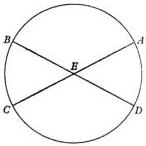

round in equal times, though not over equal spaces, by the rotation of the whole sphere. The upshot of the argument, then, is the claim that the earth as a part of the celestial sphere shares in the same nature and movement so that, being close to the center, it has a slight motion. Therefore, being a body and not the center, it too will describe arcs like those of a celestial circle, though smaller, in the same time. The falsity of this contention is clearer than daylight. For it would always have to be noon in one place, and always midnight in another, so that the daily risings and settings could not take place, since the motion of the whole and the part would be one and inseparable.

But things separated by the diversity of their situations are subject to a very different relation: those enclosed in a smaller orbit revolve faster than those traversing a bigger circle. Thus Saturn, the highest of the planets, revolves in thirty years; the moon, undoubtedly the nearest to the earth, completes its course in a month; and to close the series, it will be thought, the earth rotates in the period of a day and a night. Accordingly the same question about the daily rotation emerges again. On the other hand, likewise still undetermined is the earth's position, which has been made even less certain by what was said above. For that proof establishes no conclusion other than the heavens' unlimited size in relation to the earth. Yet how far this immensity extends is not at all clear. At the opposite extreme are the very tiny indivisible bodies called "atoms". Being imperceptible, they do not immediately constitute a visible body when they are taken two or a few at a time. But they can be multiplied to such an extent that in the end there are enough of them to combine in a perceptible magnitude. The same may be said also about the position of the earth. Although it is not in the center of the universe, nevertheless its distance therefrom is still insignificant, especially in relation to the sphere of the fixed stars.

## WHY THE ANCIENTS THOUGHT THAT THE EARTH REMAINED AT REST IN THE MIDDLE OF THE UNIVERSE AS ITS CENTER

Chapter 7

Accordingly, the ancient philosophers sought to establish that the earth remains at rest in the middle of the universe by certain other arguments. As their main reason, however, they adduce heaviness and lightness. Earth is in fact the heaviest element, and everything that has weight is borne toward it in an effort to reach its inmost center. The earth being spherical, by their own nature heavy objects are carried to it from all directions at right angles to its surface. Hence, if they were not checked at its surface, they would collide at its center, since a straight line perpendicular to a horizontal plane at its point of tangency with a sphere leads to the [sphere's] center. But things brought to the middle, it seems to follow, come to rest at the middle. All the more, then, will the entire earth be at rest in the middle, and as the recipient of every falling body it will remain motionless thanks to its weight.

In like manner, the ancient philosophers analyze motion and its nature in a further attempt to confirm their conclusion. Thus, according to Aristotle, the motion of a single simple body is simple; of the simple motions, one is straight and the other is circular; of the straight motions, one is upward and the other is downward. Hence every simple motion is either toward the middle, that is, downward; or away from the middle, that is, upward; or around the middle, that is, circular. To be carried downward, that is, to seek the middle, is a property only of earth and water, which are considered heavy; on the other hand, air and fire, which are endowed with lightness, move upward and away from the middle. To these four elements it seems reasonable to assign rectilinear motion, but to the heavenly bodies, circular motion around the middle. This is what Aristotle says [*Heavens*, I, 2; II, 14].

Therefore, remarks Ptolemy of Alexandria [*Syntaxis*, I, 7], if the earth were to move, merely in a daily rotation, the opposite of what was said above would have to occur, since a motion would have to be exceedingly violent and its speed unsurpassable to carry the entire circumference of the earth around in twenty-four hours. But things which undergo an abrupt rotation seem utterly unsuited to gather [bodies to themselves], and seem more likely, if they have been produced by combination, to fly apart unless they are held together by some bond. The earth would long ago have burst asunder, he says, and dropped out of the skies (a quite preposterous notion); and, what is more, living creatures and any other loose weights would by no means remain unshaken. Nor would objects falling in a straight line descend perpendicularly to their appointed place, which would meantime have been withdrawn by so rapid a movement. Moreover, clouds and anything else floating in the air would be seen drifting always westward.

## THE INADEQUACY OF THE PREVIOUS ARGUMENTS AND A REFUTATION OF THEM

### Chapter 8

For these and similar reasons forsooth the ancients insist that the earth remains at rest in the middle of the universe, and that this is its status beyond any doubt. Yet if anyone believes that the earth rotates, surely he will hold that its motion is natural, not violent. But what is in accordance with nature produces effects contrary to those resulting from violence, since things to which force or violence is applied must disintegrate and cannot long endure. On the other hand, that which is brought into existence by nature is well-ordered and preserved in its best state. Ptolemy has no cause, then, to fear that the earth and everything earthly will be disrupted by a rotation created through nature's handiwork, which is quite different from what art or human intelligence can accomplish.

But why does he not feel this apprehension even more for the universe, whose motion must be the swifter, the bigger the heavens are than the earth? Or have the heavens become immense because the indescribable violence of their motion drives them away from the center? Would they also fall apart if they came to a halt? Were this reasoning sound, surely the size of the heavens would likewise grow to infinity. For the higher they are driven by the power of their motion, the faster that motion will be, since the circumference of which it must make the circuit in the period of twenty-four hours is constantly expanding; and, in turn, as the velocity of the motion mounts, the vastness of the heavens is enlarged. In this way the speed will increase the size, and the size the speed, to infinity. Yet according to the familiar axiom of physics that the infinite cannot be traversed or moved in any way, the heavens will therefore necessarily remain stationary.

But beyond the heavens there is said to be no body, no space, no void, absolutely nothing, so that there is nowhere the heavens can go. In that case it is really astonishing if something can be held in check by nothing. If the heavens are infinite, however, and finite at their inner concavity only, there will perhaps be more reason to believe that beyond the heavens there is nothing. For, every single thing, no matter what size it attains, will be inside them, but the heavens will abide motionless. For, the chief contention by which it is sought to prove that the universe is finite is its motion. Let us therefore leave the question whether the universe is finite or infinite to be discussed by the natural philosophers.

We regard it as a certainty that the earth, enclosed between poles, is bounded by a spherical surface. Why then do we still hesitate to grant it the motion appropriate by nature to its form rather than attribute a movement to the entire universe, whose limit is unknown and unknowable? Why should we not admit, with regard to the daily rotation, that the appearance is in the heavens and the reality in the earth? This situation closely resembles what Vergil's Aeneas says:

Forth from the harbor we sail, and the land and the cities slip backward [Aeneid, III, 72].

For when a ship is floating calmly along, the sailors see its motion mirrored in everything outside, while on the other hand they suppose that they are stationary, together with everything on board. In the same way, the motion of the earth can unquestionably produce the impression that the entire universe is rotating.

Then what about the clouds and the other things that hang in the air in any manner whatsoever, or the bodies that fall down, and conversely those that rise aloft? We would only say that not merely the earth and the watery element joined with it have this motion, but also no small part of the air and whatever is linked in the same way to the earth. The reason may be either that the nearby air, mingling with earthy or watery matter, conforms to the same nature as the earth, or that the air's motion, acquired from the earth by proximity, shares without resistance in its unceasing rotation. No less astonishingly, on the other hand, is the celestial movement declared to be accompanied by the uppermost belt of air. This is indicated by those bodies that appear suddenly, I mean, those that the Greeks called "comets" and "bearded stars". Like the other heavenly bodies, they rise and set. They are thought to be generated in that region. That part of the air, we can maintain, is unaffected by the earth's motion on account of its great distance from the earth. The air closest to the earth will accordingly seem to be still. And so will the things suspended in it, unless they are tossed to and fro, as indeed they are, by the wind or some other disturbance. For what else is the wind in the air but the wave in the sea?

We must in fact avow that the motion of falling and rising bodies in the framework of the universe is twofold, being in every case a compound of straight and circular. For, things that sink of their own weight, being predominantly earthy, undoubtedly retain the same nature as the whole of which they are parts. Nor is the explanation different in the case of those things, which, being fiery, are driven forcibly upward. For also fire here on the earth feeds mainly on earthy matter, and flame is defined as nothing but blazing smoke. Now it is a property of fire to expand what it enters. It does this with such great force that it cannot be prevented in any way by any device from bursting through restraints and completing its work. But the motion of expansion is directed from the center to the circumference. Therefore, if any part of the earth is set afire, it is carried from the middle upwards. Hence the statement that the motion of a simple body is simple holds true in particular for circular motion, as long as the simple body abides in its natural place and with its whole. For when it is in place, it has none but circular motion, which remains wholly within itself like a body at rest. Rectilinear motion, however, affects things which leave their natural place or are thrust out of it or quit it in any manner whatsoever. Yet nothing is so incompatible with the orderly arrangement of the universe and the design of the totality as something out of place. Therefore rectilinear motion occurs only to things that are not in proper condition and are not in complete accord with their nature, when they are separated from their whole and forsake its unity.

Furthermore, bodies that are carried upward and downward, even when deprived of circular motion, do not execute a simple, constant, and uniform motion. For they cannot be governed by their lightness or by the impetus of their weight. Whatever falls moves slowly at first, but increases its speed as it drops. On the other hand, we see this earthly fire (for we behold no other), after it has been lifted up high, slacken all at once, thereby revealing the reason to be the violence applied to the earthy matter. Circular motion, however, always rolls along uniformly, since it has an unfailing cause. But rectilinear motion has a cause that quickly stops functioning. For when rectilinear motion brings bodies to their own place, they cease to be heavy or light, and their motion ends. Hence, since circular motion belongs to wholes, but parts have rectilinear motion in addition, we can say that "circular" subsists with "rectilinear" as "being alive" with "being sick". Surely Aristotle's division of simple motion into three types, away from the middle, toward the middle, and around the middle, will be construed merely as a logical exercise. In like manner we distinguish line, point, and surface, even though one cannot exist without another, and none of them without body.

As a quality, moreover, immobility is deemed nobler and more divine than change and instability, which are therefore better suited to the earth than to the universe. Besides, it would seem quite absurd to attribute motion to the framework of space or that which encloses the whole of space, and not, more appropriately, to that which is enclosed and occupies some space, namely, the earth. Last of all, the planets obviously approach closer to the earth and recede farther from it. Then the motion of a single body around the middle, which is thought to be the center of the earth, will be both away from the middle and also toward it. Motion around the middle, consequently, must be interpreted in a more general way, the sufficient condition being that each such motion encircle its own center. You see, then, that all these arguments make it more likely that the earth moves than that it is at rest. This is especially true of the daily rotation, as particularly appropriate to the earth. This is enough, in my opinion, about the first part of the question.

## CAN SEVERAL MOTIONS BE ATTRIBUTED *Chapter 9* TO THE EARTH? THE CENTER OF THE UNIVERSE

Accordingly, since nothing prevents the earth from moving, I suggest that we should now consider also whether several motions suit it, so that it can be regarded as one of the planets. For, it is not the center of all the revolutions. This is indicated by the planets’ apparent nonuniform motion and their varying distances from the earth. These phenomena cannot be explained by circles concentric with the earth. Therefore, since there are many centers, it will not be by accident that the further question arises whether the center of the universe is identical with the center of terrestrial gravity or with some other point. For my part I believe that gravity is nothing but a certain natural desire, which the divine providence of the Creator of all things has implanted in parts, to gather as a unity and a whole by combining in the form of a globe. This impulse is present, we may suppose, also in the sun, the moon, and the other brilliant planets, so that through its operation they remain in that spherical shape which they display. Nevertheless, they swing round their circuits in divers ways. If, then, the earth too moves in other ways, for example, about a center, its additional motions must likewise be reflected in many bodies outside it. Among these motions we find the yearly revolution. For if this is transformed from a solar to a terrestrial movement, with the sun acknowledged to be at rest, the risings and settings which bring the zodiacal signs and fixed stars into view morning and evening will appear in the same way. The stations of the planets, moreover, as well as their retrogradations and [resumptions of] forward motion will be recognized as being, not movements of the planets, but a motion of the earth, which the planets borrow for their own appearances. Lastly, it will be realized that the sun occupies the middle of the universe. All these facts are disclosed to us by the principle governing the order in which the planets follow one another, and by the harmony of the entire universe, if only we look at the matter, as the saying goes, with both eyes.

## THE ORDER OF THE HEAVENLY SPHERES

### Chapter 10

Of all things visible, the highest is the heaven of the fixed stars. This, I see, is doubted by nobody. But the ancient philosophers wanted to arrange the planets in accordance with the duration of the revolutions. Their principle assumes that of objects moving equally fast, those farther away seem to travel more slowly, as is proved in Euclid’s *Optics*. The moon revolves in the shortest period of time because, in their opinion, it runs on the smallest circle as the nearest to the earth. The highest planet, on the other hand, is Saturn, which completes the biggest circuit in the longest time. Below it is Jupiter, followed by Mars.

With regard to Venus and Mercury, however, differences of opinion are found. For, these planets do not pass through every elongation from the sun, as the other planets do. Hence Venus and Mercury are located above the sun by some authorities, like Plato’s *Timaeus* [38 D], but below the sun by others, like Ptolemy [*Syntaxis*, IX, 1] and many of the moderns. Al-Bitruji places Venus above the sun, and Mercury below it.

According to Plato’s followers, all the planets, being dark bodies otherwise, shine because they receive sunlight. If they were below the sun, therefore, they would undergo no great elongation from it, and hence they would be seen halved or at any rate less than fully round. For, the light which they receive would be reflected mostly upward, that is, toward the sun, as we see in the new or dying moon. In addition, they argue, the sun must sometimes be eclipsed by the interposition of these planets, and its light cut off in proportion to their size. Since this is never observed, these planets do not pass beneath the sun at all, according to those who follow Plato.

On the other hand, those who locate Venus and Mercury below the sun base their reasoning on the wide space which they notice between the sun and the moon. For the moon's greatest distance from the earth is 64 1/6 earth-radii. This is contained, according to them, about 18 times in the sun's least distance from the earth, which is 1160 earth-radii. Therefore between the sun and the moon there are 1096 earth-radii [≅1160-64 1/6]. Consequently, to avoid having so vast a space remain empty, they announce that the same numbers almost exactly fill up the apsidal distances, by which they compute the thickness of those spheres. Thus the moon's apogee is followed by Mercury's perigee. Mercury's apogee is succeeded by the perigee of Venus, whose apogee, finally, almost reaches the sun's perigee. For between the apsides of Mercury they calculate about 177 1/3 earth-radii. Then the remaining space is very nearly filled by Venus' interval of 910 earth-radii.

Therefore they do not admit that these heavenly bodies have any opacity like the moon's. On the contrary, these shine either with their own light or with the sunlight absorbed throughout their bodies. Moreover, they do not eclipse the sun, because it rarely happens that they interfere with our view of the sun, since they generally deviate in latitude. Besides, they are tiny bodies in comparison with the sun. Venus, although bigger than Mercury, can occult barely a hundredth of the sun. So says Al-Battani of Raqqa, who thinks that the sun's diameter is ten times larger [than Venus'], and therefore so minute a speck is not easily described in the most brilliant light. Yet in his Paraphrase of Ptolemy, Ibn Rushd reports having seen something blackish when he found a conjunction of the sun and Mercury indicated in the tables. And thus these two planets are judged to be moving below the sun's sphere.

But this reasoning also is weak and unreliable. This is obvious from the fact that there are 38 earth-radii to the moon's perigee, according to Ptolemy [Syntaxis, V, 13], but more than 49 according to a more accurate determination, as will be made clear below. Yet so great a space contains, as we know, nothing but air and, if you please, also what is called "the element of fire". Moreover, the diameter of Venus' epicycle which carries it 45° more or less to either side of the sun, must be six times longer than the line drawn from the earth's center to Venus' perigee, as will be demonstrated in the proper place [V, 21]. In this entire space which would be taken up by that huge epicycle of Venus and which, moreover, is so much bigger than what would accommodate the earth, air, aether, moon, and Mercury, what will they say is contained if Venus revolved around a motionless earth?

Ptolemy [Syntaxis, IX, 1] argues also that the sun must move in the middle between the planets which show every elongation from it and those which do not. This argument carries no conviction because its error is revealed by the fact that the moon too shows every elongation from the sun.

Now there are those who locate Venus and then Mercury below the sun, or separate these planets [from the sun] in some other sequence. What reason will they adduce to explain why Venus and Mercury do not likewise traverse separate orbits divergent from the sun, like the other planets, without violating the arrangement [of the planets] in accordance with their [relative] swiftness and slowness?

Then one of two alternatives will have to be true. Either the earth is not the center to which the order of the planets and spheres is referred, or there really is no principle of arrangement nor any apparent reason why the highest place belongs to Saturn rather than to Jupiter or any other planet.

In my judgement, therefore, we should not in the least disregard what was familiar to Martianus Capella, the author of an encyclopedia, and to certain other Latin writers. For according to them, Venus and Mercury revolve around the sun as their center. This is the reason, in their opinion, why these planets diverge no farther from the sun than is permitted by the curvature of their revolutions. For they do not encircle the earth, like the other planets, but “have opposite circles”. Then what else do these authors mean but that the center of their spheres is near the sun? Thus Mercury’s sphere will surely be enclosed within Venus’, which by common consent is more than twice as big, and inside that wide region it will occupy a space adequate for itself. If anyone seizes this opportunity to link Saturn, Jupiter, and Mars also to that center, provided he understands their spheres to be so large that together with Venus and Mercury the earth too is enclosed inside and encircled, he will not be mistaken, as is shown by the regular pattern of their motions.

For [these outer planets] are always closest to the earth, as is well known, about the time of their evening rising, that is, when they are in opposition to the sun, with the earth between them and the sun. On the other hand, they are at their farthest from the earth at the time of their evening setting, when they become invisible in the vicinity of the sun, namely, when we have the sun between them and the earth. These facts are enough to show that their center belongs more to the sun, and is identical with the center around which Venus and Mercury likewise execute their revolutions.

But since all these planets are related to a single center, the space remaining between Venus’ convex sphere and Mars’ concave sphere must be set apart as also a sphere or spherical shell, both of whose surfaces are concentric with those spheres. This [intercalated sphere] receives the earth together with its attendant, the moon, and whatever is contained within the moon’s sphere. Mainly for the reason that in this space we find quite an appropriate and adequate place for the moon, we can by no means detach it from the earth, since it is incontrovertibly nearest to the earth.

Hence I feel no shame in asserting that this whole region engirdled by the moon, and the center of the earth, traverse this grand circle amid the rest of the planets in an annual revolution around the sun. Near the sun is the center of the universe. Moreover, since the sun remains stationary, whatever appears as a motion of the sun is really due rather to the motion of the earth. In comparison with any other spheres of the planets, the distance from the earth to the sun has a magnitude which is quite appreciable in proportion to those dimensions. But the size of the universe is so great that the distance earth-sun is imperceptible in relation to the sphere of the fixed stars. This should be admitted, I believe, in preference to perplexing the mind with an almost infinite multitude of spheres, as must be done by those who kept the earth in the middle of the universe. On the contrary, we should rather heed the wisdom of nature. Just as it especially avoids producing anything superfluous or useless, so it frequently prefers to endow a single thing with many effects.

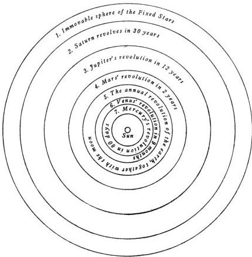

All these statements are difficult and almost inconceivable, being of course opposed to the beliefs of many people. Yet, as we proceed, with God's help I shall make them clearer than sunlight, at any rate to those who are not unacquainted with the science of astronomy. Consequently, with the first principle remaining intact, for nobody will propound a more suitable principle than that the size of the spheres is measured by the length of the time, the order of the spheres is the following, beginning with the highest.

The first and the highest of all is the sphere of the fixed stars, which contains itself and everything, and is therefore immovable. It is unquestionably the place of the universe, to which the motion and position of all the other heavenly bodies are compared. Some people think that it also shifts in some way. A different explanation of why this appears to be so will be adduced in my discussion of the earth's motion [I, 11].

[The sphere of the fixed stars] is followed by the first of the planets, Saturn, which completes its circuit in 30 years. After Saturn, Jupiter accomplishes its revolution in 12 years. Then Mars revolves in 2 years. The annual revolution takes the series' fourth place, which contains the earth, as I said [earlier in I, 10], together with the lunar sphere as an epicycle. In the fifth place Venus returns in 9 months. Lastly, the sixth place is held by Mercury, which revolves in a period of 80 days.

At rest, however, in the middle of everything is the sun. For in this most beautiful temple, who would place this lamp in another or better position than that from which it can light up the whole thing at the same time? For, the sun is not inappropriately called by some people the lantern of the universe, its mind by others, and its ruler by still others. [Hermes] the Thrice Greatest labels it a visible god, and Sophocles' Electra, the all-seeing. Thus indeed, as though seated on a royal throne, the sun governs the family of planets revolving around it. Moreover, the earth is not deprived of the moon's attendance. On the contrary, as Aristotle says in a work on animals, the moon has the closest kinship with the earth. Meanwhile the earth has intercourse with the sun, and is impregnated for its yearly parturition.

In this arrangement, therefore, we discover a marvelous symmetry of the universe, and an established harmonious linkage between the motion of the spheres and their size, such as can be found in no other way. For this permits a not inattentive student to perceive why the forward and backward arcs appear greater in Jupiter than in Saturn and smaller than in Mars, and on the other hand greater in Venus than in Mercury. This reversal in direction appears more frequently in Saturn than in Jupiter, and also more rarely in Mars and Venus than in Mercury. Moreover, when Saturn, Jupiter, and Mars rise at sunset, they are nearer to the earth than when they set in the evening or appear at a later hour. But Mars in particular, when it shines all night, seems to equal Jupiter in size, being distinguished only by its reddish color. Yet in the other configurations it is found barely among the stars of the second magnitude, being recognized by those who track it with assiduous observations. All these phenomena proceed from the same cause, which is in the earth's motion.

Yet none of these phenomena appears in the fixed stars. This proves their immense height, which makes even the sphere of the annual motion, or its reflection, vanish from before our eyes. For, every visible object has some measure of distance beyond which it is no longer seen, as is demonstrated in optics. From Saturn, the highest of the planets, to the sphere of the fixed stars there is an additional gap of the largest size. This is shown by the twinkling lights of the stars. By this token in particular they are distinguished from the planets, for there had to be a very great difference between what moves and what does not move. So vast, without any question, is the divine handiwork of the most excellent Almighty.

## PROOF OF THE EARTH'S TRIPLE MOTION Chapter 11

In so many and such important ways, then, do the planets bear witness to the earth's mobility. I shall now give a summary of this motion, insofar as the phenomena are explained by it as a principle. As a whole, it must be admitted to be a threefold motion.

The first motion, named *nuchthemeron* by the Greeks, as I said [I, 4], is the rotation which is the characteristic of a day plus a night. This turns around the earth's axis from west to east, just as the universe is deemed to be carried in the opposite direction. It describes the equator, which some people call the "circle of equal days”, in imitation of the designation used by the Greeks, whose term for it is *isemerinos*.

The second is the yearly motion of the center, which traces the ecliptic around the sun. Its direction is likewise from west to east, that is, in the order of the zodiacal signs. It travels between Venus and Mars, as I mentioned [I, 10], together with its associates. Because of it, the sun seems to move through the zodiac in a similar motion. Thus, for example, when the earth’s center is passing through the Goat, the sun appears to be traversing the Crab; with the earth in the Water Bearer, the sun seems to be in the Lion, and so on, as I remarked.

To this circle, which goes through the middle of the signs, and to its plane, the equator and the earth’s axis must be understood to have a variable inclination. For if they stayed at a constant angle, and were affected exclusively by the motion of the center, no inequality of days and nights would be observed. On the contrary, it would always be either the longest or shortest day or the day of equal daylight and darkness, or summer or winter, or whatever the character of the season, it would remain identical and unchanged.

The third motion in inclination is consequently required. This also is a yearly revolution, but it occurs in the reverse order of the signs, that is, in the direction opposite to that of the motion of the center. These two motions are opposite in direction and nearly equal in period. The result is that the earth’s axis and equator, the largest of the parallels of latitude on it, face almost the same portion of the heavens, just as if they remained motionless. Meanwhile the sun seems to move through the obliquity of the ecliptic with the motion of the earth’s center, as though this were the center of the universe. Only remember that, in relation to the sphere of the fixed stars, the distance between the sun and the earth vanishes from our sight forthwith.

Since these are matters which crave to be set before our eyes rather than spoken of, let us describe a circle *ABCD*, which the annual revolution of the earth’s center has traced in the plane of the ecliptic. Near its center let the sun be *E*. I shall divide this circle into four parts by drawing the diameters *AEC* and *BED*. Let *A* represent the first point of the Crab, *B* of the Balance, *C* of the Goat, and *D* of the Ram. Now let us assume that the earth’s center is originally at *A*. About *A* I shall draw the terrestrial equator *FGHI*. This is not in the same plane [as the ecliptic], except that the diameter *GAI* is the intersection of the circles, I mean, of the equator and the ecliptic. Draw also the diameter *FAH* perpendicular to *GAI*, *F* being the limit of the [equator’s] greatest inclination to the south, and *H* to the north. Under the conditions thus set forth, the earth’s inhabitants will see the sun near the center *E* undergo the winter solstice in the Goat. This occurs because the greatest northward inclination, *H*, is turned toward the sun. For, the inclination of the equator to the line *AE*, through the agency of the daily rotation, traces the winter solstice parallel to the equator at an interval subtended by *EAH*, the angle of the obliquity.

Now let the earth’s center start out in the order of the signs, and let *F*, the limit of maximum inclination, travel along an equal arc in the reverse order of the signs, until at *B* both have traversed a quadrant of their circles. In the interim the angle *EAI* always remains equal to *AEB*, on account of the equality of their revolutions; and the diameters always stay parallel to each other, *FAH* to *FBH*, and *GAI* to *GBI*, and the equator to the equator. In the immensity of the heavens,

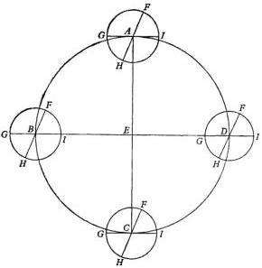

for the reason already frequently mentioned, the same phenomena appear. Therefore from $B$, the first point of the Balance, $E$ will seem to be in the Ram. The intersection of the circles will coincide with the single line $GBIE$, from which [the plane of the axis] will not be permitted by the daily rotation to deviate. On the contrary, the [axis'] inclination will lie entirely in the lateral plane. Accordingly the sun will be seen in the spring equinox. Let the earth's center proceed under the assumed conditions, and when it has completed a semicircle at $C$, the sun will appear to enter the Crab. But $F$, the southernmost inclination of the equator, will be turned toward the sun. This will be made to appear in the north, undergoing the summer solstice as measured by the angle of the obliquity, $ECF$. Again, when $F$ turns away in the third quadrant of the circle, the intersection $GI$ will once more fall on the line $ED$. From here the sun will be seen in the Balance undergoing the autumn equinox. Then as $H$ by the same process gradually faces the sun, it will bring about a repetition of the initial situation, with which I began my survey.

Alternatively, let $AEC$ be in the same way a diameter of the plane under discussion [the ecliptic] as well as the intersection of that plane with a circle perpendicular thereto. On $AEC$, around $A$ and $C$, that is, in the Crab and the Goat, draw a circle of the earth in each case through the poles. Let this [meridian] be $DGFI$, the earth's axis $DF$, the north pole $D$, the south pole $F$, and $GI$ the diameter of the equator. Now when $F$ is turned toward the sun, which is near $E$, the equator's northward inclination being measured by the angle $IAE$, then the axial rotation will describe, parallel to the equator and to the south of it, at a distance $LI$ and with diameter $KL$, the tropic of Capricorn as seen in the sun. Or, to speak more accurately, the axial rotation, as viewed from $AE$, generates a conic surface, having its vertex in the center of the earth, and its base in a circle parallel to the equator. Also at the opposite point, $C$, everything works out in like manner, but is reversed. It is clear therefore how the two motions, I mean, the motion of the center and

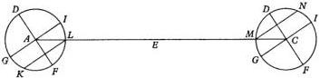

the motion in inclination, by their combined effect make the earth's axis remain in the same direction and in very much the same position, and make all these phenomena appear as though they were motions of the sun.

I said, however, that the annual revolutions of the center and of inclination are nearly equal. For if they were exactly equal, the equinoctial and solstitial points as well as the entire obliquity of the ecliptic would have to show no shift at all with reference to the sphere of the fixed stars. But since there is a slight variation, it was discovered only as it grew larger with the passage of time. From Ptolemy to us the precession of the equinoxes amounts to almost 21°. For this reason some people believed that the sphere of the fixed stars also moves, and accordingly they adopted a surmounting ninth sphere. This having proved inadequate, more recent writers now add on a tenth sphere. Yet they do not in the least attain their goal, which I hope to reach by the earth's motion. This I shall use as a principle and hypothesis in the demonstration of the other [motions].

## STRAIGHT LINES SUBTENDED IN A CIRCLE Chapter 12

In accordance with the common practice of mathematicians, I have divided the circle into 360°. With regard to the diameter, however, [a division into] 120 units was adopted by the ancients [for example, Ptolemy, Syntaxis, I, 10]. But later writers wanted to avoid the complication of fractions in multiplying and dividing the numbers for the lines [subtended in a circle], most of which are incommensurable as lengths, and often even when squared. Some of these later writers resorted to 1,200,000 units; others, 2,000,000; and still others established some other sensible diameter, after the Hindu symbols for numbers came into use. This numerical notation certainly surpasses every other, whether Greek or Latin, in lending itself to computations with exceptional speed. For this reason I too have accepted 200,000 units in a diameter as sufficient to be able to exclude any obvious error. For where quantities are not related to each other as one integer to another, it is enough to obtain an approximation. I shall explain this [subject] in six theorems and one problem, following Ptolemy closely.

### THEOREM I

The diameter of a circle being given, the sides of the triangle, square, pentagon, hexagon, and decagon circumscribed by the circle are also given.

For, the radius, as half of the diameter, is equal to the side of the hexagon. But the square on the side of the triangle is three times, and the square on the side of the square is twice, the square on the side of the hexagon, as is demonstrated in Euclid's Elements. Therefore the side of the hexagon is given as 100,000 units long; the side of the square as 141,422; and the side of the triangle as 173,205.

Now let the side of the hexagon be AB. Let it be divided at the point C in mean and extreme ratio, in accordance with Euclid, Book II, Problem 1, or VI, 10. Let the greater segment be CB, and let it be extended an equal length, BD. Then the whole line ABD also will be divided in extreme and mean ratio. As the smaller segment, the extension BD is the side of the decagon inscribed in the circle in which AB is the side of the hexagon, as is clear from Euclid, XIII, 5 and 9.

Now BD will be obtained as follows. Bisect AB at E. From Euclid, XIII, 3, it is clear that the square of EBD equals five times the square of EB. But EB is given as 50,000 units long. Five times its square gives EBD as 111,803 units long. If EB's 50,000 are subtracted, the remainder is BD's 61,803 units, the side of the decagon which we were looking for.

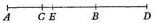

Furthermore, the side of the pentagon, the square on which is equal to the sum of the squares on the sides of the hexagon and decagon, is given as 117,557 units.

Therefore, when the diameter of a circle is given, the sides of the triangle, square, pentagon, hexagon, and decagon which can be inscribed in the circle are given. Q.E.D.

## COROLLARY

Consequently it is clear that when the chord subtending any arc is given, the chord subtending the rest of the semicircle is also given.

The angle inscribed in a semicircle is a right angle. Now in right triangles, the square on the diameter, that is, the side subtending the right angle, is equal to the squares on the sides forming the right angle. Now the side of the decagon, which subtends an arc of $36^{\circ}$, has been shown [Theorem I] to consist of 61,803 units, of which the diameter contains 200,000. Hence the chord subtending the remaining $144^{\circ}$ of the semicircle is also given as consisting of 190,211 units. And from the side of the pentagon which, with its 117,557 units of the diameter, subtends an arc of $72^{\circ}$, the straight line subtending the remaining $108^{\circ}$ of the semicircle is obtained as 161,803 units.

## THEOREM II, PRELIMINARY [TO THEOREM III]

If a quadrilateral is inscribed in a circle, the rectangular product of the diagonals is equal to the rectangular products of the opposite sides.

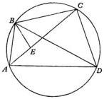

For let the quadrilateral inscribed in a circle be $ABCD$. I say that the product of the diagonals $AC \times DB$ is equal to the products of $AB \times DC$ and $AD \times BC$. For let us make the angle $ABE$ equal to the angle at $CBD$. Then the whole angle $ABD$ is equal to the whole angle $EBC$, angle $EBD$ being taken as common to both. Moreover, the angles at $ACB$ and $BDA$ are equal to each other, since they intercept the same segment of the circle. Therefore the two similar triangles [$BCE$ and $BDA$] will have their sides proportional, $BC : BD = EC : AD$, and the product of $EC \times BD$ is equal to the product of $BC \times AD$. But also the triangles $ABE$ and $CBD$ are similar, because the angles at $ABE$ and $CBD$ are equal by construction, and the angles $BAC$ and $BDC$ are equal because they intercept the same arc of the circle. Consequently, as before, $AB : BD = AE : CD$, and the product of $AB \times CD$ is equal to the product of $AE \times BD$. But it has already been shown that the product of $AD \times BC$ is equal to the product of $BD \times EC$. By addition, then, the product of $BD \times AC$ is equal to the products of $AD \times BC$ and $AB \times CD$. This is what it was useful to prove.

## THEOREM III

For it follows from the foregoing that if the straight lines subtending unequal arcs in a semicircle are given, the chord subtending the arc by which the larger arc exceeds the smaller is also given.

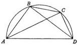

Thus in the semicircle $ABCD$, with diameter $AD$, let the chords subtending unequal arcs be $AB$ and $AC$. What we wish to find is the chord subtending $BC$. From what was said above [Theorem I, Corollary], the chords $BD$ and $CD$, subtending the arcs remaining in the semicircle, are given. As a result, in the semicircle the quadrilateral $ABCD$ is formed. Its diagonals $AC$ and $BD$ are given, together with the three sides, AB, AD, and CD. In this quadrilateral, as has been demonstrated already [Theorem II], the product of AC×BD is equal to the product of AB×CD and AD×BC. Therefore, if the product AB×CD is subtracted from the product AC×BD, the remainder is the product AD×BC. Hence, if we divide by AD, so far as that is possible, we obtain a number for the chord BC, which we were seeking.

From the foregoing, the sides of the pentagon and hexagon, for example, are given. Consequently the chord subtending 12°, the difference between them [72°-60°], is given in this way as 20,905 units of the diameter.

## THEOREM IV

If the chord subtending any arc is given, the chord subtending half of the arc is also given.

Let us describe the circle ABC, and let its diameter be AC. Let BC be the given arc with its subtending chord. From the center E, let the line EF intersect BC at right angles. Then, according to Euclid III, 3, EF will bisect BC at F, and when EF is extended, it will bisect the arc at D. Also draw the chords AB and BD. ABC and EFC are right triangles. Moreover, since they have angle ECF in common, they are similar triangles. Therefore, just as CF is half of BFC, so EF is half of AB. But AB, which subtends the remaining arc of the semicircle, is given [Theorem I, Corollary]. Hence EF is likewise given, and also DF, as the rest of the half diameter. Let the diameter be completed as DEG. Join BG. Then in the triangle BDG, from the right angle B the perpendicular BF falls on the base. Consequently the product of GD×DF is equal to the square of BD. Accordingly BD is given in length as subtending half of the arc BDC.

Since the chord subtending 12° has already been given [Theorem III], the chord subtending 6° is also given as 10,467 units; 3°, as 5,235 units; 1 1/2°, as 2,618 units; and 3/4°, as 1,309 units.

## THEOREM V

Furthermore, when the chords subtending two arcs are given, the chord subtending the whole arc consisting of the two arcs is also given.

In a circle let the given chords be AB and BC. I say that the chord subtending the whole arc ABC is also given. For, draw the diameters AFD and BFE, and also the straight lines BD and CE. These chords are given by what precedes [Theorem I, Corollary], because AB and BC are given, and DE is equal to AB. Join CD, completing the quadrilateral BCDE. Its diagonals BD and CE, as well as three of its sides, BC, DE, and BE, are given. The remaining side, CD, will also be given by Theorem II. Therefore CA, as the chord subtending the rest of the semicircle, is given as the chord subtending the whole arc ABC. This is what we were looking for.

Then thus far the straight lines subtending 3°, 1 1/2°, and 3/4° have been found. With these intervals anyone can construct a table with very precise relationships. But when [it comes to] advancing by [a whole] degree and adding one to another, or by half a degree, or in some other way, there will be a not unfounded doubt about the chords subtending these arcs, since we lack the graphical relationships by which they would be demonstrated. Yet nothing prevents us from attaining

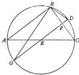

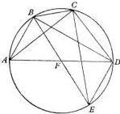

this result by another method, without any perceptible error and by assuming a number which is very slightly inaccurate. Ptolemy too [Syntaxis, I, 10] looked for the chords subtending $1^{\circ}$ and $\frac{1}{2}^{\circ}$, after reminding us first [of the following].

## THEOREM VI

The ratio of a greater arc to a lesser arc is bigger than the ratio of the subtending straight lines.

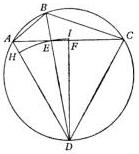

In a circle, let the two unequal arcs, $AB$ and $BC$, be contiguous, and let $BC$ be the greater arc. I say that the ratio $BC : AB$ is bigger than the ratio $BC : AB$ of the chords forming the angle $B$. Let it be bisected by the line $BD$. Join $AC$. Let it intersect $BD$ in the point $E$. Likewise join $AD$ and $CD$. They are equal because they subtend equal arcs. Now in the triangle $ABC$, the line which bisects the angle also intersects $AC$ at $E$. Hence the ratio of the base's segments $EC : AE$ is equal to the ratio $BC : AB$. Since $BC$ is greater than $AB$, $EC$ also is greater than $EA$. Erect $DF$ perpendicular to $AC$. $DF$ will bisect $AC$ at the point $F$, which must lie in the greater segment, $EC$. In every triangle the greater angle is opposite the greater side. Hence in triangle $DEF$, the side $DE$ is greater than $DF$. $AD$ is even greater than $DE$. Therefore an arc drawn with $D$ as center, and with $DE$ as radius, will intersect $AD$, and pass beyond $DF$. Let the arc intersect $AD$ in $H$, and let it be extended to the straight line $DFI$. Then the sector $EDI$ is greater than the triangle $EDF$. But the triangle $DEA$ is greater than the sector $DEH$. Therefore the ratio of triangle $DEF$ to triangle $DEA$ is smaller than the ratio of sector $DEI$ to sector $DEH$. But sectors are proportional to their arcs or central angles, whereas triangles which have the same vertex are proportional to their bases. Consequently the ratio of the angles $EDF : ADE$ is bigger than the ratio of the bases $EF : AE$. Hence, by addition, the ratio of the angles $FDA : ADE$ is bigger than the ratio $AF : AE$, and in the same way $CDA : ADE$ is bigger than $AC : AE$. And by subtraction, $CDE : EDA$ also is bigger than $CE : EA$. However, the angles $CDE$ and $EDA$ are to each other as the arcs $CB : AB$, but the bases $CE : AE$ are as the chords $BC : AB$. Therefore the ratio of the arcs $CB : AB$ is bigger than the ratio of the chords $BC : AB$. Q.E.D.

## PROBLEM

An arc is always greater than the straight line subtending it, while a straight line is the shortest of the lines having the same end points. Yet this inequality, [in descending] from greater to lesser portions of a circle, approaches equality, so that in the end the straight and circular lines are extinguished simultaneously at their last point of contact on the circle. Prior to that, consequently, they must differ from each other by no perceptible distinction.

For example, let arc $AB$ be $3^{\circ}$, and arc $AC$ $1\frac{1}{2}^{\circ}$. The chord subtending $AB$ has been shown [Theorem IV] to consist of 5235 units, of which the diameter is assumed to have 200,000, and the chord subtending $AC$ has 2618 units. The arc $AB$ is double the arc $AC$, whereas the chord $AB$ is less than double the chord $AC$, which exceeds 2,617 by only one unit. But if we take $AB$ as $1\frac{1}{2}^{\circ}$ and $AC$ as $\frac{3}{4}^{\circ}$, we shall have chord $AB$ as 2618 units, and $AC$ as 1309 units. Although $AC$ ought to be greater than half of the chord $AB$, yet it seems not to differ from half, the ratios of the arcs and straight lines now appearing to be the same. Hence we see that we have reached the level where the difference between the straight and circu-

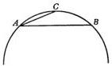

lar lines becomes absolutely imperceptible, as though they had merged into a single line. Hence I have no hesitation in fitting the 1309 units of ³/₄° in the same proportion to the chords subtending 1° and the other fractional parts thereof. Thus, by adding ¹/₄° to ³/₄°, we establish the chord subtending 1° as 1745 units; ¹/₂°, as 872 ¹/₂ units; and ¹/₃°, as approximately 582 units.

Yet I believe that it is enough if I put in the Table only half-lines subtending double the arcs. By this shortcut I shall compress in a quadrant what formerly had to be spread out over a semicircle. The main reason for doing so is that in demonstrations and calculations half-lines are used more frequently than whole lines. I have drawn up a Table which progresses by sixths of a degree. It has three columns. In the first column are the degrees, or parts, of a circumference, and sixths of a degree. The second column contains the numerical value for the half-line subtending double the arc. The third column shows, for each degree, the difference intervening between these numerical values. These differences permit the interpolation of the proportional amounts corresponding to individual minutes of degrees. The Table, then, is as follows.

|  TABLE OF THE STRAIGHT LINES SUBTENDED IN A CIRCLE  |   |   |   |   |   |   |   |   |
| --- | --- | --- | --- | --- | --- | --- | --- | --- |
|  Arcs |   | Half-Chords Subtending Double Arcs | Differences for the Fractions of a Degree |  | Arcs |   | Half-Chords Subtending Double Arcs | Differences for the Fractions of a Degree  |
|  Degree | Minute |   |   |   | Degree | Minute  |   |   |
|  0 | 10 | 291 | 291 |  | 6 | 10 | 10742 | 289  |
|  0 | 20 | 582 |  |  | 6 | 20 | 11031 |   |
|  0 | 30 | 873 |  |  | 6 | 30 | 11320 |   |
|  0 | 40 | 1163 |  |  | 6 | 40 | 11609 |   |
|  0 | 50 | 1454 |  |  | 6 | 50 | 11898 |   |
|  1 | 0 | 1745 |  |  | 7 | 0 | 12187 |   |
|  1 | 10 | 2036 |  |  | 7 | 10 | 12476 |   |
|  1 | 20 | 2327 |  |  | 7 | 20 | 12764 | 288  |
|  1 | 30 | 2617 |  |  | 7 | 30 | 13053 |   |
|  1 | 40 | 2908 |  |  | 7 | 40 | 13341 |   |
|  1 | 50 | 3199 |  |  | 7 | 50 | 13629 |   |
|  2 | 0 | 3490 |  |  | 8 | 0 | 13917 |   |
|  2 | 10 | 3781 |  |  | 8 | 10 | 14205 |   |
|  2 | 20 | 4071 |  |  | 8 | 20 | 14493 |   |
|  2 | 30 | 4362 |  |  | 8 | 30 | 14781 |   |
|  2 | 40 | 4653 |  |  | 8 | 40 | 15069 |   |
|  2 | 50 | 4943 | 290 |  | 8 | 50 | 15356 | 287  |
|  3 | 0 | 5234 |  |  | 9 | 0 | 15643 |   |
|  3 | 10 | 5524 |  |  | 9 | 10 | 15931 |   |
|  3 | 20 | 5814 |  |  | 9 | 20 | 16218 |   |
|  3 | 30 | 6105 |  |  | 9 | 30 | 16505 |   |
|  3 | 40 | 6395 |  |  | 9 | 40 | 16792 |   |
|  3 | 50 | 6685 |  |  | 9 | 50 | 17078 |   |
|  4 | 0 | 6975 |  |  | 10 | 0 | 17365 |   |
|  4 | 10 | 7265 |  |  | 10 | 10 | 17651 | 286  |
|  4 | 20 | 7555 |  |  | 10 | 20 | 17937 |   |
|  4 | 30 | 7845 |  |  | 10 | 30 | 18223 |   |
|  4 | 40 | 8135 |  |  | 10 | 40 | 18509 |   |
|  4 | 50 | 8425 |  |  | 10 | 50 | 18795 |   |
|   | 0 | 8715 |  |  | 11 | 0 | 19081 |   |
|   | 10 | 9005 |  |  | 11 | 10 | 19366 | 285  |
|   | 20 | 9295 |  |  | 11 | 20 | 19652 |   |
|   | 30 | 9585 |  |  | 11 | 30 | 19937 |   |
|   | 40 | 9874 |  |  | 11 | 40 | 20222 |   |
|   | 50 | 10164 | 289 |  | 11 | 50 | 20507 |   |
|  6 | 0 | 10453 |  |  | 12 | 0 | 20791 |   |

|  TABLE OF THE STRAIGHT LINES SUBTENDED IN A CIRCLE  |   |   |   |   |   |   |   |   |
| --- | --- | --- | --- | --- | --- | --- | --- | --- |
|   | Arcs |   | Half-Chords Subtending Double Arcs | Differences for the Fractions of a Degree |  | Arcs |   | Half-Chords Subtending Double Arcs  |
|   |  Degree | Minute |   |   |   | Degree | Minute  |   |
|   | 12 | 10 | 21076 | 284 |  | 18 | 10 | 31178  |
|   |  12 | 20 | 21360 |  |  | 18 | 20 | 31454  |
|   |  12 | 30 | 21644 |  |  | 18 | 30 | 31730  |
|   |  12 | 40 | 21928 |  |  | 18 | 40 | 32006  |
|   |  12 | 50 | 22212 |  |  | 18 | 50 | 32282  |
|   | 13 | 0 | 22495 | 283 |  | 19 | 0 | 32557  |
|   |  13 | 10 | 22778 |  |  | 19 | 10 | 32832  |
|   |  13 | 20 | 23062 |  |  | 19 | 20 | 33106  |
|   |  13 | 30 | 23344 |  |  | 19 | 30 | 33381  |
|   |  13 | 40 | 23627 |  |  | 19 | 40 | 33655  |
|   | 13 | 50 | 23910 | 282 |  | 19 | 50 | 33929  |
|   |  14 | 0 | 24192 |  |  | 20 | 0 | 34202  |
|   |  14 | 10 | 24474 |  |  | 20 | 10 | 34475  |
|   |  14 | 20 | 24756 |  |  | 20 | 20 | 34748  |
|   |  14 | 30 | 25038 | 281 |  | 20 | 30 | 35021  |
|   | 14 | 40 | 25319 |  |  | 20 | 40 | 35293  |
|   |  14 | 50 | 25601 |  |  | 20 | 50 | 35565  |
|   |  15 | 0 | 25882 |  |  | 21 | 0 | 35837  |
|   |  15 | 10 | 26163 |  |  | 21 | 10 | 36108  |
|   |  15 | 20 | 26443 | 280 |  | 21 | 20 | 36379  |
|   | 15 | 30 | 26724 |  |  | 21 | 30 | 36650  |
|   |  15 | 40 | 27004 |  |  | 21 | 40 | 36920  |
|   |  15 | 50 | 27284 |  |  | 21 | 50 | 37190  |
|   |  16 | 0 | 27564 | 279 |  | 22 | 0 | 37460  |
|   |  16 | 10 | 27843 |  |  | 22 | 10 | 37730  |
|   | 16 | 20 | 28122 |  |  | 22 | 20 | 37999  |
|   |  16 | 30 | 28401 |  |  | 22 | 30 | 38268  |
|   |  16 | 40 | 28680 |  |  | 22 | 40 | 38537  |
|   |  16 | 50 | 28959 | 278 |  | 22 | 50 | 38805  |
|   |  17 | 0 | 29237 |  |  | 23 | 0 | 39073  |
|   | 17 | 10 | 29515 |  |  | 23 | 10 | 39341  |
|   |  17 | 20 | 29793 |  |  | 23 | 20 | 39608  |
|   |  17 | 30 | 30071 | 277 |  | 23 | 30 | 39875  |
|   |  17 | 40 | 30348 |  |  | 23 | 40 | 40141  |
|   |  17 | 50 | 30625 |  |  | 23 | 50 | 40408  |
|   | 18 | 0 | 30902 |  |  | 24 | 0 | 40674  |

|  TABLE OF THE STRAIGHT LINES SUBTENDED IN A CIRCLE  |   |   |   |   |   |   |   |   |
| --- | --- | --- | --- | --- | --- | --- | --- | --- |
|  Arcs |   | Half-Chords Subtending Double Arcs | Differences for the Fractions of a Degree |  | Arcs |   | Half-Chords Subtending Double Arcs | Differences for the Fractions of a Degree  |
|  Degree | Minute |   |   |   | Degree | Minute  |   |   |
|  24 | 10 | 40939 | 265 |  | 30 | 10 | 50252 | 251  |
|  24 | 20 | 41204 |  |  | 30 | 20 | 50503 |   |
|  24 | 30 | 41469 |  |  | 30 | 30 | 50754 | 250  |
|  24 | 40 | 41734 | 264 |  | 30 | 40 | 51004 |   |
|  24 | 50 | 41998 |  |  | 30 | 50 | 51254 |   |
|   | 0 | 42262 |  |  | 31 | 0 | 51504 | 249  |
|   | 10 | 42525 | 263 |  | 31 | 10 | 51753 |   |
|   | 20 | 42788 |  |  | 31 | 20 | 52002 | 248  |
|   | 30 | 43051 |  |  | 31 | 30 | 52250 |   |
|   | 40 | 43313 | 262 |  | 31 | 40 | 52498 | 247  |
|   | 50 | 43575 |  |  | 31 | 50 | 52745 |   |
|  26 | 0 | 43837 |  |  | 32 | 0 | 52992 | 246  |
|  26 | 10 | 44098 | 261 |  | 32 | 10 | 53238 |   |
|  26 | 20 | 44359 |  |  | 32 | 20 | 53484 |   |
|  26 | 30 | 44620 | 260 |  | 32 | 30 | 53730 | 245  |
|  26 | 40 | 44880 |  |  | 32 | 40 | 53975 |   |
|  26 | 50 | 45140 |  |  | 32 | 50 | 54220 | 244  |
|  27 | 0 | 45399 | 259 |  | 33 | 0 | 54464 |   |
|  27 | 10 | 45658 |  |  | 33 | 10 | 54708 | 243  |
|  27 | 20 | 45916 | 258 |  | 33 | 20 | 54951 |   |
|  27 | 30 | 46175 |  |  | 33 | 30 | 55194 | 242  |
|  27 | 40 | 46433 |  |  | 33 | 40 | 55436 |   |
|  27 | 50 | 46690 | 257 |  | 33 | 50 | 55678 | 241  |
|  28 | 0 | 46947 |  |  | 34 | 0 | 55919 |   |
|  28 | 10 | 47204 | 256 |  | 34 | 10 | 56160 | 240  |
|  28 | 20 | 47460 |  |  | 34 | 20 | 56400 |   |
|  28 | 30 | 47716 | 255 |  | 34 | 30 | 56641 | 239  |
|  28 | 40 | 47971 |  |  | 34 | 40 | 56880 |   |
|  28 | 50 | 48226 |  |  | 34 | 50 | 57119 | 238  |
|  29 | 0 | 48481 | 254 |  | 35 | 0 | 57358 |   |
|  29 | 10 | 48735 |  |  | 35 | 10 | 57596 |   |
|  29 | 20 | 48989 | 253 |  | 35 | 20 | 57833 | 237  |
|  29 | 30 | 49242 |  |  | 35 | 30 | 58070 |   |
|  29 | 40 | 49495 | 252 |  | 35 | 40 | 58307 | 236  |
|  29 | 50 | 49748 |  |  | 35 | 50 | 58543 |   |
|   | 0 | 50000 |  |  | 36 | 0 | 58779 | 235  |

|  TABLE OF THE STRAIGHT LINES SUBTENDED IN A CIRCLE  |   |   |   |   |   |   |   |   |
| --- | --- | --- | --- | --- | --- | --- | --- | --- |
|   | Arcs |   | Half-Chords Subtending Double Arcs | Differences for the Fractions of a Degree |  | Arcs |   | Half-Chords Subtending Double Arcs  |
|   |  Degree | Minute |   |   |   | Degree | Minute  |   |
|   | 36 | 10 | 59014 | 235 |  | 42 | 10 | 67129  |
|   |  36 | 20 | 59248 | 234 |  | 42 | 20 | 67344  |
|   |  36 | 30 | 59482 |  |  | 42 | 30 | 67559  |
|   | 36 | 40 | 59716 | 233 |  | 42 | 40 | 67773  |
|   |  36 | 50 | 59949 |  |  | 42 | 50 | 67987  |
|   |  37 | 0 | 60181 | 232 |  | 43 | 0 | 68200  |
|   |  37 | 10 | 60413 |  |  | 43 | 10 | 68412  |
|   | 37 | 20 | 60645 | 231 |  | 43 | 20 | 68624  |
|   |  37 | 30 | 60876 |  |  | 43 | 30 | 68835  |
|   |  37 | 40 | 61107 | 230 |  | 43 | 40 | 69046  |
|   |  37 | 50 | 61337 |  |  | 43 | 50 | 69256  |
|   |  38 | 0 | 61566 | 229 |  | 44 | 0 | 69466  |
|   | 38 | 10 | 61795 |  |  | 44 | 10 | 69675  |
|   |  38 | 20 | 62024 |  |  | 44 | 20 | 69883  |
|   |  38 | 30 | 62251 | 228 |  | 44 | 30 | 70091  |
|   |  38 | 40 | 62479 |  |  | 44 | 40 | 70298  |
|   |  38 | 50 | 62706 | 227 |  | 44 | 50 | 70505  |
|   | 39 | 0 | 62932 |  |  | 45 | 0 | 70711  |
|   |  39 | 10 | 63158 | 226 |  | 45 | 10 | 70916  |
|   |  39 | 20 | 63383 |  |  | 45 | 20 | 71121  |
|   |  39 | 30 | 63608 | 225 |  | 45 | 30 | 71325  |
|   |  39 | 40 | 63832 |  |  | 45 | 40 | 71529  |
|   | 39 | 50 | 64056 | 224 |  | 45 | 50 | 71732  |
|   |  40 | 0 | 64279 | 223 |  | 46 | 0 | 71934  |
|   |  40 | 10 | 64501 | 222 |  | 46 | 10 | 72136  |
|   |  40 | 20 | 64723 |  |  | 46 | 20 | 72337  |
|   |  40 | 30 | 64945 | 221 |  | 46 | 30 | 72537  |
|   | 40 | 40 | 65166 | 220 |  | 46 | 40 | 72737  |
|   |  40 | 50 | 65386 |  |  | 46 | 50 | 72936  |
|   |  41 | 0 | 65606 | 219 |  | 47 | 0 | 73135  |
|   |  41 | 10 | 65825 |  |  | 47 | 10 | 73333  |
|   |  41 | 20 | 66044 | 218 |  | 47 | 20 | 73531  |
|   | 41 | 30 | 66262 |  |  | 47 | 30 | 73728  |
|   |  41 | 40 | 66480 | 217 |  | 47 | 40 | 73924  |
|   |  41 | 50 | 66697 |  |  | 47 | 50 | 74119  |
|   |  42 | 0 | 66913 | 216 |  | 48 | 0 | 74314  |

TABLE OF THE STRAIGHT LINES SUBTENDED IN A CIRCLE

|  Arcs |   | Half-Chords Subtending Double Arcs | Differences for the Fractions of a Degree |  | Arcs |   | Half-Chords Subtending Double Arcs | Differences for the Fractions of a Degree  |
| --- | --- | --- | --- | --- | --- | --- | --- | --- |
|  Degree | Minute |   |   |   | Degree | Minute  |   |   |
|  48 | 10 | 74508 | 194 |  | 54 | 10 | 81072 | 170  |
|  48 | 20 | 74702 |  |  | 54 | 20 | 81242 | 169  |
|  48 | 30 | 74896 |  |  | 54 | 30 | 81411 |   |
|  48 | 40 | 75088 | 192 |  | 54 | 40 | 81580 | 168  |
|  48 | 50 | 75280 | 191 |  | 54 | 50 | 81748 | 167  |
|  49 | 0 | 75471 | 190 |  | 55 | 0 | 81915 |   |
|  49 | 10 | 75661 |  |  | 55 | 10 | 82082 | 166  |
|  49 | 20 | 75851 | 189 |  | 55 | 20 | 82248 | 165  |
|  49 | 30 | 76040 |  |  | 55 | 30 | 82413 | 164  |
|  49 | 40 | 76229 | 188 |  | 55 | 40 | 82577 |   |
|  49 | 50 | 76417 | 187 |  | 55 | 50 | 82741 | 163  |
|   | 0 | 76604 |  |  | 56 | 0 | 82904 | 162  |
|   | 10 | 76791 | 186 |  | 56 | 10 | 83066 |   |
|   | 20 | 76977 |  |  | 56 | 20 | 83228 | 161  |
|   | 30 | 77162 | 185 |  | 56 | 30 | 83389 | 160  |
|   | 40 | 77347 | 184 |  | 56 | 40 | 83549 | 159  |
|   | 50 | 77531 |  |  | 56 | 50 | 83708 |   |
|  51 | 0 | 77715 | 183 |  | 57 | 0 | 83867 | 158  |
|  51 | 10 | 77897 | 182 |  | 57 | 10 | 84025 | 157  |
|  51 | 20 | 78079 |  |  | 57 | 20 | 84182 |   |
|  51 | 30 | 78261 | 181 |  | 57 | 30 | 84339 | 156  |
|  51 | 40 | 78442 | 180 |  | 57 | 40 | 84495 | 155  |
|  51 | 50 | 78622 |  |  | 57 | 50 | 84650 |   |
|  52 | 0 | 78801 | 179 |  | 58 | 0 | 84805 | 154  |
|  52 | 10 | 78980 | 178 |  | 58 | 10 | 84959 | 153  |
|  52 | 20 | 79158 |  |  | 58 | 20 | 85112 | 152  |
|  52 | 30 | 79335 | 177 |  | 58 | 30 | 85264 |   |
|  52 | 40 | 79512 | 176 |  | 58 | 40 | 85415 | 151  |
|  52 | 50 | 79688 |  |  | 58 | 50 | 85566 | 150  |
|  53 | 0 | 79864 | 175 |  | 59 | 0 | 85717 |   |
|  53 | 10 | 80038 | 174 |  | 59 | 10 | 85866 | 149  |
|  53 | 20 | 80212 |  |  | 59 | 20 | 86015 | 148  |
|  53 | 30 | 80386 | 173 |  | 59 | 30 | 86163 | 147  |
|  53 | 40 | 80558 | 172 |  | 59 | 40 | 86310 |   |
|  53 | 50 | 80730 |  |  | 59 | 50 | 86457 | 146  |
|  54 | 0 | 80902 | 171 |  | 60 | 0 | 86602 | 145  |

|  TABLE OF THE STRAIGHT LINES SUBTENDED IN A CIRCLE  |   |   |   |   |   |   |   |   |
| --- | --- | --- | --- | --- | --- | --- | --- | --- |
|   | Arcs |   | Half-Chords Subtending Double Arcs | Differences for the Fractions of a Degree |  | Arcs |   | Half-Chords Subtending Double Arcs  |
|   |  Degree | Minute |   |   |   | Degree | Minute  |   |
|   | 60 | 10 | 86747 | 144 |  | 66 | 10 | 91472  |
|   |  60 | 20 | 86892 |  |  | 66 | 20 | 91590  |
|   |  60 | 30 | 87036 | 143 |  | 66 | 30 | 91706  |
|   |  60 | 40 | 87178 | 142 |  | 66 | 40 | 91822  |
|   |  60 | 50 | 87320 |  |  | 66 | 50 | 91936  |
|   |  61 | 0 | 87462 | 141 |  | 67 | 0 | 92050  |
|   |  61 | 10 | 87603 | 140 |  | 67 | 10 | 92164  |
|   | 61 | 20 | 87743 | 139 |  | 67 | 20 | 92276  |
|   |  61 | 30 | 87882 |  |  | 67 | 30 | 92388  |
|   |  61 | 40 | 88020 | 138 |  | 67 | 40 | 92499  |
|   |  61 | 50 | 88158 | 137 |  | 67 | 50 | 92609  |
|   |  62 | 0 | 88295 |  |  | 68 | 0 | 92718  |
|   | 62 | 10 | 88431 | 136 |  | 68 | 10 | 92827  |
|   |  62 | 20 | 88566 | 135 |  | 68 | 20 | 92935  |
|   |  62 | 30 | 88701 | 134 |  | 68 | 30 | 93042  |
|   |  62 | 40 | 88835 |  |  | 68 | 40 | 93148  |
|   |  62 | 50 | 88968 | 133 |  | 68 | 50 | 93253  |
|   | 63 | 0 | 89101 | 132 |  | 69 | 0 | 93358  |
|   |  63 | 10 | 89232 | 131 |  | 69 | 10 | 93462  |
|   |  63 | 20 | 89363 |  |  | 69 | 20 | 93565  |
|   |  63 | 30 | 89493 | 130 |  | 69 | 30 | 93667  |
|   |  63 | 40 | 89622 | 129 |  | 69 | 40 | 93769  |
|   | 63 | 50 | 89751 | 128 |  | 69 | 50 | 93870  |
|   |  64 | 0 | 89879 |  |  | 70 | 0 | 93969  |
|   |  64 | 10 | 90006 | 127 |  | 70 | 10 | 94068  |
|   |  64 | 20 | 90133 | 126 |  | 70 | 20 | 94167  |
|   |  64 | 30 | 90258 |  |  | 70 | 30 | 94264  |
|   | 64 | 40 | 90383 | 125 |  | 70 | 40 | 94361  |
|   |  64 | 50 | 90507 | 124 |  | 70 | 50 | 94457  |
|   |  65 | 0 | 90631 | 123 |  | 71 | 0 | 94552  |
|   |  65 | 10 | 90753 | 122 |  | 71 | 10 | 94646  |
|   |  65 | 20 | 90875 | 121 |  | 71 | 20 | 94739  |
|   | 65 | 30 | 90996 |  |  | 71 | 30 | 94832  |
|   |  65 | 40 | 91116 | 120 |  | 71 | 40 | 94924  |
|   |  65 | 50 | 91235 | 119 |  | 71 | 50 | 95015  |
|   |  66 | 0 | 91354 | 118 |  | 72 | 0 | 95105  |

TABLE OF THE STRAIGHT LINES SUBTENDED IN A CIRCLE

|  Arcs |   | Half-Chords Subtending Double Arcs | Differences for the Fractions of a Degree |  | Arcs |   | Half-Chords Subtending Double Arcs | Differences for the Fractions of a Degree  |
| --- | --- | --- | --- | --- | --- | --- | --- | --- |
|  Degree | Minute |   |   |   | Degree | Minute  |   |   |
|  72 | 10 | 95195 | 89 |  | 78 | 10 | 97875 | 59  |
|  72 | 20 | 95284 | 88 |  | 78 | 20 | 97934 | 58  |
|  72 | 30 | 95372 | 87 |  | 78 | 30 | 97992 |   |
|  72 | 40 | 95459 | 86 |  | 78 | 40 | 98050 | 57  |
|  72 | 50 | 95545 | 85 |  | 78 | 50 | 98107 | 56  |
|  73 | 0 | 95630 |  |  | 79 | 0 | 98163 | 55  |
|  73 | 10 | 95715 | 84 |  | 79 | 10 | 98218 | 54  |
|  73 | 20 | 95799 | 83 |  | 79 | 20 | 98272 |   |
|  73 | 30 | 95882 | 82 |  | 79 | 30 | 98325 | 53  |
|  73 | 40 | 95964 | 81 |  | 79 | 40 | 98378 | 52  |
|  73 | 50 | 96045 |  |  | 79 | 50 | 98430 | 51  |
|  74 | 0 | 96126 | 80 |  | 80 | 0 | 98481 | 50  |
|  74 | 10 | 96206 | 79 |  | 80 | 10 | 98531 | 49  |
|  74 | 20 | 96285 | 78 |  | 80 | 20 | 98580 |   |
|  74 | 30 | 96363 | 77 |  | 80 | 30 | 98629 | 48  |
|  74 | 40 | 96440 |  |  | 80 | 40 | 98676 | 47  |
|  74 | 50 | 96517 | 76 |  | 80 | 50 | 98723 | 46  |
|  75 | 0 | 96592 | 75 |  | 81 | 0 | 98769 | 45  |
|  75 | 10 | 96667 | 74 |  | 81 | 10 | 98814 | 44  |
|  75 | 20 | 96742 | 73 |  | 81 | 20 | 98858 | 43  |
|  75 | 30 | 96815 | 72 |  | 81 | 30 | 98902 | 42  |
|  75 | 40 | 96887 |  |  | 81 | 40 | 98944 |   |
|  75 | 50 | 96959 | 71 |  | 81 | 50 | 98986 | 41  |
|  76 | 0 | 97030 | 70 |  | 82 | 0 | 99027 | 40  |
|  76 | 10 | 97099 | 69 |  | 82 | 10 | 99067 | 39  |
|  76 | 20 | 97169 | 68 |  | 82 | 20 | 99106 | 38  |
|  76 | 30 | 97237 |  |  | 82 | 30 | 99144 |   |
|  76 | 40 | 97304 | 67 |  | 82 | 40 | 99182 | 37  |
|  76 | 50 | 97371 | 66 |  | 82 | 50 | 99219 | 36  |
|  77 | 0 | 97437 | 65 |  | 83 | 0 | 99255 | 35  |
|  77 | 10 | 97502 | 64 |  | 83 | 10 | 99290 | 34  |
|  77 | 20 | 97566 | 63 |  | 83 | 20 | 99324 | 33  |
|  77 | 30 | 97630 |  |  | 83 | 30 | 99357 |   |
|  77 | 40 | 97692 | 62 |  | 83 | 40 | 99389 | 32  |
|  77 | 50 | 97754 | 61 |  | 83 | 50 | 99421 | 31  |
|  78 | 0 | 97815 | 60 |  | 84 | 0 | 99452 | 30  |

|  TABLE OF THE STRAIGHT LINES SUBTENDED IN A CIRCLE  |   |   |   |   |   |   |   |   |
| --- | --- | --- | --- | --- | --- | --- | --- | --- |
|  Arcs |   | Half-Chords Subtending Double Arcs | Differences for the Fractions of a Degree |  | Arcs |   | Half-Chords Subtending Double Arcs | Differences for the Fractions of a Degree  |
|  Degree | Minute |   |   |   | Degree | Minute  |   |   |
|  84 | 10 | 99482 | 29 |  | 87 | 10 | 99878 | 14  |
|  84 | 20 | 99511 | 28 |  | 87 | 20 | 99892 | 13  |
|  84 | 30 | 99539 | 27 |  | 87 | 30 | 99905 | 12  |
|  84 | 40 | 99567 |  |  | 87 | 40 | 99917 |   |
|  84 | 50 | 99594 | 26 |  | 87 | 50 | 99928 | 11  |
|  85 | 0 | 99620 | 25 |  | 88 | 0 | 99939 | 10  |
|  85 | 10 | 99644 | 24 |  | 88 | 10 | 99949 | 9  |
|  85 | 20 | 99668 | 23 |  | 88 | 20 | 99958 | 8  |
|  85 | 30 | 99692 | 22 |  | 88 | 30 | 99966 | 7  |
|  85 | 40 | 99714 |  |  | 88 | 40 | 99973 | 6  |
|  85 | 50 | 99736 | 21 |  | 88 | 50 | 99979 |   |
|  86 | 0 | 99756 | 20 |  | 89 | 0 | 99985 | 5  |
|  86 | 10 | 99776 | 19 |  | 89 | 10 | 99989 | 4  |
|  86 | 20 | 99795 | 18 |  | 89 | 20 | 99993 | 3  |
|  86 | 30 | 99813 |  |  | 89 | 30 | 99996 | 2  |
|  86 | 40 | 99830 | 17 |  | 89 | 40 | 99998 | 1  |
|  86 | 50 | 99847 | 16 |  | 89 | 50 | 99999 | 0  |
|  87 | 0 | 99863 | 15 |  | 90 | 0 | 100000 | 0  |

## THE SIDES AND ANGLES OF PLANE RECTILINEAR TRIANGLES

Chapter 13

## I

If the angles of a triangle are given, the sides are given.

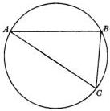

I say, let there be a triangle ABC. Circumscribe a circle around it, in accordance with Euclid, Book IV, Problem 5. Then the arcs AB, BC, and CA will likewise be given, according to the system in which 360° are equal to two right angles. But when the arcs are given, the sides of the triangle inscribed in the circle are also given as chords, in the Table set forth above, in units whereof the diameter is assumed to have 200,000.

## II

But if an angle and two sides of a triangle are given, the remaining side and the other angles will also be known.

For, the given sides are either equal or unequal, while the given angle is either right or acute or obtuse, and the given sides either include or do not include the given angle.

## II A

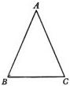

First, in the triangle ABC let the two given sides, AB and AC, which include the given angle A, be equal. Then the other angles, which are at the base BC, since they are equal, are also given as halves of the remainder when A is subtracted from two right angles. And if originally an angle at the base is given, its equal is thereupon given; and from these, the remainder of two right angles is given. But when the angles of a triangle are given, the sides are given, and the base BC is given by the Table, in units whereof AB or AC as radius has 100,000, or the diameter 200,000.

## II B

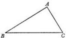

But if BAC is a right angle included by sides which are given, the same result will follow.

It is quite obvious that the squares on AB and AC are equal to the square on the base BC. Therefore BC is given in length, and so the sides are given in relation to one another. But the segment of the circle which encloses the right triangle is a semicircle, whose diameter is the base BC. Therefore, in units whereof BC has 200,000, AB and AC will be given as sides opposite the remaining angles B and C. Their place in the Table will accordingly make them known in degrees, whereof 180 are equal to two right angles. The same result will follow if BC is given with either of the two sides which include the right angle. This is now quite obvious, in my judgement.

## II C

Now let the given angle ABC be acute, and let it also be included by the given sides AB and BC. From the point A drop a perpendicular to BC, extended if necessary, according as the perpendicular falls inside or outside the triangle. Let the perpendicular be AD. By means of it two right triangles ABD and ADC are established. In ABD the angles are given, because D is a right angle, and B is given by hypothesis. Therefore AD and BD, as sides opposite the angles A and B, are given by the Table in units whereof AB, as the diameter of a circle, has 200,000. And on the same scale on which AB was given in length, AD and BD are given in similar units, and so also is CD, by which BC exceeds BD. In the right triangle ADC, therefore, the sides AD and CD being given, the required side AC and the angle ACD are likewise given by the preceding proof.

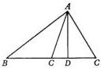

## II D

The result will not be different if the angle B is obtuse. For from the point A, a perpendicular AD, dropped on the straight line BC extended, makes a triangle ABD, whose angles are given. For, ABD is given as the supplementary angle of ABC, and D is a right angle. Therefore BD and AD are given in units whereof AB is 200,000. And since BA and BC have a given ratio to each other, therefore BC is given also in the same units as BD, and so is the whole of CBD. Likewise in the right triangle ADC, therefore, since the two sides AD and CD are given, the required AC also is given, as well as the angle BAC, with the remainder ACB, which were required.

## II E

Now let either one of the given sides be opposite the given angle B. Let [this opposite side] be AC and [the other given side] AB. Then AC is given by the Table in units whereof the diameter of the circle circumscribed around the triangle ABC has 200,000. Moreover, in accordance with the given ratio of AC to AB, AB is given in similar units. And by the Table the angle at ACB is given, together with the remaining angle BAC. Through the latter, the chord CB also is given. When this ratio is given, [the length of the sides] is given in any units whatsoever.

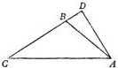

### III

If all the sides of a triangle are given, the angles are given.

In the case of the equilateral triangle, the fact that each of its angles is one-third of two right angles is too well known to be mentioned.

Also in the case of the isosceles triangle the situation is clear. For, the equal sides are to the third side as halves of the diameter are to the chord subtending the arc. Through the arc, the angle included by the equal sides is given by the Table in units whereof a central angle of 360° is equal to four right angles. Then the other angles, which are at the base, are also given as halves [of the remainder when the angle included by the equal sides is subtracted] from two right angles.

It therefore now remains to give the proof for scalene triangles too. These will similarly be divided into right triangles. Then let ABC be a scalene triangle of given sides. On the longest side, for instance, BC, drop the perpendicular AD. But the square of AB, which is opposite an acute angle, as we are told by Euclid, II, 13, is less than the squares on the other two sides, the difference being twice the product BC×CD. For, C must be an acute angle; otherwise AB would be,

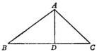

contrary to the hypothesis, the longest side, as may be inferred from Euclid, I, 17, and the next two theorems. Therefore $BD$ and $DC$ are given; and in a situation to which we have already frequently returned, $ABD$ and $ADC$ will be right triangles of given sides and angles. From these, the required angles of triangle $ABC$ are also known.

Alternatively, the next to the last theorem in Euclid, III, will demonstrate the same result, perhaps more conveniently. Let the shortest side be $BC$. With $C$ as center, and with $BC$ as radius, let us describe a circle which will intersect both of the remaining sides or either one of them.

First let it intersect both, $AB$ at the point $E$, and $AC$ at $D$. Also extend the line $ADC$ to the point $F$ in order to complete the diameter $DCF$. From this construction it is clear, in accordance with that Euclidean theorem, that the product $FA \times AD$ is equal to the product $BA \times AE$, since both products are equal to the square of the line drawn tangent to the circle from $A$. But the whole of $AF$ is given, since all of its segments are given. $CF$ and $CD$, as radii, are of course equal to $BC$, and $AD$ is the excess of $CA$ over $CD$. Therefore the product $BA \times AE$ is also given. So is $AE$ in length, together with the remainder $BE$, the chord subtending the arc $BE$. By joining $EC$, we shall have $BCE$ as an isosceles triangle of given sides. Therefore angle $EBC$ is given. Hence in triangle $ABC$ the remaining angles $C$ and $A$ will also be known from what precedes.

Now do not let the circle intersect $AB$, as in the second figure, where $AB$ meets the curve of the circumference. Nevertheless $BE$ will be given. Moreover, in the isosceles triangle $BCE$ the angle $CBE$ is given, and so also is its supplement $ABC$. By exactly the same process of reasoning as before, the remaining angles are given.

What has been said, containing as it does a considerable part of surveying, may suffice for rectilinear triangles. Now let us turn to spherical triangles.

## SPHERICAL TRIANGLES

Chapter 14

I here regard a convex triangle as the figure which is enclosed on a spherical surface by three arcs of great circles. But the size of an angle, as well as the difference between angles, [is measured] on an arc of the great circle which is drawn with the [angle's] point of intersection as its pole. This arc is intercepted by the quadrants enclosing the angle. For, the arc so intercepted is to the whole circumference as the angle at the intersection is to four right angles. These, as I said, contain 360 equal degrees.

## I

If there are three arcs of great circles of a sphere, any two of which, when joined together, are longer than the third, clearly a spherical triangle can be formed from them.

For, this statement about arcs is proved for angles by Euclid, XI, 23. Since the ratio of angles and arcs is the same, and great circles pass through the center of the sphere, evidently the three sectors of the circles, of which these are arcs, form a solid angle at the center of the sphere. The theorem is therefore obvious.

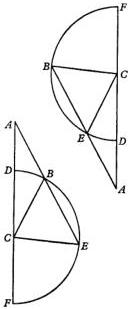

## II

Any arc of a triangle must be less than a semicircle.

For, a semicircle does not form an angle at the center, but proceeds through it in a straight line. On the other hand, the two remaining angles, to which arcs belong, cannot enclose a solid angle at the center, and consequently not a spherical triangle. This was the reason, in my opinion, why Ptolemy, in expounding this class of triangles, especially in connection with the shape of the spherical sector, stipulates that the assumed arcs should not be greater than a semicircle [Syntaxis, I, 13].

### III

In right spherical triangles, the ratio of the chord subtending twice the side opposite the right angle to the chord subtending twice either one of the sides including the right angle is equal to the ratio of the diameter of the sphere to the chord subtending twice the angle included, on a great circle of the sphere, between the remaining side and the hypotenuse.

For let there be a spherical triangle ABC, in which C is a right angle. I say that the ratio of the chord subtending twice AB to the chord subtending twice BC is equal to the ratio of the diameter of the sphere to the chord subtending twice the angle BAC on a great circle.

With A as pole, draw DE as the arc of a great circle. Complete the quadrants ABD and ACE. From F, the center of the sphere, draw the intersections of the circles: FA, of ABD and ACE; FE, of ACE and DE; FD, of ABD and DE; and also FC, of the circles AC and BC. Then draw BG perpendicular to FA, BI to FC, and DK to FE. Join GI.

If a circle intersects another circle while passing through its poles, it intersects it at right angles. Therefore AED is a right angle. So is ACB by hypothesis. Hence both planes EDF and BCF are perpendicular to AEF. In this last-mentioned plane at point K draw a straight line perpendicular to the intersection FKE. Then this perpendicular will form with KD another right angle, in accordance

with the definition of planes perpendicular to each other. Consequently KD is perpendicular also to AEF, according to Euclid, XI, 4. In the same way BI is drawn perpendicular to the same plane, and therefore DK and BI are parallel to each other, according to Euclid, XI, 6. Likewise GB is parallel to FD, because FGB and GFD are right angles. According to Euclid's Elements, XI, 10, angle

FDK will be equal to GBI. But FKD is a right angle, and so is GIB according to the definition of a perpendicular line. The sides of similar triangles being proportional, DF is to BG as DK is to BI. But BI is half of the chord subtending twice the arc CB, since BI is perpendicular to the radius CF. In the same way BG is half of the chord subtending twice the side BA; DK is half of the chord

subtending twice DE, or twice angle A; and DF is half of the diameter of the sphere. Clearly, therefore, the ratio of the chord subtending twice AB to the chord subtending twice BC is equal to the ratio of the diameter to the chord subtending twice the angle A, or twice the intercepted arc DE. The demonstration of this Theorem will prove to be useful.

### IV

In any triangle having a right angle, if another angle and any side are given, the remaining angle and the remaining sides will also be given.

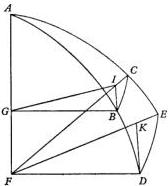

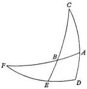

For let the triangle $ABC$ have angle $A$ right, and either of the other angles, for instance, $B$, also given. But with regard to the given side, I make a threefold division. For either it is adjacent to the given angles, like $AB$; or only to the right angle, like $AC$; or it is opposite the right angle, like $BC$.

Then first let $AB$ be the given side. With $C$ as pole, draw $DE$ as the arc of a great circle. Complete the quadrants $CAD$ and $CBE$. Produce $AB$ and $DE$ until they intersect at point $F$. Then $F$ in turn will be the pole of $CAD$, since $A$ and $D$ are right angles. If great circles on a sphere intersect each other at right angles, they bisect each other, and pass through each other's poles. Therefore $ABF$ and $DEF$ are quadrants. Since $AB$ is given, $BF$, the remainder of the quadrant, is also given, and angle $EBF$ is equal to its vertical angle $ABC$, which was given. But, according to the preceding Theorem, the ratio of the chord subtending twice $BF$ to the chord subtending twice $EF$ is equal to the ratio of the diameter of the sphere to the chord subtending twice the angle $EBF$. But three of these are given: the diameter of the sphere, twice $BF$, and twice the angle $EBF$, or their halves. Therefore, according to Euclid, VI, 15, half of the chord subtending twice $EF$ is also given. By the Table, the arc $EF$ is given. So is $DE$, the remainder of the quadrant, or the required angle $C$.

In the same way, in turn, for the chords subtending twice the arcs, $DE$ is to $AB$ as $EBC$ is to $CB$. But three are already given: $DE$, $AB$, and $CBE$ as a quadrant. Therefore the fourth, the chord subtending twice $CB$, is also given, and so is the required side $CB$. And for the chords subtending twice the arcs, $CB$ is to $CA$ as $BF$ is to $EF$. For, both of these ratios are equal to the ratio of the diameter of the sphere to the chord subtending twice the angle $CBA$; and ratios equal to the same ratio are equal to each other. Therefore, since the three members $BF$, $EF$, and $CB$ are given, the fourth member $CA$ is given, and $CA$ is the third side of the triangle $ABC$.

Now, let $AC$ be the side assumed as given, and let it be required to find sides $AB$ and $BC$ as well as the remaining angle $C$. Again, if we invert the argument, the ratio of the chord subtending twice $CA$ to the chord subtending twice $CB$ will be equal to the ratio of the chord subtending twice the angle $ABC$ to the diameter. From this, the side $CB$ is given, as well as $AD$ and $BE$ as remainders of the quadrants. Thus we shall again have the ratio of the chord subtending twice $AD$ to the chord subtending twice $BE$ equal to the ratio of the chord subtending twice $ABF$, and that is the diameter, to the chord subtending twice $BF$. Therefore the arc $BF$ is given, and its remainder is the side $AB$. By a process of reasoning similar to the preceding, from the chords subtending twice $BC$, $AB$, and $FBE$, the chord subtending twice $DE$, or the remaining angle $C$, is given.

Furthermore, if $BC$ is assumed, once more, as before, $AC$ as well as the remainders $AD$ and $BE$ will be given. From them, through the subtending straight lines and the diameter, as has often been explained, the arc $BF$ and the remaining side $AB$ are given. Then, according to the previous Theorem, through $BC$, $AB$, and $CBE$, as given, the arc $ED$ is obtained, that is to say, the remaining angle $C$, which we were looking for.

And thus once more in triangle $ABC$, two angles $A$ and $B$ being given, of which $A$ is a right angle, and one of the three sides being given, the third angle is given together with the two remaining sides. Q.E.D.

## V

If the angles of a triangle are given, one of them being a right angle, the sides are given.

Keep the previous diagram. In it, because angle C is given, arc DE is given, and so is EF, as the remainder of the quadrant. BEF is a right angle, because BE is drawn from the pole of DEF. EBF is the vertical angle of a given angle. Therefore triangle BEF, having a right angle E, and another given angle B, and a given side EF, has its sides and angles given, in accordance with the preceding Theorem. Therefore BF is given, and so is AB, the remainder of the quadrant. Likewise in the triangle ABC, the remaining sides AC and BC are shown, by what precedes, to be given.

## VI

If on the same sphere two triangles each have a right angle and another corresponding angle and a corresponding side equal, whether that side be adjacent to the equal angles or opposite either of the equal angles, the remaining corresponding sides will also be equal, and so will the remaining angle.

Let there be a hemisphere ABC. On it take two triangles ABD and CEF. Let A and C be right angles. Furthermore let angle ADB be equal to CEF, and let one side be equal to one side. First let the equal side be adjacent to the equal angles, that is, let AD = CE. I say that also side AB is equal to side CF, BD to EF, and the remaining angle ABD to the remaining angle CFE. For with their poles in B and F, draw GHI and IKL as quadrants of great circles. Complete ADI and CEI. These must intersect each other at the hemisphere's pole in the point I, since A and C are right angles, and GHI and CEI are drawn through the poles of the circle ABC. Therefore, since AD and CE are assumed to be equal sides, the remaining arcs DI and IE will be equal, and so will IDH and IEK as vertical angles of angles assumed equal. H and K are right angles. Ratios equal to the same ratio are equal to each other. The ratio of the chord subtending twice ID to the chord subtending twice HI will be equal to the ratio of the chord subtending twice EI to the chord subtending twice IK. For, each of these ratios, according to Theorem III, above, is equal to the ratio of the diameter of the sphere to the chord subtending twice the angle IDH, or the equal chord subtending twice IEK. The chord subtending twice the arc DI is equal to the chord subtending twice IE. Hence, according to Euclid's Elements, V, 14, also in the case of twice IK and HI the chords will be equal. In equal circles, equal straight lines cut off equal arcs, and fractions multiplied by the same factor preserve the same ratio. Therefore, as simple arcs IH and IK will be equal. So will GH and KL, the remainders of the quadrants. Hence angles B and F are clearly equal. Therefore the ratios of the chord subtending twice AD to the chord subtending twice BD, and of the chord subtending twice CE to the chord subtending twice BD are equal to the ratio of the chord subtending twice EC to the chord subtending twice EF. For, both of these ratios are equal to the ratio of the chord subtending twice HG, or its equal KL, to the chord subtending twice BDH, that is, the diameter, according to the converse of Theorem III. AD is equal to CE. Therefore, according to Euclid's Elements, V, 14, BD is equal to EF, on account of the straight lines subtending twice these arcs.

With BD and EF equal, I shall prove in the same way that the remaining sides

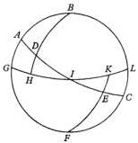

and angles are equal. And if AB and CF are in turn assumed to be the equal sides, the same conclusions will follow from the equality of the ratios.

## VII

The same conclusion will now be proved also if there is no right angle, provided that the side adjacent to the equal angles is equal to the corresponding side.

Thus in the two triangles ABD and CEF, let any two angles B and D be equal to the two corresponding angles E and F. Also let side BD, which is adjacent to the equal angles, be equal to side EF. I say that again the triangles have their sides and angles equal.

For, once more, with B and F as poles, draw GH and KL as arcs of great circles. Let AD and GH, when extended, intersect each other at N, while EC and LK, when similarly extended, intersect each other at M. Then the two triangles HDN and EKM have angles HDN and KEM equal, as vertical angles of angles assumed to be equal. H and K are right angles because they pass through the poles. Moreover, sides DH and EK are equal. Therefore the triangles have their angles and sides equal, in accordance with the preceding Theorem.

And once again, GH and KL are equal arcs, since angles B and F were assumed to be equal. Therefore the whole of GHN is equal to the whole of MKL, in accordance with the axiom about equals added to equals. Consequently here too the two triangles AGN and MCL have one side GN equal to one side ML, angle ANG equal to CML, and right angles G and L. For this reason these triangles also will have their sides and angles equal. When equals are subtracted from equals, the remainders will be equal, AD to CE, AB to CF, and angle BAD to the remaining angle ECF. Q.E.D.

## VIII

Furthermore, if two triangles have two sides equal to the two corresponding sides, as well as an angle equal to an angle, whether it be the angle included by the equal sides, or an angle at the base, the base will also be equal to the base, and the remaining angles to the remaining angles.

As in the preceding diagram, let side AB be equal to side CF, and AD to CE. First, let angle A, included by the equal sides, be equal to angle C. I say that also the base BD is equal to the base EF, angle B to F, and the remaining angle BDA to the remaining angle CEF. For we shall have two triangles, AGN and CLM, in which G and L are right angles; GAN and MCL are equal as supplementary angles of BAD and ECF, which are equal; and GA is equal to LC. Therefore the triangles have their corresponding angles and sides equal. Hence, AD and CE being equal, the remainders DN and ME are also equal. But it has already been shown that angle DNH is equal to angle EMK. H and K being right angles, the two triangles DHN and EMK also will have their corresponding angles and sides equal. Hence, as remainders BD will also be equal to EF. and GH to KL. Their angles B and F are equal, and so are the remaining angles ADB and FEC.

But instead of the sides AD and EC, let the bases BD and EF be assumed to be equal. With these bases opposite equal angles, but everything else remaining as before, the proof will proceed in the same way. For, GAN and MCL are equal, as supplements of equal angles. G and L are right angles. AG is equal to CL. Hence, in the same way as before, we shall have two triangles AGN and MCL with their

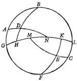

corresponding angles and sides equal. The same is true also for their sub-triangles, DHN and MEK. For, H and K are right angles; DNH is equal to KME; DH and EK are equal sides, as remainders of quadrants. From these equalities the same conclusions follow as those which I enunciated.

## IX

On a sphere too, the angles at the base of an isosceles triangle are equal to each other.

Let ABC be a triangle with AB and AC, two of its sides, equal. I say that ABC and ACB, the angles at the base, are also equal. From the vertex A, draw a great circle intersecting the base at right angles, that is, passing through the poles [of the base]. Let the great circle be AD. In the two triangles ABD and ADC, then, side BA is equal to side AC; AD is common to both triangles; and the angles at D are right angles. It is therefore clear that, in accordance with the preceding Theorem, angles ABC and ACB are equal. Q.E.D.

## COROLLARY

Accordingly it follows that the arc drawn through the vertex of an isosceles triangle at right angles to the base will bisect the base and, at the same time, the angle included by the equal sides, and conversely, as is clear from this Theorem and the preceding one.

## X

Any two triangles having their corresponding sides equal will also have their corresponding angles equal, each to each.

For in both cases the three segments of great circles form pyramids, whose vertices are at the center of the sphere. But their bases are the plane triangles bounded by the straight lines subtending the arcs of the convex triangles. These pyramids are similar and equal, according to the definition of equal and similar solid figures. When two figures are similar, however, the rule is that, taken in any order, their corresponding angles are equal. Therefore these triangles will have their corresponding angles equal. In particular, those who define similar figures more generally want them to be whatever figures have similar configurations in which their corresponding angles are equal. From these considerations it is clear, I think, that on a sphere triangles having their corresponding sides equal are similar, as in the case of plane triangles.

## XI

Every triangle having two sides and an angle given becomes a triangle of given angles and sides.

For if the given sides are equal, the angles at the base will be equal. Drawing an arc from the vertex at right angles to the base will readily make clear what is required, in accordance with the Corollary of Theorem IX.

But the given sides may be unequal, as in triangle ABC. Let its angle A be given, together with two sides. These either include or do not include the given angle.

First, let it be included by the given sides, AB and AC. With C as pole, draw DEF as the arc of a great circle. Complete the quadrants CAD and CBE. Produce

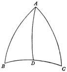

$AB$ to intersect $DE$ at point $F$. Thus also in the triangle $ADF$, the side $AD$ is given as the remainder when $AC$ is subtracted from the quadrant. Moreover, angle $BAD$ is given as the remainder when $CAB$ is subtracted from two right angles. For, the ratio of the angles and their sizes are the same as those which result from the intersection of straight lines and planes. $D$ is a right angle. Therefore, in accordance with Theorem IV, $ADF$ will be a triangle of given angles and sides. Again, in triangle $BEF$, angle $F$ has been found; $E$ is right, because its sides pass through the poles; and side $BF$ is also known as the quantity by which the whole of $ABF$ exceeds $AB$. In accordance with the same theorem, therefore, $BEF$ also will be a triangle of given angles and sides. Hence, through $BE$, $BC$ is given as the remainder of the quadrant and a required side. Through $EF$, the remainder of the whole of $DEF$ is given as $DE$, and this is the angle $C$. Through the angle $EBF$, its vertical angle $ABC$ is given, and this was required.

But if, instead of $AB$, $CB$, the side opposite the given angle, is assumed, the same result will follow. For, $AD$ and $BE$ are given as the remainders of the quadrants. By the same argument the two triangles $ADF$ and $BEF$, as before, have their angles and sides given. From them, the sides and angles of the subject triangle $ABC$ are given, as was proposed.

## XII

Furthermore, if any two angles and a side are given, the same results will follow.

For, keeping the construction in the preceding diagram, in triangle $ABC$ let the two angles $ACB$ and $BAC$ be given, as well as the side $AC$, which is adjacent to both angles. If, in addition, either of the given angles were a right angle, everything else could be deduced by reasoning in accordance with Theorem IV, above. However, I want this to be a different case, in which neither of the given angles is a right angle. Then $AD$ will be the remainder of the quadrant $CAD$; angle $BAD$ is the remainder when $BAC$ is subtracted from two right angles; and $D$ is a right angle. Therefore the angles and sides of triangle $AFD$ are given, in accordance with Theorem IV, above. But since angle $C$ is given, the arc $DE$ is given, and so is the remainder $EF$. $BEF$ is a right angle, and $F$ is an angle common to both triangles. In the same way, in accordance with Theorem IV, above, $BE$ and $FB$ are given, and from them the required remaining sides $AB$ and $BC$ will be known.

On the other hand, one of the given angles may be opposite the given side. For example, if angle $ABC$ is given instead of $ACB$, while everything else remains unchanged, the same proof as before will make known the whole of $ADF$ as a triangle of given angles and sides. The same is true for the sub-triangle $BEF$. For, angle $F$ is common to both; $EBF$ is the vertical angle of a given angle; and $E$ is a right angle. Therefore, as is proved above, all its sides are also given. From them, finally, the same conclusions follow as those which I enunciated. For, all these properties are always interconnected by an invariant mutual relationship, as befits the form of a sphere.

## XIII

Finally, if all the sides of a triangle are given, the angles are given.

Let all the sides of triangle $ABC$ be given. I say that all the angles also are

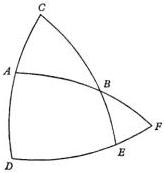

found. For, the triangle will have sides which are either equal or not equal. Then, first, let AB and AC be equal. Obviously, the halves of the chords subtending twice AB and AC will also be equal. Let these half-chords be BE and CE. They will intersect each other in the point E, because they are equidistant from the center of the sphere on DE, the intersection of their circles. This is clear from Euclid, III, Definition 4, and its converse. But according to Euclid, III, 3, DEB is a right angle in plane ABD, and so is DEC in plane ACD. Therefore BEC is the angle of inclination of those planes, according to Euclid, XI, Definition 4. We shall find angle BEC in the following way. For, it will be subtended by the straight line BC. Then we shall have the rectilinear triangle BEC. Its sides will be given through their arcs, which are given. Also the angles of BEC will be given, and we shall have the required angle BEC, that is, the spherical angle BAC, and the remaining angles, through what precedes.

But the triangle may be scalene, as in the second diagram. Obviously, the halves of the chords subtending twice the sides will not intersect one another. For let arc AC be greater than AB, and let CF be half of the chord subtending twice AC. Then CF will pass below. But if the arc is smaller, the half-chord will be higher, according as these lines happen to be nearer to or farther away from the center, in accordance with Euclid, III, 15. Then let FG be drawn parallel to BE. Let FG intersect BD, the intersection of the circles, in the point G. Join CG. Clearly, then, EFG is a right angle, being of course equal to AEB, and EFC is also a right angle, since CF is half of the chord subtending twice AC. Then CFG will be the angle of intersection of the circles AB and AC. Therefore we obtain CFG also. For DF is to FG as DE is to EB, since DFG and DEB are similar triangles. Hence FG is given in the same units as those in which FC is also given. But the same ratio holds also for DG to DB. DG also will be given in units whereof DC is 100,000. What is more, angle GDC is given through arc BC. Therefore, in accordance with Theorem II on Plane Triangles, side GC is given in the same units as the remaining sides of the plane triangle GFC. Consequently, in accordance with the last Theorem on Plane Triangles, we shall have angle GFC, that is, the required spherical angle BAC, and then we shall obtain the remaining angles, in accordance with Theorem XI on Spherical Triangles.

## XIV

If a given arc of a circle is divided anywhere so that the sum of both segments is less than a semicircle, the ratio of half the chord subtending twice one segment to half the chord subtending twice the other segment being given, the arcs of the segments will also be given.

For let arc ABC be given, about D as center. Let ABC be divided at random in the point B, yet in such a way that the segments are less than a semicircle. Let the ratio of half the chord subtending twice AB to half of the chord subtending twice BC be given in some unit of length. I say that the arcs AB and BC are also given.

For, draw the straight line AC, which will be intersected by the diameter at the point E. Now from the end-points A and C, drop perpendiculars to the diameter. Let these perpendiculars be AF and CG, which must be halves of the chords subtending twice AB and BC. Then in the right triangles AEF and CEG, the vertical angles at E are equal. Therefore the triangles have their corresponding angles

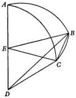

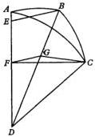

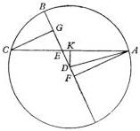

equal. Being similar triangles, they have their sides opposite the equal angles proportional: as $AF$ is to $CG$, $AE$ is to $EC$. Hence we shall have $AE$ and $EC$ in the same units as those in which $AF$ or $GC$ was given. From $AE$ and $EC$, the whole of $AEC$ will be given in the same units. But $AEC$, as the chord subtending the arc $ABC$, is given in those units in which the radius $DEB$ is given. In the same units, $AK$, as half of $AC$, and the remainder $EK$, are also given. Join $DA$ and $DK$, which will also be given in the same units as $DB$. For, $DK$ is half of the chord subtending the segment remaining when $ABC$ is subtracted from a semicircle. This remaining segment is included within angle $DAK$. Therefore angle $ADK$ is given as including half of the arc $ABC$. But in the triangle $EDK$, since two sides are given, and $EKD$ is a right angle, $EDK$ will also be given. Hence the whole angle $EDA$ will be given. It includes the arc $AB$, from which the remainder $CB$ will also be obtained. This is what we wanted to prove.

### XV

If all the angles of a triangle are given, even though none of them is a right angle, all the sides are given.

Let there be the triangle $ABC$, with all of its angles given, but none of them a right angle. I say that all of its sides are also given. For, from any of the angles, for instance $A$, through the poles of $BC$ draw the arc $AD$. This will intersect $BC$ at right angles. $AD$ will fall inside the triangle, unless one of the angles $B$ or $C$ at the base is obtuse, and the other acute. Should this be the case, the perpendicular would have to be drawn from the obtuse angle to the base. Complete the quadrants $BAF$, $CAG$, and $DAE$. Draw the arcs $EF$ and $EG$ with their poles in $B$ and $C$. Therefore $F$ and $G$ will also be right angles. Then in the right triangles, the ratio of half the chord subtending twice $AE$ to half the chord subtending twice $EF$ will be equal to the ratio of half the diameter of the sphere to half the chord subtending double the angle $EAF$; similarly in triangle $AEG$, with its right angle at $G$, the ratio of half the chord subtending twice $AE$ to half of the chord subtending twice $EG$ is equal to the ratio of half the diameter of the sphere to half of the chord subtending double the angle $EAG$. Then since these ratios are equal, the ratio of half the chord subtending twice $EF$ to half of the chord subtending twice $EG$ will be equal to the ratio of half the chord subtending double the angle $EAF$ to half of the chord subtending double the angle $EAG$. $FE$ and $EG$ are given arcs, being the remainders when angles $B$ and $C$ are subtracted from right angles. From $FE$ and $EG$, then, we shall obtain the ratio of angles $EAF$ and $EAG$, that is, of their vertical angles, $BAD$ and $CAD$. But the whole of $BAC$ is given. Therefore, in accordance with the preceding Theorem, angles $BAD$ and $CAD$ will also be given. Then, in accordance with Theorem V, we shall obtain sides $AB$, $BD$, $AC$, $CD$, and the whole of $BC$.

For the present let this digression suffice for triangles, so far as they are necessary for our purpose. If they had to be discussed more fully, a special volume would have been required.

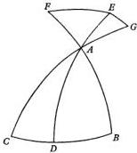

# BOOK TWO

## INTRODUCTION

I have given a general account of the earth's three motions, by which I promised to explain all the phenomena of the heavenly bodies [I, 11]. I shall do so next, to the best of my ability, by analyzing and investigating them, one by one. I shall begin, however, with the most familiar revolution of all, the period of a day and night. This, as I said [I, 4], is called *nuchthemeron* by the Greeks. I have taken it as belonging particularly and directly to the earth's globe, since the month, year, and other intervals of time bearing many names proceed from this rotation, as number does from unity, time being the measure of motion. Hence with regard to the inequality of days and nights, the rising and setting of the sun and of the degrees of the zodiac and its signs, and that sort of consequence of this rotation, I shall make some few remarks, especially because many have written about these topics quite fully, yet in harmony and agreement with my views. It makes no difference that they base their explanations on a motionless earth and rotating universe, while I take the opposite position and accompany them to the same goal. For, mutually interrelated phenomena, it so happens, show a reversible agreement. Yet I shall omit nothing essential. But let nobody be surprised if I still refer simply to the rising and setting of the sun and stars, and similar phenomena. On the contrary, it will be recognized that I use the customary terminology, which can be accepted by everybody. Yet I always bear in mind that

For us who are borne by the earth, the sun and the moon pass by,
And the stars return on their rounds, and again they drop out of sight.

## THE CIRCLES AND THEIR NAMES

### Chapter 1

The equator, as I said [I, 11], is the largest of the parallels of latitude described around the poles of the daily rotation of the earth's globe. The ecliptic, on the other hand, is a circle passing through the middle of the signs of the zodiac, and below the ecliptic the center of the earth circles in an annual revolution. But the ecliptic meets the equator obliquely, in agreement with the inclination of the earth's axis to the ecliptic. Hence, as a result of the earth's daily rotation, on either side of the equator a circle is described tangent to the ecliptic as the outermost limit of its obliquity. These two circles are called the "tropics", because in them seem to occur the sun's tropes or reversals in direction, that is to say, in winter and summer. Hence the northern one is usually called the "summer solstice", and the other one in the south, the "winter solstice", as was explained above in the general account of the earth's revolutions [I, 11].

Next comes the "horizon", as it is called, which the Romans term the "boundary", since it separates the part of the universe visible to us from the part which is hidden. [All the bodies that rise] seem to rise at the horizon, [and] all the bodies that set [seem to set at the horizon]. It has its center on the surface of the earth, and its pole at our zenith. But the earth is incommensurable with the immensity of the heavens. Even the entire space intervening, according to my conception, between the sun and the moon cannot be classed with the vastness of the heavens. Hence the horizon seems to bisect the heavens like a circle passing through the center of the universe, as I showed earlier [I, 6]. But the horizon meets the equator obliquely. Hence the horizon too is tangent, on either side of the equator, to a pair of parallels of latitude: in the north, [the circle limiting the stars which are] always visible, and in the south, those which are always hidden. The former is called the “arctic”, the latter the “antarctic”, by Proclus and most of the Greeks. The arctic and antarctic circles become larger or smaller in proportion to the obliquity of the horizon or the altitude of the pole of the equator.

There remains the meridian, which passes through the poles of the horizon and also through the poles of the equator. Therefore the meridian is perpendicular to both of these circles. When the sun reaches the meridian, it indicates noon and midnight. But these two circles, I mean the horizon and the meridian, which have their centers on the surface of the earth, depend absolutely on the motion of the earth and our sight, wherever it may be. For everywhere the eye acts as the center of the sphere of all the bodies visible in every direction around it. Therefore, as is clearly proved by Eratosthenes, Posidonius, and the other writers on cosmography and the earth’s size, all the circles assumed on the earth are also the basis of their counterparts in the heavens and of similar circles. These too are circles having special names, while others may be designated in countless ways.

## THE OBLIQUITY OF THE ECLIPTIC, THE DISTANCE BETWEEN THE TROPICS, AND THE METHOD OF DETERMINING THESE QUANTITIES

Chapter 2

The ecliptic, then, crosses obliquely between the tropics and the equator. Hence it is now necessary, I believe, to investigate the distance between the tropics and, in that connection, the size of the angle at which the equator and ecliptic intersect each other. This [information] must of course be perceived by the senses and with the aid of instruments by which this very valuable result is obtained. Hence make a square out of wood, or preferably out of some more rigid material, [such as] stone or metal, lest perhaps the wood, yielding to a shift in the air, be able to mislead the observer. Let a surface of the square be perfectly smooth, and long enough for the subdivisions which have to be made, so that it would be five or six feet. For in proportion to its size, and with one of the corners as center, a quadrant of a circle is drawn. It is divided into 90 equal degrees. These are subdivided in like manner into 60 minutes, or whatever subdivisions the degrees can accommodate. Then a precisely lathed cylindrical pin is attached to the center. Placed perpendicular to the surface, the pin protrudes a little, perhaps as much as a finger’s breadth or less.

After this instrument has been constructed in this way, it is useful to trace the meridian on a floor laid in the horizontal plane and leveled as carefully as possible by means of a hydroscope or water level, lest it sag in any direction. Now on this floor draw a circle, and at its center erect a pointer. Observing where its shadow falls on the circumference of the circle at any time before noon, we shall mark that point. We shall make a similar observation in the afternoon, and bisect the arc of the circle lying between the two points already marked. By this method a straight line drawn from the center through the point of bisection will certainly indicate south and north for us without any error.

Then on this line as its base, the instrument's plane surface is erected and attached perpendicularly, with its center turned southward. A plumb line dropped from the center meets the meridian line at right angles. The result of this procedure is of course that the surface of the instrument contains the meridian.

Thereafter, on the days of the summer and winter solstices, the sun's shadow at noon must be observed as it is cast at the center by that pin or cylinder. Anything may be used on the aforesaid arc of the quadrant to fix the place of the shadow with greater certainty. We shall note the midpoint of the shadow as accurately as possible in degrees and minutes. For if we do this, the arc found marked off between the two shadows, summer and winter, will show us the distance between the tropics and the entire obliquity of the ecliptic. By taking half of this, we shall have the distance of the tropics from the equator, while the size of the angle of inclination of the equator to the ecliptic will become clear.

Now this interval between the aforementioned limits, north and south, is determined by Ptolemy, in degrees whereof the circle is 360°, as 47° 42' 40'' [Syntaxis, I, 12]. He also finds that before his time the observations of Hipparchus and Eratosthenes were in agreement. This determination is equivalent to 11 units, whereof the entire circle is 83. Half of this interval, which is 23° 51' 20'', established the distance of the tropics from the equator, in degrees whereof the circle is 360°, and the angle of intersection with the ecliptic. Therefore Ptolemy thought that this was constant, and would always remain so. But from that time these values are found to have decreased continuously down to our own time. For, certain of our contemporaries and I have now discovered that the distance between the tropics is not more than approximately 46° 58', and the angle of intersection not more than 23° 29'. Hence it is now quite clear that the obliquity of the ecliptic also is variable. I shall say more about this subject below [III, 10], where I shall also show by a quite probable conjecture that the obliquity never was more than 23° 52', and never will be less than 23° 28'.

## THE ARCS AND ANGLES OF THE INTERSECTIONS OF THE EQUATOR, ECLIPTIC, AND MERIDIAN; THE DERIVATION OF THE DECLINATION AND RIGHT ASCENSION FROM THESE ARCS AND ANGLES, AND THE COMPUTATION OF THEM

Just as I said [II, 1] that the parts of the universe rise and set at the horizon, so I [now] say that the heavens are bisected at the meridian. This also traverses both the ecliptic and the equator in a period of 24 hours. It divides them, by cutting off arcs starting from their vernal or autumnal intersection. It in turn is divided by their interception of an arc [of the meridian]. Since they are all great circles, they form a spherical triangle. This is a right triangle, because there is a right angle where the meridian crosses the equator, through whose poles [the meridian passes,]

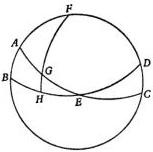

by definition. The arc of the meridian in this triangle, or an arc so intercepted on any circle passing through the poles of the equator, is called the "declination" of the segment of the ecliptic. But the corresponding arc of the equator, which rises together with its associated arc on the ecliptic, is called the "right ascension".

All of this is easily shown in a convex triangle. For, let $ABCD$ be the circle, generally called the "colure", which passes through the poles of both the equator and the ecliptic. Let half of the ecliptic be $AEC$; half of the equator, $BED$; the vernal equinox, $E$; the summer solstice, $A$; and the winter solstice, $C$. Assume that $F$ is the pole of the daily rotation, and that on the ecliptic $EG$ is an arc of, say, $30^{\circ}$. Through its end, draw the quadrant $FGH$. Then in the triangle $EGH$, obviously side $EG$ is given as $30^{\circ}$. Angle $GEH$ is also given; at its minimum, in degrees whereof $360^{\circ} = 4$ right angles, it will be $23^{\circ} 28'$, in agreement with the minimum declination $AB$. $GHE$ is a right angle. Therefore, in accordance with Theorem IV on Spherical Triangles, $EGH$ will be a triangle of given angles and sides. The ratio of the chord subtending twice $EG$ to the chord subtending twice $GH$, as has of course been shown [Theorem III on Spherical Triangles], is equal to the ratio of the chord subtending twice $AGE$, or of the diameter of the sphere, to the chord subtending twice $AB$. Their half-chords are similarly related. Half of the chord subtending twice $AGE$ is 100,000 as a radius; in the same units, the halves of the chords subtending twice $AB$ and $EG$ are 39,822 and 50,000. If four numbers are proportional, the product of the means is equal to the product of the extremes. Hence we shall have half of the chord subtending twice the arc $GH$ as 19,911 units. This half-chord in the Table gives the arc $GH$ as $11^{\circ} 29'$, the declination corresponding to the segment $EG$. Therefore in the triangle $AFG$ too, sides $FG$ and $AG$, as remainders of quadrants, are given as $78^{\circ} 31'$ and $60^{\circ}$, and $FAG$ is a right angle. In the same way, the chords subtending twice $FG$, $AG$, $FGH$, and $BH$, or their half-chords will be proportional. Now, since three of these are given, the fourth, $BH$, will also be given as $62^{\circ} 6'$. This is the right ascension as taken from the summer solstice, or from the vernal equinox it will be $HE$, of $27^{\circ} 54'$. Similarly from the given sides $FG$ of $78^{\circ} 31'$, $AF$ of $66^{\circ} 32'$, and a quadrant, we shall have angle $AGF$ of approximately $69^{\circ} 23 \frac{1}{2}'$. Its vertical angle $HGE$ is equal. We shall follow this example in all the other cases too.

However, we must not disregard the fact that, at the points where the ecliptic is tangent to the tropics, the meridian intersects the ecliptic at right angles, since at those times the meridian passes through the poles of the ecliptic, as I said. But at the equinoctial points the meridian makes an angle which is as much smaller than a right angle as the ecliptic deviates from a right angle [in intersecting with the equator], so that now [the angle between the meridian and the ecliptic] is $66^{\circ} 32'$. It should also be noticed that equal arcs of the ecliptic, as measured from the equinoctial or solstitial points, are accompanied by equal angles and sides of the triangles. Thus let us draw $ABC$ as an arc of the equator, and the ecliptic $DBE$, intersecting each other in $B$. Let this be an equinoctial point. Let us take $FB$ and $BG$ as equal arcs. Through $K$ and $H$, the poles of the daily rotation, draw two quadrants, $KFL$ and $HGM$. Then there will be two triangles, $FLB$ and $BMG$. Their sides $BF$ and $BG$ are equal; at $B$ there are vertical angles; and at $L$ and $M$, right angles. Therefore, in accordance with Theorem VI on Spherical Triangles,

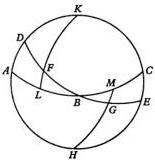

the sides and angles of these triangles are equal. Thus the declinations $FL$ and $MG$, as well as the right ascensions $LB$ and $BM$, are equal, and the remaining angle $F$ is equal to the remaining angle $G$.

In the same way, the situation will be clear when the equal arcs are measured from a solstitial point. Thus let $AB$ and $BC$ be equal arcs to either side of $B$, where the tropic is tangent to [the ecliptic]. For, draw the quadrants $DA$ and $DC$ from $D$, the pole of the equator, [and join $DB$]. In like manner there will be two triangles, $ABD$ and $DBC$. Their bases $AB$ and $BC$ are equal; $BD$ is a side common to both; and there are right angles at $B$. In accordance with Theorem VIII on Spherical Triangles, these triangles will be shown to have their sides and angles equal. Hence it becomes clear that when these angles and arcs are tabulated for a single quadrant on the ecliptic, they will fit the remaining quadrants of the entire circle.

I shall adduce an example of these relationships in the following description of the Tables. In the first column will be entered the degrees of the ecliptic; in the next place, the declinations corresponding to those degrees; and in the third place, the minutes by which the declinations occurring at the maximum obliquity of the ecliptic differ from, and exceed, these partial declinations; the greatest of these differences is $24'$. I shall proceed in the same way in the Tables of [Right Ascensions and Meridian] Angles. For when the obliquity of the ecliptic varies, everything which accompanies it must vary. But in right ascension the variation is found to be extremely small, since it does not exceed $\frac{1}{10}$ of a "time", and in the course of an hour amounts to only $\frac{1}{150}$ [thereof]. For, the ancients use the term "times" for the degrees of the equator which rise together with the degrees of the ecliptic. Both of these circles have 360 units, as I have often said [e.g., I, 12]. In order to distinguish between them, however, many have called the ecliptic's units "degrees", but the equator's "times", a nomenclature which I too will follow hereafter. [As I was saying] although this variation is so tiny that it can properly be neglected, I did not mind adding it too. From these variations, then, the same results will be clear in any other obliquity of the ecliptic if, in proportion to the excess of the ecliptic's maximum obliquity over the minimum, to each entry the corresponding fractions are applied. Thus, for example, with the obliquity at $23^{\circ} 34'$, if I wish to know how great a declination belongs to $30^{\circ}$ of the ecliptic measured from the equinox, in the Table I find $11^{\circ} 29'$, and under the differences $11'$, which would be added as a block when the obliquity of the ecliptic is at its maximum. This was, as I said, $23^{\circ} 52'$. But in the present instance it is assumed to be $23^{\circ} 34'$, which is greater than the minimum by $6'$. These $6'$ are one-fourth of the $24'$ by which the maximum obliquity exceeds [the minimum]. The fraction of $11'$ in a similar ratio is about $3'$. When I add these $3'$ to $11^{\circ} 29'$, I shall have $11^{\circ} 32'$ as the declination at that time of $30^{\circ}$ of the ecliptic as measured from the equinoctial point. In [meridian] angles and right ascensions we may proceed in the same way, except that in the latter case we must always add the differences, and in the former case always subtract them, in order to have everything come out more accurate in relation to time.

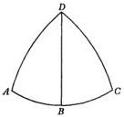

TABLE OF DECLINATIONS [OF THE DEGREES OF THE ECLIPTIC]

|  Eclip- tic | Declination |   | Differ- ence |  | Eclip- tic | Declination |   | Differ- ence |  | Eclip- tic | Declination |   | Differ- ence  |
| --- | --- | --- | --- | --- | --- | --- | --- | --- | --- | --- | --- | --- | --- |
|  Degree | Degree | Minute | Minute |  | Degree | Degree | Minute | Minute |  | Degree | Degree | Minute | Minute  |
|  1 | 0 | 24 | 0 |  | 31 | 11 | 50 | 11 |  | 61 | 20 | 23 | 20  |
|  2 | 0 | 48 | 1 |  | 32 | 12 | 11 | 12 |  | 62 | 20 | 35 | 21  |
|  3 | 1 | 12 | 1 |  | 33 | 12 | 32 | 12 |  | 63 | 20 | 47 | 21  |
|  4 | 1 | 36 | 2 |  | 34 | 12 | 52 | 13 |  | 64 | 20 | 58 | 21  |
|   | 2 | 0 | 2 |  | 35 | 13 | 12 | 13 |  | 65 | 21 | 9 | 21  |
|  6 | 2 | 23 | 2 |  | 36 | 13 | 32 | 14 |  | 66 | 21 | 20 | 22  |
|  7 | 2 | 47 | 3 |  | 37 | 13 | 52 | 14 |  | 67 | 21 | 30 | 22  |
|  8 | 3 | 11 | 3 |  | 38 | 14 | 12 | 14 |  | 68 | 21 | 40 | 22  |
|  9 | 3 | 35 | 4 |  | 39 | 14 | 31 | 14 |  | 69 | 21 | 49 | 22  |
|   | 3 | 58 | 4 |  | 40 | 14 | 50 | 14 |  | 70 | 21 | 58 | 22  |
|  11 | 4 | 22 | 4 |  | 41 | 15 | 9 | 15 |  | 71 | 22 | 7 | 22  |
|  12 | 4 | 45 | 4 |  | 42 | 15 | 27 | 15 |  | 72 | 22 | 15 | 23  |
|  13 | 5 | 9 | 5 |  | 43 | 15 | 46 | 16 |  | 73 | 22 | 23 | 23  |
|  14 | 5 | 32 | 5 |  | 44 | 16 | 4 | 16 |  | 74 | 22 | 30 | 23  |
|   | 5 | 55 | 5 |  | 45 | 16 | 22 | 16 |  | 75 | 22 | 37 | 23  |
|  16 | 6 | 19 | 6 |  | 46 | 16 | 39 | 17 |  | 76 | 22 | 44 | 23  |
|  17 | 6 | 41 | 6 |  | 47 | 16 | 56 | 17 |  | 77 | 22 | 50 | 23  |
|  18 | 7 | 4 | 7 |  | 48 | 17 | 13 | 17 |  | 78 | 22 | 55 | 23  |
|  19 | 7 | 27 | 7 |  | 49 | 17 | 30 | 18 |  | 79 | 23 | 1 | 24  |
|   | 7 | 49 | 8 |  | 50 | 17 | 46 | 18 |  | 80 | 23 | 5 | 24  |
|  21 | 8 | 12 | 8 |  | 51 | 18 | 1 | 18 |  | 81 | 23 | 10 | 24  |
|  22 | 8 | 34 | 8 |  | 52 | 18 | 17 | 18 |  | 82 | 23 | 13 | 24  |
|  23 | 8 | 57 | 9 |  | 53 | 18 | 32 | 19 |  | 83 | 23 | 17 | 24  |
|  24 | 9 | 19 | 9 |  | 54 | 18 | 47 | 19 |  | 84 | 23 | 20 | 24  |
|   | 9 | 41 | 9 |  | 55 | 19 | 2 | 19 |  | 85 | 23 | 22 | 24  |
|  26 | 10 | 3 | 10 |  | 56 | 19 | 16 | 19 |  | 86 | 23 | 24 | 24  |
|  27 | 10 | 25 | 10 |  | 57 | 19 | 30 | 20 |  | 87 | 23 | 26 | 24  |
|  28 | 10 | 46 | 10 |  | 58 | 19 | 44 | 20 |  | 88 | 23 | 27 | 24  |
|  29 | 11 | 8 | 10 |  | 59 | 19 | 57 | 20 |  | 89 | 23 | 28 | 24  |
|   | 11 | 29 | 11 |  | 60 | 20 | 10 | 20 |  | 90 | 23 | 28 | 24  |

TABLE OF RIGHT ASCENSIONS

|  Eclip- tic | Equator |   | Differ- ence |  | Eclip- tic | Equator |   | Differ- ence |  | Eclip- tic | Equator |   | Differ- ence  |
| --- | --- | --- | --- | --- | --- | --- | --- | --- | --- | --- | --- | --- | --- |
|  Degree | Degree | Minute | Minute |  | Degree | Degree | Minute | Minute |  | Degree | Degree | Minute | Minute  |
|  1 | 0 | 55 | 0 |  | 31 | 28 | 54 | 4 |  | 61 | 58 | 51 | 4  |
|  2 | 1 | 50 | 0 |  | 32 | 29 | 51 | 4 |  | 62 | 59 | 54 | 4  |
|  3 | 2 | 45 | 0 |  | 33 | 30 | 50 | 4 |  | 63 | 60 | 57 | 4  |
|  4 | 3 | 40 | 0 |  | 34 | 31 | 46 | 4 |  | 64 | 62 | 0 | 4  |
|   | 4 | 35 | 0 |  | 35 | 32 | 45 | 4 |  | 65 | 63 | 3 | 4  |
|  6 | 5 | 30 | 0 |  | 36 | 33 | 43 | 5 |  | 66 | 64 | 6 | 3  |
|  7 | 6 | 25 | 1 |  | 37 | 34 | 41 | 5 |  | 67 | 65 | 9 | 3  |
|  8 | 7 | 20 | 1 |  | 38 | 35 | 40 | 5 |  | 68 | 66 | 13 | 3  |
|  9 | 8 | 15 | 1 |  | 39 | 36 | 38 | 5 |  | 69 | 67 | 17 | 3  |
|   | 9 | 11 | 1 |  | 40 | 37 | 37 | 5 |  | 70 | 68 | 21 | 3  |
|  11 | 10 | 6 | 1 |  | 41 | 38 | 36 | 5 |  | 71 | 69 | 25 | 3  |
|  12 | 11 | 0 | 2 |  | 42 | 39 | 35 | 5 |  | 72 | 70 | 29 | 3  |
|  13 | 11 | 57 | 2 |  | 43 | 40 | 34 | 5 |  | 73 | 71 | 33 | 3  |
|  14 | 12 | 52 | 2 |  | 44 | 41 | 33 | 6 |  | 74 | 72 | 38 | 2  |
|   | 13 | 48 | 2 |  | 45 | 42 | 32 | 6 |  | 75 | 73 | 43 | 2  |
|  16 | 14 | 43 | 2 |  | 46 | 43 | 31 | 6 |  | 76 | 74 | 47 | 2  |
|  17 | 15 | 39 | 2 |  | 47 | 44 | 32 | 5 |  | 77 | 75 | 52 | 2  |
|  18 | 16 | 34 | 3 |  | 48 | 45 | 32 | 5 |  | 78 | 76 | 57 | 2  |
|  19 | 17 | 31 | 3 |  | 49 | 46 | 32 | 5 |  | 79 | 78 | 2 | 2  |
|   | 18 | 27 | 3 |  | 50 | 47 | 33 | 5 |  | 80 | 79 | 7 | 2  |
|  21 | 19 | 23 | 3 |  | 51 | 48 | 34 | 5 |  | 81 | 80 | 12 | 1  |
|  22 | 20 | 19 | 3 |  | 52 | 49 | 35 | 5 |  | 82 | 81 | 17 | 1  |
|  23 | 21 | 15 | 3 |  | 53 | 50 | 36 | 5 |  | 83 | 82 | 22 | 1  |
|  24 | 22 | 10 | 4 |  | 54 | 51 | 37 | 5 |  | 84 | 83 | 27 | 1  |
|   | 23 | 9 | 4 |  | 55 | 52 | 38 | 4 |  | 85 | 84 | 33 | 1  |
|  26 | 24 | 6 | 4 |  | 56 | 53 | 41 | 4 |  | 86 | 85 | 38 | 0  |
|  27 | 25 | 3 | 4 |  | 57 | 54 | 43 | 4 |  | 87 | 86 | 43 | 0  |
|  28 | 26 | 0 | 4 |  | 58 | 55 | 45 | 4 |  | 88 | 87 | 48 | 0  |
|  29 | 26 | 57 | 4 |  | 59 | 56 | 46 | 4 |  | 89 | 88 | 54 | 0  |
|   | 27 | 54 | 4 |  | 60 | 57 | 48 | 4 |  | 90 | 90 | 0 | 0  |

TABLE OF MERIDIAN ANGLES

|  E-clip-tic | Angle |   | Dif-fer-ence |  | E-clip-tic | Angle |   | Dif-fer-ence |  | E-clip-tic | Angle |   | Dif-fer-ence  |
| --- | --- | --- | --- | --- | --- | --- | --- | --- | --- | --- | --- | --- | --- |
|  De-gree | De-gree | Min-ute | Min-ute |  | De-gree | De-gree | Min-ute | Min-ute |  | De-gree | De-gree | Min-ute | Min-ute  |
|  1 | 66 | 32 | 24 |  | 31 | 69 | 35 | 21 |  | 61 | 78 | 7 | 12  |
|  2 | 66 | 33 | 24 |  | 32 | 69 | 48 | 21 |  | 62 | 78 | 29 | 12  |
|  3 | 66 | 34 | 24 |  | 33 | 70 | 0 | 20 |  | 63 | 78 | 51 | 11  |
|  4 | 66 | 35 | 24 |  | 34 | 70 | 13 | 20 |  | 64 | 79 | 14 | 11  |
|   | 66 | 37 | 24 |  | 35 | 70 | 26 | 20 |  | 65 | 79 | 36 | 11  |
|  6 | 66 | 39 | 24 |  | 36 | 70 | 39 | 20 |  | 66 | 79 | 59 | 10  |
|  7 | 66 | 42 | 24 |  | 37 | 70 | 53 | 20 |  | 67 | 80 | 22 | 10  |
|  8 | 66 | 44 | 24 |  | 38 | 71 | 7 | 19 |  | 68 | 80 | 45 | 10  |
|  9 | 66 | 47 | 24 |  | 39 | 71 | 22 | 19 |  | 69 | 81 | 9 | 9  |
|   | 66 | 51 | 24 |  | 40 | 71 | 36 | 19 |  | 70 | 81 | 33 | 9  |
|  11 | 66 | 55 | 24 |  | 41 | 71 | 52 | 19 |  | 71 | 81 | 58 | 8  |
|  12 | 66 | 59 | 24 |  | 42 | 72 | 8 | 18 |  | 72 | 82 | 22 | 8  |
|  13 | 67 | 4 | 23 |  | 43 | 72 | 24 | 18 |  | 73 | 82 | 46 | 7  |
|  14 | 67 | 10 | 23 |  | 44 | 72 | 39 | 18 |  | 74 | 83 | 11 | 7  |
|   | 67 | 15 | 23 |  | 45 | 72 | 55 | 17 |  | 75 | 83 | 35 | 6  |
|  16 | 67 | 21 | 23 |  | 46 | 73 | 11 | 17 |  | 76 | 84 | 0 | 6  |
|  17 | 67 | 27 | 23 |  | 47 | 73 | 28 | 17 |  | 77 | 84 | 25 | 6  |
|  18 | 67 | 34 | 23 |  | 48 | 73 | 47 | 17 |  | 78 | 84 | 50 | 5  |
|  19 | 67 | 41 | 23 |  | 49 | 74 | 6 | 16 |  | 79 | 85 | 15 | 5  |
|   | 67 | 49 | 23 |  | 50 | 74 | 24 | 16 |  | 80 | 85 | 40 | 4  |
|  21 | 67 | 56 | 23 |  | 51 | 74 | 42 | 16 |  | 81 | 86 | 5 | 4  |
|  22 | 68 | 4 | 22 |  | 52 | 75 | 1 | 15 |  | 82 | 86 | 30 | 3  |
|  23 | 68 | 13 | 22 |  | 53 | 75 | 21 | 15 |  | 83 | 86 | 55 | 3  |
|  24 | 68 | 22 | 22 |  | 54 | 75 | 40 | 15 |  | 84 | 87 | 19 | 3  |
|   | 68 | 32 | 22 |  | 55 | 76 | 1 | 14 |  | 85 | 87 | 53 | 2  |
|  26 | 68 | 41 | 22 |  | 56 | 76 | 21 | 14 |  | 86 | 88 | 17 | 2  |
|  27 | 68 | 51 | 22 |  | 57 | 76 | 42 | 14 |  | 87 | 88 | 41 | 1  |
|  28 | 69 | 2 | 21 |  | 58 | 77 | 3 | 13 |  | 88 | 89 | 6 | 1  |
|  29 | 69 | 13 | 21 |  | 59 | 77 | 24 | 13 |  | 89 | 89 | 33 | 0  |
|   | 69 | 24 | 21 |  | 60 | 77 | 45 | 13 |  | 90 | 90 | 0 | 0  |

FOR EVERY HEAVENLY BODY SITUATED
OUTSIDE THE ECLIPTIC, PROVIDED THAT
THE BODY'S LATITUDE AND LONGITUDE ARE KNOWN,
THE METHOD OF DETERMINING ITS DECLINATION,
ITS RIGHT ASCENSION, AND THE DEGREE OF THE
ECLIPTIC WITH WHICH IT REACHES
MID-HEAVEN
Chapter 4

The foregoing explanations concerned the ecliptic, equator, [meridian],
and their intersections. In connection with the daily rotation, however, it is important to know not only those appearances in the ecliptic which reveal the causes
of the phenomena of the sun alone. It is important to know also that a similar
procedure will show the declination from the equator and the right ascension
of those fixed stars and planets which are outside the ecliptic, provided, however,
that their longitude and latitude are given.

Accordingly, draw the circle ABCD through the poles of the equator and
ecliptic. Let AEC be a semicircle of the equator with its pole at F, and BED
a semicircle of the ecliptic with its pole at G, and its intersection with the equator
at point E. Now from the pole G, draw the arc GHKL through a star. Let the place
of the star be given as point H, through which let the quadrant FHMN be drawn
from the pole of the daily rotation. Clearly, then, the star at H crosses the meridian
together with the two points M and N. The arc HMN is the star's declination
from the equator, and EN is the star's right ascension on the sphere. These are
the coordinates which we are looking for.

Now in triangle KEL, side KE and angle KEL are given, and EKL is a right
angle. Therefore, in accordance with Theorem IV on Spherical Triangles, sides
KL and EL as well as the remaining angle KLE are given. Therefore the whole
arc HKL is given. Consequently in triangle HLN, angle HLN is given, LNH is
a right angle, and side HL is given. Hence, in accordance with the same Theorem
IV on Spherical Triangles, the remaining sides HN, the star's declination, and LN
are given. [When LN is subtracted from EL], the remainder is NE, the right
ascension, the arc through which the sphere turns from the equinox to the star.

Alternatively, from the foregoing relationships you may take arc KE of the
ecliptic as the right ascension of LE. Then LE in turn will be given by the Table
of Right Ascensions. LK will be given as the declination corresponding to LE.
Angle KLE will be given by the Table of Meridian Angles. From these quantities,
the rest will be determined, as has already been shown. Then, through the right
ascension EN, we obtain EM as the degree of the ecliptic at which the star reaches
mid-heaven together with the point M.

## THE INTERSECTIONS OF THE HORIZON

Chapter 5

In the right sphere the horizon is a different circle from the horizon in the
oblique sphere. For in the right sphere that circle is called the horizon to which
the equator is perpendicular, or which passes through the poles of the equator.
But in the oblique sphere the equator is inclined to the circle which we call the
horizon. Therefore at the horizon in the right sphere all bodies rise and set, and
the days are always equal to the nights. For, the horizon bisects all the parallels

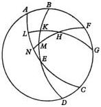

of latitude described by the daily rotation; it passes through their poles, of course, and under those circumstances the phenomena occur which I have already explained with regard to the meridian [II, 1, 3]. But in this instance we regard the day as extending from sunrise to sunset, and not in some way from daylight to darkness, as it is commonly understood, that is, from dawn to the first artificial light. But I shall say more about this subject in connection with the rising and setting of the zodiacal signs [II, 13].

On the other hand, where the earth's axis is perpendicular to the horizon, nothing rises and sets. On the contrary, everything revolves in a circle, perpetually visible or hidden. The exception is what is produced by another motion, such as the annual revolution around the sun. As a result of this it follows that under those conditions day lasts continuously for a period of six months, and night for the rest of the time. Nor is there any other difference than that between winter and summer, since in that situation the equator coincides with the horizon.

In the oblique sphere, however, certain bodies rise and set, while certain others are always visible or hidden. Meanwhile the days and nights become unequal. Under these circumstances the horizon, being oblique, is tangent to two parallels of latitude, according to the amount of its inclination. Of these two parallels, the one toward the visible pole is the boundary of the bodies which are perpetually visible; and the opposite parallel, the one toward the hidden pole, is the boundary of the bodies which are perpetually hidden. Extending throughout the entire latitude between these limits, therefore, the horizon divides all the intervening parallels of latitude into unequal arcs. The equator is an exception, since it is the greatest of the parallels of latitude, and great circles bisect each other. In the upper hemisphere, then, the horizon obliquely cuts off from the parallels of latitude greater arcs toward the visible pole than toward the southern and hidden pole. The converse is true in the hidden hemisphere. The apparent daily motion of the sun in these arcs produces the inequality of the days and nights.

## THE DIFFERENCES IN NOON SHADOWS

Chapter 6

In noon shadows too there are differences, on account of which some people are called periscian, others amphiscian, and still others heteroscian. Now the periscians are the people whom we may label "circumumbratile", since they receive the sun's shadow in all directions. And they are the people whose zenith, or pole of the horizon, is at a distance from the earth's pole which is smaller, or not greater, than the distance of a tropic from the equator. For in those regions the parallels of latitude to which the horizon is tangent are the boundaries of the perpetually visible or hidden stars, and are greater than the tropics, or equal to them. And therefore in the summer time the sun, high up among the perpetually visible stars, in that season casts the shadows of the sundials in all directions. But where the horizon is tangent to the tropics, these themselves become the boundaries of the perpetually visible and perpetually hidden stars. Therefore at the time of the solstice the sun is seen to graze the earth at midnight. At that moment the entire ecliptic coincides with the horizon, six zodiacal signs rise swiftly and simultaneously, the opposite signs in equal number set at the same time, and the pole of the ecliptic coincides with the pole of the horizon.

The amphiscians, whose noon shadows fall on both sides, are the people who live between the two tropics, in the region which the ancients call the middle zone. Throughout that whole area the ecliptic passes directly overhead twice [daily], as is demonstrated in Theorem II of Euclid's *Phenomena*. Hence in the same area the sundials' shadows vanish twice, and as the sun moves to either side, the sundials cast their shadows sometimes to the south, and at other times to the north.

We, the rest of the earth's inhabitants, who live between the amphiscians and the periscians, are the heteroscians, because we cast our noon shadows in only one of these directions, that is, the north.

Now the ancient mathematicians used to divide the earth into seven climes by means of the several parallels of latitude passing, for example, through Meroe, Syene, Alexandria, Rhodes, the Hellespont, the middle of the Black Sea, the Dnieper, Constantinople and so on. [These parallels were selected on a threefold basis:] the difference and increase in the length of the longest day [in the specified localities during the course of a year]; the length of the shadows observed by means of sundials at noon on the equinoctial days and the two solstices of the sun; and the altitude of the pole or the width of each clime. These quantities, having partly changed with time, are not exactly the same as they once were. The reason is, as I mentioned [II, 2], the variable obliquity of the ecliptic, which was overlooked by previous astronomers. Or, to speak more precisely, the reason is the variable inclination of the equator to the plane of the ecliptic. Those quantities depend on this inclination. But the altitudes of the pole, or the latitudes of the places, and the shadows on the equinoctial days agree with the recorded ancient observations. This had to happen, because the equator follows the pole of the terrestrial globe. Therefore those climes likewise are not drawn and bounded with sufficient precision by means of any impermanent properties of shadows and days. On the other hand, they are delimited more correctly by their distances from the equator, which remain the same forever. But that variation in the tropics, although it is quite small, in southern localities allows a slight difference of days and shadows, which becomes more perceptible to those who travel north.

Now so far as the shadows of sundials are concerned, then, for any given altitude of the sun obviously the length of the shadow is obtained, and conversely. Thus, let there be a sundial $AB$, which casts a shadow $BC$. Since the pointer is perpendicular to the plane of the horizon, it must always make $ABC$ a right angle, in accordance with the definition of lines perpendicular to a plane. Hence, if $AC$ is joined, we shall have the right triangle $ABC$, and for a given altitude of the sun, we shall have also angle $ACB$ given. In accordance with Theorem I on Plane Triangles, the ratio of the pointer $AB$ to its shadow $BC$ will be given, and $BC$ will be given as a length. In turn, when $AB$ and $BC$ are given, in accordance with Theorem III on Plane Triangles, angle $ACB$ and the altitude of the sun casting that shadow at the time will also be known. In this way, in their description of those climes of the terrestrial globe, the ancients assigned to each clime its own length of noon shadow, not only on the equinoctial days, but also on both solstitial days.

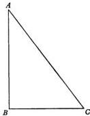

## HOW TO DERIVE FROM ONE ANOTHER Chapter 7
THE LONGEST DAY, THE DISTANCE BETWEEN
SUNRISES, AND THE INCLINATION OF THE SPHERE;
THE REMAINING DIFFERENCES BETWEEN DAYS

Thus also for any obliquity of the sphere or inclination of the horizon, I shall
simultaneously demonstrate the longest and shortest day as well as the distance
between sunrises, and the remaining difference between the days. Now the distance
between sunrises is the arc of the horizon intercepted between the sunrises at
the solstices, summer and winter, or the distance of both of them from the sunrise
at the equinox.

Then let ABCD be the meridian. In the eastern hemisphere let BED be the
semicircle of the horizon, and AEC the semicircle of the equator. Let the equator's
north pole be F. Assume that the sunrise at the summer solstice is in the point G.
Draw FGH as an arc of a great circle. Now since the rotation of the terrestrial
globe is accomplished around F, the pole of the equator, points G and H must
reach the meridian ABCD together. For, their parallels of latitude are drawn
around the same poles, and all great circles passing through these poles cut off
similar arcs of those parallels. Therefore the time elapsing from the rising at
G until noon is equally the measure of arc AEH, and of CH, the rest of the semicircle below the horizon, the time from midnight until sunrise. Now AEC is
a semicircle, while AE and EC are quadrants, being drawn from the pole of ABCD.
Consequently EH will be half of the difference between the longest day and the
equinoctial day, while EG will be the distance between the equinoctial and solstitial sunrises. In triangle EGH, therefore, GEH, the angle of the obliquity of the
sphere, is known through the arc AB. GHE is a right angle. Side GH also is known
as the distance of the summer solstice from the equator. Therefore, in accordance
with Theorem IV on Spherical Triangles, the remaining sides are also given:
EH, half of the difference between the equinoctial day and the longest day, as well
as GE, the distance between the sunrises. Furthermore if, together with side
GH, side EH, [half] the difference between the longest day and the equinocttial day, or EG is given, E, the angle of the inclination of the sphere, is given, and
therefore so is FD, the altitude of the pole above the horizon.

Next, assume that G on the ecliptic is not the solstice, but any other point.
Nevertheless, both of the arcs EG and EH will be known. For from the Table
of Declinations exhibited above, GH is obtained as the arc of declination corresponding to that degree of the ecliptic, and all the other quantities are found by
the same method of proof. Hence it also follows that the degrees of the ecliptic
which are equidistant from the solstice cut off the same arcs of the horizon from
the equinoctial sunrise, and in the same direction. They also make the days and
nights equal in length. This happens because the same parallel of latitude contains
both degrees of the ecliptic, since their declination is equal and in the same direction. However, when equal arcs are taken in both directions from the intersection
with the equator, the distances between the risings come out equal again, but in
opposite directions, and in the inverse order the lengths of the days and nights
are equal too, because on both sides they describe equal arcs of the parallels of
latitude, just as the points [on the ecliptic] equidistant from the equinox have
equal declinations from the equator.

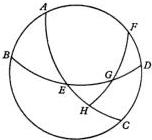

Now in the same diagram, draw arcs of parallels of latitude. Let them be GM and KN, intersecting the horizon BED in points G and K. From L, the south pole, also draw LKO as a quadrant of a great circle. Then the declination HG is equal to KO. Hence there will be two triangles, DFG and BLK, in which two sides are equal to two corresponding sides: FG to LK, and FD, the altitude of the pole, to LB. B and D are right angles. Therefore the third side, DG, is equal to the third side, BK. Their remainders, GE and EK, the distances between the risings, are also equal. Here too, then, two sides, EG and GH, are equal to two sides, EK and KO. The vertical angles at E are equal. Hence the remaining sides, EH and EO, are equal. When these equals are added to equals, as a sum the whole arc OEC is equal to the whole arc AEH. But since great circles drawn through the poles cut off similar arcs of parallel circles on spheres, GM and KN will also be similar and equal. Q.E.D.

However, all this can be demonstrated also in another way. Draw the meridian ABCD in the same way. Let its center be E. Let the diameter of the equator and its intersection with the meridian be AEC. Let the diameter of the horizon and the meridian line be BED; the axis of the sphere, LEM; the visible pole, L; and the hidden pole, M. Assume that the distance of the summer solstice or that any other declination is AF. At this declination draw FG as the diameter of a parallel of latitude and also as the parallel's intersection with the meridian. FG will intersect the axis at K, and the meridian line at N. Now according to Posidonius' definition, parallels neither converge nor diverge, but make the perpendicular lines between them everywhere equal. Therefore the straight line KE will be equal to half of the chord subtending twice the arc AF. Similarly, with reference to the parallel of latitude whose radius is FK, KN will be half of the chord subtending the arc marking the difference between the equinoctial day and the unequal day. The reason for this is that all the semicircles, of which these lines are the intersections, that is, of which they are the diameters, namely, BED of the oblique horizon, LEM of the right horizon, AEC of the equator, and FKG of the parallel of latitude, are perpendicular to the plane of the circle ABCD. And, in accordance with Euclid's Elements, XI, 19, the lines in which these semicircles intersect one another are perpendicular to the same plane at points E, K, and N. In accordance with Theorem 6 of the same Book, these perpendiculars are parallel to one another. K is the center of the parallel of latitude, and E is the center of the sphere. Therefore EN is half of the chord subtending twice the horizon arc marking the difference between sunrise on the parallel of latitude and the equinoctial sunrise. AF, the declination, is given, together with FL, the remainder of the quadrant. Hence KE and FK, as halves of the chords subtending twice the arcs AF and FL, will be known in units whereof AE is 100,000. But in the right triangle EKN, angle KEN is given through DL, the altitude of the pole; and KNE, the complementary angle, is equal to AEB, because as parallels of latitude on the oblique sphere they are equally inclined to the horizon. Therefore the sides are given in the same units whereof the radius of the sphere is 100,000. Now in units whereof FK, the radius of the parallel of latitude, is 100,000, KN also will be given. And as half of the chord subtending the entire difference between the equinoctial day and [the day pertaining to] the parallel of latitude, KN will be given in units whereof in like manner the parallel as a circle is 360. Hence the ratio of FK to KN clearly consists of two ratios, namely, the ratio of the chord subtending twice FL to the

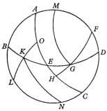

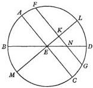

chord subtending twice $AF$, that is, $FK : KE$, and the ratio of the chord subtending twice $AB$ to the chord subtending twice $DL$. The latter ratio is equal to $EK : KN$, with $EK$ of course taken as the mean proportional between $FK$ and $KN$. Similarly the ratio of $BE$ to $EN$ is likewise formed by the ratios $BE : EK$ and $KE : EN$, as Ptolemy shows in greater detail by means of spherical segments [Syntaxis, I, 13]. In this way, I believe, the inequality of the days and nights is found. But also in the case of the moon and of whatever stars the declination is given, the segments of the parallels of latitude described by them in the daily rotation above the horizon are distinguished from the segments which are below the horizon. From these segments their risings and settings can easily be learned.

|  TABLE OF THE DIFFERENCE IN THE ASCENSIONS ON AN OBLIQUE SPHERE  |   |   |   |   |   |   |   |   |   |   |   |   |   |
| --- | --- | --- | --- | --- | --- | --- | --- | --- | --- | --- | --- | --- | --- |
|  Declination | Elevation of the Pole |   |   |   |   |   |   |   |   |   |   |   |   |
|   |  31 |   | 32 |   | 33 |   | 34 |   | 35 |   | 36 |   |   |
|  Degree | Degree | Minute | Degree | Minute | Degree | Minute | Degree | Minute | Degree | Minute | Degree | Minute |   |
|  1 | 0 | 36 | 0 | 37 | 0 | 39 | 0 | 40 | 0 | 42 | 0 | 44 |   |
|  2 | 1 | 12 | 1 | 15 | 1 | 18 | 1 | 21 | 1 | 24 | 1 | 27 |   |
|  3 | 1 | 48 | 1 | 53 | 1 | 57 | 2 | 2 | 2 | 6 | 2 | 11 |   |
|  4 | 2 | 24 | 2 | 30 | 2 | 36 | 2 | 42 | 2 | 48 | 2 | 55 |   |
|   | 3 | 1 | 3 | 8 | 3 | 15 | 3 | 23 | 3 | 31 | 3 | 39 |   |
|  6 | 3 | 37 | 3 | 46 | 3 | 55 | 4 | 4 | 4 | 13 | 4 | 23 |   |
|  7 | 4 | 14 | 4 | 24 | 4 | 34 | 4 | 45 | 4 | 56 | 5 | 7 |   |
|  8 | 4 | 51 | 5 | 2 | 5 | 14 | 5 | 26 | 5 | 39 | 5 | 52 |   |
|  9 | 5 | 28 | 5 | 41 | 5 | 54 | 6 | 8 | 6 | 22 | 6 | 36 |   |
|   | 6 | 5 | 6 | 20 | 6 | 35 | 6 | 50 | 7 | 6 | 7 | 22 |   |
|  11 | 6 | 42 | 6 | 59 | 7 | 15 | 7 | 32 | 7 | 49 | 8 | 7 |   |
|  12 | 7 | 20 | 7 | 38 | 7 | 56 | 8 | 15 | 8 | 34 | 8 | 53 |   |
|  13 | 7 | 58 | 8 | 18 | 8 | 37 | 8 | 58 | 9 | 18 | 9 | 39 |   |
|  14 | 8 | 37 | 8 | 58 | 9 | 19 | 9 | 41 | 10 | 3 | 10 | 26 |   |
|   | 9 | 16 | 9 | 38 | 10 | 1 | 10 | 25 | 10 | 49 | 11 | 14 |   |
|  16 | 9 | 55 | 10 | 19 | 10 | 44 | 11 | 9 | 11 | 35 | 12 | 2 |   |
|  17 | 10 | 35 | 11 | 1 | 11 | 27 | 11 | 54 | 12 | 22 | 12 | 50 |   |
|  18 | 11 | 16 | 11 | 43 | 12 | 11 | 12 | 40 | 13 | 9 | 13 | 39 |   |
|  19 | 11 | 56 | 12 | 25 | 12 | 55 | 13 | 26 | 13 | 57 | 14 | 29 |   |
|   | 12 | 38 | 13 | 9 | 13 | 40 | 14 | 13 | 14 | 46 | 15 | 20 |   |
|  21 | 13 | 20 | 13 | 53 | 14 | 26 | 15 | 0 | 15 | 36 | 16 | 12 |   |
|  22 | 14 | 3 | 14 | 37 | 15 | 13 | 15 | 49 | 16 | 27 | 17 | 5 |   |
|  23 | 14 | 47 | 15 | 23 | 16 | 0 | 16 | 38 | 17 | 17 | 17 | 58 |   |
|  24 | 15 | 31 | 16 | 9 | 16 | 48 | 17 | 29 | 18 | 10 | 18 | 52 |   |
|   | 16 | 16 | 16 | 56 | 17 | 38 | 18 | 20 | 19 | 3 | 19 | 48 |   |
|  26 | 17 | 2 | 17 | 45 | 18 | 28 | 19 | 12 | 19 | 58 | 20 | 45 |   |
|  27 | 17 | 50 | 18 | 34 | 19 | 19 | 20 | 6 | 20 | 54 | 21 | 44 |   |
|  28 | 18 | 38 | 19 | 24 | 20 | 12 | 21 | 1 | 21 | 51 | 22 | 43 |   |
|  29 | 19 | 27 | 20 | 16 | 21 | 6 | 21 | 57 | 22 | 50 | 23 | 45 |   |
|   | 20 | 18 | 21 | 9 | 22 | 1 | 22 | 55 | 23 | 51 | 24 | 48 |   |
|  31 | 21 | 10 | 22 | 3 | 22 | 58 | 23 | 55 | 24 | 53 | 25 | 53 |   |
|  32 | 22 | 3 | 22 | 59 | 23 | 56 | 24 | 56 | 25 | 57 | 27 | 0 |   |
|  33 | 22 | 57 | 23 | 54 | 24 | 19 | 25 | 59 | 27 | 3 | 28 | 9 |   |
|  34 | 23 | 55 | 24 | 56 | 25 | 59 | 27 | 4 | 28 | 10 | 29 | 21 |   |
|   | 24 | 53 | 25 | 57 | 27 | 3 | 28 | 10 | 29 | 21 | 30 | 35 |   |
|  36 | 25 | 53 | 27 | 0 | 28 | 9 | 29 | 21 | 30 | 35 | 31 | 52 |   |

|  TABLE OF THE DIFFERENCE IN THE ASCENSIONS ON AN OBLIQUE SPHERE  |   |   |   |   |   |   |   |   |   |   |   |   |
| --- | --- | --- | --- | --- | --- | --- | --- | --- | --- | --- | --- | --- |
|  Declination | Elevation of the Pole  |   |   |   |   |   |   |   |   |   |   |   |
|   |  37 |   | 38 |   | 39 |   | 40 |   | 41 |   | 42  |   |
|  Degree | Degree | Minute | Degree | Minute | Degree | Minute | Degree | Minute | Degree | Minute | Degree | Minute  |
|  1 | 0 | 45 | 0 | 47 | 0 | 49 | 0 | 50 | 0 | 52 | 0 | 54  |
|  2 | 1 | 31 | 1 | 34 | 1 | 37 | 1 | 41 | 1 | 44 | 1 | 48  |
|  3 | 2 | 16 | 2 | 21 | 2 | 26 | 2 | 31 | 2 | 37 | 2 | 42  |
|  4 | 3 | 1 | 3 | 8 | 3 | 15 | 3 | 22 | 3 | 29 | 3 | 37  |
|   | 3 | 47 | 3 | 55 | 4 | 4 | 4 | 13 | 4 | 22 | 4 | 31  |
|  6 | 4 | 33 | 4 | 43 | 4 | 53 | 5 | 4 | 5 | 15 | 5 | 26  |
|  7 | 5 | 19 | 5 | 30 | 5 | 42 | 5 | 55 | 6 | 8 | 6 | 21  |
|  8 | 6 | 5 | 6 | 18 | 6 | 32 | 6 | 46 | 7 | 1 | 7 | 16  |
|  9 | 6 | 51 | 7 | 6 | 7 | 22 | 7 | 38 | 7 | 55 | 8 | 12  |
|   | 7 | 38 | 7 | 55 | 8 | 13 | 8 | 30 | 8 | 49 | 9 | 8  |
|  11 | 8 | 25 | 8 | 44 | 9 | 3 | 9 | 23 | 9 | 44 | 10 | 5  |
|  12 | 9 | 13 | 9 | 34 | 9 | 55 | 10 | 16 | 10 | 39 | 11 | 2  |
|  13 | 10 | 1 | 10 | 24 | 10 | 46 | 11 | 10 | 11 | 35 | 12 | 0  |
|  14 | 10 | 50 | 11 | 14 | 11 | 39 | 12 | 5 | 12 | 31 | 12 | 58  |
|   | 11 | 39 | 12 | 5 | 12 | 32 | 13 | 0 | 13 | 28 | 13 | 58  |
|  16 | 12 | 29 | 12 | 57 | 13 | 26 | 13 | 55 | 14 | 26 | 14 | 58  |
|  17 | 13 | 19 | 13 | 49 | 14 | 20 | 14 | 52 | 15 | 25 | 15 | 59  |
|  18 | 14 | 10 | 14 | 42 | 15 | 15 | 15 | 49 | 16 | 24 | 17 | 1  |
|  19 | 15 | 2 | 15 | 36 | 16 | 11 | 16 | 48 | 17 | 25 | 18 | 4  |
|   | 15 | 55 | 16 | 31 | 17 | 8 | 17 | 47 | 18 | 27 | 19 | 8  |
|  21 | 16 | 49 | 17 | 27 | 18 | 7 | 18 | 47 | 19 | 30 | 20 | 13  |
|  22 | 17 | 44 | 18 | 24 | 19 | 6 | 19 | 49 | 20 | 34 | 21 | 20  |
|  23 | 18 | 39 | 19 | 22 | 20 | 6 | 20 | 52 | 21 | 39 | 22 | 28  |
|  24 | 19 | 36 | 20 | 21 | 21 | 8 | 21 | 56 | 22 | 46 | 23 | 38  |
|   | 20 | 34 | 21 | 21 | 22 | 11 | 23 | 2 | 23 | 55 | 24 | 50  |
|  26 | 21 | 34 | 22 | 24 | 23 | 16 | 24 | 10 | 25 | 5 | 26 | 3  |
|  27 | 22 | 35 | 23 | 28 | 24 | 22 | 25 | 19 | 26 | 17 | 27 | 18  |
|  28 | 23 | 37 | 24 | 33 | 25 | 30 | 26 | 30 | 27 | 31 | 28 | 36  |
|  29 | 24 | 41 | 25 | 40 | 26 | 40 | 27 | 43 | 28 | 48 | 29 | 57  |
|   | 25 | 47 | 26 | 49 | 27 | 52 | 28 | 59 | 30 | 7 | 31 | 19  |
|  31 | 26 | 55 | 28 | 0 | 29 | 7 | 30 | 17 | 31 | 29 | 32 | 45  |
|  32 | 28 | 5 | 29 | 13 | 30 | 54 | 31 | 31 | 32 | 54 | 34 | 14  |
|  33 | 29 | 18 | 30 | 29 | 31 | 44 | 33 | 1 | 34 | 22 | 35 | 47  |
|  34 | 30 | 32 | 31 | 48 | 33 | 6 | 34 | 27 | 35 | 54 | 37 | 24  |
|   | 31 | 51 | 33 | 10 | 34 | 33 | 35 | 59 | 37 | 30 | 39 | 5  |
|  36 | 33 | 12 | 34 | 35 | 36 | 2 | 37 | 34 | 39 | 10 | 40 | 51  |

|  TABLE OF THE DIFFERENCE IN THE ASCENSIONS ON AN OBLIQUE SPHERE  |   |   |   |   |   |   |   |   |   |   |   |   |   |
| --- | --- | --- | --- | --- | --- | --- | --- | --- | --- | --- | --- | --- | --- |
|  Declination | Elevation of the Pole |   |   |   |   |   |   |   |   |   |   |   |   |
|   |  43 |   | 44 |   | 45 |   | 46 |   | 47 |   | 48 |   |   |
|  Degree | Degree | Minute | Degree | Minute | Degree | Minute | Degree | Minute | Degree | Minute | Degree | Minute |   |
|  1 | 0 | 56 | 0 | 58 | 1 | 0 | 1 | 2 | 1 | 4 | 1 | 7 |   |
|  2 | 1 | 52 | 1 | 56 | 2 | 0 | 2 | 4 | 2 | 9 | 2 | 13 |   |
|  3 | 2 | 48 | 2 | 54 | 3 | 0 | 3 | 7 | 3 | 13 | 3 | 20 |   |
|  4 | 3 | 44 | 3 | 52 | 4 | 1 | 4 | 9 | 4 | 18 | 4 | 27 |   |
|   | 4 | 41 | 4 | 51 | 5 | 1 | 5 | 12 | 5 | 23 | 5 | 35 |   |
|  6 | 5 | 37 | 5 | 50 | 6 | 2 | 6 | 15 | 6 | 28 | 6 | 42 |   |
|  7 | 6 | 34 | 6 | 49 | 7 | 3 | 7 | 18 | 7 | 34 | 7 | 50 |   |
|  8 | 7 | 32 | 7 | 48 | 8 | 5 | 8 | 22 | 8 | 40 | 8 | 59 |   |
|  9 | 8 | 30 | 8 | 48 | 9 | 7 | 9 | 26 | 9 | 47 | 10 | 8 |   |
|   | 9 | 28 | 9 | 48 | 10 | 9 | 10 | 31 | 10 | 54 | 11 | 18 |   |
|  11 | 10 | 27 | 10 | 49 | 11 | 13 | 11 | 37 | 12 | 2 | 12 | 28 |   |
|  12 | 11 | 26 | 11 | 51 | 12 | 16 | 12 | 43 | 13 | 11 | 13 | 39 |   |
|  13 | 12 | 26 | 12 | 53 | 13 | 21 | 13 | 50 | 14 | 20 | 14 | 51 |   |
|  14 | 13 | 27 | 13 | 56 | 14 | 26 | 14 | 58 | 15 | 30 | 16 | 5 |   |
|   | 14 | 28 | 15 | 0 | 15 | 32 | 16 | 7 | 16 | 42 | 17 | 19 |   |
|  16 | 15 | 31 | 16 | 5 | 16 | 40 | 17 | 16 | 17 | 54 | 18 | 34 |   |
|  17 | 16 | 34 | 17 | 10 | 17 | 48 | 18 | 27 | 19 | 8 | 19 | 51 |   |
|  18 | 17 | 38 | 18 | 17 | 18 | 58 | 19 | 40 | 20 | 23 | 21 | 9 |   |
|  19 | 18 | 44 | 19 | 25 | 20 | 9 | 20 | 53 | 21 | 40 | 22 | 29 |   |
|   | 19 | 50 | 20 | 35 | 21 | 21 | 22 | 8 | 22 | 58 | 23 | 51 |   |
|  21 | 20 | 59 | 21 | 46 | 22 | 34 | 23 | 25 | 24 | 18 | 25 | 14 |   |
|  22 | 22 | 8 | 22 | 58 | 23 | 50 | 24 | 44 | 25 | 40 | 26 | 40 |   |
|  23 | 23 | 19 | 24 | 12 | 25 | 7 | 26 | 5 | 27 | 5 | 28 | 8 |   |
|  24 | 24 | 32 | 25 | 28 | 26 | 26 | 27 | 27 | 28 | 31 | 29 | 38 |   |
|   | 25 | 47 | 26 | 46 | 27 | 48 | 28 | 52 | 30 | 0 | 31 | 12 |   |
|  26 | 27 | 3 | 28 | 6 | 29 | 11 | 30 | 20 | 31 | 32 | 32 | 48 |   |
|  27 | 28 | 22 | 29 | 29 | 30 | 38 | 31 | 51 | 33 | 7 | 34 | 28 |   |
|  28 | 29 | 44 | 30 | 54 | 32 | 7 | 33 | 25 | 34 | 46 | 36 | 12 |   |
|  29 | 31 | 8 | 32 | 22 | 33 | 40 | 35 | 2 | 36 | 28 | 38 | 0 |   |
|   | 32 | 35 | 33 | 53 | 35 | 16 | 36 | 43 | 38 | 15 | 39 | 53 |   |
|  31 | 34 | 5 | 35 | 28 | 36 | 56 | 38 | 29 | 40 | 7 | 41 | 52 |   |
|  32 | 35 | 38 | 37 | 7 | 38 | 40 | 40 | 19 | 42 | 4 | 43 | 57 |   |
|  33 | 37 | 16 | 38 | 50 | 40 | 30 | 42 | 15 | 44 | 8 | 46 | 9 |   |
|  34 | 38 | 58 | 40 | 39 | 42 | 25 | 44 | 18 | 46 | 20 | 48 | 31 |   |
|   | 40 | 46 | 42 | 33 | 44 | 27 | 46 | 23 | 48 | 36 | 51 | 3 |   |
|  36 | 42 | 39 | 44 | 33 | 46 | 36 | 48 | 47 | 51 | 11 | 53 | 47 |   |

|  TABLE OF THE DIFFERENCE IN THE ASCENSIONS ON AN OBLIQUE SPHERE  |   |   |   |   |   |   |   |   |   |   |   |   |   |
| --- | --- | --- | --- | --- | --- | --- | --- | --- | --- | --- | --- | --- | --- |
|  Declination | Elevation of the Pole  |   |   |   |   |   |   |   |   |   |   |   |   |
|   |  49 |   | 50 |   | 51 |   | 52 |   | 53 |   | 54 |   |   |
|  Degree | Degree | Minute | Degree | Minute | Degree | Minute | Degree | Minute | Degree | Minute | Degree | Minute | 5  |
|  1 | 1 | 9 | 1 | 12 | 1 | 14 | 1 | 17 | 1 | 20 | 1 | 23 |   |
|  2 | 2 | 18 | 2 | 23 | 2 | 28 | 2 | 34 | 2 | 39 | 2 | 45 |   |
|  3 | 3 | 27 | 3 | 35 | 3 | 43 | 3 | 51 | 3 | 59 | 4 | 8 |   |
|  4 | 4 | 37 | 4 | 47 | 4 | 57 | 5 | 8 | 5 | 19 | 5 | 31 |   |
|   | 5 | 47 | 5 | 50 | 6 | 12 | 6 | 26 | 6 | 40 | 6 | 55 | 10  |
|  6 | 6 | 57 | 7 | 12 | 7 | 27 | 7 | 44 | 8 | 1 | 8 | 19 |   |
|  7 | 8 | 7 | 8 | 25 | 8 | 43 | 9 | 2 | 9 | 23 | 9 | 44 |   |
|  8 | 9 | 18 | 9 | 38 | 10 | 0 | 10 | 22 | 10 | 45 | 11 | 9 |   |
|  9 | 10 | 30 | 10 | 53 | 11 | 17 | 11 | 42 | 12 | 8 | 12 | 35 |   |
|   | 11 | 42 | 12 | 8 | 12 | 35 | 13 | 3 | 13 | 32 | 14 | 3 | 15  |
|  11 | 12 | 55 | 13 | 24 | 13 | 53 | 14 | 24 | 14 | 57 | 15 | 31 |   |
|  12 | 14 | 9 | 14 | 40 | 15 | 13 | 15 | 47 | 16 | 23 | 17 | 0 |   |
|  13 | 15 | 24 | 15 | 58 | 16 | 34 | 17 | 11 | 17 | 50 | 18 | 32 |   |
|  14 | 16 | 40 | 17 | 17 | 17 | 56 | 18 | 37 | 19 | 19 | 20 | 4 |   |
|   | 17 | 57 | 18 | 39 | 19 | 19 | 20 | 4 | 20 | 50 | 21 | 38 | 20  |
|  16 | 19 | 16 | 19 | 59 | 20 | 44 | 21 | 32 | 22 | 22 | 23 | 15 |   |
|  17 | 20 | 36 | 21 | 22 | 22 | 11 | 23 | 2 | 23 | 56 | 24 | 53 |   |
|  18 | 21 | 57 | 22 | 47 | 23 | 39 | 24 | 34 | 25 | 33 | 26 | 34 |   |
|  19 | 23 | 20 | 24 | 14 | 25 | 10 | 26 | 9 | 27 | 11 | 28 | 17 |   |
|   | 24 | 45 | 25 | 42 | 26 | 43 | 27 | 46 | 28 | 53 | 30 | 4 | 25  |
|  21 | 26 | 12 | 27 | 14 | 28 | 18 | 29 | 26 | 30 | 37 | 31 | 54 |   |
|  22 | 27 | 42 | 28 | 47 | 29 | 56 | 31 | 8 | 32 | 25 | 33 | 47 |   |
|  23 | 29 | 14 | 30 | 23 | 31 | 37 | 32 | 54 | 34 | 17 | 35 | 45 |   |
|  24 | 31 | 4 | 32 | 3 | 33 | 21 | 34 | 44 | 36 | 13 | 37 | 48 |   |
|   | 32 | 26 | 33 | 46 | 35 | 10 | 36 | 39 | 38 | 14 | 39 | 59 | 30  |
|  26 | 34 | 8 | 35 | 32 | 37 | 2 | 38 | 38 | 40 | 20 | 42 | 10 |   |
|  27 | 35 | 53 | 37 | 23 | 39 | 0 | 40 | 42 | 42 | 33 | 44 | 32 |   |
|  28 | 37 | 43 | 39 | 19 | 41 | 2 | 42 | 53 | 44 | 53 | 47 | 2 |   |
|  29 | 39 | 37 | 41 | 21 | 43 | 12 | 45 | 12 | 47 | 21 | 49 | 44 |   |
|   | 41 | 37 | 43 | 29 | 45 | 29 | 47 | 39 | 50 | 1 | 52 | 37 | 35  |
|  31 | 43 | 44 | 45 | 44 | 47 | 54 | 50 | 16 | 52 | 53 | 55 | 48 |   |
|  32 | 45 | 57 | 48 | 8 | 50 | 30 | 53 | 7 | 56 | 1 | 59 | 19 |   |
|  33 | 48 | 19 | 50 | 44 | 53 | 20 | 56 | 13 | 59 | 28 | 63 | 21 |   |
|  34 | 50 | 54 | 53 | 30 | 56 | 20 | 59 | 42 | 63 | 31 | 68 | 11 |   |
|   | 53 | 40 | 56 | 34 | 59 | 58 | 63 | 40 | 68 | 18 | 74 | 32 | 40  |
|  36 | 56 | 42 | 59 | 59 | 63 | 47 | 68 | 26 | 74 | 36 | 90 | 0 |   |

|  TABLE OF THE DIFFERENCE IN THE ASCENSIONS ON AN OBLIQUE SPHERE  |   |   |   |   |   |   |   |   |   |   |   |   |   |
| --- | --- | --- | --- | --- | --- | --- | --- | --- | --- | --- | --- | --- | --- |
|  Declination | Elevation of the Pole |   |   |   |   |   |   |   |   |   |   |   |   |
|   |  55 |   | 56 |   | 57 |   | 58 |   | 59 |   | 60 |   |   |
|  Degree | Degree | Minute | Degree | Minute | Degree | Minute | Degree | Minute | Degree | Minute | Degree | Minute |   |
|  1 | 1 | 26 | 1 | 29 | 1 | 32 | 1 | 36 | 1 | 40 | 1 | 44 |   |
|  2 | 2 | 52 | 2 | 58 | 3 | 5 | 3 | 12 | 3 | 20 | 3 | 28 |   |
|  3 | 4 | 17 | 4 | 27 | 4 | 38 | 4 | 49 | 5 | 0 | 5 | 12 |   |
|  4 | 5 | 44 | 5 | 57 | 6 | 11 | 6 | 25 | 6 | 41 | 6 | 57 |   |
|   | 7 | 11 | 7 | 27 | 7 | 44 | 8 | 3 | 8 | 22 | 8 | 43 |   |
|  6 | 8 | 38 | 8 | 58 | 9 | 19 | 9 | 41 | 10 | 4 | 10 | 29 |   |
|  7 | 10 | 6 | 10 | 29 | 10 | 54 | 11 | 20 | 11 | 47 | 12 | 17 |   |
|  8 | 11 | 35 | 12 | 1 | 12 | 30 | 13 | 0 | 13 | 32 | 14 | 5 |   |
|  9 | 13 | 4 | 13 | 35 | 14 | 7 | 14 | 41 | 15 | 17 | 15 | 55 |   |
|   | 14 | 35 | 15 | 9 | 15 | 45 | 16 | 23 | 17 | 4 | 17 | 47 |   |
|  11 | 16 | 7 | 16 | 45 | 17 | 25 | 18 | 8 | 18 | 53 | 19 | 41 |   |
|  12 | 17 | 40 | 18 | 22 | 19 | 6 | 19 | 53 | 20 | 43 | 21 | 36 |   |
|  13 | 19 | 15 | 20 | 1 | 20 | 50 | 21 | 41 | 22 | 36 | 23 | 34 |   |
|  14 | 20 | 52 | 21 | 42 | 22 | 35 | 23 | 31 | 24 | 31 | 25 | 35 |   |
|   | 22 | 30 | 23 | 24 | 24 | 22 | 25 | 23 | 26 | 29 | 27 | 39 |   |
|  16 | 24 | 10 | 25 | 9 | 26 | 12 | 27 | 19 | 28 | 30 | 29 | 47 |   |
|  17 | 25 | 53 | 26 | 57 | 28 | 5 | 29 | 18 | 30 | 35 | 31 | 59 |   |
|  18 | 27 | 39 | 28 | 48 | 30 | 1 | 31 | 20 | 32 | 44 | 34 | 19 |   |
|  19 | 29 | 27 | 30 | 41 | 32 | 1 | 33 | 26 | 34 | 58 | 36 | 37 |   |
|   | 31 | 19 | 32 | 39 | 34 | 5 | 35 | 37 | 37 | 17 | 39 | 5 |   |
|  21 | 33 | 15 | 34 | 41 | 36 | 14 | 37 | 54 | 39 | 42 | 41 | 40 |   |
|  22 | 35 | 14 | 36 | 48 | 38 | 28 | 40 | 17 | 42 | 15 | 44 | 25 |   |
|  23 | 37 | 19 | 39 | 0 | 40 | 49 | 42 | 47 | 44 | 57 | 47 | 20 |   |
|  24 | 39 | 29 | 41 | 18 | 43 | 17 | 45 | 26 | 47 | 49 | 50 | 27 |   |
|   | 41 | 45 | 43 | 44 | 45 | 54 | 48 | 16 | 50 | 54 | 53 | 52 |   |
|  26 | 44 | 9 | 46 | 18 | 48 | 41 | 51 | 19 | 54 | 16 | 57 | 39 |   |
|  27 | 46 | 41 | 49 | 4 | 51 | 41 | 54 | 38 | 58 | 0 | 61 | 57 |   |
|  28 | 49 | 24 | 52 | 1 | 54 | 58 | 58 | 19 | 62 | 14 | 67 | 4 |   |
|  29 | 52 | 20 | 55 | 16 | 58 | 36 | 62 | 31 | 67 | 18 | 73 | 46 |   |
|   | 55 | 32 | 58 | 52 | 62 | 45 | 67 | 31 | 73 | 55 | 90 | 0 |   |
|  31 | 59 | 6 | 62 | 58 | 67 | 42 | 74 | 4 | 90 | 0 |  |  |   |
|  32 | 63 | 10 | 67 | 53 | 74 | 12 | 90 | 0 |  |  |  |  |   |
|  33 | 68 | 1 | 74 | 19 | 90 | 0 |  |  |  |  |  |  |   |
|  34 | 74 | 33 | 90 | 0 |  |  |  |  |  |  |  |  |   |
|   | 90 | 0 |  |  |  |  |  |  |  |  |  |  |   |
|  36 |  |  |  |  |  |  |  |  |  |  |  |  |   |
|  The vacant spaces here belong to stars which neither rise nor set.  |   |   |   |   |   |   |   |   |   |   |   |   |   |

## THE HOURS AND PARTS OF THE DAY AND NIGHT

Chapter 8

From the foregoing, therefore, it is clear that, for a stated altitude of the pole, we may take the difference in the days as indicated for a declination of the sun in the Table. This difference may be added to a quadrant in the case of a northern declination, or subtracted from it in the case of a southern declination. If the result is doubled, we shall have the length of that day, and the duration of the night, which is the rest of the circle.

If either of these two is divided by 15 degrees of the equator, the quotient will show how many equal hours it contains. But if we take the twelfth part, we shall have the duration of a seasonal hour. Now these hours take the name of their day, of which they are always the twelfth part. Hence the terms "summer solstitial, equinoctial, and winter solstitial hours" are found employed by the ancients. Nor were any other hours originally in use than the twelve hours from dawn to dusk. But they used to divide the night into four vigils or watches. This regulation of the hours lasted for a long time by the unspoken agreement of all nations. For the purpose of this regulation, water-clocks were invented. By the subtraction from and addition to the water dripped from these clocks, the hours were adjusted to the difference in the days, so that the subdivision of time would not be obscured even by a cloudy sky. Afterwards, equal hours, common to day-time and nighttime, were generally adopted. Since these equal hours are easier to observe, the seasonal hours became obsolete. Hence, if you ask any ordinary person which is the first, third, sixth, ninth or eleventh hour of the day, he has no answer or at any rate his answer has no relevance to the subject. Also with regard to the numbering of the equal hours, some now take it from noon, others from sunset, others from midnight, and still others from sunrise, in accordance with the decision of each society.

## THE OBLIQUE ASCENSION OF THE DEGREES OF THE ECLIPTIC; HOW TO DETERMINE WHAT DEGREE IS AT MID-HEAVEN WHEN ANY DEGREE IS RISING

Now that I have thus explained the lengths of the days and nights as well as the difference in those lengths, the next topic in proper order is the oblique ascensions. I refer to the times during which the dodecatemories, that is, the twelve zodiacal signs, or any other arcs of the zodiac, rise. For, between right ascensions and oblique ascensions, there are no differences other than those which I set forth between the equinoctial day and a day which is unequal to its night in length. Now the names of living things have been borrowed for the zodiacal signs, which consist of immovable stars. Starting from the vernal equinox, the signs have been called Ram, Bull, Twins, Crab, and so on, as they follow in order.

For the sake of greater clarity, then, again draw the meridian $ABCD$. Let $ABC$, the semicircle of the equator, and the horizon $BED$ intersect each other in the point $E$. Put the equinox in $H$. Let the ecliptic $FHI$, passing through $H$, intersect the horizon in $L$. Through this intersection draw $KLM$, the quadrant of a great circle, from $K$, the pole of the equator. Thus it is certainly clear that arc

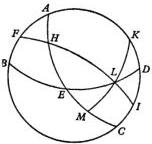

$HL$ of the ecliptic rises with $HE$ of the equator. But in the right sphere, $HL$ rose with $HEM$. The difference between them is $EM$ which, as I showed above [II, 7], is half of [the difference between] the equinoctial day and the unequal day. But what was added there in a northern declination, is subtracted here. In a southern declination, on the other hand, it is added to the right ascension in order to obtain the oblique ascension. Accordingly, how long a whole sign, or other arc of the ecliptic, takes to rise will be made clear by the ascensions computed from the beginning [of the sign or arc] to its end.

Hence it follows that when any degree of the ecliptic, measured from the equinox, is given as rising, the degree which is at mid-heaven is also given. For, $L$ [being the point which is] rising [on the ecliptic], given its declination through $HL$, its distance from the equinox, its right ascension $HEM$, and the whole of $AHEM$ as the arc of the half-day, then the remainder, $AH$, is given. This is the right ascension of $FH$, which is given by the Table, or also because $AHF$, the angle of the obliquity, is given, together with the side $AH$, while $FAH$ is a right angle. Therefore the whole arc $FHL$ of the ecliptic is given between the degree of rising and the degree at mid-heaven.

Conversely, if the degree at mid-heaven, for instance, the arc $FH$, is given first, we shall also know the degree which is rising. For, the declination $AF$ will be obtained, and so will $AFB$, through the angle of obliquity of the sphere, and the remainder $FB$. Now in triangle $BFL$, angle $BFL$ is given by what precedes; so is side $FB$; and $FBL$ is a right angle. Therefore the required side $FHL$ is given. An alternative method of obtaining it will appear below [II, 10].

## THE ANGLE AT WHICH THE ECLIPTIC INTERSECTS THE HORIZON

Chapter 10

Furthermore, since the ecliptic is a circle oblique to the axis of the sphere, it makes various angles with the horizon. It is perpendicular to the horizon twice for those who live between the tropics, as I have already said with regard to the differences in the shadows [II, 6]. However, I think that it is enough for us to demonstrate only those angles which concern us who live in the heteroscian region. From these angles, the entire theory of the angles will be easily understood. Now in the oblique sphere, when the equinox or first point of the Ram is rising, the ecliptic is lower and turns toward the horizon to the extent added by the greatest southward declination, which occurs when the first point of the Goat is at mid-heaven. Conversely, at a higher altitude the ecliptic makes the angle of rising greater when the first point of the Balance rises, and the first point of the Crab is at mid-heaven. The foregoing statements are quite obvious, I believe. For, these three circles, the equator, ecliptic, and horizon, by passing through the same intersection, meet in the poles of the meridian. The arcs of the meridian intercepted by these circles show how great the angle of rising is judged to be.

But a way of measuring it also for the other degrees of the ecliptic may be explained. Again let the meridian be $ABCD$, half of the horizon $BED$, and half of the ecliptic $AEC$. Let any degree of the ecliptic rise at $E$. We are required to find how great the angle $AEB$ is in units whereof 4 right angles = $360^\circ$. Since $E$ is given as the rising degree, the degree at mid-heaven is also given by the previous discussion, as is also the arc $AE$ together with the meridian altitude $AB$.

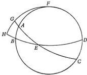

Because $ABE$ is a right angle, the ratio of the chord subtending twice $AE$ to the chord subtending twice $AB$ is given as equal to the ratio of the diameter of the sphere to the chord subtending twice the arc which measures the angle $AEB$. Therefore the angle $AEB$ also is given.

However, the given degree may be, not at the rising, but at mid-heaven. Let it be $A$. Nevertheless the angle of rising will be measured. For, with its pole at $E$, draw $FGH$ as the quadrant of a great circle. Complete the quadrants $EAG$ and $EBH$. Now $AB$, the altitude of the meridian, is given, and so is $AF$, the remainder of the quadrant. Angle $FAG$ is also given by the foregoing, and $FGA$ is a right angle. Therefore the arc $FG$ is given. So is the remainder $GH$, which measures the required angle of rising. Here too, then, it is clear how, given the degree at mid-heaven, the degree at the rising is given. For, the ratio of the chord subtending twice $GH$ to the chord subtending twice $AB$ is equal to the ratio of the diameter to the chord subtending twice $AE$, as in Spherical Triangles [I, 14, Theorem III].

For these relations too I have subjoined three kinds of Tables. The first will give the ascensions in the right sphere, beginning with the Ram, and advancing by $6^{\circ}$ of the ecliptic. The second will give the ascensions in the oblique sphere, likewise in steps of $6^{\circ}$, from the parallel of latitude whose pole's altitude is $39^{\circ}$, by half-steps of $3^{\circ}$, to the parallel with its pole at $57^{\circ}$. The remaining Table will give the angles made with the horizon, also by steps of $6^{\circ}$, in the same $7$ columns. All these computations are based on the minimum obliquity of the ecliptic, $23^{\circ} 28'$, which is approximately correct for our age.

## TABLE OF THE ASCENSIONS OF THE ZODIACAL SIGNS IN THE REVOLUTION OF THE RIGHT SPHERE

|   | Ecliptic |   | Ascension |   | For a Single Degree |   |  | Ecliptic |   | Ascension |   | For a Single Degree  |   |
| --- | --- | --- | --- | --- | --- | --- | --- | --- | --- | --- | --- | --- | --- |
|   |  Sign | Degree | Degree | Minute | Degree | Minute |   | Sign | Degree | Degree | Minute | Degree | Minute  |
|   | ♂ | 6 | 5 | 30 | 0 | 55 |  | ≡ | 6 | 185 | 30 | 0 | 55  |
|   |   |  12 | 11 | 0 | 0 | 55 |   |   | 12 | 191 | 0 | 0 | 55  |
|   |   |  18 | 16 | 34 | 0 | 56 |   |   | 18 | 196 | 34 | 0 | 56  |
|   |   |  24 | 22 | 10 | 0 | 56 |   |   | 24 | 202 | 10 | 0 | 56  |
|   | ♂ | 30 | 27 | 54 | 0 | 57 |  | π | 30 | 207 | 54 | 0 | 57  |
|   |   |  6 | 33 | 43 | 0 | 58 |   |   | 6 | 213 | 43 | 0 | 58  |
|   |   |  12 | 39 | 35 | 0 | 59 |   |   | 12 | 219 | 35 | 0 | 59  |
|   |   |  18 | 45 | 32 | 1 | 0 |   |   | 18 | 225 | 32 | 1 | 0  |
|   | ♂ | 24 | 51 | 37 | 1 | 1 |  | × | 24 | 231 | 37 | 1 | 1  |
|   |   |  30 | 57 | 48 | 1 | 2 |   |   | 30 | 237 | 48 | 1 | 2  |
|   |   |  6 | 64 | 6 | 1 | 3 |   |   | 6 | 244 | 6 | 1 | 3  |
|   |   |  12 | 70 | 29 | 1 | 4 |   |   | 12 | 250 | 29 | 1 | 4  |
|   | ♂ | 18 | 76 | 57 | 1 | 5 |  |  | 18 | 256 | 57 | 1 | 5  |
|   |   |  24 | 83 | 27 | 1 | 5 |   |   | 24 | 263 | 27 | 1 | 5  |
|   |   |  30 | 90 | 0 | 1 | 5 |   |   | 30 | 270 | 0 | 1 | 5  |
|   |   |  6 | 96 | 33 | 1 | 5 |   |   | 6 | 276 | 33 | 1 | 5  |
|   | ♂ | 12 | 103 | 3 | 1 | 5 |  |  | 12 | 283 | 3 | 1 | 5  |
|   |   |  18 | 109 | 31 | 1 | 5 |   |   | 18 | 289 | 31 | 1 | 5  |
|   |   |  24 | 115 | 54 | 1 | 4 |   |   | 24 | 295 | 54 | 1 | 4  |
|   |   |  30 | 122 | 12 | 1 | 3 |   |   | 30 | 302 | 12 | 1 | 3  |
|   | ♂ | 6 | 128 | 23 | 1 | 2 |  | ≡ | 6 | 308 | 23 | 1 | 2  |
|   |   |  12 | 134 | 28 | 1 | 1 |   |   | 12 | 314 | 28 | 1 | 1  |
|   |   |  18 | 140 | 25 | 1 | 0 |   |   | 18 | 320 | 25 | 1 | 0  |
|   |   |  24 | 146 | 17 | 0 | 59 |   |   | 24 | 326 | 17 | 0 | 59  |
|   | ♂ | 30 | 152 | 6 | 0 | 58 |  | × | 30 | 332 | 6 | 0 | 58  |
|   |   |  6 | 157 | 50 | 0 | 57 |   |   | 6 | 337 | 50 | 0 | 57  |
|   |   |  12 | 163 | 26 | 0 | 56 |   |   | 12 | 343 | 26 | 0 | 56  |
|   |   |  18 | 169 | 0 | 0 | 56 |   |   | 18 | 349 | 0 | 0 | 56  |
|   | ♂ | 24 | 174 | 30 | 0 | 55 |  |  | 24 | 354 | 30 | 0 | 55  |
|   |   |  30 | 180 | 0 | 0 | 55 |   |   | 30 | 360 | 0 | 0 | 55  |

TABLE OF THE ASCENSIONS IN THE OBLIQUE SPHERE

|  Ecliptic | Altitude of the Pole  |   |   |   |   |   |   |   |   |   |   |   |   |   |   |
| --- | --- | --- | --- | --- | --- | --- | --- | --- | --- | --- | --- | --- | --- | --- | --- |
|   |   |  39 |   | 42 |   | 45 |   | 48 |   | 51 |   | 54 |   | 57  |   |
|   |   |  Ascension |   | Ascension |   | Ascension |   | Ascension |   | Ascension |   | Ascension |   | Ascension  |   |
|  Sign | Degree | Degree | Minute | Degree | Minute | Degree | Minute | Degree | Minute | Degree | Minute | Degree | Minute | Degree | Minute  |
|  ♂ | 6 | 3 | 34 | 3 | 20 | 3 | 6 | 2 | 50 | 2 | 32 | 2 | 12 | 1 | 49  |
|   |  12 | 7 | 10 | 6 | 44 | 6 | 15 | 5 | 44 | 5 | 8 | 4 | 27 | 3 | 40  |
|   |  18 | 10 | 50 | 10 | 10 | 9 | 27 | 8 | 39 | 7 | 47 | 6 | 44 | 5 | 34  |
|   |  24 | 14 | 32 | 13 | 39 | 12 | 43 | 11 | 40 | 10 | 28 | 9 | 7 | 7 | 32  |
|   |  30 | 18 | 26 | 17 | 21 | 16 | 11 | 14 | 51 | 13 | 26 | 11 | 40 | 9 | 40  |
|  ♂ | 6 | 22 | 30 | 21 | 12 | 19 | 46 | 18 | 14 | 16 | 25 | 14 | 22 | 11 | 57  |
|   |  12 | 26 | 39 | 25 | 10 | 23 | 32 | 21 | 42 | 19 | 38 | 17 | 13 | 14 | 23  |
|   |  18 | 31 | 0 | 29 | 20 | 27 | 29 | 25 | 24 | 23 | 2 | 20 | 17 | 17 | 2  |
|   |  24 | 35 | 38 | 33 | 47 | 31 | 43 | 29 | 25 | 26 | 47 | 23 | 42 | 20 | 2  |
|   |  30 | 40 | 30 | 38 | 30 | 36 | 15 | 33 | 41 | 30 | 49 | 27 | 26 | 23 | 22  |
|  ♃ | 6 | 45 | 39 | 43 | 31 | 41 | 7 | 38 | 23 | 35 | 15 | 31 | 34 | 27 | 7  |
|   |  12 | 51 | 8 | 48 | 52 | 46 | 20 | 43 | 27 | 40 | 8 | 36 | 13 | 31 | 26  |
|   |  18 | 56 | 56 | 54 | 35 | 51 | 56 | 48 | 56 | 45 | 28 | 41 | 22 | 36 | 20  |
|   |  24 | 63 | 0 | 60 | 36 | 57 | 54 | 54 | 49 | 51 | 15 | 47 | 1 | 41 | 49  |
|   |  30 | 69 | 25 | 66 | 59 | 64 | 16 | 61 | 10 | 57 | 34 | 53 | 28 | 48 | 2  |
|  ♋ | 6 | 76 | 6 | 73 | 42 | 71 | 0 | 67 | 55 | 64 | 21 | 60 | 7 | 54 | 55  |
|   |  12 | 83 | 2 | 80 | 41 | 78 | 2 | 75 | 2 | 71 | 34 | 67 | 28 | 62 | 26  |
|   |  18 | 90 | 10 | 87 | 54 | 85 | 22 | 82 | 29 | 79 | 10 | 75 | 15 | 70 | 28  |
|   |  24 | 97 | 27 | 95 | 19 | 92 | 55 | 90 | 11 | 87 | 3 | 83 | 22 | 78 | 55  |
|   |  30 | 104 | 54 | 102 | 54 | 100 | 39 | 98 | 5 | 95 | 13 | 91 | 50 | 87 | 46  |
|  ♌ | 6 | 112 | 24 | 110 | 33 | 108 | 30 | 106 | 11 | 103 | 33 | 100 | 28 | 96 | 48  |
|   |  12 | 119 | 56 | 118 | 16 | 116 | 25 | 114 | 20 | 111 | 58 | 109 | 13 | 105 | 58  |
|   |  18 | 127 | 29 | 126 | 0 | 124 | 23 | 122 | 32 | 120 | 28 | 118 | 3 | 115 | 13  |
|   |  24 | 135 | 4 | 133 | 46 | 132 | 21 | 130 | 48 | 128 | 59 | 126 | 56 | 124 | 31  |
|   |  30 | 142 | 38 | 141 | 33 | 140 | 23 | 139 | 3 | 137 | 38 | 135 | 52 | 133 | 52  |
|  ♍ | 6 | 150 | 11 | 149 | 19 | 148 | 23 | 147 | 20 | 146 | 8 | 144 | 47 | 143 | 12  |
|   |  12 | 157 | 41 | 157 | 1 | 156 | 19 | 155 | 29 | 154 | 38 | 153 | 36 | 153 | 24  |
|   |  18 | 165 | 7 | 164 | 40 | 164 | 12 | 163 | 41 | 163 | 5 | 162 | 24 | 162 | 47  |
|   |  24 | 172 | 34 | 172 | 21 | 172 | 6 | 171 | 51 | 171 | 33 | 171 | 12 | 170 | 49  |
|   |  30 | 180 | 0 | 180 | 0 | 180 | 0 | 180 | 0 | 180 | 0 | 180 | 0 | 180 | 0  |

10 15 20 25 30 35

|  TABLE OF THE ASCENSIONS IN THE OBLIQUE SPHERE  |   |   |   |   |   |   |   |   |   |   |   |   |   |   |   |
| --- | --- | --- | --- | --- | --- | --- | --- | --- | --- | --- | --- | --- | --- | --- | --- |
|  Ecliptic | Altitude of the Pole  |   |   |   |   |   |   |   |   |   |   |   |   |   |   |
|   |   |  39 |   | 42 |   | 45 |   | 48 |   | 51 |   | 54 |   | 57  |   |
|   |   |  Ascen-sion |   | Ascen-sion |   | Ascen-sion |   | Ascen-sion |   | Ascen-sion |   | Ascen-sion |   | Ascen-sion  |   |
|  Sign | De-gree | De-gree | Min-ute | De-gree | Min-ute | De-gree | Min-ute | De-gree | Min-ute | De-gree | Min-ute | De-gree | Min-ute | De-gree | Min-ute  |
|  ≃ | 6 | 187 | 26 | 187 | 39 | 187 | 54 | 188 | 9 | 188 | 27 | 188 | 48 | 189 | 11  |
|   |  12 | 194 | 53 | 195 | 19 | 195 | 48 | 196 | 19 | 196 | 55 | 197 | 36 | 198 | 23  |
|   |  18 | 202 | 21 | 203 | 0 | 203 | 41 | 204 | 30 | 205 | 24 | 206 | 25 | 207 | 36  |
|   |  24 | 209 | 49 | 210 | 41 | 211 | 37 | 212 | 40 | 213 | 52 | 215 | 13 | 216 | 48  |
|  m | 30 | 217 | 22 | 218 | 27 | 219 | 37 | 220 | 57 | 222 | 22 | 224 | 8 | 226 | 8  |
|   |  6 | 224 | 56 | 226 | 14 | 227 | 38 | 229 | 12 | 231 | 1 | 233 | 4 | 235 | 29  |
|   |  12 | 232 | 31 | 234 | 0 | 235 | 37 | 237 | 28 | 239 | 32 | 241 | 57 | 244 | 47  |
|   |  18 | 240 | 4 | 241 | 44 | 243 | 35 | 245 | 40 | 248 | 2 | 250 | 47 | 254 | 2  |
|   |  24 | 247 | 36 | 249 | 27 | 251 | 30 | 253 | 49 | 256 | 27 | 259 | 32 | 263 | 12  |
|  × | 30 | 255 | 6 | 257 | 6 | 259 | 21 | 261 | 52 | 264 | 47 | 268 | 10 | 272 | 14  |
|   |  6 | 262 | 33 | 264 | 41 | 267 | 5 | 269 | 49 | 272 | 57 | 276 | 38 | 281 | 5  |
|   |  12 | 269 | 50 | 272 | 6 | 274 | 38 | 277 | 31 | 280 | 50 | 284 | 45 | 289 | 32  |
|   |  18 | 276 | 58 | 279 | 19 | 281 | 58 | 284 | 58 | 288 | 26 | 292 | 32 | 297 | 34  |
|   |  24 | 283 | 54 | 286 | 18 | 289 | 0 | 292 | 5 | 295 | 39 | 299 | 53 | 305 | 5  |
|  δ | 30 | 290 | 35 | 293 | 1 | 295 | 45 | 298 | 50 | 302 | 26 | 306 | 42 | 311 | 58  |
|   |  6 | 297 | 0 | 299 | 24 | 302 | 6 | 305 | 11 | 308 | 45 | 312 | 59 | 318 | 11  |
|   |  12 | 303 | 4 | 305 | 25 | 308 | 4 | 311 | 4 | 314 | 32 | 318 | 38 | 323 | 40  |
|   |  18 | 308 | 52 | 311 | 8 | 313 | 40 | 316 | 33 | 319 | 52 | 323 | 47 | 328 | 34  |
|   |  24 | 314 | 21 | 316 | 29 | 318 | 53 | 321 | 37 | 324 | 45 | 328 | 26 | 332 | 53  |
|  ≃ | 30 | 319 | 30 | 321 | 30 | 323 | 45 | 326 | 19 | 329 | 11 | 332 | 34 | 336 | 38  |
|   |  6 | 324 | 21 | 326 | 13 | 328 | 16 | 330 | 35 | 333 | 13 | 336 | 18 | 339 | 58  |
|   |  12 | 329 | 0 | 330 | 40 | 332 | 31 | 334 | 36 | 336 | 58 | 339 | 43 | 342 | 58  |
|   |  18 | 333 | 21 | 334 | 50 | 336 | 27 | 338 | 18 | 340 | 22 | 342 | 47 | 345 | 37  |
|   |  24 | 337 | 30 | 338 | 48 | 340 | 3 | 341 | 46 | 343 | 35 | 345 | 38 | 348 | 3  |
|  H | 30 | 341 | 34 | 342 | 39 | 343 | 49 | 345 | 9 | 346 | 34 | 348 | 20 | 350 | 20  |
|   |  6 | 345 | 29 | 346 | 21 | 347 | 17 | 348 | 20 | 349 | 32 | 350 | 53 | 352 | 28  |
|   |  12 | 349 | 11 | 349 | 51 | 350 | 33 | 351 | 21 | 352 | 14 | 353 | 16 | 354 | 26  |
|   |  18 | 352 | 50 | 353 | 16 | 353 | 45 | 354 | 16 | 354 | 52 | 355 | 33 | 356 | 20  |
|   |  24 | 356 | 26 | 356 | 40 | 356 | 23 | 357 | 10 | 357 | 53 | 357 | 48 | 358 | 11  |
|   | 30 | 360 | 0 | 360 | 0 | 360 | 0 | 360 | 0 | 360 | 0 | 360 | 0 | 360 | 0  |

TABLE OF THE ANGLES MADE BY THE ECLIPTIC WITH THE HORIZON

|  Ecliptic | Altitude of the Pole |   |   |   |   |   |   |   |   |   |   |   |   |   | Ecliptic  |   |   |
| --- | --- | --- | --- | --- | --- | --- | --- | --- | --- | --- | --- | --- | --- | --- | --- | --- | --- |
|   |   |  39 |   | 42 |   | 45 |   | 48 |   | 51 |   | 54 |   | 57  |   |   |   |
|   |   |  Angle |   | Angle |   | Angle |   | Angle |   | Angle |   | Angle |   | Angle  |   |   |   |
|  Sign | De-gree | De-gree | Min-ute | De-gree | Min-ute | De-gree | Min-ute | De-gree | Min-ute | De-gree | Min-ute | De-gree | Min-ute | De-gree | Min-ute | De-gree | Sign  |
|  ♂ | 0 | 27 | 32 | 24 | 32 | 21 | 32 | 18 | 32 | 15 | 32 | 12 | 32 | 9 | 32 | 30 |   |
|   |  6 | 27 | 37 | 24 | 36 | 21 | 36 | 18 | 36 | 15 | 35 | 12 | 35 | 9 | 35 | 24 |   |
|   |  12 | 27 | 49 | 24 | 49 | 21 | 48 | 18 | 47 | 15 | 45 | 12 | 43 | 9 | 41 | 18 |   |
|   |  18 | 28 | 13 | 25 | 9 | 22 | 6 | 19 | 3 | 15 | 59 | 12 | 56 | 9 | 53 | 12 |   |
|   |  24 | 28 | 45 | 25 | 40 | 22 | 34 | 19 | 29 | 16 | 23 | 13 | 18 | 10 | 13 | 6 | ♂  |
|   |  30 | 29 | 27 | 26 | 15 | 23 | 11 | 20 | 5 | 16 | 56 | 13 | 45 | 10 | 31 | 30 |   |
|  ♂ | 6 | 30 | 19 | 27 | 9 | 23 | 59 | 20 | 48 | 17 | 35 | 14 | 20 | 11 | 2 | 24 |   |
|   |  12 | 31 | 21 | 28 | 9 | 24 | 56 | 21 | 41 | 18 | 23 | 15 | 3 | 11 | 40 | 18 |   |
|   |  18 | 32 | 35 | 29 | 20 | 26 | 3 | 22 | 43 | 19 | 21 | 15 | 56 | 12 | 26 | 12 |   |
|   |  24 | 34 | 5 | 30 | 43 | 27 | 23 | 24 | 2 | 20 | 41 | 16 | 59 | 13 | 20 | 6 | ♂  |
|   |  30 | 35 | 40 | 32 | 17 | 28 | 52 | 25 | 26 | 21 | 52 | 18 | 14 | 14 | 26 | 30 |   |
|  ♄ | 6 | 37 | 29 | 34 | 1 | 30 | 37 | 27 | 5 | 23 | 11 | 19 | 42 | 15 | 48 | 24 |   |
|   |  12 | 39 | 32 | 36 | 4 | 32 | 32 | 28 | 56 | 25 | 15 | 21 | 25 | 17 | 23 | 18 |   |
|   |  18 | 41 | 44 | 38 | 14 | 34 | 41 | 31 | 3 | 27 | 18 | 23 | 25 | 19 | 16 | 12 |   |
|   |  24 | 44 | 8 | 40 | 32 | 37 | 2 | 33 | 22 | 29 | 35 | 25 | 37 | 21 | 26 | 6 | ♂  |
|   |  30 | 46 | 41 | 43 | 11 | 39 | 33 | 35 | 53 | 32 | 5 | 28 | 6 | 23 | 52 | 30 |   |
|  ♋ | 6 | 49 | 18 | 45 | 51 | 42 | 15 | 38 | 35 | 34 | 44 | 30 | 50 | 26 | 36 | 24 |   |
|   |  12 | 52 | 3 | 48 | 34 | 45 | 0 | 41 | 8 | 37 | 55 | 33 | 43 | 29 | 34 | 18 |   |
|   |  18 | 54 | 44 | 51 | 20 | 47 | 48 | 44 | 13 | 40 | 31 | 36 | 40 | 32 | 39 | 12 |   |
|   |  24 | 57 | 30 | 54 | 5 | 50 | 38 | 47 | 6 | 43 | 33 | 39 | 43 | 35 | 50 | 6 | ♂  |
|   |  30 | 60 | 4 | 56 | 42 | 53 | 22 | 49 | 54 | 46 | 21 | 42 | 43 | 38 | 56 | 30 |   |
|  ♌ | 6 | 62 | 40 | 59 | 27 | 56 | 0 | 52 | 34 | 49 | 9 | 45 | 37 | 41 | 57 | 24 |   |
|   |  12 | 64 | 59 | 61 | 44 | 58 | 26 | 55 | 7 | 51 | 46 | 48 | 19 | 44 | 48 | 18 |   |
|   |  18 | 67 | 7 | 63 | 56 | 60 | 20 | 57 | 26 | 54 | 6 | 50 | 47 | 47 | 24 | 12 |   |
|   |  24 | 68 | 59 | 65 | 52 | 62 | 42 | 59 | 30 | 56 | 17 | 53 | 7 | 49 | 47 | 6 | ♂  |
|   |  30 | 70 | 38 | 67 | 27 | 64 | 18 | 61 | 17 | 58 | 9 | 54 | 58 | 52 | 38 | 30 |   |
|  ♍ | 6 | 72 | 0 | 68 | 53 | 65 | 51 | 62 | 46 | 59 | 37 | 56 | 27 | 53 | 16 | 24 |   |
|   |  12 | 73 | 4 | 70 | 2 | 66 | 59 | 63 | 56 | 60 | 53 | 57 | 50 | 54 | 46 | 18 |   |
|   |  18 | 73 | 51 | 70 | 50 | 67 | 49 | 64 | 48 | 61 | 46 | 58 | 45 | 55 | 44 | 12 |   |
|   |  24 | 74 | 19 | 71 | 20 | 68 | 20 | 65 | 19 | 62 | 18 | 59 | 17 | 56 | 16 | 6 |   |
|   |  30 | 74 | 28 | 71 | 28 | 68 | 28 | 65 | 28 | 62 | 28 | 59 | 28 | 56 | 28 | 0 | ♂  |

10 15 20 25 30 35

## THE USE OF THESE TABLES

## Chapter 11

The use of the Tables is already clear from what has been established. For when the degree of the sun is known, we have received the right ascension. To it, for any equal hour, we add 15° of the equator. If the total exceeds the 360° of a whole circle, they are cast out. The remainder of the right ascension will show the related degree of the ecliptic at mid-heaven at the hour in question, starting from noon. If you perform the same operation for the oblique ascension of your region, in like manner you will have the rising degree of the ecliptic at an hour counted from sunrise. Moreover, for any stars which are outside the zodiac and whose right ascension is known, as I showed above [II, 9], these Tables give the degrees of the ecliptic which are at mid-heaven with these stars, through the same right ascension, starting from the first point of the Ram. The oblique ascension of those stars gives the degree of the ecliptic which rises with them, as the ascensions and degrees of the ecliptic are revealed directly by the Tables. You will proceed in the same way with regard to the setting, but always through the opposite place. Furthermore, if a quadrant is added to the right ascension which is at mid-heaven, the resulting sum is the oblique ascension of the rising degree. Therefore, through the degree at mid-heaven, the degree at the rising is also given, and conversely. The next Table gives the angles made by the ecliptic with the horizon. These angles are determined by the degree of the ecliptic at the rising. From them it is also learned how great the altitude of the ninetieth degree of the ecliptic is from the horizon. A knowledge of this altitude is absolutely necessary in eclipses of the sun.

## THE ANGLES AND ARCS OF THOSE CIRCLES
WHICH ARE DRAWN THROUGH THE POLES
OF THE HORIZON TO THE ECLIPTIC

I may next explain the theory of the angles and arcs occurring at the intersections of the ecliptic with those circles which pass through the zenith of the horizon and on which the altitude above the horizon is taken. But the noon altitude of the sun or of any degree of the ecliptic at mid-heaven, and the angle of the ecliptic's intersection with the meridian were set forth above [II, 10]. For, the meridian too is one of the circles which pass through the zenith of the horizon. The angle at the rising has also been discussed already. When this angle is subtracted from a right angle, the remainder is the angle formed with the rising ecliptic by a quadrant passing through the zenith of the horizon.

It remains, then, by repeating the previous diagram [II, 10], to look at the intervening intersections, I mean, of the meridian with the semicircles of the ecliptic and horizon. Take any point on the ecliptic between noon and rising or setting. Let this point be G. Through it draw the quadrant FGH from F, the pole of the horizon. Through the designated hour, the whole arc AGE of the ecliptic between the meridian and the horizon is given. AG is given by hypothesis. In like manner AF is also given, because the noon altitude AB is given. The meridian angle FAG is likewise given. Therefore FG is also given, by what was proved with regard to spherical triangles. The complement GH, which is the altitude of G, is given, together with angle FGA. These we were required to find.

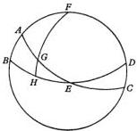

This treatment of the angles and intersections connected with the ecliptic, I excerpted compactly from Ptolemy while I was reviewing the discussion of spherical triangles in general. If anybody wishes to work on this subject, he will be able by himself to find more applications than those which I discussed only as examples.

## THE RISING AND SETTING OF THE HEAVENLY BODIES

*Chapter 13* $^{20}$

The risings and settings of the heavenly bodies also belong with the daily rotation, as is evident. This is true not only for those simple risings and settings which I just discussed, but also for the ways in which the bodies become morning and evening stars. Although the latter phenomena occur in conjunction with the annual revolution, they will nevertheless be treated more appropriately in this place.

The ancient mathematicians distinguish the true [risings and settings] from the visible. The true are as follows. The morning rising of a heavenly body occurs when it appears at the same time as the sun. On the other hand, the morning setting of the body occurs when it sets at sunrise. Throughout this entire interval the body was called a “morning star”. But the evening rising occurs when the body appears at sunset. On the other hand, the evening setting occurs when the body sets at the same time as the sun. In the intervening period it is called an “evening star”, because it is obscured by day and comes forth at night.

By contrast, the visible risings and settings are as follows. The morning rising of the body occurs when it first emerges and begins to appear at dawn and before sunrise. On the other hand, the morning setting occurs when the body is seen to have set just as the sun is about to rise. The body’s evening rising occurs when it first appears to rise at twilight. But its evening setting occurs when it ceases any longer to be visible after sunset. Thereafter the presence of the sun blots the body out, until at their morning rising [the heavenly bodies] emerge in the order described above.

In the same way as these phenomena occur in the fixed stars, they occur also in the planets Saturn, Jupiter, and Mars. But the risings and settings of Venus and Mercury are different. For they are not blotted out by the approach of the sun, as the other planets are, nor are they made visible by its departure. On the contrary, when they precede the sun, they immerse themselves in its brilliance and extricate themselves. When the other planets have their evening rising and morning setting, they are not obscured at any time, but shine throughout almost the entire night. On the other hand, Venus and Mercury disappear completely from [evening] setting to [morning] rising, and cannot be seen anywhere. There is also another difference. In Saturn, Jupiter, and Mars, the true risings and settings are earlier than the visible in the morning, and later in the evening, to the extent that they precede sunrise in the first case, and follow sunset in the second case. On the other hand, in the lower planets the visible morning and evening risings are later than the true, whereas the settings are earlier.

Now the way in which the [risings and settings] may be determined can be understood from what was said above, where I explained the oblique ascension of any star having a known position, and the degree of the ecliptic with which it rises or sets [II, 9]. If at that time the sun appears in that degree or the opposite degree, the star will have its true morning or evening rising or setting.

From these, the visible risings and settings differ according to the brilliance and size of each body. Thus, those which have a more powerful light are obscured by the sun's rays for a shorter time than those which are less bright. Moreover, the limits of disappearance and appearance are determined by the subhorizontal arcs, between the horizon and the sun, on the circles which pass through the poles of the horizon. For fixed stars of the first magnitude, these limits are almost 12°; for Saturn, 11°; for Jupiter, 10°; for Mars, 11 1/2°; for Venus, 5°; and for Mercury, 10°. But the whole belt in which the remnant of daylight yields to night, the belt which embraces twilight or dawn, contains 18° of the aforesaid circle. When the sun has descended by these 18°, the smaller stars also begin to appear. Now this is the distance at which some people put a plane parallel to the horizon and below it. When the sun reaches this plane, they say that the day is beginning or the night is ending. We may know with what degree of the ecliptic a body rises or sets. We may also discover the angle at which the ecliptic intersects the horizon at that same degree. We may also find at that time as many degrees of the ecliptic between the rising degree and the sun as are enough and as are associated with the sun's depth below the horizon in accordance with the aforementioned limits of the body in question. If so, we shall assert that its first appearance or disappearance is occurring. However, what I explained in the preceding demonstration with regard to the sun's altitude above the earth also fits in all respects its descent below the earth, since there is no difference in anything but position. Thus, the bodies which set so far as the visible hemisphere is concerned, rise so far as the hidden hemisphere is concerned, and everything occurs conversely and is readily understood. Therefore, what has been said about the rising and setting of the heavenly bodies, and, to that extent, about the daily rotation of the terrestrial globe may be enough.

## THE INVESTIGATION OF THE PLACES OF THE STARS, AND THE ARRANGEMENT OF THE FIXED STARS IN A CATALOGUE

## Chapter 14

This opinion, I believe, should be opposed. If, on the other hand, you interpret it as referring to the calculations for computing the apparent motion of the sun and moon, perhaps Ptolemy's opinion will hold good. For, the geometer Menelaus likewise kept track of most of the stars and their places through computations based on their conjunctions with the moon.

But we shall do much better if we locate any star with the help of instruments through a careful examination of the positions of the sun and moon, as I shall soon show. I am also warned by the ineffectual attempt of those who thought that the length of the solar year should be delimited simply by the equinoxes or solstices, and not also by the fixed stars. In this effort down to our own time they have never been able to agree, so that nowhere has there been greater dissension. This was noticed by Ptolemy. When he computed the solar year in his own age, not without suspecting that an error could appear in the course of time, he advised posterity to seek finer precision in this matter subsequently. Hence it seemed to me worth while in this book to show how skill with instruments may establish the positions of the sun and moon, that is, the amount of their distance from the vernal equinox or other cardinal points of the universe. These places will then facilitate our investigation of other heavenly bodies, by means of which we may also set before the eyes the sphere of the fixed stars studded with constellations, and its representation.

Now I have already explained the instruments by which we may determine the distance between the tropics, the obliquity of the ecliptic, and the inclination of the sphere or the altitude of the pole of the equator [II, 2]. In the same way we can obtain any other altitude of the sun at noon. Through its difference from the inclination of the sphere, this altitude will show us the amount of the sun's declination from the equator. Then through this declination its position at noon, as measured from an equinox or solstice, will also become clear. Now in a period of 24 hours the sun seems to pass through almost 1°; the hourly fraction thereof amounts to 2 1/8'. Hence for any designated hour other than noon, its position will be easily inferred.

But for observing the positions of the moon and of the stars, another instrument is constructed, which Ptolemy calls the "astrolabe" [Syntaxis, V, 1]. Now two rings, or quadrilateral frames of rings, are made in such a way that their flat sides, or members, are set at right angles to their concave - convex surface. These rings are equal and similar in all respects, and of a convenient size. That is, if they are too big, they become less manageable. Yet otherwise, generous dimensions are better than skimpy, for the purpose of division into parts. Thus let [the rings'] width and thickness be at least one-thirtieth of the diameter. Then they will be joined and connected with each other at right angles along the diameter, with the concave - convex surfaces fitting together as though in the roundness of a single sphere. In fact, let one of them take the place of the ecliptic; and the other, of the circle which passes through the poles of both (I mean, of the equator and the ecliptic). Then the sides of the ecliptic ring should be divided into equal parts, which are usually 360, and these may be further subdivided according to the size of the instrument. Also on the other ring, by measuring quadrants from the ecliptic, indicate the poles of the ecliptic. Take a distance from these poles in proportion to the obliquity of the ecliptic, and mark the poles of the equator too.

After these rings have been arranged in this way, two other rings are made. They are fastened at the ecliptic's poles, on which they will move, [one on the] outside and [the other on the] inside. Make these rings equal to the others in thickness between the two flat surfaces, while the width of their rims is similar. Fit them together so that there is contact everywhere between the larger ring's concave surface and the ecliptic's convex surface, as well as between the smaller one's convex surface and the ecliptic's concave surface. However, let there be no obstacle to their being turned about, but let them permit the ecliptic with its meridian freely and easily to slide over them, and conversely. Hence we will neatly perforate these rings at the diametrically opposite poles of the ecliptic, and insert axles to attach and support them. Divide the inner ring also into 360 equal degrees, so that in each quadrant there are 90° to the poles.

Furthermore, on the concave surface of this ring, another ring, the fifth, should be placed, and be able to turn in the same plane. To the rims of this ring, attach diametrically opposite brackets with apertures and peepholes or eyepieces. Here the light of the star can impinge and leave along the diameter of the ring, as is the practice in the dioptra. Moreover, mount certain blocks on both sides of the ring, as pointers toward the numbers on the containing ring, for the purpose of observing the latitudes.

Finally, a sixth ring must be attached, to receive the whole astrolabe and support it as it hangs from fastenings at the poles of the equator. Place this sixth ring on a stand, sustained by which it will be perpendicular to the plane of the horizon. Furthermore, when its poles have been adjusted to the inclination of the sphere, let the astrolabe keep its meridian's position similar to that of the meridian in nature, without the slightest swerving away from it.

Then with the instrument fashioned in this way, we may wish to obtain the place of a star. In the evening, or when the sun is about to set, at a time when we also have the moon in view, we will line up the outer ring with the degree of the ecliptic in which we have found by what precedes that the sun is known to be then. We will also turn the intersection of the rings towards the sun, until both of them, I mean, the ecliptic and that outer ring which passes through the poles [of the ecliptic] cast equal shadows on each other. Then we also turn the inner ring toward the moon. Placing our eye in the plane of the inner ring where we will see the moon opposite, as though it were bisected by the same plane, we will mark the spot on the instrument's ecliptic. For, that will be the observed place of the moon in longitude at that time. In fact, without the moon there was no way of understanding the positions of the stars, since of all the heavenly bodies it alone participates in the day and night. Then, as night descends, the star whose place we are seeking can now be seen. We fit the outer ring to the position of the moon. By means of this ring we adjust the position of the astrolabe to the moon, as we did in the case of the sun. Then we also turn the inner ring toward the star, until it seems to touch the plane of the ring, and is visible through the eyepieces which are on the smaller ring within. For in this way we shall find the longitude of the star together with its latitude. While these operations are being performed, the degree of the ecliptic at mid-heaven will be placed before our eyes, and therefore it will be clear as crystal at what hour the observation was carried out.

For example, in the 2nd year of the emperor Antoninus Pius, on the 9th day of Pharmuthi, the 8th Egyptian month, about sunset, Ptolemy in Alexandria wanted to observe the place of the star in the chest of the Lion which is called Basiliscus or Regulus [Syntaxis VII, 2]. Training his astrolabe on the sun, which was already setting, 5 1/2 equinoctial hours after noon, he found the sun at 3 1/24° within the Fishes. By moving the inner ring, he observed the moon following 92 1/8° after the sun. Therefore the place of the moon was then seen at 5 1/6° within the Twins. Half an hour later, when the 6th hour after noon was being completed, the star had already begun to appear, as 4° within the Twins was at mid-heaven. Ptolemy turned the outer ring of the instrument to the place where the moon had already been found. By proceeding with the inner ring, he determined the distance of the star from the moon in the order of the zodiacal signs as 57 1/10°. Now the moon was found 92 1/8° away from the setting sun, as was mentioned, and this fixed the moon at 5 1/6° within the Twins. But in the interval of half an hour the moon should have moved 1/4°, since the fraction per hour of the moon's motion amounts to 1/8°, more or less. However, on account of the lunar parallax, which had to be subtracted at that time, the moon must have moved a little less than 1/4°, and he determined the difference as about 1/18°. Accordingly the moon must have been at 5 1/8° within the Twins. But when I discuss the lunar parallaxes, it will be evident that the difference was not so great [IV, 16]. Hence it can be quite clear that the observed place of the moon exceeded 5° within the Twins by more than 1/8° and by hardly less than 2/8°. To this position, the addition of 57 1/10° establishes the place of the star at 2 1/2° within the Lion, at a distance from the sun's summer solstice of about 32 1/2°, with a north latitude of 1/8°. This was the place of Basiliscus, through which the approach to all the other fixed stars lay open. Now this observation was performed by Ptolemy, according to the Roman [calendar] on 23 February 139 A. D., the first year of the 229th Olympiad.

In this way that most outstanding of astronomers noted the distance of each of the stars from the vernal equinox at that time, and he set forth the constellations of the celestial creatures. By these achievements he gave no small assistance to this study of mine, and relieved me of quite an arduous task. I believed that the places of the stars should not be located with reference to the equinoxes, which shift in the course of time, but that the equinoxes should be located with reference to the sphere of the fixed stars. Hence I can easily start the cataloguing of the stars at some other unchangeable beginning. I have decided to commence with the Ram, as the first zodiacal sign, and with its first star, which is in its head.

My purpose is that in this way always the same definitive appearance will remain for those bodies which shine as a team, as though fixed and linked together, once they have taken their permanent place. Now through the wonderful zeal and skill of the ancients they were grouped into 48 figures. The exceptions are those stars which the circle of the perpetually hidden stars kept from the fourth clime, which passes near Rhodes, so that these stars, as unknown to the ancients, remained unattached to a constellation. Nor were the stars formed into figures for any other reason, according to the opinion of the younger Theon in his commentary on Aratus, than that their vast number should be separated into parts, which could be known one by one under certain designations. This practice is quite old, since we read that even Job, Hesiod, and Homer mentioned the Pleiades, Hyades, Arcturus, and Orion. Therefore in tabulating the stars according to their longitude, I shall not use the twelve zodiacal signs, which are derived from the equinoxes and solstices, but the simple and familiar number of degrees. In all other respects I shall follow Ptolemy, with a few exceptions, which I find either corrupt or distorted in some way. But the method of determining the distance of the stars from those cardinal points will be explained by me in the next Book.

## DESCRIPTIVE CATALOGUE OF THE SIGNS AND STARS

## 1: THOSE WHICH ARE IN THE NORTHERN REGION

|   | Constellations of the stars | Longitude |   | Latitude |   | Magnitude  |
| --- | --- | --- | --- | --- | --- | --- |
|   |   |  De-grees | Min-utes | De-grees | Min-utes  |   |
|   | **LITTLE BEAR OR DOG'S TAIL**  |   |   |   |   |   |
|   | At the tip of the tail | 53 | 30 | N. | 66 0 | 3  |
|   | To the east in the tail | 55 | 50 | N. | 70 0 | 4  |
|   | At the beginning of the tail | 69 | 20 | N. | 74 0 | 4  |
|   | The more southerly [star] on the western side of the quadrangle | 83 | 0 | N. | 75 20 | 4  |
|   | The northern [star] on the same side | 87 | 0 | N. | 77 40 | 4  |
|   | The more southerly [star] on the [quadrangle's] eastern side | 100 | 30 | N. | 72 40 | 2  |
|   | The northern [star] on the same side | 109 | 30 | N. | 74 50 | 2  |
|   | 7 stars: 2 of the 2nd magnitude, 1 of the 3rd, 4 of the 4th  |   |   |   |   |   |
|   | Near the Dog's Tail, outside the constellation, on a straight line with the [quadrangle's] eastern side, quite far to the south | 103 | 20 | N. | 71 10 | 4  |
|   | **GREAT BEAR, [ALSO] CALLED THE DIPPER**  |   |   |   |   |   |
|   | On the muzzle | 78 | 40 | N. | 39 50 | 4  |
|   | [Of the stars] in the two eyes, the one to the west | 79 | 10 | N. | 43 0 | 5  |
|   | East of the foregoing | 79 | 40 | N. | 43 0 | 5  |
|   | [Of the two stars] in the forehead, the one to the west | 79 | 30 | N. | 47 10 | 5  |
|   | The eastern [star] in the forehead | 81 | 0 | N. | 47 0 | 5  |
|   | At the edge of the western ear | 81 | 30 | N. | 50 30 | 5  |
|   | Of the two [stars] in the neck, the one to the west | 85 | 50 | N. | 43 50 | 4  |
|   | The one to the east | 92 | 50 | N. | 44 20 | 4  |
|   | Of the two [stars] in the chest, the one to the north | 94 | 20 | N. | 44 0 | 4  |
|   | The one farther south | 93 | 20 | N. | 42 0 | 4  |
|   | In the knee of the left foreleg | 89 | 0 | N. | 35 0 | 3  |
|   | Of the two [stars] in the left front paw, the one to the north | 89 | 50 | N. | 29 0 | 3  |
|   | The one farther south | 88 | 40 | N. | 28 30 | 3  |
|   | In the knee of the right foreleg | 89 | 0 | N. | 36 0 | 4  |
|   | Below that knee | 101 | 10 | N. | 33 30 | 4  |
|   | In the shoulder | 104 | 0 | N. | 49 0 | 2  |
|   | In the groin | 105 | 30 | N. | 44 30 | 2  |
|   | At the beginning of the tail | 116 | 30 | N. | 51 0 | 3  |
|   | In the left hind leg | 117 | 20 | N. | 46 30 | 2  |
|   | Of the two [stars] in the left hind paw, the one to the west | 106 | 0 | N. | 29 38 | 3  |
|   | East of the foregoing | 107 | 30 | N. | 28 15 | 3  |
|   | In the joint of the left [hind leg] | 115 | 0 | N. | 35 15 | 4  |
|   | Of the two [stars] in the right hind paw, the one to the north | 123 | 10 | N. | 25 50 | 3  |

|  Constellations of the stars | Longitude |   | Latitude |   |   | Magnitude  |
| --- | --- | --- | --- | --- | --- | --- |
|   |  De-grees | Min-utes |  | De-grees | Min-utes  |   |
|  The one farther south | 123 | 40 | N. | 25 | 0 | 3  |
|  Of the three [stars] in the tail, the first one east of the beginning [of the tail] | 125 | 30 | N. | 53 | 30 | 2  |
|  The one in the middle of these [three] | 131 | 20 | N. | 55 | 40 | 2  |
|  The last one, at the tip of the tail | 143 | 10 | N. | 54 | 0 | 2  |
|  27 stars: 6 of the 2nd magnitude, 8 of the 3rd, 8 of the 4th, 5 of the 5th  |   |   |   |   |   |   |
|  NEAR THE DIPPER, OUTSIDE THE CONSTELLATION  |   |   |   |   |   |   |
|  South of the tail | 141 | 10 | N. | 39 | 45 | 3  |
|  The dimmer [star] to the west of the foregoing | 133 | 30 | N. | 41 | 20 | 5  |
|  Between the Bear's front paws and the Lion's head | 98 | 20 | N. | 17 | 15 | 4  |
|  [The star] farther north than the foregoing | 96 | 40 | N. | 19 | 10 | 4  |
|  The last of the three dim [stars] | 99 | 30 | N. | 20 | 0 | dim  |
|  To the west of the foregoing | 95 | 30 | N. | 22 | 45 | dim  |
|  Farther west | 94 | 30 | N. | 23 | 15 | dim  |
|  Between the front paws and the Twins | 100 | 20 | N. | 22 | 15 | dim  |
|  8 stars outside the constellation: 1 of the 3rd magnitude, 2 of the 4th, 1 of the 5th, 4 dim  |   |   |   |   |   |   |
|  DRAGON  |   |   |   |   |   |   |
|  In the tongue | 200 | 0 | N. | 76 | 30 | 4  |
|  In the mouth | 215 | 10 | N. | 78 | 30 | 4 brighter  |
|  Above the eye | 216 | 30 | N. | 75 | 40 | 3  |
|  In the cheek | 229 | 40 | N. | 75 | 20 | 4  |
|  Above the head | 223 | 30 | N. | 75 | 30 | 3  |
|  In the first twisting of the neck, the one to the north | 258 | 40 | N. | 82 | 20 | 4  |
|  Of these [stars], the one to the south | 295 | 50 | N. | 78 | 15 | 4  |
|  The middle one of these same [stars] | 262 | 10 | N. | 80 | 20 | 4  |
|  East of the foregoing, in the second twisting [of the neck] | 282 | 50 | N. | 81 | 10 | 4  |
|  The southern [star] on the western side of the quadrilateral | 331 | 20 | N. | 81 | 40 | 4  |
|  The northern [star] on the same side | 343 | 50 | N. | 83 | 0 | 4  |
|  The northern [star] on the eastern side | 1 | 0 | N. | 78 | 50 | 4  |
|  The southern [star] on the same side | 346 | 10 | N. | 77 | 50 | 4  |
|  In the third twisting [of the neck], the southern [star] of the triangle | 4 | 0 | N. | 80 | 30 | 4  |
|  Of the remaining [stars] of the triangle, the one to the west | 15 | 0 | N. | 81 | 40 | 5  |
|  The one to the east | 19 | 30 | N. | 80 | 15 | 5  |
|  Of the three [stars] in the triangle to the west, [the star to the east] | 66 | 20 | N. | 83 | 30 | 4  |
|  Of the remaining [stars] in the same triangle, the one to the south | 43 | 40 | N. | 83 | 30 | 4  |
|  The one to the north of the two preceding [stars] | 35 | 10 | N. | 84 | 50 | 4  |
|  Of the two small [stars west] of the triangle, the one to the east | 110 | 0 | N. | 87 | 30 | 6  |

|   | Constellations of the stars | Longitude |   | Latitude |   |   | Magnitude  |
| --- | --- | --- | --- | --- | --- | --- | --- |
|   |   |  De-grees | Min-utes |  | De-grees | Min-utes  |   |
|   | Of these [two stars] the one to the west | 105 | 0 | N. | 86 | 50 | 6  |
|   | Of the three [stars] which follow in a straight line, the one to the south | 152 | 30 | N. | 81 | 15 | 5  |
|   | The middle one of the three | 152 | 50 | N. | 83 | 0 | 5  |
|   | The one farther north | 151 | 0 | N. | 84 | 50 | 3  |
|   | Of the two [stars] to the west of the foregoing, the one farther north | 153 | 20 | N. | 78 | 0 | 3  |
|   | [The one] farther south | 156 | 30 | N. | 74 | 40 | 4 brighter  |
|   | To the west of the foregoing, in the coil of the tail | 156 | 0 | N. | 70 | 0 | 3  |
|   | Of the two [stars] at a very great distance, the one to the west | 120 | 40 | N. | 64 | 40 | 4  |
|   | East of the foregoing | 124 | 30 | N. | 65 | 30 | 3  |
|   | To the east, on the tail | 102 | 30 | N. | 61 | 15 | 3  |
|   | At the tip of the tail | 96 | 30 | N. | 56 | 15 | 3  |
|   | Therefore, 31 stars: 8 of the 3rd magnitude, 17 of the 4th, 4 of the 5th, 2 of the 6th  |   |   |   |   |   |   |
|   | CEPHEUS  |   |   |   |   |   |   |
|   | In the right foot | 28 | 40 | N. | 75 | 40 | 4  |
|   | In the left foot | 26 | 20 | N. | 64 | 15 | 4  |
|   | On the right side below the belt | 0 | 40 | N. | 71 | 10 | 4  |
|   | Above the right shoulder and touching it | 340 | 0 | N. | 69 | 0 | 3  |
|   | Touching the right hip joint | 332 | 40 | N. | 72 | 0 | 4  |
|   | East of the same hip and touching it | 333 | 20 | N. | 74 | 0 | 4  |
|   | In the chest | 352 | 0 | N. | 65 | 30 | 5  |
|   | In the left arm | 1 | 0 | N. | 62 | 30 | 4 brighter  |
|   | Of the three [stars] in the tiara, the one to the south | 339 | 40 | N. | 60 | 15 | 5  |
|   | The one in the middle of these [three] | 340 | 40 | N. | 61 | 15 | 4  |
|   | Of the three, the one to the north | 342 | 20 | N. | 61 | 30 | 5  |
|   | 11 stars: 1 of the 3rd magnitude, 7 of the 4th, 3 of the 5th  |   |   |   |   |   |   |
|   | Of the two [stars] outside the constellation, the one to the west of the tiara | 337 | 0 | N. | 64 | 0 | 5  |
|   | The one to the east of it | 344 | 40 | N. | 59 | 30 | 4  |
|   | HERDSMAN OR BEAR-KEEPER  |   |   |   |   |   |   |
|   | Of the three [stars] in the left hand, the one to the west | 145 | 40 | N. | 58 | 40 | 5  |
|   | The middle one of the three, farther south | 147 | 30 | N. | 58 | 20 | 5  |
|   | Of the three, the one to the east | 149 | 0 | N. | 60 | 10 | 5  |
|   | In the left hip joint | 143 | 0 | N. | 54 | 40 | 5  |
|   | In the left shoulder | 163 | 0 | N. | 49 | 0 | 3  |
|   | In the head | 170 | 0 | N. | 53 | 50 | 4 brighter  |
|   | In the right shoulder | 179 | 0 | N. | 48 | 40 | 4  |
|   | Of the two [stars] in the staff, the one farther south | 179 | 0 | N. | 53 | 15 | 4  |

REVOLUTIONS

|  Constellations of the stars | Longitude |   | Latitude |   |   | Magnitude  |
| --- | --- | --- | --- | --- | --- | --- |
|   |  De-grees | Min-utes |  | De-grees | Min-utes  |   |
|  The one farther north, at the tip of the staff | 178 | 20 | N. | 57 | 30 | 4  |
|  Of the two [stars] on the spear below the shoulder, the one to the north | 181 | 0 | N. | 46 | 10 | 4 brighter  |
|  Of these [two], the one farther south | 181 | 50 | N. | 45 | 30 | 5  |
|  At the tip of the right hand | 181 | 35 | N. | 41 | 20 | 5  |
|  Of the two [stars] in the palm, the one to the west | 180 | 0 | N. | 41 | 40 | 5  |
|  East of the foregoing | 180 | 20 | N. | 42 | 30 | 5  |
|  At the tip of the handle of the staff | 181 | 0 | N. | 40 | 20 | 5  |
|  In the right leg | 173 | 20 | N. | 40 | 15 | 3  |
|  Of the two [stars] in the belt, the one to the east | 169 | 0 | N. | 41 | 40 | 4  |
|  The one to the west | 168 | 20 | N. | 42 | 10 | 4 brighter  |
|  In the right heel | 178 | 40 | N. | 28 | 0 | 3  |
|  Of the three [stars] in the left leg, the one to the north | 164 | 40 | N. | 28 | 0 | 3  |
|  The middle one of the three | 163 | 50 | N. | 26 | 30 | 4  |
|  The one farther south | 164 | 50 | N. | 25 | 0 | 4  |
|  22 stars: 4 of the 3rd magnitude, 9 of the 4th, 9 of the 5th  |   |   |   |   |   |   |
|  Outside the constellation, between the legs, called “Arcturus” | 170 | 20 | N. | 31 | 30 | 1  |
|  NORTHERN CROWN  |   |   |   |   |   |   |
|  The bright [star] in the crown | 188 | 0 | N. | 44 | 30 | 2 brighter  |
|  The [most] westerly of all | 185 | 0 | N. | 46 | 10 | 4 brighter  |
|  East [of the foregoing], to the north | 185 | 10 | N. | 48 | 0 | 5  |
|  East [of the foregoing] farther north | 193 | 0 | N. | 50 | 30 | 6  |
|  East of the bright [star], to the south | 191 | 30 | N. | 44 | 45 | 4  |
|  Immediately to the east [of the foregoing] | 190 | 30 | N. | 44 | 50 | 4  |
|  Somewhat farther to the east of the foregoing | 194 | 40 | N. | 46 | 10 | 4  |
|  The most easterly of all [the stars] in the crown | 195 | 0 | N. | 49 | 20 | 4  |
|  8 stars: 1 of the 2nd magnitude, 5 of the 4th, 1 of the 5th, 1 of the 6th  |   |   |   |   |   |   |
|  KNEELER  |   |   |   |   |   |   |
|  In the head | 221 | 0 | N. | 37 | 30 | 3  |
|  In the right armpit | 207 | 0 | N. | 43 | 0 | 3  |
|  In the right arm | 205 | 0 | N. | 40 | 10 | 3  |
|  In the right [side of the] groin | 201 | 20 | N. | 37 | 10 | 4  |
|  In the left shoulder | 220 | 0 | N. | 48 | 0 | 3  |
|  In the left arm | 225 | 20 | N. | 49 | 30 | 4 brighter  |
|  In the left [side of the] groin | 231 | 0 | N. | 42 | 0 | 4  |
|  Of the three [stars] in the left palm, [the one to the east] | 238 | 50 | N. | 52 | 50 | 4 brighter  |
|  Of the other two, the one to the north | 235 | 0 | N. | 54 | 0 | 4 brighter  |
|  The one farther south | 234 | 50 | N. | 53 | 0 | 4  |
|  In the right side | 207 | 10 | N. | 56 | 10 | 3  |
|  In the left side | 213 | 30 | N. | 53 | 30 | 4  |

|   | Constellations of the stars | Longitude |   | Latitude |   |   | Magnitude  |
| --- | --- | --- | --- | --- | --- | --- | --- |
|   |   |  De-grees | Min-utes |  | De-grees | Min-utes  |   |
|   | In the left buttock | 213 | 20 | N. | 56 | 10 | 5  |
|   | At the top of the same leg | 214 | 30 | N. | 58 | 30 | 5  |
|   | Of the three [stars] in the left leg, the one to the west | 217 | 20 | N. | 59 | 50 | 3  |
|   | East of the foregoing | 218 | 40 | N. | 60 | 20 | 4  |
|   | The third one, east [of the foregoing] | 219 | 40 | N. | 61 | 15 | 4  |
|   | In the left knee | 237 | 10 | N. | 61 | 0 | 4  |
|   | In the left thigh | 225 | 30 | N. | 69 | 20 | 4  |
|   | Of the three [stars] in the left foot, the one to the west | 188 | 40 | N. | 70 | 15 | 6  |
|   | The middle one of these [three] | 220 | 10 | N. | 71 | 15 | 6  |
|   | Of the three, the one to the east | 223 | 0 | N. | 72 | 0 | 6  |
|   | At the top of the right leg | 207 | 0 | N. | 60 | 15 | 4 brighter  |
|   | [The star] farther north in the same leg | 198 | 50 | N. | 63 | 0 | 4  |
|   | In the right knee | 189 | 0 | N. | 65 | 30 | 4 brighter  |
|   | Of the two [stars] below the same knee, the one farther south | 186 | 40 | N. | 63 | 40 | 4  |
|   | The one farther north | 183 | 30 | N. | 64 | 15 | 4  |
|   | In the right shin | 184 | 30 | N. | 60 | 0 | 4  |
|   | At the tip of the right foot; identical with [the star] at the tip of the Herdsman's staff | 178 | 20 | N. | 57 | 30 | 4  |
|  Not including the foregoing, 28 stars: 6 of the 3rd magnitude, 17 of the 4th, 2 of the 5th, 3 of the 6th  |   |   |   |   |   |   |   |
|   | Outside the constellation, to the south of the right arm | 206 | 0 | N. | 38 | 10 | 5  |
|   | **LYRE**  |   |   |   |   |   |   |
|   | The bright [star] called 'Lyre' or 'Little Lute' | 250 | 40 | N. | 62 | 0 | 1  |
|   | Of the two adjacent [stars], the one to the north | 253 | 40 | N. | 62 | 40 | 4 brighter  |
|   | The one farther south | 253 | 40 | N. | 61 | 0 | 4 brighter  |
|   | Between the curvature of the arms | 262 | 0 | N. | 60 | 0 | 4  |
|   | Of the two [stars] close together in the east, the one to the north | 265 | 20 | N. | 61 | 20 | 4  |
|   | The one farther south | 265 | 0 | N. | 60 | 20 | 4  |
|   | Of the two [stars] to the west on the cross-piece, the one to the north | 254 | 20 | N. | 56 | 10 | 3  |
|   | The one farther south | 254 | 10 | N. | 55 | 0 | 4 dimmer  |
|   | Of the two [stars] to the east on the same crosspiece, the one to the north | 257 | 30 | N. | 55 | 20 | 3  |
|   | The one farther south | 258 | 20 | N. | 54 | 45 | 4 dimmer  |
|  10 stars: 1 of the 1st magnitude, 2 of the 3rd, 7 of the 4th  |   |   |   |   |   |   |   |
|   | **SWAN OR BIRD**  |   |   |   |   |   |   |
|   | In the mouth | 267 | 50 | N. | 49 | 20 | 3  |
|   | In the head | 272 | 20 | N. | 50 | 30 | 5  |
|   | In the middle of the neck | 279 | 20 | N. | 54 | 30 | 4 brighter  |

|  Constellations of the stars | Longitude |   | Latitude |   |   | Magnitude  |
| --- | --- | --- | --- | --- | --- | --- |
|   |  De-grees | Min-utes |  | De-grees | Min-utes  |   |
|  In the breast | 291 | 50 | N. | 56 | 20 | 3  |
|  The bright [star] in the tail | 302 | 30 | N. | 60 | 0 | 2  |
|  In the bend of the right wing | 282 | 40 | N. | 64 | 40 | 3  |
|  Of the three [stars] in the spread of the right [wing], the one farther south | 285 | 50 | N. | 69 | 40 | 4  |
|  The one in the middle | 284 | 30 | N. | 71 | 30 | 4 brighter  |
|  The last of the three, at the tip of the wing | 280 | 0 | N. | 74 | 0 | 4 brighter  |
|  In the bend of the left wing | 294 | 10 | N. | 49 | 30 | 3  |
|  In the middle of that wing | 298 | 10 | N. | 52 | 10 | 4 brighter  |
|  At the tip of the same [wing] | 300 | 0 | N. | 74 | 0 | 3  |
|  In the left foot | 303 | 20 | N. | 55 | 10 | 4 brighter  |
|  In the left knee | 307 | 50 | N. | 57 | 0 | 4  |
|  Of the two [stars] in the right foot, the one to the west | 294 | 30 | N. | 64 | 0 | 4  |
|  The one to the east | 296 | 0 | N. | 64 | 30 | 4  |
|  The cloudy [star] in the right knee | 305 | 30 | N. | 63 | 45 | 5  |
|  17 stars: 1 of the 2nd magnitude, 5 of the 3rd, 9 of the 4th, 2 of the 5th  |   |   |   |   |   |   |
|  TWO ADDITIONAL [STARS] NEAR THE SWAN, OUTSIDE THE CONSTELLATION  |   |   |   |   |   |   |
|  Of the two [stars] below the left wing, the one farther south | 306 | 0 | N. | 49 | 40 | 4  |
|  The one farther north | 307 | 10 | N. | 51 | 40 | 4  |
|  CASSIOPEA  |   |   |   |   |   |   |
|  In the head | 1 | 10 | N. | 45 | 20 | 4  |
|  In the breast | 4 | 10 | N. | 46 | 45 | 3 brighter  |
|  In the girdle | 6 | 20 | N. | 47 | 50 | 4  |
|  Above the seat, at the hips | 10 | 0 | N. | 49 | 0 | 3 brighter  |
|  At the knees | 13 | 40 | N. | 45 | 30 | 3  |
|  In the leg | 20 | 20 | N. | 47 | 45 | 4  |
|  At the tip of the foot | 355 | 0 | N. | 48 | 20 | 4  |
|  In the left arm | 8 | 0 | N. | 44 | 20 | 4  |
|  In the left elbow | 7 | 40 | N. | 45 | 0 | 5  |
|  In the right elbow | 357 | 40 | N. | 50 | 0 | 6  |
|  In the foot of the chair | 8 | 20 | N. | 52 | 40 | 4  |
|  In the middle of the back [of the chair] | 1 | 10 | N. | 51 | 40 | 3 dimmer  |
|  At the edge [of the back of the chair] | 357 | 10 | N. | 51 | 40 | 6  |
|  13 stars: 4 of the 3rd magnitude, 6 of the 4th, 1 of the 5th, 2 of the 6th  |   |   |   |   |   |   |
|  PERSEUS  |   |   |   |   |   |   |
|  At the tip of the right hand, in a cloudy wrapping | 21 | 0 | N. | 40 | 30 | cloudy  |
|  In the right elbow | 24 | 30 | N. | 37 | 30 | 4  |
|  In the right shoulder | 26 | 0 | N. | 34 | 30 | 4 dimmer  |
|  In the left shoulder | 20 | 50 | N. | 32 | 20 | 4  |
|  In the head or cloud | 24 | 0 | N. | 34 | 30 | 4  |
|  In the shoulder blades | 24 | 50 | N. | 31 | 10 | 4  |
|  The bright [star] on the right side | 28 | 10 | N. | 30 | 0 | 2  |

|   | Constellations of the stars | Longitude |   | Latitude |   | Magnitude  |
| --- | --- | --- | --- | --- | --- | --- |
|   |   |  De-grees | Min-utes | De-grees | Min-utes  |   |
|   | Of the three [stars] on the same side, the one to the west | 28 | 40 | N. 27 | 30 | 4  |
|   | The one in the middle | 30 | 20 | N. 27 | 40 | 4  |
|   | The remaining [one] of the three | 31 | 0 | N. 27 | 30 | 3  |
|   | In the left elbow | 24 | 0 | N. 27 | 0 | 4  |
|   | The bright [star] in the left hand, and in the head of Medusa | 23 | 0 | N. 23 | 0 | 2  |
|   | In the same head, the one to the east | 22 | 30 | N. 21 | 0 | 4  |
|   | In the same head, the one to the west | 21 | 0 | N. 21 | 0 | 4  |
|   | Still farther west of the foregoing | 20 | 10 | N. 22 | 15 | 4  |
|   | In the right knee | 38 | 10 | N. 28 | 15 | 4  |
|   | In the knee, to the west of the foregoing | 37 | 10 | N. 28 | 10 | 4  |
|   | Of the two [stars] in the belly, the one to the west | 35 | 40 | N. 25 | 10 | 4  |
|   | The one to the east | 37 | 20 | N. 26 | 15 | 4  |
|   | In the right hip | 37 | 30 | N. 24 | 30 | 5  |
|   | In the right calf | 39 | 40 | N. 28 | 45 | 5  |
|   | In the left hip | 30 | 10 | N. 21 | 40 | 4 brighter  |
|   | In the left knee | 32 | 0 | N. 19 | 50 | 3  |
|   | In the left leg | 31 | 40 | N. 14 | 45 | 3 brighter  |
|   | In the left heel | 24 | 30 | N. 12 | 0 | 3 dimmer  |
|   | At the top of the foot, on the left side | 29 | 40 | N. 11 | 0 | 3 brighter  |
|  26 stars: 2 of the 2nd magnitude, 5 of the 3rd, 16 of the 4th, 2 of the 5th, 1 cloudy  |   |   |   |   |   |   |
|  NEAR PERSEUS, OUTSIDE THE CONSTELLATION  |   |   |   |   |   |   |
|   | East of the left knee | 34 | 10 | N. 31 | 0 | 5  |
|   | North of the right knee | 38 | 20 | N. 31 | 0 | 5  |
|   | West of the head of Medusa | 18 | 0 | N. 20 | 40 | dim  |
|  3 stars: 2 of the 5th magnitude, 1 dim  |   |   |   |   |   |   |
|  REINSMAN OR CHARIOTEER  |   |   |   |   |   |   |
|   | Of the two [stars] in the head, the one farther south | 55 | 50 | N. 30 | 0 | 4  |
|   | The one farther north | 55 | 40 | N. 30 | 50 | 4  |
|   | The bright [star] in the left shoulder, called 'Capella' | 78 | 20 | N. 22 | 30 | 1  |
|   | In the right shoulder | 56 | 10 | N. 20 | 0 | 2  |
|   | In the right elbow | 54 | 30 | N. 15 | 15 | 4  |
|   | In the right palm | 56 | 10 | N. 13 | 30 | 4 brighter  |
|   | In the left elbow | 45 | 20 | N. 20 | 40 | 4 brighter  |
|   | Of the goats, the one to the west | 45 | 30 | N. 18 | 0 | 4 dimmer  |
|   | Of the goats in the left palm, the one to the east | 46 | 0 | N. 18 | 0 | 4 brighter  |
|   | In the left calf | 53 | 10 | N. 10 | 10 | 3 dimmer  |
|   | In the right calf, and at the tip of the northern horn of the Bull | 49 | 0 | N. 5 | 0 | 3 brighter  |
|   | In the ankle | 49 | 20 | N. 8 | 30 | 5  |
|   | In the buttock | 49 | 40 | N. 12 | 20 | 5  |

|  Constellations of the stars | Longitude |   | Latitude |   |   | Magnitude  |
| --- | --- | --- | --- | --- | --- | --- |
|   |  De-grees | Min-utes |  | De-grees | Min-utes  |   |
|  The small [star] in the left foot | 24 | 0 | N. | 10 | 20 | 6  |
|  14 stars: 1 of the first magnitude, 1 of the 2nd, 2 of the 3rd, 7 of the 4th, 2 of the 5th, 1 of the 6th  |   |   |   |   |   |   |
|  SERPENT CARRIER OR SNAKE HOLDER  |   |   |   |   |   |   |
|  In the head | 228 | 10 | N. | 36 | 0 | 3  |
|  Of the two [stars] in the right shoulder, the one to the west | 231 | 20 | N. | 27 | 15 | 4 brighter  |
|  The one to the east | 232 | 20 | N. | 26 | 45 | 4  |
|  Of the two [stars] in the left shoulder, the one to the west | 216 | 40 | N. | 33 | 0 | 4  |
|  The one to the east | 218 | 0 | N. | 31 | 50 | 4  |
|  In the left elbow | 211 | 40 | N. | 34 | 30 | 4  |
|  Of the two [stars] in the left hand, the one to the west | 208 | 20 | N. | 17 | 0 | 4  |
|  The one to the east | 209 | 20 | N. | 12 | 30 | 3  |
|  In the right elbow | 220 | 0 | N. | 15 | 0 | 4  |
|  In the right hand, the one to the west | 205 | 40 | N. | 18 | 40 | 4 dimmer  |
|  The one to the east | 207 | 40 | N. | 14 | 20 | 4  |
|  In the right knee | 224 | 30 | N. | 4 | 30 | 3  |
|  In the right shin | 227 | 0 | N. | 2 | 15 | 3 brighter  |
|  Of the four [stars] in the right foot, the one to the west | 226 | 20 | S. | 2 | 15 | 4 brighter  |
|  The one to the east | 227 | 40 | S. | 1 | 30 | 4 brighter  |
|  The third one, to the east | 228 | 20 | S. | 0 | 20 | 4 brighter  |
|  The remaining one, to the east | 229 | 10 | S. | 0 | 45 | 5 brighter  |
|  Touching the heel | 229 | 30 | S. | 1 | 0 | 5  |
|  In the left knee | 215 | 30 | N. | 11 | 50 | 3  |
|  Of the three [stars] in the left leg, in a straight line, the one to the north | 215 | 0 | N. | 5 | 20 | 5 brighter  |
|  The middle one of these [three] | 214 | 0 | N. | 3 | 10 | 5  |
|  Of the three, the one farther south | 213 | 10 | N. | 1 | 40 | 5 brighter  |
|  In the left heel | 215 | 40 | N. | 0 | 40 | 5  |
|  Touching the instep of the left foot | 214 | 0 | S. | 0 | 45 | 4  |
|  24 stars: 5 of the 3rd magnitude, 13 of the 4th, 6 of the 5th  |   |   |   |   |   |   |
|  NEAR THE SERPENT CARRIER, OUTSIDE THE CONSTELLATION  |   |   |   |   |   |   |
|  Of the three [stars] to the east of the right shoulder, the one farthest north | 235 | 20 | N. | 28 | 10 | 4  |
|  The middle one of the three | 236 | 0 | N. | 26 | 20 | 4  |
|  The southern one of the three | 233 | 40 | N. | 25 | 0 | 4  |
|  Farther east of the three | 237 | 0 | N. | 27 | 0 | 4  |
|  At a distance from the four, to the north | 238 | 0 | N. | 33 | 0 | 4  |
|  Therefore, 5 [stars] outside the constellation, all of the 4th magnitude  |   |   |   |   |   |   |
|  THE SERPENT OF THE SERPENT CARRIER  |   |   |   |   |   |   |
|  In the quadrilateral, in the cheek | 192 | 10 | N. | 38 | 0 | 4  |
|  Touching the nostrils | 201 | 0 | N. | 40 | 0 | 4  |

|   | Constellations of the stars | Longitude |   | Latitude |   |   | Magnitude  |
| --- | --- | --- | --- | --- | --- | --- | --- |
|   |   |  De-grees | Min-utes |  | De-grees | Min-utes  |   |
|   | In the temple | 197 | 40 | N. | 35 | 0 | 3  |
|   | At the beginning of the neck | 195 | 20 | N. | 34 | 15 | 3  |
|   | In the middle of the quadrilateral and in the mouth | 194 | 40 | N. | 37 | 15 | 4  |
|   | North of the head | 201 | 30 | N. | 42 | 30 | 4  |
|   | In the first curve of the neck | 195 | 0 | N. | 29 | 15 | 3  |
|   | Of the three [stars] to the east, the one to the north | 198 | 10 | N. | 26 | 30 | 4  |
|   | The middle one of these | 197 | 40 | N. | 25 | 20 | 3  |
|   | The most southerly of the three | 199 | 40 | N. | 24 | 0 | 3  |
|   | Of the two [stars] in the Snake Holder's left [hand], the one to the west | 202 | 0 | N. | 16 | 30 | 4  |
|   | East of the foregoing in the same hand | 211 | 30 | N. | 16 | 15 | 5  |
|   | East of the right hip | 227 | 0 | N. | 10 | 30 | 4  |
|   | Of the two [stars] east [of the foregoing], the one to the south | 230 | 20 | N. | 8 | 30 | 4 brighter  |
|   | The one to the north | 231 | 10 | N. | 10 | 30 | 4  |
|   | East of the right hand in the coil of the tail | 237 | 0 | N. | 20 | 0 | 4  |
|   | East [of the foregoing] in the tail | 242 | 0 | N. | 21 | 10 | 4 brighter  |
|   | At the tip of the tail | 251 | 40 | N. | 27 | 0 | 4  |
|   | 18 stars: 5 of the 3rd magnitude, 12 of the 4th, 1 of the 5th  |   |   |   |   |   |   |
|   | ARROW  |   |   |   |   |   |   |
|   | At the tip | 273 | 30 | N. | 39 | 20 | 4  |
|   | Of the three [stars] in the shaft, the one to the east | 270 | 0 | N. | 39 | 10 | 6  |
|   | The middle one of these [three] | 269 | 10 | N. | 39 | 50 | 5  |
|   | The western one of the three | 268 | 0 | N. | 39 | 0 | 5  |
|   | In the notch | 266 | 40 | N. | 38 | 45 | 5  |
|   | 5 stars: 1 of the 4th magnitude, 3 of the 5th, 1 of the 6th  |   |   |   |   |   |   |
|   | EAGLE  |   |   |   |   |   |   |
|   | In the middle of the head | 270 | 30 | N. | 26 | 50 | 4  |
|   | In the neck | 268 | 10 | N. | 27 | 10 | 3  |
|   | In the shoulder blades, the bright [star] called the 'Eagle' | 267 | 10 | N. | 29 | 10 | 2 brighter  |
|   | Very near the foregoing, farther north | 268 | 0 | N. | 30 | 0 | 3 dimmer  |
|   | In the left shoulder, the one to the west | 266 | 30 | N. | 31 | 30 | 3  |
|   | The one to the east | 269 | 20 | N. | 31 | 30 | 5  |
|   | In the right shoulder, the one to the west | 263 | 0 | N. | 28 | 40 | 5  |
|   | The one to the east | 264 | 30 | N. | 26 | 40 | 5 brighter  |
|   | In the tail, touching the Milky Way | 255 | 30 | N. | 26 | 30 | 3  |
|   | 9 stars: 1 of the 2nd magnitude, 4 of the 3rd, 1 of the 4th, 3 of the 5th  |   |   |   |   |   |   |
|   | NEAR THE EAGLE, OUTSIDE THE CONSTELLATION  |   |   |   |   |   |   |
|   | South of the head, the one to the west | 272 | 0 | N. | 21 | 40 | 3  |
|   | The one to the east | 272 | 10 | N. | 29 | 10 | 3  |

|  Constellations of the stars | Longitude |   | Latitude |   |   | Magnitude  |
| --- | --- | --- | --- | --- | --- | --- |
|   |  De-grees | Min-utes |  | De-grees | Min-utes  |   |
|  To the southwest of the right shoulder | 259 | 20 | N. | 25 | 0 | 4 brighter  |
|  To the south [of the foregoing] | 261 | 30 | N. | 20 | 0 | 3  |
|  Farther south | 263 | 0 | N. | 15 | 30 | 5  |
|  The westernmost of all [six stars outside the constellation] | 254 | 30 | N. | 18 | 10 | 3  |
|  6 stars outside the constellation: 4 of the 3rd magnitude, 1 of the 4th, and 1 of the 5th  |   |   |   |   |   |   |
|  DOLPHIN  |   |   |   |   |   |   |
|  Of the three [stars] in the tail, the one to the west | 281 | 0 | N. | 29 | 10 | 3 dimmer  |
|  Of the other two, the one farther north | 282 | 0 | N. | 29 | 0 | 4 dimmer  |
|  The one farther south | 282 | 0 | N. | 26 | 40 | 4  |
|  In the western side of the rhomboid, the one farther south | 281 | 50 | N. | 32 | 0 | 3 dimmer  |
|  In the same side, the one to the north | 283 | 30 | N. | 33 | 50 | 3 dimmer  |
|  In the eastern side, the one to the south | 284 | 40 | N. | 32 | 0 | 3 dimmer  |
|  In the same side, the one to the north | 286 | 50 | N. | 33 | 10 | 3 dimmer  |
|  Of the three [stars] between the tail and the rhombus, the one farther south | 280 | 50 | N. | 34 | 15 | 6  |
|  Of the other two toward the north, the one to the west | 280 | 50 | N. | 31 | 50 | 6  |
|  The one to the east | 282 | 20 | N. | 31 | 30 | 6  |
|  10 stars, namely, 5 of the 3rd magnitude, 2 of the 4th, 3 of the 6th  |   |   |   |   |   |   |
|  HORSE SEGMENT  |   |   |   |   |   |   |
|  Of the two [stars] in the head, the one to the west | 289 | 40 | N. | 20 | 30 | dim  |
|  The one to the east | 292 | 20 | N. | 20 | 40 | dim  |
|  Of the two [stars] in the mouth, the one to the west | 289 | 40 | N. | 25 | 30 | dim  |
|  The one to the east | 291 | 0 | N. | 25 | 0 | dim  |
|  4 stars, all dim  |   |   |   |   |   |   |
|  WINGED HORSE OR PEGASUS  |   |   |   |   |   |   |
|  In the open mouth | 298 | 40 | N. | 21 | 30 | 3 brighter  |
|  Of the two [stars] close together in the head, the one to the north | 302 | 40 | N. | 16 | 50 | 3  |
|  The one farther south | 301 | 20 | N. | 16 | 0 | 4  |
|  Of the two [stars] in the mane, the one farther south | 314 | 40 | N. | 15 | 0 | 5  |
|  The one farther north | 313 | 50 | N. | 16 | 0 | 5  |
|  Of the two [stars] in the neck, the one to the west | 312 | 10 | N. | 18 | 0 | 3  |
|  The one to the east | 313 | 50 | N. | 19 | 0 | 4  |
|  In the left hock | 305 | 40 | N. | 36 | 30 | 4 brighter  |
|  In the left knee | 311 | 0 | N. | 34 | 15 | 4 brighter  |

|   | Constellations of the stars | Longitude |   | Latitude |   |   | Magnitude  |
| --- | --- | --- | --- | --- | --- | --- | --- |
|   |   |  De-grees | Min-utes |  | De-grees | Min-utes  |   |
|   | In the right hock | 317 | 0 | N. | 41 | 10 | 4 brighter  |
|   | Of the two [stars] close together in the chest, the one to the west | 319 | 30 | N. | 29 | 0 | 4  |
|   | The one to the east | 320 | 20 | N. | 29 | 30 | 4  |
|   | Of the two [stars] in the right knee, the one to the north | 322 | 20 | N. | 35 | 0 | 3  |
|   | The one farther south | 321 | 50 | N. | 24 | 30 | 5  |
|   | Of the two [stars] in the body below the wing, the one to the north | 327 | 50 | N. | 25 | 40 | 4  |
|   | The one farther south | 328 | 20 | N. | 25 | 0 | 4  |
|   | In the shoulder blades and attachment of the wing | 350 | 0 | N. | 19 | 40 | 2 dimmer  |
|   | In the right shoulder and top of the leg | 325 | 30 | N. | 31 | 0 | 2 dimmer  |
|   | At the tip of the wing | 335 | 30 | N. | 12 | 30 | 2 dimmer  |
|   | In the midriff; also in the head of Andromeda | 341 | 10 | N. | 26 | 0 | 2 dimmer  |
|   | 20 stars, namely, 4 of the 2nd magnitude, 4 of the 3rd, 9 of the 4th, 3 of the 5th  |   |   |   |   |   |   |
|   | ANDROMEDA  |   |   |   |   |   |   |
|   | In the shoulder blades | 348 | 40 | N. | 24 | 30 | 3  |
|   | In the right shoulder | 349 | 40 | N. | 27 | 0 | 4  |
|   | In the left shoulder | 347 | 40 | N. | 23 | 0 | 4  |
|   | Of the three [stars] in the right arm, the one farther south | 347 | 0 | N. | 32 | 0 | 4  |
|   | The one farther north | 348 | 0 | N. | 33 | 30 | 4  |
|   | The middle one of the three | 348 | 20 | N. | 32 | 20 | 5  |
|   | Of the three [stars] at the tip of the right hand, the one farther south | 343 | 0 | N. | 41 | 0 | 4  |
|   | The middle one of these [three] | 344 | 0 | N. | 42 | 0 | 4  |
|   | The northern one of the three | 345 | 30 | N. | 44 | 0 | 4  |
|   | In the left arm | 347 | 30 | N. | 17 | 30 | 4  |
|   | In the left elbow | 349 | 0 | N. | 15 | 50 | 3  |
|   | Of the three [stars] in the girdle, the one to the south | 357 | 10 | N. | 25 | 20 | 3  |
|   | The one in the middle | 355 | 10 | N. | 30 | 0 | 3  |
|   | The northern one of the three | 355 | 20 | N. | 32 | 30 | 3  |
|   | In the left foot | 10 | 10 | N. | 23 | 0 | 3  |
|   | In the right foot | 10 | 30 | N. | 37 | 20 | 4 brighter  |
|   | To the south of these | 8 | 30 | N. | 35 | 20 | 4 brighter  |
|   | Of the two [stars] below the back of the knee, the one to the north | 5 | 40 | N. | 29 | 0 | 4  |
|   | The one to the south | 5 | 20 | N. | 28 | 0 | 4  |
|   | In the right knee | 5 | 30 | N. | 35 | 30 | 5  |
|   | Of the two [stars] in the robe or its train, the one to the north | 6 | 0 | N. | 34 | 30 | 5  |
|   | The one to the south | 7 | 30 | N. | 32 | 30 | 5  |
|   | At a distance from the right hand and outside the constellation | 5 | 0 | N. | 44 | 0 | 3  |
|   | 23 stars, since [there are] 7 of the 3rd magnitude, 12 of the 4th, 4 of the 5th  |   |   |   |   |   |   |

|  Constellations of the stars | Longitude |   | Latitude |   |   | Magnitude  |
| --- | --- | --- | --- | --- | --- | --- |
|   |  Degrees | Minutes |  | Degrees | Minutes  |   |
|  **TRIANGLE**  |   |   |   |   |   |   |
|  In the vertex of the triangle | 4 | 20 | N. | 16 | 30 | 3  |
|  Of the three [stars] in the base, the one to the west | 9 | 20 | N. | 20 | 40 | 3  |
|  The one in the middle | 9 | 30 | N. | 20 | 20 | 4  |
|  Of the three, the one to the east | 10 | 10 | N. | 19 | 0 | 3  |
|  4 stars: 3 of the 3rd magnitude, 1 of the 4th  |   |   |   |   |   |   |
|  Accordingly, in the northern region [there are] altogether 360 stars: 3 of the 1st magnitude, 18 of the 2nd, 81 of the 3rd, 177 of the 4th, 58 of the 5th, 13 of the 6th, 1 cloudy, 9 dim.  |   |   |   |   |   |   |

## [II:] THOSE WHICH ARE IN THE MIDDLE AND NEAR THE ZODIAC

|   | Constellations of the stars | Longitude |   | Latitude |   | Magnitude  |
| --- | --- | --- | --- | --- | --- | --- |
|   |   |  Degrees | Minutes | Degrees | Minutes  |   |
|  **RAM**  |   |   |   |   |   |   |
|   | Of the two [stars] in the horn, the one to the west, and the first of all [the stars] | 0 | 0 | N. | 7 | 20 3 dimmer  |
|   | In the horn, the one to the east | 1 | 0 | N. | 8 | 20 3  |
|   | Of the two [stars] in the open mouth, the one to the north | 4 | 20 | N. | 7 | 40 5  |
|   | The one farther south | 4 | 50 | N. | 6 | 0 5  |
|   | In the neck | 9 | 50 | N. | 5 | 30 5  |
|   | In the loins | 10 | 50 | N. | 6 | 0 6  |
|   | At the beginning of the tail | 14 | 40 | N. | 4 | 50 5  |
|   | Of the three [stars] in the tail, the one to the west | 17 | 10 | N. | 1 | 40 4  |
|   | The one in the middle | 18 | 40 | N. | 2 | 30 4  |
|   | Of the three, the one to the east | 20 | 20 | N. | 1 | 50 4  |
|   | In the hip | 13 | 0 | N. | 1 | 10 5  |
|   | Behind the knee | 11 | 20 | S. | 1 | 30 5  |
|   | At the tip of the hind foot | 8 | 10 | S. | 5 | 15 4 brighter  |
|  13 stars: 2 of the 3rd magnitude, 4 of the 4th, 6 of the 5th, 1 of the 6th  |   |   |   |   |   |   |
|  **NEAR THE RAM, OUTSIDE THE CONSTELLATION**  |   |   |   |   |   |   |
|   | The bright [star] above the head | 3 | 50 | N. | 10 | 0 3 brighter  |
|   | Above the back, the farthest to the north | 15 | 0 | N. | 10 | 10 4  |
|   | Of the remaining three dim [stars], the one to the north | 14 | 40 | N. | 12 | 40 5  |
|   | The one in the middle | 13 | 0 | N. | 10 | 40 5  |
|   | Of these [three], the one to the south | 12 | 30 | N. | 10 | 40 5  |
|  5 stars: 1 of the 3rd magnitude, 1 of the 4th, 3 of the 5th  |   |   |   |   |   |   |
|  **BULL**  |   |   |   |   |   |   |
|   | Of the four [stars] at the cut, the one farthest north | 19 | 40 | S. | 6 | 0 4  |
|   | The second one, after the foregoing | 19 | 20 | S. | 7 | 15 4  |
|   | The third one | 18 | 0 | S. | 8 | 30 4  |
|   | The fourth one, the farthest south | 17 | 50 | S. | 9 | 15 4  |
|   | In the right shoulder | 23 | 0 | S. | 9 | 30 5  |
|   | In the chest | 27 | 0 | S. | 8 | 0 3  |
|   | In the right knee | 30 | 0 | S. | 12 | 40 4  |
|   | In the right hock | 26 | 20 | S. | 14 | 50 4  |
|   | In the left knee | 35 | 30 | S. | 10 | 0 4  |
|   | In the left hock | 36 | 20 | S. | 13 | 30 4  |
|   | Of the Hyades, the 5 [stars] in the face which are called the 'Piglets', the one in the nostrils | 32 | 0 | S. | 5 | 45 3 dimmer  |
|   | Between the foregoing and the northern eye | 33 | 40 | S. | 4 | 15 3 dimmer  |
|   | Between the same [star] and the southern eye | 34 | 10 | S. | 0 | 50 3 dimmer  |
|   | In that eye, the bright [star] called 'Palilicium' by the Romans | 36 | 0 | S. | 5 | 10 1  |

Venus'  
apogee  
48°20'

|  Constellations of the stars | Longitude |   | Latitude |   |   | Magnitude  |
| --- | --- | --- | --- | --- | --- | --- |
|   |  De-grees | Min-utes |  | De-grees | Min-utes  |   |
|  In the northern eye | 35 | 10 | S. | 3 | 0 | 3 dimmer  |
|  Between the beginning of the southern horn and the ear | 40 | 30 | S. | 4 | 0 | 4  |
|  Of the two [stars] in the same horn, the one farther south | 43 | 40 | S. | 5 | 0 | 4  |
|  The one farther north | 43 | 20 | S. | 3 | 30 | 5  |
|  At the tip of the same [horn] | 50 | 30 | S. | 2 | 30 | 3  |
|  At the beginning of the northern horn | 49 | 0 | S. | 4 | 0 | 4  |
|  At the tip of the same [horn], and also in the right foot of the Reinsman | 49 | 0 | N. | 5 | 0 | 3  |
|  Of the two [stars] in the northern ear, the one to the north | 35 | 20 | N. | 4 | 30 | 5  |
|  Of these [two], the one to the south | 35 | 0 | N. | 4 | 0 | 5  |
|  Of the two small [stars] in the neck, the one to the west | 30 | 20 | N. | 0 | 40 | 5  |
|  The one to the east | 32 | 20 | N. | 1 | 0 | 6  |
|  Of the western [stars] of the quadrilateral in the neck, the one to the south | 31 | 20 | N. | 5 | 0 | 5  |
|  The one to the north on the same side | 32 | 10 | N. | 7 | 10 | 5  |
|  The one to the south on the eastern side | 35 | 20 | N. | 3 | 0 | 5  |
|  The one to the north on this side | 35 | 0 | N. | 5 | 0 | 5  |
|  Of the western side of the Pleiades, the northern end [called] 'Vergiliae' | 25 | 30 | N. | 4 | 30 | 5  |
|  The southern end of the same side | 25 | 50 | N. | 4 | 40 | 5  |
|  The eastern, very narrow end of the Pleiades | 27 | 0 | N. | 5 | 20 | 5  |
|  The small [star] of the Pleiades, at a distance from the outermost | 26 | 0 | N. | 3 | 0 | 5  |
|  32 stars, not including the one at the tip of the northern horn: 1 of the 1st magnitude, 6 of the 3rd, 11 of the 4th, 13 of the 5th, 1 of the 6th  |   |   |   |   |   |   |
|  NEAR THE BULL, OUTSIDE THE CONSTELLATION  |   |   |   |   |   |   |
|  Below, between the foot and the shoulder | 18 | 20 | S. | 17 | 30 | 4  |
|  Of the three [stars] near the southern horn, the one to the west | 43 | 20 | S. | 2 | 0 | 5  |
|  The middle one of the three | 47 | 20 | S. | 1 | 45 | 5  |
|  The eastern one of the three | 49 | 20 | S. | 2 | 0 | 5  |
|  Of the two [stars] below the tip of the same horn, the one to the north | 52 | 20 | S. | 6 | 20 | 5  |
|  The one to the south | 52 | 20 | S. | 7 | 40 | 5  |
|  Of the five [stars] below the northern horn, the one to the west | 50 | 20 | N. | 2 | 40 | 5  |
|  The second one to the east | 52 | 20 | N. | 1 | 0 | 5  |
|  The third one to the east | 54 | 20 | N. | 1 | 20 | 5  |
|  Of the remaining two, the one to the north | 55 | 40 | N. | 3 | 20 | 5  |
|  The one to the south | 56 | 40 | N. | 1 | 15 | 5  |
|  11 stars outside the constellation: 1 of the 4th magnitude, 10 of the 5th  |   |   |   |   |   |   |
|  TWINS  |   |   |   |   |   |   |
|  In the head of the western Twin, Castor | 76 | 40 | N. | 9 | 30 | 2  |

|   | Constellations of the stars | Longitude |   | Latitude |   |   | Magnitude  |
| --- | --- | --- | --- | --- | --- | --- | --- |
|   |   |  De-grees | Min-utes |  | De-grees | Min-utes  |   |
|   | The yellowish [star] in the head of the eastern Twin, Pollux | 79 | 50 | N. | 6 | 15 | 2  |
|   | In the left elbow of the western Twin | 70 | 0 | N. | 10 | 0 | 4  |
|   | In the same arm | 72 | 0 | N. | 7 | 20 | 4  |
|   | In the shoulder blades of the same Twin | 75 | 20 | N. | 5 | 30 | 4  |
|   | In the right shoulder of the same [Twin] | 77 | 20 | N. | 4 | 50 | 4  |
|   | In the left shoulder of the eastern Twin | 80 | 0 | N. | 2 | 40 | 4  |
|   | In the right side of the western Twin | 75 | 0 | N. | 2 | 40 | 5  |
|   | In the left side of the eastern Twin | 76 | 30 | N. | 3 | 0 | 5  |
|   | In the left knee of the western Twin | 66 | 30 | N. | 1 | 30 | 3  |
|   | In the left knee of the eastern [Twin] | 71 | 35 | S. | 2 | 30 | 3  |
|   | In the left groin of the same [Twin] | 75 | 0 | S. | 0 | 30 | 3  |
|   | In the right joint of the same [Twin] | 74 | 40 | S. | 0 | 40 | 3  |
|   | The western [star] in the foot of the western Twin | 60 | 0 | S. | 1 | 30 | 4 brighter  |
|   | The eastern [star] in the same foot | 61 | 30 | S. | 1 | 15 | 4  |
|   | At the end of the foot of the western Twin | 63 | 30 | S. | 3 | 30 | 4  |
|   | At the top of the foot of the eastern [Twin] | 65 | 20 | S. | 7 | 30 | 3  |
|   | At the bottom of the same foot | 68 | 0 | S. | 10 | 30 | 4  |
|  18 stars: 2 of the 2nd magnitude, 5 of the 3rd, 9 of the 4th, 2 of the 5th  |   |   |   |   |   |   |   |
|   | NEAR THE TWINS, OUTSIDE THE CONSTELLATION  |   |   |   |   |   |   |
|   | The western [star] at the top of the foot of the western Twin | 57 | 30 | S. | 0 | 40 | 4  |
|   | The bright [star] west of the knee of the same [Twin] | 59 | 50 | N. | 5 | 50 | 4 brighter  |
|   | West of the left knee of the eastern Twin | 68 | 30 | S. | 2 | 15 | 5  |
|   | Of the three [stars] east of the right hand of the eastern [Twin], the one to the north | 81 | 40 | S. | 1 | 20 | 5  |
|   | The one in the middle | 79 | 40 | S. | 3 | 20 | 5  |
|   | Of the three [stars] near the right arm, the one to the south | 79 | 20 | S. | 4 | 30 | 5  |
|   | The bright [star] east of the three | 84 | 0 | S. | 2 | 40 | 4  |
|  7 stars outside the constellation: 3 of the 4th magnitude, 4 of the 5th  |   |   |   |   |   |   |   |
|   | CRAB  |   |   |   |   |   |   |
|   | The middle [star] in the cloud in the chest; called 'Praesepe' | 93 | 40 | N. | 0 | 40 | cloudy  |
|   | Of the two western [stars] of the quadrilateral, the one to the north | 91 | 0 | N. | 1 | 15 | 4 dimmer  |
|   | The one to the south | 91 | 20 | S. | 1 | 10 | 4 dimmer  |
|   | Of the two eastern [stars] called the 'Asses', the one to the north | 93 | 40 | N. | 2 | 40 | 4 brighter  |
|   | The southern Ass | 94 | 40 | S. | 0 | 10 | 4 brighter  |
|   | In the southern claw or arm | 99 | 50 | S. | 5 | 30 | 4  |
|   | In the northern arm | 91 | 40 | N. | 11 | 50 | 4  |
|   | At the tip of the northern foot | 86 | 0 | N. | 1 | 0 | 5  |
|   | At the tip of the southern foot | 90 | 30 | S. | 7 | 30 | 4 brighter  |
|  9 stars: 7 of the 4th magnitude, 1 of the 5th, 1 cloudy  |   |   |   |   |   |   |   |

Mars' apogee 109°50'

|  Constellations of the stars | Longitude |   | Latitude |   |   | Magnitude  |
| --- | --- | --- | --- | --- | --- | --- |
|   |  De-grees | Min-utes |  | De-grees | Min-utes  |   |
|  NEAR THE CRAB, OUTSIDE THE CONSTELLATION  |   |   |   |   |   |   |
|  Above the elbow of the southern claw | 103 | 0 | S. | 2 | 40 | 4 dimmer  |
|  East of the tip of the same claw | 105 | 0 | S. | 5 | 40 | 4 dimmer  |
|  Of the two [stars] above the small cloud, the one to the west | 97 | 20 | N. | 4 | 50 | 5  |
|  East of the foregoing | 100 | 20 | N. | 7 | 15 | 5  |
|  4 [stars] outside the constellation: 2 of the 4th magnitude, 2 of the 5th  |   |   |   |   |   |   |
|  LION  |   |   |   |   |   |   |
|  In the nostrils | 101 | 40 | N. | 10 | 0 | 4  |
|  In the open mouth | 104 | 30 | N. | 7 | 30 | 4  |
|  Of the two [stars] in the head, the one to the north | 107 | 40 | N. | 12 | 0 | 3  |
|  The one to the south | 107 | 30 | N. | 9 | 30 | 3 brighter  |
|  Of the three [stars] in the neck, the one to the north | 113 | 30 | N. | 11 | 0 | 3  |
|  The one in the middle | 115 | 30 | N. | 8 | 30 | 2  |
|  Of the three, the one to the south | 114 | 0 | N. | 4 | 30 | 3  |
|  In the heart; called 'Little King' or 'Regulus' | 115 | 50 | N. | 0 | 10 | 1  |
|  Of the two [stars] in the chest, the one to the south | 116 | 50 | S. | 1 | 50 | 4  |
|  Slightly to the west of the star in the heart | 113 | 20 | S. | 0 | 15 | 5  |
|  In the knee of the right foreleg | 110 | 40 |  | 0 | 0 | 5  |
|  In the right paw | 117 | 30 | S. | 3 | 40 | 6  |
|  In the knee of the left foreleg | 122 | 30 | S. | 4 | 10 | 4  |
|  In the left paw | 115 | 50 | S. | 4 | 15 | 4  |
|  In the left armpit | 122 | 30 | S. | 0 | 10 | 4  |
|  Of the three [stars] in the belly, the one to the west | 120 | 20 | N. | 4 | 0 | 6  |
|  Of the two to the east, the one to the north | 126 | 20 | N. | 5 | 20 | 6  |
|  The one to the south | 125 | 40 | N. | 2 | 20 | 6  |
|  Of the two [stars] in the loins, the one to the west | 124 | 40 | N. | 12 | 15 | 5  |
|  The one to the east | 127 | 30 | N. | 13 | 40 | 2  |
|  Of the two [stars] in the buttock, the one to the north | 127 | 40 | N. | 11 | 30 | 5  |
|  The one to the south | 129 | 40 | N. | 9 | 40 | 3  |
|  In the hind hip | 133 | 40 | N. | 5 | 50 | 3  |
|  In the bend [of the leg] | 135 | 0 | N. | 1 | 15 | 4  |
|  In the joint of the hind [leg] | 135 | 0 | S. | 0 | 50 | 4  |
|  In the hind foot | 134 | 0 | S. | 3 | 0 | 5  |
|  At the tip of the tail | 137 | 50 | N. | 11 | 50 | 1 dimmer  |
|  27 stars: 2 of the 1st magnitude, 2 of the 2nd, 6 of the 3rd, 8 of the 4th, 5 of the 5th, 4 of the 6th  |   |   |   |   |   |   |
|  NEAR THE LION, OUTSIDE THE CONSTELLATION  |   |   |   |   |   |   |
|  Of the two [stars] above the back, the one to the west | 119 | 20 | N. | 13 | 20 | 5  |

|   | Constellations of the stars | Longitude |   | Latitude |   |   | Magnitude  |
| --- | --- | --- | --- | --- | --- | --- | --- |
|   |   |  De-grees | Min-utes |  | De-grees | Min-utes  |   |
|   | The one to the east | 121 | 30 | N. | 15 | 30 | 5  |
|   | Of the three [stars] below the belly, the one to the north | 129 | 50 | N. | 1 | 10 | 4 dimmer  |
|   | The one in the middle | 130 | 30 | S. | 0 | 30 | 5  |
|   | Of the three, the one to the south | 132 | 20 | S. | 2 | 40 | 5  |
|   | In the cloudy formation between the outer-most [stars] of the Lion and the Bear, the star farthest to the north, called 'Berenice's Hair' | 138 | 10 | N. | 30 | 0 | brilliant  |
|   | Of the two [stars] to the south, the one to the west | 133 | 50 | N. | 25 | 0 | dim  |
|   | The one to the east, in the shape of an ivy leaf | 141 | 50 | N. | 25 | 30 | dim  |
|  Outside the constellation, 8 [stars]: 1 of the 4th magnitude, 4 of the 5th, 1 brilliant, 2 dim  |   |   |   |   |   |   |   |
|  VIRGIN  |   |   |   |   |   |   |   |
|   | Of the two [stars] at the top of the head, the one to the west and south | 139 | 40 | N. | 4 | 15 | 5  |
|   | The one to the east and farther north | 140 | 20 | N. | 5 | 40 | 5  |
|   | Of the two [stars] in the face, the one to the north | 144 | 0 | N. | 8 | 0 | 5  |
|   | The one to the south | 143 | 30 | N. | 5 | 30 | 5  |
|   | At the tip of the left, southern wing | 142 | 20 | N. | 6 | 0 | 3  |
|   | Of the four [stars] in the left wing, the one to the west | 151 | 35 | N. | 1 | 10 | 3  |
|   | The second one, to the east | 156 | 30 | N. | 2 | 50 | 3  |
|   | The third | 160 | 30 | N. | 2 | 50 | 5  |
|   | The last of the four, to the east | 164 | 20 | N. | 1 | 40 | 4  |
|   | In the right side below the girdle | 157 | 40 | N. | 8 | 30 | 3  |
|   | Of the three [stars] in the right, northern wing, the one to the west | 151 | 30 | N. | 13 | 50 | 5  |
|   | Of the other two, the one to the south | 153 | 30 | N. | 11 | 40 | 6  |
|   | Of these [two], the one to the north, called 'Vindemator' | 155 | 30 | N. | 15 | 10 | 3 brighter  |
|   | In the left hand; called the 'Spike' | 170 | 0 | S. | 2 | 0 | 1  |
|   | Below the girdle and in the right buttock | 168 | 10 | N. | 8 | 40 | 3  |
|   | Of the western [stars] in the quadrilateral in the left hip, the one to the north | 169 | 40 | N. | 2 | 20 | 5  |
|   | The one to the south | 170 | 20 | N. | 0 | 10 | 6  |
|   | Of the two eastern [stars], the one to the north | 173 | 20 | N. | 1 | 30 | 4  |
|   | The one to the south | 171 | 20 | N. | 0 | 20 | 5  |
|   | In the left knee | 175 | 0 | N. | 1 | 30 | 5  |
|   | On the eastern [side] of the right hip | 171 | 20 | N. | 8 | 30 | 5  |
|   | In the gown, the one in the middle | 180 | 0 | N. | 7 | 30 | 4  |
|   | The one to the south | 180 | 40 | N. | 2 | 40 | 4  |
|   | The one to the north | 181 | 40 | N. | 11 | 40 | 4  |
|   | In the left, southern foot | 183 | 20 | N. | 0 | 30 | 4  |
|   | In the right, northern foot | 186 | 0 | N. | 9 | 50 | 3  |
|  26 stars: 1 of the 1st magnitude, 7 of the 3rd, 6 of the 4th, 10 of the 5th, 2 of the 6th  |   |   |   |   |   |   |   |

Jupiter's apogee 154°20'

Mercury's apogee 183°20'

|  Constellations of the stars | Longitude |   | Latitude |   |   | Magnitude  |
| --- | --- | --- | --- | --- | --- | --- |
|   |  De-grees | Min-utes |  | De-grees | Min-utes  |   |
|  NEAR THE VIRGIN, OUTSIDE THE CONSTELLATION  |   |   |   |   |   |   |
|  Of the three [stars] in a straight line below the left arm, the one to the west | 158 | 0 | S. | 3 | 30 | 5  |
|  The one in the middle | 162 | 20 | S. | 3 | 30 | 5  |
|  The one to the east | 165 | 35 | S. | 3 | 20 | 5  |
|  Of the three [stars] in a straight line below the Spike, the one to the west | 170 | 30 | S. | 7 | 20 | 6  |
|  The one in the middle, a double [star] | 171 | 30 | S. | 8 | 20 | 5  |
|  Of the three, the one to the east | 173 | 20 | S. | 7 | 50 | 6  |
|  6 [stars] outside the constellation: 4 of the 5th magnitude, 2 of the 6th  |   |   |   |   |   |   |
|  CLAWS  |   |   |   |   |   |   |
|  Of the two [stars] at the tip of the southern claw, the bright one | 191 | 20 | N. | 0 | 40 | 2 brighter  |
|  The dimmer one to the north | 190 | 20 | N. | 2 | 30 | 5  |
|  Of the two [stars] at the tip of the northern claw, the bright one | 195 | 30 | N. | 8 | 30 | 2  |
|  The dimmer one, west of the foregoing | 191 | 0 | N. | 8 | 30 | 5  |
|  In the middle of the southern claw | 197 | 20 | N. | 1 | 40 | 4  |
|  In the same [claw], the one to the west | 194 | 40 | N. | 1 | 15 | 4  |
|  In the middle of the northern claw | 200 | 50 | N. | 3 | 45 | 4  |
|  In the same [claw, the star] to the east | 206 | 20 | N. | 4 | 30 | 4  |
|  8 stars: 2 of the 2nd magnitude, 4 of the 4th, 2 of the 5th  |   |   |   |   |   |   |
|  NEAR THE CLAWS, OUTSIDE THE CONSTELLATION  |   |   |   |   |   |   |
|  Of the three [stars] north of the northern claw, the one to the west | 199 | 30 | N. | 9 | 0 | 5  |
|  Of the two to the east, the one to the south | 207 | 0 | N. | 6 | 40 | 4  |
|  Of these [two], the one to the north | 207 | 40 | N. | 9 | 15 | 4  |
|  Of the three [stars] between the claws, the one to the east | 205 | 50 | N. | 5 | 30 | 6  |
|  Of the other two to the west, the one to the north | 203 | 40 | N. | 2 | 0 | 4  |
|  The one to the south | 204 | 30 | N. | 1 | 30 | 5  |
|  Of the three [stars] below the southern claw, the one to the west | 196 | 20 | S. | 7 | 30 | 3  |
|  Of the other two to the east, the one to the north | 204 | 30 | S. | 8 | 10 | 4  |
|  The one to the south | 205 | 20 | S. | 9 | 40 | 4  |
|  9 [stars] outside the constellation: 1 of the 3rd magnitude, 5 of the 4th, 2 of the 5th, 1 of the 6th  |   |   |   |   |   |   |
|  SCORPION  |   |   |   |   |   |   |
|  Of the three bright [stars] in the forehead, the one to the north | 209 | 40 | N. | 1 | 20 | 3 brighter  |
|  The one in the middle | 209 | 0 | S. | 1 | 40 | 3  |
|  Of the three, the one to the south | 209 | 0 | S. | 5 | 0 | 3  |

|   | Constellations of the stars | Longitude |   | Latitude |   |   | Magnitude  |
| --- | --- | --- | --- | --- | --- | --- | --- |
|   |   |  De-grees | Min-utes |  | De-grees | Min-utes  |   |
|   | Farther south and in the foot | 209 | 20 | S. | 7 | 50 | 3  |
|   | Of the two [stars] close together, the bright one to the north | 210 | 20 | N. | 1 | 40 | 4  |
|   | The one to the south | 210 | 40 | N. | 0 | 30 | 4  |
|   | Of the three bright [stars] in the body, the one to the west | 214 | 0 | S. | 3 | 45 | 3  |
|   | The reddish [star] in the middle, called 'Antares' | 216 | 0 | S. | 4 | 0 | 2 brighter  |
|   | Of the three, the one to the east | 217 | 50 | S. | 5 | 30 | 3  |
|   | Of the two [stars] in the last claw, the one to the west | 212 | 40 | S. | 6 | 10 | 5  |
|   | The one to the east | 213 | 50 | S. | 6 | 40 | 5  |
|   | In the first segment of the body | 221 | 50 | S. | 11 | 0 | 3  |
|   | In the second segment | 222 | 10 | S. | 15 | 0 | 4  |
|   | Of the double [star] in the third [segment], the one to the north | 223 | 20 | S. | 18 | 40 | 4  |
|   | Of the double [star], the one to the south | 223 | 30 | S. | 18 | 0 | 3  |
|   | In the fourth segment | 226 | 30 | S. | 19 | 30 | 3  |
|   | In the fifth [segment] | 231 | 30 | S. | 18 | 50 | 3  |
|   | In the sixth segment | 233 | 50 | S. | 16 | 40 | 3  |
|   | In the seventh [segment], the star next to the sting | 232 | 20 | S. | 15 | 10 | 3  |
|   | Of the two [stars] in the sting, the one to the east | 230 | 50 | S. | 13 | 20 | 3  |
|   | The one to the west | 230 | 20 | S. | 13 | 30 | 4  |
|   | 21 stars: 1 of the 2nd magnitude, 13 of the 3rd, 5 of the 4th, 2 of the 5th  |   |   |   |   |   |   |
|   | NEAR THE SCORPION, OUTSIDE THE CONSTELLATION  |   |   |   |   |   |   |
|   | The cloudy [star], east of the sting | 234 | 30 | S. | 13 | 15 | cloudy  |
|   | Of the two [stars] north of the sting, the one to the west | 228 | 50 | S. | 6 | 10 | 5  |
|   | The one to the east | 232 | 50 | S. | 4 | 10 | 5  |
|   | 3 [stars] outside the constellation: 2 of the 5th magnitude, 1 cloudy  |   |   |   |   |   |   |
|   | ARCHER  |   |   |   |   |   |   |
|   | At the tip of the arrow | 237 | 50 | S. | 6 | 30 | 3  |
|   | In the grip of the left hand | 241 | 0 | S. | 6 | 30 | 3  |
|   | In the southern part of the bow | 241 | 20 | S. | 10 | 50 | 3  |
|   | Of the two [stars] in the northern [part of the bow], the one to the south | 242 | 20 | S. | 1 | 30 | 3  |
|   | Farther north at the tip of the bow | 240 | 0 | N. | 2 | 50 | 4  |
|   | In the left shoulder | 248 | 40 | S. | 3 | 10 | 3  |
|   | To the west of the foregoing, in the arrow | 246 | 20 | S. | 3 | 50 | 4  |
|   | The double, cloudy [star] in the eye | 248 | 30 | N. | 0 | 45 | cloudy  |
|   | Of the three [stars] in the head, the one to the west | 249 | 0 | N. | 2 | 10 | 4  |
|   | The one in the middle | 251 | 0 | N. | 1 | 30 | 4 brighter  |
|   | The one to the east | 252 | 30 | N. | 2 | 0 | 4  |

|  Constellations of the stars | Longitude |   | Latitude |   |   | Magnitude  |
| --- | --- | --- | --- | --- | --- | --- |
|   |  De-grees | Min-utes |  | De-grees | Min-utes  |   |
|  Of the three [stars] in the northern [part of the] garment, the one farther south | 254 | 40 | N. | 2 | 50 | 4  |
|  The one in the middle | 255 | 40 | N. | 4 | 30 | 4  |
|  Of the three, the one to the north | 256 | 10 | N. | 6 | 30 | 4  |
|  The dim [star] east of the three [foregoing] | 259 | 0 | N. | 5 | 30 | 6  |
|  Of the two [stars] in the southern [part of the] garment, the one to the north | 262 | 50 | N. | 5 | 50 | 5  |
|  The one to the south | 261 | 0 | N. | 2 | 0 | 6  |
|  In the right shoulder | 255 | 40 | S. | 1 | 50 | 5  |
|  In the right elbow | 258 | 10 | S. | 2 | 50 | 5  |
|  In the shoulder blades | 253 | 20 | S. | 2 | 30 | 5  |
|  In the broad of the back | 251 | 0 | S. | 4 | 30 | 4 brighter  |
|  Below the armpit | 249 | 40 | S. | 6 | 45 | 3  |
|  In the hock of the left front [leg] | 251 | 0 | S. | 23 | 0 | 2  |
|  In the knee of the same leg | 250 | 20 | S. | 18 | 0 | 2  |
|  In the hock of the right front [leg] | 240 | 0 | S. | 13 | 0 | 3  |
|  In the left shoulder blade | 260 | 40 | S. | 13 | 30 | 3  |
|  In the knee of the right front [leg] | 260 | 0 | S. | 20 | 10 | 3  |
|  Of the four [stars] on the northern side at the beginning of the tail, the one to the west | 261 | 0 | S. | 4 | 50 | 5  |
|  On the same side, the one to the east | 261 | 10 | S. | 4 | 50 | 5  |
|  On the southern side, the one to the west | 261 | 50 | S. | 5 | 50 | 5  |
|  On the same side, the one to the east | 263 | 0 | S. | 6 | 30 | 5  |
|  31 stars: 2 of the 2nd magnitude, 9 of the 3rd, 9 of the 4th, 8 of the 5th, 2 of the 6th, 1 cloudy  |   |   |   |   |   |   |
|  GOAT  |   |   |   |   |   |   |
|  Of the three [stars] in the western horn, the one to the north | 270 | 40 | N. | 7 | 30 | 3  |
|  The one in the middle | 271 | 0 | N. | 6 | 40 | 6  |
|  Of the three, the one to the south | 270 | 40 | N. | 5 | 0 | 3  |
|  At the tip of the eastern horn | 272 | 20 | N. | 8 | 0 | 6  |
|  Of the three [stars] in the open mouth, the one to the south | 272 | 20 | N. | 0 | 45 | 6  |
|  Of the other two, the one to the west | 272 | 0 | N. | 1 | 45 | 6  |
|  The one to the east | 272 | 10 | N. | 1 | 30 | 6  |
|  Below the right eye | 270 | 30 | N. | 0 | 40 | 5  |
|  Of the two [stars] in the neck, the one to the north | 275 | 0 | N. | 4 | 50 | 6  |
|  The one to the south | 275 | 10 | S. | 0 | 50 | 5  |
|  In the right knee | 274 | 10 | S. | 6 | 30 | 4  |
|  In the left, bent knee | 275 | 0 | S. | 8 | 40 | 4  |
|  In the left shoulder | 280 | 0 | S. | 7 | 40 | 4  |
|  Of the two [stars] close together below the belly, the one to the west | 283 | 30 | S. | 6 | 50 | 4  |
|  The one to the east | 283 | 40 | S. | 6 | 0 | 5  |
|  Of the three [stars] in the middle of the body, the one to the east | 282 | 0 | S. | 4 | 15 | 5  |
|  Of the two others to the west, the one to the south | 280 | 0 | S. | 4 | 0 | 5  |

|   | Constellations of the stars | Longitude |   | Latitude |   |   | Magnitude  |
| --- | --- | --- | --- | --- | --- | --- | --- |
|   |   |  De-grees | Min-utes |  | De-grees | Min-utes  |   |
|   | Of these [two], the one to the north | 280 | 0 | S. | 2 | 50 | 5  |
|   | Of the two [stars] in the back, the one to the west | 280 | 0 | S. | 0 | 0 | 4  |
|   | The one to the east | 284 | 20 | S. | 0 | 50 | 4  |
|   | Of the two [stars] in the southern [part of the] rib cage, the one to the west | 286 | 40 | S. | 4 | 45 | 4  |
|   | The one to the east | 288 | 20 | S. | 4 | 30 | 4  |
|   | Of the two [stars] at the beginning of the tail, the one to the west | 288 | 10 | S. | 2 | 10 | 3  |
|   | The one to the east | 289 | 40 | S. | 2 | 0 | 3  |
|   | Of the four [stars] in the northern part of the tail, the one to the west | 290 | 10 | S. | 2 | 20 | 4  |
|   | Of the other three, the one to the south | 292 | 0 | S. | 5 | 0 | 5  |
|   | The one in the middle | 291 | 0 | S. | 2 | 50 | 5  |
|   | The one to the north, at the tip of the tail | 292 | 0 | N. | 4 | 20 | 5  |
|   | 28 stars: 4 of the 3rd magnitude, 9 of the 4th, 9 of the 5th, 6 of the 6th  |   |   |   |   |   |   |
|   | WATER BEARER  |   |   |   |   |   |   |
|   | In the head | 293 | 40 | N. | 15 | 45 | 5  |
|   | In the right shoulder, the brighter one | 299 | 44 | N. | 11 | 0 | 3  |
|   | The dimmer one | 298 | 30 | N. | 9 | 40 | 5  |
|   | In the left shoulder | 290 | 0 | N. | 8 | 50 | 3  |
|   | Below the armpit | 290 | 40 | N. | 6 | 15 | 5  |
|   | Of the three [stars] in the garment below the left hand, the one to the east | 280 | 0 | N. | 5 | 30 | 3  |
|   | The one in the middle | 279 | 30 | N. | 8 | 0 | 4  |
|   | Of the three, the one to the west | 278 | 0 | N. | 8 | 30 | 3  |
|   | In the right elbow | 302 | 50 | N. | 8 | 45 | 3  |
|   | In the right hand, the one to the north | 303 | 0 | N. | 10 | 45 | 3  |
|   | Of the other two to the south, the one to the west | 305 | 20 | N. | 9 | 0 | 3  |
|   | The one to the east | 306 | 40 | N. | 8 | 30 | 3  |
|   | Of the two [stars] close together in the right hip, the one to the west | 299 | 30 | N. | 3 | 0 | 4  |
|   | The one to the east | 300 | 20 | N. | 2 | 10 | 5  |
|   | In the right buttock | 302 | 0 | S. | 0 | 50 | 4  |
|   | Of the two [stars] in the left buttock, the one to the south | 295 | 0 | S. | 1 | 40 | 4  |
|   | The one farther north | 295 | 30 | N. | 4 | 0 | 6  |
|   | In the right shin, the one to the south | 305 | 0 | S. | 7 | 30 | 3  |
|   | The one to the north | 304 | 40 | S. | 5 | 0 | 4  |
|   | In the left hip | 301 | 0 | S. | 5 | 40 | 5  |
|   | Of the two [stars] in the left shin, the one to the south | 300 | 40 | S. | 10 | 0 | 5  |
|   | The one to the north, below the knee | 302 | 10 | S. | 9 | 0 | 5  |
|   | In the water poured by the hand, the first [star] | 303 | 20 | N. | 2 | 0 | 4  |
|   | To the east, farther south | 308 | 10 | N. | 0 | 10 | 4  |
|   | To the east, in the first curve of the water | 311 | 0 | S. | 1 | 10 | 4  |
|   | To the east of the foregoing | 313 | 20 | S. | 0 | 30 | 4  |
|   | In the second curve, the one to the south | 313 | 50 | S. | 1 | 40 | 4  |

|  Constellations of the stars | Longitude |   | Latitude |   |   | Magnitude  |
| --- | --- | --- | --- | --- | --- | --- |
|   |  De-grees | Min-utes |  | De-grees | Min-utes  |   |
|  Of the two [stars] to the east, the one to the north | 312 | 30 | S. | 3 | 30 | 4  |
|  The one to the south | 312 | 50 | S. | 4 | 10 | 4  |
|  At a distance to the south | 314 | 10 | S. | 8 | 15 | 5  |
|  Of the two [stars] close together east of the foregoing, the one to the west | 316 | 0 | S. | 11 | 0 | 5  |
|  The one to the east | 316 | 30 | S. | 10 | 50 | 5  |
|  Of the three [stars] in the third curve of the water, the one to the north | 315 | 0 | S. | 14 | 0 | 5  |
|  The one in the middle | 316 | 0 | S. | 14 | 45 | 5  |
|  Of the three, the one to the east | 316 | 30 | S. | 15 | 40 | 5  |
|  Of the three [stars] to the east in a similar formation, the one to the north | 310 | 20 | S. | 14 | 10 | 4  |
|  The one in the middle | 310 | 50 | S. | 15 | 0 | 4  |
|  Of the three, the one to the south | 311 | 40 | S. | 15 | 45 | 4  |
|  Of the three [stars] in the last curve, the one to the west | 305 | 10 | S. | 14 | 50 | 4  |
|  Of the two [stars] to the east, the one to the south | 306 | 0 | S. | 15 | 20 | 4  |
|  The one to the north | 306 | 30 | S. | 14 | 0 | 4  |
|  The last [star] in the water; also in the mouth of the Southern Fish | 300 | 20 | S. | 23 | 0 | 1  |
|  42 stars: 1 of the 1st magnitude, 9 of the 3rd, 18 of the 4th, 13 of the 5th, 1 of the 6th  |   |   |   |   |   |   |
|  NEAR THE WATER BEARER, OUTSIDE THE CONSTELLATION  |   |   |   |   |   |   |
|  Of the three [stars] east of the curve in the water, the one to the west | 320 | 0 | S. | 15 | 30 | 4  |
|  Of the other two, the one to the north | 323 | 0 | S. | 14 | 20 | 4  |
|  Of these [two], the one to the south | 322 | 20 | S. | 18 | 15 | 4  |
|  3 stars: brighter than the 4th magnitude  |   |   |   |   |   |   |
|  FISHES  |   |   |   |   |   |   |
|  The western fish: |  |  |  |  |  |   |
|  In the mouth | 315 | 0 | N. | 9 | 15 | 4  |
|  Of the two [stars] in the back of the head, the one to the south | 317 | 30 | N. | 7 | 30 | 4 brighter  |
|  The one to the north | 321 | 30 | N. | 9 | 30 | 4  |
|  Of the two [stars] in the back, the one to the west | 319 | 20 | N. | 9 | 20 | 4  |
|  The one to the east | 324 | 0 | N. | 7 | 30 | 4  |
|  In the belly, the one to the west | 319 | 20 | N. | 4 | 30 | 4  |
|  The one to the east | 323 | 0 | N. | 2 | 30 | 4  |
|  In the tail of the same fish | 329 | 20 | N. | 6 | 20 | 4  |
|  On its line, the first [star] from the tail | 334 | 20 | N. | 5 | 45 | 6  |
|  The one to the east | 336 | 20 | N. | 2 | 45 | 6  |
|  Of the three bright [stars] east of these [two foregoing], the one to the west | 340 | 30 | N. | 2 | 15 | 4  |
|  The one in the middle | 343 | 50 | N. | 1 | 10 | 4  |
|  The one to the east | 346 | 20 | S. | 1 | 20 | 4  |

|  Constellations of the stars | Longitude |   | Latitude |   |   | Magnitude  |
| --- | --- | --- | --- | --- | --- | --- |
|   |  De-grees | Min-utes |  | De-grees | Min-utes  |   |
|  Of the two small [stars] in the bend, the one to the north | 345 | 40 | S. | 2 | 0 | 6  |
|  The one to the south | 346 | 20 | S. | 5 | 0 | 6  |
|  Of the three [stars] east of the bend, the one to the west | 350 | 20 | S. | 2 | 20 | 4  |
|  The one in the middle | 352 | 0 | S. | 4 | 40 | 4  |
|  The one to the east | 354 | 0 | S. | 7 | 45 | 4  |
|  In the intertwining of both lines | 356 | 0 | S. | 8 | 30 | 3  |
|  On the northern line, to the west of the intertwining | 354 | 0 | S. | 4 | 20 | 4  |
|  Of the three [stars] east of the foregoing, the one to the south | 353 | 30 | N. | 1 | 30 | 5  |
|  The one in the middle | 353 | 40 | N. | 5 | 20 | 3  |
|  Of the three, the one to the north and the last on the line | 353 | 50 | N. | 9 | 0 | 4  |
|  The eastern fish: |  |  |  |  |  |   |
|  Of the two [stars] in the mouth, the one to the north | 355 | 20 | N. | 21 | 45 | 5  |
|  The one to the south | 355 | 0 | N. | 21 | 30 | 5  |
|  Of the three small [stars] in the head, the one to the east | 352 | 0 | N. | 20 | 0 | 6  |
|  The one in the middle | 351 | 0 | N. | 19 | 50 | 6  |
|  Of the three, the one to the west | 350 | 20 | N. | 23 | 0 | 6  |
|  Of the three [stars] in the southern fin, the one to the west, near the left elbow of Andromeda | 349 | 0 | N. | 14 | 20 | 4  |
|  The one in the middle | 349 | 40 | N. | 13 | 0 | 4  |
|  Of the three, the one to the east | 351 | 0 | N. | 12 | 0 | 4  |
|  Of the two [stars] in the belly, the one to the north | 355 | 30 | N. | 17 | 0 | 4  |
|  The one farther south | 352 | 40 | N. | 15 | 20 | 4  |
|  In the eastern fin, near the tail | 353 | 20 | N. | 11 | 45 | 4  |
|  34 stars: 2 of the 3rd magnitude, 22 of the 4th, 3 of the 5th, 7 of the 6th  |   |   |   |   |   |   |
|  NEAR THE FISHES, OUTSIDE THE CONSTELLATION  |   |   |   |   |   |   |
|  On the northern side of the quadrilateral below the western fish, the one to the west | 324 | 30 | S. | 2 | 40 | 4  |
|  The one to the east | 325 | 35 | S. | 2 | 30 | 4  |
|  On the southern side, the one to the west | 324 | 0 | S. | 5 | 50 | 4  |
|  The one to the east | 325 | 40 | S. | 5 | 30 | 4  |
|  4 [stars] outside the constellation, of the 4th magnitude  |   |   |   |   |   |   |
|  Accordingly, in the zodiac there are altogether 346 stars, namely, 5 of the 1st magnitude, 9 of the 2nd, 64 of the 3rd, 133 of the 4th, 105 of the 5th, 27 of the 6th, 3 cloudy. In addition to [this] number, there is also the Hair, which, as I remarked above, was called 'Berenice's Hair' by the astronomer Conon.  |   |   |   |   |   |   |

## [III:] THOSE WHICH ARE IN THE SOUTHERN REGION

|  Constellations of the stars | Longitude |   | Latitude |   |   | Magnitude  |
| --- | --- | --- | --- | --- | --- | --- |
|   |  De-grees | Min-utes |  | De-grees | Min-utes  |   |
|  **WHALE**  |   |   |   |   |   |   |
|  At the tip of the nostril | 11 | 0 | S. | 7 | 45 | 4  |
|  Of the three [stars] in the jaw, the one to the east | 11 | 0 | S. | 11 | 20 | 3  |
|  The middle one, in the middle of the mouth | 6 | 0 | S. | 11 | 30 | 3  |
|  The western one of the three, in the cheek | 3 | 50 | S. | 14 | 0 | 3  |
|  In the eye | 4 | 0 | S. | 8 | 10 | 4  |
|  In the hair, to the north | 5 | 30 | S. | 6 | 20 | 4  |
|  In the mane, to the west | 1 | 0 | S. | 4 | 10 | 4  |
|  Of the four [stars] in the chest, the northern one of those to the west | 355 | 20 | S. | 24 | 30 | 4  |
|  The southern one | 356 | 40 | S. | 28 | 0 | 4  |
|  Of those to the east, the one to the north | 0 | 0 | S. | 25 | 10 | 4  |
|  The one to the south | 0 | 20 | S. | 27 | 30 | 3  |
|  Of the three [stars] in the body, the one in the middle | 345 | 20 | S. | 25 | 20 | 3  |
|  The one to the south | 346 | 20 | S. | 30 | 30 | 4  |
|  Of the three, the one to the north | 348 | 20 | S. | 20 | 0 | 3  |
|  Of the two [stars] near the tail, the one to the east | 343 | 0 | S. | 15 | 20 | 3  |
|  The one to the west | 338 | 20 | S. | 15 | 40 | 3  |
|  Of the quadrilateral in the tail, of the [stars] to the east, the one to the north | 335 | 0 | S. | 11 | 40 | 5  |
|  The one to the south | 334 | 0 | S. | 13 | 40 | 5  |
|  Of the remaining [stars] to the west, the one to the north | 332 | 40 | S. | 13 | 0 | 5  |
|  The one to the south | 332 | 20 | S. | 14 | 0 | 5  |
|  At the northern tip of the tail | 327 | 40 | S. | 9 | 30 | 3  |
|  At the southern tip of the tail | 329 | 0 | S. | 20 | 20 | 3  |
|  22 stars: 10 of the 3rd magnitude, 8 of the 4th, 4 of the 5th  |   |   |   |   |   |   |
|  **ORION**  |   |   |   |   |   |   |
|  The cloudy [star] in the head | 50 | 20 | S. | 16 | 30 | cloudy  |
|  The bright reddish [star] in the right shoulder | 55 | 20 | S. | 17 | 0 | 1  |
|  In the left shoulder | 43 | 40 | S. | 17 | 30 | 2 brighter  |
|  East of the foregoing | 48 | 20 | S. | 18 | 0 | 4 dimmer  |
|  In the right elbow | 57 | 40 | S. | 14 | 30 | 4  |
|  In the right forearm | 59 | 40 | S. | 11 | 50 | 6  |
|  Of the four [stars] in the right hand, of those to the south, the one to the east | 59 | 50 | S. | 10 | 40 | 4  |
|  The one to the west | 59 | 20 | S. | 9 | 45 | 4  |
|  On the northern side, the one to the east | 60 | 40 | S. | 8 | 15 | 6  |
|  On the same side, the one to the west | 59 | 0 | S. | 8 | 15 | 6  |
|  Of the two [stars] in the club, the one to the west | 55 | 0 | S. | 3 | 45 | 5  |
|  The one to the east | 57 | 40 | S. | 3 | 15 | 5  |
|  Of the four [stars] in a straight line in the back, the one to the east | 50 | 50 | S. | 19 | 40 | 4  |

|   | Constellations of the stars | Longitude |   | Latitude |   |   | Magnitude  |
| --- | --- | --- | --- | --- | --- | --- | --- |
|   |   |  De-grees | Min-utes |  | De-grees | Min-utes  |   |
|   | The second, to the west | 49 | 40 | S. | 20 | 0 | 6  |
|   | The third, to the west | 48 | 40 | S. | 20 | 20 | 6  |
|   | In the fourth place, to the west | 47 | 30 | S. | 20 | 30 | 5  |
|   | Of the nine [stars] in the shield, the farthest north | 43 | 50 | S. | 8 | 0 | 4  |
|   | The second | 42 | 40 | S. | 8 | 10 | 4  |
|   | The third | 41 | 20 | S. | 10 | 15 | 4  |
|   | The fourth | 39 | 40 | S. | 12 | 50 | 4  |
|   | The fifth | 38 | 30 | S. | 14 | 15 | 4  |
|   | The sixth | 37 | 50 | S. | 15 | 50 | 3  |
|   | The seventh | 38 | 10 | S. | 17 | 10 | 3  |
|   | The eighth | 38 | 40 | S. | 20 | 20 | 3  |
|   | The remaining one of these, the farthest south | 39 | 40 | S. | 21 | 30 | 3  |
|   | Of the three bright [stars] in the belt, the one to the west | 48 | 40 | S. | 24 | 10 | 2  |
|   | The one in the middle | 50 | 40 | S. | 24 | 50 | 2  |
|   | Of the three [stars] in a straight line, the one to the east | 52 | 40 | S. | 25 | 30 | 2  |
|   | In the hilt of the sword | 47 | 10 | S. | 25 | 50 | 3  |
|   | Of the three [stars] in the sword, the one to the north | 50 | 10 | S. | 28 | 40 | 4  |
|   | The one in the middle | 50 | 0 | S. | 29 | 30 | 3  |
|   | The one to the south | 50 | 20 | S. | 29 | 50 | 3 dimmer  |
|   | Of the two [stars] at the tip of the sword, the one to the east | 51 | 0 | S. | 30 | 30 | 4  |
|   | The one to the west | 49 | 30 | S. | 30 | 50 | 4  |
|   | The bright [star] in the left foot; also in the River | 42 | 30 | S. | 31 | 30 | 1  |
|   | In the left shin | 44 | 20 | S. | 30 | 15 | 4 brighter  |
|   | In the left heel | 46 | 40 | S. | 31 | 10 | 4  |
|   | In the right knee | 53 | 30 | S. | 33 | 30 | 3  |
|  38 stars: 2 of the 1st magnitude, 4 of the 2nd, 8 of the 3rd, 15 of the 4th, 3 of the 5th, 5 of the 6th, and 1 cloudy  |   |   |   |   |   |   |   |
|  RIVER  |   |   |   |   |   |   |   |
|   | Beyond the left foot of Orion, at the beginning of the River | 41 | 40 | S. | 31 | 50 | 4  |
|   | In the bend at Orion's leg, the one farthest north | 42 | 10 | S. | 28 | 15 | 4  |
|   | Of the two [stars] east of the foregoing, the one to the east | 41 | 20 | S. | 29 | 50 | 4  |
|   | The one to the west | 38 | 0 | S. | 28 | 15 | 4  |
|   | Of the next two, the one to the east | 36 | 30 | S. | 25 | 15 | 4  |
|   | The one to the west | 33 | 30 | S. | 25 | 20 | 4  |
|   | Of the three after the foregoing, the one to the east | 29 | 40 | S. | 26 | 0 | 4  |
|   | The one in the middle | 29 | 0 | S. | 27 | 0 | 4  |
|   | Of the three, the one to the west | 26 | 10 | S. | 27 | 50 | 4  |
|   | Of the four at a distance, the one to the east | 20 | 20 | S. | 32 | 50 | 3  |

|  Constellations of the stars | Longitude |   | Latitude |   |   | Magnitude  |
| --- | --- | --- | --- | --- | --- | --- |
|   |  De-grees | Min-utes |  | De-grees | Min-utes  |   |
|  West of the foregoing | 18 | 0 | S. | 31 | 0 | 4  |
|  The third one, to the west | 17 | 30 | S. | 28 | 50 | 3  |
|  Of all four, the [farthest] west | 15 | 30 | S. | 28 | 0 | 3  |
|  Of four [other stars], once more in like manner, the one to the east | 10 | 30 | S. | 25 | 30 | 3  |
|  West of the foregoing | 8 | 10 | S. | 23 | 50 | 4  |
|  Still farther west than the foregoing | 5 | 30 | S. | 23 | 10 | 3  |
|  Of these four, the farthest west | 3 | 50 | S. | 23 | 15 | 4  |
|  In the bend of the River, touching the chest of the Whale | 358 | 30 | S. | 32 | 10 | 4  |
|  East of the foregoing | 359 | 10 | S. | 34 | 50 | 4  |
|  Of the three [stars] to the east, the one to the west | 2 | 10 | S. | 38 | 30 | 4  |
|  The one in the middle | 7 | 10 | S. | 38 | 10 | 4  |
|  Of the three, the one to the east | 10 | 50 | S. | 39 | 0 | 5  |
|  Of the two western [stars] in the quadrilateral, the one to the north | 14 | 40 | S. | 41 | 30 | 4  |
|  The one to the south | 14 | 50 | S. | 42 | 30 | 4  |
|  On the eastern side, the one to the west | 15 | 30 | S. | 43 | 20 | 4  |
|  Of these four, the one to the east | 18 | 0 | S. | 43 | 20 | 4  |
|  Toward the east, of the two [stars] close together, the one to the north | 27 | 30 | S. | 50 | 20 | 4  |
|  The one farther south | 28 | 20 | S. | 51 | 45 | 4  |
|  Of the two [stars] in the bend, the one to the east | 21 | 30 | S. | 53 | 50 | 4  |
|  The one to the west | 19 | 10 | S. | 53 | 10 | 4  |
|  Of the three [stars] in the remaining distance, the one to the east | 11 | 10 | S. | 53 | 0 | 4  |
|  The one in the middle | 8 | 10 | S. | 53 | 30 | 4  |
|  Of the three, the one to the west | 5 | 10 | S. | 52 | 0 | 4  |
|  The bright [star] at the end of the River | 353 | 30 | S. | 53 | 30 | 1  |
|  34 stars: 1 of the 1st magnitude, 5 of the 3rd, 27 of the 4th, 1 of the 5th  |   |   |   |   |   |   |
|  HARE  |   |   |   |   |   |   |
|  Of the quadrilateral in the ears, of the western [stars] the one to the north | 43 | 0 | S. | 35 | 0 | 5  |
|  The one to the south | 43 | 10 | S. | 36 | 30 | 5  |
|  On the eastern side, the one to the north | 44 | 40 | S. | 35 | 30 | 5  |
|  The one to the south | 44 | 40 | S. | 36 | 40 | 5  |
|  In the chin | 42 | 30 | S. | 39 | 40 | 4 brighter  |
|  At the end of the left forefoot | 39 | 30 | S. | 45 | 15 | 4 brighter  |
|  In the middle of the body | 48 | 50 | S. | 41 | 30 | 3  |
|  Below the belly | 48 | 10 | S. | 44 | 20 | 3  |
|  Of the two [stars] in the hind feet, the one to the north | 54 | 20 | S. | 44 | 0 | 4  |
|  The one farther south | 52 | 20 | S. | 45 | 50 | 4  |
|  In the loins | 53 | 20 | S. | 38 | 20 | 4  |
|  At the tip of the tail | 56 | 0 | S. | 38 | 10 | 4  |
|  12 stars: 2 of the 3rd magnitude, 6 of the 4th, 4 of the 5th  |   |   |   |   |   |   |

|   | Constellations of the stars | Longitude |   | Latitude |   |   | Magnitude  |
| --- | --- | --- | --- | --- | --- | --- | --- |
|   |   |  De-grees | Min-utes |  | De-grees | Min-utes  |   |
|   | **DOG**  |   |   |   |   |   |   |
|   | The most brilliant [star], in the mouth, called the 'Dog Star' | 71 | 0 | S. | 39 | 10 | 1 brightest  |
|   | In the ears | 73 | 0 | S. | 35 | 0 | 4  |
|   | In the head | 74 | 40 | S. | 36 | 30 | 5  |
|   | Of the two [stars] in the neck, the one to the north | 76 | 40 | S. | 37 | 45 | 4  |
|   | The one to the south | 78 | 40 | S. | 40 | 0 | 4  |
|   | In the chest | 73 | 50 | S. | 42 | 30 | 5  |
|   | Of the two [stars] in the right knee, the one to the north | 69 | 30 | S. | 41 | 15 | 5  |
|   | The one to the south | 69 | 20 | S. | 42 | 30 | 5  |
|   | At the tip of the forefoot | 64 | 20 | S. | 41 | 20 | 3  |
|   | Of the two [stars] in the left knee, the one to the west | 68 | 0 | S. | 46 | 30 | 5  |
|   | The one to the east | 69 | 30 | S. | 45 | 50 | 5  |
|   | Of the two [stars] in the left shoulder, the one to the east | 78 | 0 | S. | 46 | 0 | 4  |
|   | The one to the west | 75 | 0 | S. | 47 | 0 | 5  |
|   | In the left hip | 80 | 0 | S. | 48 | 45 | 3 dimmer  |
|   | Below the belly, between the thighs | 77 | 0 | S. | 51 | 30 | 3  |
|   | In the instep of the right foot | 76 | 20 | S. | 55 | 10 | 4  |
|   | At the tip of that foot | 77 | 0 | S. | 55 | 40 | 3  |
|   | At the tip of the tail | 85 | 30 | S. | 50 | 30 | 3 dimmer  |
|   | 18 stars: 1 of the 1st magnitude, 5 of the 3rd, 5 of the 4th, 7 of the 5th  |   |   |   |   |   |   |
|   | **NEAR THE DOG, OUTSIDE THE CONSTELLATION**  |   |   |   |   |   |   |
|   | North of the Dog's head | 72 | 50 | S. | 25 | 15 | 4  |
|   | In a straight line below the hind feet, [the star] to the south | 63 | 20 | S. | 60 | 30 | 4  |
|   | The one farther north | 64 | 40 | S. | 58 | 45 | 4  |
|   | Still farther north than the foregoing | 66 | 20 | S. | 57 | 0 | 4  |
|   | Of these four, the last [star], farthest north | 67 | 30 | S. | 56 | 0 | 4  |
|   | Of the three [stars] almost in a straight line to the west, the one to the west | 50 | 20 | S. | 55 | 30 | 4  |
|   | The one in the middle | 53 | 40 | S. | 57 | 40 | 4  |
|   | Of the three, the one in the east | 55 | 40 | S. | 59 | 30 | 4  |
|   | Of the two bright [stars] below the foregoing, the one to the east | 52 | 20 | S. | 59 | 40 | 2  |
|   | To the west | 49 | 20 | S. | 57 | 40 | 2  |
|   | The last one, farther south than the aforementioned | 45 | 30 | S. | 59 | 30 | 4  |
|   | 11 stars: 2 of the 2nd magnitude, 9 of the 4th  |   |   |   |   |   |   |
|   | **LITTLE DOG OR PROCYON**  |   |   |   |   |   |   |
|   | In the neck | 78 | 20 | S. | 14 | 0 | 4  |

|  Constellations of the stars | Longitude |   | Latitude |   |   | Magnitude |   |
| --- | --- | --- | --- | --- | --- | --- | --- |
|   |  Degrees | Minutes |  | Degrees | Minutes  |   |   |
|  The bright star in the thigh: Procyon or the Little Dog | 82 | 30 | S. | 16 | 10 | 1 | 5  |
|  2 [stars]: 1 of the 1st magnitude, 1 of the 4th  |   |   |   |   |   |   |   |
|  ARGO OR SHIP  |   |   |   |   |   |   |   |
|  Of the two [stars] at the end of the ship, the one to the west | 93 | 40 | S. | 42 | 40 | 5 | 10  |
|  The one to the east | 97 | 40 | S. | 43 | 20 | 3 |   |
|  Of the two [stars] in the stern, the one to the north | 92 | 10 | S. | 45 | 0 | 4 |   |
|  The one farther south | 92 | 10 | S. | 46 | 0 | 4 |   |
|  West of the two [foregoing] | 88 | 40 | S. | 45 | 30 | 4 | 15  |
|  The bright [star] in the middle of the shield | 89 | 40 | S. | 47 | 15 | 4 |   |
|  Of the three [stars] below the shield, the one to the west | 88 | 40 | S. | 49 | 45 | 4 |   |
|  The one to the east | 92 | 40 | S. | 49 | 50 | 4 |   |
|  Of the three, the one in the middle | 91 | 50 | S. | 49 | 15 | 4 | 20  |
|  At the end of the rudder | 97 | 20 | S. | 49 | 50 | 4 |   |
|  Of the two [stars] in the keel of the stern, the one to the north | 87 | 20 | S. | 53 | 0 | 4 |   |
|  The one to the south | 87 | 20 | S. | 58 | 30 | 3 |   |
|  In the deck of the stern, the one to the north | 93 | 30 | S. | 55 | 30 | 5 | 25  |
|  Of the three [stars] in the same deck, the one to the west | 95 | 30 | S. | 58 | 30 | 5 |   |
|  The one in the middle | 96 | 40 | S. | 57 | 15 | 4 |   |
|  The one to the east | 99 | 50 | S. | 57 | 45 | 4 |   |
|  The bright [star] to the east in the crossbank | 104 | 30 | S. | 58 | 20 | 2 | 30  |
|  Of the two dim [stars] below the foregoing, the one to the west | 101 | 30 | S. | 60 | 0 | 5 |   |
|  The one to the east | 104 | 20 | S. | 59 | 20 | 5 |   |
|  Of the two [stars] above the aforementioned bright [star], the one to the west | 106 | 30 | S. | 56 | 40 | 5 | 35  |
|  The one to the east | 107 | 40 | S. | 57 | 0 | 5 |   |
|  Of the three [stars] in the small shields and the foot of the mast, the one to the north | 119 | 0 | S. | 51 | 30 | 4 brighter |   |
|  The one in the middle | 119 | 30 | S. | 55 | 30 | 4 brighter |   |
|  Of the three, the one to the south | 117 | 20 | S. | 57 | 10 | 4 | 40  |
|  Of the two [stars] close together below the foregoing, the one to the north | 122 | 30 | S. | 60 | 0 | 4 |   |
|  The one farther south | 122 | 20 | S. | 61 | 15 | 4 |   |
|  Of the two [stars] in the middle of the mast, the one to the south | 113 | 30 | S. | 51 | 30 | 4 | 45  |
|  The one in the north | 112 | 40 | S. | 49 | 0 | 4 |   |
|  Of the two [stars] at the top of the sail, the one to the west | 111 | 20 | S. | 43 | 20 | 4 |   |
|  The one to the east | 112 | 20 | S. | 43 | 30 | 4 |   |
|  Below the third [star], east of the shield | 98 | 30 | S. | 54 | 30 | 2 dimmer | 50  |
|  In the juncture of the deck | 100 | 50 | S. | 51 | 15 | 2 |   |
|  Between the oars in the keel | 95 | 0 | S. | 63 | 0 | 4 |   |
|  The dim [star] east of the foregoing | 102 | 20 | S. | 64 | 30 | 6 |   |
|  The bright [star] east of the foregoing, in the deck | 113 | 20 | S. | 63 | 50 | 2 | 55  |

|   | Constellations of the stars | Longitude |   | Latitude |   |   | Magnitude  |
| --- | --- | --- | --- | --- | --- | --- | --- |
|   |   |  De-grees | Min-utes |  | De-grees | Min-utes  |   |
|   | The bright [star] farther south, below the keel | 121 | 50 | S. | 69 | 40 | 2  |
|   | Of the three [stars] east of the foregoing, the one to the west | 128 | 30 | S. | 65 | 40 | 3  |
|   | The one in the middle | 134 | 40 | S. | 65 | 50 | 3  |
|   | The one to the east | 139 | 20 | S. | 65 | 50 | 2  |
|   | Of the two [stars] to the east, at the juncture, the one to the west | 144 | 20 | S. | 62 | 50 | 3  |
|   | The one to the east | 151 | 20 | S. | 62 | 15 | 3  |
|   | In the northern, western oar, the star to the west | 57 | 20 | S. | 65 | 50 | 4 brighter  |
|   | The one to the east | 73 | 30 | S. | 65 | 40 | 3 brighter  |
|   | In the remaining oar, [the star] to the west: Canopus | 70 | 30 | S. | 75 | 0 | 1  |
|   | The remaining [star], east of the foregoing | 82 | 20 | S. | 71 | 50 | 3 brighter  |
|   | 45 stars: 1 of the 1st magnitude, 6 of the 2nd, 8 of the 3rd, 22 of the 4th, 7 of the 5th, 1 of the 6th  |   |   |   |   |   |   |
|   | HYDRA  |   |   |   |   |   |   |
|   | Of the five [stars] in the head, [and] of the two to the west, the one to the south, in the nostrils | 97 | 20 | S. | 15 | 0 | 4  |
|   | Of the two, the one to the north, in the eye | 98 | 40 | S. | 13 | 40 | 4  |
|   | Of the two to the east, the one to the north, in the back of the head | 99 | 0 | S. | 11 | 30 | 4  |
|   | Of these, the one to the south, in the open mouth | 98 | 50 | S. | 14 | 45 | 4  |
|   | East of all the foregoing, in the cheek | 100 | 50 | S. | 12 | 15 | 4  |
|   | Of the two [stars] in the beginning of the neck, the one to the west | 103 | 40 | S. | 11 | 50 | 5  |
|   | The one to the east | 106 | 40 | S. | 13 | 30 | 4  |
|   | Of the three [stars] in the bend of the neck, the one in the middle | 111 | 40 | S. | 15 | 20 | 4  |
|   | East of the foregoing | 114 | 0 | S. | 14 | 50 | 4  |
|   | The farthest south | 111 | 40 | S. | 17 | 10 | 4  |
|   | To the south, of the two [stars] close together, the dim one to the north | 112 | 30 | S. | 19 | 45 | 6  |
|   | The bright one of these, to the east and to the south | 113 | 20 | S. | 20 | 30 | 2  |
|   | Of the three [stars] east of the bend in the neck, the one to the west | 119 | 20 | S. | 26 | 30 | 4  |
|   | The one to the east | 124 | 30 | S. | 23 | 15 | 4  |
|   | The one in the middle of these [three] | 122 | 0 | S. | 26 | 0 | 4  |
|   | Of the three [stars] in a straight line, the one to the west | 131 | 20 | S. | 24 | 30 | 3  |
|   | The one in the middle | 133 | 20 | S. | 23 | 0 | 4  |
|   | The one to the east | 136 | 20 | S. | 22 | 10 | 3  |
|   | Of the two [stars] below the bottom of the Cup, the one to the north | 144 | 50 | S. | 25 | 45 | 4  |
|   | The one to the south | 145 | 40 | S. | 30 | 10 | 4  |

|  Constellations of the stars | Longitude |   | Latitude |   |   | Magnitude  |
| --- | --- | --- | --- | --- | --- | --- |
|   |  Degrees | Minutes |  | Degrees | Minutes  |   |
|  In the triangle east of the foregoing, the one to the west | 155 | 30 | S. | 31 | 20 | 4  |
|  Of these, the one to the south | 157 | 50 | S. | 34 | 10 | 4  |
|  Of the same three [stars], the one to the east | 159 | 30 | S. | 31 | 40 | 3  |
|  East of the Crow, next to the tail | 173 | 20 | S. | 13 | 30 | 4  |
|  At the tip of the tail | 186 | 50 | S. | 17 | 30 | 4  |
|  25 stars: 1 of the 2nd magnitude, 3 of the 3rd, 19 of the 4th, 1 of the 5th, 1 of the 6th  |   |   |   |   |   |   |
|  NEAR HYDRA, OUTSIDE THE CONSTELLATION  |   |   |   |   |   |   |
|  South of the head | 96 | 0 | S. | 23 | 15 | 3  |
|  East of the [stars] in the neck | 124 | 20 | S. | 26 | 0 | 3  |
|  2 [stars] outside the constellation, of the 3rd magnitude  |   |   |   |   |   |   |
|  CUP  |   |   |   |   |   |   |
|  In the bottom of the cup; also in Hydra | 139 | 40 | S. | 23 | 0 | 4  |
|  Of the two [stars] in the middle of the cup, the one to the south | 146 | 0 | S. | 19 | 30 | 4  |
|  Of these, the one to the north | 143 | 30 | S. | 18 | 0 | 4  |
|  In the southern edge of the lip | 150 | 20 | S. | 18 | 30 | 4 brighter  |
|  In the northern edge | 142 | 40 | S. | 13 | 40 | 4  |
|  In the southern handle | 152 | 30 | S. | 16 | 30 | 4 dimmer  |
|  In the northern handle | 145 | 0 | S. | 11 | 50 | 4  |
|  7 stars of the 4th magnitude  |   |   |   |   |   |   |
|  CROW  |   |   |   |   |   |   |
|  In the beak; also in Hydra | 158 | 40 | S. | 21 | 30 | 3  |
|  In the neck | 157 | 40 | S. | 19 | 40 | 3  |
|  In the breast | 160 | 0 | S. | 18 | 10 | 5  |
|  In the right, western wing | 160 | 50 | S. | 14 | 50 | 3  |
|  Of the two [stars] in the eastern wing, the one to the west | 160 | 0 | S. | 12 | 30 | 3  |
|  The one to the east | 161 | 20 | S. | 11 | 45 | 4  |
|  At the tip of the foot; also in Hydra | 163 | 50 | S. | 18 | 10 | 3  |
|  7 stars: 5 of the 3rd magnitude, 1 of the 4th, 1 of the 5th  |   |   |   |   |   |   |
|  CENTAUR  |   |   |   |   |   |   |
|  Of the four [stars] in the head, the one farthest south | 183 | 50 | S. | 21 | 20 | 5  |
|  Farther north | 183 | 20 | S. | 13 | 50 | 5  |
|  Of the two in the middle, the one to the west | 182 | 30 | S. | 20 | 30 | 5  |
|  The one to the east; the last of the four | 183 | 20 | S. | 20 | 0 | 5  |
|  In the left, western shoulder | 179 | 30 | S. | 25 | 30 | 3  |
|  In the right shoulder | 189 | 0 | S. | 22 | 30 | 3  |
|  In the left side of the back | 182 | 30 | S. | 17 | 30 | 4  |
|  Of the four [stars] in the shield, the northern one of the two to the west | 191 | 30 | S. | 22 | 30 | 4  |
|  The southern one | 192 | 30 | S. | 23 | 45 | 4  |

|   | Constellations of the stars | Longitude |   | Latitude |   |   | Magnitude  |
| --- | --- | --- | --- | --- | --- | --- | --- |
|   |   |  De-grees | Min-utes |  | De-grees | Min-utes  |   |
|   | Of the remaining two, the one at the top of the shield | 195 | 20 | S. | 18 | 15 | 4  |
|   | The one farther south | 196 | 50 | S. | 20 | 50 | 4  |
|   | Of the three [stars] in the right side, the one to the west | 186 | 40 | S. | 28 | 20 | 4  |
|   | The one in the middle | 187 | 20 | S. | 29 | 20 | 4  |
|   | The one to the east | 188 | 30 | S. | 28 | 0 | 4  |
|   | In the right arm | 189 | 40 | S. | 26 | 30 | 4  |
|   | In the right elbow | 196 | 10 | S. | 25 | 15 | 3  |
|   | At the tip of the right hand | 200 | 50 | S. | 24 | 0 | 4  |
|   | The bright [star] at the beginning of the human body | 191 | 20 | S. | 33 | 30 | 3  |
|   | Of the two dim [stars], the one to the east | 191 | 0 | S. | 31 | 0 | 5  |
|   | The one to the west | 189 | 50 | S. | 30 | 20 | 5  |
|   | In the juncture of the back | 185 | 30 | S. | 33 | 50 | 5  |
|   | West of the foregoing, in the back of the horse | 182 | 20 | S. | 37 | 30 | 5  |
|   | Of the three [stars] in the groin, the one to the east | 179 | 10 | S. | 40 | 0 | 3  |
|   | The one in the middle | 178 | 20 | S. | 40 | 20 | 4  |
|   | Of the three, the one to the west | 176 | 0 | S. | 41 | 0 | 5  |
|   | Of the two [stars] close together in the right hip, the one to the west | 176 | 0 | S. | 46 | 10 | 2  |
|   | The one to the east | 176 | 40 | S. | 46 | 45 | 4  |
|   | In the chest below the wing of the horse | 191 | 40 | S. | 40 | 45 | 4  |
|   | Of the two [stars] in the belly, the one to the west | 179 | 50 | S. | 43 | 0 | 2  |
|   | The one to the east | 181 | 0 | S. | 43 | 45 | 3  |
|   | In the instep of the right foot | 183 | 20 | S. | 51 | 10 | 2  |
|   | In the calf of the same [leg] | 188 | 40 | S. | 51 | 40 | 2  |
|   | In the instep of the left foot | 188 | 40 | S. | 55 | 10 | 4  |
|   | Below the muscle of the same [leg] | 184 | 30 | S. | 55 | 40 | 4  |
|   | At the top of the right forefoot | 181 | 40 | S. | 41 | 10 | 1  |
|   | In the left knee | 197 | 30 | S. | 45 | 20 | 2  |
|   | Outside [the constellation] below the right thigh | 188 | 0 | S. | 49 | 10 | 3  |
|   | 37 stars: 1 of the 1st magnitude, 5 of the 2nd, 7 of the 3rd, 15 of the 4th, 9 of the 5th  |   |   |   |   |   |   |
|   | BEAST HELD BY THE CENTAUR  |   |   |   |   |   |   |
|   | At the top of the hind foot near the Centaur's hand | 201 | 20 | S. | 24 | 50 | 3  |
|   | In the instep of the same foot | 199 | 10 | S. | 20 | 10 | 3  |
|   | Of the two [stars] in the shoulder, the one to the west | 204 | 20 | S. | 21 | 15 | 4  |
|   | The one to the east | 207 | 30 | S. | 21 | 0 | 4  |
|   | In the middle of the body | 206 | 20 | S. | 25 | 10 | 4  |
|   | In the belly | 203 | 30 | S. | 27 | 0 | 5  |
|   | In the hip | 204 | 10 | S. | 29 | 0 | 5  |
|   | Of the two [stars] in the joint of the hip, the one to the north | 208 | 0 | S. | 28 | 30 | 5  |
|   | The one to the south | 207 | 0 | S. | 30 | 0 | 5  |
|   | At the top of the loins | 208 | 40 | S. | 33 | 10 | 5  |

|  Constellations of the stars | Longitude |   | Latitude |   |   | Magnitude  |
| --- | --- | --- | --- | --- | --- | --- |
|   |  De-grees | Min-utes |  | De-grees | Min-utes  |   |
|  Of the three [stars] at the tip of the tail, the one to the south | 195 | 20 | S. | 31 | 20 | 5  |
|  The one in the middle | 195 | 10 | S. | 30 | 0 | 4  |
|  Of the three, the one to the north | 196 | 20 | S. | 29 | 20 | 4  |
|  Of the two [stars] in the throat, the one to the south | 212 | 10 | S. | 17 | 0 | 4  |
|  The one to the north | 212 | 40 | S. | 15 | 20 | 4  |
|  Of the two [stars] in the open mouth, the one to the west | 209 | 0 | S. | 13 | 30 | 4  |
|  The one to the east | 210 | 0 | S. | 12 | 50 | 4  |
|  Of the two [stars] in the forefoot, the one to the south | 240 | 40 | S. | 11 | 30 | 4  |
|  Farther north | 239 | 50 | S. | 10 | 0 | 4  |
|  19 stars: 2 of the 3rd magnitude, 11 of the 4th, 6 of the 5th  |   |   |   |   |   |   |
|  HEARTH OR CENSER  |   |   |   |   |   |   |
|  Of the two [stars] in the base, the one to the north | 231 | 0 | S. | 22 | 40 | 5  |
|  The one to the south | 233 | 40 | S. | 25 | 45 | 4  |
|  In the middle of the small altar | 229 | 30 | S. | 26 | 30 | 4  |
|  Of the three [stars] in the brazier, the one to the north | 224 | 0 | S. | 30 | 20 | 5  |
|  Of the two [stars] close together, the one to the south | 228 | 30 | S. | 34 | 10 | 4  |
|  The one to the north | 228 | 20 | S. | 33 | 20 | 4  |
|  In the middle of the flame | 224 | 10 | S. | 34 | 10 | 4  |
|  7 stars: 5 of the 4th magnitude, 2 of the 5th  |   |   |   |   |   |   |
|  SOUTHERN CROWN  |   |   |   |   |   |   |
|  Outside the southern edge, to the west | 242 | 30 | S. | 21 | 30 | 4  |
|  East of the foregoing, in the crown | 245 | 0 | S. | 21 | 0 | 5  |
|  East of the foregoing | 246 | 30 | S. | 20 | 20 | 5  |
|  Farther east | 248 | 10 | S. | 20 | 0 | 4  |
|  East of the foregoing, west of the Archer's knee | 249 | 30 | S. | 18 | 30 | 5  |
|  The bright [star] in the knee, to the north | 250 | 40 | S. | 17 | 10 | 4  |
|  Farther north | 250 | 10 | S. | 16 | 0 | 4  |
|  Still farther north | 249 | 50 | S. | 15 | 20 | 4  |
|  Of the two [stars] in the northern edge, the one to the east | 248 | 30 | S. | 15 | 50 | 6  |
|  The one to the west | 248 | 0 | S. | 14 | 50 | 6  |
|  At some distance to the west of these [two foregoing] | 245 | 10 | S. | 14 | 40 | 5  |
|  Still farther west | 343 | 0 | S. | 15 | 50 | 5  |
|  The remaining [star], farther south | 242 | 30 | S. | 18 | 30 | 5  |
|  13 stars: 5 of the 4th magnitude, 6 of the 5th, 2 of the 6th  |   |   |   |   |   |   |

|   | Constellations of the stars | Longitude |   | Latitude |   |   | Magnitude  |
| --- | --- | --- | --- | --- | --- | --- | --- |
|   |   |  De-grees | Min-utes |  | De-grees | Min-utes  |   |
|   | **SOUTHERN FISH**  |   |   |   |   |   |   |
|   | In the mouth; also at the edge of the River | 300 | 20 | S. | 23 | 0 | 1  |
|   | Of the three [stars] in the head, the one to the west | 294 | 0 | S. | 21 | 20 | 4  |
|   | The one in the middle | 297 | 30 | S. | 22 | 15 | 4  |
|   | The one to the east | 299 | 0 | S. | 22 | 30 | 4  |
|   | At the gill | 297 | 40 | S. | 16 | 15 | 4  |
|   | In the southern fin and back | 288 | 30 | S. | 19 | 30 | 5  |
|   | Of the two [stars] in the belly, the one to the east | 294 | 30 | S. | 15 | 10 | 5  |
|   | The one to the west | 292 | 10 | S. | 14 | 30 | 4  |
|   | Of the three [stars] in the northern fin, the one to the east | 288 | 30 | S. | 15 | 15 | 4  |
|   | The one in the middle | 285 | 10 | S. | 16 | 30 | 4  |
|   | Of the three, the one to the west | 284 | 20 | S. | 18 | 10 | 4  |
|   | At the tip of the tail | 289 | 20 | S. | 22 | 15 | 4  |
|   | Not including the first [star], 11 stars: 9 of the 4th magnitude, 2 of the 5th  |   |   |   |   |   |   |
|   | **NEAR THE SOUTHERN FISH, OUTSIDE THE CONSTELLATION**  |   |   |   |   |   |   |
|   | Of the bright [stars] west of the Fish, the one to the west | 271 | 20 | S. | 22 | 20 | 3  |
|   | The one in the middle | 274 | 30 | S. | 22 | 10 | 3  |
|   | Of the three, the one to the east | 277 | 20 | S. | 21 | 0 | 3  |
|   | The dim [star] west of the foregoing | 275 | 20 | S. | 20 | 50 | 5  |
|   | Of the others toward the north, the one farther south | 277 | 10 | S. | 16 | 0 | 4  |
|   | The one farther north | 277 | 10 | S. | 14 | 50 | 4  |
|   | 6 stars: 3 of the 3rd magnitude, 2 of the 4th, 1 of the 5th  |   |   |   |   |   |   |
|   | In the southern region [there are] 316 stars: 7 of the 1st magnitude, 18 of the 2nd, 60 of the 3rd, 167 of the 4th, 54 of the 5th, 9 of the 6th, 1 cloudy. Therefore, [there are] altogether 1022 stars: 15 of the 1st magnitude, 45 of the 2nd, 208 of the 3rd, 474 of the 4th, 216 of the 5th, 50 of the 6th, 9 dim, 5 cloudy.  |   |   |   |   |   |   |

# BOOK THREE

## THE PRECESSION OF THE EQUINOXES AND SOLSTICES

*Chapter 1*

Having portrayed the appearance of the fixed stars, I must pass on to the topics connected with the annual revolution. Hence I shall first discuss the shift in the equinoxes, on account of which the fixed stars too are believed to move. (I always bear in mind that the circles and poles generated by the earth's motion appear in like form and in the same way in the heavens, as I have often remarked [II, 1], and these are the subjects treated here) [these words were written by Copernicus in the margin of fol. 71$^{r}$, and later deleted].

Now, the ancient astronomers, I have found, made no distinction between the tropical or natural year, which is measured from an equinox or solstice, and the year which is completed with reference to one of the fixed stars. Hence they thought that the Olympic years, which they started with the rising of Procyon, were the same as the years measured from a solstice (since the difference between the one and the other had not yet been discovered).

Now Hipparchus of Rhodes, a man of marvelous acumen, was the first to notice that these years are different from each other. When he was scrutinizing the length of the year more intently, he found that as measured with reference to the fixed stars, it was longer than when measured with reference to the equinoxes or solstices. Hence he thought that the fixed stars too had a motion in the order of the zodiacal signs, but a very slow motion which could not be perceived immediately [Ptolemy, *Syntaxis*, III, 1]. Now however, with the passage of time it has become absolutely clear. Because of it we see that at present the signs and stars rise and set quite differently from the indications of the ancients, and that the twelve signs of the zodiac have shifted a considerable distance away from those constellations of the fixed stars which originally agreed with them in name and position.

Moreover, the motion is found to be nonuniform. The desire to account for this nonuniformity has elicited various beliefs. In the opinion of some people, the universe, being in suspension, has a certain oscillation, a motion such as we find in the latitudes of the planets [VI, 2]; within fixed limits on either side, the advance will be matched at some time by a return; and the deviation from the mean in both directions is not greater than 8°. But this idea, which is already obsolete, could not survive. The principal reason is, as is now quite clear, that the first point of the constellation Ram is more than three times 8° away from the vernal equinox. The same is true of other stars, while in the meantime throughout so many centuries no trace of a return has been perceived. Others have indeed held that the sphere of the fixed stars moves forward, but with unequal strides; yet they have laid down no definite pattern. Besides, another marvel of nature supervened: the obliquity of the ecliptic does not appear as great to us as it did before Ptolemy, as I said above.

As the explanation of these observations, some people excogitated a ninth sphere, and others a tenth, by which they thought that these phenomena are brought to pass in this way. Yet they could not furnish what they promised. An eleventh sphere too has already begun to emerge into the light of day, as though so large a number of circles were not enough. By invoking the motion of the earth, I shall easily refute this number of circles as superfluous by showing that they have no connection with the sphere of the fixed stars. For, as I have already explained in part in Book I [Chapter 11], the two revolutions, I mean, the annual inclination and the revolution of the earth's center, are not exactly equal, the inclination being of course completed a little ahead of the period of the center. Hence, as must follow, the equinoxes and solstices seem to move forward. The reason is not that the sphere of the fixed stars moves eastward, but rather that the equator moves westward, the equator being oblique to the plane of the ecliptic in proportion to the inclination of the axis of the terrestrial globe. For it would be more appropriate to say that the equator is oblique to the ecliptic than that the ecliptic is oblique to the equator (since a smaller thing is being compared with something bigger). Indeed, the ecliptic, being described by the annual revolution at the distance between the sun and the earth, is much bigger than the equator, which is produced, as I said [I, 11], by the earth's daily motion around its axis. And in this way those intersections at the equinoxes, together with the entire obliquity of the ecliptic, are seen to move ahead in the course of time, whereas the stars lag behind. Now the measurement of this motion and the explanation of its variation were not known to earlier [astronomers]. The reason is that the period of its revolution is still undiscovered on account of its unforeseeable slowness. For in so many centuries, since it was first discovered by mortal man, it has completed barely 1/15 of a circle. Nevertheless, so far as I can, I shall clarify this matter by means of what I have learned about it from the history of the observations down to our own time.

## HISTORY OF THE OBSERVATIONS PROVING THAT THE PRECESSION OF THE EQUINOXES AND SOLSTICES IS NOT UNIFORM

### Chapter 2

Now in the first period of 76 years according to Callippus, and in the 36th year thereof, which was the 30th year after the death of Alexander the Great, Timocharis of Alexandria, the first man to be concerned about the places of the fixed stars, reported that the Spike, which the Virgin holds, was at a distance of 82 1/3° from the [summer] solstitial point, with a latitude of 2° south. The northernmost [star] of the three in the forehead of the Scorpion, and the first in order as that zodiacal sign is formed, had a [north] latitude of 1 1/3°, with a distance of 32° from the autumnal equinox. Again, in the 48th year of the same period he found the Spike in the Virgin at a distance of 82 1/2° from the summer solstice, while its latitude remained the same. But in the 50th year of the 3rd Callippic period, the 196th year of Alexander, the star called Regulus, which is in the Lion's chest, was found by Hipparchus to be following the summer solstice by 29°50'. Then in the first year of the emperor Trajan, which was the 99th year after the birth of Christ, and the 422nd year after the death of Alexander, the Roman geometer Menelaus reported that the longitudinal distance of the Spike in the Virgin from the [summer] solstice was 86 1/4°, while the [star] in the forehead of the Scorpion was 35 11/12° away from the autumnal equinox. Following them, in the aforementioned 2nd year of Antoninus Pius [II, 14], which was the 462nd year after the death of Alexander, Ptolemy learned that Regulus in the Lion had acquired a longitudinal distance of 32 1/2° from the [summer] solstice, the Spike 86 1/2°, and the aforesaid [star] in the forehead of the Scorpion 36 1/3° from the autumnal equinox. In latitude there was no change at all, as was indicated above in the Catalogue. I have reviewed these determinations just as they were reported by those [astronomers].

But a long time later, namely, 1202 years after Alexander's death, Al-Battani of Raqqa made the next observation, in which we may have the utmost confidence. In that year Regulus or Basiliscus in the Lion was seen to have reached 44° 5' from the [summer] solstice; and the star in the forehead of the Scorpion, 47° 50' from the autumnal equinox. In all these observations the latitude of each star always remained the same, so that in this regard [astronomers] no longer have any doubt.

Hence in the year 1525 A. D., the first year after a leap year according to the Roman [calendar], and the 1849th Egyptian year since Alexander's death, at Frombork in Prussia I too observed the Spike, which has been mentioned frequently. Its maximum altitude on the meridian was seen to be approximately 27°. But I found the latitude of Frombork to be 54° 19 1/2'. Therefore the Spike's declination from the equator evidently was 8°40'. Hence its place was established as follows.

Through the poles of both the ecliptic and the equator I drew the meridian ABCD. Let it intersect the equator in the diameter AEC, and the ecliptic in the diameter BED. Let the ecliptic's north pole be F, and its axis FEG. Let B be the first point of the Goat, and D of the Crab. Now take the arc BH equal to the star's south latitude of 2°. From the point H, draw HL parallel to BD. Let HL intersect the axis of the ecliptic in I, and the equator in K. Also take MA, an arc of 8°40', in agreement with the star's southern declination. From the point M, draw MN parallel to AC. MN will intersect HIL, which is parallel to the ecliptic. Then let MN intersect HIL in the point O. OP, the straight line at right angles [to MN], will be equal to half of the chord subtending twice the declination AM. But the circles whose diameters are FG, HL, and MN are perpendicular to the plane ABCD. Their intersections, according to Euclid's Elements, XI, 19, are perpendicular to the same plane at points O and I. These intersections are parallel to each other, according to Proposition 6 of the same Book. Moreover, I is the center of the circle whose diameter is HL. Therefore OI will be equal to half of the chord subtending, on the circle whose diameter is HL, twice the arc which is similar to the star's longitudinal distance from the first point of the Balance. This is the arc which we are seeking.

Now it is found in the following way. The angles at OKP and AEB are equal, being alternate interior angles, and OPK is a right angle. Therefore the ratio of OP to OK is the same as the ratio of half the chord subtending twice AB to BE, and of half the chord subtending twice AH to HIK, since the triangles involved are similar to OPK. But AB is 23° 28 1/2'; and half of the chord subtending twice AB is 39,832 units, whereof BE is 100,000. ABH is 25° 28 1/2'; half of the chord subtending twice ABH is 43,010. MA, half of the chord subtending twice the declination, is 15,069 units. Hence it follows that the whole of HIK is 107,978 units; OK is 37,831 units; and the remainder HO is 70,147. But twice HOI subtends the circular segment HGL of 176°. HOI will be 99,939 units, whereof BE was 100,000.

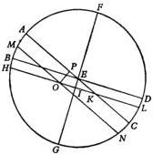

The remainder $OI$ will therefore be 29,792. But with $HOI = 100,000$ units as half of a diameter, $OI$ will be 29,810 units, corresponding to an arc of approximately $17^{\circ} 21'$. This was the distance of the Spike in the Virgin from the first point of the Balance, and this was the place of the star.

Also a decade earlier, namely, in the year 1515, I found its declination $8^{\circ} 36'$, and its place at $17^{\circ} 14'$ [from the first point] of the Balance. But Ptolemy reported its declination as only $\frac{1}{2}^{\circ}$ [Syntaxis, VII, 3]. Therefore its place would have been at $26^{\circ} 40'$ within the Virgin, which appears to be more accurate in comparison with the earlier observations.

Hence it seems quite clear that virtually throughout the whole interval from Timocharis to Ptolemy in 432 years the equinoxes and solstices shifted in precedence $1^{\circ}$ regularly every 100 years, as there was always a constant ratio between the time and the extent of their movement, which in its entirety amounted to $4\frac{1}{3}^{\circ}$. For also when the distance between the summer solstice and Basiliscus in the Lion is compared for the interval from Hipparchus to Ptolemy, in 266 years the equinoxes shifted $2\frac{2}{3}^{\circ}$. Here too, then, by being compared with the time they are found to have moved forward $1^{\circ}$ in 100 years. On the other hand, the [star] at the top of the forehead of the Scorpion in the 782 years intervening between Al-Battani and Menelaus traversed $11^{\circ} 55'$. To $1^{\circ}$ there will have to be assigned, as will be seen, not 100 years at all, but 66 years. Moreover, in the 741 years from Ptolemy [to Al-Battani], only 65 years are to be assigned to $1^{\circ}$. Finally, if the remaining period of 645 years is compared with the difference of $9^{\circ} 11'$ of my observation, $1^{\circ}$ will receive 71 years. Hence in those 400 years before Ptolemy, clearly the precession of the equinoxes was slower than from Ptolemy to Al-Battani, when it was also quicker than from Al-Battani to our times.

Likewise in the motion of the obliquity a difference is discovered. For, Aristarchus of Samos found the obliquity of the ecliptic and equator to be $23^{\circ} 51' 20''$, the same as Ptolemy; Al-Battani, $23^{\circ} 36'$; Al-Zarkali the Spaniard, 190 years after him, $23^{\circ} 34'$; and in the same way 230 years later, Profatius the Jew, about $2'$ less. But in our time it is found not greater than $23^{\circ} 28\frac{1}{3}'$. Hence it is also clear that from Aristarchus to Ptolemy, the motion was a minimum, but from Ptolemy to Al-Battani a maximum.

## HYPOTHESES BY WHICH THE SHIFT IN THE EQUINOXES AS WELL AS IN THE OBLIQUITY OF THE ECLIPTIC AND EQUATOR MAY BE DEMONSTRATED

From the foregoing it seems to be clear, then, that the equinoxes and solstices shift with a nonuniform motion. Nobody will adduce a better explanation of this, perhaps, than by a certain divagation of the earth's axis and of the poles of its equator. For this seems to follow from the hypothesis that the earth moves. For obviously the ecliptic remains forever unchangeable, as is attested by the constant latitudes of the fixed stars, whereas the equator shifts. For if the motion of the earth's axis agreed simply and precisely with the motion of its center, as I said [I, 11], absolutely no precession of the equinoxes and solstices would appear. However, since these motions differ from each other, but with a variable difference, the solstices and equinoxes also had to move ahead of the places of the stars in a nonuniform motion. The same thing happens in the motion of inclination. This motion likewise nonuniformly alters the obliquity of the ecliptic, an obliquity which would nevertheless be more properly assigned to the equator.

For this reason, since the poles and circles on a sphere are interconnected and fit together, it is necessary to posit two interacting motions performed entirely by the poles and similar to swinging librations. Now one motion will be that which alters the inclination of those circles to each other by deflecting the poles in that manner up and down around the angle of intersection. The other [will be the motion] which increases and decreases the solstitial and equinoctial precessions by producing a crosswise motion in both directions. Now I call these motions “librations”, because like objects swinging along the same path between two limits, they become faster in the middle and slowest at the extremes, as generally happens in the latitudes of the planets, as we shall see in the proper place [VI, 2]. Moreover, [these motions] differ in period, since two cycles of the nonuniformity of the equinoxes are completed in one cycle of the obliquity. Now in every apparent nonuniform motion something must be posited as a mean, through which the pattern of the nonuniformity can be grasped. Similarly, here too of course mean poles and a mean equator as well as mean equinoctial intersections and solstitial points had to be posited. Turning to either side of these means, but within fixed limits, the poles and the circle of the earth’s equator make those uniform motions appear nonuniform. Thus those two librations running in conjunction with each other make the poles of the earth in the course of time describe certain lines resembling a twisted little crown.

But these matters are not easily explained adequately with words. Hence they will not be understood when heard, I am afraid, unless they are also seen with the eyes. Therefore let us draw on a sphere the ecliptic $ABCD$. Let its north pole be $E$, the first point of the Goat $A$, of the Crab $C$, of the Ram $B$, and of the Balance $D$. Through the points $A$ and $C$ as well as the pole $E$, draw the circle $AEC$. Let the greatest distance between the north poles of the ecliptic and of the equator be $EF$, the least distance $EG$, and similarly the mean position of the pole, $I$. About $I$, describe $BHD$ as the equator. Let this be called the mean equator, with $B$ and $D$ as the mean equinoxes. Let all these things be carried around the pole $E$ in a constantly uniform motion in precedence, that is, in the contrary order of the zodiacal signs in the sphere of the fixed stars, in a slow motion, as I said [III, 1]. Now posit, for the terrestrial poles, two interacting motions, like [those of] swinging objects. [Of these two motions] one [occurs] between the limits $F$ and $G$; it will be called the “motion of anomaly”, that is, of the nonuniformity of the inclination. The other, [which runs] crosswise from precedence to consequence, and from consequence to precedence, I shall call the “anomaly of the equinoxes”. It is twice as fast as the first one. Both of these motions, meeting in the poles of the earth, deflect them in a wonderful way.

For in the first place, put the north pole of the earth at $F$. The equator drawn around it will pass through the same intersections $B$ and $D$, namely, through the poles of the circle $AFEC$. But this equator will make the angles of the obliquity greater, in proportion to the arc $FI$. As the pole of the earth is about to proceed from this assumed beginning toward the mean obliquity in $I$, the other motion intervenes and does not permit the pole to go directly along $FI$. On the contrary, the second motion deflects the pole through a roundabout course and extreme

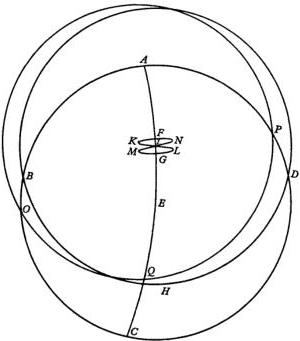

divergence in consequence. Let this be $K$. When the apparent equator $OQP$ is described around this point, its intersection will be, not in $B$, but behind it in $O$, and the precession of the equinoxes is diminished in proportion to the amount of $BO$. Turning at this point and proceeding in precedence, the pole is taken to the mean position $I$ by both motions acting conjointly and simultaneously. The apparent equator coincides throughout with the uniform or mean equator. As the pole of the earth passes through this point, it presses on in precedence. It separates the apparent equator from the mean equator, and increases the precession of the equinoxes up to the other limit, $L$. As the pole turns away from this position, it subtracts what it had just added to the equinoxes, until it reaches the point $G$. There it makes the obliquity a minimum at the same intersection $B$, where the motion of the equinoxes and solstices will again appear very slow, in almost exactly the same way as at $F$. At this time their nonuniformity has clearly completed its revolution, since it has passed from the mean through both of the extremes. But the motion of the obliquity [has passed] through only half of its circuit, from the greatest inclination to the least. Then as the pole proceeds in consequence, it presses on to the outermost limit in $M$. When it returns therefrom, it coincides again with the mean position $I$. As it presses on once more in precedence, it passes through the limit $N$, and finally completes what I called the twisted line $FKILGMINF$. Thus it is clear that in one cycle of the obliquity, the pole of the earth reaches the limit in precedence twice, and the limit in consequence twice.

## HOW AN OSCILLATING MOTION OR MOTION Chapter 4 IN LIBRATION IS CONSTRUCTED OUT OF CIRCULAR [MOTIONS]

Now I shall hereafter show that this motion is in agreement with the phenomena [III, 6]. But meanwhile someone will ask in what way these librations can be understood to be uniform, since it was stated in the beginning [I, 4] that a motion in the heavens is uniform or composed of uniform and circular [motions]. In this instance, however, both of the two motions appear as a single motion within the limits of both, so that a cessation [of motion] must intervene. I will indeed admit that they are paired, but [that oscillating motions are formed] from uniform [motions] is proved in the following way.

Let there be a straight line AB. Let it be divided into four equal parts at points C, D, and E. Around D, draw the circles ADB and CDE, with the same center and in the same plane. On the circumference of the inner circle, take any point F at random. With F as center, and with radius FD, draw the circle GHD. Let this intersect the straight line AB at the point H. Draw the diameter DFG. It must be shown that the movable point H slides back and forth in both directions along the same straight line AB, on account of the paired motions of the circles GHD and CFE acting conjointly. This will happen if H is understood to move in the opposite direction from F and twice as far. For, the same angle CDF, being located at the center of the circle CFE and at the circumference of GHD, intercepts as arcs of equal circles both FC and GH, which is twice FC. Assume that at some time when the straight lines ACD and DFG coincide, the movable point H coincides at G with A, while F is at C. Now, however, the center F moves to the right along FC, and H moves along the arc GH to the left twice as far as CF, or these directions may be reversed. Then the line AB will be the track for H. Otherwise, it would happen that a part is greater than its whole. This is easily understood, I believe. Now, having been drawn along by the broken line DFH,

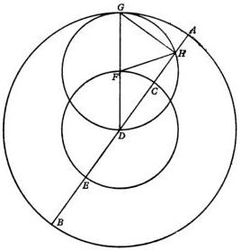

which is equal to $AD$, $H$ has moved away from its previous position $A$ by the length of $AH$, this distance being the excess of the diameter $DFG$ over the chord $DH$. In this way $H$ will be taken to the center $D$. This will happen when the circle $DHG$ is tangent to the straight line $AB$, while $GD$ is of course perpendicular to $AB$. Then $H$ will reach the other limit $B$, from which it will return again for the same reason.

Therefore it is clear that from two circular motions acting conjointly in this way, a rectilinear motion is compounded, as well as an oscillating and nonuniform motion from uniform [motions]. Q. E. D.

From this demonstration it also follows that the straight line $GH$ will always be perpendicular to $AB$, since the lines $DH$ and $HG$ will subtend a right angle in a semicircle. Therefore $GH$ will be half of the chord subtending twice the arc $AG$. The other line $DH$ will be half of the chord subtending twice the arc which remains when $AG$ is subtracted from a quadrant, since the circle $AGB$ is twice $HGD$ in diameter.

## PROOF OF THE NONUNIFORMITY IN THE PRECESSION OF THE EQUINOXES AND IN THE OBLIQUITY

Chapter 5

Accordingly some people call this the “motion along the width of a circle”, that is, along the diameter. Yet they treat its period and uniformity in terms of the circumference, but its magnitude in terms of chords. Hence it appears nonuniform, faster around the center and slower near the circumference, as is easily demonstrated.

Now let there be a semicircle $ABC$, with its center at $D$, and diameter $ADC$. Bisect the semicircle at the point $B$. Take equal arcs $AE$ and $BF$, and from points $F$ and $E$ drop the perpendiculars $EG$ and $FK$ on $ADC$. Now twice $DK$ subtends twice $BF$, and twice $EG$ subtends twice $AE$. Therefore $DK$ and $EG$ are equal. But in accordance with Euclid’s *Elements*, III, 7, $AG$ is less than $GE$, and will also be less than $DK$. But $GA$ and $KD$ were traversed in equal times, because the arcs $AE$ and $BF$ are equal. Therefore near the circumference $A$ the motion is slower than near the center $D$.

Now that this has been demonstrated, put the center of the earth at $L$, so that the straight line $LD$ is perpendicular to $ABC$, the plane of the semicircle. Through the points $A$ and $C$, with its center at $L$, draw $AMC$ as the arc of a circle. Extend $LDM$ as a straight line. Therefore the pole of the semicircle $ABC$ will be at $M$, and $ADC$ will be the intersection of the circles. Join $LA$ and $LC$. In like manner join $LK$ and $LG$; when these are extended as straight lines, let them intersect the

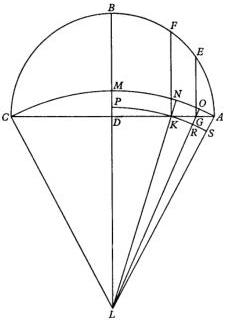

arc $AMC$ in $N$ and $O$. Now at $LDK$ there is a right angle. Therefore the angle at $LKD$ is acute. Hence it is also true that the line $LK$ is longer than $LD$. Even more so, in the obtuse triangles side $LG$ is longer than side $LK$, and $LA$ than $LG$.

Now a circle drawn with its center at $L$, and with radius $LK$, will fall beyond $LD$, but will intersect the remaining lines $LG$ and $LA$. Let the circle be drawn, and let it be $PKRS$. Triangle $LDK$ is smaller than the sector $LPK$. But triangle $LGA$ is bigger than the sector $LRS$. Therefore the ratio of the triangle $LDK$ to the sector $LPK$ is less than the ratio of the triangle $LGA$ to the sector $LRS$. In turn, the ratio of the triangle $LDK$ to the triangle $LGA$ will also be less than the ratio of the sector $LPK$ to the sector $LRS$. In accordance with Euclid's *Elements*, VI, 1, base $DK$ is to base $AG$ as triangle $LKD$ is to triangle $LGA$. The ratio of the sector to the sector, however, is as angle $DLK$ is to angle $RLS$, or as arc $MN$ is to arc $OA$. Therefore the ratio of $DK$ to $GA$ is less than the ratio of $MN$ to $OA$. But I have already shown that $DK$ is bigger than $GA$. All the more, then, will $MN$ be greater than $OA$. These are known to be described in equal periods of time by the poles of the earth along the equal arcs $AE$ and $BF$ of the anomaly. Q. E. D.

However, the difference between the maximum and minimum obliquity is quite small, and does not exceed $\frac{2}{5}^{\circ}$. Therefore also between the curve $AMC$ and the straight line $ADC$ the difference will be imperceptible. Hence no error will occur if we operate simply with the line $ADC$ and the semicircle $ABC$. Just about the same thing happens with regard to the other motion of the poles which affects the equinoxes, since it does not reach $\frac{1}{2}^{\circ}$, as will be made clear below.

Again let there be the circle $ABCD$ through the poles of the ecliptic and mean equator. We may call this circle the "mean colure of the Crab". Let half of the ecliptic be $DEB$. Let the mean equator be $AEC$. Let them intersect each other in the point $E$, where the mean equinox will be. Let the pole of the equator be $F$,

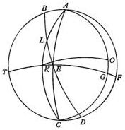

through which draw the great circle $FET$. This will therefore be the colure of the mean or uniform equinoxes. Now to make the proof easier, let us separate the libration of the equinoxes from the [libration of the] obliquity of the ecliptic. On the colure $EF$, take the arc $FG$. Let $G$, the apparent pole of the equator, be understood to move through $FG$ from $F$, the mean pole. With $G$ as pole, draw $ALKC$ as the semicircle of the apparent equator. This will intersect the ecliptic in $L$. Therefore the point $L$ will be the apparent equinox. Its distance from the mean equinox will be the arc $LE$, governed by the equality of $EK$ with $FG$. But we may make $K$ a pole, and describe the circle $AGC$. We may also posit that during the time in which the libration $FG$ occurs, the pole of the equator does not remain the true pole in the point $G$; on the contrary, under the influence of the second libration it diverges toward the obliquity of the ecliptic along the arc $GO$. Therefore, while the ecliptic $BED$ remains stationary, the true apparent equator will shift in accordance with the dislocation of the pole $O$. And in the same way the motion of $L$, the intersection of the apparent equator, will be faster around $E$, the mean equinox, and slowest at the extremes, approximately in proportion to the libration of the poles, which has already been demonstrated [III, 3]. To have perceived this was worth while.

## THE UNIFORM MOTIONS OF THE PRECESSION Chapter 6 OF THE EQUINOXES AND OF THE INCLINATION OF THE ECLIPTIC

Now every circular motion which appears nonuniform occupies four boundary zones. There is [a zone] where it appears slow, and [one] where it is fast, as extremes; and midway between, it is average. For at the end of the deceleration and beginning of the acceleration it changes in the direction of the average [velocity]; from the average it increases to [the highest] speed; from high speed it tends again toward the average; then the remainder returns from the uniform [speed] to the previous slowness. These considerations make known in what part of the circle the place of the nonuniformity or anomaly was at a [given] time. From these properties the cycle of the anomaly is also understood.

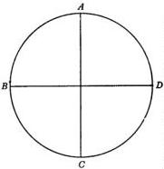

For example, in a circle divided into four equal parts let $A$ be the place of the greatest slowness, $B$ the average velocity on the increase, $C$ the end of the increase and the beginning of the decrease, and $D$ the average velocity on the decrease. Now from Timocharis to Ptolemy, as was indicated above [III, 2], the apparent motion of the precession of the equinoxes has been found slower than at all other times. For a while it appeared regular and uniform, as is shown by the observations of Aristyllus, Hipparchus, Agrippa, and Menelaus in the middle of the period. This proves, therefore, that the apparent motion of the equinoxes was at its very slowest. In the middle of the period it was at the beginning of the acceleration. At that time the cessation of the deceleration, combined with the beginning of the acceleration, by counteracting each other made the motion seem uniform in the meantime. Hence Timocharis' observation must be placed in the last part of the circle within $DA$. But Ptolemy's observation will fall in the first quadrant within $AB$. Furthermore, in the second period from Ptolemy to Al-Battani of Raqqa the motion is found to be faster than in the third period. Hence this indicates that the highest velocity, that is, the point $C$, passed by in the second period of time. The anomaly has now reached the third quadrant of the circle within CD. In the third period down to our time the cycle of the anomaly is nearly completed and is returning to where it began with Timocharis. For we may incorporate the entire cycle of 1819 years from Timocharis to us in the customary 360°. In proportion to 432 years, we shall have an arc of 85 1/2°; but for 742 years, 146° 51'; and for the remaining 645 years, the remaining arc of 127° 39'. I obtained these results offhand and by a simple conjecture. But I reexamined them in a more precise computation of the extent to which they would agree more exactly with the observations. I found that in 1819 Egyptian years the motion of the anomaly had already completed its revolution, and exceeded it by 21° 24'. The time of a period contains only 1717 Egyptian years. By this calculation the first segment of the circle is determined to be 90° 35'; the second, 155° 34'; but the third in 543 years will contain the remaining 113° 51' of the circle.

After these results had been established in this way, the mean motion of the precession of the equinoxes also became clear. It is 23° 57' in the same 1717 years in which the entire nonuniformity is restored to its original state. For in 1819 years we had an apparent motion of about 25° 1'. But, the difference between 1717 years and 1819 being 102, in 102 years after Timocharis the apparent motion must have been about 1° 4'. For it probably was a little greater than the completion of 1° in 100 years at that time when it was decreasing but had not yet reached the end of the deceleration. Accordingly, if we subtract 1 1/15° from 25° 1', the remainder will be, as I mentioned, in 1717 Egyptian years the mean and uniform motion, which was then equal to the nonuniform and apparent motion of 23° 57'. Hence the entire uniform revolution of the precession of the equinoxes mounts up to 25,816 years. During that time about 15 1/28 cycles of the anomaly are completed.

This computation is also in conformity with the motion of the obliquity, whose cycle I said is twice as slow as the precession of the equinoxes [III,3]. Ptolemy reported that the obliquity of 23° 51' 20'' had not changed at all in the 400 years before him since Aristarchus of Samos. Hence this shows that it then stayed nearly steady around the limit of maximum obliquity, when of course the precession of the equinoxes was also having its slowest motion. At present the same restoration of the slow motion is also approaching. However, the inclination of the axis is not crossing over in like manner to the maximum, but to the minimum. In the intervening period the inclination was found, as I said [III, 2], by Al-Battani to be 23° 35'; by Al-Zarkali the Spaniard, 190 years after him, 23° 34'; and in the same way 230 years later, by Profatius the Jew, about 2' less. Finally, so far as our own times are concerned, in frequent observations over the past 30 years, I have found it to be about 23° 28 3/5'. From this determination George Peurbach and Johannes Regiomontanus, who were my immediate predecessors, differ very little.

Here again it is absolutely clear that the shift in the obliquity in the 900 years after Ptolemy happened to be greater than in any other period of time. Therefore, since we already have the cycle of the anomaly of precession in 1717 years, we shall also have half a period of the obliquity in that time, and its complete cycle in 3434 years. Hence if we divide 360° by the same number of 3434 years, or 180° by 1717, the annual motion of the simple anomaly will come out as 6' 17'' 24'' 9'''. When this quantity is again divided by 365 days, the daily motion becomes 1'' 2'' 2'''. Similarly when the mean motion of the precession of the equinoxes – and this was 23° 57' – is divided by 1717 years, the annual motion will come out as 50'' 12'' 5''', and when this quantity is divided by 365 days, the daily motion will be 8'' 15'''.

Now to make the motions clearer and to have them handy when occasion requires, I shall exhibit them in Tables or Catalogues. The annual motion will be added continuously and equally. If a number exceeds 60, a unit will always be moved over to the higher fraction of a degree or to the degrees. I have extended the Tables as far as the 60-year line (for the sake of convenience). For in 60 years the same set of numbers appears (only the designations of degrees and fractions of degrees being transposed). Thus what was previously a second becomes a minute, and so on. By this shortcut with these brief Tables and with only two entries we may obtain and infer the uniform motions for the years in question up to 3600 years. The same holds true also for the number of the days.

In computing the heavenly motions, however, I shall use Egyptian years everywhere. Among the civil [years], they alone are found to be uniform. For the measuring unit had to agree with what was measured. Harmony to this extent does not occur in the years of the Romans, Greeks, and Persians. With them an intercalation is made, not in any one way, but as each of the nations preferred. The Egyptian year, however, presents no ambiguity with its definite number of 365 days. [They comprise] 12 equal months, which are called in order by their own names: Thoth, Phaophi, Athyr, Choiach, Tybi, Mechyr, Phamenoth, Pharmuthi, Pachon, Pauni, Ephiphi, and Mesori. These in like manner contain 6 groups of 60 days, and the 5 remaining days are termed intercalary. For this reason in the computation of the uniform motions, Egyptian years are most convenient. Any other years are easily reduced to them by a transposition of days.

|  THE UNIFORM MOTION OF THE PRECESSION OF THE EQUINOXES IN YEARS AND PERIODS OF SIXTY YEARS  |   |   |   |   |   |   |   |   |   |   |   |   |
| --- | --- | --- | --- | --- | --- | --- | --- | --- | --- | --- | --- | --- |
|  Christian Era 5°32'  |   |   |   |   |   |   |   |   |   |   |   |   |
|  Years | Longitude |   |   |   |   | Years | Longitude  |   |   |   |   |   |
|   |  60° | ° | ' | " | " |   | 60° | ° | ' | " | " | "  |
|  1 | 0 | 0 | 0 | 50 | 12 | 31 | 0 | 0 | 25 | 56 | 14 |   |
|  2 | 0 | 0 | 1 | 40 | 24 | 32 | 0 | 0 | 26 | 46 | 26 |   |
|  3 | 0 | 0 | 2 | 30 | 36 | 33 | 0 | 0 | 27 | 36 | 38 |   |
|  4 | 0 | 0 | 3 | 20 | 48 | 34 | 0 | 0 | 28 | 26 | 50 |   |
|   | 0 | 0 | 4 | 11 | 0 | 35 | 0 | 0 | 29 | 17 | 2 |   |
|  6 | 0 | 0 | 5 | 1 | 12 | 36 | 0 | 0 | 30 | 7 | 15 |   |
|  7 | 0 | 0 | 5 | 51 | 24 | 37 | 0 | 0 | 30 | 57 | 27 |   |
|  8 | 0 | 0 | 6 | 41 | 36 | 38 | 0 | 0 | 31 | 47 | 39 |   |
|  9 | 0 | 0 | 7 | 31 | 48 | 39 | 0 | 0 | 32 | 37 | 51 |   |
|   | 0 | 0 | 8 | 22 | 0 | 40 | 0 | 0 | 33 | 28 | 3 |   |
|  11 | 0 | 0 | 9 | 12 | 12 | 41 | 0 | 0 | 34 | 18 | 15 |   |
|  12 | 0 | 0 | 10 | 2 | 25 | 42 | 0 | 0 | 35 | 8 | 27 |   |
|  13 | 0 | 0 | 10 | 52 | 37 | 43 | 0 | 0 | 35 | 58 | 39 |   |
|  14 | 0 | 0 | 11 | 42 | 49 | 44 | 0 | 0 | 36 | 48 | 51 |   |
|   | 0 | 0 | 12 | 33 | 1 | 45 | 0 | 0 | 37 | 39 | 3 |   |
|  16 | 0 | 0 | 13 | 23 | 13 | 46 | 0 | 0 | 38 | 29 | 15 |   |
|  17 | 0 | 0 | 14 | 13 | 25 | 47 | 0 | 0 | 39 | 19 | 27 |   |
|  18 | 0 | 0 | 15 | 3 | 37 | 48 | 0 | 0 | 40 | 9 | 40 |   |
|  19 | 0 | 0 | 15 | 53 | 49 | 49 | 0 | 0 | 40 | 59 | 52 |   |
|   | 0 | 0 | 16 | 44 | 1 | 50 | 0 | 0 | 41 | 50 | 4 |   |
|  21 | 0 | 0 | 17 | 34 | 13 | 51 | 0 | 0 | 42 | 40 | 16 |   |
|  22 | 0 | 0 | 18 | 24 | 25 | 52 | 0 | 0 | 43 | 30 | 28 |   |
|  23 | 0 | 0 | 19 | 14 | 37 | 53 | 0 | 0 | 44 | 20 | 40 |   |
|  24 | 0 | 0 | 20 | 4 | 50 | 54 | 0 | 0 | 45 | 10 | 52 |   |
|   | 0 | 0 | 20 | 55 | 2 | 55 | 0 | 0 | 46 | 1 | 4 |   |
|  26 | 0 | 0 | 21 | 45 | 14 | 56 | 0 | 0 | 46 | 51 | 16 |   |
|  27 | 0 | 0 | 22 | 35 | 26 | 57 | 0 | 0 | 47 | 41 | 28 |   |
|  28 | 0 | 0 | 23 | 25 | 38 | 58 | 0 | 0 | 48 | 31 | 40 |   |
|  29 | 0 | 0 | 24 | 15 | 50 | 59 | 0 | 0 | 49 | 21 | 52 |   |
|   | 0 | 0 | 25 | 6 | 2 | 60 | 0 | 0 | 50 | 12 | 5 |   |

|  THE UNIFORM MOTION OF THE PRECESSION OF THE EQUINOXES IN DAYS AND PERIODS OF SIXTY DAYS  |   |   |   |   |   |   |   |   |   |   |   |   |
| --- | --- | --- | --- | --- | --- | --- | --- | --- | --- | --- | --- | --- |
|  Days | Motion |   |   |   |   |  | Days | Motion  |   |   |   |   |
|   |  60° | ° | ' | " | " |   |   | 60° | ° | ' | " | "  |
|  1 | 0 | 0 | 0 | 0 | 8 |  | 31 | 0 | 0 | 0 | 4 | 15  |
|  2 | 0 | 0 | 0 | 0 | 16 |  | 32 | 0 | 0 | 0 | 4 | 24  |
|  3 | 0 | 0 | 0 | 0 | 24 |  | 33 | 0 | 0 | 0 | 4 | 32  |
|  4 | 0 | 0 | 0 | 0 | 33 |  | 34 | 0 | 0 | 0 | 4 | 40  |
|   | 0 | 0 | 0 | 0 | 41 |  | 35 | 0 | 0 | 0 | 4 | 48  |
|  6 | 0 | 0 | 0 | 0 | 49 |  | 36 | 0 | 0 | 0 | 4 | 57  |
|  7 | 0 | 0 | 0 | 0 | 57 |  | 37 | 0 | 0 | 0 | 5 | 5  |
|  8 | 0 | 0 | 0 | 1 | 6 |  | 38 | 0 | 0 | 0 | 5 | 13  |
|  9 | 0 | 0 | 0 | 1 | 14 |  | 39 | 0 | 0 | 0 | 5 | 21  |
|   | 0 | 0 | 0 | 1 | 22 |  | 40 | 0 | 0 | 0 | 5 | 30  |
|  11 | 0 | 0 | 0 | 1 | 30 |  | 41 | 0 | 0 | 0 | 5 | 38  |
|  12 | 0 | 0 | 0 | 1 | 39 |  | 42 | 0 | 0 | 0 | 5 | 46  |
|  13 | 0 | 0 | 0 | 1 | 47 |  | 43 | 0 | 0 | 0 | 5 | 54  |
|  14 | 0 | 0 | 0 | 1 | 55 |  | 44 | 0 | 0 | 0 | 6 | 3  |
|   | 0 | 0 | 0 | 2 | 3 |  | 45 | 0 | 0 | 0 | 6 | 11  |
|  16 | 0 | 0 | 0 | 2 | 12 |  | 46 | 0 | 0 | 0 | 6 | 19  |
|  17 | 0 | 0 | 0 | 2 | 20 |  | 47 | 0 | 0 | 0 | 6 | 27  |
|  18 | 0 | 0 | 0 | 2 | 28 |  | 48 | 0 | 0 | 0 | 6 | 36  |
|  19 | 0 | 0 | 0 | 2 | 36 |  | 49 | 0 | 0 | 0 | 6 | 44  |
|   | 0 | 0 | 0 | 2 | 45 |  | 50 | 0 | 0 | 0 | 6 | 52  |
|  21 | 0 | 0 | 0 | 2 | 53 |  | 51 | 0 | 0 | 0 | 7 | 0  |
|  22 | 0 | 0 | 0 | 3 | 1 |  | 52 | 0 | 0 | 0 | 7 | 9  |
|  23 | 0 | 0 | 0 | 3 | 9 |  | 53 | 0 | 0 | 0 | 7 | 17  |
|  24 | 0 | 0 | 0 | 3 | 18 |  | 54 | 0 | 0 | 0 | 7 | 25  |
|   | 0 | 0 | 0 | 3 | 26 |  | 55 | 0 | 0 | 0 | 7 | 33  |
|  26 | 0 | 0 | 0 | 3 | 34 |  | 56 | 0 | 0 | 0 | 7 | 42  |
|  27 | 0 | 0 | 0 | 3 | 42 |  | 57 | 0 | 0 | 0 | 7 | 50  |
|  28 | 0 | 0 | 0 | 3 | 51 |  | 58 | 0 | 0 | 0 | 7 | 58  |
|  29 | 0 | 0 | 0 | 3 | 59 |  | 59 | 0 | 0 | 0 | 8 | 6  |
|   | 0 | 0 | 0 | 4 | 7 |  | 60 | 0 | 0 | 0 | 8 | 15  |

|  THE NONUNIFORM MOTION OF THE EQUINOXES IN YEARS AND PERIODS OF SIXTY YEARS  |   |   |   |   |   |   |   |   |   |   |   |   |
| --- | --- | --- | --- | --- | --- | --- | --- | --- | --- | --- | --- | --- |
|  Christian Era 6° 45'  |   |   |   |   |   |   |   |   |   |   |   |   |
|  Years | Motion |   |   |   |   | Years | Motion  |   |   |   |   |   |
|   |  60° | ° | ' | " | " |   | 60° | ° | ' | " | " | "  |
|  1 | 0 | 0 | 6 | 17 | 24 | 31 | 0 | 3 | 14 | 59 | 28 |   |
|  2 | 0 | 0 | 12 | 34 | 48 | 32 | 0 | 3 | 21 | 16 | 52 |   |
|  3 | 0 | 0 | 18 | 52 | 12 | 33 | 0 | 3 | 27 | 34 | 16 |   |
|  4 | 0 | 0 | 25 | 9 | 36 | 34 | 0 | 3 | 33 | 51 | 41 |   |
|   | 0 | 0 | 31 | 27 | 0 | 35 | 0 | 3 | 40 | 9 | 5 |   |
|  6 | 0 | 0 | 37 | 44 | 24 | 36 | 0 | 3 | 46 | 26 | 29 |   |
|  7 | 0 | 0 | 44 | 1 | 49 | 37 | 0 | 3 | 52 | 43 | 53 |   |
|  8 | 0 | 0 | 50 | 19 | 13 | 38 | 0 | 3 | 59 | 1 | 17 |   |
|  9 | 0 | 0 | 56 | 36 | 37 | 39 | 0 | 4 | 5 | 18 | 42 |   |
|   | 0 | 1 | 2 | 54 | 1 | 40 | 0 | 4 | 11 | 36 | 6 |   |
|  11 | 0 | 1 | 9 | 11 | 25 | 41 | 0 | 4 | 17 | 53 | 30 |   |
|  12 | 0 | 1 | 15 | 28 | 49 | 42 | 0 | 4 | 24 | 10 | 54 |   |
|  13 | 0 | 1 | 21 | 46 | 13 | 43 | 0 | 4 | 30 | 28 | 18 |   |
|  14 | 0 | 1 | 28 | 3 | 38 | 44 | 0 | 4 | 36 | 45 | 42 |   |
|   | 0 | 1 | 34 | 21 | 2 | 45 | 0 | 4 | 43 | 3 | 6 |   |
|  16 | 0 | 1 | 40 | 38 | 26 | 46 | 0 | 4 | 49 | 20 | 31 |   |
|  17 | 0 | 1 | 46 | 55 | 50 | 47 | 0 | 4 | 55 | 37 | 55 |   |
|  18 | 0 | 1 | 53 | 13 | 14 | 48 | 0 | 5 | 1 | 55 | 19 |   |
|  19 | 0 | 1 | 59 | 30 | 38 | 49 | 0 | 5 | 8 | 12 | 43 |   |
|   | 0 | 2 | 5 | 48 | 3 | 50 | 0 | 5 | 14 | 30 | 7 |   |
|  21 | 0 | 2 | 12 | 5 | 27 | 51 | 0 | 5 | 20 | 47 | 31 |   |
|  22 | 0 | 2 | 18 | 22 | 51 | 52 | 0 | 5 | 27 | 4 | 55 |   |
|  23 | 0 | 2 | 24 | 40 | 15 | 53 | 0 | 5 | 33 | 22 | 20 |   |
|  24 | 0 | 2 | 30 | 57 | 39 | 54 | 0 | 5 | 39 | 39 | 44 |   |
|   | 0 | 2 | 37 | 15 | 3 | 55 | 0 | 5 | 45 | 57 | 8 |   |
|  26 | 0 | 2 | 43 | 32 | 27 | 56 | 0 | 5 | 52 | 14 | 32 |   |
|  27 | 0 | 2 | 49 | 49 | 52 | 57 | 0 | 5 | 58 | 31 | 56 |   |
|  28 | 0 | 2 | 56 | 7 | 16 | 58 | 0 | 6 | 4 | 49 | 20 |   |
|  29 | 0 | 3 | 2 | 24 | 40 | 59 | 0 | 6 | 11 | 6 | 45 |   |
|   | 0 | 3 | 8 | 42 | 4 | 60 | 0 | 6 | 17 | 24 | 9 |   |

|  THE NONUNIFORM MOTION OF THE EQUINOXES IN DAYS AND PERIODS OF SIXTY DAYS  |   |   |   |   |   |   |   |   |   |   |   |   |
| --- | --- | --- | --- | --- | --- | --- | --- | --- | --- | --- | --- | --- |
|  Days | Motion |   |   |   |   |  | Days | Motion  |   |   |   |   |
|   |  60° | ° | ' | " | " |   |   | 60° | ° | ' | " | "  |
|  1 | 0 | 0 | 0 | 1 | 2 |  | 31 | 0 | 0 | 0 | 32 | 3  |
|  2 | 0 | 0 | 0 | 2 | 4 |  | 32 | 0 | 0 | 0 | 33 | 5  |
|  3 | 0 | 0 | 0 | 3 | 6 |  | 33 | 0 | 0 | 0 | 34 | 7  |
|  4 | 0 | 0 | 0 | 4 | 8 |  | 34 | 0 | 0 | 0 | 35 | 9  |
|   | 0 | 0 | 0 | 5 | 10 |  | 35 | 0 | 0 | 0 | 36 | 11  |
|  6 | 0 | 0 | 0 | 6 | 12 |  | 36 | 0 | 0 | 0 | 37 | 13  |
|  7 | 0 | 0 | 0 | 7 | 14 |  | 37 | 0 | 0 | 0 | 38 | 15  |
|  8 | 0 | 0 | 0 | 8 | 16 |  | 38 | 0 | 0 | 0 | 39 | 17  |
|  9 | 0 | 0 | 0 | 9 | 18 |  | 39 | 0 | 0 | 0 | 40 | 19  |
|   | 0 | 0 | 0 | 10 | 20 |  | 40 | 0 | 0 | 0 | 41 | 21  |
|  11 | 0 | 0 | 0 | 11 | 22 |  | 41 | 0 | 0 | 0 | 42 | 23  |
|  12 | 0 | 0 | 0 | 12 | 24 |  | 42 | 0 | 0 | 0 | 43 | 25  |
|  13 | 0 | 0 | 0 | 13 | 26 |  | 43 | 0 | 0 | 0 | 44 | 27  |
|  14 | 0 | 0 | 0 | 14 | 28 |  | 44 | 0 | 0 | 0 | 45 | 29  |
|   | 0 | 0 | 0 | 15 | 30 |  | 45 | 0 | 0 | 0 | 46 | 31  |
|  16 | 0 | 0 | 0 | 16 | 32 |  | 46 | 0 | 0 | 0 | 47 | 33  |
|  17 | 0 | 0 | 0 | 17 | 34 |  | 47 | 0 | 0 | 0 | 48 | 35  |
|  18 | 0 | 0 | 0 | 18 | 36 |  | 48 | 0 | 0 | 0 | 49 | 37  |
|  19 | 0 | 0 | 0 | 19 | 38 |  | 49 | 0 | 0 | 0 | 50 | 39  |
|   | 0 | 0 | 0 | 20 | 40 |  | 50 | 0 | 0 | 0 | 51 | 41  |
|  21 | 0 | 0 | 0 | 21 | 42 |  | 51 | 0 | 0 | 0 | 52 | 43  |
|  22 | 0 | 0 | 0 | 22 | 44 |  | 52 | 0 | 0 | 0 | 53 | 45  |
|  23 | 0 | 0 | 0 | 23 | 46 |  | 53 | 0 | 0 | 0 | 54 | 47  |
|  24 | 0 | 0 | 0 | 24 | 48 |  | 54 | 0 | 0 | 0 | 55 | 49  |
|   | 0 | 0 | 0 | 25 | 50 |  | 55 | 0 | 0 | 0 | 56 | 51  |
|  26 | 0 | 0 | 0 | 26 | 52 |  | 56 | 0 | 0 | 0 | 57 | 53  |
|  27 | 0 | 0 | 0 | 27 | 54 |  | 57 | 0 | 0 | 0 | 58 | 55  |
|  28 | 0 | 0 | 0 | 28 | 56 |  | 58 | 0 | 0 | 0 | 59 | 57  |
|  29 | 0 | 0 | 0 | 29 | 58 |  | 59 | 0 | 0 | 1 | 0 | 59  |
|   | 0 | 0 | 0 | 31 | 1 |  | 60 | 0 | 0 | 1 | 2 | 2  |

## WHAT IS THE GREATEST DIFFERENCE BETWEEN THE UNIFORM AND THE APPARENT PRECESSION OF THE EQUINOXES?

Chapter 7

The mean motions having been set forth in this way, we must now ask how great the maximum difference is between the uniform and the apparent motion of the equinoxes, or [how great] the diameter of the small circle is through which the motion in anomaly revolves. For when this is known, it will be easy to determine any other differences between these motions. Now, as was indicated above [III, 2], between Timocharis' first [observation] and Ptolemy's [observation] in the 2nd year of Antoninus there were 432 years. In that time the mean motion is 6°. But the apparent [motion] was 4° 20'. The difference between them is 1° 40'. Furthermore, the motion of the double anomaly was 90° 35'. Moreover, in the middle of this period or about that time, as has been seen [III, 6], the apparent motion reached the extreme of greatest slowness. In this [period] it must agree with the mean motion, while the true and mean equinoxes must have been at the same intersection of the circles. Therefore when the motion and time are divided in half, on both sides the differences between the nonuniform and uniform motions will be 5/6°. These differences are enclosed on either side below 45° 17 1/2' arcs of the circle of anomaly.

Now that these things have been established in this way, let ABC be an arc of the ecliptic, DBE the mean equator, and B the mean intersection of the apparent equinoxes, whether the Ram or the Balance. Through the poles of DBE, draw FB. Now to either side on ABC take equal arcs BI and BK of 5/6°, so that the whole of IBK is 1° 40'. Also draw two arcs IG and HK of the apparent equators at right angles to FB, extended to FBH. Now I say "at right angles", although the poles of IG and HK are very often outside the circle BF, since the motion in inclination intermingles itself, as was seen in the hypothesis [III, 3]. But because the distance is quite small, not exceeding at its maximum 1/480 of a right angle [=12'], I treat those angles as though they were right angles, so far as perception is concerned. For, no error will appear on that account. Now in triangle IBG, angle IBG is given as 66° 20'. For, the complementary angle DBA was 23° 40', the mean obliquity of the ecliptic. BGI is a right angle. Moreover, angle BIG is almost exactly equal to its alternate interior angle IBD. Side IB is given as 50'. Therefore BG, the distance between the poles of the mean and apparent [equator], is equal to 20'. Similarly, in triangle BHK, two angles BHK and HBK are equal

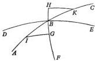

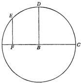

to the two angles IBG and IGB, and side BK is equal to side BI. BH will also be equal to BG's 20'. But all of this is concerned with very small quantities, which do not amount to 1 1/2° of the ecliptic. In these quantities the straight lines are virtually equal to the arcs subtended by them, any divergence being barely found in 60ths of a second. I am satisfied with minutes, however, and will commit no error if I use straight lines instead of arcs. For, GB and BH will be proportional to IB and BK, and the same ratio will hold true for the motions in both poles as well as in both intersections.

Let a part of the ecliptic be ABC. On it let the mean equinox be B. With this as pole, draw a semicircle ADC, intersecting the ecliptic in points A and C. From the pole of the ecliptic also draw DB, which will bisect at D the semicircle we have drawn. Let D be understood to be the utmost limit of the deceleration and the beginning of the acceleration. In the quadrant AD, take the arc DE of 45° 17 1/2'. Through the point E, drop EF from the pole of the ecliptic, and let BF be 50'. From these [particulars] it is proposed to find the whole of BFA. Now it is evident that twice BF subtends twice the segment DE. But as BF's 7107 units are to AFB's 10,000, so BF's 50' are to AFB's 70'. Therefore AB is given as 1° 10'. This is the greatest difference between the mean and apparent motions of the equinoxes. This is what we were looking for, and what is followed by the poles' greatest divergence of 28'. These [28'] correspond, in the intersections of the equator, to the 70' in the anomaly of the equinoxes, which I call the "double [anomaly]" in contrast to the other "simple [anomaly]" of the obliquity.

### THE INDIVIDUAL DIFFERENCES BETWEEN THESE MOTIONS, AND A TABLE EXHIBITING THOSE DIFFERENCES

Chapter 8

Now AB is given as 70', an arc which seems not to differ in length from the straight line subtending it. Hence it will not be difficult to exhibit any other individual differences between the mean and the apparent motions. These differences, the subtraction or addition of which confers order upon the appearances, are called "prosthaphaereses" by the Greeks, and "equations" by the moderns. I prefer to use the Greek word as more appropriate.

Now if ED is 3°, according to the ratio of AB to the subtending chord BF, we shall have BF as a prosthaphaeresis of 4'; for 6°, there will be 7'; for 9°, 11'; and so on. We must operate in the same way, I believe, also with regard to the shift in the obliquity, where 24' have been found, as I said [III,5], between the maximum and the minimum. In a semicircle of the simple anomaly these 24' are traversed in 1717 years. Half of the duration in a quadrant of the circle will be 12'. There the pole of the small circle of this anomaly will be, with the obliquity at 23° 40'. And in this way, as I said, we shall infer the remaining parts of the difference almost exactly in proportion to what was said above, as contained in the appended Table.

Through these demonstrations the apparent motions can be put together in various ways. Nevertheless the most satisfactory procedure was that in which each individual prosthaphaeresis is taken separately. As a result the computation of the motions becomes easier to understand, and conforms more closely to the explanations of what has been demonstrated. Hence I drew up a Table of 60 lines, advancing 3° at a time. For in this arrangement it will not take up a lot of space, nor will it seem too compact and brief; in the other similar cases, I shall do the same. The present Table will have only 4 columns. The first 2 of them contain the degrees of both semicircles. I call these degrees the “common number”, because the number itself yields the obliquity of the ecliptic, while twice the number will serve as the prosthaphaeresis of the equinoxes, the beginning of which is taken from the start of the acceleration. The 3rd column will contain the prosthaphaereses of the equinoxes corresponding to every 3rd degree. These prosthaphaereses must be added to or subtracted from the mean motion, which I initiate from the first star in the head of the Ram at the vernal equinox. The subtractive prosthaphaereses [pertain to] the anomaly in the smaller semicircle or first column, while the additive prosthaphaereses [pertain to] the second [column] and the following semicircle. Finally, the last column contains the minutes, called “the differences between the proportions of the obliquity”, mounting to 60 as the maximum. For in place of 24′, the surplus by which the greatest obliquity exceeds the smallest, I put 60. In proportion thereto I adjust the fractions of the remaining surpluses in a similar ratio. Therefore at the beginning and end of the anomaly I put 60. But where the surplus reaches 22′, as in an anomaly of 33°, I put 55 in place of 22′. Thus for 20′, I put 50, as in an anomaly of 48°, and so on for the rest, as in the appended Table.

|  TABLE OF THE PROSTHAPHAERESES OF THE EQUINOXES AND OF THE OBLIQUITY OF THE ECLIPTIC  |   |   |   |   |   |   |   |   |   |   |
| --- | --- | --- | --- | --- | --- | --- | --- | --- | --- | --- |
|  Common Numbers |   | Prosthaphae-reses of the Equinoxes |   | Proportional Minutes of the Obliquity |  | Common Numbers |   | Prosthaphae-reses of the Equinoxes |   | Proportional Minutes of the Obliquity  |
|  Degree | Degree | Degree | Minute |   |   | Degree | Degree | Degree | Minute  |   |
|  3 | 357 | 0 | 4 | 60 |  | 93 | 267 | 1 | 10 | 28  |
|  6 | 354 | 0 | 7 | 60 |  | 96 | 264 | 1 | 10 | 27  |
|  9 | 351 | 0 | 11 | 60 |  | 99 | 261 | 1 | 9 | 25  |
|  12 | 348 | 0 | 14 | 59 |  | 102 | 258 | 1 | 9 | 24  |
|   | 345 | 0 | 18 | 59 |  | 105 | 255 | 1 | 8 | 22  |
|  18 | 342 | 0 | 21 | 59 |  | 108 | 252 | 1 | 7 | 21  |
|  21 | 339 | 0 | 25 | 58 |  | 111 | 249 | 1 | 5 | 19  |
|  24 | 336 | 0 | 28 | 57 |  | 114 | 246 | 1 | 4 | 18  |
|  27 | 333 | 0 | 32 | 56 |  | 117 | 243 | 1 | 2 | 16  |
|   | 330 | 0 | 35 | 56 |  | 120 | 240 | 1 | 1 | 15  |
|  33 | 327 | 0 | 38 | 55 |  | 123 | 237 | 0 | 59 | 14  |
|  36 | 324 | 0 | 41 | 54 |  | 126 | 234 | 0 | 56 | 12  |
|  39 | 321 | 0 | 44 | 53 |  | 129 | 231 | 0 | 54 | 11  |
|  42 | 318 | 0 | 47 | 52 |  | 132 | 228 | 0 | 52 | 10  |
|   | 315 | 0 | 49 | 51 |  | 135 | 225 | 0 | 49 | 9  |
|  48 | 312 | 0 | 52 | 50 |  | 138 | 222 | 0 | 47 | 8  |
|  51 | 309 | 0 | 54 | 49 |  | 141 | 219 | 0 | 44 | 7  |
|  54 | 306 | 0 | 56 | 48 |  | 144 | 216 | 0 | 41 | 6  |
|  57 | 303 | 0 | 59 | 46 |  | 147 | 213 | 0 | 38 | 5  |
|  60 | 300 | 1 | 1 | 45 |  | 150 | 210 | 0 | 35 | 4  |
|  63 | 297 | 1 | 2 | 44 |  | 153 | 207 | 0 | 32 | 3  |
|  66 | 294 | 1 | 4 | 42 |  | 156 | 204 | 0 | 28 | 3  |
|  69 | 291 | 1 | 5 | 41 |  | 159 | 201 | 0 | 25 | 2  |
|  72 | 288 | 1 | 7 | 39 |  | 162 | 198 | 0 | 21 | 1  |
|  75 | 285 | 1 | 8 | 38 |  | 165 | 195 | 0 | 18 | 1  |
|  78 | 282 | 1 | 9 | 36 |  | 168 | 192 | 0 | 14 | 1  |
|  81 | 279 | 1 | 9 | 35 |  | 171 | 189 | 0 | 11 | 0  |
|  84 | 276 | 1 | 10 | 33 |  | 174 | 186 | 0 | 7 | 0  |
|  87 | 273 | 1 | 10 | 32 |  | 177 | 183 | 0 | 4 | 0  |
|  90 | 270 | 1 | 10 | 30 |  | 180 | 180 | 0 | 0 | 0  |

## REVIEW AND CORRECTION
OF THE DISCUSSION OF THE PRECESSION
OF THE EQUINOXES

Chapter 9

The nonuniform motion began to accelerate (this is the start of the anomalous
motion, as I arrange it) halfway between the 36th year of the first Calliptic period and the second year of Antoninus [Pius], according to my conjectural assumption. I must therefore still investigate whether my guess was right and in agreement with the observations.

Let us recall those three stars observed by Timocharis, Ptolemy, and Al-Battani
of Raqqa. In the first interval [between Timocharis and Ptolemy], clearly, there
were 432 Egyptian years, and 742 in the second [interval between Ptolemy and
Al-Battani]. In the first period the uniform motion was 6°, the nonuniform
motion 4° 20', and the double anomaly 90° 35', with 1° 40' being subtracted from
the uniform motion. In the second period the uniform motion was 10° 21', the
nonuniform motion 11 1/2°, and the double anomaly 155° 34', with 1° 9' being
added to the uniform motion.

As before, let ABC be an arc of the ecliptic. Let B be the mean vernal equinox.
With B as its pole, describe the circlet ADCE, the arc AB being 1° 10'. Regard B
as moving uniformly toward A, that is, in precedence. Let A be the western limit,
where B reaches its greatest divergence in precedence from the variable equinox,
and let C be the eastern limit of B's divergence in consequence from the variable
equinox. Furthermore, drop DBE from the pole of the ecliptic through the
point B. Together with the ecliptic, DBE will divide the circlet ADCE into four
equal parts, since the two circles intersect each other at right angles through their
poles. In the semicirclet ADC the motion is in consequence, whereas it is in
precedence in the other semicirclet CEA. Therefore the middle of the apparent
equinox's retardation will be at D because of the counteraction to B's motion.
On the other hand, the greatest speed will occur at E, since the motions in the
same direction reinforce each other. Moreover, in front of and behind D take
the arcs FD and DG, each being 45° 17 1/2'. Let F be the anomaly's first terminus,
that is, Timocharis'; G, the second, Ptolemy's; and P, the third, Al-Battani's.
Through these points [F, G, P] and through the poles of the ecliptic drop the
great circles FN, GM, and OP, all of which within the circlet are very much like
straight lines. Then, the circlet ADCE being 360°, the arc FDG will be 90° 35',
reducing the mean motion by MN's 1° 40', ABC being 2° 20'. GCEP will be
155° 34', increasing [the mean motion] by MO's 1° 9'. Consequently the remaining
113° 51' [=360°-(90°35'+155°34')] of PAF will also enhance [the mean motion]
by the remainder ON's 31' [=MN-MO=1°40'-1°9'], of which AB is similarly
70'. The whole arc DGCEP will be 200° 51 1/2' [=45°17 1/2'+155°34'] and EP, the
excess over a semicircle, will be 20° 51 1/2'. Hence, according to the Table of the
Straight Lines Subtended in a Circle, as a straight line BO will have 356 units, of
which AB is 1000. But if AB is 70', BO will be about 24', and BM was taken as
50'. Therefore MBO as a whole is 74' and the remainder NO is 26'. But previously
MBO was 1° 9'; and the remainder NO, 31'. In the latter case [31'-26'] there
is a shortage of 5', which are in excess in the former case [74'-69']. Therefore the
circlet ADCE must be rotated until both cases are adjusted. This will happen
if we make the arc DG 42 1/2°, so that the other arc DF is 48° 5'. For in this way,

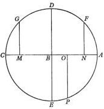

it will be seen, both errors are straightened out, and so are all the other data. Starting from $D$, the extreme limit of the retardation, the nonuniform motion in the first interval will comprise the whole arc $DGCEPAF$ of $311^{\circ} 55'$; in the second interval, $DG$ of $42\frac{1}{2}^{\circ}$; and in the third interval, $DGCEP$ of $198^{\circ} 4'$. And in the first interval, according to the foregoing demonstration, $BN$ will be an additive prosthaphaeresis of $52'$, of which $AB$ is $70'$; in the second interval $MB$ will be a subtractive prosthaphaeresis of $47\frac{1}{2}'$; and in the third interval $BO$ will again be an additive prosthaphaeresis of about $21'$. Therefore in the first interval $MN$ as a whole amounts to $1^{\circ} 40'$, and in the second interval $MBO$ as a whole amounts to $1^{\circ} 9'$, in quite exact agreement with the observations. Hence the simple anomaly in the first interval is clearly $155^{\circ} 57\frac{1}{2}'$; in the second interval, $21^{\circ} 15'$; and in the third interval, $99^{\circ} 2'$. Q. E. D.

## WHAT IS THE GREATEST VARIATION IN THE INTERSECTIONS OF THE EQUATOR AND ECLIPTIC?

Chapter 10

My discussion of the variation in the obliquity of the ecliptic and equator will be confirmed in like manner and found to be accurate. For in Ptolemy we had for the second year of Antoninus [Pius] the corrected simple anomaly as $21\frac{1}{4}^{\circ}$, with which the greatest obliquity of $23^{\circ} 51' 20''$ was found. From this situation to my observation there are about 1387 years, during which the extent of the simple anomaly is computed as $144^{\circ} 4'$, and at this time the obliquity is found to be about $23^{\circ} 28\frac{2}{5}'$.

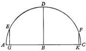

On this basis reproduce $ABC$ as an arc of the ecliptic, or instead as a straight line on account of its small size. On $ABC$ repeat the semicirclet of the simple anomaly with its pole at $B$, as before. Let $A$ be the limit of the greatest, and $C$ of the smallest, inclination, the difference between them being the object of our inquiry. Therefore take $AE$ as an arc of $21^{\circ} 15'$ on the circlet. $ED$, the rest of the quadrant, will be $68^{\circ} 45'$. $EDF$ as a whole will be computed as $144^{\circ} 4'$ and by subtraction $DF$ will be $75^{\circ} 19'$. Drop $EG$ and $FK$ perpendicular to the diameter $ABC$. On account of the variation in the obliquity from Ptolemy to us, $GK$ will be recognized as a great circle arc of $22' 56''$. But $GB$, being similar to a straight line, is half of the chord subtending twice $ED$ or its equal, and is 932 units, of which $AC$ as a diameter is 2000. Furthermore, $KB$, being half of the chord subtending twice $DF$, would be 967 of the same units. The sum $GK$ becomes 1899 units, of which $AC$ is 2000. But when $GK$ is reckoned as $22' 56''$, $AC$ will be approximately $24'$, the difference between the greatest and smallest obliquity, the difference which we have been seeking. Clearly, therefore, the obliquity was greatest between Timocharis and Ptolemy, when it was fully $23^{\circ} 52'$, and now it is approaching its minimum of $23^{\circ} 28'$. From this scheme there are also obtained any intermediate obliquities of these circles by the same method as was explained with regard to precession [III, 8].

## DETERMINING THE EPOCHS  
OF THE UNIFORM MOTIONS  
OF THE EQUINOXES AND ANOMALY

## Chapter 11

Now that I have explained all these topics in this manner, it remains for me to determine, with regard to the motions of the vernal equinox, the places which some [scientists] call the “epochs”, from which are taken the computations for any given time whatever. The absolute beginning of this calculation was established by Ptolemy [*Syntaxis*, III, 7] as the start of the reign of Nabonassar of the Babylonians. Most [scholars], misled by the similarity of the name, have thought that he was Nebuchadnezzar, who lived much later, as is shown by an examination of the chronology and by Ptolemy’s computation. According to historians, Nabonassar as the ruler was followed by Shalmaneser, king of the Chaldeans. Preferring a better known period, however, I thought it suitable to commence with the first Olympiad, which is found to have preceded Nabonassar by 28 years. It began with the summer solstice, when Sirius rose for the Greeks and the Olympic games were celebrated, as Censorinus and other recognized authorities have stated. Hence, according to a more precise chronological calculation, which is necessary for computing the heavenly motions, there are 27 years and 247 days from the first Olympiad at noon on the first day of the Greek month Hecatombaeon until Nabonassar and noon on the first day of the Egyptian month Thoth. From that time to the death of Alexander there are 424 Egyptian years. From the death of Alexander there are 278 Egyptian years, 118 1/2 days, to the beginning of the years of Julius Caesar at midnight preceding 1 January, when Julius Caesar commenced the year which he instituted. As high priest, he established this year when he was consul for the third time, his colleague being Marcus Aemilius Lepidus. Following this year, so ordained by Julius Caesar, the subsequent years are called “Julian”. From Caesar’s fourth consulship to Octavian Augustus, the Romans reckon 18 such years up to 1 January, although it was on 17 January that the son of the deified Julius Caesar, on the motion of Munatius Plancus, was granted the title Emperor Augustus by the senate and the other citizens during his seventh consulship, his colleague being Marcus Vipsanius [Agrippa]. The Egyptians, however, because they passed under Roman rule after the death of Antony and Cleopatra two years earlier, count 15 years, 246 1/2 days, to noon of the first day of the month Thoth, which was 30 August for the Romans. Accordingly there are 27 years according to the Romans, but according to the Egyptians 29 of their years, 130 1/2 days, from Augustus to the years of Christ, which likewise begin in January. From that time to the second year of Antoninus [Pius] when Claudius Ptolemy catalogued the positions of the stars observed by himself, there are 138 Roman years, 55 days; the Egyptians add 34 days for these years. To this time from the first Olympiad there is a total of 913 years, 101 days. In this period the uniform precession of the equinoxes is 12° 44′, and the simple anomaly is 95° 44′. But in the second year of Antoninus [Pius] as is known [Ptolemy, *Syntaxis*, VII, 5], the vernal equinox preceded the first of the stars in the head of the Ram by 6° 40′. Since the double anomaly was 42 1/2° [III, 9], the subtractive difference between the uniform and the apparent motion was 48′. When this difference is restored to the apparent motion of 6° 40′, the mean place of the vernal equinox is established as 7° 28′. If we add the 360° of a circle to this place and subtract 12° 44' from the sum, we shall have for the first Olympiad, which began at noon on the first day of the Athenian month Hecatombaeon, the mean place of the vernal equinox at 354° 44', so that it then followed the first star of the Ram by 5° 16' [= 360°—354° 44']. Similarly, if 95° 45' are subtracted from 21° 15' of the simple anomaly, the remainder for the same beginning of the Olympiads will be 285° 30' as the position of the simple anomaly. Again, by adding the motions accomplished during the various intervals, and always eliminating 360° as often as they accumulate, we shall have as the positions or epochs, for Alexander, 1° 2' for the uniform motion, and 332° 52' for the simple anomaly; for Caesar, 4° 55' for the mean motion, and 2° 2' for the anomaly; for Christ, 5° 32' as the position of the mean motion, and 6° 45' for the anomaly; and so on for the others we shall take the epochs of the motions for whatever beginning is chosen for an era.

## COMPUTING THE PRECESSION OF THE VERNAL EQUINOX AND THE OBLIQUITY

Chapter 12

Then, whenever we want to obtain the position of the vernal equinox, if the years from the chosen starting point to the given time are nonuniform, like the Roman years which we commonly use, we shall convert them into uniform or Egyptian years. For in computing uniform motions, I shall use no years other than the Egyptian, for the reason which I mentioned [near the end of III, 6].

In case the number of years exceeds 60, we shall divide it into periods of 60 years. When we start to consult the Tables of the Motions [of the Equinoxes, following III, 6] for these periods of 60 years, we shall at that time bypass as extraneous the first column occurring in the Motions. Beginning with the second column, that of the degrees, if there are any [entries], we shall take them as well as the remaining degrees and accompanying minutes sixtyfold. Then, entering the Tables a second time, for the years remaining [after the elimination of whole periods of 60 years] we shall take the clusters of 60° plus the degrees and minutes as they are recorded from the first column on. We shall do likewise with regard to the days and periods of 60 days when we wish to add to them uniform motions in accordance with the Tables of Days and Minutes. Nevertheless in this operation minutes of days, or even whole days, would be disregarded without any harm on account of the slowness of these motions, since it is a question in the daily motion only of seconds or sixtieths of seconds. When we have collected all these entries together with their epoch, by adding separately those of each kind and eliminating every group of six clusters of 60°, if there are more than 360°, for the given time we shall have the mean place of the vernal equinox as well as the distance by which it precedes the first star of the Ram, or by which the star follows the equinox.

We shall obtain the anomaly too in the same way. With the simple anomaly, we shall find located in the last column of the Table of Prosthaphaereses [following III, 8] the proportional minutes, which we shall keep to one side. Then, with the double anomaly we shall find in the third column of the same Table the prosthaphaeresis, that is, the degrees and minutes by which the true motion differs from the mean motion. If the double anomaly is less than a semicircle, we shall subtract the prosthaphaeresis from the mean motion. But if the double anomaly has more than 180° and exceeds a semicircle, we shall add it to the mean motion.

This sum or difference will contain the true and apparent precession of the vernal equinox, or conversely the distance at that time of the first star of the Ram from the vernal equinox. But if you are looking for the position of any other star, add the longitude assigned to it in the Catalogue of the Stars.

Since operations usually become clearer through examples, let us undertake to find the true place of the vernal equinox, the distance of the Spike of the Virgin from it, and the obliquity of the ecliptic for 16 April 1525 A. D. In 1524 Roman years, 106 days, from the beginning of the years of Christ until this time, obviously there are 381 leap days, that is, 1 year, 16 days. In uniform years, the total becomes 10 1525 years, 122 days, equal to 25 periods of 60 years plus 25 years, and two periods of 60 days plus 2 days. In the Table of the Uniform Motion [following III, 6] 25 periods of 60 years correspond to 20° 55' 2"; 25 years, to 20' 55"; 2 periods of 60 days, to 16"; and the remaining 2 days, to sixtieths of seconds. All these values, together with the epoch, which was 5° 32' [end of III, 11], amount to 26° 48' as 15 the mean precession of the vernal equinox.

Similarly, in 25 periods of 60 years the motion of the simple anomaly has two clusters of 60° plus 37° 15' 3"; in 25 years, 2° 37' 15"; in two periods of 60 days, 2' 4"; and in 2 days, 2". These values, together with the epoch, which is 6° 45' [end of III, 11], amount to two clusters of 60° plus 46° 40' as the simple anomaly. The proportional minutes corresponding to it in the last column of the Table of Prosthaphaereses [following III, 8] will be kept for the purpose of investigating the obliquity, and in this instance only 1' is found. Then with the double anomaly, which has 5 clusters of 60° plus 33° 20', I find a prosthaphaeresis of 32', which is additive because the double anomaly is greater than a semicircle. When this prosthaphaeresis is added to the mean motion, the true and apparent precession of the vernal equinox comes out as 27° 21'. To this, finally, if I add 170°, the distance of the Spike of the Virgin from the first star of the Ram, its position [197° 21'] with reference to the vernal equinox will be to the east, at 17° 21' within the Balance, where it was found at about the time of my observation [reported in III, 2].

The ecliptic's obliquity and declinations are subject to the following rule. When the proportional minutes amount to 60, the increases recorded in the Table of Declinations [following II, 3], I mean, the differences between the maximum and minimum obliquity, are added as a block to the individual degrees of declination. But in this instance one of those [proportional] minutes adds only 24" to the obliquity. Therefore the declinations of the degrees of the ecliptic, as entered in the Table, remain unchanged at this time because the minimum obliquity is now approaching us, whereas at other times the declinations are more perceptibly variable.

Thus, for example, if the simple anomaly is 99°, as it was 880 Egyptian years after Christ, it is linked with 25 proportional minutes. But 60' : 24' (24' being the difference between the greatest and smallest obliquity) = 25' : 10'. When these 10' are added to 28', the sum is 23° 38', the obliquity as it existed at that time. Then if I also want to know the declination of any degree on the ecliptic, for example, 3° within the Bull, which is 33° from the equinox, in the Table [of Declinations of the Degrees of the Ecliptic, after II, 3], I find 12° 32', with a difference of 12'. But 60 : 25 = 12 : 5. When these 5' are added to the degrees of declination, the total is 12° 37' for 33° of the ecliptic. We can use the same method employed for the angles of intersection between the ecliptic and equator also for the right ascensions (unless we prefer the ratios of spherical triangles), except that we must always subtract from the right ascensions what is added to the angles of intersection, in order that all the results may come out chronologically more precise.

## THE LENGTH AND NONUNIFORMITY OF THE SOLAR YEAR

Chapter 13

The statement that the equinoctial and solstitial precession (which, as I said [beginning of III, 3], results from the deflection of the earth's axis) proceeds in this manner will be confirmed also by the annual motion of the earth's center, as this motion appears in the sun, the topic which I must now discuss. When computed from either of the equinoxes or solstices, the length of the year becomes a variable, as must of course follow, on account of the nonuniform shift in those cardinal points, these phenomena being interconnected.

We must therefore distinguish the seasonal year from the sidereal year, and define them. I term that year "natural" or "seasonal" which marks the four annual seasons for us, but that year "sidereal" which returns to one of the fixed stars. The natural year, which is also called "tropical", is nonuniform, as the observations of the ancients make abundantly clear. For it contains a quarter of a day $[^{1}/_{4}^{d}]$ more than 365 whole days, according to the determinations made by Callippus, Aristarchus of Samos, and Archimedes of Syracuse, who in the Athenian manner put the beginning of the year at the summer solstice. Claudius Ptolemy, however, being aware that the pinpointing of a solstice is difficult and uncertain, did not have enough confidence in their observations, and preferred to rely on Hipparchus. The latter left records not only of solar solstices but also of equinoxes in Rhodes, and declared that the $^{1}/_{4}^{d}$ lacked a small fraction. This was later established as $^{1}/_{300}^{d}$ by Ptolemy in the following way [*Syntaxis*, III, 1].

He takes the autumnal equinox which Hipparchus observed very carefully at Alexandria in the 177th year after the death of Alexander the Great on the third intercalary day at midnight, which was followed by the fourth intercalary day according to the Egyptians. Then Ptolemy adduces an autumnal equinox observed by himself at Alexandria in the third year of Antoninus [Pius], which was the 463rd year after Alexander's death, on the ninth day of Athyr, the third Egyptian month, about one hour after sunrise. Between this observation and Hipparchus', accordingly, there were 285 Egyptian years, 70 days, 7 $^{1}/_{5}$ hours. On the other hand, there should have been 71 days, 6 hours, if the tropical year had been $^{1}/_{4}^{d}$ more than [365] whole days. In 285 years, therefore, $^{19}/_{20}^{d}$ were lacking. Hence it follows that a whole day drops out in 300 years.

Ptolemy derives the like conclusion also from the vernal equinox. For he recalls the one reported by Hipparchus in the 178th year after Alexander, on the 27th day of Mechir, the sixth Egyptian month, at sunrise. Ptolemy himself finds the vernal equinox in the 463rd year after Alexander, on the 7th day of Pachon, the ninth Egyptian month, a little more than an hour after noon. In 285 years, $^{19}/_{20}^{d}$ are similarly lacking. Aided by this information, Ptolemy measured the tropical year as 365 days, 14 minutes of a day, 48 seconds of a day.

Subsequently at Raqqa in Syria with no less diligence Al-Battani observed the autumnal equinox in the 1206th year after the death of Alexander. He found that it occurred at about 7 $^{2}/_{5}$ hours during the night following the seventh day of the month Pachon, that is, 4 ³/₅ hours before daylight on the eighth day [of Pachon]. Then he compared his own observation with the one made by Ptolemy in the third year of Antoninus [Pius] one hour after sunrise at Alexandria, which is 10° [= ²/₃ᵇ] west of Raqqa. He reduced Ptolemy's observation to his own Raqqa meridian, where Ptolemy's equinox would have had to occur 1 ²/₃ hours [1ʰ + ²/₃ᵇ] after sunrise. Therefore, in the interval of 743 [1206—463] uniform years there was a surplus of 178 days, 17 ³/₅ hours, instead of an accumulation of quarter-days totaling 185 ³/₄ days. Since 7 days, ²/₅ of an hour [185ᵈ18ʰ — 178ᵈ17 ³/₅ᵇ] were missing it was apparent that the ¹/₄ᵈ lacked ¹/₁₀₆ᵈ. He accordingly divided 7 days, ²/₅ of an hour, by 743, in agreement with the number of years, the quotient being 13 minutes, 36 seconds. Subtracting this quantity from ¹/₄ᵈ, he asserted that the natural year contains 365 days, 5 hours, 46 minutes, 24 seconds [+13ᵐ36ˢ = 6ʰ].

I too observed the autumnal equinox at Frombork, which we may call "Gynopolis", in 1515 A. D. on 14 September. This was in the 1840th Egyptian year after the death of Alexander, on the sixth day of the month Phaophi, ¹/₂ hour after sunrise. However, Raqqa lies east of my area by about 25°, equal to 1 ³/₃ hours. Therefore, in the interval between my equinox and Al-Battani's, over and above 633 Egyptian years there were 153 days, 6 ³/₄ hours, instead of 158 days, 6 hours. From that observation by Ptolemy at Alexandria to the time of my observation, reduced to the same place, there are 1376 Egyptian years, 332 days, ¹/₂ hour, since the difference between Alexandria and us is about an hour. Therefore, in 633 years from the time of Al-Battani to us, 4 days, 22 ³/₄ hours, would have been lacking, and one day in 128 years. On the other hand, in 1376 years since Ptolemy, about 12 days would have been missing, and one day in 115 years. In both instances the year has again turned out to be nonuniform.

I also observed the vernal equinox which occurred in the following year, 1516 A. D., 4 ¹/₃ hours after the midnight preceding 11 March. From that vernal equinox of Ptolemy (the meridian of Alexandria being compared with ours) there are 1376 Egyptian years, 332 days, 16 ¹/₃ hours. Hence it is also clear that the intervals of the vernal and autumnal equinoxes are unequal. The solar year, taken in this way, is very far from being uniform.

For in the case of the autumnal equinoxes, between Ptolemy and us (as was pointed out) by comparison with the uniform distribution of the years the ¹/₄ᵈ lacked ¹/₁₁₅ᵈ. This deficiency disagrees with Al-Battani's equinox by half a day. On the other hand, what holds true for the period from Al-Battani to us (when the ¹/₄ᵈ must have lacked ¹/₁₂₈ᵈ) does not fit Ptolemy, for whom the computed result precedes his observed equinox by more than a whole day, and Hipparchus' by more than two days. In like manner a computation based on the period from Ptolemy to Al-Battani exceeds Hipparchus' equinox by two days.

The uniform length of the solar year, therefore, is more correctly derived from the sphere of the fixed stars, as was first discovered by Thabit ibn Qurra. He found its length to be 365 days, plus 15 minutes of a day and 23 seconds of a day, or approximately 6 hours, 9 minutes, 12 seconds. He probably based his reasoning on the fact that when the equinoxes and solstices recurred more slowly, the year appeared longer than when they recurred more swiftly, in accordance with a definite ratio, moreover. This could not happen unless a uniform length were available by comparison with the sphere of the fixed stars. Consequently we must not heed Ptolemy in this regard. He thought that it was ridiculous and outlandish for the annual uniform motion of the sun to be measured by its return to any of the fixed stars, and that this was no more appropriate than if it were done by someone with reference to Jupiter or Saturn [*Syntaxis*, III, 1]. Therefore the explanation is at hand why the tropical year was longer before Ptolemy, whereas after him it became shorter in a variable diminution.

But also in connection with the starry or sidereal year a variation can occur. Nevertheless, it is limited and far smaller than the one which I just explained. The reason is that this same motion of the earth's center, which appears in the sun, is also nonuniform, with another twofold variation. The first of these variations is simple, having an annual period. The second, which by its alternations produces an inequality in the first, is perceived not at once but after a long passage of time. Therefore the computation of the uniform year is neither elementary nor easy to understand. For suppose that somebody wished to derive the uniform year merely from the definite distance of a star having a known position. This can be done by using the astrolabe with the moon as intermediary, the procedure I explained in connection with Regulus in the Lion [II, 14]. Variation will not be completely avoided, unless at that time on account of the earth's motion the sun either has no prosthaphaeresis or undergoes a similar and equal prosthaphaeresis at both cardinal points. If this does not happen, and if there is some variation in the nonuniformity of the cardinal points, it will be evident that a uniform revolution certainly does not occur in equal times. On the other hand, if at both cardinal points the entire variation is subtracted or added proportionally, the process will be perfect.

Furthermore, an understanding of the nonuniformity requires prior knowledge of the mean motion, which we seek for that reason, being engaged therein like Archimedes in squaring the circle. Nevertheless, for the purpose of eventually reaching the solution of this problem, I find that there are altogether four causes of the apparent nonuniformity. The first is the nonuniformity in the precession of the equinoxes, which I have explained [III, 3]. The second is the inequality in the arcs of the ecliptic which the sun is seen to traverse, a nearly annual inequality. This is also subject to a variation by the third cause, which I shall call the "second inequality". The last is the fourth, which shifts the higher and lower apsides of the earth's center, as will be made clear below [III, 20]. Of all these [four causes], Ptolemy [*Syntaxis*, III, 4] knew only the second, which by itself could not have produced the annual nonuniformity, but does so, rather, when intermingled with the others. However, in order to demonstrate the difference between uniformity and appearance in the sun, an absolutely precise measurement of the year seems unnecessary. On the contrary, for this demonstration it would be satisfactory to take as the length of the year 365 1/4 days, in which the motion of the first inequality is completed. For, what falls so little short of a complete circle, disappears entirely when absorbed in a smaller magnitude. But for the sake of orderly procedure and ease of comprehension I now set forth the uniform motions of the annual revolution of the earth's center. Later I shall add to them by distinguishing between the uniform and apparent motions on the basis of the required proofs [III, 15].

## THE UNIFORM AND MEAN MOTIONS Chapter 14 IN THE REVOLUTIONS OF THE EARTH'S CENTER

The length of the uniform year, I have found, is only 1¹⁰/₆₀ day-seconds longer than Thabit ibn Qurra's value [III, 13]. Thus it is 365 days plus 15 day-minutes, 24 day-seconds, and 10 sixtieths of a day-second, equal to 6 uniform hours, 9 minutes, 40 seconds, and the precise uniformity of the year is clearly linked with the sphere of the fixed stars. Therefore, by multiplying the 360° of a circle by 365 days, and dividing the product by 365 days, 15 day-minutes, 24¹⁰/₆₀ day-seconds, we shall have the motion in an Egyptian year as 5×60°+59° 44' 49'' 7''' 4'''. In 60 similar years the motion is, after the elimination of whole circles, 5×60°+44° 49' 7'' 4'''. Furthermore, if we divide the annual motion by 365 days, we shall have the daily motion as 59' 8'' 11''' 22'''. By adding to this value the mean and uniform precession of the equinoxes [III, 6], we shall obtain also the uniform annual motion in a tropical year as 5×60°+ 59° 45' 39'' 19''' 9''', and the daily motion as 59' 8'' 19''' 37'''. For this reason we may call the former solar motion "simple uniform", to use the familiar expression, and the latter motion "composite uniform". I shall also set them out in Tables, as I have done for the precession of the equinoxes [following III, 6]. Appended to these Tables is the uniform solar motion in anomaly, a topic I shall discuss later on [III, 18].

TABLE OF THE SUN'S SIMPLE UNIFORM MOTION IN YEARS AND PERIODS OF SIXTY YEARS

Christian Era 272°31'

|  Years | Motion |   |   |   |   |  | Years | Motion |   |   |   |   |   |
| --- | --- | --- | --- | --- | --- | --- | --- | --- | --- | --- | --- | --- | --- |
|   |  60° | ° | ' | " | " |   |   | 60° | ° | ' | " | "  |   |
|  1 | 5 | 59 | 44 | 49 | 7 |  | 31 | 5 | 52 | 9 | 22 | 39 |   |
|  2 | 5 | 59 | 29 | 38 | 14 |  | 32 | 5 | 51 | 54 | 11 | 46 |   |
|  3 | 5 | 59 | 14 | 27 | 21 |  | 33 | 5 | 51 | 39 | 0 | 53 |   |
|  4 | 5 | 58 | 59 | 16 | 28 |  | 34 | 5 | 51 | 23 | 50 | 0 |   |
|   | 5 | 58 | 44 | 5 | 35 |  | 35 | 5 | 51 | 8 | 39 | 7 | 10  |
|  6 | 5 | 58 | 28 | 54 | 42 |  | 36 | 5 | 50 | 53 | 28 | 14 |   |
|  7 | 5 | 58 | 13 | 43 | 49 |  | 37 | 5 | 50 | 38 | 17 | 21 |   |
|  8 | 5 | 57 | 58 | 32 | 56 |  | 38 | 5 | 50 | 23 | 6 | 28 |   |
|  9 | 5 | 57 | 43 | 22 | 3 |  | 39 | 5 | 50 | 7 | 55 | 35 |   |
|   | 5 | 57 | 28 | 11 | 10 |  | 40 | 5 | 49 | 52 | 44 | 42 | 15  |
|  11 | 5 | 57 | 13 | 0 | 17 |  | 41 | 5 | 49 | 37 | 33 | 49 |   |
|  12 | 5 | 56 | 57 | 49 | 24 |  | 42 | 5 | 49 | 22 | 22 | 56 |   |
|  13 | 5 | 56 | 42 | 38 | 31 |  | 43 | 5 | 49 | 7 | 12 | 3 |   |
|  14 | 5 | 56 | 27 | 27 | 38 |  | 44 | 5 | 48 | 52 | 1 | 10 |   |
|   | 5 | 56 | 12 | 16 | 46 |  | 45 | 5 | 48 | 36 | 50 | 18 | 20  |
|  16 | 5 | 55 | 57 | 5 | 53 |  | 46 | 5 | 48 | 21 | 39 | 25 |   |
|  17 | 5 | 55 | 41 | 55 | 0 |  | 47 | 5 | 48 | 6 | 28 | 32 |   |
|  18 | 5 | 55 | 26 | 44 | 7 |  | 48 | 5 | 47 | 51 | 17 | 39 |   |
|  19 | 5 | 55 | 11 | 33 | 14 |  | 49 | 5 | 47 | 36 | 6 | 46 |   |
|   | 5 | 54 | 56 | 22 | 21 |  | 50 | 5 | 47 | 20 | 55 | 53 | 25  |
|  21 | 5 | 54 | 41 | 11 | 28 |  | 51 | 5 | 47 | 5 | 45 | 0 |   |
|  22 | 5 | 54 | 26 | 0 | 35 |  | 52 | 5 | 46 | 50 | 34 | 7 |   |
|  23 | 5 | 54 | 10 | 49 | 42 |  | 53 | 5 | 46 | 35 | 23 | 14 |   |
|  24 | 5 | 53 | 55 | 38 | 49 |  | 54 | 5 | 46 | 20 | 12 | 21 |   |
|   | 5 | 53 | 40 | 27 | 56 |  | 55 | 5 | 46 | 5 | 1 | 28 | 30  |
|  26 | 5 | 53 | 25 | 17 | 3 |  | 56 | 5 | 45 | 49 | 50 | 35 |   |
|  27 | 5 | 53 | 10 | 6 | 10 |  | 57 | 5 | 45 | 34 | 39 | 42 |   |
|  28 | 5 | 52 | 54 | 55 | 17 |  | 58 | 5 | 45 | 19 | 28 | 49 |   |
|  29 | 5 | 52 | 39 | 44 | 24 |  | 59 | 5 | 45 | 4 | 17 | 56 |   |
|   | 5 | 52 | 24 | 33 | 32 |  | 60 | 5 | 44 | 49 | 7 | 4 | 35  |

|  TABLE OF THE SUN'S SIMPLE UNIFORM MOTION IN DAYS, PERIODS OF SIXTY DAYS AND MINUTES OF A DAY  |   |   |   |   |   |   |   |   |   |   |   |   |
| --- | --- | --- | --- | --- | --- | --- | --- | --- | --- | --- | --- | --- |
|  Days | Motion |   |   |   |   |  | Days | Motion  |   |   |   |   |
|   |  60° | ° | ' | " | " |   |   | 60° | ° | ' | " | "  |
|  1 | 0 | 0 | 59 | 8 | 11 |  | 31 | 0 | 30 | 33 | 13 | 52  |
|  2 | 0 | 1 | 58 | 16 | 22 |  | 32 | 0 | 31 | 32 | 22 | 3  |
|  3 | 0 | 2 | 57 | 24 | 34 |  | 33 | 0 | 32 | 31 | 30 | 15  |
|  4 | 0 | 3 | 56 | 32 | 45 |  | 34 | 0 | 33 | 30 | 38 | 26  |
|   | 0 | 4 | 55 | 40 | 56 |  | 35 | 0 | 34 | 29 | 46 | 37  |
|  6 | 0 | 5 | 54 | 49 | 8 |  | 36 | 0 | 35 | 28 | 54 | 49  |
|  7 | 0 | 6 | 53 | 57 | 19 |  | 37 | 0 | 36 | 28 | 3 | 0  |
|  8 | 0 | 7 | 53 | 5 | 30 |  | 38 | 0 | 37 | 27 | 11 | 11  |
|  9 | 0 | 8 | 52 | 13 | 42 |  | 39 | 0 | 38 | 26 | 19 | 23  |
|   | 0 | 9 | 51 | 21 | 53 |  | 40 | 0 | 39 | 25 | 27 | 34  |
|  11 | 0 | 10 | 50 | 30 | 5 |  | 41 | 0 | 40 | 24 | 35 | 45  |
|  12 | 0 | 11 | 49 | 38 | 16 |  | 42 | 0 | 41 | 23 | 43 | 57  |
|  13 | 0 | 12 | 48 | 46 | 27 |  | 43 | 0 | 42 | 22 | 52 | 8  |
|  14 | 0 | 13 | 47 | 54 | 39 |  | 44 | 0 | 43 | 22 | 0 | 20  |
|   | 0 | 14 | 47 | 2 | 50 |  | 45 | 0 | 44 | 21 | 8 | 31  |
|  16 | 0 | 15 | 46 | 11 | 1 |  | 46 | 0 | 45 | 20 | 16 | 42  |
|  17 | 0 | 16 | 45 | 19 | 13 |  | 47 | 0 | 46 | 19 | 24 | 54  |
|  18 | 0 | 17 | 44 | 27 | 24 |  | 48 | 0 | 47 | 18 | 33 | 5  |
|  19 | 0 | 18 | 43 | 35 | 35 |  | 49 | 0 | 48 | 17 | 41 | 16  |
|   | 0 | 19 | 42 | 43 | 47 |  | 50 | 0 | 49 | 16 | 49 | 28  |
|  21 | 0 | 20 | 41 | 51 | 58 |  | 51 | 0 | 50 | 15 | 57 | 39  |
|  22 | 0 | 21 | 41 | 0 | 9 |  | 52 | 0 | 51 | 15 | 5 | 50  |
|  23 | 0 | 22 | 40 | 8 | 21 |  | 53 | 0 | 52 | 14 | 14 | 2  |
|  24 | 0 | 23 | 39 | 16 | 32 |  | 54 | 0 | 53 | 13 | 22 | 13  |
|   | 0 | 24 | 38 | 24 | 44 |  | 55 | 0 | 54 | 12 | 30 | 25  |
|  26 | 0 | 25 | 37 | 32 | 55 |  | 56 | 0 | 55 | 11 | 38 | 36  |
|  27 | 0 | 26 | 36 | 41 | 6 |  | 57 | 0 | 56 | 10 | 46 | 47  |
|  28 | 0 | 27 | 35 | 49 | 18 |  | 58 | 0 | 57 | 9 | 54 | 59  |
|  29 | 0 | 28 | 34 | 57 | 29 |  | 59 | 0 | 58 | 9 | 3 | 10  |
|   | 0 | 29 | 34 | 5 | 41 |  | 60 | 0 | 59 | 8 | 11 | 22  |

TABLE OF THE SUN'S UNIFORM COMPOSITE MOTION IN YEARS AND PERIODS OF SIXTY YEARS

|  EgyptianYears | Motion |   |   |   |   |  | EgyptianYears | Motion  |   |   |   |   |
| --- | --- | --- | --- | --- | --- | --- | --- | --- | --- | --- | --- | --- |
|   |  $  60^{\circ}  $ | ° | ' | " | " |   |   | $  60^{\circ}  $ | ° | ' | " | "  |
|  1 | 5 | 59 | 45 | 39 | 19 |  | 31 | 5 | 52 | 35 | 18 | 53  |
|  2 | 5 | 59 | 31 | 18 | 38 |  | 32 | 5 | 52 | 20 | 58 | 12  |
|  3 | 5 | 59 | 16 | 57 | 57 |  | 33 | 5 | 52 | 6 | 37 | 31  |
|  4 | 5 | 59 | 2 | 37 | 16 |  | 34 | 5 | 51 | 52 | 16 | 51  |
|   | 5 | 58 | 48 | 16 | 35 |  | 35 | 5 | 51 | 37 | 56 | 10  |
|  6 | 5 | 58 | 33 | 55 | 54 |  | 36 | 5 | 51 | 23 | 35 | 29  |
|  7 | 5 | 58 | 19 | 35 | 14 |  | 37 | 5 | 51 | 9 | 14 | 48  |
|  8 | 5 | 58 | 5 | 14 | 33 |  | 38 | 5 | 50 | 54 | 54 | 7  |
|  9 | 5 | 57 | 50 | 53 | 52 |  | 39 | 5 | 50 | 40 | 33 | 26  |
|   | 5 | 57 | 36 | 33 | 11 |  | 40 | 5 | 50 | 26 | 12 | 46  |
|  11 | 5 | 57 | 22 | 12 | 30 |  | 41 | 5 | 50 | 11 | 52 | 5  |
|  12 | 5 | 57 | 7 | 51 | 49 |  | 42 | 5 | 49 | 57 | 31 | 24  |
|  13 | 5 | 56 | 53 | 31 | 8 |  | 43 | 5 | 49 | 43 | 10 | 43  |
|  14 | 5 | 56 | 39 | 10 | 28 |  | 44 | 5 | 49 | 28 | 50 | 2  |
|   | 5 | 56 | 24 | 49 | 47 |  | 45 | 5 | 49 | 14 | 29 | 21  |
|  16 | 5 | 56 | 10 | 29 | 6 |  | 46 | 5 | 49 | 0 | 8 | 40  |
|  17 | 5 | 55 | 56 | 8 | 25 |  | 47 | 5 | 48 | 45 | 48 | 0  |
|  18 | 5 | 55 | 41 | 47 | 44 |  | 48 | 5 | 48 | 31 | 27 | 19  |
|  19 | 5 | 55 | 27 | 27 | 3 |  | 49 | 5 | 48 | 17 | 6 | 38  |
|   | 5 | 55 | 13 | 6 | 23 |  | 50 | 5 | 48 | 2 | 45 | 57  |
|  21 | 5 | 54 | 58 | 45 | 42 |  | 51 | 5 | 47 | 48 | 25 | 16  |
|  22 | 5 | 54 | 44 | 25 | 1 |  | 52 | 5 | 47 | 34 | 4 | 35  |
|  23 | 5 | 54 | 30 | 4 | 20 |  | 53 | 5 | 47 | 19 | 43 | 54  |
|  24 | 5 | 54 | 15 | 43 | 39 |  | 54 | 5 | 47 | 5 | 23 | 14  |
|   | 5 | 54 | 1 | 22 | 58 |  | 55 | 5 | 46 | 51 | 2 | 33  |
|  26 | 5 | 53 | 47 | 2 | 17 |  | 56 | 5 | 46 | 36 | 41 | 52  |
|  27 | 5 | 53 | 32 | 41 | 37 |  | 57 | 5 | 46 | 22 | 21 | 11  |
|  28 | 5 | 53 | 18 | 20 | 56 |  | 58 | 5 | 46 | 8 | 0 | 30  |
|  29 | 5 | 53 | 4 | 0 | 15 |  | 59 | 5 | 45 | 53 | 39 | 49  |
|   | 5 | 52 | 49 | 39 | 34 |  | 60 | 5 | 45 | 39 | 19 | 9  |

|  TABLE OF THE SUN'S UNIFORM COMPOSITE MOTION IN DAYS, PERIODS OF SIXTY DAYS, AND MINUTES OF A DAY  |   |   |   |   |   |   |   |   |   |   |   |   |
| --- | --- | --- | --- | --- | --- | --- | --- | --- | --- | --- | --- | --- |
|  Days | Motion |   |   |   |   |  | Days | Motion  |   |   |   |   |
|   |  60° | ° | ' | " | " |   |   | 60° | ° | ' | " | "  |
|  1 | 0 | 0 | 59 | 8 | 19 |  | 31 | 0 | 30 | 33 | 18 | 8  |
|  2 | 0 | 1 | 58 | 16 | 39 |  | 32 | 0 | 31 | 32 | 26 | 27  |
|  3 | 0 | 2 | 57 | 24 | 58 |  | 33 | 0 | 32 | 31 | 34 | 47  |
|  4 | 0 | 3 | 56 | 33 | 18 |  | 34 | 0 | 33 | 30 | 43 | 6  |
|   | 0 | 4 | 55 | 41 | 38 |  | 35 | 0 | 34 | 29 | 51 | 26  |
|  6 | 0 | 5 | 54 | 49 | 57 |  | 36 | 0 | 35 | 28 | 59 | 46  |
|  7 | 0 | 6 | 53 | 58 | 17 |  | 37 | 0 | 36 | 28 | 8 | 5  |
|  8 | 0 | 7 | 53 | 6 | 36 |  | 38 | 0 | 37 | 27 | 16 | 25  |
|  9 | 0 | 8 | 52 | 14 | 56 |  | 39 | 0 | 38 | 26 | 24 | 45  |
|   | 0 | 9 | 51 | 23 | 16 |  | 40 | 0 | 39 | 25 | 33 | 4  |
|  11 | 0 | 10 | 50 | 31 | 35 |  | 41 | 0 | 40 | 24 | 41 | 24  |
|  12 | 0 | 11 | 49 | 39 | 55 |  | 42 | 0 | 41 | 23 | 49 | 43  |
|  13 | 0 | 12 | 48 | 48 | 15 |  | 43 | 0 | 42 | 22 | 58 | 3  |
|  14 | 0 | 13 | 47 | 56 | 34 |  | 44 | 0 | 43 | 22 | 6 | 23  |
|   | 0 | 14 | 47 | 4 | 54 |  | 45 | 0 | 44 | 21 | 14 | 42  |
|  16 | 0 | 15 | 46 | 13 | 13 |  | 46 | 0 | 45 | 20 | 23 | 2  |
|  17 | 0 | 16 | 45 | 21 | 33 |  | 47 | 0 | 46 | 19 | 31 | 21  |
|  18 | 0 | 17 | 44 | 29 | 53 |  | 48 | 0 | 47 | 18 | 39 | 41  |
|  19 | 0 | 18 | 43 | 38 | 12 |  | 49 | 0 | 48 | 17 | 48 | 1  |
|   | 0 | 19 | 42 | 46 | 32 |  | 50 | 0 | 49 | 16 | 56 | 20  |
|  21 | 0 | 20 | 41 | 54 | 51 |  | 51 | 0 | 50 | 16 | 4 | 40  |
|  22 | 0 | 21 | 41 | 3 | 11 |  | 52 | 0 | 51 | 15 | 13 | 0  |
|  23 | 0 | 22 | 40 | 11 | 31 |  | 53 | 0 | 52 | 14 | 21 | 19  |
|  24 | 0 | 23 | 39 | 19 | 50 |  | 54 | 0 | 53 | 13 | 29 | 39  |
|   | 0 | 24 | 38 | 28 | 10 |  | 55 | 0 | 54 | 12 | 37 | 58  |
|  26 | 0 | 25 | 37 | 36 | 30 |  | 56 | 0 | 55 | 11 | 46 | 18  |
|  27 | 0 | 26 | 36 | 44 | 49 |  | 57 | 0 | 56 | 10 | 54 | 38  |
|  28 | 0 | 27 | 35 | 53 | 9 |  | 58 | 0 | 57 | 10 | 2 | 57  |
|  29 | 0 | 28 | 35 | 1 | 28 |  | 59 | 0 | 58 | 9 | 11 | 17  |
|   | 0 | 29 | 34 | 9 | 48 |  | 60 | 0 | 59 | 8 | 19 | 37  |

|  TABLE OF THE SUN'S UNIFORM MOTION IN ANOMALY IN YEARS AND PERIODS OF SIXTY YEARS  |   |   |   |   |   |   |   |   |   |   |   |   |
| --- | --- | --- | --- | --- | --- | --- | --- | --- | --- | --- | --- | --- |
|  Christian Era 211°19'  |   |   |   |   |   |   |   |   |   |   |   |   |
|  Egyptian Years | Motion |   |   |   |   | Egyptian Years | Motion |   |   |   |   | 5  |
|   |  60° | ° | ' | " | " |   | 60° | ° | ' | " | "  |   |
|  1 | 5 | 59 | 44 | 24 | 46 | 31 | 5 | 51 | 56 | 48 | 11 |   |
|  2 | 5 | 59 | 28 | 49 | 33 | 32 | 5 | 51 | 41 | 12 | 58 |   |
|  3 | 5 | 59 | 13 | 14 | 20 | 33 | 5 | 51 | 25 | 37 | 45 |   |
|  4 | 5 | 58 | 57 | 39 | 7 | 34 | 5 | 51 | 10 | 2 | 32 |   |
|   | 5 | 58 | 42 | 3 | 54 | 35 | 5 | 50 | 54 | 27 | 19 | 10  |
|  6 | 5 | 58 | 26 | 28 | 41 | 36 | 5 | 50 | 38 | 52 | 6 |   |
|  7 | 5 | 58 | 10 | 53 | 27 | 37 | 5 | 50 | 23 | 16 | 52 |   |
|  8 | 5 | 57 | 55 | 18 | 14 | 38 | 5 | 50 | 7 | 41 | 39 |   |
|  9 | 5 | 57 | 39 | 43 | 1 | 39 | 5 | 49 | 52 | 6 | 26 |   |
|   | 5 | 57 | 24 | 7 | 48 | 40 | 5 | 49 | 36 | 31 | 13 | 15  |
|  11 | 5 | 57 | 8 | 32 | 35 | 41 | 5 | 49 | 20 | 56 | 0 |   |
|  12 | 5 | 56 | 52 | 57 | 22 | 42 | 5 | 49 | 5 | 20 | 47 |   |
|  13 | 5 | 56 | 37 | 22 | 8 | 43 | 5 | 48 | 49 | 45 | 33 |   |
|  14 | 5 | 56 | 21 | 46 | 55 | 44 | 5 | 48 | 34 | 10 | 20 |   |
|   | 5 | 56 | 6 | 11 | 42 | 45 | 5 | 48 | 18 | 35 | 7 | 20  |
|  16 | 5 | 55 | 50 | 36 | 29 | 46 | 5 | 48 | 2 | 59 | 54 |   |
|  17 | 5 | 55 | 35 | 1 | 16 | 47 | 5 | 47 | 47 | 24 | 41 |   |
|  18 | 5 | 55 | 19 | 26 | 3 | 48 | 5 | 47 | 31 | 49 | 28 |   |
|  19 | 5 | 55 | 3 | 50 | 49 | 49 | 5 | 47 | 16 | 14 | 14 |   |
|   | 5 | 54 | 48 | 15 | 36 | 50 | 5 | 47 | 0 | 39 | 1 | 25  |
|  21 | 5 | 54 | 32 | 40 | 23 | 51 | 5 | 46 | 45 | 3 | 48 |   |
|  22 | 5 | 54 | 17 | 5 | 10 | 52 | 5 | 46 | 29 | 28 | 35 |   |
|  23 | 5 | 54 | 1 | 29 | 57 | 53 | 5 | 46 | 13 | 53 | 22 |   |
|  24 | 5 | 53 | 45 | 54 | 44 | 54 | 5 | 45 | 58 | 18 | 9 |   |
|   | 5 | 53 | 30 | 19 | 30 | 55 | 5 | 45 | 42 | 42 | 55 | 30  |
|  26 | 5 | 53 | 14 | 44 | 17 | 56 | 5 | 45 | 27 | 7 | 42 |   |
|  27 | 5 | 52 | 59 | 9 | 4 | 57 | 5 | 45 | 11 | 32 | 29 |   |
|  28 | 5 | 52 | 43 | 33 | 51 | 58 | 5 | 44 | 55 | 57 | 16 |   |
|  29 | 5 | 52 | 27 | 58 | 38 | 59 | 5 | 44 | 40 | 22 | 3 |   |
|   | 5 | 52 | 12 | 23 | 25 | 60 | 5 | 44 | 24 | 46 | 50 | 35  |

|  THE SUN'S ANOMALY IN DAYS AND PERIODS OF SIXTY DAYS  |   |   |   |   |   |   |   |   |   |   |   |   |
| --- | --- | --- | --- | --- | --- | --- | --- | --- | --- | --- | --- | --- |
|  Days | Motion |   |   |   |   |  | Days | Motion  |   |   |   |   |
|   |  60° | ° | ' | " | " |   |   | 60° | ° | ' | " | "  |
|  1 | 0 | 0 | 59 | 8 | 7 |  | 31 | 0 | 30 | 33 | 11 | 48  |
|  2 | 0 | 1 | 58 | 16 | 14 |  | 32 | 0 | 31 | 32 | 19 | 55  |
|  3 | 0 | 2 | 57 | 24 | 22 |  | 33 | 0 | 32 | 31 | 28 | 3  |
|  4 | 0 | 3 | 56 | 32 | 29 |  | 34 | 0 | 33 | 30 | 36 | 10  |
|   | 0 | 4 | 55 | 40 | 36 |  | 35 | 0 | 34 | 29 | 44 | 17  |
|  6 | 0 | 5 | 54 | 48 | 44 |  | 36 | 0 | 35 | 28 | 52 | 25  |
|  7 | 0 | 6 | 53 | 56 | 51 |  | 37 | 0 | 36 | 28 | 0 | 32  |
|  8 | 0 | 7 | 53 | 4 | 58 |  | 38 | 0 | 37 | 27 | 8 | 39  |
|  9 | 0 | 8 | 52 | 13 | 6 |  | 39 | 0 | 38 | 26 | 16 | 47  |
|   | 0 | 9 | 51 | 21 | 13 |  | 40 | 0 | 39 | 25 | 24 | 54  |
|  11 | 0 | 10 | 50 | 29 | 21 |  | 41 | 0 | 40 | 24 | 33 | 2  |
|  12 | 0 | 11 | 49 | 37 | 28 |  | 42 | 0 | 41 | 23 | 41 | 9  |
|  13 | 0 | 12 | 48 | 45 | 35 |  | 43 | 0 | 42 | 22 | 49 | 16  |
|  14 | 0 | 13 | 47 | 53 | 43 |  | 44 | 0 | 43 | 21 | 57 | 24  |
|   | 0 | 14 | 47 | 1 | 50 |  | 45 | 0 | 44 | 21 | 5 | 31  |
|  16 | 0 | 15 | 46 | 9 | 57 |  | 46 | 0 | 45 | 20 | 13 | 38  |
|  17 | 0 | 16 | 45 | 18 | 5 |  | 47 | 0 | 46 | 19 | 21 | 46  |
|  18 | 0 | 17 | 44 | 26 | 12 |  | 48 | 0 | 47 | 18 | 29 | 53  |
|  19 | 0 | 18 | 43 | 34 | 19 |  | 49 | 0 | 48 | 17 | 38 | 0  |
|   | 0 | 19 | 42 | 42 | 27 |  | 50 | 0 | 49 | 16 | 46 | 8  |
|  21 | 0 | 20 | 41 | 50 | 34 |  | 51 | 0 | 50 | 15 | 54 | 15  |
|  22 | 0 | 21 | 40 | 58 | 42 |  | 52 | 0 | 51 | 15 | 2 | 23  |
|  23 | 0 | 22 | 40 | 6 | 49 |  | 53 | 0 | 52 | 14 | 10 | 30  |
|  24 | 0 | 23 | 39 | 14 | 56 |  | 54 | 0 | 53 | 13 | 18 | 37  |
|   | 0 | 24 | 38 | 23 | 4 |  | 55 | 0 | 54 | 12 | 26 | 45  |
|  26 | 0 | 25 | 37 | 31 | 11 |  | 56 | 0 | 55 | 11 | 34 | 52  |
|  27 | 0 | 26 | 36 | 39 | 18 |  | 57 | 0 | 56 | 10 | 42 | 59  |
|  28 | 0 | 27 | 35 | 47 | 26 |  | 58 | 0 | 57 | 9 | 51 | 7  |
|  29 | 0 | 28 | 34 | 55 | 33 |  | 59 | 0 | 58 | 8 | 59 | 14  |
|   | 0 | 29 | 34 | 3 | 41 |  | 60 | 0 | 59 | 8 | 7 | 22  |

## PRELIMINARY THEOREMS FOR PROVING Chapter 15
THE NONUNIFORMITY OF THE SUN'S APPARENT MOTION

For the sake of better comprehension of the sun's apparent nonuniformity, however, I shall show even more clearly that with the sun at the universe's midpoint, about which as center the earth revolves, if the distance between the sun and the earth is, as I have said [I, 5, 10], imperceptible in comparison with the immensity of the sphere of the fixed stars, the sun will appear to move uniformly with respect to any given point or star on that sphere.

Let AB be a great circle of the universe in the place of the ecliptic. Let C be its center, where the sun is located. With radius CD, the distance sun-earth, in comparison with which the height of the universe is immense, in that same plane of the ecliptic describe DE as the circle in which the annual revolution of the earth's center is performed. I say that the sun will appear to move uniformly with respect to any given point or star on the circle AB. Let the given point be A, where the sun is seen from the earth. Let the earth be at D. Draw ACD. Now let the earth move through any arc DE. Draw AE and BE from E, the endpoint of the earth's [motion]. Therefore the sun will now be seen from E at point B. Since AC is immense in comparison with CD or its equivalent CE, AE also will be immense as compared with CE. For, on AC take any point F, and join EF. Then from C and E, the endpoints of the base, two straight lines fall outside triangle EFC on point A. Therefore, by the converse of Euclid's Elements, I, 21, angle FAE will be smaller than angle EFC. Consequently, when the straight lines are immensely extended, they will ultimately comprise CAE as an angle so acute that it can no longer be perceived. CAE constitutes the difference by which angle BCA exceeds angle AEC. These angles even seem equal because the difference [between them] is so slight. The lines AC and AE seem parallel, and the sun seems to move uniformly with respect to any point on the sphere of the stars, just as if it revolved around E as center. Q. E. D.

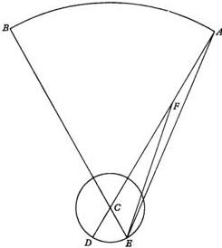

The sun's [motion], however, is demonstrably nonuniform, because the motion of the earth's center in its annual revolution does not occur precisely around the center of the sun. This can of course be explained in two ways, either by an eccentric circle, that is, a circle whose center is not identical with the sun's center, or by an epicycle on a concentric circle [that is, a circle whose center is identical with the sun's center, and functions as the epicycle's deferent].

The explanation by means of an eccentric proceeds as follows. In the plane of the ecliptic let ABCD be an eccentric. Let its center E lie at no negligible distance from F, the center of the sun or of the universe. Let AEFD, the diameter of the eccentric, pass through both centers. Let A be the apogee, which in Latin is called the "higher apse", the position farthest from the center of the universe. On the other hand, let D be the perigee, which is the "lower apse", the position nearest [to the center of the universe]. Then, while the earth moves uniformly on its circle ABCD about center E, from F (as I just said) its motion will appear nonuniform. For, if we take AB and CD as equal arcs, and draw the straight lines BE, CE, BF, and CF, angles AEB and CED will be equal, intercepting equal arcs around center E. However, the observed angle CFD, being an exterior angle, is greater than the interior angle CED. Therefore, angle CFD is also greater than angle AEB, which is equal to angle CED. But angle AEB, as an exterior angle, is likewise greater than the interior angle AFB. So much the more is angle CFD greater than angle AFB. But both were produced in equal times, since AB and CD are equal arcs. Therefore, the uniform motion around E will appear nonuniform around F.

The same result may be seen more simply, because arc AB lies farther from F than does arc CD. For, according to Euclid's Elements, III, 7, with reference to the lines intercepting these arcs, AF and BF are longer than CF and DF. In optics it is proved that equal magnitudes appear larger when nearer than when farther away. Therefore, the proposition concerning the eccentric is established.

The same result will be accomplished also by an epicycle on a concentric. Let E, the center of the universe, where the sun is situated, also be the center of the concentric ABCD. In the same plane let A be the center of the epicycle FG. Through both centers draw the straight line CEAF, with the epicycle's apogee at F and perigee at I. Clearly, then, uniform motion occurs in A, but the apparent nonuniformity in the epicycle FG. For, suppose that A moves in the direction of B, that is, in consequence, whereas the center of the earth moves from the apogee F in precedence. The motion of E will appear faster at the perigee, which is I, because the motions of both A and I are in the same direction. On the other hand, at the apogee, which is F, E will seem to be slower, because it is moved only by the overbalancing motion of two contrary [motions]. When the earth is situated at G, it will surpass the uniform motion, behind which it will lag when it is situated at K. In either case the difference will be the arc AG or AK, by which therefore the sun likewise will seem to move nonuniformly.

Whatever is done by an epicycle, however, can be accomplished in the same way by an eccentric. This is described equal to the concentric and in the same plane by the planet as it travels on the epicycle, the distance from the eccentric's center to the concentric's center being the length of the epicycle's radius. This happens, moreover, in three ways.

Suppose that the epicycle on the concentric and the planet on the epicycle execute revolutions that are equal but opposite in direction. Then the planet's motion will trace a fixed eccentric, whose apogee and perigee have unchangeable positions. Thus, let $ABC$ be a concentric; $D$, the center of the universe; and $ADC$, a diameter. Assume that when the epicycle is in $A$, the planet is in the epicycle's apogee. Let this be $G$, and let the epicycle's radius fall on the straight line $DAG$. Take $AB$ as an arc of the concentric. With $B$ as center, and with radius equal to $AG$, describe the epicycle $EF$. Draw $DB$ and $EB$ as a straight line. Take the arc $EF$ similar to $AB$ and in the opposite direction. Place the planet or the earth at $F$, and join $BF$. On $AD$ take the line segment $DK$ equal to $BF$. Then the angles at $EBF$ and $BDA$ are equal, and therefore $BF$ and $DK$ are parallel and equal. But if straight lines are joined to equal and parallel straight lines, they also are parallel and equal, according to Euclid, I, 33. Since $DK$ and $AG$ are taken to be equal, and $AK$ is their common annex, $GAK$ will be equal to $AKD$, and therefore equal also to $KF$. Hence, the circle described with $K$ as center, and radius $KAG$, will pass through $F$. By the composite motion of $AB$ and $EF$, $F$ describes an eccentric equal to the concentric, and therefore also fixed. For while the epicycle executes revolutions equally with the concentric, the apsides of the eccentric so described must remain in the same place (since $BF$ and $AD$ are always parallel on account of the equality of the angles $EBF$ and $BDK$ [these words were later deleted]).

But if the revolutions executed by the epicycle's center and circumference are unequal, the planet's motion will no longer trace a fixed eccentric. Instead, the eccentric's center and apsides move in precedence or in consequence according as the planet's motion is swifter or slower than the center of its epicycle. Thus, suppose that angle $EBF$ is bigger than angle $BDA$, but angle $BDM$ is constructed equal to angle $EBF$. It will likewise be shown that, if $DL$ on line $DM$ is taken equal to $BF$, the circle described with $L$ as center and radius $LMN$, equal to $AD$, will pass through the planet at $F$. Hence, the planet's composite motion obviously describes $NF$ as the arc of an eccentric circle, whose apogee has meanwhile moved in precedence from point $G$ through the arc $GN$. On the other hand, if the planet's motion on the epicycle is slower [than the motion of the epicycle's center], then the eccentric's center will move in consequence as far as the epicycle's center moves. For example, if angle $EBF$ is smaller than angle $BDA$ but equal to angle $BDM$, what I have said obviously happens.

From all these analyses it is clear that the same apparent nonuniformity always occurs either through an epicycle on a concentric or through an eccentric equal to the concentric. There is no difference between them provided that the distance between their centers is equal to the epicycle's radius.

Hence it is not easy to decide which of them exists in the heavens. For his part Ptolemy believed that the model of the eccentric was adequate where he understood there was a simple inequality, and the positions of the apsides were fixed and unchangeable, as in the case of the sun, according to his thinking [Syntaxis, III, 4]. But for the moon and the other five planets, which travel with a two-fold or manifold nonuniformity, he adopted eccentrepicycles. By means of these models, furthermore, it is easily shown that the greatest difference between the uniform and apparent motions is seen when the planet appears midway between the higher and lower apsides according to the eccentric model, but according to the epicyclic model when the planet touches the deferent, as Ptolemy makes clear [Syntaxis, III, 3].

The proof proceeds as follows in the case of the eccentric. Let it be ABCD, with E as center, and AEC as the diameter passing through the sun at F outside the center. Through F draw BFD perpendicular [to diameter AEC]; join BE and ED. Let A be the apogee; C, the perigee; B and D, the apparent midpoints between them. The exterior angle AEB [of triangle BEF], it is clear, comprises the uniform motion, while the interior angle EFB comprises the apparent motion. The difference between them is the angle EBF. I say that no angle greater than angle B or angle D can be drawn from the circumference to the line EF. For, take points G and H before and after B. Join GD, GE, GF, and HE, HF, HD. Then FG, which is nearer to the center, is longer than DF. Therefore, angle GDF will be bigger than angle DGF. But the angles EDG and EGD are equal (since the sides EG and ED falling on the base [DG] are equal). Therefore angle EDF, which is equal to angle EBF, is greater than angle EGF. In like manner DF also is longer than FH, and angle FHD is greater than angle FDH. But the whole angle EHD is equal to the whole angle EDH, since EH is equal to ED. Therefore the remainder, angle EDF, which is equal to angle EBF, is also greater than the remainder EHF. Hence nowhere will a greater angle be drawn to the line EF than from points B and D. Consequently, the greatest difference between the uniform motion and the apparent motion occurs at the apparent midpoint between the apogee and the perigee.

## THE SUN'S APPARENT NONUNIFORMITY

Chapter 16

The foregoing are general proofs applicable not only to the solar phenomena but also to the nonuniformity of other bodies. For the present I shall take up the phenomena of the sun and the earth. Within that topic I shall first discuss what we have received from Ptolemy and other ancient authors, and then what we have learned from the more recent period and experience.

Ptolemy found that there were 94 1/2 days from the vernal equinox to the [summer] solstice, and 92 1/2 days from the [summer] solstice to the autumnal equinox [Syntaxis, III, 4]. On the basis of the [elapsed] time, the mean and uniform motion was 93° 9' in the first interval; and in the second interval, 91° 11'. With these figures divide up the circle of the year. Let it be ABCD, with its center at E, AB = 93° 9' for the first interval of time, and BC = 91° 11' for the second. Let the vernal equinox be observed from A; the summer solstice, from B; the autumnal equinox, from C; and the remaining cardinal point, the winter solstice, from D. Join AC and BD, which intersect each other at right angles in F, where we place the sun. Then the arc ABC is greater than a semicircle; also, AB is greater than BC. Hence Ptolemy inferred [Syntaxis, III, 4] that E, the center of the circle, lies between lines BF and FA; and the apogee, between the vernal equinox and the solar summer solstice. Now through the

center $E$ [and parallel] to $AFC$, draw $IEG$, which will intersect $BFD$ in $L$. [Parallel] to $BFD$, draw $HEK$, which will cross $AF$ at $M$. In this way there will be constructed the rectangular parallelogram $LEMF$. Its diagonal $FE$, when extended in the straight line $FEN$, will mark the earth's greatest distance from the sun, and the position of the apogee, in $N$. Then, since arc $ABC$ is $184^{\circ} 20'$ $[=93^{\circ} 9' + 91^{\circ} 11']$, $AH$, which is half of it, is $92^{\circ} 10'$. If this is subtracted from $AGB$, it leaves a remainder $HB$ of $59'$ $[=93^{\circ} 9' - 92^{\circ} 10']$. Furthermore, when the [90] degrees of $HG$, a quadrant of the circle, are subtracted from $AH$ $[=92^{\circ} 10']$, the remainder $AG$ has $2^{\circ} 10'$. But half of the chord subtending twice the arc $AG$ has 378 units, of which the radius has 10,000, and is equal to $LF$. Half of the chord subtending twice the arc $BH$ is $LE$, which has 172 of the same units. Therefore, two sides of the triangle $ELF$ being given, the hypotenuse $EF$ will have 414 of the same units of which the radius has 10,000, or approximately $\frac{1}{24}$ of the radius $NE$. But $EF : EL$ is the ratio of the radius $NE$ to half of the chord subtending twice the arc $NH$. Therefore $NH$ is given as $24 \frac{1}{2}^{\circ}$, and so is angle $NEH$, to which $LFE$, the angle of the apparent [motion], is equal. Consequently, this was the distance by which the higher apse preceded the summer solstice before Ptolemy.

On the other hand, $IK$ is a quadrant of a circle. From it, subtract $IC$ and $DK$, equal to $AG$ $[=2^{\circ} 10']$ and $HB$ $[=59']$. The remainder $CD$ has $86^{\circ} 51'$ $[=90^{\circ} - 3^{\circ} 9']$. When this is subtracted from $CDA$ $[=175^{\circ} 40' = 360^{\circ} - 184^{\circ} 20']$, the remainder $DA$ has $88^{\circ} 49'$ $[=175^{\circ} 40' - 86^{\circ} 51']$. But $88 \frac{1}{8}$ days correspond to $86^{\circ} 51'$; and to $88^{\circ} 49'$, 90 days, plus $\frac{1}{8}$ day $= 3$ hours. In these periods, in terms of the earth's uniform motion, the sun seemed to pass from the autumnal equinox to the winter solstice, and to return from the winter solstice to the vernal equinox in what is left of the year.

Ptolemy states [Syntaxis, III, 4] that he too found these values no different from what Hipparchus had reported before him. Accordingly, he thought that for the rest of time the higher apse would remain $24 \frac{1}{2}^{\circ}$ before the summer solstice, and that the eccentricity I mentioned, $\frac{1}{24}$ of the radius, would abide forever. Both values are now found to have changed with a perceptible difference.

Al-Battani recorded $93^{\mathrm{d}} 35^{\mathrm{dm}}$ from the vernal equinox to the summer solstice, and to the autumnal equinox, $186^{\mathrm{d}} 37^{\mathrm{dm}}$. From these figures he deduced by Ptolemy's method an eccentricity no greater than 346 units, of which the radius is 10,000. Al-Zarkali the Spaniard agrees with Al-Battani in regard to the eccentricity, but reported the apogee $12^{\circ} 10'$ before the solstice, whereas to Al-Battani it seemed to be $7^{\circ} 43'$ before the same solstice. From these results the inference was drawn that another nonuniformity in the motion of the earth's center still remains, as is confirmed also by the observations of our age.

For during the ten or more years since I have devoted my attention to investigating these topics, and in particular in 1515 A. D., I have found that $186^{\mathrm{d}} 5 \frac{1}{2}^{\mathrm{dm}}$ are completed between the vernal and autumnal equinoxes. To avoid an error in determining the solstices, which my predecessors are suspected by some scholars of having occasionally committed, in my research I added certain other solar positions which, in addition to the equinoxes, were not at all difficult to observe, such as the middle of the signs of the Bull, Virgin, Lion, Scorpion, and Water Bearer. Thus from the autumnal equinox to the middle of the Scorpion I found $45^{\mathrm{d}} 16^{\mathrm{dm}}$, and $178^{\mathrm{d}} 53 \frac{1}{2}^{\mathrm{dm}}$ to the vernal equinox.

Now in the first interval the uniform motion is 44° 37', and 176° 19' in the second interval. With this information as a basis, reproduce the circle ABCD. Let A be the point from which the sun appeared at the vernal equinox; B, the point from which the autumnal equinox was observed; and C, the middle of the Scorpion. Join AB and CD, which intersect each other in F, the center of the sun. Draw AC. Then arc CB is known, since it is 44° 37'. Therefore angle BAC is given in terms of 360° = 2 right angles. BFC, the angle of the apparent motion, is 45° in terms of 360° = 4 right angles; but on the basis of 360° = 2 right angles, angle BFC = 90°. Hence the remainder, angle ACD [= BFC-BAC], which intercepts the arc AD, is 45° 23' [= 90° - 44° 37']. But the entire portion ACB = 176° 19'. When BC is subtracted [from ACB], the remainder AC = 131° 42' [= 176° 19' - 44° 37']. When this figure is added to AD [= 45° 23'], the sum, arc CAD, = 177° 5 1/2'. Therefore, since each segment ACB [= 176° 19'] and CAD is less than a semicircle, the center is clearly contained in BD, the rest of the circle. Let the center be E, and through F draw the diameter LEFG. Let L be the apogee, and G the perigee. Drop EK perpendicular to CFD. Now the chords subtending the given arcs are derived from the Table: AC = 182,494, and CFD = 199,934 units, of which the diameter = 200,000. Then the angles of triangle ACF are given. According to Theorem I on Plane Triangles [I, 13], the ratio of the sides will also be given: CF = 97,967 of the units of which AC = 182,494. Therefore FD [= CFD-CF = 199,934-97,967 = 101,967] exceeds half [of CFD = 199,934 ÷ 2 or 99,967], the excess being FK = 2,000 of the same units [101,967-99,967]. The segment CAD [≥ 177° 6'] is less than a semicircle by 2° 54'. Half of the chord subtending this arc is equal to EK and has 2534 units. Therefore, in triangle EFK the two sides FK and KE which form the right angle are given. Of the given sides and angles, EF will have 323 units, of which EL has 10,000; and angle EFK has 51 2/3°, when 360° = 4 right angles. Therefore, the whole angle AFL [= EFK+(AFD = BFC = 45°)] has 96 2/3°[= 51 2/3° + 45°], and the remainder, angle BFL [= 180° - AFL] has 83 1/3°. If EL has 60 units, EF will be approximately one unit, 56 minutes of a unit. This was the sun's distance from the center of the circle, having now become barely 1/31, whereas to Ptolemy it seemed to be 1/34. Furthermore, the apogee, which then preceded the summer solstice by 24 1/2°, now follows it by 6 2/3°.

## EXPLANATION OF THE FIRST AND ANNUAL SOLAR INEQUALITY, TOGETHER WITH ITS PARTICULAR VARIATIONS Chapter 17

Hence, since several variations are found in the solar inequality, I think that I should first set forth the annual variation, which is better known than the others. For this purpose, reproduce the circle ABC, with its center E, diameter AEC, apogee A, perigee C, and the sun at D. Now the greatest difference between the uniform [motion] and the apparent [motion] has been shown [III, 15] to occur at the apparent midpoint between the two apsides. For this reason, on AEC construct the perpendicular BD, intersecting the circumference in point B. Join BE. In the right triangle BDE two sides are given, namely, BE, the radius of the circle, and DE, the distance from the sun to the center. Therefore the angles of the triangle will be given, among them angle DBE, the difference between BEA, the angle

of the uniform [motion], and the right angle EDB, [which is the angle of the] apparent [motion].

However, to the extent that DE has increased and decreased, the whole shape of the triangle has changed. Thus, the angle B was 2° 23' before Ptolemy; 1° 59' at the time of Al-Battani and Al-Zarkali; and at present it is 1° 51'. According to Ptolemy [Syntaxis, III, 4], the arc AB, intercepted by the angle AEB, was 92° 23', and BC 87° 37'; AB was 91° 59', and BC 88° 1', according to Al-Battani; at present, AB is 91° 51', BC 88° 9'.

From these facts the remaining variations are clear. For, as in the second diagram, take any other arc AB, such that angle AEB, the supplementary angle BED, and the two sides BE and ED are given. By the Theorems on Plane Triangles, angle EBD of the prosthaphaeresis and the difference between the uniform and apparent [motions] will be given. These differences also must change on account of the variation in the side ED, which was just mentioned.

## ANALYSIS OF THE UNIFORM MOTION IN LONGITUDE

Chapter 18

The foregoing explanation of the annual solar inequality was based, not on the simple variation (as was made clear), but on a variation disclosed through the long passage of time to be intermingled with the simple variation. Later on [III, 20] I shall separate these variations from each other. Meanwhile, the mean and uniform motion of the earth's center will be established with greater numerical accuracy, the better it is distinguished from the nonuniform variations, and the longer the period of time over which it extends. Now this investigation will proceed as follows.

I took the autumnal equinox observed by Hipparchus at Alexandria in the 32nd year of the 3rd Callippic period, which was the 177th year after the death of Alexander, as was mentioned above [III, 13], on the third of the five intercalary days at midnight, followed by the fourth day. But since Alexandria lies about one hour east of Cracow in longitude, the time [at Cracow] was about an hour before midnight. Therefore, according to the computation reported above, the position of the autumnal equinox in the sphere of the fixed stars was 176° 10' from the beginning of the Ram, and this was the apparent place of the sun, its distance from the higher apse being 114 1/2° [=24° 30'+90°]. To depict this situation, about center D draw ABC, the circle described by the center of the earth. Let ADC be the diameter, in which the sun is placed at E, with the apogee at A and the perigee at C. Let B be the point where the sun appeared to be at the autumnal equinox. Draw the straight lines BD and BE. Then angle DEB, the sun's apparent distance from the apogee, is 144 1/2°. At that time DE was 416 units, of which BD = 10,000. Therefore, according to Theorem IV [II, E] on Plane Triangles, in triangle BDE the angles are given. Angle DBE, the difference between angle BED and angle BDA, is 2°10'. But since angle BED = 114°30', angle BDA will be 116° 40' [=114° 30'+2° 10']. Therefore, the mean or uniform place of the sun is 178° 20' [=176° 10'+2° 10'] from the beginning of the Ram in the sphere of the fixed stars.

With this observation I compared the autumnal equinox which I observed in Frombork on the same Cracow meridian in the year 1515 A. D. on 14 September, in the 1840th Egyptian year after the death of Alexander on the 6th day of Phaophi, the second Egyptian month, half an hour after sunrise [III, 13]. At that time the place of the autumnal equinox, according to computation and observation, was 152° 45' in the sphere of the fixed stars, at a distance of 83° 20' from the higher
apse, according to the foregoing analysis [III, 16, end]. Construct the angle BEA = 83° 20', with 180° = 2 right angles. In triangle [BDE], two sides are given: BD = 10,000 units, and DE = 323 units. According to Theorem IV [II, E] on Plane Triangles, angle DBE will be about 1° 50'. If a circle circumscribes triangle BDE, angle BED will intercept an arc of 166° 40', when 360° = 2 right angles.
Side BD will be 19,864 units, of which the diameter = 20,000. In accordance with the given ratio of BD to DE, about 640 of the same units will be established as the length of DE, which subtends angle DBE = 3° 40' at the circumference, but 1° 50' as a central angle [=3° 40' ÷ 2]. This was the prosthaphaeresis and the difference between the uniform and apparent [motions]. By adding it to angle
BED = 83° 20', we shall have angle BDA and arc AB = 85° 10' [=83° 20' + 1° 50'] as the distance of the uniform [motion] from the apogee. Hence the mean place of the sun in the sphere of the fixed stars is 154° 35' [=152° 45' + 1° 50']. Between the two observations there are 1662 Egyptian years, 37 days, 18 minutes of a day, 45 seconds of a day. In addition to the complete revolutions, 1660 in number,
the mean and uniform motion was about 336° 15', in agreement with the number which I set down in the Table of Uniform Motion [following III, 14].

### ESTABLISHING THE POSITIONS AND EPOCHS Chapter 19 FOR THE SUN'S UNIFORM MOTION

From the death of Alexander the Great to Hipparchus' observation the elapsed
time is 176 years, 362 days, 27 1/2 minutes of a day, in which the mean motion is computed as 312° 43'. This figure is subtracted from the 178° 20' for Hipparchus' observation [III, 18], supplemented by the 360° of a circle. The remainder, 225° 37' [360° + 178° 20' = 538° 20' - 312° 43' = 225° 37'], will be the position for the meridian of Cracow and Frombork, the place of my observation, at noon
on the first day of Thoth, the first Egyptian month, for the epoch of the era commencing with the death of Alexander the Great. From that time to the epoch of the Roman era of Julius Caesar, in 278 years, 118 1/2 days, the mean motion, after [the elimination of] complete revolutions, is 46° 27'. When this figure is added to the number for Alexander's position [225° 37' + 46° 27'], the sum is 272° 4'
for Caesar's position at midnight preceding 1 January, the customary start of the Roman years and days. Then in 45 years, 12 days, or in 323 years, 130 1/2 days after Alexander the Great [278ʳ 118 1/2ᵈ + 45ʳ 12ᵈ], comes Christ's position at 272° 31'. Christ was born in the 3rd year of the 194th Olympiad [193 × 4 = 772 + 3]. This amounts to 775 years, 12 1/2 days, from the beginning of the first Olympiad to midnight preceding 1 January [in the year of Christ's birth]. This likewise
puts the position of the first Olympiad at 96° 16' at noon on the first day of the month Hecatombaeon, the present equivalent of this day being 1 July in the Roman calendar. In this way the epochs of the simple solar motion are related to the sphere of the fixed stars. Furthermore, the positions of the composite [motion] are
obtained by applying the precession [of the equinoxes]. Corresponding to the simple positions, the composite positions are, for the Olympiads, 90° 59' [=96° 16'— 5° 16'; III, 11, end]; Alexander, 226° 38' [=225° 37'+1° 2']; Caesar, 276° 59' [=272° 4'+4° 55']; and Christ, 278° 2' [=272°31'+5° 32']. All these positions are reduced (as I mentioned) to the meridian of Cracow.

## THE SECOND AND TWOFOLD INEQUALITY IMPOSED ON THE SUN BY THE SHIFT OF THE APSIDES

Chapter 20

The shift in the solar apse now presents a problem which is more acute because, whereas Ptolemy regarded the apse as fixed, others thought that it accompanied the motion of the sphere of the stars, in conformity with their doctrine that the fixed stars move too. Al-Zarkali believed in the nonuniformity of this [motion], which even happened to regress. He relied on the following evidence. Al-Battani had found the apogee, as was mentioned above [III, 16], 7° 43' ahead of the solstice: in the 740 years since Ptolemy it had advanced nearly 17° [≅24° 30'—7° 43']. In the 193 years thereafter it seemed to Al-Zarkali to have retrogressed about 4 1/3° [≅12° 10'—7° 43']. He therefore believed that the center of the annual orbit had an additional motion on a circlet. As a result, the apogee was deflected back and forth, while the distance from the center of the orbit to the center of the universe varied.

[Al-Zarkali's] idea was quite ingenious, but it has not been accepted because it is inconsistent with the other findings taken as a whole. Thus, consider the successive stages of that motion. For some time before Ptolemy it stood still. In 740 years or thereabouts it progressed through 17°. Then in 200 years it retrogressed 4° or 5°. Thereafter until our age it moved forward. The entire period has witnessed no other retrogression nor the several stationary points which must intervene at both limits when motions reverse their direction. [The absence of] these [retrogressions and stationary points] cannot possibly be understood in a regular and circular motion. Therefore many [specialists] believe that some error occurred in the observations of those [astronomers, that is, Al-Battani and Al-Zarkali]. Both [were] equally skillful and careful practitioners so that it is doubtful which one we should prefer to follow.

For my part I confess that nowhere is there a greater difficulty than in understanding the solar apogee, where we infer large [quantities] from certain minute and barely perceptible [magnitudes]. For near the perigee and apogee an entire degree produces a change of only 2', more or less, in the prosthaphaeresis. On the other hand, near the intermediate distances 5° or 6° are traversed for 1'. Hence a slight error can develop into a very large one. Accordingly, even in putting the apogee at 6 2/3° within the Crab [III, 16], I was not satisfied to trust the time-measuring instruments, unless my results were also confirmed by solar and lunar eclipses. For any error lurking in the instruments is undoubtedly disclosed by the eclipses. It is highly probable, therefore, as we can deduce from the general structure of the motion, that it is direct, yet nonuniform. For after that stationary [interval] from Hipparchus to Ptolemy the apogee appeared in a continuous, regular, and progressive advance until the present time. An exception occurred between Al-Battani and Al-Zarkali through a mistake (it is believed), since everything else seems to fit. For in a similar way the solar prosthaphaeresis has likewise not yet stopped diminishing. Hence it seems to follow the same circular pattern, and both nonuniformities are in phase with that first and simple anomaly of the obliquity of the ecliptic, or with a similar irregularity.

To make this situation clearer, in the plane of the ecliptic draw the circle $AB$, with its center at $C$, and its diameter $ACB$, on which put the solar globe at $D$ as the center of the universe. With $C$ as center, describe $EF$ as another circle of small dimensions which does not contain the sun. On this circlet let the center of the annual revolution of the earth's center be understood to move in a certain very slow advance. Together with the line $AD$, the circlet $EF$ advances in consequence, whereas the center of the annual revolution moves along the circlet $EF$ in precedence, both motions being quite slow. Therefore the center of the annual orbit will at one time be found at its greatest distance [from the sun], $DE$, and at another time at its least [distance], $DF$. Its motion will be slower at $E$, and faster at $F$. In the circlet's intervening arcs [the center of the annual orbit] makes that distance between the centers increase and decrease with time, and [it makes] the higher apse alternately precede and follow that apse or apogee which lies on line $ACD$ and serves as the mean apogee. Thus, take the arc $EG$. With $G$ as center, draw a circle equal to $AB$. Then the higher apse will lie on line $DGK$, and the distance $DG$ will be shorter than $DE$, in accordance with Euclid, III, 8. These relations are demonstrated in this way by an eccentriccentric, and also by an epicyclepicyclet, as follows.

Let $AB$ be concentric with the universe and with the sun. Let $ACB$ be the diameter on which the higher apse lies. With $A$ as center, describe the epicycle $DE$. Again, with $D$ as center, draw the epicycle $FG$, on which the earth revolves. Let all [these constructions] lie in the same plane, that of the ecliptic. Let the first

epicycle move in consequence in about a year. Let the second epicycle, that is, D, likewise move in a year, but in precedence. Let the revolutions of both epicycles be equal with respect to line AC. Furthermore, let the center of the earth [by moving] away from F in precedence add a little to D. Hence, when the earth is at F, clearly it will make the solar apogee a maximum, and a minimum when it is at G. In the intervening arcs of the epicyclet FG, moreover, it will make the apogee precede or follow [the mean apogee], accelerate or decelerate, increase or decrease. Thus the motion appears nonuniform, as was previously demonstrated by the epicyclecentric.

Now take the arc AI. With I as center, reconstruct the epicyclepicycle. Join CI, and prolong it along the straight line CIK. Angle KID will be equal to ACI on account of the equality of the revolutions. Therefore, as I showed above [III, 15], point D will describe around L as center and with eccentricity CL = DI an eccentric equal to the concentric AB. F will also trace its own eccentric, with eccentricity CLM = IDF; and G likewise, with eccentricity IG = CN. Suppose that meanwhile the center of the earth has already traversed any arc FO on its own epicycle, the second one. O will now describe an eccentric whose center lies not on line AC, but on a line, such as LP, parallel to DO. Furthermore, if OI and CP are joined, they will be equal [to each other], but smaller than IF and CM; and angle DIO [will be] equal to angle LCP, in accordance with Euclid, I, 8. To that extent the solar apogee on line CP will be seen to precede A.

Hence it is also clear that the same thing happens with an eccentrepicycle. For from the previous [arrangement take] only that eccentric which is described by the epicyclet D around L as center. Let the center of the earth revolve along the arc FO under the aforementioned conditions, that is, a little beyond an annual revolution. Around P as center, it will trace a second circle, eccentric with respect to the first eccentric, and thereafter the same phenomena will recur. Since so many arrangements lead to the same result, I would not readily say which one is real, except that the perpetual agreement of the computations and phenomena compels the belief that it is one of them.

## HOW LARGE IS THE SECOND VARIATION IN THE SOLAR INEQUALITY?

Chapter 21

We have already seen [III, 20] that the second inequality follows the first and simple anomaly of the obliquity of the ecliptic, or something like it. Hence, unless impeded by some error of previous observers, we shall obtain its variations with precision. For by computation we have the simple anomaly as about 165° 39' in 1515 A. D., and its beginning, by calculating backwards, in about 64 B. C. From that time until ours the total is 1580 years. When the anomaly began then, the eccentricity, I found, was at its maximum = 417 units, of which the radius = 10,000. Our eccentricity, on the other hand, was shown to be 323 [units].

Now let AB be a straight line, on which B is the sun and the center of the universe. Let the greatest eccentricity be AB; and the smallest, DB. With diameter AD, describe a circlet. On it take arc AC as the measure of the first, simple anomaly, which was 165° 39'. AB is given as 417 units, found at the beginning of the simple anomaly, that is, at A. On the other hand, at present BC is 323 units. Hence we shall have triangle ABC, with sides AB and BC given. One angle, CAD, also [is given], because arc $CD = 14^{\circ} 21'$, being the remainder [when arc $AC = 165^{\circ} 39'$ is subtracted] from the semicircle. Therefore, in accordance with the Theorems on Plane Triangles the remaining side $AC$ will be given, and also angle $ABC$, which is the difference between the apogee's mean and nonuniform motions. Since $AC$ subtends a given arc, diameter $AD$ of circle $ACD$ will also be given. For, from angle $CAD = 14^{\circ} 21'$, we shall have $CB = 2486$ units, of which the diameter of the circle circumscribing the triangle is 100,000. The ratio $BC : AB$ gives $AB = 3225$ of the same units. $AB$ intercepts the angle $ACB = 341^{\circ} 26'$. The remainder, with $360^{\circ} = 2$ right angles, is the angle $CBD = 4^{\circ} 13'$, $[= 360^{\circ} - (341^{\circ} 26' + 14^{\circ} 21' = 355^{\circ} 47')]$, which is intercepted by $AC = 735$ units. Therefore, in units of which $AB = 417$, $AC$ has been found to be about 95 units. Since $AC$ subtends a given arc, it will have a ratio to $AD$ as the diameter. Therefore $AD$ is given as 96 units, of which $ADB = 417$. $DB$, the remainder $[= ADB - AD = 417 - 96] = 321$ units, the minimum extent of the eccentricity. Angle $CBD$, which was found to be $4^{\circ} 13'$ at the circumference, but $2^{\circ} 6^{1/2'}$ at the center, is the prosthaphaeresis to be subtracted from the uniform motion of $AB$ around $B$ as center.

Now draw straight line $BE$ tangent to the circle at point $E$. Take $F$ as center, and join $EF$. In right triangle $BEF$, side $EF$ is given as 48 units $[=^{1/2} \times 96 = \text{diameter } AD]$, and $BDF$ as 369 units $[FD = 48 + 321 = DB]$. In units of which $FDB$ as radius $= 10,000$, $EF = 1300$. This is half of the chord subtending twice the angle $EBF$ and, with $360^{\circ} = 4$ right angles, is $7^{\circ} 28'$, the greatest prosthaphaeresis between the uniform motion $F$ and the apparent motion $E$.

Hence all the other individual differences can be obtained. Thus, assume that angle $AFE = 6^{\circ}$. We shall have a triangle with sides $EF$ and $FB$ given, as well as angle $EFB$. From this information the prosthaphaeresis $EBF$ will emerge as $41'$. But if angle $AFE = 12^{\circ}$, we shall have the prosthaphaeresis $= 1^{\circ} 23'$; if $18^{\circ}$, then $2^{\circ} 3'$; and so on for the rest by this method, as was stated above in connection with the annual prosthaphaereses [III, 17].

## HOW THE SOLAR APOGEE'S UNIFORM AND NONUNIFORM MOTIONS ARE DERIVED

Chapter 22

The time when the greatest eccentricity coincided with the beginning of the first and simple anomaly was the 3rd year of the 178th Olympiad and the 259th year after Alexander the Great, according to the Egyptians [64 B. C.; III, 21]. Hence the apogee's true and mean positions were both at $5^{1/2^{\circ}}$ within the Twins, that is, $65^{1/2^{\circ}}$ from the vernal equinox. The true equinoctial precession, which also coincided with the mean [precession] at that time, was $4^{\circ} 38'$. When this figure is subtracted from $65^{1/2^{\circ}}$, the remainder, $60^{\circ} 52'$ from the beginning of the Ram in the fixed stars, was the place of the apogee. Furthermore, the apogee's place was found to be $6^{2/3^{\circ}}$ within the Crab in the 2nd year of the 573rd Olympiad or 1515 A. D. The precession of the vernal equinox by computation was $27^{1/4^{\circ}}$. If this figure is subtracted from $96^{2/3^{\circ}}$, the remainder is $69^{\circ} 25'$. The first anomaly at that time was $165^{\circ} 39'$. The prosthaphaeresis, by which the true place preceded the mean [place], was shown to have been $2^{\circ} 7' [\cong 2^{\circ} 6^{1/2'}; \text{III}, 21]$. Therefore the mean place of the solar apogee was known to be $71^{\circ} 32' [= 69^{\circ} 25' + 2^{\circ} 7']$. Hence in 1580 uniform Egyptian years the apogee's mean and uniform motion was $10^{\circ} 41'$ [$\cong 71^{\circ} 32' - 60^{\circ} 52'$]. When this figure is divided by the number of years, we shall have the annual rate as $24'' 20''' 14''''$.

## DETERMINING THE SOLAR ANOMALY AND ESTABLISHING ITS POSITIONS

Chapter 23

If the foregoing figures are subtracted from the simple annual motion, which was $359^{\circ} 44' 49'' 7''' 4''''$ [III, 14], the remainder, $359^{\circ} 44' 24'' 46''' 50''''$, will be the annual uniform motion of the anomaly. Furthermore, when this [remainder] is divided by 365, the daily rate will emerge as $59' 8'' 7''' 2''''$, in agreement with what was set out in the Tables above [following III, 14]. Hence we shall also have the positions of the recognized epochs, beginning with the first Olympiad. For, the mean solar apogee half an hour after sunrise on 14 September in the 2nd year of the 573rd Olympiad was shown to be at $71^{\circ} 37'$, from which the mean solar distance was $83^{\circ} 3'$ [$71^{\circ} 32 + 83^{\circ} 3' = 154^{\circ} 35'$; III, 18]. From the first Olympiad there are 2290 Egyptian years, 281 days, 46 day-minutes. In this time the motion in anomaly, after the elimination of whole circles, was $42^{\circ} 49'$. When this figure is subtracted from $83^{\circ} 3'$, the remainder is $40^{\circ} 14'$ as the position of the anomaly at the first Olympiad. In the same way as before, the place for the epoch of Alexander is $166^{\circ} 38'$; for Caesar, $211^{\circ} 11'$; and for Christ, $211^{\circ} 19'$.

## TABULAR PRESENTATION OF THE VARIATIONS IN THE UNIFORM AND APPARENT [SOLAR MOTIONS]

Chapter 24

In order to enhance the usefulness of what has been proved concerning the variations in the sun's uniform and apparent [motions], I shall also set them out in a Table having sixty lines and six columns or rows. The first two columns will contain the number [of degrees of the annual anomaly] in both semicircles, I mean, the ascending [from $0^{\circ}$ to $180^{\circ}$] and descending [from $360^{\circ}$ to $180^{\circ}$] semicircles, arranged at intervals of $3^{\circ}$, as I did above for the [prosthaphaereses of the] motions of the equinoxes [following III, 8]. The third column will record the degrees [and minutes] of the variation in the motion of the solar apogee or in the anomaly; as correlated with every third degree, this variation rises to a maximum of about $7\frac{1}{2}^{\circ}$. The fourth column will be reserved for the proportional minutes, which are 60 at the maximum. They enter the reckoning in conjunction with [the sixth column's] increase in the annual anomaly's prosthaphaereses, when these are greater [than the prosthaphaereses arising from the minimum distance between the sun and the center of the universe]. Since the largest increase for these [prosthaphaereses] is $32'$, a sixtieth part [thereof] will be $32''$. Then, in accordance with the size of the increases, which I shall derive from the eccentricity by the method explained above [III, 21], I shall put down the number of the sixtieths alongside every third degree. The fifth column will carry the annual and first variation's individual prosthaphaereses, based on the sun's least distance from the center [of the universe]. The sixth and last column will show the increases in those prosthaphaereses which occur at the greatest eccentricity. The Table follows.

|  TABLE OF THE SOLAR PROSTHAPHAERESES  |   |   |   |   |   |   |   |   |
| --- | --- | --- | --- | --- | --- | --- | --- | --- |
|  Common Numbers |   | Central Prosthaphaereses |   | Proportional Minutes | Orbital Prosthaphaereses |   | In-creases  |   |
|  Degree | Degree | Degree | Minute |   | Degree | Minute | Minute  |   |
|  3 | 357 | 0 | 21 | 60 | 0 | 6 | 1  |   |
|  6 | 354 | 0 | 41 | 60 | 0 | 11 | 3  |   |
|  9 | 351 | 1 | 2 | 60 | 0 | 17 | 4  |   |
|  12 | 348 | 1 | 23 | 60 | 0 | 22 | 6  |   |
|   | 345 | 1 | 44 | 60 | 0 | 27 | 7  |   |
|  18 | 342 | 2 | 5 | 59 | 0 | 33 | 9  |   |
|  21 | 339 | 2 | 25 | 59 | 0 | 38 | 11  |   |
|  24 | 336 | 2 | 46 | 59 | 0 | 43 | 13  |   |
|  27 | 333 | 3 | 5 | 58 | 0 | 48 | 14  |   |
|   | 330 | 3 | 24 | 57 | 0 | 53 | 16  |   |
|  33 | 327 | 3 | 43 | 57 | 0 | 58 | 17  |   |
|  36 | 324 | 4 | 2 | 56 | 1 | 3 | 18  |   |
|  39 | 321 | 4 | 20 | 55 | 1 | 7 | 20  |   |
|  42 | 318 | 4 | 37 | 54 | 1 | 12 | 21  |   |
|   | 315 | 4 | 53 | 53 | 1 | 16 | 22  |   |
|  48 | 312 | 5 | 8 | 51 | 1 | 20 | 23  |   |
|  51 | 309 | 5 | 23 | 50 | 1 | 24 | 24  |   |
|  54 | 306 | 5 | 36 | 49 | 1 | 28 | 25  |   |
|  57 | 303 | 5 | 50 | 47 | 1 | 31 | 27  |   |
|  60 | 300 | 6 | 3 | 46 | 1 | 34 | 28  |   |
|  63 | 297 | 6 | 15 | 44 | 1 | 37 | 29  |   |
|  66 | 294 | 6 | 27 | 42 | 1 | 39 | 29  |   |
|  69 | 291 | 6 | 37 | 41 | 1 | 42 | 30  |   |
|  72 | 288 | 6 | 46 | 40 | 1 | 44 | 30  |   |
|  75 | 285 | 6 | 53 | 39 | 1 | 46 | 30  |   |
|  78 | 282 | 7 | 1 | 38 | 1 | 48 | 31  |   |
|  81 | 279 | 7 | 8 | 36 | 1 | 49 | 31  |   |
|  84 | 276 | 7 | 14 | 35 | 1 | 49 | 31  |   |
|  87 | 273 | 7 | 20 | 33 | 1 | 50 | 31  |   |
|  90 | 270 | 7 | 25 | 32 | 1 | 50 | 32  |   |

|  TABLE OF THE SOLAR PROSTHAPHAERESES  |   |   |   |   |   |   |   |
| --- | --- | --- | --- | --- | --- | --- | --- |
|  Common Numbers |   | Central Prosthaphaereses |   | Proportional Minutes | Orbital Prosthaphaereses |   | In-creases  |
|  Degree | Degree | Degree | Minute |   | Degree | Minute | Minute  |
|  93 | 267 | 7 | 28 | 30 | 1 | 50 | 32  |
|  96 | 264 | 7 | 28 | 29 | 1 | 50 | 33  |
|  99 | 261 | 7 | 28 | 27 | 1 | 50 | 32  |
|  102 | 258 | 7 | 27 | 26 | 1 | 49 | 32  |
|  105 | 255 | 7 | 25 | 24 | 1 | 48 | 31  |
|  108 | 252 | 7 | 22 | 23 | 1 | 47 | 31  |
|  111 | 249 | 7 | 17 | 21 | 1 | 45 | 31  |
|  114 | 246 | 7 | 10 | 20 | 1 | 43 | 30  |
|  117 | 243 | 7 | 2 | 18 | 1 | 40 | 30  |
|  120 | 240 | 6 | 52 | 16 | 1 | 38 | 29  |
|  123 | 237 | 6 | 42 | 15 | 1 | 35 | 28  |
|  126 | 234 | 6 | 32 | 14 | 1 | 32 | 27  |
|  129 | 231 | 6 | 17 | 12 | 1 | 29 | 25  |
|  132 | 228 | 6 | 5 | 11 | 1 | 25 | 24  |
|  135 | 225 | 5 | 45 | 10 | 1 | 21 | 23  |
|  138 | 222 | 5 | 30 | 9 | 1 | 17 | 22  |
|  141 | 219 | 5 | 13 | 7 | 1 | 12 | 21  |
|  144 | 216 | 4 | 54 | 6 | 1 | 7 | 20  |
|  147 | 213 | 4 | 32 | 5 | 1 | 3 | 18  |
|  150 | 210 | 4 | 12 | 4 | 0 | 58 | 17  |
|  153 | 207 | 3 | 48 | 3 | 0 | 53 | 14  |
|  156 | 204 | 3 | 25 | 3 | 0 | 47 | 13  |
|  159 | 201 | 3 | 2 | 2 | 0 | 42 | 12  |
|  162 | 198 | 2 | 39 | 1 | 0 | 36 | 10  |
|  165 | 195 | 2 | 13 | 1 | 0 | 30 | 9  |
|  168 | 192 | 1 | 48 | 1 | 0 | 24 | 7  |
|  171 | 189 | 1 | 21 | 0 | 0 | 18 | 5  |
|  174 | 186 | 0 | 53 | 0 | 0 | 12 | 4  |
|  177 | 183 | 0 | 27 | 0 | 0 | 6 | 2  |
|  180 | 180 | 0 | 0 | 0 | 0 | 0 | 0  |

## COMPUTING THE APPARENT SUN

Chapter 25

It is now quite clear, I believe, how the apparent position of the sun is computed from the foregoing [Table] for any given time. For that time, look for the true place of the vernal equinox or its precession together with the first, simple anomaly, as I explained above [III, 12]. Then through the Tables of the Uniform Motion [following III, 14, find] the mean simple motion of the center of the earth (or the motion of the sun, as you may wish to call it) and the annual anomaly. Add these [figures] to their established epochs [as given in III, 23]. Then, alongside the first, simple anomaly and its number, or an adjacent number, as recorded in the first or second column of the preceding Table, in the third column you will find the corresponding prosthaphaeresis of the annual anomaly. Set the accompanying proportional minutes aside. If the raw [annual anomaly] is less than a semicircle or its number occurs in the first column, add the prosthaphaeresis to the annual anomaly; otherwise, subtract [the prosthaphaeresis from the raw annual anomaly]. The remainder or sum will be the adjusted solar anomaly. Then with it obtain the prosthaphaeresis of the annual orbit, which occupies the fifth column, together with the accompanying increase. This increase, taken in conjunction with the proportional minutes, previously set aside, amounts to a quantity which is always added to this [orbital] prosthaphaeresis. This [sum] will become the adjusted prosthaphaeresis, which is subtracted from the sun's mean place if the number of the annual anomaly was found in the first column or was less than a semicircle. On the other hand, [the adjusted prosthaphaeresis] is added [to the sun's mean place] if [the annual anomaly was] greater [than a semicircle] or occupied [a line in] the second column of [common] numbers. The remainder or sum thus obtained will define the sun's true place, as measured from the beginning of the constellation of the Ram. Finally, the true precession of the vernal equinox, if added [to the sun's true place], will immediately also show the sun's position in relation to the equinox, in zodiacal signs and degrees of the zodiac.

If you wish to accomplish this result in another way, take the uniform composite [motion] instead of the simple motion. Perform all the aforementioned operations, except that you add or subtract, as the situation requires, only the prosthaphaeresis of the equinoctial precession instead of the precession itself. In this way the computation of the apparent sun is obtained through the motion of the earth in agreement with ancient and modern records, so that in addition the future motion has presumably already been foreseen.

Nevertheless I am also not unaware that if anybody believed the center of the annual revolution to be stationary as the center of the universe, while the sun moved with two motions similar and equal to those which I explained in connection with the center of the eccentric [III, 20], all the phenomena would appear as before – the same figures and the same proof. Nothing would be changed in them, especially the phenomena pertaining to the sun, except the position. For then the motion of the earth's center around the center of the universe would be regular and simple (the two remaining motions being ascribed to the sun). For this reason there will still remain a doubt about which of these two positions is occupied by the center of the universe, as I said ambiguously at the beginning that the center of the universe is in the sun [I, 9, 10] or near it [I, 10]. I shall discuss this question further, however, in my treatment of the five planets [V, 4].

There I shall also decide it to the best of my ability, with the thought that it is enough if I adopt reliable and nowise untrustworthy computations for the apparent sun.

## THE NUCHTHEMERON, THAT IS, THE VARIABLE NATURAL DAY

Chapter 26

With regard to the sun, something still remains to be said about the variation in the natural day, the time which is embraced in the period of 24 equal hours and which we have used up to the present as the general and precise measurement of the heavenly motions. Such a day, however, is defined differently by different people: as the interval between two sunrises, by the Babylonians and ancient Hebrews; between two sunsets, by the Athenians; from midnight to midnight, by the Romans; and from noon to noon by the Egyptians.

In this period, it is clear, the terrestrial globe completes its own rotation as well as what is added in the meantime by the annual revolution related to the apparent motion of the sun. But this addition is variable, as is shown in the first place by the sun's variable apparent motion, and secondly by the natural day's connection with the [rotation around the] poles of the equator, whereas the annual revolution [proceeds] along the ecliptic. For these reasons that apparent time cannot be the general and precise measurement of motion, since the days are not uniform with [the natural] day and with one another in every detail. It was therefore necessary to select from these [days] some mean and uniform day which would permit uniform motion to be measured without uncertainty.

Now around the poles of the earth in the course of an entire year 365 rotations take place. These are increased by approximately a whole additional rotation as the result of a daily prolongation due to the apparent advance of the sun. Therefore the natural day exceeds the uniform [day] by 1/365 of that [additional rotation]. Consequently we must define the uniform day and distinguish it from the nonuniform apparent [day]. Accordingly, I call that [day] which contains an entire rotation of the equator, plus as much as appears to be traversed by the sun in its uniform motion during that time, the "uniform day". By contrast, [I call that] day "nonuniform and apparent" which comprises the 360° of a rotation of the equator, plus that which rises on the horizon or meridian together with the apparent advance of the sun. Although the difference between these [uniform and nonuniform] days is quite small and imperceptible at the outset, nevertheless when several days are taken together, [the difference] adds up and becomes perceptible.

Of this [phenomenon] there are two causes: the nonuniformity of the apparent sun, and the nonuniform rising of the oblique ecliptic. The first cause, which is due to the nonuniform and apparent motion of the sun, has already been made clear [III, 16-17]. For in the semicircle whose midpoint is the higher apse, halfway between the two mean apsides, in comparison with the degrees of the ecliptic 4 9/4 time-degrees were lacking, according to Ptolemy [Syntaxis, III, 9]. The same number was in excess in the other semicircle, which contained the lower apse. Hence the entire surplus of one semicircle over the other was 9 1/2 time-degrees.

But in the [case of the] second cause (the one connected with the risings and settings) a very great difference occurs between the semicircles [containing] the two solstices. This is [the difference] between the shortest and longest day. It varies very much, being special for every single region. On the other hand, [the difference] related to noon or midnight is everywhere confined within four limits. For, the 88° from 16° within the Bull to 14° within the Lion cross the meridian in about 93 time-degrees. The 92° from 14° within the Lion to 16° within the Scorpion cross [the meridian] in 87 time-degrees. Hence in the latter case 5 time-degrees are lacking [92°– 87°], and in the former case the same number is in excess [93°–88°]. Thus the sum of the days in the first interval exceeds those in the second [interval] by 10 time-degrees = ²/₃ of an hour. This happens similarly in the other semicircle, where the situation is reversed within the remaining, diametrically opposite, limits.

Now the astronomers decided to begin the natural day at noon or midnight, not at sunrise or sunset. For, the nonuniformity connected with the horizon is more complicated, since it extends over several hours. Moreover, it is not everywhere the same, but varies in a complex way depending on the obliquity of the sphere. On the other hand, [the nonuniformity] related to the meridian is the same everywhere, and simpler.

Consequently, the entire difference arising from the two aforementioned causes – the apparent nonuniform motion of the sun and the nonuniform crossing of the meridian – before Ptolemy, when the decrease started at the middle of the Water Bearer, and the increase at the beginning of the Scorpion, amounted to 8 ¹/₃ time-degrees [Syntaxis, III, 9]. At present, when the decrease extends from 20° within the Water Bearer or thereabouts to 10° within the Scorpion, and the increase [extends] from 10° within the Scorpion to 20° within the Water Bearer, [the difference] has contracted to 7° 48' time-degrees. For, these [phenomena] too change in time on account of the mutability of the perigee and the eccentricity.

Finally, if the maximum variation in the precession of the equinoxes is also added to the foregoing, the entire inequality in the natural days can rise above 10 time-degrees in several years. Herein a third cause of the nonuniformity in the days has hitherto remained hidden. For, the rotation of the equator has been found uniform with reference to the mean and uniform equinox, not to the apparent equinoxes, which (as was quite clear) are not entirely uniform. For, twice ten time-degrees = 1¹/₃ hours, by which longer days can sometimes exceed shorter days. In connection with the sun's [apparent] annual motion and the relatively slow motion of the other planets, these [phenomena] could perhaps be neglected without any obvious error. But they should not be overlooked at all, on account of the moon's swift motion, which can cause a discrepancy of ⁸/₈°.

Now uniform time may be compared with apparent, nonuniform [time] by a method whereby all the variations are coordinated, as follows. Choose any time. For both limits of this time, I mean, the beginning and the end, look up the sun's mean displacement from the mean equinox resulting from what I have called the sun's composite uniform motion. Also [look up] the true apparent displacement from the true equinox. Determine how many time-degrees have crossed in right ascension at noon or midnight, or have intervened between [the right ascensions] from the first true place to the second true [place]. For if [the time-degrees] are equal to the degrees between both mean places, then the given apparent time will be equal to the mean [time]. But if the time-degrees are in excess, add the surplus to the given time. On the other hand, if [the time-degrees] are fewer, subtract the difference from the apparent time. By so doing, from the sum or remainder we shall obtain the time reduced to uniform [time], in taking four minutes of an hour or ten seconds of a sixtieth of a day [10$^{ds}$] for every time-degree. If the uniform time is given, however, and you want to know how much apparent time is equivalent to it, follow the opposite procedure.

Now for the first Olympiad we had the mean distance of the sun from the mean vernal equinox at noon on the first day of Hecatombaeon, the first Athenian month, as 90° 59' [III, 19], and from the apparent equinox as 0° 36' within the Crab. For the years since Christ, the sun's mean motion is 8° 2' within the Goat [= 278° 2'; III, 19], while the true motion is 8° 48' within the same sign. Therefore, in the right sphere from 0° 36' within the Crab to 8° 48' within the Goat 178 time-degrees 54' rise, exceeding the distance between the mean places by one time-degree 51' = 7 hour-minutes. The procedure is the same for the rest, by means of which a very precise examination can be made of the motion of the moon, with which the next Book deals.

# BOOK FOUR

## INTRODUCTION

In the preceding Book to the best of my limited ability I explained the phenomena caused by the motion of the earth around the sun, and through the same procedure I intend to analyze the motions of all the planets. Therefore the moon's motion confronts me now. This must be so, because it is principally through the moon, which takes part in the day and the night, that the positions of any asters whatever are found and verified. Secondly, of all [the heavenly bodies] only the moon relates its revolutions as a whole, even though they are very irregular, to the center of the earth, to which it is in the highest degree akin. Therefore the moon, taken by itself, gives no indication that the earth moves, except perhaps in its daily rotation. All the more for that reason it was believed that the earth was the center of the universe and the common center of all the revolutions. In expounding the moon's motion I do not disagree with the ancients' belief that it takes place around the earth. But I shall also present certain features at variance with what we have received from our predecessors and in closer agreement with one another. By means of those features I may determine the lunar motion too with greater certainty, as far as possible, in order that its secrets may be more clearly understood.

## THE HYPOTHESES CONCERNING THE LUNAR CIRCLES, ACCORDING TO THE BELIEF OF THE ANCIENTS

*Chapter 1*

A property of the moon's motion is that it follows, not the middle circle of the zodiac, but its own circle, which is inclined to the middle circle, bisects it, is in turn bisected by it, and crosses it into either latitude. These phenomena are very much like the tropics in the annual motion of the sun since, of course, what the year is to the sun, the month is to the moon. The mean places of the intersections are called "ecliptics" [by some astronomers] and "nodes" by others. The conjunctions and oppositions of the sun and moon which take place in these points are called "ecliptic". For apart from these points, where eclipses of the sun and moon can occur, the two circles have no other points in common. For when the moon is diverted to other places, the result is that [these two luminaries] do not block each other's light; on the contrary, as they pass on, they do not obstruct each other.

Furthermore, this tilted lunar circle, together with those four cardinal points belonging to it, moves uniformly around the center of the earth nearly 3' a day, completing a revolution in the nineteenth year. In this circle and its plane the moon is seen moving always eastward. But sometimes its motion is very slight, and at other times very great. For it is slower, the higher it is; and faster, the nearer it is to the earth. This variation could be noticed more easily in the moon than in any other body on account of its proximity [to the earth].

This phenomenon was understood to occur through an epicycle. As the moon traveled along the upper [part of the epicycle's] circumference, its speed was less than the uniform speed; on the other hand, in traversing the lower [part of the epicycle's circumference], its speed exceeded the uniform speed. The results achieved by an epicycle, however, can be accomplished by an eccentric also, as has been proved [III, 15]. But an epicycle was chosen because the moon was seen to exhibit a twofold nonuniformity. For when it was in the epicycle's higher or lower apse, no departure from the uniform motion was apparent. On the other hand, when it was near the epicycle's intersections [with the deferent, the difference from the uniform motion occurred] not in a single way. On the contrary, it was far greater at the waxing and waning half moon than when the moon was full or new; and this variation occurred in a definite and regular pattern. For this reason it was believed that the deferent on which the epicycle moved was not concentric with the earth. On the contrary, an eccentrepicycle [was accepted]. The moon moved on the epicycle in accordance with the following rule: at every mean opposition and conjunction of the sun and moon, the epicycle was in the apogee of the eccentric, whereas the epicycle was in the perigee of the eccentric when the moon was halfway [between opposition and conjunction], at a quadrant's [distance from them]. The result was a conception of two uniform motions around the center of the earth in opposite directions, namely, an epicycle moving eastward, and the eccentric's center and apsides moving westward, with the line of the sun's mean place always halfway between both. In this way the epicycle traverses the eccentric twice a month.

To put these arrangements before the eyes, let the tilted lunar circle concentric with the earth be $ABCD$, quadrisected by the diameters $AEC$ and $BED$. Let the center of the earth be $E$. Let the mean conjunction of the sun and moon lie on the line $AC$, and let the apogee of the eccentric, whose center is $F$, and the center of the epicycle $MN$ be in the same place at the same time. Now let the eccentric's apogee move westward as much as the epicycle moves eastward, while they both uniformly execute around $E$ equal monthly revolutions as measured by the mean

conjunctions with or oppositions to the sun. Let $AEC$, the line of the sun's mean place, always be midway between them, and let the moon also move westward from the epicycle's apogee. With matters so arranged, the phenomena are thought to be in order. For in half a month's time the epicycle moves half a circle away from the sun, but completes an entire revolution from the eccentric's apogee. As a result, in half of this time, which is about half moon, the epicycle and the eccentric's apogee are opposite each other along diameter $BD$, and the epicycle on the eccentric is at its perigee, as in point $G$. There, having come closer to the earth, it enlarges the nonuniformity's variations. For of equal magnitudes viewed at unequal distances, the one nearer to the eye looks bigger. The variations will therefore be smallest when the epicycle is in $A$, but greatest when the epicycle is in $G$. For $MN$, the diameter of the epicycle, will have the smallest ratio to line $AE$, but a larger ratio to $GE$ than to all the other lines found in other places. For $GE$ is the shortest of all the lines that can be drawn from the center of the earth to the eccentric circle, and the longest of them is $AE$ or its equivalent $DE$.

## THE DEFECT IN THOSE ASSUMPTIONS

Chapter 2

This combination of circles was assumed by our predecessors to be in agreement with the lunar phenomena. But if we analyze the situation more carefully, we shall find this hypothesis neither suitable enough nor adequate, as we can prove by reason and by the senses. For while our predecessors declare that the motion of the epicycle's center is uniform around the center of the earth, they must also admit that it is nonuniform on its own eccentric (which it describes).

For example, take angle $AEB = 45^\circ$, that is, half of a right angle, and equal to $AED$, so that the whole angle $BED$ is a right angle. Put the epicycle's center in $G$, and join $GF$. $GFD$, being an exterior angle, obviously is greater than $GEF$, the opposite interior angle. Also unequal, therefore, are arcs $DAB$ and $DG$, even though they are both described in the same time. Hence, since $DAB$ is a quadrant, $DG$, which meanwhile is described by the epicycle's center, is greater than a quadrant. But at half moon both $DAB$ and $DG$ were shown to be semicircles [IV, 1,

end]. Therefore, the epicycle's motion on the eccentric described by it is non-uniform. But if this is so, what shall we say about the axiom that the heavenly bodies' motion is uniform and only apparently seems nonuniform, if the epicycle's apparently uniform motion is really nonuniform and its occurrence absolutely contradicts an established principle and assumption? But suppose you say that the epicycle moves uniformly with respect to the earth's center, and that this is enough to safeguard uniformity. Then what sort of uniformity will that be on an extraneous circle on which the epicycle's motion does not occur, whereas it does occur on the epicycle's own eccentric?

I am likewise disturbed about the moon's uniform motion on the epicycle. My predecessors decided to interpret it as unrelated to the earth's center, to which uniform motion as measured by the epicycle's center should properly be related, to wit, through line EGM. But [they related the moon's uniform motion on the epicycle] to a certain other point. Halfway between it and the eccentric's center lay the earth, and line IGH served as the indicator of the moon's uniform motion on the epicycle. By itself, this also is enough to prove the nonuniformity of this motion, a conclusion required by the phenomena which follow in part from this hypothesis. Thus, the moon's motion on its epicycle is also nonuniform. If we now want to base the apparent nonuniformity on [really] nonuniform motions, it is evident what the nature of our reasoning will be. For will we do anything but furnish an opportunity to those who malign this science?

Secondly, experience and our senses themselves show us that the lunar parallaxes are different from those indicated by the ratio of the circles. The parallaxes, which are called "commutations", occur on account of the perceptible size of the earth in comparison with the proximity of the moon. For, straight lines drawn from the earth's surface and center to the moon do not appear parallel, but intersect each other at a detectable angle on the body of the moon. They must therefore produce a difference in the appearance of the moon. It seems to be in one place to those who view it at an angle from the earth's curvature and in a different place to those who inspect the moon [along a line] from the earth's center or point directly below [the moon]. Hence these parallaxes vary in accordance with the distance from the earth to the moon. By agreement of all astronomers, the greatest distance is 64 1/6 units, of which the earth's radius = 1. According to our predecessors' model, the smallest distance should be 33 units, 33'. As a result the moon would approach us nearly halfway. The resulting ratio would require the parallaxes at the smallest and greatest distances to differ from each other by almost 1 : 2. I observe, however, that the parallaxes occurring in the waxing and waning half moon, even when it is in the epicycle's perigee, differ very little or not at all from the parallaxes occurring in solar and lunar eclipses, as I shall prove satisfactorily at the proper place [IV, 22]. But the error is evinced most of all by the body of the moon, whose diameter would similarly look twice as large and half as large. Now, circles are to each other as the squares of their diameters. Thus, the moon would generally look four times larger, on the supposition that it shone with its full disk, in quadrature, when nearest to the earth, than when in opposition to the sun. But since [in quadrature] it glows with half its disk, it would nevertheless emit twice the light which the full moon would show if it were in that position. Although the contrary is self-evident, if anybody is dissatisfied with ordinary vision and wants to observe with a Hipparchan dioptra or any other instrument for measuring the moon's diameter, he will find that it varies only as much as required by the epicycle without that eccentric. Therefore, while investigating the fixed stars through the place of the moon, Menelaus and Timocharis did not hesitate to use at all times for the moon's diameter the same value of $\frac{1}{2}^\circ$, which the moon was usually seen to occupy.

## A DIFFERENT OPINION ABOUT THE MOON'S MOTION

### Chapter 3

It is accordingly quite clear that the epicycle looks bigger and smaller not on account of an eccentric but on account of some other system of circles. Let $AB$ be an epicycle, which I shall call the first and larger epicycle. Let $C$ be its center, and $D$ the center of the earth, from which draw the straight line $DC$ to the epicycle's higher apse $[A]$. With $A$ as center, describe another epicycle $EF$, of small dimensions. Let all these constructions lie in the same plane, that of the moon's tilted circle. Let $C$ move eastward, but $A$ westward. On the other hand, from $F$ in the upper part of $EF$ let the moon move eastward while maintaining the following pattern: when line $DC$ is aligned with the sun's mean place, the moon is always nearest to center $C$, that is, in point $E$; at the quadratures, however, it is farthest [from center $C$] in $F$.

I say that the lunar phenomena agree with this model. For it follows [from this model] that the moon traverses the epicycle $EF$ twice a month, during which time $C$ returns once to the sun. When new and full, the moon will be seen to trace its smallest circle, namely, the one with radius $CE$. On the other hand, in the quadratures it will describe its largest circle, with radius $CF$. Thus, it will also make the differences between uniform and apparent motion smaller in the former positions and larger in the latter positions, while it passes through similar but unequal arcs around center $C$. The [first] epicycle's center $C$ will always be on a circle concentric with the earth. The moon will therefore display parallaxes which do not vary very much, but are connected only with the epicycle. This will at once provide the reason why the body of the moon is also seen virtually unchanged. All the other phenomena related to the moon's motion will emerge just as they are observed.

I shall demonstrate this agreement later on by means of my hypothesis, although the same phenomena can once more be produced by eccentrics, as I did with regard to the sun, if the required ratio is maintained [III, 15]. I shall begin, however, as I did above, [III, 13-14], with the uniform motions, without which the nonuniform motions cannot be ascertained. But here no mean problem arises because of the aforementioned parallaxes. On account of them the moon's place cannot be observed by astrolabes and any other instruments whatever. But in this area too nature's kindness has been attentive to human desires, inasmuch as the moon's place is determined more reliably through its eclipses than through the use of instruments, and without any suspicion of error. For while the rest of the universe is bright and full of daylight, night is clearly nothing but the earth's shadow, which extends in the shape of a cone and ends in a point. When the moon encounters this shadow, it is darkened, and when it is immersed in the midst of the darkness it is indubitably known to have reached the place opposite the sun. On the other hand, solar eclipses, which are caused by the interposition of the moon [between the earth

and the sun], do not provide precise evidence of the moon's place. For at that time we happen to see a conjunction of the sun and moon which, as regards the center of the earth, either has already passed beyond or has not yet occurred, on account of the aforementioned parallax. Therefore we do not see the same solar eclipse equal in extent and duration in all countries, nor similar in its details. In lunar eclipses, on the other hand, no such obstacle presents itself. They are everywhere identical, since the axis of that darkening shadow is cast by the earth from [the direction of] the sun through its own center. Lunar eclipses are therefore most suitable for ascertaining the moon's motion with the most highly certain computation.

## THE MOON'S REVOLUTIONS, AND THE DETAILS OF ITS MOTIONS

Chapter 4

Among the earliest astronomers who strove to transmit numerical information about this subject to posterity there is found Meton the Athenian, who flourished in about the 87th Olympiad. He declared that 235 months were completed in 19 solar years. This great period is accordingly called the Metonic enneadekaeteris, that is, 19-year cycle. This number was so popular that it was displayed in the market place at Athens and other very famous cities. Even up to the present time it is widely accepted because it is believed to fix the beginning and end of the months in a precise order, and also to make the solar year of 365 1/4 days commensurable with the months. From it [came] the Callippic period of 76 years, in which 1 day is intercalated 19 times, and which is labelled the "Callippic cycle". But Hipparchus ingeniously discovered that in 304 years a whole day was in excess, which was corrected only by shortening the solar year by 1/300 of a day. Hence some astronomers named that extensive period in which 3760 months were completed the "Hipparchan cycle".

These computations are stated too simply and too crudely when it is also a question of the cycles of the anomaly and latitude. These topics were therefore investigated further by Hipparchus [Syntaxis, IV, 2-3]. For he compared the records of his very careful observations of lunar eclipses with those which he received from the Babylonians. He determined the period in which the cycles of the months and of the anomaly were completed at the same time to be 345 Egyptian years, 82 days, 1 hour. In that interval 4267 months and 4573 cycles of the anomaly were completed. When the indicated number of days, to wit, 126007 days, 1 hour, is divided by the number of months, 1 month is found = 29 days 31' 50'' 8''' 9'''' 20'''''. This result also made clear the motion in any time. For when the 360° of a monthly revolution are divided by the duration of a month, the daily motion of the moon away from the sun is 12° 11' 26'' 41''' 20'''' 18'''''. This number, multiplied by 365, makes the annual motion 129° 37' 21'' 28''' 29'''' in addition to 12 revolutions. Furthermore, 4267 months and 4573 revolutions of the anomaly are factorable numbers having 17 as a common factor. Reduced to their lowest terms, they stand in the ratio 251 : 269. This will give us, in accordance with Euclid, V, 15, the ratio of the moon's motion to the motion of the anomaly. When we multiply the moon's motion by 269 and divide the product by 251, we shall obtain the annual motion of the anomaly, after 13 complete revolutions, as 88° 43' 8'' 40''' 20''''. Therefore, the daily motion will be 13° 3' 53'' 56''' 29''''.

The cycle of latitude has a different rhythm, for it does not coincide with the precise interval in which the anomaly returns. We know that a lunar latitude has recurred only when a later lunar eclipse is in all respects similar and equal to an earlier eclipse so that, for instance, on the same side both darkened areas are equal, I mean in extent and duration. This happens when the moon's distances from the higher or lower apse are equal. For at that time the moon is known to have passed through equal shadows in equal times. Such a recurrence, according to Hipparchus, happens in 5458 months, corresponding to 5923 cycles of latitude. This ratio also made clear the detailed latitudinal motion in years and days, like the other motions. For when we multiply the moon's motion away from the sun by 5923 months, and divide the product by 5458, we shall have the moon's latitudinal motion in a year, after 13 revolutions, as 148° 42' 46'' 49'' 3''', and in a day as 13° 13' 45'' 39'' 40'''. In this way Hipparchus computed the moon's uniform motions, which nobody before him had approached more closely. Nevertheless, later centuries showed that they were still not determined with complete accuracy. For Ptolemy found the same mean motion away from the sun as Hipparchus. Yet Ptolemy's value for the annual motion in anomaly was 1'' 11'' 39'' lower than Hipparchus', but for the annual motion in latitude 53'' 41'' higher. After the passage of more time I found that Hipparchus' [value for the] mean annual motion was 1'' 2'' 49'' too low, whereas for the anomaly he was only 24'' 49'' short. For the motion in latitude he is 1'' 1'' 42'' too high. Therefore the moon's annual uniform motion differs from the earth's by 129° 37' 22'' 32'' 40''; its motion in anomaly by 88° 43' 9'' 5'' 9''; and its motion in latitude by 148° 42' 45'' 17'' 21''.

|  THE MOON'S MOTION IN YEARS AND PERIODS OF SIXTY YEARS Christian Era 209° 58'  |   |   |   |   |   |   |   |   |   |   |   |   |
| --- | --- | --- | --- | --- | --- | --- | --- | --- | --- | --- | --- | --- |
|  Egyptian Years | Motion |   |   |   |   |  | Egyptian Years | Motion  |   |   |   |   |
|   |  60° | ° | ' | " | " |   |   | 60° | ° | ' | " | "  |
|  1 | 2 | 9 | 37 | 22 | 36 |  | 31 | 0 | 58 | 18 | 40 | 48  |
|  2 | 4 | 19 | 14 | 45 | 12 |  | 32 | 3 | 7 | 56 | 3 | 25  |
|  3 | 0 | 28 | 52 | 7 | 49 |  | 33 | 5 | 17 | 33 | 26 | 1  |
|  4 | 2 | 38 | 29 | 30 | 25 |  | 34 | 1 | 27 | 10 | 48 | 38  |
|   | 4 | 48 | 6 | 53 | 2 |  | 35 | 3 | 36 | 48 | 11 | 14  |
|  6 | 0 | 57 | 44 | 15 | 38 |  | 36 | 5 | 46 | 25 | 33 | 51  |
|  7 | 3 | 7 | 21 | 38 | 14 |  | 37 | 1 | 56 | 2 | 56 | 27  |
|  8 | 5 | 16 | 59 | 0 | 51 |  | 38 | 4 | 5 | 40 | 19 | 3  |
|  9 | 1 | 26 | 36 | 23 | 27 |  | 39 | 0 | 15 | 17 | 41 | 40  |
|   | 3 | 36 | 13 | 46 | 4 |  | 40 | 2 | 24 | 55 | 4 | 16  |
|  11 | 5 | 45 | 51 | 8 | 40 |  | 41 | 4 | 34 | 32 | 26 | 53  |
|  12 | 1 | 55 | 28 | 31 | 17 |  | 42 | 0 | 44 | 9 | 49 | 29  |
|  13 | 4 | 5 | 5 | 53 | 53 |  | 43 | 2 | 53 | 47 | 12 | 5  |
|  14 | 0 | 14 | 43 | 16 | 29 |  | 44 | 5 | 3 | 24 | 34 | 42  |
|   | 2 | 24 | 20 | 39 | 6 |  | 45 | 1 | 13 | 1 | 57 | 18  |
|  16 | 4 | 33 | 58 | 1 | 42 |  | 46 | 3 | 22 | 39 | 19 | 55  |
|  17 | 0 | 43 | 35 | 24 | 19 |  | 47 | 5 | 32 | 16 | 42 | 31  |
|  18 | 2 | 53 | 12 | 46 | 55 |  | 48 | 1 | 41 | 54 | 5 | 8  |
|  19 | 5 | 2 | 50 | 9 | 31 |  | 49 | 3 | 51 | 31 | 27 | 44  |
|   | 1 | 12 | 27 | 32 | 8 |  | 50 | 0 | 1 | 8 | 50 | 20  |
|  21 | 3 | 22 | 4 | 54 | 44 |  | 51 | 2 | 10 | 46 | 12 | 57  |
|  22 | 5 | 31 | 42 | 17 | 21 |  | 52 | 4 | 20 | 23 | 35 | 33  |
|  23 | 1 | 41 | 19 | 39 | 57 |  | 53 | 0 | 30 | 0 | 58 | 10  |
|  24 | 3 | 50 | 57 | 2 | 34 |  | 54 | 2 | 39 | 38 | 20 | 46  |
|   | 0 | 0 | 34 | 25 | 10 |  | 55 | 4 | 49 | 15 | 43 | 22  |
|  26 | 2 | 10 | 11 | 47 | 46 |  | 56 | 0 | 58 | 53 | 5 | 59  |
|  27 | 4 | 19 | 49 | 10 | 23 |  | 57 | 3 | 8 | 30 | 28 | 35  |
|  28 | 0 | 29 | 26 | 32 | 59 |  | 58 | 5 | 18 | 7 | 51 | 12  |
|  29 | 2 | 39 | 3 | 55 | 36 |  | 59 | 1 | 27 | 45 | 13 | 48  |
|   | 4 | 48 | 41 | 18 | 12 |  | 60 | 3 | 37 | 22 | 36 | 25  |

|  THE MOON'S MOTION IN DAYS, PERIODS OF SIXTY DAYS, AND DAY-MINUTES  |   |   |   |   |   |   |   |   |   |   |   |   |
| --- | --- | --- | --- | --- | --- | --- | --- | --- | --- | --- | --- | --- |
|  Days | Motion |   |   |   |   |  | Days | Motion  |   |   |   |   |
|   |  60° | ° | ' | " | " |   |   | 60° | ° | ' | " | "  |
|  1 | 0 | 12 | 11 | 26 | 41 |  | 31 | 6 | 17 | 54 | 47 | 26  |
|  2 | 0 | 24 | 22 | 53 | 23 |  | 32 | 6 | 30 | 6 | 14 | 8  |
|  3 | 0 | 36 | 34 | 20 | 4 |  | 33 | 6 | 42 | 17 | 40 | 49  |
|  4 | 0 | 48 | 45 | 46 | 46 |  | 34 | 6 | 54 | 29 | 7 | 31  |
|   | 1 | 0 | 57 | 13 | 27 |  | 35 | 7 | 6 | 40 | 34 | 12  |
|  6 | 1 | 13 | 8 | 40 | 9 |  | 36 | 7 | 18 | 52 | 0 | 54  |
|  7 | 1 | 25 | 20 | 6 | 50 |  | 37 | 7 | 31 | 3 | 27 | 35  |
|  8 | 1 | 37 | 31 | 33 | 32 |  | 38 | 7 | 43 | 14 | 54 | 17  |
|  9 | 1 | 49 | 43 | 0 | 13 |  | 39 | 7 | 55 | 26 | 20 | 58  |
|   | 2 | 1 | 54 | 26 | 55 |  | 40 | 8 | 7 | 37 | 47 | 40  |
|  11 | 2 | 14 | 5 | 53 | 36 |  | 41 | 8 | 19 | 49 | 14 | 21  |
|  12 | 2 | 26 | 17 | 20 | 18 |  | 42 | 8 | 32 | 0 | 41 | 3  |
|  13 | 2 | 38 | 28 | 47 | 0 |  | 43 | 8 | 44 | 12 | 7 | 44  |
|  14 | 2 | 50 | 40 | 13 | 41 |  | 44 | 8 | 56 | 23 | 34 | 26  |
|   | 3 | 2 | 51 | 40 | 22 |  | 45 | 9 | 8 | 35 | 1 | 7  |
|  16 | 3 | 15 | 3 | 7 | 4 |  | 46 | 9 | 20 | 46 | 27 | 49  |
|  17 | 3 | 27 | 14 | 33 | 45 |  | 47 | 9 | 32 | 57 | 54 | 30  |
|  18 | 3 | 39 | 26 | 0 | 27 |  | 48 | 9 | 45 | 9 | 21 | 12  |
|  19 | 3 | 51 | 37 | 27 | 8 |  | 49 | 9 | 57 | 20 | 47 | 53  |
|   | 4 | 3 | 48 | 53 | 50 |  | 50 | 10 | 9 | 32 | 14 | 35  |
|  21 | 4 | 16 | 0 | 20 | 31 |  | 51 | 10 | 21 | 43 | 41 | 16  |
|  22 | 4 | 28 | 11 | 47 | 13 |  | 52 | 10 | 33 | 55 | 7 | 58  |
|  23 | 4 | 40 | 23 | 13 | 54 |  | 53 | 10 | 46 | 6 | 34 | 40  |
|  24 | 4 | 52 | 34 | 40 | 36 |  | 54 | 10 | 58 | 18 | 1 | 21  |
|   | 5 | 4 | 46 | 7 | 17 |  | 55 | 11 | 10 | 29 | 28 | 2  |
|  26 | 5 | 16 | 57 | 33 | 59 |  | 56 | 11 | 22 | 40 | 54 | 43  |
|  27 | 5 | 29 | 9 | 0 | 40 |  | 57 | 11 | 34 | 52 | 21 | 25  |
|  28 | 5 | 41 | 20 | 27 | 22 |  | 58 | 11 | 47 | 3 | 48 | 7  |
|  29 | 5 | 53 | 31 | 54 | 3 |  | 59 | 11 | 59 | 15 | 14 | 48  |
|   | 6 | 5 | 43 | 20 | 45 |  | 60 | 12 | 11 | 26 | 41 | 31  |

|  THE MOON'S MOTION IN ANOMALY IN YEARS AND PERIODS OF SIXTY YEARS Christian Era 207° 7'  |   |   |   |   |   |   |   |   |   |   |   |   |
| --- | --- | --- | --- | --- | --- | --- | --- | --- | --- | --- | --- | --- |
|  Years | Motion |   |   |   |   |  | Years | Motion  |   |   |   |   |
|   |  60° | ° | ' | " | " |   |   | 60° | ° | ' | " | "  |
|  1 | 1 | 28 | 43 | 9 | 7 |  | 31 | 3 | 50 | 17 | 42 | 44  |
|  2 | 2 | 57 | 26 | 18 | 14 |  | 32 | 5 | 19 | 0 | 51 | 52  |
|  3 | 4 | 26 | 9 | 27 | 21 |  | 33 | 0 | 47 | 44 | 0 | 59  |
|  4 | 5 | 54 | 52 | 36 | 29 |  | 34 | 2 | 16 | 27 | 10 | 6  |
|   | 1 | 23 | 35 | 45 | 36 |  | 35 | 3 | 45 | 10 | 19 | 13  |
|  6 | 2 | 52 | 18 | 54 | 43 |  | 36 | 5 | 13 | 53 | 28 | 21  |
|  7 | 4 | 21 | 2 | 3 | 50 |  | 37 | 0 | 42 | 36 | 37 | 28  |
|  8 | 5 | 49 | 45 | 12 | 58 |  | 38 | 2 | 11 | 19 | 46 | 35  |
|  9 | 1 | 18 | 28 | 22 | 5 |  | 39 | 3 | 40 | 2 | 55 | 42  |
|   | 2 | 47 | 11 | 31 | 12 |  | 40 | 5 | 8 | 46 | 4 | 50  |
|  11 | 4 | 15 | 54 | 40 | 19 |  | 41 | 0 | 37 | 29 | 13 | 57  |
|  12 | 5 | 44 | 37 | 49 | 27 |  | 42 | 2 | 6 | 12 | 23 | 4  |
|  13 | 1 | 13 | 20 | 58 | 34 |  | 43 | 3 | 34 | 55 | 32 | 11  |
|  14 | 2 | 42 | 4 | 7 | 41 |  | 44 | 5 | 3 | 38 | 41 | 19  |
|   | 4 | 10 | 47 | 16 | 48 |  | 45 | 0 | 32 | 21 | 50 | 26  |
|  16 | 5 | 39 | 30 | 25 | 56 |  | 46 | 2 | 1 | 4 | 59 | 33  |
|  17 | 1 | 8 | 13 | 35 | 3 |  | 47 | 3 | 29 | 48 | 8 | 40  |
|  18 | 2 | 36 | 56 | 44 | 10 |  | 48 | 4 | 58 | 31 | 17 | 48  |
|  19 | 4 | 5 | 39 | 53 | 17 |  | 49 | 0 | 27 | 14 | 26 | 55  |
|   | 5 | 34 | 23 | 2 | 25 |  | 50 | 1 | 55 | 57 | 36 | 2  |
|  21 | 1 | 3 | 6 | 11 | 32 |  | 51 | 3 | 24 | 40 | 45 | 9  |
|  22 | 2 | 31 | 49 | 20 | 39 |  | 52 | 4 | 53 | 23 | 54 | 17  |
|  23 | 4 | 0 | 32 | 29 | 46 |  | 53 | 0 | 22 | 7 | 3 | 24  |
|  24 | 5 | 29 | 15 | 38 | 54 |  | 54 | 1 | 50 | 50 | 12 | 31  |
|   | 0 | 57 | 58 | 48 | 1 |  | 55 | 3 | 19 | 33 | 21 | 38  |
|  26 | 2 | 26 | 41 | 57 | 8 |  | 56 | 4 | 48 | 16 | 30 | 46  |
|  27 | 3 | 55 | 25 | 6 | 15 |  | 57 | 0 | 16 | 59 | 39 | 53  |
|  28 | 5 | 24 | 8 | 15 | 23 |  | 58 | 1 | 45 | 42 | 49 | 0  |
|  29 | 0 | 52 | 51 | 24 | 30 |  | 59 | 3 | 14 | 25 | 58 | 7  |
|   | 2 | 21 | 34 | 33 | 37 |  | 60 | 4 | 43 | 9 | 7 | 15  |

|  THE MOON'S MOTION IN ANOMALY IN DAYS, PERIODS OF SIXTY DAYS, AND DAY-MINUTES  |   |   |   |   |   |   |   |   |   |   |   |   |
| --- | --- | --- | --- | --- | --- | --- | --- | --- | --- | --- | --- | --- |
|  Days | Motion |   |   |   |   |  | Days | Motion  |   |   |   |   |
|   |  60° | ° | ' | " | " |   |   | 60° | ° | ' | " | "  |
|  1 | 0 | 13 | 3 | 53 | 56 |  | 31 | 6 | 45 | 0 | 52 | 11  |
|  2 | 0 | 26 | 7 | 47 | 53 |  | 32 | 6 | 58 | 4 | 46 | 8  |
|  3 | 0 | 39 | 11 | 41 | 49 |  | 33 | 7 | 11 | 8 | 40 | 4  |
|  4 | 0 | 52 | 15 | 35 | 46 |  | 34 | 7 | 24 | 12 | 34 | 1  |
|   | 1 | 5 | 19 | 29 | 42 |  | 35 | 7 | 37 | 16 | 27 | 57  |
|  6 | 1 | 18 | 23 | 23 | 39 |  | 36 | 7 | 50 | 20 | 21 | 54  |
|  7 | 1 | 31 | 27 | 17 | 35 |  | 37 | 8 | 3 | 24 | 15 | 50  |
|  8 | 1 | 44 | 31 | 11 | 32 |  | 38 | 8 | 16 | 28 | 9 | 47  |
|  9 | 1 | 57 | 35 | 5 | 28 |  | 39 | 8 | 29 | 32 | 3 | 43  |
|   | 2 | 10 | 38 | 59 | 25 |  | 40 | 8 | 42 | 35 | 57 | 40  |
|  11 | 2 | 23 | 42 | 53 | 21 |  | 41 | 8 | 55 | 39 | 51 | 36  |
|  12 | 2 | 36 | 46 | 47 | 18 |  | 42 | 9 | 8 | 43 | 45 | 33  |
|  13 | 2 | 49 | 50 | 41 | 14 |  | 43 | 9 | 21 | 47 | 39 | 29  |
|  14 | 3 | 2 | 54 | 35 | 11 |  | 44 | 9 | 34 | 51 | 33 | 26  |
|   | 3 | 15 | 58 | 29 | 7 |  | 45 | 9 | 47 | 55 | 27 | 22  |
|  16 | 3 | 29 | 2 | 23 | 4 |  | 46 | 10 | 0 | 59 | 21 | 19  |
|  17 | 3 | 42 | 6 | 17 | 0 |  | 47 | 10 | 14 | 3 | 15 | 15  |
|  18 | 3 | 55 | 10 | 10 | 57 |  | 48 | 10 | 27 | 7 | 9 | 12  |
|  19 | 4 | 8 | 14 | 4 | 53 |  | 49 | 10 | 40 | 11 | 3 | 8  |
|   | 4 | 21 | 17 | 58 | 50 |  | 50 | 10 | 53 | 14 | 57 | 5  |
|  21 | 4 | 34 | 21 | 52 | 46 |  | 51 | 11 | 6 | 18 | 51 | 1  |
|  22 | 4 | 47 | 25 | 46 | 43 |  | 52 | 11 | 19 | 22 | 44 | 58  |
|  23 | 5 | 0 | 29 | 40 | 39 |  | 53 | 11 | 32 | 26 | 38 | 54  |
|  24 | 5 | 13 | 33 | 34 | 36 |  | 54 | 11 | 45 | 30 | 32 | 51  |
|   | 5 | 26 | 37 | 28 | 32 |  | 55 | 11 | 58 | 34 | 26 | 47  |
|  26 | 5 | 39 | 41 | 22 | 29 |  | 56 | 12 | 11 | 38 | 20 | 44  |
|  27 | 5 | 52 | 45 | 16 | 25 |  | 57 | 12 | 24 | 42 | 14 | 40  |
|  28 | 6 | 5 | 49 | 10 | 22 |  | 58 | 12 | 37 | 46 | 8 | 37  |
|  29 | 6 | 18 | 53 | 4 | 18 |  | 59 | 12 | 50 | 50 | 2 | 33  |
|   | 6 | 31 | 56 | 58 | 15 |  | 60 | 13 | 3 | 53 | 56 | 30  |

|  THE MOON'S MOTION IN LATITUDE IN YEARS AND PERIODS OF SIXTY YEARS Christian Era 129° 45'  |   |   |   |   |   |   |   |   |   |   |   |   |
| --- | --- | --- | --- | --- | --- | --- | --- | --- | --- | --- | --- | --- |
|  Years | Motion |   |   |   |   |  | Years | Motion  |   |   |   |   |
|   |  60° | ° | ' | " | " |   |   | 60° | ° | ' | " | "  |
|  1 | 2 | 28 | 42 | 45 | 17 |  | 31 | 4 | 50 | 5 | 23 | 57  |
|  2 | 4 | 57 | 25 | 30 | 34 |  | 32 | 1 | 18 | 48 | 9 | 14  |
|  3 | 1 | 26 | 8 | 15 | 52 |  | 33 | 3 | 47 | 30 | 54 | 32  |
|  4 | 3 | 54 | 51 | 1 | 9 |  | 34 | 0 | 16 | 13 | 39 | 48  |
|   | 0 | 23 | 33 | 46 | 26 |  | 35 | 2 | 44 | 56 | 25 | 6  |
|  6 | 2 | 52 | 16 | 31 | 44 |  | 36 | 5 | 13 | 39 | 10 | 24  |
|  7 | 5 | 20 | 59 | 17 | 1 |  | 37 | 1 | 42 | 21 | 55 | 41  |
|  8 | 1 | 49 | 42 | 2 | 18 |  | 38 | 4 | 11 | 4 | 40 | 58  |
|  9 | 4 | 18 | 24 | 47 | 36 |  | 39 | 0 | 39 | 47 | 26 | 16  |
|   | 0 | 47 | 7 | 32 | 53 |  | 40 | 3 | 8 | 30 | 11 | 33  |
|  11 | 3 | 15 | 50 | 18 | 10 |  | 41 | 5 | 37 | 12 | 56 | 50  |
|  12 | 5 | 44 | 33 | 3 | 28 |  | 42 | 2 | 5 | 55 | 42 | 8  |
|  13 | 2 | 13 | 15 | 48 | 45 |  | 43 | 4 | 34 | 38 | 27 | 25  |
|  14 | 4 | 41 | 58 | 34 | 2 |  | 44 | 1 | 3 | 21 | 12 | 42  |
|   | 1 | 10 | 41 | 19 | 20 |  | 45 | 3 | 32 | 3 | 58 | 0  |
|  16 | 3 | 39 | 24 | 4 | 37 |  | 46 | 0 | 0 | 46 | 43 | 17  |
|  17 | 0 | 8 | 6 | 49 | 54 |  | 47 | 2 | 29 | 29 | 28 | 34  |
|  18 | 2 | 36 | 49 | 35 | 12 |  | 48 | 4 | 58 | 12 | 13 | 52  |
|  19 | 5 | 5 | 32 | 20 | 29 |  | 49 | 1 | 26 | 54 | 59 | 8  |
|   | 1 | 34 | 15 | 5 | 46 |  | 50 | 3 | 55 | 37 | 44 | 26  |
|  21 | 4 | 2 | 57 | 51 | 4 |  | 51 | 0 | 24 | 20 | 29 | 44  |
|  22 | 0 | 31 | 40 | 36 | 21 |  | 52 | 2 | 53 | 3 | 15 | 1  |
|  23 | 3 | 0 | 23 | 21 | 38 |  | 53 | 5 | 21 | 46 | 0 | 18  |
|  24 | 5 | 29 | 6 | 6 | 56 |  | 54 | 1 | 50 | 28 | 45 | 36  |
|   | 1 | 57 | 48 | 52 | 13 |  | 55 | 4 | 19 | 11 | 30 | 53  |
|  26 | 4 | 26 | 31 | 37 | 30 |  | 56 | 0 | 47 | 54 | 16 | 10  |
|  27 | 0 | 55 | 14 | 22 | 48 |  | 57 | 3 | 16 | 37 | 1 | 28  |
|  28 | 3 | 23 | 57 | 8 | 5 |  | 58 | 5 | 45 | 19 | 46 | 45  |
|  29 | 5 | 52 | 39 | 53 | 22 |  | 59 | 2 | 14 | 2 | 32 | 2  |
|   | 2 | 21 | 22 | 38 | 40 |  | 60 | 4 | 42 | 45 | 17 | 21  |

|  THE MOON'S MOTION IN LATITUDE IN DAYS, PERIODS OF SIXTY DAYS, AND DAY-MINUTES  |   |   |   |   |   |   |   |   |   |   |   |   |
| --- | --- | --- | --- | --- | --- | --- | --- | --- | --- | --- | --- | --- |
|  Days | Motion |   |   |   |   |  | Days | Motion  |   |   |   |   |
|   |  60° | ° | ' | " | " |   |   | 60° | ° | ' | " | "  |
|  1 | 0 | 13 | 13 | 45 | 39 |  | 31 | 6 | 50 | 6 | 35 | 20  |
|  2 | 0 | 26 | 27 | 31 | 18 |  | 32 | 7 | 3 | 20 | 20 | 59  |
|  3 | 0 | 39 | 41 | 16 | 58 |  | 33 | 7 | 16 | 34 | 6 | 39  |
|  4 | 0 | 52 | 55 | 2 | 37 |  | 34 | 7 | 29 | 47 | 52 | 18  |
|   | 1 | 6 | 8 | 48 | 16 |  | 35 | 7 | 43 | 1 | 37 | 58  |
|  6 | 1 | 19 | 22 | 33 | 56 |  | 36 | 7 | 56 | 15 | 23 | 37  |
|  7 | 1 | 32 | 36 | 19 | 35 |  | 37 | 8 | 9 | 29 | 9 | 16  |
|  8 | 1 | 45 | 50 | 5 | 14 |  | 38 | 8 | 22 | 42 | 54 | 56  |
|  9 | 1 | 59 | 3 | 50 | 54 |  | 39 | 8 | 35 | 56 | 40 | 35  |
|   | 2 | 12 | 17 | 36 | 33 |  | 40 | 8 | 49 | 10 | 26 | 14  |
|  11 | 2 | 25 | 31 | 22 | 13 |  | 41 | 9 | 2 | 24 | 11 | 54  |
|  12 | 2 | 38 | 45 | 7 | 52 |  | 42 | 9 | 15 | 37 | 57 | 33  |
|  13 | 2 | 51 | 58 | 53 | 31 |  | 43 | 9 | 28 | 51 | 43 | 13  |
|  14 | 3 | 5 | 12 | 39 | 11 |  | 44 | 9 | 42 | 5 | 28 | 52  |
|   | 3 | 18 | 26 | 24 | 50 |  | 45 | 9 | 55 | 19 | 14 | 31  |
|  16 | 3 | 31 | 40 | 10 | 29 |  | 46 | 10 | 8 | 33 | 0 | 11  |
|  17 | 3 | 44 | 53 | 56 | 9 |  | 47 | 10 | 21 | 46 | 45 | 50  |
|  18 | 3 | 58 | 7 | 41 | 48 |  | 48 | 10 | 35 | 0 | 31 | 29  |
|  19 | 4 | 11 | 21 | 27 | 28 |  | 49 | 10 | 48 | 14 | 17 | 9  |
|   | 4 | 24 | 35 | 13 | 7 |  | 50 | 11 | 1 | 28 | 2 | 48  |
|  21 | 4 | 37 | 48 | 58 | 46 |  | 51 | 11 | 14 | 41 | 48 | 28  |
|  22 | 4 | 51 | 2 | 44 | 26 |  | 52 | 11 | 27 | 55 | 34 | 7  |
|  23 | 5 | 4 | 16 | 30 | 5 |  | 53 | 11 | 41 | 9 | 19 | 46  |
|  24 | 5 | 17 | 30 | 15 | 44 |  | 54 | 11 | 54 | 23 | 5 | 26  |
|   | 5 | 30 | 44 | 1 | 24 |  | 55 | 12 | 7 | 36 | 51 | 5  |
|  26 | 5 | 43 | 57 | 47 | 3 |  | 56 | 12 | 20 | 50 | 36 | 44  |
|  27 | 5 | 57 | 11 | 32 | 43 |  | 57 | 12 | 34 | 4 | 22 | 24  |
|  28 | 6 | 10 | 25 | 18 | 22 |  | 58 | 12 | 47 | 18 | 8 | 3  |
|  29 | 6 | 23 | 39 | 4 | 1 |  | 59 | 13 | 0 | 31 | 53 | 43  |
|   | 6 | 36 | 52 | 49 | 41 |  | 60 | 13 | 13 | 45 | 39 | 22  |

## EXPOSITION OF THE FIRST LUNAR INEQUALITY, WHICH OCCURS AT NEW AND FULL MOON

Chapter 5

I have set forth the moon's uniform motions to the extent that I have been able to familiarize myself with them up to the present time. Now I must tackle the theory of the nonuniformity, which I shall expound by means of an epicycle. I shall begin with that inequality which occurs in conjunctions with and oppositions to the sun. With regard to this inequality the ancient astronomers used sets of three lunar eclipses with marvelous skill. I too shall follow this path which they have prepared for us. I shall take three eclipses carefully observed by Ptolemy. I shall compare them with three other no less carefully observed eclipses, in order to test whether the uniform motions set forth above are correct. In expounding them I shall imitate the ancients by treating the mean motions of the sun and moon from the place of the vernal equinox as uniform. For, the irregularity which occurs on account of the nonuniform precession of the equinoxes is not perceived in so short a time, even though it is ten years.

For his first eclipse Ptolemy [Syntaxis, IV, 6] takes the one which occurred in Emperor Hadrian's 17th year after the end of the 20th day of the month Pauni according to the Egyptian calendar. This was 133 A. D., 6 May = the day before the Nones of May. The eclipse was total. Its midtime was 3/4 of a uniform hour before midnight at Alexandria. But at Frombork or Cracow it would have been 1 3/4 hours before the midnight which was followed by 7 May. The sun was at 13 1/4° within the Bull, but at 12° 21' within the Bull according to its mean motion.

Ptolemy says that the second eclipse occurred in Hadrian's 19th year after the end of the second day of Choiach, the fourth Egyptian month. This was 20 October 134 A. D. The darkened area spread from the north over 5/8 of the moon's diameter. The midtime preceded midnight by 1 uniform hour at Alexandria, but by 2 hours at Cracow. The sun was at 25 1/4° within the sign of the Balance, but at 26° 43' within the same sign according to its mean motion.

The third eclipse occurred in Hadrian's year 20, after the end of the 19th day of Pharmuthi, the eighth Egyptian month. This was after the end of 6 March 136 A. D. The moon was again in shadow in the north up to half of its diameter. The midtime was 4 uniform hours at Alexandria, but at Cracow 3 hours, after the midnight followed by 7 March. The sun was then at 14° 5' within the Fishes, but at 11° 44' within the Fishes according to its mean motion.

During the time between the first eclipse and the second the moon clearly traveled as far as the sun did in its apparent motion, that is (I mean, after whole circles are eliminated), 161° 55'; and 138° 55' between the second eclipse and the third. In the first interval there were 1 year, 166 days, 23 3/4 uniform hours according to the appearances, but 23 5/8 hours after correction. In the second interval there were 1 year, 137 days, 5 hours simply, but 5 1/2 hours correctly. The combined uniform motion of the sun and moon in the first period, after the elimination of [complete] circles, was 169° 37', and the [moon's] motion in anomaly was 110° 21'. In the second interval, similarly, the [combined] uniform motion of the sun and moon was 137° 34', while the [moon's] motion in anomaly was 81° 36'. Clearly, then, in the first interval 110° 21' of the epicycle subtract 7° 42' from the moon's mean motion; and in the second interval 81° 36' [of the epicycle] add 1° 21' [to the moon's mean motion].

Now that this information has been set forth, draw the lunar epicycle ABC. On it let the first eclipse be at A, the second at B, and the last at C. Let the moon's motion be taken also in that direction, westward in the upper part [of the epicycle]. Let arc AB = 110° 21' which, as I said, subtracts 7° 42' [from the moon's mean motion on the ecliptic]. Let BC = 81° 36', which adds 1° 21' [to the moon's mean motion on the ecliptic]. CA, the rest of the circle [360°-(110° 21'+81° 36')], will be 168° 3', which adds the remaining 6° 21' [of the prosthaphaeresis; 1° 21'+6° 21' = 7° 42']. The epicycle's higher apse is not in arcs BC and CA, since they are additive and less than a semicircle. Therefore it must be found in AB.

Now take D as the earth's center, around which the epicycle moves uniformly. From D draw lines DA, DB, and DC to the points of the eclipses. Join BC, BE, and CE. Since arc AB subtends 7° 42' of the ecliptic, angle ADB will be 7° 42' with 180° = 2 right angles, but 15° 24' [= 2 × 7° 42'] with 360° = 2 right angles. In similar degrees, angle AEB = 110° 21' at the circumference, and it is an angle exterior to triangle BDE. Hence angle EBD is given as 94° 57' [= 110° 21'-15° 24']. But when the angles of a triangle are given, the sides are given, and DE = 147,396 units, and BE = 26,798 units, of which the diameter of the circle circumscribing the triangle = 200,000. Furthermore, since arc AEC subtends 6° 21' on the ecliptic, angle EDC will be 6° 21' with 180° = 2 right angles, but 12° 42' with 360° = 2 right angles. In those degrees angle AEC = 191° 57' [= 110° 21'+81° 36']. Being an angle exterior to triangle CDE, it leaves, after the subtraction of angle D, the third angle ECD = 179° 15' [= 191° 57'-12° 42'] in the same degrees. Therefore sides DE and CE are given as 199,996 and 22,120 units, of which the diameter of the circumscribed circle = 200,000. But in the units of which DE = 147,396 and BE = 26,798, CE = 16,302. Once again, therefore, in triangle BEC two sides, BE and EC, are given, and angle E = 81° 36' = arc BC. Hence we shall also have the third side BC = 17,960 of those same units, in accordance with the theorems in Plane Triangles. When the epicycle's diameter = 200,000 units, chord BC, which subtends [an arc of] 81° 36', will be 130,684 units. As for the other lines in the given ratio, in such units ED = 1,072,684 and CE = 118,637, while its arc CE = 72° 46' 10''. But by construction arc CEA = 168° 3'. Therefore the remainder EA = 95° 16' 50'' [= 168° 3'-72° 46' 10''], and its subtending chord = 147,786 units. Hence the whole line AED = 1,220,470 of the same units [= 147,786+1,072,684]. But since segment EA is less than a semicircle, the epicycle's center will not be in it, but in the remainder ABCE.

Let the epicycle's center be K. Through both apsides draw DMKL. Let L be the higher apse, and M the lower apse. Clearly, in accordance with Euclid, III, 30, the rectangle formed by AD × DE = the rectangle formed by LD × DM. But K is the midpoint of the circle's diameter LM, of which DM is an extension in a straight line. Therefore rectangle LD × DM + (KM)² = (DK)². Consequently DK is given in length as 1,148,556 units, of which LK = 100,000. Hence, in units of which DKL = 100,000, LK will be 8706, and this is the epicycle's radius.

After completing these steps, draw KNO perpendicular to AD. The ratio of KD, DE, and EA to one another is given in units of which LK = 100,000. In those same units NE = 1/2 (AE [= 147,786]) = 73,893. Therefore the whole line DEN = 1,146,577 [= DE + EN = 1,072,684 + 73,893]. But in triangle DKN two sides, DK and ND, are given, and N is a right angle. Therefore, central angle NKD = 86° 38 1/2' = arc MEO. LAO, the rest of the semicircle = 93° 21 1/2' [= 180° - 86° 38 1/2']. From LAO subtract AO = 1/2 (AOB [= 95° 16' 50'']) = 47° 38 1/2'. The remainder LA = 45° 43' [= 93° 21 1/2' - 47° 38 1/2']. This is the moon's anomaly or its distance from the epicycle's higher apse in the first eclipse. But the whole of AB = 110° 21'. Therefore the remainder LB = the anomaly in the second eclipse = 64° 38' [= 110° 21' - 45° 43']. The whole arc LBC = 146° 14' [= 64° 38' + 81° 36'], where the third eclipse occurred. Now, with 360° = 4 right angles, angle DKN = 86° 38'. When this is subtracted from a right angle, obviously the remaining angle KDN = 3° 22' [= 90° - 86° 38']. This is the prosthaphaeresis added by the anomaly in the first eclipse. But the whole angle ADB = 7° 42'. Therefore the remainder LDB = 4° 20'. This is what arc LB subtracts from the moon's uniform motion in the second eclipse. Angle BDC = 1° 21'. Therefore the remainder CDM = 2° 59', the prosthaphaeresis subtracted by arc LBC in the third eclipse. Therefore the moon's mean place, that is, center K, in the first eclipse was 9° 53' [= 13° 15' - 3° 22'] within the Scorpion, because its apparent place was within the Scorpion at 13° 15', I mean, exactly as much as the sun's place within the Bull, diametrically opposite. In the same way in the second eclipse the moon's mean motion was at 29 1/2° within the Ram [= Balance 25 1/8° + 180° + 4° 20'], and in the third eclipse at 17° 4' within the Virgin [= Fishes 14° 5' + 180° + 2° 59']. The moon's uniform distances from the sun were 177° 33' in the first eclipse; 182° 47' in the second; and 185° 20' in the last eclipse. The foregoing was Ptolemy's procedure [Syntaxis, IV, 6].

Following his example, let me now proceed to the second set of three lunar eclipses, which I observed very carefully, like him. The first one occurred at the end of 6 October 1511 A. D. The moon began to be eclipsed 1 1/8 uniform hours before midnight, and was fully illuminated again 2 1/8 hours after midnight. Thus, the middle of the eclipse was 7/12 of an hour after the midnight followed by 7 October = the Nones of October. This was a total eclipse of the moon, when the sun was at 22° 25' within the Balance, but at 24° 13' within the Balance according to its uniform motion.

I observed the second eclipse at the end of 5 September 1522 A. D. This too was a total eclipse. It began at 2/5 of a uniform hour before midnight, but its midtime was 1 1/3 hours after the midnight followed by 6 September = the eighth day before the Ides of September. The sun was at 22 1/5° within the Virgin, but at 23° 59' within the Virgin according to its uniform motion.

The third eclipse occurred after the end of 25 August 1523 A. D. It began 2 4/5 hours after midnight. The midtime [of this eclipse], which also was total, was 4 5/12 hours after the midnight followed by 26 August. The sun was at 11° 21' within the Virgin, but at 13° 2' within the Virgin according to its mean motion.

Once again, the distance traversed by the true places of the sun and moon between the first eclipse and the second obviously was 329° 47'; and between the second eclipse and the third, 349° 9'. The time from the first eclipse to the second is 10 uniform years, 337 days, plus 3/4 of an hour according to apparent time, but 4/5 of an hour according to corrected uniform time. From the second eclipse to the third, there were 354 days, plus 3 hours and 5 minutes, but 3 hours, 9 minutes, according to uniform time. In the first interval the combined mean motion of the sun and moon, after the elimination of [complete] circles, amounts to 334° 47'; and the [moon's] motion in anomaly to 250° 36', with about 5° to be subtracted from the uniform motion [334°47' - 329°47']. In the second interval the [combined] mean motion of the sun and moon is 346° 10'; and the [lunar] anomaly, 306° 43', with 2° 59' to be added to the mean motion [+346°10' = 349°9'].

Now let ABC be the epicycle. Let A be the place of the moon at the middle of the first eclipse; B of the second; and C, of the third. Let the epicycle be regarded as moving from C to B, and from B to A; that is, westward in its upper circumference, and eastward in its lower circumference. Let arc ACB = 250° 36', subtracting, as I said, 5° from the moon's mean motion in the first period of time. Let arc BAC = 306° 43', adding 2° 59' to the moon's mean motion. As a remainder, therefore, arc AC = 197° 19', subtracting the remaining 2° 1'. Since AC is greater than a semicircle and is subtractive, it must contain the higher apse. For this cannot be in BA or CBA, each of which is less than a semicircle and additive, whereas the diminishing motion occurs near the apogee.

Opposite it take D as the center of the earth. Join AD, DB, DEC, AB, AE, and EB. As regards triangle DBE, exterior angle CEB is given = 53° 17' = arc CB, the remainder when BAC is subtracted from the circle. Angle BDE at the center = 2° 59', but at the circumference = 5° 58'. Therefore the remaining angle EBD = 47° 19' [= 53°17' - 5°58']. Consequently side BE = 1042 units, and side DE = 8024 units, of which the radius of the circle circumscribing the triangle = 10,000. In like manner angle AEC = 197° 19', since it intercepts arc AC. At the center angle ADC = 2° 1', but = 4° 2' at the circumference. Therefore in triangle [ADE] the remaining angle DAE = 193° 17', with 360° = 2 right angles. Consequently the sides are also given. In units of which the radius of the circle circumscribing triangle ADE = 10,000, AE = 702, and DE = 19,865. But in units of which DE = 8024, and EB = 1042, AE = 283.

Once more, then, we have a triangle ABE, in which two sides, AE and EB, are given, and the whole angle AEB = 250° 36', when 360° = 2 right angles. Hence, in accordance with the theorems on Plane Triangles, AB = 1227 units, of which EB = 1042. We have thus obtained the ratio of these three lines, AB, EB, and ED. In units of which the epicycle's radius = 10,000, and the given arc AB subtends 16,323, this ratio will also make known that ED = 106,751 and EB = 13,853. Hence arc EB is also given = 87° 41'. When this is added to BC [= 53° 17'], the total EBC = 140° 58'. Its subtending chord CE = 18,851 units, and CED as a whole = 125,602 units [= ED + CE = 106751 + 18,851].

Now emplace the epicycle's center, which must fall in segment EAC, since this is greater than a semicircle. Let the center be F. Prolong DIFG in a straight line through both apsides, I the lower, and G the higher. Once more, obviously, rectangle CD × DE = rectangle GD × DI. But rectangle GD × DI + (FI)² = (DF)². Therefore in length DIF is given = 116,226 units, of which FG = 10,000. Then, in units of which DF = 100,000, FG = 8,604 units, in agreement with what I find reported since Ptolemy by most other astronomers before me.

Now from center F drop FL perpendicular to EC, and extend it in straight line FLM, which will bisect CE in point L. Straight line ED = 106,751 units. Half of CE = LE = 9426 units. The sum, DEL = 116,177 units, of which FG = 10,000, and DF = 116,226. Therefore in triangle DFL two sides, DF and DL, are given. Angle DFL = 88° 21' is also given, and the remaining angle FDL = 1° 39'. Arc IEM is likewise = 88° 21'. MC = 1/2 EBC [= 140° 58'] = 70° 29'. IMC as a whole = 158° 50' [= 88° 21' + 70° 29']. The rest of the semicircle = GC = 21° 10' [= 180° - 158° 50'].

This was the moon's distance from the epicycle's apogee, or the place of the anomaly in the third eclipse; in the second eclipse, GCB = 74° 27' [= GC + CB = 21° 10' + 53° 17']; and in the first eclipse, the whole arc GBA = 183° 51' [= GB + BA = 74° 27' + (109° 24' = 360° - 250° 36')]. Furthermore, in the third eclipse IDE as a central angle = 1° 39', which is the subtractive prosthaphaeresis. In the second eclipse the whole angle IDB, also a subtractive prosthaphaeresis, = 4° 38', for it consists of GDC = 1° 39' and CDB = 2° 59'. Therefore, when IDB is subtracted from the whole angle ADB = 5°, the remainder is ADI = 22', which are added to the uniform motion in the first eclipse. Therefore, the moon's uniform place in the first eclipse was 22° 3' within the Ram, but its apparent place was 22° 25', as many degrees as the sun had in the Balance, the opposite sign. So also in the second eclipse the moon's mean place was at 26° 50' within the Fishes; and in the third eclipse at 13° within the Fishes. The moon's mean motion, by which it is separated from the earth's annual motion, in the first eclipse was 177° 51'; in the second, 182° 51'; and in the third, 179° 58'.

## VERIFICATION OF THE STATEMENTS ABOUT THE MOON'S UNIFORM MOTIONS IN LONGITUDE AND ANOMALY

Chapter 6

What has been said about the lunar eclipses will also permit us to test whether the above statements about the moon's uniform motions are correct. In the first set of eclipses, the moon's distance from the sun in the second eclipse was shown to be 182° 47', and the anomaly was 64° 38'. In the later set of eclipses in our time, in the second eclipse the moon's motion away from the sun was 182° 51', and the anomaly was 74° 27'. Clearly, in the intervening period there are 17,166 complete months plus about 4 minutes, while the motion in anomaly was 9° 49' [= 74° 27' - 64° 38'], after the elimination of complete circles. From Hadrian's year 19, in the Egyptian month Choiach, on the 2nd day, 2 hours before the midnight followed by the third day of the month, until 1 : 20 A. M., 5 September 1522 A. D., there are 1388 Egyptian years, 302 days, plus 3 1/8 hours in apparent time = 3h34m in uniform time. In this interval, after the complete revolutions in 17,165 uniform months, there would have been 359° 38' according to Hipparchus and Ptolemy. On the other hand, the anomaly was 9° 39' according to Hipparchus but according to Ptolemy 9° 11'. For both of them the moon's motion is deficient by 26' [= 360° 4' - 359° 38'], while the anomaly lacks 38' in Ptolemy's case [= 9° 49' - 9° 11'], and in Hipparchus' case 10' [9° 49' - 9° 39']. When these shortages are added, the results agree with the computations set out above.

## THE EPOCHS OF THE LUNAR LONGITUDE AND ANOMALY

Chapter 7

Here too, as before [III, 23], I must determine the positions of the lunar longitude and anomaly at the established beginnings of eras: the Olympiads, Alexander's, Caesar's, Christ's, and any other which may be desired. Of the three ancient eclipses, let us consider the second one, which occurred in Hadrian's year 19, on the 2nd day of the Egyptian month Choiach, 1 uniform hour before midnight at Alexandria = 2 hours before midnight for us on the meridian of Cracow. From the beginning of the Christian era to this moment, we shall find 133 Egyptian years, 325 days, plus 22 hours simply, but 21 hours, 37 minutes exactly. During this time the moon's motion, according to my computation, is 332° 49', and the motion in anomaly is 217° 32'. When each of these figures is subtracted from the corresponding figure found in the eclipse, the remainder for the moon's mean distance from the sun is 209° 58', and 207° 7' for the anomaly, at the beginning of the Christian era at midnight preceding 1 January.

Prior to this Christian epoch there are 193 Olympiads, 2 years, 194 1/2 days = 775 Egyptian years, 12 days, plus 1/2 day, but 12 hours, 11 minutes in exact time. Similarly, from the death of Alexander to the birth of Christ there are reckoned 323 Egyptian years, 130 days, plus 1/2 day in apparent time, but 12 hours, 16 minutes, in exact time. From Caesar to Christ there are 45 Egyptian years, 12 days, in which the computations for uniform and apparent time are in agreement.

The motions corresponding to these differences of time are subtracted, each in its own category, from the places for Christ. For noon on the 1st day of the month Hecatombaeon of the 1st Olympiad, we shall have the moon's uniform distance from the sun as 39° 48', and the anomaly as 46° 20'; for Alexander's era, at noon on the first day of the month Thoth, the moon's distance from the sun as 310° 44', and the anomaly as 85° 41'; for Julius Caesar's era, at midnight before 1 January, the moon's distance from the sun as 350° 39', and the anomaly as 17° 58'. All these values [are reduced] to the meridian of Cracow. For Gyno-polis, which is commonly called Frombork, where I generally made my observations, is located at the mouths of the Vistula River and lies on the meridian of Cracow, as I learn from lunar and solar eclipses observed simultaneously in both places. Macedonia's Dyrrhachium, which was called Epidamnus in antiquity, is also located on this meridian.

## THE MOON'S SECOND INEQUALITY, AND THE RATIO OF THE FIRST EPICYCLE TO THE SECOND

Chapter 8

Thus the moon's uniform motions together with its first inequality have been explained. Now I must investigate the ratio of the first epicycle to the second, and of both to their distance from the center of the earth. The greatest inequality [between the moon's mean and apparent motions] is found, as I said, halfway [between the higher apse and the lower] at the quadratures, when the waxing or waning moon is at the half. This inequality attains 7 2/3°, as reported also by the ancients [Ptolemy, Syntaxis, V, 3]. For they observed the time when the half moon approached most closely to the epicycle's mean distance. This [occurred] near the tangent drawn from the center of the earth, as could easily be perceived through the computation explained above. Since the moon was then about $90^{\circ}$ of the ecliptic from its rising or setting, they avoided the error which could be produced in the longitudinal motion by parallax. For at that time the circle passing through the horizon's zenith intersects the ecliptic at right angles, and permits no variation in longitude, but the variation occurs entirely in latitude. Therefore they determined the moon's distance from the sun with the help of an instrument, the astrolabe. After the comparison was made, the moon was found to vary from its uniform motion by $7\frac{3}{2}^{\circ}$, as I said, instead of $5^{\circ}$.

Now draw epicycle $AB$, with center $C$. From $D$, the center of the earth, draw the straight line $DBCA$. Let the epicycle's apogee be $A$, and its perigee $B$. Draw $DE$ tangent to the epicycle, and join $CE$. At the tangent there is the greatest prosthaphaeresis. In this case let it be $7^{\circ}40' =$ angle $BDE$. $CED$ is a right angle, being at the point of tangency with the circle $AB$. Therefore $CE$ will be 1334 units, of which radius $CD = 10,000$. But at full and new moon this distance was much smaller, since it was about 861 of the same units. Divide $CE$, letting $CF = 860$ units. Around the same center $[C]$, $F$ will [mark] the circumference which was traced by the new and full moon. Therefore the remainder $FE = 474$ units $[= 1334 - 860]$ will be the diameter of the second epicycle. Bisect $FE$ at its midpoint $G$. The whole line $CFG = 1097$ units $[= CF + FG]$ is the radius of the circle described by the center of the second epicycle. Hence the ratio $CG : GE = 1097 : 237$ in units of which $CD = 10,000$.

## THE REMAINING VARIATION, IN WHICH Chapter 9
THE MOON IS SEEN MOVING NONUNIFORMLY
AWAY FROM THE [FIRST] EPICYCLE'S HIGHER APSE

The foregoing demonstration also permits us to understand how the moon
moves nonuniformly on its first epicycle, the greatest inequality occurring when
it is crescent or gibbous as well as half full. Once more let AB be the first epicycle,
described by the mean motion of the second epicycle's center. Let the first epicycle's
center be C, its higher apse A, and its lower apse B. Take point E anywhere on
the circumference, and join CE. Let CE : EF = 1097 : 237. With E as center,
and radius EF, describe the second epicycle. Draw straight lines CL and CM
tangent to it on both sides. Let the epicycle move from A to E, that is, westward
in the upper circumference [of the first epicycle]. Let the moon move from F
to L, also westward. The motion AE being uniform, the second epicycle's motion
through FL clearly adds arc FL to the uniform motion, and subtracts therefrom
when it passes through MF. In triangle CEL, L is a right angle. EL = 237 units,
of which CE = 1097. In units of which CE = 10,000, EL = 2160. It subtends
angle ECL which, according to the Table, = 12° 28' = angle MCF, since the
triangles [ECL and ECM] are similar and equal. This is the greatest inequality
of the moon's departure from the higher apse of the first epicycle. This happens
when the moon in its mean motion deviates by 38° 46' to either side of the line
of the earth's mean motion. Thus these greatest prosthaphaereses quite clearly
occur when the moon is at the mean distance of 38° 46' from the sun and is at
the same distance to either side of the mean opposition.

## HOW THE MOON'S APPARENT MOTION Chapter 10
IS DERIVED FROM THE GIVEN UNIFORM MOTIONS

Having so disposed of all these topics, I now wish to show by way of a diagram
how those uniform motions of the moon yield the apparent motion equal to the
given uniform motions. I choose an example from Hipparchus' observations,
by which at the same time the theory may be confirmed by experience [Ptolemy, Syntaxis, V, 5].

In the 197th year after the death of Alexander, on the 17th day of Pauni,
which is the 10th Egyptian month, at 9 1/3 hours of the day, Hipparchus in Rhodes,
observing the sun and moon with an astrolabe, found them 48 1/10° apart, with
the moon following the sun. He thought that the sun's place was 10 9/10° within
the Crab, and therefore the moon was at 29° within the Lion. At that time 29°
within the Scorpion was rising, and 10° within the Virgin was culminating in
Rhodes, where the elevation of the north pole is 36° [Ptolemy, Syntaxis, II, 2].
From this situation it was clear that the moon, located about 90° of the ecliptic
from the horizon, at that time underwent no parallax in longitude or at any rate
an imperceptible parallax. This observation was performed on that 17th day in the
afternoon, at 3 1/3 hours = 4 uniform hours at Rhodes. This would have been 3 1/6
uniform hours at Cracow, since Rhodes is 1/6 of an hour nearer to us than Alexandria is. From the death of Alexander there were 196 years, 286 days, plus
3 1/6 simple hours, but about 3 1/3 equal hours. At that time the sun in its mean
motion reached 12° 3' within the Crab, but in its apparent motion 10° 40' within

the Crab. Hence it is evident that the moon really was at $28^{\circ}37'$ within the Lion. The moon's uniform motion in its monthly revolution was $45^{\circ}5'$, and in anomaly away from the higher apse $333^{\circ}$, according to my calculation.

With this example before us, let us draw the first epicycle $AB$, with its center at $C$. Extend its diameter $ACB$ in a straight line $ABD$ to the center of the earth. On the epicycle take arc $ABE = 333^{\circ}$. Join $CE$, and divide it at $F$, so that $EF = 237$ units, of which $EC = 1097$. With $E$ as center, and radius $EF$, describe epicyclepicyclet $FG$. Let the moon be at point $G$, with arc $FG = 90^{\circ}10' =$ twice the uniform motion away from the sun $= 45^{\circ}5'$. Join $CG$, $EG$, and $DG$. In triangle $CEG$ two sides are given, $CE = 1097$, and $EG = EF = 237$, with angle $GEC = 90^{\circ}10'$. Hence, in accordance with the theorems on Plane Triangles, the remaining side $CG$ is given $= 1123$ of the same units, and so is angle $ECG = 12^{\circ}11'$. This makes clear also arc $EI$ and the anomaly's additive prosthaphaeresis, with the whole of $ABEI = 345^{\circ}11' [ABE + EI = 333^{\circ} + 12^{\circ}11']$. The remaining angle $GCA = 14^{\circ}49' [= 360^{\circ} - 345^{\circ}11'] =$ the moon's true distance from the higher apse of epicycle $AB$, and angle $BCG = 165^{\circ}11' [= 180^{\circ} - 14^{\circ}49']$. Consequently, also in triangle $GDC$ two sides are given, $GC = 1123$ units, of which $CD = 10,000$, as well as angle $GCD = 165^{\circ}11'$. From them we obtain also angle $CDG = 1^{\circ}29'$ and the prosthaphaeresis, which was added to the moon's mean motion. As a result the moon's true distance from the sun's mean motion $= 46^{\circ}34' [= 45^{\circ}5' + 1^{\circ}29']$, and the moon's apparent place at $28^{\circ}37'$ within the Lion differed from the sun's true place by $47^{\circ}57' = 9'$ less than in Hipparchus' observation $[48^{\circ}6' - 47^{\circ}57' = 9']$.

However, let nobody for this reason suspect that either his investigation or my computation was faulty. Although there is a slight discrepancy, I shall nevertheless show that neither he nor I committed an error, and that this is how things really were. For let us remember that the circle traversed by the moon is tilted. Then we shall also admit that in the ecliptic it produces some inequality in longitude, especially near the regions which lie midway between both limits, the northern and the southern, and both nodes. This situation is very much like the obliquity of the ecliptic and equator, as I explained in connection with the nonuniformity of the natural day [III, 26]. So also, if we transfer these ratios to the lunar circle, which Ptolemy asserted is inclined to the ecliptic [Syntaxis, V, 5], we shall find that in those places these ratios make a difference on the ecliptic of $7'$ in longitude, which when doubled $= 14'$. This occurs as an addition and a subtraction in like manner. For, since the sun and moon are a quadrant apart, if the northern or southern limit of latitude is midway between them, then the arc intercepted on the ecliptic is $14'$ larger than a quadrant of the moon's circle. On the contrary, in the other quadrant, in which the nodes are the midpoints, the circles through the poles of the ecliptic intercept the same quantity less than a quadrant. This is the situation in the present case. The moon was about halfway between the southern limit and its ascending intersection with the ecliptic (the intersection which the moderns call the "head of the Dragon"). The sun had already passed the other intersection, the descending one (which the moderns call the "tail [of the Dragon]"). There is no wonder, therefore, if that lunar distance of $47^{\circ}57'$ on its tilted circle increased at least $7'$ when related to the ecliptic, apart from the fact that the sun, in approaching its setting, also contributed some subtractive parallax. These topics will be discussed more fully in the explanation of the parallaxes [IV, 16]. Thus that distance of 48° 6' between the luminaries, which Hipparchus had obtained instrumentally, accords with my computation with remarkable closeness and, as it were, by agreement.

### TABULAR PRESENTATION OF THE LUNAR PROSTHAPHAERESES OR NORMALIZATIONS

Chapter 11

The method of computing the lunar motions, I believe, is understood in general from the present example. In triangle CEG two sides, GE and CE, always remain the same. Through angle GEC, which constantly changes, but nevertheless is given, we obtain the remaining side GC, together with angle ECG, which is the prosthaphaeresis for normalizing the anomaly. Secondly, when two sides, DC and CG, in triangle CDG, as well as angle DCE are determined numerically, by the same procedure angle D at the center of the earth becomes known [as the difference] between the uniform and the true motions.

In order to make this information even handier, I shall construct a table of the prosthaphaereses in six columns. After two [columns containing the] common numbers of the deferent, the third column will show the prosthaphaereses which arise from the epicyclet's twice-monthly rotation and vary the uniformity of the first anomaly. Then, leaving the next column temporarily vacant to receive numbers later, I shall concern myself with the fifth column. In it I shall enter the first and larger epicycle's prosthaphaereses which occur at mean conjunctions and oppositions of the sun and moon. The biggest of these prosthaphaereses is 4° 56'. In the next to the last column are placed the numbers by which the prosthaphaereses occurring at half moon exceed the prosthaphaereses in column 4. Of these numbers, the largest is 2° 44' [= 7° 40'– 4° 56']. For the purpose of ascertaining the other numbers in excess, the proportional minutes have been worked out according to the following ratio. [The maximum number in excess] 2° 44' was treated as 60' in relation to any other excess occurring at the epicyclet's point of tangency [with the line drawn from the center of the earth]. Thus, in the same example [IV, 10], we had line CG = 1123 units of which CD = 10,000. This makes the largest prosthaphaeresis at the epicyclet's point of tangency 6° 29', exceeding that first maximum by 1° 33' [+4° 56' = 6° 29']. But 2° 44' : 1° 33' = 60' : 34'. Therefore we have the ratio of the excess occurring in the epicyclet's semicircle to the excess caused by the given arc of 90° 10'. Accordingly, opposite 90° in the Table, I shall write 34'. In this way for every arc of the same circle entered in the Table we shall find the proportional minutes, which are to be recorded in the vacant fourth column. Finally, in the last column I added the northern and southern degrees of latitude, which I shall discuss below [IV, 13–14]. For, the convenience of the procedure and practice with it convinced me to preserve this arrangement.

TABLE OF THE MOON'S PROSTHAPHAERESES

|  Common Numbers |   | Second Epicycle's Prostha-phaeresis |   | Propor-tional Minutes | First Epicycle's Prostha-phaeresis |   | Increases |   | Northern Latitude  |   |
| --- | --- | --- | --- | --- | --- | --- | --- | --- | --- | --- |
|  ° | ' | ° | ' |   | ° | ' | ° | ' | ° | '  |
|  3 | 357 | 0 | 51 | 0 | 0 | 14 | 0 | 7 | 4 | 59  |
|  6 | 354 | 1 | 40 | 0 | 0 | 28 | 0 | 14 | 4 | 58  |
|  9 | 351 | 2 | 28 | 1 | 0 | 43 | 0 | 21 | 4 | 56  |
|  12 | 348 | 3 | 15 | 1 | 0 | 57 | 0 | 28 | 4 | 53  |
|   | 345 | 4 | 1 | 2 | 1 | 11 | 0 | 35 | 4 | 50  |
|  18 | 342 | 4 | 47 | 3 | 1 | 24 | 0 | 43 | 4 | 45  |
|  21 | 339 | 5 | 31 | 3 | 1 | 38 | 0 | 50 | 4 | 40  |
|  24 | 336 | 6 | 13 | 4 | 1 | 51 | 0 | 56 | 4 | 34  |
|  27 | 333 | 6 | 54 | 5 | 2 | 5 | 1 | 4 | 4 | 27  |
|   | 330 | 7 | 34 | 5 | 2 | 17 | 1 | 12 | 4 | 20  |
|  33 | 327 | 8 | 10 | 6 | 2 | 30 | 1 | 18 | 4 | 12  |
|  36 | 324 | 8 | 44 | 7 | 2 | 42 | 1 | 25 | 4 | 3  |
|  39 | 321 | 9 | 16 | 8 | 2 | 54 | 1 | 30 | 3 | 53  |
|  42 | 318 | 9 | 47 | 10 | 3 | 6 | 1 | 37 | 3 | 43  |
|   | 315 | 10 | 14 | 11 | 3 | 17 | 1 | 42 | 3 | 32  |
|  48 | 312 | 10 | 30 | 12 | 3 | 27 | 1 | 48 | 3 | 20  |
|  51 | 309 | 11 | 0 | 13 | 3 | 38 | 1 | 52 | 3 | 8  |
|  54 | 306 | 11 | 21 | 15 | 3 | 47 | 1 | 57 | 2 | 56  |
|  57 | 303 | 11 | 38 | 16 | 3 | 56 | 2 | 2 | 2 | 44  |
|  60 | 300 | 11 | 50 | 18 | 4 | 5 | 2 | 6 | 2 | 30  |
|  63 | 297 | 12 | 2 | 19 | 4 | 13 | 2 | 10 | 2 | 16  |
|  66 | 294 | 12 | 12 | 21 | 4 | 20 | 2 | 15 | 2 | 2  |
|  69 | 291 | 12 | 18 | 22 | 4 | 27 | 2 | 18 | 1 | 47  |
|  72 | 288 | 12 | 23 | 24 | 4 | 33 | 2 | 21 | 1 | 33  |
|  75 | 285 | 12 | 27 | 25 | 4 | 39 | 2 | 25 | 1 | 18  |
|  78 | 282 | 12 | 28 | 27 | 4 | 43 | 2 | 28 | 1 | 2  |
|  81 | 279 | 12 | 26 | 28 | 4 | 47 | 2 | 30 | 0 | 47  |
|  84 | 276 | 12 | 23 | 30 | 4 | 51 | 2 | 34 | 0 | 31  |
|  87 | 273 | 12 | 17 | 32 | 4 | 53 | 2 | 37 | 0 | 16  |
|  90 | 270 | 12 | 12 | 34 | 4 | 55 | 2 | 40 | 0 | 0  |

TABLE OF THE MOON'S PROSTHAPHAERESES

|  Common Numbers |   | Second Epicycle's Prostha-phaeresis |   | Propor-tional Minutes | First Epicycle's Prostha-phaeresis |   | Increases |   | Southern Latitude  |   |
| --- | --- | --- | --- | --- | --- | --- | --- | --- | --- | --- |
|  ° | ' | ° | ' |  | ° | ' | ° | ' | ° | '  |
|  93 | 267 | 12 | 3 | 35 | 4 | 56 | 2 | 42 | 0 | 16  |
|  96 | 264 | 11 | 53 | 37 | 4 | 56 | 2 | 42 | 0 | 31  |
|  99 | 261 | 11 | 41 | 38 | 4 | 55 | 2 | 43 | 0 | 47  |
|  102 | 258 | 11 | 27 | 39 | 4 | 54 | 2 | 43 | 1 | 2  |
|  105 | 255 | 11 | 10 | 41 | 4 | 51 | 2 | 44 | 1 | 18  |
|  108 | 252 | 10 | 52 | 42 | 4 | 48 | 2 | 44 | 1 | 33  |
|  111 | 249 | 10 | 35 | 43 | 4 | 44 | 2 | 43 | 1 | 47  |
|  114 | 246 | 10 | 17 | 45 | 4 | 39 | 2 | 41 | 2 | 2  |
|  117 | 243 | 9 | 57 | 46 | 4 | 34 | 2 | 38 | 2 | 16  |
|  120 | 240 | 9 | 35 | 47 | 4 | 27 | 2 | 35 | 2 | 30  |
|  123 | 237 | 9 | 13 | 48 | 4 | 20 | 2 | 31 | 2 | 44  |
|  126 | 234 | 8 | 50 | 49 | 4 | 11 | 2 | 27 | 2 | 56  |
|  129 | 231 | 8 | 25 | 50 | 4 | 2 | 2 | 22 | 3 | 9  |
|  132 | 228 | 7 | 59 | 51 | 3 | 53 | 2 | 18 | 3 | 21  |
|  135 | 225 | 7 | 33 | 52 | 3 | 42 | 2 | 13 | 3 | 32  |
|  138 | 222 | 7 | 7 | 53 | 3 | 31 | 2 | 8 | 3 | 43  |
|  141 | 219 | 6 | 38 | 54 | 3 | 19 | 2 | 1 | 3 | 53  |
|  144 | 216 | 6 | 9 | 55 | 3 | 7 | 1 | 53 | 4 | 3  |
|  147 | 213 | 5 | 40 | 56 | 2 | 53 | 1 | 46 | 4 | 12  |
|  150 | 210 | 5 | 11 | 57 | 2 | 40 | 1 | 37 | 4 | 20  |
|  153 | 207 | 4 | 42 | 57 | 2 | 25 | 1 | 28 | 4 | 27  |
|  156 | 204 | 4 | 11 | 58 | 2 | 10 | 1 | 20 | 4 | 34  |
|  159 | 201 | 3 | 41 | 58 | 1 | 55 | 1 | 12 | 4 | 40  |
|  162 | 198 | 3 | 10 | 59 | 1 | 39 | 1 | 4 | 4 | 45  |
|  165 | 195 | 2 | 39 | 59 | 1 | 23 | 0 | 53 | 4 | 50  |
|  168 | 192 | 2 | 7 | 59 | 1 | 7 | 0 | 43 | 4 | 53  |
|  171 | 189 | 1 | 36 | 60 | 0 | 51 | 0 | 33 | 4 | 56  |
|  174 | 186 | 1 | 4 | 60 | 0 | 34 | 0 | 22 | 4 | 58  |
|  177 | 183 | 0 | 32 | 60 | 0 | 17 | 0 | 11 | 4 | 59  |
|  180 | 180 | 0 | 0 | 60 | 0 | 0 | 0 | 0 | 5 | 0  |

## COMPUTING THE MOON'S MOTION

Chapter 12

The method of computing the apparent lunar [motion] is clear from the foregoing demonstrations, and is as follows. The proposed time for which we seek the moon's place will be reduced to uniform time. Through it, just as we did in the case of the sun [III, 25], we shall derive the [moon's] mean motions in longitude, anomaly, and also latitude, which I shall soon explain [IV, 13], from the given epoch of Christ or any other [given epoch]. We shall establish the place of each motion at the proposed time. Then, in the Table we shall look up the moon's uniform elongation or twice its distance from the sun. We shall note the appropriate prosthaphaeresis in column 3, and the accompanying proportional minutes. If the number with which we started is found in column 1 or is less than 180°, we shall add the prosthaphaeresis to the lunar anomaly. But if that number is greater than 180° or is in column 2, the prosthaphaeresis will be subtracted from the anomaly. Thus we shall obtain the normalized anomaly of the moon, and its true distance from the [first epicycle's] higher apse. With this we shall consult the Table again and take the prosthaphaeresis in column 5 corresponding to it, as well as the excess which follows in column 6. This excess is added by the second epicycle to the first. Its proportional part, computed from the ratio of the minutes found to 60 [minutes], is always added to this prosthaphaeresis. The sum thus obtained is subtracted from the mean motion in longitude and latitude, provided that the normalized anomaly is less than 180° or a semicircle, and it is added if the anomaly is greater [than 180°]. In this way we shall obtain the moon's true distance from the sun's mean place, and its normalized motion in latitude. There will therefore be no uncertainty about the moon's true distance either from the first star in the Ram through the sun's simple motion, or from the vernal equinox through its composite motion, affected by the precession of the equinox. Finally, through the normalized motion in latitude in the Table's seventh and last column we shall have the degrees of latitude by which the moon has deviated from the ecliptic. This latitude will be northern when the motion in longitude is found in the first part of the Table, that is, if it is less than 90° or greater than 270°. Otherwise its latitude will be southern. Up to 180°, therefore, the moon will descend from the north, and then ascend from its southern limit until it has completed the remaining degrees of the circle. To that extent the moon's apparent motion in a certain way has as many functions connected with the earth's center as the earth's center has with the sun.

## HOW THE MOON'S MOTION IN LATITUDE IS ANALYZED AND DEMONSTRATED

Chapter 13

Now I must give an account also of the moon's motion in latitude, which seems harder to find because more circumstances block the way. For, as I said before [IV, 4], suppose that two lunar eclipses are similar and equal in all respects; that is, the darkened areas occupy the same northern or southern position; the moon is near the same ascending or descending node; and its distance from the earth or from the higher apse is equal. If these two eclipses so agree, the moon is known to have completed whole circles of latitude in its true motion. For, the earth's shadow is conical. If a right cone is cut by a plane parallel to its base, the section is a circle. This is smaller at a greater distance from the base, and greater at a smaller distance from the base, and accordingly equal at an equal distance. Thus, at equal distances from the earth, the moon passes through equal circles of the shadow, and presents equal disks of itself to our sight. As a result, when it displays equal parts on the same side at equal distances from the center of the shadow, it informs us that the latitudes are equal. From this it necessarily follows that the moon has returned to an earlier place in latitude, and that its distances from the same node are also equal at those times, especially if the place of both bodies likewise agrees. For, an approach and withdrawal of the moon or of the earth change the whole size of the shadow. Yet the change is slight and barely ascertainable. Therefore, as was said with regard to the sun [III, 20], the longer the interval that has elapsed between the two eclipses, the more precisely will we be able to obtain the moon's motion in latitude. But two eclipses agreeing in these respects are rarely found (I for one have not encountered any thus far).

Nevertheless, I am aware that there is also another method by which this can be done. For suppose that while the other conditions remain, the moon is eclipsed on opposite sides and near opposite nodes. This will indicate that in the second eclipse the moon reached the place diametrically opposite the place of the first eclipse, and described a semicircle in addition to whole circles. This would seem to be satisfactory for the investigation of this topic. Accordingly, I have found two eclipses related to each other almost exactly in this way.

The first one occurred in the 7th year of Ptolemy Philometor = 150th year after Alexander, in Phamenoth, the 7th Egyptian month, after the 27th day, during the night followed by the 28th, as Claudius [Ptolemy] says [Syntaxis, VI, 5]. The moon was eclipsed from the beginning of the 8th hour until the end of the 10th hour, in seasonal hours of the night at Alexandria. The eclipse, near the descending node, at its greatest extent darkened 7/12ths of the moon's diameter from the north. The midtime of the eclipse, therefore, was 2 seasonal hours (according to Ptolemy) after midnight = 2 1/3 uniform hours, since the sun was at 6° within the Bull. At Cracow it would have been 1 1/3 hours [uniform time].

I observed the second eclipse on that same meridian of Cracow on 2 June 1509 A. D., when the sun was at 21° within the Twins. The eclipse's midtime was 11 3/4 uniform hours after noon of that day. About 8/12ths of the moon's diameter on its southern side were darkened. The eclipse occurred near the ascending node.

From the beginning of Alexander's era, therefore, [until the first eclipse] there are 149 Egyptian years, 206 days, plus 14 1/3 hours at Alexandria. At Cracow, however, there would have been 13 1/3 hours, local time, but 13 1/2 hours, uniform time. At that moment the uniform place of the anomaly, according to my computation in almost exact agreement with Ptolemy's [= 163°40'], was 163° 33', and the prosthaphaeresis was 1° 23', by which the moon's true place was less than its uniform [place]. From the same established epoch of Alexander to the second eclipse there are 1832 Egyptian years, 295 days, plus 11 hours, 45 minutes, apparent time = 11 hours, 55 minutes, uniform time. Hence the moon's uniform motion was 182° 18'; the place of the anomaly = 159° 55' = 161° 13', normalized; the prosthaphaeresis, by which the uniform motion was less than the apparent, was 1° 44'.

In both eclipses, therefore, the moon was clearly at an equal distance from the earth, and the sun was nearly at its apogee in both cases, but there was a difference of one digit between the darkened areas. The moon's diameter usually occupies about 1/2°, as I shall show later on [IV, 18]. One digit = 1/12th of the diameter = 2 1/2', corresponding to about 1/2° on the moon's tilted circle near the nodes. In the second eclipse the moon was 1/2° farther away from the ascending node than from the descending node in the first eclipse. Hence, the moon's true motion in latitude after complete revolutions quite evidently was 179 1/2°. But between the first and second eclipse the lunar anomaly added to the uniform motion 21', by which one prosthaphaeresis exceeds the other [1° 44'–1° 23']. We shall therefore have the moon's uniform motion in latitude as 179° 51' [= 179°30'+21'] after complete circles. The interval between the two eclipses was 1683 years, 88 days, 22 hours, 25 minutes, apparent time, in agreement with uniform time. In this period, after 22,577 uniform revolutions were completed, there are 179° 51', in agreement with the value which I just mentioned.

## THE PLACES OF THE MOON'S ANOMALY IN LATITUDE

Chapter 14 15

In order to determine the places of this motion too at the previously accepted epochs, here also I have taken two lunar eclipses. These occurred, not at the same node nor, as in the previous instances [IV, 13], in diametrically opposite regions, but in the same region, northern or southern (all the other conditions being met, as I said). By following Ptolemy's procedure [Syntaxis, IV, 9], with these eclipses we shall attain our goal without error.

The first eclipse, which I used for investigating other lunar motions also [IV, 5], was the one which I said was observed by Claudius Ptolemy in Hadrian's year 19, toward the end of the 2nd day of the month Choiach, one uniform hour before the midnight which was followed by the 3rd day at Alexandria. At Cracow it would have been 2 hours before midnight. At mid-eclipse 5/6 of the diameter = 10 digits were darkened in the north. The sun was at 25° 10' within the Balance. The place of the moon's anomaly was 64° 38', and its subtractive prosthaphaeresis was 4° 20'. The eclipse occurred near the descending node.

I observed the second eclipse, also with great care, at Rome on 6 November 1500 A. D., two hours after the midnight which initiated 6 November. At Cracow, which lies 5° to the east, it was 2 1/2 hours after midnight. The sun was at 23° 16' within the Scorpion. Once again, ten digits in the north were darkened. From the death of Alexander there is a total of 1824 Egyptian years, 84 days, plus 14 hours, 20 minutes, apparent time, but 14 hours, 16 minutes, uniform time. The moon's mean motion was at 174° 14'; the lunar anomaly was at 294° 44', normalized at 291° 35'. The additive prosthaphaeresis was 4° 28'.

Also in these two eclipses, clearly, the moon's distances from the higher apse were almost equal. In both cases the sun was near its middle apse, and the size of the shadows was equal [10 digits]. These facts indicate that the moon's latitude was southern and equal, and therefore the moon's distances from the nodes were equal, in the latter case ascending, but in the former case descending. Between the two eclipses there are 1366 Egyptian years, 358 days, plus 4 hours, 20 minutes, apparent time, but 4 hours, 24 minutes, uniform time, during which the mean motion in latitude is 159° 55'.

Now in the moon's tilted circle let the diameter AB be the intersection with the ecliptic. Let C be the northern limit, and D the southern; A the descending node, and B the ascending node. In the southern region take two equal arcs, AF and BE, for the first eclipse at point F, and the second at point E. Furthermore, let FK be the subtractive prosthaphaeresis at the first eclipse, and EL the additive prosthaphaeresis at the second. Arc KL = 159° 55'. To it add FK = 4° 20' and EL = 4° 28'. The whole arc FKLE = 168° 43', and the rest of the semicircle = 11° 17'. Half of this = 5° 39' = AF = BE, the moon's true distances from the nodes A and B, and therefore AFK = 9° 59' [= 4° 20' + 5° 39']. Hence it is also clear that CAFK = the distance of the latitude's mean place from the northern limit = 99° 59' [= 90° + 9° 59']. From the death of Alexander to the time of this observation by Ptolemy in this place there are 457 Egyptian years, 91 days, plus 10 hours by apparent time, but 9 hours, 54 minutes, by uniform time. In this interval the mean motion in latitude is 50° 59'. When this figure is subtracted from 99° 59', the remainder is 49° for noon on the first day of Thoth, the first Egyptian month, at the epoch of Alexander, but on the meridian of Cracow.

Hence, the places of the moon's motion in latitude, starting from the northern limit, which I took as the origin of the motion, are given for all the other epochs according to the differences in the intervals. From the 1st Olympiad to the death of Alexander there are 451 Egyptian years, 247 days, from which 7 minutes are subtracted to normalize the time. In this period the motion in latitude = 136° 57'. Furthermore, from the 1st Olympiad to Caesar there are 730 Egyptian years, 12 hours, to which 10 minutes are added to normalize the time. In this period the uniform motion = 206° 53'. From then to Christ there are 45 years, 12 days. From 49° subtract 136° 57' by supplying the 360° of a circle; the remainder = 272° 3' for noon on the first day of the month Hecatombaeon [in the first year] of the first Olympiad. Again, to this figure add 206° 53'; the sum [272° 3' + 206° 53' = 478° 56' - 360°] = 118° 56' for the midnight preceding 1 January of the Julian epoch. Finally, add 10° 49'; the sum = 129° 45', the place for the Christian epoch, likewise at midnight preceding 1 January.

## THE CONSTRUCTION OF THE PARALLACTIC INSTRUMENT

Chapter 15

The moon's greatest latitude, corresponding to the angle of intersection between its circle and the ecliptic, $= 5^{\circ}$, with the circle $= 360^{\circ}$. An opportunity to make this observation was not vouchsafed by fate to me, hampered by lunar parallaxes, as it was to Claudius Ptolemy. For at Alexandria, where the north pole's elevation $= 30^{\circ} 58'$, he focused on the moon's imminent closest approach to the zenith, that is, when it was at the beginning of the Crab and at its northern limit, which he was able to determine numerically in advance [Syntaxis, V, 12]. With the help of a certain device, which he calls the "parallactic instrument", constructed for the purpose of determining the moon's parallaxes, at that time he found its minimum distance from the zenith to be only $2\frac{1}{8}^{\circ}$. Had this distance been affected by any parallax, this would necessarily have been quite small for so short a distance. Then, subtracting $2\frac{1}{8}^{\circ}$ from $30^{\circ} 58'$ leaves a remainder of $28^{\circ} 50\frac{1}{2}'$. This figure exceeds the greatest obliquity of the ecliptic (which was then $23^{\circ} 51' 20''$) by about 5 whole degrees. This lunar latitude, finally, is found to agree with the other details up to the present.

The parallactic instrument consists of three rulers. Two of them are of equal length, at least 4 cubits, while the third is somewhat larger. This [longer ruler] and one of the two shorter rulers are joined to either end of the third ruler by pins or pegs so fitted in careful perforations that while the rulers can move in the same plane, they do not wobble at all in those joints. From the center of the joint of the longer ruler produce a straight line down its entire length. On this straight line measure a segment as exactly as possible equal to the distance between the joints. Divide this segment into 1000 equal units, or more, if possible. With the same units continue this division on the rest of the ruler until you reach 1414 units. These constitute the side of the square inscribed in a circle whose radius $= 1000$ units. The rest of this ruler may be cut off as superfluous. From the center of the joint on the other ruler also draw a line equal to those 1000 units, or to the distance between the centers of the joints. To a side of this ruler attach eyepieces through which sight passes, as is customary with the dioptra. Arrange these eyepieces so that the lines of sight do not deviate at all from the line already drawn along the ruler, but are equally distant from it. Be sure also that when this line is moved toward the longer ruler, its end can touch the graduated line. In this way the rulers form an isosceles triangle, whose base will be in the units of the graduated line. Then a very well squared and polished pole is erected and made firm. To the pole fasten the ruler with the two joints by means of hinges, on which the instrument can rotate like a door. But the straight line passing through the centers of the ruler's joints is always vertical and, as though it were the axis of the horizon, points toward the zenith. Therefore, when you are looking for a star's distance from the zenith, keep the star in view along a straight line through the ruler's eyepieces. By placing the ruler with the graduated line underneath, you will find out how many units, of which the diameter of a circle $= 20,000$, subtend the angle between [the line of] sight and the axis of the horizon. From the Table [of Lines Subtended] you will obtain the desired arc of the great circle between the star and the zenith.

## HOW THE LUNAR PARALLAXES ARE OBTAINED *Chapter 16*

With this instrument, as I said [IV, 15], Ptolemy learned that the moon's greatest latitude = 5°. Then, turning his attention to ascertaining its parallax, he says [*Syntaxis*, V, 13] that he found this at Alexandria to be 1° 7'; the sun was at 5° 28' within the Balance; the moon's mean distance from the sun = 78° 13'; the uniform anomaly = 262° 20'; the motion in latitude = 354° 40'; the additive prosthaphaeresis = 7° 26'; therefore the moon's place was 3° 9' within the Goat; the normalized motion in latitude = 2° 6'; the moon's northern latitude = 4° 59'; its declination from the equator = 23° 49'; and the latitude of Alexandria = 30° 58'. Near the meridian, he says, the moon was seen through the instrument at 50° 55' from the zenith, that is, 1° 7' more than required by computation. With this information, in accordance with the ancients' [lunar] theory of an eccentricity, he shows that the moon's distance from the center of the earth at that time was 39 units, 45 minutes, with the radius of the earth = 1 unit. Then he demonstrates what follows from the ratio of the circles. For instance, the moon's greatest distance from the earth (which they say occurs at new and full moon in the apogee of the epicycle) is 64 units plus 10 minutes = 1/6th of a unit. But the moon's least distance [from the earth] (which occurs at the quadratures), when the half moon is in the perigee of the epicycle, is only 33 units, 33 minutes. Hence he also evaluated the parallaxes which occur about 90° from the zenith: the smallest = 53° 34'', but the largest = 1° 43' (as may be seen more fully from what he deduced therefrom).

But now to those who wish to consider the matter, it is clear that the situation is quite different, as I have frequently found. Nevertheless I shall review two observations which again establish that my lunar theory is more precise than theirs to the extent that it is found to agree better with the phenomena and to leave no residue of doubt.

On 27 September 1522 A. D., 5 2/3 uniform hours after noon, about sunset at Frombork through the parallactic instrument I caught the center of the moon on the meridian, and found its distance from the zenith = 82° 50'. From the beginning of the Christian era to this moment there were 1522 Egyptian years, 284 days, plus 17 2/3 hours by apparent time, but 17 hours, 24 minutes by uniform time. Therefore the apparent place of the sun was computed to be 13° 29' within the Balance; the moon's uniform distance from the sun = 87° 6'; the uniform anomaly = 357° 39'; the true anomaly = 358° 40'; and the additive [prosthaphaeresis] = 7'. Thus the moon's true place = 12° 33' within the Goat. The mean motion in latitude from the northern limit = 197° 1'; the true motion in latitude = 197° 8' [= 197° 1' + 7']; the moon's southern latitude = 4° 47'; the declination from the equator = 27° 41'; and the latitude of my place of observation = 54° 19'. When this is added to the lunar declination, it makes the [moon's] true distance from the zenith = 82° [= 54° 19' + 27° 41']. Therefore the remaining 50' [of 82° 50', the apparent zenith distance] were the parallax, which should have been 1° 17' according to Ptolemy's doctrine.

Moreover, I made another observation in the same place at 6 P. M. on 7 August 1524 A. D., and through the same instrument I saw the moon at 81° 55' from the zenith. From the beginning of the Christian era until this hour there were 1524 Egyptian years, 234 days, 18 hours [by apparent time], and 18 hours by uniform time also. The sun's place was computed to be $24^{\circ}14'$ within the Lion; the moon's mean distance from the sun $= 97^{\circ}5'$; the uniform anomaly $= 242^{\circ}10'$; the corrected anomaly $= 239^{\circ}40'$, adding about $7^{\circ}$ to the mean motion. Therefore the moon's true place $= 9^{\circ}39'$ within the Archer; the mean motion in latitude $= 193^{\circ}19'$; the true [motion in latitude] $= 200^{\circ}17'$; the moon's southern latitude $= 4^{\circ}41'$; and its southern declination $= 26^{\circ}36'$. When this is added to the latitude of the place of the observation $= 54^{\circ}19'$, the sum $=$ the moon's distance from the pole of the horizon $= 80^{\circ}55' [= 26^{\circ}36' + 54^{\circ}19']$. But it appeared to be $81^{\circ}55'$. Therefore the surplus of $1^{\circ}$ was transferred to the lunar parallax which, according to Ptolemy and the ideas of my predecessors, should have been $1^{\circ}38'$, a calculation required by consistency with the implications of their theory.

## A DEMONSTRATION OF THE MOON'S DISTANCES FROM THE EARTH, AND OF THEIR RATIO IN UNITS OF WHICH THE EARTH'S RADIUS = 1

Chapter 17

From the foregoing information the size of the moon's distance from the earth will now be clear. Without this distance a definite value cannot be attached to the parallaxes, since these two quantities are related to each other. The distance will be determined as follows.

Let $AB$ be a great circle of the earth, with its center at $C$. Around $C$ describe another circle $DE$, in comparison with which the size of the earth's [circle] is significant. Let $D$ be the pole of the horizon. Put the center of the moon at $E$, where $DE$, its distance from the zenith, is known. In the first observation [of IV, 16] angle $DAE = 82^{\circ}50'$; $ACE$ was computed to be only $82^{\circ}$; and $AEC$, the difference between them $= 50' =$ the parallax. Accordingly we have triangle $ACE$ with its angles given, and therefore its sides are given. For, since angle $CAE$ is given $[= 97^{\circ}10' = 180^{\circ} - 82^{\circ}50']$, side $CE = 99,219$ units, of which the diameter of the circle circumscribed around triangle $AEC = 100,000$. In such units $AC = 1454 \cong 1/68$ $CE$ $[= \text{about } 68 \text{ units}]$, of which the earth's radius $AC = 1$. This was the moon's distance from the earth's center in the first observation.

But in the second [observation of IV, 16] the apparent angle $DAE = 81^{\circ}55'$; the computed angle $ACE = 80^{\circ}55'$; and the difference, angle $AEC = 60'$. Therefore side $EC = 99,027$ units, and $AC = 1891$ units, of which the diameter of the circle circumscribed around the triangle $= 100,000$. Thus $CE$, the moon's distance [from the earth's center] = 56 units, 42 minutes, of which the earth's radius AC = 1.

Now let the moon's greater epicycle be ABC, with center D. Take E as the earth's center, from which draw the straight line EBDA as far as the apogee A, while the perigee is at B. Measure arc ABC = 242° 10' in accordance with the computed uniform lunar anomaly [in Copernicus' 2nd observation in IV, 16]. With center C, describe the second epicycle FGK. On it let arc FGK = 194° 10' = twice the moon's distance from the sun [= 2 × 97° 5']. Join DK, which subtracts 2° 27' from the anomaly, leaving KDB = the angle of the normalized anomaly = 59° 43'. The whole angle CDB = 62° 10' [= 59° 43' + 2° 27'], being the excess over a semicircle [since ABC = 242° 10' = 62° 10' + 180°]. Angle BEK = 7°. In triangle KDE, therefore, the angles are given in degrees of which 180° = 2 right angles. The ratio of the sides is also given: DE = 91,856 units, and EK = 86,354 units, of which the diameter of the circle circumscribing triangle KDE = 100,000. But in units of which DE = 100,000, KE = 94,010. It was shown above, however, that DF = 8600 units, and the whole line DFG = 13,340 units. In this given ratio, as was demonstrated [above in IV, 17], EK = 56 45/60 units, of which the earth's radius = 1 unit. It therefore follows that in the same units DE = 60 18/60, DF = 5 11/60, DFG = 8 3/60, and likewise the whole of EDG, if it were extended in a straight line = 68 1/3 units [60p 18' + 8p 2'] = the greatest height of the half moon. Subtracting DG from ED [60p 18' - 8p 2'] leaves a remainder of 52 17/60 as the half moon's smallest distance [from the earth]. So also the whole of EDF, the height occurring at full and new moon = 65 1/3 units at its maximum [60p 18' + 5° 11' ≅ 65° 30'], and at its minimum = 55 9/60 units, after DF has been subtracted [60p 18' - 5p 11']. We should not be disturbed because the greatest distance of the full and new moon [from the earth] is thought to be 64 10/60 units by others [IV, 16], especially by those who could become only partially familiar with the lunar parallaxes on account of the location of their residences. I have been permitted to understand them more completely by the moon's closer proximity to the horizon, near which its parallaxes reach their full value, as is clear. Yet I have found that the parallaxes vary by no more than 1' on account of this difference.

## THE DIAMETER OF THE MOON

Chapter 18

## AND OF THE EARTH'S SHADOW AT THE PLACE
WHERE THE MOON PASSES THROUGH IT

Since the apparent diameters of the moon and of the shadow also vary with the moon's distance from the earth, a discussion of these topics too is important. To be sure, the diameters of the sun and moon are measured correctly by Hipparchus' dioptra. Nevertheless, this is done much more accurately in the case of the moon, it is believed, through some special lunar eclipses in which the moon is equally distant from its higher or lower apse. This is especially true if at those times the sun too is similarly situated, so that the circle of shadow through which the moon passes on both occasions is found equal, except that the darkened areas occupy unequal regions. Obviously, when the areas in shadow, and the lunar latitudes, are compared with each other, the difference shows how great an arc around the earth's center is subtended by the moon's diameter. When this is

known, the radius of the shadow is also obtained quickly, as will be made clearer by an example.

Thus, suppose that at the middle of an earlier eclipse 3 digits or twelfths of the lunar diameter were darkened while the moon's latitude was 47' 54'', whereas in a second eclipse 10 digits [were darkened] when the latitude was 29' 37''. The difference between the darkened areas is 7 digits [= 10-3], and between the latitudes is 18'17'' [= 47' 54''-29' 37''], as compared with the proportion of 12 digits to 31' 20'', subtending the diameter of the moon. In the middle of the first eclipse, therefore, the center of the moon clearly was outside the shadow by a quarter [the darkened area being 3 digits] of the diameter = 7' 50'' of latitude [= 31' 20''÷ 4]. If this figure is subtracted from the 47' 54'' of the total latitude, the remainder = 40' 4'' [= 47' 54''-7' 50''] = the radius of the shadow. Likewise, in the second eclipse the shadow occupied, in addition to the moon's latitude, 1/3 of the lunar diameter [the darkened area being 10 digits = 4/12 (= 1/3) more than 1/2] = 10' 27'' [≅ 31' 20''÷3]. To this add 29' 37'', and the sum is again 40' 4'' = the radius of the shadow. Ptolemy believes that when the sun is in conjunction or opposition with the moon at its greatest distance from the earth, the lunar diameter = 31 1/3'. He says that with Hipparchus' dioptra he found the sun's diameter to be the same, but the diameter of the shadow = 1° 21 1/3'. He thought that the ratio between these values = 13 : 5 = 2 9/5 : 1 [Syntaxis, V, 14].

### HOW TO DEMONSTRATE AT THE SAME TIME Chapter 19
THE DISTANCES OF THE SUN AND MOON
FROM THE EARTH, THEIR DIAMETERS,
THE DIAMETER OF THE SHADOW
WHERE THE MOON PASSES THROUGH IT,
AND THE AXIS OF THE SHADOW

The sun too undergoes some parallax. Since this is slight, it is not easily perceived, except that the distances of the sun and moon from the earth, their diameters, the diameter of the shadow where the moon passes through it, and the axis of the shadow are mutually interrelated. Therefore these quantities disclose one another in analytical demonstrations. First, I shall review Ptolemy's conclusions about these quantities and his procedure for demonstrating them [Syntaxis, V, 15]. From this material I shall select what seems entirely correct.

He assumes that the sun's apparent diameter = 31 1/3', the value which he uses invariably. With it he equates the diameter of the full and new moon when it is at apogee. This, he says, is a distance of 64 10/60p, with the earth's radius = 1p. Hence he demonstrated the rest in the following way.

Let ABC be a circle of the solar globe through its center D. Let EFG be a circle of the terrestrial globe, at its greatest distance from the sun, through its own center K. Let AG and CE be straight lines tangent to both circles and, when they are extended, let them meet at S, the apex of the shadow. Draw the straight line DKS through the centers of the sun and earth. Also draw AK and KC. Join AC and GE, which should not differ at all from diameters on account of their enormous distance. On DKS take LK = KM at the distance of the full and new moon at apogee = 64 10/60p, when EK = 1p, in Ptolemy's opinion. Let QMR be the diameter of the shadow where the moon passes through it under these same conditions. Let NLO be the moon's diameter perpendicular to DK, and extend it as LOP.

The first problem is to find the ratio DK : KE. With 4 right angles = 360°, angle NKO = 31 1/3'; half of it = LKO = 15 2/3'. L is a right angle. Therefore, the angles of triangle LKO being given, the ratio of sides KL : LO is given. As a length LO = 17' 33'', when LK = 64p 10' or KE = 1p. Since LO : MR = 5 : 13, MR = 45' 38'' in the same units. LOP and MR are parallel to KE at equal distances from it. Therefore LOP + MR = 2KE. Subtracting MR + LO [45' 38'' + 17' 33'' = 1p 3' 11''] from 2KE [= 2p] leaves as a remainder OP = 56' 49''. According to Euclid, VI, 2, EC : PC = KC : OC = KD : LD = KE : OP = 60' : 56' 49''. Similarly LD is given = 56' 49'', when the whole of DLK = 1p. Therefore the remainder KL = 3' 11' [= 1p - 56' 49'']. But in units of which KL = 64p 10' and FK = 1p, the whole of KD = 1210p. It has already been established that in such units MR = 45' 38''. This makes clear the ratios KE : MR [60' : 45' 38''] and KMS : MS. Also in the whole of KMS, KM = 14' 22'' [= 60' - 45' 38'']. Alternately, in units of which KM = 64p 10', the whole of KMS = 268p = the axis of the shadow. The foregoing is what Ptolemy did.

But after Ptolemy other astronomers found that the foregoing conclusions did not agree well enough with the phenomena, and reported other findings about these topics. Yet they admit that the greatest distance of the full and new moon from the earth = 64p 10', and the apparent diameter of the sun at apogee = 31 1/3'. They also concede that the shadow's diameter where the moon passes through it = 13 : 5 [in relation to the moon's diameter], as Ptolemy asserted. Nevertheless they deny that the moon's apparent diameter at that time is larger than 29 1/3'. Therefore they put the shadow's diameter at about 1° 16 3/4'. Hence they believe it follows that the distance of the sun at apogee from the earth = 1146p, and the shadow's axis = 254p, where the earth's radius = 1p. They designate [Al-Battani], the scientist from Raqqa, as the originator of these values, which nevertheless cannot be coordinated in any way.

With the intention of adjusting and correcting them, I put the apparent diameter of the sun at apogee = 31' 40'', since it must now be somewhat bigger than before Ptolemy; [the apparent diameter] of the full or new moon when it is at its higher apse = 30'; the diameter of the shadow, where the moon passes through it, = 80 3/5', because the ratio between them is recognized to be slightly bigger than 5 : 13, say, 150 : 403 [≅ 5 : 13 2/5]; the entire sun at apogee is not covered by the moon, unless the latter's distance from the earth is less than 62 earth-radii; and the greatest distance from the earth to the moon in conjunction with or opposition to the sun = 65 1/2 earth-radii [IV, 17]. For when these values are assumed, they seem to be precisely in harmony not only with one another but also with other phenomena, and in agreement with the visible solar and lunar eclipses. Thus, in accordance with the foregoing demonstration, we shall have, in units and minutes whereof KE, the earth's radius, = 1 unit, LO = 17' 8''; therefore MR = 46' 1'' [≅ 17' 8'' × 2.7]; consequently OP = 56' 51'' [= 2p - (17' 8'' + 46' 1'')]; with LK = 65 1/2p, the whole of DLK = the distance from the earth to the sun at apogee = 1179p; and KMS = the axis of the shadow = 265p.

## THE SIZE OF THESE THREE HEAVENLY BODIES, SUN, MOON, AND EARTH, AND A COMPARISON OF THEIR SIZES

Chapter 20

Consequently it is also clear that $KL = KD/18$, and $LO = DC/18$. But $18 \times LO \cong 5^p 27'$, with $KE = 1^p$. Alternately, since $SK : KE = 265 : 1$, similarly the whole of $SKD : DC = 1444 : 5^p 27'$, since these [sides] are [related to each other in the same] proportion. This will be the ratio of the diameters of the sun and earth. Spheres are to each other as the cubes of their diameters. Hence $(5^p 27')^3 = 161^{7/8}$, the factor by which the sun exceeds the terrestrial globe.

Furthermore, the moon's radius $= 17' 9''$, whereof $KE = 1^p$. Therefore the ratio of the earth's diameter to the moon's diameter $= 7 : 2 = 3^{1/2} : 1$ [a convenient fraction for 3.498:1]. When this is raised to the third power, it shows that the earth is $42^{7/8}$ times larger than the moon, and therefore the sun is 6937 times larger than the moon.

## THE APPARENT DIAMETER AND PARALLAXES OF THE SUN

Chapter 21

The same magnitudes appear smaller when they are farther away than when they are closer. It therefore happens that the sun, moon, and earth's shadow vary with their different distances from the earth, no less than the parallaxes vary. All these variations are easily determined for any distance whatever on the basis of the foregoing results. This is clear, in the first place, in the case of the sun. For I have shown [III, 21] that the earth's greatest distance from it $= 10,322^p$, whereof the radius of the circle of the annual revolution $= 10,000^p$. The earth's closest approach [to the sun] $= 9678^p$ $[= 10,000 - 322]$ in the other part of the diameter [of the circle of the annual revolution]. Therefore, with the higher apse $= 1179$ earth-radii [III, 19], the lower apse $= 1105$, and the mean apse $= 1142$. Dividing 1,000,000 by 1179, in the right triangle we shall have $848^p$ subtending the smallest angle $= 2' 55''$ of the greatest parallax, which occurs near the horizon. Similarly, dividing 1,000,000 by 1105 = the least distance, we obtain $905^p$, subtending an angle of $3' 7''$ = the largest parallax at the lower apse. But it has been shown [IV, 20] that the sun's diameter $= 5^{27/60}$ earth-diameters, and at the higher apse appears $= 31' 48''$. For, $1179 : 5^{27/60} = 2,000,000 : 9245$ = the diameter of the circle : the side subtending $31' 48''$. Consequently at the least distance $= 1105$ earth-radii, [the sun's apparent diameter] $= 33' 54''$. The difference between these values $[33' 54'' - 31' 48'']$ is therefore $2' 6''$, but between the parallaxes only $12''$ $[3' 7'' - 2' 55'']$. Ptolemy [Syntaxis, V, 17] deemed both these differences negligible on account of their smallness, on the ground that the senses do not easily perceive $1'$ or $2'$, and such perception is even less feasible in the case of seconds. Therefore, if everywhere we put the sun's greatest parallax $= 3'$, we shall seem to have committed no error. But I shall take the sun's mean apparent diameters from its mean distances, or (as some astronomers do) from the sun's apparent hourly motion, which they think is to its diameter as $5 : 66 = 1 : 13^{1/5}$. For, the hourly motion is nearly proportional to the sun's distance.

## THE MOON'S VARYING APPARENT DIAMETER AND ITS PARALLAXES

Chapter 22

A greater variation of both [apparent diameter and parallaxes] is evident in the moon as the nearest heavenly body. For, when it is new and full, its greatest distance from the earth = 65 1/3 earth-radii, and on the basis of the foregoing demonstrations [IV, 17], its least distance = 55 9/60. For the half moon, the greatest distance = 68 21/60, and the least distance = 52 17/60 earth-radii. Therefore, when we divide the radius of the [earth's] circumference by the distance earth-moon, at those four limits we shall obtain the parallaxes of the rising or setting moon: when it is most remote, 50' 18" for the half moon, and 52' 24" for the full and new moon; when these are at their nearest, 62' 21", and 65' 45" for the half moon at its nearest.

From these parallaxes the moon's apparent diameters also become clear. For, as has been shown [IV, 20], the ratio earth-diameter : moon-diameter = 7 : 2. Likewise, earth-radius : moon-diameter = 7 : 4, and this is also the ratio of the parallaxes to the moon's apparent diameters. For, the straight lines enclosing the angles of the greater parallaxes and of the apparent diameters at the same passage of the moon do not differ from one another at all. The angles are nearly proportional to the chords subtending them, nor is there any perceptible difference between them. This compact summary makes it clear that at the first limit of the parallaxes enumerated above, the moon's apparent diameter = 28 3/4'; at the second limit, about 30'; at the third limit, 35' 38"; and at the last limit, 37' 34". This last value would have been nearly 1° according to the theory of Ptol-emy and others, and the moon, with half [of its surface] shining at that time, would have to cast as much light on the earth as the full moon.

## TO WHAT EXTENT DOES THE EARTH'S SHADOW VARY?

Chapter 23

I also said above [IV, 19] that the ratio of the shadow's diameter to the moon's diameter = 403 : 150. Therefore, at full and new moon with the sun at apogee, the smallest shadow-diameter = 80' 36", the greatest = 95' 44", and the greatest difference = 15' 8" [=95' 44"-80' 36"]. Even when the moon passes through the same place, the earth's different distances from the sun also cause the earth's shadow to vary in the following way.

Again, as in the preceding diagram, draw straight line DKS through the centers of the sun and of the earth, as well as tangent CES. Join DC and KE. As has been shown, when distance DK = 1179 earth-radii, and KM = 62 earth-radii, MR = the radius of the shadow = 46 1/60' of the earth-radius KE; MKR, made by joining K and R = the angle of the apparent [radius of the earth's shadow] = 42' 32"; and KMS = the axis of the shadow = 265 earth-radii.

But when the earth is nearest to the sun, with DK = 1105 earth-radii, we shall compute the earth's shadow at the same [place of the] moon's passage as follows. Draw EZ parallel to DK. CZ : ZE = EK : KS. But CZ = 4 27/60 earth-radii, and ZE = 1105 earth-radii. For, ZE and the remainder DZ [= CD - CZ = 5 27/60 - 4 27/60 = 1] are equal to DK and KE [= 1], since KZ is a parallelogram.

Hence $KS = 248^{19}/_{60}$ earth-radii. But $KM = 62$ earth-radii, and therefore the remainder $MS = 186^{19}/_{60}$ earth-radii $[= 248^{\mathrm{p}} 19' - 62^{\mathrm{p}}]$. But since $SM:MR = SK:KE$, therefore $MR = 45^{1}/_{60}'$ of an earth-radius, and $MKR =$ the angle of the apparent [radius of the earth's shadow] $= 41' 35''$.

For this reason it happens that at the same place of the moon's crossing the approach and withdrawal of the sun and earth cause the shadow's diameter to vary at the most, with $KE = 1^{\mathrm{p}}$, by $1/_{60}'$, which is seen as $57''$, when $360^{\circ} = 4$ right angles. Furthermore, the ratio of the shadow's diameter to the moon's diameter in the first case $[46' 1'']$ was greater, in the second case $[45' 1'']$ less than $13:5$, which was a sort of mean value. Therefore we shall commit a negligible error if we use the same value everywhere, thereby saving work and following the opinion of the ancients.

## TABULAR PRESENTATION OF THE INDIVIDUAL SOLAR AND LUNAR PARALLAXES IN THE CIRCLE WHICH PASSES THROUGH THE POLES OF THE HORIZON

Chapter 24

Now there will be no uncertainty in ascertaining every single solar and lunar parallax too. Reproduce $AB$ as [an arc of] the earth's circumference [passing] through [the earth's] center $C$ and the point below the zenith. In the same plane let $DE$ be the moon's circle; $FG$, the sun's circle; $CDF$, the line through the point below the zenith; and $CEG$, the line on which the true places of the sun and moon are taken. Draw $AG$ and $AE$ as the lines of sight to those places.

Then the solar parallax is indicated by angle $AGC$, and the lunar parallax by angle $AEC$. Moreover, the difference between the solar and lunar [parallaxes] is measured by angle $GAE =$ the difference between angles $AGC$ and $AEC$. Now let us take $ACG$ as the angle to which we wish to compare those [other angles], and let $ACG$ be, for example, $30^{\circ}$. According to the theorems on Plane Triangles, when we put line $CG = 1142^{\mathrm{p}}$ whereof $AC = 1^{\mathrm{p}}$, clearly angle $AGC =$ the difference between the sun's true and apparent altitudes $= 1^{1}/_{2}'$. But when angle $ACG = 60^{\circ}$, $AGC = 2' 36''$. Similarly for the other [values of angle $ACG$, the solar parallaxes] will be obvious.

But in the case of the moon [we use] its four limits. For, suppose that we take angle $DCE$ or arc $DE = 30^{\circ}$, with $360^{\circ} = 4$ right angles, when the moon is at its greatest distance from the earth, with $CE = 68^p 21'$ whereof $CA = 1^p$, as I said [IV, 22]. Then we shall have triangle $ACE$, in which two sides $AC$ and $CE$ are given, as well as angle $ACE$. From this information we shall find $AEC =$ the parallax angle $= 25' 28''$. When $CE = 65^{1/2^p}$, angle $AEC = 26' 36''$. Similarly at the third limit, when $CE = 55^p 8'$, the parallax angle $AEC = 31' 42''$. Finally, at the [moon's] least distance [from the earth], when $CE = 52^p 17'$, angle $AEC = 33' 27''$. Moreover, when arc $DE = 60^\circ$, the parallaxes will be, in the same order, first, $43' 55''$; second, $45' 51''$; third, $54^{1/2'}$; and fourth, $57^{1/2'}$.

I shall write down all these values in the order of the following Table. For greater convenience in use I shall extend it, like the others, to a series of 30 rows, but at intervals of $6^\circ$. These degrees are to be understood as twice the number of degrees reckoned from the zenith to a maximum of $90^\circ$. I have arranged the Table in 9 columns. The 1st and 2nd columns will contain the common numbers of the circle. In the 3rd column I shall put the solar parallaxes. After them come the lunar parallaxes [in columns 4-9]. The 4th column will show the differences by which the smallest parallaxes, occurring when the half moon is at apogee, are less than those in the following column, which occur at full and new moon. The 6th column will exhibit the parallaxes produced by the full or new moon at perigee. The minutes which follow [in the 7th column] are the differences by which the parallaxes of the half moon when it is nearest to us exceed those in their vicinity. Then the last two remaining columns are reserved for the proportional minutes, by which the parallaxes between those four limits can be computed. I shall explain these minutes also, first those near the apogee, and then those which fall between the first [two] limits [with the moon at apogee in the quadratures and in the syzygies, respectively]. The explanation proceeds as follows.

I say let circle $AB$ be the moon's first epicycle, with center $C$. Taking $D$ as the center of the earth, draw the straight line $DBCA$. With apogee $A$ as center, describe the second epicycle $EFG$. Take arc $EG = 60^\circ$. Join $AG$ and $CG$. Straight line $CE = 5^{11/60}$ earth-radii, as was shown above [IV, 17]. Moreover, $DC = 60^{10/60}$ earth-radii, and $EF = 2^{51/60}$ earth-radii. Therefore, in triangle $ACG$, side $GA = 1^p 25'$, side $AC = 6^p 36'$, and angle $CAG$, included between these sides, is also given. Hence, in accordance with the theorems on Plane Triangles, the third side $CG = 6^p 7'$ in the same units. Consequently the whole of $DCG$, if formed into a straight line, or its equivalent $DCL = 66^p 25' [= 60^p 18' + 6^p 7']$. But $DCE = 65^{1/2^p} [\cong 60^p 18' + 5^p 11']$. Hence the remainder $[DCL - DCE] = EL \cong 55^{1/2'} [\cong 66^p 25' - 65^p 30']$. Through this given ratio, when $DCE = 60^p$, $EF = 2^p 37'$, and $EL = 46'$ in the same units. Accordingly, on the basis of $EF = 60'$, as the excess $EL \cong 18'$. I shall enter this value in the 8th column of the Table opposite $60^\circ$ [in the 1st column].

I shall make a similar demonstration for the perigee $B$. With it as a center, reproduce the second epicycle $MNO$, with angle $MBN = 60^\circ$. As before, triangle $BCN$ will have its sides and angles given. Likewise the excess $MP \cong 55^{1/2'}$, with an earth-radius $= 1^p$. In those units $DBM = 55^p 8'$. However, if $DBM = 60^p$, in those units $MBO = 3^p 7'$, and the excess $MP = 55'$. But $3^p 7' : 55' \cong 60 : 18$, and [we have] the same results as before [in the case of the apogee], though they are a few seconds apart. I shall follow this procedure also in the other cases, with which I shall fill up the 8th column in the Table. But if, instead of these values, we use those enumerated in the [column of proportional minutes in the]

Table of Prosthaphaereses [after IV, 11], we shall not be committing any error, since they are almost identical and very small quantities are involved.

Remaining [to be considered] are the proportional minutes for the middle limits, that is, between the second and third. Now let the full and new moon describe the first epicycle AB, with center C. Take D as the center of the earth, and draw straight line DBCA. Starting from apogee A, take an arc, for example, AE = 60°. Join DE and CE. We shall have triangle DCE, of which two sides are given: CD = 60p 19', and CE = 5p 11'. So is interior angle DCE = 180° - ACE. According to the theorems on Triangles, DE = 63p 4'. But the whole of DBA = 65 1/2p, exceeding ED by 2p 27' [≅65p 30' - 63p 4']. But [2 × CE =] AB = 10p 22' : 2p 27' = 60 : 14, which may be entered in the Table [in the 9th column] opposite 60°. With this as an example I have completed what was left, and I have finished the Table, which follows. I have added another Table of the Radii of the Sun, Moon, and Earth's Shadow in order that they may be available as far as possible.

|  TABLE OF SOLAR AND LUNAR PARALLAXES  |   |   |   |   |   |   |   |   |   |   |   |   |   |   |
| --- | --- | --- | --- | --- | --- | --- | --- | --- | --- | --- | --- | --- | --- | --- |
|   | Common Numbers |   | Solar Parallaxes |   | Difference to be Subtracted from the Lunar Parallax at the Second Limit [in Order to Obtain the Parallax at] the First Limit |   | Lunar Parallax at the Second Limit |   | Lunar Parallax at the Third Limit |   | Difference to be Added to the Lunar Parallax at the Third Limit in Order to Obtain the Parallax at the Fourth Limit |   | Proportional Minutes of the  |   |
|   |  ° | ° | / | ° | / | ° | / | ° | / | ° | / | ° | Smaller Epicycle | Larger Epicycle  |
|   | 6 | 354 | 0 | 10 | 0 | 7 | 2 | 46 | 3 | 18 | 0 | 12 | 0 | 0  |
|   |  12 | 348 | 0 | 19 | 0 | 14 | 5 | 33 | 6 | 36 | 0 | 23 | 1 | 0  |
|   |  18 | 342 | 0 | 29 | 0 | 21 | 8 | 19 | 9 | 53 | 0 | 34 | 3 | 1  |
|   |  24 | 336 | 0 | 38 | 0 | 28 | 11 | 4 | 13 | 10 | 0 | 45 | 4 | 2  |
|   |  30 | 330 | 0 | 47 | 0 | 35 | 13 | 49 | 16 | 26 | 0 | 56 | 5 | 3  |
|   | 36 | 324 | 0 | 56 | 0 | 42 | 16 | 32 | 19 | 40 | 1 | 6 | 7 | 5  |
|   |  42 | 318 | 1 | 5 | 0 | 48 | 19 | 5 | 22 | 47 | 1 | 16 | 10 | 7  |
|   |  48 | 312 | 1 | 13 | 0 | 55 | 21 | 39 | 25 | 47 | 1 | 26 | 12 | 9  |
|   |  54 | 306 | 1 | 22 | 1 | 1 | 24 | 9 | 28 | 49 | 1 | 35 | 15 | 12  |
|   |  60 | 300 | 1 | 31 | 1 | 8 | 26 | 36 | 31 | 42 | 1 | 45 | 18 | 14  |
|   | 66 | 294 | 1 | 39 | 1 | 14 | 28 | 57 | 34 | 31 | 1 | 54 | 21 | 17  |
|   |  72 | 288 | 1 | 46 | 1 | 19 | 31 | 14 | 37 | 14 | 2 | 3 | 24 | 20  |
|   |  78 | 282 | 1 | 53 | 1 | 24 | 33 | 25 | 39 | 50 | 2 | 11 | 27 | 23  |
|   |  84 | 276 | 2 | 0 | 1 | 29 | 35 | 31 | 42 | 19 | 2 | 19 | 30 | 26  |
|   |  90 | 270 | 2 | 7 | 1 | 34 | 37 | 31 | 44 | 40 | 2 | 26 | 34 | 29  |
|   | 96 | 264 | 2 | 13 | 1 | 39 | 39 | 24 | 46 | 54 | 2 | 33 | 37 | 32  |
|   |  102 | 258 | 2 | 20 | 1 | 44 | 41 | 10 | 49 | 0 | 2 | 40 | 39 | 35  |
|   |  108 | 252 | 2 | 26 | 1 | 48 | 42 | 50 | 50 | 59 | 2 | 46 | 42 | 38  |
|   |  114 | 246 | 2 | 31 | 1 | 52 | 44 | 24 | 52 | 49 | 2 | 53 | 45 | 41  |
|   |  120 | 240 | 2 | 36 | 1 | 56 | 45 | 51 | 54 | 30 | 3 | 0 | 47 | 44  |
|   | 126 | 234 | 2 | 40 | 2 | 0 | 47 | 8 | 56 | 2 | 3 | 6 | 49 | 47  |
|   |  132 | 228 | 2 | 44 | 2 | 2 | 48 | 15 | 57 | 23 | 3 | 11 | 51 | 49  |
|   |  138 | 222 | 2 | 49 | 2 | 3 | 49 | 15 | 58 | 36 | 3 | 14 | 53 | 52  |
|   |  144 | 216 | 2 | 52 | 2 | 4 | 50 | 10 | 59 | 39 | 3 | 17 | 55 | 54  |
|   |  150 | 210 | 2 | 54 | 2 | 4 | 50 | 55 | 60 | 31 | 3 | 20 | 57 | 56  |
|   | 156 | 204 | 2 | 56 | 2 | 5 | 51 | 29 | 61 | 12 | 3 | 22 | 58 | 57  |
|   |  162 | 198 | 2 | 58 | 2 | 5 | 51 | 56 | 61 | 47 | 3 | 23 | 59 | 58  |
|   |  168 | 192 | 2 | 59 | 2 | 6 | 52 | 13 | 62 | 9 | 3 | 23 | 59 | 59  |
|   |  174 | 186 | 3 | 0 | 2 | 6 | 52 | 22 | 62 | 19 | 3 | 24 | 60 | 60  |
|   |  180 | 180 | 3 | 0 | 2 | 6 | 52 | 24 | 62 | 21 | 3 | 24 | 60 | 60  |

|  TABLE OF THE RADII OF THE SUN, MOON, AND [EARTH'S] SHADOW  |   |   |   |   |   |   |   |   |
| --- | --- | --- | --- | --- | --- | --- | --- | --- |
|  Common Numbers |   | Sun's Radius |   | Moon's Radius |   | Shadow's Radius |   | Shadow's Variation  |
|  ° | ° | ' | " | ' | " | ' | " | Minutes  |
|  6 | 354 | 15 | 50 | 15 | 0 | 40 | 18 | 0  |
|  12 | 348 | 15 | 50 | 15 | 1 | 40 | 21 | 0  |
|  18 | 342 | 15 | 51 | 15 | 3 | 40 | 26 | 1  |
|  24 | 336 | 15 | 52 | 15 | 6 | 40 | 34 | 2  |
|   | 330 | 15 | 53 | 15 | 9 | 40 | 42 | 3  |
|  36 | 324 | 15 | 55 | 15 | 14 | 40 | 56 | 4  |
|  42 | 318 | 15 | 57 | 15 | 19 | 41 | 10 | 6  |
|  48 | 312 | 16 | 0 | 15 | 25 | 41 | 26 | 9  |
|  54 | 306 | 16 | 3 | 15 | 32 | 41 | 44 | 11  |
|  60 | 300 | 16 | 6 | 15 | 39 | 42 | 2 | 14  |
|  66 | 294 | 16 | 9 | 15 | 47 | 42 | 24 | 16  |
|  72 | 288 | 16 | 12 | 15 | 56 | 42 | 40 | 19  |
|  78 | 282 | 16 | 15 | 16 | 5 | 43 | 13 | 22  |
|  84 | 276 | 16 | 19 | 16 | 13 | 43 | 34 | 25  |
|  90 | 270 | 16 | 22 | 16 | 22 | 43 | 58 | 27  |
|  96 | 264 | 16 | 26 | 16 | 30 | 44 | 20 | 31  |
|  102 | 258 | 16 | 29 | 16 | 39 | 44 | 44 | 33  |
|  108 | 252 | 16 | 32 | 16 | 47 | 45 | 6 | 36  |
|  114 | 246 | 16 | 36 | 16 | 55 | 45 | 20 | 39  |
|  120 | 240 | 16 | 39 | 17 | 4 | 45 | 52 | 42  |
|  126 | 234 | 16 | 42 | 17 | 12 | 46 | 13 | 45  |
|  132 | 228 | 16 | 45 | 17 | 19 | 46 | 32 | 47  |
|  138 | 222 | 16 | 48 | 17 | 26 | 46 | 51 | 49  |
|  144 | 216 | 16 | 50 | 17 | 32 | 47 | 7 | 51  |
|  150 | 210 | 16 | 53 | 17 | 38 | 47 | 23 | 53  |
|  156 | 204 | 16 | 54 | 17 | 41 | 47 | 31 | 54  |
|  162 | 198 | 16 | 55 | 17 | 44 | 47 | 39 | 55  |
|  168 | 192 | 16 | 56 | 17 | 46 | 47 | 44 | 56  |
|  174 | 186 | 16 | 57 | 17 | 48 | 47 | 49 | 56  |
|  180 | 180 | 16 | 57 | 17 | 49 | 47 | 52 | 57  |

## COMPUTING THE SOLAR AND LUNAR PARALLAX

Chapter 25

I shall also briefly explain the method of computing the solar and lunar parallaxes by means of the Table. With the sun's distance from the zenith or twice the moon's distance therefrom, we take the corresponding parallaxes in the Table: the single entry in the case of the sun, but in the case of the moon the parallaxes at its four limits. Also, with twice the moon's motion or distance from the sun, we find the proportional minutes in the first [column of proportional minutes, that is, the 8th column]. With these proportional minutes we obtain, as proportional parts of 60, the excess for both the first and the last limits. We always subtract [the first of these proportional parts of 60] from the next parallax in the sequence [that is, the parallax at the second limit]; and we always add the second [of these proportional parts of 60] to the parallax at the next to the last limit. This [procedure] gives us a pair of lunar parallaxes, reduced to the apogee and perigee, and either increased or diminished by the smaller epicycle. Then with the lunar anomaly we take the proportional minutes in the last column. With these proportional minutes we next obtain the proportional part of the difference between the parallaxes just found. This proportional part [of 60] we always add to the first of the reduced parallaxes, that at the apogee. The result is the lunar parallax sought for a [given] place and time, as in the [following] example.

Let the moon's distance from the zenith = 54°; the moon's mean motion = 15°; and its normalized motion in anomaly = 100°. I wish to find the lunar parallax by means of the Table. I double the degrees of the [zenith] distance, making them 108°. Corresponding to 108° in the Table as the excess at the second limit over the first limit is 1' 48"; the parallax at the second limit = 42' 50"; the parallax at the third limit = 50' 59"; the excess of the parallax at the fourth limit over the third = 2' 46". I note these values one by one. The moon's motion, when doubled, = 30°. For this figure I find 5' in the first column of proportional minutes. With these 5' I take the proportional part of 60 = 9" of the excess [at the second limit] over the first [1' 48" × 5/60 = 9"]. I subtract these 9" from 42' 50", the parallax [at the second limit]. The remainder is 42' 41". Similarly, of the second excess = 2' 46", the proportional part = 14" [2' 46" × 1/12 ≅ 14"]. These 14" are added to 50' 59" = the parallax at the third limit, making the sum = 51' 13". The difference between these parallaxes = 8' 32" [= 51' 13"- 42' 41"]. After this, with the [100] degrees of the normalized anomaly, in the last column I take the proportional minutes = 34. With these I find the proportional part of the 8' 32" difference = 4' 50" [= 8' 32" × 34/60]. When these 4' 50" are added to the first corrected parallax [42' 41"], the sum is 47' 31". This is the required parallax of the moon in the vertical circle.

However, any lunar parallaxes differ so slightly from those which occur at full and new moon that it would seem sufficient if everywhere we kept between the middle limits. These we especially need for the prediction of eclipses. The others do not merit so extensive an investigation, which will perhaps be thought to serve curiosity rather than usefulness.

## HOW THE PARALLAXES IN LONGITUDE AND LATITUDE ARE SEPARATED FROM EACH OTHER

Chapter 26

The parallax is readily separated into longitude and latitude; that is, [the distance] between the sun and moon [is measured] by arcs and angles of the ecliptic and of the vertical circle, which intersect each other. For when the vertical circle meets the ecliptic at right angles, obviously it produces no parallax in longitude. On the contrary, the entire parallax passes into the latitude, since the circles of latitude and altitude are the same. But, on the other hand, when the ecliptic happens to intersect the horizon at right angles and becomes identical with the circle of altitude, if the moon at that time lacks latitude, it undergoes only a parallax in longitude. But if it acquires any latitude, it does not escape having some parallax in longitude. Thus let $ABC$ be the ecliptic, intersecting the horizon at right angles. Let $A$ be the pole of the horizon. Then $ABC$ will be identical with the vertical circle of the moon, which has no latitude. If its place is $B$, its entire parallax $BC$ will be longitudinal.

But suppose that the moon also has a latitude. Through the poles of the ecliptic draw circle $DBE$, and take $DB$ or $BE =$ the moon's latitude. Obviously, neither side $AD$ nor side $AE$ will be equal to $AB$. Nor will $D$ or $E$ be a right angle, since circles $DA$ and $AE$ do not pass through the poles of $DBE$. The parallax will participate somewhat in latitude, to a greater extent the nearer the moon is to the zenith. For while $DE$, the base of triangle $ADE$, remains constant, the shorter are sides $AD$ and $AE$, the more acute are the angles made by them with the base. These angles become more like right angles, the farther removed the moon is from the zenith.

Now let $DBE$, the moon's vertical circle, intersect the ecliptic $ABC$ obliquely. Let the moon have no latitude, as when it is at $B$, the intersection with the ecliptic. Let $BE$ be the parallax in the vertical circle. Draw arc $EF$ in the circle passing through the poles of $ABC$. Then in triangle $BEF$, angle $EBF$ is given (as was shown above); $F$ is a right angle; and side $BE$ also is given. In accordance with the theorems on Spherical Triangles, $BF$ and $FE$, the remaining sides, are given, corresponding to the parallax $BE$, the latitude being $FE$, and the longitude being BF. However, on account of their small size BE, EF, and FB differ slightly and imperceptibly from straight lines. Therefore if we treat the right triangle as rectilinear, the computation will thereby become easy, and we shall commit no error.

The calculation is more difficult when the moon has some latitude. Reproduce the ecliptic ABC, intersected obliquely by DB, the circle passing through the poles of the horizon. Let B be the moon's place in longitude. Let its latitude be BF to the north or BE to the south. From the zenith D let fall on the moon DEK and DFC as vertical circles, on which are the parallaxes EK and FG. For, the moon's true places in longitude and latitude will be points E and F. But it will be seen at K and G, from which draw arcs KM and LG perpendicular to the ecliptic ABC. The moon's longitude and latitude are known, as well as the latitude of the region. Therefore, in triangle DEB two sides are known, DB and BE, as well as ABD, the angle of intersection [of the ecliptic and the vertical circle]. Adding ABD to the right angle [ABE] gives the whole angle DBE. Consequently the remaining side DE will be given, as well as angle DEB.

Similarly in triangle DBF two sides, DB and BF, are given, as well as angle DBF, which is the remainder when angle ABD is subtracted from the right angle [ABF]. Then DF also will be given, together with angle DFB. Therefore the parallaxes EK and FG of both arcs DE and DF are given through the Table. So is the moon's true distance DE or DF from the zenith, and likewise the apparent distance DEK or DFG.

But DE intersects the ecliptic at point N. In triangle EBN, NBE is a right angle; angle NEB is given; and so is the base BE. The remaining angle BNE will be known, as well as the remaining sides BN and NE. Similarly in the whole triangle NKM, from the given angles M and N and the whole side KEN, the base KM will be known. This is the moon's apparent southern latitude. Its excess over EB is the parallax in latitude. The remaining side NBM is given. When NB is subtracted from NBM, the remainder BM is the parallax in longitude.

Similarly in the northern triangle BFC, B is a right angle, while side BF and angle BFC are given. Therefore the remaining sides BLC and FGC are given, as well as the remaining angle C. Subtracting FG from FGC leaves GC as a side given in triangle GLC, in which CLG is a right angle, and angle LCG is given. Consequently the remaining sides GL and LC are given. So is the remainder when [LC is subtracted] from BC; it is BL, the parallax in longitude. Also given is the apparent latitude GL, whose parallax is the excess of the true latitude BF [over GL].

However (as you see) this computation, which is expended on very small magnitudes, costs more labor than it bears fruit. For it will be enough to use angle ABD for DCB, and DBF for DEB, and simply (as before) the mean arc DB always for arcs DE and EF, ignoring the lunar latitude. Nor will any error be apparent on this account, especially in the regions of the [earth's] northern side. On the other hand, in the extreme southern areas, when B touches the zenith at the maximum [lunar] latitude of 5° and the moon is nearest to the earth, the difference is about 6'. But during eclipses when the moon is in conjunction with the sun and its latitude cannot exceed 1 1/2°, the difference can be only 1 3/4'. These considerations therefore make it clear that in the ecliptic's eastern quadrant the parallax in longitude is always added to the moon's true place, and in the other quadrant always subtracted from it, in order to obtain the moon's apparent longi-

tude. Its apparent latitude is acquired through the parallax in latitude. For if they are on the same side [of the ecliptic], they are added together. But if they are on opposite [sides of the ecliptic], the smaller is subtracted from the larger, and the remainder is the apparent latitude on the same side as the larger.

## CONFIRMATION OF THE ASSERTIONS ABOUT THE LUNAR PARALLAXES

Chapter 27 5

The lunar parallaxes, as set forth above [IV, 22, 24–26], are in agreement with the phenomena, as I can assert on the basis of many other observations, such as the one I made in Bologna on 9 March 1497 A. D. after sunset. I watched the moon about to occult [Aldebaran,] the bright star in the Hyades which the Romans call Palilicium. After waiting, I saw the star touch the dark side of the lunar globe, with its light extinguished between the moon’s horns at the end of the 5th hour of the night [= 11 P. M.]. It was closer to the southern horn by about 1/3 of the moon’s width or diameter. It was computed to be at 2° 52′ within the Twins and at 5 1/8° in southern latitude. Obviously, therefore, the center of the moon apparently was half of its diameter west of the star. Consequently, its apparent place was 2° 36′ [within the Twins = 2° 52′–1/2 (32′)] in longitude, and about 5° 6′ in latitude. Accordingly, from the beginning of the Christian era there were 1497 Egyptian years, 76 days, plus 23 hours at Bologna. However, at Cracow, which lies nearly 9° farther east, the additional time would be 23 hours, 36 minutes, plus 4 minutes added for uniform time, since the sun was at 28 1/2° within the Fishes. The moon’s uniform distance from the sun, then, was 74°; its normalized anomaly, 111° 10′; the moon’s true place, 3° 24′ within the Twins; the southern latitude, 4° 35′; and the true motion in latitude, 203° 41′. At that time, moreover, at Bologna 26° within the Scorpion was rising at an angle of 59 1/2°; the moon was 84° from the zenith; the angle of intersection between the vertical circle and the ecliptic was about 29°; the lunar parallax in longitude, 51′, and in latitude, 30′. These values agree so thoroughly with the observation that nobody need doubt the correctness of my hypotheses and the statements based on them.

## THE MEAN CONJUNCTIONS AND OPPOSITIONS Chapter 28 OF THE SUN AND MOON

The statements made above about the motion of the moon and sun point to the method of investigating their conjunctions and oppositions. For any time close to when we think an opposition or conjunction will occur, we will look up the moon’s uniform motion. If we find that it has just completed a circle, we know that there is a conjunction; if a semicircle, the moon is full [at opposition]. But since this [precision] is seldom encountered, we must examine the distance between the two bodies. When we divide this distance by the moon’s daily motion, we will know the quantity of time since or until the occurrence of a syzygy, according as the motion was in excess or fell short. For this time, then, we will look up the motions and places, by which we will compute the true new and full moons, and distinguish the conjunctions at which eclipses occur from the others, in the manner indicated below [IV, 30]. Once we have established these phases, we may extend them to any other months and continue them for several years by means of a 12-month Table. This contains the [partial] times, the uniform motions of the sun and moon in anomaly, and of the moon in latitude, each value of which is linked with the individual uniform values previously found. But with regard to the solar anomaly, in order that we may have it at once, I shall appropriately record it in its normalized form. For, its nonuniformity will not be perceived in a single year, nor in several years, on account of the slowness of its origin, that is, of its higher apse.

|  TABLE OF THE CONJUNCTION AND OPPOSITION OF THE SUN AND MOON  |   |   |   |   |   |   |   |   |   |   |   |   |
| --- | --- | --- | --- | --- | --- | --- | --- | --- | --- | --- | --- | --- |
|  Months | Partial Times |   |   |   | Moon's Motion in Anomaly |   |   |   | Moon's Motion in Latitude  |   |   |   |
|   |  Days | Day-Minutes | Day-Seconds | Sixtehs of Day-Seconds | 60° | ° | ' | ' | 60° | ° | ' | '  |
|  1 | 29 | 31 | 50 | 9 | 0 | 25 | 49 | 0 | 0 | 30 | 40 | 14  |
|  2 | 59 | 3 | 40 | 18 | 0 | 51 | 38 | 0 | 1 | 1 | 20 | 28  |
|  3 | 88 | 35 | 30 | 27 | 1 | 17 | 27 | 1 | 1 | 32 | 0 | 42  |
|  4 | 118 | 7 | 20 | 36 | 1 | 43 | 16 | 1 | 2 | 2 | 40 | 56  |
|   | 147 | 39 | 10 | 45 | 2 | 9 | 5 | 2 | 2 | 33 | 21 | 10  |
|  6 | 177 | 11 | 0 | 54 | 2 | 34 | 54 | 2 | 3 | 4 | 1 | 24  |
|  7 | 206 | 42 | 51 | 3 | 3 | 0 | 43 | 2 | 3 | 34 | 41 | 38  |
|  8 | 236 | 14 | 41 | 12 | 3 | 26 | 32 | 3 | 4 | 5 | 21 | 52  |
|  9 | 265 | 46 | 31 | 21 | 3 | 52 | 21 | 3 | 4 | 36 | 2 | 6  |
|   | 295 | 18 | 21 | 30 | 4 | 18 | 10 | 3 | 5 | 6 | 42 | 20  |
|  11 | 324 | 50 | 11 | 39 | 4 | 43 | 59 | 4 | 5 | 37 | 22 | 34  |
|  12 | 354 | 22 | 1 | 48 | 5 | 9 | 48 | 4 | 0 | 8 | 2 | 48  |
|  FOR THE HALF-MONTH BETWEEN FULL AND NEW MOON  |   |   |   |   |   |   |   |   |   |   |   |   |
|   | 14 | 45 | 55 | 4½ | 3 | 12 | 54 | 30 | 3 | 15 | 20 | 7  |
|  SUN'S MOTION IN ANOMALY  |   |   |   |   |   |   |   |   |   |   |   |   |
|  Months | 60° | ° | ' | ' |  |   |   | Months | 60° | ° | ' | '  |
|  1 | 0 | 29 | 6 | 18 |  |   |   | 7 | 3 | 23 | 44 | 7  |
|  2 | 0 | 58 | 12 | 36 |  |   |   | 8 | 3 | 52 | 50 | 25  |
|  3 | 1 | 27 | 18 | 54 |  |   |   | 9 | 4 | 21 | 56 | 43  |
|  4 | 1 | 56 | 25 | 12 |  |   |   | 10 | 4 | 51 | 3 | 1  |
|   | 2 | 25 | 31 | 31 |  |   |   | 11 | 5 | 20 | 9 | 20  |
|  6 | 2 | 54 | 37 | 49 |  |   |   | 12 | 5 | 49 | 15 | 38  |
|  FOR THE HALF-MONTH  |   |   |   |   |   |   |   |   |   |   |   |   |
|   |   |   |   |   |   |   |   | ½ | 0 | 14 | 33 | 9  |

## INVESTIGATING THE TRUE CONJUNCTIONS AND OPPOSITIONS OF THE SUN AND MOON

Chapter 29

After obtaining (by the aforesaid method) the time of the mean conjunction or opposition of these bodies as well as their motions, for the purpose of finding their true [syzygies] we must have the true distance by which they are west or east of each other. For if the moon is west of the sun in a [mean] conjunction or opposition, obviously a true [syzygy] will occur. If the sun [is west of the moon], the true [syzygy] for which we are looking has already happened. These [sequences] are made clear by the prosthaphaereses of both bodies. For if their prosthaphaereses are zero or equal and in the same sense, that is, both additive or both subtractive, the true conjunctions or oppositions obviously coincide with the mean [syzygies] at the same instant. But if the prosthaphaereses are unequal [in the same sense], the difference [between the prosthaphaereses] indicates the distance between the bodies. The body having the greater additive or subtractive [prosthaphaeresis] is west or east [of the other body]. But when the prosthaphaereses are in opposite senses, the body whose prosthaphaeresis is subtractive will be that much farther west, since the sum of the prosthaphaereses gives the distance between the bodies. With regard to this distance, we will consider in how many whole hours it can be traversed by the moon (taking 2 hours for each degree of distance).

Thus, if the distance between the bodies is about 6°, we will assume 12 hours for those degrees. Then for this time interval as thus determined, we will look for the moon's true distance from the sun. We will find this easily when we know that the moon's mean motion = 1° 1' in 2 hours, while its hourly true motion in anomaly around full and new moon ≅ 50'. In 6 hours the uniform motion amounts to 3° 3' [= 3 × 1° 1'], and the true motion in anomaly to 5° [= 6 × 50']. With these figures, in the Table of the Lunar Prosthaphaereses [after IV, 11] we will look up the difference between the prosthaphaereses. This difference is added to the mean motion if the anomaly is in the lower part of the circle; if it is in the upper part [of the circle], the difference will be subtracted. The sum or remainder is the moon's true motion in the assumed hours. This motion is sufficient if it is equal to the previously determined distance. Otherwise this distance, multiplied by the estimated number of hours, is divided by this motion; or we divide the distance, as it is, by what we have obtained as the true hourly motion. The quotient will be the true time difference in hours and minutes between the mean and true conjunction or opposition. We shall add this difference to the time of the mean conjunction or opposition, if the moon is west of the sun or of the place diametrically opposite the sun. If the moon is east [of these places], we will subtract this difference. Then we will have the time of the true conjunction or opposition. I admit, however, that the sun's nonuniformity also adds or subtracts something. But this quantity may rightly be ignored, since it cannot amount to 1' over the entire time, even [with the two bodies during syzygy] at their greatest distance, which surpasses 7°. This method of determining the lunations is more reliable. For, those who rely exclusively on the moon's hourly motion, which they call the "hourly surplus", are sometimes mistaken and are often compelled to repeat their computation, since [the motion of] the moon changes even from hour to hour and does not remain constant. Therefore, for the time of a true conjunction or opposition we shall establish the true motion in latitude in order to obtain the moon's latitude, and also the sun's true distance from the vernal equinox, that is, in the [zodiacal] signs, from which the moon's place is acquired, as being the same or the [diametrically] opposite.

In this way the mean and uniform time is known for the meridian of Cracow, and we reduce it to apparent time by the method explained above. But if we wish to determine these phenomena for some place other than Cracow, we consider its longitude. For each degree of that longitude we take 4 minutes of an hour, and 4 seconds of an hour for each minute of longitude. We add these intervals to Cracow time, if the other place is farther east; if it is farther west, we subtract the intervals. The remainder or sum will be the time of the [true] conjunction or opposition of the sun and moon.

## HOW CONJUNCTIONS AND OPPOSITIONS OF THE SUN AND MOON AT WHICH ECLIPSES OCCUR MAY BE DISTINGUISHED FROM OTHERS

*Chapter 30*

Whether or not eclipses occur [in syzygies] is easily decided in the case of the moon. For if its latitude is less than half [the sum] of the diameters of the moon and shadow, the moon undergoes an eclipse; but if its latitude is greater [than half the sum of those diameters], it will not be eclipsed.

The case of the sun, however, is more than enough troublesome, since it involves both [the solar and lunar] parallaxes, by which in general an apparent conjunction differs from the true conjunction. We therefore investigate the difference in longitude between the sun and the moon at the time of the true conjunction. Likewise, at 1 hour before the true conjunction in the eastern quadrant of the ecliptic, or in the western quadrant of the ecliptic at 1 hour after the true conjunction, we look for the moon's apparent longitudinal distance from the sun, in order to find out apparently how far the moon moves away from the sun in an hour. Dividing that difference in longitude by this hourly motion, we obtain the difference in time between the true and apparent conjunction. This difference in time is subtracted from the time of the true conjunction in the eastern part of the ecliptic, or it is added in the western part (since in the former case the apparent conjunction precedes, but in the latter case follows, the true conjunction). The result will be the desired time of the apparent conjunction. Then for this time we will compute the moon's apparent [distance in] latitude from the sun, or the distance between the centers of the sun and moon [at the time] of the apparent conjunction, after the solar parallax has been subtracted. If this latitude is greater than half [the sum] of the diameters of the sun and moon, the sun will not undergo an eclipse; but it will, if this latitude is less [than half the sum of those diameters]. These conclusions make it clear that if the moon at the time of a true conjunction has no parallax in longitude, the true and apparent conjunctions will coincide. This happens at about 90° of the ecliptic, measured from the east or from the west.

## THE SIZE OF A SOLAR AND LUNAR ECLIPSE Chapter 31

After we learn that the sun or moon will be eclipsed, we will also easily know how great the eclipse will be. In the case of the sun [we use] the apparent [difference in] latitude between the sun and the moon at the time of the apparent conjunction. For if we subtract this latitude from half [the sum] of the diameters of the sun and moon, the remainder is the eclipsed portion of the sun, as measured along its diameter. When we multiply this remainder by 12, and divide the product by the sun's diameter, we will have the number of eclipsed digits in the sun. But if no latitude intervenes between the sun and moon, the entire sun will be eclipsed, or as much of it as the moon can cover.

In the case of a lunar eclipse [we proceed] in nearly the same way, except that instead of the apparent latitude we use the simple latitude. When this is subtracted from half [the sum] of the diameters of the moon and shadow, the remainder is the eclipsed portion of the moon, provided that the moon's latitude is not less than half [the sum] of [these] diameters by a lunar diameter. For then [if the moon's latitude is a lunar diameter less than half this sum] the entire moon will be eclipsed. Moreover, the smaller latitude will also somewhat prolong the time [spent by the moon] in the shadows. This time will be at its maximum when there is no latitude, as is entirely obvious, I believe, to those who consider the matter. In a partial lunar eclipse, then, when we multiply the eclipsed portion by twelve, and divide the product by the moon's diameter, we shall have the number of the eclipsed digits, exactly as was explained in the case of the sun.

## PREDICTING HOW LONG
AN ECLIPSE WILL LAST

Chapter 32

It remains to see how long an eclipse will last. In this connection, it should be noted, we treat the arcs lying between the sun, moon, and shadow as straight lines on account of their small size, which makes them seem no different from straight lines.

Thus, take the center of the sun or shadow in point A, and line BC as the passage of the moon's globe. Let B be its center as it touches the sun or shadow at the beginning of the contact, and C [its center] at the end of its emergence. Join AB and AC. Drop AD perpendicular to BC. When the moon's center is at D, obviously that will be the middle of the eclipse. For, AD is shorter than the other lines descending from A [to BC]. BD = DC, since AB = AC, each of which consists, in a solar eclipse, of half [the sum] of the diameters of the sun and moon, and of the moon and shadow in a lunar eclipse. AD is the true or apparent latitude of the moon at mid-eclipse. (AB)² - (AD)² = (BD)². Hence the length of BD will be given. When we divide this length by the true hourly motion of the moon in a lunar eclipse, or by the apparent [hourly motion of the moon] in a solar eclipse, we will have the time of half the duration [of the eclipse].

The moon, however, often tarries in the middle of the shadow. This happens when half the sum of the diameters of the moon and shadow exceeds the moon's latitude by more than its diameter, as I said [IV, 31]. Thus, assume E as the moon's center at the beginning of total immersion, when the moon contacts the shadow's

circumference from within, and $F$ [as the moon's center] at its second contact [with the shadow's circumference from within] where the moon first emerges [from the shadow]. Join $AE$ and $AF$. Then, in the same way as before, $ED$ and $DF$ will clearly be half the time spent in the shadow. For, $AD$ is known to be the latitude of the moon, and $AE$ or $AF$ the excess of half the shadow's diameter over half the moon's diameter. Therefore $ED$ or $DF$ will be determined. When either is once more divided by the true hourly motion of the moon, we will have half the time spent [in the shadow], which we were looking for.

Yet here it should be noticed that as the moon moves on its own circle, it does not tick off the degrees of longitude on the ecliptic exactly equal with the degrees on its own circle (as measured by the circles passing through the poles of the ecliptic). Nevertheless the difference is quite minute. At the full distance of $12^{\circ}$ from the intersection with the ecliptic, close to the outermost limit of solar and lunar eclipses, the arcs of those circles do not differ from each other by $2' = 1/15$ of an hour. For this reason I often use one of them instead of the other, as though they were identical. I likewise also use the same lunar latitude at the limits of an eclipse as at mid-eclipse, although the moon's latitude is always increasing or diminishing, and therefore the zones of immersion and emersion are not absolutely equal. On the other hand, the difference between them is so slight that it would seem to be a useless waste of time to investigate these details with greater precision. In the foregoing way the times, durations, and sizes of eclipses are explained by reference to the diameters.

But in the opinion of many astronomers, the portions in eclipse should be determined by reference to surfaces, not diameters, since surfaces are eclipsed, not lines. Accordingly let the circle of the sun or shadow be $ABCD$, with its center at $E$. Let the moon's circle be $AFCG$, with its center at $I$. Let these two circles intersect each other at points $A$ and $C$. Through both centers draw the straight line $BEIF$. Join $AE$, $EC$, $AI$, and $IC$. Draw $AKC$ perpendicular to $BF$. From these

circles we wish to determine the size of the eclipsed surface ADCG, or the number of twelfths of the whole plane of the circle of the sun or moon when partially eclipsed.

Then, from what was said above, AE and AI, the radii of both circles are given.
So is EI, the distance between their centers = the moon's latitude. Hence in triangle AEI we have the sides given, and therefore the angles are given, by what was proved above. EIC is similar and equal to AEI. Consequently arcs ADC and AGC will be given in degrees of which the circumference of a circle = 360°. According to the Measurement of the Circle by Archimedes of Syracuse,
the ratio of the circumference to the diameter is less than 3 1/7 [: 1] but more than 3 10/71 [: 1]. Between these values Ptolemy assumes a ratio of 3p 8' 30'' : 1p. On the basis of this ratio, arcs AGC and ADC will be known also in the same units as their diameters, or as AE and AI. The areas contained under EA and AD, and under IA and AG, are equal to sectors AEC and AIC, respectively.
But in the isosceles triangles AEC and AIC, the common base AKC is given, and so are the perpendiculars EK and KI. Then the product of AK × KE is given as the area of triangle AEC, just as the product of AK × KI = the area of triangle ACI. Subtracting both triangles from their sectors [sector EADC - ΔAEC; sector AGCI - ΔACI] leaves as remainders AGC and ACD as segments of the circles.
These segments make known the whole of ADCG, which was sought. Also given is the entire circular area, which is defined by BE and BAD in a solar eclipse, or by FI and FAG in a lunar eclipse. Hence it will become clear how many twelfths

of the whole circle, either the sun's or the moon's, will be occupied by ADCG, the eclipsed area.

With regard to the moon, let the foregoing discussion, which has been treated more fully by other astronomers, suffice for the present. For I am hurrying on to the revolutions of the other five bodies, which will be the subject of the following s Books.

End of the Fourth Book of the Revolutions

# BOOK FIVE

## INTRODUCTION

Thus far to the best of my ability I have discussed the earth's revolution around the sun [Book III], and the moon's revolution around the earth [Book IV]. Now I tackle the motions of the five planets. The order and size of their spheres are connected with remarkable agreement and precise symmetry by the earth's motion, as I indicated generally in Book I [ch. 9], when I showed that the centers of these spheres are not near the earth, but rather near the sun. It therefore remains for me to prove all these statements one at a time and more clearly, and to fulfill my promises as well as I can. In particular I shall utilize observations of phenomena, which I have taken not only from antiquity but also from our own times, and by which the theory of those motions is made more certain.

In Plato's *Timaeus* these five planets are each named according to its aspect. Saturn is called "Phaenon", as though you were to say "bright" or "visible", for it is invisible less than the others, and emerges sooner after being blotted out by the sun. Jupiter is called "Phaeton" from its brilliance. Mars is called "Pyrois" from its fiery splendor. Venus is sometimes called "Phosphorus", sometimes "Hesperus", that is, "Morning Star" and "Evening Star", according as it shines in the morning or evening. Finally, Mercury is called "Stilbon", on account of its twinkling and shimmering light.

These bodies move in longitude and latitude with greater irregularity than does the moon.

## THE REVOLUTIONS AND MEAN MOTIONS [OF THE PLANETS]

### Chapter 1

Two entirely different motions in longitude appear in them. One is caused by the earth's aforementioned motion, and the other is each one's own proper motion. I have decided without any impropriety to call the first one a parallactic motion, since it is this which makes the stations, [resumptions of] direct motion, and retrogradations appear in all of them. These phenomena appear, not because the planet, which always moves forward with its own motion, is erratic in this way, but because a sort of parallax is produced by the earth's motion according as it differs in size from those spheres.

Clearly, then, the true places of Saturn, Jupiter, and Mars become visible to us only when they rise at sunset. This happens about the middle of their retrogradations. For at that time they coincide with the straight line through the mean place of the sun [and earth], and are unaffected by that parallax. For Venus and Mercury, however, a different relation prevails. For when they are in conjunction with the sun, they are completely blotted out, and are visible only while executing their elongations to either side of the sun, so that they are never found without this parallax. Consequently each planet has its own individual parallactic revolution, I mean, terrestrial motion in relation to the planet, which these two bodies perform mutually.

I say that the motion in parallax is nothing but the difference by which the earth's uniform motion exceeds their motion, as in the cases of Saturn, Jupiter, and Mars, or is exceeded by it, as in the cases of Venus and Mercury. But these parallactic periods are found to be nonuniform with an obvious irregularity. The ancients accordingly recognized that the motions of these planets were likewise nonuniform, and their circles had apsides to which their nonuniformity returned. They believed that the apsides possessed permanent places in the sphere of the fixed stars. This consideration opened the way to mastering the planets' mean motions and uniform periods. For when they had a record of the place of a planet at a precise distance from the sun and a fixed star, and learned that after an interval of time the planet had arrived at the same place at a similar distance from the sun, the planet was seen to have passed through its entire irregularity and to have returned through all its aspects to its former relation with the earth. Thus by means of the intervening time they computed the number of whole uniform revolutions, and thereby the detailed motions of the planet.

These revolutions were reported by Ptolemy [*Syntaxis*, IX, 3] in terms of solar years, as he states that he received them from Hipparchus. But he wants solar years to be understood as measured from an equinox or solstice. Such years, however, it has now become quite clear, are not entirely uniform. Therefore I shall use those which are measured by the fixed stars. By means of these years I have also redetermined the motions of these five planets with greater accuracy, in accordance with my findings that in our time they lacked something or were in excess, as follows.

In what I have called the parallactic motion, the earth returns to Saturn 57 times in 59 of our solar years, plus 1 day, 6 day-minutes, and about 48 day-seconds; in that time the planet completes 2 revolutions plus 1° 6' 6'' in its own motion. Jupiter is passed by the earth 65 times in 71 solar years, minus 5 days, 45 day-minutes, 27 day-seconds; in that time the planet revolves 6 times minus 5° 41' 2 1/2'' in its own motion. For Mars the parallactic revolutions are 37 in 79 solar years, 2 days, 27 day-minutes, 3 day-seconds; in that time the planet completes 42 periods plus 2° 24' 56'' in its own motion. Venus passes the moving earth 5 times in 8 solar years minus 2 days, 26 day-minutes, 46 day-seconds; in this period it revolves around the sun 13 times minus 2° 24' 40''. Finally in 46 solar years, plus 34 day-minutes, 23 day-seconds, Mercury completes 145 parallactic revolutions, in which it overtakes the moving earth, with which it revolves around the sun, 191 times plus 31' and about 23". For each planet, therefore, one parallactic revolution takes, for:

|  Saturn | 378 days | 5 day-minutes | 32 day-seconds | 11 day-thirds  |
| --- | --- | --- | --- | --- |
|  Jupiter | 398 | 23 | 2 | 56  |
|  Mars | 779 | 56 | 19 | 7  |
|  Venus | 583 | 55 | 17 | 24  |
|  Mercury | 115 | 52 | 42 | 12  |

When we convert the foregoing figures to the [360] degrees of a circle multiplied by 365, and then divide this product by the [given] number of days and fractions of days, we will have the annual motion for

Saturn 347° 32' 2" 54''' 12'''

Jupiter 329 25 8 15 6

Mars 168 28 29 13 12

Venus 225 1 48 54 30

Mercury 53 56 46 54 40, after 3 revolutions.

Of the above values, 1/365 is the daily motion for

|  Saturn | 57' | 7'' | 44''' | 0'''  |
| --- | --- | --- | --- | --- |
|  Jupiter | 54 | 9 | 3 | 49  |
|  Mars | 27 | 41 | 40 | 8  |
|  Venus | 36 | 59 | 28 | 35  |
|  Mercury | 3° | 6 | 24 | 7 43,  |

as set forth in the following Tables, on the model of the Tables of the Mean Motions of the Sun and Moon [following III, 14 and IV, 4]. However, I thought it unnecessary to tabulate in this manner the planets' proper motions. For these are obtained by subtracting the tabulated motions from the sun's mean motion, into which they enter as a component, as I said [earlier in V, 1]. Nevertheless, if anybody is dissatisfied with these arrangements, he may make the other table if he so wishes. For, the annual proper motion with respect to the sphere of the fixed stars is for

Saturn 12° 12' 46" 12''' 52'''

Jupiter 30 19 40 51 58

Mars 191 16 19 53 52

But for Venus and Mercury, since [their annual proper motion] is not apparent to us, the sun's motion is used and furnishes a method of determining and demonstrating their appearances, as indicated below.

SATURN'S PARALLACTIC MOTION IN YEARS AND PERIODS OF 60 YEARS

Christian Era 205° 49'

|  EgyptianYears | Motion |   |   |   |   |  | EgyptianYears | Motion |   |   |   |   |   |
| --- | --- | --- | --- | --- | --- | --- | --- | --- | --- | --- | --- | --- | --- |
|   |  $  60^{\circ}  $ | ° | ' | " | " |   |   | $  60^{\circ}  $ | ° | ' | " | "  |   |
|  1 | 5 | 47 | 32 | 3 | 9 |  | 31 | 5 | 33 | 33 | 37 | 59 |   |
|  2 | 5 | 35 | 4 | 6 | 19 |  | 32 | 5 | 21 | 5 | 41 | 9 |   |
|  3 | 5 | 22 | 36 | 9 | 29 |  | 33 | 5 | 8 | 37 | 44 | 19 |   |
|  4 | 5 | 10 | 8 | 12 | 38 |  | 34 | 4 | 56 | 9 | 47 | 28 |   |
|   | 4 | 57 | 40 | 15 | 48 |  | 35 | 4 | 43 | 41 | 50 | 38 | 10  |
|  6 | 4 | 45 | 12 | 18 | 58 |  | 36 | 4 | 31 | 13 | 53 | 48 |   |
|  7 | 4 | 32 | 44 | 22 | 7 |  | 37 | 4 | 18 | 45 | 56 | 57 |   |
|  8 | 4 | 20 | 16 | 25 | 17 |  | 38 | 4 | 6 | 18 | 0 | 7 |   |
|  9 | 4 | 7 | 48 | 28 | 27 |  | 39 | 3 | 53 | 50 | 3 | 17 |   |
|   | 3 | 55 | 20 | 31 | 36 |  | 40 | 3 | 41 | 22 | 6 | 26 | 15  |
|  11 | 3 | 42 | 52 | 34 | 46 |  | 41 | 3 | 28 | 54 | 9 | 36 |   |
|  12 | 3 | 30 | 24 | 37 | 56 |  | 42 | 3 | 16 | 26 | 12 | 46 |   |
|  13 | 3 | 17 | 56 | 41 | 5 |  | 43 | 3 | 3 | 58 | 15 | 55 |   |
|  14 | 3 | 5 | 28 | 44 | 15 |  | 44 | 2 | 51 | 30 | 19 | 5 |   |
|   | 2 | 53 | 0 | 47 | 25 |  | 45 | 2 | 39 | 2 | 22 | 15 | 20  |
|  16 | 2 | 40 | 32 | 50 | 34 |  | 46 | 2 | 26 | 34 | 25 | 24 |   |
|  17 | 2 | 28 | 4 | 53 | 44 |  | 47 | 2 | 14 | 6 | 28 | 34 |   |
|  18 | 2 | 15 | 36 | 56 | 54 |  | 48 | 2 | 1 | 38 | 31 | 44 |   |
|  19 | 2 | 3 | 9 | 0 | 3 |  | 49 | 1 | 49 | 10 | 34 | 53 |   |
|   | 1 | 50 | 41 | 3 | 13 |  | 50 | 1 | 36 | 42 | 38 | 3 | 25  |
|  21 | 1 | 38 | 13 | 6 | 23 |  | 51 | 1 | 24 | 14 | 41 | 13 |   |
|  22 | 1 | 25 | 45 | 9 | 32 |  | 52 | 1 | 11 | 46 | 44 | 22 |   |
|  23 | 1 | 13 | 17 | 12 | 42 |  | 53 | 0 | 59 | 18 | 47 | 32 |   |
|  24 | 1 | 0 | 49 | 15 | 52 |  | 54 | 0 | 46 | 50 | 50 | 42 |   |
|   | 0 | 48 | 21 | 19 | 1 |  | 55 | 0 | 34 | 22 | 53 | 51 | 30  |
|  26 | 0 | 35 | 53 | 22 | 11 |  | 56 | 0 | 21 | 54 | 57 | 1 |   |
|  27 | 0 | 23 | 25 | 25 | 21 |  | 57 | 0 | 9 | 27 | 0 | 11 |   |
|  28 | 0 | 10 | 57 | 28 | 30 |  | 58 | 5 | 56 | 59 | 3 | 20 |   |
|  29 | 5 | 58 | 29 | 31 | 40 |  | 59 | 5 | 44 | 31 | 6 | 30 |   |
|   | 5 | 46 | 1 | 34 | 50 |  | 60 | 5 | 32 | 3 | 9 | 40 | 35  |

|  SATURN'S PARALLACTIC MOTION IN DAYS, PERIODS OF 60 DAYS, AND FRACTIONS OF DAYS  |   |   |   |   |   |   |   |   |   |   |   |   |
| --- | --- | --- | --- | --- | --- | --- | --- | --- | --- | --- | --- | --- |
|  Days | Motion |   |   |   |   |  | Days | Motion  |   |   |   |   |
|   |  60° | ° | ' | " | " |   |   | 60° | ° | ' | " | "  |
|  1 | 0 | 0 | 57 | 7 | 44 |   | 31 | 0 | 29 | 30 | 59 | 46  |
|  2 | 0 | 1 | 54 | 15 | 28 |   | 32 | 0 | 30 | 28 | 7 | 30  |
|  3 | 0 | 2 | 51 | 23 | 12 |   | 33 | 0 | 31 | 25 | 15 | 14  |
|  4 | 0 | 3 | 48 | 30 | 56 |   | 34 | 0 | 32 | 22 | 22 | 58  |
|   | 0 | 4 | 45 | 38 | 40 |   | 35 | 0 | 33 | 19 | 30 | 42  |
|  6 | 0 | 5 | 42 | 46 | 24 |   | 36 | 0 | 34 | 16 | 38 | 26  |
|  7 | 0 | 6 | 39 | 54 | 8 |   | 37 | 0 | 35 | 13 | 46 | 1  |
|  8 | 0 | 7 | 37 | 1 | 52 |   | 38 | 0 | 36 | 10 | 53 | 55  |
|  9 | 0 | 8 | 34 | 9 | 36 |   | 39 | 0 | 37 | 8 | 1 | 39  |
|   | 0 | 9 | 31 | 17 | 20 |   | 40 | 0 | 38 | 5 | 9 | 23  |
|  11 | 0 | 10 | 28 | 25 | 4 |   | 41 | 0 | 39 | 2 | 17 | 7  |
|  12 | 0 | 11 | 25 | 32 | 49 |   | 42 | 0 | 39 | 59 | 24 | 51  |
|  13 | 0 | 12 | 22 | 40 | 33 |   | 43 | 0 | 40 | 56 | 32 | 35  |
|  14 | 0 | 13 | 19 | 48 | 17 |   | 44 | 0 | 41 | 53 | 40 | 19  |
|   | 0 | 14 | 16 | 56 | 1 |   | 45 | 0 | 42 | 50 | 48 | 3  |
|  16 | 0 | 15 | 14 | 3 | 45 |   | 46 | 0 | 43 | 47 | 55 | 47  |
|  17 | 0 | 16 | 11 | 11 | 29 |   | 47 | 0 | 44 | 45 | 3 | 31  |
|  18 | 0 | 17 | 8 | 19 | 13 |   | 48 | 0 | 45 | 42 | 11 | 16  |
|  19 | 0 | 18 | 5 | 26 | 57 |   | 49 | 0 | 46 | 39 | 19 | 0  |
|   | 0 | 19 | 2 | 34 | 41 |   | 50 | 0 | 47 | 36 | 26 | 44  |
|  21 | 0 | 19 | 59 | 42 | 25 |   | 51 | 0 | 48 | 33 | 34 | 28  |
|  22 | 0 | 20 | 56 | 50 | 9 |   | 52 | 0 | 49 | 30 | 42 | 12  |
|  23 | 0 | 21 | 53 | 57 | 53 |   | 53 | 0 | 50 | 27 | 49 | 56  |
|  24 | 0 | 22 | 51 | 5 | 38 |   | 54 | 0 | 51 | 24 | 57 | 40  |
|   | 0 | 23 | 48 | 13 | 22 |   | 55 | 0 | 52 | 22 | 5 | 24  |
|  26 | 0 | 24 | 45 | 21 | 6 |   | 56 | 0 | 53 | 19 | 13 | 8  |
|  27 | 0 | 25 | 42 | 28 | 50 |   | 57 | 0 | 54 | 16 | 20 | 52  |
|  28 | 0 | 26 | 39 | 36 | 34 |   | 58 | 0 | 55 | 13 | 28 | 36  |
|  29 | 0 | 27 | 36 | 44 | 18 |   | 59 | 0 | 56 | 10 | 36 | 20  |
|   | 0 | 28 | 33 | 52 | 2 |   | 60 | 0 | 57 | 7 | 44 | 5  |

|  JUPITER'S PARALLACTIC MOTION IN YEARS AND PERIODS OF 60 YEARS Christian Era 98° 16'  |   |   |   |   |   |   |   |   |   |   |   |   |
| --- | --- | --- | --- | --- | --- | --- | --- | --- | --- | --- | --- | --- |
|  Egyptian Years | Motion |   |   |   |   |  | Egyptian Years | Motion  |   |   |   |   |
|   |  60° | ° | ' | " | " |   |   | 60° | ° | ' | " | "  |
|  1 | 5 | 29 | 25 | 8 | 15 |  | 31 | 2 | 11 | 59 | 15 | 48  |
|  2 | 4 | 58 | 50 | 16 | 30 |  | 32 | 1 | 41 | 24 | 24 | 3  |
|  3 | 4 | 28 | 15 | 24 | 45 |  | 33 | 1 | 10 | 49 | 32 | 18  |
|  4 | 3 | 57 | 40 | 33 | 0 |  | 34 | 0 | 40 | 14 | 40 | 33  |
|   | 3 | 27 | 5 | 41 | 15 |  | 35 | 0 | 9 | 39 | 48 | 48  |
|  6 | 2 | 56 | 30 | 49 | 30 |  | 36 | 5 | 39 | 4 | 57 | 3  |
|  7 | 2 | 25 | 55 | 57 | 45 |  | 37 | 5 | 8 | 30 | 5 | 18  |
|  8 | 1 | 55 | 21 | 6 | 0 |  | 38 | 4 | 37 | 55 | 13 | 33  |
|  9 | 1 | 24 | 46 | 14 | 15 |  | 39 | 4 | 7 | 20 | 21 | 48  |
|   | 0 | 54 | 11 | 22 | 31 |  | 40 | 3 | 36 | 45 | 30 | 4  |
|  11 | 0 | 23 | 36 | 30 | 46 |  | 41 | 3 | 6 | 10 | 38 | 19  |
|  12 | 5 | 53 | 1 | 39 | 1 |  | 42 | 2 | 35 | 35 | 46 | 34  |
|  13 | 5 | 22 | 26 | 47 | 16 |  | 43 | 2 | 5 | 0 | 54 | 49  |
|  14 | 4 | 51 | 51 | 55 | 31 |  | 44 | 1 | 34 | 26 | 3 | 4  |
|   | 4 | 21 | 17 | 3 | 46 |  | 45 | 1 | 3 | 51 | 11 | 19  |
|  16 | 3 | 50 | 42 | 12 | 1 |  | 46 | 0 | 33 | 16 | 19 | 34  |
|  17 | 3 | 20 | 7 | 20 | 16 |  | 47 | 0 | 2 | 41 | 27 | 49  |
|  18 | 2 | 49 | 32 | 28 | 31 |  | 48 | 5 | 32 | 5 | 36 | 4  |
|  19 | 2 | 18 | 57 | 36 | 46 |  | 49 | 5 | 1 | 31 | 44 | 19  |
|   | 1 | 48 | 22 | 45 | 2 |  | 50 | 4 | 30 | 56 | 52 | 34  |
|  21 | 1 | 17 | 47 | 53 | 17 |  | 51 | 4 | 0 | 22 | 0 | 50  |
|  22 | 0 | 47 | 13 | 1 | 32 |  | 52 | 3 | 29 | 47 | 9 | 5  |
|  23 | 0 | 16 | 38 | 9 | 47 |  | 53 | 2 | 59 | 12 | 17 | 20  |
|  24 | 5 | 46 | 3 | 18 | 2 |  | 54 | 2 | 28 | 37 | 25 | 35  |
|   | 5 | 15 | 28 | 26 | 17 |  | 55 | 1 | 58 | 2 | 33 | 50  |
|  26 | 4 | 44 | 53 | 34 | 32 |  | 56 | 1 | 27 | 27 | 42 | 5  |
|  27 | 4 | 14 | 18 | 42 | 47 |  | 57 | 0 | 56 | 52 | 50 | 20  |
|  28 | 3 | 43 | 43 | 51 | 2 |  | 58 | 0 | 26 | 17 | 58 | 35  |
|  29 | 3 | 13 | 8 | 59 | 17 |  | 59 | 5 | 55 | 43 | 6 | 50  |
|   | 2 | 42 | 34 | 7 | 33 |  | 60 | 5 | 25 | 8 | 15 | 6  |

|  JUPITER'S PARALLACTIC MOTION IN DAYS, PERIODS OF 60 DAYS, AND FRACTIONS OF DAYS  |   |   |   |   |   |   |   |   |   |   |   |   |
| --- | --- | --- | --- | --- | --- | --- | --- | --- | --- | --- | --- | --- |
|  Days | Motion |   |   |   |   |  | Days | Motion  |   |   |   |   |
|   |  60° | ° | ' | " | " |   |   | 60° | ° | ' | " | "  |
|  1 | 0 | 0 | 54 | 9 | 3 |  | 31 | 0 | 27 | 58 | 40 | 58  |
|  2 | 0 | 1 | 48 | 18 | 7 |  | 32 | 0 | 28 | 52 | 50 | 2  |
|  3 | 0 | 2 | 42 | 27 | 11 |  | 33 | 0 | 29 | 46 | 59 | 5  |
|  4 | 0 | 3 | 36 | 36 | 15 |  | 34 | 0 | 30 | 41 | 8 | 9  |
|   | 0 | 4 | 30 | 45 | 19 |  | 35 | 0 | 31 | 35 | 17 | 13  |
|  6 | 0 | 5 | 24 | 54 | 22 |  | 36 | 0 | 32 | 29 | 26 | 17  |
|  7 | 0 | 6 | 19 | 3 | 26 |  | 37 | 0 | 33 | 23 | 35 | 21  |
|  8 | 0 | 7 | 13 | 12 | 30 |  | 38 | 0 | 34 | 17 | 44 | 25  |
|  9 | 0 | 8 | 7 | 21 | 34 |  | 39 | 0 | 35 | 11 | 53 | 29  |
|   | 0 | 9 | 1 | 30 | 38 |  | 40 | 0 | 36 | 6 | 2 | 32  |
|  11 | 0 | 9 | 55 | 39 | 41 |  | 41 | 0 | 37 | 0 | 11 | 36  |
|  12 | 0 | 10 | 49 | 48 | 45 |  | 42 | 0 | 37 | 54 | 20 | 40  |
|  13 | 0 | 11 | 43 | 57 | 49 |  | 43 | 0 | 38 | 48 | 29 | 44  |
|  14 | 0 | 12 | 38 | 6 | 53 |  | 44 | 0 | 39 | 42 | 38 | 47  |
|   | 0 | 13 | 32 | 15 | 57 |  | 45 | 0 | 40 | 36 | 47 | 51  |
|  16 | 0 | 14 | 26 | 25 | 1 |  | 46 | 0 | 41 | 30 | 56 | 55  |
|  17 | 0 | 15 | 20 | 34 | 4 |  | 47 | 0 | 42 | 25 | 5 | 59  |
|  18 | 0 | 16 | 14 | 43 | 8 |  | 48 | 0 | 43 | 19 | 15 | 3  |
|  19 | 0 | 17 | 8 | 52 | 12 |  | 49 | 0 | 44 | 13 | 24 | 6  |
|   | 0 | 18 | 3 | 1 | 16 |  | 50 | 0 | 45 | 7 | 33 | 10  |
|  21 | 0 | 18 | 57 | 10 | 20 |  | 51 | 0 | 46 | 1 | 42 | 14  |
|  22 | 0 | 19 | 51 | 19 | 23 |  | 52 | 0 | 46 | 55 | 51 | 18  |
|  23 | 0 | 20 | 45 | 28 | 27 |  | 53 | 0 | 47 | 50 | 0 | 22  |
|  24 | 0 | 21 | 39 | 37 | 31 |  | 54 | 0 | 48 | 44 | 9 | 26  |
|   | 0 | 22 | 33 | 46 | 35 |  | 55 | 0 | 49 | 38 | 18 | 29  |
|  26 | 0 | 23 | 27 | 55 | 39 |  | 56 | 0 | 50 | 32 | 27 | 33  |
|  27 | 0 | 24 | 22 | 4 | 43 |  | 57 | 0 | 51 | 26 | 36 | 37  |
|  28 | 0 | 25 | 16 | 13 | 46 |  | 58 | 0 | 52 | 20 | 45 | 41  |
|  29 | 0 | 26 | 10 | 22 | 50 |  | 59 | 0 | 53 | 14 | 54 | 45  |
|   | 0 | 27 | 4 | 31 | 54 |  | 60 | 0 | 54 | 9 | 3 | 49  |

MARS' PARALLACTIC MOTION IN YEARS AND PERIODS OF 60 YEARS

Christian Era 238° 22'

|  EgyptianYears | Motion |   |   |   |   |  | EgyptianYears | Motion |   |   |   |   |   |
| --- | --- | --- | --- | --- | --- | --- | --- | --- | --- | --- | --- | --- | --- |
|   |  $  60^{\circ}  $ | ° | ' | " | " |   |   | $  60^{\circ}  $ | ° | ' | " | "  |   |
|  1 | 2 | 48 | 28 | 30 | 36 |  | 31 | 3 | 2 | 43 | 48 | 38 |   |
|  2 | 5 | 36 | 57 | 1 | 12 |  | 32 | 5 | 51 | 12 | 19 | 14 |   |
|  3 | 2 | 25 | 25 | 31 | 48 |  | 33 | 2 | 39 | 40 | 49 | 50 |   |
|  4 | 5 | 13 | 54 | 2 | 24 |  | 34 | 5 | 28 | 9 | 20 | 26 |   |
|   | 2 | 2 | 22 | 33 | 0 |  | 35 | 2 | 16 | 37 | 51 | 2 | 10  |
|  6 | 4 | 50 | 51 | 3 | 36 |  | 36 | 5 | 5 | 6 | 21 | 38 |   |
|  7 | 1 | 39 | 19 | 34 | 12 |  | 37 | 1 | 53 | 34 | 52 | 14 |   |
|  8 | 4 | 27 | 48 | 4 | 48 |  | 38 | 4 | 42 | 3 | 22 | 50 |   |
|  9 | 1 | 16 | 16 | 35 | 24 |  | 39 | 1 | 30 | 31 | 53 | 26 |   |
|   | 4 | 4 | 45 | 6 | 0 |  | 40 | 4 | 19 | 0 | 24 | 2 | 15  |
|  11 | 0 | 53 | 13 | 36 | 36 |  | 41 | 1 | 7 | 28 | 54 | 38 |   |
|  12 | 3 | 41 | 42 | 7 | 12 |  | 42 | 3 | 55 | 57 | 25 | 14 |   |
|  13 | 0 | 30 | 10 | 37 | 48 |  | 43 | 0 | 44 | 25 | 55 | 50 |   |
|  14 | 3 | 18 | 39 | 8 | 24 |  | 44 | 3 | 32 | 54 | 26 | 26 |   |
|   | 0 | 7 | 7 | 39 | 1 |  | 45 | 0 | 21 | 22 | 57 | 3 | 20  |
|  16 | 2 | 55 | 36 | 9 | 37 |  | 46 | 3 | 9 | 51 | 27 | 39 |   |
|  17 | 5 | 44 | 4 | 40 | 13 |  | 47 | 5 | 58 | 19 | 58 | 15 |   |
|  18 | 2 | 32 | 33 | 10 | 49 |  | 48 | 2 | 46 | 48 | 28 | 51 |   |
|  19 | 5 | 21 | 1 | 41 | 25 |  | 49 | 5 | 35 | 16 | 59 | 27 |   |
|   | 2 | 9 | 30 | 12 | 1 |  | 50 | 2 | 23 | 45 | 30 | 3 | 25  |
|  21 | 4 | 57 | 58 | 42 | 37 |  | 51 | 5 | 12 | 14 | 0 | 39 |   |
|  22 | 1 | 46 | 27 | 13 | 13 |  | 52 | 2 | 0 | 42 | 31 | 15 |   |
|  23 | 4 | 34 | 55 | 43 | 49 |  | 53 | 4 | 49 | 11 | 1 | 51 |   |
|  24 | 1 | 23 | 24 | 14 | 25 |  | 54 | 1 | 37 | 39 | 32 | 27 |   |
|   | 4 | 11 | 52 | 45 | 1 |  | 55 | 4 | 26 | 8 | 3 | 3 | 30  |
|  26 | 1 | 0 | 21 | 15 | 37 |  | 56 | 1 | 14 | 36 | 33 | 39 |   |
|  27 | 3 | 48 | 49 | 46 | 13 |  | 57 | 4 | 3 | 5 | 4 | 15 |   |
|  28 | 0 | 37 | 18 | 16 | 49 |  | 58 | 0 | 51 | 33 | 34 | 51 |   |
|  29 | 3 | 25 | 46 | 47 | 25 |  | 59 | 3 | 40 | 2 | 5 | 27 |   |
|   | 0 | 14 | 15 | 18 | 2 |  | 60 | 0 | 28 | 30 | 36 | 4 | 35  |

|  MARS' PARALLACTIC MOTION IN DAYS, PERIODS OF 60 DAYS, AND FRACTIONS OF DAYS  |   |   |   |   |   |   |   |   |   |   |   |   |
| --- | --- | --- | --- | --- | --- | --- | --- | --- | --- | --- | --- | --- |
|  Days | Motion |   |   |   |   |  | Days | Motion  |   |   |   |   |
|   |  60° | ° | ' | " | " |   |   | 60° | ° | ' | " | "  |
|  1 | 0 | 0 | 27 | 41 | 40 |   | 31 | 0 | 14 | 18 | 31 | 51  |
|  2 | 0 | 0 | 55 | 23 | 20 |   | 32 | 0 | 14 | 46 | 13 | 31  |
|  3 | 0 | 1 | 23 | 5 | 1 |   | 33 | 0 | 15 | 14 | 55 | 12  |
|  4 | 0 | 1 | 50 | 46 | 41 |   | 34 | 0 | 15 | 41 | 36 | 52  |
|   | 0 | 2 | 18 | 28 | 21 |   | 35 | 0 | 16 | 9 | 18 | 32  |
|  6 | 0 | 2 | 46 | 10 | 2 |   | 36 | 0 | 16 | 37 | 0 | 13  |
|  7 | 0 | 3 | 13 | 51 | 42 |   | 37 | 0 | 17 | 4 | 41 | 53  |
|  8 | 0 | 3 | 41 | 33 | 22 |   | 38 | 0 | 17 | 32 | 23 | 33  |
|  9 | 0 | 4 | 9 | 15 | 3 |   | 39 | 0 | 18 | 0 | 5 | 14  |
|   | 0 | 4 | 36 | 56 | 43 |   | 40 | 0 | 18 | 27 | 46 | 54  |
|  11 | 0 | 5 | 4 | 38 | 24 |   | 41 | 0 | 18 | 55 | 28 | 35  |
|  12 | 0 | 5 | 32 | 20 | 4 |   | 42 | 0 | 19 | 23 | 10 | 15  |
|  13 | 0 | 6 | 0 | 1 | 44 |   | 43 | 0 | 19 | 50 | 51 | 55  |
|  14 | 0 | 6 | 27 | 43 | 25 |   | 44 | 0 | 20 | 18 | 33 | 36  |
|   | 0 | 6 | 55 | 25 | 5 |   | 45 | 0 | 20 | 46 | 15 | 16  |
|  16 | 0 | 7 | 23 | 6 | 45 |   | 46 | 0 | 21 | 13 | 56 | 56  |
|  17 | 0 | 7 | 50 | 48 | 26 |   | 47 | 0 | 21 | 41 | 38 | 37  |
|  18 | 0 | 8 | 18 | 30 | 6 |   | 48 | 0 | 22 | 9 | 20 | 17  |
|  19 | 0 | 8 | 46 | 11 | 47 |   | 49 | 0 | 22 | 37 | 1 | 57  |
|   | 0 | 9 | 13 | 53 | 27 |   | 50 | 0 | 23 | 4 | 43 | 38  |
|  21 | 0 | 9 | 41 | 35 | 7 |   | 51 | 0 | 23 | 32 | 25 | 18  |
|  22 | 0 | 10 | 9 | 16 | 48 |   | 52 | 0 | 24 | 0 | 6 | 59  |
|  23 | 0 | 10 | 36 | 58 | 28 |   | 53 | 0 | 24 | 27 | 48 | 39  |
|  24 | 0 | 11 | 4 | 40 | 8 |   | 54 | 0 | 24 | 55 | 30 | 19  |
|   | 0 | 11 | 32 | 21 | 49 |   | 55 | 0 | 25 | 23 | 12 | 0  |
|  26 | 0 | 12 | 0 | 3 | 29 |   | 56 | 0 | 25 | 50 | 53 | 40  |
|  27 | 0 | 12 | 27 | 45 | 9 |   | 57 | 0 | 26 | 18 | 35 | 20  |
|  28 | 0 | 12 | 55 | 26 | 49 |   | 58 | 0 | 26 | 46 | 17 | 1  |
|  29 | 0 | 13 | 23 | 8 | 30 |   | 59 | 0 | 27 | 13 | 58 | 41  |
|   | 0 | 13 | 50 | 50 | 11 |   | 60 | 0 | 27 | 41 | 40 | 22  |

|  VENUS' PARALLACTIC MOTION IN YEARS AND PERIODS OF 60 YEARS Christian Era 126° 45'  |   |   |   |   |   |   |   |   |   |   |   |   |
| --- | --- | --- | --- | --- | --- | --- | --- | --- | --- | --- | --- | --- |
|  Egyptian Years | Motion |   |   |   |   |  | Egyptian Years | Motion  |   |   |   |   |
|   |  60° | ° | ' | " | " |   |   | 60° | ° | ' | " | "  |
|  1 | 3 | 45 | 1 | 45 | 3 |  | 31 | 2 | 15 | 54 | 16 | 53  |
|  2 | 1 | 30 | 3 | 30 | 7 |  | 32 | 0 | 0 | 56 | 1 | 57  |
|  3 | 5 | 15 | 5 | 15 | 11 |  | 33 | 3 | 45 | 57 | 47 | 1  |
|  4 | 3 | 0 | 7 | 0 | 14 |  | 34 | 1 | 30 | 59 | 32 | 4  |
|   | 0 | 45 | 8 | 45 | 18 |  | 35 | 5 | 16 | 1 | 17 | 8  |
|  6 | 4 | 30 | 10 | 30 | 22 |  | 36 | 3 | 1 | 3 | 2 | 12  |
|  7 | 2 | 15 | 12 | 15 | 25 |  | 37 | 0 | 46 | 4 | 47 | 15  |
|  8 | 0 | 0 | 14 | 0 | 29 |  | 38 | 4 | 31 | 6 | 32 | 19  |
|  9 | 3 | 45 | 15 | 45 | 33 |  | 39 | 2 | 16 | 8 | 17 | 23  |
|   | 1 | 30 | 17 | 30 | 36 |  | 40 | 0 | 1 | 10 | 2 | 26  |
|  11 | 5 | 15 | 19 | 15 | 40 |  | 41 | 3 | 46 | 11 | 47 | 30  |
|  12 | 3 | 0 | 21 | 0 | 44 |  | 42 | 1 | 31 | 13 | 32 | 34  |
|  13 | 0 | 45 | 22 | 45 | 47 |  | 43 | 5 | 16 | 15 | 17 | 37  |
|  14 | 4 | 30 | 24 | 30 | 51 |  | 44 | 3 | 1 | 17 | 2 | 41  |
|   | 2 | 15 | 26 | 15 | 55 |  | 45 | 0 | 46 | 18 | 47 | 45  |
|  16 | 0 | 0 | 28 | 0 | 58 |  | 46 | 4 | 31 | 20 | 32 | 48  |
|  17 | 3 | 45 | 29 | 46 | 2 |  | 47 | 2 | 16 | 22 | 17 | 52  |
|  18 | 1 | 30 | 31 | 31 | 6 |  | 48 | 0 | 1 | 24 | 2 | 56  |
|  19 | 5 | 15 | 33 | 16 | 9 |  | 49 | 3 | 46 | 25 | 47 | 59  |
|   | 3 | 0 | 35 | 1 | 13 |  | 50 | 1 | 31 | 27 | 33 | 3  |
|  21 | 0 | 45 | 36 | 46 | 17 |  | 51 | 5 | 16 | 29 | 18 | 7  |
|  22 | 4 | 30 | 38 | 31 | 20 |  | 52 | 3 | 1 | 31 | 3 | 10  |
|  23 | 2 | 15 | 40 | 16 | 24 |  | 53 | 0 | 46 | 32 | 48 | 14  |
|  24 | 0 | 0 | 42 | 1 | 28 |  | 54 | 4 | 31 | 34 | 33 | 18  |
|   | 3 | 45 | 43 | 46 | 31 |  | 55 | 2 | 16 | 36 | 18 | 21  |
|  26 | 1 | 30 | 45 | 31 | 35 |  | 56 | 0 | 1 | 38 | 3 | 25  |
|  27 | 5 | 15 | 47 | 16 | 39 |  | 57 | 3 | 46 | 39 | 48 | 29  |
|  28 | 3 | 0 | 49 | 1 | 42 |  | 58 | 1 | 31 | 41 | 33 | 32  |
|  29 | 0 | 45 | 50 | 46 | 46 |  | 59 | 5 | 16 | 43 | 18 | 36  |
|   | 4 | 30 | 52 | 31 | 50 |  | 60 | 3 | 1 | 45 | 3 | 40  |

|  VENUS' PARALLACTIC MOTION IN DAYS, PERIODS OF 60 DAYS, AND FRACTIONS OF DAYS  |   |   |   |   |   |   |   |   |   |   |   |   |
| --- | --- | --- | --- | --- | --- | --- | --- | --- | --- | --- | --- | --- |
|  Days | Motion |   |   |   |   |  | Days | Motion  |   |   |   |   |
|   |  60° | ° | ' | " | " |   |   | 60° | ° | ' | " | "  |
|  1 | 0 | 0 | 36 | 59 | 28 |  | 31 | 0 | 19 | 6 | 43 | 46  |
|  2 | 0 | 1 | 13 | 58 | 57 |  | 32 | 0 | 19 | 43 | 43 | 14  |
|  3 | 0 | 1 | 50 | 58 | 25 |  | 33 | 0 | 20 | 20 | 42 | 43  |
|  4 | 0 | 2 | 27 | 57 | 54 |  | 34 | 0 | 20 | 57 | 42 | 11  |
|   | 0 | 3 | 4 | 57 | 22 |  | 35 | 0 | 21 | 34 | 41 | 40  |
|  6 | 0 | 3 | 41 | 56 | 51 |  | 36 | 0 | 22 | 11 | 41 | 9  |
|  7 | 0 | 4 | 18 | 56 | 20 |  | 37 | 0 | 22 | 48 | 40 | 37  |
|  8 | 0 | 4 | 55 | 55 | 48 |  | 38 | 0 | 23 | 25 | 40 | 6  |
|  9 | 0 | 5 | 32 | 55 | 17 |  | 39 | 0 | 24 | 2 | 39 | 34  |
|   | 0 | 6 | 9 | 54 | 45 |  | 40 | 0 | 24 | 39 | 39 | 3  |
|  11 | 0 | 6 | 46 | 54 | 14 |  | 41 | 0 | 25 | 16 | 38 | 31  |
|  12 | 0 | 7 | 23 | 53 | 43 |  | 42 | 0 | 25 | 53 | 38 | 0  |
|  13 | 0 | 8 | 0 | 53 | 11 |  | 43 | 0 | 26 | 30 | 37 | 29  |
|  14 | 0 | 8 | 37 | 52 | 40 |  | 44 | 0 | 27 | 7 | 36 | 57  |
|   | 0 | 9 | 14 | 52 | 8 |  | 45 | 0 | 27 | 44 | 36 | 26  |
|  16 | 0 | 9 | 51 | 51 | 37 |  | 46 | 0 | 28 | 21 | 35 | 54  |
|  17 | 0 | 10 | 28 | 51 | 5 |  | 47 | 0 | 28 | 58 | 35 | 23  |
|  18 | 0 | 11 | 5 | 50 | 34 |  | 48 | 0 | 29 | 35 | 34 | 52  |
|  19 | 0 | 11 | 42 | 50 | 2 |  | 49 | 0 | 30 | 12 | 34 | 20  |
|   | 0 | 12 | 19 | 49 | 31 |  | 50 | 0 | 30 | 49 | 33 | 49  |
|  21 | 0 | 12 | 56 | 48 | 59 |  | 51 | 0 | 31 | 26 | 33 | 17  |
|  22 | 0 | 13 | 33 | 48 | 28 |  | 52 | 0 | 32 | 3 | 32 | 46  |
|  23 | 0 | 14 | 10 | 47 | 57 |  | 53 | 0 | 32 | 40 | 32 | 14  |
|  24 | 0 | 14 | 47 | 47 | 26 |  | 54 | 0 | 33 | 17 | 31 | 43  |
|   | 0 | 15 | 24 | 46 | 54 |  | 55 | 0 | 33 | 54 | 31 | 12  |
|  26 | 0 | 16 | 1 | 46 | 23 |  | 56 | 0 | 34 | 31 | 30 | 40  |
|  27 | 0 | 16 | 38 | 45 | 51 |  | 57 | 0 | 35 | 8 | 30 | 9  |
|  28 | 0 | 17 | 15 | 45 | 20 |  | 58 | 0 | 35 | 45 | 29 | 37  |
|  29 | 0 | 17 | 52 | 44 | 48 |  | 59 | 0 | 36 | 22 | 29 | 6  |
|   | 0 | 18 | 29 | 44 | 17 |  | 60 | 0 | 36 | 59 | 28 | 35  |

|  MERCURY'S PARALLACTIC MOTION IN YEARS AND PERIODS OF 60 YEARS Christian Era 46° 24'  |   |   |   |   |   |   |   |   |   |   |   |   |
| --- | --- | --- | --- | --- | --- | --- | --- | --- | --- | --- | --- | --- |
|  Egyptian Years | Motion |   |   |   |   |  | Egyptian Years | Motion  |   |   |   |   |
|   |  60° | ° | ' | " | " |   |   | 60° | ° | ' | " | "  |
|  1 | 0 | 53 | 57 | 23 | 6 |  | 31 | 3 | 52 | 38 | 56 | 21  |
|  2 | 1 | 47 | 54 | 46 | 13 |  | 32 | 4 | 46 | 36 | 19 | 28  |
|  3 | 2 | 41 | 52 | 9 | 19 |  | 33 | 5 | 40 | 33 | 42 | 34  |
|  4 | 3 | 35 | 49 | 32 | 26 |  | 34 | 0 | 34 | 31 | 5 | 41  |
|   | 4 | 29 | 46 | 55 | 32 |  | 35 | 1 | 28 | 28 | 28 | 47  |
|  6 | 5 | 23 | 44 | 18 | 39 |  | 36 | 2 | 22 | 25 | 51 | 54  |
|  7 | 0 | 17 | 41 | 41 | 45 |  | 37 | 3 | 16 | 23 | 15 | 0  |
|  8 | 1 | 11 | 39 | 4 | 52 |  | 38 | 4 | 10 | 20 | 38 | 7  |
|  9 | 2 | 5 | 36 | 27 | 58 |  | 39 | 5 | 4 | 18 | 1 | 13  |
|   | 2 | 59 | 33 | 51 | 5 |  | 40 | 5 | 58 | 15 | 24 | 20  |
|  11 | 3 | 53 | 31 | 14 | 11 |  | 41 | 0 | 52 | 12 | 47 | 26  |
|  12 | 4 | 47 | 28 | 37 | 18 |  | 42 | 1 | 46 | 10 | 10 | 33  |
|  13 | 5 | 41 | 26 | 0 | 24 |  | 43 | 2 | 40 | 7 | 33 | 39  |
|  14 | 0 | 35 | 23 | 23 | 31 |  | 44 | 3 | 34 | 4 | 56 | 46  |
|   | 1 | 29 | 20 | 46 | 37 |  | 45 | 4 | 28 | 2 | 19 | 52  |
|  16 | 2 | 23 | 18 | 9 | 44 |  | 46 | 5 | 21 | 59 | 42 | 59  |
|  17 | 3 | 17 | 15 | 32 | 50 |  | 47 | 0 | 15 | 57 | 6 | 5  |
|  18 | 4 | 11 | 12 | 55 | 57 |  | 48 | 1 | 9 | 54 | 29 | 12  |
|  19 | 5 | 5 | 10 | 19 | 3 |  | 49 | 2 | 3 | 51 | 52 | 18  |
|   | 5 | 59 | 7 | 42 | 10 |  | 50 | 2 | 57 | 49 | 15 | 25  |
|  21 | 0 | 53 | 5 | 5 | 16 |  | 51 | 3 | 51 | 46 | 38 | 31  |
|  22 | 1 | 47 | 2 | 28 | 23 |  | 52 | 4 | 45 | 44 | 1 | 38  |
|  23 | 2 | 40 | 59 | 51 | 29 |  | 53 | 5 | 39 | 41 | 24 | 44  |
|  24 | 3 | 34 | 57 | 14 | 36 |  | 54 | 0 | 33 | 38 | 47 | 51  |
|   | 4 | 28 | 54 | 37 | 42 |  | 55 | 1 | 27 | 36 | 10 | 57  |
|  26 | 5 | 22 | 52 | 0 | 49 |  | 56 | 2 | 21 | 33 | 34 | 4  |
|  27 | 0 | 16 | 49 | 23 | 55 |  | 57 | 3 | 15 | 30 | 57 | 10  |
|  28 | 1 | 10 | 46 | 47 | 2 |  | 58 | 4 | 9 | 28 | 20 | 17  |
|  29 | 2 | 4 | 44 | 10 | 8 |  | 59 | 5 | 3 | 25 | 43 | 23  |
|   | 2 | 58 | 41 | 33 | 15 |  | 60 | 5 | 57 | 23 | 6 | 30  |

|  MERCURY'S PARALLACTIC MOTION IN DAYS, PERIODS OF 60 DAYS, AND FRACTIONS OF DAYS  |   |   |   |   |   |   |   |   |   |   |   |   |
| --- | --- | --- | --- | --- | --- | --- | --- | --- | --- | --- | --- | --- |
|  Days | Motion |   |   |   |   |  | Days | Motion  |   |   |   |   |
|   |  60° | ° | ' | " | " |   |   | 60° | ° | ' | " | "  |
|  1 | 0 | 3 | 6 | 24 | 13 |  | 31 | 1 | 36 | 18 | 31 | 3  |
|  2 | 0 | 6 | 12 | 48 | 27 |  | 32 | 1 | 39 | 24 | 55 | 17  |
|  3 | 0 | 9 | 19 | 12 | 41 |  | 33 | 1 | 42 | 31 | 19 | 31  |
|  4 | 0 | 12 | 25 | 36 | 54 |  | 34 | 1 | 45 | 37 | 43 | 44  |
|   | 0 | 15 | 32 | 1 | 8 |  | 35 | 1 | 48 | 44 | 7 | 58  |
|  6 | 0 | 18 | 38 | 25 | 22 |  | 36 | 1 | 51 | 50 | 32 | 12  |
|  7 | 0 | 21 | 44 | 49 | 35 |  | 37 | 1 | 54 | 56 | 56 | 25  |
|  8 | 0 | 24 | 51 | 13 | 49 |  | 38 | 1 | 58 | 3 | 20 | 39  |
|  9 | 0 | 27 | 57 | 38 | 3 |  | 39 | 2 | 1 | 9 | 44 | 53  |
|   | 0 | 31 | 4 | 2 | 16 |  | 40 | 2 | 4 | 16 | 9 | 6  |
|  11 | 0 | 34 | 10 | 26 | 30 |  | 41 | 2 | 7 | 22 | 33 | 20  |
|  12 | 0 | 37 | 16 | 50 | 44 |  | 42 | 2 | 10 | 28 | 57 | 34  |
|  13 | 0 | 40 | 23 | 14 | 57 |  | 43 | 2 | 13 | 35 | 21 | 47  |
|  14 | 0 | 43 | 29 | 39 | 11 |  | 44 | 2 | 16 | 41 | 46 | 1  |
|   | 0 | 46 | 36 | 3 | 25 |  | 45 | 2 | 19 | 48 | 10 | 15  |
|  16 | 0 | 49 | 42 | 27 | 38 |  | 46 | 2 | 22 | 54 | 34 | 28  |
|  17 | 0 | 52 | 48 | 51 | 52 |  | 47 | 2 | 26 | 0 | 58 | 42  |
|  18 | 0 | 55 | 55 | 16 | 6 |  | 48 | 2 | 29 | 7 | 22 | 56  |
|  19 | 0 | 59 | 1 | 40 | 19 |  | 49 | 2 | 32 | 13 | 47 | 9  |
|   | 1 | 2 | 8 | 4 | 33 |  | 50 | 2 | 35 | 20 | 11 | 23  |
|  21 | 1 | 5 | 14 | 28 | 47 |  | 51 | 2 | 38 | 26 | 35 | 37  |
|  22 | 1 | 8 | 20 | 53 | 0 |  | 52 | 2 | 41 | 32 | 59 | 50  |
|  23 | 1 | 11 | 27 | 17 | 14 |  | 53 | 2 | 44 | 39 | 24 | 4  |
|  24 | 1 | 14 | 33 | 41 | 28 |  | 54 | 2 | 47 | 45 | 48 | 18  |
|   | 1 | 17 | 40 | 5 | 41 |  | 55 | 2 | 50 | 52 | 12 | 31  |
|  26 | 1 | 20 | 46 | 29 | 55 |  | 56 | 2 | 53 | 58 | 36 | 45  |
|  27 | 1 | 23 | 52 | 54 | 9 |  | 57 | 2 | 57 | 5 | 0 | 59  |
|  28 | 1 | 26 | 59 | 18 | 22 |  | 58 | 3 | 0 | 11 | 25 | 12  |
|  29 | 1 | 30 | 5 | 42 | 36 |  | 59 | 3 | 3 | 17 | 49 | 26  |
|   | 1 | 33 | 12 | 6 | 50 |  | 60 | 3 | 6 | 24 | 13 | 40  |

## THE PLANETS' UNIFORM AND APPARENT MOTION, AS EXPLAINED BY THE THEORY OF THE ANCIENTS

Chapter 2

Their mean motions occur as set forth above. Now let me turn to their nonuniform apparent motion. The ancient astronomers [for example, Ptolemy, Syntaxis, IX, 5], who regarded the earth as stationary, imagined an eccentropicycle for Saturn, Jupiter, Mars, and Venus, as well as another eccentric, in relation to which the epicycle moved uniformly, and so did the planet on the epicycle.

Thus, let AB be an eccentric circle, with its center at C. Let the diameter be ACB, on which the center of the earth is D, so that the apogee is in A, and the perigee in B. Bisect DC at E. With E as center, describe a second eccentric FG, equal to the first eccentric [AB]. Anywhere on FG take H as center, and describe epicycle IK. Through its center draw straight line IHKC, and likewise LHME. Let the eccentrics be understood to be inclined to the plane of the ecliptic, and the epicycle to the plane of the eccentric, on account of the latitudes displayed by the planet. Here, however, to simplify the explanation, [let all these circles] lie in one plane. This whole plane, according to the ancient astronomers, together with points E and C, moves around D, the center of the ecliptic, with the motion of the fixed stars. Through this [arrangement] they wish it to be understood that these points have unalterable places in the sphere of the fixed stars, while the epicycle also moves eastward on circle FHG but is regulated by line IHC, with reference to which the planet also revolves uniformly on epicycle IK.

The motion on the epicycle, however, clearly should be uniform with respect to E, the center of its deferent, and the planet's revolution should be uniform with respect to line LME. Here too, then, as they admit, a circular motion can be uniform with respect to an extraneous center not its own, a concept of which Scipio in Cicero would hardly have dreamed. And now in the case of Mercury the same thing is permitted, and even more. But (in my opinion) I have already adequately refuted this idea in connection with the moon [IV, 2]. These and similar situations gave me the occasion to consider the motion of the earth and other ways of preserving uniform motion and the principles of the science, as well as of making the computation of the apparent nonuniform motion more enduring.

## GENERAL EXPLANATION OF THE APPARENT NONUNIFORMITY CAUSED BY THE EARTH'S MOTION

Chapter 3

There are two reasons why a planet's uniform motion appears nonuniform: the earth's motion, and the planet's own motion. I shall explain each of the nonuniformities in general and separately with a visual demonstration, in order that they may be better distinguished from each other. I shall begin with the nonuniformity which is intermingled with them all on account of the earth's motion, and I shall start with Venus and Mercury, which are enclosed within the earth's circle.

Let circle AB, eccentric to the sun, be described by the earth's center in the annual revolution as set forth above [III, 15]. Let AB's center be C. Now let us assume that the planet has no irregularity other than that which it would have if we made it concentric with AB. Let the concentric be DE, either Venus' or Mercury's. On account of their latitude DE must be inclined to AB. But for the sake of an easier explanation, let them be conceived in the same plane. Put the earth in point A, from which draw lines of sight AFL and AGM, tangent to the planet's circle at points F and G. Let ACB be a diameter common to both circles.

Let both bodies, I mean, the earth and the planet, move in the same direction, that is, eastward, but let the planet be faster than the earth. Hence C and line ACB will appear to an observer traveling with A to move with the sun's mean motion. On the other hand, on circle DFG, as though it were an epicycle, the planet will traverse arc FDG eastward in more time than the remaining arc GEF westward. In arc FDG it will add the entire angle FAG to the sun's mean motion, while in arc GEF it will subtract the same angle. Therefore, where the planet's subtractive motion, especially near perigee E, exceeds C's additive motion, to the extent of that excess it seems to [the observer in] A to retrograde, as happens in these planets. In their cases, line CE : line AE > A's motion : planet's motion, according to the theorems of Apollonius of Perga, as will be mentioned hereafter [V, 35]. But where the additive motion equals the subtractive (counteracting each other), the planet will seem stationary, all these aspects being in agreement with the phenomena.

Therefore, if there were no other irregularity in the planet's motion, as Apollonius thought, these constructions could be sufficient. But these planets' greatest elongations from the sun's mean place in the mornings and evenings, as indicated by angles FAE and GAE, are not found everywhere equal. Nor is either one of these greatest elongations equal to the other, nor are their sums equal to each other. The inference is obvious that they do not move on circles concentric with the earth's, but on certain other circles by which they produce a second inequality.

The same conclusion is proved also for the three outer planets, Saturn, Jupiter, and Mars, which completely encircle the earth. Reproduce the earth's circle from the preceding diagram. Assume DE outside it and concentric with it in the same plane. On DE put the planet at any point D, from which draw straight lines DF and DG tangent to the earth's circle at points F and G, and [from D also draw] DACBE, the diameter common [to both circles]. On DE, the line of the sun's motion, the true place of the planet, when it rises at sunset and is closest to the earth, will obviously be visible (only to an observer at A). For when the earth is at the opposite point B, although the planet is on the same line, it will not be visible, having become blotted out on account of the sun's closeness to C. But the earth's travel exceeds the planet's motion. Hence throughout the apogeal arc GBF it will appear to add the whole angle GDF to the planet's motion, and to subtract it in the remaining arc FAG, but for a shorter time, FAG being a smaller arc. Where the earth's subtractive motion exceeds the planet's additive motion (especially around A), the planet will seem to be left behind by the earth and to move westward, and to stand still where the observer sees the least difference between the opposing motions.

Thus all these phenomena, which the ancient astronomers sought [to explain] by means of an epicycle for each planet, happen on account of the single motion of the earth, as is again clear. Contrary to the view of Apollonius and the ancients, however, the planet's motion is not found uniform, as is proclaimed by the earth's

irregular revolution with respect to the planet. Consequently the planets do not move on a concentric, but in another way, which I shall also explain next.

## IN WHAT WAYS DO THE PLANETS' OWN MOTIONS APPEAR NONUNIFORM?

Chapter 4

Their own motions in longitude have almost the same pattern, with the exception of Mercury, which seems to differ from them. Hence those four will be discussed together, and a separate place reserved for Mercury. Whereas the ancients put a single motion on two eccentrics, as has been recalled [V, 2], I think that there are two uniform motions of which the apparent nonuniformity is composed: either an eccentreccentric or an epicyclepicycle or also a mixed eccentrepicycle, which can produce the same nonuniformity, as I proved above in connection with the sun and moon [III, 20; IV, 3].

Thus, let AB be an eccentric circle, with center C. Let the diameter ACB, drawn through the planet's higher and lower apse, be the line of the sun's mean place. On ACB let D be the center of the earth's circle. With the higher apse A as center, and radius = 1/3 of distance CD, describe epicyclet EF. In F, its perigee, place the planet. Let the epicyclet move eastward along the eccentric AB. Let the planet likewise move eastward on the epicyclet's upper circumference, and westward on the rest of the circumference. Let the revolutions of both, I mean, the epicyclet and the planet, be equal to each other. It will therefore happen that with the epicyclet in the eccentric's higher apse, and the planet on the contrary in the epicyclet's perigee, when each of them has completed its semicircle, they change their relation to each other to the opposite. But at both quadratures midway between [the higher and lower apsides], each will be at its middle apse. Only in the former cases [higher and lower apsides], will the epicyclet's diameter lie on the line AB. Moreover, at the midpoints [between the higher and lower apsides, the epicyclet's diameter] will be perpendicular to AB. Elsewhere it always swings towards and away [from AB]. All these phenomena are easily understood from the sequence of the motions.

Hence it will also be demonstrated that by this composite motion the planet does not describe a perfect circle. [This departure from perfect circularity] is in conformity with the thinking of the ancient astronomers, yet the difference is imperceptible. Reproducing the same epicyclet, let it be KL, with center B. Taking AG as a quadrant of the [eccentric] circle, with G as center draw epicyclet HI. Trisecting CD, let 1/3 CD = CM = GI. Join GC and IM, which intersect each other in Q. Hence, arc AG is similar to arc HI by construction. ACG being a right angle, HGI is therefore also a right angle. Furthermore, the vertical angles at Q are likewise equal. Consequently triangles GIQ and QCM are equiangular. But their corresponding sides are also equal, since by hypothesis base GI = base CM. Side QI > GQ, just as also QM > QC. Therefore, the whole of IQM > the whole of GQC. But FM = ML = AC = CG. Then, the circle drawn around M as center through points F and L = circle AB, and will intersect line IM. The demonstration will proceed in the same way in the other quadrant opposite [AG]. Therefore, the uniform motions of the epicyclet on the eccentric, and of the planet on the epicycle, cause the planet to describe not a perfect, but an almost perfect, circle. Q. E. D.

Now around D as center describe NO as the earth's annual circle. Draw IDR, and also PDS parallel to CG. Then IDR will be the straight line of the planet's true motion, and GC of its mean and uniform motion. In R the earth will be at its true greatest distance from the planet, and in S at its mean [greatest distance]. Therefore, angle RDS or IDP is the difference between these two, the uniform and apparent motions, that is, between angles ACG and CDI. But suppose that instead of eccentric AB, we took as its equal a concentric with D as center. This concentric would serve as deferent for an epicyclet, whose radius = CD. On this [first epicyclet] there would also be a second epicyclet, whose diameter = 1/2 CD. Let the first epicycle move eastward, and the second in the opposite direction with equal speed. Finally, on the second epicycle let the planet travel at twice this speed. The same results will follow as those described above, and they will not differ much from the lunar phenomena, or even [from those obtained] by any of the aforementioned arrangements.

But here I have chosen an eccentrepicycle. For though [the distance] between the sun and C always remains the same, D is meanwhile found to have shifted, as was shown in the solar phenomena [III, 20]. This shift is not accompanied equally by the others. Hence these must undergo an irregularity which, although slight, is nevertheless perceptible in Mars and Venus, as will be seen in the proper places [V, 16, 22].

Therefore, these hypotheses suffice for the phenomena, as I shall presently prove from observations. I shall do so first for Saturn, Jupiter, and Mars, for which the principal and hardest task is to find the place of the apogee and the distance CD, since from these data the rest is easily demonstrated. For these [three planets] I shall use practically the same procedure as I employed for the moon [IV, 5], namely, a comparison of three ancient oppositions to the sun with the same number of modern oppositions. These are called “acronycal risings” by the Greeks, and by us [risings and settings] “at the ends of the night”. At those times the planet is in opposition to the sun and meets the straight line of the sun’s mean motion, where it sloughs off the entire inequality imposed on it by the earth’s motion. These positions are obtained instrumentally by observing with the astrolabe, as was explained above [II, 14], and also by applying the computations for the sun, until the planet has clearly arrived opposite it.

## DERIVATIONS OF SATURN’S MOTION

Chapter 5

Let us begin with Saturn by taking three oppositions observed long ago by Ptolemy [Syntaxis, XI, 5]. The first of these occurred at the 1st hour of night on the 7th day of the month Pachon in Hadrian’s 11th year. This was 26 March 127 A. D., 17 uniform hours after midnight, when the computation is reduced to the meridian of Cracow, which we have found to be 1 hour away from Alexandria. In the sphere of the fixed stars, to which we refer all these data for the origin of uniform motion, the planet’s place was located at about 174° 40′. For at that time the sun in its simple motion was opposite [Saturn] at 354° 40′ [−180° = 174° 40′], the horn of the Ram being taken as the zero point.

The second opposition happened on the 18th day of the Egyptian month Epiphi in Hadrian’s 17th year. This was 15 uniform hours after midnight on the 3rd day before the Nones of June in the Roman calendar [= 3 June] 133 A. D. Ptolemy finds the planet at 243° 3′, while the sun in its mean motion was at 63° 3′ [+180° = 243° 3′] at 15 hours after midnight.

Then he reported the third opposition as taking place on the 24th day of the Egyptian month Mesori in Hadrian’s 20th year. This was 8 July 136 A. D., 11 hours after midnight, similarly reduced to the Cracow meridian. [The planet was] at 277° 37′, while the sun in its mean motion was at 97° 37′ [+180° = 277° 37′].

In the first interval, therefore, there are 6 years, 70 days, 55 day-minutes, during which the planet apparently moved 68° 23′ [= 243° 3′–174° 40′], while the earth’s mean motion away from the planet – this is the motion in parallax – was 352° 44′. Hence the 7° 16′ missing from the circle [= 360°–352° 44′] are added to make the planet’s mean motion 75° 39′ [= 7° 16′+ 68° 23′]. In the second interval there are 3 Egyptian years, 35 days, 50 day-minutes; the planet’s apparent motion is 34° 34′ [= 277° 37′–243° 3′], and the motion in parallax is 356° 43′. The remaining 3° 17′ of a circle [= 360°–356° 43′] are added to the planet’s apparent motion, so that there are 37° 51′ in its mean motion [= 3° 17′+34° 34′].

Having reviewed these data, draw the planet’s eccentric circle ABC, with center D, and diameter FDG, on which E is the center of the earth’s grand circle. Let A be the epicyclet’s center at the first opposition, B at the second, and C at the third. Around these [points as centers], describe this epicyclet, with radius = ⅓ DE. Join centers A, B, and C with D and E by straight lines intersecting the

epicyclet's circumference in points $K$, $L$, and $M$. Take arc $KN$ similar to $AF$, $LO$ to $BF$, and $MP$ to $FBC$. Join $EN$, $EO$, and $EP$. Then by [the preceding] computation arc $AB = 75^{\circ}39'$, $BC = 37^{\circ}51'$, $NEO =$ the angle of apparent motion $= 68^{\circ}23'$, and angle $OEP = 34^{\circ}34'$.

The first task is to investigate the places of the higher and lower apsides, that is, of $  F  $ and $  G  $, as well as $  DE  $, the distance between the centers [of the planet's eccentric and the earth's grand circle]. Without this information there is no way of distinguishing between the uniform and apparent motions. But here too we encounter a difficulty no less than Ptolemy's in this discussion. For if the given
angle NEO enclosed the given arc AB, and OEP included BC, the path would now be open to derive what we are seeking. However, the known arc AB subtends the unknown angle AEB, and similarly angle BEC lies unknown beneath the known arc BC. Yet both [AEB and BEC] must be known. But angles AEN, BEO, and CEP, which indicate the differences [between the apparent and mean
motions], cannot be ascertained before the determination of arcs $  AF  $, $  FB  $, and $  FBC  $, which are similar to the arcs of the epicyclet. These values are so interconnected that they are unknown or known at the same time. Hence, lacking the means of deriving them, astronomers relied on a posteriori arguments and detours to what could not be reached directly and a priori, as happens in the
squaring of the circle and many other problems. Thus in this investigation Ptolemy elaborated a verbose treatment and an enormous mass of calculations. To review these words and numbers is, in my judgement, burdensome and unnecessary, since in my discussion, which follows, I shall adopt practically the same procedure.

Reviewing his calculations, in the end [Syntaxis, XI, 5] he found arc AF = 57° 1', FB = 18° 37', FBC = 56 1/2°, and DE = the distance between the centers = 6p 50', whereof DF = 60p. But with DF = 10,000 on our numerical scale, DE = 1139. Of this total, I have accepted 3/4 for DE = 854, and I have assigned the remaining 1/4 = 285 to the epicyclet. Assuming these values and borrowing them for my hypothesis, I shall show that they agree with the observed phenomena.

In the first opposition there are given in triangle ADE side AD = 10,000p, DE = 854p, and angle ADE as the supplement of ADF [= 57° 1']. From these values, in accordance with the theorems on Plane Triangles, AE = 10,489p of the same units, while the remaining angles DEA = 53° 6', and DAE = 3° 55', when 4 right angles = 360°. But angle KAN = ADF = 57° 1'. Therefore the whole angle NAE = 60° 56' [= 57° 1' + 3° 55']. Consequently in triangle NAE two sides are given: AE = 10,489p, and NA = 285p, whereof AD = 10,000p, as well as angle NAE. Angle AEN will also be given = 1° 22', and the remaining angle NED [= AED - AEN] = 51° 44' [= 53° 6' - 1° 22'], whereof 4 right angles = 360°.

The situation is similar in the second opposition. For in triangle BDE, side DE is given = 854p, whereof BD = 10,000p; and angle BDE = supplement of BDF = 161° 22' [= 180° - 18° 38']. The angles and sides of this triangle too will be given: side BE = 10,812p, whereof BD = 10,000p; angle DBE = 1° 27'; and the remaining angle BED = 17° 11' [= 180° - (161° 22' + 1° 27')]. But angle OBL = BDF = 18° 38'. Therefore the whole angle EBO [= DBE + OBL] = 20° 5' [= 18° 38' + 1° 27']. In triangle EBO, accordingly, besides angle EBO two sides are given: BE = 10,812p and BO = 285p. In accordance with the theorems on Plane Triangles, the remaining angle BEO is given = 32'. Hence OED = the remainder [when BEO is subtracted from BED] = 16° 39' [= 17° 11' - 32'].

Likewise in the third opposition, in triangle CDE, as before, two sides, CD and DE, are given, as well as angle CDE [the supplement of] 56° 29' [= 123° 31']. In accordance with Theorem IV on Plane Triangles, base CE is given = 10,512p, whereof CE = 10,000p; angle DCE = 3° 53'; and the remaining angle CED = 52° 36' [= 180° - (3° 53' + 123° 31')]. Therefore the whole angle ECP = 60° 22' [= 3° 53' + 56° 29'], with 4 right angles = 360°. Then also in triangle ECP two sides are given, besides angle ECP. Angle CEP is also given = 1° 22'. Hence the remaining angle PED [= CED - CEP] = 51° 14' [= 52° 36' - 1° 22']. Accordingly the whole angle OEN [= NED + BED - BEO] of the apparent motion amounts to 68° 23' [= 51° 44' + 17° 11' - 32'], and OEP to 34° 35' [= PED - OED = 51° 14' - 16° 39'], in agreement with the observations. F, the place of the eccentric's higher apse, is 226° 20' from the head of the Ram. To this figure add 6° 40' for the precession of the vernal equinox as it was then, and the apse reaches 23° within the Scorpion, in conformity with Ptolemy's conclusion [Syntaxis, XI, 5]. For the planet's apparent place in this third opposition (as was mentioned) = 277° 37'. From this figure subtract 51° 14' = PEF, the angle of the apparent motion, as has been shown, and the remainder is the place of the eccentric's higher apse in 226° 23'.

Now also describe the earth's annual circle RST, which will intersect line PE in point R. Draw diameter SET parallel to CD, the line of the planet's mean motion. Therefore angle SED = CDF. Hence angle SER, the difference and pros-

thaphaeresis between the apparent and mean motions, that is, between angles $CDF$ and $PED$, $= 5^{\circ}16' [= 56^{\circ}30' - 51^{\circ}14']$. Between the mean and true motions in parallax the difference is the same. When this is subtracted from a semicircle, it leaves arc $RT = 174^{\circ}44' [= 180^{\circ} - 5^{\circ}16']$ as the uniform motion in parallax from point $T$, the assumed origin, that is, from the mean conjunction of the sun and planet until this third "end of the night" or true opposition of the earth and planet.

Therefore we now have at the hour of this [third] observation, namely, in Hadrian's regnal year $20 = 136$ A. D., 8 July, 11 hours after midnight, Saturn's anomalous motion from its eccentric's higher apse $= 56^{1/2}$, and the mean motion in parallax $= 174^{\circ}44'$. The establishment of these values will be useful for what follows.

## THREE OTHER MORE RECENTLY OBSERVED OPPOSITIONS OF SATURN

Chapter 6

The computation of Saturn's motion as reported by Ptolemy differs, however, not a little from our times, nor could it be understood at once where the error lay hidden. Hence I was compelled to perform new observations, from which once more I took three oppositions of Saturn. The first occurred $1^{1/5}$ hours before midnight on 5 May 1514 A. D., when Saturn was found at $205^{\circ}24'$. The second happened at noon on 13 July 1520 A. D., [with Saturn] at $273^{\circ}25'$. The third took place at $6^{2/5}$ hours after midnight on 10 October 1527 A. D., when Saturn appeared at $7'$ east of the Ram's horn. Then between the first and second opposi-

tions there are 6 Egyptian years, 70 days, 33 day-minutes, during which Saturn's apparent motion is 68° 1' [= 273° 25'–205° 24']. From the second opposition to the third there are 7 Egyptian years, 89 days, 46 day-minutes, and the planet's apparent motion is 86° 42' [= 360° 7'–273° 25']. In the first interval its mean motion is 75° 39'; and in the second interval, 88° 29'. Therefore, in seeking the higher apse and eccentricity we must operate at first according to Ptolemy's procedure [Syntaxis, X, 7], as if the planet moved on a simple eccentric. Although this arrangement is not adequate, nevertheless by conforming to it we shall more easily reach the truth.

Hence take ABC as if it were the circle on which the planet moves uniformly. Let the first opposition be at point A, the second at B, and the third at C. Within ABC let the center of the earth's circle be D. Joining AD, BD, and CD, extend any one of them in a straight line to the opposite side of the circumference, for instance, CDE. Join AE and BE. Then angle BDC is given = 86° 42'. Hence with 2 central right angles = 180°, supplementary angle BDE = 93° 18' [= 180°–86° 42'], but 186° 36' with 2 right angles = 360°. Angle BED, intercepting arc BC, = 88° 29'. Hence [in triangle BDE] the remaining angle DBE = 84° 55' [= 360°–(186° 36' + 88° 29')]. Then in triangle BDE, the angles being given, the sides are obtained from the Table [of the Straight Lines Subtended in a Circle]: BE = 19,953p, and DE = 13,501p, whereof the diameter of the circle circumscribing the triangle = 20,000p. Similarly in triangle ADE, since ADC is given = 154° 43' [= 68° 1' + 86° 42'] with 2 right angles = 180°, supplementary angle ADE = 25° 17' [= 180°–154° 43']. But with 2 right angles = 360°, ADE = 50° 34'. In those units angle AED, intercepting arc ABC, = 164° 8' [= 75° 39' + 88° 29'], and the remaining angle DAE = 145° 18' [= 360°–(50° 34' + 164° 8')]. Therefore the sides too are known: DE = 19,090p, and AE = 8542p, whereof the diameter of the circle circumscribed around triangle ADE = 20,000p. But in units whereof DE was given = 13,501p and BE = 19,953p, AE will be 6041p. Then in triangle ABE also, these two sides, BE and EA, are given, as well as angle AEB, intercepting arc AB, = 75° 39'. Hence, in accordance with the theorems on Plane Triangles, AB = 15,647p, whereof BE = 19,968p. But as AB, subtending a given arc, = 12,266p whereof the eccentric's diameter = 20,000p, EB = 15,664p, and DE = 10,599p. Through chord BE, then, arc BAE is given = 103° 7'. Therefore the whole of EABC = 191° 36' [= 103° 7' + 88° 29']. CE, the rest of the circle, = 168° 24'; hence its chord CDE = 19,898p; and CD, the remainder [when DE = 10,599 is subtracted from CDE], = 9299p.

Now if CDE were the eccentric's diameter, obviously the places of the higher and lower apse would lie on it, and the distance between the centers [of the eccentric and the earth's grand circle] would be known. But because segment EABC is larger [than a semicircle], the center [of the eccentric] will fall within it. Let it be F. Through it and D draw diameter GFDH, and FKL perpendicular to CDE.

Clearly, rectangle CD × DE = rectangle GD × DH. But rectangle GD × DH + (FD)² = (¹/₂GDH)² = (FDH)². Therefore (¹/₂ diameter)² – rectangle GD × DH or rectangle CD × DE = (FD)². Then FD will be given as a length = 1200p, whereof radius GF = 10,000p. But in units whereof FG = 60p, FD = 7p 12', slightly different from Ptolemy [Syntaxis, XI, 6: 6p 50']. But CDK = 9949p = ¹/₂ of the whole of CDE [= 19,898p]. CD has been shown = 9299p. Therefore the remainder $DK = 650^{\mathrm{p}}$ $[= 9949^{\mathrm{p}} - 9299^{\mathrm{p}}]$, whereof $GF$ is assumed $= 10,000^{\mathrm{p}}$, and $FD = 1200^{\mathrm{p}}$. But in units whereof $FD = 10,000^{\mathrm{p}}$, $DK = 5411^{\mathrm{p}} =$ half the chord subtending twice the angle $DFK$. The angle $[DFK] = 32^{\circ} 45'$, with 4 right angles $= 360^{\circ}$. As an angle at the center of the circle, it subtends a similar quantity on arc $HL$. But the whole of $CHL = \frac{1}{3} CLE [168^{\circ} 24'] \cong 84^{\circ} 13'$. Therefore $CH$, the remainder [when $HL = 32^{\circ} 45'$ is subtracted from $CHL = 84^{\circ} 13'$], extending from the third opposition to the perigee $= 51^{\circ} 28'$. Subtract this figure from the semicircle, and the remaining arc $CBG = 128^{\circ} 32'$, extending from the higher apse to the third opposition. Since arc $CB = 88^{\circ} 29'$, the remainder $BG$ [when $CB$ is subtracted from $CBG = 128^{\circ} 32'] = 40^{\circ} 3'$, extending from the higher apse to the second opposition. Then the following arc $BGA = 75^{\circ} 39'$ furnishes $AG$, which extends from the first opposition to apogee $G$, $= 35^{\circ} 36' [= 75^{\circ} 39' - 40^{\circ} 3']$.

Now let $ABC$ be a circle, with diameter $FDEG$, center $D$, apogee $F$, perigee $G$, arc $AF = 35^{\circ} 36'$, $FB = 40^{\circ} 3'$, and $FBC = 128^{\circ} 32'$. Of the previously demonstrated distance $[1200^{\mathrm{p}}]$ between the centers [of Saturn's eccentric and the earth's grand circle], take $\frac{3}{4}$ for $DE = 900^{\mathrm{p}}$. With the remaining $\frac{1}{4} = 300^{\mathrm{p}}$, whereof radius $FD$ [of Saturn's eccentric] $= 10,000^{\mathrm{p}}$, as radius, describe an epicyclet around $A$, $B$, and $C$ as centers. Complete the diagram in accordance with the assumed conditions.

If we wish to derive Saturn's observed places from the foregoing arrangements by the method explained above and soon to be repeated, we shall find some discrepancies. To speak briefly, lest I overburden the reader and appear to have worked

harder in showing bypaths than in indicating the right road forthwith, the foregoing data must lead through the solution of the triangles to angle NEO = 67° 35' and the other angle OEM = 87° 12'. The latter is 1/2° bigger than the apparent [angle = 86° 42'], and the former is 26' smaller [than 68° 1']. We find mutual agreement only by advancing the apogee a little [3° 14'] and setting AF = 38° 50' [instead of 35° 36'], and then arc FB = 36° 49' [= 40° 3'–3° 14']; FBC = 125° 18' [= 128° 32'–3° 14']; DE, the distance between the centers = 854p [instead of 900p]; and the epicyclet's radius = 285p [instead of 300p], whereof FD = 10,000p. These figures nearly agree with Ptolemy, whose values were set forth above [V, 5].

The consistency of the above data with the phenomena and the three observed oppositions will become clear. For in the first opposition, in triangle ADE side DE is given = 854p, whereof AD = 10,000p. Angle ADE = 141°10', and together with ADF = [38° 50'] makes 2 right angles at the center. From the foregoing information the remaining side AE is shown = 10,679p, whereof radius FD = 10,000p. The remaining angles DAE = 2° 52', and DEA = 35° 58'. Similarly in triangle AEN, since KAN = ADF [= 38° 50'], the whole of EAN = 41° 42' [= DAE+KAN = 2° 52'+38° 50'], and side AN = 285p, whereof AE = 10,679p. Angle AEN will be shown = 1° 3'. But the whole of DEA consists of 35° 58'. Hence DEN, the remainder [when AEN is subtracted from DEA], will be 34° 55' [= 35° 58'–1° 3'].

Likewise in the second opposition, triangle BED has two sides given (for DE = 854p, whereof BD = 10,000p) as well as angle BDE [= 180°–(BDF = 36°49') = 143°11']. Therefore BE = 10,697p, angle DBE = 2° 45', and the remaining angle BED = 34° 4'. But LBO = BDF [= 36° 49']. Therefore the whole of EBO = 39° 34' at the center [= DBO+DBE = 36° 49'+2° 45']. Its enclosing sides are given: BO = 285p, and BE = 10,697p. From this information BEO is shown = 59'. When this value is subtracted from angle BED [= 34° 4'], the remainder OED = 33° 5'. But it has already been shown in the first opposition that angle DEN = 34° 55'. Therefore the whole angle OEN [= DEN+ OED] = 68° [= 34°55'+33°5']. It revealed the distance of the first opposition from the second, in agreement with the observations [= 68°1'].

A similar demonstration will apply to the third opposition. In triangle CDE angle CDE is given = 54° 42' [= 180°–(FDC = 125° 18')], as well as sides CD and DE previously established [= 10,000; 854]. From this information the third side EC is shown = 9532p, and the remaining angles CED = 121° 5' and DCE = 4° 13'. Therefore the whole of PCE = 129° 31' [= 4° 13'+125° 18']. Furthermore, in triangle EPC two sides, PC and CE, are given [= 285; 9532] as well as angle PCE [= 129°31']. From this information angle PEC is shown = 1° 18'. When this figure is subtracted from CED [= 121° 5'], it will leave as a remainder angle PED = 119° 47', the distance from the eccentric's higher apse to the planet's place in the third opposition. It has been shown, however, that in the second opposition there were 33° 5' [from the eccentric's higher apse to the planet's place]. Therefore, between Saturn's second and third oppositions there remain 86° 42' [= 119° 47'–33° 5']. This figure too is recognized to be in agreement with the observations. Saturn's place, however, was found by observation to be at that time 8' east of the Ram's first star, accepted as the zero point. The distance from Saturn's place to the eccentric's lower apse has been shown to be 60° 13'

$[= 180^{\circ} - 119^{\circ} 47']$. Therefore the lower apse was at about $60 \frac{1}{3}^{\circ}$ $[\cong 60^{\circ} 13' + 8']$, and the place of the higher apse diametrically opposite at $240 \frac{1}{3}^{\circ}$.

Now describe the earth's grand circle $RST$, with center $E$. Draw its diameter $SET$ parallel to $CD$, the line of the [planet's] mean motion (by making angle $FDC = DES$). Then the earth and our place of observation will be on line $PE$, say, at point $R$. Angle $PES$ $[= EMD]$ or arc $RS =$ the difference between angle $FDC$ and $DEP =$ the difference between the [planet's] uniform and apparent motions, has been shown $= 5^{\circ} 31'$ $[(CES = DCE) + PEC = 4^{\circ}13' + 1^{\circ}18']$. When this figure is subtracted from the semicircle, the remainder, arc $RT$, $= 174^{\circ} 29' =$ the planet's distance from the grand circle's apogee $T =$ the sun's mean place. Thus we have the demonstration that at $6 \frac{5}{5}$ hours after midnight on 10 October 1527 A. D., Saturn's motion in anomaly from the eccentric's higher apse $= 125^{\circ} 18'$; the motion in parallax $= 174^{\circ} 29'$; and the place of the higher apse $= 240^{\circ} 21'$ from the first star of the Ram in the sphere of the fixed stars.

## ANALYSIS OF SATURN'S MOTION

Chapter 7

At the time of the last of Ptolemy's three observations, it has been shown [V, 5], Saturn's motion in parallax was at $174^{\circ} 44'$, and the place of its eccentric's higher apse was $226^{\circ} 23'$ from the beginning of the constellation Ram. Therefore, during the time intervening between the two observations [Ptolemy's last and Copernicus' last], it is clear, Saturn completed 1344 revolutions of its uniform motion in parallax minus $\frac{1}{4}^{\circ}$. From 1 hour before noon on the 24th day of the Egyptian month Mesori in Hadrian's year 20, until the later observation at 6 o'clock on 10 October 1527 A. D., there are 1392 Egyptian years, 75 days, 48 day-minutes. For this time, furthermore, if we wish to obtain the motion from the Table [of Saturn's Parallactic Motion], we shall similarly find $5 \times 60^\circ$ plus $59^\circ 48'$ beyond 1343 revolutions of the parallax. Therefore, what was asserted [in V, 1] about Saturn's mean motions is correct.

In that [same] interval, moreover, the sun's simple motion is $82^\circ 30'$. From this figure subtract $359^\circ 45'$, and for Saturn's mean motion the remainder is $82^\circ 45'$. This value has now accumulated in Saturn's 47th [sidereal] revolution, in agreement with the computation. Meanwhile the place of the eccentric's higher apse has also advanced $13^\circ 58' [= 240^\circ 21' - 226^\circ 23']$ in the sphere of the fixed stars. Ptolemy believed that the apse was fixed in the same way [as the stars], but now it is evident that the apse moves about $1^\circ$ in 100 years.

## DETERMINING SATURN'S PLACES

### Chapter 8

From the beginning of the Christian era to Ptolemy's observation at 1 hour before noon on the 24th day of the month Mesori in Hadrian's year 20, there are 135 Egyptian years, 222 days, 27 day-minutes. During that time Saturn's motion in parallax is $328^\circ 55'$. When this figure is subtracted from $174^\circ 44'$, the remainder $205^\circ 49'$ gives the extent of the distance of the sun's mean place from Saturn's mean place, and this is the latter's motion in parallax at midnight preceding 1 January [1 A. D.] The motion in 775 Egyptian years, $12^{1/2}$ days, from the 1st Olympiad to this place [at the beginning of the Christian era] includes, in addition to complete revolutions, $70^\circ 55'$. When this figure is subtracted from $205^\circ 49'$, the remainder $134^\circ 54'$ marks the beginning of the Olympiads at noon on the first day of the month Hecatombaeon. From that place, after 451 years, 247 days, there are, in addition to complete revolutions, $13^\circ 7'$. When this figure is added to the previous value [$134^\circ 54'$], the sum gives $148^\circ 1'$ for the place of Alexander the Great at noon on the first day of the Egyptian month Thoth. For Caesar, in 278 years, $118^{1/2}$ days, the motion is $247^\circ 20'$, making the place $35^\circ 21'$ at midnight preceding 1 January [45 B. C.]

## SATURN'S PARALLAXES ARISING FROM THE EARTH'S ANNUAL REVOLUTION, AND SATURN'S DISTANCE [FROM THE EARTH]

### Chapter 9

Saturn's uniform and apparent motions in longitude are set forth in the foregoing manner. For, the other phenomena to which it is subject are parallaxes, as I have called them [V, 1], arising from the earth's annual orbit. For just as the earth's size as compared with its distance from the moon creates parallaxes, so also the orbit in which it revolves annually has to produce parallaxes in the five planets. But because of the orbit's size the planetary parallaxes are far more conspicuous. These parallaxes cannot be ascertained, however, unless the planet's altitude is known previously. It is possible, nevertheless, to obtain the altitude from any observation of the parallax.

I made such an observation of Saturn at 5 uniform hours after midnight on 24 February 1514 A. D. Saturn was seen in a straight line with stars in the Scorpion's forehead, that is, the second and third [stars in that constellation], which have the same longitude, 209° in the sphere of the fixed stars. Through them, accordingly, Saturn's place was known. From the beginning of the Christian era until this hour there are 1514 Egyptian years, 67 days, 13 day-minutes. Hence the sun's mean place was computed to be 315° 41'; Saturn's parallactic anomaly, 116° 31'; and therefore Saturn's mean place was 199° 10', and the place of the eccentric's higher apse was about 240 1/3°.

Now, in accordance with the previous model, let ABC be the eccentric, with its center at D. On its diameter BDC let B be the apogee, C the perigee, and E the center of the earth's orbit. Join AD and AE. With A as center, and radius = 1/3 DE, describe the epicyclet. On it let F be the planet's place, making angle DAF = ADB. Draw HI, as though it were in the same plane as circle ABC, through E, the center of the earth's orbit. As the orbit's diameter, let HI be parallel to AD, so that H is understood to be the point on the earth's orbit farthest from the planet, and I is the nearest point. On the orbit take arc HL = 116° 31' in agreement with the computation of the parallactic anomaly. Join FL and EL. Extend FKEM to intersect both sides of the orbit's circumference. Angle ADB = 41° 10' = DAF, by hypothesis. Supplementary angle ADE = 138° 50'. DE = 854p, whereof AD = 10,000p. These data show that in triangle ADE, the third side AE = 10,667p, angle DEA = 38° 9', and the remaining angle EAD = 3° 1'. Therefore the whole of EAF [= EAD+DAF] = 44° 11' [= 3° 1' + 41° 10']. Thus again in triangle FAE, side FA is given = 285p, whereof AE also is given [= 10,667p]. The remaining side FKE will be shown = 10,465p, and angle

$AEF = 1^{\circ} 5'$. Therefore the entire difference or prosthaphaeresis between the planet's mean and true places evidently $= 4^{\circ} 6' =$ angle $DAE +$ angle $AEF$ $[= 3^{\circ} 1' + 1^{\circ} 5']$. For this reason, had the earth's place been $K$ or $M$, Saturn's place would have appeared to be $203^{\circ} 16'$ from the constellation of the Ram, as though it had been observed from center $E$. But with the earth at $L$, Saturn was seen at $209^{\circ}$. The difference of $5^{\circ} 44'$ $[= 209^{\circ} - 203^{\circ} 16']$ is the parallax, indicated by angle $KFL$. But arc $HL$ in the [earth's] uniform motion $= 116^{\circ} 31'$ $[= \text{Saturn's parallactic anomaly}]$. From this figure subtract the prosthaphaeresis $HM$. The remainder $ML = 112^{\circ} 25'$ $[= 116^{\circ} 31' - 4^{\circ} 6']$, and $LIK$, the rest [of the semicircle] $= 67^{\circ} 35'$ $[= 180^{\circ} - 112^{\circ} 25']$. From this information angle $KEL$ is also obtained $[= 67^{\circ} 35']$. Therefore in triangle $FEL$, the angles being given $[EFL = 5^{\circ} 44'; FEL = 67^{\circ} 35'; ELF = 106^{\circ} 41']$, the ratio of the sides is also given, in units whereof $EF = 10,465^{\circ}$. In these units $EL = 1090^{\circ}$, whereof $AD$ or $BD = 10,000^{\circ}$. But if $BD = 60^{\circ}$ in accordance with the procedure of the ancients, $EL = 6^{\circ} 32'$, which also differs very slightly from Ptolemy's conclusion. Therefore the whole of $BDE = 10,854^{\circ}$, and $CE =$ the rest of the diameter $= 9146^{\circ}$ $[= 20,000 - 10,854]$. However, the epicyclet at $B$ always subtracts $285^{\circ}$ from the planet's height, but at $C$ adds the same quantity, that is, $\frac{1}{8}$ of its diameter. Therefore Saturn's greatest distance from center $E = 10,569^{\circ}$ $[= 10,854 - 285]$, and its least distance [from $E$] $= 9431^{\circ}$ $[9146 + 285]$, whereof $BD = 10,000^{\circ}$. According to this ratio, the height of Saturn's apogee $= 9^{\circ} 42'$, whereof the radius of the earth's orbit $= 1^{\circ}$, and the height of Saturn's perigee $= 8^{\circ} 39'$. From this information Saturn's larger parallaxes can be clearly obtained by the procedure explained in connection with the moon's small parallaxes [IV, 22, 24]. Saturn's greatest parallaxes $= 5^{\circ} 55'$ with the planet at apogee, and with the planet at perigee $= 6^{\circ} 39'$. The difference between these two values $= 44'$, which occurs when the lines coming from the planet are tangent to the [earth's] orbit. Through this example every individual variation in Saturn's motion is found. I shall set these variations forth hereafter at the same time for these five planets jointly [V, 33].

## EXPOSITIONS OF JUPITER'S MOTION

Chapter 10

Having finished Saturn, I shall use the same procedure and order also for expounding Jupiter's motion. First, I shall repeat three places reported and analyzed by Ptolemy [Syntaxis, XI, 1]. I shall so reconstitute them by means of the previously exhibited transformation of the circles that they are the same as, or not much different from, his places.

The first of his oppositions occurred 1 hour before the midnight following the 1st day of the Egyptian month Epiphi in Hadrian's year 17 at $23^{\circ} 11'$ within the Scorpion $[= 223^{\circ} 11']$, according to Ptolemy, but at $226^{\circ} 33'$ after the precession of the equinoxes $[= 6^{\circ} 38']$ is subtracted. He recorded the second opposition 2 hours before the midnight following the 13th day of the Egyptian month Phaophi in Hadrian's year 21 at $7^{\circ} 54'$ within the Fishes; in the sphere of the fixed stars, however, this was $331^{\circ} 16'$ $[= 337^{\circ} 54' - 6^{\circ} 38']$. The third opposition happened 5 hours after the midnight following the 20th day of the month Athyr in Antoninus [Pius'] 1st year at $7^{\circ} 45'$ in the sphere of the fixed stars $[= 14^{\circ} 23' - 6^{\circ} 38']$.

Accordingly, from the first opposition to the second there are 3 Egyptian years 106 days 23 hours, and the planet's apparent motion = 104° 43' [= 331° 16'–226° 33']. From the second opposition to the third the interval is 1 year 37 days 7 hours, and the planet's apparent motion = 36° 29' [= 360°+7° 45'–331° 16']. In the first period of time the [planet's] mean motion = 99° 55'; and in the second, 33° 26'. Ptolemy found the eccentric's arc from the higher apse to the first opposition = 77° 15'; the following arc, from the second opposition to the lower apse = 2° 50'; and from there to the third opposition = 30° 36'; the entire eccentricity = 5 1/8p, whereof the radius = 60p; but if the radius = 10,000p, the eccentricity = 917p. All these values agreed almost exactly with the observations.

Now let ABC be a circle, whose arc AB from the first opposition to the second contains the aforementioned 99° 55', and BC = 33° 26'. Through center D draw diameter FDG so that, starting from the higher apse F, FA = 77° 15', FAB = 177° 10' [= 180°–2° 50'], and GC = 30° 36'. Take E as the center of the earth's circle, and let distance DE = 687p = 3/4 of [Ptolemy's eccentricity =] 917p. With 1/4 [of 917p] = 229p [as radius], describe an epicyclet around points A, B, and C. Join AD, BD, CD, AE, BE, and CE. In the epicyclets join AK, BL, and CM, so that angles DAK, DBL, DCM = ADF, FDB, FDC. Lastly, join K, L, and M by straight lines to E also.

In triangle ADE, angle ADE is given = 102° 45' because ADF is given [as its supplement = 77° 15']; side DE = 687p, whereof AD = 10,000p; the third side AE will be shown = 10,174p; angle EAD = 3° 48'; the remaining angle DEA = 73° 27'; and the whole of EAK = 81° 3' [= EAD+(DAK = ADF) =

3° 48' + 77° 15']. Therefore in triangle AEK likewise, two sides are given: EA = 10,174p, whereof AK = 229p, and since [the included] angle EAK is also given, angle AEK will be known = 1° 17'. Accordingly, the remaining angle KED = 72° 10' [= DEA-AEK = 73° 27'-1° 17'].

A similar demonstration will be made in triangle BED. For, sides BD and DE still remain equal to the previous [corresponding members], but angle BDE is given = 2° 50' [=180°- (FDB = 177°10')]. Therefore base BE will emerge = 9314p whereof DB = 10,000p, and angle DBE = 12'. Thus again in triangle ELB two sides are given [BE, BL] and the whole angle EBL [= (DBL = FDB) + DBE] = 177° 22' [= 177° 10' + 12']. Angle LEB will also be given = 4'. When the sum of 16' [= 12' + 4'] is subtracted from angle FDB [= 177° 10'], the remainder 176° 54' = angle FEL. From it subtract KED = 72° 10', and the remainder = 104° 44' = KEL, in almost exact agreement with the angle of the apparent motion between the first and second of the observed terminal points [= 104° 43'].

In like manner at the third position, in triangle CDE two sides, CD and DE, are given [= 10,000; 687] as well as angle CDE = 30° 36'. Base EC will be shown in the same way = 9410p, and angle DCE = 2° 8'. Hence the whole of ECM = 147° 44' in triangle ECM. Thereby angle CEM is shown = 39'. Exterior angle DXE = interior angle ECX + opposite interior angle CEX = 2° 47' [= 2° 8' + 39'] = FDC-DEM [FDC = 180°- 30° 36' = 149° 24'; DEM = 149° 24'- 2° 47' = 146° 37']. Hence GEM = 180°- DEM = 33° 23'. The whole angle LEM, intervening between the second opposition and the third = 36° 29', likewise in agreement with the observations. But this third opposition, 33° 23' east of the lower apse (as was demonstrated), was found at 7° 45'. Hence the place of the higher apse is shown by the remainder of the semicircle to be 154° 22' [= 180°- (33° 23'- 7° 45')] in the sphere of the fixed stars.

Now around E describe the earth's annual orbit RST, with diameter SET parallel to line DC. Angle GDC was shown = 30° 36' = GES. Angle DXE = RES = arc RS = 2° 47' = the planet's distance from the orbit's mean perigee. Thereby the whole of TSR = [the planet's distance] from the orbit's higher apse emerges = 182° 47'.

Thus it is confirmed that at this hour of Jupiter's third opposition, reported at 5 hours after the midnight following the 20th day of the Egyptian month Athyr in Antoninus [Pius'] year 1, the planet Jupiter in its anomaly of parallax was at 182° 47'; its uniform place in longitude = 4° 58' [=7°45'- 2°47']; and the place of the eccentric's higher apse = 154° 22'. All these results are in absolutely complete agreement also with my hypothesis of a moving earth and uniform motion.

### THREE OTHER MORE RECENTLY OBSERVED OPPOSITIONS OF JUPITER

Chapter 11

To the three positions of the planet Jupiter as reported long ago and analyzed in the foregoing manner, I shall append three others, which I too observed with the greatest care in oppositions of Jupiter. The first occurred 11 hours after the midnight preceding 30 April 1520 A. D., at 200° 28' in the sphere of the fixed

stars. The second happened 3 hours after midnight on 28 November 1526 A. D., at 48° 34'. The third took place 19 hours after midnight on 1 February 1529 A. D., at 113° 44'. From the first opposition to the second, there are 6 years 212 days 40 day-minutes, during which Jupiter's motion appeared to be 208° 6' [= 360° + 48° 34' - 200° 28']. From the second opposition to the third, there are 2 Egyptian years 66 days 39 day-minutes, and the planet's apparent motion = 65° 10' [= 113° 44' - 48° 34']. In the first period of time, however, the uniform motion = 199° 40', and in the second period, 66° 10'.

To illustrate this situation, describe an eccentric circle ABC, on which the planet is regarded as moving simply and uniformly. Designate the three observed places as A, B, and C in the order of the letters so that arc AB = 199° 40', BC = 66° 10', and therefore AC = the rest of the circle = 94° 10'. Also take D as the center of the earth's annual orbit. To D join AD, BD, and CD. Prolong any one of these, say DB, in a straight line BDE to both sides of the circle. Join AC, AE, and CE.

Angle BDC of the apparent motion = 65° 10', with 4 right angles at the center = 360°. Supplementary angle CDE = 114° 50' [= 180° - 65° 10'] in such degrees; but with 2 right angles (as at the circumference) = 360°, CDE = 229° 40' [= 2 × 114° 50']. Angle CED, intercepting arc BC, = 66° 10'. Therefore [in triangle CDE] the remaining angle DCE = 64° 10' [= 360° - (229° 40' + 66° 10')]. Accordingly, in triangle CDE, the angles being given, the sides are given: CE = 18,150p, and ED = 10,918p, whereof the diameter of the circle circumscribed around the triangle = 20,000p.

A similar demonstration holds for triangle ADE. Angle ADB is given = 151° 54' = the remainder of the circle, from which is subtracted the given distance from the first opposition to the second [= 208° 6']. Therefore, supplementary angle ADE = 28° 6' [= 180° - 151° 54'] as a central angle, but at the circumference = 56° 12' [= 2 × 28° 6']. Angle AED, intercepting arc BCA [= BC + CA] = 160° 20' [= 66° 10' + 94° 10']. The remaining [inscribed] angle EAD [in triangle ADE] = 143° 28' [= 360° - (56° 12' + 160° 20')]. From this information, side AE emerges = 9420p, and ED = 18,992p, whereof the diameter of the circle circumscribed around triangle ADE = 20,000p. But when ED = 10,918p, AE = 5415p in units whereof CE = 18,150p also was known.

Hence we again have in triangle EAC two sides, EA and EC, given [5415; 18,150] as well as [the included] angle AEC, intercepting arc AC = 94° 10'. From this information, angle ACE, intercepting arc AE, will be shown = 30° 40'. When this figure is added to AC, the sum = 124° 50' [= 94° 10' + 30° 40'], subtended by CE = 17,727p, whereof the eccentric's diameter = 20,000p. In those same units, according to the previously established proportion, DE = 10,665p. But the whole arc BCAE = 191° [= BC + CA + AE = 66° 10' + 94° 10' + 30° 40']. Consequently EB = the remainder of the circle [= 360° - (BCAE = 191°)] = 169°, subtended by the whole of BDE = 19,908p, whereof BD, the remainder [when DE = 10,665p is subtracted from BDE = 19,908p], = 9243p. Therefore the larger segment is BCAE, within which will lie the [eccentric] circle's center. Let this be F.

Now draw diameter GFDH. Obviously rectangle ED × DB = rectangle GD × DH, which therefore is also given. But rectangle GD × DH + (FD)² = (FDH)², and when rectangle GD × DH is subtracted from (FDH)², the remain-

der = (FD)². Therefore as a length FD is given = 1193ᵖ whereof FG = 10,000ᵖ. But when FG = 60ᵖ, FD = 7ᵖ 9'. Now bisect BE at K, and draw FKL, which will therefore be perpendicular to BE. Since BDK = ¹/₂ [BDE = 19,908ᵖ] = 9954ᵖ, and DB = 9243ᵖ, the remainder DK [when DB = 9243ᵖ is subtracted from BDK = 9954ᵖ] = 711ᵖ. Hence, in [right] triangle DFK, the sides being given, [FD = 1193; DK = 711; (KF)² = (FD)² - (DK)²], angle DFK also is given = 36° 35', and arc LH likewise = 36° 35'. But the whole of LHB = 84 ¹/₂° [= ¹/₂ (EB = 169°)]. The remainder BH [when LH = 36° 35' is subtracted from LHB = 84 ¹/₂°] = 47° 55' = the distance of the place of the second [opposition] from the perigee. The remainder BCG [when BH = 47° 55' is subtracted from the semicircle] = the distance from the second opposition to the apogee = 132° 5'. From BCG [= 132° 5'] subtract BC = 66° 10', and the remainder = 65° 55' [= CG, the distance] from the place of the third [opposition] to the apogee. When this figure [65° 55'] is subtracted from 94° 10' [= CA], the remainder [GA] = 28° 15' = the distance from the apogee to the epicycle's first place.

The foregoing results unquestionably agree only slightly with the phenomena, since the planet does not run along the aforementioned eccentric. Consequently this method of exposition, based on an erroneous foundation, cannot produce any sound result. Among the many proofs of its fallibility is the fact that in Ptolemy it yielded an eccentricity greater than was proper for Saturn, and for Jupiter smaller, whereas in my case the eccentricity for Jupiter was quite excessive. Thus it appears obvious that when different arcs of a circle are assumed for a planet, the desired result does not come out in the same way. A comparison of Jupiter's uniform and apparent motion at the three aforementioned terminal points, and thereafter at all places, would have been impossible had I not accepted the entire eccentricity declared by Ptolemy = 5ᵖ 30' whereof the eccentric's radius = 60ᵖ, but with the radius = 10,000ᵖ, the eccentricity = 917ᵖ [V, 10], and put the arc from the higher apse to the first opposition = 45° 2' [instead of 28°15']; from the lower apse to the second opposition = 64° 42' [instead of 47°55']; and from the third opposition to the higher apse = 49° 8' [instead of 65°55'].

Reproduce the previous diagram of an eccentropicycle, insofar as it fits this situation. In accordance with my hypothesis, ³/₄ of the entire distance [916 instead of 1193] between the centers = 687ᵖ = DE, while the epicyclet receives the remaining ¹/₄ = 229ᵖ whereof FD = 10,000ᵖ. Angle ADF = 45° 2'. Hence, in triangle ADE, two sides, AD and DE, are given [10,000ᵖ, 687ᵖ], as well as [the included] angle ADE [= 134° 58' = 180°-(ADF = 45° 2')]. Thereby the third side AE will be shown = 10,496ᵖ whereof AD = 10,000ᵖ, and angle DAE = 2° 39'. Angle DAK being assumed = ADF [= 45° 2'], the whole of EAK = 47° 41' [= DAK + DAE = 45° 2' + 2° 39']. Moreover, in triangle AEK two sides, AK and AE, are also given [229ᵖ, 10,496ᵖ]. This makes angle AEK = 57'. When this angle + DAE [= 2° 39'] are subtracted from ADF [= 45° 2'], the remainder KED = 41° 26' at the first opposition.

A similar result will be shown in triangle BDE. Two sides, BD and DE, are given [10,000ᵖ, 687ᵖ], and [the included] angle BDE = 64° 42'. Hence here too the third side BE will be known = 9725ᵖ whereof BD = 10,000ᵖ, as well as angle DBE = 3° 40'. Consequently, also in triangle BEL two sides, BE and BL,

are given [9725p, 229p], together with the [included] whole angle EBL = 118° 58' [= DBE = 3° 40' + DBL = FDB = 180° - (BDG = 64° 42') = 115° 18']. BEL will also be given = 1° 10', and thereby DEL = 110° 28'. But KED was previously known = 41° 26'. Therefore the whole of KEL [= KED + DEL] = 151° 54' [= 110° 28' + 41° 26']. Then, as the remainder from 4 right angles = 360° [- 151° 54'], 208° 6' = the apparent motion between the first and second oppositions, in agreement with the [revised] observations [(180° - 45° 2' = 134° 58') + 64° 42' = 199° 40'].

Lastly, at the third place, sides DC and DE of triangle CDE are given in the same way [10,000p, 687p]. Moreover, [the included] angle CDE = 130° 52' because FDC is given [= 49° 8' = the distance from the third opposition to the higher apse]. The third side CE will emerge = 10,463p whereof CD = 10,000p, and angle DCE = 2° 51'. Therefore the whole of ECM = 51° 59' [= 2° 51' + 49° 8' = DCE + (DCM = FDC)]. Consequently in triangle CEM likewise two sides, CM and CE, are given [229p, 10,463p], as well as [the included] angle MCE [= 51° 59']. Angle MEC will also be known = 1°. MEC + DCE, previously found [= 2° 51'], = the difference between FDC and DEM, the angles of the uniform and apparent motions. Therefore DEM at the third opposition = 45° 17'. But DEL has already been shown = 110° 28'. Therefore LEM = the difference [between DEL and DEM = 110° 28' - 45° 17'] = 65° 10' = the angle from the second observed opposition to the third, likewise in agreement with the observations [= 180° - (64° 42' + 49° 8' = 113° 50') = 66° 10']. But since Jupiter's third place was seen at 113° 44' in the sphere of the fixed stars, the place of Jupiter's higher apse is shown ≅ 159° [113° 44' + 45° 17' = 159° 1'].

Now around E describe the earth's orbit RST, with diameter RES parallel to DC. Evidently, at Jupiter's third opposition, angle FDC = 49° 8' = DES, and R = the apogee of the uniform motion in parallax. But after the earth has traversed a semicircle plus arc ST, it enters into conjunction with Jupiter in opposition [to the sun]. Arc ST = 3° 51' = angle SET, as was shown numerically [in the previous diagram: DCE = 2° 51' + MEC = 1°]. These figures therefore show that 19 hours after midnight on 1 February 1529 A. D. Jupiter's uniform anomaly in parallax = 183° 51' [= RS + ST = 180° + 3° 51']; its true motion = 109° 52'; and the eccentric's apogee now ≅ 159° from the horn of the constellation Ram. This is the information we were seeking.

## CONFIRMATION OF JUPITER'S UNIFORM MOTION

Chapter 12

As we saw above [V, 10], in the last of the three oppositions observed by Ptolemy the planet Jupiter in its mean motion was at 4° 58', while the parallactic anomaly was 182° 47'. Hence, in the period intervening between both observations [Ptolemy's last and Copernicus' last], Jupiter's motion in parallax evidently traversed 1° 5' [≅ 183° 51'–182° 47'] in addition to complete revolutions; and its own motion, about 104° 54' [= 109° 52'–4° 58']. The time elapsed between 5 hours after the midnight following the 20th day of the Egyptian month Athyr in Antoninus [Pius'] year 1, and 19 hours after the midnight preceding 1 February 1529 A.D., amounts to 1392 Egyptian years 99 days 37 day-minutes. To this time, according to the computation set forth above, the corresponding [motion in parallax] similarly = 1° 5' after complete revolutions, in which the earth in its uniform motion overtook Jupiter 1274 times. Thus the calculation is considered to be certain and confirmed because it agrees with the results obtained visually. In this time also, the eccentric's higher and lower apsides clearly shifted eastward 4 1/2° [≅ 159°–154° 22']. An average distribution assigns approximately 1° to 300 years.

## DETERMINING THE PLACES OF JUPITER'S MOTION

Chapter 13

The last of [Ptolemy's] three observations occurred at 5 hours after the midnight following the 20th day of the month Athyr in Antoninus [Pius'] year 1. The time reckoned backwards from then to the beginning of the Christian era = 136 Egyptian years 314 days 10 day-minutes. In that period the mean motion in parallax = 84° 31'. When this figure is subtracted from 182° 47' [at Ptolemy's third observation], the remainder = 98° 16' for the midnight preceding 1 January at the beginning of the Christian era. From that time to the 1st Olympiad in 775 Egyptian years 12 1/2 days, the motion is computed = 70° 58' in addition to complete circles. When this figure is subtracted from 98° 16' [for the Christian era], the remainder = 27° 18' for the place of the Olympiads. Thereafter in 451 years 247 days the motion amounts to 110° 52'. When this figure is added to the place of the Olympiads, the sum = 138° 10' for the place of Alexander at noon on the 1st day of the Egyptian month Thoth. This method will serve for any other epochs.

## DETERMINING JUPITER'S PARALLAXES, AND ITS HEIGHT IN RELATION TO THE EARTH'S ORBITAL REVOLUTION

Chapter 14

For the purpose of determining the other phenomena connected with Jupiter, namely, its parallax, I very carefully observed its position at 6 hours before noon on 19 February 1520 A. D. Through the instrument I saw Jupiter 4° 31' west of the first, brighter star in the forehead of the Scorpion. Since the fixed star's place = 209° 40', Jupiter's position obviously = 205° 9' in the sphere of the fixed stars. From the beginning of the Christian era to the hour of this observation there are 1520 uniform years 62 days 15 day-minutes. Thereby the sun's mean motion is derived = 309° 16', and the [mean] parallactic anomaly = 111° 15'. Hence the planet Jupiter's mean place is determined = 198° 1' [= 309°16'–111° 15']. In our time the place of the eccentric's higher apse has been found = 159° [V, 11]. Therefore, the anomaly of Jupiter's eccentric = 39° 1' [= 198° 1'–159°].

To illustrate this situation, describe the eccentric circle ABC, with center D and diameter ADC. Let the apogee be at A, the perigee at C, and therefore let E, the center of the earth's annual orbit, be on DC. Take arc AB = 39° 1'. With B as center, describe the epicyclet, with [radius] BF = 1/3 DE = the distance [between the centers]. Let angle DBF = ADB. Draw straight lines BD, BE, and FE.

In triangle BDE two sides are given: DE = 687p whereof BD = 10,000p. They enclose the given angle BDE = 140° 59' [= 180°–(ADB = 39° 1')].

From this information base BE will therefore be shown = 10,543p, and angle DBE = 2° 21' = ADB - BED. Consequently the whole of angle EBF = 41° 22' [= (DBE = 2° 21') + (DBF = ADB = 39° 1')]. Hence in triangle EBF, angle EBF is given, together with the two sides enclosing it: EB = 10,543p whereof BD = 10,000p, and BF = 229p = 1/3 (DE = the distance) [between the centers]. From this information the remaining side FE is deduced = 10,373p, and angle BEF = 50'. Lines BD and FE intersect each other in point X. Hence angle DXE at the intersection = BDA - FED = the mean motion minus the true. DXE = DBE + BEF [= 2° 21' + 50'] = 3° 11'. When this figure is subtracted from 39° 1' [= ADB], the remainder = angle FED = 35° 50' = the angle between the eccentric's higher apse and the planet. But the place of the higher apse = 159° [V, 11]. Together they amount to 194° 50'. This was Jupiter's true place with respect to center E, but the planet was seen at 205° 9' [V, 14, above]. Therefore, the difference = 10° 19' belongs to the parallax.

Now around E as center, describe the earth's orbit RST, with diameter RET parallel to BD, so that R is the parallactic apogee. Also take arc RS = 111° 15' in accordance with the determination [at the beginning of V, 14] of the mean parallactic anomaly. Prolong FEV in a straight line through both sides of the earth's orbit. V will be the planet's true apogee. REV = the angular difference [between the mean and true apogees], = DXE, makes the whole arc VRS = 114° 26' [= RS + RV = 111° 15' + 3° 11'], and FES, the remainder [when SEV = 114° 26' is subtracted from 180°] = 65° 34'. But [just above, the parallax] EFS was found = 10° 19', and FSE, the remaining angle [in triangle EFS] = 104° 7'. Therefore in triangle EFS, the angles being given, the ratio of the sides is given: FE : ES = 9698 : 1791. Then, with FE = 10,373p, ES = 1916, with BD = 10,000. Ptolemy, however, found ES = 11° 30', with the eccentric's radius = 60p [Syntaxis, XI, 2]. This is nearly the same ratio as 1916 : 10,000. In this respect, therefore, I seem not to differ from him at all.

Then diameter ADC : diameter RET = 5p 13' : 1p. Similarly, AD : ES or RE = 5p 13' 9'' : 1p. In like manner DE = 21' 29'', and BF = 7' 10''. Therefore, with the radius of the earth's orbit = 1p, the whole of ADE - BF = 5p 27' 29'' [= 5p 13' 9'' + 21' 29'' - 7' 9''], with Jupiter at apogee; [with the planet] at perigee, the remainder EC + BF [= 5p 13' 9'' - 21' 29'' + 7' 9''] = 4p 58' 49''; and with the planet at places between [apogee and perigee], there is a corresponding value. These figures lead to the conclusion that at apogee Jupiter makes its greatest parallax = 10° 35'; at perigee, 11° 35'; and between these [extremes] the difference = 1°. Accordingly, Jupiter's uniform motions as well as its apparent motions have been determined.

### THE PLANET MARS

Chapter 15

Now I must analyze Mars' revolutions by taking three of its ancient oppositions, with which I shall once again combine the earth's motion in antiquity. Of the oppositions reported by Ptolemy [Syntaxis, X, 7], the first occurred 1 uniform hour after the midnight following the 26th day of Tybi, the 5th Egyptian month, in Hadrian's year 15; according to Ptolemy, the planet was at 21° within the Twins, but at 74° 20' in relation to the sphere of the fixed stars [21° Twins = 81° 0' - 6° 40' = 74° 20']. He recorded the second opposition at 3 hours before midnight following the 6th day of Pharmuthi, the 8th Egyptian month, in Hadrian's year 19, with the planet at $28^{\circ}50'$ within the Lion, but at $142^{\circ}10'$ in the sphere of the fixed stars $[28^{\circ}50'\text{Lion} = 148^{\circ}50'(-6^{\circ}40') = 142^{\circ}10']$. The third opposition happened at 2 uniform hours before the midnight following the 12th day of Epiphi, the 11th Egyptian month, in Antoninus [Pius'] year 2, with the planet at $2^{\circ}34'$ within the Archer, but at $235^{\circ}54'$ in the sphere of the fixed stars $[2^{\circ}34'\text{Archer} = 242^{\circ}34'(-6^{\circ}40') = 235^{\circ}54']$.

Between the first opposition and the second, then, there are 4 Egyptian years 69 days, plus 20 hours $= 50$ day-minutes, with the planet's apparent motion, after complete revolutions, $= 67^{\circ}50' [= 142^{\circ}10' - 74^{\circ}20']$. From the second opposition to the third, there are 4 years 96 days 1 hour, with the planet's apparent motion $= 93^{\circ}44' [= 235^{\circ}54' - 142^{\circ}10']$. But in the first interval the mean motion $= 81^{\circ}44'$ in addition to complete revolutions; and in the second interval, $95^{\circ}28'$. Then Ptolemy found [Syntaxis, X, 7] the entire distance between the centers $= 12^{\circ}$ whereof the eccentric's radius $= 60^{\circ}$; but with the radius $= 10,000^{\circ}$, the proportionate distance $= 2,000^{\circ}$. From the first opposition to the higher apse, the mean motion $= 41^{\circ}33'$; then, next in order, from the higher apse to the second opposition, $= 40^{\circ}11'$; and from the third opposition to the lower apse $= 44^{\circ}21'$.

In accordance with my hypothesis of uniform motion, however, the distance between the centers of the eccentric and of the earth's orbit $= 1500^{\circ} = \frac{3}{4}$ [of Ptolemy's eccentricity $= 2000^{\circ}$], while the remaining $\frac{1}{4} = 500^{\circ}$ makes up the epicyclet's radius. In this way now describe the eccentric circle $ABC$, with center $D$. Through both apsides draw diameter $FDG$, on which let $E$ be the center of the circle of the annual revolution. Let $A, B, C$ in that order be the places of the

observed oppositions, with arcs $AF = 41^{\circ} 33'$, $FB = 40^{\circ} 11'$, and $CG = 44^{\circ} 21'$. At each of the points $A$, $B$, and $C$ describe the epicyclet, with radius $= \frac{1}{3}$ of the distance $DE$. Join $AD$, $BD$, $CD$, $AE$, $BE$, and $CE$. In the epicyclets draw $AL$, $BM$, and $CN$ so that angles $DAL$, $DBM$, and $DCN = ADF$, $BDF$, and $CDF$.

In triangle $ADE$, angle $ADE$ is given $= 138^{\circ}$ [27'], because angle $FDA$ is given $[= 41^{\circ} 33']$. Furthermore, two sides are given: $DE = 1500^{\text{p}}$ whereof $AD = 10,000^{\text{p}}$. From this information it follows that the remaining side $AE = 11,172^{\text{p}}$ in the same units, and angle $DAE = 5^{\circ} 7'$. Hence, the whole of $EAL$ $[= DAE + DAL = 5^{\circ} 7' + 41^{\circ} 33'] = 46^{\circ} 40'$. So also in triangle $EAL$, angle $EAL$ is given $[= 46^{\circ} 40']$ as well as two sides: $AE = 11,172^{\text{p}}$, and $AL = 500^{\text{p}}$ whereof $AD = 10,000^{\text{p}}$. Angle $AEL$ will also be given $= 1^{\circ} 56'$. When added to angle $DAE$, $AEL$ makes the entire difference between $ADF$ and $LED = 7^{\circ} 3'$, and $DEL = 34 \frac{1}{3}^{\circ}$.

Similarly, at the second opposition, in triangle $BDE$ angle $BDE$ is given $= 139^{\circ} 49' [= 180^{\circ} - (FDB = 40^{\circ} 11')]$, and side $DE = 1500^{\text{p}}$ whereof $BD = 10,000^{\text{p}}$. This makes side $BE = 11,188^{\text{p}}$, angle $BED = 35^{\circ} 13'$, and the remaining angle $DBE [= 180^{\circ} - (139^{\circ} 49' + 35^{\circ} 13')] = 4^{\circ} 58'$. Therefore the whole of $EBM [= DBE + (DBM = BDF) = 4^{\circ} 58' + 40^{\circ} 11'] = 45^{\circ} 9'$, enclosed by the given sides $BE$ and $BM [= 11,188, 500]$. Hence it follows that angle $BEM = 1^{\circ} 53'$, and the remaining angle $DEM [= BED - BEM = 35^{\circ} 13' - 1^{\circ} 53'] = 33^{\circ} 20'$. Therefore the whole of $MEL [= DEM + DEL = 33^{\circ} 20' + 34 \frac{1}{3}^{\circ}] = 67^{\circ} 50' =$ the angle through which the planet was seen to move from the first opposition to the second, a numerical result in agreement with experience $[= 67^{\circ} 50']$.

Again, at the third opposition, triangle $CDE$ has two sides, $CD$ and $DE$, given $[= 10,000^{\text{p}}, 1500^{\text{p}}]$. They enclose angle $CDE [= \text{arc } CG] = 44^{\circ} 21'$. Hence, base $CE$ comes out $= 8988^{\text{p}}$ whereof $CD = 10,000^{\text{p}}$ or $DE = 1500^{\text{p}}$, angle $CED = 128^{\circ} 57'$, and the remaining angle $DCE = 6^{\circ} 42' [= 180^{\circ} - (44^{\circ} 21' + 128^{\circ} 57')]$. Thus once more in triangle $CEN$, the whole angle $ECN [= (DCN = CDF = 180^{\circ} - 44^{\circ} 21' = 135^{\circ} 39') + (DCE = 6^{\circ} 42')] = 142^{\circ} 21'$, and is enclosed by known sides $EC$ and $CN [8988^{\text{p}}, 500^{\text{p}}]$. Hence angle $CEN$ will also be given $= 1^{\circ} 52'$. Therefore the remaining angle $NED [= CED - CEN = 128^{\circ} 57' - 1^{\circ} 52'] = 127^{\circ} 5'$ at the third opposition. But $DEM$ has already been shown $= 33^{\circ} 20'$. The remainder $MEN [NED - DEM = 127^{\circ} 5' - 33^{\circ} 20'] = 93^{\circ} 45' =$ the angle of the apparent motion between the second and third oppositions. Here also the numerical result agrees quite well with the observations $[93^{\circ} 45'$ as compared with $93^{\circ} 44'$. In this last observed opposition of Mars, the planet was seen at $235^{\circ} 54'$, at a distance of $127^{\circ} 5'$ from the eccentric's apogee $[= \angle NEF]$, as was shown. Hence, the place of the apogee of Mars' eccentric was $108^{\circ} 49' [= 235^{\circ} 54' - 127^{\circ} 5']$ in the sphere of the fixed stars.

Now around $E$ as center, describe the earth's annual orbit $RST$, with diameter $RET$ parallel to $DC$, in order that $R$ may be the parallactic apogee, and $T$ the perigee. The planet was sighted along $EX$ at $235^{\circ} 54'$ in longitude. Angle $DXE$ has been shown $= 8^{\circ} 34' =$ the difference between the uniform and apparent motions $[= DCE + CEN = 6^{\circ} 42' + 1^{\circ} 52'$, in the preceding diagram]. Therefore, the mean motion $= 244 \frac{1}{3}^{\circ} [\cong 235^{\circ} 54' + 8^{\circ} 34' = 244^{\circ} 28']$. But angle $DXE =$ central angle $SET$, which similarly $= 8^{\circ} 34'$. Hence, if arc $ST = 8^{\circ} 34'$ is subtracted from a semicircle, we shall have the planet's mean motion in parallax $= \text{arc } RS = 171^{\circ} 26'$. Consequently, in addition to other results, I have

also shown by means of this hypothesis of the moving earth that at 10 uniform hours after noon on the 12th day of the Egyptian month Epiphi in Antoninus [Pius'] year 2, the planet Mars' mean motion in longitude = 244¹/₂°, and its parallactic anomaly = 171° 26'.

## THREE OTHER RECENTLY OBSERVED OPPOSITIONS OF THE PLANET MARS

Chapter 16

Once more, with these observations of Mars by Ptolemy, I compared three others, which I performed not without some care. The first occurred at 1 hour after midnight on 5 June 1512 A. D., when Mars' place was found to be 235° 33', just as the sun was directly opposite at 55° 33' from the first star in the Ram, taken as the beginning of the sphere of the fixed stars. The second observation happened 8 hours after noon on 12 December 1518 A. D., when the planet appeared at 63° 2'. The third observation took place at 7 hours before noon on 22 February 1523 A. D., with the planet at 133° 20'. From the first observation to the second, there are 6 Egyptian years 191 days 45 day-minutes; and from the second observation to the third, 4 years 72 days 23 day-minutes. In the first period of time, the apparent motion = 187° 29' [= 63° 2' + 360° - 235° 33'], but the uniform motion = 168° 7'; and in the second interval, the apparent motion = 70° 18' [= 133° 20' - 63° 2'], but the uniform motion = 83°.

Now reproduce Mars' eccentric circle, except that this time AB = 168° 7', and BC = 83°. Then by a method like that which I used for Saturn and Jupiter (to pass silently over the multitude, complexity, and boredom of those computa-

tions), I finally found Mars' apogee on arc BC. Obviously it could not be on AB, because [there] the apparent motion exceeded the mean motion, namely, by 19° 22' [= 187° 29'–168° 7']. Nor [could the apogee be] on CA. For even though [there the apparent motion 102° 13' = 360°–(187° 29'+70°18')] is smaller [than the mean motion, 360°–(168° 7'+83° = 251° 7') = 108° 53'], nevertheless on BC, preceding CA, [the mean motion = 83°] exceeds the apparent motion [= 70° 18'] by a wider margin [12° 42'] than on CA [where 108° 53' mean – 102° 13' apparent = 6° 40']. But, as was shown above [V, 4], on the eccentric the smaller and diminished [apparent] motion occurs near the apogee. Therefore, the apogee will rightly be regarded as located on BC.

Let it be F, and let the circle's diameter be FDG, on which [E], the center of the earth's orbit, is located as well as [D, the center of the eccentric]. I then found FCA = 125° 29' and, in order, BF = 66° 25', FC = 16° 36', DE = the distance between the centers = 1460p whereof the radius = 10,000p, and the epicyclet's radius = 500p in the same units. These figures show that the apparent and uniform motions are mutually consistent and entirely in agreement with the observations.

Accordingly, complete the diagram, as before. In triangle ADE two sides, AD and DE, are known [10,000p, 1460p], as well as angle ADE, from Mars' first opposition to the perigee, = 54° 31' [= arc AG = 180°–(FCA = 125° 29')]. Therefore, angle DAE will be shown to emerge = 7° 24', the remaining angle AED = 118° 5' [= 180°–(ADE+DAE = 54° 31'+7° 24')], and the third side AE = 9229p. But angle DAL = FDA by hypothesis. Therefore the whole of EAL [= DAE+DAL = 7° 24'+125° 29'] = 132° 53'. Thus also in triangle EAL two sides, EA and AL, are given [9229p, 500p], enclosing the given angle A [= 132° 53']. Therefore the remaining angle AEL = 2° 12', and the residual angle LED = 115° 53' [= AED–AEL = 118° 5'–2° 12'].

Similarly, at the second opposition, in triangle BDE two sides, DB and DE, are given [10,000p, 1460p]. They enclose angle BDE [= arc BG = 180°–(BF = 66° 25')] = 113° 35'. Therefore, in accordance with the theorems on Plane Triangles, angle DBE will be shown = 7° 11', the remaining angle DEB = 59° 14' [= 180°–(113° 35'+7° 11')], base BE = 10,668p whereof DB = 10,000p and BM = 500p, and the whole of EBM [= DBE+(DBM = BF) = 7° 11'+66° 25'] = 73° 36'.

Thus, also in triangle EBM, whose given sides [BE = 10,668; BM = 500] enclose the given angle [EBM = 73° 36'], angle BEM will be shown = 2° 36'. DEM, the remainder when BEM is subtracted [from DEB = 59° 14'] = 56° 38'. Then exterior angle MEG, from the perigee [to the second opposition], = the supplement [of DEM = 56° 38'] = 123° 22'. But angle LED has already been shown = 115° 53'. Its supplement LEG = 64° 7'. When this is added to GEM, which has already been found [= 123° 22'], the sum = 187° 29', with 4 right angles = 360°. This figure [187° 29'] agrees with the apparent distance [= 187° 29'] from the first opposition to the second.

The third opposition may likewise be analyzed by the same method. For, angle DCE is shown = 2° 6', and side EC = 11,407p whereof CD = 10,000p. Therefore the whole of angle ECN [= DCE+(DCN = FDC) = 2° 6'+16° 36'] = 18° 42'. In triangle ECN, sides CE and CN are already given [11,407p, 500p]. Hence, angle CEN will come out = 50'. When this figure is added to DCE [= 2° 6'], the sum = 2° 56' = the amount by which DEN = the angle of the apparent motion, is smaller than FDC = the angle of the uniform motion [= arc FC = 16° 36']. Therefore DEN is given = 13° 40'. These figures [DEN+DEM = 13° 40'+56° 38' = 70° 18'] are once more in close agreement with the apparent motion [= 70° 18'] observed between the second and third oppositions.

On this later occasion, as I said [near the beginning of V, 16], the planet Mars appeared at 133° 20' from the head of the constellation Ram. Angle FEN has been shown ≅ 13° 40'. Therefore, computed backwards, the place of the eccentric's apogee in this last observation obviously = 119° 40' [= 133° 20'-13° 40'] in the sphere of the fixed stars. In Antoninus [Pius'] time Ptolemy found the apogee at 108° 50' [Syntaxis, X, 7 : 25° 30' within the Crab = 115° 30'-6° 40']. It has therefore shifted eastward 10° 50' [= 119° 40'-108° 50' from that time] to ours. I have also found the distance between the centers smaller by 40p [1460p as compared with 1500p] whereof the eccentric's radius = 10,000p. The reason is not that Ptolemy or I made an error, but that, as is clearly proved, the center of the earth's grand circle has approached the center of Mars' orbit, with the sun meanwhile remaining stationary. For, these conclusions are mutually consistent to a high degree, as will become plainer than daylight hereafter [V, 19].

Now around E as center describe the earth's annual orbit [RST], with its diameter SER parallel to CD, on account of the equality of their revolutions. Let R = the uniform apogee with respect to the planet, and S = the perigee. Put the earth at T. When ET, along which the planet is sighted, is extended, it will intersect CD at point X. But in this last position the planet was seen along ETX at 133° 20' of longitude, as was mentioned [near the beginning of V, 16]. Moreover, angle DXE [= CEN+DCE in the preceding diagram = 50'+2° 6'] has been shown = 2° 56'. Now DXE is the difference by which XDF = the angle of the uniform motion, exceeds XED = the angle of the apparent motion. But SET = alternate interior angle DXE = the parallactic prosthaphaeresis. When this is subtracted from the semicircle [STR], it leaves as the remainder 177° 4' [= 180°-2° 56'] = the uniform parallactic anomaly, computed from R = the apogee of the uniform motion. Consequently we have established here again that at 7 uniform hours before noon on 22 February 1523 A. D., the planet Mars' mean motion in longitude = 136° 16' [= 2° 56'+(133° 20' = apparent place)]; its uniform parallactic anomaly = 177° 4' [= 180°-2° 56']; and the eccentric's higher apse = 119° 40'. Q. E. D.

## CONFIRMATION OF MARS' MOTION

Chapter 17

In the last of Ptolemy's three observations, as was made clear above [V, 15], Mars' mean motion [in longitude] = 244 1/2°, and its parallactic anomaly = 171° 26'. Therefore, in the time intervening [between Ptolemy's last observation and Copernicus' last observation] there was an accumulation, in addition to complete revolutions, of 5° 38' [+171° 26' = 177° 4']. From 9 hours after noon = 3 uniform hours, with respect to the meridian of Cracow, before the midnight following the 12th day of Epiphi = the 11th Egyptian month in Antoninus [Pius'] year 2, until 7 hours before noon on 22 February 1523 A. D., there are 1384 Egyptian years 251 days 19 day-minutes. During this interval, according to the computation set forth above, there is an accumulation of 5° 38' in the par-

allactic anomaly after 648 complete revolutions. The anticipated uniform motion of the sun = 257 1/2°. From this figure subtract 5° 38' of the parallactic motion, and the remainder = 251° 52' = Mars' mean motion in longitude. All these results agree fairly well with what was just set forth.

## DETERMINING MARS' PLACES

Chapter 18 5

From the beginning of the Christian era to 3 hours before midnight on the 12th day of the Egyptian month Epiphi in Antoninus [Pius'] year 2, there are counted 138 Egyptian years 180 days 52 day-minutes. During that time the parallactic motion = 293° 4'. When this figure is subtracted from the 171° 26' of Ptolemy's last observation [V, 15, end], an entire revolution being borrowed, [171° 26' + 360° = 531° 26'], the remainder = 238° 22' [= 531° 26' - 293° 4'] for midnight, 1 January 1 A. D. To this place, from the 1st Olympiad there are 775 Egyptian years 12 1/2 days. During that time the parallactic motion = 254° 1'. When this figure is similarly subtracted from 238° 22', a revolution being borrowed [238° 22' + 360° = 598° 22'], the remainder for the place of the 1st Olympiad = 344° 21'. By similarly separating out the motions for the periods of other eras, we shall have the place of Alexander's era = 120° 39', and Caesar's = 111° 25'.

## THE SIZE OF MARS' ORBIT IN UNITS WHEREOF THE EARTH'S ANNUAL ORBIT IS ONE UNIT

Chapter 19 20

In addition, I also observed Mars occulting the star called the "southern claw", the first bright star in the Claws. I made this observation on 1 January 1512 A. D. Early in the morning, 6 uniform hours before noon on that day, I saw Mars 1/4° away from the fixed star, but in the direction of the sun's solstitial rising [in the winter, that is, northeast]. This indicated that Mars was 1/8° east of the star in longitude, but in latitude 1/6° to the north. The star's place being known = 191° 20' from the first star in the Ram, with a northern latitude = 40', Mars' place was clearly = 191° 28' [≅191° 20' + 1/8°], with a northern latitude = 51' [≅ 40' + 1/6°]. At that time the parallactic anomaly by computation = 98° 28'; the sun's mean place = 262°; Mars' mean place = 163° 32'; and the eccentric's anomaly = 43° 52'.

With this information available, describe the eccentric ABC, with center D, diameter ADC, apogee A, perigee C, and eccentricity DE = 1460p whereof AD = 10,000p. Arc AB is given = 43° 52'. With B as center, and radius BF = 500p whereof AD = 10,000p, describe the epicyclet so that angle DBF = ADB. Join BD, BE, and FE. Furthermore, around E as center, construct the earth's grand circle RST. On its diameter RET, parallel to BD, let R = the [uniform] apogee of the planet's parallax, and T = the perigee of its uniform motion. Put the earth at S, with arc RS = the uniform parallactic anomaly, computed = 98° 28'. Extend FE as straight line FEV, intersecting BD at point X, and the convex circumference of the earth's orbit at V = the true apogee of the parallax.

In triangle BDE two sides are given: DE = 1460p whereof BD = 10,000p. They enclose angle BDE, given = 136° 8' = the supplement of ADB, given =

43° 52'. From this information the third side BE will be shown = 11,097p, and angle DBE = 5° 13'. But angle DBF = ADB by hypothesis. The whole angle EBF = 49° 5' [= DBE + DBF = 5° 13' + 43° 52'], enclosed by the given sides EB and BF [11,097p, 500p]. [In triangle BEF] we shall therefore have angle BEF = 2°, and the remaining side FE = 10,776p whereof DB = 10,000p. Hence DXE = 7° 13' = XBE + XEB = the opposite interior angles [= 5° 13' + 2°]. DXE is the subtractive prosthaphaeresis, by which angle ADB exceeded XED [= 36° 39' = 43° 52' - 7° 13'], and Mars' mean place exceeded its true place. But its mean place was computed = 163° 32'. Therefore its true place was to the west, at 156° 19' [+7° 13' = 163° 32']. But to those who were observing it from a place near S it appeared at 191° 28'. Therefore its parallax or commutation became 35° 9' eastward [= 191° 28' - 156° 19']. Clearly, then, angle EFS = 35° 9'. Since RT is parallel to BD, angle DXE = REV, and arc RV likewise = 7° 13'. Thus the whole of VRS [= RV + RS = 7° 13' + 98° 28'] = 105° 41' = the normalized parallactic anomaly. Thus is obtained angle VES, exterior to triangle FES, [= 105° 41']. Hence, the opposite interior angle FSE is also given = 70° 32' [= VES - EFS = 105° 41' - 35° 9']. All these angles are given in degrees whereof 180° = 2 right angles.

But in a triangle whose angles are given, the ratio of the sides is given. Therefore as a length FE = 9428p, and ES = 5757p, whereof the diameter of the circle circumscribed around the triangle = 10,000p. Then, with EF = 10,776p, ES ≅ 6580p whereof BD = 10,000p. This too differs only slightly from what Ptolemy found [Syntaxis, X, 8;39 1/2:60], and is almost identical therewith [39 1/2:60 = 6583 1/2:10,000p]. But in the same units all of ADE = 11,460p [= AD + DE = 10,000+1460], and the remainder $EC = 8540^p$ [ADEC = 20,000p]. At $A =$ the eccentric's higher apse, the epicyclet subtracts 500p, and adds the same quantity at the lower apse, so that at the higher apse 10,960p remain [= 11,460 - 500], and at the lower apse 9040p [= 8540+500]. Therefore, with the radius of the earth's orbit = 1p, Mars' apogee and greatest distance = 1p 39' 57''; its least distance = 1p 22' 26''; and its mean distance = 1p 31' 11'' [1p 39' 57''- 1p 22' 26'' = 17' 31''; 17' 31'' ÷ 2 ≅ 8' 45''; 8' 45'' + 1p 22' 26'' ≅ 1p 39' 57''- 8' 45'']. Thus also in the case of Mars the sizes and distances of its motion have been explained through sound computation by means of the earth's motion.

## THE PLANET VENUS

Chapter 20 10

After the explanation of the motions of the three outer planets, Saturn, Jupiter, and Mars, which encircle the earth, it is now time to discuss those which are enclosed by the earth. I shall deal first with Venus, which permits an easier and clearer demonstration of its motion than the outer planets do, provided that the necessary observations of certain places are not lacking. For if its greatest elongations, morning and evening, to either side of the sun's mean place are found equal to each other, then we know for certain that halfway between those two places of the sun is the higher or lower apse of Venus' eccentric. These apsides are distinguished from each other by the fact that when the matched [greatest] elongations are smaller, they occur around the apogee, with the bigger pairs around the opposite apse. In all the other places [between the apsides], finally, the relative size of the elongations reveals without any uncertainty the distance of Venus' globe from the higher or lower apse, and also its eccentricity, as these topics are treated very perspicuously by Ptolemy [Syntaxis, X, 1-4]. Hence there is no need to repeat these matters one after the other, except insofar as they are adapted to my hypothesis of a moving earth from Ptolemy's observations.

He took the first of these from the astronomer Theon (of Smyrna?). It was performed at the first hour of the night following the 21st day of the month Pharmuthi in Hadrian's year 16, as Ptolemy says [Syntaxis, X, 1] = twilight, 8 March 132 A. D. Venus was seen at its greatest evening elongation = 47 1/4° from the mean place of the sun, when that mean place of the sun was computed = 337° 41' in the sphere of the fixed stars. To this observation Ptolemy compared another, which he says he made at dawn on the 12th day of the month Thoth in Antoninus [Pius'] year 4 = daybreak, 30 July 140 A. D. Here again he states that Venus' greatest morning elongation = 47° 15' = the previous distance from the sun's mean place, which was ≅ 119° in the sphere of the fixed stars, and previously had been = 337° 41'. Halfway between these places, clearly, are the apsides opposite each other at 48 1/3° and 228 1/3° [337° 41'-119° = 218° 41'; 218° 41' ÷ 2 ≅ 109° 20'; 109° 20'+119° = 228° 20'; 228° 20'- 180° = 48° 20']. To both these figures add 6 2/3° for the precession of the equinoxes, and the apsides come out, as Ptolemy says [Syntaxis, X, 1], at 25° within the Bull [= 55° = 48 1/3° +6 2/3°] and Scorpion [= 235° = 228 1/3°+6 2/3°], where Venus' higher and lower apsides had to be diametrically opposite each other.

Moreover, for stronger support of this result, he takes another observation by Theon at dawn on the 20th day of the month Athyr in Hadrian's year 12=the morning of 12 October 127 A. D. At that time Venus was again found at its greatest elongation = 47° 32' from the sun's mean place = 191° 13'. To this observation Ptolemy adds his own in Hadrian's year 21 = 136 A. D., on the 9th day of the Egyptian month Mechir = 25 December in the Roman calendar, at the first hour of the following night, when the evening elongation was again found = 47° 32' from the mean sun = 265°. But in the previous observation by Theon the sun's mean place = 191° 13'. The midpoints between these places [265°-191° 13' = 73° 47'; 73° 47' ÷ 2 ≅ 36° 53'; 36° 53'+191° 13' = 228° 6'; 228° 6'-180° = 48° 6'] again come out ≅ 48° 20', 228° 20', where the apogee and perigee must lie. As measured from the equinoxes, these points = 25° within the Bull and Scorpion, which Ptolemy then distinguished by two other observations, as follows [Syntaxis, X, 2].

One of them was Theon's on the 3rd day of the month Epiphi in Hadrian's year 13 = 21 May 129 A. D., at dawn, when he found Venus' morning greatest elongation = 44° 48', with the sun's mean motion = 48 5/6°, and Venus appearing at 4° [≅48° 50'-44° 48'] in the sphere of the fixed stars. Ptolemy himself made the other observation on the 2nd day of the Egyptian month Tybi in Hadrian's year 21, which I equate with 18 November 136 A. D. in the Roman calendar. At the 1st hour of the following night the sun's mean motion = 228° 54', from which Venus' evening greatest elongation = 47° 16', with the planet itself appearing at 276 1/6° [= 228° 54'+47° 16']. By means of these observations the apsides are distinguished from each other; namely, the higher apse = 48 1/3°, where Venus' [greatest] elongations are narrower, and the lower apse = 228 1/3°, where they are wider. Q. E. D.

## THE RATIO OF THE EARTH'S AND VENUS' ORBITAL DIAMETERS

Chapter 21

This information will accordingly also make clear the ratio of the earth's and Venus' orbital diameters. Describe the earth's orbit AB around C as center. Through both apsides draw diameter ACB, on which take D as the center of Venus' orbit, eccentric to circle AB. Let A = the place of the apogee. When the earth is in the apogee, the center of Venus' orbit is at its greatest distance [from the earth]. AB, the line of the sun's mean motion, is at 48 1/3° [at A], with B = Venus' perigee, at 228 1/3°. Also draw straight lines AE and BF, tangent to Venus' orbit at points E and F. Join DE and DF.

DAE, as an angle at the center of a circle, subtends an arc = 44 4/5° [= greatest elongation in Theon's 3rd observation, V, 20], and AED is a right angle. Therefore, triangle DAE will have its angles given, and consequently its sides, namely, DE = half the chord subtending twice DAE = 7046p whereof AD = 10,000p. In the same way, in right triangle BDF, angle DBF is given = 47° 16', and chord DF = 7346p whereof BD = 10,000p. Then, with DF = DE = 7046p, in those units BD = 9582p. Hence, the whole of ACB = 19,582p [= BD+AD = 9582p+10,000p]; AC = 1/2 [ACB] = 9791p, and CD, the remainder [when BD is subtracted from BC (= AC) = 9791-9582] = 209p. Then, with AC = 1p, DE = 43 1/6', and CD ≅ 1 1/4'. With AC = 10,000p, DE = DF = 7193p, and CD ≅ 208p. Q. E. D.

## VENUS' TWOFOLD MOTION

Nevertheless, there is no simple uniform motion of Venus around D, as is proved particularly by two of Ptolemy's observations [Syntaxis, X, 3]. He made one of them on the 2nd day of the Egyptian month Pharmuthi in Hadrian's year 18 = dawn, 18 February 134 A. D. in the Roman calendar. At that time, with the sun's mean motion = 318 5/6°, Venus, appearing in the morning at 275 1/4° in the ecliptic, had reached the outermost limit of its elongation = 43° 35' [+275° 15' = 318° 50']. Ptolemy performed the second observation on the 4th day of the same Egyptian month Pharmuthi in Antoninus [Pius'] year 3 = twilight, 19 February 140 A. D. in the Roman calendar. At that time too the sun's mean place = 318 5/6°; Venus, at its evening greatest elongation therefrom = 48 1/3°, was seen at 7 1/6° in longitude [= 48° 20' + 318° 50' - 360°].

With this information available, on the same terrestrial orbit take point G, where the earth is located, such that AG = the quadrant of a circle, the distance at which in both observations the sun in its mean motion was seen on the opposite side [of the circle] west of the apogee of Venus' eccentric [48 1/3° + 360° - 90° = 318° 20' ≅ 318 5/6°]. Join GC, and construct DK parallel to it. Draw GE and GF tangent to Venus' orbit. Join DE, DF, and DG.

In the first observation angle EGC = the morning elongation = 43° 35'. In the second observation, CGF = the evening elongation = 48 1/3°. The sum of both = the whole of EGF = 91 11/12°. Therefore DGF = 1/2 [EGF] = 45° 57 1/2'. CGD, the remainder [when DGF is subtracted from CGF = 48 1/3° - 45° 57 1/2' = 2° 22 1/2'] ≅ 2° 23'. But DCG is a right angle. Therefore in [right] triangle CGD, the angles being given, the ratio of the sides is given, and as a length CD = 416p whereof CG = 10,000p. However, the distance between the centers was shown above = 208p in the same units [V, 21]. Now it has become just twice as large. Hence, when CD is bisected at point M, DM will similarly = 208p = the entire variation of this approach and withdrawal. If this variation is bisected again at N, this will appear to be the midpoint and normalizer of this motion. Consequently, as in the three outer planets, Venus' motion too happens to be compounded out of two uniform motions, whether that occurs through an eccentrepicycle, as in those cases [V, 4], or in any other of the aforementioned ways.

Nevertheless, this planet differs somewhat from the others in the pattern and measurement of its motions, as will be demonstrated more easily and more conveniently by an eccentreccentric (in my opinion). Thus, suppose that around N as center and with DN as radius, we describe a circlet on which [the center of] Venus' circle revolves and shifts in accordance with the following rule. Whenever the earth touches diameter ACB, which contains the eccentric's higher and lower apsides, the center of the planet's circle is always at its least distance [from the center of the earth's orbit in C], that is, at point M. But when the earth is at a middle apse (such as G), the center of the [planet's] circle reaches point D, with CD the greatest distance [from the center of the earth's orbit in C]. Hence, as may be inferred, while the earth traverses its own orbit once, the center of the planet's circle revolves twice around center N, and in the same direction as the earth, that is, eastward. Through this hypothesis for Venus, its uniform and apparent motions agree with every kind of situation, as will soon be clear. Everything proved thus

far with regard to Venus is found to fit our times too, except that the eccentricity has decreased by about 1/6. Formerly it was all of 416p [Ptolemy, Syntaxis, X, 3; 2 1/2p : 60p = 416 2/3], but now it is 350p, as many observations show us [416 × 5/6 = 347].

## ANALYZING VENUS' MOTION

Chapter 23

From these observations I took two places, observed with the greatest accuracy [Syntaxis, X, 4].

One was the work of Timocharis at dawn on the 18th day of the Egyptian month Mesori in Ptolemy Philadelphus' year 13 = year 52 after Alexander's death. In this observation Venus was reported as having been seen occulting the westernmost of the four fixed stars in the Virgin's left wing. In the description of this constellation, this is the sixth star, with longitude = 151 1/2°, latitude = 1 1/8° north, and magnitude = 3. Thus Venus' place was evident [= 151 1/2°]. The sun's mean place was computed = 194° 23'.

This being the situation, in the illustrative diagram, with point A remaining at 48° 20', arc AE = 146° 3' [= 194° 23'–48° 20']. BE = the remainder [when AE is subtracted from the semicircle = 180°–146° 3'] = 33° 57'. Furthermore, angle CEG = the planet's distance from the sun's mean place = 42° 53' [= 194° 23'–151 1/2°]. Line CD = 312p [= 208p+104p] whereof CE = 10,000p. Angle BCE [= arc BE] = 33° 57'. Hence in triangle CDE, the remaining angles CED = 1° 1' [and CDE = 145° 2'], while the third side DE = 9743p. But angle CDF = 2 × BCE [= 33° 57'] = 67° 54'. When CDF is subtracted from the semicircle, the remainder = BDF = 112° 6'. BDE, being an angle exterior to triangle CDE, [= CED+(DCE = BCE) = 1° 1'+33° 57'] = 34° 58'. Hence, all of EDF [= BDE+BDF = 34° 58'+112° 6'] = 147° 4'. DF is given = 104p whereof DE = 9743p. Moreover, in triangle DEF, angle DEF = 20'. The whole of CEF [= CED+DEF = 1° 1'+20'] = 1° 21', and side EF = 9831p. But the whole of CEG is already known = 42° 53'. Therefore FEG, the remainder [when CEF (= 1° 21') is subtracted from CEG (= 42° 53')] = 41° 32'. FG = the radius of [Venus'] orbit = 7193p whereof EF = 9831p. In triangle EFG, therefore, through the given ratio of the sides and through angle FEG, the remaining angles are given, and EFG = 72° 5'. When this is added to a semicircle the sum = 252° 5' = arc KLG, from the higher apse of [Venus'] orbit. Thus again we have established that at dawn on the 18th day of the month Mesori in Ptolemy Philadelphus' year 13, Venus' parallactic anomaly = 252° 5'.

I myself observed Venus' other place at 1 hour after sunset = the start of the 8th hour after noon on 12 March 1529 A. D. I saw Venus beginning to be occulted by the moon's dark side midway between both horns. This occultation lasted until the end of that hour or a little longer, when the planet was observed emerging westward on the [moon's] other side in the middle of the curvature between the horns. Therefore, at or about the middle of this hour, clearly there was a central conjunction of the moon and Venus, a spectacle which I witnessed at Frombork. Venus was still increasing its evening elongation, and had not yet reached the tangent to its orbit. From the beginning of the Christian era there are 1529 Egyptian years 87 days plus $7\frac{1}{2}$ hours by apparent time, but 7 hours 34 minutes by uniform time. The sun's mean place in its simple motion $= 332^{\circ}11^{\prime}$; the precession of the equinoxes $= 27^{\circ}24^{\prime}$; the moon's uniform motion away from the sun $= 33^{\circ}57^{\prime}$; its uniform anomaly $= 205^{\circ}1^{\prime}$; and its [motion in] latitude $= 71^{\circ}59^{\prime}$. From this information the moon's true place was computed $= 10^{\circ}$, but with respect to the equinox $= 7^{\circ}24^{\prime}$ within the Bull $[= 37^{\circ}24^{\prime} = 10^{\circ} + 27^{\circ}24^{\prime}]$, with latitude $= 1^{\circ}13^{\prime}$ north. Since $15^{\circ}$ within the Balance were rising, the moon's parallax in longitude $= 48^{\prime}$, and in latitude $= 32^{\prime}$. Hence, its apparent place $= 6^{\circ}36^{\prime}$ within the Bull $[= 7^{\circ}24^{\prime} - 48^{\prime}]$. But its longitude in the sphere of the fixed stars $= 9^{\circ}12^{\prime} [= 10^{\circ} - 48^{\prime}]$, with north latitude $= 41^{\prime} [= 1^{\circ}13^{\prime} - 32^{\prime}]$. The same was Venus' apparent place in the evening when it was $37^{\circ}1^{\prime}$ away from the sun's mean place $[332^{\circ}11^{\prime} + 37^{\circ}1^{\prime} = 369^{\circ}12^{\prime} = 9^{\circ}12^{\prime}]$, with the earth's distance to Venus' higher apse $= 76^{\circ}9^{\prime}$ to the west $[+332^{\circ}11^{\prime} = 408^{\circ}20^{\prime} - 360^{\circ} = 48^{\circ}20^{\prime}]$.

Now reproduce the diagram, following the model of the preceding construction, except that arc $EA$ or angle $ECA = 76^{\circ}9^{\prime}$. $CDF = 2 \times ECA = 152^{\circ}18^{\prime}$. The eccentricity $CD$, as it is found nowadays, $= 246^{\circ}$, and $DF = 104^{\circ}$ whereof $CE = 10,000^{\circ}$. Therefore, in triangle $CDE$, we have angle $DCE =$ the remainder [when $ECA = 76^{\circ} 9'$ is subtracted from $180^{\circ}$] given $= 103^{\circ} 51'$, and enclosed by given sides [$CD = 246^{\text{p}}$, $CE = 10,000^{\text{p}}$]. From this information angle $CED$ will be shown $= 1^{\circ} 15'$, the third side $DE = 10,056^{\text{p}}$, and the remaining angle $CDE = 74^{\circ} 54'$ [$= 180^{\circ} - (DCE + CED = 103^{\circ} 51' + 1^{\circ} 15')$]. But $CDF = 2 \times ACE$ [$= 76^{\circ} 9'$] $= 152^{\circ} 18'$. From $CDF$, subtract angle $CDE$ [$= 74^{\circ} 54'$], and the remainder $EDF = 77^{\circ} 24'$ [$= 152^{\circ} 18' - 74^{\circ} 54'$]. Thus again in triangle $DEF$, two sides, $DF = 104^{\text{p}}$ whereof $DE = 10,056^{\text{p}}$, enclose the given angle $EDF$ [$= 77^{\circ} 24'$]. Angle $DEF$ is also given $= 35'$, as well as the remaining side $EF = 10,034^{\text{p}}$. Hence, the whole angle $CEF$ [$= CED + DEF = 1^{\circ} 15' + 35'$] $= 1^{\circ} 50'$. Furthermore, the whole angle $CEG = 37^{\circ} 1'$ = the planet's apparent distance from the sun's mean place. When $CEF$ is subtracted from $CEG$, the remainder $FEG$ [$= 37^{\circ} 1' - 1^{\circ} 50'$] $= 35^{\circ} 11'$. Accordingly, in triangle $EFG$ also, with angle $E$ given [$= 35^{\circ} 11'$], two sides are likewise given: $EF = 10,034^{\text{p}}$ whereof $FG = 7193^{\text{p}}$. Hence, the remaining angles will also be determined: $EGF = 53\frac{1}{2}^{\circ}$, and $EFG = 91^{\circ} 19'$ = the planet's distance from its orbit's true perigee.

But diameter $KFL$ was drawn parallel to $CE$, so that $K$ = the apogee of [the planet's] uniform motion, and $L$ = the perigee. [From $EFG = 91^{\circ} 19'$], subtract angle $EFL = CEF$ [$= 1^{\circ} 50'$]. The remainder = angle $LFG$ = arc $LG = 89^{\circ} 29'$. $KG$ = the remainder [when $LG$ is subtracted] from the semicircle = $90^{\circ} 31'$ = the planet's parallactic anomaly as measured from the uniform higher apse of its orbit. This is what we wanted for this hour of my observation.

In Timocharis' observation, however, the corresponding figure $= 252^{\circ} 5'$. In the intervening period, then, besides 1115 complete revolutions, there are $198^{\circ} 26'$ [$= (90^{\circ} 31' + 360^{\circ} = 450^{\circ} 31' - 252^{\circ} 5']$. From dawn on the 18th day of the month Mesori in Ptolemy Philadelphus' year 13 to $7^{1/2}$ hours after noon on 12 March 1529 A. D., there are 1800 Egyptian years 236 days plus about 40 day-minutes. Multiply the motion in 1115 revolutions plus $198^{\circ} 26'$ by 365 days. Divide the product by 1800 years 236 days 40 day-minutes. The result will be the annual motion $= 3 \times 60^{\circ}$ plus $45^{\circ} 1' 45'' 3''' 40'''$. When this figure is distributed over 365 days, the outcome = the daily motion $= 36' 59'' 28'''$. This was the basis on which was constructed the Table exhibited above [after V, 1].

## THE PLACES OF VENUS' ANOMALY

## Chapter 24

From the 1st Olympiad to dawn on the 18th day of the month Mesori in Ptolemy Philadelphus' year 13 there are 503 Egyptian years 228 days 40 day-minutes, during which the motion is computed $= 290^{\circ} 39'$. Subtract this figure from $252^{\circ} 5'$ plus 1 revolution [$612^{\circ} 5' - 290^{\circ} 39'$], and the remainder $= 321^{\circ} 26' =$ the place of the 1st Olympiad. From this place, the remaining places are obtained by computing the motion and the time, which has often been mentioned: Alexander's $= 81^{\circ} 52'$, Caesar's $= 70^{\circ} 26'$, and Christ's $= 126^{\circ} 45'$.

## MERCURY

### Chapter 25

Now that I have shown how Venus is linked with the earth's motion, and beneath what ratio of its circles its uniform motion lies concealed, Mercury remains. It too will doubtless conform to the same basic assumption, even though it wanders in more convolutions than does Venus or any [other] of the [planets] discussed above. As is clear from the experience of the ancient observers, the narrowest of Mercury's [greatest] elongations from the sun occur in the sign of the Balance, and wider [greatest] elongations (as is proper) in the opposite sign [the Ram]. Yet its widest [greatest] elongations do not occur in this place, but in certain others to either side [of the Ram], namely, in the Twins and Water Bearer, especially in Antoninus [Pius'] time, according to Ptolemy's conclusion [*Syntaxis*, IX, 8]. This displacement occurs in no other planet.

The explanation of this phenomenon was believed by the ancient astronomers to be the earth's motionlessness and Mercury's motion on its large epicycle, [carried] by an eccentric. They realized that a single, simple eccentric could not account for these phenomena (even when they permitted the eccentric to move not around its own center, but around a different center). They were further obliged to grant that the same eccentric which carried the epicycle moved on another circlet, such as they accepted in connection with the moon's eccentric [IV, 1]. Thus there were three centers: namely, that belonging to the eccentric which carried the epicycle; secondly, to the circlet; and thirdly, to that circle which more recent astronomers call the "equant". Passing over the first two centers, the ancients allowed the epicycle to move uniformly only around the equant's center. This procedure was in gross conflict with the true center [of the epicycle's motion], its relative [distances], and the prior centers of both [other circles]. The ancients were convinced that the phenomena of this planet could be explained in no other way than that expounded at considerable length in Ptolemy's *Syntaxis* [IX, 6].

However, in order that this last planet too may be rescued from the affronts and pretenses of its detractors, and that its uniform motion, no less than that of the other aforementioned planets, may be revealed in relation to the earth's motion, I shall attribute to it too, [as the circle mounted] on its eccentric, an eccentric instead of the epicycle accepted in antiquity. The pattern, however, is different from Venus' [V, 22], and yet on the [outer] eccentric there moves an epicyclet. The planet is carried not around the epicyclet's circumference, but up and down along its diameter. This [motion along a straight line] can be the result also of uniform circular motions, as was shown above in connection with the precession of the equinoxes [III, 4]. There is nothing surprising in this, since Proclus too in his Commentary on Euclid's Elements declares that a straight line can also be produced by multiple motions. Mercury's appearances will be demonstrated by all these [devices]. But to make the hypothesis clearer, let the earth's grand circle be AB, with its center at C. On diameter ACB, between points B and C, take D as center and with radius = 1/3 CD describe circlet EF, so that the greatest distance from C is at F, and at E the least distance. Around F as center describe HI as Mercury's [outer eccentric] circle. Then, around its higher apse I, taken as center, add the epicyclet [KL] traversed by the planet. Let HI, an eccentreccentric, function as an epicycle on an eccentric.

After the diagram has been drawn in this way, let all these [points] occur in order on straight line AHCEDFKILB. But meanwhile put the planet at K, that is, at the least distance = KF from F = the center of the circle carrying the epicyclet. Make this [K] the beginning of Mercury's revolutions. Conceive center F performing two revolutions to one of the earth's and in the same direction, that is, eastward. The same [speed applies] also to the planet on KL, but up and down along the diameter with respect to the center of circle HI.

From these arrangements it follows that whenever the earth is in A or B, the center of Mercury's [outer eccentric] circle is at F = its greatest distance from point C. But when the earth is midway [between A and B] at a quadrant's distance from them, [the center of Mercury's outer eccentric] is at E = its closest [approach to C]. In accordance with this sequence the pattern is the opposite of Venus' [V, 22]. Furthermore, as a result of this rule, while Mercury traverses the diameter of epicyclet KL, it is closest to the center of the circle carrying the epicyclet, that is, it is at K, when the earth crosses diameter AB. When the earth on either side is at the places midway [between A and B], the planet arrives at L = its greatest distance [from the center of the circle carrying the epicyclet]. In this way, commensurate with the earth's annual period, two double revolutions equal to each other occur, that of the center of the [outer eccentric] circle on the circumference of the circlet EF, and that of the planet along diameter LK.

But in the meantime the epicyclet or line FI moves uniformly with its own motion around circle HI and its center in about 88 days, completing one revolution independently with respect to the sphere of the fixed stars. However, in what I call the "motion in parallax", which exceeds the earth's motion, the epicyclet overtakes the earth in 116 days, as can be inferred more precisely from the Table of Mean Motions [after V, 1]. It therefore follows that in its own motion Mercury does not always describe the same circular circumference. On the contrary, in proportion to its distance from the center of its deferent, it traces an exceedingly varying circuit, smallest in point K, greatest in L, and mean in I. Almost the same variation may be noticed in the lunar epicyclepicyclet [IV, 3]. But what the moon does along the circumference, Mercury accomplishes along the diameter in a reciprocating motion. Yet this is compounded out of uniform motions. How this is done, I explained above in connection with the precession of the equinoxes [III, 4]. However, I shall add some other remarks about this subject later on in connection with the latitudes [VI, 2]. The foregoing hypothesis suffices for all the observed phenomena of Mercury, as will become clear from a review of the observations made by Ptolemy and others.

## THE PLACE OF MERCURY'S HIGHER AND LOWER APSIDES

Chapter 26

Ptolemy observed Mercury in Antoninus [Pius'] year 1 on the 20th day of the month Epiphi after sunset, when the planet was at its greatest evening elongation from the sun's mean place [Syntaxis, IX, 7]. This = 138 A. D., 188 days, 42 1/2 day-minutes, Cracow time. According to my computation, therefore, the sun's mean place = 63° 50', and the planet [was observed] through the instrument (as Ptolemy says) at 7° within the Crab [= 97°]. But after the subtraction of the equinoctial precession, then = 6° 40', Mercury's place clearly = 90° 20' [= 97° - 6° 40'] from the beginning of the Ram in the sphere of the fixed stars, and its greatest elongation from the mean sun = 26 1/2° [= 90° 20' - 63° 50'].

Ptolemy made a second observation at dawn on the 19th day of the month Phamenoth in Antoninus [Pius'] year 4 = 140 years 67 days from the beginning of the Christian era, plus about 12 day-minutes, with the mean sun at 303° 19'. Through the instrument Mercury appeared at 13 1/2° within the Goat [= 283 1/2°], but at about 276° 49' [≅ 283 1/2° - 6° 40'] from the beginning of the Ram among the fixed stars. Therefore, its greatest morning elongation likewise = 26 1/2° [= 303° 19'–276° 49']. The limits of its elongations from the sun's mean place being equal on both sides, Mercury's apsides must be halfway between both places, that is, between 276° 49' and 90° 20': 3° 34' and, diametrically opposite, 183° 34' [276° 49'–90° 20' = 186° 29'; 186° 29' ÷ 2 ≅ 93° 15'; 276° 49'–93° 15' = 183° 34'; 183° 34'–180° = 3° 34']. These must be the places of both of Mercury's apsides, the higher and the lower.

These are distinguished, as in the case of Venus [V, 20] by two observations. The first of these was made [by Ptolemy, Syntaxis, IX, 8] at dawn on the 15th day of the month Athyr in Hadrian's year 19, with the sun's mean place = 182° 38'. Mercury's greatest morning elongation from it = 19° 3', since Mercury's apparent place = 163° 35' [+19° 3' = 182° 38']. In the same year 19 of Hadrian = 135 A. D., on the 19th day of the Egyptian month Pachon at twilight Mercury was found with the aid of the instrument at 27° 43' in the sphere of the fixed stars, with the sun in its mean motion = 4° 28'. Once more [as in the case of Venus, V, 20] the planet's greatest evening elongation = 23° 15' was larger than the previous [morning elongation = 19° 3']. Hence Mercury's apogee quite clearly was nowhere else but at about 183 1/8° [≅ 183° 34'] at that time. Q. E. D.

## THE SIZE OF MERCURY'S ECCENTRICITY, Chapter 27 AND THE RATIO OF ITS CIRCLES

By means of these observations the distance between the centers and the sizes of the circles are likewise demonstrated at the same time. For let straight line AB pass through Mercury's apsides, A the higher, and B the lower, and let AB also be the diameter of the [earth's] grand circle with center C. With center D, describe the planet's orbit. Then draw lines AE and BF tangent to the orbit. Join DE and DF.

In the former of the two observations above, the greatest morning elongation was seen = 19° 3'; therefore, angle CAE = 19° 3'. But in the other observation the greatest evening elongation was seen = 23 1/4°. Consequently, in both right triangles AED and BFD, the angles being given, the ratios of the sides will also be given. Thus, with AD = 100,000p, ED = the radius of the orbit = 32,639p. However, with BD = 100,000p, in those units FD = 39,474p. Yet FD (being a radius of the orbit) = ED = 32,639p whereof AD = 100,000p. In those units DB, the remainder [of AB–AD] = 82,685p. Hence AC = 1/2 [AD+DB = 100,000p+82,685p = 182,685p] = 91,342p, and CD = the remainder [= AD–AC = 100,000p–91,342p] = 8658p = the distance between the centers [of the earth's orbit and Mercury's orbit]. With AC = 1p or 60', however, the radius of Mercury's orbit = 21' 26'', and CD = 5' 41''. With AC = 100,000p, DF = 35,733p, and CD = 9479p. Q. E. D.

But these sizes too do not remain everywhere the same, and they are quite different from those occurring near the mean apsides, as is shown by the apparent morning and evening elongations observed in those positions, as reported by Theon and Ptolemy [Syntaxis, IX, 9]. Theon observed Mercury's greatest evening elongation after sunset on the 18th day of the month Mesori in Hadrian's year 14 = 129 years 216 days 45 day-minutes after the birth of Christ, with the sun's mean place = 93 1/2°, that is, near Mercury's mean apse [≅ 1/2 (183° 34'–3°34'); = 90°

+3° 34']. Through the instrument the planet was seen at 3 5/6° east of the Little King in the Lion. Therefore its place = 119 3/4° [≅ 3° 50' + 115° 50'], and its greatest evening elongation = 26 1/4° [= 119 3/4° - 93 1/2°]. The other greatest elongation was reported by Ptolemy as observed by himself at dawn on the 21st day of the month Mesori in Antoninus [Pius'] year 2 = 138 years 219 days 12 day-minutes in the Christian calendar. In like manner the sun's mean place = 93° 39', from which he found Mercury's greatest morning elongation = 20 1/4°, since it was seen at 73 3/6° in the sphere of the fixed stars [73° 24' + 20° 15' = 93° 39'].

Now reproduce ACDB as the diameter of the [earth's] grand circle. As before, let it pass through Mercury's apsides. At point C erect the perpendicular CE as the line of the sun's mean motion. Between C and D take point F. Around it describe Mercury's orbit, to which straight lines EH and EG are tangent. Join FG, FH, and EF.

It is proposed once more to find point F, and the ratio of radius FG to AC. Angle CEG is given = 26 1/4°, and CEH = 20 1/4°. Therefore, the whole of HEG [= CEH + CEG = 20° 15' + 26° 15'] = 46 1/2°. HEF = 1/2 [HEG = 46 1/2°] = 23 1/4°. CEF = the remainder [= HEF - CEH = 23 1/4° - 20 1/4°] = 3°. Therefore, in right triangle CEF, side CF is given = 524p, and hypotenuse FE = 10,014p whereof CE = AC = 10,000p. The whole of CD has been shown above [earlier in V, 27] = 948p when the earth is in the planet's higher or lower apse. DF = the diameter of the circlet traversed by the center of Mercury's orbit = the excess [of CD = 948p over CF = 524p] = 424p, and radius IF = 212p [= 1/2 diameter DF]. Hence, the whole of CFI [= CF + FI = 524p + 212p] ≅ 736 1/2p.

Similarly, in triangle HEF (in which H is a right angle) HEF is also given = 23 1/4°. Hence, FH clearly = 3947p whereof EF = 10,000p. But with EF = 10,014p whereof CE = 10,000p, FH = 3953p. However, FH was shown above [at the beginning of V, 27, where it was lettered DF] = 3573p. Let FK = 3573p. Then HK = the remainder [= this FH - FK = 3953p - 3573p] = 380p = the greatest variation in the planet's distance from F = the center of its orbit, which occurs [as the planet moves] from the higher and lower apsides to the mean apsides. On account of this distance and its variation, the planet describes around F, the center of its orbit, unequal circles depending on the various distances, the smallest = 3573p [= FK], and the greatest = 3953p [= FH]. The mean between them must be = 3763p [380p ÷ 2 = 190p; 190p + 3573p; 3953p - 190p]. Q. E. D.

### WHY MERCURY'S ELONGATIONS AT ABOUT THE SIDE OF A HEXAGON [= 60°, FROM THE PERIGEE] LOOK BIGGER THAN THE ELONGATIONS OCCURRING AT PERIGEE Chapter 28

Furthermore, it will therefore not seem surprising that at about [the points where] the sides of a hexagon [touch a circumscribed] circle, Mercury's elongations are greater than at perigee. [These elongations at 60° from perigee] exceed even those which I have already demonstrated [at the end of V, 27]. Consequently, the ancients believed that Mercury's orbit comes closest to the earth twice in one revolution of the earth.

Construct angle BCE = 60°. Hence angle BIF = 120°, since F is assumed to make two revolutions for one of E = the earth. Join EF and EI. [In V, 27] CI was shown = 736¹/₂ᵖ whereof EC = 10,000ᵖ, and angle ECI is given = 60°. Therefore in triangle ECI, the remaining side EI = 9655ᵖ, and angle CEI ≅ 3° 47'. CEI = ACE - CIE. But ACE is given = 120° [= supplement of (BCE = 60°) by construction]. Therefore CIE = 116° 13' [= ACE - CEI = 120° - 3° 47']. But angle FIB likewise = 120° = 2 × ECI [= 60°] by construction. CIF, which [together with FIB = 120°] completes the semicircle, = 60°. EIF = the remainder [= CIE - CIF = 116° 13' - 60°] = 56° 13'. But IF was shown [in V, 27] = 212ᵖ whereof EI = 9655ᵖ [V, 28, above]. These sides enclose angle EIF given [= 56° 13']. This information yields angle FEI = 1° 4'. CEF = the remainder [= CEI - FEI = 3° 47' - 1° 4'] = 2° 43' = the difference between the center of the planet's orbit and the sun's mean place. The remaining side EF [in triangle EFI] = 9540ᵖ.

Now describe Mercury's orbit GH around center F. From E draw EG and EH tangent to the orbit. Join FG and FH. We must first ascertain the size of radius FG or FH in this situation. We shall do so in the following way. Take a circlet whose diameter KL = 380ᵖ [= greatest variation; V, 27] whereof AC = 10,000ᵖ. Along this diameter, or its equivalent, conceive the planet approaching toward, or receding from, center F on straight line FG or FH in the manner explained above in connection with the precession of the equinoxes [III, 4]. According to the hypothesis that BCE intercepts an arc = 60°, take KM = 120° in the same degrees. Draw MN perpendicular to KL. MN = half the chord subtending 2 × KM or 2 × ML, will intercept LN = ¹/₄ of the diameter = 95ᵖ [= ¹/₄ × 380ᵖ], as is proved in Euclid's Elements, XIII, 12, combined with V, 15. Then KN = the remaining ³/₄ of the diameter = 285ᵖ [= 380 - 95]. This, added to the planet's least distance [= 3573ᵖ; V, 27] = the desired line FG or FH in this instance = 3858ᵖ [= 3573ᵖ + 285ᵖ], with AC similarly = 10,000ᵖ and EF also shown = 9540ᵖ [V, 28 above]. Therefore, in right triangle FEG or FEH, two sides are given [EF with FG or FH]. Hence angle FEG or FEH will also be given. With EF = 10,000ᵖ, FG or FH = 4044ᵖ, subtending an angle = 23°52¹/₂'. Thus, the whole of GEH [= FEG + FEH = 2 × 23° 52 ¹/₂'] = 47° 45'. But at the lower apse only 46 ¹/₂° were seen; and at the mean apse, similarly 46 ¹/₂° [V, 27]. Consequently, here the angle has become greater than in both those situations by 1° 14' [≅ 47° 45' - 46° 30']. The reason is not that the planet's orbit is nearer to the earth than it is at perigee, but that here the planet describes a larger circle than it does there. All these results are in agreement with both past and present observations, and are produced by uniform motions.

## ANALYSIS OF MERCURY'S MEAN MOTION

Chapter 29

Among the more ancient observations [Syntaxis, IX, 10] there is found an appearance of Mercury, at dawn on the 19th day of the Egyptian month Thoth in Ptolemy Philadelphus' year 21, 2 lunar diameters east of the straight line passing through the first and second of the stars in the Scorpion's forehead, and 1 lunar diameter north of the first star. The place of the first star is known = 209° 40' longitude, 1 ¹/₂° north latitude; of the second star = 209° longitude, 1° ¹/₂° ¹/₂° = 1 ⁵/₆° south latitude. From this information Mercury's place was inferred = 210° 40' longitude [= 209° 40' + (2 × ¹/₂°)], ≅ 1 ⁵/₆° north latitude [= 1 ¹/₂° + ¹/₂°].

From Alexander's death there were 59 years 17 days 45 day-minutes; the sun's mean place = 228° 8', according to my computation; and the planet's morning elongation = 17° 28'. This was still increasing, as was noticed during the next 4 days. Hence the planet had certainly not yet reached its greatest morning elongation nor the point of tangency on its orbit, but was still traveling in the lower arc, closer to the earth. Since the higher apse = 183° 20' [V, 26], its distance from the sun's mean place = 44° 48' [= 228° 8'–183° 20'].

Then once more let ACB = the grand circle's diameter, as above [V, 27]. From C = the [grand circle's] center, draw CE as the line of the sun's mean motion so that angle ACE = 44° 48'. With I as center, describe the circlet which carries the eccentric's center = F. Take angle BIF by hypothesis = 2 × ACE [= 2 × 44° 48'] = 89° 36'. Join EF and EI.

In triangle ECI two sides are given: CI = 736¹/₂ᵖ [V, 27] whereof CE = 10,000ᵖ. These sides enclose angle ECI given = 135° 12' = supplement of ACE [= 44° 48']. The remaining side EI = 10,534ᵖ, and angle CEI = 2° 49' = ACE – EIC. Therefore CIE is given = 41° 59' [= 44° 48'–2° 49']. But CIF = supplement of BIF [= 89° 36'] = 90° 24'. Hence, the whole of EIF [= CIF + EIC = 90° 24' + 41° 59'] = 132° 23'.

In triangle EFI, EIF is likewise enclosed by given sides, namely, EI = 10,534ᵖ, and IF = 211¹/₂ᵖ, whereof AC is assumed = 10,000ᵖ. This information discloses angle FEI = 50', with the remaining side EF = 10,678ᵖ. CEF = the remainder [= CEI – FEI = 2° 49'–50'] = 1° 59'.

Now take circlet LM, with diameter LM = 380ᵖ whereof AC = 10,000ᵖ. Let arc LN = 89° 36' by hypothesis. Draw its chord LN, and NR perpendicular to LM. Then (LN)² = LM × LR. According to this given ratio, LR in particular is given as a length ≅ 189ᵖ whereof diameter LM = 380ᵖ. Along this straight line [LR], or its equivalent, the planet is known to have diverged from F, the center of its orbit, while line EC has traversed angle ACE. Hence, when these [189] units are added to 3573ᵖ = the minimum distance [V, 27], in this situation the sum = 3762ᵖ.

Therefore, with center F, and radius = 3762ᵖ, describe a circle. Draw EG, cutting the convex circumference [of Mercury's orbit] at point G so that angle CEG = 17° 28' = the planet's apparent elongation from the sun's mean place [= 228° 8'–210° 40']. Join FG, and FK parallel to CE. When angle CEF is subtracted from the whole of CEG, the remainder FEG = 15° 29' [= 17° 28'–1° 59']. Hence, in triangle EFG, two sides are given: EF = 10,678ᵖ, and FG = 3762ᵖ, as well as angle FEG = 15° 29'. This information yields angle EFG = 33° 46'. EFG – (EFK = CEF [its alternate interior angle]) = KFG = arc KG = 31° 47' [= 33° 46'–1° 59']. This is the planet's distance from its orbit's mean perigee = K. If a semicircle is added to KG, the sum = 211° 47' [= 180° + 31° 47'] = the mean motion in parallactic anomaly in this observation. Q. E. D.

## MORE RECENT OBSERVATIONS OF MERCURY'S MOTIONS

Chapter 30

The foregoing method of analyzing this planet's motion was shown to us by the ancients. But they were helped by clearer skies where the Nile (it is said) does not give off such mists as does the Vistula for us. We inhabitants of a more severe region have been denied that advantage by nature. The less frequent calmness of our air, in addition to the great obliquity of the sphere, allows us to see Mercury more rarely, even when it is at its greatest elongation from the sun. For, Mercury's rising in the Ram and Fishes is not visible to us nor, on the other hand, is its setting in the Virgin and Balance. Indeed, in the Crab or Twins it does not show itself in any position whatsoever when there is only twilight or dawn, whereas it never appears at night unless the sun has moved well into the Lion. This planet has accordingly inflicted many perplexities and labors on us in our investigation of its wanderings.

I have therefore borrowed three positions from those which were carefully observed at Nuremberg. The first was determined by Bernhard Walther, Regiomontanus' pupil, 5 uniform hours after midnight on 9 September = 5 days before the Ides, 1491 A. D., by means of an armillary astrolabe directed toward Palilicium [= Aldebaran]. He saw Mercury at 13 1/2° within the Virgin [= 163 1/2°], 1° 50' north latitude. At that time the planet was beginning to set in the morning, while it had steadily diminished its morning appearances during the preceding days. From the beginning of the Christian era there were 1491 Egyptian years 258 days 12 1/2 day-minutes. The sun's mean place in itself = 149° 48', but in relation to the vernal equinox = 26° 47' within the Virgin [= 176° 47']. Hence Mercury's elongation ≅ 13 1/4° [176° 47'–163° 30' = 13° 17'].

The second position was observed by Johann Schöner 6 1/2 hours after midnight on 9 January 1504 A. D., when 10° within the Scorpion were culminating over Nuremberg. He saw the planet at 3 1/2° within the Goat, 0° 45' north latitude. The sun's mean place in relation to the vernal equinox was computed = 27° 7' within the Goat [= 297° 7'], with Mercury 23° 47' to the west in the morning.

The third observation was made by the same Johann [Schöner] on 18 March in the same year 1504. He found Mercury at 26° 55' within the Ram, about 3° north latitude, when 25° within the Crab were culminating over Nuremberg. His armillary sphere was directed toward the same star Palilicium [Aldebaran] at 7 1/2 hours after noon, with the sun's mean place in respect to the vernal equinox = 5° 39' within the Ram, and Mercury's elongation from the sun in the evening = 21° 17' [≅ 26° 55'–5° 39'].

From the first position to the second, there are 12 Egyptian years 125 days 3 day-minutes 45 day-seconds. During this time the sun's simple motion = 120° 14' and Mercury's anomaly in parallax = 316° 1'. In the second interval there are 69 days 31 day-minutes 45 day-seconds; the sun's mean simple motion = 68° 32', and Mercury's mean anomaly in parallax = 216°.

I wish to analyze Mercury's motion at the present time on the basis of these three observations. In them, I believe it must be granted, the measurements of the circles have remained valid from Ptolemy until now, since also in the other planets the earlier sound writers are not found to have gone astray in this respect. If in addition to these observations we had the place of the eccentric's apse, nothing further would be missing in the apparent motion of this planet too. I have assumed that the place of the higher apse = 211 1/2°, that is, 18 1/2° within the sign of the Scorpion. For I might not make it smaller without injuring the observers. Thus we shall have the eccentric's anomaly, I mean, the distance of the sun's mean motion from the apogee, at the first determination, = 298° 15'; at the second, = 58° 29'; and at the third, = 127° 1'.

Now draw the diagram according to the preceding model, except that angle ACE is taken = 61° 45' [= 360°-298° 15'] = the distance by which the line of the mean sun was west of the apogee in the first observation. Let everything which follows therefrom be in agreement with the hypothesis. IC is given [V, 29] = 736 1/2p whereof AC = 10,000p. In triangle ECI, angle ECI also is given [= 180°- (ACE = 61° 45') = 118° 15']. Angle CEI will be given too = 3° 35', and side IE = 10,369p whereof EC = 10,000p, and IF = 211 1/2p [V, 29].

Then also in triangle EFI, there are two sides having a given ratio [IE : IF = 10,369p : 211 1/2p]. By construction angle BIF = 123 1/2° = 2 × ACE [= 61° 45']. CIF = the supplement [of BIF = 123 1/2°] = 56 1/2°. Therefore the whole of EIF [= CIF + EIC = 56° 30' + (EIC = ACE - CEI = 61° 45' - 3° 35' = 58° 10')] = 114° 40'. Therefore IEF = 1° 5', and side EF = 10,371p. Hence angle CEF = 2 1/2° [= CEI - IEF = 3° 35' - 1° 5'].

However, in order to determine how much the motion of approach and withdrawal has increased [the distance of] the circle centered at F from the apogee or perigee, describe a circlet quadrisected by diameters LM and NR at center O. Take angle POL = 2 × ACE [= 61° 45'] = 123 1/2°. From point P drop PS perpendicular to LM. Then, according to the given ratio, OP (or its equivalent LO) : OS = 10,000p : 5519p = 190 : 105. These numbers, added together, constitute LS = 295p whereof AC = 10,000p, and the extent to which the planet has become more remote from center F. When 295p is added to 3573p = the least distance [V, 27], the sum = 3868p = the present value.

With this as radius, describe circle HG around center F. Join EG, and extend EF as straight line EFH. Angle CEF has been shown = 2 1/2°. GEC was observed = 13 1/4° = the distance between the planet in the morning and the mean sun [in the observation attributed to Walther]. Then the whole of FEG [= GEC + CEF = 13° 15' + 2° 30'] = 15 3/4°. But in triangle EFG, EF : FG = 10,371p : 3868p, and angle E is given [= 15° 45']. This information will give us also angle EGF = 49° 8'. Hence the remaining exterior angle [GFH = EGF + GEF = 49° 8' + 15° 45'] = 64° 53'. When this quantity is subtracted from the whole circle, the remainder = 295° 7' = the true anomaly in parallax. To this, add angle CEF [= 2° 30'], and the sum = the mean and uniform [anomaly in parallax] = 297° 37', which we were looking for. To this, add 316° 1' [= the parallactic anomaly between the first observation and the second], and for the second observation we shall have the uniform parallactic anomaly = 253° 38' [= 297° 37' + 316° 1' = 613° 38' - 360°], which I shall also show to be correct and in agreement with the observation.

As the measure of the anomaly of the eccentric in the second observation, let us take angle ACE = 58° 29'. Then, once more, in triangle CEI two sides are given: IC = 736p [previously and hereafter 736 1/2p] whereof EC = 10,000p, and also angle ECI, the supplement [of ACE = 58° 29'] = 121° 31'. Therefore, the third side EI = 10,404p in the same units, and angle CEI = 3° 28'. Similarly, in triangle EIF, angle EIF = 118° 3', and side IF = 211 1/2p whereof IE = 10,404p. Therefore, the third side EF = 10,505p in the same units, and angle IEF = 61'. Hence, the remainder FEC [= CEI - IEF = 3° 28' - 1° 1'] = 2° 27' = the eccentric's prosthaphaeresis. When this quantity is added to the mean motion in parallax, the sum = the true [motion in parallax] = 256° 5' [= 2° 27' + 253° 38'].

Now on the epicyclet [which produces the] approach and withdrawal let us take arc LP or angle LOP = 2 × ACE [= 58° 29'] = 116° 58'. Once more, then, in right triangle OPS, because the ratio of the sides OP : OS is given = 10,000p : 4535p, OS = 86p whereof OP or LO = 190p. As a length the whole of LOS [= LO + OS = 190p + 86p] = 276p. When this quantity is added to the smallest distance = 3573p [V, 27], the sum = 3849p.

With this as radius, around F as center describe circle HG so that the apogee of the parallax is at point H. Let the planet's distance from point H be arc HG, extending westward 103° 55'. This is the amount by which an entire revolution differs from the corrected motion in parallax [= mean motion + additive prosthaphaeresis = true motion] = 256° 5' [+103° 55' = 360°]. Therefore EFG, the supplement [of HFG = 103° 55'] = 76° 5'. Thus again in triangle EFG two sides are given: FG = 3849p whereof EF = 10,505p. Hence angle FEG = 21° 19'. When this quantity is added to CEF [= 2° 27'], the whole of CEG = 23° 46' = the apparent distance between C = the center of the grand circle, and the planet G. This distance too takes only a little away from the observed elongation [= 23° 47'].

This agreement will be further confirmed a third time when we take angle ACE = 127° 1' or its supplement BCE = 52° 59'. Again we shall have a triangle [ECI], two of whose sides are known: CI = 736 1/2p whereof EC = 10,000p. These sides enclose angle ECI = 52° 59'. From this information angle CEI is shown = 3° 31', and side IE = 9575p whereof EC = 10,000p. By construction angle EIF is given = 49° 28', and also is enclosed by given sides FI = 211 1/2p whereof EI = 9575p. Hence [in triangle EIF] the remaining side [EF] = 9440p in those units, and angle IEF = 59'. When this quantity is subtracted from the whole of IEC [= 3° 31'], the remainder = FEC = 2° 32'. This is the subtractive prosthaphaeresis of the eccentric's anomaly. When this quantity [2° 32'] is added to the mean parallactic anomaly, which I determined by adding 216° [= the mean parallactic anomaly] of the second interval [to 253° 38' = the uniform parallactic anomaly in the second observation; 216° + 253° 38' = 469° 38' - 360°] = 109° 38', the true [parallactic anomaly] comes out = 112° 10' [= 2° 32' + 109° 38'].

Now on the epicyclet take angle LOP = 2 × ECI [= 52° 59'] = 105° 58'. Here too, on the basis of the ratio PO : OS, we shall have OS = 52p, so that the whole of LOS = 242p [= LO + OS = 190p + 52p]. When this quantity [242p] is added to the smallest distance = 3573p, we shall have the corrected [distance] = 3815p. With this as radius, around F as center describe a circle in which the parallax's higher apse = H on EFH, prolonged as a straight line. As a measure of the true parallactic anomaly, take arc HG = 112° 10', and join GF. Then the supplementary angle GFE = 67° 50'. This is enclosed by the given sides GF = 3815p whereof EF = 9440p. From this information angle FEG will be determined = 23° 50'. From this quantity subtract the prosthaphaeresis CEF [= 2° 32'], and the remainder CEG = 21° 18' = the apparent distance between the evening planet [G] and [C,] the center of the grand circle. This is practically the same distance as was found by observation [= 21° 17'].

This agreement of these three positions with the observations, therefore, unquestionably guarantees that the eccentric's higher apse is located, as I assumed, at 211 1/2° in the sphere of the fixed stars in our time, and also that the entailed

consequences are correct; namely, the uniform parallactic anomaly in the first position = 297° 37', in the second = 253° 38', and in the third = 109° 38'. These are the results we were seeking.

In that ancient observation at dawn on the 19th day of Thoth, the 1st Egyptian month, in Ptolemy Philadelphus' year 21, the place of the eccentric's higher apse (in Ptolemy's opinion) = 183° 20' in the sphere of the fixed stars, while the mean parallactic anomaly = 211° 47' [V, 29]. The interval between this most recent and that ancient observation = 1768 Egyptian years 200 days 33 day-minutes. In that time the eccentric's higher apse moved 28° 10' [= 211° 30'–183° 20'] in the sphere of the fixed stars, and the parallactic motion, in addition to 5570 whole revolutions = 257° 51' [+211° 47' = 469° 38'; 469° 38'–360° = 109° 38' in the 3rd observation]. For in 20 years about 63 periods are completed, amounting in [20 ×88 =] 1760 years to [88 ×63 =] 5544 periods. In the remaining 8 years 200 days there are 26 revolutions [20 : 8 1/2 ≅ 63 : 26]. Accordingly in 1768 years 200 days 33 day-minutes there is an excess, after 5570 revolutions [= 5544+26], of 257° 51'. This is the difference between the observed places in that first ancient observation and ours. This difference also agrees with the numbers set down in my Tables [after V, 1]. When we compare to this interval the 28° 10' through which the eccentric's apogee moved, its motion will be recognized = 1° in 63 years, provided it was uniform [1768 1/2⁷ ÷ 28 1/6 = 63²].

## DETERMINING MERCURY'S PLACES

Chapter 31

From the beginning of the Christian era to the most recent observation there are 1504 Egyptian years 87 days 48 day-minutes. During that time Mercury's parallactic motion in anomaly = 63° 14', disregarding whole revolutions. When this quantity is subtracted from 109° 38' [the anomaly in the third modern observation], the remainder = 46° 24' = the place of Mercury's parallactic anomaly at the beginning of the Christian era. From that time backward to the beginning of the 1st Olympiad there are 775 Egyptian years 12 1/2 days. For this interval the computation is 95° 3' after complete revolutions. When this quantity is subtracted from the place of Christ (one revolution being borrowed), the remainder = the place of the 1st Olympiad = 311° 21' [= 46° 24' + 360° = 406° 24'–95° 3']. Moreover, the computation being made for the 451 years 247 days from this time to Alexander's death, his place comes out = 213° 3'.

## AN ALTERNATIVE ACCOUNT OF APPROACH AND WITHDRAWAL

Chapter 32 35

Before leaving Mercury, I have decided to consider another method, no less plausible than the foregoing, by which that approach and withdrawal can be produced and explained. Let circle GHKP be quadrisected at center F. Around F describe a concentric circlet LM. In addition describe another circle OR, with center L and radius LFO = FG or FH. Suppose that this whole combination of circles, together with their intersections GFR and HFP, moves eastward away from the apogee of the planet's eccentric around center F about 2° 7' every day, that is, as much as the planet's parallactic motion exceeds the earth's motion in the ecliptic. Let the planet meanwhile supply the rest of the parallactic motion, nearly equal to the earth's motion, away from point G on its own circle OR. Also assume that in this same revolution, which is annual, the center of OR, the circle which carries the planet, moves back and forth, as was stated above [V, 25], in a motion of libration along diameter LFM, which is twice as great as the one posited previously.

Now that these arrangements have been made, put the earth in its mean motion opposite the apogee of the planet's eccentric. At that time place the center of the planet-carrying circle at L, but the planet itself at point O. Since it is then at its least distance from F, as the entire [configuration] moves, the planet will describe the smallest circle, whose radius is FO. What follows thereafter is that when the earth is near the middle apse, the planet arrives at point H, corresponding to its greatest distance from F, and describes the largest arcs, that is, along the circle centered at F. For then the deferent OR will coincide with the circle GH because their centers merge in F. As the earth proceeds from this position in the direction of the perigee [of the planet's eccentric], and the center of the circle OR [oscillates] to the other limit M, the circle itself rises above GK, and the planet at R will again attain its least distance from F, and traverse the paths assigned to it at the start. For here the three equal revolutions coincide, namely, the earth's return to the apogee of Mercury's eccentric, the libration of the center along diameter LM, and the planet's circuit from line FG to the same line. The only deviation from these revolutions is the motion [≅ 2° 7' daily] of the intersections G, H, K, and P away from the eccentric's apse, as I said [earlier in V, 32].

Thus nature has played a game with this planet and its remarkable variability, which has nevertheless been confirmed by its perpetual, precise, and unchangeable orderliness. But here it should be noted that the planet does not pass through the middle regions of quadrants GH and KP without a deviation in longitude. For, as the variation in the centers intervenes, it must produce a prosthaphaeresis. Yet the center's impermanence interposes an obstacle. For example, suppose that while the center remained at L, the planet started out from O. Near H it would undergo its greatest deviation, as measured by eccentricity FL. But it follows from the assumptions that as the planet moves away from O, it initiates and increases the deviation which must be produced by the distance FL of the centers. However, as the movable center approaches its mean position at F, more and more of the anticipated deviation diminishes and is overcome so that it entirely disappears near the middle intersections H and P, where the greatest deviation should have been expected. Nevertheless (as I admit) even when the deviation becomes small, it is hidden in the sun's rays, and is not perceived at all along the circumference of the circle when the planet rises or sets in the morning or evening. I did not wish to omit this model, which is no less reasonable than the foregoing model, and which will be highly suitable for use in connection with the variations in latitude [VI, 2].

## TABLES OF THE PROSTHAPHAERESES OF THE FIVE PLANETS

Chapter 33

The uniform and apparent motions of Mercury and the other planets have been demonstrated above and expounded by computations, which will serve as examples to open the way to calculating the differences in these motions at any other places. However, for the purpose of facilitating the procedure, for each planet I have prepared its own Tables, consisting of 6 columns and 30 rows in steps of 3°, in the usual manner. The first 2 columns will contain the common numbers not only of the eccentric's anomaly but also of the parallaxes. The 3rd column shows the eccentric's collected, I mean, total differences occurring between the uniform and nonuniform motions of those circles. In the 4th column there are the proportional minutes, computed as sixtieths, by which the parallaxes increase or decrease on account of the earth's greater or smaller distance. In the 5th column there are the prosthaphaereses themselves, which are the parallaxes occurring at the higher apse of the planet's eccentric with reference to the grand circle. In the 6th and last column are found the surpluses by which the parallaxes occurring at the higher apse are exceeded by those happening at the eccentric's lower apse. The Tables are as follows.

|  TABLE OF SATURN'S PROSTHAPHAERESES  |   |   |   |   |   |   |   |   |   |
| --- | --- | --- | --- | --- | --- | --- | --- | --- | --- |
|   | Common Numbers |   | Correction of the Eccentric |   | Proportional Minutes | Parallaxes of the Grand Circle [at the Higher Apse] |   | Surplus of the Parallax [at the Lower Apse]  |   |
|   |  ° | ' | ° | ' |   | ° | ' | ° | '  |
|   | 3 | 357 | 0 | 20 | 0 | 0 | 17 | 0 | 2  |
|   |  6 | 354 | 0 | 40 | 0 | 0 | 34 | 0 | 4  |
|   |  9 | 351 | 0 | 58 | 0 | 0 | 51 | 0 | 6  |
|   |  12 | 348 | 1 | 17 | 0 | 1 | 7 | 0 | 8  |
|   | 15 | 345 | 1 | 36 | 1 | 1 | 23 | 0 | 10  |
|   |  18 | 342 | 1 | 55 | 1 | 1 | 40 | 0 | 12  |
|   |  21 | 339 | 2 | 13 | 1 | 1 | 56 | 0 | 14  |
|   |  24 | 336 | 2 | 31 | 2 | 2 | 11 | 0 | 16  |
|   |  27 | 333 | 2 | 49 | 2 | 2 | 26 | 0 | 18  |
|   | 30 | 330 | 3 | 6 | 3 | 2 | 42 | 0 | 19  |
|   |  33 | 327 | 3 | 23 | 3 | 2 | 56 | 0 | 21  |
|   |  36 | 324 | 3 | 39 | 4 | 3 | 10 | 0 | 23  |
|   |  39 | 321 | 3 | 55 | 4 | 3 | 25 | 0 | 24  |
|   |  42 | 318 | 4 | 10 | 5 | 3 | 38 | 0 | 26  |
|   | 45 | 315 | 4 | 25 | 6 | 3 | 52 | 0 | 27  |
|   |  48 | 312 | 4 | 39 | 7 | 4 | 5 | 0 | 29  |
|   |  51 | 309 | 4 | 52 | 8 | 4 | 17 | 0 | 31  |
|   |  54 | 306 | 5 | 5 | 9 | 4 | 28 | 0 | 33  |
|   |  57 | 303 | 5 | 17 | 10 | 4 | 38 | 0 | 34  |
|   | 60 | 300 | 5 | 29 | 11 | 4 | 49 | 0 | 35  |
|   |  63 | 297 | 5 | 41 | 12 | 4 | 59 | 0 | 36  |
|   |  66 | 294 | 5 | 50 | 13 | 5 | 8 | 0 | 37  |
|   |  69 | 291 | 5 | 59 | 14 | 5 | 17 | 0 | 38  |
|   |  72 | 288 | 6 | 7 | 16 | 5 | 24 | 0 | 38  |
|   | 75 | 285 | 6 | 14 | 17 | 5 | 31 | 0 | 39  |
|   |  78 | 282 | 6 | 19 | 18 | 5 | 37 | 0 | 39  |
|   |  81 | 279 | 6 | 23 | 19 | 5 | 42 | 0 | 40  |
|   |  84 | 276 | 6 | 27 | 21 | 5 | 46 | 0 | 41  |
|   |  87 | 273 | 6 | 29 | 22 | 5 | 50 | 0 | 42  |
|   | 90 | 270 | 6 | 31 | 23 | 5 | 52 | 0 | 42  |

|  TABLE OF SATURN'S PROSTHAPHAERESES  |   |   |   |   |   |   |   |   |
| --- | --- | --- | --- | --- | --- | --- | --- | --- |
|  Common Numbers |   | Correction of the Eccentric |   | Proportional Minutes | Parallaxes of the Grand Circle at the Higher Apse |   | Surplus [of the Parallax] at the Lower Apse  |   |
|  ° | ° | ° | ' |   | ° | ' | ° | '  |
|  93 | 267 | 6 | 31 | 25 | 5 | 52 | 0 | 43  |
|  96 | 264 | 6 | 30 | 27 | 5 | 53 | 0 | 44  |
|  99 | 261 | 6 | 28 | 29 | 5 | 53 | 0 | 45  |
|  102 | 258 | 6 | 26 | 31 | 5 | 51 | 0 | 46  |
|  105 | 255 | 6 | 22 | 32 | 5 | 48 | 0 | 46  |
|  108 | 252 | 6 | 17 | 34 | 5 | 45 | 0 | 45  |
|  111 | 249 | 6 | 12 | 35 | 5 | 40 | 0 | 45  |
|  114 | 246 | 6 | 6 | 36 | 5 | 36 | 0 | 44  |
|  117 | 243 | 5 | 58 | 38 | 5 | 29 | 0 | 43  |
|  120 | 240 | 5 | 49 | 39 | 5 | 22 | 0 | 42  |
|  123 | 237 | 5 | 40 | 41 | 5 | 13 | 0 | 41  |
|  126 | 234 | 5 | 28 | 42 | 5 | 3 | 0 | 40  |
|  129 | 231 | 5 | 16 | 44 | 4 | 52 | 0 | 39  |
|  132 | 228 | 5 | 3 | 46 | 4 | 41 | 0 | 37  |
|  135 | 225 | 4 | 48 | 47 | 4 | 29 | 0 | 35  |
|  138 | 222 | 4 | 33 | 48 | 4 | 15 | 0 | 34  |
|  141 | 219 | 4 | 17 | 50 | 4 | 1 | 0 | 32  |
|  144 | 216 | 4 | 0 | 51 | 3 | 46 | 0 | 30  |
|  147 | 213 | 3 | 42 | 52 | 3 | 30 | 0 | 28  |
|  150 | 210 | 3 | 24 | 53 | 3 | 13 | 0 | 26  |
|  153 | 207 | 3 | 6 | 54 | 2 | 56 | 0 | 24  |
|  156 | 204 | 2 | 46 | 55 | 2 | 38 | 0 | 22  |
|  159 | 201 | 2 | 27 | 56 | 2 | 21 | 0 | 19  |
|  162 | 198 | 2 | 7 | 57 | 2 | 2 | 0 | 17  |
|  165 | 195 | 1 | 46 | 58 | 1 | 42 | 0 | 14  |
|  168 | 192 | 1 | 25 | 59 | 1 | 22 | 0 | 12  |
|  171 | 189 | 1 | 4 | 59 | 1 | 2 | 0 | 9  |
|  174 | 186 | 0 | 43 | 60 | 0 | 42 | 0 | 7  |
|  177 | 183 | 0 | 22 | 60 | 0 | 21 | 0 | 4  |
|  180 | 180 | 0 | 0 | 60 | 0 | 0 | 0 | 0  |

|  TABLE OF JUPITER'S PROSTHAPHAERESES  |   |   |   |   |   |   |   |   |   |   |
| --- | --- | --- | --- | --- | --- | --- | --- | --- | --- | --- |
|   | Common Numbers |   | Correction of the Eccentric |   | Proportional |   | Parallaxes of [the Grand] Circle [at the Higher Apse] |   | Surplus [of the Parallax at the Lower Apse]  |   |
|   |  ° | ' | ° | ' | Minutes | Seconds | ° | ' | ° | '  |
|   | 3 | 357 | 0 | 16 | 0 | 3 | 0 | 28 | 0 | 2  |
|   |  6 | 354 | 0 | 31 | 0 | 12 | 0 | 56 | 0 | 4  |
|   |  9 | 351 | 0 | 47 | 0 | 18 | 1 | 25 | 0 | 6  |
|   |  12 | 348 | 1 | 2 | 0 | 30 | 1 | 53 | 0 | 8  |
|   | 15 | 345 | 1 | 18 | 0 | 45 | 2 | 19 | 0 | 10  |
|   |  18 | 342 | 1 | 33 | 1 | 3 | 2 | 46 | 0 | 13  |
|   |  21 | 339 | 1 | 48 | 1 | 23 | 3 | 13 | 0 | 15  |
|   |  24 | 336 | 2 | 2 | 1 | 48 | 3 | 40 | 0 | 17  |
|   |  27 | 333 | 2 | 17 | 2 | 18 | 4 | 6 | 0 | 19  |
|   | 30 | 330 | 2 | 31 | 2 | 50 | 4 | 32 | 0 | 21  |
|   |  33 | 327 | 2 | 44 | 3 | 26 | 4 | 57 | 0 | 23  |
|   |  36 | 324 | 2 | 58 | 4 | 10 | 5 | 22 | 0 | 25  |
|   |  39 | 321 | 3 | 11 | 5 | 40 | 5 | 47 | 0 | 27  |
|   |  42 | 318 | 3 | 23 | 6 | 43 | 6 | 11 | 0 | 29  |
|   | 45 | 315 | 3 | 35 | 7 | 48 | 6 | 34 | 0 | 31  |
|   |  48 | 312 | 3 | 47 | 8 | 50 | 6 | 56 | 0 | 34  |
|   |  51 | 309 | 3 | 58 | 9 | 53 | 7 | 18 | 0 | 36  |
|   |  54 | 306 | 4 | 8 | 10 | 57 | 7 | 39 | 0 | 38  |
|   |  57 | 303 | 4 | 17 | 12 | 0 | 7 | 58 | 0 | 40  |
|   | 60 | 300 | 4 | 26 | 13 | 10 | 8 | 17 | 0 | 42  |
|   |  63 | 297 | 4 | 35 | 14 | 20 | 8 | 35 | 0 | 44  |
|   |  66 | 294 | 4 | 42 | 15 | 30 | 8 | 52 | 0 | 46  |
|   |  69 | 291 | 4 | 50 | 16 | 50 | 9 | 8 | 0 | 48  |
|   |  72 | 288 | 4 | 56 | 18 | 10 | 9 | 22 | 0 | 50  |
|   | 75 | 285 | 5 | 1 | 19 | 17 | 9 | 35 | 0 | 52  |
|   |  78 | 282 | 5 | 5 | 20 | 40 | 9 | 47 | 0 | 54  |
|   |  81 | 279 | 5 | 9 | 22 | 20 | 9 | 59 | 0 | 55  |
|   |  84 | 276 | 5 | 12 | 23 | 50 | 10 | 8 | 0 | 56  |
|   |  87 | 273 | 5 | 14 | 25 | 23 | 10 | 17 | 0 | 57  |
|   | 90 | 270 | 5 | 15 | 26 | 57 | 10 | 24 | 0 | 58  |

|  TABLE OF JUPITER'S PROSTHAPHAERESES  |   |   |   |   |   |   |   |   |   |
| --- | --- | --- | --- | --- | --- | --- | --- | --- | --- |
|  Common Numbers |   | Correction of the Eccentric |   | Proportional |   | Parallaxes of [the Grand] Circle [at the Higher Apse] |   | Surplus [of the Parallax] at [the Lower Apse]  |   |
|  ° | ° | ° | ' | Minutes | Seconds | ° | ' | ° | '  |
|  93 | 267 | 5 | 15 | 28 | 33 | 10 | 25 | 0 | 59  |
|  96 | 264 | 5 | 15 | 30 | 12 | 10 | 33 | 1 | 0  |
|  99 | 261 | 5 | 14 | 31 | 43 | 10 | 34 | 1 | 1  |
|  102 | 258 | 5 | 12 | 33 | 17 | 10 | 34 | 1 | 1  |
|  105 | 255 | 5 | 10 | 34 | 50 | 10 | 33 | 1 | 2  |
|  108 | 252 | 5 | 6 | 36 | 21 | 10 | 29 | 1 | 3  |
|  111 | 249 | 5 | 1 | 37 | 47 | 10 | 23 | 1 | 3  |
|  114 | 246 | 4 | 55 | 39 | 0 | 10 | 15 | 1 | 3  |
|  117 | 243 | 4 | 49 | 40 | 25 | 10 | 5 | 1 | 3  |
|  120 | 240 | 4 | 41 | 41 | 50 | 9 | 54 | 1 | 2  |
|  123 | 237 | 4 | 32 | 43 | 18 | 9 | 41 | 1 | 1  |
|  126 | 234 | 4 | 23 | 44 | 46 | 9 | 25 | 1 | 0  |
|  129 | 231 | 4 | 13 | 46 | 11 | 9 | 8 | 0 | 59  |
|  132 | 228 | 4 | 2 | 47 | 37 | 8 | 56 | 0 | 58  |
|  135 | 225 | 3 | 50 | 49 | 2 | 8 | 27 | 0 | 57  |
|  138 | 222 | 3 | 38 | 50 | 22 | 8 | 5 | 0 | 55  |
|  141 | 219 | 3 | 25 | 51 | 46 | 7 | 39 | 0 | 53  |
|  144 | 216 | 3 | 13 | 53 | 6 | 7 | 12 | 0 | 50  |
|  147 | 213 | 2 | 59 | 54 | 10 | 6 | 43 | 0 | 47  |
|  150 | 210 | 2 | 45 | 55 | 15 | 6 | 13 | 0 | 43  |
|  153 | 207 | 2 | 30 | 56 | 12 | 5 | 41 | 0 | 39  |
|  156 | 204 | 2 | 15 | 57 | 0 | 5 | 7 | 0 | 35  |
|  159 | 201 | 1 | 59 | 57 | 37 | 4 | 32 | 0 | 31  |
|  162 | 198 | 1 | 43 | 58 | 6 | 3 | 56 | 0 | 27  |
|  165 | 195 | 1 | 27 | 58 | 34 | 3 | 18 | 0 | 23  |
|  168 | 192 | 1 | 11 | 59 | 3 | 2 | 40 | 0 | 19  |
|  171 | 189 | 0 | 53 | 59 | 36 | 2 | 0 | 0 | 15  |
|  174 | 186 | 0 | 35 | 59 | 58 | 1 | 20 | 0 | 11  |
|  177 | 183 | 0 | 17 | 60 | 0 | 0 | 40 | 0 | 6  |
|  180 | 180 | 0 | 0 | 60 | 0 | 0 | 0 | 0 | 0  |

|  TABLE OF MARS' PROSTHAPHAERESES  |   |   |   |   |   |   |   |   |   |
| --- | --- | --- | --- | --- | --- | --- | --- | --- | --- |
|  Common Numbers |   | Correction of the Eccentric |   | Proportional |   | Parallaxes of [the Grand] Circle [at the Higher Apse] |   | Surplus of the Parallax [at the Lower Apse]  |   |
|  ° | ' | ° | ' | Minutes | Seconds | ° | ' | ° | '  |
|  3 | 357 | 0 | 32 | 0 | 0 | 1 | 8 | 0 | 8  |
|  6 | 354 | 1 | 5 | 0 | 2 | 2 | 16 | 0 | 17  |
|  9 | 351 | 1 | 37 | 0 | 7 | 3 | 24 | 0 | 25  |
|  12 | 348 | 2 | 8 | 0 | 15 | 4 | 31 | 0 | 33  |
|   | 345 | 2 | 39 | 0 | 28 | 5 | 38 | 0 | 41  |
|  18 | 342 | 3 | 10 | 0 | 42 | 6 | 45 | 0 | 50  |
|  21 | 339 | 3 | 41 | 0 | 57 | 7 | 52 | 0 | 59  |
|  24 | 336 | 4 | 11 | 1 | 13 | 8 | 58 | 1 | 8  |
|  27 | 333 | 4 | 41 | 1 | 34 | 10 | 5 | 1 | 16  |
|   | 330 | 5 | 10 | 2 | 1 | 11 | 11 | 1 | 25  |
|  33 | 327 | 5 | 38 | 2 | 31 | 12 | 16 | 1 | 34  |
|  36 | 324 | 6 | 6 | 3 | 2 | 13 | 22 | 1 | 43  |
|  39 | 321 | 6 | 32 | 3 | 32 | 14 | 26 | 1 | 52  |
|  42 | 318 | 6 | 58 | 4 | 3 | 15 | 31 | 2 | 2  |
|   | 315 | 7 | 23 | 4 | 37 | 16 | 35 | 2 | 11  |
|  48 | 312 | 7 | 47 | 5 | 16 | 17 | 39 | 2 | 20  |
|  51 | 309 | 8 | 10 | 6 | 2 | 18 | 42 | 2 | 30  |
|  54 | 306 | 8 | 32 | 6 | 50 | 19 | 45 | 2 | 40  |
|  57 | 303 | 8 | 53 | 7 | 39 | 20 | 47 | 2 | 50  |
|  60 | 300 | 9 | 12 | 8 | 30 | 21 | 49 | 3 | 0  |
|  63 | 297 | 9 | 30 | 9 | 27 | 22 | 50 | 3 | 11  |
|  66 | 294 | 9 | 47 | 10 | 25 | 23 | 48 | 3 | 22  |
|  69 | 291 | 10 | 3 | 11 | 28 | 24 | 47 | 3 | 34  |
|  72 | 288 | 10 | 19 | 12 | 33 | 25 | 44 | 3 | 46  |
|  75 | 285 | 10 | 32 | 13 | 38 | 26 | 40 | 3 | 59  |
|  78 | 282 | 10 | 42 | 14 | 46 | 27 | 35 | 4 | 11  |
|  81 | 279 | 10 | 50 | 16 | 4 | 28 | 29 | 4 | 24  |
|  84 | 276 | 10 | 56 | 17 | 24 | 29 | 21 | 4 | 36  |
|  87 | 273 | 11 | 1 | 18 | 45 | 30 | 12 | 4 | 50  |
|  90 | 270 | 11 | 5 | 20 | 8 | 31 | 0 | 5 | 5  |

|  TABLE OF MARS' PROSTHAPHAERESES  |   |   |   |   |   |   |   |   |   |
| --- | --- | --- | --- | --- | --- | --- | --- | --- | --- |
|  Common Numbers |   | Correction of the Eccentric |   | Proportional |   | Parallaxes of [the Grand] Circle [at the Higher Apse] |   | Surplus [of the Parallax at the Lower Apse]  |   |
|  ° | ° | ° | ' | Minutes | Seconds | ° | ' | ° | '  |
|  93 | 267 | 11 | 7 | 21 | 32 | 31 | 45 | 5 | 20  |
|  96 | 264 | 11 | 8 | 22 | 58 | 32 | 30 | 5 | 35  |
|  99 | 261 | 11 | 7 | 24 | 32 | 33 | 13 | 5 | 51  |
|  102 | 258 | 11 | 5 | 26 | 7 | 33 | 53 | 6 | 7  |
|  105 | 255 | 11 | 1 | 27 | 43 | 34 | 30 | 6 | 25  |
|  108 | 252 | 10 | 56 | 29 | 21 | 35 | 3 | 6 | 45  |
|  111 | 249 | 10 | 45 | 31 | 2 | 35 | 34 | 7 | 4  |
|  114 | 246 | 10 | 33 | 32 | 46 | 35 | 59 | 7 | 25  |
|  117 | 243 | 10 | 11 | 34 | 31 | 36 | 21 | 7 | 46  |
|  120 | 240 | 10 | 7 | 36 | 16 | 36 | 37 | 8 | 11  |
|  123 | 237 | 9 | 51 | 38 | 1 | 36 | 49 | 8 | 34  |
|  126 | 234 | 9 | 33 | 39 | 46 | 36 | 54 | 8 | 59  |
|  129 | 231 | 9 | 13 | 41 | 30 | 36 | 53 | 9 | 24  |
|  132 | 228 | 8 | 50 | 43 | 12 | 36 | 45 | 9 | 49  |
|  135 | 225 | 8 | 27 | 44 | 50 | 36 | 25 | 10 | 17  |
|  138 | 222 | 8 | 2 | 46 | 26 | 35 | 59 | 10 | 47  |
|  141 | 219 | 7 | 36 | 48 | 1 | 35 | 25 | 11 | 15  |
|  144 | 216 | 7 | 7 | 49 | 35 | 34 | 30 | 11 | 45  |
|  147 | 213 | 6 | 37 | 51 | 2 | 33 | 24 | 12 | 12  |
|  150 | 210 | 6 | 7 | 52 | 22 | 32 | 3 | 12 | 35  |
|  153 | 207 | 5 | 34 | 53 | 38 | 30 | 26 | 12 | 54  |
|  156 | 204 | 5 | 0 | 54 | 50 | 28 | 5 | 13 | 28  |
|  159 | 201 | 4 | 25 | 56 | 0 | 26 | 8 | 13 | 7  |
|  162 | 198 | 3 | 49 | 57 | 6 | 23 | 28 | 12 | 47  |
|  165 | 195 | 3 | 12 | 57 | 54 | 20 | 21 | 12 | 12  |
|  168 | 192 | 2 | 35 | 58 | 22 | 16 | 51 | 10 | 59  |
|  171 | 189 | 1 | 57 | 58 | 50 | 13 | 1 | 9 | 1  |
|  174 | 186 | 1 | 18 | 59 | 11 | 8 | 51 | 6 | 40  |
|  177 | 183 | 0 | 39 | 59 | 44 | 4 | 32 | 3 | 28  |
|  180 | 180 | 0 | 0 | 60 | 0 | 0 | 0 | 0 | 0  |

|  TABLE OF VENUS' PROSTHAPHAERESES  |   |   |   |   |   |   |   |   |   |
| --- | --- | --- | --- | --- | --- | --- | --- | --- | --- |
|  Common Numbers |   | Correction of the Eccentric |   | Proportional |   | Parallaxes of [the Grand] Circle [at the Higher Apse] |   | Surplus [of the Parallax at the Lower Apse]  |   |
|  ° | ° | ° | ' | Minutes | Seconds | ° | ' | ° | '  |
|  3 | 357 | 0 | 6 | 0 | 0 | 1 | 15 | 0 | 1  |
|  6 | 354 | 0 | 13 | 0 | 0 | 2 | 30 | 0 | 2  |
|  9 | 351 | 0 | 19 | 0 | 10 | 3 | 45 | 0 | 3  |
|  12 | 348 | 0 | 25 | 0 | 39 | 4 | 59 | 0 | 5  |
|   | 345 | 0 | 31 | 0 | 58 | 6 | 13 | 0 | 6  |
|  18 | 342 | 0 | 36 | 1 | 20 | 7 | 28 | 0 | 7  |
|  21 | 339 | 0 | 42 | 1 | 39 | 8 | 42 | 0 | 9  |
|  24 | 336 | 0 | 48 | 2 | 23 | 9 | 56 | 0 | 11  |
|  27 | 333 | 0 | 53 | 2 | 59 | 11 | 10 | 0 | 12  |
|   | 330 | 0 | 59 | 3 | 38 | 12 | 24 | 0 | 13  |
|  33 | 327 | 1 | 4 | 4 | 18 | 13 | 37 | 0 | 14  |
|  36 | 324 | 1 | 10 | 5 | 3 | 14 | 50 | 0 | 16  |
|  39 | 321 | 1 | 15 | 5 | 45 | 16 | 3 | 0 | 17  |
|  42 | 318 | 1 | 20 | 6 | 32 | 17 | 16 | 0 | 18  |
|   | 315 | 1 | 25 | 7 | 22 | 18 | 28 | 0 | 20  |
|  48 | 312 | 1 | 29 | 8 | 18 | 19 | 40 | 0 | 21  |
|  51 | 309 | 1 | 33 | 9 | 31 | 20 | 52 | 0 | 22  |
|  54 | 306 | 1 | 36 | 10 | 48 | 22 | 3 | 0 | 24  |
|  57 | 303 | 1 | 40 | 12 | 8 | 23 | 14 | 0 | 26  |
|  60 | 300 | 1 | 43 | 13 | 32 | 24 | 24 | 0 | 27  |
|  63 | 297 | 1 | 46 | 15 | 8 | 25 | 34 | 0 | 28  |
|  66 | 294 | 1 | 49 | 16 | 35 | 26 | 43 | 0 | 30  |
|  69 | 291 | 1 | 52 | 18 | 0 | 27 | 52 | 0 | 32  |
|  72 | 288 | 1 | 54 | 19 | 33 | 28 | 57 | 0 | 34  |
|  75 | 285 | 1 | 56 | 21 | 8 | 30 | 4 | 0 | 36  |
|  78 | 282 | 1 | 58 | 22 | 32 | 31 | 9 | 0 | 38  |
|  81 | 279 | 1 | 59 | 24 | 7 | 32 | 13 | 0 | 41  |
|  84 | 276 | 2 | 0 | 25 | 30 | 33 | 17 | 0 | 43  |
|  87 | 273 | 2 | 0 | 27 | 5 | 34 | 20 | 0 | 45  |
|  90 | 270 | 2 | 0 | 28 | 28 | 35 | 21 | 0 | 47  |

|  TABLE OF VENUS' PROSTHAPHAERESES  |   |   |   |   |   |   |   |   |   |
| --- | --- | --- | --- | --- | --- | --- | --- | --- | --- |
|  Common Numbers |   | Correction of the Eccentric |   | Proportional |   | Parallaxes [of the Grand Circle at the Higher Apse] |   | Surplus [of the Parallax at the Lower Apse]  |   |
|  ° | ° | ° | ' | Minutes | Seconds | ° | ' | ° | '  |
|  93 | 267 | 2 | 0 | 29 | 58 | 36 | 20 | 0 | 50  |
|  96 | 264 | 2 | 0 | 31 | 28 | 37 | 17 | 0 | 53  |
|  99 | 261 | 1 | 59 | 32 | 57 | 38 | 13 | 0 | 55  |
|  102 | 258 | 1 | 58 | 34 | 26 | 39 | 7 | 0 | 58  |
|  105 | 255 | 1 | 57 | 35 | 55 | 40 | 0 | 1 | 0  |
|  108 | 252 | 1 | 55 | 37 | 23 | 40 | 49 | 1 | 4  |
|  111 | 249 | 1 | 53 | 38 | 52 | 41 | 36 | 1 | 8  |
|  114 | 246 | 1 | 51 | 40 | 19 | 42 | 18 | 1 | 11  |
|  117 | 243 | 1 | 48 | 41 | 45 | 42 | 59 | 1 | 14  |
|  120 | 240 | 1 | 45 | 43 | 10 | 43 | 35 | 1 | 18  |
|  123 | 237 | 1 | 42 | 44 | 37 | 44 | 7 | 1 | 22  |
|  126 | 234 | 1 | 39 | 46 | 6 | 44 | 32 | 1 | 26  |
|  129 | 231 | 1 | 35 | 47 | 36 | 44 | 49 | 1 | 30  |
|  132 | 228 | 1 | 31 | 49 | 6 | 45 | 4 | 1 | 36  |
|  135 | 225 | 1 | 27 | 50 | 12 | 45 | 10 | 1 | 41  |
|  138 | 222 | 1 | 22 | 51 | 17 | 45 | 5 | 1 | 47  |
|  141 | 219 | 1 | 17 | 52 | 33 | 44 | 51 | 1 | 53  |
|  144 | 216 | 1 | 12 | 53 | 48 | 44 | 22 | 2 | 0  |
|  147 | 213 | 1 | 7 | 54 | 28 | 43 | 36 | 2 | 6  |
|  150 | 210 | 1 | 1 | 55 | 0 | 42 | 34 | 2 | 13  |
|  153 | 207 | 0 | 55 | 55 | 57 | 41 | 12 | 2 | 19  |
|  156 | 204 | 0 | 49 | 56 | 47 | 39 | 20 | 2 | 34  |
|  159 | 201 | 0 | 43 | 57 | 33 | 36 | 58 | 2 | 27  |
|  162 | 198 | 0 | 37 | 58 | 16 | 33 | 58 | 2 | 27  |
|  165 | 195 | 0 | 31 | 58 | 59 | 30 | 14 | 2 | 27  |
|  168 | 192 | 0 | 25 | 59 | 39 | 25 | 42 | 2 | 16  |
|  171 | 189 | 0 | 19 | 59 | 48 | 20 | 20 | 1 | 56  |
|  174 | 186 | 0 | 13 | 59 | 54 | 14 | 7 | 1 | 26  |
|  177 | 183 | 0 | 7 | 59 | 58 | 7 | 16 | 0 | 46  |
|  180 | 180 | 0 | 0 | 60 | 0 | 0 | 16 | 0 | 0  |

|  TABLE OF MERCURY'S PROSTHAPHAERESES  |   |   |   |   |   |   |   |   |   |
| --- | --- | --- | --- | --- | --- | --- | --- | --- | --- |
|  Common Numbers |   | Correction of the Eccentric |   | Proportional |   | Parallaxes [of the Grand Circle at the Higher Apse] |   | Surplus of the Parallax [at the Lower Apse]  |   |
|  ° | ° | ° | ' | Minutes | Seconds | ° | ' | ° | '  |
|  3 | 357 | 0 | 8 | 0 | 3 | 0 | 44 | 0 | 8  |
|  6 | 354 | 0 | 17 | 0 | 12 | 1 | 28 | 0 | 15  |
|  9 | 351 | 0 | 26 | 0 | 24 | 2 | 12 | 0 | 23  |
|  12 | 348 | 0 | 34 | 0 | 50 | 2 | 56 | 0 | 31  |
|   | 345 | 0 | 43 | 1 | 43 | 3 | 41 | 0 | 38  |
|  18 | 342 | 0 | 51 | 2 | 42 | 4 | 25 | 0 | 45  |
|  21 | 339 | 0 | 59 | 3 | 51 | 5 | 8 | 0 | 53  |
|  24 | 336 | 1 | 8 | 5 | 10 | 5 | 51 | 1 | 1  |
|  27 | 333 | 1 | 16 | 6 | 41 | 6 | 34 | 1 | 8  |
|   | 330 | 1 | 24 | 8 | 29 | 7 | 15 | 1 | 16  |
|  33 | 327 | 1 | 32 | 10 | 35 | 7 | 57 | 1 | 24  |
|  36 | 324 | 1 | 39 | 12 | 50 | 8 | 38 | 1 | 32  |
|  39 | 321 | 1 | 46 | 15 | 7 | 9 | 18 | 1 | 40  |
|  42 | 318 | 1 | 53 | 17 | 26 | 9 | 59 | 1 | 47  |
|   | 315 | 2 | 0 | 19 | 47 | 10 | 38 | 1 | 55  |
|  48 | 312 | 2 | 6 | 22 | 8 | 11 | 17 | 2 | 2  |
|  51 | 309 | 2 | 12 | 24 | 31 | 11 | 54 | 2 | 10  |
|  54 | 306 | 2 | 18 | 26 | 17 | 12 | 31 | 2 | 18  |
|  57 | 303 | 2 | 24 | 29 | 17 | 13 | 7 | 2 | 26  |
|  60 | 300 | 2 | 29 | 31 | 39 | 13 | 41 | 2 | 34  |
|  63 | 297 | 2 | 34 | 33 | 59 | 14 | 14 | 2 | 42  |
|  66 | 294 | 2 | 38 | 36 | 12 | 14 | 46 | 2 | 51  |
|  69 | 291 | 2 | 43 | 38 | 29 | 15 | 17 | 2 | 59  |
|  72 | 288 | 2 | 47 | 40 | 45 | 15 | 46 | 3 | 8  |
|  75 | 285 | 2 | 50 | 42 | 58 | 16 | 14 | 3 | 16  |
|  78 | 282 | 2 | 53 | 45 | 6 | 16 | 40 | 3 | 24  |
|  81 | 279 | 2 | 56 | 46 | 59 | 17 | 4 | 3 | 32  |
|  84 | 276 | 2 | 58 | 48 | 50 | 17 | 27 | 3 | 40  |
|  87 | 273 | 2 | 59 | 50 | 36 | 17 | 48 | 3 | 48  |
|  90 | 270 | 3 | 0 | 52 | 2 | 18 | 6 | 3 | 56  |

|  TABLE OF MERCURY'S PROSTHAPHAERESES  |   |   |   |   |   |   |   |   |   |
| --- | --- | --- | --- | --- | --- | --- | --- | --- | --- |
|  Common Numbers |   | Correction of the Eccentric |   | Proportional |   | Parallaxes [of the Grand Circle at the Higher Apse] |   | Surplus of the Parallax [at the Lower Apse]  |   |
|  ° | ° | ° | ' | Minutes | Seconds | ° | ' | ° | '  |
|  93 | 267 | 3 | 0 | 53 | 43 | 18 | 23 | 4 | 3  |
|  96 | 264 | 3 | 1 | 55 | 4 | 18 | 37 | 4 | 11  |
|  99 | 261 | 3 | 0 | 56 | 14 | 18 | 48 | 4 | 19  |
|  102 | 258 | 2 | 59 | 57 | 14 | 18 | 56 | 4 | 27  |
|  105 | 255 | 2 | 58 | 58 | 1 | 19 | 2 | 4 | 34  |
|  108 | 252 | 2 | 56 | 58 | 40 | 19 | 3 | 4 | 42  |
|  111 | 249 | 2 | 55 | 59 | 14 | 19 | 3 | 4 | 49  |
|  114 | 246 | 2 | 53 | 59 | 40 | 18 | 59 | 4 | 54  |
|  117 | 243 | 2 | 49 | 59 | 57 | 18 | 53 | 4 | 58  |
|  120 | 240 | 2 | 44 | 60 | 0 | 18 | 42 | 5 | 2  |
|  123 | 237 | 2 | 39 | 59 | 49 | 18 | 27 | 5 | 4  |
|  126 | 234 | 2 | 34 | 59 | 35 | 18 | 8 | 5 | 6  |
|  129 | 231 | 2 | 28 | 59 | 19 | 17 | 44 | 5 | 9  |
|  132 | 228 | 2 | 22 | 58 | 59 | 17 | 17 | 5 | 9  |
|  135 | 225 | 2 | 16 | 58 | 32 | 16 | 44 | 5 | 6  |
|  138 | 222 | 2 | 10 | 57 | 56 | 16 | 7 | 5 | 3  |
|  141 | 219 | 2 | 3 | 56 | 41 | 15 | 25 | 4 | 59  |
|  144 | 216 | 1 | 55 | 55 | 27 | 14 | 38 | 4 | 52  |
|  147 | 213 | 1 | 47 | 54 | 55 | 13 | 47 | 4 | 41  |
|  150 | 210 | 1 | 38 | 54 | 25 | 12 | 52 | 4 | 26  |
|  153 | 207 | 1 | 29 | 53 | 54 | 11 | 51 | 4 | 10  |
|  156 | 204 | 1 | 19 | 53 | 23 | 10 | 44 | 3 | 53  |
|  159 | 201 | 1 | 10 | 52 | 54 | 9 | 34 | 3 | 33  |
|  162 | 198 | 1 | 0 | 52 | 33 | 8 | 20 | 3 | 10  |
|  165 | 195 | 0 | 51 | 52 | 18 | 7 | 4 | 2 | 43  |
|  168 | 192 | 0 | 41 | 52 | 8 | 5 | 43 | 2 | 14  |
|  171 | 189 | 0 | 31 | 52 | 3 | 4 | 19 | 1 | 43  |
|  174 | 186 | 0 | 21 | 52 | 2 | 2 | 54 | 1 | 9  |
|  177 | 183 | 0 | 10 | 52 | 2 | 1 | 27 | 0 | 35  |
|  180 | 180 | 0 | 0 | 52 | 2 | 0 | 0 | 0 | 0  |

## HOW TO COMPUTE THE LONGITUDINAL PLACES OF THESE FIVE PLANETS

*Chapter 34*

By means of these Tables so drawn up by me, we shall compute the longitudinal places of these five planets without any difficulty. For nearly the same computational procedure applies to them all. Yet in this respect the three outer planets differ somewhat from Venus and Mercury.

Hence let me speak first about Saturn, Jupiter, and Mars, for which the computation proceeds as follows. For any given time seek the mean motions, I mean, the sun's simple motion and the planet's parallactic motion, by the method explained above [III, 14; V, 1]. Then subtract the place of the higher apse of the planet's eccentric from the sun's simple place. From the remainder subtract the parallactic motion. The resulting remainder is the anomaly of the planet's eccentric. We look up its number among the common numbers in either of the first two columns of the Table. Opposite this number we take the normalization of the eccentric from the 3rd column, and the proportional minutes from the following column. We add this correction to the parallactic motion, and subtract it from the eccentric's anomaly, if the number with which we entered the Table is found in the 1st column. Conversely, we subtract it from the parallactic anomaly and add it to the eccentric's anomaly, if the [initial] number occupied the 2nd column. The sumor remainder will be the normalized anomalies of the parallax and the eccentric, while the proportional minutes are reserved for a purpose soon to be explained.

Then we look up also this normalized parallactic anomaly among the common numbers in the first [two columns], and opposite it in the 5th column we take the parallactic prosthaphaeresis, together with its surplus, placed in the last column. In accordance with the number of proportional minutes we take the proportional part of this surplus. We always add this proportional part to the prosthaphaeresis. The sum is the planet's true parallax. This must be subtracted from the normalized parallactic anomaly if that is less than a semicircle, or added if the anomaly is greater than a semicircle. For in this way we shall have the planet's true and apparent distance westward from the sun's mean place. When this distance is subtracted from the [place of the] sun, the remainder will be the required place of the planet in the sphere of the fixed stars. Finally, if the precession of the equinoxes is added to the place of the planet, its distance from the vernal equinox will be ascertained.

In the cases of Venus and Mercury, instead of the eccentric's anomaly we use the higher apse's distance from the sun's mean place. With the aid of this anomaly we normalize the parallactic motion and the eccentric's anomaly, as has already been explained. But the eccentric's prosthaphaeresis, together with the normalized parallax, if they are of one direction or kind, are simultaneously added to or subtracted from the sun's mean place. However, if they are of different kind, the smaller is subtracted from the larger. Operate with the remainder as I just explained about the additive or subtractive property of the larger number, and the result will be the apparent place of the required planet.

## THE STATIONS AND RETROGRADATIONS OF THE FIVE PLANETS

Chapter 35

Evidently there is a connection between the explanation of the [planets'] motion in longitude and the understanding of their stations, regressions, and retrogradations, and of the place, time, and extent of these phenomena. These topics too were discussed not a little by astronomers, especially Apollonius of Perga [Ptolemy, Syntaxis, XII, 1]. But their discussion proceeded as though the planets moved with only one nonuniformity, that which occurs with respect to the sun, and which I have called the parallax due to the motion of the earth's grand circle.

Suppose the earth's grand circle to be concentric with the planets' circles, by which all the planets are carried at unequal speeds in the same direction, that is, eastward. Also assume that a planet, like Venus and Mercury, inside the grand circle is faster on its own orbit than the earth's motion. From the earth draw a straight line intersecting the planet's orbit. Bisect the segment within the orbit. This half-segment has the same ratio to the line extending from our observatory, which is the earth, to the lower and convex arc of the intersected orbit as the earth's motion has to the planet's velocity. The point then made by the line so drawn to the perigean arc of the planet's circle separates the retrogradation from the direct motion, so that the planet gives the appearance of being stationary when it is located in that place.

The situation is similar in the remaining three outer planets, whose motion is slower than the earth's speed. A straight line drawn through our eye will intersect the grand circle so that the half-segment within that circle has the same ratio to the line extending from the planet to our eye located on the nearer and convex arc of the grand circle as the planet's motion has to the earth's speed. To our eye the planet at that time and place will give the impression of standing still.

But if the ratio of the half-segment within the aforesaid [inner] circle to the remaining outer segment exceeds the ratio of the earth's speed to the velocity of Venus or Mercury, or the ratio of the motion of any of the three outer planets to the earth's speed, the planet will advance eastward. On the other hand, if the [first] ratio is smaller [than the second], the planet will retrograde westward.

For the purpose of proving the foregoing statements Apollonius adduces a certain auxiliary theorem. Although it conforms to the hypothesis of a stationary earth, nevertheless it is compatible also with my principles based on the mobility of the earth, and therefore I too shall use it. I can enunciate it in the following form. Suppose that in a triangle a longer side is divided so that one of the segments is not less than the adjoining side. The ratio of that segment to the remaining segment will exceed the inverse ratio of the angles at the divided side [the angle at the remaining segment: the angle at the adjoining side]. In triangle ABC let the longer side be BC. On it take CD not less than AC. I say that CD : BD > angle ABC : angle BCA.

The proof proceeds as follows. Complete parallelogram ADCE. Extend BA and CE to meet at point F. With center A and radius AE describe a circle. This will pass through C or beyond it, since AE [= CD] is not smaller than AC. For the present let the circle pass through C, and let it be GEC. Triangle AEF is greater than sector AEG. But triangle AEC is smaller than sector AEC. Therefore, triangle AEF : [triangle] AEC > sector AEG : sector AEC. But triangle AEF :

triangle $AEC =$ base $FE$ : base $EC$. Therefore $FE : EC >$ angle $FAE$ : angle $EAC$. But $FE : EC = CD : DB$, since angle $FAE =$ angle $ABC$, and angle $EAC =$ angle $BCA$. Therefore $CD : DB >$ angle $ABC$ : angle $ACB$. The [first] ratio will clearly be much greater, moreover, if $CD$, that is, $AE$, is assumed not equal to $AC$, but $AE$ is taken greater than $AC$.

Now around $D$ as center let $ABC$ be Venus' or Mercury's circle. Outside the circle let the earth $E$ move around the same center $D$. From our observatory at $E$ draw straight line $ECDA$ through the center of the circle. Let $A$ be the place most distant from the earth, and $C$ the place nearest to the earth. Assume that the ratio $DC : CE$ is greater than the ratio of the observer's motion to the planet's speed. Therefore a line $EFB$ can be found such that $\frac{1}{2} BF : FE =$ observer's motion : planet's speed. For as line $EFB$ recedes from center $D$, along $FB$ it shrinks and along $EF$ it lengthens until the required condition occurs. I say that when the planet is located at point $F$, it will give us the appearance of being stationary. However little arc we choose on either side of $F$, in the direction of the apogee we shall find it progressive, but retrogressive if toward the perigee.

First, take arc $FG$ extending toward the apogee. Prolong $EGK$. Join $BG$, $DG$, and $DF$. In triangle $BGE$, segment $BF$ of the longer side $BE$ exceeds $BG$. Hence $BF : EF >$ angle $FEG$ : angle $GBF$. Therefore $\frac{1}{2} BF : FE >$ angle $FEG : 2 \times$ angle $GBF =$ angle $GDF$. But $\frac{1}{2} BF : FE =$ earth's motion : planet's motion. Therefore angle $FEG$ : angle $GDF <$ earth's speed : planet's speed. Consequently, the angle which has the same ratio to angle $FDG$ as the ratio of the earth's motion to the planet's motion exceeds angle $FEG$. Let this greater angle $= FEL$. Hence, during the time in which the planet traverses arc $GF$ of the circle, our line of sight will be thought to have passed through an opposite distance, that lying between line $EF$ and line $EL$. Clearly, in the same interval in which arc $GF$ has transported the planet, as seen by us, westward through the smaller angle $FEG$, the earth's passage has drawn the planet back eastward through the greater angle $FEL$. As a result the planet is still retrojected through angle $GEL$, and seems to have progressed, not to have, remained stationary.

The reverse of this proposition will clearly be demonstrated by the same means. In the same diagram suppose that we take $\frac{1}{2} GK : GE =$ earth's motion : planet's speed. Assume that arc $GF$ extends toward the perigee from straight line $EK$. Join $KF$, making triangle $KEF$. In it $GE$ is drawn longer than $EF$. $KG : GE <$ angle $FEG$ : angle $FKG$. So also $\frac{1}{2} KG : GE <$ angle $FEG : 2 \times$ angle $FKG =$ angle $GDF$. This relation is the reverse of that demonstrated above. By the same means it will be established that angle $GDF$ : angle $FEG <$ planet's speed : speed of the [line of] sight. Accordingly, when these ratios become equal as angle $GDF$ becomes greater, the planet will likewise execute a greater movement westward than the forward motion demands.

These considerations make it clear also that if we assume arcs $FC$ and $CM$ to be equal, the second station will be at point $M$. Draw line $EMN$. Just like $\frac{1}{2} BF : FE$, so too $\frac{1}{2} MN : ME =$ earth's speed : planet's speed. Therefore, points $F$ and $M$ will occupy both stations, delimit the whole of arc $FCM$ as retrogressive, and the rest of the circle as progressive. It also follows that at whatever distances $DC : CE$ does not exceed the ratio earth's speed : planet's speed, another straight line cannot be drawn having a ratio equal to the ratio earth's speed : planet's speed, and the planet will seem to be neither stationary

nor retrogressive. For in triangle DGE, when straight line DC is assumed to be not smaller than EG, angle CEG : angle CDG < DC : CE. But DC : CE does not exceed the ratio earth's speed : planet's speed. Therefore, angle CEG : CDG < earth's speed : planet's speed. When this occurs, the planet will move eastward, and we will not find anywhere on the planet's orbit an arc through which it would seem to retrograde. The foregoing discussion applies to Venus and Mercury, which are inside the grand circle.

For the three other outer planets the proof proceeds in the same way and with the same diagram (only the designations being changed). We make ABC the earth's grand circle and the orbit of our observatory. In E we put the planet, whose motion on its own orbit is slower than the speed of our observatory on the grand circle. As for the rest, the proof will proceed in all respects as before.

## HOW THE TIMES, PLACES, AND ARCS OF RETROGRESSION ARE DETERMINED

Chapter 36

Now if the circles which carry the planets were concentric with the grand circle, what the preceding demonstrations promise would readily be confirmed (since the ratio planet's speed : observatory's speed would always remain the same). However, these circles are eccentric, and this is the reason why the apparent motions are nonuniform. Consequently we must everywhere assume disparate and normalized motions with variations in their velocities, and use them in our proofs, and not simple and uniform motions, unless the planet happens to be near its middle longitudes, the only places on its orbit where it seems to be carried with a mean motion.

I shall demonstrate these propositions by the example of Mars, which will clarify the retrogradations of the other planets too. Let the grand circle be ABC, on which our observatory is situated. Put the planet at point E, from which draw straight line ECDA through the center of the grand circle. Also draw EFB, and DG perpendicular to EFB; 1/2 BF = GF. GF : EF = planet's momentary speed : observatory's speed, which exceeds the planet's speed.

Our task is to find FC = 1/2 of the arc of retrogression, or ABF [= 180° - FC], in order to know the planet's greatest [angular] distance from A when the planet is stationary, and the amount of angle FEC. For, from this information, we shall predict the time and place of this planetary phenomenon. Put the planet near the eccentric's middle apse, where its observed motions in longitude and anomaly differ little from the uniform motions.

In the case of the planet Mars, when its mean motion = 1p 8' 7'' = line GF, its parallactic motion, that is, the motion of our [line of] sight: planet's mean motion = 1p = straight line EF. Hence the whole of EB = 3p 16' 14'' [= 2 × 1p 8' 7'' (= 2p 16' 14'')+1p], and rectangle BE × EF likewise = 3p 16' 14''. But I have shown [V, 19] that radius DA = 6580p whereof DE = 10,000p.

However, with $DE = 60^p$, in such units $AD = 39^p 29'$. $[DE + AD = 60^p + 39^p 29' = ]$ the whole of $AE : EC = 99^p 29' : 20^p 31' [= 60^p - 39^p 29' = DE - DC]$. A rectangle formed from these [segments $AE \times EC$] $= 2041^p 4'$, known $= BE \times EF$. The result of the comparison, I mean, the division of $2041^p 4'$ by $3^p 16' 14''$ [= the previous value of $BE \times EF$] $= 624^p 4'$, and a side $[= \text{square root}]$ of it $= 24^p 58' 52'' = EF$ in units whereof $DE$ was assumed $= 60^p$. However, with $DE = 10,000^p$, $EF = 4163^p 5'$ whereof $DF = 6580^p$.

Since the sides of triangle $DEF$ are given, we shall have angle $DEF = 27^\circ 15' =$ angle of planet's retrogradation, and $CDF =$ angle of parallactic anomaly $= 16^\circ 50'$. At its first station the planet appears along line $EF$, and along $EC$ at opposition. If the planet did not move eastward at all, arc $CF = 16^\circ 50'$ would comprise the $27^\circ 15'$ of retrogradation found in angle $AEF$. However, in accordance with the established ratio planet's speed : observatory's speed, to the parallactic anomaly of $16^\circ 50'$ corresponds a planetary longitude of approximately $19^\circ 6' 39''$. When this quantity is subtracted from $27^\circ 15'$, the remainder from the second station to opposition $= 8^\circ 8'$, and about $36 1/2$ days. In that time that longitude of $19^\circ 6' 39''$ is traversed, and hence the entire retrogression of $16^\circ 16' [= 2 \times 8^\circ 8']$ is completed in 73 days $[= 2 \times 36 1/2$ days].

The foregoing analysis is made for the eccentric's middle longitudes.

For other places the procedure is similar, but the planet's momentary velocity as determined by the place is always applied, as I pointed out [near the beginning of V, 36].

Hence, the same method of analysis is available for Saturn, Jupiter, and Mars, no less than for Venus and Mercury, provided that we put the observatory in the planet's place and the planet in the observatory's place. Naturally, in these orbits enclosed by the earth, what occurs is the opposite of what happens in the orbits surrounding the earth. Therefore, let the foregoing remarks suffice, lest I repeat the same song over and over again.

Nevertheless, as the planet's motion varies with the line of sight, it produces no small difficulty and uncertainty concerning the stations. That assumption on the part of Apollonius [V, 35] provides us no relief from these perplexities. Hence I do not know whether it would not be better to investigate the stations simply and in relation to the nearest place. In like manner we seek the opposition of a planet by its impingement on the line of the sun's mean motion, or the conjunction of any planets from the known quantities of their motions. I leave this problem for everybody to pursue to his own satisfaction.

End of the Fifth Book of the Revolutions

# BOOK SIX

## INTRODUCTION

I have to the best of my ability indicated how the assumed revolution of the earth influences and affects the planets' apparent motion in longitude, and how it forces all these phenomena into a precise and necessary regularity. It remains for me to consider the movements which impart to the planets a deviation in latitude, and to show how the earth's motion exercises control over these phenomena too, and prescribes rules for them also in this division. This division of the science is indispensable because the planets' deviations [in latitude] produce no small modification in the risings and settings, first visibilities, occultations, and other phenomena which were explained in general above. Indeed, the planets' true places are said to be known when their longitude is determined together with their latitudinal deviation from the ecliptic. What the ancient astronomers believed they had demonstrated here too by means of a stationary earth, I shall accomplish perhaps more compactly and more appropriately by assuming that the earth moves.

## GENERAL EXPLANATION OF THE FIVE PLANETS' DEVIATION IN LATITUDE

Chapter 1

In all these planets the ancients found a twofold deviation in latitude, corresponding to the twofold longitudinal nonuniformity of each of these planets. One [of these latitudinal deviations, in their opinion,] was produced by the eccentrics, and the other by the epicycles. Instead of these epicycles I have accepted the earth's one grand circle (which has already been mentioned often). [I did] not [accept the grand circle] because it deviates in any way from the plane of the ecliptic, with which it is conjoined once and for all, since they are identical. On the other hand, [I did accept the grand circle] because the planets' orbits are inclined to this plane [the ecliptic] at an angle which is not fixed, and this variation is geared to the motion and revolutions of the earth's grand circle.

The three outer planets, Saturn, Jupiter, and Mars, however, move in longitude according to certain principles different from [those governing the longitudinal motion of] the other two. In their latitudinal motion, too, the outer planets differ not a little. Hence the ancients first investigated the location and quantity of the extreme limits of their northern latitudes. For Saturn and Jupiter, Ptolemy found those limits near the beginning of the Balance, but for Mars near the end of the Crab close to the eccentric's apogee [Syntaxis, XIII, 1].

In our time, however, I have found these northern limits for Saturn at 7° within the Scorpion, for Jupiter at 27° within the Balance, and for Mars at 27° within the Lion, just as the apogees have likewise shifted in the period extending to us [V, 7, 12, 16], since the motion of those circles is followed by the inclinations and cardinal points of the latitudes. At a normalized or apparent quadrant's distance from these limits [these planets] seem to make absolutely no deviation in latitude, wherever the earth may happen to be at that time. At these middle longitudes, then, these planets are understood to be at the intersection of their orbits with the ecliptic, like the moon at its intersections with the ecliptic. In the present instance Ptolemy [Syntaxis, XIII, 1] calls these intersections the “nodes”; from the ascending node the planet enters the northern regions, and from the descending node it crosses over into the southern regions. [These deviations do] not [occur] because the earth’s grand circle, which always remains invariably in the plane of the ecliptic, produces any latitude in these planets. On the contrary, the entire deviation in latitude comes from them, and reaches its peak at the places midway between the nodes. When the planets are seen there in opposition to the sun and culminating at midnight, as the earth approaches they always execute a greater deviation than in any other position of the earth, moving northward in the northern hemisphere and southward in the southern hemisphere. This deviation is greater than is required by the earth’s approach and withdrawal. This circumstance led to the recognition that the inclination of the planets’ orbits is not fixed, but shifts in a certain motion of libration commensurable with the revolutions of the earth’s grand circle, as will be explained a little later on [VI, 2].

Venus and Mercury, however, seem to deviate in certain other ways, although they conform to a precise rule linked with their middle, higher, and lower apsides. For at their middle longitudes, that is, when the line of the sun’s mean motion is at a quadrant’s distance from their higher or lower apse, and the planets themselves in the evening or morning are at the distance of a quadrant of their orbits away from the same line of [the sun’s] mean motion, the ancients found in them no deviation from the ecliptic. Through this circumstance the ancients recognized that these planets were then at the intersection of their orbits and the ecliptic. Since this intersection passes through their apogees and perigees, when they are farther from or closer to the earth, at those times they execute conspicuous deviations. But these are at their maximum when the planets are at their greatest distance from the earth, that is, around first visibility in the evening or setting in the morning, when Venus is seen farthest north, and Mercury farthest south.

On the other hand, at a place nearer to the earth, when they set in the evening or rise in the morning, Venus is to the south, and Mercury to the north. Conversely, when the earth is opposite this place and in the other middle apse, that is, when the anomaly of the eccentric $= 270^{\circ}$, Venus appears to the south at a greater distance from the earth, and Mercury to the north. At a place nearer to the earth, Venus appears to the north, and Mercury to the south.

But when the earth approached the apogees of these planets, Ptolemy found Venus’ latitude northern in the morning and southern in the evening. The opposite was true for Mercury, whose latitude was southern in the morning and northern in the evening. At the opposite place, [with the earth near these planets’] perigee, these directions are similarly reversed, so that Venus as the morning star is seen in the south, and as evening star in the north, whereas in the morning Mercury is to the north, and to the south in the evening. However, [with the earth] in both these places [the apogee and perigee of these planets], the ancients found Venus’ deviation always greater to the north than to the south, and Mercury’s greater to the south than to the north.

On account of this fact, for this situation [with the earth at the planetary apogees and perigees], the ancients devised a twofold latitude, and in general a threefold latitude. The first, which occurs at the middle longitudes, they called the “declination”. The second, which takes place at the higher and lower apsides, they named the “obliquation”. The last, linked with the second, they labeled the “deviation”, always to the north for Venus, and to the south for Mercury. Between these four limits [the higher, lower, and two middle apsides] the latitudes mingle with one another, alternately increasing and decreasing, and give way to one another. To all these phenomena I shall assign the appropriate circumstances.

## THE THEORY OF THE CIRCLES BY WHICH THESE PLANETS ARE MOVED IN LATITUDE

Chapter 2

The orbits of these five planets, then, must be assumed to be tilted at a variable but regular inclination to the plane of the ecliptic, the intersection being a diameter of the ecliptic. Around that intersection as an axis, in the cases of Saturn, Jupiter, and Mars, the angle of intersection undergoes a certain oscillation, such as I demonstrated in connection with the precession of the equinoxes [III, 3]. In these three planets, however, it is simple and commensurable with the motion in parallax, with which it increases and decreases in a definite period. Thus, whenever the earth is at its nearest to the planet, namely, when this culminates at midnight, the inclination of the planet’s orbit reaches its maximum; its minimum, in the opposite position; and its mean, halfway between. As a result, when the planet is at the limit of its greatest northern or southern latitude, its latitude appears much greater with the earth close than when it is at its greatest distance. The sole cause of this variation could be the earth’s unequal distance, on the principle that things look bigger when nearer than when farther away. However, the latitudes of these planets increase and decrease with a greater variation [than would be produced solely by variations in the earth’s distance]. This cannot happen unless the tilt of their orbits also oscillates. But, as I said above [III, 3], in motions which oscillate, a mean must be accepted between the extremes.

For the purpose of clarifying these remarks, in the plane of the ecliptic let $ABCD$ be the grand circle with its center at $E$. Let the planet’s orbit be inclined to the grand circle. Let $FGKL$ be the orbit’s mean and abiding declination, with $F$ at the northern limit of its latitude, $K$ at the southern limit, $G$ at the descending node of the intersection, and $L$ at the ascending node. Let the intersection [of the planet’s orbit and the earth’s grand circle] be $BED$. Extend $BED$ along straight lines $GB$ and $DL$. These four limits are not to shift except with the motion of the apsides. The planet’s motion in longitude, however, is to be understood as occurring not in the plane of circle $FG$, but in another circle $OP$, concentric with $FG$ and inclined to it. Let these circles intersect each other in that same straight line $GBDL$. Therefore, while the planet is carried on circle $OP$, that circle at times coincides with plane $FK$, and as a result of the motion in libration crosses over in both directions, and for that reason makes the latitude appear to vary.

Thus, first let the planet be at its greatest northern latitude at point $O$ and at its closest to the earth, situated at $A$. At that time the planet’s latitude will increase in accordance with angle $OGF =$ the greatest inclination of orbit $OGP$. Its motion is an approach and withdrawal, because by hypothesis it is commensurable with the motion in parallax. Then if the earth is in $B$, $O$ will coincide with $F$,

and the planet's latitude will appear smaller than before in the same place. It will even appear much smaller if the earth is at point $C$. For $O$ will cross over to the outermost opposite part of its oscillation, and it will leave only as much latitude as exceeds the subtractive libration of the northern latitude, namely, the angle equal to $OGF$. Thereafter throughout $CDA$, the remaining semicircle, the northern latitude of the planet situated near $F$ will increase until [the earth] returns to the first point $A$, from which it started out.

When the planet is located in the south near point $K$, its behavior and vicissitudes will be the same, when the earth's motion is taken as beginning at $C$. But suppose that the planet is in either node $G$ or $L$, in opposition to or conjunction with the sun. Even though at that time circles $FK$ and $OP$ may be at their greatest inclination to each other, no latitude will be perceived in the planet since it occupies an intersection of the circles. From the foregoing remarks it is readily understood (I believe) how the planet's northern latitude decreases from $F$ to $G$, and its southern latitude increases from $G$ to $K$, while disappearing completely and crossing over to the north at $L$.

The three outer planets behave in the foregoing manner. Just as Venus and Mercury differ from them in longitude, so there is no little difference in latitude, because [the grand circle] is intersected by the orbits of the inner planets at their apogees and perigees. At their middle apsides, on the other hand, their greatest inclinations, like those of the outer planets, are varied by an oscillation. The inner planets, however, undergo an additional oscillation different from the former. Nevertheless, both are commensurable with the earth's revolutions, but not in the same way. For, the first oscillation has the property that while the earth returns once to the apsides of the inner planets, the motion in oscillation revolves twice, having as its axis the aforementioned fixed intersection through the apogees and perigees. As a result, whenever the line of the sun's mean motion is in their perigee or apogee, the angle of the intersection attains its maximum, whereas it is always at its minimum in the middle longitudes.

On the other hand, the second oscillation, which is superimposed on the first, differs from it in having a movable axis. As a result, when the earth is situated in a middle longitude of Venus or Mercury, the planet is always on the axis, that is, on this oscillation's intersection. By contrast, the planet is at its greatest divergence [from the axis of the second oscillation] when the earth is aligned with the planet's apogee or perigee, Venus inclining always to the north, as I said [VI, 1], and Mercury to the south. Yet at those times these planets would have had no latitude arising from the first and simple declination.

Thus, for example, suppose that the sun's mean motion is at Venus' apogee, and the planet is in the same place. Clearly, since at that time the planet is at the intersection of its orbit with the plane of the ecliptic, it would have no latitude due to the simple declination and first oscillation. But the second oscillation, which has its intersection or axis along a transverse diameter of the eccentric, superimposes its greatest divergence on the planet, because it cuts at right angles the diameter which passes through the higher and lower apsides. On the other hand, suppose that the planet is at either of the points at a quadrant's distance [from its apogee] and near the middle apsides of its orbit. At that time the axis of this [second] oscillation will coincide with the line of the sun's mean motion. To the northern divergence Venus will add the greatest deviation, which it will subtract from the southern divergence, leaving it diminished. In this way the deviation's oscillation is commensurate with the earth's motion.

To make the foregoing remarks likewise easier to understand, reproduce $ ABCD $, the grand circle; $ FGKL $, Venus' or Mercury's orbit, eccentric to circle $ ABC $ and inclined to it with a mean obliquity; and their intersection $ FG $, through $ F $, the orbit's apogee, and $ G $, its perigee. For the sake of a more convenient demonstration, let us first take the inclination of $ GKF $, the eccentric orbit, to be simple and constant or, if preferred, halfway between the minimum and maximum, except that intersection $ FG $ shifts with the motion of the perigee and apogee. When the earth is on the intersection, that is, at $ A $ or $ C $, and the planet is on the same line, it would obviously have no latitude at that time. For its entire latitude lies at the sides in semicircles $ GKF $ and $ FLG $. There the planet deviates to the

north or south, as was said [earlier in VI, 2], in accordance with the inclination of circle *FKG* to the plane of the ecliptic. This deviation of the planet is called the “obliquation” by some astronomers, and the “reflexion” by others. On the other hand, when the earth is in *B* or *D*, that is, at the planet’s middle apsides, *FKG* and *GLF*, which are called the “declinations”, will be the same latitudes, above and below. Thus they differ from the former in name rather than in fact, and at the middle places even the names are interchanged.

However, the angle of inclination of these circles is found to be greater in the obliquation than in the declination. Accordingly, this disparity was conceived to occur as a result of an oscillation, swinging around intersection *FG* as its axis, as was said earlier [in VI, 2]. Hence, when we know this angle of intersection on both sides, from the difference between them we would readily infer the amount of the oscillation from its minimum to its maximum.

Now conceive another circle of deviation, inclined to *GKFL*. Let it be concentric in the case of Venus; and in the case of Mercury, eccentric, as will be indicated later [in VI, 2]. Let their intersection *RS* serve as this oscillation’s axis, which moves in a circle according to the following rule. When the earth is in *A* or *B*, the planet is at the extreme limit of its deviation, wherever it may be, for instance, at point *T*. To the extent that the earth proceeds away from *A*, the planet is understood to move an equivalent distance away from *T*. Meanwhile, the obliquity of the circle of deviation diminishes. As a result, when the earth has traversed quadrant *AB*, the planet is understood to have arrived at this latitude’s node, that is, *R*. At that time, however, the planes coincide at the oscillation’s midpoint, and proceed in opposite directions. Therefore, the remaining semicircle of deviation, which previously was southern, jumps northward. As Venus advances into this semicircle, it leaves the south and proceeds northward, never to turn south as a result of this oscillation. In like manner Mercury pursues the opposite direction and remains southern. Mercury differs also in swinging not on a concentric of the eccentric, but on an eccentric. I used an epicyclet in demonstrating the nonuniformity of its motion in longitude [V, 25]. There, however, its longitude is considered apart from its latitude; here, its latitude is considered apart from its longitude. These are comprised in one and the same revolution, and are equally completed thereby. Therefore, quite evidently, both variations could be produced by a single motion and the same oscillation, at once eccentric and oblique. There is no other arrangement than the one which I just described and which I shall discuss further below [VI, 5–8].

### HOW MUCH ARE THE ORBITS OF SATURN, *Chapter 3* JUPITER, AND MARS INCLINED?

Having explained the theory of the latitudes of the five planets, I must now turn to the facts and analyze the details. First [I must determine] how much the individual circles are inclined. We compute these inclinations by means of the great circle which passes through the poles of the inclined circle at right angles to the ecliptic. On this great circle the deviations in latitude are determined. When these arrangements are understood, the road will be open to ascertaining the latitudes of each planet.

Once more let us begin with the three outer planets. At their farthest southern limits of latitude, as shown in Ptolemy's Table [Syntaxis, XIII, 5], when they are in opposition, Saturn deviates 3° 5', Jupiter 2° 7', and Mars 7° 7'. On the other hand, in the opposite places, that is, when they are in conjunction with the sun, Saturn deviates 2° 2', Jupiter 1° 5', and Mars only 5', so that it almost grazes the ecliptic. These values could be inferred from the latitudes observed by Ptolemy around the time of the planets' disappearances and first visibilities.

Now that the above assertions have been set forth, let a plane perpendicular to the ecliptic pass through its center and intersect the ecliptic in AB. But let its intersection with the eccentric of any of the three outer planets be CD, passing through the farthest southern and northern limits. Let the ecliptic's center be E; the diameter of the earth's grand circle, FEG; the southern latitude, D; and the northern, C. Join CF, CG, DF, and DG.

For each planet the ratio of EG, [the radius] of the earth's grand circle, to ED, [the radius] of the planet's eccentric, has already been shown above for any given places of earth and planet. But the places of the maximum latitudes are also given by observation. Therefore BGD, the angle of the greatest southern latitude, is given as an exterior angle of triangle EGD. In accordance with the theorems on Plane Triangles, the opposite interior angle GED will also be given as the angle of the eccentric's maximum southern inclination to the plane of the ecliptic. By means of the minimum southern latitude we shall likewise demonstrate the minimum inclination, for example, by means of angle EFD. In triangle EFD, the ratio of sides EF : ED is given as well as angle EFD. Therefore we shall have exterior angle GED given as the angle of the minimum southern inclination. Accordingly, from the difference between both inclinations we shall obtain the whole oscillation of the eccentric in relation to the ecliptic. Furthermore, by means of these angles of inclination we shall compute the opposite northern latitudes, such as AFC and EGC. If these agree with the observations, they will indicate that we have made no error.

However, as an example I shall use Mars, because it exceeds all the other planets in latitude. Its maximum southern latitude was noted by Ptolemy as about 7° when Mars was at perigee, and its maximum northern latitude at apogee as 4° 20' [Syntaxis, XIII, 5]. However, having determined angle BGD = 6° 50', I found the corresponding angle AFC ≅ 4° 30'. Given EG : ED = 1p : 1p 22' 26'' [V, 19], from these sides and angle BGD we shall obtain angle DEG of the maximum southern inclination ≅ 1° 51'. Since EF : CE = 1p : 1p 39' 57'' [V, 19] and angle CEF = DEG = 1° 51', consequently the aforementioned exterior angle CFA = 4 1/2° when the planet is in opposition.

Similarly, at the opposite place when it is in conjunction with the sun, suppose that we assume angle DFE = 5'. From the given sides DE and EF together with

angle EFD, we shall obtain angle EDF, and exterior angle DEG of the minimum inclination ≅ 9'. This will furnish us also with angle CGE of the northern latitude ≅ 6'. Hence, if we subtract the minimum inclination from the maximum, that is, 1° 51'–9', the remainder ≅ 1° 41'. This is the oscillation of this inclination, and 1/2 [of the oscillation] ≅ 50 1/2'.

In like manner the angles of inclination of the other two planets, Jupiter and Saturn, were determined together with their latitudes. Thus, Jupiter's maximum inclination = 1° 42'; its minimum inclination = 1° 18'; hence, its entire oscillation comprises not more than 24'. On the other hand, Saturn's maximum inclination = 2° 44'; its minimum inclination = 2° 16'; the intervening oscillation = 28'. Hence, through the smallest angles of inclination, which occur in the opposite place, when the planets are in conjunction with the sun, their deviations in latitude from the ecliptic will emerge as 2° 3' for Saturn and 1° 6' for Jupiter. These values had to be determined and retained for the construction of the Tables below [after VI, 8].

## GENERAL EXPLANATION OF ANY OTHER LATITUDES OF THESE THREE PLANETS

Chapter 4

From what has been expounded above, the particular latitudes of these three planets will likewise be clear in general. As before, conceive the intersection AB of the plane perpendicular to the ecliptic and passing through the limits of their farthest deviations, with the northern limit at A. Also let straight line CD be the intersection of the planet's orbit [with the ecliptic], and let CD intersect AB in point D. With D as center, describe EF as the earth's grand circle. From E, where the earth is aligned with the planet in opposition, take any known arc EF. From F and from C, the place of the planet, drop CA and FG perpendicular to AB. Join FA and FC.

In this situation we first seek the size of ADC, the angle of the eccentric's inclination. It has been shown [VI, 3] to be at its maximum when the earth is in point E. Its entire oscillation, moreover, as is required by the oscillation's nature, was revealed to be commensurate with the earth's revolution on circle EF, as determined by diameter BE. Therefore, because arc EF is given, ratio ED : EG will be given, and this is the ratio of the entire oscillation to that which was just detached from angle ADC. Hence in the present situation angle ADC is given.

Consequently, in triangle ADC, the angles being given, all its sides are given. But ratio CD : ED is given by the foregoing. Also given, therefore, is [the ratio of CD] to DG, the remainder [when EG is subtracted from ED]. Consequently the ratios of both CD and AD to GD are known. Accordingly, AG, the remainder [when GD is subtracted from AD], is also given. From this information FG is likewise given, since it is half of the chord subtending twice EF. Therefore, in right triangle AGF, two sides [AG and FG] being given, hypotenuse AF is given, and so is ratio AF : AC. Thus, finally, in right triangle ACF, two sides [AF and AC] being given, angle AFC will be given, and this is the angle of the apparent latitude, which was sought.

Again I shall exemplify this analysis with Mars. Let its maximum limit of southern latitude, which occurs near its lower apse, be in the vicinity of A. How-

ever, let the place of the planet be C, where ADC, the angle of the inclination, was shown [VI, 3] to be at its maximum, namely, 1° 50', when the earth was at point E. Now let us put the earth at point F, and the motion in parallax along arc EF = 45°. Therefore, straight line FG is given = 7071p whereof ED = 10,000p, and GE, the remainder [when GD = FG = 7071p is subtracted] from the radius [= ED = 10,000p] = 2929p. But half of ADC, the angle of the oscillation, has been shown = 0° 50 1/2' [VI, 3]. In this situation its ratio of increase and decrease = DE : GE ≅ 50 1/2' : 15'. When we subtract this latter quantity from 1° 50', the remainder = 1° 35' = ADC, the angle of the inclination in the present situation. Therefore, the angles and sides of triangle ADC will be given. CD was shown above to be = 9040p whereof ED = 6580p [V, 19]. Hence, in those same units FG = 4653p; AD = 9036p; AEG, the remainder [when GD = FG = 4653p is subtracted from AD = 9036p] = 4383p, and AC = 249 1/2p. Therefore, in right triangle AFG, perpendicular AG = 4383p, and base FG = 4653p; hence, hypotenuse AF = 6392p. Thus, finally, triangle ACF has CAF as a right angle, together with given sides AC and AF [= 249 1/2p, 6392p]. Hence, angle AFC is given = 2° 15' = the apparent latitude when the earth is situated at F. We shall pursue the analysis in the same way for the other two planets, Saturn and Jupiter.

## THE LATITUDES OF VENUS AND MERCURY Chapter 5

Venus and Mercury remain. Their deviations in latitude, as I said [VI, 1], will be demonstrated jointly by three interrelated latitudinal excursions. In order to be able to separate these from one another, I shall begin with the one called the "declination", since it is simpler to treat. It is the only one which sometimes happens to be separated from the others. This [separation occurs] near the middle longitudes and near the nodes when, as reckoned by the corrected motions in longitude, the earth is located a quadrant's distance from the planet's apogee and perigee. When the earth is near the planet, [the ancients] found 6° 22' of southern or northern latitude in Venus, and 4° 5' in Mercury; but with the earth at its greatest distance [from the planet], 1° 2' in Venus, and 1° 45' in Mercury [Ptolemy, Syntaxis, XIII, 5]. Under these circumstances the planets' angles of inclination are made known through the established tables of corrections [after VI, 8]. Therein, when Venus is at its greatest distance from the earth with its latitude = 1° 2', and at its least distance [from the earth with its latitude =] 6° 22', an arc of approximately 2 1/2° of orbital [inclination] fits both cases. When Mercury is most remote [from the earth], its latitude = 1° 45', and when it is closest [to the earth, its latitude =] 4° 5' require an arc of 6 1/4° [as the inclination] of its orbit. Hence, the orbits' angles of inclination = 2° 30' for Venus, but for Mercury 6 1/4°, with 360° = 4 right angles. Under these circumstances each of their particular latitudes in declination can be explained, as I shall presently demonstrate, and first for Venus.

Let the ecliptic be the plane of reference. Let a plane perpendicular to it and passing through its center intersect it in ABC. Let [the ecliptic's] intersection with Venus' orbital plane be DBE. Let the earth's center be A; the center of the planet's orbit, B; and the angle of the orbit's inclination to the ecliptic, ABE. With B as center, describe orbit DFEG. Draw diameter FBG perpendicular to

diameter DE. Let the orbit's plane be conceived to be so related to the assumed perpendicular plane that lines drawn therein perpendicular to DE are parallel to one another and to the plane of the ecliptic, in which FBG is the only [such perpendicular].

From the given straight lines AB and BC, together with ABE, the given angle of inclination, it is proposed to find how much the planet deviates in latitude. Thus, for example, let the planet be at a distance of 45° away from E, the point nearest to the earth. Following Ptolemy [Syntaxis, XIII, 4], I have chosen this point in order that it may be clear whether the inclination of the orbit produces any variation in the longitude of Venus or Mercury. For, such variations would have to be seen at their maximum about halfway between the cardinal points D, F, E, and G. The principal reason therefor is that when the planet is located at these four cardinal points, it experiences the same longitudes as it would have without any declination, as is self-evident.

Therefore, let us take arc EH = 45°, as was said. Drop HK perpendicular to BE. Draw KL and HM perpendicular to the ecliptic as the plane of reference. Join HB, LM, AM, and AH. We shall have LKHM as a parallelogram with 4 right angles, since HK is parallel to the plane of the ecliptic [KL and HM having been drawn perpendicular to the ecliptic]. The side [LM of the parallelogram] is enclosed by LAM, the angle of the longitudinal prosthaphaeresis. But angle HAM embraces the deviation in latitude, since HM also falls perpendicularly on the same plane of the ecliptic. Angle HBE is given = 45°. Therefore, HK = half the chord subtending twice HE = 7071p whereof EB = 10,000p.

Similarly, in triangle BKL, angle KBL is given = 2½° [VI, 5, above], BLK is a right angle, and hypotenuse BK = 7071p whereof BE = 10,000p. In the same units, the remaining sides KL = 308p and BL = 7064p. But, as was shown above [V, 21], AB : BE ≅ 10,000p : 7193p. In the same units, therefore, the remaining sides HK = 5086p; HM = KL = 221p; and BL = 5081p. Hence LA, the remainder [when BL = 5081p is subtracted from AB = 10,000p] = 4919p. Now once more, in triangle ALM, sides AL and LM = HK are given [= 4919p, 5086p], and ALM is a right angle. Hence we shall have hypotenuse AM = 7075p, and angle MAL = 45°57' = Venus' prosthaphaeresis or great parallax, as computed.

Similarly, in triangle [MAH], side AM is given = 7075p, and side MH = KL [= 221p]. Hence, angle MAH is obtained = 1° 47' = the latitudinal declination. But if it is not boring to consider what variation in longitude is produced by this declination of Venus, let us take triangle ALH, understanding LH to be a diagonal of parallelogram LKHM = 5091p whereof AL = 4919p. ALH is a right angle. From this information hypotenuse AH is obtained = 7079p. Hence, the ratio of the sides being given, angle HAL = 45° 59'. But MAL was shown = 45° 57'. Therefore, the excess is only 2'. Q. E. D.

Again, in like manner I shall demonstrate the latitudes of declination in Mercury by a construction similar to the foregoing. Therein assume arc EH = 45°, so that each of the straight lines HK and KB is taken, as before, = 7071p whereof hypotenuse HB = 10,000p. In this situation, as can be inferred from the differences in longitude as shown above [V, 27], radius BH = 3953p and AB = 9964p. In such units BK and KH will both be = 2795p. ABE, the angle of inclination, was shown [VI, 5, above] = 6° 15', with 360° = 4 right angles. Hence, in right triangle BKL the angles are given. Accordingly, in the same units base KL = 304p, and the perpendicular BL = 2778p. Therefore, AL, the remainder [when BL = 2778p is subtracted from AB = 9964p] = 7186p. But LM = HK = 2795p. Hence, in triangle ALM, L is a right angle, and two sides, AL and LM, are given [= 7186p, 2795p]. Consequently, we shall have hypotenuse AM = 7710p, and angle LAM = 21° 16' = the computed prosthaphaeresis.

Similarly, in triangle AMH, two sides are given: AM [= 7710p], and MH = KL [= 304p], forming right angle M. Hence, angle MAH is obtained = 2° 16' = the latitude we were seeking. It may be asked how much [of the latitude] is owing to the true and apparent prosthaphaeresis. Take LH, the diagonal of the parallelogram. From the sides we obtain it = 2811p, and AL = 7186p. These show angle LAH = 21° 23' = the apparent prosthaphaeresis. This exceeds the previous calculation [of angle LAM = 21° 16'] by about 7'. Q. E. D.

## VENUS' AND MERCURY'S SECOND
LATITUDINAL DIGRESSION, DEPENDING
ON THE INCLINATION OF THEIR
ORBITS AT APOGEE AND PERIGEE

Chapter 6

The foregoing remarks concerned that latitudinal digression of these planets which occurs near the middle longitudes of their orbits. These latitudes, as I said [VI, 1], are called the "declinations". Now I must discuss the latitudes which happen near the perigees and apogees. With these latitudes is mingled the deviation or third [latitudinal] digression. Such a deviation does not occur in the three outer planets, but [in Venus and Mercury] it can more easily be distinguished and separated out in thought, as follows.
Ptolemy observed [Syntaxis, XIII, 4] that these [perigeal and apogeal] latitudes appeared at their maximum when the planets were on the straight lines drawn from the center of the earth tangent to their orbits. This happens, as I said [V, 21, 27], when the planets are at their greatest distances from the sun in the morning and evening. Ptolemy also found [Syntaxis, XIII, 3] that Venus' northern latitudes were $  \frac{1}{2}^{\circ}  $ greater than the southern, but Mercury's southern latitudes were about $  1\frac{1}{2}^{\circ}  $ greater than the northern. However, out of a desire to take into account the difficulty and labor of the computations, he accepted $  2\frac{1}{2}^{\circ}  $ as a sort of average quantity for the varying values of the latitude, mainly because he believed that no perceptible error would thereby arise, as I too shall soon show [VI, 7]. These degrees are subtended by the latitudes on the circle around the earth and at right angles to the ecliptic, the circle on which the latitudes are measured. If we now take $  2\frac{1}{2}^{\circ}  $ as the equal digression to either side of the ecliptic and for the time being exclude the deviation, our demonstrations will be simpler and easier until we have ascertained the latitudes of the obliquations.
Then we must first show that this latitude's digression reaches its maximum near the eccentric's point of tangency, where the longitudinal prosthaphaereses are also at their peak. Let the planes of the ecliptic and the eccentric, whether Venus' or Mercury's, intersect [in a line] through the [planet's] apogee and perigee. On the intersection take $ A $ as the place of the earth, and $ B $ as the center of the eccentric circle CDEFG, which is inclined to the ecliptic. Hence, [in the eccentric] any straight lines drawn perpendicular to CG form angles equal to the inclination

[of the eccentric to the ecliptic]. Draw $AE$ tangent to the eccentric, and $AFD$ as any secant. From points $D$, $E$, and $F$, furthermore, drop $DH$, $EK$, and $FL$ perpendicular to $CG$; and also $DM$, $EN$, and $FO$ perpendicular to the horizontal plane of the ecliptic. Join $MH$, $NK$, and $OL$, as well as $AN$ and $AOM$. For, $AOM$ is a straight line, since three of its points are in two planes, namely, the plane of the ecliptic, and the plane $ADM$ perpendicular to the plane of the ecliptic. For the assumed inclination, then, angles $HAM$ and $KAN$ enclose the longitudinal prosthaphaereses of these planets, whereas their digressions in latitude are embraced by angles $DAM$ and $EAN$.

I say, first, that the greatest of all the latitudinal angles is $EAN$, which is formed at the point of tangency, where the longitudinal prosthaphaeresis also is nearly at its maximum. For, angle $EAK$ is the greatest of all [the longitudinal angles]. Therefore $KE : EA > HD : DA$ and $LF : FA$. But $EK : EN = HD : DM = LF : FO$, since the angles subtended [by the second members of these ratios] are equal, as I said. Moreover, $M$, $N$, and $O$ are right angles. Consequently, $NE : EA > MD : DA$ and $OF : FA$. Once more, $DMA$, $ENA$, and $FOA$ are right angles. Therefore, angle $EAN$ is greater than $DAM$ and all the [other] angles which are formed in this way.

Of the difference in longitudinal prosthaphaeresis caused by this obliquation, consequently, clearly the maximum is also that which occurs at the greatest elongation near point $E$. For on account of the equality of the angles subtended [in the similar triangles], $HD : HM = KE : KN = LF : LO$. The same ratio holds good for their differences [$HD - HM, KE - KN, LF - LO$]. Consequently, the difference $EK - KN$ has a greater ratio to $EA$ than the remaining differences have to sides like $AD$. Hence it is also clear that the ratio of the greatest longitudinal prosthaphaeresis to the maximum latitudinal digression will be the same as the ratio of the longitudinal prosthaphaereses of segments of the eccentric to the latitudinal digressions. For, the ratio of $KE$ to $EN$ is equal to the ratio of all the sides like $LF$ and $HD$ to the sides like $FO$ and $DM$. Q. E. D.

## THE SIZE OF THE OBLIQUATION ANGLES OF BOTH PLANETS, VENUS AND MERCURY

Chapter 7

Having made the foregoing preliminary remarks, let us see how great an angle is contained in the inclination of the planes of both these planets. Let us recall what was said above [VI, 5], that each of the planets, when [midway] between its greatest and least distances [from the sun], becomes farther north or south at the most by $5^{\circ}$, in opposite directions depending on its position in its orbit. For, at the eccentric's apogee and perigee Venus' digression makes a deviation imperceptibly greater or smaller than $5^{\circ}$, from which Mercury departs by $\frac{1}{2}^{\circ}$, more or less.

As before, let $ABC$ be the intersection of the ecliptic and the eccentric. Around $B$ as center, describe the planet's orbit inclined to the plane of the ecliptic in the manner explained [previously]. From the center of the earth draw straight line $AD$ tangent to the [planet's] orbit at point $D$. From $D$ drop perpendiculars, $DF$ on $CBE$, and $DG$ on the horizontal plane of the ecliptic. Join $BD$, $FG$, and $AG$. Also assume that in the case of both planets angle $DAG$, comprising half of the aforementioned difference in latitude, $= 2\frac{1}{2}^{\circ}$, with 4 right angles $= 360^{\circ}$.

Let it be proposed to find, for both planets, the size of the angle of inclination of the planes, that is, angle DFG.

In the case of the planet Venus, in units whereof the orbit's radius = 7193p, the planet's greatest distance [from the earth], which occurs at the apogee, has been shown = 10,208p, and its least distance, at perigee, = 9792p [V, 21-22 : 10,000 ± 208]. The mean between these values = 10,000p, which I have adopted for the purposes of this demonstration. Ptolemy wanted to take laboriousness into account and, as far as possible, seek out short cuts [Syntaxis, XIII, 3, end]. For where the extreme values did not produce a manifest difference, it was better to accept the mean value.

Accordingly, AB : BD = 10,000p : 7193p, and ADB is a right angle. Then we shall have side AD = 6947p in length. Similarly, BA : AD = BD : DF, and we shall have DF = 4997p in length. Again, angle DAG is assumed = 2 1/2°, and AGD is a right angle. In triangle [ADG, then], the angles being given, side DG = 303p whereof AD = 6947p. Thus also [in triangle DFG] with two sides, DF and DG, being given [= 4997, 303], and DGF a right angle, DFG, the angle of inclination or obliquation, = 3° 29'. The excess of angle DAF over FAG comprises the difference in longitudinal parallax. Then the difference must be derived from the known sizes [of those angles].

It has already been shown that in units whereof DG = 303p, hypotenuse AD = 6947p, and DF = 4997p, and also that (AD)² - (DG)² = (AG)², and (FD)² - (DG)² = (GF)². Then as a length AG is given = 6940p, and FG = 4988p. In units whereof AG = 10,000p, FG = 7187p, and angle FAG = 45° 57'. In units whereof AD = 10,000p, DF = 7193p, and angle DAF ≅ 46°. In the greatest obliquation, therefore, the parallactic prosthaphaeresis is diminished by about 3' [= 46° - 45° 57']. At the middle apse, however, clearly the angle of the inclination between the circles was 2 1/2°. Here, however, it has increased [to 3° 29'] by nearly a whole degree, which was added by that first libratory motion which I mentioned.

For Mercury the demonstration proceeds in the same way. In units whereof the orbit's radius = 3573p, the orbit's greatest distance from the earth = 10,948p; its least distance = 9052p; and between these values the mean = 10,000p [V, 27]. AB : BD = 10,000p : 3573p. Then [in triangle ABD] we shall have the third side AD = 9340p. AB : AD = BD : DF. Therefore DF = 3337p in length. DAG = the angle of the latitude, is assumed = 2 1/2°. Hence DG = 407p whereof DF = 3337p. Thus in triangle DFG, with the ratio of these two sides being given, and with G a right angle, we shall have angle DFG ≅ 7°. This is the angle at which Mercury's orbit is inclined or oblique to the plane of the ecliptic. Near the middle longitudes at a quadrant's [distance from apogee and perigee], however, the angle of inclination was shown = 6° 15' [VI, 5]. Therefore, 45' [= 7° - 6° 15'] have now been added by the motion of the first libration.

Similarly, for the purpose of ascertaining the angles of prosthaphaeresis and their difference, it may be noticed that straight line DG has been shown = 407p whereof AD = 9340p and DF = 3337p. (AD)² - (DG)² = (AG)², and (DF)² - (DG)² = (FG)². Then we shall have as a length AG = 9331p, and FG = 3314p. From this information is obtained GAF = the angle of the prosthaphaeresis = 20° 48', whereas DAF = 20° 56', than which GAF, which depends on the obliquation, is about 8' smaller.

It still remains for us to see whether these angles of obliquation and the latitudes connected with the orbit's maximum and minimum distance [from the earth] are found to conform with those obtained by observation. For this purpose in the same diagram again assume, in the first place, for the greatest distance of Venus' orbit [from the earth] that AB : BD = 10,208p : 7193p. Since ADB is a right angle, as a length AD = 7238p in the same units. AB : AD = BD : DF. Then in those units DF = 5102p in length. But DFG = the angle of the obliquity, was found = 3° 29' [earlier in VI, 7]. The remaining side DG = 309p whereof AD = 7238p. Then, in units whereof AD = 10,000p, DG = 427p. Hence, angle DAG is inferred = 2° 27' at the [planet's] greatest distance from the earth. However, in units whereof BD = the orbit's radius = 7193p, AB = 9792p [= 10,000-208] at the [planet's] least [distance from the earth]. AD, perpendicular to BD, = 6644p. AB : AD = BD : DF. Similarly, as a length DF is given = 4883p in those units. But angle DFG has been put = 3° 29'. Therefore, DG is given = 297p whereof AD = 6644p. Consequently in triangle [ADG], the sides being given, angle DAG is given = 2° 34'. However, neither 3' nor 4' [2° 30' = 3'+2° 27' = 2° 34'-4'] are large enough to be registered instrumentally with the aid of astrolabes. Hence, what was regarded as the maximum latitudinal digression in the planet Venus stands up well.

In like manner assume that the greatest distance of Mercury's orbit [from the earth is to the radius of Mercury's orbit], that is, AB : BD = 10,948p : 3573p [V, 27]. Thus, by demonstrations like the foregoing, we obtain AD = 9452p, and DF = 3085p. But here again we have DFG, the angle of the inclination [between Mercury's orbit and the plane of the ecliptic] known = 7°, and for that reason straight line DG = 376p whereof DF = 3085p or DA = 9452p. Hence in right triangle DAG, whose sides are given, we shall have angle DAG ≅ 2° 17' = the greatest digression in latitude.

At the [orbit's] least distance [from the earth], however, AB : BD is put = 9052p : 3573p. Hence, in those units AD = 8317p, and DF = 3283p. However, on account of the same inclination [= 7°], DF : DG is put = 3283p : 400p whereof AD = 8317p. Hence, angle DAG = 2° 45'.

The latitudinal digression associated with the mean value [of the distance of Mercury's orbit from the earth] is here too assumed = 2 1/3°. From this quantity the latitudinal digression at apogee, where it reaches its minimum, differs by 13' [= 2° 30'-2° 17']. At perigee, however, where the latitudinal digression attains its maximum, it differs [from the mean value] by 15' [= 2° 45'-2° 30']. Instead of these [apogeal and perigeal differences], in computations based on the mean value, above it and below it I shall use 1/4°, which does not differ perceptibly from the observations.

As a result of the foregoing demonstrations, and also because the greatest longitudinal prosthaphaereses have the same ratio to the greatest latitudinal digression as the partial prosthaphaereses in the remaining portions of the orbit have to the several latitudinal digressions, we shall obtain all the latitudinal quantities occurring on account of the inclination of the orbits of Venus and Mercury. But only the latitudes midway between apogee and perigee, as I said [VI, 5], are available. It has been shown that of these latitudes the maximum = 2 1/2° [VI, 6], while Venus' greatest prosthaphaeresis = 46°, and Mercury's ≅ 22° [VI, 5 : 45° 57', 21° 16']. And now in the tables of their nonuniform motions [after V, 33] we have the prosthaphaereses alongside the individual portions of the orbits. To the extent that each of the prosthaphaereses is smaller than the maximum, I shall take the corresponding part of those 2 1/2° for each planet. I shall record that part numerically in the Table which is to be set out below [after VI, 8]. In this way we shall have in detail every individual latitude of obliquation which occurs when the earth is at the higher and lower apsides of these planets. In like manner I have recorded the latitudes of their declinations [when the earth is] at a quadrant's distance [midway between the planets' apogee and perigee], and [the planets are] at their middle longitudes. What occurs between these four critical points [higher, lower, and both middle apsides] can be derived by the subtlety of the mathematical art from the proposed system of circles, not without labor, however. Yet Ptolemy was everywhere as compact as possible. He recognized [Syntaxis, XIII, 4, end] that by themselves both of these kinds of latitude [declination, obliquation] as a whole and in all their parts increased and decreased proportionally like the moon's latitude. He therefore multiplied each of their parts by twelve, since their maximum latitude = 5° = 1/12 × 60°. He made these [products] into proportional minutes, which he thought should be used not only in these two planets but also in the three outer planets, as will be explained below [VI, 9].

## THE THIRD KIND OF LATITUDE, WHICH IS CALLED THE "DEVIATION", IN VENUS AND MERCURY

Chapter 8

Now that the foregoing topics in their turn have been thus expounded, something still remains to be said about the third motion in latitude, which is the deviation. The ancients, who station the earth in the middle of the universe, think that the deviation is produced by an oscillation of the eccentric, in phase with that of the epicycle, around the earth's center, the maximum occurring when the epicycle is located at the [eccentric's] apogee or perigee [Ptolemy, Syntaxis, XIII, 1]. In Venus the deviation is always 1/6° to the north, but in Mercury always 3/4° to the south, as I said above.

Yet it is not quite clear whether the ancients regarded this inclination of the circles as constant and always the same. For, this immutability is indicated by their numerical quantities when they ordain that 1/6 of the proportional minutes always be taken as Venus' deviation, and 3/4 as Mercury's [Ptolemy, Syntaxis, XIII, 6]. These fractions do not hold good unless the angle of inclination always remains the same, as is required by the scheme of those minutes which are based on that angle. Moreover, even if the angle does remain the same, it will be impossible to understand how this latitude of those planets suddenly rebounds from the intersection into the same latitude as that from which it previously came. You may say that this rebound happens like the reflection of light (as in optics). Here, however, we are discussing a motion which is not instantaneous, but by its very nature takes a determinable time.

It must be admitted, consequently, that these planets have a libration such as I have explained [VI, 2]. It makes the parts of the circle change [from one latitude] into the opposite. It is also a necessary consequence for their numerical quantities to vary, by 1/6° in the case of Mercury. Hence there should be no occasion for

surprise if, according to my hypothesis, also this latitude varies and is not absolutely constant. Yet it does not produce a perceptible irregularity, distinguishable as such in all its variations.

Let the horizontal plane be perpendicular to the ecliptic. In the intersection [AEBC of these two planes] let A = the center of the earth; and at the greatest or least distance from the earth let B = the center of a circle CDF, which virtually passes through the poles of the oblique orbit. When the center of the orbit is at apogee and perigee, that is, on AB, the planet is at its greatest deviation, wherever it may be as determined by a circle parallel to the orbit. Of this circle parallel [to the orbit], the diameter DF is parallel to CBE, the diameter of the orbit. Of these [parallel circles], which are perpendicular to the plane of CDF, these diameters [DF and CBE] are taken to be the intersections [with CDF]. Bisect DF at G, which will be the center of the [circle] parallel [to the orbit]. Join BG, AG, AD, and AF. Put angle BAG = 1/8°, as at Venus' greatest deviation. Then in triangle ABG, with a right angle at B, we have the ratio of the sides AB : BG = 10,000p : 29p. But in those same units the whole of ABC = 17,193p [CB = CA - BA = 17,193p - 10,000p = 7,193p; CE = 2 × 7193p = 14,386p] and AE = the remainder [when CE = 14,386p is subtracted from AC = 17,193p] = 2807p. Half of the chords subtending twice CD and EF = BG. Therefore, angle CAD = 6', and EAF ≅ 15'. They differ from BAG [= 10'], in the former instance by only 4', and in the latter instance by 5', quantities which are generally ignored on account of their small size. Then Venus' apparent deviation, when the earth is located at its apogee and perigee, will be slightly greater or smaller than 10', in whatever part of its orbit the planet may be.

In the case of Mercury, however, we put angle BAG = 3/4°. AB : BG = 10,000p : 131p, ABC = 13,573p, and the remainder AE = 6427p [= AB - BE = 10,000p - 3573p]. Then angle CAD = 33', and EAF ≅ 70'. In the former instance, therefore, 12' are lacking [= 45' - 33'], and in the latter instance there is an excess of 25' [= 70' - 45']. Yet these differences are practically obliterated by the sun's rays before Mercury becomes visible to us. Hence the ancients investigated only its perceptible deviation, as though this were invariant.

Nevertheless, if anybody is not wearied by the labor and wishes to obtain an exact knowledge also of those divagations which are hidden by the sun, I shall explain how to do so in the following way.

As the example I shall use Mercury, because its deviation is more notable than Venus'. Let the straight line AB be in the intersection of the planet's orbit and the ecliptic. Let the earth at A be at the apogee or perigee of the planet's orbit. Put line AB = 10,000p without any variation as the length midway between the maximum and minimum, as I did with regard to the obliquation [VI, 7].

With C as center, describe circle DEF, parallel to the eccentric orbit at distance CB. Conceive the planet as undergoing its maximum deviation at that time on this parallel circle. Let this circle's diameter be DCF, which must likewise be parallel to AB, while both lines are in the same plane, perpendicular to the planet's orbit. Assume EF = 45°, for example, the arc at which we investigate the planet's deviation. Drop EG perpendicular to CF, as well as EK and GH perpendicular to the horizontal plane of the orbit. By joining HK, complete the rectangle. Also join AE, AK, and EC.

On the basis of the maximum deviation in Mercury, BC = 131p whereof AB = 10,000p and CE = 3573p. In right triangle [CEG], the angles being given, side EG = KH = 2526p. When BH = EG = CG [= 2526p] is subtracted [from AB = 10,000p], the remainder AH = 7474p. In triangle AHK, therefore, the sides forming right angle H being given [= 7474p, 2526p], hypotenuse AK = 7889p. But [KE] = CB = GH has been taken = 131p. Hence in triangle AKE two given sides, AK and KE, form right angle K, and angle KAE is given. This corresponds to the deviation which we were seeking for the assumed arc EF, and it differs little from the observations. Proceeding similarly in the other [deviations of Mercury] and in Venus, I shall enter the results in the subjoined Table.

Having made the foregoing explanation, for the deviations between these limits I shall adjust the sixtieths or proportional minutes in both Venus and Mercury. Let circle ABC be the eccentric orbit of Venus or Mercury. Let A and C be the nodes of this latitude. Let B be the limit of the maximum deviation. With B as center, describe a circlet DFG, whose transverse diameter is DBF. Let the libration of the motion in deviation occur along DBF. It is assumed that when the earth is in the apogee or perigee of the planet's eccentric orbit, the planet executes its greatest deviation at point F, where the planet's deferent is tangent to the circlet.

Now let the earth be at any distance whatever from the apogee or perigee of the planet's eccentric. In accordance with this motion take FG as a similar arc on the circlet. Describe AGC as the planet's deferent. AGC will intersect the circlet and [cut its] diameter DF in point E. On AGC put the planet at K, with arc EK similar to FG by hypothesis. Drop KL perpendicular to circle ABC.

From FG, EK, and BE it is proposed to find magnitude KL = the planet's distance from circle ABC. From arc FG, EG is known as though it were a straight

line barely different from a circular or convex line. Likewise, $EF$ will be given in the same units as the whole of $BF$ and $BE$, the remainder [when $EF$ is subtracted from $BF$]. $BF : BE =$ chord subtending twice the quadrant $CE :$ chord subtending twice $CK = BE : KL$. Therefore, if we compare both $BF$ and the radius of $CE$ to the same number 60, from them we shall obtain the value of $BE$. When $s$ this is squared, and the product is divided by 60, we shall obtain $KL =$ the desired proportional minutes of arc $EK$. In like manner I have entered these minutes in the fifth and last column of the Table which follows.

|  LATITUDES OF SATURN, JUPITER, AND MARS  |   |   |   |   |   |   |   |   |   |   |   |   |   |   |   |   |
| --- | --- | --- | --- | --- | --- | --- | --- | --- | --- | --- | --- | --- | --- | --- | --- | --- |
|  Common Numbers | Saturn's Latitude |   |   |   | Jupiter's Latitude |   |   |   | Mars' Latitude |   |   |   | Proportional Minutes  |   |   |   |
|   |   |  Northern |   | Southern |   | Northern |   | Southern |   | Northern |   | Southern  |   |   |   |   |
|  ° | ' | ° | ' | ° | ' | ° | ' | ° | ' | ° | ' | ° | ' | Min. | Sec. |   |
|  3 | 357 | 2 | 3 | 2 | 2 | 1 | 6 | 1 | 5 | 0 | 6 | 0 | 5 | 59 | 48 |   |
|  6 | 354 | 2 | 4 | 2 | 2 | 1 | 7 | 1 | 5 | 0 | 7 | 0 | 5 | 59 | 36 |   |
|  9 | 351 | 2 | 4 | 2 | 3 | 1 | 7 | 1 | 5 | 0 | 9 | 0 | 6 | 59 | 6 |   |
|  12 | 348 | 2 | 5 | 2 | 3 | 1 | 8 | 1 | 6 | 0 | 9 | 0 | 6 | 58 | 36 |   |
|   | 345 | 2 | 5 | 2 | 3 | 1 | 8 | 1 | 6 | 0 | 10 | 0 | 8 | 57 | 48 |   |
|  18 | 342 | 2 | 6 | 2 | 3 | 1 | 8 | 1 | 6 | 0 | 11 | 0 | 8 | 57 | 0 |   |
|  21 | 339 | 2 | 6 | 2 | 4 | 1 | 9 | 1 | 7 | 0 | 12 | 0 | 9 | 55 | 48 |   |
|  24 | 336 | 2 | 7 | 2 | 4 | 1 | 9 | 1 | 7 | 0 | 13 | 0 | 9 | 54 | 36 |   |
|  27 | 333 | 2 | 8 | 2 | 5 | 1 | 10 | 1 | 8 | 0 | 14 | 0 | 10 | 53 | 18 |   |
|   | 330 | 2 | 8 | 2 | 5 | 1 | 10 | 1 | 8 | 0 | 14 | 0 | 11 | 52 | 0 |   |
|  33 | 327 | 2 | 9 | 2 | 6 | 1 | 11 | 1 | 9 | 0 | 15 | 0 | 11 | 50 | 12 |   |
|  36 | 324 | 2 | 10 | 2 | 7 | 1 | 11 | 1 | 9 | 0 | 16 | 0 | 12 | 48 | 24 |   |
|  39 | 321 | 2 | 10 | 2 | 7 | 1 | 12 | 1 | 10 | 0 | 17 | 0 | 12 | 46 | 24 |   |
|  42 | 318 | 2 | 11 | 2 | 8 | 1 | 12 | 1 | 10 | 0 | 18 | 0 | 13 | 44 | 24 |   |
|   | 315 | 2 | 11 | 2 | 9 | 1 | 13 | 1 | 11 | 0 | 19 | 0 | 15 | 42 | 12 |   |
|  48 | 312 | 2 | 12 | 2 | 10 | 1 | 13 | 1 | 11 | 0 | 20 | 0 | 16 | 40 | 0 |   |
|  51 | 309 | 2 | 13 | 2 | 11 | 1 | 14 | 1 | 12 | 0 | 22 | 0 | 18 | 37 | 36 |   |
|  54 | 306 | 2 | 14 | 2 | 12 | 1 | 14 | 1 | 13 | 0 | 23 | 0 | 20 | 35 | 12 |   |
|  57 | 303 | 2 | 15 | 2 | 13 | 1 | 15 | 1 | 14 | 0 | 25 | 0 | 22 | 32 | 36 |   |
|  60 | 300 | 2 | 16 | 2 | 15 | 1 | 16 | 1 | 16 | 0 | 27 | 0 | 24 | 30 | 0 |   |
|  63 | 297 | 2 | 17 | 2 | 16 | 1 | 17 | 1 | 17 | 0 | 29 | 0 | 25 | 27 | 12 |   |
|  66 | 294 | 2 | 18 | 2 | 18 | 1 | 18 | 1 | 18 | 0 | 31 | 0 | 27 | 24 | 24 |   |
|  69 | 291 | 2 | 20 | 2 | 19 | 1 | 19 | 1 | 19 | 0 | 33 | 0 | 29 | 21 | 21 |   |
|  72 | 288 | 2 | 21 | 2 | 21 | 1 | 21 | 1 | 21 | 0 | 35 | 0 | 31 | 18 | 18 |   |
|  75 | 285 | 2 | 22 | 2 | 22 | 1 | 22 | 1 | 22 | 0 | 37 | 0 | 34 | 15 | 15 |   |
|  78 | 282 | 2 | 24 | 2 | 24 | 1 | 24 | 1 | 24 | 0 | 40 | 0 | 37 | 12 | 12 |   |
|  81 | 279 | 2 | 25 | 2 | 26 | 1 | 25 | 1 | 25 | 0 | 42 | 0 | 39 | 9 | 9 |   |
|  84 | 276 | 2 | 27 | 2 | 27 | 1 | 27 | 1 | 27 | 0 | 45 | 0 | 41 | 6 | 24 |   |
|  87 | 273 | 2 | 28 | 2 | 28 | 1 | 28 | 1 | 28 | 0 | 48 | 0 | 45 | 3 | 12 |   |
|  90 | 270 | 2 | 30 | 2 | 30 | 1 | 30 | 1 | 30 | 0 | 51 | 0 | 49 | 0 | 0 |   |

|  LATITUDES OF SATURN, JUPITER, AND MARS  |   |   |   |   |   |   |   |   |   |   |   |   |   |   |   |
| --- | --- | --- | --- | --- | --- | --- | --- | --- | --- | --- | --- | --- | --- | --- | --- |
|  Common Numbers | Saturn's Latitude |   |   |   | Jupiter's Latitude |   |   |   | Mars' Latitude |   |   |   | Proportional Minutes  |   |   |
|   |   |  Northern |   | Southern |   | Northern |   | Southern |   | Northern |   | Southern  |   |   |   |
|  ° | ° | ° | ' | ° | ' | ° | ' | ° | ' | ° | ' | ° | ' | Min. | Sec.  |
|  93 | 267 | 2 | 31 | 2 | 31 | 1 | 31 | 1 | 31 | 0 | 55 | 0 | 52 | 3 | 12  |
|  96 | 264 | 2 | 33 | 2 | 33 | 1 | 33 | 1 | 33 | 0 | 59 | 0 | 56 | 6 | 24  |
|  99 | 261 | 2 | 34 | 2 | 34 | 1 | 34 | 1 | 34 | 1 | 2 | 1 | 0 | 9 | 9  |
|  102 | 258 | 2 | 36 | 2 | 36 | 1 | 36 | 1 | 36 | 1 | 6 | 1 | 4 | 12 | 12  |
|  105 | 255 | 2 | 37 | 2 | 37 | 1 | 37 | 1 | 37 | 1 | 11 | 1 | 8 | 15 | 15  |
|  108 | 252 | 2 | 39 | 2 | 39 | 1 | 39 | 1 | 39 | 1 | 15 | 1 | 12 | 18 | 18  |
|  111 | 249 | 2 | 40 | 2 | 40 | 1 | 40 | 1 | 40 | 1 | 19 | 1 | 17 | 21 | 21  |
|  114 | 246 | 2 | 42 | 2 | 42 | 1 | 42 | 1 | 42 | 1 | 25 | 1 | 22 | 24 | 24  |
|  117 | 243 | 2 | 43 | 2 | 43 | 1 | 43 | 1 | 43 | 1 | 31 | 1 | 28 | 27 | 12  |
|  120 | 240 | 2 | 45 | 2 | 45 | 1 | 45 | 1 | 44 | 1 | 36 | 1 | 34 | 30 | 0  |
|  123 | 237 | 2 | 46 | 2 | 46 | 1 | 46 | 1 | 46 | 1 | 41 | 1 | 40 | 32 | 36  |
|  126 | 234 | 2 | 47 | 2 | 48 | 1 | 47 | 1 | 47 | 1 | 47 | 1 | 47 | 35 | 12  |
|  129 | 231 | 2 | 49 | 2 | 49 | 1 | 49 | 1 | 49 | 1 | 54 | 1 | 55 | 37 | 36  |
|  132 | 228 | 2 | 50 | 2 | 51 | 1 | 50 | 1 | 51 | 2 | 2 | 2 | 5 | 40 | 0  |
|  135 | 225 | 2 | 52 | 2 | 53 | 1 | 51 | 1 | 53 | 2 | 10 | 2 | 15 | 42 | 12  |
|  138 | 222 | 2 | 53 | 2 | 54 | 1 | 52 | 1 | 54 | 2 | 19 | 2 | 26 | 44 | 24  |
|  141 | 219 | 2 | 54 | 2 | 55 | 1 | 53 | 1 | 55 | 2 | 29 | 2 | 38 | 46 | 24  |
|  144 | 216 | 2 | 55 | 2 | 56 | 1 | 55 | 1 | 57 | 2 | 37 | 2 | 48 | 48 | 24  |
|  147 | 213 | 2 | 56 | 2 | 57 | 1 | 56 | 1 | 58 | 2 | 47 | 3 | 4 | 50 | 12  |
|  150 | 210 | 2 | 57 | 2 | 58 | 1 | 58 | 1 | 59 | 2 | 51 | 3 | 20 | 52 | 0  |
|  153 | 207 | 2 | 58 | 2 | 59 | 1 | 59 | 2 | 1 | 3 | 12 | 3 | 32 | 53 | 18  |
|  156 | 204 | 2 | 59 | 3 | 0 | 2 | 0 | 2 | 2 | 3 | 23 | 3 | 52 | 54 | 36  |
|  159 | 201 | 2 | 59 | 3 | 1 | 2 | 1 | 2 | 3 | 3 | 34 | 4 | 13 | 55 | 48  |
|  162 | 198 | 3 | 0 | 3 | 2 | 2 | 2 | 2 | 4 | 3 | 46 | 4 | 36 | 57 | 0  |
|  165 | 195 | 3 | 0 | 3 | 2 | 2 | 2 | 2 | 5 | 3 | 57 | 5 | 0 | 57 | 48  |
|  168 | 192 | 3 | 1 | 3 | 3 | 2 | 3 | 2 | 5 | 4 | 9 | 5 | 23 | 58 | 36  |
|  171 | 189 | 3 | 1 | 3 | 3 | 2 | 3 | 2 | 6 | 4 | 17 | 5 | 48 | 59 | 6  |
|  174 | 186 | 3 | 2 | 3 | 4 | 2 | 4 | 2 | 6 | 4 | 23 | 6 | 15 | 59 | 36  |
|  177 | 183 | 3 | 2 | 3 | 4 | 2 | 4 | 2 | 7 | 4 | 27 | 6 | 35 | 59 | 48  |
|  180 | 180 | 3 | 2 | 3 | 5 | 2 | 4 | 2 | 7 | 4 | 30 | 6 | 50 | 60 | 0  |

|  LATITUDES OF VENUS AND MERCURY  |   |   |   |   |   |   |   |   |   |   |   |   |   |   |   |
| --- | --- | --- | --- | --- | --- | --- | --- | --- | --- | --- | --- | --- | --- | --- | --- |
|  Common Numbers | Venus |   |   |   | Mercury |   |   |   | Venus |   | Mercury |   | Proportional Minutes of the Deviation  |   |   |
|   |   |  Declination |   | Obliquation |   | Declination |   | Obliquation |   | Deviation |   | Deviation  |   |   |   |
|  ° | ° | ° | ' | ° | ' | ° | ' | ° | ' | ° | ' | ° | ' | Min. | Sec.  |
|  3 | 357 | 1 | 2 | 0 | 4 | 1 | 45 | 0 | 5 | 0 | 7 | 0 | 33 | 59 | 36  |
|  6 | 354 | 1 | 2 | 0 | 8 | 1 | 45 | 0 | 11 | 0 | 7 | 0 | 33 | 59 | 12  |
|  9 | 351 | 1 | 1 | 0 | 12 | 1 | 45 | 0 | 16 | 0 | 7 | 0 | 33 | 58 | 25  |
|  12 | 348 | 1 | 1 | 0 | 16 | 1 | 44 | 0 | 22 | 0 | 7 | 0 | 33 | 57 | 14  |
|   | 345 | 1 | 0 | 0 | 21 | 1 | 44 | 0 | 27 | 0 | 7 | 0 | 33 | 55 | 41  |
|  18 | 342 | 1 | 0 | 0 | 25 | 1 | 43 | 0 | 33 | 0 | 7 | 0 | 33 | 54 | 9  |
|  21 | 339 | 0 | 59 | 0 | 29 | 1 | 42 | 0 | 38 | 0 | 7 | 0 | 33 | 52 | 12  |
|  24 | 336 | 0 | 59 | 0 | 33 | 1 | 40 | 0 | 44 | 0 | 7 | 0 | 34 | 49 | 43  |
|  27 | 333 | 0 | 58 | 0 | 37 | 1 | 38 | 0 | 49 | 0 | 7 | 0 | 34 | 47 | 21  |
|   | 330 | 0 | 57 | 0 | 41 | 1 | 36 | 0 | 55 | 0 | 8 | 0 | 34 | 45 | 4  |
|  33 | 327 | 0 | 56 | 0 | 45 | 1 | 34 | 1 | 0 | 0 | 8 | 0 | 34 | 42 | 0  |
|  36 | 324 | 0 | 55 | 0 | 49 | 1 | 30 | 1 | 6 | 0 | 8 | 0 | 34 | 39 | 15  |
|  39 | 321 | 0 | 53 | 0 | 53 | 1 | 27 | 1 | 11 | 0 | 8 | 0 | 35 | 35 | 53  |
|  42 | 318 | 0 | 51 | 0 | 57 | 1 | 23 | 1 | 16 | 0 | 8 | 0 | 35 | 32 | 51  |
|   | 315 | 0 | 49 | 1 | 1 | 1 | 19 | 1 | 21 | 0 | 8 | 0 | 35 | 29 | 41  |
|  48 | 312 | 0 | 46 | 1 | 5 | 1 | 15 | 1 | 26 | 0 | 8 | 0 | 36 | 26 | 40  |
|  51 | 309 | 0 | 44 | 1 | 9 | 1 | 11 | 1 | 31 | 0 | 8 | 0 | 36 | 23 | 34  |
|  54 | 306 | 0 | 41 | 1 | 13 | 1 | 8 | 1 | 35 | 0 | 8 | 0 | 36 | 20 | 39  |
|  57 | 303 | 0 | 38 | 1 | 17 | 1 | 4 | 1 | 40 | 0 | 8 | 0 | 37 | 17 | 40  |
|  60 | 300 | 0 | 35 | 1 | 20 | 0 | 59 | 1 | 44 | 0 | 8 | 0 | 38 | 15 | 0  |
|  63 | 297 | 0 | 32 | 1 | 24 | 0 | 54 | 1 | 48 | 0 | 8 | 0 | 38 | 12 | 20  |
|  66 | 294 | 0 | 29 | 1 | 28 | 0 | 49 | 1 | 52 | 0 | 9 | 0 | 39 | 9 | 55  |
|  69 | 291 | 0 | 26 | 1 | 32 | 0 | 44 | 1 | 56 | 0 | 9 | 0 | 39 | 7 | 38  |
|  72 | 288 | 0 | 23 | 1 | 35 | 0 | 38 | 2 | 0 | 0 | 9 | 0 | 40 | 5 | 39  |
|  75 | 285 | 0 | 20 | 1 | 38 | 0 | 32 | 2 | 3 | 0 | 9 | 0 | 41 | 3 | 57  |
|  78 | 282 | 0 | 16 | 1 | 42 | 0 | 26 | 2 | 7 | 0 | 9 | 0 | 42 | 2 | 34  |
|  81 | 279 | 0 | 12 | 1 | 46 | 0 | 21 | 2 | 10 | 0 | 9 | 0 | 42 | 1 | 28  |
|  84 | 276 | 0 | 8 | 1 | 50 | 0 | 16 | 2 | 14 | 0 | 10 | 0 | 43 | 0 | 40  |
|  87 | 273 | 0 | 4 | 1 | 54 | 0 | 8 | 2 | 17 | 0 | 10 | 0 | 44 | 0 | 10  |
|  90 | 270 | 0 | 0 | 1 | 57 | 0 | 0 | 2 | 20 | 0 | 10 | 0 | 45 | 0 | 0  |

|  LATITUDES OF VENUS AND MERCURY  |   |   |   |   |   |   |   |   |   |   |   |   |   |   |   |   |
| --- | --- | --- | --- | --- | --- | --- | --- | --- | --- | --- | --- | --- | --- | --- | --- | --- |
|  Common Numbers | Venus |   |   |   | Mercury |   |   |   | Venus |   | Mercury |   | Proportional Minutes of the Deviation  |   |   |   |
|   |   |  Declination |   | Obliquation |   | Declination |   | Obliquation |   | Deviation |   | Deviation  |   |   |   |   |
|  ° | ° | ° | ' | ° | ' | ° | ' | ° | ' | ° | ' | ° | ' | Min. | Sec. |   |
|  93 | 267 | 0 | 5 | 2 | 0 | 0 | 8 | 2 | 23 | 0 | 10 | 0 | 45 | 0 | 10 |   |
|  96 | 264 | 0 | 10 | 2 | 3 | 0 | 15 | 2 | 25 | 0 | 10 | 0 | 46 | 0 | 40 |   |
|  99 | 261 | 0 | 15 | 2 | 6 | 0 | 23 | 2 | 27 | 0 | 10 | 0 | 47 | 1 | 28 |   |
|  102 | 258 | 0 | 20 | 2 | 9 | 0 | 31 | 2 | 28 | 0 | 11 | 0 | 48 | 2 | 34 |   |
|  105 | 255 | 0 | 26 | 2 | 12 | 0 | 40 | 2 | 29 | 0 | 11 | 0 | 48 | 3 | 57 | 10  |
|  108 | 252 | 0 | 32 | 2 | 15 | 0 | 48 | 2 | 29 | 0 | 11 | 0 | 49 | 5 | 39 |   |
|  111 | 249 | 0 | 38 | 2 | 17 | 0 | 57 | 2 | 30 | 0 | 11 | 0 | 50 | 7 | 38 |   |
|  114 | 246 | 0 | 44 | 2 | 20 | 1 | 6 | 2 | 30 | 0 | 11 | 0 | 51 | 9 | 55 |   |
|  117 | 243 | 0 | 50 | 2 | 22 | 1 | 16 | 2 | 30 | 0 | 11 | 0 | 52 | 12 | 20 |   |
|  120 | 240 | 0 | 59 | 2 | 24 | 1 | 25 | 2 | 29 | 0 | 12 | 0 | 52 | 15 | 0 | 15  |
|  123 | 237 | 1 | 8 | 2 | 26 | 1 | 35 | 2 | 28 | 0 | 12 | 0 | 53 | 17 | 40 |   |
|  126 | 234 | 1 | 18 | 2 | 27 | 1 | 45 | 2 | 26 | 0 | 12 | 0 | 54 | 20 | 39 |   |
|  129 | 231 | 1 | 28 | 2 | 29 | 1 | 55 | 2 | 23 | 0 | 12 | 0 | 55 | 23 | 34 |   |
|  132 | 228 | 1 | 38 | 2 | 30 | 2 | 6 | 2 | 20 | 0 | 12 | 0 | 56 | 26 | 40 |   |
|  135 | 225 | 1 | 48 | 2 | 30 | 2 | 16 | 2 | 16 | 0 | 13 | 0 | 57 | 29 | 41 | 30  |
|  138 | 222 | 1 | 59 | 2 | 30 | 2 | 27 | 2 | 11 | 0 | 13 | 0 | 57 | 32 | 51 |   |
|  141 | 219 | 2 | 11 | 2 | 29 | 2 | 37 | 2 | 6 | 0 | 13 | 0 | 58 | 35 | 53 |   |
|  144 | 216 | 2 | 25 | 2 | 28 | 2 | 47 | 2 | 0 | 0 | 13 | 0 | 59 | 39 | 15 |   |
|  147 | 213 | 2 | 43 | 2 | 26 | 2 | 57 | 1 | 53 | 0 | 13 | 1 | 0 | 42 | 0 |   |
|  150 | 210 | 3 | 3 | 2 | 22 | 3 | 7 | 1 | 46 | 0 | 13 | 1 | 1 | 45 | 4 | 35  |
|  153 | 207 | 3 | 23 | 2 | 18 | 3 | 17 | 1 | 38 | 0 | 13 | 1 | 2 | 47 | 21 |   |
|  156 | 204 | 3 | 44 | 2 | 12 | 3 | 26 | 1 | 29 | 0 | 14 | 1 | 3 | 49 | 43 |   |
|  159 | 201 | 4 | 5 | 2 | 4 | 3 | 34 | 1 | 20 | 0 | 14 | 1 | 4 | 52 | 12 |   |
|  162 | 198 | 4 | 26 | 1 | 55 | 3 | 42 | 1 | 10 | 0 | 14 | 1 | 5 | 54 | 9 |   |
|  165 | 195 | 4 | 49 | 1 | 42 | 3 | 48 | 0 | 59 | 0 | 14 | 1 | 6 | 55 | 41 | 30  |
|  168 | 192 | 5 | 13 | 1 | 27 | 3 | 54 | 0 | 48 | 0 | 14 | 1 | 7 | 57 | 14 |   |
|  171 | 189 | 5 | 36 | 1 | 9 | 3 | 58 | 0 | 36 | 0 | 14 | 1 | 7 | 58 | 25 |   |
|  174 | 186 | 5 | 52 | 0 | 48 | 4 | 2 | 0 | 24 | 0 | 14 | 1 | 8 | 59 | 12 |   |
|  177 | 183 | 6 | 7 | 0 | 25 | 4 | 4 | 0 | 12 | 0 | 14 | 1 | 9 | 59 | 36 |   |
|  180 | 180 | 6 | 22 | 0 | 0 | 4 | 5 | 0 | 0 | 0 | 14 | 1 | 10 | 60 | 0 | 35  |

## COMPUTING THE LATITUDES OF THE FIVE PLANETS

Chapter 9

The method of computing the latitudes of the five planets by means of the foregoing Tables is as follows. In Saturn, Jupiter, and Mars we obtain the common numbers from the adjusted or normalized anomaly of the eccentric. In Mars we keep the anomaly as it is; in Jupiter we first subtract 20°; but in Saturn we add 50°. Then we record the results in the last column under the sixtieths or proportional minutes.

Similarly, from the adjusted parallactic anomaly we take each planet's number as its associated latitude. We take the first and northern latitude if the proportional minutes [descend from] higher [to lower]. This happens when the eccentric's anomaly falls below 90° or exceeds 270°. But we take the second and southern latitude if the proportional minutes [rise from] lower [to higher], that is, if the eccentric's anomaly (with which we enter the Table) is more than 90° or less than 270°. If we then multiply either of these latitudes by its sixtieths, the product will be the distance north or south of the ecliptic, depending on the classification of the assumed numbers.

In Venus and Mercury, on the other hand, from the adjusted parallactic anomaly we must first take the three latitudes which occur: declination, obliquation, and deviation. These are recorded separately. By an exception, in Mercury 1/10 of the obliquation is subtracted if the eccentric's anomaly and its number are found in the upper part of the Table, or an equal fraction is added if [the eccentric's anomaly and its number are found] in the lower [part of the Table]. The remainder or sum resulting from these operations is retained.

However, the classification of these latitudes as northern or southern must be ascertained. Suppose that the adjusted parallactic anomaly lies in the apogeal semicircle, that is, is less than 90° or more than 270°, and also that the eccentric's anomaly is less than a semicircle. Or again, suppose that the parallactic anomaly lies in the perigeal arc, namely, is more than 90° and less than 270°, and the eccentric's anomaly is larger than a semicircle. Then, Venus' declination will be northern, and Mercury's southern. On the other hand, suppose that the parallactic anomaly lies in the perigeal arc while the eccentric's anomaly is less than a semicircle, or that the parallactic anomaly lies in the apogeal region, while the eccentric's anomaly is greater than a semicircle. Then, conversely, Venus' declination will be southern, and Mercury's northern. In the obliquation, however, if the parallactic anomaly is less than a semicircle and the eccentric's anomaly is apogeal, or if the parallactic anomaly is greater than a semicircle and the eccentric's anomaly is perigeal, Venus' obliquation will be northern and Mercury's southern; here too the converse holds true. However, the deviations always remain northern for Venus and southern for Mercury.

Then, with the adjusted anomaly of the eccentric take the proportional minutes common to all five planets. Those proportional minutes which are ascribed to the three outer planets, even though they are so ascribed, are to be assigned to the obliquation, and the remainder to the deviation. Thereafter add 90° to that same anomaly of the eccentric. The common proportional minutes which are connected with this sum are again to be applied to the latitude of declination.

When all these quantities have been so arranged in order, multiply by its own proportional minutes each of the three separate latitudes that have been set down. They will all emerge corrected for time and place, so that finally we have the complete account of the three latitudes in these two planets. If all the latitudes are of the same classification, add them together. But if they are not, combine only those two which are of the same classification. According as these two amounts to more or less than the third latitude of the opposite classification, it is subtracted from them, or they are subtracted from it, and the preponderant remainder will be the latitude which we were seeking.

End of the Sixth and Last Book of the Revolutions
