# ON THE MAGNET, MAGNETICK BODIES ALSO, AND ON THE GREAT MAGNET THE EARTH

### PREFACE TO THE CANDID READER, STUDIOUS OF THE MAGNETICK PHILOSOPHY.

Clearer proofs, in the discovery of
 secrets, and in the investigation of the hidden causes of things, being
 afforded by trustworthy experiments and by demonstrated arguments, than
 by the probable guesses and opinions of the ordinary professors of
 philosophy: so, therefore, that the noble substance of that great magnet,
 our common mother (the earth), hitherto quite unknown, and the
 conspicuous and exalted powers of this our globe, may be the better
 understood, we have proposed to begin with the common magnetick, stony,
 and iron material, and with magnetical bodies, and with the nearer parts
 of the earth which we can reach with our hands and perceive with our
 senses; then to proceed with demonstrable magnetick experiments; and so
 penetrate, for the first time, into the innermost parts of the earth. For
 after we had, in order finally to learn the true substance of the globe,
 seen and thoroughly examined many of those things which have been
 obtained from mountain heights or ocean depths, or from the profoundest
 caverns and from hidden mines: we applied much prolonged labour on
 investigating the magnetical forces; so wonderful indeed are they,
 compared with the forces of all other minerals, surpassing even the
 virtues of all other bodies about us. Nor have we found this our labour
 idle or unfruitful; since daily during our experimenting, new and
 unexpected properties came to light; and our Philosophy hath grown so
 much from the things diligently observed, that we have attempted to
 expound the interior parts of the terrene globe, and its native
 substance, upon magnetick principles; and to reveal to men the earth (our
 common mother), and to point it out as if with the finger, by real
 demonstrations and by experiments manifestly apparent to the senses. And
 as geometry ascends from sundry very small and very easy principles to
 the greatest and most difficult; by which the wit of man climbs above the
 firmament: so our magnetical doctrine and science first sets forth in
 convenient order the things which are less obscure; from these there come
 to light others that are more remarkable; and at length in due order
 there are opened the concealed and most secret things of the globe of the
 earth, and the causes are made known of those things which, either
 through the ignorance of the ancients or the neglect of moderns, have
 remained unrecognized and overlooked. But why should I, in so vast an
 Ocean of Books by which the minds of studious men are troubled and
 fatigued, through which very foolish productions the world and
 unreasoning men are intoxicated, and puffed up, rave and create literary
 broils, and while professing to be philosophers, physicians,
 mathematicians and astrologers, neglect and despise men of learning: why
 should I, I say, add aught further to this so-perturbed republick of
 letters, and expose this noble philosophy, which seems new and incredible
 by reason of so many things hitherto unrevealed, to be damned and torn to
 pieces by the maledictions of those who are either already sworn to the
 opinions of other men, or are foolish corruptors of good arts, learned
 idiots, grammatists, sophists, wranglers, and perverse little folk? But
 to you alone, true philosophizers, honest men, who seek knowledge not
 from books only but from things themselves, have I addressed these
 magnetical principles in this new sort of Philosophizing. But if any see
 not fit to assent to these self-same opinions and paradoxes, let them
 nevertheless mark the great array of experiments and discoveries (by
 which notably every philosophy flourisheth), which have been wrought out
 and demonstrated by us with many pains and vigils and expenses. In these
 rejoice, and employ them to better uses, if ye shall be able. I know how
 arduous it is to give freshness to old things, lustre to the antiquated,
 light to the dark, grace to the despised, credibility to the doubtful; so
 much the more by far is it difficult to win and establish some authority
 for things new and unheard-of, in the face of all the opinions of all
 men. Nor for that do we care, since philosophizing, as we deemed, is for
 the few. To our own discoveries and experiments we have affixed
 asterisks, larger and smaller, according to the importance and subtlety
 of the matter. Whoso desireth to make trial of the same experiments, let
 him handle the substances, not negligently and carelessly, but prudently,
 deftly, and in the proper way; nor let him (when a thing doth not
 succeed) ignorantly denounce our discoveries: for nothing hath been set
 down in these books which hath not been explored and many times performed
 and repeated amongst us. Many things in our reasonings and hypotheses
 will, perchance, at first sight, seem rather hard, when they are foreign
 to the commonly received opinion; yet I doubt not
 but that hereafter they will yet obtain authority from the demonstrations
 themselves. Wherefore in magnetical science, they who have made most
 progress, trust most in and profit most by the hypotheses; nor will
 anything readily become certain to any one in a magnetical philosophy in
 which all or at least most points are not ascertained. This
 nature-knowledge is almost entirely new and unheard-of, save what few
 matters a very few writers have handed down concerning certain common
 magnetical powers. Wherefore we but seldom quote antient Greek authors in
 our support, because neither by using greek arguments nor greek words can
 the truth be demonstrated or elucidated either more precisely or more
 significantly. For our doctrine magnetical is at variance with most of
 their principles and dogmas. Nor have we brought to this work any
 pretence of eloquence or adornments of words; but this only have we done,
 that things difficult and unknown might be so handled by us, in such a
 form of speech, and in such words as are needed to be clearly understood:
 Sometimes therefore we use new and unusual words, not that by means of
 foolish veils of vocabularies we should cover over the facts with shades
 and mists (as Alchemists are wont to do) but that hidden things which
 have no name, never having been hitherto perceived, may be plainly and
 correctly enunciated. After describing our magnetical experiments and our
 information of the homogenick parts of the earth, we proceed to the
 general nature of the whole globe; wherein it is permitted us to
 philosophize freely and with the same liberty which the Egyptians,
 Greeks, and Latins formerly used in publishing their dogmas: whereof very
 many errors have been handed down in turn to later authors: and in which
 smatterers still persist, and wander as though in perpetual darkness. To
 those early forefathers of philosophy, Aristotle, Theophrastus, Ptolemy,
 Hippocrates, and Galen, let due honour be ever paid: for by them wisdom
 hath been diffused to posterity; but our age hath detected and brought to
 light very many facts which they, were they now alive, would gladly have
 accepted. Wherefore we also have not hesitated to expound in demonstrable
 hypotheses those things which we have discovered by long experience.
 Farewell.

### TO THE MOST EMINENT AND LEARNED MAN

## **Dr. William Gilbert,**

### *a distinguished Doctor of Medicine amongst the*

Londoners, and Father of Magnetick Philosophy,

an Encomiastic Preface of Edward Wright

on the subject of these books

*Magnetical*.

*Should there by chance be any one, most
 eminent Sir, who reckons as of small account these magnetical books and
 labours of yours, and thinks these studies of yours of too little moment,
 and by no means worthy enough of the attention of an eminent man devoted
 to the weightier study of Medicine: truly he must deservedly be judged to
 be in no common degree void of understanding. For that the use of the
 magnet is very important and wholly admirable is better known for the
 most part to men of even the lowest class than to need from me at this
 time any long address or commendation. Nor truly in my judgment could you
 have chosen any topick either more noble or more useful to the human
 race, upon which to exercise the strength of your philosophic intellect;
 since indeed it has been brought about by the divine agency of this
 stone, that continents of such vast circuit, such an infinite number of
 lands, islands, peoples, and tribes, which have remained unknown for so
 many ages, have now only a short time ago, almost within our own memory,
 been quite easily discovered and quite frequently explored, and that the
 circuit of the whole terrestrial globe also has been more than once
 circumnavigated by our own countrymen, Drake and Cavendish; a fact which
 I wish to mention to the lasting memory of these men. For by the pointing
 of the iron touched by a loadstone, the points of South, North, East, and
 West, and the other quarters of the world are made known to navigators
 even under an overcast sky and in the darkest night; so that thus they
 always very easily understand to which point of the world they ought to
 direct their ship's course; which before the discovery of this wonderful
 virtue of the magnetick βορεοδείξις
 was clearly impossible. Hence in old times (as is established in
 histories), an incredible anxiety and immense danger was continually
 threatening sailors; for at the coming on of a tempest and the obscuring
 of the view of sun and stars, they were left entirely in ignorance
 whither they were making; nor could they find out this by any reasoning
 or skill. With what joy then may we suppose them to have been filled, to
 what feelings of delight must all shipmasters have given utterance, when
 that index magnetical first offered itself to them as a most sure guide,
 and as it were a Mercury, for their journey? But neither was this
 sufficient for this magnetical Mercury; to indicate, namely, the right
 way, and to point, as it were, a finger in the direction toward which the
 course must be directed; it began also long ago to show
 distinctly the distance of the place toward which it points. For since
 the index magnetical does not always in every place look toward the same
 point of the North, but deviates from it often, either toward the East or
 toward the West, yet always has the same deviation in the same place,
 whatever the place is, and steadily preserves it; it has come about that
 from that deviation, which they call variation, carefully noticed and
 observed in any maritime places, the same places could afterwards also be
 found by navigators from the drawing near and approach to the same
 variation as that of these same places, taken in conjunction with the
 observation of the latitude. Thus the Portuguese in their voyages to the
 East Indies had the most certain indications of their approach to the
 Cape of Good Hope; as appears from the narrations of Hugo van Lynschoten
 and of the very learned Richard Hakluyt, our countryman. Hence also the
 experienced skippers of our own country, not a few of them, in making the
 voyage from the Gulf of Mexico to the islands of the Azores, recognized
 that they had come as near as possible to these same islands; although
 from their sea-charts they seemed to be about six hundred British miles
 from them. And so, by the help of this magnetick index, it would seem as
 though that geographical problem of finding the longitude, which for so
 many centuries has exercised the intellects of the most learned
 Mathematicians, were going to be in some way satisfied; because if the
 variation for any maritime place whatever were known, the same place
 could very readily be found afterward, as often as was required, from the
 same variation, the latitude of the same place being not unknown.*

*It seems, however, that there has been some inconvenience and
 hindrance connected with the observation of this variation; because it
 cannot be observed excepting when the sun or the stars are shining.
 Accordingly this magnetick Mercury of the sea goes on still further to
 bless all shipmasters, being much to be preferred to Neptune himself, and
 to all the sea-gods and goddesses; not only does it show the direction in
 a dark night and in thick weather, but it also seems to exhibit the most
 certain indications of the latitude. For an iron index, suspended on its
 axis (like a pair of scales), with the most delicate workmanship so as to
 balance in æquilibrio, and then touched and excited by a loadstone, dips
 to some fixed and definite point beneath the horizon (in our latitude in
 London, for example, to about the seventy-second degree), at which it at
 length comes to rest. But under the æquator itself, from that admirable
 agreement and congruency which, in almost all and singular magnetical
 experiments, exists between the earth itself and a terrella (that is, a
 globular loadstone), it seems exceedingly likely (to say the very least),
 and indeed more than probable, that the same index (again stroked with a
 loadstone) will remain in æquilibrio in an horizontal position. Whence it
 is evident that this also is very probable, that in an exceedingly small
 progress from the South toward the North (or contrariwise) there will be
 at least a sufficiently perceptible change in that declination; so that
 from that declination in any place being once carefully observed along
 with the latitude, the same place and the same latitude may be very
 easily recognized afterward, even in the darkest night and in the
 thickest mist by a declination instrument. Wherefore to bring our oration
 at length back to you, most eminent and learned Dr. Gilbert (whom I
 gladly recognize as my teacher in this magnetick philosophy), if these
 books of yours on the Magnet had contained nothing else, excepting only
 this finding of latitude from magnetick declination, by you now first
 brought to light, our shipmasters, Britains, French, Belgians, and Danes,
 trying to enter the British Channel or the Straits of Gibraltar from the
 Atlantick Ocean in dark weather, would still most deservedly judge them
 to be valued at no small sum of gold. But that discovery of yours about
 the whole globe of the earth being magnetical, although perchance it will
 seem to many "most paradoxical," producing even a feeling of
 astonishment, has yet been so firmly defended by you at all points and
 confirmed by so many experiments so apposite and appropriate to the
 matter in hand, in Bk. 2, chap. 34; Bk. 3, chap. 4 and 12; and in almost
 the whole of the fifth book, that no room is left for doubt or
 contradiction. I come therefore to the cause of the magnetick variation,
 which hitherto has distracted the minds of all the learned; for which no
 mortal has ever adduced a more probable reason than that which has now
 been set forth by you for the first time in these books of yours on the
 Magnet. The ὀρθοβορεοδείξις
 of the index magnetical in the middle of the ocean, and in the middle of
 continents (or at least in the middle of their stronger and more lofty
 parts), its inclining near the shore toward those same parts, even by sea
 and by land, agreeing with the experiments Bk. 4, chap. 2, on an actual
 terrella (made after the likeness of the terrestrial globe, uneven, and
 rising up in certain parts, either weak or wanting in firmness, or
 imperfect in some other way),—this inclination having been proved,
 very certainly demonstrates the probability that that variation is nought
 else than a certain deviation of the magnetick needle toward those parts
 of the earth that are more vigorous and more prominent. Whence the reason
 is readily established of that irregularity which is often perceived in
 the magnetick variations, arising from the inæquality and irregularity of
 those eminences and of the terrestrial forces. Nor of a surety have I any
 doubt, that all those even who have either imagined or admitted points
 attractive or points respective in the sky or the earth, and those who
 have imagined magnetick mountains, or rocks, or poles, will immediately
 begin to waver as soon as they have perused these books of yours on the
 Magnet, and willingly will march with your opinion. Finally, as to the
 views which you discuss in regard to the circular motion of the earth and
 of the terrestrial poles, although to some perhaps they will seem most
 supposititious, yet I do not see why they should not gain some favour,
 even among the very men who do not recognize a sphærical motion of the
 earth; since not even they can easily clear themselves from many
 difficulties, which necessarily follow from the daily motion of the
 whole sky.
 For in the first place it is against reason that that should be effected
 by many causes, which can be effected by fewer; and it is against reason
 that the whole sky and all the sphæres (if there be any) of the stars,
 both of the planets and the fixed stars, should be turned round for the
 sake of a daily motion which can be explained by the mere daily rotation
 of the earth. Then whether will it seem more probable, that the æquator
 of the terrestrial globe in a single second (that is, in about the time
 in which any one walking quickly will be able to advance only a single
 pace) can accomplish a quarter of a British mile (of which sixty equal
 one degree of a great circle on the earth), or that the æquator of the*primum mobile*in the same time should traverse five thousand miles
 with celerity ineffable; and in the twinkling of an eye should fly
 through about five hundred British miles, swifter than the wings of
 lightning, if indeed they maintain the truth who especially assail the
 motion of the earth). Finally, will it be more likely to allow some
 motion to this very tiny terrestrial globe; or to build up with mad
 endeavour above the eighth of the fixed sphæres those three huge sphæres,
 the ninth (I mean), the tenth, and the eleventh, marked by not a single
 star, especially since it is plain from these books on the magnet, from a
 comparison of the earth and the terrella, that a circular motion is not
 so alien to the nature of the earth as is commonly supposed. Nor do those
 things which are adduced from the sacred Scriptures seem to be specially
 adverse to the doctrine of the mobility of the earth; nor does it seem to
 have been the intention of Moses or of the Prophets to promulgate any
 mathematical or physical niceties, but to adapt themselves to the
 understanding of the common people and their manner of speech, just as
 nurses are accustomed to adapt themselves to infants, and not to go into
 every unnecessary detail. Thus in Gen. i. v. 16, and Psal. 136, the moon
 is called a great light, because it appears so to us, though it it is
 agreed nevertheless by those skilled in astronomy that many of the stars,
 both of the fixed and wandering stars, are much greater. Therefore
 neither do I think that any solid conclusion can be drawn against the
 earth's mobility from Psal. 104, v. 5; although God is said to have laid
 the foundations of the earth that it should not be removed for ever; for
 the earth will be able to remain evermore in its own and self-same place,
 so as not to be moved by any wandering motion, nor carried away from its
 seat (wherein it was first placed by the Divine artificer). We,
 therefore, with devout mind acknowledging and adoring the inscrutable
 wisdom of the triune Divinity (having more diligently investigated and
 observed his admirable work in the magnetical motions), induced by
 philosophical experiments and reasonings not a few, do deem it to be
 probable enough that the earth, though resting on its centre as on an
 immovable base and foundation, nevertheless is borne around
 circularly.*

*But passing over these matters (concerning which I believe no one
 has ever demonstrated anything with greater certainty), without any doubt
 those matters which you have discussed concerning the causes of the
 variation and of the magnetick dip below the horizon, not to mention many
 other matters, which it would take too long to speak of here, will gain
 very great favour amongst all intelligent men, and especially (to speak
 after the manner of the Chemists) amongst the sons of the magnetick
 doctrine. Nor indeed do I doubt that when you have published these books
 of yours on the Magnet, you will excite all the diligent and industrious
 shipmasters to take no less care in observing the magnetick declination
 beneath the horizon than the variation. Since (if not certain) it is at
 least probable, that the latitude itself, or rather the effect of the
 latitude, can be found (even in very dark weather) much more accurately
 from that declination alone, than can either the longitude or the effect
 of the longitude from the variation, though the sun itself is shining
 brightly or all the stars are visible, with the most skilful employment
 likewise of all the most exact instruments. Nor is there any doubt but
 that those most learned men, Peter Plancius (not more deeply versed in
 Geography than in observations magnetical), and Simon Stevinus, the most
 distinguished mathematician, will rejoice in no moderate degree, when
 they first see these magnetical books of yours, and observe their*λιμενευρετική*,
 or*Haven-finding Art*, enlarged and enriched by so great and
 unexpected an addition; and without doubt they will urge all their own
 shipmasters (as far as they can) to observe also everywhere the magnetick
 declination below the horizon no less than the variation. May your
 Magnetical Philosophy, therefore, most learned Dr. Gilbert, come forth
 into the light under the best auspices, after being kept back not till
 the ninth year only (as Horace prescribes), but already unto almost a
 second nine, a philosophy rescued at last by so many toils, studyings,
 watchings, with so much ingenuity and at no moderate expense maintained
 continuously through so many years, out of darkness and dense mist of the
 idle and feeble philosophizers, by means of endless experiments skilfully
 applied to it; yet without neglecting anything which has been handed down
 in the writings of any of the ancients or of the moderns, all which you
 did diligently peruse and perpend. Do not fear the boldness or the
 prejudice of any supercilious and base philosophaster, who by either
 enviously calumniating or stealthily arrogating to himself the
 investigations of others seeks to snatch a most empty glory.
 Verily*

Envy detracts from great Homer's genius;

*but*

Whoever thou art, Zoilus, thou hast thy name from him.

*May your new physiology of the Magnet, I say (kept back for so many
 years), come forth now at length into the view of all, and your
 Philosophy, never to be enough admired, concerning the great Magnet (that
 is, the earth); for, believe me*

(If there is any truth in the forebodings of seers),

*these books of yours on the Magnet will avail more for perpetuating
 the memory of your name than the monument of any great Magnate placed
 upon your tomb.*

### *Interpretation of certain words.*

Terrella, a globular loadstone.

Verticity, polar vigour, not περιδίνησις
 but περιδίνεισιος
 δύναμις: not a vertex or
 πόλος but a turning tendency.

Electricks, things which attract in the same manner as amber.

Excited Magnetick, that which has acquired powers from the
 loadstone.

Magnetick Versorium, a piece of iron upon a pin, excited by a
 loadstone.

Non-magnetick Versorium, a versorium of any metal, serving for
 electrical experiments.

Capped loadstone, which is furnished with an iron cap, or snout.

Meridionally, that is, along the projection of the meridian.

Paralleletically, that is, along the projection of a parallel.

Cusp, tip of a versorium excited by the loadstone.

Cross, sometimes used of the end that has not been touched and excited
 by a loadstone, though in many instruments both ends are excited by the
 appropriate termini of the stone.

Cork, that is, bark of the cork-oak.

Radius of the Orbe of the Loadstone, is a straight line drawn from the
 summit of the orbe of the loadstone, by the shortest way, to the surface
 of the body, which, continued, will pass through the centre of the
 loadstone.

Orbe of Virtue, is all that space through which the Virtue of any
 loadstone extends.

Orbe of Coition, is all that space through which the smallest
 magnetick is moved by the loadstone.

Proof, for a demonstration shown by means of a body.

Magnetick Coition: since in magnetick bodies, motion does not occur by
 an attractive faculty, but by a concourse or concordance of both, not as
 if there were an ἑλκτικὴ
 δύναμις of one only, but a
 συνδρομή of both;
 there is always a coition of the vigour: and even of the body if its mass
 should not obstruct.

Declinatorium, a piece of Iron capable of turning about an axis,
 excited by a loadstone, in a declination instrument.

# ON THE LOADSTONE, BK. I.

## *CHAP. I.*

### ANCIENT AND MODERN WRITINGS on the Loadstone, with certain matters of mention only, *various opinions, & vanities*.

At an early period, while philosophy lay
 as yet rude and uncultivated in the mists of error and ignorance, few
 were the virtues and properties of things that were known and clearly
 perceived: there was a bristling forest of plants and herbs, things
 metallick were hidden, and the knowledge of stones was unheeded. But no
 sooner had the talents and toils of many brought to light certain
 commodities necessary for the use and safety of men, and handed them on
 to others (while at the same time reason and experience had added a
 larger hope), than a thorough examination began to be made of forests and
 fields, hills and heights; of seas too, and the depths of the waters, of
 the bowels of the earth's body; and all things began to be looked into.
 And at length by good luck the magnet-stone was discovered in iron lodes,
 probably by smelters of iron or diggers of metals. This, on being handled
 by metal folk, quickly displayed that powerful and strong attraction for
 iron, a virtue not latent and obscure, but easily proved by all, and
 highly praised and commended. And in after time when it had emerged, as
 it were out of darkness and deep dungeons, and had become dignified of
 men on account of its strong and amazing attraction for iron, many
 philosophers as well as physicians of ancient days discoursed of it, in
 short celebrated, as it were, its memory only; as for instance Plato in
 the *Io*, Aristotle in
 the *De Anima*, in Book
 I. only, Theophrastus the Lesbian, Dioscorides, C. Plinius Secundus, and
 Julius Solinus. As handed
 down by them the loadstone merely attracted iron, the rest of its virtues
 were all undiscovered. But that the story of the loadstone might not appear
 too bare and too brief, to this singular and sole known quality there
 were added certain figments and falsehoods, which in the earliest times,
 no less than nowadays, used to be put forth by raw smatterers and
 copyists to be swallowed of men. As for instance, that if a loadstone be
 anointed with garlick, or if a diamond be near, it does not attract
 iron. Tales of this sort
 occur in Pliny, and in Ptolemy's *Quadripartitum*; and the errors
 have been sedulously propagated, and have gained ground (like ill weeds
 that grow apace) coming down even to our own day, through the writings of
 a host of men, who, to fill put their volumes to a proper bulk, write and
 copy out pages upon pages on this, that, and the other subject, of which
 they knew almost nothing for certain of their own experience. Such fables
 of the loadstone even Georgius Agricola himself, most distinguished in
 letters, relying on the writings of others, has embodied as actual
 history in his books *De Natura Fossilium*. Galen noted its
 medicinal power in the ninth book of his *De Simplicium Medicamentorum
 Facultatibus*, and its natural property of attracting iron in the
 first book of *De Naturalibus Facultatibus*; but he failed to
 recognize the cause, as Dioscorides before him, nor made further inquiry.
 But his commentator Matthiolus repeats the story of the garlick and the
 diamond, and moreover introduces Mahomet's shrine vaulted with
 loadstones, and writes that,
 by the exhibition of this (with the iron coffin hanging in the air) as a
 divine miracle, the public were imposed upon. But this is known by
 travellers to be false. Yet Pliny relates that Chinocrates the architect
 had commenced to roof over the temple of Arsinoe at Alexandria with
 magnet-stone, that her
 statue of iron placed therein might appear to hang in space. His own
 death, however, intervened, and also that of Ptolemy, who had ordered it
 to be made in honour of his sister. Very little was written by the
 ancients as to the causes of attraction of iron; by Lucretius and others
 there are some short notices; others only make slight and meagre mention
 of the attraction of iron: all of these are censured by Cardan for being
 so careless and negligent in a matter of such importance and in so wide a
 field of philosophizing; and for not supplying an ampler notion of it and
 a more perfect philosophy: and yet, beyond certain received opinions and
 ideas borrowed from others and ill-founded conjectures, he has not
 himself any more than they delivered to posterity in all his bulky works
 any contribution to the subject worthy of a philosopher. Of modern
 writers some set forth its virtue in medicine only, as Antonius Musa Brasavolus, Baptista
 Montanus, Amatus Lusitanus, as before them Oribasius in his thirteenth
 chapter *De Facultate Metallicorum*, Aetius Amidenus, Avicenna,
 Serapio Mauritanus, Hali Abbas, Santes de Ardoynis, Petrus Apponensis,
 Marcellus, Arnaldus. Bare
 mention is made of certain points relating to the loadstone in very few
 words by Marbodeus Callus, Albertus, Matthæus Silvaticus,
 Hermolaus Barbarus, Camillus Leonhardus, Cornelius Agrippa, Fallopius,
 Johannes Langius, Cardinal Cusan, Hannibal Rosetius Calaber; by all of
 whom the subject is treated very negligently, while they merely repeat
 other people's fictions and ravings. Matthiolus compares the alluring
 powers of the loadstone which pass through iron materials, with the
 mischief of the torpedo, whose venom passes through bodies and spreads
 imperceptibly; Guilielmus Pateanus in his *Ratio Purgantium
 Medicamentorum* discusses the loadstone briefly and learnedly. Thomas
 Erastus, knowing little
 of magnetical nature, finds in the loadstone weak arguments against
 Paracelsus; Georgius Agricola, like Encelius and other metallurgists, merely states
 the facts; Alexander Aphrodiseus in his *Problemata* considers the
 question of the loadstone inexplicable; Lucretius Carus, the poet of the
 Epicurean school, considers that an attraction is brought about in this
 way: that as from all things there is an efflux of very minute bodies, so
 from the iron atoms flow into the space emptied by the elements of the
 loadstone, between the iron and the loadstone, and that as soon as they
 have begun to stream towards the loadstone, the iron follows, its
 corpuscles being entangled. To much the same effect Johannes Costæus
 adduces a passage from Plutarch; Thomas Aquinas, writing briefly on the loadstone in
 Chapter VII. of his *Physica*, touches not amiss on its nature, and
 with his divine and clear intellect would have published much more, had
 he been conversant with magnetick experiments. Plato thinks the virtue
 divine. But when three or four hundred years afterwards, the magnetick
 movement to North and South was discovered or again recognized by men,
 many learned men attempted, each according to the bent of his own mind,
 either by wonder and praise, or by some sort of reasonings, to throw
 light upon a virtue so notable, and so needful for the use of mankind. Of
 more modern authors a great number have striven to show what is the cause
 of this direction and movement to North and South, and to understand this
 great miracle of nature, and to disclose it to others: but they have lost
 both their oil and their pains; for, not being practised in the subjects
 of nature, and being misled by certain false physical systems, they
 adopted as theirs, from books only, without magnetical experiments,
 certain inferences based on vain opinions, and many things that are not,
 dreaming old wives' tales. Marsilius Ficinus ruminates over the ancient
 opinions, and in order to show the reason of the direction seeks the
 cause in the heavenly constellation of the Bear, supposing the virtue of
 the Bear to prevail in the stone and to be transferred to the iron.
 Paracelsus asserted that there are stars, endowed with the power of the
 loadstone, which attract to themselves iron. Levinus Lemnius describes
 and praises the compass,
 and infers its antiquity on certain grounds; he does not divulge the
 hidden miracle which he propounds. In the kingdom of Naples the Amalfians
 were the first (so it is said) to construct the mariners' compass: and as
 Flavius Blondus says the Amalfians boast, not without reason, that they
 were taught by a certain citizen, Johannes Goia, in the year thirteen
 hundred after the birth of Christ. That town is situated in the kingdom
 of Naples not far from Salerno, near the promontory of Minerva; and
 Charles V. bestowed that principality on Andrea Doria, that great
 Admiral, on account of his signal naval services. Indeed it is plain that
 no invention of man's device has ever done more for mankind than the
 compass: some notwithstanding consider that it was discovered by others
 previously and used in navigation, judging from ancient writings and
 certain arguments and conjectures. The knowledge of the little mariners'
 compass seems to have been brought into Italy by Paolo, the Venetian, who learned the art of the
 compass in the Chinas about the year MCCLX.; yet I do not wish the
 Amalfians to be deprived of an honour so great as that of having first
 made the construction common in the Mediterranean Sea. Goropius attributes the discovery to
 the Cimbri or Teutons, forsooth because the names of the thirty-two winds
 inscribed on the compass are pronounced in the German tongue by all
 ship-masters, whether they be French, British, or Spaniards; but the
 Italians describe them in their own vernacular. Some think that Solomon,
 king of Judæa, was acquaint with the use of the mariners' compass, and
 made it known to his ship-masters in the long voyages when they brought
 back such a power of gold from the West Indies: whence also, from the
 Hebrew word *Parvaim*, Arias Montanus maintains that the
 gold-abounding regions of Peru are named But it is more likely to have
 come from the coast of lower Æthiopia, from the region of Cephala, as
 others relate. Yet that account seems to be less true, inasmuch as the
 Phœnicians, on the frontier of Judæa, who were most skilled in
 navigation in former ages (a people whose talents, work, and counsel
 Solomon made use of in constructing ships and in the actual expeditions,
 as well as in other operations), were ignorant of magnetick aid, the art
 of the mariners' compass: For had it been in use amongst them, without
 doubt the Greeks and also Italians and all barbarians would have
 understood a thing so necessary and made famous by common use; nor could
 matters of much repute, very easily known, and so highly requisite ever
 have perished in oblivion; but either the learning would have been handed
 down to posterity, or some memorial of it would be extant in writing.
 Sebastian Cabot was the first to discover that the magnetick iron
 varied. Gonzalus
 Oviedus is the first to
 write, as he does in the *Historia*, that in the south of the Azores
 it does not vary. Fernelius in his book *De Abditis Rerum Causis*
 says that in the loadstone there is a hidden and abstruse cause,
 elsewhere calling it celestial; and he brings forth nothing but the
 unknown by means of what is still more unknown. For clumsy, and meagre, and
 pointless is his inquiry into hidden causes. The ingenious Fracastorio, a
 distinguished philosopher, in seeking the reason for the direction of the
 loadstone, feigns Hyperborean magnetick mountains attracting magnetical
 things of iron: this view, which has found acceptance in part by others,
 is followed by many authors and finds a place not in their writings only,
 but in geographical tables, marine charts, and maps of the globe:
 dreaming, as they do, of magnetick poles and huge rocks, different from
 the poles of the earth. More than two hundred years earlier than
 Fracastorio there exists a little work, fairly learned for the time,
 going under the name of one Peter Peregrinus, which some consider to have originated
 from the views of Roger Bacon, the Englishman of Oxford: In which book
 causes for magnetick direction are sought from the poles of the heaven
 and from the heaven itself. From this Peter Peregrinus, Johannes Taisnier
 of Hainault extracted
 materials for a little book, and published it as new. Cardan talks much
 of the rising of the star in the tail of the Greater Bear, and has
 attributed to its rising the cause of the variation: supposing that the
 variation is always the same, from the rising of the star. But the
 difference of the variation according to the change of position, and the
 changes which occur in many places, and are even irregular in southern
 regions, preclude the influence of one particular star at its northern
 rising. The College of Coimbra seeks the cause in some part of the
 heaven near the pole: Scaliger in section CXXXI. of his
 *Exercitationes* on Cardan suggests a heavenly cause unknown to
 himself, and terrestrial loadstones nowhere yet discovered. A cause not
 due to those sideritic mountains named above, but to that power which
 fashioned them, namely that portion of the heaven which overhangs that
 northern point. This view is garnished with a wealth of words by that
 erudite man, and crowned with many marginal subtilities; but with
 reasonings not so subtile. Martin Cortes considers that there is a place of
 attraction beyond the poles, which he judges to be the moving heavens.
 One Bessardus, a
 Frenchman, with no less folly notes the pole of the zodiack. Jacobus
 Severtius, of Paris,
 while quoting a few points, fashions new errors as to loadstones of
 different parts of the earth being different in direction: and also as to
 there being eastern and western parts of the loadstone. Robert Norman, an Englishman, fixes a
 point and region respective, not attractive; to which the magnetical iron
 is collimated, but is not itself attracted. Franciscus Maurolycus treats of a few problems on
 the loadstone, taking the trite views of others, and avers that the
 variation is due to a certain magnetical island mentioned by Olaus
 Magnus. Josephus Acosta, though quite ignorant
 about the loadstone, nevertheless pours forth vapid talk upon the
 loadstone. Livio Sanuto
 in his Italian *Geographia*, discusses at length the question
 whether the prime magnetick meridian and the magnetick poles are in the
 heavens or in the earth; also about an instrument for finding the
 longitude: but through not understanding magnetical nature, he raises
 nothing but errors and mists in that so important notion. Fortunius
 Affaytatus philosophizes
 foolishly enough on the attraction of iron, and its turning to the poles.
 Most recently, Baptista Porta, no ordinary philosopher, in his
 *Magia Naturalis*, has made the seventh book a custodian and
 distributor of the marvels of the loadstone; but little did he know or
 ever see of magnetick motions; and some things that he noted of the
 powers which it manifested, either learned by him from the Reverend
 Maestro Paolo, the Venetian, or evolved from his own vigils, were
 not so well discovered or observed; but abound in utterly false
 experiments, as will be clear in due place: still I deem him worthy of
 high praise for having attempted so great a subject (as he has done with
 sufficient success and no mean result in many other instances), and for
 having given occasion for further research. All these philosophizers of a
 previous age, philosophizing about attraction from a few vague and
 untrustworthy experiments, drawing their arguments from the hidden causes
 of things; and then, seeking for the causes of magnetick directions in a
 quarter of the heavens, in the poles, the stars, constellations, or in
 mountains, or rocks, space, atoms, attractive or respective points beyond
 the heavens, and other such unproven paradoxes, are whole horizons wrong,
 and wander about blindly. And as yet we have not set ourselves to
 overthrow by argument those errors and impotent reasonings of theirs, nor
 many other fables told about the loadstone, nor the superstitions of
 impostors and fabulists: for instance, Franciscus Rueus' doubt whether the loadstone were not an
 imposture of evil spirits: or that, placed underneath the head of an
 unconscious woman while asleep, it drives her away from the bed if an
 adulteress: or that the loadstone is of use to thieves by its fume and
 sheen, being a stone born, as it were, to aid theft: or that it opens
 bars and locks, as Serapio crazily writes: or that iron held up by
 a loadstone, when placed in the scales, added nothing to the weight of
 the loadstone, as though the gravity of the iron were absorbed by the
 force of the stone: or that, as Serapio and the Moors relate, in India
 there exist certain rocks of the sea abounding in loadstone, which draw
 out all the nails of the ships which are driven toward them, and so stop
 their sailing; which fable Olaus Magnus does not omit, saying that there are
 mountains in the north of such great powers of attraction, that ships are
 built with wooden pegs, lest the iron nails should be drawn from the
 timber as they passed by amongst the magnetick crags. Nor this: that a
 white loadstone may be procured as a love potion: or as Hali Abbas thoughtlessly reports, that
 if held in the hand it will cure gout and spasms: Or that it makes one
 acceptable and in favour with princes, or eloquent, as Pictorio has sung; Or as Albertus
 Magnus teaches, that
 there are two kinds of loadstones, one which points to the North, the
 other to the South: Or that iron is directed toward the Northern stars by
 an influence imparted by the polar stars, even as plants follow the sun,
 as Heliotrope does: Or that there is a magnet-stone situated under the
 tail of the Greater Bear, as Lucas Gauricus the Astrologer stated: He
 would even assign the loadstone, like the Sardonyx and onyx, to the
 planet Saturn, yet at the same time he assigns it with the adamant,
 Jasper, and Ruby, to Mars; so that it is ruled by two planets. The
 loadstone moreover is said by him to pertain to the sign Virgo; and he
 covers many such shameful pieces of folly with a veil of mathematical
 erudition. Such as that an image of a bear is engraved on a loadstone
 when the Moon faces towards the north, so that when hung by an iron wire
 it may conciliate the influence of the celestial Bear, as Gaudentius
 Merula relates: Or that
 the loadstone drew iron and directed it to the north, because it is
 superior in rank to iron, at the Bear, as Ficinus writes, and Merula
 repeats: Or that by day it has a certain power of attracting iron, but by
 night the power is feeble, or rather null: Or that when weak and dulled
 the virtue is renewed by goats' blood, as Ruellius writes: Or that Goats' blood sets a
 loadstone free from the venom of a diamond, so that the lost power is
 revived when bathed in goats' blood by reason of the discord between that
 blood and the diamond: Or that it removed sorcery from women, and put to
 flight demons, as Arnaldus de Villanova dreams: Or that it has the power
 to reconcile husbands to their wives, or to recall brides to their
 husbands, as Marbodeus Gallus, chorus-leader of vanities, teaches: Or
 that in a loadstone pickled in the salt of a sucking fish there is power to pick up gold which has
 fallen into the deepest wells, according to the narratives of Cælius
 Calcagninus. With such idle tales and trumpery do plebeian philosophers
 delight themselves and satiate readers greedy for hidden things, and
 unlearned devourers of absurdities: But after the magnetick nature shall
 have been disclosed by the discourse that is to follow, and perfected by
 our labours and experiments, then will the hidden and abstruse causes of
 so great an effect stand out, sure, proven, displayed and demonstrated;
 and at the same time all darkness will disappear, and all error will be
 torn up by the roots and will lie unheeded; and the foundations of a
 grand magnetick philosophy which have been laid will appear anew, so that
 high intellects may be no further mocked by idle opinions. Some learned
 men there are who in the course of long voyages have observed the
 differences of magnetick variation: the most scholarly Thomas Hariot, Robert Hues, Edward
 Wright, Abraham Kendall, all Englishmen; Others there are who have
 invented and produced magnetical instruments, and ready methods of
 observation, indispensable for sailors and to those travelling afar:
 as William
 Borough in his little
 book on the *Variation of the Compass* or Magneticall Needle,
 William Barlowe in his
 *Supply*, Robert Norman in his *Newe Attractive*. And this is
 that Robert Norman (a
 skilful seaman and ingenious artificer) who first discovered the
 declination of the magnetick needle. Many others I omit wittingly; modern
 Frenchmen, Germans, and Spaniards, who in books written for the most part
 in their native tongues either misuse the placets of others, and send
 them forth furbished with new titles and phrases as tricky traders do old
 wares with meretricious ornaments; or offer something not worthy of
 mention even: and these lay hands on some work filched from other authors
 and solicit some one as their patron, or go hunting after renown for
 themselves among the inexperienced and the young; who in all branches of
 learning are seen to hand on errors and occasionally add something false
 of their own.

## CHAP. II.

### Magnet Stone, of what kind it is, and its *discovery.*

Loadstone, the stone which is commonly
 called the Magnet, derives its name either from the discoverer (though he
 was not Pliny's fabulous herdsman, quoted from Nicander, the nails of
 whose shoes and the tip of whose staff stuck fast in a magnetick field
 while he pastured his flocks), or from the region of Magnesia in
 Macedonia, rich in loadstones: Or else from the city Magnesia in Ionia in
 Afia Minor, near the river Mæander. Hence Lucretius says,

*The Magnet's name the observing Grecians drew*

*From the Magnetick region where it grew.*

It is called Heraclean from the city Heraclea, or from the invincible
 Hercules, on account of the great strength and domination and power which
 there is in iron of subduing all things: it is also called
 *siderite*, as being of iron; being not unknown to the most ancient
 writers, to the Greeks, Hippocrates, and others, as also (I believe) to
 Jewish and Egyptian writers; For in the oldest mines of iron, the most
 famous in Asia, the loadstone was often dug out with its uterine brother,
 iron. And if the tales be true which are told of the people of the
 Chinas, they were not unacquainted in primitive times with magnetical
 experiments, for even amongst them the finest magnets of all are still
 found. The Egyptians, as Manetho relates, gave it the name Os Ori:
 calling the power which governs the turning of the sun Orus, as the
 Greeks call it Apollo. But later by Euripides, as narrated by Plato, it
 was designated under the name of Magnet. By Plato in the *Io*,
 Nicander of Colophon, Theophrastus, Dioscorides, Pliny, Solinus, Ptolemy,
 Galen, and other investigators of nature it was recognized and commended;
 such, however, is the variety of magnets and their points of unlikeness
 in hardness, softness, heaviness, lightness, density, firmness, and
 friability of substance: so great and manifold are the differences in
 colour and other qualities, that they have not handed down any adequate
 account of it, which therefore was laid aside or left imperfect by reason
 of the unfavourable character of the time; for in those times varieties
 of specimens and foreign products never before seen were not brought from
 such distant regions by traders and mariners as they have been lately,
 and now that all over the globe all kinds of merchandise, stones, woods,
 spices, herbs, metals, and ore in abundance are greedily sought after:
 neither was metallurgy so generally cultivated in a former age. There is
 a difference in vigour; as whether it is male or female: for it was thus
 that the ancients used often to distinguish many individuals of the same
 species. Pliny quotes from Sotacus five kinds; those from Æthiopia,
 Macedonia, Bœotia, the Troad, and Asia, which were especially known
 to the ancients: but we have posited as many kinds of loadstones as there
 are in the whole of nature regions of different kinds of soil. For in all
 climates, in every province, on every soil, the loadstone is either
 found, or else lies unknown on account of its rather deep site and
 inaccesible position; or by reason of its weaker and less obvious
 strength it is not recognized by us while we see and handle it. To the
 ancients the differences were those of colour, how they are red and black in Magnesia
 and Macedonia, in Bœotia red rather than black, in the Troad black,
 without strength: While in Magnesia in Asia they are white, not
 attracting iron, and resemble pumice-stone. A strong loadstone of the
 kind celebrated so often nowadays in experiments presents the appearance
 of unpolished iron, and is mostly found in iron mines: it is even wont to
 be discovered in an unbroken lode by itself: Loadstones of this sort are
 brought from East India, China, and Bengal, of the colour of iron, or of
 a dark blood or liver colour; and these are the finest, and are sometimes
 of great size, as though broken off a great rock, and of considerable
 weight; sometimes single stones, as it were, and entire: some of these,
 though of only one pound weight, can lift on high four ounces of iron or
 a half-pound or even a whole pound. Red ones are found in Arabia, as
 broad as a tile, not equal in weight to those brought from China, but
 strong and good: they are a little darker in the island of Elba in the
 Tuscan sea, and together with these also grow white ones, like some in
 Spain in the mines of Caravaca: but these are of lesser power. Black ones
 also are found, of lower strength, such as those of the iron mines in
 Norway and in sea-coast places near the strait of Denmark. Amongst the
 blue-black or dusky blue also some are strong and highly commended. Other
 loadstones are of a leaden colour, fissile and not-fissile, capable of
 being split like slates in layers. I have also some like gray marble of
 an ashen colour, and some speckled like gray marble, and these take the
 finest polish. In Germany there are some perforated like honeycombs,
 lighter than any others, and yet strong. Those are metallick which smelt
 into the best iron; others are not easily smelted, but are burned up.
 There are loadstones that are very heavy, as also others very light; some
 are very powerful in catching up pieces of iron, while others are weaker
 and of less capacity, others so feeble and barren that they with
 difficulty attract ever so tiny a piece of iron and cannot repel an
 opposite magnetick. Others are firm and tough, and do not readily yield
 to the artificer. Others are friable. Again, there are some dense and
 hard as emery, or loose-textured and soft as pumice; porous or solid;
 entire and uniform, or varied and corroded; now like iron for hardness,
 yea, sometimes harder than iron to cut or to file; others are as soft as
 clay. Not all magnets can be properly called stones; some rather
 represent rocks; while others exist rather as metallick lodes; others as
 clods and lumps of earth. Thus varied and unlike each other, they are all
 endowed, some more, some less, with the peculiar virtue. For they vary
 according to the nature of the soil, the different admixture of clods and
 humours, having respect to the nature of the region and to their
 subsidence in this last-formed crust of the earth, resulting from the
 confluence of many causes, and the perpetual alternations of growth and
 decline, and the mutations of bodies. Nor is this stone of such potency
 rare; and there is no region wherein it is not to be found in some sort.
 But if men were to search for it more diligently and at greater outlay,
 or were able, where difficulties are present, to mine it, it would come
 to hand everywhere, as we shall hereafter prove. In many countries have
 been found and opened mines of efficacious loadstones unknown to the
 ancient writers, as for instance in Germany, where none of them has ever
 asserted that loadstones were mined. Yet since the time when, within the
 memory of our fathers, metallurgy began to flourish there, loadstones
 strong and efficacious in power have been dug out in numerous places; as
 in the Black Forest beyond Helceburg; in Mount Misena not far from
 Schwartzenberg; a fairly
 strong kind between Schneeberg and Annaberg in Joachimsthal, as was
 noticed by Cordus: also near the village of Pela in Franconia. In Bohemia
 it occurs in iron mines in the Lessa district and other places, as
 Georgious Agricola and several other men learned in metallurgy Page
 11 witness. In
 like manner in other countries in our time it is brought to light; for as
 the stone remarkable for its virtues is now famous throughout the whole
 world, so also everywhere every land produces it, and it is, so to speak,
 indigenous in all lands. In East India, in China, in Bengal near the
 river Indus it is common, and in certain maritime rocks: in Persia,
 Arabia, and the islands of the Red Sea; in many places in Æthiopia, as
 was formerly Zimiri, of which Pliny makes mention. In Asia Minor around
 Alexandria and the Troad; in Macedonia, Bœotia, in Italy, the
 island of Elba, Barbary; in Spain still in many mines as aforetime. In
 England quite lately a huge power of it was discovered in a mine
 belonging to Adrian Gilbert, gentleman; also in Devonshire and the Forest of
 Dean; in Ireland, too, Norway, Denmark, Sweden, Lapland, Livonia,
 Prussia, Poland, Hungary. For although the terrestrial globe, owing to
 the varied humours and natures of the soil arising from the continual
 succession of growth and decay, is in the lapse of time efflorescing
 through all its ambit deeper into its surface, and is girt about with a
 varied and perishable covering, as it were with a veil; yet out of her
 womb ariseth in many places an offspring nigher to the more perfect body
 and makes its way to the light of day. But the weak and less vigorous
 loadstones, enfeebled by the flow of humours, are visible in every
 region, in every strath. It is easy to discover a vast quantity of them
 everywhere without penetrating mountains or great depths, or encountering
 the difficulties and hardships of miners; as we shall prove in the
 sequel. And these we shall take pains so to prepare by an easy operation
 that their languid and dormant virtue shall be made manifest. It is
 called by the Greeks
ἑράκλιος, as
 by Theophrastus, and μαγνῆτις; and μάγνης,
 as by Euripides, as quoted by Plato in the *Io*: by Orpheus too μαγνῆοσα, and σιδερίτης as
 though of iron: by the Latins *magnes*, *Herculeus*; by the
 French *aimant*,
 corruptly from *adamant*; by the Spaniards *piedramant*: by the
 Italians *calamita*;
 by the English **loadstone** and **adamant stone**, by the Germans *magness* and *siegelstein*:
 Among English, French, and Spaniards it has its common name from adamant;
 perhaps because they were at one time misled by the name *sideritis*
 being common to both: the magnet is called σιδερίτης from
 its virtue of attracting iron: the adamant is called σιδερίτης from
 the brilliancy of polished iron. Aristotle designates it merely by the
 name of *the stone*:
Ἔοικε δὲ
 καὶ θαλῆς
 ἐξ ὧν
 ἀπομνημονεύουσι,
 κινητικόν τι
 τὴν ψυχὴν
 ὑπολαβεῖν,
 ἔιπερ τὸν
 λίθον ἔφη
 ψυχὴν ἔχειν,
 ὅτι τὸν
 σίδηρον
 κινεῖ: *De Anima*, Lib. I. The
 name of magnet is also applied to another stone differing from siderite,
 having the appearance of silver; it is like Amianth in its nature; and
 since it consists of laminæ (like specular stone), it differs in form: in German
 *Katzensilber* and *Talke*.

## CHAP. III.

### The Loadstone has parts distinct in their natural *power, & poles conspicuous for their property.*

The stone itself manifests many qualities
 which, though known afore this, yet, not having been well investigated,
 are to be briefly indicated in the first place so that students may
 understand the powers of loadstone and iron, and not be troubled at the
 outset through ignorance of reasonings and proofs. In the heaven
 astronomers assign a pair of poles for each moving sphere: so also do we
 find in the terrestrial globe natural poles preeminent in virtue, being
 the points that remain constant in their position in respect to the
 diurnal rotation, one tending to the Bears and the seven stars; the other
 to the opposite quarter of the heaven. In like manner the loadstone has
 its poles, by nature northern and southern, being definite and determined
 points set in the stone, the primary boundaries of motions and effects,
 the limits and governors of the many actions and virtues. However, it
 must be understood that the strength of the stone does not emanate from a
 mathematical point, but from the parts themselves, and that while all
 those parts in the whole belong to the whole, the nearer they are to the
 poles of the stone the stronger are the forces they acquire and shed into
 other bodies: these poles are observant of the earth's poles, move toward
 them, and wait upon them. Magnetick poles can be found in every magnet,
 in the powerful and mighty (which Antiquity used to call the masculine)
 as well as in the weak, feeble and feminine; whether its figure is due to
 art or to chance, whether long, flat, square, three-cornered, polished;
 whether rough, broken, or unpolished; always the loadstone contains and
 shows its poles. * But since the spherical form, which is also
 the most perfect, agrees best with the earth, being a globe, and is most
 suitable for use and experiment, we accordingly wish our principal
 demonstrations by the stone to be made with a globe-shaped magnet as
 being more perfect and adapted for the purpose. Take, then, a powerful
 loadstone, solid, of a just size, uniform, hard, without flaw; make of it a globe upon
 the turning tool used for rounding crystals and some other stones, or
 with other tools as the material and firmness of the stone requires, for
 sometimes it is difficult to be worked. The stone thus perpared is a
 true, homogeneous offspring of the earth and of the same shape with it:
 artificially possessed of the orbicular form which nature granted from
 the beginning to the common mother earth: and it is a physical corpuscle
 imbued with many virtues, by means of which many abstruse and neglected
 truths in philosophy buried in piteous darkness may more readily become
 known to men. This round stone is called by us a μικρόγη or *Terrella*. To find, then, the poles
 conformable to the earth's, take the round stone in hand, and place upon
 the stone a needle or wire of iron: the ends of the iron move upon their
 own centre and suddenly stand still. Mark the stone with ochre or with
 chalk where the wire lies and sticks: move the middle or centre of the
 wire to another place, and so on to a third and a fourth, always marking
 on the stone along the length of the iron where it remains at rest: those
 lines show the meridian circles, or the circles like meridians on the
 stone, or terrella, all of which meet as will be manifest at the poles of
 the stone. By the circles thus continued the poles are made out, the
 Boreal as well as the southern, and in the middle space betwixt these a
 great circle may be drawn for an æquator, just as Astronomers describe
 them in the heavens and on their own globes, or as Geographers do on the
 terrestrial globe: for that line so drawn on this our terrella is of
 various uses in our demonstrations and experiments magnetical. Poles are
 also found in a round stone by a versorium, a piece of iron touched with
 a loadstone, and placed upon a needle or point firmly fixed on a foot so
 as to turn freely about in the following way:

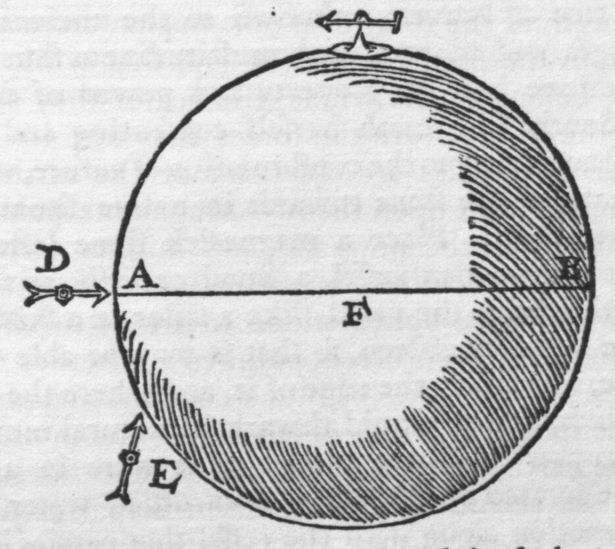

On the stone A B the versorium is placed in such a way that the
 versorium may remain in equilibrium: you will mark with chalk the course
 of the iron when at rest: Move the instrument to another spot, and again
 make note of the direction and aspect: do the same thing in several
 places, and from the concurrence of the lines of direction you will find
 one pole at the point A, the other at B. A versorium placed near the
 stone also indicates the true pole; when at right angles it eagerly
 beholds the stone and seeks the pole itself directly, and is turned in a
 straight line through the axis to the centre of the stone. For
 instance, the versorium D faces toward A and F, the pole and centre,
 whereas E does not exactly respect * either the pole A or the
 centre F. A bit of rather
 fine iron wire, of the length of a barley-corn, is placed on the stone,
 and is moved over the regions and surface of the stone, until it rises to
 the perpendicular: for it
 stands erect at the actual pole, whether Boreal or austral; the further
 from the pole, the more it inclines from the vertical. The poles thus
 found you shall mark with a sharp file or gimlet.

## CHAP. IIII.

### Which pole of the stone is the Boreal: & how it is *distinguished from the austral*.

One pole of the earth turns toward the
 constellation of the Cynosure, and constantly regards a fixed point in
 the heaven (except so far as it changes by the fixed stars being shifted
 in longitude, which motion we recognize as existing in the earth, as we
 shall hereafter prove): While the other pole turns to the opposite face
 of heaven, unknown to the ancients, now visible on long voyages, and
 adorned with multitudinous stars: In the same way the loadstone has the
 property and power of directing itself North and South (the earth herself
 consenting and contributing force thereto) according to the conformation
 of nature, which arranges the movements of the stone towards its native
 situation. Which thing is proved thus: Place a magnetick stone (after
 finding the poles) in a round wooden vessel, a Bowl or dish, at the same
 time place it together with the vessel (like a sailor in a skiff) upon
 water in some large vessel or cistern, so that it may be able to float
 freely in the middle, nor touch the edge of it, and where the air is not
 disturbed by winds, which would thwart the natural movement of the stone.
 Hereupon the stone placed as it were in a ship, in the middle of the
 surface of the still and unruffled water, will at once put itself in
 motion along with the vessel that carries it, and revolve circularly,
 until its austral pole points to the north, and its boreal pole to the
 south. For it reverts from the contrary position to the poles: and
 although by the first too-vehement impulse it over-passes the poles; yet
 after returning again and again, it rests at length at the poles, or at
 the meridian (unless because of local reasons it is diverted some little
 from those points, or from the meridional line, by some sort of
 variation, the cause of
 which we will hereafter state). However often you move it away from its
 place, so often by virtue of nature's noble dower does it seek again
 those sure and determined goals; and this is so, not only
 if the poles have been disposed in the vessel evenly with the plane of
 the horizon, but also in the case of one pole, whether austral or boreal,
 being raised in the vessel ten, or twenty, or thirty, or fifty or eighty
 degrees, above * the plane of the horizon, or lowered beneath
 it: Still you shall see the boreal part of the stone seek the south, and
 the austral part seek the north; So much so that if the pole of the stone
 shall be only one degree distant from the Zenith and highest point of the
 heaven, in the case of a spherical stone, the whole stone revolves until
 the pole occupies its own site; though not in the absolutely direct line,
 it will yet tend toward those parts, and come to rest in the meridian of
 the directive action. With a like impulse too it is borne if the austral
 pole have been raised toward the upper quarters, the same as if the
 Boreal had been exalted above the Horizon. But it is always to be noted
 that, though there are various kinds of unlikeness in the stones, and one
 loadstone may far surpass another in virtue and efficiency; yet all hold
 to the same limits, and are borne toward the same points. Further it is
 to be remembered * that all who before our time wrote of the
 poles of the stone, and all the craftsmen and navigators, have been very
 greatly in error in considering the part of the stone which tended to the
 north as the north pole of the stone, and that which verged toward the
 south, the south pole, which we shall hereafter prove to be false. So
 badly hitherto hath the whole magnetick philosophy been cultivated, even
 as to its foundation principles.

## CHAP. V.

### Loadstone seems to attract Loadstone when in natural position: but repels it when in a contrary one, and brings *it back to order*.

First of all we must declare, in familiar
 language, what are the apparent and common virtues of the stone;
 afterward numerous subtilities, hitherto abstruse and unknown, hidden in
 obscurity, are to be laid open, and the causes of all these (by the
 unlocking of nature's secrets) made evident, in their place, by fitting
 terms and devices. It is trite and commonplace that loadstone draws iron;
 in the same way too does loadstone attract loadstone. Place the stone
 which you have seen to have poles clearly distinguished, and marked
 austral and boreal, in its vessel so as to float; and let the poles be
 rightly arranged with respect to the plane of the horizon, or, at any
 rate not much raised or awry: hold in your hand another stone the poles
 of which are also known; in such a way that its austral pole may be
 toward the boreal pole of the one that is swimming, and near it,
 sideways: for the floating stone forthwith follows the other stone
 (provided it be within its force and dominion) and does not leave off nor
 forsake it until it adhæres; unless by withdrawing your hand, you
 cautiously avoid contact. In like manner if you set the boreal pole of
 the one you hold in your hand opposite the austral pole of the swimming
 stone, they rush together and follow each other in turn. For contrary
 poles allure contrary. If, however, you apply in the same way the
 northern to the northern, and the austral to the austral pole, the one
 stone puts the other to flight, and it turns aside as though a pilot were
 pulling at the helm and it makes sail in the opposite ward as one that
 ploughs the sea, and neither stands anywhere, nor halts, if the other is
 in pursuit. For stone disposeth stone; the one turns the other around,
 reduces it to range, and brings it back to harmony with itself. When,
 however, they come together and are conjoined according to the order of
 nature, they cohære firmly mutually. For instance, if you were to set the
 boreal pole of that stone which is in your hand before the tropic of
 Capricorn of a round floating loadstone (for it will be well to mark out
 on the round stone, that is the terrella, the mathematical circles as we
 do on a globe itself), or before any point between the æquator and the
 austral pole; at once the swimming stone revolves, and so arranges itself
 that its austral pole touches the other's boreal pole, and forms a close
 union with it. In the same way, again, at the other side of the æquator,
 with the opposite poles, you may produce similar results; and thus by
 this art and subtilty we exhibit attraction, repulsion, and circular
 motion for attaining a position of agreement and for declining hostile
 encounters. Moreover 'tis in one and the same stone that we are thus able
 to demonstrate all these things and also how the same part of one stone
 may on division become either boreal or austral. Let A D be an oblong
 stone, in which A is the northern, D the southern pole; cut this into two
 equal parts, then set part A in its vessel on the water, so as to float.

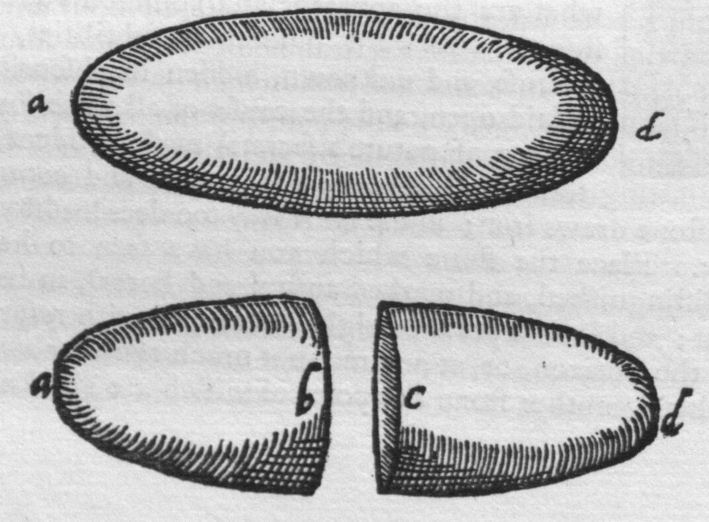

And you will then see
 that A the northern point will turn to the south, as before; in like
 manner also the point D will move to the north, in the divided stone, as
 in the whole one. Whereas, of the parts B and C, which were before
 continuous, and are now divided, the one is southern B, the other
 northern C. B draws C, desirous to be united, and to be brought back into
 its pristine continuity: for these which are now two stones were formed
 out of one: and for this cause C of the one turning itself to B of the
 other, they mutually attract each other, and when freed from obstacles
 and relieved of their own weight, as upon the surface of water, they run
 together and are conjoined. But if you direct the part or point A to C in
 the other stone, the one repels or turns away from the other: for so were
 nature perverted, and the form of the stone perturbed, a form that
 strictly keeps the laws which it imposed upon bodies: hence, when all is
 not rightly ordered according to nature, comes the flight of one from the
 other's perverse position and from the discord, for nature does not allow
 of an unjust and inequitable peace, or compromise: but wages war and
 exerts force to make bodies acquiesce well and justly. Rightly arranged,
 therefore, these mutually attract each other; that is, both stones, the
 stronger as well as the weaker, run together, and with their whole forces
 tend to unity, a fact that is evident in all magnets, not in the
 Æthiopian only, as Pliny supposed. The Æthiopian magnets if they be
 powerful, like those brought from China, because all strong ones show the
 effect more quickly and more plainly, attract more strongly in the parts
 nearest the pole, and turn about until pole looks directly at pole. The
 pole of a stone more persistently attracts and more rapidly seizes the
 corresponding part (which they term the adverse part) of another stone;
 for instance, North pulls South; just so it also summons iron with more
 vehemence, and the iron cleaves to it more firmly whether it have been
 previously excited by the magnet, or is untouched. For thus, not without
 reason hath it been ordained by nature, that the parts nearer to the pole
 should more firmly attract: but that at the pole itself should be the
 seat, the throne, as it were, of a consummate and splendid virtue, to
 which magnetical bodies on being brought are more vehemently attracted,
 and from which they are with utmost difficulty dislodged. So the poles
 are the parts which more particularly spurn and thrust away things
 strange and alien perversely set beside them.

## CHAP. VI.

### Loadstone attracts the ore of iron, as well as iron *proper, smelted and wrought*.

Principal and manifest among the virtues
 of the * magnet, so much and so anciently commended, is the
 attraction of iron; for Plato states that the magnet, so named by
 Euripides, allures iron, and that it not only draws iron rings but also
 indues the rings with power to do the same as the stone; to wit, draw
 other rings, so that sometimes a long chain of iron objects, nails or
 rings is formed, some hanging from others. The best iron (like that which
 is called *acies* from its use, or *chalybs* from the country
 of the Chalybes) is best and strongly drawn by a powerful loadstone;
 whereas the less good sort, which is impure, rusty, and not thoroughly
 purged from dross, and not wrought in second furnaces, is more feebly
 drawn; and yet more weakly when covered and defiled with thick, greasy,
 and sluggish humours. It also draws ores of iron, those that are rich and
 of iron colour; the poorer and not so productive ores it does not
 attract, except they be prepared with some art. A loadstone loses some
 attractive virtue, and, as it were, pines away with age, if exposed too
 long to the open air instead of being laid in a case with filings or
 scales of iron. Whence it should be buried in such materials; for there
 is nothing that plainly resists this exhaustless virtue which does not
 destroy the form of the body, or corrode it; not even if a thousand
 adamants were conjoined. Nor do I consider that there is any such thing
 as the Theamedes, or that
 it has a power opposite to that of the loadstone. Although Pliny, that
 eminent man and prince of compilers (for it is what others had seen and
 discovered, not always or mainly his own observations, that he has handed
 down to posterity) has copied from others the fable now made familiar by
 repetition: That in India there are two mountains near the river Indus;
 the nature of one being to hold fast all that is iron, for it consists of
 loadstone; the other's nature being to repel it, for it consists of the
 Theamedes. Thus if one had iron nails in one's boots, one could not tear
 away one's foot on the one mountain, nor stand still on the other.
 Albertus Magnus writes that a loadstone had been found in his day which
 with one part drew to itself iron, and repelled it with its other end;
 but Albertus observed the facts badly; for every loadstone attracts with
 one end iron that has been touched with a loadstone, and drives it away
 with the other; and draws iron that been touched with a loadstone more
 powerfully than iron that has not been so touched.

## CHAP. VII.

### What Iron is, and of what substance, *and its uses.*

For that now we have declared the origin
 and nature of the loadstone, we think it necessary first to add a history
 of iron and to indicate the hitherto unknown forces of iron, before this
 our discourse goes on to the explanation of magnetick difficulties and
 demonstrations, and to deal with the coitions and harmonies of loadstone
 with iron. Iron is by all reckoned in the class of metals, and is a metal
 livid in colour, very hard, glows red-hot before it melts, being most
 difficult of fusion, is beaten out under the hammer, and is very
 resonant. Chemists say that if a bed of fixed earthy sulphur be combined
 with fixed earthy quicksilver, and the two together are neither pure
 white but of a livid whiteness, if the sulphur prevail, iron is formed.
 For these stern masters of metals who by many inventions twisting them
 about, pound, calcine, dissolve, sublime, and precipitate, decide that
 this metal, both on account of the earthy sulphur and of the earthy
 mercury, is more truly a son of the earth than any other; they do not
 even think gold or silver, lead, tin, or copper itself so earthy; for
 that reason it is not smelted except in the hottest furnaces, with
 bellows; and when thus fused, on having again grown hard it is not melted
 again without heavy labour; but its slag with the utmost difficulty. It
 is the hardest of metals, subduing and breaking all things, by reason of
 the strong concretion of the more earthy matter. Wherefore we shall
 better understand what iron is, when we shall declare what are the causes
 and substance of metals, in a different way from those who before our
 time have considered them. Aristotle takes the material of the metals to
 be vapour. The chemists in chorus pronounce their actual elements to be
 sulphur and quicksilver. Gilgil Mauritanus gives it as ashes moistened
 with water. Georgius Agricola makes it out to be water and earth mixed;
 nor, to be sure, is there any difference between his opinion and the
 position taken by Mauritanus. But ours is that metals arise and
 effloresce at the summits of the earth's globe, being distinguished each
 by its own form, like some of the other substances dug out of it, and all
 bodies around us. The earth's globe does not consist of ashes or inert
 dust. Nor is fresh water an element, but a more simple consistency of
 evaporated fluids of the earth. Unctuous bodies, fresh water devoid of
 properties, quicksilver and sulphur, none of these are principia of
 metals: these latter, things are the results of a different
 nature, they are neither constant nor antecedent in the course of the
 generation of metals. The earth emits various humours, not begotten of
 water nor of dry earth, nor from mixtures of these, but from the
 substance of the earth itself: these humours are not distinguished by
 contrary qualities or substance, nor is the earth a simple substance, as
 the Peripateticks dream. The humours proceed from vapours sublimated from
 great depths; all waters are extracts and, as it were, exudations from
 the earth. Rightly then in some measure does Aristotle make out the
 matter of metals to be that exhalation which in continuance thickens in
 the lodes of certain soils: for the vapours are condensed in places which
 are less hot than the spot whence they issued, and by help of the nature
 of the soils and mountains, as in a womb, they are at fitting seasons
 congealed and changed into metals: but it is not they alone which form
 ores, but they flow into and enter a more solid material, and so form
 metals. So when this concreted matter has settled down in more temperate
 beds, it begins to take shape in those tepid places, just as seed in the
 warm womb, or as the embryo acquires growth: sometimes the vapour
 conjoins with suitable matter alone: hence some metals are occasionally
 though rarely dug up native, and come into existence perfect without
 smelting: but other vapours which are mixed with alien soils require
 smelting in the way that the ores of all metals are treated, which are
 rid of all their dross by the force of fires, and being fused flow out
 metallick, and are separated from earthy impurities but not from the true
 substance of the earth. But in so far as that it becomes gold, or silver,
 or copper, or any other of the existing metals, this does not happen from
 the quantity or proportion of material, nor from any forces of matter, as
 the Chemists fondly imagine; but when the beds and region concur fitly
 with the material, the metals assume forms from the universal nature by
 which they are perfected; in the same manner as all the other minerals,
 plants, and animals whatever: otherwise the species of metals would be
 vague and undefined, which are even now turned up in such scanty numbers
 that scarce ten kinds are known. Why, however, nature has been so stingy
 as regards the number of metals, or why there should be as many as are
 known to man, it is not easy to explain; though the simple-minded and
 raving Astrologers refer the metals each to its own planet. But there is
 no agreement of the metals with the planets, nor of the planets with the
 metals, either in numbers or in properties. For what connexion is there
 of iron with Mars? unless it be that from the former numerous
 instruments, particularly swords and engines of war, are fashioned. What
 has copper to do with Venus? or how does tin, or how does spelter
 correspond with Jupiter? They should rather be dedicated to Venus. But
 this is old wives' talk. Vapour is then a remote cause in the generation
 of the metals; the fluid condensed from vapours is a more
 proximate one, like the blood and semen in the generation of animals. But
 those vapours and juices from vapours pass for the most part into bodies
 and change them into marcasites and are carried into lodes (for we have
 numerous cases of wood so transmuted), the fitting matrices of bodies,
 where they are formed as metals. They enter most often into the truer and
 more homogeneal substance of the globe, and in the process of time a vein
 of iron results; loadstone is also produced, which is nought else than a
 noble kind of iron ore: and for this reason, and on account of its
 substance being singular, alien from all other metals, nature very
 rarely, if ever, mixes with iron any other metal, while the other metals
 are very often minutely mixed, and are produced together. Now when that
 vapour or those juices happen to meet, in fitting matrices, with
 efflorescences deformed from the earth's homogenic substance, and with
 divers precipitates (the forms working thereto), the remainder of the
 metals are generated (a specifick nature affecting the properties in that
 place). For the hidden primordial elements of metals and stones lie
 concealed in the earth, as those of herbs and plants do in its outer
 crust. For the soil dug out of a deep well, where would seem to be no
 suspicion of a conception of seed, when placed on a very high tower,
 produces, by the incubation of sun and sky, green herbage and unbidden
 weeds; and those of the kind which grow spontaneously in that region, for
 each region produces its own herbs and plants, also its own metals.

*Here corn exults, and there the grape is glad,*

*Here trees and grass unbidden verdure add.*

*So mark how Tmolus yields his saffrone store,*

*But ivory is the gift of Indian shore;*

*With incense soft the softer Shebans deal;*

*The stark Chalybeans' element is steel:*

*With acrid castor reek the Pontic wares,*

*Epirus wins the palm of Elian mares.*

But what the Chemists (as Geber, and others) call fixed earthy sulphur
 in iron is nothing else than the homogenic earth-substance concreted by
 its own humour, amalgamated with a double fluid: a metallick humour is
 inserted along with a small quantity of the substance of the earth not
 devoid of humour. Wherefore the common saying that in gold there is pure
 earth, but in iron mostly impure, is wrong; as though there were indeed
 such a thing as natural earth, and that the globe itself were (by some
 unknown process of refining) depurate. In iron, especially in the best
 iron, there is earth in its own nature true and genuine; in the other
 metals there is not so much earth as that in place of earth and
 precipitates there are consolidated and (so to speak) fixed salts, which
 are efflorescences of the globe, and which differ also greatly Page
 22 in firmness
 and consistency: In the mines their force rises up along with a twofold
 humour from the exhalations, they solidify in the underground spaces into
 metallic veins: so too they are also connate by virtue of their place and
 of the surrounding bodies, in natural matrices, and take on their
 specific forms. Of the various constitutions of loadstones and their
 diverse substances, colours, and virtues, mention has been made before:
 but, now having stated the cause and origin of metals, we have to examine
 ferruginous matter not as it is in the smelted metal, but as that from
 which the metal is refined. Quasi-pure iron is found of its proper colour
 and in its own lodes; still, not as it will presently be, nor as adapted
 for its various uses. It is sometimes dug up covered with white silex or
 with other stones. It is often the same in river sand, as in Noricum. A
 nearly pure ore of iron is now often dug up in Ireland, which the smiths,
 without the labours of furnaces, hammer out in the smithy into iron
 implements. In France iron is very commonly smelted out of a
 liver-coloured stone, in which are glittering scales; the same kind without the scales is found
 in England, which also they use for craftsmen's ruddle. In Sussex in England is a rich dusky ore and also one of a
 pale ashen hue, both of which on being dried for a time, or kept in
 moderate fires, presently acquire a liver-colour; here also is found a
 dusky ore square-shaped with a black rind of greater hardness. An ore
 having the appearance of liver is often variously intermingled with other
 stones: as also with the perfect loadstone which yields the best of iron.
 There is also a rusty ore of iron, one of a leaden hue tending to black,
 one quite black, or black mixed with true cobalt: there is another sort
 mixed either with pyrites, or with sterile plumbago. One kind is also
 like jet, another like bloodstone. The emery used by armourers, and by
 glaziers for glass-cutting, called amongst the English Emerelstone, by
 the Germans Smeargel, is ferruginous; albeit iron is extracted from it
 with difficulty, yet it attracts the versorium. It is now and then found
 in deep iron and silver diggings. Thomas Erastus says he had heard from a
 certain learned man of iron ores, of the colour of iron, but quite soft
 and fatty, which can be smoothed with the fingers like butter, out of
 which excellent iron can be smelted: somewhat the same we have seen found
 in England, having the aspect of Spanish soap. Besides the numberless
 kinds of stony ores, iron is extracted from clay, from clayey earth, from
 ochre, from a rusty matter deposited from chalybeate waters; In England
 iron is copiously extracted in furnaces often from sandy and clayey
 stones which appear to contain iron not more than sand, marl, or any
 other clay soils contain it. Thus in Aristotle's book *De Mirabilibus
 Auscultationibus*,
 "There is said" (he states) "to be a peculiar formation of Chalybean and
 Misenian iron, for instance the sort collected from river gravel; some
 say that after being simply washed it is smelted
 in the furnace; others declare that it and the sediment which subsides
 after several washings are cast in and purified together by the fire;
 with the addition of the stone pyrimachus which is found there in
 abundance." Thus do numerous sorts of things contain in their various
 substances notably and abundantly this element of iron and earth.
 However, there are many stones, and very common ones, found in every
 soil, also earths, and various and mixed materials, which do not hold
 rich substances, but yet have their own iron elements, and yield them to
 skilfully-made fires, yet which are left aside by metallick men because
 they are less profitable; while other soils give some show of a
 ferruginous nature, yet (being very barren) are hardly ever smelted down
 into iron; and being neglected are not generally known. Manufactured
 irons differ very greatly amongst themselves. For one kind is tenacious
 in its nature, and this is the best; one is of medium quality: another is
 brittle, and this is the worst. Sometimes the iron, by reason of the
 excellency of the ore, is wrought into steel, as to-day in Noricum. From
 the finest iron, too, well wrought and purged from all dross, or by being
 plunged in water after heating, there issues what the Greeks call στόμωμα; the Latins
 *acies;* others *aciarium,* such as was at times called Syrian,
 Parthian, Noric, Comese, Spanish; elsewhere it is named from the water in
 which it is so often plunged, as at Como in Italy, Bambola and Tarazona in Spain.
 *Acies* fetches a much larger price than mere iron. And owing to its
 superiority it better accords with the loadstone, from which more
 powerful quality it is often smelted, and it acquires the virtues from it
 more quickly, retains them longer at their full, and in the best
 condition for magnetical experiments. After iron has been smelted in the
 first furnaces, it is afterward wrought by various arts in large
 worksteads or mills, the metal acquiring consistency when hammered with
 ponderous blows, and throwing off the dross. After the first smelting it
 is rather brittle and by no means perfect. Wherefore with us (English)
 when the larger military guns are cast, they purify the metal from dross
 more fully, so that they may be stronger to withstand the force of the
 firing; and they do this by making it pass again (in a fluid state)
 through a chink, by which process it sheds its recremental matter. Smiths
 render iron sheets tougher with certain liquids, and by blows of the
 hammer, and from them make shields and breastplates that defy the blows
 of battle-axes. Iron becomes harder through skill and proper tempering,
 but also by skill turns out in a softer condition and as pliable as lead.
 It is made hard by the action of certain waters into which while glowing
 it is plunged, as at Bambola and Tarazona in Spain: It grows soft again,
 either by the effect of fire alone, when without hammering and without
 water, it is left to cool by itself; or by that of grease into which it
 is plunged; or (that it may the better serve for various
 trades) it is tempered variously by being skilfully besmeared. Baptista
 Porta expounds this art in book 13 of his *Magia Naturalis*. Thus
 this ferric and telluric nature is included and taken up in various
 bodies of stones, ores, and earths; so too it differs in aspect, in form,
 and in efficiency. Art smelts it by various processes, improves it, and
 turns it, above all material substances, to the service of man in trades
 and appliances without end. One kind of iron is adapted for breastplates,
 another serves as a defence against shot, another protects against swords
 and curved blades (commonly called scimitars), another is used for making
 swords, another for horseshoes. From iron are made nails, hinges, bolts,
 saws, keys, grids, doors, folding-doors, spades, rods, pitchforks, hooks,
 barbs, tridents, pots, tripods, anvils, hammers, wedges, chains,
 hand-cuffs, fetters, hoes, mattocks, sickles, baskets, shovels, harrows,
 planes, rakes, ploughshares, forks, pans, dishes, ladles, spoons, spits,
 knives, daggers, swords, axes, darts, javelins, lances, spears, anchors,
 and much ship's gear. Besides these, balls, darts, pikes, breastplates,
 helmets, cuirasses, horseshoes, greaves, wire, strings of musical
 instruments, chairs, portcullises, bows, catapults, and (pests of human
 kind) cannon, muskets, and cannon-balls, with endless instruments unknown
 to the Latins: which things I have rehearsed in order that it may be
 understood how great is the use of iron, which surpasses a hundred times
 that of all the other metals; and is day by day being wrought by
 metal-workers whose stithies are found in almost every village. For this
 is the foremost of metals, subserving many and the greatest needs of man,
 and abounds in the earth above all other metals, and is predominant.
 Wherefore those Chemists are fools who think that nature's will is to
 perfect all metals into gold; she might as well be making ready to change
 all stones to diamonds, since diamond surpasses all in splendour and
 hardness, because gold excels in splendour, gravity, and density, being
 invincible against all deterioration. Iron as dug up is therefore, like
 iron that has been smelted, a metal, differing a little indeed from the
 primary homogenic terrestrial body, owing to the metallick humour it has
 imbibed; yet not so alien as that it will not, after the manner of
 refined matter, admit largely of the magnetick forces, and may be
 associated with that prepotent form belonging to the earth, and yield to
 it a due submission.

## CHAP. VIII.

### In what countries and districts iron *originates.*

Plenty of iron mines exist everywhere,
 both those of old time recorded in early ages by the most ancient
 writers, and the new and modern ones. The earliest and most important
 seem to me to be those of Asia. For in those countries which abound
 naturally in iron, governments and the arts flourished exceedingly, and
 things needful for the use of man were discovered and sought after. It is
 recorded to have been found about Andria, in the region of the Chalybes
 near the river Thermodon in Pontus; in the mountains of Palestine which
 face Arabia; in Carmania: in Africa there was a mine of iron in the Isle
 of Meroe; in Europe in the hills of Britain, as Strabo writes; in Hither
 Spain, in Cantabria. Among the Petrocorii and Cubi Biturges (peoples of Gaul), there
 were worksteads in which iron used to be wrought. In greater Germany near
 Luna, as recorded by Ptolemy; Gothinian iron is mentioned by Cornelius
 Tacitus; Noric iron is celebrated in the verses of poets; and Cretan, and
 that of Eubœa; many other iron mines were passed over by these
 writers or unknown to them; and yet they were neither poor nor scanty,
 but most extensive. Pliny
 says that Hither Spain and all the district from the Pyrenees is
 ferruginous, and on the part of maritime Cantabria washed by the Ocean
 (says the same writer) there is (incredible to relate) a precipitously
 high mountain wholly composed of this material. The most ancient mines
 were of iron rather than of gold, silver, copper or lead; since mainly
 this was sought because of the demand; and also because in every district
 and soil they were easy to find, not so deep-lying, and less beset by
 difficulties. If, however, I were to enumerate modern iron workings, and
 those of this age and over Europe only, I should have to write a large
 and bulky volume, and sheets of paper would run short quicker than the
 iron, and yet for one sheet they could furnish a thousand worksteads. For
 amongst minerals, no material is so ample; all metals, and all stones
 distinct from iron, are outdone by ferric and ferruginous matter. For you
 will not readily find any region, and scarcely any country district over
 the whole of Europe (if you search at all deeply), that does not either
 produce a rich and abundant vein of iron or some soil containing or
 slightly charged with ferruginous stuff; and that this is
 true any expert
 in the arts of metals and chemistry will easily find. Beside that which
 has ferruginous nature, and the metallick lode, there is another ferric
 substance which does not yield the metal in this way because its thin
 humour is burnt out by fierce fires, and it is changed into an iron slag
 like that which is separated from the metal in the first furnaces. And of
 this kind is all clay and argillaceous earth, such as that which
 apparently forms a large part of the whole of our island of Britain: all
 of which, if subjected very vehemently to intense heat, exhibits a ferric
 and metallick body, or passes into ferric vitreous matter, as can be
 easily seen in buildings in bricks baked from clay, which, when placed
 next the fires in the open kilns (which our folk call *clamps*) and burned, present an iron
 vitrification, black at the other end. Moreover all those earths as
 prepared are drawn by the magnet, and like iron are attracted by it. So
 perpetual and ample is the iron offspring of the terrestrial globe.
 Georgius Agricola says that almost all mountainous regions are full of
 its ores, while as we know a rich iron lode is frequently dug in the open
 country and plains over nearly the whole of England and Ireland; in no
 other wise than as, says he, iron is dug out of the meadows at the town
 of Saga in pits driven to a two-foot depth. Nor are the West Indies
 without their iron lodes, as writers tell us; but the Spaniards, intent
 upon gold, neglect the toilsome work of iron-founding, and do not search
 for lodes and mines abounding in iron. It is probable that nature and the
 globe of the earth are not able to hide, and are evermore bringing to the
 light of day, a great mass of inborn matter, and are not invariably
 obstructed by the settling of mixtures and efflorescences at the earth's
 surface. It is not only in the common mother (the terrestrial globe) that
 iron is produced, but sometimes also in the air from the earth's
 exhalations, in the highest clouds. It rained iron in Lucania, the year
 in which M. Crassus was slain. The tale is told, too, that a mass of
 iron, like slag, fell from the air in the Nethorian forest, near Grina,
 and they narrate that the mass was many pounds in weight; so that it
 could neither be conveyed to that place, on account of its weight, nor be
 brought away by cart, the place being without roads. This happened before
 the civil war waged between the rival dukes in Saxony. A similar story,
 too, comes to us from Avicenna. It once rained iron in the Torinese, in various places (Julius
 Scaliger telling us that he had a piece of it in his house), about three
 years before that province was taken over by the king. In the year 1510
 in the country bordering on the river Abdua (as Cardan writes in his book *De Rerum
 Varietate*) there fell from the sky 1200 stones, one weighing 120
 pounds, another 30 or 40 pounds, of a rusty iron colour and remarkably
 hard. These occurrences being rare are regarded as portents, like the
 showers of earth and stones mentioned in Roman history. But that it ever
 rained other metals is not recorded; for it has never been known to
 rain from the sky gold, silver, lead, tin, or spelter. Copper, however, has been at some time
 noticed to fall from the sky, and this is not very unlike iron; and in
 fact cloud-born iron of this sort, or copper, are seen to be imperfectly
 metallick, incapable of being cast in any way, or wrought with facility.
 For the earth hath of her store plenty of iron in her highlands, and the
 globe contains the ferric and magnetick element in rich abundance. The
 exhalations forcibly derived from such material may well become concreted
 in the upper air by the help of more powerful causes, and hence some
 monstrous progeny of iron be begotten.

## CHAP. IX.

### Iron ore attracts iron ore.

From various substances iron (like all the
 rest of the * metals) is extracted: such substances being
 stones, earth, and similar concretions which miners call veins because it
 is in veins, as it were,
 that they are generated. We have spoken above of the variety of these
 veins. If a properly coloured ore of iron and a rich one (as miners call
 it) is placed, as soon as mined, upon water in a bowl or any small vessel
 (as we have shown before in the case of a loadstone), it is attracted by
 a similar piece of ore brought near by hand, yet not so powerfully and
 quickly as one loadstone is drawn by another loadstone, but slowly and
 feebly. Ores of iron that are stony, cindery, dusky, red, and several
 more of other colours, do not attract one another mutually, nor are they
 attracted by the loadstone itself, even by a strong one, no more than
 wood, or lead, silver, or gold. Take those ores and burn, or rather roast
 them, in a moderate fire, so that they are not suddenly split up, or fly
 asunder, keeping up the fire ten or twelve hours, and gently increasing
 it, then let them grow cold, skill being shown in the direction in which
 they are placed: These ores thus prepared a loadstone will now draw, and
 they now show a mutual sympathy, and when skilfully arranged run together
 by their own forces.

## CHAP. X.

*

### Iron ore has poles, and acquires them, and settles *itself toward the poles of the universe*.

Deplorable is man's ignorance in natural
 science, and modern philosophers, like those who dream in darkness, need
 to be aroused, and taught the uses of things and how to deal with them,
 and to be induced to leave the learning sought at leisure from books
 alone, and that is supported only by unrealities of arguments and by
 conjectures. For the knowledge of iron (than which nothing is in more
 common use), and that of many more substances around us, remains
 unlearned; iron, a rich ore of which, placed in a vessel upon water, by
 an innate property of its own directs itself, just like the loadstone,
 North and South, at which points it rests, and to which, if it be turned
 aside, it reverts by its own inherent vigour. But many ores, less perfect
 in their nature, which yet contain amid stone or earthy substances plenty
 of iron, have no such motion; but when prepared by skilful treatment in
 the fires, as shown in the foregoing chapter, they acquire a polar vigour
 (which we call verticity); and not only the iron ores in request
 by miners, but even earth merely charged with ferruginous matter, and
 many rocks, do in like manner tend and lean toward those portions of the
 heavens, or more truly of the earth, if they be skilfully placed, until
 they reach the desired location, in which they eagerly repose.

## CHAP. XI.

*

### Wrought Iron, not excited by a loadstone, *draws iron*.

From the ore, which is converted, or
 separated, partly into metal, partly into slag, by the intense heat of
 fires, iron is smelted in the first furnaces in a space of eight, ten, or
 twelve hours, and the metal flows away from the dross and useless matter,
 forming a large and long mass, which being subjected to a sharp hammering
 is cut into parts, out of which when reheated in the second hearth of the
 forge, and again placed on the anvil, the smiths fashion quadrangular
 lumps, or more specially bars which are bought by merchants and
 blacksmiths, from which in smithies usually it is the custom to fashion
 the various implements. This iron we term *wrought*, and its
 attraction by the loadstone is manifest to all. But we, by more carefully
 trying everything, have
 found out that iron merely, by itself alone, not excited by any
 loadstone, not charged by any alien forces, attracts other iron; though
 it does not so eagerly snatch and suddenly pluck at it as would a fairly
 strong loadstone; this you may know thus: A small piece of cork, the size
 of a hazel-nut, rounded, is traversed by an iron wire up to the middle of
 the wire: when set swimming on still water apply to one end of it, close
 (yet so as not to touch), the end of another iron wire; and wire draws
 wire, and one follows the other when slowly drawn back, and this goes on
 up to the proper boundaries. Let A be the cork with the iron wire, B one
 end of it raised a little above the surface of the water, C the end of
 the second wire, showing the way in which B is drawn by C. You may prove
 it in another way in a larger body. Let a long bright iron rod (such as
 is made for hangings and window curtains) be hung in balance by a slender
 silken cord: to one end of this as it rests in the air bring a small
 oblong mass of polished iron, with its proper end at the distance of
 half a digit. The balanced iron turns itself to the mass; do you with the
 same quickness draw back the mass in your hand in a circular path about
 the point of equilibrium of the suspension; the end of the balanced iron
 follows after it, and turns in an orbit.

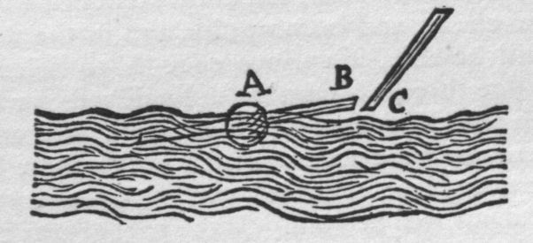

## CHAP. XII.

*

### A long piece of Iron, even though not excited by a *loadstone, settles itself toward North and South.*

Every good and perfect piece of iron, if
 drawn out in length, points North and South, just as the loadstone or
 iron rubbed with a magnetical body does; a thing that our famous
 philosophers have little understood, who have sweated in vain to set
 forth the magnetick virtues and the causes of the friendship of iron for
 the stone. You may experiment with either large or small iron works, and
 either in air or in water. A straight piece of iron six feet long of the
 thickness of your finger is suspended (in the way described in the
 foregoing chapter) in exact æquipoise by a strong and slender silken
 cord. But the cord should be cross-woven of several silk filaments, not
 twisted simply in one way; and it should be in a small chamber with all
 doors and windows closed, that the wind may not enter, nor the air of the
 room be in any way disturbed; for which reason it is not expedient that
 the trial should be made on windy days, or while a storm is brewing. For
 thus it freely follows its bent, and slowly moves until at length, as it
 rests, it points with its ends North and South, just as iron touched with
 a loadstone does in shadow-clocks, and in compasses, and in the mariners'
 compass. You will be able, if curious enough, to balance all at the same
 time by fine threads a number of small rods, or iron wires, or long pins
 with which women knit stockings; you will see that all of them at the
 same time are in accord, unless there be some error in this delicate
 operation: for unless you prepare everything fitly and skilfully, the
 labour will be void. Make trial of this thing in water also, which is
 done both more certainly and more easily. Let an iron wire two or three
 digits long, more or less, be passed through a round cork, so that it may
 just float upon water; and as soon as you have committed it to the waves,
 it turns upon its own centre, and one end tends to the North, the other
 to the South; the causes of which you will afterwards find in the
 laws of the direction. This too you should understand, and hold firmly in
 memory, that * as a strong loadstone, and iron touched with
 the same, do not invariably point exactly to the true pole but to the
 point of the variation; so does a weaker loadstone, and so does the iron,
 which directs itself by its own forces only, not by those impressed by
 the stone; and so every ore of iron, and all bodies naturally endowed
 with something of the iron nature, and prepared, turn to the same point
 of the horizon, according to the place of the variation in that
 particular region (if there be any variation therein), and there abide
 and rest.

## CHAP. XIII.

*

### Wrought iron has in itself certain parts Boreal and Austral: A magnetick vigour, verticity, and determinate *vertices, or poles*.

Iron settles itself toward the North and
 South; not with one and the same point toward this pole or that: for one
 end of the piece of ore itself and one extremity also of a wrought-iron
 wire have a sure and constant destination to the North, the other to the
 South, whether the iron hang in the air, or float on water, be the iron
 large rods or thinner wires. Even if it be a little rod, or a wire ten or
 twenty or more ells in length; one end as a rule is Boreal, the other
 Austral. If you cut off part of that wire, and if the end of that divided
 part were Boreal, the other end (which was joined to it) will be Austral.
 Thus if you divide it into several parts, before making an experiment on
 the surface of water, you can recognize the vertex. In all of them a Boreal end draws an
 Austral and repels a Boreal, and contrariwise, according to the laws
 magnetical. Yet herein wrought iron differs from the loadstone and from
 its own ore, inasmuch as in an iron ball of any size, such as those used
 for artillery or cannon, or bullets used for carbines or fowling-pieces,
 verticity is harder to acquire and is less apparent than in a piece of
 loadstone, or of ore itself, or than in a round loadstone. But in long
 and extended pieces of iron a power is at once discerned; the causes of
 which fact, and the methods by which it acquires its verticity and its
 poles without use of a loadstone, as well as the reasons for all the
 other obscure features of verticity, we shall set forth in describing the
 motion of direction.

## CHAP. XIIII.

### Concerning other powers of loadstone, and its *medicinal properties*.

Dioscorides prescribes loadstone to be
 given with sweetened water, three scruples' weight, to expel gross
 humours. Galen writes that a like quantity of bloodstone avails. Others
 relate that loadstone perturbs the mind and makes folk melancholick, and
 mostly kills. Gartias ab Horto thinks it not deleterious or injurious
 to health. The natives of East India tell us, he says, that loadstone
 taken in small doses preserves youth. On which account the aged king,
 Zeilam, is said to have ordered the pans in which his victuals were
 cooked to be made of loadstone. The person (says he) to whom this order
 was given told me so himself. There are many varieties of loadstone
 produced by differences in the mingling of earths, metals, and juices;
 hence they are altogether unlike in their virtues and effects, due to
 propinquities of places and of agnate bodies, and arising from the pits
 themselves as it were from the matrices being soul. One loadstone is
 therefore able to purge the stomach, and another to check purging, to
 cause by its fumes a serious shock to the mind, to produce a gnawing at
 the vitals, or to bring on a grave relapse; in case of which ills they
 exhibit gold and emerald, using an abominable imposture for lucre. Pure
 loadstone may, indeed, be not only harmless, but even able to correct an
 over-fluid and putrescent state of the bowels and bring them back to a
 better temperament; of this sort usually are the oriental magnets from
 China, and the denser ones from Bengal, which are neither misliking nor
 unpleasant to the actual senses. Plutarch and Claudius Ptolemy, and all the copyists since
 their time, think that a loadstone smeared with garlick does not allure
 iron. Hence some suspect that garlick is of avail against any deleterious
 power of the magnet: thus in philosophy many false and idle conjectures
 arise from fables and falsehoods. Some physicians have that a loadstone has power to
 extract the iron of an arrow from the human body. But it is when whole
 that the loadstone draws, not when pulverized and formless, buried in
 plasters; for it does not attract by reason of its material, but is
 rather adapted for the healing of open wounds, by reason of exsiccation,
 closing up and drying the sore, an effect by which the arrow-heads would
 rather be retained in the wounds. Thus vainly and preposterously do the
 sciolists look for remedies while ignorant of the true
 causes of things. The application of a loadstone for all sorts of
 headaches no more cures them (as some make out) than would an iron helmet
 or a steel cap. To give it in a draught to dropsical persons is an error
 of the ancients, or an impudent tale of the copyists, though one kind of
 ore may be found which, like many more minerals, purges the stomach; but
 this is due to some defect of that ore and not to any magnetick property.
 Nicolaus puts a large quantity of loadstone into his divine plaster, just as the Augsburgers do
 into a black plaster for
 fresh wounds and stabs; the virtue of which dries them up without smart,
 so that it proves an efficacious medicament. In like manner also
 Paracelsus to the same end mingles it in his plaster for stab wounds.

## CHAP. XV.

### The Medicinal Virtue of Iron.

Not foreign to our present purpose will it
 be to treat briefly also of the medicinal virtue of iron: for it is a
 prime remedial for some diseases of the human body, and by its virtues,
 both those that are natural and those acquired by suitable preparation,
 it works marvellous changes in the human body, so that we may the more
 surely recognize its nature through its medicinal virtue and through
 certain manifest experiments. So that even those tyros in medicine who
 abuse this most famous medicament may learn to prescribe it with better
 judgment for the healing of the sick, and not, as too often they use it,
 to their harm. The best iron, Stomoma, or Chalybs, Acies, or Aciarium, is
 reduced to a fine powder by a file; the powder is steeped in the sharpest
 vinegar, and dried in the sun, and again soused in vinegar, and dried;
 afterwards it is washed in spring water or other suitable water, and
 dried; then for the second time it is pulverized and reduced on porphyry,
 passed through a very fine sieve, and put back for use. It is given
 chiefly in cases of laxity and over-humidity of the liver, in enlargement
 of the spleen, after due evacuations; for which reason it restores young
 girls when pallid, sickly, and lacking colour, to health and beauty;
 since it is very siccative, and is astringent without harm. But some who
 in every internal malady always talk of obstruction of the liver and spleen,
 think it beneficial in those cases because it removes obstructions,
 mainly trusting to the opinions of certain Arabians: wherefore they administer it to the
 dropsical and to those suffering from tumour of the liver or from chronic
 jaundice, and to persons troubled with hypochondrical melancholia or any
 stomachic disorder, or add it to electuaries, without doubt to the
 grievous injury of many of their patients. Fallopius commends it prepared
 in his own way for tumours of the spleen, but is much mistaken; for
 loadstone is pre-eminently good for spleens relaxed with humour, and
 swollen; but it is so far from curing spleens thickened into a tumour
 that it mightily confirms the malady. For those drugs which are strong
 siccatives and absorb humour force the viscera when hardened into a
 tumour more completely into a quasi-stony body. There are some who roast
 iron in a closed oven with fierce firing, and burn it strongly, until it
 turns red, and they call this Saffron of Mars; which is a powerful
 siccative, and more quickly penetrates the intestines. Moreover they
 order violent exercise, that the drug may enter the viscera while heated
 and so reach the place affected; wherefore also it is reduced to a very
 fine flour; otherwise it only sticks in the stomach and in the chyle and
 does not penetrate to the intestines. As a dry and earthy medicament,
 then, it is shown by the most certain experiments to be, after proper
 evacuations, a remedy for diseases arising from humour (when the viscera
 are charged and overflowing with watery rheum). Prepared steel is a
 medicament proper for enlarged spleen. Iron waters too are effectual in
 reducing the spleen, although as a rule iron is of a frigid and
 astringent efficiency, not a laxative; but it effects this neither by
 heat nor by cold, but from its own dryness when mixed with a penetrative
 fluid: it thus disperses the humour, thickens the villi, hardens the
 tissues, and contracts them when lax; while the inherent heat in the
 member thus strengthened, being increased in power, dissipates what is
 left. Whereas if the liver be hardened and weakened by old age or a
 chronic obstruction, or the spleen be shrivelled and contracted to a
 schirrus, by which troubles the fleshy parts of the limbs grow flaccid,
 and water under the skin invades the body, in the case of these
 conditions the introduction of iron accelerates the fatal end, and
 considerably increases the malady. Amongst recent writers there are some
 who in cases of drought of the liver prescribe, as a much lauded and
 famous remedy, the electuary of iron slag, described by Rhazes in his ninth book *ad
 Almansorem*, Chap. 63, or prepared filings of steel; an evil and
 deadly advice: which if they do not some time understand from our
 philosophy, at least everyday experience, and the decline and death of
 their patients, will convince them, even the sluggish and lazy. Whether
 iron be warm or cold is variously contended by many. By Manardus,
 Curtius, Fallopius and others, many reasons are adduced on both sides;
 each settles it according to his own sentiment. Some make it to be cold,
 saying that iron has the property of refrigerating, because Aristotle in
 his *Meteorologica* would put iron in the class of things which grow
 concreted in cold by emission of the whole of their Heat: Galen, too,
 says that iron has its consistency from cold; also that it is an earthy
 and dense body. Further that iron is astringent, also that Chalybeate
 water quenches thirst: and they adduce the cooling effect of thermal iron
 waters. Others, however, maintain that it is Warm, because of Hippocrates
 making out that waters are warm which burst forth from places where iron
 exists. Galen says that in all metals there is considerable substance, or
 essence, of fire. Paolo
 affirms that iron waters are warm. Rhazes will have it that iron is warm
 and dry in the third degree. The Arabians think that it opens the spleen
 and liver; wherefore also that iron is warm. Montagnana recommends it in
 cold affections of the uterus and stomach. Thus do the smatterers cross
 swords together, and puzzle inquiring minds by their vague conjectures,
 and wrangle for trifles as for goats' wool, when they philosophize,
 wrongly allowing and accepting properties: but these matters will appear
 more plainly by and by when we begin to discuss the causes of things; the
 clouds being dispersed that have so darkened all Philosophy. Filings,
 scales, and slag of iron are, as Avicenna makes out, not wanting in
 deleterious power (haply when they are not well prepared or are taken in
 larger quantity than is fit), hence they cause violent pain in the
 bowels, roughness of the mouth and tongue, marasmus, and shrivelling of
 the limbs. But Avicenna wrongly and old-womanishly makes out that the
 proper antidote to this iron poison is loadstone to the weight of a
 drachm taken as a draught in the juice of mercurialis or of Beet; for
 loadstone is of a twofold nature, usually malefiant and pernicious, nor
 does it resist iron, since it attracts it; nor when drunk in a draught in
 the form of powder does it avail to attract or repel, but rather inflicts
 the same evils.

## CHAP. XVI.

### That loadstone & iron ore are the same, but iron an *extract from both, as other metals are from their own* ores; & that all magnetick virtues, though *weaker, exist in the ore itself & in smelted iron.*

Hitherto we have declared the nature &
 powers of the loadstone, & also the properties & essence of iron;
 it now remains to show their mutual affinities, & kinship, so to
 speak, & how very closely conjoined these substances are. At the
 highest part of the terrestrial globe, or at its perishable surface &
 rind, as it were, these two bodies usually originate & are produced
 in one and the same matrix, as twins in one mine. Strong loadstones are
 dug up by themselves, weaker ones too have their own proper vein. Both
 are found in iron mines. Iron ore most often occurs alone, without strong
 loadstone (for the more perfect are rarely met with). Strong loadstone is
 a stone resembling iron; out of it is usually smelted the finest iron,
 which the Greeks call *stomoma*, the Latins *acies*, the
 Barbarians (not amiss) *aciare*, or *aciarium*. This same stone
 draws, repels, controls other loadstones, directs itself to the poles of
 the world, picks up smelted iron, and works many other wonders, some
 already set forth by us, but many more which we must demonstrate more
 fully. A weaker loadstone, however, will exhibit all these powers, but in
 a lesser degree; while iron ore, & also wrought iron (if they have
 been prepared) show their strength in all magnetick experiments not less
 than do feeble and weak * loadstones; & an inert piece of
 ore, & one possessed of no magnetick properties, & just thrown
 out of the pit, when
 roasted in the fire & prepared with due art (by the elimination of
 humours & foreign excretions) awakes, and becomes in power &
 potency a magnet, * occasionally a stone or iron ore is mined,
 which attracts forthwith without being prepared: for native iron of the
 right colour attracts and governs iron magnetically. One form then
 belongs to the one mineral, one species, one self-same essence. For to me
 there seems to be a greater difference, & unlikeness, between the
 strongest loadstone, & a weak one which scarce can
 attract a single chip of iron; between one that is stout, strong,
 metallick, & one that is soft, friable, clayey; amidst such variety
 of colour, substance, quality, & weight; than there is on the one
 hand between the best ore, rich in iron, or iron that is metallick from
 the beginning, and on the other the most excellent loadstone. Usually,
 too, there are no marks to distinguish them, and even metallurgists
 cannot decide between them, because they agree together in all respects.
 Moreover we see that the best loadstone and the ore of iron are both as
 it were distressed by the same maladies & diseases, both run to old
 age in the same way & exhibit the same marks of it, are preserved
 & keep their properties by the same remedies & safeguards; &
 yet again the one increases the potency of the other, & by artfully
 devised adjuncts marvellously intensifies, & exalts it. For both are
 impaired by the more acrid juices as by poisons, & the aqua fortis of
 the Chemists inflicts on both the same wounds, and when exposed too long
 to harm from the atmosphere, they both alike pine away, so to speak,
 & grow old; each is preserved by being kept in the dust &
 scrapings of the other; & when a fit piece of steel or iron is
 adjoined above its pole, the loadstone's vigour is augmented through the
 firm union. The loadstone is laid up in iron filings, not that iron is
 its food; as though loadstone were alive and needed feeding, as Cardan
 philosophizes; nor yet
 that so it is delivered from the inclemency of the weather (for which
 cause it as well as iron is laid up in bran by Scaliger; mistakenly,
 however, for they are not preserved well in this way, and keep for years
 their own fixed forms): nor yet, since they remain perfect by the mutual
 action of their powders, do their extremities waste away, but are
 cherished & preserved, like by like. For just as in their own places,
 in the mines, bodies like to each other endure for many ages entire and
 uncorrupt, when surrounded by bodies of the same stuff, as the lesser
 interior parts in a great mass: so loadstone and ore of iron, when
 inclosed in a mound of the same material, do not exhale their native
 humour, do not waste away, but retain their soundness. A loadstone lasts
 longer in filings of smelted iron, & a piece of iron ore excellently
 also in dust of loadstone; as also smelted iron in filings of loadstone
 & even in those of iron. Then both these allied bodies have a true
 & just form of one & the same species; a form which until this
 day was considered by all, owing to their outward unlikeness & the
 inequality of the potency that is the same innate in both, to be
 different & unlike in kind; the smatterers not understanding that the
 same powers, though differing in strength, exist in both alike. And in
 fact they both are true & intimate parts of the earth, & as such
 retain the prime natural properties of mutually attracting, of moving,
 & of disposing themselves toward the position of the world, Page
 38 and of the
 terrestrial globe; which properties they also impart to each other, and
 increase, confirm, receive, and retain each other's forces. The stronger
 fortifies the weaker, not as though aught were taken away from its own
 substance, or its proper vigour, nor because any corporeal substance is
 imparted, but the dormant virtue of the one is aroused by the other,
 without loss. For if with a single small stone you touch a thousand bits
 of iron for the use of mariners, that loadstone attracts iron no less
 strongly than before; with the same stone weighing one pound, any one
 will be able to suspend in the air a thousand pounds of iron. For if any
 one were to fix high up on the walls so many iron nails of so great a
 weight, & were to apply to them the same number of nails touched,
 according to the art, by a loadstone, they would all be seen to hang in
 the air through the force of one small stone. So this is not solely the
 action, labour, or outlay of the loadstone; but the iron, which is in a
 sense an extract from loadstone, and a fusion of loadstone into metal,
 & conceives vigour from it, & by proximity strengthens the
 magnetick faculties, doth itself, from whatever lode it may have come,
 raise its own inborn forces through the presence & contact of the
 stone, even when solid bodies intervene. Iron that has been touched, acts
 anew on another piece of iron by contact, & adapts it for magnetick
 movements, & this again a third. But if you rub with a loadstone any
 other metal, or wood, or bones, or glass, as they will not be moved
 toward any particular and determinate quarter of heaven, nor be attracted
 by any magnetick body, so they are able not to impart any magnetick
 property to other bodies or to iron itself by attrition, & by
 infection. Loadstone differs from iron ore, as also from some weaker
 magnets, in that when molten in the furnace into a ferric & metallick
 fused mass, it does not so readily flow & dissolve into metal; but is
 sometimes burnt to ashes in large furnaces; a result which it is
 reasonable to suppose arises from its having some kind of sulphureous
 matter mixed with it, or from its own excellence & simpler nature, or
 from the likeness & common form which it has with the common mother,
 the Great Magnet. For earths, and iron stones, magnets abounding in
 metal, are the more imbued & marred with excrementitious metallick
 humours, and earthy corruptions of substance, as numbers of loadstones
 are weaker from the mine; hence they are a little further remote from the
 common mother, & are degenerate, & when smelted in the furnace
 undergo fusion more easily, & give out a more certain metallick
 product, & a metal that is softer, not a tough steel. The majority of
 loadstones (if not unfairly burnt) yield in the furnace a very excellent
 iron. But iron ore also agrees in all those primary qualities with
 loadstone; for both, being nearer and more closely akin to the earth
 above all bodies known to us, have in themselves a magnetick substance,
 & one that is more homogenic, true & cognate with the globe of
 the earth; less infested & spoiled by foreign blemish; less confused
 with the outgrowths of earth's surface, & less debased by corrupt
 products. And for this reason Aristotle in the fourth book of his
 *Meteora* seems not unfairly to separate iron from all the rest of
 the metals. Gold, he says, silver, copper, tin, lead, belong to water;
 but iron is of the earth. Galen, in the fourth chapter of *De
 Facultatibus Simplicium Medicamentorum*, says that iron is an earthy
 & dense body. Accordingly a strong loadstone is on our showing
 especially of the earth: the next place is occupied by iron ore or weaker
 loadstone; so the loadstone is by nature and origin** of iron, and it and magnetick iron
 are both one in kind. Iron ore yields iron in furnaces; loadstone also
 pours forth iron in the furnaces, but of a much more excellent sort, that
 which is called steel or blade-edge; and the better sort of iron ore is a
 weak loadstone, the best loadstone being a most excellent ore of iron, in
 which, as is to be shown by us, the primary properties are grand and
 conspicuous. Weaker loadstone or iron ore is that in which these
 properties are more obscure, feeble, and are scarce perceptible to the
 senses.

## CHAP. XVII.

### That the globe of the earth is magnetick, & a magnet; & *how in our hands the magnet stone has all the primary* forces of the earth, while the earth by the *same powers remains constant in a fixed direction in the universe.*

Prior to bringing forward the causes of
 magnetical motions, & laying open the proofs of things hidden for so
 many ages, & our experiments (the true foundations of terrestrial
 philosophy), we have to establish & present to the view of the
 learned our New & unheard of doctrine about the earth; and this, when
 argued by us on the grounds of its probability, with subsequent Page
 40 experiments
 & proofs, will be as certainly assured as anything in philosophy ever
 has been considered & confirmed by clever arguments or mathematical
 proofs. The terrene mass, which together with the vasty ocean produces
 the sphærick figure & constitutes our globe, being of a firm &
 constant substance, is not easily changed, does not wander about, &
 fluctuate with uncertain motions, like the seas, & flowing waves: but
 holds all its volume of moisture in certain beds & bounds, & as
 it were in oft-met veins, that it may be the less diffused &
 dissipated at random. Yet the solid magnitude of the earth prevails &
 reigns supreme in the nature of our globe. Water, however, is attached to
 it, & as an appendage only, & a flux emanating from it; whose
 force from the beginning is conjoined with the earth through its smallest
 parts, and is innate in its substance. This moisture the earth as it
 grows hot throws off freely when it is of the greatest possible service
 in the generation of things. But the thews and dominant stuff of the
 globe is that terrene body which far exceeds in quantity all the volume
 of flowing streams and open waters (whatever vulgar philosophers may
 dream of the magnitudes and proportions of their elements), and which
 takes up most of the whole globe and almost fills it internally, and by
 itself almost suffices to endow it with sphærick shape. For the seas only
 fill certain not very deep or profound hollows, since they rarely go down
 to a depth of a mile and generally do not exceed a hundred or 50 fathoms.
 For so it is ascertained by the observations of seamen when by the
 plumb-line and sinker its abysms are explored with the nautical sounder;
 which depths relatively to the dimensions of the globe, do not much
 deform its globular shape. Small then appears to be that portion of the
 real earth that ever emerges to be seen by man, or is turned up; since we
 cannot penetrate deeper into its bowels, further than the wreckage of its
 outer efflorescence, either by reason of the waters which gush up in deep
 workings, as through veins, or for want of a wholesome air to support
 life in the miners, or on account of the vast cost that would be incurred
 in pumping out such huge workings, and many other difficulties; so that
 to have gone down to a depth of four hundred, or (which is of rarest
 occurrence) of five hundred fathoms as in a few mines, appears to all a
 stupendous undertaking. But it is easy to understand how minute, how
 almost negligibly small a portion that 500 fathoms is of the earth's
 diameter, which is 6,872 miles. It is then parts only of the earth's
 circumference and of its prominences that are perceived by us with our
 senses; and these in all regions appear to us to be either loamy, or
 clayey, or sandy, or full of various soils, or marls: or lots of stones
 or gravel meet us, or beds of salt, or a metallick lode, and metals in
 abundance. In the sea and in deep waters, however, either reefs, and huge
 boulders, or smaller stones, or sands, or mud are found by mariners as
 they sound the depths. Nowhere does the Aristotelian element of
 *earth* come to light; and the Peripateticks are the sport of their
 own vain dreams about elements. Yet the lower bulk of the earth and the
 inward parts of the globe consist of such bodies; for they could not have
 existed, unless they had been related to and exposed to the air and
 water, and to the light and influences of the heavenly bodies, in like
 manner as they are generated, and pass into many dissimilar forms of
 things, and are changed by a perpetual law of succession. Yet the
 interior parts imitate them, and betake themselves to their own source,
 on the principle of terrene matter, albeit they have lost the first
 qualities and the natural terrene form, and are borne towards the earth's
 centre, and cohære with the globe of the earth, from which they cannot be
 wrenched asunder except by force. But the loadstone and all magneticks,
 not the stone only, but every magnetick homogenic substance, would seem
 to contain the virtue of the earth's core and of its inmost bowels, and
 to hold within itself and to have conceived that which is the secret and
 inward principle of its substance; and it possesses the actions peculiar
 to the globe of attracting, directing, disposing, rotating, stationing
 itself in the universe, according to the rule of the whole, and it
 contains and regulates the dominant powers of the globe; which are the
 chief tokens and proofs of a certain distinguishing combination, and of a
 nature most thoroughly conjoint. For if among actual bodies one sees
 something move and breathe, and experience sensations, and be inclined
 and impelled by reason, will one not, knowing and seeing this, conclude
 that it is a man or something rather like a man, than that it is a stone
 or a stick? The loadstone far excels all other bodies known to us in
 virtues and properties pertaining to the common mother: but those
 properties have been far too little understood or realized by
 philosophers: for to its body bodies magnetical rush in from all sides
 and cleave to it, as we see them do in the case of the earth. It has
 poles, not mathematical points, but natural termini of force excelling in
 primary efficiency by the co-operation of the whole: and there are poles
 in like manner in the earth which our forefathers sought ever in the sky:
 it has an æquator, a natural dividing line between the two poles, just as
 the earth has: for of all lines drawn by the mathematicians on the
 terrestrial globe, the æquator is the natural boundary, and is not, as
 will hereafter appear, merely a mathematical circle. It, like the earth,
 acquires Direction and stability toward North and South, as the earth
 does; also it has a circular motion toward the position of the earth,
 wherein it adjusts itself to its rule: it follows the ascensions and
 declinations of the earth's poles, and conforms exactly to the same, and
 by itself raises its own poles above the horizon naturally
 according to the law of the particular country and region, or sinks below
 it. The loadstone derives temporary properties, and acquires its
 verticity from the earth, and iron is affected by the verticity of the
 globe even as iron is by a loadstone: Magneticks are conformable to and
 are regulated by the earth, and are subject to the earth in all their
 motions. All its movements harmonize with, and strictly wait upon, the
 geometry and form of the earth, as we shall afterwards prove by most
 conclusive experiments and diagrams; and the chief part of the visible
 earth is also magnetical, and has magnetick motions, although it be
 disfigured by corruptions and mutations without end. Why then do we not
 recognize this the chief homogenic substance of the earth, likest of
 substances to its inner nature and closest allied to its very marrow? For
 none of the other mixed earths suitable for agriculture, no other
 metalliferous veins, nor stones, nor sand, nor other fragments of the
 earth which have come to our view possess such constant and peculiar
 powers. And yet we do not assume that the whole interior of this globe of
 ours is composed of stones or iron (although Franciscus Maurolycus, that
 learned man, deems the whole of the earth's interior to consist of solid
 stone). For not every loadstone that we have is a stone, it being
 sometimes like a clod, or like clay and iron either firmly compacted
 together out of various materials, or of a softer composition, or by heat
 reduced to the metallick state; and the magnetick substance by reason of
 its location and of its surroundings, and of the metallick matrix itself,
 is distinguished, at the surface of the terrene mass, by many qualities
 and adventitious natures, just as in clay it is marked by certain stones
 and iron lodes. But we maintain that the true earth is a solid substance,
 homogeneous with the globe, closely coherent, endowed with a primordial
 and (as in the other globes of the universe) with a prepotent form; in
 which position it persists with a fixed verticity, and revolves with a
 necessary motion and an inherent tendency to turn, and it is this
 constitution, when true and native, and not injured or disfigured by
 outward defects, that the loadstone possesses above all bodies apparent
 to us, as if it were a more truly homogenic part taken from the earth.
 Accordingly native iron which *sui generis* (as metallurgists term
 it), is formed when homogenic parts of the earth grow together into a
 metallick lode; Loadstone being formed when they are changed into
 metallick stone, or a lode of the finest iron, or steel: so in other iron
 lodes the homogenic matter that goes together is somewhat more imperfect;
 just as many parts of the earth, even the high ground, is homogenic but
 so much more deformate. Smelted iron is fused and smelted out of
 homogenic stuffs, and cleaves to the earth more tenaciously than the ores
 themselves. Such then is our earth in its inward parts, possessed
 of a magnetick homogeneal nature, and upon such more perfect foundations
 as these rests the whole nature of things terrestrial, manifesting itself
 to us, in our more diligent scrutiny, everywhere in all magnetick
 minerals, and iron ores, in all clay, and in numerous earths and stones;
 while Aristotle's simple element, that most empty terrestrial phantom of
 the Peripateticks, a rude, inert, cold, dry, simple matter, the universal
 substratum, is dead, devoid of vigour, and has never presented itself to
 any one, not even in sleep, and would be of no potency in nature. Our
 philosophers were only dreaming when they spoke of a kind of simple and
 inert matter. Cardan does not consider the loadstone to be any kind of
 stone, "but a sort of perfected portion of some kind of earth that is
 absolute; a token of which is its abundance, there being no place where
 it is not found. And there is" (he says) "a power of iron in the wedded
 Earth which is perfect in its own kind when it has received fertilizing
 force from the male, that is to say, the stone of Hercules" (in his book
 *De Proportionibus*). And later: "Because" (he says) "in the
 previous proposition I have taught that iron is true earth." A strong
 loadstone shows itself to be of the inward earth, and upon innumerable
 tests claims to rank with the earth in the possession of a primary form,
 that by which Earth herself abides in her own station and is directed in
 her courses. Thus a weaker loadstone and every ore of iron, and nearly
 all clay, or clayey earth, and numerous other sorts (yet more, or less,
 owing to the different labefaction of fluids and slimes), keep their
 magnetick and genuine earth-properties open to view, falling short of the
 characteristic form, and deformate. For it is not iron alone (the smelted
 metal) that points to the poles, nor is it the loadstone alone that is
 attracted by another and made to revolve magnetically; but all iron ores,
 and other stones, as Rhenish slates and the black ones from Avignon (the
 French call them *Ardoises*) which they use for tiles, and many more
 of other colours and substances, provided they have been prepared; as
 well as all clay, grit, and some sorts of rocks, and, to
 speak more clearly, all the more solid earth that is everywhere apparent;
 given that that earth be not fouled with fatty and fluid corruptions; as
 mud, as mire, as accumulations of putrid matter; nor deformate by the
 imperfections of sundry admixtures; nor dripping with ooze, as marls; all
 are attracted by the loadstone, when simply prepared by fire, and freed
 from their refuse humour; and as by the loadstone so also by the earth
 herself they are drawn and controlled magnetically, in a way different
 from all other bodies; and by that inherent force settle themselves
 according to the orderly arrangement and fabric of the universe and of
 the Earth, as will appear later. Thus every part of the earth which is
 removed from it exhibits by sure experiments every impulse of the
 magnetick nature; by its various motions it observes the globe of the
 earth and the principle common to both.

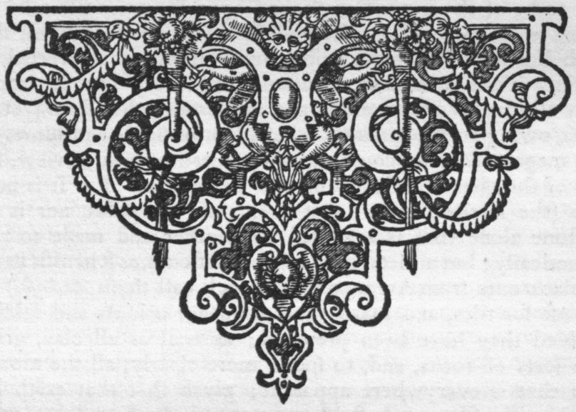

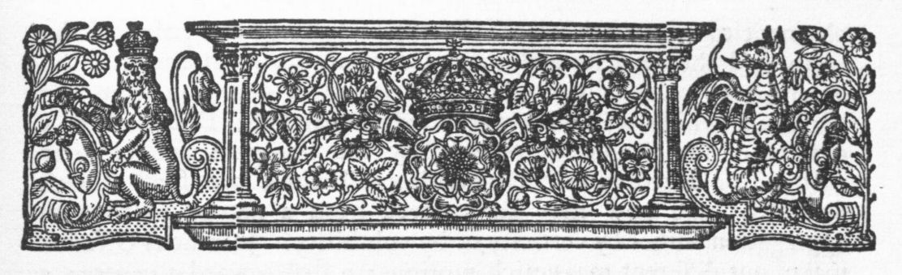

# BOOK SECOND.

## *CHAP. I.*

### ON MAGNETICK Motions.

Divers things concerning opinions about
 the magnet-stone, and its variety, concerning its poles and its known
 faculties, concerning iron, concerning the properties of iron, concerning
 a magnetick substance common to both of these and to the earth itself,
 have been spoken briefly by us in the former book. There remain the
 magnetical motions, and their fuller philosophy, shown and demonstrated.
 These motions are incitements of homogeneal parts either among themselves
 or toward the primary conformation of the whole earth. Aristotle admits
 only two simple motions of his elements, from the centre and toward the
 centre; of light ones upward, heavy ones downward; so that in the earth
 there exists one motion only of all its parts towards the centre of the
 world,—a rude and inert precipitation. But what of it is light, and
 how wrongly it is inferred by the Peripateticks from the simple motion of
 the elements, and also what is its heavy part, we will discuss elsewhere.
 But now our inquiry must be into the causes of other motions, depending
 on its true form, which we have plainly seen in our magnetick bodies; and
 these we have seen to be present in the earth and in all its homogenic
 parts also. We have noticed that they harmonize with the earth, and are
 bound up with its forces. Five movements or differences of motions are then
 observed by us: Coition (commonly called attraction), the
 incitement to
 magnetick union; Direction towards the poles of the earth, and the
 verticity and continuance of the earth towards the determinate poles of
 the world; Variation, a deflexion from the meridian, which we call a
 perverted movement; Declination, a descent of the magnetick pole below
 the horizon; and circular motion, or Revolution. Concerning all these we
 shall discuss separately, and how they all proceed from a nature tending
 to aggregation, either by verticity or by volubility. Jofrancus
 Offusius makes out
 different magnetick motions; a first toward a centre; a second toward a
 pole at seventy-seven degrees; a third toward iron; a fourth toward
 loadstone. The first is not always to a centre, but exists only at the
 poles in a straight course toward the centre, if the motion is magnetick;
 otherwise it is only motion of matter toward its own mass and toward the
 globe. The second toward a pole at seventy-seven degrees is no motion,
 but is direction with respect to the pole of the earth, or variation. The
 third and fourth are magnetick and are the same. So he truly recognizes
 no magnetick motion except the Coition toward iron or loadstone, commonly
 called attraction. There is another motion in the whole earth, which does
 not exist towards the terrella or towards its parts; videlicet, a motion
 of aggregation, and that movement of matter, which is called by
 philosophers a right motion, of which elsewhere.

## CHAP. II.

### On the Magnetick Coition, and first on the Attraction of Amber, or more truly, on the *Attaching of Bodies to Amber*.

Celebrated has the fame of the loadstone
 and of amber ever been in the memoirs of the learned. Loadstone and also
 amber do some philosophers invoke when in explaining many secrets their
 senses become dim and reasoning cannot go further. Inquisitive
 theologians also would throw light on the divine mysteries set beyond the
 range of human sense, by means of loadstone and amber; just as idle
 Metaphysicians, when they are setting up and teaching useless phantasms,
 have recourse to the loadstone as if it were a Delphick sword, an
 illustration always applicable to everything. But physicians even (with
 the authority of Galen), desiring to confirm the belief in
 the attraction of purgative medicines by means of the likeness of
 substance and the familiarities of the juices—truly a vain and
 useless error—bring in the loadstone as witness as being a nature
 of great authority and of conspicuous efficacy and a remarkable body. So
 in very many cases there are some who, when they are pleading a cause and
 cannot give a reason for it, bring in loadstone and amber as though they
 were personified witnesses. But these men (apart from that common error)
 being ignorant that the causes of magnetical motions are widely different
 from the forces of amber, easily fall into error, and are themselves the
 more deceived by their own cogitations. For in other bodies a conspicuous
 force of attraction manifests itself otherwise than in loadstone; like as
 in amber, concerning which some things must first be said, that it may
 appear what is that attaching of bodies, and how it is different from and
 foreign to the magnetical actions; those mortals being still ignorant,
 who think that inclination to be an attraction, and compare it with the
 magnetick coitions. The Greeks call it ἤλεκτρον because it attracts
 straws to itself, when it is warmed by rubbing; then it is called ἅρπαξ; and χρυσοφόρον
 from its golden colour. But the Moors call it Carabe, because they are accustomed to offer
 the same in sacrifices and in the worship of the Gods. For Carab
 signifies to offer in Arabic; so Carabe, an offering: or seizing chaff,
 as Scaliger quotes from Abohalis, out of the Arabic or Persian language.
 Some also call it Amber, especially the Indian and Ethiopian amber,
 called in Latin *Succinum*, as if it were a juice. The Sudavienses or Sudini call it *geniter*,
 as though it were generated terrestrially. The errors of the ancients
 concerning its nature and origin having been exploded, it is certain that
 amber comes for the most part from the sea, and the rustics collect it on
 the coast after the more violent storms, with nets and other tackle; as
 among the Sudini of Prussia; and it is also found sometimes on the coast
 of our own Britain. It seems, however, to be produced also in the soil
 and at spots of some depth, like other bitumens; to be washed out by the
 waves of the sea; and to become concreted more firmly from the nature and
 saltness of the sea-water. For it was at first a soft and viscous
 material; wherefore also it contains enclosed and entombed in pieces of
 it, shining in eternal sepulchres, flies, grubs, gnats, ants; which have
 all flown or crept or fallen into it when it first flowed forth in a
 liquid state. The
 ancients and also more recent writers recall (experience proving the same
 thing), that amber attracts straws and chaff. The same is also done by jet, which is dug out of the
 earth in Britain, in Germany, and in very many lands, and is a rather
 hard concretion from black bitumen, and as it were a transformation into
 stone. There are many modern authors who have written and copied from
 others about amber and jet attracting chaff, and about other
 substances generally unknown; with whose
 labours the shops of booksellers are crammed. Our own age has produced
 many books about hidden, abstruse, and occult causes and wonders, in all
 of which amber and jet are set forth as enticing chaff; but they treat
 the subject in words alone, without finding any reasons or proofs from
 experiments, their very statements obscuring the thing in a greater fog,
 forsooth in a cryptic, marvellous, abstruse, secret, occult, way.
 Wherefore also such philosophy produces no fruit, because very many
 philosophers, making no investigation themselves, unsupported by any
 practical experience, idle and inert, make no progress by their records,
 and do not see what light they can bring to their theories; but their
 philosophy rests simply on the use of certain Greek words, or uncommon
 ones; after the manner of our gossips and barbers nowadays, who make show
 of certain Latin words to an ignorant populace as the insignia of their
 craft, and snatch at the popular favour. For it is not only amber and
 * jet (as they suppose) which entice small bodies; but Diamond, Sapphire,
 Carbuncle, Iris gem,
 Opal, Amethyst, Vincentina, and Bristolla (an English gem or spar), Beryl, and Crystal do the same. Similar
 powers of attraction are seen also to be possessed by glass (especially
 when clear and lucid), as also by false gems made of glass or Crystal, by
 glass of antimony, and by many kinds of spars from the mines, and by
 Belemnites. Sulphur also attracts, and mastick, and hard sealing-wax compounded of lac
 tinctured of various colours. Rather hard resin entices, as does
 orpiment, but less
 strongly; with difficulty also and indistinctly under a suitable dry
 sky, Rock salt,
 muscovy stone, and rock alum. This one may see when the air is sharp and
 clear and rare in mid-winter, when the emanations from the earth hinder
 electricks less, and the electrick bodies become * more firmly
 indurated; about which hereafter. These substances draw everything, not
 straws and chaff only,
 but all metals, woods, leaves, stones, earths, even water and oil, and
 everything which is subject to our senses, or is solid; although some
 write that amber does not attract anything but chaff and certain twigs;
 (wherefore Alexander Aphrodiseus falsely declares the question of amber
 to be inexplicable, because it attracts dry chaff only, and not basil
 leaves), but these are
 the utterly false and disgraceful tales of the writers. But in order that
 you may be able clearly to test how such attraction occurs, and what those
 materials are which
 thus entice other bodies (for even if bodies incline towards some of
 these, yet on account of weakness they seem not to be raised by them, but
 are more easily turned), make yourself a versorium of any metal you like,
 three or four digits in length, resting rather lightly on its point of
 support after the manner of a magnetick needle, to one end of which bring
 up a piece of amber or a smooth 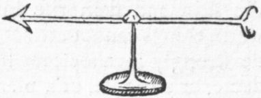 and polished gem which has been gently rubbed; for the
 versorium turns forthwith. Many things are thereby seen to attract, both
 those which are formed by nature alone, and those which are by art
 prepared, fused, and mixed; nor is this so much a singular property of
 one or two things (as is commonly supposed), but the manifest nature of
 very many, both of simple substances, remaining merely in their own form,
 and of compositions, as of hard sealing-wax, & of certain other
 mixtures besides, made of unctuous stuffs. We must, however, investigate
 more fully whence that tendency arises, and what those forces be,
 concerning which a few men have brought forward very little, the crowd of
 philosophizers nothing at all. By Galen three kinds of attractives in
 general were recognized in nature: a First class of those substances
 which attract by their elemental quality, namely, heat; the Second is the
 class of those which attract by the succession of a vacuum; the Third is
 the class of those which attract by a property of their whole substance,
 which are also quoted by Avicenna and others. These classes, however,
 cannot in any way satisfy us; they neither embrace the causes of amber,
 jet, and diamond, and of other similar substances (which derive their
 forces on account of the same virtue); nor of the loadstone, and of all
 magnetick substances, which obtain their virtue by a very dissimilar and
 alien influence from them, derived from other sources. Wherefore also it
 is fitting that we find other causes of the motions, or else we must
 wander (as in darkness), with these men, and in no way reach the goal.
 Amber truly does* not allure by heat, since if warmed by fire
 and brought near straws, it does not attract them, whether it be tepid,
 or hot, or glowing, or even when forced into the flame. Cardan (as also
 Pictorio) reckons that this happens in no different way than with the cupping-glass, by the
 force of fire. Yet the attracting force of the cupping-glass does not
 really come from the force of fire. But he had previously said that the
 dry substance wished to imbibe fatty humour, and therefore it was borne
 towards it. But these statements are at variance with one another, and
 also foreign to reason. For if amber had moved towards its food, or if
 other bodies had inclined towards amber as towards provender, there would
 have been a diminution of the one which was devoured, just as there would
 have been a growth of the other which was sated. Then why should an
 attractive force of fire be looked for in amber? If the attraction
 existed from heat, why should not very many other bodies also attract, if
 warmed by fire, by the sun, or by friction? Neither can the attraction be
 on account of the dissipating of the air, when it takes place in open air
 (yet Lucretius the poet adduces this as the reason for magnetical
 motions). Nor in the cupping-glass can heat or fire attract by feeding on
 air: in the cupping-glass air, having been exhausted into flame,
 when it
 condenses again and is forced into a narrow space, makes the skin and
 flesh rise in avoiding a vacuum. In the open air warm things cannot
 attract, not metals even or stones, if they should * be strongly
 incandescent by fire. For a rod of glowing iron, or a flame, or a candle,
 or a blazing torch, or a live coal, when they are brought near to straws,
 or to a versorium, do not attract; yet at the same time they manifestly
 call in the air in succession; because they consume it, as lamps do oil.
 But concerning heat, how it is reckoned by the crowd of philosophizers,
 in natural philosophy and in *materia medica* to exert an attraction
 otherwise than nature allows, to which true attractions are falsely
 imputed, we will discuss more at length elsewhere, when we shall
 determine what are the properties of heat and cold. They are very general
 qualities or kinships of a substance, and yet are not to be assigned as
 true causes, and, if I may say so, those philosophizers utter some
 resounding words; but about the thing itself prove nothing in particular.
 Nor does this attraction accredited to amber arise from any singular
 quality of the substance or kinship, since by more thorough research we
 find the same effect in very many other bodies; and all bodies, moreover,
 of whatever quality, are allured by all those bodies. Similarity also is
 not the cause; because all things around us placed on this globe of the
 earth, similar and dissimilar, are allured by amber and bodies of this
 kind; and on that account no cogent analogy is to be drawn either from
 similarity or identity of substance. But neither do similars mutually
 attract one another, as stone stone, flesh flesh, nor aught else outside
 the class of magneticks and electricks. Fracastorio would have it that
 "things which mutually attract one another are similars, as being of the
 same species, either in action or in right subjection. Right subjection
 is that from which is emitted the emanation which attracts and which in
 mixtures often lies hidden on account of their lack of form, by reason of
 which they are often different in act from what they are in potency.
 Hence it may be that hairs and twigs move towards amber and towards
 diamond, not because they are hairs, but because either there is shut up
 in them air or some other principle, which is attracted in the first
 place, and which bears some relation and analogy to that which attracts
 of itself; in which diamond and amber agree through a principle common to
 each." Thus far Fracastorio. Who if he had observed by a large number of
 experiments that all bodies are drawn to electricks except those which
 are aglow and aflame, and highly rarefied, would never have given a
 thought to such things. It is easy for men of acute intellect, apart from
 experiments and practice, to slip and err. In greater error do they
 remain sunk who maintain these same substances to be not similar, but to
 be substances near akin; and hold that on that account a thing moves
 towards another, its like, by which it is brought to more perfection. But
 these are ill-considered views; for towards all
 electricks all things move except such as are aflame or are too
 highly rarefied, as air, which is the universal effluvium of this globe
 and of the world. Vegetable substances draw moisture by which their
 shoots are rejoiced and grow; from analogy with that, however,
 Hippocrates, in his *De Natura Hominis*, Book I., wrongly concluded
 that the purging of morbid humour took place by the specifick force of
 the drug. Concerning the action and potency of purgatives we shall speak
 elsewhere. Wrongly also is attraction inferred in other effects; as in
 the case of a flagon full of water, when buried in a heap of wheat,
 although well stoppered, the moisture is drawn out; since this moisture
 is rather resolved into vapour by the emanation of the fermenting wheat,
 and the wheat imbibes the freed vapour. Nor do elephants' tusks attract
 moisture, but drive it into vapour or absorb it. Thus then very many
 things are said to attract, the reasons for whose energy must be sought
 from other causes. Amber in a fairly large mass allures, if* it is polished; in a smaller mass or less pure it seems
 not to attract without friction. But very many electricks (as precious
 stones and some other substances) do not attract at all unless rubbed. On
 the other hand many gems, as well as other bodies, are polished, yet
 do* not allure, and by no amount of friction are they
 aroused; thus the emerald, agate, carnelian, pearls, jasper, chalcedony,
 alabaster, porphyry, coral, the marbles, touchstone, flint, bloodstone,
 emery, do not acquire
 any power; nor do bones, or ivory, or the hardest woods, as ebony, nor do
 cedar, juniper, or cypress; nor do metals, silver, gold, brass, iron, nor
 any loadstone, though many of them are finely polished and shine. But on
 the other hand there are some other polished substances of which we have
 spoken before, toward which, when they have been rubbed, bodies incline.
 This we shall understand only when we have more closely looked into the
 prime origin of bodies. It is plain to all, and all admit, that the mass
 of the earth, or rather the structure and crust of the earth, consists of
 a twofold material, namely, of fluid and humid matter, and of material of
 more consistency and dry. From this twofold nature or the more simple
 compacting of one, various substances take their rise among us, which
 originate in greater proportion now from the earthy, now from the aqueous
 nature. Those substances which have received their chief growth from
 moisture, whether aqueous or fatty, or have taken on their form by a
 simpler compacting from them, or have been compacted from these same
 materials in long ages, if they have a sufficiently firm hardness, if
 rubbed after they have been polished and when they remain bright with the
 friction—towards those substances everything, if presented to them
 in the air, turns, if its too heavy weight does not prevent it. For amber
 has been compacted of moisture, and jet also. Lucid gems are made of
 water; just as Crystal, which has been concreted from clear
 water, not always by a very great cold, as some used to
 judge, and by very hard frost, but sometimes by a less severe one, the
 nature of the soil fashioning it, the humour or juices being shut up in
 definite cavities, in the way in which spars are produced in mines. So
 clear glass is fused out of sand, and from other substances, which have
 their origin in humid juices. But the dross of metals, as also metals,
 stones, rocks, woods, contain earth rather, or are mixed with a good deal
 of earth; * and therefore they do not attract. Crystal,
 mica, glass, and all electricks do not attract if they are burnt or
 roasted; for their primordial supplies of moisture perish by heat, and
 are changed and exhaled. All things therefore which have sprung from a
 predominant moisture and are firmly concreted, and retain the appearance
 of spar and its resplendent nature in a firm and compact body, allure all
 bodies, whether humid or dry. Those, however, which partake of the true
 earth-substance or are very little different from it, are seen to attract
 also, but from a far different reason, and (so to say) magnetically;
 concerning these we intend to speak afterwards. But those substances
 which are more mixed of water and earth, and are produced by the equal
 degradation of each element (in which the magnetick force of the earth is
 deformed and remains buried; while the watery humour, being fouled by
 joining with a more plentiful supply of earth, has not concreted in
 itself but is mingled with earthy matter), can in no way of themselves
 attract or move from its place anything which they do not touch. On this
 account metals, marbles, flints, woods, herbs, flesh, and very many other
 things can neither allure nor solicit any body either magnetically or
 electrically. (For it pleases us to call that an electrick force, which
 hath * its origin from the humour.) But substances consisting
 mostly of humour, and which are not very firmly compacted by nature
 (whereby do they neither bear rubbing, but either melt down and become
 soft, or are not levigable, such as pitch, the softer kinds of resin,
 camphor, galbanum, ammoniack, storax, asafœtida, benzoin,
 asphaltum, especially in rather warm weather) towards them small bodies
 are not borne; for without rubbing most electricks do not * emit their peculiar and native exhalation and
 effluvium. The resin turpentine when liquid does not attract; for it
 cannot be rubbed; but if it has hardened into a mastick it does attract.
 But now at length we must understand why small bodies turn towards those
 substances which have drawn their origin from water; by what force and
 with what hands (so to speak) electricks seize upon kindred natures. In
 all bodies in the world two causes or principles have been laid down,
 from which the bodies themselves were produced, matter and form. Electrical motions
 become strong from matter, but magnetick from form chiefly; and they
 differ widely from one another and turn out unlike, since the one is
 ennobled by numerous virtues and is prepotent; the other is ignoble and
 of less potency, and mostly restrained, as it were, within
 certain barriers; and therefore that force must at times be aroused by
 attrition or friction, until it is at a dull heat and gives off an
 effluvium and a polish is induced on the body. For spent air, either
 blown out of the mouth or given* off from moister air, chokes the
 virtue. If indeed either a sheet of paper or a piece of linen be
 interposed, there will be no movement. But a loadstone, without friction
 or heat, whether dry or suffused with moisture, as well in air as in
 water, invites magneticks, even with the most solid bodies interposed,
 even planks of wood or pretty thick slabs of stone or sheets of metal. A
 loadstone appeals to magneticks* only; towards electricks all
 things move. A loadstone raises great weights; so that if there
 is a loadstone weighing two ounces and strong, it attracts half an ounce
 or a whole ounce. An electrical substance only attracts very small
 weights; as, for instance, a piece of amber of three ounces weight, when
 rubbed, scarce raises a fourth part of a grain of barley. But this
 attraction of amber and of electrical substances must be further
 investigated; and since there is this particular affection of matter, it
 may be asked why is amber rubbed, and what affection is produced by the
 rubbing, and what causes arise which make it lay hold on everything? As a
 result of friction it grows slightly warm and becomes smooth; two results
 which must often occur together. A large polished fragment of amber or
 jet attracts indeed, even without friction, but less strongly; but if it
 be brought gently near a flame or a live coal, so that it equally becomes
 warm, it does not attract small bodies because* it is
 enveloped in a cloud from the body of the flaming substance, which emits
 a hot breath, and then impinges upon it vapour from a foreign body which
 for the most part is at variance with the nature of amber. Moreover the
 spirit of the amber which is called forth is enfeebled by alien heat;
 wherefore it ought not to have heat excepting that produced by motion
 only and friction, and, as it were, its own, not sent into it by other
 bodies. For as the igneous heat emitted from any burning substance cannot
 be so used that electricks may acquire their force from it; so also heat
 from the solar rays does not fit an electrick by the loosening of
 its* right material, because it dissipates rather and
 consumes it (albeit a body which has been rubbed retains its virtue
 longer exposed to the rays of the sun than in the shade; because in the
 shade the effluvia are condensed to a greater degree and more quickly).
 Then again the fervour from the light of the Sun aroused by means of
 a* burning mirror confers no vigour on the heated amber; indeed it dissipates
 and corrupts all the electrick effluvia. Again, burning* sulphur and hard wax, made from shell-lac, when aflame
 do not allure; for heat from friction resolves bodies into effluvia,
 which flame consumes away. For it is impossible for solid electricks to
 be resolved into their own true effluvia otherwise than by attrition,
 save in the case of certain substances which by
 reason of innate vigour emit effluvia constantly. They are rubbed with
 bodies which do not befoul their surface, and which produce a polish, as
 pretty stiff silk or a rough wool rag which is as little soiled as
 possible, or the dry palm. Amber also is rubbed with amber, with diamond,
 and with glass, and numerous other substances. Thus are electricks
 manipulated. These things being so, what is it which moves? Is it the
 body itself, inclosed within its own circumference? Or is it something
 imperceptible to us, which flows out from the substance into the ambient
 air? Somewhat as Plutarch opines, saying in his *Quæstiones
 Platonicæ*: That
 there is in amber something flammable or something having the nature of
 breath, and this by the attrition of the surface being emitted from its
 relaxed pores attracts bodies. And if it be an effusion does it seize
 upon the air whose motion the bodies follow, or upon the bodies
 themselves? But if amber allured the body itself, then what need were
 there of friction, if it is bare and smooth? Nor does the force arise
 from the light which is reflected from a smooth and polished body; for a
 Gem of Vincent's rock,
 Diamond, and clear glass, attract when they are rough; but not so
 powerfully and quickly, because they are not so readily cleansed from
 extraneous moisture on the surface, and are not rubbed equally so as to
 be copiously resolved at that part. Nor does the sun by its own beams of
 light and its rays, which are of capital importance in nature, attract
 bodies in this way; and yet the herd of philosophizers considers that
 humours are attracted by the sun, when it is only denser humours that are
 being turned into thinner, into spirit and air; and so by the motion of
 effusion they ascend into the upper regions, or the attenuated
 exhalations are raised up from the denser air. Nor does it seem to take
 place from the effluvia attenuating the air, so that bodies impelled by
 the denser air penetrate towards the source of the rarefaction; in this
 case both hot and flaming bodies would also allure other bodies; but not
 even the lightest chaff, or any versorium moves towards a flame. If there
 is a flow and rush of air towards the body, how can a small diamond of
 the size of a pea
 summon towards itself so much air, that it seizes hold of a biggish long
 body placed in equilibrio (the air about one or other very small part of
 an end being attracted)? It ought also to have slopped or moved more
 slowly, before it came into contact with the body, especially if the
 piece of amber was rather broad and flat, from the accumulation of air on
 the surface of the amber and its flowing back again. If it is because the
 effluvia are thinner, and denser vapours come in return, as in breathing,
 then the body would rather have had a motion toward the electrick a
 little while after the beginning of the application; but when electricks
 which have been rubbed are applied quickly to * a versorium
 then especially at once they act on the versorium, and it is attracted
 more when near them. But if it is because the rarefied
 effluvia produce
 a rarefied medium, and on that account bodies are more prone to slip down
 from a denser to a more attenuated medium; they might have been carried
 from the side in this way or downwards, but not to bodies above them; or
 the attraction and apprehension of contiguous bodies would have been
 momentary only. But with a single friction jet and amber draw and attract
 bodies to them strongly and for a long time, sometimes for the twelfth
 part of an hour, especially in clear weather. But if the mass of amber be
 rather large, and the surface polished, it attracts without friction.
 Flint is rubbed and emits by attrition an inflammable matter that turns
 into sparks and heat. Therefore the denser effluvia of flint producing
 fire are very far different from electrical effluvia, which on account of
 their extreme attenuation do not take fire, nor are fit material for
 flame. Those effluvia are not of the nature of breath, for when emitted
 they do not propel anything, but are exhaled without sensible resistance
 and touch bodies. They are highly attenuated humours much more subtile
 than the ambient air; and in order that they may occur, bodies are
 required produced from humour and concreted with a considerable degree of
 hardness. Non-electrick bodies are not resolved into humid effluvia, and
 those effluvia mix with the common and general effluvia of the earth, and
 are not peculiar. Also besides the attraction of bodies, they retain them
 longer. It is probable therefore that amber does exhale something
 peculiar to * itself, which allures bodies themselves, not
 the intermediate air. Indeed it plainly does draw the body itself in the
 case of a spherical drop of water standing on a dry surface; for a piece
 of amber applied to it at a suitable distance pulls the nearest parts out
 of their position and draws it up into a cone; otherwise, if it were
 * drawn by means of the air rushing along, the whole drop
 would have moved. That it does not attract the air is thus demonstrated:
 take a very thin wax candle, which makes a very small and clear flame;
 bring up to this, within two digits or any convenient distance, a piece
 of amber or jet, a broad flat piece, well prepared * and
 skilfully rubbed, such a piece of amber as would attract bodies far and
 wide, yet it does not disturb the flame; which of necessity would have
 occurred, if the air was disturbed, for the flame would have followed the
 current of air. As far as the effluvia are sent out, so far it allures;
 but as a body approaches, its motion is accelerated, stronger forces
 drawing it; as also in the case of magneticks and in all natural motion;
 not by attenuating or by expelling the air, so that the body moves down
 into the place of the air which has gone out; for thus it would have allured only
 and would not have retained; since it would at first also have repelled
 approaching bodies just as it drives the air itself; but indeed a
 particle, be it ever so small, does not avoid the first application made
 very quickly after rubbing. An effluvium exhales from amber and is
 emitted by rubbing: pearls, carnelian, agate, jasper, chalcedony, coral,
 metals, and other substances of that kind, when they
 are rubbed, produce no effect. Is there not also something which is
 exhaled from them by heat and attrition? Most truly; but from grosser
 bodies more blended with the earthy nature, that which is exhaled is
 gross and spent; for even towards very many electricks, if they are
 rubbed * too hard, there is produced but a weak attraction of
 bodies, or none at all; the attraction is best when the rubbing has been
 gentle and very quick; for so the finest effluvia are evoked. The
 effluvia arise from the subtile diffusion of humour, not from excessive
 and turbulent violence; especially in the case of those substances which
 have been compacted from unctuous matter, which when the atmosphere is
 very thin, when the North winds, and amongst us (English) the East winds,
 are blowing, have a surer and firmer effect, but during South winds and
 in damp weather, only a weak one; so that those * substances
 which attract with difficulty in clear weather, in thick weather produce
 no motion at all; both because in grosser air lighter substances move
 with greater difficulty; and especially because the effluvia are stifled,
 and the surface of the body that has been rubbed is affected by the spent
 humour of the air, and the effluvia are stopped at their very starting.
 On that account in the case of amber, jet, and sulphur, because they do
 not so easily take up moist air on their surface and are much more
 plenteously set free, that force is not so quickly suppressed as in gems,
 crystal, glass, and substances of that kind which collect on their
 surface the moister breath which has grown heavy. But it may be asked why
 does amber allure water, when water placed on its surface removes its
 action? Evidently because it is one thing to suppress it at its very
 start, and quite another to extinguish it when it has been * emitted. So also thin and very fine silk, in common
 language *Sarcenet*, placed quickly on the amber, after it has been
 rubbed, * hinders the attraction of the body; but if it is
 interposed in the intervening space, it does not entirely obstruct it.
 Moisture also from spent air, and any breath blown from the mouth, as
 well as water put on the amber, immediately extinguishes its force. But
 oil, which is light and pure, does not hinder it; for although amber
 * be rubbed with a warm finger dipped in oil, still it
 attracts. But * if that amber, after the rubbing, is
 moistened with *aqua vitæ* or spirits of wine, it does not attract;
 for it is heavier than oil, denser, and when added to oil sinks beneath
 it. For oil is light and rare, and does not resist the most delicate
 effluvia. A breath therefore, proceeding from a body which had been
 compacted from humour or from a watery liquid, reaches the body to be
 attracted; the body that is reached is united with the attracting body,
 and the one body lying near the other within the peculiar radius of its
 effluvia makes one out of two; united, they come together into the
 closest accord, and this is commonly called attraction. This unity,
 according to the opinion of Pythagoras, is the principle
 of all things, and through participation in it each several thing is said
 to be one. For since no action can take place by means of matter unless
 by contact, these electricks are not seen to touch, but, as was
 necessary, something is sent from the one to the other, something which
 may touch closely and be the beginning of that incitement. All bodies are
 united and, as it were, cemented together in some way by moisture; so
 that a wet body, when it touches another body, attracts it, if it is
 small. So wet bodies on the surface of water attract wet bodies. But the
 peculiar electrical effluvia, which are the most subtile material of
 diffuse humour, entice corpuscles. Air (the common effluvium of the
 earth) not only unites the disjointed parts, but the earth calls bodies
 back to itself by means of the intervening air; otherwise bodies which
 are in higher places would not so eagerly make for the earth. Electrical
 effluvia differ greatly from air; and as air is the effluvium of the
 earth, so electricks have their own effluvia and properties, each of them
 having by reason of its peculiar effluvia a singular tendency toward
 unity, a motion toward its origin and fount, and toward the body emitting
 the effluvia. But those substances which by attrition emit a gross or
 vapourous or aeriform effluvium produce no effect; for either such
 effluvia are alien to the humour (the uniter of all things), or being
 very like common air are blended with the air and intermingle with the
 air, wherefore they produce no effect in the air, and do not cause
 motions different from those so universal and common in nature. In like
 manner * bodies strive to be united and move on the surface of
 water, just 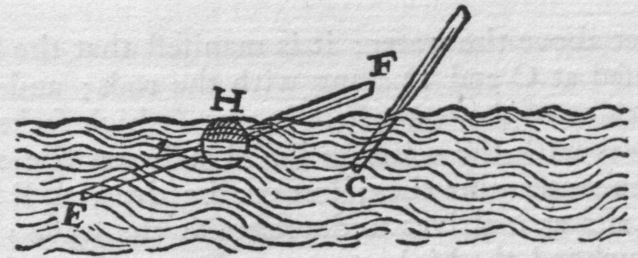 as the rod C, which is put a little way under water. It is
 plain that the rod E F, which floats on the water by reason of the cork
 H, and only has its wet end F above the surface of the water, is
 attracted by the rod C, if the rod C is wet a little above the surface of
 the water; they are suddenly united, just as a drop adjoining a drop is
 attracted. So a wet thing on the surface of water seeks union with a wet
 thing, since the surface of the water is raised on both; and they
 immediately flow together, just like drops or bubbles. But they are in
 much greater proximity than electricks, and are united by their clammy
 natures. If, however, the whole rod be dry * above the
 water, it no longer attracts, but drives away the stick E F. The same is
 seen in those bubbles also which are made on water. For we see one
 drive towards another, and the quicker the nearer they are. Solids are
 impelled towards solids by the medium of liquid: for example, touch the
 end of a versorium with the end of a rod on which a drop of water is
 projecting; as soon as the versorium touches the top of the droplet,
 immediately it is joined * strongly by a swift motion to
 the body of the rod. So concreted humid things attract when a little
 resolved into air (the effluvia in the intermediate space tending to
 produce unity); for water has on wet bodies, or on bodies wet with
 abundant moisture on the top of water, the force of an effluvium. Clear
 air is a convenient medium for an electrical effluvium excited from
 concreted humour. Wet bodies projecting above the surface of water (if
 they are near) run together so that they may unite; for the surface of
 the water is raised around wet substances. But a dry thing is not
 impelled to a wet one, nor a wet to a dry, but seems to run away. For if
 all is dry above the water, the surface of the water close to it does not
 rise, but shuns it, the wave sinking around a dry thing. So neither does
 a wet thing move towards the dry rim of a vessel; but it seeks 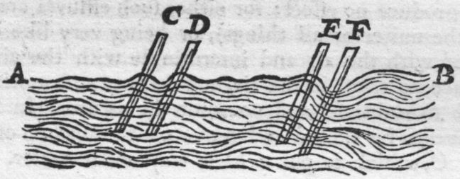 a wet rim. A B is the surface
 of the water; C D two rods, which stand up wet above the water; it is
 manifest that the surface of the water is raised at C and D along with
 the rods; and therefore the rod C, by reason of the water standing up
 (which seeks its level and unity), moves with the water to D. On E, on
 the other hand, a wet rod, the water also rises; but on the dry rod F the
 surface is depressed; and as it drives to depress also the wave rising on
 E in its neighbourhood, the higher wave at E turns away from F; for it does not suffer
 itself to be depressed. All electrical attraction occurs through an
 intervening humour; so it is by reason of humour that all things mutually
 come together; fluids indeed and aqueous bodies on the surface of water,
 but concreted things, if they have been resolved into vapour, in
 air;—in air indeed, the effluvium of electricks being very rare,
 that it may the better permeate the medium and not impel it by its
 motion; for if that effluvium had been thick, as that of air, or of the
 winds, or of saltpetre burnt by fire, as the thick and foul effluvia
 given out with very great force, from other bodies, or air set free from
 humour by heat rushing out through a pipe (in the instrument of Hero of
 Alexandria, described in his book *Spiritalia*), then the effluvium
 would drive everything away, not allure it. But those rarer effluvia take
 hold of bodies and embrace them as if with arms extended, with the
 electricks to which they are united; and they are drawn to the source,
 the effluvia increasing in strength with the proximity. But what is that
 effluvium from crystal, glass, and diamond, since these are bodies of
 considerable hardness and firmly concreted? In order that such an
 effluvium should be produced, there is no need of any marked or
 perceptible flux of
 the substance; nor is it necessary that the electrick should be abraded,
 or worn away, or deformed. Some odoriferous substances are fragrant for
 many years, exhaling continually, yet are not quickly consumed. Cypress
 wood as long as it is sound, and it lasts a very long time indeed, is
 redolent; as many learned men attest from experience. Such an electrick
 only for a moment, when stimulated by friction, emits powers far more
 subtile and more fine beyond all odours; yet sometimes amber, jet,
 sulphur, when they are somewhat easily let free into vapour, also pour
 out at the same time an odour; and on this account they allure with the
 very gentlest rubbing, often even without rubbing; they also excite more
 strongly, and retain hold for a longer time, because they have stronger
 effluvia and last longer. But diamond, glass, rock-crystal, * and numerous others of the harder and firmly concreted
 gems first grow warm: therefore at first they are rubbed longer, and then
 they also attract strongly; nor are they otherwise set free into vapour.
 Everything rushes towards electricks excepting flame, and flaming bodies,
 and the thinnest air. Just as they do not draw flame, in like manner they
 do not affect a versorium, if on any side it is very near to a flame,
 either the flame of a lamp or of any burning matter. It is manifest
 indeed that the effluvia are destroyed by flame and igneous * heat; and therefore they attract neither flame nor
 bodies very near a flame. For electrical effluvia have the virtue of, and
 are analogous with, extenuated humour; but they will produce their
 effect, union and continuity, not by the external impulse of vapours, not
 by heat and attenuation of heated bodies, but by their humidity itself
 attenuated into its own peculiar effluvia. Yet they entice * smoke sent out by an extinguished light; and the more
 that smoke is attenuated in seeking the upper regions, the less strongly
 is it turned aside; for things that are too rarefied are not drawn to
 them; and at length, when it has now almost vanished, it does not * incline towards them at all, which is easily seen
 against the light. When in fact the smoke has passed into air, it is not
 moved, as has been demonstrated before. For air itself, if somewhat thin,
 is not attracted in any way, unless on account of succeeding that which
 has vacated its place, as in furnaces and such-like, where the air is fed
 in by mechanical devices for drawing it in. Therefore an effluvium
 resulting from a non-fouling friction, and one which
 is not changed
 by heat, but which is its own, causes union and coherency, a prehension
 and a congruence towards its source, if only the body to be attracted is
 not unfitted for motion, either by the surroundings of the bodies or by
 its own weight. To the bodies therefore of the electricks themselves
 small bodies are borne. The effluvia extend out their
 virtue—effluvia which are proper and peculiar to them, and *sui
 generis*, differing from common air, being produced from humour,
 excited by a calorifick motion from attrition and attenuation. And as if
 they were material rays, they hold and take up chaff, straws,
 and twigs, until they become extinct or vanish away: and then they (the
 corpuscles) being loosed again, attracted by the earth itself, fall down
 to the earth. The difference between Magneticks and Electricks is that all magneticks
 run together with mutual forces; electricks only allure; that which is
 allured is not changed by an implanted force, but that which has moved up
 to * them voluntarily rests upon them by the law of matter.
 Bodies are borne towards electricks in a straight line towards the centre
 of the electrick; a loadstone draws a loadstone directly at the poles
 only, in other parts obliquely and transversely, and in this way also
 they adhere and hang to one another. Electrical motion is a motion of
 aggregation of matter; magnetical motion is one of disposition and
 conformation. The globe of the earth is aggregated and cohæres by itself
 electrically. The globe of the earth is directed and turned magnetically;
 at the same time also it both cohæres, and in order that it may be solid,
 is in its inmost parts cemented together.

## CHAP. III.

### Opinions of others on Magnetick Coition, *which they call Attraction*.

Discussion having now been made concerning
 electricks, the causes of magnetick coition must be set forth. We say
 coition, not attraction. The word attraction unfortunately
 crept into magnetick philosophy from the ignorance of the ancients; for
 there seems to be force applied where there is attraction and an
 imperious violence dominates. For, if ever there is talk about magnetick
 attraction, we understand thereby magnetick coition, or a primary running
 together. Now in truth it will not be useless here first briefly to set
 forth the views given by others, both the ancient and the more modern
 writers. Orpheus in his hymns narrates that iron is attracted by
 loadstone as the bride to the arms of her espoused. Epicurus holds that
 iron is attracted by a loadstone just as straws by amber; "and," he adds,
 "the Atoms and indivisible particles which are given off by the stone and
 by the iron fit one another in shape; so that they easily cling to one
 another; when therefore these solid particles of stone or of iron strike
 against one another, then they rebound into space, being brought against
 one another by the way, and they draw the iron along with them." But this
 cannot be the case in the least; since solid and very dense substances
 interposed, even squared blocks of marble, do not obstruct this power,
 though they can separate atoms from atoms; and the stone and the iron
 would be speedily dissipated into such profuse and perpetual streams of
 atoms. In the case of amber, since there is another different method of
 attracting, the Epicurean atoms cannot fit one another in shape. Thales,
 as Aristotle writes, *De Anima*, Bk. I., deemed the loadstone to be
 endowed with a soul of some sort, because it had the power of moving and
 drawing iron towards it. Anaxagoras also held the same view. In the
 *Timæus* of Plato there is an idle fancy about the efficacy of the stone of
 Hercules. For he says that "all flowings of water, likewise the fallings
 of thunderbolts, and the things which are held wonderful in the
 attraction of Amber, and of the Herculean stone, are such that in all
 these there is never any attraction; but since there is no vacuum, the
 particles drive one another mutually around, and when they are dispersed
 and congregated together, they all pass, each to its proper seat, but
 with changed places; and it is forsooth, on account of these
 intercomplicated affections that the effects seem to arouse the wonder in
 him who has rightly investigated them." Galen does not know why Plato
 should have seen fit to select the theory of circumpulsion rather than
 that of attraction (differing almost on this point alone from
 Hippocrates), though indeed it does not agree in reality with either
 reason or experiment. Nor indeed is either the air or anything else
 circumpelled; and the bodies themselves which are attracted are carried
 towards the attracting substance not confusedly, or in an orbe.
 Lucretius, the poet of the Epicurean sect, sang his opinion of it
 thus:

*First, then, know,*

*Ceaseless effluvia from the magnet flow,—*

*Effluvia, whose superior powers expel*

*The air that lies between the stone and steel.*

*A vacuum formed, the steely atoms fly*

*In a link'd train, and all the void supply;*

*While the whole ring to which the train is join'd*

*The influence owns, and follows close behind. &c.*

Such a reason Plutarch also alleges in the *Quæstiones
 Platonicæ*: That that stone gives off heavy exhalations, whereby the
 adjacent air, being impelled along, condenses that which is in front of
 it; and that air, being driven round in an orbe and reverting to the
 place it had vacated, drags the iron forcibly along with it. The
 following explanation of the virtues of the loadstone and of amber is
 propounded by Johannes Costæus of Lodi. For he would have it that "there is
 mutual work and mutual result, and therefore the motion is partly due to
 the attraction of the loadstone and partly to a spontaneous movement on
 the part of the iron: For as we say that vapours issuing from the
 loadstone hasten by their own nature to attract the iron, so also the air
 repelled by the vapours, whilst seeking a place for itself, is turned
 back, and when turned back, it impels the iron, lifts it up, as it were,
 and carries it along; the iron being of itself also excited somehow. So
 by being drawn out and by a spontaneous motion, and by striking against
 another substance, there is in some way produced a composite motion,
 which motion would nevertheless be rightly referred to attraction,
 because the terminus from which this motion invariably begins is the same
 terminus at which it ends, which is the characteristic proper of an
 attraction." There is certainly a mutual action, not an operation, nor
 does the loadstone attract in that way; nor is there any impulsion. But
 neither is there that origination of the motion by the vapours, and the
 turning of them back, which opinion of Epicurus has so often been quoted
 by others. Galen errs in his *De Naturalibus Facultatibus*, Book I.,
 chap. 14, when he expresses the view that whatever agents draw out either
 the venom of serpents or darts also exhibit the same power as the
 loadstone. Now of what sort may be the attraction of such medicaments (if
 indeed it may be called attraction) we shall consider elsewhere. Drugs
 against poisons or darts have no relation to, no similitude with, the
 action of magnetical bodies. The followers of Galen (who hold that
 purgative medicaments attract because of similitude of substance) say
 that bodies are attracted on account of similitude, not identity, of
 substance; wherefore the loadstone draws iron, but iron does not draw
 iron. But we declare and prove that this happens in primary bodies, and
 in those bodies that are pretty closely related to them and especially
 like in kind one to another, on account of their identity; wherefore also
 loadstone draws loadstone and likewise iron iron; every really true earth
 draws earth; and iron fortified by a loadstone within the orbe of whose
 virtue it is placed draws iron more strongly than it does the loadstone.
 Cardan asks why no other metal is attracted by any other stone; because
 (he replies) no metal is so cold as iron; as if indeed cold were the
 cause of the attraction, or as if iron were much colder than lead, which
 neither follows nor is deflected towards a loadstone.
 But that is a
 chilly story, and worse than an old woman's tale. So also is the notion
 that the loadstone is alive and that iron is its food. But how does the
 loadstone feed on the iron, when the filings in which it is kept are
 neither consumed nor become lighter? Cornelius Gemma,
 *Cosmographia*, Bk. X., holds that the loadstone draws iron
 to it by insensible rays, to which opinion he conjoins a story of a
 sucking fish and another about an antelope. Guilielmus Puteanus derives it, "not from
 any property of the whole substance unknown to any one and which cannot
 be demonstrated in any way (as Galen, and after him almost all the
 physicians, have asserted), but from the essential nature of the thing
 itself, as if moving from the first by itself, and, as it were, by its
 own most powerful nature and from that innate temperament, as it were an
 instrument, which its substance, its effective nature uses in its
 operations, or a secondary cause and deprived of its intermediary"; so
 the loadstone attracts the iron not without a physical cause and for the
 sake of some good. But there is no such thing in other substances
 springing from some material form; unless it were primary, which he does
 not recognize. But certes good is shown to the loadstone by the stroke of
 the iron (as it were, association with a friend); yet it cannot either be
 discovered or conceived how that disposition may be the instrument of
 form. For what can temperament do in magnetical motions, which must be
 compared with the fixed, definite, constant motions of the stars, at
 great distances in case of the interposition of very dense and thick
 bodies? To Baptista Porta the loadstone seems a sort of mixture
 of stone and iron, in such a way that it is an iron stone or stony iron.
 "But I think" (he says) "the Loadstone is a mixture of stone and iron, as
 an iron stone, or a stone of iron. Yet do not think the stone is so
 changed into iron, as to lose its own Nature, nor that the iron is so
 drowned in the stone, but it preserves itself; and whilst one labours to
 get the victory of the other, the attraction is made by the combat
 between them. In that body there is more of the stone than of iron; and
 therefore the iron, that it may not be subdued by the stone, desires the
 force and company of iron; that being not able to resist alone, it may be
 able by more help to defend itself.... The Loadstone draws not stones,
 because it wants them not, for there is stone enough in the body of it;
 and if one Loadstone draw another, it is not for the stone, but for the
 iron that is in it." As if in the loadstone the iron were a distinct body
 and not mixed up as the other metals in their ores! And that these, being
 so mixed up, should fight with one another, and should extend their
 quarrel, and that in consequence of the battle auxiliary forces should be
 called in, is indeed absurd. But iron itself, when excited by a
 loadstone, seizes iron no less strongly than the loadstone. Therefore
 those fights, seditions, and conspiracies in the stone, as if it were
 nursing up perpetual quarrels, whence it might seek auxiliary forces, are
 the ravings of a babbling old woman, not the inventions of a
 distinguished mage. Others have lit upon sympathy as the cause. There may
 be fellow-feeling, and yet the cause is not fellow-feeling; for no
 passion can rightly be said to be an efficient cause. Others hold
 likeness of substance, many others insensible rays as the cause; men who
 also in very many cases often wretchedly misuse rays, which were first
 introduced in the natural sciences by the mathematicians. More eruditely
 does Scaliger say that
 the iron moves toward the loadstone as if toward its parent, by whose
 secret principles it may be perfected, just as the earth toward its
 centre. The Divine Thomas does not differ much from him, when in
 the 7th book of his *Physica* he discusses the reasons of motions.
 "In another way," he says, "it may be said to attract a thing, because it
 moves it to itself by altering it in some way, from which alteration it
 happens that when altered it moves according to its position, and in this
 manner the loadstone is said to attract iron. For as the parent moves
 things whether heavy or light, in as far as it gives them a form, by
 means of which they are moved to their place; so also the loadstone gives
 a certain quality to the iron, in accordance with which it moves towards
 it." This by no means ill-conceived opinion this most learned man shortly
 afterwards endeavoured to confirm by things which had obtained little
 credence respecting the loadstone and the adverse forces of garlick.
 Cardinal Cusan also is
 not to be despised. "Iron has," he says, "in the loadstone a certain
 principle of its own effluence; and whilst the loadstone by its own
 presence excites the heavy and ponderous iron, the iron is borne by a
 wonderful yearning, even above the motion of nature (by which in
 accordance with its weight it ought to tend downwards) and moves upwards,
 in uniting itself with its own principle. For if there were not in the
 iron a certain natural foretaste of the loadstone itself, it would not
 move to the loadstone any more than to any other stone; and unless there
 were in the stone a greater inclination for iron than for copper, there
 would not be that attraction." Such are the opinions expressed about the
 loadstone attracting (or the general sense of each), all dubious and
 untrustworthy. But those causes of the magnetical motions, which in the
 schools of the Philosophers are referred to the four elements and the
 prime qualities, we relinquish to the moths and the worms.

## CHAP. IIII.

### On Magnetick Force & Form, what it is; and on the *cause of the Coition*.

Relinquishing the opinions of others on
 the attraction of loadstone, we shall now show the reason of that coition
 and the translatory nature of that motion. Since there are really two
 kinds of bodies, which seem to allure bodies with motions manifest to our
 senses, Electricks and Magneticks, the Electricks produce the tendency by
 natural effluvia from humour; the Magneticks by agencies due to form, or
 rather by the prime forces. This form is unique, and particular, not the
 formal cause of the Peripateticks, or the specifick in mixtures, or the
 secondary form; not the propagator of generating bodies, but the form of
 the primary and chief spheres and of those parts of them which are
 homogeneous and not corrupted, a special entity and existence, which we
 may call a primary and radical and astral form; not the primary form of
 Aristotle, but that unique form, which preserves and disposes its own
 proper sphere. There is one such in each several globe, in the Sun, the
 moon, and the stars; one also in the earth, which is that true magnetick
 potency which we call the primary vigour. Wherefore there is a magnetick
 nature peculiar to the earth and implanted in all its truer parts in a
 primary and astonishing manner; this is neither derived nor produced from
 the whole heaven by sympathy or influence or more occult qualities, nor
 from any particular star; for there is in the earth a magnetick vigour of
 its own, just as in the sun and moon there are forms of their own, and a
 small portion of the moon settles itself in moon-manner toward its
 termini and form; and a piece of the sun to the sun, just as a loadstone
 to the earth and to a second loadstone by inclining itself and alluring
 in accordance with its nature. We must consider therefore about the earth
 what magnetical bodies are, and what is a magnet; then also about the
 truer parts of it, which are magnetical, and how they are affected as a
 result of the coition. A body which is attracted by an electrick is not
 changed by it, but remains unshaken and unchanged, as it was before, nor
 does it excel any the more in virtue. A loadstone draws magnetical
 substances, which eagerly acquire power from its strength, not in their
 extremities only, but in their inward parts and * their very
 marrow. For when a rod of iron is laid hold of, it is magnetically
 excited in the end by which it is laid hold of, and that
 force penetrates
 even to the other extremity, not through its surface only, but through
 the interior and all through the middle. Electrical bodies have material
 and corporeal effluvia. Is any such magnetical effluvium given off,
 whether corporeal or incorporeal? or is nothing at all given off that
 subsists? If it really has a body, that body must be thin and spiritual,
 since it is necessary that it should be able to enter into iron. Or what
 sort of an exhalation is it that comes from lead, when quicksilver which
 is bright and fluid is bound together by the odour merely and vapour of
 the lead, and remains, as it were, a firm metal? But even gold, which is
 exceedingly solid and dense, is reduced to a powder by the thin vapour of
 lead. Or, seeing that, as the quicksilver has entrance into gold, so the
 magnetical odour has entrance into the substance of the iron, how does it
 change it in its essential property, although no change is perceptible to
 our senses in the bodies themselves? For without ingression into the
 body, the body is not changed, as the Chemists not incorrectly teach. But
 if indeed these things resulted from a material ingression, then if
 strong and dense and thick substances had been interposed between the
 bodies, or if magnetical substances had been inclosed in the centres of
 the most solid and the densest bodies, the iron particles would not have
 suffered anything from the loadstone. But none the less they strive to
 come together and are changed. Therefore there is no such conception and
 origin of the magnetick powers; nor do the very minute portions of the
 stone exist, which have been wrongly imagined to exist by Baptista Porta,
 aggregated, as it were, into hairs, and arising from the rubbing of the
 stone which, sticking to the iron, constitute its strength. Electrick
 effluvia are not only impeded by any dense matter, but also in like
 manner by flames, or if a small flame is near, they do not allure. But as
 iron is not hindered by any obstacle from receiving force or motion from
 a loadstone, so it will pass through the midst of flames to the body of
 the loadstone and adhære to the stone. Let there be a flame or a candle
 near the stone; bring up a short piece of iron wire, and when it has come
 near, it will penetrate through the midst of the flames to the stone;
 * and a versorium turns towards the loadstone nor more
 slowly nor less eagerly through the midst of flames than through open
 air. So flames interposed do not hinder the coition. But if the iron
 itself became heated by a great heat, it is demonstrable that it would
 not be attracted. Bring a strongly ignited rod of iron near a magnetized
 versorium; the versorium remains steady and does not turn towards * such iron; but it immediately turns towards it, so soon
 as it has lost somewhat of its heat. When a piece of iron has been
 touched by a loadstone, if it be placed in a hot fire until it is
 perfectly red hot * and remain in the fire some considerable
 time, it will lose that magnetick strength it had acquired. Even a
 loadstone itself through a longish stay in the fire, loses the powers
 of attracting implanted and innate in it, and any other magnetick powers.
 And although certain veins of loadstone exhale when burnt a dark vapour
 of a black colour, or of a sulphurous foul odour, yet that vapour was not
 the soul, or the cause of its attraction of iron (as Porta thinks), nor
 do all loadstones whilst they are being baked or burnt smell of or exhale
 sulphur. It is acquired as a sort of inborn defect from a rather impure
 mine or matrix. Nor does anything analogous penetrate into the iron from
 that material corporeal cause, since the iron conceives the power of
 attracting and verticity from the loadstone, even if glass or gold or any
 other stone be interposed. Then also cast iron acquires the power of
 attracting iron, and verticity, from the verticity of the earth, as we
 shall afterwards plainly demonstrate in *Direction*. But fire
 destroys the magnetick virtues in a stone, not because it takes away any
 parts specially attractive, but because the consuming force of the flame
 mars by the demolition of the material the form of the whole; as in the
 human body the primary faculties of the soul are not burnt, but the
 charred body remains without faculties. The iron indeed may remain after
 the burning is completed and is not changed into ash or slag;
 nevertheless (as Cardan not inaptly says) burnt iron is not iron, but
 something placed outside its nature until it is reduced. For just as by
 the rigour of the surrounding air water is changed from its nature into
 ice; so iron, glowing in fire, is destroyed by the violent heat, and has
 its nature confused and perturbed; wherefore also it is not attracted by
 a loadstone, and even loses that power of attracting in whatever way
 acquired, and acquires another verticity when, being, as it were, born
 again, it is impregnated by a loadstone or the earth, or when its form is
 revived, not having been dead but confused, concerning which many things
 are manifest in the change of verticity. Wherefore Fracastorio does not confirm his
 opinion, that the iron is not altered; "for if it were altered," he says,
 "by the form of the loadstone, the form of the iron would have been
 spoiled." This alteration is not generation, but the restitution and
 reformation of a confused form. There is not therefore anything corporeal
 which comes from the loadstone or which enters the iron, or which is sent
 back from the iron when it is stimulated; but loadstone disposes
 loadstone by its primary form; iron, however, which is closely related to
 it, loadstone at the same time recalls to its conformate strength, and
 settles it; on account of which it rushes to the loadstone and eagerly
 conforms itself to it (the forces of each in harmony bringing them
 together). The coition also is not vague or confused, not a violent
 inclination of body to body, no rash and mad congruency; no violence is
 here applied to the bodies; there are no strifes or discords; but there
 is that concord (without which the universe would go to pieces), that
 analogy, namely, of the perfect and homogeneous parts of the spheres
 of the universe to the whole, and a mutual concurrency of the principal
 forces in them, tending to soundness, continuity, position, direction,
 and to unity. Wherefore in the case of such wonderful action and such a
 stupendous implanted vigour (diverse from other natures) the opinion of
 Thales of Miletus was
 not very absurd, nor was it downright madness, in the judgment of
 Scaliger, for him to grant the loadstone a soul; for the loadstone is
 incited, directed, and orbitally moved by this force, which is all in
 all, and, as will be made clear afterwards, all in every part; and it
 seems to be very like a soul. For the power of moving itself seems to
 point to a soul; and the supernal bodies, which are also celestial,
 divine, as it were, are thought by some to be animated, because they move
 with admirable order. If two loadstones be set one over against the
 other, each in a boat, on the surface of water, they do not immediately
 run together, but first they turn towards one another, or the lesser
 conforms to the greater, by moving itself in a somewhat circular manner,
 and at length, when they are disposed according to their nature, they run
 together. In smelted iron which has not been excited by a magnet there is
 no need for such an apparatus; since it has no verticity, excepting what
 is adventitious and acquired, and that not stable and confirmed (as is
 the case with loadstone, even if the iron has been smelted from the best
 loadstone), on account of the confusion of the parts by fire when it
 flowed as a liquid; it suddenly acquires polarity and natural aptitude by
 the presence of the loadstone, by a powerful mutation, and by a
 conversion into a perfect magnet, and by an absolute metamorphosis; and
 it flies to the body of the magnet as if it were a real piece of
 loadstone. For a loadstone has no power, nor can a perfect loadstone do
 anything which iron when excited by loadstone cannot perform, even when
 it has not been touched but only placed in its vicinity. For when first
 it is within the orbe of virtue of the loadstone, though it may be some
 distance away, yet it is immediately changed, and has a renovated form,
 formerly indeed dormant and inert in body, now lively and strong, which
 will be clearly apparent in the demonstrations of *Direction*. So
 the magnetick coition is a motion of the loadstone and of the iron, not
 an action of one; an
 ἐντελέχεια,
 of each, not ἔργον; a συνεντελέχεια
 or conjoint action, rather than a sympathy. There is properly no such
 thing as magnetick antipathy. For the flight and declination of the ends,
 or an entire turning about, is an action of each towards unity by the
 conjoint action and συνεντελέχεια
 of both. It has therefore newly put on the form, and on account of this
 being roused, it then, in order that it may more surely acquire it,
 rushes headlong on the loadstone, not with curves and turnings, as a
 loadstone to a loadstone. For since in a loadstone both verticity and the
 power disponent have existed through many ages, or from the very
 beginnings, have been inborn and confirmed, and also the
 special form of the terrestrial globe cannot easily be changed by another
 loadstone, as iron is changed; it happens from the constant nature of
 each, that one has not the sudden power over another of changing its
 verticity, but that they can only mutually come to agreement with each
 other. Again, iron which has been excited by a loadstone, * if that iron on account of obstacles should not be able
 to turn round immediately in accordance with its nature, as happens with
 a versorium, is laid hold of, when a loadstone approaches, on either side
 or at either end. Because, just as it can implant, so it can suddenly
 change the polarity and turn about the formal energies to any part
 whatever. So variously can iron be transformed when its form is
 adventitious and has not yet been long resident in the metal. In the case
 of iron, on account of the fusion of the substance when magnetick ore or
 iron is smelted, the virtue of its primary form, distinct before, is now
 confused; but an entire loadstone placed near it again sets up its primal
 activity; its adjusted and arranged form joins its allied strength with
 the loadstone; and both mutually agree and are leagued together
 magnetically in all their motions towards unity, and whether joined by
 bodily contact or adjusted within the orbe, they are one and the same.
 For when iron is smelted out of its own ore, or steel (the more noble
 kind of iron) out of its ore, that is, out of loadstone, the material is
 loosed by the force of the fire, and flows away, and iron as well as
 steel flow out from their dross and are separated from it; and the dross
 is either spoiled by the force of the fire and rendered useless, or is a
 kind of dregs of a certain imperfection and of mixture in the prominent
 parts of the earth. The material therefore is a purified one, in which
 the metallick parts, which are now mixed up by the melting, since those
 special forces of its form are confused and uncertain, by the approach of
 a loadstone are called back to life, as if to a kind of disponent form
 and integrity. The material is thus awakened and moves together into
 unity, the bond of the universe and the essential for its conservation.
 On this account and by the purging of the material into a cleaner body,
 the loadstone gives to the iron a greater force of attracting than there
 is in itself. For if iron dust * or an iron nail be placed over a
 large loadstone, a piece of iron joined to it takes away the filings and
 nail from the loadstone and retains them so long as it is near the
 loadstone; wherefore iron attracts iron more than loadstone does, if it
 have been conformed by a loadstone and remains within the orbe of its
 communicated form. A piece of iron even, skilfully placed near the pole
 of a loadstone, lifts up more than the loadstone. Therefore the material
 of its own ore is better, and by the force of fire steel and iron are
 re-purged; and they are again impregnated by the loadstone with its own
 forms; therefore they move towards it by a spontaneous
 approach as soon
 as they have entered within the orbe of the magnetick forces, because
 they were possessed by it before, connected and united with it in a
 perfect union; & they have immediately an absolute continuity within
 that orbe, & have been joined on account of their harmony, though
 their bodies may have been disjoined. For the iron is not taken
 possession of and allured by material effluvia, after the manner of
 electricks, but only by the immaterial action of its form or an
 incorporeal progression, which in a piece of iron as its subject acts and
 is conceived, as it were, in a continuous homogeneous body, and does not
 need more open ways. Therefore (though the most solid substances be
 interposed) the iron is still moved and attracted, and by the presence of
 loadstone the iron moves and attracts the loadstone itself, and by mutual
 forces a concurrency is made towards unity, which is commonly called
 attraction of the iron. But those formal forces pass out and are united
 to one another by meeting together; a force also, when conceived in the
 iron, begins to flow out without delay. But Julius Scaliger, who by other
 examples contends that this theory is absurd, makes in his 344th Exercise
 a great mistake. For the virtues of primary bodies are not to be compared
 with bodies formed from and mixed with them. He would now have been able
 (had he been still alive) to discern the nature of effused forms in the
 chapter on forms effused by spherical magneticks. But if iron is injured
 somewhat by rust, it is affected either only slightly or not at all by
 the stone. For the metal is spoiled when eaten away and deformed by
 external injuries or by lapse of time (just as has been said about the
 loadstone), and it loses its prime qualities which are conjoined to its
 form; or, being worn out by age, retains them in a languid and weak
 condition; indeed it cannot be properly re-formed, when it has been
 corrupted. But a powerful and fresh loadstone attracts sound and clean
 pieces of iron, and those pieces of iron (when they have conceived
 strength) have a powerful attraction for other iron wires and iron nails,
 not only one at a time, but even successively one behind another, three,
 four or five, end to end, sticking and hanging in order like a chain. The
 loadstone, however, would not attract the last one following in such a
 row, if there were no nails between. 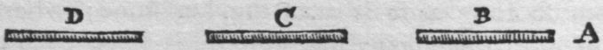 A loadstone placed
 as at A draws a nail or a bar B; similarly behind B it draws C; and after
 C, D. But the nails B and C being removed, the loadstone A, if it remain
 at the same distance, does not raise the nail D into the air. This occurs
 for this reason: because in the case of a continuous row of nails the
 presence of the loadstone A, besides its own powers, raises the magnetick
 natures of the iron works B and C, and makes them, as it were, forces
 auxiliary to itself. But B and C, like a continuous magnetical body,
 extend as far as D the forces by which D is taken and
 conformed, though they are weaker than those which C receives from B. And
 those iron nails indeed from that contact only, and from the presence of
 the loadstone even without contact, acquire powers which they retain in
 their own bodies, as will be demonstrated most clearly in the passage
 *on Direction*. For not only whilst the stone is present does the
 iron assume these powers, and take them, as it were, vicariously from the
 stone, as Themistius lays down in his 8th book on Physicks. The best iron, when it
 has been melted down (such is steel), is allured by a loadstone from a
 greater distance, is raised though of greater weight, is held more
 firmly, assumes stronger powers than the common and less expensive,
 because it is cast from a better ore or loadstone, imbued with better
 powers. But what is made from more impure ore turns out weaker and is
 moved more feebly. As to Fracastorio's statement that he saw a piece of
 loadstone draw a loadstone by one of its faces, but not iron; by another
 face iron, but not loadstone; by another both; which he says is an
 indication that in one part there is more of the loadstone, in another
 more of the iron, in another both equally, whence arises that diversity
 of attraction; it is most incorrect and badly observed on the part of
 Fracastorio, who did not know how to apply skilfully loadstone to
 loadstone. A loadstone draws iron and also a loadstone, if both are
 suitably arranged and free and unrestrained. That is removed more quickly
 from its position and place which is lighter; for the heavier bodies are
 in weight, the more they resist; but the lighter both moves itself to
 meet the heavier and is allured by the other.

## CHAP. V.

### How the Power dwells in the *Loadstone*.

That a loadstone attracts loadstone, iron
 and other magnetical bodies, has been shown above in the previous book,
 and also with what strength the magnetick coition is ordered; but now we
 must inquire how that vigour is disposed in a magnetick substance. And
 indeed an analogy must be inferred from a large loadstone. Any magnetick
 substance joins itself with a loadstone strongly, if the loadstone itself
 is strong; but more weakly, when it is somewhat imperfect or has been
 weakened by some flaw. A loadstone does not draw iron equally well with
 every part; or a magnetick substance does not approach every part of a
 loadstone alike; because a loadstone has its points, that is its true
 poles, in which an exceptional virtue excels. Parts nearer the pole are
 stronger, those far away more weak, and yet
 in all the power is in a certain way equal. The poles of a terrella are
 A, B; the æquinoctial is C, D. At A and B the alluring force seems
 greatest.

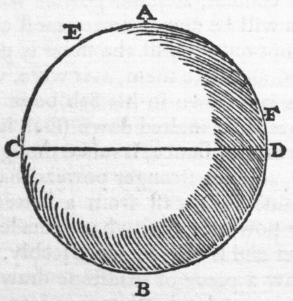

At C and D there is no force alluring magnetick ends to the body, for
 the forces tend toward both poles. But direction is powerful on the
 æquator. At C, D, the distances are equal from both poles; therefore iron
 which is at C, D, when it is allured in contrary ways, does not adhære
 with constancy; but it remains and is joined to the stone, if only it
 incline to the one or other side. At E there is a greater power of
 alluring than at F, because E is nearer the pole. This is not so because
 there is really greater virtue residing at the pole, but since all the
 parts are united in the whole, they direct their forces towards the pole.
 From the forces flowing from the plane of the æquinoctial towards the
 pole, the power increases. A fixed verticity exists at the pole, so long
 as the loadstone remains whole; if it is divided or broken, the verticity
 obtains other * positions in the parts into which it is
 divided. For the verticity always changes in consequence of any change in
 the mass, and for this cause, if the terrella be divided from A to B, so
 that there are two stones, the poles will not be A, B, in the divided
 parts, but F, G, and H, I.

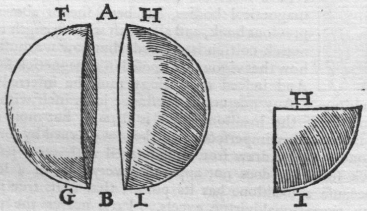

Although these stones now are in agreement with one another, so that F
 would not seek H, yet if A was previously the boreal pole, F is now boreal, and H also boreal;
 for the verticity is not changed (as Baptista Porta incorrectly affirms
 in the fourth chapter of his seventh book); since, though F and H do not
 agree, so that the one would incline to the other, yet both turn to the
 same point of the horizon. If the hemisphere H I be divided into two
 quadrants, the one pole takes up its position in H, the other in I. The
 whole mass of the stone, as I have said, retains the site of its vertex
 constant; and any part of the stone, before it was cut out from the
 block, might have been
 the pole or vertex. But concerning this more under *Direction*. It
 is important now to comprehend and to keep firmly in mind that the
 vertices are strong on account of the force of the whole, so that (the
 command being, as it were, divided by the æquinoctial) all the forces on
 one side tend towards the north; but those of an opposite way towards the
 south, so long as the parts are united, as in the following
 demonstration.

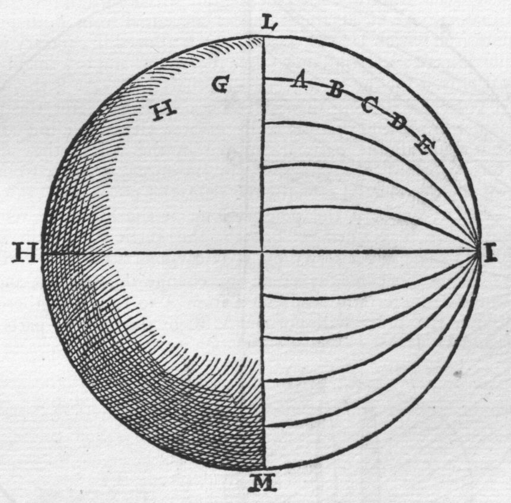

For so, by an infinite number of curves from every point of the
 equator dividing the sphere into two equal parts, and from every point of
 the surface from the æquator towards the North, and from the æquator
 towards the Southern pole, the whole force tends asunder toward the
 poles. So the verticity is from the æquinoctial circle towards the pole
 in each direction. Such is the power reposed in the undivided stone. From
 A vigour is sent to B, from A, B, to C, from A, B, C, to D, and from them
 likewise to E. In like manner from G to H, and so forth, as long as the
 whole is united. But if a piece A B be cut out (although it is near the
 æquator), yet it will be as strong in its magnetical actions as C D or D
 E, if torn away from the whole in equal quantity. For no part excels in
 special worth in the whole mass except by what is owing to the other
 adjoining parts by which an absolute and perfect whole is attained.

*Diagram of Magnetic Vigour

transmitted from the plane of the Æquator

to the periphery of the terrella

or of the earth*

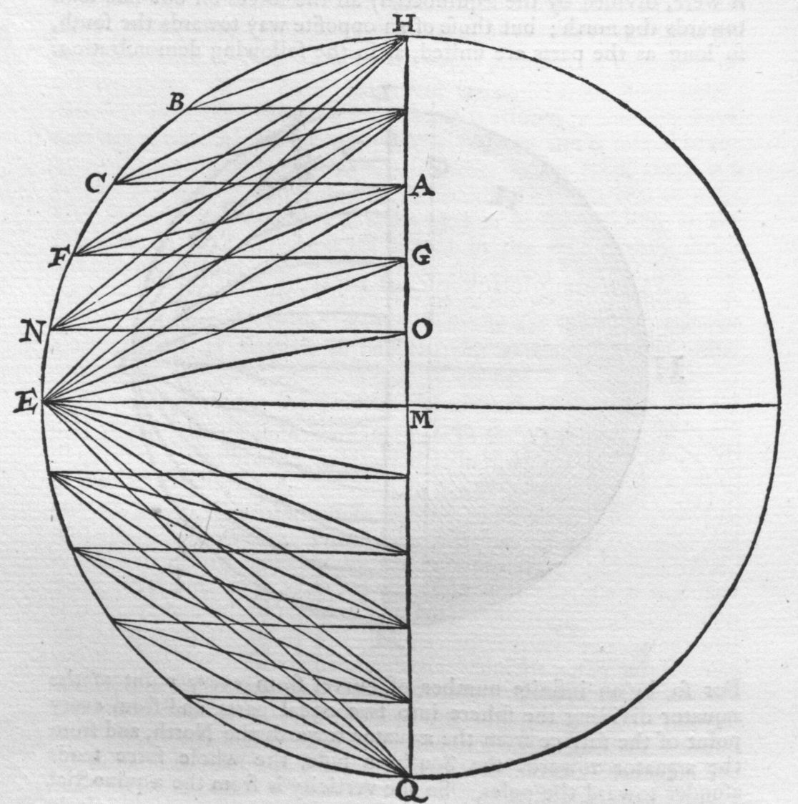

HEQ is a terrella, E a pole, M the centre, HMQ the æquinoctial plane.
 From every point of the æquinoctial plane vigour extends to the
 periphery, but by various methods; for from A the formal force is
 transmitted towards C, F, N, E, and to every point from C up to E, the
 pole; but not towards B; so neither from G towards C. The power of
 alluring is not strengthened in the part FHG from that which is in GMFE,
 but FGH increases the force in the eminence FE. So no force rises from
 the internal parts, from the lines parallel to the Axis above those
 parallels, but always inwards from the parallels to the pole. From every
 point of the plane of the equator force proceeds to the pole E, but the
 point F has its powers only from GH, and N from OH; but the pole E is
 strengthened from the whole plane HQ. Wherefore in it the mighty power
 excels (just as in a palace); but in the intermediate intervals (as in F)
 only so much force of alluring is exerted as the portion HG of the plane
 can contribute.

## CHAP. VI.

### How magnetick pieces of Iron and smaller *loadstones conform themselves to a terrella & to* the earth itself, and by them are *disposed*.

Coition of those bodies which are divided,
 and do not naturally cohære, if they are free, occurs through another
 kind of motion. A terrella sends out in an orbe its powers in proportion
 to its vigour and quality. But when iron or any other magnetick of
 convenient magnitude comes within its orbe of virtue, it is allured; but
 the nearer it comes to the body, the more quickly it runs up to it. They
 move towards the magnet, not as * to a centre, nor towards its
 centre. For they only do this in the case of the poles themselves, when
 namely that which is being allured, and the pole of the loadstone, and
 its centre, are in the same straight line. But in the intervening spaces
 they tend obliquely, just as is evident in the following figure, in which
 it is shown how the influence is extended to the adjoining magneticks
 within the orbe; in the case of the poles straight out.

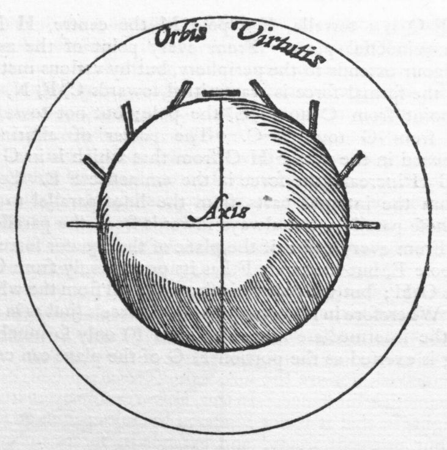

The nearer the parts are to the æquinoctial, the more obliquely are
 magneticals allured; but the parts nearer the poles appeal more directly,
 at the poles quite straight. The principle of the turning of all
 loadstones, of those which are round and those which are long, is the
 same, but in the case of the long ones the experiment is easier. For in
 whatever form they are the verticity exists, and there are poles; but on
 account of bad and unequal form, they are often hindered by certain
 evils. If the stone were long, the vertex is at the ends, not on the
 sides; it allures more strongly at the vertex. For the parts bring
 together stronger forces to the pole in right lines than oblique. So the
 stone and the earth conform their magnetick motions by their nature.

## CHAP. VII.

### On the Potency of the Magnetick Virtue, and on its nature capable of spreading out into an orbe.

From about a magnetical body the virtue
 magnetical is poured out on every side around in an orbe; around a
 terrella; in the case of other shapes of stones, more confusedly and
 unevenly. But yet there exists in nature no orbe or permanent or
 essential virtue spread through the air, but a magnet
 only excites
 magneticks at a convenient distance from it. And as light comes in an
 instant (as the opticians teach), so much more quickly is the magnetick vigour
 present within the limits of its strength; and because its activity is
 much more subtile than light, and does not consent with a non-magnetick
 substance, it has no intercourse with air, water, or any non-magnetick;
 nor does it move a magnetick with any motion by forces rushing upon it,
 but being present in an instant, it invites friendly bodies. And as light
 strikes an object, so a loadstone strikes a magnetick body and excites
 it. And just as light does not remain in the air above vapours and
 effluvia, and is not reflected from those spaces, so neither is the
 magnetick ray held in air or water. The appearances of things are
 apprehended in an instant in mirrors and in the eye by means of light; so
 the magnetick virtue seizes upon magneticks. Without the more intangible
 and shining bodies, the appearances of things are not seized or
 reflected; so without magnetical objects the magnetick power is not
 perceived, nor are the forces thus conceived sent back again to the
 magnetick substance. In this, however, the magnetick power excels light,
 in that it is not hindered by any opaque or solid substance, but proceeds
 freely, and extends its forces on every side. In a terrella and
 globe-shaped loadstone the magnetick power is extended outside the body
 in an orbe; in a longer one, however, not in an orbe, but it is extended
 in an ambit conformably to the shape of the stone. As in the somewhat
 long stone A, the vigour is extended to the ambient limit F C D,
 equidistant on every side from the stone A.

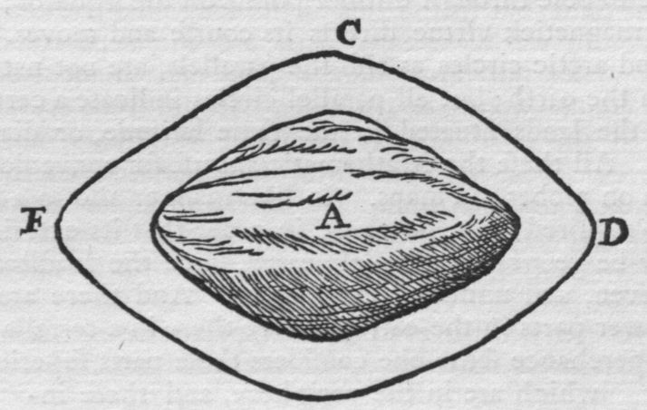

## CHAP. VIII.

### On the geography of the Earth, *and of the Terrella*.

Desiring that what follows may be better
 understood, we must now say something also about magnetick circles and
 limits. Astronomers, in order to understand and observe methodically the
 motion of the planets and the revolution of the heavens, and to describe
 with more accuracy the celestial attire of the fixed stars, settled upon
 certain circles and definite limits in the sky (which geographers also
 imitate), so that the varied face of the earth and the beauty of its
 districts might be delineated. But we, in a way differing from them,
 recognize those limits and circles, and have found very many fixed by
 nature, not merely conceived by the imagination, both in the earth and in
 our terrella. The earth they mark out chiefly by means of the æquator and
 the poles; and those limits indeed have been arranged and marked out by
 nature. The meridians also indicate straight paths from pole to pole
 through distinct points on the æquator; by which way the magnetick virtue
 directs its course and moves. But the tropics and arctic circles, as also
 the parallels, are not natural limits placed on the earth; but all
 parallel circles indicate a certain agreement of the lands situated in
 the same latitude, or diametrically opposite. All these the
 Mathematicians use for convenience, painting them on globes and maps. In
 like manner also in a terrella all these are required; not, however, in
 order that its exterior appearance may be geographically delineated,
 since the loadstone may be perfect, even, and uniform on all sides. And
 there are no upper and lower parts in the earth, nor are there in a
 terrella; unless perchance some one considers those parts superior which
 are in the periphery, and those inferior which are situated more towards
 the centre.

## CHAP. IX.

### On the Æquinoctial Circle of the Earth *and of a Terrella*.

As conceived by astronomers the æquinoctial circle is equidistant from
 both poles, cutting the world in the middle, measures the motions of
 their *primum mobile* or tenth sphere, and is named the zone of the
 *primum mobile*. It is called æquinoctial, because when the sun
 stands in it (which must happen twice in the year) the days are equal to
 the nights. That circle is also spoken of as *æquidialis*, wherefore
 it is called by the Greeks ἰσημερινός.
 In like manner it is also properly called Æquator, because it divides the
 whole frame of the earth between the poles into equal parts. So also an
 æquator may be rightly assigned to a terrella, by which its power is
 naturally divided, and by the plane of which permeating through its
 centre, the whole globe is divided into equal parts both in quantity and
 strength (as if by a transverse septum) between verticities on both sides
 imbued with equal vigour.

## CHAP. X.

### Magnetick Meridians of the Earth.

Meridians have been thought out by the
 geographer, by means of which he might both distinguish the longitude and
 measure the latitude of each region. But the magnetick meridians are
 infinite, running in the same direction also, through fixed and opposite
 limits on the æquator, and through the poles themselves. On them also the
 magnetick latitude is measured, and declinations are reckoned from them;
 and the fixed direction in them tends to the poles, unless it varies from
 some defect and the magnetick is disturbed from the right way. What is
 commonly called a magnetick meridian is not really magnetick, nor is it
 really a meridian, but it is understood to pass through the termini of
 the variation on the horizon. The variation is a depraved deviation from
 a meridian, nor is it fixed and constant in various places on any
 meridian.

## CHAP. XI.

### Parallels.

In parallel circles the same strength and
 equal power are perceived everywhere, when various magneticks are placed
 on one and the same parallel either on the earth or on a terrella. For
 they are distant from the poles by equal intervals and have equal
 tendencies of declination, and they are attracted and held, and they come
 together with like forces; just as those regions which are situated under
 the same parallel, even if they differ in longitude, yet we say possess
 the same quantity of daylight and a climate equally tempered.

## CHAP. XII.

### The Magnetick Horizon.

Horizon is the name given to the great
 circle, separating the things which are seen from those which are not
 seen; so that a half part of the heaven always is open and easily seen by
 us, half is always hidden. This seems so to us on account of the great
 distance of the star-bearing orbe: yet the difference is as great as may
 arise from the ratio of the semi-diameter of the earth compared with the
 semi-diameter of the starry heaven, which difference is in fact not
 perceived by our senses. We maintain, however, that the magnetick horizon
 is a plane level throughout touching the earth or a terrella in the place
 of some one region, with which plane the semi-diameter, whether of the
 earth or of the terrella, produced to the place of the region, makes
 right angles on every side. Such a plane is to be considered in the earth
 itself and also in the terrella, for magnetick proofs and demonstrations.
 For we consider the bodies themselves only, not the general appearances
 of the world. Therefore not with the idea of outlook (which varies with
 the elevations of the lands), but taking it as a plane which makes equal
 angles with the perpendicular, we accept in magnetick demonstrations a
 sensible horizon or boundary, not that which is called by Astronomers the
 rational horizon.

## CHAP. XIII.

### On the Axis and Magnetick Poles.

Let the line be called the axis which is
 drawn in the earth (as in a terrella) through the centre to the poles.
 They are called πόλοι by the Greeks from πολεῖν, to turn, and by the
 Latins they are also called *Cardines* or *Vertices*; because
 the world rotates and is perpetually carried around them. We are about to
 show, indeed, that the earth and a terrella are turned about them by a
 magnetick influence. One of them in the earth, which looks towards the
 Cynosure, is called Boreal and Arctic; the other one, opposite to this,
 is called Austral and Antarctic. Nor do these also exist on the earth or
 on a terrella for the sake of the turning merely; but they are also
 limits of direction and position, both as respects destined districts of
 the world, and also for correct turnings among themselves.

## CHAP. XIIII.

### Why at the Pole itself the Coition is stronger than in *the other parts intermediate between the æquator and the pole;* and on the proportion of forces of the coition in *various parts of the earth and of the terrella*.

Observation has already been made that the
 highest power of alluring exists in the pole, and that it is weaker and
 more languid in the parts adjacent to the æquator. And as this is
 apparent in the declination, because that disponent and rotational virtue
 has an augmentation as one proceeds from the Æquator towards the poles:
 so also the coition of magneticks grows increasingly fresh by the same
 steps, and in the same proportion. For in the parts more remote from the
 poles the loadstone does not draw magneticks straight down towards its
 own viscera; but they tend obliquely and they allure obliquely. For as
 the smallest chords in a circle differ from the diameter, so much do the
 forces of attracting differ between themselves in different parts of the
 terrella. For since attraction is coition towards a
 body, but magneticks run together by their versatory tendency, it comes
 about that in the diameter drawn from pole to pole the body appeals
 directly, but in other places less directly. So the less the magnetick is
 turned toward the body, the less, and the more feebly, does it approach
 and adhære. 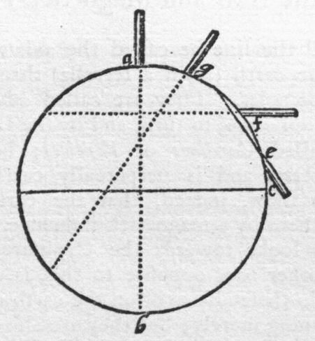 Just as if A B were the poles and a bar of iron or a
 magnetick fragment C is allured at the part E; yet the end laid hold of
 does not tend towards the centre of the loadstone, but verges obliquely
 towards the pole; and a chord drawn from that end obliquely as the
 attracted body tends is short; therefore it has less vigour and likewise
 less inclination. But as a greater chord proceeds from a body at F, so
 its action is stronger; at G still longer; longest at A, the pole (for
 the diameter is the longest way) to which all the parts from all sides
 bring assistance, in which is constituted, as it were, the citadel and
 tribunal of the whole province, not from any worth of its own, but
 because a force resides in it contributed from all the other parts, just
 as all the soldiers bring help to their own commander. Wherefore also a
 slightly longer stone attracts more than a spherical one, since the
 length from pole to pole is extended, even if the stones are both from
 the same mine and of the same weight and size. The way from pole to pole
 is longer in a longer stone, and the forces brought together from other
 parts are not so scattered as in a round magnet and terrella, and in a
 narrow one they agree more and are better united, and a united stronger
 force excels and is preeminent. A much weaker office, however, does a
 plane or oblong stone perform, when the length is extended according to
 the leading of the parallels, and the pole stops neither on the apex nor
 in the circle and orbe, but is spread over the flat. Wherefore also it
 invites a friend wretchedly, and feebly retains him, so that it is
 esteemed as one of an abject and contemptible class, according to its
 less apt and less suitable figure.

## CHAP. XV.

*

### The Magnetick Virtue which is conceived in Iron is more apparent in an iron rod than in a piece of iron that *is round, square, or of other figure*.

Duly was it said before that the longer
 magnet attracts the greater weight of iron; so also in a longish piece of iron
 which has been touched the magnetick force conceived is stronger when the
 poles exist at the ends. For the magnetick forces which are driven from
 the whole in every part into the poles are not scattered but united in
 the narrow ends. In square and other angular figures the influence is
 dissipated, and does not proceed in straight lines or in convenient arcs.
 Suppose also an iron globe have the shape of the earth, yet for the same
 reasons it drags magnetick substances less; wherefore a small iron
 sphere, when excited, draws another piece of iron more sluggishly than an
 excited rod of equal weight.

## CHAP. XVI.

### Showing that Movements take place by the Magnetical Vigour though solid bodies lie between; and on *the interposition of iron plates*.

Float a piece of iron wire on the surface
 of water by transfixing it through a suitable cork; or set a versatory
 piece of iron on a pin or in a seaman's compass (a magnet being brought
 near or moved about underneath), it is put into a state of motion;
 neither the water, nor the vessel, nor the compass-box offering
 resistance in any way. Thick boards do not obstruct, nor earthen vessels nor marble vases,
 nor the metals themselves; nothing is so solid as to carry away or impede
 the forces excepting an iron plate. Everything which is interposed (even
 though it is very dense) does not carry away its influence or obstruct
 its path, or indeed in any way hinder, diminish, or retard it. But all
 the force is not suppressed by an iron plate, but it is in some measure
 diverted aside. For when the vigour passes into the middle of an iron
 plate within the orbe of the magnetick virtue or placed just
 opposite the
 pole of the stone, that virtue is scattered in very large measure towards
 its extremities; so that the edges of a small round * plate of suitable size allure iron wires on every side.
 This is also apparent in the case of a long iron wand, which, when it has
 been touched by a magnet in the middle, has a like verticity at either
 end. *

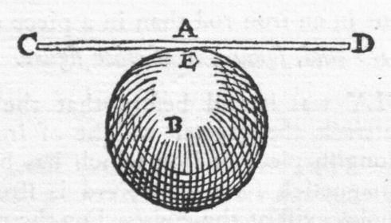

B is a loadstone, C D a long rod magnetized in the middle A; E being
 the Boreal pole; C is an Austral end or pole; in like manner also the end
 D is another Austral pole. But observe here the exactness with which a
 versorium touched by a pole, when a round plate is interposed, turns
 towards the same pole in the same * way as before the
 interposition, only weaker; the plate not standing in the way, because
 the vigour is diverted through the edges of the small plate, and passes
 out of its straight course, but yet the plate retains in the middle the
 same verticity, when it is in the neighbourhood of that pole, and close
 to it; wherefore the versorium tends towards the plate, having been
 touched by the same pole. If a loadstone is rather weak, a versorium
 hardly turns when a plate is put in between; for the vigour of the rather
 weak loadstone, being diffused through the extremities, passes less
 through the * middle. But if the plate has been touched in
 this way by a pole in the middle and has been removed from the stone
 outside its orbe of virtue, then you will see the point of the same
 versorium tend in the contrary direction and desert the centre of the
 small plate, which formerly it desired; for outside the orbe of virtue it
 has an opposite verticity, in the vicinity the same; for in the vicinity
 it is, as it were, a part of the loadstone, and has the same pole.

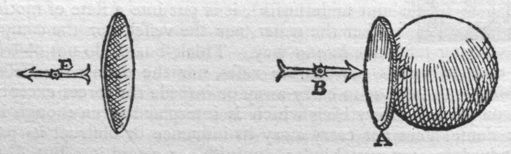

A is an iron plate near the pole, B a versorium which tends with its
 point towards the centre of the small plate, which has been touched by
 the pole of the loadstone C. But if the same small plate be
 placed outside
 the orbe of magnetick virtue, the point will not turn towards its centre,
 but the cross E of the same versorium does. But an iron globe interposed
 (if it is not too large) attracts the * point of the iron on
 the other side of the stone. For the verticity of that side is the same
 as that of the adjoining pole of the stone. And this turning of the cusp
 (that is, of the end touched by that pole) as well as of the cross-end,
 at a greater distance, takes place with an iron globe interposed, which
 would not happen at all if * the space were empty, because
 the magnetick virtue is passed on and continued through magnetick
 bodies.

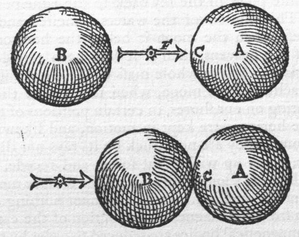

A is a terrella, B an iron globe; between the two bodies is F, a
 versorium whose point has been excited by the pole C. In the other figure
 A is a terrella, C its pole, B an iron globe; where the versorium tends
 towards C, the pole of the terrella, through the iron globe. So a
 versorium placed between a terrella and an iron globe vibrates more
 forcibly towards the pole of the terrella; because the loadstone sends an
 instantaneous verticity into the opposite globe. There is the same
 efficiency in the earth, produced from the same cause. For if a
 revolvable needle is shut up in a rather thick gold box (this metal
 indeed excels all others in density) or a glass or stone box,
 nevertheless that magnetick needle has its forces connected and united
 with the influences of the earth, and the iron will turn freely and
 readily (unhindered by its prison) to its desired points, North and
 South. * It even does this when shut up in iron caverns, if they
 are sufficiently spacious. Whatever bodies are produced among us, or are
 artificially forged from things which are produced, consist of matter of
 the terrestrial globe; nor do those bodies hinder the prime forces of
 nature which are derived from their primary form, nor can they resist
 them except by contrary forms. But no forms of mixed bodies are inimical
 to the primary implanted earth-nature, although some often do not agree with one another. But in
 the case of all those substances which have a material cause for their
 inclining (as amber, jet, sulphur), their action is impeded by
 the interposition of a body (as paper, leaves, glass, or the like) when
 that way is impeded and obstructed, so that that which exhales cannot reach the
 corpuscle to be allured. Terrestrial and magnetick coition and motion,
 when corporeal impediments are interposed, is demonstrated also by the
 efficiencies of other chief bodies due to their primary form. The moon
 (more than all the stars) agrees with internal parts of the earth on
 account of its nearness and similarity in form. The moon produces the
 movements of the waters and the tides of the sea; twice it fills up the
 shores and empties them whilst it moves from a certain definite point in
 the sky back to the same point in a daily revolution. This motion of the
 waters is incited and the seas rise and fall no less when the moon is
 below the horizon and in the lowest part of the heavens, than if it had
 been raised at a height above the horizon. So the whole mass of the earth
 interposed does not
 resist the action of the moon, when it is below the earth; but the seas
 bordering on our shores, in certain positions of the sky when it is below
 the horizon, are kept in motion, and likewise stirred by its power
 (though they are not struck by its rays nor illuminated by its light),
 rise, come up with great force, and recede. But about the reason of the
 tides anon; here let
 it suffice to have merely touched the threshold of the question. In like
 manner nothing on the earth can be hidden from the magnetick disposition
 of the earth or of the stone, and all magnetical bodies are reduced to
 order by the dominant form of the earth, and loadstone and iron show
 sympathy with a loadstone though solid bodies be interposed.

## CHAP. XVII.

### On the Iron Cap of a Loadstone, with which it is armed at the pole (for the sake of the *virtue) and on the efficacy of the same.*

Conceive a small round plate, concave in
 shape, of the breadth of a digit to be applied to the convex polar
 surface of a loadstone and skilfully attached; or a piece of iron shaped
 like an acorn, rising from the base into an obtuse cone, hollowed out a
 little and fitted to the surface of the stone, to be tied to the
 loadstone. Let the iron be the best steel, smoothed, shining, and even. A
 loadstone with such an appliance, which before only bore four ounces of
 iron, will now raise twelve. But the greatest force of a combining or
 rather united nature is seen when two loadstones, armed with iron caps,
 are so joined by their concurrent (commonly called contrary) ends, that
 they mutually * attract and raise one another. In this way a
 weight of twenty ounces is raised, when either stone unarmed would only
 allure four ounces of iron. Iron unites to an armed loadstone more firmly
 than to a loadstone; and on that account raises greater weights, because
 the pieces of iron stick more pertinaciously to one that is armed. For by
 the near presence of the magnet they are cemented together, and since the
 armature conceives a
 magnetick vigour from its presence and the other conjoined piece of iron
 is at the same time endued with vigour from the presence of the
 loadstone, they are firmly bound together. Therefore by the mutual
 contact of strong pieces of iron, the cohesion is strong. Which thing is
 also made clear and is exhibited by means of rods sticking together, Bk.
 3, chap 4; and also
 when the question of the concretion of iron dust into a united body was
 discussed. For this reason a piece of iron set near a loadstone draws
 away any suitable piece of iron from the loadstone, if only it touch the
 iron; otherwise it does not snatch it away, though in closest proximity.
 For magnetick pieces of iron within the orbe of virtue, or near a
 loadstone, do not rush together with a greater endeavour than the iron and the magnet; but
 joined they are united more strongly and, as it were, cemented together,
 though the substance remain the same with the same forces acting.

## CHAP. XVIII.

### An armed Loadstone does not endow an excited piece of Iron with greater vigour *than an unarmed*.

Suppose there are two pieces of iron, one
 of * which has been excited by an armed loadstone, the other
 by one unarmed; and let there be applied to one of them another piece of
 iron of a weight just proportional to its strength, it is manifest that
 the remaining one in like manner raises the same and no more. Magnetick
 versoria also touched by an armed loadstone turn with the same velocity
 and constancy towards the poles of the earth as those magnetized by the
 same loadstone unarmed.

## CHAP. XIX.

### Union with an armed Loadstone is stronger; *hence greater weights are raised; but the* coition is not stronger, but *generally weaker*.

An armed magnet raises a greater weight,
 as is manifest to all; but a piece of iron moves towards a stone at an
 equal, or rather greater, distance when it * is bare,
 without an iron cap. This must be tried with two pieces of iron of the
 same weight and figure at an equal distance, or with one and the same
 versorium, the test being made first with an armed, then with an unarmed
 loadstone, at equal distances.

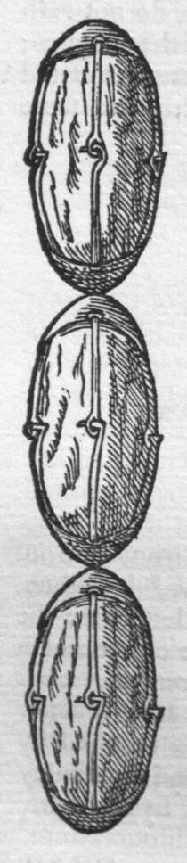

## CHAP. XX.

*

### An armed Loadstone raises an armed Loadstone, *which also attracts a third; which likewise* happens, though the virtue in the first *be somewhat small*.

Magnets armed cohære firmly when duly
 joined, and accord into one; and though the first be rather weak, yet the
 second one adhæres to it not only by the strength of the first, but of
 the second, which mutually give helping hands; also to the second a third
 often adheres and in the case of robust stones, a fourth to the
 third.

## CHAP. XXI.

*

### If Paper or any other Medium be interposed, an armed loadstone raises no more than an *unarmed one*.

Observation has shown above that an armed
 loadstone does not attract at a greater distance than an unarmed one; yet
 raises iron in greater quantity, if it is joined to and made continuous
 with the iron. But if Paper be placed between, that intimate cohæsion of
 the metal is hindered, nor are the metals cemented together at the same
 time by the operation of the magnet.

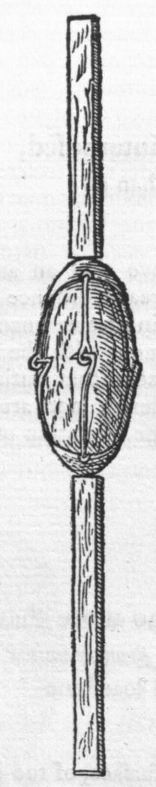

## CHAP. XXII.

*

### That an armed Loadstone draws Iron no more than an *unarmed one: And that an armed one is more strongly united* to iron is shown by means of an armed loadstone *and a polished cylinder of iron*.

If a cylinder be lying on a level surface,
 of too great a weight for an unarmed loadstone to lift, and (a piece of
 paper being interposed) if the pole of an armed loadstone be joined to
 the middle of it; if the cylinder were drawn from there by the loadstone,
 it would follow rolling; but if no medium were interposed, the cylinder
 would be drawn along firmly united with the armed loadstone, and in no
 wise rolling. But if the same loadstone be unarmed, it will draw the
 cylinder rolling with the same speed as the armed loadstone with the
 paper between or when it was wrapped in paper.

Armed loadstones of diverse weights, of the same ore vigour * and form, cling and hang to pieces of iron of a
 convenient size and proportionate figure with an equal proportion of
 strength. The same is apparent in the case of unarmed stones. A suitable
 piece * of iron being applied to the lower part of a loadstone,
 which is * hanging from a magnetick body, excites its
 vigour, so that the loadstone hangs on more firmly. For a pendent
 loadstone clings more firmly to a magnetick body joined to it
 above with a hanging piece of iron added to it, than when lead or any
 other non-magnetick body is hung on.

A loadstone, whether armed or unarmed, * joined by
 its proper pole to the pole of another loadstone, armed or unarmed, makes
 the loadstone raise a greater weight by the opposite end. A piece of iron also applied to the
 pole of a magnet produces the same result, namely, that the other pole
 will carry a greater weight of iron; just as a loadstone with a piece of
 iron superposed on it (as in this figure) holds up a piece of iron below,
 which it cannot hold, if the upper one be removed. * Magneticks
 in conjunction make one magnetick. Wherefore as the mass increases, the
 magnetick vigour is also augmented.

An armed loadstone, as well as an unarmed * one, runs
 more readily to a larger piece of iron and combines more firmly with a
 larger piece than with a lesser one.

## CHAP. XXIII.

### Magnetick Force causes motion towards unity, *and binds firmly together bodies which are united*.

Magnetick fragments cohære within their
 strength well and harmoniously together. Pieces of iron in the presence
 of a loadstone (even if they are not * touching the
 loadstone) run together, seek one another anxiously and embrace one
 another, and when joined are as if they were cemented. Iron * filings or the same reduced to powder inserted in paper
 tubes, placed upon a stone meridionally or merely brought rather close to
 it, coalesce into one body, and so many parts suddenly are concreted
 * and combine; and the whole company of corpuscles thus
 conspiring together affects another piece of iron and attracts it, as if
 it constituted one integral rod of iron; and above the stone it is
 directed toward the North and South. But when they are removed a long
 * way from the stone, the particles (as if
 loosed again) are separated and move apart singly. In this way also the
 foundations of the world are connected and joined and cemented together
 magnetically. So let Ptolemy of Alexandria, and his followers, and those
 philosophers of ours, be the less terrified if the earth do move round in
 a circle, nor threaten its dissolution.

Iron filings, after being heated for a long time, are attracted by a
 loadstone, yet not so strongly or from so great a distance as when not
 heated. A loadstone loses some of its virtue by too great a heat; for its
 humour is set free, whence its peculiar nature is marred. Likewise also,
 if iron filings are well burnt in a reverberatory furnace and converted
 into saffron of Mars, they are not attracted by a loadstone; but if they
 are heated, but not thoroughly burnt, they do stick to a magnet, but less
 strongly than the filings themselves not acted upon by fire. For the
 saffron has become totally deformate, but the heated metal acquires a
 defect from the fire, and the forces in the enfeebled body are less
 excited by a loadstone; and, the nature of the iron being now ruined, it
 is not attracted by a loadstone.

## CHAP. XXIIII.

### A piece of Iron placed within the Orbe of a Loadstone hangs suspended in the air, if on account *of some impediment it cannot approach it*.

Within the magnetick orbe a piece of iron
 moves towards the more powerful points of the stone, if it be not
 hindered by force or by the material of a body placed between them;
 either it falls down from above, or tends sideways or obliquely, or flies
 up above. But if the iron cannot reach the stone on account of some
 obstacle, it cleaves to it and remains there, but with a less firm and
 constant connection, since at greater intervals or distances the alliance
 is less amicable. Fracastorio, in the eighth chapter of his *De
 Sympathia*, says that a piece of iron is suspended in the air, so that
 it can be moved neither up nor down, if a loadstone be placed above which
 is able to draw the iron up just as much as the iron itself inclines
 downwards with equal force; for thus the iron would be supported in the
 air: which thing is absurd; because the force of a magnet is
 always the
 stronger the nearer it is. So that when a piece of iron is raised a very
 little from the earth by the force of the magnet, it needs must be drawn
 steadily on towards the magnet (if nothing else come in the way) and
 cleave to it. Baptista Porta suspends a piece of iron in the air (a magnet being fixed
 above), and, by no very subtile process, the iron is detained by a
 slender thread from its lower part, so that it cannot rise up to the
 stone. The iron is raised upright by the magnet, although the magnet does
 not * touch the iron, but because it is in its vicinity; but
 when the whole iron on account of its greater nearness is moved by that
 which erected it, immediately it hurries with a swift motion to the
 magnet and cleaves to it. For by approaching the iron is more and more
 excited, and the coition grows stronger.

## CHAP. XXV.

### Exaltation of the power of the Magnet.

One loadstone far surpasses another in
 power, since one draws iron of almost its own weight, another can hardly
 stir some shreds. Whatever things, whether animals or plants, are endowed
 with life need some sort of nourishment, by which their strength not only
 persists but grows firmer and more vigorous. But iron is not, as it
 seemed to Cardan and to Alexander Aphrodiseus, attracted by the loadstone
 in order that it may feed on shreds of it, nor does the loadstone take up
 vigour from iron filings as if by a repast on victuals. Since Porta had
 doubts on this and resolved to test it, he took a loadstone of
 ascertained weight, and buried it in iron filings of not unknown weight;
 and when he had left it there for many months, he found the stone of
 greater weight, the filings of less. But the difference was so slender
 that he was even then doubtful as to the truth. What was done by him does
 not convict the stone of voracity, nor does it show any nutrition; for
 minute portions of the filings are easily scattered in handling. So also
 a very fine dust is insensibly born on a loadstone in some very slight
 quantity, by which something might have been added to the weight of the
 loadstone but which is only a surface accretion and might even be wiped
 off with no great difficulty. Some think that a weak and sluggish stone
 can bring itself back into better condition, and that a very powerful one
 also might present it with the highest powers. Do they acquire strength
 like animals when they eat and are sated? Is the medicine
 prepared by addition or subtraction? Is there anything which can
 re-create this primary form or bestow it anew? And, certes, nothing can
 do this which is not magnetical. Magneticks can restore a certain
 soundness to magneticks (when not incurable); some can even exalt them
 beyond their proper strength; but when a body is at the height of
 perfection in its own nature, it is not capable of being strengthened
 further. So that that imposture of Paracelsus, who affirms that the force
 and virtue can be increased and transmuted tenfold, turns out to be the
 more infamous. The method of effecting this is as follows, viz., you make
 it semi-incandescent in a fire of charcoal (that is, you heat it very
 hot), so that it does not become red-hot, however, and immediately slake
 it, as much indeed as it can imbibe, in oil of saffron of Mars, made from
 the best Carynthian steel. "In this way you will be able so to strengthen
 a loadstone that it can draw a nail out of a wall and accomplish many
 other like wonderful things, which are not possible for a common
 loadstone." But a loadstone thus slaked in oil not only does not gain
 power, but suffers also a certain loss of its inborn strength. A
 loadstone is improved if polished and rubbed with steel. Buried in
 filings of the best iron or of pure steel, not rusty, it preserves its
 strength. Sometimes also a somewhat good and strong one gains 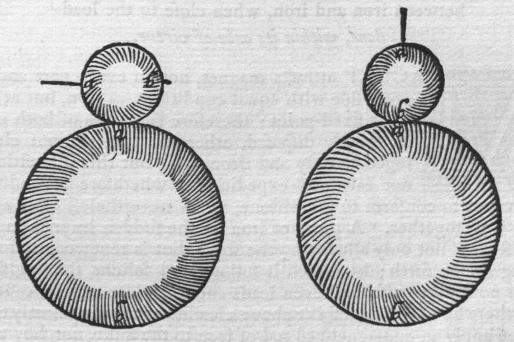 some strength when it is
 rubbed on the pole of another, on the opposite part, and receives virtue.
 In all these experiments it is an advantage to observe the pole of the
 earth, and to adjust according to magnetick laws the stone which we wish
 to strengthen; which we shall set forth below. A somewhat powerful and
 fairly large loadstone increases the strength of a loadstone as it does
 of iron. A loadstone being placed over the boreal pole of a loadstone,
 * the boreal pole becomes stronger, and an
 iron rod (like an arrow) sticks to the boreal pole A, but not at all to
 the pole B. The pole A also, when it is at the top in a right line with
 the axis of both loadstones joined in accordance with magnetick laws,
 raises the rod to the perpendicular, which it cannot do if the large
 loadstone be removed, on account of its own weaker strength. But as a
 small iron globe, when placed above the pole of a terrella, raises the
 rod to the * perpendicular, so, when placed at the side,
 the rod is not directed towards the centre of the globe, but is raised
 obliquely and cleaves anywhere, because the pole in a round piece of iron
 is always the point which is joined most closely to the pole of the
 terrella and is not constant as in a smaller terrella. The parts of the
 earth, as of all magneticks, are in agreement and take delight in their
 mutual proximity; if placed in the highest power, they do not harm their
 inferiors, nor slight them; there is a mutual love among them all, a
 perennial good feeling. The weaker loadstones are re-created by the more
 powerful, and the less powerful cause no harm to the stronger. But a
 powerful one attracts and turns a somewhat strong one more than it does
 an impotent one. Because a strenuous one confers a stronger activity, and
 itself hastens, flies up to the other, and solicits it more keenly;
 therefore there is a more certain and a stronger co-action and
 cohærency.

## CHAP. XXVI.

### Why there should appear to be a greater love between *iron and loadstone, than between loadstone and loadstone, or* between iron and iron, when close to the loadstone, *within its orbe of virtue.*

Magnet attracts magnet, not in every part
 and on every side with equal conditions, as iron, but at one and a fixed
 point; therefore the poles of both must be exactly disposed, otherwise
 they do not cleave together duly and strongly. But this disposition is
 not easy and expeditious; wherefore a loadstone seems not to conform to a
 loadstone, when nevertheless they agree very well together. A piece of
 iron by the sudden impression of a loadstone is not only allured by the
 stone, but is renewed, its forces being drawn forth; by which it follows
 and solicits the loadstone with no less impulse, and even leads another
 piece of iron captive. Let there be a small iron spike above a loadstone
 clinging firmly to it; if you apply an unmagnetized rod of iron to the
 spike, not, however, so that it touches the stone, you will see
 the spike when it has touched the iron, leaving the loadstone, follow the
 rod, try to grasp it by leaning toward it, and (if it should touch it)
 cleave firmly to it: for a piece of iron, when united and joined to
 another piece of iron placed within the orbe of virtue of the loadstone,
 draws it more strongly than does the loadstone itself. The natural
 magnetick virtue, confused and dormant in the iron, is aroused by the
 loadstone, is linked to the loadstone, and rejoices with it in its
 primary form; then smelted iron becomes a perfect magnetick, as robust as
 the loadstone itself. For as the one imparts and stirs, so the other
 conceives, and being stirred remains in virtue, and pours back the forces
 also by its own activity. But since iron is more like iron than
 loadstone, and the virtue in both pieces of iron is exalted by the
 proximity of the loadstone, so in the loadstone itself, in case of equal
 strength, likeness of substance prevails, and iron gives itself up rather
 to iron, and they are united by their very similar homogenic powers.
 Which thing happens not so much from a coition, as from a firmer unition;
 and a knob or snout of steel, fixed skilfully on the pole of the stone,
 raises greater weights of iron than the stone of itself could. When steel
 or iron is smelted from loadstone or iron ore, the slag and corrupt
 substances are separated from the better by the fusion of the material;
 whence (in very large measure) that iron contains the nature of the
 earth, purified from alien flaw and blemish, and more homogenic and
 perfect, though deformed by the fusion. And when that material indeed is
 provoked by a loadstone, it conceives the magnetick virtues, and within
 their orbe is raised in strength more than the weaker loadstone, which
 with us is often not free from some admixture of impurities.

## CHAP. XXVII.

*

### The Centre of the Magnetick Virtues in the earth is the centre of the earth; and in a terrella *is the centre of the stone*.

Rays of magnetick virtue spread out in
 every direction in an orbe; the centre of this orbe is not at the pole
 (as Baptista Porta reckons, Chap. 22), but in the centre of the stone and
 of the terrella. So also the centre of the earth is the centre of the
 magnetick motions of the earth; though magneticks are not borne directly
 toward the centre by magnetical motion, except when they are attracted by
 the true pole. For since the formal power of the stone and of
 the earth does not promote anything but the unity and conformity of
 disjoined bodies, it comes about that everywhere at an equal distance
 from the centre or from the circumference, just as it seems to attract
 perpendicularly at one place, so at another it is able even to dispose
 and to turn, provided the stone is not uneven in virtue. For if at the
 distance C from the pole D the stone is able to allure a versorium, * at an equally long interval above the æquator at A that
 stone can also direct and turn the versorium. So the very centre and
 middle of the terrella is the centre of its virtue, and from this to the
 circumference of the orbe (at equal intervals on every side) its
 magnetick virtues are emitted.

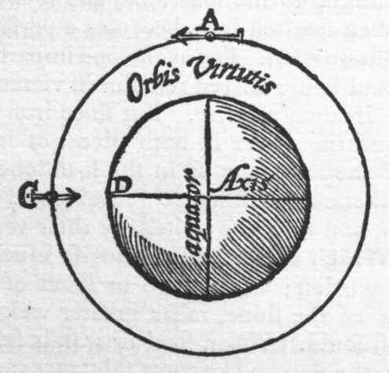

## CHAP. XXVIII.

### A Loadstone attracts magneticks not only to a fixed point or pole, but to every part of a *terrella save the æquinoctial zone*.

Coitions are always more powerful when
 poles are near poles, since in them by the concordancy of the whole there
 exists a stronger force; wherefore the one embraces the other more
 strongly. Places declining from the poles have attractive forces, but a
 little weaker and languid in the ratio of their distance; so that at
 length on the æquinoctial circle they are utterly enervated and
 evanescent. Neither do even the poles attract as mathematical points; nor
 do magneticks come into conjunction by their own poles, only on the poles
 of a loadstone. But coition is made on every part of the periphery, both
 Northern and Southern, by virtue emanating from the whole body;
 magneticks nevertheless incline languidly towards magneticks in the parts
 bordering on the æquator, but quickly in places nearer the pole.
 Wherefore not the poles, not the parts alone nearest to the pole allure
 and invite magneticks, but magneticks are disposed and turned round and
 combine with magneticks in proportion as the parts facing and adjoined
 unite their forces together, which are always of the same potency in the
 same parallel, unless they are distributed otherwise from causes of
 variation.

## CHAP. XXIX.

### On Variety of Strength due to Quantity *or Mass*.

Quite similar in potency are those stones
 which are of the same mine, and not corrupted by adjacent ores or veins.
 Nevertheless that which excels in size shows greater powers, since it
 seizes greater weights and has a wider orbe of virtue. For a loadstone
 weighing one ounce does not lift a large nail as does one weighing a
 pound, nor does it rule so widely, nor extend its forces; and if from a
 loadstone of a pound weight a portion is taken away, something of its
 power will be seen to go also; for when a portion is abstracted the
 virtue is lessened. But if that part is properly applied and united to
 it, though it is not fastened * to nor grown into it, yet by the
 application it obtains its pristine power and its vigour returns.
 Sometimes, however, when a part is taken away, the virtue turns out to be
 stronger on account of the * bad shape of the stone, namely,
 when the vigour is scattered through inconvenient angles. In various
 species the ratio is various, for one stone of a drachm weight draws more
 than another of twenty pounds. Since in very many the influence is so
 effete that it can hardly be perceived, those weak stones are surpassed
 by prepared pieces of clay. But, it may be asked, if a stone of the same species and
 goodness weighing a drachm would seize upon a drachm of iron, would a
 stone of an ounce weight seize on an ounce, a pound on a pound, and so
 on? And this is indeed true; for it both strains and remits its strength
 proportionately, so that if a loadstone, one drachm of which would
 attract one drachm of iron, were in equal proportion applied either to a
 suitably large obelisk or to an immense pyramid of iron, it would lift it
 directly in such proportion and would draw it towards itself
 with no greater effort of its nature or trouble than a loadstone of a
 drachm weight embraces a drachm. But in all such experiments as this let
 the vigour of the magnets be equal; let there be also a just proportion
 in all of the shapes of the stones, and let the shape of the iron to be
 attracted be the same, and the goodness of the metal, and let the
 position of the poles of the loadstones be most exact. This is also no
 less true in the case of an armed loadstone than of an unarmed one. For
 the sake of experiment, let there be given a loadstone of eight ounces
 weight, which when armed lifts twelve ounces of iron; if you cut off from
 that loadstone a certain portion, which when it has been * reduced to the shape of the former whole one is then
 only of two ounces, such a loadstone armed lifts a piece of iron applied
 to it of three ounces, in proportion to the mass. In this experiment also
 the piece of iron of three ounces ought to have the same shape as the
 former one of twelve ounces; if that rose up into a cone, it is necessary
 that this also in the ratio of its mass should be given a pyramidal shape
 proportioned to the former.

## CHAP. XXX.

### The Shape and Mass of the Iron are of most *importance in coition*.

Observation has shown above that the shape
 and mass of the loadstone have great influence in magnetick coitions;
 likewise also the shape and mass of the iron bodies give back more
 powerful and steady forces. Oblong iron rods are both drawn more quickly
 to a loadstone and cleave to it with greater obstinacy than round or
 square pieces, for the same reasons which we have proven in the case of
 the loadstone. But, moreover, this is also worthy of observation, that a
 smaller piece of iron, to which is hung a weight of another material, so
 that it is altogether in weight equal to another large whole piece of
 iron of a right weight * (as regards the strength of the
 loadstone), is not lifted by the loadstone as the larger piece of iron
 would be. For a smaller piece of iron does not join with a loadstone so
 firmly, because it sends back less strength, and only that which is
 magnetick conceives strength; the foreign material hung on cannot acquire
 magnetick forces.

## CHAP. XXXI.

### On Long and Round Stones.

Pieces of iron join more firmly with a
 long stone than with a round one, provided that the pole of the stone is
 at the extremity and end of its length; because, forsooth, in the case of
 a long stone, a magnetick is directed at the end straight towards the
 body in which the virtue proceeds in straighter lines and through the
 longer diameter. But a somewhat long stone has but little power on the
 side, much less indeed than a round one. It is demonstrable, indeed, that at A and B
 the coition is * stronger in a round stone than at C and D,
 at like distances from the pole.

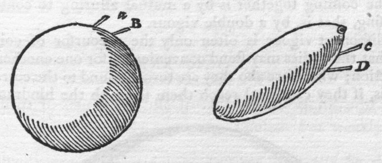

## CHAP. XXXII.

### Certain Problems and Magnetick Experiments about the Coition, and Separation, and regular Motion *of bodies magnetical*.

Equal loadstones come together with equal
 incitation. *

Also magnetick bodies of iron, if alike in all respects, * come together when excited with similar incitation.

Furthermore, bodies of iron not excited by a * loadstone,
 if they are alike and not weighed down by their bulk, move towards one
 another with equal motion.

Two loadstones, disposed on the surface of some water in
 suitable
 skiffs, if they are drawn up suitably within their orbes of virtue,
 incite one another mutually to an embrace. So a proportionate * piece of iron in one skiff hurries with the same speed
 towards the loadstone as the loadstone itself in its boat strives towards
 the iron. From their own positions, indeed, they are so borne together,
 that they are joined and come to rest at length in the middle of the
 space. Two iron wires magnetically excited, floating in water by means of
 * suitable pieces of cork, strive to touch and mutually
 strike one another with their corresponding ends, and are conjoined.

Coition is firmer and swifter than repulsion and separation in * equal magnetick substances. That magnetick substances
 are more sluggishly repelled than they are attracted is manifest in all
 magnetical experiments in the case of stones floating on water in
 suitable skiffs; also in the case of iron wires or rods swimming
 (transfixed through corks) and well excited by a loadstone, and in the
 case of versoria. This comes about because, though there is one faculty
 of coition, another of conformation or disposition, repulsion and
 aversion is caused merely by something disposing; on the other hand, the
 coming together is by a mutual alluring to contact and a disposing, that
 is, by a double vigour.

A disponent vigour is often only the precursor of coition, in order
 that the bodies may stand conveniently for one another before
 conjunction; wherefore also they are turned round to the corresponding
 ends, if they can [not] reach them through the hindrances.

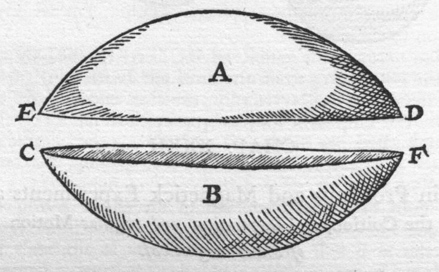

If a loadstone be divided through a meridian into two equal parts, the
 separate parts mutually repel one another, the poles being * placed directly opposite one another at a convenient
 and equal distance. They repel one another also with a greater velocity
 than when pole is put opposite pole incongruously. Just as the part B of
 the loadstone, placed almost opposite the part A, repels it floating in
 its skiff, because D turns away from F, and E from C; but if B is exactly
 joined with A again, they agree and become one body
 magnetical;
 but in proximity they raise enmities. But if one part of the stone is
 turned round, so that C faces D and F faces E, then A pursues B within
 its orbe until they are united.

The Southern parts of the stone avoid the Southern parts, and the
 Northern parts the Northern. Nevertheless, if by force you move up the
 Southern cusp of a piece of iron too near the Southern part of the stone,
 the cusp is seized and both are linked together in friendly embraces:
 because it immediately reverses the implanted verticity of the iron, and
 it is changed by the presence of the more powerful stone, which is more
 constant in its forces than the iron. For they come together according to
 their nature, if by reversal and mutation true conformity is produced,
 and just coition, as also regular direction. Loadstones of the same
 shape, size, and vigour, attract one another mutually with like efficacy,
 and in the opposite position repel one another mutually with a like
 vigour.

Iron rods not touched, though alike and equal, do yet often act * upon one another with different forces; because as the
 reasons of their acquired verticity, also of their stability and vigour,
 are different, so the more strongly they are excited, the more vigorously
 do they incite.

Pieces of iron excited by one and the same pole mutually repel * one another by those ends at which they were excited;
 then also the opposite ends to those in these iron pieces raise enmities
 one to another.

In versoria whose cusps have been rubbed, but not their cross-ends,
 * the crosses mutually repel one another, but weakly and
 in proportion to their length.

In like versoria the cusps, having been touched by the same * pole of the loadstone, attract the cross-ends with
 equal strength.

In a somewhat long versorium the cross-end is attracted rather * weakly by the cusp of a shorter iron versorium; the
 cross of the shorter more strongly by the cusp of the longer, because the
 cross of the longer versorium has a weak verticity, but the cusp has a
 stronger.

The cusp of a longer versorium drives away the cusp of a * shorter one more vehemently than the cusp of the
 shorter the cusp of the longer, if the one is free upon a pin, and the
 other is held in the hand; for though both were equally excited by the
 same loadstone, yet the longer one is stronger at its cusp on account of
 its greater mass.

The Southern end of an iron rod which is not excited attracts * the Northern, and the Northern the Southern; moreover,
 also the Southern parts repel the Southern, and the Northern the
 Northern.

If magnetick substances are divided or in any way broken in pieces,
 each part has a Northern and a Southern end.

A versorium is moved as far off by a loadstone when an obstacle * is put in the way, as through air and an open
 medium.

Rods rubbed upon the pole of a stone strive after the same pole * and follow it. Therefore Baptista Porta errs when he
 says, chapter 40, "If
 you put that part to it from which it received its force, it will not
 endure it, but drives it from it, and draws to it the contrary and
 opposite part."

The principles of turning round and inclining are the same in the case
 of loadstone to loadstone, of loadstone to iron, of iron also to
 iron.

When magnetick substances which have been separated by force and
 dissected into parts flow together into a true union and are suitably
 connected, the body becomes one, and one united virtue, nor have they
 diverse ends.

The separate parts assume two opposite poles, if the division has
 * not been made along a parallel: if the division has
 been made along a parallel, they are able to retain one pole in the same
 site as before.

Pieces of iron which have been rubbed and excited by a loadstone are
 more surely and swiftly seized by a loadstone at fitting ends than such
 as have not been rubbed.

If a spike is set up on the pole of a loadstone, a spike or style
 * of iron placed on the upper end is strongly cemented to
 it, and draws away the erect spike from the terrella when motion is
 made.

If to the lower end of the erect spike the end of another spike * is applied, it does not cohære with it, nor do they
 unite together.

As a rod of iron draws away a piece of iron from a terrella, so is it
 also with a minute loadstone and a lesser terrella, though weaker in
 strength.

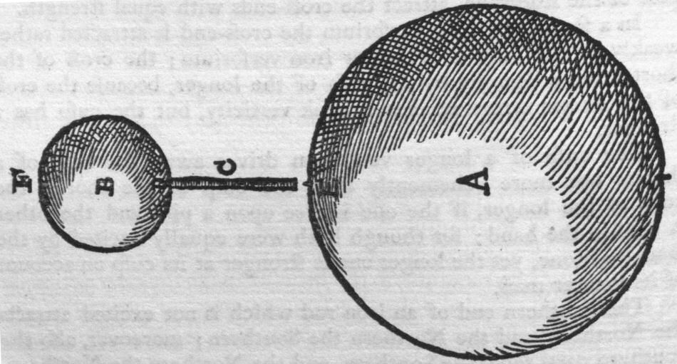

The piece of iron C comes into conjunction with the terrella A, and
 the vigour in it is magnetically exalted and excited, both in the
 adjoining end and in the other also which is turned away through
 its
 conjunction with the terrella. The end that is turned away also conceives
 vigour from the loadstone B; likewise the pole D of that loadstone is
 powerful on account of its suitable aspect and the nearness of the pole E
 of the terrella. Several causes therefore concur why the piece of iron C
 should cleave to the terrella B, to which it is joined more firmly than
 to the terrella A; the vigour excited in the rod, the vigour also excited
 in the stone B, and the strength implanted in B concur; therefore D is
 more firmly cemented magnetically with C than E with C.

But if you were to turn the vertex F round to the iron C, C would not
 adhære to F as formerly to D; for stones so arranged being within the
 orbe of virtue are placed contrary to natural order; wherefore F does not
 receive power from E.

Two loadstones or excited pieces of iron, duly cohæring, fly * asunder on the approach of another more powerful
 loadstone or magnetized piece of iron. Because the new-comer repels the
 other with its opposing face, and dominates it, and ends the relationship
 of the two which were formerly joined. So the forces of the other are
 lessened and succumb; but if it conveniently could, being diverted of its
 association with the weaker, and rolling round, it would turn about to
 the stronger. Wherefore also magnetick bodies suspended in the air fall
 when a loadstone is brought near them with an opposing face, not (as
 Baptista Porta teaches) because the faculty of both those which were
 joined before grows faint and torpid, for no face can be hostile to both
 the ends which cohære, but to one only; and when the stronger loadstone,
 coming fresh with opposing face, impels this further from it, it is put
 to flight by the friendly reception of the former.

## CHAP. XXXIII.

### On the Varying Ratio of Strength, and of the Motion *of coition, within the orbe of virtue*.

Should a very large weight, which at a
 very small distance is drawn towards a loadstone, be divided into ever so
 many equal parts, and should the radius of the orbe of magnetick
 attraction be divided into the same number of parts, the like named parts
 of the weight will correspond to the intermediate parts of the
 radius.

The orbe of virtue extends more widely than the orbe of motion of any
 magnetick; for the magnetick is affected at its extremity, even if it is
 not moved with local motion, which effect is produced
 by the
 loadstone being brought nearer. A small versorium also is turned when a
 good distance off, even if at the same distance it would not flow towards
 the loadstone, though free and disengaged from impediment.

The swiftness of the motion of a magnetick body to a loadstone is
 dependent on either the power of the loadstone, on its mass, on its
 shape, on the medium, or on its distance within the magnetick orbe.

A magnetick moves more quickly towards a more powerful * stone than towards a sluggish one in proportion to the
 strength, and [as appears] by a comparison of the loadstones together. A
 lesser mass of iron also is carried more quickly towards a loadstone,
 just as also one that is a little longer in shape. The swiftness of
 magnetick motion towards a loadstone is changed by reason of the medium;
 for bodies are moved more quickly in air than in water, and in clear air
 than in air that is thick and cloudy.

By reason of the distance, the motion is quicker in the case of bodies
 near together than when they are far off. At the limits of the orbe of
 virtue of a terrella a magnetick is moved feebly and slowly. At very
 short distances close to the terrella the moving impetus is greatest.

A loadstone which in the outmost part of its orbe of virtue * hardly moves a versorium when one foot removed from it,
 doth, if a long piece of iron is joined to it, attract and repel the
 versorium more strongly with its opposite poles when even three feet
 distant. The result is the same whether the loadstone is armed or
 unarmed. Let the iron be a suitable piece of the thickness of the little
 finger.

For the vigour of the loadstone excites verticity in the iron and
 proceeds in the iron and through the iron much further than it extends
 through the air.

The vigour proceeds even through several pieces of iron (joined * to one another end to end), not so regularly, however,
 as through one continuous solid.

Dust of steel placed upon paper rises up when a loadstone is moved
 near above it in a sort of steely hairiness; but if the loadstone is
 placed below, such a hairiness is likewise raised.

Steel dust (when the pole of a loadstone is placed near) is cemented
 * into one body; but when it desires coition with the
 loadstone, the mass is split and it rises in conglomerated parts.

But if there is a loadstone beneath the paper, the mass is split in
 the same way and many portions result, each of which consists of very
 many parts, and remains cemented together, as individual bodies. Whilst
 the lower parts of these pursue greedily the pole of the loadstone placed
 directly beneath, even they also are raised up as magnetick wholes, just
 as a small iron wire of the length of a grain or two grains of barley is
 raised up, both when the loadstone is moved near both beneath and
 above.

## CHAP. XXXIIII.

### Why a Loadstone should be stronger in its poles in a different ratio; as well in the Northern *regions as in the Southern*.

The extraordinary magnetick virtue of the
 earth is * remarkably demonstrated by the subtility of
 the following magnetical experiment. Let there be given a terrella of no
 contemptible power, or a long loadstone with equal cones as polar
 extremities; but in any other shape which is not exactly round error is
 easy, and the experiment difficult. In the Northern regions, raise the
 true North pole of the terrella above the horizon straight toward the
 zenith; it is demonstrable that it raises up a larger iron spike on its
 North pole, than the South pole of the same terrella is able to raise,
 when turned in the same way toward the highest point of the sky. The same
 thing is shown by a small terrella placed in the same way above a
 larger.

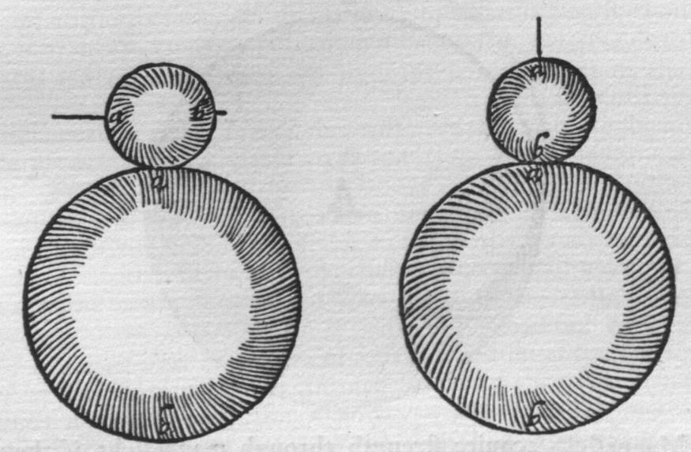

Let *a b* be the earth or a somewhat large terrella, also *a
 b* a smaller terrella. There is set up above the Northern pole of the
 smaller terrella a spike larger than the pole *b* of the smaller
 terrella can raise, if it is turned round to the higher parts. And the
 pole *a* of the smaller terrella has its strength from the
 larger, declining from the Zenith to the plane of the horizon or to the
 level. But now, if, * leaving the terrella disposed in the
 same way, you bring a piece of iron to the lower and Southern pole, it
 will attract and retain a greater weight than the Boreal pole could, if
 it were turned round to the lower parts. Which thing is demonstrated
 thus: let A be the earth or a terrella; E the Boreal pole or some place
 in some great latitude; B a rather large terrella above the earth or a
 smaller terrella on the top of a larger; D its Southern pole. It is
 manifest that D (the Southern pole) attracts a larger piece of iron, C,
 than F (the Boreal pole) will be able to, if it is turned round downward
 to the position D, toward the earth or the terrella in the Northern
 regions.

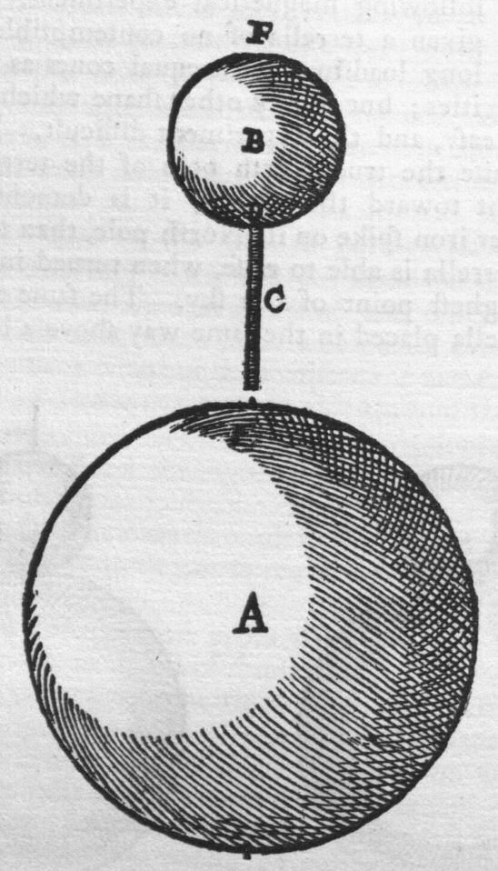

Magneticks acquire strength through magneticks, if they are properly
 placed according to their nature, in near neighbourhood and within the
 orbe of virtue. Wherefore when a terrella is placed on the earth or on a
 terrella, so that its Southern pole is turned round toward the Northern
 pole, its Northern pole, however, turned away from the Northern pole, the
 influence and strength of its poles are increased. And so the
 Northern pole of a terrella in such a position lifts up a larger spike
 than the Southern pole, if the Southern pole is turned away. Similarly
 the Southern pole in a proper and natural arrangement, acquiring strength
 from the earth or from a larger terrella, attracts and retains larger
 rods of iron. In * the other part of the terrestrial globe
 toward the South, as also in the Austral portion of a terrella, the
 reasoning is converse; for the Southern pole of the terrella being turned
 away is more robust, as also the Northern pole when turned round. The
 more a region on the earth is distant from the æquinoctial (as also in a
 larger terrella), the larger is the accession of strength perceived; near
 the æquator, indeed, the difference is small, but on the æquator itself
 null; at the poles finally it is greatest.

## CHAP. XXXV.

### On a Perpetual Motion Machine, mentioned by authors, by means of the attraction *of a loadstone*.

Cardan writes that out of iron and the Herculean
 stone can be made a perpetual motion machine; not that he himself had
 ever seen one, but only conceived the idea from an account by Antonius de
 Fantis, of Treves.
 Such a machine he describes, Book 9, *De Rerum Varietate*. But they
 have been little practised in magnetick experiments who forge such things
 as that. For no magnetick attraction can be greater (by any skill or by
 any kind of instrument) than the retention. Things which are joined and
 those which are approaching near are retained with a greater force than
 those which are enticed and set in motion, and are moved; and that
 coition is, as we have shown above, a motion of both, not an attraction
 of one. Such a machine Peter Peregrinus feigned many centuries before or
 else depicted one which he had received from others, and one which was
 much better fitted for the purpose. Johannes Taysnier published it also,
 spoiled by wretched figures, and copied out the whole theory of it word
 for word. O that the gods would at length bring to a miserable end such
 fictitious, crazy, deformed labours, with which the minds of the studious
 are blinded!

## CHAP. XXXVI.

### How a more robust Loadstone may be *recognized*.

Very powerful loadstones sometimes lift
 into the air a weight of iron equal to their own; a weak one barely
 attracts a slender wire. Those therefore are more robust which appeal to
 and retain larger bodies, if there is no defect in their form, or the
 pole of the stone is not suitably moved up. Moreover, when placed in a
 boat a keener influence turns its own poles round more quickly to the
 poles of the earth or the limits of variation on the horizon. One which
 performs its function more feebly indicates a defect and an effete
 nature. There must always be a similar preparation, a similar figure, and
 a like size; for in such as are very dissimilar and unlike, the
 experiment is doubtful. The method of testing the strength is the same
 also with a versorium in a place somewhat remote from a loadstone; for
 the one which is able to turn the versorium round at the greater
 distance, that one conquers and is held the more potent. Rightly also is
 the force of a loadstone weighed in a balance by B. Porta; a piece of
 loadstone is placed in one scale-pan, in the other just as much weight of
 something else, so that the scale-pans hang level. Soon a piece of iron
 lying on the table is adjusted so that it sticks to the loadstone placed
 in the scale, and they cling together most perfectly, according to their
 friendly points; into the other scale-pan sand is gradually thrown, and
 that until the scale in which the loadstone is placed is separated from
 the iron. Thus by weighing the weight of sand, the magnetick force
 becomes known. Similarly also it will be pleasing to try with another
 stone, in equilibrium, the weight of the sand being observed, and to find
 out the stronger by means of the weights of sand. Such is the experiment
 of Cardinal Cusan in his *De Staticis*, from whom it would seem that B. Porta
 learnt the experiment. The better loadstones turn themselves round more
 quickly toward the poles or points of variation; then they also lead
 along and turn round more quickly, according to the greater quantity and
 mass of wood, a boat and other stuff. In a declination instrument, the
 more powerful force of a loadstone is looked for and required. Those
 therefore are more lively when they get through their work readily, and
 pass through and come back again with speed, and swiftly at length settle
 at their own point. Languid and effete ones move more sluggishly, settle more tardily,
 adhære more uncertainly, and are easily disturbed from their
 possession.

## CHAP. XXXVII.

### Use of a Loadstone as it affects *iron.*

By magnetick coition we test iron ore in a
 blacksmith's forge. It is burnt, broken in pieces, washed and dried, in
 which way it lays down its alien humours; in the bits collected from the
 washing is placed a loadstone, which attracts the iron dust to itself;
 this, being brushed off with feathers, is received in a crucible, and the
 loadstone is again placed in the bits collected from the washing, and the
 dust wiped off, as long as any remains which it will attract to itself.
 This is then heated in the crucible along with *sal nitri* until it is liquid, and
 from this a small mass of iron is cast. But if the loadstone draws the
 dust to itself quickly and readily, we conjecture that the iron ore is
 rich; if slowly, poor; if it seems altogether to reject it, there is very
 little iron in it or none at all. In like manner iron dust can be
 separated from another metal. Many tricks there are also, when iron is
 secretly applied to lighter bodies, and, being attracted by the motion of
 a loadstone which is kept out of sight, causes movements which are
 amazing to those who do not know the cause. Very many such indeed every
 ingenious mechanician will perform by sleight of hand, as if by
 incantations and jugglery.

## CHAP. XXXVIII.

### On Cases of Attraction in other Bodies.

Very often the herd of philosophizers and
 plagiarists repeat from the records of others in natural philosophy
 opinions and errors about the attractions of various bodies; as that
 Diamond attracts iron, and snatches it away from a magnet; that there are
 various kinds or magnets, some which attract gold, others silver, brass,
 lead; even some which attract flesh, water, fishes. The flame of sulphur
 is said to seek iron and stones; so white naphtha is said to attract
 fire. I have said above that inanimate natural bodies do not attract,
 and are not attracted by, others on the earth, excepting magnetically or
 electrically. Wherefore it is not true that there are magnets which
 attract gold or other metals; because a magnetick substance draws nothing
 but magnetick substances. Though Fracastorio says that he has shown a
 magnet drawing silver; if this were true, it must have happened on
 account of iron skilfully mixed with that silver or concealed in it, or
 else because nature (as she does sometimes, but rarely) had mixed iron
 with the silver; iron indeed is rarely mixed with silver by nature;
 silver with iron very rarely or never. Iron is mixed with silver by
 forgers of false coin or from the avarice of princes in the coining of
 money, as was the case with the denarius of Antony, provided that Pliny is recording a
 true incident. So Cardan (perhaps deceived by others) says that there is
 a certain kind of loadstone which draws silver; he adds a most foolish
 test of this: "If therefore" (he says) "a slender rod of silver be
 steeped in that in which a versatory needle has stood, it will turn
 toward silver (especially toward a large quantity) although it be buried;
 by this means anyone will be able easily to dig up concealed treasures."
 He adds that "it should be very good stone, such as he has not yet seen."
 Nor indeed will either he or anyone else ever see such a stone or such an
 experiment. Cardan brings forward an attraction of flesh, wrongly so
 named and very dissimilar from that of the loadstone; for his *magnes
 creagus* or flesh-magnet, from the experiment that it sticks to the
 lips, must be hooted out from the assembly of loadstones, or by all means
 from the family of things attractive. Lemnian earth, ruddle, and very
 many minerals do this, and yet they are fatuously said to attract. He
 will have it that there is another loadstone, as it were, a third
 species, into which, if a needle is driven and afterwards stuck into the
 body, it is not felt. But what has attraction to do with stupefaction, or
 stupor with a Philosopher's intellect, when he is discoursing about
 attraction? There are many stones, both found in nature and made by art,
 which have the power of stupefying. Sulphur flame is said by some to
 attract, because it consumes certain metals by its power of penetration.
 So white naphtha attracts flame, because it gives off and exhales an
 inflammable vapour, on which account it is kindled at some distance, just
 as the smoke of a recently extinguished candle takes fire again from
 another flame; for fire creeps to fire through an inflammable medium. Why
 the sucking fish Echineis or the Remora should stay ships has been
 variously treated by Philosophers, who are often accustomed to fit this
 fable (as many others) to their theories, before they find out whether
 the thing is so in nature. Therefore, in order that they may support and
 agree with the fatuities of the ancients, they put forward even the most
 fatuous ratiocinations and ridiculous problems, cliffs that attract,
 where the sucking fish tarry, and the necessity of
 some vacuum, I know not what, or how produced. Pliny and Julius Solinus
 make mention of a stone Chatochitis. They say that it attracts flesh, and
 keeps hold of the hands, just as a loadstone does iron, and amber chaff.
 But that happens only from a stickiness and from glue contained in it,
 since it sticks more easily to the hands when they are warm. Sagda or
 Sagdo, of the colour
 of a sard, is a precious stone mentioned by Pliny, Solinus, Albertus, and
 Evax; they describe
 its nature and relate, on the authority of others, that it specially
 attracts wood to itself. Some even babble that woods cannot be wrenched
 away except they are cut off. Some also narrate that a stone is found
 which grows pertinaciously into ships, in the same way as certain
 testacea on long voyages. But a stone does not draw because it sticks;
 and if it drew, it would certainly draw shreds electrically, Encelius saw
 in the hands of a sailor such a stone of feeble virtue, which would
 hardly attract even the smallest twigs; and in truth, not of the colour
 of the sard. So Diamond, Carbuncle, Crystal, and others do attract. I
 pass over other fabulous stones; Pantarbe, about which Philostratus
 writes that it draws other stones to itself; Amphitane also, which
 attracts gold. Pliny in his origin of glass will have it that a loadstone
 is an attractor of glass, as well as of iron. For in his method of
 preparing glass, when he has indicated its nature, he subjoins this about
 loadstone. "Soon (such is the astute and resourceful craft) it was not
 content to have mixed natron; loadstone also began to be added, since it
 was thought to attract to itself the liquor of glass (as it does iron)."
 Georgius Agricola writes that to the material of glass (sand and natron)
 one part also of loadstone is added. "Because that force is believed, in
 our times just as in former times, to attract the liquor of glass to
 itself, as it attracts iron to itself, purges it when drawn, and makes
 clear glass from green or muddy; but the fire afterwards burns up the
 loadstone." It is true indeed that some sort of *magnes* (as the
 magnesia of the glass-makers imbued with no magnetick virtues) is
 sometimes put in and mixed with the material of the glass; not, however,
 because it attracts glass. But when a loadstone is burnt, it does not lay
 hold of iron at all, nor is iron when red-hot allured by any loadstone;
 and loadstone also is burnt up by more powerful fires and loses its
 attractive potency. Nor is this a function of loadstone alone in the
 glass furnaces; but also of certain pyrites and of some easily
 combustible iron ores, which are the only ones used by our glass-makers,
 who make clear, bright glass. They are mixed with the sand, ashes, and
 natron (just as they are accustomed to make additions in the case of
 metallick ores whilst they are smelted), so that when the material slows
 down into glass, the green and muddy colour of the glass may be purged by
 the penetrating heat. For no other material becomes so hot,
 or bears the
 fire for such a convenient time, until the material of the glass is
 perfectly fluid, and is at the same time burnt up by that ardent fire. It
 happens, however, sometimes, that on account of the magnetick stone, the
 magnesia, or the ore, or the pyrites, the glass has a dusky colour, when
 they resist the fire too much and are not burnt up, or are put in too
 great quantity. Wherefore manufacturers are seeking for a stone suitable
 for them, and are observing also more diligently the proportion of the
 mixture. Badly therefore did the unskilful philosophy of Pliny impose
 upon Georgius Agricola and the more recent writers, so that they thought
 the loadstone was wanted by glass-makers on account of its magnetick
 strength and attraction. But Scaliger in *De Subtilitate ad
 Cardanum*, in making diamond attract iron, when he is discussing
 magneticks, wanders far from the truth, unless it be that diamond
 attracts iron electrically, as it attracts wood, straws, and all other
 minute bodies when it is rubbed. Fallopius reckons that quicksilver draws
 metals by reason of an occult property, just as a loadstone iron, amber
 chaff. But when quicksilver enters metals, it is wrongly called
 attraction. For metals imbibe quicksilver, just as clay water; nor do
 they do this unless they are touching, for quicksilver does not allure
 gold or lead to itself from afar, but they remain motionless in their
 places.

## CHAP. XXXIX.

### On Bodies which mutually repel one another.

Writers who have discoursed on the forces
 of bodies which attract others have also spoken about the powers of
 bodies which repel, but especially those who have instituted classes for
 natural objects on the basis of sympathy and antipathy. Wherefore it
 would seem necessary for us to speak also about the mutual strife of
 bodies, so that published errors should not creep further, and be
 received by all to the ruin of true philosophy. They say that, just as
 like things attract for the sake of preservation, so unlike and contrary
 things for the same purpose mutually repel and put one another to flight.
 This is evident in the reaction of many things, but it is most manifest
 in the case of plants and animals, which attract kindred and familiar
 things, and in like manner reject foreign and unsuitable things. But in
 other bodies there is not the same reason, so that when they are
 separated, they should come together by mutually attracting one another.
 Animals take food (as everything which grows), and draw it into their
 interior; they absorb the nourishment by certain parts and instruments
 (through the action and operation of the *anima*). They enjoy by
 natural instinct only the things set in front of them and near them, not
 things placed afar off; and this without any alien force or motion.
 Wherefore animals neither attract any bodies nor drive them away. Water
 does not repel oil (as some think) because the oil floats on water; nor
 does water repel mud, because the mud, if mixed in water, settles down in
 time. This is a separation of unlike bodies or such as are not perfectly
 mixed as respects the material; the separated bodies nevertheless remain
 joined without any natural strife. Wherefore a muddy sediment settles
 quietly on the bottom of vessels, and oil remains on the top of the water
 and is not sent further away. A drop of water remains intact on a dry
 surface, and is not expelled from the dry substance. Wrongly therefore do
 those who discourse on these matters infer an antipathy (that is, the
 force of repelling by contrary passions); for there is no repelling force
 in them; and repulsion comes from action, not from passion. But
 their greek vocables please them too much. We, however, must inquire
 whether there is any body which drives anything else further off without
 material impetus, as a loadstone attracts. But a loadstone seems even to
 repel loadstone. For the pole of one loadstone repels the pole of
 another, which does not agree with it according to nature; by repelling,
 it turns it round in an orbit so that they may exactly agree according to
 their nature. But if a somewhat weak loadstone, floating freely on water,
 cannot readily be turned round on account of impediments, the whole
 loadstone is repelled and sent further away from the other. All
 electricks attract all things: they never repel or propel anything at
 all. As to what is
 related about certain plants (as about the cucumber, which turns aside
 when oil is applied to it), there is a material change from the vicinity,
 not a hidden antipathy. But when they show a candle flame put against a
 cold solid substance (as iron) turn away to the side, and allege
 antipathy as the cause, they say nothing. The reason of this they will
 see clearer than the day, when we discourse on what heat is. But Fracastorio's
 opinion that a loadstone can be found, which would drive iron away, on
 account of some opposing principle lurking in the iron, is foolish.

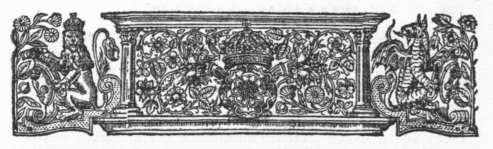

# BOOK THIRD.

## *CHAP. I.*

### ON DIRECTION.

On referring to the earlier books it will
 be found shown that a loadstone has its poles, and that a piece of iron
 has also poles, and rotation, and a certain verticity; finally, that the
 loadstone and the iron direct their poles toward the poles of the earth.
 Now, however, we must make clear the causes of these things and their
 admirable workings, pointed out indeed before, but not proven. All those
 who have written before us about these rotations have left us their
 opinions so briefly, so meagrely, and with such hesitating judgment that
 they seem hardly likely ever to persuade anyone, or even to be able to
 satisfy themselves; and all their petty reasons are rejected by the more
 prudent as useless, uncertain, and absurd, being supported by no proofs
 or arguments; whence also magnetick science, being all the more neglected
 and not understood, has been in exile. The true austral pole of a
 loadstone, not the boreal (as all before us used to think), * if the loadstone is placed in its boat on the surface
 of water, turns to the North; in the case of a piece of iron also,
 whether it has been excited by a loadstone or not, the southern end moves
 toward the North. An oblong piece of iron of three or four digits'
 length, when skilfully
 rubbed with a loadstone, quickly turns north and south. Wherefore
 mechanicians, taking a piece of iron prepared in this way, balance it on
 a pin in a box, and fit it up with the requisites of a sun-dial; or they
 prepare the versorium out of two curved pieces of iron with their ends
 touching one another, so that the motion may be more constant. In this
 way the mariners' versorium is arranged, which is an instrument
 beneficial, useful, and auspicious to sailors for indicating, like a good
 genius, safety and the right way. But it must be understood on the
 threshold of this argument (before we proceed further) that these
 pointings of the loadstone or of iron are not perpetually made Page
 116 toward the
 true poles of the world, do not always seek those fixed and definite
 points, or remain on the line of the true meridian; but usually diverge
 some distance to the East or to the West. Sometimes also at certain
 places on land or sea they do indicate exactly the true poles. This
 discrepancy is called the *Variation* of the iron or of the
 loadstone; and since this is brought about by other causes, and is merely
 a certain disturbance and perversion of the true direction, we are
 directing our attention in this place to the true direction of the
 compass and of the magnetick iron (which would be equally toward the true
 poles and on the true meridian everywhere on the earth, unless other
 obstacles and an untoward pervertency hindered it). Of its variation and
 the cause of the perversion we shall treat in the next book. Those who
 wrote about the world and about natural philosophy a century ago,
 especially those remarkable elementary philosophers, and all those who
 trace their knowledge and training to them down to our own times, those
 men, I say, who represented the earth as always at rest and, as it were,
 a useless weight, placed in the centre of the universe at an equal
 distance from the sky on every side, and its nature to be simple, imbued
 only with the qualities of dryness and cold, sought diligently for the
 causes of all things and of all effects in the heavens, the stars, the
 planets, in fire, air, waters and substances of mixed natures. Never
 indeed did they recognize that the terrestrial globe had, besides dryness
 and cold, some special, effective, and predominant properties,
 strengthening, directing, and moving the globe itself through its whole
 mass and its very deepest vitals; nor did they ever inquire whether there
 were any such. For this reason the crowd of philosophizers, in order to
 discover the reasons of the magnetical motions, called up causes lying
 remote and far away. And one man seems to me beyond all others worthy of
 censure, Martin Cortes, who, since there was no cause which could satisfy
 him in the whole of nature, dreamed that there was a point of magnetical
 attraction beyond the heavens, which attracted iron. Peter Peregrinus
 thinks that the direction arises from the poles of the sky. Cardan
 thought that the turning of iron was caused by a star in the tail of the
 Great Bear; Bessard, the Frenchman, opines that a magnetick turns toward
 the pole of the zodiack. Marsilius Ficinus will have it that the
 loadstone follows its own Arctick pole; but that iron follows the
 loadstone, straws amber; whilst this perhaps follows the Antarctick
 pole—a most foolish dream. Others have recourse to I know not what
 magnetick rocks and mountains. Thus it is always customary with mortals,
 that they despise things near home, whilst foreign and distant things are
 dear and prized. But we study the earth itself and observe in it the
 cause of so great an effect. The earth, as the common mother, has these
 causes inclosed in her innermost parts; in accordance with her rule,
 position, condition, verticity, poles,
 æquator, horizons, meridians, centre, circumference, diameter, and the
 nature of the whole interior of her substance, must all magnetical
 motions be discussed. The earth has been ordered by the highest Artificer
 and by nature in such a way that it should have parts dissimilar in
 position, bounds of the whole and complete body, ennobled by certain
 functions, by which it might itself remain in a definite direction. For
 just as a loadstone, when it is floated on water in a suitable vessel, or
 is hung by slender threads in the air, by its implanted verticity
 conforms its poles to the poles of the common mother in accordance with
 magnetick laws; so if the earth were to deviate from its natural
 direction and its true position in the universe, or if its poles were to
 be drawn aside (if this were possible) toward the sun-rising or the
 sun-setting or toward any other points whatsoever in the visible
 firmament, they would return again to the north and south by magnetical
 motion, and would settle at the same points at which they are now fixed.
 The reason why the terrestrial globe seems to remain more steadily with
 the one pole toward those parts and directed toward the Cynosure, and why
 its pole diverges by 23 degrees 29 minutes, with a certain variation not
 sufficiently investigated as yet by Astronomers, from the poles of the
 ecliptick, depends on its virtue magnetical. The causes of the precession
 of the æquinoxes and the progression of the fixed stars, and of the
 change, moreover, in the declinations of the sun and of the tropicks,
 must be sought from magnetick influences; so that neither that absurd
 motion of trepidation of Thebit Bencora, which is at great variance with
 observations, nor the monstrous superstructures of other heavens, are any
 longer needed. A versatory iron turns to the position of the earth, and
 if disturbed ever so often returns always to the same points. For in the
 far regions of the north, in a latitude of 70 or 80 degrees (to which at
 the milder seasons of the year our sailors are accustomed to penetrate
 without injury from the cold); in the regions halfway between the poles;
 on the æquator in the torrid zone; and again in all the maritime places
 and lands of the south, in the highest latitude which has thus far been
 reached, always the iron magnetick finds its way, and points to the poles
 in the same manner (excepting for the difference of variation); on this
 side of the æquator (where we live), and on the other side to the south,
 less well known, but yet in some measure explored by sailors: and always
 the lily of the compass points toward the North. This we have had
 confirmed by the most eminent captains, and also by very many of the more
 intelligent sailors. These facts have been pointed out to me and
 confirmed by our most illustrious Sea-god, Francis Drake, and by another
 circumnavigator of the globe, Thomas Candish; our terrella also indicates
 the same thing. This is demonstrated in the case of the
 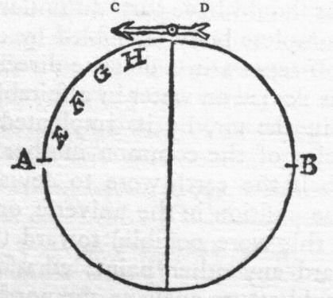 orbicular stone, whose
 poles are A and B; an iron wire CD, which is placed upon the stone,
 always points directly along the meridian toward the poles AB, whether
 the centre of the wire is on the central line or æquator of the stone, or
 on any other part situated between the æquator and the poles, as at H, G,
 F, E. So the cusp of a versorium on this side of the æquator points
 toward the north; * on the other side the cross is always
 directed toward the south; but the cusp or lily does not, as some one has thought,
 turn toward the south beyond the æquator. Some inexperienced people
 indeed, who in distant parts beyond the æquator have seen the versorium
 sometimes become more sluggish and less prompt, thought that the distance
 from the arctick pole or from the magnetick rocks was the cause of this.
 But they are very much mistaken; for it is as powerful, and adjusts itself as quickly to the
 meridian or to the point of variation in the southern as in the northern
 parts of the earth. Yet sometimes the motion appears slower, namely, when
 the supporting pin by lapse of time and long voyaging has become somewhat
 blunt, or the magnetick iron parts have lost, by age or rust, some of
 their acquired vigour. This may also be shown experimentally by the
 versatory iron of a small sun-dial placed on a very short pin set
 perpendicular to the surface of the stone, for the iron when touched by a
 loadstone points toward the poles of the stone and leaves the poles of
 the earth; for the general and remoter cause is overcome by the
 particular and powerful cause which is so near at hand. Magnetick bodies
 have of themselves an inclination toward the position of the earth and
 are influenced by a terrella. Two equal stones of equal strength adjust
 themselves to a terrella in accordance with magnetick laws. The iron
 conceives vigour from the loadstone and is influenced by the magnetical
 motions. Wherefore true direction is the motion of a magnetick body in
 regard to the verticity of the earth, the natures of both agreeing and
 working together toward a natural position and unity. For indeed we have
 found out at length, by many experiments and in many ways, that there is
 a disposing nature, moving them together by reason of their various
 positions by one form that is common to both, and that in
 all magnetick substances there is attraction and repulsion. For both the
 stone and the
 magnetick iron arrange themselves by inclination and declination,
 according to the common position of their nature and the earth. And the
 force of the earth by the virtue of the whole, by attracting toward the
 poles, and repelling, arranges all magneticks which are unfixed and
 loose. For in all cases all magneticks conform themselves to the globe of
 the earth in the same ways and by the same laws by which another
 loadstone or any magneticks do to a terrella.

## CHAP. II.

### The Directive or Versorial Virtue (which we call verticity): what it is, how it exists in the loadstone; *and in what way it is acquired when innate.*

Directive force, which is also called by
 us verticity, is a virtue which spreads by an innate vigour from the
 æquator in both directions toward the poles. That power, inclining in
 both directions towards the termini, causes the motion of direction, and
 produces a constant and permanent position in Nature, not only in the
 earth itself but also in all magneticks. Loadstone is found either in
 veins of its own or in iron mines, when the homogeneous substance of the
 earth, either having or assuming a primary form, is changed or concreted
 into a stony substance, which besides the primary qualities of its nature
 has various dissimilitudes and differences in different quarries and
 mines, as if from different matrices, and very many secondary qualities
 and varieties in its substance. A loadstone which is dug out in this
 breaking up of the earth's surface and of protuberances upon it, whether
 formed complete in itself (as sometimes in China) or in a larger vein, is
 fashioned by the earth and follows the nature of the whole. All the
 interior parts of the earth mutually conspire together in combination and
 produce direction toward north and south. But those magnetical bodies
 which come together in the uppermost parts of the earth are not true
 united parts of the whole, but appendages and parts joined on, imitating
 the nature of the whole; wherefore when floating free on water, they
 dispose themselves just in the same way as they are placed in the
 terrestrial system of nature. We had a large loadstone of twenty pounds
 * weight, dug up and cut out of its vein, after we had
 first observed and marked its ends; then after it was dug out, we placed
 it in a boat on water, so that it could turn freely; then immediately the
 face which had looked toward the north in the quarry began to Page
 120 turn to
 the north on the waves and at length settled toward that point. For that
 face which looked toward the north in the quarry is the southern, and is
 attracted by the northern parts of the earth, 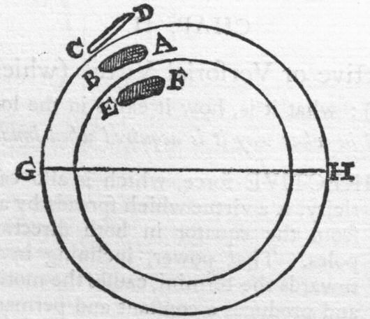 in the same way as
 pieces of iron which acquire their verticity from the earth. About this
 point we intend to speak afterwards under change of verticity. But there
 is a different rotation of the internal parts of the earth, which are
 perfectly united to the earth and which are not separated from the true
 substance of the earth by the interposition of bodies as are loadstones
 in the upper portion of the earth, which is maimed, corrupt, and
 variable. Let A B be a piece of magnetick ore; between which and the
 uniform globe of the earth lie various soils or mixtures which separate
 the ore to a certain extent from the globe of the true earth. It is
 therefore influenced by the forces of the earth just in the same way as C
 D, a piece of iron, in the air. So the face B of some ore or of that
 piece of it is moved toward the Boreal pole G, just as the extremity C of
 the iron, not A or D. But the condition of the piece E F is different,
 which piece is produced in one connected mass with the whole, and is not
 separated from it by any earthy mixture. For if the part E F were taken
 out and floated freely in a boat by itself, it is not E that would be
 directed toward the Boreal pole, but F. So in those substances which
 acquire their verticity in the air, C is the southern part and is seen to
 be attracted by the Boreal pole G. In the case of others which are found
 in the upper unstable portion of the earth, B is the south, and in like
 manner inclines toward the Boreal pole. But if those pieces deep down
 which are produced along with the earth are dug up, they turn about on a
 different plan. For F turns toward the Boreal parts of the earth, because
 * is the southern part; E toward the south, because it is
 the northern. So of a magnetick body, C D, placed close to the earth, the
 end C turns toward the Boreal pole; of one that is adnate to it B A, B
 inclines to the North; of one that is innate in it, E F, E turns toward
 the southern pole; which is confirmed by the 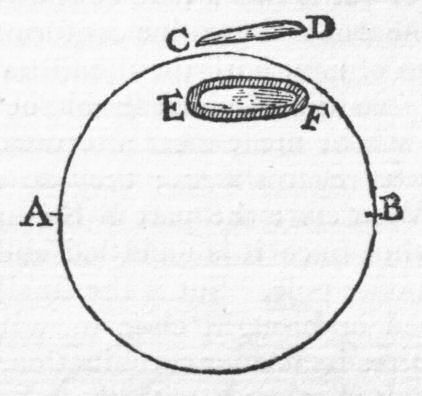 following
 demonstration, and comes about of necessity according to all magnetick
 laws. Let there be a terrella with poles A B; from its mass cut out a
 small part E F; if this be suspended by a fine thread above the hole or
 over some other place, E does not seek the pole A but the pole B, and F
 turns to A; very differently from a rod of iron C D; because C, touching
 some northern part of the terrella, being magnetically carried away makes
 a turn round to A, not to B. And yet here it should be observed, that if
 the pole A of * the terrella were moved toward the earth's
 south, the end E of the piece cut out by itself, if not brought too near
 to the stone, would also move of itself toward the south. But the end C
 of the piece of iron, placed beyond its orbe of virtue, will turn toward
 the north. The part E F of the terrella, whilst in the mass, produced the
 same direction as the whole; but when it is separated and suspended by a
 thread, E turns to B, and F to A. 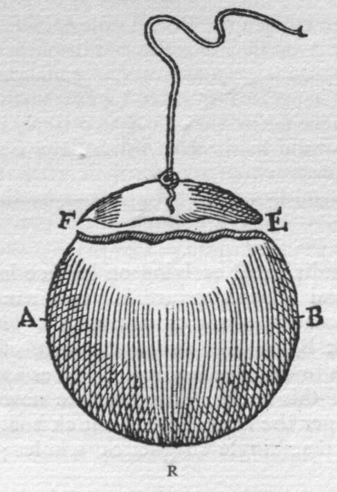
 So parts
 having the same verticity with the whole, when separated, are impelled in
 the contrary direction; for contrary parts solicit contrary parts. Nor
 yet is this a true contrariety, but the highest concordancy, and the true
 and genuine conformation of bodies magnetical in the system of nature, if
 they shall have been divided and separated: for the parts thus divided
 should be raised some distance from the whole, as will be made clear
 afterwards. Magnetick substances seek a unity as regards form; they do
 not so much respect their own mass. Wherefore the part F E is not
 attracted into its former bed; but when once it is unsettled and at a
 distance, it is * solicited by the opposite pole. But if the
 small piece F E is placed back again in its bed or brought close to,
 without any substances intervening, it acquires its former combination,
 and, as a part of the whole once more united, accords with the whole and
 sticks readily in its former position; and E remains toward A, and F
 toward B, and they settle steadily in their mother's lap. The reasoning
 is the same when the stone is divided into equal parts through the poles.
 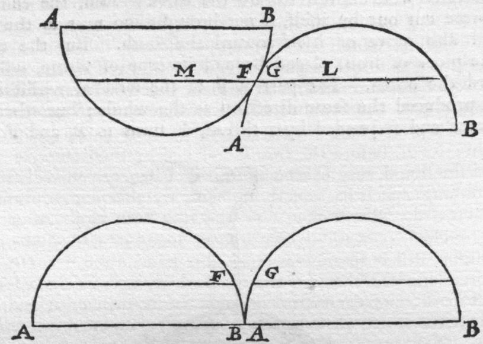 A spherical stone is
 divided into two equal parts along the axis A B; * whether
 therefore the surface A B is in the one part facing upward (as in the
 former diagram) or lying on its face in both parts (as in * the latter), the end A tends toward B. But it must also
 be understood that the point A is not carried with a definite aim always
 toward the point B, because in consequence of the division the verticity
 proceeds to other points, as to F G, as appears in the fourteenth chapter
 of this book. And L M are now the axes in each, and A B is no longer the
 axis; for magnetick bodies, as soon as they are divided, become single
 magnetick wholes; and they have vertices in accordance with their mass,
 new poles arising at each end in consequence of the division. Yet the
 axis and the poles always follow the leading of a meridian; because that
 force passes along the meridians of the stone from the æquator to the
 poles, by an everlasting rule, the inborn virtue of the substance
 agreeing thereto from the long and lasting position and the facing of a
 suitable substance toward the poles of the earth; by whose strength
 continued through many centuries it has been fashioned; toward fixed and
 determined parts of which it has remained since its origin firmly and
 constantly turned.

## CHAP. III.

### How Iron acquires Verticity through a Loadstone, and how that verticity *is lost and changed*.

Friction between an oblong piece of iron
 and a loadstone imparts to the former magnetick virtues, which are not
 corporeal nor inherent and persistent in any body, as we showed in the
 discussion on coition. It is plain that the iron, when it has been rubbed
 hard with one end and applied to the stone for a pretty long time,
 receives no stony nature, acquires no weight; for if, before the iron is
 touched by the stone, you weigh * it in a small and very exact
 goldsmith's balance, you will see after the rubbing that it has exactly
 the same weight, neither diminished nor increased. But if you wipe the
 iron with cloths after it has been touched, or wash it in water, or scour
 it with sand or on a grindstone, still it in nowise lays aside its
 acquired strength. For the force is spread through the whole body and
 conceived in the inmost parts, and cannot in any way be washed or wiped
 away. Let an experiment then be made in fire, that untamed tyrant of
 nature. Take a piece of iron of the length of a palm and the thickness of
 a goosequill pen; let this iron be passed through a suitable round cork
 and placed on the surface of water, and observe the end which turns to
 the north; rub this particular end with the true southern end of a
 loadstone; the iron so rubbed turns toward the south. Remove the cork,
 and place the end * which was excited in the fire until the iron
 is just red-hot; when it is cooled, it will retain the strength of the
 loadstone and the verticity, though it will not be so prompt, whether
 because the force of the fire had not yet continued long enough to
 overcome all its strength, or because the whole iron was
 not heated to redness, for the virtue is diffused through the whole.
 Remove the cork a second time, and putting the whole iron in the fire,
 blow the fire with the bellows, so that it may be all aglow, and let it
 remain a little longer time red-hot; when cooled (so, however, that,
 whilst it is cooling, it does not rest in one position), place it again
 on the water with the cork, and you will see that it has lost the
 verticity * which it had acquired from the stone. From
 these experiments it is clear how difficult it is for the property of
 polarity implanted by the loadstone to be destroyed. But if a small
 loadstone had remained as long in the same fire, it would have lost its
 strength. Iron, because it does not so easily perish, and is not so
 easily burnt up as very many loadstones, retains its strength more
 stably, and when it is lost can recover it again from a loadstone; but a
 loadstone when burnt does not revive. But now that iron, which has * been deprived of its magnetick form, moves in a
 different way from any other piece of iron, for it has lost its polar
 nature; and whereas before the touch of the loadstone it may have had a
 motion toward the north, and after contact toward the south; now it turns
 to no definite and particular point; but afterwards, very slowly and
 after * a long time, it begins to turn in a doubtful fashion
 toward the poles of the earth (having acquired some power from the
 earth). I have said that the cause of direction was twofold, one
 implanted in the stone and iron, but the other in the earth, implanted by
 the disponent virtue; and for that reason (the distinction of poles and
 the verticity in the iron having now been destroyed) a slow and weak
 directive power is acquired anew from the verticity of the earth. We may
 see, therefore, with what difficulty and only by the application of hot
 fires and by long ignition of the iron heated to softness, the imparted
 magnetick virtue is eradicated. When this ignition has overcome the
 acquired polarity, and it has been now completely subdued and not
 awakened again, that iron is left unsettled and utterly incapable of
 direction. But we must further inquire how iron remains affected by
 verticity. It is manifest that it strongly affects and changes the nature
 of the iron, because the presence of a loadstone attracts the iron to
 itself with an altogether wonderful readiness. Nor is it only the part
 that is rubbed, but on account of the rubbing (on one end only) the whole
 iron is affected together, and gains by it a permanent though an unequal
 power. This is demonstrated as follows. Rub an iron wire on the end so
 * that it is excited, and it will turn towards the north;
 afterward cut off some portion of it; you will see that it still turns
 toward the north (as before), but more feebly. For it must be understood
 that the loadstone excites a steady verticity in the whole iron (if the
 rod be not too long) more vigorous throughout the whole mass in a shorter
 bar, and as long as the iron remains touching the loadstone a little
 stronger. But when the iron is separated
 from contact with it, then it becomes much weaker, especially in the end
 that was not touched. Just as a long rod, one end of which is placed in
 the fire and heated, grows exceedingly hot at that end, less so in the
 parts adjoining and in the middle, whilst at the other end it can be held
 in the hand, and that end is only warm; so the magnetical vigour
 diminishes from the excited end to the other end; but it is present there
 instantly, and does not enter after an interval of time nor successively,
 as the heat in the iron; for as soon as a piece of iron has been touched
 by a loadstone it is excited throughout its whole length. For the sake of
 experiment, let there be a rod of iron 4 or * 5 digits
 long, untouched by a loadstone; as soon as you touch one end only with a
 loadstone, the opposite end immediately, or in the twinkling of an eye,
 by the power that it has conceived, repels or attracts a versorium, if it
 be applied to it ever so quickly.

## CHAP. IIII.

### Why Iron touched by a Loadstone acquires an opposite *verticity, and why iron touched by the true Northern side of a stone* turns to the North of the earth, by the true Southern side *to the South; and does not turn to the South when rubbed by the Northern point of the stone, and when by the Southern to the North, as all who have written on the loadstone have falsely supposed.*

Demonstration has already been given that
 the northern part of a loadstone does not attract the northern part of
 another stone, but the southern, and repels the northern part of another
 stone from its northern side when it is applied to it. That general magnet, the
 terrestrial globe, disposes iron touched by a loadstone in the same way,
 and likewise magnetick iron stirs this same iron by its implanted
 strength, and excites motion and controls it. For whether the comparison
 and experiment has been made between loadstone and loadstone, or
 loadstone and iron, or iron and iron, or the earth and loadstone, or the
 earth and iron conformed * by the earth or strengthened by
 the power of a loadstone, the strength and inclinations of each must
 mutually harmonize and accord in the same way. But the reason must be
 sought, why a piece of iron when touched by a loadstone acquires a
 disposition to motion toward the opposite pole of the earth, and not
 toward that pole of the earth to which that pole of
 that loadstone turned by which it was excited. It has been pointed out
 that iron and loadstone are of one primary nature; when the iron is
 joined to the loadstone, they become, as it were, one body, and not only
 is the end of the iron changed, but the remaining parts also are affected
 along with it. A, the north pole of a loadstone, is placed against the
 cusp of a piece of iron; the cusp of the iron has now become the southern
 part of the iron, 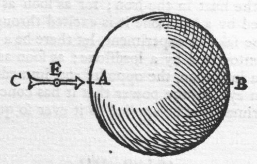 because it is touching the northern part of the stone; the
 cross-end of the iron has become the northern. For if that contiguous
 magnetick substance be separated from the pole of the terrella, or from
 the parts near the pole, the one end (or the end which, whilst the
 connection was kept up, was touching the northern part of the stone) is
 the southern, whilst the other is the northern. So also if a versorium
 excited by a loadstone be divided into ever so many parts (however
 small), those parts when separated will, it is clear, arrange themselves
 in the same disposition as that in which they were disposed before, when
 they were undivided. Wherefore whilst the cusp remains over the northern
 pole A, it is not the southern end, but is, as it were, part of a whole;
 but when it is taken away from the stone, it is the southern end, because
 when rubbed it tended toward the northern parts of the stone, and the
 cross (the other end of the versorium) is the northern end. The loadstone
 and the iron make one body; B is the south pole of the whole; C (that is,
 the cross) is the northern end of the whole; divide the iron also at E,
 and E will be the southern end with respect to the cross; and E will
 likewise be the northern end in respect to B. A is the true northern pole
 of the stone and is attracted by the southern pole of the earth. The end
 of the iron which is touched by the true boreal part of the stone becomes
 the southern end, and turns to A, the north [pole] of the stone, if it be
 near; or if it be some distance from the stone it turns to the north
 [pole] of the earth. So always iron which is touched (if it is free and
 unrestrained) tends to the opposite part of the earth from that part to
 which the loadstone that touched it tends. Nor does it * make any difference how it is rubbed, whether straight
 up or slanting in some way. For in any case the verticity flows into the
 iron, 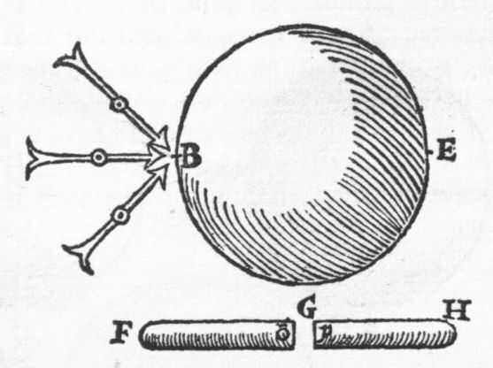 provided it is touched by either end. Wherefore all the
 cusps at B acquire the same verticity, after they are separated, but
 opposite to that pole of the stone; wherefore also they are united to the
 loadstone at the pole B; and all the crosses in the present figure have
 the opposite verticity to the pole E, and are moved and laid hold of by E
 when they are in a convenient position. It is exactly the same in the
 case of the long stone F H divided at G; F and H always move, both in the
 whole and in the divided stone, to opposite poles of the earth, and O and
 P mutually attract one another, the one of them being the northern, the
 other the southern. For, supposing H to have been the southern in the
 whole stone and F the northern, P will be the northern with respect to H
 in the divided stone, and O the southern with respect to F. So also F and
 H mutually incline to a connection, if they are turned a very little
 toward one another, and run together at length and join. But supposing
 the division of the stone to have been meridional (that is, according to
 the line of a meridian, not of any parallel circle), then they turn 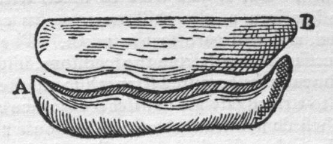 round, and
 A attracts B, and the end B is attracted to A and attracts A, until,
 being turned round, they are connected and cemented together; because
 magnetick attraction is not made along the parallels, but meridionally.
 For this reason pieces of iron placed on a terrella whose poles are A B,
 near the æquator along parallels, * do not combine or stick
 together firmly: 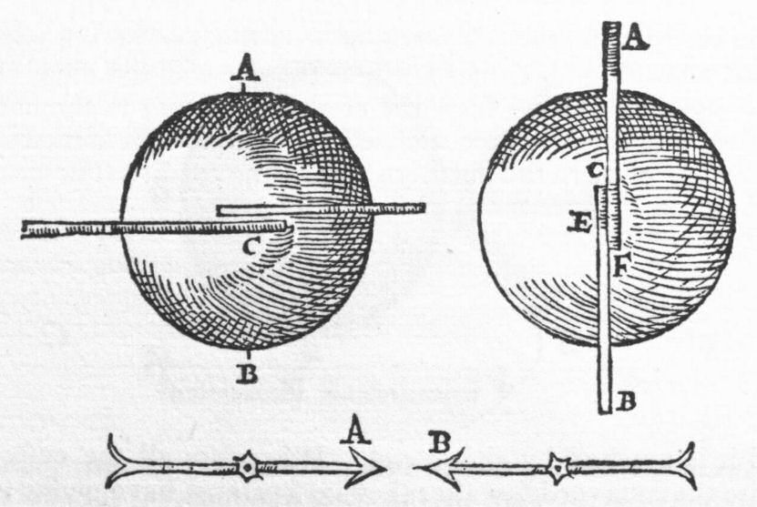 But if applied to one another along a meridian they are
 immediately * joined firmly together, not only on and near
 the stone, but even at some distance within the force of the controlling
 orbe. Thus they are joined and cemented together at E, but not at C in
 the other figure. For the opposite ends C and F meet and adhære together
 in the case of the iron just in the same way as A and B before in the
 case of the stone. But they are opposite ends, because the pieces of iron
 proceed from the opposite sides and poles of the terrella; and C in
 reference to the northern pole A is southern, and F is boreal in
 reference to the * southern pole B. In like manner also they
 are cemented together, if the rod C (being not too long) be moved further toward A, and F
 toward B, and they be joined together over the terrella, like A and B of
 the divided stone above. But now if the cusp A, * which has
 been touched by a loadstone, be the southern end, and you were to touch
 and rub with this the cusp of another iron needle B, which has not been
 touched, B will be northern, and will point to the south. But if you were
 to touch with the northern point B any other iron needle, still new, on
 its cusp, this again will be southern, and will turn to the north. The
 iron not only receives the necessary strength from the loadstone, if it
 be a good loadstone, but also imparts its acquired strength to another
 piece of iron, and the second to a third (always in strict accordance
 with magnetick laws). In all these demonstrations of ours it should
 always be borne in mind that the poles of a stone, as well as those of
 iron, whether touched or untouched, are always in fact and by nature
 opposite to the pole toward which they point and are so designated by us,
 as we have laid down above. For in them all it is always the northern
 * which tends to the south, either of the earth or of the
 stone, and the southern which tends to the north of the stone. Northern
 parts are attracted by the southern of the earth; so in the boat they
 tend toward the south. A piece of iron
 touched by the northern parts of a loadstone becomes south at the one end
 and tends always (if it is near and within the orbe of the loadstone) to
 the north of the stone, and if it be free and left to itself at some
 distance from the stone, it tends to the northern part of the earth. The
 northern pole A of a loadstone turns to G, the south of the earth; a
 versorium touched at its cusp by the part A follows A, because it has
 become southern. But the versorium C, placed farther away from the
 loadstone, turns its cusp to F, the north of the earth, because * the cusp has become southern by contact with the boreal
 part of the stone. So the ends touched by the northern part of the stone
 are made southern, or are excited with a southern polarity, and tend
 toward the north of the earth; those touched by the southern pole are
 made northern, or are excited with a northern force, and turn to the
 south of the earth.

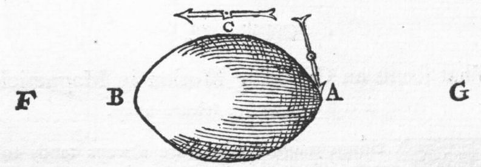

## CHAP. V.

### On the Touching of pieces of Iron *of divers shapes.*

Bars of iron, when touched by a loadstone,
 have one end north, the other south, and in the middle is the limit of
 verticity, like the æquinoctial circle on the globe of a terrella or on
 an iron globe. But when an iron ring is rubbed on one side on a * loadstone, then the one pole is on the place that was
 in contact, whilst the other is at the opposite point; and the magnetick
 power divides the ring into two parts by a natural distinction which,
 though not in shape, yet in power and effect is like an æquator. But if a
 thin straight rod be bent into a ring without any welding or union of the
 ends, and be touched in the middle by a loadstone, both ends will be of
 the same verticity. Let a ring be taken which is whole and continuous,
 and which has been * touched by a loadstone at one place, and let
 it be divided afterward at the opposite point and straightened
 out, both ends will also be * of the same verticity, no
 otherwise than a thin rod touched in the middle or a ring not cohærent at
 the joint.

## CHAP. VI.

### What seems an Opposing Motion in Magneticks *is a proper motion toward unity*.

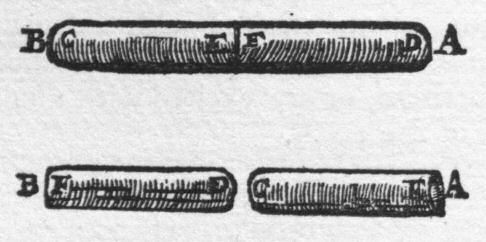

In things magnetical nature always tends
 to unity, not merely to confluence and agglomeration, but to harmony; in
 such a way that the rotational and disponent faculty should not be
 disturbed, as is variously shown in the following example. Let C D be an
 entire body of some magnetick substance, in which C tends to B, the north
 of the earth, and D to the south, A. Then divide it in the middle in its
 æquator, and it will be E that is tending toward A, and F tending toward
 B. For just as in the undivided body, so in the divided, nature aims at
 these bodies being united; the end E again joins with F harmoniously and
 * eagerly and they stick together, but E is never joined
 to D, nor F to C; for then C must be turned contrary to nature toward A,
 the south, or D toward B, the north, which is foreign to them and
 incongruous. Separate the stone in the place where it is cut and turn D
 round to C; they harmonize and combine excellently. For D is tending to
 the south, as before, and C to the north; E and F, parts which were
 cognate in the ore, are now widely separated, for they do not move
 together on account of material affinity, but they take their motion and
 inclination from their form. So the ends, whether joined or divided, tend
 magnetically in the same way to the earth's poles in the first figure
 where there is one whole, or divided as in the second figure; and F E in
 the second figure is a perfect magnetick joined together into one body
 and C D, just as it was primarily produced in its ore, and F E in its
 boat, turn in this way to the poles of the earth and are
 conformed to them. * This harmony of the magnetick form is shown
 also in the forms of vegetables. Let A B be a twig from a branch of osier
 or other * tree which sprouts easily. Let A be the
 upper part, B the lower part toward the root; divide it at C D; I say
 that the end D, if grafted again to C by the primer's art, grows to it;
 just as also if B is grafted to A, they grow together and germinate. But
 D being grafted on A, or C on B, they are at variance, and never grow
 into one another, but one of them dies on account of the inverted and
 inharmonious arrangement, since the vegetative force, which moves in one
 way, is now impelled in opposite directions.

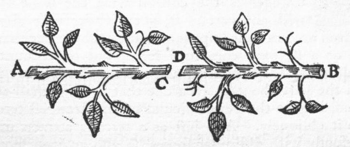

## CHAP. VII.

### A determined Verticity and a disponent Faculty are what arrange magneticks, not a force, attracting or pulling them *together, nor merely strongish coition or unition*.

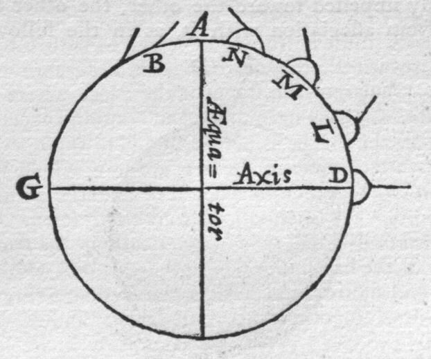

In the neighbourhood of the æquinoctial A
 there is no coition of the ends of a piece of iron with the terrella; at
 the poles there is the strongest. The greater the distance from the
 æquinoctial, the stronger is the coition with the stone itself, and with
 any part of it, not with its pole alone. Yet pieces of iron are not
 raised up on account of some peculiar attracting force or a stronger
 combined force, but on account of that common directing or conforming and
 rotating force; nor indeed is a spike in the part about B, even one that
 is very small and of no * weight, raised up to the perpendicular by the
 strongest terrella, but cleaves to it obliquely. Also just as a terrella
 attracts magnetick bodies variously with dissimilar forces, so also an
 iron snout placed on the stone obtains a different potency in proportion
 to the latitude, * just as a snout at L by its firmer
 connection resists a greater weight more stoutly than one at M, and at M
 than at N. But neither does the snout raise the spike to the
 perpendicular except at the poles, as is shown in the figure. A snout at
 L may hold and lift from the earth two ounces of iron in one piece; yet
 it is not strong enough to raise an iron wire of two grains weight to the
 perpendicular, which would happen if the verticity arose on account of a
 * stronger attraction, or rather coition or unition.

## CHAP. VIII.

### Of Discords between pieces of Iron upon the same pole of a loadstone, and how they can agree and *stand joined together*.

Suppose two iron wires or a pair of
 needles stuck on the pole of a terrella; though they ought to stand
 perpendicularly, they mutually repel one another at the upper * end, and produce the appearance of a fork; and if one
 end be forcibly impelled toward the other, the other declines and bends
 away from association with it, as in the following figure. 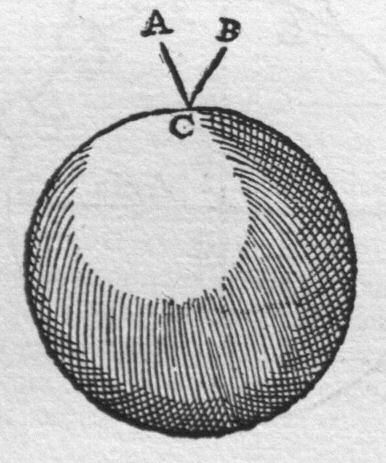 A and B, iron spikes, adhære obliquely upon the pole on account
 of their nearness to one another; either alone would otherwise stand
 erect and perpendicular. For the extremities A B, being of the same
 verticity, mutually abhor and fly one another. For if C be the northern
 pole of the terrella, A and B are also northern ends; but the ends which
 are joined to and held at the pole C are both * southern.
 But if those spikes be a little longer (as, for example, of two digits
 length) and be joined by force, they adhære together and unite in a
 friendly style, and are not separated without force. For they are
 magnetically welded, and there are now no longer two distinct ends, but
 one end and one body; no less than a wire which is doubled and set up
 perpendicularly. But here is seen also another subtile point, that if
 those spikes were shorter, not as much as the * breadth of
 one digit, or even the length of a barleycorn, they are in no way willing
 to harmonize or to stand straight up at the same time, because naturally
 in shorter wires the verticity is stronger in the ends which are distant
 from the terrella and the magnetick discord more vehement than in long
 ones. Wherefore they in no way admit of an intimate association and
 connection.

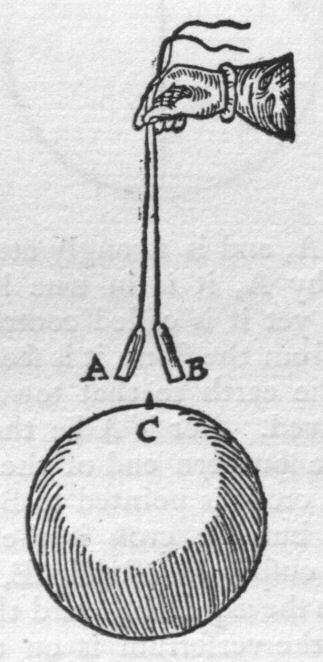

Likewise if those lighter pieces of iron or iron wires be suspended,
 hanging, as A and B, from a very fine silk thread, not twisted * but braided, distant from the stone the length of a
 single barleycorn, then the opposing ends, A and B, being situated within
 the orbe of virtue above the pole, keep a little away from one another
 for the same reason; except when they are very near the pole of the stone
 C, the stone then attracting them more strongly toward one end.

## CHAP. IX.

### Figures illustrating direction and showing varieties *of rotations*.

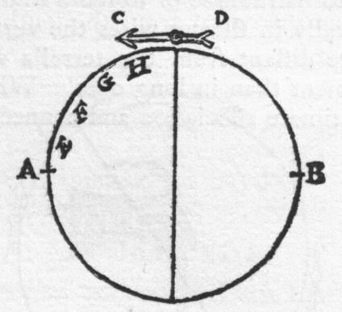

Passing from the probable cause of motion
 toward fixed points (according to magnetick laws and principles), it
 remains for us to indicate those motions. Above a round loadstone (whose
 poles are A, B) let a versatory needle be placed whose cusp has been
 excited by the pole A; that cusp is certainly directed toward A, and is
 strongly attracted by A; because, having been touched by A, it is in true
 harmony with A, and combines with it; and yet it is called contrary,
 because when the versorium is separated from the stone, it is seen to be
 moved toward the opposite part of the earth to that toward which the pole
 A of the loadstone is moved. For if A be the northern pole of the
 terrella, the cusp is the southern end of the needle, of which the other
 end (namely, the cross) is pointed to B; so B is the southern pole of the
 loadstone, but the cross is the northern end of the versorium. So also
 the cusp is attracted by E, F, G, H, and by every * part of a
 meridian, from the æquator toward the pole, by the faculty disponent; and
 when the versorium is on the same parts of the meridian, the cusp is
 directed toward A. For it is not the point A that turns the versorium
 toward it, but the whole loadstone; as also the whole earth does, in the
 turning of loadstones to the earth.

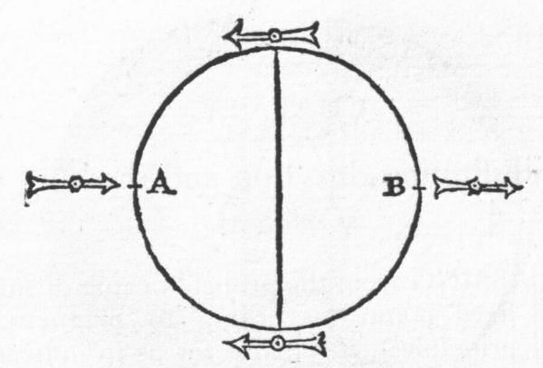

*Figures illustrating magnetick directions in a right sphere of stone, and in the
 right sphere of the earth, as well as the polar directions to the
 perpendicular of the poles.* All these cusps have been touched by the
 pole A; all the cusps are turned toward A, excepting that one which is
 repelled by B.

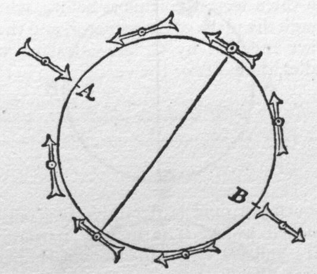

*Figures illustrating horizontal directions above the body of a
 loadstone.* All the cusps that have been made southern by rubbing on
 the boreal pole, or some place round the northern pole A, turn toward the
 pole A, and turn away from the southern pole B, toward which all the
 crosses look. I call the direction horizontal, because it is arranged
 along the plane of the horizon; for nautical and * horological
 instruments are so constructed that the iron hangs or is supported in
 æquilibrium on the point of a sharp pin, which prevents the dipping of
 the versorium, about which we intend to speak later. And in this way it
 is of the greatest use to man, indicating and distinguishing all the
 points of the horizon and the winds. Otherwise on every oblique sphere
 (whether of stone or the earth) versoria and all magnetick substances
 would have a dip by their own nature below the horizon; and at the poles
 the directions would be perpendicular, which appears in our discussion
 *On Declination*.

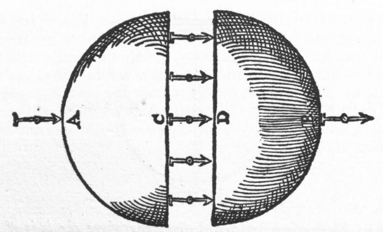

*A round stone (or terrella) cut in two at the æquator;* and all
 the cusps have been touched by the pole A. The points at the centre of
 the earth, and between the two parts of the terrella which has been cut
 in two through the plane of the æquator, are directed as in the
 present diagram. This
 would also happen in the same way if the division of the stone were
 through the plane of a tropick, and the mutual separation of the divided
 parts and the interval between them were the same as before, when the
 loadstone was divided through the plane of the æquator, and the parts
 separated. For the cusps are repelled by C, are attracted by D; and the
 versoria are parallel, the poles or the verticity in both ends mutually
 requiring it.

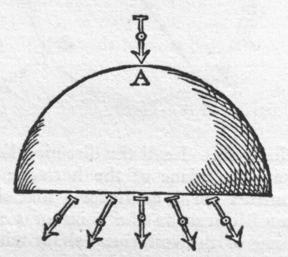

*Half a terrella by itself and its directions, unlike the directions
 * of the two parts close to one another as shown in the
 figure above*. All the cusps have been touched by A; all the crosses
 below except the middle one tend toward the loadstone, not straight, but
 obliquely; because the pole is in the middle of the plane which before
 was the plane of the æquator. All cusps touched by places distant from
 the pole move toward the pole (exactly the same as if they had been
 rubbed upon the pole itself), not toward the place where they were
 rubbed, wherever that may have been in the undivided stone in some
 latitude between the pole and the æquator. And for this reason there are
 only two distinctions of regions, northern and southern, in the terrella,
 just as in the general terrestrial globe, and
 there is no eastern nor western place; nor are there any eastern or
 western regions, rightly speaking; but they are names used in respect of
 one another toward the eastern or western part of the sky. Wherefore it
 does not appear that Ptolemy did rightly in his *Quadripartitum*,
 making eastern and western districts and provinces, with which he
 improperly connects the planets, whom the common crowd of philosophizers
 and the superstitious soothsayers follow.

## CHAP. X.

### On Mutation of Verticity and of Magnetick Properties, or on alteration in the power *excited by a loadstone*.

Friction with a loadstone gives to a piece
 of iron a verticity strong enough; not, however, so stable that the iron
 may not by being rubbed on the opposite part (not only with a more
 powerful loadstone, but with the same) be changed and deprived of all its
 former verticity, and indued with a new and opposite one. Take a piece of
 iron wire and rub each end of the wire equally with one and the same pole
 of a loadstone, and let it be passed through a suitable cork and place it
 on water. Then truly one end of the wire will be directed toward that
 pole of the earth toward which that end of the stone will not turn. But
 which end of the iron wire will it be? That certainly which was rubbed
 last. Rub the other end of this again with the same pole, and immediately
 * that end will turn itself in the opposite direction.
 Again touch the former end of the iron wire only with the same pole of
 the loadstone as before; and that end, having gained the command,
 immediately changes to the contrary side. So you will be able to change
 the property of the iron frequently, and that end of the wire rules which
 has been touched the last. Now then merely hold the boreal pole of the
 stone for some time near the boreal part of the wire which was last
 touched, so that it does not touch, but so that it is removed from it by
 one, two, or even three digits, if the stone have been pretty * strong; and again it will change its property and will
 turn round to the contrary side; which will also happen (albeit rather
 more feebly) even if the loadstone be removed to a distance of four
 digits. You will be able to do the same thing, moreover, with both the
 austral and the boreal part of the stone in all these experiments.
 Verticity may likewise be acquired and changed when thin plates of gold,
 * silver, and glass are interposed between the stone and
 the end of the iron or iron wire, if the stone were rather strong, even
 if the intermediate lamina is not touched either
 by the iron or the stone. And these changes of verticity take place in
 smelted iron. Indeed what the one pole of the stone implants and excites,
 the other disturbs and extinguishes, and confers a new force. For it does
 not require a stronger loadstone to take away the weaker and sluggish
 virtue and to implant the new one; nor is iron inebriated by the equal
 strength of loadstones, and made utterly uncertain and neutral, as
 Baptista Porta teaches; but by one and the same loadstone, or by
 loadstones endowed with equal power and might, its strength is, in
 accordance with magnetick rules, turned round and changed, excited,
 repaired, or disturbed. But a loadstone itself, by being rubbed on
 another, whether a larger or a more powerful stone, is not disturbed from
 its own property and verticity, nor does it turn round toward the
 opposite direction in its boat, or to the other pole opposite to that to
 which it inclines by its own nature and implanted verticity. For strength
 which is innate and has been implanted for a very long time abides more
 firmly, nor does it easily yield from its ancient holding; and that which
 has grown for a long time is not all of a sudden brought to nothing,
 without the destruction of the substance containing it. Nevertheless in a
 long interval of time a change * does take place; in one year,
 that is to say, or two, or sometimes in a few months; doubtless when a
 weaker loadstone remains lying by a stronger one contrary to the order of
 nature, namely, with the northern pole of one loadstone adjoined to the
 northern pole of another, or the southern to the southern. For so the
 weaker strength gradually declines with the lapse of time.

## CHAP. XI.

### On the Rubbing of a piece of Iron on a Loadstone in places midway between the poles, and upon *the æquinoctial of a terrella*.

Select a piece of iron wire of three
 digits length, not touched by a loadstone (but it will be better if its
 acquired verticity be rather weak or have been damaged in some way);
 touch it and rub it on the æquator of a terrella, exactly on the
 æquinoctial line in the direction of its length, on the one end, or the
 ends only, or in all its parts; place the wire touched in this * way on water in a cork fitted for it; it will swim
 about doubtfully on the waves without any acquired verticity, and the
 verticity previously implanted will be disturbed. If, however, it float
 by chance toward the poles, it will be checked a little by the poles of
 the earth, and will at length by the influence of the earth be indued
 with verticity.

## CHAP. XII.

### In what way Verticity exists in any Iron that has *been smelted though not excited by a lodestone*.

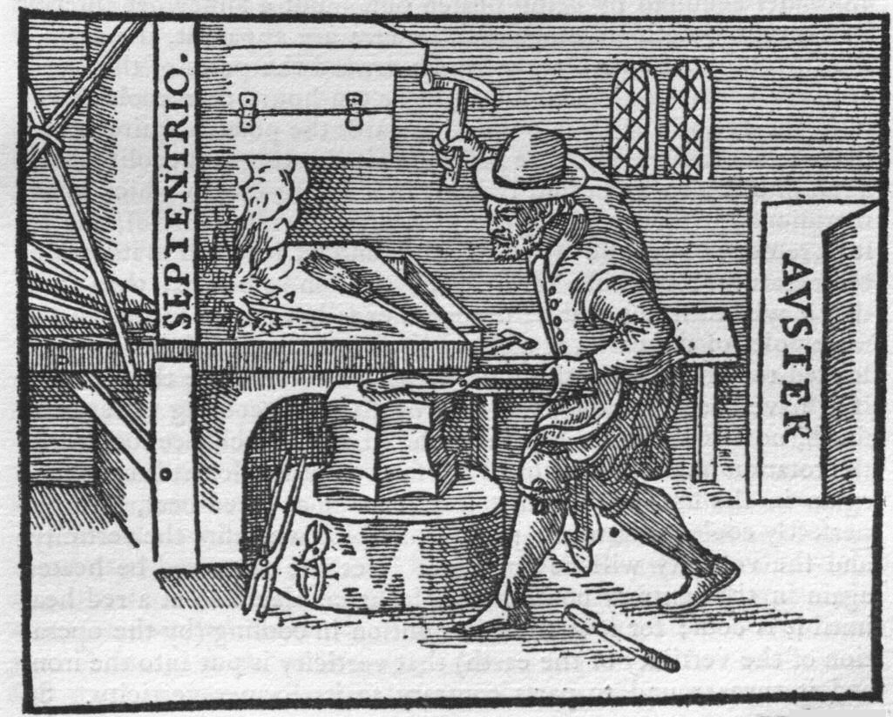

Having thus far demonstrated natural and inborn causes
 and powers acquired by means of the stone, we will now examine the causes
 of magnetick virtues in smelted iron that has not been excited by a
 stone. Loadstone and iron furnish and exhibit to us wonderful
 subtilities. It has been repeatedly shown above that iron not excited by
 a stone turns north and south; further that it has verticity, that is,
 special and peculiar polar distinctions, just as a loadstone, or iron
 which has been rubbed upon a loadstone. This indeed seemed to us at first
 wonderful and incredible; the metal of iron from the mine is smelted in
 the furnace; it runs out of the furnace, and hardens into a great mass;
 this mass is divided in great worksteads, and is drawn into iron bars,
 from which smiths again construct many instruments and necessary pieces
 of iron-work. Thus the same mass is variously worked up and transformed
 into very many similitudes. What is it, then, which
 preserves its
 verticity, and whence is it derived? So take this first from the above smithy. Let the
 blacksmith beat out upon his anvil a glowing mass of iron of two or three
 ounces weight into an iron spike of the length of a span of nine inches.
 Let the smith be standing with his face to the north, his back to the
 south, so that * the hot iron on being struck has a motion of
 extension to the north; and let him so complete his work with one or two
 heatings of the iron (if that be required); let him always, however,
 whilst he is striking the iron, direct and beat out the same point of it
 toward the north, and let him lay down that end toward the north. Let him
 in this way complete two, three, or more pieces of iron, nay, a hundred
 or four hundred; it is demonstrable that all those which are thus beaten
 out toward the north, and so placed whilst they are cooling, turn round
 on their centres; and floating pieces of iron (being transfixed, of
 course, through suitable corks) make a motion in the water, the
 determined end being toward the north. In the same way also pieces of
 iron acquire verticity from their direction whilst they are being beaten
 out and hammered or drawn out, * as iron wires are accustomed to
 do toward some point of the horizon between east and south or between
 south and west, or in the opposite direction. Those, however, which are
 pointed or drawn out rather toward the eastern or western point, conceive
 * hardly any verticity or a very undecided one. That
 verticity is especially acquired by being beaten out. But a somewhat
 inferior iron ore, in which no magnetick powers are apparent, if put in a
 * fire (its position being observed to be toward the
 poles of the world or of the earth) and heated for eight or ten hours,
 then cooled away from the fire, in the same position towards the poles,
 acquires a verticity in accordance with the position of its heating and
 cooling. Let a rod of cast iron be heated red-hot in a strong fire, in
 which it lies * meridionally (that is, along the path of a
 meridian circle), and let be removed from the fire and cooled, and let it
 return to its former temperature, remaining in the same position as
 before; then from this it will turn out that, if the same ends have been
 turned to the same poles of the earth, it will acquire verticity, and the
 end which looked toward the North on water with a cork before the
 heating, if it have been placed during the heating and cooling toward the
 fourth, now turns round to the south. But if perchance sometimes the
 rotation have been doubtful and somewhat feeble, let it be placed again
 in the fire, and when it is taken out at a red heat, let it be perfectly
 cooled toward the pole from which we desire the verticity, and the
 verticity will be acquired. Let the same rod be heated * in the contrary position, and let it be placed so at a
 red heat it is cool; for it is from its position in cooling (by the
 operation of the verticity of the earth) that verticity is put into the
 iron, and it turns round to parts contrary to its former verticity. So
 the end which formerly looked toward the
 north now turns to the south. In accordance with these reasonings and in
 these ways the boreal pole of the earth gives to the end of a piece of
 iron turned toward it a southern verticity, and that end is attracted by
 that pole. * And here it must be observed that this
 happens to iron not only when it is cooled in the plane of the horizon,
 but also at any angle to it almost up to the perpendicular toward the
 centre of the earth. So the heated iron conceives vigour and verticity
 from the earth more quickly in the course of its return to its normal
 state, and in its recovery, as it were (in the course of which it is
 transformed), than by its mere position alone. This is effected better
 and more * perfectly in winter and in colder air, when
 the metal returns more certainly to its natural temperature, than in
 summer and in warm regions. Let us see also what position alone and a
 direction toward the poles of the earth can effect by itself without fire
 and heat. Iron rods which have been placed and fixed for a long time,
 twenty * or more years, from south to north (as they not
 infrequently are fixed in buildings and across windows), those rods, I
 say, by that long lapse of time acquire verticity and turn round, whether
 hanging in the air, or floating (being placed on cork), to the pole
 toward which they were pointing, and magnetically attract and repel a
 balanced iron magnetick; for the long continued position of the body
 toward the poles is of much avail. This fact (although conspicuous by
 manifest experiments) is confirmed by an incident related in an Italian
 letter at the end of a
 book of Maestro Filippo Costa, of Mantua, *Sopra le Compositioni degli
 Antidoti* written in Italian, which translated runs thus: "A druggist
 of Mantua showed me a piece of iron entirely changed into a magnet,
 drawing another piece of iron in such a way that it could be compared
 with a loadstone. Now this piece of iron, when it had for a long time
 held up a brick ornament on the top of the tower of the church of St.
 Augustine at Rimini, had been at length bent by the force of the winds,
 and remained so for a period of ten years. When the monks wished to bend
 it back to its former shape, and had handed it over to a blacksmith, a
 surgeon named Maestro Giulio Caesare discovered that it was like a magnet
 and attracted iron." This was caused by the turning of its extremities
 toward the poles for so long a time. And so what has been laid down
 before about change of verticity should be borne in mind; how in fact the
 poles of iron spikes are altered, when a loadstone is placed against them
 only with its pole and points toward them, even at a rather long
 distance. Clearly it is in the same way that that large magnet also (to
 wit, the earth itself) affects a piece of iron and changes its verticity.
 For, although the iron may not touch the pole of the earth, nor any
 magnetick part of the earth, yet verticity is acquired and changed; not
 because the poles of the earth and the point itself which is 39° distant
 from our city of London, changes the
 verticity at a distance of so many miles; but because the whole magnetick
 earth, that which projects to a considerable height, and to which the
 iron is near, and that which is situated between us and the pole, and the
 vigour existing within the orbe of its magnetick virtue (the nature of
 the whole conspiring thereto), produces the verticity. For the magnetick
 effluence of the earth rules everywhere within the orbe of its virtue,
 and transforms bodies; but those things which are more similar to it, and
 specially connected with it by nature, it rules and controls; as
 loadstone and iron. Wherefore in very many matters of business and
 actions it is clearly not superstitious and idle to observe the positions
 and conditions of lands, the points of the horizon and the places of the
 stars. For as when a babe is brought forth into the light from its
 mother's womb, and acquires respiration and certain animal activities,
 then the planets and celestial bodies, according to their position in the
 universe, and according to that configuration which they have with regard
 to the horizon and the earth, instil peculiar and individual qualities
 into the newly born; so that piece of iron, whilst it is being formed and
 lengthened out, is affected by the common cause (to wit, the earth);
 whilst it is returning also from its heated condition to its former
 temperature, it is imbued with a special verticity in accord with its
 position. Rather long pieces of iron sometimes have the same verticity
 * at each end; wherefore they have motions which are less
 certain and well ordered on account of their length and of the aforesaid
 processes, exactly as when an iron wire four feet long is rubbed at each
 end upon the same pole of a loadstone.

## CHAP. XIII.

### Why no other Body, excepting a magnetick, is imbued *with verticity by being rubbed on a loadstone; and why no* body is able to instil and excite that virtue, *unless it be a magnetick.*

Ligneous substances floating on water
 never by their own strength turn round toward the poles of the earth,
 save by chance. So wires of gold, silver, brass, tin, lead, or glass,
 pushed through corks and floating, have no sure direction; and for this
 reason they do not show poles or points of variation when rubbed with a
 loadstone. For those things which do not of themselves incline toward the
 poles and obey the earth are also not ruled by the touch of a
 loadstone; for the magnetick vigour has no entrance into their inward
 parts; neither is the magnetick form received by them, nor are their
 forms magnetically excited; nor, if it did enter, would it effect
 anything, because in those bodies (mixed up with various kinds of
 efflorescent humours and forms, corrupted from the original property of
 the earth) there are no primary qualities. But those prime qualities of
 iron are excited by the juxtaposition of a loadstone, just as brute
 animals or men, when they are awakened out of sleep, move and put forth
 their strength. Here one must marvel at a demonstrable error of B. Porta,
 who, while rightly opposing a very old falsehood about the diamond, in
 speaking of a power contrary to that of the loadstone, introduces another
 still worse opinion; that forsooth iron, when touched by a diamond, turns
 to the north. "If" (he says) "you rub a steel-Needle on a Diamond, and
 then put it in a Boat, or thrust it through a reed, or hang it up by a
 Thread, it will presently turn to the North, almost as well as if it had
 been touched with the Loadstone; but something more faintly. And, what is
 worth noting, the contrary part will turn the iron to the South: and when
 I had tried this in many steel-Needles, and put them all into the Water,
 I found, that they all stood equi-distant, pointing to the North." This
 indeed would * be contrary to our magnetick rules. For this
 reason we made an experiment with seventy excellent diamonds, in the
 presence of many witnesses, on a large number of spikes and wires, with
 the most careful precautions, floating (thrust, of course, through their
 corks) on the surface of water; never, however, could we observe this. He
 was deceived by the verticity acquired from the earth (as stated above)
 in the spike or wire of iron itself, and the iron itself turned aside to
 its own definite pole; and he, being ignorant of this, thought it was
 done by the diamond. But let the investigators of natural phenomena take
 heed that they are not the more deceived by their own badly observed
 experiments, and disturb the commonwealth of letters with their errors
 and stupidities. Diamond is sometimes designated by the name of
 *Sideritis*, not because it is made of iron or because it draws
 iron, but on account of its lustre, resembling flashing steel; with such
 a lustre do the choicest pieces of diamond shine; hence by very many
 writers many qualities are imputed to diamond which really belong to
 siderite loadstone.

## CHAP. XIIII.

### The Placing of a Loadstone above or below a magnetick body suspended in æquilibrium changes neither the power *nor the verticity of the magnetick body.*

Quietly to pass this over would be
 improper, because a recent error arising from a defective observation of
 Baptista Porta must be overthrown; on which he (by an unfortunate
 repetition) even writes three chapters, namely, the 18th, the 31st, and
 the 42nd. For if a loadstone or a piece of magnetick iron, hanging in
 æquilibrium or floating on water, is attracted and disposed toward
 certain definite points, when you bring above it a piece of iron or
 another loadstone, it will not, if you afterward put the same below it, turn round to
 the contrary parts; but the same ends of the iron or the loadstone will
 always be directed toward the same ends of the stone, even if the
 loadstone or the iron is suspended in any way in æquilibrium or is poised
 on a needle, so that it can turn round freely. He was deceived by the
 irregular shape of some stone, or because he did not arrange the
 experiment suitably. Wherefore he is led astray by a vain opinion, and
 thinks he may infer that, just as a stone has an arctic and antarctic
 pole, so also it has a western and an eastern, and an upper and a lower
 pole. So from foolish ideas conceived and admitted arise other
 fallacies.

## CHAP. XV.

### The Poles, Æquator, Centre in an entire Loadstone *remain and continue steady; by diminution and* separation of some part they vary and *acquire other positions.*

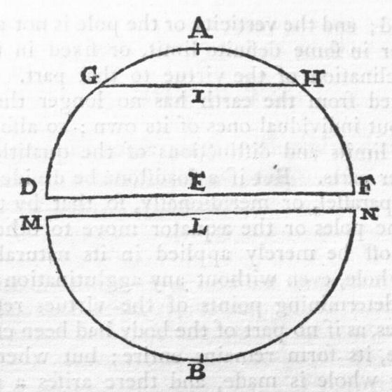 *

Suppose A B to be a terrella, whose centre
 is E, and whose diameter (as also its æquinoctial circle) is D F. If you
 cut off a portion (through the arctic circle, for example), G H, it is
 demonstrable that the pole which was at A now has a position at I. But
 the centre and the æquinoctial recede toward B merely so that they are
 always in the middle of the mass that is left between the plane of the
 arctick circle G I H and the antarctick pole B. Therefore the segment of
 the terrella comprised between the plane of the former æquinoctial (that,
 of course, which was the æquator before cutting that part away) D E F and
 the newly acquired æquator M L N will always be equal to the half of that
 part which was cut off, G I H A. 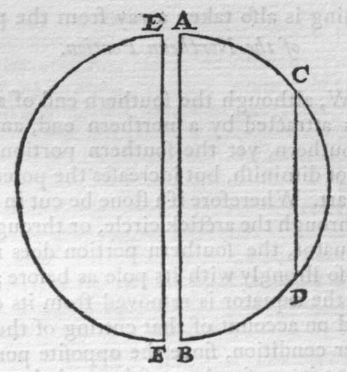 * But if the portions have been taken away from the side
 C D, the poles and axis will not be in the line A B, but in E F, and the
 axis would be changed in the same proportion as the æquator in the former
 figure. For those positions of forces and virtues, or rather limits of
 the virtues, which are derived from the whole form, are moved forward by
 change of quantity and shape; since all these limits arise from the
 conspiring together of the whole and of all the parts united; and
 the verticity or the pole is not a virtue innate in one part, or in some
 definite limit, or fixed in the substance; but it is an inclination of
 the virtue to that part. And just as a terrella separated from the earth
 has no longer the earth's poles and æquator, but individual ones of its
 own; so also if it again be divided, those limits and distinctions of the
 qualities and virtues pass on to other parts. But if a loadstone be
 divided in any way, either along a parallel, or meridionally, so that by
 the change of shape either the poles or the æquator move to other
 positions, if the part cut off be merely applied in its natural position
 and joined to the whole, even without any agglutination or cementing
 together, the determining points of the virtues return again to their
 former sites, as if no part of the body had been cut off. When a body is
 entire, its form remains entire; but when the body is lessened, a new
 whole is made, and there arises a new entirety, determined for every
 loadstone, however small, even for magnetick gravel, and for the finest
 sand.

## CHAP. XVI.

### If the Southern Portion of a Stone be lessened, something is also taken away from the power *of the Northern Portion.*

Now although the southern end of a
 magnetick iron is attracted by a northern end, and repelled by a
 southern, yet the southern portion of a stone does not diminish, but
 increases the potency of the boreal part. Wherefore if a stone be cut in
 two and divided through the arctick circle, or through the tropick of
 Cancer or the æquator, the southern portion does not attract magnetick
 substances so strongly with its pole as before; because a new whole
 arises, and the æquator is removed from its old position and moves
 forward on account of that cutting of the stone. In the former condition,
 since the opposite portion of the stone increases the mass beyond the
 plane of the æquator, it strengthens also the verticity, and the potency,
 and the motion to unity.

## CHAP. XVII.

### On the Use and Excellence of Versoria: and how iron *versoria used as pointers in sun-dials, and the fine needles* of the mariners' compass, are to be rubbed, that *they may acquire stronger verticity.*

Versoria prepared by the loadstone
 subserve so many actions in human life that it will not be out of place
 to record a better method of touching them and exciting them
 magnetically, and a suitable manner of operating. Rich ores of iron and
 such as yield a greater proportion of metal are recognized by means of an
 iron needle suspended in æquilibrium and magnetically prepared; and
 magnetick stones, clays, and earths are distinguished, whether crude or
 prepared. An iron needle (the soul of the mariners' compass), the
 marvellous director in voyages and finger of God, one might almost say,
 indicates the course, and has pointed out the whole way around the earth
 (unknown for so many ages). The Spaniards (as also the English) have
 frequently circumnavigated (by an immense circuit) the whole globe by aid
 of the mariners' compass. Those who travel about through the world or who
 sit at home have sun-dials. A magnetick pointer follows and searches out
 the veins of ore in mines. By its aid mines are driven in taking cities;
 catapults and engines of war are aimed by night; it has been of service
 for the topography of places, for marking off the areas and position of
 buildings, and for excavating aqueducts for water under ground. On it
 depend instruments designed to investigate its own dip and variation.

When iron is to be quickened by the stone, let it be clean and bright,
 disfigured by no rust or dirt, and of the best steel. Let the stone itself be wiped dry,
 and let it not be damp with any moisture, but let it be filed gently with
 some smooth piece of iron. But the hitting of the stone with a hammer is
 of no advantage. By these means let their bare surfaces be joined, and
 let them be rubbed, so that they may come together more firmly; not so
 that the material substance of the stone being joined to the iron may
 cleave to it, but they are rubbed gently together with friction, and
 (useless parts being rubbed off) they are intimately united; whence a
 more notable 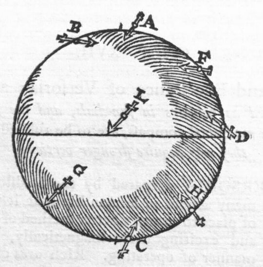 virtue
 arises in the iron that is excited. A is the best way of touching a
 versorium when the cusp touches the pole and faces it; B is a moderately
 good way, when, though facing it, it is a little way
 distant from
 the pole; also in like manner C is only moderately good on account of the
 cusp being turned away from the pole; D, which is farther distant, is
 hardly so good; F, which is prepared crosswise along a parallel, is bad;
 of no virtue and entirely irresponsive and feeble is the magnetick index
 L, which is rubbed along the æquator; oblique and not pointing towards
 the pole as G, and oblique, not pointing toward but turned away from the
 pole as H, are bad. These have been placed so that they might indicate
 the distinct forces of a round stone. But mechanicians very often have a
 stone tending more to a cone shape, and more powerful on account of that
 shape since the pole, on which they rub their wires, is at the apex of
 the projecting part. Sometimes the stone has on the top and above its own
 pole an artificial acorn or snout made of steel for the sake of its
 power. Iron needles are rubbed on the top of this; wherefore they turn
 toward the same pole as if they had been prepared on that part of the
 stone with the acorn removed. Let the stone be large enough and strong;
 the needle, even if it be rather long, should be sufficiently thick, not
 very slender; with a moderate cusp, not too sharp, although the virtue is
 not in the cusp itself only, but in the whole piece of iron. A strong
 large stone is not unfit for rubbing all needles on, excepting that
 sometimes by its strength it occasions some dip and disturbance in the
 iron in the case of longer needles; so that one which, having been
 touched before, rested in equilibrium in the plane of the horizon, now
 when touched and excited dips at one end, as far as the upright pin on
 which it turns permits it. Wherefore in the case of longer versoria, the
 end which is going to be the Boreal, before it is rubbed, should be a
 little lighter, so that it may remain exactly in æquilibrio after it is
 touched. But a needle in this way prepared does its * work worse the farther it is beyond the
 æquinoctial circle. Let the prepared needle be placed in its capsule, and
 let it not be touched by any other magneticks, nor remain in the near
 vicinity of them, lest by their opposing forces, whether powerful or
 sluggish, it should become uncertain and dull. If you also rub the other
 end of the needle on the other pole of the stone, the needle will perform
 its functions more steadily, especially if it be rather long. A piece of
 iron touched by a loadstone retains the magnetick virtue, excited in it
 even for ages, firm
 and strong, if it is placed according to nature meridionally and not
 along a parallel, and is not injured by rust or any external injury from
 the surrounding medium. Porta wrongly seeks for a proportion between the
 loadstone and the iron: because, he says, a little piece of iron will not
 be capable of holding much virtue; for it is consumed by the great force
 of the loadstone. A piece of iron receives its own virtue fully, even if
 it be only of the weight of one scruple, whilst the mass of the loadstone
 is a thousand pounds. It is also useless to make the needle rather flat
 at the end that is touched, so that it may be better and more perfectly
 magnetick, and that it may best receive and hold certain magnetick
 particles; since hardly any part will stick on a sharp point; because he
 thought that it was by the adhesion of parts of the loadstone (as it
 were, hairs) that the influence is imparted and conserved, though those
 particles are merely rubbed off by the rubbing of the iron over the
 softer stone, and the iron none the less points toward the North and
 South, if after it is touched it be scoured with sand or emery powder, or
 with any other material, even if by long rubbing of this kind the
 external parts of it are lessened and worn away. When a needle is being
 rubbed, one should always leave off at the end; otherwise, if it is
 rubbed on the loadstone from the point toward the middle, less verticity
 is excited in the iron, sometimes none at all, or very little. For where
 the last contact is, there is the pole and goal of verticity. In order
 that a stronger verticity may be produced in the iron by rubbing on the
 loadstone, one * ought in northern lands to turn the true
 northern pole of the loadstone toward the highest part of the sky; on
 this pole that end of the needle is going to be rubbed, which shall
 afterwards turn toward the north of the earth; whilst it will be an
 advantage for the other end of the needle to be rubbed on the southern
 pole of the terrella turned toward the earth, and this being so excited
 will incline toward the south. In southern regions beyond the æquator the
 plan is just the contrary. The reason of this dissimilarity is
 demonstrated, Book II., chap, xxxiv., in which it is shown (by a manifest
 combination of a terrella and the earth) why the poles of a loadstone,
 for different reasons, are one stronger than the other. If a needle be
 touched between the mutually accordant * poles of two
 loadstones, equal in power, shape, and mass, no strength
 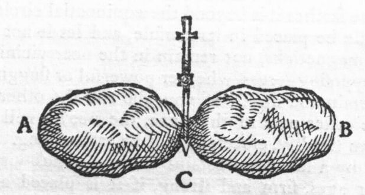 is acquired by the needle. A and B are two loadstones
 attracting one another, according to nature, at their dissimilar ends; C,
 the * point of a needle touched by both at once, is not
 excited (even if those loadstones be connected according to nature), if
 they are equal; but if they are not equal, virtue is acquired from the
 stronger. When a needle is being excited by a loadstone, begin in the
 middle, and draw the needle toward its end; at the end let the
 application be continued with a very gentle rubbing around the end for
 some time; that is to say, for one or two minutes; do not repeat the
 motion from the middle to the end (as is frequently done) for in this way
 the verticity is injured. Some delay is desirable, for although the power
 is imparted instantly, and the iron excited, yet from the vicinity of the
 loadstone and a suitable delay, a more steady verticity arises, and one
 that is more firmly durable in the iron. Although an armed stone raises a
 greater weight of iron than an unarmed one, yet a needle is not more
 strongly excited by an armed stone than by an unarmed one. Let there be
 two iron wires of the same length, wrought from the same wire; let one be
 excited by an armed end, the other by an unarmed end; it is manifest that
 the same needles have a beginning of motion or a sensible inclination at
 equal distances from the same armed and unarmed loadstone; this is
 ascertained by measuring with a longish reed. But objects which are more
 powerfully excited move more quickly; those which are less powerfully
 excited, more feebly, and not unless brought rather close; the experiment
 is made on water with equal corks.

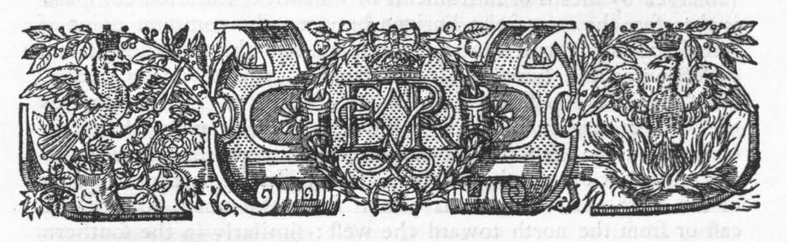

# BOOK FOURTH.

## *CHAP. I.*

### ON VARIATION.

Direction has hitherto been spoken of as
 if in nature there were no variation; for in the preceding natural
 history we wished to omit and neglect this, inasmuch as in a terrestrial
 globe, perfect and in every sense complete, there would be none. Since,
 however, in fact, the earth's magnetick direction, owing to some fault
 and slip, deviates from its right course and from the meridian, we must
 extract and demonstrate the obscure and hidden cause of that variance
 which has troubled and sore racked in vain the minds of many. Those who
 before us have written on the magnetick movements have made no
 distinction between direction and variation, but consider the motion of
 magnetick iron to be uniform and simple. Now true direction is the motion
 of the magnetick body to the true meridian and its continuance therein
 with its appropriate ends towards the poles. But it very often happens at
 sea and on land that the magnetick iron does not point to the true pole,
 and that not only a versorium and magnetick pieces of iron, and the
 needle of a compass, or a mariners' compass, but also a terrella in its
 boat, as well as * iron ore, iron stones, and magnetick earths,
 properly prepared, are drawn aside and deviate towards some point of the
 Horizon very near to the meridian. For they with their poles frequently
 face termini away from the meridian. This variation
 (observed by
 means of instruments or a nautical variation compass) is therefore the
 arc of the horizon between the common point of intersecion of it with the
 true meridian, and the terminus of the deflecion on the horizon or
 projection of the deviating needle. That arc varies and differs with
 change of locality. To the terminus of the variation is commonly assigned
 a great circle, called the circle of variation, and also a magnetick
 meridian passing through the zenith and the point of variation on the
 horizon. In the northern regions of the earth this variation is either
 from the north toward the east or from the north toward the west:
 similarly in the southern regions it is from the south toward the east or
 toward the west. Wherefore one should observe in the northern regions of
 the earth * that end of the versorium or compass which
 turns toward the North; but in the southern regions the other end looking
 to the south—which seamen and sciolists for the most part do not
 understand, for in both regions they observe only the boreal lily of the
 compass (that which faces North). We have before said that all the
 motions of the magnet and iron, all its turning, its inclination, and its
 settlement, proceed from bodies themselves magnetical and from their
 common mother the earth, which is the source, the propagatrix, and the
 origin of all these qualities and properties. Accordingly the earth is
 the cause of this variation and inclination toward a different point of
 the horizon: but how and by what powers must be more fully investigated.
 And here we must at the outset reject that common opinion of recent
 writers concerning magnetick mountains, or any magnetick rock, or any
 phantasmal pole distant from the pole of the earth, by which the motion
 of the compass or versorium is controlled. This opinion, previously
 invented by others, Fracastorio himself adopted and developed; but it is
 entirely at variance with experience. For in that case in different
 places at sea and on land the point of variation would change toward the
 east or west in proportion and geometrical symmetry, and the versorium
 would always respect the magnetick pole: but experience teaches that
 there is no such definite pole or fixed terminus on the earth to account
 for the variation. For the arcs of * variation are changed
 variously and erratically, not only on different meridians but on the
 same meridian; and when, according to this opinion of the moderns, the
 deviation should be more and more toward the east, then suddenly, with a
 small change of locality, the deviation is from the north toward the west
 as in the northern regions near Nova Zembla. Moreover, in the southern
 regions, and at sea at a great distance from the æquator towards the
 antarctick pole, there are frequent and great variations, and not only in
 the northern regions, from the magnetick mountains. But the cogitations
 of others are still more vain and trifling, such as that of Cortes about
 a moving influence beyond all the heavens; that of Marsilius Ficinus about
 a star in the Bear; that of Peter Peregrinus about the pole of the world;
 that of Cardan, who derives it from the rising of a star in the tail of
 the Bear; of
 Bessardus, the Frenchman, from the pole of the Zodiack; that of Livio
 Sanuto from some magnetick meridian; that of Franciscus Maurolycus from a
 magnetical island; that of Scaliger from the heavens and mountains; that
 of Robert Norman, the Englishman, from a point respective. Leaving
 therefore these opinions, which are at variance with common experience or
 by no means proved, let us seek the true cause of the variation. The
 great magnet or terrestrial globe directs iron (as I have said) toward
 the north and south; and excited iron quickly settles itself toward those
 termini. Since, however, the globe of the earth is defective and uneven
 on its surface and marred by its diverse composition, and since it has
 parts very high and convex (to the height of some miles), and those
 uniform neither in composition nor body, but opposite and dissimilar: it
 comes to pass that the whole of that force of the earth diverts
 magnetical bodies in its periphery toward the stronger and more prominent
 connected magnetick parts. Hence on the outermost surface of the earth
 magnetical bodies are slightly perverted from the true meridian.
 Moreover, since the surface of the globe is divided into high lands and
 deep seas, into great continental lands, into ocean and vastest seas, and
 since the force of all magnetical motions is derived from the constant
 and magnetick terrestrial nature which is more prevalent on the greater
 continent and not in the aquæous or fluid or unstable part; it follows that in
 certain parts there would be a magnetick inclination from the true pole
 east or west away from any meridian (whether passing through seas or
 islands) toward a great land or continent rising higher, that is,
 obviously toward a stronger and more elevated magnetick part of the
 terrestrial globe. For since the diameter of the earth is more than 1,700
 German miles, those large lands can rise from the centre of the earth
 more than four miles above the depth of the ocean bottom, and yet the
 earth will retain the form of a globe although somewhat uneven at the
 top. Wherefore a magnetical body is turned aside, so far as the true
 verticity, when disturbed, admits, and departs from its right (the whole
 earth moving it) toward a vast prominent mass of land as though toward
 what is stronger. But the variation does really take place, not so much
 because of the more prominent and imperfect terrestrial parts and
 continent lands as because of the inæquality of the magnetick globe, and
 because of the real earth, which stands out more under the continent
 lands than under the depths of the seas. We must see, therefore, how the
 *apodixis* of this theory can be sustained by more definite
 observations. Since throughout all the course from the coast of Guinea to
 Cape Verde, the Canary Isles, and the border of the kingdom of Morocco,
 and thence along the coasts of Spain, France,
 England, Belgium, Germany, Denmark, and Norway, there lie on the right
 hand and toward the east a continent and extensive connected regions, and
 on the left extensive seas and a vast ocean lie open far and wide, it is
 consonant with the theory (as has been carefully observed by many) that
 magnetical bodies should turn slightly to the East from the true pole
 toward the stronger and more remarkable elevations of the earth. But it
 is far otherwise on the eastern shores of northern America; for from
 Florida by Virginia and Norumbega to Cape Race and away to the north the
 versorium is turned toward the west. But in the middle spaces, so to
 speak, as in the more westerly Azores, it looks toward the true pole.
 That any magnetick body turns itself similarly to the same regions of the
 earth is not, however, because of that meridian or because of the
 concordancy of the meridian with any magnetick pole, as the crowd of
 philosophizers reckon, for it is not so throughout the whole of that
 meridian. For on the same meridian * near Brazil something very
 different occurs, as we will show further on. The variation (cæteris
 paribus) is always less near the æquator, greater in higher latitudes,
 with the limitation that it be not very near the pole itself. Hence the
 variation is greater on the coast of * Norway and Belgium
 than on the coast of Morocco or Guinea: greater also near Cape Race than
 in the harbours of Norumbega or of Virginia. On the coast of Guinea
 magnetick implements deviate by a third part of one rumbe to the East: in
 Cape Verde Islands by a half: on the coast of Morocco by two thirds: in
 England at the mouth of the Thames by a whole rumbe: and at London by
 nearly eleven degrees and one third. For indeed the moving magnetick
 virtue is stronger in a higher latitude; and the larger regions extending
 toward the poles dominate the more, as is easily apparent anywhere on a
 terrella. For as in the case of true Direction magnetick bodies tend
 toward the pole (namely, toward the stronger end, the whole earth causing
 the motion), so also do they incline a little toward the stronger and
 higher parts by the action of the whole along with the conjoint action of
 iron bodies.

## CHAP. II.

### That the variation is caused by the inæquality of the *projecting parts of the earth*.

Demonstration of this may manifestly be
 made 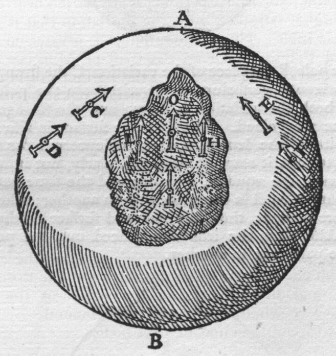 * by means of a terrella in the following way: let there
 be a round loadstone somewhat imperfect in some part, and impaired by
 decay (such an one we had with a certain part corroded to resemble the
 Atlantick or great Ocean): place upon it some fine iron wire of the
 length of two barleycorns, as in the following figure. A B, a Terrella in
 certain parts somewhat imperfect and of unæqual virtue on the
 circumference. The versoria E, F, do not vary, but look directly to the
 pole A; for they are placed in the middle of the firm and sound part of
 the terrella and somewhat distant from the imperfect part: that part of
 the surface which is distinguished by dots and transverse lines is the
 weaker. The versorium O also does not vary (because it is placed in the
 middle of the imperfect part), but is directed toward the pole, Page
 156 just as
 near the western Azores on the earth. The versoria H and L do vary, for
 they incline toward the sounder parts very near them. As this is manifest
 in a terrella whose surface is sensibly rather imperfect, so also is it
 in others whole and perfect, when often one part of the stone has
 stronger external parts, which nevertheless do not disclose themselves
 manifestly to the senses. In such a terrella the demonstration of the
 variation and the discovery of the stronger parts is on this wise. 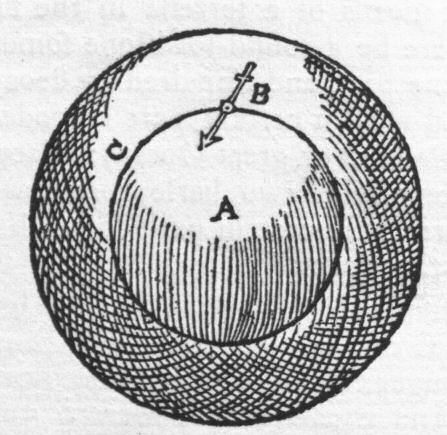 * Let A be the pole, B the place of the variation, C the
 stronger regions; then the horizontal versorium at B varies from the pole
 A toward C: so that both the variation is shown and the stronger places
 of the loadstone recognized. The stronger surface is also found by a fine
 iron wire of the length of two barleycorns: for since at the pole of the
 terrella it rears up perpendicularly, but in other places inclines toward
 the æquator, if in one and the same parallel circle it should be more
 erect in one place than in another; where the wire is raised more
 upright, there the part and surface of the terrella is stronger. Also
 when the iron wire placed over the pole inclines more to one part than to
 another. 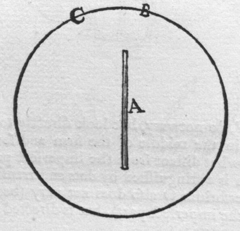 * Let the experiment be made by means of a
 fine iron wire of three digits length placed over the pole A, so that its
 middle lies over the pole. Then one end is turned away from B toward C,
 and is not willing to lie quietly toward B; but on a terrella which is
 perfect all round and
 even it rests on the pole directed toward any point of the æquator you
 please. Otherwise, let there be two * 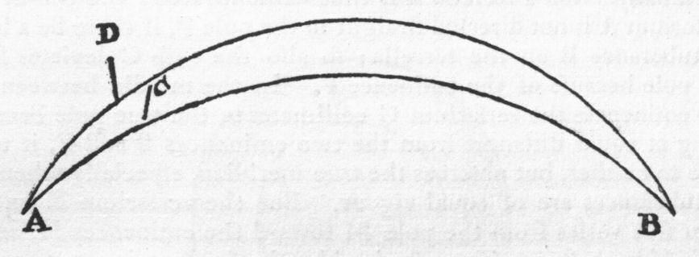 meridians meeting in the poles A B, let iron wires be
 reared just at the ends D and C of the equal arcs D A and C A; then the
 wire at D (the stronger region) will be more raised up than that at C,
 the weaker. And thus the sounder and stronger part of the loadstone is
 recognized, which otherwise would not be perceived by the touch. In a
 terrella which is perfect, and even, and similar in all its parts, there
 is, at equal distances from the pole, no variation. Variation is shown by means of a
 terrella, a considerable part of which, forming a surface a little higher
 than the rest, does, although it be not decayed and broken, allure the
 versorium from the true * direction (the whole terrella
 co-operating).

A terrella uneven in surface.

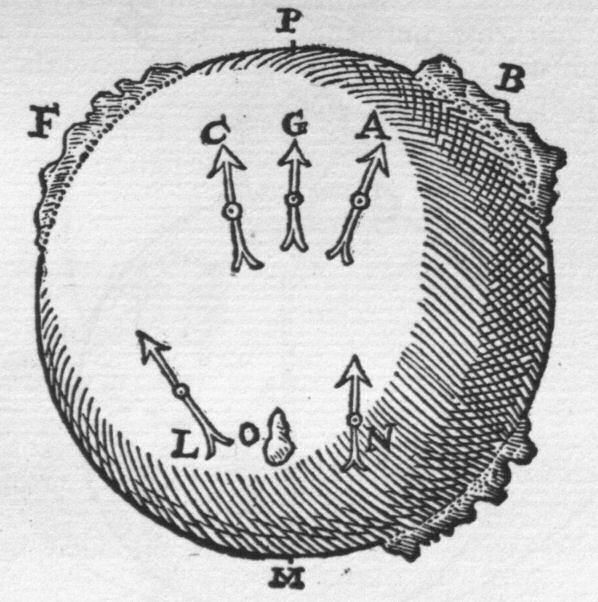

It is shown by a small spike placed over a terrella or by a small
 versorium; for they are turned by the terrella toward the mass that
 stands out and toward the large eminences. In the same way on the earth
 the verticity is perturbed by great continents, which are mostly elevated
 above the depths of the seas and make the versorium deviate sometimes
 from the right tracks (that is, from the true meridians). On a terrella
 it is thus demonstrated: the end of the versorium A is not directed
 straight to the pole P, if there be a large protuberance B on the
 terrella; so also the cusp C deviates from the pole because of the
 eminence F. In the middle between the two eminences the versorium G
 collimates to the true pole because, being at equal distances from the
 two eminences B and F, it turns aside to neither, but observes the true
 meridian, especially when the protuberances are of equal vigour. But the
 versorium N on the other side varies from the pole M toward the eminences
 H, and is not held back, stopped, or restrained by the small eminence O
 on the terrella (as it were, some island of land in the ocean). L,
 however, being unimpeded, is directed to the pole M. The variation is
 demonstrated in another way on a terrella, just as on the earth. Let A be
 the pole of the earth, B the equator, C the parallel circle of latitude
 of 30 degrees, D a great eminence spread out toward the pole, E another
 eminence spread out from the pole toward the æquator. It is manifest that
 in the middle of D the versorium F does not vary; while G
 is very greatly deflected: but H very little, because it is further
 removed from D. Similarly also the versorium I placed directly toward E
 does not deviate from the pole: but L and M turn themselves away from the
 pole A toward the eminence E.

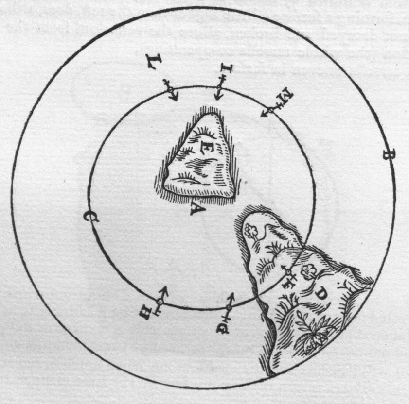

## CHAP. III.

### The variation in any one place *is constant*.

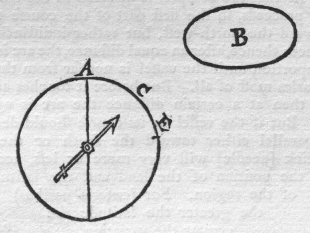

Vnless there should be a great dissolution
 of a continent and a subsidence of the land such as there was of the
 region Atlantis of which Plato and the ancients tell, the variation will
 continue perpetually immutable; the arc of the variation remains the same
 in the same place or region, whether it be at sea or on land, as in times
 past a magnetick body has declined toward the East or the West. The
 constancy of the variation and the pointing of the versorium to a
 definite point on the horizon in individual regions is demonstrated by a
 small versorium placed over a terrella the surface of which is uneven:
 for it always deviates from the meridian by an equal arc. It is also
 shown by the inclination of a versorium toward a second magnet; although
 in reality it is by the turning power of the whole, whether in the earth
 or in a terrella. Place upon a plane a versorium whose cusp is directed
 toward the north A: place beside it a loadstone, B, at such a distance
 that the versorium may turn aside toward B to the point C, and not
 beyond. Then move the needle of the versorium as often as you will (the
 box and the loadstone not being moved), and it will certainly always
 return to the point C. In the same manner, if you placed the stone so
 that it may be truly directed toward E, the cusp always reverts to E, and
 not to any other point of the compass. Accordingly, from the position of
 the land and from the distinctive nature of the highest parts of the
 earth (certain terrene and more magnetick eminences of the regions
 prevailing), the variation indeed becomes definite in one and the same
 place, but diverse and unæqual from a change of place, since the true and
 polar direction originating in the whole terrestrial globe is diverted
 somewhat toward certain stronger eminences on the broken surface.

## CHAP. IIII.

### The arc of variation is not changed equally *in proportion to the distance of places*.

In the open sea, when a vessel is borne by
 a favourable wind along the same parallel, if the variation be changed by
 one degree in the course of one hundred miles, the next hundred miles do
 not therefore lessen it by another degree; for the magnetick [needle]
 varies erratically as respects position, form, and vigour of the land,
 and also because of the distance. As, for example, when a course from the
 Scilly Isles to Newfoundland has proceeded so far that the compass is
 directed to the true pole, then, as the vessel proceeds, in the first
 part of the course the variation increases toward the north-west, but rather indistinctly
 and with small difference: thence, after an equal distance, the arc is
 increased in a greater proportion until the vessel is not far from the
 continent: for then it varies most of all. But before it touches actual
 land or enters port, then at a certain distance the arc is again slightly
 diminished. But if the vessel in its course should decline greatly from
 that parallel either toward the south or the north, the magnetick
 [needle] will vary more or less, according to the position of the land
 and the latitude * of the region. For (cæteris paribus) the
 greater the latitude the greater the variation.

## CHAP. V.

### An island in Ocean does not change the variation, as *neither do mines of loadstone*.

Islands, although they be more magnetick
 than the sea, yet do not change the magnetick directions or variations.
 For since direction is a motion derived from the power of the whole
 earth, not from the attraction of any hill but from the disposing and
 turning power of the whole; so variation (which is a perturbation of the
 direction) is an aberration of the real turning power arising from the
 great inequalities of the earth, in consequence of which it, of itself,
 slightly diverts movable magneticks toward those which are the largest
 and the more powerful. The cause now shown may suffice to explain that
 which some so wonder at about the Island of Elba (and although this is
 productive of loadstone, yet the versorium (or mariners' compass) makes
 no special inclination toward it whenever vessels approach it in the
 Tyrrhenian sea); and the following causes are also to be considered,
 viz.: that the virtue of smaller magnetick bodies extends scarcely or not
 at all of itself beyond their own mines: for variation does not occur
 because of attraction, as they would have it who have imagined magnetick
 poles. Besides, magnetick mines are only agnate to the true earth, not
 innate: hence the whole globe does not regard them, and magneticks are
 not borne to them, as is demonstrated by the diagram of eminences.

## CHAP. VI.

### That variation and direction arise from the disponent *power of the earth, and from the natural magnetick tendency* to rotation, not from attraction, or from coition, *or from other occult cause*.

Owing to the loadstone being supposed
 (amongst the crowd of philosophizers) to seize and drag, as it were,
 magnetick bodies; and since, in truth, sciolists have remarked no other
 forces than those so oft besung of attractive ones, they therefore deem
 every motion toward the north and south to be caused by some alluring and
 inviting quality. But the Englishman, Robert Norman, first
 strove to show that it is not caused by attraction: wherefore, as if
 tending toward hidden principles, he imagined a *point respective*, toward which the iron
 touched by a loadstone would ever turn, not a *point attractive*;
 but in this he erred greatly, although he effaced the former error about
 attraction. He, however, demonstrates his opinion in this way:

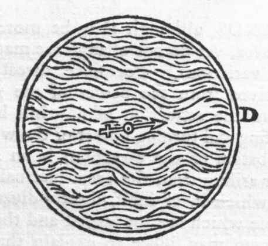

Let there be a round vessel filled with water: in the middle of the
 surface of the water place a slender iron wire on a perfectly round cork,
 so that it may just float in æquilibrium on the water; let the wire be
 previously touched by a magnet, so that it may more readily show the
 point of variation, the point D as it were: and let it remain on the
 surface for some time. It is demonstrable that the wire together with the
 cork is not moved to the side D of the vessel: which it would do if an
 attraction came to the iron wire by D: and the cork would be moved out of
 its place. This assertion of the Englishman, Robert Norman, is plausible
 and appears to do away with attraction because the iron remains on the
 water not moving about, as well in a direction toward the pole itself (if
 the direction be true) as in a variation or altered direction; and it is
 moved about its own centre without any transference to the edge of the
 vessel. But direction does not arise from attraction, but from the
 disposing and turning power which exists in the whole earth, not in the
 pole or in some other attracting part of the stone, or in any mass rising
 above the periphery of the true circle so that a 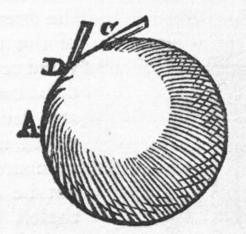 variation
 should occur because of the attraction of that mass. Moreover, it is the
 directing power of the loadstone and iron and its natural power of
 turning around the centre which cause the motion of direction, and of
 conformation, in which is included also the motion of the dip. And the
 terrestrial pole does not attract as if the terrene force were implanted
 only in the pole, for the magnetick force exists in the whole, although
 it predominates and excels at the pole. Wherefore that the cork should
 rest quiescent in the middle and that the iron excited by a loadstone
 should not be moved toward the side of the vessel are agreeable to and in
 conformity with the magnetick nature, as is
 demonstrated by a terrella: for an iron spike placed on the stone at C
 clings on at C, and is not pulled * further away by the pole A,
 or by the parts near the pole: hence it persists at D, and takes a
 direction toward the pole A; nevertheless it clings on at D and dips also
 at D in virtue of that turning power by which it conforms itself to the
 terrella: of which we will say more in the part *On
 Declination*.

## CHAP. VII.

### Why the variation from that lateral cause is not *greater than has hitherto been observed, having been* rarely seen to reach two points of the mariners' *compass, except near the pole*.

The earth, by reason of lateral eminences
 of the stronger globe, diverts iron and loadstone by some degrees from
 the true pole, or true meridian. As, for example, with us English at
 London it varies eleven degrees and ⅓: in some other places the
 variation is a little greater, but in no other region is the end of the
 iron ever moved aside very much more from the meridian. For as the iron
 is always directed by the true verticity of the earth, so the polar
 nature of the continent land (just as of the whole terrene globe) acts
 toward the poles: and even if that mass divert magnetick bodies from the
 meridian, yet the verticity of those lands (as also of the whole earth)
 controls and disposes them so that they do not turn toward the East by
 any greater arc. But it is not easy to determine by any general method
 how great the arc of variation is in all places, and how many degrees and
 minutes it subtends on the horizon, since it becomes greater or less
 from
 diverse causes. For both the strength of true verticity of the place and
 of the elevated regions, as well as their distances from the given place
 and from the poles of the world, must be considered and compared; which
 indeed cannot be done exactly: nevertheless by our method the variation
 becomes so known that no grave error will perturb the course at sea. If
 the positions of the lands were uniform and straight along meridians, and
 not defective and rugged, the variations near lands would be simple; such
 as appear in the following figure.

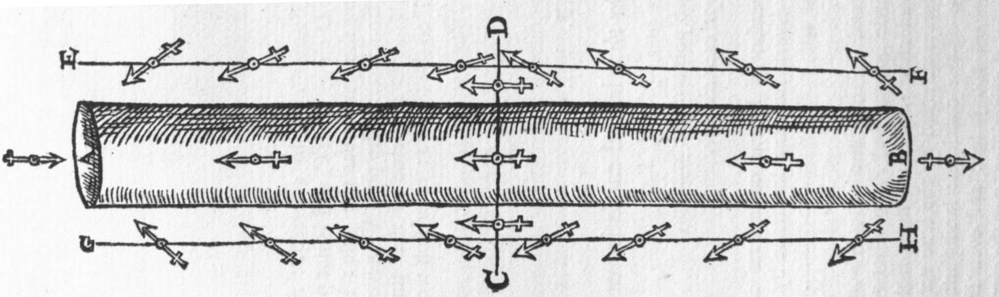

This is demonstrated by a long loadstone the poles of which are in the
 ends A B; let C D be the middle line and the æquinoctial, and let G H and
 E F (the lines) be for meridians on which versoria are disposed, the
 variations of which are greater at a greater distance from the æquator.
 But the inequalities of the maritime parts of the habitable earth, the
 enormous promontories, the very wide gulfs, the mountainous and more
 elevated regions, render the variations more unequal, or sudden, or more
 obscure; and, moreover, less certain and more inconstant in the higher
 latitude.

## CHAP. VIII.

### On the construction of the common mariners' compass, and on the diversity of the compasses *of different nations*.

In a round hollow wooden bowl, all the upper part
 of which is closed with glass, a versorium is placed upon a rather long
 pin which is fixed in the middle. The covering prevents the wind, and the
 motion of air from any external cause. Through the glass everything
 within can be discerned. The versorium is circular, consisting of some
 light material (as card), to the under part of which the magnetick pieces
 of iron are attached. On the upper part 32 spaces (which are commonly
 called *points*) are assigned to the same number of mathematical
 intervals in the horizon or winds which are distinguished by certain
 marks and by a lily indicating the north. The bowl is suspended in the
 plane of the horizon in æquilibrium in a brass ring which also is itself
 suspended transversely in another ring within a box sufficiently wide
 with a leaden weight attached; hence it conforms to the plane of the
 horizon even though the ship be tossed to and fro by the waves. The iron
 works are either a pair with their ends united, or else a single one of a
 nearly oval shape with projecting ends, which does its work more
 certainly and more quickly. This is to be fitted to the cardboard circle
 so that the centre of the circle may be in the middle of the magnetick
 iron. But inasmuch as variation arises horizontally from the point of the
 meridian which cuts the horizon at right angles, therefore on account of
 the variation the makers in different regions and cities mark out the
 mariners' compass in different ways, and also attach in different ways
 the magnetick needles to the cardboard circle on which are placed the 32
 divisions or points. Hence there are commonly in Europe 4 different
 constructions and forms. First that of the States on the Mediterranean
 Sea, Sicily, Genoa, and the Republick of Venice. In all these the needles
 are attached under the rose or lily on the cardboard versorium, so that
 (where there is no variation) they are directed to the true north and
 south points. Wherefore the north part marked with the lily always shows
 exactly the point of variation when the apex itself of the lily on the
 movable circle, together with the ends of the magnetick wires attached
 below, rests at the point of variation. Yet another is that of Dantzig,
 and throughout the Baltic Sea, and the Belgian provinces;
 in which the
 iron works fixed below the circle diverge from the lily ¼ of a rumbe to
 the east. For navigation to Russia the divergency is ⅔. But the
 compasses which are made at Seville, Lisbon, Rochelle, Bordeaux, Rouen,
 and throughout all England have an interval of ½ a rumbe. From those
 differences most serious errors have arisen in navigation, and in the
 marine science. For as soon as the bearings of maritime places (such as
 promontories, havens, islands) have been first found by the aid of the
 mariners' compass, and the times of sea-tide or high water determined
 from the position of the moon over this or that point (as they say) of
 the compass, it must be further inquired in what region or according to
 the custom of what region that compass was made by which the bearings of
 those places and the times of the sea-tides were first observed and
 discovered. For one who should use the British compass and should follow
 the directions of the marine charts of the Mediterranean Sea would
 necessarily wander very much out of the straight course. So also he that
 should use the Italian compass in the British, German, or Baltic Sea,
 together with marine charts that are made use of in those parts, will
 often stray from the right way. These different constructions have been
 made on account of the dissimilar variations, so that they might avoid
 somewhat serious errors in those parts of the world. But Pedro Nuñez
 seeks the meridian by the mariners' compass, or versorium (which the
 Spanish call the needle), without taking account of the variation: and he
 adduces many geometrical demonstrations which (because of his slight use
 and experience in matters magnetical) rest on utterly vicious
 foundations. In the same manner Pedro de Medina, since he did not admit
 variation, has disfigured his *Arte de Navegar* with many
 errors.

## CHAP. IX.

### Whether the terrestrial longitude can be found from *the variation*.

Grateful would be this work to seamen, and
 would bring the greatest advance to Geography. But B. Porta in chap. 38
 of book 7 is mocked by a vain hope and fruitless opinion. For when he
 supposes that the magnetick needle would follow order and proportion in
 moving along meridians, so that "the neerer it is to the east, the more
 it will decline from the Meridian line, toward the east; and the neerer
 it comes to the west, the point of the needle will decline the more
 to the west" (which is totally untrue), he thinks that he has discovered
 a true index of longitude. But he is mistaken. Nevertheless, admitting
 and assuming these things (as though they were perfectly true), he makes
 a large compass indicating degrees and minutes, by which these
 proportional changes of the versorium might be observed. But those very
 principles are false, and ill conceived, and very ill considered; for the
 versorium does not turn more to the east because a journey is made toward
 the east: and although the variation in the more westerly parts of Europe
 and the adjoining ocean is to the east and beyond the Azores is changed a
 little to the west, yet the variation is, in various ways, always
 uncertain, both on account of longitude and of latitude, and because of
 the approach toward extensive tracts of land, and also because of the
 form of the dominant terrestrial eminences; nor does it, as we have
 before demonstrated, follow the rule of any particular meridian. It is
 with the same vanity also that Livio Sanuto so greatly torments himself
 and his readers. As for the fact that the crowd of philosophizers and
 sailors suppose that the meridian passing through the Azores marks the
 limits of variation, so that on the other and opposite side of that
 meridian a magnetick body necessarily respects the poles exactly, which
 is also the opinion of Joannes Baptista Benedictus and of many other
 writers on navigation, it is by no means true. Stevinus (on the authority
 of Hugo Grotius) in his *Havenfinding Art* distinguishes the
 variation according to the meridians: "It may be seene in the Table of
 variations, that in *Coruo* the Magneticall needle pointeth due
 North: but after that, the more a man shal goe towards the East, so much
 the more also shall he see the needle varie towards the East [ἀνατολίζειν],
 till he come one mile to the Eastward from *Plimouth*, where the
 variation comming to the greatest is 13 degr. 24 min. From hence the
 Northeasting [Anatolismus] beginneth to decrease, til you come to
 *Helmshude* (which place is Westward from the North Cape of Finmark)
 where againe the needle pointeth due North. Now the longitude from
 *Coruo* to *Helmshude* is 60 degr. Which things being well
 weighed, it appeareth that the greatest variation [Chalyboclysis] 13
 degr. 24 minutes at *Plimmouth* (the longitude whereof is 30 degr.)
 is in the midst betweene the places where the needle pointeth due North."
 But although this is in some part true in these places, yet it is by no
 means true that along the whole of the meridian of the island of Corvo
 the versorium looks truly to the north; nor on the meridian of Plymouth
 is the variation in other places 13 deg. 24 min.—nor again in other
 parts of the meridian of Helmshuda does it point to the true pole. For on
 the meridian passing through Plymouth in Latitude 60 degrees the
 North-easterly variation is greater: in Latitude 40 deg. much less; in
 Latitude 20 deg. very small indeed. On the meridian of Corvo, although
 there is no variation near the island, yet in Latitude 55 degrees the
 variation is about ½ a rumbe to the North-west; in Latitude 20 deg. the
 versorium inclines ¼ of a rumbe toward the East. Consequently the limits
 of variation are not conveniently determined by means of great circles
 and meridians, and much less are the ratios of the increment or decrement
 toward any part of the heavens properly investigated by them. Wherefore
 the rules of the abatement or augmentation of Northeasting or
 Northwesting, or of increasing or decreasing the magnetick deviation, can
 by no means be discovered by such an artifice. The rules which follow
 later for variation in southern parts of the earth investigated by the
 same method are altogether vain and absurd. They were put forth by
 certain Portuguese mariners, but they do not agree with the observations,
 and the observations themselves are admitted to be bad. But the method of
 haven-finding in long and distant voyages by carefully observed variation
 (such as was invented by Stevinus, and mentioned by Grotius) is of great
 moment, if only proper instruments are in readiness, by which the
 magnetick deviation can be ascertained with certainty at sea.

## CHAP. X.

### Why in various places near the pole the variations are much more ample than in a *lower latitude*.

Variations are often slight, and generally
 null, when the versorium is at or near the earth's æquator. In a higher
 Latitude of 60, 70 or 80 deg. there are not seldom very wide variations.
 The cause of this is to be sought partly from the nature of the earth and
 partly from the disposition of the versorium. The earth turns magnetick
 bodies and at the æquator directs them strongly toward the pole: at the poles there is no
 direction, but only a strong coition through the congruent poles.
 Direction is therefore weaker near the poles, because by reason of its
 own natural tendency to turn, the versorium dips very much, and is not
 strongly directed. But since the force of those elevated lands is more
 vigorous, for the virtue flows from the whole globe, and since also the
 causes of variation are nearer, therefore the versorium deflects the more
 from its true direction toward those eminences. It must also be known
 that the direction of the versorium on its pin along the plane of the
 Horizon is much stronger at the æquator than anywhere else by reason of
 the disposition of the versorium; and this direction falls off
 with an increase of latitude. For on the æquator the versorium is,
 following its natural property, directed along the plane of the horizon;
 but in other places it is, contrary to its natural property, compelled
 into æquilibrium, and remains there, compelled by some external force:
 because it would, according to its natural property, dip below the
 horizon in proportion to the latitude, as we shall demonstrate in the
 book *On Declination*. Hence the direction falls off and at the pole
 is itself nothing: and for that reason a feebler direction is easily
 vanquished by the stronger causes of variation, and near the pole the
 versorium deflects the more from the meridian. It is demonstrated by
 means of a terrella: if an iron wire of two digits length be placed on
 its æquator, it will be strongly and rapidly directed toward the poles
 along the meridian, but more weakly so in the mid-intervals; while near
 the poles one may discern a precipitate variation.

## CHAP. XI.

### Cardan's error when he seeks the distance of the *centre of the earth from the centre of the cosmos by the* motion of the stone of Hercules; in his *book 5, On Proportions*.

One may very easily fall into mistakes and
 errors when one is searching into the hidden causes of things, in the
 absence of real experiments, and this is easily apparent from the crass
 error of Cardan; who deems himself to have discovered the distances of
 the centres of the cosmos and of the earth through a variation of the
 magnetick iron of 9 degrees. For he reckoned that everywhere on the earth
 the point of variation on the Horizon is always distant nine degrees from
 the true north, toward the east: and from thence he forms, by a most
 foolish error, his demonstrative ratio of the separate centres.

## CHAP. XII.

### On the finding of the amount of variation: how great *is the arc of the Horizon from its arctick or antarctick* intersection of the meridian, to the point *respective of the magnetick needle*.

Virtually the true meridian is the chief
 foundation of the whole matter: when that is accurately known, it will be
 easy by a mariners' compass (if its construction and the mode of
 attachment of the magnetick iron works are known) or by some other larger
 horizontal versorium to exhibit the arc of variation on the Horizon. By
 means of a sufficiently large nautical variation compass (two equal
 altitudes of the sun being observed before and after midday), the
 variation becomes known from the shadow; the altitude of the sun is
 observed either by a staff or by a rather large quadrant.

On land the variation is found in another way which is easier, and
 because of the larger size of the instrument, more accurate. Let a thick
 squared board be made of some suitable wood, the surface of which is two
 feet in length and sixteen inches in width: describe upon it some
 semicircles as in the following figure, only more in number. In the
 centre let a brass style be reared perpendicularly: let there be also a
 movable pointer reaching from the centre to the outmost semicircle, and a
 magnetick versorium in a cavity covered over with glass: then let the
 board be exactly adjusted to the level of the Horizon by the plane
 instrument with its perpendicular; and turn the lily of the instrument
 toward the north, so that the versorium may rest truly over the middle
 line of the cavity, which looks toward the point of variation on on the
 Horizon. Then at some convenient hour in the morning (eight or nine for
 instance) observe the apex of the shadow thrown by the style when it
 reaches the nearest semicircle and mark the place of the apex of this
 shadow with chalk or ink: then bring round the movable index to that
 mark, and observe the degree on the Horizon numbered from the lily, which
 the index shows. In the afternoon see when the end of the shadow shall
 again reach the periphery of the same semicircle, and, bringing the index
 to the apex of the shadow, seek for the degree on the other side of the
 lily. From the difference of the degrees becomes known 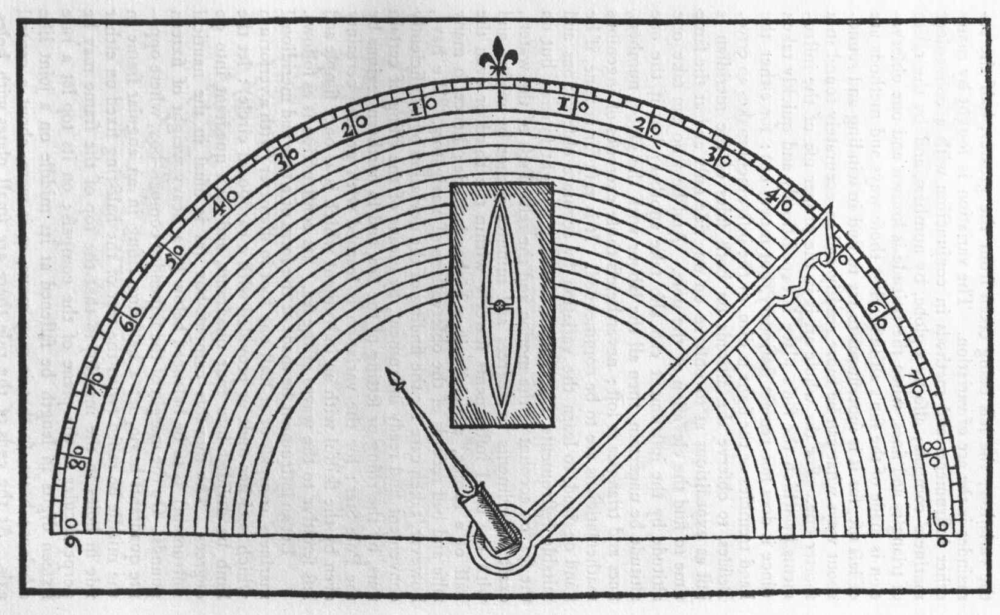 Page
 172 the
 variation; the less being taken from the greater, half the remainder is
 the arc of variation. The variation is sought by many other instruments
 and methods in conjunction with a convenient mariners' compass; also by a
 globe, by numbers, and by the ratios of triangles and sines, when the
 latitude is known and one observation is made of the sun's altitude: but
 those ways and methods are of less use, for it is superfluous to try to
 find in winding and roundabout ways what can be more readily and as
 accurately found in a shorter one. For the whole art is in the proper use
 of the instruments by which the sun's place is expeditiously and quickly
 taken (since it does not remain stationary, but moves on): for either the
 hand trembles or the sight is dim, or the instrument makes an error.
 Besides, to observe the altitude on both sides of the meridian is just as
 expeditious as to observe on one side only and at the same time to find
 the elevation of the pole. And he who can take one altitude by the
 instrument can also take another; but if the one altitude be uncertain,
 then all the labour with the globe, numbers, sines and triangles is lost;
 nevertheless those exercises of ingenious mathematicians are to be
 commended. It is easy for anyone, if he stand on land, to learn the
 variation by accurate observations and suitable instruments, especially
 in a nearly upright sphere; but on the sea, on account of the motion and
 the restlessness of the waters, exact experiments in degrees and minutes
 cannot be made: and with the usual instruments scarcely within the third
 or even the halt of a rumbe, especially in a higher latitude; hence so
 many false and bad records of the observations of navigators. We have,
 however, taken care for the finding of the deviation by a sufficiently
 convenient and ready instrument, by means of the rising of certain stars,
 by the rising or setting of the sun, and in northern regions by the Pole
 Star: for the variation is learned with greater certainty even by the
 skilful with an instrument which is at once simple and less sensitive to
 the waves of the sea. Its construction is as follows.

Let an instrument
 be made of the form of a true and meridional mariners' compass of at
 least one foot in diameter (with a versorium which is either nude or
 provided with a cardboard circle): let the limb be divided into four
 quadrants, and each quadrant into 90 degrees. The movable compass-box (as
 is usual in the nautical instrument) is to be balanced below by a heavy
 weight of sixteen pounds. On the margin of the suspended compass-box,
 where opposite quadrants begin, let a half-ring rising in an angular
 frame in the middle be raised (with the feet of the half-ring fixed on
 either side in holes in the margin) so that the top of the frame may be
 perpendicular to the plane of the compass; on its top let a rule sixteen
 digits in length be fastened at its middle on a joint like a balance
 beam, so that it may move, as it were, about a central axis. At the ends
 of the rule there are small plates with holes, 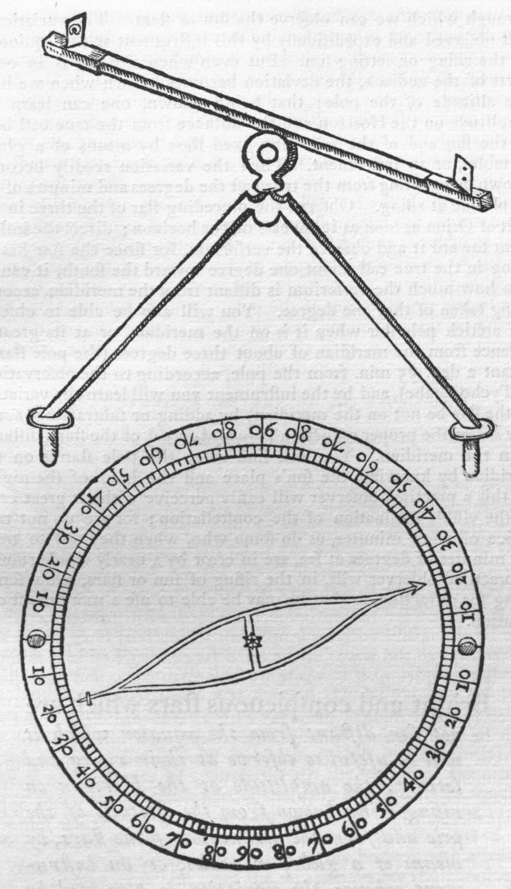
 through which
 we can observe the sun or stars. The variation is best observed and
 expeditiously by this instrument at the equinoxes by the rising or
 setting sun. But even when the sun is in other parts of the zodiack, the
 deviation becomes known when we have the altitude of the pole: that being
 known, one can learn the amplitude on the Horizon and the distance from
 the true east both of the sun and of the following fixed stars by means
 of a globe, or tables, or an instrument. Then the variation readily
 becomes known by counting from the true east the degrees and minutes of
 the amplitude at rising. Observe the preceding star of the three in the
 Belt of Orion as soon as it appears on the horizon; direct the instrument
 toward it and observe the versorium, for since the star has its rising in
 the true east about one degree toward the south, it can be seen how much
 the versorium is distant from the meridian, account being taken of that
 one degree. You will also be able to observe the arctick pole star when
 it is on the meridian, or at its greatest distance from the meridian of
 about three degrees (the pole star is distant 2 deg. 55 min. from the
 pole, according to the observations of Tycho Brahe), and by the
 instrument you will learn the variation (if the star be not on the
 meridian) by adding or subtracting, *secundum artem*, the proper
 reduction [*prostaphæresis*] of the star's distance from the
 meridian. You will find when the pole star is on the meridian by knowing
 the sun's place and the hour of the night: for this a practised observer
 will easily perceive without great error by the visible inclination of
 the constellation: for we do not take notice of a few minutes, as do some
 who, when they toil to track the minutes of degrees at sea, are in error
 by a nearly whole rumbe. A practised observer will, in the rising of sun
 or stars, allow something for refraction, so that he may be able to use a
 more exact calculation.

### Bright and conspicuous stars which are *not far distant from the equator which it will be useful to observe at their rising and setting: the amplitude at the Horizon on rising being known from the altitude of the pole and from the declination of the stars, by means of a globe, or tables, or an instrument whence the variation is perceived by technical calculation.*

| | *Right Ascension* | *Declination* |

| Oculus Tauri | 62° 55' | 15° 53' N |

| Sinister humerus Orionis | 72° 24' | 4° 5' N |

| Dexter humerus Orionis | 83° 30' | 6° 19' N |

| Præcedens in cingulo Orionis | 77° 46' | 1° 16' S |

| Canis major | 97° 10' | 15° 55' S |

| Canis minor | 109° 41' | 5° 55' N |

| Lucida Hydræ | 137° 10' | 5° 3' S |

| Caput Geminorum australe | 110° 21' | 28° 30' N |

| Caput boreale | 107° 4' | 32° 10' N |

| Cor Leonis | 146° 8' | 13° 47' N |

| Cauda Leonis | 171° 38' | 16° 30' N |

| Spica Virginis | 195° 44' | 8° 34' S |

| Arcturus | 29° 13' | 21° 54' N |

| Cor Aquilæ | 291° 56' | 7° 35' N |

*An instrument for finding the amplitude
at rising on the horizon.*

Describe the circumference of a circle and let it be divided into
 quadrants by two diameters intersecting each other at right angles at its
 centre. One of these will represent the æquinoctial circle, the other the
 axis of the world. Let each of these quadrants be divided (in the
 accustomed way) into 90 degrees; on every fifth or tenth of which at each
 end of each diameter and on each side let marks (showing the numbers) be
 inscribed on the two limbs or margins made for that purpose outside the
 circumference. Then from each degree straight lines are drawn parallel to
 the æquator. You will then prepare a rule or alhidade equal to the
 diameter of that circle and divided throughout into the same parts into
 which the diameter of the circle representing the axis of the world is
 divided. Let there be left a small appendage attached to the middle of
 the rule, by which the middle of the fiducial line itself of the rule may
 be connected with the centre of the circle: but to every fifth or tenth
 part of that rule let numbers be attached proceeding from the centre
 toward each side. This circle represents the plane of the meridian; its
 centre the actual point of east or west, *i.e.*, the common
 intersection of the horizon and æquator; all those lines æquidistant from
 the æquator denote the parallels of the sun and stars; the fiducial line
 of the rule or alhidade represents the horizon; and its parts signify the
 degrees of the horizon, beginning from the point of setting or of rising.

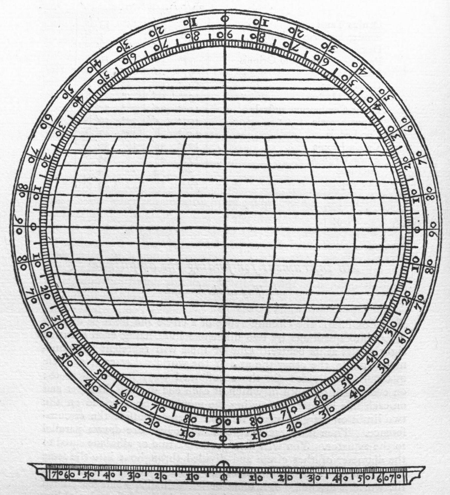

Therefore if the fiducial line of the rule be applied to the given
 latitude of the place reckoned from either end of that diameter which
 represents the axis of the world; and if further the given declination of
 the sun or of some star from the æquator (less than the complement of the
 latitude of the place) be found on the limb of the instrument; then the
 intersection of the parallel drawn from that point of the declination
 with the horizon, or with the fiducial line of the rule or alhidade, will
 indicate for the given latitude of the place the amplitude at rising of
 the given star or the sun.

## CHAP. XIII.

### The observations of variation by seamen vary, for the *most part, and are uncertain: partly from error and inexperience*, and the imperfections of the instruments; and partly *from the sea being seldom so calm that the shadows or lights can remain quite steady on the instruments*.

After the variation of the compass had
 first been noticed, some more diligent navigators took pains to
 investigate in various ways the difference of aspect of the mariners'
 compass. Yet, to the great detriment of the nautical art, this has not
 been done so exactly as it ought to have been. For either being somewhat
 ignorant they have not understood any accurate method or they have used
 bad and absurd instruments, or else they merely follow some conjecture
 arising from an ill-formed opinion as to some prime meridian or magnetick
 pole; whilst others again transcribe from others, and parade these
 observations as their own; and they who, very unskilful themselves, first
 of all committed their observations to writing are, as by the prerogative
 of time, held in esteem by others, and their posterity does not think it
 safe to differ from them. Hence in long navigations, especially to the
 East Indies, the records by the Portuguese of the deviating compass are
 seen to be unskilful: for whoever reads their writings will easily
 understand that they are in error in very many things, and do not rightly
 understand the construction of the Portuguese compass (the lily of which
 diverges by half a rumbe from the needles toward the west), nor its use
 in taking the variation. Hence, while they show the variation of the
 compass in different places, it is uncertain whether they measure the
 deviation by a true meridional compass or by some other whose needles are
 displaced from the lily. The Portuguese (as is patent in their writings)
 make use of the Portuguese compass, whose magnetick needles are fixed
 aside from the lily by half of one rumbe toward the east. Moreover on the
 sea the observation of the variation is a matter of great difficulty, on
 account of the motion of the ship and the uncertainty of the deviation,
 even with the more skilful observers, if they use the best made
 instruments hitherto known and used. Hence there arise different opinions
 concerning the magnetick deviation: as, for instance, near the Island of
 St. Helena the Portuguese Rodriguez de Lagos measures half a
 rumbe. The Dutch in their nautical log fix it at a whole rumbe. Kendall,
 the expert Englishman, with a true meridional compass admits only a sixth
 part of a rumbe. A little to the East of Cape Agullias Diego Alfonso
 makes no variation, and shows by an Astrolabe that the compass remains in
 the true meridian. Rodriguez shows that the compass at Cape Agulhas has
 no variation if it is of Portuguese construction, in which the needles
 are inclined half a rumbe to the East. And there is the same confusion,
 negligence, and vanity in very many other instances.

## CHAP. XIIII.

### On the variation under the æquinoctial line, *and near it*.

In the North the magnetick needle varies
 because of the Boreal eminences of the continent; in the South because of
 the Austral; at the æquator, if the regions on both sides were equal,
 there would be no variation. But because this rarely happens some
 variation is often observed under the æquator; and even at some distance
 from the æquator of three or 4 degrees toward the North, there may be a
 variation arising from the south, if those very wide and influential
 southern continents be somewhat near on one side.

## CHAP. XV.

### The variation of the magnetick needle in the great Æthiopick and American sea, beyond *the æquator*.

Discourse hath already been had of the
 mode and reason of the variation in the great Atlantick Ocean: but when
 one has advanced beyond the æquator off the east coast of Brazil the
 magnetick needle turns aside toward the mainland, namely, with that end
 of it which points to the south; so that with that end of the versorium
 it deviates from the true meridian toward the west; which navigators
 observe at the other end and suppose a variation to occur toward the
 east. But throughout the whole way from the first promontory on the east
 of Brazil, by Cape St. Augustine and thence to Cape
 Frio, and further still to the mouth of the Strait of Magellan, the
 variation is always from the south toward the west with that end of the
 versorium which tends toward the antarctick pole. For it is always with
 the accordant end that it turns toward a continent. The variation,
 however, occurs not only on the coast itself, but at some distance from
 land, such as a space of fifty or sixty German miles or even more. But
 when at length one has progressed far from land, then the arc begins to
 diminish: for the magnetick needle turns aside the less toward what is
 too far off, and is turned aside the less from what is present and at
 hand, since it enjoys what is present. In the Island of St. Helena (the
 longitude of which is less than is commonly marked on charts and globes)
 the versorium varies by one degree or nearly two. The Portuguese and
 others taught by them, who navigate beyond the Cape of Good Hope to the
 Indies, set a course toward the Islands of Tristan d'Acunha, in order
 that they may enjoy more favourable winds; in the former part of their
 course the change of variation is not great; but after they have
 approached the islands the variation increases; and close to the islands
 it is greater than anywhere else in the whole course. For the end of the
 versorium tending to the south (in which lies the greatest source of the
 variation) is caught and allured toward the south-west by the great
 promontory of the southern land. But when they proceed onward toward the
 Cape of Good Hope the variation diminishes the more they approach it. But
 on the prime meridian in the latitude of 45 degrees, the versorium tends
 to the south-east: and one who navigates near the coast from Manicongo to
 the tropick, and a little beyond, will perceive that the versorium tends
 from the south to the east, although not much. At the promontory of
 Agulhas it preserves slightly the variation which it showed near the
 islands of d'Acunha, which nevertheless is very much diminished because
 of the greater remoteness from the cause of variation, and consequently
 there the southern end of the versorium does not yet face exactly to the
 pole.

## CHAP. XVI.

### On the variation in Nova Zembla.

Variations in parts near the pole are
 greater (as has been shown before) and also have sudden changes, as in
 former years the Dutch explorers observed not badly, even if those
 observations were not exact—which indeed is pardonable in them; for
 with the usual instruments it is with difficulty that the truth becomes
 known in such a high latitude (of about 80 degrees). Now, however, from
 the deviation of the compass the reason for there being an open course to
 the east by the Arctick Ocean appears manifest; for since the versorium
 has so ample a variation toward the north-west, it is demonstrable that a
 continent does not extend any great distance in the whole of that course
 toward the east. Therefore with the greater hope can the sea be attempted
 and explored toward the east for a passage to the Moluccas by the
 north-east than by the north-west.

## CHAP. XVII.

### Variation in the Pacifick Ocean.

Passing the Strait of Magellan the
 deviation on the shore of Peru is toward the south-east, *i.e.*,
 from the south toward the east. And a similar deflection would be
 continued along the whole coast of Peru as far as the æquator. In a
 higher latitude up to 45 deg. the variation is greater than near the
 æquator; and the deflection toward the south-east is in nearly the same
 proportion as was the deviation from the south toward the west on the
 eastern shore of South America. From the æquator toward the North there
 is little or no variation until one comes to New Galicia; and thence
 along the whole shore as far as Quivira the inclination is from the north
 toward the east.

## CHAP. XVIII.

### On the variation in the Mediterranean Sea.

Sicilian and Italian sailors think that in
 the Sicilian Sea and toward the east up to the meridian of the
 Peloponnesus (as Franciscus Maurolycus relates) the magnetick needle
 "græcizes," that is, turns from the pole toward what is called the greek
 wind or Boreas; that on the shore of the Peloponnesus it looks toward the
 true pole; but that when they have proceeded further east, then it
 "mistralizes," because it tends from the pole toward the mistral or
 north-west wind: which agrees with our rule for the variation. For as the
 Mediterranean Sea is extended toward the west from that meridian, so on
 the side toward the east the Mediterranean Sea lies
 open as far as Palestine; as toward North and East lie open the whole
 Archipelago and the neighbouring Black Sea. From the Peloponnesus toward
 the north pole the meridian passes through the largest and most elevated
 regions of all Europe; through Achaia, Macedonia, Hungary, Transylvania,
 Lithuania, Novogardia, Corelia and Biarmia.

## CHAP. XIX.

### The variation in the interior of large *Continents*.

Most of the great seas have great
 variations; in some parts, however, they have none, but the true
 directions are toward the pole. On continents, also, the magnetick needle
 often deviates from the meridian, as on the edge of the land and near the
 borders; but it is generally accustomed to deviate by a somewhat small
 arc. In the middle, however, of great regions there are no variations.
 Hence in the middle lands of Upper Europe, in the interior of Asia, and
 in the heart of Africa, of Peru, and in the regions of North or Mexican
 America, the versorium rests in the meridian.

## CHAP. XX.

### Variation in the Eastern Ocean.

Variation in the Eastern Ocean throughout
 the whole voyage to Goa and the Moluccas is observed by the Portuguese;
 but they err greatly in many things, following, as they do, the first
 observers who note down variations in certain places with ill-adapted
 instruments, and by no means accurate observations, or by some
 conjectures. As, for instance, in Brandöe Island, they make the versorium
 deviate by 22 degrees to the north-west. For in no region or place in the
 whole world, of not greater latitude, is there so great a deviation; and,
 in reality, there the deviation is slight. Also when they make out that
 at Mosambique the compass deviates by one rumbe to the north-west, it is
 false; even though they use (as they are accustomed to do) the Portuguese
 compass: for beyond all doubt on the shore of Mosambique the
 versorium inclines ¼ rumbe or even more to the south-west. Very wrongly
 also beyond the æquator in the course to Goa they make the little compass
 incline by 1½ rumbe to the west: whereas they should rather have said
 that in the first part of the course the Portuguese compass inclines by 1
 rumbe: but that the true meridional compass inclines by ½ rumbe only. In
 order that the amount of variation in the Eastern Ocean may be accurately
 settled in most places by our rules, there is needed a more exact and
 truer survey of the southern land, which spreads out from the south to
 the æquinoctial more than is commonly described on maps and globes.

## CHAP. XXI.

### How the deviation of the versorium is augmented and *diminished by reason of the distance of places*.

In the middle of great and continent lands
 there is no variation. Nor, generally, in the middle of very great seas.
 On the margin of those lands and seas the variation is often ample, yet
 not so great as at a little further distance on the sea. As, for example,
 near Cape St. Augustine the compass varies; but at 50 miles from land
 toward the East it varies more; and 80 miles off it varies still more;
 and yet still more at a distance of 100 miles. But from a distance of 100
 miles the diminutions of deviation are slower, when they are navigating
 toward the mainland, than at a distance of 80 miles, and at a distance of
 80 miles than at 50: for the deviations change and are diminished rather
 more swiftly the more they approach and draw near land than when at a
 great distance off. As, for instance, navigating toward Newfoundland the
 change of variation is more rapid (that is, it decreases a degree in a
 smaller arc of the course on the parallel) when they are not far from
 land than when they are a hundred miles distant: but when travelling on
 land toward the interiors of regions the changes are slower in the first
 parts of the journey than when they come more into the interior.

The ratio of the arcs on a parallel circle, when a versorium is moved
 toward continents which extend to the pole, corresponds with the degrees
 of variation. Let A be the pole; B the eminences of the dominant lands;
 at C there is no variation caused by B, for it is too far away; at D the
 variation is very great because the versorium is allured or turned by the
 whole earth toward the eminent land B; and moreover it is not hindered,
 or restrained or brought back to the pole by the verticity of the earth;
 but, tending of its own nature to the pole, it is nevertheless deflected
 from it by reason of the site, or position, and convenient distance of
 the dominant and high lands.

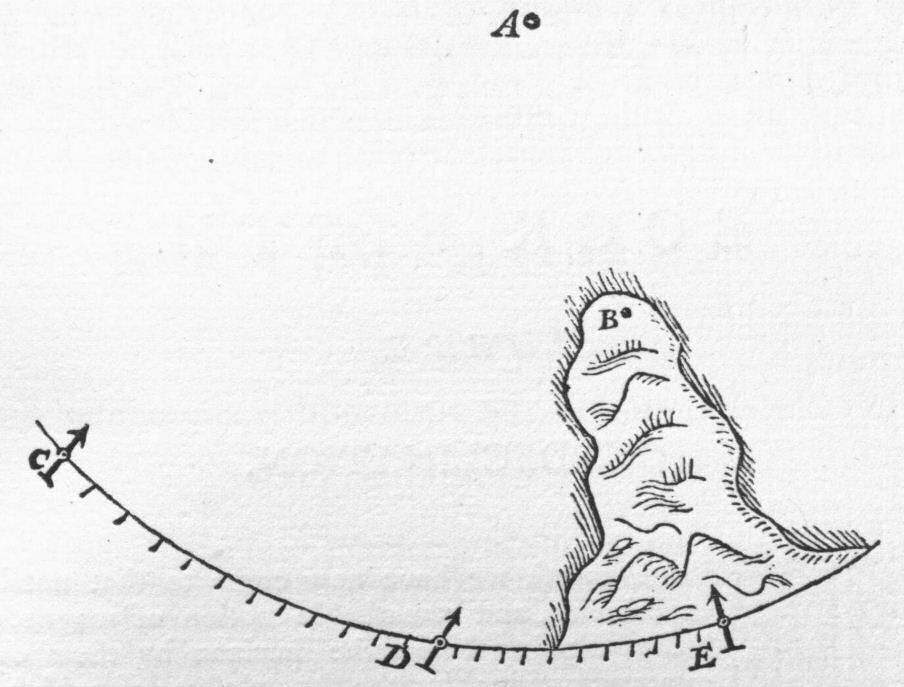

Now from C toward D the variation increases; the versorium, however,
 does not deviate so rapidly in the first spaces as near D: for more miles
 are traversed on the parallel circle C D, near C, in order that the
 versorium may deviate by one degree from the pole A, than near D. So also
 in order that the variation may be diminished from D toward E more miles
 are required near D than near E. Thus the deviations become equal in
 unequal courses, whether the variation be increasing or decreasing; and
 yet the variation decreases by lesser intervals than it increases. There
 intervene, however, many other causes which perturb this proportion.

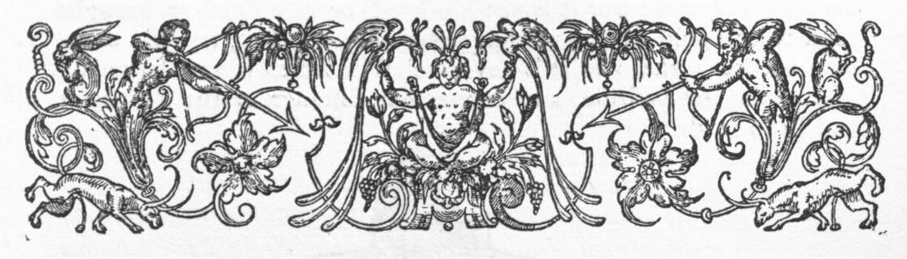

# BOOK FIFTH.

## *CHAP. I.*

### ON DECLINATION.

In due course we have now come to that
 notable experiment, and remarkable motion of magnetick bodies dipping
 below the horizon by their own rotatory nature; by the knowledge of which
 is revealed a unity, a concordancy, and a mutual agreement between the
 terrestrial globe and the loadstone (or the magnetick iron), which is
 wonderful in itself, and is made manifest by our teaching. This motion we
 have made known in many striking experiments, and have established its
 rules; and in the following pages we shall demonstrate the causes of it,
 in such a way that no sound, logical mind can ever rightly set at nought
 or disprove our chief magnetick principles. Direction, as also variation,
 is demonstrated in a horizontal plane, when a balanced magnetick needle
 comes to rest at some definite point; but declination is seen to be the
 motion of a needle, starting from that point of the horizon, first
 balanced on its own axis, then excited by a loadstone, one end or pole of
 it tending toward the centre of the earth. And we have found that it
 takes place in proportion to the latitude of each region. But that motion
 arises in truth, not from any motion from the horizon toward the centre
 of the earth, but from the turning of the whole magnetick body toward the
 whole of the earth, as we shall show hereafter. Nor does the iron dip
 from the horizontal in some oblique sphere, according to the number of
 degrees of elevation of the pole in the given region, or by an equal arc
 in the quadrant, as will appear hereafter.

*Instrument of the Declination*

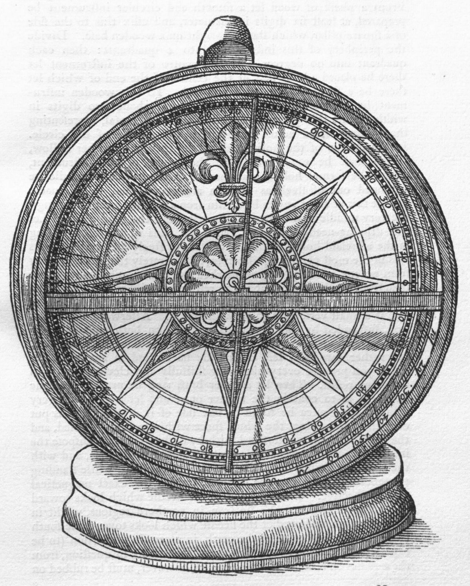

Now how much it dips at every horizon may be ascertained in the first
 place by a contrivance, which, however, is not so easily made as is that
 in dials for measuring time, in which the needle turns to the points of
 the horizon, or in the mariners' compass. From a plank of wood let a
 smooth and circular instrument be prepared, at least six digits in
 diameter, and affix this to the side of a square pillar, which stands
 upright on a wooden base. Divide the periphery of this instrument into 4
 quadrants: then each quadrant into 90 degrees. At the centre of the
 instrument let there be placed a brass peg, at the centre of the end of
 which let there be a small hollow, well polished. To this wooden
 instrument let a brass circle or ring be fixed, about two digits in
 width, with a thin plate or flat rod of the same metal, representing the
 horizon, fixed across it, through the middle of the circle. In the middle
 of the horizontal rod let there be another hollow, which shall be exactly
 opposite the centre of the instrument, where the former hollow was made.
 Afterward let a needle be fashioned out of steel, as versoria are
 accustomed to be made. Divide this at right angles by a thin iron axis
 (like a cross) through the very middle and centre of the wire and the
 cross-piece. Let this dipping-needle be hung (with the ends of the cross
 resting in the aforesaid holes) so that it can move freely and evenly on
 its axis in the most perfect æquilibrium, so accurately that it turns
 away from no one point or degree marked on the circumference more than
 from another, but that it can rest quite easily at any. Let it be fixed
 upright to the front part of the pillar, whilst at the edge of the base
 is a small versorium to show direction. Afterward touch the iron,
 suspended by this ingenious method, on both ends with the opposite ends
 of a loadstone, according to the scientifick method, but rather
 carefully, lest the needle be twisted in any way; for unless you prepare
 everything very skilfully and cleverly, you will secure no result. Then
 let another brass ring be prepared, a little larger, so as to contain the
 former one; and let a glass or a very thin plate of mica be fitted to one
 side of it. When this is put over the former ring, the whole space within
 remains inclosed, and the versorium is not interfered with by dust or
 winds. Dispose the instrument, thus completed, perpendicularly on its
 base, and with the small versorium horizontal, in such a way that, while
 standing perpendicularly, it may be directed toward the exact magnetical
 point respective. Then the end of the needle which looks toward the north
 dips below the horizon in northern regions, whilst in southern regions
 the end of the needle which looks toward the south tends toward the
 centre of the earth, in a certain proportion (to be explained afterward)
 to the latitude of the district in question, from the æquator on either
 side. The needle, however, must be rubbed on a powerful loadstone;
 otherwise it does not dip to the true point, or else it goes past it, and
 does not always rest in it. A larger instrument may also be used, whose
 diameter may be 10 or 12 digits; but in such an instrument more care is
 needed to balance the versorium truly. Care must be taken that the needle
 be of steel; also that it be straight; likewise that both ends of the
 cross-piece be sharp and fixed at right angles to the needle, and that
 the cross-piece pass through the centre of the needle. As in other
 magnetical motions there is an exact agreement between the earth and the
 stone, and a correspondence manifestly apparent to our senses by means of
 our experiments; so in this declination there is a clear and evident
 concordance of the terrestrial globe with the loadstone. Of this motion,
 so important and so long unknown to all men, the following is the sure
 and true cause. A magnet-stone is moved and turned round until one of its
 poles being impelled toward the north comes to rest toward a definite
 point of the horizon. This pole, which settles toward the
 north (as appears from the preceding rules and demonstrations), is the
 southern, not the boreal; though all before us deemed it to be the
 boreal, on account of its turning to that point of the horizon. A wire or
 versorium touched on this pole of the stone turns to the south, and is
 made into a boreal pole, because it was touched by the southern terminal
 of the stone. So if the cusp of a versorium be excited in a similar
 manner, it will be directed toward the southern pole of the earth, and
 will adjust itself also to it; but the cross (the other end) will be
 southern, and will turn to the north of the earth (the earth itself being
 the cause of its motion); for so direction is produced from the
 disposition of the stone or of the excited iron, and from the verticity
 of the earth. But declination takes place when a magnetick is turned
 round toward the body of the earth, with its southern end toward the
 north, at some latitude away from the æquator. For this is certain and
 constant, that exactly under the cœlestial æquator, or rather over
 the æquator of the terrestrial globe, there is no declination of a
 loadstone or of iron; but in whatever way the iron has been excited or
 rubbed, it settles in the declination instrument precisely along the
 plane of the horizon, if it were properly balanced before. Now this
 occurs thus because, when the magnetick body is at an equal distance from
 either pole, it dips toward neither by its own versatory nature, but
 remains evenly directed to the level of the horizon, as if it were
 resting on a pin or floating free and unhindered on water. But when the
 magnetick substance is at some latitude away from the æquator, or when
 either pole of the earth is raised (I do not say raised above the visible
 horizon, as the commonly imagined pole of the revolving universe in the
 sky, but above the horizon or its centre, or its proper diameter,
 æquidistant from the plane of the visible horizon, which is the true
 elevation of the terrestrial pole), 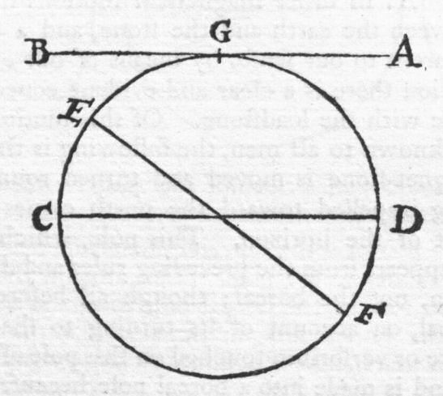 then declination is
 apparent, and the iron inclines toward the body of the earth in its own
 meridian. Let A B, for example, be the visible horizon of a place; C D
 the horizontal through the earth, dividing it into equal parts; E F the
 axis of the earth; G the position of the place. It is manifest that the
 boreal pole E is elevated above the point C by as much as G is distant
 from the æquator. Wherefore, since at E the magnetick needle stands
 perpendicularly in its proper turning (as we have often shown before), so
 now at G there is a certain tendency to turn in proportion to the
 latitude (the magnetick dipping below the plane of the horizon), and the
 magnetick body intersects the horizon at unequal angles, and exhibits a
 declination below the horizon. For the same reason, if the declinatory
 needle be placed at G, its southern end, the one namely which is directed
 toward the North, dips below the plane of the visible horizon A B. And so
 there is the greatest difference between a right sphere and a polar or parallel sphere, in
 which the pole is at the very Zenith. For in a right sphere the needle is
 parallel to the plane of the horizon; but when the cœlestial pole
 is vertically overhead, or when the pole of the earth is itself the place
 of the region, then the needle is perpendicular to the horizon. This is
 shown by a round stone. Let a small dipping-needle, of two digits length
 (rubbed with a magnet), be hung in the air like a balance, and let the
 stone be carefully placed under it; and first let the terrella be at
 right angles, as in a right sphere, and as in the first figure; for so
 the magnetick needle will remain in equilibrium. But in an oblique
 position of the terrella, as in an oblique sphere, and in the second
 figure, the needle dips obliquely at one end toward the near pole, but
 does not rest on the pole, nor is its dip ruled by the pole, but by the
 body and mass of the whole; for the dip in higher latitudes
 passes beyond the pole. But in the third position of the terrella the
 needle is perpendicular; because the pole of the stone is placed at the
 top, and the needle tending straight toward the body reaches to the pole.
 The cross in the preceding figures always turns toward the boreal pole of
 the terrella, having been touched by the boreal pole of the terrella; the
 cusp of the needle, having been touched by the southern pole of the
 stone, turns to the south. Thus one may see on a terrella the level,
 oblique, and perpendicular positions of a magnetick needle. *

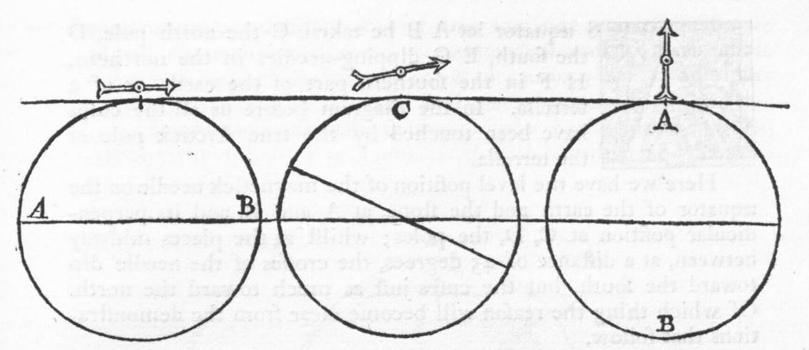

## CHAP. II.

### Diagram of declinations of the magnetick needle, when *excited, in the various portions of the sphere, and horizons* of the earth, in which there is no variation *of the declination*.

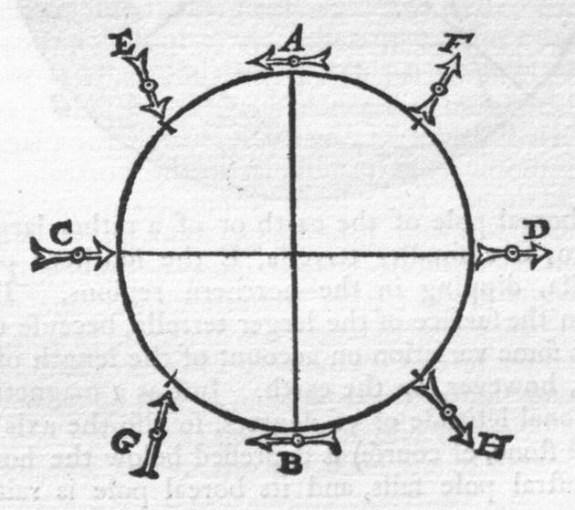

As æquator let A B be taken, C the north
 pole, D the south, E G dipping-needles in the northern, H F in the
 southern part of the earth or of a terrella. In the diagram before us all
 the cusps have been touched by the true Arctick pole of the terrella.

Here we have the level position of the magnetick needle on the æquator
 of the earth and the stone, at A and B, and its perpendicular position at
 C, D, the poles; whilst at the places midway between, at a distance of 45
 degrees, the crosses of the needle dip toward the south, but the cusps
 just as much toward the north. Of which thing the reason will become
 clear from the demonstrations that follow.

** Diagram of the rotation and declination of a terrella*

 conforming to the globe of the earth, for a

*latitude of 50 degrees north.*

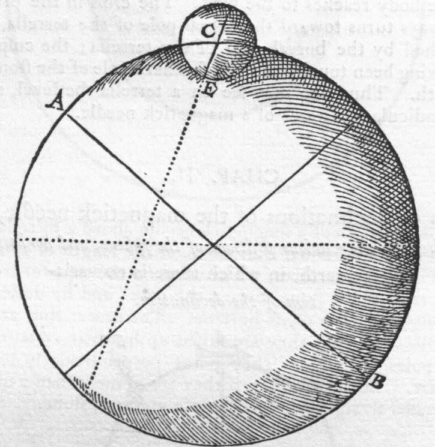

A is the boreal pole of the earth or of a rather large terrella, B the
 southern, C a smaller terrella, E the southern pole of the smaller
 terrella, dipping in the northern regions. The centre C is placed on the surface
 of the larger terrella, because the smaller terrella shows some variation
 on account of the length of the axis; inappreciable, however, on the
 earth. Just as a magnetick needle dips in a regional latitude of 50
 degrees, so also the axis of a stone (of a spherical stone, of course) is
 depressed below the horizon, and its natural austral pole falls, and its
 boreal pole is raised on the south toward the Zenith. In the same way
 also a circular disc of iron behaves, which has been carefully touched at
 opposite parts on its circumference; but the magnetical experiments are
 less clear on account of the feebler forces in round pieces of iron.

*Variety in the declinations of iron spikes at various latitudes of a terrella.*

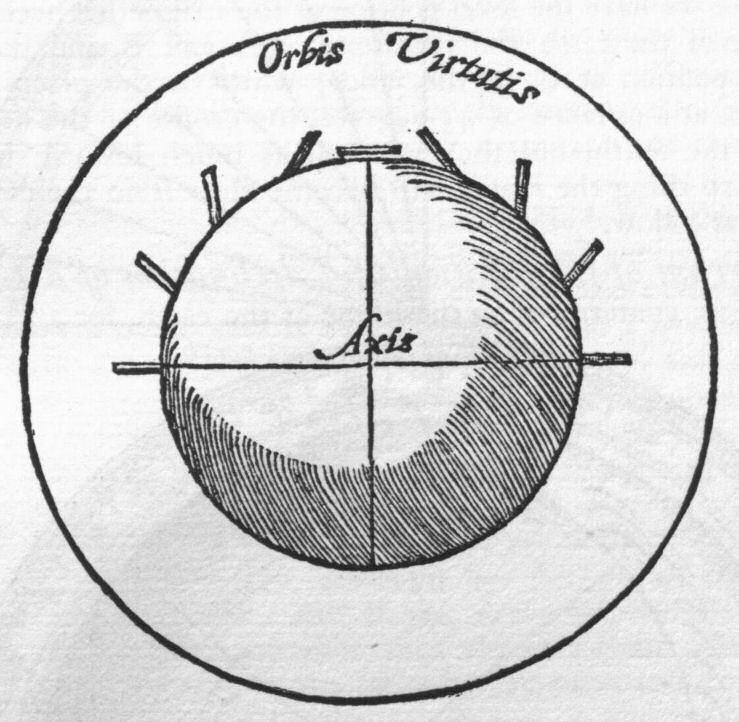

The declination of a magnetick needle above a terrella is shown by
 means of several equal iron wires, of the length of a barleycorn,
 arranged along a meridian. The wires on the æquator are directed by the
 virtue of the stone toward the poles, and lie down upon its body along
 the plane of its horizon. The nearer they are brought to the poles, the
 more they are raised up by their versatory nature. At the poles
 themselves they point perpendicularly toward the very centre. But iron
 spikes, if they are of more than a due length, are not raised straight up
 except on a vigorous stone.

## CHAP. III.

*

### An indicatory instrument, showing by the virtue of a *stone the degrees of declination from the horizon* of each several latitude.

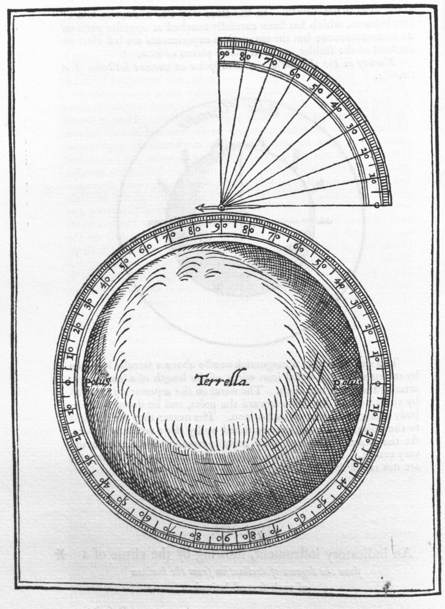

*Description of the Instrument, and its use.*

Take a terrella of the best strong
 loadstone, and homogeneous throughout, not weakened by decay or by a flaw
 in any parts; let it be of a fair size, so that its diameter is six or
 seven digits; and let it be made exactly spherical. Having found its
 poles according to the method already shown, mark them with an iron tool;
 then mark also the æquinoctial circle. Afterwards in a thick squared
 block of wood, one foot in size, make a hemispherical hollow, which shall
 hold half of the terrella, and such that exactly one half of the stone
 shall project above the face of the block. Divide the limb close to this
 cavity (a circle having been drawn round it for a meridian) into 4
 quadrants, and each of these into 90 degrees. Let the terminus of the
 quadrants on the limb be near the centre of a quadrant described on the
 block, also divided into 90 degrees. At that centre let a short, slender
 versorium (its other end being rather sharp and elongated like a pointer)
 be placed in æquilibrio on a suitable pin. It is manifest that when the
 poles of the stone are at the starting points of the quadrants, then the
 versorium lies straight, as if in æquilibrio, over the terrella. But if
 you move the terrella, so that the pole on the left hand rises, then the
 versorium rises on the meridian in proportion to the latitude, and turns
 itself as a magnetick body; and on the quadrant described on the flat
 surface of the wood, the degree of its turning or of the declination is
 shown by the versorium. The rim of the cavity represents a meridional
 circle, to which corresponds some meridian circle of the terrella, since
 the poles on both sides are within the circumference of the rim itself.
 These things clearly always happen on the same plan on the earth itself
 when there is no variation; but when there is variation, either in the
 direction or in the declination (a disturbance, as it were, in the true
 turning, on account of causes to be explained later), then there is some
 difference. Let the quadrant be near the limb, or have its centre on the
 limb itself, and let the versorium be very short, so as not to touch the
 terrella, because with a versorium that is longer or more remote, there
 is some error; for it has a motion truly proportionate to the terrella
 only on the surface of the terrella. But if the quadrant, being far
 distant from the terrella, were moved within the orbe of virtue of the
 terrella toward the pole on some circle concentrick with the terrella,
 then the versorium would indicate the degrees of declination on the
 quadrant, in proportion to and symmetrically with that circle, not with
 the terrella.

## CHAP. IIII.

### Concerning the length of a versorium convenient *for declination on a terrella*.

Declination being investigated on the
 earth itself by means of a declination instrument, we may use either a
 short or a very long versorium, if only the magnetick virtue of the stone
 that touches it is able to permeate through the whole of its middle and
 through all its length. For the greatest length of a versorium has no
 moment or perceptible proportion to the earth's semi-diameter. On a
 terrella, however, or in a plane near a meridian of a terrella, a short
 versorium is desirable, of the length, say, of a barleycorn; for longer
 ones (because they reach further) dip and turn toward the body of the
 terrella suddenly and irregularly in the first degrees of declination.
 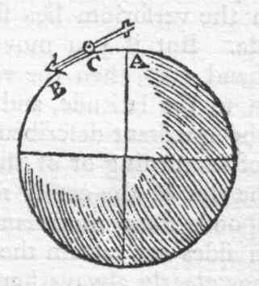 For example, as soon as the long versorium is moved forward
 from the aequator A to C, it catches on the stone with its cusp (as if
 with a long extended wing), when the cusp reaches to the parts about B,
 which produce a greater rotation than at C. And the extremities of longer
 wires also and rods turn irregularly, just as iron wires and balls of
 iron and other orbicular loadstones are likewise turned about irregularly
 by a long non-orbicular loadstone. Just so magneticks or iron bodies on
 the surface of a terrella ought not to have too long an axis, but a very
 short one; so that they may make a declination on the terrella truly and
 naturally proportionate to that on the earth. A long versorium also close
 to a terrella with difficulty stands steady in a horizontal direction on
 a right sphere, and, beginning to waver, it dips immediately to one side,
 especially the end that was touched, or (if both were touched) the one
 which felt the stone last.

## CHAP. V.

### That declination does not arise from the attraction of the loadstone, but from a disposing and *rotating influence*.

In the universe of nature that marvellous
 provision of its Maker should be noticed, whereby the principal bodies
 are restrained within certain habitations and fenced in, as it were
 (nature controlling them). For this reason the stars, though they move
 and advance, are not thrown into confusion. Magnetical rotations also
 arise from a disposing influence, whether in greater and dominating
 quantity, or in a smaller, and compliant quantity, even though it be very
 small. For the work is not accomplished by attraction, but by an
 incitation of each substance, by a motion of agreement toward fixed
 bounds, beyond which no advance is made. For if the versorium dipped by
 reason of an attractive force, then a terrella made from a very strong
 magnetick stone would cause the versorium to turn toward itself more than
 one made out of an average stone, and a piece of iron touched with a
 vigorous loadstone would dip more. This, however, never happens.
 Moreover, an iron snout placed on a meridian in any latitude does not
 raise a spike more toward the perpendicular than the stone itself, alone
 and unarmed; although when thus equipped, it plucks up and raises many
 greater weights. But
 if a loadstone be sharper toward one pole, toward the other blunter, the
 sharp end or pole allures a magnetick needle more strongly, the blunt,
 thick end makes it rotate more strongly; but an orbicular stone * makes it rotate strongly and truly, in accordance with
 magnetick rules and its globular form. A long stone, on the other hand,
 extended from pole to pole, moves a versorium toward it irregularly; for
 in this case the pole of the versorium always looks down on the pole
 itself. Similarly also, if the loadstone have been made in the shape of a
 circle, and its poles are on the circumference, whilst the body of it is
 plane, not globular, if the plane be brought near a versorium, the
 versorium does not move with the regular magnetick rotation, as on a
 terrella; but it turns looking always toward the pole of the loadstone,
 which has its seat on the circumference of the plane. Moreover, if the
 stone caused the versorium to rotate by attracting it, then in the first
 degrees of latitude, it would attract the end of a short versorium toward
 the body itself of the terrella; yet it does not so attract it that they
 are brought into contact and unite; but the versorium rotates just so far
 as nature demands, as is clear from this example. 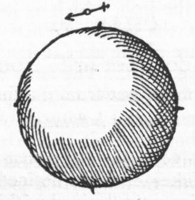 * For the cusp of a versorium placed in a low
 latitude does not touch the stone or unite with it, but only inclines
 toward it. Moreover, when a magnetick body rotates in dipping, the pole
 of the versorium is not stayed or detained by the pole of the earth or
 terrella; but it rotates regularly, and does not stop at any point or
 bound, nor point straight to the pole toward which the centre of the
 versorium is advancing, unless on the pole itself, and once only between
 the pole and the æquator; but it dips as it advances, according as the
 change of position of its centre gives a reason for its inclination in
 accordance with rules magnetical. The declination of a magnetick needle
 in water also, as demonstrated in the following pages, is a fixed
 quantity; the
 magnetick needle does not descend to the bottom of the vessel, but
 remains steady in the middle, rotated on its centre according to its due
 amount of declination. This would not happen, if the earth or its poles
 by their attraction drew down the end of the magnetick needle, so that it
 dipped in this way.

## CHAP. VI.

### On the proportion of declination to latitude, and *the cause of it*.

Concerning the making of an instrument for
 finding declination, the causes and manner of declination, and the
 different degrees of rotation in different places, the inclination of the
 stone, and concerning an instrument indicating by the influence of a
 stone the degree of declination from any horizon we have already spoken.
 Then we spoke about needles on the meridian of a stone, and their
 rotation shown for various latitudes by their rise toward the
 perpendicular. We must now, however, treat more fully of the causes of
 the degree of that inclination. Whilst a loadstone and a magnetick iron
 wire are moved along a meridian from the aequator toward the pole, they
 rotate toward a round loadstone, as also toward the earth with a circular
 movement. On a right horizon (just as also on the æquinoctial of
 the
 stone) the axis of the iron, which is its centre line, is a line parallel
 to the axis of the earth. When that axis reaches the pole, which is the
 centre of the axis, it stands in the same straight line with the axis of
 the earth. The same end of the iron which at the æquator looks south
 turns to the north. For it is not a motion of centre to centre, but a
 natural turning of a magnetick body to a magnetick body, and of the axis
 of the body to the axis; it is not in consequence of the attraction of
 the pole itself that the iron points to the earth's polar point. Under
 the æquator the magnetick needle remains in æquilibrio horizontally; but
 toward the pole on either side, in every latitude from the beginning of
 the first degree right up to the ninetieth, it dips. The magnetick needle
 does not, however, in proportion to any number of degrees or any arc of
 latitude fall below the horizon just that number of degrees or a similar
 arc, but a very different one: because this motion is not really a motion
 of declination, but is in 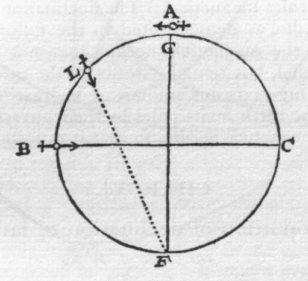 reality a motion of rotation, and it observes an arc of
 rotation according to the arc of latitude. Therefore a magnetick body A,
 while it is advancing over the earth itself, or a little earth or
 terrella, from the æquinoctial G toward the pole B, rotates on its own
 centre, and halfway on the progress of its centre from the æquator to the pole B it is
 pointing toward the æquator at F, midway between the two poles. Much more
 quickly, therefore, must the versorium rotate than its centre advances,
 in order that by rotating it may face straight toward the point F.
 Wherefore the motion of this rotation is rapid in the first degrees from
 the æquator, namely, from A to L; but more tardy in the later degrees
 from L to B, when facing from the æquator at F to C. But if the
 declination were equal to the latitude (*i.e.*, always just as many
 degrees from the horizon, as the centre of the versorium has receded from
 the æquator), then the magnetick needle would be following some potency
 and peculiar virtue of the centre, as if it were a point operating
 by itself. But it pays regard to the whole, both its mass, and its outer
 limits; the forces of both uniting, as well of the magnetick versorium as
 of the earth. *

## CHAP. VII.

### Explanation of the diagram of the rotation of *a magnetick needle*.

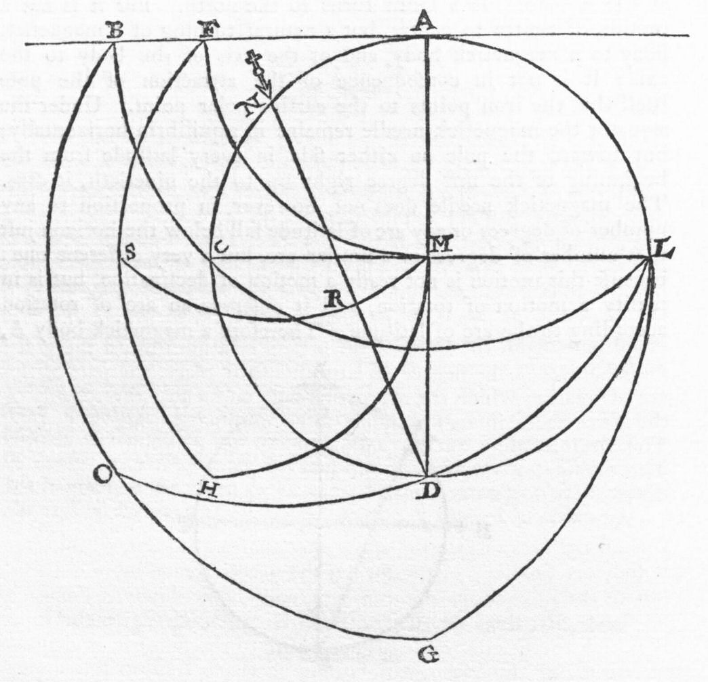

Suppose A C D L to be the body of the
 earth or of a terrella, its centre M, Æquator A D, Axis C L, A B the
 Horizon, which changes according to the place. From the point F on a
 Horizon distant from the æquator A by the length of C M, the
 semi-diameter of the earth or terrella, an arc is described to H as the
 limit of the quadrants of declination; for all the quadrants of
 declination serving the parts from A to C begin from that arc, and
 terminate at M, the centre of the earth. The semi-diameter of this arc is
 a chord drawn from the æquator A to the pole C; and a line produced along
 the horizon from A to B, equal to that chord, gives the beginning of the
 arc of the limits of arcs of rotation and revolution, which is continued
 as far as G. For just as a quadrant of a circle about the centre of the
 earth (whose beginning is on the horizon, at a distance from the æquator
 equal to the earth's semi-diameter) is the limit of all quadrants of
 declination drawn from each several horizon to the centre; so a circle
 about the centre from B, the beginning of the first arc of rotation, to G
 is the limit of the arcs of rotation. The arcs of rotation and revolution
 of the magnetick needle are intermediate between the arcs of rotation B L
 and G L. The centre of the arc is the region itself or place in which the
 observation is being made; the beginning of the arc is taken from the
 circle which is the limit of rotations, and it stops at the opposite
 pole; as, for example, from O to L, in a latitude of 45 degrees. Let any
 arc of rotation be divided into 90 equal parts from the limit of the arcs
 of rotation toward the pole; for whatever is the degree of latitude of
 the place, the part of the arc of rotation which the magnetick pole on or
 near the terrella or the earth faces in its rotation is to be numbered
 similarly to this. The straight lines in the following larger diagram
 show this. The magnetick rotation at the middle point in a latitude of 45
 degrees is directed toward the æquator, in which case also that arc is a
 quadrant of a circle from the limit to the pole; but previous to this all
 the arcs of rotation are greater than a quadrant, whilst after it they
 are smaller; in the former the needle rotates more quickly, but in the
 succeeding positions gradually more slowly. For each several region there
 is a special arc of rotation, in which the limit to which the needle
 rotates is according to the number of degrees of latitude of the place in
 question; so that a straight line drawn from the place to the point on
 that arc marked with the number of degrees of latitude shows the
 magnetick direction, and indicates the degree of declination at the
 intersection of the quadrant of declination which serves the given place.
 Take away the arc of the quadrant of declination drawn from the centre to
 the line of direction; that which is left is the arc of declination below
 the horizon. As, for example, in the rotation of the versorium N, whose
 line respective proceeds to D, from the quadrant of declination, S M,
 take away its arc R M; that which is left is the arc of declination: how
 much, that is, the needle dips in the latitude of 45 degrees.

## CHAP. VIII.

### Diagram of the rotation of a magnetick needle, *indicating magnetical declination in all latitudes, and* from the rotation and declination, the *latitude itself*.

In the more elaborate diagram a circle of
 rotations and a circle of declinations are adjusted to the body of the
 earth or terrella, with a first, a last, and a middle arc of rotation and
 declination. Now from each fifth division of the arc which limits all the
 arcs of rotation (and which are understood as divided into 90 equal parts) arcs
 are drawn to the pole, and from every fifth degree of the arc limiting
 the quadrants of declination, quadrants are drawn to the centre; and at
 the same time a spiral line is drawn, indicating (by the help of a
 movable quadrant) the declination in every latitude. Straight lines
 showing the direction of the needle are drawn from those degrees which
 are marked on the meridian of the earth or a terrella to their proper
 arcs and the corresponding points on those arcs.

To ascertain the elevation of the pole or the latitude of a place anywhere

*in the world, by means of the following diagram, turned into

a magnetick instrument, without the help of the cœlestial

bodies, sun, planets, or fixed stars, in fog

and darkness*.

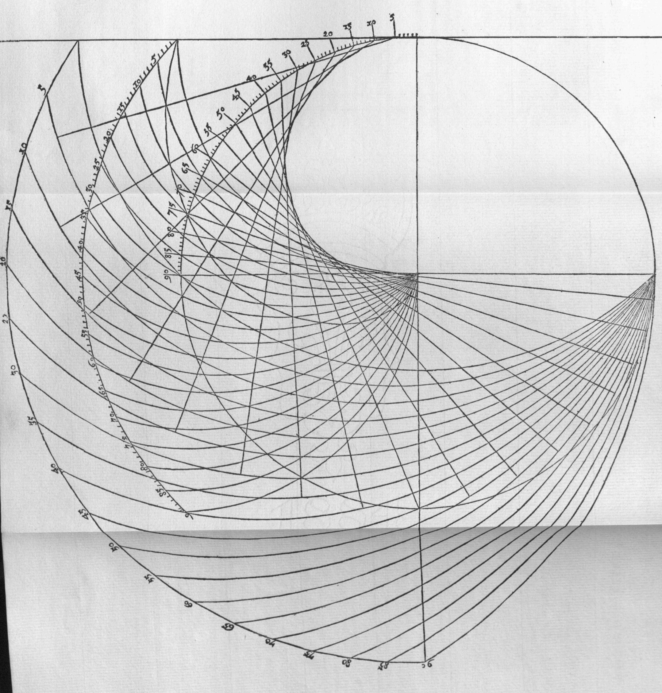

We may see how far from unproductive magnetick philosophy is, how
 agreeable, how helpful, how divine! Sailors when tossed about on the
 waves with continuous cloudy weather, and unable by means of the
 cœlestial luminaries to learn anything about the place or the
 region in which they are, with a very slight effort and with a small
 instrument are comforted, and learn the latitude of the place. With a
 declination instrument the degree of declination of the magnetick needle
 below the horizon is observed; that degree is noted on the inner arc of
 the quadrant, and the quadrant is turned round about the centre of the
 instrument until that degree on the quadrant touches the spiral line;
 then in the open space B at the centre of the quadrant the latitude of
 the region on the circumference of the globe is
 discerned by means of the fiducial line A B. Let the diagram be fixed on
 a suitable flat board, and let the centre of the corner A of the quadrant
 be fastened to the centre of it, so that the quadrant may rotate on that
 centre. But it must be understood that there is also in certain places a
 variation in the declination on account of causes already mentioned
 (though not a large one), which it will be an assistance also to allow
 for on a likely estimate; and it will be especially helpful to observe
 this variation in various places, as it seems to present greater
 difficulty than the variation in direction; but it is easily learnt with
 a declination instrument, when it dips more or less than the line in the
 diagram.

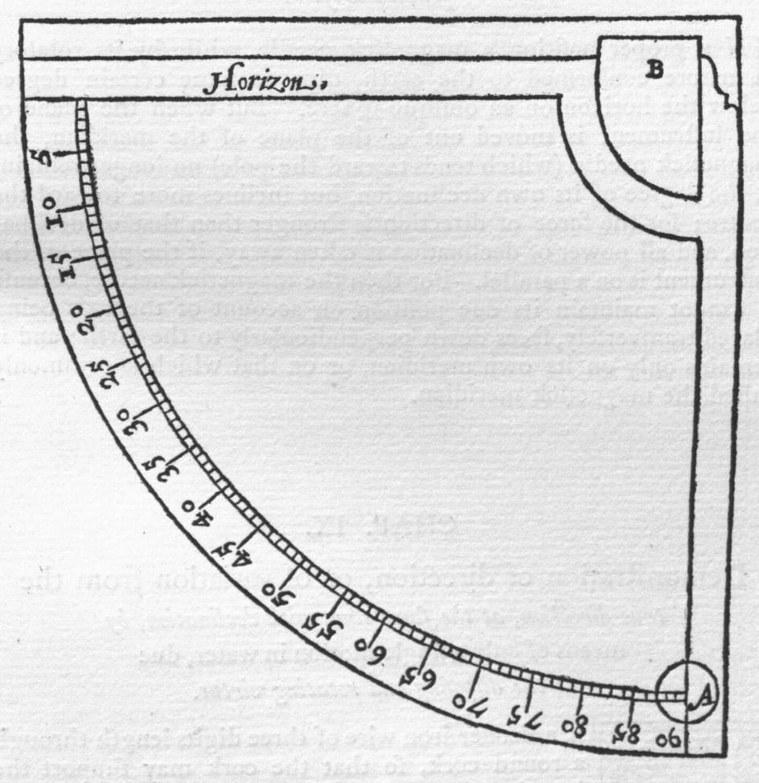

*To observe magnetick declination at sea*.

Set upon our variation instrument a declination instrument; a wooden
 disc being placed between the round movable compass and the
 declination instrument: but first remove the versorium, lest the
 versorium should interfere with the dipping needle. In this way (though
 the sea be rough) the compass box will remain upright at the level of the
 horizon. The stand of the declination instrument must be directed by
 means of the small versorium at its base, which is set to the point
 respective of the variation, on the great circle of which (commonly
 called the magnetick meridian), the plane of the upright box is arranged;
 thus the declinatorium (by its versatory nature) indicates the degree of
 declination.

In a declination instrument the magnetick needle, which

*in a meridional position dips, if turned

along a parallel hangs perpendicularly.*

In a proper position a magnetick needle, while by its rotatory nature
 conformed to the earth, dips to some certain degree below the horizon on
 an oblique sphere. But when the plane of the instrument is moved out of
 the plane of the meridian, the magnetick needle (which tends toward the
 pole) no longer remains at the degree of its own declination, but
 inclines more toward the centre; for the force of direction is stronger
 than that of declination, and all power of declination is taken away, if
 the plane of the instrument is on a parallel. For then the magnetick
 needle, because it cannot maintain its due position on account of the
 axis being placed transversely, faces down perpendicularly to the earth;
 and it remains only on its own meridian, or on that which is commonly
 called the magnetick meridian.

## CHAP. IX.

### Demonstration of direction, or of variation from the *true direction, at the same time with declination, by* means of only a single motion in water, due *to the disposing and rotating virtue.*

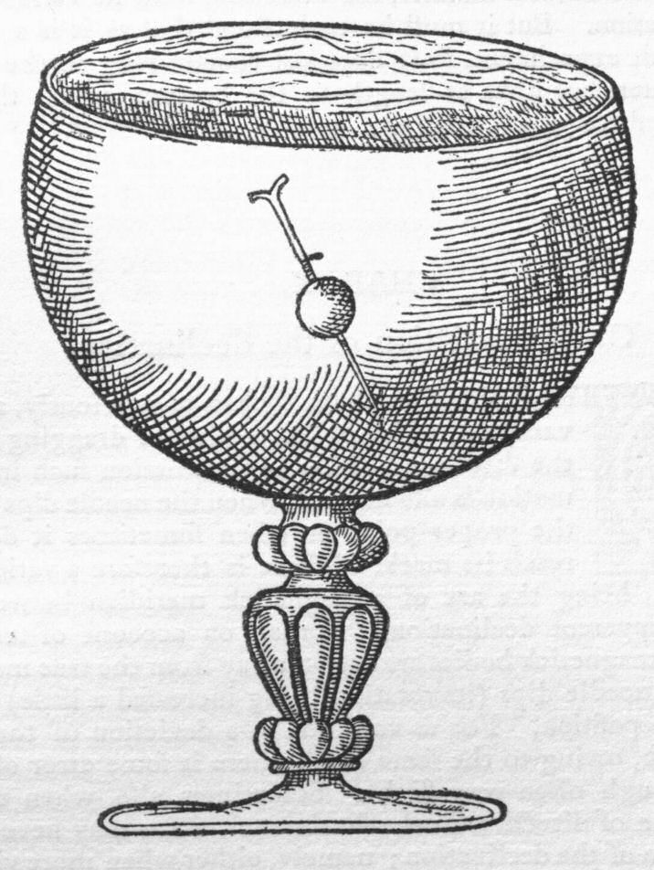

Fix a slender iron wire of three digits
 length through * a round cork, so that the cork may support
 the iron in water. Let this water be in a good-sized glass vase or bowl.
 Pare the round cork little by little with a very sharp knife (so that it
 may remain round), until it will stay motionless one or two digits below
 the face of the water; and let the wire be evenly balanced.
 Rub one end of the wire
 thus prepared on the boreal end of a loadstone and the other on the
 southern part of the stone (very skilfully, so that the cork may not be
 moved ever so little from its place) and again place it in the water;
 then the wire will dip with a circular motion on its own centre below the
 plane of the horizon, in proportion to the latitude of the region; and,
 even while dipping, will also show the point of variation (the true
 direction being perturbed). Let the loadstone (that with which the iron
 is rubbed) be a strong one, such as is needed in all experiments on
 magnetick declination. When the iron, thus put into the water and
 prepared by means of the loadstone, has settled in the dip, the lower end
 remains at the point of variation on the arc of a great circle or
 magnetick meridian passing through the Zenith or vertex, and the point of
 variation on the horizon, and the lowest point of the heavens, which they
 call the Nadir. This fact is shown by placing a rather long magnetick
 versorium on one side a little way from the vase. This is a demonstration
 of a more absolute conformity of a magnetick body with the earth's body
 as regards unity; in it is made apparent, in a natural manner, the
 direction, with its variation, and the declination. But it must be
 understood that as it is a curious and difficult experiment, so it does
 not remain long in the middle of the water, but sinks at length to the
 bottom, when the cork has imbibed too much moisture.

## CHAP. X.

### On the variation of the declination.

Direction has been spoken of previously,
 and also * variation, which is like a kind of dragging
 aside of the direction. Now in declination such irregular motion is also
 noticed, when the needle dips beyond the proper point or when sometimes
 it does not reach its mark. There is therefore a variation of
 declination, being the arc of a magnetick meridian between the true and
 apparent declination. For as, on account of terrestrial elevations,
 magnetick bodies are drawn away from the true meridian, so also the
 needle dips (its rotation being increased a little) beyond its genuine
 position. For as variation is a deviation of the direction, so also,
 owing to the same cause, there is some error of declination, though often
 very slight. Sometimes, also, when there is no variation of direction in
 the horizontal, there may nevertheless be variation of the declination;
 namely, either when more vigorous parts of the earth crop out exactly
 meridionally, *i.e.* under the very meridian; or when those parts
 are less powerful than nature in general requires; or when the virtue is
 too much intensified in one part, or weakened in another, just as one may
 observe in the vast ocean. And this discrepant nature and varying effect
 may be easily seen in certain parts of almost any round loadstone.
 Inæquality of power is recognized in any part of a terrella by trial of
 the demonstration in chap. 2 of this book. But the effect is clearly
 demonstrated by the instrument for showing declination in chap. 3 of this
 book.

## CHAP. XI.

### On the essential magnetick activity sphærically *effused.*

Discourse hath often been held concerning
 the * poles of the earth and of the stone, and concerning the
 æquinoctial zone; whilst lately we have been speaking about the declining
 of magneticks toward the earth and toward the terrella, and the causes of
 it. But while by various and complicated devices we have laboured long
 and hard to arrive at the cause of this declination, we have by good
 fortune found out a new and admirable (beyond the marvels of all virtues
 magnetical) science of the orbes themselves. For such is the power of
 magnetick globes, that it is diffused and extended into orbes outside the
 body itself, the form being carried beyond the limits of the corporeal
 substance; and a mind diligently versed in this study of nature will find
 the definite causes of the motions and revolutions. The same powers of a
 terrella exist also within the whole orbe of its power; and these orbes
 at any distance from the body of the terrella have in themselves, in
 proportion to their diameter and the magnitude of their circumference,
 their own limits of influences, or points wherein magnetick bodies
 rotate; but they do not look toward the same part of the terrella or the
 same point at any distance from the same (unless they be on the axis of
 the orbes and of the terrella); but they always tend to those points of
 their own orbes, which are distant by similar arcs from the common axis
 of the orbes. As, for example, in the following diagram, we show the body
 of a terrella, with its poles and æquator; and also a versorium on three
 other concentrick orbes around the terrella at some distance from it. In
 these orbes (as in all those which we may imagine without end) the
 magnetick body or versorium conforms to its own orbe in which it is
 located, and to its diameter and poles and æquator, not to those of the
 terrella; and it is by them and according to the magnitude of their orbes
 that the magnetick body is governed, rotated, and directed, in any arc of
 that orbe, both while the centre of the magnetick body stands still, and
 also while it moves along. And yet we do not mean that the magnetick
 forms and orbes exist in air or water or in any medium that is not
 magnetical; as if the air or the water were susceptible of them, or were
 induced by them; for the forms are only effused and really subsist when
 magnetick substances are there; whence a magnetick body is laid hold of
 within the forces and limits of the orbes; and within the orbes
 magneticks dispose magneticks and incite them, as if
 the orbes of virtue were solid and material loadstones. For the magnetick
 force does not pass through the whole medium or really exist as in a
 continuous body; so the orbes are magnetick, and yet not real orbes nor
 existent by themselves.

*Diagram of motions in magnetick orbes.*

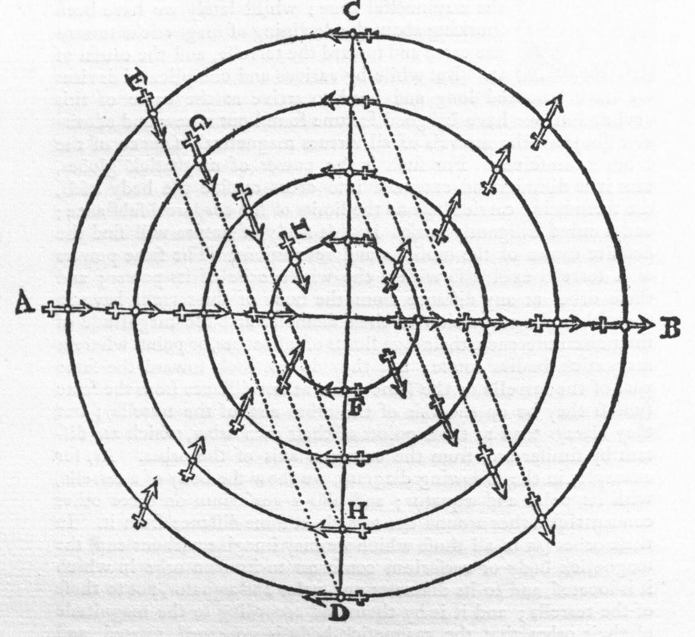

A B is the axis of the terrella and of the orbes, C D the æquator. On
 all the orbes, as on the terrella, at the equator the versorium arranges
 itself along the plane of the horizon; on the axis it everywhere looks
 perpendicularly toward the centre; in the intermediate spaces E looks
 toward D; and G looks toward H, not toward F, as the versorium L does on
 the surface of the terrella. But as is the relation of L to F on the
 surface of the terrella, so is that of G to H on its orbe and of E to D on
 its orbe; also all the rotations on the orbes toward the
 termini of the orbes are such as they are on the surface of the terrella,
 or toward the termini of its surface. But if in the more remote orbes
 this fails somewhat at times, it happens on account of the sluggishness
 of the stone, or on account of the feebler forces due to the too great
 distance of the orbes from the terrella.

*Demonstration.*

Set upon the instrumental diagram described farther back [chap. 3] a
 plate or stiff circle of brass or tin, on which may be described the
 magnetick orbes, as in the diagram above; and in the middle let a hole be
 made according to the size of the terrella, so that the plate may lie
 evenly on the wood about the middle of the terrella on a meridional
 circle. Then let a small versorium of the length of a barley-corn be
 placed on any orbe; upon which, when it is moved to various positions on
 the same circle, it will always pay regard to the dimensions of that
 orbe, not to those of the stone; as is shown in the diagram of the
 effused magnetick forms.

While some assign occult and hidden virtues of substances, others a
 property of matter, as the causes of the wonderful magnetical effects; we
 have discovered the primary substantive form of globes, not from a
 conjectural shadow of the truth of reasons variously controverted; but we
 have laid hold of the true efficient cause, as from many other
 demonstrations, so also from this most certain diagram of magnetick
 forces effused by the form. Though this (the form) has not been brought
 under any of our senses, and on that account is the less perceived by the
 intellect, it now appears manifest and conspicuous even to the eyes
 through this essential activity which proceeds from it as light from a
 lamp. And here it must be noted that a magnetick needle, moved on the top
 of the earth or of a terrella or of the effused orbes, makes two complete
 rotations in one circuit of its centre, like some epicycle about its
 orbit.

## CHAP. XII.

### Magnetick force is animate, or imitates life; and in many things surpasses human life, while this is bound *up in the organick body*.

Aloadstone is a wonderful thing in very
 many experiments, and like a living creature. And one of its remarkable
 virtues is that which the ancients considered to be a living soul in the
 sky, in the globes and in the stars, in the sun and in the moon. For they
 suspected that such various motions could not arise without a divine and
 animate nature, immense bodies turned about in fixed times, and wonderful
 powers infused into other bodies; whereby the whole universe flourishes
 in most beautiful variety, through this primary form of the globes
 themselves. The ancients, as Thales, Heraclitus, Anaxagoras, Archelaus,
 Pythagoras, Empedocles, Parmenides, Plato, and all the Platonists, and
 not only the older Greeks, but the Egyptians and Chaldæans, seek for some
 universal life in the universe, and affirm that the whole universe is
 endowed with life. Aristotle affirms that not the whole universe is
 animate, but only the sky; but he maintains that its elements are
 inanimate; whilst the stars themselves are animate. We, however, find
 this life in globes only and in their homogenic parts; and though it is
 not the same in all globes (for it is much more eminent in the sun and in
 certain stars than in others of less nobility) yet in very many the lives
 of the globes agree in their powers. For each several homogenic part
 draws to its own globe in a similar manner, and has an inclination to the
 common direction of the whole in the universe; and the effused forms
 extend outward in all, and are carried out into an orbe, and have bounds
 of their own; hence the order and regularity of the motions and rotations
 of all the planets, and their courses, not wandering away, but fixed and
 determined. Wherefore Aristotle concedes life to the sphæres themselves
 and to the orbes of the heavens (which he feigns), because they are
 suitable and fitted for a circular motion and actions, and are carried
 along in fixed and definite courses. It is surely wonderful, why the
 globe of the earth alone with its emanations is condemned by him and his
 followers and cast into exile (as senseless and lifeless), and driven out
 of all the perfection of the excellent universe. It is treated as a small
 corpuscle in comparison with the whole, and in the numerous concourse of
 many thousands it is obscure, disregarded, and unhonoured.
 With it also
 they connect the kindred elements, in a like unhappiness, wretched and
 neglected. Let this therefore be looked upon as a monstrosity in the
 Aristotelian universe, in which everything is perfect, vigorous,
 animated; whilst the earth alone, an unhappy portion, is paltry,
 imperfect, dead, inanimate, and decadent. But on the other hand Hermes,
 Zoroaster, Orpheus, recognize a universal life. We, however, consider
 that the whole universe is animated, and that all the globes, all the
 stars, and also the noble earth have been governed since the beginning by
 their own appointed souls and have the motives of self-conservation. Nor
 are there wanting, either implanted in their homogenic nature or
 scattered through their homogenic substance, organs suitable for organic
 activity, although these are not fashioned of flesh and blood as animals,
 or composed of regular limbs, which are also hardly perceptible in
 certain plants and vegetables; since regular limbs are not necessary for
 all life. Nor can any organs be discerned or imagined by us in any of the
 stars, the sun, or the planets, which are specially operative in the
 universe; yet they live and imbue with life the small particles in the
 prominences on the earth. If there be anything of which men can boast, it
 is in fact life, intelligence; for the other animals are ennobled by
 life; God also (by whose nod all things are ruled) is a living soul. Who
 therefore will demand organs for the divine intelligences, which rise
 superior to every combination of organs and are not restrained by
 materialized organs? But in the several bodies of the stars the implanted
 force acts otherwise than in those divine existences which are
 supernaturally ordained; and in the stars, the sources of things,
 otherwise than in animals; in animals again otherwise than in plants.
 Miserable were the condition of the stars, abject the lot of the earth,
 if that wonderful dignity of life be denied to them, which is conceded to
 worms, ants, moths, plants, and toadstools; for thus worms, moths, grubs
 would be bodies more honoured and perfect in nature; for without life no
 body is excellent, valuable, or distinguished. But since living bodies
 arise and receive life from the earth and the sun, and grass grows on the
 earth apart from any seeds thrown down (as when soil is dug up from deep
 down in the earth, and put on some very high place or on a very high
 tower, in a sunny spot, not so long after various grasses spring up
 unbidden) it is not likely that they can produce what is not in them; but
 they awaken life, and therefore they are living. Therefore the bodies of
 the globes, as important parts of the universe, in order that they might
 be independent and that they might continue in that condition, had a need
 for souls to be united with them, without which there can be neither
 life, nor primary activity, nor motion, nor coalition, nor controlling
 power, nor harmony, nor endeavour, nor sympathy; and without which there
 would be no generation of anything, no alternations of the
 seasons, no propagation; but all things would be carried this way and
 that, and the whole universe would fall into wretchedest Chaos, the earth
 in short would be vacant, dead, and useless. But it is only on the
 superficies of the globes that the concourse of living and animated
 beings is clearly perceived, in the great and pleasing variety of which
 the great master-workman is well pleased. But those souls which are
 restrained within a kind of barrier and in prison cells, as it were, do
 not emit immaterial effused forms outside the limits of their bodies; and
 bodies are not moved by them without labour and waste. They are brought
 and carried away by a breath; and when this has calmed down or been
 suppressed by some untoward influence, their bodies lie like the dregs of
 the universe and as the refuse of the globes. But the globes themselves
 remain and continue from year to year, move, and advance, and complete
 their courses, without waste or weariness. The human soul uses reason,
 sees many things, inquires about many more; but even the best instructed
 receives by his external senses (as through a lattice) light and the
 beginnings of knowledge. Hence come so many errors and follies, by which
 our judgments and the actions of our lives are perverted; so that few or
 none order their actions rightly and justly. But the magnetick force of
 the earth and the formate life or living form of the globes, without
 perception, without error, without injury from ills and diseases, so
 present with us, has an implanted activity, vigorous through the whole
 material mass, fixed, constant, directive, executive, governing,
 consentient; by which the generation and death of all things are carried
 on upon the surface. For, without that motion, by which the daily
 revolution is performed, all earthly things around us would ever remain
 savage and neglected, and more than deserted and absolutely idle. But
 those motions in the sources of nature are not caused by thinking, by
 petty syllogisms, and theories, as human actions, which are wavering,
 imperfect, and undecided; but along with them reason, instruction,
 knowledge, discrimination have their origin, from which definite and
 determined actions arise, from the very foundations that have been laid
 and the very beginnings of the universe; which we, on account of the
 infirmity of our minds, cannot comprehend. Wherefore Thales, not without
 cause (as Aristotle relates in his book *De Anima*), held that the
 loadstone was animate, being a part and a choice offspring of its animate
 mother the earth.

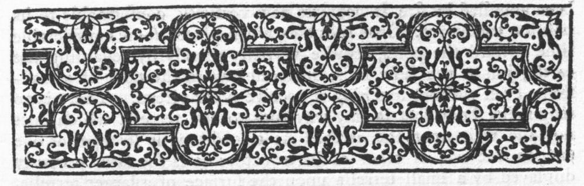

# BOOK SIXTH.

## *CHAP. I.*

### ON THE GLOBE OF THE EARTH, THE *great magnet*.

Hitherto our subject hath been the
 loadstone and things magnetical: how they conspire together, and are
 acted upon, how they conform themselves to the terrella and to the earth.
 Now must we consider separately the globe itself of the earth. Those
 experiments which have been proved by means of the terrella, how
 magnetick things conform themselves to the terrella, are all or at least
 the principal and most important of them, displayed by means of the
 earth's Body: And to the earth things magnetical are in all respects
 associate. First, as in the terrella the æquator, meridians, parallels,
 axis, poles are natural boundaries, as numerous experiments make plain:
 So also in the earth these boundaries are natural, not mathematical only
 (as all before us used to suppose). These boundaries the same experiments
 display and establish in both cases alike, in the earth no less than in
 the terrella. Just as on the periphery of a terrella a loadstone or a
 magnetick piece of iron is directed to its proper pole: so on the earth's
 surface are there turnings-about, peculiar, manifest, and constant on
 either side of the æquator. Iron is indued with verticity by being
 extended toward a pole of the earth, just as toward a pole of the
 terrella: By its being placed down also, and cooling toward the earth's
 pole after the pristine verticity has been annulled by fire,
 it acquires new verticity, conformable to its position earthward. Iron
 rods also, when placed some considerable time toward the poles, acquire
 verticity merely by regarding the earth; just as the same rods, if placed
 toward the pole of a loadstone, even without touching it, receive polar
 virtue. There is no magnetick body that in any way runs to the terrella
 which does not also wait upon the earth. As a loadstone is stronger at
 one end on one side or other of its æquator: so is the same
 property displayed by a small terrella upon the surface of a larger
 terrella. According to the variety and artistick skill in the rubbing of
 the magnetick iron upon the terrella, so do the magnetick things perform
 their function more efficiently or more feebly. In motions toward the
 earth's body, as toward the terrella a variation is displayed due to the
 unlikeness, inequality, and imperfection of its eminences: So every
 variation of the versorium or mariners' compass, everywhere by land or by
 sea, which thing has so sorely disturbed men's minds, is discerned and
 recognized as due to the same causes. The magnetick dip (which is the
 wonderful turning of magnetick things to the body of the terrella) in
 systematick course, is seen in clearer light to be the same thing upon
 the earth. And that single experiment, by a wonderful indication, as with
 a finger, proclaims the grand magnetick nature of the earth to be innate
 and diffused through all her inward parts. A magnetick vigour exists then
 in the earth just as in the terrella, which is a part of the earth,
 homogenic in nature with it, but rounded by Art, so as to correspond with
 the earth's globous shape and in order that in the chief experiments it
 might accord with the globe of the earth.

## CHAP. II.

### The Magnetick axis of the Earth *persists invariable*.

As in the very first beginnings of the
 moving world, the earth's magnetick axis passed through the midst of the
 earth: so now it tends through the centre to the same points of the
 superficies; the circle and plane of the æquinoctial line also
 persisting. For not without the vastest overthrow of the terrene mass can
 these natural boundaries be changed, as it is easy to gather from
 magnetick demonstrations. Wherfore the opinion of Dominicus Maria of
 Ferrara, a most talented man, who was the teacher of Nicolas Copernicus,
 must be cancelled; a view which, according to certain observations
 of his own, is as follows. "I," he says, "in former years while
 studying Ptolemy's *Geographia* discovered that the elevations of
 the North pole placed by him in the several regions, fall short of what
 they are in our time by one degree and ten minutes: which divergence can
 by no means be ascribed to an error of the tables: For it is not credible
 that the whole series in the book is equally wrong in the figures of the
 tables: Hence it is necessary to allow that the North pole has been
 tilted toward the vertical point. Accordingly a lengthy observation has
 already begun to disclose to us things hidden from our forefathers; not
 indeed through any sloth of theirs, but because they lacked the prolonged
 observation of their predecessors: For before Ptolemy very few places
 were observed with regard to the elevations of the pole, as he himself
 also bears witness at the beginning of his *Cosmographia*: (For,
 says he) Hipparchus alone hath handed down to us the latitudes of a few
 places, but a good many have noted those of distances; especially those
 which lie toward sunrise or sunset were received by some general
 tradition, not owing to any sloth on the part of authors themselves, but
 to the fact that there was as yet no practice of more exact mathematicks.
 'Tis accordingly no wonder, if our predecessors did not mark this very
 slow motion: For in one thousand and seventy years it shows itself to be
 displaced scarce one degree toward the apex of dwellers upon the earth.
 The strait of Gibraltar shows this, where in Ptolemy's time the North
 pole appears elevated 36 degrees and a quarter from the Horizon: whereas
 now it is 37 and two-fifths. The like divergence is also shown at
 Leucopetra in Calabria, and at particular spots in Italy, namely those
 which have not changed from Ptolemy's time to our own. And so by reason
 of this movement, places now inhabited will some day become deserted,
 while those regions which are now parched at the torrid zone will, though
 long hence, be reduced to our temper of climate. Thus, as in a course of
 three hundred and ninety five thousands of years, is that very slow
 movement completed." Thus, according to these observations of Dominicus
 Maria, the North pole is at a higher elevation, and the latitudes of
 places are greater than formerly; whence he argues a change of latitudes.
 Now, however, Stadius, taking just the contrary view, proves by
 observations that the latitudes have decreased. For he says: "The
 latitude of Rome in Ptolemy's *Geographia* is 41 degrees ⅔:
 and that you may not suppose any error of reckoning to have crept in on
 the part of Ptolemy, on the day of the Æquinox in the city of Rome, the
 ninth part of the gnomon of the sun-dial is lacking in shadow, as Pliny
 relates and Vitruvius witnesseth in his ninth book." But the observation
 of moderns (according to Erasmus Rheinholdus) gives the same in our time
 as 41 degrees with a sixth: so that you are in doubt as to half of one
 degree in the centre of the world, whether you show
 it to have decreased by the earth's obliquity of motion. One may see then
 how from inexact observations men rashly conceive new and contradictory
 opinions and imagine absurd motions of the mechanism of the earth. For
 since Ptolemy only received certain latitudes from Hipparchus, and did
 not in very many places make the observations himself; it is likely that
 he himself, knowing the position of the places, formed his estimate of
 the latitude of cities from probable conjecture only, and then placed it
 in the maps. Thus one may see, in the case of our own Britain, that the
 latitudes of cities are wrong by two or three degrees, as experience
 teaches. Wherefore all the less should we from those mistakes infer a new
 motion, or let the noble magnetick nature of the earth be debased for an
 opinion so lightly conceived. Moreover, those mistakes crept the more
 readily into geography, from the fact that the magnetick virtue was
 utterly unknown to those geographers. Besides, observations of latitudes
 cannot be made sufficiently exactly, except by experts, using also finer
 instruments, and taking into account the refraction of the lights.

## CHAP. III.

### On the magnetick diurnal revolution of the Earth's globe, as a probable assertion against the time-honoured *opinion of a Primum Mobile*.

Among the ancients Heraclides of Pontus
 and Ecphantus, afterwards the Pythagoreans, as Nicetas of Syracuse and
 Aristarchus of Samos, and some others (as it seems), used to think that
 the earth moves, and that the stars set by the interposition of the earth
 and rose by her retirement. In fact they set the earth moving and make
 her revolve around her axis from west to east, like a wheel turning on
 its axle. Philolaus the Pythagorean would have the earth to be one of the
 stars, and believed that it turned in an oblique circle around fire, just
 as the sun and moon have their own courses. He was a distinguished
 mathematician, and a most able investigator of nature. But after
 Philosophy became a subject treated of by very many and was popularized,
 theories adapted to the vulgar intelligence or based on sophistical
 subtility occupied the minds of most men, and prevailed like a torrent,
 the multitude consenting. Thereupon many valuable discoveries of the
 ancients were rejected, and were dismissed to perish in banishment; or at
 least by not being further cultivated and developed became obsolete. So
 that Copernicus (among
 later discoverers, a man most deserving of literary honour) is the first
 who attempted to illustrate the φαινόμενα of
 moving bodies by new hypotheses: and these
 demonstrations of reasons others either follow or observe in order that
 they may more surely discover the phænomenal harmony of the movements;
 being men of the highest attainments in every kind of learning. Thus
 supposed and imaginary orbs of Ptolemy and others for finding the times
 and periods of the motions are not necessarily to be admitted to the
 physical inquiries of philosophers. It is then an ancient opinion and one
 that has come down from old times, but is now augmented by important
 considerations that the whole earth rotates with a daily revolution in
 the space of 24 hours. Well then, since we see the Sun and Moon and other
 planets and the glory of all the stars approach and retire within the
 space of one natural day, either the Earth herself must needs be set in
 motion with a diurnal movement from West to East, or the whole heaven and
 the rest of nature from East to West. But, in the first place, it is not
 likely that the highest heaven and all those visible splendours of the
 fixed stars are impelled along that most rapid and useless course.
 Besides, who is the Master who has ever made out that the stars which we
 call fixed are in one and the same sphere, or has established by
 reasoning that there are any real and, as it were, adamantine sphæres? No
 one has ever proved this as a fact; nor is there a doubt but that just as
 the planets are at unequal distances from the earth, so are those vast and multitudinous
 lights separated from the Earth by varying and very remote altitudes;
 they are not set in any sphærick frame or firmament (as is feigned), nor
 in any vaulted body: accordingly the intervals of some are from their
 unfathomable distance matter of opinion rather than of verification;
 others do much exceed them and are very far remote, and these being
 located in the heaven at varying distances, either in the thinnest æther
 or in that most subtile quintessence, or in the void: how are they to
 remain in their position during such a mighty swirl of the vast orbe of
 such uncertain substance. There have been observed by astronomers 1022
 stars; besides these, numberless others are visible, some indeed faint to
 our senses, in the case of others our sense is dim and they are hardly
 perceived and only by exceptionally keen eyes, and there is no one gifted
 with excellent sight who does not when the Moon is dark and the air at
 its rarest, discern numbers and numbers dim and wavering with minute
 lights on account of the great distance: hence it is credible both that
 these are many and that they are never all included in any range of
 vision. How immeasurable then must be the space which stretches to those
 remotest of fixed stars! How vast and immense the depth of that imaginary
 sphere! How far removed from the Earth must the most widely separated
 stars be and at a distance transcending all sight, all skill and thought!
 How monstrous then such a motion would be! It is evident
 then that all the heavenly bodies set as if in destined places are there
 formed into sphæres, that they tend to their own centres, and that round
 them there is a confluence of all their parts. And if they have motion,
 that motion will rather be that of each round its own centre, as that of
 the Earth is; or a forward movement of the centre in an orbit, as that of
 the Moon: there would not be circular motion in the case of a too
 numerous and scattered flock. Of these stars some situate near the
 Æquator would seem to be borne around at a very rapid rate, others nearer
 the pole to have a somewhat gentler motion, others, apparently
 motionless, to have a slight rotation. Yet no differences in point of
 light, mass or colours are apparent to us: for they are as brilliant,
 clear, glittering and duskish toward the poles, as they are near the
 Æquator and the Zodiack: those which remain set in those positions do not
 hang, and are neither fixed, nor bound to anything of the nature of a
 vault. All the more insane were the circumvolution of that fictitious
 *Primum Mobile*, which is higher, deeper, and still more
 immeasurable. Moreover, this inconceivable *Primum Mobile* ought to
 be material and of enormous depth, far surpassing all inferior nature in
 size: for nohow else could it conduct from East to West so many and such
 vast bodies of stars, and the universe even down to the Earth: and it
 requires us to accept in the government of the stars a universal power
 and a despotism perpetual and intensely irksome. That *Primum
 Mobile* bears no visible body, is nohow recognizable, is a fiction
 believed in by those people, accepted by the weak-minded folk, who wonder
 more at our terrestrial mass than at bodies so vast, so inconceivable,
 and so far separated from us. But there can be no movement of infinity
 and of an infinite body, and therefore no diurnal revolution of that
 vastest *Primum Mobile*. The Moon being neighbour to the Earth
 revolves in 27 days; Mercury and Venus have their own moderately slow
 motions; Mars finishes a period in two years, Jupiter in twelve years,
 Saturn in thirty. And those also who ascribe a motion to the fixed stars
 make out that it is completed in 36,000 years, according to Ptolemy, in
 25,816 years, according to Copernicus' observations; so that the motion
 and the completion of the journey always become slower in the case of the
 greater circles. And would there then be a diurnal motion of that
 *Primum Mobile* which is so great and beyond them all immense and
 profound? 'Tis indeed a superstition and in the view of philosophy a
 fable now only to be believed by idiots, deserving more than ridicule
 from the learned: and yet in former ages, that motion, under the pressure
 of an importunate mob of philosophizers, was actually accepted as a basis
 of computations and of motions, by mathematicians. The motions of the
 bodies (namely planets) seem to take place eastward and following the
 order of the signs. The common run of mathematicians and
 philosophers also suppose that the fixed stars in the same manner advance
 with a very slow motion: and from ignorance of the truth they are forced
 to join to them a ninth sphære. Whereas now this first and unthinkable
 *Primum Mobile*, a fiction not comprehended by any judgment, not
 evidenced by any visible constellation, but devised of imagination only
 and mathematical hypothesis, unfortunately accepted and believed by
 philosophers, extended into the heaven and beyond all the stars, must
 needs with a contrary impulse turn about from East to West, in opposition
 to the inclination of all the rest of the Universe. Whatsoever in nature
 is moved naturally, the same is set in motion both by its own forces and
 by the consentient compact of other bodies. Such is the motion of parts
 to their whole, of all interdependent sphæres and stars in the universe:
 such is the circular impulse in the bodies of the planets, when they
 affect and incite one another's courses. But with regard to the *Primum
 Mobile* and its contrary and exceeding rapid movement, what are the
 bodies which incite it or propel it? What is the nature that conspires
 with it? Or what is that mad force beyond the *Primum Mobile*? Since
 it is in bodies themselves that acting force resides, not in spaces or
 intervals. But he who thinks that those bodies are at leisure and keeping
 holiday, while all the virtue of the universe appertains to the very
 orbits and sphæres, is on this point not less mad than he who, in some
 one else's house, thinks that the walls and floors and roof rule the
 family rather than the wife and thoughtful paterfamilias. Therefore not
 by the firmament are they borne along, or are moved, or have their
 position; much less are those confused crowds of stars whirled around by
 the *Primum Mobile*, nor are they torn away and huddled along by a
 contrary and extremely rapid movement. Ptolemy of Alexandria seems to be
 too timid and weak-minded in dreading the dissolution of this nether
 world, were the Earth to be moved round in a circle. Why does he not fear
 the ruin of the Universe, dissolution, confusion, conflagration, and
 infinite disasters celestial and super-celestial, from a motion
 transcending all thoughts, dreams, fables, and poetic licences,
 insurmountable, ineffable, and inconceivable? Wherefore we are carried
 along by a diurnal rotation of the earth (a motion for sure more
 congruous), and as a boat moves above the waters, so do we turn about
 with the earth, and yet seem to ourselves to be stationary, and at rest.
 Great and incredible it seems to some philosophers, by reason of
 inveterate prejudice, that the Earth's vast body should be swirled wholly
 round in the space of 24 hours. But it would be more incredible that the
 Moon should travel through her orbit, or complete an entire course in a
 space of 24 hours; more so the Sun or Mars; still more Jupiter and
 Saturn; more than marvellous would be the velocity in the case of the
 fixed stars and the firmament; what in the
 world they would have to wonder at in the case of their ninth sphere, let
 them imagine as they like. But to feign a *Primum Mobile* and to
 attribute to the thing thus feigned a motion to be completed in the space
 of 24 hours, and not to allow this motion to the Earth in the same
 interval of time, is absurd. For a great circle of the Earth is to the
 ambit of the *Primum Mobile* less than a furlong to the whole Earth.
 If the diurnal rotation of the Earth seem headlong, and not admissible in
 nature by reason of its rapidity, worse than insane will be the movement
 of the *Primum Mobile* both for itself and the whole universe,
 agreeing as it does with no other motion in any proportion or likeness.
 It seems to Ptolemy and the Peripateticks that nature must be disordered,
 and the framework and structure of this globe of ours be dissolved, by
 reason of so swift a terrestrial revolution. The Earth's diameter is 1718
 German miles; the greatest elongation of the new Moon is 65, the least is
 55 semi-diameters of the Earth: the greatest altitude of the half moon is
 68, the least 52: yet it is probable that its sphære is still larger and
 deeper. The sun in its greatest eccentricity has a distance of 1142
 semi-diameters of the Earth; Mars, Jupiter, Saturn, being slower in
 motion, are so proportionately further remote from the Earth. The
 distances of the firmament and of the fixed stars seem to the best
 mathematicians inconceivable. Leaving out the ninth sphære, if the
 convexity of the *Primum Mobile* be duly estimated in proportion to
 the rest of the sphæres, the vault of the *Primum Mobile* must in
 one hour run through as much space as is comprised in 3000 great circles
 of the Earth, for in the vault of the firmament it would complete more
 than 1800; but what iron solidity can be imagined so firm and tough as
 not to be disrupted and shattered to fragments by a fury so great and a
 velocity so ineffable. The Chaldæans indeed would have it that the heaven
 consists of light. In light, however, there is no so-great firmness,
 neither is there in Plotinus' fiery firmament, nor in the fluid or
 aqueous or supremely rare and transparent heaven of the divine Moses,
 which does not cut off from our sight the lights of the stars. We must
 accordingly reject the so deep-set error about this so mad and furious a
 celestial velocity, and the forced retardation of the rest of the
 heavens. Let theologians discard and wipe out with sponges those old
 women's tales of so rapid a spinning round of the heavens borrowed from
 certain inconsiderate philosophers. The sun is not propelled by the
 sphære of Mars (if a sphære there be) and by his motion, nor Mars by
 Jupiter, nor Jupiter by Saturn. The sphære, too, of the fixed stars,
 seems well enough regulated except so far as motions which are in the
 Earth are ascribed to the heavens, and bring about a certain change of
 phænomena. The superiors do not exercise a despotism over the inferiors;
 for the heaven of philosophers, as of theologians, must be
 gentle, happy, and tranquil, and not at all subject to changes: nor shall
 the force, fury, swiftness, and hurry of a *Primum Mobile* have
 dominion over it. That fury descends through all the celestial sphæres,
 and celestial bodies, invades the elements of our philosophers, sweeps
 fire along, rolls along the air, or at least draws the chief part of it,
 conducts the universal æther, and turns about fiery impressions (as if it
 were a solid and firm body, when in fact it is a most refined essence,
 neither resisting nor drawing), leads captive the superior. O marvellous
 constancy of the terrestrial globe, the only one unconquered; and yet one
 that is holden fast, or stationary, in its place by no bonds, no
 heaviness, by no contiguity with a grosser or firmer body, by no weights.
 The substance of the terrestrial globe withstands and sets itself against
 universal nature. Aristotle feigns for himself a system of philosophy
 founded on motions simple and compound, that the heavens revolve in a
 simple circle, its elements moving with a right motion, the parts of the
 earth seeking the earth in straight lines, falling on its surface at
 right angles, and tending together toward its centre, always, however, at
 rest therein; accordingly also the whole Earth remains immovable in its
 place, united and compacted together by its own weight. That cohæsion of
 parts and aggregation of matter exist in the Sun, in the Moon, in the
 planets, in the fixed stars, in fine in all those round bodies whose
 parts cohære together and tend each to their own centres; otherwise the
 heaven would fall, and that sublime ordering would be lost: yet these
 cœlestial bodies have a circular motion. Whence the Earth too may
 equally have her own motion: and this motion is not (as some deem it)
 unsuitable for the assembling or adverse to the generation of things. For
 since it is innate in the terrestrial globe, and natural to it; and since
 there is nothing external that can shock it, or hinder it by adverse
 motions, it goes round without any ill or danger, it advances without
 being forced, there is nothing that resists, nothing that by retiring
 gives way, but all is open. For while it revolves in a space void of
 bodies, or in the incorporeal æther, all the air, the exhalations of land
 and water, the clouds and pendent meteors, are impelled along with the
 globe circularly: that which is above the exhalations is void of bodies:
 the finest bodies and those which are least cohærent almost void are not
 impeded, are not dissolved, while passing through it. Wherefore also the
 whole terrestrial globe, with all its adjuncts, moves bodily along,
 calmly, meeting no resistance. Wherefore empty and superstitious is the
 fear that some weak minds have of a shock of bodies (like Lucius
 Lactantius, who, in the fashion of the unlettered rabble and of the most
 unreasonable men scoffs at an Antipodes and at the sphærick ordering of
 the Earth all round). So for these reasons, not only probable but
 manifest, does the diurnal rotation of the earth seem,
 since nature
 always acts through a few rather than through many; and it is more
 agreeable to reason that the Earth's one small body should make a diurnal
 rotation, than that the whole universe should be whirled around. I pass
 over the reasons of the Earth's remaining motions, for at present the
 only question is concerning its diurnal movement, according to which it
 moves round with respect to the Sun, and creates a natural day (which we
 call a nycthemeron).
 And indeed Nature may be thought to have granted a motion very suitable
 to the Earth's shape, which (being sphærical) is revolved about the poles
 assigned it by Nature much more easily and fittingly than that the whole
 universe, whose limit is unknown and unknowable, should be whirled round;
 and than there could be imagined an orbit of the *Primum Mobile*, a
 thing not accepted by the ancients, which Aristotle even did not devise
 or accept as in any shape or form existing beyond the sphære of the fixed
 stars; which finally the sacred scriptures do not recognize any more than
 they do the revolution of the firmament.

## CHAP. IIII.

### That the Earth moves circularly.

If then the philosophers of the common
 sort, with an unspeakable absurdity, imagine the whole heaven and the
 vast extent of the universe to rotate in a whirl, it yet remains that the
 earth performs a diurnal change. For in no third way can the apparent
 revolutions be explained. This day, then, which is called natural, is a
 revolution of some meridian of the Earth from Sun to Sun. It revolves
 indeed in an entire course, from a fixed star round to that star again.
 Those bodies which in nature are moved with a circular, æquable and
 constant motion, are furnished, in their parts, with various boundaries.
 But the Earth is not a Chaos nor disordered mass; but by reason of its
 astral virtue, it has boundaries which subserve the circular motion,
 poles not mathematical, an æquator not devised by imagination, meridians
 also and parallels; all of which we find permanent, certain and natural
 in the Earth: which by numerous experiments the whole magnetick
 philosophy sets forth. For in the earth there are poles set in fixed
 bounds, and at them the verticity mounts up on either side from the plane
 of the Earth's æquator, with forces which are mightier and præpotent from
 the common action of the whole; and with these poles the diurnal
 revolution is in agreement. But in no turnings-about of bodies, in none
 of the motions of the planets are there to be recognized, beheld, or
 assured to us by any reasoning any sensible or natural poles in the
 firmament, or in any *Primum* *Mobile*; but
 those are the conception of an unsettled imagination. Wherefore we,
 following an evident, sensible and tested cause, do know that the earth
 moves on its own poles, which are apparent to us by many magnetick
 demonstrations. For not only on the ground of its constancy, and its sure
 and permanent position, is the Earth endowed with poles and verticity:
 for it might be directed toward other parts of the universe, toward East
 or West or some other region. By the wondrous wisdom then of the Builder
 forces, primarily animate, have been implanted in the Earth, that with
 determinate constancy the Earth may take its direction, and the poles
 have been placed truly opposite, that about them as the termini, as it
 were, of some axis, the motion of diurnal turning might be performed. But
 the constancy of the poles is regulated by the primary soul. Wherefore,
 for the Earth's good, the collimations of her verticities do not
 continually regard a definite point of the firmament and of the visible
 heaven. For changes of the æquinoxes take place from a certain deflection
 of the Earth's axis; yet in regard to that deflection, the Earth has a
 constancy of motion 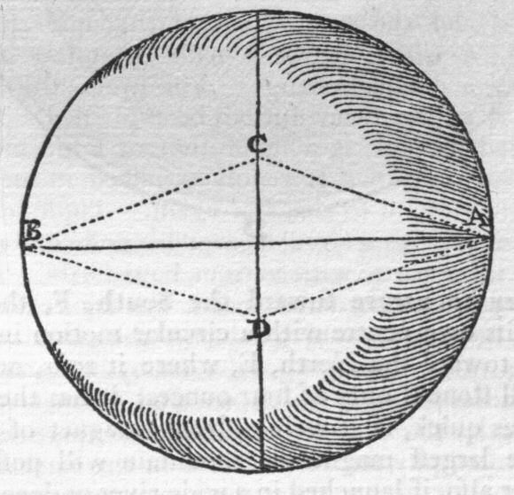 derived from her own forces. The Earth, that she may turn
 herself about in a diurnal revolution, leans on her poles. For since at A
 and B there is constant verticity, and the axis is straight; at C and D
 (the æquinoctial line) the parts are free, the whole forces on either
 side being spread out from the plane of the æquator toward the poles, in
 æther which is free from renitency, or else in a void; and A and B
 remaining constant, C revolves toward D both from innate conformity and
 aptitude, and for necessary good, and the avoidance of evil; but being
 chiefly moved forward by the diffusion of the solar orbes of virtues, and
 by their lights. And 'tis borne around, not upon a new and strange
 course, but (with the tendency common to the rest of the
 planets) it tends from West to East. For all planets have a like motion
 Eastward according to the succession of the signs, whether Mercury and
 Venus revolve beneath the Sun, or around the Sun. That the Earth is
 capable of and fitted for moving circularly its parts show, which when
 separated from the whole are not only borne along with the 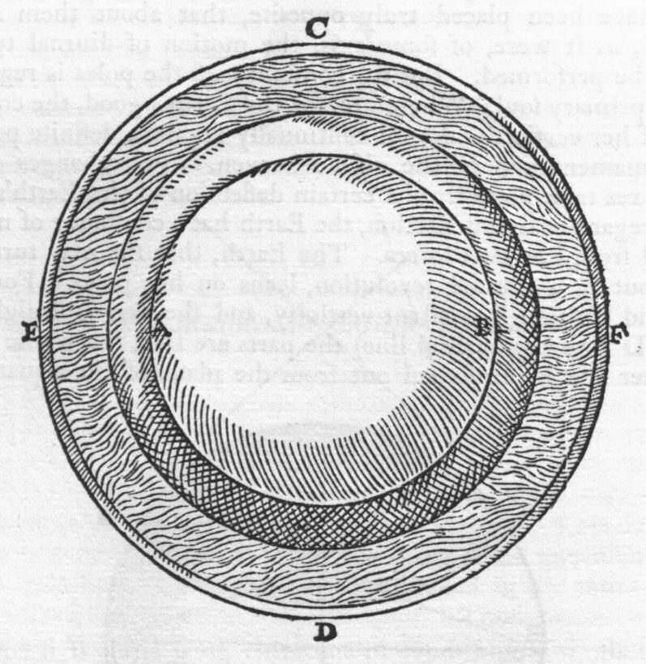 straight movement taught by the
 Peripateticks, but rotate also. A loadstone fixed in a wooden vessel is
 placed on water so as to swim freely, turn itself, and float about. If
 the pole B of the loadstone be set contrary to nature toward the South,
 F, the Terrella is turned about its own centre with a circular motion in
 the plane of the Horizon, toward the North, E, where it rests, not at C
 or D. So does a small stone if only of four ounces; it has the same
 motion also and just as quick, if it were a strong magnet of one hundred
 pounds. The largest magnetical mountain will possess the same
 turning-power also, if launched in a wide river or deep sea: and yet a
 magnetick body is much more hindered by water than the whole Earth is by
 the æther. The whole Earth would do the same, if the Boreal pole were to
 be diverted from its true direction; for the Boreal pole would run back
 with the circular motion of the whole around the centre toward the
 Cynosure. But this motion by which the parts naturally settle themselves
 in their own resting-places is no other than circular.
 The whole Earth regards the Cynosure with her pole according to a
 steadfast law of her nature: and thus each true part of it seeks a like
 resting-place in the world, and is moved circularly toward that position.
 The natural movements of the whole and of the parts are alike: wherefore
 when the parts are moved in a circle, the whole also has the potency of
 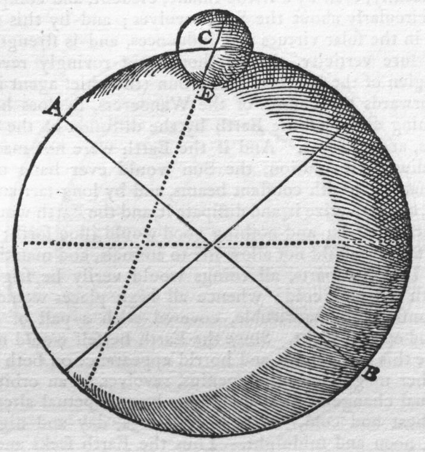 moving circularly. A sphærical loadstone placed in a vessel
 on water moves circularly around its centre (as is manifest) in the plane
 of the Horizon, into conformity with the earth.

So also it would move in any other great circle if it could be free;
 as in the declination instrument, a circular motion takes place in the
 meridian (if there were no variation), or, if there should be some
 variation, in a great circle drawn from the Zenith through the point of
 variation on the horizon. And that circular motion of the magnet to its
 own just and natural position shows that the whole Earth is fitted and
 adapted, and is sufficiently furnished with peculiar forces for diurnal
 circular motion. I omit what Peter Peregrinus constantly affirms, that a terrella
 suspended above its poles on a meridian moves circularly, making an
 entire revolution in 24 hours: which, however, it has not happened to
 ourselves as yet to see; and we even doubt this motion on account of the
 weight of the stone itself, as well as because the whole Earth, as she is
 moved of herself, so also is she propelled by other stars: and this does
 not happen in proportion (as it does in the terrella)
 in every part.
 The Earth is moved by her own primary form and natural desire, for the
 conservation, perfection, and ordering of its parts, toward things more
 excellent: and this is more likely than that the fixed stars, those
 luminous globes, as well as the Wanderers, and the most glorious and
 divine Sun, which are in no way aided by the Earth, or renewed, or urged
 by any virtue therein, should circulate aimlessly around the Earth, and
 that the whole heavenly host should repeat around the Earth courses never
 ending and of no profit whatever to the stars. The Earth, then, which by
 some great necessity, even by a virtue innate, evident, and conspicuous,
 is turned circularly about the Sun, revolves; and by this motion it
 rejoices in the solar virtues and influences, and is strengthened by its
 own sure verticity, that it should not rovingly revolve over every region
 of the heavens. The Sun (the chief agent in nature) as he forwards the
 courses of the Wanderers, so does he prompt this turning about of the
 Earth by the diffusion of the virtues of his orbes, and of light. And if
 the Earth were not made to spin with a diurnal revolution, the Sun would
 ever hang over some determinate part with constant beams, and by long
 tarriance would scorch it, and pulverize it, and dissipate it, and the
 Earth would sustain the deepest wounds; and nothing good would issue
 forth; it would not vegetate, it would not allow life to animals, and
 mankind would perish. In other parts, all things would verily be
 frightful and stark with extreme cold; whence all high places would be
 very rough, unfruitful, inaccessible, covered with a pall of perpetual
 shades and eternal night. Since the Earth herself would not choose to
 endure this so miserable and horrid appearance on both her faces, she, by
 her magnetick astral genius, revolves in an orbit, that by a perpetual
 change of light there may be a perpetual alternation of things, heat and
 cold, risings and settings, day and night, morn and eve, noon and
 midnight. Thus the Earth seeks and re-seeks the Sun, turns away from him
 and pursues him, by her own wondrous magnetick virtue. Besides, it is not
 only from the Sun that evil would impend, if the Earth were to stay still
 and be deprived of solar benefit; but from the Moon also serious dangers
 would threaten. For we see how the ocean rises and swells beneath certain
 known positions of the Moon: And if there were not through the daily
 rotation of Earth a speedy transit of the Moon, the flowing sea would be
 driven above its level into certain regions, and many shores would be
 overwhelmed with huge waves. In order then that Earth may not perish in
 various ways, and be brought to confusion, she turns herself about by
 magnetick and primary virtue: and the like motions exist also in the rest
 of the Wanderers, urged specially by the movement and light of other
 bodies. For the Moon also turns herself about in a monthly course, to
 receive in succession the Sun's beams in which she, like the Earth,
 rejoices, and is refreshed: nor could she
 endure them for ever on one particular side without great harm and sure
 destruction. Thus each one of the moving globes is for its own safety
 borne in an orbit either in some wider circle, or only by a rotation of
 its body, or by both together. But it is ridiculous for a man a
 philosopher to suppose that all the fixed stars and the planets and the
 still higher heavens revolve to no other purpose, save the advantage of
 the Earth. It is the Earth, then, that revolves, not the whole heaven,
 and this motion gives opportunity for the growth and decrease of things,
 and for the generating of things animate, and awakens internal heat for
 the bringing of them to birth. Whence matter is quickened for receiving
 forms; and from the primary rotation of the Earth natural bodies have
 their primary impetus and original activity. The motion then of the whole
 Earth is primary, astral, circular, around its own poles, whose verticity
 arises on both sides from the plane of the æquator, and whose vigour is
 infused into opposite termini, in order that the Earth may be moved by a
 sure rotation for its good, the Sun also and the stars helping its
 motion. But the simple straight motion downwards of the Peripateticks is
 a motion of weight, a motion of the aggregation of disjoined parts, in
 the ratio of their matter, along straight lines toward the body of the
 Earth: which lines tend the shortest way toward the centre. The motions
 of disjoined magnetical parts of the Earth, besides the motion of
 aggregation, are coition, revolution, and the direction of the parts to
 the whole, for harmony of form, and concordancy.

## CHAP. V.

### Arguments of those denying the Earth's motion, and *their confutation.*

Now it will not be superfluous to weigh
 well the arguments of those who say the Earth does not move; that we may
 be better able to satisfy the crowd of philosophizers who assert that
 this constancy and stability of the Earth is confirmed by the most
 convincing arguments. Aristotle does not allow that the Earth moves
 circularly, on the ground that each several part of it would be affected
 by this particular motion; that whereas now all the separate parts of the
 Earth are borne toward the middle in straight lines, that circular motion
 would be violent, and strange to nature, and not enduring. But it has
 been before proved that all actual portions of the Earth move in a
 circle, and that all magnetick bodies (fitly disposed) are borne around
 in an orbe. They are borne, however, toward the centre of the Earth in a
 straight line (if the way be open) by a
 motion of aggregation as though to their own origin: they move by various
 motions agreeably to the conformation of the whole: a terrella is moved
 circularly by its innate forces. "Besides" (says he), "all things which
 are borne in an orbe, afterwards would seem to be abandoned by the first
 motion, and to be borne by several motions besides the first. The Earth
 must also be borne on by two sorts of motion, whether it be situate
 around a mid-point, or in the middle site of the universe: and if this
 were so, there must needs be at one time an advance, at another time a
 retrogression of the fixed stars: This, however, does not seem to be the
 case, but they rise and set always the same in the same places." But it
 by no means follows that a double motion must be assigned to the Earth.
 But if there be but one diurnal motion of the Earth around its poles, who
 does not see that the stars must always in the same manner rise and set
 at the same points of the horizon, even although there be another motion
 about which we are not disputing: since the mutations in the smaller
 orbit cause no variation of aspect in the fixed stars owing to their
 great distance, unless the axis of the Earth have varied its position,
 concerning which we raise a question when speaking of the cause of the
 præcession of the æquinoxes. In this argument are many flaws. For if the
 Earth revolve, that we asserted must needs occur not by reason of the
 first sphære, but of its innate forces. But if it were set in motion by
 the first sphære, there would be no successions of days and nights, for
 it would continue its course along with the *Primum Mobile*. But
 that the Earth is affected by a double movement at the time when it
 rotates around its own centre, because the rest of the stars move with a
 double motion, does not follow. Besides, he does not well consider the
 argument, nor do his interpreters understand the same. τούτου δὲ
 συμβαίνοντος,
 ἀναγκαῖον
 γίγνεσθαι
 παρόδους
 καὶ τροπὰς
 τῶν
 ἐνδεδεμένων
 ἄστρων. (Arist. *de
 Cœlo*, ii. chap. 14.) That is, "If this be so, there must needs
 be changes, and retrogressions of the fixed stars." What some interpret
 as retrogressions or regressions, and changes of the fixed stars, others
 explain as diversions: which terms can in no way be understood of axial
 motion, unless he meant that the Earth moved by the *Primum Mobile*
 is borne and turned over other poles diverse even from those which
 correspond to the first sphære, which is altogether absurd. Other later
 theorists suppose that the eastern ocean ought to be impelled so into
 western regions by that motion, that those parts of the Earth which are
 dry and free from water would be daily flooded by the eastern ocean. But
 the ocean is not acted upon by that movement, since nothing opposes it;
 and even the whole atmosphere is carried round: And for that reason in
 the Earth's course all the things in the air are not left behind by us
 nor do they seem to move toward the West: Wherefore also the clouds
 are
 at rest in the air, unless the force of the winds drive them; and objects
 which are projected into the air fall again into their own place. But
 those foolish folk who think that towers, temples, and buildings must
 necessarily be shaken and overthrown by the Earth's motion, may fear lest
 men at the Antipodes should slip off into an opposite orbe, or that ships
 when sailing round the entire globe should (as soon as they have
 dipped under the plane of our horizon) fall into the opposite region of
 the sky. But those follies are old wives' gossip, and the rubbish of
 certain philosophizers, men who, when they essay to treat of the highest
 truths and the fabrick of the universe, and hazard anything, can scarce
 understand aught *ultra crepidam*. They would have the Earth to be
 the centre of a circle; and therefore to rest motionless amid the
 rotation. But neither the stars nor the wandering globes move about the
 Earth's centre: the high heaven also does not move circularly round the
 Earth's centre; nor if the Earth were in the centre, is it a centre
 itself, but a body around a centre. Nor is it confident with reason that
 the heavenly bodies of the Peripateticks should attend on a centre so
 decadent and perishable as that of the Earth. They think that Nature
 seeks rest for the generation of things, and for promoting their increase
 while growing; and that accordingly the whole Earth is at rest. And yet
 all generation takes place from motion, without which the universal
 nature of things would become torpid. The motion of the Sun, the motion
 of the Moon, cause changes; the motion of the Earth awakens the internal
 breath of the globe; animals themselves do not live without motion, and
 the ceaseless activity of the heart and arteries. For of no moment are
 the arguments for a simple straight motion toward the centre, that this
 is the only kind in the Earth, and that in a simple body there is one
 motion only and that a simple one. For that straight motion is only a
 tendency toward their own origin, not of the parts of the Earth only, but
 of those of the Sun also, of the Moon, and of the rest of the sphæres
 which also move in an orbit. Joannes Costæus, who raises doubts
 concerning the cause of the Earth's motion, looking for it externally and
 internally, understands magnetick vigour to be internal, active, and
 disponent; also that the Sun is an external promotive cause, and that the
 Earth is not so vile and abject a body as it is generally considered.
 Accordingly there is a diurnal movement on the part of the Earth for its
 own sake and for its advantage. Those who make out that that terrestrial
 motion (if such there be) takes place not only in longitude, but also in
 latitude, talk nonsense. For Nature has set in the Earth determinate
 poles, and definite unconfused revolutions. Thus the Moon revolves with
 respect to the Sun in a monthly course; yet having her own definite
 poles, facing determinate parts of the heaven. To suppose that the air
 moves the Earth would be ridiculous. For air is only exhalation,
 and is an enveloping effluvium from the Earth itself; the winds also are
 only a rush of the exhalations in some part near the Earth's surface; the
 height of its motion is slight, and in all regions there are various
 winds unlike and contrary. Some writers, not finding in the matter of the
 Earth the cause (for they say that they find nothing except solidity and
 consistency), deny it to be in its form; and they only admit as qualities
 of the Earth cold and dryness, which are unable to move the Earth. The
 Stoicks attribute a soul to the Earth, whence they pronounce (amid the
 laughter of the learned) the Earth to be an animal. This magnetick form,
 whether vigour or soul, is astral. Let the learned lament and bewail the
 fact that none of those old Peripateticks, nor even those common
 philosophizers heretofore, nor Joannes Costæus, who mocks at such things,
 were able to apprehend this grand and important natural fact. But as to
 the notion that surface inequality of mountains and valleys would prevent
 the Earth's diurnal revolution, there is nothing in it: for they do not
 mar the Earth's roundness, being but slight excrescences compared with
 the whole Earth; nor does the Earth revolve alone without its emanations.
 Beyond the emanations, there is no renitency. There is no more labour
 exerted in the Earth's motion than in the march of the rest of the Stars:
 nor is it excelled in dignity by some stars. To say that it is frivolous
 to suppose that the Earth rather seeks a view of the Sun, than the Sun of
 the Earth, is a mark of great obstinacy and unwisdom. Of the theory of
 the rotation we have often spoken. If anyone seek the cause of the
 revolution, or of other tendency of the Earth, from the sea surrounding
 it, or from the motion of the air, or from the Earth's gravity, he would
 be no less silly as a theorist than those who stubbornly ground their
 opinions on the sentiments of the ancients. Ptolemy's reasonings are of
 no weight; for when our true principles are laid down, the truth comes to
 light, and it is superfluous to refute them. Let Costæus recognize and
 philosophers see how unfruitful and vain a thing it becomes then to take
 one's stand on the principles and unproved opinions of certain ancients.
 Some raise a doubt how it can be that, if the Earth move round its own
 axis, a globe of iron or of lead dropped from the highest point of a
 tower falls exactly perpendicularly to a spot of the Earth below itself.
 Also how it is that cannon balls from a large culverin, fired with the
 same quantity and strength of powder, in the same direction and at a like
 elevation through the same air, would be cast at a like distance from a
 given spot both Eastward and Westward, supposing the Earth to move
 Eastward. But those who bring forward this kind of argument are being
 misled: not attending to the nature of primary globes, and the
 combination of parts with their globes, even though they be not adjoined
 by solid parts. Whereas the motion of the Earth in the diurnal revolution
 does not involve the separation of her more solid circumference
 from the surrounding bodies; but all her effluvia surround her, and in
 them heavy bodies projected in any way by force, move on uniformly along
 with the Earth in general coherence. And this also takes place in all
 primary bodies, the Sun, the Moon, the Earth, the parts betaking
 themselves to their first origins and sources, with which they connect
 themselves with the same appetence as terrene things, which we call
 heavy, with the Earth. So lunar things tend to the Moon, solar things to
 the Sun, within the orbes of their own effluvia. The emanations hold
 together by continuity of substance, and heavy bodies are also united
 with the Earth by their own gravity, and move on together in the general
 motion: especially when there is no renitency of bodies in the way. And
 for this cause, on account of the Earth's diurnal revolution, bodies are
 neither set in motion, nor retarded; they do not overtake it, nor do they
 fall short behind it when violently projected toward East or West.

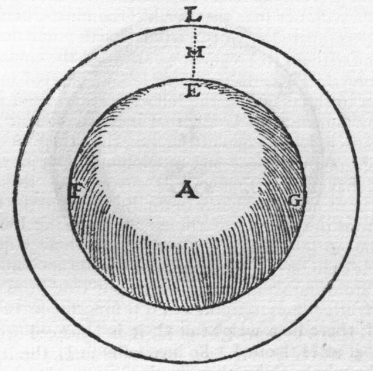

Let E F G be the Earth's globe, A its centre, L E the ascending
 effluvia: Just as the orbe of the effluvia progresses with the Earth, so
 also does the unmoved part of the circle at the straight line L E
 progress along with the general revolution. At L and E, a heavy body, M,
 falls perpendicularly toward E, taking the shortest way to the centre,
 nor is that right movement of weight, or of aggregation compounded with a
 circular movement, but is a simple right motion, never leaving the line L
 E. But when thrown with an equal force from E toward F, and from E toward
 G, it completes an equal distance on either side, even though the daily
 rotation of the Earth is in process: just as twenty paces of a man mark
 an equal space whether toward East or West: so the Earth's diurnal motion
 is by no means refuted by the illustrious
 Tycho Brahe, through arguments such as these.

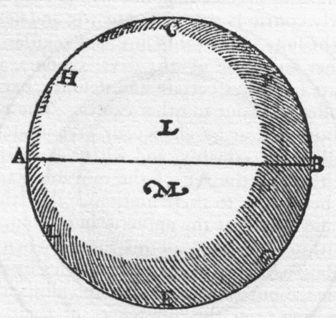 The tendency toward its origin (which, in the case of the
 Earth, is called by Philosophers weight) causes no resistance to the
 diurnal revolution, nor does it direct the Earth, nor does it retain the
 parts of the Earth in place, for in regard to the Earth's solidity they
 are imponderous, nor do they incline further, but are at rest in the
 mass. If there be a flaw in the mass, such as a deep cavity (say 1000
 fathoms), a homogenic portion of the Earth, or compacted terrestrial
 matter, descends through that space (whether filled with water or air)
 toward an origin more assured than air or water, seeking a solid globe.
 But the centre of the Earth, as also the Earth as a whole, is
 imponderous; the separated parts tend toward their own origin, but that
 tendency we call weight; the parts united are at rest; and even if they
 were ponderable, they would introduce no hindrance to the diurnal
 revolution. For if around the axis A B, there be a weight at C, it is
 balanced from E; if at F, from G; if at H, from I. So internally at L,
 they are balanced from M: the whole globe, then, having a natural axis,
 is balanced in æquilibrio, and is easily set in motion by the slighted
 cause, but especially because the Earth in her own place is nowise heavy
 nor lacking in balance. Therefore weight neither hinders the diurnal
 revolution, nor influences either the direction or continuance in
 position. Wherefore it is manifest that no sufficiently strong reason has
 yet been found out by Philosophers against the motion of the Earth.

## CHAP. VI.

### On the cause of the definite time, of an entire *rotation of the Earth.*

Diurnal motion is due to causes which have
 now to be sought, arising from magnetick vigour and from the confederated
 bodies; that is to say, why the diurnal rotation of the Earth is
 completed in the space of twenty-four hours. For no curious art, whether
 of Clepsydras or of sand-clocks, or those contrivances of little toothed
 wheels which are set in motion by weights, or by the force of a bent
 steel band, can discover any degree of difference in the time. But as
 soon as the diurnal rotation has been gone through, it at once begins
 over again. But we would take as the day the absolute turning of a
 meridian of the Earth, from sun to sun. This is somewhat greater than one
 whole revolution of it; in this way the yearly course is completed in 365
 and nearly ¼ turnings with respect to the sun. From this sure and regular
 motion of the Earth, the number and time of 365 days, 5 hours, 55
 minutes, in solar tropical years is always certain and definite, except
 that there are some slight differences due to other causes. The Earth
 therefore revolves not fortuitously, or by chance, or precipitately; but
 with a rather high intelligence, equably, and with a wondrous regularity,
 in no other way than all the rest of the movable stars, which have
 definite periods belonging to their motions. For the Sun himself being
 the agent and incitor of the universe in motion, other wandering globes
 set within the range of his forces, when acted on and stirred, also
 regulate each its own proper courses by its own forces; and they are
 turned about in periods corresponding to the extent of their greater
 rotation, and the differences of their effused forces, and their
 intelligence for higher good. And for that cause Saturn, having a wider
 orbit, is borne round it in a longer time, Jupiter a shorter, and Mars
 still less; while Venus takes nine months, Mercury 80 days, on the
 hypotheses of Copernicus; the Moon going round the Earth with respect to
 the Sun in 29 days, 12 hours, 44 minutes. We have asserted that the Earth
 moves circularly about its centre, completing a day by an entire
 revolution with respect to the Sun. The Moon revolves in a monthly course
 around the Earth, and, repeating a conjunction with the Sun after a
 former synodic conjunction, constitutes the month or Lunar day. The
 Moon's mean concentrick orbit, according to numerous observations of
 Copernicus and later astronomers, is found to be distant 29 and about 5/6
 diameters of the Earth from the Earth's centre. The Moon's revolution
 with respect to the Sun takes place in 29½ days and 44 minutes of time.
 We reckon the motion with respect to the sun, not the periodic motion,
 just as a day is one entire revolution of
 the Earth with respect to the Sun, not one periodick revolution; because
 the Sun is the cause of lunar as of terrestrial motion: also, because (on
 the hypotheses of later observers) the synodical month is truly periodic,
 on account of the Earth's motion in a great orbit. The proportion of
 diameters to circumferences is the same. And the concentrick orbit of the
 Moon contains twice over 29 and ½ great circles of the Earth & a
 little more. The Moon & the Earth, then, agree together in a double
 proportion of motion; & the Earth moves in the space of twenty-four
 hours, in its diurnal motion; because the Moon has a motion proportional
 to the Earth, but the Earth a motion agreeing with the lunar motion in a
 nearly double proportion. There is some difference in details, because
 the distances of the stars in details have not been examined sufficiently
 exactly, nor are mathematicians as yet agreed about them. The Earth
 therefore revolves in a space of 24 hours, as the Moon in her monthly
 course, by a magnetick confederation of both stars, the globes being
 forwarded in their movement by the Sun, according to the proportion of
 their orbits, as Aristotle allows, *de Cœlo*, bk. ii., chap.
 10. "It happens" (he says) "that the motions are performed through a
 proportion existing between them severally, namely, at the same intervals
 in which some are swifter, others slower," But it is more agreeable to
 the relation between the Moon and the Earth, that that harmony of motion
 should be due to the fact that they are bodies rather near together, and
 very like each other in nature and substance, and that the Moon has more
 evident effects upon the Earth than the rest of the stars, the Sun
 excepted; also because the Moon alone of all the planets conducts her
 revolutions, directly (however diverse even), with reference to the
 Earth's centre, and is especially akin to the Earth, and bound to it as
 with chains. This, then, is the true symmetry and harmony between the
 motions of the Earth and the Moon; not that old oft-besung harmony of
 cœlestial motions, which assumes that the nearer any sphære is to
 the *Primum Mobile* and that fictitious and pretended rapidest Prime
 Motion, the less does it offer resistance thereto, and the slower it is
 borne by its own motion from west to east: but that the more remote it
 is, the greater is its velocity, and the more freely does it complete its
 own movement; and therefore that the Moon (being at the greatest distance
 from the *Primum Mobile*) revolves the most swiftly. Those vain
 tales have been conceded in order that the *Primum Mobile* may be
 accepted, and be thought to have certain effects in retarding the motions
 of the lower heavens; as though the motion of the stars arose from
 retardation, and were not inherent and natural; and as though a furious
 force were perpetually driving the rest of the heaven (except only the
 *Primum Mobile*) with frenzied incitations. Much more likely is it
 that the stars are borne around symmetrically by their own forces, with a
 certain mutual concert and harmony.

## CHAP. VII.

### On the primary magnetick nature of the Earth, whereby its poles are parted from the poles *of the Ecliptick.*

Primarily having shown the manner and
 causes of the diurnal revolution of the Earth, which is partly brought
 about from the vigour of the magnetick virtue, partly effected by the
 præ-eminence and light of the Sun; there now follows an account of the
 distance of its poles from the poles of the Ecliptick—a supremely
 necessary fact. For if the poles of the universe or of the Earth remained
 fast at the poles of the Zodiack, then the Æquator of the Earth would lie
 exactly beneath the line of the Ecliptick, and there would be no
 variation in the seasons of the year, no Winter, no Summer, nor Spring,
 nor Autumn: but one and the same invariable aspect of things would
 continue. The direction of the axis of the Earth has receded therefore
 from the pole of the Zodiack (for lasting good) just so far as is
 sufficient for the generation and variety of things. Accordingly the
 declination of the tropicks and the inclination of the Earth's pole
 remain perpetually in the twenty-fourth degree; though now only 23
 degrees 28 minutes are counted; or, as others make out, 29 minutes: But
 once it was 23 degrees 52 minutes, which are the extreme limits of the
 declinations hitherto observed. And that has been prudently ordained by
 nature, and is arranged by the primary excellence of the Earth. For if
 those poles (of the Earth and the Ecliptick) were to be parted by a much
 greater distance, then when the Sun approached the tropick, all things in
 the other deserted part of the globe, in some higher latitude, would be
 desolate and (by reason of the too prolonged absence of the Sun) brought
 to destruction. As it is, however, all is so proportioned that the whole
 terrestrial globe has its own varying seasons in succession, and
 alternations of condition, appropriate and needful: either from the more
 direct and vertical radiation of light, or from its increased tarriance
 above the horizon.

Around these poles of the Ecliptick the direction of the poles of the
 Earth is borne: and by this motion the præcession of the æquinoxes is
 apparent to us.

## CHAP. VIII.

### On the Præcession of the Æquinoxes, from the magnetick motion of the poles of the Earth, in the Arctick *and Antarctick circle of the Zodiack.*

Primitive mathematicians, since they did
 not pay attention to the inequælities of the years, made no distinction
 between the æquinoctial, or solstitial revolving year, and that which is
 taken from some one of the fixed stars. Even the Olympick years, which
 they used to reckon from the rising of the dogstar, they thought to be
 the same as those counted from the solstice. Hipparchus of Rhodes was the
 first to call attention to the fact that these differ from each other,
 and discovered that the year was longer when measured by the fixed stars
 than by the æquinox or solstice: whence he supposed that there was in the
 fixed stars also some motion in a common sequence; but very slow, and not
 at once perceptible. After him Menelaus, a Roman geometer, then Ptolemy,
 and long afterward Mahometes Aractensis, and several more, in all their
 literary memoirs, perceived that the fixed stars and the whole firmament
 proceeded in an orderly sequence, regarding as they did the heaven, not
 the earth, and not understanding the magnetical inclinations. But we
 shall demonstrate that it proceeds rather from a certain rotatory motion
 of the Earth's axis, than that that eighth sphære (so called) the
 firmament, or non-moving empyrean, revolves studded with innumerable
 globes and stars, whose distances from the Earth have never been proved
 by anyone, nor can be proved (the whole universe gliding, as it were).
 And surely it should seem much more likely that the appearances in the
 heavens should be clearly accounted for by a certain inflection and
 inclination of the comparatively small body of the Earth, than by the
 setting in motion of the whole system of the universe; especially if this
 motion is to be regarded as ordained solely for the Earth's advantage:
 While for the fixed stars, or for the planets, it is of no use at all.
 For this motion the rising and settings of stars in every Horizon, as
 well as their culminations at the height of the heavens, are shifted so
 much that the stars which once were vertical are now some degrees distant
 from the zenith. For nature has taken care, through the Earth's soul or
 magnetick vigour, that, just as it was needful in tempering, receiving,
 and warding off the sun's rays and light, by suitable seasons, that the
 points toward which the Earth's pole is directed should be 23 degrees and
 more from the poles of the Ecliptick: so now for moderating
 and for receiving the luminous rays of the fixed stars in due turn and
 succession, the Earth's poles should revolve at the same distance from
 the Ecliptick at the Ecliptick's arctick circle; or rather that they
 should creep at a gentle pace, that the actions of the stars should not
 always remain at the same parallel circles, but should have a rather slow
 mutation. For the influences of the stars are not so forceful as that a
 swifter course should be desired. Slowly, then, is the Earth's axis
 inflected; and the stars' rays, falling upon the face of the Earth, shift
 only in so long a time as a diameter of the arctick or polar circle is
 extended: whence the star at the extremity of the tail of the Cynosure,
 which once was 12 degrees 24 minutes (namely, in the time of Hipparchus)
 distant from the pole of the universe, or from that point which the pole
 of the Earth used to face, is now only 2 degrees and 52 minutes distant
 from the same point; whence from its nearness it is called by the moderns
 *Polaris.* Some time it will be only ½ degree away from the pole:
 afterward it will begin to recede from the pole until it will be 48
 degrees distant; and this, according to the Prutenical tables, will be in
 Anno Domini 15000. Thus *Lucida Lyræ* (which to us southern Britons
 now almost culminates) will some time approach to the pole of the world,
 to about the fifth degree. So all the stars shift their rays of light at
 the surface of the Earth, through this wonderful magnetical inflection of
 the Earth's axis. Hence come new varieties of the seasons of the year,
 and lands become more fruitful or more barren; hence the characters and
 manners of nations are changed; kingdoms and laws are altered, in
 accordance with the virtue of the fixed stars as they culminate, and the
 strength thence received or lost in accordance with the singular and
 specifick nature of each; or on account of new configurations with the
 planets in other places of the Zodiack; on account also of risings and
 settings, and of new concurrences at the meridian. The Præcession of the
 æquinoxes arising from the aequable motion of the Earth's pole in the
 arctick circle of the Zodiack is here demonstrated. Let A B C D be the
 Ecliptick line; I E G the arctic circle of the Zodiack. Then if the
 Earth's pole look to E, the æquinoxes are at D, C. Let this be at the
 time of Metho, when the horns of Aries were in the æquinoctial colure.
 Now if the Earth's pole have advanced to I; then the æquinoxes will be at
 K, L; and the stars in the ecliptick C will seem to have progressed, in
 the order of the signs, along the whole arc K C: L will be moved on by
 the præcession, against the order of the signs, along the arc D L. But
 this would occur in the contrary order, if the point G were to face the
 poles of the earth, and the motion were from E to G: for then the
 æquinoxes would be M N, and the fixed stars would anticipate the same at
 C and D, counter to the order of the signs.

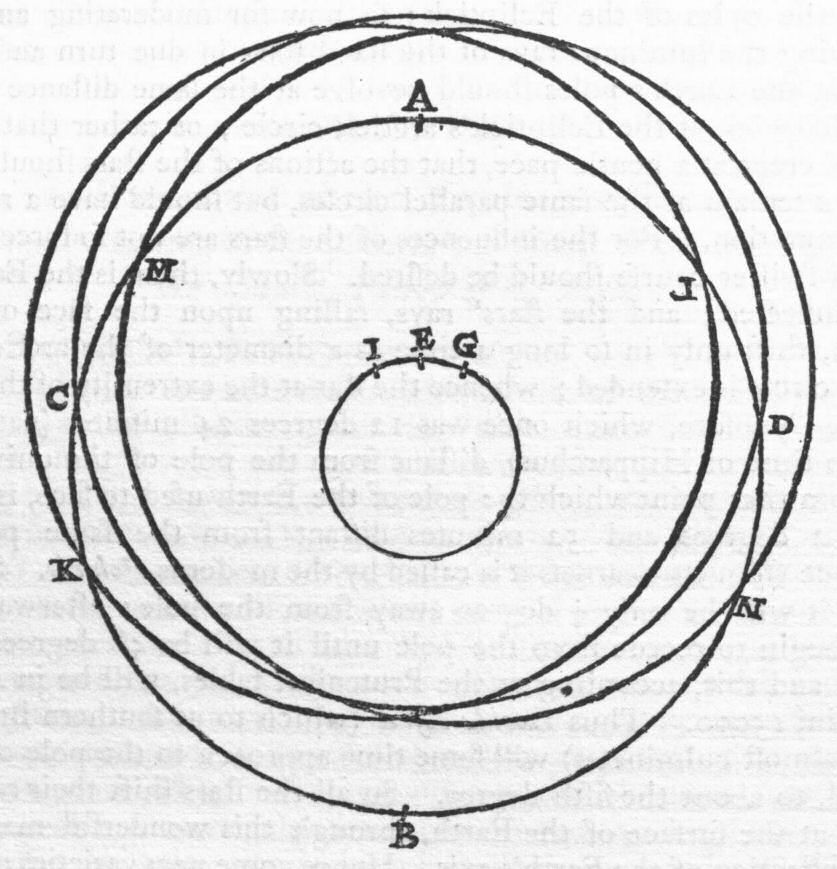

## CHAP. IX.

### On the anomaly of the Præcession of the Equinoxes, *and of the obliquity of the Zodiack.*

At one time the shifting of the æquinoxes
 is quicker, at another slower, being not always equal: because the poles
 of the earth travel unequally in the arctick and antarctick circle of the
 Zodiack; and decline on both sides from the middle path: whence the
 obliquity of the Zodiack to the Æquator seems to change. And as this has
 become known by means of long observations, so also has it been
 perceived, that the true æquinoctial points have been elongated from the
 mean æquinoctial points, on this side and on that, by 70 minutes (when
 the prostaphæresis is greatest): but that the solstices either approach
 the equator unequally 12 minutes nearer, or recede as far behind; so that
 the nearest approach is 23 degrees 28 minutes, and the greatest
 elongation 23 degrees 52 minutes. Astronomers have given various
 explanations to account for this inequality of the præcession and also of
 the obliquity of the tropicks. Thebit, with the view of
 laying down a
 rule for such considerable inequalities in the motion of the stars,
 explained that the eighth sphære does not move with a continuous motion
 from west to east; but is shaken with a certain motion of trepidation, by
 which the first points of Aries and Libra in the eighth heaven describe
 certain small circles with diameters equal to about nine degrees, around
 the first points of Aries and Libra in the ninth sphære. But since many
 things absurd and impossible as to motion follow from this motion of
 trepidation, that theory of motion is therefore long since obsolete.
 Others therefore are compelled to attribute the motion to the eighth
 sphære, and to erect above it a ninth heaven also, yea, and to pile up
 yet a tenth and an eleventh: In the case of mathematicians, indeed, the
 fault may be condoned; for it is permissible for them, in the case of
 difficult motions, to lay down some rule and law of equality by any
 hypotheses. But by no means can such enormous and monstrous celestial
 structures be accepted by philosophers. And yet here one may see how hard
 to please are those who do not allow any motion to one very small body,
 the Earth; and notwithstanding they drive and rotate the heavens, which
 are huge and immense above all conception and imagination: I declare that
 they feign the heavens to be three (the most monstrous of all things in
 Nature) in order that some obscure motions forsooth may be accounted for. Ptolemy, who
 compares with his own the observations of Timocharis and Hipparchus, one
 of whom flourished 260 years, the other 460 years before him, thought
 that there was this motion of the eighth sphære, and of the whole
 firmament; and proved by help of numerous phenomena that it took place
 over the poles of the Zodiack, and, supposing its motion to be so far
 æquable, that the non-planetary stars in the space of 100 years completed
 just one degree beneath the *Primum Mobile*. After him 750 years
 Albategnius discovered that one degree was completed in a space of 66
 years, so that a whole period would be 23,760 years. Alphonsus made out
 that this motion was still slower, completing one degree and 28 minutes
 only in 200 years; and that thus the course of the fixed stars went on,
 though unequally. At length Copernicus, by means of the observations of
 Timocharis, Aristarchus of Samos, Hipparchus, Menelaus, Ptolemy,
 Mahometes Aractensis, Alphonsus, and of his own, detected the anomalies
 of the motion of the Earth's axis: though I doubt not that other
 anomalies also will come to light some ages hence. So difficult is it to
 observe motion so slow, unless extending over a period of many centuries;
 on which account we still fail to understand the intent of Nature, what
 she is driving after through such inequality of motion. Let A be the pole
 of the Ecliptick, B C the Ecliptick, D the Æquator; when the pole of the
 Earth near the arctick circle of the Zodiack faces the point M, then
 there is an anomaly of the præcession of the æquinox at F;
 but when it
 faces N, there is an anomaly of the præcession at E. But when it faces I
 directly, then the maximum obliquity G is observed at the solstitial
 colure; but when it faces L, there is the minimum obliquity H at the
 solstitial colure.

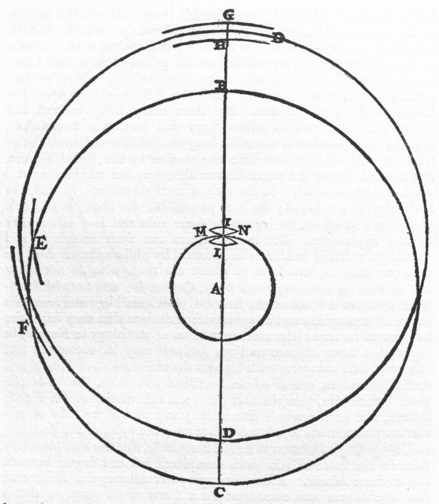

*Copernicus' contorted circlet in the Arctick circle of the Zodiack.*

Let F B G be the half of the Arctick circle described round the pole
 of the Zodiack: A B C the solstitial colure: A the pole of the Zodiack; D
 E the anomaly of longitude 140 minutes at either side on both ends: B C
 the anomaly of obliquity 24 minutes: B the greater obliquity of 23
 degrees 52 minutes: D the mean obliquity of 23 degrees 40 minutes: C the
 minimum obliquity of 23 degrees 28 minutes.

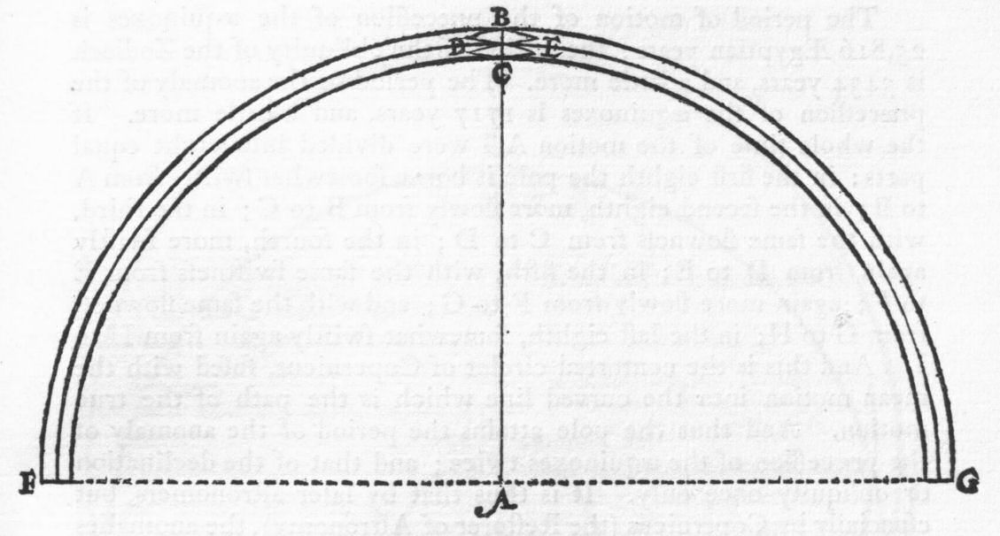

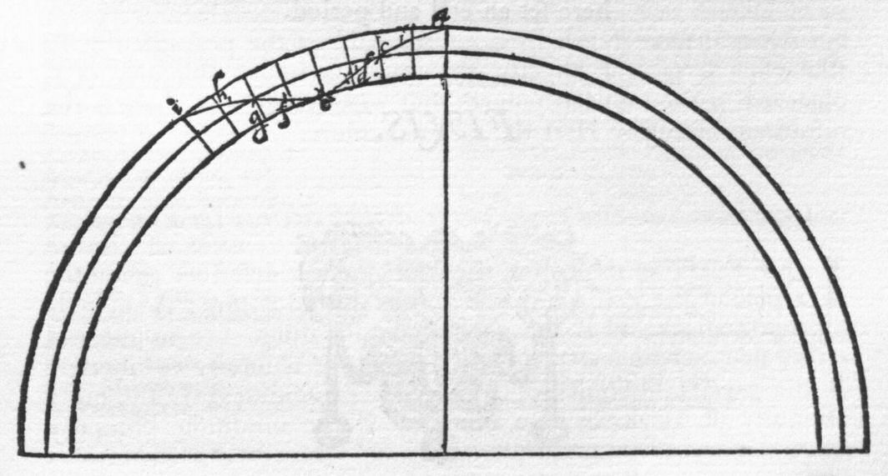

The period of motion of the præcession of the æquinoxes is 25,816
 Ægyptian years; the period of the obliquity of the Zodiack is 3434 years,
 and a little more. The period of the anomaly of the præcession of the
 æquinoxes is 1717 years, and a little more. If the whole time of the
 motion AI were divided into eight equal parts: in the first eighth the
 pole is borne somewhat swiftly from A to B; in the second eighth, more
 slowly from B to C; in the third, with the same slowness from C to D; in
 the fourth, more swiftly again from D to E; in the fifth, with the same
 swiftness from E to F; again more slowly from F to G; and with the same
 slowness from G to H; in the last eighth, somewhat swiftly again from H
 to I. And this is the contorted circlet of Copernicus, fused with the
 mean motion into the curved line which is the path of the true motion.
 And thus the pole attains the period of the anomaly of the præcession of
 the æquinoxes twice; and that of the declination or obliquity once only.
 It is thus that by later astronomers, but especially by Copernicus (the
 Restorer of Astronomy), the anomalies of the motion of the
 Earth's axis are described, so far as the observations of the ancients
 down to our own times admit; but there are still needed more and exact
 observations for anyone to establish aught certain about the anomaly of
 the motion of the præcessions, and at the same time that also of the
 obliquity of the Zodiack. For ever since the time at which, by means of
 various observations, this anomaly was first observed, we have only
 arrived at half a period of the obliquity. So that all the more all these
 matters about the unequal motion both of the præcession and of the
 obliquity are uncertain and not well known: wherefore neither can we
 ourselves assign any natural causes for it, and establish it for certain.
 Wherefore also do we to our reasonings and experiments magnetical here
 set an end and period.

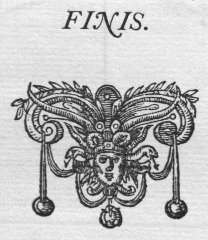
