# THE CONSTRUCTION OF THE WONDERFUL CANON OF LOGARITHMS;

And their relations to their own natural numbers;

WITH

*An Appendix as to the making of another and better kind of Logarithms.*

TO WHICH ARE ADDED

Propositions for the solution of Spherical Triangles by an *easier method*: with Notes on them and on the above-mentioned Appendix by the learned HENRY BRIGGS.

By the Author and Inventor, *John Napier*, Baron of *Merchiston*, &c., in Scotland.

Printed by ANDREW HART,  
OF EDINBURGH;  
IN THE YEAR OF OUR LORD, 1619.

*Translated from Latin into English by William Rae Macdonald, 1888.*

# PREFACE BY ROBERT NAPIER

SEVERAL years ago (Reader, Lover of the Mathematics) my Father, of memory always to be revered, made public the use of the Wonderful Canon of Logarithms; but, as he himself mentioned on the seventh and on the last pages of the Logarithms, he was decidedly against committing to types the theory and method of its creation, until he had ascertained the opinion and criticism on the Canon of those who are versed in this kind of learning.

But, since his departure from this life, it has been made plain to me by unmistakable proofs, that the most skilled in the mathematical sciences consider this new invention of very great importance, and that nothing more agreeable to them could happen, than if the construction of this Wonderful Canon, or at least so much as might suffice to explain it, go forth into the light for the public benefit.

Therefore, although it is very manifest to me that the Author had not put the finishing touch to this little treatise, yet I have done what in me lay to satisfy their most honourable request, and to afford some assistance to those especially who are weaker in such studies and are apt to stick on the very threshold.

Nor do I doubt, but that this posthumous work would have seen the light in a much more perfect and finished state, if God had granted a longer enjoyment of life to the Author, my most dearly loved father, in whom, by the opinion of the wisest men, among other illustrious gifts this showed itself pre-eminent, that the most difficult matters were unravelled by a sure and easy method, as well as in the fewest words.

You have then (kind Reader) in this little book most amply unfolded the theory of the construction of logarithms, (here called by him artificial numbers, for he had this treatise written out beside him several years before the word Logarithm was invented,) in which their nature, characteristics, and various relations to their natural numbers, are clearly demonstrated.

It seemed desirable also to add to the theory an Appendix as to the construction of another and better kind of logarithms (mentioned by the Author in the preface to his Rabdologiae) in which the logarithm of unity is 0.

After this follows the last fruit of his labours, pointing to the ultimate perfecting of his Logarithmic Trigonometry, namely certain very remarkable propositions for the resolution of spherical triangles not quadrantal, without dividing them into quadrantal or rectangular triangles. These propositions, which are absolutely general, he had determined to reduce into order and successively to prove, had he not been snatched away from us by a too hasty death.

We have also taken care to have printed some Studies on the above-mentioned Propositions, and on the new kind of Logarithms, by that most excellent Mathematician Henry Briggs, public Professor at London, who for the singular friendship which subsisted between him and my father of illustrious memory, took upon himself, in the most willing spirit, the very heavy labour of computing this new Canon, the method of its creation and the explanation of its use being left to the Inventor. Now, however, as he has been called away from this life, the burden of the whole business would appear to rest on the shoulders of the most learned Briggs, on whom, too, would appear by some chance to have fallen the task of adorning this Sparta.

Meanwhile (Reader) enjoy the fruits of these labours such as they are, and receive them in good part according to your culture.

Farewell,

ROBERT NAPIER, Son.

# THE CONSTRUCTION OF THE WONDERFUL CANON OF LOGARITHMS

*(Herein called by the Author the Artificial Table), and their relations to their natural numbers.*

1. LOGARITHMIC TABLE is a small table by the use of which we can obtain a knowledge of all geometrical dimensions and motions in space, by a very easy calculation.

IT is deservedly called very small, because it does not exceed in size a table of sines; very easy, because by it all multiplications, divisions, and the more difficult extractions of roots are avoided; for by only a very few most easy additions, subtractions, and divisions by two, it measures quite generally all figures and motions.

It is picked out from numbers progressing in continuous proportion.

2. Of continuous progressions, an arithmetical is one which proceeds by equal intervals; a geometrical, one which advances by unequal and proportionally increasing or decreasing intervals.

Arithmetical progressions: 1, 2, 3, 4, 5, 6, 7, &c.; or 2, 4, 6, 8, 10, 12, 14, 16, &c. Geometrical progressions: 1, 2, 4, 8, 16, 32, 64, &c.; or 243, 81, 27, 9, 3, 1.

3. In these progressions we require accuracy and ease in working. Accuracy is obtained by taking large numbers for a basis; but large numbers are most easily made from small by adding cyphers.

Thus instead of 100000, which the less experienced make the greatest sine, the more learned put 10000000, whereby the difference of all sines is better expressed. Wherefore also we use the same for radius and for the greatest of our geometrical proportionals.

4. In computing tables, these large numbers may again be made still larger by placing a period after the number and adding cyphers.

Thus in commencing to compute, instead of 10000000 we put 10000000.0000000, lest the most minute error should become very large by frequent multiplication.

5. In numbers distinguished thus by a period in their midst, whatever is written after the period is a fraction, the denominator of which is unity with as many cyphers after it as there are figures after the period.

Thus 10000000.04 is the same as 10000000 100/100; also 25.803 is the same as 25 803/1000; also 9999998.0005021 is the same as 9999998$^{5021}$/$_{10000000}$, and so of others.

6. *When the tables are computed, the fractions following the period may then be rejected without any sensible error. For in our large numbers, an error which does not exceed unity is insensible and as if it were none.*

Thus in the completed table, instead of 9987643.8213051, which is 9987643$^{8213051}$/$_{10000000}$, we may put 9987643 without sensible error.

7. *Besides this, there is another rule for accuracy; that is to say, when an unknown or incommensurable quantity is included between numerical limits not differing by many units.*

Thus if the diameter of a circle contain 497 parts, since it is not possible to ascertain precisely of how many parts the circumference consists, the more experienced, in accordance with the views of Archimedes, have enclosed it within limits, namely 1562 and 1561. Again, if the side of a square contain 1000 parts, the diagonal will be the square root of the number 2000000. Since this is an incommensurable number, we seek for its limits by extraction of the square root, namely 1415 the greater limit and 1414 the less limit, or more accurately 1414$^{604}$/$_{2828}$ the greater, and 1414$^{604}$/$_{2829}$ the less; for as we reduce the difference of the limits we increase the accuracy.

*In place of the unknown quantities themselves, their limits are to be added, subtracted, multiplied, or divided, according as there may be need.*

8. *The two limits of one quantity are added to the two limits of another, when the less of the one is added to the less of the other, and the greater of the one to the greater of the other.

Thus let the
line a b c be
divided into two

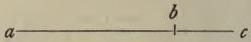

parts, a b and b c. Let a b lie between the limits 123.5 the greater and 123.2 the less. Also let b c lie between the limits 43.2 the greater and 43.1 the less. Then the greater being added to the greater and the less to the less, the whole line a c will lie between the limits 166.7 and 166.3.

9. The two limits of one quantity are multiplied into the two limits of another, when the less of the one is multiplied into the less of the other, and the greater of the one into the greater of the other.

Thus let one of the quantities a b lie between the limits 10.502 the greater and 10.500 the less. And let the other a c lie between the limits 3.216 the greater and 3.215 the less. Then 10.502 being multiplied into 3.216 and 10.500 into 3.215, the limits will become 33.774432 and 33.757500, between which the area of a b c d will lie.

10. Subtraction of limits is performed by taking the greater limit of the less quantity from the less of the greater, and the less limit of the less quantity from the greater of the greater.

Thus, in the first figure, if from the limits of a c, which are 166.7 and 166.3, you subtract the limits of b c, which are 43.2 and 43.1, the limits of a b become 123.6 and 123.1, and not 123.5 and 123.2. For although the addition of the latter to 43.2 and 43.1 produced 166.7 and 166.3 (as in 8), yet the converse does not follow; for there may be some quantity between 166.7 and 166.3 from which if you subtract some other which is between 43.2 and 43.1, the remainder may not lie between 123.5 and 123.2, but it is impossible for it not to lie between the limits 123.6 and 123.1.

11. Division of limits is performed by dividing the greater limit of the dividend by the less of the divisor, and the less of the dividend by the greater of the divisor.

Thus, in the preceding figure, the rectangle a b c d lying between the limits 33.774432 and 33.757500 may be divided by the limits of a c, which are 3.216 and 3.215, when there will come out 10.505³⁸⁷/₃₂₁₆ and 10.496³⁸⁰⁴/₃₂₁₆ for the limits of a b, and not 10.502 and 10.500, for the same reason that we stated in the case of subtraction.

12. The vulgar fractions of the limits may be removed by adding unity to the greater limit.

Thus, instead of the preceding limits of a b, namely, 10.505³⁸⁷/₃₂₁₆ and 10.496³⁸⁰⁴/₃₂₁₆, we may put 10.506 and 10.496.

Thus far concerning accuracy; what follows concerns ease in working.

13. The construction of every arithmetical progression is easy; not so, however, of every geometrical progression.

This is evident, as an arithmetical progression is very easily formed by addition or subtraction; but a geometrical progression is continued by very difficult multiplications, divisions, or extractions of roots.

Those geometrical progressions alone are carried on easily which arise by subtraction of an easy part of the number from the whole number.

14. We call easy parts of a number, any parts the denominators of which are made up of unity and a number of cyphers, such parts being obtained by rejecting as many of the figures at the end of the principal number as there are cyphers in the denominator.

Thus the tenth, hundredth, thousandth, 10000th, 100000th, 1000000th, 10000000th parts are easily obtained, because the tenth part of any number is got by deleting its last figure, the hundredth its last two, the thousandth its last three figures, and so with the others, by always deleting as many of the figures at the end as there are cyphers in the denominator of the part. Thus the tenth part of 99321 is 9932, its hundredth part is 993, its thousandth 99, &c.

15. The half, twentieth, two hundredth, and other parts denoted by the number two and cyphers, are also tolerably easily obtained; by rejecting as many of the figures at the end of the principal number as there are cyphers in the denominator, and dividing the remainder by two.

Thus the 2000th part of the number 9973218045 is 4986609, the 20000th part is 498660.

16. Hence it follows that if from radius with seven cyphers added you subtract its 10000000th part, and from the number thence arising its 10000000th part, and so on, a hundred numbers may very easily be continued geometrically in the proportion subsisting between radius and the sine less than it by unity, namely between 10000000 and 9999999; and this series of proportionals we name the First table.

Thus:

First table.

|  10000000.0000000  |
| --- |
|  1.0000000  |
|  9999999.0000000  |
|  .9999999  |
|  9999998.0000001  |
|  .9999998  |
|  9999997.0000003  |
|  .9999997  |
|  9999996.0000006  |
|  to be continued  |
|  up to  |
|  9999900.0004950  |

Thus from radius, with seven cyphers added for greater accuracy, namely, 10000000.0000000, subtract 1.0000000, you get 9999999.0000000; from this subtract .9999999, you get 9999998.0000001; and proceed in this way, as shown at the side, until you create a hundred proportionals, the last of which, if you have computed rightly, will be 9999900.0004950.

17. The Second table proceeds from radius with six cyphers added, through fifty other numbers decreasing proportionally in the proportion which is easiest, and as near as possible to that subsisting between the first and last numbers of the First table.

Second table.

|  10000000.000000  |
| --- |
|  100.000000  |
|  9999900.000000  |
|  99.999000  |
|  9999800.001000  |
|  99.998000  |
|  9999700.003000  |
|  99.997000  |
|  9999600.006000  |

Thus the first and last numbers of the First table are 10000000.0000000 and 9999900.0004950, in which proportion it is difficult to form fifty proportional numbers. A near and at the same time an easy proportion is 100000 to 99999, which may be continued with sufficient exactness by adding six cyphers to radius and continually subtracting from each number its own 100000th part in the manner shown at the side; and this table

&c., up to
9995001.222927

contains, besides radius which is
the first, fifty other proportional
numbers, the last of which, if you
have not erred, you will find to be
9995001.222927.

18. The Third table consists of sixty-nine columns, and in
each column are placed twenty-one numbers, proceeding in
the proportion which is easiest, and as near as possible to
that subsisting between the first and last numbers of the
Second table.

Whence its first column is very easily obtained from
radius with five cyphers added, by subtracting its 2000th
part, and so from the other numbers as they arise.

|  First column of Third table.  |
| --- |
|  10000000.00000  |
|  5000.00000  |
|  9995000.00000  |
|  4997.50000  |
|  9990002.50000  |
|  4995.00125  |
|  9985007.49875  |
|  4992.50374  |
|  9980014.99501  |
|  &c., up to  |
|  9900473.57808  |

In forming this progression, as
the proportion between 10000000.
000000, the first of the Second table,
and 9995001.222927, the last of the
same, is troublesome; therefore compute the twenty-one numbers in the
easy proportion of 10000 to 9995,
which is sufficiently near to it; the
last of these, if you have not erred,
will be 9900473.57808.

From these numbers, when computed, the last figure of each may be
rejected without sensible error, so
that others may hereafter be more
easily computed from them.

19. The first numbers of all the columns must proceed from radius with four cyphers added, in the proportion easiest and nearest to that subsisting between the first and the last numbers of the first column.

As the first and the last numbers of the first column are 10000000.0000 and 9900473.5780, the easiest proportion very near to this is 100 to 99. Accordingly sixty-eight numbers are to be continued from radius in the ratio of 100 to 99 by subtracting from each one of them its hundredth part.

20. In the same proportion a progression is to be made from the second number of the first column through the second numbers in all the columns, and from the third through the third, and from the fourth through the fourth, and from the others respectively through the others.

Thus from any number in one column, by subtracting its hundredth part, the number of the same rank in the following column is made, and the numbers should be placed in order as follows :—

PROPORTIONALS OF THE THIRD TABLE.

|  First Column. | Second Column.  |
| --- | --- |
|  10000000.0000 | 9900000.0000  |
|  9995000.0000 | 9895050.0000  |
|  9990002.5000 | 9890102.4750  |
|  9985007.4987 | 9885157.4237  |
|  9980014.9950 | 9880214.8451  |
|  continuously to &c., 9900473.5780 | descending to &c., 9801468.8423 B 4  |

Third

|  Third Column. | Thence 4th, 5th, &c., up to | 69th Column.  |
| --- | --- | --- |
|  9801000.0000 | &c., up to | 5048858.8900  |
|  9796099.5000 | &c., up to | 5046334.4605  |
|  9791201.4503 | &c., up to | 5043811.2932  |
|  9786305.8495 | &c., up to | 5041289.3879  |
|  9781412.6967 | &c., up to | 5038768.7435  |
|  &c., descending to |  | finally to  |
|  9703454.1539 | finally to | 4998609.4034  |

21. Thus, in the Third table, between radius and half radius, you have sixty-eight numbers interpolated, in the proportion of 100 to 99, and between each two of these you have twenty numbers interpolated in the proportion of 10000 to 9995; and again, in the Second table, between the first two of these, namely between 10000000 and 9995000, you have fifty numbers interpolated in the proportion of 100000 to 99999; and finally, in the First table, between the latter, you have a hundred numbers interpolated in the proportion of radius or 10000000 to 9999999; and since the difference of these is never more than unity, there is no need to divide it more minutely by interpolating means, whence these three tables, after they have been completed, will suffice for computing a Logarithmic table.

Hitherto we have explained how we may most easily place in tables sines or natural numbers progressing in geometrical proportion.

22. It remains, in the Third table at least, to place beside the sines or natural numbers decreasing geometrically their logarithms or artificial numbers increasing arithmetically.

23. To increase arithmetically is, in equal times, to be augmented by a quantity always the same.

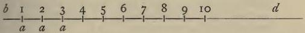

Thus from the fixed point b let a line be produced indefinitely in the direction of d. Along this let the point a travel from b towards d, moving according to this law, that in equal moments of time it is borne over the equal spaces b 1, 1 2, 2 3, 3 4, 4 5, &c. Then we call this increase by b 1, b 2, b 3, b 4, b 5, &c., arithmetical. Again, let b 1 be represented in numbers by 10, b 2 by 20, b 3 by 30, b 4 by 40, b 5 by 50; then 10, 20, 30, 40, 50, &c., increase arithmetically, because we see they are always increased by an equal number in equal times.

24. To decrease geometrically is this, that in equal times, first the whole quantity then each of its successive remainders is diminished, always by a like proportional part.

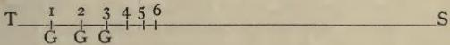

Thus let the line T S be radius. Along this let the point G travel in the direction of S, so that in equal times it is borne from T to 1, which for example may be the tenth part of T S; and from 1 to 2, the tenth part of 1 S; and from 2 to 3, the tenth part of 2 S; and from 3 to 4, the tenth part of 3 S, and so on. Then the sines T S, 1 S, 2 S,

3 S, 4 S, &c., are said to decrease geometrically, because in equal times they are diminished by unequal spaces similarly proportioned. Let the sine T S be represented in numbers by 10000000, 1 S by 9000000, 2 S by 8100000, 3 S by 7290000, 4 S by 6561000; then these numbers are said to decrease geometrically, being diminished in equal times by a like proportion.

25. Whence a geometrically moving point approaching a fixed one has its velocities proportionate to its distances from the fixed one.

Thus, referring to the preceding figure, I say that when the geometrically moving point G is at T, its velocity is as the distance T S, and when G is at 1 its velocity is as 1 S, and when at 2 its velocity is as 2 S, and so of the others. Hence, whatever be the proportion of the distances T S, 1 S, 2 S, 3 S, 4 S, &c., to each other, that of the velocities of G at the points T, 1, 2, 3, 4, &c., to one another, will be the same.

For we observe that a moving point is declared more or less swift, according as it is seen to be borne over a greater or less space in equal times. Hence the ratio of the spaces traversed is necessarily the same as that of the velocities. But the ratio of the spaces traversed in equal times, T 1, 1 2, 2 3, 3 4, 4 5, &c., is that of the distances T S, 1 S, 2 S, 3 S, 4 S, &c.[*] Hence it follows that the ratio to one another of the distances of G from S, namely T S, 1 S, 2 S, 3 S, 4 S, &c., is the same as that of the velocities of G at the points T, 1, 2, 3, 4, &c., respectively.

[*] It is evident that the ratio of the spaces traversed T 1, 1 2, 2 3, 3 4, 4 5, &c., is that of the distances T S, 1 S, 2 S, 3 S, 4 S, &c., for when quantities are continued proportionally, their differences are also continued in the same proportion. Now the distances are by hypothesis continued proportionally, and the spaces traversed are their differences, wherefore it is proved that the spaces traversed are continued in the same ratio as the distances.

26. The logarithm of a given sine is that number which has increased arithmetically with the same velocity throughout as that with which radius began to decrease geometrically, and in the same time as radius has decreased to the given sine.

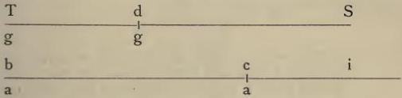

Let the line T S be radius, and d S a given sine in the same line; let g move geometrically from T to d in certain determinate moments of time. Again, let b i be another line, infinite towards i, along which, from b, let a move arithmetically with the same velocity as g had at first when at T; and from the fixed point b in the direction of i let a advance in just the same moments of time up to the point c. The number measuring the line b c is called the logarithm of the given sine d S.

27. Whence nothing is the logarithm of radius.

For, referring to the figure, when g is at T making its distance from S radius, the arithmetical point d beginning at b has never proceeded thence. Whence by the definition of distance nothing will be the logarithm of radius.

28. Whence also it follows that the logarithm of any given sine is greater than the difference between radius and the given sine, and less than the difference between radius and the quantity which exceeds it in the ratio of radius to the given sine. And these differences are therefore called the limits of the logarithm.

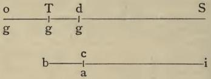

Thus, the preceding figure being repeated, and S T being produced beyond T to o, so that o S is to T S as T S to d S. I say that b c, the logarithm of the sine d S, is greater than T d and less than o T. For in the same time that g is borne from o to T, g is borne from T to d, because (by 24) o T is such a part of o S as T d is of T S, and in the same time (by the definition of a logarithm) is a borne from b to c; so that o T, T d, and b c are distances traversed in equal times. But since g when moving between T and o is swifter than at T, and between T and d slower, but at T is equally swift with a (by 26); it follows that o T the distance traversed by g moving swiftly is greater, and T d the distance traversed by g moving slowly is less, than b c the distance traversed by the point a with its medium motion, in just the same moments of time; the latter is, consequently, a certain mean between the two former.

Therefore o T is called the greater limit, and T d the less limit of the logarithm which b c represents.

29. Therefore to find the limits of the logarithm of a given sine.

By the preceding it is proved that the given sine being subtracted from radius the less limit remains, and that radius being multiplied into the less limit and the product divided by the given sine, the greater limit is produced, as in the following example.

30. Whence the first proportional of the First table, which is 9999999, has its logarithm between the limits 1.0000001 and 1.0000000.

For (by 29) subtract 9999999 from radius with cyphers added, there will remain unity with its own cyphers for the less limit; this unity with cyphers being multiplied into radius, divide by 9999999 and there will result 1.0000001 for the greater limit, or if you require greater accuracy 1.00000010000001.

31. The limits themselves differing insensibly, they or anything between them may be taken as the true logarithm.

Thus in the above example, the logarithm of the sine 9999999 was found to be either 1.0000000 or 1.00000010, or best of all 1.00000005. For since the limits themselves, 1.0000000 and 1.0000001, differ from each other by an insensible fraction like 1/10000000, therefore they and whatever is between them will differ still less from the true logarithm lying between these limits, and by a much more insensible error.

32. There being any number of sines decreasing from radius in geometrical proportion, of one of which the logarithm or its limits is given, to find those of the others.

This necessarily follows from the definitions of arithmetical increase, of geometrical decrease, and of a logarithm. For by these definitions, as the sines decrease continually in geometrical proportion, so at the same time their logarithms increase by equal additions in continuous arithmetical progression. Wherefore to any sine in the decreasing geometrical progression there corresponds a logarithm in the increasing arithmetical progression, namely the first to the first, and the second to the second, and so on.

So that, if the first logarithm corresponding to the first sine after radius be given, the second logarithm will be double of it, the third triple, and so of the others; until the logarithms of all the sines be known, as the following example will show.

33. *Hence the logarithms of all the proportional sines of the First table may be included between near limits, and consequently given with sufficient exactness.*

Thus since (by 27) the logarithm of radius is 0, and (by 30) the logarithm of 9999999, the first sine after radius in the First table, lies between the limits 1.0000001 and 1.0000000; necessarily the logarithm of 9999998.0000001, the second sine after radius, will be contained between the double of these limits, namely between 2.0000002 and 2.0000000; and the logarithm of 9999997.0000003, the third will be between the triple of the same, namely between 3.0000003 and 3.0000000. And so with the others, always by equally increasing the limits by the limits of the first, until you have completed the limits of the logarithms of all the proportionals of the First table. You may in this way, if you please, continue the logarithms themselves in an exactly similar progression with little and insensible error; in which case the logarithm of radius will be 0, the logarithm of the first sine after radius (by 31) will be 1.00000005, of the second 2.00000010, of the third 3.00000015, and so of the rest.

34. The difference of the logarithms of radius and a given sine is the logarithm of the given sine itself.

This is evident, for (by 27) the logarithm of radius is nothing, and when nothing is subtracted from the logarithm of a given sine, the logarithm of the given sine necessarily remains entire.

35. The difference of the logarithms of two sines must be added to the logarithm of the greater that you may have the logarithm of the less, and subtracted from the logarithm of the less that you may have the logarithm of the greater.

Necessarily this is so, since the logarithms increase as the sines decrease, and the less logarithm is the logarithm of the greater sine, and the greater logarithm of the less sine. And therefore it is right to add the difference to the less logarithm, that you may have the greater logarithm though corresponding to the less sine, and on the other hand to subtract the difference from the greater logarithm that you may have the less logarithm though corresponding to the greater sine.

36. The logarithms of similarly proportioned sines are equidifferent.

This necessarily follows from the definitions of a logarithm and of the two motions. For since by these definitions arithmetical increase always the same corresponds to geometrical decrease similarly proportioned, of necessity we conclude that equidifferent logarithms and their limits correspond to similarly proportioned sines. As in the above example from the First table, since there is a like proportion between 9999999.0000000 the first proportional after radius, and 9999997.0000003 the third, to that which is between 9999996.0000006 the fourth and 9999994.0000015 the sixth; therefore 1.00000005 the logarithm of the first differs from 3.00000015 the logarithm of the third, by the same difference that 4.00000020 the logarithm of the fourth, differs from 6.00000030 the logarithm of the sixth proportional. Also there is the same ratio of equality between the differences of the respective limits of the logarithms, namely as the differences of the less among themselves, so also of the greater among themselves, of which logarithms the sines are similarly proportioned.

37. Of three sines continued in geometrical proportion, as the square of the mean equals the product of the extremes, so of their logarithms the double of the mean equals the sum of the extremes. Whence any two of these logarithms being given, the third becomes known.

Of the three sines, since the ratio between the first and the second is that between the second and the third, therefore (by 36), of their logarithms, the difference between the first and the second is that between the second and the third. For example, let the first logarithm be represented by the line b c, the second by the line b d, the third by the line b e, all placed in the one line b c d e, thus :—

and

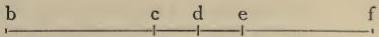

and let the differences c d and d e be equal. Let b d, the mean of them, be doubled by producing the line from b beyond e to f, so that b f is double b d. Then b f is equal to both the lines b c of the first logarithm and b e of the third, for from the equals b d and d f take away the equals c d and d e, namely c d from b d and d e from d f, and there will remain b c and e f necessarily equal. Thus since the whole b f is equal to both b e and e f, therefore also it will be equal to both b e and b c, which was to be proved. Whence follows the rule, if of three logarithms you double the given mean, and from this subtract a given extreme, the remaining extreme sought for becomes known; and if you add the given extremes and divide the sum by two, the mean becomes known.

38. Of four geometrical proportionals, as the product of the means is equal to the product of the extremes; so of their logarithms, the sum of the means is equal to the sum of the extremes. Whence any three of these logarithms being given, the fourth becomes known.

Of the four proportionals, since the ratio between the first and second is that between the third and fourth; therefore of their logarithms (by 36), the difference between the first and second is that between the third and fourth. Hence let such quantities be taken in the line b f as that b a

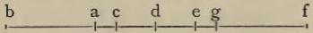

may represent the first logarithm, b c the second, b e the third, and b g the fourth, making the differences a c and e g equal, so that d placed in the middle of c e is of necessity also placed in the middle of a g. Then the sum of b c the second and b e the third is equal to the sum of b a the first and b g the fourth. For (by 37) the double of b d, which is b f, is equal to b c and b e together, because their differences from b d, namely c d and d e, are equal; for the same reason the same b f is also equal to b a and b g together, because their differences from b d, namely a d and d g, are also equal. Since, therefore, both the sum of b a and b g and the sum of b c and b e are equal to the double of b d, which is b f, therefore also they are equal to each other, which was to be proved. Whence follows the rule, of these four logarithms if you subtract a known mean from the sum of the known extremes, there is left the mean sought for; and if you subtract a known extreme from the sum of the known means, there is left the extreme sought for.

39. The difference of the logarithms of two sines lies between two limits; the greater limit being to radius as the difference of the sines to the less sine, and the less limit being to radius as the difference of the sines to the greater sine.

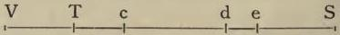

Let T S be radius, d S the greater of two given sines, and e S the less. Beyond S T let the distance T V be marked off by the point V, so that S T is to T V as e S, the less sine, is to d e, the difference of the sines. Again, on the other side of T, towards S, let the distance T c be marked off by the point c, so that T S is to T c as d S, the greater sine, is to d e, the difference of the sines. Then the difference of the logarithms of the sines d S and e S lies between the limits V T the greater and T c the less. For by hypothesis, e S is to d e as T S to T V, and d S is to d e as T S to T c; therefore, from the nature of proportionals, two conclusions follow :—

Firstly, that V S is to T S as T S to c S.

Secondly, that the ratio of T S to c S is the same as that of d S to e S. And therefore (by 36) the difference of the logarithms of the sines d S and e S is equal to the difference of the logarithms of the radius T S and the sine c S. But (by 34) this difference is the logarithm of the sine c S itself; and (by 28) this logarithm is included between the limits V T the greater and T c the less, because by the first conclusion above stated, V S greater than radius is to T S radius as T S is to c S. Whence, necessarily, the difference of the logarithms of the sines d S and e S lies between the limits V T the greater and T c the less, which was to be proved.

40. To find the limits of the difference of the logarithms of two given sines.

Since (by 39) the less sine is to the difference of the sines as radius to the greater limit of the difference of the logarithms; and the greater sine is to the difference of the sines as radius to the less limit of the difference of the logarithms; it follows, from the nature of proportionals, that radius being multiplied by the difference of the given sines and the product being divided by the less sine, the greater limit will be produced; and the product being divided by the greater sine, the less limit will be produced.

## EXAMPLE.

THUS, let the greater of the given sines be 9999975.5000000, and the less 9999975.0000300, the difference of these .4999700 being multiplied into radius (cyphers to the eighth place after the point being first added to both for the purpose of demonstration, although otherwise seven are sufficient), if you divide the product by the greater sine, namely 9999975.5000000, there will come out for the less limit .49997122, with eight figures after the point; again, if you divide the product by the less sine, namely 9999975.0000300, there will come out for the greater limit .49997124; and, as already proved, the difference of the logarithms of the given sines lies between these. But since the extension of these fractions to the eighth figure beyond the point is greater accuracy than is required, especially as only seven figures are placed after the point in the sines; therefore, that eighth or last figure of both being deleted, then the two limits and also the difference itself of the logarithms will be denoted by the fraction .4999712 without even the smallest particle of sensible error.

41. To find the logarithms of sines or natural numbers not proportionals in the First table, but near or between them; or at least, to find limits to them separated by an insensible difference.

Write down the sine in the First table nearest to the given sine, whether less or greater. Seek out the limits of the table sine (by 33), and when found note them down. Then seek out the limits of the difference of the logarithms of the given sine and the table sine (by 40), either both limits or one or other of them, since they are almost equal, as is evident from the above example. Now these, or either of them, being found, add to them the limits above noted down, or else subtract (by 8, 10, and 35), according as the given sine is less or greater than the table sine. The numbers thence produced will be near limits between which is included the logarithm of the given sine.

## EXAMPLE.

Let the given sine be 9999975.5000000, to which the nearest sine in the table is 9999975.0000300, less than the given sine. By 33 the limits of the logarithm of the latter are 25.0000025 and 25.0000000. Again (by 40), the difference of the logarithms of the given sine and the table sine is .4999712. By 35, subtract this from the above limits, which are the limits of the less sine, and there will come out 24.5000313 and 24.5000288, the required limits of the logarithm of the given sine 9999975.5000000. Accordingly the actual logarithm of the sine may be placed without sensible error in either of the limits, or best of all (by 31) in 24.5000300.

## ANOTHER EXAMPLE.

LET the given sine be 9999900.0000000, the table sine nearest it 9999900.0004950. By 33 the limits of the logarithm of the latter are 100.0000100 and 100.0000000. Then (by 40) the difference of the logarithms of the sines will be .0004950. Add this (by 35) to the above limits and they become 100.0005050 for the greater limit, and 100.0004950 for the less limit, between which the required logarithm of the given sine is included.

42. Hence it follows that the logarithms of all the proportionals in the Second table may be found with sufficient exactness, or may be included between known limits differing by an insensible fraction.

Thus since the logarithm of the sine 9999900, the first proportional of the Second table, was shown in the preceding example to lie between the limits 100.0005050 and 100.0004950; necessarily (by 32) the logarithm of the second proportional will lie between the limits 200.0010100 and 200.0009900; and the logarithm of the third proportional between the limits 300.0015150 and 300.0014850, &c. And finally, the logarithm of the last sine of the Second table, namely 9995001.222927, is included between the limits 5000.0252500 and 5000.0247500. Now, having all these limits, you will be able (by 31) to find the actual logarithms.

43. To find the logarithms of sines or natural numbers not proportionals in the Second table, but near or between them; or to include them between known limits differing by an insensible fraction.

Write down the sine in the Second table nearest the given sine, whether greater or less. By 42 find the limits of the logarithm of the table sine. Then by the rule of proportion seek for a fourth proportional, which shall be to radius as the less of the given and table sines is to the greater. This may be done in one way by multiplying the less sine into radius and dividing the product by the greater. Or, in an easier way, by multiplying

multiplying the difference of the sines into radius, dividing this product by the greater sine, and subtracting the quotient from radius.

Now since (by 36) the logarithm of the fourth proportional differs from the logarithm of radius by as much as the logarithms of the given and table sines differ from each other; also, since (by 34) the former difference is the same as the logarithm of the fourth proportional itself; therefore (by 41) seek for the limits of the logarithm of the fourth proportional by aid of the First table; when found add them to the limits of the logarithm of the table sine, or else subtract them (by 8, 10, and 35), according as the table sine is greater or less than the given sine; and there will be brought out the limits of the logarithm of the given sine.

## EXAMPLE.

THUS, let the given sine be 9995000.000000. To this the nearest sine in the Second table is 9995001.222927, and (by 42) the limits of its logarithm are 5000.0252500 and 5000.0247500. Now seek for the fourth proportional by either of the methods above described; it will be 9999998.7764614, and the limits of its logarithm found (by 41) from the First table will be 1.2235387 and 1.2235386. Add these limits to the former (by 8 and 35), and there will come out 5001.2487888 and 5001.2482886 as the limits of the logarithm of the given sine. Whence the number 5001.2485387, midway between them, is (by 31) taken most suitably, and with no sensible error, for the actual logarithm of the given sine 9995000.

44. Hence it follows that the logarithms of all the proportionals in the first column of the Third table may be found with sufficient exactness, or may be included between known limits differing by an insensible fraction.

For, since (by 43) the logarithm of 9995000, the first proportional after radius in the first column of the Third table, is 5001.2485387 with no sensible error; therefore (by 32) the logarithm of the second proportional, namely 9990002.5000, will be 10002.4970774; and so of the others, proceeding up to the last in the column, namely 9900473.57808, the logarithm of which, for a like reason, will be 100024.9707740, and its limits will be 100024.9657720 and 100024.9757760.

45. To find the logarithms of natural numbers or sines not proportionals in the first column of the Third table, but near or between them; or to include them between known limits differing by an insensible fraction.

Write down the sine in the first column of the Third table nearest the given sine, whether greater or less. By 44 seek for the limits of the logarithm of the table sine. Then, by one of the methods described in 43, seek for a fourth proportional, which shall be to radius as the less of the given and table sines is to the greater. Having found the fourth proportional, seek (by 43) for the limits of its logarithm from the Second table. When these are found, add them to the limits of the logarithm of the table sine found above, or else subtract them (by 8, 10, and 35), and the limits of the logarithm of the given sine will be brought out.

## EXAMPLE.

THUS, let the given sine be 9900000. The proportional sine nearest it in the first column of the Third table is 9900473.57808. Of this (by 44) the limits of the logarithm are 100024.9657720 and 100024.9757760. Then the fourth proportional will be 9999521.6611850. Of this the limits of the logarithm, deduced from the Second table (by 43), are 478.3502290 and 478.3502812. These limits (by 8 and 35) being added to the above limits of the logarithm of the table sine, there will come out the limits 100503.3260572 and 100503.3160010, between which necessarily falls the logarithm sought for. Whence the number midway between them, which is 100503.3210291, may be put without sensible error for the true logarithm of the given sine 9900000.

46. Hence it follows that the logarithms of all the proportionals of the Third table may be given with sufficient exactness.

For, as (by 45) 100503.3210291 is the logarithm of the first sine in the second column, namely 9900000; and since the other first sines of the remaining columns progress in the same proportion, necessarily (by 32 and 36) the logarithms of these increase always by the same difference 100503.3210291, which is added to the logarithm last found, that the following may be made. Therefore, the first logarithms of all the columns being obtained in this way, and all the logarithms of the first column being obtained by 44, you may choose whether you prefer to build up, at one time, all the logarithms in the same column, by continuously adding 5001.2485387, the difference of the logarithms, to the last found logarithm in the column, that the next lower logarithm in the same column be made; or whether you prefer to compute, at one time, all the logarithms of the same rank, namely all the second logarithms in each of the columns, then all the third, then the fourth, and so the others, by continuously adding 100503.3210291 to the logarithm in one column, that the logarithm of the same rank in the next column be brought out. For by either method may be had the logarithms of all the proportionals in this table; the last of which is 6934250.8007528, corresponding to the sine 4998609.4034.

47. In the Third table, beside the natural numbers, are to be written their logarithms; so that the Third table, which after this we shall always call the Radical table, may be made complete and perfect.

This writing up of the table is to be done by arranging the columns in the number and order described (in 20 and 21), and by dividing each into two sections, the first of which should contain the geometrical proportionals we call sines and natural numbers, the second their logarithms progressing arithmetically by equal intervals.

THE RADICAL TABLE.

|  First column. |   | Second column.  |   |
| --- | --- | --- | --- |
|  Natural numbers. | Logarithms. | Natural numbers. | Logarithms.  |
|  10000000.0000 | .0 | 9900000.0000 | 100503.3  |
|  9995000.0000 | 5001.2 | 9895050.0000 | 105504.6  |
|  9990002.5000 | 10002.5 | 9890102.4750 | 110505.8  |
|  9985007.4987 | 15003.7 | 9885157.4237 | 115507.1  |
|  9980014.9950 | 20005.0 | 9880214.8451 | 120508.3  |
|  &c., up to | up to | up to | up to  |
|  9900473.5780 | 100025.0 | 9801468.8423 | 200528.2 and  |

|  and the others, up to | 69th column.  |   |
| --- | --- | --- |
|   |  Natural numbers. | Logarithms.  |
|   |  5048858.8900 | 6834225.8  |
|   |  5046334.4605 | 6839227.1  |
|   |  5043811.2932 | 6844228.3  |
|   |  5041289.3879 | 6849229.6  |
|   |  5038768.7435 | 6854230.8  |
|   |  up to 4998609.4034 | up to 6934250.8  |

For shortness, however, two things should be borne in mind :—First, that in these logarithms it is enough to leave one figure after the point, the remaining six being now rejected, which, however, if you had neglected at the beginning, the error arising thence by frequent multiplications in the previous tables would have grown intolerable in the third. Secondly, If the second figure after the point exceed the number four, the first figure after the point, which alone is retained, is to be increased by unity : thus for 10002.48 it is more correct to put 10002.5 than 10002.4; and for 1000.35001 we more fitly put 1000.4 than 1000.3. Now, therefore, continue the Radical table in the manner which has been set forth.

48. The Radical table being now completed, we take the numbers for the logarithmic table from it alone.

For as the first two tables were of service in the formation of the third, so this third Radical table serves for the construction of the principal Logarithmic table, with great ease and no sensible error.

49. To find most easily the logarithms of sines greater than 9996700.

This is done simply by the subtraction of the given sine from radius. For (by 29) the logarithm of the sine 9996700 lies between the limits 3300 and 3301; and these limits, since they differ from each other by unity only, cannot differ from their true logarithm by any sensible error, that is to say, by an error greater than unity. Whence 3300, the less limit, which we obtain simply by subtraction, may be taken for the true logarithm. The method is necessarily the same for all sines greater than this.

50. To find the logarithms of all sines embraced within the limits of the Radical table.

Multiply the difference of the given sine and table sine nearest it by radius. Divide the product by the easiest divisor, which may be either the given sine or the table sine nearest it, or a sine between both, however placed. By 39 there will be produced either the greater or less limit of the difference of the logarithms, or else something intermediate, no one of which will differ by a sensible error from the true difference of the logarithms on account of the nearness of the numbers in the table. Wherefore (by 35), add the result, whatever it may be, to the logarithm of the table sine, if the given sine be less than the table sine; if not, subtract the result from the logarithm of the table sine, and there will be produced the required logarithm of the given sine.

EXAMPLE.

### EXAMPLE.

THUS let the given sine be 7489557, of which the logarithm is required. The table sine nearest it is 7490786.6119. From this subtract the former with cyphers added thus, 7489557.0000, and there remains 1229.6119. This being multiplied by radius, divide by the easiest number, which may be either 7489557.0000 or 7490786.6119, or still better by something between them, such as 7490000, and by a most easy division there will be produced 1640.1. Since the given sine is less than the table sine, add this to the logarithm of the table sine, namely to 2889111.7, and there will result 2890751.8, which equals 2890751⅔. But since the principal table admits neither fractions nor anything beyond the point, we put for it 2890752, which is the required logarithm.

### ANOTHER EXAMPLE.

LET the given sine be 7071068.0000. The table sine nearest it will be 7070084.4434. The difference of these is 983.5566. This being multiplied by radius, you most fitly divide the product by 7071000, which lies between the given and table sines, and there comes out 1390.9. Since the given sine exceeds the table sine, let this be subtracted from the logarithm of the table sine, namely from 3467125.4, which is given in the table, and there will remain 3465734.5. Wherefore 3465735 is assigned for the required logarithm of the given sine 7071068. Thus the liberty of choosing a divisor produces wonderful facility.

51. All sines in the proportion of two to one have 6931469.22 for the difference of their logarithms.

For since the ratio of every sine to its half is the same as that of radius to 5000000, therefore (by 36) the difference of the logarithms of any sine and of its half is the same as the difference of the logarithms of radius and of its half 5000000. But (by 34) the difference of the logarithms of radius and of the sine 5000000 is the same as the logarithm itself of the sine 5000000, and this logarithm (by 50) will be 6931469.22. Therefore, also, 6931469.22 will be the difference of all logarithms whose sines are in the proportion of two to one. Consequently the double of it, namely 13862938.44, will be the difference of all logarithms whose sines are in the ratio of four to one; and the triple of it, namely 20794407.66, will be the difference of all logarithms whose sines are in the ratio of eight to one.

52. All sines in the proportion of ten to one have 23025842.34 for the difference of their logarithms.

For (by 50) the sine 8000000 will have for its logarithm 2231434.68; and (by 51) the difference between the logarithms of the sine 8000000 and of its eighth part 1000000, will be 20794407.66; whence by addition will be produced 23025842.34 for the logarithm of the sine 1000000. And since radius is ten times this, all sines in the ratio of ten to one will have the same difference, 23025842.34, between their logarithms, for the reason and cause already stated (in 51) in reference to the proportion of two to one. And consequently the double of this logarithm, namely 46051684.68, will, as regards the difference of the logarithms, correspond to the proportion of a hundred to one; and the triple of the same, namely 69077527.02, will be the difference of all logarithms whose sines are in the ratio of a thousand to one; and so of the ratio ten thousand to one, and of the others as below.

53. Whence all sines in a ratio compounded of the ratios two to one and ten to one, have the difference of their logarithms formed from the differences 6931469.22 and 23025842.34 in the way shown in the following

Short Table.

|  Given Proportions of Sines. |   | Corresponding Differences of Logarithm. | Given Proportions of Sines. |   | Corresponding Differences of Logarithm.  |
| --- | --- | --- | --- | --- | --- |
|  Two | to one | 6931469.22 | 8000 | to one | 89871934.68  |
|  Four | " | 13862938.44 | 10000 | " | 92103369.36  |
|  Eight | " | 20794407.66 | 20000 | " | 99034838.58  |
|  Ten | " | 23025842.34 | 40000 | " | 105966307.80  |
|  20 | " | 29957311.56 | 80000 | " | 112897777.02  |
|  40 | " | 36888780.78 | 100000 | " | 115129211.70  |
|  80 | " | 43820250.00 | 200000 | " | 122060680.92  |
|  A hundred | " | 46051684.68 | 400000 | " | 128992150.14  |
|  200 | " | 52983153.90 | 800000 | " | 135923619.36  |
|  400 | " | 59914623.12 | 1000000 | " | 138155054.04  |
|  800 | " | 66846092.34 | 2000000 | " | 145086523.26  |
|  A thousand | " | 69077527.02 | 4000000 | " | 152017992.48  |
|  2000 | " | 76008996.24 | 8000000 | " | 158949461.70  |
|  4000 | " | 82940465.46 | 10000000 | " | 161180896.38  |

54. To find the logarithms of all sines which are outside the limits of the Radical table.

This is easily done by multiplying the given sine by 2, 4, 8, 10, 20, 40, 80, 100, 200, or any other proportional number you please, contained in the short table, until you obtain a number within the limits of the Radical table. By 50 find the logarithm of this sine now contained in the table, and then add to it the logarithmic difference which the short table indicates as required by the preceding multiplication.

## EXAMPLE.

IT is required to find the logarithm of the sine 378064. Since this sine is outside the limits of the Radical table, let it be multiplied by some proportional number in the foregoing short table, as by 20, when it will become 7561280. As this now falls within the Radical table, seek for its logarithm (by 50) and you will obtain 2795444.9, to which add 29957311.56, the difference in the short table corresponding to the proportion of twenty to one, and you have 32752756.4. Wherefore 32752756 is the required logarithm of the given sine 378064.

55. As half radius is to the sine of half a given arc, so is the sine of the complement of the half arc to the sine of the whole arc.

Let a b be radius, and a b c its double, on which as diameter is described a semicircle. On this lay off the given arc a e, bisect it in d, and

from e in the direction of c lay off e h, the complement of d e, half the given arc. Then h c is necessarily equal to e h, since the quadrant d e h must equal

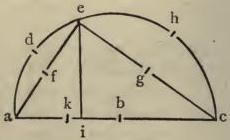

the remaining quadrant made up of the arcs a d and h c. Draw e i perpendicular to a i c, then e i is the sine of the arc a d e. Draw a e; its half, f e, is the sine of the arc d e, the half of the arc a d e. Draw e c; its half, e g, is the sine of the arc e h, and is therefore the sine of the complement of the arc d e. Finally, make a k half the radius a b. Then as a k is to e f, so is e g to e i. For the two triangles c e a and c i e are equiangular, since i c e or a c e is common to both; and c i e and c e a are each a right angle, the former by hypothesis, the latter because it is in the circumference and occupies a semicircle. Hence a c, the hypotenuse of the triangle c e a, is to a e, its less side, as e c, the hypotenuse of the triangle c i e, is to e i its less side. And since a c, the whole, is to a e as e c, the whole, is to e i, it follows that a b, half of a c, is to a e as e g, half of e c, is to e i. And now, finally, since a b, the whole, is to a e, the whole, as e g is to e i, we necessarily conclude that a k, half of a b, is to f e, half of a e, as e g is to e i.

56. Double the logarithm of an arc of 45 degrees is the logarithm of half radius.

Referring to the preceding figure, let the case

be such that a e and e c are equal. In that case i will fall on b, and e i will be radius; also e f and e g will be equal, each of them being the sine of 45 degrees. Now (by

55) the ratio of a k, half radius, to e f, a sine of 45 degrees, is likewise the ratio of e g, also a sine of

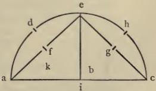

45 degrees, to e i, now radius. Consequently (by 37) double the logarithm of the sine of 45 degrees is equal to the logarithms of the extremes, namely radius and its half. But the sum of the logarithms of both these is the logarithm of half radius only, because (by 27) the logarithm of radius is nothing. Necessarily, therefore, the double of the logarithm of an arc of 45 degrees is the logarithm of half radius.

57. The sum of the logarithms of half radius and any given arc is equal to the sum of the logarithms of half the arc and the complement of the half arc. Whence the logarithm of the half arc may be found if the logarithms of the other three be given.

Since (by 55) half radius is to the sine of half the given arc as the sine of the complement of that half arc is to the sine of the whole arc, therefore (by 38) the sum of the logarithms of the two extremes, namely half radius and the whole arc, will be equal to the sum of the logarithms of the means, namely the half arc and the complement of the half arc. Whence, also (by 38), if you add the logarithm of half radius, found by 51 or 56, to the given logarithm of the whole arc, and subtract the given logarithm of the complement of the half arc, there will remain the required logarithm of the half arc.

## EXAMPLE.

LET there be given the logarithm of half radius (by 51) 6931469; also the arc 69 degrees 20 minutes, and its logarithm 665143. The half arc is 34 degrees 40 minutes, whose logarithm is required. The complement of the half arc is 55 degrees 20 minutes, and its logarithm 1954370 is given. Wherefore add 6931469 to 665143, making 7596612, subtract 1954370, and there remains 5642242, the required logarithm of an arc of 34 degrees 40 minutes.

58. When the logarithms of all arcs not less than 45 degrees are given, the logarithms of all less arcs are very easily obtained.

From the logarithms of all arcs not less than 45 degrees, given by hypothesis, you can obtain (by 57) the logarithms of all the remaining arcs decreasing down to 22 degrees 30 minutes. From these, again, may be had in like manner the logarithms of arcs down to 11 degrees 15 minutes. And from these the logarithms of arcs down to 5 degrees 38 minutes. And so on, successively, down to 1 minute.

59. To form a logarithmic table.

Prepare forty-five pages, somewhat long in shape, so that besides margins at the top and bottom, they may hold sixty lines of figures. Divide each page into twenty equal spaces by horizontal lines, so that each space may hold three lines of figures. Then divide each page into seven columns by vertical lines, double lines being ruled between the second and third columns and between the fifth and sixth, but a single line only between the others.

Next write on the first page, at the top to the left, over the first three columns, "0 degrees"; and at the bottom to the right, under the last three columns, "89 degrees". On the second page, above, to the left, "1 degree"; and below, to the right, "88 degrees". On the third page, above, "2 degrees"; and below, "87 degrees". Proceed thus with the other pages, so that the number written above, added to that written below, may always make up a quadrant, less 1 degree or 89 degrees.

Then, on each page write, at the head of the first column, "Minutes of the degree written above"; at the head of the second column, "Sines of the arcs to the left"; at the head of the third column, "Logarithms of the arcs to the left"; at both the head and the foot of the third column, "Difference between the logarithms of the complementary arcs"; at the foot of the fifth column, "Logarithms of the arcs to the right"; at the foot of the sixth column, "Sines of the arcs to the right"; and at the foot of the seventh column, "Minutes of the degree written beneath".

Then enter in the first column the numbers of minutes in ascending order from 0 to 60, and in the seventh column the number of minutes in descending order from 60 to 0; so that any pair of minutes placed opposite, in the first and seventh columns in the same line, may make up a whole degree or 60 minutes; for example, enter 0 opposite to 60, 1 to 59, 2 to 58, and 3 to 57, placing three numbers in each of the twenty intervals between the horizontal lines. In the second column enter the values of the sines corresponding to the degree at the top and the minutes in the same line to the left; also in the sixth column enter the values of the sines corresponding to the degree

degree at the bottom and the minutes in the same line to the right. Reinhold's common table of sines, or any other more exact, will supply you with these values.

Having done this, compute, by 49 and 50, the logarithms of all sines between radius and its half, and by 54, the logarithms of the other sines; however, you may, with both greater accuracy and facility, compute, by the same 49 and 50, the logarithms of all sines between radius and the sine of 45 degrees, and from these, by 58, you very readily obtain the logarithms of all remaining arcs less than 45 degrees. Having computed these by either method, enter in the third column the logarithms corresponding to the degree at the top and the minutes to the left, and to their sines in the same line at left side; similarly enter in the fifth column the logarithm corresponding to the degree at the bottom and the minutes to the right and to their sines in the same line at right side.

Finally, to form the middle column, subtract each logarithm on the right from the logarithm on the left in the same line, and enter the difference in the same line, between both, until the whole is completed.

We have computed this Table to each minute of the quadrant, and we leave the more exact elaboration of it, as well as the emendation of the table of sines, to the learned to whom more leisure may be given.

## Outline of the Construction, in another form, of a Logarithmic Table.

60. SINCE the logarithms found by 54 sometimes differ from those found by 58 (for example, the logarithm of the sine 378064 is 32752756 by the former, while by the latter it is 32752741), it would seem that the table of sines is in some places faulty. Wherefore I advise the learned, who perchance may have plenty of pupils and computers, to publish a table of sines more reliable and with larger numbers, in which radius is made 10000000, that is with eight cyphers after the unit instead of seven only. Then, let the First table, like ours, contain a hundred numbers progressing in the proportion of the new radius to the sine less than it by unity, namely of 10000000 to 99999999.

Let the Second table also contain a hundred numbers in the proportion of this new radius to the number less than it by a hundred, namely of 10000000 to 99999900.

Let the Third table, also called the Radical table, contain thirty-five columns with a hundred numbers in each column, and let the hundred numbers in each column progress in the proportion of ten thousand to the number less than it by unity, namely of 10000000 to 99990000.

Let the thirty-five proportionals standing first in all the columns, or occupying the second, third, or other rank, progress among themselves in the proportion of 100 to 99, or of the new radius 10000000 to 99000000.

In continuing these proportionals and finding their logarithms, let the other rules we have laid down be observed.

From the Radical table completed in this way, you will find with great exactness (by 49 and 50) the logarithms of all sines between radius and the sine of 45 degrees; from the arc of 45 degrees doubled, you will find (by 56) the logarithm of half radius; having obtained all these, you will find the other logarithms by 58. Arrange all these results as described in 59, and you will produce a Table, certainly the most excellent of all Mathematical tables, and prepared for the most important uses.

End of the Construction of the Logarithmic Table.

# APPENDIX.

On the Construction of another and
better kind of LOGARITHMS, namely
one in which the Logarithm of unity is 0.

AMONG the various improvements of Logarithms,
the more important is that which adopts a cypher
as the Logarithm of unity, and 10,000,000,000
as the Logarithm of either one tenth of unity

or ten times unity. Then, these being once fixed, the Logarithms of all other numbers necessarily follow. But the
methods of finding them are various, of which the first is
as follows:—

Divide the given Logarithm of a tenth, or of ten, namely 10,000,000,000, by 5 ten times successively, and thereby the following numbers will be produced, 200000000,
400000000, 80000000, 16000000, 3200000, 640000,
128000, 25600, 5120, 1024. Also divide the last of these
by 2, ten times successively, and there will be produced 512,
256, 128, 64, 32, 16, 8, 4, 2, 1. Moreover all these numbers are logarithms.

Thereupon let us seek for the common numbers which correspond to each of them in order. Accordingly, between a tenth and unity, or between ten and unity (adding for the purpose of calculation as many cyphers as you wish, say twelve), find four mean proportionals, or rather the least of them, by extracting the fifth root, which for ease in demonstration call A. Similarly, between A and unity, find the least of four mean proportionals, which call B. Between B and unity find four means, or the least of them, which call C. And thus proceed, by the extraction of the fifth root, dividing the interval between that last found and unity into five proportional intervals, or into four means, of all which let the fourth or least be always noted down, until you come to the tenth least mean; and let them be denoted by the letters D, E, F, G, H, I, K.

When these proportionals have been accurately computed, proceed also to find the mean proportional between K and unity, which call L. Then find the mean proportional between L and unity, which call M. Then in like manner a mean between M and unity, which call N. In the same way, by extraction of the square root, may be formed between each last found number and unity, the rest of the intermediate proportionals, to be denoted by the letters O, P, Q, R, S, T, V.

To each of these proportionals in order corresponds its Logarithm in the first series. Whence 1 will be the Logarithm of the number V, whatever it may turn out to be, and 2 will be the Logarithm of the number T, and 4 of the number S, and 8 of the number R, 16 of the number Q, 32 of the number P, 64 of the number O, 128 of the number N, 256 of the number M, 512 of the number L, 1024 of the number K; all of which is manifest from the above construction.

From these, once computed, there may then be formed both the proportionals of other Logarithms and the Logarithms of other proportionals.

For as in statics, from weights of 1, of 2, of 4, of 8, and of other like numbers of pounds in the same proportion, every number of pounds weight, which to us now are Logarithms, may be formed by addition; so, from the proportionals V, T, S, R, &c., which correspond to them, and from others also to be formed in duplicate ratio, the proportionals corresponding to every proposed Logarithm may be formed by corresponding multiplication of them among themselves, as experience will show.

The special difficulty of this method, however, is in finding the ten proportionals to twelve places by extraction of the fifth root from sixty places, but though this method is considerably more difficult, it is correspondingly more exact for finding both the Logarithms of proportionals and the proportionals of Logarithms.

## Another method for the easy construction of the LOGARITHMS of composite numbers, when the LOGARITHMS of their primes are known.

IF two numbers with known Logarithms be multiplied together, forming a third; the sum of their Logarithms will be the Logarithm of the third.

Also if one number be divided by another number, producing a third; the Logarithm of the second subtracted from the Logarithm of the first, leaves the Logarithm of the third.

If from a number raised to the second power, to the third power, to the fifth power, &c., certain other numbers be produced; from the Logarithm of the first multiplied by two, three, five, &c., the Logarithms of the others are produced.

Also if from a given number there be extracted the second, third, fifth, &c., roots; and the Logarithm of the given number be divided by two, three, five, &c., there will be produced the Logarithms of these roots.

Finally any common number being formed from other common numbers by multiplication, division, [raising to a power] or extraction [of a root]; its Logarithm is correspondingly formed from their Logarithms by addition, subtraction, multiplication, by 2, 3, &c. [or division by 2, 3, &c.]: whence the only difficulty is in finding the Logarithms of the prime numbers; and these may be found by the following general method.

For finding all Logarithms, it is necessary as the basis of the work that the Logarithms of some two common numbers be given or at least assumed; thus in the foregoing first method of construction, 0 or a cypher was assumed as the Logarithm of the common number one, and 10,000,000,000 as the Logarithm of one-tenth or of ten. These therefore being given, the Logarithm of the number 5 (which is a prime number) may be sought by the following method. Find the mean proportional between 10 and 1, namely 31622776601⁷/100000000000, also the arithmetical mean between 10,000,000,000 and 0, namely 5,000,000,000; then find the geometrical mean between 10 and 31622776601⁷/100000000000, namely 562341325191, also the arithmetical mean between 10,000,000,000 and 5,000,000,000, namely 7,500,000,000;

In all continuous proportionals.

AS the sum of the means and one or other of the extremes to the same extreme; so is the difference of the extremes to the difference of the same extreme and the nearest mean.

## A saving of half the Table of LOGARITHMS.

OF two arcs making up a quadrant, as the sine of the greater is to the sine of double its arc, so is the sine of 30 degrees to the sine of the less. Whence the Logarithm of the double arc being added to the Logarithm of 30 degrees, and the Logarithm of the greater being subtracted from the sum, there remains the Logarithm of the less.

## The relations of LOGARITHMS & their natural numbers to each other.

[A] 1. LET two sines and their Logarithms be given. If as many numbers equal to the less sine be multiplied together as there are units in the Logarithm of the greater; and on the other hand, as many numbers equal to the greater sine be multiplied together as there are units in the Logarithm of the less; two equal numbers will be produced, and the Logarithm of the sine so produced will be the product of the two Logarithms.

2. As the greater sine is to the less, so is the velocity of increase or decrease of the Logarithms at the less, to the velocity of increase or decrease of the Logarithms at the greater.
3. Two sines in duplicate, triplicate, quadruplicate, or other ratio, have their Logarithms in double, triple, quadruple, or other ratio.
4. And two sines in the ratio of one order to another order, as for instance the triplicate to the quintuplicate, or the cube

cube to the fifth, have their Logarithms in the ratio of the indices of their orders, that is of 3 to 5.

5. If a first sine be multiplied into a second producing a third, the Logarithm of the first added to the Logarithm of the second produces the Logarithm of the third. So in division, the Logarithm of the divisor subtracted from the Logarithm of the dividend leaves the Logarithm of the quotient.

6. And if any number of equals to a first sine be multiplied together producing a second, just so many equals to the Logarithm of the first added together produce the Logarithm of the second.

7. Any desired geometrical mean between two sines has for its Logarithm the corresponding arithmetical mean between the Logarithms of the sines.

8. If a first sine divide a third as many times successively as there are units in A; and if a second sine divides the same third as many times successively as there are units in B; also if the same first divide a fourth as many times successively as there are units in C; and if the same second divide the same fourth as many times successively as there are units in D: I say that the ratio of A to B is the same as that of C to D, and as that of the Logarithm of the second to the Logarithm of the first.

9. Hence it follows that the Logarithm of any given number is the number of places or figures which are contained in the result obtained by raising the given number to the 10,000,000,000th power.

10. Also if the index of the power be the Logarithm of 10, the number of places, less one, in the power or multiple, will be the Logarithm of the root.

Suppose it is asked what number is the LOGARITHM of 2. I reply, the number of places in the result obtained by multiplying together 10,000,000,000 of the number 2.

But, you will say, the number obtained by multiplying together 10,000,000,000 of the number 2 is innumerable. I reply, still the number of places in it, which I seek, is numerable.

Therefore, with 2 as the given root, and 10,000,000,000 as the index, seek for the number of places in the multiple, and not for the multiple itself; and by our rule you will find 301029995 &c. to be the number of places sought, and the LOGARITHM of the number 2.

F I N I S.

# REMARKS ON THE APPENDIX BY HENRY BRIGGS

The relations of LOGARITHMS and their natural
numbers to each other, when the LOGARITHM
of unity is made O.

TWO numbers with their Logarithms being given; [A]
if both Logarithms be divided by some common
divisor, and if each of the given numbers be
multiplied by itself continuously, until the
number of multiplications is exceeded, by unity only, by the
quotient of the Logarithm of the other number, two equal
numbers will be produced. And the Logarithm of the
number produced will be the continued product of the
quotients of the Logarithms and their common divisor.

|  | Number | Logarithm |
| --- | --- | --- |
| Let the given numbers be | 25118865 | 4 |
|  | 39810718 | 6 |

Let the common divisor be 1.

The first multiplied by itself 5 times, and the second 3 times, make 251188649/1000000.

|  Continued Proportionals. |  |  | Logarithms.  |
| --- | --- | --- | --- |
|  1 | (0) |  | 0  |
|  25118865 | (1) | First power | 4  |
|  63095737 | (2) | Second power | 8  |
|  158489331 | (3) | Third power | 12  |
|  39810718 | (4) | Fourth power | 16  |
|  100000000 | (5) | Fifth power | 20  |
|  251188649 | (6) | Sixth power | 24  |

|  Continued Proportionals. |  |  | Logarithms.  |
| --- | --- | --- | --- |
|  1 | (0) |  | 0  |
|  39810718 | (1) |  | 6  |
|  158489331 | (2) |  | 12  |
|  630957379 | (3) |  | 18  |
|  251188649 | (4) |  | 24  |

## ANOTHER EXAMPLE.

|   |  | Logarithms.  |
| --- | --- | --- |
|  Let the given numbers be | { 316227766 50118724 | 5 7  |
|  Let the common divisor be |  | 1  |
|  The first multiplied by itself 6 times The second ,, ,, 4 ,, } | makes 316227766 |   |

|   | Logarith. |   |  | Logarith.  |   |
| --- | --- | --- | --- | --- | --- |
|  1 | (0) | 0 | 1 | (0) | 0  |
|  316227766 | (1) | 5 | 50118724 | (1) | 7  |
|  1000000000 | (2) | 10 | 251188649 | (2) | 14  |
|  100 | (4) | 20 | 630957376 | (4) | 28  |
|  1000 | (6) | 30 | 316227766 | (5) | 35  |
|  316227766 | (7) | 35 |  |  |   |

It should be observed that if the common divisor be unity, as in both the preceding examples, the product of the given Logarithms is the Logarithm of the number produced, because multiplication by unity does not increase the thing multiplied.

## THIRD EXAMPLE.

|   | Logarithms. Quotients.  |   |
| --- | --- | --- |
|  Let the given numbers be { | 343 | 2.53529412 3  |
|   |  823543 | 5.91568628 7  |
|  Let the common divisor be | 84509804  |   |

Number of Places.

|   | 1 | (0) | 0  |
| --- | --- | --- | --- |
|  3 | 343 | (1) | 2.53529412  |
|  6 | 117649 | (2) | 5.07058824  |
|  8 | 40353607 | (3) | 7.60588236  |
|  11 | 3841287201 | (4) | 10.14117648  |
|  18 | 558545864083284007 | (7) | 17.74705884  |
|  6 | 823543 | (1) | 5.91568628  |
|  12 | 678223072849 | (2) | 11.83137256  |
|  18 | 558545864083284007 | (3) | 17.74705884  |
|   | H |   | As  |

As the quotients of the given LOGARITHMS are 3 and 7, their product is 21, which, multiplied by 84509804 the common divisor, makes 17.74705884 the LOGARITHM of the number produced.

It should be observed that the cube of the second number, and its equal the seventh power of the first (which some call secundus solidus), contain eighteen figures, wherefore its Logarithm has 17. in front, besides the figures following. The latter represent the Logarithm of the number denoted by the same digits, but of which 5, the first digit to the left, is alone integral, the remaining digits expressing a fraction added to the integer, thus 5 5854586408 &c. has for its Logarithm 74705884. Again, if four places remain integral, 3. must be placed in front of the Logarithm, thus 5 5854586408 &c. has for its Logarithm 3.74705884.

Hence from two given Logarithms and the sine of the first we shall be able to find the sine of the second.

Take some common divisor of the Logarithms, (the larger the better); divide each by it. Then let the first sine multiply itself and its products continuously until the number of these products is exceeded, by unity only, by the quotient of the second Logarithm; or until the power is produced of like name with the quotient of the second Logarithm. The same number would be produced if the second sine, which is sought, were to multiply itself until it became the power of like name with the quotient of the first Logarithm, as is evident from the preceding proposition.

Therefore take the above power and seek for the root of it which corresponds to the quotient of the first Logarithm; thereby you will find the required second sine. Also the Logarithm of the power itself will be the continued product of the quotients and the common divisor.

Thus let the given LOGARITHMS be 8 and 14, and the sine corresponding to the first LOGARITHM be 3. A common divisor of the LOGARITHMS is 2; this gives the quotients 4 and 7. If 3 multiply itself six times, you will have 2187 for the power which, in a series of continued proportionals from unity, will occupy the seventh place, and hence it may, without inconvenience, be called the seventh power. The same number, 2187, is the fourth power from unity in another series of continued proportionals, in which the first power, 6 838521, is the required second sine. The product of the quotients 4 and 7 is 28, which, multiplied by the common divisor 2, makes 56, the LOGARITHM of the power 2187.

|  Continued Proportionals. |  | Logarithms. | Continued Proportionals. |  | Logarithms.  |
| --- | --- | --- | --- | --- | --- |
|  1 | (0) | 0 | 1 | (0) | 0  |
|  3 | (1) | 8 | 6838521 | (1) | 14  |
|  9 | (2) | 16 | 46765372 | (2) | 28  |
|  27 | (3) | 24 | 31980598 | (3) | 42  |
|  81 | (4) | 32 | 2187 | (4) | 56  |
|  243 | (5) | 40 |  |  |   |
|  729 | (6) | 48 |  |  |   |
|  2187 | (7) | 56 |  |  |   |

It will be observed that these Logarithms differ from those employed in illustration of the previous Proposition; but they agree in this, that in both, the Logarithm of unity is 0; and consequently the Logarithms of the same numbers are either equal or at least proportional to each other.

## [B] If a first sine divide a third

The first must divide the third, and the quotient of the third, and each quotient of a quotient successively as many times as possible, until the last quotient becomes less than the divisor. Then let the number of these divisions be noted, but not the value of any quotient, unless perhaps the least, to which we shall refer presently. In the same manner let the second divide the same third. And so also let the fourth be divided by each.

Thus let the { first sine be 2
second ,, ,, 4
third ,, ,, 16
fourth ,, ,, 64

The first, 2. divides the third, 16. four times; and the quotients are 8, 4, 2, 1. The second, 4. divides the same third, 16. two times; and the quotients are 4, 1. Therefore A will be 4, and B will be 2.

In the same manner the first, 2. divides the fourth, 64. six times; and the quotients are 32, 16, 8, 4, 2, 1. The second, 4. divides the fourth, 64. three times; and the quotients are 16, 4, 1. Therefore C will be 6, and D will be 3.

Hence I say that, as A, 4. is to B, 2. so is C, 6. to D, 3. and so is the Logarithm of the second to the Logarithm of the first.

If in these divisions the last and smallest quotient be everywhere unity, as in these four cases, the numbers of *the quotients and the Logarithms of the divisors will be reciprocally proportional.*

*Otherwise the ratio will not be exactly the same on both sides; nevertheless, if the divisors be very small, and the dividends sufficiently large, so that the quotients are very many, the defect from proportionality will scarcely, or not even scarcely, be perceived.*

## [C] Hence it follows that the logarithm

*Let two numbers be taken, 10 and 2, or any others you please. Let the Logarithm of the first, namely 100, be given; it is required to find the Logarithm of the second. In the first place, let the second, 2. multiply itself continuously until the number of the products is exceeded, by unity only, by the given Logarithm of the first. Then let the last product be divided as often as possible by the first number, 10. and again in like manner by the second number, 2. The number of quotients in the latter case will be 100, (for the product is its hundredth power; and if a number be multiplied by itself a given number of times forming a certain product, then it will divide the product as many times and once more; for example, if 3 be multiplied by itself four times it makes 243, and the same 3 divides 243 five times, the quotients being 81, 27, 9, 3, 1.) In the former case, where the product is continually divided by 10, it is manifest that the number of quotients falls short of the number of places in the dividend by one only. Therefore (by the preceding proposition) since the same product is divided by two given numbers as often as possible, the numbers of the quotients and the Logarithms of the divisors will be reciprocally proportional. But, the number of quotients by the second being equal to the Logarithm of the first, the number of quotients by the first, that is the number of places in the product less one, will be equal to the Logarithm of the second.

|  Number of Places. | 1 | 0  |
| --- | --- | --- |
|  1 | 2 | 1  |
|  1 | 4 | 2  |
|  2 | 16 | 4  |
|  3 | 256 | 8  |
|  4 | 1024 | 10  |
|  7 | 1048576 | 20  |
|  13 | 1099511627776 | 40  |
|  25 | 1208925819614 | 80  |
|  31 | 1267650600228 | 100  |
|  61 | 16069379676 | 200  |
|  121 | 25822496318 | 400  |
|  241 | 66680131608 | 800  |
|  302 | 107150835165 | 1000  |
|  603 | 114813014767 | 2000  |
|  1205 | 131820283599 | 4000  |
|  2409 | 17316587168 | 8000  |
|  3011 | 19950583591 | 10000  |

Here we see that if we assume the LOGARITHM of 10 to be 10, the number of places in the tenth power is 4, wherefore the logarithm of 2 will be 3 and something over. The number of places in the hundredth power is 31; in the thousandth, 302; in the ten thousandth, 3011; and generally the more products we take the more nearly do we approach the true LOGARITHM sought for. For when the products are few, the fraction adhering to the last quotient disturbs the ratio a little; but if we assume the LOGARITHM of 10 to be 10,000,000,000, and if 2 be multiplied by itself continuously until the number of products is exceeded, by one only, by the given LOGARITHM; then the number of places, less one, in the last product, will give the LOGARITHM of 2 with sufficient accuracy, because in large numbers the small fraction adhering to the last quotient will have no effect in disturbing the proportion.

THE END.

# SOME VERY REMARKABLE PROPOSITIONS FOR THE SOLUTION OF SPHERICAL TRIANGLES WITH WONDERFUL EASE

To solve a spherical triangle without dividing it
into two quadrantal or rectangular triangles.

Prop. 1. *GIVEN three sides, to find any angle.*

*And conversely,*

2. *Given three angles, to find any side.*

This is best done by the three methods
explained in my work on LOGARITHMS, *Book II. chap.*
vi. *sects.* 8, 9, 10.

3.

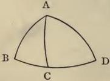

*Given the side A D, & the angles*
*D & B, to find the side A B.*

Multiply the sine of A D by
the sine of D; divide the product by the sine of B, and you
will have the sine of A B.

4. Given the side A D, & the angles D & B, to find the side B D.

Multiply radius by the sine of the complement of D; divide by the tangent of the complement of A D, and you will obtain the tangent of the arc C D: then multiply the sine of C D by the tangent of D; divide the product by the tangent of B, and the sine of B C will result: add or subtract B C and C D, and you have B D.

5. Given the side A D, & the angles D & B, to find the angle A.

Multiply radius by the sine of the complement of A D; divide by the tangent of the complement of D, and the tangent of the complement of C A D will be produced; whence we have C A D itself. Similarly multiply the sine of the complement of B by the sine of C A D; divide by the sine of the complement of D, and the sine of B A C will be produced; which being added to or subtracted from C A D, you will obtain the required angle B A D.

6. Given A D, & the angle D with the side B D, to find the angle B.

Multiply radius by the sine of the complement of D; divide by the tangent of the complement of A D, and the tangent of C D will be produced; its arc C D subtract from, or add to, the side B D, and you have B C: then multiply the sine of C D by the tangent of D; divide the product by the sine of B C, and you have the tangent of the angle B.

7. Given A D, & the angle D with the side B D, to find the side A B.

Multiply radius by the sine of the complement of D; divide the product by the tangent of the complement of A D, and the tangent of C D will be produced; its arc C D subtract from, or add to, the given side B D, and you have B C. Then multiply the sine of the complement of A D by the sine of the complement of B C; divide the product by the sine of the complement of C D, and the sine of the complement of A B will be produced; hence you have A B itself.

Given A D, & the angle D with the side B D, to find the angle A.

This follows from the above, but the problem would require the "Rule of Three" to be applied thrice. Therefore substitute A for B and B for A, and the problem will be as follows:—

Given B D & D, with the side A D, to find the angle B.

This is exactly the same as the sixth problem, and is solved by the "Rule of Three" being applied twice only.

8. Given A D, & the angle D with the side A B, to find the angle B.

Multiply the sine of A D by the sine of D; divide the product by the sine of A B, and the sine of the angle B will be produced.

9. Given A D, & the angle D with the side A B, to find the side B D.

Multiply radius by the sine of the complement of D, divide the product by the tangent of the complement of A D, and the tangent of the arc C D will be produced. Then multiply the sine of the complement of C D by the sine of the complement of A B, divide the product by the sine of the complement of A D, and you have the sine of the complement of B C. Whence the sum or the difference of the arcs B C and C D will be the required side B D.

10. Given A D, & the angle D with the side A B, to find the angle A.

Multiply radius by the sine of the complement of A D, divide the product by the tangent of the complement of D, and the tangent of the complement of C A D will be produced, giving us C A D. Again, multiply the tangent of A D by the sine of the complement of C A D, divide the product by the tangent of A B, and the sine of the complement of B A C will be produced, giving B A C. Then the sum or difference of the arcs B A C and C A D will be the required angle B A D.

11. Given A D, & the angle D with the angle A, to find the side A B.

Multiply radius by the sine of the complement of A D, divide the product by the tangent of the complement of D, and you have the tangent of the complement of C A D; C A D being thus known, the difference or sum of the same and the whole angle A is the angle B A C. Multiply the tangent of A D by the sine of the complement of C A D; divide the product by the sine of the complement of B A C, and you will have the tangent of A B.

12. Given A D, & the angle D with the angle A, to find the third angle B.

Multiply radius by the sine of the complement of A D, divide the product by the tangent of the complement of D, and the sine of the complement of B will be produced, from which we have the angle required.

Given A D, & the angle D with the angle A, to find the side B D.

This follows from the above, but in this form the problem would require the "Rule of Three" to be three times applied. Therefore substitute A for D and D for A, and the problem will be as follows:—

Given A D & the angle A with the angle D, to find the side B A.

This is the same throughout as problem 11, and is solved by applying the “Rule of Three” twice only.

## The use and importance of half-versed sines.

1. Given two sides & the contained angle, to find the third side.

From the half-versed sine of the sum of the sides subtract the half-versed sine of their difference; multiply the remainder by the half-versed sine of the contained angle; divide the product by radius; to this add the half-versed sine of the difference of the sides, and you have the half-versed sine of the required base.

Given the base and the adjacent angles, the vertical angle will be found by similar reasoning.

2. Conversely, given the three sides, to find any angle.

From the half-versed sine of the base subtract the half-versed sine of the difference of the sides multiplied by radius; divide the remainder by the half-versed sine of the sum of the sides diminished by the half-versed sine of their difference, and the half-versed sine of the vertical angle will be produced.

Given the three angles, the sides will be found by similar reasoning.

3. Given two arcs, to find a third, whose sine shall be equal to the difference of the sines of the given arcs.

Let the arcs be 38° 1' and 77°. Their complements are 51° 59' and 13°. The half sum of the complements is 32° 29', the half difference 19° 29', and the logarithms are 621656 and 1098014 respectively. Adding these, you have 1719670, from which, subtracting 693147, the logarithm of half radius, there will remain 1026523, the logarithm of 21°, or thereabout. Whence the sine of 21°, namely 358368, is equal to the difference of the sines of the arcs 77° and 38° 1', which sines are 974370 and 615891, more or less.

4. Given an arc, to find the Logarithm of its versed sine. [a]

Let the arc be 13°; its half is 6° 30', of which the logarithm is 2178570. From double this, namely 4357140, subtract 693147, and there will remain 3663993. The arc corresponding to this is 1° 28', and the number put for the sine is 25595; but this is also the versed sine of 13°. * *

5. Given two arcs, to find a third whose sine shall be equal to the sum of the sines of the given arcs.

Let the arcs be 38° 1' and 1° 28'; their sum is 39° 29' and their difference 36° 33', also the half sum is 19° 44' and the half difference 18° 16'. Wherefore add the logarithm of the half sum, viz. 1085655, to the logarithm of the difference, viz. 518313, and you have 1603968; from this subtract the logarithm of the half difference, namely 1160177, and there will remain the logarithm 443791, to which correspond the arc 39° 56' and sine 641896. But this sine is equal, or nearly so, to the sum of the sines of 38° 1' and 1° 28', namely 615661 and 25595 respectively.

6. Given an arc & the Logarithm of its sine, to find the arc whose versed sine shall be equal to the sine of the given arc.

Let the arc be 39° 56', to which corresponds the logarithm 443791, the sine being unknown. To the logarithm 443791 add 693147, the logarithm of half radius, and you have 1136938. Halve this logarithm and you have 568469. To this corresponds the arc 34° 30', which being doubled gives 69° for the arc which was sought. This is the case since the sine of 39° 56' and the versed sine of 69° are each equal, or nearly so, to 641800.

[b] Of the spherical triangle A B D, given the sides & the contained angle, to find the base.

Let the sides be 34° and 47°, and the contained angle 120° 24' 49". Half the contained angle is 60° 12' 24½", and its logarithm 141766. To the double of the latter, namely 283533, add the logarithms of the sides, namely 581260 and 312858, and the sum is 1177651. This sum is the logarithm of half the difference between the versed sine of the base and the versed sine of the difference of the sides; it is also the logarithm of the sine of the arc 17° 56', which arc we call the "second found," for that which follows is first found.

Halve the difference of the sides, namely 13°, and you have 6° 30', the logarithm of which is 2178570. Double the latter and you have 4357140 for the logarithm of the half-versed sine of 13°; it is also the logarithm of the sine of the arc 0° 44', which arc we call the "first found."

The sum of the two arcs is 18° 40', the half sum 9° 20', and their logarithms 1139241 and 1819061 respectively. Also the difference of the two arcs is 17° 12', the half difference 8° 36', and their logarithms 1218382 and 1900221 respectively.

Now add the logarithm of the half sum, namely
1819061,

either
to the logarithm 1218382,
and the sum will be
3037443; from this subtract the logarithm 1900221
and there will remain
1137222.

or
to the logarithm of the
complement of the half
difference, namely 11307,
and the sum will be
1830368; from this subtract 693147 and there
will remain 1137221.

Halve the latter and you have the logarithm
568611, to which corresponds the arc 34° 30', and
double this arc is the base required, namely 69°.

Conversely, given the three sides, to find any angle. The
solution of this problem is given in my work on Logarithms, Book II. chap. vi. sect. 8, but partly by logarithms
and partly by prosthaphæresis of arcs.

It is to be observed that in the preceding and following
problems there is no need to discriminate between the different cases, since the form and magnitude of the several
parts appear in the course of the calculation.

Another direct converse of the preceding problem follows.—

[Given the sides and the base, to find the vertical angle.]

HALVE the given base, namely 69°, and you have
34° 30', the logarithm of which is 568611.
Double the latter and you have 1137222; corresponding to this is the arc 18° 42', which note as the
second found.

As before, take for the first found the arc 0° 44',
corresponding to the logarithm 4357140.

The complements of the two arcs are 89° 16' and
71° 18'; their half sum is 80° 17', and its logarithm 14449; their half difference is 8° 59', and its logarithm 1856956. Add these logarithms and you have 1871405; subtract 693147 and there remains 1178258. The arc corresponding to this logarithm is 17° 56', which arc we call the third found.

From the logarithm of the third found, subtract the logarithms of the given sides, namely 581260 and 312858, and there remains 283533; halve this and you have 141766 for the logarithm of the half vertical angle 60° 12' 24½". The whole vertical angle sought is therefore 120° 24' 49".

Another rule for finding the base by prosthaphæresis.—

[Given the sides and vertical angle, to find the base.]

Note the half difference between the versed sines of the sum and difference of the sides, and also the half-versed sine of the vertical angle. Look among the common sines for the values noted, and find the arcs corresponding to them in the table. Then write for the second found the half difference of the versed sines of the sum and difference of these arcs.

Also, as before, take for the first found the half-versed sine of the difference of the sides.

Add the first and second found, and you will obtain the half-versed sine of the base sought for.

Conversely—[given the sides and the base, to find the vertical angle.]

The first found will be, as before, the half-versed sine of the difference of the sides.

From the half-versed sine of the base subtract the first found and you will have the second found.

Multiply the latter by the square of radius; divide by the half difference between the versed sines of the sum and difference of the sides, and you have as quotient the half-versed sine of the vertical angle sought for.

Of five parts of a spherical triangle, given the three intermediate, to find the two extremes by a single operation. Or otherwise, given the base and adjacent angles, to find the two sides.

(*)

OF the angles at the base, write down the sum, half sum, difference and half difference, along with their logarithms.

Add together the logarithm of the half sum, the logarithm of the difference, and the logarithm of the tangent of half the base; subtract the logarithm of the sum and the logarithm of the half difference, and you will have the first found.

Then to the logarithm of the half difference add the logarithm of the tangent of half the base; subtract the logarithm of the half sum, and you will have the second found.

Look for the first and second found among the logarithms of tangents, since they are such, then add their arcs and you will have the greater side; again subtract the less arc from the greater and you will have the less side.

Another way of finding the sides.

ADD together the logarithm of the half sum of the angles at the base, the logarithm of the complement of the half difference, and the logarithm of the tangent of half the base; subtract the logarithm of the sum and the logarithm of half radius, and you will have the first found.

Again, add together the logarithm of the half difference, the logarithm of the complement of the half sum, and the logarithm of the tangent of half the base; subtract the logarithm of the sum and the logarithm of half radius, and you will have the second found.

Proceed as above with the first and second found, and you will obtain the sides.

Another way of the same.

Multiply the secant of the complement of the sum of the angles at the base by the tangent of half the base.

Multiply the product by the sine of the greater angle at the base, and you will have the first found.

Multiply the same product by the sine of the less angle, and you will have the second found.

[d]

Then divide the sum of the first and second found by the square of radius, and you will have the tangent of half the sum of the sides.

Also subtract the less from the greater and you will have the tangent of half the difference of the sides.

Whence add the arcs corresponding to these two tangents, and the greater side will be obtained; subtract the less arc from the greater and you have the less side.

Of the five consecutive parts of a spherical triangle, given the three intermediate, to find both extremes by one operation and without the need of discriminating between the several cases.

(*)

OF the angles at the base, the sine of the half difference is to the sine of the half sum, as the sine of the difference is to a fourth which is the sum of the sines.

And

And the sine of the sum is to the sum of the sines
as the tangent of half the base is to the tangent of
half the sum of the sides.

Whence the sine of the half sum is to the sine of
the half difference of the angles as the tangent of
half the base is to the tangent of half the difference
of the sides.

Add the arcs of these known tangents, taking
them from the table of tangents, and you will have
the greater side; in like manner subtract the less
from the greater and the less side will be obtained.

FINIS.

# NOTES ON THE FOREGOING PROPOSITIONS BY HENRY BRIGGS

[a]

GIVEN an arc, to find the logarithm of its versed sine.

To the end of this proposition * * I should like to add the following:—

Conversely, given the logarithm of a versed sine, to find its arc.

Add the known logarithm of the required versed sine to the logarithm of 30°, viz., 693147, and half the sum will be the logarithm of half the arc sought for.

Thus let 35791 be the given logarithm of an unknown versed sine, whose arc is also unknown.

To this logarithm add 693147, and the sum will be 728938, half of which, 364469, is the logarithm of 43° 59' 33". The arc of the given logarithm is therefore 87° 59' 6", and its versed sine is 9648389.

Again, let a negative logarithm, say —54321, be the known logarithm of the required versed sine. To this logarithm add, as before, 693147, and the sum, that is the number remaining since the sines are contrary, will be 638826, half of which, 319413, is the logarithm of 46° 36' 0". The arc of the given logarithm is therefore 93° 12' 0", the versed sine of which is 10558216, and since this is greater than radius it has a negative logarithm, namely -54321.

DEMONSTRATION.

c b
ab} versed sine of arc { c d
{ a d

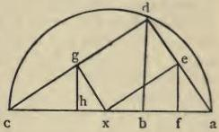

x c } cont. x a } cont.
c g } proa e } proc h } port. a f } port.

½x c, sine of 30° 0' } cont.
c g, sine of ½ arc c d } proc b, double of line c h } port.

Later on I observed that the sixth proposition might be proved in an exactly similar way.

Of the spherical triangle A B D ]

In finding the base we may pursue another method, namely:—

Add the logarithm of the versed sine of the given angle to the logarithms of the given sides, and the sum will be the logarithm of the difference between the versed sine of the difference of the sides and the versed sine of the base required. This difference being consequently known, add to it the versed sine of the difference of the sides, and the sum will be the versed sine of the base required.

For example, let the sides be 34° and 47°, their logarithms 581261 and 312858, and the logarithm of the versed sine of the given angle -409615. The sum of these three logarithms is 484504, which is the logarithm of the difference between the versed sine of the base and the versed sine of the difference of the sides.

Now the line corresponding to this logarithm, whether a versed sine or a common sine, is 6160057, and consequently this is the difference between the versed sine of the base and the versed sine of the difference of the sides. If to this you add the versed sine of the difference of the sides, that is 256300, the sum will be the versed sine of the base required, namely 6416357, and this subtracted from radius leaves the sine of the complement of the base, namely 3583643, which is the sine of 21°. Consequently the base required is 69°.

Conversely, given three sides, to find any angle.

If from the logarithm of the difference between the versed sine of the base and the versed sine of the difference of the sides you subtract the logarithms of the sides, the remainder will be the logarithm of the versed sine of the angle sought for.

As in the previous example, let the logarithms of the sides be 581261 and 312858. Subtract their sum, 894119, from the logarithm 484504, and the remainder will be the negative logarithm -409615, which gives the versed sine of the required angle 120° 24' 49".

[c] Of five parts of a spherical triangle ]

This proposition appears to be identical with the one which is inserted at the end, and distinguished like the former by (*). The latter proposition I consider much the superior. There are, however, three operations in it, the first two of which I throw into one, as they are better combined. Thus:—

Let there be given

the base 69°,

the angles at the base { 42° 29' 59"
31° 6' 5"

|  73° 36' 4" sum.  |
| --- |
|  36° 48' 2" half sum.  |
|  53° 11' 58" complement of ½ sum.  |

|  11° 23' 54" difference.  |
| --- |
|  5° 41' 57" half difference.  |
|  84° 18' 3" compl. of ½ diff.  |

|  Proportion 1. | Sine half difference | 5° 41' 57" | Logarithms. 23095560  |
| --- | --- | --- | --- |
|   |  Sine half sum | 36° 48' 2" | 5124410  |
|   |  Sine difference | 11° 23' 54" | 16213641  |
|   |  Sum of sines |  | —1757509  |
|  Proportion 2. | Sine of sum | 73° 36' 4" | 415312  |
|   |  Sum of sines |  | —1757509  |
|   |  Tangent half base | 34° 30' 0" | 3750122  |
|   |  Tangent ½ sum of sides | 40° 30' 0" | 1577301  |
|  Proportion 3. | Sine ½ sum of angles | 36° 48' 2" | 5124410  |
|   |  Sine ½ diff. of angles | 5° 41' 57" | 23095560  |
|   |  Tangent ½ base | 34° 30' 0" | 3750122  |
|   |  Tangent ½ diff. of sides | 6° 30' 0" | 21721272  |

|  40° 30'  |
| --- |
|  6° 30'  |
|  47° 0'  |
|  34° 0'  |
|  sides.  |

These are the operations described by the Author. But I replace the first two by another, retaining the third.

|  Proportion. | Sine compl. ½ sum of angles | 53° 11' 58" | 2222368  |
| --- | --- | --- | --- |
|   |  Sine compl. ½ diff. of angles | 84° 18' 3" | 49553  |
|   |  Tangent ½ base | 34° 30' 0" | 3750122  |
|   |  Tangent ½ sum of sides | 40° 30' 0" | 1577307  |

## ANOTHER EXAMPLE.

Let there be given

the angle 47°,

the sides containing it { 59° 35' 11"
31° 6' 5"

|  90° 41' 16" sum.  |
| --- |
|  45° 20' 38" half sum.  |
|  44° 39' 22" compl. of half sum.  |
|  28° 29' 6" difference.  |
|  14° 14' 33" half difference.  |
|  75° 45' 27" compl. of half diff.  |

|  Proportion 1. | Sine compl. ½ sum of sides | 44° 39' 22" | 3526118  |
| --- | --- | --- | --- |
|   |  Sine compl. ½ diff. of sides | 75° 45' 27" | 312192  |
|   |  Tan. compl. ½ vert. angle | 66° 30' 0" | —8328403  |
|   |  Tan. ½ sum of angs. at base | 72° 30' 0" | —11452329  |

|  Proportion 2. | Sine ½ sum of sides | 45° 20' 38" | 3406418  |
| --- | --- | --- | --- |
|   |  Sine ½ diff. of sides | 14° 14' 33" | 14023154  |
|   |  Tan. compl. ½ vert. angle | 66° 30' 0" | —8328403  |
|   |  Tan. ½ diff. of angs. at base | 38° 30' 0" | 2288333  |

|  72° 30'  |
| --- |
|  38° 30'  |
|  111° 0'  |
|  34° 0'  |
|  angles at the base.  |

And these relations are all uniformly maintained, whether there be given two angles with the interjacent side or two sides with the contained angle. In each operation the important point is what occupies the third place in the proportion. In the former it is the tangent of half the base, in the latter the tangent of the complement of half the vertical angle. In these examples, if the tangent or the sum of the sines be greater than radius, the logarithm is negative and has a dash preceding, for example —8328403.

Another way of the same ]

Then divide the sum of the first and second found by [d] the square of radius, and you will have )

To make the sense clearer, I should prefer to write this as follows:—

Then divide both the first and second found by the square of radius, add the quotients, and you will have the tangent, &c.

This proposition is absolutely true, as well as the one preceding; but while the former may most conveniently be solved by logarithms, the latter will not admit of the use of logarithms throughout, as the quotients must be added and subtracted to find the tangents; for the utility of Logarithms is seen in proportionals, and therefore in multiplication and division, and not in addition or subtraction.

THE END.
