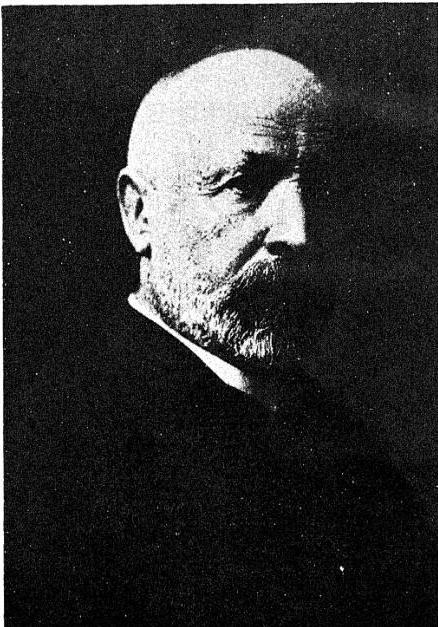

# CONTRIBUTIONS TO THE FOUNDING OF THE THEORY OF TRANSFINITE NUMBERS

---


GEORG CANTOR (1845-1918)

---

# CONTRIBUTIONS TO THE FOUNDING OF THE THEORY OF TRANSFINITE NUMBERS

BY

GEORG CANTOR

TRANSLATED, AND PROVIDED WITH AN INTRODUCTION AND NOTES, BY

PHILIP E. B. JOURDAIN
M.A. (CANTAB.)

NEW YORK
DOVER PUBLICATIONS, INC.

---

Unabridged and unaltered reprint
of the English translation first published
in 1915

DOVER PUBLICATIONS, INC.

Printed and bound in the United States of America

---

# PREFACE

THIS volume contains a translation of the two very important memoirs of Georg Cantor on transfinite numbers which appeared in the *Mathematische Annalen* for 1895 and 1897* under the title: “Beiträge zur Begründung der transfiniten Mengenlehre.” It seems to me that, since these memoirs are chiefly occupied with the investigation of the various transfinite cardinal and ordinal numbers and not with investigations belonging to what is usually described as “the theory of aggregates” or “the theory of sets” (*Mengenlehre, théorie des ensembles*),—the elements of the sets being real or complex numbers which are imaged as geometrical “points” in space of one or more dimensions,—the title given to them in this translation is more suitable.

These memoirs are the final and logically purified statement of many of the most important results of the long series of memoirs begun by Cantor in 1870. It is, I think, necessary, if we are to appreciate the full import of Cantor’s work on transfinite numbers, to have thought through and to bear in mind Cantor’s earlier researches on the theory of point-aggregates. It was in these researches that the need for the

* Vol. xlvi, 1895, pp. 481–512; vol. xlix, 1897, pp. 207–246.

---

vi
# PREFACE

transfinite numbers first showed itself, and it is only by the study of these researches that the majority of us can annihilate the feeling of arbitrariness and even insecurity about the introduction of these numbers. Furthermore, it is also necessary to trace backwards, especially through Weierstrass, the course of those researches which led to Cantor’s work. I have, then, prefixed an Introduction tracing the growth of parts of the theory of functions during the nineteenth century, and dealing, in some detail, with the fundamental work of Weierstrass and others, and with the work of Cantor from 1870 to 1895. Some notes at the end contain a short account of the developments of the theory of transfinite numbers since 1897. In these notes and in the Introduction I have been greatly helped by the information that Professor Cantor gave me in the course of a long correspondence on the theory of aggregates which we carried on many years ago.

The philosophical revolution brought about by Cantor’s work was even greater, perhaps, than the mathematical one. With few exceptions, mathematicians joyfully accepted, built upon, scrutinized, and perfected the foundations of Cantor’s undying theory; but very many philosophers combated it. This seems to have been because very few understood it. I hope that this book may help to make the subject better known to both philosophers and mathematicians.

The three men whose influence on modern pure mathematics—and indirectly modern logic and the

---

PREFACE vii

philosophy which abuts on it—is most marked are Karl Weierstrass, Richard Dedekind, and Georg Cantor. A great part of Dedekind's work has developed along a direction parallel to the work of Cantor, and it is instructive to compare with Cantor's work Dedekind's *Stetigkeit und irrationale Zahlen* and *Was sind und was sollen die Zahlen?*, of which excellent English translations have been issued by the publishers of the present book.*

There is a French translation † of these memoirs of Cantor's, but there is no English translation of them. For kind permission to make the translation, I am indebted to Messrs B. G. Teubner of Leipzig and Berlin, the publishers of the *Mathematische Annalen*.

PHILIP E. B. JOURDAIN.

* Essays on the Theory of Numbers (I, Continuity and Irrational Numbers; II, The Nature and Meaning of Numbers), translated by W. W. Beman, Chicago, 1901. I shall refer to this as Essays on Number.
† By F. Marotte, *Sur les fondements de la théorie des ensembles transfinis*, Paris, 1899.

---


“哈，你是个小伙子，你是个小伙子，你是个小伙子，你是个小伙子，你是个小伙子，你是个小伙子，你是个小伙子，你是个小伙子，你是个小伙子，你是个小伙子，你是个小伙子，你是个小伙子，你是个小伙子，你是个小伙子，你是个小伙子，你是个小伙子，你是个小伙子，你是个小伙子，你是个小伙子，你是个小伙子，你是个小伙子，你是个小伙子，你是个小伙子，你是个小伙子，你是个小伙子，你是个小伙子，你是个小伙子，你是个小伙子，你是个小伙子，你是个小伙子，你是个小伙子，你是个小伙子，你是个小伙子，你是个小伙子，你是个小伙子，你是个小伙子，你是个小伙子，你是个小伙子，你是个小伙子，你是个小伙子，你是个小伙子，你是个小伙子，你是个小伙子，你是个小伙子，你是个小伙子，你是个小伙子，你是个小伙子，你是个小伙子，你是个小伙子，你是个小伙子，你是个小伙子，你是个小伙子，你是个小伙子，你是个小伙子，你是个小伙子，你是个小伙子，你是个小伙子，你是个小伙子，你是个小伙子，

---

# TABLE OF CONTENTS

|  Section | PAGE  |
| --- | --- |
|  PREFACE | V  |
|  TABLE OF CONTENTS | ix  |
|  INTRODUCTION | 1  |

## CONTRIBUTIONS TO THE FOUNDING OF THE THEORY OF TRANSFINITE NUMBERS—

|  ARTICLE I. (1895) | 85  |
| --- | --- |
|  ARTICLE II. (1897) | 137  |
|  NOTES | 202  |
|  INDEX | 209  |

---


“哈，你是个小伙子，你是个小伙子，你是个小伙子，你是个小伙子，你是个小伙子，你是个小伙子，你是个小伙子，你是个小伙子，你是个小伙子，你是个小伙子，你是个小伙子，你是个小伙子，你是个小伙子，你是个小伙子，你是个小伙子，你是个小伙子，你是个小伙子，你是个小伙子，你是个小伙子，你是个小伙子，你是个小伙子，你是个小伙子，你是个小伙子，你是个小伙子，你是个小伙子，你是个小伙子，你是个小伙子，你是个小伙子，你是个小伙子，你是个小伙子，你是个小伙子，你是个小伙子，你是个小伙子，你是个小伙子，你是个小伙子，你是个小伙子，你是个小伙子，你是个小伙子，你是个小伙子，你是个小伙子，你是个小伙子，你是个小伙子，你是个小伙子，你是个小伙子，你是个小伙子，你是个小伙子，你是个小伙子，你是个小伙子，你是个小伙子，你是个小伙子，你是个小伙子，你是个小伙子，你是个小伙子，你是个小伙子，你是个小伙子，你是个小伙子，你是个小伙子，你是个小伙子，你是个小伙子，你是个小伙子，

---

# CONTRIBUTIONS TO THE FOUNDING OF THE THEORY OF TRANSFINITE NUMBERS

## INTRODUCTION

### I

If it is safe to trace back to any single man the origin of those conceptions with which pure mathematical analysis has been chiefly occupied during the nineteenth century and up to the present time, we must, I think, trace it back to Jean Baptiste Joseph Fourier (1768–1830). Fourier was first and foremost a physicist, and he expressed very definitely his view that mathematics only justifies itself by the help it gives towards the solution of physical problems, and yet the light that was thrown on the general conception of a function and its “continuity,” of the “convergence” of infinite series, and of an integral, first began to shine as a result of Fourier’s original and bold treatment of the problems of the conduction of heat. This it was that gave the impetus to the formation and development of the theories of functions. The broad-minded physicist will approve of this refining

---

2
INTRODUCTION

development of the mathematical methods which arise from physical conceptions when he reflects that mathematics is a wonderfully powerful and economically contrived means of dealing logically and conveniently with an immense complex of data, and that we cannot be sure of the logical soundness of our methods and results until we make everything about them quite definite. The pure mathematician knows that pure mathematics has an end in itself which is more allied with philosophy. But we have not to justify pure mathematics here: we have only to point out its origin in physical conceptions. But we have also pointed out that physics can justify even the most modern developments of pure mathematics.

## II

During the nineteenth century, the two great branches of the theory of functions developed and gradually separated. The rigorous foundation of the results of Fourier on trigonometrical series, which was given by Dirichlet, brought forward as subjects of investigation the general conception of a (one-valued) function of a real variable and the (in particular, trigonometrical) development of functions. On the other hand, Cauchy was gradually led to recognize the importance of what was subsequently seen to be the more special conception of function of a complex variable; and, to a great extent independently of Cauchy, Weierstrass built up his theory of analytic functions of complex variables.

---

INTRODUCTION 3

These tendencies of both Cauchy and Dirichlet combined to influence Riemann; his work on the theory of functions of a complex variable carried on and greatly developed the work of Cauchy, while the intention of his “Habilitationsschrift” of 1854 was to generalize as far as possible Dirichlet’s partial solution of the problem of the development of a function of a real variable in a trigonometrical series.

Both these sides of Riemann’s activity left a deep impression on Hankel. In a memoir of 1870, Hankel attempted to exhibit the theory of functions of a real variable as leading, of necessity, to the restrictions and extensions from which we start in Riemann’s theory of functions of a complex variable; and yet Hankel’s researches entitle him to be called the founder of the independent theory of functions of a real variable. At about the same time, Heine initiated, under the direct influence of Riemann’s “Habilitationsschrift,” a new series of investigations on trigonometrical series.

Finally, soon after this, we find Georg Cantor both studying Hankel’s memoir and applying to theorems on the uniqueness of trigonometrical developments those conceptions of his on irrational numbers and the “derivatives” of point-aggregates or number-aggregates which developed from the rigorous treatment of such fundamental questions given by Weierstrass at Berlin in the introduction to his lectures on analytic functions. The theory of point-aggregates soon became an independent theory

---

4
INTRODUCTION

of great importance, and finally, in 1882, Cantor’s “transfinite numbers” were defined independently of the aggregates in connexion with which they first appeared in mathematics.

### III

The investigations* of the eighteenth century on the problem of vibrating cords led to a controversy for the following reasons. D’Alembert maintained that the arbitrary functions in his general integral of the partial differential equation to which this problem led were restricted to have certain properties which assimilate them to the analytically representable functions then known, and which would prevent their course being completely arbitrary at every point. Euler, on the other hand, argued for the admission of certain of these “arbitrary” functions into analysis. Then Daniel Bernoulli produced a solution in the form of an infinite trigonometrical series, and claimed, on certain physical grounds, that this solution was as general as d’Alembert’s. As Euler pointed out, this was so only if any arbitrary † function φ(x) were developable in a series of the form

* Cf. the references given in my papers in the *Archiv der Mathematik und Physik*, 3rd series, vol. x, 1906, pp. 255-256, and *Isis*, vol. i, 1914, pp. 670-677. Much of this Introduction is taken from my account of “The Development of the Theory of Transfinite Numbers” in the above-mentioned *Archiv*, 3rd series, vol. x, pp. 254-281; vol. xiv, 1909, pp. 289-311; vol. xvi, 1910, pp. 21-43; vol. xxii, 1913, pp. 1-21.

† The arbitrary functions chiefly considered in this connexion by Euler were what he called “discontinuous” functions. This word does not mean what we now mean (after Cauchy) by it. Cf. my paper in *Isis*, vol. i, 1914, pp. 661-703.

---

5

# INTRODUCTION

$$
\phi(x) = \sum_{v} a_{v} \sin \frac{v \pi x}{l}.
$$

That this was, indeed, the case, even when $\phi(x)$ is not necessarily developable in a power-series, was first shown by Fourier, who was led to study the same mathematical problem as the above one by his researches, the first of which were communicated to the French Academy in 1807, on the conduction of heat. To Fourier is due also the determination of the coefficients in trigonometric series,

$$
\begin{aligned}
\phi(x) &= \frac{1}{2} b_{0} + b_{1} \cos x + b_{2} \cos 2x + \dots \\
&\quad + a_{1} \sin x + a_{2} \sin 2x + \dots,
\end{aligned}
$$

in the form

$$
b_{v} = \frac{1}{\pi} \int_{-\pi}^{+\pi} \phi(a) \cos v a d a, \quad a_{v} = \frac{1}{\pi} \int_{-\pi}^{+\pi} \phi(a) \sin v a d a.
$$

This determination was probably independent of Euler's prior determination and Lagrange's analogous determination of the coefficients of a *finite* trigonometrical series. Fourier also gave a geometrical proof of the convergence of his series, which, though not formally exact, contained the germ of Dirichlet's proof.

To Peter Gustav Lejeune-Dirichlet (1805–1859) is due the first exact treatment of Fourier's series.* He expressed the sum of the first $n$ terms of the series by a definite integral, and proved that the

* "Sur la convergence des séries trigonométriques qui servent à représenter une fonction arbitraire entre des limites données," *Journ. für Math.*, vol. iv, 1829, pp. 157–169; *Ges. Werke*, vol. i, pp. 117–132.

---

6 INTRODUCTION

limit, when $n$ increases indefinitely, of this integral is the function which is to be represented by the trigonometrical series, provided that the function satisfies certain conditions. These conditions were somewhat lightened by Lipschitz in 1864.

Thus, Fourier’s work led to the contemplation and exact treatment of certain functions which were totally different in behaviour from algebraic functions. These last functions were, before him, tacitly considered to be the type of all functions that can occur in analysis. Henceforth it was part of the business of analysis to investigate such non-algebraoid functions.

In the first few decades of the nineteenth century there grew up a theory of more special functions of an imaginary or complex variable. This theory was known, in part at least, to Carl Friedrich Gauss (1777–1855), but he did not publish his results, and so the theory is due to Augustin Louis Cauchy (1789–1857).* Cauchy was less far-sighted and penetrating than Gauss, the theory developed slowly, and only gradually were Cauchy’s prejudices against “imaginaries” overcome. Through the years from 1814 to 1846 we can trace, first, the strong influence on Cauchy’s conceptions of Fourier’s ideas, then the quickly increasing unsusceptibility to the ideas of others, coupled with the extraordinarily prolific nature of this narrow-minded genius. Cauchy appeared to take pride in the production of memoirs

* Cf. Jourdain, “The Theory of Functions with Cauchy and Gauss,” *Bibl. Math.* (3), vol. vi, 1905, pp. 190–207.

---

INTRODUCTION 7
at each weekly meeting of the French Academy; and it was partly, perhaps, due to this circumstance that his works are of very unequal importance. Besides that, he did not seem to perceive even approximately the immense importance of the theory of functions of a complex variable which he did so much to create. This task remained for Puiseux, Briot and Bouquet, and others, and was advanced in the most striking manner by Georg Friedrich Bernhard Riemann (1826–1866).

Riemann may have owed to his teacher Dirichlet his bent both towards the theory of potential—which was the chief instrument in his classical development (1851) of the theory of functions of a complex variable—and that of trigonometrical series. By a memoir on the representability of a function by a trigonometrical series, which was read in 1854 but only published after his death, he not only laid the foundations for all modern investigations into the theory of these series, but inspired Hermann Hankel (1839–1873) to the method of researches from which we can date the theory of functions of a real variable as an independent science. The motive of Hankel's research was provided by reflexion on the foundations of Riemann's theory of functions of a complex variable. It was Hankel's object to show how the needs of mathematics compel us to go beyond the most general conception of a function, which was implicitly formulated by Dirichlet, to introduce the complex variable, and finally to reach that conception from which Riemann started in his inaugural

---

8
INTRODUCTION

dissertation. For this purpose Hankel began his “Untersuchungen über die unendlich oft oscillirenden und unstetigen Functionen; ein Beitrag zur Feststellung des Begriffes der Function überhaupt” of 1870 by a thorough examination of the various possibilities contained in Dirichlet’s conception.

Riemann, in his memoir of 1854, started from the general problem of which Dirichlet had only solved a particular case: If a function is developable in a trigonometrical series, what results about the variation of the value of the function (that is to say, what is the most general way in which it can become discontinuous and have maxima and minima) when the argument varies continuously? The argument is a real variable, for Fourier’s series, as Fourier had already noticed, may converge for real $x$’s alone. This question was not completely answered, and, perhaps in consequence of this, the work was not published in Riemann’s lifetime; but fortunately that part of it which concerns us more particularly, and which seems to fill, and more than fill, the place of Dirichlet’s contemplated revision of the principles of the infinitesimal calculus, has the finality obtained by the giving of the necessary and sufficient conditions for the integrability of a function $f(x)$, which was a necessary preliminary to Riemann’s investigation. Thus, Riemann was led to give the process of integration a far wider meaning than that contemplated by Cauchy or even Dirichlet, and Riemann constructed an integrable function which becomes discontinuous an infinity of times between

---

INTRODUCTION 9

any two limits, as close together as wished, of the independent variable, in the following manner:—If, where $x$ is a real variable, $(x)$ denotes the (positive or negative) excess of $x$ over the nearest integer, or zero if $x$ is midway between two integers, $(x)$ is a one-valued function of $x$ with discontinuities at the points $x = n + \frac{1}{2}$, where $n$ is an integer (positive, negative, or zero), and with $\frac{1}{2}$ and $-\frac{1}{2}$ for upper and lower limits respectively. Further, $(\nu x)$, where $\nu$ is an integer, is discontinuous at the points $\nu x = n + \frac{1}{2}$ or $x = \frac{1}{\nu} (n + \frac{1}{2})$. Consequently, the series

$$
f(x) = \sum_{\nu=1}^{\infty} \frac{(\nu x)}{\nu^2},
$$

where the factor $1/\nu^2$ is added to ensure convergence for all values of $x$, may be supposed to be discontinuous for all values of $x$ of the form $x = p/2n$, where $p$ is an odd integer, relatively prime to $n$. It was this method that was, in a certain respect, generalized by Hankel in 1870. In Riemann’s example appeared an analytical expression—and therefore a “function” in Euler’s sense—which, on account of its manifold singularities, allowed of no such general properties as Riemann’s “functions of a complex variable,” and Hankel gave a method, whose principles were suggested by this example, of forming analytical expressions with singularities at every rational point. He was thus led to state, with some reserve, that every “function” in Dirichlet’s sense is also a “function” in Euler’s sense.

The greatest influence on Georg Cantor seems,

---

10 INTRODUCTION

however, not to have been that exercised by Riemann, Hankel, and their successors—though the work of these men is closely connected with some parts of Cantor's work,—but by Weierstrass, a contemporary of Riemann's, who attacked many of the same problems in the theory of analytic functions of complex variables by very different and more rigorous methods.

## IV

Karl Weierstrass (1815–1897) has explained, in his address delivered on the occasion of his entry into the Berlin Academy in 1857, that, from the time (the winter of 1839–1840) when, under his teacher Gudermann, he made his first acquaintance with the theory of elliptic functions, he was powerfully attracted by this branch of analysis. “Now, Abel, who was accustomed to take the highest standpoint in any part of mathematics, established a theorem which comprises all those transcendents which arise from the integration of algebraic differentials, and has the same signification for these as Euler's integral has for elliptic functions . . .; and Jacobi succeeded in demonstrating the existence of periodic functions of *many arguments*, whose fundamental properties are established in Abel's theorem, and by means of which the true meaning and real essence of this theorem could be judged. Actually to represent, and to investigate the properties of these magnitudes of a totally new kind, of which analysis has as yet no example, I regarded as one

---

INTRODUCTION II

of the principal problems of mathematics, and, as soon as I clearly recognized the meaning and significance of this problem, resolved to devote myself to it. Of course it would have been foolish even to think of the solution of such a problem without having prepared myself by a thorough study of the means and by busying myself with less difficult problems.”

With the ends stated here of Weierstrass’s work we are now concerned only incidentally: it is the means—the “thorough study” of which he spoke—which has had a decisive influence on our subject in common with the theory of functions. We will, then, pass over his early work—which was only published in 1894—on the theory of analytic functions, his later work on the same subject, and his theory of the Abelian functions, and examine his immensely important work on the foundations of arithmetic, to which he was led by the needs of a rigorous theory of analytic functions.

We have spoken as if the ultimate aim of Weierstrass’s work was the investigation of Abelian functions. But another and more philosophical view was expressed in his introduction to a course of lectures delivered in the summer of 1886 and preserved by Gosta Mittag-Leffler*: “In order to penetrate into mathematical science it is indispensable that we should occupy ourselves with individual

* “Sur les fondements arithmétiques de la théorie des fonctions d’après Weierstrass,” Congrès des Mathématiques à Stockholm, 1909, p. 10.

---

12
INTRODUCTION

problems which show us its extent and constitution. But the final object which we must always keep in sight is the attainment of a sound judgment on the foundations of science."

In 1859, Weierstrass began his lectures on the theory of analytic functions at the University of Berlin. The importance of this, from our present point of view, lies in the fact that he was naturally obliged to pay special attention to the systematic treatment of the theory, and consequently, to scrutinize its foundations.

In the first place, one of the characteristics of Weierstrass's theory of functions is the abolition of the method of complex integration of Cauchy and Gauss which was used by Riemann; and, in a letter to H. A. Schwarz of October 3, 1875, Weierstrass stated his belief that, in a systematic foundation, it is better to dispense with integration, as follows:—

" . . . The more I meditate upon the principles of the theory of functions,—and I do this incessantly,—the firmer becomes my conviction that this theory must be built up on the foundation of algebraic truths, and therefore that it is not the right way to proceed conversely and make use of the *transcendental* (to express myself briefly) for the establishment of simple and fundamental algebraic theorems; however attractive may be, for example, the considerations by which Riemann discovered so many of the most important properties of algebraic functions. That to the discoverer, *quâ* discoverer,

---

INTRODUCTION 13
every route is permissible, is, of course, self-evident; I am only thinking of the systematic establishment of the theory.”

In the second place, and what is far more important than the question of integration, the systematic treatment, *ab initio*, of the theory of analytic functions led Weierstrass to profound investigations in the principles of arithmetic, and the great result of these investigations—his theory of irrational numbers—has a significance for all mathematics which can hardly be overrated, and our present subject may truly be said to be almost wholly due to this theory and its development by Cantor.

In the theory of analytic functions we often have to use the theorem that, if we are given an infinity of points of the complex plane in any bounded region of this plane, there is at least one point of the domain such that there is an infinity of the given points in each and every neighbourhood round it and including it. Mathematicians used to express this by some such rather obscure phrase as: “There is a point near which some of the given points are infinitely near to one another.” If we apply, for the proof of this, the method which seems naturally to suggest itself, and which consists in successively halving the region or one part of the region which contains an infinity of points,* we arrive at what is required,—namely, the conclusion that there is a point such that there is another point in *any* neigh-
* This method was first used by Bernard Bolzano in 1817.

---

14 INTRODUCTION

bourhood of it, that is to say, that there is a so-called “point of condensation,”—when, and only when, we have proved that every infinite “sum” such that the sum of *any* finite number of its terms does not exceed some given finite number defines a (rational or irrational) number. The geometrical analogue of this proposition may possibly be claimed to be evident; but if our ideal in the theory of functions—which had, even in Weierstrass’s time, been regarded for long as a justified, and even as a partly attained, ideal—is to found this theory on the conception of number alone,* this proposition leads to the considerations out of which a theory of irrational numbers such as Weierstrass’s is built. The theorem on the existence of at least one point of condensation was proved by Weierstrass by the method of successive subdivisions, and was specially emphasized by him.

Weierstrass, in the introduction to his lectures on analytic functions, emphasized that, when we have admitted the notion of whole number, arithmetic needs no further postulate, but can be built up in a purely logical fashion, and also that the notion of a

* The separation of analysis from geometry, which appeared in the work of Lagrange, Gauss, Cauchy, and Bolzano, was a consequence of the increasing tendency of mathematicians towards logical exactitude in defining their conceptions and in making their deductions, and, consequently, in discovering the limits of validity of their conceptions and methods. However, the true connexion between the founding of analysis on a purely arithmetical basis—“arithmetization,” as it has been called—and logical rigour, can only be definitely and convincingly shown after the comparatively modern thesis is proved that all the concepts (including that of number) of pure mathematics are wholly logical. And this thesis is one of the most important consequences to which the theory whose growth we are describing has forced us.

---

INTRODUCTION 15
one-to-one correspondence is fundamental in counting. But it is in his purely arithmetical introduction of irrational numbers that his great divergence from precedent comes. This appears from a consideration of the history of incommensurables.

The ancient Greeks discovered the existence of incommensurable geometrical magnitudes, and therefore grew to regard arithmetic and geometry as sciences of which the analogy had not a logical basis. This view was also probably due, in part at least, to an attentive consideration of the famous arguments of Zeno. Analytical geometry practically identified geometry with arithmetic (or rather with *arithmetica universalis*), and, before Weierstrass, the introduction of irrational “number” was, explicitly or implicitly, geometrical. The view that number has a geometrical basis was taken by Newton and most of his successors. To come to the nineteenth century, Cauchy explicitly adopted the same view. At the beginning of his *Cours d'analyse* of 1821, he defined a “limit” as follows: “When the successive values attributed to a variable approach a fixed value indefinitely so as to end by differing from it as little as is wished, this fixed value is called the ‘limit’ of all the others”; and remarked that “thus an irrational number is the limit of the various fractions which furnish more and more approximate values of it.” If we consider—as, however, Cauchy does not appear to have done, although many others have—the latter statement as a definition, so that an

---

16 INTRODUCTION

"irrational" number is defined to be the limit of certain sums of rational numbers, we presuppose that these sums *have* a limit. In another place Cauchy remarked, after defining a series $u_0, u_1, u_2, \ldots$ to be *convergent* if the sum $s_n = u_0 + u_1 + u_2 + \ldots + u_{n-1}$, for values of $n$ always increasing, approaches indefinitely a certain limit $s$, that, "by the above principles, in order that the series $u_0, u_1, u_2, \ldots$ may be convergent, it is necessary and sufficient that increasing values of $n$ make the sum $s_n$ converge indefinitely towards a fixed limit $s$; in other words, it is necessary and sufficient that, for infinitely great values of $n$, the sums $s_n, s_{n+1}, s_{n+2}, \ldots$ differ from the limit $s$, and consequently from one another, by infinitely small quantities." Hence it is necessary and sufficient that the different sums $u_n + u_{n+1} + \ldots + u_{n+m}$, for different $m$'s, end, when $n$ increases, by obtaining numerical values constantly differing from one another by less than any assigned number.

If we know that the sums $s_n$ have a limit $s$, we can at once prove the necessity of this condition; but its sufficiency (that is to say, if, for any assigned positive rational $\epsilon$, an integer $n$ can always be found such that

$$
\left| s_n - s_{n+1} \right| < \epsilon,
$$

where $r$ is any integer, then a limit $s$ exists) requires a previous definition of the system of real numbers, of which the supposed limit is to be one. For it is evidently a vicious circle to define a real

---

INTRODUCTION 17

number as the limit of a “convergent” series, as the above definition of what we mean by a “convergent” series—a series which *has* a limit—involves (unless we limit ourselves to rational limits) a previous definition of what we mean by a “real number.” *

It seems, perhaps, evident to “intuition” that, if we lay off lengths $s_n, s_{n+1}, \ldots$, for which the above condition is fulfilled, on a straight line, that a (commensurable or incommensurable) “limiting” length $s$ exists; and, on these grounds, we seem to be justified in designating Cauchy’s theory of real number as geometrical. But such a geometrical theory is not logically convincing, and Weierstrass showed that it is unnecessary, by defining real numbers in a manner which did not depend on a process of “going to the limit.”

To repeat the point briefly, we have the following logical error in all would-be arithmetical† pre-Weierstrassian introductions of irrational numbers: we start with the conception of the system of rational numbers, we define the “sum” (a limit of a sequence of rational numbers) of an *infinite* series of rational numbers, and then raise ourselves to the conception of the system of real numbers which are got by such means. The error lies in overlooking the fact that the “sum” (*b*) of the infinite series of

* On the attempts of Bolzano, Hankel, and Stolz to prove arithmetically, without an arithmetical theory of real numbers, the sufficiency of the above criterion, see *Ostwald’s Klassiker*, No. 153, pp. 42, 95, 107.

† It must be remembered that Cauchy’s theory was not one of these. Cauchy did not attempt to define real numbers arithmetically, but simply presupposed their existence on geometrical grounds.

---

18 INTRODUCTION

rational numbers can only be defined when we have already defined the real numbers, of which $b$ is one. “I believe,” said Cantor,* *à propos* of Weierstrass’s theory, “that this logical error, which was first avoided by Weierstrass, escaped notice almost universally in earlier times, and was not noticed on the ground that it is one of the rare cases in which actual errors can lead to none of the more important mistakes in calculation.”

Thus, we must bear in mind that an arithmetical theory of irrationals has to define irrational numbers not as “limits” (whose existence is not always beyond question) of certain infinite processes, but in a manner prior to any possible discussion of the question in what cases these processes define limits at all.

With Weierstrass, a number was said to be “determined” if we know of what elements it is composed and how many times each element occurs in it. Considering numbers formed with the principal unit and an infinity of its aliquot parts, Weierstrass called any aggregate whose elements and the number (finite) of times each element occurs in it † are known a (determined) “numerical quantity” (*Zahlengrösse*). An aggregate consisting of a finite number of elements was regarded as equal to the sum of its elements, and two aggregates of a finite number of elements were regarded as equal when the respective sums of their elements are equal.

* Math. Ann., vol. xxi, 1883, p. 566.
† It is not implied that the given elements are finite in number.

---

INTRODUCTION 19

A rational number $r$ was said to be contained in a numerical quantity $a$ when we can separate from $a$ a partial aggregate equal to $r$. A numerical quantity $a$ was said to be “finite” if we could assign a rational number $R$ such that every rational number contained in $a$ is smaller than $R$. Two numerical quantities $a, b$ were said to be “equal,” when every rational number contained in $a$ is contained in $b$, and *vice versa*. When $a$ and $b$ are not equal, there is at least one rational number which is either contained in $a$ without being contained in $b$, or *vice versa*: in the first case, $a$ was said to be “greater than” $b$; in the second, $a$ was said to be “less than” $b$.

Weierstrass called the numerical quantity $c$ defined by (i.e. identical with) the aggregate whose elements are those which appear in $a$ or $b$, each of these elements being taken a number of times equal to the number of times in which it occurs in $a$ increased by the number of times in which it occurs in $b$, the “sum” of $a$ and $b$. The “product” of $a$ and $b$ was defined to be the numerical quantity defined by the aggregate whose elements are obtained by forming in all possible manners the product of each element of $a$ and each element of $b$. In the same way was defined the product of any finite number of numerical quantities.

The “sum” of an *infinite* number of numerical quantities $a, b, \ldots$ was then defined to be the aggregate ($s$) whose elements occur in one (at least) of $a, b, \ldots$, each of these elements $e$ being taken

---

20 INTRODUCTION

a number of times ($n$) equal to the number of times that it occurs in $a$, increased by the number of times that it occurs in $b$, and so on. In order that $s$ be *finite* and determined, it is necessary that each of the elements which occurs in it occurs a finite number of times, and it is necessary and sufficient that we can assign a number $N$ such that the sum of any finite number of the quantities $a, b, \ldots$ is less than $N$.

Such is the principal point of Weierstrass’s theory of real numbers. It should be noticed that, with Weierstrass, the new numbers were aggregates of the numbers previously defined; and that this view, which appears from time to time in the better textbooks, has the important advantage which was first sufficiently emphasized by Russell. This advantage is that the *existence* of limits can be proved in such a theory. That is to say, it can be proved by actual construction that there *is* a number which is the limit of a certain series fulfilling the condition of “finiteness” or “convergency.” When real numbers are introduced either without proper definitions, or as “creations of our minds,” or, what is far worse, as “signs,”* this existence cannot be proved.

If we consider an infinite aggregate of real numbers, or comparing these numbers for the sake of picturesqueness with the points of a straight line, an infinite “point-aggregate,” we have the theorem: There is, in this domain, at least one point such that there is an infinity of points of the aggre-

* Cf. Jourdain, *Math. Gazette*, Jan. 1908, vol. iv, pp. 201–209.

---

INTRODUCTION 21

gate in any, arbitrarily small, neighbourhood of it. Weierstrass’s proof was, as we have mentioned, by the process, named after Bolzano and him, of successively halving any one of the intervals which contains an infinity of points. This process defines a certain numerical magnitude, the “point of condensation” (*Häufungsstelle*) in question. An analogous theorem holds for the two-dimensional region of complex numbers.

Of real numerical magnitudes $x$, all of which are less than some finite number, there is an “upper limit,” which is defined as: A numerical magnitude $G$ which is not surpassed in magnitude by any $x$ and is such that either certain $x$’s are equal to $G$ or certain $x$’s lie within the arbitrarily small interval $(G, \ldots, G - \delta)$, the end $G$ being excluded. Analogously for the “lower limit” $g$.

It must be noticed that, if we have a *finite* aggregate of $x$’s, one of these is the upper limit, and, if the aggregate is infinite, one of them *may* be the upper limit. In this case it need not also, but of course may, be a point of condensation. If none of them is the upper limit, this limit (whose existence is proved similarly to the existence of a point of condensation, but is, in addition, *unique*) is a point of condensation. Thus, in the above explanation of the term “upper limit,” we can replace the words “either certain $x$’s” to “being excluded” by “certain $x$’s lie in the arbitrary small interval $(G, \ldots, G - \delta)$, the end $G$ being *included*.”

The theory of the upper and lower limit of a

---

22 INTRODUCTION

(general or “Dirichlet’s”) real one-valued function of a real variable was also developed and emphasized by Weierstrass, and especially the theorem: If $G$ is the upper limit of those values of $y = f(x)^*$ which belong to the values of $x$ lying inside the interval from $a$ to $b$, there is, in this interval, at least one point $x = X$ such that the upper limit of the $y$’s which belong to the $x$’s in an arbitrarily small neighbourhood of $X$ is $G$; and analogously for the lower limit.

If the $y$-value corresponding to $x = X$ is $G$, the upper limit is called the “maximum” of the $y$’s and, if $y = f(x)$ is a *continuous* function of $x$, the upper limit is a maximum; in other words, a *continuous* function attains its upper and lower limits. That a continuous function also takes at least once every value between these limits was proved by Bolzano (1817) and Cauchy (1821), but the Weierstrassian theory of real numbers first made these proofs rigorous.†

It is of the utmost importance to realize that, whereas until Weierstrass’s time such subjects as the theory of points of condensation of an infinite aggregate and the theory of irrational numbers, on which the founding of the theory of functions

* Even if $y$ is finite for every single $x$ of the interval $a \leq x \leq b$, all these $y$’s need not be, in absolute amount, less than some finite number (for example, $f(x) = 1/x$ for $x > 0$, $f(0) = 0$, in the interval $0 \leq x \leq 1$), but if they are (as in the case of the sum of a uniformly convergent series), these $y$’s have a finite upper and lower limit in the sense defined.

† There is another conception (due to Cauchy and P. du Bois-Reymond) allied to that of upper and lower limit. With every infinite aggregate, there are (attained) upper and lower points of condensation, which we may call by the Latin name “Limites.”

---

INTRODUCTION 23

depends, were hardly ever investigated, and never with such important results, Weierstrass carried research into the principles of arithmetic farther than it had been carried before. But we must also realize that there were questions, such as the nature of whole number itself, to which he made no valuable contributions. These questions, though logically the first in arithmetic, were, of course, historically the last to be dealt with. Before this could happen, arithmetic had to receive a development, by means of Cantor’s discovery of transfinite numbers, into a theory of *cardinal* and *ordinal* numbers, both finite and transfinite, and logic had to be sharpened, as it was by Dedekind, Frege, Peano and Russell—to a great extent owing to the needs which this theory made evident.

V

Georg Ferdinand Ludwig Philipp Cantor was born at St Petersburg on 3rd March 1845, and lived there until 1856; from 1856 to 1863 he lived in South Germany (Wiesbaden, Frankfurt a.M., and Darmstadt); and, from autumn 1863 to Easter 1869, in Berlin. He became Privatdocent at Halle a.S. in 1869, extraordinary Professor in 1872, and ordinary Professor in 1879.* When a student at Berlin, Cantor came under the influence of Weierstrass’s teaching, and one of his first papers on

* Those memoirs of Cantor’s that will be considered here more particularly, and which constitute by far the greater part of his writings, are contained in: *Journ. für Math.*, vols. lxxvii and lxxxiv, 1874 and 1878; *Math. Ann.*, vol. iv, 1871, vol. v, 1872, vol. xv, 1879, vol. xvii, 1880, vol. xx, 1882, vol. xxi, 1883.

---

24 INTRODUCTION

mathematics was partly occupied with a theory of irrational numbers, in which a sequence of numbers satisfying Cauchy's condition of convergence was used instead of Weierstrass's complex of an infinity of elements satisfying a condition which, though equivalent to the above condition, is less convenient for purposes of calculation.

This theory was exposed in the course of Cantor's researches on trigonometrical series. One of the problems of the modern theory of trigonometrical series was to establish the uniqueness of a trigonometrical development. Cantor's investigations related to the proof of this uniqueness for the most general trigonometrical series, that is to say, those trigonometrical series whose coefficients are not necessarily supposed to have the (Fourier's) integral form.

In a paper of 1870, Cantor proved the theorem that, if

$$ a_1, a_2, \ldots, a_\nu, \ldots \text{ and } b_1, b_2, \ldots, b_\nu, \ldots $$

are two infinite series such that the limit of

$$ a_\nu \sin \nu x + b_\nu \cos \nu x, $$

for every value of $ x $ which lies in a given interval $ (a < x < b) $ of the domain of real magnitudes, is zero with increasing $ \nu $, both $ a_\nu $ and $ b_\nu $ converge, with increasing $ \nu $, to zero. This theorem leads to a criterion for the convergence of a trigonometrical series

$$ \frac{1}{2}b_0 + a_1 \sin x + b_1 \cos x + \ldots + a_\nu \sin \nu x + b_\nu \cos \nu x + \ldots, $$

---

INTRODUCTION 25

that Riemann proved under the supposition of the integral form for the coefficients. In a paper immediately following this one, Cantor used this theorem to prove that there is only *one* representation of $f(x)$ in the form of a trigonometrical series convergent for every value of $x$, except, possibly, a finite number of $x$'s; if the sums of two trigonometrical series differ for a finite number of $x$'s, the forms of the series coincide.

In 1871, Cantor gave a simpler proof of the uniqueness of the representation, and extended this theorem to: If we have, for every value of $x$, a convergent representation of the value 0 by a trigonometrical series, the coefficients of this representation are zero. In the same year, he also gave a simpler proof of his first theorem that, if $\lim (a_{\nu} \sin \nu x + b_{\nu} \cos \nu x) = 0$ for $a < x < b$, then both $\lim a_{\nu}$ and $\lim b_{\nu}$ are zero.

In November 1871, Cantor further extended his theorem by proving that the convergence or equality of the sums of trigonometrical series may be renounced for certain *infinite* aggregates of $x$'s in the interval $0 \ldots 2\pi$ without the theorem ceasing to hold. To describe the structure that such an aggregate may have in this case, Cantor began with “some explanations, or rather some simple indications, intended to put in a full light the different manners in which numerical magnitudes, in number finite or infinite, can behave,” in order to make the exposition of the theorem in question as short as possible.

---

26 INTRODUCTION

The system A of rational numbers (including 0) serves as basis for arriving at a more extended notion of numerical magnitude. The first generalization with which we meet is when we have an infinite sequence

(1) $$ a_1, a_2, \ldots, a_\nu, \ldots $$

of rational numbers, given by some law, and such that, if we take the positive rational number $ e $ as small as we wish, there is an integer $ n_1 $ such that

(2) $$ |a_{n+m} - a_n| < e \quad (n \geq n_1), $$

whatever the positive integer $ m $ is.* This property Cantor expressed by the words, “the series (1) has a determined limit $ b $,” and remarked particularly that these words, at that point, only served to enunciate the above property of the series, and, just as we connect (1) with a special sign $ b $, we must also attach different signs $ b', b'', \ldots $, to different series of the same species. However, because of the fact that the “limit” may be supposed to be previously defined as: the number (if such there be) $ b $ such that $ |b - a_\nu| $ becomes infinitely small as $ \nu $ increases, it appears better to avoid the word and say, with Heine, in his exposition of Cantor’s theory, the series $ (a_\nu) $ is a “number-series,” or, as Cantor afterwards expressed it, $ (a_\nu) $ is a “fundamental series.”

* It may be proved that this condition (2) is necessary and sufficient that the sum to infinity of the series corresponding to the sequence (1) should be a “finite numerical magnitude” in Weierstrass’s sense; and consequently Cantor’s theory of irrational numbers has been described as a happy modification of Weierstrass’s.

---

INTRODUCTION 27

Let a second series

$$
(1') \quad a'_1, a'_2, \dots, a'_v, \dots
$$

have a determined limit $b'$, we find that (1) and (1') have always one of the three relations, which exclude one another: $(a) a_n - a'_n$ becomes infinitely small as $n$ increases; $(b)$ from a certain $n$ on, it remains always greater than $\epsilon$, where $\epsilon$ is positive and rational; $(c)$ from a certain $n$ on, it remains always less than $-\epsilon$. In these cases we say, respectively,

$$
b = b', \quad b > b', \quad \text{or} \quad b < b'.
$$

Similarly, we find that (1) has only one of the three relations with a rational number $a$: $(a) a_n - a$ becomes infinitely small as $n$ increases; $(b)$ from a certain $n$ on, it remains always greater than $\epsilon$; $(c)$ from a certain $n$ on, it remains less than $-\epsilon$. We express this by

$$
b = a, \quad b > a, \quad \text{or} \quad b < a,
$$

respectively. Then we can prove that $b - a_n$ becomes infinitely small as $n$ increases, which, consequently, justifies the name given to $b$ of “limit of the series (1).”

Denoting the totality of the numerical magnitudes $b$ by $B$, we can extend the elementary operations with the rational numbers to the systems $A$ and $B$ united. Thus the formulae

$$
b \pm b' = b'', \quad b b' = b'', \quad b / b' = b''
$$

---

28 INTRODUCTION

express that the relations

$$
\lim \left(a_{n} \pm a'_{n} - a''_{n}\right) = 0, \quad \lim \left(a_{n} a'_{n} - a''_{n}\right) = 0,
$$

$$
\lim \left(a_{n} / a'_{n} - a''_{n}\right) = 0
$$

hold respectively. We have similar definitions when one or two of the numbers belong to A.

The system A has given rise to B; by the same process B and A united give rise to a third system C. Let the series

$$
(3) \quad b_{1}, b_{2}, \ldots, b_{r}, \ldots
$$

be composed of numbers from A and B (not all from A), and such that $|b_{n+m} - b_{n}|$ becomes infinitely small as $n$ increases, whatever $m$ is (this condition is determined by the preceding definitions), then (3) is said to have “a determined limit $c$.” The definitions of equality, inequality, and the elementary operations with the members of C, or with them and those of B and A, are analogous to the above definitions. Now, whilst B and A are such that we can equate each $a$ to a $b$, but not inversely, we can equate each $b$ to a $c$, and inversely. “Although thus B and C can, in a certain measure, be regarded as identical, it is essential in the theory here exposed, according to which the numerical magnitude, not having in general any objectivity at first,* only appears as element of theorems which have a certain objectivity (for example, of the theory that the numerical magnitude serves as limit for the corresponding series), to maintain the abstract distinction

* This is connected with Cantor’s formalistic view of real numbers (see below).

---

INTRODUCTION 29

between B and C, and also that the equivalence of $b$ and $b'$ does not mean their identity, but only expresses a determined relation between the series to which they refer."

After considering further systems C, D, ..., L of numerical magnitudes which arise successively, as B did from A and C from A and B, Cantor dealt with the relations of the numerical magnitudes with the metrical geometry of the straight line. If the distance from a fixed point O on a straight line has a rational ratio with the unit of measure, it is expressed by a numerical magnitude of the system A; otherwise, if the point is known by a construction, we can always imagine a series such as (1) and having with the distance in question a relation such that the points of the straight line to which the distances $a_1, a_2, \ldots, a_r, \ldots$ refer approach, *ad infinitum*, as $v$ increases, the point to be determined. We express this by saying: The distance from the point to be determined to the point O is equal to $b$, where $b$ is the numerical magnitude corresponding to the series (1). We can then prove that the conditions of equivalence, majority, and minority of known distances agree with those of the numerical magnitudes which represent these distances.

It now follows without difficulty that the numerical magnitudes of the systems C, D, ..., are also capable of determining the known distances. But, to complete the connexion we observe between the systems of numerical magnitudes and the geometry

---

30 INTRODUCTION

of the straight line, an *axiom* must still be added, which runs: To each numerical magnitude belongs also, reciprocally, a determined point of the straight line whose co-ordinate is equal to this numerical magnitude.* This theorem is called an axiom, for in its nature it cannot be demonstrated generally. It also serves to give to the numerical magnitudes a certain objectivity, of which, however, they are completely independent.

We consider, now, the relations which present themselves when we are given a finite or infinite system of numerical magnitudes, or “points,” as we may call them by what precedes, with greater convenience.

If we are given a system (P) of points in a finite interval, and understand by the word “limit-point” (*Grenzpunkt*) a point of the straight line (not necessarily of P) such that in any interval within which this point is contained there is an infinity of points of P, we can prove Weierstrass’s theorem that, if P is infinite, it has at least one limit-point. Every point of P which is not a limit-point of P was called by Cantor an “isolated” point.

Every point, then, of the straight line either is or is not a limit-point of P; and we have thus defined, at the same time as P, the system of its limit-points, which may be called the “first derived system” (*erste Ableitung*) P’. If P’ is not composed of a finite number of points, we can deduce, by the same

* To each numerical magnitude belongs a determined point, but to each point are related as co-ordinates numberless *equal* numerical magnitudes.

---

INTRODUCTION 31

process, a second derived system $P''$ from $P$; and, by $\nu$ analogous operations, we arrive at the notion of a $\nu$th system $P^{(\nu)}$ derived from $P$. If, for example, $P$ is composed of all the points of a line whose abscissa are rational and comprised between $0$ and $1$ (including these limits or not), $P'$ is composed of all the points of the interval $(0 \ldots 1)$, including these limits; and $P', P'', \ldots$ do not differ from $P$. If $P$ is composed of the points whose abscissa are respectively

$$
1, 1/2, 1/3, \ldots, 1/\nu \ldots,
$$

$P'$ is composed of the single point $0$, and derivation does not give rise to any other point. It may happen—and this case alone interests us here—that, after $\nu$ operations, $P^{(\nu)}$ is composed of a finite number of points, and consequently derivation does not give rise to any other system. In this case the primitive $P$ is said to be of the “$\nu$th species $(Art)$,” and thus $P', P'', \ldots$ are of the $(\nu-1)$th, $(\nu-2)$th, $\ldots$ species respectively.

The extended trigonometrical theorem is now: If the equation

$$
\begin{array}{l}
0 = \frac{1}{2} \delta_0 + a_1 \sin x + \delta_1 \cos x + \ldots + a_\nu \sin \nu x \\
\quad + \delta_\nu \cos \nu x + \ldots
\end{array}
$$

is satisfied for all values of $x$ except those which correspond to the points of a system $P$ of the $\nu$th species, where $\nu$ is an integer as great as is pleased, in the interval $(0 \ldots 2\pi)$, then

$$
\delta_0 = 0, \quad c_\nu = \delta_\nu = 0.
$$

---

32
INTRODUCTION

Further information as to the continuation of these researches into derivatives of point-aggregates was given in the series of papers which Cantor began in 1879 under the title “Ueber unendliche, lineare Punktmannichfaltigkeiten.” Although these papers were written subsequently to Cantor’s discovery (1873) of the conceptions of “enumerability” (Abzählbarkeit) and “power” (Mächtigkeit), and these conceptions formed the basis of a classification of aggregates which, together with the classification by properties of the derivatives to be described directly, was dealt with in these papers, yet, since, by Cantor’s own indications,* the discovery even of derivatives of definitely infinite order was made in 1871, we shall now extract from these papers the parts concerning derivatives.

A point-aggregate P is said to be of the “first kind” (Gattung) and μth “species” if P^{(r)} consists of merely a finite aggregate of points; it is said to be of the “second kind” if the series

$$ P', \ P'', \dots \ P^{(r)}, \dots $$

is infinite. All the points of P′′, P′′′, . . . are always points of P′, while a point of P′ is not necessarily a point of P.

* In 1880, Cantor wrote of the “dialectic generation of conceptions, which always leads farther and yet remains free from all arbitrariness, necessary and logical,” of the transfinite series of indices of derivatives. “I arrived at this ten years ago [this was written in May 1880]; on the occasion of my exposition of the number-conception, I did not refer to it.” And in a letter to me of 31st August 1905, Professor Cantor wrote: “Was die transfiniten Ordnungszahlen betrifft, ist es mir wahrscheinlich, dass ich schon 1871 eine Vorstellung von ihnen gehabt habe. Den Begriff der Abzählbarkeit bildete ich mir erst 1873.”

---

INTRODUCTION 33

Some or all of the points of a continuous * interval $(a \ldots \beta)$, the extreme points being considered as belonging to the interval, may be points of P; if none are, P is said to be quite outside $(a \ldots \beta)$. If P is (wholly or in part) contained in $(a \ldots \beta)$, a remarkable case may present itself: every interval $(\gamma \ldots \delta)$ in it, however small, may contain points of P. Then P is said to be “everywhere dense” in the interval $(a \ldots \beta)$. For example, (1) the point-aggregate whose elements are all the points of $(a \ldots \beta)$, (2) that of all the points whose abscissa are rational, and (3) that of all the points whose abscissa are rational numbers of the form $\pm (2n + 1)/2^m$, where $m$ and $n$ are integers, are everywhere dense in $(a \ldots \beta)$. It results from this that, if a point-aggregate is not everywhere dense in $(a \ldots \beta)$, there must exist an interval $(\gamma \ldots \delta)$ comprised in $(a \ldots \beta)$ and in which there is no point of P. Further, if P is everywhere dense in $(a \ldots \beta)$, not only is the same true for P', but P' consists of all the points of $(a \ldots \beta)$. We might take this property of P' as the definition of the expression: “P is everywhere dense in $(a \ldots \beta)$.”

Such a P is necessarily of the second kind, and hence a point-aggregate of the first kind is everywhere dense in no interval. As to the question whether inversely every point-aggregate of the

* At the beginning of the first paper, Cantor stated: “As we shall show later, it is on this notion [of derived aggregate] that the simplest and completest explanation respecting the determination of a continuum rests” (see below).

---

34 INTRODUCTION

second kind is everywhere dense in some intervals, Cantor postponed it.

Point-aggregates of the first kind can, as we have seen, be completely characterized by the notion of derived aggregate, but for those of the second kind this notion does not suffice, and it is necessary to give it an extension which presents itself as it were of its own accord when we go deeper into the question. It may here be remarked that Paul du Bois-Reymond was led by the study of the general theory of functions to a partly similar development of the theory of aggregates, and an appreciation of its importance in the theory of functions. In 1874, he classified functions into divisions, according to the variations of the functions required in the theory of series and integrals which serve for the representation of “arbitrary” functions. He then considered certain distributions of singularities. An infinite aggregate of points which does not form a continuous line may be either such that in any line, however small, such points occur (like the points corresponding to the rational numbers), or in any part, a finite line in which are none of those points exists. In the latter case, the points are infinitely dense on nearing certain points; “for if they are infinite in number, all their distances cannot be finite. But also not all their distances in an arbitrarily small line can vanish; for, if so, the first case would occur. So their distances can be zero only in points, or, speaking more correctly, in infinitely small lines.” Here we distinguish:

---

INTRODUCTION 35

(1) The points $k_1$ condense on nearing a finite number of points $k_2$; (2) the points $k_2$ condense at a finite number of points $k_3, \ldots$. Thus, the roots of $0 = \sin 1/x$ condense near $x = 0$, those of $0 = \sin 1/\sin 1/x$ near the preceding roots, $\ldots$. The functions with such singularities fill the space between the “common” functions and the functions with singularities from point to point. Finally, du Bois-Reymond discussed integration over such a line. In a note of 1879, he remarked that Dirichlet’s criterion for the integrability of a function is not sufficient, for we can also distribute intervals in an everywhere dense fashion (*pantachisch*); that is to say, we can so distribute intervals D on the interval $(-\pi \ldots + \pi)$ that in any connected portion, however small, of $(-\pi \ldots + \pi)$ connected intervals D occur. Let, now, $\phi(x)$ be 0 in these D’s and 1 in the points of $(-\pi \ldots + \pi)$ not covered by D’s; then $\phi(x)$ is not integrable, although any interval inside $(-\pi \ldots + \pi)$ contains lines in which it is continuous (namely, zero). “To this distribution of intervals we are led when we seek the points of condensation of infinite order whose existence I announced to Professor Cantor years ago.”

Consider a series of successive intervals on the line like those bounded by the points 1, 1/2, 1/3, $\ldots$, 1/ν, $\ldots$; in the interval $(1/\nu \ldots 1/(\nu + 1))$ take a point-aggregate of the first kind and $\nu$th species. Now, since each term of the series of derivatives of P is contained in the preceding ones, and consequently each P^(ν) arises from the preceding

---

36 INTRODUCTION

P^(v-1) by the falling away (at most) of points,—that is to say, no new points arise,—then, if P is of the second kind, P′ will be composed of two point-aggregates, Q and R; Q consisting of those points of P which disappear by sufficient progression in the sequence P′, P″, . . ., P^(v), . . ., and R of the points kept in all the terms of this sequence. In the above example, R consists of the single point zero. Cantor denoted R by P^(∞), and called it “the derived aggregate of P of order ∞ (infinity).” The first derivative of P^(∞) was denoted by P^(∞+1), and so on for

$$ P^{(\infty+2)}, P^{(\infty+3)}, \ldots, P^{(\infty+v)}, \ldots $$

Again, P^(∞) may have a derivative of infinite order which Cantor denoted by P^(2∞); and, continuing these conceptual constructions, he arrived at derivatives which are quite logically denoted by P^(m∞+n), where m and n are positive integers. But he went still farther, formed the aggregate of common points of all these derivatives, and got a derivative which he denoted P^(∞²), and so on without end. Thus he got derivatives of indices

$$ \nu_0 \infty^{\mu} + \nu_1 \infty^{\mu-1} + \ldots + \nu_\mu, \ldots, \infty^{\infty}, \ldots, \infty^{\infty^{\infty}}, \ldots $$

“Here we see a dialectic generation of conceptions,* which always leads yet farther, and remains both free from every arbitrariness and necessary and logical in itself.”

* To this passage Cantor added the note: “I was led to this generation ten years ago [the note was written in May 1880], but when exposing my theory of the number-conception I did not refer to it.”

---

INTRODUCTION 37

We see that point-aggregates of the first kind are characterized by the property that $P^{(∞)}$ has no elements, or, in symbols,

$$P^{(∞)} \equiv 0,$$

and also the above example shows that a point-aggregate of the second kind need not be everywhere dense in any part of an interval.

In the first of his papers of 1882, Cantor extended the conceptions “derivative” and “everywhere dense” to aggregates situated in continua of $n$ dimensions, and also gave some reflexions on the question as to under what circumstances an (infinite) aggregate is *well defined*. These reflexions, though important for the purpose of emphasizing the legitimacy of the process used for defining $P^{(∞)}, P^{(2∞)}, \ldots$, are more immediately connected with the conception of “power,” and will thus be dealt with later. The same applies to the proof that it is possible to remove an everywhere dense aggregate from a continuum of two or more dimensions in such a way that any two points can be connected by continuous circular arcs consisting of the remaining points, so that a continuous motion may be possible in a discontinuous space. To this Cantor added a note stating that a purely arithmetical theory of magnitudes was now not only known to be possible, but also already sketched out in its leading features.

We must now turn our attention to the development of the conceptions of “enumerability” and

---

38 INTRODUCTION

"power," which were gradually seen to have a very close connexion with the theory of derivatives and the theory, arising from this theory, of the transfinite numbers.

In 1873, Cantor set out from the question whether the linear continuum (of real numbers) could be put in a one-one correspondence with the aggregate of whole numbers, and found the rigorous proof that this is not the case. This proof, together with a proof that the totality of real algebraic numbers can be put in such a correspondence, and hence that there exist transcendental numbers in every interval of the number-continuum, was published in 1874.

A real number $\omega$ which is a root of a non-identical equation of the form

$$
(4) \quad a_0 \omega^n + a_1 \omega^{n-1} + \dots + a_n = 0,
$$

where $n$, $a_0, a_1, \dots, a_n$ are integers, is called a real algebraic number; we may suppose $n$ and $a_0$ positive, $a_0, a_1, \dots, a_n$ to have no common divisor, and (4) to be irreducible. The positive whole number

$$
N = n - 1 + |a_0| + |a_1| + \dots + |a_n|
$$

may be called the "height" of $\omega$; and to each positive integer correspond a finite number of real algebraic numbers whose height is that integer. Thus we can arrange the totality of real algebraic numbers in a simply infinite series

$$
\omega_1, \omega_2, \dots, \omega_r, \dots,
$$

by arranging the numbers corresponding to the

---

INTRODUCTION 39

height N in order of magnitude, and then the various heights in their order of magnitude.

Suppose, now, that the totality of the real numbers in the interval $(a \ldots \beta)$, where $a < \beta$, could be arranged in the simply infinite series

(5) $u_{1}, u_{2}, \ldots, u_{v}, \ldots$

Let $a'$, $\beta'$ be the two first numbers of (5), different from one another and from $a$, $\beta$, and such that $a' < \beta'$; similarly, let $a''$, $\beta''$, where $a'' < \beta''$, be the first different numbers in $(a' \ldots \beta')$, and so on. The numbers $a'$, $a''$, $\ldots$ are members of (5) whose indices increase constantly; and similarly for the numbers $\beta'$, $\beta''$, $\ldots$ of decreasing magnitude. Each of the intervals $(a \ldots \beta)$, $(a' \ldots \beta')$, $(a'' \ldots \beta'')$, $\ldots$ includes all those which follow. We can then only conceive two cases: either $(a)$ the number of intervals is finite;—let the last be $(a^{(v)} \ldots \beta^{(v)})$; then, since there is in this interval at most one number of (5), we can take in it a number $\eta$ which does not belong to (5);—or $(b)$ there are infinitely many intervals. Then, since $a$, $a'$, $a''$, $\ldots$ increase constantly without increasing *ad infinitum*, they have a certain limit $a^{(\infty)}$, and similarly $\beta$, $\beta'$, $\beta''$, $\ldots$ decrease constantly towards a certain limit $\beta^{(\infty)}$. If $a^{(\infty)} = \beta^{(\infty)}$ (which always happens when applying this method to the system $(\omega)$), we easily see that the number $\eta = a^{(\infty)}$ cannot be in (5).* If, on the contrary, $a^{(\infty)} < \beta^{(\infty)}$, every number $\eta$ in

* For if it were, we would have $\eta = u_{\beta}$, $\beta$ being a determined index; but that is not possible, for $u_{\beta}$ is not in $(a^{(\beta)} \ldots \beta^{(\beta)})$, whilst $\eta$, by definition, is.

---

40 INTRODUCTION

the interval $(\alpha^{(\infty)} \ldots \beta^{(\infty)})$ or equal to one of its ends fulfils the condition of not belonging to (5).

The property of the totality of real algebraic numbers is that the system $(\omega)$ can be put in a one-to-one or $(1, 1)$-correspondence with the system $(\nu)$, and hence results a new proof of Liouville’s theorem that, in every interval of the real numbers, there is an infinity of transcendental (non-algebraic) numbers.

This conception of $(1, 1)$-correspondence between aggregates was the fundamental idea in a memoir of 1877, published in 1878, in which some important theorems of this kind of relation between various aggregates were given and suggestions made of a classification of aggregates on this basis.

If two well-defined aggregates can be put into such a $(1, 1)$-correspondence (that is to say, if, element to element, they can be made to correspond completely and uniquely), they are said to be of the same “power” (*Mächtigkeit**) or to be “equivalent” (*aequivalent*). When an aggregate is finite, the notion of power corresponds to that of number (*Anzahl*), for two such aggregates have the same power when, and only when, the number of their elements is the same.

A part (*Bestandteil*; any other aggregate whose elements are also elements of the original one) of a finite aggregate has always a power less than that

* The word “power” was borrowed from Steiner, who used it in a quite special, but allied, sense, to express that two figures can be put, element for element, in projective correspondence.

---

INTRODUCTION 41

of the aggregate itself, but this is not always the case with infinite aggregates,*—for example, the series of positive integers is easily seen to have the same power as that part of it consisting of the even integers,—and hence, from the circumstance that an infinite aggregate M is part of N (or is equivalent to a part of N), we can only conclude that the power of M is less than that of N if we know that these powers are unequal.

The series of positive integers has, as is easy to show, the smallest infinite power, but the class of aggregates with this power is extraordinarily rich and extensive, comprising, for example, Dedekind’s “finite corpora,” Cantor’s “systems of points of the vth species,” all n-ple series, and the totality of real (and also complex) algebraic numbers. Further, we can easily prove that, if M is an aggregate of this first infinite power, each infinite part of M has the same power as M, and if M′, M″, . . . is a finite or simply infinite series of aggregates of the first power, the aggregate resulting from the union of these aggregates has also the first power.

By the preceding memoir, continuous aggregates have not the first power, but a greater one; and Cantor proceeded to prove that the analogue, with continua, of a multiple series—a continuum of many dimensions—has the same power as a continuum of

* This curious property of infinite aggregates was first noticed by Bernard Bolzano, obscurely stated (“. . . two unequal lengths [may be said to] contain the same number of points”) in a paper of 1864 in which Augustus De Morgan argued for a proper infinite, and was used as a definition of “infinite” by Dedekind (independently of Bolzano and Cantor) in 1887.

---

42 INTRODUCTION

one dimension. Thus it appeared that the assumption of Riemann, Helmholtz, and others that the essential characteristic of an $n$-ply extended continuous manifold is that its elements depend on $n$ real, continuous, independent variables (co-ordinates), in such a way that to each element of the manifold belongs a definite system of values $x_1, x_2, \ldots, x_n$, and reciprocally to each admissible system $x_1, x_2, \ldots, x_n$ belongs a certain element of the manifold, tacitly supposes that the correspondence of the elements and systems of values is a continuous one.* If we let this supposition drop,† we can prove that there is a $(1, 1)$-correspondence between the elements of the linear continuum and those of a $n$-ply extended continuum.

This evidently follows from the proof of the theorem: Let $x_1, x_2, \ldots, x_n$ be real, independent variables, each of which can take any value $0 \leq x \leq 1$; then to this system of $n$ variables can be made to correspond a variable $t(0 \leq t \leq 1)$ so that to each determined value of $t$ corresponds one system of determined values of $x_1, x_2, \ldots, x_n$, and vice versa. To prove this, we set out from the known theorem that every irrational number $e$ between $0$ and $1$ can be represented in one manner by an infinite continued fraction which may be written:

$$
(a_1, a_2, \ldots, a_n, \ldots),
$$

* That is to say, an infinitely small variation in position of the element implies an infinitely small variation of the variables, and reciprocally.

† In the French translation only of this memoir of Cantor’s is added here: “and this happens very often in the works of these authors (Riemann and Helmholtz).” Cantor had revised this translation.

---

INTRODUCTION 43

where the $a$'s are positive integers. There is thus a $(1, 1)$-correspondence between the $e$'s and the various series of $a$'s. Consider, now, $n$ variables, each of which can take independently all the irrational values (and each only once) in the interval $(0 \ldots 1)$:

$$
\begin{aligned}
e_1 &= (a_{1, 1}, a_{1, 2}, \ldots, a_{1, \nu}, \ldots), \\
e_2 &= (a_{2, 1}, a_{2, 2}, \ldots, a_{2, \nu}, \ldots), \ldots, \\
e_n &= (a_{n, 1}, a_{n, 2}, \ldots, a_{n, \nu}, \ldots);
\end{aligned}
$$

these $n$ irrational numbers uniquely determine a $(n + 1)$th irrational number in $(0 \ldots 1)$,

$$
d = (\beta_1, \beta_2, \ldots, \beta_n, \ldots),
$$

if the relation between $a$ and $\beta$:

$$
(6) \quad \beta_{(\nu - 1)n + \mu} = a_{\mu, \nu} \quad \text{(} \mu = 1, 2, \ldots, n; \nu = 1, 2, \ldots \infty\text{)}
$$

is established. Inversely, such a $d$ determines uniquely the series of $\beta$'s and, by (6), the series of the $a$'s, and hence, again of the $e$'s. We have only to show, now, that there can exist a $(1, 1)$-correspondence between the irrational numbers $0 < e < 1$ and the real (irrational and rational) numbers $0 \leq x \leq 1$. For this purpose, we remark that all the rational numbers of this interval can be written in the form of a simply infinite series

$$
\phi_1, \phi_2, \ldots, \phi_n, \ldots \uparrow
$$

* If we arrange the $n$ series of $a$'s in a double series with $n$ rows, this means that we are to enumerate the $a$'s in the order $a_{1, 1}, a_{2, 1}, \ldots, a_{n, 1}, a_{1, 2}, a_{2, 2}, \ldots$, and that the $n$th term of this series is $\beta_n$.

† This is done most simply as follows: Let $\rho / q$ be a rational number of this interval in its lowest terms, and put $p + q = N$. To each $\rho / q$

---

44 INTRODUCTION

Then in (O . . . 1) we take any infinite series of irrational numbers $\eta_1, \eta_2, \ldots, \eta_\nu, \ldots$ (for example, $\eta_\nu = \sqrt{2}/2^\nu$), and let $h$ take any of the values of O . . . 1) except the $\phi$'s and $\eta$'s, so that

$$
x \equiv \{h, \eta_\nu, \phi_\nu\}, \quad e \equiv \{h, \eta_\nu\},^*}
$$

and we can also write the last formula:

$$
e \equiv \{h, \eta_{2\nu-1}, \eta_{2\nu}\}.
$$

Now, if we write $a \sim b$ for “the aggregate of the $a$'s is equivalent to that of the $b$'s,” and notice that $a \sim a$, $a \sim b$ and $b \sim c$ imply $a \sim c$, and that two aggregates of equivalent aggregates of elements, where the elements of each latter aggregate have, two by two, no common element, are equivalent, we remark that

$$
h \sim h, \eta_\nu \sim \eta_{2\nu-1}, \phi_\nu \sim \phi_{2\nu},
$$

and

$$
x \sim e.
$$

A generalization of the above theorem to the case of $x_1, x_2, \ldots, x_\nu, \ldots$ being a simply infinite series (and thus that the continuum may be of an infinity of dimensions while remaining of the same power as the linear continuum) results from the observation that, between the double series $\{a_{\mu,\nu}\}$, where $e_\mu = (a_{\mu,1}, a_{\mu,2}, \ldots, a_{\mu,\nu}, \ldots)$ for $\mu = 1, 2, \ldots \infty$

belongs a determined positive integral value of $N$, and to each such $N$ belong a finite number of fractions $\rho/q$. Imagine now the numbers $\rho/q$ arranged so that those which belong to smaller values of $N$ precede those which belong to larger ones, and those for which $N$ has the same value are arranged the greater after the smaller.

* This notation means: the aggregate of the $x$'s is the union of those of the $h$'s, $\eta_\nu$'s, and $\phi_\nu$'s; and analogously for that of the $e$'s.

---

INTRODUCTION 45

and the simple series $\{\beta_{\lambda}\}$, a $(1, 1)$-correspondence can be established * by putting

$$
\lambda = \mu + (\mu + \nu - 1)(\mu + \nu - 2)/2,
$$

and the function on the right has the remarkable property of representing all the positive integers, and each of them once only, when $\mu$ and $\nu$ independently take all positive integer values.

“And now that we have proved,” concluded Cantor, “for a very rich and extensive field of manifolds, the property of being capable of correspondence with the points of a continuous straight line or with a part of it (a manifold of points contained in it), the question arises . . .: Into how many and what classes (if we say that manifolds of the same or different power are grouped in the same or different classes respectively) do linear manifolds fall? By a process of induction, into the further description of which we will not enter here, we are led to the theorem that the number of classes is two: the one containing all manifolds susceptible of being brought to the form: *functio ipsius* $\nu$, where $\nu$ can receive all positive integral values; and the other containing all manifolds reducible to the form *functio ipsius* $x$, where $x$ can take all the real values in the interval $(0 \ldots 1)$.”

In the paper of 1879 already referred to, Cantor

* Enumerate the double series $\{\alpha_{\mu, \nu}\}$ diagonally, that is to say, in the order

$$
\alpha_{1, 1}, \alpha_{1, 2}, \alpha_{2, 1}, \alpha_{1, 3}, \alpha_{2, 3}, \alpha_{3, 1}, \ldots
$$

The term of this series whose index is $(\mu, \nu)$ is the $\lambda$th, where $\lambda = 1 + 2 + 3 + \ldots + (\mu + \nu - 2) + \mu = (\mu + \nu - 2)(\mu + \nu - 1)/2 + \mu$.

---

46 INTRODUCTION

considered the classification of aggregates* both according to the properties of their derivatives and according to their powers. After some repetitions, a rather simpler proof of the theorem that the continuum is not of the first power was given. But, though no essentially new results on power were published until late in 1882, we must refer to the discussion (1882) of what is meant by a “well-defined” aggregate.

The conception of power† which contains, as a particular case, the notion of whole number may, said Cantor, be considered as an attribute of every “well-defined” aggregate, whatever conceivable nature its elements may have. “An aggregate of elements belonging to any sphere of thought is said to be ‘well defined’ when, in consequence of its definition and of the logical principle of the excluded middle, it must be considered as intrinsically determined whether any object belonging to this sphere belongs to the aggregate or not, and, secondly, whether two objects belonging to the aggregate are equal or not, in spite of formal differences in the manner in which they are given. In fact, we cannot, in general, effect in a sure and precise manner these determinations with the means at our disposal; but here it is only a question of *intrinsic* determination, from which an actual or extrinsic

* Linear aggregates alone were considered, since all the powers of the continua of various dimensions are to be found in them.
† “That foundation of the theory of magnitudes which we may consider to be the most general genuine moment in the case of manifolds.”

---

INTRODUCTION 47

determination is to be developed by perfecting the auxiliary means.” Thus, we can, without any doubt, conceive it to be intrinsically determined whether a number chosen at will is algebraic or not; and yet it was only proved in 1874 that $e$ is transcendental, and the problem with regard to $\pi$ was unsolved when Cantor wrote in 1882.*

In this paper was first used the word “enumerable” to describe an aggregate which could be put in a (1, 1)-correspondence with the aggregate of the positive integers and is consequently of the first (infinite) power; and here also was the important theorem: In a $n$-dimensional space (A) are defined an infinity of (arbitrarily small) continua of $n$ dimensions † (a) separated from one another and most meeting at their boundaries; the aggregate of the $a$’s is enumerable.

For refer A by means of reciprocal radii vectores to an $n$-ply extended figure B within a $(n+1)$-dimensional infinite space A′, and let the points of B have the constant distance 1 from a fixed point of A′. To every $a$ corresponds a $n$-dimensional part $b$ of B with a definite content, and the $b$’s are enumerable, for the number of $b$’s greater in content than an arbitrarily small number $\gamma$ is finite, for their sum is less than $2^{n}\pi^{\ddagger}$ (the content of B). §

* Lindemann afterwards proved that $\pi$ is transcendental. In this passage, Cantor seemed to agree with Dedekind.

† With every $a$ the points of its boundary are considered as belonging to it.

‡ In the French translation (1883) of Cantor’s memoir, this number was corrected to $2\pi(n+1)/2/\Gamma((n+1)/2)$.

§ When $n=1$, the theorem is that every aggregate of intervals on a

---

48 INTRODUCTION

Finally, Cantor made the interesting remark that, if we remove from an $n$-dimensional continuum any enumerable and everywhere-dense aggregate, the remainder ($\mathfrak{A}$), if $n \leq 2$, does not cease to be continuously connected, in the sense that any two points $N, N'$ of $\mathfrak{A}$ can be connected by a continuous line composed of circular arcs all of whose points belong to $\mathfrak{A}$.

VI

An application of Cantor’s conception of enumerability was given by a simpler method of condensation of singularities, the construction of functions having a given singularity, such as a discontinuity, at an enumerable and everywhere-dense aggregate in a given real interval. This was suggested by Weierstrass, and published by Cantor, with Weierstrass’s examples, in 1882.* The method may be thus indicated: Let $\phi(x)$ be a given function with the single singularity $x=0$, and $(\omega_{\nu})$ any enumerable aggregate; put

$$
f(x) = \sum_{\nu=1}^{\infty} c^{\nu} \phi(x - \omega_{\nu}),
$$

where the $c_{\nu}$’s are so chosen that the series and those derived from it in the particular cases treated converge unconditionally and uniformly. Then

(finite or infinite) straight line which at most meet at their ends is enumerable. The end-points are consequently enumerable, but not always the derivative of this aggregate of end-points.

* In a letter to me of 29th March 1905, Professor Cantor said: “At the conception of enumerability, of which he [Weierstrass] heard from me at Berlin in the Christmas holidays of 1873, he was at first quite amazed, but one or two days passed over, [and] it became his own and helped him to an unexpected development of his wonderful theory of functions.”

---

INTRODUCTION 49

$f(x)$ has at all points $x = \omega_{\mu}$ the same kind of singularity as $\phi(x)$ at $x = 0$, and at other points behaves, in general, regularly. The singularity at $x = \omega_{\mu}$ is due exclusively to the one term of the series in which $v = \mu$; the aggregate $(\omega_{\mu})$ may be any enumerable aggregate and not only, as in Hankel's method, the aggregate of the rational numbers, and the superfluous and complicating oscillations produced by the occurrence of the sine in Hankel's functions is avoided.

The fourth (1882) of Cantor's papers “Ueber unendliche, lineare Punktmannichfaltigkeiten” contained six theorems on enumerable point-aggregates. If an aggregate $Q$ (in a continuum of $n$ dimensions) is such that none of its points is a limit-point,* it is said to be “isolated.” Then, round every point of $Q$ a sphere can be drawn which contains no other point of $Q$, and hence, by the above theorem on the enumerability of the aggregate of these spheres, is enumerable.

Secondly, if $P'$ is enumerable, $P$ is. For let

$$
\mathfrak{D}(P, P') \equiv R, \quad P - R \equiv Q; \dagger
$$

then $Q$ is isolated and therefore enumerable, and $R$ is also enumerable, since $R$ is contained in $P'$; so $P$ is enumerable.

The next three theorems state that, if $P^{(v)}$, or

* Cantor expressed this $\mathfrak{D}(Q, Q') \equiv 0$. Cf. Dedekind's Essays on Number, p. 48.

† If an aggregate $B$ is contained in $A$, and $E$ is the aggregate left when $B$ is taken from $A$, we write

$$
E \equiv A - B.
$$

---

50 INTRODUCTION

P⁽ᵃ⁾, where α is any one of the “definitely defined symbols of infinity (bestimmt definirte Unendlichkeitssymbole),” is enumerable, then P is.

If the aggregates P₁, P₂, . . . have, two by two, no common point, for the aggregate P formed by the union of these (the “Vereinigungsmenge”) Cantor now used the notation

$$
P \equiv P_1 + P_2 + \dots
$$

Now, we have the following identity

$$
P' \equiv (P' - P'') + (P'' - P''') + \dots + (P^{(v-1)} - P^{(v)}) + P^{(v)};
$$

and thus, since

$$
P' - P'', P'' - P''', \dots, P^{(v-1)} - P^{(v)}
$$

are all isolated and therefore enumerable, if P⁽ᵛ⁾ is enumerable, then P' is also.

Now, suppose that P⁽ᵐ⁾ exists; then, if any particular point of P' does not belong to P⁽ᵐ⁾, there is a first one among the derivatives of finite order, P⁽ᵛ⁾, to which it does not belong, and consequently P⁽ᵛ⁻¹⁾ contains it as an isolated point. Thus we can write

$$
\begin{array}{l}
P' \equiv (P' - P'') + (P'' - P''') + \dots + (P^{(v-1)} - P^{(v)}) \\
\quad + \dots + P^{(v)};
\end{array}
$$

and consequently, since an enumerable aggregate of enumerable aggregates is an enumerable aggregate of the elements of the latter, and P⁽ᵐ⁾ is enumerable, then P' is also. This can evidently be extended to P⁽ᵃ⁾, if it exists, provided that the aggregate of all the derivatives from P' to P⁽ᵃ⁾ is enumerable.

The considerations which arise from the last

---

INTRODUCTION 51
observation appear to me to have constituted the final reason for considering these definitely infinite indices independently* on account of their connexion with the conception of “power,” which Cantor had always regarded as the most fundamental one in the whole theory of aggregates. The series of the indices found, namely, is such that, up to any point (infinity or beyond), the aggregate of them is always enumerable, and yet a process exactly analogous to that used in the proof that the continuum is not enumerable leads to the result that the aggregate of all the indices such that, if $a$ is any index, the aggregate of all the indices preceding $a$ is enumerable, is not enumerable, but is, just as the power of the series of positive integers is the next higher one to all finite ones, the *next* greater infinite power to the first. And we can again imagine a new index which is the first after all those defined, just as after all the finite ones. We shall see these thoughts published by Cantor at the end of 1882.

It remains to mention the sixth theorem, in which Cantor proved that, if $\mathbf{P}'$ is enumerable, $\mathbf{P}$ has the property, which is essential in the theory of integration, of being “discrete,” as Harnack called it, “integrable,” as $\mathbf{P}.$ du Bois-Reymond did, “unextended,” or, as it is now generally called, “content-less.”

* When considered independently of $\mathbf{P}$, these indices form a series beginning with the finite numbers, but extending beyond them; so that it suggests itself that those other indices be considered as infinite (or transfinite) *numbers*.

---

52 INTRODUCTION

# VII

We have thus seen the importance of Cantor's “definitely defined symbols of infinity” in the theorem that if P^(a) vanishes, P', and therefore P, is enumerable. This theorem may, as we can easily see by what precedes, be inverted as follows: If P' is enumerable, there is an index α such that P^(a) vanishes. By defining these indices in an independent manner as real, and in general transfinite, integers, Cantor was enabled to form a conception of the enumeral * (Anzahl) of certain infinite series, and such series gave a means of defining a series of ascending infinite “powers.” The conceptions of “enumeral” and “power” coincided in the case of finite aggregates, but diverged in the case of infinite aggregates; but this extension of the conception of enumeral served, in the way just mentioned, to develop and make precise the conception of power used often already.

Thus, from the new point of view gained, we get new insight into the theory of *finite* number; as Cantor put it: “The conception of number which, *in finito*, has only the background of enumeral, splits, in a manner of speaking, when we raise ourselves to the infinite, into the two conceptions of *power* . . . and *enumeral* . . .; and, when I again descend to the finite, I see just as clearly and beautifully how these two conceptions again *unite* to form that of the finite integer.”

* I have invented this word to translate “Anzahl,” to avoid confusion with the word “number” (Zahl).

---

INTRODUCTION 53

The significance of this distinction for the theory of all (finite and infinite) arithmetic appears in Cantor’s own work* and, above all, in the later work of Russell.

Without this extension of the conception of number to the definitely infinite numbers, said Cantor, “it would hardly be possible for me to make without constraint the least step forwards in the theory of aggregates,” and, although “I was led to them [these numbers] many years ago, without arriving at a clear consciousness that I possessed in them concrete numbers of real significance,” yet “I was logically forced, almost against my will, because in opposition to traditions which had become valued by me in the course of scientific researches extending over many years, to the thought of considering the infinitely great, not merely in the form of the unlimitedly increasing, and in the form, closely connected with this, of convergent infinite series, but also to fix it mathematically by numbers in the definite form of a completed infinite.” I do not believe, then, that any reasons can be urged against it which I am unable to combat.”

The indices of the series of the derivatives can be conceived as the series of finite numbers 1, 2, . . . . . . , followed by a series of *transfinite numbers* of which the first had been denoted by the symbol “∞.” Thus, although there is no greatest

* Cf., for example, pp. 113, 158–159 of the translations of Cantor’s memoirs of 1895 and 1897 given below.

---

54 INTRODUCTION

finite number, or, in other words, the supposition that there is a greatest finite number leads to contradiction, there is no contradiction involved in postulating a new, non-finite, number which is to be the *first after* all the finite numbers. This is the method adopted by Cantor* to define his numbers independently of the theory of derivatives; we shall see how Cantor met any possible objections to this system of postulation.

Let us now briefly consider again the meaning of the word “*Mannichfaltigkeitslehre,*”† which is usually translated as “theory of aggregates.” In a note to the *Grundlagen*, Cantor remarked that he meant by this word “a doctrine embracing very much, which hitherto I have attempted to develop only in the special form of an arithmetical or geometrical theory of aggregates (*Mengenlehre*). By a manifold or aggregate I understand generally any multiplicity which can be thought of as one (*jedes Viele, welches sich als Eines denken lasst*), that is to say, any totality of definite elements which can be bound up into a whole by means of a law.”

* “Ueber unendliche, lineare Punktmannichfaltigkeiten. V.” [December 1882], *Math. Ann.*, vol. xxi, 1883, pp. 545-591; reprinted, with an added preface, with the title: *Grundlagen einer allgemeinen Mannichfaltigkeitslehre. Ein mathematisch-philosophischer Versuch in der Lehre des Unendlichen*, Leipzig, 1883 (page *n* of the *Grundlagen* is page *n* + 544 of the article in the *Math. Ann.*). This separate publication, with a title corresponding more nearly to its contents, was made “since it carries the subject in many respects much farther and thus is, for the most part, independent of the earlier essays” (Preface). In *Acta Math.*, ii, pp. 381-408, part of the *Grundlagen* was translated into French.

† Or “*Munnigfaltigkeitslehre,*” or, more usually, “*Mengenlehre*”; in French, “*théorie des ensembles.*” The English “theory of manifolds” has not come into general usage.

---

INTRODUCTION 55
This character of unity was repeatedly emphasized by Cantor, as we shall see later.

The above quotations about the slow and sure way in which the transfinite numbers forced themselves on the mind of Cantor and about Cantor’s philosophical and mathematical traditions are taken from the *Grundlagen*. Both here and in Cantor’s later works we constantly come across discussions of opinions on infinity held by mathematicians and philosophers of all times, and besides such names as Aristotle, Descartes, Spinoza, Hobbes, Berkeley, Locke, Leibniz, Bolzano, and many others, we find evidence of deep erudition and painstaking search after new views on infinity to analyze. Cantor has devoted many pages to the Schoolmen and the Fathers of the Church.

The *Grundlagen* begins by drawing a distinction between two meanings which the word “infinity” may have in mathematics. The mathematical infinite, says Cantor, appears in two forms: Firstly, as an *improper* infinite (*Uneigentlich-Unendliches*), a magnitude which either increases above all limits or decreases to an arbitrary smallness, but always remains finite; so that it may be called a *variable finite*. Secondly, as a definite, a *proper* infinite (*Eigentlich-Unendliches*), represented by certain conceptions in geometry, and, in the theory of functions, by the point infinity of the complex plane. In the last case we have a single, definite point, and the behaviour of (analytic) functions about this point is examined in exactly the same way as it is

---

56 INTRODUCTION

about any other point.* Cantor's infinite real integers are also properly infinite, and, to emphasize this, the old symbol “∞,” which was and is used also for the improper infinite, was here replaced by “ω.”

To define his new numbers, Cantor employed the following considerations. The series of the real positive integers,

$$
\text{(I)} \quad 1, 2, 3, \dots, \nu, \dots,
$$

arises from the repeated positing and uniting of units which are presupposed and regarded as equal; the number $\nu$ is the expression both for a definite finite enumeral of such successive positings and for the uniting of the posited units into a whole. Thus the formation of the finite real integers rests on the principle of the addition of a unit to a number which has already been formed; Cantor called this moment the *first principle of generation* (*Erzeugungsprincip*). The enumeral of the number of the class (I) so formed is infinite, and there is no greatest among them. Thus, although it would be contradictory to speak of a greatest number of the class (I), there is, on the other hand, nothing objectionable in imagining a *new* number, $\omega$, which is to express that the whole collection (I) is given by its law in its natural order of succession (in the same way as $\nu$ is the expression that a certain finite enumeral of units is united to a whole).† By allowing further

* “The behaviour of the function in the neighbourhood of the infinitely distant point shows exactly the same occurrences as in that of any other point lying *in finite*, so that hence it is completely justified to think of the infinite, in this case, as situated in a point.”

† “It is even permissible to think of the newly and created number

---

INTRODUCTION 57

positings of unity to follow the positing of the number $\omega$, we obtain with the help of the first principle of generation the further numbers:

$$
\omega + 1, \quad \omega + 2, \quad \ldots, \quad \omega + \nu, \quad \ldots
$$

Since again here we come to no greatest number, we imagine a new one, which we may call $2\omega$, and which is to be the first which follows all the numbers $\nu$ and $\omega + \nu$ hitherto formed. Applying the first principle repeatedly to the number $2\omega$, we come to the numbers:

$$
2\omega + 1, \quad 2\omega + 2, \quad \ldots, \quad 2\omega + \nu, \quad \ldots
$$

The logical function which has given us the numbers $\omega$ and $2\omega$ is obviously different from the first principle; Cantor called it the *second principle of generation* of real integers, and defined it more closely as follows: If there is defined any definite succession of real integers, of which there is no greatest, on the basis of this second principle a new number is created, which is defined as the next greater number to them all.

By the combined application of both principles we get, successively, the numbers:

$$
3\omega, \ 3\omega + 1, \ \ldots, \ 3\omega + \nu, \ \ldots, \ \ldots, \ \mu\omega, \ \ldots, \ \mu\omega + \nu, \ \ldots
$$

$\omega$ as the *limit* to which the numbers $\nu$ strive, if by that nothing else is understood than that $\omega$ is to be the first integer which follows all the numbers $\nu$, that is to say, is to be called greater than every $\nu$.” *Cf.* the next section.

If we do not know the reasons in the theory of derivatives which prompted the introduction of $\omega$, but only the grounds stated in the text for this introduction, it naturally seems rather arbitrary (not apparently, useful) to create $\omega$ because of the mere fact that it can apparently be defined in a manner free from contradiction. Thus, Cantor discussed (see below) such introductions or creations, found in them the distinguishing mark of pure mathematics, and justified them on historical grounds (on logical grounds they perhaps seem to need no justification).

---

58 INTRODUCTION

and, since no number $\mu\omega + \nu$ is greatest, we create a new next number to all these, which may be denoted by $\omega^2$. To this follow, in succession, numbers:

$$
\lambda\omega^2 + \mu\omega + \nu,
$$

and further, we come to numbers of the form

$$
\nu_0\omega^\mu + \nu_1\omega^{\mu-1} + \ldots + \nu_{\mu-1}\omega + \nu_\mu;
$$

and the second principle then requires a new number, which may conveniently be denoted by

$$
\omega^\omega.
$$

And so on indefinitely.

Now, it is seen without difficulty that the aggregate of all the numbers preceding any of the infinite numbers and hitherto defined is of the power of the first number-class (I). Thus, all the numbers preceding $\omega^\omega$ are contained in the formula:

$$
\nu_0\omega^\mu + \nu_1\omega^{\mu-1} + \ldots + \nu_{\mu-1} + \omega + \nu_\mu;
$$

where $\mu, \nu_0, \nu_1, \ldots, \nu_\mu$ have to take all finite, positive, integral values including zero and excluding the combination $\nu_\sigma = \nu_1 = \ldots = \nu_\mu = 0$. As is well known, this aggregate can be brought into the form of a simply infinite series, and has, therefore, the power of (I). Since, further, every sequence (itself of the first power) of aggregates, each of which has the first power, gives an aggregate of the first power, it is clear that we obtain, by the continuation of our sequence in the above way, only such numbers with which this condition is fulfilled.

---

INTRODUCTION 59

Cantor defined the totality of all the numbers $a$ formed by the help of the two principles

(II)  $\omega, \omega + 1, \ldots, \nu_0 \omega^\mu + \nu_1 \omega^{\mu - 1} + \ldots + \nu_{\mu - 1}^\omega + \nu_\mu, \ldots, \omega^\omega, \ldots, a, \ldots, \ldots$

such that all the numbers, from $1$ on, preceding $a$ form an aggregate of the power of the first number-class (I), as the “second number-class (II).” The power of (II) is different from that of (I), and is, indeed, the next higher power, so that no other power lies between them. Accordingly, the second principle demands the creation of a new number $(\Omega)$ which follows all the numbers of (II) and is the first of the third number-class (III), and so on.*

Thus, in spite of first appearances, a certain completion can be given to the successive formation of the numbers of (II) which is similar to that limitation present with (I). There we only used the first principle, and so it was impossible to emerge from the series (I); but the second principle must lead not only over (II), but show itself indeed as a means, which, in combination with the first principle, gives the capacity to break through every limit in the formation of real integers. The above-mentioned requirement, that all the numbers to be next formed should be such that the aggregate

* It is particularly to be noticed that the second principle will take us beyond any class, and is not merely adequate to form numbers which are the limit-numbers of some enumerable series (so that a “third principle” is required to form $\Omega$). The first and second principles together form all the numbers considered, while the “principle of limitation” enables us to define the various number-classes, of unbrokenly ascending powers in the series of these numbers.

---

60 INTRODUCTION

of numbers preceding each one should be of a certain power, was called by Cantor the third or *limitation-principle* (*Hemmungs- oder Beschränkungsprincip*),* and which acts in such a manner that the class (II) defined with its aid can be shown to have a higher power than (I) and indeed the next higher power to it. In fact, the two first principles together define an absolutely infinite sequence of integers, while the third principle lays successively certain limits on this process, so that we obtain natural segments (*Abschnitte*), called number-classes, in this sequence.

Cantor’s older (1873, 1878) conception of the “power” of an aggregate was, by this, developed and given precision. With finite aggregates the power coincides with the enumeral of the elements, for such aggregates have the same enumeral of elements in every order. With infinite aggregates, on the other hand, the transfinite numbers afford a means of defining the enumeral of an aggregate, if it be “well ordered,” and the enumeral of such an aggregate of given power varies, in general, with the order given to the elements. The smallest infinite power is evidently that of (I), and, now for the first time, the successive higher powers also receive natural and simple definitions; in fact, the power of the $\gamma$th number class is the $\gamma$th.

By a “well-ordered” aggregate,† Cantor under-

* “This principle (or requirement, or condition) circumscribes (*limits*) each number-class.”

† The origin of this conception can easily be seen to be the defining of such aggregates as can be “enumerated” (using the word in the wider sense of Cantor, given below) by the transfinite numbers. In fact, the above definition of a well-ordered aggregate simply indicates

---

INTRODUCTION 61

stood any well-defined aggregate whose elements have a given definite succession such that there is a *first* element, a definite element follows every one (if it is not the last), and to any finite or infinite aggregate a definite element belongs which is the *next* following element in the succession to them all (unless there are no following elements in the succession). Two well-ordered aggregates are, now, of the same enumeral (with reference to the orders of succession of their elements previously given for them) if a one-to-one correspondence is possible between them such that, if E and F are any two different elements of the one, and E′ and F′ the corresponding elements (consequently different) of the other, if E precedes or follows F, then E′ respectively precedes or follows F′. This ordinal correspondence is evidently quite determinate, if it is possible at all, and since there is, in the extended number-series, one and only one number α such that its preceding numbers (from 1 on) in the natural succession have the same enumeral, we must put α for the enumeral of both well-ordered aggregates, if α is infinite, or α−1 if α is finite.

The essential difference between finite and infinite aggregates is, now, seen to be that a finite aggregate has the same enumeral whatever the succession of the construction of any aggregate of the class required when the first two principles are used, but to generate elements, not numbers.

An important property of a well-ordered aggregate,—indeed, a characteristic property,—is that *any* series of terms in it, $a_1, a_2, \ldots, a_\nu, \ldots$, where $a_{\nu+1}$ precedes $a^\nu$, must be finite. Even if the well-ordered aggregate in question is infinite, such a series as that described can never be *infinite*.

---

62 INTRODUCTION

the elements may be, but an infinite aggregate has, in general, different enumerals under these circumstances. However, there is a certain connexion between enumeral and power—an attribute of the aggregate which is independent of the order of the elements. Thus, the enumeral of any well-ordered aggregate of the first power is a definite number of the second class, and every aggregate of the first power can always be put in such an order that its enumeral is any prescribed number of the second class. Cantor expressed this by extending the meaning of the word “enumerable” and saying: Every aggregate of the power of the first class is enumerable by numbers of the second class and only by these, and the aggregate can always be so ordered that it is *enumerated by* any prescribed number of the second class; and analogously for the higher classes.

From his above remarks on the “absolute”*

* Cantor said “that, in the successive formation of number-classes, we can always go farther, and never reach a limit that cannot be surpassed,—so that we never reach an even approximate comprehension (Erfassen) of the Absolute,—I cannot doubt. The Absolute can only be recognized (anerkannt), but never apprehended (erkannt), even approximately. For just as inside the first number-class, at any finite number, however great, we always have the same ‘power’ of greater finite numbers before us, there follows any transfinite number of any one of the higher number-classes an aggregate of numbers and classes which has not in the least lost in ‘power’ in comparison with the whole absolutely infinite aggregate of numbers, from 1 on. The state of things is like that described by Albrecht von Haller: ‘ich zieh’ sie ab [die ungeheure Zahl] und Du [die Ewigkeit] liegst ganz vor mir.’ The absolutely infinite sequence of numbers thus seems to me to be, in a certain sense, a suitable symbol of the Absolute; whereas the infinity of (I), which has hitherto served for that purpose, appears to me, just because I hold it to be an idea (not presentation) that can be apprehended as a vanishing nothing in comparison with the former. It also seems to me remarkable that every number-class—and therefore every

---

INTRODUCTION 63

infinity of the series of ordinal numbers and that of powers, it was to be expected that Cantor would derive the idea that *any* aggregate could be arranged in a well-ordered series, and this he stated with a promise to return to the subject later.*

The addition and multiplication of the transfinite (including the finite) numbers was thus defined by Cantor. Let $\mathbf{M}$ and $\mathbf{M}_1$ be well-ordered aggregates of enumerals $\alpha$ and $\beta$, the aggregate which arises when first $\mathbf{M}$ is posited and then $\mathbf{M}_1$, following it, and the two are united is denoted $\mathbf{M} + \mathbf{M}_1$ and its enumeral is defined to be $\alpha + \beta$. Evidently, if $\alpha$ and $\beta$ are not both finite, $\alpha + \beta$ is, in general, different from $\beta + \alpha$. It is easy to extend the concept of sum to a finite or transfinite aggregate of summands in a definite order, and the associative law remains valid. Thus, in particular,

$$
\alpha + (\beta + \gamma) = (\alpha + \beta) + \gamma.
$$

If we take a succession (of enumeral $\beta$) of equal and similarly ordered aggregates, of which each is of enumeral $\alpha$, we get a new well-ordered aggregate, whose enumeral is defined to be the product $\beta\alpha$,

power—corresponds to a definite number of the absolutely infinite totality of numbers, and indeed reciprocally, so that corresponding to any transfinite number $\gamma$ there is a $(\gamma\text{th})$ power; so that the various powers also form an absolutely infinite sequence. This is so much the more remarkable as the number $\gamma$ which gives the rank of a power (provided that $\gamma$ has an immediate predecessor) stands, to the numbers of that number-class which has this power, in a magnitude-relation whose smallness mocks all description,—and this the more $\gamma$ is taken to be greater."

* With this is connected the promise to prove later that the power of the continuum is that of (II), as stated, of course in other words, in 1878. See the Notes at the end of this book.

---

64 INTRODUCTION

where $\beta$ is the multiplier and $a$ the multiplicand. Here also $\beta a$ is, in general, different from $a\beta$; but we have, in general,

$$
a(\beta\gamma) = (a\beta)\gamma.
$$

Cantor also promised an investigation of the “prime number-property” of some of the transfinite numbers* a proof of the non-existence of infinitely small numbers,† and a proof that his previous theorem on a point-aggregate P in an $n$-dimensional domain that, if the derivate $P^{(a)}$, where $a$ is any integer of (I) or (II), vanishes, $P'$, and hence P, is of the first power, can be thus inverted: If P is such a point-aggregate that $P'$ is of the first power, there is an integer $a$ of (1) or (II) such that $P^{(a)} = 0$, and there is a smallest of such $a$'s. This last theorem shows the importance of the transfinite numbers in the theory of point-aggregates.

Cantor's proof that the power of (II) is different from that of (I) is analogous to his proof of the non-enumerability of the continuum. Suppose that we could put (II) in the form of a simple series:

$$
(7) \quad a_1, a_2, \dots, a_r, \dots,
$$

we shall define a number which has the properties both of belonging to (II) and of not being a member of the series (7); and, since these properties are contradictory of one another if the hypothesis be granted, we must conclude that (II) cannot be put

* The property in question is: A “prime-number” $a$ is such that the resolution $a = \beta\gamma$ is only possible when $\beta = 1$ or $\beta = a$.
† See the next section.

---

INTRODUCTION 65

in the form (7), and therefore has not the power of (I). Let $\alpha_{\kappa_s}$ be the first number of (1) which is greater than $a_1$, $a_{\kappa_s}$ the first greater than $a_{\kappa_s'}$, and so on; so that we have

$$
1 < \kappa_3 < \kappa_3 < \cdots
$$

and

$$
a_1 < a_{\kappa_s} < a_{\kappa_s} < \cdots,
$$

and

$$
a_v < a_{\kappa_h} \text{ if } v < \kappa_h.
$$

Now it may happen that, from a certain number $a_{\kappa_p}$ on, all following it in the series (7) are smaller than it; then it is evidently the greatest. If, on the other hand, there is no such greatest number, imagine the series of integers from 1 on and smaller than $a_1$, add to it the series of integers $\geq a_1$ and $> a_{\kappa_s'}$ then the series of integers $\geq a_{\kappa_s}$ and $< a_{\kappa_s'}$ and so on; we thus get a definite part of successive numbers of (I) and (II) which is evidently of the first power, and consequently, by the definition of (II), there is a least number $\beta$ of (II) which is greater than all of these numbers. Therefore $\beta > a_{\kappa_h}$ and thus also $\beta > a_v$, and also every number $\beta' < \beta$ is surpassed in magnitude by certain numbers $a_{\kappa_h}$.

If there is a greatest $a_{\kappa_p} = \gamma$, then the number $\gamma + 1$ is a member of (II) and not of (7); and if there is not a greatest, the number $\beta$ is a member of (II) and not of (7).

Further, the power of (II) is the *next greater* to that of (I), so that no other powers lie between

---

66 INTRODUCTION

them, for any aggregate of numbers of (I) and (II) is of the power of (I) or (II). In fact, this aggregate $Z_1$, when arranged in order of magnitude, is well-ordered, and may be represented by

$$
(a_\beta),\ (\beta = \omega,\ \omega + 1,\ \dots\ a,\ \dots)
$$

where we always have $\beta < \Omega$, where $\Omega$ is the first number of (III); and consequently $(a_\beta)$ is either finite or of the power of (I) or of that of (II), *quartum non datur*. From this results the theorem: If $N$ is any well-defined aggregate of the second power, $M'$ is a part of $M$ and $M''$ is a part of $M'$, and we know that $M''$ is of the same power as $M$, then $M'$ is of the same power as $M$, and therefore as $M''$; and Cantor remarked that this theorem is generally valid, and promised to return to it.*

Though the commutative law does not, in general, hold with the transfinite numbers, the associative law does, but the distributive law is only generally valid in the form:

$$
(a + \beta)\gamma = a\gamma + \beta\gamma,
$$

where $a + \beta$, $a$, and $\beta$ are multipliers, “as we immediately recognize by inner intuition.”

The subtraction, division, prime numbers, and addition and multiplication of numbers which can be put in the form of a rational and integral function of $\omega$ of the transfinite numbers were then dealt with

* From the occurrence of this theorem on p. 484 of the Math. Ann., xlvi, 1895, which we now know (see the note on p. 204 below) to have been a forestalling of the theorem that any aggregate can be well-ordered, we may conclude that this latter theorem was used in this instance.

---

INTRODUCTION 67
much in the same way as in the memoir of 1897 translated below. In the later memoir the subject is treated far more completely, and was drawn up with far more attention to logical form than was the *Grundlagen*.

An interesting part of the *Grundlagen* is the discussion of the conditions under which we are to regard the introduction into mathematics of a new conception, such as $\omega$, as justified. The result of this discussion was already indicated by the way in which Cantor defined his new numbers: “We may regard the whole numbers as ‘actual’ in so far as they, on the ground of definitions, take a perfectly determined place in our understanding, are clearly distinguished from all other constituents of our thought, stand in definite relations to them, and thus modify, in a definite way, the substance of our mind.” We may ascribe “actuality” to them “in so far as they must be held to be an expression or an image (*Abbild*) of processes and relations in the outer world, as distinguished from the intellect.” Cantor’s position was, now, that while there is no doubt that the first kind of reality always implies the second,* the proof of this is often a most difficult metaphysical problem; but, in pure mathematics, we need only consider the first kind of reality, and consequently “mathematics is, in its development, quite free, and only subject to the

* This, according to Cantor, is a consequence of “the unity of the All, to which we ourselves belong,” and so, in *pure* mathematics, we need only pay attention to the reality of our conceptions in the first sense, as stated in the text.

---

68 INTRODUCTION

self-evident condition that its conceptions are both free from contradiction in themselves and stand in fixed relations, arranged by definitions, to previously formed and tested conceptions. In particular, in the introduction of new numbers, it is only obligatory to give such definitions of them as will afford them such a definiteness, and, under certain circumstances, such a relation to the older numbers, as permits them to be distinguished from one another in given cases. As soon as a number satisfies all these conditions, it can and must be considered as existent and real in mathematics. In this I see the grounds on which we must regard the rational, irrational, and complex numbers as just as existent as the positive integers.”

There is no danger to be feared for science from this freedom in the formation of numbers, for, on the one hand, the conditions referred to under which this freedom can alone be exercised are such that they leave only a very small opportunity for arbitrariness; and, on the other hand, every mathematical conception has in itself the necessary corrective,—if it is unfruitful or inconvenient, it shows this very soon by its unusability, and is then abandoned.

To support the idea that conceptions in pure mathematics are free, and not subject to any metaphysical control, Cantor quoted the names of, and the branches of mathematics founded by, some of the greatest mathematicians of the nineteenth century, among which an especially instructive

---

INTRODUCTION 69
example in Kummer's introduction of his “ideal” numbers into the theory of numbers. But “applied” mathematics, such as analytical mechanics and physics, is *metaphysical* both in its foundations and in its ends. “If it seeks to free itself of this, as was proposed lately by a celebrated physicist,* it degenerates into a ‘describing of nature,’ which must lack both the fresh breeze of free mathematical thought and the power of *explanation* and *grounding* of natural appearances.”

The note of Cantor's on the process followed in the correct formation of conceptions is interesting. In his judgment, this process is everywhere the same; we posit a thing without properties, which is at first nothing else than a name or a sign A, and give it in order different, even infinitely many, predicates, whose meaning for ideas already present is known, and which may not contradict one another. By this the relations of A to the conception already present, and in particular to the allied ones, are determined; when we have completed this, all the conditions for the awakening of the conception A, which slumbers in us, are present, and it enters completed into “existence” in the first sense; to prove its “existence” in the second sense is then a matter of metaphysics.

This seems to support the process by which Heine,

* This is evidently Kirchhoff. As is well known, Kirchhoff proposed (*Vorlesungen über mathematische Physik*, vol. i, Mechanik, Leipzig, 1874) this. Cf. E. Mach in his prefaces to his *Mechanics* (3rd ed., Chicago and London, 1907; Supplementary Volume, Chicago and London, 1915), and *Popular Scientific Lectures*, 3rd ed., Chicago and London, 1898, pp. 236-258.

---

70 INTRODUCTION

in a paper partly inspired by his discussions with Cantor, defined the real numbers as *signs*, to which subsequently various properties were given. But Cantor himself, as we shall see later, afterwards pointed out emphatically the mistake into which Kronecker and von Helmholtz fell when they started in their expositions of the number-concept with the last and most unessential thing—the ordinal *words* or *signs*—in the scientific theory of number; so that we must, I think, regard this note of Cantor’s as an indication that, at this time (1882), he was a supporter of the formalist theory of number,—or at least of rational and real non-integral numbers.

In fact, Cantor’s notions as to what is meant by “existence” in mathematics—notions which are intimately connected with his introduction of irrational and transfinite numbers—were in substance identical with those of Hankel (1867) on “possible or impossible numbers.” Hankel was a formalist, though not a consistent one, and his theory was criticized with great acuteness by Frege in 1884. But these criticisms mark the beginning of the *logical* theory of mathematics, Cantor’s earlier work belonging to the *formal* stage, and his later work to what may be called the *psychological* stage.

Finally, Cantor gave a discussion and exact determination of the meaning of the conception of “continuum.” After briefly referring to the discussions of this concept due to Leucippus, Democritus, Aristotle, Epicurus, Lucretius, and Thomas Aquinas, and emphasizing that we cannot begin, in

---

INTRODUCTION 71

this determination, with the conception of time or that of space, for these conceptions can only be clearly explained by means of a continuity-conception which must, of course, be independent of them, he started from the $n$-dimensional plane *arithmetical* space $G_{n}$, that is to say, the totality of systems of values

$$
(x_1, x_2, \ldots, x_n),
$$

in which every $x$ can receive any real value from $-\infty$ to $+\infty$ independently of the others. Every such system is called an “arithmetical point” of $G_{n}$, the “distance” of two such points is defined by the expression

$$
+ \sqrt{\{ (x_1' - x_1)^2 + (x_2' - x_2)^2 + \ldots + (x_n' - x_n)^2 \}},
$$

and by an “arithmetical point-aggregate” $P$ contained in $G_{n}$ is meant any aggregate of points $G_{n}$ selected out of it by a law. Thus the investigation comes to the establishment of a sharp and as general as possible a definition which should allow us to decide when $P$ is to be called a “continuum.”

If the first derivative $P'$ is of the power of (I), there is a first number $a$ of (I) or (II)' for which $P^{(a)}$ vanishes; but if $P'$ is not of the power of (I), $P'$ can be always, and in only one way, divided into two aggregates $R$ and $S$, where $R$ is “reducible,” —that is to say, such that there is a first number $\gamma$ of (I) or (II) such that

$$
R^{(\gamma)} \equiv 0, -
$$

---

72 INTRODUCTION

and S is such that derivation does not alter it. Then

$$ S \equiv S' $$

and consequently also

$$ S \equiv S^{(y)}, $$

and S is said to be “perfect.” No aggregate can be both reducible and perfect, “but, on the other hand, irreducible, is not so much as perfect, nor imperfect exactly the same as reducible, as we easily see with some attention.”

Perfect aggregates are by no means always everywhere dense; an example of such an aggregate which is everywhere dense in *no* interval was given by Cantor. Thus such aggregates are not fitted for the complete definition of a continuum, although we must grant that the continuum must be perfect. The other predicate is that the aggregate must be *connected* (*zusammenhängend*), that is to say, if $ t $ and $ t' $ are any two of its points and $ \epsilon $ a given arbitrarily small positive number, a finite number of points $ t_1, t_2, \ldots, t_\nu $ of P exist such that the distances $ tt_1, t_1t_2, \ldots, t_\nu t' $ are all less than $ \epsilon $.

“All the geometric point-continua known to us are, as is easy to see, connected; and I believe, now, that I recognize in these two predicates ‘perfect’ and ‘connected’ the necessary and sufficient characteristics of a point-continuum.”

Bolzano’s (1851) definition of a continuum is certainly not correct, for it expresses only *one* property of a continuum, which is also possessed by

---

INTRODUCTION 73

aggregates which arise from $G_n$ when any isolated aggregate is removed from it, and also in those consisting of many separated continua. Also Dedekind* appeared to Cantor only to emphasize *another* property of a continuum, namely, that which it has in common with all other perfect aggregates.

We will pass over the development of the theory of point-aggregates subsequently to 1882—Ben-dixson’s and Cantor’s researches on the power of perfect aggregates, Cantor’s theory of “adherences” and “coherences,” the investigations of Cantor, Stolz, Harnack, Jordan, Borel, and others on the “content” of aggregates, and the applications of the theory of point-aggregates to the theory of functions made by Jordan, Brodén, Osgood, Baire, Arzelà, Schoenflies, and many others,—and will now trace the development, in Cantor’s hands, of the theory of the transfinite cardinal and ordinal numbers from 1883 to 1895.

## VIII

An account of the development that the theory of transfinite numbers underwent in Cantor’s mind from 1883 to 1890 is described in his articles published in the *Zeitschrift für Philosophie und philosophische Kritik* for 1887 and 1888, and collected and published in 1890 under the title *Zur Lehre vom Transfiniten*. A great part of this little book is taken up with detailed discussions about philosophers’ denials of the possibility of infinite

* Essays on Number, p. 11.

---

74 INTRODUCTION

numbers, extracts from letters to and from philosophers and theologians, and so on.* “All so-called proofs of the impossibility of actually infinite numbers,” said Cantor, “are, as may be shown in every particular case and also on general grounds, false in that they begin by attributing to the numbers in question all the properties of finite numbers, whereas the infinite numbers, if they are to be thinkable in any form, must constitute quite a new kind of number as opposed to the finite numbers, and the nature of this new kind of number is dependent on the nature of things and is an object of investigation, but not of our arbitrariness or our prejudice.”

In 1883 Cantor had begun to lecture on his view of whole numbers and types of order as general concepts or universals (*unum versus alia*) which relate to aggregates and arise from these aggregates when we abstract from the nature of the elements. “Every aggregate of distinct things can be regarded as a unitary thing in which the things first mentioned are constitutive elements. If we abstract *both* from the nature of the elements and from the order in which they are given, we get the ‘cardinal number’ or ‘power’ of the aggregate, a general concept in which the elements, as so-called units, have so grown organically into one another to make a unitary whole that no one of them ranks above the others. Hence results that two different aggregates have the same cardinal number when and only when

* Cf. § VII, near the beginning.

---

INTRODUCTION 75
they are what I call ‘equivalent’ to one another, and there is no contradiction when, as often happens with infinite aggregates, two aggregates of which one is a part of the other have the same cardinal number. I regard the non-recognition of this fact as the principal obstacle to the introduction of infinite numbers. If the act of abstraction referred to, when we have to do with an aggregate ordered according to one or many relations (dimensions), is only performed with respect to the nature of the elements, so that the ordinal rank in which these elements stand to one another is kept in the general concept, the organic whole arising is what I call ‘ordinal type,’ or in the special case of well-ordered aggregates an ‘ordinal number.’ This ordinal number is the same thing that I called, in my *Grundlagen* of 1883, the ‘enumeral (*Anzahl*) of a well-ordered aggregate.’ Two ordered aggregates have one and the same ordinal type if they stand to one another in the relation of ‘similarity,’ which relation will be exactly defined. These are the roots from which develops with logical necessity the organism of transfinite theory of types and in particular of the transfinite ordinal numbers, and which I hope soon to publish in a systematic form.”

The contents of a lecture given in 1883 were also given in a letter of 1884. In it was pointed out that the cardinal number of an aggregate M is the general concept under which fall all aggregates equivalent to M, and that:

“One of the most important problems of the

---

76 INTRODUCTION

theory of aggregates, which I believe I have solved as to its principal part in my *Grundlagen*, consists in the question of determining the various powers of the aggregates in the whole of nature, in so far as we can know it. This end I have reached by the development of the general concept of enumeral of well-ordered aggregates, or, what is the same thing, of the concept of ordinal number.” The concept of ordinal number is a special case of the concept of ordinal type, which relates to any simply or multiply ordered aggregate in the same way as the ordinal number to a well-ordered aggregate. The problem here arises of determining the various ordinal numbers in nature.

When Cantor said that he had solved the chief part of the problem of determining the various powers in nature, he meant that he had almost proved that the power of the arithmetical continuum is the same as the power of the ordinal numbers of the second class. In spite of the fact that Cantor firmly believed this, possibly on account of the fact that all known aggregates in the continuum had been found to be either of the first power or of the power of the continuum, the proof or disproof of this theorem has not even now been carried out, and there is some ground for believing that it cannot be carried out.

What Cantor, in his *Grundlagen*, had noted as the relation of two well-ordered aggregates which have the same enumeral was here called the relation of “similarity,” and in the laws of multiplication of

---

INTRODUCTION 77

two ordinal numbers he departed from the custom followed in the *Grundlagen* and wrote the multiplier on the right and the multiplicand on the left. The importance of this alteration is seen by the fact that we can write: $\alpha^{\beta}.\alpha^{\gamma}=\alpha^{\beta+\gamma}$; whereas we would have to write, in the notation of the *Grundlagen*: $\alpha^{\beta}.\alpha^{\gamma}=\alpha^{\gamma+\beta}$.

At the end of this letter, Cantor remarked that $\omega$ may, in a sense, be regarded as the limit to which the variable finite whole number $\nu$ tends. Here “$\omega$ is the least transfinite ordinal number which is greater than *all* finite numbers; exactly in the same way that $\sqrt{2}$ is the limit of certain variable, increasing, rational numbers, with this difference: the difference between $\sqrt{2}$ and these approximating fractions becomes as small as we wish, whereas $\omega-\nu$ is always equal to $\omega$. But this difference in no way alters the fact that $\omega$ is to be regarded as as definite and completed as $\sqrt{2}$, and in no way alters the fact that $\omega$ has no more trace of the numbers $\nu$ which tend to it than $\sqrt{2}$ has of the approximating fractions. The transfinite numbers are in a sense *new irrationalities*, and indeed in my eyes the best method of defining *finite* irrational numbers is the same in principle as my method of introducing transfinite numbers. We can say that the transfinite numbers stand or fall with finite irrational numbers, in their inmost being they are alike, for both are definitely marked off modifications of the actually infinite.”

With this is connected in principle an extract from

---

78 INTRODUCTION

a letter written in 1886: “Finally I have still to explain to you in what sense I conceive the minimum of the transfinite as limit of the increasing finite. For this purpose we must consider that the concept of ‘limit’ in the domain of finite numbers has two essential characteristics. For example, the number $\mathbf{I}$ is the limit of the numbers $z_{\nu} = \mathbf{I} - \mathbf{I}/\nu$, where $\nu$ is a variable, finite, whole number, which increases above all finite limits. In the first place the difference $\mathbf{I} - z_{\nu}$ is a magnitude which becomes infinitely small; in the second place $\mathbf{I}$ is the least of all numbers which are greater than all magnitudes $z_{\nu}$. Each of these two properties characterizes the finite number $\mathbf{I}$ as limit of the variable magnitude $z_{\nu}$. Now if we wish to extend the concept of limit to transfinite limits as well, the second of the above characteristics is used; the first must here be allowed to drop because it has a meaning only for finite limits. Accordingly I call $\omega$ the limit of the increasing, finite, whole numbers $\nu$, because $\omega$ is the least of all numbers which are greater than all the finite numbers. But $\omega - \nu$ is always equal to $\omega$, and therefore we cannot say that the increasing numbers $\nu$ come as near as we wish to $\omega$; indeed any number $\nu$ however great is quite as far off from $\omega$ as the least finite number. Here we see especially clearly the very important fact that my least transfinite ordinal number $\omega$, and consequently all greater ordinal numbers, lie quite outside the endless series 1, 2, 3, and so on. Thus $\omega$ is not a maximum of the finite numbers, for there is no such thing.”

---

INTRODUCTION 79
In another letter written in 1886, Cantor emphasized another aspect of irrational numbers. In all of the definitions of these numbers there is used, as is indeed essential, a special *actually infinite* aggregate of rational numbers. In both this and another letter of 1886, Cantor returned in great detail to the distinction between the “potential” and “actual” infinite of which he had made a great point under other names in his *Grundlagen*. The potential infinite is a variable finite, and in order that such a variable may be completely known, we must be able to determine the domain of variability, and this domain can only be, in general, an actually infinite aggregate of values. Thus every potential infinite presupposes an actually infinite, and these “domains of variability” which are studied in the theory of aggregates are the foundations of arithmetic and analysis. Further, besides actually infinite aggregates, we have to consider in mathematics natural abstractions from these aggregates, which form the material of the theory of transfinite numbers.

In 1885, Cantor had developed to a large extent his theory of cardinal numbers and ordinal types.

In the fairly long paper which he wrote out, he laid particular stress on the theory of ordinal types and entered into details which he had not published before as to the definition of ordinal type in general, of which ordinal number is a particular case. In this paper also he denoted the cardinal number of an aggregate $M$ by $\overline{\overline{M}}$, and the ordinal type of

---

80 INTRODUCTION

M by M̄; thus indicating by lines over the letter that a double or single act of abstraction is to be performed.

In the theory of cardinal numbers, he defined the addition and multiplication of two cardinal numbers and proved the fundamental laws about them in much the same way as he did in the memoir of 1895 which is translated below. It is characteristic of Cantor’s views that he distinguished very sharply between an aggregate and a cardinal number that belongs to it: “Is not an aggregate an object outside us, whereas its cardinal number is an abstract picture of it in our mind?”

In an ordered aggregate of any number of dimensions, such as the totality of points in space, as determined by three rectangular co-ordinates, or a piece of music whose dimensions are the sequence of the tones in time, the duration of each tone in time, the pitch of the tones, and the intensity of the tones, then “if we make abstraction of the nature of the elements, while we retain their rank in all the $n$ different directions, an intellectual picture, a general concept, is generated in us, and I call this the $n$-ple ordinal type.” The definition of the “similarity of ordered aggregates” is:

“Two $n$-ply ordered aggregates M and N are called similar if it is possible so to make their elements correspond to another uniquely and completely that, if E and E’ are any two elements of M and F and F’ the two corresponding elements of N, then for $v=1, 2, \ldots, n$ the relation of rank of

---

INTRODUCTION 81

E to E′ in the νth direction inside the aggregate M is exactly the same as the relation of rank of F to F′ in the νth direction inside the aggregate N. We will call such a correspondence of two aggregates which are similar to one another an imaging of the one on the other.”

The addition and multiplication of ordinal types, and the fundamental laws about them, were then dealt with much as in the memoir of 1895 which is translated below. The rest of the paper was devoted to a consideration of problems about n-ple finite types.

In 1888, Cantor, who had arrived at a very clear notion that the essential part of the concept of number lay in the unitary concept that we form, gave some interesting criticisms on the essays of Helmholtz and Kronecker, which appeared in 1887, on the concept of number. Both the authors referred to started with the last and most unessential feature in our treatment of ordinal numbers: the words or other signs that we use to represent these numbers.

In 1887, Cantor gave a more detailed proof of the non-existence of actually infinitely small magnitudes. This proof was referred to in advance in the *Grundlagen*, and was later put into a more rigorous form by Peano.

We have already referred to the researches of Cantor on point-aggregates published in 1883 and later; the only other paper besides those already dealt with that was published by Cantor on an important question in the theory of transfinite

---

82 INTRODUCTION

numbers was one published in 1892. In this paper we can see the origins of the conception of “covering” (Belegung) defined in the memoir of 1895 translated below. In the terminology introduced in this memoir, we can say that the paper of 1892 contains a proof that 2, when exponentiated by a transfinite cardinal number, gives rise to a cardinal number which is greater than the cardinal number first mentioned.

The introduction of the concept of “covering” is the most striking advance in the principles of the theory of transfinite numbers from 1885 to 1895, and we can now study the final and considered form which Cantor gave to the theory in two important memoirs of 1895 and 1897. The principal advances in the theory since 1897 will be referred to in the notes at the end of this book.

---

# CONTRIBUTIONS TO THE FOUNDING OF THE THEORY OF TRANSFINITE NUMBERS

---


“哈，你是个小伙子，你是个小伙子，你是个小伙子，你是个小伙子，你是个小伙子，你是个小伙子，你是个小伙子，你是个小伙子，你是个小伙子，你是个小伙子，你是个小伙子，你是个小伙子，你是个小伙子，你是个小伙子，你是个小伙子，你是个小伙子，你是个小伙子，你是个小伙子，你是个小伙子，你是个小伙子，你是个小伙子，你是个小伙子，你是个小伙子，你是个小伙子，你是个小伙子，你是个小伙子，你是个小伙子，你是个小伙子，你是个小伙子，你是个小伙子，你是个小伙子，你是个小伙子，你是个小伙子，你是个小伙子，你是个小伙子，你是个小伙子，你是个小伙子，你是个小伙子，你是个小伙子，你是个小伙子，你是个小伙子，你是个小伙子，你是个小伙子，你是个小伙子，你是个小伙子，你是个小伙子，你是个小伙子，你是个小伙子，你是个小伙子，你是个小伙子，你是个小伙子，你是个小伙子，你是个小伙子，你是个小伙子，你是个小伙子，你是个小伙子，你是个小伙子，你是个小伙子，你是个小伙子，

---

[481] CONTRIBUTIONS TO THE FOUNDING OF THE THEORY OF TRANSFINITE NUMBERS

(FIRST ARTICLE)

“Hypotheses non fingo.”

“Neque enim leges intellectui aut rebus damus ad arbitrium nostrum, sed tanquam scribæ fideles ab ipsius naturæ voce latas et prolatas excipimus et describimus.”

“Veniet tempus, quo ista quæ nunc latent, in lucem dies extrahat et longioris ævi diligentia.”

§ 1

The Conception of Power or Cardinal Number

By an “aggregate” (Menge) we are to understand any collection into a whole (Zusammenfassung zu einem Ganzen) M of definite and separate objects m of our intuition or our thought. These objects are called the “elements” of M.

In signs we express this thus:

(1) $$\mathbf{M} = \{m\}$$

We denote the uniting of many aggregates M, N, P, . . ., which have no common elements, into a single aggregate by

(2) $$\left(\mathbf{M}, \mathbf{N}, \mathbf{P}, \ldots\right).$$

---

86 THE FOUNDING OF THE THEORY

The elements of this aggregate are, therefore, the elements of $\mathbf{M}$, of $\mathbf{N}$, of $\mathbf{P}$, . . ., taken together.

We will call by the name “part” or “partial aggregate” of an aggregate M any other aggregate M₁ whose elements are also elements of M.

If M₂ is a part of M₁ and M₁ is a part of M, then M₂ is a part of M.

Every aggregate M has a definite “power,” which we will also call its “cardinal number.”

We will call by the name “power” or “cardinal number” of M the general concept which, by means of our active faculty of thought, arises from the aggregate M when we make abstraction of the nature of its various elements m and of the order in which they are given.

[482] We denote the result of this double act of abstraction, the cardinal number or power of M, by

(3) $\overline{\mathbf{M}}.$

Since every single element m, if we abstract from its nature, becomes a “unit,” the cardinal number $\overline{\mathbf{M}}$ is a definite aggregate composed of units, and this number has existence in our mind as an intellectual image or projection of the given aggregate M.

We say that two aggregates M and N are “equivalent,” in signs

(4) $\mathbf{M} \sim \mathbf{N} \quad \text{or} \quad \mathbf{N} \sim \mathbf{M},$

if it is possible to put them, by some law, in such a relation to one another that to every element of each one of them corresponds one and only one element

---

OF TRANSFINITE NUMBERS 87

of the other. To every part $M_1$ of $M$ there corresponds, then, a definite equivalent part $N_1$ of $N$, and inversely.

If we have such a law of co-ordination of two equivalent aggregates, then, apart from the case when each of them consists only of one element, we can modify this law in many ways. We can, for instance, always take care that to a special element $m_0$ of $M$ a special element $n_0$ of $N$ corresponds. For if, according to the original law, the elements $m_0$ and $n_0$ do not correspond to one another, but to the element $m_0$ of $M$ the element $n_1$ of $N$ corresponds, and to the element $n_0$ of $N$ the element $m_1$ of $M$ corresponds, we take the modified law according to which $m_0$ corresponds to $n_0$ and $m_1$ to $n_1$ and for the other elements the original law remains unaltered. By this means the end is attained.

Every aggregate is equivalent to itself:

(5) $M \sim M$.

If two aggregates are equivalent to a third, they are equivalent to one another; that is to say:

(6) from $M \sim P$ and $N \sim P$ follows $M \sim N$.

Of fundamental importance is the theorem that two aggregates $M$ and $N$ have the same cardinal number if, and only if, they are equivalent: thus,

(7) from $M \sim N$ we get $\overline{M} = \overline{N}$,

and

(8) from $\overline{M} = \overline{N}$ we get $M \sim N$.

Thus the equivalence of aggregates forms the neces-

---

88 THE FOUNDING OF THE THEORY

sary and sufficient condition for the equality of their cardinal numbers.

[483] In fact, according to the above definition of power, the cardinal number $\overline{\overline{\mathbf{M}}}$ remains unaltered if in the place of each of one or many or even all elements $m$ of $\mathbf{M}$ other things are substituted. If, now, $\mathbf{M} \sim \mathbf{N}$, there is a law of co-ordination by means of which $\mathbf{M}$ and $\mathbf{N}$ are uniquely and reciprocally referred to one another; and by it to the element $m$ of $\mathbf{M}$ corresponds the element $n$ of $\mathbf{N}$. Then we can imagine, in the place of every element $m$ of $\mathbf{M}$, the corresponding element $n$ of $\mathbf{N}$ substituted, and, in this way, $\mathbf{M}$ transforms into $\mathbf{N}$ without alteration of cardinal number. Consequently

$$
\overline{\overline{\mathbf{M}}} = \overline{\overline{\mathbf{N}}}.
$$

The converse of the theorem results from the remark that between the elements of $\mathbf{M}$ and the different units of its cardinal number $\mathbf{M}$ a reciprocally univocal (or bi-univocal) relation of correspondence subsists. For, as we saw, $\overline{\overline{\mathbf{M}}}$ grows, so to speak, out of $\mathbf{M}$ in such a way that from every element $m$ of $\mathbf{M}$ a special unit of $\mathbf{M}$ arises. Thus we can say that

(9) $\mathbf{M} \sim \overline{\overline{\mathbf{M}}}$.

In the same way $\mathbf{N} \sim \overline{\overline{\mathbf{N}}}$. If then $\overline{\overline{\mathbf{M}}} = \overline{\overline{\mathbf{N}}}$, we have, by (6), $\mathbf{M} \sim \mathbf{N}$.

We will mention the following theorem, which results immediately from the conception of equival-

---

OF TRANSFINITE NUMBERS 89

ence. If M, N, P, . . . are aggregates which have no common elements, M', N', P', . . . are also aggregates with the same property, and if

$$ M \sim M', \quad N \sim N', \quad P \sim P', \quad \ldots, $$

then we always have

$$ (M, N, P, \ldots) \sim (M', N', P', \ldots). $$

```
§ 2
“Greater” and “Less” with Powers

If for two aggregates M and N with the cardinal numbers $ \mathfrak{a} = \overline{\overline{\mathbf{M}}} $ and $ \mathfrak{b} = \overline{\overline{\mathbf{N}}} $, both the conditions:

1. (a) There is no part of M which is equivalent to N,
2. (b) There is a part $ \mathbf{N}_1 $ of N, such that $ \mathbf{N}_1 \sim \mathbf{M} $, are fulfilled, it is obvious that these conditions still hold if in them M and N are replaced by two equivalent aggregates M' and N'. Thus they express a definite relation of the cardinal numbers $ \mathfrak{a} $ and $ \mathfrak{b} $ to one another.

[484] Further, the equivalence of M and N, and thus the equality of $ \mathfrak{a} $ and $ \mathfrak{b} $, is excluded; for if we had M ~ N, we would have, because $ \mathbf{N}_1 \sim \mathbf{M} $, the equivalence $ \mathbf{N}_1 \sim \mathbf{N} $, and then, because M ~ N, there would exist a part M₁ of M such that M₁ ~ M, and therefore we should have M₁ ~ N; and this contradicts the condition (a).

Thirdly, the relation of $ \mathfrak{a} $ to $ \mathfrak{b} $ is such that it makes impossible the same relation of $ \mathfrak{b} $ to $ \mathfrak{a} $; for if

---

90 THE FOUNDING OF THE THEORY

in (a) and (b) the parts played by M and N are interchanged, two conditions arise which are contradictory to the former ones.

We express the relation of $\mathfrak{a}$ to $\mathfrak{b}$ characterized by (a) and (b) by saying: $\mathfrak{a}$ is “less” than $\mathfrak{b}$ or $\mathfrak{b}$ is “greater” than $\mathfrak{a}$; in signs

(1) $\mathfrak{a}<\mathfrak{b}\quad\text{or}\quad\mathfrak{b}>\mathfrak{a}.$

We can easily prove that,

(2) if $\mathfrak{a}<\mathfrak{b}$ and $\mathfrak{b}<\mathfrak{c}$, then we always have $\mathfrak{a}<\mathfrak{c}$.

Similarly, from the definition, it follows at once that, if $P_1$ is part of an aggregate $P$, from $\mathfrak{a}<\overline{P}_1$ follows $\mathfrak{a}<\overline{P}$ and from $\overline{P}<\mathfrak{b}$ follows $\overline{P}_1<\mathfrak{b}$.

We have seen that, of the three relations

$$
\mathfrak{a} = \mathfrak{b},\ \mathfrak{a} < \mathfrak{b},\ \mathfrak{b} < \mathfrak{a},
$$

each one excludes the two others. On the other hand, the theorem that, with any two cardinal numbers $\mathfrak{a}$ and $\mathfrak{b}$, one of those three relations must necessarily be realized, is by no means self-evident and can hardly be proved at this stage.

Not until later, when we shall have gained a survey over the ascending sequence of the transfinite cardinal numbers and an insight into their connexion, will result the truth of the theorem:

A. If $\mathfrak{a}$ and $\mathfrak{b}$ are any two cardinal numbers, then either $\mathfrak{a}=\mathfrak{b}$ or $\mathfrak{a}<\mathfrak{b}$ or $\mathfrak{a}>\mathfrak{b}$.

From this theorem the following theorems, of which, however, we will here make no use, can be very simply derived:

---

OF TRANSFINITE NUMBERS 91

B. If two aggregates M and N are such that M is equivalent to a part N₁ of N and N to a part M₁ of M, then M and N are equivalent;

C. If M₁ is a part of an aggregate M, M₂ is a part of the aggregate M₁, and if the aggregates M and M₂ are equivalent, then M₁ is equivalent to both M and M₂;

D. If, with two aggregates M and N, N is equivalent neither to M nor to a part of M, there is a part N₁ of N that is equivalent to M;

E. If two aggregates M and N are not equivalent, and there is a part N₁ of N that is equivalent to M, then no part of M is equivalent to N.

[485] § 3

## The Addition and Multiplication of Powers

The union of two aggregates M and N which have no common elements was denoted in § 1, (2), by (M, N). We call it the “union-aggregate (Vereinigungsmenge) of M and N.”

If M′ and N′ are two other aggregates without common elements, and if M ∼ M′ and N ∼ N′, we saw that we have

$$
(M, N) \sim (M', N').
$$

Hence the cardinal number of (M, N) only depends upon the cardinal numbers $\overline{\overline{M}} = a$ and $\overline{\overline{N}} = b$.

This leads to the definition of the sum of a and b. We put

$$
a + b = (\overline{\overline{M, N}}).
$$

---

92 THE FOUNDING OF THE THEORY

Since in the conception of power, we abstract from the order of the elements, we conclude at once that

$$ (2) \quad \alpha + \beta = \beta + \alpha; $$

and, for any three cardinal numbers $\alpha, \beta, \alpha$, we have

$$ \alpha + (\beta + \alpha) = (\alpha + \beta) + \alpha. $$

We now come to multiplication. Any element $m$ of an aggregate $M$ can be thought to be bound up with any element $n$ of another aggregate $N$ so as to form a new element $(m, n)$; we denote by $(M \cdot N)$ the aggregate of all these bindings $(m, n)$, and call it the “aggregate of bindings (*Verbindungsmenge*) of $M$ and $N$.” Thus

$$ (M \cdot N) = \{(m, n)\}. $$

We see that the power of $(M \cdot N)$ only depends on the powers $\overline{M} = \alpha$ and $\overline{N} = \beta$; for, if we replace the aggregates $M$ and $N$ by the aggregates

$$ M' = \{m'\} \quad \text{and} \quad N' = \{n'\} $$

respectively equivalent to them, and consider $m, m'$ and $n, n'$ as corresponding elements, then the aggregate

$$ (M'. N') = \{(m', n')\} $$

is brought into a reciprocal and univocal correspondence with $(M \cdot N)$ by regarding $(m, n)$ and $(m', n')$ as corresponding elements. Thus

$$ (M'. N') \sim (M \cdot N). $$

We now define the product $\alpha \cdot \beta$ by the equation

$$ \alpha \cdot \beta = (\overline{M \cdot N}). $$

---

OF TRANSFINITE NUMBERS 93

[486] An aggregate with the cardinal number $a \cdot b$ may also be made up out of two aggregates $M$ and $N$ with the cardinal numbers $a$ and $b$ according to the following rule: We start from the aggregate $N$ and replace in it every element $n$ by an aggregate $M_n \sim M$; if, then, we collect the elements of all these aggregates $M_n$ to a whole $S$, we see that

(7) $S \sim (M \cdot N),$

and consequently

$$
\overline{S} = a \cdot b.
$$

For, if, with any given law of correspondence of the two equivalent aggregates $M$ and $M_n$, we denote by $m$ the element of $M$ which corresponds to the element $m_n$ of $M_n$, we have

(8) $S = \{m_n\};$

and thus the aggregates $S$ and $(M \cdot N)$ can be referred reciprocally and univocally to one another by regarding $m_n$ and $(m, n)$ as corresponding elements.

From our definitions result readily the theorems:

(9) $a \cdot b = b \cdot a,$

(10) $a \cdot (b \cdot c) = (a \cdot b) \cdot c,$

(11) $a(b + c) = ab + ac;$

because:

$$
(M \cdot N) \sim (N \cdot M),
$$

$$
(M \cdot (N \cdot P)) \sim ((M \cdot N) \cdot P),
$$

$$
(M \cdot (N, P)) \sim ((M \cdot N), (M \cdot P)).
$$

Addition and multiplication of powers are subject,

---

94 THE FOUNDING OF THE THEORY

therefore, to the commutative, associative, and distributive laws.

## § 4

### The Exponentiation of Powers

By a “covering of the aggregate N with elements of the aggregate M,” or, more simply, by a “covering of N with M,” we understand a law by which with every element $n$ of N a definite element of M is bound up, where one and the same element of M can come repeatedly into application. The element of M bound up with $n$ is, in a way, a one-valued function of $n$, and may be denoted by $f(n)$; it is called a “covering function of $n$.” The corresponding covering of N will be called $f(\mathbf{N})$.

[487] Two coverings $f_{1}(\mathbf{N})$ and $f_{2}(\mathbf{N})$ are said to be equal if, and only if, for all elements $n$ of $\mathbf{N}$ the equation

(1) $f_{1}(n)=f_{2}(n)$

is fulfilled, so that if this equation does not subsist for even a single element $n = n_{0}$, $f_{1}(\mathbf{N})$ and $f_{2}(\mathbf{N})$ are characterized as different coverings of $\mathbf{N}$. For example, if $m_{0}$ is a particular element of $\mathbf{M}$, we may fix that, for all $n$’s

$$f(n) = m_{0};$$

this law constitutes a particular covering of $\mathbf{N}$ with $\mathbf{M}$. Another kind of covering results if $m_{0}$ and $m_{1}$ are two different particular elements of $\mathbf{M}$ and $n_{0}$ a particular element of $\mathbf{N}$, from fixing that

---

OF TRANSFINITE NUMBERS 95

$$
\begin{array}{l}
f(n_0) = m_0 \\
f(n) = m_1,
\end{array}
$$

for all $n$'s which are different from $n_0$.

The totality of different coverings of $N$ with $M$ forms a definite aggregate with the elements $f(N)$; we call it the “covering-aggregate (Belegungsmenge) of $N$ with $M$” and denote it by $(N \mid M)$. Thus:

$$
(2) \quad (N \mid M) = \{f(N)\}.
$$

If $M \sim M'$ and $N \sim N'$, we easily find that

$$
(3) \quad (N \mid M) \sim (N' \mid M').
$$

Thus the cardinal number of $(N \mid M)$ depends only on the cardinal numbers $\overline{M} = \mathfrak{a}$ and $\overline{N} = \mathfrak{b}$; it serves us for the definition of $\mathfrak{a}^{\mathfrak{b}}$:

$$
\mathfrak{a}^{\mathfrak{b}} = (\overline{N \mid M}). \tag{4}
$$

For any three aggregates, $M$, $N$, $P$, we easily prove the theorems:

$$
\begin{array}{l}
(5) \quad ((N \mid M). (P \mid M)) \sim ((N, P) \mid M), \\
(6) \quad ((P \mid M). (P \mid N)) \sim (P \mid (M. N)), \\
(7) \quad (P \mid (N \mid M)) \sim ((P. N) \mid M),
\end{array}
$$

from which, if we put $\overline{P} = \mathfrak{c}$, we have, by (4) and by paying attention to § 3, the theorems for any three cardinal numbers, $\mathfrak{a}, \mathfrak{b}$, and $\mathfrak{c}$:

$$
\begin{array}{l}
(8) \quad \mathfrak{a}^{\mathfrak{b}} \cdot \mathfrak{a}^{\mathfrak{c}} = \mathfrak{a}^{\mathfrak{b} + \mathfrak{c}}, \\
(9) \quad \mathfrak{a}^{\mathfrak{c}} \cdot \mathfrak{b}^{\mathfrak{c}} = (\mathfrak{a} \cdot \mathfrak{b})^{\mathfrak{c}}, \\
(10) \quad (\mathfrak{a}^{\mathfrak{b}})^{\mathfrak{c}} = \mathfrak{a}^{\mathfrak{b} \cdot \mathfrak{c}}.
\end{array}
$$

---

96 THE FOUNDING OF THE THEORY

[488] We see how pregnant and far-reaching these simple formulae extended to powers are by the following example. If we denote the power of the linear continuum X (that is, the totality X of real numbers $x$ such that $x \geq$ and $\leq 1$) by $\mathfrak{o}$, we easily see that it may be represented by, amongst others, the formula:

$$
\mathfrak{o} = 2^{\mathfrak{M}_0}, \tag{I1}
$$

where $\S 6$ gives the meaning of $\mathfrak{M}_0$. In fact, by (4), $2^{\mathfrak{M}}$ is the power of all representations

$$
x = \frac{f(1)}{2} + \frac{f(2)}{2^2} + \dots + \frac{f(\nu)}{2^\nu} + \dots \tag{I2}
$$

(where $f(\nu) = 0$ or 1)

of the numbers $x$ in the binary system. If we pay attention to the fact that every number $x$ is only represented once, with the exception of the numbers $x = \frac{2\nu + 1}{2^{\mu}} < 1$, which are represented twice over, we have, if we denote the “enumerable” totality of the latter by $\{s_\nu\}$,

$$
2^{\mathfrak{M}_0} = \overline{(\{s_\nu\}, \overline{X})}.
$$

If we take away from X any “enumerable” aggregate $\{t_\nu\}$ and denote the remainder by $X_1$, we have:

$$
\begin{aligned}
X &= (\{t_\nu\}, X_1) = (\{t_{2\nu-1}\}, \{t_{2\nu}\}, X_1), \\
&\quad (\{s_\nu\}, X) = (\{s_\nu\}, \{t_\nu\}, X_1), \\
\{t_{2\nu-1}\} &\sim \{s_\nu\}, \quad \{t_{2\nu}\} \sim \{t_\nu\}, \quad X_1 \sim X_1; \\
X &\sim (\{s_\nu\}, X),
\end{aligned}
$$

---

OF TRANSFINITE NUMBERS 97

and thus (§ 1)

$$ 2^{\aleph_0} = \overline{\overline{\chi}} = 0. $$

From (11) follows by squaring (by § 6, (6))

$$ 0 \cdot 0 = 2^{\aleph_0} \cdot 2^{\aleph_0} = 2^{\aleph_0 + \aleph_0} = 2^{\aleph_0} = 0, $$

and hence, by continued multiplication by 0,

(13) $$ 0^{\nu} = 0, $$

where $\nu$ is any finite cardinal number.

If we raise both sides of (11) to the power * $\aleph_0$ we get

$$ 0^{\aleph_0} = (2^{\aleph_0^0})^{\aleph_0} = 2^{\aleph_0 \cdot \aleph_0}. $$

But since, by § 6, (8), $\aleph_0 \cdot \aleph_0 = \aleph_0$, we have

(14) $$ 0^{\aleph_0} = 0. $$

The formulæ (13) and (14) mean that both the $\nu$-dimensional and the $\aleph_0$-dimensional continuum have the power of the one-dimensional continuum. Thus the whole contents of my paper in Crelle’s Journal, vol. lxxxiv, 1878,† are derived purely algebraically with these few strokes of the pen from the fundamental formulæ of the calculation with cardinal numbers.

[489] § 5

## The Finite Cardinal Numbers

We will next show how the principles which we have laid down, and on which later on the theory of the actually infinite or transfinite cardinal numbers

* [In English there is an ambiguity.]
† [See Section V of the Introduction.]

---

98 THE FOUNDING OF THE THEORY

will be built, afford also the most natural, shortest, and most rigorous foundation for the theory of finite numbers.

To a single thing $e_0$, if we subsume it under the concept of an aggregate $\mathbf{E}_0 = (e_0)$, corresponds as cardinal number what we call “one” and denote by $\mathbf{I}$; we have

$$
\mathbf{I} = \overline{\overline{\mathbf{E}}}_0. \tag{I}
$$

Let us now unite with $\mathbf{E}_0$ another thing $e_1$, and call the union-aggregate $\mathbf{E}_1$, so that

$$
\mathbf{E}_1 = (\mathbf{E}_0, e_1) = (e_0, e_1). \tag{2}
$$

The cardinal number of $\mathbf{E}_1$ is called “two” and is denoted by $2$:

$$
2 = \overline{\overline{\mathbf{E}}}_1. \tag{3}
$$

By addition of new elements we get the series of aggregates

$$
\mathbf{E}_2 = (\mathbf{E}_1, e_2), \quad \mathbf{E}_3 = (\mathbf{E}_2, e_3), \ldots,
$$

which give us successively, in unlimited sequence, the other so-called “finite cardinal numbers” denoted by $3, 4, 5, \ldots$. The use which we here make of these numbers as suffixes is justified by the fact that a number is only used as a suffix when it has been defined as a cardinal number. We have, if by $\nu - \mathbf{I}$ is understood the number immediately preceding $\nu$ in the above series,

$$
\nu = \overline{\overline{\mathbf{E}}}_{\nu - 1}, \tag{4}
$$

$$
\mathbf{E}_{\nu} = (\mathbf{E}_{\nu - 1}, e_{\nu}) = (e_0, e_1, \ldots, e_{\nu}). \tag{5}
$$

---

OF TRANSFINITE NUMBERS 99

From the definition of a sum in § 3 follows:

$$
\overline{\mathbf{E}}_{\nu} = \overline{\mathbf{E}}_{\nu-1} + \mathbf{I}; \tag{6}
$$

that is to say, every cardinal number, except $\mathbf{I}$, is the sum of the immediately preceding one and $\mathbf{I}$.

Now, the following three theorems come into the foreground:

A. The terms of the unlimited series of finite cardinal numbers

$$
\mathbf{I}, \ 2, \ 3, \ \dots, \ \nu, \ \dots
$$

are all different from one another (that is to say, the condition of equivalence established in § 1 is not fulfilled for the corresponding aggregates).

[490] B. Every one of these numbers $\nu$ is greater than the preceding ones and less than the following ones (§ 2).

C. There are no cardinal numbers which, in magnitude, lie between two consecutive numbers $\nu$ and $\nu + \mathbf{I}$ (§ 2).

We make the proofs of these theorems rest on the two following ones, D and E. We shall, then, in the next place, give the latter theorems rigid proofs.

D. If $\mathbf{M}$ is an aggregate such that it is of equal power with none of its parts, then the aggregate $(\mathbf{M}, \varepsilon)$, which arises from $\mathbf{M}$ by the addition of a single new element $\varepsilon$, has the same property of being of equal power with none of its parts.

E. If $\mathbf{N}$ is an aggregate with the finite cardinal number $\nu$, and $\mathbf{N}_1$ is any part of $\mathbf{N}$, the cardinal

---

100 THE FOUNDING OF THE THEORY

number of $N_1$ is equal to one of the preceding numbers 1, 2, 3, ..., $\nu - 1$.

*Proof of D.*—Suppose that the aggregate $(M, e)$ is equivalent to one of its parts which we will call $N$. Then two cases, both of which lead to a contradiction, are to be distinguished:

(a) The aggregate $N$ contains $e$ as element; let $N = (M_1, e)$; then $M_1$ is a part of $M$ because $N$ is a part of $(M, e)$. As we saw in § 1, the law of correspondence of the two equivalent aggregates $(M, e)$ and $(M_1, e)$ can be so modified that the element $e$ of the one corresponds to the same element $e$ of the other; by that, then, $M$ and $M_1$ are referred reciprocally and univocally to one another. But this contradicts the supposition that $M$ is not equivalent to its part $M_1$.

(b) The part $N$ of $(M, e)$ does not contain $e$ as element, so that $N$ is either $M$ or a part of $M$. In the law of correspondence between $(M, e)$ and $N$, which lies at the basis of our supposition, to the element $e$ of the former let the element $f$ of the latter correspond. Let $N = (M_1, f)$; then the aggregate $M$ is put in a reciprocally univocal relation with $M_1$. But $M_1$ is a part of $N$ and hence of $M$. So here too $M$ would be equivalent to one of its parts, and this is contrary to the supposition.

*Proof of E.*—We will suppose the correctness of the theorem up to a certain $\nu$ and then conclude its validity for the number $\nu + 1$ which immediately follows, in the following manner:—We start from the aggregate $E_{\nu} = (e_0, e_1, \ldots, e_{\nu})$ as an aggregate

---

OF TRANSFINITE NUMBERS 101

with the cardinal number $ \nu + 1 $. If the theorem is true for this aggregate, its truth for any other aggregate with the same cardinal number $ \nu + 1 $ follows at once by § 1. Let $ \mathbf{E}' $ be any part of $ \mathbf{E}_\nu $; we distinguish the following cases:

(a) $ \mathbf{E}' $ does not contain $ e_\nu $ as element, then $ \mathbf{E} $ is either $ \mathbf{E}_{\nu-1}[49\mathbf{I}] $ or a part of $ \mathbf{E}_{\nu-1} $, and so has as cardinal number either $ \nu $ or one of the numbers $ 1, 2, 3, \ldots, \nu-1 $, because we supposed our theorem true for the aggregate $ \mathbf{E}_{\nu-1} $, with the cardinal number $ \nu $.

(b) $ \mathbf{E}' $ consists of the single element $ e_\nu $, then $ \overline{\mathbf{E}'} = 1 $.

(c) $ \mathbf{E}' $ consists of $ e_\nu $ and an aggregate $ \mathbf{E}'' $, so that $ \mathbf{E}' = (\mathbf{E}''', e_\nu) $. $ \mathbf{E}'' $ is a part of $ \mathbf{E}_{\nu-1} $ and has therefore by supposition as cardinal number one of the numbers $ 1, 2, 3, \ldots, \nu-1 $. But now $ \overline{\mathbf{E}'} = \overline{\mathbf{E}''} + 1 $, and thus the cardinal number of $ \mathbf{E}' $ is one of the numbers $ 2, 3, \ldots, \nu $.

Proof of A.—Every one of the aggregates which we have denoted by $ \mathbf{E}_\nu $ has the property of not being equivalent to any of its parts. For if we suppose that this is so as far as a certain $ \nu $, it follows from the theorem D that it is so for the immediately following number $ \nu + 1 $. For $ \nu = 1 $, we recognize at once that the aggregate $ \mathbf{E}_1 = (e_0, e_1) $ is not equivalent to any of its parts, which are here $ (e_0) $ and $ (e_1) $. Consider, now, any two numbers $ \mu $ and $ \nu $ of the series $ 1, 2, 3, \ldots $; then, if $ \mu $ is the earlier and $ \nu $ the later, $ \mathbf{E}_{\mu-1} $ is a part of $ \mathbf{E}_{\nu-1} $. Thus $ \mathbf{E}_{\mu-1} $ and

---

102 THE FOUNDING OF THE THEORY

E_{ν-1} are not equivalent, and accordingly their cardinal numbers $\mu=\overline{\overline{E}}_{\mu-1}$ and $\nu=\overline{\overline{E}}_{\nu-1}$ are not equal.

*Proof of B.*—If of the two finite cardinal numbers $\mu$ and $\nu$ the first is the earlier and the second the later, then $\mu<\nu$. For consider the two aggregates $\mathbf{M}=\mathbf{E}_{\mu-1}$ and $\mathbf{N}=\mathbf{E}_{\nu-1}$; for them each of the two conditions in § 2 for $\overline{\overline{\mathbf{M}}}<\overline{\overline{\mathbf{N}}}$ is fulfilled. The condition (a) is fulfilled because, by theorem E, a part of $\mathbf{M}=\mathbf{E}_{\mu-1}$ can only have one of the cardinal numbers 1, 2, 3, . . ., $\mu-1$, and therefore, by theorem A, cannot be equivalent to the aggregate $\mathbf{N}=\mathbf{E}_{\nu-1}$. The condition (b) is fulfilled because M itself is a part of N.

*Proof of C.*—Let $\mathfrak{a}$ be a cardinal number which is less than $\nu+1$. Because of the condition (b) of § 2, there is a part of $\mathbf{E}_{\nu}$ with the cardinal number $\mathfrak{a}$. By theorem E, a part of $\mathbf{E}_{\nu}$ can only have one of the cardinal numbers 1, 2, 3, . . ., $\nu$. Thus $\mathfrak{a}$ is equal to one of the cardinal numbers 1, 2, 3, . . ., $\nu$. By theorem B, none of these is greater than $\nu$. Consequently there is no cardinal number $\mathfrak{a}$ which is less than $\nu+1$ and greater than $\nu$.

Of importance for what follows is the following theorem:

F. If K is any aggregate of different finite cardinal numbers, there is one, $\kappa_{1}$, amongst them which is smaller than the rest, and therefore the smallest of all.

[492] *Proof.*—The aggregate K either contains

---

OF TRANSFINITE NUMBERS 103

the number $1$, in which case it is the least, $\kappa_1 = 1$, or it does not. In the latter case, let $J$ be the aggregate of all those cardinal numbers of our series, $1, 2, 3, \ldots$, which are smaller than those occurring in $K$. If a number $\nu$ belongs to $J$, all numbers less than $\nu$ belong to $J$. But $J$ must have one element $\nu_1$ such that $\nu_1 + 1$, and consequently all greater numbers, do not belong to $J$, because otherwise $J$ would contain all finite numbers, whereas the numbers belonging to $K$ are not contained in $J$. Thus $J$ is the segment (Abschnitt) $(1, 2, 3, \ldots, \nu_1)$. The number $\nu_1 + 1 = \kappa_1$ is necessarily an element of $K$ and smaller than the rest.

From F we conclude:

G. Every aggregate $K = \{\kappa\}$ of different finite cardinal numbers can be brought into the form of a series

$$
K = (\kappa_1, \kappa_2, \kappa_3, \ldots)
$$

such that

$$
\kappa_1 < \kappa_2 < \kappa_3, \ldots
$$

§ 6

The Smallest Transfinite Cardinal Number
Aleph-Zero

Aggregates with finite cardinal numbers are called “finite aggregates,” all others we will call “transfinite aggregates” and their cardinal numbers “transfinite cardinal numbers.”

The first example of a transfinite aggregate is given by the totality of finite cardinal numbers $\nu$;

---

104 THE FOUNDING OF THE THEORY

we call its cardinal number (§ 1) “Aleph-zero” and denote it by  $\aleph_0$ ; thus we define

$$
\aleph_0 = \overline{\overline{\{\nu\}}}.
$$

That  $\aleph_0$  is a *transfinite* number, that is to say, is not equal to any finite number  $\mu$ , follows from the simple fact that, if to the aggregate  $\{\nu\}$  is added a new element  $e_0$ , the union-aggregate  $(\{\nu\}, e_0)$  is equivalent to the original aggregate  $\{\nu\}$ . For we can think of this reciprocally univocal correspondence between them: to the element  $e_0$  of the first corresponds the element  $\mathbf{I}$  of the second, and to the element  $\nu$  of the first corresponds the element  $\nu + \mathbf{I}$  of the other. By § 3 we thus have

$$
\aleph_0 + \mathbf{I} = \aleph_0. \tag{2}
$$

But we showed in § 5 that  $\mu + \mathbf{I}$  is always different from  $\mu$ , and therefore  $\aleph_0$  is not equal to any finite number  $\mu$ .

The number  $\aleph_0$  is greater than any finite number  $\mu$ :

$$
\aleph_0 > \mu. \tag{3}
$$

[493] This follows, if we pay attention to § 3, from the three facts that  $\mu = (1, 2, 3, \ldots, \mu)$ , that no part of the aggregate  $(1, 2, 3, \ldots, \mu)$  is equivalent to the aggregate  $\{\nu\}$ , and that  $(1, 2, 3, \ldots, \mu)$  is itself a part of  $\{\nu\}$ .

On the other hand,  $\aleph_0$  is the least transfinite cardinal number. If  $\mathfrak{a}$  is any transfinite cardinal number different from  $\aleph_0$ , then

$$
\aleph_0 < \mathfrak{a}. \tag{4}
$$

---

OF TRANSFINITE NUMBERS 105

This rests on the following theorems:

A. Every transfinite aggregate T has parts with the cardinal number $\aleph_0$.

*Proof.*—If, by any rule, we have taken away a finite number of elements $t_1, t_2, \ldots, t_{r-1}$, there always remains the possibility of taking away a further element $t_\nu$. The aggregate $\{t_\nu\}$, where $\nu$ denotes any finite cardinal number, is a part of T with the cardinal number $\aleph_0$, because $\{t_\nu\} \sim \{\nu\} (\S 1)$.

B. If S is a transfinite aggregate with the cardinal number $\aleph_0$, and $S_1$ is any transfinite part of S, then $\overline{S}_1 = \aleph_0$.

*Proof.*—We have supposed that $S \sim \{\nu\}$. Choose a definite law of correspondence between these two aggregates, and, with this law, denote by $s_\nu$ that element of S which corresponds to the element $\nu$ of $\{\nu\}$, so that

$$
S = \{s_\nu\}.
$$

The part $S_1$ of S consists of certain elements $s_\kappa$ of S, and the totality of numbers $\kappa$ forms a transfinite part K of the aggregate $\{\nu\}$. By theorem G of § 5 the aggregate K can be brought into the form of a series

$$
K = \{\kappa_\nu\},
$$

where

$$
\kappa_\nu < \kappa_{\nu+1};
$$

consequently we have

$$
S_1 = \{s_{\kappa_\nu}\}.
$$

---

106 THE FOUNDING OF THE THEORY

Hence follows that $S_1 \sim S$, and therefore $\overline{S_1} = \aleph_0$.

From A and B the formula (4) results, if we have regard to § 2.

From (2) we conclude, by adding 1 to both sides,

$$
\aleph_0 + 2 = \aleph_0 + 1 = \aleph_0,
$$

and, by repeating this

$$
\aleph_0 + \nu = \aleph_0. \tag{5}
$$

We have also

$$
\aleph_0 + \aleph_0 = \aleph_0. \tag{6}
$$

[494] For, by (1) of § 3, $\aleph_0 + \aleph_0$ is the cardinal number $(\overline{\{a_\nu\}}, \overline{\{b_\nu\}})$ because

$$
\overline{\overline{\{a_\nu\}}} = \overline{\overline{\{b_\nu\}}} = \aleph_0.
$$

Now, obviously

$$
\begin{aligned}
\{\nu\} &= (\{2\nu - 1\}, \{2\nu\}), \\
(\{2\nu - 1\}, \{2\nu\}) &\sim (\{a_\nu\}, \{b_\nu\}),
\end{aligned}
$$

and therefore

$$
\overline{(\{a_\nu\}, \{b_\nu\})} = \overline{\{\nu\}} = \aleph_0.
$$

The equation (6) can also be written

$$
\aleph_0 \cdot 2 = \aleph_0;
$$

and, by adding $\aleph_0$ repeatedly to both sides, we find that

$$
\aleph_0 \cdot \nu = \nu \cdot \aleph_0 = \aleph_0. \tag{7}
$$

We also have

$$
\aleph_0 \cdot \aleph_0 = \aleph_0. \tag{8}
$$

---

OF TRANSFINITE NUMBERS 107

Proof.—By (6) of § 3, $N_0 \cdot N_0$ is the cardinal number of the aggregate of bindings

$$
\{( \mu, \nu) \},
$$

where $\mu$ and $\nu$ are any finite cardinal numbers which are independent of one another. If also $\lambda$ represents any finite cardinal number, so that $\{\lambda\}, \{\mu\}$, and $\{\nu\}$ are only different notations for the same aggregate of all finite numbers, we have to show that

$$
\{( \mu, \nu) \} \sim \{ \lambda \}.
$$

Let us denote $\mu + \nu$ by $\rho$; then $\rho$ takes all the numerical values 2, 3, 4, ..., and there are in all $\rho - 1$ elements $(\mu, \nu)$ for which $\mu + \nu = \rho$, namely:

$$
(1, \rho - 1), (2, \rho - 2), \dots, (\rho - 1, 1).
$$

In this sequence imagine first the element $(1, 1)$, for which $\rho = 2$, put, then the two elements for which $\rho = 3$, then the three elements for which $\rho = 4$, and so on. Thus we get all the elements $(\mu, \nu)$ in a simple series:

$$
(1, 1); (1, 2), (2, 1); (1, 3), (2, 2), (3, 1); (1, 4), (2, 3), \dots,
$$

and here, as we easily see, the element $(\mu, \nu)$ comes at the $\lambda$th place, where

$$
\lambda = \mu + \frac{(\mu + \nu - 1)(\mu + \nu - 2)}{2}. \tag{9}
$$

The variable $\lambda$ takes every numerical value 1, 2, 3, ..., once. Consequently, by means of (9), a

---

108 THE FOUNDING OF THE THEORY

reciprocally univocal relation subsists between the aggregates $\{v\}$ and $\{(\mu, v)\}$.

[495] If both sides of the equation (8) are multiplied by $\aleph_0$, we get $\aleph_0^3 = \aleph_0^2 = \aleph_0$, and, by repeated multiplications by $\aleph_0$, we get the equation, valid for every finite cardinal number $v$:

(10) $\aleph_0^v = \aleph_0.$

The theorems E and A of § 5 lead to this theorem on finite aggregates:

C: Every finite aggregate E is such that it is equivalent to none of its parts.

This theorem stands sharply opposed to the following one for transfinite aggregates:

D. Every transfinite aggregate T is such that it has parts $T_1$ which are equivalent to it.

Proof.—By theorem A of this paragraph there is a part $S = \{t_v\}$ of T with the cardinal number $\aleph_0$. Let $T = (S, U)$, so that U is composed of those elements of T which are different from the elements $t_v$. Let us put $S_1 = \{t_{v+1}\}$, $T_1 = (S_1, U)$; then $T_1$ is a part of T, and, in fact, that part which arises out of T if we leave out the single element $t_1$. Since $S \sim S_1$, by theorem B of this paragraph, and $U \sim U$, we have, by § 1, $T \sim T_1$.

In these theorems C and D the essential difference between finite and transfinite aggregates, to which I referred in the year 1877, in volume lxxxiv [1878] of Crelle's *Journal*, p. 242, appears in the clearest way.

After we have introduced the least transfinite

---

OF TRANSFINITE NUMBERS 109

cardinal number $\aleph_0$ and derived its properties that lie the most readily to hand, the question arises as to the higher cardinal numbers and how they proceed from $\aleph_0$. We shall show that the transfinite cardinal numbers can be arranged according to their magnitude, and, in this order, form, like the finite numbers, a “well-ordered aggregate” in an extended sense of the words. Out of $\aleph_0$ proceeds, by a definite law, the next greater cardinal number $\aleph_1$, out of this by the same law the next greater $\aleph_2$, and so on. But even the unlimited sequence of cardinal numbers

$$
\aleph_0, \aleph_1, \aleph_2, \dots, \aleph_r, \dots
$$

does not exhaust the conception of transfinite cardinal number. We will prove the existence of a cardinal number which we denote by $\aleph_\omega$ and which shows itself to be the next greater to all the numbers $\aleph_r$; out of it proceeds in the same way as $\aleph_1$ out of $\aleph$ a next greater $\aleph_{\omega+1}$, and so on, without end.

[496] To every transfinite cardinal number $a$ there is a next greater proceeding out of it according to a unitary law, and also to every unlimitedly ascending well-ordered aggregate of transfinite cardinal numbers, $\{a\}$, there is a next greater proceeding out of that aggregate in a unitary way.

For the rigorous foundation of this matter, discovered in 1882 and exposed in the pamphlet *Grundlagen einer allgemeinen Mannichfaltigkeitslehre* (Leipzig, 1883) and in volume xxi of the

---

110 THE FOUNDING OF THE THEORY

*Mathematische Annalen*, we make use of the so-called “ordinal types” whose theory we have to set forth in the following paragraphs.

### § 7

#### The Ordinal Types of Simply Ordered Aggregates

We call an aggregate M “simply ordered” if a definite “order of precedence” (*Rangordnung*) rules over its elements $m$, so that, of every two elements $m_1$ and $m_2$, one takes the “lower” and the other the “higher” rank, and so that, if of three elements $m_1$, $m_2$, and $m_3$, $m_1$, say, is of lower rank than $m_2$, and $m_2$ is of lower rank than $m_3$, then $m_1$ is of lower rank than $m_3$.

The relation of two elements $m_1$ and $m_2$, in which $m_1$ has the lower rank in the given order of precedence and $m_2$ the higher, is expressed by the formulæ:

$$
m_1 < m_2, \quad m_2 > m_1.
$$

Thus, for example, every aggregate P of points defined on a straight line is a simply ordered aggregate if, of every two points $p_1$ and $p_2$ belonging to it, that one whose co-ordinate (an origin and a positive direction having been fixed upon) is the lesser is given the lower rank.

It is evident that one and the same aggregate can be “simply ordered” according to the most different laws. Thus, for example, with the aggregate R of

---

OF TRANSFINITE NUMBERS III

all positive rational numbers $p/q$ (where $p$ and $q$ are relatively prime integers) which are greater than 0 and less than 1, there is, firstly, their “natural” order according to magnitude; then they can be arranged (and in this order we will denote the aggregate by $R_0$) so that, of two numbers $p_1/q_1$ and $p_2/q_2$ for which the sums $p_1+q_1$ and $p_2+q_2$ have different values, that number for which the corresponding sum is less takes the lower rank, and, if $p_1+q_1=p_2+q_2$, then the smaller of the two rational numbers is the lower. [497] In this order of precedence, our aggregate, since to one and the same value of $p+q$ only a finite number of rational numbers $p/q$ belongs, evidently has the form

$$R_0 = (r_1, r_2, \ldots, r_\nu, \ldots) = \begin{pmatrix} 1/2, 1/6, 1/4, 2/6, 1/6, 1/6, 2/6, 3/4, \ldots \end{pmatrix}$$

where

$$r_\nu \prec r_{\nu+1}.$$

Always, then, when we speak of a “simply ordered” aggregate $M$, we imagine laid down a definite order or precedence of its elements, in the sense explained above.

There are doubly, triply, $\nu$-ply and $a$-ply ordered aggregates, but for the present we will not consider them. So in what follows we will use the shorter expression “ordered aggregate” when we mean “simply ordered aggregate.”

Every ordered aggregate $M$ has a definite “ordinal type,” or more shortly a definite “type,” which we will denote by

(2)

---

112 THE FOUNDING OF THE THEORY

By this we understand the general concept which results from M if we only abstract from the nature of the elements $m$, and retain the order of precedence among them. Thus the ordinal type $\overline{M}$ is itself an ordered aggregate whose elements are units which have the same order of precedence amongst one another as the corresponding elements of M, from which they are derived by abstraction.

We call two ordered aggregates M and N “similar” (ähnlich) if they can be put into a bi-univocal correspondence with one another in such a manner that, if $m_1$ and $m_2$ are any two elements of M and $n_1$ and $n_2$ the corresponding elements of N, then the relation of rank of $m_1$ to $m_2$ in M is the same as that of $n_1$ to $n_2$ in N. Such a correspondence of similar aggregates we call an “imaging” (Abbildung) of these aggregates on one another. In such an imaging, to every part—which obviously also appears as an ordered aggregate—$M_1$ of M corresponds a similar part $N_1$ of N.

We express the similarity of two ordered aggregates M and N by the formula:

$$ M \xrightleftharpoons[N.]{} \sim $$

Every ordered aggregate is similar to itself.

If two ordered aggregates are similar to a third, they are similar to one another.

[498] A simple consideration shows that two ordered aggregates have the same ordinal type if, and only if, they are similar, so that, of the two formulae

---

OF TRANSFINITE NUMBERS 113

$$
\overline{\mathbf{M}} = \overline{\mathbf{N}}, \quad \mathbf{M} \xleftarrow{\sim} \mathbf{N}, \tag{4}
$$

one is always a consequence of the other.

If, with an ordinal type $\overline{\mathbf{M}}$ we also abstract from the order of precedence of the elements, we get (§ 1) the cardinal number $\overline{\overline{\mathbf{M}}}$ of the ordered aggregate $\mathbf{M}$, which is, at the same time, the cardinal number of the ordinal type $\overline{\mathbf{M}}$. From $\overline{\mathbf{M}} = \overline{\mathbf{N}}$ always follows $\overline{\overline{\mathbf{M}}} = \overline{\overline{\mathbf{N}}}$, that is to say, ordered aggregates of equal types always have the same power or cardinal number; from the similarity of ordered aggregates follows their equivalence. On the other hand, two aggregates may be equivalent without being similar.

We will use the small letters of the Greek alphabet to denote ordinal types. If $\alpha$ is an ordinal type, we understand by

$$
\overline{\alpha} \tag{5}
$$

its corresponding cardinal number.

The ordinal types of finite ordered aggregates offer no special interest. For we easily convince ourselves that, for one and the same finite cardinal number $\nu$, all simply ordered aggregates are similar to one another, and thus have one and the same type. Thus the finite simple ordinal types are subject to the same laws as the finite cardinal numbers, and it is allowable to use the same signs 1, 2, 3, . . ., $\nu$, . . . for them, although they are conceptually different from the cardinal numbers. The case is quite different with the transfinite ordinal types; for to one and the same cardinal

---

114 THE FOUNDING OF THE THEORY

number belong innumerably many different types of simply ordered aggregates, which, in their totality, constitute a particular “class of types” (Typenclasse). Every one of these classes of types is, therefore, determined by the transfinite cardinal number $\mathfrak{a}$ which is common to all the types belonging to the class. Thus we call it for short the class of types $[\mathfrak{a}]$. That class which naturally presents itself first to us, and whose complete investigation must, accordingly, be the next special aim of the theory of transfinite aggregates, is the class of types $[\mathbf{N}_0]$ which embraces all the types with the least transfinite cardinal number $\mathbf{N}_0$. From the cardinal number which determines the class of types $[\mathfrak{a}]$ we have to distinguish that cardinal number $\mathfrak{a}'$ which for its part [499] is determined by the class of types $[\mathfrak{a}]$. The latter is the cardinal number which (§ 1) the class $[\mathfrak{a}]$ has, in so far as it represents a well-defined aggregate whose elements are all the types $\mathfrak{a}$ with the cardinal number $\mathfrak{a}$. We will see that $\mathfrak{a}'$ is different from $\mathfrak{a}$, and indeed always greater than $\mathfrak{a}$.

If in an ordered aggregate $\mathbf{M}$ all the relations of precedence of its elements are inverted, so that “lower” becomes “higher” and “higher” becomes “lower” everywhere, we again get an ordered aggregate, which we will denote by

(6) $^*\mathbf{M}$

and call the “inverse” of $\mathbf{M}$. We denote the ordinal type of $^*\mathbf{M}$, if $\alpha = \overline{\mathbf{M}}$, by

(7) $^*\alpha$.

---

OF TRANSFINITE NUMBERS 115

It may happen that $*_{\alpha} = \alpha$, as, for example, in the case of finite types or in that of the type of the aggregate of all rational numbers which are greater than 0 and less than 1 in their natural order of precedence. This type we will investigate under the notation $\eta$.

We remark further that two similarly ordered aggregates can be imaged on one another either in one manner or in many manners; in the first case the type in question is similar to itself in only one way, in the second case in many ways. Not only all finite types, but the types of transfinite “well-ordered aggregates,” which will occupy us later and which we call transfinite “ordinal numbers,” are such that they allow only a single imaging on themselves. On the other hand, the type $\eta$ is similar to itself in an infinity of ways.

We will make this difference clear by two simple examples. By $\omega$ we understand the type of a well-ordered aggregate

$$(e_1, e_2, \ldots, e_\nu, \ldots),$$

in which

$$e_\nu \prec e_{\nu+1},$$

and where $\nu$ represents all finite cardinal numbers in turn. Another well-ordered aggregate

$$(f_1, f_2, \ldots, f_\nu, \ldots),$$

with the condition

$$f_\nu \prec f_{\nu+1},$$

of the same type $\omega$ can obviously only be imaged

---

116 THE FOUNDING OF THE THEORY

on the former in such a way that $e_{\nu}$ and $f_{\nu}$ are corresponding elements. For $e_{1}$, the lowest element in rank of the first, must, in the process of imaging, be correlated to the lowest element $f_{1}$ of the second, the next after $e_{1}$ in rank $(e_{2})$ to $f_{2}$, the next after $f_{1}$, and so on. [500] Every other bi-univocal correspondence of the two equivalent aggregates $\{e_{\nu}\}$ and $\{f_{\nu}\}$ is not an “imaging” in the sense which we have fixed above for the theory of types.

On the other hand, let us take an ordered aggregate of the form

$$
\{e_{\nu}\},
$$

where $\nu$ represents all positive and negative finite integers, including 0, and where likewise

$$
e_{\nu} < e_{\nu+1}.
$$

This aggregate has no lowest and no highest element in rank. Its type is, by the definition of a sum given in § 8,

$$
*\omega + \omega.
$$

It is similar to itself in an infinity of ways. For let us consider an aggregate of the same type

$$
\{f_{\nu'}\},
$$

where

$$
f_{\nu'} < f_{\nu'+1}.
$$

Then the two ordered aggregates can be so imaged on one another that, if we understand by $\nu_{0'}$ a definite one of the numbers $\nu'$, to the element $e_{\nu'}$ of

---

OF TRANSFINITE NUMBERS 117

the first the element $f_{v_0' + v'}$ of the second corresponds. Since $v_0'$ is arbitrary, we have here an infinity of imagings.

The concept of “ordinal type” developed here, when it is transferred in like manner to “multiply ordered aggregates,” embraces, in conjunction with the concept of “cardinal number” or “power” introduced in § 1, everything capable of being numbered (Anzahlmässige) that is thinkable, and in this sense cannot be further generalized. It contains nothing arbitrary, but is the natural extension of the concept of number. It deserves to be especially emphasized that the criterion of equality (4) follows with absolute necessity from the concept of ordinal type and consequently permits of no alteration. The chief cause of the grave errors in G. Veronese’s *Grundzüge der Geometrie* (German by A. Schepp, Leipzig, 1894) is the non-recognition of this point.

On page 30 the “number (Anzahl oder Zahl) of an ordered group” is defined in exactly the same way as what we have called the “ordinal type of a simply ordered aggregate” (*Zur Lehre vom Transfiniten*, Halle, 1890, pp. 68–75; reprinted from the *Zeitschr. für Philos. und philos. Kritik* for 1887). [501] But Veronese thinks that he must make an addition to the criterion of equality. He says on page 31: “Numbers whose units correspond to one another uniquely and in the same order and of which the one is neither a part of the other nor equal to a part of the other are

---

118 THE FOUNDING OF THE THEORY

equal.”* This definition of equality contains a circle and thus is meaningless. For what is the meaning of “not equal to a part of the other” in this addition? To answer this question, we must first know when two numbers are equal or unequal. Thus, apart from the arbitrariness of his definition of equality, it presupposes a definition of equality, and this again presupposes a definition of equality, in which we must know again what equal and unequal are, and so on *ad infinitum*. After Veronese has, so to speak, given up of his own free will the indispensable foundation for the comparison of numbers, we ought not to be surprised at the lawlessness with which, later on, he operates with his pseudo-transfinite numbers, and ascribes properties to them which they cannot possess simply because they themselves, in the form imagined by him, have no existence except on paper. Thus, too, the striking similarity of his “numbers” to the very absurd “infinite numbers” in Fontenelle’s *Géométrie de l’Infini* (Paris, 1727) becomes comprehensible. Recently, W. Killing has given welcome expression to his doubts concerning the foundation of Veronese’s book in the *Index lectionum* of the Münster Academy for 1895–1896.†

* In the original Italian edition (p. 27) this passage runs: “Numeri le unità dei quali si corrispondono univocamente e nel medesimo ordine, e di cui l’ uno non è parte o uguale ad una parte dell’ altro, sono uguali.”
† [Veronese replied to this in *Math. Ann.*, vol. xlvii, 1897, pp. 423–432. Cf. Killing, *ibid.*, vol. xlviii, 1897, pp. 425–432.]

---

OF TRANSFINITE NUMBERS 119

## § 8

### Addition and Multiplication of Ordinal Types

The union-aggregate (M, N) of two aggregates M and N can, if M and N are ordered, be conceived as an ordered aggregate in which the relations of precedence of the elements of M among themselves as well as the relations of precedence of the elements of N among themselves remain the same as in M or N respectively, and all elements of M have a lower rank than all the elements of N. If M' and N' are two other ordered aggregates, M $\bigodot$ M' and N $\bigodot$ N', [502] then (M, N) $\bigodot$ (M', N'); so the ordinal type of (M, N) depends only on the ordinal types $\overline{M} = \alpha$ and $\overline{N} = \beta$. Thus, we define:

$$
\alpha + \beta = (\overline{M}, \overline{N}). \tag{1}
$$

In the sum $\alpha + \beta$ we call $\alpha$ the “augend” and $\beta$ the “addend.”

For any three types we easily prove the associative law:

$$
\alpha + (\beta + \gamma) = (\alpha + \beta) + \gamma. \tag{2}
$$

On the other hand, the commutative law is not valid, in general, for the addition of types. We see this by the following simple example.

If $\omega$ is the type, already mentioned in § 7, of the well-ordered aggregate

$$
E = (e_1, e_2, \dots, e_\nu, \dots), \quad e_\nu \prec e_{\nu+1},
$$

---

120 THE FOUNDING OF THE THEORY

then $I + \omega$ is not equal to $\omega + I$. For, if $f$ is a new element, we have by (1):

$$
\begin{array}{l}
I + \omega = (\overline{f}, \overline{E}), \\
\omega + I = (\overline{E}, f).
\end{array}
$$

But the aggregate

$$
(f, E) = (f, e_1, e_2, \dots, e_n, \dots)
$$

is similar to the aggregate E, and consequently

$$
I + \omega = \omega.
$$

On the contrary, the aggregates E and (E, f) are not similar, because the first has no term which is highest in rank, but the second has the highest term $f$. Thus $\omega + I$ is different from $\omega = I + \omega$.

Out of two ordered aggregates M and N with the types $a$ and $\beta$ we can set up an ordered aggregate S by substituting for every element $n$ of N an ordered aggregate $M_n$ which has the same type $a$ as M, so that

$$
\overline{M}_n = a; \tag{3}
$$

and, for the order of precedence in

$$
S = \{M_n\} \tag{4}
$$

we make the two rules:

(1) Every two elements of S which belong to one and the same aggregate $M_n$ are to retain in S the same order of precedence as in $M_n$;

(2) Every two elements of S which belong to two different aggregates $M_{n_1}$ and $M_{n_2}$ have the same relation of precedence as $n_1$ and $n_2$ have in N.

---

OF TRANSFINITE NUMBERS 121

The ordinal type of $S$ depends, as we easily see, only on the types $a$ and $\beta$; we define

$$
a \cdot \beta = \overline{S}. \tag{5}
$$

[503] In this product $a$ is called the “multiplicand” and $\beta$ the “multiplier.”

In any definite imaging of $M$ on $M_n$ let $m_n$ be the element of $M_n$ that corresponds to the element $m$ of $M$; we can then also write

$$
S = \{m_n\}. \tag{6}
$$

Consider a third ordered aggregate $P = \{p\}$ with the ordinal type $P = \gamma$, then, by (5),

$$
\begin{aligned}
a \cdot \beta &= \{m_n\}, \quad \beta \cdot \gamma = \{\overline{n_p}\}, \quad (a \cdot \beta) \cdot \gamma = \{\overline{(m_n)_p}\}, \\
a \cdot (\beta \cdot \gamma) &= \{\overline{m_{(n_p)}}\}.
\end{aligned}
$$

But the two ordered aggregates $\{(m_n)_p\}$ and $\{m_{(n_p)}\}$ are similar, and are imaged on one another if we regard the elements $(m_n)_p$ and $m_{(n_p)}$ as corresponding. Consequently, for three types $a$, $\beta$, and $\gamma$ the associative law

$$
(a \cdot \beta) \cdot \gamma = a \cdot (\beta \cdot \gamma) \tag{7}
$$

subsists. From (1) and (5) follows easily the distributive law

$$
a \cdot (\beta + \gamma) = a \cdot \beta + a \cdot \gamma; \tag{8}
$$

but only in this form, where the factor with two terms is the multiplier.

On the contrary, in the multiplication of types as in their addition, the commutative law is not

---

122 THE FOUNDING OF THE THEORY

generally valid. For example, $2.\omega$ and $\omega.2$ are different types; for, by (5),

$$2.\omega = \overline{(e_1, f_1; e_2, f_2; \ldots; e_\nu, f_\nu; \ldots)} = \omega;$$

while

$$\omega.2 = \overline{(e_1, e_2, \ldots, e_\nu, \ldots; f_1, f_2, \ldots, f_\nu, \ldots)}$$

is obviously different from $\omega$.

If we compare the definitions of the elementary operations for cardinal numbers, given in § 3, with those established here for ordinal types, we easily see that the cardinal number of the sum of two types is equal to the sum of the cardinal numbers of the single types, and that the cardinal number of the product of two types is equal to the product of the cardinal numbers of the single types. Every equation between ordinal types which proceeds from the two elementary operations remains correct, therefore, if we replace in it all the types by their cardinal numbers.

[504] § 9

## The Ordinal Type $\eta$ of the Aggregate R of all Rational Numbers which are Greater than 0 and Smaller than 1, in their Natural Order of Precedence

By R we understand, as in § 7, the system of all rational numbers $p/q$ ($p$ and $q$ being relatively prime) which $> 0$ and $< 1$, in their natural order of precedence, where the magnitude of a number

---

OF TRANSFINITE NUMBERS 123

determines its rank. We denote the ordinal type of R by η:

$$
\eta = \overline{R}. \tag{1}
$$

But we have put the same aggregate in another order of precedence in which we call it R₀. This order is determined, in the first place, by the magnitude of p + q, and in the second place—for rational numbers for which p + q has the same value—by the magnitude of p / q itself. The aggregate R₀ is a well-ordered aggregate of type ω:

(2) $R_0 = (r_1, r_2, \ldots, r_r, \ldots)$, where $r_r < r_{r+1}$,

(3) $\overline{R}_0 = \omega$.

Both R and R₀ have the same cardinal number since they only differ in the order of precedence of their elements, and, since we obviously have $\overline{\overline{R}}_0 = \aleph_0$, we also have

$$
\overline{\overline{R}} = \overline{\eta} = \aleph_0. \tag{4}
$$

Thus the type η belongs to the class of types [\aleph_0].

Secondly, we remark that in R there is neither an element which is lowest in rank nor one which is highest in rank. Thirdly, R has the property that between every two of its elements others lie. This property we express by the words: R is “everywhere dense” (überalldicht).

We will now show that these three properties characterize the type η of R, so that we have the following theorem:

---

124 THE FOUNDING OF THE THEORY

If we have a simply ordered aggregate $\mathbf{M}$ such that

(a) $\overline{\mathbf{M}} = \mathfrak{n}_0$;
(b) $\mathbf{M}$ has no element which is lowest in rank, and no highest;
(c) $\mathbf{M}$ is everywhere dense;

then the ordinal type of $\mathbf{M}$ is $\eta$:

$$
\overline{\mathbf{M}} = \eta.
$$

*Proof.*—Because of the condition (a), $\mathbf{M}$ can be brought into the form [505] of a well-ordered aggregate of type $\omega$; having fixed upon such a form, we denote it by $\mathbf{M}_0$ and put

(5) $\mathbf{M}_0 = (m_1, m_2, \ldots, m_r, \ldots)$

We have now to show that

(6) $\mathbf{M} \sim \mathbf{R}$;

that is to say, we must prove that $\mathbf{M}$ can be imaged on $\mathbf{R}$ in such a way that the relation of precedence of any and every two elements in $\mathbf{M}$ is the same as that of the two corresponding elements in $\mathbf{R}$.

Let the element $r_1$ in $\mathbf{R}$ be correlated to the element $m_1$ in $\mathbf{M}$. The element $r_2$ has a definite relation of precedence to $r_1$ in $\mathbf{R}$. Because of the condition (b), there are infinitely many elements $m_r$ of $\mathbf{M}$ which have the same relation of precedence in $\mathbf{M}$ to $m_1$ as $r_2$ to $r_1$ in $\mathbf{R}$; of them we choose that one which has the smallest index in $\mathbf{M}_0$, let it be $m_1$ and correlate it to $r_2$. The element $r_3$ has in $\mathbf{R}$ definite relations of precedence to $r_1$ and $r_2$; because of the conditions (b) and (c) there is an

---

OF TRANSFINITE NUMBERS 125

infinity of elements $m_{\nu}$ of M which have the same relation of precedence to $m_{1}$ and $m_{i_{2}}$ in M as $r_{3}$ to $r_{1}$ and $r_{2}$ to R; of them we choose that—let it be $m_{i_{3}}$—which has the smallest index in $M_{0}$, and correlate it to $r_{3}$. According to this law we imagine the process of correlation continued. If to the $\nu$ elements

$$ r_{1}, r_{2}, r_{3}, \ldots, r_{\nu} $$

of R are correlated, as images, definite elements

$$ m_{1}, m_{i_{2}}, m_{i_{3}}, \ldots, m_{i_{\nu}}, $$

which have the same relations of precedence amongst one another in M as the corresponding elements in R, then to the element $r_{\nu+1}$ of R is to be correlated that element $m_{i_{\nu+1}}$ of M which has the smallest index in $M_{0}$ of those which have the same relations of precedence to

$$ m_{1}, m_{i_{2}}, m_{i_{3}}, \ldots, m_{i_{\nu}} $$

in M as $r_{\nu+1}$ to $r_{1}, r_{2}, \ldots, r_{\nu}$ in R.

In this manner we have correlated definite elements $m_{i_{\nu}}$ of M to all the elements $r_{\nu}$ of R, and the elements $m_{i_{\nu}}$ have in M the same order of precedence as the corresponding elements $r_{\nu}$ in R. But we have still to show that the elements $m_{i_{\nu}}$ include all the elements $m_{\nu}$ of M, or, what is the same thing, that the series

$$ I, i_{2}, i_{3}, \ldots, i_{\nu}, \ldots $$

[506] is only a permutation of the series

$$ I, 2, 3, \ldots, \nu, \ldots $$

---

126 THE FOUNDING OF THE THEORY

We prove this by a complete induction: we will show that, if the elements $m_1, m_2, \ldots, m_r$ appear in the imaging, that is also the case with the following element $m_{r+1}$.

Let $\lambda$ be so great that, among the elements

$$
m_1, m_2, m_3, \ldots, m_r,
$$

the elements

$$
m_1, m_2, \ldots, m_r,
$$

which, by supposition, appear in the imaging, are contained. It may be that also $m_{r+1}$ is found among them; then $m_{r+1}$ appears in the imaging. But if $m_{r+1}$ is not among the elements

$$
m_1, m_2, m_3, \ldots, m_r,
$$

then $m_{r+1}$ has with respect to these elements a definite ordinal position in $\mathbf{M}$; infinitely many elements in $\mathbf{R}$ have the same ordinal position in $\mathbf{R}$ with respect to $r_1, r_2, \ldots, r_\lambda$, amongst which let $r_{\lambda+\sigma}$ be that with the least index in $\mathbf{R}_0$. Then $m_{r+1}$ has, as we can easily make sure, the same ordinal position with respect to

$$
m_1, m_2, m_3, \ldots, m_{\lambda+\sigma-1}
$$

in $\mathbf{M}$ as $r_{\lambda+\sigma}$ has with respect to

$$
r_1, r_2, \ldots, r_{\lambda+\sigma-1}
$$

in $\mathbf{R}$. Since $m_1, m_2, \ldots, m_r$ have already appeared in the imaging, $m_{r+1}$ is that element with the smallest index in $\mathbf{M}$ which has this ordinal position with respect to

$$
m_1, m_2, \ldots, m_{\lambda+\sigma-1}.
$$

---

OF TRANSFINITE NUMBERS 127

Consequently, according to our law of correlation,

$$m_{1\lambda+\sigma} = m_{\nu+1}.$$

Thus, in this case too, the element $m_{\nu+1}$ appears in the imaging, and $r_{\lambda+\sigma}$ is the element of $\mathbf{R}$ which is correlated to it.

We see, then, that by our manner of correlation, the whole aggregate $\mathbf{M}$ is imaged on the whole aggregate $\mathbf{R}$; $\mathbf{M}$ and $\mathbf{R}$ are similar aggregates, which was to be proved.

From the theorem which we have just proved result, for example, the following theorems:

[507] The ordinal type of the aggregate of all negative and positive rational numbers, including zero, in their natural order of precedence, is $\eta$.

The ordinal type of the aggregate of all rational numbers which are greater than $a$ and less than $b$, in their natural order of precedence, where $a$ and $b$ are any real numbers, and $a < b$, is $\eta$.

The ordinal type of the aggregate of all real algebraic numbers in their natural order of precedence is $\eta$.

The ordinal type of the aggregate of all real algebraic numbers which are greater than $a$ and less than $b$, in their natural order of precedence, where $a$ and $b$ are any real numbers and $a < b$, is $\eta$.

For all these ordered aggregates satisfy the three conditions required in our theorem for $\mathbf{M}$ (see Crelle’s Journal, vol. lxxvii, p. 258).*

If we consider, further, aggregates with the types—according to the definitions given in § 8—written

[* Cf. Section V of the Introduction.]

---

128 THE FOUNDING OF THE THEORY

$\eta + \eta, \eta\eta, (1 + \eta)\eta, (\eta + 1)\eta, (1 + \eta + 1)\eta$, we find that those three conditions are also fulfilled with them. Thus we have the theorems:

(7) $\eta + \eta = \eta,$

(8) $\eta\eta = \eta,$

(9) $(1 + \eta)\eta = \eta,$

(10) $(\eta + 1)\eta = \eta,$

(11) $(1 + \eta + 1)\eta = \eta.$

The repeated application of (7) and (8) gives for every finite number $\nu$:

(12) $\eta \cdot \nu = \eta,$

(13) $\eta^{\nu} = \eta.$

On the other hand we easily see that, for $\nu > 1$, the types $1 + \eta, \eta + 1, \nu \cdot \eta, 1 + \eta + 1$ are different both from one another and from $\eta$. We have

(14) $\eta + 1 + \eta = \eta,$

but $\eta + \nu + \eta$, for $\nu > 1$, is different from $\eta$.

Finally, it deserves to be emphasized that

(15) $*_{\eta} = \eta.$

[508] § 10

## The Fundamental Series contained in a Transfinite Ordered Aggregate

Let us consider any simply ordered transfinite aggregate $\mathbf{M}$. Every part of $\mathbf{M}$ is itself an ordered aggregate. For the study of the type $\overline{\mathbf{M}}$, those

---

OF TRANSFINITE NUMBERS 129

parts of M which have the types $\omega$ and $*\omega$ appear to be especially valuable; we call them “fundamental series of the first order contained in M,” and the former—of type $\omega$—we call an “ascending” series, the latter—of type $*\omega$—a “descending” one. Since we limit ourselves to the consideration of fundamental series of the first order (in later investigations fundamental series of higher order will also occupy us), we will here simply call them “fundamental series.” Thus an “ascending fundamental series” is of the form

(1) $\{a_{\nu}\}$, where $a_{\nu} < a_{\nu+1}$;

a “descending fundamental series” is of the form

(2) $\{b_{\nu}\}$, where $b_{\nu} > b_{\nu+1}$.

The letter $\nu$, as well as $\kappa$, $\lambda$, and $\mu$, has everywhere in our considerations the signification of an arbitrary finite cardinal number or of a finite type (a finite ordinal number).

We call two ascending fundamental series $\{a_{\nu}\}$ and $\{a_{\nu}'\}$ in M “coherent” (zusammengehörig), in signs

(3) $\{a_{\nu}\} \parallel \{a_{\nu}'\}$,

if, for every element $a_{\nu}$ there are elements $a_{\lambda}'$ such that

$$
a_{\nu} < a_{\lambda}',
$$

and also for every element $a_{\nu}'$ there are elements $a_{\mu}$ such that

$$
a_{\nu}' < a_{\mu}.
$$

---

130 THE FOUNDING OF THE THEORY

Two descending fundamental series $\{b_{\nu}\}$ and $\{b_{\nu}^{\prime}\}$ in $\mathbf{M}$ are said to be “coherent,” in signs

(4) $\{b_{\nu}\} \parallel \{b_{\nu}^{\prime}\},$

if for every element $b_{\nu}$ there are elements $b_{\lambda}^{\prime}$ such that

$$
b_{\nu} > b_{\lambda}^{\prime},
$$

and for every element $b_{\nu}^{\prime}$ there are elements $b_{\mu}$ such that

$$
b_{\nu}^{\prime} > b_{\mu}.
$$

An ascending fundamental series $\{a_{\nu}\}$ and a descending one $\{b_{\nu}\}$ are said to be “coherent,” in signs

[509] (5) $\{a_{\nu}\} \parallel \{b_{\nu}\},$

if (a) for all values of $\nu$ and $\mu$

$$
a_{\nu} < b_{\mu},
$$

and (b) in $\mathbf{M}$ exists at most one (thus either only one or none at all) element $m_0$ such that, for all $\nu$'s,

$$
a_{\nu} < m_0 < b_{\nu}.
$$

Then we have the theorems:

A. If two fundamental series are coherent to a third, they are also coherent to one another.

B. Two fundamental series proceeding in the same direction of which one is part of the other are coherent.

If there exists in $\mathbf{M}$ an element $m_0$ which has

---

OF TRANSFINITE NUMBERS 131

such a position with respect to the ascending fundamental series $\{a_{\nu}\}$ that:

(a) for every $\nu$

$$a_{\nu} < m_{0},$$

(b) for every element $m$ of $\mathbf{M}$ that precedes $m_{0}$ there exists a certain number $\nu_{0}$ such that

$$a_{\nu} > m,\quad \text{for}\quad \nu \equiv \nu_{0},$$

then we will call $m_{0}$ a “limiting element (Grenzelement) of $\{a_{\nu}\}$ in $\mathbf{M}$” and also a “principal element (Hauptelement) of $\mathbf{M}$.” In the same way we call $m_{0}$ a “principal element of $\mathbf{M}$” and also “limiting element of $\{b_{\nu}\}$ in $\mathbf{M}$” if these conditions are satisfied:

(a) for every $\nu$

$$b_{\nu} > m_{0},$$

(b) for every element $m$ of $\mathbf{M}$ that follows $m_{0}$ exists a certain number $\nu_{0}$ such that

$$b_{\nu} > m,\quad \text{for}\quad \nu \equiv \nu_{0}.$$

A fundamental series can never have more than one limiting element in $\mathbf{M}$; but $\mathbf{M}$ has, in general, many principal elements.

We perceive the truth of the following theorems:

C. If a fundamental series has a limiting element in $\mathbf{M}$, all fundamental series coherent to it have the same limiting element in $\mathbf{M}$.

D. If two fundamental series (whether proceeding in the same or in opposite directions) have one and the same limiting element in $\mathbf{M}$, they are coherent.

---

132 THE FOUNDING OF THE THEORY

If M and M′ are two similarly ordered aggregates, so that

$$ \overline{M} = \overline{M}' $$

and we fix upon any imaging of the two aggregates, then we easily see that the following theorems hold:

[510] E. To every fundamental series in M corresponds as image a fundamental series in M′, and inversely; to every ascending series an ascending one, and to every descending series a descending one; to coherent fundamental series in M correspond as images coherent fundamental series in M′, and inversely.

F. If to a fundamental series in M belongs a limiting element in M, then to the corresponding fundamental series in M′ belongs a limiting element in M′, and inversely; and these two limiting elements are images of one another in the imaging.

G. To the principal elements of M correspond as images principal elements of M′, and inversely.

If an aggregate M consists of principal elements, so that every one of its elements is a principal element, we call it an “aggregate which is dense in itself (insichdichte Menge).” If to every fundamental series in M there is a limiting element in M, we call M a “closed (abgeschlossene) aggregate.” An aggregate which is both “dense in itself” and “closed” is called a “perfect aggregate.” If an aggregate has one of these three predicates, every similar aggregate has the same predicate; thus

---

OF TRANSFINITE NUMBERS 133

these predicates can also be ascribed to the corresponding ordinal types, and so there are “types which are dense in themselves,” “closed types,” “perfect types,” and also “everywhere-dense types” (§ 9).

For example, η is a type which is “dense in itself,” and, as we showed in § 9, it is also “everywhere-dense,” but it is not “closed.” The types ω and *ω have no principal elements, but ω + ν and ν + *ω each have a principal element, and are “closed” types. The type ω.3 has two principal elements, but is not “closed”; the type ω.3 + ν has three principal elements, and is “closed.”

§ 11

**The Ordinal Type θ of the Linear Continuum X**

We turn to the investigation of the ordinal type of the aggregate X = {x} of all real numbers x, such that x ≥ 0 and ≤ 1, in their natural order of precedence, so that, with any two of its elements x and x',

$$ x < x', \quad \text{if} \quad x < x'. $$

Let the notation for this type be

(1) $$\overline{X} = \theta.$$

[511] From the elements of the theory of rational and irrational numbers we know that every fundamental series {xν} in X has a limiting element xθ in X, and that also, inversely, every element x of X

---

134 THE FOUNDING OF THE THEORY

is a limiting element of coherent fundamental series in X. Consequently X is a “perfect aggregate” and $\theta$ is a “perfect type.”

But $\theta$ is not sufficiently characterized by that; besides that we must fix our attention on the following property of X. The aggregate X contains as part the aggregate R of ordinal type $\eta$ investigated in § 9, and in such a way that, between any two elements $x_0$ and $x_1$ of X, elements of R lie.

We will now show that these properties, taken together, characterize the ordinal type $\theta$ of the linear continuum X in an exhaustive manner, so that we have the theorem:

If an ordered aggregate M is such that (a) it is “perfect,” and (b) in it is contained an aggregate S with the cardinal number $\overline{S}=\aleph_0$ and which bears such a relation to M that, between any two elements $m_0$ and $m_1$ of M elements of S lie, then $\overline{M}=\theta$.

*Proof.*—If S had a lowest or a highest element, these elements, by (b), would bear the same character as elements of M; we could remove them from S without S losing thereby the relation to M expressed in (b). Thus, we suppose that S is without lowest or highest element, so that, by § 9, it has the ordinal type $\eta$. For since S is a part of M, between any two elements $s_0$ and $s_1$ of S other elements of S must, by (b), lie. Besides, by (b) we have $\overline{S}=\aleph_0$. Thus the aggregates S and R are “similar” to one another.

S $\underline{\sim}$ R.

---

OF TRANSFINITE NUMBERS 135

We fix on any “imaging” of R on S, and assert that it gives a definite “imaging” of X on M in the following manner:

Let all elements of X which, at the same time, belong to the aggregate R correspond as images to those elements of M which are, at the same time, elements of S and, in the supposed imaging of R on S, correspond to the said elements of R. But if $x_0$ is an element of X which does not belong to R, $x_0$ may be regarded as a limiting element of a fundamental series $\{x_v\}$ contained in X, and this series can be replaced by a coherent fundamental series $\{r_{x_v}\}$ contained in R. To this [512] corresponds as image a fundamental series $\{s_{x_v}\}$ in S and M, which, because of (a), is limited by an element $m_0$ of M that does not belong to S (F, § 10). Let this element $m_0$ of M (which remains the same, by E, C, and D of § 10, if the fundamental series $\{x_v\}$ and $\{r_{x_v}\}$ are replaced by others limited by the same element $x_0$ in X) be the image of $x_0$ in X. Inversely, to every element $m_0$ of M which does not occur in S belongs a quite definite element $x_0$ of X which does not belong to R and of which $m_0$ is the image.

In this manner a bi-univocal correspondence between X and M is set up, and we have now to show that it gives an “imaging” of these aggregates.

This is, of course, the case for those elements of X which belong to R, and for those elements of M

---

136 TRANSFINITE NUMBERS

which belong to S. Let us compare an element $r$ of R with an element $x_0$ of X which does not belong to R; let the corresponding elements of M be $s$ and $m_0$. If $r < x_0$, there is an ascending fundamental series $\{r_{\kappa_\nu}\}$, which is limited by $x_0$ and, from a certain $\nu_0$ on,

$$
r < r_{\kappa_\nu} \quad \text{for} \quad \nu \geq \nu_0.
$$

The image of $\{r_{\kappa_\nu}\}$ in M is an ascending fundamental series $\{s_{\lambda_\nu}\}$, which will be limited by an $m_0$ of M, and we have (§ 10) $s_{\lambda_\nu} < m_0$ for every $\nu$, and $s < s_{\lambda_\nu}$ for $\nu \geq \nu_0$. Thus (§ 7) $s < m_0$.

If $r > x_0$, we conclude similarly that $s > m_0$.

Let us consider, finally, two elements $x_0$ and $x'_0$ not belonging to R and the elements $m_0$ and $m'_0$ corresponding to them in M; then we show, by an analogous consideration, that, if $x_0 < x'_0$, then $m_0 < m'_0$.

The proof of the similarity of X and M is now finished, and we thus have

$$
\overline{M} = \theta.
$$

HALLE, March 1895.

---

[207] CONTRIBUTIONS TO THE FOUNDING OF THE THEORY OF TRANSFINITE NUMBERS
(SECOND ARTICLE)

§ 12

## Well-Ordered Aggregates

Among simply ordered aggregates “well-ordered aggregates” deserve a special place; their ordinal types, which we call “ordinal numbers,” form the natural material for an exact definition of the higher transfinite cardinal numbers or powers,—a definition which is throughout conformable to that which was given us for the least transfinite cardinal number $A$ leph-zero by the system of all finite numbers $v$ (§ 6).

We call a simply ordered aggregate $F$ (§ 7) “well-ordered” if its elements $f$ ascend in a definite succession from a lowest $f_1$ in such a way that:

I. There is in $F$ an element $f_1$ which is lowest in rank.

II. If $F'$ is any part of $F$ and if $F$ has one or many elements of higher rank than all elements of $F'$, then there is an element $f'$ of $F$ which follows immediately after the totality $F'$, so

137

---

138 THE FOUNDING OF THE THEORY

that no elements in rank between $f'$ and $F'$ occur in $F$.*

In particular, to every single element $f$ of $F$, if it is not the highest, follows in rank as next higher another definite element $f'$; this results from the condition II if for $F'$ we put the single element $f$. Further, if, for example, an infinite series of consecutive elements

$$ e' < e'' < e''' < \dots < e^{(v)} < e^{(v+1)} \dots $$

is contained in $F$ in such a way, however, that there are also in $F$ elements of [208] higher rank than all elements $e^{(v)}$, then, by the second condition, putting for $F'$ the totality $\{e^{(v)}\}$, there must exist an element $f'$ such that not only

$$ f' > e^{(v)} $$

for all values of $v$, but that also there is no element $g$ in $F$ which satisfies the two conditions

$$ g < f',$$

$$ g > e^{(v)} $$

for all values of $v$.

Thus, for example, the three aggregates

$$ (a_1, a_2, \dots, a_\nu, \dots), $$

$$ (a_1, a_2, \dots, a_\nu, \dots, b_1, b_2, \dots, b_\mu, \dots), $$

$$ (a_1, a_2, \dots, a_\nu, \dots b_1, b_2, \dots, b_\mu, \dots c_1, c_2, c_3), $$

where

$$ a_\nu < a_{\nu+1} < b_\mu < b_{\mu+1} < c_1 < c_2 < c_3, $$

* This definition of “well-ordered aggregates,” apart from the wording, is identical with that which was introduced in vol. xxi of the Math. Ann., p. 548 (Grundlagen einer allgemeinen Mannichfaltigkeitslehre, p. 4). [See Section VII of the Introduction.]

---

OF TRANSFINITE NUMBERS 139

are well-ordered. The two first have no highest element, the third has the highest element $c_3$; in the second and third $b_1$ immediately follows all the elements $a_v$, in the third $c_1$ immediately follows all the elements $a_v$ and $b_\mu$.

In the following we will extend the use of the signs $\prec$ and $\succ$, explained in § 7, and there used to express the ordinal relation of two elements, to groups of elements, so that the formulæ

$$
\begin{array}{l}
\mathbf{M} \prec \mathbf{N}, \\
\mathbf{M} \succ \mathbf{N}
\end{array}
$$

are the expression for the fact that in a given order all the elements of the aggregate $\mathbf{M}$ have a lower, or higher, respectively, rank than all elements of the aggregate $\mathbf{N}$.

A. Every part $\mathbf{F}_1$ of a well-ordered aggregate $\mathbf{F}$ has a lowest element.

*Proof.*—If the lowest element $f_1$ of $\mathbf{F}$ belongs to $\mathbf{F}_1$, then it is also the lowest element of $\mathbf{F}_1$. In the other case, let $\mathbf{F}'$ be the totality of all elements of $\mathbf{F}'$ which have a lower rank than all elements $\mathbf{F}_1$, then, for this reason, no element of $\mathbf{F}$ lies between $\mathbf{F}'$ and $\mathbf{F}_1$. Thus, if $f'$ follows (II) next after $\mathbf{F}'$, then it belongs necessarily to $\mathbf{F}$ and here takes the lowest rank.

B. If a simply ordered aggregate $\mathbf{F}$ is such that both $\mathbf{F}$ and every one of its parts have a lowest element, then $\mathbf{F}$ is a well-ordered aggregate.

[209] *Proof.*—Since $\mathbf{F}$ has a lowest element, the condition I is satisfied. Let $\mathbf{F}'$ be a part of $\mathbf{F}$

---

140 THE FOUNDING OF THE THEORY

such that there are in F one or more elements which follow F'; let F₁ be the totality of all these elements and f' the lowest element of F₁, then obviously f' is the element of F which follows next to F'. Consequently, the condition II is also satisfied, and therefore F is a well-ordered aggregate.

C. Every part F' of a well-ordered aggregate F is also a well-ordered aggregate.

*Proof.*—By theorem A, the aggregate F' as well as every part F'' of F' (since it is also a part of F) has a lowest element; thus by theorem B, the aggregate F' is well-ordered.

D. Every aggregate G which is similar to a well-ordered aggregate F is also a well-ordered aggregate.

*Proof.*—If M is an aggregate which has a lowest element, then, as immediately follows from the concept of similarity (§ 7), every aggregate N similar to it has a lowest element. Since, now, we are to have G ⊢ F, and F has, since it is a well-ordered aggregate, a lowest element, the same holds of G. Thus also every part G' of G has a lowest element; for in an imaging of G on F, to the aggregate G' corresponds a part F' of F as image, so that

$$ G' \underset{\sim}{\sim} F'. $$

But, by theorem A, F' has a lowest element, and therefore also G' has. Thus, both G and every part of G have lowest elements. By theorem B, consequently, G is a well-ordered aggregate.

E. If in a well-ordered aggregate G, in place of

---

OF TRANSFINITE NUMBERS 141

its elements $g$ well-ordered aggregates are substituted in such a way that, if $F_g$ and $F_{g'}$ are the well-ordered aggregates which occupy the places of the elements $g$ and $g'$ and $g \prec g'$, then also $F_g \prec F_{g'}$, then the aggregate $H$, arising by combination in this manner of the elements of all the aggregates $F_g$, is well-ordered.

*Proof.*—Both $H$ and every part $H_1$ of $H$ have lowest elements, and by theorem B this characterizes $H$ as a well-ordered aggregate. For, if $g_1$ is the lowest element of $G$, the lowest element of $F_{g_1}$ is at the same time the lowest element of $H$. If, further, we have a part $H_1$ of $H$, its elements belong to definite aggregates $F_g$ which form, when taken together, a part of the well-ordered aggregate $\{F_g\}$, which consists of the elements $F_g$ and is similar to the aggregate $G$. If, say, $F_{g_0}$ is the lowest element of this part, then the lowest element of the part of $H_1$ contained in $F_{g_0}$ is at the same time the lowest element of $H$.

[210] § 13

## The Segments of Well-Ordered Aggregates

If $f$ is any element of the well-ordered aggregate $F$ which is different from the initial element $f_1$, then we will call the aggregate $A$ of all elements of $F$ which precede $f$ a “segment (Abschnitt) of $F$,” or, more fully, “the segment of $F$ which is defined by the element $f$.” On the other hand, the aggre-

---

142 THE FOUNDING OF THE THEORY

gate R of all the other elements of F, including $f$, is a “remainder of F,” and, more fully, “the remainder which is determined by the element $f$.” The aggregates A and R are, by theorem C of § 12, well-ordered, and we may, by § 8 and § 12, write:

$$
\begin{array}{ll}
\text{(1)} & \text{F} = (\text{A}, \text{R}), \\
\text{(2)} & \text{R} = (f, \text{R}'), \\
\text{(3)} & \text{A} \prec \text{R}. \\
\end{array}
$$

R' is the part of R which follows the initial element $f$ and reduces to 0 if R has, besides $f$, no other element.

For example, in the well-ordered aggregate

$$
\text{F} = (a_1, a_2, \dots, a_\nu, \dots b_1, b_2, \dots, b_\mu, \dots c_1, c_2, c_3),
$$

the segment

$$
(a_1, a_2)
$$

and the corresponding remainder

$$
(a_3, a_4, \dots, a_{\nu+2}, \dots b_1, b_2, \dots b_\mu, \dots c_1, c_2, c_3)
$$

are determined by the element $a_3$; the segment

$$
(a_1, a_2, \dots, a_\nu, \dots)
$$

and the corresponding remainder

$$
(b_1, b_2, \dots, b_\mu, \dots c_1, c_2, c_3)
$$

are determined by the element $b_1$; and the segment

$$
(a_1, a_2, \dots, a_\nu, \dots b_1, b_2, \dots, b_\mu, \dots c_1)
$$

---

OF TRANSFINITE NUMBERS 143

and the corresponding segment

$$(c_2, c_3)$$

by the element $c_2$.

If A and A' are two segments of F, $f$ and $f'$ their determining elements, and

$$f' < f,$$

then A' is a segment of A. We call A' the “less,” and A the “greater” segment of F:

$$A' < A.$$

Correspondingly we may say of every A of F that it is “less” than F itself:

$$A < F.$$

[211] A. If two similar well-ordered aggregates F and G are imaged on one another, then to every segment A of F corresponds a similar segment B of G, and to every segment B of G corresponds a similar segment A of F, and the elements $f$ and $g$ of F and G by which the corresponding segments A and B are determined also correspond to one another in the imaging.

*Proof.*—If we have two similar simply ordered aggregates M and N imaged on one another, $m$ and $n$ are two corresponding elements, and M' is the aggregate of all elements of M which precede $m$ and N' is the aggregate of all elements of N which precede $n$, then in the imaging M' and N' correspond to one another. For, to every element $m'$ of M that precedes $m$ must correspond, by § 7, an element

---

144 THE FOUNDING OF THE THEORY

$n'$ of N that precedes $n$, and inversely. If we apply this general theorem to the well-ordered aggregates F and G we get what is to be proved.

B. A well-ordered aggregate F is not similar to any of its segments A.

*Proof.*—Let us suppose that F $\bigcirc$ A, then we will imagine an imaging of F on A set up. By theorem A the segment A' of A corresponds to the segment A of F, so that A' $\bigcirc$ A. Thus also we would have A' $\bigcirc$ F and A' $<$ A. From A' would result, in the same manner, a smaller segment A'' of F, such that A'' $\bigcirc$ F and A'' $<$ A'; and so on. Thus we would obtain an infinite series

$$
A > A' > A'' \dots A^{(v)} > A^{(v+1)} \dots
$$

of segments of F, which continually become smaller and all similar to the aggregate F. We will denote by $f, f', f'', \ldots, f^{(v)}, \ldots$ the elements of F which determine these segments; then we would have

$$
f > f' > f'' > \dots > f^{(v)} > f^{(v+1)} \dots
$$

We would therefore have an infinite part

$$
(f, f', f'', \dots, f^{(v)}, \dots)
$$

of F in which no element takes the lowest rank. But by theorem A of § 12 such parts of F are not possible. Thus the supposition of an imaging F on one of its segments leads to a contradiction, and consequently the aggregate F is not similar to any of its segments.

---

OF TRANSFINITE NUMBERS 145

Though by theorem B a well-ordered aggregate F is not similar to any of its segments, yet, if F is infinite, there are always [212] other parts of F to which F is similar. Thus, for example, the aggregate

$$
\mathbf{F} = (a_1, a_2, \dots, a_\nu, \dots)
$$

is similar to every one of its remainders

$$
(a_{\kappa+1}, a_{\kappa+2}, \dots, a_{\kappa+\nu}, \dots).
$$

Consequently, it is important that we can put by the side of theorem B the following:

C. A well-ordered aggregate F is similar to no part of any one of its segments A.

*Proof.*—Let us suppose that F′ is a part of a segment A of F and F′ ⊢ F. We imagine an imaging of F on F′; then, by theorem A, to a segment A of the well-ordered aggregate F corresponds as image the segment F″ of F′; let this segment be determined by the element f′ of F′. The element f′ is also an element of A, and determines a segment A′ of A of which F″ is a part. The supposition of a part F′ of a segment A of F such that F′ ⊢ F leads us consequently to a part F″ of a segment A′ of A such that F″ ⊢ A. The same manner of conclusion gives us a part F″ of a segment A″ of A′ such that F″ ⊢ A′. Proceeding thus, we get, as in the proof of theorem B, an infinite series of segments of F which continually become smaller:

$$
\mathbf{A} > \mathbf{A}' > \mathbf{A}'' \dots \mathbf{A}^{(\nu)} > \mathbf{A}^{(\nu+1)} \dots,
$$

---

146 THE FOUNDING OF THE THEORY

and thus an infinite series of elements determining these segments:

$$ f > f' > f''. \dots f^{(v)} > f^{(v+1)} \dots, $$

in which is no lowest element, and this is impossible by theorem A of § 12. Thus there is no part F' of a segment A of F such that F' ⊂ F.

D. Two different segments A and A' of a well-ordered aggregate F are not similar to one another.

*Proof.*—If A' < A, then A' is a segment of the well-ordered aggregate A, and thus, by theorem B, cannot be similar to A.

E. Two similar well-ordered aggregates F and G can be imaged on one another only in a single manner.

*Proof.*—Let us suppose that there are two different imagings of F on G, and let f be an element of F to which in the two imagings different images g and g' in G correspond. Let A be the segment of F that is determined by f, and B and B' the segments of G that are determined by g and g'. By theorem A, both A ⊂ B [213] and A ⊂ B', and consequently B ⊂ B', contrary to theorem D.

F. If F and G are two well-ordered aggregates, a segment A of F can have at most one segment B in G which is similar to it.

*Proof.*—If the segment A of F could have two segments B and B' in G which were similar to it, B and B' would be similar to one another, which is impossible by theorem D.

G. If A and B are similar segments of two well-

---

OF TRANSFINITE NUMBERS 147

ordered aggregates F and G, for every smaller segment A'<A of F there is a similar segment B'<B of G and for every smaller segment B'<B of G a similar segment A'<A of F.

The proof follows from theorem A applied to the similar aggregates A and B.

H. If A and A' are two segments of a well-ordered aggregate F, B and B' are two segments similar to those of a well-ordered aggregate G, and A'<A, then B'<B.

The proof follows from the theorems F and G.

I. If a segment B of a well-ordered aggregate G is similar to no segment of a well-ordered aggregate F, then both every segment B'>B of D and G itself are similar neither to a segment of F nor F itself.

The proof follows from theorem G.

K. If for any segment A of a well-ordered aggregate F there is a similar segment B of another well-ordered aggregate G, and also inversely, for every segment B of G a similar segment A of F, then F $\sim$ G.

Proof.—We can image F and G on one another according to the following law: Let the lowest element $f_1$ of F correspond to the lowest element $g_1$ of G. If $f > f_1$ is any other element of F, it determines a segment A of F. To this segment belongs by supposition a definite similar segment B of G, and let the element $g$ of G which determines the segment B be the image of F. And if $g$ is any element of G that follows $g_1$, it determines a segment B of G, to which by supposition a similar

---

148 THE FOUNDING OF THE THEORY

segment A of F belongs. Let the element $f$ which determines this segment A be the image of $g$. It easily follows that the bi-univocal correspondence of F and G defined in this manner is an imaging in the sense of § 7. For if $f$ and $f'$ are any two elements of F, $g$ and $g'$ [214] the corresponding elements of G, A and A' the segments determined by $f$ and $f'$, B and B' those determined by $g$ and $g'$, and if, say,

$$
f' \prec f,
$$

then

$$
A' \prec A.
$$

By theorem H, then, we have

$$
B' \prec B,
$$

and consequently

$$
g' \prec g.
$$

L. If for every segment A of a well-ordered aggregate F there is a similar segment B of another well-ordered aggregate G, but if, on the other hand, there is at least one segment of G for which there is no similar segment of F, then there exists a definite segment B₁ of G such that B₁ ⊂ F.

*Proof.*—Consider the totality of segments of G for which there are no similar segments in F. Amongst them there must be a least segment which we will call B₁. This follows from the fact that, by theorem A of § 12, the aggregate of all the elements determining these segments has a lowest element; the segment B₁ of G determined by that element is the least of that totality. By theorem I, every segment

---

OF TRANSFINITE NUMBERS 149

of G which is greater than B₁ is such that no segment similar to it is present in F. Thus the segments B of G which correspond to similar segments of F must all be less than B₁, and to every segment B < B₁ belongs a similar segment A of F, because B₁ is the least segment of G among those to which no similar segments in F correspond. Thus, for every segment A of F there is a similar segment B of B₁, and for every segment B of B₁ there is a similar segment A of F. By theorem K, we thus have

$$ F \underset{B_1}{\sim} B_1. $$

M. If the well-ordered aggregate G has at least one segment for which there is no similar segment in the well-ordered aggregate F, then every segment A of F must have a segment B similar to it in G.

*Proof.*—Let B₁ be the least of all those segments of G for which there are no similar segments in F.* If there were segments in F for which there were no corresponding segments in G, amongst these, one, which we will call A₁, would be the least. For every segment of A₁ would then exist a similar segment of B₁, and also for every segment of B₁ a similar segment of A₁. Thus, by theorem K, we would have

$$ B_1 \underset{A_1}{\sim} A_1. $$

[215] But this contradicts the datum that for B₁ there is no similar segment of F. Consequently, there cannot be in F a segment to which a similar segment in G does not correspond.

* See the above proof of L.

---

150 THE FOUNDING OF THE THEORY

N. If F and G are any two well-ordered aggregates, then either:

(a) F and G are similar to one another, or
(b) there is a definite segment B₁ of G to which F is similar, or
(c) there is a definite segment A₁ of F to which G is similar;

and each of these three cases excludes the two others.

*Proof.*—The relation of F to G can be any one of the three:

(a) To every segment A of F there belongs a similar segment B of G, and inversely, to every segment B of G belongs a similar one A of F;
(b) To every segment A of F belongs a similar segment B of G, but there is at least one segment of G to which no similar segment in F corresponds;
(c) To every segment B of G belongs a similar segment A of F, but there is at least one segment of F to which no similar segment in G corresponds.

The case that there is both a segment of F to which no similar segment in G corresponds and a segment of G to which no similar segment in F corresponds is not possible; it is excluded by theorem M.

By theorem K, in the first case we have

$$ F \xrightleftharpoons{} G. $$

In the second case there is, by theorem L, a definite segment B₁ of B such that

$$ B_1 \xrightleftharpoons{} F; $$

---

OF TRANSFINITE NUMBERS 151

and in the third case there is a definite segment $A_1$ of $F$ such that

$$A_1 \underset{\sim}{\sim} G.$$

We cannot have $F \underset{\sim}{\sim} G$ and $F \underset{\sim}{\sim} B_1$ simultaneously, for then we would have $G \underset{\sim}{\sim} B_1$, contrary to theorem B; and, for the same reason, we cannot have both $F \underset{\sim}{\sim} G$ and $G \underset{\sim}{\sim} A_1$. Also it is impossible that both $F \underset{\sim}{\sim} B_1$ and $G \underset{\sim}{\sim} A_1$, for, by theorem A, from $F \underset{\sim}{\sim} B_1$ would follow the existence of a segment $B'_1$ of $B_1$ such that $A_1 \underset{\sim}{\sim} B'_1$. Thus we would have $G \underset{\sim}{\sim} B'_1$, contrary to theorem B.

O. If a part $F'$ of a well-ordered aggregate $F$ is not similar to any segment of $F$, it is similar to $F$ itself.

*Proof.*—By theorem C of § 12, $F'$ is a well-ordered aggregate. If $F'$ were similar neither to a segment of $F$ nor to $F$ itself, there would be, by theorem N, a segment $F'_1$ of $F'$ which is similar to $F$. But $F'_1$ is a part of that segment $A$ of $F$ which **[216]** is determined by the same element as the segment $F'_1$ of $F'$. Thus the aggregate $F$ would have to be similar to a part of one of its segments, and this contradicts the theorem C.

§ 14

**The Ordinal Numbers of Well-Ordered Aggregates**

By § 7, every simply ordered aggregate $M$ has a definite ordinal type $\overline{M}$; this type is the general con-

---

152 THE FOUNDING OF THE THEORY

cept which results from M if we abstract from the nature of its elements while retaining their order of precedence, so that out of them proceed units (Einsen) which stand in a definite relation of precedence to one another. All aggregates which are similar to one another, and only such, have one and the same ordinal type. We call the ordinal type of a well-ordered aggregate F its “ordinal number.”

If $\alpha$ and $\beta$ are any two ordinal numbers, one can stand to the other in one of three possible relations. For if F and G are two well-ordered aggregates such that

$$
\overline{F} = \alpha, \quad \overline{G} = \beta,
$$

then, by theorem N of § 13, three mutually exclusive cases are possible:

(a) $F \sim G$;

(b) There is a definite segment $B_1$ of G such that

$$
F \sim B_1;
$$

(c) There is a definite segment $A_1$ of F such that

$$
G \sim A_1.
$$

As we easily see, each of these cases still subsists if F and G are replaced by aggregates respectively similar to them. Accordingly, we have to do with three mutually exclusive relations of the types $\alpha$ and $\beta$ to one another. In the first case $\alpha = \beta$; in the second we say that $\alpha < \beta$; in the third we say that $\alpha > \beta$. Thus we have the theorem:

---

OF TRANSFINITE NUMBERS 153

A. If $a$ and $\beta$ are any two ordinal numbers, we have either $a = \beta$ or $a < \beta$ or $a > \beta$.

From the definition of minority and majority follows easily:

B. If we have three ordinal numbers $a, \beta, \gamma$, and if $a < \beta$ and $\beta < \gamma$, then $a < \gamma$.

Thus the ordinal numbers form, when arranged in order of magnitude, a simply ordered aggregate; it will appear later that it is a well-ordered aggregate.

[217] The operations of addition and multiplication of the ordinal types of any simply ordered aggregates, defined in § 8, are, of course, applicable to the ordinal numbers. If $a = \overline{\mathbf{F}}$ and $\beta = \overline{\mathbf{G}}$, where $\mathbf{F}$ and $\mathbf{G}$ are two well-ordered aggregates, then

$$
a + \beta = (\overline{\mathbf{F}}, \overline{\mathbf{G}}). \tag{1}
$$

The aggregate of union $(\mathbf{F}, \mathbf{G})$ is obviously a well-ordered aggregate too; thus we have the theorem:

C. The sum of two ordinal numbers is also an ordinal number.

In the sum $a + \beta$, $a$ is called the “augend” and $\beta$ the “addend.”

Since $\mathbf{F}$ is a segment of $(\mathbf{F}, \mathbf{G})$, we have always

$$
a < a + \beta. \tag{2}
$$

On the other hand, $\mathbf{G}$ is not a segment but a remainder of $(\mathbf{F}, \mathbf{G})$, and may thus, as we saw in § 13, be similar to the aggregate $(\mathbf{F}, \mathbf{G})$. If this

---

154 THE FOUNDING OF THE THEORY

is not the case, $G$ is, by theorem O of § 13, similar to a segment of (F, G). Thus

$$ \beta \leq \alpha + \beta. $$

Consequently we have:

D. The sum of the two ordinal numbers is always greater than the augend, but greater than or equal to the addend. If we have $ \alpha + \beta = \alpha + \gamma $, we always have $ \beta = \gamma $.

In general $ \alpha + \beta $ and $ \beta + \alpha $ are not equal. On the other hand, we have, if $ \gamma $ is a third ordinal number,

$$ (\alpha + \beta) + \gamma = \alpha + (\beta + \gamma). $$

That is to say:

E. In the addition of ordinal numbers the associative law always holds.

If we substitute for every element $ g $ of the aggregate $ G $ of type $ \beta $ an aggregate $ F_g $ of type $ \alpha $, we get, by theorem E of § 12, a well-ordered aggregate $ H $ whose type is completely determined by the types $ \alpha $ and $ \beta $ and will be called the product $ \alpha \cdot \beta $:

$$ \overline{F}_g = \alpha, $$

$$ \alpha \cdot \beta = \overline{H}. $$

F. The product of two ordinal numbers is also an ordinal number.

In the product $ \alpha \cdot \beta $, $ \alpha $ is called the “multiplicand” and $ \beta $ the “multiplier.”

In general $ \alpha \cdot \beta $ and $ \beta \cdot \alpha $ are not equal. But we have (§ 8)

---

OF TRANSFINITE NUMBERS 155

$$
(a \cdot \beta) \cdot \gamma = a \cdot (\beta \cdot \gamma). \tag{7}
$$

That is to say:

[218] G. In the multiplication of ordinal numbers the associative law holds.

The distributive law is valid, in general (§ 8), only in the following form:

$$
a \cdot (\beta + \gamma) = a \cdot \beta + a \cdot \gamma. \tag{8}
$$

With reference to the magnitude of the product, the following theorem, as we easily see, holds:

H. If the multiplier is greater than 1, the product of two ordinal numbers is always greater than the multiplicand, but greater than or equal to the multiplier. If we have $a \cdot \beta = a \cdot \gamma$, then it always follows that $\beta = \gamma$.

On the other hand, we evidently have

$$
a \cdot 1 = 1 \cdot a = a. \tag{9}
$$

We have now to consider the operation of subtraction. If $a$ and $\beta$ are two ordinal numbers, and $a$ is less than $\beta$, there always exists a definite ordinal number which we will call $\beta - a$, which satisfies the equation

$$
a + (\beta - a) = \beta. \tag{10}
$$

For if $\overline{G} = \beta$, G has a segment B such that $\overline{B} = a$; we call the corresponding remainder S, and have

$$
\begin{array}{l}
G = (B, S), \\
\beta = a + \overline{S};
\end{array}
$$

---

156 THE FOUNDING OF THE THEORY

and therefore

$$
\beta - \alpha = \overline{S}. \tag{11}
$$

The determinateness of $\beta - \alpha$ appears clearly from the fact that the segment B of G is a completely definite one (theorem D of § 13), and consequently also S is uniquely given.

We emphasize the following formulae, which follow from (4), (8), and (10):

$$
(\gamma + \beta) - (\gamma + \alpha) = \beta - \alpha, \tag{12}
$$

$$
\gamma(\beta - \alpha) = \gamma \beta - \gamma \alpha. \tag{13}
$$

It is important to reflect that an infinity of ordinal numbers can be summed so that their sum is a definite ordinal number which depends on the sequence of the summands. If

$$
\beta_1, \dots, \beta_r, \dots
$$

is any simply infinite series of ordinal numbers, and we have

$$
\beta_r = \overline{G}_r, \tag{14}
$$

[219] then, by theorem E of § 12,

$$
G = (G_1, G_2, \dots, G_r, \dots) \tag{15}
$$

is also a well-ordered aggregate whose ordinal number represents the sum of the numbers $\beta_r$. We have, then,

$$
\beta_1 + \beta_2 + \dots + \beta_r + \dots = \overline{G} = \beta, \tag{16}
$$

and, as we easily see from the definition of a product, we always have

---

OF TRANSFINITE NUMBERS 157

(17) $\gamma \cdot (\beta_{1} + \beta_{2} + \ldots + \beta_{\nu} + \ldots)$

$$
= \gamma \cdot \beta_{1} + \gamma \cdot \beta_{2} + \ldots + \gamma \cdot \beta_{\nu} + \ldots
$$

If we put

(18) $a_{\nu} = \beta_{1} + \beta_{2} + \ldots + \beta_{\nu},$

then

(19) $a_{\nu} = (\overline{G_{1}, G_{2}, \ldots, G_{\nu}}).$

We have

(20) $a_{\nu + 1} > a_{\nu},$

and, by (10), we can express the numbers $\beta_{\nu}$ by the numbers $a_{\nu}$ as follows:

(21) $\beta_{1} = a_{1}; \quad \beta_{\nu + 1} = a_{\nu + 1} - a_{\nu}.$

The series

$$
a_{1}, a_{2}, \ldots, a_{\nu}, \ldots
$$

thus represents *any* infinite series of ordinal numbers which satisfy the condition (20); we will call it a “fundamental series” of ordinal numbers (§ 10). Between it and $\beta$ subsists a relation which can be expressed in the following manner:

(a) The number $\beta$ is greater than $a_{\nu}$ for every $\nu$, because the aggregate $(G_{1}, G_{2}, \ldots, G_{\nu})$, whose ordinal number is $a_{\nu}$, is a segment of the aggregate $G$ which has the ordinal number $\beta$;

(b) If $\beta'$ is any ordinal number less than $\beta$, then, from a certain $\nu$ onwards, we always have

$$
a_{\nu} > \beta'.
$$

For, since $\beta' < \beta$, there is a segment $B'$ of the

---

158 THE FOUNDING OF THE THEORY

aggregate $G$ which is of type $\beta'$. The element of $G$ which determines this segment must belong to one of the parts $G_v$; we will call this part $G_{v_0}$. But then $B'$ is also a segment of $(G_1, G_2, \ldots, G_{v_0})$, and consequently $\beta' < a_{v_0}$. Thus

$$
a_v > \beta'
$$

for $v \geq v_0$.

Thus $\beta$ is the ordinal number which follows next in order of magnitude after all the numbers $a_v$; accordingly we will call it the “limit” (Grenze) of the numbers $a_v$ for increasing $v$ and denote it by $\lim_{v} a_v$, so that, by (16) and (21):

$$
(22) \quad \lim_{v} a_v = a_1 + (a_2 - a_1) + \dots + (a_{v+1} - a_v) + \dots
$$

[220] We may express what precedes in the following theorem:

1. To every fundamental series $\{a_v\}$ of ordinal numbers belongs an ordinal number $\lim_{v} a_v$ which follows next, in order of magnitude, after all the numbers $a_v$; it is represented by the formula (22).

If by $\gamma$ we understand any constant ordinal number, we easily prove, by the aid of the formulæ (12), (13), and (17), the theorems contained in the formulæ:

$$
(23) \quad \lim_{v} (\gamma + a_v) = \gamma + \lim_{v} a_v; \quad (24)
$$

$$
(24) \quad \lim_{v} \gamma \cdot a_v = \gamma \cdot \lim_{v} a_v.
$$

We have already mentioned in § 7 that all simply

---

OF TRANSFINITE NUMBERS 159

ordered aggregates of given finite cardinal number $\nu$ have one and the same ordinal type. This may be proved here as follows. Every simply ordered aggregate of finite cardinal number is a well-ordered aggregate; for it, and every one of its parts, must have a lowest element,—and this, by theorem B of § 12, characterizes it as a well-ordered aggregate. The types of finite simply ordered aggregates are thus none other than finite ordinal numbers. But two different ordinal numbers $\alpha$ and $\beta$ cannot belong to the same finite cardinal number $\nu$. For if, say, $\alpha < \beta$ and $\overline{G} = \beta$, then, as we know, there exists a segment B of G such that $\overline{B} = \alpha$. Thus the aggregate G and its part B would have the same finite cardinal number $\nu$. But this, by theorem C of § 6, is impossible. Thus the finite ordinal numbers coincide in their properties with the finite cardinal numbers.

The case is quite different with the transfinite ordinal numbers; to one and the same transfinite cardinal number $\mathfrak{a}$ belong an infinity of ordinal numbers which form a unitary and connected system. We will call this system the “number-class $Z(\mathfrak{a})$,” and it is a part of the class of types $[\mathfrak{a}]$ of § 7. The next object of our consideration is the number-class $Z(\mathfrak{N}_0)$, which we will call “the second number-class.” For in this connexion we understand by “the first number-class” the totality $\{\nu\}$ of finite ordinal numbers.

---

160 THE FOUNDING OF THE THEORY

[221] § 15

## The Numbers of the Second Number-Class $Z(\aleph_0)$

The second number-class $Z(\aleph_0)$ is the totality $\{a\}$ of ordinal types $a$ of well-ordered aggregates of the cardinal number $\aleph_0$ (§ 6).

### A. The second number-class has a least number $\omega = \operatorname{Lim}_{\nu}$.

*Proof.*—By $\omega$ we understand the type of the well-ordered aggregate

(1) $F_0 = (f_1, f_2, \ldots, f_\nu, \ldots),$

where $\nu$ runs through all finite ordinal numbers and

(2) $f_\nu \prec f_{\nu+1}.$

Therefore (§ 7)

(3) $\omega = \overline{F}_0,$

and (§ 6)

(4) $\overline{\omega} = \aleph_0.$

Thus $\omega$ is a number of the second number-class, and indeed the least. For if $\gamma$ is any ordinal number less than $\omega$, it must (§ 14) be the type of a segment of $F_0$. But $F_0$ has only segments

$$
A = (f_1, f_2, \ldots, f_\nu),
$$

with *finite* ordinal number $\nu$. Thus $\gamma = \nu$. Therefore there are no transfinite ordinal numbers which are less than $\omega$, and thus $\omega$ is the least of them. By the definition of $\operatorname{Lim}_{\nu} a_\nu$ given in § 14, we obviously have $\omega = \operatorname{Lim}_{\nu} \nu$.

---

OF TRANSFINITE NUMBERS 161

B. If $a$ is any number of the second number-class, the number $a + 1$ follows it as the next greater number of the same number-class.

*Proof.*—Let $F$ be a well-ordered aggregate of the type $a$ and of the cardinal number $N_0$:

$$
\overline{F} = a, \quad (5)
$$

$$
\overline{a} = N_0. \quad (6)
$$

We have, where by $g$ is understood a new element,

$$
a + 1 = (\overline{F}, g). \quad (7)
$$

Since $F$ is a segment of $(F, g)$, we have

$$
a + 1 > a. \quad (8)
$$

We also have

$$
\overline{a + 1} = \overline{a} + 1 = N_0 + 1 = N_0 \quad (\S 6).
$$

Therefore the number $a + 1$ belongs to the second number-class. Between $a$ and $a + 1$ there are no ordinal numbers; for every number $\gamma$ [222] which is less than $a + 1$ corresponds, as type, to a segment of $(F, g)$, and such a segment can only be either $F$ or a segment of $F$. Therefore $\gamma$ is either equal to or less than $a$.

C. If $a_1, a_2, \ldots, a_\nu, \ldots$ is any fundamental series of numbers of the first or second number-class, then the number $\text{Lim } a_\nu \ (\S 14)$ following them next in order of magnitude belongs to the second number-class.

*Proof.*—By $\S 14$ there results from the funda-

---

162 THE FOUNDING OF THE THEORY

mental series $\{\alpha_{\nu}\}$ the number $\operatorname{Lim} \alpha_{\nu}$ if we set up another series $\beta_{1}, \beta_{2}, \ldots, \beta_{\nu}, \ldots$, where

$$
\beta_{1} = \alpha_{1}, \quad \beta_{2} = \alpha_{2} - \alpha_{1}, \ldots, \quad \beta_{\nu + 1} = \alpha_{\nu + 1} - \alpha_{\nu}, \ldots
$$

If, then, $G_{1}, G_{2}, \ldots, G_{\nu}, \ldots$ are well-ordered aggregates such that

$$
\overline{G}_{\nu} = \beta_{\nu},
$$

then also

$$
G = (G_{1}, G_{2}, \ldots, G_{\nu}, \ldots)
$$

is a well-ordered aggregate and

$$
\operatorname{Lim}_{\nu} \alpha_{\nu} = \overline{G}.
$$

It only remains to prove that

$$
\overline{\overline{G}} = \aleph_{0}.
$$

Since the numbers $\beta_{1}, \beta_{2}, \ldots, \beta_{\nu}, \ldots$ belong to the first or second number-class, we have

$$
\overline{\overline{G}}_{\nu} \leq \aleph_{0},
$$

and thus

$$
\overline{\overline{G}} \leq \aleph_{0} \cdot \aleph_{0} = \aleph_{0}.
$$

But, in any case, $G$ is a transfinite aggregate, and so the case $\overline{\overline{G}} < \aleph_{0}$ is excluded.

We will call two fundamental series $\{\alpha_{\nu}\}$ and $\{\alpha'_{\nu}\}$ of numbers of the first or second number-class (§ 10) “coherent,” in signs:

$$
\{\alpha_{\nu}\} \parallel \{\alpha'_{\nu}\},
$$

if for every $\nu$ there are finite numbers $\lambda_{0}$ and $\mu_{0}$ such that

$$
\alpha'_{\lambda} > \alpha_{\nu}, \quad \lambda \geq \lambda_{0}, \tag{10}
$$

---

OF TRANSFINITE NUMBERS 163

and

$$
\alpha_{\mu} > \alpha'_{\nu}, \quad \mu \geq \mu_0. \tag{II}
$$

[223] D. The limiting numbers $\operatorname{Lim}_{\nu} \alpha_{\nu}$ and $\operatorname{Lim}_{\nu} \alpha'_{\nu}$ belonging respectively to two fundamental series $\{\alpha_{\nu}\}$ and $\{\alpha'_{\nu}\}$ are equal when, and only when, $\{\alpha_{\nu}\} \parallel \{\alpha'_{\nu}\}$.

*Proof.* — For the sake of shortness we put $\operatorname{Lim}_{\nu} \alpha_{\nu} = \beta$, $\operatorname{Lim}_{\nu} \alpha'_{\nu} = \gamma$. We will first suppose that $\{\alpha_{\nu}\} \parallel \{\alpha'_{\nu}\}$; then we assert that $\beta = \gamma$. For if $\beta$ were not equal to $\gamma$, one of these two numbers would have to be the smaller. Suppose that $\beta < \gamma$. From a certain $\nu$ onwards we would have $\alpha'_{\nu} > \beta$ (§ 14), and consequently, by (II), from a certain $\mu$ onwards we would have $\alpha_{\mu} > \beta$. But this is impossible because $\beta = \operatorname{Lim}_{\nu} \alpha_{\nu}$. Thus for all $\mu$'s we have $\alpha_{\mu} < \beta$.

If, inversely, we suppose that $\beta = \gamma$, then, because $\alpha_{\nu} < \gamma$, we must conclude that, from a certain $\lambda$ onwards, $\alpha'_{\lambda} > \alpha_{\nu}$, and, because $\alpha'_{\nu} < \beta$, we must conclude that, from a certain $\mu$ onwards, $\alpha_{\mu} > \alpha'_{\nu}$. That is to say, $\{\alpha_{\nu}\} \parallel \{\alpha'_{\nu}\}$.

E. If $\alpha$ is any number of the second number-class and $\nu_0$ any finite ordinal number, we have $\nu_0 + \alpha = \alpha$, and consequently also $\alpha - \nu_0 = \alpha$.

*Proof.* — We will first of all convince ourselves of the correctness of the theorem when $\alpha = \omega$. We have

$$
\begin{aligned}
\omega &= (f_1, f_2, \dots, f_\nu, \dots), \\
\nu_0 &= (\underline{g_1}, \underline{g_2}, \dots, \underline{g_{\nu_0}}),
\end{aligned}
$$

---

164 THE FOUNDING OF THE THEORY

and consequently

$$ \nu_0 + \omega = (\overline{g_1, g_2, \ldots, g_{\nu_0}, f_1, f_2, \ldots, f_\nu, \ldots}) = \omega. $$

But if $ \alpha > \omega $, we have

$$ \alpha = \omega + (\alpha - \omega), \\
\nu_0 + \alpha = (\nu_0 + \omega) + (\alpha - \omega) = \omega + (\alpha - \omega) = \alpha. $$

F. If $ \nu_0 $ is any finite ordinal number, we have $ \nu_0 \cdot \omega = \omega $.

*Proof.*—In order to obtain an aggregate of the type $ \nu_0 \cdot \omega $ we have to substitute for the single elements $ f_\nu $ of the aggregate ($$ f_1, f_2, \ldots, f_\nu, \ldots $) aggregates ($$ g_{\nu, 1}, g_{\nu, 2}, \ldots, g_{\nu, \nu_0} $) of the type $ \nu_0 $. We thus obtain the aggregate

$$ (g_{1,1}, g_{1,2}, \ldots, g_{1,\nu_0}, g_{2,1}, \ldots, g_{2,\nu_0}, \ldots, g_{\nu,1}, \ldots, g_{\nu,\nu_0}, \ldots) $$

which is obviously similar to the aggregate $ \{f_\nu\} $. Consequently

$$ \nu_0 \cdot \omega = \omega. $$

The same result is obtained more shortly as follows. By (24) of § 14 we have, since $ \omega = \lim_{\nu} \lim_{\nu} \nu $,

$$ \nu_0 \omega = \lim_{\nu} \nu_0 \nu. $$

On the other hand,

$$ \{\nu_0 \nu\} \parallel \{\nu\}, $$

and consequently

$$ \lim_{\nu} \nu_0 \nu = \lim_{\nu} \nu = \omega; $$

so that

$$ \nu_0 \omega = \omega. $$

---

OF TRANSFINITE NUMBERS 165

[224] G. We have always

$$
(\alpha + \nu_0)\omega = \alpha\omega,
$$

where $\alpha$ is a number of the second number-class and $\nu_0$ a number of the first number-class.

*Proof.*—We have

$$
\lim_{\nu} \nu = \omega.
$$

By (24) of § 14 we have, consequently,

$$
(\alpha + \nu_0)\omega = \lim_{\nu} (\alpha + \nu_0)\nu.
$$

But

$$
\begin{aligned}
(\alpha + \nu_0)\nu &= \underbrace{\frac{1}{(\alpha + \nu_0)} + \underbrace{2}_{(\alpha + \nu_0)} + \ldots + \underbrace{\nu}_{(\alpha + \nu_0)}_{\nu}} \\
&= \alpha + \underbrace{\frac{1}{(\nu_0 + \alpha)} + \underbrace{2}_{(\nu_0 + \alpha)} + \ldots + \underbrace{\nu - 1}_{(\nu_0 + \alpha) + \nu_0}}_{\nu}} \\
&= \underbrace{\frac{1}{a} + \frac{2}{a} + \ldots + \frac{\nu}{a} + \nu_0}_{\alpha + \nu_0} \\
&= \alpha\nu + \nu_0.
\end{aligned}
$$

Now we have, as is easy to see,

$$
\{\alpha\nu + \nu_0\} \parallel \{\alpha\nu\},
$$

and consequently

$$
\lim_{\nu} (\alpha + \nu_0)\nu = \lim_{\nu} (\alpha\nu + \nu_0) = \lim_{\nu} \alpha\nu = \alpha\omega.
$$

H. If $\alpha$ is any number of the second number-class, then the totality $\{a'\}$ of numbers $a'$ of the first and second number-classes which are less than $\alpha$ form, in their order of magnitude, a well-ordered aggregate of type $\alpha$.

---

166 THE FOUNDING OF THE THEORY

Proof.—Let $\mathbf{F}$ be a well-ordered aggregate such that $\overline{\mathbf{F}} = \alpha$, and let $f_1$ be the lowest element of $\mathbf{F}$. If $\alpha'$ is any ordinal number which is less than $\alpha$, then, by § 14, there is a definite segment $\mathbf{A}'$ of $\mathbf{F}$ such that

$$
\overline{\mathbf{A}}' = \alpha',
$$

and inversely every segment $\mathbf{A}'$ determines by its type $\overline{\mathbf{A}}' = \alpha'$ a number $\alpha' < \alpha$ of the first or second number-class. For, since $\overline{\overline{\mathbf{F}}} = \aleph_0$, $\overline{\overline{\mathbf{A}}}'$ can only be either a finite cardinal number or $\aleph_0$. The segment $\mathbf{A}'$ is determined by an element $f' > f_1$ of $\mathbf{F}$, and inversely every element $f' > f_1$ of $\mathbf{F}$ determines a segment $\mathbf{A}'$ of $\mathbf{F}$. If $f'$ and $f''$ are two elements of $\mathbf{F}$ which follow $f_1$ in rank, $\mathbf{A}'$ and $\mathbf{A}''$ are the segments of $\mathbf{F}$ determined by them, $\alpha'$ and $\alpha''$ are their ordinal types, and, say $f' < f''$, then, by § 13, $\mathbf{A}' < \mathbf{A}''$ and consequently $\alpha' < \alpha''$. [225] If, then, we put $\mathbf{F} = (f_1, \mathbf{F}')$, we obtain, when we make the element $f'$ of $\mathbf{F}'$ correspond to the element $\alpha'$ of $\{\alpha'\}$, an imaging of these two aggregates. Thus we have

$$
\overline{\{\alpha'\}} = \overline{\mathbf{F}}'.
$$

But $\overline{\mathbf{F}}' = \alpha - 1$, and, by theorem E, $\alpha - 1 = \alpha$. Consequently

$$
\overline{\{\alpha'\}} = \alpha.
$$

Since $\overline{\alpha} = \aleph_0$, we also have $\overline{\{\overline{\alpha'}\}} = \aleph_0$; thus we have the theorems:

I. The aggregate $\{\alpha'\}$ of numbers $\alpha'$ of the first and second number-classes which are smaller

---

OF TRANSFINITE NUMBERS 167

than a number $a$ of the second number-class has the cardinal number $N_0$.

K. Every number $a$ of the second number-class is either such that $(a)$ it arises out of the next smaller number $a_{-1}$ by the addition of $I$:

$$
a = a_{-1} + I,
$$

or $(b)$ there is a fundamental series $\{a_v\}$ of numbers of the first or second number-class such that

$$
a = \lim_{v} a_v.
$$

*Proof.*—Let $a = \overline{F}$. If $F$ has an element $g$ which is highest in rank, we have $F = (A, g)$, where $A$ is the segment of $F$ which is determined by $g$. We have then the first case, namely,

$$
a = \overline{A} + I = a_{-1} + I.
$$

There exists, therefore, a next smaller number which is that called $a_1$.

But if $F$ has no highest element, consider the totality $\{a'\}$ of numbers of the first and second number-classes which are smaller than $a$. By theorem H, the aggregate $\{a'\}$, arranged in order of magnitude, is similar to the aggregate $F$; among the numbers $a'$, consequently, none is greatest. By theorem I, the aggregate $\{a'\}$ can be brought into the form $\{a'_v\}$ of a simply infinite series. If we set out from $a'_1$, the next following elements $a'_2, a'_3, \ldots$ in this order, which is different from the order of magnitude, will, in general, be smaller than $a'_1$; but in every case, in the further course of the

---

168 THE FOUNDING OF THE THEORY

process, terms will occur which are greater than $a_{1}'$; for $a_{1}'$ cannot be greater than all other terms, because among the numbers $\{a'_\nu\}$ there is no greatest. Let that number $a'_\nu$ which has the least index of those greater than $a_{1}'$ be $a'_{\rho_2}$. Similarly, let $a'_{\rho_2}$ be that number of the series $\{a'_\nu\}$ which has the least index of those which are greater than $a'_{\rho_3}$. By proceeding in this way, we get an infinite series of increasing numbers, a fundamental series in fact,

$$
a'_1, a'_{\rho_3}, a'_{\rho_2}, \dots, a'_{\rho_\nu}, \dots
$$

[226] We have

$$
\begin{aligned}
1 &< \rho_2 < \rho_3 < \dots < \rho_\nu < \rho_{\nu+1} \\
a'_1 &< a'_{\rho_3} < a'_{\rho_3} < \dots < a'_{\rho_\nu} < a'_{\rho_{\nu+1}} \\
a'_\mu &< a'_{\rho_\nu} \quad \text{always if} \quad \mu < \rho'_\nu;
\end{aligned}
$$

and since obviously $\nu \gtrsim \rho_\nu$, we always have

$$
a'_\nu \lesssim a'_{\rho_\nu}.
$$

Hence we see that every number $a'_\nu$, and consequently every number $a' < a$, is exceeded by numbers $a'_{\rho_\nu}$ for sufficiently great values of $\nu$. But $a$ is the number which, in respect of magnitude, immediately follows all the numbers $a'$, and consequently is also the next greater number with respect to all $a'_{\rho_\nu}$. If, therefore, we put $a'_1 = a_1$, $a_{\rho_{\nu+1}} = a_{\nu+1}$, we have

$$
a = \lim_{\nu} a_\nu.
$$

From the theorems B, C, ..., K it is evident that the numbers of the second number-class result

---

OF TRANSFINITE NUMBERS 169

from smaller numbers in two ways. Some numbers, which we call “numbers of the first kind (Art),” are got from a next smaller number $a_{-1}$ by addition of $1$ according to the formula

$$
a = a_{-1} + 1;
$$

The other numbers, which we call “numbers of the second kind,” are such that for any one of them there is not a next smaller number $a_{-1}$, but they arise from fundamental series $\{a_v\}$ as limiting numbers according to the formula

$$
a = \lim_{v} a_v.
$$

Here $a$ is the number which follows next in order of magnitude to all the numbers $a_v$.

We call these two ways in which greater numbers proceed out of smaller ones “the first and the second principle of generation of numbers of the second number-class.”*

§ 16

The Power of the Second Number-Class is equal to the Second Greatest Transfinite Cardinal Number Aleph-One

Before we turn to the more detailed considerations in the following paragraphs of the numbers of the second number-class and of the laws which rule them, we will answer the question as to the

* [Cf. Section VII of the Introduction.]

---

170 THE FOUNDING OF THE THEORY

cardinal number which is possessed by the aggregate $Z(\mathfrak{M}_0) = \{a\}$ of all these numbers.

[227] A. The totality $\{a\}$ of all numbers $a$ of the second number-class forms, when arranged in order of magnitude, a well-ordered aggregate.

*Proof.*—If we denote by $A_a$ the totality of numbers of the second number-class which are smaller than a given number $a$, arranged in order of magnitude, then $A_a$ is a well-ordered aggregate of type $a - \omega$. This results from theorem H of § 14. The aggregate of numbers $a'$ of the first and second number-class which was there denoted by $\{a'\}$, is compounded out of $\{v\}$ and $A_a$, so that

$$
\{a'\} = (\{v\}, A_a).
$$

Thus

$$
\overline{\{a'\}} = \overline{\{v\}} + \overline{A_a};
$$

and since

$$
\overline{\{a'\}} = a, \quad \overline{\{v\}} = \omega,
$$

we have

$$
\overline{A}_a = a - \omega.
$$

Let $J$ be any part of $\{a\}$ such that there are numbers in $\{a\}$ which are greater than all the numbers of $J$. Let, say, $a$ be one of these numbers. Then $J$ is also a part of $A_{a_0 + 1}$, and indeed such a part that at least the number $a_0$ of $A_{a_0 + 1}$ is greater than all the numbers of $J$. Since $A_{a_0 + 1}$ is a well-ordered aggregate, by § 12 a number $a'$ of $A_{a_0 + 1}$, and therefore also of $\{a\}$, must follow next to all the numbers of $J$. Thus the condition II of § 12 is

---

OF TRANSFINITE NUMBERS 171

fulfilled in the case of $\{\alpha\}$; the condition I of § 12 is also fulfilled because $\{\alpha\}$ has the least number $\omega$.

Now, if we apply to the well-ordered aggregate $\{\alpha\}$ the theorems A and C of § 12, we get the following theorems:

B. Every totality of different numbers of the first and second number-classes has a least number.

C. Every totality of different numbers of the first and second number-classes arranged in their order of magnitude forms a well-ordered aggregate.

We will now show that the power of the second number-class is different from that of the first, which is $N_0$.

D. The power of the totality $\{\alpha\}$ of all numbers $\alpha$ of the second number-class is not equal to $N_0$.

*Proof.*—If $\{\overline{\alpha}\}$ were equal to $N_0$, we could bring the totality $\{\alpha\}$ into the form of a simply infinite series

$$
\gamma_1, \gamma_2, \dots, \gamma_r, \dots
$$

such that $\{\gamma_r\}$ would represent the totality of numbers of the second [228] number-class in an order which is different from the order of magnitude, and $\{\gamma_r\}$ would contain, like $\{\alpha\}$, no greatest number.

Starting from $\gamma_1$, let $\gamma_{\rho_1}$ be the term of the series which has the least index of those greater than $\gamma_1$, $\gamma_{\rho_2}$ the term which has the least index of those greater than $\gamma_{\rho_2}$, and so on. We get an infinite series of increasing numbers,

$$
\gamma_1, \gamma_{\rho_1}, \dots, \gamma_{\rho_r}, \dots,
$$

---

172 THE FOUNDING OF THE THEORY

such that

$$
\begin{aligned}
I &< \rho_2 < \rho_3 \dots < \rho_v < \rho_{v+1} < \dots, \\
\gamma_1 &< \gamma_{\rho_3} < \gamma_{\rho_3} \dots < \gamma_{\rho_v} < \gamma_{\rho_{v+1}} < \dots, \\
\gamma_v &\leq \gamma_{\rho_v}.
\end{aligned}
$$

By theorem C of § 15, there would be a definite number $\delta$ of the second number-class, namely,

$$
\delta = \operatorname{Lim}_{\nu} \gamma_{\rho_{\nu}},
$$

which is greater than all numbers $\gamma_{\rho_{\nu}}$. Consequently we would have

$$
\delta > \gamma_{\nu}
$$

for every $\nu$. But $\{\gamma_{\nu}\}$ contains all numbers of the second number-class, and consequently also the number $\delta$; thus we would have, for a definite $\nu_0$,

$$
\delta = \gamma_{\nu_0},
$$

which equation is inconsistent with the relation $\delta > \gamma_{\nu_0}$. The supposition $\overline{\{a\}} = \aleph_0$ consequently leads to a contradiction.

E. Any totality $\{\beta\}$ of different numbers $\beta$ of the second number-class has, if it is infinite, either the cardinal number $\aleph_0$ or the cardinal number $\overline{\{a\}}$ of the second number-class.

*Proof.*—The aggregate $\{\beta\}$, when arranged in its order of magnitude, is, since it is a part of the well-ordered aggregate $\{a\}$, by theorem O of § 13, similar either to a segment $A_{a_0}$, which is the totality

---

OF TRANSFINITE NUMBERS 173

of all numbers of the same number-class which are less than $a_0$, arranged in their order of magnitude, or to the totality $\{a\}$ itself. As was shown in the proof of theorem A, we have

$$
\overline{A}_{a_0} = a_0 - \omega.
$$

Thus we have either $\{\overline{\beta}\} = a_0 - \omega$ or $\{\overline{\beta}\} = \{\overline{a}\}$, and consequently $\{\overline{\beta}\}$ is either equal to $\overline{a_0 - \omega}$ or $\{\overline{a}\}$. But $\overline{a_0 - \omega}$ is either a finite cardinal number or is equal to $N_0$ (theorem I of § 15). The first case is here excluded because $\{\beta\}$ is supposed to be an infinite aggregate. Thus the cardinal number $\{\overline{\beta}\}$ is either equal to $N_0$ or $\{\overline{a}\}$.

F. The power of the second number-class $\{a\}$ is the second greatest transfinite cardinal number Aleph-one.

[229] Proof.—There is no cardinal number $a$ which is greater than $N_0$ and less than $\{\overline{a}\}$. For if not, there would have to be, by § 2, an infinite part $\{\beta\}$ of $\{a\}$ such that $\{\overline{\beta}\} = a$. But by the theorem E just proved, the part $\{\beta\}$ has either the cardinal number $N_0$ or the cardinal number $\{\overline{a}\}$. Thus the cardinal number $\{\overline{a}\}$ is necessarily the cardinal number, which immediately follows $N_0$ in magnitude; we call this new cardinal number $N_1$.

In the second number-class $Z(N_0)$ we possess, consequently, the natural representative for the second greatest transfinite cardinal number Aleph-one.

---

174 THE FOUNDING OF THE THEORY

# § 17

The Numbers of the Form $\omega^{\mu}\nu_{0} + \omega^{\mu -1}\nu_{1} + \ldots +\nu_{\mu}$

It is convenient to make ourselves familiar, in the first place, with those numbers of $Z(\aleph_0)$ which are whole algebraic functions of finite degree of $\omega$. Every such number can be brought—and brought in only one way—into the form

(1) $\phi = \omega^{\mu}\nu_{0} + \omega^{\mu -1}\nu_{1} + \ldots +\nu_{\mu},$

where $\mu, \nu_0$ are finite and different from zero, but $\nu_1, \nu_2, \ldots, \nu_\mu$ may be zero. This rests on the fact that

(2) $\omega^{\mu '}\nu ' + \omega^{\mu}\nu = \omega^{\mu}\nu ,$

if $\mu' < \mu$ and $\nu > 0$, $\nu' > 0$. For, by (8) of § 14, we have

$$
\omega^ {\mu^ {\prime}} \nu^ {\prime} + \omega^ {\mu} \nu = \omega^ {\mu^ {\prime}} \left(\nu^ {\prime} + \omega^ {\mu - \mu^ {\prime}} \nu\right),
$$

and, by theorem E of § 15,

$$
\nu^ {\prime} + \omega^ {\mu - \mu^ {\prime}} \nu = \omega^ {\mu - \mu^ {\prime}} \nu .
$$

Thus, in an aggregate of the form

$$
\ldots + \omega^ {\mu^ {\prime}} \nu^ {\prime} + \omega^ {\mu} \nu + \ldots ,
$$

all those terms which are followed towards the right by terms of higher degree in $\omega$ may be omitted. This method may be continued until the form given in (1) is reached. We will also emphasize that

(3) $\omega^{\mu}\nu + \omega^{\mu}\nu' = \omega^{\mu}(\nu + \nu').$

---

OF TRANSFINITE NUMBERS 175

Compare, now, the number $\phi$ with a number $\psi$ of the same kind:

$$
\psi = \omega^{\lambda} \rho_{0} + \omega^{\lambda-1} \rho_{1} + \dots + \rho_{\lambda}. \tag{4}
$$

If $\mu$ and $\lambda$ are different and, say, $\mu < \lambda$, we have by (2) $\phi + \psi = \psi$, and therefore $\phi < \psi$.

[230] If $\mu = \lambda$, $\nu_{0}$, and $\rho_{0}$ are different, and, say, $\nu_{0} < \rho_{0}$, we have by (2)

$$
\phi + \left( \omega^{\lambda} (\rho_{0} - \nu_{0}) + \omega^{\lambda-1} \rho_{1} + \dots + \rho_{\mu} \right) = \psi,
$$

and therefore

$$
\phi < \psi.
$$

If, finally,

$$
\mu = \lambda, \quad \nu_{0} = \rho_{0}, \quad \nu_{1} = \rho_{1}, \quad \dots, \quad \nu_{\sigma-1} = \rho_{\sigma-1}, \quad \sigma \overline{\geq} \mu,
$$

but $\nu_{\sigma}$ is different from $\rho_{\sigma}$ and, say, $\nu_{\sigma} < \rho_{\sigma}$, we have by (2)

$$
\phi + \left( \omega^{\lambda - \sigma} (\rho_{\sigma} - \nu_{\sigma}) + \omega^{\lambda - \sigma - 1} \rho_{\sigma + 1} + \dots + \rho_{\mu} \right) = \psi,
$$

and therefore again

$$
\phi < \psi.
$$

Thus, we see that only in the case of complete identity of the expressions $\phi$ and $\psi$ can the numbers represented by them be equal.

The addition of $\phi$ and $\psi$ leads to the following result:

(a) If $\mu < \lambda$, then, as we have remarked above,

$$
\phi + \psi = \psi;
$$

(b) If $\mu = \lambda$, then we have

$$
\phi + \psi = \omega^{\lambda} (\nu_{0} + \rho_{0}) + \omega^{\lambda-1} \rho_{1} + \dots + \rho_{\lambda};
$$

---

176 THE FOUNDING OF THE THEORY

(c) If $\mu > \lambda$, we have

$$
\begin{array}{l}
\phi + \psi = \omega^{\mu} \nu_{0} + \omega^{\mu-1} \nu_{1} + \dots + \omega^{\lambda+1} \nu_{\mu-\lambda-1} + \omega^{\lambda} (\nu_{\mu-\lambda} + \rho_{0}) \\
\quad + \omega^{\lambda-1} \rho_{1} + \dots + \rho_{\lambda}.
\end{array}
$$

In order to carry out the *multiplication* of $\phi$ and $\psi$, we remark that, if $\rho$ is a finite number which is different from zero, we have the formula:

$$
\phi \rho = \omega^{\mu} \nu_{0} \rho + \omega^{\mu-1} \nu_{1} + \dots + \nu_{\mu}. \tag{5}
$$

It easily results from the carrying out of the sum consisting of $\rho$ terms $\phi + \phi + \dots + \phi$. By means of the repeated application of the theorem G of § 15 we get, further, remembering the theorem F of § 15,

$$
\phi \omega = \omega^{\mu + 1}, \tag{6}
$$

and consequently also

$$
\phi \omega^{\lambda} = \omega^{\mu + \lambda}. \tag{7}
$$

By the distributive law, numbered (8) of § 14, we have

$$
\phi \psi = \phi \omega^{\lambda} \rho_{0} + \phi \omega^{\lambda-1} \rho_{1} + \dots + \phi \omega \rho_{\lambda-1} + \phi \rho_{\lambda}.
$$

Thus the formulæ (4), (5), and (7) give the following result:

(a) If $\rho_{\lambda} = 0$, we have

$$
\phi \psi = \omega^{\mu + \lambda} \rho_{0} + \omega^{\mu + \lambda - 1} \rho_{1} + \dots + \omega^{\mu + 1} \rho_{\lambda - 1} = \omega^{\mu} \psi;
$$

(b) If $\rho_{\lambda}$ is not equal to zero, we have

$$
\begin{array}{l}
\phi \psi = \omega^{\mu + \lambda} \rho_{0} + \omega^{\mu + \lambda - 1} \rho_{1} + \dots + \omega^{\mu + 1} \rho_{\lambda - 1} + \omega^{\mu} \nu_{0} \rho_{\lambda} \\
\quad + \omega^{\mu-1} \nu_{1} + \dots + \nu_{\mu}.
\end{array}
$$

---

OF TRANSFINITE NUMBERS 177

[231] We arrive at a remarkable resolution of the numbers $\phi$ in the following manner. Let

$$
\phi = \omega^{\mu} \kappa_{0} + \omega^{\mu_{1}} \kappa_{1} + \dots + \omega^{\mu_{\tau}} \kappa_{\tau}, \tag{8}
$$

where

$$
\mu > \mu_{1} > \mu_{2} > \dots > \mu_{\tau} \geq 0
$$

and $\kappa_{0}, \kappa_{1}, \dots, \kappa_{\tau}$ are finite numbers which are different from zero. Then we have

$$
\phi = \left(\omega^{\mu_{1}} \kappa_{1} + \omega^{\mu_{2}} \kappa_{2} + \dots + \omega^{\mu_{\tau}} \kappa_{\tau}\right) \left(\omega^{\mu - \mu_{1}} \kappa_{0} + 1\right).
$$

By the repeated application of this formula we get

$$
\begin{array}{l}
\phi = \omega^{\mu_{\tau}} \kappa_{\tau} \left(\omega^{\mu_{\tau-1} - \mu_{\tau}} \kappa_{\tau-1} + 1\right) \left(\omega^{\mu_{\tau-2} - \mu_{\tau-1}} \kappa_{\tau-2} + 1\right) \dots \\
\left(\omega^{\mu - \mu_{1}} \kappa_{0} + 1\right).
\end{array}
$$

But, now,

$$
\omega^{\lambda} \kappa + 1 = (\omega^{\lambda} + 1) \kappa,
$$

if $\kappa$ is a finite number which is different from zero; so that:

$$
\begin{array}{l}
(9) \quad \phi = \omega^{\mu_{\tau}} \kappa_{\tau} \left(\omega^{\mu_{\tau-1} - \mu_{\tau}} + 1\right) \kappa_{\tau-1} \left(\omega^{\mu_{\tau-2} - \mu_{\tau-1}} + 1\right) \kappa_{\tau-2} \dots \\
\dots \left(\omega^{\mu - \mu_{1}} + 1\right) \kappa_{0}.
\end{array}
$$

The factors $\omega^{\lambda} + 1$ which occur here are all irresoluble, and a number $\phi$ can be represented in this product-form in only one way. If $\mu_{\tau} = 0$, then $\phi$ is of the first kind, in all other cases it is of the second kind.

The apparent deviation of the formulae of this paragraph from those which were given in Math. Ann., vol. xxi, p. 585 (or Grundlagen, p. 41), is merely a consequence of the different writing of the product of two numbers: we now put the multi-

---

178 THE FOUNDING OF THE THEORY

plicand on the left and the multiplicator on the right, but then we put them in the contrary way.

$$
\S 18
$$

## The Power * $\gamma^a$ in the Domain of the Second Number-Class

Let $\xi$ be a variable whose domain consists of the numbers of the first and second number-classes including zero. Let $\gamma$ and $\delta$ be two constants belonging to the same domain, and let

$$
\delta > 0, \quad \gamma > 1.
$$

We can then assert the following theorem:

A. There is one wholly determined one-valued function $f(\xi)$ of the variable $\xi$ such that:

(a) $f(0) = \delta.$

(b) If $\xi'$ and $\xi''$ are any two values of $\xi$, and if

$$
\xi' < \xi'',
$$

then

$$
f(\xi') < f(\xi'')..
$$

[232] (c) For every value of $\xi$ we have

$$
f(\xi + 1) = f(\xi)\gamma.
$$

(d) If $\{\xi_v\}$ is any fundamental series, then $\{f(\xi_v)\}$ is one also, and if we have

$$
\xi = \lim_{\nu} \xi_v,
$$

then

$$
f(\xi) = \lim_{\nu} f(\xi_v).
$$

* [Here obviously it is *Potens* and not *Mächtigkeit*.]

---

OF TRANSFINITE NUMBERS 179

Proof.—By (a) and (c), we have

$$ f(1) = \delta \gamma, \quad f(2) = \delta \gamma \gamma, \quad f(3) = \delta \gamma \gamma \gamma, \quad \ldots, $$

and, because $ \delta > 0 $ and $ \gamma > 1 $, we have

$$ f(1) < f(2) < f(3) < \ldots < f(\nu) < f(\nu + 1) < \ldots $$

Thus the function $ f(\xi) $ is wholly determined for the domain $ \xi < \omega $. Let us now suppose that the theorem is valid for all values of $ \xi $ which are less than $ a $, where $ a $ is any number of the second number-class, then it is also valid for $ \xi \leq a $. For if $ a $ is of the first kind, we have from (c):

$$ f(a) = f(a_{-1})\gamma > f(a_{-1}); $$

so that the conditions (b), (c), and (d) are satisfied for $ \xi \leq a $. But if $ a $ is of the second kind and $ \{a_{\nu}\} $ is a fundamental series such that $ \lim_{\nu} a_{\nu} = a $, then it follows from (b) that also $ \{f(a_{\nu})\} $ is a fundamental series, and from (d) that $ f(a) = \lim_{\nu} f(a_{\nu}) $. If we take another fundamental series $ \{a_{\nu}'\} $ such that $ \lim_{\nu} a_{\nu}' = a $, then, because of (b), the two fundamental series $ \{f(a_{\nu})\} $ and $ \{f(a_{\nu}')\} $ are coherent, and thus also $ f(a) = \lim_{\nu} f(a_{\nu}') $. The value of $ f(a) $ is, consequently, uniquely determined in this case also.

If $ a' $ is any number less than $ a $, we easily convince ourselves that $ f(a') < f(a) $. The conditions (b), (c), and (d) are also satisfied for $ \xi \preceq a $. Hence follows the validity of the theorem for all values of $ \xi $. For if there were exceptional values of $ \xi $ for which it did not hold, then, by theorem B of § 16, one of

---

180 THE FOUNDING OF THE THEORY

them, which we will call $a$, would have to be the least. Then the theorem would be valid for $\xi < a$, but not for $\xi \leq a$, and this would be in contradiction with what we have proved. Thus there is for the whole domain of $\xi$ one and only one function $f(\xi)$ which satisfies the conditions $(a)$ to $(d)$.

[233] If we attribute to the constant $\delta$ the value $1$ and then denote the function $f(\xi)$ by

$$
\gamma^{\xi},
$$

we can formulate the following theorem:

B. If $\gamma$ is any constant greater than 1 which belongs to the first or second number-class, there is a wholly definite function $\gamma^{\xi}$ of $\xi$ such that:

(a) $\gamma^{0} = 1$;
(b) If $\xi' < \xi''$ then $\gamma^{\xi'} < \gamma^{\xi''}$;
(c) For every value of $\xi$ we have $\gamma^{\xi + 1} = \gamma^{\xi} \gamma$;
(d) If $\{\xi_{\nu}\}$ is a fundamental series, then $\{\gamma^{\xi_{\nu}}\}$ is such a series, and we have, if $\xi = \lim_{\nu} \xi_{\nu}$, the equation

$$
\gamma^{\xi} = \lim_{\nu} \gamma^{\xi_{\nu}}.
$$

We can also assert the theorem:

C. If $f(\xi)$ is the function of $\xi$ which is characterized in theorem A, we have

$$
f(\xi) = \delta \gamma^{\xi}.
$$

*Proof.*—If we pay attention to (24) of § 14, we easily convince ourselves that the function $\delta \gamma^{\xi}$ satisfies, not only the conditions $(a)$, $(b)$, and $(c)$ of theorem A, but also the condition $(d)$ of this

---

OF TRANSFINITE NUMBERS 181

theorem. On account of the uniqueness of the function $f(\xi)$, it must therefore be identical with $\delta \gamma^{\xi}$.

D. If $\alpha$ and $\beta$ are any two numbers of the first or second number-class, including zero, we have

$$
\gamma^{a + \beta} = \gamma^{a} \gamma^{\beta}.
$$

*Proof.*—We consider the function $\phi(\xi) = \gamma^{a + \xi}$. Paying attention to the fact that, by formula (23) of § 14,

$$
\operatorname{Lim}_{\nu}(\alpha + \xi_{\nu}) = \alpha + \operatorname{Lim}_{\nu} \xi_{\nu},
$$

we recognize that $\phi(\xi)$ satisfies the following four conditions:

(a) $\phi(\circ) = \gamma^{a}$;

(b) If $\xi' < \xi''$, then $\phi(\xi') < \phi(\xi'')$;

(c) For every value of $\xi$ we have $\psi(\xi + 1) = \phi(\xi)\gamma$;

(d) If $\{\xi_{\nu}\}$ is a fundamental series such that $\operatorname{Lim}_{\nu} \xi_{\nu} = \xi$, we have

$$
\psi(\xi) = \operatorname{Lim}_{\nu} \phi(\xi_{\nu}).
$$

By theorem C we have, when we put $\delta = \gamma^{a}$,

$$
\phi(\xi) = \gamma^{a} \gamma^{\xi}.
$$

If we put $\xi = \beta$ in this, we have

$$
\gamma^{a + \beta} = \gamma^{a} \gamma^{\beta}.
$$

E. If $\alpha$ and $\beta$ are any two numbers of the first or second number-class, including zero, we have

$$
\gamma^{a\beta} = (\gamma^{a})^{\beta}.
$$

**[234]** *Proof.*—Let us consider the function $\psi(\xi) = \gamma^{a\xi}$ and remark that, by (24) of § 14, we

---

182 THE FOUNDING OF THE THEORY

always have $\lim_{\nu} a \xi_{\nu} = a \lim_{\nu} \xi_{\nu}$, then we can, by theorem D, assert the following:

(a) $\psi(0) = 1$;
(b) If $\xi' < \xi''$, then $\psi(\xi') < \psi(\xi'')$;
(c) For every value of $\xi$ we have $\psi(\xi + 1) = \psi(\xi)\gamma^{\alpha}$;
(d) If $\{\xi_{\nu}\}$ is a fundamental series, then $\{\psi(\xi_{\nu})\}$ is also such a series, and we have, if $\xi = \lim_{\nu} \xi_{\nu}$, the equation $\psi(\xi) = \lim_{\nu} \psi(\xi_{\nu})$.

Thus, by theorem C, if we substitute in it $1$ for $\delta$ and $\gamma^{\alpha}$ for $\gamma$,

$$
\psi(\xi) = (\gamma^{\alpha})^{\xi}.
$$

On the *magnitude* of $\gamma^{\xi}$ in comparison with $\xi$ we can assert the following theorem:

F. If $\gamma > 1$, we have, for every value of $\xi$,

$$
\gamma^{\xi} \geq \xi.
$$

*Proof.*—In the cases $\xi = 0$ and $\xi = 1$ the theorem is immediately evident. We now show that, if it holds for all values of $\xi$ which are smaller than a given number $\alpha > 1$, it also holds for $\xi = \alpha$.

If $\alpha$ is of the first kind, we have, by supposition,

$$
\alpha_{-1} \leq \gamma^{\alpha - 1},
$$

and consequently

$$
\alpha_{-1}\gamma \stackrel{\text{一}}{\sim} \gamma^{\alpha - 1}\gamma = \gamma^{\alpha}.
$$

Hence

$$
\gamma^{\alpha} \geq \alpha_{-1} + \alpha_{-1}(\gamma - 1).
$$

Since both $\alpha_{-1}$ and $\gamma - 1$ are at least equal to $1$, and $\alpha_{-1} + 1 = \alpha$, we have

$$
\gamma^{\alpha} \geq \alpha.
$$

---

OF TRANSFINITE NUMBERS 183

If, on the other hand, $\alpha$ is of the second kind and

$$ \alpha = \lim_{\nu} \alpha_{\nu}, $$

then, because $ \alpha_{\nu} < \alpha $, we have by supposition

$$
\alpha_{\nu} \leq \gamma^{a_{\nu}}.
$$

Consequently

$$
\lim_{\nu} \alpha_{\nu} \leq \lim_{\nu} \gamma^{a_{\nu}},
$$

that is to say,

$$ \alpha \leq \gamma^{a}. $$

If, now, there were values of $ \xi $ for which

$$ \xi > \gamma^{\xi}, $$

one of them, by theorem B of § 16, would have to be the least. If this number is denoted by $ \alpha $, we would have, for $ \xi < \alpha $,

$$
\xi \leq \gamma^{\xi}; \tag{235}
$$

but

$$ \alpha > \gamma^{\alpha}, $$

which contradicts what we have proved above. Thus we have for all values of $ \xi

$$ \gamma^{\xi} \geq \xi. $$

## § 19

### The Normal Form of the Numbers of the Second Number-Class

Let $ \alpha $ be any number of the second number-class. The power $ \omega^{\xi} $ will be, for sufficiently great values

---

184 THE FOUNDING OF THE THEORY

of $\xi$, greater than $a$. By theorem F of § 18, this is always the case for $\xi > a$; but in general it will also happen for smaller values of $\xi$.

By theorem B of § 16, there must be, among the values of $\xi$ for which

$$
\omega^{\xi} > a,
$$

one which is the least. We will denote it by $\beta$, and we easily convince ourselves that it cannot be a number of the second kind. If, indeed, we had

$$
\beta = \lim_{\nu} \beta_{\nu},
$$

we would have, since $\beta_{\nu} < \beta$,

$$
\omega^{\beta_{\nu}} \stackrel{\infty}{\sim} a,
$$

and consequently

$$
\lim_{\nu} \omega^{\beta_{\nu}} \stackrel{\infty}{\sim} a.
$$

Thus we would have

$$
\omega^{\beta} \stackrel{\infty}{\sim} a,
$$

whereas we have

$$
\omega^{\beta} > a.
$$

Therefore $\beta$ is of the first kind. We denote $\beta_{-1}$ by $a_0$, so that $\beta = a_0 + 1$, and consequently can assert that there is a wholly determined number $a_0$ of the first or second number-class which satisfies the two conditions:

$$
\omega^{\circ} \leq a, \quad \omega^{\circ\omega} \omega > a. \tag{I}
$$

From the second condition we conclude that

$$
\omega^{\circ_{\nu}} \leq a
$$

---

OF TRANSFINITE NUMBERS 185

does not hold for all finite values of $\nu$, for if it did we would have

$$ \operatorname{Lim}_{\nu} \omega^{\alpha_0} \nu = \omega^{\alpha_0} \omega \leq \alpha. $$

The least finite number $\nu$ for which

$$ \omega^{\alpha_0} \nu > \alpha $$

will be denoted by $ \kappa_0 + 1 $. Because of (1), we have $ \kappa_0 > 0 $.

[236] There is, therefore, a wholly determined number $ \kappa_0 $ of the first number-class such that

$$ (2) \quad \omega^{\alpha_0} \kappa_0 \leq \alpha, \quad \omega^{\alpha_0} (\kappa_0 + 1) > \alpha. $$

If we put $ \alpha - \omega^{\alpha_0} \kappa_0 = \alpha' $, we have

$$ (3) \quad \alpha = \omega^{\alpha_0} \kappa_0 + \alpha' $$

and

$$ (4) \quad 0 \leq \alpha' < \omega^{\alpha_0}, \quad 0 < \kappa_0 < \omega. $$

But $ \alpha $ can be represented in the form (3) under the conditions (4) in only a single way. For from (3) and (4) follow inversely the conditions (2) and thence the conditions (1). But only the number $ \alpha_0 = \beta_{-1} $ satisfies the conditions (1), and by the conditions (2) the finite number $ \kappa_0 $ is uniquely determined. From (1) and (4) follows, by paying attention to theorem F of § 18, that

$$ \alpha' < \alpha, \quad \alpha_0 \leq \alpha. $$

Thus we can assert the following theorem:

A. Every number $ \alpha $ of the second number-class

---

186 THE FOUNDING OF THE THEORY

can be brought, and brought in only one way, into the form

$$ \alpha = \omega^{\alpha_0} \kappa_0 + \alpha', $$

where

$$ 0 \leq \alpha' < \omega^{\alpha_0}, \quad 0 < \kappa_0 < \omega, $$

and $ \alpha' $ is always smaller than $ \alpha $, but $ \alpha_0 $ is smaller than or equal to $ \alpha $.

If $ \alpha' $ is a number of the second number-class, we can apply theorem A to it, and we have

$$ \alpha' = \omega^{\alpha_1} \kappa_1 + \alpha'', $$

where

$$ 0 \leq \alpha'' < \omega^{\alpha_1}, \quad 0 < \kappa_1 < \omega, $$

and

$$ \alpha_1 < \alpha_0, \quad \alpha'' < \alpha'. $$

In general we get a further sequence of analogous equations:

$$ \alpha'' = \omega^{\alpha_2} \kappa_2 + \alpha''', $$

$$ \alpha''' = \omega^{\alpha_3} \kappa_3 + \alpha''. $$

But this sequence cannot be infinite, but must necessarily break off. For the numbers $ \alpha, \alpha', \alpha'', \ldots $ decrease in magnitude:

$$ \alpha > \alpha' > \alpha'' > \alpha''' \ldots $$

If a series of decreasing transfinite numbers were infinite, then no term would be the least; and this is impossible by theorem B of § 16. Consequently we must have, for a certain finite numerical value $ \tau $,

$$ \alpha^{(\tau + 1)} = 0. $$

---

OF TRANSFINITE NUMBERS 187

[237] If we now connect the equations (3), (5), (6), and (7) with one another, we get the theorem:

B. Every number $\alpha$ of the second number-class can be represented, and represented in only one way, in the form

$$
\alpha = \omega^{\alpha_0} \kappa_0 + \omega^{\alpha_1} \kappa_1 + \dots + \omega^{\alpha_\tau} \kappa_\tau,
$$

where $\alpha_0, \alpha_1, \ldots, \alpha_\tau$ are numbers of the first or second number-class, such that:

$$
\alpha_0 > \alpha_1 > \alpha_2 > \dots > \alpha_\tau \geq 0,
$$

while $\kappa_0, \kappa_1, \ldots, \kappa_\tau, \tau + 1$ are numbers of the first number-class which are different from zero.

The form of numbers of the second number-class which is here shown will be called their “normal form”; $\alpha_0$ is called the “degree” and $\alpha_\tau$ the “exponent” of $\alpha$. For $\tau = 0$, degree and exponent are equal to one another.

According as the exponent $\alpha_\tau$ is equal to or greater than zero, $\alpha$ is a number of the first or second kind.

Let us take another number $\beta$ in the normal form:

$$
\beta = \omega^{\beta_5} \lambda_0 + \omega^{\beta_1} \lambda_1 + \dots + \omega^{\beta_\sigma} \lambda_\sigma. \tag{8}
$$

The formulae:

$$
\omega^{\alpha'} \kappa' + \omega^{\alpha'} \kappa = \omega^{\alpha'} (\kappa' + \kappa), \tag{9}
$$

$$
\omega^{\alpha'} \kappa' + \omega^{\alpha''} \kappa'' = \omega^{\alpha''} \kappa'', \quad \alpha' < \alpha'', \tag{10}
$$

where $\kappa, \kappa', \kappa''$ here denote finite numbers, serve both for the comparison of $\alpha$ with $\beta$ and for the

---

188 THE FOUNDING OF THE THEORY

carrying out of their sum and difference. These are generalizations of the formulae (2) and (3) of § 17.

For the formation of the product $a\beta$, the following formulae come into consideration:

(11) $a\lambda = \omega^{a_0}\kappa_0\lambda + \omega^{a_1}\kappa_1 + \ldots + \omega^{a_\tau}\kappa_\tau, \quad 0 < \lambda < \omega;$

(12) $a\omega = \omega^{a_0 + 1};$

(13) $a\omega^{\beta'} = \omega^{a_0 + \beta'}, \quad \beta' > 0.$

The exponentiation $a^\beta$ can be easily carried out on the basis of the following formulae:

(14) $a^{\lambda} = \omega^{a_0\lambda}\kappa_0 + \ldots, \quad 0 < \lambda < \omega.$

The terms not written on the right have a lower degree than the first. Hence follows readily that the fundamental series $\{a^\lambda\}$ and $\{\omega^{a_0\lambda}\}$ are coherent, so that

(15) $a^{\omega} = \omega^{a_0\omega}, \quad a_0 > 0.$

Thus, in consequence of theorem E of § 18, we have:

(16) $a^{\omega^{\beta'}} = \omega^{a_0\omega^{\beta'}}, \quad a_0 > 0, \quad \beta' > 0.$

By the help of these formulae we can prove the following theorems:

[238] C. If the first terms $\omega^{a_0}\kappa_0, \omega^{\beta_0}\lambda_0$ of the normal forms of the two numbers $a$ and $\beta$ are not equal, then $a$ is less or greater than $\beta$ according as $\omega^{a_0}\kappa_0$ is less or greater than $\omega^{\beta_0}\lambda_0$. But if we have

$$
\omega^{a_0}\kappa_0 = \omega^{\beta_0}\lambda_0, \quad \omega^{a_1}\kappa_1 = \omega^{\beta_1}\lambda_1, \ldots, \quad \omega^{a_\rho}\kappa_\rho = \omega^{\beta_\rho}\lambda_\rho,
$$

and if $\omega^{a_{\rho+1}}\kappa_{\rho+1}$ is less or greater than $\omega^{\beta_{\rho+1}}\lambda_{\rho+1}$, then $a$ is correspondingly less or greater than $\beta$.

---

OF TRANSFINITE NUMBERS 189

D. If the degree $a_0$ of $a$ is less than the degree $\beta_0$ of $\beta$, we have

$$
\alpha + \beta = \beta.
$$

If $a_0 = \beta_0$, then

$$
\alpha + \beta = \omega^{\beta_0}(\kappa_0 + \lambda_0) + \omega^{\beta_1}\lambda_1 + \dots + \omega^{\beta_\sigma}\lambda_\sigma.
$$

But if

$$
a_0 > \beta_0, \quad a_1 > \beta_0, \dots, \quad a_\rho \geq \beta_0, \quad a_{\rho+1} < \beta_0,
$$

then

$$
\alpha + \beta = \omega^{a_0}\kappa_0 + \dots + \omega^{a_\rho}\kappa_\rho + \omega^{\beta_0}\lambda_0 + \omega^{\beta_1}\lambda_1 + \dots + \omega^{\beta_\sigma}\lambda_\sigma.
$$

E. If $\beta$ is of the second kind ($\beta_\sigma > 0$), then

$$
\alpha\beta = \omega^{a_0 + \beta_0}\lambda_0 + \omega^{a_0 + \beta_1}\lambda_1 + \dots + \omega^{a_0 + \beta_\sigma}\lambda_\sigma = \omega^{a_0}\beta;
$$

But if $\beta$ is of the first kind ($\beta_\sigma = 0$), then

$$
\begin{array}{l}
\alpha\beta = \omega^{a_0 + \beta_0}\lambda_0 + \omega^{a_0 + \beta_1}\lambda_1 + \dots + \omega^{a_0 + \beta_\sigma - 1}\lambda_{\sigma-1} + \omega^{a_0}\kappa_0\lambda_\sigma \\
+ \omega^{a_1}\kappa_1 + \dots + \omega^{a_\tau}\kappa_\tau.
\end{array}
$$

F. If $\beta$ is of the second kind ($\beta_\sigma > 0$), then

$$
\alpha^\beta = \omega^{a_0\beta}.
$$

But if $\beta$ is of the first kind ($\beta_\sigma = 0$), and indeed $\beta = \beta' + \lambda_\sigma$, where $\beta'$ is of the second kind, we have:

$$
\alpha^\beta = \omega^{a_0\beta'} \alpha^{\lambda_\sigma}.
$$

G. Every number $\alpha$ of the second number-class can be represented, in only one way, in the product-form:

$$
\alpha = \omega^{\gamma_0}\kappa_\tau(\omega^{\gamma_1} + 1)\kappa_{\tau-1}(\omega^{\gamma_2} + 1)\kappa_{\tau-2} \dots (\omega^{\gamma_\tau} + 1)\kappa_0,
$$

and we have

$$
\gamma_0 = \alpha_\tau, \quad \gamma_1 = \alpha_{\tau-1} - \alpha_\tau, \quad \gamma_2 = \alpha_{\tau-2} - \alpha_{\tau-1}, \dots, \quad \gamma_\tau = a_0 - a_1,
$$

---

190 THE FOUNDING OF THE THEORY

whilst $\kappa_0, \kappa_1, \ldots, \kappa_r$ have the same denotation as in the normal form. The factors $\omega^\gamma + 1$ are all irresoluble.

H. Every number $a$ of the second kind which belongs to the second number-class can be represented, and represented in only one way, in the form

$$
a = \omega^{\gamma_0} a',
$$

where $\gamma_0 > 0$ and $a'$ is a number of the first kind which belongs to the first or second number-class.

[239] I. In order that two numbers $a$ and $\beta$ of the second number-class should satisfy the relation

$$
a + \beta = \beta + a,
$$

it is necessary and sufficient that they should have the form

$$
a = \gamma \mu, \quad \beta = \gamma \nu,
$$

where $\mu$ and $\nu$ are numbers of the first number-class.

K. In order that two numbers $a$ and $\beta$ of the second number-class, which are both of the first kind, should satisfy the relation

$$
a\beta = \beta a,
$$

it is necessary and sufficient that they should have the form

$$
a = \gamma^\mu, \quad \beta = \gamma^\nu,
$$

where $\mu$ and $\nu$ are numbers of the first number-class.

In order to exemplify the extent of the *normal form* dealt with and the *product-form* immediately connected with it, of the numbers of the second

---

OF TRANSFINITE NUMBERS 191

number-class, the proofs, which are founded on them, of the two last theorems, I and K, may here follow.

From the supposition

$$
\alpha + \beta = \beta + \alpha
$$

we first conclude that the degree $a_0$ of $\alpha$ must be equal to the degree $\beta_0$ of $\beta$. For if, say, $a_0 < \beta_0$, we would have, by theorem D,

$$
\alpha + \beta = \beta,
$$

and consequently

$$
\beta + \alpha = \beta,
$$

which is not possible, since, by (2) of § 14,

$$
\beta + \alpha > \beta.
$$

Thus we may put

$$
\alpha = \omega^{\alpha_0} \mu + \alpha', \quad \beta = \omega^{\alpha_0} \nu + \beta',
$$

where the degrees of the numbers $\alpha'$ and $\beta'$ are less than $a_0$, and $\mu$ and $\nu$ are infinite numbers which are different from zero. Now, by theorem D we have

$$
\alpha + \beta = \omega^{\alpha_0} (\mu + \nu) + \beta', \quad \beta + \alpha = \omega^{\alpha_0} (\mu + \nu) + \alpha',
$$

and consequently

$$
\omega^{\alpha_0} (\mu + \nu) + \beta' = \omega^{\alpha_0} (\mu + \nu) + \alpha'.
$$

By theorem D of § 14 we have consequently

$$
\beta' = \alpha'.
$$

Thus we have

$$
\alpha = \omega^{\alpha_0} \mu + \alpha', \quad \beta = \omega^{\alpha_0} \nu + \alpha',
$$

---

192 THE FOUNDING OF THE THEORY

[240] and if we put

$$
\omega^{a_0} + \alpha' = \gamma
$$

we have, by (11):

$$
\alpha = \gamma \mu, \quad \beta = \gamma \nu.
$$

Let us suppose, on the other hand, that $\alpha$ and $\beta$ are two numbers which belong to the second number-class, are of the first kind, and satisfy the condition

$$
\alpha \beta = \beta \alpha,
$$

and we suppose that

$$
\alpha > \beta.
$$

We will imagine both numbers, by theorem G, in their product-form, and let

$$
\alpha = \delta \alpha', \quad \beta = \delta \beta',
$$

where $\alpha'$ and $\beta'$ are without a common factor (besides 1) at the left end. We have then

$$
\alpha' > \beta',
$$

and

$$
\alpha' \delta \beta' = \beta' \delta \alpha'.
$$

All the numbers which occur here and farther on are of the first kind, because this was supposed of $\alpha$ and $\beta$.

The last equation, when we refer to theorem G, shows that $\alpha'$ and $\beta'$ cannot be both transfinite, because, in this case, there would be a common factor at the left end. Neither can they be both finite; for then $\delta$ would be transfinite, and, if $\kappa$ is the finite factor at the left end of $\delta$, we would have

$$
\alpha' \kappa = \beta' \kappa,
$$

---

OF TRANSFINITE NUMBERS 193

and thus

$$ \alpha' = \beta' $$

Thus there remains only the possibility that

$$ \alpha' > \omega, \quad \beta' < \omega. $$

But the finite number $ \beta' $ must be 1:

$$ \beta' = 1, $$

because otherwise it would be contained as part in the finite factor at the left end of $ \alpha' $.

We arrive at the result that $ \beta = \delta $, consequently

$$ \alpha = \beta \alpha', $$

where $ \alpha' $ is a number belonging to the second number-class, which is of the first kind, and must be less than $ \alpha $:

$$ \alpha' < \alpha. $$

Between $ \alpha' $ and $ \beta $ the relation

$$ \alpha' \beta = \beta \alpha' $$

subsists.

[241] Consequently if also $ \alpha' > \beta $, we conclude in the same way the existence of a transfinite number of the first kind $ \alpha'' $ which is less than $ \alpha' $ and such that

$$ \alpha' = \beta \alpha'', \quad \alpha'' \beta = \beta \alpha''. $$

If also $ \alpha'' $ is greater than $ \beta $, there is such a number $ \alpha'''$ less than $ \alpha'' $, such that

$$ \alpha'' = \beta \alpha''', \quad \alpha''' \beta = \beta \alpha''', $$

and so on. The series of decreasing numbers, $ \alpha, \alpha', \alpha'', \alpha'', \ldots $, must, by theorem B of § 16, break

---

194 THE FOUNDING OF THE THEORY

off. Thus, for a definite finite index $\rho_0$, we must have

$$
\alpha^{(\rho_0)} \leq \beta.
$$

If

$$
\alpha^{(\rho_0)} = \beta,
$$

we have

$$
\alpha = \beta^{\rho_0 + 1}, \quad \beta = \beta;
$$

the theorem K would then be proved, and we would have

But if

$$
\gamma = \beta, \quad \mu = \rho_0 + 1, \quad \nu = 1.
$$

then we put

$$
\alpha^{(\rho_0)} = \beta_1,
$$

and have

$$
\alpha = \beta^{\rho_0} \beta_1, \quad \beta \beta_1 = \beta_1 \beta, \quad \beta_1 < \beta.
$$

Thus there is also a finite number $\rho_1$ such that

$$
\beta = \beta_1^{\rho_1} \beta_1, \quad \beta_1 \beta_2 = \beta_2 \beta_1, \quad \beta_2 < \beta_1.
$$

In general, we have analogously:

$$
\beta_1 = \beta_2^{\rho_1} \beta_2, \quad \beta_2 \beta_3 = \beta_3 \beta_2, \quad \beta_3 < \beta_3,
$$

and so on. The series of decreasing numbers $\beta_1$, $\beta_2$, $\beta_3$, . . . also must, by theorem B of § 16, break off. Thus there exists a finite number $\kappa$ such that

$$
\beta_{\kappa - 1} = \beta_{\kappa}^{\rho_{\kappa}}.
$$

If we put

$$
\beta_{\kappa} = \gamma,
$$

then

$$
\alpha = \gamma^{\mu}, \quad \beta = \gamma^{\nu},
$$

---

OF TRANSFINITE NUMBERS 195

where $\mu$ and $\nu$ are numerator and denominator of the continued fraction.

$$
\frac{\mu}{\nu} = \rho_0 + \frac{1}{\rho_1 + \cdots + \frac{1}{\rho_\kappa}}.
$$

[242] § 20

## The $\epsilon$-Numbers of the Second Number-Class

The degree $a_0$ of a number $a$ is, as is immediately evident from the normal form:

(1) $a = \omega^{a_0} \kappa_0 + \omega^{a_1} \kappa_1 + \ldots, a_0 > a_1 > \ldots, 0 < \kappa_\nu < \omega,$

when we pay attention to theorem F of § 18, never greater than $a$; but it is a question whether there are not numbers for which $a_0 = a$. In such a case the normal form of $a$ would reduce to the first term, and this term would be equal to $\omega^a$, that is to say, $a$ would be a root of the equation

(2) $\omega^{\xi} = \hat{\xi}.$

On the other hand, every root $a$ of this equation would have the normal form $\omega^a$; its degree would be equal to itself.

The numbers of the second number-class which are equal to their degree coincide, therefore, with the roots of the equation (2). It is our problem to determine these roots in their totality. To distinguish them from all other numbers we will call them the “$\epsilon$-numbers of the second number-class.”

---

196 THE FOUNDING OF THE THEORY

That there are such $\epsilon$-numbers results from the following theorem:

A. If $\gamma$ is any number of the first or second number-class which does not satisfy the equation (2), it determines a fundamental series $\{\gamma\}$ by means of the equations

$$
\gamma_1 = \omega^\gamma, \quad \gamma_2 = \omega^{\gamma_1}, \quad \ldots, \quad \gamma_\nu = \omega^{\gamma_{\nu-1}}, \quad \ldots
$$

The limit $\operatorname{Lim}_{\nu} \gamma_\nu = \operatorname{E}(\gamma)$ of this fundamental series is always an $\epsilon$-number.

*Proof.*—Since $\gamma$ is not an $\epsilon$-number, we have $\omega^\gamma > \gamma$, that is to say, $\gamma_1 > \gamma$. Thus, by theorem B of § 18, we have also $\omega^{\gamma_1} > \omega^\gamma$, that is to say, $\gamma_2 > \gamma_1$; and in the same way follows that $\gamma_3 > \gamma_2$, and so on. The series $\{\gamma_\nu\}$ is thus a fundamental series. We denote its limit, which is a function of $\gamma$, by $\operatorname{E}(\gamma)$ and have:

$$
\omega^{\operatorname{E}(\gamma)} = \operatorname{Lim}_{\nu} \omega^\gamma = \operatorname{Lim}_{\nu} \gamma_{\nu+1} = \operatorname{E}(\gamma).
$$

Consequently $\operatorname{E}(\gamma)$ is an $\epsilon$-number.

B. The number $\epsilon_0 = \operatorname{E}(1) = \operatorname{Lim}_{\nu} \omega_\nu$, where

$$
\omega_1 = \omega, \quad \omega_2 = \omega^{\omega_1}, \quad \omega_3 = \omega^{\omega_2}, \quad \ldots, \quad \omega_\nu = \omega^{\omega_{\nu-1}}, \quad \ldots,
$$

is the least of all the $\epsilon$-numbers.

[243] *Proof.*—Let $\epsilon'$ be any $\epsilon$-number, so that

$$
\omega^{\epsilon'} = \epsilon'.
$$

Since $\epsilon' > \omega$, we have $\omega^{\epsilon'} > \omega^{\omega}$, that is to say, $\epsilon' > \omega_1$. Similarly $\omega^{\epsilon'} > \omega^{\omega_1}$, that is to say, $\epsilon' > \omega_2$, and so on. We have in general

$$
\epsilon' > \omega_\nu,
$$

---

OF TRANSFINITE NUMBERS 197

and consequently

$$
\epsilon' \geq \lim_{v} \omega_v,
$$

that is to say,

$$
\epsilon' \geq \epsilon_0.
$$

Thus $\epsilon_0 = \operatorname{E}(1)$ is the least of all $\epsilon$-numbers.

C. If $\epsilon'$ is any $\epsilon$-number, $\epsilon''$ is the next greater $\epsilon$-number, and $\gamma$ is any number which lies between them:

$$
\epsilon' < \gamma < \epsilon'',
$$

then $\operatorname{E}(\gamma) = \epsilon''$.

Proof.

$$
\epsilon' < \gamma < \epsilon''
$$

follows

$$
\omega^{\epsilon'} < \omega^{\gamma} < \omega^{\epsilon''},
$$

that is to say,

$$
\epsilon' < \gamma_1 < \epsilon''.
$$

Similarly we conclude

$$
\epsilon' < \gamma_2 < \epsilon'',
$$

and so on. We have, in general,

$$
\epsilon' < \gamma_v < \epsilon'',
$$

and thus

$$
\epsilon' < \operatorname{E}(\gamma) \leq \epsilon''.
$$

By theorem A, $\operatorname{E}(\gamma)$ is an $\epsilon$-number. Since $\epsilon''$ is the $\epsilon$-number which follows $\epsilon'$ next in order of magnitude, $\operatorname{E}(\gamma)$ cannot be less than $\epsilon''$, and thus we must have

$$
\operatorname{E}(\gamma) = \epsilon''.
$$

Since $\epsilon' + 1$ is not an $\epsilon$-number, simply because all $\epsilon$-numbers, as follows from the equation of definition

---

198 THE FOUNDING OF THE THEORY

$\xi = \omega^{\xi}$, are of the second kind, $\epsilon' + 1$ is certainly less than $\epsilon''$, and thus we have the following theorem:

D. If $\epsilon'$ is any $\epsilon$-number, then $E(\epsilon' + 1)$ is the next greater $\epsilon$-number.

To the least $\epsilon$-number, $\epsilon_0$, follows, then, the next greater one:

$$
\epsilon_1 = E(\epsilon_0 + 1),
$$

[244] to this the next greater number:

$$
\epsilon_2 = E(\epsilon_1 + 1),
$$

and so on. Quite generally, we have for the $(\nu + 1)$th $\epsilon$-number in order of magnitude the formula of recursion

$$
\epsilon_\nu = E(\epsilon_{\nu-1} + 1). \tag{3}
$$

But that the infinite series

$$
\epsilon_0, \epsilon_1, \dots \epsilon_\nu, \dots,
$$

by no means embraces the totality of $\epsilon$-numbers results from the following theorem:

E. If $\epsilon, \epsilon', \epsilon'', \ldots$ is any infinite series of $\epsilon$-numbers such that

$$
\epsilon < \epsilon' < \epsilon''. \dots \epsilon^{(\nu)} < \epsilon^{(\nu+1)} < \dots,
$$

then $\lim_{\nu} \epsilon^{(\nu)}$ is an $\epsilon$-number, and, in fact, the $\epsilon$-number which follows next in order of magnitude to all the numbers $\epsilon^{(\nu)}$.

Proof.—

$$
\omega^{\lim_{\nu} \epsilon^{(\nu)}} = \lim_{\nu} \omega^{\epsilon^{(\nu)}} = \lim_{\nu} \epsilon^{(\nu)}.
$$

---

OF TRANSFINITE NUMBERS 199

That $\text{Lim } \epsilon^{(v)}$ is the $\epsilon$-number which follows next in order of magnitude to all the numbers $\epsilon^{(v)}$ results from the fact that $\text{Lim } \epsilon^{(v)}$ is the number of the second number-class which follows next in order of magnitude to all the numbers $\epsilon^{(v)}$.

F. The totality of $\epsilon$-numbers of the second number-class forms, when arranged in order of magnitude, a well-ordered aggregate of the type $\Omega$ of the second number-class in its order of magnitude, and has thus the power Aleph-one.

*Proof.*—The totality of $\epsilon$-numbers of the second number-class, when arranged in their order of magnitude, forms, by theorem C of § 16, a well-ordered aggregate:

(4) $\epsilon_0, \epsilon_1, \ldots, \epsilon_v, \ldots, \epsilon_{\omega+1}, \ldots, \epsilon_{\alpha'} \ldots, \ldots$

whose law of formation is expressed in the theorems D and E. Now, if the index $\alpha'$ did not successively take all the numerical values of the second number-class, there would be a least number $\alpha$ which it did not reach. But this would contradict the theorem D, if $\alpha$ were of the first kind, and theorem E, if $\alpha$ were of the second kind. Thus $\alpha'$ takes all numerical values of the second number-class.

If we denote the type of the second number-class by $\Omega$, the type of (4) is

$$
\omega + \Omega = \omega + \omega^2 + (\Omega - \omega^2).
$$

[245] But since $\omega + \omega^2 = \omega^3$, we have

$$
\omega + \Omega = \Omega;
$$

---

200 THE FOUNDING OF THE THEORY

and consequently

$$
\overline{\omega + \Omega} = \overline{\Omega} = \aleph_1.
$$

G. If $\epsilon$ is any $\epsilon$-number and $\alpha$ is any number of the first or second number-class which is less than $\epsilon$:

$$
\alpha < \epsilon,
$$

then $\epsilon$ satisfies the three equations:

$$
\alpha + \epsilon = \epsilon, \quad \alpha \epsilon = \epsilon, \quad \alpha^{\epsilon} = \epsilon.
$$

*Proof.*—If $\alpha_0$ is the degree of $\alpha$, we have $\alpha_0 \leq \alpha$, and consequently, because of $\alpha < \epsilon$, we also have $\alpha_0 < \epsilon$. But the degree of $\epsilon = \omega^{\epsilon}$ is $\epsilon$; thus $\alpha$ has a less degree than $\epsilon$. Consequently, by theorem D of § 19,

$$
\alpha + \epsilon = \epsilon,
$$

and thus

$$
\alpha_0 + \epsilon = \epsilon.
$$

On the other hand, we have, by formula (13) of § 19,

$$
\alpha \epsilon = \alpha \omega^{\epsilon} = \omega^{\alpha_0 + \epsilon} = \omega^{\epsilon} = \epsilon,
$$

and thus

$$
\alpha_0 \epsilon = \epsilon.
$$

Finally, paying attention to the formula (16) of § 19,

$$
\alpha^{\epsilon} = \alpha \omega^{\epsilon} = \omega^{\alpha_0} \omega^{\epsilon} = \omega^{\alpha_0 \epsilon} = \omega^{\epsilon} = \epsilon.
$$

H. If $\alpha$ is any number of the second number-class, the equation

$$
\alpha^{\xi} = \xi
$$

has no other roots than the $\epsilon$-numbers which are greater than $\alpha$.

---

OF TRANSFINITE NUMBERS 201

Proof.—Let $\beta$ be a root of the equation

$$
\alpha^{\xi} = \xi,
$$

so that

$$
\alpha^{\beta} = \beta.
$$

Then, in the first place, from this formula follows that

$$
\beta > \alpha.
$$

On the other hand, $\beta$ must be of the second kind, since, if not, we would have

$$
\alpha^{\beta} > \beta.
$$

Thus we have, by theorem F of § 19,

$$
\alpha^{\beta} = \alpha_{0}\beta,
$$

and consequently

$$
\omega^{\alpha_{0}\beta} = \beta.
$$

[246] By theorem F of § 19, we have

$$
\omega^{\alpha_{0}\beta} \geq \alpha_{0}\beta,
$$

and thus

$$
\beta \geq \alpha_{0}\beta.
$$

But $\beta$ cannot be greater than $\alpha_{0}\beta$; consequently

$$
\alpha_{0}\beta = \beta,
$$

and thus

$$
\omega^{\beta} = \beta.
$$

Therefore $\beta$ is an $\varepsilon$-number which is greater than $\alpha$.

HALLE, March 1897.

---

202

# NOTES

In a sense the most fundamental advance made in the theoretical arithmetic of finite and transfinite numbers is the purely logical definition of the number-concept. Whereas Cantor (see pp. 74, 86, 112 above) defined “cardinal number” and “ordinal type” as general concepts which arise by means of our mental activity, that is to say, as psychological entities, Gottlob Frege had, in his *Grundlagen der Arithmetik* of 1884, defined the “number (*Anzahl*) of a class *u*” as the class of all those classes which are equivalent (in the sense of pp. 75, 86 above) to *u*. Frege remarked that his “numbers” are the same as what Cantor (see pp. 40, 74, 86 above) had called “powers,” and that there was no reason for restricting “numbers” to be finite. Although Frege worked out, in the first volume (1893) of his *Grundgesetze der Arithmetik*, an important part of arithmetic, with a logical accuracy previously unknown and for years afterwards almost unknown, his ideas did not become at all widely known until Bertrand Russell, who had arrived independently at this logical definition of “cardinal number,” gave prominence to them in his

---

NOTES 203

*Principles of Mathematics* of 1903.* The two chief reasons in favour of this definition are that it avoids, by a construction of “numbers” out of the fundamental entities of logic, the assumption that there are certain new and undefined entities called “numbers”; and that it allows us to deduce at once that the class defined is not empty, so that the cardinal number of $u$ “exists” in the sense defined in logic: in fact, since $u$ is equivalent to itself, the cardinal number of $u$ has $u$ at least as a member. Russell also gave an analogous definition for ordinal types or the more general “relation numbers.”†

An account of much that has been done in the theory of aggregates since 1897 may be gathered from A. Schoenflies’s reports: *Die Entwickelung der Lehre von den Punktmannigfaltigkeiten*, Leipzig, 1900; part ii, Leipzig, 1908. A second edition of the first part was published at Leipzig and Berlin in 1913, in collaboration with H. Hahn, under the title: *Entwickelung der Mengenlehre und ihrer Anwendungen*. These three books will be cited by their respective dates of publication, and, when references to relevant contributions not mentioned in these reports are made, full references to the original place of publication will be given.

* Pp. 519, 111–116. Cf. Whitehead, *Amer. Journ. of Math.*, vol. xxiv, 1902, p. 378. For a more modern form of the doctrine, see Whitehead and Russell, *Principia Mathematica*, vol. ii, Cambridge, 1912, pp. 4, 13.
† *Principles*, pp. 262, 321; and *Principia*, vol. ii, pp. 330, 473–510.

---

204 NOTES

Leaving aside the applications of the theory of transfinite numbers to geometry and the theory of functions, the most important advances since 1897 are as follows:

1. The proof given independently by Ernst Schröder (1896) and Felix Bernstein (1898) of the theorem B on p. 91 above, without the supposition that one of the three relations of magnitude must hold between any two cardinal numbers (1900, pp. 16–18; 1913, pp. 34–41; 1908, pp. 10–12).

2. The giving of exactly expressed definitions of arithmetical operations with cardinal numbers and of proofs of the laws of arithmetic for them by A. N. Whitehead (Amer. Journ. of Math., vol. xxiv, 1902, pp. 367–394). Cf. Russell, Principles, pp. 117–120. A more modern form is given in Whitehead and Russell’s Principia, vol. ii, pp. 66–186.

3. Investigations on the question as to whether any aggregate can be brought into the form of a well-ordered aggregate. This question Cantor (cf. 1900, p. 49; 1913, p. 170; and p. 63 above) believed could be answered in the affirmative. The postulate lying at the bottom of this theorem was brought forward in the most definite manner by E. Zermelo and E. Schmidt in 1904, and Zermelo afterwards gave this postulate the form of an “axiom of selection” (1913, pp. 16, 170–184; 1908, pp. 33–36). Whitehead and Russell have dealt with great precision with the subject in their Principia, vol. i, Cambridge, 1910, pp. 500–568.

---

NOTES 205

It may be remarked that Cantor, in his proof of theorem A on p. 105 above, and in that of theorem C on pp. 161–162 above,* unconsciously used this axiom of infinite selection. Also G. H. Hardy in 1903 (1908, pp. 22–23) used this axiom, unconsciously at first, in a proof that it is possible to have an aggregate of cardinal number $N_1$ in the continuum of real numbers.

But there is another and wholly different question which crops up in attempts at a proof that any aggregate can be well ordered. Cesare Burali-Forti had in 1897 pointed out that the series of all ordinal numbers, which is easily seen to be well ordered, must have the greatest of all ordinal numbers as its type. Yet the type of the above series of ordinal numbers followed by its type must be a greater ordinal number, for $\beta + 1$ is greater than $\beta$. Burali-Forti concluded that we must deny Cantor's fundamental theorem in his memoir of 1897. A different use of an argument analogous to Burali-Forti's was made by Philip E. B. Jourdain in a paper written in 1903 and published in 1904 (*Philosophical Magazine*, 6th series, vol. vii, pp. 61–75). The chief interest of this paper is that it contains a proof which is independent of, but practically identical with, that discovered by Cantor in 1895, and of which some

* Indeed, we have here to prove that *any* enumerable aggregate of *any* enumerable aggregates gives an enumerable aggregate of the elements last referred to. To prove that $\aleph_0 \cdot \aleph_0 = \aleph_0$, it is not enough to prove the above theorem for *particular* aggregates. And in the general case we have to pick one element out of each of an infinity of classes, no element in each class being distinguished from the others.

---

206 NOTES

trace is preserved in the passage on p. 109 above and in the remark on the theorem A of p. 90. This proof of Cantor’s and Jourdain’s consists of two parts. In the first part it is established that every cardinal number is either an Aleph or is greater than all Alephs. This part requires the use of Zermelo’s axiom; and Jourdain took the “proof” of this part of the theorem directly from Hardy’s paper of 1903 referred to above. Cantor assumed the result required, and indeed the result seems very plausible.

The second part of the theorem consists in the proof that the supposition that a cardinal number is greater than all Alephs is impossible. By a slight modification of Burali-Forti’s argument, in which modification it is proved that there cannot be a greatest Aleph, the conclusion seems to follow that no cardinal number can be other than an Aleph.

The contradiction discovered by Burali-Forti is the best known to mathematicians; but the simplest contradiction was discovered * by Russell (Principles, pp. 364–368, 101–107) from an application to “the cardinal number of all things” of Cantor’s argument of 1892 referred to on pp. 99–100 above. Russell’s contradiction can be reduced to the following: If $w$ is the class of all those terms $x$ such that $x$ is not a member of $x$, then, if $w$ is a member of $w$, it is plain that $w$ is not a member of $w$; while if $w$ is not a member of $w$, it is equally plain that $w$ is a member of $w$. The treatment and final solution of

* This argument was discovered in 1900 (see Monist, Jan. 1912).

---

NOTES 207

these paradoxes, which concern the foundations of logic and which are closely allied to the logical puzzle known as “the Epimenides,”* has been attempted unsuccessfully by very many mathematicians,† and successfully by Russell (cf. *Principles*, pp. 523–528; *Principia*, vol. i, pp. 26–31, 39–90).

The theorem A on p. 105 is required (see theorem D on p. 108) in the proof that the two definitions of infinity coincide. On this point, cf. *Principles*, pp. 121–123; *Principia*, vol. i, pp. 569–666; vol. ii, pp. 187–298.

(4) Investigation of number-classes in general, and the arithmetic of Alephs by Jourdain in 1904 and 1908, and G. Hessenberg in 1906‡ (1913, pp. 131–136; 1908, pp. 13–14).

(5) The definition, by Felix Hausdorff in 1904–1907, of the product of an infinity of ordinal types and hence of exponentiation by a type. This definition is analogous to Cantor’s definition of exponentiation for cardinal numbers on p. 95 above. § Cf. 1913, pp. 75–80; 1908, pp. 42–45.

(6) Theorems due to J. König (1904) on the

* Epimenides was a Cretan who said that all Cretans were liars. Obviously if his statement were true he was a liar. The remark of a man who says, “I am lying,” is even more analogous to Russell’s w.

† Thus Schoenflies, in his Reports of 1908 and 1913, devotes an undue amount of space to his “solution” of the paradoxes here referred to. This “solution” really consists in saying that these paradoxes do not belong to mathematics but to “philosophy.” It may be remarked that Schoenflies seems never to have grasped the meaning and extent of Zermelo’s axiom, which Russell has called the “multiplicative axiom.”

‡ Just as in the proof that the multiplication of ℝ₀ by itself gives ℝ₀, the more general theorem here considered involves the multiplicative axiom.

§ Cf. Jourdain, *Mess. of Math.* (2), vol. xxxvi, May 1906, pp. 13–16.

---

208 NOTES

inequality of certain cardinal numbers; and the independent generalization of these theorems, together with one of Cantor’s (see pp. 81–82 above), by Zermelo and Jourdain in 1908 (1908, pp. 16–17; 1913, pp. 65–67).

(7) Hausdorff’s contributions from 1906 to 1908 to the theory of linear ordered aggregates (1913, pp. 185–205; 1908, pp. 40–71).

(8) The investigation of the ordinal types of multiply ordered infinite aggregates by F. Riess in 1903, and Brouwer in 1913 (1913, pp. 85–87).

---

INDEX

Abel, Niels Henrike, 10.
Abelian functions, 10, 11.
Absolute infinity, 62, 63.
Actuality of numbers, 67.
Addition of cardinal numbers, 80, 91 ff.
of ordinal types, 81, 119 ff.
of transfinite numbers, 63, 66, 153 ff., 175 ff., 206.
Adherences, 73.
Aggregate, definition of, 46, 47, 54, 74, 85.
of bindings, 92.
of union, 50, 91.
Alembert, Jean Lerond d', 4.
Algebraic numbers, 38 ff., 127.
Aquinas, Thomas, 70.
Aristotle, 55, 70.
Arithmetic, foundations of, with Weierstrass, 12.
with Frege and Russell, 202, 203.
Arzelà, 73.
Associative law with transfinite numbers, 92, 93, 119, 121, 154, 155.
Baire, René, 73.
Bendixson, Ivar, 73.
Berkeley, George, 55.
Bernoulli, Daniel, 4.
Bernstein, Felix, 204.
Bois-Reymond, Paul du, 22, 34, 51.
Bolzano, Bernard, 13, 14, 17, 21, 22, 41, 55, 72.
Borel, Émile, 73.
Bouquet, 7.
Briot, 7.
Brodén, 73.
Brouwer, 208.
Burali-Forti, Cesare, 205, 206.

Cantor, Georg, v, vi, vii, 3, 9, 10, 13, 18, 22, 24, 25, 26, 28, 29, 30, 32, 33, 34, 35, 36, 37, 38, 41, 42, 45, 46, 47, 48, 49, 51, 52, 53, 54, 55, 56, 57, 59, 60, 62, 63, 64, 68, 69, 70, 72, 73, 74, 76, 77, 79, 80, 81, 82, 202, 204, 205, 206, 208.
Dedekind axiom, 30.
Cardinal number (see also Power), 74, 79 ff., 85 ff., 202.
finite, 97 ff.
smallest transfinite, 103 ff.
Cardinal numbers, operations with, 204.
series of transfinite, 109.
Cauchy, Augustin Louis, 2, 3, 4, 6, 8, 12, 14, 15, 16, 17, 22, 24.
Class of types, 114.
Closed aggregates, 132.
types, 133.
Coherences, 73.
Coherent series, 129, 130.
Commutative law with transfinite numbers, 66, 92, 93, 119 ff., 190 ff.
Condensation of singularities, 3, 9, 48, 49.
Connected aggregates, 72.
Content of aggregates, 73.
Content-less, 51.
Continuity of a function, 1.
Continuous motion in discontinuous space, 37.
Continuum, 33, 37, 41 ff., 47, 48, 64, 70 ff., 96, 205.
Contradiction, Russell's, 206, 207.
Convergence of series, 1, 15, 16, 17, 20, 24.
Cords, vibrating, problem of, 4.

---

210
INDEX

D'Alembert (see Alembert, J. L. d').
Dedekind, Richard, vii, 23, 41, 47, 49, 73.
Definition of aggregate, 37.
Democritus, 70.
De Morgan, Augustus, 41.
Density in itself, 132.
Derivatives of point-aggregates, 3, 30 ff., 37.
Descartes, René, 55.
Dirichlet, Peter Gustav Lejeune, 2, 3, 5, 7, 8, 9, 22, 35.
Discrete aggregates, 51.
Distributive law with transfinite numbers, 66, 93, 121, 155.
Enumerability, 32, 38 ff., 47, 50 ff., 62.
Enumeral, 52, 62.
Epicurus, 70.
Epimenides, 207.
Equivalence of aggregates, 40, 75, 86 ff.
Euler, Leonhard, 4, 5, 9, 10.
Everywhere-dense aggregates, 33, 35, 37, 123.
types, 133.
Exponentiation of transfinite numbers, 82, 94 ff., 207.
Fontenelle, 118.
Formalism in mathematics, 70, 81.
Fourier, Jean Baptiste Joseph, 1, 2, 5, 6, 8, 24.
Freedom in mathematics, 67 ff.
Frege, Gottlob, 23, 70, 202.
Function, conception of, 1.
Functions, theory of analytic, 2, 6, 7, 10, 11, 12, 13, 22, 73.
arbitrary, 4, 6, 34.
theory of real, 2, 8, 9, 73.
Fundamental series, 26, 128 ff.
Gauss, Carl Friedrich, 6, 12, 14.
Generation, principles of, 56, 57.
Gudermann, 10.
Hahn, H., 203.
Haller, Albrecht von, 62.
Hankel, Hermann, 3, 7, 8, 9, 17, 49, 70.
Hardy, G. H., 205, 206.
Harnack, Axel, 51, 73.
Hausdorff, Felix, 207, 208.
Heine, H. E., 3, 26, 69.
Helmholtz, H. von, 42, 70, 81.
Hessenberg, Gerhard, 207.
Hobbes, Thomas, 55.
Imaginaries, 6.
Induction, mathematical, 207.
Infinite, definition of, 41, 61, 62.
Infinitesimals, 64, 81.
Infinity, proper and improper, 55, 79.
Integrability, Riemann's conditions of, 8.
Integrable aggregates, 51.
Inverse types, 114.
Irrational numbers, 3, 14 ff., 26 ff.
analogy of transfinite numbers with, 77 ff.
Isolated aggregate, 49.
point, 30.
Jacobi, C. G. J., 10.
Jordan, Camille, 73.
Jourdain, Philip E. B., 4, 6, 20, 32, 52, 205, 206, 207, 208.
Killing, W., 118.
Kind of a point-aggregate, 32.
Kirchhoff, G., 69.
König, Julius, 207.
Kronecker, L., 70, 81.
Kummer, E. E., 69.
Lagrange, J. L., 5, 14.
Leibniz, G. W. von, 55.
Leucippus, 70.
Limitation, principle of, 60.
Limiting element of an aggregate, 131.
Limit-point, 30.
Limits with transfinite numbers, 77 ff., 131 ff., 58 ff.
Liouville, J., 40.
Lipschitz, R., 6.
Locke, J., 55.
Lucretius, 70.

---

INDEX 211

Mach, Ernst, 69.
Maximum of a function, 22.
Mittag-Leffler, Gosta, 11.
Multiplication of cardinal numbers, 80, 91 ff.
of ordinal types 81, 119 ff, 154.
of transfinite numbers, 63, 64, 66, 176 ff.

Newton, Sir Isaac, 15.
Nominalism, Cantor’s, 69, 70.
Number-concept, logical definition of, 202, 203.

Ordinal number (see also Enumeral), 75, 151 ff.
numbers, finite, 113, 158, 159.
type, 75, 79 ff., 110 ff.
type of aggregate of rational numbers, 122 ff., 202.
types of multiply ordered aggregates, 81, 208.
Osgood, W. F., 73.

Peano, G., 23.
Perfect aggregates, 72, 132.
types, 133.
Philosophical revolution brought about by Cantor’s work, vi.
Physical conceptions and modern mathematics, 1.
Point-aggregates, Cantor’s early work on, v, vi.
theory of, 3, 20 ff., 30 ff., 64, 73.
Potential, theory of, 7.
Power, second, 64 ff., 169 ff.
of an aggregate, 32, 37, 40, 52 ff., 60, 62.
Prime numbers, transfinite, 64, 66.
Principal element of an aggregate, 131.
Puiseux, V., 7.

Reducible aggregates, 71.
Relation numbers, 203.
Riemann, G. F. B., 3, 7, 8, 9, 10, 12, 25, 42.

Riess, F., 208.
Russell, Bertrand, 20, 23, 53, 202, 203, 204, 206, 207.

Schepp, A., 117.
Schmidt, E., 204.
Schoenflies, A., 73, 203, 207.
Schwarz, 8, 12.
Second number-class, cardinal number of, 169 ff.
epsilon-numbers of the, 195 ff.
exponentiation in, 178 ff.
normal form of numbers of, 183 ff.
numbers of, 160 ff.
Segment of a series, 60, 103, 141 ff.

Selections, 204 ff.
Similarity, 76, 112 ff.
Species of a point-aggregate, 31.
Spinoza, B., 55.
Steiner, J., 40.
Stolz, O., 17, 73.
Subtraction of transfinite numbers, 66, 155, 156.

Teubner, B. G., vii.
Transfinite numbers, 4, 32, 36, 50 ff., 52 ff.
Trigonometrical developments, 2, 3, 4, 5, 6, 7, 8, 24 ff., 31.

Unextended aggregates, 51.
Upper limit, 21.

Veronese, G., 117, 118.

Weierstrass, Karl, vi, vii, 2, 3, 10, 11, 12, 13, 14, 17, 18, 19, 20, 21, 22, 23, 24, 26, 30, 48.

Well-ordered aggregates, 60, 61, 75 ff., 137 ff.
Well-ordering, 204 ff.
Whitehead, A. N., 203, 204.

Zeno, 15.
Zermelo, E., 204, 206, 207, 208.
Zermelo’s axiom, 204 ff.