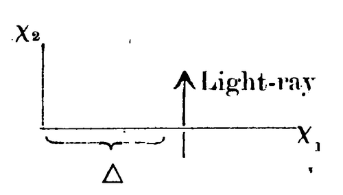

# THE FOUNDATION OF THE GENERALISED THEORY OF RELATIVITY

The theory which is sketched in the following pages forms the most wide-going generalization conceivable of what is at present known as "the theory of Relativity;" this latter theory I differentiate from the former "Special Relativity theory," and suppose it to be known. The generalization of the Relativity theory has been made much easier through the form given to the special Relativity theory by *Minkowski*, which mathematician was the first to recognize clearly the formal equivalence of the space like and time-like co-ordinates, and who made use of it in the building up of the theory. The mathematical apparatus useful for the general relativity theory, lay already complete in the "Absolute Differential Calculus", which were based on the researches of Gauss, Riemann and Christoffel on the non-Euclidean manifold, and which have been shaped into a system by Ricci and Levi-Civita, and already applied to the problems of theoretical physics. I have in part B of this communication developed in the simplest and clearest manner, all the supposed mathematical auxiliaries, not known to Physicists, which will be useful for our purpose, so that, a study of the mathematical literature is not necessary for an understanding of this paper. Finally in this place I thank my friend Grossmann, by whose help I was not only spared the study of the mathematical literature pertinent to this subject, but who also aided me in the researches on the field equations of gravitation.

## A. Principal considerations about the Postulate of Relativity.

### § 1. Remarks on the Special Relativity Theory.

The special relativity theory rests on the following postulate which also holds valid for the Galileo-Newtonian mechanics.

If a co-ordinate system *K* be so chosen that when referred to it the physical laws hold in their simplest forms, *these* laws would be also valid when referred to another system of co-ordinates *K′* which is subjected to an uniform translational motion relative to *K*. We call this postulate "The Special Relativity Principle". By the word special, it is signified that the principle is limited to the case, when *K′* has *uniform translatory motion* with reference to *K*, but the equivalence of *K* and *K′* does not extend to the case of *non-uniform* motion of *K′* relative to *K*.

The Special Relativity Theory does not differ from the classical mechanics through the assumption of this postulate, but only through the postulate of the constancy of light-velocity in vacuum which, when combined with the special relativity postulate, gives in a well-known way, the relativity of synchronism as well as the Lorentz transformation, with all the relations between moving rigid bodies and clocks.

The modification which the theory of space and time has undergone through the special relativity theory, is indeed a profound one, but *a* weightier point remains untouched. According to the special relativity theory, the theorems of geometry are to be looked upon as the laws about any possible relative positions of solid bodies at rest, and more generally the theorems of kinematics, as theorems which describe the relation between measurable bodies and clocks. Consider two material points of a solid body at rest; then according to these conceptions there corresponds to these points a wholly definite extent of length, independent of kind, position, orientation and time of the body.

Similarly let us consider two positions of the pointers of a clock which is at rest with reference to a co-ordinate system; then to these positions, there always corresponds a time-interval of a definite length, independent of time and place. It would be soon shown that the general relativity theory can not hold fast to this simple physical significance of space and time.

### § 2. About the reasons which explain the extension of the relativity-postulate.

To the classical mechanics (no less than) to the special relativity theory, is attached an epistemological defect, which was perhaps first clearly pointed out by E. Mach. We shall illustrate it by the following example; Let two fluid bodies of equal kind and magnitude swim freely in space at such a great distance from one another (and from all other masses) that only that sort of gravitational forces are to be taken into account which the parts of *any* of these bodies exert upon each other. The distance of the bodies from one another is invariable. The relative motion of the different parts of each body is not to occur. But each mass is seen to rotate by an observer at rest relative to the other mass round the connecting line of the masses with a constant angular velocity (definite relative motion for both the masses). Now let us think that the surfaces of both the bodies ($S_{1}$ and $S_{2}$) are measured with the help of measuring rods (relatively at rest); it is then found that the surface of $S_{1}$ is a sphere and the surface of the other is an ellipsoid of rotation. We now ask, why is this difference between the two bodies? An answer to this question can only then be regarded as satisfactory^[1]^ from the epistemological standpoint when the thing adduced as the cause is an *observable fact of experience*. The law of causality has the sense of a definite statement about the world of experience only when *observable facts* alone appear as causes and effects.

The Newtonian mechanics does not give to this question any satisfactory answer. For example, it says:— The laws of mechanics hold true for a space $R_{1}$ relative to which the body $S_{1}$ is at rest, not however for a space relative to which $S_{2}$ is at rest.

The Galiliean space, which is here introduced is however only a *purely imaginary* cause, not an observable thing. It is thus clear that the Newtonian mechanics does not, in the case treated here, actually fulfil the requirements of causality, but produces on the mind a fictitious complacency, in that it makes responsible a wholly imaginary cause $R_{1}$ for the different behaviours of the bodies $S_{1}$ and $S_{2}$ which are actually observable.

A satisfactory explanation to the question put forward above can only be thus given:— that the physical system composed of $S_{1}$ and $S_{2}$ shows for itself alone no conceivable cause to which the different behaviour of $S_{1}$ and $S_{2}$ can be attributed. The cause must thus lie *outside* the system. We are therefore led to the conception that the general laws of motion which determine specially the forms of $S_{1}$ and $S_{2}$ must be of such a kind, that the mechanical behaviour of $S_{1}$ and $S_{2}$ must be essentially conditioned by the distant masses, which we had not brought into the system considered. These distant masses, (and their relative motion as regards the bodies under consideration) are then to be looked upon as the seat of the principal observable causes for the different behaviours of the bodies under consideration. They take the place of the imaginary cause $R_{1}$. Among all the conceivable spaces $R_{1}$ and $R_{2}$ etc. moving in any manner relative to one another, there is a priori, no one set which can be regarded as affording greater advantages, against which the objection which was already raised from the standpoint of the theory of knowledge cannot be again revived. *The laws of physics must be so constituted that they should remain valid for any system of co-ordinates moving in any manner*. We thus arrive at an extension of the relativity postulate.

Besides this momentous epistemological argument, there is also a well-known physical fact which speaks in favour of an extension of the relativity theory. Let there be a Galiliean co-ordinate system *K* relative to which (at least in the four-dimensional region considered) a mass at a sufficient distance from other masses move uniformly in a line. Let $K'$ be a second co-ordinate system which has a *uniformly accelerated* motion relative to *K*. Relative to $K'$ any mass at a sufficiently great distance experiences an accelerated motion such that its acceleration and its direction of acceleration is independent of its material composition and its physical conditions.

Can any observer, at rest relative to $K'$, then conclude that he is in an actually accelerated reference-system? This is to be answered in the negative; the above-named behaviour of the freely moving masses relative to $K'$ can be explained in as good a manner in the following way. The reference-system $K'$ has no acceleration. In the space-time region considered there is a gravitation-field which generates the accelerated motion relative to $K'$.

This conception is feasible, because to us the experience of the existence of a field of force (namely the gravitation field) has shown that it possesses the remarkable property of imparting the same acceleration to all bodies.^[2]^ The mechanical behaviour of the bodies relative to $K'$ is the same as experience would expect of them with reference to systems which we assume from habit as stationary; thus it explains why from the physical stand-point it can be assumed that the systems *K* and $K'$ can both with the same legitimacy be taken as at rest, that is, they will be equivalent as systems of reference for a description of physical phenomena.

From these discussions we see, that the working out of the general relativity theory must, at the same time, lead to a theory of gravitation; for we can "create" a gravitational field by a simple variation of the co-ordinate system. Also we see immediately that the principle of the constancy of light-velocity must be modified, for we recognise easily that the path of a ray of light with reference to $K'$ must be, in general, curved, when light travels with a definite and constant velocity in a straight line with reference to *K*.

### § 3. The time-space continuum. Requirements of the general Co-variance for the equations expressing the laws of Nature in general.

In the classical mechanics as well as in the special relativity theory, the co-ordinates of time and space have an immediate physical significance; when we say that any arbitrary point has $x_{1}$ as its $X_{1}$ co-ordinate, it signifies that the projection of the point-event on the $X_{1}$-axis ascertained by means of a solid rod according to the rules of Euclidean Geometry is reached when a definite measuring rod, the unit rod, can be carried $x_{1}$ times from the origin of co-ordinates along the $X_{1}$ axis. A point having $x_{4}=t$ as the $X_{1}$ co-ordinate signifies that a unit clock which is adjusted to be at rest relative to the system of co-ordinates, and coinciding in its spatial position, with the point-event and set according to some definite standard has gone over $x_{4}=t$ periods before the occurrence of the point-event.^[3]^

This conception of time and space is continually present in the mind of the physicist, though often in an unconscious way, as is clearly recognised from the role which this conception has played in physical measurements. This conception must also appear to the reader to be lying at the basis of the second consideration of the last paragraph and imparting a sense to these conceptions. But we wish to show that we are to abandon it and in general to replace it by more general conceptions in order to be able to work out thoroughly the postulate of general relativity,— the case of special relativity appearing as a limiting case when there is no gravitation.

We introduce in a space, which is free from Gravitation-field, a Galiliean Co-ordinate System *K(x, y, z, t)* and also, another system *K'(x', y', z', t')* rotating uniformly relative to *K*. The origin of both the systems as well as their *Z*-axes might continue to coincide. We will show that for a space-time measurement in the system $K'$, the above established rules for the physical significance of time and space can not be maintained. On grounds of symmetry it is clear that a circle round the origin in the *X-Y* plane of *K*, can also be looked upon as a circle in the $X'$-$Y'$ plane of $K'$. Let us now think of measuring the circumference and the diameter of these circles, with a unit measuring rod (infinitely small compared with the radius) and take the quotient of both the results of measurement. If this experiment be carried out with a measuring rod at rest relatively to the Galiliean system *K* we would get *π*, as the quotient. The result of measurement with a rod relatively at rest as regards $K'$ would be a number which is greater than *π*. This can be seen easily when we regard the whole measurement-process from the system *K* and remember that the rod placed on the periphery suffers a Lorentz-contraction, not however when the rod is placed along the radius. Euclidean Geometry therefore does not hold for the system $K'$; the above fixed conceptions of co-ordinates which assume the validity of Euclidean Geometry fail with regard to the system $K'$. We cannot similarly introduce in $K'$ a time corresponding to physical requirements, which will be shown by all similarly prepared clocks at rest relative to the system $K'$. In order to see this we suppose that two similarly made clocks are arranged one at the centre and one at the periphery of the circle, and considered from the stationary system *K*. According to the well-known results of the special relativity theory it follows — (as viewed from *K*) — that the clock placed at the periphery will go slower than the second one which is at rest. The observer at the common origin of co-ordinates who is able to see the clock at the periphery by means of light will see the clock at the periphery going slower than the clock beside him. Since he cannot allow the velocity of light to depend explicitly upon the time in the way under consideration he will interpret his observation by saying that the clock on the periphery "actually" goes slower than the clock at the origin. He cannot therefore do otherwise than define time in such a way that the rate of going of a clock depends on its position.

We therefore arrive at this result. In the general relativity theory time and space magnitudes cannot be so defined that the difference in spatial co-ordinates can be immediately measured by the unit-measuring rod, and time-like co-ordinate difference with the aid of a normal clock.

The means hitherto at our disposal, for placing our co-ordinate system in the time-space continuum, in a definite way, therefore completely fail and it appears that there is no *other* way which will enable us to fit the co-ordinate system to the four-dimensional world in such a way, that by it we can expect to get a specially simple formulation of the laws of Nature. So that nothing remains for us but to regard all conceivable^[4]^ co-ordinate systems as equally suitable for the description of natural phenomena. This amounts to the following law:—

*That in general, Laws of Nature are expressed by means of equations which are valid for all co-ordinate systems, that is, which are covariant for all possible transformations.* It is clear that a physics which satisfies this postulate will be unobjectionable from the standpoint of the general relativity postulate. Because among *all* substitutions there are, in every case, contained those, which correspond to all relative motions of the co-ordinate system (in three dimensions). This condition of general covariance which takes away the last remnants of physical objectivity from space and time, is a natural requirement, as seen from the following considerations. All our well-substantiated space-time propositions amount to the determination of space-time coincidences. If, for example, the event consisted in the motion of material points, then, for this last case, nothing else are really observable except the encounters between two or more of these material points. The results of our measurements are nothing else than well-proved theorems about such coincidences of material points, of our measuring rods with other material points, coincidences between the hands of a clock, dial-marks and point-events occurring at the same position and at the same time.

The introduction of a system of co-ordinates serves no other purpose than an easy description of totality of such coincidences. We fit to the world our space-time variables $x_{1},x_{2},x_{3},x_{4}$ such that to any and every point-event corresponds a system of values of $x_{1}\dots x_{4}$. Two coincident point-events correspond to the same value of the variables $x_{1}\dots x_{4}$; *i.e.*, the coincidence is characterised by the equality of the co-ordinates. If we now introduce any four functions $x'_{1},x'_{2},x'_{3},x'_{4}$ as coordinates, so that there is an unique correspondence between them, the equality of all the four co-ordinates in the new system will still be the expression of the space-time coincidence of two material points. As the purpose of all physical laws is to allow us to remember such coincidences, there is a priori no reason present, to prefer a certain co-ordinate system to another; *i.e.*, we get the condition of general covariance.

### § 4. Relation of four co-ordinates to spatial and temporal measurements. Analytical expression for the Gravitation-field.

I am not trying in this communication to deduce the general Relativity-theory as the simplest logical system possible, with a minimum of axioms. But it is my chief aim to develop the theory in such a manner that the reader perceives the psychological naturalness of the way proposed, and the fundamental assumptions appear to be most reasonable according to the light of experience. In this sense, we shall now introduce the following supposition; that for an infinitely small four-dimensional region, the relativity theory is valid in the special sense when the axes are suitably chosen.

The nature of acceleration of an infinitely small (positional) co-ordinate system is hereby to be so chosen, that the gravitational field does not appear; this is possible for an infinitely small region. $X_{1},X_{2},X_{3}$ are the spatial co-ordinates; $X_{4}$ is the corresponding time-co-ordinate measured^[5]^ by some suitable measuring clock. These coordinates have, with a given orientation of the system, an immediate physical significance in the sense of the special relativity theory (when we take a rigid rod as our unit of measure), The expression

(1)

$$ds^{2}=-dX_{1}^{2}-dX_{2}^{2}-dX_{3}^{2}+dX_{4}^{2}$$

had then, according to the special relativity theory, a value which may be obtained by space-time measurement, and which is independent of the orientation of the local co-ordinate system. Let us take *ds* as the magnitude of the line-element belonging to two infinitely near points in the four-dimensional region. If *ds²* belonging to the element $\left(dX_{1}\dots dX_{4}\right)$ be positive we call it with Minkowski, time-like, and in the contrary case space-like.

To the line-element considered, *i.e.*, to both the infinitely near point-events belong also definite differentials $dx_{1}\dots dx_{4}$, of the four-dimensional co-ordinates of any chosen system of reference. If there be also a local system of the above kind given for the case under consideration, $dX_{\nu }$ would then be represented by definite linear homogeneous expressions of $dx_{\sigma }$

(2)

$$dX_{\nu }=\sum \limits _{\sigma }\alpha _{\nu \sigma }dx_{\sigma }$$

If we substitute the expression in (1) we get

(3)

$$ds^{2}=\sum \limits _{\sigma \tau }g_{\sigma \tau }dx_{\sigma }dx_{\tau }$$

where $g_{\sigma \tau }$ will be functions of $x_{\sigma }$, but will no longer depend upon the orientation and motion of the "local" co-ordinates; for *ds*² is a definite magnitude belonging to two point-events infinitely near in space and time and can be got by measurements with rods and clocks. The $g_{\sigma \tau }$ are hereto be so chosen, that $g_{\sigma \tau }=g_{\tau \sigma }$; the summation is to be extended over all values of *σ* and *τ*, so that the sum is to be extended, over 4×4 terms, of which 12 are equal in pairs.

From the method adopted here, the case of the usual relativity theory comes out when owing to the special behaviour of $g_{\sigma \tau }$ in a finite region it is possible to choose the system of co-ordinates in such a way that $g_{\sigma \tau }$ assumes constant values —

(4)

$$\left\{{\begin{array}{ccccccc}-1&&0&&0&&0\\\\0&&-1&&0&&0\\\\0&&0&&-1&&0\\\\0&&0&&0&&+1\end{array}}\right.$$

We would afterwards see that the choice of such a system of co-ordinates for a finite region is in general not possible.

From the considerations in § 2 and § 3 it is clear, that from the physical stand-point the quantities $g_{\sigma \tau }$ are to be looked upon as magnitudes which describe the gravitation-field with reference to the chosen system of axes. We assume firstly, that in a certain four-dimensional region considered, the special relativity theory is true for some particular choice of co-ordinates. The $g_{\sigma \tau }$ then have the values given in (4). A free material point moves with reference to such a system uniformly in a straight line. If we now introduce, by any substitution, the space-time co-ordinates $x_{1}\dots x_{4}$, then in the new system $g_{\mu \nu }$ are no longer constants, but functions of space and time. At the same time, the motion of a free point-mass in the new co-ordinates, will appear as curvilinear, and not uniform, in which the law of motion, will be independent of the nature of the moving mass-points. We can thus signify this motion as one under the influence of a gravitation field. We see that the appearance of a gravitation-field is connected with space-time variability of $g_{\sigma \tau }$. In the general case, we can not by any suitable choice of axes, make special relativity theory valid throughout any finite region. We thus deduce the conception that $g_{\sigma \tau }$ describe the gravitational field. According to the general relativity theory, gravitation thus plays an exceptional role as distinguished from the others, specially the electromagnetic forces, in as much as the 10 functions $g_{\sigma \tau }$ representing gravitation, define immediately the metrical properties of the four-dimensional region.

## B. Mathematical Auxiliaries for Establishing the General Covariant Equations.

We have seen before that the general relativity-postulate leads to the condition that the system of equations for Physics, must be Covariants for any possible substitution of co-ordinates $x_{1}\dots x_{4}$; we have now to see how such general covariant equations can be obtained. We shall now turn our attention to these purely mathematical propositions. It will be shown that in the solution, the invariant *ds*, given in equation (3) plays a fundamental role, which we, following Gauss's Theory of Surfaces, style as the "line-element".

The fundamental idea of the general covariant theory is this: — With reference to any co-ordinate system, let certain things ("tensors") be defined by a number of functions of co-ordinates which are called the components of the tensor. There are now certain rules according to which the components can be calculated in a new system of co-ordinates, when these are known for the original system, and when the transformation connecting the two systems is known. The things herefrom designated as Tensors have further the property that the transformation equation of their components are linear and homogeneous; so that all the components in the new system vanish if they are all zero in the original system. Thus a law of Nature can be formulated by putting all the components of a tensor equal to zero so that it is a general covariant equation; thus while we seek the laws of formation of the tensors, we also reach the means of establishing general Covariant laws.

### § 5. Contravariant and covariant Four-vector.

*Contravariant Four-vector*. The line-element is defined by the four components $dx_{\nu }$ whose transformation law is expressed by the equation

(5)

$$dx'_{\sigma }=\sum \limits _{\nu }{\frac {\partial x'_{\sigma }}{\partial x_{\nu }}}dx_{\nu }$$

The $dx'_{\sigma }$ are expressed as linear and homogeneous function of $dx_{\nu }$; we can look upon the differentials of the co-ordinates $dx_{\nu }$ as the components of a tensor, which we designate specially as a contravariant Four-vector. Everything which is defined by Four quantities $A^{\nu }$, with reference to a co-ordinate system, and transforms according to the same law,

(5a)

$$A'^{\sigma }=\sum \limits _{\nu }{\frac {\partial x'_{\sigma }}{\partial x_{\nu }}}A^{\nu }$$

we may call a contravariant Four-vector. From (5a), it follows at once that the sums $\left(A^{\sigma }\pm B^{\sigma }\right)$ are also components of a four-vector, when $A^{\sigma }$ and $B^{\sigma }$ are so; corresponding relations hold also for all systems afterwards introduced as "tensors" (Rule of addition and subtraction of Tensors).

*Covariant Four-vector*. We call four quantities $A_{\nu }$ as the components of a covariant four-vector, when for any choice of the contravariant four-vector $B^{\nu }$

(6)

$$\sum \limits _{\nu }A_{\nu }B^{\nu }=\mathrm {invariant}$$

From this definition follows the law of transformation of the covariant four-vectors. If we substitute in the right band side of the equation

$$\sum \limits _{\sigma }A'_{\sigma }B'^{\sigma }=\sum \limits _{\nu }A_{\nu }B^{\nu }$$

the expressions

$$\sum \limits _{\sigma }{\frac {\partial x_{\nu }}{\partial x'_{\sigma }}}B'^{\sigma }$$

for $B^{\nu }$ following from the inversion of the equation (5a) we get

$$\sum \limits _{\sigma }B'^{\sigma }\sum \limits _{\nu }{\frac {\partial x_{\nu }}{\partial x'_{\sigma }}}A_{\nu }=\sum \limits _{\sigma }B'^{\sigma }A'_{\sigma }$$

As in the above equation $B'^{\sigma }$ are independent of one another and perfectly arbitrary, it follows that the transformation law is: —

(7)

$$A'_{\sigma }=\sum {\frac {\partial x_{\nu }}{\partial x'_{\sigma }}}A_{\nu }$$

*Remarks on the simplification of the mode of writing the expressions*. A glance at the equations of this paragraph will show that the indices which appear twice within the sign of summation [for example *ν* in (5)] are those over which the summation is to be made and that *only* over the indices which appear twice. It is therefore possible, without loss of clearness, to leave off the summation sign; so that we introduce the rule: wherever the index in any term of an expression appears twice, it is to be summed over all of them except when it is not expressedly said to the contrary.

The difference between the covariant and the contravariant four-vector lies in the transformation laws [(7) and (5)]. Both the quantities are tensors according to the above general remarks; in it lies its significance. In accordance with Ricci and Levi-Civita, the contravariants and covariants are designated by the over and under indices.

### § 6. Tensors of the second and higher ranks.

*Contravariant tensor*: — If we now calculate all the 16 products $A^{\mu \nu }$ of the components $A^{\mu }$ and $B^{\nu }$, of two contravariant four-vectors

(8)

$$A^{\mu \nu }=A^{\mu }B^{\nu }$$

$A^{\mu \nu }$ will according to (8) and (5a) satisfy the following transformation law.

(9)

$$A'^{\sigma \tau }={\frac {\partial x'_{\sigma }}{\partial x_{\mu }}}{\frac {\partial x'_{\tau }}{\partial x_{\nu }}}A^{\mu \nu }$$

We call a thing which, with reference to any reference system is defined by 16 quantities and fulfils the transformation relation (9), a contravariant tensor of the second rank. Not every such tensor can be built from two four-vectors, (according to 8). But it is easy to show that any 16 quantities $A^{\mu \nu }$, can be represented as the sum of $A^{\mu }B^{\nu }$ of properly chosen four pairs of four-vectors. From it, we can prove in the simplest way all laws which hold true for the tensor of the second rank defined through (9), by proving it only for the special tensor of the type (8).

*Contravariant Tensor of any rank*: — If is clear that corresponding to (8) and (9), we can define contravariant tensors of the 3rd and higher ranks, with $4^{3}$, etc. components. Thus it is clear from (8) and (9) that in this sense, we can look upon contravariant four-vectors, as contravariant tensors of the first rank.

*Covariant tensor*. If on the other hand, we take the 16 products $A_{\mu \nu }$ of the components of two *covariant* four-vectors $A_{\mu }$ and $B_{\nu }$,

(10)

$$A_{\mu \nu }=A_{\mu }B_{\nu }$$

for them holds the transformation law

(11)

$$A'_{\sigma \tau }={\frac {\partial x_{\mu }}{\partial x'_{\sigma }}}{\frac {\partial x_{\nu }}{\partial x'_{\tau }}}A_{\mu \nu }$$

By means of these transformation laws, the covariant tensor of the second rank is defined. All remarks which we have already made concerning the contravariant tensors, hold also for covariant tensors.

*Remark*:— It is convenient to treat the scalar (Invariant) either as a contravariant or a covariant tensor of zero rank.

*Mixed tensor*. We can also define a tensor of the second rank of the type

(12)

$$A_{\mu }^{\nu }=A_{\mu }B^{\nu }$$

which is covariant with reference to *μ* and contravariant with reference to *ν*. Its transformation law is

(13)

$$A'{}_{\sigma }^{\tau }={\frac {\partial x'_{\tau }}{\partial x_{\beta }}}{\frac {\partial x_{\alpha }}{\partial x'_{\sigma }}}A_{\alpha }^{\beta }$$

Naturally there are mixed tensors with any number of covariant indices, and with any number of contravariant indices. The covariant and contravariant tensors can be looked upon as special cases of mixed tensors.

*Symmetrical tensors*: — A contravariant or a covariant tensor of the second or higher rank is called *symmetrical* when any two components obtained by the mutual interchange of two indices are equal. The tensor $A^{\mu \nu }$ or $A_{\mu \nu }$ is symmetrical, when we have for any combination of indices

(14)

$$A^{\mu \nu }=A^{\nu \mu }$$

or

(14a)

$$A_{\mu \nu }=A_{\nu \mu }$$

It must be proved that a symmetry so defined is a property independent of the system of reference. It follows in fact from (9) remembering (14)

$$A'^{\sigma \tau }={\frac {\partial x'_{\sigma }}{\partial x_{\mu }}}{\frac {\partial x'_{\tau }}{\partial x_{\nu }}}A^{\mu \nu }={\frac {\partial x'_{\sigma }}{\partial x_{\mu }}}{\frac {\partial x'_{\tau }}{\partial x_{\nu }}}A^{\nu \mu }={\frac {\partial x'_{\tau }}{\partial x_{\mu }}}{\frac {\partial x'_{\sigma }}{\partial x_{\nu }}}A^{\mu \nu }=A'^{\tau \sigma }$$

*Anti-symmetrical tensor*. A contravariant or covariant tensor of the 2nd, 3rd or 4th rank is called anti-symmetrical when the two components got by mutually interchanging any two indices are *equal and opposite*. The tensor $A^{\mu \nu }$ or $A_{\mu \nu }$ is thus anti-symmetrical when we have

(15)

$$A^{\mu \nu }=-A^{\nu \mu }$$

or

(15a)

$$A_{\mu \nu }=-A_{\nu \mu }$$

Of the 16 components $A^{\mu \nu }$, the four components $A^{\mu \mu }$ vanish, the rest are equal and opposite in pairs; so that there are only 6 numerically different components present (Six-vector).

Thus we also see that the anti-symmetrical tensor $A^{\mu \nu \sigma }$ (3rd rank) has only 4 components numerically different, and the anti-symmetrical tensor $A^{\mu \nu \sigma \tau }$ only one.

Symmetrical tensors of ranks higher than the fourth, do not exist in a continuum of 4 dimensions.

### § 7. Multiplication of Tensors.

*Outer multiplication of Tensors*:— We get from the components of a tensor of rank *z* and another of a rank $z'$, the components of a tensor of rank $z+z'$ for which we multiply all the components of the first with all the components of the second in pairs. For example, we obtain the tensor *T* from the tensors *A* and *B* of different kinds: —

$${\begin{array}{ll}T_{\mu \nu \sigma }&=A_{\mu \nu }B_{\sigma }\\\\T^{\alpha \beta \gamma \delta }&=A^{\alpha \beta }B^{\gamma \delta }\\\\T_{\alpha \beta }^{\gamma \delta }&=A_{\alpha \beta }B^{\gamma \delta }\end{array}}$$

The proof of the tensor character of *T*, follows immediately from the expressions (8), (10) or (12), or the transformation equations (9), (11), (13); equations (8), (10) and (12) are themselves examples of the outer multiplication of tensors of the first rank.

*Reduction in rank of a mixed Tensor*. From every mixed tensor we can get a tensor which is two ranks lower, when we put an index of covariant character equal to an index of the contravariant character and sum according to these indices ("Reduction"). We get for example, out of the mixed tensor of the fourth rank $A_{\alpha \beta }^{\gamma \delta }$, the mixed tensor of the second rank

$$A_{\beta }^{\delta }=T_{\alpha \beta }^{\alpha \delta }\left(=\sum \limits _{\alpha }A_{\alpha \beta }^{\alpha \delta }\right)$$

and from it again by reduction, the tensor of the zero rank $A=A_{\beta }^{\beta }=A_{\alpha \beta }^{\alpha \beta }$.

The proof that the result of reduction retains a truly tensorial character, follows either from the representation of tensor according to the generalisation of (12) in combination with (6) or out of the generalisation of (13).

*Inner and mixed multiplication of Tensors*. This consists in the combination of outer multiplication with reduction. Examples: — From the covariant tensor of the second rank $A_{\mu \nu }$ and the contravariant tensor of the first rank $B^{\sigma }$ we get by outer multiplication the mixed tensor

$$D_{\mu \nu }^{\sigma }=A_{\mu \nu }B^{\sigma }$$

Through reduction according to indices $\nu ,\sigma$, the covariant four vector

$$D_{\mu }=D_{\mu \nu }^{\nu }=A_{\mu \nu }B^{\nu }$$

is generated.

These we denote as the inner product of the tensor $A_{\mu \nu }$ and $B^{\sigma }$. Similarly we get from the tensors $A_{\mu \nu }$ and $B^{\sigma \tau }$ through outer multiplication and two-fold reduction the inner product $A_{\mu \nu }B^{\mu \nu }$. Through outer multiplication and one-fold reduction we get out of $A_{\mu \nu }$ and $B^{\sigma \tau }$, the mixed tensor of the second rank $D_{\mu }^{\tau }=A_{\mu \nu }B^{\nu \tau }$. We can fitly call this operation a mixed one; for it is outer with reference to the indices *μ* and *τ*, and inner with respect to the indices *ν* and *σ*.

We now prove a law, which will be often applicable for proving the tensor-character of certain quantities. According to the above representation, $A_{\mu \nu }B^{\mu \nu }$ is a scalar, when $A_{\mu \nu }$ and $B^{\sigma \tau }$ are tensors. We also remark that when $A_{\mu \nu }B^{\mu \nu }$ is an invariant for every choice of *the tensor* $B^{\mu \nu }$, then $A_{\mu \nu }$ has a tensorial character.

Proof: — According to the above assumption, for any substitution we have

$$A'_{\sigma \tau }B'^{\sigma \tau }=A_{\mu \nu }B^{\mu \nu }$$

From the inversion of (9) we have however

$$B^{\mu \nu }={\frac {\partial x{}_{\mu }}{\partial x'_{\sigma }}}{\frac {\partial x{}_{\nu }}{\partial x'_{\tau }}}B'^{\sigma \tau }$$

Substitution of this in the above equation gives

$$\left(A'_{\sigma \tau }-{\frac {\partial x{}_{\mu }}{\partial x'_{\sigma }}}{\frac {\partial x{}_{\nu }}{\partial x'_{\tau }}}A_{\mu \nu }\right)B'^{\sigma \tau }=0$$

This can be true, for any choice of $B'^{\sigma \tau }$ only when the term within the bracket vanishes. From which by referring to (11), the theorem at once follows. This law correspondingly holds for tensors of any rank and character. The proof is quite similar. The law can also be put in the following form. If $B^{\mu }$ and $C^{\nu }$ are any two vectors, and if for every choice of them the inner product

$$A_{\mu \nu }B^{\mu }C^{\nu }$$

is a scalar, then $A_{\mu \nu }$ is a covariant tensor. The last law holds even when there is the more special formulation, that with any arbitrary choice of the four-vector $B^{\mu }$ alone the scalar product

$$A_{\mu \nu }B^{\mu }B^{\nu }$$

is a scalar, in which case we have the additional condition that $A_{\mu \nu }$ satisfies the symmetry condition $A_{\mu \nu }=A_{\nu \mu }$. According to the method given above, we prove the tensor character of $\left(A_{\mu \nu }+A_{\nu \mu }\right)$, from which on account of symmetry follows the tensor-character of $A_{\mu \nu }$. This law can easily be generalized in the case of covariant and contravariant tensors of any rank.

Finally, from what has been proved, we can deduce the following law which can be easily generalized for any kind of tensor: If the quantities $A_{\mu \nu }B^{\nu }$ form a tensor of the first rank, when $B^{\nu }$ is any arbitrarily chosen four-vector, then $A_{\mu \nu }$ is a tensor of the second rank. If for example, $C^{\mu }$ is any four-vector, then owing to the tensor character of $A_{\mu \nu }B^{\nu }$, the inner product $A_{\mu \nu }C^{\mu }B^{\nu }$ is a scalar, both the four-vectors $C^{\mu }$ and $B^{\nu }$ being arbitrarily chosen. Hence the proposition follows at once.

### § 8. A few words about the Fundamental Tensor $g_{\mu \nu }$.

*The covariant fundamental tensor*. In the invariant expression of the square of the linear element

$$ds^{2}=g_{\mu \nu }dx_{\mu }dx_{\nu }$$

$dx_{\mu }$ plays the role of any arbitrarily chosen contravariant vector, since further $g_{\mu \nu }=g_{\nu \mu }$, it follows from the considerations of the last paragraph that $g_{\mu \nu }$ is a symmetrical covariant tensor of the second rank. We call it the "fundamental tensor". Afterwards we shall deduce some properties of this tensor, which will also be true for any tensor of the second rank. But the special role of the fundamental tensor in our Theory, which has its physical basis on the particularly exceptional character of gravitation makes it clear that those relations are to be developed which will be required only in the case of the fundamental tensor.

*The contravariant fundamental tensor*. If we form from the determinant scheme $g_{\mu \nu }$ the minors of $g_{\mu \nu }$ and divide them by the determinant $g=\left|g_{\mu \nu }\right|$ of $g_{\mu \nu }$, we get certain quantities $g^{\mu \nu }\left(=g^{\nu \mu }\right)$, which as we shall prove generates a contravariant tensor.

According to the well-known law of Determinants

(16)

$$g_{\mu \sigma }g^{\nu \sigma }=\delta _{\mu }^{\nu }$$

where $\delta _{\mu }^{\nu }$ is 1, or 0, depending on $\mu =\nu$ or $\mu \nu$. Instead of the above expression for *ds*² we can also write

$$g_{\mu \sigma }\delta _{\nu }^{\sigma }dx_{\mu }dx_{\nu }$$

or according to (16) also in the form

$$g_{\mu \sigma }g_{\nu \tau }g^{\sigma \tau }dx_{\mu }dx_{\nu }$$

Now according to the rules of multiplication, of the foregoing paragraph, the magnitudes

$$d\xi _{\sigma }=g_{\mu \sigma }dx_{\mu }$$

forms a covariant four-vector, and in fact (on account of the arbitrary choice of $dx_{\mu }$) any arbitrary four-vector.

If we introduce it in our expression, we get

$$ds^{2}=g^{\sigma \tau }d\xi _{\sigma }d\xi _{\tau }{\text{ }}$$

For any choice of the vectors $d\xi _{\sigma }$ this is scalar, and $g^{\sigma \tau }$, according to its definition is a symmetrical thing in *σ* and *τ*, so it follows from the above results, that $g^{\sigma \tau }$ is a contravariant tensor. Out of (16) it also follows that $\delta _{\mu }^{\nu }$ is a tensor which we may call the mixed fundamental tensor.

*Determinant of the fundamental tensor*. According to the law of multiplication of determinants, we have

$$\left|g_{\mu \alpha }g^{\alpha \nu }\right|=\left|g_{\mu \alpha }\right|\left|g^{\alpha \nu }\right|$$

On the other hand we have

$$\left|g_{\mu \alpha }g^{\alpha \nu }\right|=\left|\delta _{\mu }^{\nu }\right|=1$$

So that it follows

(17)

$$\left|g_{\mu \nu }\right|\left|g^{\mu \nu }\right|=1$$

*Invariant of volume.* We seek first the transformation law for the determinant $g=\left|g_{\mu \nu }\right|$. According to (11)

$$g'=\left|{\frac {\partial x{}_{\mu }}{\partial x'_{\sigma }}}{\frac {\partial x{}_{\nu }}{\partial x'_{\tau }}}g_{\mu \nu }\right|$$

From this by applying the law of multiplication twice, we obtain.

$$g'=\left|{\frac {\partial x{}_{\mu }}{\partial x'_{\sigma }}}\right|\left|{\frac {\partial x{}_{\nu }}{\partial x'_{\tau }}}\right|\left|g_{\mu \nu }\right|=\left|{\frac {\partial x{}_{\mu }}{\partial x'_{\sigma }}}\right|^{2}g$$

or

$${\sqrt {g'}}=\left|{\frac {\partial x{}_{\mu }}{\partial x'_{\sigma }}}\right|{\sqrt {g}}$$

On the other hand the law of transformation of the volume element

$$d\tau '=\int dx_{1}dx_{2}dx_{3}dx_{4}$$

is according to the well-known law of Jacobi.

$$d\tau '=\left|{\frac {\partial x'{}_{\sigma }}{\partial x{}_{\mu }}}\right|d\tau$$

By multiplication of the two last equations we get

(18)

$${\sqrt {g'}}d\tau '={\sqrt {g}}d\tau$$

Instead of ${\sqrt {g}}$, we shall afterwards introduce ${\sqrt {-g}}$ which has a real value on account of the hyperbolic character of the time-space continuum. The invariant ${\sqrt {-g}}d\tau$ is equal in magnitude to the four-dimensional volume-element measured with solid rods and clocks, in accordance with the special relativity theory.

*Remarks on the character of the space-time continuum* — Our assumption that in an infinitely small region the special relativity theory holds, leads us to conclude that *ds*² can always, according to (1) be expressed in real magnitudes $dX_{1}\dots dX_{4}$. If we call $d\tau _{0}$ "natural" volume element $dX_{1}dX_{2}dX_{3}dX_{4}$, we have thus

(18a)

$$d\tau _{0}={\sqrt {-g}}d\tau$$

Should ${\sqrt {-g}}$ vanish at any point of the four-dimensional continuum it would signify that to a finite co-ordinate volume at the place corresponds an infinitely small "natural" volume. This can never be the case; so that *g* can never change its sign; we would, according to the special relativity theory assume that *g* has a finite negative value. It is a hypothesis about the physical nature of the continuum considered, and also a pre-established rule for the choice of co-ordinates.

If however -*g* remains positive and finite, it is clear that the choice of co-ordinates can be so made that this quantity becomes equal to one. We would afterwards see that such a limitation of the choice of co-ordinates would produce a significant simplification in expressions for laws of nature.

In place of (18) it follows then simply that

$$d\tau '=d\tau$$

from this it follows, remembering the law of Jacobi,

(19)

$$\left|{\frac {\partial x'{}_{\sigma }}{\partial x{}_{\mu }}}\right|=1$$

With this choice of co-ordinates, only substitutions with determinant 1, are allowable.

It would however be erroneous to think that this step signifies a partial renunciation of the general relativity postulate. We do not seek those laws of nature which are covariants with regard to the transformations having the determinant 1, but we ask: what are the *general* covariant laws of nature? First we get the law, and then we simplify its expression by a special choice of the system of reference.

*Building up of new tensors with the help of the fundamental tensor.* Through inner, outer and mixed multiplications of a tensor with the fundamental tensor, tensors of other kinds and of other ranks can be formed.

Example:—

$${\begin{array}{ll}A^{\mu }&=g^{\mu \sigma }A_{\sigma }\\A&=g_{\mu \nu }A^{\mu \nu }\end{array}}$$

We would point out specially the following combinations:

$${\begin{array}{ll}A^{\mu \nu }&=g^{\mu \alpha }g^{\nu \beta }A_{\alpha \beta }\\A_{\mu \nu }&=g_{\mu \alpha }g_{\nu \beta }A^{\alpha \beta }\end{array}}$$

("complement" to the covariant or contravariant tensors) and,

$$B_{\mu \nu }=g_{\mu \nu }g^{\alpha \beta }A_{\alpha \beta }$$

We can call $B_{\mu \nu }$ the reduced tensor related to $A_{\mu \nu }$.

Similarly

$$B^{\mu \nu }=g^{\mu \nu }g_{\alpha \beta }A^{\alpha \beta }$$

It is to be remarked that $g^{\mu \nu }$ is no other than the complement of $g_{\mu \nu }$, for we have —

$$g^{\mu \alpha }g^{\nu \beta }g_{\alpha \beta }=g^{\mu \alpha }\delta _{\alpha }^{\nu }=g^{\mu \nu }$$

### § 9. Equation of the geodetic line (or of point-motion).

As the "line element" *ds* is a definite magnitude independent of the co-ordinate system, we have also between two points $P_{1}$ and $P_{2}$ of a four dimensional continuum a line for which $\int ds$ is an extremum (geodetic line), *i.e.*, one which has got a significance independent of the choice of co-ordinates.

Its equation is

(20)

$$\delta \left\{\int \limits _{P_{1}}^{P_{2}}ds\right\}=0$$

From this equation, we can in a well-known way deduce 4 total differential equations which define the geodetic line; this deduction is given here for the sake of completeness.

Let *λ*, be a function of the co-ordinates $x_{\nu }$; this defines a series of surfaces which cut the geodetic line sought-for as well as all neighbouring lines from $P_{1}$ to $P_{2}$. We can suppose that all such curves are given when the value of its co-ordinates $x_{\nu }$ are given in terms of *λ*. The sign *δ* corresponds to a passage from a point of the geodetic curve sought for to a point of the contiguous curve, both lying on the same surface *λ*.

Then (20) can be replaced by

(20a)

$${\begin{cases}\int \limits _{\lambda _{1}}^{\lambda _{2}}\delta w\ d\lambda =0\\\\w^{2}=g_{\mu \nu }{\frac {dx_{\mu }}{d\lambda }}{\frac {dx_{\nu }}{d\lambda }}\end{cases}}$$

But

$$\delta w={\frac {1}{w}}\left\{{\frac {1}{2}}{\frac {\partial g_{\mu \nu }}{\partial x_{\sigma }}}{\frac {dx_{\mu }}{d\lambda }}{\frac {dx_{\nu }}{d\lambda }}\delta x_{\sigma }+g_{\mu \nu }{\frac {dx_{\mu }}{d\lambda }}\delta \left({\frac {dx_{\nu }}{d\lambda }}\right)\right\}$$

So we get by the substitution of *δw* in (0Oa), remembering that

$$\delta \left({\frac {dx_{\nu }}{d\lambda }}\right)={\frac {d\delta x_{\nu }}{d\lambda }}$$

after partial integration,

(20b)

$${\begin{cases}\int \limits _{\lambda _{1}}^{\lambda _{2}}d\lambda \ \varkappa _{\sigma }\delta x_{\sigma }=0\\\\\varkappa _{\sigma }={\frac {d}{d\lambda }}\left\{{\frac {g_{\mu \nu }}{w}}{\frac {dx_{\mu }}{\partial \lambda }}\right\}-{\frac {1}{2w}}{\frac {\partial g_{\mu \nu }}{\partial x_{\sigma }}}{\frac {dx_{\mu }}{\partial \lambda }}{\frac {dx_{\nu }}{\partial \lambda }}\end{cases}}$$

From which it follows, since the choice of $\delta x_{\sigma }$ is perfectly arbitrary that $\varkappa _{\sigma }$ should vanish; Then

(20c)

$$\varkappa _{\sigma }=0$$

are the equations of geodetic line; since along the geodetic line considered we have *ds* = 0, we can choose the parameter *λ*, as the length of the arc measured along the geodetic line. Then *w* = 1, and we would get in place of (20c)

$$g_{\mu \nu }{\frac {d^{2}x_{\mu }}{ds^{2}}}+{\frac {\partial g_{\mu \nu }}{\partial x_{\sigma }}}{\frac {dx_{\sigma }}{\partial \lambda }}{\frac {dx_{\mu }}{\partial \lambda }}-{\frac {1}{2}}{\frac {\partial g_{\mu \nu }}{\partial x_{\sigma }}}{\frac {dx_{\mu }}{\partial \lambda }}{\frac {dx_{\nu }}{\partial \lambda }}=0$$

Or by merely changing the notation suitably,

(20d)

$$g_{\alpha \sigma }{\frac {d^{2}x_{\alpha }}{ds^{2}}}+\left[{\mu \nu  \atop \sigma }\right]{\frac {dx_{\mu }}{ds}}{\frac {dx_{\nu }}{ds}}=0$$

where we have put, following Christoffel,

(21)

$$\left[{\mu \nu  \atop \sigma }\right]={\frac {1}{2}}\left({\frac {\partial g_{\mu \sigma }}{\partial x_{\nu }}}+{\frac {\partial g_{\nu \sigma }}{\partial x_{\mu }}}-{\frac {\partial g_{\mu \nu }}{\partial x_{\sigma }}}\right)$$

Multiply finally (20d) with $g^{\sigma \tau }$ (outer multiplication with reference to *τ*, and inner with respect to *σ*) we get at last the final form of the equation of the geodetic line —

(22)

$${\frac {d^{2}x_{\tau }}{ds^{2}}}+\left\{{\mu \nu  \atop \tau }\right\}{\frac {dx_{\mu }}{ds}}{\frac {dx_{\nu }}{ds}}=0$$

Here we have put, following Christoffel,

(23)

$$\left\{{\mu \nu  \atop \tau }\right\}=g^{\tau \alpha }\left[{\mu \nu  \atop \alpha }\right]$$

### § 10. Formation of Tensors through Differentiation.

Relying on the equation of the geodetic line, we can now easily deduce laws according to which new tensors can be formed from given tensors by differentiation. For this purpose, we would first establish the general covariant differential equations. We achieve this through a repeated application of the following simple law. If a certain curve be given in our continuum whose points are characterised by the arc-distances *s* measured from a fixed point on the curve, and if further $\varphi$, be an invariant space function, then $d\varphi /ds$ is also an invariant. The proof follows from the fact that $d\varphi$ as well as *ds*, are both invariants.

Since

$${\frac {d\varphi }{ds}}={\frac {\partial \varphi }{\partial x_{\mu }}}{\frac {dx_{\mu }}{ds}}$$

so that

$$\psi ={\frac {\partial \varphi }{\partial x_{\mu }}}{\frac {dx_{\mu }}{ds}}$$

is also an invariant for all curves which go out from a point in the continuum, *i.e.*, for any choice of the vector $dx_{\mu }$. From which follows immediately that

(24)

$$A_{\mu }={\frac {\partial \varphi }{\partial x_{\mu }}}$$

is a covariant four-vector (gradient of $\varphi$).

According to our law, the differential-quotient

$$\chi ={\frac {d\psi }{ds}}$$

taken along any curve is likewise an invariant. Substituting the value of $\varphi$, we get

$$\chi ={\frac {\partial ^{2}\varphi }{\partial x_{\mu }\partial x_{\nu }}}{\frac {dx_{\mu }}{ds}}{\frac {dx_{\nu }}{ds}}+{\frac {\partial \varphi }{\partial x_{\mu }}}{\frac {d^{2}x_{\mu }}{ds^{2}}}$$

Here however we can not at once deduce the existence of any tensor. If we however take that the curves along which we are differentiating are geodesics, we get from it by replacing $d^{2}x_{\nu }/ds^{2}$ according to (22)

$$\chi =\left\{{\frac {\partial ^{2}\varphi }{\partial x_{\mu }\partial x_{\nu }}}-\left\{{\mu \nu  \atop \tau }\right\}{\frac {\partial \varphi }{\partial x_{\tau }}}\right\}{\frac {dx_{\mu }}{ds}}{\frac {dx_{\nu }}{ds}}$$

Prom the interchangeability of the differentiation with regard to *μ* and *ν*, and also according to (23) and (21) we see that the bracket $\left\{{\mu \nu \atop \tau }\right\}$ is symmetrical with respect to *μ* and *ν*.

As we can draw a geodetic line in any direction from any point in the continuum, $dx_{\mu }/ds$ is thus a four-vector, with an arbitrary ratio of components, so that it follows from the results of § 7 that

(25)

$$A_{\mu \nu }={\frac {\partial ^{2}\varphi }{\partial x_{\mu }\partial x_{\nu }}}-\left\{{\mu \nu  \atop \tau }\right\}{\frac {\partial \varphi }{\partial x_{\tau }}}$$

is a covariant tensor of the second rank. We have thus got the result that out of the covariant tensor of the first rank

$$A_{\mu }={\frac {\partial \varphi }{\partial x_{\mu }}}$$

we can get by differentiation a covariant tensor of 2nd rank

(26)

$$A_{\mu \nu }={\frac {\partial A_{\mu }}{\partial x_{\nu }}}-\left\{{\mu \nu  \atop \tau }\right\}A_{\tau }$$

We call the tensor $A_{\mu \nu }$ the "*extension*" of the tensor $A_{\mu }$. Then we can easily show that this combination also leads to a tensor, when the vector $A_{\mu }$ is not representable as a gradient. In order to see this we first remark that

$$\psi {\frac {\partial \varphi }{\partial x_{\mu }}}$$

is a covariant four-vector when *ψ* and $\varphi$ are scalars. This is also the case for a sum of four such terms: —

$$S_{\mu }=\psi ^{(1)}{\frac {\partial \varphi ^{(1)}}{\partial x_{\mu }}}+\cdot +\cdot +\psi ^{(4)}{\frac {\partial \varphi ^{(4)}}{\partial x_{\mu }}}$$

when $\psi ^{(1)}\varphi ^{(1)}\dots \psi ^{(4)}\varphi ^{(4)}$ are scalars. Now it is however clear that every covariant four-vector is representable in the form of $S_{\mu }$.

If for example $A_{\mu }$ is a four-vector whose components are any given functions of $x_{\nu }$, we have, (with reference to the chosen co-ordinate system) only to put

$${\begin{array}{ccc}\psi ^{(1)}=A_{1},&&\varphi ^{(1)}=x_{1},\\\psi ^{(2)}=A_{2},&&\varphi ^{(2)}=x_{2},\\\psi ^{(3)}=A_{3},&&\varphi ^{(3)}=x_{3},\\\psi ^{(4)}=A_{4},&&\varphi ^{(4)}=x_{4},\end{array}}$$

in order to arrive at the result that $S_{\mu }$ is equal to $A_{\mu }$.

In order to prove then that $A_{\mu \nu }$ in a tensor when on the right side of (26) we substitute any covariant four-vector for $A_{\mu }$ we have only to show that this is true for the four-vector $S_{\mu }$. For this latter case, however, a glance on the right hand side of (26) will show that we have only to bring forth the proof for the case when

$$A_{\mu }=\psi {\frac {\partial \varphi }{\partial x_{\mu }}}$$

Now the right hand side of (25) multiplied by *ψ* is

$$\psi {\frac {\partial ^{2}\varphi }{\partial x_{\mu }\partial x_{\nu }}}-\left\{{\mu \nu  \atop \tau }\right\}\psi {\frac {\partial \varphi }{\partial x_{\tau }}}$$

which has a tensor character. Similarly,

$${\frac {\partial \psi }{\partial x_{\mu }}}{\frac {\partial \varphi }{\partial x_{\nu }}}$$

is also a tensor (outer product of two four-vectors). Through addition follows the tensor character of

$${\frac {\partial }{\partial x_{\nu }}}\left(\psi {\frac {\partial \varphi }{\partial x_{\mu }}}\right)-\left\{{\mu \nu  \atop \tau }\right\}\left(\psi {\frac {\partial \varphi }{\partial x_{\tau }}}\right)$$

Thus we get the desired proof for the four-vector,

$$\psi {\frac {\partial \varphi }{\partial x_{\mu }}}$$

hence for any four-vectors $A_{\mu }$ as shown above. —

With the help of the extension of the four-vector, we can easily define "extension" of a covariant tensor of any rank. This is a generalisation of the extension of the four-vector. We confine ourselves to the case of the extension of the tensors of the 2nd rank for which the law of formation can be clearly seen.

As already remarked every covariant tensor of the 2nd rank can be represented^[6]^ as a sum of the tensors of the type $A_{\mu }B_{\nu }$. It would therefore be sufficient to deduce the expression of extension, for one such special tensor. According to (26) we have the expressions

$${\frac {\partial A_{\mu }}{\partial x_{\sigma }}}-\left\{{\sigma \mu  \atop \tau }\right\}A_{\tau }$$

$${\frac {\partial B_{\nu }}{\partial x_{\sigma }}}-\left\{{\sigma \nu  \atop \tau }\right\}B_{\tau }$$

are tensors. Through outer multiplication of the first with $B_{\nu }$ and the 2nd with $A_{\mu }$ we get tensors of the third rank. Their addition gives the tensor of the third rank

(27)

$$A_{\mu \nu \sigma }={\frac {\partial A_{\mu \nu }}{\partial x_{\sigma }}}-\left\{{\sigma \mu  \atop \tau }\right\}A_{\tau \nu }-\left\{{\sigma \nu  \atop \tau }\right\}A_{\mu \tau }$$

where $A_{\mu \nu }=A_{\mu }B_{\nu }$. The right hand side of (27) is linear and homogeneous with reference to $A_{\mu \nu }$, and its first differential co-efficient so that this law of formation leads to a tensor not only in the case of a tensor of the type $A_{\mu }B_{\nu }$ but also in the case of a summation for all such tensors, *i.e*, in the case of any covariant tensor of the second rank. We call $A_{\mu \nu \sigma }$ the extension of the tensor $A_{\mu \nu }$.

It is clear that (26) and (24) are only special cases of (27) (extension of the tensors of the first and zero rank). In general we can get all special laws of formation of tensors from (27) combined with tensor multiplication.

### § 11. Some special cases of Particular Importance.

*A few auxiliary lemmas concerning the fundamental tensor*. We shall first deduce some of the lemmas much used afterwards. According to the law of differentiation of determinants, we have

(28)

$$dg=g^{\mu \nu }g\ dg_{\mu \nu }=-g_{\mu \nu }g\ dg^{\mu \nu }$$

The last form follows from the first when we remember that $g_{\mu \nu }g^{\mu '\nu }=\delta _{\mu }^{\mu '}$, and therefore $g_{\mu \nu }g^{\mu \nu }=4$. consequently

$$g_{\mu \nu }dg^{\mu \nu }+g^{\mu \nu }dg_{\mu \nu }=0$$

From (28), it follows that

$${\frac {1}{\sqrt {-g}}}{\frac {\partial {\sqrt {-g}}}{\partial x_{\sigma }}}={\frac {1}{2}}{\frac {\partial \lg(-g)}{\partial x_{\sigma }}}={\frac {1}{2}}g^{\mu \nu }{\frac {\partial g_{\mu \nu }}{\partial x_{\sigma }}}=-{\frac {1}{2}}g_{\mu \nu }{\frac {\partial g^{\mu \nu }}{\partial x_{\sigma }}}$$

Again, since

$$g_{\mu \sigma }g^{\nu \sigma }=\delta _{\mu }^{\nu }$$

we have, by differentiation,

(30)

$${\begin{cases}&g_{\mu \sigma }dg^{\nu \sigma }=-g^{\nu \sigma }dg_{\mu \sigma }\\\mathrm {bzw.} \\&g_{\mu \sigma }{\frac {\partial g^{\nu \sigma }}{\partial x_{\lambda }}}=-g^{\nu \sigma }{\frac {\partial g_{\nu \sigma }}{\partial x_{\lambda }}}\end{cases}}$$

By mixed multiplication with $g^{\sigma \tau }$ and $g_{\nu \lambda }$ respectively we obtain (changing the mode of writing the indices).

(31)

$${\begin{cases}dg^{\mu \nu }&=-g^{\mu \alpha }g^{\nu \beta }dg_{\alpha \beta }\\\\{\frac {\partial g^{\mu \nu }}{\partial x_{\sigma }}}&=-g^{\mu \alpha }g^{\nu \beta }{\frac {dg_{\alpha \beta }}{\partial x_{\sigma }}}\end{cases}}$$

and

(32)

$${\begin{cases}dg_{\mu \nu }&=-g_{\mu \alpha }g_{\nu \beta }dg^{\alpha \beta }\\\\{\frac {\partial g_{\mu \nu }}{\partial x_{\sigma }}}&=-g_{\mu \alpha }g_{\nu \beta }{\frac {dg^{\alpha \beta }}{\partial x_{\sigma }}}\end{cases}}$$

The expression (31) allows a transformation which we shall often use; according to (21)

(33)

$${\frac {\partial g_{\alpha \beta }}{\partial x_{\sigma }}}=\left[{\alpha \sigma  \atop \beta }\right]+\left[{\beta \sigma  \atop \alpha }\right]$$

If we substitute this in the second of the formula (31), we get, remembering (23),

(34)

$${\frac {\partial g_{\mu \nu }}{\partial x_{\sigma }}}=-\left(g^{\mu \tau }\left\{{\tau \sigma  \atop \nu }\right\}+g^{\nu \tau }\left\{{\tau \sigma  \atop \mu }\right\}\right)$$

By substituting the right-hand side of (34) in (29), we get

(29a)

$${\frac {1}{\sqrt {-g}}}{\frac {\partial {\sqrt {-g}}}{\partial x_{\sigma }}}=\left\{{\mu \sigma  \atop \mu }\right\}$$

*Divergence of the contravariant four-vector*. Let us multiply (26) with the contravariant fundamental tensor $g^{\mu \nu }$ (inner multiplication), then by a transformation of the first member, the right-hand side takes the form

$${\frac {\partial }{\partial x_{\nu }}}\left(g^{\mu \nu }A_{\mu }\right)-A_{\mu }{\frac {\partial g^{\mu \nu }}{\partial x_{\nu }}}-{\frac {1}{2}}g^{\tau \alpha }\left({\frac {\partial g^{\mu \alpha }}{\partial x_{\nu }}}+{\frac {\partial g_{\nu \alpha }}{\partial x_{\mu }}}-{\frac {\partial g_{\mu \nu }}{\partial x_{\alpha }}}\right)g^{\mu \nu }A_{\tau }$$

According to (31) and (29) the last member can take the form

$${\frac {1}{2}}{\frac {\partial g^{\tau \nu }}{\partial x_{\nu }}}A_{\tau }+{\frac {1}{2}}{\frac {\partial g^{\tau \mu }}{\partial x_{\mu }}}A_{\tau }+{\frac {1}{\sqrt {-g}}}{\frac {\partial {\sqrt {-g}}}{\partial x_{\alpha }}}g^{\mu \nu }A_{\tau }$$

Both the first members of that expression, and the second member of the expression above cancel each other, since the naming of the summation-indices is immaterial. The last member of that can then be united with first expression above. If we put

$$g^{\mu \nu }A_{\mu }=A^{\nu }$$

where $A^{\nu }$ as well as $A_{\mu }$ are vectors which can be arbitrarily chosen, we obtain finally

(35)

$$\Phi ={\frac {1}{\sqrt {-g}}}{\frac {\partial }{\partial x_{\nu }}}\left({\sqrt {-g}}A^{\nu }\right)$$

This scalar is the Divergence of the contravariant four-vector $A^{\nu }$.

*"Rotation" of the (covariant) four-vector.* The second member in (26) is symmetrical in the indices *μ*, and *ν*, Hence $A_{\mu \nu }-A_{\nu \mu }$ is an anti-symmetrical tensor built up in a very simple manner. We obtain

(36)

$$B_{\mu \nu }={\frac {\partial A_{\mu }}{\partial x_{\nu }}}-{\frac {\partial A_{\nu }}{\partial x_{\mu }}}$$

*Anti-symmetrical Extension of a Six-vector*. If we apply the operation (27) on an anti-symmetrical tensor of the second rank $A_{\mu \nu }$, and form all the equations arising from the cyclic interchange of the indices $\mu ,\nu ,\sigma$, and add all them, we obtain a tensor of the third rank

(37)

$$B_{\mu \nu \sigma }=A_{\mu \nu \sigma }+A_{\nu \sigma \mu }+A_{\sigma \mu \nu }={\frac {\partial A_{\mu \nu }}{\partial x_{\sigma }}}+{\frac {\partial A_{\nu \sigma }}{\partial x_{\mu }}}+{\frac {\partial A_{\sigma \mu }}{\partial x_{\nu }}}$$

from which it in easy to see that the tensor is anti-symmetrical.

*Divergence of the Six-vector*. If (27) is multiplied by $g^{\mu \alpha }g^{\nu \beta }$ (mixed multiplication), then a tensor is obtained. The first member of the right hand side of (27) can be written in the form

$${\frac {\partial }{\partial x_{\sigma }}}\left(g^{\mu \alpha }g^{\nu \beta }A_{\mu \nu }\right)-g^{\mu \alpha }{\frac {\partial g^{\nu \beta }}{\partial x_{\sigma }}}A_{\mu \nu }-g^{\nu \beta }{\frac {\partial g^{\mu \alpha }}{\partial x_{\sigma }}}A_{\mu \nu }$$

If we replace $g^{\mu \alpha }g^{\nu \beta }A_{\mu \nu \sigma }$ by $A_{\sigma }^{\alpha \beta }$, $g^{\mu \alpha }g^{\nu \beta }A_{\mu \nu }$ by $A^{\alpha \beta }$ and replace in the transformed first member

${\frac {\partial g^{\nu \beta }}{\partial x_{\sigma }}}$ and ${\frac {\partial g^{\mu \alpha }}{\partial x_{\sigma }}}$

with the help of (34), then from the right-hand side of (27) there arises an expression with seven terms, of which four cancel. There remains

(38)

$$A_{\sigma }^{\alpha \beta }={\frac {\partial A^{\alpha \beta }}{\partial x_{\sigma }}}+\left\{{\sigma \varkappa  \atop \alpha }\right\}A^{\varkappa \beta }+\left\{{\sigma \varkappa  \atop \beta }\right\}A^{\alpha \varkappa }$$

This is the expression for the extension of a contravariant tensor of the second rank; extensions can also be formed for corresponding contravariant tensors of higher and lower ranks.

We remark that in the same way, we can also form the extension of a mixed tensor $A_{\mu }^{\alpha }$:

(39)

$$A_{\mu \sigma }^{\alpha }={\frac {\partial A_{\mu }^{\alpha }}{\partial x_{\sigma }}}-\left\{{\sigma \mu  \atop \tau }\right\}A_{\tau }^{\sigma }+\left\{{\sigma \tau  \atop \alpha }\right\}A_{\mu }^{\tau }$$

By the reduction of (38) with reference to the indices *β* and *σ* (inner multiplication with $\delta _{\beta }^{\sigma }$), we get a contravariant four-vector

$$A^{\alpha }={\frac {\partial A^{\alpha \beta }}{\partial x_{\beta }}}+\left\{{\beta \varkappa  \atop \beta }\right\}A^{\alpha \varkappa }+\left\{{\beta \varkappa  \atop \alpha }\right\}A^{\varkappa \beta }$$

On the account of the symmetry of $\left\{{\beta \varkappa \atop \alpha }\right\}$ with reference to the indices *β*, and $\varkappa$, the third member of the right hand side vanishes when $A^{\alpha \beta }$ is an anti-symmetrical tensor, which we assume here; the second member can be transformed according to (29a); we therefore get

(40)

$$A^{\alpha }={\frac {1}{\sqrt {-g}}}{\frac {\partial \left({\sqrt {-g}}A^{\alpha \beta }\right)}{\partial x_{\beta }}}$$

This is the expression of the divergence of a contravariant six-vector.

*Divergence of the mixed tensor of the second rank.* Let us form the reduction of (39) with reference to the indices *α* and *σ*, we obtain remembering (29a)

(41)

$${\sqrt {-g}}A_{\mu }={\frac {\partial \left({\sqrt {-g}}A_{\mu }^{\sigma }\right)}{\partial z_{\sigma }}}-\left\{{\sigma \mu  \atop \tau }\right\}{\sqrt {-g}}A_{\tau }^{\sigma }$$

If we introduce into the last term the contravariant tensor $A^{\varrho \sigma }=g^{\varrho \tau }A_{\tau }^{\sigma }$, it takes the form

$$-\left[{\sigma \mu  \atop \varrho }\right]{\sqrt {-g}}A^{\varrho \sigma }$$

If further $A^{\varrho \sigma }$ is symmetrical it is reduced to

$$-{\frac {1}{2}}{\sqrt {-g}}{\frac {\partial g_{\varrho \sigma }}{\partial x_{\mu }}}A^{\varrho \sigma }$$

If instead of $A^{\varrho \sigma }$, we introduce in a similar way the symmetrical covariant tensor $A_{\varrho \sigma }=g_{\varrho \alpha }g_{\sigma \beta }A^{\alpha \beta }$, then owing to (31) the last member can take the form

$${\frac {1}{2}}{\sqrt {-g}}{\frac {\partial g^{\varrho \sigma }}{\partial x_{\mu }}}A_{\varrho \sigma }$$

In the symmetrical case treated, (41) can be replaced by either of the forms

(41)

$${\sqrt {-g}}A_{\mu }={\frac {\partial \left({\sqrt {-g}}A_{\mu }^{\sigma }\right)}{\partial x_{\sigma }}}-{\frac {1}{2}}{\frac {\partial g_{\varrho \sigma }}{\partial x_{\mu }}}{\sqrt {-g}}A^{\varrho \sigma }$$

or

(41b)

$${\sqrt {-g}}A_{\mu }={\frac {\partial \left({\sqrt {-g}}A_{\mu }^{\sigma }\right)}{\partial x_{\sigma }}}+{\frac {1}{2}}{\frac {\partial g^{\varrho \sigma }}{\partial x_{\mu }}}{\sqrt {-g}}A_{\sigma \varrho }$$

which we shall have to make use of afterwards.

### § 12. The Riemann-Christoffel Tensor.

We now seek only those tensors, which can be obtained from the fundamental tensor $g_{\mu \nu }$ by differentiation *alone*. It is found easily. We put in (27) instead of any tensor $A_{\mu \nu }$ the fundamental tensor $g_{\mu \nu }$ and get from it a new tensor, namely the extension of the fundamental tensor. We can easily convince ourselves that this vanishes identically. We prove it in the following way; we substitute in (27)

$$A_{\mu \nu }={\frac {\partial A_{\mu }}{\partial x_{\nu }}}-\left\{{\mu \nu  \atop \varrho }\right\}A_{\varrho }$$

*i.e.*, the extension of a four-vector $A_{\nu }$.

Thus we get (by slightly changing the indices) the tensor of the third rank

$${\begin{array}{ll}A_{\mu \sigma \tau }&={\frac {\partial ^{2}A_{\mu }}{\partial x_{\sigma }\partial x_{\tau }}}\\\\&-\left\{{\mu \sigma  \atop \varrho }\right\}{\frac {\partial A_{\varrho }}{\partial x_{\tau }}}-\left\{{\mu \tau  \atop \varrho }\right\}{\frac {\partial A_{\varrho }}{\partial x_{\sigma }}}-\left\{{\sigma \tau  \atop \varrho }\right\}{\frac {\partial A_{\mu }}{\partial x_{\varrho }}}\\\\&+\left[-{\frac {\partial }{\partial x_{\tau }}}\left\{{\mu \sigma  \atop \varrho }\right\}+\left\{{\mu \tau  \atop \alpha }\right\}\left\{{\alpha \sigma  \atop \varrho }\right\}+\left\{{\sigma \tau  \atop \alpha }\right\}\left\{{\alpha \mu  \atop \varrho }\right\}\right]A_{\varrho }\end{array}}$$

We use these expressions for the formation of the tensor $A_{\mu \sigma \tau }-A_{\mu \tau \sigma }$. Thereby the following terms in $A_{\mu \sigma \tau }$ cancel the corresponding terms in $A_{\mu \tau \sigma }$; the first member, the fourth member, as well as the member corresponding to the last term within the square bracket. These are all symmetrical in *σ* and *τ*. The same is true for the sum of the second and third members. We thus get

(42)

$$A_{\mu \sigma \tau }-A_{\mu \tau \sigma }=B_{\mu \sigma \tau }^{\varrho }A_{\varrho }$$

(43)

$${\begin{cases}B_{\mu \sigma \tau }^{\varrho }=&-{\frac {\partial }{\partial x_{\tau }}}\left\{{\mu \sigma  \atop \varrho }\right\}+{\frac {\partial }{\partial x_{\sigma }}}\left\{{\mu \tau  \atop \varrho }\right\}\\\\&-\left\{{\mu \sigma  \atop \alpha }\right\}\left\{{\alpha \tau  \atop \varrho }\right\}+\left\{{\mu \tau  \atop \alpha }\right\}\left\{{\alpha \sigma  \atop \varrho }\right\}\end{cases}}$$

The essential thing in this result is that on the right hand side of (42) we have only $A_{\varrho }$, but not its differential co-efficients. From the tensor-character of $A_{\mu \sigma \tau }-A_{\mu \tau \sigma }$, and from the fact that $A_{\varrho }$ is an arbitrary four vector, it follows, on account of the result of §7, that $B_{\mu \sigma \tau }^{\varrho }$ is a tensor (Riemann-Christoffel Tensor).

The mathematical significance of this tensor is as follows; when the continuum is so shaped, that there is a co-ordinate system for which the $g_{\mu \nu }$ are constants, $R_{\mu \sigma \tau }^{\varrho }$ all vanish.

If we choose instead of the original co-ordinate system any new one, so would the $g_{\mu \nu }$ referred to this last system be no longer constants. The tensor character of $R_{\mu \sigma \tau }^{\varrho }$ shows us, however, that these components vanish collectively also in any other chosen system of reference. The vanishing of the Riemann Tensor is thus a necessary condition that for some choice of the axis-system the $g_{\mu \nu }$ can be taken as constants.^[7]^ In our problem it corresponds to the case when by a suitable choice of the co-ordinate system, the special relativity theory holds throughout any finite region. By the reduction of (43) with reference to indices to *τ* and $\varrho$, we get the covariant tensor of the second rank

(44)

$${\begin{cases}B_{\mu \nu }&=R_{\mu \nu }+S_{\mu \nu }\\\\R_{\mu \nu }&=-{\frac {\partial }{\partial x_{\alpha }}}\left\{{\mu \nu  \atop \alpha }\right\}+\left\{{\mu \alpha  \atop \beta }\right\}\left\{{\nu \beta  \atop \alpha }\right\}\\\\S_{\mu \nu }&={\frac {\partial \lg {\sqrt {-g}}}{\partial x_{\mu }\partial x_{\nu }}}-\left\{{\mu \nu  \atop \alpha }\right\}{\frac {\partial \lg {\sqrt {-g}}}{\partial x_{\alpha }}}\end{cases}}$$

*Remarks upon the choice of co-ordinates*. — It has already been remarked in § 8, with reference to the equation (18a), that the co-ordinates can with advantage be so chosen that ${\sqrt {-g}}=1$. A glance at the equations got in the last two paragraphs shows that, through such a choice, the law of formation of the tensors suffers a significant simplification. It is specially true for the tensor $B_{\mu \nu }$, which plays a fundamental role in the theory. By this simplification, $S_{\mu \nu }$ vanishes of itself so that tensor $B_{\mu \nu }$ reduces to $R_{\mu \nu }$.

I shall give in the following pages all relations in the simplified form, with the above-named specialisation of the co-ordinates. It is then very easy to go back to the *general* covariant equations, if it appears desirable in any special case.

## C. The Theory of the Gravitation-Field

### § 13. Equation of motion of a material point in a gravitation-field. Expression for the field-components of gravitation.

A freely moving body not acted on by external forces moves, according to the special relativity theory, along a straight line and uniformly. This also holds for the generalised relativity theory for any part of the four-dimensional region, in which the co-ordinates $K_{0}$ can be, and are, so chosen that $g_{\mu \nu }$ have special constant values of the expression (4).

Let us discuss this motion from the stand-point of any arbitrary co-ordinate-system $K_{1}$; it moves with reference to $K_{1}$ (as explained in § 2) in a gravitational field. The laws of motion with reference to $K_{1}$, follow easily from the following consideration. With reference to $K_{0}$, the law of motion is a four-dimensional straight line and thus a geodesic. As a geodetic-line is defined independently of the system of co-ordinates, it would also be the law of motion for the motion of the material-point with reference to $K_{1}$; If we put

(45)

$$\Gamma _{\mu \nu }^{\tau }=-\left\{{\mu \nu  \atop \tau }\right\}$$

we get the motion of the point with reference to $K_{1}$ given by

(46)

$${\frac {d^{2}x_{\tau }}{ds^{2}}}=\Gamma _{\mu \nu }^{\tau }{\frac {dx_{\mu }}{ds}}{\frac {dx_{\nu }}{ds}}$$

We now make the very simple assumption that this general covariant system of equations defines also the motion of the point in the gravitational field, when there exists no reference-system $K_{0}$, with reference to which the special relativity theory holds throughout a finite region. The assumption seems to us to be all the more legitimate, as (46) contains only the *first* differentials of $g_{\mu \nu }$, among which there is no relation in the special case when $K_{0}$ exists.^[8]^

If $\Gamma _{\mu \nu }^{\tau }$ vanish, the point moves uniformly and in a straight line; these magnitudes therefore determine the deviation from uniformity. They are the components of the gravitational field.

### § 14. The Field-equation of Gravitation in the absence of matter.

In the following, we differentiate "gravitation-field" from "matter", in the sense that everything besides the gravitation-field will be signified as matter; therefore the term includes not only "matter" in the usual sense, but also the electro-dynamic field. Our next problem is to seek the field-equations of gravitation in the absence of matter. For this we apply the same method as employed in the foregoing paragraph for the deduction of the equations of motion for material points. A special case in which the field-equations sought-for are evidently satisfied is that of the special relativity theory in which $g_{\mu \nu }$ have certain constant values. This would be the case in a certain finite region with reference to a definite co-ordinate system $K_{0}$. With reference to this system, all the components $B{}_{\mu \sigma \tau }^{\varrho }$ of the Riemann's Tensor [equation 43] vanish. These vanish then also in the region considered, with reference to every other co-ordinate system.

The equations of the gravitation-field free from matter must thus be in every case satisfied when all $B{}_{\mu \sigma \tau }^{\varrho }$ vanish.

But this condition is clearly one which goes too far. For it is clear that the gravitation-field generated by a material point in its own neighbourhood can never be transformed away by any choice of axes, *i.e.*, it cannot be transformed to a case of constant $g_{\mu \nu }$.

Therefore it is clear that, for a gravitational field free from matter, it is desirable that the symmetrical tensors $B{}_{\mu \sigma \tau }^{\varrho }$ deduced from the tensors $B_{\mu \nu }$ should vanish. We thus get 10 equations for 10 quantities $g_{\mu \nu }$, which are fulfilled in the special case when $B_{\mu \sigma \tau }^{\varrho }$ all vanish.

Remembering (44) we see that in absence of matter the field-equations come out as follows; (when referred to the special co-ordinate-system chosen.)

(47)

$$\left\{{\begin{array}{c}{\frac {\partial \Gamma _{\mu \nu }^{\alpha }}{\partial x_{\alpha }}}+\Gamma _{\mu \beta }^{\alpha }\Gamma _{\nu \alpha }^{\beta }=0\\\\{\sqrt {-g}}=1\end{array}}\right.$$

It can also be shown that the choice of these equations is connected with a minimum of arbitrariness. For besides $B_{\mu \nu }$, there is no tensor of the second rank, which can be built out of $g_{\mu \nu }$ and their derivatives no higher than the second, and which is also linear in them.^[9]^

It will be shown that the equations arising in a purely mathematical way out of the conditions of the general relativity, together with equations (46), give us the Newtonian law of attraction as a first approximation, and lead in the second approximation to the explanation of the perihelion-motion of mercury discovered by Leverrier (the residual effect which could not be accounted for by the consideration of all sorts of disturbing factors). My view is that these are convincing proofs of the physical correctness of the theory.

### § 15. Hamiltonian Function for the Gravitation-field. Laws of Impulse and Energy.

In order to show that the field equations correspond to the laws of impulse and energy, it is most convenient to write it in the following Hamiltonian form: —

(47a)

$$\left\{{\begin{array}{c}\delta \left\{\int Hd\tau \right\}=0\\\\H=g^{\mu \nu }\Gamma _{\mu \beta }^{\alpha }\Gamma _{\nu \alpha }^{\beta }\\\\{\sqrt {-g}}=1\end{array}}\right.$$

Here the variations vanish at the limits of the finite four-dimensional integration-space considered.

It is first necessary to show that the form (47a) is equivalent to equations (47). For this purpose, let us consider *H* as a function of $g^{\mu \nu }$ and

$$g_{\sigma }^{\mu \nu }\left(={\frac {\partial g^{\mu \nu }}{\partial x_{\sigma }}}\right)$$

We have at first

$${\begin{array}{ll}\delta H&=\Gamma _{\mu \beta }^{\alpha }\Gamma _{\nu \alpha }^{\beta }\delta g^{\mu \nu }+2g^{\mu \nu }\Gamma _{\mu \beta }^{\alpha }\delta \Gamma _{\nu \alpha }^{\beta }\\\\&=-\Gamma _{\mu \beta }^{\alpha }\Gamma _{\nu \alpha }^{\beta }\delta g^{\mu \nu }+2\Gamma _{\mu \beta }^{\alpha }\delta \left(g^{\mu \nu }\Gamma _{\nu \alpha }^{\beta }\right)\end{array}}$$

But

$$\delta \left(g^{\mu \nu }\Gamma _{\nu \alpha }^{\beta }\right)=-{\frac {1}{2}}\delta \left[g^{\mu \nu }g^{\beta \gamma }\left({\frac {\partial g_{\nu \lambda }}{\partial x_{\alpha }}}+{\frac {\partial g_{\alpha \lambda }}{\partial x_{\nu }}}-{\frac {\partial g_{\alpha \nu }}{\partial x_{\lambda }}}\right)\right]$$

The terms arising out of the two last terms within the round bracket are of different signs, and change into one another by the interchange of the indices *μ* and *β*. They cancel each other in the expression for *δH*, when they are multiplied by $\Gamma _{\mu \beta }^{\alpha }$, which is symmetrical with respect to *μ* and *β* so that only the first member of the bracket remains for our consideration. Remembering (31), we thus have: —

$$\delta H=-\Gamma _{\mu \beta }^{\alpha }\Gamma _{\nu \alpha }^{\beta }\delta g^{\mu \nu }-\Gamma _{\mu \beta }^{\alpha }\delta g_{\alpha }^{\mu \beta }$$

Therefore

(48)

$${\begin{cases}{\frac {\partial H}{\partial g^{\mu \nu }}}=&-\Gamma _{\mu \beta }^{\alpha }\Gamma _{\nu \alpha }^{\beta }\\\\{\frac {\partial H}{\partial g_{\sigma }^{\mu \nu }}}=&\Gamma _{\mu \nu }^{\sigma }\end{cases}}$$

If we now carry out the variations in (47a), we obtain the system of equations

(47b)

$${\frac {\partial }{\partial x_{\alpha }}}\left({\frac {\partial H}{\partial g_{\sigma }^{\mu \nu }}}\right)-{\frac {\partial H}{\partial g^{\mu \nu }}}=0$$

which, owing to the relations (48), coincide with (47), as was required to be proved.

If (47b) is multiplied by $g_{\sigma }^{\mu \nu }$, since

$${\frac {\partial g_{\sigma }^{\mu \nu }}{\partial x_{\alpha }}}={\frac {\partial g_{\alpha }^{\mu \nu }}{\partial x_{\sigma }}}$$

and consequently

$$g_{\sigma }^{\mu \nu }{\frac {\partial }{\partial x_{\alpha }}}\left({\frac {\partial H}{\partial g_{\alpha }^{\mu \nu }}}\right)={\frac {\partial }{\partial x_{\alpha }}}\left(g_{\sigma }^{\mu \nu }{\frac {\partial H}{\partial g_{\alpha }^{\mu \nu }}}\right)-{\frac {\partial H}{\partial g_{\alpha }^{\mu \nu }}}{\frac {\partial g_{\alpha }^{\mu \nu }}{\partial x_{\sigma }}}$$

we obtain the equation

$${\frac {\partial }{\partial x_{\alpha }}}\left(g_{\sigma }^{\mu \nu }{\frac {\partial H}{\partial g_{\alpha }^{\mu \nu }}}\right)-{\frac {\partial H}{\partial x_{\sigma }}}=0$$

or^[10]^

(49)

$$\left\{{\begin{array}{c}{\frac {\partial t_{\sigma }^{\alpha }}{\partial x_{\alpha }}}=0\\\\-2\varkappa t_{\sigma }^{\alpha }=g_{\sigma }^{\mu \nu }{\frac {\partial H}{\partial g_{\alpha }^{\mu \nu }}}-\delta _{\sigma }^{\alpha }H\end{array}}\right.$$

or, owing to the relations (48), the equations (47) and (34),

(50)

$$\varkappa t_{\sigma }^{\alpha }={\frac {1}{2}}\delta _{\sigma }^{\alpha }g^{\mu \nu }\Gamma _{\mu \beta }^{\lambda }\Gamma _{\nu \lambda }^{\beta }-g^{\mu \nu }\Gamma _{\mu \beta }^{\alpha }\Gamma _{\nu \sigma }^{\beta }$$

It is to be noticed that $t_{\sigma }^{\alpha }$ is not a tensor, so that the equation (49) holds only for systems for which ${\sqrt {-g}}=1$. This equation expresses the laws of conservation of impulse and energy in a gravitation-field. In fact, the integration of this equation over a *three-dimensional* volume *V* leads to the four equations

(49a)

$${\frac {d}{dx_{4}}}\left\{\int d_{\sigma }^{4}dV\right\}=\int \left(t_{\sigma }^{1}\alpha _{1}+t_{\sigma }^{2}\alpha _{2}+t_{\sigma }^{3}\alpha _{3}\right)dS$$

where $a_{1},a_{2},a_{3}$ are the direction-cosines of the inward drawn normal to the surface-element *dS* in the Euclidean Sense. We recognise in this the usual expression for the laws of conservation. We denote the magnitudes $t_{\sigma }^{\alpha }$ as the energy-components of the gravitation-field.

I will now put the equation (47) in a third form which will be very serviceable for a quick realisation of our object. By multiplying the field-equations (47) with $g^{\nu \sigma }$, these are obtained in the "mixed" forms. If we remember that

$$g^{\nu \sigma }{\frac {\partial \Gamma _{\mu \nu }^{\alpha }}{\partial x_{\alpha }}}={\frac {\partial }{\partial x_{\alpha }}}\left(g^{\nu \sigma }\Gamma _{\mu \nu }^{\alpha }\right)-{\frac {\partial g^{\nu \sigma }}{\partial x_{\alpha }}}\Gamma _{\mu \nu }^{\alpha }$$

which owing to (34) is equal to

$${\frac {\partial }{\partial x_{\alpha }}}\left(g^{\nu \sigma }\Gamma _{\mu \nu }^{\alpha }\right)-g^{\nu \beta }\Gamma _{\alpha \beta }^{\sigma }\Gamma _{\mu \nu }^{\alpha }-g^{\sigma \beta }\Gamma _{\beta \alpha }^{\nu }\Gamma _{\mu \nu }^{\alpha }$$

or slightly altering the notation equal to

$${\frac {\partial }{\partial x_{\alpha }}}\left(g^{\sigma \beta }\Gamma _{\mu \nu }^{\alpha }\right)-g^{mn}\Gamma _{m\beta }^{\sigma }\Gamma _{n\mu }^{\beta }-g^{\nu \sigma }\Gamma _{\mu \beta }^{\alpha }\Gamma _{\nu \alpha }^{\beta }$$

The third member of this expression cancel with the second member of the field-equations (47). In place of the second term of this expression, we can, on account of the relations (50), put

$$\varkappa \left(t_{\mu }^{\sigma }-{\frac {1}{2}}\delta _{\mu }^{\sigma }t\right)$$

$$\left(t=t_{\alpha }^{\alpha }\right)$$

Therefore in the place of the equations (47), we obtain

(51)

$$\left\{{\begin{array}{c}{\frac {\partial }{\partial x_{\alpha }}}\left(g^{\sigma \beta }\Gamma _{\mu \beta }^{\alpha }\right)=-\varkappa \left(t_{\mu }^{\sigma }-{\frac {1}{2}}\delta _{\mu }^{\sigma }t\right)\\\\{\sqrt {-g}}=1\end{array}}\right.$$

### § 16. General formulation of the field-equation of Gravitation.

The field-equations established in the preceding paragraph for spaces free from matter is to be compared with the equation

$$\Delta \varphi =0$$

of the Newtonian theory. We have now to find the equations which will correspond to Poisson's Equation

$$\Delta \varphi =4\pi \varkappa \varrho$$

($\varrho$ signifies the density of matter) .

The special relativity theory has led to the conception that the inertial mass is no other than energy. It can also be fully expressed mathematically by a symmetrical tensor of the second rank, the energy-tensor. We have therefore to introduce in our generalised theory an energy-tensor $T_{\sigma }^{\alpha }$ associated with matter, which like the energy components $t_{\sigma }^{\alpha }$ of the gravitation-field (equations 49, and 50) have a mixed character but which however can be connected with symmetrical covariant tensors.^[11]^ The equation (51) teaches us how to introduce the energy-tensor (corresponding to the density $\varrho$ of Poisson's equation) in the field equations of gravitation. If we consider a complete system (for example the Solar-system) its total mass, as also its total gravitating action, will depend on the total energy of the system, ponderable as well as gravitational.

This can be expressed, by putting in (51), in place of energy-components $t_{\mu }^{\sigma }$ of gravitation-field alone the sum of the energy-components of matter and gravitation, *i.e.*, $t_{\mu }^{\sigma }+T_{\mu }^{\sigma }$.

We thus get instead of (51), the tensor-equation

(52)

$$\left\{{\begin{array}{c}{\frac {\partial }{\partial x_{\alpha }}}\left(g^{\sigma \beta }\Gamma _{\mu \beta }^{\alpha }\right)=-\varkappa \left(\left(t_{\mu }^{\sigma }+T_{\mu }^{\sigma }\right)-{\frac {1}{2}}\delta _{\mu }^{\sigma }(t+T)\right)\\\\{\sqrt {-g}}=1\end{array}}\right.$$

where $T=T_{\mu }^{\mu }$ (Laue's Scalar). These are the general field-equations of gravitation in the mixed form. In place of (47), we get by working backwards the system

(53)

$$\left\{{\begin{array}{c}{\frac {\partial \Gamma _{\mu \nu }^{\alpha }}{\partial x_{\alpha }}}+\Gamma _{\mu \beta }^{\alpha }\Gamma _{\nu \alpha }^{\beta }=-\varkappa \left(T_{\mu \nu }-{\frac {1}{2}}g_{\mu \nu }T\right)\\\\{\sqrt {-g}}=1\end{array}}\right.$$

It must be admitted, that this introduction of the energy-tensor of matter cannot be justified by means of the Relativity-Postulate alone; for we have in the foregoing analysis deduced it from the condition that the energy of the gravitation-field should exert gravitating action in the same way as every other kind of energy. The strongest ground for the choice of the above equation however lies in this, that they lead, as their consequences, to equations expressing the conservation of the components of total energy (the impulses and the energy) which exactly correspond to the equations (49) and (49a). This shall be shown afterwards.

### § 17. The laws of conservation in the general case.

The equations (52) can be easily so transformed that the second member on the right-hand side vanishes. We reduce (52) with reference to the indices *μ* and *σ* and subtract the equation so obtained after multiplication with ${\frac {1}{2}}\delta _{\mu }^{\sigma }$ from (52). We obtain:

(52a)

$${\frac {\partial }{\partial x_{\alpha }}}\left(g^{\sigma \beta }\Gamma _{\mu \beta }^{\alpha }-{\frac {1}{2}}\delta _{\mu }^{\sigma }g^{\lambda \beta }\Gamma _{\lambda \beta }^{\alpha }\right)=-\varkappa \left(t_{\mu }^{\sigma }+T_{\mu }^{\sigma }\right)$$

we operate on it by $\partial /\partial x_{\sigma }$. Now,

$${\frac {\partial ^{2}}{\partial x_{\alpha }\partial x_{\sigma }}}\left(g^{\sigma \beta }\Gamma _{\mu \beta }^{\alpha }\right)=-{\frac {1}{2}}{\frac {\partial ^{2}}{\partial x_{\alpha }\partial x_{\sigma }}}\left[g^{\sigma \beta }g^{\alpha \lambda }\left({\frac {\partial g_{\mu \lambda }}{\partial x_{\beta }}}+{\frac {\partial g_{\beta \lambda }}{\partial x_{\mu }}}-{\frac {\partial g_{\mu \beta }}{\partial x_{\lambda }}}\right)\right]$$

The first and the third member of the round bracket lead to expressions which cancel one another, as can be easily seen by interchanging the summation-indices *α* and *σ* on the one hand, and *β* and *γ* on the other. The second term can be transformed according to (31). So that we get

$${\frac {\partial ^{2}}{\partial x_{\alpha }\partial x_{\sigma }}}\left(g^{\sigma \beta }\Gamma _{\mu \beta }^{\alpha }\right)={\frac {1}{2}}{\frac {\partial ^{3}g^{\alpha \beta }}{\partial x_{\alpha }\partial x_{\beta }\partial x_{\mu }}}$$

The second member of the expression on the left-hand side of (52a) leads first to

$$-{\frac {1}{2}}{\frac {\partial ^{2}}{\partial x_{\alpha }\partial x_{\sigma }}}\left(g^{\lambda \beta }\Gamma _{\lambda \beta }^{\alpha }\right)$$

or

$${\frac {1}{4}}{\frac {\partial ^{2}}{\partial x_{\alpha }\partial x_{\mu }}}\left[g^{\lambda \beta }g^{\alpha \delta }\left({\frac {\partial g_{\delta \gamma }}{\partial x_{\beta }}}+{\frac {\partial g_{\delta \beta }}{\partial x_{\lambda }}}-{\frac {\partial g_{\lambda \beta }}{\partial x_{\delta }}}\right)\right]$$

The expression arising out of the last member within the round bracket vanishes according to (29) on account of the choice of axes. The two others can be taken together and give us on account of (31), the expression

$$-{\frac {1}{2}}{\frac {\partial ^{3}g^{\alpha \beta }}{\partial x_{\alpha }\partial x_{\beta }\partial x_{\mu }}}$$

So that remembering (54) we have the identity

(55)

$${\frac {\partial ^{2}}{\partial x_{\alpha }\partial x_{\sigma }}}\left(g^{\sigma \beta }\Gamma _{\mu \beta }^{\alpha }-{\frac {1}{2}}\delta _{\mu }^{\sigma }g^{\gamma \beta }\Gamma _{\lambda \beta }^{\alpha }\right)\equiv 0$$

From (55) and (52a) it follows that

(56)

$${\frac {\partial \left(t_{\mu }^{\sigma }+T_{\mu }^{\sigma }\right)}{\partial x_{\sigma }}}=0$$

From the field equations of gravitation, it also follows that the conservation-laws of impulse and energy are satisfied. We see it most simply following the same reasoning which lead to equations (49a); only instead of the energy-components $t_{\mu }^{\sigma }$ of the gravitational-field, we are to introduce the total energy-components of matter and gravitational field.

### § 18. The Impulse-energy law for matter as a consequence of the field-equations.

If we multiply (53) with $\partial g^{\mu \nu }/\partial x_{\sigma }$, we get in a way similar to § 15, remembering that

$$g_{\mu \nu }{\frac {\partial g^{\mu \nu }}{\partial x_{\sigma }}}$$

vanishes, the equations

$${\frac {\partial t_{\sigma }^{\alpha }}{\partial x_{\alpha }}}+{\frac {1}{2}}{\frac {\partial g^{\mu \nu }}{\partial x_{\sigma }}}T_{\mu \nu }=0$$

or remembering (56)

(57)

$${\frac {\partial T_{\sigma }^{\alpha }}{\partial x_{\alpha }}}+{\frac {1}{2}}{\frac {\partial g^{\mu \nu }}{\partial x_{\sigma }}}T_{\mu \nu }=0$$

A comparison with (41b) shows that these equations for the above choice of co-ordinates asserts nothing but the vanishing of the divergence of the tensor of the energy-components of matter.

Physically the appearance of the second term on the left-hand side shows that for matter alone the law of conservation of impulse and energy cannot hold; or can only hold when $g^{\mu \nu }$ are constants; *i.e.*, when the field of gravitation vanishes. The second member is an expression for impulse and energy which the gravitation-field exerts per time and per volume upon matter. This comes out clearer when instead of (57) we write it in the Form of (41).

(57a)

$${\frac {\partial T_{\sigma }^{\alpha }}{\partial x_{\alpha }}}=-\Gamma _{\sigma \beta }^{\alpha }T_{\alpha }^{\beta }$$

The right-hand side expresses the interaction of the energy of the gravitational-field on matter. The field-equations of gravitation contain thus at the same time 4 conditions which are to be satisfied by all material phenomena. We get the equations of the material phenomena completely when the latter is characterised by four other differential equations independent of one another.^[12]^

## D. The "Material" Phenomena.

The Mathematical auxiliaries developed under B at once enable us to generalise, according to the generalised theory of relativity, the physical laws of matter (Hydrodynamics, Maxwell's Electro-dynamics) as they lie already formulated according to the special-relativity-theory. The generalised Relativity Principle leads us to no further limitation of possibilities; but it enables us to know exactly the influence of gravitation on all processes without the introduction of any new hypothesis.

It is owing to this, that as regards the physical nature of matter (in a narrow sense) no definite necessary assumptions are to be introduced. The question may lie open whether the theories of the electro-magnetic field and the gravitational-field together, will form a sufficient basis for the theory of matter. The general relativity postulate can teach us no new principle. But by building up the theory it must be shown whether electro-magnetism and gravitation together can achieve what the former alone did not succeed in doing.

### § 19. Euler's equations for frictionless adiabatic liquid.

Let *p* and $\varrho$, be two scalars, of which the first denotes the "pressure" and the last the "density" of the liquid; between them there is a relation. Let the contravariant symmetrical tensor

(58)

$$T^{\alpha \beta }=-g^{\alpha \beta }p+\varrho {\frac {dx_{\alpha }}{ds}}{\frac {dx_{\beta }}{ds}}$$

be the contravariant energy-tensor of the liquid. To it also belongs the covariant tensor

(58a)

$$T_{\mu \nu }=-g_{\mu \nu }p+g_{\mu \alpha }{\frac {dx_{\alpha }}{ds}}g_{\mu \beta }{\frac {dx_{\beta }}{ds}}\varrho$$

as well as the mixed tensor^[13]^

(58b)

$$T_{\sigma }^{\alpha }=-\delta _{\sigma }^{\alpha }p+g_{\sigma \beta }{\frac {dx_{\beta }}{ds}}{\frac {dx_{\alpha }}{ds}}\varrho$$

If we put the right-hand side of (58b) in (57a), we get the general hydrodynamical equations of Euler according to the generalised relativity theory. This in principle completely solves the problem of motion; for the four equations (57a) together with the given equation between *p* and $\varrho$, and the equation

$$g_{\alpha \beta }{\frac {dx_{\alpha }}{ds}}{\frac {dx_{\beta }}{ds}}=1$$

are sufficient, with the given values of $g_{\alpha \beta }$, for finding out the six unknowns

$$p,\ \varrho ,\ {\frac {dx_{1}}{ds}},\ {\frac {dx_{2}}{ds}},\ {\frac {dx_{3}}{ds}},\ {\frac {dx_{4}}{ds}}$$

If $g_{\mu \nu }$ are unknown we have also to take the equations (53). There are now 11 equations for finding out 10 functions $g_{\mu \nu }$, so that the number is more than sufficient. Now it is be noticed that the equation (57a) is already contained in (53), so that the latter only represents (7) independent equations. This indefiniteness is due to the wide freedom in the choice of co-ordinates, so that mathematically the problem is indefinite in the sense that three of the Space-functions can be arbitrarily chosen.^[14]^

### § 20. Maxwell's Electro-Magnetic field-equations for the vacuum.

Let $\varphi _{\nu }$ be the components of a covariant four-vector, the electro-magnetic potential; from it let us form according to (36) the Components $F_{\varrho \sigma }$ of the covariant six-vector of the electro-magnetic field according to the system of equations

(59)

$$F_{\varrho \sigma }={\frac {\partial \varphi _{\varrho }}{\partial x_{\sigma }}}-{\frac {\partial \varphi _{\sigma }}{\partial x_{\varrho }}}$$

From (59) it follows that the system of equations

(60)

$${\frac {\partial F_{\varrho \sigma }}{\partial x_{\tau }}}+{\frac {\partial F_{\sigma \tau }}{\partial x_{\varrho }}}+{\frac {\partial F_{\tau \varrho }}{\partial x_{\varrho }}}=0$$

is satisfied of which the left-hand side, according to (37), is an anti-symmetrical tensor of the third kind. This system (60) contains essentially four equations, which can be thus written: —

(60a)

$${\begin{cases}{\frac {\partial F_{23}}{\partial x_{4}}}+{\frac {\partial F_{34}}{\partial x_{2}}}+{\frac {\partial F_{42}}{\partial x_{3}}}&=0\\\\{\frac {\partial F_{34}}{\partial x_{1}}}+{\frac {\partial F_{41}}{\partial x_{3}}}+{\frac {\partial F_{13}}{\partial x_{4}}}&=0\\\\{\frac {\partial F_{41}}{\partial x_{2}}}+{\frac {\partial F_{12}}{\partial x_{4}}}+{\frac {\partial F_{24}}{\partial x_{1}}}&=0\\\\{\frac {\partial F_{12}}{\partial x_{3}}}+{\frac {\partial F_{23}}{\partial x_{1}}}+{\frac {\partial F_{31}}{\partial x_{2}}}&=0\end{cases}}$$

This system of equations corresponds to the second system of equations of Maxwell. We see it at once if we put

(61)

$$\left\{{\begin{array}{ccc}F_{23}={\mathfrak {h}}_{x}&&F_{14}={\mathfrak {e}}_{x}\\F_{31}={\mathfrak {h}}_{y}&&F_{24}={\mathfrak {e}}_{y}\\F_{12}={\mathfrak {h}}_{z}&&F_{34}={\mathfrak {e}}_{z}\end{array}}\right.$$

Instead of (60a) we can therefore write according to the usual notation of three-dimensional vector-analysis: —

(60b)

$$\left\{{\begin{array}{c}{\frac {\partial {\mathfrak {h}}}{\partial t}}+\mathrm {rot} \ {\mathfrak {e}}=0\\\\\mathrm {div} \ {\mathfrak {h}}=0\end{array}}\right.$$

The first Maxwellian system is obtained by a generalisation of the form given by Minkowski.

We introduce the contravariant six-vector $F_{\alpha \beta }$ by the equation

(62)

$$F^{\mu \nu }=g^{\mu \alpha }q^{\nu \beta }F_{\alpha \beta }$$

and also a contravariant four-vector $J^{\mu }$, which is the electrical current-density in vacuum. Then remembering (40) we can establish the system of equations, which remains invariant for any substitution with determinant 1 (according to our choice of co-ordinates)

(63)

$${\frac {\partial F^{\mu \nu }}{\partial x_{\nu }}}=J^{\mu }$$

If we put

(64)

$$\left\{{\begin{array}{ccc}F^{23}={\mathfrak {h'}}_{x}&&F^{14}={\mathfrak {e'}}_{x}\\F^{31}={\mathfrak {h'}}_{y}&&F^{24}={\mathfrak {e'}}_{y}\\F^{12}={\mathfrak {h'}}_{z}&&F^{34}={\mathfrak {e'}}_{z}\end{array}}\right.$$

which quantities become equal to $h_{x}\dots {\mathfrak {e}}_{z}$, in the case of the special relativity theory, and besides

$$J^{1}={\mathfrak {i}}_{x},\ J^{2}={\mathfrak {i}}_{y},\ J^{3}={\mathfrak {i}}_{z},\ J^{4}=\varrho$$

we get instead of (63)

(63a)

$$\left\{{\begin{array}{c}\mathrm {rot} \ {\mathfrak {h}}-{\frac {\partial {\mathfrak {e}}'}{\partial t}}={\mathfrak {i}}\\\\\mathrm {div} \ {\mathfrak {e'}}=\varrho \end{array}}\right.$$

The equations (60), (62) and (63) give thus a generalisation of Maxwell's field-equations in vacuum, which remains true in our chosen system of co-ordinates.

*The energy-components of the electromagnetic field.* Let us form the inner-product

(65)

$$\varkappa _{\sigma }=F_{\sigma \mu }J^{\mu }$$

According to (61) its components can be written down in the three-dimensional notation.

(65a)

$${\begin{cases}\varkappa _{1}=\varrho {\mathfrak {e}}_{x}+[{\mathfrak {i,h}}]_{x}\\\dots \dots \\\dots \dots \\\varkappa _{4}=-({\mathfrak {i,e}})\end{cases}}$$

$\varkappa _{\sigma }$ is a covariant four-vector whose components are equal to the negative impulse and energy which are transferred to the electro-magnetic field per unit of time, and per unit of volume, by the electrical masses. If the electrical masses be free, that is, under the influence of the electromagnetic field only, then the covariant four-vector $\varkappa _{\sigma }$ will vanish.

In order to get the energy components $T_{\sigma }^{\nu }$ of the electro-magnetic field, we require only to give to the equation $\varkappa _{\sigma }=0$, the form of the equation (57).

From (63) and (65) we get first,

$$\varkappa _{\sigma }=F_{\sigma \mu }{\frac {\partial F^{\mu \nu }}{\partial x_{\nu }}}={\frac {\partial }{\partial x_{\nu }}}\left(F_{\sigma \mu }F^{\mu \nu }\right)-F^{\mu \nu }{\frac {\partial F_{\sigma \mu }}{\partial x_{\nu }}}$$

On account of (60) the second member on the right-hand side admits of the transformation —

$$F^{\mu \nu }{\frac {\partial F_{\sigma \mu }}{\partial x_{\nu }}}=-{\frac {1}{2}}F^{\mu \nu }{\frac {\partial F_{\mu \nu }}{\partial x_{\sigma }}}=-{\frac {1}{2}}g^{\mu \alpha }g^{\nu \beta }F_{\alpha \beta }{\frac {\partial F_{\mu \nu }}{\partial x_{\sigma }}}$$

Owing to symmetry, this expression can also be written in the form

$$-{\frac {1}{4}}\left[g^{\mu \alpha }g^{\nu \beta }F_{\alpha \beta }{\frac {\partial F_{\mu \nu }}{\partial x_{\sigma }}}+g^{\mu \alpha }g^{\nu \beta }{\frac {\partial F_{\alpha \beta }}{\partial x_{\sigma }}}F_{\mu \nu }\right]$$

which can also be put in the form

$$-{\frac {1}{4}}{\frac {\partial }{\partial x_{\sigma }}}\left(g^{\mu \alpha }g^{\nu \beta }F_{\alpha \beta }F_{\mu \nu }\right)+{\frac {1}{4}}F_{\alpha \beta }F_{\mu \nu }{\frac {\partial }{\partial x_{\sigma }}}\left(g^{\mu \alpha }g^{\nu \beta }\right)$$

The first of these terms can be written shortly as

$$-{\frac {1}{4}}{\frac {\partial }{\partial x_{\sigma }}}\left(F^{\mu \nu }F_{\mu \nu }\right)$$

and the second after differentiation can be transformed in the form

$$-{\frac {1}{2}}F^{\mu \tau }F_{\mu \nu }g^{\nu \varrho }{\frac {\partial g_{\sigma \tau }}{\partial x_{\sigma }}}$$

If we take all the three terms together, we get the relation

(66)

$$\varkappa _{\sigma }={\frac {\partial T_{\sigma }^{\nu }}{\partial x_{\nu }}}-{\frac {1}{2}}g^{\tau \mu }{\frac {\partial g_{\mu \nu }}{\partial x_{\sigma }}}T_{\tau }^{\nu }$$

where

(66a)

$$T_{\tau }^{\nu }=-F_{\sigma \alpha }F^{\nu \alpha }+{\frac {1}{4}}\delta _{\sigma }^{\nu }F_{\alpha \beta }F^{\alpha \beta }$$

On account of (30) the equation (66) becomes equivalent to (57) and (57a) when $\varkappa _{\sigma }$ vanishes. Thus $T_{\sigma }^{\nu }$ are the energy-components of the electro-magnetic field. With the help of (61) and (64) we can easily show that the energy-components of the electro-magnetic field, in the case of the special relativity theory, give rise to the well-known Maxwell-Poynting expressions.

We have now deduced the most general laws which the gravitation-field and matter satisfy when we use a co-ordinate system for which ${\sqrt {-g}}=1$. Thereby we achieve an important simplification in all our formulas and calculations, without renouncing the conditions of general covariance, as we have obtained the equations through a specialisation of the co-ordinate system from the general covariant-equations. Still the question is not without formal interest, whether, when the energy-components of the gravitation-field and matter is defined in a generalised manner without any specialisation of co-ordinates, the laws of conservation have the form of the equation (56), and the field-equations of gravitation hold in the form (52) or (52a); such that on the left-hand side, we have a divergence in the usual sense, and on the right-hand side, the sum of the energy-components of matter and gravitation. I have found out that this is indeed the case. But I am of opinion that the communication of my rather comprehensive work on this subject will not pay, for nothing essentially new comes out of it.

## E. § 21. Newton's Theory as a First Approximation.

We have already mentioned several times that the special relativity theory is to be looked upon as a special case of the general, in which $g_{\mu \nu }$ have constant values (4).

This signifies, according to what has been said before, a total neglect of the influence of gravitation. We get a more realistic approximation if we consider the case when $g_{\mu \nu }$ differ from (4) only by small magnitudes (compared to 1) where we can neglect small quantities of the second and higher orders (first aspect of the approximation.)

Further it should be assumed that within the space-time region considered, $g_{\mu \nu }$ at infinite distances (using the word infinite in a spatial sense) can, by a suitable choice of co-ordinates, tend to the limiting values (4); *i.e.*, we consider only those gravitational fields which can be regarded as produced by masses distributed over finite regions.

We can assume that this approximation should lead to Newton's theory. For it however, it is necessary to treat the fundamental equations from another point of view. Let us consider the motion of a particle according to the equation (46). In the case of the special relativity theory, the components

$${\frac {dx_{1}}{ds}},\ {\frac {dx_{2}}{ds}},\ {\frac {dx_{3}}{ds}}$$

can take any values; This signifies that any velocity

$$v={\sqrt {{\frac {dx_{1}^{2}}{dx_{4}}}+{\frac {dx_{2}^{2}}{dx_{4}}}+{\frac {dx_{3}^{2}}{dx_{4}}}}}$$

can appear which is less than the velocity of light in vacuum *(v*<1). If we finally limit ourselves to the consideration of the case when *v* is small compared to the velocity of light, it signifies that the components

$${\frac {dx_{1}}{ds}},\ {\frac {dx_{2}}{ds}},\ {\frac {dx_{3}}{ds}}$$

can be treated as small quantities, whereas $dx_{4}/ds$ is equal to 1, up to the second-order magnitudes (the second point of view for approximation).

Now we see that, according to the first view of approximation the magnitudes $\Gamma _{\mu \nu }^{\tau }$ are all small quantities of at least the first order. A glance at (46) will also show, that in this equation according to the second view of approximation, we are only to take into account those terms for which $\mu =\nu =4$.

By limiting ourselves only to terms of the lowest order we get instead of (46), first, the equations : —

$${\frac {d^{2}x_{\tau }}{dt^{2}}}=\Gamma _{44}^{\tau }$$

where $dx=dx_{4}=dt$, or by limiting ourselves only to those terms which according to the first stand-point are approximations of the first order,

$${\begin{array}{l}{\frac {d^{2}x_{\tau }}{dt^{2}}}=\left[{44 \atop \tau }\right]\ (\tau =1,2,3)\\\\{\frac {d^{2}x_{4}}{dt^{2}}}=-\left[{44 \atop \tau }\right]\end{array}}$$

If we further assume that the gravitation-field is quasi-static, *i.e.*, it is limited only to the case when the matter producing the gravitation-field is moving slowly (relative to the velocity of light) we can neglect the differentiations of the positional co-ordinates on the right-hand side with respect to time, so that we get

(67)

$${\frac {d^{2}x_{\tau }}{dt^{2}}}=-{\frac {1}{2}}{\frac {\partial g_{44}}{\partial x_{\tau }}}\ (\tau =1,2,3)$$

This is the equation of motion of a material point according to Newton's theory, where $g_{44}/2$ plays the part of gravitational potential. The remarkable thing in the result is that in the first-approximation of motion of the material pointy only the component $g_{44}$ of the fundamental tensor appears.

Let us now turn to the field-equation (53). In this case, we have to remember that the energy-tensor of matter is exclusively defined in a narrow sense by the density $\varrho$ of matter, *i.e.*, by the second member on the right-hand side of 58 [(58a, or 58b)]. If we make the necessary approximations, then all component vanish except

$$T_{44}=\varrho =T$$

On the left-hand side of (53) the second term is an infinitesimal of the second order, so that the first leads to the following terms in the approximation, which are rather interesting for us

$$+{\frac {\partial }{\partial x_{1}}}\left[{\mu \nu  \atop 1}\right]+{\frac {\partial }{\partial _{2}}}\left[{\mu \nu  \atop 2}\right]+{\frac {\partial }{\partial x_{3}}}\left[{\mu \nu  \atop 3}\right]-{\frac {\partial }{\partial x_{4}}}\left[{\mu \nu  \atop 4}\right]$$

neglecting all differentiations with regard to time, this leads, when $\mu =\nu =4$, to the expression

$$-{\frac {1}{2}}\left({\frac {\partial ^{2}g_{44}}{\partial x_{1}^{2}}}+{\frac {\partial ^{2}g_{44}}{\partial x_{2}^{2}}}+{\frac {\partial ^{2}g_{44}}{\partial x_{3}^{2}}}\right)=-{\frac {1}{2}}\Delta g_{44}$$

The last of the equations (53) thus leads to

(68)

$$\Delta g_{44}=\varkappa \varrho$$

The equations (67) and (68) together, are equivalent to Newton's law of gravitation.

For the gravitation-potential we get from (67) and (68) the exp.

(68a)

$$-{\frac {\varkappa }{8\pi }}\int {\frac {\varrho d\tau }{r}}$$

whereas the Newtonian theory for the chosen unit of time gives

$$-{\frac {K}{c^{2}}}\int {\frac {\varrho d\tau }{r}}$$

where *K* denotes usually the gravitation-constant $6,7\cdot 10^{-8}$; equating them we get (69)

(69)

$$\varkappa ={\frac {8\pi K}{c^{2}}}=11,87\cdot 10^{-27}$$

### § 22. Behaviour of measuring rods and clocks in a statical gravitation-field. Curvature of light-rays. Perihelion-motion of the paths of the Planets.

In order to obtain Newton's theory as a first approximation we had to calculate only $g_{44}$ out of the 10 components of the gravitation-potential $g_{\mu \nu }$, for that is the only component which conies in the first approximate equations of motion of a material point in a gravitational field. We see however, that the other components of $g_{\mu \nu }$ should also differ from the values given in (4) as required by the condition $g=-1$ .

For a mass-point at the origin of co-ordinates and generating the gravitational field, we get as a first approximation the symmetrical solution of the equation: —

$${\begin{cases}g_{\varrho \sigma }=-\delta _{\varrho \sigma }-\alpha {\frac {x_{\varrho }x_{\sigma }}{r^{3}}}\ (\varrho \ \mathrm {and} \ \sigma \ \mathrm {between} \ 1\ \mathrm {and} \ 3)\\\\g_{\varrho 4}=g_{4\varrho }=0\ (\varrho \ \mathrm {between} \ 1\ \mathrm {and} \ 3)\\\\g_{44}=1-{\frac {\alpha }{r}}\end{cases}}$$

$\delta _{\varrho \sigma }$ is 1 or 0, according as $\varrho =\sigma$ or $\varrho \sigma$, and *r* is the quantity

$$+{\sqrt {x_{1}^{2}+x_{2}^{2}+x_{3}^{2}}}$$

On account of (68a) we have

(70a)

$$\alpha ={\frac {\varkappa M}{8\pi }}$$

where *M* denotes the mass generating the field. It is easy to verify that this solution satisfies approximately the field-equation outside the mass.

Let us now investigate the influences which the field of mass *M* will have upon the metrical properties of the field. Between the lengths and times *ds* measured "locally" (§ 4) on the one hand, and the differences in co-ordinates $dx_{\nu }$ on the other, we have the relation

$$ds^{2}=g_{\mu \nu }dx_{\mu }dx_{\nu }$$

For a unit measuring rod, for example, placed "parallel" to the *x*-axis, we have to put

$$ds^{2}=-1;\ dx_{2}=dx_{3}=dx_{4}=0$$

then

$$-1=g_{11}dx_{1}^{2}$$

If the unit measuring rod lies on the *x*-axis, the first of the equations (70) gives

$$g_{11}=-\left(1+{\frac {\alpha }{r}}\right)$$

From both these relations it follows as a first approximation that

(71)

$$dx=1-{\frac {\alpha }{2r}}$$

The unit measuring rod appears, when referred to the co-ordinate-system, shortened by the calculated magnitude through the presence of the gravitational field, when we place it radially in the field.

Similarly we can get its co-ordinate-length in a tangential position, if we put for example

$$ds^{2}=-1;\ dx_{1}=dx_{3}=dx_{4}=0;\ x_{1}=r,\ x_{2}=x_{3}=0$$

we then get

(71a)

$$-1=g_{22}dx_{2}^{2}=-dx_{2}^{2}$$

The gravitational field has no influence upon the length of the rod, when we put it tangentially in the field.

Thus Euclidean geometry does not hold in the gravitational field even in the first approximation, if we conceive that one and the same rod independent of its position and its orientation can serve as the measure of the same extension. But a glance at (70a) and (69) shows that the expected difference is much too small to be noticeable in the measurement of earth's surface.

We would further investigate the rate of going of a unit-clock which is placed in a statical gravitational field. Here we have for a period of the clock

$$ds=1;\ dx_{1}=dx_{2}=dx_{3}=0$$

then we have

$${\begin{array}{c}1=g_{44}dx_{4}^{2};\\\\dx_{4}={\frac {1}{\sqrt {g_{44}}}}={\frac {1}{\sqrt {1+\left(g_{44}-1\right)}}}=1-{\frac {g_{44}-1}{2}}\end{array}}$$

or

(72)

$$dx_{4}=1+{\frac {\varkappa }{8\pi }}\int {\frac {\varrho d\tau }{r}}$$

Therefore the clock goes slowly when it is placed in the neighbourhood of ponderable masses. It follows from this that the spectral lines in the light coming to us from the surfaces of big stars should appear shifted towards the red end of the spectrum.^[15]^

Let us further investigate the path of light-rays in a statical gravitational field. According to the special relativity theory, the velocity of light is given by the equation

$$-dx_{1}^{2}-dx_{2}^{2}-dx_{3}^{2}+dx_{4}^{2}=0$$

thus also according to the generalised relativity theory it is given by the equation

(73)

$$ds^{2}=g_{\mu \nu }dx_{\mu }dx_{\nu }=0$$

If the direction, *i.e.*, the ratio $dx_{1}:dx_{2}:dx_{3}$ is given, the equation (73) gives the magnitudes

$${\frac {dx_{1}}{dx_{4}}},\ {\frac {dx_{2}}{dx_{4}}},\ {\frac {dx_{3}}{dx_{4}}}$$

and with it the velocity,

$${\sqrt {\left({\frac {dx_{1}}{dx_{4}}}\right)^{2}+\left({\frac {dx_{2}}{dx_{4}}}\right)^{2}+\left({\frac {dx_{3}}{dx_{4}}}\right)^{2}}}=\gamma$$

in the sense of the Euclidean Geometry. We can easily see that, with reference to the co-ordinate system, the rays of light must appear curved in case $g_{\mu \nu }$ are not constant.

If *n* be the direction perpendicular to the direction of propagation, we have, from Huygen's principle, that light-rays [taken in the plane (*γ,n*)] must suffer a curvature $-d\gamma /\partial n$.

Let us find out the curvature which a light-ray suffers when it goes by a mass *M* at a distance *Δ* from it. If we use the co-ordinate system according to the above scheme, then the total bending *B* of light-rays (reckoned positive when it is concave to the origin) is given as a sufficient approximation by

$$B=\int \limits _{-\infty }^{+\infty }{\frac {\partial \gamma }{\partial x_{1}}}dx_{2}$$

while (73) and (70) give

$$\gamma ={\sqrt {-{\frac {g_{44}}{g_{22}}}}}=1+{\frac {\alpha }{2r}}\left(1+{\frac {x_{2}^{2}}{r^{2}}}\right)$$

The calculation gives

(74)

$$B={\frac {2\alpha }{\Delta }}={\frac {\varkappa M}{4\pi \Delta }}$$

A ray of light just grazing the sun would suffer a bending of $1,7''$ whereas one coming by Jupiter would have a deviation of about $0,02''$.

If we calculate the gravitation-field to a greater order of approximation and with it the corresponding path of a material particle of a relatively small (infinitesimal) mass we set a deviation of the following kind from the Kepler-Newtonian Laws of Planetary motion. The Ellipse of Planetary motion suffers a slow rotation in the direction of motion, of amount

(75)

$$\varepsilon =24\pi ^{3}{\frac {a^{2}}{T^{2}c^{2}\left(1-e^{2}\right)}}$$

In this Formula *a* signifies the semi-major axis, *c* the velocity of light, measured in the usual way, *e* the eccentricity, *T* the time of revolution in seconds.^[16]^

The calculation gives for the planet Mercury, a rotation of path of amount $43''$ per century, corresponding sufficiently to what has been found by astronomers (Leverrier). They found a residual perihelion motion of this planet of the given magnitude which can not be explained by the perturbation of the other planets.

---

1. Such an epistemological satisfactory answer can of course be *physically* wrong, if it is in contradiction with other experiences.

2. That the gravitational field has this property with great accuracy, was confirmed by Eötvös by experiment.

3. We assume the possibility for stating the "simultaneity" of immediate adjacent events, or more precisely for the immediate space-time adjacency (coincidence), without giving a definition for this fundamental expression.

4. Of certain limitations, that correspond with the requirement of unequivocal correspondence and that of continuity, we don't want to speak here.

5. The unit time must be chosen in a way, so that light velocity in vacuum - measured in the "local" coordinate system - is equal to 1.

6. By outer multiplication of the vectors with the (arbitrarily given) components $A_{11},A_{12},A_{13},A_{14}$ or 1,0,0,0 arises a tensor with the components

$${\begin{array}{cccc}A_{11}&A_{12}&A_{13}&A_{14}\\0&0&0&0\\0&0&0&0\\0&0&0&0\end{array}}$$

By addition of four tensors of this type we obtain the tensor $A_{\mu \nu }$ with arbitrarily given components.

7. The mathematicians have shown, that this condition is *sufficient* as well.

8. Only between the second (and first) differentials the relations $B{}_{\mu \sigma \tau }^{\varrho }=0$ exist according to § 12.

9. Principally, this can only be said of the tensor $B_{\mu \nu }+\lambda g_{\mu \nu }\left(g^{\alpha \beta }B_{\alpha \beta }\right)$, where *λ* is a constant. However, if we set it to 0, then we come back to equations $B_{\mu \nu }=0$

10. The reason for the introduction of the factor $-2\varkappa$ will become clear later.

11. $g_{\sigma \tau }T_{\sigma }^{\alpha }=T_{\sigma \tau }$ and $g^{\sigma \beta }T_{\sigma }^{\alpha }=T^{\alpha \beta }$ shall be symmetrical tensors.

12. See for this D. Hilbert, Nachr. d. K. Gesellsch. d. Wiss. zu Göttingen, Math.-phys. Klasse. p. 3. 1915

13. For a co-moving observer, who uses for an infinitely small region a reference frame in the sense of special relativity theory, the energy-density $T_{4}^{4}$ is equal to $\varrho -p$. In that lies the definition of $\varrho$. Thus $\varrho$ is not constant for an incompressible fluid.

14. When refusing the coordinate-choice according to $g=-1$, *four* space-function remain free to choose, in agreement with the four arbitrary functions, which we can freely use for the coordinate-choice.

15. In support of the existence of such an effect we can allude to the spectral observations on fix-stars according to E. Freundlich. However, a concluding examination of that consequence is still missing.

16. As regards the calculation I allude to the original papers, A. Einstein, Sitzungsber. d. Preuß. Akad. d. Wiss. **47**. p. 831. 1915. — K. Schwarzschild, Sitzungsber. d. Preuß. Akad. d. Wiss. **7**. p. 189. 1916
